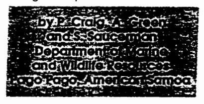
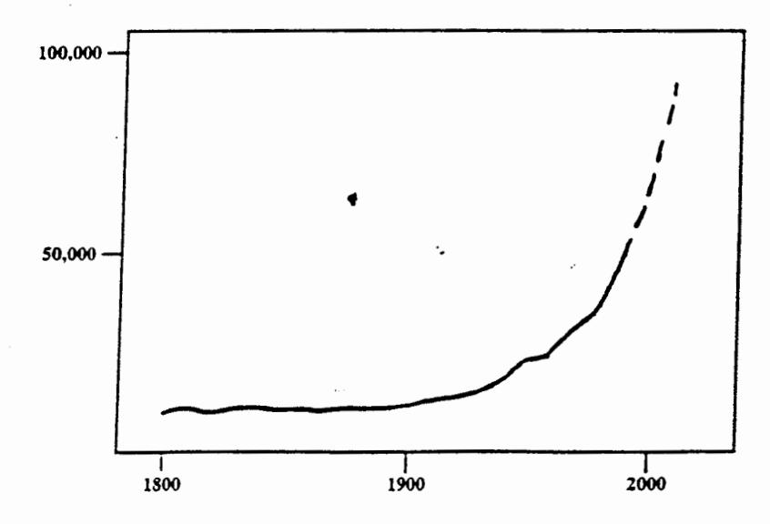
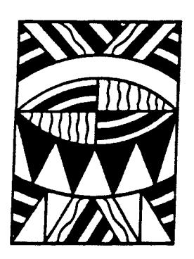
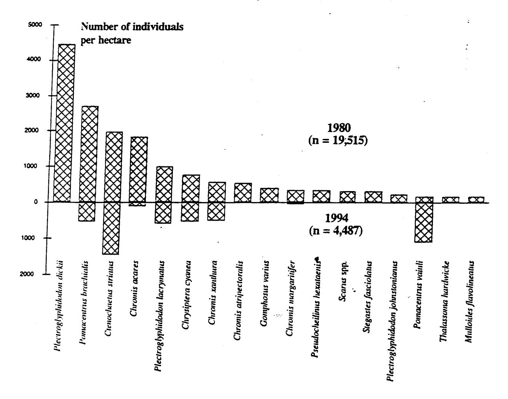

# CORAL REEF TROUBLES IN AMERICAN SAMOA

DMWR biological report series no. 66

Like other South Pacific Islands, American Samoa finds itself caught in the whirl of rapid environmental change. Its human population growth is skyrocketing (see Figure 1), while its natural resources are declining.

Coral reefs in American Samoa were severely damaged in recent years by natural disasters and pollution. The reefs were hit by a major infestation of the corallivorous starfish Acanthaster planci in the later 1970s, and by devastating hurricanes in 1990 and 1991. More recently, the reefs experienced a major coral bleaching episode in 1994, which affected up to 80 per cent of the coral at some locations. As a result, live coral coverage around Tutuila Island has dropped from about 60 per cent to 10 per cent within the past two decades.

Coupled with this are major changes in the species composition and abundance of reef fishes. In the past 14 years, the species composition of the 20 most abundant species has changed dramatically and fish numbers have dropped 75 per cent (see Figure 2 on page 34). The 1994 subsistence catches of reef fish were the lowest on record.

A slow recovery is underway, however. Biologists note that many coral recruits are present on the reefs. What concerns us now is the interference with the natural recovery process by human disturbances.

#### Sedimentation

After every heavy rainfall, chocolate-coloured plumes of sediment are flushed out of the streams and onto the coral reefs. Poor urban and agricultural land-use practices are presumably the sources of this sediment. There is ample evidence in the literature to indicate that such high levels of sedimentation adversely impact coral growth, survival and recruitment.

## Eutrophication

Only about 20 per cent of homes in American Samoa are hooked to a sewer line. An abundance of filamentous algae in nearshore waters indicates that nutrient enrichment may be another problem for the coral to contend with.

### Pollution

Recent surveys discovered that local nearshore fish in some areas are contaminated with toxic substances, particularly heavy metals. The most serious problem occurs in Pago Pago Harbor, where a health advisory notice was issued warning the public not to eat any fish caught there. Studies to locate the sources of this contamination continue.

## Overfishing

Some highly prized resources such as giant clams (*Tridacna* spp.) have been overharvested. One species is locally extinct and the other two are scarce.

Several of American Samoa's government agencies have developed regulations, guidelines and educational activities aimed at reducing these impacts. De-

Figure 1. Human population in American Samoa

Peter Craig, Alison Green and Suesan Saucerman can be contacted at: Department of Marine and Wildlife Resources, P.O. Box 3730, Pago Pago, American Samoa. Tel: 684 6334456, Fax: 684 6335944.

spite the best efforts of these agencies, the reefs continue to decline.

It is apparent that there is no shortage of issues to address. But American Samoa, like most other small Pacific islands, has limited resources. Thus any approach must be realistic in

terms of what can and cannot be accomplished. Some data requirements can be met by local efforts, but other projects are beyond the capabilities of small island governments. Interagency meetings produced the following list of needs for American Samoa:

- A planning workshop with scientific experts to formulate realistic management strategies, suitable for small island staff, to monitor and protect reef health;
- Quantitative assessments of reef health;
- Determination of causes of reef fishery declines;

- Reduction of non-point sources of sedimentation and eutrophication;
- Increase in public awareness of reef value and vulnerability;
- Better enforcement of existing regulations.

Red warning flags of environmental stress are flying high in American Samoa, but the situation is not hopeless. The reefs will regenerate, if they are given a chance to do so.

Figure 2. Relative abundance of the 17 most abundant reef fish species on the reef slope (10 m) on the north shore of Tutuila Island, American Samoa in 1980 and 1994