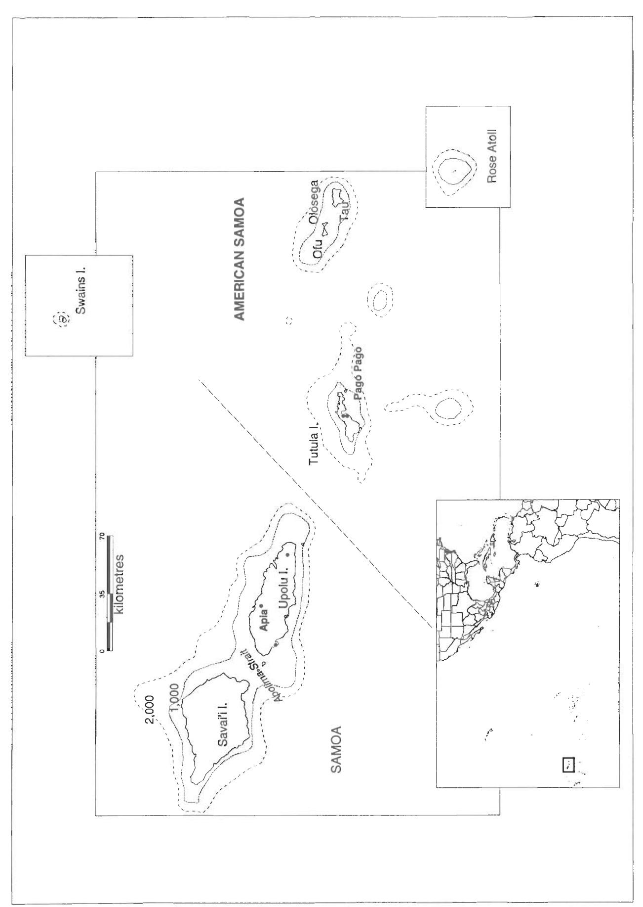
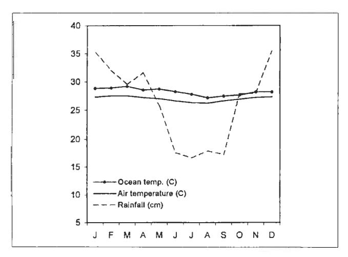
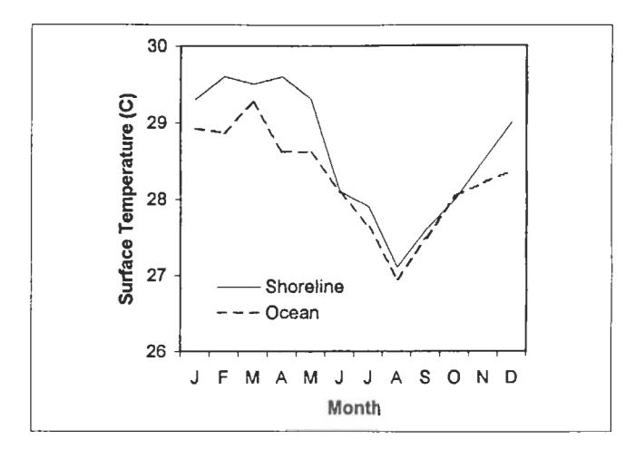
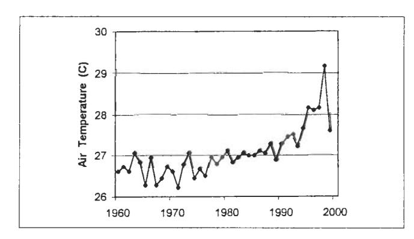
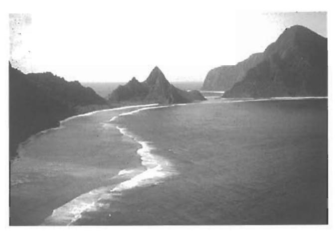
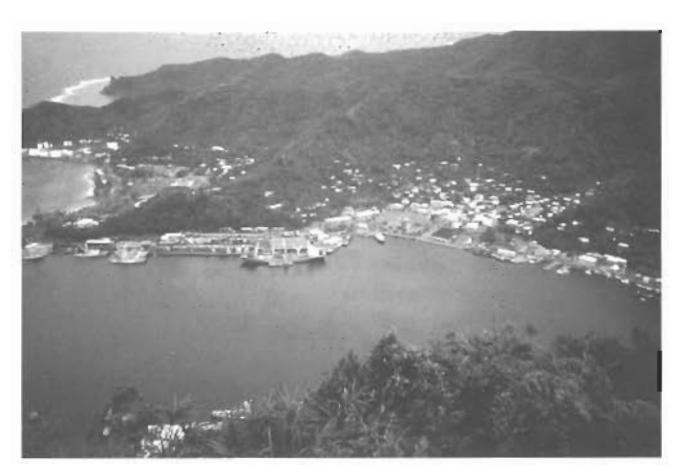
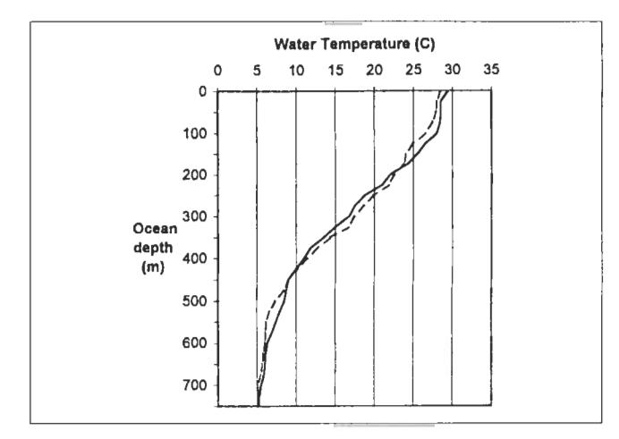
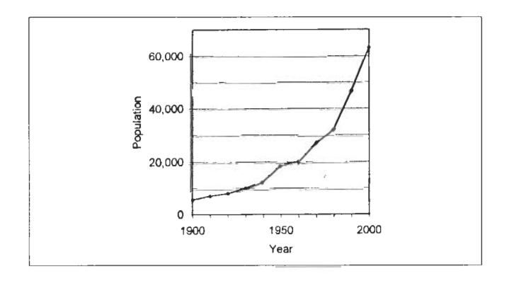

## SEAS AT THE MILLENNIUM: AN ENVIRONMENTAL EVALUATION

Edited by

Charles R.C. Sheppard
Department of Biological Sciences,
University of Warwick,
Coventry, U.K.

Volume II
Regional Chapters:
The Indian Ocean to The Pacific

2000 PERGAMON An imprint of Elsevier Science

### Chapter 103

# THE CENTRAL SOUTH PACIFIC OCEAN (AMERICAN SAMOA)

Peter Craig, Suesan Saucerman and Sheila Wiegman

This chapter describes several environmental issues in a small portion of Oceania, the vast expanse of open ocean and small tropical islands that are scattered across the South Pacific Ocean. American Samoa consists of seven islands, ranging from a small uninhabited atoll to the densely populated high island of Tutuila (145 km²). Mean air and sea surface temperatures (27.0 and 28.3°C, respectively) vary little year-round, although average air temperatures have risen sharply (2°C) in the 1990s. The main islands are volcanic mountains that descend rapidly to depths of 1000 m within 1-3 km from shore. Offshore ocean waters are 4000-6000 m deep and stratified, with cold water of 5-6°C below 600 m. The fringing coral reefs around the islands support over 200 coral and 890 fish species. The corals are recovering from a series of natural disturbances over the past two decades, but at least some reef resources are overfished for local consumption. The most serious environmental problem facing American Samoa is its uncontrolled population growth rate (2.5%). The current population of 63,000 in 2000 is already straining the environment, with extensive harbour pollution, loss of coastal habitats by urban expansion, and coastal sedimentation from poor upland management practices. Enforcement of environmental regulations is not widespread, and environmental educational programs have difficulty keeping pace with population growth. Several marine protected areas have been established, but illegal fishing is a general problem.

Fig. 1. Regional location of American Samoa in the South Pacific Ocean. The Samoan archipelago is comprised of the independent country of (Western) Samoa and the United States Territory of American Samoa.

### THE REGION

The South Pacific Ocean spans 15,000 km (9000 miles) between Australia and South America, and contains some 10,000 islands in its central and western portions which have collectively been called Oceania. It is difficult to subdivide Oceania into ecosystem units based on distinctive physical or biotic characteristics, but one designation of convenience is the group of isolated oceanic islands in the central South Pacific Ocean. This chapter focuses on one group of islands in that region: American Samoa (Fig. 1).

American Samoa consists of seven islands in the eastern portion of the Samoan Archipelago (14°S, 168–173°W): Tutuila, Aunu'u, Ofu, Olosega, Ta'u, Swains and Rose (Fig. 1). The islands are small, ranging in size from the populated high island of Tutuila (145 km²) to the remote and uninhabited Rose Atoll (4 km²). In that the seven islands include examples of high/low islands and densely populated/uninhabited islands, many of the environmental issues occurring in the study area are shared by other island nations in the central South Pacific region.

### THE ENVIRONMENT

American Samoa lies in the broad, westward-flowing South Equatorial Current. It has a maritime climate of year-round tropical heat and rain, with ocean surface temperatures generally higher than air temperatures (Fig. 2). Tutuila Island receives 300–500 cm of rain annually. There is a wet season (October–May) and a slightly drier and cooler season (June–September) which is characterised by 2°C cooler air temperatures and increased easterly trade winds.

Despite American Samoa's open ocean location near the equator, there are seasonal signals in the marine environment. Sea surface temperatures, both nearshore and offshore, drop 2–2.5°C during the cooler season (Fig. 3). Day length varies 1 hour through the year. The tidal range is 1 m.

Fig. 2. Monthly rainfall and air temperature (1965–1997), and offshore ocean surface temperature (1943–1990) in American Samoa. Source: National Oceanic and Atmospheric Administration (1997) and NOAA ship data.

Fig. 3. Monthly sea surface temperatures of nearshore and offshore waters in American Samoa. Nearshore temperature data were made near the reef crest at Afao Village, 1990–1995 (n=295 daily measurements, Craig 1998). Offshore SST data were collected at deep ocean locations (>2000 m), 1985–1991 (n=102 measurements in the region of 14–16°S and 169–172°W, NOAA ship data).

Fig. 4. Annual air temperature in American Samoa (NOAA, 1999).

Severe storms occur almost annually and hurricanes hit periodically, the last four occurring in 1966, 1986, 1990, and 1991. A sharp rise in air temperature over the past decade (Fig. 4) suggests future climatic uncertainty and a probable increase in the frequency of hurricanes in the region. The record high temperature in 1998 was due in part to El Niño which also caused drought conditions on land and unusually low tides that caused mortalities among exposed corals.

The islands have Iatent volcanic activity. Secondary volcanism occurred as recently as 90 and 120 years ago in the archipelago, presumably in association with the subduction of a portion of the Pacific Plate (which Samoa rests upon) down into the nearby Tongan Trench.

### COASTAL HABITATS

### Coral Reefs

Due to the steepness of the main islands and their relative geological youth, shallow water habitats around the islands are limited in size and consist primarily of fringing coral reefs (Fig. 5). The reefs have narrow reef flats (50–500 m) that drop to a depth of 3–6 m and descend gradually thereafter to 40 m. Depths of 1000 m are reached within 1–3 km from shore. As might be expected with this limited shallow area, nearshore water temperatures measured at the edge of the reef flat are nearly the same as offshore sea surface temperatures (Fig. 3).

Over 200 coral species occur in American Samoa, representing over half of all coral species found throughout the Indo-Pacific region (Hunter et al., 1993; Maragos et al., 1994; Veron, 1995; Mundy, 1996). Dominant genera at the 30-m depth are *Montipora* and *Porites*, followed by *Pavona*, *Pocillopora*, *Psammocora* and *Acropora* (Mundy, 1996).

The reefs are currently recovering from a series of natural disturbances over the past two decades: a crown-of-thorns invasion (1978), three hurricanes (1986, 1990, 1991), and mass coral bleaching (1994), as well as chronic human-induced impacts in areas like Pago Pago Harbour (described later) (Fig. 6). By 1995, the reefs were beginning to recover, as evidenced by an abundance of young corals (Mundy, 1996; Birkeland et al., 1997), and the recovery has continued through 1999.

The reefs support a diverse assemblage of 890 fish species (Wass, 1984), which is about twice the number of fishes occurring in Hawaii but half the number in the Indo-Australia region. Dominant families are damselfish (Pomacentridae), surgeonfish (Acanthuridae), wrasse (Labridae) and parrotfish (Scaridae) (Green, 1996a,b; Green and Hunter, 1998). Spawning for some, and perhaps most species occurs year-round, although peak spawning may be seasonal (Craig et al., 1997; Craig, 1998).

Coral reef fishes and invertebrates are harvested in subsistence and small-scale artisanal fisheries where catches are sold locally. In 1994, the only year when both components of this fishery were measured, catches were 86 and 76 mt, respectively, and consisted primarily of surgeonfish, parrotfish, groupers, octopus and sea urchins (Saucerman, 1996; Craig et al., 1997). A decreasing trend in catches was apparent in the early 1990s (Ponwith, 1992a; Saucerman, 1995, 1996), and a number of management reports indicate that overfishing is a continuing problem (ASCRTF, 1999).

### Other Coastal Environments on the Main Islands

The occurrence of other types of coastal habitats is limited in the territory. Although numerous steep, short creeks (0.5–3 km) drain the landscape on Tutuila Island, many are intermittent due to porous volcanic substrates. Streams are virtually absent on the other six islands in the territory. Freshwater fishes and macro-invertebrates inhabiting local streams are generally species that are widely distributed throughout the South Pacific (ACOE, 1981; Cook, 1999).

Mangroves and other coastal wetlands were not historically abundant in these oceanic islands, and the few present are steadily being encroached upon by urbanization. Whistler (1976) estimated that there were 51 ha (127 acres)

Fig. 5. Volcanic mountains and fringing reefs on Ofu and Olosega Islands, American Samoa. Population levels here are low (25 people/km2) and declining slightly as people move to the main island (Tutuila) for jobs or schooling.

Fig. 6. Urban and industrial expansion around Pago Pago Harbour on the main island of Tutuila, where 96% of the territory's population dwells, mostly along the shoreline of this steeply sloped island.

of mangroves in the territory, found only on two of the seven islands (Tutuila, Aunu'u). The largest remaining mangrove area is at Nu'uuli Pala Lagoon (34 ha, 85 acres) on Tutuila Island. This lagoon supports a variety of lagoon-resident fishes and visitors of species more commonly found on the nearby coral reefs, but catch rates in the lagoon were generally low (Iose and McConnaughy, 1993), and subsistence catches there were an order of magnitude lower than that on the nearby coral reef flats (Ponwith, 1992b). Kluge (1992) sampled for larval fish in the lagoon over a one-year period and concluded that the Pala Lagoon was not a nursery area for the non-resident coral reef fish that swim into the lagoon to feed.

Given the limited occurrence of mangrove habitat in American Samoa, it is not surprising that coastal reef fishes and invertebrates here have developed little direct dependence on using mangroves as nursery areas, as occurs elsewhere in the world. Similarly, there are virtually no seagrass beds in the territory, thus further limiting the diversity of coastal environments among these islands.

### Atolls

Two of the islands in the archipelago are remote atolls: Swains and Rose atolls. They differ from the islands described above in that they are geologically much older, and all that remains of these sunken mountains are small atolls. Rose is a coralline algae-dominated atoll that has received intermittent scientific attention over the past 60 years (Rodgers et al., 1993), particularly since a vessel ran aground there in 1994 causing some damage to the atoll (Green et al., 1998). Rose Atoll is important for several reasons—it is a seabird nesting area (USFWS, unpub. data), the site of a successful rat eradication program (Morrell et al., 1991), a refuge for giant clams (Tridacna maxima) that have been heavily exploited elsewhere in the archipelago (Green and Craig, 1999), and the principal nesting site for the few green sea turtles remaining in the territory (Tuato'o-Bartley et al., 1993). Tagging data show that most turtles nesting at Rose migrate 1500 km to Fiji to feed (Balazs et al., 1994).

### OFFSHORE SYSTEMS

The central South Pacific region consists of blue ocean waters 4000–6000 m deep, punctuated by occasional volcanic eruptions that emerge from the seafloor as seamounts or small islands. Ocean surface waters are warm yearround (27–30°C) but vary 2°C seasonally (Fig. 3). The water column is stratified, with cold water of 5–6°C below 600 m (Fig. 7).

Pelagic fishes (primarily tuna, marlin, mahimahi) migrate through these waters, but not in significant commercial quantities. Local fishermen, using small 10-m boats, caught 400 mt in 1997 (WPRFMC, 1998a). The large volumes of commercially caught tuna that are delivered to the two canneries in American Samoa (about 160,000 mt annually) are caught elsewhere in the South Pacific region (Craig et al., 1993; WPRFMC, 1998a). A much smaller fishery occurs for bottomfish (primarily emperors, snappers) around the islands and seamounts—the artisanal catch in 1997 was 12 mt (WPRFMC, 1998b).

A few humpback whales from Antarctica are regular visitors to local waters where they calve and mate, mostly during September–October. Little is known about the number of whales present, their specific migration routes, or their residency time in local waters.

### POPULATIONS AFFECTING THE AREA

Perhaps the most serious environmental and social problem facing American Samoa is its uncontrolled population growth (Fig. 8) (Craig, 1995; Craig et al., 2000). The

Fig. 7. Ocean temperature profiles at two locations north of Tutuila Island, Nov. 16, 1993: 2 km offshore (dashed line) and 80 km offshore (solid line). Source: NOAA ship data.

Fig. 8. Population growth in American Samoa (Craig et al., 2000).

population estimate of 63,000 in 2000 is increasing at a rate of approximately 2.5%, which equates to a doubling time of 28 years. This is the third highest growth rate in the South Pacific region (SPC, 1995). A continued increase is expected given the high birth rate (4.5 children per female) and high proportion of pre-reproductives in the population (nearly 50% of the population is younger than age 20).

The population is unevenly distributed, with 96% living on Tutuila Island (ASG, 1996). Even there, however, most of the island landscape is uninhabited due to its steepness, except for the populated band of relatively flat land along the southern coast. Population densities there will jump from about 620 people/km² (1600/sq mile) in 1990 to 980/km² (2,570/sq mile) at the millennium.

The population has increased far beyond what the local environment can currently support. In 1996, American Samoa imported \$200 million of food, fuel, oil, textiles, clothing, machinery, and miscellaneous goods (ASG, 1996). The economy is based primarily on federal grants and exports of canned tuna (a product that is not caught within the EEZ of American Samoa but at distant South Pacific locations). Most of the workforce of 14,000 is employed by the local government (31%) and canneries (33%). Over half of these workers (62%) were not born in American Samoa.

#### RURAL FACTORS

Land use practices on Tutuila Island are determined in large part by the steep topography of the island. With 50% of the land area having a slope of greater than 70%, there is relatively little level land to use. However, as the human population expands, hillsides are being developed, particularly for agriculture and housing.

Samoans have traditionally farmed and fished for subsistence, although a cash-based economy is now firmly in place. Presently, 16% (3160 ha) of the total land area is in agriculture, but farming has declined with 5% less land and 41% fewer farmers since 1970 (ASG, 1996). As some of this agriculture occurs on mountain slopes, impacts to water quality from soil erosion are a major concern. Additionally, many families raise pigs and the waste washes directly into streams, contributing directly to eutrophication and other water quality impacts (ASEPA and ASCMP, 1995). Feral pigs that root-up vegetation also contribute to hillside erosion.

Local fishing patterns are changing as well. There is less reliance on subsistence fishing as many Samoans obtain full-time employment. At present, there are inter-related nearshore fisheries for subsistence, recreation and artisanal purposes where the catch is sold locally. There is evidence that marine fish and invertebrate populations have diminished due to fishing pressure (ASCRTF, 1999), and at least one favoured invertebrate (giant clams) has been over-fished (Green and Craig, 1999).

Mariculture, as currently practised, consists of giant clam grow-out 'farms' on reef flats that probably have little impact on coastal waters because there are few of them. They are generally situated in shallow sandy areas unsuitable for coral growth, and there is no contamination by excess food, because the clams do not have to be fed. A number of alien fish and aquatic invertebrate species have been introduced to local waters (Eldredge, 1994), but they do not seem to have fared well in the wild.

### EFFECTS FROM URBAN AND INDUSTRIAL ACTIVITIES

### **Habitat Loss**

Over the years, there have been extensive alterations of coastal habitats (sandy beaches, wetlands, coral reefs) due to highway construction and urban expansion, particularly along the south shore of Tutuila Island where the majority of the territory's population is concentrated. Much of the coastal highway, built across beaches and landfills, requires shoreline protection with concrete revetments and boulders (SEI & BCH, 1994). Coastal erosion is amplified by the removal of large quantities of beach sand and coral rubble from the shoreline by villagers for use around their homes (Volk et al., 1992). Together, these shoreline alterations have largely eliminated the use of the south coast by nesting sea turtles.

Cumulative wetland losses over the last 30 years have been substantial (28%), due mainly to urban expansion. The largest mangrove areas on the island were either reclaimed (inner Pago Pago Harbour) or significantly reduced by urban development (Nu'uuli Pala Lagoon).

For coral reef habitats, direct losses occurred where harbours have been built in Pago Pago and Faleasao (Ta'u Island), and where the reefs were dredged to construct the airport runway. Other unquantified losses have occurred due to chronic pollution and natural damages (e.g., hurricanes).

### Other Urban Activities and Impacts

In addition to agricultural erosion, soil runoff originates from many sources, including quarries, road projects and other ground-disturbing activities. Because of the island's steep terrain and high rainfall, storm events easily wash loose soil into streams and coastal waters, but the impacts of sedimentation to adjacent reefs have not been quantified. Coastal waters outside Pago Pago Harbour generally meet local water quality standards, although the effects of nonpoint source pollution are found in all areas occupied by humans (ASEPA and ASCMP, 1995).

Sewage treatment is provided only in the densely populated areas of Pago Pago and Tafuna near the airport. Three million gallons of primary treated sewage per day are pumped into the ocean in outer Pago Pago Harbour and two million gallons into Vai Cove, adjacent to the airport. For the remainder of the territory, septic tanks and illegal cesspools are used for sewage disposal.

Other urban activities that impact the coastal environment are landfills and small business activities. Although landfills adjacent to the shoreline are illegal, that regulation is not well known or enforced, and families often fill areas adjacent to their property to reclaim the land. Small businesses situated near the shoreline may have a considerable environmental impact by releasing contaminated runoff and/or dumping solid waste directly into streams and coastal waters.

Westernization and an increased consumption of imported material goods has also increased the amount of solid waste generated, with the associated problems of increased litter and indiscriminate waste disposal. Recent improvements in the solid waste disposal and collection system will assist with this problem, but the volume of waste that has accumulated over the years presents a formidable problem.

### **Industrial Activities and Impacts**

Several industrial activities, all located within Pago Pago Harbour, have had a major impact on water quality in the harbour. There are two tuna canneries, a sewage treatment plant, ship repair yard, fuel tank farm and power plant whose collective discharge and runoff have caused several kinds of pollution.

Heavy metal contamination of fish and substrates in the inner harbour caused the government to issue a health advisory warning in 1991 for people not to eat harbour fish (AECOS, 1991). Fortunately, a similar level of contamination was not found in residents living in the vicinity, presumably because most did not eat fish from the harbour (ATSDR, 1993). Sources of this contamination are unknown, though they may be related to historical operations and poor environmental practices. Heavy metal contamination in fish and shellfish was also found at several other locations around Tutuila Island (ESI, 1994), but again, the source is not known.

Stormwater runoff from the industries located around the harbour are potentially contaminated with petroleum products, paint chips and other toxic materials. There are also frequent diesel and bilge spills in port, most of which occur during hours when surveillance is decreased. Additionally, nine derelict fishing vessels that remained beached on harbour reefs for nine years after being grounded there during a hurricane in 1991 were finally removed in 2000.

Nutrient loading from cannery and sewage disposals has also been an important environmental issue. For the past 45 years, cannery discharges of fish wastes into the inner harbour have caused extensive eutrophication, resulting in perpetual algal blooms and occasional fish kills due to oxygen depletion. However, in the early 1990s the canneries were required to construct a pipe to dispose of their treated cleaning waste at a 47-m depth in the outer harbour where there is better water circulation, and to haul high strength fish waste 8 km offshore. These actions significantly decreased the nutrient levels in the inner harbour, from 0.63 mg/l to 0.04 mg/l total nitrogen, and from 0.07 mg/l to 0.04 mg/l total phosphorous (ASEPA, 1998).

### PROTECTIVE MEASURES

On-island expertise in the fields of environmental and habitat protection has increased in recent years, and legislation is in place for water quality standards, land use regulations, waste disposal, fishery management, habitat protection, endangered species, protected areas, ship pollution and other environmental issues. Environmental violations are more frequently detected and prosecuted, but enforcement of these regulations is not widespread and many problems persist. Local environmental agencies have also undertaken aggressive education programs to increase community understanding of environmental issues. This effort is commendable, but it is difficult to keep pace with the territory's rapidly growing population and concurrent development pressures.

Several examples of Indo-Pacific coral reefs have been designated marine protected areas in the territory (Table 1). The National Park of American Samoa, located on three islands (Tutuila, Ofu, Ta'u), and Fagatele Bay National Marine Sanctuary (Tutuila) allow subsistence fishing by

Table 1

Marine protected areas in American Samoa. Fishing is prohibited at Rose Atoll; subsistence fishing by villagers is permitted at the other locations.

| Protected area                            | Year established | Island                | km 2 | Acres   |
|-------------------------------------------|---------------------|-----------------------|-----------------|---------|
| Rose Atoll National Wildlife Sanctuary | 1973                | Rose Atoll            | 158.8           | 39,251  |
| Fagatele Bay National Marine Sanctuary | 1986                | Tutuila               | 0.7             | 161     |
| National Park of American Samoa        | 1993                | Tutuila, Ofu, Ta'u | 42.6*           | 10,520* |
| Vaoto Territorial Marine Park          | 1994                | Ofu                   | 0.5             | 120     |

\*79% of this amount consists of terrestrial land adjacent to coral reefs

villagers but not commercial fishing. Fishing is prohibited altogether at Rose Atoll National Wildlife Sanctuary. However, poaching is a general problem and there is little enforcement capability at present.

### **ACKNOWLEDGEMENTS**

We thank Pat Caldwell (NOAA/National Ocean Data Center/ Pacific Liaison, Honolulu) for his assistance with oceanic data.

### REFERENCES

ACOE (Army Corps of Engineers) (1981) American Samoa stream inventory, Island of Tutuila, American Samoa Water Resources Study. US Army Corps of Engineers (Hawaii). 122 pp.

AECOS (1991) A preliminary toxic scan of water, sediment and fish tissues from inner Pago Pago Harbour in American Samoa. Prepared for American Samoa Government. 75 pp.

ASCRTF (American Samoa Coral Reef Task Force) (1999) A 5-year plan for management of coral reefs in American Samoa (FY00-FY04). Prepared for American Samoa Government. 20 pp.

ASEPA (American Samoa Environmental Protection Agency) (1998) Territory of American Samoa water quality assessment and planning report. American Samoa Government. 23 pp.

ASEPA & ASCMP (American Samoa Environmental Protection Agency & American Samoa Coastal Management Program) (1995) American Samoa coastal nonpoint pollution control program. American Samoa Government. 141 pp.

ASG (American Samoa Government) (1996) Statistical Yearbook, 1996. Prepared by Dept. Commerce, Statistical Division, American Samoa. 185 pp.

ATSDR (Agency for Toxic Substances Disease Registry). 1993. Biological indicators of exposure to heavy metals in fish consumers in American Samoa, June 1993. Prepared by US Dept. of Health and Human Services for American Samoa Government. 11 pp.

Balazs, G., Craig, P., Winton, B. and Miya, R. (1994) Satellite telemetry of green turtles nesting at French Frigate Shoals, Hawaii, and Rose Atoll, American Samoa. Proceedings of 14th annual symposium on sea turtle biology and conservation (Georgia). 4 pp.

Birkeland, C., Randall, R., Green, A., Smith, B. and Wilkins, S. (1997) Changes in the coral reef communities of Fagatele Bay National Marine Sanctuary and Tutuila Island (American Samoa) over the last two decades. Rept. to National Oceanic and Atmospheric Admin. 225 pp.

- Cook, R. (1999) Survey of Laufuti Stream, Ta'u Unit, National Park of American Samoa. Rept. by National Park of American Samoa. 30 pp.
- Craig, P. (1998) Temporal spawning patterns of several surgeonfishes and wrasses in American Samoa. *Pacific Science* **52**, 35–39.
- Craig, P. (1995) Are tropical nearshore fisheries manageable in view of projected population increases? Workshop on Management of South Pacific Inshore Fisheries, New Caledonia, 26 June–July 7, 1995. Joint Forum Fisheries Agency–South Pacific Comm. Biol. Paper 1. 6 pp.
- Craig, P. and 11 others (2000) Impacts of rapid population growth in American Samoa. Report by Advisory Group to Governor's Task Force on Population Growth. American Samoa Government. 28 pp.
- Craig, P., Choat, J., Axe, L. and Saucerman, S. (1997) Population biology and harvest of the coral reef surgeonfish Acanthurus lineatus in American Samoa. Fisheries Bulletin 95, 680–693.
- Craig, P., Ponwith, B., Aitaoto, F. and Hamm, D. (1993) The commercial, subsistence and recreational fisheries of American Samoa. *Marine Fisheries Review* 55, 109–116.
- Eldredge, L. (1994) Introduction of commercially significant aquatic organisms to the Pacific Islands. Vol. 1, Perspectives in aquatic exotic species management in the Pacific islands. South Pacific Commission, New Caledonia. 127 pp.
- ESI (EnviroSearch International) (1994) Human health risk assessment for the consumption of fish and shellfish contaminated with heavy metals and organochlorine compounds in American Samoa. Prepared for American Samoa Government. 104 pp.
- Green, A. (1996a) Status of the coral reefs of the Samoan Archipelago. Dept. Marine & Wildlife Resources (American Samoa). Biological Report Series. 125 pp.
- Green, A. (1996b) Fish communities. 66 p. In Birkeland (ed.). Changes in the coral reef communities of Fagatele Bay National Marine Sanctuary and Tutuila Island (American Samoa) over the last two decades. Report to National Oceanic and Atmospheric Admin. 225 pp.
- Green, A., Burgett, J., Molina, M. and Palawski, D. (1998) The impact of a ship grounding and associated fuel spill on Rose Atoll National Wildlife Refuge, American Samoa. US Fish & Wildlife Service (Honolulu). 64 p.
- Green, A. and Craig, P. (1999) Population size and structure of giant clams at Rose Atoll, an important refuge in the Samoan Archipelago. *Coral Reefs* **18**, 205–211.
- Green, A. and Hunter, C. (1998) A preliminary survey of the coral reef resources in the Tutuila Unit of the National Park of American Samoa. Rept. for National Park of American Samoa, Pago Pago, American Samoa. 42 pp.
- Hunter, C., Friedlander, A., Magruder, W. and Meier, K. (1993) Ofu reef survey: baseline assessment and recommendations for long-term monitoring of the proposed National Park, Ofu, American Samoa. Rept. for National Park of American Samoa, Pago Pago, American Samoa. 90 pp.
- Iose, P. and McConnaughy, J. (1993) Fish resources in Pala Lagoon. Dept. Marine & Wildlife Resources (American Samoa). Biological Report Series 37. 42 pp.
- Kluge, K. (1992) Seasonal abundance of zooplankton in Pala Lagoon. Dept. Marine & Wildlife Resources (American Samoa). Biological Report Series 36. 33 pp.
- Maragos, J., Hunter, C. and Meier, K. (1994) Reefs and corals observed during the 1991-92 American Samoa Coastal Resources Inventory. Rept. for Dept. Marine & Wildlife Resources (American Samoa). 50 pp.
- Morrell, T., Ponwith, B., Craig, P., Ohasi, T., Murphy, J. and Flint, E. (1991) Eradication of Polynesian rats (*Rattus exulans*) from Rose Atoll National Wildlife Refuge, American Samoa. Dept. Marine & Wildlife Resources (American Samoa). Biological Report Series 20. 10 pp.

- Mundy, C. (1996) A quantitative survey of the corals of American Samoa. Dept. Marine & Wildlife Resources (American Samoa). Biological Report Series. 75 pp.
- NOAA (National Oceanic and Atmospheric Administration) (1999) Local climatological data, annual summary with comparative data, Pago Pago, American Samoa. National Climatic Data Center, Asheville, North Carolina. 8 pp.
- Ponwith, B. (1992a) The shoreline fishery of American Samoa: a 12-year comparison. Dept. Marine and Wildlife Resources (American Samoa). Biol. Rept. Series 22. 51 pp.
- Ponwith, B. (1992b) The Pala Lagoon subsistence fishery. Dept. Marine and Wildlife Resources (American Samoa). Biol. Rept. Series 22. 28 pp.
- Rodgers, K., McAllan, I., Cantrell, C. and Ponwith, B. (1993) Rose Atoll: an annotated bibliography. Tech. Rept. Australian Museum. ISSN 1031-8062. 37 pp.
- Saucerman, S. (1996) Inshore fishery documentation. Annual Rept. by Dept. Marine & Wildlife Resources (American Samoa). Biol. Rept. Series. 29 pp.
- Saucerman, S. (1995) Assessing the needs of a fishery in decline. Workshop on Management of South Pacific Inshore Fisheries, New Caledonia, 26 June–July 7, 1995. Joint Forum Fisheries Agency -South Pacific Comm. Biol. Paper 18. 26 pp.
- SEI & BCH (Sea Engineering Inc. & Belt Collins Hawaii) (1994) American Samoa shoreline inventory update II. Prepared by US Army Corps of Engineers for American Samoa Government.
- SPC (South Pacific Commission) (1995) South Pacific economies, pocket statistical summary. SPC, Noumea, New Caledonia.
- Tuato'o-Bartley, N., Morrell, T. and Craig, P. (1993) Status of sea turtles in American Samoa in 1991. Pacific Science 47, 215–221.
- Veron, J. (1995) Corals in Space and Time: The Biogeography and Evolution of the Scleractinia. Cornell Univ. Press, Ithaca, NY. 321 pp.
- Volk, R., Knudsen, P., Kluge, K. and Herdrich, D. (1992) Towards a territorial conservation strategy and establishment of a conservation areas system for American Samoa. Rept. prepared by Le Vaomatua, Inc. for American Samoa Natural Resources Comm. 114 pp.
- Wass, R. (1984) An annotated checklist of the fishes of Samoa. National Oceanic and Atmospheric Administration, Tech. Rept. SSRF-781. 43 pp.
- Whistler, A. (1976) Inventory and mapping of wetland vegetation in the Territory of American Samoa. Rept. prepared for Army Corps of Engineers, Pacific Ocean Division, Fort Shafter, Hawaii. 94 pp.
- WPRFMC (Western Pacific Regional Fisheries Management Council) (1998a) Pelagic fisheries of the western Pacific region, 1997 annual report. WPRFMC (Hawaii). 243 pp.
- WPRFMC (Western Pacific Regional Fisheries Management Council) (1998b) Bottomfish fisheries of the western Pacific region, 1997 annual report. WPRFMC (Hawaii). 170 pp.

### THE AUTHORS

### **Peter Craig**

National Park of American Samoa, Pago Pago, American Samoa 96799, U.S.A.

### Suesan Saucerman

Environmental Protection Agency, EPA Region IX – WTR-5, 75 Hawthorne St., San Francisco, CA 94105-3901, U.S.A.

### Sheila Wiegman

American Samoa Environmental Protection Agency, Pago Pago, American Samoa 96799, U.S.A.