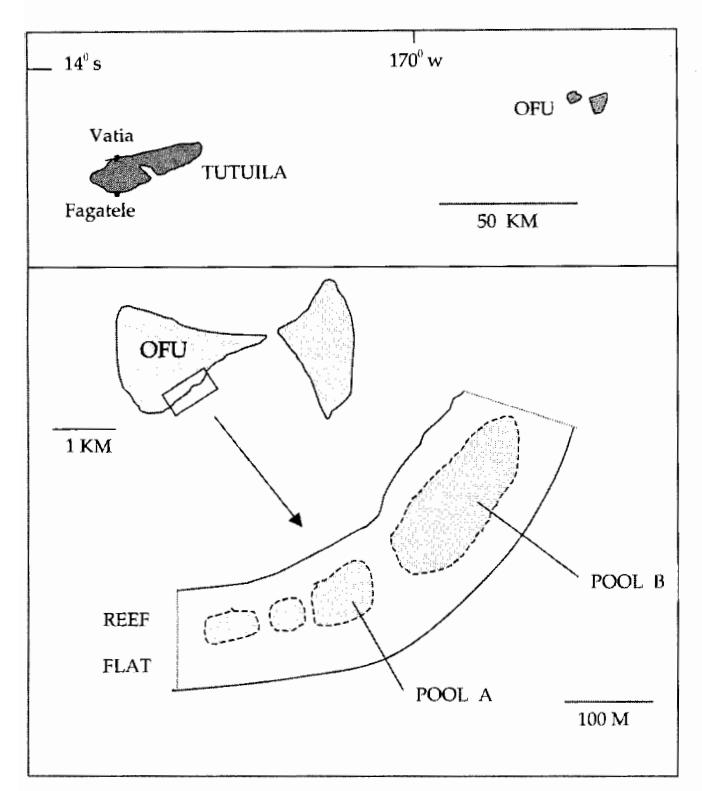
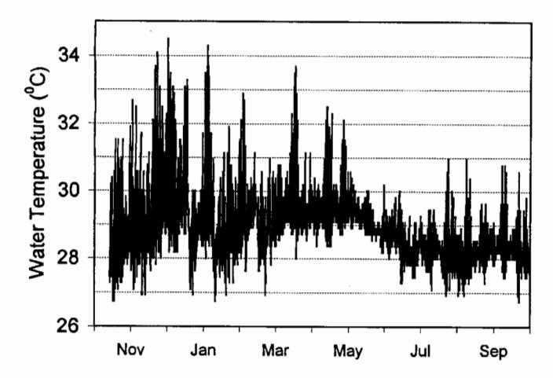
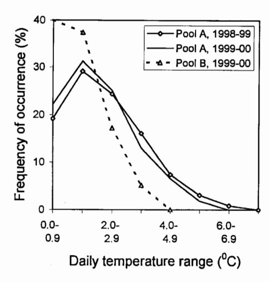
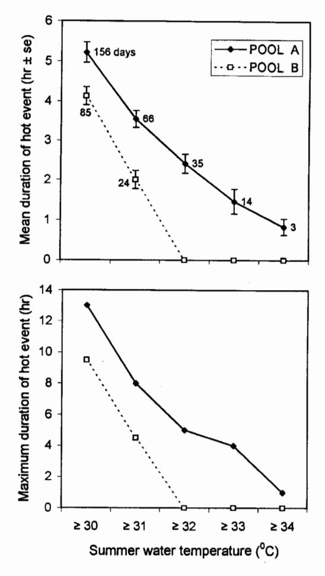
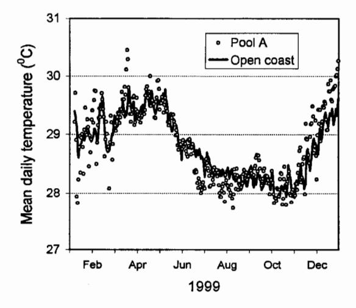

#### NOTE

P. Craig · C. Birkeland · S. Belliveau

## High temperatures tolerated by a diverse assemblage of shallow-water corals in American Samoa

Received: 13 October 2000 / Accepted: 1 May 2001 / Published online: 4 July 2001 © Springer-Verlag 2001

Abstract Corals in shallow waters are subjected to widely fluctuating temperatures on a daily basis. Using continuous temperature recordings, we examined the temperature regime in one such area, a backreef moat with low tide depths of 1-2 m on Ofu Island in American Samoa. The moat supports a high diversity of 85 coral species  $[H'_{(log2)} = 3.37]$  with 25-26% live coral coverage. In one section of the moat, a 4,000-m2 pool inhabited by 52 coral species, the mean summer temperature was 29.3 °C, but daily temperatures fluctuated up to 6.3 °C and briefly reached a peak of 34.5 °C. The duration of hot water events, e.g.,  $\geq$ 32 °C, averaged 2.4 h per event (maximum 5 h) and occurred on 35 summer days, although daily mean temperatures did not exceed 30.5 °C and were generally within 0.5 °C of that occurring outside the moat at an exposed coastal area. While there was a previous mortality of many acroporids during a long-term (several month) warming period in 1994, at least nine Acropora species and a diverse range of other taxa withstand the current temperature regime.

**Keywords** Coral · Bleaching · Temperature · South Pacific · American Samoa

P. Craig (⊠)
National Park of American Samoa,
Pago Pago, American Samoa 96799, USA
E-mail: peter craig@nps.gov

Tel.: +11-684-6337082 Fax: +11-684-6337085

C. Birkeland Hawaii Cooperative Fishery Research Unit, 2538 The Mall, University of Hawaii, Honolulu, Hawaii 96822, USA

S. Belliveau Marine Laboratory, University of Guam, Mangilao, Guam 96923, USA

## Introduction

Reef-building corals live in waters where temperatures are surprisingly close to the corals' upper tolerance limit (reviewed by Glynn 1993; Brown 1997; Hoegh-Guldberg 1999). An increase of only 1–2 °C above the mean temperature level can severely stress or kill the corals if conditions persist for several days or more (e.g., Berkelmans and Willis 1999). This has led to concern about whether corals will be able to acclimatize or adapt rapidly enough to projected increases in temperature due to global warming, or whether corals will experience worldwide mortalities in the next few decades (Hoegh-Guldberg 1999).

At the same time, it has been commonly observed that corals living in very shallow waters are often able to tolerate high water temperatures for short periods (e.g., Brown 1997). For example, in the Gulf of Oman (Indian Ocean), corals exist in waters that can fluctuate 19.6–33.0 °C annually and 8.2 °C daily (Coles 1997). Our paper expands upon these findings by providing detailed analyses of nearshore temperature fluctuations and the species of corals that tolerate them in a very different type of habitat, the fringing reef of a small oceanic island in American Samoa. Using continuous temperature recordings, we were able to examine the frequency and duration of hot water events tolerated by these corals.

#### Methods

Study area

Ofu Island, located in the Samoan Archipelago (14°S, 170°W), is a small volcanic island (7.5 km²) with a well-developed fringing reef that is 80–180 m wide (Fig. 1). The study area is a large backreef moat (40–90 m wide) that extends along most of the island's 1.5-km southeastern shoreline. The moat has water depths of 1–2 m at low tide when water circulation is minimal because there are no deep channel outlets, but the moat is thoroughly mixed during high tides (tidal range 1 m). No streams enter the area, but small amounts of freshwater percolate into the moat along the shoreline. The moat consists of an interconnected network of pools with ex-

Fig. 1 American Samoa, showing locations of Ofu Island and the study area, a backreef moat on the fringing reef that consists of a series of interconnected pools 1–2 m deep at low tide

tensive coral patches. Two pool areas were examined in this study: pool A is smaller and shallower (4,000 m2, 1.1 m deep at low tide) than pool B (27,000 m2, 1.9 m deep at low tide).

Water temperatures in the study area are typically highest during the 8-month summer season of October-May, which is characterized by 2 °C warmer air and water temperatures and more rain than during the June-September period (Craig et al. 2000).

#### Sampling

Water temperatures were measured with data loggers (Onset Computer Corp.) with an accuracy of 0.25 °C at 30 °C. Loggers were periodically immersed in ice water to ensure that their accuracy had not drifted from 0 °C, and new loggers were overlapped with existing loggers in order to compare temperatures that were within 0.3 °C of each other. Shaded temperatures were recorded at 0.5-h intervals at near-bottom depths of 1 m (pool A) and 1.5 m (pool B) at low tide. This slight difference in depths is not

problematic for two reasons: (1) temperature comparisons at two depths in pool A (1 and 0.35 m) revealed no temperature stratification over a 5-month period, and (2) the slightly deeper depth in pool B simply represents a habitat (less subject to the temperature fluctuations) that does not occur in pool A. Recordings began in October 1998 (pool A) and December 1999 (pool B). For comparative purposes, temperatures were also monitored along an exposed coastline location on the neighboring island of Tutuila. Temperatures there were recorded at 2-h intervals in outer Vatia Bay at a depth of 10 m, a depth selected because it is less influenced by surface temperature fluctuations. Although Tutuila and Ofu islands are 100 km apart, exposed nearshore habitats in this openocean region are generally well mixed; thus the water temperatures in exposed coastal areas on both small, steeply sloping islands are expected to be similar.

Coral species and percent cover were determined in May 2000

Coral species and percent cover were determined in May 2000 by visually estimating the spatial coverage of each species in 0.25-m² quadrats with  $10\times10$ -cm gridlines. For each haphazard toss of the quadrat, the percent coverage of a species in each of the 25 grid squares was summed (1 square = 4% of quadrat). The average percent cover for a species was the sum of all quadrat percentages for that species divided by the sample size (n=47 and 54 in pools A and B, respectively). A Shannon-Wiener species diversity index was calculated as:  $H'_{(log2)} = -\sum p_i log_2 p_i$ , where  $p_i$  is the proportion of corals in category i. Additional time was species nor found in quadrats in pools A and B in order to get a better estimate of the total number of species present.

#### Results

#### Temperature environment

Mean summer temperatures in Ofu's backreef pools were about 29 °C (Table 1), but temperatures fluctuated widely on a daily basis (Fig. 2). During daytime low tides, the pools would heat up until cooled by the returning high tide. Summer water temperatures fluctuated by up to 6.3 °C per day (Fig. 3), reaching a peak of 34.5 °C in pool A, the warmer of the two pools. The duration of hot water periods, e.g., ≥32 °C, in pool A averaged 2.4 h per event and occurred on 35 days during the summer of 1998–1999, with hotter events occurring less frequently (Fig. 4). Figure 4 also shows the maximum duration of hot events (e.g., 5 h at ≥32 °C) experienced by the corals described below.

Nonetheless, daily mean water temperatures did not exceed 30.5 °C at any time during this study and were generally within 0.5 °C of that occurring outside the moat at an exposed coastline in outer Vatia Bay

Table 1 Temperature summaries for backreef pools A and B during summer (Oct.—May) and annual periods. An opencoast site (Vatia at 10-m depth) is presented for comparison. Measurement intervals: 0.5 h (pools A and B), 2 h (opencoast)

| Site       | Season           | Water temperature (°C) |      |         |         |       |  |
|------------|------------------|------------------------|------|---------|---------|-------|--|
|            |                  | Mean                   | SD   | Maximum | Minimum | Range |  |
| Pool A     | Summer 1998/1999 | 29.3                   | 0.88 | 34.5    | 26.7    | 7.8   |  |
|            | Summer 1999/2000 | 29.1                   | 0.92 | 33.7    | 26.4    | 7.3   |  |
|            | Annual 1999      | 28.8                   | 0.86 | 34.3    | 26.4    | 7.9   |  |
|            | Annual 2000      | 28.6                   | 1.04 | 33.7    | 25.1    | 8.6   |  |
| Pool B     | Summer 1999/2000 | 29.3                   | 0.55 | 31.9    | 27.6    | 4.3   |  |
|            | Annual 2000      | 28.6                   | 0.79 | 31.9    | 26.2    | 5.6   |  |
| Open-coast | Summer 1999/2000 | 29.3                   | 0.32 | 29.9    | 28.3    | 1.7   |  |
|            | Annual 1999      | 28.8                   | 0.53 | 29.9    | 27.7    | 2.2   |  |
|            | Annual 2000      | 28.7                   | 0.73 | 30.1    | 26.9    | 3.3   |  |

Fig. 2 Water temperatures in pool A during 1998–1999

Fig. 3 Daily ranges of summer temperatures (Oct.–May) in pools A and B  $\,$ 

(Fig. 5). Water temperatures cooler than ambient ocean temperatures were presumably caused by heavy rainfall.

In the larger and deeper pool B, mean summer water temperatures were similar to those in pool A (Table 1), but temperatures did not fluctuate as widely (Fig. 3), the duration of hot water events was briefer (Fig. 4), and maximum temperatures were 1.8 °C lower during 1999–2000.

### Corals

A diverse assemblage of 85 coral species was present in combined quadrats and supplementary observations in pools A and B (Table 2). In the quantitative samples, the two pools were nearly identical in the number of species present (27–30), species diversity [H'(log2) = 3.374–3.375], and percent live coral coverage (25–26%). However, additional searching found more species in pool B (total

Fig. 4 Mean (above) and maximum (below) duration of summer hot water events in pools A (1998–1999) and B (1999–2000). Frequency of hot events (above) refers to number of days during which a brief period of hot water occurred

Fig. 5 Mean daily temperatures in pool A compared to open-coast water temperatures measured at Vatia at 10-m depth

of 79 species) than pool A (52 species). Most corals in pool A (88%) were also present in pool B, but only 58% of the corals in pool B were found in pool A.

**Table 2** Coral species in Ofu Island's backreef pools. *Numbers* indicate percentage of coral coverage in quadrats  $(0.25 \text{ m}^2)$ ; n=47 in pool A, n=54 in pool B. Additional corals observed in these pools are also indicated (p). Totals differ slightly due to rounding

| Coral species                              | Percent cov | er              |
|--------------------------------------------|-------------|-----------------|
|                                            | Pool A      | Pool B          |
| Acropora aculeus                           |             | p               |
| Acropora austera                           | p           | p               |
| Acropora carduus                           |             | p               |
| Acropora crateriformis                     | p           | n               |
| Acropora digitifera Acropora donei      |             | р 1.7        |
| Acropora elsevi                            |             | p               |
| Acropora muricata                          |             | 4.0             |
| Acropora gemmifera                         | p           | p               |
| Acropora grandis                           |             | 0.2             |
| Acropora horrida                           |             | 0.2             |
| Acropora humilis Acropora hyacinthus    | p p      | p               |
| Acropora nyaétitnus Acropora intermedia | Р           | р 2.8        |
| Acropora latistella                        |             | p               |
| Acropora microphthalma                     |             | p               |
| Acropora nasuta                            | p 1.5    |                 |
| Acropora pulchra                           | 1.5         | p               |
| Acropora samoensis                         |             | p               |
| Acropora tenuis                            | p           | p               |
| Acropora valida Acropora verweyi        | 0.2         | p               |
| Astreopora myriophthalma                   | p           | 0.0             |
| Coscinaraea collumna                       | r           | р               |
| Cyphastrea microphthalma                   | p           | 0.0             |
| Echinopora sp.                             |             | p               |
| Favia favus                                |             | p               |
| Favia helianthoides                        | 0.2         | p               |
| Favia matthaii Favia pallida            | 0.3         | p               |
| Favia panua Favia speciosa              | p p      | p               |
| Favia stelligera                           | 0.0         | p               |
| Favites abdita                             | p           | p               |
| Favites complanata                         | p           | p               |
| Favites flexuosa                           |             | p               |
| Favites halicora                           |             | p               |
| Favites russelli                           | _           | p               |
| Fungia fungites Fungia scutaria         | p           | 0.0             |
| Galaxea fascicularis                       | 0.2         | $_{0.0}^{ m p}$ |
| Goniastrea edwardsi                        | 0.2         | p               |
| Goniastrea favulus                         |             | p               |
| Goniastrea pectinata                       | p           | р               |
| Goniastrea retiformis                      | 0.4         | 0.2             |
| Heliopora coerulea                         | 0.3         | p               |
| Hydnophora exesa Hydnophora microconos  | 0.4         | 0.0             |
| Leptastrea purpurea                        | р 0.0    | p 0.1        |
| Leptoria phrygia                           | 2.1         | 0.2             |
| Leptoseris mycetoseroides                  |             | p               |
| Lobophyllia corymbosa                      |             | p               |
| Lobophyllia hemprichii                     | 1.0         | p               |
| Millepora dichotoma                        | 1.0 0.2  | 0.5             |
| Millepora platyphylla Montastraea curta | 0.2         | р 0.2        |
| Montipora efflorescens                     | 0.6         | 0.2             |
| Montipora foveolata                        | 0.0         | p               |
| Montipora monasteriata                     |             | p               |
| Montipora tuberculosa                      | p           | 0.8             |
| Montipora turgescens                       | • •         | p               |
| Montipora venosa                           | 2.0         | 0.2             |
| Montipora verrucosa                        | 0.0         |                 |

Table 2 (Contd.)

| Coral species          | Percent cover |        |  |
|------------------------|---------------|--------|--|
|                        | Pool A        | Pool B |  |
| Oulophyllia sp.        | р             | p      |  |
| Pavona cactus          | •             | p      |  |
| Pavona decussata       | p             | p      |  |
| Pavona divaricata      | p             | p      |  |
| Pavona minuta          |               | p      |  |
| Pavona varians         | 0.1           | 0.1    |  |
| Pavona venosa          | 2.4           | 0.8    |  |
| Platygyra daedalea     | 0.5           | 0.3    |  |
| Platygyra pini         | 0.0           | 0.3    |  |
| Pocillopora damicornis | 4.1           | 2.0    |  |
| Pocillopora danae      | 1.2           | p      |  |
| Pocillopora eydouxi    | 0.5           | p      |  |
| Pocillopora meandrina  | p             | p      |  |
| Pocillopora verrucosa  | 0.7           | p      |  |
| Porites annae          |               | р      |  |
| Porites cylindrica     |               | 7.5    |  |
| Porites lichen         | 4.6           | 1.0    |  |
| Porites mound spp.     | 0.5           | 3.1    |  |
| Porites sp. #2         |               | p      |  |
| Psammocora contigua    | 1.0           | 0.1    |  |
| Stylocoeniella armata  | 0.0           | 0.0    |  |
| Symphyllia recta       |               | p      |  |
| Turbinaria reniformis  | p             | p      |  |
| Total coverage         | 25.3%         | 26.2%  |  |
| Total spp.             | 52            | 79     |  |

The dominant species differed at the two sites. In pool A, *Porites lichen*, *Pocillopora damicornis*, *Pavona venosa*, and *Leptoria phrygia* accounted for 52% of the total coral cover. In pool B, *Porites cylindrica*, *Porites* mound spp., *Acropora muricata*, and *A. intermedia* accounted for 66% of coral cover.

#### **Discussion**

Coral diversity in American Samoa is high, with over 200 species recorded (Hunter et al. 1993; Maragos et al. 1994; Mundy 1996; Birkeland et al. 1997; Green et al. 1999). At least 85 species are present in the backreef moat on Ofu Island, and the high diversity of corals there  $[H'_{(log2)}=3.37]$  is similar (with high species overlap) to that recorded outside the moat on the exposed reef front in Fagatele Bay  $[H'_{(log2)}=2.65-3.63]$  located on nearby Tutuila Island (Green et al. 1999). In recognition of Ofu's diverse coral assemblage and picturesque coastline, the southeastern portion of the island was designated a national park in 1988.

The ability of these backreef corals to withstand brief but frequent exposures to high water temperatures is typical of corals inhabiting shallow-water environments (Brown 1997; Coles 1997; Berkelmans and Willis 1999). The Ofu data demonstrate that this tolerance is exhibited not by just a few hardy species but rather by a diverse assemblage of coral species. This situation appears to be similar to that described at two other geographically distant locations. Brown and Suharsono (1990) found

that reef flats near Java were subjected to summer diel temperature ranges of 5–6 °C, but coral species richness was high (75 species) and coral cover was 22–26% (prior to a warming event in 1983 that killed 80–90% of the corals). Similarly, in the Gulf of Oman, Coles (1997) recorded summer fluctuations of up to 8.2 °C per day in areas inhabited by 24 coral species with 50–75% coral coverage and no apparent symptoms of coral stress.

Ofu's backreef corals are probably subjected to environmental stresses more extreme than recorded in this study. For example, (1) during daytime low tides, pool surfaces are often calm, thus facilitating transmission of solar radiation, (2) dissolved oxygen may be low when waters stagnate during nighttime low tides (the minimum dissolved oxygen saturation observed in pool A was 14.6%, personal observation), and (3) heavy rainfall would reduce salinities in the backreef pools. The synergistic effect of these variables could be considerable (Coles and Jokiel 1978), but bleaching in the moat is typically slight (<1%, personal observation). However, less extreme increases of only a degree or two in water temperature but over a prolonged period of time (several months), as occurred throughout the territory in 1994 (Goreau and Hayes 1995), appear to have caused extensive mortalities among branching acroporids in the moat at that time (personal observation).

The degree to which the Ofu corals might be genetically distinctive compared to those on neighboring reefs is questionable, because the backreef pools are flushed by daily high tides and because most of the corals found there are broadcast spawners rather than brooders (the main exception being Pocillopora damicornis). However, unless all recruits of these species are naturally able to tolerate widely fluctuating temperatures upon settlement (i.e., without time for acclimation), natural selection would quickly eliminate any recruit unable to tolerate the backreef environment. Some degree of adaptation to the moat environment seems possible, because moat waters have a high residency period during low tides, so it is conceivable that some coral recruitment there could be self-seeding (e.g., Sammarco and Andrews 1988).

In view of global warming, the fate of these shallowwater corals is uncertain. It is unclear whether corals subjected to such environmental variability have higher thermal tolerances (Cook et al. 1990; Goreau and Macfarlane 1990; Hoeksema 1991), or whether no such advantage is conferred (Berkelmans and Willis 1999) and these corals will be among the first to die because they are already near their lethal temperature limit and will not be able to adjust to the rapid pace of global warming (Hoegh-Guldberg 1999). In the remote oceanic location of American Samoa where the territory's small islands are buffered by a vast ocean, it might be expected that global warming will have less impact than elsewhere; however, air temperatures here have risen steadily over the past 20 years and are now 1-2 °C warmer than during the period 1960–1980 (Craig et al.

2000; National Oceanic and Atmospheric Administration 2000). This, in turn, may affect shallow-water environments either directly by increasing water temperatures or indirectly by causing climatic uncertainty and possibly an increased frequency of hurricanes in the region.

## References

Berkelmans R, Willis BL (1999) Seasonal and local spatial patterns in the upper thermal limits of corals on the inshore Central Great Barrier Reef. Coral Reefs 18:219–228

Birkeland C, Randall RH, Green A, Smith BD, Wilkins S (1997) Changes in the coral reef communities of Fagatele Bay National Marine Sanctuary and Tutuila Island (American Samoa) over the last two decades. National Oceanographic and Atmospheric Administration, US Department of Commerce, Washington, DC

Brown BE (1997) Adaptations of reef corals to physical environmental stresses. Adv Mar Biol 31:221-299

Brown BE, Suharsono (1990) Damage and recovery of coral reefs affected by El Niño related seawater warming in the Thousand Islands, Indonesia. Coral Reefs 8:163–170

Coles SL (1997) Reef corals occurring in a highly fluctuating temperature environment at Fahal Island, Gulf of Oman (Indian Ocean). Coral Reefs 16:269–272

Colès SL, Jokiel PL (1978) Synergistic effects of temperature, salinity and light on the hermatypic coral Montipora verrucosa. Mar Biol 49:187–195

Cook CB, Logan A, Ward J, Luckhurst B, Berg CJ Jr. (1990) Elevated temperatures and bleaching on a high latitude coral reef: the 1988 Bermuda event. Coral Reefs 9:45-49

Craig PC, Wiegman S, Saucerman S (2000) Central South Pacific Ocean (American Samoa). Chapt. 103 In: Sheppard C (ed) Seas at the millennium: an environmental evaluation, Elsevier, New York, pp 765-772

Glynn PW (1993) Coral reef bleaching: ecological perspectives. Coral Reefs 12:1-17

Goreau TJ, Hayes RL (1995) Coral reef bleaching in the South Central Pacific during 1994. Global Coral Reef Alliance, Chappaqua, New York

Goreau TJ, Macfarlane AH (1990) Reduced growth rate of *Montastrea annularis* following the 1987 to 1988 coral bleaching event. Coral Reefs 8:211–216

Green AL, Birkeland CE, Randall RH (1999) Twenty years of disturbance and change in Fagatele Bay National Marine Sanctuary, American Samoa. Pac Sci 53:376-400

Hoegh-Guldberg O (1999) Climate change, coral bleaching and the future of the world's coral reefs. Mar Freshwater Res 50:839–966
 Hoeksema BW (1991) Control of bleaching in mushroom coral populations (Scleractinia: Fungiidae) in the Java Sea: stress tolerance and interference by life history strategy. Mar Ecol Prog Ser 74:225–237

Hunter CL, Friedlander A, Magruder WH, Meier KZ (1993) Ofu reef survey: baseline assessment and recommendations for longterm monitoring of the proposed National Park, Ofu, American Samoa. Report to National Park of American Samoa, Pago Pago

Maragos JE, Hunter CL, Meier KZ (1994) Reefs and corals observed during the 1991–92 American Samoa coastal resources inventory. Report to American Samoa Government

Mundy C (1996) A quantitative survey of the corals of American Samoa. Biol Rep Ser, Department of Marine and Wildlife Resources (American Samoa), Pago Pago

National Oceanic and Atmospheric Administration (2000) Local climatological data, annual summary with comparative data, Pago Pago, American Samoa. National Climatic Data Center, Asheville, North Carolina

Sammarco PW, Andrews JC (1988) Localized dispersal and recruitment in Great Barrier Reef corals: the Helix experiment. Science 239:1422-1424

#### FRRATUM

P. Craig · C. Birkeland · S. Belliveau

# High-temperatures tolerated by a diverse assemblage of shallow-water corals in American Samoa

Published online: 10 November 2001

© Springer-Verlag 2001

## Coral Reefs (2001) 20:185-189

Discussion section: Newly available dataset (Climate Monitoring and Diagnostic Laboratory, National Oceanic and Atmospheric Administration) does not confirm that air temperatures have increased in American Samoa. The following two sentences should have been deleted:

In the remote oceanic location of American Samoa where the territory's small islands are buffered by a vast ocean, it might be expected that global warming will have less impact than elsewhere; however, air temperatures here have risen steadily over the past 20 years and are now 1–2 °C warmer than during the period 1960–1980 (Craig et al. 2000; National Oceanic and Atmospheric Administration 2000). This, in turn, may affect shallow-water environments either directly by increasing water temperatures or indirectly by causing climatic uncertainty and possibly an increased frequency of hurricanes in the region.

The online version of the original article can be found at http://dx.doi.org/10.1007/s003380100159

P. Craig (☒)
National Park of American Samoa,
Pago Pago, American Samoa 96799, USA
E-mail: peter\_craig@nps.gov
Tel.: +11-684-6337082
Fax: +11-684-6337085

C. Birkeland Hawaii Cooperative Fishery Research Unit, 2538 The Mall, University of Hawaii, Honolulu, Hawaii 96822, USA

S. Belliveau Marine Laboratory, University of Guam, Mangilao, Guam 96923, USA