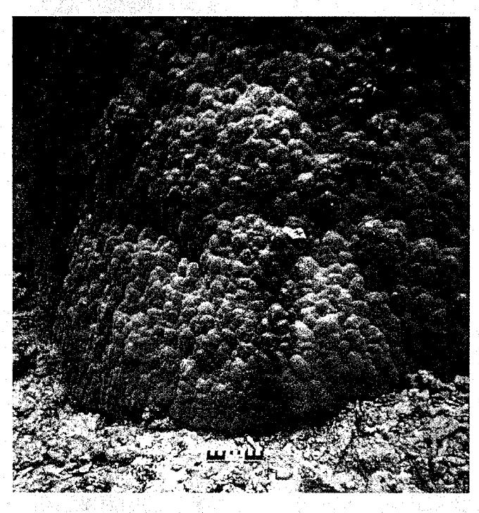
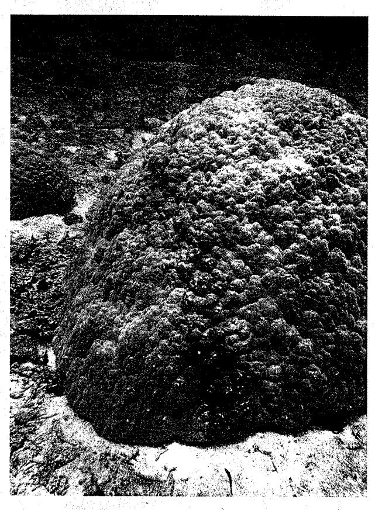

## Slow-moving waves of polyp retraction traverse Porites lobata mounds

Accepted: 6 March 2002 / Published online: 2 November 2002 © Springer-Verlag 2002

The synchronous retraction of coral polyps into their skeletal framework can occur as a response to physical disturbance or as a precursor to the formation of a mucus sheet over portions of the coral colony (e.g., Coffroth 1991). An unusual behavioral pattern was observed at Ofu Island (American Samoa) where coral polyps retracted in a synchronized wave that traveled slowly but coherently across *Porites lobata* mounds (see Figs. 1 and 2). The waves were recognizable as a band of slightly darker coloration, presumably due to the concentration of pigments in the retracted polyps. The band width averaged 14 cm at its most well-defined sites (range 5–23 cm, n=42). Bands appeared to develop from a single but variable location and radiate out over the mound, often forming an arc extending from the bottom of the mound, over the top and back down to the bottom on the other side. Twenty bands on 17 different mounds were monitored for 48–80 h by marking the band's location with temporary pins. These bands moved across the *Porites* mounds at an average rate of 0.55 cm/h (SD = 0.15) or 13 cm/day. At that rate, it would take approximately 17 days to completely traverse the average size of the hemispherical *Porites* mounds in the study area (average = 425-cm base circumference, 80-cm height, 220-cm dome curvature).

Fig. 1 Bands of retracted polyps on a *Porites lobata* mound (note pink flagging ribbon marking the band and a centimeter ruler below mound)

Fig. 2 Band of retracted polyps on a different *Porites lobata* mound

Reef sites

Coral Reefs (2002) 21: 373-374

While the direction of movement was consistent for a given band, the overall orientation of the 20 bands appeared to be random (five moved northward, four south, seven east, and four west).

Porites lobata mounds are common in the study area (Craig et al. 2001), a backreef moat on Ofu's south-coast fringing reef, but mounds with bands were mostly localized in a single 20×40 m area. Of the approximately 100 mounds there, 14–34% had a band present when observed on six of seven occasions over an 8-month period (January–October 2001), but this number increases to 22–49% if the presence of large darkened areas of retracted polyps (characteristic of the beginning or ending of band formation) are included in counts. On the seventh occasion, bands were few (3%) and barely visible. Based on limited observations, there was no obvious correlation between the presence of bands and lunar phase, nor did the bands appear to be related to sediment removal (usually none was apparent). Sloughing mucus was occasionally noted along some band edges, but the more common sighting elsewhere of poritids covered by sheets of mucus was not observed on these mounds.

Acknowledgements I thank Charles Birkeland and Craig Mundy for coral identification.

References

Coffroth M (1991) Cyclical mucous sheet formation on poritid corals in the San Blas Islands, Panama. Mar Biol 109:35-40 Craig P, Birkeland C, Belliveau S (2001) High temperatures tolerated by a diverse assemblage of shallow-water corals in American Samoa. Coral Reefs 20:185-189

P. C. Craig

National Park of American Samoa, Pago Pago, American Samoa 96799, USA E-mail: peter craig@nps.gov

Reef sites

Coral Reefs (2002) 21: 373-374