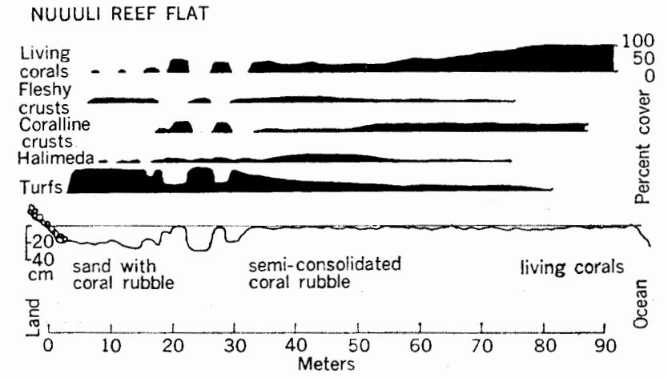

## DEPARTMENT OF MARINE & WILDLIFE RESOURCES

P. O. BOX 3730 PAGO PAGO, AMERICAN SAMOA 96799

Proceedings of the International Seaweed Symposium 7:36-39. (1972)

### Ecology and Community Structure of Some Tropical Reef Algae in Samoa

ARTHUR LYON DAHL

Department of Botany, Smithsonian Institution, Washington, D.C., U.S.A.

While benthic marine algae other than encrusting forms are not often conspicuous in coral reef habitats, they frequently form complex associations with high species diversity but low biomass. Data from the initial phase of a detailed ecological survey of the algae on the fringing reefs around Tutuila, American Samoa, demonstrate the widespread occurrence of algal turfs, and illustrate the interactions between species that help to maintain the algal communities. Associations between algal species are often mutually beneficial, and create significant microhabitats. Algal communities also help to control substrate availability, and are themselves altered by the types of substrate available. In spite of their low biomass, other algae must be considered along with encrusting forms as significant components in the coral reef ecosystem.

#### INTRODUCTION

Coral reefs are one of the world's most complex and productive ecosystems and are the only biological community known to produce massive geological formations. Although these reefs are widely distributed along coastal margins in tropical waters, the diversity of coral reef forms and their complexity have made it difficult to characterize ecological features that may be common to many reef areas and that may help to determine the nature and form of reef development.

American Samoa, a small group of largely volcanic islands in the South Pacific (lat. 14°S, long. 170°W), is typical of many island areas in which coral reefs are a prominent local resource. As part of a long-term survey and monitoring program, 10 line transects were established across the intertidal and high subtidal portions of the fringing reefs around Tutuila Island and on nearby Aunuu Island, representing a variety of exposures and habitats. Additional sites were also examined in detail. The initial surveys were established in January 1970, and most stations were repeated in July 1970. Collections and rough quantitative estimates of percent coverage were made for each 10 m transect segment across the reef flat. A general description of the area and several environmental parameters were also noted for each transect. This approach served to characterize the major reef flat features and populations on a repeatable basis within the limited time available. This paper will focus on one aspect of the data from this program concerning the occurrence of algal turfs and their role in the reef community structure.

Algal turfs can be defined as relatively dense associations of one or more species of filamentous or foliose algae of small stature, attaining a height or thickness of 1 to 30 mm. Turfs are a frequently occurring algal feature, particularly in tropical marine benthic habitats, and have been periodically noted and described (eg., 1, 3, 4, 6, 7). Generally, however, attention has been concentrated on the individual species within the turf, rather than on the nature of the associations between species or the role of the turf community in the ecosystem.

Turfs may be of particular significance in tropical reef areas where other benthic algae are scarce. They may make a significant contribution to productivity, aid in the consolidation of reef materials, and control substrate availability. They are frequently highly complex and diverse assemblages. Species composition, community structure, and habitat vary greatly, even within the same area. A much greater mass of data

(36)

will be required before any generalizations about the turf community can be substantiated. It is nevertheless useful to consider this association as a unit with respect to its role in coral reef ecosystems.

Little information has been published on the marine algae of American Samoa. The paper by Setchell is perhaps the most substantial, yet it was apparently based on fragmentary collections and is incomplete (5).

#### RESULTS

The fringing reefs around Tutuila Island. American Samoa, are relatively small, extending no more than a few hundred meters from the shore. On the south shore, the reefs extend for most of the length of the island and generally consist of a shallow moat near the shore (200 to 400 mm depth at low tide), a relatively solid reef flat extending out perhaps 100 m., which is barely exposed by the lower tides, and the reef front itself (Fig. 1). Living corals occur primarily on the outer portion of the reef flat and beyond. Breaks in the reef are generally associated with areas of freshwater runoff. Reef development on the north shore is primarily restricted to the bays. All the reefs tend to be highly variable in structure and dominant organisms, depending on the local conditions. The flora of the basaltic outcrops was distinctly different from that of adjacent carbonate rock substrate. For further information on the structure of the reefs at Tutuila, see Mayor (2).

A profile of the reef site near Nuuuli (Fig. 1) illustrates several of the features of the Samoan reef flat habitats. The inshore area consists largely of sand and a loose coral rubble of fragments less than 100 mm long. Scattered small coral heads towards the seaward edge of the moat merge into the solid reef flat extending to the outer edge of the Semiconsolidated calcareous rubble predominates on the inner portion of the reef flat with an increasing percentage of living coral towards the reef front. Algal turfs cover most of the available solid surface in the reef moat with fleshy crusts also common on coral fragments. Turfs decrease in coverage toward the outer margin of the reef flat to be replaced by crustose forms and then living coral. Halimeda opuntia is common in the interstices of the rubble on the reef flat.

In terms of percent coverage, turfs are frequently the most significant algal component in shallow reef areas. On some other transects, the relative role of encrusting coralline algae increased, particularly on loose coral rubble and on the outer margin of the reef, but turf remained dominant in the more stable areas. Extensive turfs were also noted along subtidal channels and on the dead portions of coral heads.

Fig. 1. Profile of the reef flat near Nuuuli, Tutuila Island, American Samoa, showing the percent coverage of the dominant forms.

The species composition of Samoan algal turfs is both complex and highly variable. One sample of about 400 mm² from a basaltic substrate at Lepisi Point contained over 30 species. Some species occur only in turfs; others are found elsewhere, often growing in turf in a reduced form. Some of the dominant turf genera include Jania, Polysiphonia, Ceramium, Hypnea, Cladophora, Gelidium, and Laurencia. A detailed listing of the algae present is beyond the scope of this paper.

#### Discussion

How do such complex associations as the algal turf community arise, and what significance do they have in the reef ecosystem? From the present monitoring surveys, it is only possible to conclude that such turfs are widespread and are frequently composed of numerous species in close association. It may be useful to suggest possible contributing factors, but detailed experimental confirmation will be required.

First, a number of features can be noted about the turf habitat. It would appear to have high potential for productivity, with ample light and a supply of nutrients washed onshore by reef currents and carried down from the adjacent land. There would also be high grazing pressure, at least intermittently when high tides permit grazing fish and other animals to emerge or to come inshore from the outer reef. At least some turf areas are subject to exposure at low tide, as well as to environmental extremes such as high light intensity, and salinity variations with heavy rains and freshwater runoff.

There may well be species interactions within the turf community that help to counter these ecological pressures. For example, the entrance to Pala Lagoon near Nuuuli consists largely of broad shallow sand flats carpeted with a simple association of Halimeda and Dictyota. A dense mat of Dictyota and scattered Padina largely covers the area, anchored in place by hummocks of Halimeda. The Halimeda provides the only firm attachment in the sand for the Dictyota, the Dictyota alters conditions under the mat in a way that may or may not be beneficial to the Halimeda.

In the turf community, Jania, Laurencia, or Hypnea may serve a similar anchoring function for other algae, or even for the substrate. In one area of loose rubble on the reef flat near Anapeapea, the coral fragments have been bound together by turf to form a dense resilent mat. Such binding might foster the consolidation of the rubble into reef rock by coralline algae or chemical processes.

One might also expect certain algae with greater resistance to grazing or abrasion to serve as a shelter for more delicate forms. The dense turf form could similarly provide protection from extreme light intensities or exposure, producing an internal microhabitat more favorable to survival and growth. There may also be nutritional, antibiotic, or other biochemical benefits within the close confines of the community. A dense turf association may be better able to regenerate rapidly after injury, or to change its species composition with changing conditions. It is, in all likelihood, a dynamic rather than static association.

The significance of algal turfs for the whole reef ecosystem is similarly open to conjecture. This may well be an area of high productivity, in which rapid growth is balanced by heavy grazing, resulting in low biomass but high turnover. Turfs may also control substrate availability, preventing the settlement of coral larvae and other organisms.

The widespread occurrence of algal turfs in tropical reef habitats suggests that they may play a significant part in reef structure and function. Not until the roles of this and other reef communities are more fully explored will we begin to understand the complex ecosystem that is a coral reef.

#### REFERENCES

- Gislén, Torsten. 1929/30. Epibioses of the Gullmar Fjord. I. Geomorphology and hydrography.
  Marine sociology. (Kristinebergs Zoologiska Station, 1877-1927). Skr.Ser. K. sevenska Vetensk. Akad. 3: 1-123; 4: 1-380.
- Mayor, Alfred G. 1920. The reefs of Tutuila, Samoa, in their relation to coral reef theories. Proc. Amer. Phil. Soc. 59: 224-36.
- Neushul, Michael, and Dahl, Arthur L. 1967.
  Composition and growth of subtidal parvosilvosa

- from Californian kelp forests. Helgoländer Wiss. Meeresunters. 15: 480-88.
- Richardson, W. D. 1969. Some observations on the ecology of Trinidad marine algae. Proc. Sixth Int. Seaweed Symp., pp. 357-63. Madrid: Secretaria de la Marina Mercante.
- 5. Setchell, William A. 1924. American Samoa.
  - I. Vegetation of Tutuila Island. Carnegie Publ.
- 341. Washington: Carnegie Inst. Department Marine Biol., 20.
- Taniguti, Moritosi. 1962. Phytosociological Study of Marine Algae in Japan. Tokyo: Inoue & Co.
- 7. Taylor, William Randolph. 1950. Plants of Bikini and other Northern Marshall Islands. Ann Arbor: University of Michigan Press.

# DEPARTMENT OF MARINE & WILDLIFE RESOURCES

P. O. BOX 3730 PAGO PAGO, AMERICAN SAMOA 96799