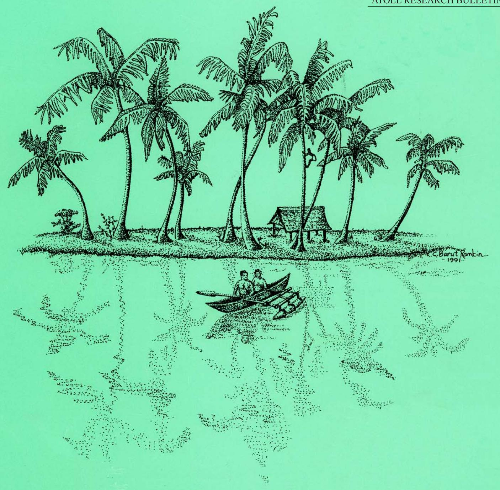
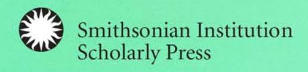
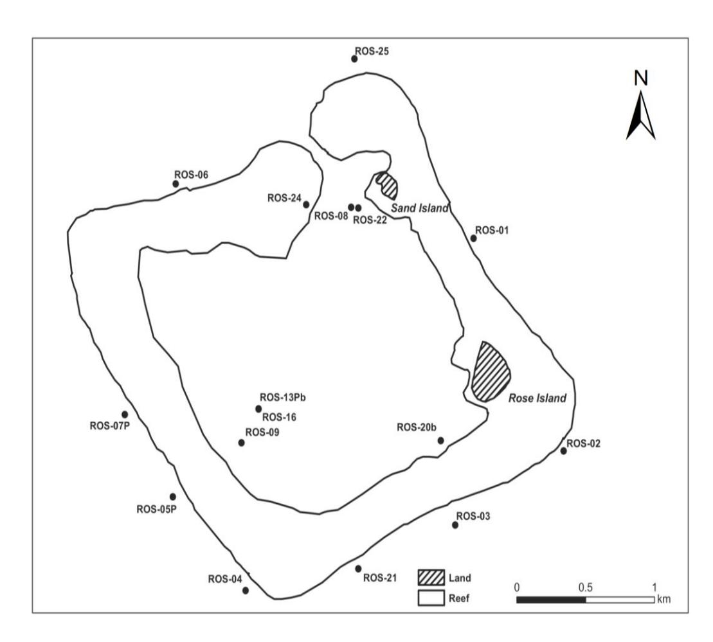

MARINE BENTHIC MACROALGAE OF A SMALL UNINHABITED SOUTH PACIFIC ATOLL (ROSE ATOLL, AMERICAN SAMOA)

Martha C. Diaz Ruiz, Peter S. Vroom, and Roy T. Tsuda

# ATOLL RESEARCH BULLETIN

# **MARINE BENTHIC MACROALGAE OF A SMALL UNINHABITED SOUTH PACIFIC ATOLL (ROSE ATOLL, AMERICAN SAMOA)**

*Martha C. Diaz Ruiz, Peter S. Vroom, and Roy T. Tsuda*

**Atoll Research Bulletin No. 616 9 April 2018** 

Washington, D.C.

All statements made in papers published in the *Atoll Research Bulletin* are the sole responsibility of the authors and do not necessarily represent the views of the Smithsonian Institution or of the editors of the bulletin. Articles submitted for publication in the *Atoll Research Bulletin* should be original papers and must be made available by authors for open access publication. Manuscripts should be consistent with the "Author Formatting Guidelines for Publication in the Atoll Research Bulletin." All submissions to the bulletin are peer reviewed and, after revision, are evaluated prior to acceptance and publication through the publisher's open access portal, Open SI [\(http://opensi.si.edu\)](http://opensi.si.edu/).

Published by SMITHSONIAN INSTITUTION SCHOLARLY PRESS P.O. Box 37012, MRC 957 Washington, D.C. 20013-7012 <https://scholarlypress.si.edu/>

The rights to all text and images in this publication are owned either by the contributing authors or by third parties. Fair use of materials is permitted for personal, educational, or noncommercial purposes. Users must cite author and source of content, must not alter or modify the content, and must comply with all other terms or restrictions that may be applicable. Users are responsible for securing permission from a rights holder for any other use.

ISSN: 0077-5630 (online)

#### **CONTENTS**

| ABSTRACT              | 1  |
|-----------------------|----|
| INTRODUCTION          | 1  |
| MATERIALS AND METHODS | 3  |
| RESULTS               | 4  |
| Phylum Cyanobacteria  | 4  |
| Phylum Rhodophyta     | 5  |
| Phylum Ochrophyta     | 6  |
| Phylum Chlorophyta    | 6  |
| DISCUSSION            | 8  |
| ACKNOWLEDGMENTS       | 9  |
| APPENDIX              | 10 |
| REFERENCES            | 11 |
|                       |    |

# **MARINE BENTHIC MACROALGAE OF A SMALL UNINHABITED SOUTH PACIFIC ATOLL (ROSE ATOLL, AMERICAN SAMOA)**

MARTHA C. DIAZ RUIZ 1 , PETER S. VROOM2 , and ROY T. TSUDA3

#### **ABSTRACT**

Forty-five species of marine benthic macroalgae were identified from the coral reefs of Rose Atoll, American Samoa (Rose Atoll Marine National Monument). The algal collections were made during the February 2002, February 2004, March 2006, and March 2008 Pacific Reef Assessment and Monitoring Program (Pacific RAMP) under the auspices of the U.S. National Oceanic & Atmospheric Administration (NOAA), Pacific Islands Fisheries Science Center (PIFSC), Coral Reef Ecosystem Division (CRED). The collections included 6 species of Cyanobacteria, 14 species of red algae, 4 species of brown algae, and 21 species of green algae. Nine species represented new records for the Samoan Archipelago (American Samoa and Samoa). Based on their occurrences, eight species of green algae were considered most broadly distributed among the stations during all four expedition years. The top three broadly distributed species were *Halimeda taenicola, Halimeda micronesica*, and *Caulerpa cupressoides.*

#### **INTRODUCTION**

Rose Atoll (14°32'S, 168°11'W), American Samoa, is an uninhabited and isolated atoll located 138 km ESE of Ta'u Island in the Manu'a Group and 258 km E of the largest island Tutuila, the administrative center of American Samoa. At 2 km across and covering an area of 6.5 km2 , the diamondshaped atoll (Figure 1) is considered one of the smallest in the Pacific Ocean. A single 40 m wide pass on the NNW sector of the otherwise contiguous barrier reef connects the shallow 20 to 30 m deep lagoon with the open ocean. The atoll has two islands (6 hectares) – the 3.5 m high densely vegetated (*Pisonia*  forest) Rose Island and the 1.5 m high non-vegetated Sand Island.

 1 NOAA Intern, NOAA-National Marine Fisheries Service, Pacific Islands Fisheries Science Center, Coral Reef Ecosystem Program, 1845 Wasp Blvd., Bldg. #176, Honolulu, HI 96818, USA. Present address: Instituto de Biologia, Universidade Federal da Bahia, Salvador, Brazil, email: [mardiazr@gmail.com](mailto:mardiazr@gmail.com)

2 Ocean Associates, Joint Institute for Marine and Atmospheric Research, NOAA-National Marine Fisheries Service, Pacific Islands Fisheries Science Center, Coral Reef Ecosystem Program, 1845 Wasp Blvd., Bldg. #176 Honolulu, HI 96814, USA. Present address: San Diego Public Utilities, Environmental Monitoring and Technical Services Division, 2392 Kincaid Road, San Diego, California 92101, USA, email: [PVroom@sandiego.gov](mailto:PVroom@sandiego.gov)

3 Botany-Herbarium Pacificum, Bishop Museum, 1525 Bernice Street, Honolulu, HI 96817, USA; email: [roy.tsuda@bishopmuseum.org](mailto:roy.tsuda@bishopmuseum.org)

**Figure 1.** Map of Rose Atoll showing algal collection stations.

Rose Atoll is an important nesting site for both the threatened green sea turtle (*Chelonia mydas*) and the endangered hawksbill sea turtle (*Eretmochelys imbricata*), and supports most of the seabird population of American Samoa. The atoll was administered in 1974 as part of the Pacific Remote Islands Area Refuge Complex, and co-managed by both the U.S. Fish and Wildlife Service and the Government of American Samoa as a biological preserve. On 6 January 2009, the Rose Atoll Marine National Monument (Rose Atoll MNM) was established by U.S. presidential proclamation with a boundary of 12 nm around Rose Atoll. The Rose Atoll MNM is presently managed as a biological reserve by the U.S. Fish and Wildlife Service (USFWS), the National Oceanic & Atmospheric Administration (NOAA) and the Government of American Samoa.

To date, there have been only two published accounts on the marine benthic algae of Rose Atoll. The first was a floristic study by Setchell (1924), which recorded 15 species of marine benthic algae from Rose Atoll based on the collections, notes, and photographs by Alfred Goldsborough Mayor, Director of the Department of Marine Biology of the Carnegie Institution of Washington. The algae included six species of Cyanobacteria — *Hyella caespitosa* Bornet & Flahault, *Leptolyngbya terebrans* (Bornet & Flahault ex Gomont) Anagnostidis & Komárek [= *Plectonema terebrans* Bornet & Flahault ex Gomont], *Microchaete vitiensis* Askenasy ex Bornet & Flahault, *Spirulina subsalsa* Oersted ex Gomont, *Trichocoleus tenerrimus* (Gomont) Anagnostidis [= *Microcoleus tenerrimus* Gomont] and a new species *Pleurocapsa mayori* Setchell which is still recognized today. The five red algae included a new form of the dominant crustose coralline algae, *Hydrolithon craspedium* (Foslie) P.C. Silva [= *Porolithon craspedium* (Foslie) Foslie f. *mayorii* M. Howe], which gives the barrier reef a pinkish hue, a *Lophosiphonia* sp. with 4 pericentral cells and a second *Lophosiphonia* sp. with 5–6 pericentral cells, a

small specimen of *Laurencia* sp. and short turfs (1 mm high) of a *Gelidium* species dominant along the reef rim. The four green algae included well developed *Caulerpa cupressoides* (Vahl) C. Agardh var. *mammilosa* (Montagne) Weber Bosse and fragments of *Microdictyon umbilicatum* (Velley) Zanardini, and two boring algae, i.e., *Ostreobium quekettii* Bornet & Flahault [= *Ostreobium reineckei* Bornet] and sterile specimens of *Gomontia* sp. No brown algae were reported in this study.

The second study was conducted by Tribollet et al. (2010), which quantitatively compared the spatial and temporal variability in macroalgal assemblages (13 algal genera and 4 functional groups) of the five islands, i.e., Tutuila, Ofu-Olosega, Ta'u, Rose Atoll, and Swains Island, within American Samoa based on information obtained during the February 2004 and March 2006 NOAA Pacific RAMP. The 13 algal genera included four red algae (*Galaxaura, Jania, Peyssonnelia*, and *Pterocladiella)*, two brown algae (*Dictyota* and *Lobophora*), and seven green algae (*Bryopsis, Caulerpa, Chaetomorpha, Dictyosphaeria, Halimeda, Microdictyon* and *Valonia*). Four functional groups consisted of the encrusting corallines, branching non-geniculate corallines, turf, and Cyanobacteria. Vargas-Angel (2010) reported 46% cover of crustose coralline algae at Rose Atoll which was double the cover found on the reefs of Swains Island and nearby Ta'u. See Brainard et al. (2008) for a detailed environmental and biological account of Rose Atoll based on the results of the 2002, 2004, and 2006 NOAA expeditions.

Although few studies have examined the algal diversity of Rose Atoll, species of marine benthic algae from other islands in American Samoa are well documented. For instance, 142 species of algae have been reported from the main island of Tutuila, including a few species from Aunu'u Island, by Harvey and Bailey (1851), Setchell (1924), Ducker (1967), Hollenberg (1968a, 1968b, 1968c, 1968d), Hillis (1959), Taylor (1964), Skelton and South (1999, 2004, 2007), South and Skelton (2000), Skelton (2003) and Littler and Littler (2003). Seventy algal species, excluding specimens identified to genera only, have been reported from two (Ofu Island and Olosega Island) of the three Manu'a Islands (Skelton, 2003; Skelton and South, 2004, 2007). Only *Tydemania expeditionis* Weber-van Bosse (Skelton and South, 2007) and *Dissimularia tauensis* Kraft & G. W. Saunders (Kraft and Saunders, 2014) have been recorded from Ta'u Island, the third island of the Manu'a Group. A recent account by Tsuda et al. (2011) reported 59 species of marine benthic algae from isolated Swains Island located 320 km north of Tutuila and collected during the same NOAA expeditions to American Samoa as discussed here. A color field guide to 113 species of the common marine algae in the Samoan Archipelago (Samoa and American Samoa) is provided by Skelton and South (2014). See Rodgers et al. (1993) for an annotated bibliography of Rose Atoll.

The primary objective of this study was to document, with voucher specimens, the species of marine benthic macroalgae of the Rose Atoll Marine National Monument based on specimens collected during the February 2002, February 2004, March 2006 and March 2008 NOAA Pacific RAMP expeditions.

# **MATERIALS AND METHODS**

Rose Atoll was visited as part of the U.S. National Oceanic and Atmospheric Administration's (NOAA) Pacific Islands Fisheries Science Center's (PIFSC) Coral Reef Ecosystem Division's (CRED) Pacific Reef Assessment and Monitoring Program (Pacific RAMP). Stations at Rose Atoll were identified using the first three letters of the island's name, e.g., ROS-05P-04 signifies Rose Atoll (ROS), permanent station number (05P), and the year 2004 (04) when the specimens were collected. The designation "b" after a station number refers to a site visited only by the benthic team.

Algal samples were hand collected by scuba divers following the protocol of Preskitt et al. (2004) where transects were mainly at depths of 12.2 to 18.3 m; and immediately frozen. Algae were collected at one shallow station (ROS-24-04) at 1.2 m deep and one deeper station (ROS-16-02) at 27.4 m. Prior to taxonomic examination, plastic bags of frozen algae from each station were thawed in tap water. Thawed seawater was poured carefully from the bag and replaced with 4% formalin in seawater to prevent the fragile turf algae and epiphytes from decomposing. The collections were examined using a dissecting microscope, and representative epiphytes and turf were separated. The small specimens were mounted on

glass slides by decalcifying with 10% hydrochloric acid, staining with aniline blue, and mounting with 30% corn syrup (Karo) with phenol. Larger specimens were mounted on segments of herbarium paper. A maximum of five specimens served as vouchers for each species recorded here.

The turf and epiphytes mounted on slides have been in the possession of the first author who has been residing in Brazil for the past five years. During this period, the first author had experienced difficulty in safely mailing the slide specimens to NOAA-PIFSC or the Bishop Museum in Hawaii. Since voucher specimens of the turf and epiphytes are not yet archived in a secure location, this study reports only the algal herbarium specimens, which were assigned Peter S. Vroom (PSV) collection numbers and were archived at the Bishop Museum (BISH) in Honolulu, Hawaii.

The occurrence, i.e., number of stations at which an algal species was recorded during any one cruise, provided an estimation of the distribution of a particular species at Rose Atoll but does not provide information on depth distribution. Although algal collections were obtained from a total of 19 different stations during the four cruises, collecting stations during an individual cruise varied, i.e., 2002 (11 stations), 2004 (14 stations), 2006 (11 stations), and 2008 (12 stations). See Appendix for description of stations.

#### **RESULTS**

Species are listed alphabetically under each Phylum. Forty-five species of marine benthic macroalgae were identified from the reefs of Rose Atoll – 6 species of Cyanobacteria, 14 species of red algae, 4 species of brown algae, and 21 species of green algae. Nine species, designated by asterisks (\*), represented new records for the Samoan Archipelago (American Samoa and Samoa).

#### **Phylum Cyanobacteria**

**\****Blennothrix lyngbyacea* (Kützing) Anagnostidis & Komárek; Littler and Littler, 2000: 460. Voucher specimen: BISH 765560 (PSV 10753, ROS-09-04).

*Lyngbya confervoides* C. Agardh ex Gomont; Desikachary, 1959: 315, pl. 49 (fig. 8), pl. 52 (fig. 1); Engene et al., 2010.

Voucher specimens: BISH 765503 (PSV 10771, ROS-01-04), BISH 765520 (PSV 10781, ROS-03-04), BISH 765563 (PSV 10814, ROS-21-04), BISH 765572 (PSV 11026, ROS-22-04), BISH 765626 (PSV 10999, ROS-21-06).

*Moorea bouillonii* (Hoffmann & Demoulin) Engene, Rottacker, Kastovsky, Byrum, HY. Choi, Ellisman, Komárek & Gerwick; Lobban and Tsuda, 2003: 57, fig. 2; Engene et al., 2010. Voucher specimens: BISH 765550 (PSV 10744, ROS-07P-04), BISH 765556 (PSV 10756, ROS-08-04).

**\****Phormidium dimorphum* Lemmermann; Littler and Littler, 2000: 456.

Voucher specimens: BISH 765533 (PSV 10763, ROS-04-04), BISH 765551 (PSV 10742, ROS-7P-04), BISH 765627 (PSV 11002, ROS-21-06).

Notes: Specimens consist of red mats with most trichomes 4 µm in diameter.

# *Phormidium* **sp.**

Voucher specimens: BISH 765561 (PSV 10752, ROS-09-04), BISH 765624 (PSV 10979, ROS-08-06), BISH 765642 (PSV 11131, ROS-03-08).

Notes: Specimens consist of greenish-white mats with trichomes 6–7 µm in diameter.

#### *Spirocoleus* **sp.**

Voucher specimen: BISH 765514 (PSV 10608, ROS-02-04).

Notes: Specimens consist of green mats with most trichomes 2 µm in diameter.

#### **Phylum Rhodophyta**

*Chondria simpliciuscula* Weber-van Bosse; N'Yeurt and Payri, 2010: 143, fig. 304. Voucher specimens: BISH 765671 (PSV 11056, ROS-21-08).

# **\****Cryptonemia yendoi* Weber-van Bosse; Abbott, 1999: 138, figs. 32C–E.

Voucher specimens: BISH 765471 (PSV 10851, ROS-02-02), BISH 765603 (PSV ll079, ROS-02-06), BISH 765615 (PSV 11102, ROS-04-06).

Notes: Single blades are up to 10 mm tall with short stipes (1 mm long) and attachment base. Cortex consists of three layers of round cells, 2‒4 µm in diameter. Medulla consists of refractile filaments, mostly 4 µm in diameter and up to 60 µm long (Abbott, 1999).

**\****Dissimularia umbraticola* (E.Y. Dawson) Kraft & G.W. Saunders; Kraft and Saunders, 2014: 157, figs. 62‒69.

Voucher specimen: BISH 765614 (PSV 11098, ROS-04-06).

Notes: The blade is 2 cm broad with indented margins and consists of a translucent filamentous medulla.

*Galaxaura filamentosa* R. Chou; Skelton and South, 2007: 21, fig. 17.

Voucher specimens: BISH 765552 (PSV 10745, ROS-07P-04), BISH 765557 (PSV 10758, ROS-08-04), BISH 765616 (PSV 11101, ROS-04-06), BISH 765628 (PSV 11060, ROS-21-06).

*Ganonema pinnata* (Harv.) Huisman; Abbott, 1999: 88, figs. 16A–D as *Liagora pinnata* Harvey. Voucher specimens: BISH 765585 (PSV 10843, ROS-24-04), BISH 765586 (PSV 11190, ROS-24-04).

#### *Gelidium* **sp.**

Voucher specimen: BISH 765662 (PSV 11160, ROS-07P-08).

Notes: Specimen is 3 mm long and terete with conspicuous rhizines in the medulla. Cortical cells are round to pyriform, 4‒8 µm in dimeter. Elongate medullary cells are mostly 6 µm in diameter and 24‒40 µm long. This unidentified *Gelidium* may be the same species which Setchell (1924) reported as *Gelidium*  sp.

*Jania pacifica* Areschong [= *Jania mexicana* W.R. Taylor]; Taylor, 1945: 197, pl. 60. Voucher specimen: BISH 765472 (PSV 11199, ROS-02-02), BISH 765604 (PSV 11084, ROS-02-06). Notes: Fragments are cylindrical, 1 cm long and up to 200 µm in diameter with length:diameter ratio of 2:1 and branches with rounded apices.

*Jania rubens* (Linnaeus) J.V. Lamouroux; Taylor, 1950: 133.

Voucher specimens: BISH 765573 (PSV 11027, ROS-22-04), BISH 765605 (PSV 11070, ROS-02-06), BISH 765617 (PSV 11103, ROS-04-06), BISH 765629 (PSV 10998, ROS-21-06), BISH 765683 (PSV 11145, ROS-09-08).

Notes: Tufts are cylindrical, 80–140 µm in diameter; branches with conspicuous pointed apices.

## **\****Laurencia brachyclados* Pilger; Abbott, 1999: 382, fig. 111A–C.

Voucher specimens: BISH 765534 (PSV 10766, ROS-04-04), BISH 765540 (PSV 10802, ROS-05P-04), BISH 765592 (PSV 10952, ROS-01-06), BISH 765618 (PSV 11094, ROS-04-06), BISH 765630 (PSV 11018, ROS-21-06).

Notes: All plants consist of horizontal and erect terete axes, up to 2.5 cm high, rose red in color. Cortical cells are isodiametric, 20–32 µm in diameter and do not project outward; medulla consists of round cells, 40–100 µm in diameter, without lenticular thickenings.

**\****Laurencia galtoffii* M. Howe; McDermid, 1988: 233, figs. 10, 11; Abbott, 1999: 386, figs. 112C, D. Voucher specimens: BISH 765473 (PSV 10852, ROS-02-02), BISH 765593 (PSV 10956, ROS-01-06). Notes: All specimens are less than 1.5 cm tall. Lenticular thickenings in the medulla are present and cortical cells project conspicuously beyond the surface at the apices.

**\****Laurencia tenera* Tseng; Abbott, 1999: 393, Fig. 114E.

Voucher specimens: BISH 765673 (PSV 11051, ROS-21-08).

Notes: Irregularly shaped cortical cells are in one row, 28‒48 µm in diameter. Rounded medullary cells are 52–68 µm in diameter. Lenticular thickenings are absent.

*Liagora ceranoides* J.V. Lamouroux; Skelton and South, 2007: 24, figs. 22, 23.

Voucher specimens: BISH 765498 (PSV 10196, ROS-20b-02), BISH 765587 (PSV 10838, ROS-24-04).

*Peyssonnelia inamoena* Pilger; Skelton and South, 2007: 62, figs. 108-110.

Voucher specimens: BISH 765558 (PSV 10759, ROS-08-04), BISH 765674 (PSV 11059, ROS-21-08).

*Pterocladiella caerulescens* (Kützing) Santelices & Hommersand; Skelton and South, 2007: 28.

Voucher specimens: BISH 765553 (PSV 10749, ROS-07P-04).

Notes: Straplike or terete vertical axes, 400–500 µm wide, with a distinct apical cell. Medulla consists of numerous rhizines; cortical cells are 3‒4 µm in diameter.

#### **Phylum Ochrophyta**

*Dictyopteris repens* (Okamura) Børgesen; Tsuda, 1972: 94, pl. 3 (fig. 1).

Voucher specimens: BISH 765541 (PSV 10803, ROS-05P-04), BISH 765663 (PSV 11165, ROS-07P-08), BISH 765675 (PSV 11055, ROS-21-08).

*Dictyota friabilis* Setchell; Skelton and South, 2007: 210, figs. 582–587.

Voucher specimens: BISH 765594 (PSV 10983, ROS-01-06), BISH 765640 (PSV 11092, ROS-02-06).

#### *Lobophora* **sp.**

Voucher specimens: BISH 765521 (PSV 10786, ROS-03-04), BISH 765542 (PSV 10801, ROS-05P-04), BISH 765546 (PSV 10809, ROS-06-04), BISH 765619 (PSV 11099, ROS-04-06).

Notes: Based on the multitude of species of *Lobophora* described from New Caledonia by Vieira et al. (2014), it seemed wise to record our previously formalin-preserved specimens under the generic name only.

#### *Sphacelaria* **sp.**

Voucher specimen: BISH 765562 (PSV 10754, ROS-09-04).

Notes: The specimen lacked propagulae and could only be identified to the generic level.

#### **Phylum Chlorophyta**

*Bryopsis hypnoides* J.V. Lamouroux; Skelton and South, 2007: 262.

Voucher specimens: BISH 765631 (PSV 11000, ROS-21-06), BISH 765658 (PSV 11169, ROS-06-08).

*Bryopsis pennata* J.V. Lamouroux; Skelton and South, 2007: 263, figs 690, 691.

Voucher specimen: BISH 765554 (PSV 10748, ROS-07P-04), BISH 765664 (PSV 11159, ROS-07P-08).

*Caulerpa cupressoides* (Vahl) C. Agardh; Meñez and Calumpong, 1982: 6, pl. 1B, 1C.

Voucher specimens: BISH 765499 (PSV 10195, ROS-20b-02), BISH 765515 (PSV 10604, ROS-02-04), BISH 765595 (PSV 10973, ROS-01-06), BISH 765650 (PSV 11179, ROS-04-08), BISH 765655 (PSV 11177, ROS-05P-08).

# *Cladophora* **sp. 1**

Voucher specimen: BISH 765632 (PSV 11012, ROS-21-06). Notes: Fragments are 4 mm long and up to 120 µm in diameter.

# *Cladophora* **sp. 2**

Voucher specimen: BISH 765696 (PSV 10978, ROS-Tow T-08).

Notes: Specimens are 4 cm high, bushy with cells 36–96 µm in diameter.

**\****Cladophoropsis* **cf.** *philippinensis* W.R. Taylor; Taylor, 1961: 58; Leliaert and Coppejans, 2006: 666. Voucher specimen: BISH 765597 (PSV 11207, ROS-01-06), BISH 765684 (PSV 10755, ROS-09-08), Notes: Apical cells are 400‒600 µm in diameter. Cells, however, are short and not elongated.

*Cladophoropsis* **cf.** *sundanensis* Reinbold; Leliaert and Coppejans, 2006: 666.

Voucher specimens: BISH 765565 (PSV 10820, ROS-21-04), BISH 765596 (PSV 11093, ROS-01-06), BISH 765633 (PSV 11001, ROS-21-06).

*Dictyosphaeria versluysii* Weber-van Bosse; Egerod, 1952: 351, figs. 1a, 2h–k; Skelton and South, 2007: 254, figs. 738, 791.

Voucher specimens: BISH 765467 (PSV 10201, ROS-01-02), BISH 765516 (PSV 10605, ROS-02-04), BISH 765621 (PSV 11095, ROS-04-06), BISH 765651 (PSV 11181, ROS-04-08), BISH 765687 (PSV 11154, ROS-25-08).

*Halimeda distorta* (Yamada) Colinvaux; Hillis-Colinvaux, 1980: 120, fig. 34. Voucher specimens: BISH 765493 (PSV 10221, ROS-16-02), BISH 765543 (PSV 10807, ROS-05P-04).

*Halimeda fragilis* W.R. Taylor; Taylor, 1950: 88, pl. 48 (fig. 2).

Voucher specimens: BISH 765537 (PSV 10945, ROS-04-04), BISH 765547 (PSV 10812, ROS-06-04), BISH 765665 (PSV10939, ROS-07-08), BISH 765676 (PSV 11053, ROS-21-08), BISH 765688 (PSV10947, ROS-25-08).

**\****Halimeda micronesica* Yamada; Taylor, 1950: pl. 46 (fig. 2), pl. 47.

Voucher specimens: BISH 765482 (PSV 10095, ROS-06-02), BISH 765495 (PSV 10219, ROS-16-02), BISH 765568 (PSV 10823, ROS-21-04), BISH 765652 (PSV 11180, ROS-04-08), BISH 765659 (PSV 10949, ROS-06-08).

*Halimeda minima* (W.R. Taylor) Colinvaux; Hillis-Colinvaux, 1980: 113, fig. 30. Voucher specimens: BISH 765458 (PSV 10442, ROS-01-02), BISH 765507 (PSV 10941, ROS-01-04), BISH 765525 (PSV 10788, ROS-03-04), BISH 765644 (PSV 11116, ROS-03-08), BISH 765690 (PSV 10940, ROS-25-08).

*Halimeda opuntia* (Linnaeus) J.V. Lamouroux; Taylor, 1950: 80, pl. 30 (fig. 1). Voucher specimen: BISH 765488 (PSV10200, ROS-13-02).

*Halimeda taenicola* W.R. Taylor; Taylor, 1950: 86: pl. 46 (fig. 1).

Voucher specimens: BISH 765501 (PSV 10096, ROS-20b-02), BISH 765508 (PSV 10778, ROS-01-04), BISH 765529 (PSV 10936, ROS-03-04), BISH 765539 (PSV 10767, ROS-04-04), BISH 765569 (PSV 10821, ROS-21-04).

*Microdictyon setchellianum* M. Howe; Abbott and Huisman, 2004: 61, fig. 15A. Voucher specimens: BISH 765478 (PSV 10845, ROS-02-02), BISH 765510 (PSV 11202, ROS-01-04), BISH 765609 (PSV 11072, ROS-02-06), BISH 765646 (PSV 11130, ROS-03-08), BISH 765680 (PSV 11043, ROS-21-08).

*Neomeris vanbosseae* M. Howe; Skelton and South, 2007: 293, figs. 747–749. Voucher specimen: BISH 765623 (PSV 11104, ROS-04-06).

*Palmophyllum crassum* (Naccari) Rabenhorst; Abbott and Huisman, 2004: 37, figs. 1A–B. Voucher specimens: BISH 765531 (PSV 10787, ROS-03-04), BISH 765578 (PSV 10991, ROS-22-04), BISH 765610 (PSV 11091, ROS-02-06).

*Pedobesia clavaeformis* (J. Agardh) MacRaild & Womersley; MacRaild and Womersley, 1974: 91, figs. 12-14.

Voucher specimens: BISH 765479 (PSV 10847, ROS-02-02), BISH 765511 (PSV 10779, ROS-01-04), BISH 765579 (PSV 11030, ROS-22-04), BISH 765600 (PSV 10960, ROS-01-06), BISH 765611 (PSV 11068, ROS-02-06).

*Phyllodictyon anastomosans* (Harvey) Kraft & M. J. Wynne; Skelton and South, 2007: 255, figs. 681– 686.

Voucher specimen: BISH 765637 (PSV 11007, ROS-21-06).

*Rhipidosiphon javensis* Montagne; Skelton and South, 2007: 289, figs. 739, 740, 795. Voucher specimen: BISH 765613 (PSV 11111, ROS-03-06).

*Valonia fastigiata* Harvey ex J. Agardh; Skelton and South, 2007: 258, figs. 688, 793, 794. Voucher specimens: BISH 765468 (PSV 10202, ROS-01-02), BISH 765571 (PSV 10819, ROS-21-04), BISH 765612 (PSV 11078, ROS-02-06), BISH 765648 (PSV 11129, ROS-03-08), BISH 765681 (PSV 11047, ROS-21-08).

#### **DISCUSSION**

Except for the possible exception of *Gelidium* sp. and *Laurencia* sp. reported by Setchell (1924), all species recorded here represent new records for the Rose Atoll MNM. In addition to this contribution, Kenyon et al. (2010) provided an updated characterization of the coral fauna at Rose Atoll based on observations made during the NOAA, Pacific RAMP, CRED expeditions to American Samoa reported here. The accumulation of baseline information on the biodiversity of the marine plants and animals and on their interaction within this isolated Marine National Monument is important to its reef conservation. The grounding of a 37-m Taiwanese longline fishing vessel on 14 October 1993, on the upper and outer reef slope at the southwest side of the atoll with accompanying chemical spillage (Schroeder et al., 2008), represented an environmental incident where nearly no baseline information on algal diversity was available to coral reef managers.

Based on their occurrences among the stations during the four different expedition years, eight species of green algae (Table 1) were considered most broadly distributed. The eight species included four species of the calcified genus *Halimeda* (*H. taenicola, H. micronesica, H. minima, H. fragilis*), *Caulerpa cupressoides, Dictyosphaeria versluysii, Microdictyon setchellianum* and *Valonia fastigiata.* Aside from the four species of *Halimeda* mentioned above, two other species (*H. distorta* and *H. opuntia*) were reported from Rose Atoll. The presence of six species of *Halimeda* differs from the single species of *Halimeda* (*H. taenicola*) reported from Swains Island (American Samoa), the isolated low island with a

landlocked brackish lagoon, located 320 km north of Tutuila (Tsuda et al., 2011). Based on locality information, the six species of *Halimeda* were collected mainly from the forereef and not from the lagoon of Rose Atoll. Only one species of *Caulerpa* (*C. cupressoides)* was recorded at Rose Atoll, similar to a single species, *C. serrulata* (Forssk.) J. Agardh, reported by Tsuda et al. (2011) from Swains Island.

The nine species which represented new records for the Samoan Archipelago (American Samoa and Samoa) included two Cyanobacteria (*Blennothrix lyngbyacea* and *Phormidium dimorphum*), five red algae (*Cryptonemia yendoi*, *Dissimularia umbraticola*, *Laurencia brachyclados*, *L. galtoffii*, and *L. tenera*), and two green algae (*Cladophoropsis* cf. *philippinensis* and *Halimeda micronesica*).

**Table 1.** Occurrences at stations of the eight dominant macroalgae collected from Rose Atoll during the February 2002, February 2004, March 2006 and March 2008 NOAA Pacific RAMP expeditions.

| Species No. of Stations  | 2002 (11) | 2004 (14) | 2006 (11) | 2008 (12) |
|--------------------------------|--------------|--------------|--------------|--------------|
| Halimeda taenicola             | 8            | 11           | 3            | 10           |
| Halimeda micronesica           | 5            | 7            | 1            | 8            |
| Caulerpa cupressoides          | 4            | 7            | 3            | 4            |
| Dictyosphaeria versluysii      | 2            | 6            | 3            | 2            |
| Microdictyon setchellianum     | 3            | 4            | 2            | 3            |
| Valonia fastigiata             | 3            | 4            | 2            | 3            |
| Halimeda minima                | 2            | 2            | 0            | 3            |
| Halimeda fragilis              | 0            | 5            | 0            | 3            |

#### **ACKNOWLEDGMENTS**

The NOAA Fisheries Office of Habitat Conservation, as part of the NOAA Coral Reef Conservation Program, provided funding to NOAA-PIFSC-CRED for the scientific expeditions to Rose Atoll. Our appreciation to the NOAA biologists Linda B. Preskitt, Kimberly N. Page, Aline D. Tribollet, Susan W. Cooper, and Jacob Asher for collecting algal specimens during the 2002, 2004, 2006 and 2008 NOAA-PIFSC-CRED expeditions. Our gratitude to NOAA affiliates Julia Ehses, Tomoko Acoba and Troy Kanemura for the production of the Rose Atoll map. Our appreciation to Antoine D. R. N'Yeurt, The University of the South Pacific, Suva, Fiji, and an anonymous reviewer for their constructive comments on the manuscript.

#### **APPENDIX**

Algae were collected by Linda B. Preskitt during the February 2002 NOAA cruise, Kimberly N. Page during the February 2004 NOAA cruise, Aline D. Tribollet during the March 2006 NOAA cruise, Susan W. Cooper during the March 2008 NOAA cruise, and Jacob Asher on Tow T during March 2008 .

ROS-01-02 (14°32.370' S 168°08.742' W), NE forereef, dominated by crustose and columnar coralline red algae, 13.7-16.8 m deep, 22 February 2002.

ROS-01-04 (see ROS-01-02 for location and habitat), 8 Februay 2004.

ROS-01-06 (see ROS-01-02 for location and habitat), 5 March 2006.

ROS-01-08 (see ROS-01-02 for location and habitat), 11 March 2008.

ROS-02-02 (14°33.088' S 168°08.389' W), SE forereef, dominated by crustose and columnar coralline red algae, 13.7-16.8 m deep, 22 February 2002.

ROS-02-04 (see ROS-02-02 for location and habitat), 8 February 2004.

ROS-02-06 (see ROS-02-02 for location and habitat), 5 March 2006.

ROS-03-04 (14°33.338' S 168°08.140' W), SE forereef, dominated by crustose and columnar coralline red algae, 13.7-16.8 m deep, 8 February 2004.

ROS-03-06 (see ROS-03-04 for location and habitat), 8 March 2006.

ROS-03-08 (see ROS-03-04 for location and habitat), 11 March 2008.

ROS-04-04 (14°33.576' S 168°09.635' W), SW forereef, dominated by crustose coralline red algae, 12.2- 15.2 m deep, 9 February 2004.

ROS-04-06 (see ROS-04-04 for location and habitat), 8 March 2006.

ROS-04-08 (see ROS-04-04 for location and habitat), 13 March 2008.

ROS-05P-04 (14°33.243' S 168°09.920' W), SW forereef, high relief, close to site of 1993 ship grounding, 12.2-18.3 m deep, 10 February 2004.

ROS-05P-08 (see ROS-05P-04 for location and habitat), 13 March 2008.

ROS-06-02 (14°32.186' S 168°09.909' W), NW forereef, near pass into lagoon, 12.2-18.0 m deep, 24 February 2002.

ROS-06-04 (see ROS-06-02 for location and habitat), 11 February 2004.

ROS-06-08 (see ROS-06-02 for location and habitat), 12 March 2008.

ROS-07P-04 (14°32.965' S 168°10.108' W), SW forereef, high relief, close to site of 1993 ship grounding, turbid water conditions, 12.2-18.3 m deep, 10 February 2004.

ROS-07P-08 (see ROS-07P-04 for location and habitat), 11 March 2008.

ROS-08-04 (14°32.265' S 168°09.222' W), single pinnacle inside the pass in the N part of lagoon, 9.1 m deep, 11 February 2004.

ROS-08-06 (see ROS-08-04 for location and habitat), 5 March 2006.

ROS-09-04 (14°33.060' S 168°09.651' W), two pinnacles located in the SW corner of lagoon, 4.3-6.7 m deep, 11 February 2004.

ROS-09-08 (see ROS-09-04 for location and habitat), 14 March 2008.

ROS-13Pb-02 (14°32.946' S 168°9.584' W), S lagoon, no site description and depth, 25 February 2002.

ROS-16-02 (14°32.946' S 168°9.584' W), S lagoon, no site description, 27.4 m deep, 26 February 2002.

ROS-20b-02 (14°33.053' S 168°8.871' W), SE reef flat, no depth, 26 February 2002.

ROS-21-04 (14°33.485' S 168°09.194' W), SE forereef, dominated by crustose and columnar coralline red algae, 13.7-16.8 m deep, 9 February 2004.

ROS-21-06 (see ROS-21-04 for location and habitat), 8 March 2006.

ROS-21-08 (see ROS-21-04 for location and habitat), 13 March 2008.

ROS-22-04 (14°32.267' S 168°10.274' W), NW forereef, dominated by crustose coralline red algae, 12.2- 15.2 m deep, 9 February 2004.

ROS-24-04 (14°32.256' S 168°09.397' W), N backreef to the W of pass into lagoon, 1.2 m deep, 11 February 2004.

ROS-25-08 (14°31.763' S 168°09.209' W), N forereef, 10.1-13.4 m deep,12 March 2008.

#### **REFERENCES**

- Abbott, I. A. 1999. *Marine Red Algae of the Hawaiian Islands.* Honolulu, Bishop Museum Press, 477 p. Abbott, I. A., and J. M. Huisman. 2004. *Marine Green and Brown Algae of the Hawaiian Islands*. Honolulu, Bishop Museum Press, 259 p.
- Brainard, R., J. Asher, J. Grove, J. Helyer, J. Kenyon, F. Mancini, J. Miller, S. Myhre, M. Nadon, J. Rooney, R. Schroeder, E. Smith, B. Vargas-Angel, S. Vogt, P. Vroom, S. Balwani, P. Craig, A. Desrochers, S. Ferguson, R. Hoeke, M. Lammers, E. Lundblad, J. Maragos, R. Moffitt, M. Timmers, and O. Vetter. 2008. Coral Reef Ecosystem Monitoring Report for American Samoa: 2002‒2006. U.S. Department of Commerce, National Oceanic and Atmospheric Administration, National Marine Fisheries Service, SP-08-002. 472 p. + Appendices.
- Desikachary, T. V. 1959. *Cyanophyta*. New Delhi, Indian Council of Agricultural Research, 686 p.
- Ducker, S. C., 1967. The Genus *Chlorodesmis* (Chlorophyta) in the Indo-Pacific Region. *Nova Hedwigia*  13:145‒182.
- Egerod, L. E. 1952. An Analysis of the Siphonous Chlorophycophyta with Special Reference to the Siphonocladales, Siphonales, and Dasycladales of Hawaii. *University of California Publications in Botany* 25:325–454.
- Engene, N., R. C. Coates, and W. H. Gerwick. 2010. 16S rRNA Gene Heterogeneity in the Filamentous Marine Cyanobacterial Genus *Lyngbya. Journal of Phycology* 46:591–601.
- Harvey, W. H., and J. W. Bailey. 1851. Description of Algae from the Wilkes United States Exploring Expedition in the Proceedings of the Meeting for December 4, 1950. *Proceedings of the Boston Society of Natural History* 3:369‒378.
- Hillis, L. W. 1959. A Revision of the Genus *Halimeda* (Order Siphonales). *Publication of the Institute of Marine Science, University of Texas* 6:321‒401.
- Hillis-Colinvaux, L. 1980. Ecology and Taxonomy of *Halimeda*: Primary Producer of Coral Reefs. *Advances in Marine Biology* 17:1–327.
- Hollenberg, G. J. 1968a. An Account of the Species of *Polysiphonia* of the Central and Western Tropical Pacific Ocean. I. *Oligosiphonia*. *Pacific Science* 22:56–98.
- Hollenberg, G. J. 1968b. An Account of the Species of the Red Alga *Polysiphonia* of the Central and Western Tropical Pacific Ocean. II. *Polysiphonia*. *Pacific Science* 22:198–207.
- Hollenberg, G. J. 1968c. An Account of the Species of the Red Alga *Herposiphonia* Occurring in the Central and Western Tropical Pacific Ocean. *Pacific Science* 22:536–559.
- Hollenberg, G. J. 1968d. Phycological notes. III. New Records of Marine Algae from the Central Tropical Pacific Ocean. *Brittonia* 20:74‒82.
- Kenyon, J. C., J. E. Maragos, and S. Cooper. 2010. Characterization of Coral Communities at Rose Atoll, American Samoa. *Atoll Research Bulletin* 586:1–28.
- Kraft, G. T., and G. W. Saunders. 2014. *Crebradomus* and *Dissimularia*, New Genera in the Family Chondrymeniaceae (Gigartinales, Rhodophyta) from the Central, Southern and Western Pacific Ocean. *Phycologia* 53:146‒166.
- Leliaert, F., and E. Coppejans. 2006. A Revision of *Cladophoropsis* Børgesen (Siphonocladales, Chlorophyta). *Phycologia* 45:657‒679.
- Littler, D. S., and M. M. Littler. 2000. *Caribbean Reef Plants*. Washington D.C., OffShore Graphics, Inc., 542 p.
- Littler, D. S., and M. M. Littler. 2003. *South Pacific Reef Plants*. Washington D.C., OffShore Graphics, Inc., 331 p.
- Lobban, C. S., and R. T. Tsuda. 2003. Revised Checklist of Benthic Marine Macroalgae and Seagrasses of Guam and Micronesia. *Micronesica* 35–36:54–99.

- Macraild, G. N., and H. B. S. Womersley. 1974. The Morphology and Reproduction of *Derbesia clavaeformis* (J. Agardh) De Toni (Chlorophyta). *Phycologia* 13:83–93.
- McDermid, K. 1988. *Laurencia* from the Hawaiian Islands: Key, Annotated List, and Distribution of the Species. In I. A. Abbott, ed., *Taxonomy of Economic Seaweeds with Reference to some Pacific and Caribbean Species,* II. La Jolla, California Sea Grant College, University of California, pp. 231–247.
- Meñez, E.G., and H. P. Calumpong. 1982. The Genus *Caulerpa* from Central Visayas, Philippines. *Smithsonian Contributions to the Marine Sciences* 17:1–21.
- N'Yeurt, A. D. R., and C. E. Payri. 2010. Marine Algal Flora of French Polynesia III. Rhodophyta, with Additions to the Phaeophyceae and Chlorophyta. *Cryptogamie Algologie* 31:3–205.
- Preskitt, L. B., P. S. Vroom, and C. M. Smith. 2004. A Rapid Ecological Assessment (REA) Quantitative Survey Method for Benthic Algae Using Photoquadrats with Scuba. *Pacific Science* 58:201–209.
- Rodgers, K. A., I. A. McAllan, C. Cantrell, and B. J. Ponwith. 1993. Rose Atoll: An Annotated Bibliography. Australian Museum, Sydney, Technical Report 9:1-37.
- Schroeder, R. E., A. L. Green, E. E. DeMartini, and J. C. Kenyon. 2008. Long-term Effects of a Ship-Grounding on Coral Reef Fish Assemblages at Rose Atoll, American Samoa. *Bulletin of Marine Science* 82:345‒364.
- Setchell, W. A. 1924. American Samoa: Part I. Vegetation of Tutuila Island. Part II. Ethnobotany of the Samoans. Part III. Vegetation of Rose Atoll. *Publications of the Carnegie Institution of Washington* 341:vi + 275 p.
- Skelton, P. A. 2003. *Marine Plants of American Samoa.* Department of Marine & Wildlife Resources, Government of American Samoa. 103 p.
- Skelton, P. A., and G. R. South. 1999. *A Preliminary Checklist of the Benthic Marine Algae of the Samoan Archipelago.* The University of the South Pacific, Marine Studies Programme Technical Report 99/1:1–30.
- Skelton, P. A., and G. R. South. 2004. New Records and Notes on Marine Benthic Algae of American Samoa – Chlorophyta & Phaeophyta. *Cryptogamie, Algologie* 25:291–312.
- Skelton, P. A., and G. R. South. 2007. The Benthic Marine Algae of the Samoan Archipelago, South Pacific, with Emphasis on the Apia District. *Nova Hedwigia* 132:1–350.
- Skelton, P. A., and G. R. South. 2014. *Marine Plants of Samoa, A Field Guide to the Marine Plants of the Samoa Archipelago.* Suva, The University of the South Pacific Press, 140 p.
- South, G. R., and P. A. Skelton. 2000. A Review of *Ceramium* (Rhodophyceae, Ceramiales) from Fiji and Samoa, South Pacific. *Micronesica* 33:45‒98*.*
- Taylor, W. R. 1945. *Pacific Marine Algae of the Allan Hancock Expeditions to the Galápagos Islands.* Allan Hancock Pacific Expeditions, 12, Los Angeles, University of California Press, 528 p.
- Taylor, W. R. 1950. *Plants of Bikini and Other Northern Marshall Islands*. Ann Arbor, University of Michigan Studies, Scientific Series, 18, 227 p.
- Taylor, W. R. 1961. *Cladophoropsis philippinensis,* a New Species from the Western Pacific Ocean. *Botanica Marina* 3:56‒59.
- Taylor, W. R. 1964. The Genus *Turbinaria* in Eastern Seas. *Journal of the Linnean Society of London, Botany* 58:475‒490.
- Tribollet, A. D., T. Schils, and P. S. Vroom. 2010. Spatio-Temporal Variability in Macroalgal Assemblages of American Samoa. *Phycologia* 49:574–591.
- Tsuda, R. T. 1972. Marine Benthic Algae of Guam. I. Phaeophyta. *Micronesica* 8:87–115*.*
- Tsuda, R. T., J. R. Fisher, and P. S. Vroom. 2011. First Records of Marine Benthic Algae from Swains Island, American Samoa. *Cryptogamic Algologie* 32:271–291.
- Vargas-Angel, B. 2010. Crustose Coralline Algal Diseases in the U.S.-Affiliated Pacific Islands. *Coral Reef* 29:943–956.
- Vieira, C., S. D'hondt, O. De Clerck, and C. P. Payri. 2014. Toward an Inordinate Fondness for Stars, Beetles and *Lobophora*? Species Diversity of the Genus *Lobophora* (Dictyotales, Phaeophyceae) in New Caledonia. *Journal of Phycology* 50:1101‒1119.