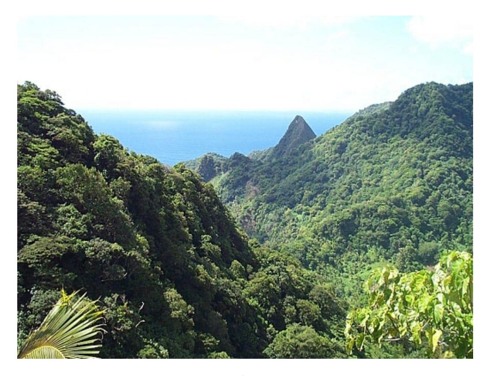
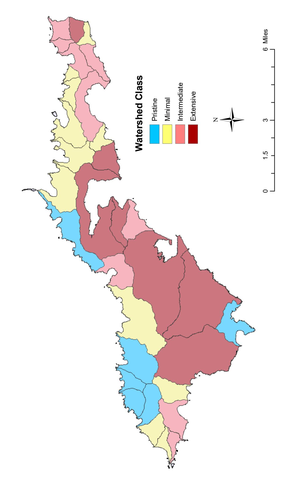

# [DEVELOPING AN INITIAL WATERSHED CLASSIFICATION FOR AMERICAN](https://www.researchgate.net/publication/253200186_DEVELOPING_AN_INITIAL_WATERSHED_CLASSIFICATION_FOR_AMERICAN_SAMOA?enrichId=rgreq-b9dbbf56886fe05fe0bccbf7192da77d-XXX&enrichSource=Y292ZXJQYWdlOzI1MzIwMDE4NjtBUzoxMDEyMTkzMjIzMDI0NjVAMTQwMTE0Mzk3NTI2NA%3D%3D&el=1_x_3&_esc=publicationCoverPdf) SAMOA

| Article · January 2004 |                                 |       |  |  |  |  |  |  |  |
|------------------------|---------------------------------|-------|--|--|--|--|--|--|--|
|                        |                                 |       |  |  |  |  |  |  |  |
|                        |                                 |       |  |  |  |  |  |  |  |
| CITATIONS              |                                 | READS |  |  |  |  |  |  |  |
| 8                      |                                 | 178   |  |  |  |  |  |  |  |
|                        |                                 |       |  |  |  |  |  |  |  |
| 1 author:              |                                 |       |  |  |  |  |  |  |  |
|                        | Guy T Didonato                  |       |  |  |  |  |  |  |  |
|                        | 26 PUBLICATIONS   574 CITATIONS |       |  |  |  |  |  |  |  |
|                        | SEE PROFILE                     |       |  |  |  |  |  |  |  |

## **DEVELOPING AN INITIAL WATERSHED CLASSIFICATION FOR AMERICAN SAMOA**

Guy T. DiDonato

Report from the American Samoa Environmental Protection Agency PO Box PPA Pago Pago, AS 96799 2004

# **ABSTRACT**

The American Samoa archipelago is composed of five main islands: Tutuila, Aunu'u, Ta'u, Olosega, and Ofu. Tutuila is the largest island (53 mi 2 ) with the most people (55,414 people as of 2000). Population growth and its attendant pressures on natural habitats and resources has highlighted the need for aquatic resource monitoring in American Samoa. Of special concern are coral reef habitats, reef fish assemblages, and surface water ecosystems. A watershed classification is a useful framework upon which to develop agency monitoring programs, especially stream and nearshore marine monitoring programs, as a classification scheme can provide *a priori* expectations concerning the condition of adjacent aquatic habitats. US Census data from 2000 were used to calculate population density in Territorial watersheds, and density was used as a surrogate for human disturbance within each watershed. From population density data, four watershed classes were defined: pristine (<100 individuals/mi2 ), minimal (>100 but less than 500 individuals/mi2 ), intermediate (>500 but less than 1000 individuals/mi2 ), and extensive (>1000 individuals/mi2 ). Watershed classification is the first step to establishing an integrated monitoring program for Territorial waters. For instance, ASEPA developed a stream monitoring program based on this classification scheme. Preliminary results from that stream monitoring are consistent with the expected changes in stream condition across watershed class. Whether other aquatic habitats (e.g., beaches) are also consistent with this scheme is unknown at this time.

#### **INTRODUCTION**

The American Samoa archipelago, of which Tutuila is the largest island (53 mi2 ), lies roughly 14 degrees south of the Equator between longitudes 169 and 173 west. Other major islands in the archipelago are Aunu'u, Ta'u, Olosega, and Ofu. With 55,414 people, Tutuila is the most densely populated island (average density=1045 individuals/mi2 ).

Population growth and its attendant pressures on natural habitats and resources have highlighted the need for aquatic resource monitoring in American Samoa. Of special concern are coral reef habitats, reef fish assemblages, and surface water ecosystems. With respect to stream ecosystems, several studies have been commissioned to determine the current status and potential impact of population on freshwater resources (e.g., M&E Pacific 1979). Studies have concluded that freshwater resources are still in good condition, although concerns for recharge of underground aquifers suggest that groundwater resources could suffer from land use changes and pollution impacts in the near future. Furthermore, increased development may directly impact the stream ecosystems themselves; many streams, especially in the populated areas, are extensively modified. Many more will continue to change as land use and resource extraction patterns continue to support the island's burgeoning population.

TheAmericanSamoaEnvironmental Protection Agency (ASEPA) is responsible for tracking the condition of local aquatic resources, including stream, beach, and nearshore marine habitats. The ASEPA has recently adopted a watershed approach to monitoring and assessing these ecosystems (Pedersen 2000). Concurrent with many watershed-level programs, the ASEPA will monitor stream ecosystems to assess the overall condition of these habitats in the Territory.

A watershed classification is a useful framework upon which to develop agency monitoring

programs, especially stream and nearshore marine monitoring. Since most,if not all, of the pollutants or human impacts on these ecosystems are coming from the surrounding watershed, a classification scheme can provide *a priori* expectations for the condition of adjacent aquatic habitats.

### **METHODS**

Watersheds are often classified using data concerning surrounding land use types. For instance, the percentage of total area that is covered with asphalt is correlated to stream condition, i.e., the level of nutrient enhancement, the integrity of the biological community, riparian modifications, etc. (Karr and Chu 1999). Other variables include percentage of land in agricultural production and percent forested land. Many of these variables are calculated from GIS software platforms. GIS assessments and land use mapping are beginning in earnest on Tutuila; however, these efforts are not yet mature enough to assess all 41 watersheds of American Samoa. Instead, US Census data from 2000 were used to approximate the level of human disturbance within local watersheds. Data were downloaded from the Census 2000 website (www.census2000.gov). Watershed populations were calculated by summing village population totals within each watershed (following Pedersen 2000).

After current populations were determined, a cumulative distribution function (CDF) was plotted to examine the distribution of population data. Watershed size varies by over an order-ofmagnitude (0.40 to 14.2 mi2 ), so population estimates were normalized to watershed size. Population density was plotted with a CDF. Watersheds were classified based on the distribution of population densities.

#### **RESULTS**

Watershed-level data are summarized in Table 1. Population varied from 0 (e.g, Aoloau Sisifo, Fagatuitui, Tau Saute) to 17,256 (Tafuna Plain). Population numbers in two watersheds could not be directly determined. The upper region of Aoloau Sasae has some houses that are part of the village of Aoloau, but the exact number of residents is unknown. Similarly, the area surrounding Fagatele and Larson Bays has some houses and evidently some residents that the census data do not enumerate. The raw population data are continuously distributed up to the population of Lauli'i-Aumi (1,460 residents); the next lowest watershed population is Leone (6,600). The CDF for population density (Figure 1) provides a better basis for classifying watersheds using population data. The first 27% of the watersheds (11 out of 41) have population densities less than 100 individuals/mi2 . There is a large cluster of 22 watersheds that show a continuous distribution of population density. Thereafter, there is another gap in the distribution, and the last 8 watersheds have high population densities. The break in the distribution of the first group was arbitrarily set at 100 individuals/mi2 . Watersheds below that density point were considered **pristine**. Aoloau Sasae and Fagatele-Larson were included in this grouping because of the very low (albeit unquantified) population in those watersheds. The major break at around 1,000 individuals/mi2 marked the transition into watersheds showing **extensive** modification. The middle grouping was divided roughly in half, with a cutoff point established at 500 individuals/mi2 . This was an arbitrary decision, but, in lieu of other supporting data to more carefully distinguish among these watersheds, this decision was acceptable. Thus, below the 500 individuals/mi2 but greater than 100 individuals/mi2 , watersheds were considered as showing **minimal** disturbance. Above 500 but less than 1000 individuals/mi2 , units were classified as showing **intermediate** disturbance. Population, population

density, and the resulting classification for each watershed are summarized in Table 1. As an example, the results are plotted on a map for the island of Tutuila (Figure 2).

#### **DISCUSSION**

Watershed classification is the first step to establishing an integrated monitoring program for Territorial waters. Using the classification levels as strata, for instance, ASEPA developed a stream monitoring program that *a priori* accounts for a significant level of variability (i.e., human disturbance) in these island streams . Furthermore, this classification scheme provides an expectation for the degree of beach contamination (i.e., we expect more contaminated beaches from extensively modified watersheds than from pristine watersheds).

The distribution of population density (the response variable) has two visible breaks, which are used in this scheme as boundaries. The first break, set arbitrarily at 100 individuals/mi2 , marks the upper boundary of watersheds considered pristine. Six of these watersheds (Fagatuitui, Aoloau Sisifo, Aunuu Sasae, Olosega Sasae, and Tau Saute) are uninhabited, while three have low resident populations (10 in Ofu Matu, 17 in Maloata, 39 in Fagamalo). There is no direct data for two watersheds (Aoloau Sasae and Fagatele-Larson), but the small number of residential structures in these watersheds, if they were accurately censussed, would likely have a final population density below 100 individuals/mi2 .

The second obvious break sets offthewatersheds where population density is highest (>1,000 individuals/mi2 ). These watersheds are primarily found in the Pago Pago Harbor area and the Tafuna-Leone Plain (Figure 2). One other watershed (Alao) is on the far eastern end of Tutuila, and the density there is 1,015 individuals/mi2 . Aerial photography of this watershed, taken back in 1994, indicates some development, but certainly not in the same category as Tafuna Plain or Nuuuli Pala. This may be a situation where the population density is high due to a very small watershed, and this watershed may be more appropriately placed in a different category. However, at this time, Alao will stay classified as showing extensive disturbance.

Lastly, the group in the middle (between the two natural breaks in the distribution) is composed of 22 watersheds. As there is not an obvious break in the distribution, a point was chosen to divide this into 2 roughly equal groups. At 500 individuals/mi2 , 13 watersheds are below and 9 are above this arbitrary point. There might not be a big difference between Poloa (483 individuals/mi2 ) and Onenoa (510 individuals/mi2 ), but these watersheds are classified into two different groups (minimal and intermediate, respectively).

One concern is that, since some watersheds are so small, this might skew the estimates of population density (e.g., Alao). For instance, Amanave, with a population of 287, is in the lower third of the watershed population distribution. However, its density is in the upper third. This suggests that an artifact of the density calculation could cause misclassification of watersheds if the correspondence between population size and density ranks was not very strong. This was tested by rank-transforming both population and density for each watershed. While some, like Amanave, are different, there is a significant positive relationship (*D*=0.828, p<0.001), suggesting that the classification scheme based on density is robust.

Lastly, a map of Tutuila watersheds coded by classification level (Figure 2) shows that the extensively disturbed areas on the island are concentrated between the Harbor and the Tafuna Plain. The impact of recent development on these areas is obvious from aerial photographs. The pristine watersheds are predominantly located on the northern side of the island, while minimal and

intermediate disturbance is scattered across both eastern and western watersheds.

#### Utility in Aquatic Monitoring

There are 163 streams on Tutuila, 141 of which are considered perennial (Burger and Maciolek 1981). Most of the streams are short (median length of all streams=1 km), and stream drainage areas are typically small. Specifically, 122/141 (87%) of the perennial stream basins are less than 1 km2 . The rugged, steep terrain of Tutuila means that most of the streams have steep gradients: the median grade of perennial streams on Tutuila is 21.8%.

While stream water quality and biotic communities are essential indicators of watershed health, very little systematic research has occurred on the stream ecosystems of Tutuila (Cook 2004). There are extensive data records on stream flows at various permanent gauging stations around Tutuila (Wong 1996). In addition, selected sites have been sampled for physico-chemical (e.g., nutrients, pH, temperature, dissolved oxygen) and biological (e.g., faunal lists and qualitative abundances) variables. However, much of this sampling was done on a one-time basis. There has been no effort to survey the streams systematically and consistently. Systematic monitoring of Tutuila streams will provide data necessary to evaluate environmental condition and detect degradation in freshwater systems.

In order to begin a comprehensive stream monitoring program, the ASEPA adopted a probabilistic approach based on subsampling the population of Tutuila streams after they had been classified at the watershed level as described above. After 1 year of monitoring, stream data generally agree with the *a priori* expectations. For many of the parameters measured, there was a statistically significant increase (or decrease, in some cases) across streams from the 4 watershed classes. The details of this analysis are outlined in "ASEPA Stream Monitoring: Results from Year 1 and

Preliminary Interpretation" (DiDonato 2004).

This watershed approach has also been used as a backbone for other monitoring activities within the agency. For example, local coral reef monitoring done in collaboration with colleagues from the Commonwealth of Northern Mariana Islands (CNMI) was based on selecting sites from across the expected gradient of disturbance. Initial results from that research show that some measures of coral reef health at the reef crest are in fact inversely correlated with adjacent human population levels (Houk et al. in press). Furthermore, watershed and adjacent coral reef flat monitoring done in conjunction with US Fish and Wildlife Service personnel was also based on the watershed classification scheme. Initial results from this survey work will be reported soon.

In conclusion, the watershed classification scheme provides an organizational framework for agency monitoring efforts. Initial results with stream monitoring and coral reef crest monitoring suggest that the condition of these natural systems is related to watershed population density. However, further study is necessary to determine if these initial trends continue and if these relationships are true for other systems (e.g. nearshore beaches).

#### **LITERATURE CITED**

- Burger, I. L. and J. A. Maciolek. 1981. Map inventory of nonmarine aquatic resources of American Samoa with on-site biological annotations. Review draft. U.S. Fish and Wildlife Service, National Fisheries Research Center, Seattle, WA.
- Cook, R. P. 2004. Macrofauna of Laufuti Stream, Tau, American Samoa, and the fole of physiography in its zonation. Pacific Science 58:7-21.
- DiDonato, G. T. 2004. ASEPA stream monitoring: results from year 1 and preliminary interpretation. Report to the American Samoa Environmental Protection Agency, Pago Pago, American Samoa.

- Houk, P., G. DiDonato, and J. Iguel. In press. Assessing the effects of non-point source pollution on American Samoa's coral reef communities. Environmental Monitoring and Assessment.
- Karr, J. R. and E. W. Chu. 1999. Restoring life in running waters: better biological monitoring. Island Press, Washington, D.C.
- M&E Pacific, Inc. 1979. Baseline water quality survey in American Samoa. Report prepared for the U.S. Army Engineering Division. Honolulu, HI.
- Pederson, J. 2000. American Samoa watershed protection plan. Report prepared for the American Samoa Environmental Protection Agency and the American Samoa Coastal Zone Management Program. Pedersen Planning Consultants, Saratoga, WY.
- Wong, M. F. 1996. Analysis of streamflow characteristics for streams on the island of Tutuila, American Samoa. U.S. Geological Survey, Water Resources Investigations Reports 95- 4185, Honolulu, HI.

#### **Figure Legend**

Figure 1. A cumulative distribution frequency (CDF) of population density (mi-2) for 41 watersheds of American Samoa.

Figure 2. A map of Tutuila with individual watersheds identified by class of human disturbance. Class levels are based on human population density. See text for details.

|                             | 20000               |
|-----------------------------|---------------------|
|                             | 15000               |
|                             | Population 10000 |
|                             | 5000                |
| 100 80 60 40 20 | 0 0              |
| ercent ative P Cumul  |                     |

| m Dencu       | 17.07 | 19.51 | 21.95 | 24.39 | 26.83 | 29.27 | 31.71 | 34.15 | 36.59 | 39.02 | 41.46 | 43.9 | 46.34 | 48.78 | 51.22 | 53.66 | 56.1 | 58.54 | 60.98 | 63.41 | 65.85 | 68.29 | 70.73 | 73.17 | 75.61 | 78.05 | 80.49 | 82.93 | 85.37 | 87.8 | 90.24 | 92.68 | 95.12 | 97.56 | 100   |
|------------------|-------|-------|-------|-------|-------|-------|-------|-------|-------|-------|-------|------|-------|-------|-------|-------|------|-------|-------|-------|-------|-------|-------|-------|-------|-------|-------|-------|-------|------|-------|-------|-------|-------|-------|
| Density          | 0     | 9     | 16    | 30    | 61    | 162   | 216   | 218   | 306   | 320   | 324   | 343  | 349   | 385   | 409   | 411   | 473  | 483   | 510   | 578   | 596   | 650   | 667   | 671   | 688   | 718   | 777   | 1015  | 1048  | 1164 | 1245  | 1253  | 1694  | 2647  | 3137  |
| m                | 17.07 | 19.51 | 21.95 | 24.39 | 26.83 | 29.27 | 31.71 | 34.15 | 36.59 | 39.02 | 41.46 | 43.9 | 46.34 | 48.78 | 51.22 | 53.66 | 56.1 | 58.54 | 60.98 | 63.41 | 65.85 | 68.29 | 70.73 | 73.17 | 75.61 | 78.05 | 80.49 | 82.93 | 85.37 | 87.8 | 90.24 | 92.68 | 95.12 | 97.56 | 100   |
| Population Popcu | 0     | 10    | 17    | 39    | 100   | 111   | 153   | 189   | 192   | 203   | 216   | 259  | 287   | 289   | 413   | 435   | 438  | 476   | 507   | 520   | 528   | 530   | 648   | 671   | 694   | 873   | 900   | 1006  | 1142  | 1186 | 1460  | 6600  | 8344  | 10586 | 17256 |

