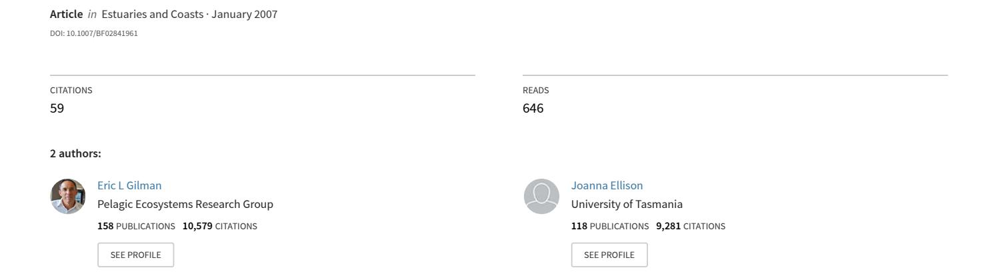
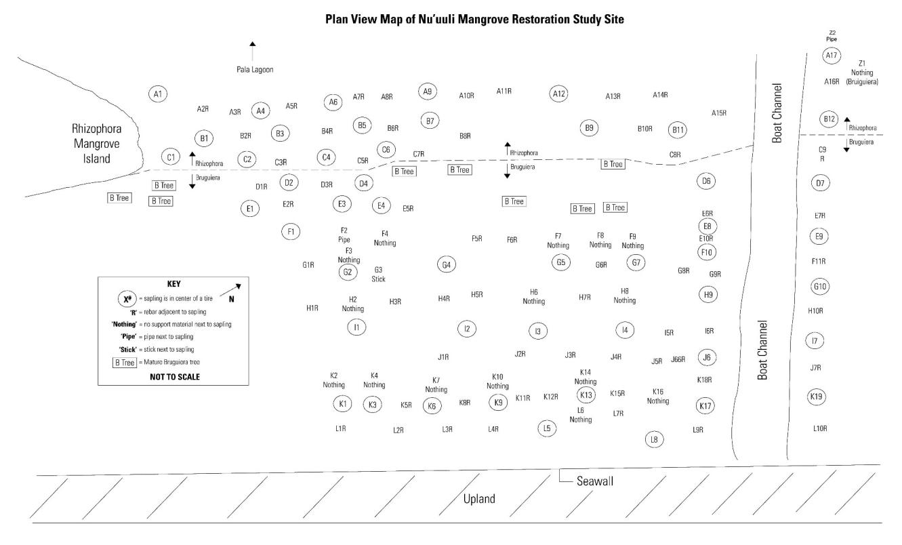
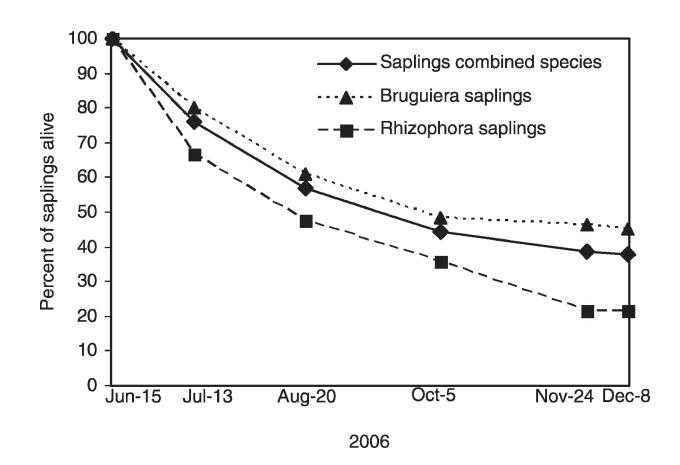
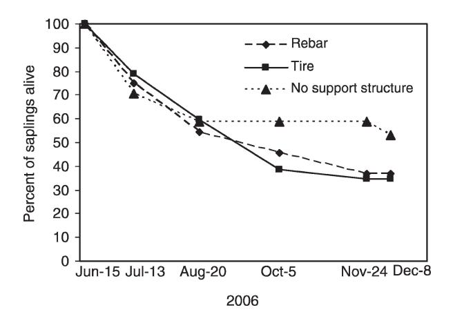

## [Efficacy of alternative low-cost approaches to mangrove restoration, American](https://www.researchgate.net/publication/227062466_Efficacy_of_alternative_low-cost_approaches_to_mangrove_restoration_American_Samoa?enrichId=rgreq-18d89032715f60d258864c4bce0cc420-XXX&enrichSource=Y292ZXJQYWdlOzIyNzA2MjQ2NjtBUzo0MDg5NzYxNTI5MDc3NzZAMTQ3NDUxODkyMTc5NA%3D%3D&el=1_x_3&_esc=publicationCoverPdf) Samoa

# Efficacy of Alternative Low-cost Approaches to Mangrove Restoration, American Samoa

ERIC GILMAN1,\* and JOANNA ELLISON2

ABSTRACT: Three mangrove restoration methods were tested at Nu'uuli, Tutuila Island, American Samoa. Since clearing 27 years ago converted the mangrove into a mudflat, the ecosystem was sufficiently altered that it could not self-correct; the ecosystem showed no natural regrowth despite an ample supply of propagules. While several years of monitoring may ultimately be required to determine the project's success, and several decades could be required to fully return the full suite of functions, the project's low-cost, nontechnical restoration techniques, using readily available materials, have proven to be modestly successful, with 38% sapling survival after six months. Several years of monitoring will be necessary to determine if the restoration site's small elevation deficit relative to a reference site ultimately requires modifying the site's physical structure to correct the hydrology. Direct community participation in the project was critical to reduce the risk of human disturbance of the restoration site. One year project costs were about USD \$2,150 or USD \$13,030 ha21 . Labor comprised 84% of expenses; replicating the restoration project in developing countries would cost less due to lower wage levels. Six months after initial restoration activities, there was a highly significant difference between Bruguiera gymnorrhiza and Rhizophora mangle sapling survival, with 21% and 45% of the original 42 R. mangle and 95 B. gymnorrhiza saplings remaining, respectively. The lower R. mangle survival may have resulted from an unavoidable need to source saplings from an area with different environmental conditions than the restoration site. Saplings were transplanted into tires filled with sediment as a simple, low-cost method to raise the elevation of the sediment surface. Saplings were also transplanted adjacent to rebar and without any support mechanism. There was no significant difference in sapling survival by treatment for individual or combined species. The restoration project is a model for the community-based, simple, low-cost approaches to ecological restoration needed in the region. Pilot projects using similar techniques may be worth pursuing at the other 15 Pacific Island countries and territories where mangroves are indigenous.

## Introduction

Mangrove rehabilitation includes enhancing degraded mangroves by removing stresses that caused their decline, restoring areas where mangrove habitat previously existed, and creating new mangrove habitat where it did not previously exist (habitat conversion). (Mangrove is used here to refer to the mangrove habitat type, community, or mangal, as coined by MacNae [1968] and further defined by Tomlinson [1986], and not the constituent plant species.) These practices contribute to reversing trends in mangrove losses in the Pacific Islands region and globally (Ramsar Secretariat 1999; Valiela et al. 2001). Mangrove rehabilitation also increases resistance and resilience to the myriad of stresses faced by this sensitive coastal ecosystem, including outcomes of climate change such as relative sea-level rise, clearing for development, conversion to aquaculture, and logging

The cumulative effects of natural and anthropogenic pressures make mangroves one of the most threatened ecosystems. Roughly 50% of the global area has been lost since 1900 (Ramsar Secretariat 1999; Valiela et al. 2001). Between 56% and 75% of the Asian mangrove area was lost during the 20th century (Primavera 1997; Smith et al. 2001). The remaining 17 million hectares of mangroves continue to decline at a global average annual rate of about 2.1%, exceeding the rate of loss of tropical rainforests (0.8%; Valiela et al. 2001; FAO 2003; Wells et al. 2006).

Pacific Island governments have recognized the value of mangroves and the need to augment conservation efforts (South Pacific Regional Environment Programme 1999). The Pacific Islands contain roughly 3% of the world's mangrove area, a small area in global terms, but each island group has a unique mangrove community structure (Ellison 2000) and mangroves provide site-specific functions and values (e.g., Lewis 1992; Gilman 1998). While a mangrove species may have a wide

1 IUCN (The World Conservation Union) Global Marine Programme and University of Tasmania School of Geography and Environmental Studies, 2718 Napuaa Place, Honolulu, Hawaii 96822

2 University of Tasmania School of Geography and Environmental Studies, Locked Bag 1-376, Launceston, Tasmania 7250, Australia

(Hansen and Biringer 2003; Ellison 2004; Gilman et al. 2006, 2007).

\* Corresponding author; tele: 808/722-5424; fax: 808/988- 1440; e-mail: egilman@blueocean.org

range, certain portions of it may be genetically isolated, resulting in unique varietal characteristics (Duke 1992; Ellison 2004). There is little available quantitative information on trends in area or health of Pacific Island mangroves due to limited monitoring and most area estimates are based on dated primary sources (Gilman et al. 2006). Reduced mangrove area and health increases the threat to human safety and shoreline development from coastal hazards such as erosion, flooding, and storm waves and surges. Mangrove loss will also reduce coastal water quality, reduce biodiversity, eliminate fish and crustacean nursery habitat, adversely affect adjacent coastal ecosystems, and eliminate a major resource for human communities that traditionally rely on mangroves for numerous ecosystem services (Ramsar Secretariat 2001). Mangrove destruction can also release large quantities of stored carbon and exacerbate global warming trends (Ramsar Secretariat 2001).

#### MANGROVE REHABILITATION PRINCIPLES

Determining the stresses that caused a mangrove to decline helps to identify the appropriate restoration or enhancement method (Lewis 2005). Many attempts to rehabilitate mangroves have not adequately considered the major factors that control mangrove ecosystem survival and health (Lewis et al. 2006). Too often the approach taken to restore or enhance a mangrove area is to plant mangroves without first identifying if the stress that is inhibiting natural regeneration is still present, which can result in limited survival of the planted mangroves (Lewis and Streever 2000; Lewis 2005). Only when the availability of waterborne seedlings of mangroves from adjacent stands is blocked is planting mangroves necessary to restore a degraded mangrove area. Mangroves can self-repair over a period of 15–30 years if hydrologic functions are intact and natural recruitment of mangrove seedlings occurs (Lewis 2005), although planting mangroves after removing causes of decline can help expedite this recovery.

Rehabilitation sites must meet the environmental conditions (e.g., duration, frequency and depth of inundation, wave energy, substrate conditions, salinity regime, soil and water pH, sediment composition and stability, nutrient concentrations, elevation, slope) required by mangrove species indigenous to the area. While it may be feasible to establish mangrove vegetation at new sites where they had not previously existed (habitat conversion; e.g., Choudhuri 1994; Sato et al. 2005), rehabilitation may be more successful and appropriately constitute ecological restoration if mangroves are restored at sites where they historically existed (Gilman 1998; Kusler and Kentula 1990; U.S. Department of Defense et al. 1995; Erftemeijer and Lewis 2000; Lewis et al. 2006). Restoring the full suite of functions performed by a relatively undisturbed mangrove ecosystem may require several decades and some sites might require active management, for instance, to prevent the establishment of alien invasive species or to avoid human disturbance.

Typically, the requisite approach to restore a degraded or lost mangrove entails reestablishing the elevation and slope that is optimal for target mangrove species, which determine the hydrologic regime (duration, depth, and frequency of inundation), and augmenting a mangrove conservation ethic by the local community. The likelihood of successfully rehabilitating a mangrove is typically highest for sites where disturbance has been recent and can be stopped, and where alteration to the mangrove's physical structure has been minimal.

Some site preparation requirements for mangrove rehabilitation include (Smith III 1987; Kusler and Kentula 1990; Naidoo 1990; Lewis 1994, 2005):

#### Conservation Ethic

If the rehabilitation site is located in an area inhabited by people, augmenting or developing a mangrove conservation ethic by the local community can be critical for success. In most cases, direct human disturbance is the cause of the original mangrove degradation or loss.

#### Elevation

Grading the site to the elevation that provides the optimal hydrologic regime (duration, frequency, and depth of inundation) for the targeted mangrove species may be necessary. Riley and Kent (1999) planted mangrove seedlings within translucent, 3.8 cm-diam poly vinyl chloride pipes with a partial vertical slit, in part, to establish plants at elevations lower than where natural recruitment was occurring. If fill will be added or removed to achieve the target elevation and slope, the design and careful monitoring of the final target grade is critical.

#### Slope

Gradual slope helps reduce erosion, filters runoff entering the wetland, and allows for surface drainage at low tide.

#### Tidal Exchange and Wildlife Access

It may be necessary for large mangrove rehabilitation sites to include drainage channels to simulate natural tidal creeks, providing requisite tidal exchange, salinity regime, and wildlife access.

#### Wave Energy

If the rehabilitation site is exposed to too high a degree of wave energy, an offshore structure is needed (e.g., breakwater, rock berm, jetty, dike or submerged sandbar).

#### Fertilizer

Consider if time-release fertilizer is warranted (nitrogen is a nutrient limiting growth of halophytes in intertidal areas).

#### Fencing and Removal of Loose Debris

Installing fencing around the perimeter of the rehabilitation site can reduce the risk of disturbance by humans, pigs, dogs, etc. If there are dead trees or garbage on the site, then these should be removed. Dead trees can become loose and roll with tides and waves, as can garbage and other loose debris, which can damage the rehabilitation area.

#### REHABILITATION PURPOSE

The purpose of mangrove rehabilitation must be defined, as this controls the methods and materials to be adopted along with development of performance standards and monitoring techniques (Gilman 1999). The objectives of mangrove rehabilitation projects have included timber production or silviculture, enhancement of coastal protection, and improved water quality, but most common is to restore structure and functional performance to a least disturbed state (Field 1998; Lewis and Streever 2000; Lewis 2005).

The purpose of this pilot project was to attempt to restore the mangrove to perform functions at similar levels as an adjacent, relatively healthy reference mangrove site. The project was also conducted to serve as a model for replication at the other 15 Pacific Island countries and territories where mangroves are indigenous. There is a need to augment the capacity to conduct effective and affordable mangrove restoration techniques in the Pacific Islands region (Gilman et al. 2006). There has been limited mangrove rehabilitation activity in the region, with small-scale successful projects only recorded from Kiribati, Northern Mariana Islands, Palau, and Tonga and failed efforts in American Samoa and Papua New Guinea (Gilman et al. 2006). The American Samoa Community College Land Grant Program, with assistance from staff from the American Samoa Coastal Management Program, conducted an unsuccessful attempt to restore mangroves to the project site through raising mangrove seedlings at a nursery and transplanting the seedlings at the restoration site. None of the seedlings survived. The results of two additional rehabilitation efforts in Palau and Fiji are not known (Gilman et al. 2006). This highlights the need for improved staff training, capacity building, and information sharing.

The project was also conducted to achieve local benefits. These include returning valued ecosystem services to the section of coastline where the project site is located, augmenting in-country capacity to monitor mangrove health and conduct mangrove restoration, augmenting a mangrove conservation ethic by the local community, and reversing trends in loss of mangrove area and health in American Samoa (Amerson et al. 1982; American Samoa Coastal Management Program 1992; Bardi and Mann 2004; Gilman et al. 2007).

#### Methods

#### STUDY AREA

American Samoa is the eastern portion of the Samoa archipelago, located in the central western Pacific. Samoa is the eastern limit for indigenous mangroves in the Pacific (Ellison 1999). Three true mangrove species and several mangrove associate species are present in American Samoa's mangroves (Amerson et al. 1982; Bardi and Mann 2004). American Samoa mangroves are dominated by a single tree species, Bruguiera gymnorrhiza (L.) Lamk. (oriental mangrove), with Rhizophora mangle L. (red mangrove) found primarily along mangrove seaward margins (Amerson et al. 1982). Xylocarpus moluccensis (Lamk.) M. Roem (puzzle-nut tree) is rare, with only a few individual trees found at Nu'uuli and Aunu'u mangroves (Amerson et al. 1982; Bardi and Mann 2004). The predominant soil type of American Samoa mangrove is Ngerungor Variant organic peat (U.S. Soil Conservation Service 1984), a mixture of peat and basaltic and calcareous sand, comprised of 10– 30% organic matter (Ellison 2001). The tidal range is about 1.1 m. Mean annual rainfall is 312 to 563 cm. The mean annual temperature is 26.7uC (U.S. Soil Conservation Service 1984).

There are nine mangrove wetlands in American Samoa, located on Tutuila and Aunu'u Islands, with an estimated combined area of 52.3 ha (Gilman et al. 2007). The majority of American Samoa's mangrove area has been filled since the early 1900s, and losses continue from anthropogenic activities as well as from mangrove responses to sea-level rise and other climate change outcomes (Amerson et al. 1982; American Samoa Coastal Management Program 1992; Bardi and Mann 2004; Gilman et al. 2007).

The restoration site is part of Nu'uuli mangrove, the largest mangrove in American Samoa (30.69 ha). Nu'uuli mangrove is a fringing, tidedominated mangrove with an approximate center at 170u42.7669W, 14u18.8449S, and is located in one of the most developed sections of Tutuila Island (Bardi and Mann 2004; Gilman et al. 2007). Large portions of Nu'uuli mangrove have been filled for development since the early 1900s (Amerson et al. 1982; American Samoa Coastal Management Program 1992). Nu'uuli mangrove could be further reduced in area by as much as 67% by the year 2100 as a result of the mangrove's natural landward migration in response to projected relative sea-level rise combined with 68% of the mangrove's landward margin being obstructed by development (Gilman et al. 2007). Williams (2004) quantified land uses in 1961, 1984, and 2001 for the Tafuna Plain, Tutuila Island, American Samoa, which is adjacent to the Nu'uuli mangrove study site, finding that over the four decades the area of forested land decreased by 52%, while the area of developed land increased by 367%. This may have altered sediment, freshwater, and pollutant input levels into mangroves, causing changes in boundary positions and reducing health.

The center of the restoration site is at 14u19904.20S, 170u42909.20W, located in the southeastern part of Nu'uuli mangrove. The restoration site is approximately 1,650 m2 , 55 m long (parallel to the shoreline), and 30 m wide (from landward to seaward margins).

#### PERIOD

Initial restoration activities took place from June 13 to 15, 2006. Monitoring was conducted five times (July 13, August 20, October 5, November 24, and December 8) over six months from initial restoration activities.

#### SITE SELECTION AND COMMUNITY PARTICIPATION

We selected this site for the project because we determined that the system has been altered to such an extent that it could not self-correct. The site contained only six mature B. gymnorrhiza trees, two B. gymnorrhiza saplings, and one R. mangle sapling. Very few seedlings and saplings were establishing despite an ample supply of propagules from adjacent relatively healthy mangroves. The site also has easy access, making it convenient for training, monitoring, and education. Through preproject community consultation we determined that the adjacent landowners, village mayor, village council, and local community supported the project and members of the local community were available to participate in restoration and monitoring activities as well as help minimize the risk of human disturbance of the restoration site.

#### STRESSES THAT CAUSED MANGROVE DECLINE

We analyzed a time series of aerial photographs showing Nu'uuli mangrove in 1961, 1971, 1984, and 1990, and 2001 Ikonos and 2004 QuickBird satellite imagery to determine when mangrove vegetation disappeared from the site; if mangrove vegetation cover demonstrated a trend, such as continual reduction in cover versus removal during a single pulse; and if the historical imagery provides information to support an inference of the cause of the loss of mangrove habitat from the restoration area. The Ikonos and QuickBird satellite imagery have been georeferenced to the UTM NAD83 Zone 2 South High Accuracy Reference Network (HARN) projection and coordinate system. ERDAS Imagine 8.7 software was used to coregister the aerial photos to the georeferenced 2001 Ikonos satellite imagery. A minimum of 20 ground control points were used per aerial photo for coregistration. A third order polynomial model was used to coregister the aerial photos.

We also interviewed the owners of the land parcels located immediately landward of the project site and adjacent landowners to attempt to determine the cause of the mangrove loss.

#### TARGET SUBSTRATE ELEVATION AND VEGETATION ZONE WIDTHS

We interpreted the historical aerial photos and satellite imagery to determine the locations and widths of historical mangrove vegetation zones at the study site before the mangrove vegetation cover was lost. We also measured the width of the mangrove vegetation zones of an adjacent relatively undisturbed reference mangrove site to help design the location of the restoration site mangrove vegetation zones.

We compared the elevation of the mangrove of an adjacent reference mangrove site to the elevations of the corresponding sediment surface of the restoration site to determine if disparities in elevation might be preventing natural regeneration and to determine what elevation to target for the restoration site.

Because propagules are present but not establishing at the study site, we assumed that the disturbance stress that caused the mangrove loss, or that is preventing natural regeneration, was still present. One hypothesis was that the sediment surface of the restoration area is currently at a lower elevation than that of the adjacent reference site, which is preventing natural recruitment, and that by establishing mangrove trees the restoration site will gradually build up sediment to reach a surface elevation equivalent to that of the adjacent mangrove areas. Vegetational friction on water movement combined with flocculation of clays contributes to substrate accretion (Furukawa and Wolanski 1996; Furukawa et al. 1997). Excavation of fill or backfilling of an excavated or eroded area to

achieve the same slope and elevations relative to a reference site would be an optimal approach to achieve the correct hydrology (Lewis and Streever 2000). This is expensive, and raises many additional complexities; e.g., fill material must be of suitable grain size and free of contaminants. The methods employed in this study using infilled tires to achieve target elevations and pipes to provide protection from debris and human disturbance, presented a more cost-effective and technologically appropriate approach, the efficacy of which is being assessed in this study.

#### RESTORING MANGROVE VEGETATION ZONES

In general, suitable species to be replanted are those that naturally occurred at the site before disturbance, with individual species located in the correct zones. Individual mangrove species tend to occur in zones according to their specific tolerance levels for various environmental parameters, including hydrologic and salinity regimes, wave energy, soil and water pH, sediment composition and stability, nutrient concentrations, and degree of faunal predation, resulting in zonal distribution of mangrove species (Tomlinson 1986; Naidoo 1990; Duke 1992), in this case with R. mangle on the seaward margin and B. gymnorrhiza on the landward margin. We analyzed historical aerial photographs to identify the former extent of mangroves and the constituent vegetation zones. The positions of B. gymnorrhiza and R. mangle zones in the restoration area and target density of trees were determined based on the review of the available historical remotely sensed imagery and assessment of the widths of these mangrove zones in adjacent mangrove reference areas.

Saplings were transplanted from wild sources. B. gymnorrhiza saplings were transplanted from a large supply from mangrove areas proximate to the restoration site within the Coconut Point area. Due to a difficulty in locating suitable R. mangle saplings for transplanting from adjacent mangrove areas, about half of the restoration site R. mangle saplings were taken from an area in Nu'uuli mangrove outside of the Coconut Point area where there was a substantially higher soil organic content than at the restoration site. Mangrove saplings for replanting were collected from large, mature mangrove ecosystems where natural regeneration is occurring. An attempt was made to collect saplings only from areas within the forest with large populations of shaded saplings, and from areas where the mangrove mud was firm. This is because sediment is removed with the sapling, so in narrow, degraded, or sea margin areas, erosion and degradation of the source area may occur if saplings are removed. Saplings were also not collected from light gaps as these saplings have a relatively high likelihood of surviving.

An attempt was made to choose saplings for transplanting that were 0.5–0.8 m tall, with a straight trunk, an intact growing tip, and several leaf pairs. We avoided old saplings, with over 15 leaf scars on the trunk (Duke and Pinzo´n 1992), and those that already have developed prop roots or side branches. Older saplings are less likely to survive transplanting, probably due to root disturbance (Hamilton and Snedaker 1984). Saplings were transported to the study site and transplanted within 30 min of being extracted from their original site.

Saplings were planted by digging and placing the sapling into a hole. An attempt was made to ensure that the mud level after planting was the same as at the original location. If a sapling were buried deeper, it would likely not survive. Saplings were removed and holes were dug by hand; digging tools were rarely necessary.

We did not employ natural regeneration or plant propagules (the fruit after falling from the parent tree but not yet rooted in the substrate) in order to reduce the amount of time to restore the mangrove habitat to reference conditions and because use of tires with elevated sediment surface inside in which planting occurred prevents natural recruitment mechanisms. We also decided not to raise saplings from seedlings in a nursery. Raising the seedlings in a nursery risks causing stress and low survivorship when transplanting to the project site, as conditions (e.g., hydrologic regime, wave energy, salinity, nutrient levels, sun exposure) in the nursery versus the project site are likely to differ. Advantages of collection from the wild and transplanting are: saplings can be collected at any time through the year, they are suitable for higher energy sites, and success rates are usually higher than planting seeds.

Three simple, technologically-appropriate treatments using materials readily available in Pacific Island countries and territories were employed to restore mangrove vegetation to the restoration site:

#### Rebar or Other Support Structure Adjacent to Sapling

A single R. mangle sapling, approximately three years old, was observed growing next to a 0.6 m tall pipe in the restoration study site. This was the only R. mangle sapling present in the restoration site (there were also two existing B. gymnorrhiza saplings each about one year old, in the study site), supporting a hypothesis that sapling survival might be enhanced when located adjacent to similar support structures, perhaps by providing a degree of protection from human disturbance and debris. Based on this observation and hypothesis, we made one of the restoration method treatments placing a three-meter length rebar pipe into the sediment

Fig. 1. Plan view of the Nu'uuli mangrove, American Samoa restoration site.

adjacent to planted mangrove saplings. In some cases a pipe or wooden stick was used instead of rebar.

#### Tires

Used car and truck tires were laid flat on the sediment surface, filled with sandy sediment taken from close offshore from the restoration site, and planted with one sapling inside. We attempted to cut the tires to allow easier long-term removal, but this proved too difficult with the equipment available.

#### No Physical Support

Saplings were planted in the restoration site with no support structure placed within one meter.

#### Restoring Vegetation Zones

Fig. 1 shows a plan view of the restoration site identifying the location and treatment for each transplanted sapling. The locations of the restored seaward R. mangle mangrove vegetation zone and landward B. gymnorrhiza zone are identified. We transplanted 93 B. gymnorrhiza and 41 R. mangle saplings into the project site. Two preexisting B. gymnorrhiza saplings were present in the restoration site (Z1 and L7, Fig. 1). One preexisting R. mangle sapling was present (Z2, Fig. 1). Of the total 137 saplings, 52 (38.0%) were planted in tires, 68 (49.6%) had a rebar pipe or similar structure located adjacent to it, and 17 (12.4%) had no physical support structure. Of the total 95 B. gymnorrhiza saplings, 33 were inside a tire, 45 had a rebar pipe or similar structure located adjacent to it, and 17 had no physical support. Of the total 42 R. mangle saplings, 19 were placed inside a tire, and 23 had a rebar pipe or similar structure located adjacent to it. Saplings were generally located at \$ 1-m intervals, as this provides mutual protection. Also, planting seedlings in 1-m centers, or 10,000 per ha, will lead to the target tree density of mature mangroves of about 1,000 trees per ha (1 tree per 10 m2 ; Lewis and Streever 2000).

Codes for each sapling in the study site were initially painted on the outside of tires and written on flag tape, placed on pipes, and saplings. Aluminum tree tags were later attached to each sapling with loosely fitted wire.

The experimental design was purposely not randomized or balanced. In an attempt to maximize sapling survival, we intentionally included a higher proportion of saplings with a physical support structure (adjacent to a pipe or inside a tire) versus saplings with no support, and included a pipe or tire for all saplings in the seaward R. mangle zone where wave energy and exposure to impact from debris is highest.

#### MONITORING AND MAINTENANCE

The survival of each sapling in the study area was monitored five times over the six months following project initiation. The Chi-square test of heterogeneity is used to determine any significant difference for the survival of B. gymnorrhiza versus R. mangle saplings and survival for each of the three treatments (sapling next to a rebar, inside a tire, and no support) for individual and combined mangrove species. For saplings planted inside tires, the height of sediment inside the tire relative to the sediment elevation of the substrate adjacent to the tire was measured at project initiation and again at six months. Debris such as logs, garbage, timber, and palm fronds were periodically removed from the study site area. This was done to prevent the debris from rolling at high tide and dislodging saplings.

#### PROJECT COSTS

We itemize project costs in order to estimate a per hectare cost for mangrove restoration with the techniques employed in this study.

#### Results

#### CAUSE OF MANGROVE DECLINE

Analysis of a time series of remotely sensed imagery of the study site at six points in time from 1961 through 2005 contributed to understanding the cause of the mangrove ecosystem degradation. A substantial loss of mangrove trees occurred between 1971 and 1984, with a further reduction in area of a mangrove island between 1984 and 1990. The mangrove area margins and cover remained relatively unchanged between 1990 and 2004. In 1984 there was a substantial increase in development of adjacent upland areas relative to 1971 along the Coconut Point area near the study site.

Interviews with landowners adjacent to the mangrove restoration study site identified the cause of the original mangrove loss. In 1979, Leon and Michael Malau'ulu, then eight and ten years old, respectively, following their parent's instructions, over a one-month period, cut down the mangroves fronting their property using machetes. The Malau'ulu family had decided to remove the mangrove in order to provide a source of firewood, improve boat access, and improve access to mudflat habitat for collecting a marine worm (Ipo in Samoan) for subsistence consumption (L. Malau'ulu personal communication).

A covered structure is present on the shoreline where the landowner loads provisions onto small boats. The boat provisioning and other activities on the mudflat have likely contributed to preventing the long-term survival of mangrove seedlings that had become established through natural recruitment since the Malau'ulu family cleared mangrove trees from the area in 1979.

#### COMMUNITY PARTICIPATION

The American Samoa Department of Commerce, Coastal Management Program obtained authorization and expression of support from the Nu'uuli mayor (Vaealuga Maae, Magele [High Talking Chief] of Nu'uuli village), Nu'uuli village council, and landowners adjacent to the study site to conduct the mangrove restoration project. Leon Malau'ulu, the landowner immediately adjacent to the study site, directly participated in restoration and monitoring activities. Leon explained that his family's main interests to help restore the mangrove habitat fronting their property include: reducing salt spray damage to their property, reducing debris from washing up to their property line, improving habitat conditions for mangrove crabs, and providing protection from storm energy and erosion (L. Malau'ulu personal communication).

Through consultation with the Malau'ulu family, a boat channel was included in the design of the mangrove restoration site (Fig. 1) to allow for continued boat access to the facility where the family loads provisions onto small boats, in part, to reduce the likelihood of future disturbance of the reestablished mangrove vegetation. The borders of the boat channel were lined with sufficiently tall rebar with brightly colored flag tape attached to the top ends to ensure visibility at high tide and discourage the boat operators from traveling into the mangrove area.

#### WIDTH OF REFERENCE VERSUS RESTORATION SITE MANGROVE VEGETATION ZONES

The width perpendicular to the shoreline of the reference B. gymnorrhiza zone is 12.4 m, and width of the R. mangle zone is 19.1 m. The width of the restoration B. gymnorrhiza zone is 19.7 m, and width of the R. mangle zone is 9.5 m. Due to difficulties encountered in locating suitable sources of R. mangle saplings to transplant to the restoration site, the R. mangle zone of the restoration site is narrower than in the reference site, and the B. gymnorrhiza zone of the restoration site is wider and extends 7.3 m further seaward than the reference site.

#### ELEVATIONS OF REFERENCE MANGROVE AND RESTORATION SITE

The lowest elevation of the R. mangle reference mangrove site is used as the 0 mm elevation for this analysis. The seaward margin of the R. mangle zone

Fig. 2. Percent of surviving saplings combined species (n 5 137), Bruguiera gymnorrhiza (n 5 95), and Rhizophora mangle (n 5 42) versus date, Nu'uuli mangrove restoration site.

is estimated to be at about mean sea level (Ellison 2001, 2004). The R. mangle zone of the reference mangrove had a range in elevation of 0 to + 332 mm (mean + 149 6 40 mm SD). The B. gymnorrhiza zone of the reference mangrove had a range in elevation of + 384 to + 393 mm (mean + 387 6 3 mm SD).

The R. mangle zone of the restoration site had a range in elevation of 246 to + 94 mm (mean + 16 6 6 mm SD). The B. gymnorrhiza zone of the restoration site had a range in elevation of + 43 to + 250 mm (mean + 134 6 12 mm SD).

The initial elevations inside the tires in the restoration R. mangle zone relative to the immediately adjacent substrate had a range in elevation of + 98 to + 240 mm (mean + 149 6 10 mm SD). The elevations inside the tires in the restoration B. gymnorrhiza zone relative to the immediately adjacent substrate had a range in elevation of + 80 to + 357 mm (mean + 143 6 9 mm SD).

#### SURVIVAL BY TREATMENT, SPECIES ZONE, AND AREA

Of the original 137 saplings, 38.0% survived as of the last date of monitoring (Fig. 2). After six months from project initiation, 45.3% and 21.4% of the original 95 B. gymnorrhiza saplings and 42 R. mangle saplings, respectively, remained alive. There was a highly significant difference in B. gymnorrhiza and R. mangle survival (Chi-square test of heterogeneity, X2 5 7.03, df 5 1, p , 0.01). After six months from project initiation, there was 36.8%, 34.6%, and 52.9% survival of the original 68 saplings adjacent to rebar, 52 saplings inside a tire, and 17 saplings with no support structure (Fig. 3). There was no significant difference in sapling survival for combined mangrove species for saplings located next to rebar, inside a tire, or with no support (Chi-square test of heterogeneity, X2 5 1.91, df 5 2, p . 0.05).

Fig. 3. Percent of saplings (combined species) by treatment (next to a rebar n 5 68, inside a tire n 5 52, no support structure n 5 17) that survived versus date, Nu'uuli mangrove restoration site.

For R. mangle, there was 26.3% and 17.4% survival of saplings in tires (n 5 19) and next to rebar (n 5 23), respectively, after six months from project initiation. There were no R. mangle no support structure treatments. There was no significant difference in R. mangle survival for saplings located next to rebar versus inside a tire (Chi-square test of heterogeneity, X2 5 0.49, df 5 1, p . 0.05). For B. gymnorrhiza, after six months from project initiation, there was 39.4%, 46.7%, and 52.9% survival of saplings in tires (n 5 33), next to rebar (n 5 45), and with no support structure (n 5 17), respectively. There was no significant difference in B. gymnorrhiza survival for saplings located next to rebar, inside a tire, or with no support (Chi-square test of heterogeneity, X2 5 0.90, df 5 2, p . 0.05).

### CHANGE IN HEIGHT OF SEDIMENT INSIDE TIRES

The elevation of the sediment surface inside tires into which mangrove saplings were planted lowered by a mean of 246 mm from June 15 (average elevation above the ambient sediment surface of 138 6 4.9 mm SD, n 5 52) to December 8, 2006 (average elevation above ambient of 92 6 4.4 mm SD, n 5 52).

#### PROJECT COSTS

Project costs were USD \$1,450 after completion of six months of monitoring. This includes costs for equipment (rebar, flag tape, paint), paid labor (average of USD \$15 per hour for government employees and a government contractor), and miscellaneous expenses (use of computers, office supplies, internet, phone, and a government vehicle), as well as the estimated value of volunteer labor (average of USD \$5 per hour). Predicted costs over

the following six months for monitoring, debris removal, and replacing dead saplings for government and volunteer labor is USD \$700.

#### Discussion and Conclusions

Damage to roots during transplanting was likely a contributing cause of the observed sapling mortality. Human disturbance may also have been a factor. Debris, such as logs and garbage, were observed in the site and may have rolled with the tides and damaged saplings, contributing to a portion of the observed sapling mortality. Researchers qualitatively observed an increase in the number of seedlings becoming established over the six months from the initial installation of the rebar and tires, perhaps a result of reduced human traffic and increased protection from debris.

The restoration site's seaward R. mangle zone had a mean elevation deficit of 0.13 m relative to the R. mangle zone of a reference site. Saplings planted inside the tires in the R. mangle zone of the restoration site were an average of + 149 mm above the adjacent surface outside the tire and were at elevations similar to that in the R. mangle zone of the reference site. While differences in survival rates were not significantly different for the two treatments used with R. mangle saplings, the observed lower mortality of R. mangle saplings in tires versus next to rebar suggests that the correction in elevation accomplished by the tires may have been a factor.

The restoration site's landward B. gymnorrhiza zone had a mean elevation deficit of 0.25 m relative to the B. gymnorrhiza zone of the reference site. Saplings in the B. gymnorrhiza restoration zone were an average of + 143 mm above the adjacent surface outside the tire and were an average of 2110 mm below the elevation of the B. gymnorrhiza zone in the reference site. There was lower survival of B. gymnorrhiza saplings in tires versus next to rebar or with no support structure. Again, while the difference in survival between treatments was not significant, results suggest that factors other than differences in duration, frequency, and depth of inundation may have been predominant in causing the observed different survival rates by treatment for B. gymnorrhiza saplings.

For combined species, transplanted saplings with no support structure fared better than those placed inside tires and next to rebar, but the differences in survival were not significant (Fig. 3). The predominant location of saplings with no support structure in the landward portion of the restoration site where they may be relatively more protected from disturbance from debris (all saplings with no support are in the landward B. gymnorrhiza zone) may explain the higher survival of this treatment relative to the other two treatments. The most seaward 7.3 m of the restoration site's B. gymnorrhiza zone extends further seaward than in the adjacent reference area, which raised the concern that there would be relatively high mortality in this area of the B. gymnorrhiza zone of the restoration site. This was not the case. This suggests that this species is able to tolerate the higher duration, frequency, and depth of inundation that this area is subject to due to being at a lower elevation than the reference site.

Some possible problems with the use of tires as a support structure for mangrove restoration include: the water temperature inside the tires was observed to be substantially higher than the ambient water temperature, which could stress the mangrove inside the tire; and the inundation duration inside the tire is altered. We observed erosion of sediment from inside tires at a mean of 46 mm over six months. If sediment erosion continues over coming years, this may result in stress and mortality. We only observed partial dislodgement of one of the 52 tires used in the experiment, in this case, as a result of air caught inside the tire and perhaps due to sediment erosion from inside the tire. Also, the tires may move during a storm when there is high wave and current energy.

There was a large and significantly higher sapling mortality rate in the R. mangle zone relative to that in the B. gymnorrhiza zone (Fig. 2). The higher mortality may be a result of a larger proportion of the R. mangle saplings being sourced from an area removed from the restoration site where soil and other environmental parameters are different. Half of the seaward-most row of R. mangle saplings survived, an area that presumably would encounter a relatively high degree of disturbance from debris, suggesting that damage from debris may not have caused of the observed higher R. mangle mortality. The restoration site may be sufficiently open and exposed that damage from debris may be an equal risk in all areas, both landward and seaward.

Project costs through one year from initial restoration activities are estimated to be USD \$2,150, which equates to USD \$13,030 ha21 . Labor comprised about 84% of expenses. The range of reported costs for mangrove restoration is USD \$225 to USD \$216,000 ha21 , not including the cost of the land (Ramsar Secretariat 2001; Lewis 2005). Replicating the American Samoa restoration technique in less developed countries would cost less due to lower labor costs.

It was critical to have direct community participation and support for the restoration project. In particular, without the approval of the adjacent landowner, there would have been a high risk of human disturbance to the restoration site. Attempts to establish restrictions on the use of resources in ways other than building on customary systems of management are not likely to be effective in most parts of the Pacific Islands region (Gilman 1997, 2002). Stakeholders will be more likely to comply with restrictions on their traditional resource use activities if they understand and support the restrictions, which can be accomplished through direct community participation in conservation activities, including mangrove restoration (Gilman 1997, 2002). Community-based approaches, which capitalize on traditional knowledge and management systems, and catalyze stakeholder support for requisite conservation activities, are suitable in American Samoa and other areas throughout the Pacific Islands region, where customary management systems, although weakened, continue to function (Gilman 2002).

The restoration project has proven to be modestly successful with 38% sapling survival. Several years of monitoring will ultimately be required to determine the project's success, and a much longer period might be required for the ecosystem to regain natural levels of the full suite of functions. Several years of monitoring will be necessary to determine whether this degraded mangrove, with an ample supply of propagules that showed no natural regrowth, with only a small difference in hydrologic regime relative to a reference site, can be rehabilitated by reducing disturbance by people and debris, without modifying the site's physical structure to correct the hydrology beyond the use of sediment-filled tires. The restoration project is a model for the community-based and low-cost approaches to ecological restoration needed in the region. Pilot projects using similar techniques at the other 15 Pacific Island countries and territories where mangroves are indigenous may be worth pursuing. The amount of time and expense required to rehabilitate damaged mangroves, as demonstrated in this study, supports efforts to avoid and minimize mangrove degradation.

#### ACKNOWLEDGMENTS

We are grateful for the assistance provided by Gene Brighouse of the American Samoa Coastal Management Program and Nu'uuli Mayor Magele Vaealuga Maae to encourage community support and involvement. Special thanks are due to Leon Malau'ulu who assisted with all project activities and provided permission by his family to conduct the project. Dr. Robin Lewis and Dr. Colin Field provided insightful suggestions and comments on a draft manuscript. Solialofi Tuaumu and Paul Anderson of the American Samoa Coastal Management Program, and Barbara Zennaro of the American Samoa Environmental Protection Agency assisted with monthly monitoring and maintenance. Nigel Brothers and Catherine Bone, volunteers, and Paul VanRyzin of the U.S. Department of Agriculture assisted with restoration activities. The authors are grateful for constructive comments provided by anonymous peer reviewers. Support for this study was provided by the American Samoa Coastal Management Program.

#### LITERATURE CITED

- AMERICAN SAMOA COASTAL MANAGEMENT PROGRAM. 1992. A Comprehensive Wetlands Management Plan for the Islands of Tutuila and Aunu'u, American Samoa. BioSystems Analysis, Pago Pago, American Samoa.
- AMERSON, JR., A., W. A. WHISTLER, AND T. D. SHCWANER. 1982. Wildlife and Wildlife Habitat of American Samoa. I. Environment and Ecology. U.S. Department of the Interior, Fish and Wildlife Service, Washington, D.C.
- BARDI, E. AND S. MANN. 2004. Mangrove Inventory and Assessment Project in American Samoa. Phase 1: Mangrove Delineation and Preliminary Assessment. Technical Report 45. American Samoa Community College, Pago Pago, American Samoa.
- CHOUDHURI, P. K. R. 1994. Preliminary observation on control of slumping through mangrove aforestation at Nayachara, West Bengal (India) – A case study. Indian Forester 120:395–399.
- DUKE, N. C. 1992. Mangrove floristics and biogeography, p. 63– 100. In A. I. Robertson and D. M. Alongi (eds.), Tropical Mangrove Ecosystems. American Geophysical Union, Washington, D.C.
- DUKE, N. C. AND Z. S. PINZO´ N. 1992. Aging Rhizophora seedlings from leaf scar nodes: A technique for studying recruitment and growth in mangrove forests. Biotropica 24:173–186.
- ELLISON, J. 1999. Status report on Pacific island mangroves, p. 3– 19. In L. G. Eldredge, J. E. Maragos, and P. L. Holthus (eds.), Marine and Coastal Biodiversity in the Tropical Island Pacific Region, Volume 2. Population, Development and Conservation Priorities. Pacific Science Association and East West Center, Honolulu, Hawaii.
- ELLISON, J. 2000. How South Pacific mangroves may respond to predicted climate change and sea level rise, p. 289–301. In A. Gillespie and W. Burns (eds.), Climate Change in the South Pacific: Impacts and Responses in Australia, New Zealand, and Small Islands States. Kluwer Academic Publishers, Dordrecht, Netherlands.
- ELLISON, J. 2001. Possible impacts of predicted sea-level rise on South Pacific mangroves, p. 289–301. In B. Noye and M. Grzechnik (eds.), Sea-level Changes and their Effects. World Scientific Publishing Company, Toh Tuck Link, Singapore.
- ELLISON, J. 2004. Vulnerability of Fiji's Mangroves and Associated Coral Reefs to Climate Change. Prepared for the World Wildlife Fund. University of Tasmania, Launceston, Australia.
- ERFTEMEIJER, P. AND R. R. LEWIS, III. 2000. Planting mangroves on intertidal mudflats: Habitat restoration or habitat conversion?, p. 156–165. InProceedings of the ECOTONE Viii Seminar, Enhancing Coastal Ecosystems Restoration for the 21st Century, Ranong, Thailand. Royal Forest Department of Thailand, Bangkok, Thailand.
- FIELD, C. D. 1998. Rehabilitation of mangrove ecosystems: An overview. Marine Pollution Bulletin 37:383–392.
- FOOD AND AGRICULTURE ORGANIZATION (FAO). 2003. New Global Mangrove Estimate. Food and Agriculture Organization of the United Nations, Rome, Italy.
- FURUKAWA, K. AND E. WOLANSKI. 1996. Sedimentation in mangrove forests. Mangroves and Salt Marshes 1:3–10.
- FURUKAWA, K., E. WOLANSKI, AND H. MUELLER. 1997. Currents and sediment transport in mangrove forests. Estuarine, Coastal and Shelf Science 44:301–310.
- GILMAN, E. L. 1997. Community-based and multiple purpose protected areas: A model to select and manage protected areas with lessons from the Pacific Islands. Coastal Management 25:59– 91.
- GILMAN, E. L. 1998. Nationwide permit program: Unknown adverse impacts on the Commonwealth of the Northern Mariana Islands' wetlands. Coastal Management 26:253–277.
- GILMAN, E. 1999. Choosing appropriate instruments from the wetlands management toolbox: A planning process to improve wetlands conservation. Wetland Journal 11:15–22.

- GILMAN, E. L. 2002. Guidelines for coastal and marine siteplanning and examples of planning and management intervention tools. Ocean and Coastal Management 45:377–404.
- GILMAN, E., J. ELLISON, AND R. COLEMAN. 2007. Assessment of mangrove response to projected relative sea-level rise and recent historical reconstruction of shoreline position. Environmental Monitoring and Assessment 124:105–130.
- GILMAN, E., J. ELLISON, V. JUNGBLAT, H. VANLAVIEREN, E. ADLER, L. WILSON, F. AREKI, G. BRIGHOUSE, J. BUNGITAK, E. DUS, M. HENRY, I. SAUNI, JR., M. KILMAN, E. MATTHEWS, N. TEARIKI-RUATU, S. TUKIA, AND K. YUKNAVAGE. 2006. Capacity of Pacific island countries and territories to assess vulnerability and adapt to mangrove responses to sea level and climate change. Climate Research 32:161–176.
- HAMILTON, L. S. AND S. C. SNEDAKER. 1984. Handbook for Mangrove Management. JUCN-UNESCO-EWC, Honolulu, Hawaii.
- HANSEN, L. J. AND J. BIRINGER. 2003. Building resistance and resilience to climate change, p. 9–14. In L. J. Hansen, J. L. Biringer, and J. R. Hoffmann (eds.), Buying Time: A User's Manual for Building Resistance and Resilience to Climate Change in Natural Systems. WWF Climate Change Program, Berlin, Germany.
- Kusler, J. A. and M. E. Kentula (EDS.). 1990. Wetland Creation and Restoration: The Status of the Science. Island Press, Washington, D.C.
- LEWIS, III, R. R. 1992. Scientific perspectives on on-site/off-site, inkind/out-of-kind mitigation, p. 101–106. In J. A. Kusler and C. Lassonde (eds.), Effective Mitigation: Mitigation Banks and Joint Projects in the Context of Wetland Management Plans. Proceedings of the National Wetland Symposium. Palm Beach Gardens, Florida.
- LEWIS, III, R. R. 1994. Enhancement, restoration and creation of coastal wetlands, p. 167–191. In D. M. Kent (ed.), Applied Wetlands Science and Technology. Lewis Publishers, Tokyo, Japan.
- LEWIS, III, R. R. 2005. Ecological engineering for successful management and restoration of mangrove forests. Ecological Engineering 24:403–418.
- LEWIS, III, R. R., P. ERFTEMEIJER, AND A. HODGSON. 2006. A novel approach to growing mangroves on the coastal mud flats of Eritrea with the potential for relieving regional poverty and hunger: Comment. Wetlands 26:637–638.
- LEWIS, III, R. R. AND B. STREEVER. 2000. Restoration of Mangrove Habitat. U.S. Army Engineer Research and Development Center, WRP Technical Notes Collection, ERDC TN-WRP-VN-RS-3.2. U.S. Army Engineer Research and Development Center, Vicksburg, Mississippi.
- MACNAE, W. 1968. A general account of the fauna and flora of mangrove swamps and forests in the Indo-West Pacific region. Advances in Marine Biology 6:73–270.
- NAIDOO, G. 1990. Effects of nitrate, ammonium and salinity on growth of the mangrove Bruguiera gymnorrhiza (L.) Lam. Aquatic Botany 38:209–219.
- PRIMAVERA, J. 1997. Socio-economic impacts of shrimp culture. Aquaculture Resources 28:815–827.
- RAMSAR SECRETARIAT. 1999. Global Review of Wetland Resources and Priorities for Wetland Inventory. Meeting of the Confer-

- ence of the Contracting Parties to the Convention on Wetlands, Ramsar Secretariat, Ramsar COP7 DOC.19.3. Ramsar Secretariat, Gland, Switzerland.
- RAMSAR SECRETARIAT. 2001. Wetland Values and Functions: Climate Change Mitigation. Ramsar Secretariat, Gland, Switzerland.
- RILEY, R. AND C. KENT. 1999. Riley encased methodology: Principles and process of mangrove habitat creation and restoration. Mangroves and Salt Marshes 3:207–213.
- SATO, G., A. FISSEHA, S. GEBREKIROS, H. KARIM, S. NEGASSI, M. FISCHER, J. YEMANE, J. TECLEMARIAM, AND R. RILEY. 2005. A novel approach to growing mangroves on the coastal mud flats of Eritrea with the potential for relieving regional poverty and hunger. Wetlands 25:776–779.
- SMITH, J., H. SCHELLINHUBER, AND M. MIRZA. 2001. Vulnerability to climate change and reasons for concern: A synthesis, p. 913– 967. In J. McCarthy, O. Canziani, N. Leary, D. Dokken, and K. White (eds.), Climate Change 2001: Impacts, Adaptation, and Vulnerability. Published for the Intergovernmental Panel on Climate Change. Cambridge University Press, Cambridge, New York.
- SMITH, III, T. J. 1987. Effects of light and intertidal position on seedling survival and growth in tropical tidal forests. Journal of Experimental Marine Biology and Ecology 110:133–146.
- SOUTH PACIFIC REGIONAL ENVIRONMENT PROGRAMME. 1999. Regional Wetlands Action Plan for the Pacific Islands. South Pacific Regional Environment Programme, Apia, Samoa.
- TOMLINSON, P. B. 1986. The Botany of Mangroves. Cambridge University Press, Cambridge, U.K.
- U.S. DEPARTMENT OF DEFENSE, U.S. ENVIRONMENTAL PROTECTION AGENCY, U.S. DEPARTMENT OF AGRICULTURE, U.S. DEPARTMENT OF THE INTERIOR, AND NATIONAL OCEANIC AND ATMOSPHERIC ADMINISTRATION. 1995. Federal Guidance for the Establishment, Use and Operation of Mitigation Banks; Memorandum to the Field. Federal Register, Volume 60, No. 228. Washington, D.C.
- U.S. SOIL CONSERVATION SERVICE. 1984. Soil Survey of American Samoa. U.S. Department of Agriculture, Washington, D.C.
- VALIELA, I., J. BOWEN, AND J. YORK. 2001. Mangrove forests: One of the world's threatened major tropical environments. Bioscience 51:807–815.
- WELLS, S., C. RAVILOUS, AND E. CORCORAN. 2006. In the Front Line: Shoreline Protection and Other Ecosystem Services from Mangroves and Coral Reefs. United Nations Environment Programme World Conservation Monitoring Centre, Cambridge, U.K.
- WILLIAMS, L. 2004. Geo-spatial Analysis of Land Use Change and Development Impacts on the Tafuna Coastal Plain, Tutuila, American Samoa, from 1961–2001. American Samoa Coastal Management Program, Pago Pago, American Samoa.

#### SOURCE OF UNPUBLISHED MATERIALS

MALAU'uLU, L. personal communication. P. O. Box 23, Pago Pago, American Samoa 96799

> Received, January 3, 2007 Revised, April 16, 2007 Accepted, May 3, 2007