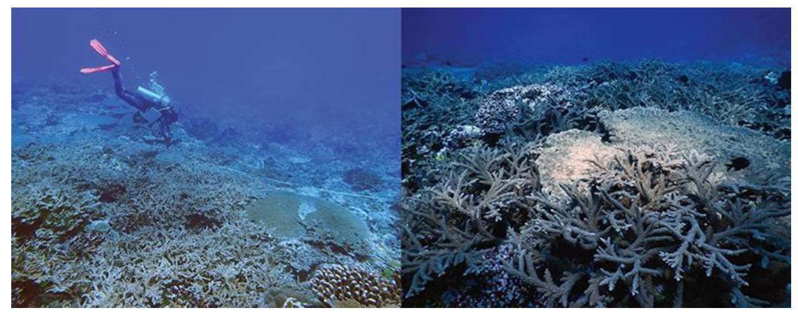
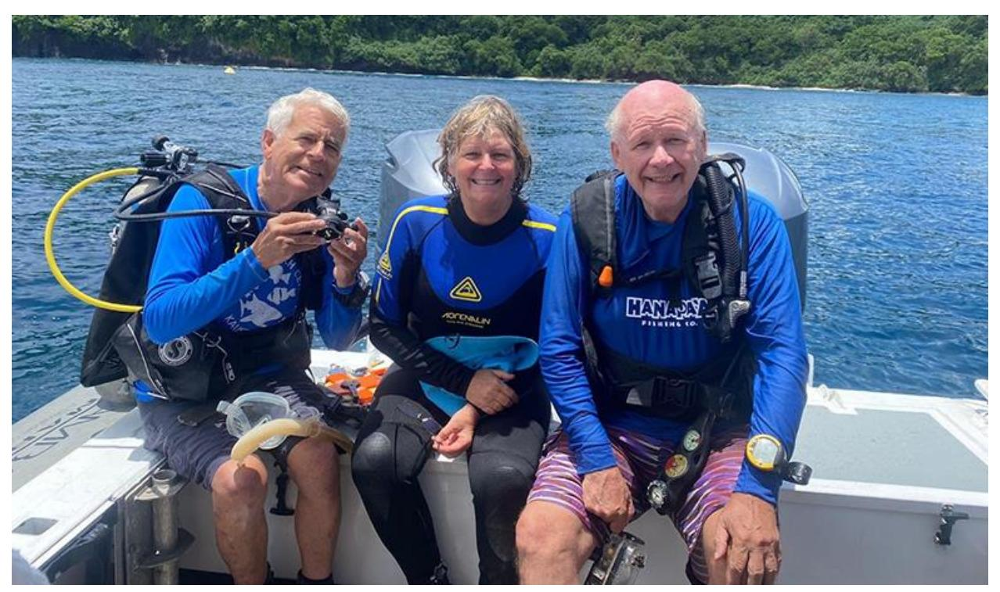
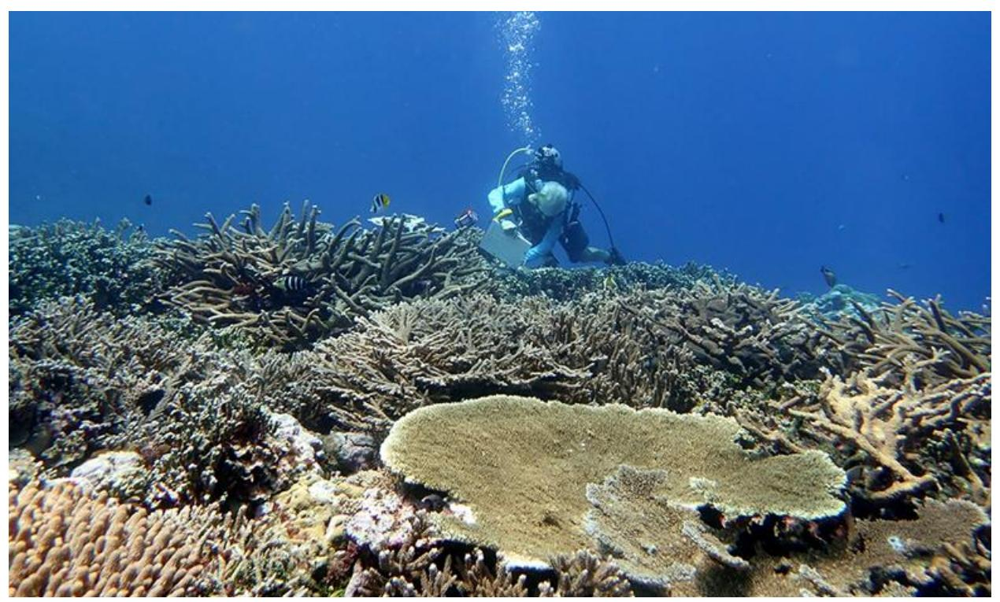

## **Fagatele Bay, a strongly resilient marine sanctuary in American Samoa**

*By: Sana Lynch, American Samoa Coral Reef Advisory Group (CRAG) Coordinator*

**Takeaway:** Fagatele Bay in the National Marine Sanctuary of American Samoa has shown remarkable resilience despite numerous environmental disturbances over the past four decades, including hurricanes, bleaching events, and crown-of-thorns starfish outbreaks. Surveys held since 1985, led by Dr. Charles Birkeland and his team, reveal a pattern of damage followed by rapid recovery facilitated by crustose coralline algae (CCA). This unique resilience offers hope amid global coral reef declines, highlighting the need for further research on CCA's role in coral recruitment and potential conservation strategies.

## History of Fagatele Bay

Since 1950, Earth has lost about half of its live coral cover (Eddy et al., 2021). Even the most remote places have been affected by human-caused global climate change. Though tucked away from the rest of the world, Fagatele Bay in the [National Marine Sanctuary of American Samoa](https://americansamoa.noaa.gov/) has endured multiple disturbances, including two crown-of-thorns starfish (COTS) outbreaks (1979 and around 2013-2015), ten hurricanes since 1978, numerous bleaching events (1994, 2003, 2015, 2017, 2018, 2020, and 2024), and a tsunami (2009). The corals in Fagatele Bay have consistently demonstrated their ability to bounce back, offering a unique case study that may bring some hope in the face of global coral reef decline.

Fagatele Bay Marine Sanctuary (FBMS) is co-managed by the American Samoa Department of Marine and Wildlife Resources and the National Marine Sanctuary of American Samoa. A remnant ancient volcano nestled in the southwest of Tutuila Island, FBMS epitomizes the picturesque South Pacific: a hidden away cove with a small white sandy beach shaded by sea hibiscus *(Hibiscus tiliaceus)* and futu *(Barringtonia asiatica)*. In the middle of the bay are some of the world's largest and oldest Porites corals, or "bommies."

When Dr. Charles Birkeland and his team first rolled off the boat into Fagatele Bay in 1985 to set up six transects to survey algae, coral, macroinvertebrates, and fish communities, they saw from the surface a vast light purple pavement of crustose coralline algae (CCA) with a few scattered *Pocillopora* and *Porites* corals. The coral community had been devastated by the COTS outbreak in 1979, and the team thought that all was lost. However, as they started measuring corals along the transect line, they could see numerous coral recruits which were too small to see from the surface. The corals were about as abundant as they probably were before the outbreak. This first glimpse of the character of Fagatele Bay gave the team a clue of the repetitive cycle this system goes through: damage or disturbance, followed by rapid recovery, possibly due to the CCA facilitating successful coral recruitment.

Left, Alice Lawrence taking small quadrat measures of coral recruitment in 2018. Right, scenic shot of corals in Fagatele Bay in 2018.

2024 Fagatele Bay Survey

Since the original 1985 survey, Charles has repeated the survey ten times: in 1985, 1988, 1995, 1996, 1998, 2001, 2002, 2007, 2018, and now 2024. Thirty-seven years after the first biological assessment, Dr. Birkeland, Dr. Alison Green, and Dr. Douglas Fenner continue this legacy. Supported by the [American](https://www.crag.as/)  [Samoa Coral Reef Advisory Group \(CRAG\)](https://www.crag.as/) through their NOAA Coral Reef Conservation Program Cooperative Agreement, the team embarked on continuing the survey this year. In February 2024, Charles, Doug, Alison, and former CRAG Fish Ecologist Alice Lawrence reunited in Pago Pago, the staging point for monitoring Fagatele Bay. The current CRAG Coordinator Sana Lynch welcomed them back, marking a significant new chapter in this nearly half-century story.

Dr. Charles Birkeland (left), Dr. Alison Green, and Dr. Doug Fenner's first day of 2024 surveys.

The first few days of torrential downpours and boat troubles left the team in nail-biting anticipation. But the clouds cleared, the National Marine Sanctuary vessel was finally loaded, and Charles, Alison, Doug, and Alice donned their SCUBA gear. Alison and Alice conducted fish surveys while Charles and Doug followed behind to collect benthic data. Within a couple of weeks, the surveys of the six original transects were successfully completed.

The Fagatele Bay that Charles experienced this year vastly differed from the Fagatele Bay he surveyed in 1985. Instead of mostly CCA cover with small coral recruits barely visible from the surface, they were stunned by the vibrant, psychedelically colored carpet of corals. Despite hurricanes, COTS outbreaks, bleaching events, and a tsunami during the past four decades, surveys in 2018 and this past February found the coral communities in Fagatele Bay to be the most magnificent ever.

Genetic analysis of CCA in Fagatele Bay may become the key to understanding the resilience of this reef. It is believed that *Porolithon onkodes* binds the reef substratum and is favorable for coral recruitment, but it has recently been found that *P. onkodes* is actually a complex group of species. Further analysis is needed to determine which species complexes are in Fagatele Bay and how many are there. Determining the species of CCA is important for management as different species recruit different genera of coral. This August, Charles plans to assist Dr. Guillermo Diaz-Pulido from Griffith University in collecting CCA samples for further DNA analysis, potentially providing long-awaiting answers about Fagatele Bay's resilience.

Dr. Charles Birkeland records data along a transect in 2018.

Globally, coral reefs are experiencing massive die-offs due to human-caused climate change, and even remote places like Fagatele Bay are not immune. This year, American Samoa recorded its highest ever sea surface temperatures, leaving coral managers questioning what can be done locally to save these beautiful ecosystems. While the future is uncertain, Fagatele Bay offers a glimmer of hope that healthy reefs can recover. It may not be able to hold on forever if global temperatures continue to rise, but maybe it can hold on long enough for us to figure out a solution.

## **Citations:**

Eddy, T.D., Lam, V.W.Y, Reygondeau, G., Cisneros-Montemayor, A.M., Greer, K., Palomares, M.L.D., Bruno, J.F., Ota, Y., & Cheung, W.W.L. (2021). Global decline in capacity of coral reefs to provide ecosystem services. One Earth, 4, 1278-1285. <https://doi.org/10.1016/j.oneear.2021.08.016>