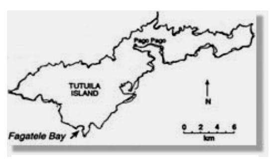

## **Fagatele Bay National Marine Sanctuary**

• **Year Designated:** 1986 • **Size (area):** 0.25 square miles

• **Location:** Bay area off the southwest coast of Tutuila

Island, American Samoa • **Territorial Waters:** Located entirely in Territorial waters

• **Purpose:** To protect and preserve an example of a pristine tropical marine habitat and coral reef terrace ecosystem of exceptional productivity; to expand public awareness and understanding of tropical marine ecosystems; to expand scientific knowledge of marine ecosystems; to improve resource management techniques; and to regulate uses within the Sanctuary to ensure the health and well-being of the ecosystem and its associated flora and fauna.

Map credit: Fagatele Bay NMS

• **Fully-Protected Areas:** None

• **Date Management Plan Issued:** 1986

• **Date of Management Plan Review:** Fagatele Bay NMS is beginning review of its Management Plan in 2005 and expects it to be completed by 2007.

**Sanctuary Website:** http://fagatelebay.noaa.gov/ **Sanctuary Regulations:** 15 C.F.R. § 922, Subpart J

## **Examples of Research and Monitoring Activities in the Sanctuary:**

- Long-term monitoring to follow the recovery of a coral reef.
- Marine mammal survey (not limited to the Fagatele Bay Sanctuary).
- Planning a coral disease study that will be conducted next year.
- Submarine and ROV used to video as much of the sanctuary as possible, and the deep areas adjoining the site down to 1,500 ft. This project compliments previous GIS/multibeam mapping work.
- A science coordinator is being hired in 2005 and will develop and implement the site's coral reef monitoring plan.

## **Examples of Endangered and Threatened Species in the Sanctuary:**

| Endangered           | Threatened              |
|----------------------|-------------------------|
| Humpback Whale       | Green Sea Turtle        |
| Hawksbill Sea Turtle | Olive Ridley Sea Turtle |

## **Summary of Regulation of Activities and Uses in the Fagatele Bay National Marine Sanctuary**

(For full regulations, see 15 C.F.R. § 922 and contact the regulating agencies)

|                                                                                                                                                                                                                                              | Re lat d by he Sa ( N M S ) t tu g u e nc ar y          |                            |                                    |                                                                                                                                                                                                                        |                                                                                                                                                                                                                                                                                                                            |
|----------------------------------------------------------------------------------------------------------------------------------------------------------------------------------------------------------------------------------------------|---------------------------------------------------------------------------------------------------------------|----------------------------|------------------------------------|------------------------------------------------------------------------------------------------------------------------------------------------------------------------------------------------------------------------|----------------------------------------------------------------------------------------------------------------------------------------------------------------------------------------------------------------------------------------------------------------------------------------------------------------------------|
| Ty f Us p e o e                                                                                                                                                                                                               | d ( Zo ne are as los d t h is o t c e f u ) ty p e o se | Re ict d str e | Pr h i b ite d o | Co ts mm en                                                                                                                                                                                                   | Ex les f Ot he Re lat in Ag ies am p o r g u g en c , St / Te ito ies La ate s rr r , o r ws ( ive ist ) ot be he l m ay n co mp re ns                                        |
| Co ia l F is h ing mm erc                                                                                                                                                                                            | √                                                                                                             | √                          |                                    | ist d g h i b ite d L e ea rs are p ro i de Gr ctu ter san ary ea -w ion in tec t p ro zo ne s.                           | ica f ine d Am Sa De M t. o er n mo a p ar an W i l d l i fe Re W Pa i f ic F is he est so ur ce s, ern c ry Co i l ( ) M W t an ag em en un c esp ac |
| Re ion l F is h ing at cre a                                                                                                                                                                                      | √                                                                                                             | √                          |                                    | ist d g h i b ite d L e ea rs are p ro i de Gr ctu ter san ary ea -w ion in tec t p ro zo ne s.                           | Am ica Sa f ine d De M t. o er n mo a p ar an i l d l i fe W Re W so ur ce s, esp ac                                                                                                                                             |
| l ing Bo Tr tto m aw                                                                                                                                                                                                       |                                                                                                               |                            | √                                  |                                                                                                                                                                                                                        | ica f ine d Am Sa De M t. o er n mo a p ar an W i l d l i fe Re W so ur ce s, esp ac                                                                                                                                             |
| Co l lec ing Aq ium F is h t ua r                                                                                                                                                                           |                                                                                                               |                            |                                    | No lat d by N M S r lat ion t r eg e eg s u u                                                                                                                             | Am ica Sa f ine d De M t. o er n mo a p ar an i l d l i fe W Re W so ur ce s, esp ac                                                                                                                                             |
| Aq ltu ua cu re                                                                                                                                                                                                                  |                                                                                                               |                            |                                    | M be lat d u de ay re g e n r u isc ha d A lte ion f o D rat rg es an o r ion f loo Co Se tru ct ns on a r | is h a d i l d l i fe, Ar Co U. S. F W my rp s, n En iro l Pr ion Ag ta ote ct nm en en cy v                                                                                                                               |
| A lte ion f o Co ion rat tru ct o r ns on Se f loo a r                                                                                                                                    |                                                                                                               |                            | √                                  |                                                                                                                                                                                                                        |                                                                                                                                                                                                                                                                                                                            |
| Se be d c b les de ice a a or v s                                                                                                                                                                           |                                                                                                               |                            |                                    | be lat d u de lte ion M A rat ay re g u e n r f o Co ion Se f loo tru ct o r ns on a r                                          | ine l he l f ds Ou Co S La Ac Ar ter nt nta t, n my Co U. S. Co Gu d, F C C ast rp s, ar                                                                                                                                         |
| lor ing for lop ing Ex De p ve , o r , du ing i l a d Pr O Ga o c n s                                                                                                   |                                                                                                               |                            |                                    | be lat d u de A lte ion M rat ay re g u e n r f o ion f loo Co Se tru ct o r ns on a r                                          | ine ls Se ice Ou M M t ter ra an ag em en rv , ine l he l f ds Co S La Ac nt nta t n                                                                                                                                                |
| Ex lor ing for De lop ing p ve or , du ing Ot he ine ls Pr M o c r ra                                                                                                      |                                                                                                               |                            |                                    | M be lat d u de A lte ion rat ay re g e n r u f o Co ion Se f loo tru ct o r ns on a r                                          | M ine ls M Se ice Ou t ter ra an ag em en rv , Co ine l S he l f ds Ac La nt nta t n                                                                                                                                                |
| l / f l Re Da Na tur mo va ma g e o a Re so ur ce s                                                                                                                                    |                                                                                                               | √                          |                                    | ist d n l r L atu e ra eso ur ce s a re d tec te p ro                                                                                                                  |                                                                                                                                                                                                                                                                                                                            |
| l / f Cu ltu l o Re Da mo va ma g e o ra r ist ica l H Re or so ur ce s                                                                                              |                                                                                                               |                            | √                                  |                                                                                                                                                                                                                        | A ba do d S h ip k Ac f 1 9 8 7 t o n ne wr ec                                                                                                                                                                                                                       |
| Ov f l ig hts er                                                                                                                                                                                                              |                                                                                                               |                            |                                    | No lat d by N M S r lat ion t r eg e eg u u s                                                                                                                             | M ine M l Pr ion Ac ote ct t ar am ma                                                                                                                                                                                                                                                  |
| f m ize d w ft Us oto ate e o r rcr a                                                                                                                                                                          |                                                                                                               | √                          |                                    | ls d n d ive Ve t s sse ma y no p ee ea r f lag i ke / da N M S tr s o r s ma g e l fea tur tur na a es       |                                                                                                                                                                                                                                                                                                                            |
| de ise Un No ate rw r                                                                                                                                                                                                      |                                                                                                               |                            |                                    | lat d by S r lat ion No N M t r eg u e eg u s                                                                                                                             | ine l ion Ac M M Pr ote ct t ar am ma                                                                                                                                                                                                                                                  |
| isc ha ing it ing ia l D De M ate rg or p os r W it h in he N M S t                                                                                                  |                                                                                                               |                            | √                                  |                                                                                                                                                                                                                        | S. Co Gu d U. ast ar                                                                                                                                                                                                                                                                                     |
| isc ha ing it ing ia l D De M ate rg or p os r i de he ha ig ht j Ou N M S t M In ts t t ur e N M S Re so ur ce s |                                                                                                               |                            |                                    | lat d by lat ion No N M S r t r eg u e eg u s                                                                                                                             | d U. S. Co Gu ast ar                                                                                                                                                                                                                                                                                     |

**Other Regulations:** Permits for research, education, or salvage/recovery operations may be issued to allow any otherwise prohibited or restricted activity. Additionally, tampering with markers or diving without a flag is prohibited.