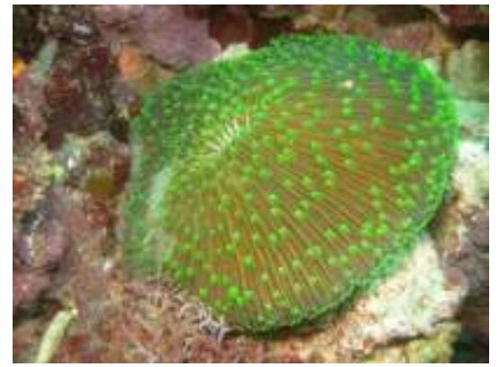

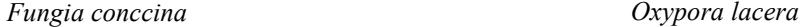

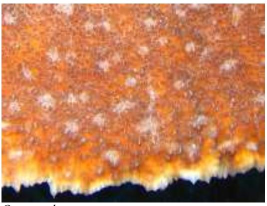

# **Field Guide to the Coral Species of the Samoan Archipelago: American Samoa and (independent) Samoa.** Version 1.0

### Douglas Fenner

Coral Reef Monitoring Ecologist Department of Marine & Wildlife Resources American Samoa

Copyright 2013, Douglas Fenner All photographs were taken in American Samoa unless stated otherwise, and all are copyright Douglas Fenner.

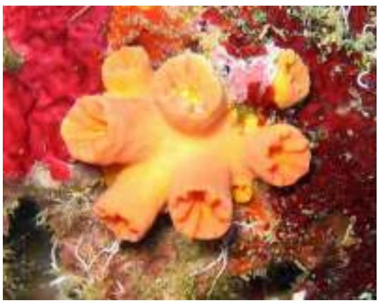

*Tubastraea coccinea Montipora* 

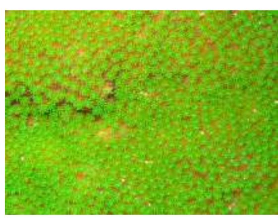

To Dr. Janet Ley, an excellent marine ecologist, fisheries biologist, conservationist, and wonderful person.

### **Table of Contents**

| Directory to Species 3                         |    |
|------------------------------------------------|----|
| Preface                                        | 4  |
| Acknowledgements                               | 7  |
| Introduction: The Samoan Volcanic Islands      | 8  |
| The Coral Reefs of the Samoan Archipelago 23   |    |
| What are Corals? 41                            |    |
| Coral Identification and taxonomy 43           |    |
| Coral Diversity and Biogeography 45            |    |
| Some Global Perspectives on our coral reefs 46 |    |
| Human Impacts on Reefs and Conservation        | 49 |
| Coral Taxonomy 51                              |    |
| The Corals 52                                  |    |
| Lifeforms 53                                   |    |
| The Most Common Corals 54                      |    |
| The Most Common Corals by Zone for Tutuila 56  |    |
| Directory to Coral Genera 57                   |    |
| The Corals 61                                  |    |
| Hexacorallia 61                                |    |
| Scleractinia 61                                |    |
| Family Astrocoeniidae                          | 62 |
| Family Pocilloporidae 64                       |    |
| Family Acroporiidae 81                         |    |
| Family Poritiidae 174                          |    |
| Family Siderastraeadae 205                     |    |
| Family Agariciidae215                          |    |
| Family Fungiidae256                            |    |
| Family Oculinidae 287                          |    |
| Family Pectinidae 289                          |    |
| Family Mussidae 299                            |    |
| Family Merulinidae 312                         |    |
| Family Faviidae 324                            |    |
| Family Euphyllidae 368                         |    |
| Family Dendrophyllidae 375                     |    |
| Octocorallia 390                               |    |
| Helioporidae 390                               |    |
| Hydrozoa 392                                   |    |
| Milleporidae 390                               |    |
| Stylasteridae410                               |    |
| Taxonomic Notes413                             |    |
| References 416                                 |    |
| Taxonomic Index426                             |    |

### **Directory to Species**

Families are presented in taxonomic order which is the order they are presented in, but genera and species are in alphabetical order.

| Stylocoeniella armata 60 Acropora verweyi 145 Stylocoeniella guentheri 61 Astreopora cucculata 163 Family Pocilloporidae Astreopora eliptica 167 Pocillopora damicornis 63 Astreopora gracilis 161 Pocillopora eydouxi. 65 Astreopora listeria 165 Pocillopora ligulata 67 Astreopora myriophthalma 159 Pocillopora meandrina 69 Astreopora randalli 169 Pocillopora setichelli 71 Isopora crateriformis 99 Pocillopora verrucosa. 73 Isopora palifera 101 Seriatopora caliendrum 79 Montipora caliculata 91 Seriatopora stellata 77 Montipora capitata 87 Stylophora pistillata 76 Montipora grisea 81 Family Acroporidae Montipora incrassata 97 Acropora abrotanoides 119 Montipora informis 83 Acropora aculeus 131 Montipora tuberculosa 85 Acropora aspera 111 Montipora turgescens 89 Acropora austera 113 Montipora vaughani 95 Acropora cerealis 133 Montipora venosa 93 Acropora chesterfieldensis 135 Family Poritiidae Acropora clathrata 157 Alveopora tizardi or exelsa 196 Acropora cophodactyla 129 Goniopora columna 198 Acropora cytherea 152 Goniopora fruiticosa 200 Acropora digitifera 127 Porites annae 173 Acropora formosa 103 Porites arnaudi 186 Acropora gemmifera 123 Porites cylindrical 171 Acropora globiceps 121 Porites horizontallata 184 Acropora humilis 119 Porites lichen 175 Acropora hyacinthus 149 Porites lutea 188 Acropora insignis 137 Porites monticulosa 182 Acropora intermedia 109 Porites randalli 192 Acropora monticulosa 125 Porites rus 179 Acropora muricata 105 Porites stephansoni 190 Acropora nana 139 Stylaraea punctate 194 Acropora nobilis 107 Family Siderastraeadae Acropora pagoensis 141 Coscinaraea columna 210 Acropora palmerae 117 Psammocora contigua 202 Acropora paniculata 155 Psammocora haimeana 204 Acropora pulchra 107 Psammocora nierstraszi 208 Acropora robusta 115 Psammocora profundacella206 Acropora speciosa 143 | Family Astrocoeniidae | Acropora surculosa | 147 |
|--------------------------------------------------------------------------------------------------------------------------------------------------------------------------------------------------------------------------------------------------------------------------------------------------------------------------------------------------------------------------------------------------------------------------------------------------------------------------------------------------------------------------------------------------------------------------------------------------------------------------------------------------------------------------------------------------------------------------------------------------------------------------------------------------------------------------------------------------------------------------------------------------------------------------------------------------------------------------------------------------------------------------------------------------------------------------------------------------------------------------------------------------------------------------------------------------------------------------------------------------------------------------------------------------------------------------------------------------------------------------------------------------------------------------------------------------------------------------------------------------------------------------------------------------------------------------------------------------------------------------------------------------------------------------------------------------------------------------------------------------------------------------------------------------------------------------------------------------------------------------------------------------------------------------------------------------------------------------------------------------------------------------------------------------------------------------------------------------------------------------------------------------------------------------------------------------------------------------------------------------------------------------------------------------------------------------------------------------------------------------|-----------------------|--------------------|-----|
|                                                                                                                                                                                                                                                                                                                                                                                                                                                                                                                                                                                                                                                                                                                                                                                                                                                                                                                                                                                                                                                                                                                                                                                                                                                                                                                                                                                                                                                                                                                                                                                                                                                                                                                                                                                                                                                                                                                                                                                                                                                                                                                                                                                                                                                                                                                                                                          |                       |                    |     |
|                                                                                                                                                                                                                                                                                                                                                                                                                                                                                                                                                                                                                                                                                                                                                                                                                                                                                                                                                                                                                                                                                                                                                                                                                                                                                                                                                                                                                                                                                                                                                                                                                                                                                                                                                                                                                                                                                                                                                                                                                                                                                                                                                                                                                                                                                                                                                                          |                       |                    |     |
|                                                                                                                                                                                                                                                                                                                                                                                                                                                                                                                                                                                                                                                                                                                                                                                                                                                                                                                                                                                                                                                                                                                                                                                                                                                                                                                                                                                                                                                                                                                                                                                                                                                                                                                                                                                                                                                                                                                                                                                                                                                                                                                                                                                                                                                                                                                                                                          |                       |                    |     |
|                                                                                                                                                                                                                                                                                                                                                                                                                                                                                                                                                                                                                                                                                                                                                                                                                                                                                                                                                                                                                                                                                                                                                                                                                                                                                                                                                                                                                                                                                                                                                                                                                                                                                                                                                                                                                                                                                                                                                                                                                                                                                                                                                                                                                                                                                                                                                                          |                       |                    |     |
|                                                                                                                                                                                                                                                                                                                                                                                                                                                                                                                                                                                                                                                                                                                                                                                                                                                                                                                                                                                                                                                                                                                                                                                                                                                                                                                                                                                                                                                                                                                                                                                                                                                                                                                                                                                                                                                                                                                                                                                                                                                                                                                                                                                                                                                                                                                                                                          |                       |                    |     |
|                                                                                                                                                                                                                                                                                                                                                                                                                                                                                                                                                                                                                                                                                                                                                                                                                                                                                                                                                                                                                                                                                                                                                                                                                                                                                                                                                                                                                                                                                                                                                                                                                                                                                                                                                                                                                                                                                                                                                                                                                                                                                                                                                                                                                                                                                                                                                                          |                       |                    |     |
|                                                                                                                                                                                                                                                                                                                                                                                                                                                                                                                                                                                                                                                                                                                                                                                                                                                                                                                                                                                                                                                                                                                                                                                                                                                                                                                                                                                                                                                                                                                                                                                                                                                                                                                                                                                                                                                                                                                                                                                                                                                                                                                                                                                                                                                                                                                                                                          |                       |                    |     |
|                                                                                                                                                                                                                                                                                                                                                                                                                                                                                                                                                                                                                                                                                                                                                                                                                                                                                                                                                                                                                                                                                                                                                                                                                                                                                                                                                                                                                                                                                                                                                                                                                                                                                                                                                                                                                                                                                                                                                                                                                                                                                                                                                                                                                                                                                                                                                                          |                       |                    |     |
|                                                                                                                                                                                                                                                                                                                                                                                                                                                                                                                                                                                                                                                                                                                                                                                                                                                                                                                                                                                                                                                                                                                                                                                                                                                                                                                                                                                                                                                                                                                                                                                                                                                                                                                                                                                                                                                                                                                                                                                                                                                                                                                                                                                                                                                                                                                                                                          |                       |                    |     |
|                                                                                                                                                                                                                                                                                                                                                                                                                                                                                                                                                                                                                                                                                                                                                                                                                                                                                                                                                                                                                                                                                                                                                                                                                                                                                                                                                                                                                                                                                                                                                                                                                                                                                                                                                                                                                                                                                                                                                                                                                                                                                                                                                                                                                                                                                                                                                                          |                       |                    |     |
|                                                                                                                                                                                                                                                                                                                                                                                                                                                                                                                                                                                                                                                                                                                                                                                                                                                                                                                                                                                                                                                                                                                                                                                                                                                                                                                                                                                                                                                                                                                                                                                                                                                                                                                                                                                                                                                                                                                                                                                                                                                                                                                                                                                                                                                                                                                                                                          |                       |                    |     |
|                                                                                                                                                                                                                                                                                                                                                                                                                                                                                                                                                                                                                                                                                                                                                                                                                                                                                                                                                                                                                                                                                                                                                                                                                                                                                                                                                                                                                                                                                                                                                                                                                                                                                                                                                                                                                                                                                                                                                                                                                                                                                                                                                                                                                                                                                                                                                                          |                       |                    |     |
|                                                                                                                                                                                                                                                                                                                                                                                                                                                                                                                                                                                                                                                                                                                                                                                                                                                                                                                                                                                                                                                                                                                                                                                                                                                                                                                                                                                                                                                                                                                                                                                                                                                                                                                                                                                                                                                                                                                                                                                                                                                                                                                                                                                                                                                                                                                                                                          |                       |                    |     |
|                                                                                                                                                                                                                                                                                                                                                                                                                                                                                                                                                                                                                                                                                                                                                                                                                                                                                                                                                                                                                                                                                                                                                                                                                                                                                                                                                                                                                                                                                                                                                                                                                                                                                                                                                                                                                                                                                                                                                                                                                                                                                                                                                                                                                                                                                                                                                                          |                       |                    |     |
|                                                                                                                                                                                                                                                                                                                                                                                                                                                                                                                                                                                                                                                                                                                                                                                                                                                                                                                                                                                                                                                                                                                                                                                                                                                                                                                                                                                                                                                                                                                                                                                                                                                                                                                                                                                                                                                                                                                                                                                                                                                                                                                                                                                                                                                                                                                                                                          |                       |                    |     |
|                                                                                                                                                                                                                                                                                                                                                                                                                                                                                                                                                                                                                                                                                                                                                                                                                                                                                                                                                                                                                                                                                                                                                                                                                                                                                                                                                                                                                                                                                                                                                                                                                                                                                                                                                                                                                                                                                                                                                                                                                                                                                                                                                                                                                                                                                                                                                                          |                       |                    |     |
|                                                                                                                                                                                                                                                                                                                                                                                                                                                                                                                                                                                                                                                                                                                                                                                                                                                                                                                                                                                                                                                                                                                                                                                                                                                                                                                                                                                                                                                                                                                                                                                                                                                                                                                                                                                                                                                                                                                                                                                                                                                                                                                                                                                                                                                                                                                                                                          |                       |                    |     |
|                                                                                                                                                                                                                                                                                                                                                                                                                                                                                                                                                                                                                                                                                                                                                                                                                                                                                                                                                                                                                                                                                                                                                                                                                                                                                                                                                                                                                                                                                                                                                                                                                                                                                                                                                                                                                                                                                                                                                                                                                                                                                                                                                                                                                                                                                                                                                                          |                       |                    |     |
|                                                                                                                                                                                                                                                                                                                                                                                                                                                                                                                                                                                                                                                                                                                                                                                                                                                                                                                                                                                                                                                                                                                                                                                                                                                                                                                                                                                                                                                                                                                                                                                                                                                                                                                                                                                                                                                                                                                                                                                                                                                                                                                                                                                                                                                                                                                                                                          |                       |                    |     |
|                                                                                                                                                                                                                                                                                                                                                                                                                                                                                                                                                                                                                                                                                                                                                                                                                                                                                                                                                                                                                                                                                                                                                                                                                                                                                                                                                                                                                                                                                                                                                                                                                                                                                                                                                                                                                                                                                                                                                                                                                                                                                                                                                                                                                                                                                                                                                                          |                       |                    |     |
|                                                                                                                                                                                                                                                                                                                                                                                                                                                                                                                                                                                                                                                                                                                                                                                                                                                                                                                                                                                                                                                                                                                                                                                                                                                                                                                                                                                                                                                                                                                                                                                                                                                                                                                                                                                                                                                                                                                                                                                                                                                                                                                                                                                                                                                                                                                                                                          |                       |                    |     |
|                                                                                                                                                                                                                                                                                                                                                                                                                                                                                                                                                                                                                                                                                                                                                                                                                                                                                                                                                                                                                                                                                                                                                                                                                                                                                                                                                                                                                                                                                                                                                                                                                                                                                                                                                                                                                                                                                                                                                                                                                                                                                                                                                                                                                                                                                                                                                                          |                       |                    |     |
|                                                                                                                                                                                                                                                                                                                                                                                                                                                                                                                                                                                                                                                                                                                                                                                                                                                                                                                                                                                                                                                                                                                                                                                                                                                                                                                                                                                                                                                                                                                                                                                                                                                                                                                                                                                                                                                                                                                                                                                                                                                                                                                                                                                                                                                                                                                                                                          |                       |                    |     |
|                                                                                                                                                                                                                                                                                                                                                                                                                                                                                                                                                                                                                                                                                                                                                                                                                                                                                                                                                                                                                                                                                                                                                                                                                                                                                                                                                                                                                                                                                                                                                                                                                                                                                                                                                                                                                                                                                                                                                                                                                                                                                                                                                                                                                                                                                                                                                                          |                       |                    |     |
|                                                                                                                                                                                                                                                                                                                                                                                                                                                                                                                                                                                                                                                                                                                                                                                                                                                                                                                                                                                                                                                                                                                                                                                                                                                                                                                                                                                                                                                                                                                                                                                                                                                                                                                                                                                                                                                                                                                                                                                                                                                                                                                                                                                                                                                                                                                                                                          |                       |                    |     |
|                                                                                                                                                                                                                                                                                                                                                                                                                                                                                                                                                                                                                                                                                                                                                                                                                                                                                                                                                                                                                                                                                                                                                                                                                                                                                                                                                                                                                                                                                                                                                                                                                                                                                                                                                                                                                                                                                                                                                                                                                                                                                                                                                                                                                                                                                                                                                                          |                       |                    |     |
|                                                                                                                                                                                                                                                                                                                                                                                                                                                                                                                                                                                                                                                                                                                                                                                                                                                                                                                                                                                                                                                                                                                                                                                                                                                                                                                                                                                                                                                                                                                                                                                                                                                                                                                                                                                                                                                                                                                                                                                                                                                                                                                                                                                                                                                                                                                                                                          |                       |                    |     |
|                                                                                                                                                                                                                                                                                                                                                                                                                                                                                                                                                                                                                                                                                                                                                                                                                                                                                                                                                                                                                                                                                                                                                                                                                                                                                                                                                                                                                                                                                                                                                                                                                                                                                                                                                                                                                                                                                                                                                                                                                                                                                                                                                                                                                                                                                                                                                                          |                       |                    |     |
|                                                                                                                                                                                                                                                                                                                                                                                                                                                                                                                                                                                                                                                                                                                                                                                                                                                                                                                                                                                                                                                                                                                                                                                                                                                                                                                                                                                                                                                                                                                                                                                                                                                                                                                                                                                                                                                                                                                                                                                                                                                                                                                                                                                                                                                                                                                                                                          |                       |                    |     |
|                                                                                                                                                                                                                                                                                                                                                                                                                                                                                                                                                                                                                                                                                                                                                                                                                                                                                                                                                                                                                                                                                                                                                                                                                                                                                                                                                                                                                                                                                                                                                                                                                                                                                                                                                                                                                                                                                                                                                                                                                                                                                                                                                                                                                                                                                                                                                                          |                       |                    |     |
|                                                                                                                                                                                                                                                                                                                                                                                                                                                                                                                                                                                                                                                                                                                                                                                                                                                                                                                                                                                                                                                                                                                                                                                                                                                                                                                                                                                                                                                                                                                                                                                                                                                                                                                                                                                                                                                                                                                                                                                                                                                                                                                                                                                                                                                                                                                                                                          |                       |                    |     |
|                                                                                                                                                                                                                                                                                                                                                                                                                                                                                                                                                                                                                                                                                                                                                                                                                                                                                                                                                                                                                                                                                                                                                                                                                                                                                                                                                                                                                                                                                                                                                                                                                                                                                                                                                                                                                                                                                                                                                                                                                                                                                                                                                                                                                                                                                                                                                                          |                       |                    |     |
|                                                                                                                                                                                                                                                                                                                                                                                                                                                                                                                                                                                                                                                                                                                                                                                                                                                                                                                                                                                                                                                                                                                                                                                                                                                                                                                                                                                                                                                                                                                                                                                                                                                                                                                                                                                                                                                                                                                                                                                                                                                                                                                                                                                                                                                                                                                                                                          |                       |                    |     |
|                                                                                                                                                                                                                                                                                                                                                                                                                                                                                                                                                                                                                                                                                                                                                                                                                                                                                                                                                                                                                                                                                                                                                                                                                                                                                                                                                                                                                                                                                                                                                                                                                                                                                                                                                                                                                                                                                                                                                                                                                                                                                                                                                                                                                                                                                                                                                                          |                       |                    |     |
|                                                                                                                                                                                                                                                                                                                                                                                                                                                                                                                                                                                                                                                                                                                                                                                                                                                                                                                                                                                                                                                                                                                                                                                                                                                                                                                                                                                                                                                                                                                                                                                                                                                                                                                                                                                                                                                                                                                                                                                                                                                                                                                                                                                                                                                                                                                                                                          |                       |                    |     |
|                                                                                                                                                                                                                                                                                                                                                                                                                                                                                                                                                                                                                                                                                                                                                                                                                                                                                                                                                                                                                                                                                                                                                                                                                                                                                                                                                                                                                                                                                                                                                                                                                                                                                                                                                                                                                                                                                                                                                                                                                                                                                                                                                                                                                                                                                                                                                                          |                       |                    |     |
|                                                                                                                                                                                                                                                                                                                                                                                                                                                                                                                                                                                                                                                                                                                                                                                                                                                                                                                                                                                                                                                                                                                                                                                                                                                                                                                                                                                                                                                                                                                                                                                                                                                                                                                                                                                                                                                                                                                                                                                                                                                                                                                                                                                                                                                                                                                                                                          |                       |                    |     |
|                                                                                                                                                                                                                                                                                                                                                                                                                                                                                                                                                                                                                                                                                                                                                                                                                                                                                                                                                                                                                                                                                                                                                                                                                                                                                                                                                                                                                                                                                                                                                                                                                                                                                                                                                                                                                                                                                                                                                                                                                                                                                                                                                                                                                                                                                                                                                                          |                       |                    |     |
|                                                                                                                                                                                                                                                                                                                                                                                                                                                                                                                                                                                                                                                                                                                                                                                                                                                                                                                                                                                                                                                                                                                                                                                                                                                                                                                                                                                                                                                                                                                                                                                                                                                                                                                                                                                                                                                                                                                                                                                                                                                                                                                                                                                                                                                                                                                                                                          |                       |                    |     |
|                                                                                                                                                                                                                                                                                                                                                                                                                                                                                                                                                                                                                                                                                                                                                                                                                                                                                                                                                                                                                                                                                                                                                                                                                                                                                                                                                                                                                                                                                                                                                                                                                                                                                                                                                                                                                                                                                                                                                                                                                                                                                                                                                                                                                                                                                                                                                                          |                       |                    |     |

| Family Agariciidae            |     | Oxypora lacera 289            |     |
|-------------------------------|-----|-------------------------------|-----|
| Gardinoseris planulata        | 212 | Family Mussidae               |     |
| Leptoseris explanata          | 216 | Acanthastrea brevis           | 295 |
| Leptoseris foliosa            | 218 | Acanthastrea echinata         | 297 |
| Leptoseris incrustans         | 220 | Acanthastrea hemprichii 299   |     |
| Leptoseris mycetoseroides 222 |     | Acanthastrea ishigakiensis301 |     |
| Leptoseris scabra             | 214 | Lobophyllia hemprichii        | 303 |
| Leptoseris yabei              | 224 | Symphyllia agaricia           | 306 |
| Pachyseris gemmae             | 251 | Family Merulinidae            |     |
| Pachyseris rugosa             | 249 | Hydnophora exesa              | 310 |
| Pachyseris speciosa           | 250 | Hydnophora microconos 308     |     |
| Pavona bipartite              | 235 | Hydnophora rigida             | 312 |
| Pavona chiriquensis           | 244 | Merulina ampliata             | 314 |
| Pavona decussate              | 246 | Scapophyllia cylindrica       | 318 |
| Pavona diffluens              | 228 | Family Faviidae               |     |
| Pavona duerdeni               | 226 | Caulastrea echinulata         | 320 |
| Pavona explanulata            | 233 | Cyphastrea sp                 | 332 |
| Pavona frondifera             | 247 | Diploastrea heliopora         | 330 |
| Pavona gigantea               | 230 | Echinopora hirsutissima 336   |     |
| Pavona maldivensis            | 237 | Echinopora lamellosa          | 334 |
| Pavona minuta                 | 240 | Favia stelligera              | 322 |
| Pavona varians                | 242 | Favites abdita                | 338 |
| Family Fungiidae              |     | Goniastrea edwardsi           | 340 |
| Ctenactis crassa              | 270 | Goniastrea minuta             | 342 |
| Ctenactis echinata            | 272 | Goniastrea pectinata          | 344 |
| Cycloseris costulata          | 252 | Leptastrea bewickensis        | 352 |
| Fungia concinna               | 254 | Leptastrea pruinosa           | 348 |
| Fungia fungites               | 256 | Leptastrea purpurea           | 346 |
| Fungia granulosa              | 259 | Leptastrea transversa         | 350 |
| Fungia horrida                | 261 | Leptoria Phrygia              | 362 |
| Fungia mollucensis            | 264 | Montastrea annuligera         | 324 |
| Fungia paumotensis            | 266 | Montastrea curta              | 325 |
| Fungia scruposa               | 262 | Oulophyllia bennettae         | 356 |
| Fungia scutaria               | 268 | Oulophyllia crispa            | 358 |
| Halomitra pileus              | 277 | Platygyra daedalea            | 360 |
| Herpolitha limax              | 273 | Plesiastrea versipora         | 327 |
| Polyphyllia novohibernae 275  |     | Family Euphyllidae            |     |
| Sandalolitha dentata          | 279 | Euphyllia glabrescens         | 364 |
| Sandalolitha robusta          | 281 | Euphyllia paradivisa          | 367 |
| Family Oculinidae             |     | Plerogyra sinuosa             | 369 |
| Galaxea fascicularis          | 283 | Family Dendrophyllidae        |     |
| Family Pectinidae             |     | Endopsammia regularis         | 385 |
| Echinomorpha nishihirai       | 285 | Rhizopsammia verrilli         | 383 |
| Echinophyllia aspera          | 287 | Turbinaria mesenterina        | 373 |
| Mycedium elephantotus         | 293 | Turbinaria peltata            | 371 |
| Oxypora crassispinosa         | 291 | Turbinaria reniformis         | 376 |

| Turbinaria stellulata | 379 | Millepora dichotoma   | 389 |
|-----------------------|-----|-----------------------|-----|
| Tubastraea coccinea   | 381 | Millepora exesa       | 401 |
| Family Helioporidae   |     | Millepora murrayi     | 392 |
| Heliopora coerulea    | 387 | Millepora platyphylla | 395 |
| Family Milleporidae   |     | Millepora tuberosa    | 404 |
| Distichopora violacea | 408 | Stylaster sp          | 406 |

### **Preface**

 The author gathered the information for this book during his work for the Department of Marine & Wildlife Resources in American Samoa from late 2003 to the present. Almost all the work was done in American Samoa and most of the description of reefs is of reefs in American Samoa, with much less from independent Samoa. However, they are one island chain, built by the same geological processes (except Rose Atoll and Swains), with the same culture, and with almost all of the same coral species. So this book applies equally to both areas.

 Studying coral species is not for the faint-hearted. It is a formidable task, especially where diversity is high. Corals are relatively easy to learn in a place like Hawaii (Fenner, 2005) or the Caribbean (Humann, 2002; Sheppard, 2007), where there are only about 60 species. Over 260 coral species have been seen by the author in the Samoan archipelago and over 400 species names have been reported previously by others (an unknown number of which are correct). This is much less than the number of fish species, with 945 reef fish species now known from the Samoan archipelago. But corals are highly variable, with variation within species often very great, making it very hard to tell species apart, since the differences between species may not be easily discerned among the riot of variation. Variation occurs within a single colony as well as between colonies within a species, and between locations within a species. Hybridization between some species is easy to produce in the lab and has been proposed to be common, and the amount of genetic connectivity between corals at different islands may change over longer periods of time due to changing currents that change connectivity (Veron, 1995, 2000). Looking at living corals in the water has advantages and disadvantages. One advantage is that you can see the whole coral not just a fragment like a sample in a museum. Another is that you can see many colonies (if it isn't rare) and learn what the variation is within the species. A third is that you can see the typical tissue color and any tissue clues like tentacles. The disadvantages include the fact that the skeleton on which the taxonomy is based is covered by living tissue you usually can't see through so you can't see the things the taxonomy is based on. In addition, you can't see the fine skeletal details because you have no microscope. Add to that being thrown around by waves, condensation in your mask making things blurry, and running out of air and having to surface. All of which make it especially difficult to distinguish species when working at a new location, where many species look different from elsewhere.

 Because coral identification is so difficult, you need all the help you can get. Although there are much more comprehensive coral identification books such as that by Veron (2000), many of the species in that book may not occur in American Samoa (and at the very least are not common), and you have to search through pictures of many corals you haven't seen to find the ones you have seen. A book that only has the corals

found in the Samoan Archipelago will be much easier to work with. Further, the photos in a comprehensive book like Veron (2000) were not taken in the Samoan archipelago. Because some corals look different in different locations, the corals in such a guide book may not look like those in the Samoan archipelago. All the photos in this book were taken in American Samoa except for two species photographed in independent Samoa, and the descriptions give what they look like here, not other places. And last, an encyclopedic guide like Veron (2000) is unwieldy and heavy, a huge set of three volumes, while the present guide is more easily portable (depending on the computer you have it on). Mind you, Veron (2000) is a marvelous accomplishment and a huge step forward. This book benefits greatly from the Veron book and others such as Wallace (1999), Hoeksema (1989) and Randall and Myers (1983). Because many coral species have wide distributions, many of the species in this book will not only be in the Samoan archipelago, but widespread in the Pacific. Many of the species illustrated may look very similar on nearby archipelagos particularly. Unfortunately there are very few English common names or Samoan names for most of these coral species, and the English names at least are not applied consistently. For most species, it will be necessary to learn the Latinized scientific names, but then these are the only accurate names.

 To help in identification, the description of most species includes both a picture of a whole colony and a closeup of the details of the coral surface. Also, more than one picture of a species was included to illustrate some of the different shapes and colors of the species. In addition, common colors are illustrated in addition to beautiful colors which are rare. The text indicates what the differences are between each species and the species that appears most similar to it, as well as how common the species are, and which colors or shapes are the most common for that species. Also, the species within a genus are placed in an order to try to place similar looking corals one after another, to facilitate comparisons. Genera are also placed in an order within a family in order to try to place similar looking corals together, even though at times the order does not correspond to the conventional taxonomic ordering.

 Because you need all the help you can get, there is a section showing photos of eight of the most common species on the island, followed by list of the most common species by reef one, and then a coral genus directory showing thumbnails of each of the genera. For a large genus like *Acropora*, a few of the different types of shapes are illustrated. These directories refer to the pages on which the genera are found, and can help you find the coral you are looking for. A good way to study corals is to look in the book before getting in the water, and then review the book after getting out of the water and getting dry.

 This book was published in part to help workers better monitor the reefs in coming years, as well as to build pride in the Samoan people for the richness of their biological heritage and a desire to see to it that the reefs are handed to the next generation in as healthy a condition as the present generation received them or even healthier. Of course, the book is also intended for amateur naturalists, snorkelers and divers of all ages and levels of familiarity with coral reefs. Enjoy!

 On a personal note, the author likes to relate that he lives on a volcanic rock about 17 miles long that lies near the center of an ocean that covers nearly half of the planet, and the nearest big university library is as far as New York is from London. The Samoan archipelago lies about 14 degrees south of the equator in the tropics, and American

Samoa is the only U.S. territory south of the equator. It is a beautiful and fascinating place where few outsiders have ventured, and which still has a relatively healthy reef.

 The opinions expressed in this book are entirely those of the author, and not necessarily those of the Dept. of Marine & Wildlife, or the American Samoa Government.

#### **Acknowledgements**

 I would like to thank Ray Tulafono and the Department. of Marine & Wildlife Resources (DMWR) of the American Samoa Government for the opportunity to study the coral reef in the American Samoa Coral Reef Monitoring Program, and Chris Hawkins and Leslie Whaylen for their role in grant writing for that program. I thank the NOAA Coral Reef Conservation Program and the Coral Reef Initiative (CRI) for the funding to carry out the monitoring program, and for encouraging coral taxonomic work as part of that program. I thank Jenny Waddell for all of her support. I thank dive boat pilots Lemuelu Kitiona, Mika Letuane, Terry Lam Yuen, and Peter Eves and dive shop operator Ekueta Schuster for their expert support, and monitoring team dive buddies Leslie Whaylen, Emmanuel Tardy, Marlowe Sabater, and Benjamin Carroll for their support. I thank the Fagatele Bay National Marine Sanctuary for the use of their boat. I thank Emmanuel Tardy for the discovery of two specimens of the tiny coral *Endopsammia regularis* under rubble on the outer reef flat of Fagaitua Bay, and Dr. Stephen Cairns for identifying them. I thank Dr. Bernardo Vargas Angel for the observation that some *Pavona* colonies in American Samoa look just like *P. gigantea* in the Eastern Pacific and alerting me to the description of *Pavona chirquiensis*, Dan Barshis for pointing out *Montipora nodosa*, and Charles Birkeland for pointing out *Stylaraea punctata*, a cryptic coral if ever there was one, no doubt originally found here by Richard Randall (who learned where to find it in Guam). I thank Paul Brown for showing me the *Leptoseris gardineri* which he collected. I thank Bert Hoeksema for pointing out the differences between *Halomitra pileus* and *H. clavator*. I thank Emily Lundblad and many others in NOAA for benthic maps of Tutuila based on multibeam sonar data from the NOAA CRED cruise program. I thank Dr. Scott Ferguson for stimulating discussions about the benthic deepwater topography of the American Samoan area and its possible geology. I thank Dr. Stan Hart for answering many questions about the volcanic geology. I thank Dr. Peter Craig, Dr. Charles Birkeland, Marlowe Sabater, Benjamin Carroll, Mike King, Dr. Karl Brookins and Dr. Domingo Ochavillo for many stimulating discussions on fish and benthic ecology in American Samoa, Eva Didonato for discussions of coral identification, and Dr. Zac Foresman for stimulating discussions of *Porites* and coral genetics and taxonomy. I thank Dr. J. E. N. Veron for support and stimulating discussions during my previous work at the Australian Institute of Marine Science (AIMS). I thank Peter Raines and Coral Cay Conservation for the opportunity to work with them in the Philippines where I learned to identify many corals, and Helge Vogt and the Center for the Establishment of Marine Reserves in Negros Oriental for the same. I thank Leslie Whaylen for organizing much of the American Samoa Coral Reef Monitoring Program and collecting fish data for that program. I thank Dr. Greta Aeby and Dr. Thierry Work for the opportunity to assist them in their coral disease work which also provided me with opportunities to observe and study corals, and the same for Dr.

Rusty Brainard and the NOAA CRED program. I thank Dr. Dawn Wright for inviting me to accompany her on two days of dives in the Hawaii Undersea Research Laboratory (HURL) submersible Pisces V at Taema Banks. I thank Chuck Birkeland for support and sharing his insights gathered over a longer period than anyone else who keeps coming back to American Samoa, and his general wisdom accumulated during a long and illustrious career working on coral reefs. I thank Peter Craig for many stimulating discussions and insights from his many years working on reefs in American Samoa, and his support. I thank Dr. Domingo Ochavillo for his strong support, as well as the Coral Reef Advisory Group.

The author bears sole responsibility for any errors in this book.

#### **Introduction: The Samoan Volcanic Islands**

The Samoan archipelago is an east-west chain of volcanic islands produced by a "hot spot," or "mantle plume" much like that in Hawai'i. The archipelago consists of two large volcanic islands in the independent country of Samoa: Savai'i and Upolu, and five smaller volcanic islands in American Samoa: the medium sized island of Tutuila (about 24 km or 17 miles long), and four small islands, Aunu'u, Ofu, Olosega and Ta'u. There are also several smaller islands in independent Samoa. The Territory of American Samoa also includes two atolls, Rose Atoll 87.5 miles (140 km) east of Ta'u, and Swains Atoll, 204 miles (327 km) north of Tutuila. Both of these atolls are much older than the volcanic islands, and may be geologically part of the Tokelau Islands, north of the Samoan Archipelago, but in any case are not part of the Samoan hotspot chain. Swains is closer to Tokelau and was originally inhabited by Tokelauans. Both Swains and Rose are tiny, with Swains about 2 miles diameter and Rose about one mile diameter (with the only land it has being two tiny islands much smaller than the atoll).

Although the islands of American Samoa are small, they are actually the tops of enormous mountains. Tutuila rises 2860 m (9439 ft) just to reach the water surface, and another 2,142 feet above that for a total height of 3509 m (= 3.5 km or 11,580 ft). It has a volume of 4957 cubic kilometers (1210 cubic miles)!! Ta'u reaches 961 m (3,170 ft, the highest spot in American Samoa) above water for a total height of 3821 m (3.8 km or 12,608 ft).

A hot spot of molten lava lies below the solid plate that forms the floor of the Pacific Ocean. The hot spot is currently located under a submarine volcano located 28 miles east of Ta'u at the eastern end of the archipelago. This submarine volcano (named Vailulu'u in recent times) was probably the location of submarine eruptions in 1866 that caused dense clouds of smoke and pumice to erupt from the ocean for several months. It was found to reach to within about 2000 feet of the surface of the ocean when it was studied in 1999. The top of the mountain has a large caldera (crater), which is 2000 m (2 km) wide and 400 meters deeper in the center than along the rim (Luazon and Dybas, 2000), and has many "black smokers" in it. These are places where very hot water (about 490° F or 200° C) comes out, carrying large amounts of minerals, which turn the water coming out black and deposits minerals that form a chimney-like structure. The water is well above the boiling temperature at sea level, but doesn't boil because of the greater

pressure at that depth. In a subsequent study in 2005, a new cone was found in the caldera which rises to within 1800 feet (550 m) of the surface. The new cone is made of pillow lava, and was named Nafanua (Life Science Staff, 2005; Staudingel et al., 2006; Than, 2006). So this is a very active volcano, which may reach the surface in the relatively near future and form a new volcanic island (or could fall silent for millennia). Since the seafloor around it is 4790 m deep, this is already a large volcano, 13,494 ft or 4089 m tall and 20 km long by 10 km wide at the base, with a total volume of 3613 km3 (882 mi3, figures from the seamount catalog, http://earthref.org/SC/) (the differences in calculated height with the other islands likely stems from choosing a different seafloor depth- it is hard to choose a seafloor depth since it varies some from area to area.) That makes it nearly as tall as Mauna Loa and Mauna Kea in Hawaii are from the water surface, or the tallest mountains in the continental U.S. (Mount Rainier and Mount Whitney) and Europe (Mt. Blanc). Evidence indicates that the large caldera at the summit was produced by a collapse of a previous higher summit, and that previous summit probably came close to the surface (Staudingel et al., 2006). The present cone may be rebuilding the summit, much as a lava dome grew in the crater of the 1980 explosion that blew the top off Mt. St. Helens in Washington State.

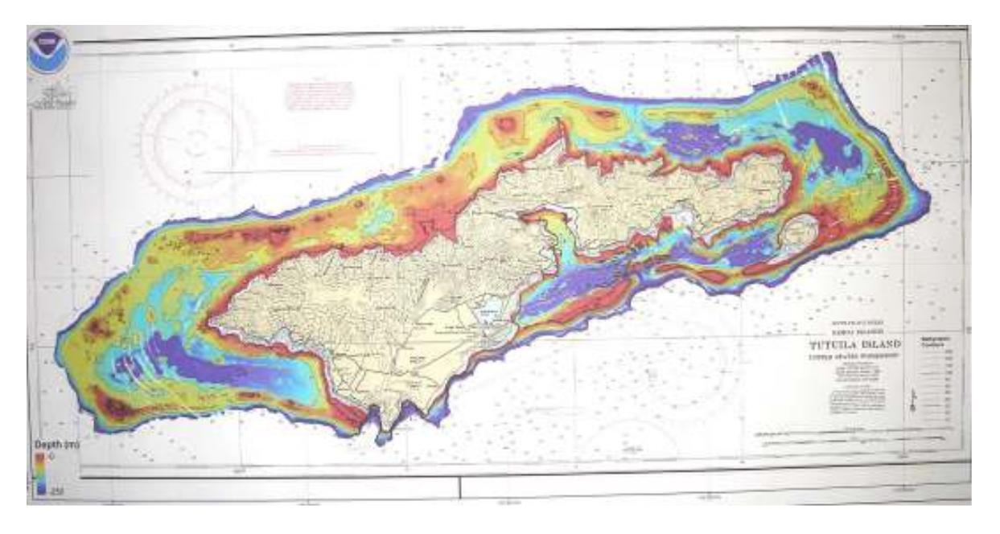

Map of the depths around Tutuila, produced by the Coral Reef Ecosystem Division of NOAA.

The ages of the volcanic islands in the Samoan chain are in a sequence, with the youngest in the east, and ages increasing toward the west. Vailulu'u in the east is presently active, Ta'u is 100,000 years old, Ofu-Olosega is 300,000 years old, Tutuila is about 1.28-1.54 million years old, Upolu in Western Samoa is 1.7-2.8 million years old (McDougall, 1985), Savai'i is 5 million years old (Jackson et al. 2007; Koppers et al. 2008) and seamounts to the west of Savai'i are up to 40 million years old (Hart et al. 2004). This sequence of ages is produced by the movement of the floor of the Pacific over a hotspot of molten lava. Ocean floors are made of solid plates of rock, floating on

top of a gooey, viscous, semi-fluid of hot rock. Some of the plates, such as the huge one that covers almost all of the North Pacific and the eastern part of the South Pacific, move. This Pacific plate is moving toward the west-northwest at about 7 cm a year, about as fast as toenails grow or half as fast as fingernails grow. The hotspot of molten lava that produced the island chain is nearly stationary. From time to time the molten lava erupts through the solid plate, forming a volcano that is built up on top of the plate. Since the hotspot stays nearly still and the plate moves, the result is a row of volcanoes which increase in age with distance from the currently erupting volcano which is over the hotspot. The Hawaiian chain was built in the same fashion and has the same sequence of ages of the volcanoes. The ancient Hawaiians actually figured this out first, and believed that the volcano god Pele started on the older islands and moved to the newer islands ending on the big island of Hawaii at Kiluea, where she lives today.

 If anyone doubts that geologic features on earth are this old, consider that the first scientists indeed thought they were very young. But as geologists accumulated information, more and more information indicated these things are very old indeed. Initially, in continental areas layers of sedimentary rock were found to be one on top of each other, in some places miles thick! Observation of rivers that release the sediments that get compressed into these sedimentary layers revealed it is very slow, way too slow to produce miles thick sedimentary layers in anything but a very long time. Geologists learned to identify the same sedimentary rocks at different locations based on the types of animal shells in them (like snails and clams). They were then able to put together even longer sequences. Then along came radioactive isotope dating. This uses the radioactive decay of isotopes of chemical elements. The speed with which they decay can be measured in labs all around the world. Carbon 14 is very useful because all you need is some carbon to date something, like ashes from a campfire, or a skeleton, plus it works on relatively short time scales out to about 20,000 years. There are a whole collection of different isotopes with different decay rates that can be used. The results they produce are consistent with all the previous evidence, and they often overlap with each other so you can date something with two different isotopes, and guess what: the results are right on top of each other. This is physics, not something someone made up. It is real, hard, science. Further it fits very well with other ways of figuring out how old the solar system is by astronomers working with physicists. Astronomers can measure how far it is to nearby stars using a method from geometery called "parallax." Then you can use that to figure out how far some nearby stars called "Cepheid Variables" are away. Then you use the known intrinsic brightness of Cepheid Variables to determine how far away Cepheid Variables are which are much farther away. Several other such techniques can be used to extend knowledge of distant objects in the universe, and calibrate the "red shift" of stars and galaxies, which varies with the distance, and can be used for the most distant objects (but not near objects). Huge numbers of stars are more than 10,000 light years away (the distance light travels in a year), and so sent that light out over 10,000 years ago. Other objects are over 100,000 light years away, a million light years away, and so on, with the most distant objects known nearly 13 billion light years away, and so the universe has been here for over 13 billion years (our sun is only about 4.5 billion years old). The result of radioactive isotope dating is that the oldest rocks on earth are about 4 billion years old. 1.5 million years for Tutuila may sound old, but actually in geologic terms it is quite young. When I lived long ago in Colorado, I could see a mountain that had rocks

3.5 billion years old near the top. Seriously old. Doesn't mean at all that God didn't create the universe. Modern science all points to the universe starting as a huge "big bang" that resembles a creation event, about 13.7 billion years ago. All this scientific evidence is cross checked and confirmed many many times. It is not wrong, though the universe may be 13.6 billion or 13.8 billion years old. It is, in any case, "astronomically" old (that's where that saying comes from, because things in the universe are so incredibly BIG, far away, and old). If you choose to believe in the creation of the universe by God, there is nothing to stop you, in fact it is easy to see how the scientific facts could fit with that. It's just that things are a lot older than most people realize. A LOT older. No worries, update your understanding, and live happily ever after! One small note is that everything on sea floors is relatively young, except chunks of continent like New Caledonia. Because all the seafloor gets subducted back down into the earth in about 100 million years or so, the seafloor and any volcanoes on it are younger than that. Much much younger than rocks on land in some places. In 100 million years or so, our own islands will go down a trench and go deep into the earth, melt, and bubble up as an Andesite volcano. Maybe some place like the Philippines or perhaps New Guinea. Nothing to worry about.

 The ages of the volcanic islands of Samoa are not only in sequence, but the differences in age depend on the distances between the islands, such that the data is consistent with our knowledge that the Pacific Plate moves west northwestward in this area at about 3 inches or 7.3 cm a year. So as the plate slowly moves west northwestward, the hot spot punches through from time to time, forming volcanic islands or seamounts.

 Olosega which is one of the most eastern volcanic islands in the chain had some bubbling activity in the water on its eastern side in the 1960's. Ofu, just to the west of Olosega, has cool bubbles coming out of the bottom in shallow water off the west end of the airport runway. A ridge connects Ofu-Olosega and Ta'u, and activity along it has been reported in the past. The westernmost island in western Samoa, Savai'i, has also experienced recent volcanism, with the most recent lava flows occurring in 1906-1911. All rocks on the surface of the island of Savai'i are very young. Some lava flows are so young that there is almost nothing growing on them yet. One suggestion is that since it is located fairly close to the northern end of the Tongan Trench, it may be undergoing stress which has broken openings for lava. North of the Tonga Trench the Pacific plate stays flat and continues moving westward, while east of the trench it bends down and is thrust deep into the earth at an angle. In between, the plate must be bent down into a continuation of the Tonga Trench that goes westward. It seems likely that plate near that is under significant stress, which might open cracks for lava to flow upward in. If this is true, the recent lavas should by lying on top of lavas over 2 million years old. Recent dating of rocks dredged from the deep slopes of Savai'i give dates of 4.9-5.1 million years old from three different locations, confirming that it is the oldest island in the Samoan hotspot trail (Jackson et al. 2007; Koppers et al. 2008). Although there have been no eruptions on Upolu in recorded history, most of the island is covered with relatively young lava flows that are nearly flat (shield volcano shape) with cinder cones along the center ridge. Savai'i is one big shield volcano just like those in Hawaii, and from a distance looks low and very wide. It is indeed very wide, and the outer edges of the lava are probably on top of coral reef that formed on the edge of the original, older

island that was 5 million years old. No one has confirmed that to my knowledge. Savai'i at its peak is the highest point in the chain, and thus is actually the tallest mountain in the chain, even though it doesn't look that way. There is a row of small cinder cones along the crest of Savai'i, in line with the trend of the Samoan chain, just like they are on Upolu. Only the east end of Upolu has the tall, steep, eroded mountains typical of Tutuila. Thus, the same process that produces the eruptions on Savai'i has likely produced eruptions on Upolu. Ta'u has much steeper slopes than Savai'i, even where the slopes are intact. This might be because the lava was more viscous on Ta'u than Savai'i. If the theory about the stress on the plate producing cracks which lava can pass up through is correct, than that suggests that magma chambers under a volcano continue to have molten lava in them at least 5 million years after the first volcano was formed, capable of producing fluid Pahoehoe (ropy surface) flows. In some places like the cinder cones of Haleakala on Maui or Diamond Head on Oahu, cinder eruptions occur long after the volcano was formed, in what is called the post-erosional phase.

 The eastern and northern wall of Pago Pago harbor is a steep curving cliff which is part of the original main caldera on Tutuila (McDougall, 1985). The rest of the caldera rim can no longer be seen. Rainmaker Mountain appears to be a volcanic plug in the caldera wall. Volcanic plugs are where the throat of a volcano gets filled with lava that forms hard rock, which subsequently resists erosion as material around it is eroded away, leaving it standing on its own. The tallest spot on Tutuila is surely another plug, as is another pyramid-shaped rock near the road in Nu'uuli. Tutuila is an elongated shape, even though a single volcano is likely to form a circular cone. The elongated shape came from additional vents to the west and east of the main harbor (McDougall, 1985). A large cockscomb extending out into the ocean on the northern shore at Vatia is a dike, formed when lava filled a vertical crack in the volcano and solidified into a harder mass than the volcano around it, and was left when the rest of the volcano eroded away. Much smaller dikes than the one at Vatia are fairly common in the rocks of Tutuila, and can be seen in some of the sea cliffs. The cockscomb dike shows that the original island was larger than that present today, perhaps about twice the size, and the original shoreline probably was close to where the edge of the submarine shelf around the island now ends, about 1.6 km (a mile) offshore and 4.8 km (3 miles) offshore at the western end of the island. While the island above water was eroded away, the part below the ocean was not subject to the erosion from waves on the shoreline and stream erosion, and remained more intact, and indeed was built up by the growth of coral reef. In addition, gradual slumping and sudden slides often occur on volcano flanks (as they have in Hawaii), and have likely contributed to the erosion of the island. Small slides above water on the steep slopes of Tutuila are a common occurrence even now. These processes can occur underwater as well as above water. When the sea level was lower during ice ages, a terrace or shelf was eroded by waves down to a lower level (Chamberlin, 1921; Davis, 1921; Daley, 1924). The sea level was lower during the ice ages because water was removed from the oceans and locked up in the form of ice in gigantic ice sheets on land in Canada and northern Eurasia, much like the ice sheets on Antarctica and Greenland today. Also, the water in the oceans was colder and thus contracted. The ocean level was as much as 500 feet (150 m) lower during the last ice age, just 22,000 years ago. The outer edge of the shelf is now about 330 feet (100 m) deep. The shelf is composed of limestone, at least 825 feet (250 m) thick, so the original shelf cut into the basalt lava is now over 1155 feet (350

meters) deep. The shelf would have had to have been cut long ago, then subsidence of the island would have carried it into deeper water as coral reefs grew on the shelf. It seems logical to think that the shelf was built by coral reefs, but the layers in it look very solid indeed unlike most reef. Perhaps lowered sea level actually carved the upper surface of the limestone shelf instead of the volcanic basalt below it. The layer of limestone that is 825 plus feet thick is topped by a reef that forms sort of a broken ring around the island near the edge of the shelf. This reef could be called a drowned barrier reef (Daley, 1924) or a bank barrier reef. The island has subsided or sunk enough that the tops of the banks are now about 30 ft (10 m) or more below the sea surface.

 On Tutuila, the only large area of flat land is the "Tafuna Plains" on the southwest side of the island. This area is an area of relatively new and fluid lava flows, probably less than 10,000 years old (S. Hart, personal comm.). Volcanic islands, such as those in Hawai'i, commonly produce a few smaller flows and cinder cones long after their main activity ceases, such as Diamond Head, Koko Head, Punchbowl and Hanauma Bay on Oahu, and the cinder cones in the crater at Haleakala on Maui. In the Tafuna Plains, Fagatele Bay and Larson's Bay are recent calderas much like Hanauma Bay on Oahu. These features are called post-erosional, since they were formed from activity long after the main mountain-building activity, and after considerable erosion of the mountain (Blay and Siemers, 2004). Fagatele and Larson's are at the southern end of a line of calderas that run north-south from the crest of the mountains. The calderas may be along a rift through which the lava flowed. The area around the calderas is the highest on the Tafuna Plains, and the likely source of the lava in the plains. The lava of the plains lies on top of the older coral reef limestone that forms the submarine shelf around Tutuila, and the plains reaches the outer edge of the limestone shelf. Aunu'u also appears to be younger than the main island, since the caldera outline has not yet eroded away, and might be on a similar rift running south from the east end of Tutuila. Aunu'u actually is two calderas, one taller and sharper looking and thus likely younger than the other. The older, more northern caldera on Aunu'u which is lower and where the village is, has a wide reef flat that ends abruptly when the reef flat reaches the newer, southern, caldera. So the southern caldera is newer, not very old because it has no reef flat. Actually, there is now a report that some human artifacts in Nu'uuli were found underneath an ash layer (Addison et al 2006). This shows that at least that ash erupted after humans started inhabiting the island. The Tafuna plains also have no soil layers between rock layers indicated that there were no pauses in the eruptions long enough for soils to form (Addison, personal communication). The pottery dating indicates that the Tafuna plains are most likely just about 1300 years old, so very recent. The lavas of the Tafuna Plains cannot be dated directly because the radioactive isotope dating methods available for lava only work on much older lava. But human artifacts like charcoal can be dated by the Carbon 14 dating method which works on much shorter time spans, perfect for this situation.

 The volcanic islands of Samoa, like those of Hawai'i and all volcanoes within the Pacific Plate, are made of basalt, a dark rock that can form relatively fluid flows, and produces less explosive activity than other kinds of lava. Hawai'i rarely has explosive events, and has some of the safest volcanoes in the world. In Hawai'i, the islands formed are very broad and rounded, and are called "shield volcanoes" because of their low domelike shape that resembles a rounded shield. The volcanoes of the Samoan chain are

likewise shield volcanoes, which can be seen when viewing Ta'u or Savai'i at a distance. On Tutuila, the shield shape is less obvious due to erosion, but it is particularly obvious on Savai'i where the surface lavas are very young. Outside the Pacific Plate, volcanoes are often formed in island arcs by the Pacific Plate going under another plate in a process called subduction. The plate melts when it reaches great depths in the earth, and lighter parts of that molten rock rise and erupt as volcanoes. The lava in these volcanoes is andesite, a rock with a higher silica content, which is stiffer and therefore often forms more steep-sided volcanoes with a greater frequency of explosive activity than basalt volcanoes within a plate. Andesite was originally named after volcanoes in the Andes Mountains of South America. In Darwin's time, a line called the "Andesite Line" was distinguished in the Western Pacific. West of the line all volcanic islands were made of Andesite, east of it all were made of Basalt. The Andesite Line is the western boundary of the Pacific Plate. Examples of island arcs formed by subduction are the Tonga and the Mariana archipelagos (including Guam), an arc of islands in the eastern Caribbean, and the Aleutian Islands. Indeed, just east of Tonga is the Tongan Trench, where the Pacific Plate is subducted (slides beneath) the Indian-Australian Plate, and pushes several hundred kilometers deep into the earth, and where some of the world's deepest earthquakes occur. Where the plate is subducted below a continent or set of islands made of continental material, volcanoes occur on the continent or islands. On a continent the volcanoes are interspersed with continental mountains. This is the case in areas like the Andes of South America, the Cascades of the U.S. Pacific Northwest, the Philippines, Indonesia, and Japan. Plate subduction is a process which produces frequent earthquakes, so these are generally areas of major earthquake activity and the potential for producing tsunamis such as the disastrous tsunami of Ache, Sumatra, Indonesia in 2005, and the earthquake in the Tongan Trench on the morning of September 29, 2009 that produced the tsunami that hit Tutuila and Upolu minutes later and caused so much damage, and then the big earthquake and tsunami in Japan.

 The andesite volcanoes often form "stratovolcaoes" which are steep sided volcanoes made of alternating layers of stiff lava and pumice. They typically form the beautiful (but dangerous if they erupt!) shape of Mt. Fuji in Japan, Mayong Volcano in the Philippines, and the Cascade volcanoes in the US Northwest. But they can also produce powerful eruptions that can blow the mountain to smithereens. Crater Lake in Oregon was made that way, and ash from that eruption is all over the US west, sometimes in layers feet thick. This happened about 3500 BC, so not long ago (as geology goes). Yellowstone is a giant cladera which has had at least 3 near-apocalypic eruptions, and it has a LOT of hot rock under it (hence all the guysers, mud pots, and ponds at the boiling point. When Yellowstone erupts again (not if!), it will be catastrophic for the US. But that could be millions of years from now.

 Surprisingly, the Tongan Trench is not stationary. The place where the Pacific Plate is subducted, the Tongan Trench, is actually moving eastward, about twice as fast as the Pacific Plate is moving westward! Thus, in the future (perhaps a few million years from now), eruptions should begin on Tutuila, and it will grow into a larger island like Upolu and Savai'i, with a smooth shield shape. In fact, that may already have begun, in form of the Tafuna Plains (which are at the east end which might be affected first). The fact that they were fluid lava flows argues against their being post-erosional eruptions, since those are usually or almost always cinders and pumice eruptions.

 The chain of islands from Savai'i to Upolu to Tutuila lie in a row going roughly from west northwest to east southeast. Then the small cluster of islands called Manu'a (Ofu, Olosega, and Ta'u) are just slightly north of straight east of Tutuila. Savai'i, Upolu and Tutuila lie in a nearly straight line which extends as a submarine ridge southeast of Tutuila, and the Manu'a islands and the undersea volcano Vailulu'u form a second parallel nearly straight line, which also extends westward from Ofu. Both curve southward at their east ends in parallel. A similar situation occurs in Hawai'i, where there are currently two rows of volcanoes on the Big Island of Hawai'i – Kohala, Mauna Kea and the currently erupting vent are in one line, and parallel to that are Hualalai, Mauna Loa, and the undersea volcano Loihi. Both lines appear to be curving southward in Hawaii as well as American Samoa. At Kaui, there were actually three parallel volcanoes, one each at Kaui, Niihau, and Kaula Island (Dalrymple et al. 1973). The Mauna Kea chain extends to Maui and Moloka'i, while the Mauna Loa chain extends to Kaho'olawe and Lana'i. Apparently the hotspot of molten lava can split into two on its way to the surface, or the lava may flow upward in parallel rifts in the plate. Kiluea and the Chain of Craters, are on an east-west rift on the side of Mauna Loa, and do not appear to be along the two main rows of volcanoes on the Big Island of Hawai'i, but the newest eruption location is straight in line with Mauna Kea as shown in an amazing space image. Eruptive activity is intermittent over the time span of millions of years, as separate large chambers of magma slowly rise, producing a row of separate volcanoes instead of a continuously erupting single elongated volcano (though Tutuila, Upolu and Savai'i are actually rows of craters and cinder cones close together, there are still gaps between the islands). A map of the seafloor reveals that there are seamounts along the trend line of the Samoan island chain, built by the same volcanic activity but not reaching the surface. The Tutuila ridge ends in the east southeast at a seamount named Southeast Bank, which is surely the youngest part of the Tutuila ridge. The hotspot is currently active at the Vailulu'u seamount at the eastern end of the Manu'a ridge, but the eastern end of the Tutuila ridge does not appear to be active at Southeast Bank. The island of Tutuila itself is oriented on a northeast to southwest line, out of alignment with the overall trend of the chain. Wright et al. (2012) suggest this may be because it followed a rift in the plate going at that angle.

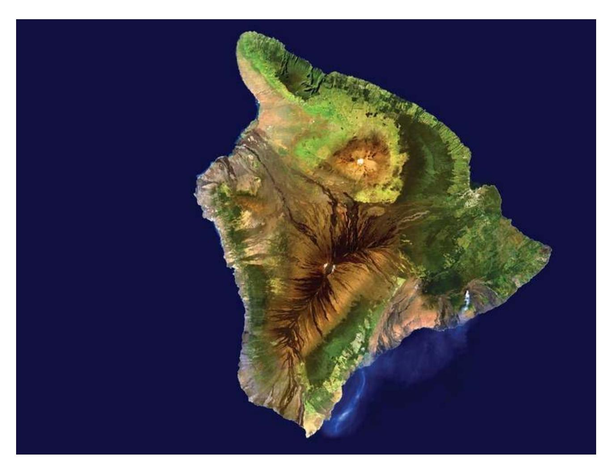

Credit: Courtesy of the Hawaii Synergy project of the Hawaii Institute of Geophysics and Planetology, University of Hawaii at Manoa.

 The production of two chains might come from faults in the plate. But the faults don't parallel the fracture zones in the plate that are known, they go nearly east-west. But there must be some mechanism for dividing the plume into two or even three nearby plumes. Maybe the pressure from below of the buoyant hot lava pushes up a dome which cracks and these are the cracks? Such cracks form around the tops of volcanoes such as in Hawaii, but they do not seem to be known in the plate. Or maybe the multiple rows occur over parallel short offsets in the fracture zones that would be nearly north-south. They surely are fed by the same ultimate deep magma source. There doesn't appear to be evidence that the plate has changed direction, which could explain the row of volcanoes curving southward. The change of direction could be accounted for by the continued movement of the plate as always plus a movement of the plume westward. A new paper reported that the deep part of the plume is far to the west, maybe the lava conduits could be moving to the west as more plume rises to the west. That's very speculative. It might be some much more temporary effect, a wobble of the plume, or even that the two faults play a major role in determining the final location of the eruption, and the faults for some reason having to do with the plate are curving.

 Kiluea volcano on the Big Island of Hawaii has rifts or cracks extending east and west from it; the eastern rift is the Chain of Craters, with the currently active vents well beyond that to the east, probably in the same fracture zone. Rifts radiating from a caldera are common on volcanoes, and often there are three rifts produced as magma underneath the ground swells, forcing the mountain to crack and expand along rifts. In the space image of the Big Island of Hawaii above, you can see three huge radiating ridges on Mauna Loa, these are likely the three rift zones. The chain of craters running south to Fagatele and Larson's Bay in the western part of Tutuila, and the two craters of Aunu'u Island are probably from similar rifts, as pointed out above. Most of the smaller islands of American Samoa have several ridges running down their submarine slopes that are likely to have been produced by rifts filling with lava that harden as dikes. We already mentioned the big dike north of Vatia, which was likely a rift on the sides of the main caldera which then filled with lava from the eruption.

 To the west of Savai'i, there are a number of seamounts, some of which (Pasco, Lalla Rootch, Waterwitch and Combe) appear to be in a continuation of the line of the Samoan archipelago. Others (Horseshoe and Field) may be a parallel chain to the north. Three of the seamounts have been dated from rocks dredged from the seamounts, and for each of these the composition of the rocks matched that of the Samoan Archipelago, and the ages were progressively older to the west, and consistent with a plate motion of 7.3 cm per year. The oldest seamount tested was 40 million years old, so the Samoan hotspot has been in existence for at least 40 million years. They also report that the hotspot has not been totally still, but in fact has wobbled in a line that nearly forms a circle (Hart et al. 2004). That's probably the origin of the curving of the lines of volcanoes east of Tutuila, and the curving southward of volcano lines on the Big Island of Hawaii.

 The small eastern island of Ta'u appears at a distance to be the rounded form of a relatively steep shield volcano. It is actually the tallest mountain in American Samoa. On the south side, there is a large concave feature. Daley (1924) suggested three possible ways in which this feature may have been formed. He says it could be a volcanic caldera (crater), or produced by a catastrophic collapse (slide), or by gradual slumping. He points out that there are no ejecta scattered around on the upper surfaces of the mountain that remain that would indicate explosive activity. Explosive activity is rare in Hawaii, but the shield shape of Ta'u is steeper than those of the Hawaiian volcanoes, suggesting more viscous lava and thus possibly a higher chance of explosive events. The shape of Fagatele Bay, particularly the undersea portion, looks like an explosive event blasted a hole in the edge of the previously existing limestone shelf. In addition, ejecta can be produced by non-exposive lava fountains such as those which have occurred in Hawaii from time to time, and can form cinder cones. Blobs of lava shot into the air fall as pieces of various sizes with hardened exteriors. Further, if the feature on Ta'u were a caldera, the southern half would be completely missing (same thing is true of the caldera that forms the harbor of Tutuila). The existing feature has a bench in it, about half way down the escarpment. Observation of the feature from a boat reveals that this bench is curved exactly parallel to the upper surface of the surviving mountain. Thus, the bench is not a "bathtub ring" reflecting a level of a lava lake in the caldera, since if it was it would be level. Instead, the bench appears to be a hard layer of the original volcano which resisted the process that formed the crescent. And last, the shape of the crescent is closer to a parabola than to half of a circle or elipse. A caldera is most likely to be nearly

circular, while some kind of slippage event is more likely to produce a more parablolashaped feature. Further, the top of the mountain is not where the big chunk is out of the side. It seems more likely that the top would be around the caldera, as it is in many volcanoes which retain a caldera (such as Aunu'u, the calderas in line with Fagatele, and the wall of the Tutuila harbor). The caldera is what ejects the material that builds the mountain, and most of it lands close or flows downhill. Lava could not flow uphill from this feature to the top of the mountain. There are several smaller calderas in different places on Ta'u, including a fairly big one that the harbor and Ta'u village are located in.

 Instead of being formed by eruptive events, the feature on the south side of Ta'u may be the result of a catastrophic collapse of the southern flank of this volcano. Volcanoes are formed of relatively soft rocks which are often not well bonded together. Further, layers of rock are commonly interspersed with layers of ash or pumice, which may be particularly soft. On the Big Island of Hawai'i, as lava spills into the ocean it shatters into sand. Subsequent lava builds on top of the sand until the sand gives way and the sequence starts over. This suggests that some of the Hawaiian Islands may be partly built on volcanic sand that is very weak and unstable. As a result, some volcanoes are not able to support their own weight for millions of years. Weathering such as hydration and oxidation of the minerals can weaken the rock just as it does on land. The north sides of Oahu and Molokai in Hawai'i both slid off into the ocean in catastrophic collapses that happened long ago. Maps of the seafloor north of these two islands show huge lumps on the seafloor that were the northern parts of the islands that slid off. Mt. Shasta in northern California has experienced similar collapse, and the pieces from that event form a series of hills spreading out from the volcano about 32 km (20 miles) to the north, and which Highway I-5 cuts through; the total volume of the slide was 6.5 cubic miles. The fact that chunks travelled so far indicates that it wasn't a gradual slumping but rather a sudden catastrophic collapse, only very rapid motion could move those chunks so far. The same is true for the north sides of Oahu and Molokai. Mt. St. Helens had a similar but smaller slide in the 1980 eruption (Harris, 1988). There have been many slumps and slides in the Hawaiian Islands, and there is evidence that some generated mega-tsunamis. The volumes of rock that slid range up to about 10,000 km2 for a slide on the south side of the big island of Hawaii, an incredible amount of rock. There are deposits 72 m (238 feet) up on the south side of Molokai that are ascribed to a mega-tsunami, and deposits 326 m (1076 feet) up on Lanai that are ascribed to a mega-tsunami. The scar left on the island where the rock slid away typically has benches and is roughly a parabolic shape (Whelan and Kelletat, 2003). It may be that a similar collapse shaped the south side of Ta'u (Daley, 1924). The scar on the south side of Ta'u has benches, and has a parabolic shape. If the south side of Ta'u did slide off into the ocean, whether as a sudden catastrophic failure of the volcano or as a slow gradual slumping, the material that moved should be present on the seafloor near the volcano base. On the underwater sloping side of Ta'u there is a large protruding feature southwest of the missing section of the south side of Ta'u, and another to the southeast. These are much more likely to be a small eruptive feature from a rift on the side of Ta'u. Each of the islands and seamounts has a star-like shape, with the points of the stars being ridges going down the side of the mountain, which are surely produced by eruptive activity in the building of the mountain. Subsea maps do not show obvious lumps at the base of the south side of Ta'u like off the north shores of Oahu and Molokai. However, other slides on Hawaii have not left large

lumps on the seafloor. The south side of Ta'u below the water line shows a large rounded valley going down the side below the concave feature above water. Then down near the base of the mountain spreading out below the valley is a wide low mound. Thus, it appears that the concave feature above water represents what is left when a large amount of material slid off into the water, gouging a large rounded valley going down the mountain slope, deposited as a large, wide, low mound on the seafloor spreading out from the base of the mountain. This suggests that the collapse was rapid as it had the power to gouge out the valley and spread the material widely across the floor of the ocean. The material would have had to disintegrate into a relatively fine material to leave no large chunks on the seafloor. Gradual slumping can involve the disintegration of the rock into much smaller lumps which slide slowly. Such a slumping process can be seen on the road between Alofau and Amouli and a larger slump on the way to Malota. The outer part of the road simply starts to slowly slide down toward the sea. So both landslides which are sudden and slumping occur on land, though landslides may be more common. In any case, if the rock disintegrated into small pieces, it would spread out as it slid down and not leave large lumps on the sea floor. If it happened slowly the material would be left at the bottom of the chute at the base of the mountain, piled up against the base of the mountain. Only if it was a sudden catastrophic failure would the material have the momentum to flow away from the base of the mountain.

 Ofu and Olosega form a pair of nearly joined islands, with a rather strange butterfly shape. It is hard to see the shape of a volcano in either of these steep islands, and no caldera is apparent above water. These two islands may be the remains of a single volcano, which subsequently experienced two catastrophic slides, one on the north side and one on the south, cutting into the volcanic cone and leaving a pair of butterfly-shaped islands (Daley, 1924). The curvature of the south shore of Ofu-Olosega is almost identical to the south shore of Ta'u. The east side of Olosega appears to be the intact lower slope of a larger single volcano that the two islands were formed from. Daley (1924) reports that the streambeds on that eastern slope continue right up to the summit edge, and have rounded stones in them up at that edge, even though the streams do not flow that high on the slope. Rounded stones are formed by flowing streams, so this indicates that originally there was higher slope above the present highest level. Daley (1924) also considers the western slope of Ofu to fit with the original volcano shape. At the east end of Ofu, just before the small bridge that crosses the shallow reef waters between Ofu and Olosega, there is a sharp pinnacle, that appears to be some kind of volcanic plug left after the two giant slides. The catastrophic collapse of the north sides of Oahu and Molokai would have been incredibly huge events, and have produced gigantic tsunamis that would have swept northward in the Pacific. The collapse of the south side of Ta'u would likewise have produced a giant tsunami, as would Ofu-Olosega if it collapsed. There is an unconfirmed report of a limestone boulder at 400 m elevation on Tutuila which might have been thrown that high by the Ta'u or Ofu-Olosega tsunamis (S. Hart, personal comm.). But it is also possible that the two slides on Ofu-Olosega occurred not as sudden catastrophic slides, but rather as a gradual slumping process.

 The steep slopes of Tutuila were produced by erosion from the heavy rainfall that the island experiences. Tutuila is more eroded than volcanoes of a similar age in the Hawaiian chain, such as the Kohala Mountains on the Big Island. This is because the Kohala Mountains do not experience as much rain as American Samoa. The valleys in

Tutuila are all V-shaped, very typical of stream erosion (glaciers produce rounded valleys). Also, there are no ampitheater-headed valleys on Tutuila such as those that are typical in parts of Hawaii. There are, however, several ampitheater-headed stream valleys on the steep northern shore of Ta'u that can most easily be seen in areal photographs or from a boat offshore. It may be that this shape valley is produced by just the right combination of a steep slope and soft material. At Tutuila, the erosion process has gone a lot further than in the Manu'a Islands, because of Tutuila's greater age, so Tutuila has many deep V shaped stream valleys, while Ta'u is still very smooth and rounded. Erosion by rainwater runoff and surf has removed much of the original island of Tutuila, and is in the very slow process of removing all of the remaining island. Oxygen in the air oxidizes rock that is exposed, and water hydrates the minerals. Like many chemical reactions, these processes occur more rapidly at high temperatures than at low temperatures, and so the warm year-round temperatures speed these processes in American Samoa. These two processes cause the slow breakup and decomposition of rock into loose rocks, gravel, sand, and silts. Plant roots help break up rocks and decomposing plants mixed with sand and silts form soil. Silts and soil are particularly easily eroded by rainwater, and this happens particularly rapidly when the silts and soils are exposed. The moist warm conditions support rapid plant growth, and cleared areas that are abandoned are recovered with vegetation relatively quickly. In places on steep mountain sides, the loose rocks and soil give way, and in a landslide carry the vegetation down the steep slope with them. Usually the shape of the landslide is a narrow vertical band that forms a brown streak on a slope that is otherwise covered with forest. This happens periodically in or after heavy rainstorms on naturally vegetated steep slopes, illustrating the active process of natural erosion. On October 28, 1979, there were 70 landslides on the west end of Tutuila, most likely due to heavy rain in the previous days acting on slopes that were steepened by erosion at their bases and road construction (Buchanan-Banks, 1980). When it rains heavily, many streams turn very muddy, and the process of erosion becomes very obvious. Poor land practices have no doubt increased the amount of mud carried by some streams and the increased mud runoff may damage reefs, though most reefs (outside the harbor) continue to look pretty healthy. The active erosion process in the streams can also be seen in the small deltas that the streams produce. At the mouth of each stream there is a low pile of black volcanic (basalt) rocks and sand, carried down by the stream and deposited on top of the reef flat. The magnitude of the erosion over the life of the island can be appreciated by realizing that the cockscomb at Vatia is a dike that formed in a crack in the original volcano, so the island originally extended as far as the dike. The dike is already eroded, so originally it extended farther than it does today. The original island probably extended to near the edge of the shelf, or an average of about 1 mile beyond present shorelines. All that material that was eroded away passed out of streams into the water over the reefs. Cubic miles of material came out the streams over the reefs. But the reefs survived and flourished, because that happened over such a long time period, 1.5 million years, that it rarely was intense enough to cause much damage to the reefs.

 The ocean also produces rapid erosion of shorelines in American Samoa. Around the islands of American Samoa, there is a zone just above the water surface that has no plants growing on it, because salt spray keeps them from growing. The volcanic layers are especially easy to see here from a boat, particularly on the north side of the island. From

a distance it is easy to see on Ta'u that there are cliffs at the water's edge. These cliffs are produced by erosion by the sea. The surf pounds the shores of the Samoan archipelago, located near the center of an ocean that covers nearly half of our planet. There are no land masses around it to protect it from waves coming from any direction. That large ocean provides the space and wind required to produce large waves. In order to produce large waves, there must be strong wind blowing steadily for many hundreds of miles. Along the shoreline of sheer volcanic rock at the edge of the Tafuna Plains, crashing waves send spray up 2-3 stories in the air on a normal day. If you look toward the sun when it is low along the coast in areas where the waves are much smaller, you can see clouds of fine salt spray blowing inland from the waves. Those waves ceaselessly erode the shores of the volcanoes over the eons. Several cement "pillbox" gun emplacements were built along the southern shoreline of Tutuila during World War II. Some of these are now separated from the shore rocks by a gap, due to the shoreline erosion in that time, and/or the waves washing the pillboxes away from the shore. The north side of Tutuila has cliffs along much of the shoreline, more than on the south shore, which is why a road could be built along the south shore but not the north shore. This indicates greater surf erosion on the north shore than the south. From about May to November, winds and waves steadly come from the Southeast, but during the November to May period, wind and wave direction is much more variable. It is during this period that monsoon troughs and hurricanes bring the strongest wind and waves. It is possible that hurricanes strike the north shore more often than the south, eroding cliffs, but most likely hurricanes pass along the south side as often as the north side. But the south side is protected by fringing reefs which absorb much of the power of the waves and reduce their ability to erode the shoreline. On the north shore, reefs are restricted to bays, and so do not protect the shoreline outside bays from rapid erosion, which results in cliffs. In Hawaii, reef growth is restricted to bays, because storm waves rip the corals off the bottom outside of bays (Grigg, 1983; 1988). On the north side of Tutuila there are no reef flats outside of bays to break the power of the waves, and underwater small or encrusting corals grow directly on the volcanic basalt rock in some places outside of bays, while there are mounds of reef in other areas. So it may be that the waves of hurricanes and other storms do strike the north shore harder than the south. Hurricanes hit the island about once in five years on the average, and so over the course of the 1.5 million year life of the island, about 300,000 hurricanes have hit it. They are natural, and the existing reefs have survived them, so they are not a long-term threat to the reefs. They do damage reefs, but then the reefs recover, and reefs go through an endless process of damage and recovery that is natural. Climate change, however, is predicted to increase the power of hurricanes, which would likely impact reefs. Interestingly, the north shore of Upolu has well developed reefs with reef flats that extend far from land. Further, Ofu and Olosega have reef flats on the north side, and well developed reefs on the slopes in places like Sili on Olosega. The north shore of Ta'u has some reef buildup on the slope even though it is the youngest island in the archipelago. So if waves rip the corals off the north reef slopes of Tutuila, leaving the shoreline exposed to erosion from waves, then something makes

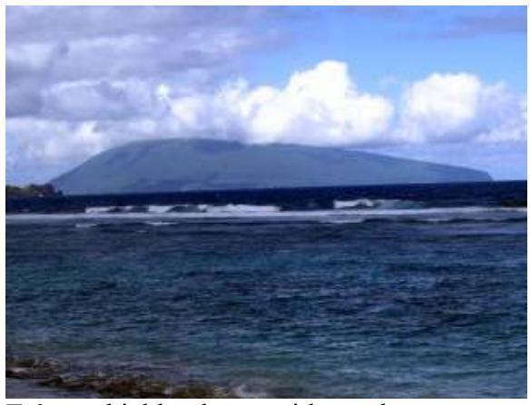

Ta'u, a shield volcano with gently sloping sides. Note the sea cliff on the far right.

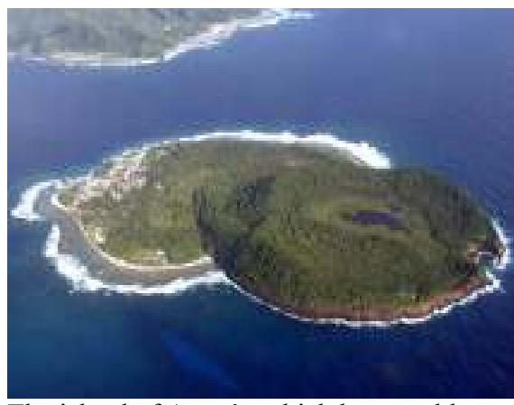

The island of Aunu'u which has an older cone on the left and newer on the right.

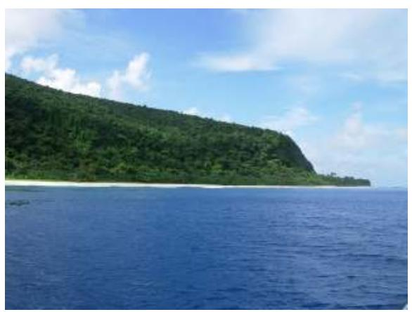

Steep cliff at the water's edge from wave erosion, Ta'u.

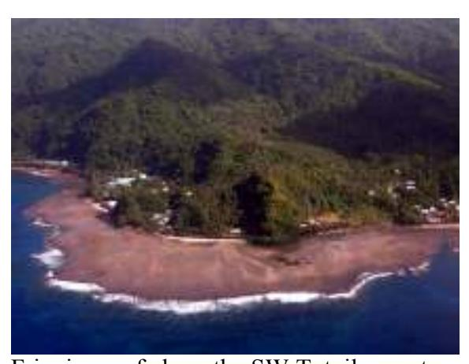

Fringing reef along the SW Tutuila coast.

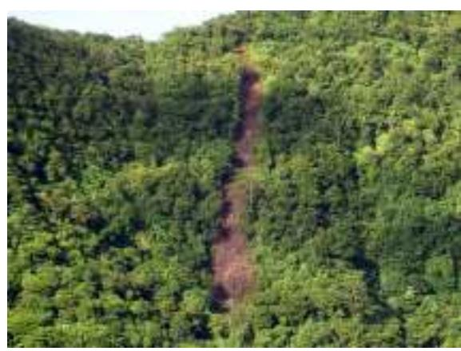

A landslide.

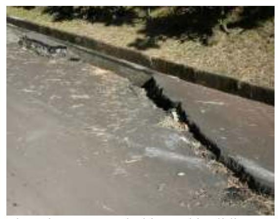

Slumping on a road: this road is sliding downhill slowly.

that happen more on Tutuila than either Upolu or Ofu-Olosega. The cause of this pattern remains a mystery. For further information on the geology of the Samoan islands and coral reefs, see Davis (1921), Daley (1924), McDougall (1985), Hart et al. (2004), Jackson et al (2007), Birkeland et al. (2008) and Koppers et al. (2008). For other introductions to the coral reefs of American Samoa, see Wells, (1988), Craig (2005), Craig et al. (2005), Birkeland et al. (2008), Brainard et al. (2008) and Fenner et al. (2008).

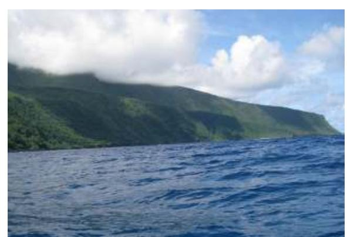

The south side of Ta'u, showing the bench line parallels the mountain slope above it.

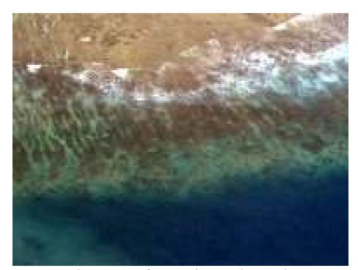

Spur and groove formations along the Coconut Point upper reef slope. The reef flat is at the top, and the crest is where the surf is breaking.

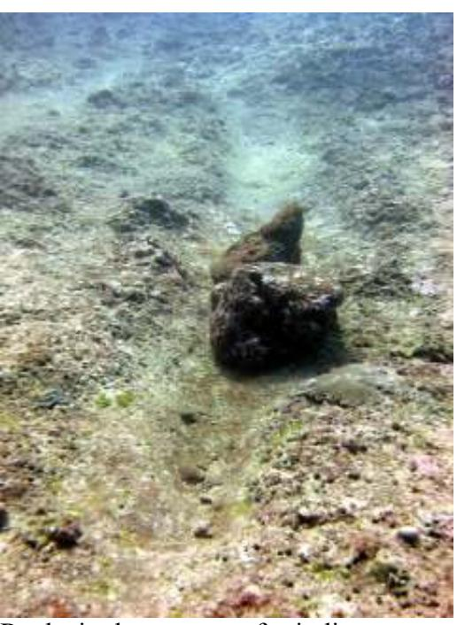

Rocks in the process of grinding a groove on Ta'u.

### **The Coral Reefs of the Samoan Archipelago**

 There are three major kinds of coral reefs, called fringing reefs, barrier reefs, and atolls. Fringing reefs grow right along the shoreline. Nearly all the reefs of the Samoan archipelago are fringing reefs. Barrier reefs are separated from the shoreline by a lagoon. A lagoon is around 20-150 feet deep and usually has a sandy bottom. It is much shallower than the open ocean, which is usually about 3 to 4 miles (4-5 km) deep. An atoll is a ring of coral in the open ocean with no high island. The atoll may have small

low sandy islands scattered along the ring of coral. Rose Atoll in American Samoa has only two tiny islands (one made only of sand, and the other is sand with vegetation indicated it has been there longer), but Swains Island is a continuous ring of sand with a completely enclosed lagoon or salt lake in the center. At one time it had a small opening to the ocean, but that was closed by a storm during the lifetimes of older residents.

 Charles Darwin in 1851 proposed that the three major types of reefs formed a sequence that was produced by oceanic volcanoes subsiding. He proposed that first a volcano is built up, and then a fringing reef grows up around the shoreline of the volcanic island. He said that the volcano will then very slowly sink, and the reef will grow upward where it began growing. As the volcano sinks, a lagoon will form between the island and the reef. This can be seen most clearly on an island like Moorea in French Polynesia, where a lagoon separates the high volcanic island from the reef. The reef marks the outline of the original shoreline, and where streams came down to the shore, the sediment carried by the stream kept the reef from growing and passes in the reef resulted. Darwin said that eventually the island will sink out if sight in the center of the ring of reef, forming an atoll. The entire sequence can be seen in Hawai'i, with an active volcano on the Big Island in the southeast, fringing reefs on the larger high islands which are relatively young, a couple of small barrier reefs on Oahu and Kaui, then tiny high islands with barrier reefs around them in the Northwest Hawaiian Islands, followed by atolls to the northwest. The island ages fit this sequence, increasing in age to the northwest, as the original Hawaiians knew. The sequence can also be seen in the Tahitian chain. The Samoan chain only has the early stages with fringing reefs, because the island chain is relatively short and young. The reef flat at Ta'u is missing around much of the island and narrow where it does exit, as Ta'u is the youngest island. Reef flats are wider at Ofu and Tutuila and quite wide on Upolu. There is another feature that is not so easy to see, a shelf around some of the islands, which is about 30-100 m (100- 300 feet) deep. Around Tutuila it has a ring of interrupted reefs which appear to be a sunken barrier reef. The shelf around Ta'u is very narrow if it exists at all, it is wider at Ofu-Olosega, much wider on Tutuila, and widest around Upolu and between Upolu and Savai'i consistent with Darwin's proposal. Darwin's theory was tested by drilling to see what was under the coral in an atoll. His theory predicted that volcanic rock would be underneath the coral, and indeed when holes were finally drilled through an atoll (Enewetok in the Marshall Is.) long after Darwin passed away, volcanic rock was found at a depth of 1200 meters (about ¾ mile), and the coral just above the volcanic rock was 65 million years old. Reef-building corals cannot live deeper than about 100 m (330 feet) at the very most, and most live in water shallower than about 50 m (160 feet), so the reefs could not possibly have grown up from the top of a volcano 1200 meters deep, instead the volcano had to have subsided after the reef started growing. Plus there are remains deep in the drill hole that indicate that the rock there was exposed to air, such as plant debris. None of the seamounts in the Samoan chain west of Savai'i reached close enough to the sea surface to have coral reefs grow on them, so none of them formed atolls, although they are old enough.

 Waves and wave surge have had an impact on the reefs as well as on the shoreline. Reef development is generally greater within bays and less on points on the north side of the island (NOAA, 2005; Sabater and Tofaeono, 2006). Although corals grow on the points, hurricane wave surge probably often breaks and removes the corals, so that the

coral skeletons don't have a chance to build a reef. On the south side, reefs grow on points as well as bays, probably because exposure to hurricane waves is not as intense. Reef growth is also restricted to bays in Hawai'i for the same reason (Grigg, 1983; 1988). In a few bays on Tutuila, such as the harbor on the south side and Vatia and Fagasa on the north side, wave action and circulation within the bays are so restricted that sediment runoff from the land is sufficient to affect the reefs. This is most true in the harbor. The harbor is huge and deep- it is the finest harbor in the South Pacific, and the main reason that the US wanted these islands (it was a Navy coaling station from early in the 20th century up to the 1950's, but no longer). The harbor is so large the Queen Elizabeth II ocean liner is dwarfed by the harbor when it visits, and it appears you could anchor several aircraft carriers in it comfortably. Some reefs in the harbor have been dredged, some built over, and others are heavily sedimented and all were exposed to heavy nutrient discharge in the early years of the tuna canneries (that discharge has been redirected out of the harbor). Most of the coral reefs present in the harbor at the turn of the century no longer exist or no longer have coral on them, but good coral communities still exist near the mouth of the harbor on reef flats at Utelei and Onesesopo. The reef flat at Aua on the north shore of the harbor was surveyed in 1916, and there was coral most of the way out to the edge of the reef flat. Subsequently, coral cover declined, and now it is all coral rubble except at the very outer edge, where there is good coral cover.

 The reef slopes have very little sand on them, but the shelf at 30-100 m deep has lots of sand (in some areas of the southwest coast of Tutuila west of Leone, the shelf is as little as 10 m deep). Coral reefs usually generate lots of sand. The coral and algae produce the white carbonate rock, and then a variety of organisms grind it into sand in a process called "bioerosion." Parrotfish bite at algae that grow on the reef rock surfaces, and in the process the larger species of parrotfish also scrape off some of the rock. They have a grinding apparatus in their throat that grinds the bits of rock they injest into sand, and then later after they have digested the algae they defecate sand. Small parrotfish scrape off very little rock with the algae they eat, but the larger parrotfish which scrape off much more rock are called "excavators." The largest parrotfish (bumphead parrotfish) actually bite off pieces of live coral, crush them and eat them, as well as scraping algae off of dead surfaces. Sea urchins also grind off reef rock as they scrape off algae with their hard teeth. Some clams bore into corals and live embedded inside the live coral. Also, some sponges bore into the reef rock, etching tiny chips of limestone out, and expelling the tiny chips. Where boring sponges are common, like in the Florida Keys, the bottom is dusted with the fine dust of these tiny chips from boring sponges. Although small parrotfish are common on American Samoan reefs, the larger parrots are not, so parrotfish actually do relatively little bioerosion here. Larger urchins are also rare, and the author has yet to see any boring sponges. The reefs here have none of that dusting of fine white silt from boring spoinges. On many reefs, sand is common on reef slopes, accumulating in dips and grooves. In American Samoa there are beaches made of sand from the reef and pools with sandy bottoms, but not a lot of sand on many reef slopes. The likely reason is that the surge from heavy waves continually re-suspends small particles, and moves larger particles down the slope. The sand gets cleaned off the slopes, and deposited on the shelf below. Although the water on the reef slopes is much clearer than in the harbor, and can average around 75 feet visibility, it is not as clear as out at the banks on the shelf, where it is well over 100 feet.

 Coral reefs around the Samoan islands have several zones. The fringing reefs of Tutuila and Ofu-Olosega have very shallow reef flats that begin at the shoreline. Either black volcanic rock (basalt) or white coral sand beaches form the shoreline, but at low tide line the beach ends and the reef flat begins. The reef flat is built by coral and crustose coralline algae. Crustose coralline algae is a plant which produces thin sheets of pink or purple which have a high calcium content, which cements rubble together and adds to the rock of the reef. It slowly builds solid white carbonate rock underneath it. Corals and coralline algae grow upward until they reach the surface. Periodically, unusually low tides bring the water surface a few inches below the normal low tide line, and leave the living corals and algae exposed to air. If this happens mid-day on a sunny day, they are also exposed to high temperatures. The drying and high temperatures kill them, but corals and coralline algae that are low enough to be covered with water survive. The net effect is like mowing grass: the upper tips die but the rest survives. The result is that coral in depressions continues to grow, while coral that has grown high gets mowed flat at the low tide line. Depressions get filled in until the entire reef flat becomes very flat at the low tide line. This is how the reef flat is formed and why it is so flat. The most common corals on the reef flats are encrusting *Montipora*, the small bushy staghorn, *Acropora aspera*, and *Pavona frondifera*. There are very few visible algae (called macroalgae or frondose algae) on the reef flats, other than the crustose coralline algae.

 Waves breaking on the reef crest pump water onto the reef flat, which then flows over the reef flat into cracks in the reef called "avas," where it drains back out into the ocean. The waves on the reef flats quickly move sand inward from the crest, where it accumulates in low spots near the shore. So there is little or no sand out near the crest, but some sand near the shore. An ava is usually a relatively small cleft that is wider and deeper at the reef crest and narrows and becomes shallower as it runs into the reef flat. Typically the sides are near vertical, and the bottom is often covered with fairly large rounded carbonate rock reef rubble. One of the larger avas is at Fagaalu, where a fairly large stream runs into the reef. Avas may have been formed when the ocean level was much lower (as low as 500 feet below the present level) by the stream eroding the exposed dead reef rock. However, once the ava was covered by sea water, coral growth could rapidly fill in such a gap. Although fresh water kills coral, the fresh water in the stream floats on the surface which is now well above the coral, so fresh water from the stream could not keep the coral on the bottom from growing and filling in the ava. Sediment is carried out some streams during rain storms, and currents in the ava carry the sediment out the ava. For streams that release moderate amounts of sediment, the sediment is swept rapidly out the ava and does not settle on the bottom. The fine silt fraction stays suspended in the fresh water floating at the surface for some time, long enough to be carried well out to sea and for the fresh water to spread over a very large area so the sediment is extremely dilute as it settles. If a stream releases very large quantities of sediment, as in Faga'alu, sediment does settle within the bay, and can kill coral. The sediment there not only settles in the ava, but also on the north side of the bay on the reef flat, where it has killed most of coral that lived there. This appears to be a relatively recent event, due to human activities on land such as a quarry uphill in the valley. But the spatial pattern of sediment settlement is not the same as the ava, suggesting that the sediment is not the primary cause of the ava staying open. In most avas (and on reef slopes), strong wave surge also keeps any sediment that settles

resuspended, so it doesn't smother the coral. The primary factor keeping avas open may be the rubble on the floor of the ava. The rubble is rounded, though it is clearly made of coral rock. Thus the sharp edges of the coral have been ground away. Heavy wave action during storms moves the rubble back and forth, grinding off sharp edges, breaking off any live corals that may have attached, and grinding away at the reef rock under the rubble. This process was seen and photographed by the author in the Philippines, where corals were found which were unattached and had the bumps worn down (and with no living tissue on them) while concave areas still had living coral tissue. They were found in smooth gullies with rounded sides. Clearly storms had moved the corals back and forth, wearing away bumps on them and wearing a smooth gully in the reef. Thus, the main process keeping avas open is the same process that produces the narrow smooth grooves running down the upper reef slope, which have similar rounded rubble on their floors. They also have smooth floors with a smooth rounded junction between the floor of the groove and the side, all consistent with being produced by the grinding action of boulders moved by storm waves. The rubble on the bottom of avas likely are pieces of corals ripped off the reef by storms, and carried into the avas by the strong currents that flow off of the reef flat and into the ava and then out to sea. During storms, those currents are even stronger than normal, and can move loose rubble blocks. There may also be some of the basalt blocks washed off the reef flat and into the ava. The grinding action in the avas produces sand, which the currents then carry out of the ava onto the shelf. A few avas have a fair number of healthy looking corals on the bottom of the ava and may be in the process of starting to fill in. The currents on reef flats are stronger at high tide and when waves are larger. They can be quite strong even in non-storm conditions, and in avas the water usually runs outward very fast. It is easy to be carried out an ava by the current, but very hard to get back in, making avas very dangerous even to a strong snorkeler with fins. That same current pattern keeps fresh oceanic water flowing over the reef flat and keeps the reef flat clean of terrestrial sediments.

 In some areas, the reef flats have many conspicuous large black volcanic basalt boulders sitting on top of them that stick out at medium-low tides. These are pieces of basalt which have been eroded away from the shoreline. Most of that erosion is likely to occur during hurricanes, when storm surge due to the low atmospheric pressure raises the water level, allowing the huge waves to sweep across the reef flat and hit the shoreline. Some of the boulders are up to about 3 meters (10 feet) tall, and weigh many tons, plus they can be up to about 30 meters (100 feet) from shore. The waves required to move such boulders must be huge indeed. Hurricane waves of 10 meters (30 feet) have been documented pounding reefs (e.g., Woodley et al. 1981); waves of 20 meters (60 feet) have been documented in the eye of the most powerful hurricanes (e.g., Fenner, 1991). Basalt rocks similar to those on the reef flat may be imbedded in the reef limestone where they may get washed over the crest or out the ava and stop moving when they reach flatter bottom. If the reef flat grows upward with rising sea level, those on the reef flat could get incorporated into the upward growing reef flat.

 The streams also carry much larger material than the suspended fine silt that colors the water brown. They carry rocks and gravel made from the erosion of the volcanic basalt. The larger the piece of rock, the faster the current must be to move it. Thus, at stream mouths as the speed of the moving water decreases as the water moves into the ocean water, the largest rocks stop moving first, then smaller rocks, gravel, and finally

sand. The silt is the microscopic particles that are most easily carried by the water and take the longest time to settle out, and so are carried farthest from the stream mouth. The effect of all this is that the streams that carry the most water and sediment usually have a small river delta at their mouth, composed of black basalt rocks rocks and gravel. The delta is deposited on the reef flat at the stream mouth, and over time the waves move the rocks and gravel around some, in between rainstorms when more gravel is carried down and deposited. Compared to the size of the whole reef flats, the stream deltas are relatively small. So while the gravel delta covers the solid reef flat and no corals or algae can live under it, the delta occupies a relatively small area. But it is another sign of the active process of erosion of the island.

 Along some of our shores, there is a band of relatively smooth grey rock that parallels the shoreline. This is called "beachrock." It is located between the high and low tide lines. It is made of calcium carbonate, so it is a light color like coral, not black like volcanic basalt. In places you can see corals embedded in it. It appears that some chemical process cements the beach sand together into rock, and any coral skeletons in the sand get embedded in it. It may be that at low tide, evaporation makes calcium carbonate in the salty moisture precipitate, cementing the sand together.

 The reef flats vary greatly in width around the islands. On the south side of Tutuila, the reef flat varies from zero at the Tafuna Plains to about 500 m wide in Fagaitua Bay, measured from the reef crest to the shore. Most of Tutuila's south side reef flats are about 200-400 m wide. Reef flats on the north side of Tutuila are mostly 100-300 m wide, with the maximum at Aoa at about 400 m wide. Most of the north coast has no reef flat at all, and all the reef flats are within bays. On Ofu-Olosega, reef flats are generally about 50-300 m wide, with the average being about 250 m, and the widest 500 m at Ofu village. On Ta'u, much of the coast has no reef flat, but where reef flats exist, they average about 50 m wide with the widest about 150 m wide (NOAA, 2005).

 In some places around Tutuila there are some deeper spots in the reef flat. These are called back reef pools. There are such pools on the outside of the airport runway, and at Coconut Point in Nuuuli, and in Alofau, and Faga'alu, and Utelei. These pools are up to about 20 feet deep, and have corals as well as sandy areas. The airport pool was dredged out of reef flat to get material to build the base of the airport runway. The pools in Alofau and Coconut Point, Nuuuli were dredged for material to add to the village land, and this may also be the cause of the pools at Faga'alu and Utelei. At Fagaitua and Onesosopo there are pools that are shallower, yet deeper than the reef flat, and appear to be natural. At Fagaitua there are dips as much as about 6 feet (2 m) deep, and at Onesosopo much of the pool area is about 2-3 feet (0.6-1 m) deep, but it is more like 1.5m deep closer to the little boat ramp. Utelei and Fagaalu have areas that are about 1- 15 feet (0.3 – 5 m) deep with corals. In independent Samoa, there are many places with wide sandy natural areas about 2-6 feet (.6-2 m) deep. These areas are sometimes called "moats." They are most common when a fringing reef is particularly wide, or the reef crest is high enough to block the waves at high tide. In independent Samoa, it is likely because the distance from the crest to the shore is so great. Most of these backreef pools around Tutuila are dominated by staghorns and finger coral (*Porites cylindrica*). One staghorn with blue branch tips (*Acropora muricata,* formerly called *A. formosa*) is by far the most common of the three staghorn corals in the lagoons, the other two being

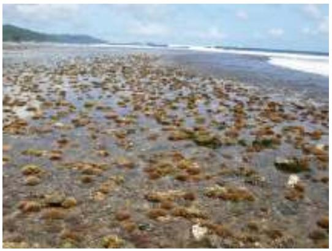

A reef flat on Tutuila

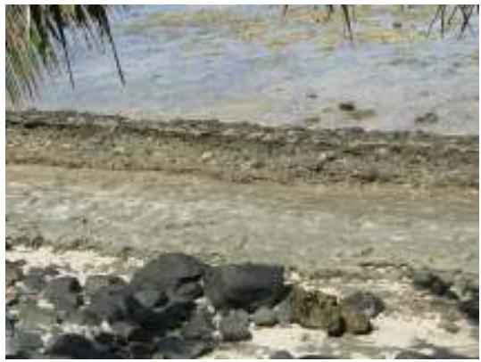

The smooth grey in the middle is beachrock

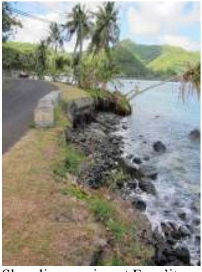

Shoreline erosion at Faga'itua

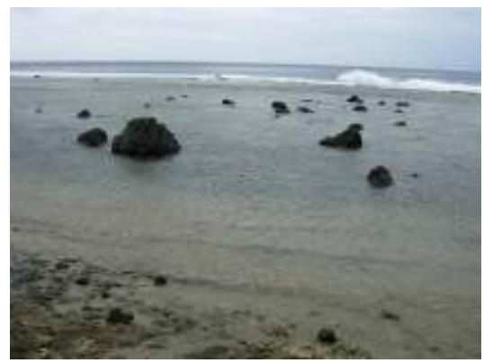

Basalt blocks on top of a reef flat

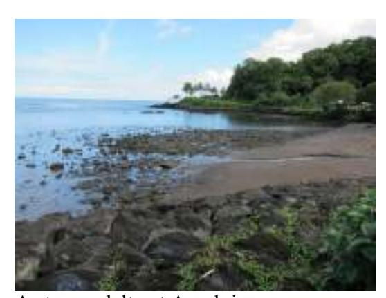

A stream delta at Amaluia

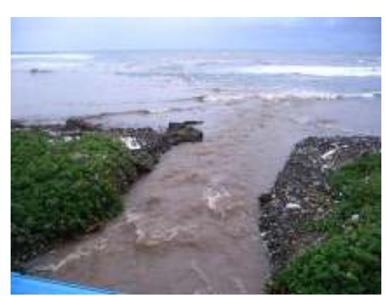

Muddy water going out a stream and ava

*Acropora pulchra* and *A. intermedia* (= *A. nobilis*). The moats in Upolu and Savai'i of independent Samoa are also often dominated by *A. muricata*. On the south shore of Ofu, there are a series of backreef pools that appear to be totally natural. These pools or moats are about 1-10 feet (0.3-3 m) deep. The way they were formed is a bit of a puzzle. The central pool in the series, at Hurricane House, is the largest and deepest, and others vary in depth. The lack of such pools elsewhere around Ofu suggests that subsidence didn't cause them, since there would be pools all around the island. The fact that they are at different depths suggests that they weren't produced by tilting of the island, since then all on the south would be about the same depth. One possibility is that it is due to slow slippage, much like hillside slippage that can lead to part of a road slowly sliding down. Such slippage could occur at different rates in different areas, producing different depth pools, and only produce pools in one area, the south side of Ofu. Slippage would have to be slower than corals can grow, since the reef flat has kept up with sea level and many *Porites* corals have reached the surface and formed microatolls. One remaining puzzle is that if it is slow slippage, there should be a crack where it is separating from the rest of the island, like the crack in the road where the road is slipping away, or the crack at the top of a glacier (called a "bergshrund") where the sliding glacier pulls away from material above it. Such a crack has not been reported. The Ofu pools have a wide variety of coral species in them, over 100 species, and are not dominated by any one species, though species of the genus *Porites* that form mounds (called "massive") dominate some of the pools. At low tide waves do not make it over the reef flat into the pools, and they become still and clear. It may be that the south side of Ofu has experienced a small amount of uplift, perhaps about 10 cm, just enough to not allow waves over the reef flat at low tide. Midday in summer on a sunny day they also become hot, hotter than corals can normally withstand (Craig et al., 2001). Studies are underway to determine how they are able to withstand these high temperatures (Smith and Birkeland, 2007; Barshis et al. 2010; Oliver and Palumbi, 2009; 2011a; 2011b). It may be that bleaching mortality from high temperatures in the Ofu pools keeps *A. muricata* (which is more sensitive than other corals) from dominating the Ofu pools, and allows other more slow-growing but more resistant species, such as massive *Porites* species, to be common, and a higher diversity to be present. Temperatures in Tutuila lagoon pools also reach higher temperatures than the ocean, but not nearly as hot as in the Ofu pools, except at Fagaitua. The staghorns in some lagoon pools in Tutuila have begun to bleach every summer, mainly in Alofau and Nuuuli, but also at the airport (Fenner and Heron, 2009). The corals turn white when water temperatures are too high and/or the sunlight is too strong. They turn white because tiny single-celled colored algae inside the coral cells leave them, leaving the thin living tissue clear and the white skeleton visible through the tissue. The tiny algae (called "zooxanthellae") are what give the coral color, and they also provide the coral with food. If the water gets too hot, the corals can die. Although the staghorns in the backreef pools bleach each summer now, few have died since 2003. Global warming means that more and more corals may bleach and die in future summers. In Tutuila, water continues to flow through most of the lagoon pools even at low tide, though circulation is very minimal in Alofau and Coconut Point pools. In Alofau and Coconut Point, the water in the pools is turbid, and near shore there are periodic algae blooms. This is probably from nutrient runoff in streams from on land, coupled with the slow circulation to replace the water.

 Waves break on the reef in an area known as the reef crest. The reef crest is not actually any higher here than the reef flat, but the waves keep this narrow area wet even at low tide. There is a bit more variety of coral here, with *Pocillopora verrucosa, P. damicornis and P. setichelli* being common in some areas, and *Acropora nana* being abundant and very characteristic of this zone. *Acropora nana* forms small clumps of thin branches that are quite close together. It seems surprising that a coral with such thin branches would live right where the big waves crash (since the branches surely are more delicate than thicker branches), but it appears that the fact that they are close together may reduce their chance of breaking. Because they are very close together, each branch is protected by its neighbors from the full force of the waves; water speeds between branches no doubt decrease greatly as you move down between the branches of the coral. Thus, each branch is exposed to the full force of the wave only on a small area near the branch tip. The three *Pocillopora* species all have branches close together and form small clumps much like *A*. *nana* on the crest. *P. setichelli* has especially close branch spacing for a *Pocillopora* species. So it appears that they benefit from the same hydrodynamic features that *A*. *nana* benefits from. The strong surge means that water movement between the closely spaced branches is much greater than for a colony in calm water. A major problem for corals with branches close together is that water circulation deep between the branches slows so much that exchange of nutrients, oxygen, etc. with the water are so reduced that in many species the lower parts of branches die and only the tips remain alive. If the bases of the branches die, they are invaded by boring sponges and other organisms and quickly loose strength and are likely to break. In heavy surf, water movement is much improved deep in a colony with tightly spaced branches. So the closely spaced branches both provides surprising strength in heavy waves, and provides better water circulation deep in the colony in the presence of heavy waves. Further, light is very intense in the shallow water, so light levels are still more than sufficient near the base of the branches of these relatively small colonies. So colonies with tightly spaced branches can withstand heavy waves and can grow better there than in calmer or deeper water. Actually lots of *A. nana* branches do get broken, some areas are strewn with broken off branches. Apparently the loss of branches is not so great as to outweigh the other benefits of living on the crest, and most places there aren't large numbers of broken off branches. Short finger *Acropora* such as *Acropora digitifera* may also be common here along with a variety of other *Acropora*. In this area, crustose coralline algae is often very common, covering everything between the corals, giving the reef a light pink or purplish color and a smooth, clean texture. Coralline algae grows well in wave action because waves remove sediment from the algae which cannot clean itself. The reef crest around Tutuila is actually partly protected by the shelf. The shelf reduces the wave power that reaches the crest around Tutuila, because although it is 30-100 m (100-300 feet) deep and thus doesn't reduce the waves much, it is a mile wide so it actually does reduce the waves. The difference can be seen at Rose Atoll and Swains, where there is no bank. At those two, the reef crest gets hit harder, and there are no corals on the reef crest. Only coralline algae can survive the waves there because it is smooth and solid, and as a result the crest there is completely made of pink coralline algae, and looks very pink from a distance. Because waves break directly on sharp coral around Tututila, it is difficult or impossible to get safely over the reef crest in most locations. If the waves are large, it is extremely dangerous. This makes it very hard to access the reef slope without

a boat. One place where it is possible to safely access the reef slope by snorkeling is in Alofau, where waves do not break most days on a section of the reef crest that faces westward away from the prevailing incoming waves which come from the southeast. In Fagatele Bay, it is possible to get over the reef crest, especially at high tide, but this is a risky procedure unless the person is an experienced snorkeler and a good swimmer. It's a bit easier at Vatia but you need high tide to get over the reef flat with a tank.

 Beyond the reef crest is the reef slope or forereef. Here the reef slopes down into deeper water. In most areas, the bottom slopes very gradually from the crest downward, gradually getting steeper in deeper water until reaching a near vertical slope. In a few places like Alofau the reef crest is a flat area, and the reef slope descends vertically from that reef crest for at least 10 or 20 feet (3-7 m). Below that the reef may descend at a slope of roughly a 45 degree angle. Some of the reef slopes have large ridges running down the slope, separated by deep grooves. These can be called spurs and grooves or buttresses and sand channels. These are usually quite irregular in shape in Tutuila. The grooves are usually narrow, and some of them are quite narrow in shallow water, about 1- 3 feet (0.3-1 m) wide. These small grooves have rounded sides, are U-shaped near the bottom, and have some large pieces of rounded rubble on their bottom. In storms, heavy surge moves the rubble back and forth, grinding the groove smooth and deeper. Typically, these grooves are prominent in shallow water on the slope, but less so in deeper water, because the surge is more powerful in shallow water and thus can move the blocks more, grinding the groove down. The reef slope extends down to a depth of about 60-100 feet (20-30 m), where it meets a flat or gently sloping bottom of white calcareous rubble and/or sand. This is the beginning of the shelf. On the slope, the water is relatively clear (often 75-100 foot visibility averaging about 85 feet or 26 meters) with low nutrients and little plankton. In addition, waves produce considerable surge, which sweeps the water back and forth across the reef. The wave surge appears to resuspend any sediment coming from off of land, until it is swept off the reef, so terrestrial sediment is not visible on the reef slope. There is a small amount of suspended sediment in the water on the reef slope giving it a haze. Water on the outer banks is truly oceanic and crystal clear.

 Crustose coralline algae is the most common organism on the upper reef slope, probably because the clean water and constant surge remove any sediment, and herbivorous fish like surgeonfish and parrotfish remove algae. Close observation reveals that fairly often, fine turf algae grows on the coralline algae. Without heavy herbivory, that filamentous algae would grow dense, trap sediment, and smother the coralline algae. Some surfaces in deeper water are covered with a fine grey fuzzy looking layer. This is turf (filamentous) algae with large amounts of fine sediment trapped it in, just the thing that can smother coralline algae. Although wave surge is ubiquitous, actual currents are usually quite slow and not noticeable by a diver. One place with currents is the channel between Aunu'u and Tutuila- at times it appears to be moving fast not far from the Aunu'u harbor, and some current can be felt on the reef west of the harbor. East of the harbor the currents can be very strong. Another place is near the southwest point of Tutuila. There is a wide diversity of corals on reef slopes, though the most common corals are encrusting species of *Montipora*, plus *Porites rus* (which forms plates and irregular columns) and *Pavona varians* (which is encrusting). There are many rounded or massive corals as well as the encrusting species and some branching or plate corals.

Crustose coralline algae and encrusting corals dominate the upper reef slope, and then on some reefs there is a relatively sharp boundary below which the green alga *Halimeda* and/or plate corals such as *Mycedium* dominate. Table corals (*Acropora hyacinthus*), which grow up on a short stalk like a pedestal, are usually most common in shallow water and dominate the western side of Fagatelle Bay. There is also quite a bit on the tops of ridges in Leone, though the tsunami broke and killed most in the grooves between the ridges. The encrusting coral *Isopora crateriformis* often has plate-like edges, and dominates the shallow reef slope in the area from Leone to Sili in the southwest of the island. It used to be referred to as *Acropora crateriformis*, but it has more features in common with *Isopora*. In bays, wave action may be less, and currents do not carry sediments away. In some, like Vatia, the coral assemblage appears quite different due to the high sediment loading and reduced surge. Thus, in Vatia, *Porites rus*, massive *Porites*, and finger coral (*Porites cylindrica*) are most common and there is sand and fine silt between coral colonies. *Porites cylindrica* is common only in protected locations like Vatia and backreef pools. In Fagasa, everything on the deeper part of the reef is covered with fine gray silt and there are few corals, not even many dead corals.

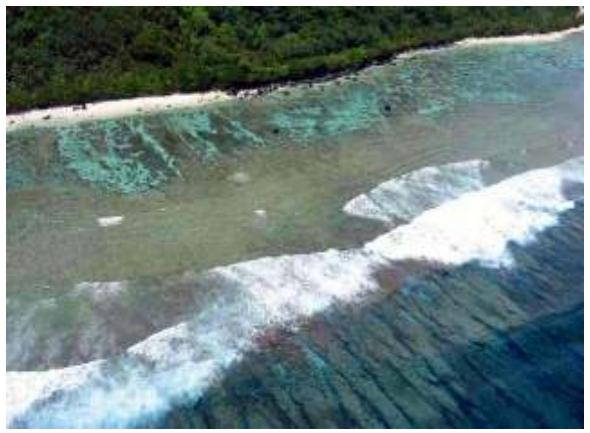

Backreef pools, reef flat, crest (surf line) and spur and groove on the upper slope of the south side of Ofu.

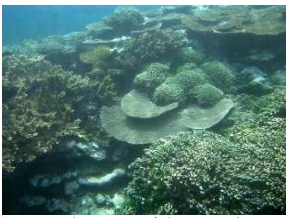

A spot on the upper reef slope at Vatia with high coral cover before the tsunami.

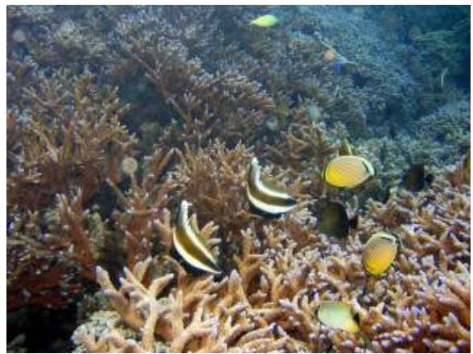

A spot with high coral cover in the backreef pool at Alofau.

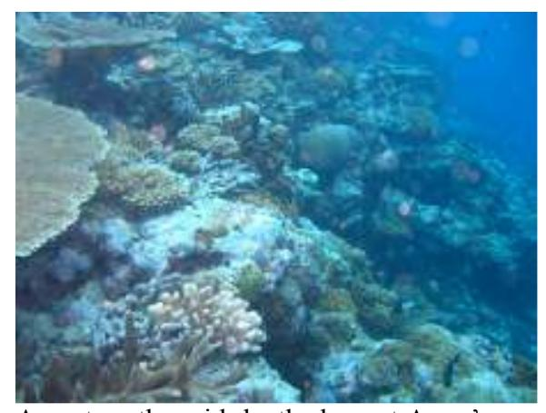

A spot on the mid-depth slope at Aunu'u.

Turbidity and silt are especially heavy in the harbor, and many reef areas there have been dredged or killed by sediment.

 The reefs are somewhat different on the north and south sides of Tutuila. The north side has reef only in bays, while reef is more continuous on the south side as noted before. Points on the north side are volcanic basalt rock. On the south side, encrusting coralline algae predominates, while on the north side filamentous algae is more common. This is probably because the southeast tradewinds produce more wave surge on the south than the north for much of the year. There is coralline algae at the top of the slope on most north side reefs, but it does not extend very far down the slope (about 12 feet or 4 meters on one reef) compared to the south side, where it extends deeper (about 40 feet or 12 meters deep may be fairly typical, but at Fagatele Bay it dominates to a depth of at least 60 feet or 18 meters; Fagatele Bay experiences strong wave surge most of the time, because it is out at the edge of the shelf and has no shelf to reduce wave power). Wave surge that is sufficient for coralline algae probably extends deeper on the south side than in bays on the north. *Acropora* are more common on the south side than the north side, though exceptional areas exist. The north has more *Porites*, while the south has more *Pocillopora*. The south side has more parrotfish than the north.

 There are some distinctive coral communities on some spots on the reef slopes. For instance, there is a reef near the mouth of Vatia Bay on the northeast which is especially rich in a variety of species of staghorns and tables (*Acropora*). In contrast, the reef slope near Auto and Amaua on the southeast is dominated in medium depths by large fields of *Lobophyllia hemprichii*. In Larson's Bay, there are large fields of *Merulina ampliata* at about 10 m depth, but a diversity of corals in both shallower and deeper areas. In parts of Fagatele Bay, the shallowest depths are dominated by *Galaxea fascicularis*, and shallow to medium depths are heavily dominated by table corals, mostly *Acropora hyacinthus*. At another spot in the bay, there is a huge mound of *Pachyseris rugosa* in medium depths, the largest the author has ever seen. The deeper slopes in Fagatele Bay and several other sites have large numbers of mushroom corals (fungiids). The soft coral genus *Cladiella* is common on some reef slopes, but gorgonians are quite rare, as are black corals and azooxanthellate soft corals like *Dendronephthya*. Black corals are only known to be common at one spot at about 200 feet (60 m) deep. The corallimorph, *Rhodactis*, forms large monospecific patches at Tafeu, but is rare elsewhere on reef slopes, though it is fairly common in the lagoon at Nuuuli and used to have significant patches in Vatia Bay that were overgrowing corals. A green *Zoanthus* sp. appearing similar to *Zoanthus sociatus* is common in most lagoons, but rare on the reef slopes. Most coral species on the reef slopes are not in the backreef pools. The most dominant staghorn species in the pools, *Acropora muricata* (*=formosa*), and another less common lagoon staghorn (*Acropora pulchra*) are not found on outer reef slopes. The other dominant species in the lagoons, *Porites cylindrica*, is rare on most reef slopes though it is common in the protected and silty waters of Vatia Bay. Deeper parts of some areas of the reef slope are covered with the green calcarious algae of the genus *Halimeda*, usually along with plating corals such as *Mycedium*.

 The banks that form a broken chain of drowned barrier reef on the shelf have areas of high coral cover with abundant table corals (*Acropora clathrata*) and a diversity of other corals. Other areas, such as much of the top of Taema Banks, are dominated by coralline algae with little coral, and some areas are dominated by rubble such as the north slope of Taema Banks. Mapping the banks for coral has just begun.

 Many coral reefs go through repeated cycles of disturbance and recovery, as has been documented on the Great Barrier Reef (Connell et al. 2004). The coral reefs of American Samoa have been subjected to a variety of disturbances in recent decades. Hurricanes struck in 1973, 1981, 1987, 1990, 1991, 2004, 2005 and 2010. Hurricanes can cause a great deal of mechanical breakage of corals and subsequent death of fragments. Damage depends on how close the eye of the hurricane comes to the island, how powerful the hurricane is, how quickly it moves over the island, and which side of the island is exposed to the wind-generated waves. One section of reef may be badly damaged and another may completely escape damage. The reef slope at Fagaalu at about 30 feet (9 meters) deep is covered with coral rubble composed of pieces of branching coral that was probably staghorn (*Acropora*) which may have been killed by the hurricanes in 1990 and/or 1991(or by disease or bleaching). As stated before, Tutuila has probably been struck by hurricanes about 300,000 times since it was formed. Coral reefs have evolved to deal with hurricanes. Further, there is nothing humans can do to stop hurricanes or reduce their effects on coral reefs. After a hurricane, damaged reefs recover in the following years. The reefs repeatedly cycle through damage and recovery. They recover if humans are not chronically damaging the reef.

 The coral reefs of American Samoa were severely damaged by an outbreak of crownof-thorns starfish (*Acanthaster planci*) in the late 1970's, around 1978. Much of the coral community was eaten and killed by these starfish, leaving only dead skeletons. However, in the ensuing years, the starfish disappeared and the coral populations largely recovered. A visual estimate by R. Wass of coral cover before the crown-of-thorns outbreak indicated over 60% live coral cover, though an estimate of coral cover in Fagatele Bay at the time by C. Birkeland was 30-50%. Now live coral cover averages about 30% around Tutuila. 60% is very high coral cover, and is likely to occur only when there has been an unusually long period without a major disturbance. Further, the sites the 60% was based on may have been selected for having good coral cover, and accurately estimating coral cover is not easy. So 60% coral cover is likely to be unusually high for American Samoa. 30% coral cover is actually higher than the average for the South Pacific and the whole Pacific currently, though it is somewhat less than the Pacific had in 1983 (Fenner 2007; Fenner et al. 2008).

 Another disturbance on these reefs has been mass coral bleaching. Mass coral bleaching occurred in 1994 and 2003, with a less intense bleaching event in 2002. Bleaching in 1994 produced some coral mortality on the reef slopes (Goreau and Hayes, 1994). Bleaching was documented on the reef slopes in 2002 (Green, 2002) and 2003, but the extent of bleaching and mortality was not recorded in 2003. About half of all staghorns in the deeper backreef pools were dead by the beginning of 2004, and appeared to have been dead for several years. Thus, they may have been killed before the mass bleaching in 2002 and 2003. Mass bleaching tends to kill some corals more than others, and *Acropora* is one of the most sensitive genera, along with the fire coral, *Millepora*. In the Ofu lagoon pools there are quite a few clumps of dead branches that had no live coral visible in late 2003. However, by 2006, many of those clumps were spouting branches of *Millepora dichotoma*. Apparently the bleaching in 2002 and 2003 killed them, but tiny spots that couldn't be seen survived, and regrew in the following years, Phoenix-like.

 Coral disease has killed much of the coral in the Caribbean, particularly the two species of staghorn that dominated many reefs, and was the primary cause of the reduction of the coral cover there from about 55% in 1977 to about 8% now (Gardiner et al. 2003). Coral disesases are present in American Samoa but not common now (Aeby et al, 2006). However, following the periods of mass coral bleaching in 2002 and 2003, there were outbreaks of coral disease, particularly white syndrome and *Pocillopora* white band (P. Craig, personal comm.). White syndrome usually kills the table coral it infects. The 2005 mass bleaching event in the eastern Caribbean also had a disease outbreak associated with it (Wilkinson and Souter, 2008), so this is not the only time this has happened (Selig et al. 2006; Bruno et al. 2007). Such disease outbreaks associated with mass bleaching events act to multiply the mortality that the bleaching event causes, and so is a cause for significant concern. Coral populations on the reef flats are periodically killed by unusually low tides, as explained earlier. The coral populations have recovered from all these discrete events. This may be because the outer reef slopes are in relatively clear oceanic water and are not impacted by chronic human (anthropogenic) disturbance. In the harbor, however, hard coral populations have declined and some soft coral populations have disappeared since the first measurements of them in 1917. That is, in the areas in which the reefs have not been completely destroyed by being dredged or filled. Sedimentation, high nutrients, and chemical pollution may be some of the chronic disturbances produced by human activities which have had caused these declines.

 The genus *Acropora* is probably the most important single genus on coral reefs. It has the most species (up to 165 species are currently recognized: Veron, 2000). Further, they are abundant on many reefs, and dominate many reefs. The "staghorn" shaped branching species are also the fastest growing corals in the world, able to grow up to about 10-20 cm (4-8 inches) in length per year. On the other hand, they are among the most vulnerable to disease, with table corals having the highest rates of "tumors" (growth anomalies) and "white syndrome" of any corals in American Samoa (Aeby et al, 2006). White syndrome is among the most lethal coral diseases, moving very fast across a colony and almost always fatal. Further, most *Acropora* have branching shapes that are relatively delicate and thus easily broken and killed by hurricanes. Also, *Acropora* is among the most vulnerable corals to mass coral bleaching, and thus the first killed by mass bleaching events. *Acropora* is even among the favorite foods of the crown-ofthorns starfish. Table corals are particularly strong competitors for other corals, because they can grow above other corals shading them and thus making it hard for them to grow, and with their table top above the other corals, it is hard for the other corals to reach them with stingers (nematocysts) on their tentacles, even if the tentacles are the specially elongated "sweeper tentacles" used to try to sting other corals in the battle for space. So in the absence of disturbances like hurricanes, crown-of-thorns outbreaks, mass coral bleaching, and disease outbreaks, *Acropora* and particularly table corals may be able to outcompete rival coral species and come to dominate reefs. Descriptions of reefs in American Samoa before crown-of-thorns ate most of the corals indicate that indeed tables and staghorns were common (C. Birkeland, personal comm.) All of these things together suggest that the coral communities are dynamic, unstable features of these reefs. Disturbances tend to kill the very species that come to dominate in the absence of disturbance. Periodic disturbances probably keep most of the reefs in the process of

recovery, and allow other coral species to be common, even though they are less able to compete with tables and staghorn.

 Soft corals are a minor part of the fauna on American Samoan reefs, though at least 10 genera are found here. Surveys have shown that their populations dropped precipitously on reef flats in the harbor in recent decades (Craig et al. 2005). Drilling of reefs in the harbor revealed these reefs are mostly made of the spicules of soft corals in the genus *Sinularia* (Birkeland et al. 2008), yet they are now rare in the harbor. Soft corals are moderately common at some sites on reef slopes. All the soft corals on the reef flats and slopes are zooxanthellate, they contain the same sort of single-cell algae that the hard corals have (dinoflagellates called zooxanthellae). The most common genus on the reef slopes is *Cladiella*. Zooxanthellate soft corals are typically dull browns or greens, much like hard corals. Azooxanthellate soft corals are often brilliant colors such as reds, oranges, yellows or purples, but they are very rare most places in American Samoa. One exception is a vertical basalt wall near the southwest corner of Tutuila, in the village of Amanave. This wall is reported to have many purple, yellow, and white soft corals, probably in genus *Dendronephthya*. Azooxanthellate soft corals are most common on shaded surfaces such as vertical walls. There are also a few species of zoanthids and corallimorphs, which are groups that have polyps but no skeleton. There are a variety of other non-cryptic (exposed) macroinvertebrates, though they are not common on American Samoa reefs. Giant clams (faisua) are uncommon as they are highly prized for food by the Samoan people and likely overfished. One species (*Hippopus hippopus*) is known only from a few sub-fossil old shells. It may have been driven to local extinction long ago, and since has been reintroduced, but now it has not been seen for some time and might once again be locally extinct. The most common invertebrates are a little black sea urchin (*Echinostrephus molaris*) that lives in holes it makes in the reef rock, an encrusting grey-blue sponge (*Dysidea*) and a small orange sponge, *Styllissa massa* or *S. flabelliformis*. Very few large urchins or sea cucumbers live on the reef slopes, but sea cucumbers are common in some areas of the reef flat pools. Fairly high densities of the black urchin *Echinothrix diadema* live in a band just inside the reef crest at some locations. Crown-of-thorns seastars (*Acanthaster planci*) are rare on Tutuila, but a small persistent population lives on Ofu-Olosega. Adults eat the live tissue off of hard corals. Juveniles live in holes in the reef and eat coralline algae, so small crown-of-thorns are hard to find and it is hard to predict when a new outbreak will occur. Recently (2012) groups of crown-of-thorns have been found a few places on Tutuila and Upolu, indicating populations are now increasing. The Triton shell (*Charonis tritonis*), which eats starfish including crown-of-thorns, is also rare. Spiny lobsters live mostly just seaward of the reef crest, and slipper lobsters live at all depths. Both are hard to find during the day but come out at night. Filter feeders such as sponges, boring clams, feather duster worms, crinoids, black corals, azooxanthellate soft corals and ascidians are rare, small and/or cryptic, except in the harbor where small oysters near the intertidal are common and sponges are common in deeper water, on the inner reef flat of Leone (which is nearly totally covered by an encrusting grey sponge) and on a vertical basalt wall near the SW corner of the island (in Amanave) which has many soft corals. The Coral Reef Ecosystem Division of NOAA in Hawaii has gathered data which suggests that there may be upwelling in the southwestern area of the island, which may provide nutrients for plankton growth. The rarity of filter feeders most places in American Samoa is likely

because water on the reef slopes is clear and has little plankton for them to eat, while the harbor, the Leone inner reef flat, and the southwestern upwelling area have more nutrients and turbid water with plankton. However, if there is any increase in nutrients in plankton on the southwestern side of the island, it is a relatively small amount, particularly compared to the dense plankton making the harbor water look a thick green. There are planktivorous fish on the reef slopes such as fusiliers, small damsels and black triggers (which eat jellies), but anthias are relatively rare. There is some suggestion that planktivorous fish may be more common in the southwestern part of the island. There are many species of invertebrates on the reefs, including over 700 species of mollusks now known. A total of 2705 reef species, including fish, corals, other invertebrates, and algae are now known from American Samoa (Fenner et al, 2008), but this is a truly tiny fraction of the total that is here. The actual total is likely to be in the 100's of thousands. The total is not known from any reef anywhere in the world yet; the highest number known for any one location is over 8000 in New Caledonia (Payri and Richer de Forges, 2006). The amount of work and expertise needed to find and identify all of them would be staggering. A good guidebook to shallow water invertebrates in American Samoa is "Field guide of shallow water marine invertebrates of American Samoa," by Madrigal (1999).

 One invertebrate, the Palolo worm (*Eunice viridis*), has a spectacular spawning event every year. About 7 days after full moon in October or November, millions of these worms spawn on one night, at about 1 am. In the previous months the worms, which live in holes in the reef, grow a reproductive section on their tail end. On spawning night, they back out of their burrows and the reproductive tail end breaks off. The tail end then swims toward the surface. Male worm tails are brown and females green. Before dawn the tail sections explode, releasing eggs and sperm. The fertilized eggs then float off in the sea to develop into tiny worms which will then settle on the reef. Samoans scoop up the worms when they come out of the reef and eat them. Palolo worms are considered quite a delicacy. Spawning occurs on the same night in the Manu'a and independent Samoa, but at different times. It also occurs in Fiji and probably elsewhere.

 As stated before, crustose coralline algae dominates upper reef slopes of American Samoa. They probably dominate the reef slopes because the strong wave surge cleans any sediment off their surfaces, and because there are still good populations of the herbivorous fish, such as surgeonfish and parrotfish. Coral larvae are attracted to settle on some coralline algae by a chemical released by bacteria that live on the surface of the algae. So a reef dominated by coralline algae is basically a healthy, clean reef. There are also species of coralline algae that form bushy or leafy colonies, and these are also common. One genus of green algae, *Halimeda*, produces strings of green plates and often forms small bushes or lawns. The green plates contain calcium which remain as flakes after the alga dies and can form sand. A few sites are nearly covered by *Halimeda*, but it is not known to be a problem. Other kinds of algae that are large enough to easily see (called 'macroalgae') have been rare on most reef slopes. In 2008, the brown alga *Dictyota* was found to be common on the slopes of the east side of Vatia bay, where it was absent in previous years. It was growing over living corals as well as *Halimeda* and sand. It was also reported in the Nuuuli backreef pool, appearing around January, 2008, and washed up on the beach in Aoa. *Dictyota* is one of the brown algae that has grown over dead coral in the Caribbean, helping to turn coral reefs into algae beds, so it is a

cause for concern and needs to be monitored. In some of the reef flat pools, there are areas where algae bloom periodically. At the head of the harbor there have been nontoxic red tide blooms that turn the water red. These are likely to be places of higher nutrient levels from runoff from villages, piggeries, and/or fields. The higher levels probably occur mainly because there is little flushing at the head of a narrow bay, so whatever washes into the head of the bay builds up instead of being dispersed as it is along the outer coast. The biodiversity of macroalgae on American Samoa reefs is fairly high, with over 237 species known.

 Another type of algae is turf or 'filamentous' algae, which are composed of fine hairlike filaments. These algae grow on any dead surface, and grow very rapidly. They do not produce any heavy defenses, like calcium, cellulose, or chemicals, unlike the macroalgae. Producing those defenses slows the growth of the macroalgae, but protects them from the many herbivorous fish like surgeonfish and parrotfish, and the many other herbivores like sea urchins and snails. Herbivores usually prefer to eat filamentous algae because it is not defended. Because the filamentous algae grow fast and are quickly eaten, they form a low, fine 'turf' on dead surfaces which is not very obvious. However, because they grow rapidly and are eaten quickly, they produce a large amount of food and are the base of a large part of the food chain. Some of the most common fish on American Samoa reefs are surgeonfish and parrotfish, most of which are herbivores that eat filamentous algae. Herbivorous fish are likely to be more abundant where there is more filamentous algae and less coral.

 A last group of algae is the blue-green algae or cyanobacteria. These are actually bacteria, but are photosynthetic. They form fine filaments formed of strings of cells, and often look like clumps of fine stringy hair which easily comes apart. Cyanobacteria lack some of the ability of other algae to use low concentrations of nutrients, so they are not very common unless nutrient levels are elevated. When nutrient levels are high, though, they can grow especially rapidly and accumulate. Occasionally, accumulations of cyanobacteria can be seen on our reefs. Cyanobacteria are often toxic, so although they are soft and easily eaten, they often form large streamers or globs, because the fish won't eat them.

 The reef slopes as well as the reef flats and lagoons have remarkably low amounts of brown macroalgae on them. The reef flats of Fiji's Coral Coast are now covered with brown macroalgae such as *Sargassum* and *Turbinaria*. Nutrient levels in the water on the reef flats are elevated above natural levels for coral reefs (Mosley and Aalbersberg, 2003), and fish abundances are far below levels remembered by villagers. The combination of increased nutrients and decreased herbivorous fish stimulates algal growth and reduces consumption of the algae, with the result that the brown algae bloom, covering the reef. The fact that this has not yet happened in American Samoa is very good. The experience of Fiji is a lesson for American Samoa to not overfish the herbivorous fish and not release so many nutrients that algae is fertilized and blooms. In American Samoa, it is important that surgeonfish and parrotfish (which are both mostly herbivorous families of fish) remain abundant. The abundance of coralline algae is also a good sign for American Samoa. Coralline algae grows best when there is little sediment and there is strong herbivory, so neither sediment nor algae cover them. These are just the conditions that corals thrive in. This may be the reason why coral larvae are stimulated to settle by coralline algae (the coralline algae indicates a good place to settle). When corals are

killed by a disturbance in American Samoa, crustose coralline algae are quick to cover the dead coral skeletons, and cement them together to make a stable substrate, which corals need to survive. The coralline algae then make an attractive substrate for coral larvae to settle on, and so encourage the growth of new corals and the recovery of the reef.

 The fringing reefs of Tutuila and Ofu-Olosega all end at their deep end in either sand or rubble (except in the harbor where they end in silty mud), anywhere from around 45 feet deep to about 100 feet deep (15 to 30 meters), but more commonly closer to 60 feet deep. The sand or rubble plain may be at a slight slope or appear to be very flat. The sand and rubble are the beginning of a large underwater shelf around Tutuila. There are some features on this shelf, such at Taema Banks at the mouth of the harbor. Some of these banks are elongated parallel to the shore and rise to within 30 feet of the surface. Some have a flat bare top, and a slight slope on their seaward edge that has corals growing on it. The corals end at about 100-130 feet (30-40 m) deep in a flat sand plain. NOAA has used multibeam sonar to map the shallow waters around American Samoa, including the shelf around Tutuila. The resulting map shows many details not known before (page 9; Fenner et al. 2008). The author assisted in a research submarine exploration by Dawn Wright and the Hawaii Undersea Research Laboratory (NOAA) of the bottom seaward of Taema Banks in 2005. The sand plane has a very slight slope, and across the width of the plain the shelf increases in depth to about 330 feet (100 m) deep. The shallow half of the plain has fields of green algae (*Halimeda*) on it. When the algae die, they leave behind little plates of calcium, and much of the sand the algae grow on is composed of these plates. The deeper half of the shelf has a species of single-celled animal called a foram or foramaniferan that forms hard, thin coin-like discs, which are abundant there. The discs are up to about 2 inches (5 cm) in diameter. They are among the world's largest forams and the world's largest single animal cells. The genus is *Cycloclypeus*, and it is restricted to deep water where there is no surge to break the thin fragile discs (Song et al, 1994). The cell that builds the disc contains algal symbionts, usually diatoms, so it must have light. The diatoms must be able to use relatively dim light, since they are at about 70-90 m deep on the shelf where light is fairly dim. At about 330 feet (100 m) deep there is a roll off to a near vertical cliff. On the roll off there are gorgonian sea fans with feather stars on them, and mounds of rubble made by small sand tilefish digging their burrows. On the cliff, layers of limestone produced by ancient reefs can be seen. The cliff extends down to a depth of over 1000 feet (350 m), and below that a talus slope of sand and pieces of limestone descends at an angle. No hard corals were seen on the shelf, cliff, or slope. At Fagatele Bay, there is little shelf, and the cliff is dissected by grooves and ridges. At Swains Island, a small shelf extends a few tens of meters from the reef crest where waves smash on encrusting coralline algae, to a depth of about 5 meters, where a 45 degree slope extends down well below scuba depths. There is no deep shelf at Swains or Rose Atoll. A ridge with coral on it connects Olosega to Ta'u. The seamount 40 miles south of Tutuila called "South Bank" by the fishermen, has a very flat top in about 80+ feet of water, with a slight hint of an atoll ring. The surface is covered with small rubble and some sand. There are a few lumps of coral rock with a few corals on them, and that is all. It appears to be a drowned atoll that is now dead.

#### **What are Corals?**

 That's not very obvious. In some cultures corals are called "colored rocks." It seemed to early scientists that they had features of both plants and animals, so they called them "zoophytes" (zoo = animal, phyte = plant). In time, it became clear to the scientists that they were animals, related to jellyfish and sea anemones. They are actually very similar to sea anemones, with a couple major differences. A sea anemone is a "polyp," which is a body shaped like a grocery bag, with tentacles around the opening. The opening is the mouth. The bottom of the bag is commonly glued onto something hard. The wall of the sea anemone is made up of just two layers of cells, with connective tissue between them. They are very simple animals, and have no organs. A jellyfish is called a "medusa" and is sort of a polyp turned upside-down with the tentacles and mouth facing downward. It's also not attached except in rare instances. Coral, jellyfish, and anemones are all in a large group called "Cnidaria." That word means "stinging nettles," and of course jellyfish are well known to be able to sting. Actually, anemones and corals are also able to sting. The stingers (called nematocysts) are microscopic, located inside cells in the skin of the tentacles. When something touches them they expode, firing a tiny tube that works like a hypodermic needle full of powerful venom into the victim. There is a jellyfish in Australia that can kill a child in two minutes! Anemones commonly sting, kill, and eat fish and other animals. They may look like a flower (an anemone is a garden flower) but they are ferocious like a lion. They use their tentacles to pull their prey to their mouth and swallow. The inside of the bag acts as a stomach. When they finish digesting, they expel undigested remains out their mouth.

 The similarity of corals to anemones can be seen in a few corals called "mushroom corals." They are a polyp, and one species has large tentacles that look just like an anemone. Others have short tentacles, and most have such tiny tentacles you can't see them. In the middle, they have a slit that is their mouth.

 There are two major differences between anemones and corals, however. One is that corals don't leave finding a hard thing to attach to, to chance, they build their own, in the form of what we call a "skeleton." This is a hard thing, made of white calcium carbonate (CaCO3). It is underneath the polyp, and so outside the living part of the coral in most instances. The skeleton is itself not alive, which is actually different from our skeleton, which has living cells in it and blood vessels to supply those cells, etc. Our skeleton is also internal, and it has many separate pieces that have joints so they can move. But corals have just one piece of skeleton, it is dead, and it has no joints- so it can't move. The coral skeleton is the rock which the coral adds to the reef, the bricks that the reef is made of, one on top of another.

 The second difference is that corals have more than one polyp. An anemone is all one polyp, with one ring of tentacles around one mouth. When an anemone grows, it can get to a size where it is ready to reproduce. One way it can reproduce is by simply dividing into two! You want to have kids, just split down the middle? Yikes. Anyhow, dividing is called fission and anemones can do it often. Corals start out as a single tiny polyp, and as it grows, it starts to divide into two. But it doesn't finish the job, and the two polyps stay attached to each other. Then the two partway divide into four, four into eight and so on until a single coral can have many polyps- a large coral that has tiny

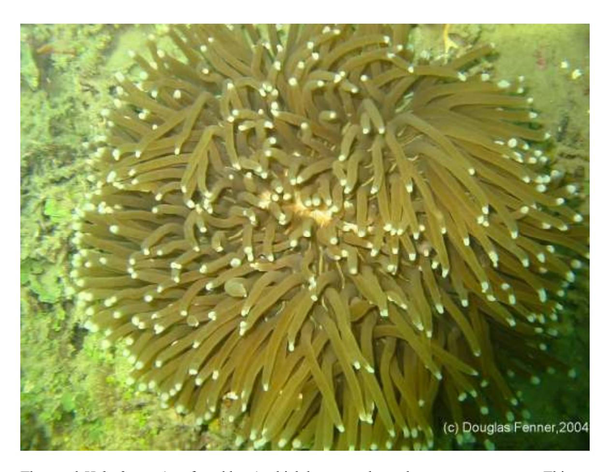

The coral *Heliofungia* (not found here) which has tentacles as large as an anemone. This coral has a skeleton under tentacles that is nearly identical to that in the following picture.

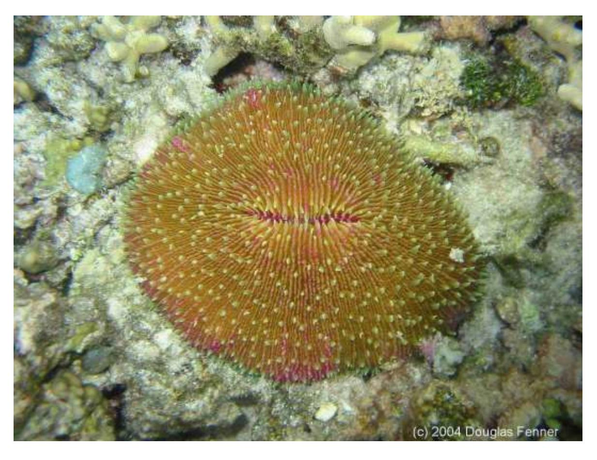

A coral closely related to the coral shown above (*Heliofungia*), named *Fungia fungites*, photographed here. The tentacles are much smaller and the shape including the mouth slit and the radiating septa (ridges) all show the shape of the skeleton.

polyps can have millions of polyps. Because the polyps are all attached to each other, in some ways a coral acts like a single individual, and we call it a "colony."

 One last important feature of reef corals and some anemones is that they supplement their diet. They have tiny single-celled plants inside the cells that line the inside of their body. These cells are a kind of algae (dinoflagellates) usually called zooxanthellae (which just means "brown algae that lives inside an animal"). When sunlight strikes them, they can do photosynthesis and make food. Some of the food leaks out and nourishes the coral animal. This is why reef-building corals can grow only in shallow sun-lit water: so their algae can make food.

 So now that you know what corals are, are they animal, vegetable, or mineral? How about all three? An animal, with a plant inside it, making a mineral. Pretty amazing stuff.

### **Coral Identification and Taxonomy**

 Coral identification and taxonomy are almost entirely based on the skeletons. In the days of wooden sailing ships, a ship would return to Europe or American after being at sea for a year or more, and would sometimes be carrying some odds and ends picked up along the way by the crew or ship naturalist, like Charles Darwin. If you take a coral out of the water, it dies, and the thin tissue rots off (especially in a damp ship hold, I bet). Long before the ship reached home port, any corals consisted only of the skeleton. Further, the skeleton is rigid and holds all the shape and tiny spines and details, while the soft tissues that are highly elastic are easy to deform into all sorts of shapes. Just preserving them in alcohol or formaldehyde will cause them to scrunch up and be highly distorted. Even if you have the tissue, there are a lot more fine details you can see in the skeleton, and they are easier to study and more reliable. There is now actually one genus (*Euphyllia*) which has large tentacles that are so different that a few species are distinguished based on their tentacles alone even though their skeleton is identical. Scientists are now working on the genetics of corals. Corals aren't easy to do genetics on compared to other organisms (hard to get "primers"). Further, some of the results coming out now do not correspond very well with the traditional taxonomy based on the skeletons. Part of that may be because they are an old group, and very elastic and deformable over evolutionary time, and there are often very few characters to use even with the skeletons. If you look at vertebrate skeletons, there are a myriad of bones, all fitting together in very regular patterns, and changes in evolution are relatively easy to figure out. Not so with corals. It is particularly difficult to try to figure out the evolution of corals at the family level, there have been a few very different proposals. Another reason genetics may not correspond well is that the genetics that is being done is of very small parts of the total genome- other parts might produce different results.

 The basic structure of coral skeletons reflects the colonial polyps that construct the skeleton. So for each polyp there is a cup-like structure called a "corallite" that the polyp is situated in. Actually, it's a little like a fort- a refuge the polyp can contract into if something threatens it. Corallites often protrude, and the word "corallite" refers to all of the structure including the protruding part and the outer slopes of the volcano-shaped structure. The inside of the cup by itself is called the "calice," another name for cup. Occassionally someone mistakenly refers to it as a calyx- that's a term in plants and soft corals. Coral polyps build ridges or plates on the inside walls of the calice. These ridges or plates are called "septa" or "septum" for singular. They are most easily visible on mushroom corals where they are quite large. Septa often have teeth on their edge, granules on their sides and/or edges and can produce larger projections called "palli" as well. Septa often come in different numbers and different sizes, with the first set of six being largest, the second set of six between those may be smaller, the next set of 12 between those 12 smaller still, and so on. Septa commonly extend up and over the walls of the calice to the outside slopes of the corallite, where they are called costae. The spaces between corallites are called "coenosteum" and often are ornamented with spines. In the center of a corallite there is usually a spongy structure called a "columella." All of these things have many variations. In addition, the shape of the colony is a cue that helps distinguish some species. Colors are usually not helpful, but on rare occasions they can be distinctive for a species. A few species have large fleshy polyps, and then the shape of the polyps and their tentacles can help distinguish species. But the things that you use to distinguish coral species in the water are often not those that are used to distinguish them in taxonomy- you often can't see the finer details of the skeleton through the live tissue. On the other hand, you can see the shape of the whole colony, while skeleton samples in collections are often just pieces of colonies. Futher, in the water you can see many

colonies (unless it is rare!) and thus much of the variation. Variation is what kills coral taxonomists. There is huge variation within species and small differences between species, making things very difficult. When you go to a new location, you discover things you think are the same species you saw elsewhere, but are somewhat different, and you can't be sure it is the same species. Other things you see may look different from anything you've seen before. Describing and studying that variation is important, which is one reason why a detailed description of Samoan corals is important. It is necessary to study the skeletons at any new location to confirm the identification of the live corals. A guidebook to the corals of the Samoan archipelago will hopefully help all those who need to study or work with the reef, as well as encourage a knowledge and appreciation of the corals by the people who live here.

For more details on the skeletons which the identifications are based on, see Veron (2000), Wallace (1999) and Hoeksema (1989) and the upcoming coral taxonomy monograph by Fenner (in press).

#### **Coral Diversity and Biogeography**

 Coral reefs are sometimes said to have the highest diversity of any marine ecosystem, and some of them do indeed. However, coral reefs vary greatly in diversity. Some of the lowest diversity coral reefs are the small, widely scattered reefs on the Pacific coast of the Americas. These reefs are commonly dominated by a single species of coral, and have a total of about 3-10 species of coral on them. The world's most diverse coral reefs are in the area sometimes called the "Coral Triangle", encompassing the Philippines, eastern Indonesia, New Guinea and the Solomon Islands. Coral diversity decreases in all directions from this center- north, south, east and west. Nearly every group of coral reef organisms shows the same pattern of gradients, such as corals, fish, mollusks, echinoderms and sea grasses. The Samoan archipelago is located midway in the Pacific between the depauperate reefs of the Pacific Americas and the Coral Triangle between the Pacific and Indian Oceans. As a result, the diversity of corals is not as high as in the Coral Triangle, but is much higher than in the Eastern Pacific. About 600 species of coral are currently known from the Coral Triangle, and the number known continues to grow. Only about 30 species are known from all the Eastern Pacific put together. Hawai'i has about 65 species. A total of 165 species of hard corals are presented in this book from the Samoan archipelago. The total number eventually found here will likely be considerably more. The total can be estimated by two methods. One method is to look at the known ranges of corals shown in Corals of the World (Veron, 2000). The proportion of the corals which Samoa is in range of indicates what proportion of the total for Samoa is currently known. Another method depends on the fact that coral species ranges can extend both east and west, or can extend only west, but almost never extend only east in the Pacific (because almost all ranges extend west to the center of diversity in the Philippines-Indonesia-New Guinea area). Thus, of the non-endemic species in Hawai'i, all species are likely to be in Samoa. Again, the proportion so far found in Samoa indicates the proportion of the total fauna so far found. These two methods produce very similar results. Both indicate that the total number of coral species that will eventually be found here may be about 440 species. Increases in searching time, effort

and area searched increases the number of species found in a very regular fashion, such that doubling the amount of effort produces a fixed number of additional species. Continuing effort produces diminishing returns. Calculations suggest that about 2000 additional dives in different locations may be required to find all of the remaining coral species.

 Another method for measuring coral diversity also shows that coral diversity in American Samoa is quite high. The author has collected data on dives of about one hour duration, during which he searches the reef from bottom to top looking for as many coral species as can be found. In American Samoa, an average of 71 species per dive were found, while in the Coral Triangle, an average of 94 species per dive were found. Thus, American Samoa had a local coral diversity 75.5% as high as was found in the Coral Triangle area of highest diversity. This is very close to the 73% which 440 species would represent of the 600 species in the Coral Triangle. However, more species will certainly be found in the Coral Triangle beyond 600, and 440 species have not yet been found in American Samoa. Another aspect is that the Coral Triangle is vastly larger than American Samoa. The number of species increases with increasing area, which fits with the observation that different reefs and nearby islands have somewhat different species lists. American Samoa may have about ¾ of the coral diversity of a similar sized island in the Coral Triangle. It should be noted that in brief work in (independent) Samoa, all the species seen there had previously been seen by the author in American Samoa except three (*Seriatopora hystrix*, *S. aculeata*, and *Leptoseris incrustans*). These islands are close enough together, that almost all marine species that are in one are likely to be in the other as well. The only limitation might be that if one habitat did not occur on an island, then species that are strictly limited to that habitat might not be found there. Most or nearly all of the coral species in this book should be found on all the high islands of the archipelago, though Swains clearly has a different reef community.

 In high diversity ecosystems it is said that most species are rare. That is certainly true of the corals in American Samoa. A few species, *Porites cylindrica*, *Acropora muricata*, *Montipora grisea*, *Pavona varians*, *Porites rus*, *Lobophyllia hemprichii, Isopora crateriformis* and *Acropora hyacinthus* are abundant, but most other corals are much less abundant quickly tapering off towards rare, which most of the species are. This property of the ecosystem makes finding all the species a near-impossible task, and means that guidebooks and taxonomic studies can be more complete than their predecessors and a step forward, but unlikely to ever have all of the species. The taxonomist has the choice between doing something useful now or spending the rest of their life trying to make it complete. No study can be complete or final, only an advance in the field and the best possible in a finite period of time.

#### Some global perspectives on our coral reefs

 The islands and reefs of American Samoa are quite small. However, the reef area of the Pacific is the largest of any ocean in the world. If you turn a globe the right way, almost all you can see is the Pacific Ocean (and part of the Southern Ocean which has no land dividing it from the Pacific). Although the Pacific and that part of the Southern Ocean together do not cover half the planet, they cover around 40% of the planet. The Pacific Ocean has about 4 times as much coral reef area as the Indian Ocean (including

the Red Sea and Arabian Gulf), and nearly 10 times the coral reef area of the Atlantic. The Indo-Pacific biogeographic area is the largest area of coral reefs with a unified set of organisms in the world, by far, encompassing all of the Pacific except the East Pacific, plus the Indian Ocean, Red Sea, and Arabian Gulf. The Western Atlantic is very small in comparison, composed of the Caribbean, Florida, part of the Gulf of Mexico, and Bermuda. The largest part of the Western Atlantic reef area, the Caribbean, is smaller than French Polynesia alone, which has an EEZ as large as all of Europe. French Polynesia is small compared to the Pacific Ocean, let alone the Indo-Pacific. The greatest concentration of reefs is in the Coral Triangle-Australia region. Australia and Indonesia compete for the title of country with the most coral reefs, and they are virtually tied. The Philippines has the third largest coral reef area of any country in the world, and no other country comes close to those top three countries. The Philippines lies entirely in the Pacific, as does the Great Barrier Reef, and reefs along the north side of Indonesia. Ningaloo Reef on the western coast of Australia (the world's largest fringing reef) is in the Indian Ocean, as are the reefs along the south side of Indonesia. The Coral Triangle has the highest coral and fish species diversity, and high or the highest diversity of most other kinds of coral reef organisms as well. The richest zone of the Great Barrier Reef is about as diverse as sites in the Coral Triangle. American Samoa reefs are not as diverse, but do pretty well. The total number of coral reef species known in American Samoa is about 2700, but that is a truly tiny fraction of the total species present here, and we don't even have an estimate of the total here. The most coral reef species that have been identified anywhere is 8500 in New Caledonia (a listing of the names alone of the species there fills a book an inch thick). But the latest estimate is that the world's coral reefs all together have a total of about a million species of all kinds. Of course, no one spot has all of those species. To find and identify the species on coral reefs is very labor-intensive, and requires taxonomic experts. A majority of the coral reef species have not even been named so far, and a large part have not even been found, let alone named. The number of species found so far at a location is almost completely a function of how much effort has been expended there by taxonomic experts. You have to have different taxonomic experts for each group of organisms. Fish are probably the best known of any group of organisms on coral reefs, followed by corals. We think of reef corals as diverse, but really they aren't, with only 800 or so known in the whole world. There are something like 30,000 species of fish known from all over the world (a large part of which are fresh water species and most fish are not coral reef species). There are about 40,000 orchids in the world, and several million species of insects. The groups of organisms that have the largest number of species have individuals that are small, and they are the least well known. In any case, American Samoa has just under 1000 species of reef fish, compared to perhaps 2500 in the Philippines or Indonesia and about 600 in Hawaii. But the only way to make anything close to an accurate comparison between areas is to equate for effort and area. I can do that looking at corals, doing a standard one hour search dive. On the average, I find about 94 coral species in one such dive in the Coral Triangle, about 71 species in American Samoa, and about 14 in Hawaii. This is the most accurate comparison for the diversity of a standard size area searched with standard effort available, and it shows that American Samoa does pretty well. American Samoa is the eastern limit of the biogeographic range of blue coral (*Heliopora coerulea*), seagrass, and mangroves (there is one small spot in French Polynesia with one species of seagrass, and

another such spot with one species of mangrove; mangroves have been introduced into Hawaii). Likely American Samoa is the eastern limit of the ranges of some other species as well, though that is not as well documented. Because diversity is higher to the west and lower to the east, other places in the Pacific are also likely to be the eastern limit for some species, though which species will differ from location to location. Independent Samoa is the eastern limit of large seagrass species. The gap to the west of us is small and the gap to the east of us is large, so (independent) Samoa is likely to be the eastern limit of the range of fewer species than American Samoa, because the barrier to dispersal is greater with greater distances. The total number of species for each area is also affected by the size of the area. For instance, American Samoa has 6 islands (Ofu and Olosega are a single island as far as the reefs are concerned, the reefs are continuous between them), while the Great Barrier reef has about 2500 reefs, the Philippines has about 3000 islands, and Indonesia has about 13,000 islands. Two nearby islands will have most of their corals in common, but there will be some corals on one of the islands but not on the other. So even if the number of species in the area of one dive is the same, if one area is larger it will have a larger total number of species. The theory of Island Biogeography provides predictions of how much the number of species should increase with increasing area. It was developed based on the land area of islands, and has rarely been applied to reefs. But the general trend is clear, the larger the area the more species (though the relationship is not linear, rather the increases are proportional to something like the power function of the area, such that if you add a fixed size area, the rate of increase of species slows down as the area gets larger). So the Coral Triangle has more species partly because it has more species in a small fixed area than elsewhere, and partly because the area of reefs in the Coral Triangle is so large. The Caribbean is not only relatively small, but it also has lower diversity than the Indo-Pacific. The areas of reef in the Eastern Pacific (the Pacific coast of the Americas and a few small islands) and Brazil are each much smaller than the Caribbean, and both areas have much lower diversity than the Caribbean, they are the lowest diversity reef zones in the world, along with the Arabian Gulf, which has extreme conditions. The eastern Atlantic and Mediterranean each have a few zooxanthellate corals, but no reefs (carbonate build up below the living corals). The species in each of these major areas, Indo-Pacific, Caribbean, Eastern Pacific, Brazil, east Atlantic, and Mediterranean, are each almost completely different from the others. So even though the areas with lower diversity have fewer species, they are still valuable because their species are different, and interesting because the whole ecosystem is based on different species, yet it has many of the same processes. There are a few exceptions, such as the corals of the Eastern Pacific, which are almost all Indo-Pacific species (though most of the fish there are not). Also, some of the corals of Brazil and the eastern Atlantic are the same as in the Caribbean.

 Another perspective on reefs is provided by recent estimates of the area of reef flats and slopes on the world's coral reefs (Vesci, 2004). Reef flats are very shallow, so they are easily seen from space and can be mapped and measured in satellite photos. Reef slopes, however, go down into deeper water, and quickly become hard or impossible to see from space with increasing depth. So estimates of the world's coral reef area have until recently been based entirely on reef flats. Vesci (2004) uses typical slope angles and depths to make a range of estimates of reef slope areas in the world. He estimates that the world's reef flats are 4.7-14.7 times as large as reef slopes. Early coral reef

scientists had no scuba or snorkeling gear, and could only access the reef flats, by walking around on them (with the exception of a little bit of information on deeper areas coming from depth measurements from lowering a weight on a line). So the first studies of coral reefs were all studies of reef flats. It was only relatively recently, starting around the 1960's, that the first reef scientists began to explore the reef slopes with SCUBA. Now, reef science is mainly done on reef slopes (probably in part because there is more coral and other life there than on many reef flats), and many scientists seem to have largely forgotten the reef flats. Reef flats are quite different from reef slopes, and you can't find out what is happening on most of the world's coral reef area by studying reef slopes!! Reef flats have access advantages and problems. On fringing reefs reef flats are closer to shore so easy to access, but wave action on them can be severe and make study impossible at times.

#### **Human Impacts on Reefs and Conservation**

 Coral reefs can be damaged by many human activities, and the reefs in Pago Pago Harbor have suffered many of these, and most are now dead. Originally, living reefs extended about as far into the harbor as the canneries and the marina. No more. Many were dredged, others filled and built on top of. Today on the north side the waves can spash right onto the road, eroding it, so the volcanic rock cladding protecting the road is being moved several feet out onto the reef and fill placed behind it. However, the reef there is long dead, except at the very outer edge of the reef flat, where live corals persist. For decades the tuna canneries released their effluent directly into the harbor. The farther you go into the harbor, the less flushing there is, and so nutrients put in can accumulate. Nutrients dropped dramatically when the liquid outfall pipe was extended to near the harbor mouth, and solid wastes were shipped 5 miles out of the harbor (Fenner, 2008). Meantime, some industrial wastes continue to leak into the harbor, and area streams have so much plastic trash wash out during rain storms that the harbor is dotted with white Styrofoam. In those same rainstorms, brown mud washes out of those same streams into the harbor turning the surface of large areas brown. Nutrients from people, piggeries, lawn fertilizer, and/or laundary detergent probably goes into the harbor as well as the reefs all around our islands. In 2007-2009 there were non-toxic Red Tide blooms in the head of the harbor, turning the water red from millions of red colored algae feeding on the nutrients (Morton et al. 2011). Even when there are no red tide blooms, the water at the head of the harbor is murky green from green phytoplankton that bloom when nutrients are plentiful. On the other hand, if you go near to the mouth of the harbor, the water is clear and blue, and there are reef flats that are solid with healthy looking coral, 60% cover in one small patch, which is as high as is recorded anywhere on the island. There have been brown algae blooms in Vatia Bay and along Coconut Point, indicating that nutrients in those areas are higher than they should be.

 Sediment runoff is a problem several places around the island. The worst is probably at Fagaalu, where in a heavy rainstorm a thick brown plume enters the bay and is carried out the ava. But most reef flats look clean- the waves and swift currents swiftly carry any new brown sediment out the ava into the ocean. The reef slopes also look clean, and

coralline algae and corals seem to be thriving there. The water looks relatively clear over the slopes, but you can see a haze in the distance. This is likely sediment which the heavy wave surge continually suspends up off the slope and eventually currents carry away into the ocean. If you go a mile or more out into the ocean you will see really clear water. The islands in American Samoa are very steep, and still mostly covered with dense forest. If that forest were ever to be cut, the sediment runoff would be devastating to the reefs. Luckily, there appears to be no prospect of that. But people do clear areas on steep slopes for growing taro, and when the rains come, the soil washes away. Good farmers use lots of mulch to slow that as much as possible, and don't plant on steep slopes. But there is so little room and the population is growing, where can fields be expanded?

 Fishing is another impact that people have on coral reefs. The challenges in managing fisheries are many and difficult (Fenner, 2012). Several articles have discussed coral reef fish and fisheries in American Samoa (e.g., Wass, 1984; Craig et al. 1993; Craig, 1996; Craig et al. 1997; Craig, 1998; Page, 1998; Green, 2002; Craig and Green 2005; Craig et al. 2005; Zeller et al. 2007; Sabater and Tofaeono, 2007; Brainard et al. 2008; Craig et al. 2008; Fenner et al. 2008; Sabater and Carroll, 2009; Allen et al. 2010; Ochavillo et al. 2010; Kilarksy and Evanson, 2011).

 Some people walk out on the reef flat to collect little things to eat in what is called gleaning. Usually women and children do this. Also fishermen walk on the reef flat to catch fish with throw nets, and also to cast a line over the edge into the deeper water of the slopes. Walking can damage coral, but there are not a large number of people doing this, and the coral shows little signs of trampling.

 Scientists have found that the world is warming up. This is called climate change or global warming. When ocean temperatures get too warm, the corals become sick and expel the tiny algae cells that can make sugar in the presence of sunlight. The algae have much of the color the coral has, and when they leave the live coral tissue turns clear, and you can easily see the white skeleton gleaming in the bright sunlight. The coral is still alive, but sick, and now has less to eat. If it doesn't get any hotter, and then cools off, the coral can get the algae back, get its color back, and survive and start growing again. It has lost so much energy it can't reproduce for a year. But if the water gets any hotter, the coral dies, and then fuzzy algae start to grow on the dead white skeleton, quickly turning it light green, then dark green and even black. We have had three mass bleaching events on the reef slopes we know about, in 1994, 2002, and 2003. 1994 and 2002 were worse than 2003. Some corals died but not huge numbers. Since then it has not happened again, but it will sooner or later. Meantime, in the backreef pools, the water gets hotter on a sunny summer day at low tide, because little water flows through the pool and it heats up in the sun. It gets several degrees hotter than the reef slope, and now the staghorns in the backreef pools bleach every summer, and a little bit of them dies some summers. With global temperatures slowly but steadily rising, bleaching events are predicted to become more common and more intense. Most likely in a few decades, summer bleaching on the slopes may be common, and coral death from bleaching will be common. The prospects are looking pretty grim in the long term. The cause is humans all over the world burning too much gasoline, diesel, natural gas, coal, and forests. The burning puts carbon dioxide in the atmosphere, which holds heat in like a greenhouse, which is why it is sometimes called the greenhouse effect. We can reduce consumption while not hurting our lifestylethe average Frenchman lives just as luxurious a life as the average American, but produces only one third of the amount of carbon dioxide. We must take action, because this looks like a global emergency in many ways, not just bleaching. Please help save the planet and use less fossil fuel any way you can.

 The amount of harm most harmful human activities do depends on how many people there are, and how much harm each person does. If the population stays steady and people reduce the harmful activities, the harm to the reef diminishes. If everyone keeps doing the same things, and the population doubles, the damage to the reef grows likewise. If the population doubles and people manage to reduce the harm each does by half, the damage to the reef stays the same. So population is a multiplier that exacerbates all the problems people cause with reefs. The population in American Samoa is growing very rapidly, like in most developing countries. It would grow even faster if American Samoans couldn't easily move to the states (but slower if people in independent Samoa and Tonga couldn't move here). There are more American Samoans in Carson, California than in American Samoa, lots in Hawaii, and many elsewhere in the states. That's a pressure relief system for American Samoa, but rapid population growth in the states can cause problems there as well. The other side of the coin is that many people from independent Samoa come to American Samoa for jobs, and there are now about as many in the child-raising ages as American Samoans here. Family size here has come down from an average of about six children to an average of about four children, but the population has a very large number of young people in it, who have not completed their families, and so they are now having many children and the territory continues to have many more children than is sustainable. Rapid economic development often leads to smaller families- people are better educated, and children become expensive. But rapid economic development appears unlikely here, as there are almost no natural resources (other than the islands' beauty) and it is located very far from any markets, and the people did not inherit a long tradition and knowledge of modern economic ways. The best hope might be for something like a "call center" providing customer service. Only a good fiber optic connection is needed for that.

#### **Coral Taxonomy**

 The taxonomy of corals is very complicated, with a long history (a few coral species were described by Linneaus in 1758, when he set up the system of identification that is still in use today). There are many details which many users of a field guide do not need to learn to identify corals. However, a field guide really should be based on examination of skeleton samples, since that is what the species identification is really based on. There are a variety of field guides to living Indo-Pacific coral species available, such as Veron (1986, 2000), Randall and Myers (1983), Nishihira and Veron (1995), Carpenter et al (1997), Pillay et al (2002), Fenner (2005), Erhardt and Knop (2005), Latypov (2006, 2010) and Licuanan (2009). There are also invertebrate guidebooks that have coral sections, such as Allen and Steene (1994), Colin and Arneson (1995), and Gosliner et al (1996). In addition, there are taxonomic works which can help, since some corals have very thin tissue and what you see underwater resembles the skeleton with color added. They also often have photos of a few living colonies. Such works would include Scleractinia of East Australia by Veron and colleagues, and also Hoeksema (1989), and

Wallace (1999). The author finds the quality of the field guides to be quite uneven. The taxonomic works are the best, followed by Veron (2000) and Fenner (2005). The quality in others is spotty, with perhaps the worst being Erhardt and Knop (2005) where fully half of the species either cannot be recognized with any certainty since the coral is too small in the photo, or just plain wrong. One photo (*Cosinaraea macneilli* on page 145 of their book) is actually that of a sponge, oscules are clearly visible. The authors are aquariasts and excellent underwater photographers, not coral taxonomists. Good photography does not make a good ID guide book. It makes a pretty coffee table book. It is for that reason that the author has delayed releasing his field ID guide until he has checked skeletons. It is an ongoing work, and the author hopes to release expanded, updated versions from time to time, which is facilitated by electronic publishing. The previous guide, "Benthic identification for coral reef monitoring in American Samoa," (Fenner, 2011) covers the soft corals, black corals, zoanthids, and corallimorphs to the genus level in most cases, because identification to the species level is not yet available.

#### **The Corals**

About 439 names have been applied to the hard corals of American Samoa. Only two published papers have been based on collected corals, and were published by coral taxonomists (Hoffmeister, 1925; Lamberts, 1983), both based on collected samples which can be examined in museums (Smithsonian and Berkeley, respectively). The rest are unpublished reports produced largely from visual observations, usually by nontaxonomists. Some of the names used are junior synonyms of other names, and others were likely incorrectly applied. There are no coral collections from these studies that can be used to verify those species names, and they will remain doubtful until samples can be collected. The author has a table of all of these names and which studies they come from which is available upon request.

 The present study involved photographing live corals, studying corals in the DMWR collection and collecting samples of as many additional species as possible. Also, Hoffmeister's collection in the Smithsonian Institution and Lamberts' collection in the Berkeley Museum were studied. Richard Randall has collected a large number of corals from American Samoa and will hopefully be publishing a study of those. However, his American Samoa corals are intermixed with a very large collection of other corals he has in Guam, which are in wooden crates and not catalogued. They are in practice inaccessible, and so have not been studied.

 A companion work on the skeletal samples will be published, documenting each of the species illustrated here.

 The coral families are presented in a conventional taxonomic order, but within a genus similar-appearing species are grouped together as much as possible. The author suggests learning the most common corals first, or maybe some lifeforms. Then maybe learn some of the corals you see most commonly or remember easiest. Looking at the book before getting in the water and then after getting out is a good idea. Each description gives a rough estimate of how common a coral is. If you see a coral, it is most likely to be one of the most common, less likely to be uncommon, and very unlikely to be rare. So if you concentrate on learning common corals first, it will make it much easier. Learning corals is not easy, don't get discouraged, keep feeling good about the

ones you have learned and forget how many others there are left to learn. It's the only way to stay sane and keep learning. Remember, you won't have to learn many to know more than other people!

 There is a "Directory to Coral Genera" that shows a thumbnail photo of a common species in each genus, and gives the page number for the genus. If you pick the one most like what you see, hopefully you will find out what it is quickly. Just looking at every species in the book will take quite a while, though if you are familiar with what they look like you can probably learn to identify them faster. If you know the species name, just look in the directory to coral species on pages 3-5, or the index to find the page. In the descriptions, the most common color is listed first, and an attempt was made to show species in the most common colors as well as pretty colors (which may be rare).

#### **Lifeforms**

Corals have some shapes that are easily recognized by beginners. Many are referred to in the species descriptions. Here are some of them.

Encrusting = a thin layer on the bottom like a coat of paint.

Branching = has branches. (Now, that was easy, wasn't it! You're off and running!) Massive = rounded, dome shaped, spherical, but any size (here, massive doesn't mean heavy).

Plate = like a plate with a top and bottom surface above the substrate.

Columnar = has columns that go nearly vertically, and don't branch much.

Staghorn = looks like deer antlers, can form huge thickets, always *Acropora*.

Table = looks like a circular table, has a pedestal in the middle or side, may have more than one tier, usually has little branchlets on the upper surface, always *Acropora*.

Bushy = lots of branches going in all directions, much like a bush. Usually *Acropora*.

Digitate = branches are finger-like and short, and do not branch further, always *Acropora*. Sub-massive = looks massive at first, then you realize there are thin cracks between the polyps, and find out it is actually branching. Usually *Lobophyllia* or *Caulastrea*.

### **The Most Common Corals**

By learning just eight corals, you can recognize many of the corals on our reefs, and luckily the eight most common corals are very easy to distinguish from each other.

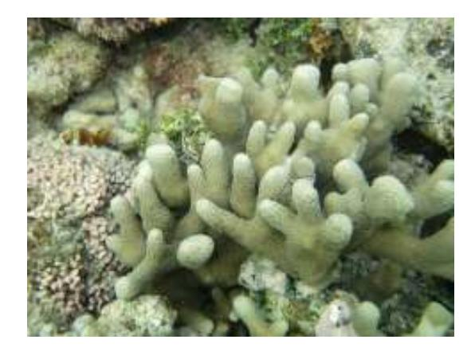

*Pocillopora cylindrica* – Finger Coral forms masses of finger shaped branches in the backreef pools. P. 171

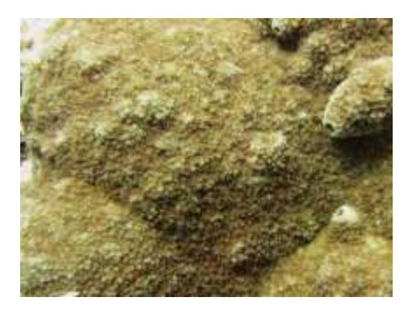

*Montipora grisea* forms brown encrusting patches all over the reef slopes and is the most common coral on the reef slopes. P. 81

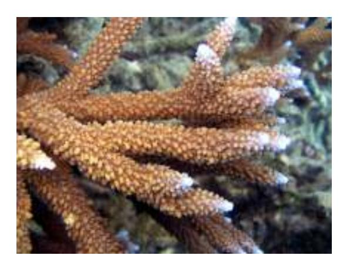

*Acropora muricata* – Staghorn Coral forms thickets of deer-antler shaped branches with blue tips in the backreef pools. This is the most common staghorn, but there are others. P. 105

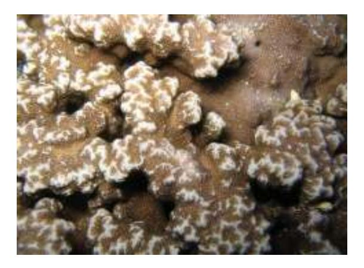

*Porites rus* forms masses of irregular columns growing up from thin plates on reef slopes. Smaller individual columns and plates are common as well. P. 179

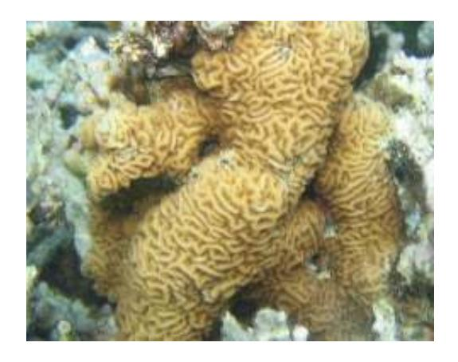

*Pavona varians* forms small brown masses or encrusting colonies covered with small ridges. P. 242

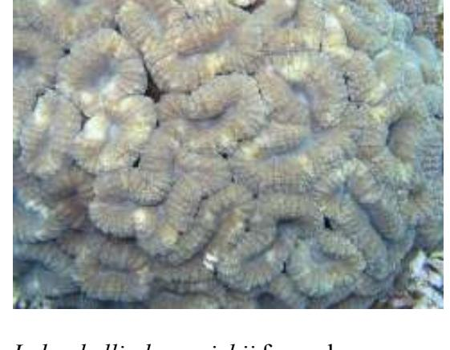

*Lobophyllia hemprichii* forms large mounds of many large polyps- polyps are about 1-2 inches (3-5 cm) diameter. SE Tutuila mid slope. P. 303

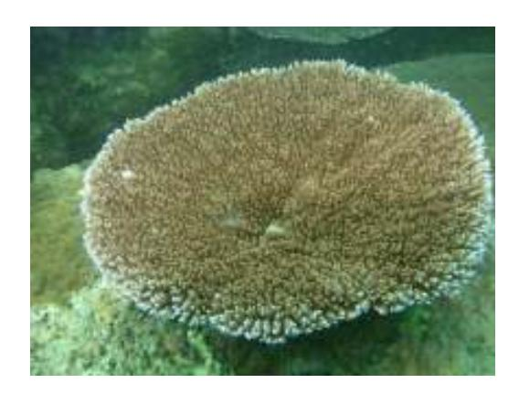

*Acropora hyacinthus* forms "table corals" and is most common on the upper-mid reef slope. P. 149

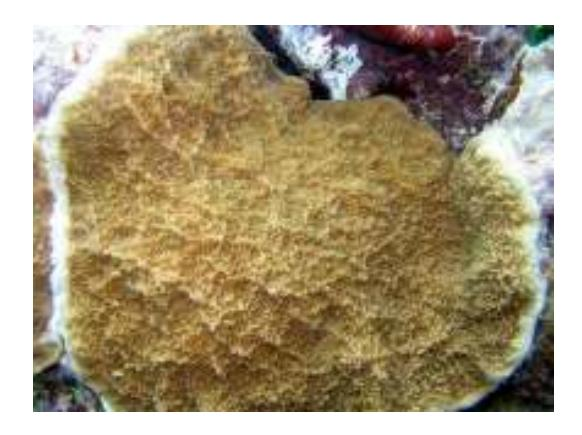

*Isopora crateriformis* is encrusting, often with lifted lower plate edges. Most common on upper reef slopes on the SW of Tutuila. P. 99

### **The Most Common Corals by Zone For Tutuila**

| Backreef Pools                                            | Upper slope                           |
|-----------------------------------------------------------|---------------------------------------|
| Porites cylindrica 171                                    | Montipora grisea 81                |
| Acropora muricata 105                                     | Isopora crateriformis 99              |
| Acropora pulchra 107 Acropora intermedia (=nobilis)109 | Porites rus 179 Pavona varians 242 |
| Pocillopora damicornis 63                                 | Acropora hyacinthus 149               |
| Reef Flat                                                 | Middle slope                          |
| Acropora aspera 111                                       | Montipora grisea 81                |
| Montipora grisea81                                        | Lobophyllia hemprichii 303            |
| Pavona frondifera247                                      |                                       |
|                                                           | Lower slope                           |
| Crest                                                     | Mycedium elephantotus293           |
| Acropora nana 139                                         |                                       |
| Pocillopora verrucosa73                                   | Banks                                 |
| Pocillopora damicornis 63                                 | Acropora clathrata 157                |

## **Directory to Coral Genera**

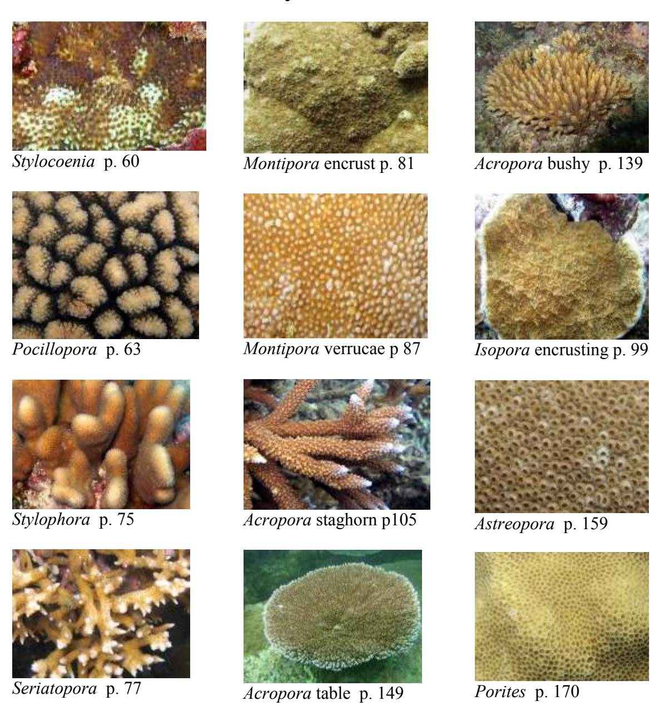

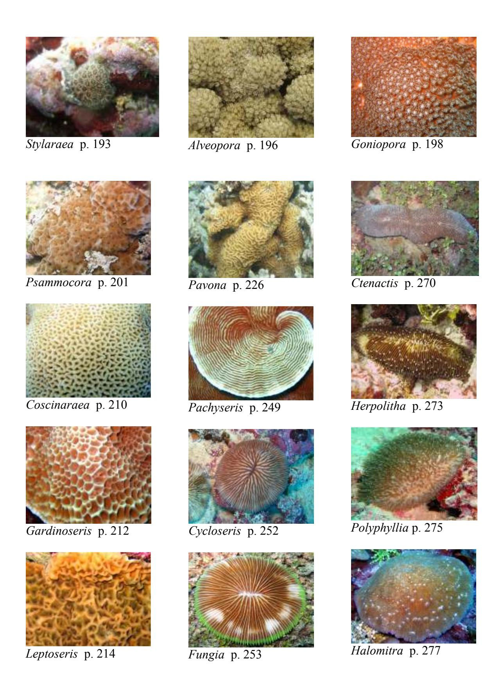

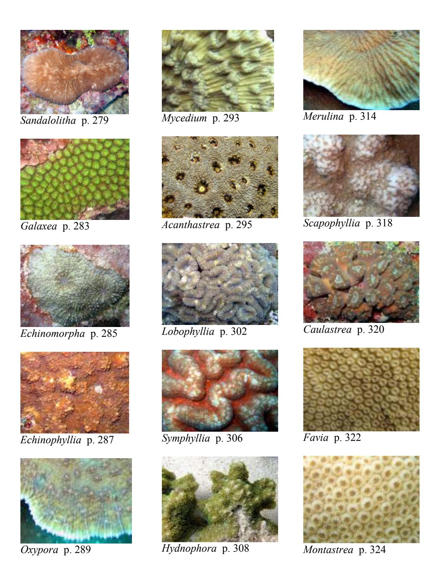

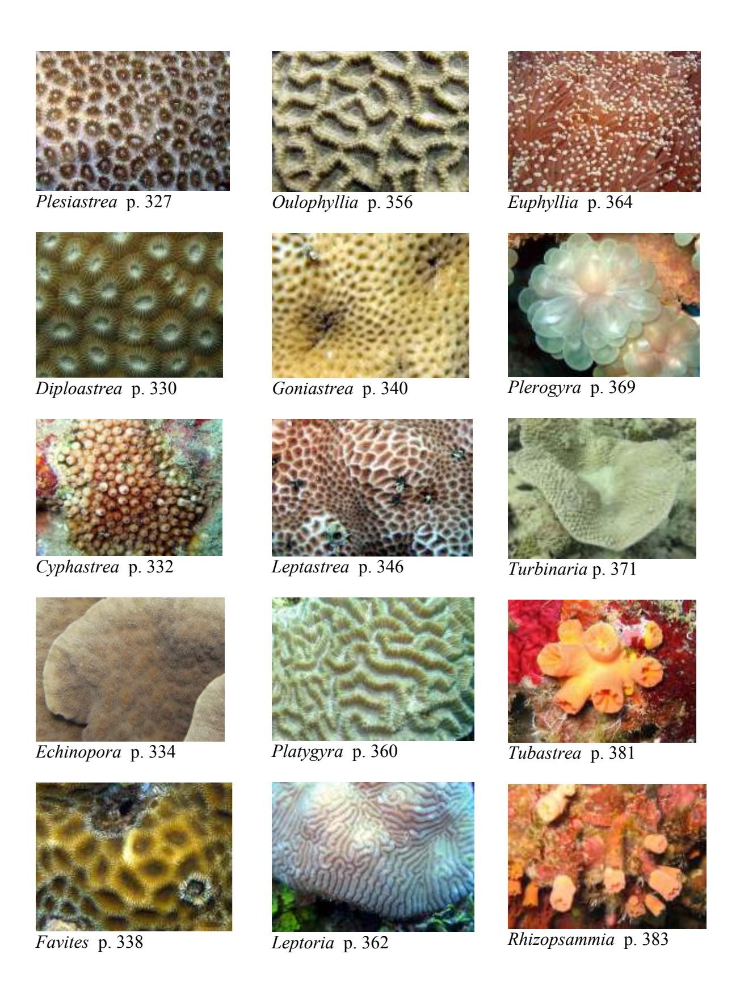

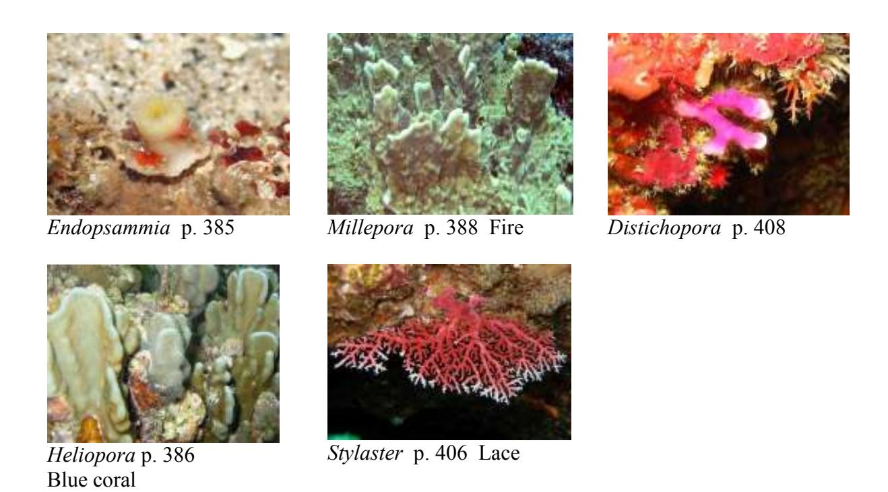

**The Corals.** If a description does not state where a coral is located, then it is found on the reef slope. Pronunciation guides are given for each genus, derived from Veron (1986). The accent is placed on the underlined syllables, and is usually on the first syllable and "por".

### **Order Hexacorallia**

 The hexacorals have six tentacles or multiples of six. If they have lots of tentacles then it is often not an exact multiple of six. Hexacorallia includes the Scleractinia (which literally means "hard anemones") which are most of what we call "hard corals." It also includes anemones, black corals, corallimorphs, zoanthids and Ceranthids (burrowing anemones). See the "Benthic identification for reef monitoring in American Samoa" for the anemones, black corals, zoanthids and corallimorphs.

**Scleractinia** are hexacorallia with hard skeletons made of calcium carbonate in the form of aragonite. Some are solitary, meaning they have just one polyp and corallite, others are colonial and have several to many polyps and corallites. Some have zooxanthellae (single celled algae in the group called dinoflagellates) and live in the light and grow large enough to contribute to reefs, and others do not have zooxanthellae and generally live in the dark in deeper water or shaded parts of shallow reefs, and most of them produce small skeletons. Almost all reef-building corals have zooxanthellae and most are colonial, while a majority of azooxanthellate corals are solitary.

**Family Astrocoeniidae** (pronounced ass-tro-see-nee-id-ee) are scleractinia with small, simple corallites.

### *Stylocoeniella* (pronounced sty-lo-see-nee-el-la)

*Stylocoeniella* is an uncommon genus that has just two species in the Samoan archipelago. They tend to be encrusting but can have small bumps, and have very tiny polyps (a half millimeter in diameter!). The distinctive feature is tiny spines on the colony surface, usually one per polyp. The "style" in the genus name refers to the spines.

#### 1. *Stylocoeniella armata* (Ehrenberg, 1834)

This coral forms small encrusting colonies. Colonies are brown with cream highlights and the spines are relatively easily visible. Found on reef slopes, rare.

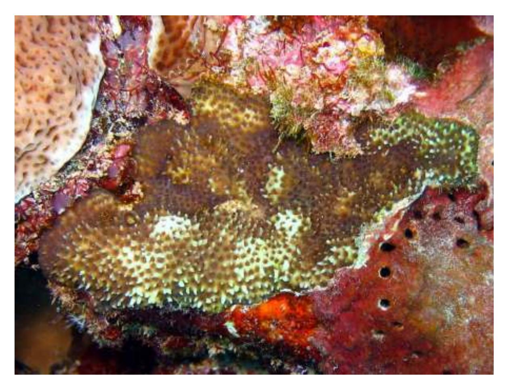

A closeup *of Stylocoeniella armata*.

#### 2. *Stylocoeniella guentheri* Bassett-Smith, 1890

This coral forms larger encrusting colonies. Colonies commonly have uniform rounded lumps about 1 cm in diameter. Colonies are commonly red, orange, or tan, and may have white dots which are the polyps. The spines are not easily seen but can be easily felt. Found on reef slopes, uncommon.

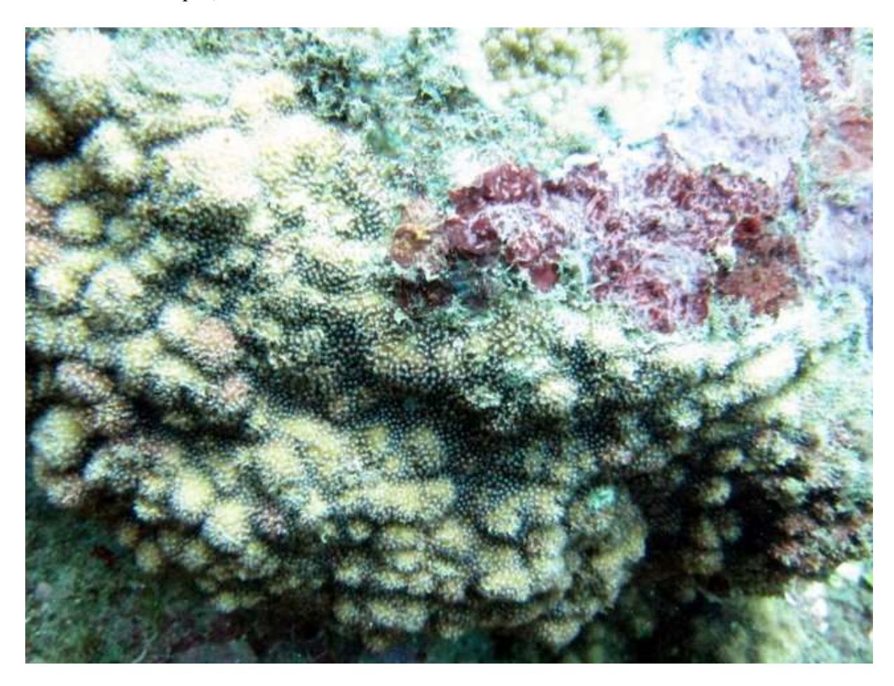

A colony of *Stylocoeniella guentheri*.

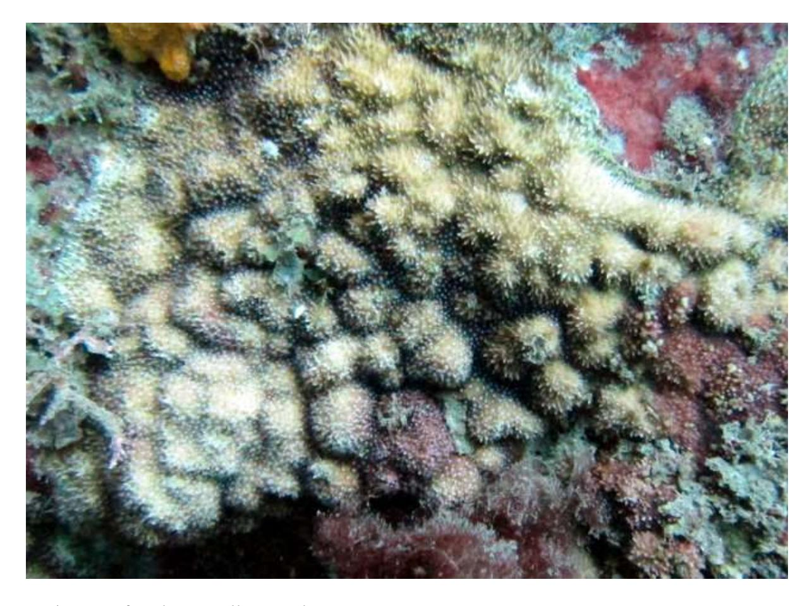

A closeup of *Stylocoeniella guentheri*.

**Family Pocilloporidae** (pronounced po-sil-oh-por-id-ee) has small corallites that are are fairly simple. Colonies are usually branching.

### *Pocillopora* (pronounced po–sil-oh-por-a)

*Pocillopora* is branching, and has small bumps all over the surface called "verrucae." The corallites are small, only about 1 mm diameter, so hard to see. The bumps are larger than the corallites, and easy to see, in fact the corallites are all over the bumps as well as between the bumps. Branches can be cylindrical or flattened or thin enough that it is hard to tell a bump from a short branch. Colonies commonly are up to a foot in diameter, but a few can get to be 2-3 feet in diameter. Common, sometimes dominant. Has rounded bumps like some *Montipora*, but corallites are all over the bumps. Some have branch shapes like *Stylophora*, but have bumps instead of spines.

#### 3*. Pocillopora damicornis* (Linnaeus, 1758)

This coral forms small bushes. Branches sub-branch such that there is no clear distinction between branches and verrucae. Branches are usually close together and very knobby, but can on occasion be farther apart and straighter. Branches are smaller than on any other species. Branch tips are always round. Brown, rarely pink, often with lighter branch tips, common in back reef pools and reef crest.

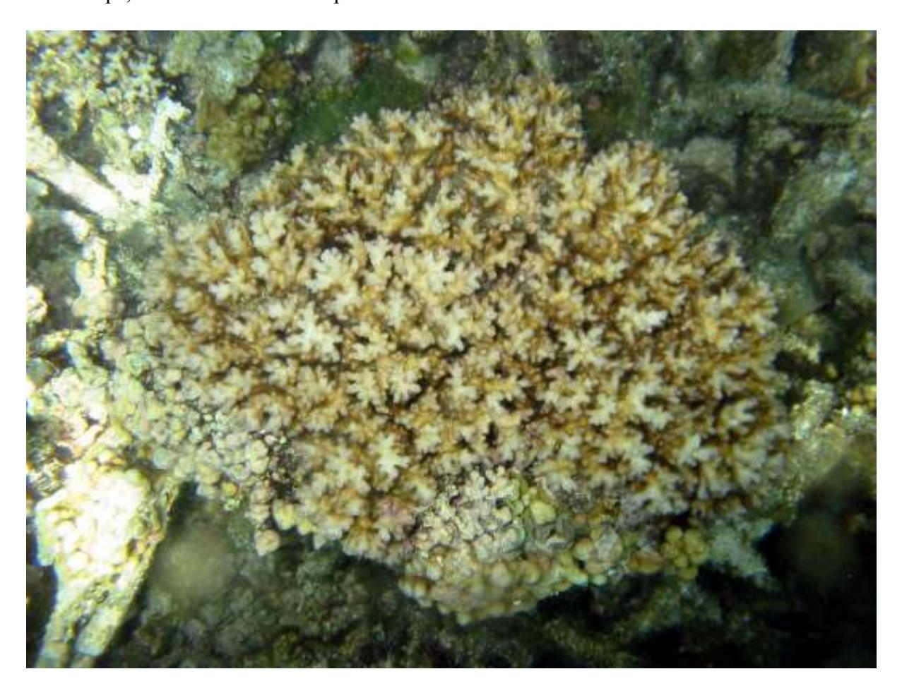

A colony of *Pocillopora damicornis*.

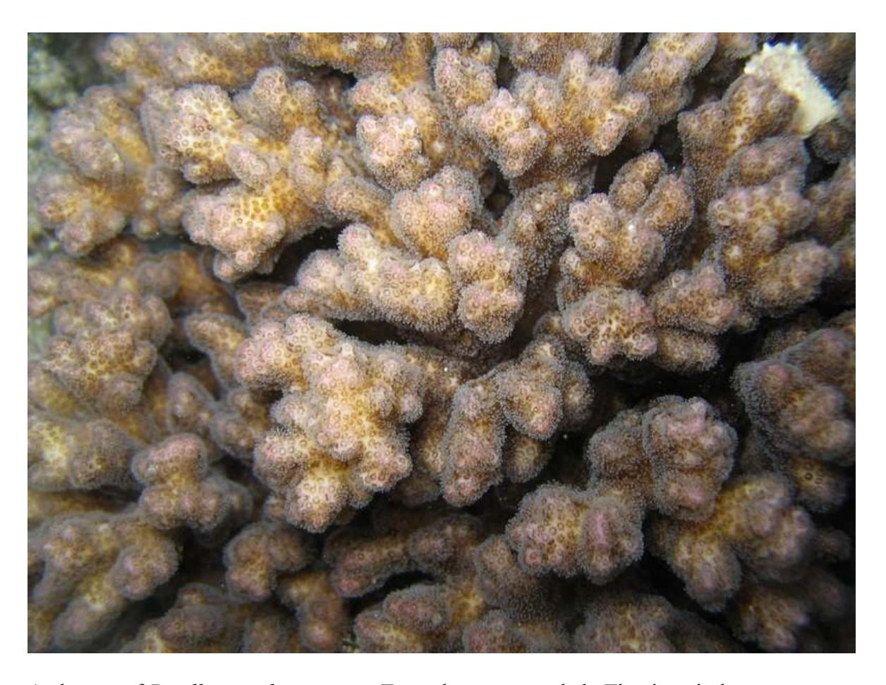

A closeup of *Pocillopora damicornis*. Tentacles are extended. The tiny circles are corallites.

#### 4. *Pocillopora eydouxi* Milne Edwards & Haime, 1860

This coral forms small to medium sized colonies made of branches. Branches are large and farther apart than on other species. Branch ends are commonly flattened and may be curved or even meandroid. Commonly brown but can be pink, purple or green. Common on reef slopes, also present on reef flats.

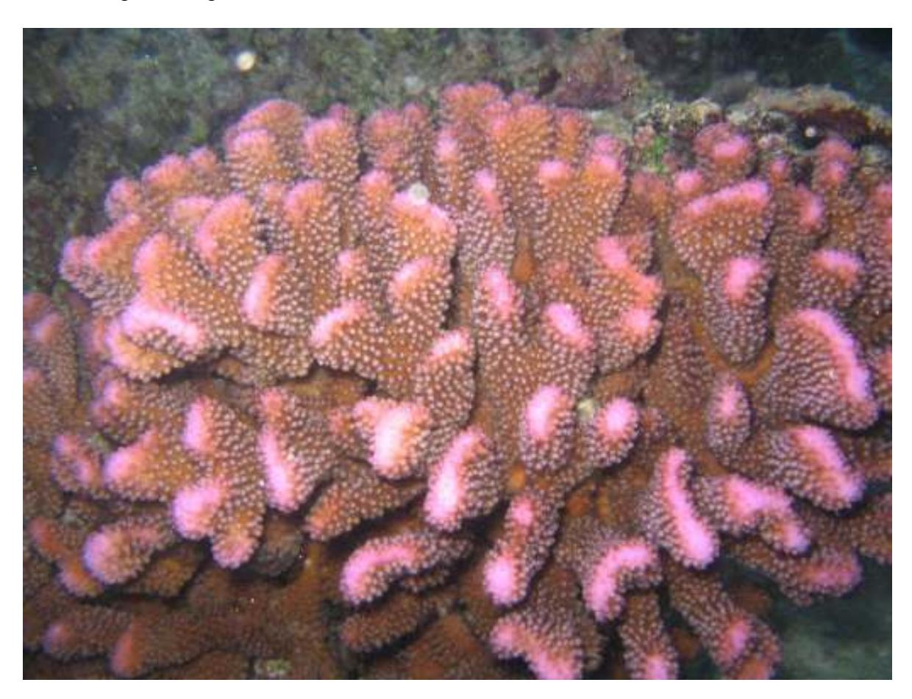

A colony of *Pocillopora eydouxi* 

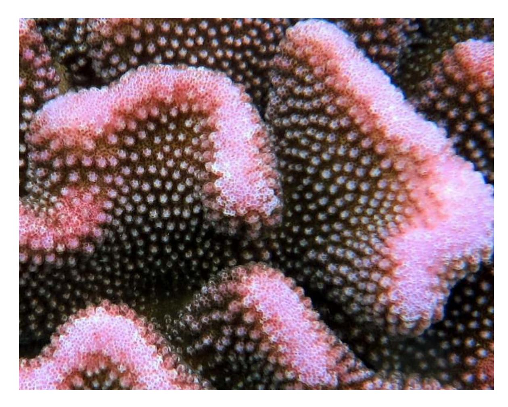

A closeup of *Pocillopora eydouxi*.

#### 5. *Pocillopora ligulata* Dana, 1846

This coral forms small branching colonies. Most branches are flattened like *P. meandrina* and *P. eydouxi*, but are thinner. Branches can be irregular, and look rough as the verrucae are as large as on *P. meandrina*. Prefers shallow water of reef flats. Tan.

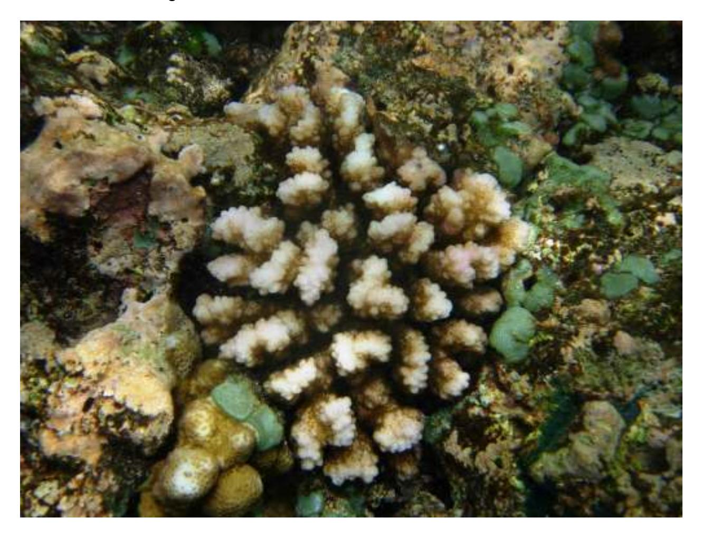

A colony of *Pocillopora ligulata.* 

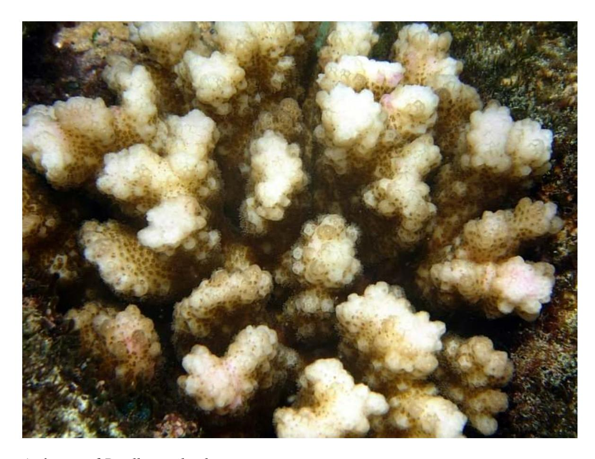

A closeup of *Pocillopora ligulata*.

#### 6. *Pocillopora meandrina* Dana, 1846 Cauliflower Coral

This coral forms small bushes. Branches are medium sized for *Pocillopora*, and most are flattened and curved on their ends. The verrucae are normal size. Can be brown, green or perhaps pink, uncommon. See taxonomic note.


A colony of *Pocillopora meandrina.* 


A closeup of *Pocillopora meandrina*.

#### 7. *Pocillopora setichelli* Hoffmeister, 1929

This coral forms small bushes. Branches are medium sized for *Pocillopora*, but are closer together than for other similar species. Branch tips are commonly flattened instead of rounded, making the colony surface smooth with narrow uniform cracks between branches. Branches are usually flattened and meandroid. Usually brown but can be pink, restricted to the reef crest area, but can be common there. See taxonomic note.


A colony of *Pocillopora setichelli.* 


A closeup of *Pocillopora setichelli*.

#### 8*. Pocillopora verrucosa* (Ellis & Solander, 1786)

This coral forms small bushes. Branches are medium sized for *Pocillopora*, but are not flattened or curved on their ends. Brown, green or pink, common, particularly on the reef crest.


A colony of *Pocillopora verrucosa.* 


A closeup of *Pocillopora verrucosa*.

### *Stylophora* (pronounced sty-loh-for-a)

*Stylophora* is a genus represented by just one species in the Samoan archipelago. It forms forms branching colonies, usually less than a foot in diameter. Corallites are small, only about 1 mm diameter, and each corallite has a tiny sharp hood partway over it, giving the branch a fine spiny appearance and feel. Species differ in the diameter of their branches.

#### 9. *Stylophora pistillata* Esper, 1797

This coral forms small bushes. Branches are medium sized and commonly flattened and curved. Branches are covered with tiny spines and lack the larger verrucae of *Pocillopora.* Each spine is actually a sharp hood over a corallite.Tan, uncommon, on reef slopes.


A colony of *Stylophora pistillata*.


A closeup of the branches of *Stylophora pistillata* showing the spines.

### *Seriatopora* (pronounced see-ree-at-oh-por-a)

*Seriatopora* has only been seen by the author in independent Samoa so far, but may well be in American Samoa as well, but would surely have to be rare. *Seriatopora* forms thin branches with rows of small corallites about 1 mm diameter. Colonies are usually under a foot in diameter, and are commonly a light cream color.

#### 10. *Seriatopora stellata* Quelch, 1886

This coral forms small bushes of thin branches that abrupty taper to sharp points. Corallites are in raised rows. Branches are about 3-5 mm diameter. Colonies are commonly cream colored, but may have pink coloration particularly out near the ends of branches. Not yet found in American Samoa, found in a backreef pool on Upolu (Palolo Deep), rare.


A colony of *Seriatopora stellata*, photo taken in (independent) Samoa.


A closeup of *Seriatopora stellata*, photo taken in (independent) Samoa.

#### 11*. Seriatopora caliendrum* Ehrenberg, 1834

This coral forms small bushes of thin branches that have rounded tips. Branches are about 3-5 mm diameter. Colonies are commonly cream colored, but may have pink coloration particularly out near the ends of branches. Not yet found in American Samoa, found in a backreef pool on Upolu (Palolo Deep), rare.


A colony of *Seriatopora caliendrum*. photo taken in (independent) Samoa

**Family Acroporidae** (pronounced akro-por-id-ee) contains the largest two genera, *Acropora* and *Montipora*, plus several smaller genera. They all have small corallites, and can be encrusting, massive, or branching.

### *Montipora* (pronounced mon-tee-por-a)

*Montipora* is the most common genus in Tutuila, and is almost always encusting here. It is the second largest genus in terms of number of species following *Acropora*. It usually

has very small corallites that are hard to see underwater, and a forest of tiny spines that look and feel like the surface of sandpaper. There are a few less common species that have larger corallites that can be seen as holes, or the spines are larger and look like little bumps. If the spines are smaller than the corallites they are called "papillae," if they are about the same size as corallites or larger they are called "tuberculae," and if they are larger than the corallites and uniform and rounded they are called "verrucae." Most colonies are some shade of brown, but a few are bright orange or purple, and a few have green polyps on a brown background. When *Monitpora* has verrucae, which is rare here, the verrucae are smooth not covered with corallites like in *Pocillopora*, and the colony is not branching. In rare instances a colony can have recessed larger polyps and no spines, and then it is very difficult to distinguish from one or two species of *Porites* without knowing what the species is.


A closeup showing *Montipora* sp. with the tiny polyps extended. The species is not known for this colony.

#### 12. *Montipora grisea*

This coral forms thin encrusting sheets. The surface has many tiny spines that are so small they are hard to see. Brown, sometimes green, most abundant of all corals on reef slopes.


A colony of *Montipora grisea*.


A closeup of *Montipora grisea*, showing the tiny circles of papillae around polyps, which are elevated to different degrees.

#### 13. *Montipora informis* Bernard, 1897

This coral forms thin encrusting sheets covered with a dense cover of uniform tiny spines called papillae. The spines have rounded tips but are so small this is hard to see. Brown or grey, and spine tips are usually white, uncommon to rare, reef slopes.


A colony of *Montipora informis.* 


A closeup of *Montipora informis*.

#### 14. *Montipora tuberculosa* (Lamarck, 1816)

This coral forms encrusting colonies covered with small bumps called tuberculae which are about the same size as the polyps. The tuberculae are much larger than the spines on *Montipora grisea*, but smaller than on *Montipora capitata*. Brown, rare.


A colony of *Montipora tuberculosa.* 


A closeup of *Montipora tuberculosa*. Tiny rings of polyp tentacles can be seen between the tuberculae.

#### 15. *Montipora capitata* Dana, 1846

This coral forms encrusting colonies with small verrucae between the polyps. The verrucae are slightly larger than the size of the polyps, and tend to be taller than wide. Generally there is as much or more space between the bumps than the width of the bumps. Usually brown, rare, reef slopes. This species is common in Hawaii, where it also forms columns on colonies, and edges can be plates.


A colony of *Montipora capitata.* 


A closeup of *Montipora capitata*.

#### 16. *Montipora turgescens* Bernard, 1897

This coral forms encrusting or massive colonies that are covered with small irregular lumps. The lumps are irregular in size, most around 3-5 mm diameter, and have polyps on them as well as between them. They look like lumps of the colony surface. Purple or brown, uncommon. See taxonomic note.


A colony of *Montipora turgescens.* 


A closeup of *Montipora turgescens*.

#### 17*. Montipora caliculata* (Dana, 1846)

This coral forms encrusting colonies which have thin sharp ridges between the polyps, and no bumps or spines. The thin ridges completely surround some polyps, but only partially surround others, and in some areas there may be no thin ridges. It differs from *M. venosa* by not having the ridges around all polyps. Usually brown, uncommon, reef slopes.


A colony of *Montiopra caliculata.* 


A closeup of *Montipora caliculata*.

#### 18. *Montipora venosa* (Ehrenberg, 1834)

This coral forms encrusting colonies with ridges between polyps, and no bumps or spines. The corallites are slightly recessed between the ridges. The ridges completely surround all polyps, unlike on *M. caliculata* or *M. vaughani*. The ridges are thicker than on *M. caliculata*. Brown, rare.


A colony of *Montipora venosa*.


A closeup of *Montipora venosa.* 

#### 19. *Montipora vaughani* Hoffmeister, 1925

This coral forms thick encrusting colonies that have thick rounded ridges between polyps, but several polyp cups are commonly in a row in a single valley surrounded by the ridges. Ridges are thicker than on *M. venosa* and *M. caliculata*, and often surround more than one polyp, ridges are not broken into sections as in *M. caliculata*. Brown, rare, reef slopes. See taxonomic note.


A colony of *Montipora vaughani*.


A closeup of *Montipora vaughani*.

#### 20. *Montipora incrassita* (Dana, 1846)

This coral forms colonies with thick columns on its upper surface. Columns are about 3- 4 cm diameter, and around 5-15 cm tall. The edges of the colony may be extended in a short plate about 2-5 cm wide. Surfaces are irregularly bumpy, and the tops of columns may be white and are rounded, with recessed polyps. Colonies are brown or grey-green, so far only found on the outer slope on Rose Atoll. Colonies are exactly like those in Hawai'i, and the exact same type of colonies have also been seen by the author in New Caledonia and Papua New Guinea.


A colony of *Montipora incrassita*, showing both plate and columns.


A closeup of *Montipora incrassita*, showing the tops of columns.

### *Isopora* (pronounced eye-so-por-a)

*Isopora* used to be considered a sub-genus of *Acropora*, but the evidence mounted that they are actually a separate genus (Wallace et al. 2007), though closely related to *Acropora*. They do not have a single axial corallite and polyp. If they have a branch, there will be many corallites on the end. Several other features of their biology, such as brooding larvae and releasing them unlike *Acropora* which broadcasts eggs and sperm, indicate that this is a separate genus. One species here is encrusting, and another forms very thick branches, about as thick as a wrist, and the branches have very rounded, blunt ends, not sharp ends. The encrusting species dominates the upper reef slopes in some areas of the SW of Tutuila. The branching form is uncommon most places. Colonies are light brown or reddish-brown. Encrusting colonies have smaller and smoother cylindrical projecting corallites than *Astreopora*, which is usually massive as well.

21. *Isopora crateriformis* (Gardiner, 1898) (previously referred to as *Acropora* (*Isopora*) *crateriformis*)

This coral forms encrusting sheets often with the lower edge raised as a plate with thin edges. The surface often has an irregular network of thin ridges. The surface is covered with small round tubular corallites close together. Corallites are smaller than on *I. palifera* and no branches are formed. Tan to reddish-brown sometimes with green polyps, most common on upper reef slopes, particularly on the southwest section of Tutuila, where it dominates at Leone.


A colony of *Isopora crateriformis*.


A closeup of *Isopora crateriformis*.

22. *Isopora palifera* (Lamarck, 1816) (previously referred to as *Acropora* (*Isopora*) *palifera*)

This coral forms clumps of very thick radiating branches about the diameter of a wrist and up to about a foot and a half long (many are shorter). Branches have rounded tips and no one axial corallite. Corallites are large and thick-walled. Brown, uncommon on most upper reef slopes and common on the outer reef flat and upper slope at Alofau.


A colony of *Isopora palifera*.


A closeup of the side of a branch of an *Isopora palifera* colony, showing the corallites.


A closeup of the ends of branches of *Isopora palifera*, showing the corallites.

*Acropora* is the largest genus of hard corals with 165 species known, and it dominates many reefs around the world, making it very important. Some of the *Acropora* are the fasted growing corals on earth, and can grow 10 cm in a year. *Acropora* are also among the most easily damaged corals in the world. Many are relatively delicate branching forms which are easily broken in hurricanes. They are also among the most sensitive to bleaching and easily killed that way. They are favorite food for crown-of-thorns starfish, and they are among the most susceptible to disease. There are only two coral species which the U.S. has declared as endangered, and both are *Acropora* and in Florida and the Caribbean. The thing that reduced them from dominating many reefs there to being uncommon was a disease. So their populations may be fairly unstable, growing fast and then being killed off, and repeating those cycles. Much of our rubble here consists of rounded sticks that came from staghorns, and pieces of table corals.

*Acropora* is **always** branching, and branch tips usually look pretty sharp. They have small polyps about 1 mm diameter, and all have a single polyp at the end of a branch, which distinguishes them from all other corals exept one. The corallite on the tip of the branch is called the "axial" corallite, because it is like an axis on a wheel in that it is in the center of a circular structure, since the branch has a circular surface. The axial corallite is often larger than the radial corallites that are on the sides of the branches, though not always. Radial corallites are named that because they radiate on the circular branch surface. Common colony shapes include staghorns that look like deer antlers, tables that have a flat (but rough) upper surface, colonies with short branches that look like fingers and are called "digitate," bushy colonies of a wide variety of shapes, and everything in between. On table corals, the upper surface and edge of the colony have small branchlets, which have the axial polyp on the end. Colonies are often some shade of brown, but can be grey, or bright green, or other colors. Abundant, sometimes dominant. No other genus has a corallite at the end of each branch. We will begin with staghorn species, then digitate, bushy, and tables.

23. *Acropora muricata* (Linnaeus, 1758) "staghorn" (Previously referred to as *A. formosa*)

This coral forms staghorn colonies in the backreef pools. Branches can be widely spaced or clustered tightly, and are about 1-1.5 cm diameter. Radial corallites are small and tubular with the lower wall extending some. Thinner branches than *A. nobilis*, rougher branch surfaces than *A. pulchra*, only staghorn with blue tips. Brown with blue branch tips which are diagnostic here, co-dominates backreef pools, not found on slopes.


A thicket of *Acropora muricata*. Digital cameras do not capture the blue on branch tips well.


A closeup of *Acropora muricata*.

#### 24. *Acropora pulchra* (Brook, 1891) "staghorn"

This coral forms staghorn corals made of branches about 1-1.5 cm diameter. Branches usually appear smooth, due to many short tentacles that cover most of the radial corallites. The larger radial corallites have an extended lower lip, and a few extend through the tentacles. Sometimes the tentacles are retracted making the corallites easily visible. Brown with white tips, common in backreef pools.


*Acropora pulchra,* with tentacles extended, making it looks smooth with corallites hard to see. This is the more common appearance.


*Acropora pulchra* with the tentacles retracted. This is a less common appearance, but the different sizes of leafy corallites can be more easily seen.

#### 25. *Acropora intermedia* (Brook, 1891) (often referred to as *A. nobilis*)

This coral forms staghorn colonies that have thicker branches back from the tips than either *A. muricata* or *A. pulchra*. Radial corallites near the branch tip are uniform, with openings at an angle pointing toward the tip, and farther down on the branch they become irregular in size and shape. Light brown to brown with white tips, uncommon in back reef pools and reef slopes. See taxonomic note.


Branches of *Acropora intermedia*.


A closeup of *Acropora intermedia*.

#### 26. *Acropora aspera* (Dana, 1846)

This coral forms bushy colonies on reef flats. Branches are about 1 cm diameter and often radiate from the center of the colony or grow vertically. Radial corallites have a large lower "lip" or wall. If tentacles are extended they may obscure the smaller such lips. Brown, common on some reef flats, can form large patches, but easily killed by extra low tides.


A colony of *Acropora aspera*.


A closeup of *Acropora aspera*.

#### 27. *Acropora austera* (Dana, 1846)

This coral forms branching staghorn-like colonies. Branches are closer together, more irregular and fused than most staghorns, and radial corallites are tubular and have thick walls. Brown or purple, uncommon, slopes and reef flats.


Two colonies of *Acropora austera*, one purple and the other brown.


Closeup of branches of *Acropora austera*, showing the corallites.

#### 28. *Acropora robusta* (Dana, 1846)

This coral forms large staghorn branches that can be quite thick at the base (hence the name). Branches are fairly widely spaced, very unform and regular, and may radiate nearly horizontal and then curve up. Radial corallites are small and the opening is at an angle pointing toward the tip. A few longer more tubular corallites may be at the tip. Brown, grey, or bright green, uncommon, prefers near the reef crest. On reef flats the branches may be short, stubby and vertical.


A colony of *Acropora robusta*. Notice the upward curving branches with the even tapering.


A closeup of *Acropora robusta*. Notice the leaning corallites.

#### 29. *Acropora palmerae* Wells, 1954

This coral forms thin encrusting colonies which may have a few bumps or stubby branches. The colony is covered with little radial corallites that are short and tubular and have angled openings that point in various directions. Brown or bright green, rare, on reef flat or upper reef slope. See taxonomic note.


A colony of *Acropora palmerae*.


A closeup of *Acropora palmerae*.

#### 30. *Acropora abrotanoides* (Lamarck, 1816)

This coral forms large colonies of sturdy staghorn-like branches, colonies are often 1-2 m diameter and branches 3-4 cm. Most branches extend either near vertically or near horizontally, and often curve irregularly. Horizontal branches often end in a horizontal fan of branch tips. Corallites near the branch tips are long and tubular and inclined toward the point. Grey-brown, fairly common above 10 m depth on slopes.


Part of a colony of *Acropora abrotanoides* showing the vertical branches and the horizontal branches that tend to fuse and produce fans at their ends.


A fan of branch tips produced at the end of a horizontal branch on *A. abrotanoides*. Notice the relatively long tubular radial corallites.

#### 31. *Acropora globiceps* (Dana 1846)

(Probably referred to as *A. humilis* previously, which it resembles closely except *A. humilis* has a large, dome-shaped axial corallite.) This coral forms digitate colonies with finger shaped radiating branches. The axial corallite is a small short raised tube. Radial corallites are tubular, may have upward facing openings, are nearly uniform in size, and are often in rows. Brown or fluorescent green, common, upper reef slope.


A colony of *Acropora globiceps*.


A closeup of *Acropora globiceps*. Notice the small tubular axial corallites.

#### 32. *Acropora gemmifera* (Brook, 1892)

This coral forms digitate colonies with moderate length branches that taper. Radial corallites are in rows and have large lower lips and increase in size down the branch. Smaller corallites may be seen between the larger ones. Brown, rare, at the Rainmaker on the crest and backreef pool.


A colony of *Acropora gemmifera*.


A closeup of *Acropora gemmifera*.

#### 33. *Acropora monticulosa* (Brüggemann, 1879)

This coral forms flat digitate colonies with short branches. Branches very strongly taper and form short cones unlike other digitate species. The axial corallite is small, as are the radials. Radials are tubular with a projecting lower lip. Brown to yellow, uncommon.


A colony of *Acropora monticulosa*.


A closeup of *Acropora monticulosa*.

#### 34. *Acropora digitifera* (Dana, 1846)

This coral forms digitate colonies with short branches, near the reef crest. Branches taper slightly but have a strongly tapered tip with a small tubular axial. Radial corallites appear to have large lower lips from above, and in some colonies a black dot is in each radial. Branches are shorter than most digitate species, and do not taper evenly like a cone as in *A. monticulosa*. Yellow-brown and may have purple tints, common on reef crests only.


Three colonies of *Acropora digitifera*. Usually they are closer to the substrate than these colonies.


A closeup of *Acropora digitifera*.

#### 35. *Acropora cophodactyla* (Brook, 1842)

This coral forms digitate colonies on the reef flat near the crest. Branches radiate, are finger-shaped, taper, and have a large tapering axial corallite that is bare for a short ways on its side. Reddish-brown, brown or tan, uncommon most places, mostly reef flats.


A colony of *Acropora cophodactyla*.


A closeup of *Acropora cophodactyla*.

#### 36*. Acropora aculeus* (Dana, 1846)

This coral forms small low cushions, about a foot (30 cm) in diameter, and a couple inches (4 cm) tall. Branchlets are relatively thin and tapering, and are vertical except near the edge of the colony where they point outward. Corallites on the sides of branches are short and pressed against the side of the branch pointing toward the tip. Light pinkpurple, rare, in pools.


A colony of *Acropora aculeus*.


A closeup of *Acropora aculeus*.

#### 37. *Acropora cerealis* (Dana, 1846)

This coral forms small bushes of upright branches. Branches are thin but have many long tubular corallites, so the corallites make up most of the effective diameter of the branch. Brown with light branch tips, uncommon.


A colony of *Acropora cerealis*.


A closeup of *Acropora cerealis*.

#### 38. *Acropora chesterfieldensis* Veron and Wallace, 1985

This coral is digitate with upright branches. Branches are long and thin, and parallel with not much side branching. Corallites on the branch sides are uniform, appressed, and some are in rows. Colonies are yellow-green. Found in Ofu backreef pools.


A colony of *Acroopra chesterfieldensis*.


A closeup of *Acropora chesterfieldensis*.

#### 39. *Acropora insignis* Nemenzo, 1967

This coral forms small bushy colonies. The radial corallites on branch sides are tubular and slanted strongly toward the end of the branch. The radial corallites are colored and contrast strongly with the white of the branch. Brown or green, rare.


A colony of *Acropora insignis*.


A closeup of *Acropora insignis*.

#### 40. *Acropora nana* (Studer, 1878)

This coral forms small bushes of thin branches on and near the reef crest. Branches are about pencil diameter, and usually are vertical or radiate from the center. Most radial corallites are fused to the branch (appressed) and point toward the end, though some are tubular and project. Reddish-brown, rarely with light green polyps, usually dominates the reef crest, rare elsewhere.


A colony of *Acropora nana*.


A closeup of *Acropora nana*.

#### 41. *Acropora pagoensis* Hoffmeister, 1925

This coral forms dense scraggly branching colonies with branches about 1 cm thick, and has many side branches. Radial corallites have sharp edges and most are short and have an opening slanted toward the branch tip. Some are longer and tubular and becoming axial corallites. Usually light reddish brown, uncommon on reef slopes and common on the reef flat at Alofau. I believe these are the first color photos of living colonies ever shown in a guide. This species is not recognized in any modern taxonomic works. See taxonomic note.


A colony of *Acropora pagoensis*.


A closeup of *Acropora pagoensis*.

#### 42. *Acropora speciosa* (Quelch, 1886) sensu Wallace (1999)

This coral forms small flat-topped colonies with scraggly branchlets and many long smooth incipient axials and axials. Many radials are similar. All have blunt ends with thick walls. Axials and incipient axials are similar to *A. aculeus* but thinner. Usually rust colored, uncommon to rare, lower reef slopes.


A colony of *Acropora speciosa*.


A closeup of *Acropora speciosa*.

#### 43. *Acropora jacquelineae* Wallace, 1994

This coral forms small flat-topped colonies with many thin long axial and incipient axial corallites growing upward. Axials and incipient axials have thin walls and are only about 1 mm thick. This species is similar to *A. speciosa*, but the axials and incipient axials are thinner. Found on lower reef slopes, rare. This species was proposed for listing as an endangered species.


A colony of *Acropora jacquelineae*.


A closeup photo of *Acropora jacquelineae*.

#### 44. *Acropora verweyi* Veron & Wallace, 1984

This coral forms small bushy colonies with radiating pencil-diameter branches. The axial corallites are very large and flat ended, having very thick walls and a small opening. Radial corallites are very uniform, short, thick walled, and pointing toward the branch tip. Brown with a yellow branch tip and white centers to radial corallites, rare except in the Ofu pools.


A colony of *Acropora verweyi*.


A closeup of *Acropora verweyi*.

#### 45. *Acropora surculosa* (Dana, 1846)

This coral forms small cushions about 10-20 cm diameter, composed of vertical branchlets. Branchlets are close together, taper from a diameter of up to 1 cm near the base to a sharp tip only about 1 mm diameter, have little branching and little to no incipient axials, but can divide into two or more vertical branchlets that look like fused branchlets. Lower parts of branchlets have long thin tentacles out in the day. Green or reddish brown, uncommon to rare, upper reef slopes and sometimes reef flats or pools.


A colony of *Acropora surculosa*.


A closeup of *Acropora surculosa*.

This coral forms tables that can have a second smaller tier. The upper surface is composed of small vertical branchlets which taper strongly and which have radial corallites with projecting lower lips that can look like rose petals from above. Tentacles may be extended. Colonies in backreef pools may have longer branchlets that partly separate near the edge of the table. Reddish-brown, rarely green, common, dominates the center-west section of Fagatele Bay, most common on upper reef slope.


Colonies of *Acropora hyacinthus*.


A young colony of *Acropora hyacinthus*.


A closeup of *Acropora hyacinthus*.

This coral forms large tables which can sometimes have a smaller second tier. The upper surface is covered with a carpet of very small tubular vertical axial tips of small branchlets. Radials on the branchlets are elongated and point toward the tip, not flattened leaves as on *A. hyacinthus*. Grey-brown, uncommon, slopes and reef flats.


A large colony of *Acropora cytherea*.


A closeup of *Acropora cytherea*.


An extreme closeup of *Acropora cytherea*.

This coral forms large tables, usually with just one tier. Branchlets are usually short and have many radiating long tubular corallites which are axials or incipient axials. Branchlet tips may point outward and upward or curve upward. Corallites are radiating and bushy instead of all vertical and close together as on *A. cytherea*. Brown, more common in deeper water.


A colony of *Acropora paniculata*.


A closeup of *Acropora paniculata*.

#### 49. *Acropora clathrata* (Brook, 1891) "table coral"

This coral forms large table corals formed of branchlets that grow nearly horizontally, with their tips just above the plane of the table pointing outward. Branchlets retain a uniform diameter of about 1 cm over the entire table, and there are no small vertical branchlets. Grey, common especially on some offshore banks, present on slopes and a few are in pools.


A colony of *Acropora clathrata*.


A closeup of *Acropora clathrata*. The outer edge of the colony is to the left.

### *Astreopora* (pronounced ass-tree-oh-por-a)

*Astreopora* is a medium size genus that usually has massive colonies or sometimes encrusting colonies, with small corallites that look a bit like little volcanoes. It is uncommon most places. Corallites are larger and spinier than on encrusting *Isopora* and it is usually massive not encrusting.

#### 50. *Astreopora myriophthalma* (Lamarck, 1816)

This coral forms massive colonies with corallites that project and are uniform in size, with all projecting outward from the surface. Browns, greys, purples, uncommon, reef slopes.


A colony of *Astreopora myriophthalma*.


A closeup of *Astreopora myriophthalma*.

#### 51. *Astreopora gracilis* Bernard, 1896

This coral forms massive colonies with corallites that project different amounts and which are pointed in different directions, giving a rough, disorderly surface appearance. Brown to reddish brown, uncommon to rare.


A colony of *Astreopora gracilis*.


A closeup of *Astreopora gracilis*.

#### 52. *Astreopora cucullata* Lamberts, 1980

This coral forms massive or encrusting colonies, and can have raised plate edges. Corallites are uniform in size, and most or all corallites are strongly tilted or inclined downward. Reddish color, uncommon.


A colony of *Astreopora cucullata*.


A closeup of *Astreopora cucullata*. The green tint is due to the camera, it was actually rust colored.

#### 53. *Astreopora listeri* Bernard, 1896

This coral forms massive colonies with corallites that project very little if at all. Browns, greys, or purples, uncommon to rare.


A colony of *Astreopora listeri*.


A closeup of *Astreopora listeri*.

#### 54. *Astreopora eliptica* Yabe & Sugiyama 1941

This coral forms massive or encrusting colonies, with small round projecting corallites, most of which have their opening compressed laterally into a slit. A few corallites have round or oval openings. Brown, uncommon to rare. See taxonomic note.


A colony of *Astreopora eliptica*. The grooves were produced by snapping shrimp.


A closeup of *Astreopora eliptica*.

#### 55. *Astreopora randalli* Lamberts, 1980

This coral forms encrusting sheets on slopes with the lower edge raised as a plate, or rarely massive. Corallites have some space between them which is spiny. Greenishbrown with green corallite openings, deeper on slopes, uncommon.


A colony of *Astreopora randalli*.


A closeup of *Astreopora randalli*.

**Family Poritiidae** (pronounced por-eye-tid-ee) has several genera, some of which have very small corallites (*Porites* and *Stylaraea*), and others (*Alveopora* and *Goniopora*) which have corallites ranging from very small to just small. In the genera with very small corallites the polyps are very small and not extended, while in those with small corallites the polyps are very long thin columns which along with the tentacles can make the polyps look like daisies. In *Porites* and *Goniopora*, the septa fuse near the center of the corallite in distinctive patterns.

### *Porites* (pronounced por-eye-tees)

*Porites* is the third largest genus in number of species following *Montipora*, and it produces the largest coral colonies in the world, including the giant at Ta'u. These giants have records of the climate of the past hundreds of years in their skeletons. Some species are massive, by which we mean rounded hemispheres, other species are branching or columnar, some form plates and some have both plates and branches or columns. Finger coral which co-dominates back reef pools is a *Porites* species. The second most common species on the slopes is a *Porites* species as well and has columns and plates. Some species are very difficult to tell apart, particularly the massive species. Corallites are tiny, about 1-2 mm diameter, and may give the surface a "cellular" look when examined closely. Polyps are tiny as well, and often aren't extended, though sometimes the tips of the tentacles give the surface a slight fuzzy look. Common to dominant. *Porites* never has spines like *Montipora* and very few species have recessed corallites that can look like *Monitpora*. Polyps are smaller than *Goniopora* and *Alveopora* and not extended. We begin with branching species, then columnar species with basal plates, then plates, and end with massive (boulder) species. *Porites* are among the hardest of all corals to identify to species.

#### 56. *Porites cylindrica* Dana, 1846 "finger coral"

This coral forms colonies composed of finger-like branches with rounded tips. Colonies can be very large. Branches may be fuzy with tiny tentacles. Tan or yellow-green, codominates backreef pools, common on slopes in Vatia Bay, rare on outer slopes.


A thicket of *Porites cylindrica*.


A closeup of *Porites cylindrica*.

#### 57. *Porites annae* Crossland*,* 1952

This coral forms small colonies with many lumpy irregular columns or branches. The upper ends of some or most columns are flattened and white. The sides of columns are covered with an even covering of light dots which are tufts of tiny tentacles- each dot is the center of a polyp. Dark brown, uncommon in lagoons.


A colony of *Porites annae* illustrating the lumpy shape.


A closeup of *Porites annae* showing the white branch tips and the fufts of tentacles on the branch sides.

#### 58. *Porites lichen* Dana, 1846

This coral on reef slopes forms thin plates with rounded knobs that can grow into fingerlike columns, which usually are not fused and typically are different heights. The surface is fuzzy with tentacles. In backreef pools, the knobs and columns are close together or fused together with just a small plate at the lower edge. Some corallites are in rows, especially on plates. Grey or brown on slopes, green or brown in pools, common only on the east side of Olosega and Ofu pools.


A large colony of *Porites lichen* on the reef slope of Ofu.


A closeup of a colony of *Porites lichen* on the reef slope, showing the tufts of tentacles.


A colony of *Porites lichen* in the Ofu pools.


A closeup of the edge of a colony of *Porites lichen* in the Ofu pools. Notice the corallites in rows near the right.

#### 59. *Porites rus* (Forskål, 1775)

This coral forms thin plates with irregular columns that fuse to a variable degree. Some areas have small winding ridges, others are smooth. Brown with white column tops, white ridges, and tiny white dots which are polyps, less common green, rarely blue, abundant many places on reef slopes.


A large, castle-like colony of *Porites rus*.


A massive colony of *Porites rus* from a backreef pool.


A closeup of *Porites rus*.

#### 60. *Porites monticulosa* Dana, 1846

This coral forms encrusting sheets with large, low round lumps about 5 cm in diameter. The surface is covered with many small winding ridges, and the polyps are very tiny. Skeleton details are the same as *Porites rus*. Bluish-grey, uncommon to rare, reef slopes.


A colony of *Porites monticulosa* is in the center, surrounded by *Porites rus*.


A closeup of *Porites monticulosa*.

#### 61. *Porites horizontalata* Hoffmeister, 1925

This coral forms thin plates which are flat when small but when large form funnel-shaped whorls. The surface has white spots which are the polyps, and between the polyps there are small smooth rounded lumps. Grey, lower reef slope, abundant on lower reef slope at Gataivai, common at Fagasa, rare elsewhere.


A field of large colonies of *Porites horizontalata* on the slope in the harbor at Gataivai. Not all colonies are this large.


A closeup of *Porites horizontallata*.

#### 62. *Porites arnaudi* Reyes-Bonilla and Carricart-Ganivet, 2000

This coral forms thick plates several feet across with thick edges, about 2 cm thick. The plates can be in tiers. The surface is lumpy, and corallites have raised thin sharp ridges between them, which gives the surface a rough look. Blue-grey or brown, uncommon or rare except on the east side of Olosega, reef slopes.


A colony of *Porites arnaudi*.


A closeup picture of *Porites arnaudi*.

#### 63. *Porites lutea* Milne Edwards & Haime, 1851

This coral forms large massive colonies which are often wider than tall, and which are covered with rounded lumps about 3-4 cm diameter that are uniform and quite tall for massive *Porites*. The lumps can be in parallel rows on the colony, but aren't always. The surface is fuzzy with tiny tufts of tentacles. Brown, reef slopes, uncommon most places but common in Leone. See the taxonomic note.


A large colony of *Porites lutea*.


A closeup of *Porites lutea*.

#### 64. *Porites stephansoni* Crossland, 1952

This coral forms small massive colonies usually 10 cm or less in diameter (rarely up to about 40 cm), which may be lumpy. Corallites appear deeper than most other massive *Porites*. Brown, uncommon to rare, reef flats only.


A colony of *Porites stephansoni*.


A closeup of *Porites stephansoni*.

#### 65. *Porites randalli* Foresman and Birkeland, 2009

This coral forms small colonies 5 cm diameter or less, made of rounded lumps or short columns. Corallites have a thin narrow ridge between them. Yellow, yellow-green, or tan, common in some backreef pools.


Three or four colonies of *Porites randalli*.


A closeup of *Porites randalli*.

### *Stylaraea* (pronounced sty-la-ree-a)

*Stylaraea* is a genus with only one species, which is so small and hidden, few people have ever seen it. It forms the smallest colonial, zooxanthellate (having algae) colonies of any coral in the world. Many colonies are only about 5 mm diameter, and the largest colonies anywhere are probably no more than 2 cm diameter. They are very cryptic (=hidden or hard to see). They only live on reef flats on rubble. You really have to know what you are looking for to find them, and it may take a lot of patience looking at rubble to find them. They look like tiny *Porites* colonies. The genus was first described by Linneus in 1758, which is when species were first described in the system we use now. But no one knew how to find them reliably until Richard Randall discovered how in Guam. Later, he came here to American Samoa and found them, and taught Chuck Birkeland how to find them, who taught me. If you learn to find them, you will be one of only a handful of people in the world who know how. American Samoa is the easternmost place they are known in the world, but if someone who knows how to find

them goes farther east, they may find them. I recently found them on Ofu, the easternmost finding yet.

66. *Stylaraea punctata* (Linneaus, 1758)

This coral forms tiny colonies on rubble on reef flats. Colonies are about 3-10 mm diameter, and are cushion-shaped, and look just like *Porites*. Tan, may have green polyp centers, rare, found so far only on the reef flats at Aua and Alofau on Tutuila, and Vaoto pool on Ofu. You must search persistently to find this coral.


A closeup of a colony of *Stylaraea punctata*.


A closeup of a colony of *Styaraea puncata* with green polyp centers.

### *Alveopora* (pronounced al-vee-oh-por-a)

*Alveopora* looks much like *Goniopora*, with polyps that look a bit like daisies. However, the skeleton is soft because it is made of very thin tiny rods fused together. So a thumbnail sinks easily into the skeleton. Also, it has 12 tentacles instead of the 24 tentacles on *Goniopora*, though it is very hard to tell the difference underwater since it just looks like a lot of tentacles on both. There is only one common species in American Samoa, which forms clusters of small grey or brown lumps, usually in backreef pools. Uncommon to common.

#### 67. *Alveopora tizardi*

This coral forms clusters of knobs or single knobs, about 2-5 cm diameter. Colonies are covered with a fuzz of polyp tentacles. The polyp column under the tentacles may be seen sometimes. Grey, common in backreef pools but not on slopes.


A colony of *Alveopora tizardi* or *A. exelsa*.


A closeup of *Alveopora tizardi/exelsa*.

### *Goniopora* (pronounced go-nee-oh-por-a)

*Goniopora* has tall, daisy-like polyps that are usually extended during the day. It has 24 tentacles while *Alveopora* has just 12 tentacles, and it has a solid hard skeleton. Corallites are usually about 2-4 mm diameter, and polyps a similar diameter. In some species the polyps can extend as far as about 10 cm, but in others they may only extend 2-5 mm, and in one they don't extend at all. The polyps look a bit like daisies, with a tall thin stem (better called a column) and a ring of tentacles at the top like the petals of the flower. Colonies can be encrusting, massive, or columns. The skeleton is relatively hard, if you try to push your thumbnail into it, it won't go into it, unlike *Alveopora*, which can otherwise look similar. *Goniopora* always has exactly 24 tentacles, but you can't count that many tentacles underwater, it is even hard in a photo. Uncommon most places.

#### 68. *Goniopora columna* Dana, 1846

This coral forms large thick columns close together that may appear to be a solid colony several feet tall and wide. Polyps are daisy-like and the column or "stem" is easily seen, tentacles are very short and fat. Grey with white polyp centers, rare, seen only at Utelei.


Colonies of *Goniopora columna*.


A closeup of the polyps of *Goniopora columna*.

#### 69. *Goniopora fruiticosa* Saville-Kent, 1893

This coral forms large encrusting sheets which may have some lumps which may be fused to various degrees. Polyps are small and short. Reddish-brown with white tentacles, uncommon on slopes.


A colony of *Goniopora fruiticosa*.


A closeup of *Goniopora fruiticosa* polyps.

**Family Siderastraeadae** (sigh-der-ass-tree-id-ee) has two genera in the Samoan archipelago. They have small corallites and the septa fuse near the center of the corallite.

### *Psammocora* (pronounced sam-oh-kor-a)

*Psammocora* forms colonies that can be encrusting, small massive colonies, or branching. In some species the corallites are too tiny to be seen underwater. In the small massive species the surface is commonly covered with ridges that come to a sharp upper edge and which enclose a funnel-shaped corallite which has a black dot in the center. In the encrusting species there are rounded winding ridges that usually don't intersect, and no sign of septa or corallites. In the branching species, the branch surfaces appear smooth with no corallites visible. Uncommon most places, the branching species can be abundant on some reef flats. Encrusting colonies with ridges can look like one of the species of *Pavona* (*Pavona varians*) which is common, but the *Psammocora* has a smooth looking surface while the *Pavona* has little septa that can be seen on ridge sides.

#### 70. *Psammocora contigua* (Esper, 1797)

This coral forms small branching or lumpy colonies. Branches or lumps are about 2 cm diameter. Branches or columns are highly irregular and lumpy. Surfaces are nearly smooth. Brown, sometimes green, common in some back-reef pool areas, rare elsewhere.


A colony of *Psammocora contigua*.


A closeup of *Psammocora contingua*.

#### 71. *Psammocora haimeana* Milne Edwards & Haime, 1851

This coral forms small encrusting, massive or lumpy colonies. The surface has high thin ridges between corallites or groups of corallites. Corallite centers are hard to see. Brown, rare, reef slopes.


A colony of *Psammocora haimeana*.


A colony of *Psammocora haimeana*.

In some colonies, the surface ridges between corallites or groups of corallites are not as tall and thin as shown above, and the corallite centers are easily seen black dots. This has been called *Psammocora profundacella* Gardiner, 1898, but a recent study (Stefani et al. 2008) has concluded that it is not a separate species. The name *Psammocora haimeana* is older, so it has prescedence. Photos of colonies with lower ridges and more distinct colony centers are shown below.


A colony with lower ridges and more distinct centers.


A closeup of a colony with lower ridges and more distinct centers.

#### 72. *Psammocora nierstraszi* van der Horst, 1921

This coral forms encrusting colonies covered with small irregular winding ridges or bumps. Usually no finer features can be seen, unlike on *Pavona varians*. Green, brown, grey, uncommon, reef slopes.


A colony of *Psammocora nierstraszi*.


A closeup of *Psammocora nierstraszi*.

### *Coscinaraea* (pronounced ko-sin-a-ree-a)

*Coscinaraea* forms encrusting or massive colonies with quite small winding ridges that enclose spaces. The ridges are somewhat square-topped. Colonies are always brown. Corallites are deep in the valleys and can't be seen. Uncommon. *Coscinaraea* might look a bit like *Favites*, but the ridges and valleys are smaller.

#### 73. *Coscinaraea columna* (Dana, 1846)

This coral forms massive or encrusting colonies covered with small winding ridges. The ridges may enclose single corallites or several corallites. Small spines may be visible on the ridges. Brown, uncommon, reef slopes.


A colony of *Coscinaraea columna*.


A closeup of the surface of *Coscinaraea columna*.

**Family Agariciidae** (pronounced ag-a-ree-see-id-ee) has several medium-sized genera plus smaller genera. Many but not all species lack walls to the corallites, that is, the corallite is a flat surface which extends between corallites. As a result, septa in the center of the corallite extend out from the corallite center across the flat surface as costae to become septa in the adjacent corallite's center, and so they are called "septo-costae." Colonies are commonly plates or laterally flattened massives.

### *Gardinoseris* (pronounced gar-din-ner-oh-seer-is)

*Gardinoseris* is a genus with only one species. It forms massive colonies that have small corallites about 1/8 inch diameter that are separated by a very sharp ridge and no groove. Septa inside the corallite are so small and close together and all the same size so that they appear to be a very smooth surface. Redish-brown to brown, rare. Smaller corallites and sharper, smoother ridges than *Favites* or *Goniastrea*.

#### 74. *Gardineroseris planulata* Dana, 1846

This coral forms encrusting or massive colonies, the surface of which is covered with tall sharp ridges that enclose corallites in a honey-comb like fashion. Septa are too small to be seen underwater, any ridges visible inside corallites are where the corallites are dividing. Brown, uncommon to rare, reef slopes.


A colony of *Gardineroseris planulata*.


A closeup of *Gardineroseris planulata*.

### *Leptoseris* (pronounced lep-toe-seer-is)

*Leptoseris* usually forms thin plates, but some species are encrusting. They tend to be yellow-brown, and to be in lower-light conditions such as deeper water. Corallites in some cases are raised as round cushions, and may point outwards. In one of the most common species corallites are recessed and can't be seen, with winding ridges between the corallites giving a very wrinkled appearance. The septae continue as costae like in *Pavona*. Browns, light yellows to cream. Usually uncommon. The wrinkled colonies have smooth surfaces on the wrinkles and the wrinkles are thinner than ridges on *Favites*. On colonies with outward leaning cushion-shapped corallites, the plates are smoother and corallites smaller than on *Mycedium*.

#### 75. *Leptoseris scabra* Vaughan, 1907

This coral forms small thin plates deeper on reef slopes in shaded locations. Corallites are small raised lumps that are tilted and point toward the edge of the plate. The plate has many tiny radiating ridges that are hard to see. Yellow to brown, fairly common on lower reef slopes.


A colony of *Leptoseris scabra*.


A closeup of *Leptoseris scabra*.

#### 76. *Leptoseris explanata* Yabe & Sugiyama, 1941

This coral forms small encrusting colonies with plate edges. Larger colonies form plates. The surface is covered with small obvious ridges that radiate from corallite centers. The ridges are more obvious than on other similar *Leptoseris*. Reddish-brown, rare, reef slopes.


A colony of *Leptoseris explanata*.


*Leptoseris explanata*.

#### 77. *Leptoseris foliosa* Dineson, 1980

This coral forms small encrusting colonies that may have plate edges. The surface is covered with smooth rounded ridges that are a variety of sizes. Ridges are separated by little black holes which are the corallites. Yellow to brown, rare, reef slopes.


A colony of *Leptoseris foliosa*.


A closeup of *Leptoseris foliosa*.

#### 78. *Leptoseris incrustans* (Quelch, 1886)

This coral forms small encrusting colonies covered with small irregular bumps. Some bumps may form partial circles, surrounding corallites. Brown to green, rare, reef slope.


A colony of *Leptoseris incrustans*.


A closeup of *Leptoseris incrustans*.

#### 79. *Leptoseris mycetoseroides* Wells, 1954

This coral forms encrusting colonies covered with winding intersecting ridges. Ridges wind and intersect in a chaotic fashion. The corallites are between the ridges. The ridges are larger on some colonies than on others. Brown or yellow, sometimes with green polyps, uncommon to common, reef slopes.


A colony of *Leptoseris mycetoseroides*.


A closeup of *Leptoseris mycetoseroides*.

#### 80. *Leptoseris yabei* (Pillai & Scheer, 1976)

This coral forms plates that may be in tiers. The upper surfaces of the plates are covered with intersecting ridges. Near the edge of plates the largest ridges radiate and other ridges run at right angles forming rectangles. Ridges are similar to those on *L. mycetoseroides*. Yellow or brown, rare, reef slopes.


A colony of *Leptoseris yabei*.


A closeup of *Leptoseris yabei*.

### *Pavona* (pronounced pa-voh-na)

*Pavona* has a variety of colony forms. Some are encrusting, some form ridges the shape of pork chops, some have thick branches, some have lumps or columns, and some are plates. Among the plate colonies, a couple species have vertical plates which intersect, and the intersections between plates may be far apart so the plates are obvious, or very close together making it a crinkly mass. *Pavona* usually has corallites that are nearly flush with the surface, and the septa radiating from one tiny mouth run to the neighboring corallite and in to its mouth. So there is no wall on the corallite, and the septa continue as costae with no boundary between the two, so they are called septo-costae. Corallites and septae are usually small, and can be tiny so they are hard to see. In one species they are covered with little white tentacles so you can't see them. Abundant to uncommon. It is somewhat similar to *Leptoseris* but rarely forms thin plates.

#### 81. *Pavona duerdeni* Vaughan, 1907

This coral forms thick vertical plates that look a little like pork chops on edge, though small colonies may be a lump. Surfaces are nearly smooth, with tiny star-like corallites. Tan, uncommon, reef slopes.


A colony of *Pavoa duerdeni*.


A closup of Pavona duerdeni.

#### 82. *Pavona diffluens* (Lamarck, 1816)

This coral forms small porkchop-shaped colonies. Corallites are relatively large, much larger than *P. durdeni*, but tentacles are not extended as on *P. gigantea*, and colonies are smaller than both. Uncommon on Rose Atoll, rare on Tutuila, reef slopes grey or rust color. Thought to exist only in the Red Sea, it was discovered here by Richard Randall, a long ways from the Red Sea.


A colony of *Pavona diffluens*.


A closeup of *Pavona diffluens*.

#### 83. *Pavona gigantea* Verrill, 1896

This coral forms clusters of stout columns and thick plates. Clusters are usually just a half meter or less in diameter, but rarely can reach two meters or more in diameter and height. The surface is often obscured by tentacles, which may be in little rings. Corallites are crowded together. Grey with white tentacles, uncommon, reef slopes.


A gigantic colony of *Pavona gigantea*, the only one of this size found here so far.


A common size colony of *Pavona gigantea*.


A closeup of *Pavona gigantea*.

#### 84. *Pavona explanulata* (Lamarck, 1816)

This coral forms thin encrusting sheets or plates. Corallites can be seen as a ring of tiny bumps. Corallites are essentially the same as on lower plate edges of *Pavona gigantea* colonies. Brown to grey, rare, reef slopes.


A colony of *Pavona explanulata*.


A closeup of *Pavona explanulata*.

#### 85. *Pavona bipartita* Nemenzo, 1980

This coral forms irregular laterally flattened columnar lumps, and encrusting between the lumps. The surface has corallites that are recessed somewhat, looking much like *P. clavus* (which hasn't been found here), but separated by rounded ridges. A few of the ridges are slighty raised and extended. Brown, rare, reef slopes.


Colonies of *Pavona bipartita*.


A closeup of *Pavona bipartita*.

#### 86. *Pavona maldivensis* (Gardiner, 1905)

This species forms clusters of radiating short knob-like branches, very rarely branches are flattened into porkchop shapes. Corallites are small raised cones on branch sides, or smooth star-like patterns on branch ends. Brown or more rarely fluorescent green or orange, common to uncommon, reef slopes.


A colony of *Pavona maldivensis*.


A closeup of branch ends of *Pavona maldivensis*.


A closeup of the sides of flattened *Pavona maldivensis* branches showing conical corallites.

#### 87. *Pavona minuta* Wells, 1954

This species forms smooth encrusting colonies often with raised thin plate lower edges. Corallites are tiny, hence the name. Mottled brown, may have some green, uncommon to rare, reef slopes.


A colony of *Pavona minuta*.


A closeup of *Pavona minuta*.

#### 88. *Pavona varians* Verrill, 1864

This species forms small encrusting or massive colonies, and can have plate edges. The surface is covered with small winding ridges. If examined closely, corallite centers or smaller ridges may be seen between ridges. Brown, very common on reef slopes.


A colony of *Pavona varians*.


A closeup of *Pavona varians*.

#### 89. *Pavona chiriquensis* Glynn, Mate & Stemann, 2001

This coral forms encrusting sheets with small widely spaced bumps. Between the bumps the corallites may be just visible. Brown or grey, common, reef slopes and sometimes reef flats.


A colony of *Pavona chiriquensis*.


A closeup of *Pavona chiriquensis*.

#### 90. *Pavona decussata* (Dana, 1846)

This coral forms thin vertical plates which usually either intersect with other plates or have small plates growing from their side. Small corallites can be seen on the sides. Brown, common to uncommon in backreef pools, less common on slopes.


A colony of *Pavona decussata*.

#### 91. *Pavona frondifera* (Lamarck, 1816)

This coral forms small thin plates that have small vertical ridges on their sides. Plates turn and twist in many directions. Much smaller plates than P. decussata. Yellow-brown, common on parts of reef flats, especially at Coconut Point. It is more abundant here than anywhere else the author has ever been.


*Pavona frondifera* 


A closeup of *Pavona frondifera*.

### *Pachyseris* (pronounced pak-ee-seer-is)

*Pachyseris* forms plates or an encrusting base with flattened columns. The plates have very regular, smooth ridges that run in parallel concentric circles. The ridges are around 3 mm wide and have a pyramid-shaped cross section. Colonies with columns on an encrusting base have similar ridges, but they wind around each other a lot. Fagatele Bay has a huge colony of the columnar species, by far the largest the author has ever seen. The plate colonies are grey, the columns may be grey or brown, plates seem to like it a bit deeper than the columns. Uncommon to rare. *Pachyseris* is the only genus with concentric ridges that are triangular in cross section.

#### 92. *Pachyseris rugosa* (Lamarck, 1801)

This coral forms encrusting corals with vertical plates and/or paddles on them. The surface is covered with small ridges, many of which wind around each other. This is the only *Pachyseris* species that has ridges on both sides of paddles and plates. Grey or brown, reef slopes, rare except in Fagatele Bay where there is a huge colony that may be one of the largest known anywhere, and many smaller colonies.


A colony of *Pachyseris rugosa*.

#### 93. *Pachyseris speciosa* (Dana, 1846)

This coral forms thin nearly horizontal plates covered with small concentric ridges which are very uniform in height. The undersides of plates are smooth. Grey or brown, uncommon, reef slopes.


A colony of *Pachyseris speciosa*.

#### 94. *Pachyseris gemmae* Nemenzo, 1955

This coral forms thin plates covered with small concentric ridges which vary in height along their length like waves. Grey or brown, rare, reef slopes.


A colony of *Pachyseris gemmae*.

**Family Fungiidae** (pronounced fun-dgee-id-ee) are often solitary (having only a single corallite) and unattached, though some are colonial and some are attached. The visible septa on solitary species make them look like overturned mushroom caps, hence the common name "mushroom corals."

### *Cycloseris* (pronounced sigh-klo-seer-is)

*Cycloseris* forms small single (solitary) corallites that are not attached and look like an overturned mushroom cap on the top. They are nearly smooth on the bottom, with small uniform granules like on sandpaper. The nearly smooth underside distinguishes it from small (young) individuals of *Fungia*, which have spines on the underside.

95. *Cycloseris costulata* Ortmann, 1889 "mushroom coral"

This coral forms small discs about 5 cm diameter or less in diameter. The center may be raised some, and the ridges (septa) are thick near the center. Brown, very rare, reef slopes.


*Cycloseris costulata*.

### *Fungia* (pronounced fun-dgee-a)

*Fungia* is a large genus of corals in which almost all species have just one corallite and polyp, and all species are unattached. All of ours have just one corallite. Corals with only one polyp are called "solitary." They form discs or ovals, up to about a foot in diameter though most commonly about 3-6 inches diameter. You can easily pick them up since they are not attached. One surface has a slit in the center which is the mouth, and sharp, thin, radiating ridges from the mouth out to the edge of the coral. The ridges are septa. This is the oral surface since the mouth is on that side. Usually the oral surface is facing up, but not always, and it doesn't much hurt for it to be facing down. The other surface has rows of radiating spines or granules on it and no mouth-slit. They are commonly called "mushroom corals" because the oral surface with the radiating ridges looks a bit like the underside of a mushroom cap. In one species here, soft tentacles may extend for up to about a quarter inch. *Fungia* are usually brown, but may have a green or yellow edge, or the whole coral may be purple. Those with tentacles may be yellow with green tentacles. Uncommon to very abundant. Most abundant at the bottom of some slopes where they accumulate as waves move them down slopes. *Fungia* are circular and have just one corallite while most other similar genera are elongated and have multiple polyps. *Halomitra* is circular but has many small mouths.

This coral forms flat discs about 10 cm in diameter. The radiating ridges (septa) have very fine teeth on their edge and look smooth. The underside has rows of spines. Brown, sometimes with a green edge, uncommon to common, reef slopes.


*Fungia concinna*.


*Fungia concinna.* 

This coral forms discs up to at least 20 cm in diameter. Radiating ridges (septa) are close together and have small teeth visible. The underside has rows of spines. Small green tentacles are usually extended. Some colonies have the radiating septa curve together in a unique pattern. Brown to yellow with green tentacles and may have purple injured areas, common to uncommon, reef slopes and backreef pools.


*Fungia fungites*.


Fungia fungites.


Fungia fungites

This coral forms discs up to about 10 cm in diameter. Radiating ridges (septa) are wavy. The underside has an even, dense cover of tiny granules instead of tall spines. Brown, uncommon, reef slopes.


*Fungia granulosa*.


*Fungia granulosa*.

This coral forms discs up to at least 15 cm in diameter. It is usually flat with a small hump in the center. Radiating ridges (septa) have very large teeth on their edge. Mottled brown and white, rare, reef slopes.


*Fungia horrida*.

This coral forms discs up to at least 20 cm in diameter. There may be a small hump in the center, or the entire upper surface may be raised as a low cone. The ridges (septa) have medium size teeth, may be wavy, and a few are taller than the others. Brown, uncommon to rare, reef slopes.


*Fungia scruposa*.


*Fungia scruposa.* 

This coral forms irregularly oval discs up to at least 15 cm in length. The center has a very pronounced hump. The coral is usually distorted with an irregular outline and the hump tilted. The underside has a large "attachment scar" in the center. Grey, rare, reef slopes, seen only so far at Fagasa, on sand.


*Fungia mollucensis*.


*Fungia mollucensis*.

This coral forms oval discs up to at least 15 cm in length. There is usually little or no central hump, and the coral is not distorted. The ridges (septa) can be nearly straight or wavy, and have smooth edges. The underside is covered with uniform tiny granules. Brown, uncommon, reef slopes.


*Fungia paumotensis*.


*Fungia paumotensis*.

This coral forms oval discs up to at least 15 cm in length. There is no central hump. The ridges (septa) have smooth edges, except for small rounded blades extending called "tentacle lobes" where the tentacles are attached. The underside is covered with fine granules. Brown, sometimes green, uncommon, reef slopes.


*Fungia scutaria*.


*Fungia scutaria*.

### *Ctenactis* (pronounced teen-ac-tis)

*Ctenactis* forms oval or elongated, unattached colonies or single polyps. The upper surface is usually nearly flat. There is a central crack running the length of the oral surface. In some the central crack is all one crack, so it has just one mouth, and the whole coral is just one polyp. In others, the central crack is divided into sections each of which is a mouth, and the coral is a colony. From the central crack, rows of thick spines run toward the edge of the colony, these are the septa. The other side is covered with thick granular spines. Most are brown. Rare. Flat upper surface and rows of spines instead of rounded upper surface and ridges like *Herpolitha*.

#### 104. *Ctenactis crassa* (Dana, 1846)

This coral forms elongated mushroom-like corals with very spiny ridges (septa). There is a very long central furrow which is divided into sections by places where the septa cross the slit. Brown, uncommon to rare, reef slopes.


A colony of *Ctenactis crassa.*


A closeup of *Ctenactis crassa*.

#### 105. *Ctenactis echinata* (Pallas, 1766)

This coral forms elongated mushroom-like corals with very spiny ridges (septa). There is a very long central furrow which is continuous and undivided. Brown, uncommon to rare, reef slopes.


A closeup of *Ctenactis echinata.*

### *Herpolitha* (pronounced herp-oh-lee-tha)

*Herpolitha* forms elongated, unattached colonies with a central crack running lengthwise on the oral surface. The upper surface is usually smoothly rounded, so convex. The central crack is divided into multiple sections, each of which is a separate mouth. So it is a colony with several polyps. There are many ridges that go from the central crack towards the edge of the colony, these are septa. The other side is usually concave and is always covered with granules. The two ends of the elongated colony usually taper to a point. They are light brown to brown. Uncommon. Rounded upper surface with radiating ridges instead of flat upper surface and rows of spines like *Ctenactis*.

#### 106. *Herpolitha limax* (Houttuyn, 1772)

This coral forms elongated mushroom-like corals with smooth ridges (septa). The coral may be bent or curved. The upper surface is often rounded. The ridges (septa) do not go all the way from the center to the edge, giving it a rough look. Brown, uncommon to rare, reef slopes.


A colony of *Herpolitha limax*.


A closeup of *Herpolitha limax*.

### *Polyphyllia* (pronounced polly-fill-ee-a)

*Polyphyllia* forms unattached, dome-shaped mushroom corals with small extended tentacles. Colonies can be circular in outline, oval, elongated, or irregular. There are two species, only one of which is in American Samoa. The species not found here is always elongated and has a thick heavy skeleton.

#### 107. *Polyphyllia novohibernae* (Lesson, 1834)

This coral forms small to medium dome-shaped colonies that can be circular, oval, or irregular. Small tentacles are extended and cover the upper surface. This species has relatively thin skeletons and breaks fairly easily. It then regrows, forming irregularly shaped colonies in groups. Dark green, only found in one spot on the slope at Matufau school and may have been destroyed by the tsunami.


Two medium size colonies of *Polyphyllia novohibernae*.


Closeup of a small colony of *Polyphyllia novohibernae*.

### *Halomitra* (pronounced hal-oh-my-tra)

*Halomitra* forms circular bowls, which can be up to nearly 2 feet wide, though commonly less than that. The convex surface has white, star-like appearing spots, which are the mouths, of which there are many. In between the white mouths are small spiny ridges, which are the septa. The edge of the colony is always purple. The concave surface has fine spines and is usually facing down, so the colony looks like a massive colony that is attached, but it is not. It is not attached and can be picked up. Most often the oral (convex) side is up. Individual colonies may differ in how arched they are, most here seem to be fairly low arches. Rare most places but there are clusters of them on the slope in some spots on the SE of Tutuila. Circular like *Fungia*, but with many mouths and large arched colonies. Circular and with white mouths, unlike *Sandalolitha*.

#### 108. *Halomitra pileus* (Linnaeus, 1758)

This coral forms large, thin, circular inverted-bowl shaped colonies that are not attached. There are many white mouths, and the ridges (septa) have large saw-tooth teeth. Yellowbrown with a purple edge on the colony, uncommon, reef slopes.


A colony of *Halomitra pileus*.


A closup of *Halomitra pileus* showing the sawthooth spines on the edge of the septa radiating from the white mouths.

### *Sandalolitha* (san-da-loh-lee-tha)

*Sandalolitha* forms oval bowls that may be less arched than *Halomitra*, and thicker. It has many short radiating ridges on the convex surface, which have smaller spines than on *Halomitra.* The color is usually a uniform brown or grey, and never has white stars at the mouths or a purple edge to the colony. The concave side is covered with small spines. Rare most places. Oval not circular like *Halomitra*, and mouths are not white.

#### 109*. Sandalolitha dentata* Quelch, 1884

This coral forms flat ovals with an irregular outline that is often dumbbell-shaped. There is a large mouth in the center, and smaller mouths clustered around it, but no mouths near the outer edge of the colony. Brown, uncommon, reef slopes.


A colony of *Sandalolitha dentata*.


A closeup of *Sandalolitha dentata*.

#### 110. *Sandalolitha robusta* Quelch, 1886

This coral forms domed ovals with an irregular outline. Small mouths are distributed equally all over the surface. Brown, rarely grey or green, rare, reef slopes.


A colony of *Sandalolitha robusta*.


A closeup of *Sandalolitha robusta*.

### **Family Oculinidae** (pronounced ok-you-line-id-ee) has just one genus here, *Galaxea*.

### *Galaxea* (pronounced gal-aks-ee-a)

*Galaxea* forms small encrusting colonies about 2-6 inches in diameter. The surface is covered with corallites which have septa that end in fairly long spines. So the surface looks like rings of spines. The spines also have tentacles on them. Colonies are usually dark green. Uncommon most places, but abundant on upper reef slope in Fagatele Bay. The rings of spines are more pronounced than on *Favia*.

#### 111. *Galaxea fascicularis* (Linnaeus, 1767)

This coral forms small flat cushions with spiny corallites. Corallites are projecting and circular or oval, with septa projecting as spines and tentacles about the same size. Corallites are about 10 mm diameter. Green or green and brown, reef slopes, uncommon but abundant in Fagatele Bay on the upper reef slope.


A colony of *Galaxea fascicularis*.


A closeup of *Galaxea fascicularis*.

**Family Pectiniidae** (pronounced pek-tin-ee-id-ee) has genera here which are very spiny. "Echino" means spiny.

### *Echinomorpha* (pronounced ee-kine-oh-morf-a)

*Echinomorpha* forms small encrusting corals which usually just have one large polyp. The center of the polyp is lower than the rest of the coral, and may be a different color from the rest. The outer part of the coral gently slopes down to the edge of the coral. The outer surface is covered with uniform small spines. Not like other genera.There is only one species, which was previously placed in *Echinophyllia*.

#### 112. *Echinomorpha nishihirai* (Veron, 1990)

This coral forms small encrusting corals with a central depression in the center of the corallite, and many sharp spines on its surface. Many are solitary, but there may be about 1-4 corallites. Grey-green, very rare, reef slopes, seen in Fagatele Bay and on Ofu so far.


A colony of *Echinomorpha nishihirai* with three corallites.


*Echinomorpha nishihirai* with small concentric folds of tissue.

### *Echinophyllia* (pronounced ee-kine-oh-fill-ee-a)

*Echinophyllia* forms thin plates close to the substrate on deeper slope areas. The surface is covered with spines. The genus name means "spine loving." Corallites are about a quarter inch diameter, and are round raised cushions. They are often hard to spot among the spines. Usually grey or brown, rare. Corallites are not inclined to face the outer edge of the plate, as they are in *Mycedium*, and form mounds more than on *Oxypora*.

#### 113. *Echinophyllia aspera* (Ellis & Solander, 1788)

This coral forms large thin sheets that are encrusting in the center and a raised thin plate at the edge. The surface is very spiny and lumpy. Lumps are irregular and about 1 cm in diameter and are where the polyps are, but the polyps are often hard to recognize. The lumps are not inclined. Brown, reddish-brown or grey, uncommon, reef slopes.


A colony of *Echinophyllia aspera*.


A closeup of *Echinophyllia aspera*.

### *Oxypora* (oks-ee-por-a)

*Oxypora* forms thin plates close to the substrate on deeper slope areas. The surface is covered with spines. Corallites are about an eighth inch diameter, round but usually not raised. They are hard to spot among the spines unless they are colored differently from the rest of the colony. Usually grey or brown, uncommon to rare. Corallites are smaller than on *Echinophyllia*, and not inclined as on *Mycedium*

#### 114. *Oxypora lacera* Verrill, 1864

This coral forms thin plates which are covered with fine spines. If polyp mouths are a contrasting color to the rest of the plate, they are obvious. Polyp mouths are surrounded by a ring of raised spines. Brown, grey or green, sometimes with pink or white polyp mouths, uncommon, reef slopes.


A colony of *Oxypora lacera*.


A closeup of *Oxypora lacera* with an unusual color.

#### 115. *Oxypora crassispinosa* Nemenzo, 1979

This coral forms thin plates with many thick rounded spines which may be in rows or even fuse into ridges. Corallites are not obvious. Brown with white spines, uncommon to rare, reef slopes.


A colony of *Oxypora crassispinosa*.


A closeup of *Oxypora crassispinosa*.

### *Mycedium* (pronounced my-see-dee-um)

*Mycedium* forms thin plate corals that are usually close to the substrate, on deeper reef slopes. The surface of the colony is usually very rough with large spines. If corallites can be distinguished, they lean over, pointing toward the outer edge of the colony. The leaning corallites are the distinctive and defining feature of this genus. Less commonly, the spines are much smaller and the corallites are easy to see. Dominates some deep slopes, common to uncommon elsewhere, rare in shallow.

#### 116*. Mycedium elephantotus* (Pallas, 1766)

This coral forms thin plates which have many raised corallites which are strongly inclined so they point towards the edge of the plate. Small ridges run radially on the plate. Grey or tan, rare, reef slopes.


A colony of *Mycedium elephantotus*


A closeup of *Mycedium elephantotus*.

*Family Mussidae* (pronounced muss-id-ee) has more soft flesh than other genera, though it is not always obvious. Polyps and corallites are larger than on many other genera, in most species. Most species are spiny.

### *Acanthastrea* (pronounced ak-an-thas-tree-a)

*Acanthastrea* is usually encrusting but rarely massive, has medium size polyps, is spiny, and may have some flesh that can be seen. Corallites can be separated or joined by a single ridge. It has corallites about 1 cm diameter. Colors can be greens and browns and mottled patterns. Uncommon. Spinier than *Favia* or *Favites*, which it can otherwise resemble closely.

#### 117. *Acanthastrea brevis* Milne Edwards & Haime, 1849

This coral forms small encrusting colonies covered with a dense forest of long thin spines. Corallites are medium size circular depressions with space between them. Mottled brown with cream spines, rare, reef slopes.


A colony of *Acanthastrea brevis*.


A closeup of *Acanthastrea brevis*.

#### 118. *Acanthastrea echinata* (Dana, 1846)

This coral forms small encrusting colonies with an even covering of small short spines. Corallites are medium size circular depressions with space between them, and there is enough flesh for there to often be circular folds of flesh around the corallites. Grey, dark or light brown, rarely brilliant green, uncommon to rare, reef slopes.


A colony of *Acanthastrea echinata*.


A closeup of *Acanthastrea echinata*.

#### 119. *Acanthastrea hemprichii* (Ehrenberg, 1834)

This coral forms small encrusting colonies with an even covering of small short spines. Corallites are medium size circular to polygonal depressions. There is no space between corallites, they share common walls like *Favites*. Usually mottled, yellow, dark brown, and/or white, rare, reef slopes.


A colony of *Acanthastrea hemprichii*.


A closeup of *Acanthastrea hemprichii*.

#### 120. *Acanthastrea ishigakiensis* Veron, 1990

This coral forms hemispherical massive colonies with larger corallites than the other *Acanthastrea*. The surface is covered with small spines, and corallite centers are often very pinched sideways. Grey, very rare (only one colony found so far), reef slope.


A colony of *Acanthastrea ishigakiensis*.


A closeup of *Acanthastrea ishigakiensis*.

### *Lobophyllia* (pronounced lobo-fill-ee-a)

*Lobophyllia* forms colonies that have what appears to be rounded ridges at first glace. A closer look will reveal that the rounded ridges are all circular or ovals, so they connect in a circle of some sort. Each circle or oval is about 1-3 inches across. There is a very thin crack between ovals. The crack is actually very deep, because the circles and ovals are individual polps and corallites on the ends of long thick branches. We call these colonies "semimassive" because they look like a solid massive coral, but actually are not, they are branching with the branches hidden. *Lobophyllia* thus has large polyps, about 1-3 inches diameter. Lobophyllia colonies can get to be 5 or even 10 feet in diameter. They are usually brown or grey. They are so common at medium depths in places in the SE coast of Tutuila that they dominate those areas, but they are uncommon other places. *Lobophyllia* has larger polyps than most genera, including *Caulastrea*. What appears to be a double ridge has a very deep crack in the center unlike the ridges of *Symphyllia*, which have no crack, so *Symphyllia* is massive while *Lobophyllia* is branching.

#### 121. *Lobophyllia hemprichii* (Ehrenberg, 1834)

This coral forms large gently rolling fields of large corallites. Corallites are about 4-6 cm in diameter, and have a large rounded edge with slight radiating ridges. Some corallites are circular but many are pinched or distorted to various degrees. Brown, dominates medium depth slopes of the SE of Tutuila, otherwise uncommon.


A whole colony of *Lobophyllia hemprichii*.


This colony of *Lobophyllia* was broken, revealing the branches with one polyp on the end of each branch.


A closeup of the polyps of *Lobophyllia hemprichii*. The white and yellow areas are disease.

### *Symphyllia* (pronounced sim-fill-ee-a)

*Symphyllia* is massive or encrusting, and has large rounded winding ridges on it. Ridges are about a quarter inch to a half inch wide. *Symphyllia* can be called "brain corals" from similarity to the ridges on a brain. It may be brilliant orange or greens or browns. Colonies are solid. The ridges may have a tiny groove down the center, but it is not a crack, and if you feel, there is no crack, unlike *Lobophyllia* which it can otherwise look like. The ridges are wider than on *Oulophyllia*, and much wider than on *Platygyra*

122. *Symphyllia agaricia* Milne Edwards & Haime, 1849 "brain coral"

This coral forms massive colonies covered with large rounded ridges that meander over the surface, a "brain coral." The ridges have a finely bumpy surface. Brown or red or orange, uncommon to rare, reef slopes.


A colony of *Symphyllia agaricia*.


A closeup of *Symphyllia agaricia*.

**Family Merulinidae** (pronounced merr-you-line-id-ee) has some genera with small ridges and one genus with bumps.

### *Hydnophora* (pronounced hide-no-for-a)

*Hydnophora* can be massive, or have an encrusting base with branches, or be all branches. In all cases the surface is covered with fairly sharp bumps. If the bumps are tiny they are nearly round, larger bumps are usually oval or elongated into short ridges. The bumps are between corallites and have tiny ridges on their sides that are septa. The bumps are called "hydnophores" hence the name. In encrusting and branching colonies, tentacles are often extended, obscuring the bumps. The bumps are usually larger and are not rounded with corallites on them like on *Pocillopora*, and the bumps are not smooth like on *Montipora* and the tentacles if present are larger.

#### 123. *Hydnophora microconos* (Lamarck, 1816)

This coral forms encrusting or massive colonies covered with small circular bumps that are smaller than on other *Hydnophora*. Light tan to brown, uncommon, shallow slopes.


A small colony of *Hydnophora microconos*.


A closeup of the surface of a colony of *Hydnophora microconos*.

#### 124. *Hydnophora exesa* (Pallas, 1766)

This coral forms encrusting sheets which usually have irregular upward growths on them. The surface is covered with small oval bumps which are surrounded by small tentacles. The tentacles may extend far enough to obscure the bumps. Grey or green, uncommon, reef slopes.


A colony of *Hydnophora exesa*.


A closeup of *Hydnophora exesa*.

#### 125. *Hydnophora rigida* (Dana, 1846)

This coral forms masses of thin branches that sub-branch often. Branches are about the diameter of a pencil. The branches have elongated bumps or ridges on them, but the ridges are often obscured by fine tentacles. Grey, rare, reef slopes, present in Fagatele Bay and Larson's Bay.


A colony of *Hydnophora rigida*.


A closeup of *Hydnophora rigida*.

### *Merulina* (pronounced merr-you-line-a)

*Merulina* forms thin plates. The plates have small, irregularly lumpy ridges on them. The ridges diverge and unite irregularly, but always run toward the edge of the plate. Often it forms thickets of plates. Sometimes colonies have bumps or columns growing on them. Usually brown but can be other colors. Uncommon. *Merulina* differs from *Pachyseris* in that the ridges run radially not concentrically, and the ridges are bumpy not smooth and don't have a sharp ridge. The plates have ridges instead of round corallites like *Echinopora*. Ridges are nearly parallel unlike on *Leptoseris* where they intersect and go all directions.

#### 126. *Merulina ampliata* (Ellis & Solander, 1786)

This coral forms thin plates which have small rounded radiating ridges on them. The ridges are rough with small ridges (septa) running sideways on them. Brown, uncommon, reef slopes.


*Merulina ampliata* can form large fields of plates growing up at a 45 degree angle.


This colony of *Merulina ampliata* is mostly encrusting and has small columns or knobs on it.


*Merulina ampliata* plates showing the radiating ridges.


A closeup of the ridges on a *Merulina ampliata* plate.

### *Scapophyllia* (pronounced skap-oh-fill-ee-a)

*Scapophyllia* forms encrusting bases which may have thick oval bumps or columns on them, on reef slopes. Here they don't form columns and only sometimes form bumps. The surface has small irregularly lumpy ridges on them much like *Merulina*. Usually light yellow or brown or cream. There is only one species. Rare. Encrusting not plates like in *Merulina*, and light colors instead of dark brown.

#### 127. *Scapophyllia cylindrica* Milne Edwards & Haime, 1848

This coral forms encrusting colonies which may have some knobby growths on it. The surface is covered with ragged ridges which fuse so they surround small groups of corallites. Knobs are more common other places and can grow into columns. Grey or brown, uncommon to rare, reef slopes.


A colony of *Scapophyllia cylindrica*.


A closeup of *Scapophyllia cylindrica*.

**Family Faviidae** (pronounced fav-vee-id-ee) has many genera, most of which are massive or encrusting, with medium size corallites.

### *Caulastrea* (kawl-ass-tree-a)

*Caulastrea* forms colonies of branches, with a corallite on the end of each branch. Corallites are about a quarter inch to a half inch diameter. If branch ends are very close together it is semi-massive and may look a little like a small *Lobophyllia*. But in other colonies the branches are well enough separated you can see the branches. Brown or green, rare most places except in Fagatele Bay where it is uncommon at medium depths.

128. *Caulastrea echinulata* (Milne Edwards & Haime, 1849) or *Caulastrea furcata*

This coral forms clumps of branches tightly squeezed together with a corallite at the end of each branch. Corallites are about 1-1.5 cm diameter, round or pinched, with a rounded rim that has septal ridges radiating. Brown, may have green polyp centers, uncommon (found in Fagatele Bay), reef slopes. See taxonomic note.


A whole colony of *Caulastrea furcata.* 


A closup of *Caulastrea echinulata*.

### *Favia* (pronounced fay-vee-a)

*Favia* usually forms massive colonies which have corallites about a quarter to half inch in diameter, though it can also be encrusting. There is a groove that separates corallites. Corallites often have a ring of spines on their upper edge that are the ends of septa. Corallites are not always perfect circles. Yellows, browns, greens, may be mottled. Usually uncommon. Corallites are always separated by a groove or space, unlike on *Favites* where they are united by a common ridge. Common *Montastrea* here have corallites that are projecting cylinders more than on *Favia.*

#### 129. *Favia stelligera* (Dana, 1846)

This coral forms clusters of stout columns, some of which may be oval, about 5-10 cm diameter. Corallites are small (about 3 mm diameter) and volcano-shaped or flat. Reddish-brown, common, reef slopes.


A colony of *Favia stelligera*.


A closeup of the surface of a colony of *Favia stelligera*.

### *Montastrea* (mont-ass-tree-a)

*Montastrea* forms massive or encrusting colonies that have corallites about a quarter inch or a bit less in diameter. Corallites are circular, projecting cylinders, and quite uniform, and have a groove between corallites separating them. Massive colonies are usually cream, encrusting colonies usually brown. Uncommon to common. Corallites are more projecting than on most *Favia*.

#### 130. *Montastrea annuligera* (Milne Edwards & Haime, 1849)

This coral forms small encrusting sheets or massive colonies. The corallites are circular about 5 mm in diameter, and have a narrow groove between them and the next corallites. A few septa are larger than the rest, and may be white. Brown or cream, uncommon, reef slopes, crest.


A closeup of a colony of *Montastrea annuligera*.

#### 131. *Montastrea curta* (Dana, 1846)

This coral forms small massive colonies. The corallites are circular about 5 mm in diameter, and have a narrow groove between them and the next corallites. All septa are the same size and none are a different color. Cream, common, reef slopes.


A colony of *Montastrea curta*.


A closeup of a *Montastrea curta* colony.

### *Plesiastrea* (pronounced plees-ee-ass-tree-a)

*Plesiastrea* forms encrusting colonies that have small circular corallites. Often tentacles are extended in a ring around each corallite. Corallites are about 3 mm diameter. There is only one species in the Samoan archipelago.Greens or browns, rare. Smaller corallites than *Echinopora*, but larger than *Cyphastrea*, and tentacles are usually extended unlike other genera.

#### 132. *Plesiastrea versipora* (Lamarck, 1816)

This coral forms encrusting sheets or mounds. The corallites are small and circular, about 3-4 mm in diameter. Usually, polyps are extended as a ring of tissue and tentacles, obscuring the corallites. When the polyp is contracted, the corallite is a low cone or flat. Grey with dark brown tentacles, or green, uncommon, reef slopes.


A colony of *Plesiastrea versipora*.


A closeup of *Plesiastrea versipora* with the polyps extended, they way they are most often.


This is a closeup of how *Plesiastrea versipora* looks with the polyps retracted.

### *Diploastrea* (pronounced diplo-ass-tree-a)

*Diploastrea* forms large encrusting colonies almost always on steep slopes. Corallites are easily visible as small volcano-like mounds about a quarter inch diameter. The sides of the corallites have little radiating ridges, which are the costae. There is only one species. Usually a dull green-grey color. Uncommon most places but fairly common others. No other coral is quite like this one.

#### 133. *Diploastrea heliopora* (Lamarck, 1816)

This coral forms huge encrusting sheets on steep slopes, with thick overhanging lower edges. The corallites are about 1 cm in diameter, and resemble volcanoes, with costae (ridges) running down their side. Dull green, sometimes grey with light centers, uncommon to common, reef slopes.


A large colony of *Diploastrea heliopora* on a steep slope.


A closeup of *Diploastrea heliopora*.

### *Cyphastrea* (pronounced sigh-fass-tree-a)

134. *Cyphastrea* is encrusting here, and has small corallites that are only 2-3 mm diameter. The corallites project and are round, with a groove between them. Brown, uncommon. Corallites are smaller than on *Echinopora* and *Plesiastrea*, and tentacles are not extended.


A colony of *Cyphastrea* sp.


A closeup of *Cyphastrea* sp.

### *Echinopora* (pronounced ek-kine-oh-por-a)

*Echinopora* can be thin plates or encrusting. Corallites are small, around an eighth inch in diameter. Corallites are always circular, slightly raised as bumps, and have some flat space between them or at least a groove. Encrusting colonies are covered with small spines and may have some lumpy, irregular, small columns. Thin plates are usually grey and encrusting colonies brown. Thin plates can form large masses of horizontal plates up to at least 20 feet across. Usually uncommon. Spinier and corallites may be more widely spaced and not project as far as on *Montastrea*. Corallites larger than on *Plesiastrea* and *Cyphastrea*. and tentacles not extended like on *Plesiastrea..*

#### 135*. Echinopora lamellosa* Esper, 1795

This coral forms thin, nearly flat plates which can make very large accumulations of plates. Corallites are small mounds of tiny spines. Uniform grey, uncommon, reef slopes.


A cluster of *Echinopora lamellosa* plates.


A closeup of *Echinopora lamellosa*.

#### 136. *Echinopora hirsutissima* Milne Edwards & Haime, 1849

This coral forms encrusting colonies, usually with some irregular bumps or columns. The corallites and colony are spinier than other *Echinopora*. Grey or brown, common, reef slopes.


A colony of *Echinopora hirsutissima*.


A closup of *Echinopora hirsutissima*.

### *Favites* (pronounced fav-eye-tees)

*Favites* forms encrusting or massive colonies which have corallites about a quarter to half inch in diameter. There is no groove separating corallites, just a ridge. Browns, yellows, greys, uncommon. No groove separating corallites unlike *Favia*. Corallites are usually larger and more irregular than on *Goniastrea*, which usually has a rusty color.

#### 137. *Favites abdita* (Ellis & Solander, 1786)

This coral forms encrusting or lumpy colonies. The walls between corallites are relatively sharp, septa small and regular, giving colonies a smooth appearance. Brown or yellow, may have green mouths, rare, reef flats and slopes.


A colony of *Favites abdita*.


A closeup of *Favites abdita*.

### *Goniastrea* (pronounced go-nee-ass-tree-a)

*Goniastrea* forms massive or encrusting colonies which have corallites from 2 mm diameter up to a quarter inch or so. No groove separates corallites, only a ridge that is often thin. Usually a yellowish cream or pinkish cream or rust colored. Uncommon. Corallites are united by a single ridge like *Favites*, but usually smaller and may be more uniform than *Favites*, plus they are more often rust colored.

#### 138. *Goniastrea edwardsi* Chevalier, 1971

This coral forms small massive colonies that have small corallites separated by thick walls. Corallites are about 4-5 mm in diameter. Brown, rare except in the Ofu pools.


A colony of *Goniastrea edwardsi*.


A closeup of *Goniastrea edwardsi*.

#### 139. *Goniastrea minuta* Veron, 2002

This coral forms large encrusting colonies with small corallites, 2- 3 mm in diameter. Walls separating corallites are thin, and the corallites are shallow. Colonies commonly host many barnacles. Brown with white spots where barnacles are located, common to abundant, crest and upper reef slopes.


A colony of *Goniastrea minuta*.


A closeup of *Goniastrea minuta*. The white spots are barnacles.

#### 140. *Goniastrea pectinata* (Ehrenberg, 1834)

This coral forms encrusting lumpy colonies. Walls between corallites are high and thin, and commonly enclose more than one corallite together. Pinkish to yellow, can have fluorescent green tentacles, rare, reef slopes.


A colony of *Goniastrea pectinata*.


A closeup of *Goniastrea pectinata*.

### *Leptastrea* (pronounced lepta-stree-a)

*Leptastrea* forms encrusting colonies which may be anything from an inch in diameter to several feet. Corallites are small, about an eighth to quarter inch in diameter. There is no groove that separates corallites on most species, but one species has a ring of tiny spines around each corallite which are the ends of septa. Browns or sometimes dark green, usually uncommon but sometimes abundant. Corallites are smaller than most *Favites*, may be less uniform than *Goniastrea*, and are usually not rust colored.

#### 141. *Leptastrea purpurea* (Dana, 1846)

This coral forms small encrusting or lumpy colonies. Corallites vary greatly in size from one part of the colony to another. There are more septa in large corallites than on other species. Cream with darker centers, rare, reef slopes.


A colony of *Leptastrea purpurea*.


A closeup of *Leptastrea purpurea*.

#### 142. *Leptastrea pruinosa* Crossland, 1952

This coral produces small encrusting or lump colonies. Corallites are small, but their centers are relatively large and contrasting color from the rest of the corallite. Tentacles and flesh are usually extended but may be hard to see. Brown or grey with light centers, rare, reef slopes.


A colony of *Leptastrea pruinosa*.


A closeup of *Leptastrea pruinosa*.

#### 143. *Leptastrea transversa* Klunzinger, 1879

This coral forms small and medium encrusting colonies. Corallites are all uniformly small, and the edge of a corallite is made up of the extended ends of septa, which make a ring around the corallite. There is a thin groove between corallites. Can be mottled cream and brown, all brown, all green, or brown with green centers, uncommon, reef slopes.


A colony of *Leptastrea transversa*.


A closeup of *Leptastrea transversa*.

#### 144. *Leptastrea bewickensis* Veron & Pichon, 1977

This coral forms encrusting colonies, most often on bare rock. Corallites are small and may be hard to see, and there are often sand grains on the colony. Dark brown with light polyp centers, or mottled with brown streaks connecting several corallites, rare, found in the Ofu pools.


A colony of *Leptastrea bewickensis*.


A closer photo of *Leptastrea bewickensis*.


A closeup of the same colony of *Leptastrea bewickensis*.


A closer photo of *Leptastrea bewickensis*.


A closeup of the same colony of *Leptastrea bewickensis*.


A closeup of *Leptastrea bewickensis*.


A closeup of *Leptastrea bewickensis*.

### *Oulophyllia* (pronounced oo-loh-fill-ee-a)

*Oulophyllia* forms massive colonies with medium size corallites. Corallites are separated by a ridge. The ridge usually has a square top to it and may have some small spines that are the ends of septa. Corallites are about a quarter inch in diameter. Often the centers of the corallites are a different color than the ridges. In one species corallites are all surrounded by ridges like in *Favites*, in another the ridges are winding with rows of corallites between them, so someone could call it brain coral. Uncommon to rare. Ridges are a little more bumpy and have a square top more than on *Favites*, but no groove like *Favia*, ridges are smaller than *Symphyllia* which has rounded ridges, but larger than on *Platygyra*.

#### 145. *Oulophyllia bennettae* Veron, Pichon, & Wijsman-Best, 1977

This coral forms massive colonies with widely spaced thin meandering ridges which enclose mostly just one or two corallites. Otherwise very similar to *O. crispa*. Grey or brown, rare, reef slopes.


A colony of *Oulophyllia bennettae*.


A closeup of *Oulophyllia bennettae*.

This coral forms massive colonies with widely spaced thin meandering ridges which enclose long valleys as well as short. The valleys are much wider than on *Platygyra daedalea*, the ridges are a bit larger than *Platygyra daedalea*, and have short uniform septa. Grey or brown, can have green tints, rare, reef slopes.


A colony of *Oulophyllia crispa*.


A closeup of *Oulophyllia crispa*.

### *Platygyra* (pronounced platy-djai-ra)

*Platygyra* form massive colonies, covered with thin ridges that are separated by valleys. In some species the ridges and valleys are long and meander, and they are called "brain corals." In others, valleys are short and surrounded by ridges. Uncommon to rare. Ridges are smaller than on *Symphyllia* or *Oulophyllia*, but larger than on *Leptoria*.

147. *Platygyra daedalea* (Ellis & Solander, 1786) "brain coral"

This coral forms massive colonies with thin meandering ridges. Ridges do not have a sharp upper edge. Brown, yellow or grey, uncommon, reef slopes and flats.


A colony of *Platygyra daedalea*.


A closeup of *Platygyra daedalea*.

### *Leptoria* (pronounced lep-tor-ee-a)

*Leptoria* forms massive colonies although small colonies may be encrusting. The surface is covered with tiny ridges that wind around, separated by a very thin valley where the corallites are. The ridges are uniform in shape and low, giving the colony as a whole a nearly smooth surface. It has the smallest ridges of any brain coral. Common to uncommon. There is only one species in the Samoan archipelago.

148. *Leptoria phrygia* (Ellis & Solander) "brain coral"

This coral forms massive encrusting or lumpy colonies with small meandering ridges. The ridges are very short, rounded, and can vary in size across the coral, but are very smooth and uniform. Brown, cream, sometimes fluorescent green between the ridges, common on reef slopes and uncommon on reef flats.


A colony of *Leptoria phyrgia*.


A closeup of *Leptoria phrygia*.

**Family Euphyllidae** corals are extremely fleshy with large tentacles or bubbles obscuring the skeleton.

### *Euphyllia* (pronounced you-fill-ee-a)

*Euphyllia* has relatively large tentacles that cover the skeleton. In most colonies here, the tentacles are long and thin and don't branch. Tentacles usually have a white tip. Most colonies have tan or brown tentacles. Some colonies could be mistaken for being massive, because the tentacles cover the skeleton and all you see is the rounded colony shape. But it is branching, so it could be called "submassive." In other colonies the branches are widely spaced and you can see that it is branching. This genus is rare here but easy to identify to genus, as no other coral genus here has tentacles this large. Can look a bit like an anemone, but it has a hard skeleton and never has clownfish which all large anemones here have.

#### 149. *Euphyllia glabrescens* (Chamisso & Eysenhardt, 1821)

This coral forms round colonies covered with large anemone-like tentacles which completely obscure the skeleton. The skeleton felt with a finger has at least finger space between branches. Thin brown or thicker dark brown tentacles, thin uncommon and in shallow water, thick rare, on the deep silty bottom at Vatia.


A colony of *Euphyllia glabrescens* with thin brown tentacles.


The live polyps and tentacles are at the ends of branches, which are hidden. Here a piece of the colony reveals the branches.


A colony of *Euphyllia glabrescens* with thicker dark brown tentacles.

#### 150. *Euphyllia paradivisa* Veron, 1990

This coral forms branching colonies with small tentacles covering the ends of branches. Tentacles are short and branch, so that even when partly contracted, different size knobs can be seen on tentacles and branches, side branches of the tentacles have smaller knobs. Light brown to cream, rare, below reef slope. This species has been proposed for endangered species status.


A colony of *Euphyllia paradivisa*.


A closeup of *Euphyllia paradivisa*.

### *Plerogyra* (pronounced plero-djai-ra)

*Plerogyra* has its surface covered with bubbles of thin grey tissue, unlike any other coral. The skeleton is either meandering on a massive base, or short branches. It is very rare here, but easy to identify to genus.

#### 151. *Plerogyra sinuosa* (Dana, 1846)

This coral forms rounded corals covered with large thin tissue bubbles. The bubbles are round or oval, about 1 cm diameter, and nearly clear. Death of parts of the colony may leave clumps of living coral with bubbles on the formerly all live skeleton. Cream-clear, very rare, reef slopes.


A colony of *Plerogyra sinuosa* or *P. simplex*


A closeup of *Plerogyra sinuosa* or *P. simplex*.

**Family Dendrophyllidae** (pronounced den-dro-fill-ee-id-ee) has just one common genus of zooxanthellate (algae-containing) corals, and several genera that do not have zooxanthellae.

### *Turbinaria* (pronounced ter-bin-air-ee-a)

*Turbinaria* forms plates or encrusting colonies. Corallites are round projections and may be relatively widely spaced. The space (coenosteum) between the corallites is smooth. Corallites vary from about one eighth inch diameter to a quarter inch diameter. Plates can be thin or thick. Yellow-green, brown, or grey. Uncommon. Corallites and the surface between them are smoother than on *Montastrea*, *Echinopora*, or *Cyphastrea*, and colonies are often plates or may be encrusting, while *Montastrea* is massive and *Cyphastrea* doesn't form plates

#### 152. *Turbinaria peltata* (Esper, 1794)

This coral forms large thick plates up to at least 3 feet across. Corallites are large and usually widely spaced with smooth surface between them, and the tentacles are almost always extended. Rare, gray, below the reef slope at Amaua.


A colony of *Turbinaria peltata* with tentacles retracted.


A closeup of *Turbinaria peltata* with tentacles extended.

#### 153. *Turbinaria mesenterina* (Lamarck, 1816)

This coral forms thin plates with small low corallites on the upper surfaces; colonies may be large. Plates are usually curved and may be twisted or coiled such that undersurfaces can be seen. Polyp tentacles may be extended. Grey or tan, rare except in the Ofu pools.


A large field of colonies of *Turbinaria mesenterina*.


A colony of *Turbinaria mesenterina* with ruffled or twisted plates.


A closeup of *Turbinaria mesenterina* with its tentacles extended.

#### 154. *Turbinaria reniformis* Bernard, 1896

This coral forms thin plates which may form whorls but do not curve or coil such that the underside can be seen. Corallites are small and low, and the tentacles are usually extended. Brown-green with yellow polyps, or entirely yellow, fairly common some places like Fagatele Bay, the Ofu pools, and Rose Atoll, but otherwise uncommon.


A colony of *Turbinaria reniformis*.


Part of a colony of *Turbinaria reniformis* in which only the polyps and plate edges are yellow.


A closeup of *Turbinaria reniformis*.

#### 155. *Turbinaria stellulata* (Lamarck, 1816)

This coral forms encrusting colonies that may have a little bit of their edge raised as a plate. The corallites are small but project as short tubes, the tentacles are usually not extended. Brown or purple with white corallite tips, rare, reef slopes.


A colony of *Turbinaria stellulata*.


A closeup of *Turbinaria stellulata.*

### *Tubastraea* (pronounce tube-ass-tree-a)

*Tubastraea* forms small cushions with radiating cylindrical corallites. Corallites are about an eight to quarter inch diameter. Colonies are only found in shaded locations like overhangs. Bright orange. Rare, but uncommon on the vertical wall areas of the eastern side of the harbor. No other coral forms cushions of radiating cylindrical orange corallites.

156. *Tubastraea coccinea* Lesson, 1829 "Orange Tube Coral"

This coral forms small clumps of radiating tube-shaped corallites. Corallites about the diameter of a pencil. They live on vertical walls or overhangs. Orange, seen only at Aua, Tutuila, on the reef slope.


A colony of *Tubastraea coccinea*.


A colony of *Tubastraea coccinea*.

*Rhizopsammia* forms "runners" or stolons at the base of colonies, from which other colonies bud. The runners function like "runners" on strawberries.

#### 157. *Rhizopsammia verrilli* Host, 1926

This coral forms single small corallites which can branch. The base can have a rounded "runner." Colonies are orange and the runners are the same color unless covered. They live on vertical walls or overhangs. Rare.


This is a group of *Rhizopsammia verrilli*. One individual near the center has the basal part of the coral covered with red coralline algae, and a rounded ridge going to the left from the base is a runner covered with red coralline algae.


Several *Rhizopsammia verrilli*.

*Endopsammia* is a tiny, solitary (single-polyp) coral that also does not have zooxanthellae.

158. *Endopsammia regularis* (Gardiner, 1899)

This coral forms tiny single polyps on the undersides of rubble on the reef flat behind the reef crest. About 5 mm tall and wide, known only from Fagaitua, Tutuila so far. Previously known only from one location in New Caledonia. Light yellow, reef flat under rubble.


A closeup of *Endopsammia regularis* from the side.


A picture of *Endopsammia regularis* from above. Notice the size of the sand grains for reference.

### **Order Octocorallia**

Octocorals have exactly eight tentacles, and each tentacle has small regular side branches. Most do not form hard skeletons, but one here does. Soft corals, gorgonians, and sea pens are common octocorals.

### **Family Helioporidae (**pronounced heel-ee-oh-pore-id-ee)

### *Heliopora* (pronounced heel-ee-oh-pore-a)

*Heliopora* is the only Octocoral that forms a large solid skeleton. There is only one species, and Manu'a is the most eastern place it is known from. *Heliopora* forms branching colonies, with branches usually extending vertically. Branches may be round but usually are flattened, and can be curved or even winding. Branches are very smooth with no corallites visible, except for tiny pores or holes for the tiny polyps. If the polyps are out they appear as a white fuzz, and if examined very closely you might be able to see individual polyps with tentacles. It is a light blue to brown color. If the skeleton is broken, it is a vivid dark blue. It is uncommon on reef slopes and in pools on Ofu-Olosega, Swains, and South Bank. Olosega is the eastern most place it is known from on the planet. It is actually an Octocoral like the soft corals and gorgonians. The polyps are smaller and the surface smoother than on any Scleractinian corals, and the blue color of the skeleton is unique.

159. *Heliopora coerulea* (Pallas, 1776) "Blue Coral"

This coral forms thin smooth blue-grey vertical paddles and/or columns which may have a thin white fuzz coating of polyps extended. Blue-grey, not uncommon in the Ofu pools, but very rare or absent elsewhere. Their skeleton is dark blue. Fairly common in the Ofu pools, rare on reef slopes in Manu'a, seen on Swains, also present on the seamount called South Bank 40 miles south of Tutuila, at 80+feet deep, not seen elsewhere.


A large colony of *Heliopora coerulea*.


Colonies of *Heliopora coerulea*. The colonies in the center have their polyps out, the others do not.

### **Class Hydrozoa**

**Hydrocorals** are hydrozoans with calcareous skeletons. One genus (*Millepora*) is zooxanthellate and a common contributor to coral reefs, and several genera are azooxanthellate, only two of which are on coral reefs.

**Family Milleporidae** (pronounced mill-ee-pore-id-ee) **"Fire Corals"** 

### *Millepora* (pronounced mill-ee-pore-a)

*Millepora* means "thousands" (= Mill) of pores. This is because it has many very tiny polyps and tiny holes or pores in the skeleton where the polyps are. Unless you look very closely with back lighting or use a magnifying glass, you won't see any corallites or pores. It is actually a hydrozoan, and reproduces by producing tiny medusae (jellyfish) which are brooded in tiny pockets in the skeleton and then released. The medusae

quickly produce eggs or sperm, which when united become a larva which settles and becomes a polyp that founds a new colony.

*Millepora* is fairly fast growing. It is also one of the most sensitive to mass coral bleaching.

*Millepora* can be encrusting, encrusting base with vertical paddles, or branching. Surfaces may be smooth or bumpy. Colony shapes are highly variable. It is most often yellow or brown, but can be light green, pink, or dark reddish-purple. They have zooxanthellae and are found in light. Touching it with anything but your finger tips will likely give a sting, and it is the only coral that can sting. They are called "fire corals" because of their sting. Other hydrozoans like the feathery hydroids can sting as well, but they do not have skeleton. The smooth yellow-brown colonies are distinct, and no other hard coral can sting.

#### 160. *Millepora dichotoma* Forskål, 1775

This coral forms smooth branching colonies that usually form fans and which often have the branches anastomosing, though not always. Branches are nearly round and usually about 1 cm thick, and are a yellow-tan color. Found in backreef pools, fairly common in the Ofu pools where they were mostly killed by bleaching, rare on upper reef slopes. Stings.


A bushy colony of light colored *Millepora dichotoma* in the Ofu pools.


A single fan of *Millepora dichotoma* from the Tutuila airport pool.


An extreme closeup of *Millepora dichotoma* showing the tiny polyps.

#### 161. *Millepora murrayi* Quelch, 1884

This coral forms smooth branching colonies that form mounds of fans of branches projecting in all directions. Most branches grow upward, but some branches curve downward as they grow outward and have branches extending upward from their upper surface. Branches are about 0.5 cm diameter, are round and smooth, and an orangeyellow color. Found so far in only two backreef pools in the harbor. Stings.


A colony of *Millepora murrayi*.


A closeup showing the branches on *Millepora murryi*.


A closeup of *Millepora murrayi* that shows the downward curved "ogives" that have branches growing upward from their upper surface.

#### 162. *Millepora platyphylla* Hemprich & Ehrenberg, 1834

This coral forms encrusting colonies with thick paddle-shaped columns and plates growing up from them. The upper edges of paddles and plates are flat or rounded, and they are commonly about 1 cm thick. Colonies are dark brown with light yellow tops on columns and plates. Fairly common, on upper slopes and reef crest. Stings.


A plating colony of *Millepora platyphylla*.


A colony of *Millepora platyphylla* with an encrusting base.


A very rough colony of *Millepora platyphylla*.


A colony of *Millepora platyphylla* with thick plates.


A colony of *Millepora platyphylla* with low fused ridges.


A rare colony of *Millepora platyphylla* with columns.

#### 163. *Millepora exesa* Forskål, 1775

This coral forms bumpy colonies that encrust rubble. Most colonies are a greenish yellow color with some small spotting, but some colonies are pink-purple, and some colonies have some of both. Do not bleach easily. Found in backreef pools. Stings mildly.


A colony of *Millepora exesa*.


A colony of *Millepora exesa* that is partly green and partly red.


A colony of *Millepora exesa* that shows a common spotting pattern.

#### 164. *Millepora tuberosa* Boschma, 1966

This coral forms encrusting, very dark red to purple sheets with small bumps. Very close examination reveals a slight texture from tiny pits where the polyps are located. Rare, on reef slopes. Stings mildly.


A colony of *Millepora tuberosa*.


A closeup of *Millepora tuberosa*. The pores where the polyps live are just visible.

**Family Stylasteridae** (pronounced style-ass-terr-id-ee) has several genera in it, all of which are azooxanthellate, and only two of which have species on coral reefs.

### *Stylaster* (pronounced style-aster)

*Stylaster* is a genus with what appears to have only one species in shallow water in the Samoan archipelago, but the Pacific species are in need of taxonomic revision. *Stylaster* forms little fans of bright pink, red, or purple that are in shaded holes. The fans have thin, intricate branches. They do not have zooxanthellae.

165. *Stylaster* sp. "Lace Coral"

This coral form small fans of thin pink to purple to white branches. Branches are rough with corallites, and often have a zig-zag look. Colonies are about 1-4 cm tall. They are exclusively found under overhangs. Not uncommon in cavities. The species name is not known.


A colony of *Stylaster* attached to the ceiling of an overhang.


Three colonies of *Stylaster*.

### *Distichopora* (pronounced dis-tee-co-por-a)

*Distichopora* is a genus with only one species found in shallow water in the Samoan archipelago. They form very small purple colonies with thick oval branches, in shaded holes. They do not have zooxanthellae.

166. *Distichopora violacea* (Pallas, 1766)

This coral forms small smooth fans of purple branches, often with white tips (the name refers to the purple color). They are almost exclusively found under overhangs. The branches are much larger and smoother than *Stylaster*, and have rounded tips. Colonies are about 1-3 cm tall. Common in places on the slopes if you search cavities.


A closeup of *Distichopora violacea*.

### **Taxonomic Notes**

For more taxonomic information on each hard coral species including a description of a skeletal sample from American Samoa, see the companion taxonomic monograph, Fenner (in press).

*Pocillopora* is a particularly difficult genus. The only morphological differences distinguishing the species are branch shapes. A few species are relatively distinct in American Samoa, particularly *Pocillopora eydouxi* and *Pocillopora setichelli*. However, there are many colonies that appear to be intermediate between *Pocillopora damicornis* and *Pocillopora verrucosa*, although there are probably more *P. damicornis* colonies that are quite clear and distinct than those that are intermediate. There are so many colonies intermediate between *P. verrucosa* and *Pocillopora meandrina*, and so few colonies that are clearly one or other of those two species, that there is great doubt whether they are separate species. *Pocillopora ligulata* appears to have intermediates between it and *P. meandrina*. The author began work in American Samoa by distinguishing colonies that have branching morphology like *P. meandrina*, but with smaller verrucae, and called them *Pocillopora elegans*. However, there are intermediates between those two, and an examination of the type specimen of *P. elegans* in the Smithsonian Institution revealed it had large verrucae like *P. meandrina* and otherwise appeared to be the same as *P. meandrina*. For these reasons *P. elegans* is not distinguished in this guide. Recent molecular evidence has found that the morphologically distinguished species of *Pocillopora* are not distinct genetically, but there are microscopic features of the skeleton that correspond to genetically distinct species. Unfortunately, that would leave ecologists and monitoring teams unable to identify *Pocillopora* species on the reefs. In addition, the observed differences in the morphology of branching remain unexplained by the genetics at this point. For these reasons, and also because the molecular results are new and changes in the genetics are possible in the future, this guide continues to present the morphospecies. However, caution should be used in the interpretation of these morphological differences, particularly for the distinction between *P. verrucosa* and *P. meandrina*.

*Pocillopora setichelli* Hoffmeister, 1929 was not recognized by Veron (2000), but these colonies in American Samoa match the description (Randall and Myers, 1983), and they are relatively easy to distinguish from other *Pocillopora* species, and can be seen growing side by side with other *Pocillopora* species. There are a few colonies that are difficult to place in one species or the other, but they are a small minority. Veron (2000) shows a photo of several under the name *P. meandrina*. Among *P. setichelli* colonies, most have flattened curving branches, a few have round branches, and rarely they may resemble *P. damicornis*, so most colonies resemble *P. meandrina*, some resemble *P. verrucosa* and a very few resemble *P. damicornis*. This raises interesting possibilities that have not been explored.

*Montipora turgescens* Bernard, 1897 and *M. nodosa* (Dana, 1846). Veron (2000) shows pictures of a purple colony he has under the name *M. nodosa* that corresponds to the colonies shown here under the name *M. turgescens*. *M. nodosa* has papillae, while *M.* 

*turgescens* does not (Veron and Wallace, 1984). These colonies never have papillae, and correspond best to *M. turgescens.* 

*Montipora vaughani* Hoffmeister, 1925 was described from American Samoa. Colonies matching that description are not uncommon here. It is, however, very close to *M. foveolata* or *M. venosa*, but appears to be distinct enough to be a valid species.

*Acropora abrotanoides* (Lamarck, 1816). This coral was referred to as *A. danai* in the older literature, as the type specimen of *A. abrotanoides* could not be found. It has since been found, so the oldest name, *A. abrotanoides*, is once again used.

*Acropora globiceps* (Dana, 1964) and *Acropora humilis* (Dana, 1846). *Acropora humilis* has long (and often) been reported here, including in Wolstenholm et al. (2003). However, the axial corallites of colonies in American Samoa are always small and tubular, and never large and dome-shaped. Other differences between these two species are very slight, but are consistent with colonies here being *A. gobiceps*. The author has examined the type specimen of *A. globiceps* in the Smithsonian and it has small tubular axial corallites. The two species are easy to tell apart by the axial corallite.

*Acropora intermedia* (Brook, 1891). Wallace (1978; 1999), Wallace and Dai (1997) and Wallace and Wolstenholme (1998) use the name *A. intermedia* (Brook, 1891) for this species, while Veron and Wallace (1984) and Veron (1986; 2000) use the name *A. nobilis* for it. Wallace (1999) states that the type of *A. nobilis* is a member of the robusta group, but not this species. The author has examined the holotypes of *A. nobilis* and *A. robusta,* and agrees, though has not yet been able to examine the type of *A. intermedia*.

*Acropora pagoensis* Hoffmeister, 1925*.* Veron (2000) and Wallace (1999) do not recognize this species. Wallace (1999) indicates it is in the *A. selago* group, and that it is probably a synonym of *A. tenuis*, though the type specimen is too small and it could be *A. yongei*. Colonies that match Hoffmeister's photo, description, and holotype are fairly common in American Samoa, and they do not appear similar to *A. tenuis* or *A. yongei*. The type specimen is sufficiently large and clear to make a clear identification. Their identification as *A. pagoensis* was confirmed by R. Randall who has worked on coral in American Samoa and collected many. *A. pagoensis* is probably closest to *A. akajimensis* (Veron, 1990) and was identified as such by Fisk and Birkeland (2002), Green et al. (2005) and Birkeland (unpublished). However, *A. pagoensis* has radial corallites closer together, and with more variation in their shape, more that are rasp or nariform shaped, and probably thicker corallite walls. The name *A. pagoensis* is senior to *A. akajimensis*, but *A. akajimensis* appears to be a valid species, which the author has seen in New Caledonia. Wallace (1999) synonymizes *A. akajimensis* with *A. donei*. The name *A. pagoensis* was reported from American Samoa by Birkeland et al. (1979, 1982, 1985), Lamberts (1983), Green, Birkeland and Randall (1999), Coles et al. (2003), and Green et al. (2005). R. Randall reports that he has also seen *A. pagoensis* in Taiwan. It is a very distinct and easily identified valid species.

*Acropora palmerae* Wells, 1954 has an uncertain status since it is indistinguishable from *A. robusta* except for the fact that it is almost entirely encrusting while *A. robusa* only has a small encrusting base and lots of branches. Colonies of *A. palmerae* can have some branches, usually short. Although it has been suggested to prefer heavy wave exposure, it appears in the same habitat as *A. robusta* in American Samoa. Wallace (1999) and Veron (2000) recognize it. However, the only difference between *A. palmerae* and *A. robusta* is the presence, number, and length of branches, and there appears to be a continuum between the two species. Most *A. plamerae* here are bright green, while most *A. robusta* are brown, but there are green *A. robusta* and vice versa.

*Isopora crateriformis* (Gardiner, 1898) and *Isopora palifera* (Lamarck, 1816) are two of several species that have until recently been considered to be in the genus *Acropora*, under the sub-genus *Isopora*. A recent article reviewed the evidence and reported that not only do they not have an axial corallite, but also they are all brooders while *Acropora* are all broadcast spawners. The evidence is convincing that they are a separate genus (Wallace et al. 2007)

*Astreopora eliptica* Yabe & Sugiyama 1941 is not recognized by Veron (2000), but the colonies match the description (Lamberts, 1982) perfectly, and they are very easy to distinguish from other *Astreopora*, with few if any intermediates, so it is included here as a valid species.

*Porites arnaudi* Reyes-Bonilla and Carricart-Ganivet, 2000 is known from the eastern Pacific, and Veron (2000) indicates that it is in our area but with some morphological differences. Samples from here are a close match to the original description, and colonies are quite similar to those in the eastern Pacific (Veron, 2000).

*Porites lutea* Milne Edwards & Haime, 1851 is the name applied to this coral in Hawaii by Fenner (2005). It had long been called *Porites evermanni* Vaughan 1907 there (Maragos, 1977). Hawaii is the type location of *P. evermanni*. The two species have essentially the same arrangement of elements in their corallites, and *P. lutea* is the older name so it gets precedence, so it was called that in Fenner (2005). However there is genetic evidence that there are three genetically different species that all have the same corallite plan as *P. lutea* (Z. Foresman, personal comm.) The specimen of *P. lutea* in the Paris Museam of Natural History that is labeled as the type is not certain to actually be the type, since sometimes labels get changed, and the original description may not figure it or designate the type. Also, museum specimens of corals rarely have any tissue which could be used for genetics. This has not yet been resolved.

*Pavona chiriquensis* Glynn, Mate & Stemann, 2001 is very similar to *P. varians* and has been included in it until recently. It has separated small bumps instead of long ridges, and usually has white tentacles. It is always encrusting. The two are very easy to distinguish in American Samoa, with few if any intermediates.

*Pavona diffluens* (Lamarck, 1816) was known from only the Red Sea. It has actually been reported from American Samoa previously in species lists. The living colonies and skeleton match those from the Red Sea (Veron, 2000). Richard Randall likely was the first to recognize it here.

*Pavona gigantea* Verrill, 1896 is well known from the eastern Pacific, but not the rest of the Pacific, though Veron (2000) indicates it is in the south-central Pacific. The living colonies and skeleton match that from the eastern Pacific.

*Pavona duerdeni* and *Pavona minuta* were mis-idenfied in the past, *P. duerdeni* was identified as *P. minuta* in Veron (1986) and *P. minuta* was identified as *P. diminuta* in Veron (1990). The author learned in Hawaii what *P. duerdeni* was and then when the author examined the type specimen of *P. minuta* it became clear what that species was. Veron (2000) adopted the author's views once he saw the type specimen of *P. minuta*.

*Herpolitha weberi* is a species which Veron (2000) recognizes, but Hoeksema (1989) does not. Colonies that have long septa which reach the edge of the colony here are small. Large colonies which are clearly *Herpolitha limax* usually have longer septa near the central groove than farther to the side. Thus, it appears that small colonies with long septa are just a growth stage of *H. limax*.

*Echinomorpha nishihirai* (Veron, 1990) has until recently been known from Japan to Australia, but not eastward in the Pacific. It was rare most places it was known from. Fenner (2006, 2007) reported it was uncommon but not rare in Fiji, and now this report extends the known range farther eastward.

### **References**

Addison, D. J., Tago, T., Toloa, J., Pearthree, E. 2006. Ceramic deposit below fifth to sixth century AD volcanic ash fall Pava'ia'i, Tutuila Island, American Samoa: preliminary results from site AS-31-171. New Zealand Journal of Archaeology 27: 5-18.

Aeby, G., Work, T., and Fenner, D. 2006. Coral and crustose coralline algae disease on the reefs of American Samoa. Report to Coral Reef Advisory Group, American Samoa Government. 25 pp.

Allen, G. R., Drew, J., and Fenner, D. 2010. *Amphiprion pacificus*, a new species of anemonefish (Pomacentridae) from Fiji, Tonga, Samoa, and Wallis Island. Aqua, International Journal of Ichthyology 16: 129-138.

Allen, G. R. and R. Steene. 1994. Indo-Pacific Coral Reef Field Guide. Tropical Reef Research, Singapore. 378 pp.

Barshis, D. J., Stillman, J. H., Gates, R. D., Toonen, R. J., Smith, L. W., Birkeland, C. 2010. Protein expression and genetic structure of the coral *Porites lobata* in an environmentally extreme Samoan back reef: does host genotype limit phenotypic plasticity? Molecular Ecology 1-16.

Birkeland, C., Craig, P., Fenner, D., Smith, L. W., Kiene, W. E. and Riegl, B. 2008. Ch. 20: Geologic setting and ecological functioning of coral reefs in American Samoa. Pages 741-765 in B. Riegl and R. Dodge, Coral Reefs of the USA, Springer.

Blay, C. and Siemers, R. 2004. Kauai's geologic history, a simplified guide, updated edition. The Edge of Kauai Investigations, 98 pages.

Brainard, R., and 25 others. 2008. Coral reef ecosystem monitoring report for American Samoa: 2002-2006. NOAA Special Report NMFS PIFSC. 472 pp.

Bruno, J. F., Selig, E. R., Casey, K. S., Page, C. A., Willis, B. Harvell, C. D., Sweatman, H., Melendy, A. M. 2007. Thermal stress and coral cover as drivers of coral disease outbreaks. PLoS Biology 5 (6): e124.

Buchanan-Banks, J. M. 1980. The October 28, 1979, landsliding on Tutuila, American Samoa. U.S. Geological Survey Open-File Report, 21 pp.

Carpenter, K.E., Harrison, P.L., Hodgson, G., Alsaffar, A.H., Alhazeem, S.H. 1997. The corals and coral reef fishes of Kuwait. Kuwait Insitute for Scientific Research, 166 pp.

Chamberlin, R.T. 1921. The geological interpretation of the coral reefs of Tutuila, Samoa. Carnigie Institute Washington Yearbook 19: 194-195.

Cheng, B. and Gaskin, E. (eds.). 2011. Climate impacts to the nearshore marine environment and coastal communities: American Samoa and Fagatele Bay National Marine Sanctuary. Marine Sanctuaries Conservation Series ONMS-11-05. U.S. Dept. of Commerce, National Oceanic and Atmospheric Administration, Office of National Marine Sanctuaries, Silver Spring, MD. 71 pp.

Coles, S. L., Reath, P. R., Skelton P. A., Bonito, V., DeFelice, R. C., and Basch, L. 2003. Introduced marine species in Pago Pago Harbor, Fagatele Bay and the national park coast, American Samoa. Bishop Museum Technical Report No. 26. 182 pp.

Colin, P. L and C. Arneson. 1997. Tropical Pacific Invertebrates.

Connell, J. H., Hughes, T. P., Wallace, C. C., Tanner, J. E., Harms, K. E., and Kerr, A. M. 2004. A long-term study of competition and diversity of corals. Ecological Monographs 74: 179-210.

Craig, P. 1996. Intertidal territoriality and time-budget of the surgeonfish, *Acanthurus lineatus*, in American Samoa. Environmental Biology of Fishes 46: 27-36.

Craig, P.C. 1998. Temporal spawning patterns of several surgeonfishs and wrasses in American Samoa. Pacific Science 52: 35-39.

Craig, P. (ed.) 2009. Natural History Guide to American Samoa. National Park of American Samoa, Department of Marine & Wildlife Resources, and American Samoa Community College. 3rd Edition. 130 pp. www.nps.gov/npsa

Craig, P., B. Ponwith, F. Aitaoto, and D. Hamm. 1993. The commercial, subsistence and recreational fisheries of American Samoa. Marine Fisheries Review 55: 109-116.

Craig, P., J. Choat, L. Axe, and S. Saucerman. 1997. Population biology and harvest of the coral reef surgeonfish *Acanthurus lineatus* in American Samoa. Fisheries Bulletin 95: 680-693.

Craig, P., Birkeland, C., and Belliveau, S. 2001. High temperatures tolerated by a diverse assemblage of shallow-water corals in American Samoa. Coral Reefs 20 (1): 185-189.

Craig, P. and A. Green 2005. Overfished coral reefs in American Samoa: no quick fix. Reef Encounter 33: 21-22.

Craig, P., DiDonato, G., Fenner, D. and Hawkins, C. 2005. The state of coral reef ecosystems in American Samoa. Pages 312-337 in: J. Waddell (ed.), The State of Coral Reef Ecosystems of the United States and Pacific Freely Associated States: 2005, NOAA Technical Memorandum NOS NCCOS 11. NOAA/NCCOS Center for Coastal Monitoring and Assessment's Biogeography Team. Silver Spring, MD. 522 pp.

Craig, P., A. Green, and F. Tuilagi. 2008. Subsistence harvest of coral reef resources and standing stocks in the outer islands of American Samoa: Modern, historic and prehistoric catches. Fisheries Research 89: 230-240.

Dalrymple, G. B., E. A. Silver, and E. D. Jackson. 1973. Origin of the Hawaiian Islands. American Scientist, 61, 294-308.

Daly, R. A. 1924. The geology of American Samoa. Publication 340, Carnegie Institute of Washington.

Darwin, C. 1851. The structure and distribution of coral reefs. Smith, Elder and Co.

Davis, W. M. 1921. The coral reefs of Tutuila. Science 53: 559-565.

Dunn, P. D. 1994. Oceanic Islands. Blackwell Publishers, Oxford. 413 pp.

Erhardt, H. and D. Knop. 2005. Corals, Indo-Pacific Field Guide, gorgonians, soft corals, stony corals, sea anemones. IKAN, 305 pp.

Fabricius, K. and P. Alderslade. 2001. Soft corals and sea fans. A comprehensive guide to the tropical shallow-water genera of the Central-West Pacific, the Indian Ocean and the Red Sea. Australian Institute of Marine Science, Townsville. 263 pp.

Fautin, D. G. 2005. Three species of intertidal sea anemones (Anthozoa: actiniidae) from the tropical Pacific: description of *Anthopleura buddemeieri*, n. sp., with remarks on *Anthopleura asiatica* and *Gyractis sesere*. Pacific Science 59: 379-391.

Fenner, D. 2012. Challenges for managing fisheries on diverse coral reefs. Diversity 4(1): 105-160.

Fenner, D. 2011. Benthic identification for coral reef monitoring in American Samoa. Pdf, 201 pp.

Fenner, D. 2011. The state of the coral reef habitat in American Samoa, 2008. Pages 42-111 in Kilarsky, S. and Everson, A. R. (eds.), Proceedings of the American Samoa Coral Reef Fishery Workshop. NOAA Technical Memorandum NMFS-F/SPO-114

Fenner, D. 2008. Report of the Territorial Monitoring Program, benthic portion, 2007. DMWR.

Fenner, D. 2007. Results of the Territorial Coral Reef Monitoring Program for 2006. Report to DMWR and CRAG.

Fenner, D. 2007. Coral Diversity Survey: Volivoli Beach, Viti Levu and Dravuni and Great Astrolabe Reef, Fiji, 2006. IAS Technical Report No. 2007/03

Fenner, D. 2006. Coral Diversity Survey Mamanuca Islands and Coral Coast, Fiji, 2005. IAS Technical Report No. 2005/10.

Fenner, D. 2005. Corals of Hawai'i, A Field Guide to the Hard, Black and Soft Corals of Hawai'i and the Northwest Hawaiian Islands, including Midway. Mutual Publishing, Honolulu. 143 pages.

Fenner, D. 2000. The role of endemism in coral species diversity. 9th International Coral Reef Symposium, Bali, Indonesia.

Fenner, D. P. 1991. Effects of Hurricane Gilbert on coral reefs, fishes and sponges at Cozumel, Mexico. Bulletin of Marine Science 48: 719-730.

Fenner, in preparation. The Corals of American Samoa, a taxonomic monograph.

Fenner, in preparation. Coral Reef Ecology

Fenner, D., and S. Heron. 2009. Annual summer mass bleaching of a multi-species coral community in American Samoa. Proceedings of the 11th International Coral Reef Symposium, Ft. Lauderdale. 1289-1293.

http://www.nova.edu/ncri/11icrs/proceedings/files/m25-04.pdf#zoom=100

Fenner, D. and P. Muir. 2009 Reef corals of the northwestern lagoon of Grande-Terre, New Caledonia. Pages 25-39 in McKenna, S. (ed.), Rapid marine biodiversity

assessment of the coral reefs of the northwest lagoon, between Yandee and Koumac, Province Nord, New Caledonia. RAP Bulletin of Biological Assessment, No. 53, Conservation International.

Fenner, D. et al. 2008. State of the coral reef ecosystems of American Samoa. In: Waddell, J. The State of Coral Reef Ecosystems of the United States and Pacific Freely Associated States: 2005, NOAA Technical Memorandum NOS NCCOS 11. NOAA/NCCOS Center for Coastal Monitoring and Assessment's Biogeography Team. Silver Spring, MD 567 pp.

Fenner, D., Clark, T.H., Turner, J.R., and Chapman, B. 2004. A checklist of the corals of the island state of Rodrigues, Mauritius. Journal of Natural History 38: 3091-3102.

Foresman, Z. H. and Birkeland, C. 2009. *Porites randalli*: a new coral species (Scleractinia, Poritidae) from American Samoa. Zootaxa 2244: 51-59.

Gardner TA, Cote IM, Gill JA, Grant A, Watkinson AR (2003) Long-term region-wide declines in Caribbean corals. Science 301: 958-960.

Goldin, M.R. 2002. Field guide to the Samoan Archipelago, fish, wildlife, and protected areas. The Bess Press, Honolulu. 330 pp.

Goreau, T. J., and Hayes, R. 1994. Survey of coral reef bleaching in the South Central Pacific during 1994. Coral Reef Initiative.

Gosliner, T.M., Behrens, D.W., Williams, G.C. 1996. Coral Reef Animals of the Indo-Pacific, animal life from Africa to Hawai'i exclusive of the vertebrates. Sea Challengers, Monterey, California. 314 pp.

Green, A. 2002. Status of the coral reefs on the main volcanic islands of American Samoa: a resurvey of long term monitoring sites (benthic communities, fish communities, and key macroinvertebrates). Report to Dept of Marine & Wildlife Resources, American Samoa. 135 pp.

Grigg, R. W. 1982. The Darwin point: a threshold for atoll formation. Coral Reefs, 1, 29-34.

Harris, S.L. 1988. Fire mountains of the west, the Cascade and Mono Lake volcanoes. Mountain Press Publishing Co., Missoula, Montana. 379 pp.

Hart, S. R., Coetzee, M., Workman R. K., Blusztajn, J., Johnson, K. T. M., Sinton, J. M., Steinberger, B., and Hawkins, J. W. 2004. Genesis of the Western Samoa seamount province: age, geochemical fingerprint and tectonics. Earth and Planetary Science Letters 227: 37-56.

Hoeksema, B. W. 1989. Taxonomy, phylogeny and biogeography of mushroom corals

(Scleractinia: Fungiidae). Zoologische Verhandelingen 254: 1-295.

Hoffmeister, J. E. 1925. Some corals from American Samoa and the Fiji Islands. Papers from the dept. marine biology of the Carnegie Institute of Washington. 22: 1- 84.

Jackson, M. G., Hart, S. R., Koppers, A. A. P., Staudigel, H., Konter, J., Blusztajn, J., Kurz, M., Russell, J. A. The return of subducted continental crust in Samoan lavas. Nature 448: 684-687.

Kendall, M. and Poti, M. (eds.) 2011. A biogeographic assessment of the Samoan Archipelago. NOAA Technical Memorandum NOS NCCOS 132. 229 pp.

Kilarsky, S. and Everson, A. R. (eds.). 2011. Proceedings of the American Samoa Coral Reef Fishery Workshop. NOAA Technical Memorandum NMFS-F/SPO-114

Koppers, A. A. P., Russell, J. A., Jackson, M. G., Konter, J., Staudigel, H., and Hart, S. R. 2008. Samoa reinstated as a primary hotspot trail. Geology 36: 435-438.

Lamberts, A. E. 1982. The reef coral *Astreopora* (Anthozoa, Scleractinia, Astrocoeniidae): A revision of the taxonomy and description of a new species. Pacific Science 36: 83-105.

Lamberts, A. E. 1983. An annotated check list of the corals of American Samoa. Atoll Research Bulletin 264: 1-19.

Latypov, Y. Y. 2006. Scleractinian corals of Vietnam. Moscow, Nauka. CD-ROM. 410 pp.

Latypov, Y. 2006. The common corals of Vietnam, field handbook. Far Eastern National University Press, Vladivostok. 147 pp.

Latypov, Y. and P.Q. Long. 2010. The common hard corals of Vietnam. Ministry of Agricultures and rural development, Hanoi. 279 pp.

Licuanan, W.Y. 2009. Guide to the Common Corals of the Bolinao-Anda Reef Complex, Northwestern Philippines. U.P. Marine Science Institute, Diliman, Quezon City, Philippines. 174 pp.

Life Science Staff. 2005. "Eel city" forms at new undersea volcano. http://www.livescience.com/animalworld/050526\_eel\_city.html

Lauzon, S., and Dybas, C. 2000. Active Underwater Volcano Found East of Samoa. ihttp://earthobservatory.nasa.gov/Newsroom/view.php?id=20973

Madrigal, L. G. 1999. Field guide of shallow water marine invertebrates of American Samoa. Dept. Education, American Samoa Government. 132 pp.

McDougall, I. 1985. Age and evolution of the volcanoes of Tutuila, American Samoa. Pacific Science 39: 311-320.

Morton, S.L., Shuler, A., Paternoster, J., Fanolua, S., Vargo, D. 2011. Coastal eutrophication, land use changes, and *Ceratium furca* (Dinophyceae) blooms in Pago Pago Harbor, American Samoa 2007-2009. Chinese Journal of Oceanology and Limnology 29: 790-794.

Mosley, L. M., and Albersberg, W. G. L. 2003. Nutrient levels in sea and river water along the 'Coral Coast' of Viti Levu, Fiji. South Pacific Journal of Natural Science 21: 35-40

Mundy, C. 1996. A quantitative survey of the corals of American Samoa. Report to Dept of Marine & Wildlife, American Samoa. 75 pp.

Nemenzo, F. Sr. 1986. Guide to Philippine Flora and Fauna: Corals. Natural Resources Management Center and the University of the Philippines. 273 pp.

Nishihira, M. and J. E. N. Veron. 1995. Corals of Japan. Kaiyusha Publishers Co., Ltd, Tokyo. (in Japanese) 439 pp. (in Japanese)

NOAA National Centers for Coastal Ocean Science (NCCOS). 2005. Atlas of the shallow-water benthic habitats of American Samoa, Guam, and the Commonwealth of the Northern Mariana Islands. NOAA Technical Memorandum NOS NCCOS 8, Biogeography Team. Silver Spring, MD. 126 pp.

Nunn, P. D. 1994. Oceanic Islands. Blackwell Publishers, Oxford. 413 pages.

Ochavillo, D., Tofaeono, S., Sabater, M., Trip, E.L. 2010. Population structure of *Ctenochaetus striatus* (Acanthuridae) in Tutuila, American Samoa: The use of size-at-age data in multi-scale population size surveys. Fisheries Research 107: 14-21.

Oliver, T. and S.R. Palumbi. 2011a. Do fluctuating temperature environments elevate coral thermal tolerance? Coral Reefs 30: 429-440.

Oliver, T.A. and S.R. Palumbi. 2011b. Many corals host thermally resistant symbionts in high-temperature habitat. Coral Reefs 30: 241-250.

Oliver T.A. and S.R. Palumbi. 2009. Distributions of stress-resistant coral symbionts match environmental patterns at local but not regional scales. Marine Ecology Progress Series 378: 93-103.

Page, M. 1998. The biology, community structure, growth and artisanal catch of parrotfishes in American Samoa. Report to the Department of Marine and Wildlife Resources, Government of American Samoa. Pago Pago, American Samoa. 87 pp.

Payri, C., de N'Yeurt A., and Orempuller, J. 2000. Algae of French Polynesia. Au Vent des Iles, Tahiti. 320pp.

Payri, C.E. and B. Richer de Forges. 2006. Compendium of New Caledonian marine species: overview. P. 11-16 in Payri, C. E. and B. Richer de Forges (eds), Compendium of marine species from New Caledonia. Documents Scientifiques et Techniques II7, Institute de recherche pour le developpement, Noumea.

Pillay, R.M., Terashima, H., Venkatasami, A., and Uchida, H. 2002. Field Guide to the Corals of Mauritius. Albion Fisheries Research Centre, Mauritius. 334 pp.

Randall, R. H. 2003. An annotated checklist of hydrozoan and scleractinian corals collected from Guam and other Mariana Islands. Micronesica 35-36: 121-137.

Randall, R. H. and Y-M. Cheng. 1984. Recent corals of Taiwan. Part III. Shallow water Hydrozoan Corals. Acta Geologica Taiwanica 22: 35-99.

Randall, R. H. and R. F. Myers. 1983. The Corals. Volume II. Guide to the coastal resources of Guam. University of Guam Press. 128 pp. (out of print)

Razak, T.B. and B.W. Hoeksema. 2003. The hydrocoral genus *Millepora* (Hydrozoa: Capitata: Milleporidae) in Indonesia. Zool. Verh. Leiden 345: 313-336.

Sabater, M.G., Tofaeono, S.P. 2007. Scale and benthic composition effects on biomass and trophic group distribution of reef fishes in American Samoa. Pac. Sci. 61, 503–520.

Sabater, M.G., and Carroll, B.P. 2009. Trends in reef fish population and associated fishery after three millennia of resource utilization and a century of socio-economic changes in American Samoa. Rev. Fish. Sci*.* 17: 318–335.

Scott, G. A. J. and G. M. Rotondo. 1983. A model to explain the differences between plate island-atoll types. Coral Reefs 1: 139-150

Selig, E. R., Harvell, C. D., Bruno, J. F., Willis, B. L., Page, C. A., Casey, K. S., Sweatman, H. 2006. Analyzing the relationship between ocean temperature anomalies and coral disease outbreaks at broad spatial scales. Pages 111-128 in Phinney, J. T. (ed.) Coral reefs and climate change: science and management. Coastal and Esturine Studies 61.

Sheppard, C. 2007, Coralpedia V1 (CD)

Skelton, P.A. 2003. Seaweeds of American Samoa. Report to the Department of Marine & Wildlife Resources, American Samoa. 103 pp.

- Smith, L. W., Birkeland, C. 2007. Effects of intermittent flow and irradiance level on backreef *Porites* corals at elevated seawater temperatures. Journal of Experimental Marine Biology and Ecology 341: 282-294.
- Song, Y., R. G. Black, and J. H. Lipps. 1994. Morphological optimization in the largest living foraminifera: implication from finite element analysis. Paleobiology 20: 14-26.
- Staudingel, H., Hart, S. R., Pile, A., Bailey, B. E., Baker, E. T., Brooke, S., Connelly, D. D. P., Haucke, L., German, C. R., Hudson, I., Jones, D., Koppers, A. A. P., Konter, J., Lee, R., Pietsch, T, W., Tebo, B. M., Templeton, A. S., Zierenberg, R., Young, C. M. 2006. Vailulu'u seamount, Samoa: Life and death on an active submarine volcano. Proceedings of the National Academy of Sciences of the U.S.A. 103: 6448-6453.
- Stefani, F., Benzoni, F., Pichon, M., Mitta, G., Galli, P. 2008. Genetic and morphometric evidence for unresolved species boundaries in the coral genus *Psammocora* (Cnidaria; Scleractinia). Hydrobiologia 596: 153-172.
- Than, K. 2006. Emerging ocean volcano has 'moat of death.' http://www.livescience.com/forcesofnature/060412\_growing\_volcano.htm
- U.S. Environmental Protection Agency (EPA) 2007. Climate change and interacting stressors: implications for coral reef management in American Samoa. Global Change Research Program, National Center for Environmental Assessment, Washington, D.C.; EPA/600/R-07/069. www.epa.gov/ncea
- Vesci, A. 2004. A new estimate of global reefal carbonate production including forereefs. Global and Planetary Change 43: 1-18.
- Veron, J. E. N. 1986. Corals of Australia and the Indo-Pacific. University of Hawaii Press, Honolulu. 644 pp.
- Veron, J. E. N. 1990. New scleractinia from Japan and other Indo-West Pacific countries. Galaxea 9: 95-173.
- Veron, J. E. N. 1995. Corals in space and time; the biogeography and evolution of the Scleractinia. UNSW Press, Sydney. 321pp
- Veron, J. E. N. 2000. Corals of the World. Volumes 1-3. Australian Institute of Marine Science, Townsville, Australia.
- Veron, J. E. N. and M. Pichon. 1976. Scleractinia of Eastern Australia. I. Families Thamnasteriidae, Astrocoeniidae, Pocilloporidae. Australian Institute of Marine Science Monograph Series 1: 1-86.
- Veron, J.E.N. and C. Wallace. 1984. Scleractinia of Eastern Australia. V. Family Acroporidae. AIMS Monograph Series 6: 1-485.

Wallace, C. C. 1999. Staghorn Corals of the World: a revision of the genus *Acropora*. CISRO Publishing, Collingwood, Australia. 422 pages.

Wallace, C.C., C.A. Chen, H. Fukami, and P.R. Muir. 2007. Recognition of separate genera within *Acropora* based on new morphological, reproductive and genetic evidence from *Acropora togianensis*, and elevation of the subgenus *Isopora* Studer, 1878 to genus (Scleractinia: Astrocoeniidae; Acroporidae). Coral Reefs 26: 231- 239.

Wass, R.C. 1984. An annotated checklist of the fishes of Samoa. NOAA Technical Report NMFS SSRF 781. Seattle, WA. 43 pp.

Wilkinson, C., Souter, D. 2008. Status of Caribbean coral reefs after bleaching and hurricanes in 2005. Global Coral Reef Monitoring Network, and Reef and Rainforest Research Centre, Townsville, 152 pp.

Wolstenholme, J., Wallace, C. C., Chen, C. A. 2003. Species boundaries within the *Acropora humilis* species group (Cnidaria, Scleractinia): a morphological and molecular interpretation of evolution. Coral Reefs 22: 155-166.

Woodley, J. D., E. A. Chornesky, P. A. Clifford, J. B. C. Jackson, L. S. Kaufman, N. Knowlton, J. C. Lang, M. P. Pearson, J. W. Porter, M. C. Rooney, K. W. Rylaarsdam, V. J. Tunnicliffe, C. M. Wahle, J. L. Walff, A. S. G. Curtis, M. D. Dallmeyer, B. D. Jupp, M. A. R. Koehl, J. Neigel and E. M. Sides. 1981. Hurricane Allen's impact on Jamaican coral reefs. Science 214: 749-755.

Wells, S. 1988. Coral Reefs of the World, Vol. 3, Central and Western Pacific. UNEP, IUCN. 329 pp.

Whaylen, L. and D. Fenner. 2005. Report of 2005 American Samoa Coral Reef Monitoring Program (ASCRMP). Report to Dept. of Marine and Wildlife, American Samoa. 45 pp.

Whelan, F., and Kelletat, D. 2003. Submarine slides on volcanic islands- a source for mega-tsunamis in the Quaternary. Progress in Physical Geography 27: 198-216.

Wright, D.J., Roberts, J., Fenner, D., Smith, J.R., Koppers, A.A.P., Naar, D., Hirsch, E.R., Clift, L.W., and Hogrefe, K.R., Seamounts, ridges, and reef habitats of American Samoa, Ch. 58, pp. 791-806 in Harris, P.T. and Baker, E.K. (eds.), Seafloor Geomorphology as Benthic Habitat: GeoHab Atlas of Seafloor Geomorphic Features and Benthic Habitats, Elsevier, Amsterdam, 2012.

Zeller, D.; Booth, G.; Craig, P.; Pauly, D. Reconstruction of coral reef fisheries catches in American Samoa, 1950–2002. *Coral Reefs* 2007, *25*, 144–152.

#### **Taxonomic Index**

| Acanthastrea brevis295           | Cyphastrea sp332              |
|----------------------------------|-------------------------------|
| Acanthastrea echinata 297        | Diploastrea heliopora 330     |
| Acanthastrea hemprichii 299      | Distichopora violacea 408     |
| Acanthastrea ishigakiensis 301   | Echinomorpha nishihirai 285   |
| Acropora abrotanoides 119        | Echinophyllia aspera 287      |
| Acropora aculeus 131             | Echinopora hirsutissima 336   |
| Acropora aspera 111              | Echinopora lamellosa 334      |
| Acropora austera 113             | Endopsammia regularis 385     |
|                                  |                               |
| Acropora cerealis 133            | Euphyllia glabrescens 364     |
| Acropora chesterfieldensis135    | Euphyllia paradivisa 367      |
| Acropora clathrata 157           | Favia stelligera 322          |
| Acropora cophodactyla 129        | Favites abdita 338            |
| Acropora cytherea 152            | Fungia concinna 254           |
| Acropora digitifera 127          | Fungia fungites 256           |
| Acropora formosa 103             | Fungia granulosa 259          |
| Acropora gemmifera 123           | Fungia horrida 261            |
| Acropora globiceps 121           | Fungia mollucensis 264        |
| Acropora hyacinthus 149          | Fungia paumotensis 266        |
| Acropora insignis 137            | Fungia scruposa 262           |
| Acropora intermedia 109          | Fungia scutaria268            |
| Acropora monticulosa 125         | Galaxea fascicularis 283      |
| Acropora muricata 105            | Gardineroseris planulata 212  |
| Acropora nana 139                | Goniastrea edwardsi 340       |
| Acropora nobilis 107             | Goniastrea minuta 342         |
| Acropora pagoensis 141           | Goniastrea pectinata 344      |
| Acropora palmerae 117            | Goniopora collumna 198        |
| Acropora paniculata 155          | Goniopora fruiticosa 200      |
| Acropora pulchra 107             | Halomitra pileus 277          |
| Acropora robusta 115             | Heliopora coerulea387         |
| Acropora speciosa 143            | Herpolitha limax 273          |
| Acropora surculosa 147           | Hydnophora exesa 310          |
| Acropora verweyi 145             | Hydnophora microconos308      |
| Alveopora tizardi or exelsa… 196 | Hydnophora rigida 312         |
| Astreopora cuculata 163          | Isopora crateriformis99       |
| Astreopora eliptica 167          | Isopora palifera101           |
| Astreopora gracilis 161          | Leptastrea bewickensis 352    |
| Astreopora listeri 165           | Leptastrea pruinosa 348       |
| Astreopora myriophthalma… 159    | Leptastrea purpurea 346       |
| Astreopora randalli 169          | Leptastrea transversa 350     |
| Caulastrea echinulata 320        | Leptoria phrygia 362          |
| Coscinaraea columna 210          | Leptoseris explanata 216      |
| Ctenactis crassa 270             | Leptoseris foliosa 218        |
| Ctenactis echinata 272           | Leptoseris incrustans 220     |
| Cycloseris costulata 252         | Leptoseris mycetoseroides 222 |
|                                  |                               |

| Leptoseris scabra 214        | Plerogyra sinuosa 369        |
|------------------------------|------------------------------|
| Leptoseris yabei 224         | Plesiastrea versipora 327    |
| Lobophyllia hemprichii 303   | Pocillopora damicornis 63    |
| Merulina ampliata 314        | Pocillopora eydouxi 65    |
| Millepora dichotoma 389      | Pocillopora ligulata 67   |
| Millepora exesa 401          | Pocillopora meandrina 69  |
| Millepora platyphylla 395 | Pocillopora setchelli 71     |
| Millepora murrayi 392        | Pocillopora verrucosa 73     |
| Millepora tuberosa 404       | Polyphyllia novohibernae275  |
| Montastrea annuligera 324    | Porites annae 173            |
| Montastrea curta325          | Porites arnaudi 186          |
| Montipora caliculata 90   | Porites cylindrica 171       |
| Montipora capitata 87        | Porites horizontallata 184   |
| Montipora grisea 81          | Porites lichen 175           |
| Montipora incrassata 97      | Porites lutea 188            |
| Montipora informis 83        | Porites monticulosa 182      |
| Montipora turgescens 89      | Porites randalli 192         |
| Montipora tuberculosa 85     | Porites rus 179              |
| Montipora vaughani 95        | Porites stephansoni 190      |
| Montipora venosa 93          | Psammocora contigua202       |
| Mycedium elephantotus 293    | Psammocora haimeana 204      |
| Oulophyllia bennettae 356    | Psammocora nierstraszi 208   |
| Oulophyllia crispa 358       | Psammocora profundacella 206 |
| Oxypora crassispinosa 291    | Rhizopsammia verrilli 383    |
| Oxypora lacera 289           | Sandalolitha dentata 279     |
| Pachyseris gemmae251         | Sandalolitha robusta 281     |
| Pachyseris rugosa 249        | Scapophyllia cylindrica 318  |
| Pachyseris speciosa 250      | Seriatopora aculeata77       |
| Pavona bipartita 235         | Seriatopora hystrix79        |
| Pavona chiriquiensis 244     | Stylaraea punctata194        |
| Pavona decussata 246         | Stylaster sp 406             |
| Pavona diffluens228          | Stylocoenia armata 60        |
| Pavona duerdeni 226          | Stylocoenia guentheri 61  |
| Pavona explanulata 233       | Stylophora pistillata 75     |
| Pavona frondifera 247        | Symphyllia agaricia 306      |
| Pavona gigantea 230          | Tubastraea coccinea 381      |
| Pavona maldivensis 237       | Turbinaria mesenterina 373   |
| Pavona minuta 240            | Turbinaria peltata 371       |
| Pavona varians 242           | Turbinaria reniformis 376    |
| Platygyra daedalea 360       | Turbinaria stellulata 379    |


The south side of Ofu, beach and backreef pools in the National Park.


An Ofu sunset.


Douglas Fenner B.A. Reed College, 1971 Ph.D. University of Pennsylvania, 1976

Born in Michigan, USA, the author has lived in a variety of places in the states, including Florida during his high school years, which stimulated an interest in tropical marine life. During his years at Reed College in Portland, Oregon, he was introduced to biology, including invertebrate biology, studied sea urchin tube feet and respiration for his thesis and spent two summers in Hawaii studying fish behavior with his professors. Snorkeling trips to the Caribbean (including to Jamaica just before Hurricane Allen) during graduate school at the University of Pennsylvania were followed by scuba trips to the Caribbean. Research began with surveys and description of reefs in the Caribbean, including Cozumel, Roatan, Cayman Brac, Little Cayman, and St. Lucia. It became clear that to do transects you need to know your corals, and existing guides were inadequate, so Caribbean coral identification and taxonomy were next to be studied. By this time the author lived in Seattle, Washington. Then the author began to study corals in Hawaii, which led to his identification book for Hawaiian corals. Following that, he worked in the Philippines for two years, learning many coral species in that area of high diversity. This was followed by six years of working with Dr. "Charlie" J.E.N. Veron at the Australian Institute of Marine Science on the "Coral ID" electronic key to corals of the world. At that time, the author began to be invited to study and record corals during brief trips to a variety of places around the Indo-Pacific. In November, 2003, the author began work at the Dept. Marine & Wildlife Resources, in American Samoa. He began working on coral reef monitoring there a year later and has continued with that, and continued to make trips to study corals around the Indo-Pacific.

Currently, the author has been to 14 islands in the Caribbean, and 14 areas of the Indo-Pacific, plus the Mediterranean, studying coral.