# **The State of Coral Reef Ecosystems of American Samoa**

Coordinators: Douglas Fenner1 , Meredith Speicher2 and Sharon Gulick2

Contributing Authors: Greta Aeby3 , Susan Cooper Aletto4,5, Paul Anderson6 , Benjamin Carroll1 , Eva DiDonato7 , Guy DiDonato8 , Virginia Farmer2 , Douglas Fenner1 , Jameson Gove4,5, Sharon Gulick2 , Peter Houk9 , Emily Lundblad4,5, Marc Nadon4,5, Francesca Riolo1 , Marlowe Sabater1 , Robert Schroeder4,5, Ellen Smith4,5, Meredith Speicher2 , Christianera Tuitele2 , Alden Tagarino1 , Selaina Vaitautolu1 , Elena Vaoli10, Bernardo Vargas-Angel4,5 and Peter Vroom4,5

Other Contributors: Paul Brown11, Edna Buchan10, Amy Hall4,5, Jason Helyer4,5, Scott Heron12, Jean Kenyon4,5, Risa Oram1 , Benjamin Richards4,5, Katerine Schletz Saili1 , Thierry Work13 and Brian Zgliczynski4

# **INTRODUCTION AND SETTING**

American Samoa consists of five main volcanic islands and two atolls, which are situated in the central tropical South Pacific (Figure 10.1) at approximately 14*°*S and 170*°*W. American Samoa is the only U.S. territory located south of the equator. It experiences seasons opposite to those in all other U.S. areas, and has atmospheric and oceanic circulation patterns found in the southern hemisphere. The five volcanic islands are part of a hotspot chain that also includes Upolu and Savaii, the two larger volcanic islands of (independent) Samoa to the west of American Samoa, several seamounts west of Samoa, ridges extending southeast from Tutuila and northwest from Ofu, and an active undersea volcano east of the island of Tau in American Samoa, named Vailuluu. American Samoa also includes two atolls, Swains and Rose, both of which are much older than the volcanic islands and not geologically related.

The American Samoa archipelago is composed of high volcanic islands and low-lying atolls that have narrow reef flats (50-500 m) and steep offshore banks dropping to oceanic depths within 0.5–8 km from shore. The shallow water habitats are composed primarily of fringing reefs, a few offshore banks, and the two atolls. The archipelago (Figure 10.2) lies within the South Equatorial Current, characterized by warm (28-30°C) westward flowing, oligotrophic surface waters, with a deep thermocline (approximately 120-200 m). Area winds are generally light and variable during the austral summer rainy season, except during cyclones, with consistently stronger trade winds from the east-southeast dominating in other seasons (Figure 10.3). All of the islands are seasonally impacted by episodic long period swell generated from the mid-latitude cyclone belts of both the northern and southern hemisphere (30-60° latitude) and more infrequently by large tropical cyclones, which have historically impacted the islands on 2-7 year timescales. These tropical cyclones and related storms may bring large swells, destructive winds and heavy rains.

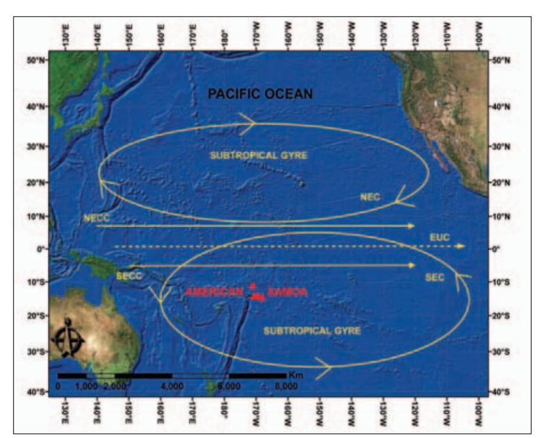

*Figure 10.1. Topographic map showing location of American Samoa and major ocean currents: North Equatorial Current (NEC), South Equatorial Current, North Equatorial Counter Current (NECC), South Equatorial Counter Current (SECC), Equatorial Under Current (EUC). Source: Brainard et al., in review.*

- 1. American Samoa Department of Marine and Wildlife Resources
- 2. Coral Reef Initiative, American Samoa Coral Reef Advisory Group
- 3. University of Hawaii, Hawaii Institute of Marine Biology
- 4. NOAA, Pacific Islands Fisheries Science Center, Coral Reef Ecosystem Division
- 5. The Joint Institute for Marine and Atmospheric Research
- 6. American Samoa Environmental Protection Agency
- 7. National Park Service
- 8. NOAA National Centers for Coastal Ocean Science, Hollings Marine Lab
- 9. CNMI, Division of Environmental Quality
- 10. Mappamondo GIS
- 11. American Samoa Department of Commerce
- 12. NOAA Coral Reef Watch
- 12. U.S. Geological Survey, National Wildlife Health Center, Hawaii Field Office

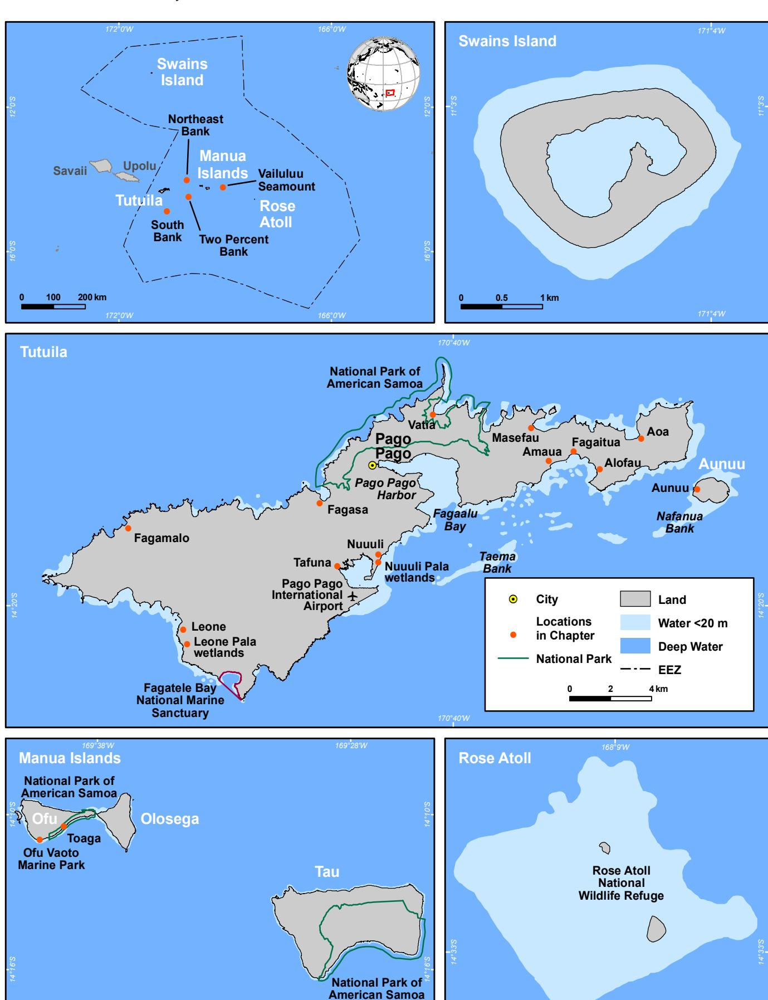

Figure 10.2. A detailed map of American Samoa locations mentioned in this chapter. Map: K. Buja.

Spur and groove reef formations are fairly common on the reef slope. On Tututila, the reef slope descends to about 20-30 m where it reaches a rubble or sand covered shelf (Figure 10.4). The shelf extends for about 1-4 km and reaches about 100 m depth at its outer edge, ending in a near-vertical escarpment. The escarpment is composed of layers of limestone about 5-10 cm thick and extends down to at least 350 m, where a talus slope of calcareous sand and debris extends below 400 m depth (Wright, 2005).

Multibeam sonar surveys by the NOAA Pacific Islands Fishery Science Center, Coral Reef Ecosystem Division (PIFSC-CRED) team has revealed that the shelf around Tutuila has a number of banks on it, some of which form an interrupted chain resembling a drowned barrier reef, a term used for it as early as 1921 (Chamberlin, 1921; Davis, 1921). Taema Banks at the mouth of Pago Pago harbor and Nafanua Banks, which extends from Aunuu Island toward Taema Banks, are believed to be part of this drowned barrier reef. Although both banks have coral on their outer slope and a portion of their tops, the banks have not yet been explored.

The coral reef biota of American Samoa is diverse. Data from initial taxonomic surveys are summarized in Table 10.1 and indicate a total of about 2,705 marine species. Fish are the best studied group, with algae, mollusks and corals following. The total number of marine species recorded to date is slightly less than that known from French Polynesia with 2,876 (Richard, 1985), significantly

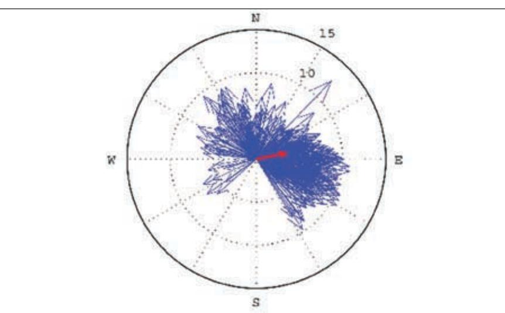

*Figure 10.3. Wind rose derived from CREWS buoy data 2 m above the sea surface at Rose Atoll from 2/8/04 to 4/11/06. Blue arrows are daily averaged wind direction and speed (from 0-15 m/s) and the red arrow is the average for the entire time period, depicting the prevailing light easterly winds. NOTE: Wind vectors point to the direction from which the wind is blowing. Data points outside of three standard deviations from the mean were excluded. Source: PIFSC-CRED, unpub. data.*

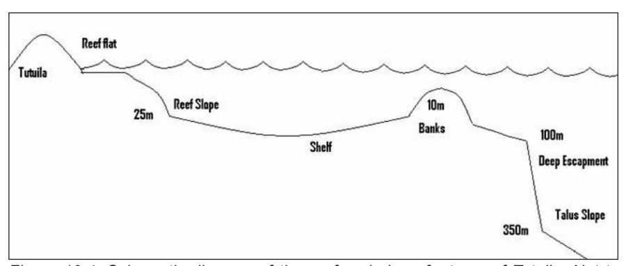

*Figure 10.4. Schematic diagram of the reef and slope features of Tutuila. Not to scale and not proportional. Source: D. Fenner, unpublished.*

less than Guam with 5,640 species (Paulay, 2003) and much less than Hawaii with about 7,000 species (Eldredge and Evenhuis, 2003). As additional effort increases the number of species known, total diversity is thought to be much higher than the number of species reported at even the best-studied sites. Biogeography indicates that Hawaii is likely to have fewer species than any of the other sites, so the present numbers probably reflect total effort more than actual diversity. One-hour roving biodiversity searches on slopes in American Samoa result in an average of about 73 species of coral, compared to 93 in the Philippines and 17 in Hawaii recorded by the same observer, supporting the view that local coral diversity is relatively high (D. Fenner, pers. obs.).

The benthic communities of American Samoan coral reefs appear to be in relatively good condition, with crustose calcareous algae dominant, live hard corals second in abundance, dead coral less common (and almost none recently dead), and brown macroalgae very rare on reef flats and slopes. The reefs have experienced a range of major disturbances in recent decades, with a major crown-of-thorns sea star (COTS) outbreak in 1978, hurricanes in 1986, 1990, 1991, 2004 and 2005, mass coral bleaching in 1994, 2002 and 2003, and unusually low tides in 1998, 2005 and 2006. In general, benthic communities have recovered from disturbance, with initial colonization by crustose calcareous algae followed by slower hard coral recovery (Craig et al., 2005). However, an unpublished report by Wass (1982) presented estimates of live coral cover that averaged 63% in the late 1970s. This is approximately double the current live coral cover and suggests that coral populations have not recovered to pre-disturbance levels. Wass also noted that corals in the genus *Acropora* were dominant on reefs, so the present dominance of encrusting corals may indicate a change in benthic community structure. It is possible that Wass (1982) may have estimated coral cover during a peak growth cycle.

Traces of terrestrial sediment have been found on reef slopes, but bays have significant sediment input that stresses corals and has killed coral colonies at times. Water clarity on reef slopes is relatively good with about 25–30 m visibility, but is lower in some bays, the harbor and back reef pools with low flushing rates. Terrestrial runoff from the islands of American Samoa appears to be diluted rapidly beyond the reef crest, but effects of nonpoint pollution on reef slopes has been documented and are thought to be related to pulses of sediment transport during rain events.

Invertebrate filter feeders such as sponges, boring clams, feather duster worms, crinoids, black corals, azooxanthellate soft corals and ascidians are generally rare, small and/or cryptic. There are exceptions in Pago Pago harbor's intertidal zone, where small oysters (Saccostrea cucculata) can be found, and in deeper areas of the harbor where sponges and sea fans are common. Also, the inner reef flat at Leone is covered by a thin encrusting grey sponge, and a basalt wall in Amanave has a community of azooxanthellate soft corals. Staghorn corals in back reef pools bleach every austral summer, though corals on reef slopes bleach only during major bleaching events. The fish fauna is dominated by small to medium-sized herbivores (surgeonfish and parrotfish), but rabbitfish are uncommon. Some planktivorous fish, such as small damselfish and fusiliers, are reasonably common on reef slopes, points outside of major bays, and on outer bank reefs. Chromis are uncommon on reef slopes and Anthias are rare except at Swains. The overall biomass of reef fish on Tutuila is slightly lower than on the Manua Islands, and significantly less than on Swains and Rose. Some species of large reef fish are currently considered uncommon to rare, as is typical of coral reefs near human populations (Friedlander and DeMartini, 2002; Stevenson et al., 2006). Thus, American Samoan reefs appear to be

Table 10.1. Numbers of species from taxonomic surveys. Sources: ¹Skelton, 2003; ²Madrigal, 1999; ³Coles et al 2003; ⁴D. Barclay, unpublished; ⁵Wass, 1984; °L. Whalen and P. Brown, unpublished; and ¹Dolar, 2005.

| GROUP              | NUMBER OF SPECIES        |
|--------------------|--------------------------|
| Seagrasses         | 2 1           |
| Benthic Macroalgae | 2371                     |
| Sponges            | 50 2,3        |
| Hard Corals        | 276 2,3       |
| other Cnidaria     | 59 2,3        |
| Platyhelminthes    | 17 2,3        |
| Nemertea           | 6 2,3         |
| Nematodes          | 1 3           |
| Sipuncula          | 1 2,3         |
| Echiurea           | 1 2,3         |
| Polychaetes        | <b>79</b> 2,3 |
| Ologochaetes       | 1 2,3         |
| Molluscs           | 700 2,3,4     |
| Crustacea          | 167 2,3       |
| Ectoprocts         | 25 2,3        |
| Brachiopods        | 1 2,3         |
| Echinoderms        | 100 2,3       |
| Ascidians          | 22 2,3        |
| Shorefishes        | 945 3,5,6     |
| Sea Turtles        | 4                        |
| Marine Mammals     | 11 7          |
| Total Species      | 2,705                    |

#### **ENVIRONMENTAL AND ANTHROPOGENIC STRESSES**

Climate Change and Coral Bleaching Six major coral bleaching events have occurred around the world since 1979, with massive coral mortality affecting many reefs (Hoegh-Guldberg, 1999). Increasing sea surface temperatures (SST) associated with climate change are likely to increase the frequency and magnitude of coral bleaching events. American Samoa usually experiences an annual SST range of only 2°C (27.5 to 29.5 °C), although during the past four years, instances of warmer than normal SSTs have been observed (Figure 10.5).

relatively resilient and in fairly good condition.

Mass coral bleaching in American Samoa occurred in 1994 (Goreau and Hayes, 1994) and in the summers of 2002 (Fisk and Birkeland, 2002) and 2003 (P. Craig, E. Mielbrecht, pers. comms.). The bleaching in 1994 began in February and was the strongest on record; an average of 32% of coral colonies from a variety of species was still bleached on reef slopes in August during the austral winter (Goreau and Hayes, 1994). Fisk and Birkeland (2002) reported

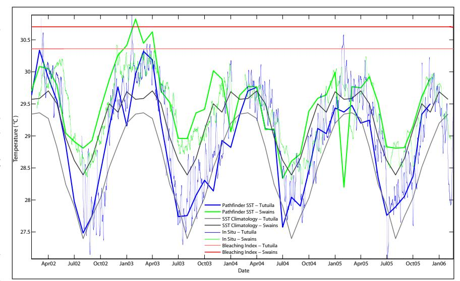

Figure 10.5. Four year time series of in situ sea surface temperature (SST), monthly Pathfinder SST, and Pathfinder SST Climatology from Tutuila and Swains Island. In situ SST from both islands exhibits strong intraseasonal variability with temperature fluctuations of 0.5-1.5 °C on daily to weekly timescales. Satellite derived SST primarily shows seasonal temperature changes. Both in situ and satellite SST are slightly elevated throughout the time series when compared to the long-term mean (SST Climatology). Coral Reef Watch bleaching threshold of maximum monthly mean SST plus 1°C are included for reference. Source: PIFSC-CRED, unpub. data.

mild bleaching on reef slopes at a depth of 10 m in March 2002, when 2.3% of colonies on Tutuila and 11.8% of colonies in Manua bleached. On Tutuila, *Montastrea curta* and *Porites lichen* were the most impacted species, while in Manua, *Montipora curta*, *Porites cf. lutea* and *Goniastrea retiformis* had the highest rates of bleaching. In shallow water, *Millepora*, *Acropora* and *Montipora* were the most frequently bleached coral species.

Staghorn corals in American Samoa bleach more intensely on top of branches than on sides or particularly undersides, and in some cases the tops of branches have died while the undersides were only lightly bleached and all but the tops of the branches survived. This is consistent with the view that solar radiation plays a role in the bleaching process along with temperature (e.g., Hoegh-Guldberg, 1999; Fisk and Birkeland, 2002). In a second pattern, only about 5 cm near the branch tip bleaches on all sides.

American Samoa's Territorial Monitoring Program (TMP) has been monitoring bleaching in two back reef lagoon pools on Tutuila from December 2003 to the present. The percentage of bleached colony surface for three species of *Acropora* was estimated based on hour-long timed swims conducted every 2-4 weeks, beginning in December 2003. In addition, temperature loggers were installed in each pool to provide *in situ* measurements of sea water temperatures. The study found a striking correlation between bleaching incidence and seawater temperatures as shown in Figure 10.6. But despite the evidence that acroporid corals have bleached every summer since at least 2002, little colony mortality has occurred. Colony mortality has also been low in natural lagoon pools on Ofu Island, where coral diversity is relatively high (Craig et al., 2001). Research to investigate coral survival in elevated temperature environments is underway (C. Birkland, L. Smith and D. Barshis,

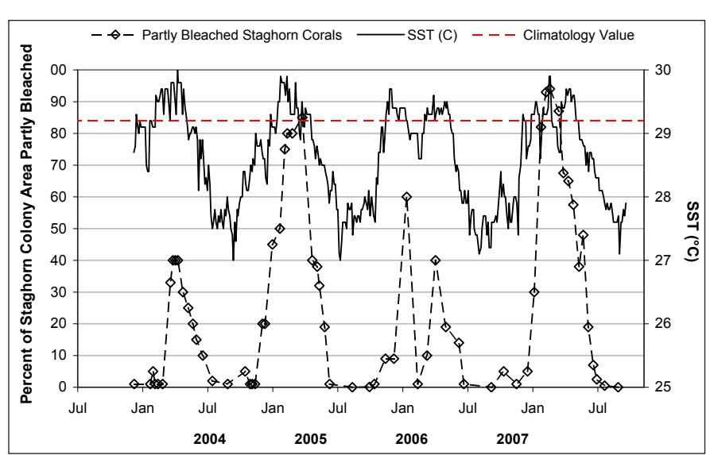

*Figure 10.6. SST time series for the pixel adjacent to the Airport back reef pool, centered at 170.5*°*W, 15.0*°*S. The horizontal line shows the climatology value used by NOAA's Coral Reef Watch as an expected summertime maximum temperature threshold for the pixel. Source: Fenner and Heron, unpub. data.*

pers. comms.). More information about the results of TMP's bleaching surveys appears in the Benthic Habitats section.

Bleaching very likely slows or stops growth, and has been reported to block sexual reproduction for a year (Brown and Ogden, 1993; Glynn, 1996; Michalek-Wagner and Willis, 2001). Thus, corals that bleach annually are likely growing less than unbleached corals and are not reproducing other than asexually by fragmentation. It is very likely that bleaching is having a chronic negative impact on these coral populations. The *Acropora*, *Millepora*, and *Porites* colonies described in this section appear to be the first multi-species coral community in the world exhibiting annual summer mass bleaching.

#### Diseases

Coral disease is emerging as a problem in the Indo-Pacific, and two studies have documented levels of coral disease present in American Samoa. In one study, diseases were surveyed initially in June 2004 (austral winter) at seven sites around Tutuila to document the baseline levels of disease in the major genera of corals and coralline algae. The same seven sites were resurveyed in January 2005 (austral summer) to look for seasonal differences in disease levels. At each site, two 25 m lines were laid out along depth contours separated by approximately 5 m. Coral colony counts by size class were conducted along each belt transect and colonies were examined for signs of disease. Corals with lesions were photographed, described and a sample taken for histological examination.

From these surveys, 15 coral disease states and two CCA diseases were described from the reefs of American Samoa (Table 10.2). Disease is widespread on the reefs but occurs at low levels (average prevalence=0.14 *±* 0.04% SE). The frequency of occurrence (proportion of sites having the disease) varied among the disease states (Figure 10.7) with the two most common coral diseases being *Acropora* white syndrome (AWS) and *Acropora* growth anomalies (AGA; Aeby et al. 2006). These two diseases have a widespread distribution across the Indo-Pacific and have been reported from American Samoa (AWS, AGA; Work and Rameyer, 2005), Australia (AWS, AGA; Willis et al., 2004), Palau (AWS; Willis et al., unpub. data), Marshall Islands (AWS; Pinca et al., 2005), Gulf of Oman (AGA; Coles and Seapy, 1998), Johnston Atoll (AWS, AGA; Work et al., 2001; Aeby and Work, unpub. data ) and the Northwestern Hawaiian Islands or NWHI (AWS, AGA; Work and Rameyer, 2002; Aeby, 2006). Comparative studies in 2004 and 2005 within American Samoa, Johnston Atoll and the NWHI revealed that AGAs were more common in American Samoa. AGAs occurred at 58% of the sites surveyed in 2004 in American Samoa (n=7 sites) as compared to 0% of the sites at Johnston Atoll (n=12 sites) and 33% of the sites within the NWHI (n=11 sites; Work et al., in review). Prevalence of disease (proportion of surveyed corals with disease signs) varied among the seven sites surveyed with the overall disease prevalence ranging from 0.043–0.86% (Aeby et al., 2006).

Disease prevalence also varied among coral genera (Figure 10.8) with *Acropora* having the highest overall prevalence of disease, which is consistent with findings from other areas of the Indo-Pacific. The types and frequency of occurrence of diseases varied between austral winter 2004 and austral summer 2005 (Table 10.3), but the overall disease prevalence was not significantly different.

The two CCA diseases present in American Samoa include coralline lethal orange disease (CLOD; Littler and Littler, 1995) and CCA black fungal disease (Littler and Littler, 1998). CLOD was more common on the reefs (Frequency of Occurrence=57% in 2004 and 42.9% in 2005) than black fungal disease (Frequency of Occurrence=0% in 2004 and 14.3% in 2005). As with coral diseases, no seasonal differences were found in levels of CLOD (Aeby et al. 2006).

The second study of coral disease was conducted throughout the American Samoa archipelago by PIFSC-CRED as part of their standard monitoring cruises in 2002, 2004, and 2006. In 2006, rapid ecological assessments (REA) were conducted at 62 sites to compute the percent of diseased colonies relative to the total number of colonies in each survey area. The study found coral diseases at 38 (61%) of the 62 sites, and that of the 14 genera affected, *Montastrea*, *Favia*, *Montipora*, *Porites*, *Astreopora* and *Acropora* exhibited the greatest frequency of occurrence (93% of cases), and *Favia*, *Coscinaraea* and *Leptoria/Platygyra* showed the greatest prevalence values (Figure 10.9).

Of 22 sites on Tutuila, 55% contained diseased corals, but the overall mean prevalence for the island was 0.13 ± 0.04% SE, values that are comparable to other Pacific islands. PIFSC-CRED surveys indicated that patterns of disease distribution and abundance varied considerably within and among islands in American Samoa. Patterns of disease occurrence and prevalence across the coral taxa also indicated that only a few genera may be disproportionately targeted by disease, suggesting that the ecological impacts of disease may be more severe in populations of uncommon or rare coral taxa. More information about both bleaching studies can be found in the Benthic Habitats section of this chapter.

*Table 10.2. Distribution of coral and CCA disease on the reefs of Tutuila. Data show presence or absence of the disease in each area surveyed in June 2004 and January/February 2005. Coral and CCA cover based on line-intercept method with the average of 2004 and 2005 shown. Source: Aeby et al., 2006.*

|                                     | MALOATA | TAFEU | VATIA | LEONE | FAGATELE | FAGAALU | FAGA'ITUA |
|-------------------------------------|---------|-------|-------|-------|----------|---------|-----------|
| DISEASE                             |         |       |       |       |          |         |           |
| Acropora ciliate disease            |         |       | X     |       |          |         |           |
| Acropora white syndrome             |         | X     | X     |       | X        | X       | X         |
| Acropora growth anomalies           | X       |       | X     | X     | X        |         |           |
| Porites focal tissue loss           |         |       |       |       | X        |         |           |
| Porites multifocal tissue loss      |         |       |       | X     |          |         |           |
| Porites growth anomalies            |         |       |       |       | X        |         |           |
| Montipora growth anomalies          | X       |       |       |       |          |         |           |
| Montipora dark spot                 |         | X     |       |       |          |         |           |
| Pssamacora dark spot                |         | X     |       | X     |          |         | X         |
| Lobophyllia tissue loss syndrome |         |       |       |       | X        |         | X         |
| Pavona growth anomalies             |         |       |       |       |          | X       |           |
| Pavona dark spot                    | X       | X     |       | X     |          |         |           |
| Goniastrea growth anomaly           |         |       |       | X     |          |         |           |
| Leptastrea growth anomaly           |         | X     |       |       |          |         |           |
| Pocillopora white band disease      |         | X     |       |       |          |         |           |
| Coralline lethal orange disease     | X       |       | X     | X     | X        |         |           |
| CCA black fungal disease            |         |       |       |       | X        |         |           |
| Avg. coral cover (%)                | 26.6    | 48    | 39.6  | 39.3  | 46       | 29.6    | 26.7      |
| Avg. CCA cover (%)                  | 40.4    | 8.9   | 19.9  | 36.5  | 37.6     | 33.8    | 53.5      |

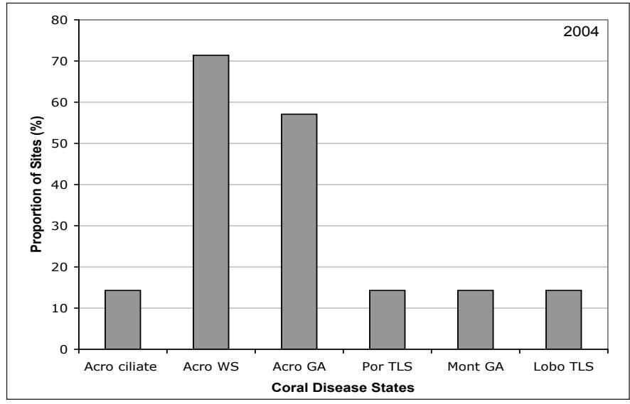

*Figure 10.7. Frequency of occurrence of major coral diseases on Tutuila reefs. Acro=*  Acropora*, Por=*Porites*, Mont=*Montipora*, Lobo=*Lobophyllia*, WS=white syndrome, GA=growth anomaly, TLS=tissue loss syndrome. Source: Aeby et al., 2006.*

#### *Fish Disease*

Twenty bluelined snapper (*Lutjanus kasmira*) and four goatfish (various species) were examined for presence of infectious organisms. Eighty percent of the bluelined snapper were infected with protozoa in the spleen. This percentage was as high as that observed on Oahu in the Hawaiian Islands (Work et al., 2003). Bluelined snapper also had infections with bacteria in the kidneys but at a low prevalence (<10%). General inflammatory lesions in multiple organs were prominent in bluelined snapper from American Samoa suggesting that fish are responding in a much more prominent way than similar species in Hawaii. For example, liver necrosis was more common in bluelined snapper from American Samoa than those from Oahu. In future studies, it would be of interest to survey fish in different seasons to determine if such an effect exists on prevalence of parasites and pathogens. Also, given that bluelined snapper in American Samoa have such a high prevalence of infection with protozoa in the spleen, it would be of interest to examine fish that school with bluelined snapper to determine whether diseases are shared between species.

# Tropical Storms

American Samoa has been hit by six cyclones in the past 20 years, including three since 2004 (Figure 10.10). In January 2004, Category 5 Cyclone Heta moved through American Samoa causing substantial damage with sustained winds of 120 km/h (75 mph), gusts of 185 km/h (115 mph) and storm surge waves up to 13.5 m (44 ft) high along the northwestern shorelines. Similarly in February 2005, Category 5 Cyclone Olaf moved through American Samoa, also causing substantial damage. Olaf and a 1986 storm were especially damaging to the Manua Islands.

El Niño-Southern Oscillation (ENSO) is an interannual climatic phenomenon (approximately 3–8 years) that creates significant temperature fluctuations in the tropical surface waters of the Pacific Ocean. ENSO events can have a significant impact on coral reef ecosystems due to changing surface winds, ocean currents, water temperatures, nutrient availability, storm frequency and magnitude, etc. The manifestations of ENSO have also been linked to large-scale reef-building coral mortality due to the increased temperatures and UV exposure, as well as decreased nutrients (Hoegh-Guldberg, 1999). ENSO is a naturally occurring phenomenon, however, there is uncertainty regarding how global warming and associated climate changes will impact the frequency and/or magnitude of this cycle and how that will in turn affect coral reef ecosystems. In the American Samoa region, SST values show a negative correlation with ENSO; cooler than normal (0.5-1.0°C) SSTs are observed during positive ENSO phases (El Niño), whereas warmer than normal SSTs are observed during negative ENSO phases (La Niña; Figure 10.11).

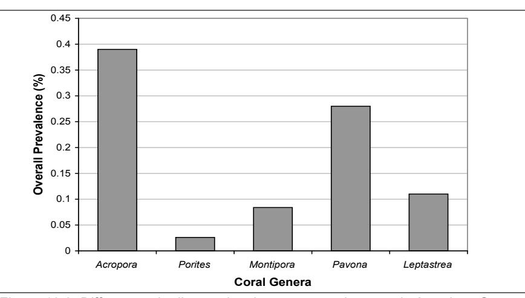

*Figure 10.8. Differences in disease levels among coral genera in American Samoa. Source: Aeby et al., 2006.*

*Table 10.3. Frequency of occurrence of diseases at seven reefs surveyed in June 2004 and January/February 2005. Source: Aeby et al., 2006.*

|                                  |             | FREQUENCY OF DISEASE OCCURRENCE (%) |  |  |  |  |  |
|----------------------------------|-------------|-------------------------------------|--|--|--|--|--|
|                                  | SUMMER 2004 | WINTER 2005                         |  |  |  |  |  |
| Acropora ciliate disease         | 14.3        | 0                                   |  |  |  |  |  |
| Acropora white syndrome          | 71.4        | 42.9                                |  |  |  |  |  |
| Acropora growth anomalies        | 57.1        | 42.9                                |  |  |  |  |  |
| Porites tissue loss syndrome     | 14.3        | 0                                   |  |  |  |  |  |
| Porites growth anomalies         | 0           | 0                                   |  |  |  |  |  |
| Porites multi-focal tissue loss  | 0           | 14.3                                |  |  |  |  |  |
| Montipora growth anomalies       | 14.3        | 0                                   |  |  |  |  |  |
| Montipora dark spot              | 0           | 28.6                                |  |  |  |  |  |
| Lobophyllia tissue loss syndrome | 14.3        | 0                                   |  |  |  |  |  |
| Pavona growth anomalies          | 0           | 14.3                                |  |  |  |  |  |
| Pavona dark spot                 | 0           | 28.6                                |  |  |  |  |  |
| Goniastrea growth anomaly        | 0           | 14.3                                |  |  |  |  |  |
| Leptastrea growth anomaly        | 0           | 14.3                                |  |  |  |  |  |
| Coralline lethal orange disease  | 57          | 42.9                                |  |  |  |  |  |
| CCA Black Fungus                 | 0           | 14.3                                |  |  |  |  |  |

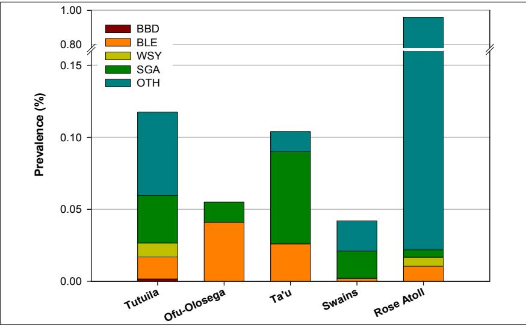

*Figure 10.9. Mean overall prevalence of coral disease in American Samoa relative to coral density (colonies/m2 ) at each site. BBD: black band disease; BLE: bleaching; WSY: white syndrome; SGA: skeletal growth anomalies; OTH: "other lesions". Source: Brainard et al., in review.*

ing areas.

# Coastal Development and Runoff Sedimentation is a significant potential threat to the reefs of American Samoa. The islands are very steep and rainfall is often heavy. Currently, steep slopes are almost completely covered by dense native vegetation except in areas cleared for agriculture and quarry operation during prehistoric settlement (Clark and Herdrich, 1993). If a significant amount of vegetation were to be removed, sediment runoff in nearshore areas would likely increase, especially near river mouths, in bays and in other low-flush-

Tutuila, where almost all of American Samoa's estimated population of 66,900 people live (American Samoa Department of Commerce, 2007), has only about 26 km2 (10 mi2) of flat land, almost all coastal. The high and increasing population density and associated construction activities place great strains on shoreline resources. The potential impact of sedimentation on nearshore resources led the Department of Marine and Wildlife Resources (DMWR) Key Reef Species Program to conduct a quantitative assessment of the sedimentation rates along the south shore of Tutuila and determine its effect on sport fish populations. Nine sediment traps were deployed and retrieved monthly at the reef slopes of 12 monitoring sites from January 2006 to February 2007. Six sites were located in embayment areas while six were at topographic points to account for habitat variability. Two additional sites at the mouth of streams (Fagaalu and Fagatogo) were included to determine the amount of sediment delivered by the stream compared to direct terrestrial inputs. The dry weight of sediment was used to estimate sedimentation rates in grams per cm2 per day. Results showed that sedimentation rates in bays averaged 12.1 g/cm2/day, which was significantly higher than at point sites, which averaged 1.4 g/ cm2/day (Figure 10.12). Sedimentation rates from stream sites, however, were drastically higher than both bay and point sites at 84.7 g/cm2/day. Such high sediment loads were considered detrimental to coral reefs while rates at the bays and points were considered to have moderate and slight effects, respectively (Pastorok and Bilyard, 1985). There were also some noticeable temporal variations as higher sedimentation rates occurred between January and June, a difference that was more evident at embayment sites than point sites. However, this does not correlate with rainfall or with trends in

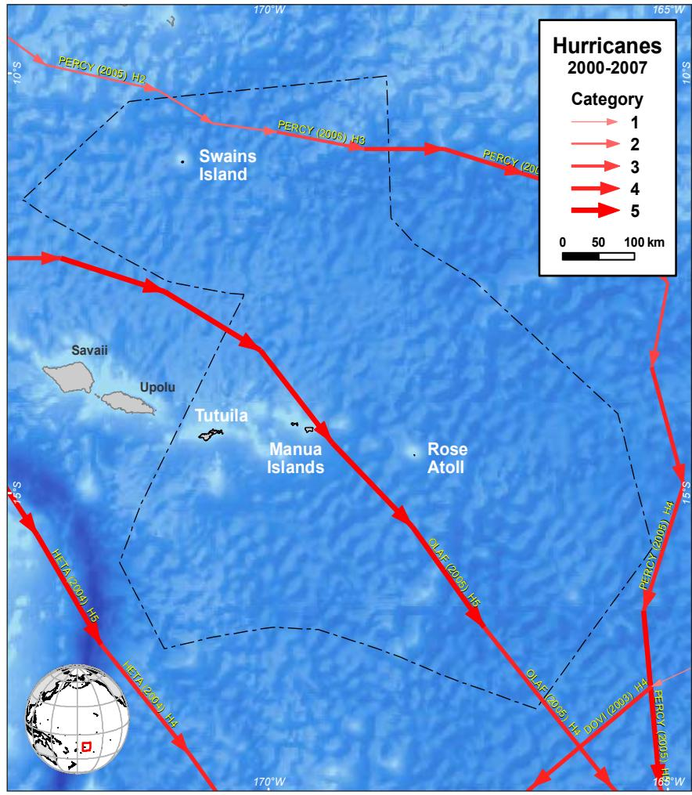

Figure 10.10. A map showing the paths and intensities of tropical storms passing near American Samoa from 2000-2007. Year of storm, name and strength are indicated for each. Map: K. Buja. Source: http://weather.unisys.com/hurricane/.

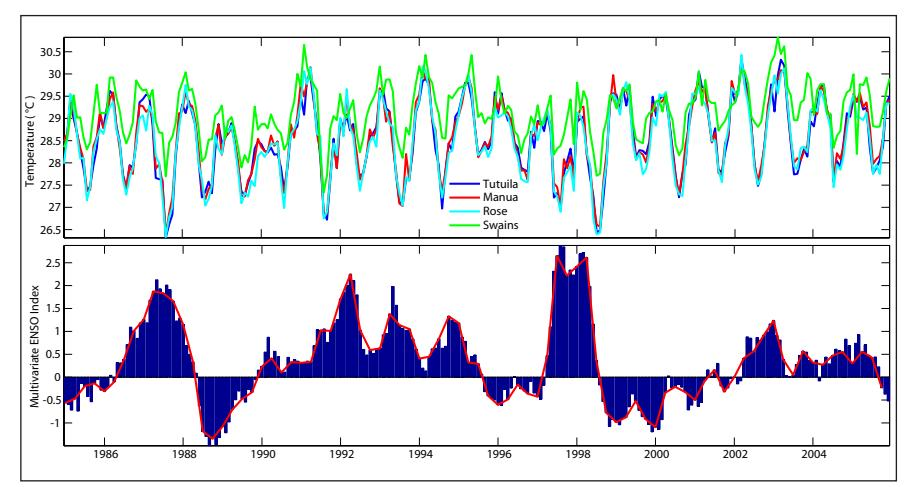

Figure 10.11. Relationship between NOAA Pathfinder derived SST at Tutuila, the Manua group, Rose Atoll and Swains Island (top) and the Multivariate ENSO Index (MEI; bottom) from 1985-2006. Positive MEI values represent El Niño periods while negative values represent La Niña periods. Source: Brainard et al., in review.

wave action (expressed in significant wave height in meters) that can resuspend sediments.

High sediment output from stream sites seemed to be dispersed within nearshore areas since only a small amount was detected on reef slopes. Qualitative observation by DMWR biologists suggests that sediments from streams are deposited on reef flats, but no quantitative data has been collected to date. The DMWR Key Reef Species Program will continue to investigate sediment dispersal rates and patterns on reef and possible impacts on juvenile sport fish habitat.

#### Coastal Pollution

Currently there are seven National Pollutant Discharge Elimination System permitted discharges in American Samoa. The permitted discharges include treated wastewater from Tutuila's two wastewater treatment plants, effluent from the two tuna canneries, and other point source discharges that could contain minor amounts of oil and other toxic or biological materials. The point sources are not considered major contributors to poor water quality.

Nonpoint source pollution is now considered the primary pollution source for coastal areas in American Samoa. The American Samoa Environmental Protection Agency (ASEPA) developed a *Coastal Nonpoint Source Monitoring Strategy* as part of the American Samoa Coastal Nonpoint Pollution Control Program in order to evaluate the effectiveness of best management practices for achieving water quality objectives through tracking trends in water quality.

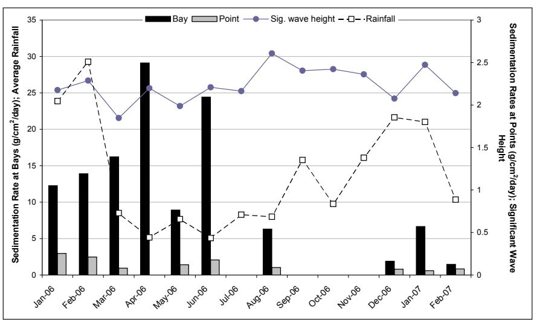

*Figure 10.12. Monthly trend in sedimentation rates (g/cm2 /day) on the reef slopes located at embayment (black bar) and topographic point areas (gray bar). Average rainfall (dashed square) and significant wave height (solid circle) were used as driving factors to explain sedimentation trends. Source: Sabater, unpub. data; NOAA-NWS; PIFSC-CRED.*

Pago Pago Harbor is seriously polluted with contaminated sediments and fish processing wastes, which contribute to high bacterial levels that peak during and after heavy rains. Sources of bacterial contamination include piggeries, septic tanks, sewage and animal wastes. ASEPA has issued a general advisory against consumption of fish caught in the inner harbor due to the presence of arsenic, mercury and polychlorinated biphenyls (PCBs). Fish toxicity is attributed to contaminated sediments since the water quality in the harbor meets or exceeds applicable U.S. Environmental Protection Agency (USEPA) water quality standards.

Uncontrolled effluent from piggeries contaminates local watersheds and has resulted in impaired water quality in some coastal waters. Approximately 1,006 piggeries with about 9,000 pigs currently operate in the territory, and the effluent from 82% of them are channeled into deficient cesspools and septic systems or discharge directly into streams or wetlands. Although piggeries are required to have land use permits, 97% are out of compliance (Buchan et al., 2006). ASEPA has been given authority to write citations for piggeries that are out of compliance and has moved forward with a strong enforcement program.

# Tourism and Recreation

There continues to be relatively little tourism in American Samoa. Only two flights a week operate between Honolulu, HI and Pago Pago International Airport for most of the year. There are several flights daily between American Samoa and neighboring independent Samoa and limited service to a few other destinations. It is estimated that American Samoa received 7,762 tourists in 2006 and 7,027 tourists in 2005 (ASDOC, 2007). Approximately 82% of tourists to American Samoa are citizens of the U.S. (52%) or New Zealand (30%).

The Ecotourism Plan for American Samoa, released in June 2005, states that ecotourism is the preferred means of promoting tourism and the economy in the territory (Liu et al., 2005). The objectives of the Ecotourism Plan are: to incorporate ecotourism into the territory's policies and goals for environmental protection; to promote the conservation of American Samoa's natural resources through ecotourism; and to determine the desirable growth rates and limits for the ecotourism industry in the territory.

### Fishing

Reef fish population levels in American Samoa have remained relatively stable throughout the past 30 years while subsistence fishing effort has declined due largely to a shift in the resident population's economic focus away from subsistence activities and toward a cash-based economy. Commercial fishing effort and catch has fluctuated throughout the same time period but is presently also at low levels. More detailed information on reef fish populations and the fishery are provided in the Associated Biological Communities section of this chapter and are analyzed in concert to provide a robust assessment of the status of reef fish populations in American Samoa.

Concerns over the apparent rarity of some larger species of reef fish, including sharks, remain, and a variety of natural and anthropogenic stressors are likely to be contributing factors. In addition to anthropogenic factors such as pollution, habitat destruction and overfishing, low population levels may be a result of naturally occurring distribution patterns, habitat availability, recruitment success, food availability, and other factors. Regardless of the causes, the fact that some species are rare and thus vulnerable to local extinction was considered sufficient reason to protect the remaining individuals. The DMWR recently made the decision to fully protect (i.e., year-round, no-take of individuals of all sizes) all species of sharks, as well as four species of reef fish (humphead or Maori wrasse, *Cheilinus undulatus*; bumphead parrotfish, *Bulbometopon muricatum*; giant grouper, *Epinephelus lanceolatus*; and giant trevally, *Caranx ignobilis*). The decision to protect these species was aided by the fact that they are not heavily targeted by fishers or currently of particular cultural importance. Other considerations included the ecological importance of some of these species, their threatened status in many parts of the world, and their inclusion on lists such as the Convention on International Trade in Endangered Species, the International Union for the Conservation of Nature's (IUCN) Red List, and the U.S. National Oceanic and Atmospheric Administration's (NOAA) Species of Concern. It is hoped that actions to protect these species will maintain or increase population levels; any such changes will be documented by long-term monitoring programs.

# Trade in Coral and Live Reef Species

There is no trade in coral and live reef species at this time.

#### Ships, Boats and Groundings

As reported in Craig et al. (2005), nine foreign-flagged longliners were grounded on reefs in Pago Pago Harbor during Hurricane Val in 1991. They were removed in 2000 by building a causeway for machinery to reach each longliner for removal. During preparations in 1999, approximately 1,000 corals were removed from areas planned for the causeways. Although a storm damaged most of the removed corals, over 300 colonies were transplanted into the footprint of one of the vessels at Onesosopo near the mouth of the harbor. The survival, growth, and live tissue status of 354 transplanted corals were evaluated in 2001 when 91–92% had survived and 2005 when 60–78% had survived. Massive *Porites* species and *Pocillopora eydouxi* had significantly higher survival rates than small and mid-sized *Pocillopora* species. Transplanted corals fared as well as controls in terms of survival, growth and change in live tissue cover (Kolinski, 2006). One of the nine longliners was removed whole and scuttled outside the harbor. It was sighted in early 2007 resting intact on a sand patch near the outer reef at Taema Banks in water depths of about 30 m. Some corals had begun to grow on it.

# Marine Debris

A limited amount of marine debris washes in from offshore and is deposited on American Samoa's coral reefs. The bulk of marine debris in the territory originates from land-based activities. Local resource management agencies and community groups organize occasional beach cleanups. NOAA's Office of Response and Restoration is providing technical assistance in planning for the removal of two additional derelict vessels and vessel debris. The vessels in question are deteriorating and scattering debris in nearshore areas, which harms corals and limits human uses of the areas due to concerns about the presence of sharp metal in the intertidal and nearshore subtidal zones. The development of removal plans is expected to assist the territory in seeking funding opportunities for vessel removal.

#### Aquatic Invasive Species

A study of introduced marine species in American Samoa did not reveal any that were considered invasive or threatening (Coles et al., 2003).

# Security Training Activities

Security training activities are not considered a major threat to coral reef ecosystems in American Samoa.

#### Offshore Oil and Gas Exploration

No oil and gas exploration occurs in American Samoa.

#### CORAL REEF ECOSYSTEMS—DATA-GATHERING ACTIVITIES AND RESOURCE CONDITION

A number of monitoring programs have collected data on the status of coral reef ecosystems in American Samoa as described in Table 10.4 and depicted in Figure 10.13.

Table 10.4. Ongoing monitoring activities in American Samoa. Source: D. Fenner.

| PROJECT                                    | LOCATION                               | YEAR | AFFILIATION/ FUNDING            | PRINCIPLE INVESTIGATOR | FREQUENCY            | STATUS      |
|--------------------------------------------|----------------------------------------|------|------------------------------------|------------------------|----------------------|-------------|
| Aua Transect                               | Aua Village, Tutuila                   | 1917 | CRAG, CRI                          | Birkeland              | Periodic             | Ongoing     |
| TMP                                        | Tutuila and Manua                      | 2005 | DMWR, CRAG, NOAA                   | Fenner and Carroll     | Annual               | Ongoing     |
| Resource Assessment and Monitoring Program | All Islands                            | 2002 | NOAA PIFSC-CRED                    | Brainard et al.        | Biannual             | Ongoing     |
| Key Reef Species (fish)                    | Tutuila and Manua                      | 2005 | DMWR, FedAid Sportfish Recovery | Sabater                | Annual               | Ongoing     |
| Coral Disease                              | Tutuila and Manua                      | 2005 | DMWR, FedAid Sportfish Recovery | Fenner                 | Annual               | Ongoing     |
| Rose Atoll                                 | Rose Atoll                             | 2002 | USFWS                              | Maragos                | Periodic             | Ongoing     |
| MPA Reef Flats                             | MPA Villages, Tutuila               | 2004 | DMWR, FedAid Sportfish Recovery | Vaitautolu             | Approx. Annual    | Ongoing     |
| Fagatele Bay Monitoring                    | Fagatele Bay, Tutuila               | 1985 | Fagatele Bay NMS                   | Birlkeland and Green   | 3 years (Approx.) | Ongoing     |
| Long-Term Monitoring                       | Tutuila and Manua                      | 1982 | DMWR                               | Green and Birkeland    | 5 years (Approx.)    | Ongoing     |
| Nonpoint Source Pollution                  | Tutuila                                | 2003 | AS EPA                             | Houk and Peshut        | Annual               | Ongoing     |
| Inshore Creel Survey                       | South Shore, Tutuila                | 1978 | DMWR, FedAid Sportfish Recovery | Iramatra               | Daily                | Ongoing     |
| Reef Monitoring                            | National Park, North Shore, Tutuila | 2007 | National Park of American Samoa | Brown and Craig        | Annual               | Ongoing     |
| Stream/ Beach Monitoring                   | Tutuila                                | 2002 | AS EPA                             | Zennaro and Paselio    | Weekly               | Ongoing     |
| Shallow-water Benthic Habitat Maps      | All Islands                            | 2005 | NOAA CCMA-BB                       | Battista and Monaco    | One Time             | One Time |

# Economic Valuation of Coral Reefs and Adjacent Habitats in American Samoa

In October 2006, the American Samoa Coral Reef Advisory Group (CRAG) released an economic valuation of American Samoa's coral reef resources, prepared by Jacobs, Inc. in association with MRAG Americas, the National Institution of Water and Atmospheric Research, and Professor N. Polunin.

As of 2004, the coral reefs of American Samoa provide benefits on the order of \$5.1 million/year, and the territory's mangroves add an additional \$0.75 million/year. Together, these critical natural resources account for 1.2% of the American Samoa GDP. A few of the most important benefits provided by coral reefs include: \$689,000/year benefit due to coral reef fisheries; \$73,000/year benefit resulting from recreational uses; \$70,000/year benefit deriving from bottom fishing; \$447,000/year benefit relating to shoreline protection provided by the reefs. These are just some of the benefits, economic and otherwise, American Samoa stands to lose without continued efforts to increase our understanding of and protect these fragile ecosystems. In addition to the above, a gain of \$2,753,000/year in direct benefits could be realized through the complete and effective implementation of proposed mitigation and enhancement measures, as well as management initiatives such as strengthening fisheries regulations and controlling coastal development.

# WATER QUALITY AND OCEANOGRAPHIC CONDITIONS

The health, function and biogeography of American Samoa's coral reef ecosystems are influenced by regional oceanographic conditions. The broad and diverse biological community comprising these ecosystems including fish, corals and other invertebrates, algae, turtles and marine mammals is heavily influenced by ocean currents, waves, temperature, salinity, turbidity, nutrients and other measures of water quality and oceanographic conditions. As these conditions change, so do the physical condition, distribution, abundance and species diversity of reef communities. Table 10.5 presents longterm oceanographic monitoring methods and equipment used in American Samoa since 2002.

The previous edition of this report (Craig et. al., 2005) summarized surface water quality monitoring activities conducted by ASEPA before 2003. Prior to 2003, few data were available for assessing nearshore regions of the territory. As a result, ASEPA, in collaboration with local environmental resource agencies and federal partners such as the National Park of American Samoa (NPAS), began concentrated monitoring and assessment efforts to document coastal water and coral reef condition in order to protect and enhance aquatic life and human health.

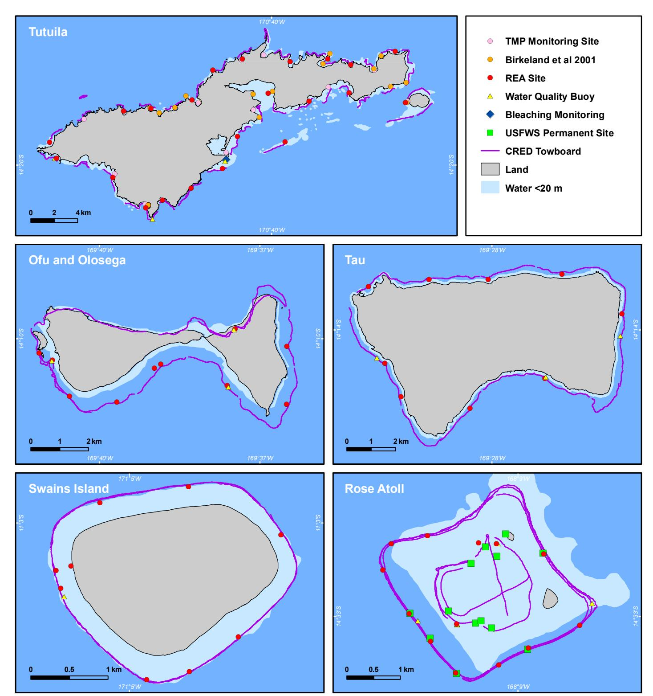

Figure 10.13. A map showing the location of monitoring sites in American Samoa. Map: K. Buja.

#### NPS/ ASEPA Ocean Monitoring and Assessment

In 2004, NPS and ASEPA collaborated to conduct a probabilistic-based, comprehensive ocean assessment that evaluated and assessed the quality of the territory's coastal waters. Following the EPA's Environmental Monitoring and Assessment Program, 50 coastal sampling locations in areas up to 0.4 km (0.25 mi) from the mean high water mark were randomly selected from around Tutuila and the Manua Islands. Monitoring targets included several water quality indicators, sediment quality, biota and habitat. For logistical reasons, not all parameters were measured at all stations.

#### Results and Discussion

Water quality around Tutuila and the Manua Islands was found to be fair to good, depending on the criteria used. The results of the overall assessment using American Samoa Water Quality Standards (ASWQS) are presented in Figure

*Table 10.5. Ongoing oceanographic monitoring activities in American Samoa. Source: PIFSC-CRED.*

| System                                                     | Variables Monitored                                                                                                               | Dates                   | Agency     |
|------------------------------------------------------------|-----------------------------------------------------------------------------------------------------------------------------------|-------------------------|------------|
| Deepwater CTDs* at select loca tions near the islands   | Conductivity (salinity), temperature, depth, dissolved oxygen, chlorophyll to a depth of 500 m                                 | February 2002 - present | PIFSC-CRED |
| Shallow-water CTDs* - multiple sites each island/atoll  | Temperature, salinity, turbidity                                                                                                  | February 2002 - present | PIFSC-CRED |
| Water Samples                                              | chlorophyll and nutrients (nitrate, nitrite, silicate, phosphate) concurrent with deep and shallow-water CTDs at select depths | January 2006 - present  | PIFSC-CRED |
| Coral Reef Early Warning Buoys -1 Standard (Rose Atoll) | Enhanced: temperature (1 m), conductivity (salinity), wind, atmospheric pressure                                               | February 2002 - present | PIFSC-CRED |
| Sea Surface Temperature (SST) Buoys - 3 (Tau, Tutuila)  | Temperature at 0.5 m                                                                                                              | February 2002 - present | PIFSC-CRED |
| Subsurface Temperature Recorders - 33 (all islands)     | Temperature at depths between 0.5 m and 30 m                                                                                      | February 2004 - present | PIFSC-CRED |
| Ocean Data Platforms (ODP) - 1 (Swains)                 | Temperature, conductivity (salinity), spectral waves, current profiles                                                         | February 2002 - present | PIFSC-CRED |
| Wave and Tide Recorders (WTR) - 2 (Rose Atoll, Tutuila) | Wave and tidal heights                                                                                                            | February 2004 - present | PIFSC-CRED |
| Ecological Acoustic Recorder (EAR) - 4 (Tutuila)        | Ambient sounds up to 12.5 kHz and vessel generated sounds                                                                         | February 2006 - present | PIFSC-CRED |
| * CTD: Conductivity, temperature and depth.                |                                                                                                                                   |                         |            |

10.14. One hundred percent (100%) of territorial waters complied with the pH standard. Although there are no territorial standards for dissolved inorganic nitrogen (DIN) or dissolved inorganic phosphate (DIP), Lapointe (1997) proposed nutrient thresholds (DIN: 1.0 µM; DIP: 0.1 µM) for oligotrophic marine waters that, when exceeded, might indicate or portend nutrient-related reef degradation. The assessment data showed that 11/49 stations (22%) exceed Lapointe's threshold for DIN. However, all 49 stations exceeded the threshold for DIP, suggesting that sources of phosphate in American Samoa are natural (e.g., weathering of volcanic rock, seabird inputs). There is a significant concern that increased inputs of nitrogen from anthropogenic activities will influence productivity and increase the likelihood of a shift in benthic composition of nearshore reefs from hard corals to macroalgae. The data also imply that high chlorophyll is not

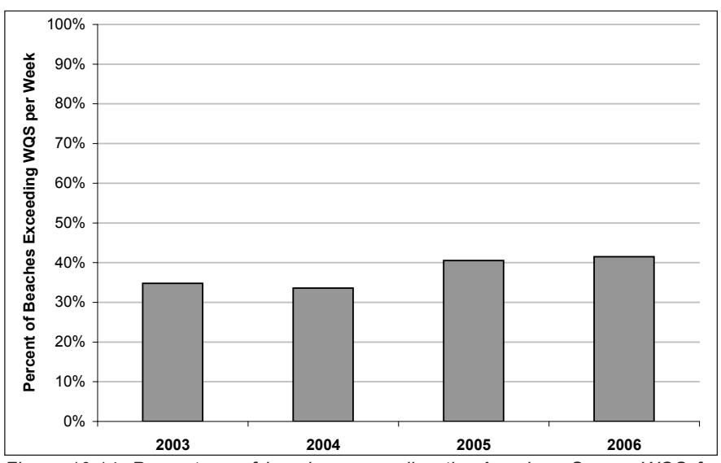

*Figure 10.14. Percentage of beaches exceeding the American Samoa WQS for*  Enterococcus *as detected in ASEPA weekly beach monitoring. Source: ASEPA.*

generally the cause of reduced water clarity. The overall total suspended solids (TSS) value for waters that failed the clarity standard was significantly higher than at stations that passed the clarity standard, implying that TSS may be a significant factor in water clarity at the station level and may be a significant problem territory-wide.

In terms of sediment contamination, the available data suggest a generally low level of impact in the territory. There were no detectable levels for polycyclic aromatic hydrocarbons (PAHs), PCBs or pesticides, but three metals were present in sediments at levels that exceeded established thresholds of interest: arsenic, chromium and nickel. The presence of these metals at all sampled sites suggests that natural sources may contribute to metal concentrations around the territory, however, the high levels of arsenic, chromium and nickel found at specific sites suggest that anthropogenic sources may be significant. It is important to note that sediments collected under this study only represent about 32% of the territory and that only one station was located within the boundaries of Pago Pago Harbor, which is known to have significant sediment contamination from previous military and industrial usage.

The levels of contamination in fish tissues collected during the study were often low, and only rarely reached levels of concern for human consumption. In only two cases did concentrations exceed levels considered safe for consumption by the U.S. EPA (2000) for mercury and total PAHs. These findings suggest that approximately 4% of American Samoa's nearshore habitats contain fish with contaminants at levels that may be unsafe to eat. In addition, the findings indicate that bioaccumulation of toxins is minimal, but still occurring.

# *L agoon M oni t ori ng*

Periodically, algal blooms occur in front of Olosega Village in Manua. In May 2006, in order to determine the sources of nutrients to the lagoons of Ofu and Olosega islands, a research team led by Virginia Garrison, U.S. Geological Survey, examined the nutrient content of the two most common species of seaweed (*Halimeda* sp. and *Dictyosphaeria versluysii*) that occur on the reef flats in front of each village and compared the findings from those sites with a relatively pristine lagoon/reef flat. Benthic cover at each of the three sites was determined using the point-intercept method. Algal species were analyzed for nitrogen isotopes 14N and 15N and δ13C.

#### *Results and Discussion*

Results from this pilot study indicate that the major sources of nutrients to the three lagoons are most likely oceanic, atmospheric and/or sedimentary, and not derived from animal or terrestrial sources. High volumes of oceanic waters and strong currents flush the lagoons daily and would be expected to rapidly dilute any nutrient input from land. These findings provide baseline data to compare to future data from algal blooms (Garrison et al., 2007).

# *A S E PA Beac h M oni t ori ng*

Utilizing a health-based, tiered monitoring approach, the ASEPA began monitoring 48 recreational beach locations in American Samoa spanning approximately 149 shoreline miles. Forty-two (42) beach sites are sampled at a weekly frequency, and six at a monthly frequency. Samples are analyzed for *Enterococci* using Enterolert® and most probable number methods and compared to the ASWQS to determine compliance.

#### *Results and Discussion*

Monitoring results from 2003 that were presented in the previous report (Craig et al., 2005) indicated that the territory's bathing beaches often exceeded the ASWQS for *Enterococcus*. Since that time, beach monitoring efforts have continued and expanded, but little change was detected in concentrations of *Enterococcus* in nearshore waters used primarily for swimming. Improper treatment and disposal of human and animal waste remain likely sources of contamination. Recent ASEPA program developments addressing animal waste management shows some promise in reducing bacterial levels in nearshore coastal waters. Beach monitoring will continue to determine trends and evaluate the effectiveness of environmental compliance and enforcement actions.

# *A S E PA Bi ologi c al C ri t eri a M oni t ori ng*

The dynamic nature of water quality data makes it very difficult to properly assess a region, project or pollutant source without appropriate sample sizes. At any particular time, water quality measurements are affected by rainfall, storm events, tidal fluctuations, and other atmospheric and oceanographic conditions. One cost- and time-efficient approach is to examine biological communities that are bathed by the waters in question since in tropical marine waters these communities will shift in response to nutrients, sediment loads, turbidity and other parameters (Littler and Littler, 1985; Rogers, 1990; Telesnicki and Goldberg, 1995; Valiela, 1995; Lapointe, 1997; Fabricius and De'ath, 2001). This forms the basis upon which American Samoa's biological criteria (coral reef) monitoring program was initiated.

The goal of the ASEPA coral reef monitoring program is to carry out a long-term investigation using a stratified approach based on geological setting to detect changes over time resulting from land-based human disturbance. This effort started in 2003 when six watershed-based survey sites were established around Tutuila (Houk et al., 2005), and was expanded in 2005 and 2007 when ten additional sites were added (Houk, 2005; Houk and Musburger, 2007). Initial surveys were conducted to characterize coral reef development at the monitoring stations to account for the inherent variation that results from a reef's geological and oceanographic setting (Houk et al., 2005; Goreau, 1959; Van Woesik and Done, 1997; Grigg, 1998; Pandolfi et al., 1999). Subsequently, the relationships between watershed volume, human population density, and coral reef communities were examined within each distinct "setting" to determine which ecological measures were most responsive to proxies of pollution.

Targeted monitoring sites were established on reefs adjacent to stream discharges, at a distance of about 250 m from each mouth. Data on benthic cover, coral community composition, and macroinvertebrate and fish abundance was collected at 9–11 m depth. A detailed description of study methods can be found in Houk and Musburger (2007).

#### *Results and Discussion*

Three, statistically distinct geomorphological settings (referred to as classes herein) exist among the 16 survey locations included in this study (Figure 10.15). Class 1 reefs have an unconsolidated, limestone framework representing localities where the greatest Holocene deposition has occurred, and include the numerous bays situated on the south side of Tutuila. Class 2 reefs consist of a consolidated, limestone framework that allows for the modern growth of relatively large massive and encrusting corals, and is represented by the majority of sites on the north side of Tutuila. A third class (class 3) is represented by one site on the north at Vatia and is unique based upon a lack of limestone deposition and a dominance of sand, perhaps a consequence of geological infilling.

Negative correlations were consistently found between three watershed descriptors (size, percent disturbed land and human population) and three biological measures (coral species richness, community evenness and the percentage of benthic substrate favorable for coral growth) across class 1 and 2 reefs. Similar, significant, negative correlations between proxies to watershed pollution and biological measures in both classes portray causation by the environment upon the adjacent reefs. Both human population and disturbed land are dependent upon watershed area to some degree, however correlations were not significant. Thus, patterns are best described by proxies to watershed pollution rather than size alone.

Six of the 16 sites were classified as "not supportive" for ASEPA's aquatic life use criteria: Fagaalu, Laulii, Matuu, Alofau, Fagasa, and Fagafue (USEPA, 1997, 2002; Table 10.6). Six sites were classified as "partially supportive": Fagaitua, Leone, Vaitogi, Aoa, Masausi, and Masefau. Two sites were classified as "fully supportive": Fagatele and Tafeu.

Trend data from five sites show that the 2005 bleaching event had an effect on the benthic community with a shift from structurally-complex coral cover to mixed coralline and turf algae cover. Ideally, such a disturbance should have minimal impact upon a reef "health" index assuming the community remains resilient and a phase shift is not imminent. In three cases, at Masefau, Fagaitua and Leone, despite a decrease in coral cover, the overall aquatic life use support rank remained relatively consistent. In two contrasting instances, at Aoa and Alofau, the loss of coral cover was accompanied by a large increase in turf and coralline algae cover and little new coral growth, resulting in drastically lower rankings and suggesting slow or halted recovery. Notably, the Leone and Masefau sites displayed relatively minimal impacts to the cover and structure of coral assemblages as a result of the bleaching event.

#### BENTHIC HABITATS

# DMWR's Territorial Monitoring Program

This program monitors eleven sites annually: ten on the reef slope around Tutuila and one on Aunuu. Data collection began in 2005. At each non-reef flat site, four 50-m tapes are laid along the 8-10 m depth contour. Benthic cover is recorded in functional categories under a point at each half meter.

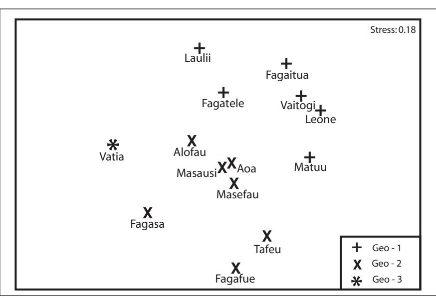

Figure 10.15. Multi-dimensional scaling diagram showing significant differences in coral community structure based upon site geomorphology (Global R-statistic=0.77, Pairwise R-statistic >0.6 for all). Source: Houk and Musburger, 2007.

Table 10.6. ASEPA aquatic life use support (ALUS) rankings. The overall biocriteria, or reef health score, is the average of all biological measures which ranges between 0 (lowest)–1 (pristine). Final ALUS rankings are based from this average as follows; 0.8–1.0="fully supportive", 0.6–0.8="partially supportive", and 0.0–0.6="not supportive" for aquatic life (EPA, 1997, 2002). Source: Houk and Musburger, 2007.

| SITE      | YEAR | GEO CLASS | COMMUNITY RANK | BENTHIC COMMUNITY RANK | OVERALL AVERAGE | ALUS RANKING |
|-----------|------|--------------|-------------------|------------------------------|--------------------|-----------------|
|           | 2003 | 1            | 0.59              | 0.19                         | 0.39               | Not             |
| Fagaalu   | 2005 | 1            | 0.54              | 0.22                         | 0.38               | Not             |
|           | 2003 | 1            | 0.78              | 0.81                         | 0.80               | Fully           |
| Fagaitua  | 2007 | 1            | 0.97              | 0.57                         | 0.77               | Partially       |
| Fagatele  | 2005 | 1            | 0.84              | 0.75                         | 0.80               | Fully           |
| Laulii    | 2005 | 1            | 0.65              | 0.51                         | 0.58               | Not             |
| Lauiii    | 2003 | 1            | 0.70              | 0.70                         | 0.70               | Partially       |
| Leone     | 2005 | 1            | 0.81              | 0.55                         | 0.68               | Partially       |
| Leone     | 2007 | 1            | 0.61              | 0.76                         | 0.69               | Partially       |
| Matuu     | 2007 | 1            | 0.74              | 0.44                         | 0.59               | Not             |
| Vaitogi   | 2007 | 1            | 0.47              | 1.00                         | 0.74               | Partially       |
| vaitogi   | 2003 | 2            | 0.66              | 0.73                         | 0.69               | Partially       |
| Alofau    | 2007 | 2            | 0.81              | 0.20                         | 0.51               | Not             |
| Alolau    | 2003 | 2            | 0.84              | 1.00                         | 0.92               | Fully           |
| Aoa       | 2007 | 2            | 0.84              | 0.43                         | 0.64               | Partially       |
| Fagafue   | 2007 | 2            | 0.60              | 0.17                         | 0.39               | Not             |
| Fagasa    | 2005 | 2            | 0.67              | 0.21                         | 0.44               | Not             |
| Masausi   | 2005 | 2            | 0.82              | 0.47                         | 0.65               | Partially       |
| iviasausi | 2003 | 2            | 0.92              | 0.21                         | 0.57               | Partially       |
| Masefau   | 2007 | 2            | 0.93              | 0.29                         | 0.61               | Partially       |
| Tafeu     | 2005 | 2            | 0.96              | 0.66                         | 0.81               | Fully           |

with coral life form and species recorded where possible (Whaylen and Fenner, 2006; Fenner and Carroll, unpub. data). Two transect tapes were laid per site on reef flats at the 11 sites starting in 2007. Coral rapid assessment dives are carried out at each of the 11 sites with a 60-minute roving dive ascending from the base of the reef slope (usually about 20 m depth) to the limits of safety near the reef crest. Estimates of the abundance of all coral species encountered are recorded in the DAFOR scale (dominant, abundant, frequent, occasional, rare).

#### Results and Discussion

TMP found in both 2005 and 2006 that the most abundant benthic cover on Tutuila reef slopes at 9 m depth was CCA, followed by live corals, turf algae and branching coralline algae (Figure 10.16). Other benthic cover types were minor contributors, except at a few specific locations. All macroalgae were either the green calcarious alga *Halimeda*, or branching coralline algae. No brown macroalgae were recorded. There were no recently dead corals in transects in either 2005 or 2006, and the percentage of dead corals covered with algae was low, with only 2.6% cover in 2006.

Long-term trends in benthic cover were reviewed in Green et al. (1999) and Craig et al. (2005). Mean benthic cover recorded by TMP for Tutuila was essentially unchanged from 2005 to 2006, with live coral cover in the 11 core sites sampled in both years changing by only 0.8% and the largest change of any benthic category being only 3.5% (Figure 10.17).

The Secretariat of the Pacific Community (SPC) Pacific Regional Oceanic and Coastal Fisheries (PROCFish) program reports a "live coral index" which expresses the percentage of all coral which is alive (SPC, 2005). The live coral index for the TMP data was 97% live in 2005 and 93% in 2006. The small decline is due to more careful recording of dead coral covered with algae in 2006. The PROCFish program reported an average of 55% live coral index for 27 sites in six different South Pacific nations. The figure for American Samoa is unusually high for the South Pacific, supporting the view that the coral communities are relatively healthy. Visual estimates of the percent live coral cover in the back reef pools of Tutuila are on the order of 50% for staghorn Acroporids, though near 100% for Porites cylindrica.

In 2006, more turf was recorded on the north side of Tutuila (t=3.29, p<0.022), and more CCA was recorded on the south side of the island (t=3.84, p<0.005; Figure 10.18). Similar trends were apparent in 2005 data, in data from ASEPA Biological Criteria Monitoring for 2003 and 2005, and in the Key Reef Species and Coral Disease Monitoring

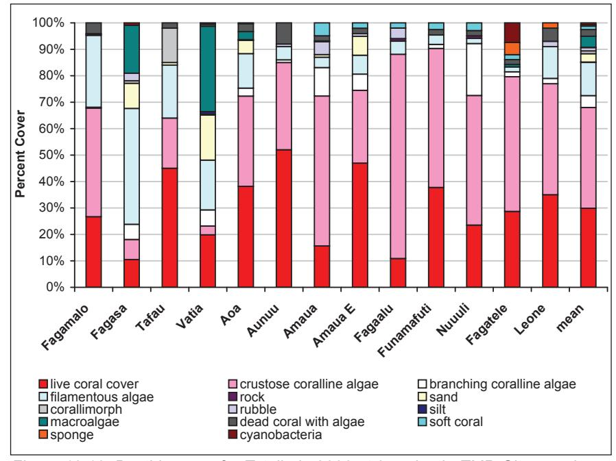

Figure 10.16. Benthic cover for Tutuila in 2006 at 9 m depth, TMP. Sites are in sequence clockwise around the island, beginning with Fagamalo on the Northwest. The leftmost five sites are on the north side of the island, the remainder on the south (Aunu'u is a separate small island in the southeast). The mean is shown on the far right. Source: Fenner and Carroll, in review.

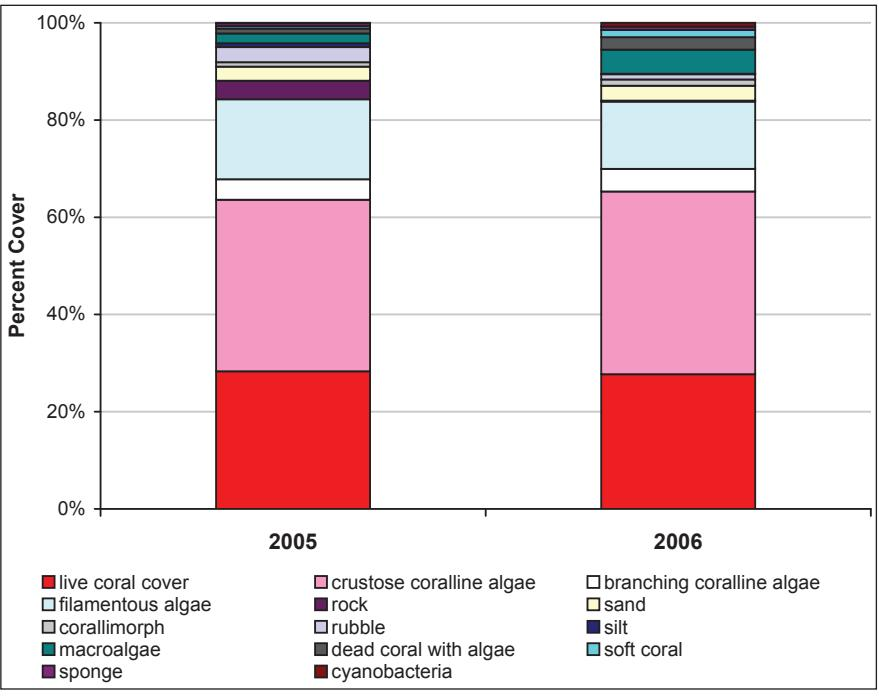

Figure 10.17. Trends in mean benthic cover for Tutuila from 2005 to 2006 at 9 m depth at the 11 core TMP sites. Source: Fenner and Carroll, in review.

data, despite differences in monitoring site locations. It is apparent that these findings are general to the entire island. Coralline algae thrive best in environments devoid of other algae and sediment (Dawson, 1961; Steneck, 1997; Fabricius and De'ath, 2001). Due to the prevailing easterly winds and orientation of Tutuila, southern reefs experience more wave action that flushes sediments from nearshore areas, providing conditions conducive to the development of CCA.

At many reef slope sites, visible CCA dominate the shallow water, but *Halimeda* calcareous green macroalgae often dominate the substrate between corals lower on the slope. The division between these two zones can be fairly abrupt, occurring over just a few meters. The dividing line in the north appears to be at a shallower depth than in the south; for example this division is apparent at about 5 m depth at Vatia in the north, while at Amaua and Fagaalu in the south the division occurs at about 12 m. It appears that the greater wave surge on the south allows visible CCA to extend into deeper water. It is possible that CCA species that are tolerant of turf algae and sediment may be present under the uppermost biotic

layer but were not detected by these methods which focus on the visible biotic cover.

Encrusting corals dominate the coral lifeforms at the 11 TMP sites, and were followed in abundance by branching, massive and table corals. Other lifeforms were uncommon. Most monitoring programs have noted the dominance of encrusting corals on Tutuila reef slopes. An encrusting coral in the genus Montipora, which is presently being identified to species, was the most common coral species in TMP transects at 9 m around Tutuila, followed by Porites rus, Lobophyllia hemprichii, and Pavona varians (Figure 10.19); P. varians is encrusting and P. rus colonies are usually plates and/or columns. L. hemprichii is submassive and dominates large areas on the southeast side of Tutuila, but is rare elsewhere.

There was a mean of 17.9 coral species per transect in 2006, with a range of 9-29 species. A total of 77 coral species were found along transects at the 11 TMP sites. In roving biodiversity surveys, coral species richness averaged 72 species in 2006, with a range of 62-84 species. A total of 147 coral species were found in 11 biodiversity dives. Encrusting *Montipora* sp. was the most common species followed by *Pavona varians*. The order is slightly different from that in transects, probably due to the greater depth range surveyed in roving biodiversity surveys.

Qualitative observations have also been recorded at TMP sites around Tutuila. Sites on the north side of the island have visible CCA in shallow water which does not extend into deeper water, and a mixed coral community in deeper water. Sites on the south side show two main patterns, mixed coral and coralline algae at all depths, and mixed coral and coralline algae in shallow water with *Mycedium* plates and *Halimeda* algae in deeper water. At a few sites there are monospecific stands of particular species in shallow or medium depths.

The TMP also measured benthic cover on reef flats and compared outer and inner reef flats. Higher coral cover, turf and slightly higher visible CCA was found on the outer reef flat, and more rubble, sponge and sand on the inner reef flat. Outer reef flat averaged 21% coral cover, and inner reef flat averaged 7% coral cover. The reef crest has striking zonation at Nuuuli and at some other sites (e.g., Matuu). In 2007, the Nuuuli reef flat had little living coral and areas in which CCA had been killed by extreme low tides. Approaching the crest, a narrow black band

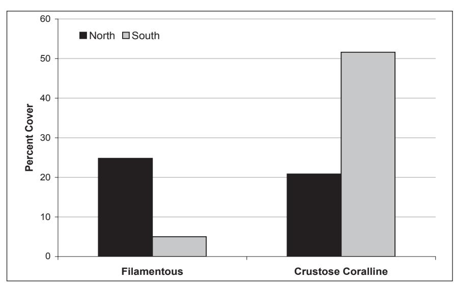

Figure 10.18. Filamentous and crustose calcareous algae cover on north and south sides of Tutuila at 9 m depth in 2006. Source: Fenner and Carroll, in review.

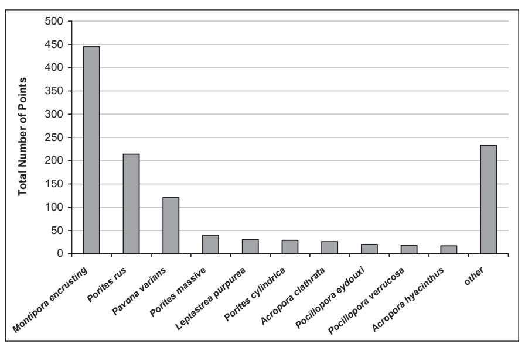

Figure 10.19. Coral species in TMP transects at 9 m depth. Source: Fenner and Carroll, in review.

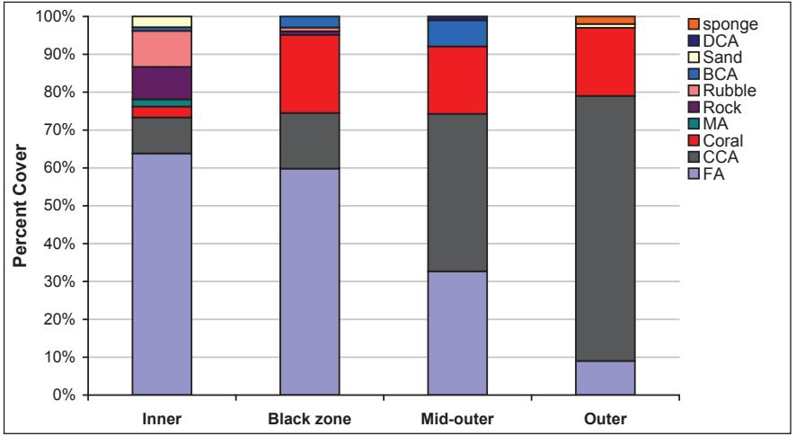

Figure 10.20. Nuuuli reef crest zonation as recorded during TMP surveys in 2007. DCA=dead coral with algae; BCA=branching coralline algae; MA=macroalgae; FA=filamentous algae. Source: Carroll and Fenner, unpub. data.

dominated by turf algae was visible, and the outer crest was dominated by living CCA with a few species of small branching corals. Figure 10.20 depicts the increase in CCA and decrease in turf algae as distance from the crest increased.

In 2007, a recruitment pulse of the table coral *Acropora hyacinthus* was observed at several sites around Tutuila, from the outer reef flat down to about 4 m depth. Recruits ranged from about 5 to 20 cm diameter, and were 1-4 cm tall. They all appeared to be from a single recruitment event, perhaps about two years earlier. If they survive, they may considerably increase coral cover at some sites and may even become dominant in a few areas. Table corals were a major component of reef communities in American Samoa before the COTS outbreak in 1978 and can form a climax community due to their ability to outcompete other corals and avoid contact with mesenterial filaments, sweeper tentacles and sweeper polyps.

Reefs in Pago Pago Harbor have been dredged, filled or built over, and subjected to a variety of other disturbances, such as nutrients from the canneries and sediment runoff. Small areas of excellent reef flat that appear undisturbed remain near the mouth of the harbor at Utelei and Onosesopo. Transects were run on outer reef flats at these two locations and other locations farther inside the harbor, and on a rock wall in Fagatogo. Observations were also made at locations farther inside the harbor. Coral cover was very high near the mouth of the harbor, but decreased to zero near the head of the harbor (Figure 10.21).

Small oysters, *Sacrostrea cucculata*, form a band on hard surfaces in the intertidal zone in the harbor. They show the opposite gradient, with high densities near the head of the harbor and low densities at the mouth of the harbor. Oysters are filter-feeding bivalves,

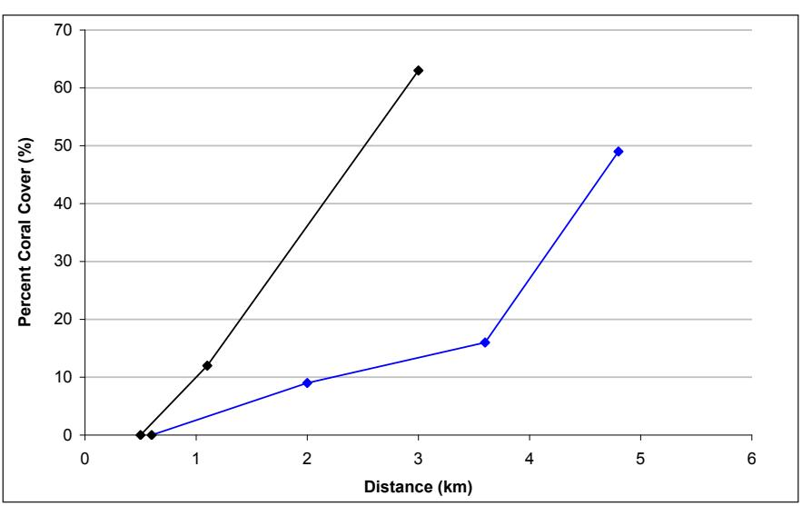

*Figure 10.21. Coral cover on reef flats in the harbor by distance from the head of the harbor; left line south side (black), right line north (blue). Source: Carroll and Fenner, unpub. data.*

and may be a good bioindicator for plankton populations. Secchi disc readings in the harbor show a gradient with turbid, green water near the head of the harbor, and clear, blue water near the mouth of the harbor. Recently, there have been large algae blooms in the water at the head of the harbor, turning the water reddish brown. The blooms were produced by the dinoflagellate, *Ceratium* cf. *furca* (identified by Fred Brooks), and do not appear to be toxic. The turbid water and dinoflagellate blooms near the head of the harbor are likely to be bioindicators of nutrient input into an area with little flushing to the open ocean. Mayor's (1924) pioneering paper indicated that coral reefs extended to near the head of the harbor a hundred years ago. However, it appears that conditions are presently not conducive to coral growth there.

#### *Bleaching*

Bleaching has been monitored by the TMP in two back reef lagoon pools on Tutuila from December 2003 to the present. The percentage of colony surface with signs of bleaching of staghorn corals (three species of *Acropora*) in two back reef lagoon pools on Tutuila (Airport and Alofau) were estimated based on hour-long timed swims every 2-4 weeks, beginning in December 2003. Incidental observations were also made on reef slopes.

Bleaching has been recorded in back reef pools in *Acropora* every summer starting in 2004, but only scattered light bleaching of *Montastrea curta* and *Pocillopora* spp. has been seen on reef slopes, and only in 2005 and 2007. The back reef pools are dominated by *Porites cylindrica* and the staghorn *Acropora muricata* (=formosa), with the staghorns *A. pulchra* and *A. nobilis* less common. All *Acropora* species were observed to bleach in the pools, plus *Millepora dichotoma*, and one small patch of *Porites cylindrica*. Temperature loggers placed in some of the back reef pools revealed maximum temperatures of about 32o C reached for a half hour in most of the pools, but one (Fagaitua) reached a maximum of 34.9o C for half an hour one day in 2005. Staghorns there were mildly bleached at the time. Satellite SST measurements, which are produced globally on a 0.5 degree grid twice each week by NOAA's Coral Reef Watch, were approximately 30o C at that time. The course of bleaching in the Airport pool and ocean SST's can be seen in Figure 10.6. There is a striking correlation between the two. Reports of mass bleaching in 2002 and 2003 plus the presence of dead staghorns suggest that staghorns in the back reef pools have bleached every summer since at least 2002, and possibly earlier. A three-week stormy period with lowered temperatures and light produced a notch in the curve for 2006 on February 15. The staghorns are now spending as much time bleached as unbleached, but there has been little colony mortality in the last four years. On Ofu, the natural lagoon pools regularly reach high temperatures midday at low tide on sunny days, yet a high diversity of corals live there (Craig et al., 2001). Ongoing research is being completed to investigate coral survival in such extreme temperatures (C. Birkland, L. Smith and D. Barshis, personal comms.).

#### *C oral D i s eas e M oni t ori ng Program ( C D M P)*

This program monitors seven sites around Tutuila annually, with two 25-m tapes laid on depth contours at 5-18 m, with most at 6-10 m. Data collection began in 2004. Benthic categories are recorded with the point-intercept technique. Similar transects were conducted in the Ofu back reef pools in 2005 and on six sites on reef slopes around Ofu-Olosega in 2006 (Aeby et al., 2006).

#### *Results and Discussion*

The CDMP found 37.4% coral cover on Tutuila, 16.8% coral cover on Ofu-Olosega, 32.6% CCA cover on Tutuila and 48.6% CCA cover on Ofu-Olosega in 2006. The disease monitoring program has recorded CCA cover over time, and when combined with historical records from Birkeland et al. (1987), shows a decrease in CCA over time (Figure 10.22). Sites within Fagatele Bay show the same trend, and each of seven sites in the disease monitoring program show the same trend, as does the PIFSC-CRED program from 2004 to 2006.

# *D M W R ' s K ey R eef S p ec i es Program*

This program conducts annual monitoring at 24 permanent sites around Tutuila. The benthic assemblage is recorded from four replicate 30 m benthic transects at 10 meters depth using an underwater video taken 0.5 m from the bottom. Fifty frames are grabbed from each transect and benthic cover is identified to functional categories at 12 randomly assigned points per frame (Sabater and Tofaeono, 2006).

# *Results and Discussion*

Hurricanes generally impact the north shore of Tutuila more intensely than the south side. On the south side, fringing reef is nearly continuous and found on both points and in bays (NOAA, 2005). On the north side, fringing reefs are found only in bays and not on points. The TMP currently only monitors reefs in bays, and not communities on points, but the KRSP monitors points, as well as bays. Points have communities of scattered small corals on basalt, generally with no carbonate accumulation, except in deep water. KRSP data shows that coral

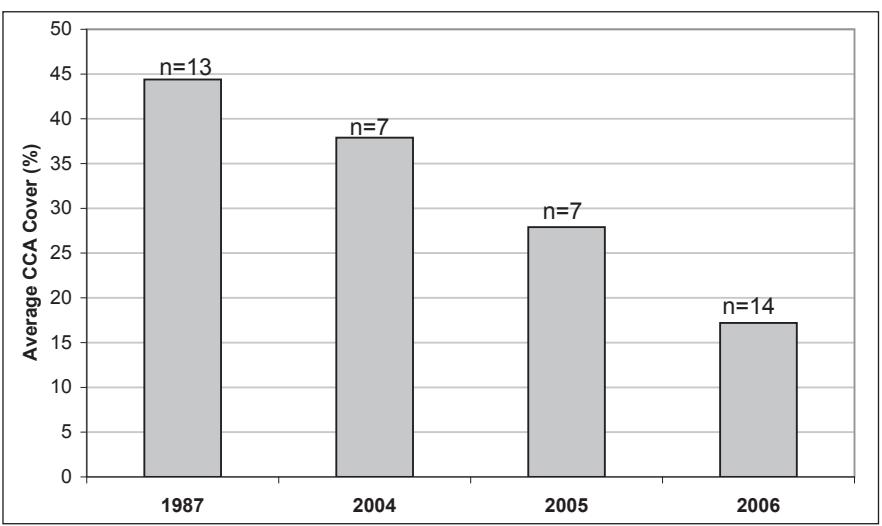

*Figure 10.22. CCA cover averaged for Tutuila sites, over time. The number of sites is indicated above each bar. Source: CDMP and Birekand, 1987.*

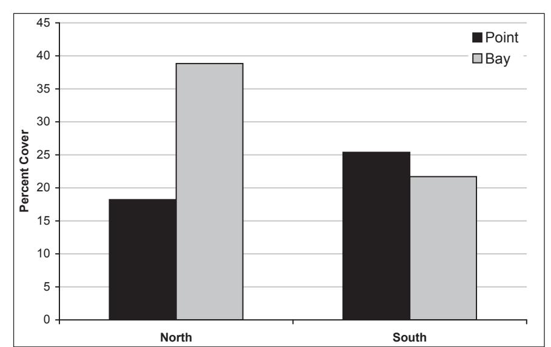

*Figure 10.23. Coral cover compared between bays and points on the north side and south side of Tutuila in 2005, KRSP. Source: Sabater and Tofaeono, 2006.*

cover is higher in bays than points on the north side, but does not differ between points and bays on the south side (Figure 10.23). It is likely that hurricanes remove corals from points on the north side, allowing reef accumulation only in bays, as in Hawaii (Grigg, 1998).

#### *R eef A s s es s ment and M oni t ori ng Program of t h e C oral R eef E c os ys t em D i v i s i on ( PI FS C - C R E D )*

This program records benthic data on each island in American Samoa biannually, starting in 2002 and with increasing numbers of sites over the years (a total of 62 sites in 2006). At each site, two 25-m tapes are laid at 12-15 m depth, and benthic cover recorded using the point-intercept method (Brainard et al., in review). Coral disease prevalence was also recorded based on a methodology developed, tested and implemented in the NWHI by G. Aeby (Friedlander et al., 2005).

Quantitative algal monitoring continued during 2006 in an effort led by PIFSC-CRED and supported by several partner agencies in American Samoa. Twenty-two sites were surveyed around Tututila, 18 sites were surveyed around the Manua islands, 10 sites were surveyed at Rose Atoll and eight sites were surveyed at Swains Island. Continued use of the algal monitoring protocol established in 2003 (Preskitt et al., 2004) assured uniformity of data sets for statistical analyses.

#### *Results and Discussion*

Figure 10.24 shows benthic cover from the PIFSC-CRED program for all the islands of American Samoa. As can be seen in the figure, on most islands CCA had the highest cover, followed by coral. Coral cover was highest on Swains, lowest on Rose, and intermediate for Tutuila, Ofu-Olosega and Tau. CCA was lowest on Tau and Swains.

The PIFSC-CRED program records the genera of corals on each island, as shown in Figure 10.25. *Montipora* is the most important genus on most islands and shows a slight decrease towards the east in the archipelago. Rose and Swains, the two old, low atolls, have much higher abundances of *Pocillopora* than the young high volcanic islands. The number of genera of coral is also recorded by PIFSC-CRED for each island. Figure 10.26 shows the number of genera on each island. The two old low islands, Swains and Rose, have much lower coral generic diversity than the young high islands.

Of the 62 sites visited, 38 (61%) revealed disease, and five disease states were enumerated: bleaching, skeletal growth anomalies, tissue loss/white syndrome, black band disease and "other lesions" (including algal irritations and hyperpigmentations). Diseases were observed on 14 coral genera, with *Montastrea*, *Favia*, *Montipora*, *Porites*, *Astreopora* and *Acropora* exhibiting the greatest frequency of occurrence (93% of cases), while *Favia*, *Coscinaraea* and *Leptoria/Platygyra* showed the greatest disease prevalence. Rose Atoll exhibited both the greatest occurrence of coral disease (67% of cases) as well as the highest mean overall prevalence (0.99 ± 0.6%; mean ± SE). Two northerly fore reef sites exhibited the greatest overall prevalences values (4.2 and 4.9%). This was due to a large number of cases of "other lesions" mainly on colonies of *Montastrea* cf *curta* and *Favia stelligera*. Other coral lesions at Rose involved bleaching, growth anomalies, and white syndrome; the above mentioned diseases were detected on colonies of *Pocillopora*, *Astreopora* and *Acropora*, respectively (Figure 10.9).

Of sites visited around Tutuila, fifty-five percent contained disease. The overall mean prevalence for the island was 0.13 ± 0.04%. Three north and northwestern sites exhibited the greatest prevalence of disease (range 0.1–0.27%). Overall, the most common disease state was "other lesions" par-

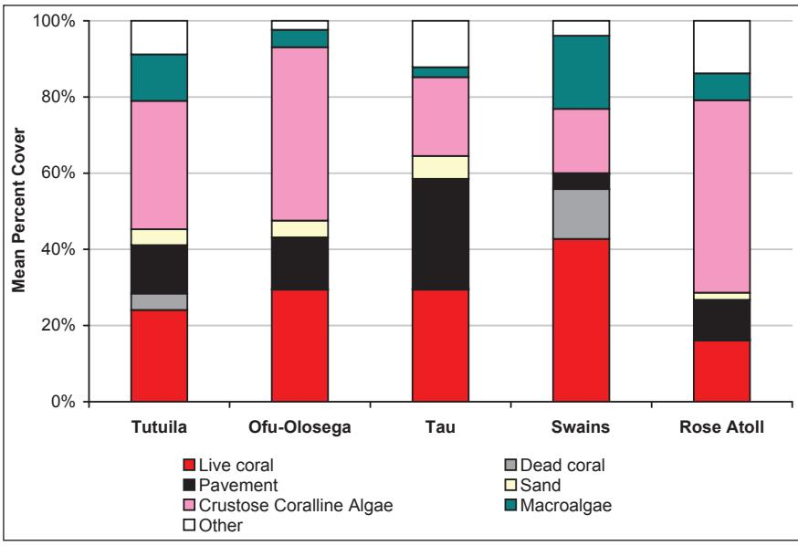

*Figure 10.24. Benthic cover on each of the islands of American Samoa in 2006. Source: Brainard et al., in review.*

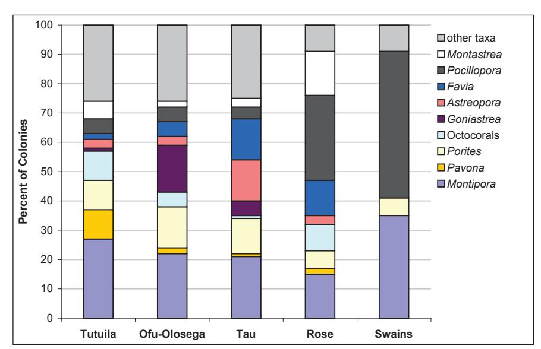

*Figure 10.25. Coral genera by island in 2004. Source: Brainard et al., in review.*

ticularly algal irritations with pigmentation responses (48%), which was observed predominantly on *Montipora* and *Porites*, but also *Astreopora* and *Leptoria*. Skeletal growth anomalies were the second most common type of lesion (31%), with prevalence values as high 0.24% at a northerly site west of Massacre Bay. Skeletal growth anomalies were mainly detected on *Acropora abrontanoides*, but also on *Astreopora*, and *Favites*. Other types of coral disease states present around Tutuila included mild bleaching, white syndrome (all cases on colonies of *A. cytherea*), as well as one case of black band disease on *Porties* cf. *lobata* (Figure 10.27).

Mean overall disease prevalence at Ofu-Olosega amounted to 0.06 ± 0.03% with mild, focal bleaching and growth anomalies being the only two afflictions observed to affect corals within the 12 sites visited (Figure 10.9). Prevalence of bleaching did not exceed 0.16% and was most commonly observed on *Platygyra*, *Leptoria*, *Montipora* and *Porites*. Skeletal growth anomalies exhibited a mean prevalence of 0.01% at one site only on the east-facing shore, where all cases were detected. All cases of skeletal growth anomaly occurred on colonies of *Acropora abrontanoides*.

Of the nine sites surveyed at Tau, eight (89%) contained disease. Overall mean prevalence was 0.1 ± 0.03%, and diseases were detected at all sites, except one location on the north-facing shore. Skeletal growth anomalies were the most prevalent disease state (range: 0.02–0.24%) with *Astreopora* and *Montipora* exhibiting the totality of cases. Mild, focal bleaching was also detected at Tau with low mean overall prevalence (0.03%) and affected *Monitpora*, *Porites*, *Pocillopora* and *Montastrea*. Finally, the estimated mean overall prevalence for Swains amounted to 0.04 ± 0.03%. Only growth anomalies, other lesions and bleaching were detected on Swains. Growth anomalies and other lesions were observed on *Porites* spp., and bleaching was observed on *Fungia*.

Although disease states are observed on corals in the American Samoa archipelago, prevalence values are comparable to the Hawaiian archipelago and Pacific Remote Island Areas (PRIA). PIFSC-CRED surveys indicated that patterns of disease distribution and abundance varied considerably within and among islands. Patterns of disease occurrence and prevalence across the coral taxa also indicated that a few genera may be disproportionately targeted by disease, suggesting that the ecological impacts of disease may be more severe in populations of uncommon or rare corals.

PIFSC-CRED currently has two analyses underway for algal data from American Samoa. In the first, spatial and temporal variability of the relative abundance of macroalgae (RAM) at the genus level was examined at all islands between 2004 and 2006. Crustose calcareous red algae, turf algae and the chlorophyte Halimeda were ubiquitous, while other algal genera were representative of specific locales. The chlorophyte *Microd*ictyon was only found at Rose and Swains, and the siphonous green alga Rhipilia only occurred at Swains. Tutuila showed the highest macroalgal diversity, likely because of higher habitat diversity. RAM varied noticeably among sites at a single island, also likely because of habitat diversity. RAM also varied temporally between 2004 and 2006, especially at Tau, Rose and Swains. This temporal change resulted from hurricane effects in 2005, as well as to the continued decrease in pollution after the cleanup of a shipwreck at Rose Atoll. In the second ongoing analysis, similarities in benthic community populations among sites from Rose Atoll will be spatially and temporally compared using multivariate statistical analysis.

Figure 10.28 shows the relative abundance of the different algal genera on each of the islands, for 2004 and 2006. CCA declined in relative abundance on all three of the high islands from an average of 33% to 20%, but not on the atolls.

An article appearing in *American Scientist* (Vroom et al., 2006) compared percent cover of macroalgal, turf algal, crustose calcareous algae and coral populations at eight islands across the Pacific, including Swains Island and Rose Atoll from American Samoa. Of all islands sampled, Swains Island exhibited the highest percent cover of live coral colonies in conjunction with some of the highest macroalgal populations. Rose Atoll was notable for containing the highest percent cover of red crustose calcareous algal populations, a historically noted phenomenon that gives the island its name.

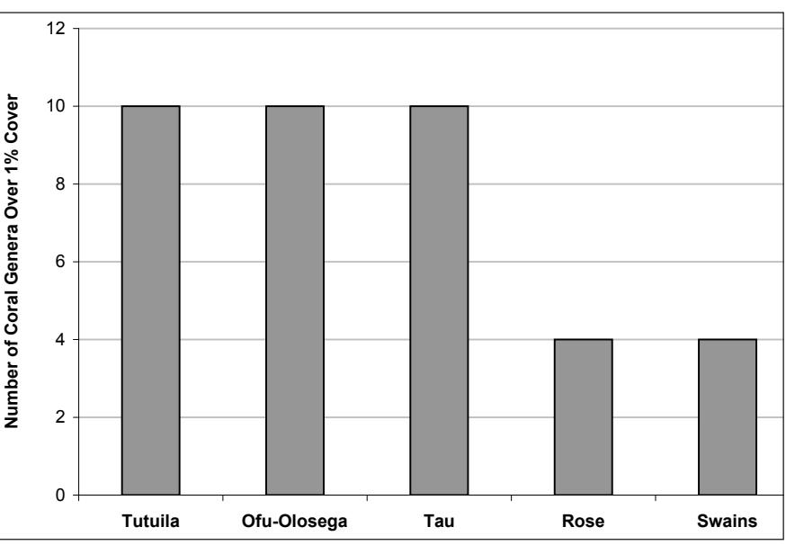

Figure 10.26. Number of coral genera accounting for >1% cover by island in 2004. Source: Brainard et al., in review.

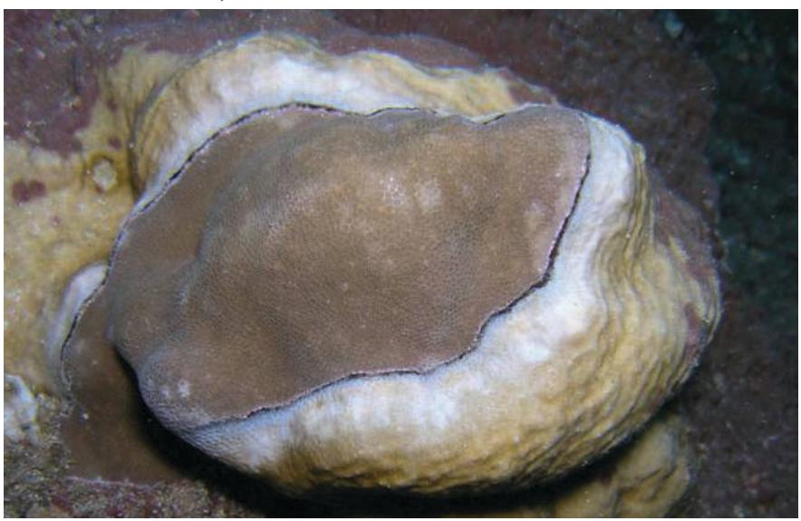

Figure 10.27. Black band disease on Porites at a northwest fore reef site on Tutuila. Photo: B. Vargas-Angel.

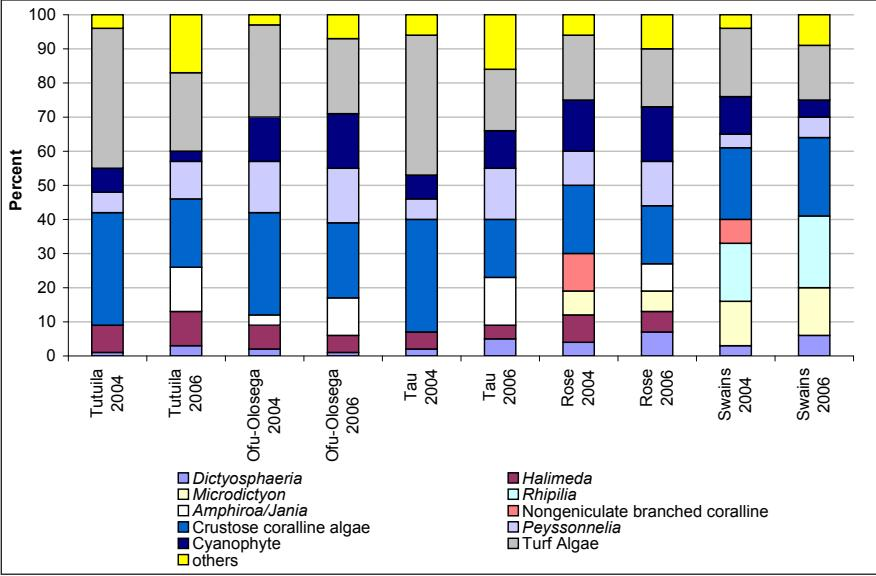

Figure 10.28. Relative abundance of algal genera by island in 2004. Source: Brainard et al., in review.

# Coral Reef Biological Criteria Monitoring of the American Samoa Environmental Protection Agency

This study monitors sites on Tutuila annually, beginning in 2003 with six sites. In 2005 two of those sites were repeated and six additional sites surveyed. At each site video is recorded of three belt transects 0.5 m wide and 50 m long at 9-11 m depth. Benthic cover is recorded under six randomly placed dots on a still image every five seconds on the tape (Houk et al., 2005).

#### Results and Discussion

This study found an average of 24.3% live coral cover, 47.2% CCA, 12% turf and 8.6% macroalgae in 2007 (see Water Quality Section for more discussion of this study).

#### Long-Term Monitoring Program of the Fagatele Bay National Marine Sanctuary

This program surveys benthic communities in Fagatele Bay National Marine Sanctuary in a 30 m long transect on a depth contour, with substrate cover recorded on a point each 2 m, and also at one point 2 m to each side of the transect line, in 2004. This was done at 3, 6, 9, 12 and 18 m depths at four sites, and 9 and 12 m at two additional sites (Green et al., 2005). In 2002, the program expanded surveys to sites throughout the volcanic islands of the territory (Fisk and Birkeland, 2002; Green, 2002) and recorded sizes of corals in seven logarithmic size categories within 0.5 m x 20 m belt transects in 2002 (Fisk and Birkeland, 2002).

#### Results and Discussion

Depth zonation at some sites appears to be fairly strong, with visible CCA in shallow water and *Halimeda* green macroalgae in deeper water. The only study to investigate depth zonation quantitatively was Green and Mundy (2005) in Fagatele Bay. Fagatele Bay is unusual in that the reef does not end in a shelf but rather continues into deeper water. Figure 10.29 shows benthic cover by depth from the Green study. Coral cover did not vary with depth, and CCA decreased only at the deepest survey sites (18 m).

Survey results from each of the volcanic islands in 2002 are summarized in Figure 10.30. Aunuu was found to have a higher coral cover than Tutuila, an observation supported by the TMP as shown in Figure 10.30. Green (2002) had three sites on Aunuu, while the TMP only had one. Ofu-Olosega had much lower coral cover than Tutuila, Aunuu, Ofu Lagoon and Tau.

Fisk and Birkeland (2002) repeated the measurements of coral colony sizes that Mundy (1996) made on Tutuila, Ofu-Olosega and Tau. The average colony size increased during the 1995-2002 period on Tutuila (Figure 10.31) and Tau, but decreased on Ofu-Olosega (Figure 10.32). These trends can be seen in their data for most individual sites as well. Fisk and Birkeland (2002) point out that the corals of Tutuila and Tau were recovering from Hurricane Ofa in 1990 and Hurricane Val in 1991. This could explain why colony sizes were increasing there. They also point out that Ofu-Olosega had a moderate chronic infestation of COTS during this period (D. Fisk, pers. comm.) and suggest that because small parts of targeted colonies often remained following COTS predation on a colony, their feeding patterns reduced the number of larger colonies and increased the number of small colonies.

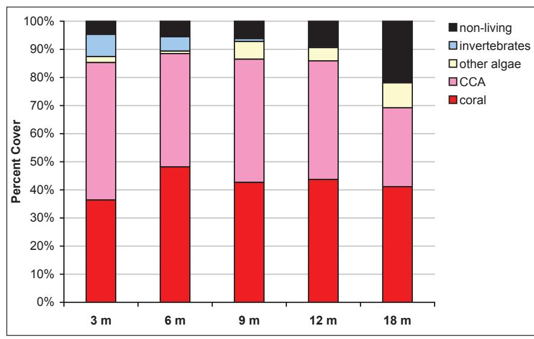

Figure 10.29. Benthic cover by depth at Fagatele Bay. Source: Green and Mundy, 2005.

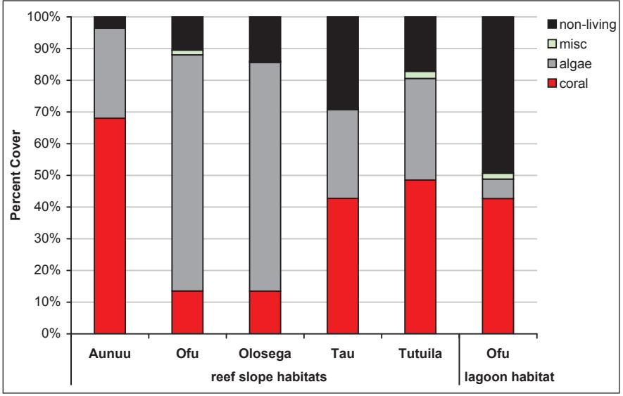

Figure 10.30. Benthic cover on the volcanic islands of American Samoa. Source: Green, 2002.

#### Reef Flat Surveys

Reef flats and back reef pools were surveyed in 2003 as part of a master's thesis by Andrews (2004). Five 25-m tapes were laid and benthic cover recorded with the point-intercept technique at each of 11 sites. In another study, reef flats/pools were surveyed at Ofu Village, Toaga on south Ofu, and Olosega Village in 2006 by Garrison et al. (2007). Substrate categories were recorded using the point-intercept method, with tapes laid perpendicular to shore from crest to shore.

#### Results and Discussion

Andrews (2004) found that coral cover varied greatly by location as shown in Figure 10.33, but averaged about 45%.

In the study by Garrison et al. (2007) three sites on Ofu-Olosega were studied, and benthic cover was found to be composed primarily of turf (filamentous) algae, rock and rubble, with live coral cover of 6-23%.

#### Comparisons and Conclusions

Several different programs have recorded benthic cover on the reef slopes of Tutuila in recent years. These studies differ considerably in their objectives, methods and site locations. For instance, TMP uses point-intercept while KRSP uses video, and these two programs have no sites in common. In spite of these differences, the two programs produced very similar means for percent coral cover (Figure 10.34). Some differences between the results of different programs result from the use of different categories for recording benthic cover. In particular this applies to differences in categories used for algae. Nevertheless, there appears to be broad agreement that CCA is an important benthic component, and that live coral cover averages about 22-34%. The mean live coral cover for these six studies was 28%. The SPC PROCFish program reported an average live coral cover on reef slopes of 25% for 27 sites in six South Pacific countries (SPC, 2005). The Main Hawaiian Islands have an average of 20.8% coral cover (Friedlander et al., 2005), fore reef sites in the NWHI averaged 28.2% (Friedlander et al., 2005), the Federated States of Micronesia averaged 30% (Hasurmai et al., 2005), the Marshall Islands averaged about 62% (Pinca et al., 2005) and the Commonwealth of the Northern Mariana Islands averaged 21%. Bruno and Selig (2007) reported average cover for the South Pacific of about 23–24%, and for the Indo-Pacific from Indonesia to French Polynesia of 22.1%. Thus mean live coral cover on Tutuila was higher than in most other areas in the region.

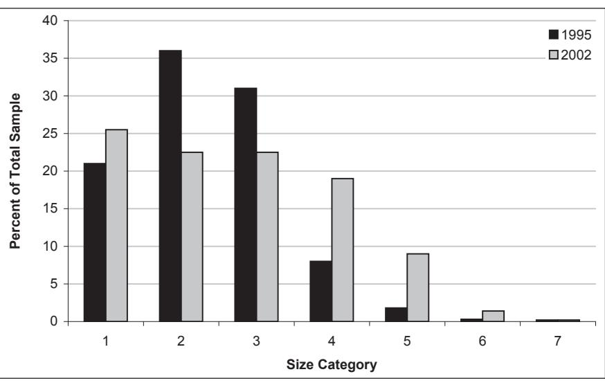

Figure 10.31. Coral colony size distributions for all coral species for 1995 and 2002 for Tutuila Source: Fisk and Birkeland, 2002; Mundy, 1996.

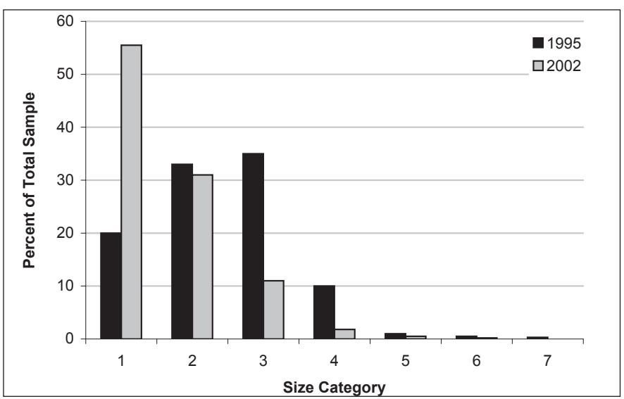

Figure 10.32. Coral colony size distributions for all coral species for 1995 to 2002 for Ofu-Olosega. Source: Fisk and Birkeland, 2002; Mundy, 1996.

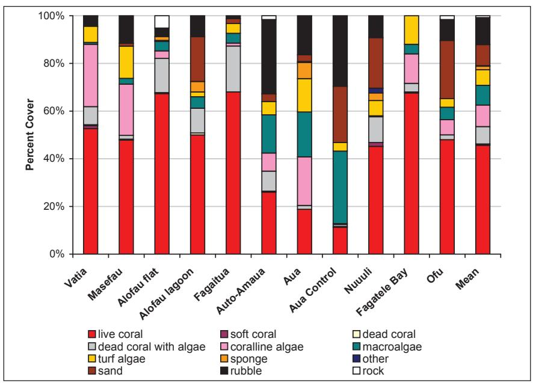

Figure 10.33. Benthic cover on reef flats of Tutuila. Source: Andrews, 2004.

The differences between Ofu-Olosega and Tutuila were much smaller in the PIFSC-CRED study than reported by Green (2002) or the CDMP. Green's study found that Tutuila had nearly 50% coral cover in 2002, while the PIFSC-CRED program found only about 23% cover in 2006. The first is higher than other studies have found, and the second was lower. It is not clear whether this is due to selection of different sites or to changes over time. The Green study also reported a higher coral cover on Tau than the PIFSC-CRED study. On the other hand, the Green study reported a much lower coral cover on Ofu-Olosega than the PIFSC-CRED study. This difference is likely a result of temporal changes and reflects a real increase in coral cover as the reefs recovered from chronic COTS predation.

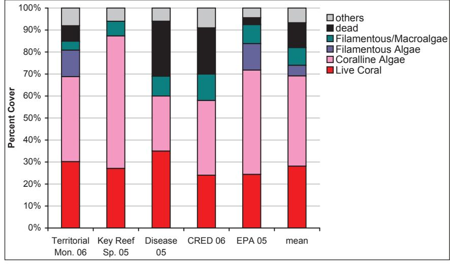

*Figure 10.34. Benthic cover on reef slopes of Tutuila reported by five studies. Sources: Fenner and Carroll, unpub. data; Sabater and Tofaeono, 2006; Aeby et al., 2006; Brainard et al., in review; Houk, 2005.*

The reefs of American Samoa are notable for having relatively abundant CCA. CCA grow best when they are clean of sediment and other algae. In American Samoa, CCA are most abundant near the reef crest (outer reef flat and the upper reef slope) most likely because the wave surge near the crest keeps them clean of sediment. In addition, fish populations in these habitats are dominated by herbivorous fish that keep CCA surfaces clean of overgrowing algae. For most of the year, wave surge is greater on the south side of Tutuila than the north, and this may explain why visible CCA extend farther down the reef slope and are more abundant on the south side than the north. Some coralline algae attract coral larvae to settle, so the large amounts of coralline algae may have aided coral recovery following the COTS outbreak of 1978 and hurricanes in 1990 and 1991. Two studies (CDMP and PIFSC-CRED) have found declining populations of CCA, but another (TMP) found no decline. A decline in CCA may be a cause for concern, depending in part on what replaces it. It appears that the coral populations on Ofu-Olosega are still recovering from moderate but persistent predation by COTS, which now appear to be near background levels. In several ways (e.g., coral and algal genera; invertebrates) the two atolls, Rose and Swains, stand out as different from the high volcanic islands. Although they are much older, it seems more likely that runoff from high islands and/or the presence of people may be responsible for differences between the high islands and the atolls.

# **ASSOCIATED BIOLOGICAL COMMUNITIES**

# *S t at us of C oral R eef Fi s h Pop ulat i ons : Fi s h ery- I nd ep end ent E c ologi c al S urv eys and M oni t ori ng*

Quantitative assessment of coral reef fishes began in American Samoa as early as 1977 when Wass (1982) conducted a study on the community structure of reef fish at 63 sites around the island of Tutuila. Since that time, a number of other fishery-independent surveys involving underwater visual census (UVC) have been conducted by various local agencies, as well as by visiting off-island researchers. Starting in 2005, regular annual monitoring of reef fish populations has been conducted under the TMP (with funding from NOAA's National Coral Reef Ecosystem Monitoring Program) and the Key Reef Species Program, both of which are located within the DMWR. PIFSC-CRED began conducting biennial surveys around all islands of American Samoa in 2002, and the results are presented separately below.

With the exception of PIFSC-CRED data, all available data from the various studies were compiled in order to review, compare and describe the current status of coral reef fishes in American Samoa. Table 10.7 shows the various field methods used to collect data including the types of methods used, the number of sites surveyed, the number of replicates per site, and the transect dimensions.

Studies which employed UVC techniques predominantly used belt transects to document diurnal non-cryptic fish assemblages, although transect dimensions varied in length and width. Some programs also targeted specific assemblages while others were more inclusive. For example, the TMP focuses on all diurnal reef fishes while ignoring nocturnal and cryptic species; Page (1998) focused on parrotfishes; and the Key Reef Species Program monitors only fish species that are targeted as a food source in American Samoa. Also, while some programs examined temporal trends in fish abundance and biomass (Green, 2002; Green et al., 2005; Fenner and Carroll, in review), others focused on spatial patterns (Wass, 1982; Green, 1996; Sabater and Tofaeono, 2006, 2007).

#### *Variation in community composition over time*

The reef fish community structure study conducted by Wass from 1977-1979 showed relative dominance (biomass and abundance) of damselfish (Pomacentridae), surgeonfish (Acanthuridae) and parrotfish (Scaridae) for most sites and habitat types around Tutuila (Wass; 1982, unpub. manuscript). The bristletooth surgeonfish (*Ctenochaetus striatus*) was the

Table 10.7. Fishery-independent surveys conducted in American Samoa from 1977 to 2007. Source: DMWR.

| STUDY                                                   | PROJECT                                                      | YEAR          | AVAILABLE DATA                                                       | METHOD USED                  | DEPTH               | # OF SITES   | REP'S/ SITE | TRANSECT/ SURVEY DIMENSION                                             |
|---------------------------------------------------------|--------------------------------------------------------------|---------------|----------------------------------------------------------------------|---------------------------------|---------------------|-----------------|----------------|------------------------------------------------------------------------------|
| Wass (1982)                                          | Fish community characterization                              | 1977- 1979 | Abundance, biomass, and species composition of diurnal fish          | Belt transect                   | 4-15 m a | 63              | 1 5         | 100 x 2 m b 20 x 2 m                                           |
| Green (1996)                                         | Status of coral reefs of the Samoan archi-                   | 1996          | Abundance, biomass, and species composition of                       | Belt transect                   | 1,5,10,20 m      | 18              | 5              | 50 x 3 m                                                                     |
| Green (2002)                                         | pelago                                                       | 2002          | diurnal fish                                                         | Belt transect                   | 10 m                | 18              | 5              | 50 x 3 m                                                                     |
| Page (1998)                                          | Ecology, biology and fishery of parrot-fishes                | 1996- 1998 | Abundance, biomass, species composition,                             | Belt transect                   | 3,10,20 m           | 26              | 5              | 50 x 5 m                                                                     |
| Green et al. (2005)                                  | Fagatele Bay National Marine                              | 1977- 2004 | Abundance, biomass, and                                              | Belt transect                   | 12,6,9m°            | 3               | 3              | 100 x 2 d                                                         |
| (2003)                                                  | Sanctuary Monitor- ing Program                            | 2004          | species composition of diurnal fish                                  |                                 | 3,6,9, 12,18 m   | 1               | 6              | 30 x 2 m                                                                     |
| PIFSC- CRED                                          | American Samoa Reef Assessment                            | 2002- 2006 | Abundance, biomass, and species composition of                       | Belt transect                   | 10-15 m             | 76 f | 3              | 25 x 4 m g ,                                                      |
| ongoing                                                 | and Monitoring Program                                    | 2000          | diurnal fish                                                         | Stationary point count          | 10-15 m             | 76 f | 4              | 25 x 2 m h                                                        |
|                                                         |                                                              |               |                                                                      | Towed-diver survey j | 15 m                | n/a             | n/a            | 10 m radius n/a                                                           |
| Whaylen and Fenner                                      | American Samoa Territorial Monitoring Program (ASCRMP) | 2005          | Abundance, biomass, and species composition of diurnal fish          | Stationary point count          | 10 m                | 11              | 6              | 7.5 m radius                                                                 |
| (2006); Fenner and Carroll ( <i>in</i> review) | Program (ASCRIVIP)                                           | 2006          | ulumai iisii                                                         | Belt transect                   | 10 m                | 11              | 6              | 30 x 10 m k , 30 x 5 m l , 30 x 2 m m |
| Sabater and Tofaeono (2006)                       | Key Reef Species Program                                  | 2005          | Abundance, biomass, and species composition of targeted fish species | Belt transect                   | 10 m                | 24              | 3-4            | 30 x 5 m                                                                     |
| Sabater and Tofaeono (2007)                       |                                                              | 2006          |                                                                      | Belt transect                   | 10 m                | 20              | 3-4            | 30 x 5 m                                                                     |

- A: Depth varies depending on the habitat being surveyed
- B: Belt area varies between habitat types and transect orientation
- C: Depth shown are for Fagatele Bay, Sita Bay and Cape Larsen, respectively
- D: Transect area for years prior to 2004; later surveys used 30 x 2 m transect area E: Belt transect used for quantifying relatively small bodied and abundant fish
- F: The number of sites successfully surveyed varies between years. Numbers show total number of monitoring sites.
- G: Transect dimension used to survey fish ≥20 cm TL
- H: Transect dimension used to survey fish < 20 cm TL

- I: Stationary point count for quantifying relatively larger and agile fish species
- J: Towed-diver survey was used for quantify large bodied (>50 cm TL), wide-ranging fishes over a broad spatial scale
- K: Belt dimension used to survey highly mobile species (e,g, Kyphosidae, Scaridae, Siganidae, Lethrinidae, Serranidae, etc.)
- L: Belt dimension used to survey demersal species (e.g., Chaetidontidae, Pomacantidae, Acanthuridae, Balistidae, etc.)
- M: Belt dimension used to survey Pomacentridae including only herbivorous and excluding planktivorous species

single most dominant species and still persists as the most abundant (Green, 1996, 2002; Green et al., 2005; Whaylen and Fenner, 2006; Sabater and Tofaeono, 2006, 2007; Fenner and Carroll, in review). The overall community structure of reef fishes also does not seem to have changed drastically in the past three decades. In the late 1970s the family Pomacentridae dominated in terms of abundance while Scaridae dominated in terms of biomass, followed by Acanthuridae. Data from the latest surveys by PIFSC-CRED showed that Pomacentridae persists as the most numerically abundant family while Acanthuridae now dominates biomass, followed by Scaridae. This shift in biomass dominance from Scaridae to Acanthuridae could be attributed to the introduction of SCUBA spearfishing which targeted parrotfish, especially at night while they were sleeping. SCUBA spearfishing lasted from 1994 to 2000 and increased fishing efficiency 15 fold resulting in the removal of approximately 18.7% of the standing stock of parrotfish (estimated at 189 mt over this period; Page, 1998). Despite this increased fishing efficiency, the harvest did not exceed the maximum sustainable yield for all parrotfish species combined in Tutuila, which was calculated at 53.9 mt/ year (Page, 1998). Nevertheless, in 2001 DMWR banned SCUBA spearfishing, and the population of parrotfish has shown signs of recovery since then (Green, 2002; Green et al., 2005).

#### Variation in Abundance over Time

Wass conducted the first quantitative assessment of fish populations in American Samoa between the years of 1977 and 1979 (Wass, 1982, unpub. manuscript). This was followed by a series of surveys conducted by Birkeland et al. (2003) in the 1980s to document the impact of COTS infestation on the reefs of American Samoa. It was not until the late 1990s and the early 2000s that more regular surveys have been conducted. During the period from the late 1970s to the mid 2000s it appears that fish populations on Tutuila have remained relatively stable in terms of mean fish density, with a slight increase occurring after an initial decrease between 1985 and 1988 (Figure 10.35). These results indicate that the reef

fish populations of American Samoa are somewhat resilient as a number of disturbances have occurred throughout this time, including a major COTS outbreak in the early 1980s, hurricanes in the early 1990s and 2000s, subsequent declines in overall coral cover from 60% to 30%, and the occurrence of SCUBA spearfishing from 1994-2000. The data point from the year 2002 is considered an outlier due to the fact that surveys occurred during large recruitment pulses of *Ctenochaetus striatus*, which greatly biased the fish density values recorded that year.

*Historic Utilization of Fish Resources and Correlation with Present Day Preferences and Fish Community Structure*

In 1987 and 1989 an archaeological dig of faunal remains from a midden site at Toaga on the island of Ofu was conducted and is considered to be the largest fish bone assemblage from Western Polynesia (Nagaoka, 1992). This research shows what types

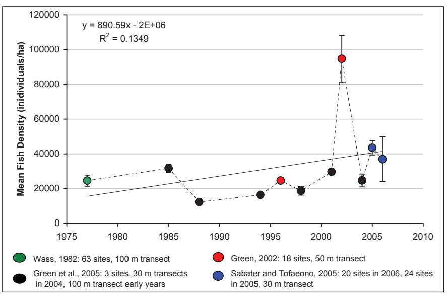

*Figure 10.35. Fishery-independent surveys conducted in American Samoa from 1977 to 2007. Data sources are listed in the graph.* 

of fish were being utilized by Samoans up to at least 3,000 years ago. The faunal remains were dominated by fish, followed by land vertebrates and shellfish. The 1987 dig showed that fish in the family Holocentridae had the most remains followed by Acanthuridae, Serranidae and Scaridae. Among the bones identified from the 1989 dig, Acanthuridae dominated the specimens recovered (with Diodontidae removed due to sampling bias) followed by Serranidae, Scaridae and Holocentridae (Figure 10.36). A number of factors affected the results, which includes sampling protocol, ecology, fishing techniques, social inputs and food preference. A correlation of present fish abundance (from underwater surveys done by Green 1996 and 2002) in Ofu with the number of identified specimen of the faunal remains for the major families showed a positive relationship (1987: r=0.580; 1989: r=0.619). This indicates present day assemblage may be similar to what was available in the fishery up to 3,000 years ago. A recent survey of Samoans indicated a strong preference for fishes in the family Acanthuridae over other fish groups (Kilarski et al., 2006), and the archaeological record suggests that this preference has persisted since prehistoric times. In contrast, the faunal composition of fish remains found in middens on the neighboring islands of Fiji and Tonga contained more parrotfish (Figure 10.36).

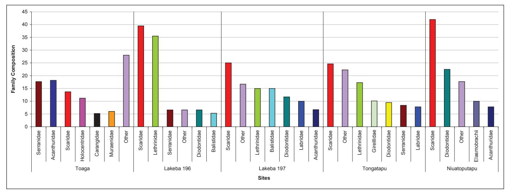

*Figure 10.36. Family composition of identified fish bone specimens from midden sites in the South Pacific. Toaga is located on Ofu in American Samoa; the other sites are located in neighboring Pacific island nations. Source: Nagaoka, 1992.*

#### *Spatial Patterns In Biomass and Abundance of Fish Populations*

Determining spatial patterns in biomass and abundance assists managers in prioritizing certain areas for specific management purposes. While the coral reefs of American Samoa represent a relatively small system, research results have shown that issues of scale still exert an important influence on the distribution, abundance and biomass of reef fishes, including those targeted for subsistence and recreational purposes. In American Samoa, variations in biomass and abundance occur at a habitat scale (covering thousands of meters) with less variation occurring at a site and transect level (Sabater and Tofaeono, 2007).

# *Island Comparisons*

Figures 10.37 and 10.38 show the density and biomass adult reef fishes from different sites at the Manua Islands as well as Tutuila in 1996 and 2002. The island group of Manua, consisting of the three small islands of Ofu, Olosega and Tau, had a slightly higher biomass and density of adult fishes compared to the main island of Tutuila in both survey years (Green, 2002), although the differences do not appear to be significant. The data also show an increase in overall fish biomass and abundance both in Tutuila and in the Manua island group between 1996 and 2002. It should be noted that for this comparison, only adult fish were considered, thus avoiding the potential bias related to the large recruitment event that occurred in 2002. The data also indicate considerable variation in biomass and density among sites in the Manua islands and Tutuila during both survey years. (See also the PIFSC-CRED write-up at the end of this section which includes a comparison of Rose Atoll and Swains Island).

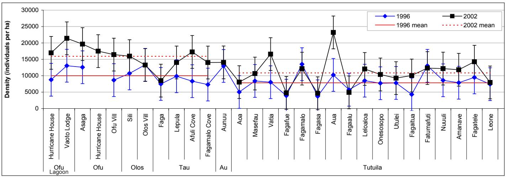

*Figure 10.37. Density (ind/ ha) of adult reef fishes in Manua and Tutuila, American Samoa in 1996 and 2002. Means were calculated separately for Tutuila and the Manua Islands. Source: Green, 2002.*

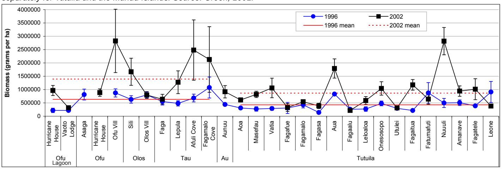

*Figure 10.38. Biomass (g/ha) of adult reef fishes in Manua and Tutuila Islands, American Samoa in 1996 and 2002. Means were calculated separately for Tutuila and the Manua Islands. Source: Green, 2002.* lag reef slope

# *North-South and Habitat Variations*

Biomass and species distribution differ between the north and south sides of Tutuila (Figure 10.39; Sabater and Tofaeono, 2006). Generally, the northern side of the island appears to have lower fish biomass than the southern side. This may be attributed to differences in the spatial extent of coral reef habitat and degree of exposure. The higher fish biomass recorded by Green (2002) and Sabater and Tofaeono (2007) on the south side of Tutuila may be related to the presence of a more extensive and well developed reef with higher bottom complexity (NOAA, 2005). The north shore, conversely, has a narrow fringing reef, which provides less habitat and shelter for fish and thus supports lower biomass and abundance.

The results of Wass' 1970s surveys show variations occur in species composition, biomass and fish density between reef flats and fore reefs, as well between fringing reefs and bank reefs. Recent research shows that despite the basalt nature of the benthos, exposed point areas generally have a higher biomass and abundance of reef fishes than embayment areas where more "true" coral reef structure occurs (Figure 10.39; Sabater and Tofaeono, 2007). It should be noted, however, that much variation occurs when comparing data from points and embayments in different sectors of Tutuila and no clear pattern is apparent and may be a result of smaller-scale, within-habitat variations. For example, the higher fish abundance and biomass values recorded at some exposed points may result from the presence of large schools of *Planktivorous fusiliers*. Similarly, some bay areas have higher abundance and biomass of fish due possibly to greater habitat complexity and the presence of patch reef habitats.

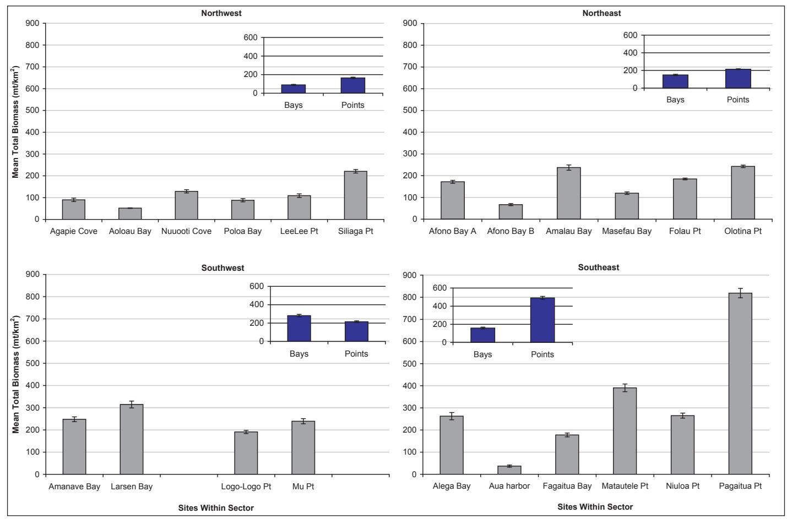

*Figure 10.39. Biomass distribution of key reef species around Tutuila showing variation between exposed points and sheltered bays. Source: Sabater and Tofaeono, 2007.* 

#### *PI FS C - C R E D Fi s h ery- I nd ep end ent Fi s h M oni t ori ng*

Quantitative assessment and monitoring of shallow reef fish assemblages was conducted throughout American Samoa in 2002, 2004, 2006 and 2008 by PIFSC-CRED; data from 2008 is not analyzed here but will be presented in future editions of the report. Subsequent biennial monitoring surveys are planned to document temporal variability in reef fish assemblages. Reef fish communities were found to be comprised mainly of herbivores (> 50% total biomass), followed by carnivores and lesser apex predators. The exception was Swains Island, where apex predators such as barracuda and jacks accounted for approximately 60% of fish biomass (Brainard et al., in review).

#### *Methods*

In 2006, quantitative belt transects (all fish sizes), stationary point counts (medium-sized fish 25-50 cm), towed-diver fish surveys (for large fishes > 50 cm) and random swims (for species presence) were conducted at previously visited locations and new sites, using the same PIFSC-CRED methodologies as in previous years (see 2005 edition of this report). To allow an island-wide comparison of fish from all size classes, belt transect data was combined and averaged for the three survey years to mitigate the higher variability in total fish biomass found at Rose Atoll and Swains Island, where extensive but patchy schools of large fish were observed. Data from lagoon sites at Rose Atoll were excluded as these sites often had a very high biomass of fish and a very limited area of coral reef habitat. Towed-diver survey data was combined and averaged for the three survey years to examine fish >50 cm, with lagoon sites at Rose Atoll again excluded since tows within the lagoon were largely over sandy, fish-poor habitat.

#### *Island-Wide Comparison Of Fish From All Sizes Classes*

Total fish biomass (all species and size-classes pooled) was highest at Rose and Swains, intermediate at the Manua Islands, and lowest at Tutuila (Figure 10.40). Fish biomass in the smallest size classes (<20 cm total length or TL) was similar across all islands, but lower at Swains. Fish biomass in the 20-39 cm range was comparable across islands, except much higher at Rose. Large fish (>50 cm) biomass was overwhelmingly highest at Swains, predominantly due to schools of barracuda and jacks.

#### Large Fish

Biomass density of large fish (>50 cm TL) from towed-diver surveys was three times greater at Swains and Rose than at Tutuila and the Manua Islands (Figure 10.41; PIFSC-CRED, unpub. data). In contrast, the Swains and Rose values were only a fraction of values from other U.S. Pacific remote islands (e.g., Jarvis, Wake; see PRIA chapter).

#### Medium Fish

Biomass density of medium-large fish (>25 cm TL, from SPC surveys) was also nearly three times higher at Swains and Rose (~0.6 t/ha) than at Tutuila (~0.2 t/ha), while intermediate at the Manua Islands (PIFSC-CRED, unpub. data).

#### *Tutuila Island*

From February 18-25, 2006, the fish census team surveyed 22 stations in the vicinity of Tutuila, including one at Taema Bank (south of Pago Pago Harbor), one at Aunuu, and 20 around Tutuila. Habitat types surveyed included reefs within bays and exposed outer reef slopes. All sites were resurveys of sites established by PIFSC-CRED in February of 2002 or 2004. The same quantitative methods (belt transect and SPC) were conducted at each of these sites. Toweddiver surveys were conducted along 44 tow tracks covering 90 ha of habitat.

As in previous years, medium-large fish biomass was lowest at Tutuila Island (0.19 t/ha; Figure 10.40) and was mostly composed of herbivores. Target families commonly observed were parrotfish (*Scarus* spp.*)*, grouper (*Cephalopholis* spp.), and snapper (*Macolor* spp.). A few dog-tooth tuna (*Gymnosarda unicolor*) were seen along the north shore. Several humphead wrasses (*Cheilinus undulatus*) were seen at Tutuila, but no bumphead parrotfish (*Bolbometopon muricatum*) were recorded on SPCs.

Of the twelve species of grouper (Serranidae, Epinephelinae and Anthiinae) observed, most common were flagtail grouper (*Cephalopholis urodeta*), followed by peacock grouper (*C. argus*). The most common snappers, although not abundant, were smalltooth jobfish (*Aphareus furca*), onespot snapper (*Lutjanus monostigma*), and blacktail snapper (*L. fulvus*). In contrast to

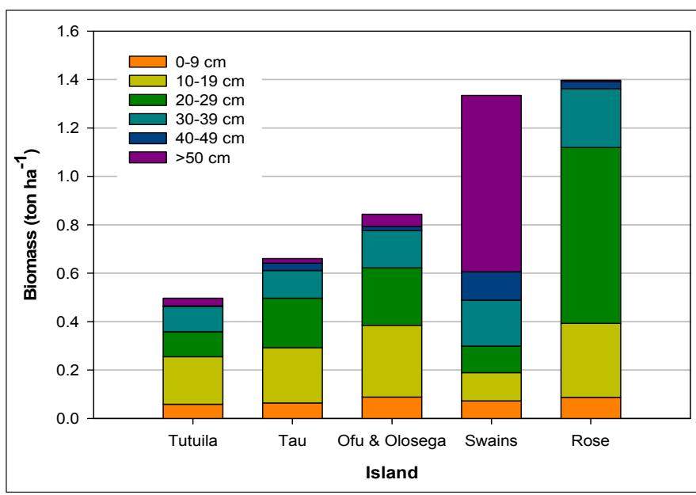

*Figure 10.40. Mean total fish biomass for all size classes across American Samoa as measured in belt transects conducted along the fore reef (2002 to 2006 data pooled). For each island, fish < 50 cm are divided into five 10-cm classes. Source: Brainard et al., in review.*

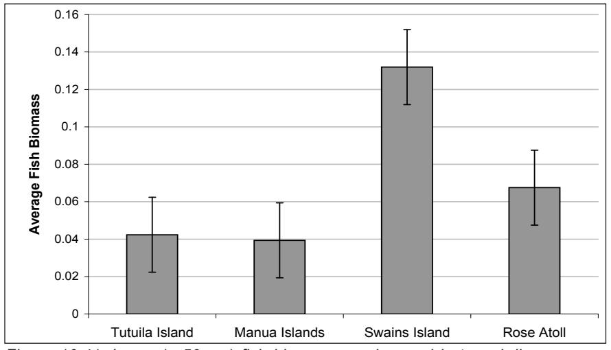

*Figure 10.41. Large (> 50 cm) fish biomass as observed in towed-diver surveys conducted throughout American Samoa. Source: Brainard et al., in review.*

2004, twinspot snapper (*L. bohar*) were rather rare and represented mostly by juveniles. The most frequently occurring parrotfish was the redtail parrotfish (*Scarus japanensis*). Bullethead parrotfish (*Chlorurus sordidus*) were seen less frequently but were typically more numerous. The most frequently occurring species of butterflyfish, as in 2004, was the reticulated butterflyfish (*Chaetodon reticulatus*). Twenty-nine species of damselfishes (Pomacentridae) were observed around Tutuila. Most common were the midget chromis (*Chromis acares*), the bicolor chromis (*C. margaritifer*), the half and half chromis (*C. iomelas*), the charcoal damsel (*Pomacentrus brachialis*), Dick's damsel (*Plectroglyphidodon dickii*) and the Johnston Island damsel (*P. johnstonianus*).

The most commonly observed large fish (> 50 cm TL) on towed-diver surveys was the bigeye jack (*Caranx sexfasciatus*) seen in two large schools and the blackfin barracuda (*Sphyraena qenie*) seen mostly in a single school. Parrotfish were the third most commonly observed large fish, with frequent sightings of the Pacific steephead parrotfish (*Chlorurus microrhinos*) and of the redlip parrotfish (*Scarus rubroviolaceus*). The most commonly observed shark for this survey period was the benthic feeding reef whitetip shark (*Triaenodon obesus*) with three observations, both the reef blacktip shark (*Carcharhinus melanopterus*) and the Galapagos shark (*C. galapagensis*) were observed once. Other notable observations included nine sightings of the Napoleon wrasse and one towed-diver sighting of the bumphead parrotfish.

# *Manua Islands (Ofu, Olosega and Tau)*

From February 26 to March 4, 2006, the fish REA team surveyed 12 stations around Ofu-Olosega and nine around Tau. A minimum of 171 coral reef fish species were recorded. Medium-large fish biomass was twice as high around Ofu-Olosega (0.44 ton ha-1) than at Tutuila. Most of the biomass in the Manua islands was composed of herbivorous fish.

Of all fishes around Ofu-Olosega, surgeonfish and wrasse were the most abundant and diverse groups. Sharks were very rare, with only one white-tip (*T. obesus*) and one black-tip (*C. melanopterus*) seen in 2006, representing a downward trend since 2002. No bumphead parrotfish (*B. muricatum*) were sighted, but a few humphead wrasses (*C. undulatus*) of various sizes were observed. Common targeted fish families were parrotfish, snappers and groupers. Parrotfish were diverse (12 species) and included large individuals (e.g., *C. microrhinos*). Common snappers were *L. bohar* and *Macolor* spp.

A heavy recruitment pulse was detected at one particular spot: a very dense aggregation of *Ctenochaetus striatus* in a major reef groove (OLO-5), being preyed upon by a number of jacks (mostly *Caranx melampygus*). Very few *C. striatus* juveniles were seen elsewhere around these two connected islands. Other species counted with relatively high juvenile numbers included *Gomphosus varius*, *Acanthurus nigroris* and, in low relief habitats, *Halichoeres margaritaceus*.

Medium-large fish biomass around Tau was slightly lower (0.39 ton ha-1; Figure 10.40) than around Ofu-Olosega. During the 2006 survey, no sharks were seen by the fish REA team at Tau. Common medium-size fish were parrotfish (e.g., *Scarus fosteni*, *S. oviceps*), the grouper *Cephalopholis argus*, goatfish (*Parupeneus cyclostomus* and *Mulloidichthys vanicolensis*), snappers (*Aphareus furca*, *Lutjanus kasmira*, *L. monostigma*, *L. gibbus*, surgeonfish (*Naso* spp., *Acanthurus nigricauda*), and triggerfish (*Odonus niger*). A large school of about 200 barracuda (*Sphyraena helleri*) was also recorded. Several humphead wrasses (*C. undulatus*, 50-120 cm TL) were seen, including seven at one site. One unique sighting was a deep, long crevasse in the reef at the top of a vertical drop-off (site TAU-2) where several large fish (*Plectorhinchus picus*, *Diodon hystrix*, *Macolor macularis*, *Sargocentron spiniferum*) were seeking shelter.

#### *Swains Island*

From February 11-13, 2006, the fish census team surveyed eight stations at Swains; all were resurveys of sites previously established by PIFSC-CRED. In 2006 only about five people resided on the island. Potential local fishing targets included most species of larger fish; the level of fishing pressure from external sources is unknown.

The most numerically abundant species around the island was the midget chromis (*Chromis acares*), followed by purple queen (*Pseudanthias pascalus*). Small arc-eye hawkfish (*Paracirrhites arcatus*) were commonly recorded. As a group, wrasses were the next most common family with 27 species recorded. Few surgeonfish, grouper and snapper were observed, and parrotfish, goatfish and emperor fish were rare. A large school of rainbow runner (*Elagatis bipinnulata*) was recorded by SPC on the eastern side of the island. Medium-large fish recorded by SPC along the northern side were fairly abundant and diverse (e.g., *L. bohar, C. argus, Macolor niger* and *M. macularis*, *Naso* spp.). As in previous years, no bumphead parrotfish were observed at the island. Medium-large fish biomass at Swains Island was the highest in American Samoa at 0.6 ton ha-1, although this value is low compared to values recorded in the PRIA and northern CNMI (see PRIA and CNMI chapters).

On towed-diver surveys, rainbow runners (*Elagatis bipinnulata*) were the most commonly observed large fish species with 1,006 observations; most were observed swimming in a single school. Barracuda (*Sphyraena qenie*) were also seen in large schools, with 218 sightings. Other common large fish included blacktongue unicornfish (*Naso hexancanthus*) and twinspot snapper (*L. bohar*), each with 26 individuals observed. Few sharks or jacks were seen during towed-diver surveys, with the reef whitetip shark (*T. obesus*) being the most common shark with four records, and bluefin trevally (*C. melampygus*) the most common jack with five records. Nine humphead wrasses (*C. undulatus*) were sighted at Swains.

#### *Rose Atoll*

From March 5-9, 2006, fish REAs recorded 158 species at 14 monitoring stations around Rose Atoll and in the lagoon.

Medium-large fish biomass around Rose was the second highest in the American Samoa and was similar to 2002 (0.55 ton ha-1). Sharks (white-tip and black tip) were common, mainly in very shallow water just below the surf zone. The lagoon patch reef on the west side harbored a high density and diversity of fishes, including large ones (e.g., large schools of *Scarus frontalis*, *L. kasmiri*, *M. vanicolensis*). The outer slope was also characterized by healthy fish communities and good visibility (>30.5-61 m). Parrotfish and surgeonfish were abundant along the southwest side, especially at the site of the 1993 longline vessel grounding (ROS-7). Dense schools of orangespine unicornfish (*Naso lituratus*) and convict tang (*Acanthurus triostegus*) were common here as well. Heavy cover by turf algae and cyanobacteria in response to ironenrichment from corroding wreckage was still visible at this outer reef slope station, and a few pieces of wreckage were spotted in the area. No major recruitment pulses were observed but small juveniles of bird-wrassse (*Gomphosus various*) and arc-eye hawkfish (*P. arcatus*) were common.

The most commonly observed large fish (>50 cm TL) on towed-diver surveys was the blackfin barracuda (*S. qenie*) with 399 observations, 296 of which were in large schools. The second most commonly observed fish was the big-eye trevally (*C. sexfasciatus*) with 220 observations, with the majority observed in one large school outside the north pass of the atoll. Observations of both parrotfish and snappers were also notable with 197 and 192 individuals observed respectively. The Pacific steephead (*Chlorurus microrhinus*) and the twinspot snapper (*L. bohar*) accounted for the majority of these observations. The most commonly observed shark for this survey period was the benthic feeding reef whitetip shark (*T. obesus*) with 23 observations, compared to only eight the previous survey period. Other sharks observed in few numbers included the blacktip reef shark (*C. melanopterus*), the gray reef shark (*C. amblyrhyncos*) and lemon shark (*Negaprion acutidens*). Thirteen humphead wrasse were recorded, but no bumphead parrotfish were seen, consistent with previous years.

#### Status of the Coral Reef Fishery

Fishery-Dependent Monitoring and Surveys

Although some reports suggest coral reef fish stocks in American Samoa are overfished, a recent comparison of data from fishery-independent monitoring and fishery-dependent surveys provides new insight into how fishing affects coral reef fish populations. Data was obtained from the various fishery-dependent studies and monitoring that has been conducted by a number of researchers working at DMWR over the past 30 years (Table 10.8). These studies document catch and effort from commercial and subsistence fisheries beginning in 1977 and 1985 respectively, and this data was combined with data collected from fishery-independent studies (see 'Status of Coral Reef Fish Populations' earlier in the chapter). Fishery-dependent data from the Inshore Fishery Documentation Program under DMWR was compiled and made available to the public through the Western Pacific Fisheries Information Network database (http://www.pifsc.noaa.gov/wpacfin). The information in this section includes time series data that examines various parameters that affect the status of coral reef fish communities in American Samoa.

| Table 10.8. Fishery-dependent surveys conducted in Tutuila, American Samoa from 1980 to 2006 | Table 10.8. Fishe | ry-dependent surveys | s conducted in Tutuil | a. American Samoa | a from 1980 to 2006 |
|----------------------------------------------------------------------------------------------|-------------------|----------------------|-----------------------|-------------------|---------------------|
|----------------------------------------------------------------------------------------------|-------------------|----------------------|-----------------------|-------------------|---------------------|

| STUDY                  | PROJECT                                               | YEAR          | AVAILABLE DATA                                          | METHOD USED                        | # OF SITES  | TRANSECT OR SURVEY DIMENSION |
|------------------------|-------------------------------------------------------|---------------|---------------------------------------------------------|------------------------------------|----------------|------------------------------|
| Wass (1980)         | Shoreline fishery documentation                       | 1977- 1979 | Catch, effort, CPUE, catch composition                  | Roving catch and effort surveys    | 9              | 18.8 x 3 km                  |
| Ponwith (1991)      | Shoreline fishery documentation                       | 1990          | Catch, effort, CPUE, catch composition                  | Roving catch and effort surveys    | 10             | 18.8 x 3 km                  |
| McConnaughey (1993)    | Shoreline fishery documentation                       | 1992          | Catch, effort, CPUE, catch composition                  | Roving catch and effort surveys    | 8              | 16 km                        |
| Saucerman (1995)    | Shoreline fishery documentation                       | 1991- 1994 | Catch, effort, CPUE, catch composition                  | Roving catch and effort surveys    | 8              | 17 km                        |
| Page (1998)         | Ecology, biology and fishery of parrotfishes          | 1996- 1998 | Stock, CPUE, catch, effort, age and growth parrotfishes | Market surveys                     | 3              | n/a                          |
| Coutures (2003b)    | Shoreline fishery documentation                       | 2002          | Catch, effort, CPUE, catch composition                  | Roving catch and effort surveys    | 36             | 42.8 km                      |
| Zeller et al (2006) | Coral reef fishery reconstruction                     | 1950- 2000 | Catch and population data                               | Data re-construction and modeling  | Territory wide | n/a                          |
| Brookins (2006)        | American Samoa Fishery Documenta- tion (WPFRMC) | 1982- 2006 | Catch and effort data                                   | Boat based and roving creel survey | Island wide | n/a                          |

#### The Commercial Fishery

Commercial landings over the past 24 years have varied greatly. In the early 1980s catch dropped from a relatively high level to a moderate level before declining to a low level in the early 1990s (Figure 10.42). Catch increased in the mid 1990s, again reaching very high levels between 1997 and 1999 before declining sharply from 1999 to 2001 and remaining low since then.

It is thought that the sharp drop in commercial catch in the early 1990s was related to the impacts of two large hurricanes; Hurricane Ofa in 1990, and Hurricane Val in 1991. These two hurricanes caused the most significant damage of any hurricanes in the past 30 years. Damage from Hurricane Ofa was considerable due to its size, strength and the fact that it was a slow moving system; damage from Hurricane Val was largely a result of the storm's significant strength and the fact that the center of the storm directly hit Tutuila. Both hurricanes caused massive structural damage to buildings and homes as well as considerable environmental dam-

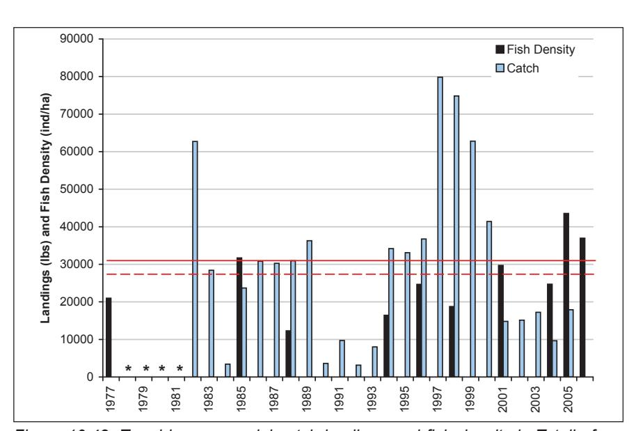

Figure 10.42. Trend in commercial catch landings and fish density in Tutuila from 1982 to 2005. Mean landings is represented by the red dashed line; mean fish density is indicated by a solid red line. Asterisks (\*) indicate years for which no data was collected. Sources: Wass, 1982; Green, 2002; Green et al., 2005; Sabater and Tofaeono, 2006; WPRFMC, 2007.

age above and below the water. Most significantly for the fishery, the storms destroyed many fishing boats and resulted in the groundings of nine large ships.

Increased catches between 1994 and 1997, and especially between 1997 and 1999, were due mainly to the introduction of SCUBA spearfishing. Spearfishers predominantly targeted parrotfish at night. This method resulted in a 15 fold increase in catch, and by 1997, accounted for 89% of the total catch in the parrotfish fishery (Page, 1998). The total commercial catch then started to decline, presumably because the increased efficiency of SCUBA spearfishing increased exploitation rates of some parrotfish species close to or beyond their maximum sustainable yield (Page, 1998). In 2001, SCUBA spearfishing was banned, decreasing overall catches to low levels where they have remained since.

When examining commercial fishing effort over the past 30 years, either based on expanded fisher hours or the number of trips made per year (Figure 10.43), the same general trend exists as described above. This shows that catch levels in American Samoa over the past 30 years have been determined strongly and primarily by the amount of fishing effort. As such, there was a strong positive correlation between commercial landings and effort for number of boat trips per year (r=0.849), and for total annual fisher hours (r=0.406).

Throughout the same period, fish density has remained relatively constant (Figure 10.44). Since fish density has remained relatively stable through time, the observed decline in catch is not attributable to a limited or declining resource (fish density correlated negatively with catch, r=-0.407), but instead appears to result from a decline in effort. It is also worth noting that fish populations have remained stable throughout the last thirty years despite the numerous disturbances that occurred between the late 1970s and the present as mentioned previously. This suggests that reef fish populations in Tutuila are considerably robust and resilient despite notable declines in coral communities.

#### *The Subsistence Fishery*

Subsistence fishing effort has also declined markedly in the past 30 years (Figures 10.44 and 10.45). Effort dropped from relatively high levels in the late 1970s and early 1990s (60,000-80,000 gear hours/year), to moderate levels in the early to mid 1990s (40,000-60,000 gear hours/year). A further drop occurred in the early 2000s, when effort levels were low (4,000-8,000 gear hours/ year; [http://www.pifsc.noaa.gov/wpacfi](www.pifsc.noaa.gov/wpacfin)n).

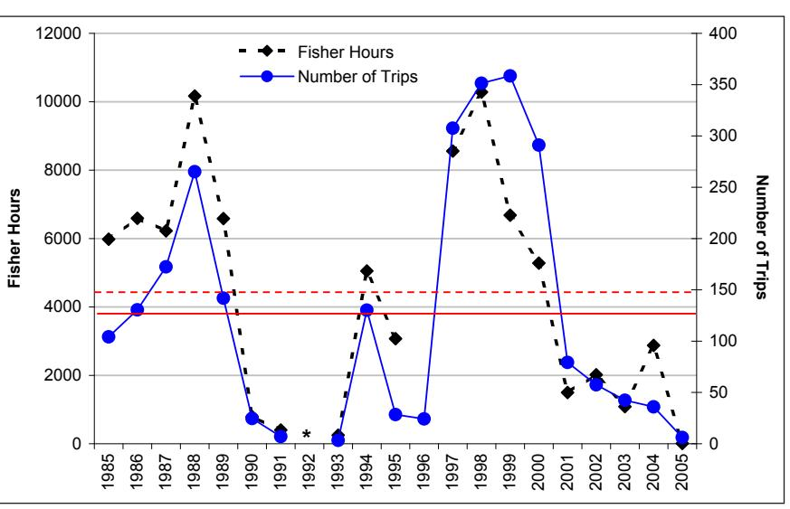

*Figure 10.43. Trend in commercial fishing effort, expanded number of fisher hours and expanded number of trips in Tutuila, 1985 to 2005. Mean fisher hours is represented by a red dashed line; mean number of trips is indicated by a solid red line. Source: WPRFMC, 2007.*

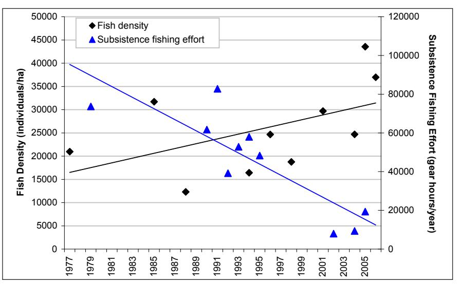

*Figure 10.44. Trend in subsistence fishing effort (total gear hours/year) and fish density (individual/ha) in Tutuila from 1977 to 2005. Sources: Wass, 1982; Green, 2002; Green et al., 2005; Sabater and Tofaeono, 2006; WPRFMC, 2007.*

This decrease in fishing effort is attributed to a general shift from subsistence fishing to a cash-based economy. Despite the territory's Polynesian heritage and the associated traditional and cultural importance of fishing, modernization has shifted the society toward a cash-based economy where the majority of the population relies on paid employment. This in turn has enabled American Samoans to purchase food instead of fishing for their protein source. Such dietary changes and economic modernization has been documented throughout Pacific Island populations in the second half of the 20th century and is thought to be responsible for the increase in numbers of people that are overweight or obese (Ulijaszek, 2002; WHO, 2003). Kilarski et al. (2006) reported that American Samoans still consider fishing an important part of their culture and engage in fishing occasionally. However, the majority of the population does not engage in subsistence or commercial fishing activities but fishes in more of a recreational manner.

Data from the U.S. Census Bureau (1990, 2000) shows an increase in the labor force in the past 10 years with 52% of the population now employed and only 7% involved in subsistence activities. Thirty-five percent (35%) of the workforce was involved in manufacturing (including cannery work), 17% in education, health and social service, and 9% in public administration. Only 3% worked in agriculture, forestry, fishing, hunting and mining combined. There was a steady increase in employment in government and private sectors from 2000 to 2004, while employment at the canneries decreased every year starting in 2001. These social dynamics have led to a decrease in fishing effort in the past three decades as reported by Ponwith (1991), McConnaughey (1993), Saucerman (1995) and Coutures (2003a).

*Human Population and Fishing Effort* It is commonly assumed that increases in human population levels lead to over-exploitation of coral reef resources, including fish stocks. The situation in American Samoa is, however, quite different. Although the human population has continued to increase over the past 30 years, commercial and subsistence fishing effort has declined, relatively and absolutely. Subsistence fishing effort (gear hours/year) has declined

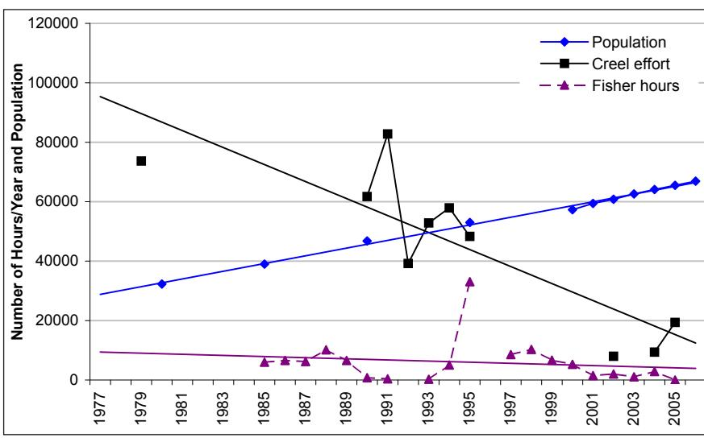

*Figure 10.45. Trends in subsistence and commercial fishing effort (number of hours/ year) and population size in Tutuila from 1979 to 2005. Linear trend lines shown for each data set. Consecutive year data points are indicated by a line. Sources: U.S. Census Bureau, 1990 and 2000; WPFMC, 2007.*

over the past three decades, with a strong negative correlation between population and subsistence effort (r=-0.926; Figure 10.45). Although commercial fishing effort has varied throughout this period, there seems to have been a decline in effort from 1995 onwards, with the exception of a spike in the mid 1990s prior to the ban on SCUBA spearfishing. There was also a slight negative correlation between population increase and commercial fishing effort (r=-0.255 for fisher hours; r=-0.142 for boat trips). This analysis demonstrates that an increase in population does not necessarily result in increased fishing pressure, and suggests that fishing pressure is better represented by measures of effort and catch than by human population levels.

Over the past 30 years, commercial landings of reef fish have varied considerably due predominantly to the effects of two factors: 1) two large hurricanes in the early 1990s which caused a decrease in fishing effort; and 2) SCUBA spear fishing between 1994-2000, which increased effort and efficiency and therefore catch. Despite the differences in catch and effort caused by these two factors, catch of reef fish has still declined overall and is currently at a low level. Subsistence fishing effort has also declined sharply over the past thirty years to a low level. These declines in effort, and therefore catch, are attributed to a shift in the resident population's focus away from subsistence activities and toward a cash-based economy and is apparent despite a large increase in the human population. At the same time, density of reef fish populations has remained relatively constant, and community composition has varied little. It therefore appears that reef fish populations in American Samoa are in relatively good health and are likely to stay the same or improve if current trends continue.

There is still some concern regarding overall fish biomass levels as well as biomass of large and medium-sized fish in American Samoa, since PIFSC-CRED data indicate that values are significantly lower than at neighboring island groups. A lack of baseline information regarding fish populations makes it difficult to assess the current status of reef fish populations and complicates comparisons between islands within and among regions, especially given the unique and individual characteristics of the islands themselves. Overall fish biomass, as well as community composition of reef fish, may differ due to natural factors (e.g., type of island, extent of reef development, availability of food, extent of suitable juvenile and adult habitat, diversity of available habitat types, rugosity, wave action, larval supply and connectivity) as well as anthropogenic factors (e.g., fishing pressure, pollution, eutrophication and sedimentation, level of management protection, human population etc.). Previous studies (e.g., CRAMP, 2007; Nguyen and Phan, 2007; Brokovich et al., 2005; Lara and Gonzalez, 1998) have found that the structure of coral reef fish communities involves complex interactions of a number of factors, and that each factor alone explains only a small portion of the variability. A combination of factors, however, can be used to explain a significant portion of the variability.

Fishing pressure over the years has undoubtedly affected reef fish populations around the islands of American Samoa. It is unclear, however, to what extent fishing has altered reef fish populations, and to what extent fishing has altered reef fish populations at each island. It is also unclear the extent to which the other factors mentioned above have influenced current patterns in reef fish populations within and between these islands. Habitat parameters, for example, have been found to have significant importance in structuring coral reef fish communities (Brokovich et al., 2006) and this is also likely the case in American Samoa, which has high, eroding, volcanic islands as well as coral atolls. Swains Island is geographically part of the Tokelau Island group and is therefore likely to have more in common with other islands of this group than with the islands of American Samoa. The reefs of American Samoa, particularly around the main island of Tutuila, have limited areas of shallow water habitat (e.g., reef flats, back reef pools, lagoons, seagrass beds and mangroves), and significant portions of these habitats have been altered or destroyed in Tutuila through development. The limited availability of suitable juvenile habitat is likely to limit the abundance of certain species of reef fish that rely upon such habitat during their recruitment and juvenile life-history stages, ultimately affecting the number of adults that are found on the reefs. Declines in coral cover over the past 30 years and associated decreases in topographic complexity may also have had profound effects on the reef fish community. So, while previous and current fishing pressure is of obvious importance, other factors have to be taken into account when examining the current structure of coral reef fish communities and populations within and between the islands of American Samoa. Multivariate analyses are currently being conducted for reef fish populations in American Samoa to determine the influence of a number of the variables mentioned above.

#### INVERTEBRATES

Shallow water invertebrates of American Samoa have been catalogued in a recent field guidebook (Madrigal, 1999). Initial studies indicate high invertebrate species diversity (Table 10.1). Green (2002) reported low but stable populations of giant clams on Tutuila and Ofu-Olosega and higher populations on Tau, which increased from 1996 to 2002. Green and Craig (1999) reported much higher populations of giant clams in Rose Atoll lagoon than elsewhere in American Samoa. Green (2002) also reported low numbers of COTS at all sites, including on Ofu where persistent populations were reported by others (Fisk and Birkeland, 2002). Brown (pers. comm.) observed a large and diverse community of sponges in some deep areas of Pago Pago harbor, including some very large barrel sponges and a community of sea fans in the harbor.

Courtures (2003) reported a study of the lobster populations of Tutuila. Since most lobsters hide during the day and come out at night to forage, surveys were conducted at night, in shallow water just seaward of the reef crest. The main commercial species in American Samoa is the spiny lobster (*Panulirus penicillatus*), which lives at 1-5 m depth in areas of high surge and surf. The slipper lobster *(Parribacus caledonicus)* is common and lives at depths less than 10 m. *P. antarcticus* is relatively rare and forages on the crest and outer reef flat. *P. versicolor* is very rare, and can be seen by day. Research catches averaged 1.1 kg/hr for spiny lobster and 1.4 kg/hr for slipper lobster, but catch rates varied between individual researchers. The study results produced a total population estimate for spiny lobsters at only 9,300 around Tutuila, in part because their preferred habitat is a narrow band only about 20-25 m wide seaward of the reef crest.

# *Terri t ori al M oni t ori ng Program*

#### *Methods*

Abundances of non-cryptic diurnal macro invertebrates were recorded by species along the four 1 x 50 m transects (8-10 m depth) surveyed at each of the 11 TMP monitoring sites on the reef slopes of Tutuila. Branching corals were not searched for cryptic commensal species, and cryptic habitats such as reef holes were not searched.

#### *Results and Discussion*

Very few invertebrates were recorded during TMP surveys. Only three: a small burrowing urchin (*Echinostrephus molaris*), a small massive orange sponge, (*Styllisa massa* or *S. flabelliformis*), and a thin grey encrusting sponge (*Dysidea* sp.) were common in patchy distributions. In 2006, the urchin was most common, followed by the orange sponge and the encrusting sponge (Figure 10.46). Researchers observed no COTS (*Acanthaster planci*), tritons (*Charonia tritonis*), or lobster (*Palinurus* and *Scyllarus* spp.). Although all are known from American Samoa, the first two species are considered rare and lobsters primarily inhabit shallow water and are rarely seen during the day. Giant clams, which are heavily fished on populated islands, were uncommon in belt transects, with a density of 0.37/100 m2 . Sea cucumbers were more abundant in sandy areas of lagoons. A survey of the reef crest at Nuuuli found a nar-

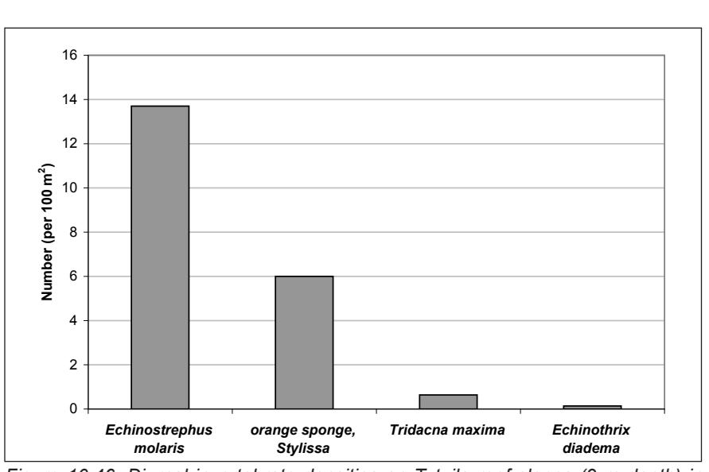

*Figure 10.46. Diurnal invertebrate densities on Tutuila reef slopes (9 m depth) in TMP transects in 2006. Source: Fenner and Carroll, in review.*

row band with populations of the urchin *Echinothrix calimaris* as high as 160/100 m2 . An encrusting green or blue ascidian (*Diplosoma simile*) was common within transects in Fagatele Bay in 2007 and accounted for 4% of total cover. Because many invertebrates are nocturnal or have specialized habitat requirements, these results should not be taken as indicative of total populations.

# PIFSC-CRED Rapid Assessment and Monitoring Program

Methods

PIFSC-CRED utilized belt transects and quadrats to assess the populations of marine invertebrates throughout American Samoa in 2002, 2004 and 2006 (Brainard et al., 2007). Branching corals were searched for invertebrate commensal crabs as part of this study.

#### Results and Discussion

Brainard et al. (in review) found the diurnal invertebrate community of the high islands of Tutuila, Ofu-Olosega and Tau to be dominated by echinoids, while Swains and Rose Atoll had more trapezid crabs and hermit crabs (Figure 10.47) which were mostly found among branches of corals, particularly *Pocillopora*. PIFSC-CRED data also confirmed the report of high numbers of giant clams in the Rose Atoll lagoon, and found that Tau had more giant clams than the other islands, particularly on its north and west sides, though Tutuila had good numbers at a few sites. Swains had more COTS than

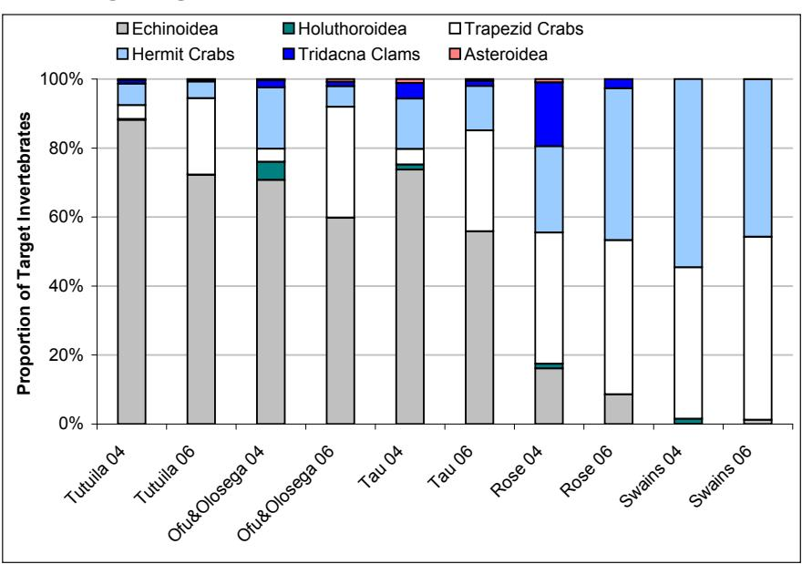

er islands, particularly on its north and west sides, though Tutuila had good numbers at al., in review.

the other islands, though population densities were not high.

#### MARINE MAMMALS

Thirty three species of marine mammals are known to occur in the tropical South Pacific, and eleven of them have been observed in the waters of American Samoa (Dolar, 2005), including humpback whale, minke whale, sperm whale, killer whale, short finned pilot whale, common bottlenose dolphin, spinner dolphin, pantropical spotted dolphin, rough toothed dolphin, Cuvier's beaked whale and false killer whale (Utzurrum et al., 2006). Sperm whales and humpback whales are listed as endangered under the U.S. Endangered Species Act (Utzurrum et al., 2006). Research on humpback whales (*Megaptera novaeangliae*) in the territory has been conducted by Robbins and Matilla from 2003 to 2006. Territorial waters of American Samoa have been identified as a wintering area for humpbacks, which arrive in June and remain through December; peak numbers are usually seen during September and October (Dolar, 2005).

Most marine mammal research in the South Pacific is devoted to large whales. Information about small whales and dolphins comes from opportunistic efforts of individual researchers (Dolar, 2005). At present, information on the distribution and ecology of small cetaceans in the coastal waters of American Samoa and other islands in the tropical South Pacific has not been established (Dolar, 2005).

#### **SEATURTLES**

Green (*Chelonia mydas*) and hawksbill (*Eretmochelys imbricata*) sea turtles are the most commonly occurring sea turtles in coastal waters of American Samoa, and are the only species known to nest on territorial beaches (Utzurrum, 2002). There have been occasional records of Olive Ridley turtles (*Lepidochelys olivacea*) and a single record of a leatherback (*Dermochelys coriaca*) from pelagic waters south of Swains Island.

Few systematically-collected data exist on abundances of turtles in the territory (Craig et al., 2004), but ongoing monitoring by the DMWR is expected to address these deficiencies. Their approach includes bi-monthly, timed, double-observer snorkel surveys at 10 representative sites around Tutuila Island. These data are augmented by collection of incidental sighting reports from other sources, as well as a nesting beach monitoring program.

American Samoan turtle populations are known to use the waters of other countries in the region. Adult green turtles satellite tagged at Rose Atoll generally migrate to Fiji (Craig et al., 2004). Ongoing DMWR satellite tagging has been focused on individuals from Tutuila. Between February 2006 and March 2007, an adult female hawksbill tagged from western Tutuila moved into pelagic waters to the east, then west to Samoa. Juvenile turtles, based on data from three hawksbills and one green, exhibit much more site fidelity, as all remained in territorial waters after they were tagged.

Mortality of turtles near Tutuila is not uncommon. For example, 11 dead sea turtles were recovered from January to August 2007. Necropsies performed on three green and four hawksbill turtle carcasses found fishing line and a hook in the intestines of one hawksbill and pieces of plastic and aluminum in one green turtle; the rest had no obvious cause of death and tissue samples have yet to be analyzed. Known threats to the sea turtle population in American Samoa include habitat destruction of nesting beaches by sand mining and seawall construction, mortality as a result of fishing activities, and the disorienting affects of street lights on nesting turtles and hatchlings.

# Summary of Data Gathered

Benthic communities are in relatively good condition, with a dominance of coralline algae, almost no brown macroalgae, and better average coral cover than most reefs in the region. They appear to be relatively resilient, having recovered at least partially from a series of major disturbances such as COTS infestations, hurricanes and mass coral bleaching. However, coral cover remains about half of values recorded before the COTS outbreak in the late 1970s. The two atolls differed from the high islands in coral genera, algae, and invertebrates. There are very few diurnal non-cryptic invertebrates on reef slopes, but some notable communities exist in Pago Pago Harbor, where nutrient levels have improved but are still high enough to support significant plankton populations and non-toxic red tide blooms. There is significant sediment stress within some bays including the harbor, but reef slopes show relatively little impact. Diseases have only had relatively minor impacts so far. Mass coral bleaching has had some impacts, and now appears to be an annual event in small back reef pools. Water quality on the outer reef slopes is generally good, but significant effects of nonpoint pollution can be detected. Coral reef fish populations appear to be relatively healthy overall, maintaining relatively constant populations over the past thirty years. During this time, commercial and subsistence fishing effort and catch has declined to a low level, and the release from fishing pressure may increase reef fish populations in the future. Fish communities continue to be dominated by small and medium sized herbivorous fish, especially damselfish, surgeonfish and parrotfish. These herbivores aid in controlling algal cover which in turn promotes coral growth and health. Surveys with multibeam sonar have found many small banks on the shelf around Tutuila, and submersible exploration has found a deep limestone escarpment at the edge of the shelf.

# **CURRENT CONSERVATION MANAGEMENT ACTIVITIES**

The American Samoa Government coordinates territorial coral reef management activities via the Coral Reef Advisory Group (CRAG). This group comprises both territorial and federal agencies including the American Samoa Government Department of Commerce (ASDOC), which houses the American Samoa Coastal Management Program and Fagatele Bay National Marine Sanctuary, DMWR, ASEPA, American Samoa Community College and NPAS. These agencies collaborate to plan and implement actions related to the management of the territory's coral reefs.

The United States Coral Reef Initiative has been instrumental in supporting the territory in its coral reef conservation activities. Annual Coral Reef Management and Monitoring grants have provided managers and scientists in American Samoa with tools, staff, funds and equipment with which to accomplish key research and management projects. Territorial programs have benefited greatly from this support.

#### *G I S Program*

Geographical Information System (GIS) technology is used by American Samoa natural resource and environmental agencies for planning, analysis and dissemination of information. CRAG member agencies have utilized GIS tools to support their local action strategies and as a way to coordinate activities of government agencies, community leaders, special interest groups, communities, or contractors during the planning process. ASDOC has developed an integrated GIS system as part of its information dissemination and analysis efforts. The ASDOC GIS system assists the Coastal Management Program with the identification of secondary and cumulative environmental impacts, development of goals, objectives, plan strategies and implementation, program management and forecasting of needs, and development trends, in addition to providing various maps and graphics; the system is updated with data products and IKONOS and other imagery inputs as they become available.

ASDOC's GIS information includes NOAA's Environmental Sensitivity Index (ESI) maps that systematically compile information in standard formats for coastal shoreline sensitivity, biological resources, and human-use patterns. ESI maps are useful for identifying sensitive resources so that protection priorities can be established. The ESI has been converted into a simplified format, making the data readily available to interested parties. ASEPA has used GIS technology to map existing pig farms on Tutuila for education and compliance purposes.

A number of GIS tools have been developed by DMWR for assistance in management. The Protected Areas Network Design Application for ArcGIS, was developed to provide a user friendly framework and interface to explore different hypothetical configurations of a system of marine protected areas (MPAs) in the territory.

# Mapping Data

In support of the U.S. Coral Reef Task Force's mission to "produce comprehensive digital maps of all shallow (<30 m) U.S. coral reef ecosystems and characterize priority moderate-depth reef systems by 2009," NOAA has developed a comprehensive mapping program in the Pacific. As discussed in the 2005 American Samoa State of the Reefs chapter (Craig et al., 2005), NOAA's CCMA-BB produced a shallow water (0-30 m) benthic habitat analysis from IKONOS satellite imagery (Figure 10.48). The resulting maps are also available online at: [http://biogeo.nos.noaa.gov/products/biogeogra]( http://biogeo.nos.noaa.gov/products/biogeography/us_pac_terr/index.htm)[phy/us\\_pac\\_terr/index.ht]( http://biogeo.nos.noaa.gov/products/biogeography/us_pac_terr/index.htm)m.

Academia has contributed substantially to American Samoa mapping efforts, with funding from the National Science Foundation and NOAA. In 2001 and 2002, researchers at Oregon State University (OSU) and the University of South

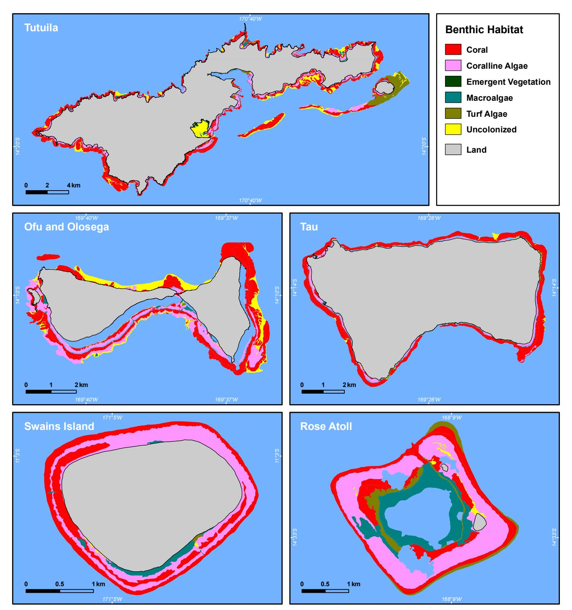

*Figure 10.48. Nearshore benthic habitat maps were developed by CCMA-BB based on visual interpretation of IKONOS satellite imagery. Source: CCMA-BB, 2005.*

Florida (USF) extended shallow-water mapping to moderate depths (about 3-150 m) with multibeam surveys at Fagatele Bay, Taema Bank, Fagaitua Bay, Pago Pago harbor, Vatia Bay, Coconut Point and portions of the National Park, using a Kongsberg Simrad EM3000 multibeam sonar. Deep water (>100 m) multibeam mapping was conducted around Tutuila by OSU and USF scientists aboard the R/V *Revelle*, using a portable Kongsberg Simrad EM120 multibeam sonar, during a Scripps Drift Expedition ([http://nsdl.sdsc.edu/cruises/DRFT10RR.htm](http://nsdl.sdsc.edu/cruises/DRFT10RR.html)l) in March 2002. These data are available at: [http://dusk.geo.orst.edu/djl/samoa](http://dusk.geo.orst.edu/djl/samoa/)/. In July 2005, the Hawaii Undersea Research Laboratory's (HURL) R/V *Ka'imikai-O-Kanaloa* (*KOK*), with a SeaBeam 210, completed additional bathymetric surveys and submersible dives to fill deep water mapping gaps around Tutuila. In April 2005, other deep water opportunistic mapping was combined with the ALIA Expedition aboard the University of Hawaii's (UH) R/V *Kilo Moana* (Kongsberg Simrad EM1002 and EM120) to map most of the 100 m contour around the Samoan Hotspot (http://earthref.sdsc.edu/ERESE/projects/ALIA).

NOAA's PIFSC-CRED initiated a complementary moderate-depth (approximately 10–3,000 m) multibeam mapping program in 2001. The program first conducted multibeam surveys to survey the banktops of the Manua Islands and 60% of Tutuila in 2004 with the NOAA Ship *Oscar Elton Sette* and the 8 m R/V *Acoustic Habitat Investigator* (*AHI*). In 2006, PIFSC-CRED returned to American Samoa with the NOAA Ship *Hi'ialakai*, equipped with two Kongsberg Simrad multibeam sonars: a 30-kHz EM300 with mapping capability from about 100-3000+ m and a 300-kHz EM3002D with mapping capability from about 5-150 m. The R/V *AHI* has a 240-kHz Reson 8101ER with mapping capability from about 5-300 m. Both vessels have Applanix POS/MV motion sensors, which provide navigation and highly accurate readings of the vessel motion in all axes. Bathymetric surveys were completed in 2006 and gridded data are available from http://www.soest.hawaii.edu/pibhmc/pibhmc\_amsamoa.htm. Supplementary optical validation data were collected by PIFSC-CRED in 2004 and 2006 using towed and drop camera systems. Additionally, three submersible dives were conducted from the *KOK* in July 2005 at Fagatele Bay and Taema Bay, recording video, photographs, positional tracking, and scientists' field logs. The cruise report and resulting data from the expedition may be found at http://dusk.geo.orst.edu/djl/samoa/.

Bathymetric data from 2004 and 2006 PIFSC-CRED *Hi'ialakai* and *AHI* surveys provide nearly complete coverage of the seafloor between depths of 10 m and 1000 m (Figure 10.49) at the following locations: Tutuila and Aunuu Islands, Ofu and Olosega Islands, Tau Island, Rose Atoll, Swains Island, Northeast Bank, Two Percent Bank and Vailuluu Seamount. The remaining unsurveyed shallow to moderate water areas are small gaps between swaths offshore.

Bathymetric grids at various resolutions and other data are updated as mapping, data processing, product and metadata generation, and interpretation are completed. High resolution bathymetric data provide baseline depth data, as well as visual indications of the nature of the seafloor. One of the important characteristics of this complex bank structure is of the abundance of hard, probably carbonate structures that may contain live coral. Concentrations exist around the outer edges of the bank, where there appears to be a relict fringing or barrier reef with ridge-like structures as shallow as 20 m. On the banks, but inside of the outermost barrier, depths range from 20-100 m and include many isolated high features.

Multibeam backscatter data (Figure 10.50) provide information about the hardness and roughness of the seafloor. High backscatter returns (dark) indicate hard substrate, while lower returns (light) indicate softer substrate. Backscatter has been processed for the Manua Group, Tutuila and Aunuu and are available for download at http://www. soest.hawaii.edu/pibhmc/. The backscatter returns suggest that the area northwest of Masefau Bay and Pago Pago Harbor are predominantly mud. Other areas (e.g., the offshore bank east of Tutuila) that return mixed backscatter signatures indicate potential coral habitat with pockets of unconsolidated sediments. Products that describe the benthic geomorphology (e.g., slope, rugosity, and Bathymetric Position Index) are derived from bathymetry data to describe seafloor characteristics that may influence

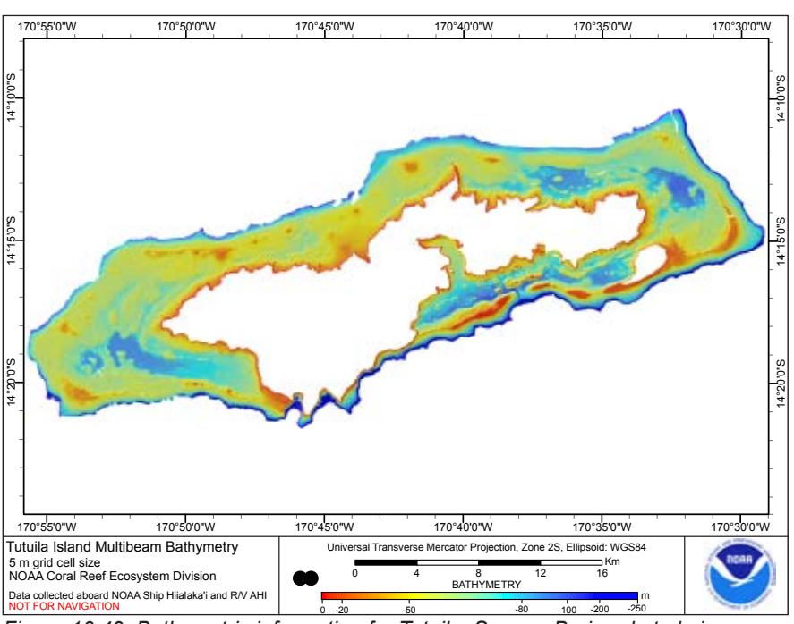

Figure 10.49. Bathymetric information for Tutuila. Source: Brainard et al., in press.

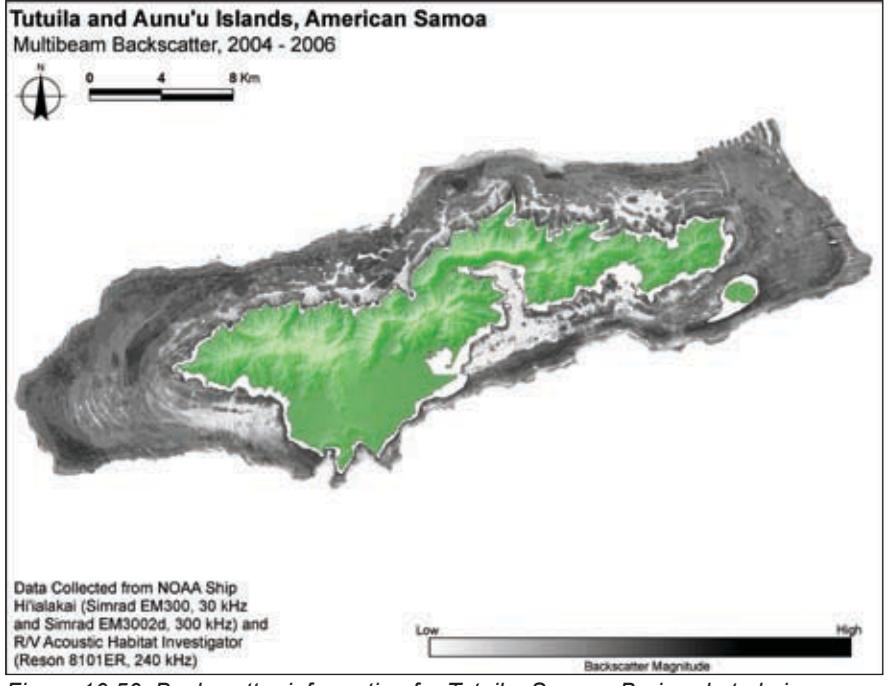

Figure 10.50. Backscatter information for Tutuila. Source: Brainard et al., in press.

benthic habitat utilization patterns. Tutuila shows high rugosity in many areas of the bank top and outer barrier reef, corresponding to areas of high bathymetric complexity and possible coral presence.

Optical validation data that have been collected at Tutuila aid scientists in interpretation of seafloor characteristics. Fiftytwo video segments and 131 still photographs have been interpreted according to a benthic habitat classification scheme that was designed to include indications of substrate, living cover, coral type and other factors that may influence habitat utilization, as documented at [ftp://soest.hawaii.edu/pibhmc/website/webdocs/webtext&figures/bh\\_class\\_codes.ht](ftp://soest.hawaii.edu/pibhmc/website/webdocs/webtext&figures/bh_class_codes.htm)m. Optical validation from the HURL submersible dives on PISCES V in July 2005 revealed valuable geological and biological features as deep as 460 m that are not able to be seen with any other methods currently used for undersea research. Integration of these data with bathymetry, backscatter, derived products and other optical validation information help identify significant deep-water coral reef habitats and areas of high biodiversity to support conservation and management.

#### *M ari ne Prot ec t ed A reas Program*

A territorial Marine Protected Area (MPA) Network strategy was finalized and adopted in 2007. The MPA Network Strategy aims to link American Samoa's MPA programs and agencies in an effort to better protect and manage marine resources. Existing MPA efforts in the territory encompass several levels: federal MPAs (Rose Atoll National Wildlife Refuge, Fagatele Bay National Marine Sanctuary, NPAS) territorial special management areas (Nu'uuli Pala wetlands, Pago Pago Harbor, Leone Pala wetlands), territorial MPAs (Ofu Vaoto Marine Park); local community-based MPAs co-managed by DMWR (Poloa, Alofau, Vatia, Aua, Masausi, Amaua-Auto, Fagamalo, Aoa, Matuu-Faganeanea and Masefau), and DMWR's no-take MPA program. In addition, the MPA Network will work with independent Samoa to better coordinate efforts and work towards developing regional MPA networks. The information provided below highlights the MPA programs administered by DMWR.

#### *No-take Program*

DMWR received increased support in 2005 to begin implementing the former governor's 20% no-take MPA declaration. The MPA program aims to create new no-take areas in order to ensure various and diverse marine habitats and spawning stocks are available to populate reefs regularly and after disasters. No-take program objectives are to gather diversity and spawning stock data; develop and conduct socioeconomic surveys; and educate the community about the benefits of developing no-take MPAs.

# *Community-Based Fisheries Management Program*

Based on an initiative of community-based fisheries management reserves in the neighboring country of Samoa, the American Samoan government has implemented a similar effort to incorporate and utilize the distinctive Samoan culture in resource protection. American Samoa is unique within the U.S. in that villages have maintained virtually all marine and land tenure systems. As such, the Community-based Fisheries Management Program (CFMP) administered through DMWR works with individual village communities to identify resource trends and potential problems, and develop management plans that are locally appropriate and acceptable to the communities.

All of the CFMP reserve sites were established and managed principally to support the continued sustainable extraction of renewable living resources (e.g., fish, shellfish) within or outside the MPA by protecting important habitat and spawning, mating or nursery grounds; or providing harvest refugia for bycatch species. These MPAs also prohibit the extraction or destruction of natural or cultural resources within the MPA boundaries and restrict access and/or other activities that may adversely impact resources, processes, and qualities, or the ecological or cultural services they provide.

Each of the sites prohibits resource extraction with the exception of subsistence fishing for cultural practices in select instances. Village members can still utilize the resources for recreational and educational purposes. At times certain areas of the reef will be opened for use by elders in the village through the permission of the village council and as outlined in the individual MPA's management plan. Closure of the sites expires after three years, at which time the village reviews the management plan and its effects and decides if they would like to continue it with the same regulations, alter the regulations or discontinue the program. Some villages select to open the sites temporarily for fishing before closing them for an extended period. DMWR is moving toward discussions of more long-term or permanent closures for community sites.

Management plan implementation is carried out by the villages with assistance from DMWR. Management efforts for the sites include monitoring, enforcement, and public awareness. A compendium of village by-laws regulating the use of a village marine protected area has been drafted under DMWR code and is in the final stages of approval before adoption.

#### *CFMP Public Participation*

This program was developed to encourage communities to actively manage their local resources in collaboration with DMWR through a series of regular meetings and training programs. Because it is based on public involvement, the program would not succeed without significant public support. Regular meetings are held between stakeholder groups. A Fisheries Management Advisory Committee composed of DMWR and selected members of the chiefs and untitled men's group works together to compile information gathered at group meetings and from a baseline questionnaire form and develop a Fisheries Management Plan for the village. Efforts to raise the awareness about the MPAs among villagers mostly take place during village meetings where there is an exchange of information between DMWR staff and villagers.

To help local villagers monitor and enforce sites, DMWR has provided training workshops in monitoring, boating safety, and equipment for the community. Information sheets on fisheries, corals, seaweeds, mangroves, dynamite fishing, and bleaching have been distributed in conjunction with press releases and radio announcements. To encourage stakeholder participation, the use of participatory tools for information gathering, planning, decision-making, monitoring and evaluation was included in Participatory Learning and Action (PLA) village workshops hosted in partnership with local National Marine Fisheries staff. PLA is a community action program that engages all sectors of the community, especially women and youth. The PLA philosophy is based on involving the community in information gathering, development, and implementation phases to empower people with responsibility and accountability for their actions.

# *E d uc at i on and O ut reac h*

In 2006, as part of its education and outreach initiative, CRAG launched the American Samoa Rare Pride Campaign featuring the green sea turtle as its flagship species. Through the development process, the American Samoa Rare Pride Campaign successfully engaged stakeholders in developing a campaign that addresses human behavior, develops innovative ways to promote environmental stewardship and creates new partnership opportunities. Successful campaign projects include a community college internship program and a community reef watcher program. The reef watcher program solicits village volunteers to monitor their village beaches and report illegal activities to authorities.

Outreach staff from resource agencies including the CRAG, DMWR, ASCMP and Fagatele Bay National Marine Sanctuary collaborate on student coral reef education and outreach projects through the Coral Reef Outreach and Education (CROE) group. The purpose of CROE's efforts is to improve environmental literacy for students, provide resources for teachers, increase student interest in marine science and provide education and outreach to the communities.

# *A meri c an S amoa M ari ne L aborat ory*

A facility plan for a territorial marine laboratory was prepared in 2003. A consultant is currently preparing a business plan for the marine lab that will describe key activities, governance structures, implementation plans and staffing and operational requirements for marine lab development and the first five years of sustainable operation. The consultant is also investigating the potential for partnerships with specific government and academic institutions to utilize the facility and enhance its research and education potential.

#### *M ari ne A q uac ult ure*

Marine aquaculture is recognized as a means to alleviate pressures in nearshore reef communities through stock enhancement efforts as well as through providing alternative employment opportunities to fishermen. In doing so, effort is redirected from fishing to cultural practices. Current efforts are being focused on completing a giant clam hatchery in Tutuila and initiating grow-out facilities in the economically depressed Aunuu and Manua Islands. Together, these facilities seek to culture local giant clams for one of three markets: 1) the marine ornamental industry; 2) local markets and restaurants; and 3) stock enhancement efforts. The UH Sea Grant College Program has provided an extension agent to work on marine aquaculture projects. In addition to giant clams, corals and sponges are potential candidate species for marine aquaculture throughout American Samoa.

# **OVERALL CONCLUSIONS AND RECOMMENDATIONS**

The reef benthic communities of American Samoa are in better condition than most Pacific and almost all western Atlantic reefs, with higher coral cover than some other nearby Pacific reefs, and much lower cover of brown macroalgae than many of the western Atlantic reefs and Pacific reefs. Major disturbances have been produced by mass coral bleaching events, hurricanes, COTS outbreaks and extreme low tide events, but the Territory's reefs appear to be relatively resilient. Pago Pago Harbor has lost most of its coral reefs, and plankton levels remain high. Diseases and sediment present threats but have not had major effects so far. The coral reef fish community, while having lower overall biomass than some reefs in the region, still appears to be fairly stable. Biomass levels have remained relatively unchanged over the past 30 years, while fishing effort and catch have declined to low levels. Small and medium sized herbivorous fish are relatively abundant. Some larger species of reef fish, however, appear to be uncommon or rare which has prompted the government to grant a number of species full protection from harvest.

There are significant opportunities for important research on topics such as the corals in Ofu lagoon pools that are resistant to bleaching, annual mass coral bleaching in back reef pools, and coral diseases. Surveys are needed to document special communities such as sponges and sea fans in deeper parts of the harbor and nocturnal invertebrates, and determine the causes of non-toxic red tide blooms in the harbor. Additional information on specific reef fish species is needed in order to determine the status of the populations and to elucidate the effects of habitat availability, larval supply and connectivity, pollution, eutrophication and other factors. Fish populations on outer banks and in deeper waters also need to be surveyed. Studies of the effectiveness of MPAs in increasing fish populations within and outside MPA boundaries should be undertaken along with human dimension studies that can determine culturally appropriate ways to integrate traditional practices into the implementation of MPAs in American Samoa. Human dimension studies could also improve the design of regulations to maximize compliance.

# **REFERENCES**

Aeby, G.S. 2006. Baseline levels of coral disease in the Northwestern Hawaiian Islands. Atoll Res. Bull. 543: 471-488.

Aeby, G., T. Work, and D. Fenner. 2006. Coral and crustose coralline algae disease on the reefs of American Samoa. Report to Coral Reef Advisory Group, American Samoa Government. 25 pp.

Andrews, Z. 2004. Evaluation of the effects of community-based fisheries management on coral reef communities of American Samoa. Masters of Science Thesis, University of Wales, Bangor, UK.

Barshis, D. Department of Zoology, University of Hawaii at Manoa. Honolulu, HI. Personal communication.

Birkeland, C. Department of Zoology, University of Hawaii at Manoa. Honolulu, HI. Personal communication.

Birkeland, C., R.H. Randall, A.L. Green, B.D. Smith, and S. Wilkins. 2003. Changes in the coral reef communities of Fagatele Bay National Marine Sanctuary and Tutuila Island (American Samoa), 1982-1995. Report for US Department of Commerce and American Samoa Government. Fagatele Bay National Marine Sanctuary Science Series 2003-1. 237 pp.

Brainard, R., J. Asher, S. Balwani, P. Craig, S. Ferguson, J. Gove, J. Helyer, R. Hoeke, J. Kenyon, M. Lammers, E. Lundblad, F. Mancini, J. Maragons, J. Miller, R. Moffitt, S. Myhre, M. Nadon, B. Richards, J. Rooney, R. Schroeder, E. Smith, M. Timmers, B. Vargas-Angel, O. Vetter, S. Vogt, and P. Vroom. In press. American Samoa Report of the PIFSC-CRED monitoring program.

Brokovich, E., A. Baranes, and M. Goren. 2006. Habitat structure determines coral reef fish assemblages at the northern tip of the Red Sea. Ecological Indicators 6(3):494-507.

Brown, P. National Parks of American Samoa. Pago Pago, American Samoa. Personal communication.

Brown, B.E. and J.C. Ogden. 1993. Coral Bleaching. Sci. Am. 268(1): 64-70.

CCMA-BB. 2005. Shallow-water Benthic Habitats of American Samoa, Guam, and the Commonwealth of the Northern Mariana Islands. NOAA Technical Memorandum NOS NCCOS 8. Silver Spring, MD. 126 pp. [http://ccma.nos.noaa.gov/products/biogeography/](http://ccma.nos.noaa.gov/products/biogeography/us_pac_terr/index.htm) [us\\_pac\\_terr/index.ht](http://ccma.nos.noaa.gov/products/biogeography/us_pac_terr/index.htm)m.

Chamberlin, R.T. 1921. The geological interpretation of the coral reefs of Tutuila, Samoa. Carnegie Institute Washington Yearbook 19: 194-195.

Coles, S.L. and D.G. Seapy. 1998. Ultra-violet absorbing compounds and tumorous growths on acroporid corals from Bandar Khayran, Gulf of Oman, Indian Ocean. Coral Reefs 17: 195-198.

Coles, S.L., P.R. Reath, P.A. Skelton, V. Bonito, R.C. DeFelice, and L. Basch. 2003. Introduced marine species in Pago Pago Harbor, Fagatele Bay and the national park coast, American Samoa. Bish. Mus. Tech. Rep. 26. 182 pp.

Coutures, E. 2003a. The biology and artisanal fishery of lobsters of American Samoa. Department of Marine and Wildlife Resources Report Series 103, Government of American Samoa. Pago Pago, American Samoa. 67 pp.

Coutures, E. 2003b. The shoreline fishery of American Samoa: analysis of 1 year data and implementation of a new sampling protocol. Department of Marine and Wildlife Resources Report Series 102, Government of American Samoa . Pago Pago, American Samoa. 22 pp.

Craig, P. National Park of American Samoa. Tutuila, American Samoa. Personal communication.

Craig, P. 2005. Natural History Guide to American Samoa, 2nd Edition. National Park of American Samoa, Department of Marine and Wildlife Resources and American Samoa Community College. Pago Pago, American Samoa. 96 pp.

Craig, P., C. Birkeland, and S. Belliveau. 2001. High temperatures tolerated by a diverse assemblage of shallow-water corals in American Samoa. Coral Reefs 20(1): 185-189.

Craig, P., D. Parker, R. Brainard, M. Rice, and G. Balazs. 2004. Migrations of green turtles in the central South Pacific. Biol. Conserv. 116: 433-438.

Craig, P., G. DiDonato, D. Fenner, and C. Hawkins. 2005. The State of Coral Reef Ecosystems of American Samoa. pp. 312-337. In: J.E. Waddell (ed.). The State of Coral Reef Ecosystems of the United States and Pacific Freely Associated States: 2005. NOAA Technical Memorandum NOS NCCOS 11. Silver Spring, MD. 522 pp.

Craig, P. and A. Green 2005. Overfished coral reefs in American Samoa: no quick fix. Reef Encounter 33: 21-22.

Davis, W.M. 1921. The coral reefs of Tutuila. Science 53(1382): 559-565.

Dawson, E.Y. 1961. The rim of the reef. Nat. Hist. 70(6): 8-17.

Dolar, M.L. 2005. Cetaceans of American Samoa. Department of Marine and Wildlife Resources, Government of American Samoa. Pago Pago, American Samoa. 24 pp.

Eldredge, L.G. and N.L. Evenhuis. 2003. Hawaii's Biodiversity: A Detailed Assessment of the Numbers of Species in the Hawaiian Islands. Bish. Mus. Occ. Pap. 76: 1-28.

Fabricius, K. and G. De'ath. 2001. Environmental factors associated with the spatial distribution of crustose coralline algae on the Great Barrier Reef. Coral Reefs 19: 303-309.

Fenner, D. and B. Carroll. In review. Results of the American Samoa Territorial Coral Reef Monitoring Program for 2006. Department of Marine and Wildlife Resources, Government of American Samoa. Pago Pago, American Samoa.

Fisk, D. Unaffiliated scientist. Geneva, Switzerland. Personal communication.

Fisk, D. and C. Birkeland. 2002. Status of coral communities on the volcanic islands of American Samoa. Department of Marine and Wildlife Resources, Government of American Samoa. Pago Pago, American Samoa. 135 pp.

Friedlander, A. and E.E. DeMartini. 2002. Contrasts in density, size, and biomass of reef fishes between the northwestern and main Hawaiian Islands: effects of fishing down apex predators. Mar. Ecol. Prog. Ser. 230: 253-264.

Friedlander, A., G. Aeby, R. Brainard, A. Clark, E. DeMartini, S. Godwin, J. Kenyon, R. Kosaki, J. Maragos, and P. Vroom. 2005. The state of coral reef ecosystems of the Northwestern Hawaiian Islands. pp. 270-311. In: J.E. Waddell (ed.). The State of Coral Reef Ecosystems of the United States and Pacific Freely Associated States: 2005. NOAA Technical Memo NOS NCCOS 11. Silver Spring, MD. 522 pp.

Garrison, V., K. Kroeger, D. Fenner, and P. Craig. 2007. Identifying nutrient sources to three lagoons at Ofu and Olosega, American Samoa using delta15N of benthic macroalgae. Mar. Poll. Bull. 54: 1830-1838.

Glynn, P.W. 1996. Coral reef bleaching: facts, hypotheses and implications. Global Change Biol. 2: 495-509.

Goreau, T.F. 1959. The ecology of Jamaican coral reefs I. species composition and zonation. Ecology 40(1): 67-90.

Goreau, T.J. and R. Hayes. 1994. Survey of coral reef bleaching in the South Central Pacific during 1994: Report to the International Coral Reef Initiative. Global Coral Reef Alliance. Chappaqua, New York. 201 pp.

Green, A.L. 1996. Status of the coral reefs of the Samoan Archipelago. Department of Marine and Wildlife Resources Report Series, Government of American Samoa. Pago Pago, American Samoa. 120 pp.

Green, A.L. 2002. Status of coral reefs on the main volcanic islands of American Samoa: a re-survey of long-term monitoring sites (benthic communities, fish communities, and key macroinvertebrates). Department of Marine and Wildlife Resources, Government of American Samoa. Pago Pago, American Samoa. 87 pp.

Green, A., C. Birkeland, and R. Randall. 1999. Twenty years of disturbance and change in Fagatele Bay National Marine Sanctuary, American Samoa. Pac. Sci. 53: 376-400.

Green, A. and P. Craig. 1999. Population size and structure of giant clams at Rose Atoll, an important refuge in the Samoan Archipelago. Coral Reefs 18: 205-211.

Green, A., K. Miller, and C. Mundy. 2005. Long term monitoring of Fagatele Bay National Marine Sanctuary, Tutuila, American Samoa: results of surveys conducted in 2004, including a re-survey of the historic Aua Transect. Report for U.S. Department of Commerce and the American Samoa Government. 93 pp.

Grigg, R.W. 1998. Holocene coral reef accretion in Hawaii: a function of wave exposure and sea level history. Coral Reefs 17: 263- 272.

Hoegh-Guldberg, O. 1999. Climate change, coral bleaching and the future of the world's coral reefs. Mar. Freshw. Res. 50(8): 839- 866.

Houk, P. 2005. Assessing the effects of non-point source pollution on American Samoa's coral reef communities II. Technical Report for American Samoa Environmental Protection Agency. Pago Pago, American Samoa. 16 pp.

Houk, P., G. DiDonato, J. Iguel, and R. van Woesik. 2005. Assessing the effects of non-point source pollution on American Samoa's coral reef communities. Environ. Monit. Assess. 107: 11-27.

Houk, P. and C. Musburger. 2007. Assessing the effects of non-point source pollution on American Samoa's coral reef communities. Technical Report for American Samoa Environmental Protection Agency. Pago Pago, American Samoa. 33 pp.

Kilarski, S., D. Klaus, J. Lipscomb, K. Matsoukas, R. Newton, and A. Nugent. 2006. Decision support for coral reef fisheries management: community input as a means of informing policy in American Samoa. M.S. Thesis. University of California at Santa Barbara, Santa Barbara, CA. 132 pp.

Kolinski, S.P. 2006. An assessment of corals five years following transplantation at Aua, Tutuila, American Samoa. Pacific Islands Regional Office, NOAA National Marine Fisheries Service (NMFS). Honolulu, HI. 9 pp.

Lapointe, B.E. 1997. Nutrient thresholds for bottom-up control of macroalgal blooms on coral reefs in Jamaica and Southeast Florida. Limn. Ocean. 42(5): 1119-1131.

Lara, E.N. and E.A. Gonzalez. 1998. The relationship between reef fish community structure and environmental variables in the southern Mexican Caribbean. J. Fish Biol. 53: 209-221.

Littler, M.M. and D.S. Littler. 1985. Factors controlling relative dominance of primary producers on biotic reefs. pp. 35-40. In: C. Gabrie and B. Salvat (eds.). Proceedings of the 5th International Coral Reef Congress, Vol. 4. Tahiti, French Polynesia. 581 pp.

Littler, M.M. and D.S. Littler. 1995. Impact of CLOD pathogen on Pacific coral reefs. Science 267(5202): 1356-1360.

Littler, M.M. and D.S. Littler. 1998. An undescribed fungal pathogen of reef-forming crustose coralline algae discovered in American Samoa. Coral Reefs 17: 144.

Liu, J. 2005. Ecotourism Plan for American Samoa 2005-2009: Final. Prepared for American Samoa Department of Commerce. School of Travel Industry Management, University of Hawaii at Manoa. Honolulu, HI. 259 pp.

Madrigal, L.G. 1999. Field guide of shallow water marine invertebrates of American Samoa. Division of Curriculum and Instruction. American Samoa Department of Education. Pago Pago, American Samoa. 132 pp.

McConnaughey, J. 1993. The shoreline fishery of American Samoa in FY 92. Department of Marine and Wildlife Resources Report Series 41, Government of American Samoa. Pago-Pago, American Samoa.

Michalek-Wagner, K. and B.L. Willis. 2001. Impacts of bleaching on the soft coral *Lobophytum compactum*. I. Fecundity, fertilization and offspring viability. Coral Reefs 19: 231-239.

Mielbrecht, E. Emerald Coast Environmental Consulting. Washington, DC. Personal communication.

Mundy, C. 1996. A Quantitative Survey of the Corals of American Samoa. Report to the Department of Marine and Wildlife Resources, Government of American Samoa. Pago Pago, American Samoa. 25 pp.

Nagaoka, L. 1992. Faunal assemblages from the To'aga site. pp: 189-216 In: P.V. Kirch and T.L. Hunt (eds.). The To'aga site: three millennia of Polynesian occupation in the Manua Islands, American Samoa. Archaeological Research Facility, University of California at Berkeley. Berkley, CA. 248 pp.

Nguyen, L.V. and H.K. Phan. 2007 Distribution and factors influencing on structure of reef fish communities in Nha Trang Bay Marine Protected Area, South-Central Vietnam. Environ. Biol. Fish. (online). 16 pp. [http://www.springerlink.com/content/45wj3815674564vr/](http://www.springerlink.com/content/45wj3815674564vr/fulltext.pdf) [fulltext.pd](http://www.springerlink.com/content/45wj3815674564vr/fulltext.pdf)f.

Page, M. 1998. The biology, community structure, growth and artisanal catch of parrotfishes in American Samoa. Report to the Department of Marine and Wildlife Resources, Government of American Samoa. Pago Pago, American Samoa. 87 pp.

Pandolfi J.M., G. Llewellyn, and J.B.C. Jackson. 1999. Pleistocene reef environments, constituent grains, and coral community structure: Curacao, Netherlands Antilles. Coral Reefs 18: 107-122.

Paulay, G. (ed.). 2003. The marine biodiversity of Guam and the Marianas. A Journal of the University of Guam, Vols. 35-36. University of Guam Press, Guam. 682 pp.

Pinca, S., M. Beger, D. Jacobson, and T. Keju. 2005. The State of Coral Reef Ecosystems of the Republic of the Marshall Islands. pp. 373-386. In: J.E. Waddell (ed.). The state of coral reef ecosystems of the United States and Pacific Freely Associated States: 2005. NOAA Technical Memorandum NOS NCCOS 11. Silver Spring, MD. 522 pp.

Ponwith, B.J. 1991. The inshore fishery of American Samoa: a 12-year comparison. Department of Marine and Wildlife Resources Biological Report Series 22, Government of American Samoa. Pago Pago, American Samoa. 51 pp.

Preskitt, L.B., P.S. Vroom, and C.M. Smith. 2004. A rapid ecological assessment (REA) quantitative survey method for benthic algae using photo quadrats with SCUBA. Pac. Sci. 58: 201-209.

Richard, G. 1985. Fauna and flora, a first compendium of French Polynesia sea-dwellers. pp. 379-520. In: B. Delesalle, R. Galzin, and B. Salvat (eds.). Proceedings of the 5th International Coral Reef Congress, Vol 1. Tahiti, French Polynesia. 520 pp.

Robbins, J. and D.K. Mattila. 2006. Summary of humpback whale research in American Samoa, 2003-2005. Unpublished report to the Scientific Committee of the International Whaling Commission. The 58th Annual Meeting of the International Whaling Commission. St. Kitts and Nevis.

Rogers, C.S. 1990. Responses of coral reefs and reef organisms to sedimentation. Mar. Ecol. Prog. Ser. 62: 185-202.

Sabater, M.G. and S. Tofaeono. 2006. Spatial variation in biomass, abundance, and species composition of "key reef species" in American Samoa. Department of Marine and Wildlife Resources, Government of American Samoa. Pago Pago, American Samoa. 62 pp.

Sabater, M.G. and S. Tofaeono. 2007. Effects of scale and benthic composition on biomass and trophic group distribution of reef fishes in American Samoa. Pac. Sci. 61(4): 503-520.

*The State of Coral Reef Ecosystems of American Samoa*

Saucerman, S. 1995. The inshore fishery of American Samoa, 1991 to 1993. Department of Marine and Wildlife Resources Biological Report Series 77, Government of American Samoa. Pago Pago, American Samoa.

Skelton, P. 2003. Seaweeds of American Samoa. Prepared for Department of Marine and Wildlife Resources, Government of Samoa. International Ocean Institute and Oceania Research and Development Associates. Townsville, Australia. 103 pp.

Smith, L. Department of Zoology, University of Hawaii at Manoa. Honolulu, HI. Personal communication.

South Pacific Commission (SPC). 2005. Reef Fisheries Observatory, preliminary findings: a snapshot of the condition of coral reefs in Fiji Islands, French Polynesia, Kiribati, New Caledonia, Tonga and Vanuatu from 2002-2004. SPC Fisheries Newsletter 112: 2-5.

Steneck, R.S. 1997. Crustose corallines, other algal functional groups, herbivores and sediments: complex interactions along reef productivity gradients. pp. 695-700. In: H.A. Lessios and I.G. Macintyre (eds.). Proceedings of the 8th International Coral Reef Symposium, Vol.1. Panama City, Panama. 1040 pp.

Stevenson, C., L.S. Katz, F. Michelli, B. Boch, K.W. Heiman, C. Perle, K. Weng, R. Dunbar, and J. Witting. 2006. High apex predator biomass on remote Pacific Islands. Coral Reefs 26(1): 47-51.

Telesnicki, G.J. and W.M. Goldberg. 1995. Effects of turbidity on the photosynthesis and respiration on two South Florida reef coral species. Bull. Mar. Sci. 57(2): 527-539.

Ulijaszek, S.J. 2002. Modernization and the diet of adults on Rarotonga, the Cook Islands. Ecol. Food Nutr. 41: 203-228.

U.S. Census Bureau. 1990. Census of Population. American Samoa Department of Commerce. Pago Pago, American Samoa.

U.S. Census Bureau. 2000. Census of Population. American Samoa Department of Commerce. Pago Pago, American Samoa.

U.S. Environmental Protection Agency. 1997. Guidelines for preparation of the comprehensive state water quality assessments (305(b) Reports) and electronic updates. Assessment and Watershed Protection Division, Office of Wetlands, Oceans, and Watersheds, U.S. Environmental Protection Agency. Washington, DC. [http://www.epa.gov/owow/monitoring/guidelines.htm](http://www.epa.gov/owow/monitoring/guidelines.html)l.

U.S. Environmental Protection Agency. 2002. Consolidated assessment and listing methodology, toward a compendium of best practices, 1st edition. Office of Wetlands, Oceans, and Watersheds, U.S. Environmental Protection Agency. Washington, DC. [http://www.](http://www.epa.gov/owow/monitoring/calm.html) [epa.gov/owow/monitoring/calm.htm](http://www.epa.gov/owow/monitoring/calm.html)l.

Utzurrum, R.C.B. 2002. Sea turtle conservation in American Samoa. pp. 33-36. In: I. Kinan (ed.). Proceedings of the western Pacific sea turtle cooperative research and management workshop. Western Pacific Regional Fishery Management Council. Honolulu, HI. 300 pp.

Utzurrum, R.C.B., J.O. Seamon, and K. Sehletz Saili. 2006. A comprehensive strategy for wildlife conservation in American Samoa. Department of Marine and Wildlife Resources, Government of American Samoa. Pago Pago, American Samoa. 109 pp.

Valiela I. 1995. Marine Ecological Processes, 2nd edition. Springer-Verlag, New York, NY. 686 pp.

Van Woesik, R. and T.J. Done. 1997. Coral communities and reef growth in the southern Great Barrier Reef. Coral Reefs 16: 103- 115.

Vroom, P.S., K.N. Page, J.C. Kenyon, and R.E. Brainard. 2006. Algae-Dominated Reefs. Am. Sci. 94: 430-437.

Wass, R.C. 1977. Coral reef fish transect data set. Department of Marine and Wildlife Resources Biological Report Series, Government of American Samoa. Pago Pago, American Samoa.

Wass, R.C. 1982. Characterization of inshore Samoan fish communities. Department of Marine and Wildlife Resources Biological Report Series 6, Government of American Samoa. Pago Pago, American Samoa. 27 pp.

Wass, R.C. 1984. An annotated checklist of the fishes of Samoa. NOAA Technical Report NMFS SSRF 781. Seattle, WA. 43 pp.

Western Pacific Regional Fishery Management Council. 2007. Fisheries data from American Samoa fisheries. [http://wpcouncil.org/](http://wpcouncil.org/AmericanSamoa.htm) [AmericanSamoa.ht](http://wpcouncil.org/AmericanSamoa.htm)m.

Whaylen, L. and D. Fenner. 2006. Report of 2005 American Samoa coral reef monitoring program (ASCRMP), expanded edition. Department of Marine and Wildlife Resources Report and Coral Reef Advisory Group, American Samoa. 64 pp.

Willis, B., C. Page, and E. Dinsdale. 2004. Coral disease on the Great Barrier Reef. pp. 69-104. In: E. Rosenberg and Y. Loya (eds.). Coral Health and Disease. Springer. Berlin, Heidelberg, New York. 488 pp.

World Health Organization (WHO). 2003. Diet, food supply and obesity in the Pacific. Regional Office for the Western Pacific. World Health Organization, Switzerland. 71 pp.

Work, T., S. Coles, and R. Rameyer. 2001. Johnston Atoll reef health survey. National Wildlife Health Center, Honolulu Field Station, U.S. Geological Survey. Honolulu, HI. 28 pp.

- Work, T., S. Coles, and R. Rameyer. 2002. French Frigate Shoals reef health survey. U.S. Geological Survey National Wildlife Health Center, Hawaii Field Station. 25 pp.
- Work, T., R.A. Rameyer, G. Takata, and M. Kent. 2003. Protozoal and epitheliocystis-like infections in the introduced blueline snapper *Lutjanus kasmira* in Hawaii. Dis. Aquat. Org. 37: 59-66.
- Work, T. and R. Rameyer. 2005. Evaluating coral reef health in American Samoa. Coral Reefs 24: 384-390.
- Work, T., G. Aeby, and S. Coles. In review. Distribution and morphology of growth anomalies in *Acropora* from across the Indo-Pacific. Dis. Aquat. Org.
- Wright, D.J. 2005. Report of HURL Cruise KOK0510: Submersible Dives and Multibeam Mapping to Investigate Benthic Habitats of Tutuila, American Samoa. NOAA Office of Undersea Research Submersible Science Program, Hawaii Undersea Research Lab, University of Hawaii. 22 pp. [http://dusk2.geo.orst.edu/djl/samoa/hurl/cruiseKOK0510\\_report.pd](http://dusk2.geo.orst.edu/djl/samoa/hurl/cruiseKOK0510_report.pdf)f.
- Zeller, D., S. Booth, P. Craig, and D. Pauly. 2006. Reconstruction of coral reef fisheries catches in American Samoa, 1950-2002. Coral Reefs 25: 144-152.