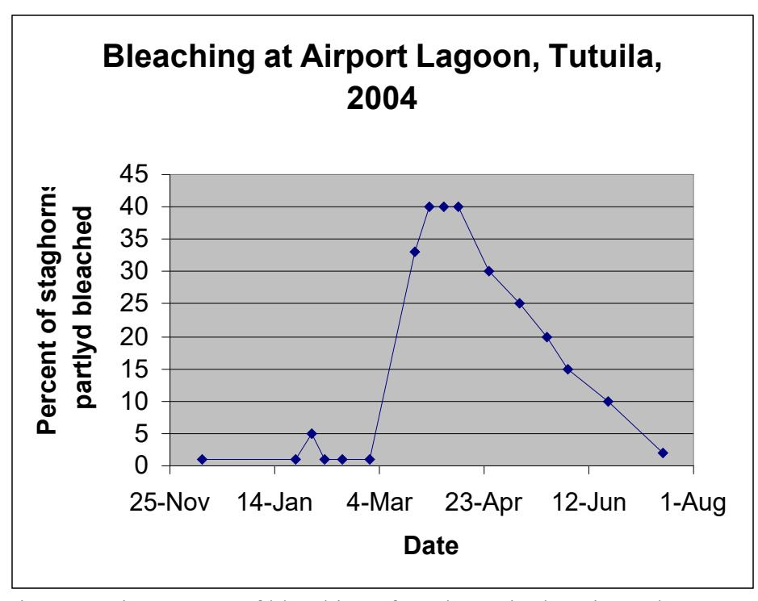
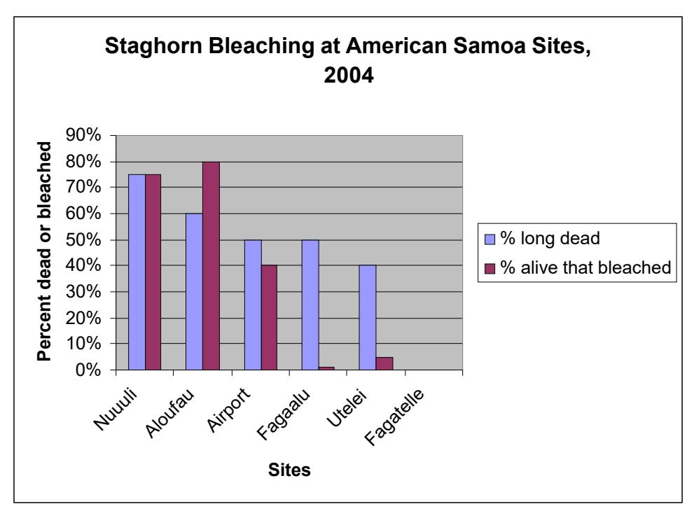

## **Summer Coral Bleaching Event, 2004, on Tutuila, American Samoa**

Report to Dept Marine and Wildlife Resources

By Douglas Fenner July 27, 2004

American Samoa's coral reefs have been impacted by a variety of major events, including periodic severe hurricanes, the most recent of which was Hurricane Heta, which was closest on Jan 6, 2004. Other events have included a Crown-of-Thorns seastar outbreak in 1974 and night scuba spearfishing from 1994-2002. Mass coral bleaching occurred in 1994 (Goreau and Hayes, 1994), and then again in the summers of 2002 (Green, 2002) and 2003 (Craig, personal comm., Mielbrecht, personal comm.), and the bleaching was severe enough to kill some corals.

A striking feature of the lagoon pools of Tutuila is the dominance of the coral populations by two groups (finger corals, *Porites cylindrica*, and staghorns (*Acropora*), 3 species). A further striking feature is that a large proportion of the staghorn corals are dead, but virtually nothing else is dead. The dead staghorn coral thickets are mostly still standing, but support a heavy growth of algae, primarily filamentous algae and coralline algae. This indicates that the staghorns did not die within the last few months, but probably not more than a few years ago (as they would have collapsed). Thus it appeared possible that the staghorns might have been killed by mass bleaching in 2002 and/or 2003. The fact that only staghorns were dead suggested that the cause of death was species-specific. Previous reports from elsewhere in the world indicate that corals in the genus *Acropora* are often more sensitive to bleaching than other corals. Craig et al (2001) have reported that lagoon pools in Ofu reach high temperatures for short periods of time on sunny days at low tide when waves cannot make it over the crest to pump water through the lagoon pools. All of these things together suggested that the staghorns in Tutuila lagoon pools may have been killed by previous mass bleaching events, and may be more sensitive to high temperatures (the primary factor causing mass coral bleaching).

In early December, 2003, not long after my arrival, I made my first observations of the staghorn corals in the Airport lagoon pool. Essentially no staghorn colonies were bleached. On the 24th of January, I began regular, bi-weekly observations of the staghorns in the Airport lagoon, thinking that the staghorns in this pool might bleach as water heated up in the summer. The percentage of bleached colonies was estimated following a roughly one-hour swim in the lagoon following roughly the same path. On Feb 5th, about 5% of colonies were estimated to be bleached, but on other dates through Feb 28 1% or less of colonies were estimated to be bleached (Figure 1). Then suddenly on March 21, 33% of colonies appeared bleached. All bleached colonies were only partially bleached, with bleaching restricted to upper surfaces, primarily on horizontal branches. There was no difference in the prevalence or intensity of bleaching with depthstaghorns at 20 foot depth were as bleached as at 1 foot depth. However, corals nearer to the crest and reef flat had a higher percentage of bleached colonies than closer to shore (the airport runway). In subsequent observations, the percentage bleached reached a maximum of about 40%, then decreased slowly as the staghorn corals recovered their

zooxanthellae (algae) and color. The course of recovery appears to be roughly linear, instead of being an exponential decay. The time course of recovery took much longer than the time for the bleaching to appear. All bleached corals recovered this year, none died, unlike in the previous two summers.

Figure 1: Time course of bleaching of staghorns in the Airport lagoon at Tutuila, American Samoa, in 2004.

During the bleaching, I also looked at corals in several other lagoons and a few reef slope spots. A total of 5 areas had significant proportions of dead staghorn, Airport, Nuuuli, Alofau, Faga'alu and Utelei. Three of these had significant amounts of bleached staghorns: Airport, Nuuuli, and Alofau. Faga'alu and Utelei had essentially no bleached staghorns. Reef slope sites, such as at Fagatelle Bay, Auto and Alofau, had essentially no bleaching. Among the reef slope sites, staghorns were found only at Fagatelle Bay. There were small numbers of bleached corals scattered among several species at some sites. But it was clear that significant bleaching occurred only among staghorn corals in three lagoons this year. The three lagoons with significant staghorn bleaching are all lagoons that are relatively enclosed, while the two with no bleaching are relatively open. It may be that the water got warmer in the more closed lagoons, causing more bleaching. Even the most closed lagoons in Tutuila are not as closed as those on Ofu. Even during low tide, water from breaking waves comes over the crest and flushes these lagoons. In the lagoon pools of Ofu, there is very little of the 3 staghorn species that bleached on Tutuila. Further, I did not see beds of dead staghorn in the Ofu lagoons. There are, however, thickets of the firecoral *Millepora dichotoma* in Ofu lagoon which are almost entirely dead (over 99%). I was able to find only one small branch of this species that was still alive. In the same lagoon, another species of fire coral (probably Millepora

exaesa) is entirely alive. Fire corals have been reported in previous studies to be among the corals most vulnerable to bleaching. The striking contrast between these two species in mortality suggests that they may have large differences in their ability to tolerate bleaching.

Figure 2: percentage of staghorn corals at different sites in American Samoa that were bleached, and percentage that were long dead (possibly killed by previous bleaching periods).

My original idea was that the staghorn corals in the lagoons could serve as an "Early Warning System" or "canary in the coal mine" for bleaching events. The lagoons are much easier to access on a weekly basis that most reef slopes. Also, the evidence from the dead staghorns suggested that they might be more sensitive to bleaching, and thus bleach first and provide a warning that a mass bleaching event might be starting. This warning could be used as a signal to search other lagoons and the reef slopes to see if a mass bleaching event was starting. The events of this year did demonstrate that the prediction that these lagoon staghorns are more sensitive to bleaching than other corals, and corals at other locations. However, since other corals did not bleach this year, it is not yet clear whether the lagoon staghorns will bleach before other corals, or if they do, by how much earlier (days? Weeks? Months?).

The first recorded mass coral bleaching in American Samoa occurred in 1994, and this has been followed with bleaching in the summers of 2002, 2003, and 2004. In 2003, about 20-30% of corals on reef slopes bleached, and some corals died, though we don't have quantitative information on coral deaths. The 2002 bleaching was also reported to cause some coral death. In 2004, however, bleaching was restricted to staghorns in 3 lagoons, and all colonies were only partly bleached and none died. A review of the Sea

Surface Temperatures (SST's) for American Samoa reveal that SST's were rising when Hurricane Heta approached the islands in early January. Heta caused a sudden drop in SST's to winter levels, probably caused by wave mixing of warm surface water with deeper cool water. This was followed by a rising temperature curve very similar to that before the hurricane. It is possible that this resetting of the heating process kept the peak temperatures below what they would have been without Heta. If so, this summer's bleaching may have been lower than it would have been otherwise.

Three summers in a row with coral bleaching is a clear change from previous years, with only one bleaching event, eight years earlier. It may be that bleaching is now the normal summer pattern for American Samoa. Some studies have projected that bleaching every summer might be common around the world by perhaps 2020. It may be that this pattern has already arrived in American Samoa, and American Samoa is now experiencing what the rest of the world may experience in another 15 years or so. This presents an opportunity for scientists to study the effects of annual summer bleaching long before it arrives elsewhere. It also affords an opportunity for scientists to plan studies for a reliable, predictable annual bleaching event. So far, bleaching outside the laboratory has been predictable only a few weeks in advance (by using satellite recorded SST's to look for hotspot anomalies).

However, it may be wise to be cautious. Three summers of bleaching in a row don't prove that every summer in the future will have bleaching. It could be that there has been an unusual period for the last three years, and the pattern will change and bleaching will not be an annual summer event. Weather patterns are notoriously variable. Even if it is an annual summer event, there are very limited infrastructure resources on the island for outside researchers. Currently there is only one small-capacity air compressor, boats are frequently out of operation, and there is no dedicated marine laboratory space. Although there are plans for a marine laboratory, it is likely to be 5 years or more before such a facility may be available, if at all.

## References

Craig, P., Birkeland C, Belliveau S. 2001. High temperatures tolerated bya diverse assemblage of shallow-water corals in American Samoa. Coral Reefs 20: 185-189.

Goreau, T. J., and Hayes, R. L. 1994. A survey of coral reef bleaching in the south central Pacific during 1994. Report to Coral Reef Initiative, U.S. Dept of State. 118 pp, 54 figures.

Green, A. 2002. Status of coral reefs on the main volcanic islands of American Samoa: a resurvey of long term monitoring sites (benthic communities, fish communities, and key macroinvertebrates). Report to Dept. Marine & Wildlife Resources, American Samoa. 86 pp.