# **Report of 2005 American Samoa Coral Reef Monitoring Program (ASCRMP), Expanded Edition**

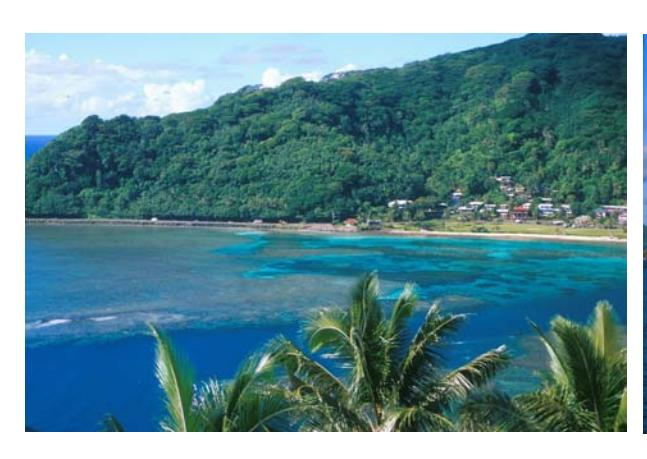

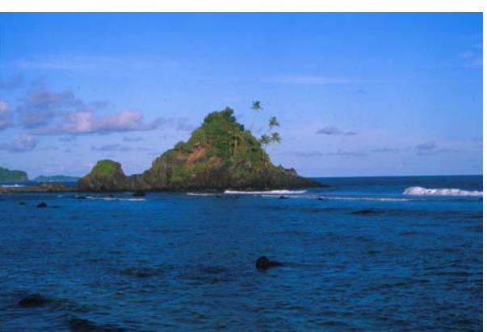

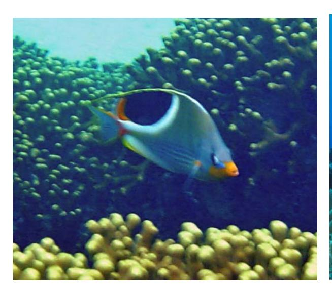

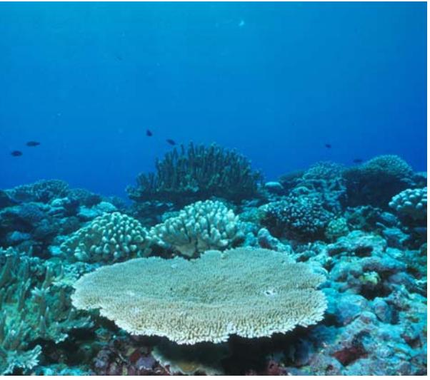

By Douglas Fenner, Leslie Whaylen and Emmanuel Tardy (first two authors equal contributors in alphabetical order) Ex and Douglas Fenner, Chief Biologist Pre es pansion by Douglas Fenner, Coral Reef Monitoring Ecologist Based on the report by Leslie Whaylen, Coral Reef Monitoring Coordinator pared for Department of Marine and Wildlife Resourc and Coral Reef Advisory Group Revision: August, 2006

# **Table of Contents**

| Acknowledgements and Contributors                                  |    |
|--------------------------------------------------------------------|----|
| Review of ASCRMP Objectives                                        | 4  |
| Monitoring Sites                                                   | 4  |
| Timeline                                                           |    |
| 2005 ASCRMP Team                                                   | 6  |
| Parameters and Methods in Core Sampling Regime                     | 6  |
| Bottom Cover                                                       |    |
| Fish                                                               |    |
| Invertebrates                                                      |    |
| Water Quality                                                      |    |
| Parameters and Methods in Supplemental Monitoring for Biodiversity |    |
| Database                                                           |    |
| Monitoring Tools Handbook                                          |    |
| Results                                                            |    |
| Bottom Cover                                                       |    |
| Rugosity                                                           |    |
| Coral Bleaching.                                                   |    |
| Coral Disease                                                      |    |
| Coral Species Richness                                             |    |
| New Coral Species Sightings for the Territory                      |    |
| Fish Biomass during Core Sampling Regime                           |    |
| Fish Abundance during Core Sampling Regime                         |    |
| Fish Species Richness                                              |    |
| Large Fish Sightings                                               |    |
| Key Reef Fish Species during Supplemental Monitoring               |    |
| New Fish Species Sightings for the Territory                       |    |
| Invertebrates                                                      |    |
| Sea Turtle Sightings                                               |    |
| Recommendations for 2006 Monitoring                                |    |
| Dive and Boat Safety                                               |    |
| Database                                                           |    |
|                                                                    |    |
| Training                                                           |    |
| Bottom cover                                                       |    |
| Coral Disease                                                      |    |
| Management Recommendations                                         |    |
| References                                                         | 42 |
| Appendix 1 – 2005 Data for ASCRMP Sites                            |    |
| Amaua                                                              |    |
| Aoa                                                                |    |
| Aunu'u                                                             |    |
| Faga'alu                                                           |    |
| Fagamalo                                                           |    |
| Fagasa                                                             |    |
| Fagatele                                                           |    |
| Leone                                                              |    |
| Nu'uuli                                                            |    |
| Tafeu                                                              |    |
| Vatia                                                              |    |
| Appendix 1 – Most Commonly Sighted Fish Species                    |    |
| Appendix 2 – Most Abundant Fish Species                            | 58 |

## **Acknowledgements and Contributors**

*Front photo cover pictures are printed permission of Reef Environmental Education Foundation (REEF) and Francesca Riolo (bottom left). Thanks to Marlow Sabater for assistance in analyzing fish data, and for doing cluster analysis, MDS and PCS on coral data. GIS Specialists Francesca Riolo (DMWR) and Troy Curry (DOC) provided their services for chart and maps. Thank you to boat captains Mika Letuane, Terry Lam Yuen, and Lemuelu Kitiona. Other DMWR staff accompanied and assisted during field days including Ekueta Schuster, Poasa Tofaeono, Marlow Sabater, Tepora Toliniu, and Francesca Riolo. Funding for the first year of the Coral Reef Monitoring Project Coordinator was provided by the National Oceanic Atmospheric Agency/National Ocean Service/Office of Coastal Resource Management in the approval of American Samoa's Non-Point Source Pollution Program in 2003.* 

#### *2004-2005 Monitoring Working Group*

*Chair: Leslie Whaylen, Department of Marine and Wildlife Resources Peter Craig, National Park of American Samoa Nancy Daschbach, Fagatele Bay National Marine Sanctuary Eva DiDonato, National Park of American Samoa Guy DiDonato, American Samoa Environmental Protection Agency Doug Fenner, Department of Marine and Wildlife Resources Chris Hawkins, Coral Reef Initiative Coordinator Fatima Sauafea, National Marine Fisheries Service* 

## **List of Acronyms**

| ASEPA CFMP COTS | American Samoa Environmental Protection Agency Community-based Fisheries Management Program Crown-of-Thorns |
|-----------------------|-------------------------------------------------------------------------------------------------------------------|
| CRAG                  | Coral Reef Advisory Group                                                                                         |
| CRM                   | Coral Reef Monitoring                                                                                             |
| DMWR                  | Department of Marine and Wildlife Resources                                                                       |
| DOC                   | American Samoa Department of Commerce                                                                             |
| FBNMS                 | Fagatele Bay National Marine Sanctuary                                                                            |
| GIS                   | Geographic Information System                                                                                     |
| GPS                   | Global Positioning System                                                                                         |
| MPA                   | Marine Protected Area                                                                                             |
| NCCOS                 | National Center for Ocean and Coastal Science                                                                     |
| NMFS                  | National Marine Fisheries Service                                                                                 |
| NOAA                  | National Oceanic and Atmospheric Administration                                                                   |
| NPSA                  | National Park of American Samoa                                                                                   |
| RDT                   | Roving Diver Technique                                                                                            |
| REEF                  | Reef Environmental Education Foundation                                                                           |
| SPC                   | Stationary Point Count                                                                                            |
| WPacFIN               | Western Pacific Fishery Information Network                                                                       |

## **Review of ASCRMP Objectives**

The primary intent of the ASCRMP is to collect data on a yearly basis by on-island staff in order to detect change and trends in the measured parameters over a period of years. The ASCRMP was not designed primarily to compare sites to each other based on geographic distribution, reef type, exposure, or impacts. However, when patterns appear in the data, such patterns will be explored, keeping in mind that the sites were not randomly chosen, nor chosen to represent all habitats, exposures, impacts, etc. Comparison with the results of other studies can help determine whether the observed patterns are real or spurious. Nor does the ASCRMP attempt to survey and describe all of the island's reefs. Rather, the purpose of ASCRMP is to collect data from the monitoring sites in order to provide long-term trend information about marine resources. Change over time is the most important objective and should be kept in mind when reading and reviewing the ASCRMP reports.

As 2005 is the first year in the data collection for this long-term monitoring plan, this represents one data point. In following years of data collection for the ASCRMP, additional data points data will be added and can then be compared and analyzed within each site in order to look for trends in coral reef health.

## **Monitoring Sites**

Eleven sites were chosen by the CRAG Monitoring Working Group as a reasonable sample size in the ASCRMP's first year of implementation. Monitoring sites in the ASCRMP represented an equitable distribution around the main island of Tutuila and the nearby small island of Aunu'u, providing a reasonable geographic distribution and some of the variety of reef types and exposures (i.e. windward/leeward). The site plan for the ASCRMP incorporated federal, territory, and community-based MPAs. Three of the 11 monitoring sites are community-based MPAs within DMWR's Community-based Fisheries Management Program (CFMP) (Fagamalo, Vatia, and Amaua) and 2 sites are federal MPAs (Fagatele and Tafeu).

Based on population density and subsequent impacts to the watershed, the ASCRMP incorporated villages in the complete range of the ASEPA watershed classification scale; pristine, minimal, intermediate, and extensive (DiDonato 2004). Three of the 11 monitoring sites (Leone, Nu'uuli and Faga'alu) are categorized as Extensive, three sites are categorized as Intermediate (Amaua, Aoa, and Fagasa), one site is categorized as Medium (Vatia), and three sites are categorized as Pristine (Fagatele, Tafeu and Fagamalo).

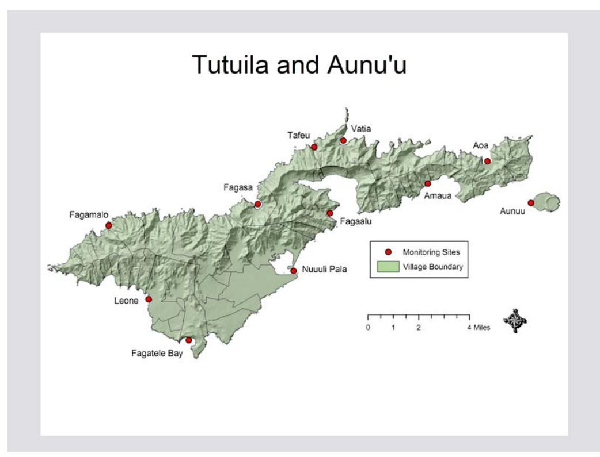

Figure 1. Location of 11 monitoring sites in ASCRMP around Tutuila and Aunu'u. Map courtesy of Troy Curry, DOC, American Samoa.

Fagamalo Fagasa Tafeu Vatia Aoa Amaua Faga'alu Nu'uuli Fagatele Leone Aunu'u

## **Timeline**

The number of monitoring sites was chosen based on logistical constraints and the desire to complete the monitoring program within the same season. Additionally, the ASCRMP manual instructs that data collection of the core and supplemental monitoring programs should be conducted during the same quarter each year in an effort to minimize seasonal differences such as water temperature and prevailing winds.

Monitoring for the 2005 ASCRMP for the core sampling regime commenced on March 10, 2005, and concluded on April 21, 2005. All replicates for bottom cover, invertebrates, and fish were accomplished in two dives per day or one monitoring site per day. In total, the 11 monitoring sites were accomplished in 11 field days. However, these field days were spread out over 31 business days.

Monitoring for the 2005 ASCRMP for the supplemental sampling regime for biodiversity counts commenced on April 22, 2005, and concluded on June 1, 2005. One dive at each site was conducted. In total, the 11 monitoring sites were accomplished in 7 field days. However, these field days were spread out over 29 business days.

Overall, monitoring for the 2005 ASCRMP were accomplished in 18 field days spread out over 60 business days or 3 calendar months. Delays were due to sharing the DMWR boat with other DMWR programs and visiting researchers, a boater safety course held at DMWR, 5 government holidays, off-island workshops, and on-island meetings and workshops such as CRAG, Western Pacific Fishery Information Network (WPacFIN), Ocean Symposium, and the CFMP Monitoring Workshop.

| Core Sampling Regime |        |                |  |
|----------------------|--------|----------------|--|
| Dive site            | Date   | Time           |  |
| Amaua                | 21-Apr | 10am-2pm       |  |
| Aoa                  | 16-Mar | 10:30am-2:00pm |  |
| Aunu'u               | 11-Mar | 11:00am-2:00pm |  |
| Faga'alu             | 20-Apr | 11am-2pm       |  |
| Fagamalo             | 30-Mar | 12pm-3pm       |  |
| Fagasa               | 18-Mar | 12pm-3pm       |  |
| Fagatele             | 15-Apr | 11am-2pm       |  |
| Leone                | 10-Mar | 10:00am-1:00pm |  |
| Nu'uuli              | 15-Mar | 12pm-3pm       |  |
| Tafeu                | 31-Mar | 10:30am-1:30pm |  |
| Vatia                | 1-Apr  | 11am-2pm       |  |

| Supplemental Monitoring Regime |        |                 |  |  |
|--------------------------------|--------|-----------------|--|--|
| Dive site                      | Date   | Time            |  |  |
| Amaua                          | 22-Apr | 12:30pm-1:30pm  |  |  |
| Aoa                            | 1-Jun  | 12:40pm-1:40pm  |  |  |
| Aunu'u                         | 22-Apr | 10:00am-11:00am |  |  |
| Faga'alu                       | 12-May | 8:30am-9:30am   |  |  |
| Fagamalo                       | 4-May  | 11:30am-12:30pm |  |  |
| Fagasa                         | 4-May  | 2pm-3pm         |  |  |
| Fagatele                       | 11-May | 12pm-1pm        |  |  |
| Leone                          | 11-May | 10am-11am       |  |  |
| Nu'uuli                        | 12-May | 10:30am-11:30am |  |  |
| Tafeu                          | 5-May  | 12pm-1pm        |  |  |
| Vatia 5-May                 |        | 10am-11am       |  |  |

Tables 1 and 2. Dates and times of Core Sampling Regime and Supplemental Monitoring Regime at the 11 monitoring sites in the ASCRMP.

## **2005 ASCRMP Team**

The 2005 ASCRMP Team consisted primarily of the CRM Coordinator, Leslie Whaylen, DMWR Chief Biologist, Douglas Fenner, and DMWR Fisheries Biologist, Emmanuel Tardy. Whaylen served as Fish Diver, Fenner as Coral Diver, and Tardy as Invertebrate Diver. Boat captains included Mika Letuane, Terry Lam Yuen, and Lemuelu Kitiona. Other DMWR staff accompanied and assisted during field days including Ekueta Schuster, Poasa Tofaeono, Marlowe Sabater, Tepora Toliniu, and Francesca Riolo. All 2005 monitoring was conducted from the DMWR Boston Whaler boat.

# **Parameters and Methods in Core Sampling Regime**

| 1. Coral Condition        | % cover, rugosity, disease, bleaching                         |  |
|---------------------------|---------------------------------------------------------------|--|
| 2. Algal Cover            | % cover                                                       |  |
| 3. Fish                   | Species abundance, length, and biomass of selected species |  |
| 4. Macro invertebrates | Species abundance (giant clam, lobsters, COTS)                |  |
| 5. Water Quality          | Turbidity                                                     |  |
| 6. Anthropogenic          | Debris, damage                                                |  |

Monitoring for the ASCRMP was conducted on the reef slopes between 8-10m depth isobath. Within each area, sampling sites were located with GPS coordinates. Four replicates for bottom cover and six replicates for fish were conducted. Divers boated to the monitoring site using a GPS and other navigational tools. Once at the site, a weighted marker was dropped to mark the location. Divers then descended at this line to the 8-10m depth contour, took the bearing as described in the Monitoring Tools Handbook, and began the monitoring.

## *Bottom Cover*

Benthic attributes were recorded by the Coral Diver in four replicates of 50m transects using a point-intercept method. Every ½ meter (100 data points per transect), bottom cover was recorded in categories and corals were identified to life form and genus (species when possible). To reduce observer bias when the transect tape was not stationary, the first item spotted when the diver was directly over the point was recorded. Bottom categories included crustose coralline algae, branching coralline algae, living hard coral, soft coral, macro algae, filamentous algae, *Halimeda*, invertebrate, dead coral, bleached coral, rubble, sand, and rock. There were some foliose coralline algae (thin flat grey-brown plates) that were included in the crustose coralline algae. Filamentous algae included all rock surfaces that had a fine, barely visible fuzz of filamentous algae. Because the 2005 Coral Diver had extensive coral taxonomy training, corals were recorded in lifeform, genus, and where possible species. Coral lifeforms included branching, massive, encrusting, foliose, submassive, mushroom, blue, *Acorpora* branching, *Acropora* digitate, *Acropora* table, *Acropora* encrusting, and *Acropora* submassive. However, all corals were recorded in lifeform as well as species. Thus, data from 2005 and future years will be comparable in lifeform even if species is not available. Only one benthic category was recorded per point, so the totals add up to 100% cover. If there were multiple layers below (and/or above) the tape, only the cover category on the top layer was recorded. Anthropogenic damage was also recorded, such as debris and anchor damage. Occurrence of coral bleaching, disease, or predation (such as by the Crown-of-Thorns (COTS) *Acanthaster* or the snail *Drupella*) were recorded if present in the transect under the recording points. On a wider area, bleaching, disease, and anthropogenic damage were recorded anecdotally. Rugosity was also measured by the Coral and Invertebrate Divers together by laying a 20m metal chain under the transect tape, following the reef contour.

#### *Fish*

Census for fish was performed by the Fish Diver who conducted six replicates of a modified Bohnsack stationary point count (SPC) with a radius of 7.5m. Approximate time to complete one SPC ranged from 11-18 minutes.

The first transect tape for benthic cover was laid 5m beyond the radius of the first SPC. The Fish Diver recorded the start time and proceeded to an area to begin a SPC. The diver visually estimated a 7.5m radius and immediately began recording data. The observer enumerated fish within this visually specified area. After the SPC was conducted, the Fish Diver confirmed the radius of the SPC with a transect tape. A pre-printed list served as a guide for fish species that included key reef species, indicator species, and functional groups (see ASCRMP manual). Additional information on length assessments for selected key reef fish species were also recorded in order to derive biomass. Key reef species are those species targeted and harvested by inshore fishermen in American Samoa and correspond to those in DMWR Creel and Market Survey Program.

After the first SPC was completed, the Fish Diver swam at least 7.5m beyond the end of the first transect tape, recorded the start time, and began the second SPC. After the second SPC was completed, the Fish Diver swam at least 7.5m beyond the end of the second transect tape, recorded the start time, and began the third SPC. After the third SPC was completed, the Fish Diver reeled in the second transect tape used by the Coral and Invertebrate Divers for bottom cover assessments.

For the key reef species, the larger, mobile species groups were counted first to ensure these types of fish were counted before they left the census area. The Fish Diver hovered 1m above the substrate in the middle of the circular area and began counting the first species group on the list while slowly turning in a circle. Only one group of species was recorded while the Fish Diver rotated 360 degrees during a period of 1 minute. Then a different species group was recorded on the next rotation. Once a species group had been counted, no additional data were recorded for that species group. Individuals (juvenile, initial, and terminal phases) of large wrasse species whose adult length for the species is a minimum of 25cm were included in this assessment of key reef species. Length assessment of key reef fish species were recorded to centimeter, but were simplified and also recorded in the database in 5cm size categories, according to the ASCRMP manual. Thus, data from 2005 and future years will be comparable in those categories.

Fish biomass estimates were calculated using the length assessments recorded during the 6 SPCs at each of the 11 ASCRMP sites. The biomass was calculated by using the formula W=A\*L^B where W=weight, L= length, and A&B= values generated from slopes of length and weight of each species.

Other functional groups where only abundances (not length assessments) were recorded during the SPC included butterflyfish, angelfish, surgeonfish, and triggerfish. Selected indicator species were also recorded. The species indicative of healthy coral reef ecosystems in American Samoa according to McCardle (2003) included in the SPC counts for the ASCRMP are the following: *Plectroglyphidodon dicki* (Blackbar damselfish), *Melichthys vidua* (Pinktail triggerfish), *Labroides* sp. (cleaner wrasse), *Chaetodon vagabundus* (Vagabond butterflyfish), and *Labrichthys unilineatus* (Tubelip wrasse). Additionally, some of these species included in these groupings are obligate corallivores. Each of the functional groups and indicator species was allotted one minute during the SPC. However, since many of the surgeonfish are locally abundant (i.e. Lined Bristletooth, *Ctenochaetus striatus*), several of these species were allotted one minute separately from the rest of the species in that grouping. Two species of surgeonfish, *Ctenochaetus striatus* (Lined Surgeonfish) and *Acanthurus nigrofuscus* (Brown Surgeonfish) were lumped together in the category of Pone, a Samoan name for the dark brown or black-colored surgeonfish harvested from the reefs. Three species of cleaner wrasse *Labroides dimidatus* (Bluestreak Cleaner Wrasse), *L. bicolor* (Bicolor Cleaner Wrasse) and *L. rubrolabiatus* (Redlip Cleaner Wrasse), were lumped together during the data collection. All species recorded are diurnally active, and not cryptic. Nocturnal and cryptic species are not well recorded by UVC (Brock, 1982)

This report includes only the values of mean number for the groupings of corallivores, Pone, all surgeonfish, *P. dickii*. A*canthurus lineatus* (Striped Surgeonfish), locally called Alogo, is a heavily harvested species and is also included in this report. Mean numbers of the other groupings (i.e. cleaner wrasse, etc.) are available in the database.

#### *Invertebrates*

Invertebrate monitoring was conducted by the Invertebrate Diver along the same four transects used for bottom cover evaluation. Transects were 50m long by 2m wide. This count covered the most important invertebrates harvested as seafood and some key species such as *Charonia tritonis* and one of its prey, *Acanthaster plancii*. Since the 2005 Invertebrate Diver had the expertise in invertebrate taxonomy, smaller invertebrates were also recorded.

#### *Water Quality*

With the exception of turbidity, the water quality parameters of temperature, salinity, pH, and dissolved oxygen were not assessed at the survey time due to equipment unavailability. Vertical water clarity was measured with a secchi disc. The masked observer leaned over the side of the boat to watch the secchi disc descend until the black and white pattern could no longer be clearly seen.

Satellite-derived sea surface temperatures are available through NOAA. DMWR's GIS Specialist, Francesca Riolo, conducted a comparison study between satellite-derived sea surface temperatures and in situ temperatures. Only small differences were found between the two parameters for American Samoa's nearshore coastal waters. Data from 1985-2005 are available at DMWR.

American Samoa Environmental Protection Agency is also developing a water quality sampling program at the ASCRMP monitoring sites. This program is slated to begin in 2006.

## **Parameters and Methods in Supplemental Monitoring for Biodiversity**

Biodiversity counts for coral, fish, and other invertebrates were included as supplemental monitoring. Biodiversity counts were conducted on a separate field day from the core sampling regime and were recorded during approximately one hour roving dives at each dive site. All corals, fish, and invertebrates were identified in situ where possible, selected specimens photographed with a still camera, and samples collected when necessary. Counts of COTS and giant clams were taken to supplement the macroinvertebrate transect data. Any sea turtles sighted were reported on an In-Water Turtle Sighting Form and given to DMWR's Wildlife Division. Observations of coral disease, bleaching, coralline algae disease, algae blooms, and coral predation (such as by COTS or *Drupella*) were recorded, as well as any other unusual phenomena. Abundances for coral were estimated using the DAFOR (Dominant, Abundant, Frequent, Occasional, Rare) logarithmic scale.

During fish biodiversity counts, species were recorded and given an abundance category according to the Roving Diver Technique (RDT) used by Reef Environmental Education Foundation (REEF). The categories are order of magnitude estimates of the number of individuals signed during the survey: **S**ingle=1, **F**ew=2-10, **M**any=11-100, and **A**bundant=over 100. Sighting frequencies and density indices were calculated for each species. Sighting frequency (%SF) is a measure of how often the species was observed. It indicates the percentage of times out of all surveys that the species was recorded. The %SF parameter is calculated as:

 S + F + M + A (for each species) %SF = 100 \* ----------------------------------------- (Number of surveys)

The density index (Den) is a measure of how many individuals of a species were observed based on a scale of 1-4. It is representative of the abundance category (1-4) which was most frequently recorded for the species when it was observed. Abundance category weights are **S**ingle=1, **F**ew=2, **M**any=3, and **A**bundant=4. This weighted density average is calculated as:

 (S \* 1) + (F \* 2) + (M \* 3) + (A \* 4) Den = ------------ -------------------------------------------------

(Number of surveys in which species was observed)

This number indicates which abundance category the species was most often recorded in when it was recorded. For example, Den=2.2 would be reflective of a species that was most often recorded in category 2 (Few) but because the density index is greater than 2, there were some abundances recorded for this species in the other, larger abundance categories (either category 3 or 4). The density index should be used as an abundance guide because area is not rigorously controlled in the RDT method. It should also be kept in mind that the density (Den) parameter is reflective of sighting distributions in the four different abundance categories (S, F, M, and A) and different distributions of sightings in each abundance category could potentially give similar values of Den. In other words, it does not account for non-sightings.

By simultaneously examining the sighting frequency (%SF) and density index (Den), data summaries can be interpreted for fish species. The Den and %SF scores were multiplied to provide a measure of species abundance which includes zero observations.

Fish biodiversity was also sampled during the core sampling regime, but within a shorter time frame at each dive site. The total observation time for biodiversity during the supplemental monitoring was 60 minutes. Two dives at the same site during the core sampling regime were conducted, but biodiversity data were recorded in between Stationary Point Counts (SPCs), resulting in a total observation time for biodiversity of approximately 40 minutes. Additionally, the method of biodiversity counts between the core and supplemental monitoring regimes differed in that the diver was focused for the entire dive on identifying and enumerating all fish species during the supplemental monitoring regime as opposed to only recording biodiversity data in between the Stationary Point Counts during the core sampling regime.

 The Roving Diver Technique has been used frequently in monitoring fish biodiversity (Schmidt et al 2002; Hill & Wilkinson, 2004). It compliments transect data, since it covers a larger area and thus more species are found, plus depths which are not included in the transects surveyed, and zonation is often such that species not found in transects are found at other depths. However, transect data produces more accurate quantitative data. The Roving Diver Technique is commonly used in Rapid Assessment Programs for corals and selected invertebrate groups as well as fish (e.g., Allen et al 2003). Although areas covered are not measured, if the duration of the dive is standardized, quantitative comparisons of diversity are possible (Fenner, 2005b).

#### **Database**

A meeting between DMWR and WPacFIN was held on March 24, 2005, to discuss the possibility of WPacFIN developing a monitoring database for the ASCRMP data within the established Fisheries Database at DMWR. Final word is pending whether this proposal was accepted or not.

In the interim, all data from the 2005 ASCRMP were entered from separate computers into Microsoft Excel spreadsheets.

Additionally, CRAG and FBNMS have submitted a proposal to fund the development of a database to house all data. The proposal seeks to fund the purchase of two dedicated database workstations (one to be housed at DMWR, the other at FBNMS) for the sole purpose of housing and accessing a comprehensive database on marine and coral reef resources in

American Samoa. In addition, funding for a server was also requested to make these databases available (by permission) to island members and off-island researchers.

## **Monitoring Tools Handbook**

A Monitoring Tools Handbook was developed as an item to take on the boat during field days for the ASCRMP. This Handbook included laminated pages of an emergency contact list, monitoring checklist, dive equipment checklist, boat checklist, GPS coordinates and descriptions of the monitoring sites, and satellite images of the monitoring sites. Additionally, a large map of a satellite image of Tutuila and the monitoring sites was printed and laminated as a tool for boat navigation.

## **Results**

The following table gives a snapshot of the 2005 results.

| All 11 ASCRMP Sites | Mean |
|---------------------|------|
| % Live Coral Cover  | 28.2 |

| % Live Coral Cover                    | 28.2  |
|---------------------------------------|-------|
| % Crustose Coralline Algae Cover      | 35.2  |
| % Macroalgae Cover                    | 2.0   |
| Rugosity Ratio                        | 1.19  |
| Fish Biomass (g/m2)                   | 56.09 |
| Coral species Richness (# of species) | 71    |
| Fish species Richness (# of species)  | 123   |

#### *Benthic Cover*

The benthic substrate of reef slopes in American Samoa is typically dominated by crustose coralline algae and hard corals. Thus, an average of 35.2% of the substrate at the 11 ASCRMP sites was covered with crustose coralline algae, and 28.2% by living hard corals. The 28% live coral cover is very close to the 27% live coral cover found by Sabater and Tofaeono 2006, for 24 sites around Tutuila. Their 24 sites were completely different from the present sites. Aeby and Work (2005) in their coral disease study, also recorded benthic cover at 7 sites, and found 35% live coral cover. Five of their sites were in the same general bays as five of our sites, but not at the same exact location, and for those five sites we found 32% cover and they found 39% cover. The 28% living hard coral cover found in this study is slightly higher than the average (25%) for reef slopes in six other countries in the South Pacific (SPC, 2005), and very close to the estimated global average of 32% reported by Wilkinson (2002). Dead coral was rarely recorded, with an average live coral index of 96.7%. (Live coral index was calculated from the ratio of live coral cover to total coral cover, including dead coral.) Macroalgae also had very low cover on most reefs in the 2005 ASCRMP, averaging 2% cover. Most of the macroalgae is *Halimeda*, a green calcarious algae, and virtually none of it is brown macroalgae such as *Sargassum*, *Turbinaria*, or *Lobophyllia*, which are species that often dominate dead surfaces in the absence of herbivores and/or presence of elevated nutrients, such as in Fiji. The abundance of crustose coralline algae and living hard corals along with the rarity of macroalgae indicates a healthy benthic coral reef community for the ASCRMP sites.

The 28% live coral cover found in the present study is well above the levels reported in studies done in 1995 and 1996, reporting 4% at 6 m depth and 12% at 3 m depth in 1995, and 16% in 1996. This is consistent with the view that there has been significant recovery from hurricanes

and bleaching since then. However, the 28% is well below the levels of 46% reported for 2002 and 40% for 2004 (summarized in Craig et al 2005). It appears unlikely that there has been a significant decrease since 2004, so those figures will need rechecking. It is possible that since they were different sites the differences reflect site differences not changes over time, or it may be that different methods of counting were used.

Two other major components of the algal community in American Samoa in addition to macroalgae and crustose coralline algae are filamentous algae and branching coralline algae. Cover for branching coralline algae averaged 4.2%, ranging from 0% cover to 16% cover. The branching coralline algae probably have ecological dynamics similar to crustose coralline algae, and thus may be a good sign. Filamentous algae averaged 16.4% cover, ranging from 0% cover to 45% cover. The filamentous algae usually grow on relatively newly opened substrate. Filamentous algae have a very small biomass, but very high growth rate. It is typically cropped very rapidly, primarily by herbivorous fish, which can bite the substrate up to 10's of thousands of bites per square meter per day (Hixon and Brostoff, 1996). Thus, the filamentous algae are a major primary producer, and base of a food chain which in American Samoa appears to primarily consist of herbivorous fish and the carnivorous fish that feed on them (some places sea urchins are a major herbivore). The presence of a significant area of filamentous algae, with very little macroalgae, is consistent with a fish community that has large numbers of herbivorous fish, such as surgeonfish (Acanthurids) and parrotfish (Scaridae). Herbivores are a critical component of the coral reef ecosystem, since they must be sufficiently abundant to keep filamentous and macroalgae in check, and allow coralline algae and hard corals to compete and dominate the substrate.

Soft corals averaged just 0.8% bottom cover, and are thus a minor component of the bottom cover on reef slopes. The most common genus by far is *Cladiella*, but a total of 10 genera have been found by D. Fenner on Tutuila so far. In addition, two genera of black coral, three genera of zoanthids, and three genera of coralimorphs have been found by D. Fenner. *Zoanthus* cf. *sociatus* is common in reef flat pools, and *Rhodactis* sp. is common at Nuuuli pool and Tafeu. The other species are all uncommon to rare.

Spatial patterns in the benthic cover can be seen in a bar graph in which each of the benthic categories at each site are represented by a different color. The 11 sites are ordered from left to right beginning with Fagamalo at the NW corner of Tutuila and progressing clockwise around the island.

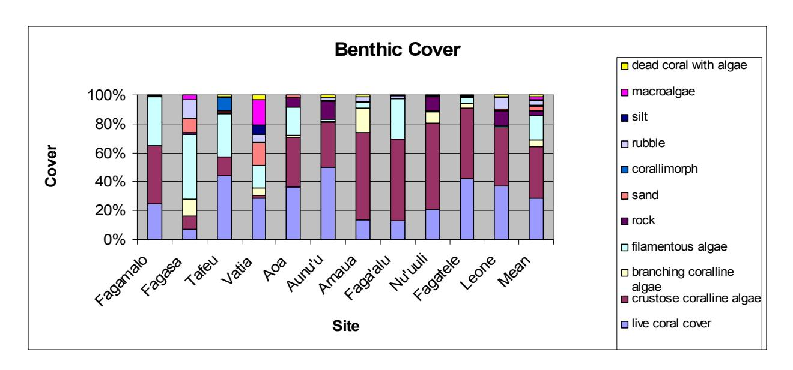

Although coral cover did not differ between the north and south sides, crustose coralline algae cover appears to be higher on the south side, and filamentous algae on the north. The algae differences are summarized in the next graph. The differences were significant on a t-test assuming unequal variances, p < .05. Sabater and Tofaeono (2006) found 49% coralline algae cover at their sites on the north side, and 69% cover on their sites on the south side. The data of Aeby and Work (2005) also show a higher level of crustose coralline algae on the south side than north, with 32% cover on their south side sites and 19% cover on their north sites. Thus, this difference is a strong and real difference that is general for sites on the North vs. South.

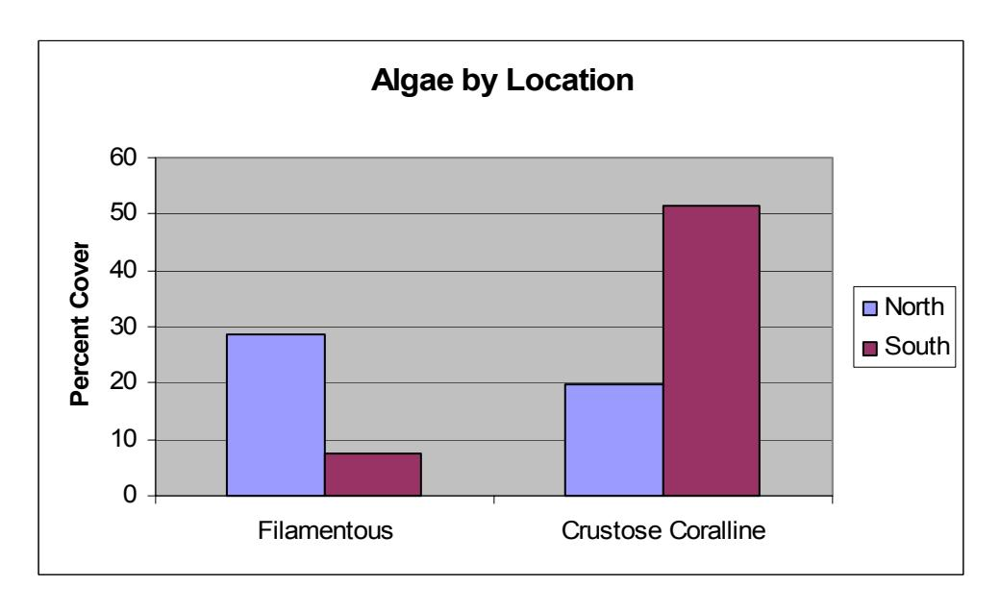

The south side of the island has onshore winds and wave surge from the southeast most of the year, but the north side has a shorter summer period with wind and waves. Further, hurricanes generally strike the north side harder than the south. This is probably the cause of the steeper cliffs on the north side: the greater erosive power of hurricanes. Points on the north are volcanic rock with filamentous algae and less coral cover (Sabater and Tofaeono, 2006), while reefs are restricted to bays. Hurricanes rip corals off of points, and reefs are restricted to bays, much like

in Hawaii. Reefs in bays probably have less wave action and circulation, particularly on the north for most of the year, and thus sediments build up on coralline algae and are not cleaned off. On the south side, steadier wave surge keeps coralline algae clean. Coralline algae thrives best when clean of sediment and algal overgrowth.

The most common coral life forms in the transects at all 11 ASCRMP sites put together were encrusting, branching, massive, and table. The data supports the visual observations by the Coral Diver of the encrusting coral as the most common life form.

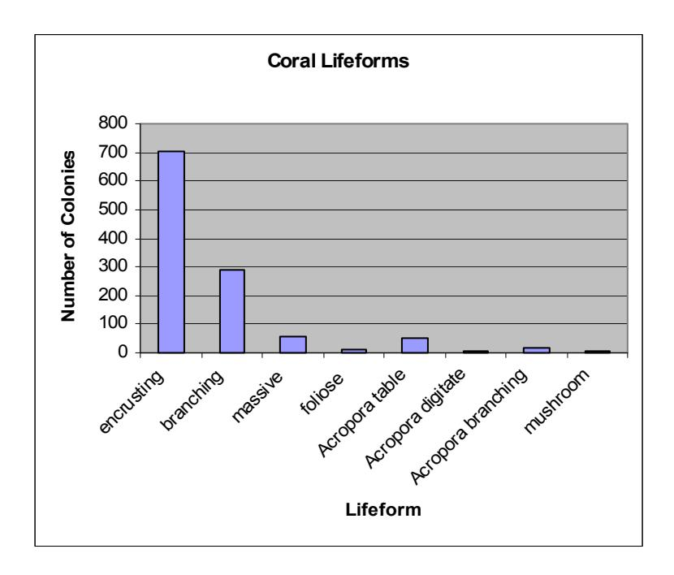

There did not appear to be any strong spatial patterns in the coral lifeform data.

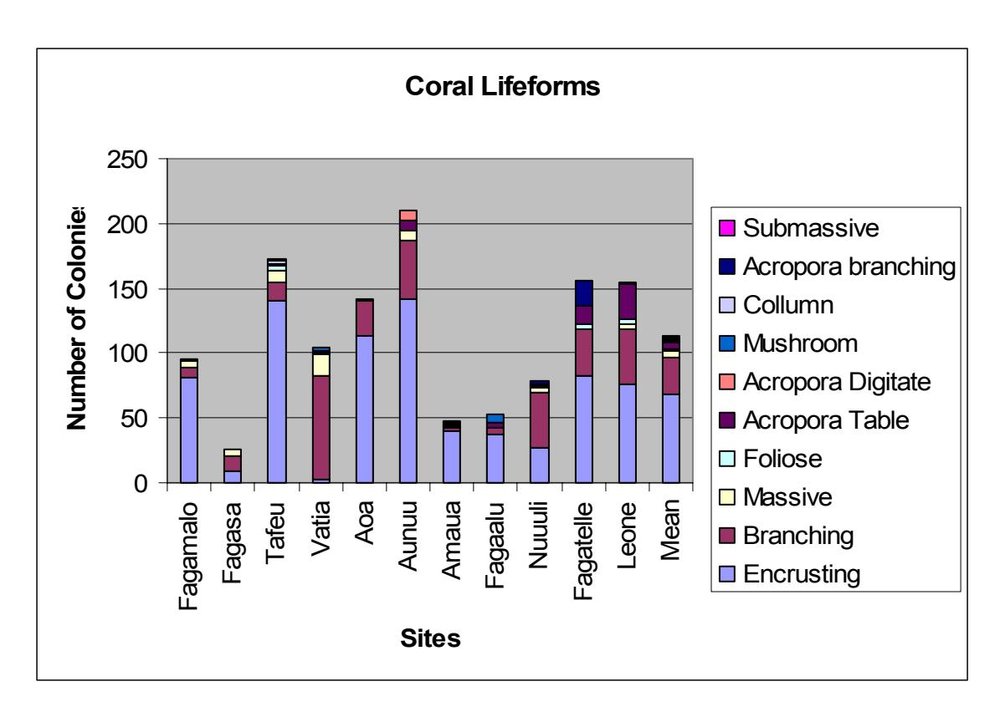

Encrusting *Montipora* was the most common coral in transects, followed by *Porites rus* and *Pavona varians*.

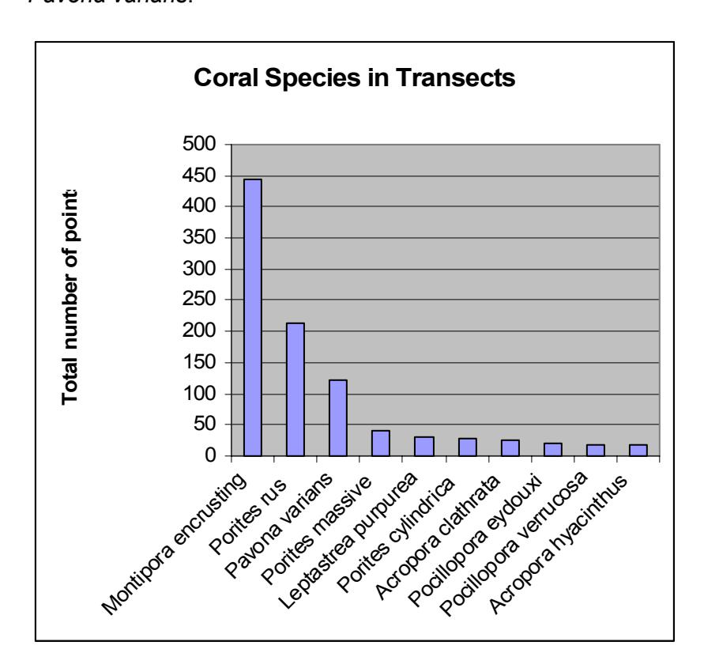

The abundance of species as in the graph above can also be plotted in a log-log graph, as is done below. A straight line would indicate a power relationship, and as can be seen, it is a tight fit and high correlation (r = .9871). This type of graph was pioneered by Odum (1971). The equation for the power relationship is  $y = 493.58x ^1.4514$ .

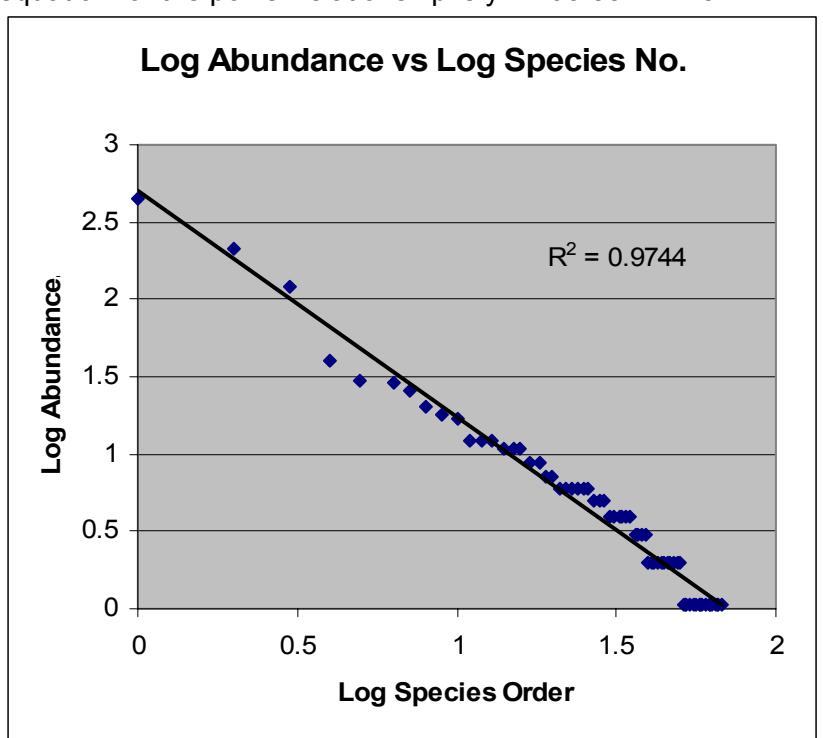

One spatial pattern in the coral genera data was that there appeared to be more *Acropora* on the south side, although this was largely restricted to two sites in the southwest.

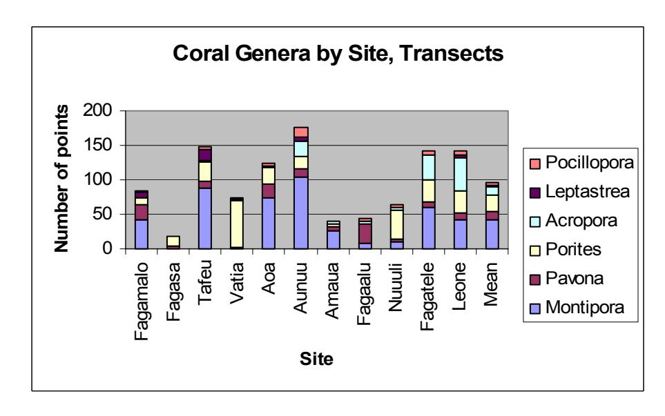

The graph below shows the size of the difference in Acropora (means for north and south). The difference between north and south was large for Acropora. A t-test on all the individual transects revealed the difference for Acropora was significant, p = .0009. A word of caution,

there is an area near the mouth of Vatia Bay on the north side of Tutuila which has very high *Acropora* cover. *Acropora* cover seems to vary greatly between sites and depths, with some areas dominated by it and others having little. *Acropora* usually has a branching or table lifeform, and thus is more vulnerable to hurricane damage. Greater hurricane impact on the north may be responsible for the smaller populations of this genus there. However, one of the densest communities of *Acropora* is found on the north side, at the mouth of Vatia bay. Further, much of one south side site, at Fagaalu, appears to be all branching *Acropora* rubble, indicating that there was a dense community there, which may have been destroyed either by a hurricane or by mass bleaching.

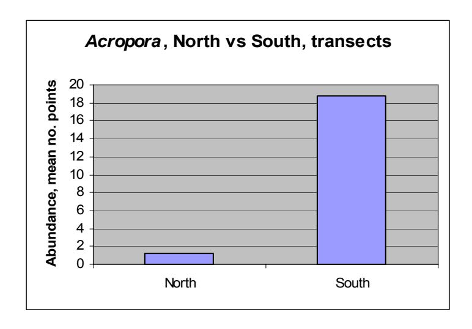

*Porites* was more common on the north, as was *Montipora*, but the differences were not large and were not significant in the transect data.

Spatial patterns in coral species were not strong, and none were found to be significant.

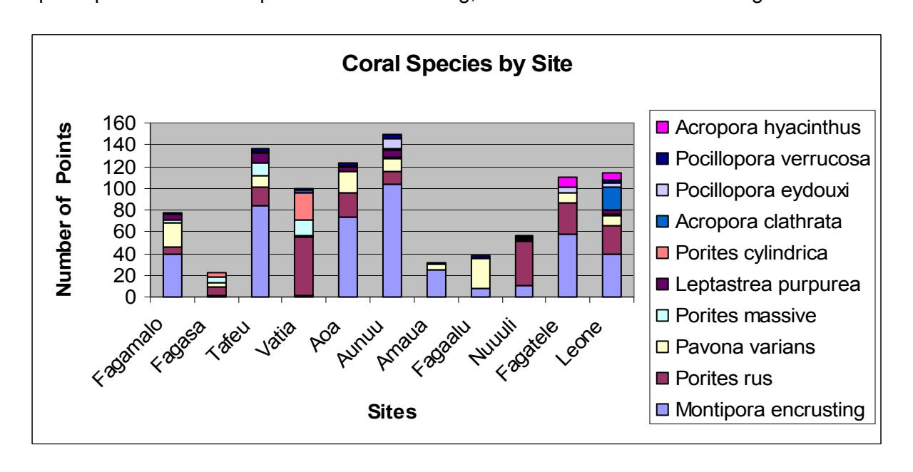

All of the above are from the transects. In the Roving Biodiversity dives, encrusting *Montipora* was the most common species, and the second most common species was *Pavona varians*. The order is slightly different from that in the transects, probably due to coral species that were more common at depths other than the transect depth. The abundance does not appear to drop off as fast as in the transects due to the Dafor Scale that was used, which is more like a logarithmic scale.

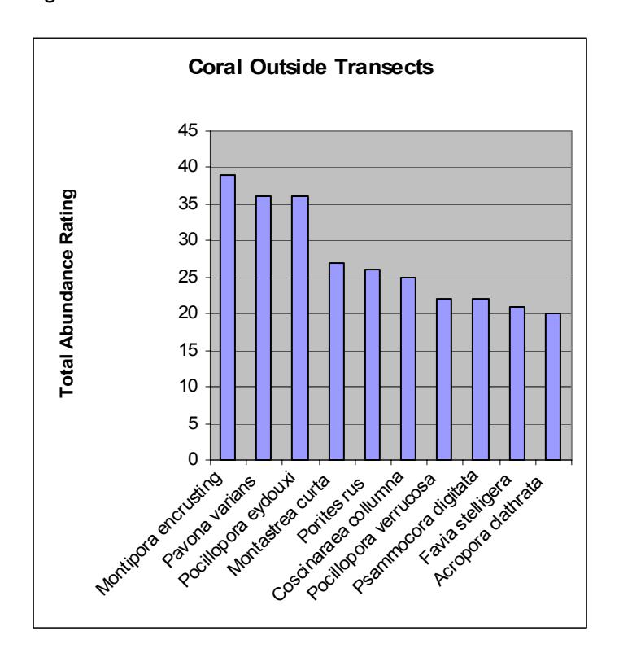

The abundance ratings were not quantitatively defined, but seem to be roughly on a log scale. When the abundance ratings are plotted against the log of the species number, a straight line is produced very similar to when the log of the abundance was plotted against the log of the species number for transect data, and once again the fit is tight and the correlation high (r = .995). The equation for the relationship between the abundance rating and species number (not log species no.) is y = -7.2964Ln(x) + 37.57. This supports the view that the abundance rating is a log scale, and that both data sets are describing the same abundance properties of the coral populations. This supports the value of the abundance rating system in the roving diver surveys as being more quantitatively reliable than one might have thought.

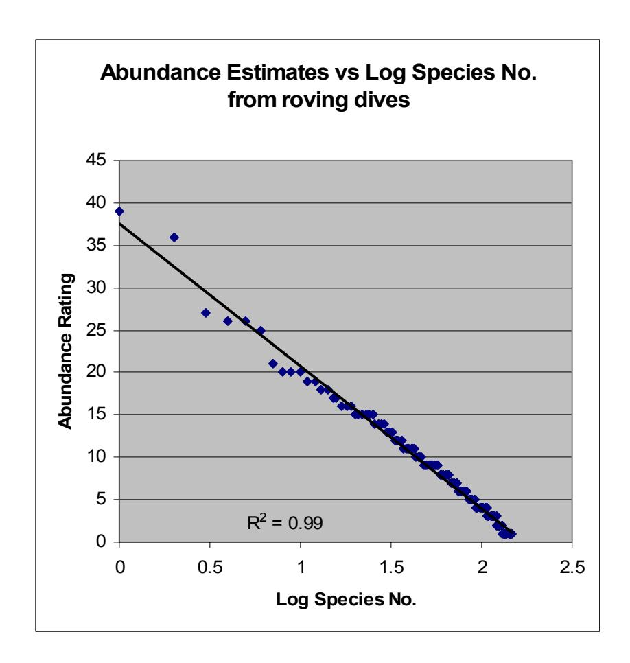

Here is a comparison of the order of species in transects and roving dives.

|     | Transects             | Roving Dive           |
|-----|-----------------------|-----------------------|
| 1.  | Montipora encrusting  | Montipora encrusting  |
| 2.  | Porites rus           | Pavona varians        |
| 3.  | Pavona varians        | Pocillopora eydouxi   |
| 4.  | Porites massive       | Montastrea curta      |
| 5.  | Leptastrea purpurea   | Porites rus           |
| 6.  | Porites cylindrica    | Coscinaraea collumna  |
| 7.  | Acropora clathrata    | Pocillopora verrucosa |
| 8.  | Pocillopora eydouxi   | Psammocora digitata   |
| 9.  | Pocillopora verrucosa | Favia stelligera      |
| 10. | Acropora hyacinthus   | Acropora clathrata    |

152 coral species were found in biodiversity dives, compared to 69 species in all transects together, at the same 11 sites. Thus, 2.2 times as many species were found in the biodiversity dives as in the transects. For the fish, 1.13 times as many fish species were found in the roving search dives as in the Stationary Point Counts (note that not all species were recorded in the stationary point counts). Thus, the roving technique produces a greater increase in the sample of the coral biodiversity than in the fish biodiversity.

The similarity of the lists of coral species from the transects and roving dives using the Jaccard Coefficient was 0.44. Four coral species were found in the coral transects that were not found in the roving diver searches, and 87 coral species were found in the roving diver searches that

were not found in the coral transects. The 4 species found in the transects that were not found in the roving diver surveys had a range of 1-2 points and an average number of 1.25 points in the transects (out of 1232 points with live coral, and compared to the most common coral species which had 445 points). The 87 species found in the roving dives that were not found in the transects had a range of 1-19 total rating and an average total rating of 5.6, compared to the most common species which had a total rating of 39. Thus, the 4 species found in transects but not in the roving dive were particularly rare in the transects, and the 87 species found in the roving dive but not in the transects tended to be rated uncommon to rare. The percentage of transects that had at least one sighting of each species correlated with the percentage of roving dives that had a sighting of each species, r = .52. There was a correlation of r = .52 between the number of points species had in transects and the rating in the roving diver survey. There was a correlation of r = .67 between the rating in the roving diver survey and Log (1 + number of points in transects). These were both significant, p < .05.

Spatial patterns in the coral species data from roving dives were not too obvious.

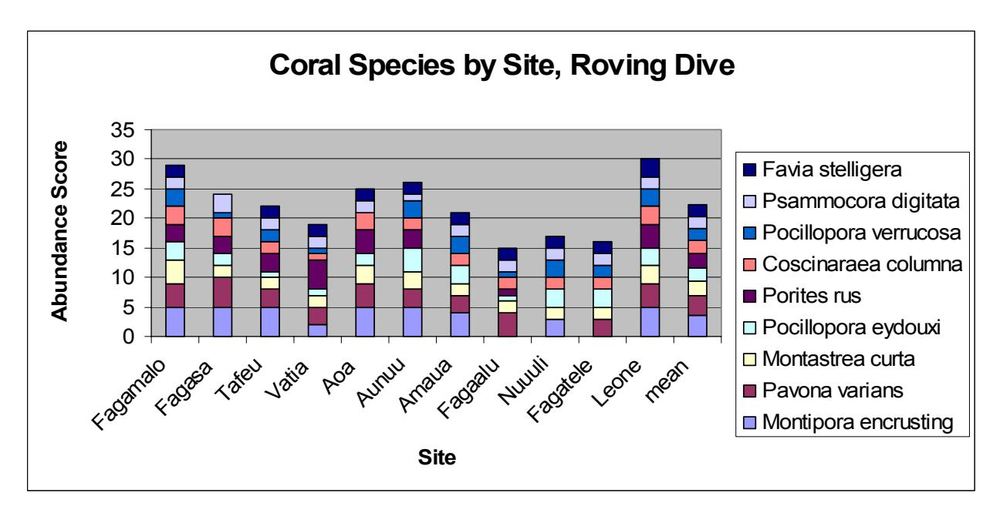

Data from individual species was examined, and the highest-scoring species in each genus was used at each site, with the mean of these scores taken for the north and south side. Using this technique, *Acropora* had higher scores on the south than the north, and the difference was almost significant (p = .0598). This supports the conclusion from the transects that *Acropora* is more common on the south.

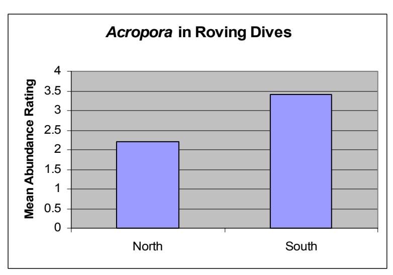

 In addition, *Porites* was more common on the north (p = .035) and *Pocillopora* more common on the south (p = .016). Although these effects were not significant in the transects, they were in the same direction, supporting the view that they are real.

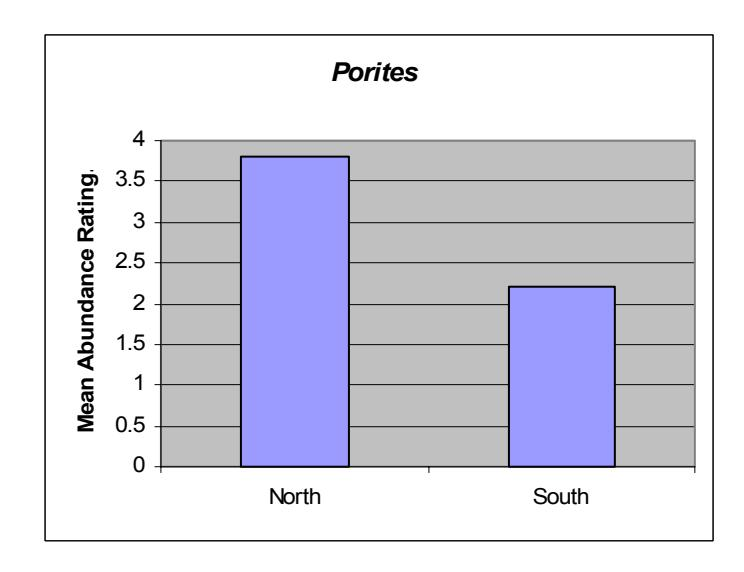

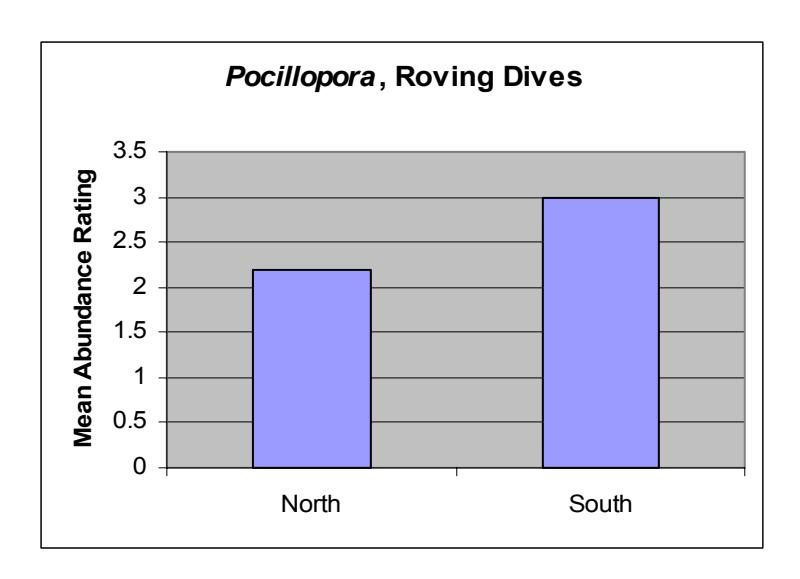

The American Samoa Environmental Protection Agency has created a scale of human impacts for different watersheds (villages), using population density as a proxy for impact. Their classification is shown in Figure 3 on page 15 of Whaylen and Fenner (2005). The watershed impacts are designated as Pristine, Minimal, Intermediate, and Extensive. This was converted to a 0-3 scale, and correlations run between impact and some benthic cover categories. Filamentous algae was not significantly correlated with impact, r = .2086, p > .2, nor was coralline algae, r = .4044, p > .1, nor was live coral cover, r = .4961, p >.1. The live coral cover data of the 11 sites in this study was also combined with the live coral cover data from Sabater and Tofaeono (2005) for 24 other sites around Tutuila, but the result was just a correlation of r = .2484, which was not significant, p > .05. Thus, none of the benthic biota we record was correlated with human impact. This suggests that human impacts on the benthic biota of reef slopes are too small to be easily measured, and thus not of major concern at this point.

## *Cluster Analysis*

A cluster analysis shown below of the coral transect data showed that the Fagasa and Vatia clustered together, but were the most dissimilar to the other sites. Fagasa and Vatia are the two most heavily sedimented sites, and Vatia appears to have a quite different coral community than other sites. Further, the other northern sites, Fagamalo, Aoa, and Tafeu, clustered together, suggesting that northern sites that are not sedimented are different from southern sites. This fits with the findings that *Acropora* and *Pocillopora* are more common on the south and *Porites* is more common on the north. Multidimensional Scaling (MDS) supported these conclusions, with Fagasa and Vatia being the least similar to other sites, and the other three northern sites clustering closely together.

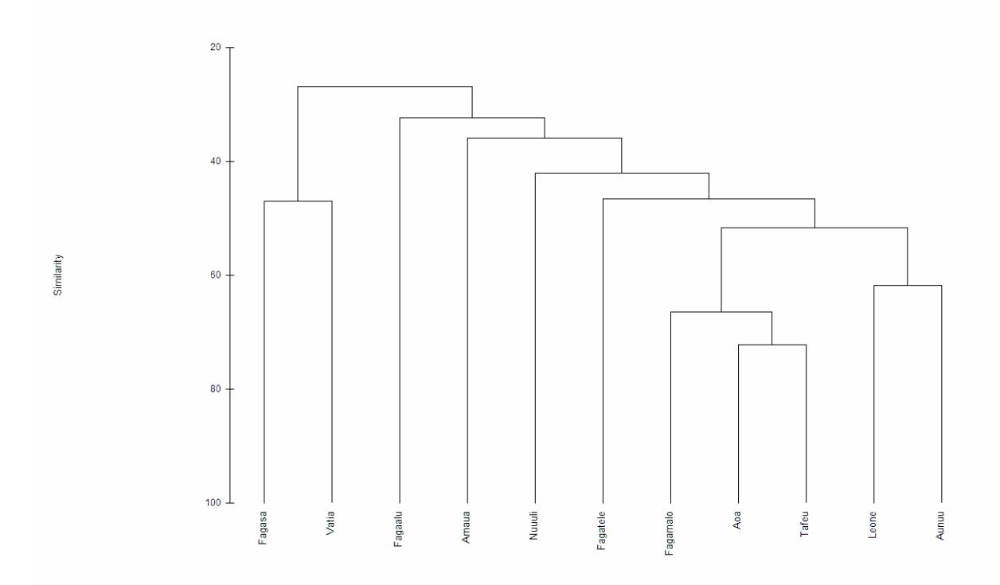

With the biodiversity data from the roving dive, three of the northern sites clustered together, Tafeu, Fagasa and Fagamalo, and the other two northern sites, Vatia and Aoa, did not cluster closely with other sites. This supports the view that northern sites are different from southern sites, and that Vatia is a particularly distinctive coral community due to the sedimentation and protection from wave action. *Porites cylindrica* is a co-dominant of lagoons, but rare on most reef slopes, except Vatia where it is common. It is thus found only in sites protected from wave surge.

#### *Rugosity*

Rugosity values did not vary much from site to site. Most of the reef relief appeared to consist of fairly large reef features, such as holes or ledges in the reef, instead of the growth of corals. None of the sites had large amounts of branching corals, which would probably produce high rugosity values. Rugosity in a field of branching corals could record the collapse of the branching corals from a hurricane or after a bleaching or Crown-of-Thorns event. Since none of the ASCRMP sites appear to have large amounts of branching corals, it seems unlikely that rugosity will measure major changes, unless a major event removes all features from the reef.

# *Coral Bleaching*

American Samoa's coral reefs have been impacted by a variety of major events, including periodic severe hurricanes, the most recent of which was Hurricane Heta, which was closest on Jan 6, 2004. Other events have included a Crown-of-Thorns starfish outbreak in 1974 and night scuba spearfishing from 1994-2002. Mass coral bleaching occurred in 1994 (Goreau and Hayes, 1994), and then again in the summers of 2002 (Green, 2002) and 2003

(Craig, personal comm., Mielbrecht, personal comm.), and the bleaching was severe enough to kill some corals.

A striking feature of the lagoon pools of Tutuila is the dominance of the coral populations by two groups (finger corals, *Porites cylindrica*, and staghorns (*Acropora*), 3 species). A further striking feature is that a large proportion of the staghorn corals are dead, but virtually nothing else is dead. The dead staghorn coral thickets are mostly still standing, but support a heavy growth of algae, primarily filamentous algae and coralline algae. This indicates that the staghorns did not die within the last few months, but probably not more than a few years ago (as they would have collapsed). Thus it appeared possible that the staghorns might have been killed by mass bleaching in 2002 and/or 2003. The fact that only staghorns were dead suggested that the cause of death was species-specific. Previous reports from elsewhere in the world indicate that corals in the genus *Acropora* are often more sensitive to bleaching than other corals. Craig et al (2001) have reported that lagoon pools in Ofu reach high temperatures for short periods of time on sunny days at low tide when waves cannot make it over the crest to pump water through the lagoon pools. All of these things together suggested that the staghorns in Tutuila lagoon pools may have been killed by previous mass bleaching events, and may be more sensitive to high temperatures (the primary factor causing mass coral bleaching).

Monitoring of bleaching in backreef pools of Tutuila began in December, 2003, and now 2 years of data have been collected. Staghorns in three pools, Airport, Alofau and Nuuuuli have bleached every summer for the past three summers. Monitoring began first in the Airport pool, and subsequently added to the Alofau pool. Alofau and Nuuuuli appear to bleach most easily, Airport next most easily, Faguitua next, and Fagaalu, Utelei, and Onesosopo least. Alofau and Nuuuli have very little circulation through the pools. Utelei and Onesosopo have a bit more circulation, Fagaalu more, and Fagaitua has the most. Water temperatures were recorded on temperature loggers in some of the lagoons. By far the highest temperatures were recorded in Fagaitua, with a peak of 34.9 C recorded in 2005, at a point at which the staghorns there were only mildly bleached. The graph below was taken by a Hobo temperature logger placed in about 1.5 m water depth among *Acropora muricata* staghorn colonies. Other backreef pools on Tutuila reach maximum temperatures around 32 C or less. In the same time period, satellite SST (Sea Surface Temperature) was about 30 C.

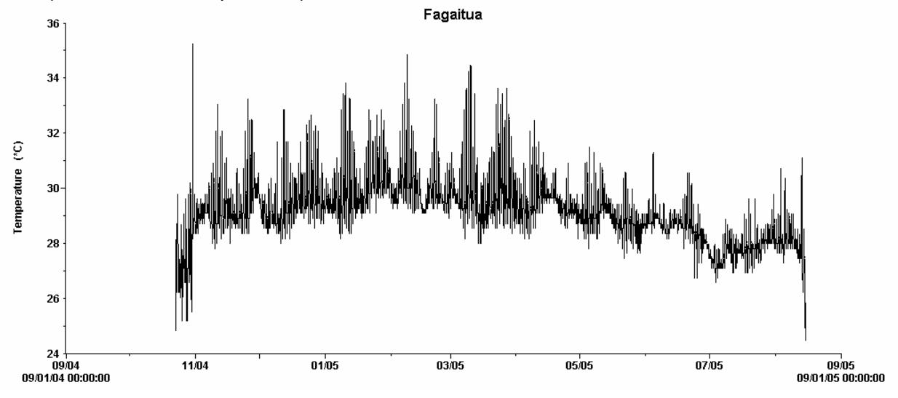

 Strong water motion has been reported to reduce bleaching, so perhaps the strong water currents there make it possible for them to survive high temperatures. Depths are also less there, and the pool may be natural, while in the other pools the water is deeper and the pools were made several decades ago by using material for landfill. From the graph below it can be seen that although there may be some correlation of the amount of bleaching and the amount of dead staghorn, Utelei and Fagaalu have a considerable amount of dead staghorn but little bleaching in 2004. Probably in 2002 and 2003 bleaching was sufficiently severe to kill staghorns at all sites.

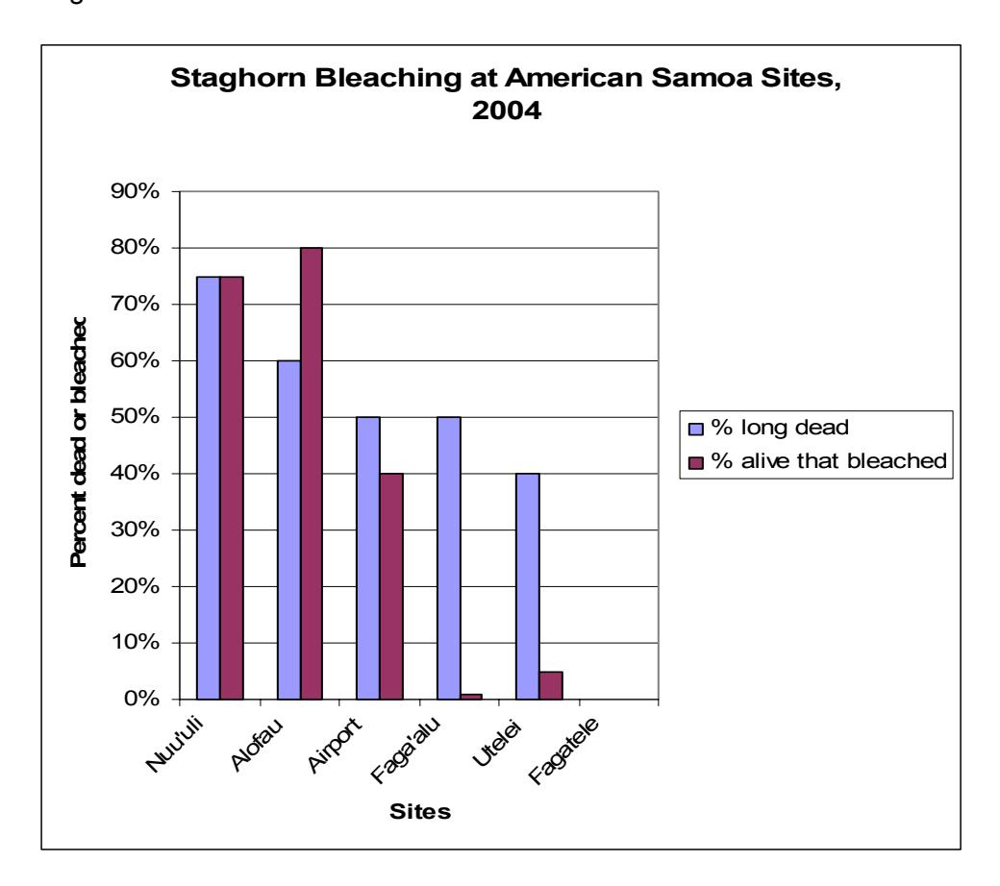

The staghorn species that bleach are *Acropora muricata* (=*formosa)*, by far the most common staghorn in the pools, *Acropora pulchra*, the second most common, and *Acropora nobilis* (also referred to as *A. intermedia*), the least common. There are a few colonies of a few other species of *Acropora*, such as *A. gemmifera*, *A. hyacinthus*, and *A. clathatata* that are also in these lagoons, and they may bleach as well. *Porites cylindrica*, massive *Porites*, *Porites annae*, and *Porites* sp. 2 do not bleach, nor does *Pavona frondifera* or *P. decussata*. When *Acropora nobilis* in the pools was bleached, the same species on reef slopes was not bleached. The other two staghorn species in the pools are not found on the reef slope. The onset of the bleaching period in the first year was delayed by Hurricane Heta, which struck Jan 6, 2004. Bleaching in 2005 reached a higher peak of intensity, and a very few colonies in Alofau died. Thus, along with the two previous years of bleaching, staghorns have bleached for 4 years in a row. Corals on reef slopes have not bleached in the last 2 summers, though there was partial bleaching of a few species on reef slopes during the height of bleaching in 2005. *Montastrea curta* and *Pocillopora* species appeared the most bleached on the slopes at that time. The upper surfaces of the staghorns and the *M. curta* are noticeably more strongly bleached than the lower surfaces, and sometimes the upper surface of *A. pulchra* or *A. nobilis* will die while the rest of the branch surface will survive. This indicates that solar radiation (visible, PAR, and/or uv) is part of the stressor, not just temperature.

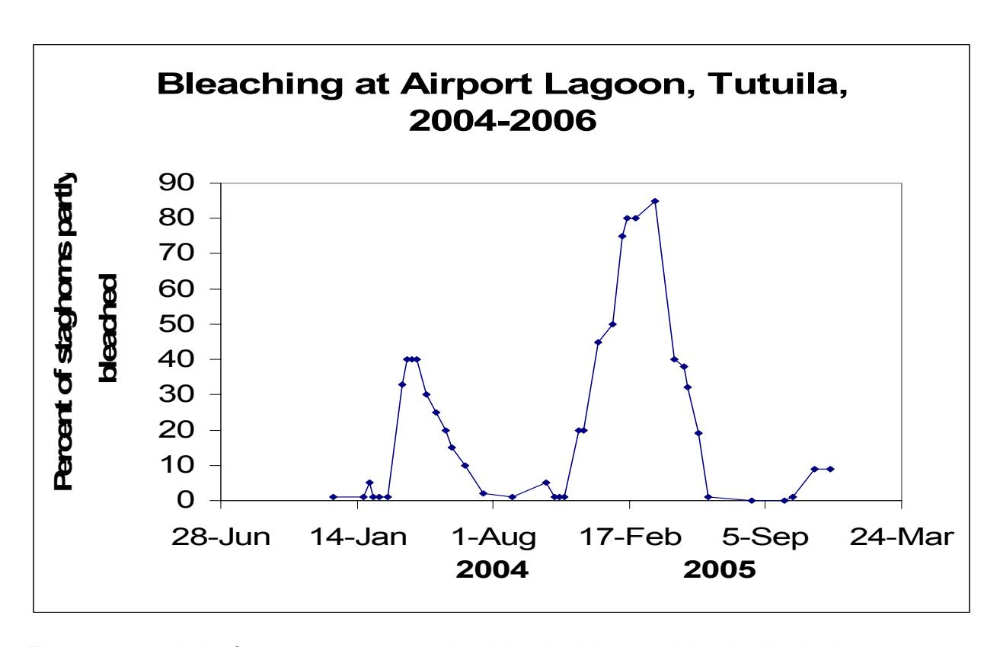

The staghorns in Alofau have spent more time bleached than not bleached in the last 2 years. Staghorns in shallower water there bleach less than those in deeper water, for unknown reasons. In the Airport, staghorns near shore bleach less than those farther from shore, regardless of depth. The tops of branches bleach before the bottoms of branches, and on *A. pulchra* and *A. nobilis* can die on top before they are fully bleached on the bottom of the branch. *A. muricata* (=*formosa*) seems to be the most sensitive of the three species, and the other two appear to be approximately equal in sensitivity.

Bleaching very likely slows or stops growth, and has been reported to block sexual reproduction for a year. Thus, these corals are likely growing less and not reproducing at all (other than asexually by fragmentation). Bleaching is very likely to having a chronic negative impact on these coral populations. Mass coral bleaching has been predicted to become an annual summer event in coming decades, and these staghorns appear to be the first multi-species population in the world exhibiting annual summer bleaching (*Oculina patigonica* in Israel and *Favia fragum* in Florida exhibit annual summer and fall bleaching, respectively, but only of the one species at a location).

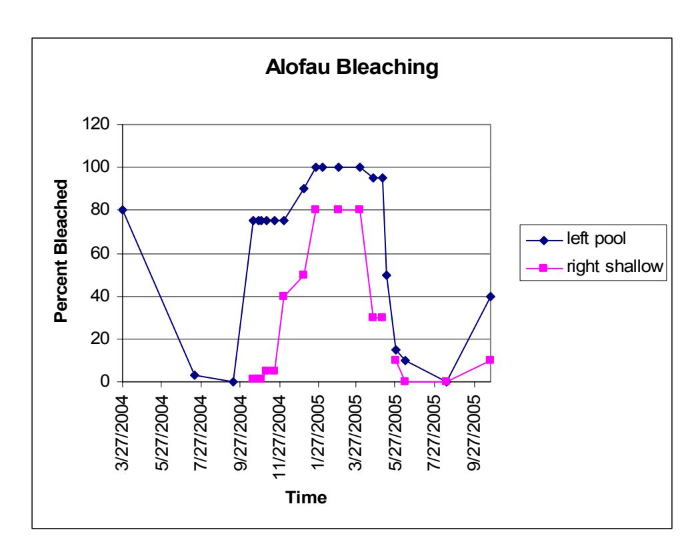

#### **Low Tide Event**

 Starting in December, 2004, and continuing through April, 2005, there were a series of unusually low tides. The extra low tides were in one week each month. These tides were so low as to expose living corals on reef flats to the air for several hours each day. When exposure occurred in the middle of the day on a sunny day, exposed corals and coralline algae died. Each month the tides went a little lower and killed coral a little farther down. The principle coral killed was a staghorn, *Acropora aspera*, which lives in some large patches on some of the reef flats. In some areas nearly all of this coral was killed, while in other areas the bases may still be alive. It appears that a majority of this species was killed. Quantitative measurements have not yet been made. It is hoped that a monitoring program for the reef flats can be designed and tested in the coming year, and may even be able to measure the amount of dead coral from this event. It is clear that factors affecting the reef flats may often be totally different from those affecting the reef slopes, so it will be necessary to monitor both since the state of the reef flats cannot be predicted based on data from reef slopes. In any case, the recent low tide events appear to be a totally natural and unavoidable trimming of the tallest corals, much like mowing a lawn. The last such event is anecdotally reported to have been in March, 1998 (N. Dashbach, personal comm.).

#### *Coral Disease*

The two most common types of disease identified in American Samoa are tumors or neoplasms and White Syndrome. Tumors do not often die, and even when they do, they do not lead to colony death. However they do use colony energy, and thus less energy is available for other colony functions such as growth and reproduction. In White Syndrome, a white band of newly dead coral moves across a coral (often a table coral), killing the coral (AIMS website). White Syndrome probably results in colony death in most cases, within a fairly short period of time. This is a potentially serious threat to the coral reefs of the entire Indo-Pacific. There are also a

considerable number of dead or partially dead *Pocillopora* colonies, and some show a thin white band, which may represent another disease. Although coral diseases are common enough for there to be cause for concern, at this point they are only killing a minority of corals. American Samoa does not appear to be in a major outbreak. Continued monitoring is important.

There are also two coralline algae diseases in American Samoa. Coralline Lethal Orange Disease (CLOD) is present and easy to recognize, but is rare at most sites. It is a bacterium. Even at the sites such as Fagatele Bay where CLOD is most common, this disease causes mortality in only a very small fraction of the coralline algae, and the algae appear to be able to regrow as fast as the disease can kill it. At this point it is not a threat. There is a second, black disease that is harder to recognize, and appears to be less common than CLOD. It is a fungus.

For more information on diseases, see the series of reports by G. Aeby and T. Work.

#### *Coral Species Richness*

A total of 69 species of corals were found in all transects put together. The coral species richness on one-hour roving biodiversity search dives averaged 71 species, with a range of 57- 87 species. A total of 152 species of corals were found in all biodiversity dives together. D. Fenner has now recorded a total of over 220 species of corals in American Samoa, and continues to find more. Veron (2000) is the most authoritative current source for coral biodiversity data, indicating that American Samoa has 100-200 species of coral. However, the 2005 ASCRMP data as well as the total number of corals observed by D. Fenner outside of the ASCRMP, indicate that American Samoa has higher coral diversity than Veron (2000) indicates. Three different methods of estimation of the total number of coral species in American Samoa all indicate that there are probably over 400 species total that will eventually be found. The first method of estimating the total is to look at the species which have a range that includes American Samoa (Veron, 2000). Of those species, about half have been found in American Samoa so far by D. Fenner. This suggests that the total eventually to be found will be about double that so far found by D. Fenner, for a total of about 440 species. The second estimation depends on the observation from Veron (2000) that the ranges for coral species can extend both west and east, or they can extend westward only, but they never extend eastward only. As a result, corals found to the east of American Samoa are likely to also be in American Samoa, though American Samoa likely has additional species. The corals of Hawaii are relatively well studied (Fenner, 2005a) and most species there are likely to have been found. If endemic species are excluded, about half of the Hawaiian species have been found so far in American Samoa by D. Fenner. Thus, this also indicates that the total to eventually be found may be around 440 species. Lastly, the fish of American Samoa are well studied and few additional are likely to be found. There are about 850 reef fish known from American Samoa from the roughly 900 total species known. The average biodiversity dive produced 71 species of corals and 123 fish species. Using that ratio, the total number of corals expected to be eventually found is about 490. In all biodiversity dives together, 152 coral species were found, and 270 fish species. Using that ratio produces a prediction of 478 coral species. Species accumulate with dives in a log fashion, such that doubling the number of dives adds a fixed number of additional coral species. Rough calculations indicate that it will likely take over 2000 dives to find a total of about 440 coral species.

#### New Coral Species Sightings for the Territory

The coral biodiversity data collected in 2005 ASCRMP is entirely dependent on observation *in situ*, supplemented by *in situ* photography. With this noted, the visual records contain about 41 species that are new records for American Samoa. That is, they were not previously reported for American Samoa by Hoffmeister (1925), Lamberts (1983), any of the sources in Coles et al (2003), Craig et al (2001) and reports by Mundy (1996), Hunter et al (1993), Green (2002) and Green et al (1999, 2005). In addition, approximately 66 species are range extensions, based on the maps in Veron (2000). The exact numbers will most likely change with additional observations and as samples are collected. Several species remain to be identified.

#### Fish Biomass during Core Sampling Regime

The fish biomass of select species during the core sampling regime averaged 56.09g/m2, with a range of 29.13-114.16g/m2.

Several groupings of fish were also averaged and included Carangids (jacks), Mullids (goatfish), Holocentrids (squirrelfish and soldierfish), Lethrinids (emperors), Scarids (parrotfish), Serranids (groupers), Lutjanids (snappers), Acanthurids (unicornfish only), large Labrids (wrasse) and Others. The means for the 2005 ASCRMP sites are given in the table below.

| All 11 ASCRMP Sites                 | Mean  |
|-------------------------------------|-------|
| Fish biomass (g/m2) of Carangid     | 0.84  |
| Fish biomass (g/m2) of Mullid       | 2.56  |
| Fish biomass (g/m2) of Holocentrid  | 1.33  |
| Fish biomass (g/m2) of Lethrinid    | 5.04  |
| Fish biomass (g/m2) of Scarid       | 26.77 |
| Fish biomass (g/m2) of Serranid     | 3.19  |
| Fish biomass (g/m2) of Lutjanid     | 4.01  |
| Fish biomass (g/m2) of Ume          | 4.71  |
| Fish biomass (g/m2) of large Labrid | 1.49  |
| Fish biomass (g/m2) of Others       | 6.15  |

## Fish Abundance during Core Sampling Regime

The number of corallivores during the core sampling regime averaged 2.78 individuals per  $g/m^2$ , with a range of 0.7-5.5 individuals per  $g/m^2$ . The number of Pone averaged 21.2 individuals per  $g/m^2$ , with a range of 6.2-33 individuals per  $g/m^2$ . Acanthurus lineatus (Striped Surgeonfish), locally called Alogo, is a heavily harvested species. A. lineatus is most commonly observed near the reef crest in the waters around Tutuila. Because the SPCs in the ASCRMP were conducted on the reef slope at the 8-10m isobath, the counts of A. lineatus were low at the monitoring sites, with an average of 1.2 individuals per  $g/m^2$  and a range of 0.0-3.0 individuals per  $g/m^2$ . The number of all surgeonfish averaged 28.9 individuals per  $g/m^2$ , with a range of 8.8-56.5 individuals per  $g/m^2$ . The number of P. dickii averaged 4.8 individuals per  $g/m^2$ , with a range of 0.0-14.8 individuals per  $g/m^2$ .

| All 11 ASCRMP Sites    | wean |
|------------------------|------|
| Number of corallivores | 2.8  |
| Number of Pone         | 21.2 |
| Number of A. lineatus  | 1.2  |

| Number of all surgeonfish | 28.9 |
|---------------------------|------|
| Number of P. dickii       | 4.8  |

Appendix 2 lists the most abundant (Den of 2.0 and above) fish species reported during the supplemental monitoring for biodiversity.

## *Fish Species Richness*

During the 2005 ASCRMP, 238 fish species were recorded during the core sampling regime and 270 fish species were recorded during the supplemental monitoring for biodiversity. The total number of fish species recorded during both sampling regimes was 291 species. Appendix 1 lists the most commonly sighted fish species (SF above 72%) during the supplemental monitoring.

The fish species richness on one-hour roving biodiversity search dives averaged 123 species, with a range of 90-152 species.

Fish biodiversity was also sampled during the core sampling regime and these data were entered into a database. However, biodiversity counts during the core sampling regime were conducted within a shorter time frame (40 minutes as opposed to 60 minutes during supplemental monitoring). Additionally, the method of biodiversity counts between the core and supplemental monitoring regimes differed in that the diver was focused for the entire dive on identifying and enumerating all fish species during the supplemental monitoring regime as opposed to only recording biodiversity data in between the Stationary Point Counts during the core sampling regime.

## *Large Fish Sightings*

During the supplemental monitoring for biodiversity, *Cheilinus undulatus* (Humphead Wrasse, Napoleon Wrasse, or Maori Wrasse), was sighted at 5 of 11 the monitoring sites, representing a sighting frequency of 45%. The largest individual sighted was 100cm at Nu'uuli and the mean size sighted was 54cm. The maximum size of this species is 229cm, clearly showing that the individuals seen in American Samoa during the monitoring are not full-size adults.

| Site     | Number of Individuals of C. undulatus |   | Size (cm) |
|----------|---------------------------------------------|---|--------------|
| Amaua    |                                             | 1 | 45           |
| Leone    |                                             | 1 | 50           |
| Fagatele |                                             | 1 | 34           |
| Nu'uuli  |                                             | 1 | 100          |
| Aoa      |                                             | 1 | 42           |

Five species in the Carangidae family (jack/trevally) were recorded during the supplemental monitoring for biodiversity, all of which were recorded only one time except for *Scomberoides lysan* (Doublespotted Queenfish) which was recorded at two sites.

|          | C. melampygus | C. papuensis | C. ignoblis | S. lysan | E. bipinnulatus |
|----------|------------------|-----------------|----------------|-------------|--------------------|
| Faga'alu |                  |                 |                | 3           |                    |
| Fagasa   |                  |                 | 1              |             |                    |

| Fagatele  |     |     |     | 2    |      |
|-----------|-----|-----|-----|------|------|
| Leone     | 1   |     |     |      |      |
| Vatia     |     | 1   |     |      | 2    |
| Number of |     |     |     |      |      |
| Sightings | 1   | 1   | 1   | 2    | 1    |
| %SF       | 9   | 9   | 9   | 18   | 9    |
| Den       | 1.0 | 1.0 | 1.0 | 2.5  | 2.0  |
| %SF*Den   | 9.1 | 9.1 | 9.1 | 45.5 | 18.2 |

Lastly, a 1.5m *Carcharhinus* (shark) species was sighted at Vatia.

During the core sampling regime and outside of the SPCs, *Cheilinus undulatus* (Humphead Wrasse, Napoleon Wrasse, or Maori Wrasse), was sighted at 4 of 11 the monitoring sites, representing a sighting frequency of 36%. The largest individual sighted was 110cm at Tafeu and the mean size sighted was 64cm.

| Site     | Number of individuals of C. undulatus | Size (cm) |
|----------|---------------------------------------------|--------------|
| Nu'uuli  | 1                                           | 50           |
| Tafeu    | 1                                           | 110          |
| Faga'alu | 1                                           | 53           |
| Amaua    | 1                                           | 45           |

A few other fish species were recorded on biodiversity counts during the core sampling regime. A 1m *Trianodon obesus* (Whitetip Reef Shark) was recorded at Fagatele. Two species in the Carangidae (jacks) family were recorded: *Caranx melampygus* (Bluefin Trevally) and *Scomberoides lysan* (Doublespotted Queenfish). The %SF and Den scores for these two species were 64%SF with 1.6Den and 27%SF with 2.0Den, respectively.

#### *Spatial Patterns*

A bar graph of the fish biomass for different families, plotted around the island, shows that Parrotfish dominate the biomass recorded. Sabater and Tofaeono (2005) found that parrotfish and surgeons were the two largest biomass families. Sizes of surgeons was not recorded, so their biomass could not be included in the graph.

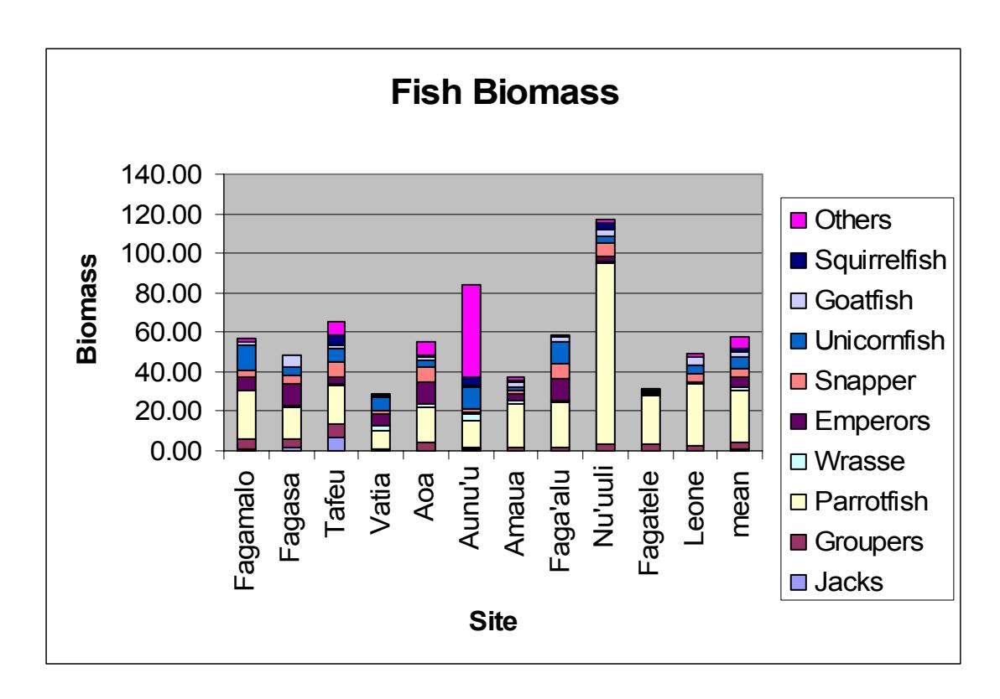

The biomass of parrotfish was larger on the south side than the north, which when tested on individual SPC's with a t-test assuming unequal variances, was significant, p = .0065. Sabater and Tofaeono (2006) found the same difference for Parrotfish with a completely different set of sites, so it appears to be real and general.

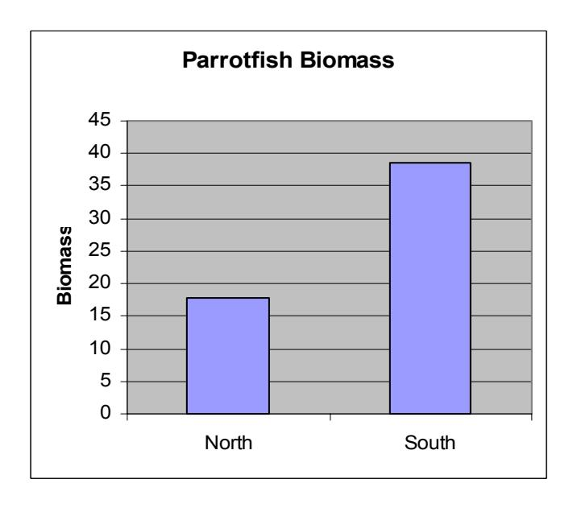

Jacks or Trevallies were found on the north but not on the south, and the difference was significant, p = .01. Numbers at all sites were small, and all were Bluefin Trevally.

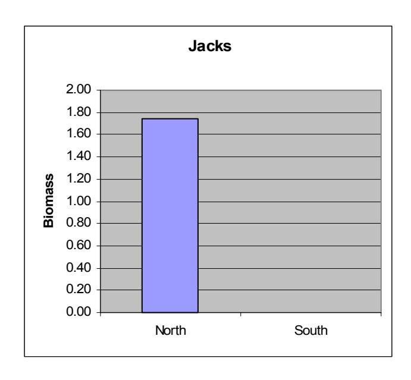

#### Key Reef Fish Species during Supplemental Monitoring

A total of 12 species in the Serranidae family (groupers and seabass) were recorded during the supplemental monitoring for biodiversity. Of these, *Variola louti* (Yellow-edge Lyretail) was the most commonly sighted serranid species and was sighted at all of the monitoring sites (100%SF). *Cephalopholis urodeta* (Flagtail Grouper) and *C. argus* (Peacock Grouper) were the top two serranid species with regards to density; 2.4Den and 2.3Den respectively. When the Den and %SF scores were multiplied to provide a measure of species abundance which includes zero observations, the three species with highest scores were *C. urodeta*, *C. argus*, and *V. louti*.

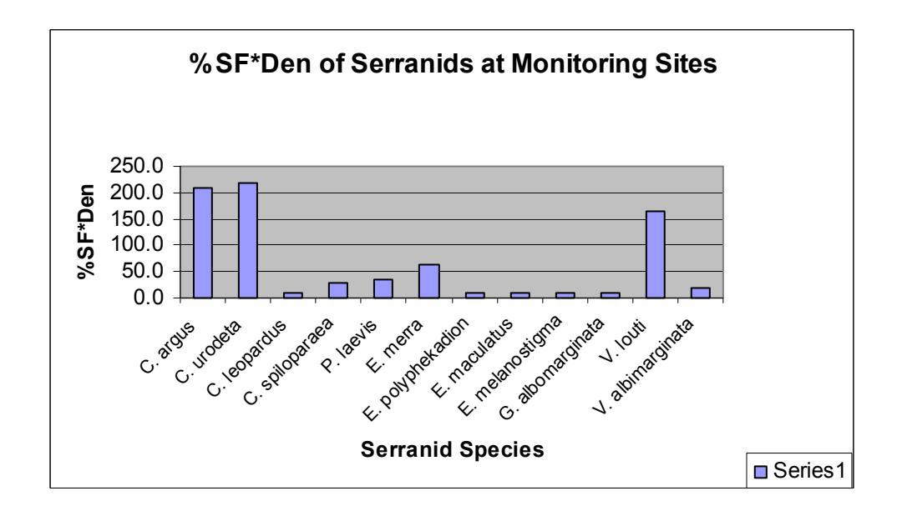

A total of 9 species in the Lutjanidae family (snappers) were recorded during the supplemental monitoring for biodiversity. Individuals in the *Macolor* genus were not often recorded to the species level due to difficulty in differentiating juveniles between *M. macularis* and *M. niger*. Three lutjanid species were seen at all monitoring sites (100%SF): *Lutjanus bohar*, *Macolor* sp., and *Aphareus furca*. *A. furcus* (Smalltooth Jobfish) and *L. gibbus* (Humpback Snapper) were the top two lutjanid species with regards to density; both with 2.6Den. When the Den and %SF scores were multiplied to provide a measure of species abundance which includes zero observations, the three species with highest scores were *A. furcus*, *L. gibbus*, and *Macolor* sp.

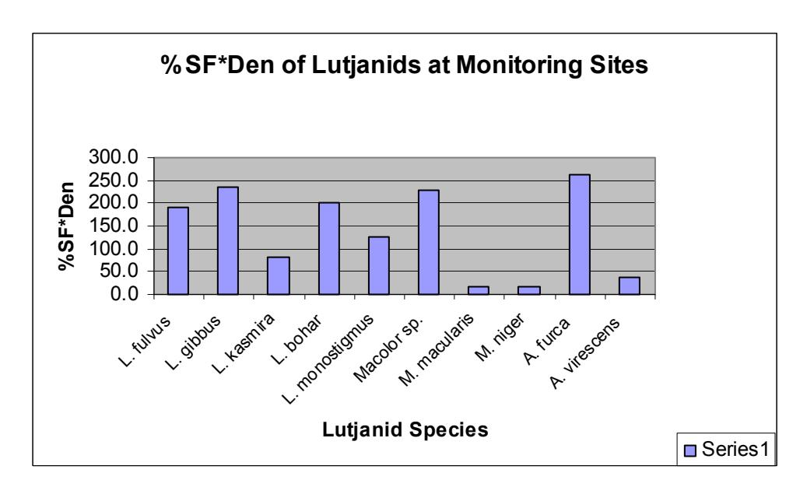

A total of 19 species in the Scaridae family (parrotfish) were recorded during the supplemental monitoring for biodiversity. Two scarid species were seen at all monitoring sites (100%SF): *Chlorurus japanensis* (Japanese Parrotfish) and *C. sordidus* (Bullethead Parrotfish). These same two species also had the highest density index scores; *C. japanensis* with 2.9Den and *C. sordidus* with 2.7Den. When the Den and %SF scores were multiplied to provide a measure of species abundance which includes zero observations, the two species with highest scores were *C. japanensis* and *C. sordidus*.

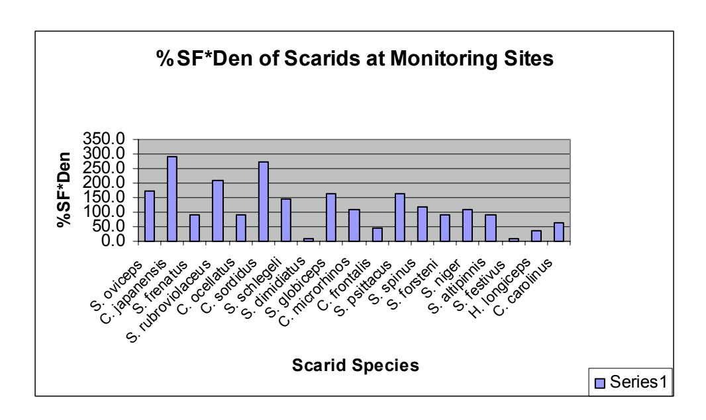

A total of 25 species in the Acanthuridae family (surgeonfish and unicornfish) were recorded during the supplemental monitoring for biodiversity. Five acanthurid species were seen at all monitoring sites (100%SF): *Acanthurus nigrofuscus* (Brown Surgeonfish), *Zebrosoma scopas* (Brushtail Tang), *Z. veliferum* (Pacific Sailfin Tang), *Ctenochaetus striatus*, (Lined Bristletooth), and *A. nigricans* (Whitecheek Surgeonfish). The three species with the highest density index scores were *C. striatus* with 3.8Den, *A. triostegus* (Convict Tang) with 3.0Den, and *Naso hexacanthus* (Sleek Unicornfish) with 3.0Den. However, *N. hexacanthus* was only reported at one site when a school of this species swam by the observer. When the Den and %SF scores were multiplied to provide a measure of species abundance which includes zero observations, the three species with highest scores were *C. striatus*, *A. nigricans*, and *Z. scopas*.

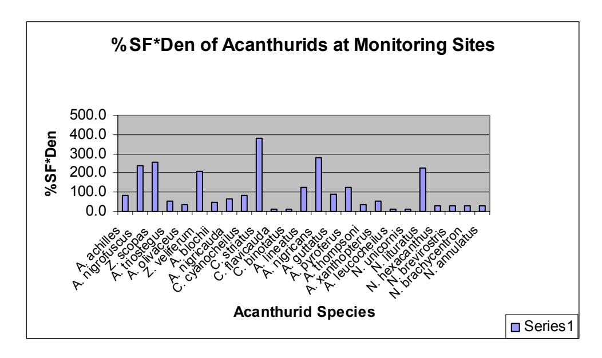

Lethrinids (emperors) are another family of fish harvested for food in American Samoa. Four species of this family were recorded during the biodiversity counts. Of these, *Monotaxis* 

grandoculis (Bigeye Emperor) was seen at all of the monitoring sites (100%SF) with a Den of 2.8.

|           | M.          | G.            | L.    | L.           |
|-----------|-------------|---------------|-------|--------------|
|           | grandoculis | aureolineatus | harak | xanthochilus |
| Number of |             |               |       |              |
| Sightings | 11          | 5             | 1     | 3            |
| Sighting  |             |               |       |              |
| Frequency | 100         | 45            | 9     | 27           |
| Den       | 2.8         | 2.4           | 2.0   | 1.3          |
| %SF*Den   | 281.8       | 109.1         | 18.2  | 36.4         |

#### New Fish Species Sightings for the Territory

During the supplemental monitoring for biodiversity, 12 species of fish were recorded that were not included in Wass' checklist of fishes of Samoa (1984) or Coles et al's (2003) complation table of studies of American Samoa. Three to six of these species either underwent reclassification or were possibly misidentified by Wass. Three of the 12 species, *L. graciliosa*, *A. randalli*, and *A. leucocheilus*, are range extensions according to Randall (2005), Allen et al. (2003), and Myers (1999). Two of these species, *Pomacentrus* sp. and *Ostorhinchus* sp., are currently being studied for identification. The former species is one of the most abundant and common Pomacentrids on the reef slopes of Tutuila and was recorded at all the dive sites (SF% 100). Most likely, this species will either be a new species or a range extension for its distribution in the Pacific. The *Ostorhinchus* was recorded at only one dive site. Most likely, this species will be a new species for the Pacific.

| Family        | Common Name             | Scientific Name           | %SF | Range Extension |
|---------------|-------------------------|---------------------------|-----|--------------------|
| Acanthuridae  | Bluelipped bristletooth | Ctenochaetus cyanocheilus | 45  |                    |
| Acanthuridae  | Ctenochaetus flavicauda | Ctenochaetus flavicauda   | 9   |                    |
| Acanthuridae  | Pale-lipped surgeonfish | Acanthurus leucocheilus   | 9   | х                  |
| Acanthuridae  | Humpback unicornfish    | Naso brachycentron        | 27  |                    |
| Apogonidae    | Cardinalfish sp.        | Ostorhinchus sp.          | 9   |                    |
| Gobiidae      | Randall's shrimpgoby    | Amblyeleotris randalli    | 9   | х                  |
| Gobiidae      | Whitecap shrimpgoby     | Lotilia graciliosa        | 9   | х                  |
| Lethrinidae   | Yellowlip emperor       | Lethrinus xanthochilus    | 27  |                    |
| Pomacentridae | Skunk anemonefish       | Amphiprion akallopisos    | 18  |                    |
| Pomacentridae | Pomacentrus sp.         | Pomacentrus spp.          | 100 |                    |
| Pomacentridae | Yellow-speckled chromis | Chromis alpha             | 18  |                    |
| Serranidae    | White-edge lyretail     | Variola albimarginata     | 18  |                    |

#### Invertebrates

Invertebrates were recorded in transects, but not in biodiversity dives, due to E. Tardy's departure. In the belt transects, very few invertebrates were found, consistent with observation. Only two invertebrates were common, a small burrowing urchin (*Echinostrephus molaris*), and a small orange sponge, *Styllissa massa* or *Stylissa flabelliformis*. The urchin was quite patchy, common at a few locations, but rare elsewhere. There was an average of 57 of these urchins per 200 sq meters of belt at each site (0.29/m² or about 1 per 3.5 m²). There were 21 orange sponges in the same area (0.1/m² or 1 per 10 m²). Not a single Crown-of-Thorns starfish

(*Acanthaster planci*) was recorded in all the transects (total 4400 m²), nor a single Triton shell (*Charonia tritonis*), or lobster (*Palinurus* sp. and *Scyllarus* sp.). All of these species are known from American Samoa, but observations suggest they are all rare in the areas monitored. Lobsters (*Palinurus*) are much more common in shallow water, and much more easily counted at night. Giant clams were counted in the belt transects, with 2.2 *Tridacna maxima* and 0.5 *Tridacna squamosa* per 200 m² (0.011/m² or 1 per 90 m² *T. maxima*, and 0.0025/m² or 1 per 400 m² *T. squamosa*). Thus they were uncommon, as was observed. There were very few of the larger urchin species, with just four species found: *Echinothrix calimaris, Echinothrix diadema, Echinometra mathei*, and *Parasalenia gratiosa*. The total abundance of all four species together was only 0.6 per 200 m² (0.003/m² or 1 per 330 m²). Just three species of sea cucumbers were found, *Stichopus horrens, Actinopygia mauritiana*, and *Bohadshia argus*. The total abundance of all sea cucumbers together was only 0.22 per 200 sq m (0.001/m² or 1 per 1000 m²). Sea cucumbers are much more abundant in sandy areas of reef flat pools. A total of 52 snails (gastropods) were found, with only one individual of each for almost all the species. Two *Octopus cyanea* were found, for a density of one per 2200 m².

The first graph shows that the small urchin was the most common invertebrate, followed by the orange sponge. The second graph shows how sporadic these species are, especially the urchin.

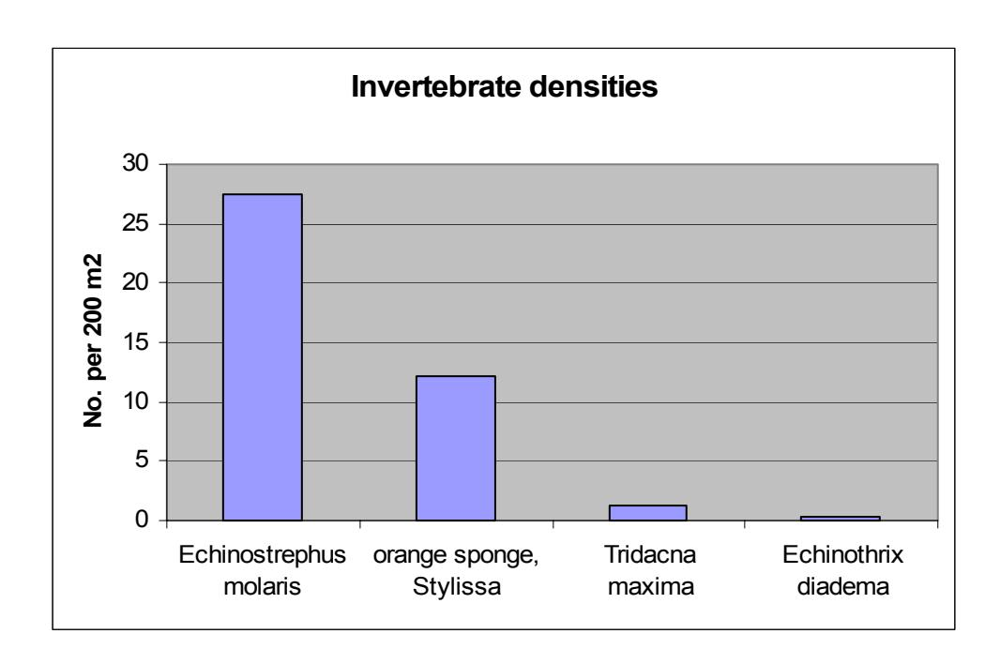

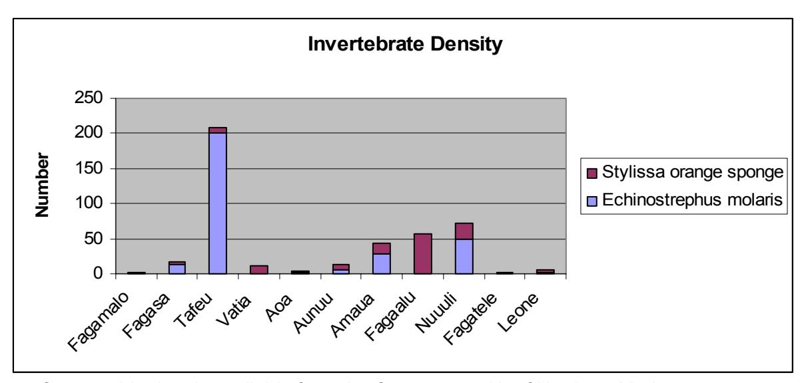

Comparable data is available from the Commonwealth of Northern Marianas, as reported in the Status of Coral Reef Ecosystems of the US, (Waddell, 2005). The same methods were used, a belt transect at about 10 m depth, during the day. See the table for the comparison. Interestingly, the small urchin *Echinostrephus* had the same population density. However, some other large invertebrates were less common in American Samoa.

| Species              | American Samoa  | Northern Marianas |
|----------------------|-----------------|-------------------|
| Echinostrephus       | 14 per 100 sq m | 14.5 per 100 sq m |
| Echinometra          | 0.09            | 2                 |
| Echinothrix          | 0.27            | 2                 |
| Stichopus choronotus | 0               | 2                 |
| Tridacna             | 0.8             | 1.6               |

The low density of invertebrates may be of importance. Many reef fish eat invertebrates, so invertebrates are an important trophic link or part of the food web. The causes of the low invertebrate populations are not obvious. The abundant coralline algae are important for reef construction and recovery from damage, and for coral recruitment, but may not fix much carbon and thus may not be an important producer in the food web. Possibly the dominance of coralline algae might mean less food for invertebrates.

#### Sea Turtle Sightings

During the core and supplemental monitoring regimes in 2005, a total of 10 sea turtles at 6 monitoring sites were sighted, recorded, and reported on an In-Water Turtle Sighting Form and given to DMWR's Wildlife Division. The average carapace length of Hawksbill Sea Turtle, *Eretmochelys imbricata*, was 44cm and the average carapace length of Green Sea Turtle, *Chelonia mydas*, was 55cm. This represents a sighting frequency of 41% during the 17 field days of the monitoring in the ASCRMP. During the core sampling regime, a total of five sea turtles were sighted; two hawksbill sea turtles and three green sea turtles. During the supplemental monitoring for biodiversity, a total of five sea turtles were sighted; two hawksbill sea turtles and three green sea turtles.

| Date   | Site     | Species   | Carapace size (cm) |
|--------|----------|-----------|-----------------------|
| 15-Mar | Nu'uuli  | Green     | 55                    |
| 18-Mar | Fagasa   | Green     | 55                    |
| 20-Apr | Faga'alu | Green     | 50                    |
| 21-Apr | Amaua    | Hawksbill | 40                    |
| 21-Apr | Amaua    | Hawksbill | 40                    |
| 22-Apr | Amaua    | Hawksbill | 50                    |
| 4-May  | Fagamalo | Green     | 55                    |
| 11-May | Leone    | Green     | 60                    |
| 12-May | Faga'alu | Green     | 52                    |
| 12-May | Nu'uuli  | Hawksbill | 45                    |

#### *Water Quality*

Water clarity was measured with a secci disc and/or by sighting along the transect tape. An average was taken of these measurements, using the sighting along the tape when available and the secci reading when not, because the secci reading often had to be out from the reef in deeper water. The visibility readings averaged 27.4 m, which is consistent with observations that our water is clear, with oceanic oligotrophic conditions.

## **Recommendations for 2006 Monitoring**

EPA and Maloy Sabater have advised that in order to get meaningful water quality data, it is necessary to sample frequently, since water quality can change rapidly. Since this is not a central part of the program and since others such as EPA and Sabater have water quality programs, it may not be cost-efficient to pursue water quality sampling in the monitoring program, but rather to concentrate on biological variables and concentrating to expanding monitoring to the Manu'a islands, reef flats, and a study of monthly variations in fish populations. The program should encourage EPA and Sabater to continue with the efforts to develop a water quality sampling program for the coral reef slopes in American Samoa.

Sketch maps of the monitoring sites would be a helpful addition to the Monitoring Tools Handbook, especially since many of the transects begin at notable landmarks such as 'ava (channels in the reef) or large, notable coral heads.

A minimum of 9 drums (55 gallons) of fuel and 4 cases of oil should be ordered through DMWR's Procurement at least a month or two prior to the monitoring efforts.

#### *Dive and Boat Safety*

Diver safety is paramount to all activities within the ASCRMP and DMWR. Therefore, a dive safety program should be developed and implemented at DMWR. In particular, the American Academy of Underwater Sciences (AAUS) ([www.aaus.org](http://www.aaus.org/)) is a highly recommended option. Additionally, dive safety equipment should be included on each diver's equipment for every field day. Dive safety equipment includes dive safety sausage, whistle, and dive light. Each year at

the minimum, the ASCRMP Team should review and perform diver emergency and boat emergency drills. Boat safety equipment should be brought on the boat for every field day. These items include but are not limited to life jackets, flares, bull horn, life ring, communications (i.e. cell phone), compass, GPS, first aid kit, oxygen, and dive flags. A complete check-list is included in the Monitoring Tools Handbook. A boat float plan should always be posted at the front desk of DMWR's administration. The float plan contains vital information on the divers and boat crew, dive sites, and times of departure and arrival at the office.

#### *Database*

A meeting between DMWR and WPacFIN was held on March 24, 2005, to discuss the possibility of WestPacFIN developing a monitoring database for the ASCRMP data within the established Fisheries Database at DMWR. Final word is pending whether this proposal was accepted or not. Communications should continue between DMWR and WPacFIN.

#### *Training*

Interested members of CRAG agencies, including DMWR, have expressed interest in joining the ASCRMP Team. Having additional team members would be beneficial should alternates be needed when the primary members of the ASCRMP Team are unavailable. Before joining the ASCRMP Team, individuals would need to be trained in the methods used in the ASCRMP. Instruction should be limited to only those with SCUBA certification. In order to collect data on the ASCRMP Team, divers would need to pass the appropriate examination(s) in fish identification, fish length assessment, and/or bottom cover and macro-invertebrates. Instruction should include classroom, dry land practice, and underwater practice. Classroom instruction should include the fish identification class and testing offered by REEF, and the C-NAV CD produced by the Australian Institute of Marine Science (AIMS) monitoring program, for benthic transect training and testing. Annual re-testing should be required.

Fish models should be used for fish length training and testing. Fish models could be cut from thin plywood within the 5cm categories and placed at predetermined distances (3m and 7m) from the observers. The observers will then estimate and record the fish length into the 5cm categories. After the training and testing has been conducted on land, the fish models should be placed and anchored in shallow water. The observer, either on snorkel or scuba, would swim at predetermined distances (3m and 7m) from the fish models. The observers would then estimate and record the fish length into the 5cm categories.

An annual refresher course on the ASCRMP methods should be developed and required for all divers. Tests for invertebrates, fish and coral should also be developed. Annual refresher courses should be held 1-2 months prior to monitoring efforts.

#### *Bottom cover*

A small amount of underestimation of dead coral cover may have occurred and thus the live coral index may have been overestimated by a small amount. The problem is that dead corals quickly grow a cover of algae, filamentous and/or crustose coralline algae. It is possible that sometimes the algae cover was recorded instead of the dead coral under it. This was definitely the case for the rubble bed in Faga'alu, where algae were recorded instead of rubble (the rubble was formed from the collapse of dead branching corals). In addition, the tape is commonly secured by passing it between coral branches or around the base of corals, and a clear policy of recording dead corals that were over top the tape was not formulated. Corrections to improve accuracy for counting dead coral should be implemented next year.

The coral biodiversity data collected in 2005 ASCRMP was entirely dependent on observation *in situ*, supplemented by *in situ* photography. When time allows, the coral identifications from the 2005 ASCRMP should be verified with the DMWR coral collection and the collections of American Samoa corals in museums such as the Bishop Museum in Honolulu, University of Guam Marine Lab (Richard Randall collection), Smithsonian (Hoffmeister collection?) and University of California, Berkeley (Austin Lamberts collection). Furthermore, samples should be collected to verify species not found in those collections. One future goal should be a technical article, detailing all of the coral species found in American Samoa, supported by skeletal samples.

## *Coral Disease*

The DMWR monitoring program records coral and coralline algae diseases during monitoring. Any signs of an outbreak should trigger quantitative monitoring. Dr. Greta Aeby and Dr. Thierry Work have made several visits to American Samoa to study coral diseases. If they are unable to return to continue their monitoring, Aeby and Work will design a disease monitoring plan which the DMWR monitoring team can carry out.

## *Rugosity*

Rugosity does not appear to be providing much useful information, and will very likely not change unless a major destructive event occurs. Taking rugosity data along with invertebrate data takes so much time for a 2-person team that it makes dives so long that they are not safe. Rugosity should not be repeated annually if only a 2-person team is available, but may be repeated if a major destructive event changes the appearance of reef rugosity.

# **Management Recommendations**

During the 2005 data collection for the ASCRMP, the largest fish recorded was a 110cm *Cheilinus undulatus* (Humphead Wrasse, Napoleon Wrasse, or Maori Wrasse). The maximum size of this species is 229cm, clearly showing that the individuals seen in American Samoa during the monitoring are not full-size adults. Therefore, a recommendation for managers, based upon 2005 ASCRMP, is to conduct further studies on the population of *C. undulatus*, and if it should prove to be overfished, ban all fishing for *C. undulatus* within the Territory's waters. No *Bolbometapon muricatum* (Bumphead Parrotfish) or Grey Reef Sharks (*Carcharhinus amblyrhynchos*) at all were seen in the 2005 ASCRMP fieldwork, nor in dives outside of the fieldwork by any team members or anyone else in DMWR during the calendar year or the previous year. These species are very rare in all studies yet conducted here, and no one even claims *B. muricatum* is anything but rare. The likely closing of the canneries in the near future is likely to increase fishing pressure due to loss of income. *B. muricatum* and *C. amblyrhynchos* appear to be rarer than *C. undulatus*, and *B. muricatum* should receive the highest priority for gathering further information if necessary and banning all fishing.

# **References**

AIMS website: [http://www.aims.gov.au/pages/about/communications/backgrounders/20020907](http://www.aims.gov.au/pages/about/communications/backgrounders/20020907-coral-disease.html) [coral-disease.html](http://www.aims.gov.au/pages/about/communications/backgrounders/20020907-coral-disease.html)

- Allen, G. R., J. P. Kinch, S. A. McKenna, and P. Seeto. (Eds.). A rapid marine biodiversity assessment of Milne Bay Province, Papua New Guinea – Survey II (2000). RAP Bulletin of Biological Assessment 29. Conservation International, Washington, DC, USA.
- Brock, R. E. 1982. A critique of the visual census method for assessing coral reef fish populations. Bulletin of Marine Science 32: 269-276.
- Coles, S. L., Reath, P. R., Skelton P. A., Bonito, V., DeFelice, R. C., Basch, L. 2003. Introduced marine species in Pago Pago Harbor, Fagatele Bay and the national park coast, American Samoa. Bishop Museum Technical Report No. 26. 182 pp.
- DiDonato, G. 2004. Developing an initial watershed classification for American Samoa. Report to the American Samoa Environmental Agency, PO Box PPA, Pago Pago, American Samoa.
- Craig, P., Birkeland, C., Belliveau, S. 2001. High temperatures tolerated by a diverse assemblage of shallow-water corals in American Samoa. Coral Reefs 20 (1): 185-189.
- English, S., Wilkinson, C., Baker, V. 1997. Survey manual for tropical marine resources. Townsville, Australia, Australian Institute of Marine Science, Townsville, Australia. 378 pages.
- Fenner, D. in review. New checklists of Philippine corals. Pacific Science.
- Fenner, D. 2005a. Corals of Hawai'i, a field guide to the hard, black, and soft corals of Hawai'i, and the Northwest Hawaiian Islands, including Midway. Mutual Publishing, Honolulu. 143 pp.
- Fenner, D. 2005b. Measuring coral diversity: Are species accumulation curves and species area curves for corals power or logarithmic, and how should we compare sites? 81st Annual Conference of the Australian Coral Reef Society, Heron Island, Aug 2005
- Goreau, T.J, Hayes, R.L. 1994. A survey of coral reef bleaching in the South Central Pacific during 1994. A report to the Coral Reef Initiative, .U.S. Dept of State. 118 pp.
- Green, A. 2002. Status of the coral reefs on the main volcanic islands of American Samoa: a resurvey of long term monitoring sites (benthic communities, fish communities, and key macroinvertebrates). Report to DMWR.
- Green, A, C. E. Birkeland, R. H. Randall. 1999. Twenty years of disturbance and change in Fagatele Bay National Marine Sanctuary, American Samoa. Pacific Science 53: 376-400.
- Green, A., Miller, K., and Mundy, C. 2005. Long term monitoring of Fagatele Bay National Marine Sanctuary, Tutuila, American Samoa: results of surveys conducted in 2004, including a re-survey of the historic Aua Transect. Report prepared for the U.S. Dept. of Commerce and the American Samoa Government. 93 pp.

Hill, J. and Wilkinson, C. 2004. Methods for ecological monitoring of coral reefs, a resource for managers. Australian Institute of Marine Sciences and Reef Check. 117 pp.

Hixon, M.A. and W.N. Brostoff. 1996. Succession and herbivory: affects of differential fish grazing on Hawaiian coral reef algae. Ecological Monographs 66: 67-90.

Hunter C. L., Friedlander, A., Magruder W. H., Meier, K. Z. 1993. Ofu reef survey: baseline assessment and recommendations for long-term monitoring of the proposed National Park, Ofu, American Samoa. Report to National Park of American Samoa, Pago Pago.

Lamberts, A. E. 1983. An annotated check list of the corals of American Samoa. Atoll Research Bulletin 264: 1-19.

Marshall, P., Setiasih, N., Hansen, L. 2004. A global protocol for assessment and monitoring of coral bleaching. WorldFish Center and WWF Indonesia. 35 pp.

McCardle, B. 2003. Report: Statistical analyses for Coral Reef Advisory Group. 142 pp.

Mundy, C. 1996. A quantitative survey of the corals of American Samoa. Report to Dept of Marine & Wildlife, American Samoa. 75 pp.

Odum, E. P. 1971. Fundamentals of Ecology. Philadelphia, Saunders. 574 pp

Sabater, M., and Tofaeono, S. 2006. Spatial variations in biomass, abundance and species composition of key reef species in American Samoa. Report to DMWR, American Samoa.

Schmitt, E. F., Sluka, R. D., and Sullivan-Sealey, K. M. 2002. Evaluating the use of roving diver and transect surveys to assess the coral reef fish assemblage off southeastern Hispaniola. Coral Reefs 21: 216-223.

SPC. 2005. Reef Fisheries Observatory, preliminary findings: a snapshot of the condition of coral reefs in Fiji Islands, French Polynesia, Kiribati, New Caledonia, Tonga and Vanuatu from 2002-2004. SPC Fisheries Newsletter 112: 2-5.

Wass, R. 1984. An annotated checklist of the fishes of Samoa. NOAA Technical Report NMFS SSRF-781.

Whaylen, L, and Fenner, D. 2005. The American Samoa coral reef monitoring program. Report to Dept. of Marine and Wildlife and Coral Reef Advisory Group. 34 pages.

Veron, 2000. Corals of the World. Volumes 1-3. Australian Institute of Marine Science, Townsville.

# Appendix 1 – 2005 Data for ASCRMP Sites

#### Amaua

Location: -14° 16.418S, -170° 37.312W

The monitoring location at Amaua's reef slope has a steep slope with numerous lumps. Transect 1 begins just east and outside of the 'ava (channel), with a compass bearing of 130° (east).

Amaua had high crustose coralline algal cover (57.0%) and low coral cover (13.0%). The fish group with the highest biomass at Amaua was parrotfish (21.94 g/m²).

| Core Sampling Regime                  |            |
|---------------------------------------|------------|
| Live coral cover                      | 13.00%     |
| Crustose coralline algal cover        | 57.00%     |
| Macroalgal cover                      | 0.30%      |
| Filamentous algal cover               | 4.00%      |
| Rugosity ratio                        | 1.18       |
| Mean fish biomass                     | 37.19 g/m2 |
| Mean number of corallivores           | 1.0        |
| Mean number of Pone                   | 23.3       |
| Mean number of A. lineatus            | 3.0        |
| Mean number of all surgeonfish        | 32.3       |
| Mean number of P. dickii              | 3.2        |
| Turbidity (vertical visiblity)        | 19m        |
| Supplemental Monitoring               |            |
| Fish Species Richness (# of species)  | 119        |
| Coral Species Richness (# of species) | 68         |

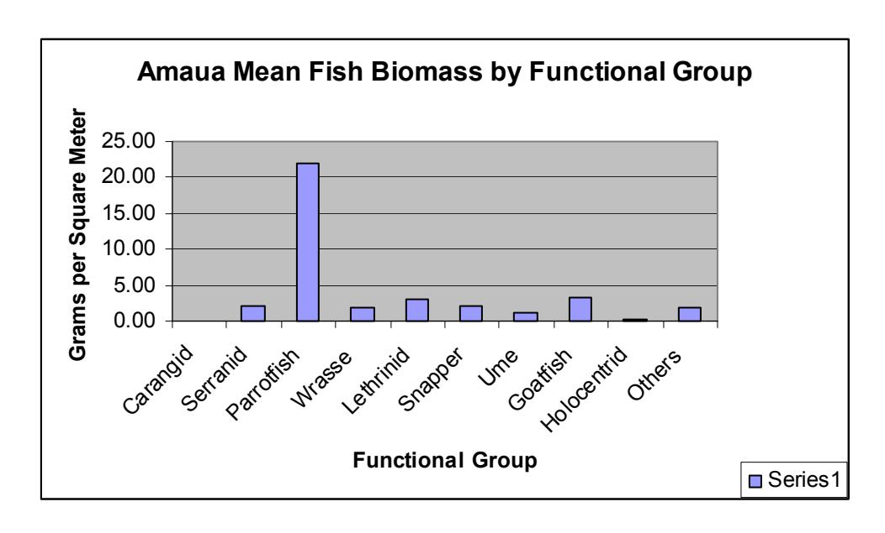

#### Aoa

Location: -14° 15.474S, -170° 35.332W

The monitoring location at Aoa's reef slope is a spur and groove system with a flat, rubble bottom at 15m. Transect 1 begins at the reef slope just east and outside of the 'ava (channel), with a compass bearing of 40° (northeast).

Aoa had high live coral cover (36.0%) and high crustose coralline algal cover (34.0%). However, this site also had high filamentous algal cover (19.3%). The fish group with the highest biomass at Aoa was parrotfish (18.46g/ m²), followed by Lethrinids (emperors). Fish species richness was very high at Aoa (140 species).

| AOA - 2005                            |            |
|---------------------------------------|------------|
| Core Sampling Regime                  |            |
| Live coral cover                      | 36.00%     |
| Crustose coralline algal cover        | 34.00%     |
| Macroalgal cover                      | 0.30%      |
| Filamentous algal cover               | 19.30%     |
| Rugosity ratio                        | 1.27       |
| Mean fish biomass                     | 55.24 g/m2 |
| Mean number of corallivores           | 5.5        |
| Mean number of Pone                   | 16.8       |
| Mean number of A. lineatus            | 0.0        |
| Mean number of all surgeonfish        | 25.8       |
| Mean number of P. dickii              | 2.7        |
| Turbidity (vertical visiblity)        | 19m        |
| Supplemental Monitoring               |            |
| Fish Species Richness (# of species)  | 140        |
| Coral Species Richness (# of species) | 71         |

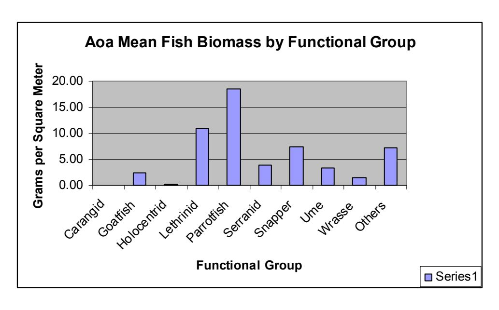

#### Aunu'u

Location: -14° 17.031S, -170° 33.755W

The monitoring location at Aunu'u's reef slope is a sloping dropoff with a sand and rubble bottom at 15m. Transect 1 begins just southwest of red NOAA weather buoy that is located southwest of Aunu'u Harbor, with a compass bearing of 220° (southwest).

Aunu'u had high live coral cover (50.0%) and high crustose coralline algal cover (31.5%). The fish group with the highest biomass at Aunu'u was fusiliers (Caesionidae) in the 'Others' category (46.53g/ $m^2$ ), followed by parrotfish (13.25 g/ $m^2$ ). Aunu'u had a very high fish species richness (152 species).

| AUNU'U - 2005                         |            |
|---------------------------------------|------------|
| Core Sampling Regime                  |            |
| Live coral cover                      | 50.00%     |
| Crustose coralline algal cover        | 31.50%     |
| Macroalgal cover                      | 0.00%      |
| Filamentous algal cover               | 0.80%      |
| Rugosity ratio                        | 1.42       |
| Mean fish biomass                     | 83.82 g/m2 |
| Mean number of corallivores           | 2.2        |
| Mean number of Pone                   | 13.0       |
| Mean number of A. lineatus            | 2.7        |
| Mean number of all surgeonfish        | 21.3       |
| Mean number of P. dickii              | 9.2        |
| Turbidity (vertical visiblity)        | n/a        |
| Supplemental Monitoring               |            |
| Fish Species Richness (# of species)  | 152        |
| Coral Species Richness (# of species) | 70         |

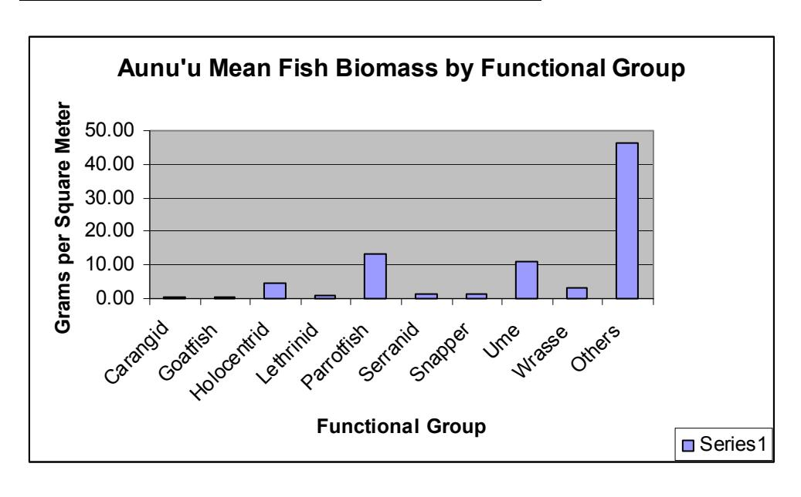

#### *Faga'alu*

Location: -14º 17.404S, -170º 40.598W

The monitoring location at Faga'alu's reef slope is characterized by large rubble zones of broken staghorn coral. Transect 1 begins just south and outside of 'ava (channel), with a compass bearing of 160º (south).

The Faga'alu site was composed almost entirely of branching rubble at the 8-10m isobath. The rubble appeared to be staghorn *Acropora* that died and collapsed some time ago, which would make it at least several years since the event that killed it. The rubble appeared to be fairly stable, and had a high cover of coralline algae (55.5%) and quite a bit of filamentous algae (27.5%), but low coral cover (12.8%). If the rubble remains stable, coral cover should increase in the coming years. At the 20m isobath, Faga'alu had a plate coral community with good coral cover. The fish group with the highest biomass at Faga'alu was parrotfish (23.00 g/ m2 ) followed by Lethrinids (emperors).

| FAGA'ALU - 2005                       |            |
|---------------------------------------|------------|
| Core Sampling Regime                  |            |
| Live coral cover                      | 12.80%     |
| Crustose coralline algal cover        | 55.50%     |
| Macroalgal cover                      | 0.00%      |
| Filamentous algal cover               | 27.50%     |
| Rugosity ratio                        | 1.08       |
| Mean fish biomass                     | 48.25 g/m2 |
| Mean number of corallivores           | 4.8        |
| Mean number of Pone                   | 25.8       |
| Mean number of A. lineatus            | 0.8        |
| Mean number of all surgeonfish        | 44.7       |
| Mean number of P. dickii              | 3.7        |
| Turbidity (vertical visiblity)        | 23.5m      |
| Supplemental Monitoring               |            |
| Fish Species Richness (# of species)  | 103        |
| Coral Species Richness (# of species) | 68         |

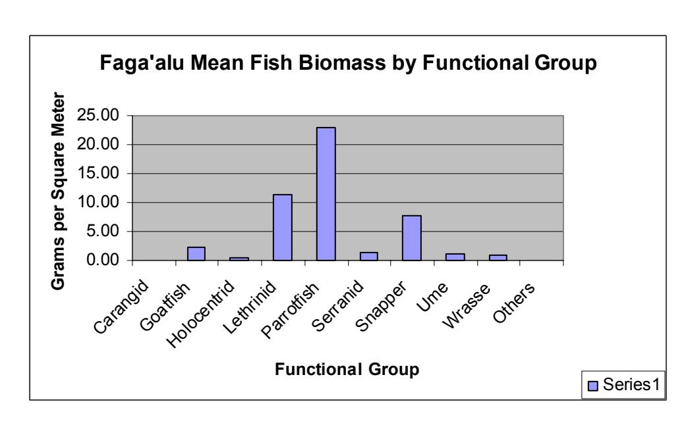

#### Fagamalo

Location Transect 1-2: -14° 17.404S, -170° 40.598W Location Transect 3-4: -14° 17.872S, -170° 48.726W

The monitoring location at Fagamalo's reef slope is a gentle reef slope and is characterized by high relief pinnacles. This monitoring site for the 1st and 2nd dives is split by the 'ava (channel) and large rubble field and thus, has two entry points with two different GPS points. Transect 1 begins just east and outside of 'ava (channel), with a compass bearing of 310° (east). Transect 3 begins just west of the 'ava (channel), with a compass bearing of 230°.

Fagamalo had a high crustose coralline aglal cover (40.0%) but also a high filamentous algal cover (33.8%). The fish group with the highest biomass at Fagamalo was parrotfish (25.15 g/m²) followed by Acanthurids (unicornfish).

| FAGAMALO - 2005                       |            |
|---------------------------------------|------------|
| Core Sampling Regime                  |            |
| Live coral cover                      | 24.30%     |
| Crustose coralline algal cover        | 40.00%     |
| Macroalgal cover                      | 0.00%      |
| Filamentous algal cover               | 33.80%     |
| Rugosity ratio                        | 1.15       |
| Mean fish biomass                     | 56.89 g/m2 |
| Mean number of corallivores           | 2.5        |
| Mean number of Pone                   | 30.0       |
| Mean number of A. lineatus            | 2.7        |
| Mean number of all surgeonfish        | 35.0       |
| Mean number of P. dickii              | 4.2        |
| Turbidity (vertical visiblity)        | 31m        |
| Supplemental Monitoring               |            |
| Fish Species Richness (# of species)  | 125        |
| Coral Species Richness (# of species) | 66         |

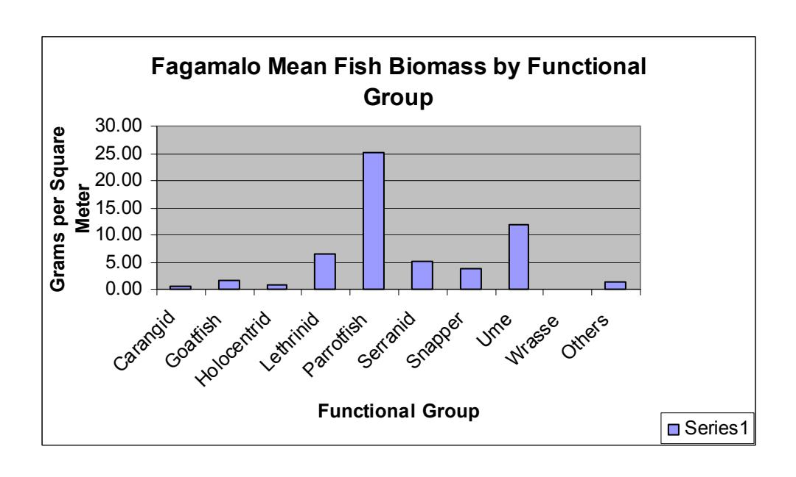

Fagasa

Location: -14° 17.016S, -170° 43.383W

The monitoring location at Fagasa's reef slope is located along the east shore of the bay and is characterized by low coral cover with lumps and cracks of presumably old coral reef that resemble bare rocks. The substrate was covered with a thin layer of fine silt and large amount of filamentous algae. At the GPS point is a large (3-4m) massive *Porites* coral head at 6m below water surface and is surrounded by the branching coral *Porites cylindrica*. Transect 1 begins at the GPS point, with a compass bearing of 290° (west). Transect 3 also begins at the GPS point, but with a compass bearing of 130° (east/southeast).

Fagasa is a deeply indented bay with silt. Fagasa had very low coral cover (6.8%) and low crustose coralline algae cover (9.5%). This site had high filamentous algae cover (45.0%) and low coral species diversity (57 species). The monitoring site is on the only reef structure, which is at the head of the bay. A thin film of silt covers the reef structure. It appears that deeply indented bays, such as Pago Pago Harbor, Vatia, and Fagasa, do not have sufficient circulation to carry fine silt out of the bay. The fish group with the highest biomass at Fagasa was parrotfish (15.63 g/ m²) followed by Lethrinids (emperors).

| FAGASA - 2005                  |            |
|--------------------------------|------------|
| Core Sampling Regime           |            |
| Live coral cover               | 6.80%      |
| Crustose coralline algal cover | 9.50%      |
| Macroalgal cover               | 3.50%      |
| Filamentous algal cover        | 45.00%     |
| Rugosity ratio                 | 1.15       |
| Mean fish biomass              | 48.58 g/m2 |
| Mean number of corallivores    | 0.7        |
| Mean number of Pone            | 6.2        |
| Mean number of A. lineatus     | 0.2        |

| Mean number of all surgeonfish        | 8.8 |
|---------------------------------------|-----|
| Mean number of P. dickii              | 0.0 |
| Turbidity (vertical visiblity)        | n/a |
| Supplemental Monitoring               |     |
| Fish Species Richness (# of species)  | 90  |
| Coral Species Richness (# of species) | 57  |

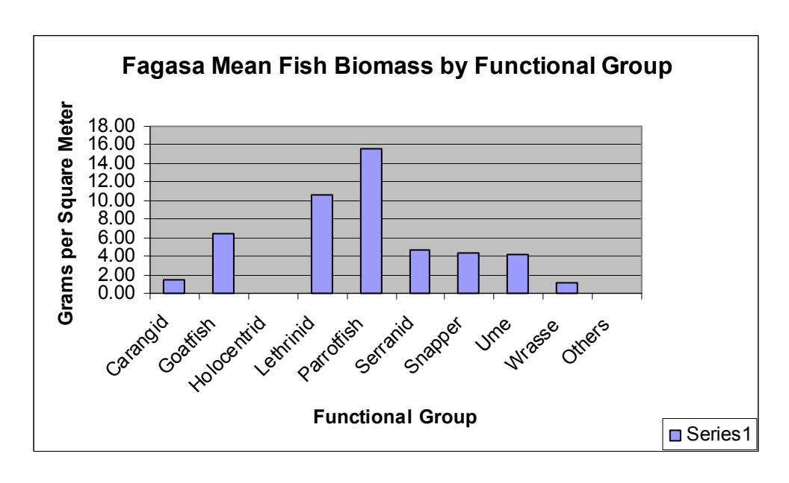

## Fagatele

Location: -14° 21.859S, -170° 45.753W

The monitoring location at Fagatele's reef slope is characterized by a shelf with good coral cover, primarily coralline algae. Transect 1 begins on the east side of the sand spur, with a compass bearing of 10° (north). Transect 2 winds around to west side of sand spur. Transects 3 and 4 wind through large table coral stands.

Fagatele is subject to heavy surge, has a very small watershed, and shows no silt within the bay. This bay had high coral cover (40.3%), high coralline algae cover (46.8%), and high coral species richness (79 species). The fish group with the highest biomass at Fagatele was parrotfish  $(24.42 \text{ g/m}^2)$ . The fish species richness at Fagatele was high (142 species).

| FAGATELE - 2005                |            |
|--------------------------------|------------|
| Core Sampling Regime           |            |
| Live coral cover               | 40.30%     |
| Crustose coralline algal cover | 46.80%     |
| Macroalgal cover               | 0.30%      |
| Filamentous algal cover        | 4.10%      |
| Rugosity ratio                 | 1.03       |
| Mean fish biomass              | 31.63 g/m2 |
| Mean number of corallivores    | 4.5        |
| Mean number of Pone            | 33.0       |

| Mean number of A. lineatus            | 0.7  |
|---------------------------------------|------|
| Mean number of all surgeonfish        | 43.8 |
| Mean number of P. dickii              | 14.8 |
| Turbidity (vertical visiblity)        | 40m  |
| Supplemental Monitoring               |      |
| Fish Species Richness (# of species)  | 142  |
| Coral Species Richness (# of species) | 79   |

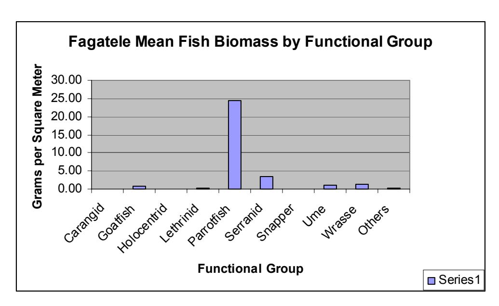

#### Leone

Location: -14° 20.534S, -170° 47.339W

The monitoring location at Leone's reef slope is characterized by a loose spur and groove system with large boulders intermixed with very little overall slope. To the west of the entry point, the reef eventually becomes a gently sloping dropoff. At the GPS point is a large pinnacle that rises from the bottom at 11m up to 7m. At the top of this pinnacle is a large stand of encrusting fire coral, *Millepora* sp. Transect 1 begins at the GPS point, with a compass bearing of 280° (west).

Leone had high live coral cover (35.8%), high crustose coralline algal cover (39.8%), and low macroagal and filamentous algal covers. The fish group with the highest biomass at Leone was parrotfish (31.54 g/  $m^2$ ).

| LEONE - 2005                   |            |
|--------------------------------|------------|
| Core Sampling Regime           |            |
| Live coral cover               | 35.80%     |
| Crustose coralline algal cover | 39.80%     |
| Macroalgal cover               | 0.30%      |
| Filamentous algal cover        | 1.00%      |
| Rugosity ratio                 | 1.21       |
| Mean fish biomass              | 46.35 g/m2 |

| Mean number of corallivores           | 2.7  |
|---------------------------------------|------|
| Mean number of Pone                   | 47.7 |
| Mean number of A. lineatus            | 2.0  |
| Mean number of all surgeonfish        | 56.5 |
| Mean number of P. dickii              | 10.3 |
| Turbidity (vertical visiblity)        | n/a  |
| Supplemental Monitoring               |      |
| Fish Species Richness (# of species)  | 121  |
| Coral Species Richness (# of species) | 76   |

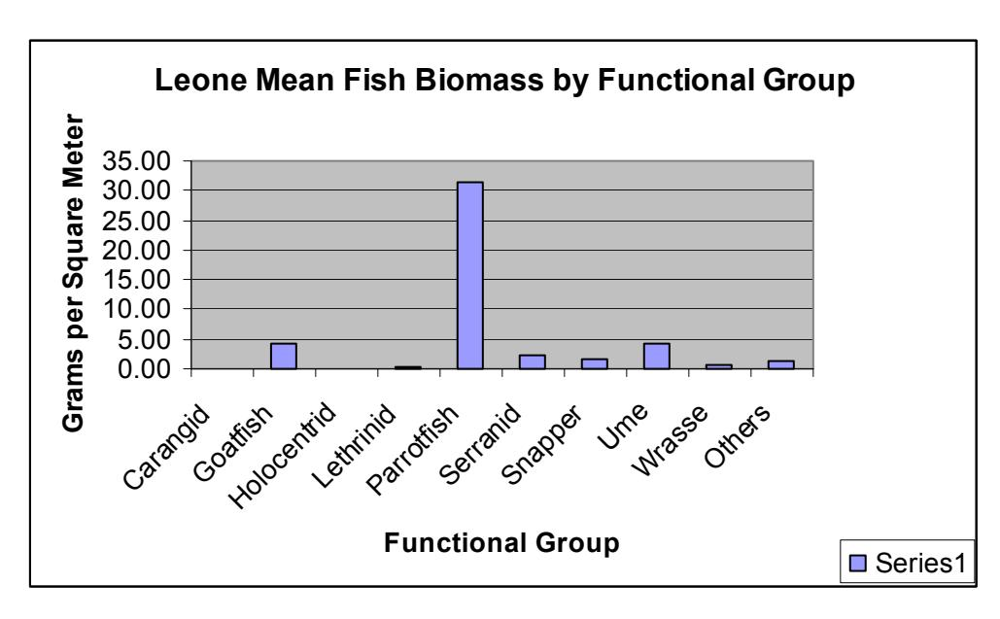

#### Nu'uuli

Location: -14° 19.226S, -170° 41.834W

The monitoring location at Leone's reef slope is characterized by a sloping dropoff with sand at bottom at 15m. At the GPS point is a large (15m diameter) coral head (*Diploastrea heliopora*) just east of 'ava. Transect 1 begins just west and outside of 'ava (channel), with a compass bearing of 280-290° (west).

Nu'uuli had very high crustose coralline algal cover (58.0%) but had moderate cover of live coral cover (19.8%). The fish group with the highest biomass at Nu'uuli was parrotfish (91.46 g/  $m^2$ ). The Fish Diver noted high activity and abundance at this site of parrotfish on the reef, with possible spawning behavior.

| NU'UULI - 2005                 |        |
|--------------------------------|--------|
| Core Sampling Regime           |        |
| Live coral cover               | 19.80% |
| Crustose coralline algal cover | 58.00% |
| Macroalgal cover               | 0.00%  |
| Filamentous algal cover        | 0.80%  |
| Rugosity ratio                 | 1.29   |

| Mean fish biomass                     | 114.16 g/m2 |
|---------------------------------------|-------------|
| Mean number of corallivores           | 1.0         |
| Mean number of Pone                   | 15.2        |
| Mean number of A. lineatus            | 0.3         |
| Mean number of all surgeonfish        | 20.2        |
| Mean number of P. dickii              | 2.5         |
| Turbidity (vertical visiblity)        | n/a         |
| Supplemental Monitoring               |             |
| Fish Species Richness (# of species)  | 117         |
| Coral Species Richness (# of species) | 77          |

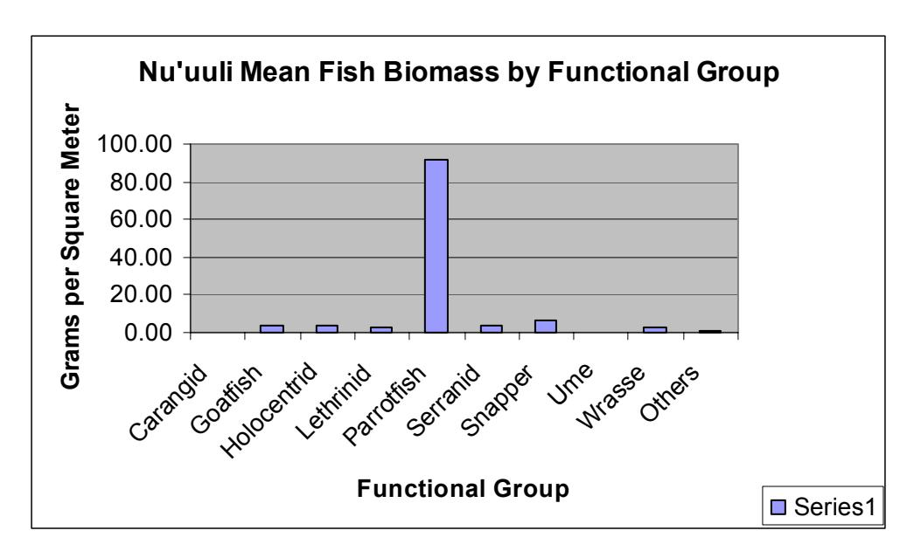

**Tafeu** Location: -14° 15.172S, -170° 41.342W

The monitoring location at Leone's reef slope is characterized by high, live coral cover sloping off to a sand and rubble bottom at 10m. Transect 1 begins just north and outside of 'ava (channel) and large rubble field, with a compass bearing of 350° (north). A large massive *Porites* head and tall pinnacle are located towards the north of the end of the 2nd transect. By the end of the 4th transect (~350m from entry point), the reef bottom was much deeper (15m).

Tafeu is a small bay and had high coral cover (43.3%), low coralline algae cover (12.8%), high filamentous algae cover (29.5%), and the highest cover of a corallimorph of any site. A relative of hard corals, corallimorphs have large fleshy polyps but no skeleton. Corallimorphs form large clusters or patches, completely covering the patch area. They may be a pioneering species which once started on open substrate, can quickly cover large areas of open substrate. This would correspond with the large area covered by filamentous algae, which also rapidly colonizes newly opened substrate. Therefore, Tafeu may have had an event in the past that opened substrate by removing living organisms. The fish group with the highest biomass at Tafeu was parrotfish (19.76g/ m²).

| TAFEU - 2005                          |            |
|---------------------------------------|------------|
| Core Sampling Regime                  |            |
| Live coral cover                      | 43.30%     |
| Crustose coralline algal cover        | 12.80%     |
| Macroalgal cover                      | 0.00%      |
| Filamentous algal cover               | 29.50%     |
| Rugosity ratio                        | 1.19       |
| Mean fish biomass                     | 65.75 g/m2 |
| Mean number of corallivores           | 1.8        |
| Mean number of Pone                   | 11.7       |
| Mean number of A. lineatus            | 0.3        |
| Mean number of all surgeonfish        | 15.2       |
| Mean number of P. dickii              | 2.3        |
| Turbidity (vertical visiblity)        | 33m        |
| Supplemental Monitoring               |            |
| Fish Species Richness (# of species)  | 122        |
| Coral Species Richness (# of species) | 66         |

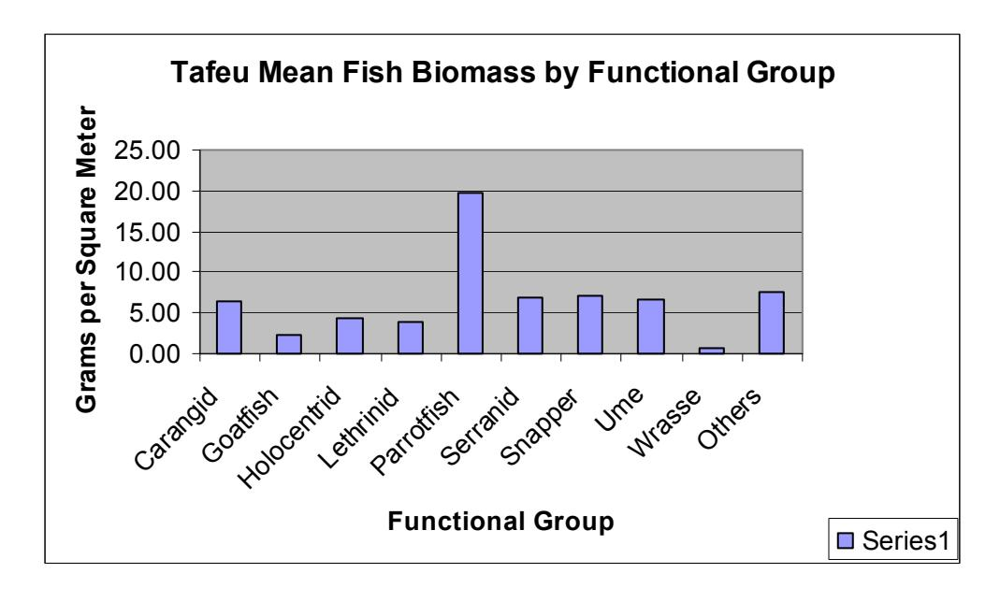

#### Vatia

Location: -14° -14.888S, -170° 40.205W

The monitoring location at Vatia's reef slope is located on the east side of the bay and is characterized by a sandy/silty slope within a deeply indented bay with restricted circulation. Coral are commonly separated by sand or silt, which is unusual for Tutuila. Large amounts of terrestrial sedimentation were evident, including fine silt. The most common coral species was *Porites rus* followed by *Porites cylindrica*. Large massive *Porites* coral heads were also common. Towards the north end of the bay, visibility was reduced due to this sediment suspension in the water column. Transect 1 begins at the GPS point, with a compass bearing of 230° (west/southwest).

Vatia had very high macroalgae cover (17.3%), but high coral species richness (87 species). The corals at this site appeared healthy, with a somewhat different community which probably consists of species that can tolerate higher sediment conditions. Vatia had very low coralline algae cover (2.0%), probably because the high sediment load smothers crustose coralline algae. One of the authors has seen the north side of the bay as well, which is very similar. The fish group with the highest biomass at Vatia was parrotfish (9.87 g/ m²) followed by Acanthurids (unicornfish) and Lethrinids (emperors).

| VATIA - 2005                          |            |
|---------------------------------------|------------|
| Core Sampling Regime                  |            |
| Live coral cover                      | 28.50%     |
| Crustose coralline algal cover        | 2.00%      |
| Macroalgal cover                      | 17.30%     |
| Filamentous algal cover               | 15.30%     |
| Rugosity ratio                        | 1.19       |
| Mean fish biomass                     | 29.13 g/m2 |
| Mean number of corallivores           | 3.8        |
| Mean number of Pone                   | 10.5       |
| Mean number of A. lineatus            | 0.0        |
| Mean number of all surgeonfish        | 14.2       |
| Mean number of P. dickii              | 0.0        |
| Turbidity (vertical visiblity)        | 20m        |
| Supplemental Monitoring               |            |
| Fish Species Richness (# of species)  | 125        |
| Coral Species Richness (# of species) | 87         |

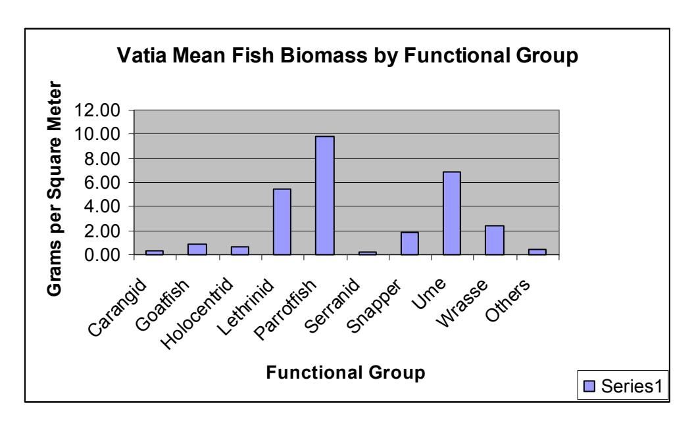

# **Appendix 1 – Most Commonly Sighted Fish Species**

Species with Sighting Frequency (SF) of at least 72.7% during 2005 ASCRMP's supplemental monitoring for biodiversity are reported in this appendix. Sighting frequency (%SF) is a measure of how often the species was observed.

| Family         | Common name                                                             | Scientific Name               | SF%   |
|----------------|-------------------------------------------------------------------------|-------------------------------|-------|
| Acanthuridae   | Brown surgeonfish                                                       | Acanthurus nigrofuscus        | 100.0 |
| Acanthuridae   | Brushtail tang                                                          | Zebrasoma scopas              | 100.0 |
| Acanthuridae   | Pacific sailfin tang                                                    | Zebrasoma veliferum           | 100.0 |
| Acanthuridae   | Lined bristletooth (Striped bristletooth)                               | Ctenochaetus striatus         | 100.0 |
| Acanthuridae   | Whitecheek surgeonfish                                                  | Acanthurus nigricans          | 100.0 |
| Balistidae     | Orange-lined triggerfish                                                | Balistapus undulatus          | 100.0 |
| Balistidae     | Pinktail triggerfish                                                    | Melichthys vidua              | 100.0 |
| Chaetodontidae | Longnose butterflyfish (Forcepsfish)                                    | Forcipiger flavissimus        | 100.0 |
| Chaetodontidae | Reticulated butterflyfish                                               | Chaetodon reticulatus         | 100.0 |
| Chaetodontidae | Vagabond butterflyfish                                                  | Chaetodon vagabundus          | 100.0 |
| Cirrithidae    | Arceye hawkfish                                                         | Paracirrhites arcatus         | 100.0 |
| Labridae       | Checkerboard wrasse                                                     | Halichoeres hortulanus        | 100.0 |
| Labridae       | Sixbar wrasse                                                           | Thalassoma hardwicke          | 100.0 |
| Labridae       | Bird wrasse                                                             | Gomphosus varius              | 100.0 |
| Labridae       | Linedcheeked wrasse (Bandcheek/Cheeklined wrasse)Oxycheilinus digrammus |                               | 100.0 |
| Labridae       | Fivestripe wrasse (Redribbon wrasse)                                    | Thalassoma quinquevittatum    | 100.0 |
| Labridae       | Sixstripe wrasse                                                        | Pseudochelinus hexataenia     | 100.0 |
| Labridae       | Bluestreak cleaner wrasse                                               | Labroides dimidatus           | 100.0 |
| Lethrinidae    | Bigeye emperor (Humpnose bigeye bream)                                  | Monotaxis grandoculis         | 100.0 |
| Lutjanidae     | Black or Midnight snapper                                               | Macolor spp                   | 100.0 |
| Lutjanidae     | Red snapper (Twinspot snapper)                                          | Lutjanus bohar                | 100.0 |
| Lutjanidae     | Smalltooth jobfish                                                      | Aphareus furca                | 100.0 |
| Mullidae       | Goldsaddle goatfish                                                     | Parupeneus cyclostomus        | 100.0 |
| Mullidae       | Manybar goatfish                                                        | Parupeneus multifasciatus     | 100.0 |
| Pomacanthidae  | Regal angelfish                                                         | Pygoplites diacanthus         | 100.0 |
| Pomacanthidae  | Lemonpeel angelfish                                                     | Centropyge flavissimus        | 100.0 |
| Pomacentridae  | Jewel damselfish                                                        | Plectroglyphidodon lacrymatus | 100.0 |
| Pomacentridae  | Princess damselfish                                                     | Pomacentrus vaiuli            | 100.0 |
| Pomacentridae  | Blackbar damselfish (Dick's damsel)                                     | Plectroglyphidodon dickii     | 100.0 |
| Pomacentridae  | South sea devil                                                         | Chrysiptera taupou            | 100.0 |
| Pomacentridae  | Pomacentrus sp.                                                         | Pomacentrus spp.              | 100.0 |
| Pomacentridae  | Pale-tail chromis (Black chromis)                                       | Chromis xanthura              | 100.0 |
| Scaridae       | Japanese parrotfish                                                     | Chlorurus japanensis          | 100.0 |
| Scaridae       | Bullethead parrotfish                                                   | Chlorurus sordidus            | 100.0 |
| Serranidae     | Yellow-edged lyretail                                                   | Variola louti                 | 100.0 |
| Acanthuridae   | Mimic surgeonfish                                                       | Acanthurus pyroferus          | 90.9  |
| Acanthuridae   | Orangespine unicornfish                                                 | Naso lituratus                | 90.9  |
| Blenniidae     | Red-speckled blenny                                                     | Cirripectes variolosus        | 90.9  |
| Chaetodontidae | Dot & dash butterflyfish                                                | Chaetodon pelewensis          | 90.9  |
| Chaetodontidae | Ornate butterflyfish                                                    | Chaetodon ornatissimus        | 90.9  |

| Chaetodontidae | Teardrop butterflyfish                         | Chaetodon unimaculatus           | 90.9 |
|----------------|------------------------------------------------|----------------------------------|------|
| Labridae       | Barred thicklip                                | Hemigymnus fasciatus             | 90.9 |
| Labridae       | Yellowbreasted wrasse                          | Anampses twistii                 | 90.9 |
| Lutjanidae     | Humpback snapper                               | Lutjanus gibbus                  | 90.9 |
| Pomacanthidae  | Two-spined angelfish (Dusky angelfish)         | Centropyge bispinosus            | 90.9 |
| Pomacentridae  | Johnston damselfish                            | Plectroglyphidodon johnstonianus | 90.9 |
| Pomacentridae  | Pacific half-and-half chromis                  | Chromis iomelas                  | 90.9 |
| Pomacentridae  | Bicolor chromis                                | Chromis margaritifer             | 90.9 |
| Ptereleotridae | Twotone dartfish (Blackfin dartfish)           | Ptereleotris evides              | 90.9 |
| Scaridae       | Dark-capped parrotfish                         | Scarus oviceps                   | 90.9 |
| Scaridae       | Redlip parrotfish                              | Scarus rubroviolaceus            | 90.9 |
| Serranidae     | Peacock grouper                                | Cephalopholis argus              | 90.9 |
| Serranidae     | Flagtail grouper                               | Cephalopholis urodeta            | 90.9 |
| Zanclidae      | Moorish idol                                   | Zanclus cornutus                 | 90.9 |
| Chaetodontidae | Redfin butterflyfish (Oval butterflyfish)      | Chaetodon lunulatus              | 81.8 |
| Chaetodontidae | Saddled butterflyfish                          | Chaetodon ephippium              | 81.8 |
| Cirrithidae    | Freckled hawkfish                              | Paracirrhites forsteri           | 81.8 |
| Holocentridae  | Spotfin squirrelfish                           | Neoniphon sammara                | 81.8 |
| Holocentridae  | Soliderfish spp.                               | Myripristis spp.                 | 81.8 |
| Labridae       | Tripletail wrasse                              | Cheilinus trilobatus             | 81.8 |
| Labridae       | Snooty wrasse                                  | Cheilinus oxycephalus            | 81.8 |
| Labridae       | Bicolor cleaner wrasse                         | Labroides bicolor                | 81.8 |
| Lutjanidae     | Blacktail snapper                              | Lutjanus fulvus                  | 81.8 |
| Chaetodontidae | Humphead bannerfish                            | Heniochus varius                 | 72.7 |
| Labridae       | Blackeye thicklip                              | Hemigymnus melapterus            | 72.7 |
| Labridae       | Slingjaw wrasse                                | Epibulus insdiator               | 72.7 |
| Labridae       | Axilspot hogfish                               | Bodianus axillaris               | 72.7 |
| Lutjanidae     | Onespot snapper                                | Lutjanus monostigmus             | 72.7 |
| Mullidae       | Doublebar goatfish                             | Parupeneus bifasciatus           | 72.7 |
| Pempheridae    | Copper sweeper                                 | Pempheris oualensis              | 72.7 |
| Pomacanthidae  | Bicolor angelfish                              | Centropyge bicolor               | 72.7 |
| Pomacentridae  | Ambon chromis                                  | Chromis amboinensis              | 72.7 |
| Scaridae       | Bicolor parrotfish                             | Cetoscarus ocellatus             | 72.7 |
| Scaridae       | Yellowbar parrotfish                           | Scarus schlegeli                 | 72.7 |
| Scaridae       | Violet-lined parrotfish (Roundhead parrotfish) | Scarus globiceps                 | 72.7 |
| Scaridae       | Greensnout parrotfish (Pygmy parrotfish)       | Scarus spinus                    | 72.7 |

# **Appendix 2 – Most Abundant Fish Species**

Species with Density Means of at least 2.0 recorded during 2005 ASCRMP's supplemental monitoring for biodiversity are reported in this appendix. The density index is a measure of how many individuals of a species were observed based on a scale of 1-4. It is representative of the abundance category (1-4) which was most frequently recorded for the species when it was observed. This Appendix accounts for non-sightings.

| Family         | Common name                                          | Scientific Name                  | Density Mean |
|----------------|------------------------------------------------------|----------------------------------|-----------------|
| Acanthuridae   | Lined bristletooth (Striped bristletooth)            | Ctenochaetus striatus            | 3.8             |
| Pomacentridae  | Pomacentrus sp.                                      | Pomacentrus spp.                 | 3.8             |
| Pomacentridae  | Pale-tail chromis (Black chromis)                    | Chromis xanthura                 | 3.8             |
| Pomacentridae  | Pacific half-and-half chromis                        | Chromis iomelas                  | 3.5             |
| Pomacentridae  | Princess damselfish                                  | Pomacentrus vaiuli               | 3.0             |
| Scaridae       | Japanese parrotfish                                  | Chlorurus japanensis             | 2.9             |
| Acanthuridae   | Whitecheek surgeonfish                               | Acanthurus nigricans             | 2.8             |
| Chaetodontidae | Reticulated butterflyfish                            | Chaetodon reticulatus            | 2.8             |
| Lethrinidae    | Bigeye emperor (Humpnose bigeye bream)            | Monotaxis grandoculis            | 2.8             |
| Pomacentridae  | Jewel damselfish                                     | Plectroglyphidodon lacrymatus    | 2.7             |
| Scaridae       | Bullethead parrotfish                                | Chlorurus sordidus               | 2.7             |
| Lutjanidae     | Smalltooth jobfish                                   | Aphareus furca                   | 2.6             |
| Pomacanthidae  | Lemonpeel angelfish                                  | Centropyge flavissimus           | 2.6             |
| Pomacentridae  | Blackbar damselfish (Dick's damsel)                  | Plectroglyphidodon dickii        | 2.6             |
| Pomacentridae  | Bicolor chromis                                      | Chromis margaritifer             | 2.6             |
| Acanthuridae   | Brushtail tang                                       | Zebrasoma scopas                 | 2.5             |
| Balistidae     | Orange-lined triggerfish                             | Balistapus undulatus             | 2.5             |
| Balistidae     | Pinktail triggerfish                                 | Melichthys vidua                 | 2.5             |
| Acanthuridae   | Brown surgeonfish                                    | Acanthurus nigrofuscus           | 2.4             |
| Labridae       | Bird wrasse                                          | Gomphosus varius                 | 2.4             |
| Lutjanidae     | Humpback snapper                                     | Lutjanus gibbus                  | 2.4             |
| Pomacentridae  | South sea devil                                      | Chrysiptera taupou               | 2.4             |
| Acanthuridae   | Orangespine unicornfish                              | Naso lituratus                   | 2.3             |
| Labridae       | Checkerboard wrasse                                  | Halichoeres hortulanus           | 2.3             |
| Labridae       | Sixbar wrasse                                        | Thalassoma hardwicke             | 2.3             |
| Lutjanidae     | Black or Midnight snapper                            | Macolor spp                      | 2.3             |
| Pomacentridae  | Johnston damselfish                                  | Plectroglyphidodon johnstonianus | 2.3             |
| Ptereleotridae | Twotone dartfish (Blackfin dartfish)                 | Ptereleotris evides              | 2.3             |
| Labridae       | Bluestreak cleaner wrasse                            | Labroides dimidatus              | 2.2             |
| Pomacanthidae  | Regal angelfish                                      | Pygoplites diacanthus            | 2.2             |
| Serranidae     | Flagtail grouper                                     | Cephalopholis urodeta            | 2.2             |
| Acanthuridae   | Pacific sailfin tang                                 | Zebrasoma veliferum              | 2.1             |
| Labridae       | Linedcheeked wrasse (Bandcheek/Cheeklined wrasse) | Oxycheilinus digrammus           | 2.1             |
| Labridae       | Fivestripe wrasse (Redribbon wrasse)                 | Thalassoma quinquevittatum       | 2.1             |
| Mullidae       | Manybar goatfish                                     | Parupeneus multifasciatus        | 2.1             |
| Scaridae       | Redlip parrotfish                                    | Scarus rubroviolaceus            | 2.1             |
| Serranidae     | Peacock grouper                                      | Cephalopholis argus              | 2.1             |
| Labridae       | Sixstripe wrasse                                     | Pseudochelinus hexataenia        | 2.0             |

| Lutjanidae | Red snapper (Twinspot snapper) | Lutjanus bohar         | 2.0 |
|------------|--------------------------------|------------------------|-----|
| Mullidae   | Goldsaddle goatfish            | Parupeneus cyclostomus | 2.0 |

# **Appendix 3 -- Site to Site Comparison**

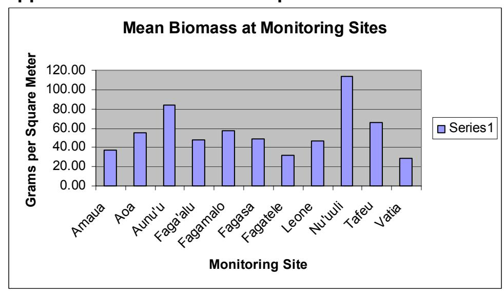

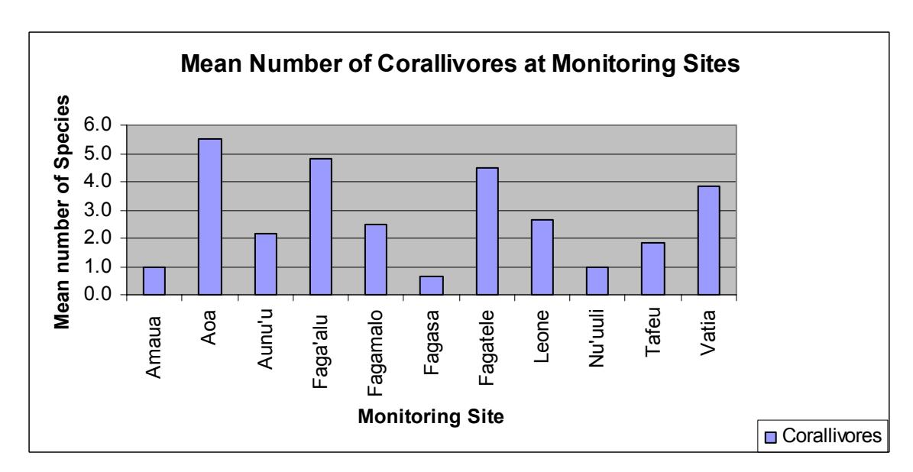

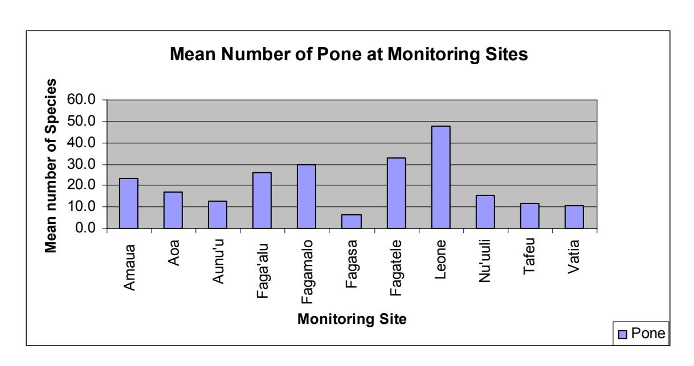

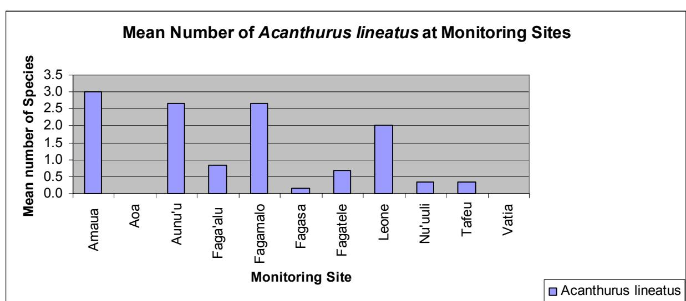

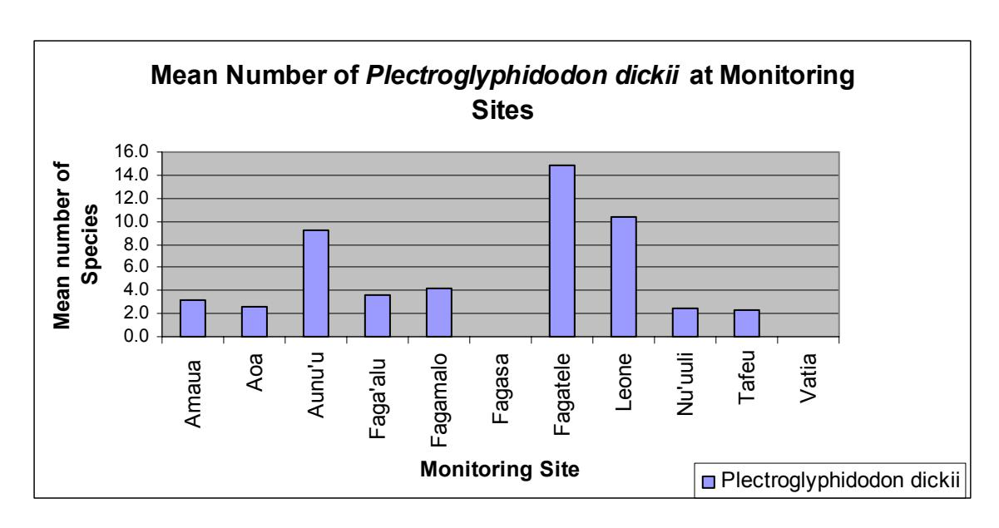

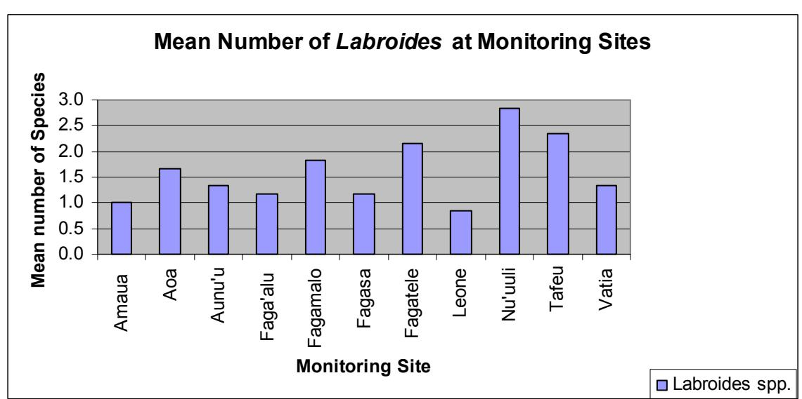

Highest functional group biomass

Parrotfish – Nu'uuli

Carangid – Tafeu

Emperor – Faga'alu, Fagasa, Aoa

Goatfish – Fagasa, Leone

Serranid – Aunu'u, Tafeu, Nu'uuli

Snapper – Aoa, Faga'alu, Tafeu

Unicornfish – Fagamalo, Aunu'u

Large wrasse – Aunu'u, Nu'uuli

During the supplemental monitoring for biodiversity, a total of 270 fish species were recorded. The site with the highest biodiversity was Aunu'u with 152 fish species, minimum was at Fagasa with 90 fish species, and mean was 123 fish species.

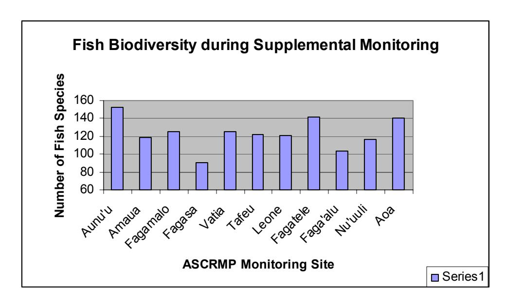

A total of 238 fish species were recorded with the highest fish biodiversity at Aoa with 132 fish species, minimum was at Vatia with 82 fish species, and mean was 111 fish species.

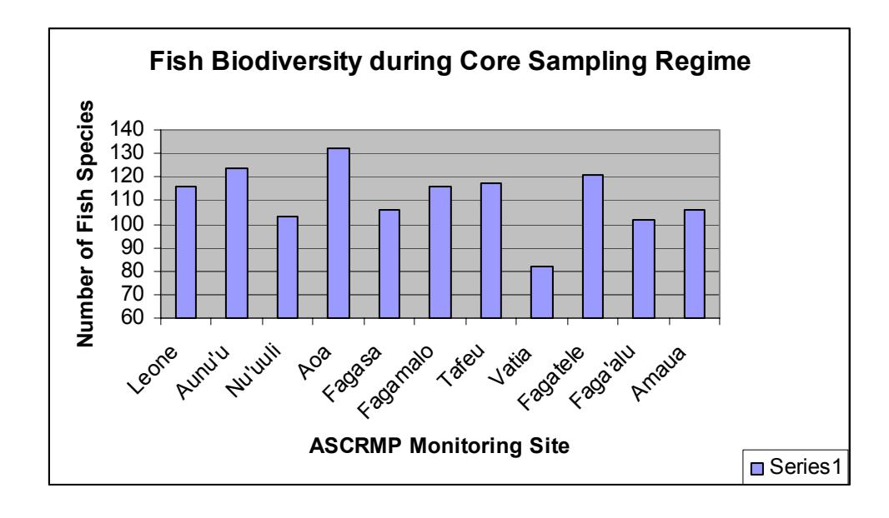