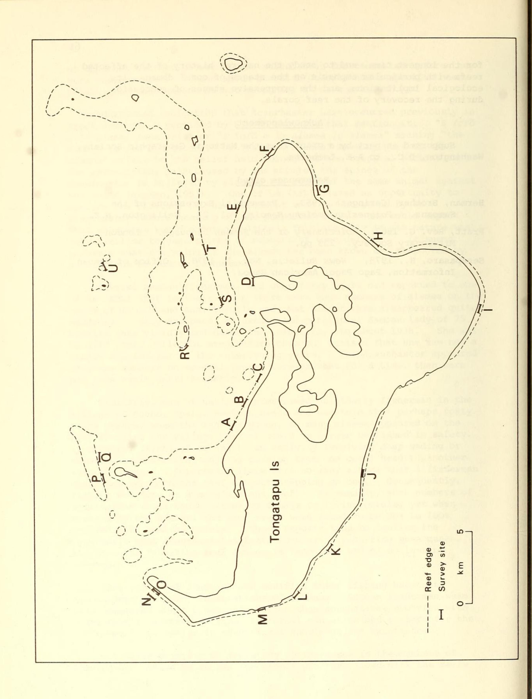

## ACANTHASTER AS A RECURRING PHENOMENON IN SAMOAN HISTORY

by John M. Flanigan and Austin E. Lamberts2

Verbal history, linquistic evidence and proverbs indicate that Acanthaster planci have been long known and endured in Samoa.

The Crown-of-Thorns starfish (Acanthaster planci (L.)) has been known to science since it was described by Rumphius in 1705. Only in the past decade and a half has it stirred popular interest after great numbers of these starfish were reported almost simultaneously from Guam, the Great Barrier reef province of Australia and from other Indo-Pacific coral reef areas. Significantly, this occurred at about the time that face mask and snorkel were becoming standard equipment for visitors to coral reefs.

Recently Acanthaster have appeared on the reefs of Tutuila, American Samoa, in impressive numbers. The fact that collection efforts which reportedly netted nearly a half a million starfish have not significantly affected the total number attests to the host of Acanthaster (Sesapasaro, 1978). In previous decades this animal was a great rarity locally. Between 1967 and 1973 one of us (JF) encountered only two of these creatures during hundreds of dives on the reefs of Tutuila. Nevertheless, there is evidence that these animals have occurred in great numbers in the past.

The specificity with which objects in the Samoan environment are named bears a relationship to the importance of those objects in the culture. Thus, Samoans have a single word to refer to all types of branching corals ('amu) but distinctive word for the less conspicuous massive coral (puga) and flat coral (lapa) used for burning to make lime. The language also has a single word for nearly all starfish (aveau) but Acanthaster alone has the highly specific name of alamea. It is noteworthy that a similar word, taramea is used for Acanthaster in the Polynesian Cook and Society Islands even though there had been

&lt;sup>1Dept. of Mathematics & Science American Samoa Community College Pago Pago, American Samoa 96799.

&lt;sup>21520 Leffingwell, N.E. Grand Rapids, Mi. 49505.

(Manuscript received 10 March 1979-- Eds.)
Atoll Res. Bull. No. 255: 59-62, 1981.

no apparent contact between these subcultures for centuries before they were rediscovered. (The cushion starfish *Culcita* has a specific name, pālutu, but the Samoans do not recognize it as a starfish.)

Additional indication that Acanthaster have occurred previously in great numbers is provided by Samoan proverbs that mention it. "E fofō e le alamea lana sale" or "E fofō e le alamea le alamea" meaning "the alamea is its own doctor," or "falau a alamea" meaning 'bure of the alamea" refers to the belief held throughout the tropical Pacific that the excruciating pain caused by the sting of the spines of the Acanthaster is relieved by placing the mouth of the same animal against the wound (Herman, 1953). One of us (AEL) missed an opportunity to confirm the efficacy of this treatment when he was stung by an Acanthaster before hearing of the purported cure. One would expect that an animal would enter a culture's folklore only if its nature was very familiar to generations of members of that culture. It seems probable that the sting of the alamea has been known and respected by generations of Samoan fishermen.

Several Samoan fishermen, all over fifty years old reported to one of us (AEL) that in their youth there were huge numbers of alamea on the reefs of Nu'uuli and Aua, Tutuila and that all of them disappeared quite suddenly. Mary Prichard, an astute and perceptive Samoan lady of 75 recalls this vividly and dates the infestation to about 1938. She was an avid shell collector even before this but insists that she saw not a single Acanthaster in the intervening years. The Acanthaster appeared in large numbers on several reefs, were present for a time, then were not seen again until recently.

Similarly, one of us (JF) interviewed an elderly fisherman in the village of Suano, Upalu, Western Samoa and was told that perhaps forty years before, when the man was young, so many alamea appeared on the reef fronting the village that it could no longer be fished in safety. (Typically, "fishing" refers to an activity involving deep wading or swimming near the reef edge by pushing from one coral head to another with the feet.) Reportedly there were so many alamea that a fisherman could not stand on the reef without stepping on one. Consequently, fishing was done at a more distant reef. Presumably, such numbers of Acanthaster would cause extensive damage to living corals, yet when visited by the author, the same reefs were found to be 90% to 100% covered with healthy corals. These reports tend to confirm the hypothesis that Acanthaster infestations are a recurring phenomenon, and that the resulting reef damage is temporary and of no lasting consequence.

Generations of Samoans have modified their fishing habits to accommodate periodic infestations of alamea. Samoan fishermen seem less concerned about a new infestation than non-natives who view with alarm from a background richer in formal education and concern for the environment but poorer in traditional knowledge and experience.

Our first priority in the study of increases in the numbers of Acanthaster should be to ask the people who have lived with the reefs for the longest time, and to study the natural history of the affected reefs with particular emphasis on the stages of coral damage, its ecological implications, and the progressive stages of succession during the recovery of the reef corals.

## Acknowledgement

Supported in part by a grant from the National Geographic Society, Washington, D.C., to A.E. Lamberts.

## References cited

- Herman, Brother (Seringer). 1953. Proverbial Expressions of the Samoans. Polynesian Society Memoir, Vol. 27. Wellington, N.Z.
- Pratt, Rev. G. 1862. Dictionary of the Samoan Language. London Missionary Society. 223 pp.
- Sesapasaro, H., 1978. News Bulletin, Nov. 1, 1978. Office of Samoan Information, Pago Pago, American Samoa.

