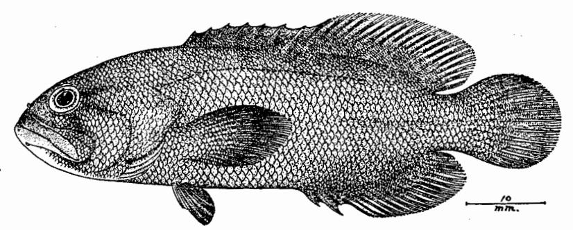
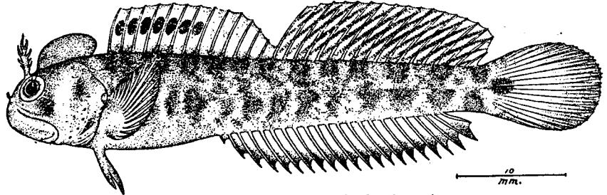

# VII.

# A COLLECTION OF FISHES FROM SAMOA.

 $\mathbf{B}\mathbf{Y}$ 

HENRY W. FOWLER,

Academy of Natural Sciences of Philadelphia,

AND

CHARLES F. SILVESTER,

United States Army.

Two figures.

# A COLLECTION OF FISHES FROM SAMOA.

By HENRY W. FOWLER AND CHARLES F. SILVESTER.

The specimens forming the basis of the present paper were collected at Pago Pago in the spring of 1917 by the Carnegie expedition to Samoa. Efforts were made chiefly to secure small or inconspicuous forms, and, though the collection embraces only 53 species, several are rare and one species is described as new. The collection consists of five lots of small fishes taken from the following localities. First lot, April 5, 1917, from the cove just south of Aua village and 100 feet northwest of Dr. Mayor's "Aua line." These were taken by lifting bunches of coral from the bottom and then breaking the coral. The second lot has the same data, except a few specimens screened at the bottom with wire and mosquito screening. The third lot, taken April 6, consists of specimens shaken from coral in the reef in front of the hospital, Pago Pago Harbor, Tutuila. The fourth lot was obtained March 20, 1917, from tide-pools near Double Point, just west of the entrance to Pago Pago Harbor. The fifth lot is simply labeled Pago Pago.

The collection is now contained in the Museum of the Academy

of Natural Sciences, Philadelphia.

The ichthyology of Samoa has claimed the attention of several investigators. The most important general account is the "Fische der Südsee" by Günther.¹ This was founded largely on the colored drawings of fishes from various Polynesian Islands made by Andrew Garrett. After the first few parts were published the work was discontinued for a number of years, though in 1910 it was finally completed. Previously some of the fishes collected by the Godeffroy firm, which also financed Günther's "Fische der Südsee," were sent to the Vienna Museum and described by Kner and Steindachner.² Later a collection from Savaii and Upolu was made by Rev. S. J. Whitmee and sent to the British Museum. The percoids from this collection are published in Boulenger's Catalogue.³ Streets made a small collection about 1876, which he later described.⁴ In 1900 Fowler⁵ reported a small collection made at Apia, Upolu, by Dr.

Jour. Mus. Godeffroy, I (Heft I), 1873, pp. 1-24, pls. 1-20; II-III (Heft v-vI), 1874, pp. 25-96, pls. 21-60; IV, 1875, pp. 96-128, pls. 61-83; V (Heft xI), 1876, pp. 129-169, pls. 84-100; VI (Heft xI), 1877, pp. 169-216, pls. 101-120; VII (Heft xV), 1881, pp. 217-256, pls. 121-140; VIII (Heft xvI), 1909, pp. 261-388, pls. 141-160; IX (Heft xvII), 1910, pp. 389-519, pls. 161-180.
Sitz. Ak. Wiss. Wien, 54, 1866, pp. 356-395, 5 pls.; *l. c.*, 58, 1868, pp. 26-31, 293-356, 9 pls.

&lt;sup>3 Cat. Fish. Brit. Mus., I, ed. 2, 1895, pp. 1–394, pls. 1-xv. 4 Bull. U. S. Nat. Mus., VII, 1878, pp. 43–102.

Bull. U. S. Nat. Mus., VII, 1878, pp. 43–102.
 Proc. Acad. Nat. Sci. Phila., 1900, pp. 524–528.

H. C. Caldwell, of the U. S. Navy, and received at the Academy of Natural Sciences of Philadelphia in 1857. The most complete work appeared as "The Fishes of Samoa," by Jordan and Seale, though its scope is widened to include a list of all the species then known from Oceania. Finally Steindachner, under the title "Zur Fischfauna der Samoa-Inseln," reports a collection made by Dr. Rechinger in 1905.

# OPHICHTHYIDÆ.

### Chlevastes colubrinus (Boddaert).

One example, 683 mm. Aua Reef, Pago Pago Harbor, June 14, 1920. Head 8.4 to vent. When fresh in alcohol grayish white generally, lower surface of tail slightly tinted with pale cream-color. Blackish-brown cross-bands broad, nearly or quite half width of pale interspaces, most all complete, little narrower below, and about edges of each narrow whitish border. Beginning at vent, 10 interspaces with rounded, black blotch within each along fin edge. Also along side large, round, black blotch in each of interspaces, of which several may be dorsal, or some absent and extend for some extent as small blotches.

### Chlevastes fasciatus (Ahl).

One example, 549 mm. Same locality as preceding. Head 8.87 to vent. Differs in dark cross-bands, much narrower, at least much less than one-third width of pale interspaces. Also, all along dorsal surface of trunk pale interspaces, each with small, round blackish blotch but little larger than eye. These extend only on first four interspaces of tail. All dark cross-bands interrupted below, except last three on tail and no dark blotches on anal, which uniform whitish, except last three dark cross-bands.

### MURÆNIDÆ.

### Gymnothorax punctatus (Schneider).

Head about 8; depth at vent about 19; head width about 3.66 in its length; snout 5.5; mouth 3.5; interorbital 5.5; eye 2 in snout. Body moderately long, well compressed, rather slender with convexly flattened sides; tail long, slender, and tapers largely from

vent. Combined head and trunk about 1.75 in rest of body.

Head rather small, compressed, with slightly swollen pharynx, apparently rather blunt in front. Snout (damaged above) apparently conic and about as broad as long. Eye rounded, little backward in mouth length, without eyelid. Mouth rather small, horizontal. Teeth uniserial in jaws, entire, compressed, attenuate. First 7 teeth each side in front above little larger than others. Vomer in front with 2 similar teeth, front one smaller. No tongue. Row of very small and rather wide-set cutaneous points, minute, along lower lip. Upper lip (damaged) not examined. Jaws apparently equal, 3 lower jaw with low rami, convex and strong. Front nostril in short, fleshy tube near snout tip. Interorbital convex. Occipital region well swollen or convex.

Gill-opening, little below median body axis, little inclined from horizontal, length

about equals snout. Pharynx smooth.

Skin smooth, tough, rather thick. Along each side of mandible 5 pores. Lateral line obscure, with row of indistinct rather wide-set pores along side medially.

Dorsal origin apparently about last third in space between posterior edge of eye and front of gill-opening, fin high, especially on last half of tail, and narrowly contin-

Bull. Bur. Fisheries. U. S., XXV, 1905 (Dec. 15, 1906), pp. 173-455, pls. 33-63.
 Sitz. Ak. Wiss. Wien, CXV (1), 1906, pp. 1369-1425.

This specimen has the head slightly damaged and due allowance should be made in these proportions.

uous with very small obsolete caudal to anal. Caudal length less than eye. Anal less

than half high as dorsal. Vent directly in front of anal origin.

Color in alcohol very pale grayish white generally, everywhere marked with small, pale brownish, irregularly crowded dots or specks of variable size and density. Spots pale or obsolete along fin borders, but distinct on basal portions of fins. Under surface of head and belly pale, nearly immaculate. Gill-openings very inconspicuous, pale, same as general color. Iris slaty. Teeth whitish.

Length about 173 mm.

Only the above example from Pago Pago. Probably pale yellowish generally in

life, with dark specks.

Gymnothorax goldsboroughi Jordan and Evermann, a synonym of the above species, differs from our example in coloration, as it is marked with very many minute whitish or pale spots and has a distinct white fin edge, not seen in our specimen.

### Gymnothorax pictus (Ahl).

Head about 7.75; depth at vent about 15.4; head width 2.4 in its length; head depth 2; snout 6; eye 8; mouth 2.8; interorbital 6.

Body moderately long, well compressed, moderately deep, and with convexly flattened sides, long tail tapering largely behind. Combined head and trunk length

equals rest of body.

Head moderate, compressed, pharynx scarcely swollen, flattened sides but slightly approximate below, front rather robust and upper profile little concave over eye. Snout conic, tip and surface convex, length seven-eighths its width. Eye rounded, little nearer upper profile than mouth, about midway in gape of latter, without eyelid. Mouth moderate, horizontal, closing completely. Lips rather tough, fleshy, and row of minute papillæ or filaments around edge of each. Teeth conic, entire, uniserial along jaw edges. Front teeth in each jaw enlarged as patch of several (6 to 8), strong, erect. Single row of small, erect conic teeth down vomer. No tongue. Upper jaw slightly protrudes. Mandible rather low, strong, surface convex. Front nostril in short, fleshy tube about half of eye. Posterior nostril simple pore nearly over middle of eye within interorbital space. Interorbital convex. Occipital region well swollen convexly.

Gill-opening near median body axis, slightly inclined from horizontal, about 0.66

of eye. Pharynx smooth.

Skin smooth, tough, of about uniform texture. Along each upper lip at least 6 distinct pores well above edge, first slightly in front of nasal tube. Pore directly above upper anterior eye edge in front of posterior nostril. Pair of pores little above bases of front nasal tubes, and another pair well up about midway in snout length. Four distinct pores along each mandibular ramus, well below edge of lip. Lateral line not developed.

Dorsal origin about midway between posterior eye edge and front of gill-opening, fin moderately high, though more elevated posteriorly, where confluent with small caudal. Caudal rounded, about long as eye. Anal similar to dorsal, though much

lower. Vent about an eye diameter in front of anal origin.

Color in alcohol, olive-brownish generally, washed with pale lilac-gray, producing a more or less uniform tint. Though visible to the naked eye as very fine reticulations or specks, under a lens body seen to be everywhere marked with dusky to blackish-brown vermiculations, extremely minute, though well defined. End of tail and muzzle tinged slightly more brownish. No dusky blotch at gill-opening, or at mouth corner; latter pale inside. Iris dull slaty. Teeth pale.

One 115 mm. long, from Pago Pago. It differs from any example of the species we have seen in its very minute, dark vermiculations. Among the many figures of

Bleeker is none of the small size of our own example or with its color pattern.

### Anarchias allardicei (Jordan and Seale).

Head 6.87; depth at vent about 15.25; head width 3.16 in its length; head depth 2.87; snout 5.75; eye about 9; mouth 3.12; interorbital 5.75.

Body moderately short, well compressed, rather deep, with convexly flattened sides and tail tapering rather abruptly behind. Combined head and trunk 1.2 in rest of

body.

Head moderate, compressed, depth slender and pharynx not swollen, about even in width, convex above and below. Muzzle rather obtuse, upper profile slightly concave over eye. Snout obtuse, convex at tip and on dorsal surface, length three-fourths its width. Eye rounded, about median in depth over mouth, little backward in gape length, without eyelids. Mouth rather small, horizontal, completely closes. Lips rather tough, fleshy, entire along edges. Teeth conic, entire, subequal, strong. Upper teeth with one series small, mostly uniform and erect all around outer edge of jaw and inner series of enlarged, depressible, wide-set sharp-pointed teeth on both sides. Lower jaw with similar dentition. Front of vomer with two large fangs and row of few small teeth down its shaft behind. No tongue. Upper jaw tip slightly protrudes, and mandible with strong rami. Anterior nostril short, fleshy tube about as long as pupil, near snout tip. Posterior nostril simple pore over eye center within interorbital space, which is convex. Occipital region not especially swollen, convex.

Gill-opening close to ventral profile, as simple pore, size of posterior nostril.

Pharynx smooth.

Skin smooth, tough, 5 pores along each side of upper lip, first in front of anterior nostril, second close behind base of anterior nostril, third nearer eye than second, fourth below front pupil edge, and fifth close behind eye. Pair of pores above, close to and within front internasal space, second pair midway on snout above, third pair adjoin hind nostrils over eyes. Lower edge of mandible with 5 pores each side, gradually more distant from one another backward. No lateral line.

Dorsal begins as very slight ridge over gill-opening; extends back also as very slight fold to caudal, where it is a little broader. Caudal rounded, about as long as eye. Anal developed only as low fold on under surface of tail about last two-elevenths of its

length, continuous also with caudal.

Color in alcohol uniform dusky brown above. Under surface of head, belly, and end of tail tinted brownish; hind edge of latter whitish. Iris pale slaty.

One example, 116 mm. long, from Pago Pago.

Varies from the original account in the presence of two large anterior vomerine teeth, and no smaller posterior vomerine teeth are mentioned by its describers. The figure of A. allardicei shows the dorsal origin beginning apparently nearer the mouth corner than the gill-opening, while in our example it begins over the gill-opening. A. allardicei has been united with A. knighti Jordan and Seale, but its mottled coloration and more elevated dorsal doubtless renders it distinct.

### HEMIRAMPHIDÆ.

### Hyporhamphus pacificus (Steindachner).

Head from upper jaw tip 4.6; depth 9.33; D. III, 14; A. III, 16; P. I, 10; V. I, 5; scales 66 in lateral series from shoulder to caudal base and 6 more on latter; about 7 scales above lateral line to dorsal origin; 2 scales above anal origin to lateral line; snout about 2.66 in head without beak; eye 3.33; maxillary 4.5; interorbital 4.33; pectoral 2.25; first branched dorsal ray 2.87; first branched anal ray 3.5; least depth of caudal peduncle 5.25; lower caudal lobe 1.25; ventral 3.2.

Body elongate, rather robust, slightly compressed, though sides are convex and not flattened, deepest medially. Caudal peduncle compressed, least depth half its length.

&lt;sup>1 Günther, in Jour. Mus. Godeffroy, XVII, 1910, p. 421.

Head compressed, flattened sides approximated below where width is half that of cranium, well attenuated forward. Snout long, depressed, width 1.75 in its length. Eye elongately ellipsoid, close to upper profile, slightly advanced in head (without beak). Free portion of upper jaw nearly an equilateral triangle as seen from above, its length 2.4 in snout. Maxillary 1.5 to eye, broadly vertical, width equals pupil. Lower jaw long, slender, so rest of head from upper jaw tip only 0.75 of remainder of beak. Teeth fine, simple, in narrow bands in jaws. Upper buccal fold narrow, lower broader. Tongue elongate, depressed, smooth, free. Nostrils rather large, together, their depression as long as pupil along upper snout edge close before eye. Interorbital depressed to very slightly concave. Opercle broad, smooth, width 1.25 eye diameters. Preorbital slightly less than eye.

Gill-opening forward to front eye edge. Rakers 10+23, lanceolate, 1.5 in gill-filaments and latter 1.75 in eye. Isthmus narrowed, trenchant frenum in front.

Scales deciduous, all well imbricated and above computations, largely according to pockets. Dorsal and anal mostly covered with small scales, at least basally, also caudal base. Scales with basal circuli 19. Lateral line complete, apparently low along side, touches at ventral origin, tubes simple and each well exposed.

Dorsal origin well posterior, much nearer caudal base than ventral origin or little behind last third in space between caudal base and pectoral origin, anterior rays longest, though their tips extend only to middle of fin when depressed, and entire depressed fin three-fourths to caudal base. Anal inserted opposite dorsal, similar. Caudal well forked, lower lobe much longer than upper (damaged). Pectoral base high, fin 4 to ventral origin, latter midway between pectoral origin and caudal base, fin short or but 2.25 to anal. Vent close before anal.

Color in alcohol brownish on back, paler on under side, apparently whitish in life. Down middle of back well-marked dusky line with narrow one each side and parallel, also scale edges same tint. From shoulder, narrow silvery-white band to caudal base, widest below dorsal, where about two-thirds vertical eye diameter, and its upper border tinted slaty narrowly or with deeper line. Fins all pale brownish, vertical ones and pectoral above tinted little with grayish. Iris silvery white, also side of head. Inside gill-opening marked with dusky dots.

One 205 mm. long, from Pago Pago. Agreement was found with Hawaiian examples, which have rakers 9+22.

Hyporhamphus samoensis Steindachner, as suggested by Günther, is probably the same. This species is doubtless identical with Hemiramphus dussumieri Valenciennes.

## MUGILIDÆ.

# Neomyxus chaptali (Eydoux and Souleyet).

Head 3.4; depth 3.4 to 3.5; D. IV-I, 9; A. III, 9; scales 37 to 39 in median lateral row to caudal base and 5 more on latter; 12 or 13 scales transversely between dorsal and anal origins; about 21 or 22 predorsal scales; snout 3.5 in head; eye 3.25 to 3.33 in head; mouth width 2.87; interorbital 2 to 2.4.

Body compressed. Head broad above, constricted below, upper profile nearly straight. Snout broadly obtuse as seen dorsally, length two-fifths its width. Eye large, posterior edge midway in length of head, rim free. Premaxillaries concealed. Upper front lip thick, width slightly over half of eye. Edges of lips with single row of rather large fleshy papilla. Mandible included in upper jaw. Nostrils small, close, near upper edge of snout. Interorbital broadly convex, with slight depression in front. Rakers 22+36, slender, lanceolate, little less than filaments, the latter 1.66 in eye. Scales large, firm, in even longitudinal rows; basal radiating striæ 4 to 6, with 3 to 5 incomplete accessory ones; circuli rather coarse. Dorsal, anal, and caudal largely

&lt;sup>1 Sits. Ak. Wiss. Wien, CXV (1), 1906, p. 1418, Upolu.

covered with small scales. Spinous dorsal origin about opposite pectoral tip. Soft dorsal inserted little behind anal origin. Second anal spine but little shorter than third. Pectoral reaches half-way to anal. Ventral inserted about opposite middle of depressed pectoral. Vent close before anal.

Color in alcohol brownish on back, sides and below silvery white. Dorsals and caudal tinted with dusky, also pectoral, the latter with small dark spot at origin. Iris

whitish

Length 73 mm. (caudal damaged). Two small examples from Pago Pago.

#### HOLOCENTRIDÆ.

Holotrachys lima (Valenciennes).

One example, 68 mm. long.

### Holocentrus punctatissimus Cuvier.

Head 2.6 to 2.75; depth 2.66 to 2.8; D. XI, 14 or 15; A. IV, 9 or 10; scales in latera; line 35 or 36 to caudal base and 2 more on latter; 4 scales above lateral line to soft dorsal origin; 7 scales below lateral line to spinous anal origin; 7 predorsal scales snout 3.8 to 4.2 in head; eye 2.66 to 2.75; maxillary 2.75 to 2.66; interorbital 4.12 to 4.2. Head about half as long as wide. Snout length two-thirds its width. Posterior edge of pupil about midway in head length. Jaws about even. Maxillary two-fifths in eye, expansion 2.75. Bands of villiform teeth in jaws, on vomer and palatines. Interorbital level. Cranial bones striate. Preopercle spine long, strong, reaches back slightly beyond gill-opening, length two-fifths of eye. Preorbital narrow, with several strong marginal spines. Suborbital chain about equally wide as preorbital, its serrated edge finer. Edges of suprascapula, preopercle, opercle, and subopercle serrate. Preopercle ridge entire. Rakers II 2+8 III, lanceolate, nearly long as filaments, which one-third of eye. Scales largest on flanks, smaller on predorsal and vertical fin bases. Cheek with 4 rows of scales. Scales with basal parallel vertical strize 18 to 25 (more numerous in larger examples); 7 to 13 strong, broad apical spines.

Color when fresh in alcohol pale orange, generally as ground-color. Back with two and a half longitudinal rows of dusky brown, narrow, and not sharply defined, parallel with lateral line above. Below lateral line six and a half broad longitudinal rows of similar color, lower much narrower. Head brownish above, tinged with pale orange below, and each scale on cheek and opercles with pale dusky spot. Spinous dorsal grayish, with first three and last membranes jet black. Other fins all pale orange to whitish. Iris silvery, fading slaty.

Four examples, all young, shaken from coral from reef in front of hospital, Pago Pago Harbor, 42 to 45 mm. long. Also 3 examples 64 to 71 mm. long, from tide-pools near Double Point, just west of the entrance to Pago Pago Harbor. These largely in agreement with Günther's figure.

Two small examples from cove just south of Aua village. These have a conspicuous dark blotch in the front of the spinous dorsal.

#### Holocentrus diadema Lacépède.

Head 2.87; depth 3.33; D. XI, I, 12, 1; A. IV, 9; scales 50 in lateral line to caudal base and 3 more on latter; 5 scales above lateral line to origin of soft dorsal; 9 scales below lateral line to origin of spinous anal; 9 predorsal scales; snout 4.25 in head measured from upper jaw tip; eye 3; maxillary 2.87; interorbital 4.25. Width of head half its length. Length of snout four-fifths its width. Eye with posterior edge of pupil midway in head-length. Closed lower jaw slightly projects. Maxillary reaches beyond anterior edges of eye, not quite to pupil, expansion about one-third in eye. Bands of villiform teeth in jaws, on vomer and palatines. Interorbital level. Cranial

&lt;sup>1 Proc. Zool. Soc. London, 1871, p. 660, pl. 60, 2 figs.

bones striate. Preopercle spine reaches back only to bony edge of infraopercle. Preorbital very narrow, and suborbital chain but little wider, its edge more weakly serrate than finely serrated preorbital edge. Rakers II 2+9 III, lanceolate, about three-fourths of filaments, which one-third of eye. Scales largest on flanks, smaller on predorsal and breast. Cheek with 5 rows of scales. Scales with parallel vertical striæ 60 to 70 basally; 8 blunt, short basal denticles; 16 to 18 broad, strong apical spines.

Color when fresh in alcohol bright rosy-red generally, with 3 rows of narrow, dark longitudinal bands above the lateral line and 5 broad ones below. Later these faded out below and made up of brownish dots, as seen under a lens. Upper surface of head washed with pale brownish. Iris silvery, fading slaty. Spinous dorsal pale rosy generally, fading whitish, except large median black blotch on first two membranes, then black blotch submarginally after each dorsal spine, and from fourth spine basally black band back to last spine. Other fins all uniform pale rosy, fading whitish.

One example, 78 mm. long, from coral in reef in front of the hospital, Pago Pago Harbor. It differs from examples in the Academy of Natural Sciences of Philadelphia in the much shorter preopercular spine and the coloration. It has more whitish on the spinous dorsal, lacks entirely the blackish on the front part of the ventrals and anal, besides having a pale or whitish pectoral axil.

## Holocentrus praslin Lacépède.

Small examples from tide-pools near Double Point, just west of entrance to Pago Pago Harbor.

#### Holocentrus sammara (Forskal).

One example from Pago Pago, 100 mm. long. It agrees with Bleeker's figure in the anterior dark blotch on spinous dorsal median and lengthwise. Jordan and Sealet describe four examples from Samoa. First has "spinous dorsal broadly edged with blood red." Second has "dorsal maroon, whitish spots at base, tips white, and front of fin with large, black, red-washed blotch." Third with "large black blotch on front of spinous dorsal." Fourth with "front of soft dorsal with very large blotch of maroon-black, fin otherwise flesh-color, tips white." In a Hawaiian example Jordan and Evermann show lengthwise lines made up of dark spots.

Also 3 small examples from cove just south of Aua village, April 5, 1917. In two of these the front of the spinous dorsal has a large black blotch and succeeding membrane with less distinct dark blotches. Remaining example with spinous dorsal uniformly pale or whitish.

# CHEILODIPTERIDÆ.

### Amia savayensis (Günther).

Five from reef in front of hospital, Pago Pago Harbor. Fourteen from cove just south of Aua village. These agree in every way with the large series of Philippine examples in the Philadelphia Academy.

#### Amia novemfasciata Cuvier.

Adult and young example from tide pools near Double Point, just west of entrance to Pago Pago Harbor, March 20, 1917. Two also from Pago Pago.

#### Fowleria marmorata (Alleyne and Macleay).

Head 2.5; depth 3, D. VIII-I, 9; A. II, 9; scales 23 in lateral line to caudal base and 2 more on latter; 2 scales above lateral line, 6 below; 8 predorsal scales; snout 4.16 in head; eye 3.87; maxillary 2; interorbital 5.5.

Body elongate, compressed, deepest at spinous dorsal origin, profiles alike. Caudal peduncle compressed, least depth 1.12 its length. Head large, compressed, profiles

&lt;sup>1 Bull. Bureau of Fisheries, XXV, 1905, p. 227.

alike. Snout convex on dorsal surface, slightly so in profile, length about three-fifths its width. Eye large, impinging on upper profile, posterior edge about midway in head length. Mouth large, well inclined, lower jaw slightly included. Maxillary extends beyond posterior edge of pupil, not quite to posterior edge of eye, expansion little less than pupil. Villiform bands of teeth in jaws and on vomer, none on palatines. Tongue elongated, rounded tip free. Nostrils together, directly in front of eye. Interorbital level. Preopercle edge entire. Rakers 1+6 short points, about equal to filaments, which one-third of eye. Scales large, little smaller along body edges, and 2 rows on cheek. Basal radiating striæ 13 or 14; apical denticles 80 to 90; circuli fine. Lateral line of 5 well-exposed, simple tubes first, then only as row of pores to caudal base, one in center of each scale exposure, and all concurrent largely with dorsal profile. Third dorsal spine longest, reaches back to soft dorsal origin. Soft dorsal and anal alike, opposite, rather elongate, height of former slightly less than half of head. Caudal rounded. Pectoral reaches anal origin, ventral little shorter.

Color in alcohol deep brick-brown, with 9 vertical cross-bars, twice width of pale interspaces. Head mottled brownish, with pale lilac tint on mandible and branchiostegal region. Large jet-black, round blotch, little less than eye, though larger than pupil and margined narrowly with golden-brown. Small, black crescent above opercular spot. Pale bar from eye to preopercle angle, lower edge dusky. Each scale on caudal peduncle with median dusky blotch, rather small, though distinct. Two rows of scales between pectoral and ventral bases on side of abdomen, with slightly oblique, narrow dusky line. Fins all dusky-red. Iris brownish.

Length 47 mm.

Also smaller examples same locality. Head 2.5; depth 2.87; D. VII-I, 9; A. II, 8; scales about 21 in lateral line to caudal base and 2 more on latter; snout 3.75 in head; eye 3.33; maxillary 1.8; interorbital 4; length 33 mm. This approaches Apogonichthys isostigma Jordan and Seale, in the more spotted appearance, which possibly may not be distinct from A. marmoratus Alleyne and Macleay, as the black spots on the trunk seem to be the chief character of distinction.

Both from cove just south of Aua village, April 5, 1917.

## SERRANIDÆ.

### Epinephelus merra Bloch.

Two young examples from cove just south of Aua village. It differs from the adult stage in the much larger dark blotches.

### Pharopteryx nigricans Rüppell.

Two small examples, from tide-pools near Double Point, just west of entrance to Pago Pago Harbor. One example from Pago Pago. All show D. XII. Length 48 to 57 mm.

### Pharopteryx melas (Bleeker).

Two from cove just south of Aua village. In alcohol, body dusky-brown generally, clouded with blackish. Head same, little paler below. Iris slaty. Bases of vertical fins pale or largely whitish, all broadly blackish about outer or terminal portions. Spinous dorsal edge, together with upper soft dorsal edge, especially in front, orange. Pectoral and ventral brownish. Length 50 to 55 mm.

One 35 mm. long, same locality. All have D. XI.

## OPISTHOGNATHIDÆ.

### Gnathypops samoensis new species. Fig. 1.

Head 2.75; depth 3.33; D. VII, 20; A. III, 17; P. 15; V. I, 5; scales from shoulder to median caudal base about 50, and 10 more on latter; 31 tubes in lateral line; 4 scales above lateral line to soft dorsal origin; 22 scales in vertical series below lateral line to

spinous anal origin; about 40 predorsal scales; head width 1.8 its length; head depth at occiput 1.4; mandible 2.1; sixth dorsal spine 3.8; sixth dorsal ray 2.75; second anal spine 5; sixth anal ray 2.75; least depth of caudal peduncle 3; caudal 1.87; pectoral 1.6; ventral 3.12; snout 5 in head, measured from upper jaw tip; eye 5; maxillary 2; interorbital 7.5.

Body oblong, compressed, deepest at front of spinous dorsal, edges rounded convexly. Caudal peduncle well compressed, length about seven-eighths its least depth.

Head compressed, upper profile little more inclined than lower, flattened sides slightly approximated above. Snout convex over surface and in profile, short, length half its width. Eye small, advanced, posterior pupil edge near first third in head length. Mouth large, oblique, lower jaw prominent and slightly protrudes, rami robust and moderately high inside mouth. Maxillary extends back slightly beyond posterior edge of eye, though not quite halfway in head length, expansion equals eye. Lips fleshy, moderately broad. Teeth fine, pointed, in bands in jaws and on vomer and palatines. Tongue rather slender fleshy point, free and smooth. Anterior nostril in short tube near front end of snout, posterior one simple pore close to anterior edge of eye medially. Interorbital narrow, nearly level. Preorbital narrow, less than half of eye. Preopercle edge uneven, largely convex.

Fig. 1.—Gnathypops samoensis Fowler and Silvester. Type.

Gill-opening in front of posterior edge of eye. Rakers IV 1+6 III, broad, asperous knobs, longest three-fourths of filaments and latter one-third of eye. Pseudobranchiæ large as gill-filaments. Isthmus moderately broad, slightly constricted forward.

Scales moderate, smooth on front part of body, as on head, predorsal, breast, and trunk toward end of depressed pectoral, after which finely ciliated entirely. Scales on trunk in even longitudinal rows, small and crowded along edges of body, though less on breast than at most areas. Snout, front preorbital, maxillary, lips, chin, and branchiostegal region naked, head otherwise scaly. Several pores on suborbital chain close to eye, others on mandible. Fourteen scales across widest extent of cheek. Scales on opercle largest on head. Fins all with small scales basally, extending well out on dorsals and anals. Scales with basal parallel marginal striæ 11 to 13; circuli parallel laterally and same end as 4 or 5 apical denticles of small size. Lateral line only as superior branch from shoulder along back near upper profile, and not extending beyond soft dorsal. Tubes simple, large, well exposed.

Spinous dorsal inserted over origin of pectoral, spines all slender, low, pungent, graduated up to third and then about uniform. Soft dorsal inserted about midway between posterior edge of preopercle and base of caudal, fin uniformly high, rounded behind, and like soft anal posterior rays extend back to caudal base. Second anal spine longest, first little longer than third, origin much nearer origin of pectoral than base of caudal. Soft anal like soft dorsal. Caudal rounded, with median rays longest. Pectoral elongate, pointed median rays longest, reaching anal. Ventral origin slightly

in front of pectoral origin, not quite reaching halfway to anal, spine half of length

of fin. Vent directly in front of anal.

Color when fresh in alcohol rich blackish-chocolate, largely uniform, with slight lilac tinge on branchiostegal region. Fins all largely blackish; also blackish blotch on opercle. Iris dark brown. Length 61 mm.

Type No. 50,563 A. N. S. P. Cove south of Aua village, 100 feet and northwest of Dr. Mayor's "Aua line." Taken by lifting bunches of coral from the bottom, April

5, 1917.

Also No. 50,564 paratype, A. N. S. P., same data: Head 2.5; depth 3; D. VII, 20; A. III, 17; scales from shoulder to median caudal base 50 and 11 more on latter; snout 5.2 in head from upper jaw tip; eye 4; maxillary 2; interorbital 7; length 55 mm.

This interesting species has no close allies and is the first occurrence of the family

in Samoan waters.

(Named for Samoa.)

#### POMACENTRIDÆ.

### Pomacentrus melanopterus Bleeker.

One from Pago Pago, 86 mm., differs from Bleeker's figure, as he shows the preorbital with a spine, the suborbital rim serrate, and the posterior edge of the preopercle almost entirely serrate. The black pectoral basal blotch is shown as a dark bar within a crescent. Bleeker says, however, "ossibus suborbitalibus alepidotus—non vel vix denticulatis; osse præorbitali . . . incisura plus minusve profunde ab ossibus suborbitalibus ceteris distincto, postice rotundo vel in spinullum desienta."

### Pomacentrus nigricans (Lacépède).

Two young and one adult from tide-pools near Double Point, just west of entrance to Pago Pago Harbor. Apparently the same as Jordan and Seale's material, as the squamation extends much further forward than shown by Günther.2 All our examples show a black blotch at pectoral axil and another at last dorsal ray bases.

#### Pomacentrus albofasciatus Schlegel.

Our material includes 4 examples from coral in the reef in front of the hospital at Pago Pago Harbor; 10 from cove just south of Aua village; 2 from tide-pools near Double Point, just west of entrance to Pago Pago Harbor.

#### Abudefduf cœlestinus (Cuvier).

Young example with 6 transverse dark bars, largely reflected on fins, though dorsals and anals largely and caudal completely whitish. Length 18 mm. Pago Pago.

#### Abudefduf glaucus (Cuvier).

Four small examples from cove just south of Aua village, and 24, all dull and uniform in color, from tide-pools near Double Point, just west of entrance to Pago Pago Harbor.

# Abudefduf zonatus (Cuvier).

Seventeen from Pago Pago. No trace of the white lateral bar, though head and back are thickly spotted with pale blue. Bleeker's figure does not show the blue spots as distinct and variegated as in our examples.

Glyphidodon brownriggii Günther's has been referred to the present species, but none of his figures show spots, and though his figure A is perhaps closer, it has the dorsals and anals broadly dark.

Atlas Ich., IX, 1877, pl. 42, fig. 6.
 Nat. Verh. Hollands. Maatsch. Wetensch. (Mem. Pomacent.) (3), Deel. 2, No. 6, 1877, p. 55.

Jour. Mus. Godeffroy, VII (Heft. xv), 1881, pl. 124 f.y. Atlas Ich. IX, 1877, pl. 407, fig. 3.

Jour. Mus. Godeffroy, VII (Heft. xv), 1881, pl. 127, figs. a, c, e.

Dascyllus aruanus (Linnæus).

Three small examples from cove just south of Aua village.

Chromis cæruleus (Cuvier).

Two adults from Pago Pago.

Chromis isomelas Jordan and Seale.

Head 3.16; depth 1.87; D. XII, 13; A. II, 14; P. I, 15; V. I, 5; tubes 14 in upper arch of lateral line and 7 porous scales in horizontal section before caudal base; 3 scales above lateral line to origin of spinous dorsal; 9 scales below lateral line in vertical row to origin of spinous anal; 19 predorsal scales; width of head 1.5 its length; head depth at occiput 1; snout 4; eye 2.75; maxillary 3.2; interorbital 2.4; fourth dorsal spine 2.12; ninth dorsal ray about 1.75; second anal spine 1.9; ninth anal ray 1.4; least depth of caudal peduncle 2.

Body strongly compressed, deeply ellipsoid, deeper midway in combined head and trunk. Edges all convex. Caudal peduncle well compressed, long as deep.

Head deep, profiles about evenly inclined, with upper very slightly concave over eye, compressed and flattened sides slope evenly above and below. Snout surface convex, also profile, length half its width. Eye, also pupil, slightly ellipsoid, little advanced or with posterior edge about midway in head length. Mouth small, oblique, terminal. Lips narrow, rather thin. Teeth conic, in rather broad bands in jaws, outer row slightly enlarged, also extend all along premaxillary edge. Mandible even with upper jaw tip when closed, rather shallow and rami well elevated behind inside mouth. Buccal membranes (breathing valves) present inside mouth, upper broader. Tongue pointed, free, smooth, rather elongate. Nostril small, simple pore, about midway on side of snout. Interorbital evenly convex. Preorbital narrow, about two-fifths of eye. Suborbital and preopercle edges entire.

Gill-opening forward to anterior edge of eye. Rakers 7+20, lanceolate, but little shorter than filaments and latter slightly less than half of eye. Pseudobranchiæ

large as gill-filaments. Isthmus narrowly constricted in front.

Scales large, minutely ctenoid, rather narrowly imbricated, smaller along edges of body. Cheek with 4 rows of scales. Single row of scales on preorbital and infraorbital. Small scales crowded densely over bases of vertical fins, though on spinous portions forming a sheath basally, row of scales up behind each spine on membrane. Small scales at pectoral base. Ventral with pointed axillary scale about one-third of fin-length, median flap between fins about three-fourths length of axillary flap. Scales with basal radiating striæ 7 to 10, sometimes 2 or 3 auxiliaries; small apical denticles 98 to 110; circuli fine. Upper arch of lateral line extends back opposite eleventh dorsal spine base. Tubes large, simple, each well exposed or over first three-fifths of scale; also continued irregularly as 4 pores, then drops a scale and 2 more pores below soft dorsal. Horizontal section of lateral line of simple pores, begins below soft dorsal opposite third pore of upper section, skips 1 or 2 scales, then continues to caudal base.

Spinous dorsal inserted immediately after pectoral base or much nearer snout tip than origin of soft dorsal, spines graduated up to third and fourth, the longest, others posteriorly but slightly shorter, edge of fin notched and little cutaneous flap behind each spine tip. Soft dorsal inserted about last third in space between origin of spinous dorsal and base of caudal, fin pointed, median rays longest. Spinous anal inserted opposite ninth dorsal spine base or little nearer pectoral origin than caudal base, second spine longer, first two-fifths its length. Soft anal like soft dorsal, only larger. Caudal deeply forked and outermost rays of each lobe produced in long slender points, length 1.87 in combined head and trunk. Pectoral reaches anal, upper rays longest, and fin about 3 in combined head and trunk. Ventral inserted slightly behind origin of pectoral, first ray ends in filament reaching soft anal origin. Ventral spine three-fifths of fin. Vent directly in front of anal.

Color when fresh in alcohol, the front half of entire body is deep blackish brown, hind portion white, line of demarcation very striking or exactly midway between eye center and caudal base. Pectoral base and dorsal jet-black. Iris blackish-brown, golden circle around black pupil.

Length 75 mm. Pago Pago.

Another with same locality shows: Head 3.16; depth 1.87; D. XII, 14; A. II, 13; 14 tubes in upper arch of lateral line; snout 4 in head; eye 2.5; maxillary 3.25; inter-

orbital 2.25; length 60 mm,

Concerning C. dimidiatus, Jordan and Seale state: "It is very close to our Chromis isomelas, but according to the figure by Dr. Günther, and the description of Dr. Klunzinger, the posterior boundary of the black area is at the front of the anal fin." Turning to Günther's figure of Heliastes dimidiatus, one finds such is not the case, as Günther shows the dark anterior area extending almost to the caudal peduncle, at least over a good portion of the soft dorsal and certainly over more than half of the anals. No dark pectoral blotch is indicated, though Günther says that the pectoral base is black. It thus appears that his figure represents a variation of C. dimidiatus, and it is quite likely C. isomelas is simply another variation. Klunzinger says that the dark anterior color extends to origin of anal, bases of pectorals and ventrals black, pectoral hyaline. He mentions only one example, 60 mm. long, and states that its caudal has elongate points.

### LABRIDÆ.

## Platyglossus notopsis (Valenciennes).

Three young examples from Pago Pago, quite unlike the adult in coloration. In alcohol our specimens are generally dull brown. Five longitudinal bands, expanded medially, each bordered broadly with blackish-brown so as to form 10 bands all together. Bands on head much narrower and pale areas thus wider. On trunk intervening dark areas of each pair of dark bands mottled or blotched obscurely darker. Dorsals and anals black. Middle of spinous dorsal with large black ocellus, edge narrowly whitish, equal to 1.5 eye diameters. Caudal base with blackish bands extending short space, then end abruptly, rest of fin white. Pectoral with dusky base, fin otherwise gray-white. Ventral dusky. Iris slaty-brown. Largest example 44 mm. Smaller examples show pale brown, general color paler or more whitish, also pale bands much broader. In very young each dorsal white, with 2 black blotches, side with 2 broad longitudinal blackish bands and parallel short band on back and breast. Also bands end on caudal base as black blotch to each caudal lobe. Median blackish band on head above and another below upper forks at interorbital to form band each side of back, and lower extends back to join abdominal band of each side behind. Otherwise coloration whitish or pale.

Also, small example from cove just south of Aua village.

Cheilinus fasciatus (Bloch).

Young example from cove just south of Aua village.

# SCARICHTHYIDÆ.

### Callyodon rubro-violaceus (Steindachner).

Head 2.33; depth 2.8; D. IX, 10; A. III, 9; scales 19 in upper arch of lateral line, 5 in lower section to caudal base and 2 more on latter; 1 scale above lateral line and 6 below; snout 3 in head; eye 4.25; mouth 6.5; interorbital 3. Three rows of scales on cheek, of which lower row on preopercie limb. Body elongately ellipsoid, com-

Jour. Mus. Godeffroy, VII (Heft. xv), 1881, p. 237, pl. 125, fig. z.
 Verh. Zool. Bot. Ges. Wien, XXI, 1871, p. 29.

pressed. Head rather pointed. Eye large, slightly advanced. No posterior canines. Lips wide, upper covering greater part of teeth. Caudal slightly convex behind.

Color in alcohol dull olive-brownish generally, scarcely paler below, and without conspicuous markings, though center of each scale little paler. Dark line on upper lip. Dorsals and anals mottled brownish medianly. Caudal pale brownish, with about 4 very obsolete or faint brownish cross-bars. Iris slaty. Length 46 mm.

From coral reef in front of hospital, Pago Pago Harbor.

Head 2.33; depth 2.33 to 2.87, D. IX, 10; A. III, 9; scales 19 in upper arch of lateral line, 4 in lower section to base of caudal and 1 more on latter; 1 scale above lateral line and 6 below; snout 3.25 to 3.33 in head; eye 3.33 to 3.5; mouth 4.5 to 4.66; interorbital 2.75 to 3. Three rows of scales on cheek. Body elongately ellipsoid, compressed. Head pointed. Eye large, slightly advanced. No posterior canines. Lips moderate, teeth broadly exposed. Caudal slightly convex behind. Color in alcohol pale brownish-olive with 4 broad dark-brownish longitudinal bands, expanded medially and broader than pale interspaces, but not so on head. Pale-brown bar down from lower anterior edge of eye, another from posterior edge. Lips dusted brownish. Head mottled brownish above. At caudal base each median dark body-bar ends as blackish blotch at base of each lobe, fin otherwise whitish. Dorsals and anals largely deep dusky, at least basally, rest with other fins pale. Length 27 mm. Two from cove just south of Aua village.

Günther unites this species with C. ruberrimus Jordan and Seale, and questionably includes Pseudoscarus rubro-violaceus Steindachner and Scarus paluca Jenkins.

### CHÆTODONTIDÆ.

Chætodon trifascialis Quoy and Gaimard.

Two examples, 20 to 31 mm. long, from coral in reef in front of hospital, Pago Pago Harbor.

Chætodon pelewensis Kner.

One from Pago Pago. A comparison with Günther's figure shows how crude his representation really is. The scales in our specimen are all much finer on the fins, pale ocular bar has dark border above the eye, ends of upper jaw dusky, 7 oblique dark bars but little curved and lowest nearly straight, with one on anal sub-basally, the other close to the body edge, though not extending on caudal peduncle. Row of dark spots between each defined dark bar and parallel.

### Chætodon melannotus Schneider.

Young example, 26 mm. long, from coral in reef in front of hospital, Pago Pago Harbor. It agrees largely with Day's figure, except that the ocular bar is broader, no black submarginal dorsal, anal, and caudal line, and the black on caudal peduncle encompasses most all of the fin, leaving only narrow white crescent across caudal base. Two other examples, 24 mm. long, from cove just south of Aua village.

# Chætodon miliaris Quoy and Gaimard.

Four from cove just south of Aua village, largest 23 mm. Close to the young of *C. melannotus*, but differ in slightly less inclined lines on sides of body and presence of blackish ventral and anal edge, last more broad anteriorly.

Holacanthus nicobariensis (Schneider).

One small example from same locality as last.

&lt;sup>1 Fishes of India, I, 1875, pl. 28, fig. 1.

### ACANTHURIDÆ.

## Hepatus atrimentatus Jordan and Evermann.

Small example from coral in reef in front of hospital, Pago Pago. Traces of longitudinal blue lines, better separated and fewer than in the original figure.1 Also only trace of black blotch at bases of last dorsal rays.

## Hepatus triostegus (Linnæus).

Four small examples from tide-pools near Double Point, just west of entrance to Pago Pago Harbor. Jordan and Seale say: "This seems like Hepatus sandwichensis, but lacks one cross-bar and is very pale, only four bands on sides." Such is not the case with our material, as all are like Jordan and Evermann's Hawaiian figure,\* except that they all have the dark cross-bar on caudal peduncle above and below, but broken medianly on each side of caudal peduncle. Jordan and Evermann do not show it on the lower surface of the caudal peduncle. Black bar at pectoral base in our examples extending below only slightly, if at all.

#### MONACANTHIDÆ.

Oxymonacanthus longirostris (Schneider).

Small examples from cove just south of Aua village.

#### TETRODONTIDÆ.

Canthigaster solandri (Richardson).

Three examples, largest 32 mm., from cove just south of Aua village, tide-pools near Double Point, just west of entrance to Pago Pago Harbor and Pago Pago.

### SCORPÆNIDÆ.

#### Sebastopsis guamensis (Quoy and Gaimard).

Two from Pago Pago, larger 84 mm. Six from cove just south of Aua village, largest 75 mm. Four from coral reef in front of hospital, Pago Pago. These agree with Günther's figure, except that he does not show the supraorbital cirrhus.

Sebastopsis scabra (Ramsay and Ogilby) is said to differ in its longer anal spine, though this is no longer than in our examples if Jordan and Seale's' figure is correctly identified. S. parvipinnis (Garrett) is alleged to differ in its minute dermal flaps and rather low, uniform dorsal, both characters possibly due to variation.

#### Sebastapistes laotale Jordan and Seale.

One 53 mm. from coral in reef in front of hospital, Pago Pago. Two, 64 and 46 mm., from cove just south of Aua village. Also another, same locality, screened at the bottom.

### GOBIESOCIDÆ.

Crepidogaster samoensis Steindachner.

Two small examples from cove just south of Aua village.

#### GOBIIDÆ.

Eviota zonura Jordan and Seale.

Two small specimens, same locality as last.

&lt;sup>1 Bull. U. S. Fish. Comm., XXIII, 1903 (1905), p. 393, fig. 171.

L. c., p. 395, fig. 172.
 Jour. Mus. Godeffroy, IV, 1875, pl. 76, fig. c.
 Bull. Bur. Fisher., XXV, 1905, p. 375, fig. 71.

#### Eviota afelei Jordan and Seale.

Six from coral in reef in front of hospital, Pago Pago; cove just south of Aua village; tide-pools near Double Point, just west of entrance to Pago Pago Harbor. Probably E. smaragdus Jordan and Seale is identical.

# Eviota distigma Jordan and Seale.

Two from cove just south of Aua village. Small black spots, two in number, on each pectoral base distinctive. Two from tide-pools near Double Point, just west of entrance to Pago Pago Harbor.

### Pseudogobiodon citrinus (Rüppell).

Twenty examples from cove just south of Aua village. Variably pale or dark. Some with first dorsal olive, border bright orange, edge narrowly black. Second dorsal olive with yellow border, narrowly edged blackish in some examples; others show pectorals with yellowish tints. The darker examples mostly uniform slaty and without the brilliant borders to the fins.

Eleven examples, same locality, screened at the bottom, are variably light and dark, some yellowish, others with orange-bordered dorsal. Three from coral in reef in front of hospital. Pago Pago Harbor, and one from Pago Pago.

#### BLENNIIDÆ.

# Enneapterygius tusitalæ Jordan and Seale.

One from cove just south of Aua village and 5 from tide-pools near Double Point, just west of entrance to Pago Pago Harbor.

# Salarias variolosus Valenciennes.

One example from cove just south of Aua village. Jordan and Evermann's say: "The fish figured and described by Günther in Fische der Südsee as Salarias variolosus from Tahiti's is a different species." It is also further inferred that the specimen in the Academy of Natural Sciences of Philadelphia from the "Sandwich Islands," collected by Thomas Nuttall, is not identical with Günther's fish. A comparison of Nuttall's specimen with our Samoan leaves no doubt as to their identity.

#### Salarias gibbifrons Quoy and Gaimard.

One from cove just south of Aua village.

### Alticus biseriatus (Valenciennes). (Fig. 2).

Head 3.33 to 4.12; depth 3.66 to 5; D. XIII, 18 to 20; A. 22 to 24; P. 15; V. 2; head width 1.5 its length; head depth (without crest) 1.4; eye 2.5 to 3.5; mouth width 2; first dorsal spine 2; fifth dorsal ray 1.33; fourth anal ray 2.33; least depth of caudal peduncle 2.33; caudal 1; pectoral 1.25; ventral 2.

Body elongate, slender, tapers back gradually and evenly from head to caudal peduncle. Latter not free, compressed.

Head small, robust, cheeks and lower sides little swollen. Snout very obtuse, front profile vertical and slightly convex, breadth opposite front of eyes about equals twice its length to upper jaw end medially. Eye large, antero-lateral, moderately elevated, posterior edge near first third in head. Mouth broad, with short gape, inferior, so front of lower jaw about opposite eye center. Each side of lower jaw with large posterior canine. Teeth minute otherwise, very close-set, pointed, in single narrow flexible row. Interorbital narrow, not one-third of eye, level. Anterior nostril level with and close before lower eye edge and with short fleshy tentacle about one-third of eye. Posterior nostril close above anterior or lower nostril, also nearer eye, simple pore.

&lt;sup>1 Bull. U. S. F. Com., XXIII (pt. 1), 1903 (1905), p. 498.

&lt;sup>2 Jour. Mus. Godeffroy, VI (Heft. x1), 1877, p. 203, pl. 116, fig. A.

Gill-opening forms free fold across broad isthmus. Rakers at least a dozen short points, about one-third of filaments and latter one-third of eye.

Body covered with smooth skin. Head with median cutaneous keel or crest in largest individual only, arises opposite posterior edge of pupil and not quite to dorsal origin, its length 1.6 in head. The smaller individuals show a pair of short nuchal tentacles. Long, pointed, fleshy flap above eye 1.5 eye diameters, each edge with several (3 to 5) short tentacles. Row of pores behind eye along suborbitals, another down preopercie, third one on mandible.

Spinous dorsal origin slightly in front of gill-opening edge, only last few spines graduated down short, as deep notch before soft dorsal, and fin largely uniform with entire edge. Soft dorsal with entire edge, large, uniform in height, last ray joined by membrane to upper caudal peduncle edge, but not to caudal fin. Anal origin about opposite tenth dorsal spine base, fin uniform in height, free from caudal peduncle behind, membrane behind each ray tip notched. Caudal rounded. Lower median pectoral rays longest, fin almost reaches anal. Ventral inserted slightly in front of pectoral origin, inner ray slightly longer, halfway to anal origin.

Color in alcohol dull lavender-brown generally on back, lower and under surface pale or whitish. Trunk with a dozen dusky-brown vertical blotches somewhat arranged as if in pairs, joined above alternately on back with small, dusky, vertical

Fig. 2.—Alticus biseriatus (Valenciennes).

blotches extending up somewhat on bases of dorsal fin. On head dusky clouded blotch behind eye, one on opercle, one on cheek below, one from edge of lower eye to mouth, and one on snout. Number of indistinct, small brownish ocelli, much less than pupil, on head. Crest dusky, mottled paler. Trunk mottled with scattered paler dots and obscure marblings. Fins largely grayish, spinous dorsal with membranes medianly anteriorly, or until seventh, with jet-black round blotch little less than eye, and on rest of fin gradually become pale dusky behind. Soft dorsal, except base, with many even oblique pale gray-blue lines, up and backward. Caudal with dark blotch little less than eye at bases of median rays, lower and submarginal part of fin dusky. Anal with long submarginal dusky band. Dark obscure transverse streak at pectoral base.

One specimen, 50 mm. in length, from tide-pools near Double Point, just west of entrance to Pago Pago Harbor, March 20, 1917, and three specimens, 21 to 30 mm., same locality.

Salarias rivulatus Rüppell.

Eleven dark examples, largest 98 mm. Pago Pago.

Enchelyurus ater (Günther).

Two from cove just south of Aua village. Jordan and Seale state that "Günther describes the ventrals as reaching the anal, but in his figure the fins are much shorter." This is probably a variation with age.

#### FIERASFERIDÆ.

Jordanicus parvipinnis (Kaup).

One, same locality as last.