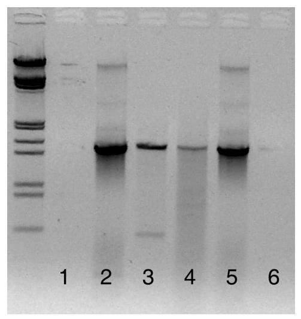

## Cross-Kingdom Amplification Using *Bacteria*-Specific Primers: Complications for Studies of Coral Microbial Ecology

Julia P. Galkiewicz1 and Christina A. Kellogg2 \*

*University of South Florida, College of Marine Science, 140 7th Ave. S., St. Petersburg, Florida 33701,*1 *and U.S. Geological Survey, 600 4th St. S., St. Petersburg, Florida 33701*2

Received 9 June 2008/Accepted 8 October 2008

**PCR amplification of pure bacterial DNA is vital to the study of bacterial interactions with corals. Commonly used** *Bacteria***-specific primers 8F and 27F paired with the universal primer 1492R amplify both eukaryotic and prokaryotic rRNA genes. An alternative primer set, 63F/1542R, is suggested to resolve this problem.**

Coral microbial ecology focuses on the interactions between the coral animal and its associated microbial communities, including algae (31), bacteria (29), fungi (5), and archaea (18, 34). The functions of the different microbial groups within the coral-associated community are still relatively uncharacterized, although a probiotic role has been hypothesized (25). The identification of bacteria associated with different corals has been accomplished by both culture-based and culture-independent methods (6, 19, 20, 27–30). However, because of the limitations of cultivation, culture-independent methods are more widely used to catalog microbial diversity (6, 9, 29, 30). Since the bacteria are not isolated, identification depends on genetic comparisons. The most commonly used DNA sequence for bacterial phylogenetics is the highly conserved 16S rRNA gene sequence, and primers have been designed to selectively amplify bacterial 16S rRNA genes (2, 35). Differential amplification of mixed samples has been noted, indicating that special care must be used when interpreting these data for quantitative applications (14, 32).

In this paper, we describe the amplification of coral 18S rRNA genes by using primer sets that had previously been described as *Bacteria* specific. Cross-kingdom amplification is not unknown for primer sets that are targeted toward bacteria (16) but has not been previously reported for the commonly used sets 8F/1492R and 27F/1492R (3, 6, 8, 29, 30). In fact, 8F has been repeatedly reported as *Bacteria* specific (2, 7, 16, 26), and 27F is a single-base-pair modification of 8F (Table 1).

Branches of the Pacific scleractinian coral *Pocillopora damicornis* (Linnaeus 1758) were collected in two locations in American Samoa and one location in the northwestern Hawaiian Islands. Two samples per site were taken for a total of six samples, preserved in a dimethyl sulfoxide-EDTA-salt buffer. DNA was extracted using a Mo Bio PowerSoil DNA isolation kit (29, 30).

Primer sets 8F/1492R and 27F/1492R were used in separate reactions to amplify extracted rRNA genes (Table 1). PCR was performed on a GeneAmp PCR system 9600 (Applied Biosystems), using 12.5 l AmpliTaq Gold (Applied Biosystems), 1 l each of 10 pM concentrations of forward and reverse primers, 9.5 l sterile deionized water, and 1 l DNA template, for a total volume of 25 l. The temperature cycling program used was modified slightly from that of Bourne and Munn (6) by adding an initial hot start and was as follows: 1 cycle of 95°C for 15 min; 30 cycles of 95°C for 1 min, 54°C for 1 min, and 72°C for 2 min; and a final extension of 72°C for 10 min.

DNA extracted from the six coral samples was separately amplified using 8F/1492R and cloned, creating six clone libraries. Because the sequencing of the first clone library (Tut2) revealed coral DNA amplification, none of the other five libraries were sequenced. DNA amplified from the coral samples was purified using the QIAquick PCR purification kit (Qiagen, Valencia, CA) and cloned using the Qiagen PCR cloning plus kit, in accordance with the manufacturer's protocols. The rRNA genes were amplified from the clones using M13/pUC forward and reverse primers, and PCR products were visualized through electrophoresis on a 1% agarose gel with ethidium bromide added directly to the gel for a final concentration of 107 g/ml. Clones with correctly sized vectors (ca. 1.5 kbp) were sequenced unidirectionally using the forward primer by Northwoods DNA, Inc. (Solway, MN). Sequence files were quality scored and edited using phred (12,

TABLE 1. Primers investigated in this study

| Primera | Sequenceb                                                  | Tm (°C)c | Reference | Target    |
|---------|------------------------------------------------------------|-------------|-----------|-----------|
| 8F      | 5-AGAGTTTGATCCTG GCTCAG                                 | 52          | 11        | Bacteria  |
| 27F     | 5-AGAGTTTGATCMTG GCTCAG                                 | 50–52       | 21        | Bacteria  |
| 63F     | 5-CAGGCCTAACACAT GCAAGTC                                | 54          | 23        | Bacteria  |
| 1492R   | 5-GGTTACCTTGTTAC GACTT 3-AAGTCGT AACAAGGTAACC*       | 47          | 33        | Universal |
| 1542R   | 5-AAGGAGGTGATCC AGCCGCA 3-TGCGG CTGGATCACCTC CTT* | 56          | 24        | Universal |

*a* F, forward; R, reverse.

\* Corresponding author. Mailing address: U.S. Geological Survey, 600 4th St. S., St. Petersburg, FL 33701. Phone: (727) 803-8747. Fax:

(727) 803-2031. E-mail: ckellogg@usgs.gov. Published ahead of print on 17 October 2008.

*b* , reverse complement found on positive strand. Primers are shown in 5–3

orientation, unless noted otherwise. Degeneracies, M A/C. *c Tm* 64.9°C 41°C (number of G's number of C's – 16.4)/*N*, where *N* is the length of the primer.

TABLE 2. Similarity of top five BLAST matches for 100 sequenced clones from the Tut2 sample to scleractinian coral rRNA genes*a*

| Coral speciesb                                                                                           | GenBank accession no.c                                | % Similarity            | Distribution                                                               |
|----------------------------------------------------------------------------------------------------------|----------------------------------------------------------|----------------------------|----------------------------------------------------------------------------|
| Javania insignis Phyllangia mouchezii Tubastraea coccinea Fungia scutaria Madracis mirabilis | AJ133555 AF052887 AJ133556 AF052884 AY950684 | 97 97 97 96 96 | Indo-Pacific East Atlantic cosmopolitan Indo-Pacific Caribbean |

*a* The distribution of the corals as well as comparison of their sequences shows that erroneous 8F/1492R primer attachment is not limited by the biogeography

13) and Greengenes (10) and compared to the GenBank nucleotide database using the Basic Local Alignment Search Tool (BLAST) (1).

DNA from 101 clones amplified by the putative "*Bacteria*specific" primer sets were sequenced, and 100 were most similar to cnidarian 18S rRNA genes and not to bacterial 16S rRNA genes. The most similar sequence for 100 clones (E value of 0; 97% similarity; percent query identity ranging from 95 to 100%) was an 18S rRNA gene of *Javania insignis* (Duncan 1876) (GenBank accession number AJ133555) (36), an Indo-Pacific stony coral, and the top five matches for all 100 clones were scleractinian corals (Table 2). No match to *P. damicornis* was found because the full 18S rRNA gene has not yet been archived in GenBank. The one sequence that was not matched with coral rRNA genes was most closely related to *Symbiodinium* sp. rRNA genes from *P. damicornis* tissue (GenBank accession number AY051091).

Upon closer inspection of the *J. insignis* 18S rRNA gene, areas of sequence homology with the bacterial primers 8F and 27F (12 of 20 primer base pairs matched) and the universal primer 1492R (17 of 19 primer base pairs matched) were found (Fig. 1). The sequences aligned on the 3 ends of both 8F and 27F, which would lead to amplification. The primer combinations resulted in a coral amplicon that was approximately 1.5

FIG. 2. Lanes 1, 2, and 3 were amplified using 63F/1542R. Lane 1 is the negative control, lane 2 is the positive control containing only bacterial DNA, and lane 3 is the coral tissue sample. Two bands can be seen in lane 3: the bacterial band at 1.5 kbp and the coral band at 0.6 kbp. These bands are distinctly separated, allowing for the isolation of bacterial DNA. Lanes 4, 5, and 6 were amplified using 8F/1492R. Lane 4 is amplified coral tissue, indistinguishable from the positive control in lane 5. Lane 6 is the negative control. The samples were run on a 1% agarose gel for 1.5 h, with lambda ladders. The gel image has been reversed (i.e., converted to a photo negative) to more clearly show the faint band in lane 3.

kbp long (Fig. 2, lane 4), the same length expected for the bacterial amplicon. Because of the similarity in amplicon sizes (roughly a 200-bp difference), it would be difficult to separate the coral and bacterial DNA by gel extraction.

To circumvent this problem, alternate primer sets were investigated, using the same PCR conditions and sequencing reactions described above. The use of *Bacteria*-specific primer 63F (23) and universal primer 1542R (24) had several advantages. The sequence homology between the primers and coral

FIG. 1. Partial 18S rRNA gene sequence of the scleractinian coral *Javania insignis*. Primer sequences are highlighted in gray, while the sections homologous with coral sequences are underlined.

of corals. *b* All coral species were scleractinian coral.

*c* The E value for all coral species rRNA genes was 0.0.

7830 GALKIEWICZ AND KELLOGG APPL. ENVIRON. MICROBIOL.

TABLE 3. Summary of the top GenBank matches from clone libraries constructed using 63F/1542R

| Clone librarya | GenBank match                                               | Accession no. | No. of clones |
|----------------|-------------------------------------------------------------|---------------|------------------|
| Tut3           | Uncultured sponge symbiont JAWS10 (16S RNA)                 | AF434968.1    | 2                |
|                | Uncultured bacterium clone TK03 (16S RNA)                   | AJ347025.1    | 1                |
|                | Uncultured deltaproteobacterium clone A115-17 (16S RNA)     | AY323157.1    | 1                |
|                | Uncultured Bacteroidetes bacterium clone PI_RT22 (16S RNA)  | AY580620.1    | 1                |
|                | Uncultured bacterium clone Kazan-1B-46/BC19-1B-46 (16S RNA) | AY592123.1    | 1                |
|                | Uncultured bacterium clone Urania-1B-26 (16S RNA)           | AY627534      | 1                |
|                | PDA-OTU2                                                    | AY700600.1    | 29               |
|                | PDA-OTU3                                                    | AY700601.1    | 9                |
|                | Uncultured Chromatiales bacterium clone SIMO-2136 (16S RNA) | AY711502.1    | 1                |
|                | Uncultured bacterium clone Cc007 (16S RNA)                  | AY942754.1    | 1                |
|                | Uncultured bacterium clone CC17 (16S RNA)                   | DQ247946      | 1                |
|                | Uncultured alphaproteobacterium clone LC1-25 (16S RNA)      | DQ289899.1    | 1                |
|                | Uncultured bacterium clone HF500_A5_P1 (16S RNA)            | DQ300580      | 1                |
|                | Bacterium S1cc1 (16S RNA)                                   | DQ416566      | 1                |
|                | Uncultured alphaproteobacterium clone 3B02-43 (16S RNA)     | DQ431900.1    | 1                |
|                | Uncultured alphaproteobacterium clone T32_142 (16S RNA)     | DQ436565.1    | 2                |
|                | Uncultured gammaproteobacterium clone MSB-5C2 (16S RNA)     | DQ811847.1    | 1                |
|                | Rhodobacter sp. strain DQ12-45T (16S RNA)                   | EF186075.1    | 38               |
| NWH3           | Marine eubacterium HstpL36                                  | AF159661.1    | 1                |
|                | Endosymbiont of Chlamys farreri (16S RNA gene)              | AY174895.1    | 2                |
|                | PDA-OTU2                                                    | AY700600.1    | 52               |
|                | PDA-OTU3                                                    | AY700601.1    | 9                |
| Ofu2           | PDA-OTU2                                                    | AY700600.1    | 65               |
|                | PDA-OTU3                                                    | AY700601.1    | 29               |

*a* Tut3 clones are from bacterial communities extracted from *P. damicornis* collected in Tutuila, American Samoa; NWH3 clones were collected in the Northwest Hawaiian Islands; and Ofu2 clones were collected in Ofu, American Samoa.

DNA was low, with only 7 of 21 bp matching in 63F and 7 of 20 bp matching in 1542R (Fig. 1). With such low binding strength, limited coral DNA amplification was expected. In addition, any coral 18S rRNA gene that was amplified would result in an amplicon length of 0.6 kbp, whereas bacterial 16S rRNA genes would have an amplicon length of 1.5 kbp. Test results indicated that during PCR, coral rRNA genes were amplified and appeared as a distinct band on the gel (Fig. 2, lane 3). This clear separation between coral and bacterial DNA allowed the isolation of the bacterial rRNA genes for further analysis. GenBank matches are summarized for the 251 clones from three samples in Table 3.

Although the primer combination of 63F/1542R was necessary to separate coral from bacterial rRNA genes in this experiment, these primers should be used with caution. Marchesi et al. developed 63F due to the failure of standard primers in amplifying environmental samples (23). Early tests showed that 63F exhibited a bias in the species of bacteria amplified, but overall, it worked better than 27F in amplifying bacterial 16S rRNA genes in environmental samples. However, Sipos et al. found that a significant bias was introduced into amplifications of mixed cultures when annealing temperatures (*Ta*) above 52°C were used (32): bacterial species with rRNA genes that matched 63F exactly were preferentially amplified over those with three mismatches at the 5 end of the primer. If the mismatched bacterial 16S rRNA gene sequences had a relative abundance of less than 1:10 in the original sample, no PCR product could be detected. This result showed that important bacterial community members may go undetected as a result of a slight primer mismatch. To address this problem, Sipos et al. suggested keeping the *Ta* below 50°C. Reducing *Ta* to the appropriate levels lowered the amplification bias of 63F to almost undetectable amounts.

The specific melting temperatures (*Tm*) of all primers used in this study can be found in Table 1 and were determined using the *Tm* calculations for oligonucleotides (Promega biomath calculator). Common primer design and use protocols indicate that the *Ta* used during thermocycling should be at least 5°C lower than the *Tm* for optimal primer hybridization (17): for 8F/1492R, the *Ta* should be 47°C, and for 63F/1542R, the *Ta* should be 49°C. The actual *Ta* used in this experiment was 54°C, decreasing the likelihood of primer attachment. Rohwer et al. used a *Ta* of 62°C, which should lead to extremely specific binding of the primers to template DNA (29, 30). When the 62°C *Ta* was applied to our samples, the "coral band" seen in the 63F/1542R amplification disappeared, indicating that coral DNA amplification was largely reduced or eliminated. Attempts to amplify the extractions using 8F/ 1492R and a touch-down PCR protocol (65°C *Ta*, 0.5°C decrease every cycle) (F. Rohwer, personal communication) were unsuccessful, while faint amplification was detected using 63F/ 1542R.

Amplification of eukaryotic DNA using *Bacteria*-specific primers has previously been reported for systems other than the coral holobiont (22). Lopez et al. found that several common primer sets used for testing bacterial populations in wine also amplified yeast, fungal, and plant DNA in a mixed-DNA extraction (22). As suggested by Ben-Dov et al., periodic reassessments of common primers should be done because many primers were developed at a time when genetic databases were less comprehensive (4).

Based on *Tm* calculations, it is apparent why previous studies

(29, 30) using primers 8F and 1492R to amplify 16S rRNA genes from coral tissue did not result in PCR products of 18S rRNA genes: high *Ta* lead to extremely specific primer attachments, greatly reducing the probability that coral DNA would be amplified. However, caution must be used when determining the ideal *Ta* for use in thermocycling protocols. Since extremely high *Ta* lead to highly specific primer bindings, potentially valuable bacterial community members may be excluded from amplification because of several base pair mismatches to the primer. To combat this problem, Frank et al. suggested using a combination of several slight variations of the forward primer 27F to amplify the true bacterial community ratios more accurately (15). Increasing the diversity of forward primers may increase the diversity of the 16S rRNA gene sequences that are amplified. In order to fully comprehend the multitude of interactions in the coral holobiont, the complete range of bacterial species present in samples must be analyzed. Balance between primer specificity and the potentially mismatched novel bacterial sequences must be found.

**Nucleotide sequence accession numbers.** The consensus sequence from the 100 coral DNA clones and the *Symbiodinium* sequence were submitted to GenBank under accession numbers EU921668 and EU921669, and the bacterial DNA sequences obtained using 63F/1542R have been archived in GenBank under accession numbers FJ015063 to FJ015091.

Any use of trade names is for descriptive purposes only and does not imply endorsement by the U.S. Government.

## **REFERENCES**

- 1. **Altschul, S. F., W. Gish, W. Miller, E. W. Myers, and D. J. Lipman.** 1990. Basic local alignment search tool. J. Mol. Biol. **215:**403–410.
- 2. **Amann, R. I., W. Ludwig, and K.-H. Schleifer.** 1995. Phylogenetic identification and in situ detection of individual microbial cells without cultivation. Microbiol. Rev. **59:**143–169.
- 3. **Baker, G. C., J. J. Smith, and D. A. Cowan.** 2003. Review and reanalysis of domain specific 16S primers. J. Microbiol. Methods **55:**541–555.
- 4. **Ben-Dov, E., O. H. Shapiro, N. Siboni, and A. Kushmaro.** 2006. Advantage of using inosine at the 3 termini of 16S rRNA gene universal primers for the study of microbial diversity. Appl. Environ. Microbiol. **72:**6902–6906.
- 5. **Bentis, C. J., L. Kaufman, and G. Stjepko.** 2000. Endolithic fungi in reefbuilding corals (order: Scleractinia) are common, cosmopolitan, and potentially pathogenic. Biol. Bull. **198:**254–260.
- 6. **Bourne, D. G., and C. B. Munn.** 2005. Diversity of bacteria associated with the coral *Pocillopora damicornis* from the Great Barrier Reef. Environ. Microbiol. **7:**1162–1174.
- 7. **Brunk, C. F., E. Avaniss-Aghajani, and C. A. Brunk.** 1996. A computer analysis of primer and probe hybridization potential with bacterial smallsubunit rRNA sequences. Appl. Environ. Microbiol. **62:**872–879.
- 8. **Casas, V., D. I. Kline, L. Wegley, Y. Yu, M. Breitbart, and F. Rohwer.** 2004. Widespread association of a *Rickettsiales*-like bacterium with reef-building corals. Environ. Microbiol. **6:**1137–1148.
- 9. **Cooney, R. P., O. Pantos, M. D. A. Le Tissier, M. R. Barer, A. G. O'Donnell, and J. C. Bythell.** 2002. Characterization of the bacterial consortium associated with black band disease in coral using molecular microbiological techniques. Environ. Microbiol. **4:**401–413.
- 10. **DeSantis, T. Z., P. Hugenholtz, N. Larsen, M. Rojas, E. L. Brodie, K. Keller, T. Huber, D. Dalevi, P. Hu, and G. L. Andersen.** 2006. Greengenes, a chimera-checked 16S rRNA gene database and workbench compatible with ARB. Appl. Environ. Microbiol. **72:**5069–5072.
- 11. **Edwards, U., T. Rogall, H. Blo¨cker, M. Emde, and E. C. Bo¨ttger.** 1989. Isolation and direct complete nucleotide determination of entire genes: characterization of a gene coding for 16S ribosomal RNA. Nucleic Acids Res. **17:**7843–7853.
- 12. **Ewing, B., and P. Green.** 1998. Base-calling of automated sequencer traces using phred. II. Error probabilities. Genome Res. **8:**186–194.

- 13. **Ewing, B., L. Hillier, M. Wendl, and P. Green.** 1998. Base-calling of automated sequencer traces using phred. I. Accuracy assessment. Genome Res. **8:**175–185.
- 14. **Farris, M. H., and J. B. Olson.** 2007. Detection of Actinobacteria cultivated from environmental samples reveals bias in universal primers. Lett. Appl. Microbiol. **45:**376–381.
- 15. **Frank, J. A., C. I. Reich, S. Sharma, J. S. Weisbaum, B. A. Wilson, and G. J. Olsen.** 2008. Critical evaluation of two primers commonly used for amplificiation of bacterial 16S rRNA genes. Appl. Environ. Microbiol. **74:**2461– 2470.
- 16. **Huws, S. A., J. E. Edwards, E. J. Kim, and N. D. Scollan.** 2007. Specificity and sensitivity of eubacterial primers utilized for molecular profiling of bacteria within complex microbial ecosystems. J. Microbiol. Methods **70:** 565–569.
- 17. **Innis, M. A., and D. H. Gelfand.** 1990. Optimization of PCRs, p. 3–12. *In* M. A. Innis, D. H. Gelfand, J. J. Sninsky, and T. J. White (ed.), PCR protocols: a guide to methods and applications. Academic Press, New York, NY.
- 18. **Kellogg, C. A.** 2004. Tropical Archaea: diversity associated with the surface microlayer of corals. Mar. Ecol. Prog. Ser. **273:**81–88.
- 19. **Klaus, J. S., J. Frias-Lopez, G. T. Bonheyo, J. M. Heikoop, and B. W. Fouke.** 2005. Bacterial communities inhabiting the healthy tissues of two Caribbean reef corals: interspecific and spatial variation. Coral Reefs **24:**129–137.
- 20. **Lampert, Y., D. Kelman, Z. Dubinsky, Y. Nitzan, and R. T. Hill.** 2006. Diversity of culturable bacteria in the mucus of the Red Sea coral *Fungia scutaria*. FEMS Microbiol. Ecol. **58:**99–108.
- 21. **Lane, D. J.** 1991. 16S/23S rRNA sequencing, p. 115–147. *In* E. Stackebrandt and M. Goodfellow (ed.), Nucleic acid techniques in bacterial systematics. John Wiley & Sons, New York, NY.
- 22. **Lopez, I., F. Ruiz-Larrea, L. Cocolin, E. Orr, T. Phister, M. Marshall, J. VanderGheynst, and D. A. Mills.** 2003. Design and evaluation of PCR primers for analysis of bacterial populations in wine by denaturing gradient gel electrophoresis. Appl. Environ. Microbiol. **69:**6801–6807.
- 23. **Marchesi, J. R., T. Sato, A. J. Weightman, T. A. Martin, J. C. Fry, S. J. Hiom, and W. G. Wade.** 1998. Design and evaluation of useful bacterium-specific PCR primers that amplify genes coding for bacterial 16S rRNA. Appl. Environ. Microbiol. **64:**795–799.
- 24. **Pantos, O., R. P. Cooney, M. D. A. Le Tissier, M. R. Barer, A. G. O'Donnell, and J. C. Blythell.** 2003. The bacterial ecology of a plague-like disease affecting the Caribbean coral *Montastraea annularis*. Environ. Microbiol. **5:**370–382.
- 25. **Reshef, L., O. Koren, Y. Loya, I. Zilber-Rosenberg, and E. Rosenberg.** 2006. The coral probiotic hypothesis. Environ. Microbiol. **8:**2068–2073.
- 26. **Reysenbach, A. L., and N. R. Pace.** 1995. Reliable amplification of hyperthermophilic archaeal 16S rRNA genes by the polymerase chain reaction, p. 101–105. *In* F. T. Robb and A. R. Place (ed.), Archaea: a laboratory manual. Cold Spring Harbor Laboratory Press, Cold Spring Harbor, NY.
- 27. **Ritchie, K. B.** 2006. Regulation of microbial populations by coral surface mucus and mucus-associated bacteria. Mar. Ecol. Prog. Ser. **322:**1–14.
- 28. **Ritchie, K. B., and G. W. Smith.** 1997. Physiological comparison of bacterial communities from various species of scleractinian corals, p. 521–526. *In* H. A. Lessios and I. G. Macintyre (ed.), Proceedings of the 8th International Coral Reef Symposium. Smithsonian Tropical Research Institute, Panama City, Panama.
- 29. **Rohwer, F., M. Breitbart, J. Jara, F. Azam, and N. Knowlton.** 2001. Diversity of bacteria associated with the Caribbean coral *Montastraea franksi*. Coral Reefs **20:**85–91.
- 30. **Rohwer, F., V. Seguritan, F. Azam, and N. Knowlton.** 2002. Diversity and distribution of coral-associated bacteria. Mar. Ecol. Prog. Ser. **243:**1–10.
- 31. **Rowan, R.** 1998. Diversity and ecology of zooxanthellae on coral reefs. J. Phycol. **34:**407–417.
- 32. **Sipos, R., A. J. Szekely, M. Palatinszky, S. Revesz, K. Marialigeti, and M. Nikolausz.** 2007. Effect of primer mismatch, annealing temperature and PCR cycle number on 16S rRNA gene-targeting bacterial community analysis. FEMS Microbiol. Ecol. **60:**341–350.
- 33. **Stackebrandt, E., and W. Liesack.** 1993. Nucleic acids and classification, p. 152–189. *In* M. Goodfellow and A. G. O'Donnell (ed.), Handbook of new bacterial systematics. Academic Press, London, England.
- 34. **Wegley, L., Y. Yu, M. Breitbart, V. Casas, D. I. Kline, and F. Rohwer.** 2004. Coral-associated Archaea. Mar. Ecol. Prog. Ser. **273:**89–96.
- 35. **Weisburg, W. G., S. M. Barns, D. A. Pelletier, and D. J. Lane.** 1991. 16S ribosomal DNA amplification for phylogenetic study. J. Bacteriol. **173:**697– 703.
- 36. **Won, J. H., B. J. Rho, and J. I. Song.** 2001. A phylogenetic study of the Anthozoa (phylum Cnidaria) based on morphological and molecular characters. Coral Reefs **20:**39–50.