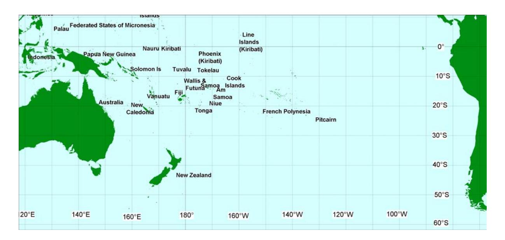

FOR CONSIDERATION BY THE SCIENTIFIC COMMITTEE OF THE INTERNATIONAL WHALING COMMISSION ANCHORAGE, ALASKA, 2007

# Interchange of humpback whales in Oceania (South Pacific), 1999 to 2004 (revised SC/A06/HW55, March 2007)

SOUTH PACIFIC WHALE RESEARCH CONSORTIUM,

CLAIRE GARRIGUE1, C. SCOTT BAKER2, ROCHELLE CONSTANTINE2, MICHAEL POOLE3, NAN HAUSER4, PHIL CLAPHAM5, MICHAEL DONOGHUE6, KIRSTY RUSSELL1, DAVE PATON7, DAVE K. MATTILA8 AND JOOKE ROBBINS9

- 1 Opération Cétacés BP 12827 98802 Nouméa, New Caledonia
- 2 School of Biological Sciences, University of Auckland, Private Bag 92019, Auckland, New Zealand

3 Marine Mammal Research BP698 98728 Maharepa, Moorea

- 4 Cook Islands Whale Research Takuvaine Valley PO Box 3069, Avarua Rarotonga, The Cook Islands
- 5 Alaska Fisheries Science Center, National Marine Mammal Laboratory, 7600 Sand Point Way NE, Seattle, WA 98115, USA
- 6 Department of Conservation, PO Box 10-420, Wellington, New Zealand
- 7 Southern Cross University, PO Box 157 Lismore, NSW 2480, Australia
- 8 Hawaiian Islands Humpback Whale National Marine Sanctuary,
- 9 Provincetown Center for Coastal Studies, 5 Holway Avenue, Provincetown, 02657 USA

#### ABSTRACT

The movements of individual humpback whales between winter breeding grounds of Oceania (South Pacific) were documented by individual identification photographs collected from 1999 to 2004. Photographs were collected with comparable effort across the six years in four primary island breeding grounds: New Caledonia, Tonga (Vava'u) the Cook Islands and French Polynesia (Mo'orea and Rurutu) and with a smaller effort in a few adjacent regions; Vanuatu, Fiji, Samoa, Niue, and American Samoa. Interchange among wintering grounds was assessed using, regional catalogues of fluke photographs, representing 776 annual sightings of 659 individual whales from Oceania. Most resightings occurred within regions (n = 78) but 20 individuals were sighted in two (mostly adjacent) regions. Previously undocumented exchanges were highlighted within central Oceania and the west Pacific. No individual was sighted in more than two regions during this six-year period. The documented movement between regions was one-directional except for one individual sighted first in French Polynesia, then in American Samoa and then back in French Polynesia. Only one whale was resighted in more than one region during the same winter season. No directional trend was apparent and movement between regions did not seem to be sex specific. The movement of individuals across the longitudinal borders of the Areas V and VI, has important implications for the allocation of historical catches from the Antarctic.

#### INTRODUCTION

Results of preliminary comparisons of humpback whales in the South Pacific through photographic catalogues and genetic analyses demonstrate both fidelity to local wintering grounds as well as a low level of migratory interchange among wintering grounds of Oceania, South Pacific (Garrigue et al., 2002, Garrigue et al., 2006, Olavarria et al. 2007).

Here we extend the previously published information on individual movement between wintering grounds of Oceania based on four study sites by comparing adding five secondary catalogues. We expend our data set using the information collected during six winter seasons, 1999-2004. The fully reconciled and quality controlled catalogue provides new insight into the migratory fidelity and interchange of individuals among breeding stocks *E* and *F*, as recognised by the IWC (IWC, 1998; Garrigue et al., 2006; Olavarria et al 2006) and allow the determination of the degree of migratory exchange among study sites.

SC/59/HW14

## **MATERIAL AND METHODS**

Dedicated surveys of humpback whales in Oceania were conducted between 1999 and 2004 during the austral winter in the four primary sites described below: New Caledonia; Tonga; the Cook Islands; and French Polynesia (Figure 1). Surveys were conducted in only one or two seasons in other adjacent sites: Vanuatu, Fiji, Samoa, Niue (Figure 1). Surveys at American Samoa began in 2003 (Figure 1).

## **Primary study sites**

*New Caledonia.* New Caledonia is spread over 1,450,000 km² between 18° and 23° S and between 158° and 172° E. It consists of a main island called "Grande Terre" and three groups of smaller ones : the Loyalty Islands to the east, the Belep Islands to the north and the Isle of Pines to the south. There are many uninhabited atolls further from the main groups, including Huon, Surprise, Chesterfield, Bellona, Matthew, Hunter and Walpole. Some whaling is known to have occurred in the Loyalty Islands, although most of the effort was concentrated in the Chesterfield Atoll area (Townsend, 1935).

Humpback whale photoid surveys were conducted sporadically beginning in 1991 (Garrigue and Gill 1994), and for three months each austral winter from 1995 onwards (Garrigue et al., 2001). The present study site covers approximately 1000 km² and is located in the southeastern portion of the lagoon off the main island.

*Tonga.* The Tongan archipelago is a series of volcanic islands and coral atolls extending from Ata in the south to Niua in the north. The primary area of humpback whale density is thought to be the three major island groups; Tongatapu in the south, the Ha'apai group in the middle and the Vava'u group in the north.

Vessel-based surveys and the collection of individual identification photographs were initiated in 1991 (Abernethy et al. 1992). Each of the three main island groups has been surveyed in at least one year but most of the field effort from 1994-99 was concentrated around Vava'u. The majority of field work has been conducted in August and early September, although work in some years included late July and early October.

*Cook Islands.* The Cook Islands are a group of islands and atolls scattered over approximately 2,000,000 km² of the southwestern South Pacific. These islands are divided into two groups, the Northern Cooks and the Southern Cooks; the latter include nine islands and atolls lying between latitudes 18°S and 22°S. Little commercial whaling took place in this region in the 20th century and records of earlier (historical) catches there are sparse although there is evidence that the local islanders hunted whales in Cook Islands waters.

 Surveys for humpback whales in the Southern Cook Islands began with an exploratory three-week project in 1998 and continued with a four-month field effort in 1999, 2000, 2001, 2002, 2003, 2004 and 2005 by Nan Hauser of the Center for Cetacean Research & Conservation. To date the survey has been focused on three locations: (i) Palmerston Atoll, a small atoll lying at 18° 04' S, 163° 10' W on the north western margin of the Southern Cook group; (ii) Aitutaki, an island located at 18° 55' S, 159° 47'W, roughly 300 km east of Palmerston; and (iii) Rarotonga, an island located at 21° 14' S, 159° 48' W, roughly 430 km southeast of Palmerston. Other brief surveys included the islands of Atiu and Mangaia.

*French Polynesia.* French Polynesia comprises five archipelagos (the Marquesas, the Tuamotu atolls, the Gambiers, the Society Islands, and the Australs) in the central South Pacific Ocean. Sightings of humpback whales in French Polynesia's waters have been submitted to the sighting and stranding network run by one of the authors (MP) since 1988 (Poole 1993, Poole and Darling 1999).

The primary study area for fieldwork has encompassed the nearshore waters of the high island of Mo'orea in the Society Islands, lying at 17° 30' S and 149° 50' W, 18 km northwest of Tahiti. Observational surveys of humpback whales in the nearshore waters of Mo'orea began in 1991. Additional shore and boat-based observations of humpback whales were begun in 1999 at Rurutu in the Austral Islands.

## **Individual identification**

Individual humpback whales were identified from photographs of the unique markings on the ventral surface of their tail flukes (photo-ID, Katona et al., 1979). Photo-identification of individual whales was conducted within each study site and the photos matched during annual meetings of the Consortium. Catalogues were first matched within site, recording the number of within-site (within and between-year) resightings. This review lead to 'reconciled' catalogues for each of the four main study sites, French Polynesia, Cook Islands, Tonga and New Caledonia, and five smaller catalogues for the secondary study sites. The reconciled regional catalogues of unique individuals were then inter-matched during annual meetings of the Consortium, recording the number of between-sites (within and between-year) resightings. All between-sites resightings were confirmed by three independent matchers. This review lead to a fully reconciled catalogue for Oceania, including all within-sites (between-year) resightings and all between sites (within and between-year) resightings. For most purposes, the small number of within-year, within-sites resightings were ignored. For the purpose of the present paper, analyses were carried out only with information from the breeding seasons 1999 to 2004, referred to as the "synoptic years".

An initial comparison included all photographs considered all potentially usable photographs, as judged by each individual investigator. The results of this matching were reported (SC/A06/HW55) to the IWC workshop on the comprehensive assessment in Hobart (April 2006). Subsequent to this workshop, members of the Consortium agreed to review all photographs following a set of quality control standards developed for the North Pacific SPLASH program (Calambokidis et al., 2001). Following that protocol, photographs (including some photographs representing different annual sightings of some individual) were graded from the best quality (1) to the lowest quality (5) for five different categories, proportion of the fluke visible, fluke angle, the lateral angle of the photographer, exposure quality, and contrast quality. A photograph that received a 4 or 5 in any of the five categories was considered of insufficient quality for a representative comparison of resight rates within or among sites. Removal of those photographs, including those representing resightings within or between regions, resulted in a 'quality controlled, reconciled' catalogue for Oceania.

## **RESULTS**

## **Individual identification: photo-ID**

Prior to the quality control review, the reconciled catalog represented 1080 regional sightings (including withinsites between-year resightings) of 949 individually identified humpback whales in Oceania. The quality control review was conducted on 978 photographs. Following this process 34 % of the submitted photos were of insufficient quality and were rejected (Table 1).

Table 1 presents the number of individual whales identified by photo-ID in each study site after the quality control and the number of individual whales resighted within study site (SPWRC, 2001, 2002, 2003, 2004, 2005). The comparison of all the catalogues lead to a total of 659 humpback whales individually identified in Oceania on 776 sightings. Table 2 presents the number of individuals resighted in between regions before and after the quality control process.

## **Within study sites resightings**

Seventy-eight resightings were found within study sites. A total of 33 individuals were resighted in New Caledonia between 1999 and 2004 which representing 21 % of the individually identified humpback whales during the same period (Table 1). In Tonga 9% (n = 25) individuals were resighted inside the region and 13% (n = 20) within French Polynesia (Table 1). The number of photo-ID recaptures between two consecutive years ranged between 2 and 7 individuals for New Caledonia, 0 and 3 individuals in Tonga and between 0 and 8 for French Polynesia. No individual was resighted in Cook Islands (Table 1). No individual was resighted within the secondary study sites in which sampling took place for more than one year (Samoa and American Samoa, Table 1).

## **Between study sites resights**

The comparison of all the available catalogs before photo quality screening provided 28 matches among study sites (Table 2 and 3). Following the quality screening, this number was reduced to 20 matches (Table 2). Nine matches corresponded to individuals observed in one of the four main study sites and resighted in one of the secondary study sites (Vanuatu:3, Samoa:1, American Samoa:5). The other matches (11) were between Tonga and New Caledonia, the Cook Islands and French Polynesia. Another was resighted twice in Tonga and then twice in French Polynesia and one was resighted twice in Tonga and twice in the Cook Islands. One individual was resighted during the same year in two regions (Tonga and the Cook Islands). All observed movement was one directional with one exception: an individual was sighted in French Polynesia, then at American Samoa and then back in French Polynesia (Table 3). No individual was sighted in more than two regions during the six years of synoptic surveys.

SC/59/HW14

The screening process lead to a 29 % decrease in the matches originally found as eight more matches were found analysing all the available information before this process (Tables 2 and 3). Only one photos was rejected from these matches (5 for TG, 2 for CI and 1 for AS).

## **DISCUSSION**

The first information on movements of humpback whales in the South Pacific came from Discovery tagging (Dawbin, 1959 and 1964). However, exchanges between the islands of Oceania was not never discovered (Table 4) until the 1990s when photo-identification studies was undertaken to follow of individual whales (Abernethy et al., 1992; Hauser et al., 2000; Garrigue et al., 2001; Poole, 2002; Gibbs and Childerhouse, 2004).

As in previous comparisons (Garrigue et al. 2002), the present study confims that the majority of resightings of humpback whales in Oceania occurred within study sites (80 % of the matches) indicating site fidelity and limited demographic exchange. The rate of resightings varied within the four main sites. The highest percentage of resightings was measured in New Caledonia (21 %) and the lowest in the Cook Islands where none were observed in the course of this six year study. No resight was reported from the secondary study sites even in those where field work has been conducted for two years. However, subsequent research has produced resightings at American Samoa (Robbins and Mattila, unpublished data). It is also probable that humpback whales are known to inhabit others regions of Oceania where sampling has not yet been conducted.

Relatively few resightings were found between study sites (20 % of the matches). However, the present results highlights previously unreported movements, especially in central Polynesia. Tonga is now know to exhibit exchange with Samoa, American Samoa, French Polynesia. Similarly, French Polynesia exhibits exchange with American Samoa. In the western Pacific there is now evidence of exchange between Vanuatu and both New Caledonia and Tonga.

Most of the whales observed in multiple regions have been identified only once in each region. No individual whale was sighted in more than two regions and all observed movement was limited to adjacent regions. Most (70 %) of the resights were in the Central Pacific and involved Tonga, the Cook Islands, French Polynesia, American Samoa and Samoa. The others (30 %), were observed in the southwest Pacific and involved New Caledonia, Vanuatu, Tonga. No movements were documented between these the central and southwest Pacific in the six year of this study. However, the inclusion of all data available revealed movement of one whale from New Caledonia (1998) to Tonga (2001) to French Polynesia (2004). Thus, it is clear that even scarce there are also movements on an ocean-basin-wide scale.

Whales identified in Tonga were involved in 80 % of the movements found in the Oceania despite the fact that this population was assigned to Antarctic Area V stock based on photographic, genetic and acoustics studies (Olavarria et al., 2006, Garrigue et al., 2002, Helweg et al., 1998 and 2000). The comparison highlighted that the highest rates of exchanges between the study sites were between French Polynesia, Cook Islands and Tonga (40 %) then between New Caledonia, Vanuatu and Tonga (30 %). This is consistent with the information that estimated the highest gene flow between Tongan and New Caledonian humpback whales at the haplotype level (interchange of 3 females per year) and between the Cook Islands and Tonga at the nucleotide level (interchange of 7 females per year) (Olavarria et al., 2006)

Only one of the two photographs involved in eight resightings was rejected using the quality control system. They concerned two previously unknown exchanges between the following sites: Cook Islands and Niue, and Cook Islands and American Samoa. The other rejected photographs only decreased the total amount of exchanges between sites.

Considering the geographic position of the islands, no directional trends could be found. Half of the documented movement was in a westerly direction and half in an easterly direction. Sex information was available for eleven of the animals that moved between regions: seven male and four female. This suggests that movement is not sex-specific (although it might be sexed biased).

Overall, the limited movement of individuals between adjacent sites within of Oceania is consistent with the significant (but low) level of differentiation observed in mtDNA from these regions (Olavarria et al., 2006) and suggests that humpback whales wintering in New Caledonia, Tonga and French Polynesia are demographically independent and should be recognised as individual stocks.

Because of the limited exchanges between the different wintering grounds it was not possible to consider the humpback whales wintering in Oceania as a single population for the purpose of estimating abundance (Baker et al., 2006). Knowledge of rate of exchanges is crucial to construct a model of the abundance in Oceania as well as the knowledge of the connection between breeding and feeding areas.

# **Acknowledgements**

This large-scale survey was made possible through the generous collaboration of members and affiliates of the South Pacific Whale Research Consortium (SPWRC), with support of the International Fund for Animal Welfare (IFAW). For support in French Polynesia we thank West Marine Products, M. Poliza and the Starship Millennium Voyage, Office des Postes et Télécommunications, Sin Tung Hing Marine, Mercury Outboards, West Coast Whales Research Foundation, the Foundation Naturalia et Biologia, Hardy Jones-Julia Whitty Productions, the Raie Manta Club, Cine Marine, Eco-media Productions, Canal+, the BBC and the Conservation Action Fund. In the Cook Islands, we thank the Cook Island Government, T. Pryor, the people of Rarotonga, Aitutaki and Palmerston, J. Daeschler, H. Hauser, and D. & J. Macrae. Surveys of humpback whales in New Caledonia were made possible by contributions the Provinces Sud, North and Isles, Inco S.A. We thank Jacqui Greaves, Dominique Breitenstein and Veronique Ducreux and all the voluntary workers that helped in the field. Field research was carried out by 'Opération Cétacés'. Research in the Kingdom of Tonga was conducted under scientific permit from the Tongan Ministry of Fisheries and His Majesty, the King of Tonga, with funding from the International Whaling Commission, Auckland University Research Council, Whale and Dolphin Conservation Society, South Pacific Regional Environment Program (SPREP), Whale and Dolphin Adoption Project, Pacific Development Trust of New Zealand and Cetacean Society International. We thank B. Abernethy, N. Patenaude, S. Childerhouse, N. Gibbs, T. O'Callaghan, C. Nichols, K. McLeod, the Baker family (Anjanette, Nevé and Kai), B. Todd, R Barrel, the sailing vessel Nai'a and The Moorings-Tonga for field support.We acknowledge Natural Heritage Trust (Australia) for funding the survey in Vanuatu and Fiji proposed in 2003. We also wish to acknowledge the advice and assistance from Job Opu, Marine Mammals SPREP Officer, Mike Donoghue from New Zealand's Department of Conservation and Robyn McCulloch from Environment Australia. For research at American Samoa, we thank the Government of American Samoa Division of Marine and Wildlife Resources, the Fagatele Bay National Marine Sanctuary and the National Park of American Samoa. Research activities were conducted under the authorization of NOAA fisheries permit 774- 1437 and a scientific permit issued by the government of American Samoa.

# **List of references**

- Abernethy, R.B., Baker, C.S., Cawthorn, M.W. 1992. Abundance and genetic diversity of humpback whales (*Megatera novaeangliae*) in the southwest Pacific. Report SC/44/O20 to the Scientific Committee of the International Whaling Commission. [Available from the Office of this Journal].
- Baker, C.S., Garrigue, C., Constantine, R., Madon, B., Poole, M., Hauser, N., Clapham, P., Donoghue, M., Russell, K., Paton, D. and Mattila, D. 2006. Abundance of humpback whales in Oceania (South Pacific), 1999 to 2004. IWC SC/A06/HW51. [Available from the Office of this Journal].
- Calambokidis, J., Steiger, G.H., Straley, J.M., Herman, L.M., Cerchio, S., Salden, D.R., Urbán R., J., Jacobson, J.K., vonZiegesar, O., Balcomb, K.C., Gabrielle, C.M., Dahlheim, M.E., Uchida, S., Ellis, G., Miyamura, Y., Ladrón de Guevara P., P., Yamaguchi, M., Sato, F., Mizroch, S.A., Schlender, L., Rasmussen, K., Barlow, J. and Quinn II, T.J. 2001. Movements and population structure of humpback whales in the North Pacific. *Mar. Mamm. Sci.* 17 (4):769-794.
- Dawbin, W. H. 1959. New Zealand and South pacific whale marking and recoveries to the end of 1958. *The Norwegian Whaling Gazette*. 5:213-238.
- Dawbin, W. H. 1964. Movements of humpback whales marked in the South West Pacific Ocean 1952 to 1962. *Norsk Hvalfangst-Tidende*, 3:68-78.
- Garrigue C. and Gill P. 1994. Observations of Humpback whales (Megaptera novaeangliae) in New Caledonian waters during 1991-1993. *Biological Conservation*, 70 (3) : 211-218.
- Garrigue, C., Greaves, J. and Chambellant, M. 2001. Characteristics of the New Caledonian humpback whale population. *Mem. Queensl. Mus.* 47 (2):539-546.
- Garrigue, C., Aguayo, A., Amante-Helweg, V.L.U., Baker, C.S., Caballero, S., Clapham, P., Constantine, R., Denkinger, J., Donoghue, M., Florez-Gonzalez, L., Greaves, J., Hauser, N., Olavarria, C., Pairoa, C., Peckham, H. and Poole, M. 2002. Movements of humpback whales in Oceania, South Pacific. *J. Cetacean Res. Manage.* 4 (3):255-260.

- Garrigue, C., Olavarria, C., Baker, C.S., Steel, D., Dodemont, R., Constantine, R., and Russell, R. 2006. Demographic and genetic isolation of New Caledonia (E2) and Tonga (E3) breeding stocks. SC/A06/HW19. [Available from the Office of this Journal].
- Gibbs, N., and Childerhouse, S. 2004. First report for the Cook Strait humpback whale survey winter 2004. Department of Conservation, Wellington, New Zealand. Report WGNCO-45765 (unpublished). Available from Department of Conservation, P. O. Box 5086, Wellington, New Zealand.
- Hauser, N, Peckham, H, Clapham, P. 2000. Humpback whales in the southern Cook Islands, South Pacific. *J Cetacean Res Manage,* 2:159–164
- IWC, 1998. Report of the Sub-Committee on comprehensive assessment of Southern Hemisphere humpback whales. Report of the Scientific Committee. Annex G. Rep. int. Whal. Commn. 48:170-182.
- Katona, S., Baxter, B., Brazier, O., Kraus, S., Perkins, J. and Whitehead, H. 1979. Identification of humpback whales by fluke photographs. pp 33-44. *In*: H.E. Winn and B.L. Olla (eds.) *Behavior of Marine Animals*, Vol. Vol. 3. Plenum Press, New York.
- Olavarría C., Baker C.S., Garrigue C., Poole M., Hauser N., Caballero S., Flórez-González L., Brasseur M., Bannister J., Capella J., Clapham P., Dodemont R., Donoghue M., Jenner C., Jenner M.N., Moro D., Oremus M., Paton D. & Russell K. 2006. Population structure of the South Pacific humpback whales and the origin of the eastern Polynesian breeding grounds. Marine Progress Series, 330: 257-268.
- Poole, M. M. 2002. Occurrence of humpback whales (*Megaptera novaeangliae*) in French Polynesia 1988- 2001. SC54/H14. [Available from the Office of this Journal].
- SPWRC 2001 of the Annual Meeting of the South Pacific Whale Research Consortium 9-12 April, 2001 Auckland, New Zealand.
- SPWRC, 2002 Report of the Annual Meeting of the South Pacific Whale Research Consortium. 24-28 February 2002, Auckland, New Zealand. Report SC/54/O14 to the Scientific Committee of the International Whaling Commission. [Available from the Office of this Journal].
- SPWRC. 2003. Report of the Annual Meeting of the South Pacific Whale Research Consortium. 13-17 February 2003, Auckland, New Zealand. Report SC/55/SH2 to the Scientific Committee of the International Whaling Commission. [Available from the Office of this Journal].
- SPWRC, 2004 Report of the Annual Meeting of the South Pacific Whale Research Consortium: 2-6 April 2004, Byron Bay, NSW, Australia. Report SC/56/SH7 to the Scientific Committee of the International Whaling Commission. [Available from the Office of this Journal].
- SPWRC, 2005 Report of the Annual Meeting of the South Pacific Whale Research Consortium Auckland, New Zealand : 11-13 March 2005. Report SC/57/SH9 to the Scientific Committee of the International Whaling Commission. [Available from the Office of this Journal].
- Townsend, C.H. 1935. The distribution of certain whales as shown by logbook records of American whaleships. *Zoologica, N.Y.,* 19:1-50.

Figure 1 – Location of study sites.

Table 1: Summary of photographs of unique individuals received and selected by region between 1999 and 2004, number of sightings by region and number of individual whales resighted within study sites.

| Regions               | Years of sampling effort | Number of photos submitted | Number of photos selected | Number of sightings | Number of individual whales resighted within study site |
|-----------------------|--------------------------------|----------------------------------|---------------------------------|---------------------------|------------------------------------------------------------------|
| New Caledonia (NC)    | 1999-04                        | 185                              | 160                             | 206                       | 33                                                               |
| Vanuatu (VT)          | 2003                           | 6                                | 6                               | 6                         | -                                                                |
| Fiji (FI)             | 2002-03                        | 2                                | 2                               | 2                         | 0                                                                |
| Samoa (SA)            | 2001 & 03                      | 2                                | 1                               | 1                         | 0                                                                |
| Tonga (TG)            | 1999-04                        | 422                              | 282                             | 312                       | 25                                                               |
| Niue (NI)             | 2000-01                        | 2                                | 2                               | 2                         | 0                                                                |
| Cook Island (CI)      | 1999-04                        | 90                               | 36                              | 36                        | 0                                                                |
| French Polynesia (FP) | 1999-04                        | 230                              | 159                             | 180                       | 20                                                               |
| American Samoa (AS)   | 2003-04                        | 39                               | 31                              | 31                        | 0                                                                |
| Total                 |                                | 978                              | 679                             | 776                       | 78                                                               |

Table 2: Movement by individual whales between study sites before and after quality control. The departure sighting site is shown on the vertical axis, while the arrival site is shown on the horizontal axis.

| Study sites           | NC | VT | FI | SA | TG | NI | CI | FP | AS |
|-----------------------|----|----|----|----|----|----|----|----|----|
| New Caledonia (NC)    |    | 1  | 0  | 0  | 3  | 0  | 0  | 0  | 0  |
| Vanuatu (VT)          | 1  |    | 0  | 0  | 2  | 0  | 0  | 0  | 0  |
| Fiji (FI)             | 0  | 0  |    | 0  | 0  | 0  | 0  | 0  | 0  |
| Samoa (SA)            | 0  | 0  | 0  |    | 1  | 0  | 0  | 0  | 0  |
| Tonga (TG)            | 4  | 2  | 0  | 1  |    | 0  | 4  | 4  | 2  |
| Niue (NI)             | 0  | 0  | 0  | 0  | 0  |    | 0  | 0  | 0  |
| Cook Island (CI)      | 0  | 0  | 0  | 0  | 7  | 1  |    | 0  | 0  |
| French Polynesia (FP) | 0  | 0  | 0  | 0  | 6  | 0  | 0  |    | 3  |
| American Samoa (AS)   | 0  | 0  | 0  | 0  | 2  | 0  | 1  | 3  |    |

Table 3: Direction of movement of individual humpback whales between the study sites of Oceania with results of the photographs quality control (+: sufficient quality, -: insufficient quality).

| First     |            | Second |                   |      | Photographs Quality |
|-----------|------------|--------|-------------------|------|------------------------|
| region    | Direction  | region | Sex               |      | control                |
| NC        | East       | VT     |                   |      |                        |
| 2001      |            | 2003   | Female            |      | +                      |
| NC        | East       | TG     |                   |      |                        |
| 2000      |            | 2002   | Male              |      | -                      |
| 2001      |            | 2003   | Male              |      | +                      |
| TG        | West       | NC     |                   |      |                        |
| 1999      |            | 2001   | Male              |      | +                      |
| 1999      |            | 2001   | Male              |      | +                      |
| TG        | West       | VT     |                   |      |                        |
| 2002      |            | 2003   | Male              |      | +                      |
| 2000      |            | 2003   | Unknown           |      | +                      |
| TG        | North-east | AS     |                   |      |                        |
| 1999      |            | 2004   | Unknown           |      | +                      |
| 1999      |            | 2004   | U                 |      | +                      |
| TG        | North      | SA     |                   |      |                        |
| 2001      |            | 2004   | Unknown           |      | +                      |
| TG        | East       | CI     |                   |      |                        |
| 1999      |            | 2002   | Female?           |      | -                      |
| 2000      |            | 2002   | Female            |      | +                      |
| 1999/2001 |            | 2003   | Unknown           |      | +                      |
| CI        | West       | TG     |                   |      |                        |
| 1999      |            | 1999   | Male?             |      | +                      |
| 2000      |            | 2001   | Female            |      | -                      |
| 2000      |            | 2002   | Male              |      | +                      |
| 2000      |            | 2004   | Unknown           |      | -                      |
| TG        | East       | FP     |                   |      |                        |
| 2000      |            | 2004   | Unknown           |      | +                      |
| 1999      |            | 2004   | Unknown           |      | +                      |
| 1999      |            | 2004   | Unknown           |      | +                      |
| 2000      |            |        | 2003/2004 Unknown |      | -                      |
| 2001      |            | 2004   | Unknown           |      | +                      |
| PF        | West       | TG     |                   |      |                        |
| 2002      |            | 2004   | Unknown           |      | -                      |
| CI        | West       | NI     |                   |      |                        |
| 2000      |            | 2001   | Unknown           |      | -                      |
| CI        | North-west | AS     |                   |      |                        |
| 2003      |            | 2004   | Unknown           |      | -                      |
| FP        | West       | AS     |                   |      |                        |
| 2002      |            | 2003   | Unknown           |      | +                      |
| FP        | West       | AS     | East              | FP   |                        |
| 2000      |            | 2003   | Unknown           | 2004 | +                      |
| 2003      |            | 2004   | Unknown           |      | +                      |

Table 4: Discovery marking and recovery data in Group IV and V for the years 1950 to 1962 (Chittleborough, 1965; Dawbin, 1966). Antarctic markings and recoveries are excluded. The number of tags recovered in each study site is shown in the body of the table and the total number of tags placed in each site is shown as column N (adapted from Abernethy et al., 1992).

| Site Marked         | N     | Site Recovered |    |         |    |    |     |          |
|---------------------|-------|----------------|----|---------|----|----|-----|----------|
|                     |       | (NZ            | TG | NI      | FI | VT | EA) | (WA)     |
|                     |       |                |    | Group V |    |    |     | Group IV |
| New Zealand (NZ)    | 547   | 3              | 0  | 0       | 0  | 0  | 8   | 0        |
| Tonga (TG)          | 76    | 0              | 0  | 0       | 0  | 0  | 0   | 0        |
| Norfolk Island (NI) | 118   | 1              | 0  | 1       | 0  | 0  | 0   | 0        |
| Fiji (FI)           | 142   | 2              | 0  | 0       | 0  | 0  | 1   | 0        |
| Vanuatu (VT)        | 32    | 0              | 0  | 0       | 0  | 0  | 0   | 0        |
| East Australia (EA) | 1,041 | 3              | 0  | 0       | 0  | 0  | 46  | 2        |
| West Australia (WA) | 287   | 0              | 0  | 0       | 0  | 0  | 0   | 11       |
|                     |       |                |    |         |    |    |     |          |
| Total               | 2,243 | 9              | 0  | 1       | 0  | 0  | 55  | 13       |