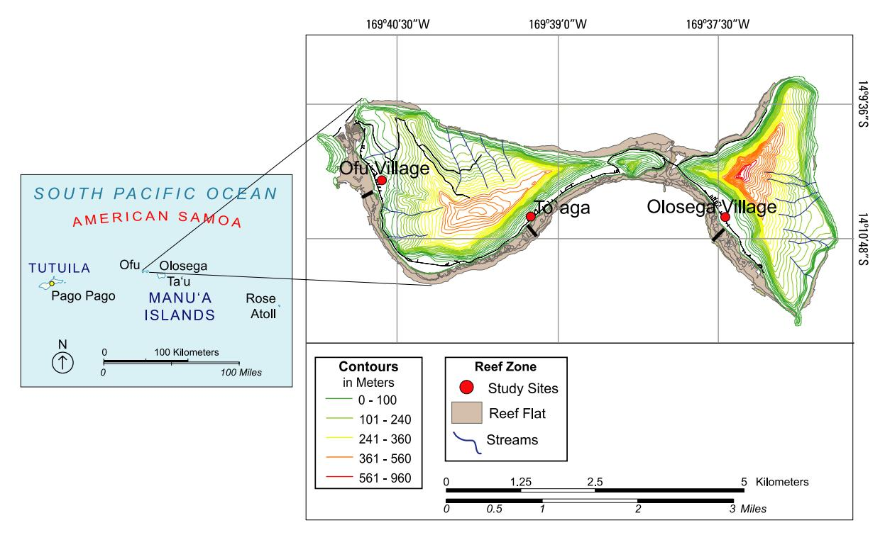
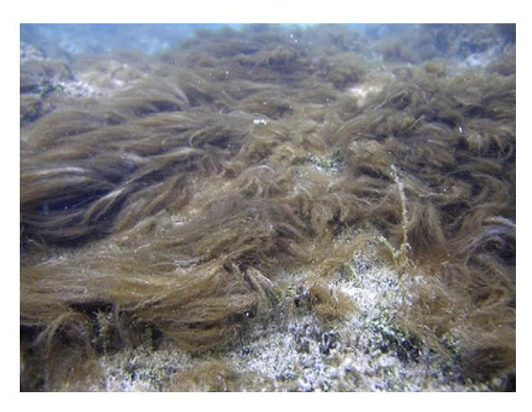
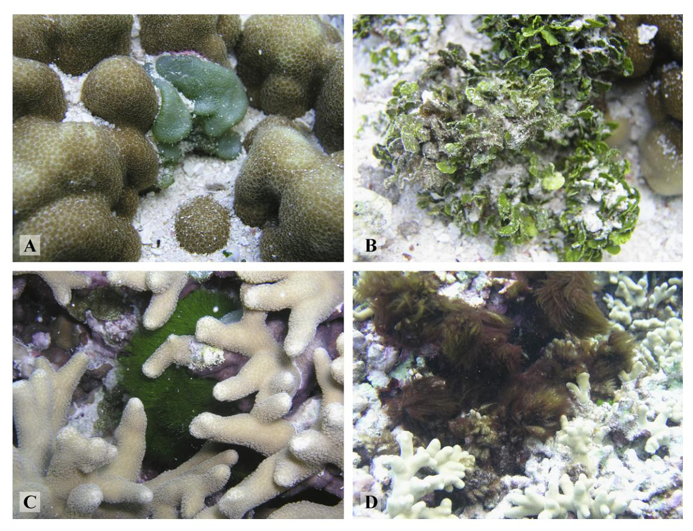
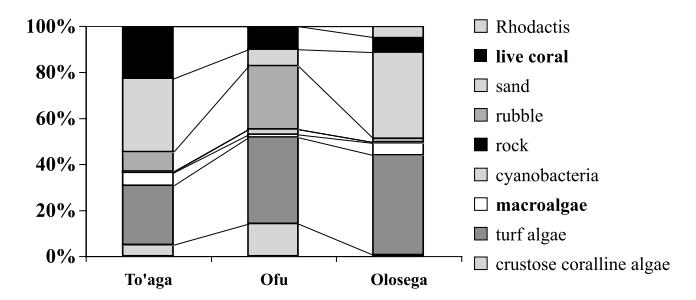
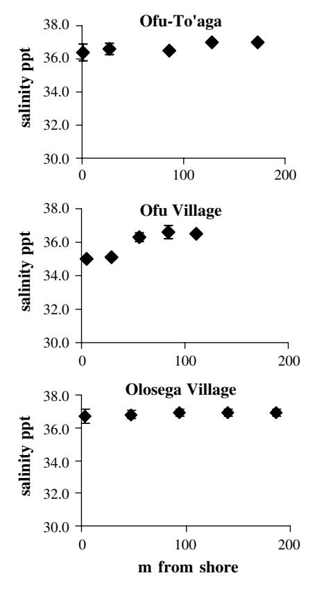
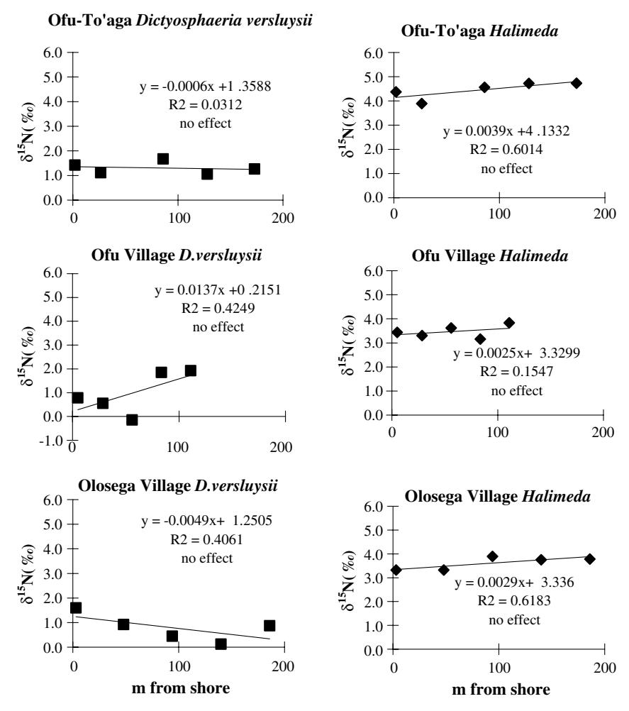

- Soclo, H.H., Garrigues, P., Ewald, M., 2000. Origin of polycyclic aromatic hydrocarbons (PAHs) in coastal marine sediments: case studies in Cotonou (Benin) and Aquitaine (France) areas. Marine Pollution Bulletin 40, 387–396.
- Steinhauer, M.S., Boehm, P.D., 1992. The composition and distribution of saturated and aromatic hydrocarbons in near shore sediments, river sediments, and coastal peat of Alaskan Beaufort Sea: implications for detecting anthropogenic hydrocarbon inputs. Marine Environmental Research 33, 223–253.
- Storelli, M.M., Marcotrigiano, G.O., 2000. Polycyclic aromatic hydrocarbon distributions in sediments from the Mar Piccolo, Ionian Sea, Italy. Bulletin of Environmental Contamination and Toxicology 65, 537–544.

0025-326X/\$ - see front matter 2007 Elsevier Ltd. All rights reserved. doi:10.1016/j.marpolbul.2007.08.012

- Tam, N.F.Y., Ke, L., Wang, X.H., Wong, Y.S., 2001. Contamination of polycyclic aromatic hydrocarbons in surface sediments of mangrove swamps. Environmental Pollution 114, 255–263.
- Tolun, L.G., Okay, O.S., Gaines, A.F., Tolay, M., Tufekci, H., Kiratlı, N., 2001. The pollution status and the toxicity of surface sediments in Izmit Bay (Marmara Sea), Turkey. Environment International 26, 163–168.
- UNEP/IOC/IAEA, 1992. Determination of petroleum hydrocarbons in sediments. Reference Methods for Marine Pollution Studies 20. UNEP, 75 pp.
- Volkman, J.K., Holdsworth, D.G., Neill, G.P., Bavor Jr., H.J., 1992. Identification of natural, anthropogenic and petroleum hydrocarbons in aquatic sediments. Science of the Total Environment 112, 203–219.

## Identifying nutrient sources to three lagoons at Ofu and Olosega, American Samoa using d15N of benthic macroalgae

Virginia Garrison a,\*, Kevin Kroeger b , Douglas Fenner c , Peter Craig d

a US Geological Survey, 600 Fourth Street South, St. Petersburg, FL 33701, USA b US Geological Survey, Woods Hole Science Center, 384 Woods Hole Road, Woods Hole, MA 02543-1598, USA c Department of Marine and Wildlife Resources, Pago Pago 96799, American Samoa d National Park of American Samoa, Pago Pago 96799, American Samoa

Degradation of nearshore habitats is a serious problem in some areas of American Samoa, such as in Pago Pago Harbor on Tutuila Island, and is a smaller but chronic problem in other areas. Sedimentation, pollution, nutrient enrichment from surface runoff or groundwater, and trampling are the major factors causing the changes (Peshut and Brooks, 2005). On the outer islands of Ofu and Olosega (Manu'a Islands; Fig. 1), there is an interesting contrast between relatively pristine lagoon habitats not far from comparatively degraded lagoon habitats. To'aga lagoon on the southeast side of Ofu Island (Fig. 1) has clear waters, a high diversity of corals and fishes, no human habitations, and an undeveloped watershed with no streams. To'aga lagoon is within the boundaries of the National Park of American Samoa and is the site of long-term research on coral reef resilience and global climate change. Only 3 km to the east of To'aga is a degraded lagoon that fronts Olosega Village. The Olosega lagoon is similar in size but has significantly less live coral than To'aga, and blooms of filamentous algae have been reported to cover the Olosega lagoon/reef flat bottom (unpublished data, PC; Fig. 2). The islands are influenced by the same regional-scale and biogeochemical regimes, and both islands are remnants of a volcanic caldera (Craig, 2005). Thus, local factors operating on the scale of a kilometer or less are thought to be driving the differences observed between lagoons. Land disturbance is limited to a road linking the villages, the clearing of vegetation for buildings, and two village dump sites located on the narrow strip of land between the steep slopes of the islands and the shoreline; there is no industry or associated pollution on either island. Cesspools are used for sewage disposal. Nutrient enrichment (from cesspools) of groundwater and the lagoon, as well as trampling during gleaning of reef organisms, are possible factors affecting the spatial relief and benthic composition of the lagoons. A pristine lagoon site (To'aga) and two that may be influenced by adjacent human populations (Ofu and Olosega Villages) were selected for study.

Analysis of lagoon waters for nutrient content can fail to detect episodic nutrient influx because of the rapid removal and recycling of nutrients from seawater by plankton and macroalgae (e.g., review by Atkinson, 1988). Unlike some marine organisms and plants, macroalgae are known to incorporate nutrients directly from the water column and store excess nutrients in their tissues, providing an integrated record of nutrient influx (Fong et al., 1994). Thus, macroalgae may better provide a history of nutrient influx to a site compared to other organisms that can: directly fix nitrogen (cyanobacteria; e.g., Howarth et al., 1988); primarily take up nutrients from sediments and interstitial water and not directly from the water column (rooted plants such as sea grasses; Paling and McComb, 1994;

\* Corresponding author. Tel.: +1 727 803 8747; fax: +1 727 803 2032. E-mail address: ginger\_garrison@usgs.gov (V. Garrison).

Fig. 1. Map of American Samoa with inset map of Ofu and Olosega islands with elevation contours. Location of Ofu Village, Olosega Village, and the To'aga site indicated with red dots. Location of sampling transect at each site indicated by thick black line. Lagoon/reef-flat area, including reef-crest, appears in brown. (Graphic: L. Travers, USGS).

Fig. 2. Filamentous algal bloom (most likely a blue-green alga) in Olosega lagoon, nine days after Hurrican Olaf (January 2005). Image: P. Craig, NPAS.

Erftenmeijer and Middleburg, 1995); or, incorporate nutrients from symbionts or ingested plants and/or other organisms (coral reef organisms; Mills et al., 2004).

To investigate the relative differences in nutrient influx to each of the lagoons, we analyzed nitrogen content of tissue from the two most common species of macroalgae. To determine the source of nutrients to each of the lagoons, we examined the nitrogen isotope content of the macroalgae found on the reef flats in front of both villages (Olosega and Ofu) and the relatively pristine lagoon/reef flat in front of To'aga (Fig. 1). Biological processes usually result in fractionation of the isotopes of elements (such as nitro-

gen and carbon) incorporated by organisms and plants (Minagawa and Wada, 1984). The ratio of 15N to 14N {more specifically the  $\delta^{15}N$  (%) = [( $^{15}N$ / $^{14}N$  sample)/  $(^{15}\text{N}/^{14}\text{N} \text{ atmospheric nitrogen}) - 1] \times 1000$ } in tissue has been reported to be effective in distinguishing between sources of nitrogen (e.g., atmospheric deposition, fertilizer, nitrogen fixation, and animals or plants; Peterson and Fry, 1987) and trophic level (the higher the trophic level, the greater the  $\delta^{15}$ N; e.g., Minagawa and Wada, 1984). Atmospheric deposition and fertilizers have relatively low  $\delta^{15}N$ values  $(-12\%_{oo}$  to  $+5\%_{oo}$  and  $-3\%_{oo}$  to  $+3\%_{oo}$ , respectively; Kreitler and Browning, 1983; Russell et al., 1998).  $\delta^{15}$ N values of +5 to +22% are reported to indicate that nitrogen from animals may be present, with highest values (+10\% to +22\%; Kreitler and Browning, 1983; Aravena et al., 1993) associated with septic and wastewater systems. Distinguishing between multiple animal and human sources is not as well defined.

This study was conducted at Ofu and Olosega Islands (part of the Manu'a Islands group), which are located 96 km ENE of Tutuila, American Samoa (Fig. 1). Three study sites were selected: two reef flats off Ofu Island (one seaward of Ofu Village and the other at a "pristine" site with no human settlement, To'aga); and a reef flat off Olosega Island seaward of Olosega Village (Fig. 1). Sampling transects ran from shore to the reef-crest at each of the three locations and were sited to avoid proximity to openings in the reef and associated strong currents (Fig. 1). The width of the reef flat at low tide determined the transect length at a site (Table 1).

Olosega

186

Site Shore-to-reef-crest Depth (m) range Mean salinity Distance (m) from Latitude, transect meters low tide  $(\%_0 \pm sd)$ shore to sampling stations longitude 0.3 - 3.5 $36.7 \pm 0.4$ 14°10′45″S. To'aga 1, 27, 86, 128, 173 169°39′10″W Ofu 111 0.1 - 1.0 $35.9 \pm 0.7$ 5, 29, 56, 84, 111 14°10′30″S,

 $36.8 \pm 0.3$ 

Table 1
Transect length, depth range, salinity (parts per thousand, %), distance from shore to sampling stations at each site; location of sites

0.1 - 1.2

Ofu Village and reef flat (hereafter "Ofu") are located on the western shore of Ofu Island (Fig. 1). Ofu Village lagoon is influenced by open-ocean swells from the north, west, and south and has two openings in the reef ("avas"). Two ephemeral streams empty into Ofu Village lagoon. Approximately 250 people live in Ofu Village and use cesspools for sewage disposal. Soils are sandy with relatively low organic-carbon content.

To'aga is on the southeastern shore of Ofu Island (Fig. 1). To'aga is most influenced by swells from the east, south and southwest and has one small pass in the reef and a channel on the eastern end of the island. To'aga has an undeveloped watershed with no streams; a garbage dump is sited on land approximately 1.3 km northeast (and downcurrent) of the To'aga site.

Olosega Village and reef flat (hereafter "Olosega") are on the western shore of Olosega Island (Fig. 1). Olosega lagoon is most often influenced by swells from the southeast to northwest and has one reef-opening in front of the village and a channel past the west end of the island. No streams discharge into Olosega Village lagoon. Approximately 250 people live in Olosega Village. Sewage is disposed of using cesspools sited in sandy soils with relatively low organic-carbon content.

Large swells from the open Pacific break on the reefcrests at all sites, delivering large quantities of water to the relatively shallow reef flats. Strong currents are created as these large masses of ocean water are pushed along the shore and out to sea via small openings in the reef. Ocean waters continually flush the reef flats even during low tide, when lower volumes of water break over the reef-crest, resulting in less forceful currents.

Of the 60 species of green algae reported from American Samoa (Skelton, 2003), only two, *Dictyosphaeria versluysii* Weber-van Boese (Fig. 3A) and *Halimeda* sp. (Fig. 3B), were common at all study sites. The green filamentous alga, *Chlorodesmis fastigata* (C. Agardh) Drucker (Fig. 3C), was occasionally observed at To'aga, but rarely along the Ofu or Olosega transects. A blue-green alga (possibly *Lyngbya* sp.; Fig. 3D) was infrequently observed at To'aga and Olosega and not observed along the Ofu transect.

Five replicate samples of the two most common species of macroalgae (*Halimeda* sp. and *Dictyosphaeria*) were collected at each of five stations located on each transect: 3 m from shore; at distances 1/4, 1/2, and 3/4 of the transect length, and at the shoreward edge of the reef-crest (Table 1).

No samples were collected from forereef sites due to the lack of macroalgae at those stations. Whole algal organisms (without rhizoids or holdfasts) were collected by hand using disposable gloves, cleaned of detritus and invertebrates, and immediately placed in individual Ziploc bags with seawater. All macroalgae and water samples were collected during periods of low tide between 24 May and 4 June 2006. A water sample for salinity testing was collected concurrently with each seaweed sample. Additional seawater samples collected at each of the lagoon sites and groundwater samples from freshwater wells at Olosega and Ofu Villages were analyzed for nutrients [nitrate, ammonium, dissolved organic nitrogen (DON), silica and phosphate]. Stream water was not sampled, because (a) stream discharge is ephemeral and occurs at only one of the three sites, and (b) groundwater in this setting gives a better indication of contamination by sewage.

3, 48, 94, 140, 186

169°40'48"W

14°10′48″S, 169°37′25″W

Benthic cover along each transect was quantified and a coral species list created using the point intercept method (Loya, 1972). A fiberglass tape was placed on the sea bottom and one individual (DF) identified the substrate beneath the tape, to the lowest taxon for organisms, at 0.5-m intervals along each transect.

More than 200 macroalgae samples were further cleaned of sand and fouling organisms in the lab, rinsed with fresh water, placed in aluminum weighing boats, and dried at 60 °C until constant weight. Individual samples were ground into a fine powder, transferred to scintillation vials and placed in a desiccator. A 5 to 9-mg subsample of each powdered Halimeda sp. sample was transferred into a tin capsule, weighed, and sealed for  $\delta^{15}$ N analysis. Because single Dictyosphaeria samples did not provide the minimum weight needed for stable isotope analysis, five replicates per station were pooled, mixed thoroughly, and three 5 to 9-mg subsamples were transferred into tin capsules, weighed, and sealed for  $\delta^{15}N$  analysis. The limited number of green filamentous and blue-green algae samples was pooled by species and site, mixed thoroughly, transferred to tin capsules, weighed, and sealed for  $\delta^{15}N$  and for  $\delta^{13}$ C analyses. Replicate *Dictyosphaeria* samples from each station were subsampled, subsamples pooled, weighed in tin capsules, and sealed for  $\delta^{13}$ C analysis. Replicate *Hali*meda sp. samples from each station were subsampled, subsamples pooled, placed in scintillation vials, a few drops of concentrated HCl added, and placed in a desiccator overnight. Inorganic C in the samples was released as CO2,

Fig. 3. Macroalgae collected for this study: (A) Dictyosphaeria versluysii; (B) Halimeda sp.; (C) Chlorodesmis fastigata; (D) unidentified blue-green alga observed at all three sites.

leaving the organic C. Treated samples were dried at 60 °C to remove HCl, 1–4 mg of sample weighed in tin capsules, and capsules sealed for  $\delta^{13}$ C analysis.

Macroalgae samples were analyzed for  $\delta^{15}$ N and  $\delta^{13}$ C at the University of California at Davis Stable Isotope Facility specializing in isotope ratio mass spectrometry. Stable isotope ratios of carbon and nitrogen were measured by continuous-flow isotope-ratio mass spectrometry (IRMS, 20-20 mass spectrometer, Sercon, Crewe, UK) after sample combustion to CO2 and N2 at 1000 °C in an on-line elemental analyzer (PDZEuropa ANCA-GSL). The gases were separated on a Carbosieve G column (Supelco, Bellefonte, PA, USA) before introduction to the IRMS. Sample isotope ratios were compared to those of pure cylinder gases injected directly into the IRMS before and after the sample peaks and provisional  $\delta^{15}N$  (air) and  $\delta^{13}C$  (international standard Pee Dee Belemnite - PDB) values calculated. Provisional isotope values were adjusted to bring the mean values of working standard samples distributed at intervals in each analytical run to the correct values of the working standards. The working standards are a mixture of ammonium sulfate and sucrose with  $\delta^{15}N$  vs. air 1.33% and  $\delta^{13}$ C vs. PDB -23.83%. These are periodically calibrated against international isotope standards (IAEA N1, IAEA N3; IAEA CH7, NBS22). Total N and C are calculated from the integrated total beam energy of the sample in the mass spectrometer compared to a calibration curve derived from standard samples of known N and C content. Precision (standard deviation  $\delta^{15}N < 0.1\%$  and  $\delta^{13}C < 0.3\%$ ) was calculated from the variation in the working standard samples distributed throughout the analytical runs. ANOVA statistical analysis was used to test for differences in  $\delta^{15}N$  values of *Halimeda* sp. and *D. versluysii* among stations and sites (Table 4).

Nutrient concentrations in water samples ( $NO_3^- + NO_2^-$ ,  $PO_4^{-3}$ ,  $NH_4^+$ ,  $SiO_4^{-4}$ ) were analyzed by colorimetric techniques (Lachat QuickChem 8000 autoanalyzer, Woods Hole Oceanographic Institution, Nutrient Analytical Facility). Nitrate and nitrite were not separately quantified, and in this report their sum is referred to as " $NO_3^-$ ." Total dissolved nitrogen (TDN) was measured using persulfate digestion (D'Elia et al., 1977). Dissolved organic nitrogen (DON) concentration was calculated as  $DON = TDN - NO_3^- - NH_4^+$ . Analytical uncertainties based on repeated measurements of standards were  $\pm 0.1~\mu M$  for all analytes except for DON and TDN where uncertainty was  $\pm 0.2~\mu M$ . Salinity of water samples was determined using a refractometer.

Overall, macroalgal cover was noticeably low at all lagoon sites (Fig. 4), with *Halimeda* sp. and *D. versluysii* the predominant species and *C. fastigata* a distant third. Living coral cover was lowest on the Olosega (7%) and

Fig. 4. Percent benthic composition along the sampling transect at each site.

Ofu (11%) transects and highest at To'aga (24%; Fig. 4). A greater number of coral species occurred directly on the To'aga transect (10) than the Ofu and Olosega transects (six species each; Table 2).

The  $\delta^{15}N$  values of the individual macroalgae samples ranged from -0.4% to +5.5% (Table 3), indicating sites that seem to be most influenced by oceanic and/or atmospheric and not anthropogenic sources. Salinity measurements did not show a significant freshwater influence at any sites or stations sampled (Fig. 5). However, salinity was slightly lower, but not significantly so, in samples from the station nearest to shore in Ofu lagoon, most likely due to a freshwater stream that emptied into Ofu lagoon

Table 2
Percent live coral of each reef-crest-to-shore transect, by species and overall

| % of benthic cover on transect | To'aga | Ofu | Olosega |
|--------------------------------|--------|-----|---------|
| Acropora aspera                |        | 6   | <1      |
| Acropora pagoensis             | <1     |     |         |
| Acropora pulcra                |        | 1   |         |
| Goniastrea edwardsi            | 2      |     |         |
| Goniastrea retiformis          | 2      |     |         |
| Leptoria phrygia               | 1      |     |         |
| Montipora sp. 1 (encrusting)   | 2      |     |         |
| Montipora sp. 2                |        |     | <1      |
| Pavona frondifera              | 1      |     | 2       |
| Pavona venosa                  | <1     |     |         |
| Porites annae                  |        | 1   |         |
| Porites cylindrica             |        | 1   | 3       |
| Porites massive                | 3      |     |         |
| Porites sp.                    | 11     |     | 1       |
| Porites sp. 2                  | 2      | 1   | <1      |
| Psammocora contigua            |        | 1   |         |
| Total                          |        |     |         |
| % live coral on transect       | 24     | 11  | 7       |
| % live coral per meter         | <1     | <1  | <1      |

Fig. 5. Mean salinity values (parts per thousand, ppt) with distance from shore at the three lagoon sites, May/June 2006.

(Fig. 1). *Halimeda* sp.  $\delta^{15}$ N values appeared to be quite different from *D. versluysii* (3–5‰ in *Halimeda* sp. and 0–3‰ in *D. versluysii*), indicating differences in assimilation and biochemistry (Table 3).  $\delta^{15}$ N values for *C. fastigata* (4–5‰) were similar to those of *Halimeda* sp. (Table 3). There was no correlation between  $\delta^{15}$ N values for *D. versluysii* or *Halimeda* sp. and distance from shore (Fig. 6). The lack of *C. fastigata* samples from Ofu and Olosega transects precluded analysis of  $\delta^{15}$ N and distance from shore.

There was no significant difference in *D. versluysii*  $\delta^{15}$ N values among the three sites (p = 0.44; Table 4). There was a significant difference in  $\delta^{15}$ N values among stations at Ofu (p < 0.01) with highest values near the reef-crest (Fig. 6); a highly significant difference among stations at Olosega (p < 0.001; Table 4); and a significant difference among stations at To'aga (p = 0.03; Table 4). At Olosega, highest  $\delta^{15}$ N values occurred at nearshore and reef-crest stations (Fig. 6).

Table 3 Comparison of  $\delta^{15}N$ , total nitrogen, and carbon-to-nitrogen content of macroalgae by species, shown as mean  $\pm$  standard deviation (sd)

| *                         | 6                                               |                               | ` '                         |
|---------------------------|-------------------------------------------------|-------------------------------|-----------------------------|
|                           | $\delta^{15} N \ (\%)$ all sites mean $\pm  sd$ | $\%N$ all sites mean $\pm$ sd | C:N all sites mean $\pm$ sd |
| Dictyosphaeria versluysii | $1.0 \pm 0.7$                                   | $0.9 \pm 0.2$                 | $12.6 \pm 3.1$              |
| Halimeda sp.              | $3.8 \pm 0.6$                                   | $0.6 \pm 0.2$                 | $13.8 \pm 7.4$              |
| Chlorodesmis fastigata    | $4.8 \pm 0.4$                                   | $4.0 \pm 0.5$                 | $9.7 \pm 1.1$               |

The number C. fastigata samples from all sites were not equal.

Fig. 6.  $\delta^{15}$ N values of *Dictyosphaeria versluysii* (left column) and *Halimeda* sp. (right column) with distance from shore at the three lagoon sites May/June 2006. Linear regression lines, equations, and correlation coefficients ( $r^2$ ) show no significant effect of distance from shore on  $\delta^{15}$ N values.

Table 4 Macroalgae  $\delta^{15}N$  (‰) differences among stations and among sites by species

|                           | Mean (%) | sd  | p       | <u>.</u> |
|---------------------------|----------|-----|---------|----------|
| Dictyosphaeria versluysii |          |     |         |          |
| To'aga (among stations)   | 1.3      | 0.3 | 0.03    | S        |
| Ofu (among stations)      | 1.0      | 0.9 | < 0.01  | s        |
| Olosega (among stations)  | 0.8      | 0.5 | < 0.001 | S        |
| Among sites               | 1.0      | 0.7 | 0.44    | ns       |
| Halimeda sp.              |          |     |         |          |
| To'aga (among stations)   | 4.5      | 0.5 | 0.01    | s        |
| Ofu (among stations)      | 3.5      | 0.4 | 0.06    | ns       |
| Olosega (among stations)  | 3.6      | 0.4 | 0.02    | s        |
| Among sites               | 3.8      | 0.6 | < 0.001 | s        |

SD = standard deviation; s = statistically significant; ns = not statistically significant ( $\alpha = 0.05$ ).

There was a significant difference in *Halimeda* sp.  $\delta^{15}N$  values among sites (p < 0.01), with To'aga  $(4.5\%_0 \pm 0.5)$  greater than Ofu  $(3.5\%_0 \pm 0.4)$  and Olosega  $(3.6\%_0 \pm 0.4)$ ; Table 4). There was no significant difference in  $\delta^{15}N$  among stations at Ofu (p = 0.06); and a significant difference

among stations at Olosega (p = 0.02) and To'aga (p = 0.01; Table 4), with values generally increasing from shore to the reef-crest (Fig. 6).

The green filamentous alga, C. fastigata, contained a relatively higher percent of nitrogen (mean =  $4.0 \pm 0.5$ ) than D. versluysii ( $0.9 \pm 0.2$ ), which exceeded that of Halimeda sp. ( $0.6 \pm 0.2$ ; Table 3). Nutrient data for the three macroalgae species could not be compared statistically because of fewer and unequal numbers of samples of C. fastigata from the three sites. Replicate samples of C. fastigata could be collected only at To'aga because the species was rarely observed at Ofu and infrequently seen at Olosega. Thus, the number of samples per site varied greatly (1–25). Carbon-to-nitrogen ratios in all species of macroalgae (Table 3; no replicate C samples) were higher than typical Redfield ratios (C:N = 6.6; Redfield et al., 1963) reported from the open ocean.

Nitrate, ammonium, and DIN levels were low in lagoonwater from all sites and not high for well/groundwater samples (Table 5). Phosphate levels were higher in the Olosega well and lagoon samples compared to the other two lagoon sites and higher in a nearshore than mid-lagoon

Table 5 Concentrations ( $\mu$ M) of ammonium (NH4+), silicate (SiO44-), phosphate (PO4-3), nitrate (NO3-), dissolved inorganic nitrogen (DIN), dissolved organic nitrogen (DON), and total dissolved nitrogen (TDN) in water collected from Ofu and Olosega May/June 2006

|                          | $NH_4^+ \; (\mu M)$ | $SiO_4^{-4} \; (\mu M)$ | $PO_4^{-3}~(\mu M)$ | $NO_3^- \ (\mu M)$ | DIN (µM) | DON (µM) | TDN (µM) |
|--------------------------|---------------------|-------------------------|---------------------|--------------------|----------|----------|----------|
| To'aga mid-lagoon        | 0.6                 | 1.9                     | 0.1                 | 0.1                | 0.7      | 5.1      | 5.8      |
| Ofu mid-lagoon           | 0.7                 | 7.9                     | 0.2                 | 0.3                | 1.0      | 6.5      | 7.5      |
| Olosega mid-lagoon       | 0.1                 | 2.8                     | 1.7                 | < 0.1              | 0.1      | 4.8      | 4.8      |
| Olosega nearshore lagoon | 0.3                 | 4.4                     | 2.7                 | 0.3                | 0.5      | 7.7      | 8.2      |
| Ofu well (fresh)         | 0.2                 | 469.0                   | 2.1                 | 7.5                | 7.6      | 3.6      | 11.2     |
| Olosega well (fresh)     | 0.2                 | 302.0                   | 4.5                 | 26.1               | 26.3     | 8.5      | 34.8     |

Analytical uncertainties based on repeated measurements of standards are  $\pm 0.1\,\mu M$  for all analytes except for DON and TDN where uncertainty is  $\pm 0.2\,\mu M$ . There are no replicates for water samples due to logistical problems shipping volumes of frozen water.

sample from Olosega (Table 5). High silica concentrations in groundwater were most likely from the basalt rock that forms the islands.

The nitrogen content (percent total nitrogen, concentration of the heavier nitrogen isotope  $^{15}$ N, and  $\delta^{15}$ N values) of macroalgae varies by species (due to physiology and biochemical processes), light regime, temperature, and availability of nitrogen and 15N content of the water (e.g., Heikoop et al., 1998; Cohen and Fong, 2006). Values of  $\delta^{15}$ N in this study (Table 3) were close to or lower than those reported for oligotrophic suspended particulate matter (4-5%; Waser et al., 2000), pelagic and coastal marine seaweeds (5-8% in Minagawa and Wada, 1984), and the euphotic layer DIN (7-10%; Minagawa and Wada, 1986). The low  $\delta^{15}$ N values of the macroalgae, the low nutrient concentrations of lagoon waters, the lack of correlation between  $\delta^{15}N$  values and distance from shore, and the low concentrations of nutrients in well-water samples indicate that the major sources of nutrients to the three Ofu-Olosega lagoons at the time of this study were most likely oceanic/atmospheric, and not animal/anthropogenic in origin. In contrast to this study, Umezawa et al. (2002) found an inverse linear or curvilinear decrease in  $\delta^{15}$ N values of macroalgae with distance from shore in the Ryuku Islands, Japan. This pattern was attributed to multiple sources of nitrogen, including terrestrial and human. Cohen and Fong (2006) reported a decrease in  $\delta^{15}N$  in macroalgae with distance from the head of estuaries in California during the dry season, due to a greater  $\delta^{15}N$ content of DIN from the watershed than oceanic sources. Similarly, the  $\delta^{15}$ N in rooted macroalgae (not free-floating) was found to increase significantly with increased influx of sewage-nitrogen to estuaries in the northeastern US (Cole et al., 2005).

In the lagoons of Ofu and Olosega Islands, high volumes of oceanic waters and strong currents flush the lagoons daily and would be expected to dilute nutrient influx from land rapidly. Under high-flow regimes, oligotrophic waters are able to provide sufficient nutrients for algal growth, but storage of nutrients in algal tissues is limited due to both low residence time and low nutrient concentrations of the water (Larned and Atkinson, 1997). When high concentrations of nutrients are available, from episodic pulses to sustained high concentrations, some macroalgae store

nutrients in their tissues (Wheeler and North, 1980; Lapointe and Duke, 1984; Fong et al., 1994). However, Fong et al. (2003) found there is not a direct correlation between nutrient concentrations in water and macroalgae tissue, but that nutrient content of tropical marine algae affects the organism's response to N and P influx, be it growth or storage. Thus, the history of available nutrients combined with the biochemistry of the macroalgae species drive the responses observed in the field (Fong et al., 2003). Whereas some macroalgae incorporate nutrients only from the water column, others can access nutrients in sediments, from adjacent heterotrophs (such as the scleractinian corals to which D. versluysii attaches; Larned and Stimson, 1996), or, in the case of some cyanobacteria, from fixation of nitrogen (Howarth et al., 1988). Halimeda and Dictvosphaeria (Division Chlorophyta) are rhizophytic algae and can access nutrients from the water as well as from sediment via holdfasts (Littler and Littler, 1990). Larned and Stimson (1996) found that D. cavernosa, closely related to D. versluysii, has low N storage capacity and needs a continual supply of DIN. The close attachment of D. cavernosa (and presumably D. versluysii) to the substrate creates space between the alga and live coral wherein ammonium concentrations are twofold, and nitrate + nitrite concentrations are 10-fold greater than that of the water column (Larned and Stimson, 1996). The lack of stored nitrogen (%) in Dictyosphaeria was evident in the data from this study (Table 3).

The molar C:N ratio in most phytoplankton is typically 106:16 (or 6.6; Redfield et al., 1963) when nutrients are not limiting. In tropical epilithic macroalgae in Atlantic oligotrophic waters that are N limited, the C:N ratio is reported to range from 14 to 28 and to vary by species (Lapointe et al., 1992). The C:N and %N data in this study may indicate that *Dictyosphaeria* and *Halimeda* are more N limited than *Chlorodesmis* at all sites (Table 3). Alternatively, the observed difference between species could be a due to: a higher structural C content in *Dictyosphaeria* and *Halimeda*; and/or, the enhanced ability of *Chlorodesmis* to assimilate nitrogen from the environment or to store nitrogen than *Dictyosphaeria* or *Halimeda*.

Ofu and Olosega well-water nutrient levels from this study (Table 5) were within the range of American Samoa EPA values for October 2001, January and December 2003

samples (<0.2–8.7 lM Ofu; <0.2–43 lM Olosega). Other than relatively high phosphate levels in the well-water samples, well-water nutrient levels were within normal groundwater concentrations, at the time of this study. Other possible sources of nutrients to the lagoons include episodic intense rainfall events that could flush nutrients from the upland watersheds and from reservoirs (such as cesspools) in the sandy soil into the lagoons. Hurricanes produce high seas and battering waves that can inundate the coast for tens of meters inshore and wash nutrients from the sandy soil into the lagoons. Nearshore marine communities adjacent to villages with cesspools, pig farms, and other domestic animals would be expected to receive concentrated pulses of nutrients that could be quickly utilized by filamentous algae that can rapidly take up nutrients from the water and grow quickly. If lagoon substrate was exposed by removal of sand or turf algae, as often occurs during storms, an opportunistic filamentous alga could colonize, grow rapidly, and produce a ''bloom''. Hurricanes and other strong storms produce oceanic upwelling, where deep, cooler, nutrient-rich waters are brought to the surface (reviewed in Babin et al., 2004). Storm-induced upwelling in conjunction with tidal pumping and surface runoff from land could provide a considerable source of nutrients to the nearshore waters. All of these mechanisms could fuel algal blooms nearshore. During a hurricane damage survey conducted by the National Park of American Samoa nine days after Hurricane Olaf, a filamentous alga bloom was observed in Olosega lagoon (P. Craig.; Fig. 2, January 2005). Yet no macroalgae blooms were observed off To'aga or on the north side of Ofu at that time. It is likely that an influx of nutrients flushed from the adjacent village via intense rainfall, tidal pumping, and inundating storm waves stimulated the bloom. However, data from this study, conducted 18 months later, do not support or refute this speculation. To determine the specific drivers for this system, nutrient influx from land and from upwelling, as well as the role of space availability will need to be examined.

From this study, Ofu and Olosega lagoons seem to have good water quality, with nitrogen influx of predominantly oceanic/atmospheric origin. At the time of this study, anthropogenic sources of nutrients were not detected in macroalgae in the lagoons. The major factors driving the differences among the three lagoons (live coral cover, macroalgae cover, and number of coral species) remain unproven. Data from this study provide the baseline needed to compare against data from future episodic events, to determine the nitrogen sources fueling algal blooms in the lagoons of Ofu and Olosega.

## Acknowledgement

We are indebted to the American Samoa Department of Commerce for funding the project with a Coral Reef Initiative Grant, to the USGS for providing VG salary and laboratory support, and to the USGS Mendenhall Postdoctoral Fellowship for funding KK. This research could not have been conducted without the exceptional support of the Malae family of Vaoto Lodge, Ofu: Marge, Tito, Jim, Deborah, Ben, Rhane, Angel, Horus, Sandy, Jasmine, and Bell. Our deep thanks go to: the mayors and citizens of Ofu and Olosega Villages for their kindness and hospitality, allowing us to collect samples from the lagoons in front of their villages, providing us with cold coconut milk (out of the coconut!), and periodically transporting us to and from sites; the American Samoa Power Authority on Ofu and Olosega for providing well-water samples; Paul Brown (NPAS) and John Garrison for field support; Dan Barshis and Lance Smith for flawlessly transferring hundreds of pounds of equipment between boats at sea, onto land and into the lab (with nary a complaint); Fale Tuilagi (NPAS) for ensuring that things keep working at the lab; Christina Stringer for USGS laboratory expertise; Peter Peshut (AS EPA) for providing watershed area data; and Edna Buchan and Elena Vaouli (AS EPA) for providing Ofu and Olosega fresh-water well nutrientconcentration data! Fa'afetai tele lava! B. Boynton and L. Travers provided outstanding graphics. J. Bowen, P. Swarzenski and anonymous reviewers provided constructive comments that greatly improved the manuscript. Any use of trade names is for descriptive purposes only and does not imply endorsement by the US Government.

## References

Aravena, R., Evans, M.L., Cherry, J.A., 1993. Stable isotopes of oxygen and nitrogen in source identification of nitrate from septic systems. Ground Water 31, 180–186.

Atkinson, M.J., 1988. Are coral-reefs nutrient limited? In: Proceedings of the Sixth International Coral Reef Symposium 1, pp. 157–166.

Babin, S.M., Carton, J.A., Dickey, T.D., Wiggert, J.D., 2004. Satellite evidence of hurricane-induced phytoplankton blooms in an oceanic desert. Journal of Geophysical Research 109, C03043. doi:10.1029/ 2003JC001938.

Cohen, R.A., Fong, P., 2006. Using opportunistic green macroalgae as indicators of nitrogen supply and sources in estuaries. Ecological Applications 16, 1405–1420.

Cole, M.L., Kroeger, K.D., McClelland, J.W., Valiela, I., 2005. Macrophytes as indicators of land-derived wastewater: application of a d15N method in aquatic systems. Water Resources Research 41, W01014. doi:10.1029/2004WR003269.

Craig, P. (Ed.), 2005. Natural History Guide to American Samoa. National Park of American Samoa and Department of Marine and Wildlife Resources Publication, Pago Pago, American Samoa.

D'Elia, C.F., Steudler, P.A., Corwin, N., 1977. Determination of total nitrogen in aqueous samples using persulfate digestion. Limnology and Oceanography 22, 760–764.

Erftenmeijer, P.L.A., Middleburg, J.J., 1995. Mass balance constraints on nutrient cycling in tropical seagrass beds. Aquatic Botany 50, 21–36.

Fong, P., Donohoe, R.M., Zedler, J.B., 1994. Nutrient concentrations in tissue of the macroalga Enteromorpha spp. as an indicator of nutrient history: an experimental evaluation using field microcosms. Marine Ecology Progress Series 106, 273–281.

Fong, P., Boyer, K.E., Kamer, K., Boyle, K.A., 2003. Influence of initial tissue nutrient status of tropical marine algae on response to nitrogen and phosphorous additions. Marine Ecology Progress Series 262, 111– 123.

- Heikoop, J.M., Dunn, J.J., Risk, M.J., Sandeman, I.M., Schwarcz, H.P., Waltho, N., 1998. Relationship between light and the d15N of coral tissue: examples from Jamaica and Zanzibar. Limnology and Oceanography 43, 909–920.
- Howarth, R.W., Marino, R., Cole, J.J., 1988. Nitrogen fixation in freshwater, estuarine, and marine ecosystems. Biochemical controls. Limnology and Oceanography 33, 688–701.
- Kreitler, C.W., Browning, L.A., 1983. Nitrogen-isotope analysis of groundwater nitrate in carbonate aquifers: natural sources versus human pollution. Journal of Hydrology 61, 285–301.
- Lapointe, B.E., Duke, C.S., 1984. Biochemical strategies for growth of Gracilaria tikvahiae (Rhodophyta) in relation to light intensity and nitrogen availability. Journal of Phycology 20, 488–495.
- Lapointe, B.E., Littler, M.M., Littler, D.S., 1992. Nutrient availability to marine macroalgae in siliciclastic versus carbonate-rich coastal waters. Estuaries 15, 75–82.
- Larned, S.T., Atkinson, M.J., 1997. Effects of water velocity on ammonium and phosphorous uptake and nutrient-limited growth in the macroalga Dictyosphaeria cavernosa. Marine Ecology Progress Series 157, 295–302.
- Larned, S.T., Stimson, J., 1996. Nitrogen-limited growth in the coral reef chlorophyte Dictyosphaeria cavernosa, and the effect of exposure to sediment-derived nitrogen on growth. Marine Ecology Progress Series 145, 95–108.
- Littler, M.M., Littler, D.S., 1990. Productivity and nutrient relationships in psammophytic versus epilithic forms of Bryopsidales (Chlorophyta): comparisons based on a short-term physiological assay. Hydrobiologia (204–205), 49–55.
- Loya, Y., 1972. Community structures and species diversity of hermatypic corals at Eilat, Red Sea. Marine Biology 13, 100–123.
- Mills, M.M., Lipschultz, F., Sebens, K.P., 2004. Particulate matter ingestion and associated nitrogen uptake by four species of scleractinian corals. Coral Reefs, 311–323.
- Minagawa, M., Wada, E., 1984. Stepwise enrichment of 15N along food chains: further evidence and the relation between d15N and animal age. Geochimica et Cosmochimica Acta 48, 1135–1140.

0025-326X/\$ - see front matter Published by Elsevier Ltd. doi:10.1016/j.marpolbul.2007.08.016

- Minagawa, M., Wada, E., 1986. Nitrogen isotope ratios of red tide organisms in the East China Sea: a characterization of biological nitrogen fixation. Marine Chemistry 19, 245–259.
- Paling, E.I., McComb, A.J., 1994. Nitrogen and phosphorous uptake in seedlings of the seagrass Amphibolis antarctica in Western Australia. Hydrobiologia 294, 1–4.
- Peshut, P., Brooks, B., 2005. Tier 2 fish toxicity study: chemical contaminants in fish and shellfish and recommended consumption limits for the Territory of American Samoa. Technical Report, American Samoa Environmental Protection Agency, American Samoa, 114p.
- Peterson, B.J., Fry, B., 1987. Stable isotopes in ecosystem studies. Annual Review Ecological Systems 18, 293–320.
- Redfield, A.C., Ketchum, B.H., Richards, F.A., 1963. The influence of organisms on the composition of sea-water. In: Hill, M.N. (Ed.). In: The Sea, vol. 2. Interscience, New York, pp. 26–77.
- Russell, K.A., Galloway, J.N., Macko, S.A., Moody, J.L., Scudlark, J.R., 1998. Sources of nitrogen in wet deposition in the Chesapeake Bay region. Atmospheric Environment 32, 2453–2465.
- Skelton, P.A., 2003. Seaweeds of American Samoa. Report Prepared for the Department of Marine and Wildlife Resources, Government of American Samoa. International Ocean Institute (Australia) and Oceania Research and Development Associates, Townsville, Queensland, Australia, p. 103.
- Umezawa, Y., Miyajima, T., Yamamuro, M., Kayanne, H., Koike, I., 2002. Fine-scale mapping of land-derived nitrogen in coral reefs by d15N in macroalgae. Limnology and Oceanography 47, 1405– 1416.
- Waser, N.A.D., Harrison, W.G., Head, E.J.H., Nielsen, B., Lutz, V.A., Calvert, E.S., 2000. Geographic variations in the nitrogen isotope composition of surface particulate nitrogen and new production across the North Atlantic Ocean. Deep Sea Research Part I: Oceanographic Research Papers 47, 1207–1226.
- Wheeler, P.A., North, W.J., 1980. Effect of nitrogen supply on nitrogen content and growth rate of juvenile Mycrocystis pyrifera (Phaeophyta) sporophytes. Journal of Phycology 16, 577–582.