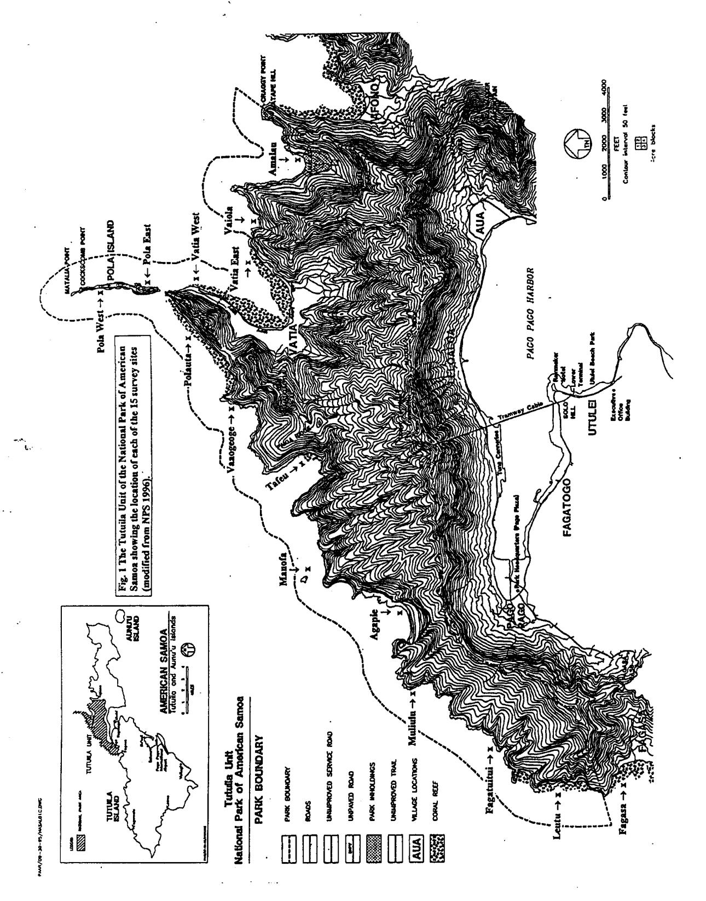
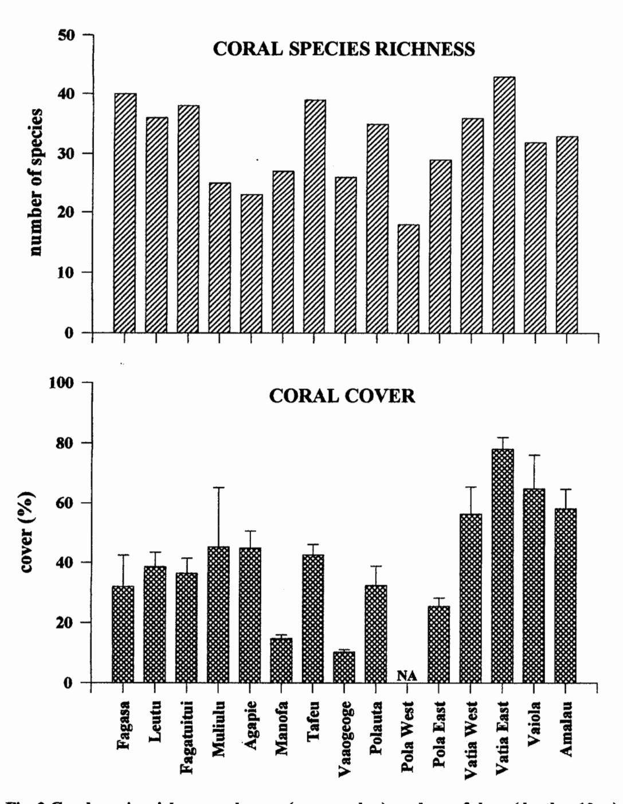
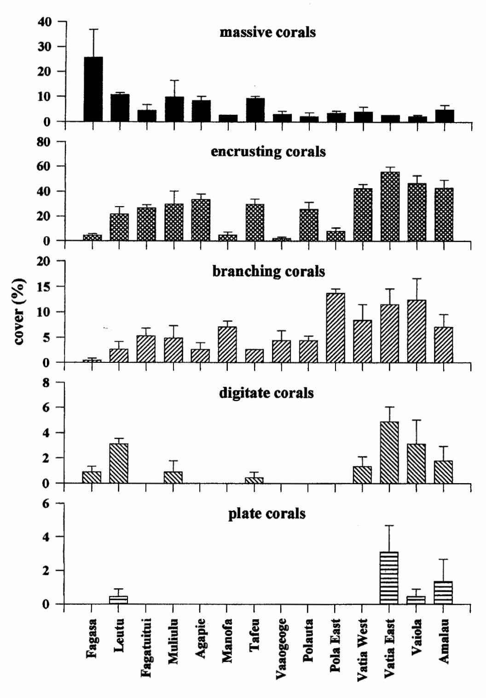
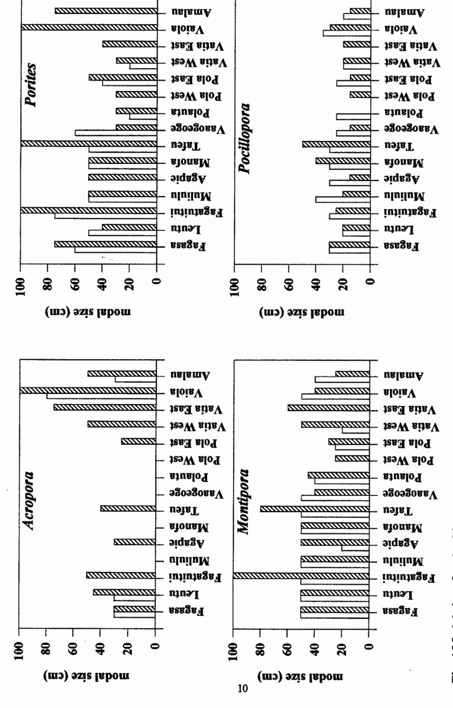
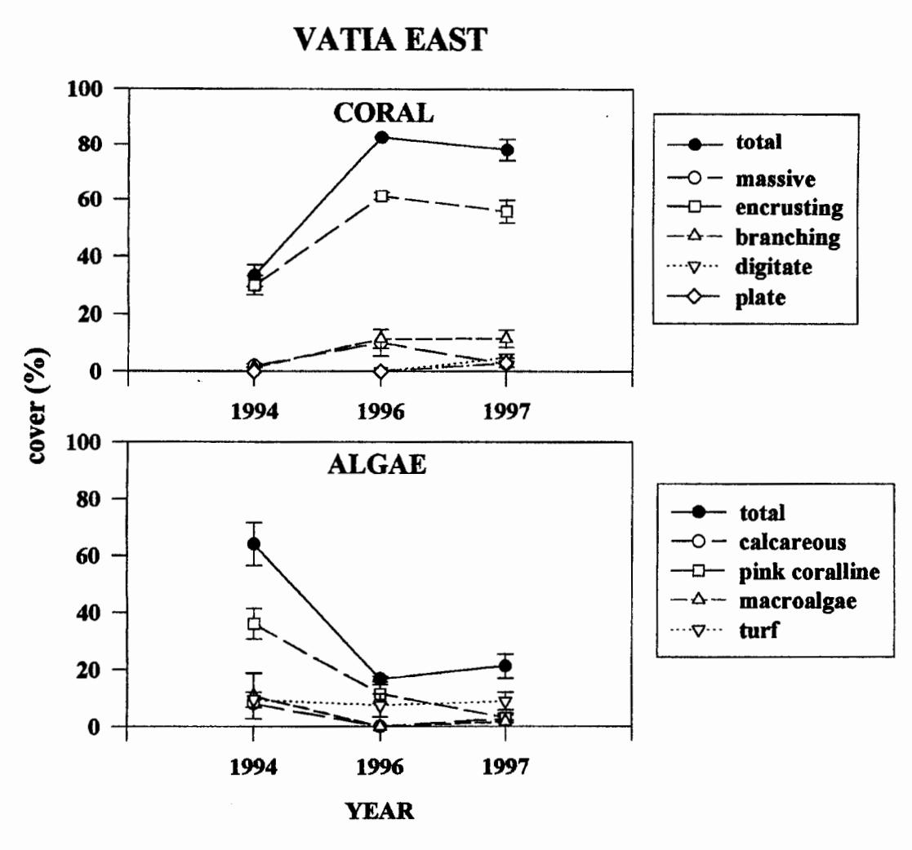
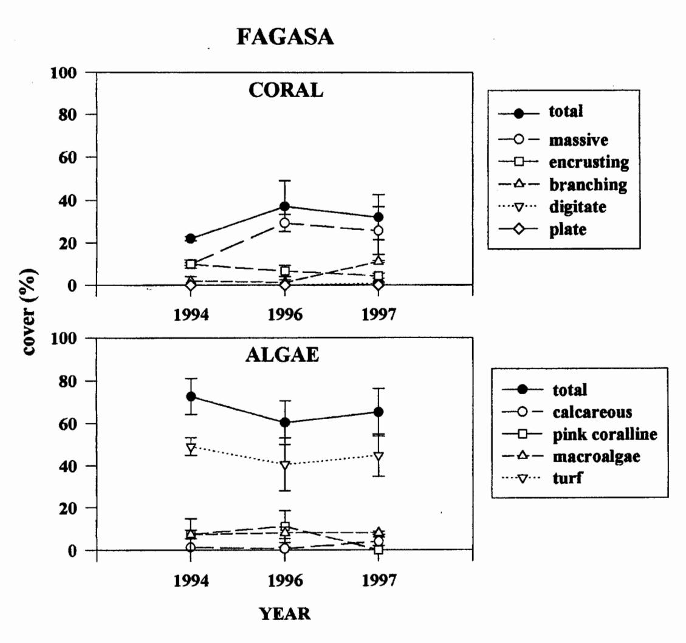
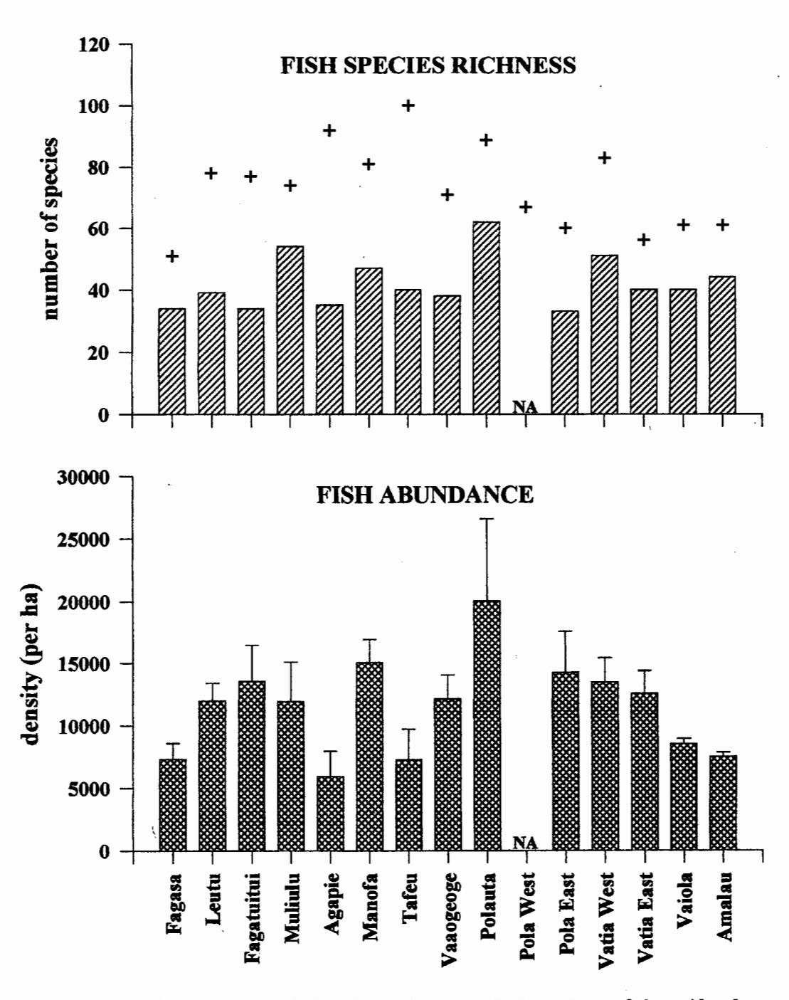
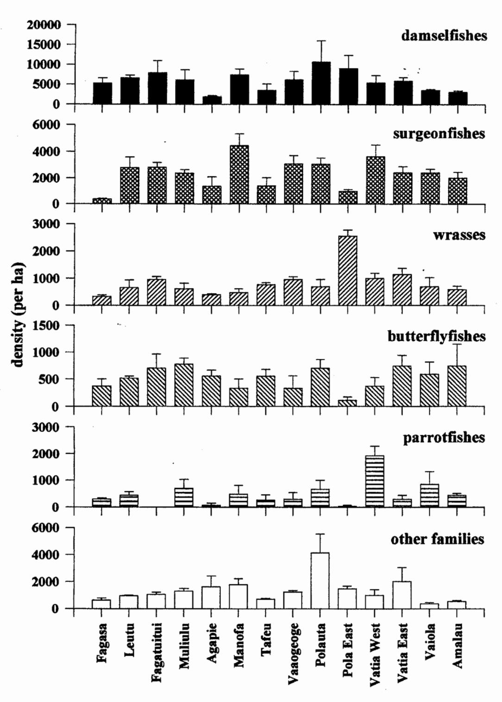

# A PRELIMINARY SURVEY OF THE CORAL REEF RESOURCES IN THE TUTUILA UNIT OF THE NATIONAL PARK OF AMERICAN SAMOA.

FINAL REPORT by:

Alison Green1 and Cynthia Hunter2

February, 1998

&lt;sup>1 51 Mons School Road, Buderim. Q. 4556 Australia.

# TABLE OF CONTENTS

| INTRODUCTION                                  | Page No. |
|-----------------------------------------------|----------|
|                                               |          |
| METHODS                                       | 4        |
| Study Site                                    | 4        |
| Survey Design                                 | 4        |
| Site Description Methods Coral Survey Methods | 4        |
| Fish Survey Methods                           | 6        |
| Macroinvertebrate Survey Methods              | 7        |
| Turtle and Marine Mammal Observations         | 7        |
| Fishing Activity                              | 7        |
| Other Observations                            | 7        |
| RESULTS                                       | 7        |
| Corals                                        | 7        |
| Fishes                                        | 14       |
| Macroinvertebrates                            | 14       |
| Turtles and Marine Mammals                    | 14       |
| Fishing Activity                              | 17       |
| Other Observations                            | 17       |
| Site Summaries                                | 17       |
| 1. Fagasa                                     | 17       |
| 2. Leutu                                      | 18       |
| 3. Fagatuitui                                 | 19       |
| 4. Muliulu                                    | 20       |
| 5. Agapie                                     | 21       |
| 6. Manofa                                     | 22       |
| 7. Tafeu                                      | 22       |
| 8. Vaaogeoge                                  | 23       |
| 9. Polauta                                    | 24       |
| 10. Pola West                                 | 25       |
| 11. Pola East                                 | 25       |
| 12. Vatia West                                | 26 27 |
| 13. Vatia East                                | 28       |
| 14. Vaiola 15. Amalau                      | 28       |
| DISCUSSION                                    | 29       |
| MANAGEMENT RECOMMENDATIONS                    | 30       |
| ACKNOWLEDGEMENTS                              | 31       |
| REFERENCES                                    | 31       |
| TABLES                                        | 32       |

#### INTRODUCTION

The National Park of American Samoa encompasses a variety of unique natural resources, including approximately 2,550 acres of coral reef on three islands: Tutuila, Ofu, and Ta'u (NPS 1996). While these coral reefs comprise some of the most biologically diverse and pristine habitats remaining in the Pacific region (NPS 1996), they are none the less subject to a number of threats (see Green 1996). These include potential impacts from human activities (e.g. destructive fishing and sedimentation), natural "disasters" (e.g. hurricanes), and events of undetermined cause (e.g. coral bleaching and crown-of-thorns seastar outbreaks).

In order to manage these natural resources effectively, the National Park requires detailed information on the extent and condition of the coral reef resources within its jurisdiction, as well as information on the degree to which they appear to be impacted by human activities. To date, the park has supported several surveys of the reefs in the Ofu Unit. These surveys have provided a detailed, quantitative resource assessment of the coral reef communities in the park, and have established the basis for the long term monitoring of these reefs (see Hunter et al. 1993). However, little is known of the coral reef resources in the Tutuila Unit, which comprise almost 50% (1,200 acres) of the reef area in the park.

Given that the island of Tutuila supports nearly all of the Territory's population, which has one of the world's highest growth rates and a doubling time of 19 years (NPS 1996), and that subsistence fishing is allowed in the park, many of the above-mentioned threats are more than potential. For example, a recent interview survey reported that most of the destructive fishing practices on Tutuila seem to occur in the remote sections of the island's north shore (Tuilagi and Green 1995). There have also been reports that teams of commercial fishermen have been systematically harvesting remote reefs on the north shore at night (local villagers pers. comm.). Since much of this area is located in the National Park, it appears that park's resources may be under threat from these activities.

While a full scale, quantitative inventory and monitoring program would be desirable, such a program is not likely to occur in the near or intermediate future. The goal of this survey is to bridge the park's information gap by providing a preliminary assessment of the coral reefs in the Tutuila Unit of the National Park. The specific objectives of this survey were to:

- i) determine the extent of coral reef development within the park;
- ii) assess the general condition of these reefs:
- iii) describe the coral reef communities on these reefs, in terms of the presence and relative abundance of coral and fish species, as well as other selected species that are considered to be of local and/or national importance (e.g. giant clams, crown-of-thorns starfish, turtles and marine mammals); and
- iv) assess whether and how these reefs appear to be presently or potentially impacted by human activities.

This study will then provide the basis for the long-term management of these resources by identifying:

- i) issues that may need to be addressed in the future management of the park; and
- ii) potential sites for the long-term monitoring of these reefs.

#### **METHODS**

# Study Site

The Tutuila Unit of the National Park of American Samoa is located on the north shore of Tutuila Island, between the villages of Fagasa and Afono (Fig. 1). The boundary of the park extends seaward to a depth of 20 m or ¼ mile from shore, whichever is furthest (usually the latter). As such, the park includes marine resources along most of this coastline, except where the park boundaries extend inland to exclude the village of Vatia.

The reefs on the north shore of Tutuila are generally protected from the prevailing southeast trade winds, but are subject to occasional damage from strong storms and hurricanes which tend to originate in the north. Recent disturbances in the area include two hurricanes (Ofa and Val in 1990 and 1991, respectively), a mass coral bleaching event (1994), a severe outbreak of the corallivorous starfish *Acanthaster planci* in the late 1970s, and fishing (Green 1996).

# Survey Design

The coral reef resources of the National Park were surveyed at a total of 15 sites along the coastline within the park from Fagasa to Amalau (Fig. 1). Study sites were chosen after a reconnaissance of the area and included a combination of sites believed to encompass the variability of the coral reef resources in the park. This included sites on exposed coastlines and in sheltered areas within prominent bays or coves. Two sites were surveyed on the most prominent feature in the park, Pola Island (Fig. 1).

Two of the sites chosen were located just outside the park boundaries: Fagasa and Vatia East. These sites were included in the survey because of the presence of existing long-term data for these areas (Maragos et al. 1994, Mundy 1996, Green 1996), and because some or all of the watershed landward of these reefs is located in the park.

The specific location of each study site is described in detail to allow for surveys to be repeated or expanded in future (see <u>Site Summaries</u>). The current survey was conducted from August 27 to September 5, 1997.

# Site Description Methods

The general reef structure, development, topography, and other notable features were described during an initial reconnaissance of each site. Depths of reef top and slope, slope angle, bottom type and dominant macroalgae were recorded and a sketch was made of the vertical topographic profile of the selected survey areas.

#### Coral Survey Methods

Coral communities were described using a combination of qualitative and quantitative methods. Qualitative survey methods were used to provide a general description of the coral communities at each site. Quantitative methods were used to describe the substratum characteristics (corals and other benthic organisms) at a uniform depth (10 m) on the reef slope at each site. This provides a

&lt;sup>3The general term "coral reef" can have different meanings in different contexts. From a geological perspective, the term is reserved for accretional deposits of calcium carbonate produced by corals, coralline algae, and associated organisms. In a biological sense, a coral-based community may also be termed a "reef" although, because of early successional stage, high bioerosion rates or storm-damage, no net carbonate accretion has occurred. Here, we use the term "reef" in the latter sense, and note where true accretion (fringing or fore reefs) was apparent.

measure of coral cover at each site and establishes a baseline for the long-term monitoring of these reefs.

# Qualitative Coral Survey Methods

Coral species diversity and relative abundance were assessed at the reef top and slope at each site. Relative abundances for each coral species were assigned to the following categories at each site and depth regime (Maragos et al 1994): D=dominant, A=abundant, C=common, O=occasional, R=rare. Modal size class of coral colony diameters was estimated for tabular Acropora spp., encrusting Montipora spp., Porites lutea, and Pocillopora verrucosa at each depth and site. No visual estimates were made for percent cover of coral because of the subjective nature and propensity for inter-observer differences in this type of estimate.

# Quantitative Coral Survey Methods

Coral communities were surveyed at each site (except Pola West, see Fish Survey Methods) using a point-based method for habitat description (see Green 1996). Substratum characteristics were surveyed along each of the fish transects (see below) after the fish counts had been completed. At 1 m intervals along each transect, a 2 m transect was run perpendicular to the direction of the main transect. Three sampling points were then used along each of the 2 m transects (one directly under the tape, and one 1 m on either side). Twenty-five 1 m intervals along the main transect were sampled in this manner, yielding 75 sample points per transect.

At each point, the substratum was recorded as belonging to one of the following growth form categories: plate coral, massive coral, digitate coral, branching coral, encrusting coral, miscellaneous (soft corals, sponges, and ascidians), pink coralline algae, calcareous algae, bluegreen algae, macroalgae (including *Halimeda*), and turf algae. The cover of each substratum type could then be calculated as the percentage of the 75 points occupied on each transect.

The recovery of the coral communities after Hurricanes Ofa and Val was described by re-surveying two sites, Fagasa and Vatia, which had been surveyed on two previous occasions (August-November 1994 and April-May 1996) by Green (1996).

#### Fish Survey Methods

Fishes were also surveyed using a combination of qualitative and quantitative survey methods for each site. Fishes were counted along three 30 x 3 m transects on the reef slope (depth = 10 m). Each fish encountered on the transects was identified to species level, its size estimated, and the data recorded directly onto underwater paper. For this survey, a restricted list of 37 families was used which included only those families that are amenable to visual census techniques (see Green 1996). Fish survey methods are described in detail in Green (1996) differing only in the size of transects used. These counts provide estimates of the present species richness and density of reef fishes at each site and a baseline for the long-term monitoring of these resources.

In order to provide a more complete species list for each site, the observer also spent 10-15 mins swimming around the site in deeper (10 m to the bottom of the slope) and shallower water (3 to 10 m) at each site. All species observed in the area were recorded at this time.

One site, Pola West, was not surveyed using these methods because there was no reef development present at a depth of 10 m at this location (see Pola West, General Description below). In order to conduct a qualitative assessment of the area, the observer spent 40 mins swimming around the site recording all species present in the area.

30x2=60= x } repl = 180 m2

# Macroinvertebrate Survey Methods

Giant clams (Tridacna spp.) were enumerated and measured (maximum shell length) within a 1 m belt on either side of each of the 30 m transect lines (total area per site = 180 m2). Qualitative observations were also made on the occurrence of crown-of-thorn seastars (COTs) or their feeding scars, and common non-coral benthic organisms (e.g. other seastars, urchins, sea cucumbers, tunicates, sponges, gastropod molluses, and anemones).

# Turtle and Marine Mammal Observations

The presence and relative abundance of sea turtles and marine mammals were noted.

# Fishing Activity

Observations and anecdotal evidence of fishing activity within the park were recorded.

### Other Observations

Other notable observations were also recorded. These include the occurrence of bleached corals, coral disease, dominant algae, and damselfish territories.

#### RESULTS

The Tutuila Unit of the National Park of American Samoa comprises almost continuous coral reef communities along the north shore of Tutuila from Fagasa to Amalau. These reefs are characteristic of those found on the north shore of Tutuila in terms of their coral, fish and invertebrate communities.

#### <u>Corals</u>

A total of 85 coral taxa were recorded during the survey (Table 1). The number of coral taxa per site ranged from 18 (Pola West) to 43 (Vatia East), with a mean of 32 (Fig. 2). Nineteen taxa occurred at the majority of sites (>10), and 19 other taxa were seen at only one site each; 51 taxa occurred at five or fewer sites.

The following were the most commonly encountered reef corals

Montipora spp. (encrusting) Pocillopora meandrina Pocillopora eydouxi Pocillopora verrucosa Porites lutea

Porites (Synarea) rus Favia matthaii

Favia stelligera

Astreopora myriopthalma

Coscinarea columna

Galaxea fascicularis Goniastrea retiformis Leptastrea purpurea Leptoria phrygia Montastrea curta Pavona varians

Acropora spp. (corymbose)

Montipora venosa Fungia scutaria

The baseline survey of the coral communities in the park showed that coral cover was variable, ranging from low (<20%) at Manofa and Vaaogeoge to relatively high (> 40%) at Muliulu, Agapie, Tafeu, Vatia West, Vatia East, Vaiola and Amalau (Fig. 2, Table 2). In general, coral cover tended to be higher at the eastern end of the park (from Vatia to Amalau). Most of the coral communities tended to be dominated by encrusting corals (Fig. 3, Table 2), although large massive corals were a conspicuous part of the community at some locations such as Fagasa, Tafeu and Amalau (Figs 3 & 4, Tables 1 & 2). Branching corals, digitate and plate corals comprised smaller components of the

Fig. 2 Coral species richness and cover (mean and se) on the reef slope (depth = 10 m) at each site surveyed in the Tutuila Unit of the National Park of American Samoa. Where: n = 3 transects.

Fig. 3 Mean cover (and se) of each of the major coral growth forms on the reef slope (depth = 10 m) at 14 sites in the Tutuila Unit of the National Park of American Samoa. Where: n = 3 transects. Note different y axes.

**.** 

Fig. 4 Modal size of each of four coral genera at two depths at each site in the National Park of American Samoa. Where open bars are shallower (<10 m) and hatched bars are deeper (>10 m) areas.

coral communities (generally < 20%), but were most abundant on the eastern side of the park from Pola Island to Amalau (Fig. 3, Table 2). The highest coral cover recorded in the survey was at Vatia East (78%), which is located just outside the park boundary.

While Acropora and Porites showed a wide range in modal colony size, Montipora and Pocillopora colonies were fairly uniform over all sites and depths (Fig. 4). Largest colony sizes were generally seen on deeper reef slopes and at Vaiola, Tafeu, and Fagatuitui. These sites represented the more wave-protected areas within the park boundaries.

In general, most of the exposed reefs appeared to be in a stage of recovery following the recent hurricanes (6-7 years prior). Coral communities in shallow waters at these sites were characterised by small coral colonies. In contrast some of the reefs in the more protected embayments (e.g. Tafeu and Amalau) appear to have been protected from the recent hurricanes and were characterized by large coral colonies (e.g. massive *Porites* spp.).

Long-term monitoring of two sites just outside the park boundaries, Vatia East and Fagasa, demonstrated the rate of recovery of these reefs since the hurricanes. In 1995, modal size of most corals at these two sites was 10-20 cm (Mundy 1996). By 1997, modal size had increased to 15-20 cm at Vatia East and 30-75 cm at Fagasa.

The reef at Vatia East recovered rapidly between 1994 and 1996 (Fig. 5). In 1994, coral cover was moderately low (33%), and the reefs were dominated by algae (64%), primarily pink coralline algae. By 1996, coral cover had increased to 83% and algal cover had decreased to 17%. Coral cover was still high (78%) and algal cover still low (22%) in 1997. To date, most of the recovery of the coral reef community has been by encrusting coral, although the cover of other growth forms appears to be increasing. In particular, there has been a noticeable increase in three-dimensional growth of the reef over the last year, with an increase in branching, plate and digitate growth forms. For example, several table coral colonies have been seen to increase in size from 28-30 cm to 72-80 cm over the last year. This represents the normal recovery of a healthy coral reef after stormgenerated disturbance.

In contrast, the reef at Fagasa has not shown the same rapid recovery (Fig. 6). In 1994, coral cover was low (22%) and algal cover high (73%). By 1996, the reefs appeared to be recovering with a higher coral cover (37%), especially massive coral, and a corresponding lower algal cover (60%). However in 1997, coral cover was still moderately low (32%) and algal cover high (65%). This represents a lack of substantial recovery of this reef since the hurricanes. This may be due to the increased sedimentation in the bay as a result of the massive road construction in the watershed in late 1995 and early 1996. The fact that the majority of this reef remains dominated by turf algae suggests that the reef is stressed and unlikely to recover in the immediate future. However, it is possible that coral growth may begin to increase now that the road has been completed and the sedimentation loads appear to have decreased.

Fig. 5 Mean cover (and se) of corals and algae on the reef slope (depth = 10 m) at Vatia East on three occasions over the last three years. Where: n = 2-3 transects.

Fig. 6 Mean cover (and se) of corals and algae on the reef slope (depth = 10 m) at Fagasa on three occasions over the last three years. Where: n = 2-3 transects.

# **Fishes**

A total of 192 fish species (35 families) were recorded in the survey (Table 3). The number of species recorded at each site ranged from low (51) to high (100) at Fagasa and Tafeu respectively (Fig. 7: mean = 73.4, s.e. = 14.19). Mean fish abundance ranged from moderately low at Agapie to high at Polauta (Fig. 7: mean = 11,519, s.e. = 2,876.3).

The fish assemblages at most sites tended to be dominated by damselfishes and surgeonfishes, as well as wrasses and parrotfishes (Fig. 8). The most abundant species varied among sites (Table 3), but included:

surgeonfishes - Acanthurus nigricans, A. nigrofuscus, Ctenochaetus striatus, Naso

literatus, and Zebrasoma scopas

damselfishes - Abudefduf sexfasciatus, Chromis acares, C. iomelas, C.

margaritifer, C. vanderbilti, C. xanthura, Chrysiptera cyanea,

Pomacentrus brachialis, and P. vaiuli

wrasses - Gomphosus varius, Halichoeres hortulanus, Labroides dimidiatus,

and Thalassoma quinquevittatum

parrotfishes - Scarus psittacus, S. pyrrhurus, and S. sordidus

emperors - Gnathodentax aurolineatus and Monotaxis grandoculis

goatfishes - Parupeneus multifasciatus

groupers - Cephalopholis urodeta and C. argus

triggerfishes - Balistapus undulatus, Melichthys vidua, and Sufflamen bursa

angelfishes - Centropyge flavissimus and Pygoplites diacanthus

butterflyfishes - Chaetodon citrinellus and C. reticulatus

moorish idols - Zanclus cornutus

# **Macroinvertebrates**

Burrowing urchins ("tuitui", Echinometra spp.), encrusting sponges, and tunicates were the only ubiquitous macro-invertebrates noted in the survey areas. Nudibranchs (Phyllidia sp.) and seastars (Fromia monilis) were also seen at most sites. Soft corals (Simularia spp, Sarcophyton spp. and Lobophyton spp.) were common at all sites except Agapie, Manofa, Tafeu, and Vaaogeoge. The corallimorpharian, Metarhodactis sp., occurred only at Tafeu, where it covered many square meters of substratum in the middle of the bay. Only two lobsters, two sea cucumbers, and two turbo snails ("alili") were seen during nearly 30 dive-hours.

No crown-of-thorns seastars ("alamea", Acanthaster planci; COTs) were observed at any sites, although a few fresh feeding scars attributable to COTs were noted at four sites. Night surveys would probably locate more of these seastars because of their predominantly nocturnal nature, but the low numbers of feeding scars suggests that their overall numbers are low on these reefs at present.

Giant clams ("faisua", *Tridacna* spp.) were relatively uncommon in the park, although they were observed at most sites (except Pola West). Clams were also recorded on the transects at 11 of the 14 quantitative survey sites. Mean number of clams per site was 3.3 individuals, or 1.8 individuals/100 m2, with the most (14) occurring at Agapie. Clams ranged in size from 0-33 cm in diameter, with a mean size over all sites of 10.9 cm.

# Turtles and Marine Mammals

Only one turtle was observed during the survey – an endangered hawksbill turtle (*Eretmochelys imbricata*) at Vaaogeoge. Spinner dolphins (*Stenella* spp.) were observed on three occasions: twice

Fig. 7 Fish species richness and abundance (mean and se) on the reef slope (depth = 10 m) at each site surveyed in the Tutuila Unit of the National Park of American Samoa. Where: n = 3 transects. In the top graph, the bars represent species richness on the transects, while + represents total species richness recorded at that site.

Fig. 8 Mean density (and se) of fish families at each site surveyed in the Tutuila Unit of the National Park of American Samoa. Where: n = 3 transects. Note different y axes.

at Fagasa and once at Vatia. Spinner dolphins have also been observed at Fagasa and other locations along the north shore on numerous occasions during other surveys of the area, especially during calm weather (A. Green pers. obs.).

Humpback whales have also been recorded along the north shore of Tutuila during the summer months, and whales have been heard at both Fagasa and Vatia during previous surveys (A. Green pers. obs.). No whales were observed or heard during this survey, possibly because the survey was done early in the season. The degree to which whales use the waters in the National Park on Tutuila remains to be established.

# Fishing Activity

Anecdotal reports from the village of Fagasa suggest that commercial spearfishermen fish all along the north shore of Tutuila at night, probably including the National Park. In fact, we saw several commercial fishing vessels ("alias") moored in Fagasa apparently for this purpose. We did not see direct evidence of this activity, since we were only present in the area during the day. However, a dump of D-cell batteries (the sort used for underwater torches) was found at Muliulu, which supports the suggestion that spearfishing is occurring in the park at night. Fishes were also wary of divers, which is usually a good indication of spearfishing activity. There was also an apparent lack of large fish species (groupers, wrasses, snappers, emperors, parrotfishes etc.) and giant clams at most sites. These observations suggest that fishermen are harvesting the reefs in the park.

While the direct effects of fishing on the coral reefs in the park may be substantial, ancillary damage to the reefs from fishing practices appears limited to a few instances of broken corals from anchoring (or "fe'e": fishing), fouled fishing gear (monofilament line and rope), and rubbish dumps (e.g. batteries).

Fishermen were observed in the park on two occasions. On one occasion, three fishermen were seen trolling for pelagic species between Agapie and Manofa Rock. It is believed that they were from the village of Fagasa. On another occasion, two fishermen were seen anchored in deepwater within the park boundary west of Manofa Rock. They appeared to be taking a break from deepwater bottomfishing, and did not appear to be fishing in shallow reef waters.

# Other Observations

Corals within the park appeared generally healthy, although there was some evidence of tumors and disease at several sites (Fagasa, Tafeu, and Pola East). The causes of coral diseases are not well known, but may be natural processes of aging and senescence on reefs. There was no apparent association between occurrence of disease on corals in the park and proximity to known anthropogenic influences.

# Site Summaries

The following is a detailed description of coral reef communities at each site:

#### 1. FAGASA

Location: This site was located north of the main ava on the east side of Fagasa Bay, and approximately 20 m west of a distinctive coral head approximately 4 m wide which broke the surface at low tide. The site was also adjacent to the last house in the village on the eastern side of the bay. A more detailed map of the location of this site is provided in Green (1996). The transects ran along the 10 m depth contour in a northeasterly direction from this starting point.

General Description: The reef top at 5-7 m dropped gradually (45 degree slope) to a mostly sandy bottom at 20 m. Table Acropora dominated toward west end of survey area, shifting to dominance by encrusting Montipora toward the east. Damselfish territories were very common at this site. Halimeda spp., Dictyota spp., Padina sp., and Amphiroa spp. were the dominant macroalgae, with Halimeda being particularly abundant on the reef slope. Red and black tufts of a filamentous bluegreen and foliaceous calcareous red algae (Lithothamnion or Peyssoniella) were common on the upper reef slope.

This site was notable for the dominance of algal turfs on the reef top and slope, and for high sediment loading as evidenced by low visibility and pockets of silt trapped by algal filaments and in reef pockets. Silt and algal turf increased with proximity to shore. Sedimentation at this site had probably increased over the last year due to the construction of a major road in the watershed.

Corals: The coral community at Fagasa was unique in the relative abundance of the finger coral, *Porites cylindrica*. Encrusting *Goniopora* colonies were unusually common and large at this site, with diameters up to 200 cm. A large plate-like colony of *Platygyra pini* with a diameter of >4 m and occasional *Porites lutea* colonies with diameters up to 6 m were noted on the reef slope. "Tumors" (anomalous skeletal growths) were observed on several of the larger *Porites* colonies. Coral cover on the reef slope (depth = 10 m) was moderate (32%) and clearly dominated by massive corals (Fig. 3), especially *Porites cylindrica* and *P. rus*.

Fishes: Fish species richness was low with 51 species observed, 34 of which were recorded on the transects at 10 m (Fig. 7, Table 3). Fish abundance was moderate with a mean density of 7,296 individuals per ha recorded at 10 m (Fig. 7). Dominant species at 10-20 m were mostly damselfishes (Chromis acares, C. iomelas, Chrysiptera cyanea, Pomacentrus brachialis, and P. vaiuli). In contrast, fish communities in shallow water (3-6 m) were dominated by a damselfish (Chrysiptera cyanea), a surgeonfish (Ctenochaetus striatus), and a wrasse (Thalassoma quinquevittatum).

Macroinvertebrates: Giant clams were uncommon, with only one 20 cm individual recorded on the transects (mean density =0.6/100 m2). One fresh feeding scar was observed on a table Acropora colony but no COTs were seen. Burrowing Echinometra sp. were less common here than at other sites, perhaps because of proximity to the stream mouth at Fagasa. Soft corals (Sinularia spp., Sarcophyton spp. and Lobophyton spp.) were also more common here than at any other survey site. Large, upright black sponges, white or orange encrusting sponges (unid. spp.), and the tunicate Didemnum molle were common on the reef slope. Coralliophila snails (and their small feeding scars) and the coral clam, Pedum spondyloidum, were encountered occasionally on colonies of Porites lutea.

Turtles and Marine Mammals: Spinner dolphins (Stenella spp.) were observed in and around Fagasa Bay on two of the 12 days of the survey. A small pod of dolphins was observed just outside the western side of the bay near Cape Larsen on 27 August 1997. A large pod of approximately 15-20 dolphins was also seen inside the bay on 3 September 1997.

#### 2. LEUTU

Location: This site was located approximately 80 m southwest of Leutu Point towards Siufaga Point, and approximately 40 m offshore of a distinctive rocky point that juts out approximately 1015 m into the bay. The transects ran along the 10 m depth contour in a southwesterly direction from this starting point.

General Description: Ancient streambeds bisected the wave-scoured reef top at 4-5 m; gradual reef slope (60 degrees) to sandy bottom at 30 m. Shallow areas were dominated by a heavy paint of coralline algae on basalt boulders. *Halimeda* spp. dominated the reef slope, although *Padina*, *Chlorodesmis*, *Amphiroa*, foliaceous calcareous red algae, and red or gray tufts of a filamentous blue-green were also common. Occasional damselfish territories were encountered on the reef slope.

Corals: Encrusting Montipora spp. and Pocillopora spp. dominated the shallow reef area at this site while small to medium-sized table Acropora were the most abundant corals on the reef slope. Coral cover on the reef slope (depth = 10 m) was moderate (39%: Fig. 2), and characterized by a mixed assemblage of massive, encrusting, branching, digitate and plate corals (Fig. 3). Large bite marks on branch tips of a Pocillopora verrucosa colony evidenced the occasional presence of large corallivorous fish, such as the pufferfish (Arothron meleagris) seen in the area (Table 3).

Fishes: Fish species richness was moderate with 78 species observed, 39 of which were recorded on the transects at 10 m (Fig. 7, Table 3). Fish abundance was high with a mean density of 12,000 individuals per ha recorded at 10 m (Fig. 7). Dominant and abundant species at depths of 10-30 m included two surgeonfishes (Ctenochaetus striatus and Acanthurus nigrofuscus), six species of damselfish (Abudefduf sexfasciatus, Chromis iomelas, C. margaritifer, C. xanthura, Pomacentrus brachialis, and P. vaiuli), and one species of emperor (Monotaxis grandoculis). Abundant species in shallower water (< 10 m) included the surgeonfish C. striatus, the wrasse Thalassoma quinquevittatum, and several species of damselfish (Chromis vanderbilti, Chrysiptera cyanea, Pomacentrus vaiuli, and Stegastes fasciolatus)

Macroinvertebrates: No giant clams were observed on the transects, and only two were seen during the survey of the entire site. One fresh feeding scar was observed but no COTs were seen. Burrowing *Echinometra* sp. were less common here than at most other sites. Soft corals (*Simularia* spp. and *Lobophyton* spp.) were common on the reef slope, as well as orange or white encrusting sponges (unid. spp.), a massive black sponge, and the tunicate *Didemnum molle*. One black sea cucumber, *Holothuria nobilis*, was seen on the shallow reef top and several *Diadema* urchins were encountered on the reef slope.

#### 3. FAGATUITUI

Location: This site was located approximately 90 m east of the entrance to Fagatuitui Cove and approximately 70 m from the rocky shore. The transects ran along the 10 m depth contour in an easterly direction from this starting point. Fagatuitui Cove itself was a small, shallow, rocky cove with a sandy bottom (no coral).

General Description: The reef top at this site was deeper than most other sites surveyed, with remnants of ancient streambeds carving wide depressions through the basalt base at 7-10 m. Wave scour was most evident toward the east with increasing coral cover toward the west end of the survey area. A fairly steep reef slope (80 degrees) became more gradual toward the east (40 degrees), with turf-covered boulder and rubble fields at 13 m. The bottom at 27 m was mostly sand with patch coral outcrops. Shallow areas were dominated by a heavy paint of coralline algae.

Halimeda spp. was very abundant on the reef slope; Chlorodesmis, Amphiroa, and red tufts of filamentous blue-green algae were also observed. Damselfish territories were common at this site.

Corals: Encrusting *Montipora* spp. dominated both the shallow reef top and reef slope at this site. Coral cover on the reef slope (depth = 10 m) was moderate (36%: Fig. 2) and dominated by encrusting, massive and branching coral (Fig. 3). Damselfish bite marks and evidence of incipient or active algal invasion were very notable on colonies of *Porites lutea*.

Fishes: Fish species richness was moderate with 76 species observed, 34 of which were recorded on the transects at 10 m (Fig. 7, Table 3). Fish abundance was high with a mean density of 13,556 individuals per ha recorded at 10 m (Fig. 7). Dominant and abundant species at 10-25 m included two surgeonfishes (Ctenochaetus striatus and Acanthurus nigrofuscus), six damselfishes (Chromis acares, C. iomelas, C. margaritifer, C. xanthura, Chrysiptera cyanea, and Pomacentrus vaiuli), and a wrasse (Thalassoma quinquevittatum). In contrast, the most abundant species in shallow water (3-6 m) were the damselfish Chrysiptera leucopoma and the wrasse Thalassoma quinquevittatum. Inside Fagatuitui Cove, the dominant species were two surgeonfishes (Ctenochaetus striatus and Acanthurus guttatus). Other species also observed in the cove included a surgeonfish (Acanthurus triostegus), a parrotfish (Scarus pyrrhurus), a butterflyfish (Chaetodon citrinellus), and a wrasse (Halichoeres hortulanus)

Macroinvertebrates: Giant clams were uncommon with only three small to moderately sized individuals recorded on the transects (density = 1.7/100 m2, mean size = 9.7 cm, range = 1-16 cm). One large (28 cm) *T. squamosa* was also observed at this site. Burrowing *Echinometra* sp. and soft corals (*Sinularia* spp. and *Lobophyton* spp.) were very common, while nudibranchs (*Phyllidia* sp.), a black digitate sponge (*Callyspongia* sp.(?)), orange encrusting sponges (unid. spp.), the tunicate *Didemnum molle*, and turban snails (*Turbo* spp.) were encountered occasionally.

#### 4. MULIULU

Location: This site was located approximately 60 m southwest of Muliulu Point, and approximately 35 m offshore of an ephemeral waterfall on the rocky shore. The transects ran along the 10 m depth contour in a southwesterly direction from this starting point.

General Description: The bottom topography at this site was characterized by a very gradual slope from the shoreline to a mixed boulder and sand bottom at approximately 18 m depth. The slope is cut by wide grooves (approx. 4 m across) giving an appearance of regular hillocks. Shallow areas (<10 m) were barren of coral and dominated by turf and blue-green algae. A heavy paint of coralline algae dominated at depths of 10-20 m. *Halimeda* spp. were abundant on the middle and lower reef slope. Boulders at 18 m were covered with fine filamentous blue-green algal tufts (black, rust, yellow-green, and gray). *Padina* and *Dictyota* were abundant algal species at this site.

Corals: The reef slope (>10 m) was dominated by encrusting *Montipora* spp. and *Pocillopora* spp.; *Porites lutea* colonies became more abundant with increasing depth. Coral cover on the reef slope (depth = 10 m) was relatively high (45%: Fig. 2) and dominated by encrusting, massive and branching coral (Fig. 3).

Fishes: Fish species richness was moderate with 74 species observed, 54 of which were recorded on the transects at 10 m (Fig. 7, Table 3). Fish abundance was high with a mean density of 11,926 individuals per ha recorded at 10 m (Fig. 7). Dominant and abundant species at 10-20 m included

two surgeonfishes (Ctenochaetus striatus and Acanthurus nigrofuscus) and several species of damselfish (Chromis acares, C. iomelas, C. xanthurus, Pomacentrus brachialis, and P. vaiuli).

Macroinvertebrates: Giant clams were uncommon (density = 1.7/100 m2), with only three small to moderately size individuals recorded on the transects (mean size = 9.3 cm, size range = 3-15 cm). Burrowing *Echinometra* sp. were common, and nudibranchs (*Phyllidia* sp.), orange encrusting sponges (unid. spp.), the tunicate *Didemnum molle*, a seastar (*Fromia monilis*), and a blue crinoid (unid. sp.) were also observed.

Other: Coral breakage from anchors, or possibly octopus ("fe'e") fishing, was noted at 10 m. In addition, torch fishing in this area was evidenced by a pile of 32 D-cell batteries at 10 m. Moderate overnight rainfall at this site resulted in three ephemeral waterfalls and a layer (approx. 1 m deep) of freshwater at the surface.

#### 5. AGAPIE

Location: This site was located approximately 80 m northeast of the beach in Agapie Cove, and just northeast of some exposed rocks which jutted approximately 10 m out into the bay in front of an ephemeral waterfall. The site was also located in front of the western edge of a distinctive rock wall on the shoreline which was approx. 4 m high and 10 m long on the sheer rock face. The transects ran along the 10 m depth contour in a northeasterly direction from this starting point.

General Description: Nearest to shore, scoured basalt fingers extend from the rock walls of the cove. Large basalt boulders (up to 4 m diameter) and rubble lodged in underwater crevices and eroded streambeds. Coral "bommies" fringed the shoreline in only two small areas near the center of the cove. On the outer (eastern) edge of Agapie Cove, a sharp 2 m high wall dropped from the reef top at 4 m to a very gradual slope (30 degrees) from 6-12 m dominated by basalt rubble and boulders. Even more gradually sloping (20 degrees) hillocks and canyons continued to the sandy bottom at 21 m. Algal turf and crustose coralline algae (often with parrotfish grazing scars) were dominant at all depths.

Corals: *Pocillopora* spp. and robust *Acropora* spp. dominated the outer reef top at 4 m, while encrusting *Millepora* and *Montipora* colonies were common on the reef slope. All corals exhibited low-profile colony morphology indicating a fairly high-energy wave environment on this semi-exposed reef. Large undercut bommies of *Porites lutea* (1-2 m diameter) occurred on the lower reef slope. Coral cover on the reef slope (depth = 10 m) was relatively high (45%: Fig. 2) and dominated by encrusting, massive and branching coral (Fig. 3).

Fishes: Fish species richness was high with 92 species observed, 35 of which were recorded on the transects at 10 m (Fig. 7, Table 3). Fish abundance was the lowest in the survey with a mean density of 5,926 individuals per ha recorded at 10 m (Fig. 7). Dominant and abundant species on the reef slope at 10-20 m included a surgeonfish (Ctenochaetus striatus), an emperor (Gnathodentax aurolineatus), and two damselfishes (Chromis vanderbilti and Chrysiptera cyanea).

Macroinvertebrates: Giant clams were common at this site (density = 7.8/100 m2) and ranged in size from 3 to 23 cm (mean size = 11.0 cm, n=14). This was the largest number of giant clams recorded in the survey. Burrowing *Echinometra* sp. were very common. Nudibranchs (*Phyllidia* sp.), orange encrusting sponges (unid. spp.), the tunicate *Didemnum molle*, cowrie (*Cypraea caputserpensis*), *Conus* sp., and hermit crabs (unid. spp) were also noted.

#### 6. MANOFA

Location: This site was located approximately 40 m east of the southeastern side of Manofa Rock. The transects ran along the 10 m depth contour in an easterly direction from this starting point.

General Description: The nearly vertical sides of Manofa Rock continue underwater to a depth of 9 m where the broad reef top is cut by ancient stream beds. The steep reef slope (80 degrees) dropped to a boulder talus/sand bottom at 25 m. A heavy paint of crustose coralline algae (often with parrotfish bite marks), *Halimeda* spp., and blue-green algal tufts were abundant.

Corals: *Pocillopora* spp. dominated both the reef top and slope, with encrusting *Montipora* spp. also occurring commonly in both areas. Coral cover on the reef slope (depth = 10 m) was low (15%: Fig. 2) and dominated by encrusting, massive and branching coral (Fig. 3).

Fishes: Fish species richness was moderately high with 81 species observed, 47 of which were recorded on the transects at 10 m (Fig. 7, Table 3). Fish abundance was high with a mean density of 15,037 individuals per ha recorded at 10 m (Fig. 7). Dominant and abundant species at 10-15 m included two surgeonfishes (Ctenochaetus striatus and Acanthurus nigricans), an emperor (Gnathodentax aurolineatus), and six damselfishes (Chromis acares, C. iomelas, C. margaritifer, C. vanderbilti, C. xanthura, and Pomacentrus vaiuli). This site was notable for the relatively high abundance of large carnivorous species in deeper water (> 15 m), including two wrasses (Cheilinus undulatus and Coris aygula), a snapper (Macolor niger), and an emperor (Monotaxis grandoculis), as well as a high density of planktivorous species (unicornfishes and damselfishes).

Macroinvertebrates: Giant clams were relatively uncommon at this site (density =  $3.3/100 \text{ m}^2$ ) and ranged in size from 5 to 15 cm (mean size = 9.6 cm, n = 8). Burrowing *Echinometra* sp. were very common, while nudibranchs (*Phyllidia* sp.), orange encrusting sponges (unid. spp.), the tunicate *Didemnum molle*, *Trochus* sp., and spider conch (*Lambis* sp.) were also noted.

#### 7. TAFEU

Location: This area is the largest and most sheltered embayment within the Park. The survey site was located on the eastern side of Tafeu Cove approximately 75 m north of the eastern-most waterfall and the small sand beach (about 10 m wide). The site was also located just north of some 2-3 m wide emergent rocks adjacent to a sheer rock face. The transects ran along the 10 m depth contour in a northerly direction from this starting point towards to the outside of the bay.

General Description: This site had the greatest topographical complexity seen in any of the 15 survey sites. Coralline algae-covered basalt fingers cut with channels and fissures extended 10-15 m from shore near the ava in the center of Tafeu Cove. Near the outer bay, shoreline cliffs continued underwater to a depth of 2m, where a moderate slope (40 degrees) dropped to 9 m depth. This area was characterized by eroded streambeds. A steeper slope (80 degrees) continued to a mostly sand bottom at 20 m. A narrow fringing reef (1-5 m wide) or isolated microatolls extended from shore along most of the outer bay margin. Numerous large *Porites* bommies (up to 10.5 m diameter) arose from the bottom of the cove to within 1 m of the surface and were often erosionally undercut with caves and tunnels. A large tree trunk (>10 length) was lodged on the bottom at 10 m on the eastern side of the cove.

Corals: Encrusting *Pocillopora* spp. and *Montipora* spp. colonies dominated the scoured wall and basalt fingers in shallow (0-2 m) depths as well as the upper slope at 2-9 m. Below that depth (9-20

m), corals were highly diverse and abundant, with a large range of size classes. No species was dominant, although *Porites lutea* and *Lobophyllia corymbosa* were very abundant. Coral cover on the reef slope (depth = 10 m) was relatively high (43%: Fig. 2), comprising a mixed assemblage of encrusting, massive, branching and digitate coral (Fig. 3).

Some tumors occurred on the larger colonies of *Porites lutea*, but a very large colony (6 m diameter) showed no evidence of either tumors or disease over its surface area. Unusual color forms of *Porites rus* (blue, blue-green) were seen at this site.

Enormous colonies of *Montipora* sp. (5 m diameter, blue, plate-like growth form) and *Diploastrea heliopora* (4 m diameter) occurred in the middle of the cove at 12 m depth. *Pocillopora* spp., *Acropora* spp. and encrusting *Montipora* spp. have colonized parts of many of the large *Porites* bommies. Other notably large colonies were seen of *Coscinarea columna* (2 m diameter), *Montipora* spp. (4 m diameter), and *Lobophyllia hemprichii* (4 m diameter).

Fishes: Fish species richness was the highest in the survey with 100 species observed, 40 of which were recorded on the transects at 10 m (Fig. 7, Table 3). Fish abundance was moderate with a mean density of 7,222 individuals per ha recorded at 10 m (Fig. 7). Dominant and abundant species at 10-20 m included a surgeonfish (Ctenochaetus striatus) and four damselfishes (Chromis acares, C. iomelas, C. xanthura, and Pomacentrus vaiuli). Abundant species in shallow water (< 10 m) included the dartfish Ptereleotris zebra.

Macroinvertebrates: Giant clams were relatively uncommon at this site (density =  $2.8/100 \text{ m}^2$ ) and ranged in size from 3-14 cm (mean size = 7.0 cm, n = 5). The corallimorpharian, *Metarhodactis* sp., covered several large areas (3-4 m wide) at depths from 3-5 m in Tafeu cove. This species was not seen at any of the other sites. A sea cucumber (*Actinopyga mauritiana*), nudibranchs (*Phyllidia* sp.), orange encrusting sponges (unid. spp.), the tunicate *Didemnum molle*, *Coralliophila* sp. snails on *Porites* heads, a seastar (*Fromia monilis*), an "alili" (*Turbo* sp.) snail shell with evident octopus bite marks, and numerous burrowing *Echinometra* sp. were also observed at this site.

#### 8. VAAOGEOGE

Location: This site was located on the eastern side of Vaaogeoge Cove approximately 30 m north of a distinctive white rock wall on the shoreline, approximately 20 m south of an ephemeral waterfall, and about 40 m offshore. The transects ran along the 10 m depth contour in a southerly direction from this starting point.

General Description: The east side of the cove was characterized by ancient streambeds of scoured basalt. The reef top at 8 m sloped very gradually (20 degrees) to turf-covered boulders and sand bottom at 16 m depth. There was a coral ridge in the center of the cove at 15-20 m depth with high coral diversity of mostly encrusting species. A heavy paint of calcareous red algae dominated the bottom. Some *Amphiroa* spp., *Chlorodesmis* sp., red tufts of blue green algae, and *Halimeda* sp. were seen, but generally very little macroalgae occurred at this site compared to others.

Corals: Coral cover was low and no species were dominant. *Pocillopora* spp. and encrusting *Montipora* spp. were abundant on the upper reef slope. Coral cover on the reef slope (depth = 10 m) was low (10%: Fig. 2), comprising mostly encrusting, massive, and branching coral (Fig. 3).

Fishes: Fish species richness was moderate with 71 species observed, 38 of which were recorded on the transects at 10 m (Fig. 7, Table 3). Fish abundance was high with a mean density of 12,111 individuals per ha recorded at 10 m (Fig. 7). Dominant and abundant species at 10-20 m included four surgeonfishes (Acanthurus nigricans, A. nigrofuscus, A. olivaceus, and Ctenochaetus striatus), a wrasse (Thalassoma quinquevittatum), and five damselfishes (Chromis iomelas, C. vanderbilti, C. xanthura, Chrysiptera cyanea, and Pomacentrus vaiuli). Abundant species in shallow water (< 10 m) included the dartfish Ptereleotris zebra and the wrasse (Thalassoma quinquevittatum).

Macroinvertebrates: Giant clams were relatively uncommon at this site (density = 2.2/100 m2) and ranged in size from 7 to 33 cm (mean size = 15.8 cm, n = 4). The largest giant clam (*Tridacna squamosa*) seen at any site occurred adjacent to our transect line and measured 33 cm across. Also noted were nudibranchs (*Phyllidia* sp.), yellow and orange encrusting sponges (unid. spp.), the tunicate *Didemnum molle*, a black digitate sponge, three seastars (*Fromia monilis*), one lobster (*Panulirus versicolor*), and burrowing urchins (*Echinometra* sp.). One fresh feeding scar but no crown-of-thorns seastars were observed.

Turtles and Marine Mammals: A hawksbill turtle (*Eretmochelys imbricata*) was observed on the transects at 10 m on the reef slope. Photos were taken of coral, fish, algae, and invertebrates at this site.

#### 9. POLAUTA

Location: This site was located on the western side of Polauta Ridge approximately 60 to 70 m offshore from the highest peak on the ridge. The transects ran along the 10 m depth contour in a northeasterly direction from this starting point. A recent landslide (approximately 18 months old) was present on the shoreline about 80 m southwest of the site. The landslide was about 20 m wide and extended from the top of the ridge to the shoreline.

General Description: The bottom consisted of coralline algae-covered basalt hillocks (ancient streambeds) cut by steep furrows and filled with basalt and coral boulders and rubble. The hillocks sloped gradually (15 degrees) from shore to a depth of 8-10 m where the slope increased slightly (to 20 degrees), dropping to a boulder and sand bottom at 18 m.

Corals: Shallow areas (<8 m) were broad flat coralline algae-painted plains colonized by colonies of *Pocillopora verrucosa* and *P. eydouxi* in a very regular pattern of approximately one colony per meter. Encrusting *Montipora* spp., *Porites lutea*, and *Montastrea curta* occurred occasionally. The slope at 10-18 m was dominated by *Pocillopora* spp. Coral cover on the reef slope (depth = 10 m) was moderate (32%: Fig. 2) and dominated by encrusting, massive and branching coral (Fig. 3).

Fishes: Fish species richness was high with 89 species observed, 62 of which were recorded on the transects at 10 m (Fig. 7, Table 3). Fish abundance was the highest recorded in the survey (mean density at 10 m = 20,0037 individuals per ha), but was quite variable among transects as evidenced by the large standard error bar surrounding the mean (Fig. 7). Dominant and abundant species at 10-20 m included two surgeonfishes (*Acanthurus nigricans* and *Ctenochaetus striatus*), an emperor (*Gnathodentax aurolineatus*), an angelfish (*Centropyge flavissimus*), and five damselfishes (*Chromis acares, C. iomelas, C. margaritifer, C. xanthura*, and *P. brachialis*). Abundant species in shallower water (< 10 m) included the damselfish *Chrysiptera cyanea*, the wrasse *Thalassoma purpureum*, and the dartfish *Ptereleotris zebra*.

Macroinvertebrates: Only two giant clams were observed at this site, and none on the transects. Also observed were yellow, white, lavender, and orange encrusting sponges (unid. spp.), nudibranchs (*Phyllidia* sp.), *Trochus* sp., soft corals (*Sinularia* and *Sarcophyton* spp.) and numerous burrowing urchins (*Echinometra* sp.).

Other: Underwater visibility at this site decreased very slightly with proximity to the shore, and no other evidence of impacts from the landslide were observed, suggesting that resultant rubble and sediments in the shallow areas were rapidly winnowed by wave action.

#### 10. POLA WEST

Location: This site was located on the western side of Pola Island approximately 120 m south of the large notch in the rock (almost to the waterline) on the northern end of the island between Matalia Point and Cockscomb Point. The site was also located immediately adjacent to the shoreline next to second highest peak on the island and a prominent hole in the rockface (about 15 m high, 7 m wide, and 1 m above the shoreline). No transects were done at this site because the sheer rock face plunged nearly vertically down to a depth of 12 to 15m (too deep to be comparable to the 10 m depths surveyed at the other sites).

General Description: The steep basalt sides of Pola Rock sloped steeply (80 degrees) to a bottom at 15 m dominated by turf-covered massive basalt boulders and coral rubble. Some coralline red algae, *Halimeda*, and *Padina* were noted, but most surfaces were bare basalt evidencing the exposed and scoured nature of this site.

Corals: Very few corals occurred at 10 m, with *Montastrea curta* (5-10 cm diameter) being the most abundant. Deeper on the reef slope and on outcrops at 15-20 m, small colonies of species with low profiles were noted. No quantitative coral surveys were done at this site (see above).

Fishes: Fish species richness was moderate with a total of 67 fish species recorded (Fig. 7, Table 3). No quantitative fish surveys were done at this site (see above). The fish community was clearly dominated by planktivorous species, and dominant species at ≥12 m included a planktivorous triggerfish (Odonus niger) and two damselfishes (Chromis acares and Chromis xanthura). Other abundant species included the surgeonfish Ctenochaetus striatus, and the damselfish Chrysiptera cyanea. Dominant species in shallower water (5-12 m) on the shear granite rock face included planktivorous wrasse and damselfish species (Thalassoma amblycephalum and Chromis vanderbilti respectively). A large school of flagtails (Kuhlia mugil) comprising more than 300 individuals was observed milling around just beneath the breaking waves on the rock face at a depth of <1 m.

Macroinvertebrates: No giant clams were observed. Burrowing urchins (*Echinometra* sp.) were the predominant organisms on the basalt slope. Also seen were lobster (*Panulirus* sp.), orange encrusting sponges (unid. spp.), nudibranchs (*Phyllidia* sp.), a seastar (*Linckia* sp.), encrusting tunicates, and oysters.

### 11. POLA EAST

Location: This site was located on the eastern side of Pola Island approximately 100 m north of the southern-most point of the island. The site was also located about 20 m south of a partial cave on the rock face, which was about 4 m high and situated just above the waterline. The transects ran along the 10 m depth contour in a southerly direction from this starting point.

General Description: Pola Rock descends vertically below the shoreline to a depth of about 12 m. A ridge running parallel to the Rock (north-south) rises about 40 m from shore to 9 m and drops to the east to a bottom at 20 m with turf-covered rubble and old toppled *Acropora* tables. Approximately 30 m east of this ridge was a large isolated mound with depth of 16-20 m. An eroded "pillar" on this mound stood about 2 m high and was colonized by a 50 cm diameter *Pocillopora eydouxi* colony. Macroalgae were rare, with some *Halimeda* sp. seen on the mound; a heavy coralline red algal paint covered most other surfaces.

Corals: Pocillopora spp. were the dominant corals at this site, with Leptastrea purpurea also abundant. A very large Porite's lutea colony (4 m diameter) observed on the ridge at 9-13 m had many tumors as well as some diseased areas on its surface. Coral cover on the reef slope (depth = 10 m) was relatively low (25%: Fig. 2) and comprised of mostly branching corals, followed by encrusting and massive forms (Fig. 3).

Fishes: Fish species richness was moderately low with 60 species observed, 34 of which were recorded on the transects at 10 m (Fig. 7, Table 3). Fish abundance was high with a mean density of 14,222 individuals per ha recorded at 10 m (Fig. 7). Dominant and abundant species at 10-20 m included two surgeonfishes (Acanthurus nigrofuscus and Ctenochaetus striatus), three wrasses (Cirrhilabrus scottorum, Thalassoma amblycephalum, and Thalassoma quinquevittatum), an angelfish (Centropyge flavissimus), a triggerfish (Odonus niger), and six damselfishes (Chromis acares, C. margaritifer, C. vanderbilti, Chrysiptera cyanea, Plectroglyphidodon dickii, and P. vaiuli)

Macroinvertebrates: Giant clams were uncommon (density = 1.1/100 m2) and ranged in size from 3-13 cm (mean size = 8.0 cm, n=2). Seen were nudibranchs (*Phyllidia* sp.), orange encrusting sponges (unid. spp.), the tunicate *Didemnum molle*, a black digitate sponge, seastars (*Fromia monilis*), and burrowing urchins (*Echinometra* sp.). Several fresh feeding scars were evident on *Pocillopora meandrina* colonies but no crown-of-thorns seastars were observed.

#### 12. VATIA WEST

Location: This site was located on the west side of Vatia Bay in front of the second highest peak on Polauta Ridge, and approximately 60 m offshore. The transects ran along the 10 m depth contour in a northerly direction from this starting point.

General Description: The reef top at 6 m dropped steeply (85 degrees) to a mostly sand and coral rubble bottom at 22 m. The reef top was scoured basalt furrowed by ancient streambeds and generally bare of corals. However the forereef slope appeared to be accretional, with stormgenerated rubble cemented and recolonized by abundant coral growth. The reef top was dominated by a heavy paint of coralline red algae; *Halimeda* spp. and some *Amphiroa* were very common on the reef slope from 6-22 m. Numerous dead table *Acropora* on the reef slope, toppled or still standing upright, were covered with coralline red algae.

Corals: Pocillopora spp. were dominant on the reef top at 4-6 m. On the reef slope, coral diversity increased greatly and no single species or group dominated. Coral cover on the reef slope at 10 m was relatively high (56%: Fig. 2) and made up of a mixed assemblage of encrusting, branching, massive and digitate corals (Fig. 3). Tumors were noted on some colonies of massive Porites sp.

Fishes: Fish species richness was moderately high with 83 species observed, 51 of which were recorded on the transects at 10 m (Fig. 7, Table 3). Fish abundance was high with a mean density of 13,445 individuals per ha recorded at 10 m (Fig. 7). Dominant and abundant species at 10-20 m included the surgeonfish Ctenochaetus striatus, four damselfishes (Chromis acares, C. xanthura, Plectroglyphidodon lacrymatus, and Pomacentrus brachialis), and two parrotfishes (Scarus psittacus and S. pyrrhurus). Abundant species in shallower water (< 10 m) included the wrasse Thalassoma quinquevittatum and the damselfish Chrysiptera leucopoma.

Macroinvertebrates: Only two giant clams were seen in this area, but none were recorded on the transects. Two large anemones with resident clownfish were seen on the reef top. Other invertebrates noted were burrowing urchins (*Echinometra* sp.) and soft corals (*Simularia* spp. and *Sarcophyton* spp.).

Turtles and Marine Mammals: Two spinner dolphins (Stenella spp.) were observed on the western side of the bay on one occasion.

#### 13. VATIA EAST

Location: This site is located on the eastern side of Vatia Bay at a distinctive 10 m wide "tongue" in the reef which juts out into deeper water. The transects started about 150 m from shore at a deep cleft in the reef on the northeastern side of the tongue, and continued around the outer edge of the tongue towards in the inside of the bay. A more detailed map of the location of this site is provided in Green (1996)

General Description: The reef top at 8 m sloped (70 degrees) to a sandy bottom at 24 m. The sand consisted primarily of *Halimeda* "fragments". Nearer to shore (east) appeared to be more wave-scoured and coral rubble covered with coralline algal paint was more common. Seaward at depths of 13-15 m, there were a number of very large old colonies (7-8 m diameter) of *Porites lutea* secondarily colonized by *Pocillopora* spp. *Halimeda* spp. was most abundant on the lower reef slope.

Corals: This site was characterized by a very high coral cover (visual estimates=80-90%) and diversity, showing remarkable recovery from hurricane damage in the early 1990's. Diameter of two table *Acropora* measured at 28 and 30 cm 16 months earlier (April-May, 1996; A. Green) were measured in this survey at 72 and 80 cm respectively, and many had diameters of up to 100 cm. Large mushroom corals, *Fungia concinna*, were particularly abundant on the reef slope at this site. Coral cover on the reef slope at 10 m was the highest recorded in the survey (78%: Fig. 2), and comprised a mixed assemblage of encrusting, branching, digitate, and plate growth forms (Fig. 3).

Fishes: Fish species richness was moderately low with 56 species observed, 40 of which were recorded on the transects at 10 m (Fig. 7, Table 3). Actual species richness was probably higher at this site, but less time was spent on the species list here than at the other sites. Fish abundance was high with a mean density of 12,555 individuals per ha recorded at 10 m (Fig. 7). Dominant and abundant species at 5-20 m included three surgeonfishes (Acanthurus lineatus, A. nigricans, and Ctenochaetus striatus), a fusilier (Caesio cuning), a wrasse (Gomphosus varius), an emperor (Gnathodentax aurolineatus), and three damselfishes (Chromis xanthura, Plectroglyphidodon lacrymatus, and Pomacentrus brachialis).

Macroinvertebrates: Giant clams were uncommon (density =  $1.7/100 \text{ m}^2$ ) and moderate in size (mean size = 15 cm, range = 13-17 cm, n = 3). Burrowing urchins (*Echinometra* sp.), orange sponges (unid. spp.), and soft corals (*Sinularia* spp.) were observed.

Other: In 1992, the ASCRI Vatia site had much evident storm damage, low coral cover (5-30%), and low coral diversity (23 species recorded). Subsequent surveys have demonstrated that coral cover has shown a remarkable recovery at this site, increasing from 33 to 83% in just 18 months from 1994 to 1996 (Fig. 5). This survey showed that coral cover remains high at this site (Fig. 5, see above) and that diversity is now twice as high as it was in 1992 (43 species recorded in 1997).

#### 14. VAIOLA

Location: This site was located approximately 40 m offshore of Vaiola Stream, and about 30 m west of the old Vatia dump site. The transects ran along the 10 m depth contour in an easterly direction from this starting point, and the second and third transects were separated by a wide ava (about 10 m across).

General Description: The outer edge of the reef top was at 9-12 m, sloping fairly steeply (60 degrees) to a sandy bottom with old, toppled table *Acropora* and coral rubble at 20 m. Coral rubble directly under the waterfall (2-3 m depth) was covered with a yellow (sulfur?) colored film.

Corals: Coral cover was highest on the outer reef edge, and dominated by encrusting *Montipora* spp. Coral cover was high (65%: Fig. 2) on the reef slope at 10 m, and made up of a mixed assemblage of encrusting, branching, massive, digitate and plate coral (Fig. 3). No single species or group of corals dominated the reef slope, although many were abundant. Table *Acropora* (50-150 cm diameter) were common on the reef top and slope. Very large colonies of *Porites lutea* (2-9 m diameter) occurred on the lower reef slope. A heavy paint of coralline red algae dominated the bottom and *Halimeda* spp. were very abundant throughout the area. This area appeared to be a truly accretional spur and groove reef.

Fishes: Fish species richness was moderate with 61 species observed, 40 of which were recorded on the transects at 10 m (Fig. 7, Table 3). Fish abundance was moderate with a mean density of 8,482 individuals per ha recorded at 10 m (Fig. 7). Dominant and abundant species at 10-20 m included a surgeonfish (Ctenochaetus striatus), four damselfishes (Chromis acares, Plectroghyphidodon johnstonianus, P. lacrymatus, and Pomacentrus brachialis), and a parrotfish (Scarus sordidus). Abundant species in shallower water (< 10 m) included the wrasse Thalassoma quinquevittatum, the damselfish Chrysiptera cyanea, and the surgeonfish Ctenochaetus striatus.

Macroinvertebrates: Giant clams were uncommon (density =  $1.1/100 \text{ m}^2$ ) and moderate in size (mean size = 15 cm, range = 15 cm, n = 2). Burrowing urchins (*Echinometra* sp.), orange sponges (unid. spp.), and soft corals (*Simularia* spp., *Lobophyton* spp. and *Sarcophyton* spp.) were observed.

Other: Branching Acropora colonies were checked for the presence of colored oocytes (indicative of spawning), but none were observed.

#### 15. AMALAU

Location: This site was located just east of the main ava in the middle of Amalau Bay. The transects ran along the 10 m depth contour in a northern direction from this starting point

General Description: A narrow fringing reef of *Porites lutea* microatolls occurred around the perimeter of this semi-exposed embayment. A steep reef slope (75 degrees) dropped from the reef top at 5 m depth to a rubble and sand bottom at 18 m. Many over-turned table *Acropora* were also seen on the bottom. The center of the bay was dominated by massive *Porites lutea* colonies (up to 5 m diameter), many exhibiting recovery from recent storm damage. Numerous massive colonies were the site of turf-covered damselfish territories. Predominant autotrophs included *Halimeda* spp., tufts of blue-green algae, and a heavy paint of coralline red algae.

Corals: Coral cover and diversity were very high at this site. *Pocillopora* spp. dominated the reef top, while encrusting *Montipora* spp. were most abundant on the upper and lower reef slope. A quantitative survey of the reef slope (depth = 10 m) confirmed that coral cover was high (58%: Fig. 2) and that the area was dominated by encrusting corals, followed by branching, massive, digitate and plate coral (Fig. 3).

Fishes: Fish species richness was moderate with 61 species observed, 44 of which were recorded on the transects at 10 m (Fig. 7, Table 3). Fish abundance was moderate with a mean density of 7,444 individuals per ha recorded at 10 m (Fig. 7). Dominant and abundant species at 5-20 m included three damselfishes (*Chromis iomelas, Pomacentrus brachialis*, and *P. vaiuli*), a butterflyfish (*Chaetodon reticulatus*), and a surgeonfish (*Ctenochaetus striatus*).

Macroinvertebrates: Giant clams were uncommon (density =  $2.2/100 \text{ m}^2$ ) and small to moderate in size (mean size = 8.5, range = 5-15 cm, n = 4). Burrowing urchins (*Echinometra* sp.) appeared to be less abundant at this site than at most others. Orange sponges (unid. spp.) and soft corals (*Sinularia* spp., *Lobophyton* spp. and *Sarcophyton* spp.) were common.

# **DISCUSSION**

The National Park of American Samoa encompasses almost continuous coral reef communities along the north shore of Tutuila from Fagasa to Amalau. This includes reefs situated along exposed coastlines and within sheltered embayments. These reefs represent a moderately diverse, healthy, and resilient assemblage of corals, invertebrates, and fishes. Overall reef development on this coastline is primarily structured by natural physical forces (waves and hurricanes).

In general, these reefs appear to be in good condition, probably because of their isolation from most human activities (except fishing: see below). Recovery from hurricane damage incurred in 1991-1992 was well underway at most sites in the survey. The exception was Fagasa (just outside the park boundary), where recovery appears to have been inhibited over the last year, possibly due to increased sedimentation from the construction of a major road in the watershed. The presence of very large coral colonies (*Porites* spp.) in some of the more protected embayments (Tafeu and Amalau) indicates that these sites may have sustained less damage from the recent hurricanes.

There was no evidence of current outbreaks of coral-eating seastars or gastropod snails in the park. In addition, corals themselves appeared healthy, with few instances of disease or tumors observed. A rigorous, comprehensive survey is now required to establish a sound baseline for the long-term monitoring of these reefs.

Anecdotal reports and observations suggest that night-time commercial spearfishing may be occurring in the park (see <u>Fishing Activity</u>). The impact of this activity on the coral reef communities remains to be determined, although this type of fishery is believed to have contributed

to severe overfishing of reefs in other locations in the Pacific, such as Guam (Green 1997). Since commercial fishing is not allowed in the park, we recommend that this fishery be examined in more detail. A program aimed at informing the community that commercial fishing is banned in the park may be advantageous, although it is unlikely that this activity will cease unless regulations are enforced.

Other possible impacts to the reefs in the park include the effects of a landslide on the western side of Polauta Ridge and the effects of the old Vatia dump on the coral reefs below. Observations of the reefs adjacent to the landslide suggest that the impacts of this event on the reefs in the area were probably minimal because the high-energy wave action in the area ensures that terrigenous sediments do not remain on the reef for long periods of time. In fact, very little sediment was seen on the reef in the area at all. Water turbidity did appear to be slightly higher immediately in front of the landslide (< 20 m from the landslide), but was probably not sufficient to cause substantial damage to the coral reef resources.

The old Vatia dump was active over many years until it was closed in May 1995. At that time, the contents of the dump were burned and the area has subsequently become overgrown with vegetation. The dumpsite is located on a steep hillside with coral reef below, and there has been some concern about the effects of the dump on this reef. The reef below the site (Vaiola) was included in this survey, and showed no direct signs of the presence of the old dumpsite above, since there was no trash seen in the area. This may have been because the reef is situated in an area of high wave energy, and any trash washing onto the reef may have been washed into deeper water. The only possible sign of the impact of the dump was an unusual yellow film on coral reef rubble under the waterfall (2-3 m deep) below the dump. The nature and cause of this yellow film is unknown, but may be related to pollutants leaching out into nearshore waters from the dump. Water quality studies are now required to address this issue.

The Tutuila Unit of the National Park offers many opportunities for recreation and tourism, and the coral reef areas provide remarkably beautiful locations for snorkeling and diving. The reefs can best be appreciated by SCUBA diving, and the better dive sites include Tafeu, Agapie, Amalau, and the eastern sides of Manofa Rock and Pola Island. The reef at Vatia East also offers one of best dives on the island, but is located just outside the park boundary. The best opportunities for snorkeling in the park include Tafeu Cove and Amalau, because of their beautiful coral reef communities and relatively calm waters. Boating along the shoreline is also enjoyable because the scenery is spectacular, featuring Pola Island and many picturesque waterfalls and coves. There are also opportunities to view marine mammals, since spinner dolphins are often seen in the area, especially on calm days. There is also a slim chance of viewing humpback whales while they visit the island during the summer months.

#### MANAGEMENT RECOMMENDATIONS

- 1. Continue monitoring the coral reef communities in the park. These surveys should include concurrent, quantitative surveys of corals, fishes, macroinvertebrates and algae at each site. Surveys should be conducted a several depths at each site (eg. 5 m, 10 m, and 20 m), and should by done by specialist observers in each field. These surveys should be repeated at regular intervals, perhaps every one to three years, to monitor coral reef health.
- 2. Monitor areas near streams and dump sites for indications of pollutant leaching or solid waste disposal (rubbish).

Address the issue of commercial fishing in the Park. This could be achieved by conducting a
fishing study, focusing on the suspected night-time commercial spearfishery based in Fagasa.
Options for educating local fishermen and enforcing the ban on commercial fishing in the park
should be considered.

#### ACKNOWLEDGEMENTS

We thank Robert Cook and Christopher Stein of the U.S. National Park of American Samoa for organizing and supporting this study, and Ray Tulafono and Mike Page of the American Samoan Department of Marine and Wildlife Resources (DMWR) for providing the majority of the logistic support. We are especially grateful to Mika Letuane of DMWR for being our extremely proficient boat handler and dive tender throughout the survey. We also thank David Kulburg and his family for providing a safe boat mooring at Fagasa, and Nancy Daschbach, Suesan Saucerman and Kit Vaiau for providing dive equipment.

# REFERENCES

Green, A. 1996. Status of the coral reefs of the Samoan Archipelago. Dept. of Marine and Wildlife Resources Biological Report Series, P.O. Box 3730, Pago Pago, American Samoa. 96799. 55 pp.

Green, A. 1997. An assessment of the status of the coral reef resources, and their patterns of use, in the U.S. Pacific Islands. Report to Western Pacific Regional Fisheries Management Council, 1164 Bishop Street, Honolulu, Hawaii 96813. 259 pp.

Hunter, C.L., Friedlander, A.M., Magruder, W.M. and K.Z. Meier 1993. Ofu reef survey: baseline assessment and recommendations for long-term monitoring of the proposed National Park, Ofu, American Samoa. Final Report to the U.S. National Park Service, Pago Pago, American Samoan. 92 pp.

Maragos, J.E., Hunter, C.L. and K.Z. Meier 1994. Reef and corals observed during the 1991-1992 American Samoa Coastal Resources Inventory. Final report to American Samoa Dept. of Marine and Wildlife Resources. 30 pp. + 2 app.

Mundy, C. 1996. A quantitative survey of the corals of American Samoa. Report to the Dept. of Marine and Wildlife Resources, American Samoa. 25 pp.

NPS. 1996. Draft general management plan/environmental impact statement. National Park of American Samoa, United States Dept. of the Interior/National Park Service. October 1996. 236 pp.

Tuilagi, F. and Green, A. 1995. Community perception of changes in coral reef fisheries in American Samoa. Proc. South Pacific Commission-Forum Fisheries Agency, Regional Inshore Management Workshop (New Caledonia), June 1995. 16 pp.

| Table 3 cont.                                      | F'sa        | Leu      | F'tui    | Muli             | Aga | Man | Taf | Vaa | P'uta | PW       | PE | vw. | -VE | Vai      | Am       |
|----------------------------------------------------|-------------|----------|----------|------------------|-----|-----|-----|-----|-------|----------|----|-----|-----|----------|----------|
| POMACENTRIDAE (damselfishes)                       |             |          |          |                  |     |     |     |     |       |          |    |     |     |          |          |
| Abudefduf sexfasciatus                             |             | A        |          |                  |     |     |     |     |       |          |    |     |     |          |          |
| Abudefduf sordidus                                 |             |          |          |                  |     |     |     |     |       | P        |    |     |     |          |          |
| Abudefduf vaigensis                                |             |          |          |                  |     |     | P   |     |       |          |    |     |     |          |          |
| Amphiprion clarki                                  |             |          |          |                  |     |     |     |     |       |          |    | P   |     |          |          |
| Chromis acares                                     | D           | P        | D        | Α                |     | A   | D   | P   | D     | P        | Α  | D   |     | A        |          |
| Chromis agilis                                     | U           | P        |          | P                |     |     |     |     |       |          |    |     |     |          |          |
| Chromis amboinensis                                | U           | P        | <b></b>  |                  |     |     |     |     |       |          |    |     |     |          |          |
| Chromis iomelas                                    | D           | D        | С        | D                | P   | Α   | D   | P   | D     | P        |    | С   | С   |          | D        |
| Chromis margaritifer                               |             | A        | A        | P                | C   | D   | U   | С   | D     | P        | A  | C   | U   | С        |          |
| Chromis vanderbilti                                |             | P        | U        | _                | A   | A   | P   | D   | U     | P        | D  | P   |     | P        |          |
| Chromis webert                                     |             | <u> </u> | -        |                  |     |     | -   |     | c     |          |    |     |     | <u> </u> | <b></b>  |
| Chromis xanthura                                   | c           | C        | D        | D                | С   | D   | A   | U   | D     | P        | P  | D   | D   | c        | С        |
| Chrysiptera cyanea                                 | D           | С        | D        | c                | D   | C   | C   | D   | c     | P        | D  |     |     | P        | c        |
| Chrysiptera leucopoma                              | P           |          | P        |                  | P   |     | P   | P   | P     | P        |    | P   |     | -        |          |
| Dascyllus reticulatus                              |             |          | <u> </u> |                  |     |     | -   |     | 1     | P        |    | P   | С   |          |          |
| Dascyllus trimaculatus                             | P           |          |          |                  |     |     |     |     |       | P        |    | -   |     |          |          |
| Dascytus trimacutatus Plectroglyphidodon dickii | - F         | P        | -        |                  |     | С   | P   |     | U     | <u>r</u> | Δ. |     | С   | С        | U        |
|                                                    | -           | C        | P        | С                | P   | C   | U   |     | c     |          | C  | С   | c   | A        | c        |
| Plectroglyphidodon johnstonianus                   | 1-          |          | P        |                  |     |     | C   |     |       |          |    |     |     |          | C        |
| Plectroglyphidodon lacrymatus                      | C           | C        | -        | <del>  _  </del> | P   |     |     |     | U     |          | U  | A   | D   | A        |          |
| Pomacentrus brachialis                             | D           | D        | C        | A                | P   | C   | C   |     | D     |          | P  | D   | D   | D        | D        |
| Pomacentrus vaiuli                                 | D           | A        | D        | A                | C   | A   | A   | A   | С     | P        | A  | C   | U   | C        | A        |
| Stegastes fasciolatus                              |             | P        | P        |                  | P   |     | P   |     | P     |          | С  | P   |     | P        | P        |
| SCARIDAE (parrotfishes)                            |             |          |          |                  |     |     |     |     |       |          |    |     |     |          |          |
| Calotomus carolinus                                |             | U        |          | U                | U   |     |     | P   |       | · · ·    |    | U   |     |          |          |
| Cetoscarus bicolor                                 |             | P        |          |                  |     |     |     | P   |       |          |    |     | P   |          |          |
|                                                    |             |          | P        | U                | U   | С   | P   | c   | С     | P        | P  | С   |     |          | U        |
| Scarus forsteni Scarus frenatus                 | -           |          | 1        |                  |     | U   | -   |     | P.    |          | P  | С   | P   |          | c        |
| Scarus frontalis                                   | -           | Ū        |          |                  |     |     |     |     | -     |          |    | P   | P   |          | U        |
| Scarus globiceps                                   | +           |          |          |                  |     |     |     |     |       |          |    | U   |     |          |          |
| Scarus microrhinos                                 | <del></del> |          |          |                  |     |     |     | P   |       |          |    |     |     |          |          |
| Scarus niger                                       | C           | С        | P        |                  |     |     |     | U   |       |          |    | С   | P   | С        | С        |
|                                                    |             |          | Г        |                  |     | U   |     |     | P     |          |    |     | -   | U        |          |
| Scarus oviceps                                     | - c         |          |          |                  |     | U   | P   | P   | U     |          |    | Α   |     | -        |          |
| Scarus psittacus                                   | +-          |          | P        | С                |     | c   | C   | C   | C     |          | P  | A   | С   | С        | С        |
| Scarus pyrrhurus                                   |             | C        | -        | -                |     | _   |     |     |       |          | P  |     |     |          |          |
| Scarus rubroviolaceus                              |             | P        | P        | U                | P   | P   | P   | P   | С     | P        |    | C   |     |          |          |
| Scarus schlegeli                                   |             |          | <u> </u> | С                |     |     |     |     |       |          |    | P   |     |          | P        |
| Scarus sordidus                                    | U           | С        | P        | С                | P   | С   | U   |     | С     | P        | U  | С   |     | A        | U        |
| Scarus spinus                                      |             |          |          |                  |     | U   | P   |     |       |          |    | С   |     |          | บ        |
| SERRANIDAE (fairy basslets, groupers)              |             |          |          |                  |     |     |     |     |       |          |    |     |     |          |          |
| Anthinae                                           |             |          |          |                  |     |     |     |     |       |          |    |     |     |          |          |
| Pseudanthias pascalus                              |             | P        |          |                  |     |     |     | P   |       |          |    |     |     |          |          |
| Ephinephelinae                                     | _           |          | ļ        |                  |     |     |     |     |       |          |    |     |     |          |          |
| Cephalopholis argus                                | _           |          | P        | U                | P   | С   | С   |     | С     |          | P  |     |     | С        |          |
| Cephalopholis urodeta                              | U           | P        | C        | U                | C   | c   | c   | С   | С     | P        | C  | P   | c   |          | С        |
|                                                    | C           | r        | -        |                  |     |     |     |     |       |          |    | P   | -   |          | <u> </u> |
| Epinephalus merra Epinephelus spilotoceps       |             |          | -        |                  |     |     | - P |     |       |          |    | r   |     |          |          |
|                                                    |             |          |          |                  |     |     | P   |     |       |          |    |     |     |          |          |
| Plectropomus of areolatus                          |             |          |          |                  | P   |     |     |     |       |          |    |     |     |          |          |
| Variola louti                                      |             |          |          |                  |     |     |     |     |       | P        |    | P   |     |          |          |
|                                                    |             |          |          |                  |     |     |     |     |       |          |    |     |     |          |          |
|                                                    |             |          |          |                  |     |     |     |     |       |          |    |     |     |          | i er  |

÷.....................................

| Table 3 cont.                | F'sa | Leu | F'tui | Muli | Aga | Man | Taf | Vas | P'uta | P W        | PE | vw | VE | Vai | Am |
|------------------------------|------|-----|-------|------|-----|-----|-----|-----|-------|------------|----|----|----|-----|----|
| SPHYRAENIDAE (barracudas)    |      |     |       |      |     |     |     |     |       |            |    |    |    |     |    |
| Sphyraena sp.                |      |     |       |      |     |     |     |     |       | P          |    |    |    |     |    |
| SYNODONTIDAE (lizardfishes)  |      |     |       |      |     |     |     |     |       |            |    | ļ  |    |     |    |
| Synodus variegatus           |      | P   |       |      |     |     |     |     |       |            |    |    |    |     |    |
| Synodus spp.                 |      | P   |       | P    |     |     |     | P   |       |            |    |    |    |     | P  |
| TETRAODONTIDAE (puffers)     |      |     |       |      |     |     |     |     |       |            |    |    |    |     |    |
| Arothron meleagris           |      | P   |       | U    |     |     |     |     |       |            |    |    |    |     |    |
| Canthigaster solandri        | С    | U   |       | P    |     |     | P   |     |       |            |    |    |    |     |    |
| ZANCLIDAE (moorish idols)    |      |     |       |      |     |     |     |     |       |            |    |    |    |     |    |
| Zanclus cornutus             |      | P   | P     | С    | P   | С   | P   | С   | С     | P          | P  |    |    |     |    |
| SHARKS & RAYS                |      |     | -     |      |     |     |     |     |       |            |    |    |    |     |    |
| HEMIGALEIDAE (weasel sharks) |      |     |       |      |     |     |     |     |       |            |    |    |    |     |    |
| Triacnodon obesus            |      |     |       |      |     | U   |     |     |       |            |    |    |    |     |    |
| TOTAL NUMBER OF SPECIES      |      |     |       |      |     |     |     |     |       |            |    |    |    |     |    |
| PER SITE:                    | 51   | 78  | 76    | 74   | 92  | 81  | 100 | 71  | 89    | <b>6</b> 7 | 60 | 83 | 57 | 61  | 61 |

Table 1. Summary of scleractinian and soft coral species recorded at each survey site. Abundance of each taxon is indicated as: D=dominant, A=abundant, C=common, R=rare (sensu Maragos, et al. 1994). Within each box, lower case letters represent coral abundance estimates from shallow (<10 m) areas and upper case letters are estimates of coral abundance deeper on the reef (>10 m) for each taxon.

|                           |                       |                  |                                      |                            | `                |                       |                  |                                 |                            |                                 |                            |                                      |                                      |                       |                  |
|---------------------------|-----------------------|------------------|--------------------------------------|----------------------------|------------------|-----------------------|------------------|---------------------------------|----------------------------|---------------------------------|----------------------------|--------------------------------------|--------------------------------------|-----------------------|------------------|
|                           | F A G A S | L E U T | F A G A T U I T | M U L I U L | A G A P | M A N O F | T A F E | V A O G E O G | P O L A U T | P O L A W E S | P O L A E A | V A T I A W E S | V A T I A E A S | V A I O L | A M A L |
| HARD CORAL SPECIES:       | A                     | Ū                | I                                    | U                          | E                | A                     | U                | E                               | A                          | T                               | T                          | T                                    | T                                    | A                     | U                |
| Acanthastrea sp.          |                       | 0                | 0                                    |                            |                  |                       |                  |                                 |                            | 0                               |                            |                                      |                                      |                       |                  |
| Acropora bushy            | 0                     | 0,0              | 0                                    | С                          | 0,0              | 0                     | 0                | o,O                             | 0                          | 0                               | 0                          | 0                                    | 0                                    | Α                     |                  |
| Acropora formosa          |                       |                  |                                      |                            |                  |                       |                  |                                 |                            |                                 |                            |                                      | 0                                    |                       |                  |
| Acropora humilis          |                       | 0                |                                      |                            | o                |                       | 0                | 0                               |                            |                                 | 0                          | c,O                                  | С                                    | o,C                   | 0                |
| Acropora robusta          |                       | 0                |                                      |                            |                  |                       |                  |                                 | R                          |                                 | 0                          | 0,0                                  | С                                    | o,C                   | c                |
| Acropora tabular          | A                     | D                | 0                                    |                            | С                |                       | 0                |                                 |                            |                                 | 0                          | 0                                    | A                                    | c,A                   | c,A              |
| Alveopora sp.             |                       |                  |                                      |                            |                  |                       |                  |                                 |                            |                                 |                            |                                      |                                      |                       | R                |
| Alveopora explanata       |                       |                  |                                      |                            |                  |                       |                  |                                 |                            |                                 | 0                          | 0                                    |                                      |                       |                  |
| Astreopora listeri        | 0                     |                  | 0                                    |                            |                  |                       |                  |                                 |                            |                                 |                            |                                      |                                      |                       |                  |
| Astreopora myriopthalma   | 0                     | o,C              | 0,0                                  | С                          | o,C              | a,A                   | 0                | 0,0                             | 0                          | 0                               | 0                          | 0                                    | 0                                    | o,O                   |                  |
| Coscinaraea columna       | 0                     | O                | 0                                    | 0                          | C                |                       | 0                | 0                               | 0                          |                                 | 0                          | 0,0                                  |                                      | 0                     |                  |
| Coscinaraea exesa         |                       |                  |                                      |                            |                  |                       |                  |                                 |                            |                                 |                            |                                      | 0                                    |                       |                  |
| Cyphastrea sp.            |                       |                  |                                      |                            | 0                |                       |                  |                                 |                            |                                 |                            |                                      |                                      |                       |                  |
| Diploastrea heliopora     |                       |                  |                                      |                            |                  |                       | 0                |                                 |                            |                                 |                            | 0                                    |                                      |                       |                  |
| Euphyllia sp.             |                       | 0                |                                      | R                          |                  |                       |                  |                                 |                            |                                 |                            |                                      |                                      |                       |                  |
| Favia halicora            |                       | 0                | 0                                    | 0                          | 0                |                       | 0                | 0                               | 0                          |                                 |                            |                                      | 0                                    |                       |                  |
| Favia matthai             | 0                     | 0                | 0                                    | 0                          | 0                | 0                     | 0                | o,O                             | 0                          |                                 | 0                          | 0                                    | 0                                    | 0                     | 0                |
| Favia pallida             | o                     | 0                | 0                                    |                            |                  | 0                     | 0,0              | -,-                             | 0                          | 0                               |                            |                                      |                                      |                       |                  |
| Favia sp.                 |                       |                  |                                      |                            | 0                | 0                     | -,-              |                                 |                            | 0                               |                            |                                      | 0                                    |                       |                  |
| Favia stelligera          |                       | С                | О                                    |                            | 0                | <u> </u>              | О                | 0,0                             | С                          | 0                               | 0                          | 0,0                                  |                                      | C                     | С                |
| Favites abdita            |                       |                  | -                                    |                            |                  |                       |                  | - 0,0                           |                            |                                 |                            | 0                                    |                                      | 0,0                   |                  |
| Favites flexuosa          |                       |                  |                                      |                            |                  |                       |                  |                                 |                            |                                 |                            | 0                                    |                                      |                       |                  |
| Favites sp.               |                       |                  |                                      |                            |                  | 0                     |                  |                                 |                            |                                 | 0                          | -                                    |                                      | †                     | $\Box$           |
|                           | 0                     | 0                | 0                                    | <del> </del>               |                  |                       | 0                | 0                               |                            |                                 | 0                          | c                                    | С                                    | R                     | 0                |
| Fungia concinna           | -                     | -                | -                                    | 0                          |                  | 0                     |                  | -                               | R                          |                                 | -                          |                                      | 0                                    |                       |                  |
| Fungia fungites           | 0                     | 0                | 0                                    | 0                          |                  | 0,0                   | <del> </del>     | 0                               | 0                          |                                 | 0                          |                                      | 0                                    | 0                     | 0                |
| Fungia scutaria           | 0,0                   |                  | 0                                    | 0                          | <del> </del>     | 0,0                   | 0,0              | 0,0                             |                            | 0                               | 0                          | 0,0                                  | 0                                    | o,C                   | o,C              |
| Galaxea fascicularis      | 0,0                   | 0,0              | 0                                    | U                          |                  |                       | 0,0              | 0,0                             |                            | -                               | 0                          | 0,0                                  | 0                                    | 0,0                   | 0,0              |
| Gardinoseris planulata    |                       |                  | R                                    |                            |                  |                       |                  | -                               |                            |                                 | <u> </u>                   | 0,0                                  | R                                    | <del> </del>          |                  |
| Goniastrea palauenis      |                       |                  |                                      |                            |                  |                       | 0                |                                 |                            | 0                               |                            |                                      |                                      | A                     | 0                |
| Goniastrea pectinata      | 0                     | 0                | 0                                    |                            | -                |                       | <del></del>      |                                 |                            |                                 |                            | 20                                   |                                      |                       | 1 -              |
| Goniastrea retiformis     | 0                     | -                | 0                                    | 0                          | C                | С                     | 0,0              | 0,0                             | С                          | 0                               | 0                          | 0,0                                  | 0                                    | 0                     | R                |
| Goniopora sp.             | 0,0                   | 0                | 0                                    |                            |                  |                       |                  | -                               |                            |                                 |                            |                                      | R                                    |                       | _ K              |
| Halomitra pileus          |                       |                  |                                      |                            |                  |                       |                  |                                 |                            |                                 |                            |                                      |                                      | -                     | <del>  </del>    |
| Halomitra sp.             | R                     | -                |                                      | -                          |                  |                       |                  |                                 |                            |                                 |                            |                                      | R                                    | R                     |                  |
| Herpolitha limax          | R                     |                  |                                      |                            |                  |                       |                  |                                 |                            |                                 | -                          |                                      | 0                                    | - K                   | R                |
| Hydnophora exesa          | -                     |                  | 0                                    |                            |                  | -                     | 0                |                                 |                            | <del> </del>                    | 0                          |                                      | 0                                    | <del> </del>          | K                |
| Hydnophora microconus     | 0                     | <del> </del>     | 0                                    |                            |                  |                       | 0                | _                               | _                          |                                 | 0                          | 0,0                                  | -                                    | <del> </del>          | 1                |
| Leptastrea purpurea       | 0                     | C                | C                                    | С                          | 0                |                       | C                | 0,0                             | C                          | <u> </u>                        | A                          | 0                                    | C                                    | 0                     | 0,0              |
| Leptoria phrygia          |                       | 0                | -                                    |                            |                  | 0                     | 0,0              | 0                               | 0                          | 0                               | 0                          | 0,0                                  | 0                                    | o,O                   | o,O              |
| Leptoseris mycetoceroides |                       | 0                | -                                    | ļ                          |                  |                       |                  |                                 |                            | -                               |                            |                                      | <u> </u>                             |                       |                  |
| Leptoseris scabra         |                       | · .              |                                      |                            |                  | ļ                     | 0                |                                 |                            | ļ                               | ļ                          |                                      | 0                                    | <u> </u>              | 1                |
|                           | 1                     |                  |                                      |                            | 1                | 1                     |                  |                                 |                            | l                               | 1                          |                                      |                                      | cont. ov              | er               |

| Table 1 cont.              | F'sa     | Leu      | F'tai        | Muli         | Aga          | Man      | Taf                                              | Vaa          | P'uta    | PW       | PE           | V W          | VE | Vai      | Am            |
|----------------------------|----------|----------|--------------|--------------|--------------|----------|--------------------------------------------------|--------------|----------|----------|--------------|--------------|----|----------|---------------|
| Lobophyllia hemprichi      |          | 0        |              |              |              | 0        | 0                                                |              |          |          |              |              |    |          |               |
| Lobophyllia corymbosa      |          | 0        |              |              |              |          | A                                                |              | R        |          |              |              |    |          |               |
| Merulina scabricula        | 0        |          |              |              |              |          |                                                  |              | 0        |          |              | c,R          | 0  | R        | R             |
| Millepora sp.              | 0        |          | 0            |              | С            |          | 0                                                | 0            |          | 0        |              | R            |    |          |               |
| Montastrea curta           | 0        | 0        | 0            |              |              | 0        | 0                                                | 0            | С        | С        |              | 0,0          | 0  | 0,0      | 0             |
| Montipora aequituberculata |          |          |              |              |              |          | 0                                                |              |          |          |              |              |    |          | R             |
| Montipora danae            |          | 0        |              |              |              |          |                                                  |              | 0        |          |              |              |    | 0        |               |
| Montipora digitata         | 1        |          | T            | · · · · ·    |              |          | 0                                                |              |          |          |              |              |    |          | 0             |
| Montipora encrusting       | 0        | d,C      | d,D          | D            | a,A          | c,A      | a,D                                              | a,O          | A        | 0        | 0            | 0,0          | С  | ďД       | a,D           |
| Montipora foveolata        | _        |          |              | 0            |              | <u> </u> |                                                  |              | 0        |          |              |              | 0  |          |               |
| Montipora spumosa          |          |          | <b> </b>     |              |              |          |                                                  |              | 0        |          | 0            |              | R  | 0        | 0             |
| Montipora turgescens       | 0        |          |              |              |              |          |                                                  | <u> </u>     |          |          |              |              |    |          |               |
| Montipora venosa           | 0        | 0        | 0            |              | 0            | 0,0      | 0,0                                              |              | 0        |          | 0            | 0            | 0  | 0        | 0             |
| Montipora verrucosa        | <b>-</b> |          | 1            |              | 0            | 0        |                                                  |              |          |          |              | 0            |    | 0        | 0             |
| Montipora sp.              |          | <u> </u> |              |              |              |          | R                                                |              | <b>-</b> |          |              |              |    |          |               |
| Mycedium elephantotus      | 0        | _        | 0            | 0            |              |          | 0                                                |              |          |          | <b></b>      | 0            | 0  |          |               |
| Oxypora glabra             | 0        | 0        | <del>"</del> | <u> </u>     |              |          |                                                  |              |          |          |              |              |    |          |               |
|                            | 0        | 0        | 0            | <del> </del> |              |          |                                                  |              |          |          |              |              |    |          |               |
| Pachyseris rugosa          |          |          | -            | -            |              |          | 0                                                |              | 0        |          |              | 0            |    |          | 0             |
| Pavona clavus              |          |          | -            | ļ <u>-</u>   |              |          |                                                  |              | 0        |          |              | 0            |    |          | _ <del></del> |
| Pavona decussata           |          |          | <del> </del> | ļ            |              |          | 0                                                |              | 0        |          |              |              | 0  |          | 0             |
| Pavona explanulata         | 0        |          | <del> </del> | -            |              |          | -                                                |              | -        |          |              |              | 0  |          |               |
| Pavona venosa              |          |          | °            | <del> </del> |              |          |                                                  |              | 0        |          | 0            | 0            | 0  | 0        | С             |
| Pavona varians             | 0,A      | С        | 0,0          | C            | C            | 0        | 0                                                |              | 0        | 0        | -            | 0            |    |          | -             |
| Platygyra daedalea         |          |          | 0            | 0            |              | 0,0      | <u> </u>                                         | <del> </del> | 0        |          | <del> </del> | ļ            | 0  |          | <del> </del>  |
| Platygyra pini             | 0        | 0        | 0            | ļ            | ļ            | 0        | 0                                                | 0,0          | C        | _        |              | <del> </del> | 0  | _        | 1.4           |
| Pocillopora eydouxi        | 0,0      | a,C      | c            | D            | d,D          | d,D      | a,C                                              | a,O          | D        |          | D            | d,A          | 0  | c,A      | d,A           |
| Pocillopora meandrina      | 0,0      | a,C      | c,A          | D            | d,D          | d,D      | a,C                                              | a,O          | D        | 0        | D            | d,A          | D  | c,A      | d,A           |
| Pocillopora verrucosa      | 0,0      | a,C      | C            | D            | d,D          | d,D      | a,C                                              | a,O          | D        |          | D            | d,A          | 0  | c,A      | d,A           |
| Porites annae              |          |          |              | 0            | ļ            | 0        |                                                  | ļ            | 0        |          | ļ            | ļ            |    |          |               |
| Porites cylindrica         | o,A      |          |              |              | ļ            |          |                                                  | ļ            | ļ        | <u> </u> | ļ            | ļ            |    |          |               |
| Porites lobata             | 0        |          | С            | 0            | 0            | 0        | 0,0                                              | o,O          |          | 0        | R            |              | ļ  |          | 0             |
| Porites lutea              | o,A      | С        | c,A          | C            | c,C          | o,C      | A                                                | a,O          | C        | 0        | 0            | ļ            | 0  | o,C      | <u></u>       |
| Porites murrayensis        |          |          |              |              | <u> </u>     |          |                                                  | <u> </u>     |          |          | <u> </u>     | R            |    |          | <u> </u>      |
| Porites rus                | A        | 0        | c,C          | A            | 0            | c        | 0                                                | 0,0          |          |          | <u> </u>     | R            | A  | C        | c,C           |
| Psammocora nierstraszi     | 0        |          |              |              |              |          | <u> </u>                                         |              | С        |          | <u> </u>     | 0            | 0  | 0        | 0             |
| Psammocora profundicella   |          |          |              |              |              | 0        |                                                  |              |          |          | <u> </u>     |              |    |          | ↓             |
| Psammocora superficialis   |          |          |              | 0            |              |          |                                                  |              | С        |          |              |              |    |          |               |
| Sandalolitha sp.           | R        |          |              |              |              |          | ļ                                                |              |          |          |              | <u> </u>     |    | <u> </u> |               |
| Scapophyllia cylindrica    |          |          |              |              |              |          |                                                  |              |          |          |              | 0            |    | <u> </u> | ļ             |
| Stylophora pistillata      | 0        |          |              | 0            | Ţ            | 0        |                                                  | 0            | Ι        |          | <u> </u>     | <u> </u>     | 0  |          |               |
| Symphyllia recta           |          | T        |              |              |              |          |                                                  |              |          |          |              |              | 0  |          |               |
| Turbinaria mesenterina     |          |          | 1            |              |              |          |                                                  |              | R        |          |              |              |    |          |               |
| Turbinaria peltata         |          |          | 1            |              |              |          |                                                  | С            |          | R        | 0            |              |    |          | <u> </u>      |
| Turbinaria stellulata      | 1        |          | 0            |              |              | 1        |                                                  |              |          |          |              |              |    |          |               |
| Number of taxa/site =      | 40       | 36       | 38           | 25           | 23           | 27       | 39                                               | 26           | 35       | 18       | 29           | 36           | 43 | 32       | 33            |
| Total Number of Taxa = 85  | -        |          | 1            | 1            | <b>†</b>     |          |                                                  |              |          |          |              | T            |    |          |               |
| Mean # taxa/site = 32      |          |          | 1            |              | 1            |          |                                                  |              |          |          |              |              |    |          |               |
|                            | 1        |          | 1            | 1            |              |          |                                                  |              |          |          |              |              |    |          |               |
| SOFT CORAL SPECIES:        | 1        | 1        | 1            | 1            | 1            | 1        |                                                  | 1            | 1        |          |              |              |    |          |               |
| Sinularia sp. a-1          | 0        | 1        | 0            | 0            |              | 1        | <del>                                     </del> |              | R        | 0        | 0            | 0,0          |    |          | 0             |
| Sinularia sp. a-2          | 1        |          | +-           | 1            |              | 1        |                                                  | 1            |          |          |              |              |    | r        |               |
| Simularia sp.b             | 0        | 0        | 0            | †            | 1            |          | 1                                                | 1            | 1        | 1        | 0            | 0            | 0  |          |               |
|                            | 0        | 0        | 0,0          | 1            | <b>+</b>     | 1        | 1                                                | 1            | <b>†</b> | 1        |              | 0            |    |          |               |
| Simularia sp. c            |          | 1        | + 0,0        | -            | <del> </del> | +        | -                                                | +            | +        | 1        | 1            | 1            | 1  | cont.    | over          |

| Table 1 cont.      |                  |    |  |  |  |  |  | <u> </u> |
|--------------------|------------------|----|--|--|--|--|--|----------|
| Coral-Site Summary | # taxa at:       |    |  |  |  |  |  |          |
|                    | 1 site           | 19 |  |  |  |  |  |          |
|                    | 2 sites          | 13 |  |  |  |  |  |          |
|                    | 3 sites          | 9  |  |  |  |  |  |          |
|                    | 4 sites          | 2  |  |  |  |  |  |          |
|                    | 5 sites          | 8  |  |  |  |  |  |          |
|                    | 5 or less sites  | 51 |  |  |  |  |  |          |
|                    | 6 to 10 sites    | 15 |  |  |  |  |  |          |
| - 700              | 11 or more sites | 19 |  |  |  |  |  |          |

|                                                                                                                                                        |              |            |          |          |          |           |          |        | -       | -        |           |         | -      |          |           |      |            | • |
|--------------------------------------------------------------------------------------------------------------------------------------------------------|--------------|------------|----------|----------|----------|-----------|----------|--------|---------|----------|-----------|---------|--------|----------|-----------|------|------------|---|
|                                                                                                                                                        | 1            |            |          |          |          |           |          |        |         |          |           |         |        |          |           |      |            |   |
| Table 2. Mean cover (and standard error) of each substratum type on the reef slope (depth = 10 m) at 14 sites in the Tutuila Unit of the National Park | standard     | error) o   | f each s | ubstratu | m type ( | in the re | ef slope | (depth | = 10 m) | at 14 si | tes in th | e Tutui | a Unit | of the N | ational   | Park |            |   |
| of American Samoa.                                                                                                                                     |              |            |          |          |          |           |          |        |         |          |           |         |        | -        |           |      |            |   |
|                                                                                                                                                        |              |            |          |          |          |           |          |        |         |          |           |         |        |          |           |      |            |   |
|                                                                                                                                                        | FAGASA       | ASA        | LEUTU    | TLO      | FAGAT    | UTTU      | MOLIULU  | J.U    | AGAPIE  | E        | MANOFA    | FA      | TAFEU  |          | VAAOGEOGE | EOGE |            |   |
| CORAL:                                                                                                                                                 | mean         | 38         | mean     | 8        | mean     | 8         | mean     | S      | mean    | 8        | mean      | 8       | mean   | 8        | mean      | se   |            |   |
| massive coral                                                                                                                                          | 25.71        | 11.19      | 10.64    | 0.77     | 4.43     | 2.47      | 9.75     | 6.71   | 8.42    | 1.6      | 2.66      | 0       | 9.31   | 0.77     | 3.1       | 1.17 |            |   |
| branching coral                                                                                                                                        | 0.44         | 0.44       | 2.66     | 1.54     | 5.32     | 1.54      | 4.88     | 2.47   | 2.66    | 1.33     | 7.09      | 1.17    | 2.66   | 0        | 4.43      | 1.93 |            |   |
| plate coral                                                                                                                                            | 0            | 0          | 0.44     | 0.44     | 0        | 0         | 0        | 0      | 0       | 0        | 0         | 0       | 0      | 0        | 0         | 0    | <u> </u>   |   |
| digitate coral                                                                                                                                         | 0.89         | 0.44       | 3.1      | 0.44     | 0        | 0         | 0.89     | 68.0   | 0       | 0        | 0         | 0       | 0.44   | 0.44     | 0         | 0    |            |   |
| encrusting coral                                                                                                                                       | 4.43         | 1.17       | 21.72    | 5.81     | 59.9     | 2.66      | 29.7     | 10.65  | 33.69   | 4.37     | 4.88      | 2.47    | 29.7   | 4.23     | 2.22      | 1.17 |            |   |
| solitary coral                                                                                                                                         | 0.44         | 0.44       | 0        | 0        | 0        | 0         | 0        | 0      | 0       | 0        | 0         | 0       | 0.44   | 4.0      | 0         | 0    |            |   |
| hydrozosa                                                                                                                                              | 0            | 0          | 0        | 0        | 0        | 0         | 0        | 0      | 0       | 0        | 0         | 0       | 0      | 0        | 0.44      | 0.44 |            |   |
| TOTAL CORAL COVER                                                                                                                                      | 31.92        | 10.56      | 38.57    | 4.8      | 36.35    | 5.11      | 45.22    | 20.01  | 44.78   | 5.76     | 14.63     | 1.33    | 42.56  | 3.52     | 10.19     | 0.89 |            |   |
|                                                                                                                                                        |              |            |          | ,        |          |           |          |        |         |          |           |         |        |          |           |      |            |   |
| ALGAE:                                                                                                                                                 |              |            |          |          |          |           |          |        |         |          |           |         |        |          |           |      |            |   |
| calcareous algae                                                                                                                                       | 3.99         | 2.03       | 15.96    | 2.03     | 10.6     | 2.03      | 4.43     | 1.17   | 0       | 0        | 6.21      | 1.17    | 6.65   | 2.03     | 4.88      | 0.89 |            |   |
| pink coralline algae                                                                                                                                   | 0            | 0          | 0.44     | 0.44     | 0        | 0         | 0        | 0      | 0       | 0        | ٥         | 0       | 0      | 0        | 0         | 0    |            |   |
| blue-green algae                                                                                                                                       | 0.89         | 0.89       | 0        | 0        | 0        | 0         | 1.77     | 1.17   | 0       | 0        | 0.44      | 0.44    | 5.32   | 4.06     | 0         | 0    |            |   |
| macroalgae                                                                                                                                             | 7.98         | 0.77       | 1.33     | 1.33     | 0        | 0         | 0        | 0      | 0       | 0        | 0         | 0       | 0      | 0        | 0         | 0    |            |   |
| turfalgae                                                                                                                                              | 44.78        | 10         | 9.75     | 5.96     | 32.81    | 8.42      | 36.35    | 21.31  | 49.68   | 5.76     | 49.2      | 2.3     | 31.48  | 4.69     | 78.03     | 1.17 |            |   |
| TOTAL ALGAL COVER                                                                                                                                      | 65.17        | 11.07      | 59.41    | 3.94     | 61.62    | 5.11      | 52.31    | 19.32  | 54.97   | 5.76     | 84.68     | 1.6     | 56.75  | 3.2      | 28.67     | 0.89 |            |   |
| C. C. C. C. C. C. C. C. C. C. C. C. C. C                                                                                                               |              |            |          |          |          |           |          |        |         |          | +         |         |        |          |           |      |            |   |
| OI II EAC.                                                                                                                                             | 223          | 08.0       | 1.77     | 80       | 6        | 6         | -        | 6      | 1       | 6        | 0.44      | 0.44    | 6      | 6        | c         | c    |            |   |
| sand                                                                                                                                                   | 4,0          |            | 0        |          | 1.7      | 1.17      | 2.22     | 1.17   | 0       | 0        | 0         | 0       | 4.0    | 4.0      | 0.87      | 0.87 |            |   |
|                                                                                                                                                        |              |            |          |          |          |           |          |        |         |          |           |         |        |          |           |      |            |   |
|                                                                                                                                                        |              |            |          |          |          |           |          |        |         |          |           |         |        |          |           |      |            |   |
| *Miscellaneous includes soft corals, sponges, and ascidians.                                                                                           | , sponges, a | nd ascidia | ns.      |          |          |           |          |        |         |          |           |         |        |          |           |      |            |   |
|                                                                                                                                                        |              |            |          |          |          |           |          |        |         |          |           |         |        |          |           |      |            |   |
|                                                                                                                                                        |              |            |          |          |          |           |          |        |         |          |           |         |        |          |           |      |            |   |
|                                                                                                                                                        |              |            |          |          |          |           |          |        |         | +        |           | +       | +      |          |           |      | T          |   |
|                                                                                                                                                        |              |            |          |          |          |           |          |        |         |          |           |         |        |          |           | 88   | cont. over |   |

.

| Table 2 cont.                                                |               |             |           |      |            |      |            |      |        |       |        |      |   |   |   |   |
|--------------------------------------------------------------|---------------|-------------|-----------|------|------------|------|------------|------|--------|-------|--------|------|---|---|---|---|
|                                                              | POLAUTA       | UTA         | POLA EAST | EAST | VATIA WEST | WEST | VATIA EAST | EAST | VAIOLA | Į.    | AMALAU | CAU  | - |   |   |   |
| CORAL:                                                       | mesan         | 2           | mean      | S    | mean       | 2    | mean       | 3    | mean   | Š     | mean   | 38   |   |   | - |   |
| massive coral                                                | 2.22          | 1.6         | 3.55      | 0.89 | 3.99       | 2.03 | 2.66       | 0    | 2.22   | 0,44  | 4.88   | 1.93 |   | - |   |   |
| branching coral                                              | 4.43          | 0.89        | 13.74     | 0.89 | 8.42       | 3.1  | 11.53      | 3.1  | 12.41  | 4.23  | 7.09   | 2.47 |   |   |   |   |
| plate coral                                                  | 0             | 0           | 0         | 0    | 0          | 0    | 3.1        | 1.6  | 0.44   | 4.0   | 1.33   | 1.33 |   |   | - |   |
| digitate coral                                               | 0             | 0           | 0         | 0    | 1.33       | 0.77 | 4.88       | 1.17 | 3.1    | 1.93  | 1.77   | 1.17 |   |   |   |   |
| encrusting coral                                             | 25.71         | 5.76        | 7.98      | 2.77 | 42.56      | 3.35 | 55.86      | 3.99 | 46.55  | 6.14  | 43     | 6.44 |   |   |   |   |
| solitary coral                                               | 0             | 0           | 0         | 0    | 0          | 0    | 0          | 0    | 0      | 0     | 0      | 0    |   |   |   |   |
| hydrozoan                                                    | 0             | 0           | 0         | 0    | 0          | 0    | 0          | 0    | 0      | 0     | 0      | 0    |   |   |   |   |
| TOTAL CORAL COVER                                            | 32.36         | 6.44        | 25.27     | 2.77 | 56.3       | 60.6 | 78.03      | 3.94 | 64.73  | 11.32 | \$8.08 | 6.53 | - |   |   |   |
|                                                              |               |             |           |      |            |      |            |      |        |       |        |      |   |   |   |   |
| ALGAE:                                                       |               |             |           |      |            |      |            |      |        |       |        |      |   |   |   |   |
| calcareous algae                                             | 8.42          | 5.22        | 1.33      | 1.33 | 4.88       | 1.93 | 2.66       | 1.33 | 3.1    | 1.17  | 7.09   | 2.7  |   |   |   |   |
| park coralline algae                                         | 0             | 0           | 0         | 0    | 0          | 0    | 3.1        | 1.6  | 0.44   | 0.44  | 1.33   | 1.33 |   |   |   | - |
| blue-green algae                                             | 0             | 0           | 0         | 0    | 0.44       | 0.44 | 0          | 0    | 0      | 0     | 0      | 0    |   |   | · |   |
| macroalgae                                                   | 0             | 0           | 0         | 0    | 7.54       | 1.17 | 1.77       | 0.44 | 6.65   | 3.35  | 5.32   | 1.33 |   |   |   |   |
| turf algae                                                   | 18.18         | 10.92       | 59.41     | 4.23 | 2.22       | 0.89 | 8.87       | 3.1  | 0.44   | 0.44  | 5:32   | 4.67 |   |   |   |   |
| TOTAL ALGAL COVER                                            | 66.5          | 5.99        | 73.15     | 2.66 | 43.45      | 60.6 | 21.28      | 4.28 | 33.25  | 11.82 | 39.9   | 7.33 |   |   |   |   |
|                                                              |               |             |           |      |            |      |            |      |        |       |        |      |   |   |   |   |
| OTHER:                                                       |               |             |           |      |            |      |            |      |        |       |        |      |   |   |   |   |
| miscellaneous*                                               | 0             | 0           | 0.44      | 0.44 | 0          | 0    | 0.44       | 0.44 | 1.33   | 1.33  | 0      | 0    |   |   |   |   |
| sand                                                         | 0.89          | 0.89        | 0.89      | 0.89 | 0          | 0    | 0          | 0    | 0.44   | 0.44  | 1.77   | 1.77 |   |   |   |   |
|                                                              |               |             |           |      |            |      |            |      |        |       |        |      |   |   |   |   |
|                                                              |               |             |           | -    |            |      |            |      |        |       |        |      |   |   |   |   |
| *Miscellaneous includes soft corals, sponges, and ascidians. | s, sponges, a | nd ascidian | S         |      |            |      |            |      |        |       |        |      | - |   |   |   |

.

. .

Table 3. Relative abundance of fishes on the reef slope (depth = 10 m) at 15 sites in the Tutuila Unit of the National Park of American Samoa. Where: R = rare, U = uncommon, C = common, A = abundant, and D = dominant (sensu Green 1996). P = species also observed at the site.  $\mathbf{v}$ F P P a t t M P g 8 1 1 1 i F v L 1 T ı a g i W W E g i 8 n E i u P i f ı u t 0 u H ı f t 8 ŧ e 1 u 8 8 . BONY FISHES: ACANTHURIDAE (surgeonfishes) P Acanthurus achilles P U U Acanthurus blochii P Acanthurus guttatus P P P P P P P P U С С Acanthurus lineatus Α P С C U U С С С Acanthurus nigricans P  $\mathbf{c}$ A A D P A C C c С Acanthurus nigrofuscus C Α A Α  $\mathbf{c}$  $\mathbf{c}$  $\mathbf{c}$ Α P Α С Acanthurus nigroris P P P P P P Acanthurus olivaceus С P A С P P U P Acanthurus pyroferus Acanthurus thompsoni P С Acanthurus triostegus P P D P C D D D D D D D D D D P Ctenochaetus striatus Α Ctenochaetus strigosus U P P P P P С P P P P U  $\mathbf{c}$  $\mathbf{c}$ P С С С С С U P Zebrasoma scopas С P U P U Zebrasoma veliferum Naso annulatus P Naso hexacanthus P С U U C U С С  $\mathbf{c}$  $\mathbf{c}$ P Naso literatus  $\mathbf{c}$ С P Naso unicornis P APOGONIDAE (cardinalfishes) Apogon novemfasciatus P P Apogon trimaculatus P P Cheilodipterus macrodon AULOSTOMIDAE (trumpetfishes) P Aulostomus chinensis BALISTIDAE (triggerfishes) U U  $\mathbf{c}$ U P P U С P P Balistapus undulatus U P Balistoides viridescens Melichthys niger P  $\mathbf{c}$ С U  $\mathbf{c}$ С  $\mathbf{c}$ С U U С Melichthys vidua С  $\mathbf{c}$ U  $\mathbf{c}$ С Odonus niger P P A Rhinecanthus rectangulus P P Sufflamen bursa C U С С С  $\mathbf{c}$ C P С P P U U P P P P P Sufflamen chrysopterus P Sufflamen freanatus P Xanthichthys auromarginatus P cont. over.

| Table 3 cont.                    | F'sa | Leu      | r'tui | Muli | Aga | Man | Taf | Vaa | P'uta    | PW | PE | VW | VE          | Vai   |   |
|----------------------------------|------|----------|-------|------|-----|-----|-----|-----|----------|----|----|----|-------------|-------|---|
| BELONIDAE (longtoms)             |      |          |       |      |     |     |     |     |          |    |    |    |             |       |   |
| Strongylura incisor              |      |          | P     |      |     |     |     | ļ   |          |    |    |    |             |       |   |
| BLENNIDAE (blennies)             |      | <u> </u> |       |      |     |     |     |     | <u> </u> |    |    |    |             |       | • |
| Aspidontus taeniatus             |      |          |       |      |     |     |     | P   |          |    |    |    |             |       |   |
| Escenius bicolor                 |      |          |       | P    | P   |     |     | P   | ·        | P  | P  |    |             | P     |   |
| Meiacanthus atrodorsalis         | P    | P        | P     | P    |     |     | P   |     | ,        |    |    |    |             | P     |   |
| Plagiotremus tapeinosoma         |      |          |       |      | P   |     | P   |     |          |    |    |    |             |       |   |
| unid brown blenny                |      |          |       | P    |     |     |     |     | P        |    |    |    |             |       |   |
| BOTHIDAE (flounders)             |      |          |       |      |     |     |     |     |          |    |    |    |             |       |   |
| Bothus pantherinus               |      | P        |       |      |     |     |     | P   |          |    |    |    |             |       |   |
| CAESIONIDAE (fusiliers)          |      |          |       |      |     |     |     |     |          |    |    |    |             |       |   |
| Caesio cuning                    |      |          |       | P    |     |     | P   |     |          |    |    | С  | D           |       |   |
| CARANGIDAE (travallies, jacks)   |      |          |       |      |     |     |     |     |          |    |    |    |             |       |   |
| Caranx ignobilis                 |      |          |       |      | P   |     |     |     |          |    |    |    |             |       |   |
| Caranx melampygus                |      | P        |       |      |     | P   |     |     |          |    | -  |    |             |       |   |
| Scomberoides lysan               |      |          |       |      |     |     | P   |     |          |    |    |    |             |       |   |
|                                  |      |          |       |      |     |     |     |     |          |    |    |    |             |       |   |
| CHAETODONTIDAE (butterflyfishes) |      |          |       |      |     |     |     |     |          |    |    |    |             |       |   |
| Chaetodon bennetti               |      |          |       |      | P   |     | P   |     |          |    |    | P  | С           |       |   |
| Chaetodon citrinellus            | С    | С        | С     | С    | С   |     | С   | С   | С        | P  | С  | С  |             | U     |   |
| Chaetodon ephippium              |      | U        | С     | U    |     | U   | P   | U   | С        | P  |    | P  |             |       |   |
| Chaetodon lunula                 |      |          |       |      |     | ,   | P   |     |          | P  |    |    |             |       |   |
| Chaetodon ornatissimus           |      | P        | P     | P    | P   |     | P   |     | С        |    |    | P  | U           | U     |   |
| Chaetodon pelewensis             | С    |          | P     | С    | U   |     | С   | U   |          |    |    | U  | С           | С     |   |
| Chaetodon quadrimaculatus        |      | P        |       |      |     |     | P   |     |          |    |    | ,  |             |       |   |
| Chaetodon reticulatus            | C    | С        | С     | С    | С   | С   | С   | U   | С        |    | Ü  | С  | С           | С     |   |
| Chaetodon semeion                |      |          |       |      | С   |     |     | ·   |          |    |    |    | U           |       |   |
| Chaetodon trifascialis           |      |          |       |      | P   |     |     |     |          |    |    |    | P           | U     |   |
| Chaetodon trifasciatus           | U    |          | С     | С    | P   |     | P   |     | P        |    | P  | С  | С           | С     |   |
| Chaetodon ulietensis             |      |          |       |      | U   | U   | P   | P   |          |    |    |    |             | C     |   |
| Chaetodon unimaculatus           |      |          |       |      | P   |     |     |     |          |    |    |    | P           |       |   |
| Chaetodon vagabundus             | P    |          | P     | U    | P   | С   | P   |     | U        | P  |    |    |             | P     |   |
| Forcipiger flavissimus           |      | С        | บ     | С    | P   |     | υ   |     | С        | P  |    | P  | U           | U     |   |
| Forcipiger longirostris          |      |          |       |      |     | P   |     |     | U        |    |    |    |             |       |   |
| Heniochus chrysostomus           |      |          |       | U    |     |     |     |     | U        | P  |    | P  |             |       |   |
| Heniochus varius                 |      |          | P     | P    |     | P   | С   |     | С        |    |    |    |             |       |   |
| CIRRHITIDAE (hawkfishes)         |      |          |       |      |     |     |     |     |          |    |    |    |             |       |   |
| Cirrhitichthys falco             |      |          |       |      | P   |     |     |     |          |    |    |    |             |       |   |
| Paracirrhites arcatus            |      | P        | P     | P    | P   | P   | P   |     | P        | P  | P  | P  |             | P     |   |
| Paracirrhites forsteri           |      | P        | P     |      |     | P   | P   | P   | P        | P  | P  | P  | P           | P     |   |
| GOBIIDAE (gobies)                |      |          |       |      |     |     |     |     |          |    |    |    |             |       |   |
| Valenciennea strigata            |      | P        | P     |      | P   |     | P   | P   | P        |    | P  |    |             | P     |   |
| GRAMMISTIDAE (soapfishes)        |      |          |       |      |     |     |     |     |          |    |    |    |             |       |   |
| Grammistes sexlineatus           |      |          | P     |      | P   |     | P   |     | P        |    |    |    |             |       |   |
|                                  |      |          |       |      |     |     |     |     |          |    |    |    |             |       |   |
|                                  |      |          |       |      |     |     |     |     |          |    |    |    | ··········· | nt. o |   |

í

٠

| Table 3 cont.                                | F'sa         | Leu                                              | Ftui         | Muli                                             | Aga         | Man          | Taf      | Van          | P'uta                                            | PW                                               | PE       | VW       | VE           | Val      | - |
|----------------------------------------------|--------------|--------------------------------------------------|--------------|--------------------------------------------------|-------------|--------------|----------|--------------|--------------------------------------------------|--------------------------------------------------|----------|----------|--------------|----------|---|
| HAEMULIDAE (sweetlips)                       | <u> </u>     | <u> </u>                                         | <u> </u>     |                                                  |             |              | ļ        | ļ            |                                                  |                                                  |          |          |              |          | _ |
| Plectorhinchus orientalis                    |              | <u> </u>                                         |              |                                                  |             |              | P        | <u> </u>     | U                                                |                                                  |          |          |              |          | - |
| HOLOCENTRIDAE (squirelfishes, soldierfishes) |              | ļ                                                | -            |                                                  |             |              |          | -            |                                                  |                                                  |          |          |              |          |   |
|                                              | <del> </del> | ļ <b>-</b>                                       | <del> </del> |                                                  |             |              | P        |              |                                                  |                                                  |          |          | P            |          |   |
| Myripristis adusta                           |              | <del> </del>                                     |              |                                                  | r           |              | r        |              |                                                  |                                                  |          |          | r            |          | - |
| Myripristis of kuntee                        | <u> </u>     |                                                  | <del>-</del> | _                                                |             |              |          |              | <u> </u>                                         |                                                  |          | P        |              |          | _ |
| Neoniphon sammara                            | P            |                                                  | P            | P                                                |             |              | P        |              | P                                                |                                                  |          | P        |              |          | 4 |
| Sargocentron caudimaculatum                  | <u> </u>     |                                                  | P            | P                                                |             | P            | P        | P            |                                                  | P                                                |          |          |              |          | - |
| Sargocentron spiniferum                      |              |                                                  | P            | P                                                | P           |              |          |              | P                                                |                                                  |          |          |              | P        | _ |
| KUHILIIDAE (flagtails)                       |              |                                                  |              |                                                  |             |              |          |              |                                                  |                                                  |          |          |              |          |   |
| Kuhlia mugil                                 |              |                                                  |              |                                                  |             |              |          |              |                                                  | P                                                |          |          |              |          | - |
| KYPHOSIDAE (drummers)                        | -            |                                                  |              |                                                  |             |              |          |              |                                                  |                                                  | <u></u>  |          |              |          | 1 |
| Kyphosus vaigiensis                          |              |                                                  | P            |                                                  |             |              | P        | P            | P                                                | P                                                |          |          |              |          | 1 |
|                                              |              |                                                  |              |                                                  |             |              |          |              |                                                  |                                                  |          |          |              |          | 1 |
| LABRIDAE (wrasses)                           |              | 7,                                               |              |                                                  | n           |              | <u> </u> |              |                                                  |                                                  | . P      |          | c            | U        | + |
| Anampses twistii                             |              | U                                                | -            | -                                                | P           | P            | C        | <b></b>      | -                                                | P                                                | -        | U        | ·            | U        | 1 |
| Bodiamus axillaris                           |              | С                                                | <u> </u>     | С                                                | U           | P            | P        | U            | С                                                | P                                                |          |          |              | 0        | - |
| Cheilinus chlorourus                         |              |                                                  | <u> </u>     |                                                  |             |              | <u></u>  |              |                                                  |                                                  | <u> </u> | U        |              |          | - |
| Cheilinus diagrammus                         | U            | C                                                | ļ <u>.</u>   | U                                                |             | P            | P        |              | U                                                |                                                  | P        | U        |              | С        | 4 |
| Cheilinus fasciatus                          |              |                                                  |              |                                                  |             |              |          |              | <u> </u>                                         |                                                  |          |          | P            |          | - |
| Cheilimus trilobatus                         | <u> </u>     |                                                  | igspace      |                                                  | ļ           | ļ            |          | P            |                                                  |                                                  |          |          |              | <u> </u> | 4 |
| Cheilinus undulatus                          |              |                                                  | ļ            |                                                  |             | P            |          |              |                                                  |                                                  |          |          |              |          |   |
| Cheilinus unifaciatus                        | <u> </u>     |                                                  |              |                                                  | P           | P            | P        | ļ            | <u> </u>                                         | ļ                                                | U        |          |              | P        |   |
| Cheilio inermis                              |              |                                                  |              |                                                  | <u> </u>    |              |          |              |                                                  |                                                  |          | P        |              |          |   |
| Cirrhilabrus scottorum                       |              |                                                  |              | Ĺ                                                |             |              |          | U            |                                                  | P                                                | A        |          |              | L        |   |
| Coris aygula                                 |              |                                                  |              | U                                                |             | P            |          |              |                                                  |                                                  |          | L        |              |          |   |
| Coris gaimard                                |              |                                                  | P            |                                                  | P           | U            |          | С            | C                                                | P                                                | U        | P        |              |          |   |
| Epibulus insidiator                          |              |                                                  | P            |                                                  |             | P            | P        | P            |                                                  | P                                                |          |          |              |          |   |
| Gomphosus varius                             | 1            | U                                                | U            |                                                  | U           | C            | С        |              | C                                                |                                                  | С        |          | A            | P        |   |
| Halichoeres biocellatus                      |              | C                                                |              |                                                  | <u> </u>    |              | U        |              | T                                                | P                                                |          | P        |              |          |   |
| Halichoeres hortulanus                       | U            | C                                                | U            | С                                                | P           | U            | U        | С            | С                                                |                                                  | P        | U        |              |          | 1 |
| Halichoeres complex*                         | P            | <del>                                     </del> | U            |                                                  | P           | <u> </u>     | P        | c            | T                                                | 1                                                |          | P        |              | P        | 1 |
| Halichoeres marginatus                       | <u> </u>     |                                                  | U            | U                                                | P           | <del> </del> | P        | U            | U                                                | -                                                |          | <u> </u> |              | _        | - |
| Halichoeres ornatissimus                     | <del> </del> | <del> </del>                                     | U            | U                                                | U           | <del> </del> | <u> </u> | c            | <del>                                     </del> | P                                                |          |          |              |          | 1 |
|                                              | c            | <del>                                     </del> | +-           | <del>                                     </del> | ۳           |              |          | <u> </u>     | <del>                                     </del> | <del>                                     </del> |          | 1        |              |          | - |
| Halichoeres prosopeion                       |              |                                                  | $\vdash$     | -                                                |             |              |          | -            | -                                                |                                                  | -        | -        |              |          | - |
| Halichoeres trimaculatus                     | P            | -                                                | -            |                                                  |             | -            | P        | -            | +                                                | -                                                | P        | U        |              |          | - |
| Hemigymnus fasciatus                         | -            | -                                                | P            | -                                                |             | P            | P        | <del> </del> |                                                  |                                                  | -        | -        | <del> </del> | $\vdash$ | _ |
| Hemigymnus melapterus                        |              |                                                  | P            | -                                                |             | -            |          |              |                                                  |                                                  |          | -        | _            |          | - |
| Labrichthyes unilineatus                     | P            |                                                  | -            |                                                  |             | <del> </del> |          |              | <del> </del>                                     | -                                                |          | -        | C            | C        | _ |
| Labroides bicolor                            | U            | U                                                | -            |                                                  | P           | P            |          | -            | U                                                | P                                                |          |          |              | U        | _ |
| Labroides dimidiatus                         | U            | P                                                | U            | C                                                | P           | c            | С        | C            | U                                                | P                                                | C        | U        |              | P        | _ |
| Labroides rubrolabiatus                      |              | ļ                                                | 1            | C                                                | P           | P            | U        |              | U                                                | ļ                                                | P        | C        | U            |          | _ |
| Labropsis xanthonota                         | U            | C                                                | U            | U                                                | U           | U            | C        | ļ            | P                                                | P                                                | ļ        | C        | C            | C        | _ |
| Macropharyngodon meleagris                   |              | U                                                | C            | C                                                | U           |              |          | U            | P                                                | P                                                | U        | L        |              | P        | _ |
| Pseudocheilinus hexataenta                   | U            |                                                  | P            |                                                  | U           | С            | C        |              | C                                                |                                                  | P        | C        | C            | C        |   |
| Pseudocheilinus octotaenia                   |              |                                                  |              |                                                  |             |              | U        |              |                                                  |                                                  |          |          |              | L        | _ |
| Pseudodax moluccanus                         |              |                                                  |              | U                                                | P           |              |          |              | U                                                |                                                  |          |          |              |          | _ |
| Stethojulis bandanensis                      |              | T                                                |              |                                                  |             |              |          |              |                                                  |                                                  | U        |          |              |          | _ |
| Thalassoma amblycephalum                     |              | P                                                |              |                                                  |             | P            |          |              | P                                                | P                                                | A        | P        |              |          | • |
| Thalassoma hardwicke                         | P            |                                                  |              |                                                  |             |              | P        |              |                                                  |                                                  |          | U        | P            |          | _ |
| Thalassoma lutescens                         | 1            | 1                                                | 1            |                                                  | P           | P            |          | 1            | 1                                                |                                                  | P        | С        |              |          | _ |
|                                              | +            | 4                                                | +            | +                                                | <del></del> | +            | 1        | -            | +                                                | 1                                                | 1        | 1        | 1            | ont. or  | - |

| LABRIDAE cont.                                                                                                                                                                                                                                                                                                                                                                                                                                                                                                                                                                                                                                                                                                                                                                                                                                                                                                                                                                                                                                                                                                                                                                                                                                                                                                                                                                                                                                                                                                                                                                                                                                                                                                                                                                                                                                                                                                                                                                                                                                                                                                                 |                |                                                  |              |           | Aga      |          |    |           |   |          |   |              |          |              | ٠ |
|--------------------------------------------------------------------------------------------------------------------------------------------------------------------------------------------------------------------------------------------------------------------------------------------------------------------------------------------------------------------------------------------------------------------------------------------------------------------------------------------------------------------------------------------------------------------------------------------------------------------------------------------------------------------------------------------------------------------------------------------------------------------------------------------------------------------------------------------------------------------------------------------------------------------------------------------------------------------------------------------------------------------------------------------------------------------------------------------------------------------------------------------------------------------------------------------------------------------------------------------------------------------------------------------------------------------------------------------------------------------------------------------------------------------------------------------------------------------------------------------------------------------------------------------------------------------------------------------------------------------------------------------------------------------------------------------------------------------------------------------------------------------------------------------------------------------------------------------------------------------------------------------------------------------------------------------------------------------------------------------------------------------------------------------------------------------------------------------------------------------------------|----------------|--------------------------------------------------|--------------|-----------|----------|----------|----|-----------|---|----------|---|--------------|----------|--------------|---|
| Thalassoma purpureum                                                                                                                                                                                                                                                                                                                                                                                                                                                                                                                                                                                                                                                                                                                                                                                                                                                                                                                                                                                                                                                                                                                                                                                                                                                                                                                                                                                                                                                                                                                                                                                                                                                                                                                                                                                                                                                                                                                                                                                                                                                                                                           |                |                                                  |              |           | P        |          | P  | <b></b> - | P | P        | - | P            |          | <del> </del> |   |
| Thalassoma quinquevittatum                                                                                                                                                                                                                                                                                                                                                                                                                                                                                                                                                                                                                                                                                                                                                                                                                                                                                                                                                                                                                                                                                                                                                                                                                                                                                                                                                                                                                                                                                                                                                                                                                                                                                                                                                                                                                                                                                                                                                                                                                                                                                                     | P              | P                                                | A            | P         | c        | P        |    | A         | U | P        | D | U            | c        | С            |   |
| 17diussoma quinquevitatum                                                                                                                                                                                                                                                                                                                                                                                                                                                                                                                                                                                                                                                                                                                                                                                                                                                                                                                                                                                                                                                                                                                                                                                                                                                                                                                                                                                                                                                                                                                                                                                                                                                                                                                                                                                                                                                                                                                                                                                                                                                                                                      | <del>-</del> - | <del>  •</del>                                   |              | -         | -        | -        |    |           | - | 1        |   | -            | <u> </u> | Ŭ            |   |
| LETHRINIDAE (emperors)                                                                                                                                                                                                                                                                                                                                                                                                                                                                                                                                                                                                                                                                                                                                                                                                                                                                                                                                                                                                                                                                                                                                                                                                                                                                                                                                                                                                                                                                                                                                                                                                                                                                                                                                                                                                                                                                                                                                                                                                                                                                                                         |                |                                                  |              |           |          |          |    |           |   |          |   |              |          |              |   |
| Gnathodentax aurolineatus                                                                                                                                                                                                                                                                                                                                                                                                                                                                                                                                                                                                                                                                                                                                                                                                                                                                                                                                                                                                                                                                                                                                                                                                                                                                                                                                                                                                                                                                                                                                                                                                                                                                                                                                                                                                                                                                                                                                                                                                                                                                                                      |                |                                                  |              |           | A        | Α        | P  |           | D |          |   |              | Α        |              |   |
| Monotaxis grandoculis                                                                                                                                                                                                                                                                                                                                                                                                                                                                                                                                                                                                                                                                                                                                                                                                                                                                                                                                                                                                                                                                                                                                                                                                                                                                                                                                                                                                                                                                                                                                                                                                                                                                                                                                                                                                                                                                                                                                                                                                                                                                                                          | P              | A                                                | P            | С         | С        | U        | P  | P         | С | P        |   | P            | P        | U            |   |
| LUTJANIDAE (snappers)                                                                                                                                                                                                                                                                                                                                                                                                                                                                                                                                                                                                                                                                                                                                                                                                                                                                                                                                                                                                                                                                                                                                                                                                                                                                                                                                                                                                                                                                                                                                                                                                                                                                                                                                                                                                                                                                                                                                                                                                                                                                                                          |                |                                                  |              |           |          |          |    | <u> </u>  |   |          |   |              | -        |              |   |
| Aphareus furca                                                                                                                                                                                                                                                                                                                                                                                                                                                                                                                                                                                                                                                                                                                                                                                                                                                                                                                                                                                                                                                                                                                                                                                                                                                                                                                                                                                                                                                                                                                                                                                                                                                                                                                                                                                                                                                                                                                                                                                                                                                                                                                 |                | U                                                |              | С         | U        | С        | P  | c         | U | P        | U | С            | P        |              | • |
| Aprion virescens                                                                                                                                                                                                                                                                                                                                                                                                                                                                                                                                                                                                                                                                                                                                                                                                                                                                                                                                                                                                                                                                                                                                                                                                                                                                                                                                                                                                                                                                                                                                                                                                                                                                                                                                                                                                                                                                                                                                                                                                                                                                                                               |                |                                                  |              |           |          |          |    |           |   | P        |   |              |          |              |   |
| Lutjanus bohar                                                                                                                                                                                                                                                                                                                                                                                                                                                                                                                                                                                                                                                                                                                                                                                                                                                                                                                                                                                                                                                                                                                                                                                                                                                                                                                                                                                                                                                                                                                                                                                                                                                                                                                                                                                                                                                                                                                                                                                                                                                                                                                 |                | P                                                | 1            |           | P        | P        |    |           |   |          |   |              |          | U            |   |
| Lutjanus fulvus                                                                                                                                                                                                                                                                                                                                                                                                                                                                                                                                                                                                                                                                                                                                                                                                                                                                                                                                                                                                                                                                                                                                                                                                                                                                                                                                                                                                                                                                                                                                                                                                                                                                                                                                                                                                                                                                                                                                                                                                                                                                                                                |                | P                                                |              | С         |          |          |    |           | U |          |   | С            | С        |              |   |
| Macolor niger                                                                                                                                                                                                                                                                                                                                                                                                                                                                                                                                                                                                                                                                                                                                                                                                                                                                                                                                                                                                                                                                                                                                                                                                                                                                                                                                                                                                                                                                                                                                                                                                                                                                                                                                                                                                                                                                                                                                                                                                                                                                                                                  | P              |                                                  |              | P         | ·        | P        | P  |           | P |          |   |              |          |              |   |
| Macolor macularis                                                                                                                                                                                                                                                                                                                                                                                                                                                                                                                                                                                                                                                                                                                                                                                                                                                                                                                                                                                                                                                                                                                                                                                                                                                                                                                                                                                                                                                                                                                                                                                                                                                                                                                                                                                                                                                                                                                                                                                                                                                                                                              |                | P                                                | P            |           |          |          | P  |           |   |          |   | P            | U        | С            |   |
| MALACANTHIDAE (sand tilefishes)                                                                                                                                                                                                                                                                                                                                                                                                                                                                                                                                                                                                                                                                                                                                                                                                                                                                                                                                                                                                                                                                                                                                                                                                                                                                                                                                                                                                                                                                                                                                                                                                                                                                                                                                                                                                                                                                                                                                                                                                                                                                                                |                |                                                  |              |           |          |          |    |           |   |          |   |              |          |              |   |
| Malacanthus latovittatus                                                                                                                                                                                                                                                                                                                                                                                                                                                                                                                                                                                                                                                                                                                                                                                                                                                                                                                                                                                                                                                                                                                                                                                                                                                                                                                                                                                                                                                                                                                                                                                                                                                                                                                                                                                                                                                                                                                                                                                                                                                                                                       |                | <del>                                     </del> |              |           |          |          |    | c         |   | P        |   |              |          |              |   |
| TAMES OF THE PROPERTY OF THE PROPERTY OF THE PROPERTY OF THE PROPERTY OF THE PROPERTY OF THE PROPERTY OF THE PROPERTY OF THE PROPERTY OF THE PROPERTY OF THE PROPERTY OF THE PROPERTY OF THE PROPERTY OF THE PROPERTY OF THE PROPERTY OF THE PROPERTY OF THE PROPERTY OF THE PROPERTY OF THE PROPERTY OF THE PROPERTY OF THE PROPERTY OF THE PROPERTY OF THE PROPERTY OF THE PROPERTY OF THE PROPERTY OF THE PROPERTY OF THE PROPERTY OF THE PROPERTY OF THE PROPERTY OF THE PROPERTY OF THE PROPERTY OF THE PROPERTY OF THE PROPERTY OF THE PROPERTY OF THE PROPERTY OF THE PROPERTY OF THE PROPERTY OF THE PROPERTY OF THE PROPERTY OF THE PROPERTY OF THE PROPERTY OF THE PROPERTY OF THE PROPERTY OF THE PROPERTY OF THE PROPERTY OF THE PROPERTY OF THE PROPERTY OF THE PROPERTY OF THE PROPERTY OF THE PROPERTY OF THE PROPERTY OF THE PROPERTY OF THE PROPERTY OF THE PROPERTY OF THE PROPERTY OF THE PROPERTY OF THE PROPERTY OF THE PROPERTY OF THE PROPERTY OF THE PROPERTY OF THE PROPERTY OF THE PROPERTY OF THE PROPERTY OF THE PROPERTY OF THE PROPERTY OF THE PROPERTY OF THE PROPERTY OF THE PROPERTY OF THE PROPERTY OF THE PROPERTY OF THE PROPERTY OF THE PROPERTY OF THE PROPERTY OF THE PROPERTY OF THE PROPERTY OF THE PROPERTY OF THE PROPERTY OF THE PROPERTY OF THE PROPERTY OF THE PROPERTY OF THE PROPERTY OF THE PROPERTY OF THE PROPERTY OF THE PROPERTY OF THE PROPERTY OF THE PROPERTY OF THE PROPERTY OF THE PROPERTY OF THE PROPERTY OF THE PROPERTY OF THE PROPERTY OF THE PROPERTY OF THE PROPERTY OF THE PROPERTY OF THE PROPERTY OF THE PROPERTY OF THE PROPERTY OF THE PROPERTY OF THE PROPERTY OF THE PROPERTY OF THE PROPERTY OF THE PROPERTY OF THE PROPERTY OF THE PROPERTY OF THE PROPERTY OF THE PROPERTY OF THE PROPERTY OF THE PROPERTY OF THE PROPERTY OF THE PROPERTY OF THE PROPERTY OF THE PROPERTY OF THE PROPERTY OF THE PROPERTY OF THE PROPERTY OF THE PROPERTY OF THE PROPERTY OF THE PROPERTY OF THE PROPERTY OF THE PROPERTY OF THE PROPERTY OF THE PROPERTY OF THE PROPERTY OF THE PROPERTY OF THE PROPERTY OF THE PROPERTY OF THE PROPERTY OF THE PROPERTY OF THE P |                |                                                  | -            |           |          |          |    |           | - | <u> </u> |   |              |          |              |   |
| MICRODESMIDAE (dartfishes)                                                                                                                                                                                                                                                                                                                                                                                                                                                                                                                                                                                                                                                                                                                                                                                                                                                                                                                                                                                                                                                                                                                                                                                                                                                                                                                                                                                                                                                                                                                                                                                                                                                                                                                                                                                                                                                                                                                                                                                                                                                                                                     |                |                                                  |              |           |          |          |    |           |   |          |   |              |          |              |   |
| Nemateleotris magnifica                                                                                                                                                                                                                                                                                                                                                                                                                                                                                                                                                                                                                                                                                                                                                                                                                                                                                                                                                                                                                                                                                                                                                                                                                                                                                                                                                                                                                                                                                                                                                                                                                                                                                                                                                                                                                                                                                                                                                                                                                                                                                                        |                |                                                  | P            |           | P        |          |    | P         |   | P        |   |              |          |              |   |
| Ptereleotris evides                                                                                                                                                                                                                                                                                                                                                                                                                                                                                                                                                                                                                                                                                                                                                                                                                                                                                                                                                                                                                                                                                                                                                                                                                                                                                                                                                                                                                                                                                                                                                                                                                                                                                                                                                                                                                                                                                                                                                                                                                                                                                                            | P              | P                                                | P            |           | P        | P        | P  | P         | P | P        | P |              | P        |              |   |
| Ptereleotris zebra                                                                                                                                                                                                                                                                                                                                                                                                                                                                                                                                                                                                                                                                                                                                                                                                                                                                                                                                                                                                                                                                                                                                                                                                                                                                                                                                                                                                                                                                                                                                                                                                                                                                                                                                                                                                                                                                                                                                                                                                                                                                                                             |                |                                                  |              |           | P        |          | P  | P         | P |          |   |              |          |              |   |
| MONACANTHIDAE (leatherjackets)                                                                                                                                                                                                                                                                                                                                                                                                                                                                                                                                                                                                                                                                                                                                                                                                                                                                                                                                                                                                                                                                                                                                                                                                                                                                                                                                                                                                                                                                                                                                                                                                                                                                                                                                                                                                                                                                                                                                                                                                                                                                                                 |                |                                                  |              |           |          |          |    |           |   |          |   |              |          |              |   |
| Cantherhinus dumerilii                                                                                                                                                                                                                                                                                                                                                                                                                                                                                                                                                                                                                                                                                                                                                                                                                                                                                                                                                                                                                                                                                                                                                                                                                                                                                                                                                                                                                                                                                                                                                                                                                                                                                                                                                                                                                                                                                                                                                                                                                                                                                                         |                | P                                                |              |           | С        |          | P. | P         | U |          | P |              | U        |              |   |
|                                                                                                                                                                                                                                                                                                                                                                                                                                                                                                                                                                                                                                                                                                                                                                                                                                                                                                                                                                                                                                                                                                                                                                                                                                                                                                                                                                                                                                                                                                                                                                                                                                                                                                                                                                                                                                                                                                                                                                                                                                                                                                                                |                |                                                  |              |           |          |          |    |           |   |          |   |              |          |              |   |
| MULLIDAE (goatfishes)                                                                                                                                                                                                                                                                                                                                                                                                                                                                                                                                                                                                                                                                                                                                                                                                                                                                                                                                                                                                                                                                                                                                                                                                                                                                                                                                                                                                                                                                                                                                                                                                                                                                                                                                                                                                                                                                                                                                                                                                                                                                                                          |                |                                                  |              |           |          |          |    |           |   |          |   |              |          |              |   |
| Mulloides flavolineatus                                                                                                                                                                                                                                                                                                                                                                                                                                                                                                                                                                                                                                                                                                                                                                                                                                                                                                                                                                                                                                                                                                                                                                                                                                                                                                                                                                                                                                                                                                                                                                                                                                                                                                                                                                                                                                                                                                                                                                                                                                                                                                        |                |                                                  |              |           |          | P        |    |           |   |          |   |              |          | İ            |   |
| Mulloides vanicolensis                                                                                                                                                                                                                                                                                                                                                                                                                                                                                                                                                                                                                                                                                                                                                                                                                                                                                                                                                                                                                                                                                                                                                                                                                                                                                                                                                                                                                                                                                                                                                                                                                                                                                                                                                                                                                                                                                                                                                                                                                                                                                                         |                |                                                  |              |           |          |          |    |           | C |          |   |              |          |              |   |
| Parupeneus bifasciatus                                                                                                                                                                                                                                                                                                                                                                                                                                                                                                                                                                                                                                                                                                                                                                                                                                                                                                                                                                                                                                                                                                                                                                                                                                                                                                                                                                                                                                                                                                                                                                                                                                                                                                                                                                                                                                                                                                                                                                                                                                                                                                         |                | P                                                | P            | С         | U        | P        | P  |           | C |          | P | U            | U        |              |   |
| Parupeneus cyclostomus                                                                                                                                                                                                                                                                                                                                                                                                                                                                                                                                                                                                                                                                                                                                                                                                                                                                                                                                                                                                                                                                                                                                                                                                                                                                                                                                                                                                                                                                                                                                                                                                                                                                                                                                                                                                                                                                                                                                                                                                                                                                                                         | P              | P                                                | P            |           | P        | P        | P  | U         |   | P        | P |              | P        | P            |   |
| Parupeneus multifasciatus                                                                                                                                                                                                                                                                                                                                                                                                                                                                                                                                                                                                                                                                                                                                                                                                                                                                                                                                                                                                                                                                                                                                                                                                                                                                                                                                                                                                                                                                                                                                                                                                                                                                                                                                                                                                                                                                                                                                                                                                                                                                                                      |                | U                                                | U            | С         | U        | С        | U  | U         | U | P        | U | U            |          |              |   |
| MURAENIDAE (morays)                                                                                                                                                                                                                                                                                                                                                                                                                                                                                                                                                                                                                                                                                                                                                                                                                                                                                                                                                                                                                                                                                                                                                                                                                                                                                                                                                                                                                                                                                                                                                                                                                                                                                                                                                                                                                                                                                                                                                                                                                                                                                                            |                |                                                  | -            | -         |          |          |    |           |   | <u> </u> |   |              |          |              |   |
| Gymnothorax sp.                                                                                                                                                                                                                                                                                                                                                                                                                                                                                                                                                                                                                                                                                                                                                                                                                                                                                                                                                                                                                                                                                                                                                                                                                                                                                                                                                                                                                                                                                                                                                                                                                                                                                                                                                                                                                                                                                                                                                                                                                                                                                                                |                |                                                  | <b> </b>     |           |          |          |    |           |   |          |   |              | P        |              | • |
|                                                                                                                                                                                                                                                                                                                                                                                                                                                                                                                                                                                                                                                                                                                                                                                                                                                                                                                                                                                                                                                                                                                                                                                                                                                                                                                                                                                                                                                                                                                                                                                                                                                                                                                                                                                                                                                                                                                                                                                                                                                                                                                                |                |                                                  |              |           |          | -        |    |           |   |          | · |              |          |              | • |
| PEMPHERIDIDAE (sweepers)                                                                                                                                                                                                                                                                                                                                                                                                                                                                                                                                                                                                                                                                                                                                                                                                                                                                                                                                                                                                                                                                                                                                                                                                                                                                                                                                                                                                                                                                                                                                                                                                                                                                                                                                                                                                                                                                                                                                                                                                                                                                                                       |                |                                                  |              |           |          |          |    |           |   |          |   |              |          |              | • |
| Pempheris ovalensis                                                                                                                                                                                                                                                                                                                                                                                                                                                                                                                                                                                                                                                                                                                                                                                                                                                                                                                                                                                                                                                                                                                                                                                                                                                                                                                                                                                                                                                                                                                                                                                                                                                                                                                                                                                                                                                                                                                                                                                                                                                                                                            |                |                                                  |              | P         |          |          | P  | P         | P |          |   |              |          | P            |   |
| PINGUIPEDIDAE (sandperches)                                                                                                                                                                                                                                                                                                                                                                                                                                                                                                                                                                                                                                                                                                                                                                                                                                                                                                                                                                                                                                                                                                                                                                                                                                                                                                                                                                                                                                                                                                                                                                                                                                                                                                                                                                                                                                                                                                                                                                                                                                                                                                    |                |                                                  |              |           | -        | _        |    |           | - |          |   |              |          | _            |   |
| Parapercis clathrata                                                                                                                                                                                                                                                                                                                                                                                                                                                                                                                                                                                                                                                                                                                                                                                                                                                                                                                                                                                                                                                                                                                                                                                                                                                                                                                                                                                                                                                                                                                                                                                                                                                                                                                                                                                                                                                                                                                                                                                                                                                                                                           |                | P                                                |              |           | P        |          |    |           |   | P        |   |              |          |              |   |
| Parapercis hexophtalma                                                                                                                                                                                                                                                                                                                                                                                                                                                                                                                                                                                                                                                                                                                                                                                                                                                                                                                                                                                                                                                                                                                                                                                                                                                                                                                                                                                                                                                                                                                                                                                                                                                                                                                                                                                                                                                                                                                                                                                                                                                                                                         |                | P                                                | U            | P         | Ė        |          | P  |           |   | P        | P |              |          |              |   |
| DOMACANTUMAT (                                                                                                                                                                                                                                                                                                                                                                                                                                                                                                                                                                                                                                                                                                                                                                                                                                                                                                                                                                                                                                                                                                                                                                                                                                                                                                                                                                                                                                                                                                                                                                                                                                                                                                                                                                                                                                                                                                                                                                                                                                                                                                                 |                |                                                  |              |           |          |          |    |           |   | -        |   |              |          | _            |   |
| POMACANTHIDAE (angelfishes)                                                                                                                                                                                                                                                                                                                                                                                                                                                                                                                                                                                                                                                                                                                                                                                                                                                                                                                                                                                                                                                                                                                                                                                                                                                                                                                                                                                                                                                                                                                                                                                                                                                                                                                                                                                                                                                                                                                                                                                                                                                                                                    |                |                                                  |              |           | -        | D        |    | FT        | - |          |   | -            |          |              |   |
| Apolemichthys trimaculatus                                                                                                                                                                                                                                                                                                                                                                                                                                                                                                                                                                                                                                                                                                                                                                                                                                                                                                                                                                                                                                                                                                                                                                                                                                                                                                                                                                                                                                                                                                                                                                                                                                                                                                                                                                                                                                                                                                                                                                                                                                                                                                     |                |                                                  | <del> </del> |           |          | P        |    | U         |   |          |   |              |          | -            |   |
| Centropyge bicolor                                                                                                                                                                                                                                                                                                                                                                                                                                                                                                                                                                                                                                                                                                                                                                                                                                                                                                                                                                                                                                                                                                                                                                                                                                                                                                                                                                                                                                                                                                                                                                                                                                                                                                                                                                                                                                                                                                                                                                                                                                                                                                             | P              | -                                                | -            |           | -        |          | -  | - n       | _ | P        | - | -            |          |              |   |
| Centropyge bispinosus                                                                                                                                                                                                                                                                                                                                                                                                                                                                                                                                                                                                                                                                                                                                                                                                                                                                                                                                                                                                                                                                                                                                                                                                                                                                                                                                                                                                                                                                                                                                                                                                                                                                                                                                                                                                                                                                                                                                                                                                                                                                                                          |                | <del> </del>                                     | P            | <u></u> - | -        | <u> </u> | -  | P         | C |          | - | C            | -        | _            |   |
| Centropyge flavissimus                                                                                                                                                                                                                                                                                                                                                                                                                                                                                                                                                                                                                                                                                                                                                                                                                                                                                                                                                                                                                                                                                                                                                                                                                                                                                                                                                                                                                                                                                                                                                                                                                                                                                                                                                                                                                                                                                                                                                                                                                                                                                                         | C              | U                                                | С            | С         | С        | C        | С  | P         | A | P        | A | C            | С        | С            |   |
| Centropyge loriculus                                                                                                                                                                                                                                                                                                                                                                                                                                                                                                                                                                                                                                                                                                                                                                                                                                                                                                                                                                                                                                                                                                                                                                                                                                                                                                                                                                                                                                                                                                                                                                                                                                                                                                                                                                                                                                                                                                                                                                                                                                                                                                           |                |                                                  |              | -         | ļ        | P        |    |           | - | -        |   | +            |          | -            |   |
| Pomacanthus imperator                                                                                                                                                                                                                                                                                                                                                                                                                                                                                                                                                                                                                                                                                                                                                                                                                                                                                                                                                                                                                                                                                                                                                                                                                                                                                                                                                                                                                                                                                                                                                                                                                                                                                                                                                                                                                                                                                                                                                                                                                                                                                                          |                |                                                  | -            | -         | -        | -        | U  | -         | P | P        | - | <del> </del> |          | P            |   |
| Pygoplites diacanthus                                                                                                                                                                                                                                                                                                                                                                                                                                                                                                                                                                                                                                                                                                                                                                                                                                                                                                                                                                                                                                                                                                                                                                                                                                                                                                                                                                                                                                                                                                                                                                                                                                                                                                                                                                                                                                                                                                                                                                                                                                                                                                          | C              | С                                                | С            | С         | С        | С        | С  | С         | С | P        | P | U            | С        | U            |   |
|                                                                                                                                                                                                                                                                                                                                                                                                                                                                                                                                                                                                                                                                                                                                                                                                                                                                                                                                                                                                                                                                                                                                                                                                                                                                                                                                                                                                                                                                                                                                                                                                                                                                                                                                                                                                                                                                                                                                                                                                                                                                                                                                |                | ļ                                                |              |           | <u> </u> | 1        |    |           | 1 | 1        |   | -            | ļ        |              |   |