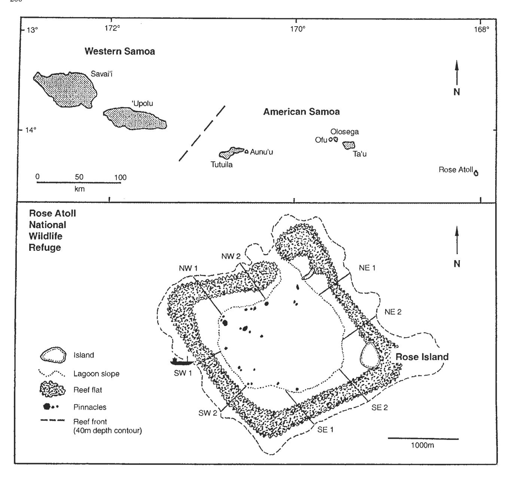
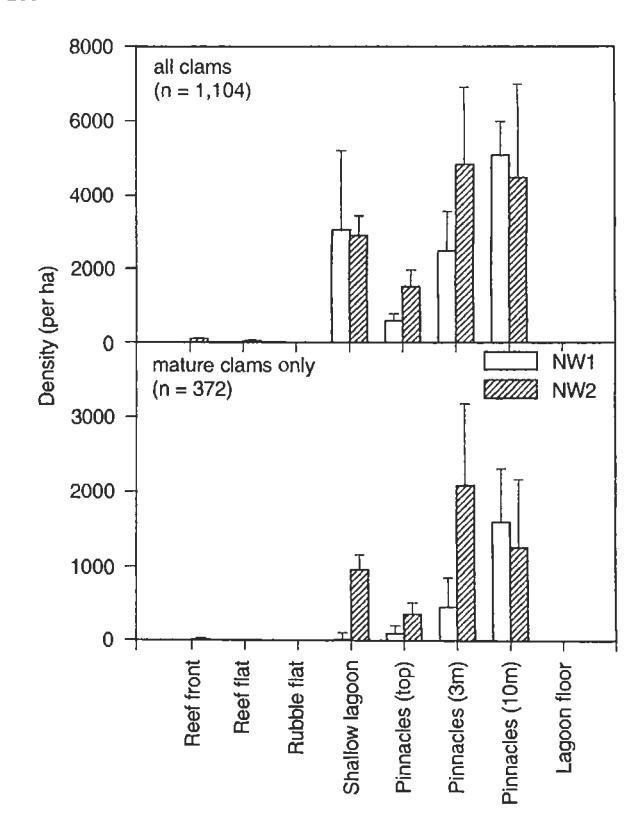
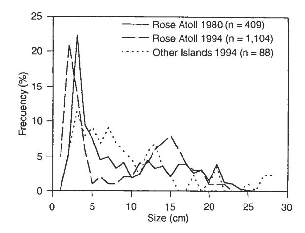
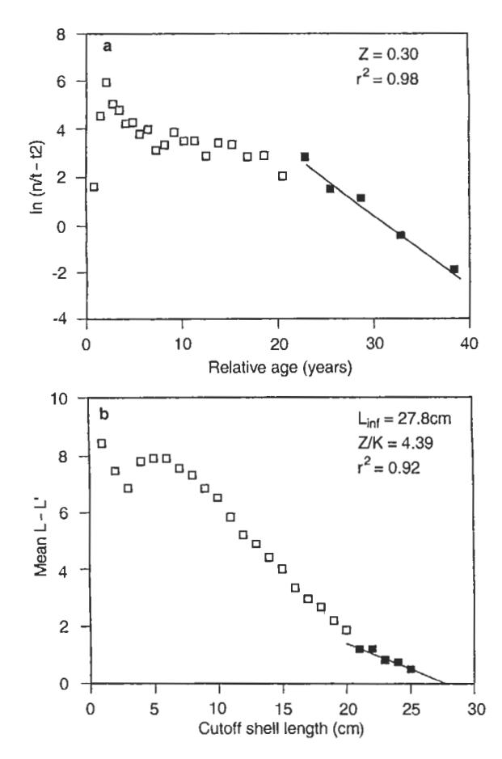
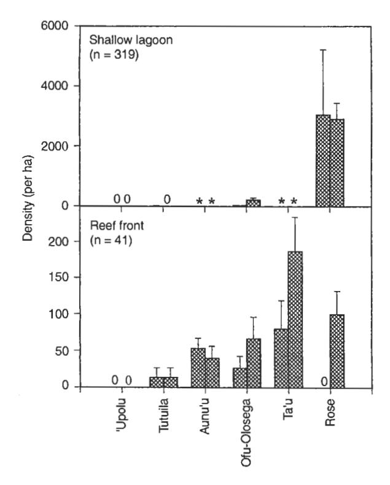

## REPORT

A. Green · P. Craig

# Population size and structure of giant clams at Rose Atoll, an important refuge in the Samoan Archipelago

Accepted: 18 March 1999

Abstract Rose Atoll is an important refuge for giant clams (Tridacna maxima) that have been heavily exploited elsewhere in Samoa. During an extensive survey of six islands in the archipelago (50.5 ha surveyed in 420 transects), 97% of a total of 2853 clams were recorded at the atoll (42% of area surveyed). Clam densities were highest in the atoll lagoon, especially bases of the pinnacles around the density =  $8870 \text{ ha}^{-1}$ ). Estimated population size for the small atoll (615 ha) was approximately 27800 clams. Twenty four percent of the population consisted of mature clams (≥ 12 cm), 70% of which occupied the pinnacles and shallow lagoon habitat. Estimated mortality was low (Z = 0.3) and primarily due to natural mortality (M = 0.3). Maximum recorded size ( $L_{max}$ ) and asymptotic mean size  $(L_{\infty})$  were 25.0 cm and 27.8 cm respectively.

Key words Giant clams · Refuge · Samoa · Stock size

# Introduction

Tridacnid clams are an important food item throughout the Indo-Pacific, but their accessibility and life history characteristics make them particularly vulnerable to over-harvesting (Munro 1993; Lucas 1994). The result is that many countries are now faced with the difficult task of managing this diminishing resource. In Samoa, giant clams (*Tridacna maxima and T. squamosa*) appear to have been severely depleted throughout much of the archipelago (Zann 1991;

Tuilagi and Green 1995) and their future is unclear. One concern is that the remaining individuals are now present in such low densities that their reproductive success and subsequent recruitment may be diminished (Zann 1991). An important factor in the conservation of these clams may be the existence of marine refuges where they are protected from anthropogenic effects. One such area in Samoa is Rose Atoll (Fig. 1).

Until recently, Rose Atoll was considered to be one of the smallest, most remote and least disturbed coral atolls in the world (UNEP/IUCN 1988). Fishing for giant clams has been prohibited since the atoll was designated a National Wildlife Refuge in 1974, but isolated instances of poaching have been reported. Although uninhabited, Rose has been visited by numerous scientific expeditions (Rodgers et al. 1993). Two unpublished reports have focused on giant clams, and both recorded only one species, T. maxima, which occurred in high densities (Wass 1981; Radtke 1985). Unfortunately, the pristine nature of the refuge was compromised by a ship grounding (Fig. 1) and associated fuel spill in 1993 (USFWS 1997). Despite substantial damage to the southwest side of the atoll, the ship grounding appears to have had only a minor impact on the clam population at Rose (USFWS 1997).

The literature contains few published reports on the dynamics of naturally occurring populations of *T. maxima* (e.g., McMichael 1975; Richard 1978, 1981). This species has the widest distribution of all tridacnids (Lucas 1994), and the published studies were done in widely separated locations in the Pacific: the Great Barrier Reef (McMichael 1975) and French Polynesia (Richard 1978, 1981). Rose Atoll provides an opportunity to obtain comparative data from a site located midway between these two locations.

The objectives of this study were twofold:

1. To examine a naturally occurring population of *T. maxima* at Rose Atoll, including a detailed examination of patterns of habitat use, abundance, size frequency and mortality rates.

A. Green¹ (⋈) · P. Craig²

Department of Marine and Wildlife Resources, Box 3730, Pago Pago, American Samoa 96799 USA

Present addresses:

1Great Barrier Reef Marine Park Authority, PO Box 1379, Townsville, O. 4810 Australia

2National Park of American Samoa, Pago Pago, American Samoa

2. To assess the importance of Rose Atoll as a refuge for *T. maxima* in Samoa by describing the patterns of distribution and abundance of giant clams throughout the archipelago.

# **Materials and methods**

#### Study area

The Samoan archipelago in the central South Pacific (13–14'S, 168–173°W) consists of 13 islands in two countries: Western and American Samoa (Fig. 1). This study was based on a survey of six of the main islands: 'Upolu, Tutuila, Aunu'u, Ofu-Olosega, Ta'u, and Rose. Ofu and Olosega were considered a single island, because they

Fig. 1 Samoan Archipelago showing the location of the main islands (top); and Rose Atoll showing the location of the study sites and the ship grounding (bottom)

are connected by a continuous reef. All but two of these islands have narrow (50-250 m) fringing coral reefs: 'Upolu has a barrier reef with a lagoon up to 2 km wide, and Rose is a small atoll (area = 615 ha).

The reef profile at Rose Atoll can be divided into easily recognized habitat zones (Rodgers et al. 1993 and Fig. 1). The reef front is dominated by crustose coralline algae and plunges steeply to a depth of 40 m. Wave exposure is high. The reef flat is a hard, consolidated substratum that is exposed during spring low tides and covered with coralline and other algae. The nearly enclosed lagoon consists of a shallow shelf comprised of patch reefs (= shallow lagoon) interspersed with a rubble flat, and a sandy lagoon floor 15 m deep with isolated Acropora patches. Lagoon pinnacles rise steeply from the lagoon floor to sea level and are encrusted by coralline algae and

a variety of hard and soft corals. Wave exposure in all lagoon habitats is low.

#### Survey procedures at Rose Atoll

Field surveys were completed during three trips to the atoll on 25–29 October 1994, 8–12 April 1995, and 5–16 August, 1995. Standardized procedures were used to survey clams in each of the habitat zones (see Study area) and exposures around the island (i.e., side of atoll: NE, NW, SE, SW: Fig. 1), where prevailing wind conditions are typically from the southeast. Where possible, two sites were sampled within each habitat/exposure using five replicate transects  $(50 \times 2 \text{ m})$  in size) laid end-to-end but separated by a distance of 5–10 m. Surveys could not be conducted on the reef front on the SE and NE sides of the atoll, due to rough sea conditions. Lagoon pinnacles (n = 14) were surveyed using a single transect  $(50 \times 2 \text{ m})$  in size where possible) at each of three depths: across the top (< 1 m), around the sides at 3 m, and around the base at 10 m.

All live clams were counted and measured (maximum shell length). The minimum size of clams reliably detected was 2 cm. Clams were considered to be sexually mature (i.e., functional as both males and females) at 12 cm, based on previous data collected at the atoll by Radtke (1985).

Distribution, abundance, size frequency and mortality of T. maxima at Rose Atoll

The distribution and abundance of clams among habitat zones were compared using data from the surveys at two sites on the NW side of the atoll in October 1994 (see survey procedures). Eight habitats were sampled: reef front (10 m depth), reef flat, shallow lagoon (1–3 m depth), rubble flat, lagoon floor and lagoon pinnacles at three depths (top, 3 m, 10 m). Surveys of the rubble flat and lagoon floor did not include isolated patch reefs. Clam densities were compared among habitats and sites using a two-way orthogonal design analysis of variance (ANOVA) with fixed habitats and nested sites. Habitat types where clams were rare or absent were excluded from the analysis, and data were transformed by log + 1 because of heterogeneity of variances. The size distribution of clams in this survey (sites and habitats combined) was also examined.

Population size on the atoll was estimated by measuring mean clam density in each habitat zone (see Study area), measuring the total area of each habitat (obtained by digitizing a 1994 aerial photograph), multiplying each area by the mean density for that habitat, and summing these totals for an overall population estimate. For this expansion, the mean density for each habitat type was calculated using the surveys from all four sides of the atoll (see Survey procedures).

Mortality estimates were calculated using the results of this and previous surveys of the atoll by Wass (1981) and Radtke (1985). Total mortality (Z), which equals natural mortality (M) plus fishing mortality (F), was estimated by calculating a length-converted 'catch curve' (Ricker 1975; Pauly 1983) based on length frequencies of clams measured during our surveys. For comparison, a second estimate of Z was derived using Hoenig's (1983) empirical relationship between a population's longevity and mortality using the maximum age  $(t_{max})$  as determined by Radtke (1985). The method of Wetherall (1986), as modified by Pauly (1986), provided an estimate of  $L_{\infty}$  and an independent estimate of Z/K (where K= a growth coefficient) for comparison with the values derived above. In this method, the relationship between the mean length of clams above a single cutoff length is compared to sequentially increasing cutoff lengths. An estimate of natural mortality (M) was obtained from Pauly's (1980) empirical relationship between natural mortality and mean environmental temperature using the average water temperStatus of giant clams throughout the archipelago

 $1-e^{-z}$  (Ricker 1975).

The importance of Rose Atoll as a refuge for giant clams was assessed by examining their patterns of distribution and abundance throughout the archipelago. Surveys were conducted from November 1994 to November 1995 using the same techniques used at Rose. The two species occurring on these islands (see Introduction) were combined because small individuals (2–3 cm) could not be identified to species by sight in the field.

ature in the lagoon (29°C). Total annual mortality was estimated as

Clams were surveyed in a series of three comparisons. Because islands other than Rose have fringing or barrier reefs, it was first necessary to examine patterns of habitat use on these reef types. This was done by comparing the clam densities in each of five habitats on two islands, Tutuila and Ofu-Olosega: reef flat (< 1 m deep), shallow lagoon (1-3 m deep), and the reef front at three depths (3 m, 10 m, 20 m). Second, we examined how clam densities varied with respect to four reef exposures on the reef front (10 m depth) on the large islands of Tutuila and 'Upolu. Only one site was surveyed on the SE side of 'Upolu due to rough weather conditions. Third, densities of giant clams among all islands (including Rose) were compared on the reef front (10 m depth) on the SW side of each of six islands: Rose, Ta'u, Ofu-Olosega, Aunu'u, Tutuila, and 'Upolu. Surveys were also done in the shallow lagoon on four of these islands where this habitat type was available (excluding Ta'u and Aunu'u). The size distribution of all the clams surveyed throughout the archipelago (sites and habitats combined) was determined, and compared with the size distribution of clams at Rose using a Kolmogorov-Smirnov test based on 1 cm size categories.

#### Results

A combined area of 50.5 ha was surveyed on six islands in the Samoan archipelago (n = 420 transects), and 2853 giant clams were recorded. Most clams were recorded at Rose Atoll (97%), which accounted for only 42% of the area surveyed.

Distribution, abundance, and size frequency of T. maxima at Rose Atoll

There were clear patterns of distribution and abundance of clams among habitat zones on the NW side of the atoll (Fig. 2). Highest densities were recorded in the shallow lagoon and on the pinnacles, although variation among pinnacles was high (range 300-11600 clams ha-1). There was no significant difference in the density of clams at each of three depths on the pinnacles and in the shallow lagoon (Table 1), probably because of the high variation among transects within habitats (Fig. 2). Clams were rare or absent on the reef front, reef flat, rubble flat and lagoon floor. Mature individuals showed similar patterns of habitat use, with most recorded on the pinnacles and in the shallow lagoon (Fig. 2). About half (46%) the clams recorded in the survey were recent recruits ≤ 5 cm (Fig. 3), while 34% were considered to be mature (i.e.,  $\geq 12$  cm). Maximum size was 25 cm.

Fig. 2 Mean densities ( $\pm$  SE) of T. maxima in eight habitat zones at two sites on the NW side of Rose Atoll. Note different y axes, and n = number of clams counted

Table 1 Two-way orthogonal design analysis of variance testing of the influence of habitat (fixed factor) and site (random factor) on clam density at Rose Atoll, American Samoa

|              | df | MS   | F    | P      |
|--------------|----|------|------|--------|
| Habitat      | 3  | 0.69 | 3.17 | 0.1845 |
| Site         | 1  | 0.28 | 1.97 | 0.1696 |
| Habitat*site | 3  | 0.22 | 1.55 | 0.2216 |
| Error        | 32 | 0.14 |      |        |
| Total        | 39 |      |      |        |

## Population size of T. maxima at Rose Atoll

By expanding clam densities in each habitat to the total amount of that habitat represented at Rose Atoll, we estimated that the atoll supported about 27 800  $\pm$  8360 clams (Table 2). Many of these individuals (55%) were estimated to be on the reef flat despite the low densities of clams in this habitat, because the area was large (47% of total). In contrast, the pinnacles comprised a small area (0.2% of total) but accounted for 31% of all individuals because of their high clam densities. Based on this expansion, 24% of the population was estimated to be mature ( $\geq$ 12 cm), 70% of which inhabited the pinnacles and shallow lagoon.

Fig. 3 Length frequency of *T. maxima* at Rose Atoll in 1980 (from Wass 1981) and in 1994 (this study), and of *Tridacna* spp. on the other islands in the archipelago in 1994 (this study)

# Mortality of T. maxima at Rose Atoll

Mortality rates derived in this study provide general estimates of total (Z), natural (M) and fishing (F) mortalities, where Z = M + F. Total mortality of clams was relatively low (Z = 0.30) based on a length-converted 'catch curve' (Fig. 4a), using input variables of K = 0.065 (from Radtke 1985) and  $L_{\infty} = 27.8$  cm (calculated using Wetherall's method: Fig. 4b). Wetherall's (1986) method also provided an estimate of Z/K = 4.4, a ratio that is consistent with the values obtained for Z and K (Z/K = 4.6). A similar value (Z = 0.23) was obtained using Hoenig's (1983) equation and a maximum recorded age of 18 from Radtke (1985). Natural mortality was estimated as M = 0.3 from Pauly's (1986) equation, a value equal to the estimates of total mortality (Z) calculated above. Fishing mortality (F)is thus negligible at Rose Atoll according to these estimates.

Status of clam populations throughout the archipelago

Despite the large area surveyed on islands other than Rose Atoll (29.3 ha), only 88 *Tridacna* were recorded. These results show that with the exception of Rose Atoll (see earlier), giant clams are uncommon throughout the archipelago.

Statistical comparisons of the distribution and abundance of clams throughout the archipelago were limited by the small number of individuals observed on the islands other than Rose. For example, clams were relatively rare in each of the five habitat types examined (reef flat, shallow lagoon, and reef front at 3 m, 10 m, and 20 m) on both Tutuila (n = 4 clams recorded on 50 transects) and Ofu-Olosega (n = 32 clams on 50

| Table 2 Habitat area, clam density, and total number of clams at Rose Atoll, American Samoa, where: n = 2765 clams surveyed, and the |
|--------------------------------------------------------------------------------------------------------------------------------------|
| survey area = 21.3 ha                                                                                                                |

| Habitat            | Total area (ha) | Number of transects | Density of clams per ha ( ± SE) | Density of mature clams per ha ( ± SE) | Total number of clams ( ± SE) | Total number of mature clams ( ± SE) |
|--------------------|-----------------|---------------------|---------------------------------------|----------------------------------------------|-------------------------------|--------------------------------------|
| Reef front         | 20.9            | 20                  | 25 (12)                               | 5 (5)                                        | 523 (251)                     | 105 (105)                            |
| Reef flat          | 286.1           | 40                  | 53 (19)                               | 7 (4)                                        | 15 259 (5,408)                | 1907 (1,143)                         |
| Rubble flat        | 78.9            | 40                  | 0 (0)                                 | 0 (0)                                        | 0 (0)                         | 0 (0)                                |
| Shallow lagoon     | 1.6             | 40                  | 2121 (331)                            | 870 (182)                                    | 3394 (529)                    | 1392 (291)                           |
| Deep lagoon        | 226.0           | 40                  | (0)                                   | 0 (0)                                        | 0 (0)                         | 0 (0)                                |
| Pinnacles (top)    | 0.4             | 14                  | 951 (284)                             | 369 (172)                                    | 380 (114)                     | 148 (69)                             |
| Pinnacles (0-5m)   | 0.4             | 14                  | 5198 (1,245)                          | 2218 (646)                                   | 2079 (498)                    | 887 (259)                            |
| Pinnacles (5-15 m) | 0.7             | 14                  | 8871 (2,222)                          | 3261 (957)                                   | 6210 (1,556)                  | 2283 (670)                           |
| Total              | 615.0           | 222                 |                                       |                                              | 27 845 (8,356)                | 6 722 (2,537)                        |

Fig. 4a,b Length frequency analyses of T. maxima at Rose Atoll, 1994-95: a length-converted 'catch curve' used to calculate total mortality (Z) based on K=0.065 and  $L_{\infty}=27.8$  cm; and **b** a Weth-crall plot of the same data used to calculate  $L_{\infty}$  and the ratio Z/K. A linear regression line was fitted to the darkened points in each plot

transects). Comparisons of clam densities among four island exposures (NE, NW, SW, SE) were similarly restricted on both Tutuila (n = 12 clams on 40 transects) and 'Upolu (n = 15 clams on 35 transects).

To compare clam densities throughout the archipelago with those at Rose Atoll, two habitats common to most islands were selected: shallow lagoons (1–3 m deep) and the reef front (10 m depth). In the shallow lagoon habitat, densities were clearly highest at Rose (Fig. 5), with clams present in much lower densities on Ofu-Olosega and rare or absent on the other islands. There was a less pronounced trend in densities among islands on the reef front (Fig. 5). However, this result should be interpreted with caution because of the low number of individuals recorded in this habitat type.

The size frequency of the clams in the archipelago sample (Fig. 3) did not differ significantly from that recorded at Rose Atoll (Kolmogorov-Smirnov test statistic = 0.13, P = 0.11). The largest recorded size of T. maxima was 27 cm, which was higher than that recorded at Rose.

#### **Discussion**

Is Rose Atoll a refuge for giant clams in Samoa?

In general terms, a marine refuge is a protected area that maintains a viable population of organisms, which may contribute recruits to surrounding areas. Rose Atoll satisfies at least the first part of this role. The atoll supports a uniquely abundant population of giant clams within the Samoan Archipelago, accounting for 97% of all the clams recorded on the six islands surveyed. More importantly, 93% of all the mature clams were recorded at Rose. Despite its small size, the atoll supports a population of about 27 800 *T. maxima*, of which about 6700 form a brood stock of mature clams located in an isolated and legally protected environment.

Several lines of evidence indicate that Rose Atoll has a relatively undisturbed population of T. maxima. First, the ship grounding appears to have had only a minor effect on the clam population (<1% died: USFWS 1997). Second, our estimate of natural mortality (M) approximates total mortality (Z) at Rose, which

Fig. 5 Mean densities ( $\pm$  SE) of *Tridacna* spp. in the shallow lagoons (1-3 m deep, Top) and on the reef front (10 m deep, Bottom) at each of two sites on four to six islands in the archipelago. Note different y axes, n = number of clams counted, and \* = habitat type not present

suggests that poaching is not a major issue in the refuge. Third, population parameters ( $L_{max}$ ,  $L_{\infty}$  and Z) for these clams have remained relatively consistent over the past 14 y: 1980 ( $L_{max} = 23.5$  cm;  $L_{\infty} = 24.7$  cm; Z = 0.20: recalculated from Wass 1981), 1982 (24.0 cm, 29.4 cm, Z = 0.26: Radtke 1985), and 1994 (25.0 cm, 27.8 cm, Z = 0.23-0.30: this study). The size distribution of clams at Rose also appears to have been relatively stable over the last 14 y (Fig. 3).

It is likely that *T. maxima* densities have always been highest at Rose Atoll, because suitable habitat for this species appears to be limited elsewhere in the archipelago. This is especially true in American Samoa, where most narrow fringing reefs lack the lagoon habitats that account for most *T. maxima* at the atoll. But this was not the case in barrier reef system of Western Samoa, where there are abundant lagoon habitats. Similarly, this does not account for the low abundance of the other clam species in the archipelago, *T. squamosa*, which was also included in our survey.

Given that giant clams are highly prized by Samoans, it seems likely that fishing pressure has contributed to the low levels of clam stocks throughout most of the archipelago. For example, a recent interview survey found that the population of giant clams has decreased substantially on Tutuila in the memory of local fisher-

men (Tuilagi and Green 1995). This information is consistent with local fisheries statistics, which show a decline in the harvest of giant clams over the last two decades (Ponwith 1991; Zann 1991). A more circumstantial line of evidence is the inverse relationship between the density of clams and the size of the human population on the islands in the archipelago. Rose Atoll is uninhabited and has a large population of giant clams, Tutuila and Upolu have the highest human populations and lowest clam densities, and the remaining islands are intermediate in both respects. Fishing impacts have probably been exacerbated by habitat degradation in recent years due to hurricanes, a severe infestation of the crown-of-thorns starfish (Acanthaster planci), and a mass coral bleaching event (Birkeland et al. 1996; Green 1996).

Does Rose Atoll act as a source of larval recruits to the rest of the archipelago? Clam recruitment continues throughout the archipelago, but densities of recruits are low (Fig. 3). Do these recruits originate from nearby but scarce adults, or are they coming from Rose Atoll? The latter is theoretically possible. Water currents flow westward from Rose towards the rest of the archipelago at a speed of approximately 26 km day-1 (Couper 1983; H. Krock personal communication). Given that giant clams have a larval life of about 8 days (range 5–15 days: Munro 1993), some larvae from Rose Atoll might be able to reach the nearest islands in 6–10 days (see Fig. 1). Further studies of local hydrology, fertilization ecology, larval biology and clam genetics would be required to answer this question.

Distribution, abundance, size frequency and mortality of *T. maxima* at Rose Atoll

The results of this study support the suggestion that giant clam populations are probably maintained at a low turnover rate, with low mortality and slow growth (Lucas 1994). Natural clam mortality (M=0.3) and the growth coefficient (K=0.1: from Radtke 1985) were both low at Rose, although our estimate of annual mortality (26%) was slightly higher than a previous estimate for this species on the Great Barrier Reef (19%: Lucas 1994). Asymptotic mean size ( $L_{\infty}=27.8$ ) was within the range reported for T. maxima elsewhere throughout its wide distribution ( $L_{\infty}=12.4$ -30.5 cm: summarized by Munro 1993; Lucas 1994).

Our population estimate of 27800 clams at Rose Atoll is dramatically lower than the 1340000 individuals that Radtke (1985) calculated were on the atoll 10 y ago. However, we believe that the difference in estimates does not reflect a population decline but is rather the result of differences in sampling designs between the two studies. This suggestion is supported by the fact that mean clam densities recorded in the habitats that account for most of the clams at Rose were the same in both studies: shallow lagoons (0.2)

clams m-2) and the bases of the pinnacles (0.9 clams m-2). It is difficult to reconstruct exactly how the 1984 estimate was made, although we believe that our estimate is more realistic for two reasons. First, the earlier study surveyed habitats with the highest clam densities and then expanded those numbers to areas with substantially lower densities. Second, our survey was much more intensive including all habitat zones and an area more than seven times larger than that surveyed in the earlier study.

Though the clam population at Rose is locally important (see earlier), it is small compared to the 1-14 million individuals estimated to inhabit much larger reefs elsewhere throughout its range (McMichael 1975; Richard 1978; Hirschberger 1980). However, clam densities at Rose (up to 11 600 per ha) were high compared to those recorded on the Great Barrier Reef, Tonga, and Micronesia (200–8000 per ha), but much lower than the extraordinarily high densities reported in French Polynesia and the Cook Islands (up to 700 000 per ha) as summarized by Lucas (1994).

Patterns of habitat use by T. maxima at Rose Atoll are similar to those reported for this species from other locations in the Central and Eastern Pacific (McKoy 1980; Richard 1978), where it is abundant in lagoon habitats. In contrast, this species is more abundant in other habitat types in the Western Pacific, such as the reef flat or reef front (McMichael 1975; Hardy and Hardy 1969; Hester and Jones 1974). These differences in habitat use are not unexpected, given that this species is known to show high genetic variability and other behavioral differences throughout its range (Benzie 1993; Lucas 1994).

Acknowledgements We thank F. Tuilagi, E. Henry, J. Craig, M. Letuane, M. Goldin, R. Cook, the crews of the *Manuatele* and *Sausaumoana*, and the Fisheries Department of Western Samoa for field assistance and logistic support. We are also grateful to N. Moltschaniwskyj and V. Hall for statistical advice, N. Daschbach for preparing Fig. 1, B. Taylor for digitizing assistance, H. Krock for information on ocean currents, and T. Hughes, V. Nelson and several anonymous reviewers for commenting on the manuscript.

## References

Benzie JAH (1993) Genetics of giant clams: an overview. In: Fitt WK (ed) Biology and mariculture of giant clams. ACIAR Proc 47, Aust Cent Int Agricult Res, Canberra, pp 7-13

Birkeland CR, Randall R, Green AL, Smith B, Wilkens S (1996)
Changes in the coral reef communities of Fagatele Bay National
Marine Sanctuary and Tutuila Island (American Samoa) over
the last two decades. NOAA Report, US Department of Commerce, Washington D.C., pp 1-225

Couper A (1983) The Times atlas of the oceans. Van Nostrand Reinhold Co., New York

Green AL (1996) Status of the coral reefs of the Samoan Archipelago. Dept Mar Wildl Res Rep Ser, Pago Pago, American Samoa, pp 1-125 Hardy JT, Hardy SA (1969) Ecology of *Tridacna* in Palau. Pac Sci 23:467-472

Hester FJ, Jones EC (1974) A survey of giant clams, Tridacnidae, on Helen Reef, a western Pacific atoll. Mar Fish Rev 36(7): 17-22.

Hirschberger W (1980) Tridacnid clam stocks on Helen Reef, Palau, Western Caroline Islands. Mar Fish Rev 42:8-15

Hoenig J (1983) Empirical use of longevity data to estimate mortality rates. Fish Bull 82:898-903

Lucas JS (1994) The biology, exploitation, and mariculture of giant clams (Tridacnidae). Rev Fish Sci 2:181-223

McKoy JL (1980) Biology, exploitation and management of giant clams (Tridacnidae) in the Kingdom of Tonga. Fish Bull 1, Fish Div Tonga, pp 1-61

McMichael DF (1975) Growth rate, population size and mantle coloration in the small giant clam *Tridacna maxima* (Roding), at One Tree Island, Capricorn Group, Queensland. Proc 2nd Int Coral Reef Symp 1:241-254

Munro JL (1993) Giant clams. In: Wright A, Hill L. (eds) Nearshore marine resources of the South Pacific. Inst Pac Studies (Fiji), Forum Fish Agency (Honiara) and International Centre for Ocean Development (Canada), pp 431-449

Pauly D (1980) On the interrelationships between natural mortality, growth parameters and mean environmental temperature in 175 fish stocks. J Cons Int Explor Mer 39:175-192

Pauly D (1983) Some simple methods for the assessment of tropical fish stocks. Food and Agriculture Organization, United Nations (Rome), FAO Fish Tech Pap 234, pp 1-52

Pauly D (1986) On improving operation and use of the ELEFAN programme. Part 2. Improving the estimation of  $L_{\infty}$ . Fishbyte 4: 18-20

Ponwith B (1991) The shoreline fishery of American Samoa: a 12year comparison. Dep Mar Wildl Res Biol Rep Ser 23, Pago Pago, American Samoa, pp 1-51

Radtke R (1985) Population dynamics of the giant clam, Tridacna maxima, at Rose Atoll. Technical Report, Hawaii Inst Mar Biol, Univ Hawaii, pp 1-24

Richard G (1978) Quantitative balance and production of *Tridacna*maxima in the Takapoto lagoon (French Polynesia). Proc 3rd Int
Coral Reef Symp 1:599-605

Richard G (1981) A first evaluation of the findings on the growth and reproduction of lagoon and reef molluses in French Polynesia. Proc 4th Int Coral Reef Symp 2:637-641

Ricker W (1975) Computation and interpretation of biological statistics of fish populations. Bull Fish Res Board Can 191:1-382

Rodgers KA, McAllan IA, Cantrell C, Ponwith BJ (1993) Rose Atoll: an annotated bibliography. Tech Rep Aust Mus, Sydney 9:1-37

Tuilagi F, Green A (1995) Community perception of changes in coral reef fisheries in American Samoa. Forum Fish Agency/South Pac Comm Workshop, Management of South Pacific Inshore Fisheries, 26 June-7 July 1995, New Caledonia, pp 1-8

UNEP/IUCN (1988) Coral reefs of the world. Volume 3: Central and Western Pacific. UNEP Regional Seas Directories and Bibliog, IUCN, Gland, Switzerland and Cambridge, UK/UNEP, Nairobi, Kenya, pp 1-329

USFWS (1997) The impact of a ship grounding and associated fuel spill at Rose Atoll National Wildlife Refuge, American Samoa. US Fish and Wildlife Service Report, Honolulu, Hawaii, pp 1-60

Wass RC (1981) The *Tridacna* clams of Rose Atoll. Dept Mar Wildl Res Biol Rep Ser 4, Pago Pago, American Samoa, pp 1-9

Wetherall J (1986) A new method for estimating growth and mortality parameters from length-frequency data. Fishbyte 4:12-14

Zann LP (1991) The inshore resources of Upolu, Western Samoa: coastal inventory and fisheries database. Field Rep 5, FAO/UNDP Project SAM/89/002, Apia, Western Samoa.