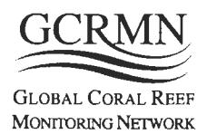
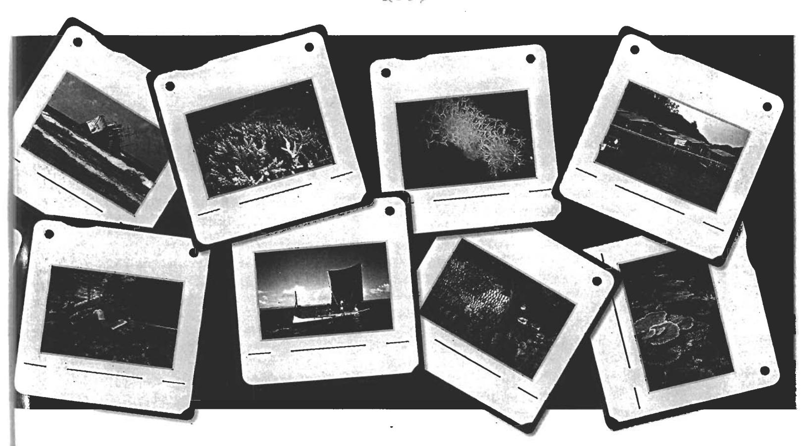
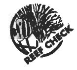
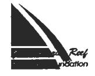
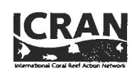
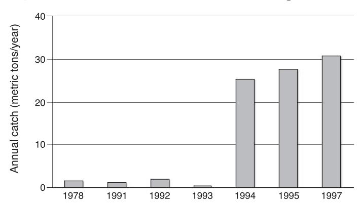
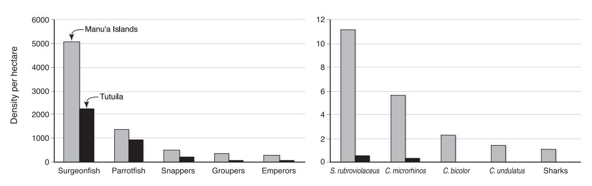

# MONITORING CORAL REEF MARINE PROTECTED AREAS

Clive Wilkinson, Alison Green, Jeanine Almany and Shannon Dionne

VERSION 1

2003

A PRACTICAL GUIDE ON HOW MONITORING CAN SUPPORT EFFECTIVE MANAGEMENT OF MPAS

The research reported herein is based on early analyses of complex data sets and should not be considered definitive in all cases. Institutions or individuals interested in all consequences or applications of this research are invited to contact the authors.

Acknowledgements: Special thanks go to all those people who contributed case studies and other material. Support for this book came from the US Department of State, the National Oceanographic and Atmospheric Administration and AIMS. Additional funds were provided by the IUCN Marine Programme, the ICRAN project, Ministry of the Environment, Japan, and the Great Barrier Reef Research Foundation. UNEP, IOC-UNESCO, IUCN, the World Bank, the Convention on Biological Diversity; AIMS, WorldFish Center and the ICRI Secretariat support the GCRMN as the Management Group. Anne Caillaud, Jos Hill, Will Oxley and Madeleine Nowak assisted with proof reading. Finally, we owe a special vote of thanks to the Science Communication team at AIMS - Steve Clarke and Wendy Ellery; they turned chaos into this valuable product – thank you.

© Australian Institute of Marine Science and the IUCN Marine Program, 2003

#### Australian Institute of Marine Science

PMB No 3, Townsville MC Qld 4810 Australia Telephone +61 7 4753 4444 Facsimile +61 7 4772 5852 bookshop@aims.gov.au www.aims.gov.au

#### **IUCN Global Marine Program**

Rue Mauverney 28 Gland 1196, Switzerland Telephone +41 22 999 0204 Facsimile + 41 22 999 0020 email: info@books.iucn.org www.iucn.org

ISBN 0 642 32228 7

Cover Photographs from right to left, top to bottom from the front: Pulau Redang fishing village, Malaysia (Chou Loke Ming); flourishing table *Acropora* corals on Great Barrier Reef (Lyndon Devantier); *Eleutherobia aurea*, endemic soft coral, St Lucia MPA, South Africa (Michael Schleyer); coral reef shells for sale, Tanzania (David Obura); flourishing branching *Acropora* corals on GBR (Lyndon Devantier); children in dugout canoe, Toliana Madagascar (Pierre Vasseur); shipwreck on Rose Atoll, American Samoa (James Maragos); scientists monitoring the GBR (AIMS); Carrie Bow Cay research station, Belize (Clive Wilkinson); beach on Ant Atoll, Federated States of Micronesia (Clive Wilkinson); repairing fine mesh fishing nets, Kenya (David Obura); women and children gleaning on coral reef flats in Toliana, Madagascar (Pierre Vasseur); monitoring deep reefs in the Bahamas (Clive Wilkinson); plague of crown-of-thorns starfish on the GBR (Peter Moran); spearfishing on coral reef flats East Africa (Bernard Salvat); Buginese (sea gypsy) fishing boat in Indonesia (Sue English).

## CaseStudy 13

## AMERICAN SAMOA BANS DESTRUCTIVE SCUBA FISHERY: THE ROLE OF MONITORING IN MANAGEMENT

#### ALISON GREEN

### The challenge

It was important to act decisively when a new, high technology commercial fi shery became established (the night-time scuba fi shery) in the mid 1990s on the main island of Tutuila, American Samoa. This island is heavily populated and fi shed by artisanal and subsistence fi shermen. The new fi shery, which dramatically increased the catch of reef fi shes on the island, posed a new threat to both fi sh populations and local fi sheries. Urgent action was required to stop this fi shery, but there was not enough time for a detailed assessment to be done. Local managers and scientists acted with the best available information, based on long-term monitoring of the fi shery and fi sh populations.

### What was done?

American Samoa has three long-term monitoring programs: two programs in Pago Pago Harbor and Fagatele Bay National Marine Sanctuary (since 1917 and 1985 respectively); and broad-scale surveys of the reefs throughout the Territory since 1996. These surveys have been conducted by visiting scientists (C. Birkeland and A. Green) since 1985 and 1994 respectively.

The government Department of Marine and Wildlife Resources has also monitored the coral reef fi sheries intermittently for many years, and was the fi rst to show that there was a problem with the scuba fi shery.

*There has been a dramatic (15 times) increase in catch of reef fi sh, especially parrotfi shes, since the scuba fi shery started operating. Parrotfi shes are heavily targeted by this fi shery.* 

This information led local managers to hold public meetings to discuss banning this fi shery, and they invited the visiting scientists to present their survey results. The scientists observed that there was an alarming decline in the reef fi sh populations on Tutuila since the scuba fi shery had commenced. The scientists, however, reported that it would be more than a year before quantitative data would be available to support their observations. They agreed that the situation was too severe to wait for more information, and supported banning the scuba fi shery immediately. The local community also reported that subsistence fi shing had become more diffi cult in recent years since the scuba fi shery commenced. The perception was that teams of nighttime scuba fi shermen were working their way around the island, systematically wiping out reef fi sh populations.

The scuba fi shery was banned by Executive Order by the Governor of American Samoa in April 2001 (and subsequently banned by regulation in January 2002) due to concerns that this greatly increased catch rate would lead to overfi shing of the reef fi sh populations. A recent survey confi rmed that the reef fi sh populations on Tutuila are more heavily affected by fi shing than those on the adjacent Manu'a Islands (where this fi shery did not become established, and fi shing pressure is lower), and that the local government did the right thing in banning this highly effi cient fi shery.

#### For example:

- � Densities of the fi ve major fi sheries families (including parrotfi shes) are lower on Tutuila than in the Manu'a Islands; and
- � Large reef fi shes that are particularly vulnerable to overfi shing, such as large parrotfi sh (*Cetoscarus bicolor, Chlorurus microrhinus*, and *Scarus rubroviolaceus*), maori wrasse (*Cheilinus undulatus*) and sharks are now absent or rare on Tutuila, but are still present in Manu'a.

## How successful has it been?

The coral reef and fi sheries monitoring programs have been very successful in assisting the local government in banning this destructive fi shery. Recent monitoring data show that local managers did the right thing in banning this highly effi cient fi shery before fi sh stocks were seriously overfi shed on Tutuila. If they had waited another 18 months for more rigorous scientifi c evidence before they acted, the fi shery would have continued and probably resulted in more serious impacts on the fi sh populations.

*Left: This shows that the density of the fi ve major fi sheries families are very different on Manu'a Islands compared to Tutuila where fi shing pressure is higher (see Green 2002).*

*Right: The density of large reef fi sh species is also lower on Tutuila than in the Manu'a Islands (see Green 2002).* 

Local enforcement offi cers report that there has been little or no scuba fi shing around Tutuila since the ban. However, this fi shery has not stopped it merely displaced to neighbouring Samoa, which has subsequently banned the fi shery (through traditional bans and new fi sheries legislation). It is likely that this fi shery will move to other Pacifi c countries.

#### Lessons learned and recommendations

- � The night-time scuba fi shery is highly effi cient, and poses a major threat to coral reef fi shes (particularly parrotfi shes). This fi shery should not be allowed to operate in an uncontrolled manner, because scuba fi shing will quickly overfi sh local fi sheries resources, and recovery may take decades (if at all);
- � Monitoring can play an important role in fi sheries management. On Tutuila, two types of monitoring programs contributed to banning a destructive fi shery: monitoring both the fi sheries catches; and the reef fi sh populations;
- � Scientists and managers should not wait until more information is available, but should take the precautionary approach and act decisively to protect their resources if there is reasonable justifi cation;
- � Management actions can be most effective when supported by relevant stakeholders, including managers, scientists and the local community.

## References

Green AL (2002) Status of coral reefs on the main volcanic islands of American Samoa: a resurvey of longterm monitoring sites (benthic communities, fi sh communities, and key macroinvertebrates). Dept Mar Wildl Resources Biol Rep Ser, PO Box 3730, Pago Pago, American Samoa. 86799, 87 pp

Page M (1998) The biology, community structure, growth and artisanal catch of parrotfi shes of American Samoa. Dept Mar Wildl Resources Biol Rep Ser, PO Box 3730, Pago Pago, American Samoa. 86799, 87 pp

## Contact

Alison Green, The Nature Conservancy, PO Box 772, Townsville 4810 Australia; agreen@tnc.org