# **JGR** Solid Earth

#### RESEARCH ARTICLE

10.1029/2018JB017110

#### **Key Points:**

- After the 2009 earthquake, Samoa islands entered a new era of exacerbated (3-6 times faster) sea level rise due to ongoing land subsidence
- Constructive interference of viscoelastic relaxation from megathrust and normal faulting intensified the postseismic subsidence
- A viscoelastic relaxation model, constrained by GRACE and GPS data, is used to unravel the observed relative sea level changes

#### **Supporting Information:**

· Supporting Information S1

#### Correspondence to:

S.-C. Han, shin-chan.han@newcastle.edu.au

#### Citation:

Han, S.-C., Sauber, J., Pollitz, F., & Ray, R. (2019). Sea level rise in the Samoan Islands escalated by viscoelastic relaxation after the 2009 Samoa-Tonga earthquake. *Journal of Geophysical Research: Solid Earth*, 124, 4142–4156. https://doi.org/10.1029/2018JB017110

Received 28 NOV 2018 Accepted 24 MAR 2019 Accepted article online 28 MAR 2019 Published online 15 APR 2019

# ©2019. The Authors.

This is an open access article under the terms of the Creative Commons Attribution-NonCommercial-NoDerivs License, which permits use and distribution in any medium, provided the original work is properly cited, the use is non-commercial and no modifications or adaptations are made.

# Sea Level Rise in the Samoan Islands Escalated by Viscoelastic Relaxation After the 2009 Samoa-Tonga Earthquake

Shin-Chan Han1, Jeanne Sauber2, Fred Pollitz3, and Richard Ray2

1School of Engineering, University of Newcastle, Callaghan, New South Wales, Australia, 2NASA Goddard Space Flight Center, Greenbelt, MD, USA, 3United States Geological Survey, Menlo Park, CA, USA

**Abstract** The Samoan islands are an archipelago hosting a quarter million people mostly residing in three major islands, Savai'i and Upolu (Samoa), and Tutuila (American Samoa). The islands have experienced sea level rise by 2-3 mm/year during the last half century. The rate, however, has dramatically increased following the  $M_w$  8.1 Samoa-Tonga earthquake doublet (megathrust + normal faulting) in September 2009. Since the earthquake, we found large-scale gravity increase (0.5 μGal/year) around the islands and ongoing subsidence (8-16 mm/year) of the islands from our analysis of Gravity Recovery And Climate Experiment gravity and GPS displacement data. The postseismic horizontal displacement is faster in Samoa, while the postseismic subsidence rate is considerably larger in American Samoa. The analysis of local tide gauge records and satellite altimeter data also identified that the relative sea level rise becomes faster by 7-9 mm/year in American Samoa than Samoa. A simple viscoelastic model with a Maxwell viscosity of 2-3×1018 Pa s for the asthenosphere explained postseismic deformation at nearby GPS sites as well as Gravity Recovery And Climate Experiment gravity change. It is found that the constructive interference of viscoelastic relaxation from both megathrust and normal faulting has intensified the postseismic subsidence at American Samoa, causing ~5 times faster sea level rise than the global average. Our model indicates that this trend is likely to continue for decades and result in sea level rise of 30-40 cm, which is independent of and in addition to anticipated climate-related sea level rise. It will worsen coastal flooding on the islands leading to regular nuisance flooding.

## 1. Introduction

The Samoan islands are a volcanic chain ~200 km away from the northern termination of the Tonga subduction zone. The downgoing Pacific plate and the Lau basin are converging across northern Tonga at an unusually fast rate of ~20 cm/year on a highly curved interface (Millen & Hamburger, 1998; Bevis et al., 1995; Bletery et al., 2016). In the Tonga subduction zone, plate bending and extensional stresses in the outer trench region are associated with a weakly coupled plate interface. The region generally lacks great earthquakes despite a high level of moderate seismicity (Bonnardot et al., 2007; Stern, 2002). Historically, the last great earthquake and tsunami occurred in the northern Tonga region in 1917 and the earthquake was hypothesized to be a megathrust type event (Okal et al., 2011).

On 29 September 2009, a complex earthquake doublet with a moment magnitude of  $M_w$  8.1 occurred at the northern end of the Tonga subduction zone. The resulting tsunami caused ~200 casualties in the Samoan Islands. Two contrasting interpretations have been suggested to describe the timing, sources, and triggering mechanisms of faulting associated with this near-simultaneous megathrust and normal fault earthquake. Geodetic analysis such as Beavan et al. (2010) suggests the normal fault was statically triggered by the slow megathrust (tsunami earthquake), while seismic results such as Lay et al. (2010) favor an interpretation of a dynamically ruptured thrust earthquake shortly after the normal fault. The moment magnitudes of both subevents were about the same and ranged from  $M_w$  8.0 to 8.1 for each subevent (Fan et al., 2016).

Great earthquakes cause massive deformation and density perturbation over broad regions and are often followed by time-dependent deformation of the solid Earth. Based on analysis of gravity field measurements from the Gravity Recovery And Climate Experiment (GRACE) satellites (Watkins et al., 2015), a number of great earthquakes have been studied using this synoptic gravity data and the results have provided new insights into seismic cycle processes at subduction zones (e.g., Han et al., 2013, and references therein). The postseismic vertical motions of the ocean floor associated with viscoelastic mantle relaxation were

consistently observed after nearly all great earthquakes with different types of faulting (thrust, normal faults, and strike-slip events) during the GRACE era of 2002–2017 (e.g., Han et al., 2016, and references therein).

Although earthquakes of the size of the 2009 Samoa-Tonga earthquake are near the detection threshold of GRACE gravity measurements, this event showed a significant postseismic response in the gravity change data. Here we report on our analysis and modeling of postseismic deformation using GRACE gravity data and continuous GPS displacement. We discuss implications of the postseismic ground deformation on apparent (relative) sea level change in the Samoan Islands using satellite altimeter and tide gauge data prior to and following the 2009 earthquake. Finally, we discuss the increased likelihood of nuisance (tidal) flooding in American Samoa predicted within the next decade, caused by postseismic ground subsidence.

## 2. GRACE Measurements of Gravity Change

We computed gravity changes from a monthly time series of spherical harmonic coefficients, also known as GRACE Level-2 (L2) data products. We examined five independent solutions processed by different groups including Center for Space Research at University of Texas (CSR), German Research Centre for Geosciences (GFZ), Jet Propulsion Laboratory (JPL), Institute of Theoretical Geodesy at Technical University of Graz (ITG), and the French Space Geodesy Research Group. Technical descriptions of GRACE gravity solutions are provided in GRACE L2 documents and related publications (Bettadpur, 2012; Dahle et al., 2013; Lemoine et al., 2015; Mayer-Gürr et al., 2016; Watkins & Yuan, 2014). The L2 data sets are publicly available from GRACE Tellus and International Centre for Global Earth Models (ICGEM) websites http://icgem.gfz-potsdam.de/series and are shown in detail in the supporting information.

We used the geopotential coefficients up to degree and order 50 and applied a tapering to mitigate the ringing effect caused by spherical harmonic truncation. At effective spatial scales of 400 km and larger (equivalent to the maximum spherical harmonic degree of 50), monthly mass variations can be determined from GRACE with an accuracy of ~2 cm in equivalent water height or  $1-2~\mu Gal~(1~\mu Gal=10^{-8}~m/s^2)$  in surface gravity change (Han et al., 2013; Sakumura et al., 2014). The atmosphere and ocean mass changes are usually removed from the GRACE gravity solutions using the atmosphere and ocean dealiasing (AOD) models constructed by coupled computation of the ocean model, Ocean Model for Circulation and Tides (OMCT), and the atmospheric model, European Centre for Medium-Range Weather Forecasts (ECMWF) (Dobslaw et al., 2013).

The spatial patterns of the estimates of the linear trend after the 2009 earthquake were compared among five different GRACE solutions (supporting information Figure S1). All solutions consistently identified the significant increase localized around the earthquake epicenters. The French Space Geodesy Research Group solutions are smoother than the other solutions, perhaps due to their truncated singular value decomposition approach instead of inverting all coefficients used by other processing groups. The average of the four solutions of CSR, GFZ, JPL, and ITG is also presented in Figure 1a. This approach is the simplest but effective way in reducing the noise in the gravity field solutions (Sakumura et al., 2014). The time series of monthly gravity changes were evaluated around the epicenters and are shown in Figure 1b and Figure S2 for individual solutions. The monthly gravity data noise is estimated to be  $\sim$ 1.3  $\mu$ Gal for CSR and ITG solutions, while it is  $\sim$ 2.4  $\mu$ Gal for GFZ and JPL solutions.

We found a gradual increase of gravity on a spatial scale of ~400 km after this unusual 2009 earthquake sequence. A positive postseismic gravity change is localized at the northern tip of the Tonga trench. The central gravity anomaly increased at the rate of 0.5  $\pm$  0.1  $\mu$ Gal/year between 2009 and 2016 (the rate of the gravity increase was determined to be 0.5  $\pm$  0.1  $\mu$ Gal/year from CSR and ITSG gravity solutions, while it is somewhat larger and noisier to be 0.6  $\pm$  0.2  $\mu$ Gal/year from the other GFZ and JPL solutions). The postseismic trend is pronounced compared with both short-term atmosphere and ocean mass variability (predicted from the AOD model) and with the GRACE data noise in the few years after the event.

## 3. Viscoelastic Relaxation Modeling of Gravity Change

## 3.1. What Does the GRACE Gravity Observation Imply?

The postseismic gravity change at large spatial and temporal scales reflects gradual vertical deformation by viscoelastic mantle asthenosphere relaxation, which has been observed after other great earthquakes of

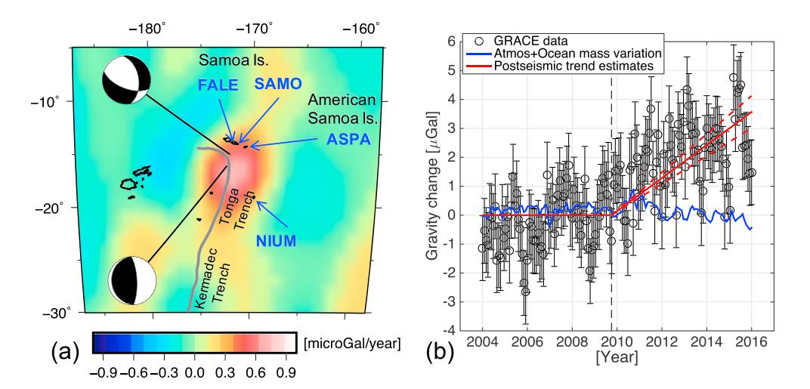

Figure 1. (a) GRACE observation of gravity changes after the 2009 earthquake in  $\mu$ Gal/yr at a spatial resolution of ~400 km. The gravity field solutions from four different processing centers were averaged. The locations and focal mechanisms of the two primary subevents ( $M_w \sim 8.1$ ) are presented. The Tonga trench is shown as a gray line. The locations of the four continuous GPS sites used in this study are FALE and SAMO on the Samoa Islands, ASPA on American Samoa, and NIUM on the Niue island. (b) Monthly time series of GRACE data around the epicenter. The black circles indicate the monthly GRACE data with the uncertainty of 1.1  $\mu$ Gal, the red solid line shows a linear change after the 2009 earthquake (0.5  $\pm$  0.1  $\mu$ Gal/year) with the formal uncertainty shown in dashed red lines, and finally, the blue solid line indicates ocean and atmosphere mass variations computed using geophysical fluid models. GRACE = Gravity Recovery And Climate Experiment.

different types (e.g., Broerse et al., 2015; Han et al., 2015; Sun et al., 2014). Any broad viscoelastic vertical motion is governed by an initial boundary condition imposed on the viscoelastic layer (Melosh, 1983). The top of the asthenosphere is subjected to a displacement boundary condition of shortening by the overlying lithosphere after thrust earthquakes. Subsequently, converging viscoelastic flow in the asthenosphere makes the lithosphere uplift and gravity increase over months to years depending on the rheological structure. In a similar fashion, normal faulting earthquakes impose an extensional boundary condition on the asthenosphere and promote diverging viscoelastic flow, inducing the lithosphere to subside and the gravity to decrease (Han et al., 2016; Melosh, 1983; Pollitz, 1997).

The viscoelastic deformation also varies significantly depending on the ruptured fault's extent into the viscoelastic layer. For example, a thrust dislocation that extends down to the viscoelastic layer imposes a stronger compressional boundary condition on the top of the viscoelastic layer than a dislocation terminating in the middle of the elastic layer with the same moment. Figures 2 and 3 present the simulated vertical deformation at the surface (top two) caused by viscoelastic relaxation and the elastic displacement and volumetric strain change in the interior (bottom three) caused by thrust (Figures 2a–2c) and normal fault slip (Figures 3a–3c), using the dislocation models extending to different depths within the elastic layers as indicated by thick red lines. This modeling illustrates how elastic deformations from different cases of faulting impose different boundary conditions on top of the viscoelastic layer. For example, the deep thrust (Figures 2b and 2c) imposes the larger compressional condition in the viscoelastic layer and thus excites more effectively broad-scale viscoelastic uplift than the shallow thrust with the same moment magnitude (Figure 2a). In contrast, the shallow normal fault (Figure 3a) imposes less of an extensional condition yielding smaller subsidence than the deep normal fault with the same moment magnitude (Figures 3b and 3c). The boundary conditions applied to the top of the viscoelastic layer govern viscoelastic relaxation changing the magnitude and pattern of vertical deformation at a large spatial scale.

For deformation at scales commensurate with GRACE, the deeper thrust case could produce a few times greater viscoelastic uplift (Figures 2a–2c, top row). The peak of the uplift (positive gravity anomaly) occurs right above the bottom of the dislocation where the initial compression is the maximum. Likewise, for the case with normal faulting extending to the viscoelastic layer, the extensional viscoelastic flow would be promoted more effectively and thus would produce larger subsidence (negative gravity anomaly), than the one

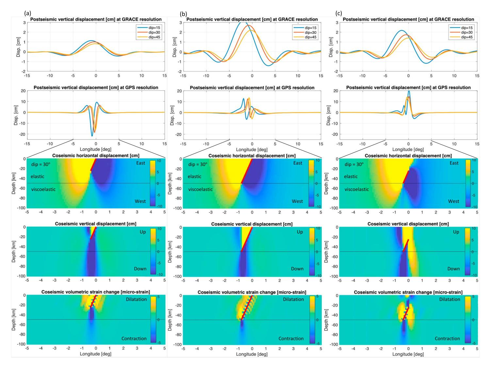

**Figure 2.** The vertical deformation at the surface (first and second rows) caused by viscoelastic relaxation and the elastic displacement and volumetric strain change in the interior (bottom three) caused by thrust. They were evaluated along the vertical section crossing the center of the fault plane perpendicular to the fault strike direction. Three thrust planes with dip angles of 15°, 30°, and 45° were tested. For illustrative purposes, we used a simple Earth model of a uniform elastic layer with thickness of 50 km and an underlying viscoelastic layer to understand the effects of different fault planes on the viscoelastic deformation pattern. In this test, the moment magnitudes of all fault models were identical. The viscoelastic deformation was computed with one set of the planes that terminated in the middle of the elastic layer (a), with the other set of the planes extending down to top of the viscoelastic layer (b), and with the last set of the planes extending from the middle of the elastic layer to the top of the viscoelastic layer (c). (first row) Viscoelastic surface vertical deformation at a low resolution corresponding to GRACE; (second row) viscoelastic vertical deformation at a resolution corresponding to GPS; (third row) elastic horizontal deformation at depth; (fourth row) elastic vertical deformation at depth; and (fifth row) elastic volumetric strain change at depth. The spatial extent of the fault plane is shown by the red solid line. GRACE = Gravity Recovery And Climate Experiment.

that terminates in the middle of the elastic layer with the same moment (Figures 3a–3c, top row). Note that the deformation at higher spatial resolution commensurate with GPS data was also computed and presented in the second rows of Figures 2 and 3. The magnitude, pattern, and peak location of the predicted displacement are more complex than the ones predicted at the spatial scale observed by GRACE.

The positive postseismic gravity anomaly from GRACE after the 2009 event indicates a greater contribution by the megathrust faulting event than by the normal faulting event for large‐scale viscoelastic deformation. However, the seismic moments of the megathrust and the normal fault subevents were nearly identical (Lay et al., 2010); in some seismic studies the normal fault subevent was even larger, and the global centroid moment tensor solution identified a normal fault in the outer rise as the 2009 earthquake (U.S. Geological

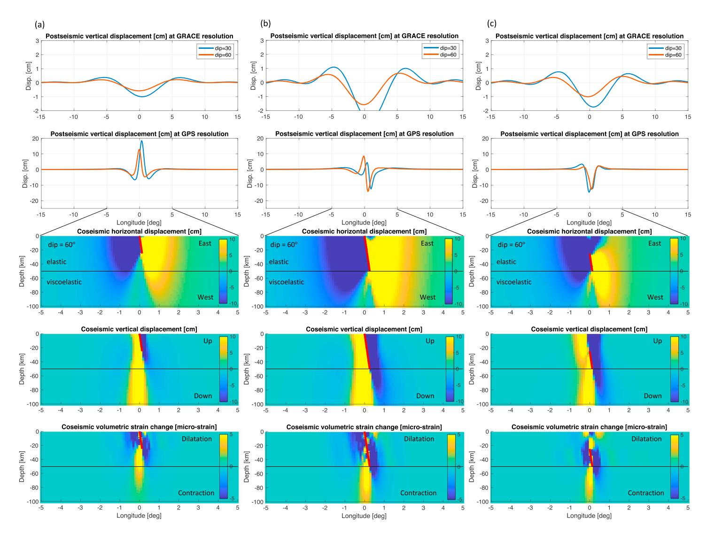

**Figure 3.** Same as Figure 2 but displacement and volumetric strain change caused by normal fault dislocation slip. Two normal fault planes with dip angles of 30° and 60° were tested.

Survey Finite Fault Model [https://earthquake.usgs.gov/earthquakes/eventpage/usp000h1ys#](https://earthquake.usgs.gov/earthquakes/eventpage/usp000h1ys#finite-fault)finite‐fault and Ekström et al., 2012). This suggests that the megathrust slip extended down to the asthenosphere, while the normal fault was terminated within the elastic lithosphere, so that the broad viscoelastic uplift is more effectively promoted as seen from GRACE data.

## **3.2. Dislocation Models of the 2009 Earthquake**

To account for the GRACE observation of positive gravity change, we first introduced a geometry for the megathrust fault allowing slip to the top of the asthenosphere. The depth of the thrust fault plane extended down to top of the asthenosphere with a dip angle of 30° to approximate the slab curvature with depth (Bletery et al., 2016; Wei et al., 2017). All other fault geometry parameters of location, depth, length, width, strike, and dip angles (including the shallow normal fault plane) were bounded by earlier results of a Monte Carlo search from Beavan et al. (2010). These fault geometry parameters were used to compute the Green's function of elastic deformation using the numerical code STATIC1D (Pollitz, 1996).

Then, we determined the uniform dislocation slip vectors of the megathrust and normal faulting events using the coseismic GPS data from Beavan et al. (2010). There are eight GPS sites used in this study including six continuous stations, ASPA (Pago Pago, American Samoa), SAMO (Apia, Samoa), FALE (Faleolo,

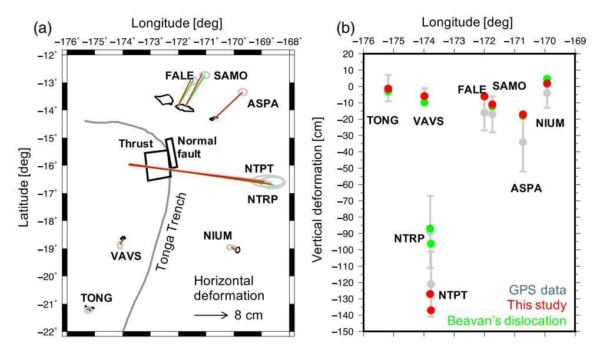

**Figure 4.** The coseismic horizontal GPS displacement vectors (a) and vertical offsets (b) with the associated data uncertainty from six continuously operating sites (TONG, VAVS, FALE, SAMO, ASPA, and NIUM) and two campaign sites (NTPT and NTRP). The predicted deformation from the fault models by the previous work (green) by Beavan et al. (2010) and from the new model determined in this study (red). Both models fit the coseismic GPS data equally well.

Samoa), NIUM (Niue), TONG (Tonga), and VAVS (Vava'u), and two campaign sites, NTPT and NTRP, available to measure the coseismic changes. The coseismic steps in three-dimensional (3-D) GPS displacements were measured by comparing 12 days of daily GPS position data before the 2009 earthquake and the same amount of the data after the earthquake (Beavan et al., 2010). Therefore, these coseismic displacement data reflect the coseismic slip and cumulative postseismic slip only over several days.

The unique least squares solution was obtained with the fault geometry fixed (i.e., the Green's functions computed) a priori. The new solutions present slip of 4.7 m and rake of 80° on the thrust plane and slip of 10.7 m and rake of -43° on the normal fault plane. The corresponding moment magnitude is  $M_w$  8.1 and 8.0, respectively, for the megathrust and normal subevent faulting. This is slightly larger than the previous study (Beavan et al., 2010) but in the range of various other solutions (Fan et al., 2016). Our new solutions also successfully fit the 3-D GPS data within their measurement uncertainty (Figure 4). The total coseismic (elastic) *gravity* change from the two subevents is predicted to be insignificant and within the monthly GRACE gravity data noise (Figures 5a–5c).

## 3.3. Viscoelastic Relaxation Models of the Observed Gravity Change

Using our dislocation models of the megathrust and normal faulting subevents, we computed the viscoelastic deformation and gravity changes of the 2009 earthquake with the numerical code VISCO1D (Pollitz, 1997). The most sensitive parameters that govern temporal evolution of gravity and deformation are the asthenosphere viscosity and the lithosphere (elastic) thickness. A thick lithosphere is counteracted by low-viscosity asthenosphere in producing viscoelastic deformation (Han et al., 2016). We fixed the elastic lithosphere thickness to be 62 km. The underlying viscoelastic asthenosphere was extended down to 220 km depth, consistent with Preliminary Reference Earth Model (Dziewonski & Anderson, 1981). Various Maxwell viscosities for the asthenosphere were tested. The biviscous (Burgers) rheology was also examined to simulate transient deformation. The viscosity for the upper mantle (220–670 km) and for the lower mantle (670–2,900 km) was fixed to be  $10^{20}$  and  $10^{21}$  Pa s, respectively, in all calculations.

Different cases of viscoelastic gravity changes at scales of 400 km and larger were computed with the Maxwell viscosity of  $2\times10^{18}$  Pa s (Figures 5d–5f) and with the transient viscosity of  $10^{17}$  Pa s and the steady state viscosity ranging within  $10^{18}$ – $10^{19}$  Pa s (Figure 6). The GRACE observations (Figure 1) are most consistent with any model with the steady state viscosity of  $2-3\times10^{18}$  Pa s. Due to the GRACE's data noise and limited spatial scale, the Burgers (biviscous) model was not distinguishable from the Maxwell model. In short, when our dislocation model is used with a viscoelastic Earth model having an asthenosphere

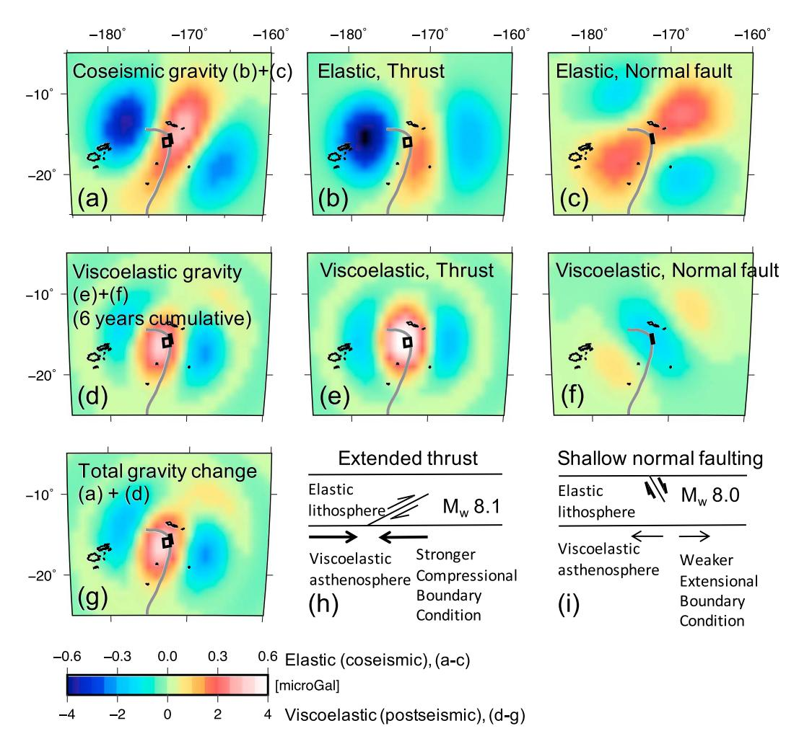

Figure 5. The synthetic coseismic (elastic) and postseismic (viscoelastic) gravity changes caused by the thrust and normal faulting subevents are shown. Each panel (a, b, and c) presents the coseismic gravity change by the interplate megathrust + the outer rise normal faulting and each effect, respectively. The coseismic gravity change is depicted on a scale of  $\pm 0.6 \,\mu$ Gal (see the scale bar at the bottom). The panel (d, e, and f) presents the cumulative gravity change as of 2016 (~6 years after the rupture) predicted from a viscoelastic model with the Maxwell viscosity of  $2 \times 10^{18}$  Pa s for the asthenosphere from 62 to 220 km depth. The postseismic change ranges within  $\pm 4 \,\mu$ Gal. (g) The total (elastic + viscoelastic) gravity changes expected in 2016. All gravity changes were computed with the finite fault models of the megathrust and normal fault determined in this study. The panel (h and i) illustrates the interpretation that the megathrust faulting extended down to the asthenosphere, while the normal faulting terminated midway within the lithosphere. The combination of deep and shallow dislocation models with similar moment magnitudes for the two subevents impose more effectively the contractional boundary condition for viscoelastic flow which results in large-scale positive gravity changes consistent with GRACE observations.

starting at 62-km depth and a steady state (Maxwell) viscosity of  $2\text{--}3\times10^{18}$  Pa s, the viscoelastic gravity changes are predicted to be as large as 3  $\mu$ Gal over 6 years. This result is most consistent with the GRACE observations. However, there is a mismatch in the location of the peak anomalies between the GRACE observation (Figure 1a) and the model prediction (Figure 5g). This may result from 3-D heterogeneity of rheology and subduction zone structure that is not accounted for in our 1-D viscoelastic modeling. The peak tends to move toward the subducting oceanic plate if the effect of the subducting elastic slab is considered (e.g., Pollitz et al., 2008; Sun & Wang, 2015).

Lastly, it is worth to reiterate that we are unable to obtain any viscoelastic gravity models that agree with GRACE observations, regardless of the employed elastic layer thickness and asthenosphere viscosity, if the thrust and normal faulting planes are at the same depths (see supporting information). Two different depth ranges of the fault planes are distinguished from GRACE.

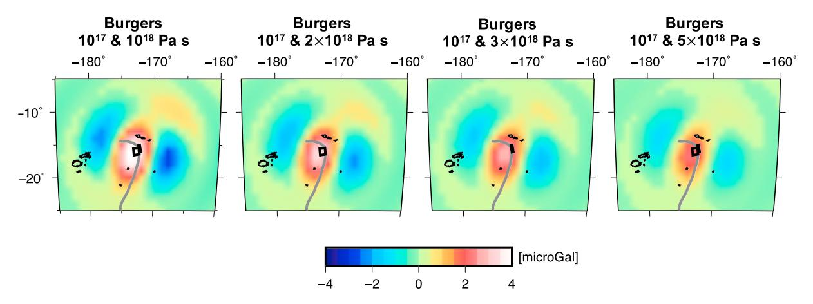

**Figure 6.** The synthetic postseismic (viscoelastic) gravity changes caused by the thrust and normal faulting subevents. Each panel presents the cumulative gravity change as of 2016 (~6 years after the rupture) predicted from a viscoelastic model with different rheological parameters for the asthenosphere.

#### 4. GPS Measurements of Postseismic Deformation

Our viscoelastic relaxation model was validated against independent measurements of postseismic surface deformation from continuously operating GPS (cGPS) stations. We used daily cGPS time series of north, east, and vertical positions processed by Nevada Geodetic Laboratory, University of Nevada (Blewitt et al., 2016). The GPS position solutions were corrected for solid Earth tide, ocean tidal loading, and pole tide. The resultant GPS positions include deformation induced by atmospheric, oceanic, and hydrological mass loads in addition to tectonic forces. There are six cGPS stations within ~500 km from the epicenters presenting a sufficiently long time series of data without significant data gaps. We considered the data from the sites ASPA, SAMO, FALE, NIUM, TONG, and VAVS, as introduced previously for the coseismic deformation.

The pre-earthquake horizontal displacement includes steady surface deformation. Such tectonic-related displacement is usually modeled as a linear trend in the horizontal time series. We estimated the linear trends of the north and east displacement time series at each site using the data before the 2009 earthquake and removed the estimated trends from the entire time series. No such detrending was applied in the vertical component of the GPS time series. The seasonal signal induced by surface mass load was also removed from all components of GPS data. Therefore, the resulting time series represent primarily the postseismic deformation associated with the 2009 earthquake. The entire GPS time series considered in this study are presented after removing the pre-earthquake trend and seasonal load deformation (supporting information Figure S3). Far-field GPS sites like TONG and VAVS showed signals perturbed by other earthquakes, and thus were not used in our analysis. The steps found in the vertical time series in September 2003 from FALE, in October 2008 from ASPA, and in March 2014 from NIUM are associated with the GPS receiver and antenna type changes as reported in the NGL GPS data website http://geodesy.unr.edu/NGLStationPages/GlobalStationList.

Four GPS sites (FALE, SAMO, ASPA, and NIUM) recorded the 2009 postseismic deformation signals unambiguously. GPS data indicate that, coseismically, three stations north of the epicenter (FALE, SAMO, and ASPA) moved northeast and the site southeast of the epicenter (NIUM) moved northwest; and all sites subsided. The postseismic deformation was generally in the same direction as the coseismic displacement (Figure 4). However, the postseismic deformation at Samoa (FALE and SAMO) and American Samoa (ASPA) differs in three respects: (1) The postseismic horizontal deformation, particularly the east component, is 2–3 times faster in Samoa than in American Samoa further east; (2) the postseismic subsidence is ~2 times faster in American Samoa than in Samoa; and (3) the postseismic vertical deformation is significantly faster than the horizontal deformation in American Samoa, while they are similar in Samoa.

These characteristic postseismic deformation patterns observed by GPS were reproduced by our preferred viscoelastic relaxation model from GRACE. Our viscoelastic deformation models are presented at these four continuous stations in Figure 7 for the Maxell viscosity of  $2\times10^{18}$  Pa s and in supporting information Figure S4 for other cases. The linear (steady state) rate of GPS time series after the earthquake agree with the

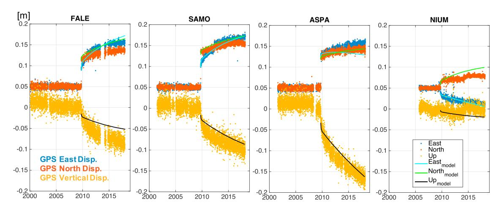

**Figure 7.** The time series show daily measurements of east, north, and vertical deformation at the four continuously operating GPS stations of FALE, SAMO, ASPA, and NIUM. The elastic (coseismic) and viscoelastic deformation predicted from the dislocation and asthenosphere models with a transient viscosity of  $10^{17}$  Pa s and a steady state viscosity of  $2 \times 10^{18}$  Pa s were compared (see other viscosity cases in supporting information Figure S4). Both GPS data and the model show that the horizontal displacements at FALE and SAMO are larger than those at ASPA, while the vertical displacement is greater at ASPA. The short-term deformation due to deep afterslip mostly on the down-dip extension of the coseismic megathrust surface may also contribute to the observed subsidence pattern, mostly at FALE, followed by SAMO, and the least at ASPA (see within text discussion).

viscoelastic deformation model with a steady state viscosity of  $2-3\times10^{18}$  Pa s, which is consistent with the conclusion from GRACE data. The biviscous (Burgers) model is helpful to partly explain the short-term transient deformation lasting several months to a couple of years immediately after the 2009 events.

In general, the model indicates that the megathrust faulting promotes converging surface movements toward the fault in the dip direction, diverging motions in the strike direction, and uplift along the trench and subsidence away from the trench. The normal faulting promotes diverging motions away from the fault

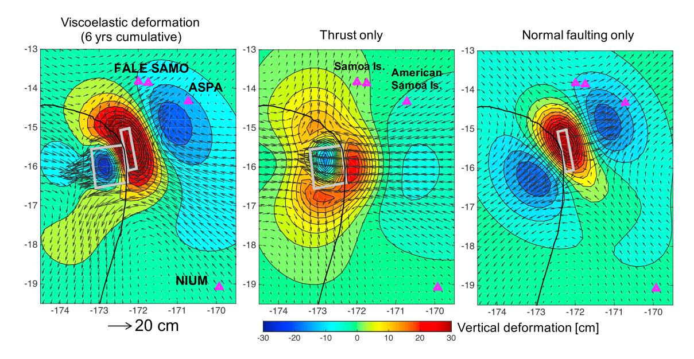

Figure 8. The cumulative horizontal and vertical viscoelastic deformation around the earthquake region over ~6 years after the 2009 rupture. The locations of four GPS sites and the fault planes of the megathrust and normal faulting subevents are depicted. The horizontal and vertical deformation at various GPS sites are influenced differently by viscoelastic flow due to the megathrust and normal faulting subevents. FALE and SAMO (in Samoa) locate in the influence regime of viscoelastic northward and upward motions by the megathrust and eastward and downward motions by the normal faulting. ASPA (in American Samoa), located parallel to the normal fault dip direction, is in the region of viscoelastic southwest and downward motions by the megathrust and northeast and downward motions by the normal fault. The viscoelastic relaxation models reveal that American Samoa experiences faster subsidence than the other Samoan Islands due to intensified viscoelastic relaxation associated with the megathrust and the normal faulting, while the postseismic horizontal deformation is slowed down by the contrasting contributions from the two subevents.

in the dip direction, converging motions in its perpendicular direction, and uplift above the fault and subsidence away in the dip direction (Figure 8). Such different patterns of viscoelastic deformation by two contrasting faulting types will cause the Samoa and American Samoa Islands to deform in a distinctly different manner for many years.

Specifically, the modeling reveals that (1) the northward postseismic motion of Samoa is the result of the thrust induced viscoelastic relaxation and the faster eastward motion is due to the normal fault-induced viscoelastic relaxation; (2) the northeastward motion of American Samoa induced by the normal faulting is counteracted by the southwestward viscoelastic motion induced by the megathrust faulting. This is the reason that the horizontal deformation measured by GPS in American Samoa is considerably slower than the horizontal motion in Samoa; and (3) the normal fault promotes viscoelastic subsidence in both Samoa and American Samoa. The subsidence is intensified by viscoelastic deformation from the thrust faulting in American Samoa, while it is lessened by the thrust faulting in Samoa. The viscoelastic model also predicts smaller deformation at NIUM, where both subevents encouraged the northwestward horizontal deformation and subsidence.

Afterslip may also contribute to such transient deformation and further explain the offsets between GPS data and the viscoelastic response. Aftershocks occurred over a widespread region primarily west of the Tonga trench (0–80 km) in the megathrust region with more modest seismicity down to a depth of ~40 km below the normal faulting subevent (Fan et al., 2016; Lay et al., 2010). We used elastic dislocation modeling of slip on a down-dip extension of the coseismic normal fault plane and the deeper portion of the megathrust plane to explore the probable contribution of afterslip. The amount of short-term slip near the normal faulting subevent, as suggested from the aftershock studies, was modest and predicted uplift instead of subsidence at the Samoan stations. In contrast, we found that large down-dip slip on a steeply dipping (45°) megathrust plane predicted the very short-term subsidence pattern comparable to GPS data at the Samoan sites (up to 8 mm subsidence in FALE and SAMO and 5 mm in ASPA when the upper bound of afterslip was applied). The actual magnitude and time history of the short-term afterslip is poorly constrained and nonunique due to the limited GPS data distribution. Our computation suggests that afterslip will be secondary and the observed longer-term postseismic deformation is primarily driven by viscoelastic relaxation.

We acknowledge that our analytic modeling approach does not account for the spatial heterogeneity of the Earth's structure unlike alternate numerical approaches that predict surface deformation (e.g., Sun et al., 2014). The variable structure will be more important in deformation around the vicinity of the fault planes. Such an effect may also contribute to the discrepancy between our model deformation and GRACE and, particularly, GPS observations.

## 5. Tide Gauge and Satellite Altimeter Measurements of Sea Level Change

Satellite altimeter and tide gauge data were also used to study absolute (geocentric) and relative sea levels, respectively, and were used in combination to compare with vertical land motion measured by GPS. To combine such data, it is critical that they be processed as consistently as possible. We used multimission satellite altimeter data in the form of gridded global sea-surface height anomalies, as produced through the Archiving, Validation and Interpretation of Satellite Oceanographic data project and now distributed through the European Copernicus Marine Environment Monitoring Service. The altimeter data processing and the gridded products are described by Pujol et al. (2016). All standard altimeter corrections and adjustments have been applied, including those for atmospheric pressure loading of the ocean surface (mostly inverted barometer but with a dynamic component). We used data sets with 5-day sampling, although the temporal resolution of the data is much coarser, between 10 and 30 days based on details of the optimal interpolation (Pujol et al., 2016).

The tide gauge data were obtained from the University of Hawaii Sea Level Center. These data are in the form of daily mean sea levels (MSLs), produced at the Hawaii center after detiding hourly data and applying an antialiasing low-pass filter with a cutoff period of about 60 hr. We removed from the daily data all signals from long-period tides (periods from 5 days to 18.6 years) by employing an equilibrium model (Agnew & Farrell, 1978). In addition, and to ensure consistency with the satellite altimetry, we have applied a model for inverted barometer pressure loading based on daily mean reanalysis surface pressures produced by the

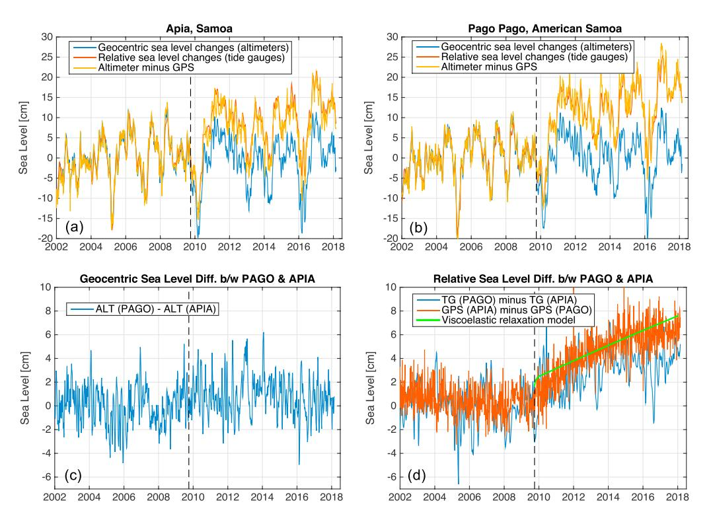

**Figure 9.** (a) Sea level change around the Samoa Islands, measured by satellite altimetry (geocentric sea level), tide gauge (relative sea level) at Apia site in Samoa, and altimeter data minus GPS-derived surface displacement. (b) The same as (a) but around American Samoa using the Pago Pago tide gauge, ASPA GPS data, and altimeter data around the island. (c) The differences in altimeter measurements between Samoa and American Samoa indicate that there was no significant change in geocentric sea level associated with the 2009 earthquakes. (d) The differences in tide gauge measurements between the two islands (blue) indicate, however, that the relative sea level rise due to land subsidence is faster in American Samoa by 7–9 mm/year than in Samoa after the 2009 earthquake. This is due to a greater subsidence in American Samoa, as evidenced in GPS data for ASPA minus SAMO (red). The viscoelastic relaxation models explain that the faster sea level rise in American Samoa is due to the fact that American Samoa happens to locate where both megathrust and normal faulting promote viscoelastic subsidence, while the western Samoan sites are located where the viscoelastic subsidence caused by the normal fault is counteracted by the megathrust (green).

European Centre for Medium-range Weather Forecasting (Dee et al., 2011). The daily data were then low-pass filtered to conform approximately with the temporal resolution of the altimetry.

For a joint analysis of altimeter and tide gauge time series, the filtered daily tide gauge data were subsampled at the times corresponding to the altimeter grids. We do not necessarily extract from the gridded altimetry the grid element closest to the tide gauge, since that element can sometimes be affected by land contamination or other errors. Instead, we formed altimeter-minus-gauge time series for a number of elements surrounding the gauge and chose that element that produces the minimum root-mean-square difference. For the Pago Pago tide gauge, the selected altimeter point is 38 km from the gauge. For the Apia tide gauge, the selected altimeter point is 41 km from the gauge. We also removed any seasonal signals from the altimeter-minus-gauge time series, since these can often be caused by slightly different ocean signals at the two locations.

In Samoa and American Samoa, both satellite altimeter and tide gauge data consistently recorded interannual ocean variability such as the El Niño–Southern Oscillation (note that the expected geoid surface (sea level) increase of ~0.1 mm/year from the GRACE gravity trend of 0.5  $\mu$ Gal/year is too small compared to the natural ocean variability). However, the tide gauge time series (relative sea level) departed from the altimeter data (geocentric sea level) after the 2009 earthquake (Figures 9a and 9b). GPS recorded postseismic land subsidence of 8–10 mm/year in Samoa and 16 mm/year in American Samoa over 8 years after the earthquakes (Figure 7). When such GPS vertical motions are subtracted from the satellite altimeter

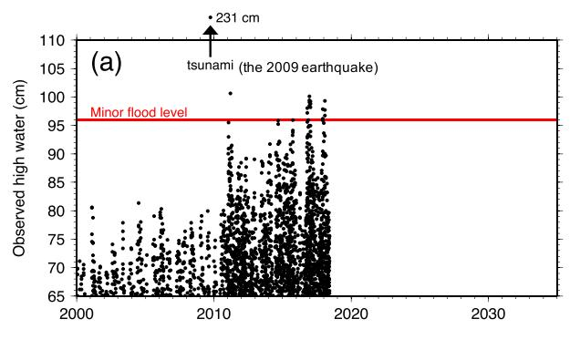

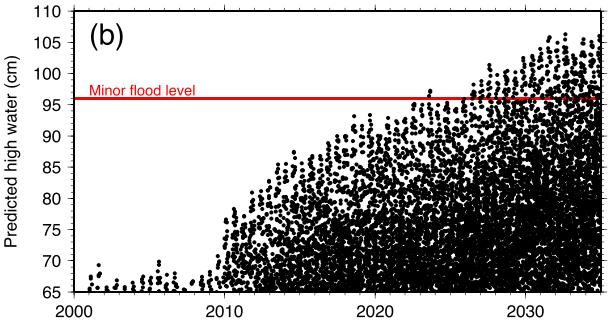

**Figure 10.** (a) Observed and (b) predicted high water levels at Pago Pago, relative to the mean sea level datum of 1983–2001. Observed high water (twice per day) were computed from hourly tide gauge data, with local maxima found by cubic-spline interpolation. Predicted high water is based on our tide predictions at Pago Pago, added to the long-term 2.55 mm/year sea level rise, plus the earthquake-induced subsidence following 2009. Flood threshold level is from Sweet et al. (2018).

measurements, the altimeter data agree with the tide gauge records at Apia, Samoa and at Pago Pago, American Samoa.

The geocentric sea level changes (satellite altimeter) show only 2.3 cm of root-mean-square difference between Samoa and American Samoa, and no significant change is identified after the 2009 earthquake (Figure 9c). However, the relative sea level changes (tide gauge) between the two islands are significantly different after the earthquake (Figure 9d). The relative sea level rise becomes faster by 7–9 mm/year in American Samoa (Pago Pago) than in Samoa (Apia). This is in agreement with a faster subsidence of American Samoa than Samoa, as shown in GPS records (red lines of Figure 9d). Our model reveals that this difference is in response to viscoelastic subsidence intensified by the constructive interference between the megathrust and normal faulting in American Samoa (green line of Figure 9d).

## 6. Implication on Future Flooding at American Samoa

It is well understood that vertical land motion is an important factor when assessing the likelihood of coastal flooding, especially for tidal (or "nuisance") flooding (Karegar et al., 2017). American Samoa can now be considered an extreme case, given the large ongoing and future subsidence predicted by our viscoelastic relaxation model. In this section we explore the implications of this model for future tidal flooding. We used the predicted subsidence based on a viscosity of  $2\times10^{18}$  Pa s, which shows the best agreement with the observed GPS motion at station ASPA (Figure 7 and also Figure 11 below).

According to the analysis of Sweet et al. (2018), minor nuisance flooding on American Samoa occurs when the Pago Pago water level exceeds a threshold of approximately 53 cm above the mean higher high water

datum (Note that this is *not* an official threshold such as those determined by the National Oceanic and Atmospheric Administration (NOAA) Weather Forecast Office for many U.S. ports, but instead it is a regression-based threshold based on analysis of other ports by Sweet et al. (2018); to our knowledge the threshold has not been checked against local conditions on American Samoa). All current NOAA tidal datums are based on observed water levels over the 19-year period 1983–2001 (inclusive). These datums are shown for Pago Pago, along with all observed high and low-water levels, where we have here set the "zero" as the mean sea level (MSL) datum obtained for the same epoch (supporting information Figure S5). As is evident from the figure, at no time during the 1983–2001 epoch did the observed water level reach the flood level threshold of Sweet et al. (2018).

Figure S6 shows annual MSLs at Pago Pago according to data available from the Permanent Service for Mean Sea Level. We have set the zero to be consistent with the MSL datum used in Figure S5. A linear fit to the pre-earthquake data yields a trend of  $2.55 \pm 0.30$  mm/year (The fit is obtained after removing the two El Niño "outliers" of 1983 and 1998). In light of this ongoing sea level rise plus the large, multidecade subsidence occurring after 2009, the question we wish to address is this: Have observed Pago Pago water levels yet reached the flood threshold level of Sweet et al. (2018) on a routine occurrence? If not yet, when can it be expected to occur?

We here explore these questions based on two scenarios of sea level rise at Pago Pago. Scenario 1 is a control calculation in which we assume no earthquake occurred and future sea level simply continues at its linear rate of 2.55 mm/year, which is an extremely conservative assumption and ignores the anticipated climate-related sea level acceleration. Scenario 2 is the same except that we add our predicted subsidence. It too is thus overly conservative, but in the end it will be found acceptable for present purposes.

The tidal range at Pago Pago is fairly moderate (Figure S5). We computed tidal constants by analyzing hourly measurements from 1990 to 2008, and we found the amplitude of the principal lunar constituent M2 is

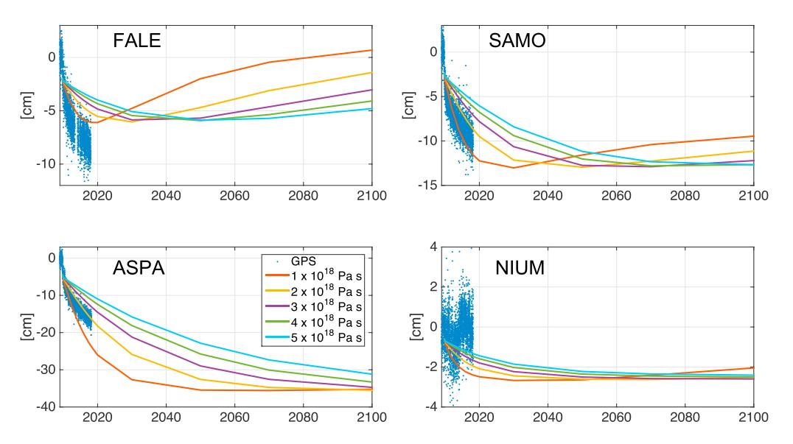

**Figure 11.** Viscoelastic vertical deformation at four GPS sites for an extended period until the year 2100, computed with the finite fault models from this study and with the asthenosphere viscosity from 1018 to 5×1018 Pa s. The monthly GPS measurements until 2018 are also shown. The model indicates American Samoa (ASPA) is projected to continue to subside for next several decades, equivalent to the amount it has subsided up until now (since the earthquakes).

37 cm; the second‐largest constituent is the elliptical N2 at 10 cm. Diurnal constituents are all small, with amplitudes less than 5 cm. We used harmonic constants for 57 constituents to compute all tidal high water levels (twice per day) through year 2050. To these tidal predictions, we then added the sea level curves from our two adopted scenarios. This approach to predicting future tidal flooding is similar to that used recently to analyze flooding in Boston (Ray & Foster, 2016).

All predicted tidal high waters (times and maximum elevation) over the interval 2000–2034 based on Scenario 2 are shown in Figure 10b. Levels based on Scenario 1 are not shown, because they fail to ever breach the flood threshold. In contrast, with Scenario 2, which accounts for the earthquake‐induced subsidence, the predicted tide will reach minor flooding levels routinely by 2026. To the extent that the threshold of Sweet et al. (2018) is a legitimate proxy for tide‐induced nuisance flooding on American Samoa and the simple rheology model we used is acceptable, we can predict that the island residents will be routinely dealing with this type of flooding as early as 2026.

It is because year 2026 is so near to the present that our Scenario 2 could ignore expected sea level accelerations. For comparison with our predicted high‐water levels, observed high‐water levels through the present (May 2018) are shown in Figure 10a. Like any tidal prediction, ours can be spoilt by storms, wind, or other nontidal effects, including El Niño–Southern Oscillation effects, and one sees this occurring occasionally in the top panel, with observed levels already reaching the flood threshold over the past 2 years. Our computation shows that the astronomical tide alone cannot quite reach these levels, but it will do so in the fairly near future, owing to the large subsidence rates now occurring.

## **7. Discussion and Conclusion**

The Samoan Islands are an archipelago hosting a quarter million people mostly residing in three major islands, Savai'i and Upolu (Samoa) and Tutuila (American Samoa). The islands have experienced an increased temperature at a rate of 0.22 °C per decade and extreme climate conditions such as hot days and severe rainfall periods, and intense tropical cyclones are projected to occur more frequently in this century (Australian Bureau of Meteorology and CSIRO, 2011). The warming ocean and melting glaciers and ice sheets associated with climate change have contributed to the global MSLs rise of about 2.9 mm/year from the last 25 years of satellite altimeter data (Nerem et al., 2018) and the relative sea level rise by 2–3 mm/year measured by tide gauges in Samoa during the last half century (Australian Bureau of Meteorology and CSIRO, 2011).

The islands entered a new era of exacerbated (3–6 times faster) relative sea level rise due to continuous land subsidence after the 2009 earthquakes. In Samoa, the contrasting patterns of viscoelastic relaxation triggered by the thrust and the normal faulting tend to lessen the postseismic subsidence (and thus sea level rise). The viscoelastic subsidence is expected to be slowed, and, ultimately, rebound is anticipated in the next decades, depending on the asthenosphere viscosities. A much greater impact is expected at American Samoa where both types of subevent faulting act to enhance postseismic viscoelastic subsidence. Our calculations suggest that this subsidence will continue for several decades. In fact, a total sea level rise of 30–40 cm is predicted throughout this century, as the solid Earth adjusts to the stress change after the 2009 earthquake (Figure 11). This is a significant addition to total sea level rise and is as much as or even larger than Intergovernmental Panel on Climate Change projected rise in Samoa due to climate change under the highest  $CO_2$  emission scenario (Australian Bureau of Meteorology and CSIRO, 2011). As a result, it will worsen coastal flooding on the islands leading to regular occurrence of tide-induced nuisance flooding.

Many Pacific islanders are concerned with the effect of contemporary climate change. This study illustrates an example of how earthquake-induced (postseismic) deformation could worsen the ongoing problem of sea level rise in the Samoan Islands. Additionally, land subsidence could last a few decades and surpass the rate of sea level rise associated with climate change. It reiterates the necessity of reappraising sea level records by examining the solid Earth deformation after large historical earthquakes for other places (e.g., Watson et al., 2010), particularly the islands around subduction zones, to understand the characteristics of the sea level change records and properly adapt to global warming.

#### Acknowledgments

This work was funded partially by University of Newcastle to support NASA's GRACE and GRACE Follow-On projects as a science team to the missions and by Australian Research Council Discovery Program (DP170100224). NASA GRACE/GRACE-FO science team support was provided for J. Sauber and R. Ray. We acknowledge DLR for GRACE telemetry data and JPL, CSR, and GFZ for high-quality Level-1B and Level-2 data. We thank J. Savage, R. Harris, two anonymous JGR reviewers, and JGR Editor Paul Tregoning for their constructive reviews. The GRACE data and AOD models used in this paper are available at the website (https://podaac. jpl.nasa.gov/GRACE). The GPS data are available from http://geodesy.unr. edu. The elastic and viscoelastic modeling software (STATIC1D and VISCO1D) are available from the website (https://earthquake.usgs.gov/ research/software).

#### References

- Agnew, D. C., & Farrell, W. E. (1978). Self-consistent equilibrium ocean tides. Geophysical Journal of the Royal Astronomical Society, 55(1), 171–181. https://doi.org/10.1111/j.1365-246X.1978.tb04755.x
- Australian Bureau of Meteorology and CSIRO (2011). "Climate change in the Pacific: Scientific assessment and new research, Volume 1: Regional Overview".
- Beavan, J., Wang, X., Holden, C., Wilson, K., Power, W., Prasetya, G., et al. (2010). Near-simultaneous great earthquakes at Tongan megathrust and outer rise in September 2009. *Nature*, 466(7309), 959–963. https://doi.org/10.1038/nature09292
- Bettadpur, S. (2012). "GRACE UTCSR level-2 processing standards document". Retrieved from http://icgem.gfz-potsdam.de/L2-CSR0005\_ ProcStd\_v4.0.pdf
- Bevis, M., Taylor, F. W., Schutz, B. E., Recy, J., Isacks, B. L., Helu, S., et al. (1995). Geodetic observations of very rapid convergence and back-arc extension at the Tonga arc. *Nature*, 374(6519), 249–251. https://doi.org/10.1038/374249a0
- Bletery, Q., Thomas, A. M., Rempel, A. W., Karlstrom, L., Sladen, A., & Barros, L. D. (2016). Mega-earthquakes rupture flat megathrusts. Science, 354(6315), 1027–1031. https://doi.org/10.1126/science.aag0482
- Blewitt, G., Kreemer, C., Hammond, W. C., & Gazeaux, J. (2016). MIDAS robust trend estimator for accurate GPS station velocities without step detection. *Journal of Geophysical Research: Solid Earth*, 121, 2054–2068. https://doi.org/10.1002/2015JB012552
- Bonnardot, M. A., Régnier, M., Ruellan, E., Christova, C., & Tric, E. (2007). Seismicity and state of stress within the overriding plate of the Tonga-Kermadec subduction zone. *Tectonics*, 26, TC5017. https://doi.org/10.1029/2006TC002044
- Broerse, T., Riva, R., Simons, W., Govers, R., & Vermeersen, B. (2015). Postseismic GRACE and GPS observations indicate a rheology contrast above and below the Sumatra slab. *Journal of Geophysical Research: Solid Earth*, 120, 5343–5361. https://doi.org/10.1002/20151B011951
- Dahle, C., Flechtner, F., Gruber, C., König, D., König, R., Michalak, G., Neumayer, K.-H. (2013). "GFZ GRACE level-2 processing standards document". Retrieved from http://icgem.gfz-potsdam.de/L2-GFZ\_ProcStds\_0005\_v1.1-1.pdf
- Dee, D. P., Uppala, S. M., Simmons, A. J., Berrisford, P., Poli, P., Kobayashi, S., et al. (2011). The ERA-Interim reanalysis: Configuration and performance of the data assimilation system. *Quarterly Journal of the Royal Meteorological Society*, 137(656), 553–597. https://doi.org/10.1002/qi.828
- Dobslaw, H., Flechtner, F., Bergmann-Wolf, I., Dahle, C., Dill, R., Esselborn, S., et al. (2013). Simulating high-frequency atmosphere-ocean mass variability for dealiasing of satellite gravity observations: AOD1B RL05. *Journal of Geophysical Research: Oceans*, 118, 3704–3711. https://doi.org/10.1002/jgrc.20271
- Dziewonski, A. M., & Anderson, D. L. (1981). Preliminary reference Earth model. *Physics of the Earth and Planetary Interiors*, 25(4), 297–356. https://doi.org/10.1016/0031-9201(81)90046-7
- Ekström, G., Nettles, M., & Dziewonski, A. M. (2012). The global CMT project 2004–2010: Centroid-moment tensors for 13,017 earth-quakes. *Physics of the Earth and Planetary Interiors*, 200–201, 1–9.
- Fan, W., Shearer, P. M., Ji, C., & Bassett, D. (2016). Multiple branching rupture of the 2009 Tonga-Samoa earthquake. *Journal of Geophysical Research: Solid Earth*, 121, 5809–5827. https://doi.org/10.1002/2016JB012945
- Han, S.-C., Riva, R., Sauber, J., & Okal, E. (2013). Source parameter inversion for recent great earthquakes from a decade-long observation of global gravity fields. *Journal of Geophysical Research: Solid Earth*, 118, 1240–1267. https://doi.org/10.1002/jgrb.50116
- Han, S.-C., Sauber, J., & Pollitz, F. (2015). Coseismic compression/dilatation and viscoelastic uplift/subsidence following the 2012 Indian Ocean earthquakes quantified from satellite gravity observations. Geophysical Research Letters, 42, 3764–3772. https://doi.org/10.1002/ 2015GL063819
- Han, S.-C., Sauber, J., & Pollitz, F. (2016). Postseismic gravity change after the 2006–2007 great earthquake doublet and constraints on the asthenosphere structure in the central Kuril Islands. Geophysical Research Letters, 43, 3169–3177. https://doi.org/10.1002/ 2016GL068167

- Karegar, M. A., Dixon, T. H., Malservisi, R., Kusche, J., & Engelhart, S. E. (2017). Nuisance flooding and relative sea-level rise: The importance of present-day land motion. Scientific Reports, 7(1), 11197. https://doi.org/10.1038/s41598-017-11544-y
- Lemoine, J. M., Bourgogne, S., Bruinsma, S., Gegout, P., Reinquin, F., & Biancale, R. (2015). GRACE RL03-v2 monthly time series of solutions from CNES/GRGS. EGU General Assembly Conference 2015, Vienna, Austria.
- Lay, T., Ammon, C. J., Kanamori, H., Rivera, L., Koper, K. D., & Hutko, A. R. (2010). The 2009 Samoa–Tonga great earthquake triggered doublet. *Nature*, 466(7309), 964–968. https://doi.org/10.1038/nature09214
- Mayer-Gürr, T., Behzadpour, S., Ellmer, M., Kvas, A., Klinger, B., Zehentner, N. (2016). ITSG-Grace2016—Monthly and daily gravity field solutions from GRACE. GFZ Data Services. http://doi.org/10.5880/icgem.2016.007
- Melosh, H. J. (1983). Vertical movements following a dip-slip earthquake. Geophysical Research Letters, 10(1), 47–50. https://doi.org/10.1029/GL010i001p00047
- Millen, D. W., & Hamburger, M. W. (1998). Seismological evidence for tearing of the Pacific plate at the northern termination of the Tonga subduction zone. *Geology*, 26(7), 659–662. https://doi.org/10.1130/0091-7613(1998)026<0659:SEFTOT>2.3.CO;2
- Nerem, R. S., Beckley, B. D., Fasullo, J. T., Hamlington, B. D., Masters, D., & Mitchum, G. T. (2018). Climate-change-driven accelerated sea-level rise detected in the altimeter era. Proceedings of the National Academy of Sciences of the United States of America 115(9), 2022–2025. https://doi.org/10.1073/pnas.1717312115
- Okal, E. A., Borrero, J. C., & Chague-Goff, C. (2011). Tsunamigenic predecessors to the 2009 Samoa earthquake. *Earth-Science Reviews*, 107(1-2), 128–140. https://doi.org/10.1016/j.earscirev.2010.12.007
- Pollitz, F. F. (1996). Coseismic deformation from earthquake faulting on a layered spherical Earth. *Geophysical Journal International*, 125(1), 1–14. https://doi.org/10.1111/j.1365-246X.1996.tb06530.x
- Pollitz, F. F. (1997). Gravitational-viscoelastic postseismic relaxation on a layered spherical Earth. *Journal of Geophysical Research*, 102(B8), 17,921–17,941. https://doi.org/10.1029/97JB01277
- Pollitz, F. F., Banerjee, P., Grijalva, K., Nagarajan, B., & Burgmann, R. (2008). Effect of 3D viscoelastic structure on postsiesmic relaxation from the M=9.2 Sumatra earthquake. *Geophysical Journal International*, 172, 189–204.
- Pujol, M.-I., Faugère, Y., Taburet, G., Dupuy, S., Pelloquin, C., Ablain, M., & Picot, N. (2016). DUACS DT2014: The new multi-mission altimeter data set reprocessed over 20 years. Ocean Science, 12(5), 1067–1090. https://doi.org/10.5194/os-12-1067-2016
- Ray, R. D., & Foster, G. (2016). Future nuisance flooding at Boston caused by astronomical tides alone. *Earth's Future*, 4(12), 578–587. https://doi.org/10.1002/2016EF000423
- Sakumura, C., Bettadpur, S., & Bruinsma, S. (2014). Ensemble prediction and intercomparison analysis of GRACE time-variable gravity field models. *Geophysical Research Letters*, 41, 1389–1397. https://doi.org/10.1002/2013GL058632
- Stern, R. J. (2002). Subduction zones. Reviews of Geophysics, 40(4), 1012. https://doi.org/10.1029/2001RG000108
- Sun, T., & Wang, K. (2015). Viscoelastic relaxation following subduction earthquakes and its effects on afterslip determination. *Journal of Geophysical Research: Solid Earth.* 120, 1329–1344. https://doi.org/10.1002/2014JB011707
- Sun, T., Wang, K., Iinuma, T., Hino, R., He, J., Fujimoto, H., et al. (2014). Prevalence of viscoelastic relaxation after the 2011 Tohoku-oki earthquake. *Nature*, 514(7520), 84–87. https://doi.org/10.1038/nature13778
- Sweet, W. V., Dusek, G., Obeysekera, J., & Marra, J. J. (2018). Patterns and projections of high tide flooding along the U.S. coastline using a common impact threshold. NOAA tech rep. NOS CO-OPS 086 (p. 44). Silver Spring, MD: U.S. Department of Commerce.
- Watkins, M. M., Wiese, D. N., Yuan, D.-N., Boening, C., & Landerer, F. W. (2015). M., Improved methods for observing Earth's time variable mass distribution with GRACE using spherical cap mascons. *Journal of Geophysical Research: Solid Earth*, 120, 2648–2671. https://doi.org/10.1002/2014JB011547
- Watkins, M. M., & Yuan, D.-N. (2014). "JPL level-2 processing standards document". Retrieved from http://icgem.gfz-potsdam.de/L2-JPL\_ProcStds v5.1.pdf
- Watson, C., Burgette, R., Tregoning, P., White, N., Hunter, J., Coleman, R., et al. (2010). Twentieth century constraints on sea level change and earthquake deformation at Macquarie Island. *Geophysical Journal International*, 182(2), 781–796. https://doi.org/10.1111/j.1365-246X.2010.04640.x
- Wei, S. S., Wiens, D. A., van Keken, P. E., & Cai, C. (2017). Slab temperature controls on the Tonga double seismic zone and slab mantle dehydration. *Science Advances*, 3(1), e1601755. https://doi.org/10.1126/sciadv.1601755