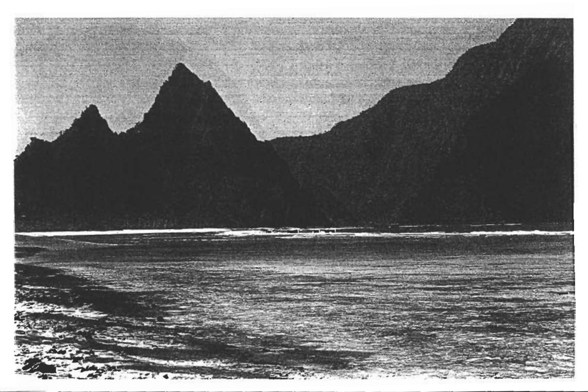
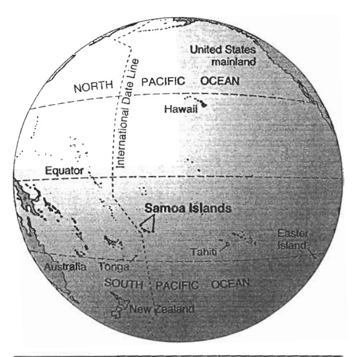
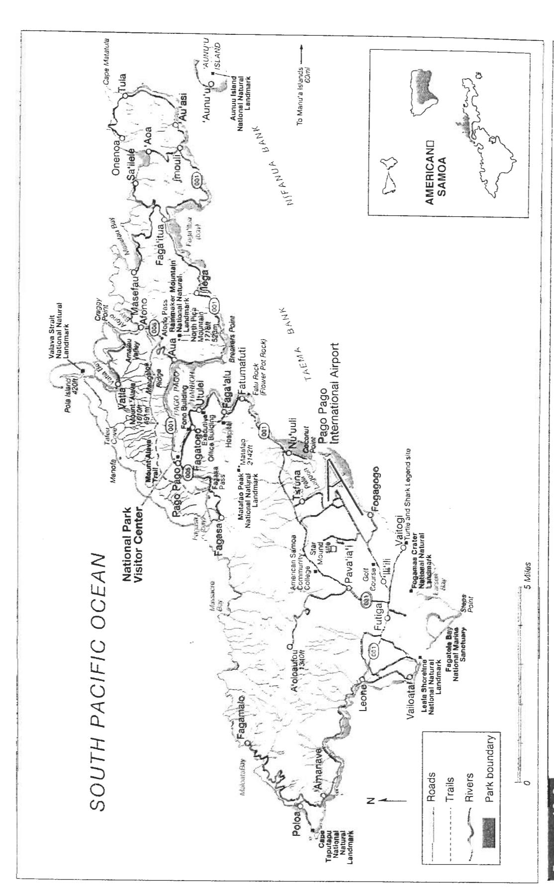
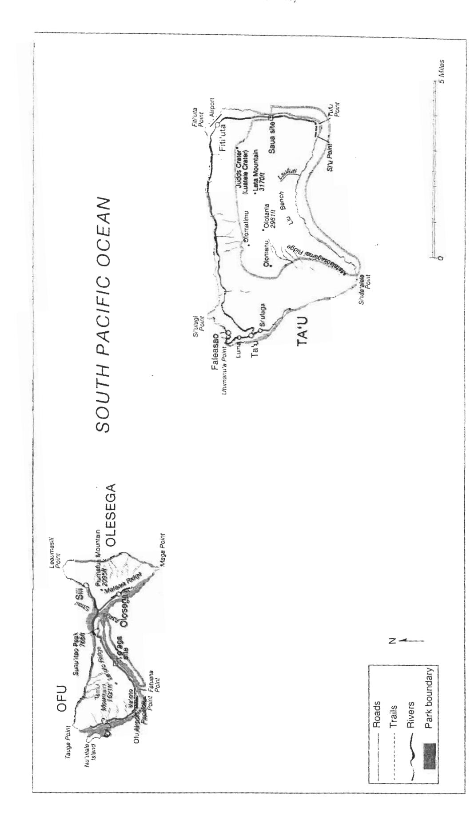
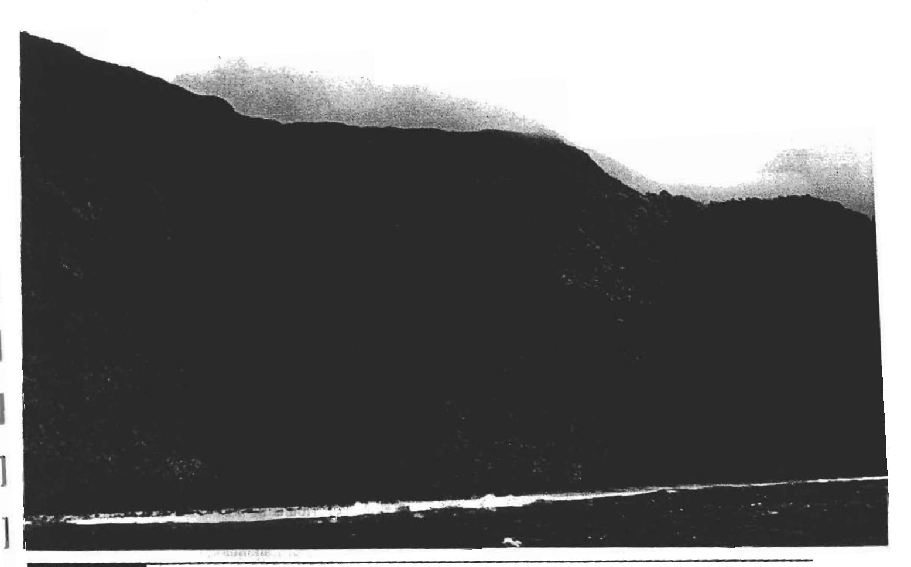
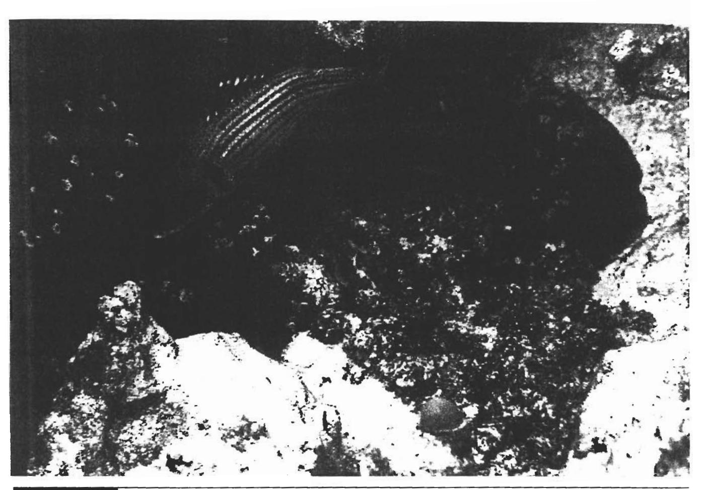
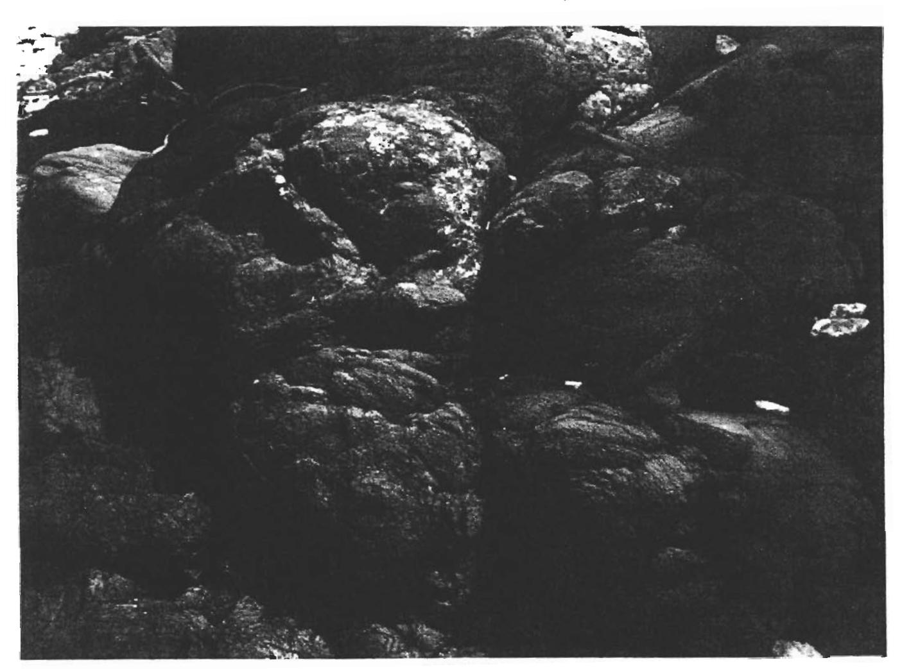
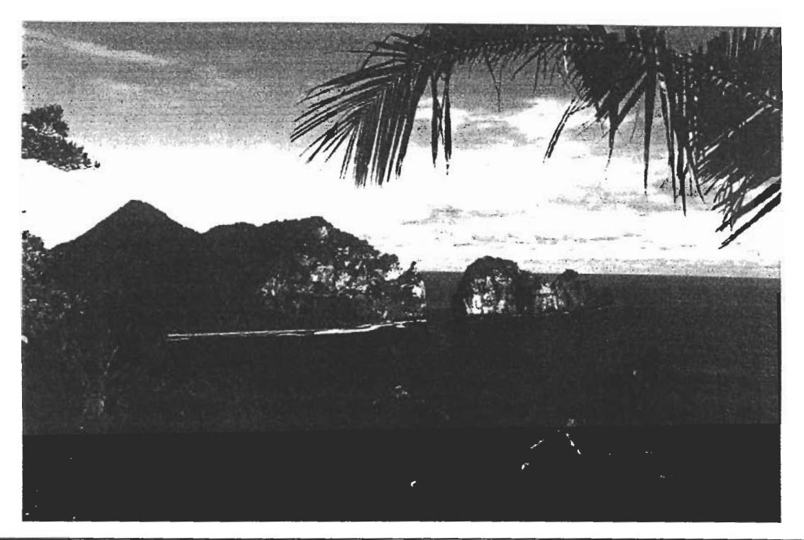
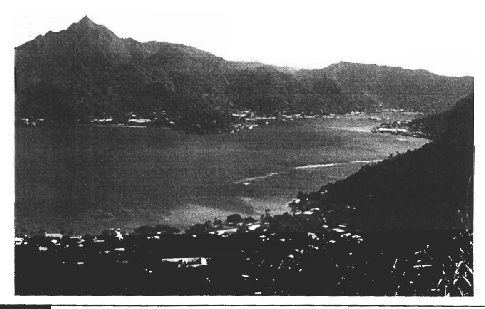
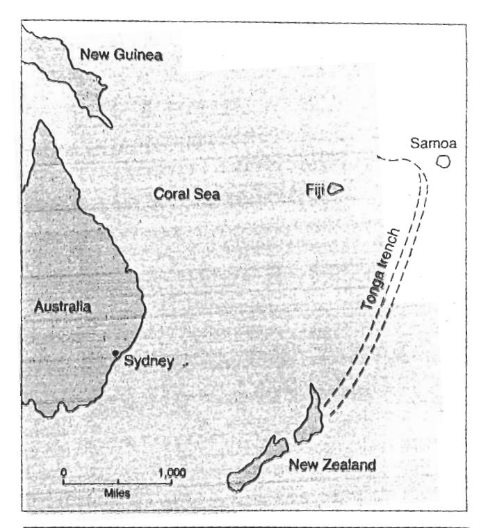

Sixth Edition

# TOOOSTA of National Parks

Ann G. Harris
Youngstown State University

Esther Tuttle
Science Editor

Sherwood D. Tuttle

Professor Emeritus University of Iowa

#### Book Team

Chairman and Chief Executive Officer Mark C. Falb
Vice President, Director of National Book Program Alfred C. Grisanti
Assistant Director of National Book Program Paul B. Carty
Editorial Developmental Manager Georgia Botsford
Developmental Editor Tina Bower
Assistant Vice President, Production Services Christine E. O'Brien
Prepress Project Coordinator Sheri Hosek
Prepress Editor Charmayne McMurray
Permissions Editor Renae Heacock
Design Manager Jodi Splinter
Designer Deb Howes
Senior Vice President, College Division Thomas W. Gantz

Cover photo of Kilauea Volcano, Hawaii, by Martin Miller, University of Oregon.

© 1975 by Ann G. Harris © 1977, 1983, 1990, 1997, 2004 by Kendall/Hunt Publishing Company

Library of Congress Catalog Card Number: 2003108444

ISBN 0-7872-9971-5 perfect bound version ISBN 0-7872-9970-7 loose leaf version

All rights reserved. No part of this publication may be reproduced, stored in a retrieval system, or transmitted, in any form or by any means, electronic, mechanical, photocopying, recording, or otherwise, without the prior written permission of the copyright owner.

Printed in the United States of America 10 9 8 7 6 5 4 3 2 1

#### The Geologic Time Scale and Geologic Columns

Eras, Periods, and Epochs are divisions of geologic time in descending order of magnitude. Rock units dated according to these time divisions are called, respectively, Erathems, Systems, and Series. For simplicity, time division terms only are used throughout this text. Minor time divisions are not included except for national parks where the terms have special geologic significance. Adapted from United States Geological Survey (1980). Geological Society of America (1983).

| Eras (or Erathems)                                                                                                                                                                                                                                                                                                                                                                                                                                                                                                                                                                                                                                                                                                                                                                                                                                                                                                                                                                                                                                                                                                                                                                                                                                                                                                                                                                                                                                                                                                                                                                                                                                                                                                                                                                                                                                                                                                                                                                                                                                                                                                             | as (or Erathems) Periods (or Systems) |                          |             | Length in millions of years | Age estimates of boundaries in millions of years |
|--------------------------------------------------------------------------------------------------------------------------------------------------------------------------------------------------------------------------------------------------------------------------------------------------------------------------------------------------------------------------------------------------------------------------------------------------------------------------------------------------------------------------------------------------------------------------------------------------------------------------------------------------------------------------------------------------------------------------------------------------------------------------------------------------------------------------------------------------------------------------------------------------------------------------------------------------------------------------------------------------------------------------------------------------------------------------------------------------------------------------------------------------------------------------------------------------------------------------------------------------------------------------------------------------------------------------------------------------------------------------------------------------------------------------------------------------------------------------------------------------------------------------------------------------------------------------------------------------------------------------------------------------------------------------------------------------------------------------------------------------------------------------------------------------------------------------------------------------------------------------------------------------------------------------------------------------------------------------------------------------------------------------------------------------------------------------------------------------------------------------------|---------------------------------------|--------------------------|-------------|-----------------------------|-----------------------------------------------------------|
| - 12-13 (12-14) - 13-14                                                                                                                                                                                                                                                                                                                                                                                                                                                                                                                                                                                                                                                                                                                                                                                                                                                                                                                                                                                                                                                                                                                                                                                                                                                                                                                                                                                                                                                                                                                                                                                                                                                                                                                                                                                                                                                                                                                                                                                                                                                                                                     | Quaternary                            |                          | Holocene    | .01                         | 01                                                        |
| 72                                                                                                                                                                                                                                                                                                                                                                                                                                                                                                                                                                                                                                                                                                                                                                                                                                                                                                                                                                                                                                                                                                                                                                                                                                                                                                                                                                                                                                                                                                                                                                                                                                                                                                                                                                                                                                                                                                                                                                                                                                                                                                                             | Quaternary                            |                          | Pleistocene | 1.6                         | .01                                                       |
| Section Section Section Section Section Section Section Section Section Section Section Section Section Section Section Section Section Section Section Section Section Section Section Section Section Section Section Section Section Section Section Section Section Section Section Section Section Section Section Section Section Section Section Section Section Section Section Section Section Section Section Section Section Section Section Section Section Section Section Section Section Section Section Section Section Section Section Section Section Section Section Section Section Section Section Section Section Section Section Section Section Section Section Section Section Section Section Section Section Section Section Section Section Section Section Section Section Section Section Section Section Section Section Section Section Section Section Section Section Section Section Section Section Section Section Section Section Section Section Section Section Section Section Section Section Section Section Section Section Section Section Section Section Section Section Section Section Section Section Section Section Section Section Section Section Section Section Section Section Section Section Section Section Section Section Section Section Section Section Section Section Section Section Section Section Section Section Section Section Section Section Section Section Section Section Section Section Section Section Section Section Section Section Section Section Section Section Section Section Section Section Section Section Section Section Section Section Section Section Section Section Section Section Section Section Section Section Section Section Section Section Section Section Section Section Section Section Section Section Section Section Section Section Section Section Section Section Section Section Section Section Section Section Section Section Section Section Section Section Section Section Section Section Section Section Section Section Section Section Section Section Section Section Section Section Sectio |                                       | Neogene                  | Pliocene    | 3.7                         | 1.6 —                                                     |
| Cenozoic                                                                                                                                                                                                                                                                                                                                                                                                                                                                                                                                                                                                                                                                                                                                                                                                                                                                                                                                                                                                                                                                                                                                                                                                                                                                                                                                                                                                                                                                                                                                                                                                                                                                                                                                                                                                                                                                                                                                                                                                                                                                                                                       |                                       | (subperiod)              | Miocene     | 18.4                        | 14-12-04                                                  |
|                                                                                                                                                                                                                                                                                                                                                                                                                                                                                                                                                                                                                                                                                                                                                                                                                                                                                                                                                                                                                                                                                                                                                                                                                                                                                                                                                                                                                                                                                                                                                                                                                                                                                                                                                                                                                                                                                                                                                                                                                                                                                                                                | Tertiary                              | Paleogene (subperiod) | Oligocene   | 12.9                        | 23.7 — 36.6 —                                             |
| 1.0                                                                                                                                                                                                                                                                                                                                                                                                                                                                                                                                                                                                                                                                                                                                                                                                                                                                                                                                                                                                                                                                                                                                                                                                                                                                                                                                                                                                                                                                                                                                                                                                                                                                                                                                                                                                                                                                                                                                                                                                                                                                                                                            |                                       |                          | Eocene      | 21.2                        |                                                           |
|                                                                                                                                                                                                                                                                                                                                                                                                                                                                                                                                                                                                                                                                                                                                                                                                                                                                                                                                                                                                                                                                                                                                                                                                                                                                                                                                                                                                                                                                                                                                                                                                                                                                                                                                                                                                                                                                                                                                                                                                                                                                                                                                |                                       |                          | Paleocene   | 8.6                         | 57.8 —                                                    |
|                                                                                                                                                                                                                                                                                                                                                                                                                                                                                                                                                                                                                                                                                                                                                                                                                                                                                                                                                                                                                                                                                                                                                                                                                                                                                                                                                                                                                                                                                                                                                                                                                                                                                                                                                                                                                                                                                                                                                                                                                                                                                                                                | Cretaceous                            |                          |             | 78                          | 144                                                       |
| Mesozoic                                                                                                                                                                                                                                                                                                                                                                                                                                                                                                                                                                                                                                                                                                                                                                                                                                                                                                                                                                                                                                                                                                                                                                                                                                                                                                                                                                                                                                                                                                                                                                                                                                                                                                                                                                                                                                                                                                                                                                                                                                                                                                                       | Jurassic                              |                          |             | 64                          | 208                                                       |
|                                                                                                                                                                                                                                                                                                                                                                                                                                                                                                                                                                                                                                                                                                                                                                                                                                                                                                                                                                                                                                                                                                                                                                                                                                                                                                                                                                                                                                                                                                                                                                                                                                                                                                                                                                                                                                                                                                                                                                                                                                                                                                                                | Triassic                              |                          |             | 37                          | 245 —                                                     |
|                                                                                                                                                                                                                                                                                                                                                                                                                                                                                                                                                                                                                                                                                                                                                                                                                                                                                                                                                                                                                                                                                                                                                                                                                                                                                                                                                                                                                                                                                                                                                                                                                                                                                                                                                                                                                                                                                                                                                                                                                                                                                                                                | Permian                               |                          |             | 41                          | 286                                                       |
|                                                                                                                                                                                                                                                                                                                                                                                                                                                                                                                                                                                                                                                                                                                                                                                                                                                                                                                                                                                                                                                                                                                                                                                                                                                                                                                                                                                                                                                                                                                                                                                                                                                                                                                                                                                                                                                                                                                                                                                                                                                                                                                                | Pennsylvan                            | ian                      |             | 34                          | 320                                                       |
|                                                                                                                                                                                                                                                                                                                                                                                                                                                                                                                                                                                                                                                                                                                                                                                                                                                                                                                                                                                                                                                                                                                                                                                                                                                                                                                                                                                                                                                                                                                                                                                                                                                                                                                                                                                                                                                                                                                                                                                                                                                                                                                                | Mississippia                          | an                       |             | 40                          | 360                                                       |
| Paleozoic                                                                                                                                                                                                                                                                                                                                                                                                                                                                                                                                                                                                                                                                                                                                                                                                                                                                                                                                                                                                                                                                                                                                                                                                                                                                                                                                                                                                                                                                                                                                                                                                                                                                                                                                                                                                                                                                                                                                                                                                                                                                                                                      | Devonian                              |                          |             | 48                          | 408                                                       |
|                                                                                                                                                                                                                                                                                                                                                                                                                                                                                                                                                                                                                                                                                                                                                                                                                                                                                                                                                                                                                                                                                                                                                                                                                                                                                                                                                                                                                                                                                                                                                                                                                                                                                                                                                                                                                                                                                                                                                                                                                                                                                                                                | Silurian                              |                          |             | 30                          | 438 —                                                     |
|                                                                                                                                                                                                                                                                                                                                                                                                                                                                                                                                                                                                                                                                                                                                                                                                                                                                                                                                                                                                                                                                                                                                                                                                                                                                                                                                                                                                                                                                                                                                                                                                                                                                                                                                                                                                                                                                                                                                                                                                                                                                                                                                | Ordovician                            |                          |             | 67                          | 505 —                                                     |
|                                                                                                                                                                                                                                                                                                                                                                                                                                                                                                                                                                                                                                                                                                                                                                                                                                                                                                                                                                                                                                                                                                                                                                                                                                                                                                                                                                                                                                                                                                                                                                                                                                                                                                                                                                                                                                                                                                                                                                                                                                                                                                                                | Cambrian                              |                          |             | 65                          | 570 —                                                     |
| Precambrian time*                                                                                                                                                                                                                                                                                                                                                                                                                                                                                                                                                                                                                                                                                                                                                                                                                                                                                                                                                                                                                                                                                                                                                                                                                                                                                                                                                                                                                                                                                                                                                                                                                                                                                                                                                                                                                                                                                                                                                                                                                                                                                                              |                                       |                          |             |                             |                                                           |
|                                                                                                                                                                                                                                                                                                                                                                                                                                                                                                                                                                                                                                                                                                                                                                                                                                                                                                                                                                                                                                                                                                                                                                                                                                                                                                                                                                                                                                                                                                                                                                                                                                                                                                                                                                                                                                                                                                                                                                                                                                                                                                                                |                                       | Proteroz                 | zoic Z      |                             | 800 —                                                     |
| Proterozoic Eon                                                                                                                                                                                                                                                                                                                                                                                                                                                                                                                                                                                                                                                                                                                                                                                                                                                                                                                                                                                                                                                                                                                                                                                                                                                                                                                                                                                                                                                                                                                                                                                                                                                                                                                                                                                                                                                                                                                                                                                                                                                                                                                | Proterozoic Y                         |                          |             |                             | 1600 <del></del>                                          |
|                                                                                                                                                                                                                                                                                                                                                                                                                                                                                                                                                                                                                                                                                                                                                                                                                                                                                                                                                                                                                                                                                                                                                                                                                                                                                                                                                                                                                                                                                                                                                                                                                                                                                                                                                                                                                                                                                                                                                                                                                                                                                                                                |                                       | Proteroz                 | zoic X      |                             | 2500                                                      |
| Archean Eon                                                                                                                                                                                                                                                                                                                                                                                                                                                                                                                                                                                                                                                                                                                                                                                                                                                                                                                                                                                                                                                                                                                                                                                                                                                                                                                                                                                                                                                                                                                                                                                                                                                                                                                                                                                                                                                                                                                                                                                                                                                                                                                    |                                       |                          |             |                             |                                                           |
| Olde                                                                                                                                                                                                                                                                                                                                                                                                                                                                                                                                                                                                                                                                                                                                                                                                                                                                                                                                                                                                                                                                                                                                                                                                                                                                                                                                                                                                                                                                                                                                                                                                                                                                                                                                                                                                                                                                                                                                                                                                                                                                                                                           | est known roc                         | ks in the United St      | ates        |                             | 3600                                                   |

\*A general consensus has not been arrived at regarding the divisions of Precambrian time in North America and elsewhere in the world. The terms given here are considered informal; that is, time terms without specific ranks. An *Eon* is the longest division of geologic time.

#### CHAPTER 42

# National Park of American Samoa

# CENTRAL SOUTH PACIFIC

Area: Parts of three volcanic islands: 10,520 acres, including 420 acres offshore

Authorized as a National Park: October 31, 1988 Officially Established as a National Park: 1993

Address: Superintendent, National Park of American Samoa, Pago Pago, American Samoa, AS 96799 Phone: 011-684-633-7082

**E-mail:** NPSA\_Administration@nps.gov **Website:** www.nps.gov/npsa/index.htm

These National Park units on three different volcanic islands are leased from the American Samoan government and native villages. The island of Tutuila is mostly rainforest, mountains, and beaches. Ofu has a mountain background, a coral sand beach and fringing coral reef.

Ta'u has some of the tallest sea cliffs in the world, around 3,000 feet high.

FIGURE 42.1 Coral sands on Ofu Beach. In the distance, the inactive volcano on Olosega Island rises more than 2,000 feet above the ocean. National Park Service photo.

## **Geographic Setting**

The Samoa islands are south of the equator and just east of the International Date Line. The islands are about 2.600 miles southwest of Hawaii and 1.800 miles northeast of New Zealand (fig. 42.2). The Polynesians of the eastern Samoa islands; that is, American Samoa, have had close ties with Americans since the 1870s. United States officials negotiated treaties in 1872 and 1878 with Samoan chiefs for trading rights and the use of the landlocked, deep-water harbor at Pago Pago (PAHNG-oh PAHNG-oh), one of the best natural harbors in the Pacific. The U.S. Navy used the site for a coaling and repair station and, during World War II, as a staging area. Western Samoa (the western islands of the archipelago), which had been under the protection of New Zealand, became independent in 1962.

America Samoa, an unincorporated territory of the United States, has its own government with an elected territorial governor, a bicameral legislature, and an independent judiciary. In the National Park of American Samoa, land tenure and jurisdiction are different from those in other parks.

Within authorized park boundaries, all lands are village or communally owned and controlled. In 1993 a

FIGURE 42.2 American Samoa's location in the Pacific is below the equator and the east of the International Date Line.

50-year lease was signed after five years of negotiation with nine chiefs in village councils and the American Samoan government for \$419,000 per year. The federal government has management authority and exercises it to protect natural and cultural resources, as well as provide for visitor use. The villagers continue to carry on their traditional subsistence and gathering activities as long as they do not endanger natural or cultural resources that the government is required to protect.

The word Samoa is derived from the native Samoan words sa ia Moa (sacred to Moa/center of the earth). This refers to the legend that "the rocks cried to the earth, and the earth became pregnant." The god of the rocks, named Salevao, noticed movement in the center of the earth (moa). When the child was born he was named sa ia Moa after the place from which he came. Salevao promised that everything that grew would be sacred to Moa (sa ia Moa). Therefore, the earth and rocks were called sa ia Moa or SAMOA.

Polynesians arrived in Samoa as early as 1000 BC and spread from there to other Pacific islands. Samoans, the people of Polynesia's oldest culture, are well tuned to their island environment, managing it communally and holding it to be precious. The national park ethic of preserving environmental and cultural values fits well and naturally with the traditional Samoan way of life, which is called "fa'asamoa."

American Samoa, as a political unit, consists of five islands, five islets, and two atolls (fig. 42.3). The most populated island in American Samoa is Tutuila (too-too-EE-lah) with 95 percent of the total population. The territory time is one hour earlier than Hawaii. Temperatures range from a high of 18° C (90° F) in December, the hottest month, to a low of 10° C (75° F) in August. Annual rainfall averages 190 inches, the rainy season being from December to March. The humidity averages 80 percent but is a little higher in the summer months. Because the islands trend in the same direction as the prevailing southeast trade winds, the difference between the leeward (north and west sides) and windward (south and east sides) is not so great as in Hawaii. Pago Pago harbor (south of the park) has the highest yearly precipitation of close to 195 inches because the high ridge of Rainmaker Mountain at 1,718 feet, which is also a National Natural Landmark, intercepts precipitation.

Hurricanes periodically strike these islands. Three recent ones were quite destructive; Tusi (1987), Ofa (1990), and Val (1991). Of the three, Val was the worst. In 1998 El Nino produced a drought.

Areas in the National Park of American Samoa, shown in green, include land, beaches, lagoons, and reefs. Ofu and Ta'u are about 80 miles east of Tutuila Island. Park headquarters is in Pago Pago, American Samoa's capitol city, on Tutuila Island. FIGURE 42.3

FIGURE 42.3 Areas in the National Park of American Samoa. (continued)

Only 10 percent of the land is arable, supporting subsistence agriculture on young, shallow volcanic soils. Mountain slopes—nearly everywhere—are too steep (40 to 70 percent) for the growing of crops. The forest is a mixed species paleotropical (old world) rainforest, the only one in the National Park system.

#### The National Park Units

The three islands that have parklands and protected offshore waters are Tutuila, Ta'u (tah-OO) and Ofu (OHfoo). All three islands have drowned barrier reefs offshore. Because of weathering and leaching, the soils are low in silica, and high in iron and aluminum, and therefore have low fertility. They are classified as latosols. Wildlife is abundant, with about 900 species of fish, 200 species of coral, 35 species of birds, and 3 species of mammals (all bats). **Ta'u Unit.** This is the largest park unit with 190 acres of land and 300 acres) offshore. The entire island is 15 square miles and 3,051 feet in elevation. The park's land is located on the south side of the island.

The park's flora is mostly undisturbed rain forest that includes coastal lowlands, montane, and cloud forest communities. On a rare clear day, the view from the cloud forest—largest in Samoa—toward the ocean is spectacular. Sea cliffs drop in two or three steps, from the top of Lata Mountain—which at 3,170 feet is American Samoa's highest peak—down to the rugged coastline (fig 42.4). Laufuti stream, the only perennial stream on the island, has the spectacular Laufuti Falls, which pours down from the cliff more than 1,000 feet. Thriving here are rare plants, tropical birds, two species of large flying fox (fruit bats) with wingspans up to three feet.

Ofu Unit. Nine miles across open water from Ta'u is the island of Ofu. The park portion consists of a beautiful

FIGURE 42.4 On Ta'u Island's south coast, sea cliffs—some of the tallest in the world—rise over 3000 feet, almost to the summit of Lata Mountains, American Samoa's highest peak. National Park Service photo taken by Doug Cuillard.

FIGURE 42.5 A marine scene of coral and fish off Ofu Island. National Park Service photo by Doug Cuillard.

coral sand beach and one of the best examples of a healthy coral reef in the South Pacific. It is an excellent site for snorkeling (fig. 42.5). Of u is separated from Olosega by a 656 foot wide sea channel but is connected by a bridge. Both islands are remnants of a large shield volcano. The island of Of u is a complex of volcanic cones, buried by lava from two merging flows, and remnants of a large volcano that is deeply eroded and has collapsed into a caldera. Lava flows and dikes can be seen in the walls, along with thick pyroclastic beds. The basic structure is a shield with parasitic cinder cones. Geomorphically, it is still in the shield building stage.

The reef supports hundreds of species of fish, coral, and other marine life. Endangered hawksbill sea turtles and green sea turtles also find refuge in these waters.

Tutuila Unit. This park area is located north of the capital of American Samoa, Pago Pago. The unit consists

of about 2,670 acres of land and 450 acres of ocean. The size of Tutuila Island is approximately 48 square miles, with an elevation of 2132.5 feet.

Narrow irregular ridges form the backbone of the island of Tutuila. These ridges are older beds that have been deeply eroded. The park unit is typical of the rest of the island; i.e., closely spaced streams that are deeply eroding the volcanic slopes made up of basalt. The amount of precipitation and warm temperatures have formed a *laterite* soil. Most of the island has no craters because of substantial weathering, with the exception of the Leone Peninsula, formed about 70,000 years ago. Also found on the island are *drowned valleys*, small coastal flats, and volcanic intrusions such as Rainmaker Mountain, which is a *trachyte plug*, 1,718 feet high and outside of the park boundaries. It is a National Natural Landmark, one of seven in American Samoa.

Tutuila has a cyclic history of erosion followed by subsidence. Pago Pago harbor is a drowned volcanic caldera south of the park. At Vaisa Point on the west side of Tafeu Cove, the small streams enter the sea in hanging valleys because the wave action has eroded the cliffs faster than the streams can downcut. Maugaloa Ridge separates the park southward from the rest of the island.

This unit includes an undisturbed expanse of rainforest in the north central section of the island, as well as offshore waters and a fringing reef. Coastal lowland, montane, and ridge communities exist in the rainforest. Sea cliffs rimming the coast provide safe rookeries for thousands of sea birds.

In Amalau Cove (between Vatia Bay and Afona Bay) *pillow lavas* can be seen along the shore (fig. 42.6). The pillow lavas indicate extrusion under water. The beach at the head of the bay is a mixture of basaltic boulders and cobbles, with large chunks of coral that have been rounded by wave action. Because of the shallow slope, vigorous wave action, and size and shape of the rocks, they can be heard rubbing against one another and making a noise as the waves move back and forth. They are called the "singing rocks." Vaiava Strait is another National Natural Landmark. It separates Pola Tai Island (Cock's Comb), which is 420 feet high from Tutuila Island and includes Matalia Point, Cockscomb Point and Polauta Ridge (fig. 42.7). The strait's shape is

FIGURE 42.6 Pillow lavas on the shore of Amalau Cove on Tutuila Island. Pillow lavas are submarine extrusions of basaltic lavas that solidify as pillow-shaped masses closely fitted together. National Park Service photo by Doug Cuillard.

FIGURE 42.7 Pola Island in Vaiava Strait along with the "cockscomb," or Pola Tai, in the National Park of American Samoa on Tutuila Island. Photo by Ann G. Harris.

due to the fact that it is one of the trachyte intrusions. Mount 'Alava at 1610 feet is part of the caldera rim of Pago Pago volcano. A rugged trail leads to the summit of Mount 'Alava. The beginning of the three-mile trail starts at Fagasa Pass, about two miles west of Pago Pago. Hikers should allow about three hours for the climb up and about two hours for the hike down.

The island as a whole has a rugged terrain and a deeply embayed coastline showing erosion and subsidence. Pillow lavas and a flat plain between Nu'uuli and Leone (outside of the park) were built on a submerged reef by lava and tuff of Holocene age.

#### **Geologic Features**

The volcanoes of Samoa developed on the Pacific plate over a *hot spot* similar to the hot spot beneath the Hawaiian Islands. In 1985, J.H. Natland and D.L. Turner, using evidence from potassium/argon dating, field observations, and petrologic data, concluded that the Samoan shield volcanoes formed in age progression from west to east just as the rest of the Pacific Ocean

island chains. What created confusion was the fact that when the western islands entered the post-erosional stage of volcanic activity, there was enough eruption of lava to basically cover most of the island. The islands to the east, i.e., Ofu and Ta'u, are still in the shield building stage.

Additional evidence is Vailulu'u Seamount (a *seamount* is an underwater volcano), which eventually will become the next Samoan island. It is on the east-ernmost end of the Samoan swell, which is the leading edge of the hot spot track. Originally discovered in mid-1973, confirmation was established in 1999. It has risen 14,764 feet from the sea floor. Vailulu'u means "the sacred sprinkling of rain."

The summit of the seamount has three peaks along the crater rim. The summit crater is 1312 feet deep and 1.24 miles wide. The summit peaks extend down the slopes of Vailulu'u into three rift zones of the seamount. Radiometric dating of the lavas show dates of 5 to 50 years. Underwater studies have shown large-scale mass wasting of the sides.

New measurements show that in this area the Pacific plate, which moves in a northwest direction, is

FIGURE 42.8 Pago Pago harbor, viewed from the top of Mount Alava. A collapsed caldera, cut by ring dikes and modified by erosion, has formed this deep-water harbor. National Park Service photo.

the speediest tectonic plate on the globe. The Pacific plate is sliding down into the mantle beneath the Indo-Australian plate at the rate of almost 9.5 inches a year.

The main islands in American Samoa form a short aseismic ridge, that is, a submarine ridge that is a fragment of continental crust and not subject to earthquakes. It runs from the northwest to the southeast; therefore Tutulia, the largest island, is also the oldest. probably Pliocene in age. Age dates range from 1.24 to 1.4 my for the island. The younger islands are probably Holocene in age. The islands are not single volcanoes but are made up of intergrown and superimposed cones of shield volcanoes (flattened domes, built by flows of very fluid basalt). Tutuila, with four eroded shield volcanoes and one volcano of Holocene age, occupies the top of the volcanic pile that rises about 15,000 feet from the ocean floor. Eruptions have been largely basaltic and fluid, but a greater variety of igneous rocks have been found on Tutuila than on the other islands that are younger. Most lavas were of the pahoehoe type, but cinder cones, tuff cones, and remnants of calderas can be found. Pahoehoe lava consists of smooth ropy flows. Cinder cones are made up of pyroclastic (material solidified in mid-air) debris, while tuff cones are consolidated pyroclastic debris. Pago Pago harbor is a caldera that has been breached by stream erosion and "drowned" by rising sea levels and slow subsidence (fig. 42.8).

Although the volcanoes of American Samoa have been inactive for some time, the hot spot beneath the moving tectonic plate still gives indications of its presence. A low bulge of prehistoric volcanic origin on the south side of Tutuila (the Tafuna Plain), has a surface so young that streams have not eroded it. A submarine eruption occurred off Olosega (southeast of Ofu) in 1866; in 1973, a submarine eruption was detected east of American Samoa, by an underwater listening system (SOFAR).\*

\*Smithsonian Institution, 1981 Volcanoes of the World, pg. 46, Hutchinson & Ross.

In the warm, humid, rainy climate of Samoa, the local basalt disintegrates and decomposes rapidly. Patterns of radial drainage on the mountains are typical. Erosion has cut deeply into the cones, leaving peaks, narrow ridges, and multiple, closely spaced stream valleys. Landslides leave scars on the steep slopes. Debris is swept down slopes and chokes lower stream valleys. Extensive dike complexes, i.e., Masefau Dikes, Fagasa Dikes, and Afano Dikes, display what were once "feeders" rising from volcanic depths.

Resistant trachyte plugs (fine-grained equivalent of syenite, similar to granite but much less quartz) make up the high peaks of Rainmaker and Matafao on Tutuila. Along exposed shores, waves have battered the rocks, eroding high sea cliffs and sheltered coves.

Limited drilling has identified bedded calcareous sandstone and siltstone, rather than solid coral within the fringing reefs of Tutuila. The sediments that make up these deposits were washed down from the mountain slopes into the water and gradually buried by coral growth as sea levels rose and subsidence occurred. Some coastal areas have traces of even higher shorelines of late Pleistocene and Holocene age.

The islands of American Samoa are located along the crest of a submarine ridge, called the Samoan Ridge, that is essentially perpendicular to the Tonga Trench, at approximately S 70° E. This ridge is probably the surface expression of a large sea-floor fault, along which the volcanoes erupted and formed islands. The Tonga-Kermadec oceanic trench is 2300 miles long, running from New Zealand (fig. 42.9) to the Samoan Islands. Here Pacific oceanic crust is subducting under flooded, shallow continental crust of the Indo-Australian plate. The island arcs of the southwest Pacific, with their andesitic volcanoes that developed along the continental side of the trench. are not directly related to the basaltic Samoan volca-10es despite their proximity. However, recent studies Farley, 1995) suggest that fluids brought up from the nantle by the Samoan hot spot are geochemically imilar to pelagic (ocean bottom) sediments that have een drawn down into the Tonga Trench and recycled."

Beside the basaltic lava flows, another type of volmic rock formed in the coastal areas, on both hills and antishore islands. Lava rising to the surface comes in contact with surface water, causing huge, powerful, applosions, such as the ones seen as lava flows enter the pean today in Hawaii. The result is a mixture or layer ash, volcanic rock, and pieces of coral called *tuff*. This is the origin of the tuff cones found on the islands at Tutuila, Ofu and Ta'u.

FIGURE 42.9 The Tonga trench is the northern section of this long oceanic trench, which is over six miles deep. The Pacific plate moves almost directly westward here before it bends down and is pulled into the trench.

## **Geologic History**

New geologic techniques have been useful in studying the great pile of lavas and ash that have accumulated on the Pacific ocean floor and built up the Samoan archipelago. Radiometric dating methods have given absolute ages for rocks. Geochemical and petrologic analyses have allowed investigators to describe and identify units one from another. The geologic column (table 42.1) with its relative dates and formation names is the result of such methods.

1. According to Stearns (1944), prior to 1.4 million years ago the intrusion from a volcanic rift zone formed the Masefau Dike complex.

Intrusion of basaltic dikes that were either vesicular or occasionally *amygdoidal* (filled in vesicles) from a rift zone on the ocean floor to form either a shield volcano or layers of lava. Much of the lava that was intruded has been *brecciated*, that is broken into angular fragments; some of it may have been the broken material that fell back into the magma chamber. The thickness of this complex is about 197 feet.

# Table 42.1

# Geologic Column, National Park of American Samoa

| Eon         | Era                             | Period     | Epoch       | Formation                                 | Member        | Stage                           | Geologic Events                                                                                                                                                                                                             |
|-------------|---------------------------------|------------|-------------|-------------------------------------------|---------------|---------------------------------|-----------------------------------------------------------------------------------------------------------------------------------------------------------------------------------------------------------------------------|
| Phanerozoic |                                 |            |             | 100 WE 与增加。 200 W.B. An 图象是一种200 A. |               | Post Caldera                    | Mass wasting in the form of talus accumulation at base of cliffs and landslides.  Deposition of sediments by water. Wave action creates beaches of basalt, coral and sands on all islands. Formation of Vailulu'u seamount. |
|             |                                 |            | Holocene    | Faleasao and Fitiuta Tuff              |               |                                 | About 30,000 years ago the formation of several tuff cones in the northwest corner of Ta'u. Additional flows erupted at a different time in northeast corner of Ta'u.                                                       |
|             |                                 |            |             | Aunu'u Tuff Leone Basalts              | •             |                                 | About 70,000 years ago the formation of a tuff cone southeast of Tutuila Island forming Aunu'u island. Extrusion of Leone Volcanics from several vents creating the Leone peninsula on western half of Tutuila Island.      |
|             |                                 | Quaternary |             |                                           | ~~~           |                                 | Fluctuation of sea level because of world-wide glaciation. Development of fringing and barrier reefs, first on Tutuila Island (oldest) and later on Ofu' and Ta'u Islands after they formed.                                |
|             |                                 |            | cene        | Lautele Formation                      |               | Post Caldera Shield Building | Formation of lava cone from flows along a fault on the northwest and northeast corners of Ta'u Island; lava pools in crater.                                                                                                |
|             | , dela                          |            | Pleistocene | Tunao Formation                        |               |                                 | Olivine basalts mixed with volcanic ash and tuffs from satellite cones in an east- west direction along a rift zone on Ta'u Island.                                                                                      |
|             | 75.A                            |            | 428         | Trachyte ( Lata                           | Post-Caldera  |                                 | Formation of tuff cones inside and outside of the caldera on Ta'u Island.                                                                                                                                                   |
|             | 4000 1 400 4 400 4 400 |            |             | Plugs forma- tion                      | Intra-Caldera |                                 | Mixture of shales and olivine basalts. Flows emitted from rift zones that trend northeast and northwest about 500,000 years ago on Ta'u Island.                                                                             |
|             | Cenozoic                        |            |             |                                           |               |                                 | Intrusion of trachyte plugs 1.3 ± 0.03 mya into Olomoana, Alofau, Pago, and Taputa volcanoes about 100,000 years after they formed on Tutuila island.                                                                       |
|             | S                               |            |             | Late Formation                            |               | Shield Building                 | A series of lava flows forming Ta'u Island as a shield volcano.                                                                                                                                                             |
|             | <b>李明</b>                       |            |             | Nuu Toffs                                 |               |                                 | Shallow submarine eruptions forming pyroclastic material on Ofu Island.                                                                                                                                                     |
|             |                                 |            |             | Taufanua Formation                     |               |                                 | Olivine basalts forming a shield volcano and a complex of volcanic cones that were buried. Still forming Ofu Island.                                                                                                        |
|             |                                 |            |             | Asago Formation                           |               |                                 | Mostly breccia forming the base of Ofu Island (and Olosega Island).                                                                                                                                                         |
|             |                                 |            |             | Taputapu Volcanics                     |               | Post Caldera                    | Thin-bended olivine basalts forming over rift zone in a dome structure. Tuffs interbedded with lavas, cinder cones, westernmost volcano on Tutuila Island.                                                                  |
|             |                                 |            |             | Pago Extra- Caldera Volcanics       | Upper Member  |                                 | Upper member massive basaltic andesites and andesite lavas interbedded with tuff and cinder layers on Tutuila Island.                                                                                                       |
|             |                                 | Tertiary   | Pliocene    |                                           | Lower Member  |                                 | Lower member a thin-bedded olivine basalt associated with dikes, tuffs, and breccia of earlier rocks. Bed dip away from caldera on Tutuila Island.                                                                          |
|             |                                 | Te         | IId         | Pago Intra- Caldera                    | Upper Member  | 14/12/2                         | Flows of porphyritic basalts, andesite lavas, tuffs, breccias and cinder cone. Filling of caldera on Tutuila Island.                                                                                                        |
|             | Partie                          | 0.05       |             | Volcanics                                 | Lower Member  | , (1) (1) (1) (1)            | Formation of subaerial portion of shield volcano between 1.54 and 1.28 million years ago. Formation of caldera 1.27 ± 0.02 million years ago on Tutuila Island.                                                             |
|             |                                 |            |             | Alofau Volcanics                       |               | Shield Building                 | Second shield volcano forming over a rift zone. Olivine basalt flows, tuffs, dikes and breccia to the west of Olomoana volcano. Caldera formed on Tutuila Island.                                                           |
|             |                                 |            |             | Olomoana Volcanics                     |               |                                 | Initial eruptions forming Tutuila Island. A shield volcano forming about 1.4 million years ago with olivine basalts, andesitic basalts, tuff and cinder cones.                                                              |
|             |                                 |            |             | Masefau Dike Complex                | · · · · · ·   | or.                             | Intrusion of basaltic dikes from a rift zone on the ocean floor into lava layers that were brecciated by the intrusion. Erosion.                                                                                            |

Sources: Modified after Keating, 1992; Natland, 1980; Whistler, 2002; Amreson et al., 1982.

2. Around 1.4 million years ago the shield building stage began and four volcanoes formed nearly contemporaneously during the Pliocene Epoch, creating the island of Tutuila.

Tutuila is the oldest island of American Samoa and the largest. The island has a rugged terrain and a deeply embayed coastline, showing evidence of erosion and subsidence. Going from east to west, four volcanoes formed at almost the same time on Tutuila Island. An overlap of each succeeding volcano indicates that they formed in a series at slightly different times. The Olomoana shield volcano, which formed first, consists of mostly olivine basalts that were eventually capped with andesitic basalts. Within the cone are exposures of many layers of glassy tuffs. Several cinder cones on its flanks are visible. The thickness of these beds is 1,057 feet. Weathering of the beds shows only a few gullies that are not very long and have not been deeply eroded because they are close to base level (the lowest point to which a stream can be eroded).

The second volcano, the Alofau, developed over a rift zone with an N 70° E trend. It has a composition of olivine basalt, and an almost mile wide caldera developed. Several hundred dikes have been exposed. Some of them are poryphyritic; that is, the bubble holes, or vesicles, have been filled with secondary material called amygdules. The caldera decreases in height to the southwest and part of it is submerged offshore. The thickness of these beds is 3,156 feet. Only a limited canyon developed on the flanks of the caldera.

The Pago volcano is located in the center of Tutuila Island. The subaerial portion was constructed between 1.54 and 1.28 million years ago. The caldera, which is about 6 miles long and 3 miles wide, formed  $1.27 \pm 0.02$  million years ago. The southeast portion of the caldera forms Pago Pago harbor. The northwest rim. Maugaloa Ridge, forms the southern boundary of the park. The Pago volcanic series is divided into the Intra-Caldera and Extra-Caldera units. The thickness of these beds is 1,053 feet. The Pago Intra-Caldera unit partly fills the wide caldera and consists of massive poryphyritic basaltic and andesitic lava flows. There are also associated cinder cones, tuffs, and breccias, plus a few thin lenses of interbedded gravel. This unit has poorly graded deep valleys. The canyons are headed by amphitheaters. The Pago Extra-Caldera unit has a lower and upper member. The lower member is primitive olivine basalt and is thin bedded. Associated with it are thin dikes, glassy tuff, and glassy tuffs with fragments of previously formed rocks. The beds dip away from the caldera at about a 25° angle. The upper member is a mixture of massive basaltic andesites and andesite lava flows, interbedded with glassy tuffs and scattered cinder layers, up to 492 feet. They rest conformably on the lower member. The erosion of this type of rock has formed deeply incised canyons and entrenched gullies. The canyon fill is highly laterized. Being derived from basalts, it is rich in oxides of iron and aluminum and is a typical product of weathering in tropical climates.

The last volcano is Taputapu, the westernmost volcano; its lavas appear to overlap the Pago volcanics. It is a shield volcano that developed over a rift zone that trends N 75° E. The olivine basalts are thin bedded and interbedded with glassy tuffs and cinder cones. The beds are 1,614 feet thick. The soils from the basalts have become deeply laterized. Isolated canyon ridges have formed and the canyons are moderately incised. These four volcanoes have undergone the first three stages of submarine origin, producing a dome or shield, and then the formation of a caldera, as Stearns had proposed.

3. The formation of Ofu Island (and Olosega Island) from a submarine shield volcano during the Pliocene Epoch. Formation of modern fringing reefs.

Most of the shield volcanoes in Samoa formed from volcanic centers. Examples of this are Ofu-Olosega and Ta'u plus a submerged bank west of Ofu-Olosega. The two islands of Olosega to the east and Ofu Island to the west are separated by a 656 foot sea channel. The national park unit is located on the eastern tip of Ofu Island. Ofu is much younger than Tutuila Island, as is illustrated by the fact that it is not so highly eroded as Tutuila. There are no offshore banks that are wide or were left over from the drowning of the reefs during late Pleistocene time. In their place are shallow sea cliffs that lack reefs at the edge of the Holocene flows. There are some reefs, but they occur on the older flows as is seen in the national park on Ofu. They are either fringing reefs or very narrow barrier reefs. These islands did not develop until Tutuila volcanoes were extinct and underwent extensive erosion before their reefs were drowned during Pleistocene time.

The Asaga Formation (the oldest unit that is Pliocene in age) is mostly a breccia; that is, angular fragments that are cemented together. It probably formed as the result of magma forcing its way up to the surface. This formation and the reefs are found in the park. Ofu and Tutuila were once part of a large shield volcano (Tuafanua Formation) with its center most likely north of the two islands, according to evidence. The Tuafanua units are divided into the ponded flows. and flows that are mixed with pyroclastic debris. A series of older tuff and cinder cones are scattered over the island, such as the cinder cone at Tauga Point (northwest Ofu), a tuff cone at the beach at Samo'i (the western end) plus a composite cone that is exposed by To aga (southeastern Ofu) in a cliff. They have been buried by lava from two merging flows.

Eventually the crater of the large shield volcano collapsed and formed a caldera. The collapse exposed dikes and lava flows.

When lava flows come in contact with water, there is a tremendous explosion of steam, lava, and coral producing tuff. One example of this is a tuff cone just off the west coast of Ofu that makes up the island of Nu'utele. This formation, known as the Nuu Tuff, is also found on the western side of Ofu. These pyroclastic beds are deeply weathered, forming laterized fragmental volcanics. Additional flows covered some of this material.

4. Intrusion of trachyte plugs during the post-caldera stage into all of the volcanoes approximately 1.3 ± 0.03 mya, during Pliocene and early Pleistocene Epochs. This was followed by a time of major erosion, known as the first erosional stage, producing a great erosional unconformity.

About 100,000 years after the four main volcanoes formed, more or less contemporaneously, there was a series of intrusions of dense, cream colored trachyte plugs, some dikes, and also some crater filling. This is the fourth stage proposed by Stearns. Only one trachyte plug (called the Lefulufulua plug) intruded into the Olomoana Volcano. The Lelia plug intruded the Alofau volcano. Things were more active with the Pago volcano. The lower layer has three trachyte plugs, the Matafao (forming Matafao Peak, a National Natural Landmark), and Papataele and Pioa (part of Rainmaker Mountain). The upper layer has five; the Pioa (rest of Rainmaker Mountain, Matafao, Ta'u, Vatia and Afono plugs).

By using the submarine profile of the western Samoan Islands, it has been estimated that the volcanoes were originally a little over a mile high as compared to Matafas Peak, the highest mountain on Tutuila Island today, which is only 2,142 feet high.

The trachyte plugs are dense and very resistant to erosion. This is the type of rock that forms the sharp peaks, such as the tip of Vasia Point. There are two more trachyte plugs in the park; one is along the Mount 'Alava Trail, about a mile and a quarter from the beginning of the trail on the west end of the park land. The other trachyte plug is about a mile east of Fagasa Bay. There are also outcrops of either cinders or tuff throughout the park. Long-term erosion has removed any older volcanic cones that once existed on the flanks of Pago volcano.

# 5. The formation of Ta'u Island from a remnant of a shield volcano about 500.000 years ago.

The history of Ta'u is very similar to that of Tutuila, but it is the youngest of the park islands. The island is a remnant of a shield volcano that collapsed in Holocene time. It consists of many thin lava flows and some tuff beds. The Lata Formation of Pliocene age is the building stage of this volcano. The Pleistocene age Lata Formation represents the Intra-Caldera Member and Post-Caldera Member. The presence of a mixture of shale and olivine basalt suggests a fluctuation of sea level producing shales between eruptions. After the formation of the caldera, numerous tuff/cinder cones formed inside and outside the caldera on the northern flanks, making up the Tunoa Formation, a mixture of ash, tuff, and olivine basalt.

The Lautele Formation is a mixture of ponded lavas and tuffs that formed at the northwest and northeast corners of Ta'u. The Faleasao Tuff (northwest corner) was deposited about 30,000 years ago, making it the most recent volcanism observed on the island. This island is in the shield building stage and is on the leading end of the island chain. Erosion and landslides dissect the terrain.

The highest sea cliff is 3000 feet and is on the north side of Ta'u, with 328 to 656 foot cliffs on the west side. There is a prominent terrace at Si'ufa'alele Point in the southwest corner of the park that is 10 to 15 feet high. These terraces consist of sand and coral shingles. Most of the beaches are less than 98.5 feet wide. They are protected by offshore fringing reefs and the fact that there is a low tidal range. The beach-

es contain mostly fine material consisting of sand to gravel sized grains. Local springs and seeps flow from the lava layers into the beach deposits or lava on top of tuff beds. The fringing reefs around the island are a maximum distance of 689 feet from shore. They have surge channels in the reef front, which is made up of colonies of coral and algae. The surge channels are up to 26 feet wide and 15 feet deep. The reef flat consists of calcareous sands and coral and coralline algae. An inland escarpment called Liu Bench has a displacement at about 1476 feet. New studies have shown it to be a mass wasting feature and not the north side of a caldera as originally thought. If this bench slumps into the ocean, it may create a tsunami (seismic sea wave) that could be strong enough to destroy Fiii.

6. During the Pleistocene Epoch a lowering of sea level, stream erosion of the land, and formation of fringing reefs on a wave cut platform. A later rise in sea level produced drowned valleys.

Studies of Tutuila have indicated a profile of a mature erosional surface, fringing reefs, a drowned reef platform, and a barrier reef at 190 to 236 feet below sea level. This shelf has been tilted towards the southeast. There are benches and sea cut caves at 20 feet and 10 feet above high tide. The 20 foot bench is very noticeable because of the erosion of the lavas around the island, which form cliffs from 33 to 328 feet high. Off Tutuila's coastline the barrier reefs and fringing reefs merge, forming a narrow structure that is only 35 feet wide or is sometimes missing, especially along the southern coast. This structure is missing from around Ofu/Olosega and Ta'u. On Tutuila a modern fringing reef in Vatia Bay is located at the end of the paved section of Route 006. The rest of the shoreline of the park at this location is a drowned barrier reef at about 50 feet deep. There is a broad reef shelf at about 98 feet and the shelf edge then breaks at 131 to 164 feet and plunges to the submarine portion of the volcano.

The islands Ofu/Olosega and Ta'u have merged benches that are presently being eroded. They are about 3 feet to almost 7 feet above high tide. On Ofu Island, 295 foot high sea cliffs have formed around the island with talus slopes at their base. Wave action has modified the slopes. Within the park boundaries on Ofu is Sunu'itao Peak, which is 765 feet high.

The rise in sea level produced a series of drowned valleys. Examples on Tutuila are Afone, Fagaituo, Fagasa, Nua Seetga, Pago Pago, and Vatia Bays.

7. The formation of Aunuu Island during the Holocene time at or about the same time as the Leone Basalts.

The island, a National Natural Landmark located off the southeast coast of Tutuila, was formed by submarine volcanic activity. The tuffs accumulated to the thickness of 656 feet. The eastern half of the small island is a tuff cone. The western half was swampy because of an impermeable layer of weathered tuff, but it has been drained and taro is presently raised on it.

8. Formation of the Leone Volcanics from several locations (0.07 mya) in the Holocene time during the post-erosional volcanism stage.

The Leone eruptions built an almost flat plain from a fissure that ran between Fagamaa Crater to Ototele Peak about 70,000 years ago. A cone chain marks the fissure. Emitted were olivine basalts, in the form of pahoehoe flows, and pyroclastic tuffs. The tuffs veneered much of the area and the flows covered the submerged reefs. A cone about 246 feet high was formed at the source of the Tafuna flow (the Cinder Member). The Stony Ash Member formed another cone 197 feet high. Three craters near Steps Point ejected tuff that covers the volcanic ash. An erosional unconformity separates the overlying Fagamaa Tuff from the Fagatele Tuff. Because they are so young, geologically speaking, they are weathered the least. The drainage is still in the process of developing; hence the drainage patterns are not well defined. Soils are just starting to form. Associated with the tuffs are cinder and ash cones. Many of the flows are pahoehoe or ropy lava flows. Stearns (1944) suggested that a fissure from Otolele Peak about 4 miles long opened across the coral reef with fire fountains developing a cone chain. The trade winds blew much of the pyroclastic debris to the northwest on Tutuila Island and filled both the valley and the bay, producing the plain. The thickness of the beds is about 197 feet.

#### 9. Modern deposition of unconsolidated alluvium.

Alluvium is unconsolidated material that has been transported by running water and downward movement to the valley bottoms. Talus consists of the rocks and boulders that accumulate at the bottom of the cliffs and steep slopes. Talus slopes are found on the west coast of Ta'u and south coast of Ofu. Because of the long duration of weathering, high humidity, and precipitation, the basaltic soils have been leached and have high concentrations of aluminum and iron, with low concen-

trations of silica. Even though the soil supports dense vegetation, it has relatively low fertility. Along the beaches are coral gravels mixed with calcareous sands and shells. In a few places the rocks on the beach have been cemented by calcite.

The tropical climate is conducive to both physical and chemical weathering; hence soils are very deeply weathered. Also affecting the soils are the fracturing and faulting of the original bedrock, and physical erosion, which make slopes susceptible to landsliding during tropical storms and hurricanes. For example, in October of 1979 after several days of heavy rain, seventy landslides were triggered and four people were killed. There is evidence of submarine landsliding in the geologic past, that may have caused tsunamis, which damaged nearby land areas.

#### 10. Formation of the Vailulu'u seamount.

Vailulu'u seamount, located east of Ta'u, is a future Samoan Island. Radiometric dating of the lava flows indicates that the flows range in age from 5 to 50 years. Located on the easternmost end of the Samoan swell is the leading edge of the hot spot track. The seamount has risen 14,764 feet from the sea floor. Studying this seamount can give geologists insight as to how the Samoan Islands have formed.

#### **Geologic Map and Cross Section**

Keating, B.H. 1992. The Geology of the Samoan Islands. Geology and Offshore Mineral Resources of the Central Pacific Basin, Circum-Pacific Council for Energy And Mineral Resources, Earth Science Series, v. 14, N.Y. Springer-Verlag, p. 127–178.

#### **Sources**

Amerson Jr., A.B., Whistler, W.A., Schwaner, T.D. 1982. (Wildlife and Wildlife Habitat Of American Samoa I.

- Environment and Ecology) Department of the Interior, U.S. Fish and Wildlife Service, Washington, D.C. p. 8–14.
- Farley, K.A. 1995. Rapid Cycling of Subducted Sediments into the Samoan Mantle Plume, Geology v. 23. no. 6: June, p. 531–534.
- Keating, B.H. 1992. The Geology of the Samoan Islands. Geology and Offshore Mineral Resources of the Central Pacific Basin. Circum-Pacific Council for Energy and Mineral Resources, Earth Science Series, v. 14, N.Y. Springer-Verlag, p. 127–178.
- National Geographic Society, 1955. *The Earth's Fractured Surface*. Multi-colored map 1:48,000,000, with accompanying text.
- National Park of America Samoa Official Map and Guide, reprint 1998, National Park Service.
- National Park Service-American Samoa Government, 1988.

  National Park Feasibility Study, American Samoa,
  p. 138.
- National Park Service, n.d. *The National Park of American Samoa "America's Newest and Least Known National Park"* unpublished material, National Park Service n.d., National Natural Landmarks, p. 3
- Natland, J.H. 1980. The Progression of Volcanism in the Samoan Linear Volcanic Chain, American Journal of Science, v. 280-A, p. 709–735.
- Stearns, H.T. 1944. Geology of the Samoan Islands, Bulletin Geological Society of America v. 55, p. 1279–1332.
- Stearns, H.T. 1975. *American Samoa* in Fairbridge, R.W. ed. Encyclopedia of World Regional Geology. Part 1. pg. 1: Hutchinson & Ross.
- Proposal request from Oceans Ventures Fund, n.d. Volcanic Hazards Map for Ta'u Island unpublished 6 p.
- Whistler, W.A. 2002. (manuscript) The Tropical Rainforest of Samoa Isle Botanica Publication, Honolulu, Hawaii, Chapter 1.
- Wright, D.J., Donahue, B.T., & Naar, D.F. 2001. Sea Floor Mapping & GIS Coordination at America's Remotest National Marine Sanctuary (American Samoa) in Wright D.J. (ed.) Undersea With GIS, ESRI Press, Redlands, California, 32 p.

Note: To convert English measurements to metric, go to www.helpwithdiy.com/metric\_conversion\_calculator.html