Volume 1 December 8, 2000 Paper number 2000GC000108

ISSN: 1525-2027

Published by AGU and the Geochemical Society

# Vailulu'u undersea volcano: The New Samoa

#### S. R. Hart

Woods Hole Oceanographic Institution, Woods Hole, Massachusetts 02543 (shart@whoi.edu)

## H. Staudigel and A. A. P. Koppers

Scripps Institution of Oceanography, University of California, San Diego, La Jolla, California 92093 (hstaudig@ucsd.edu; akoppers@ucsd.edu)

#### J. Blusztajn

Woods Hole Oceanographic Institution, Woods Hole, Massachusetts 02543 (jblusztajn@whoi.edu)

#### E. T. Baker

Pacific Marine Environmental Laboratory, NOAA, Seattle, Washington 98115 (baker@pmel.noaa.gov)

#### R. Workman

Woods Hole Oceanographic Institution, Woods Hole, Massachusetts 02543 (rworkman@whoi.edu)

#### M. Jackson

Department of Geology and Geophysics, Yale University, New Haven, Connecticut 06511 (montanajacks@hotmail.com)

## E. Hauri

Department of Terrestrial Magnetism, Carnegie Institution, Washington, D. C. 20015 (hauri@dtm.ciw.edu)

#### M. Kurz, K. Sims, and D. Fornari

Woods Hole Oceanographic Institution, Woods Hole, Massachusetts 02543 (mkurz@whoi.edu; ksims@whoi.edu; dfornari@whoi.edu)

#### A. Saal

Lamont-Doherty Geological Observatory, Palisades, New York 10964 (asaal@ldeo.columbia.edu)

#### S. Lyons

Scripps Institution of Oceanography, University of California, San Diego, La Jolla, California 92093 (slyons@ucsd.edu)

Abstract: Vailulu'u Seamount is identified as an active volcano marking the current location of the Samoan hotspot. This seamount is located 45 km east of Ta'u Island, Samoa, at 169°03.5'W, 14°12.9'S. Vailulu'u defines the easternmost edge of the Samoan Swell, rising from the 5000-m ocean floor to a summit depth of 590 m and marked by a 400-m-deep and 2-km-wide summit crater. Its broad western rift and stellate morphology brand it as a juvenile progeny of Ta'u. Seven dredges, ranging from the summit to the SE Rift zone at 4200 m, recovered only alkali basalts and picrites. Isotopically, the volcano is strongly EM2 in character and clearly of Samoan pedigree (87Sr/86Sr: 0.7052-0.7067; 143Nd/144Nd: 0.51267-0.51277; 206Pb/204Pb: 19.19-19.40). The 210Po-210Pb data on two summit basalts indicate ages younger than 50 years; all of the recovered rocks are extremely fresh and veneered with glass. An earthquake swarm in early 1995 may attest to a recent eruption cycle. A detailed

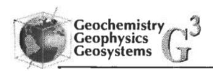

nephelometry survey of the water column shows clear evidence for hydrothermal plume activity in the summit crater. The water inside the crater is very turbid (nephelometric turbidity unit (NTU) values up to 1.4), and a halo of "smog" several hundred meters thick encircles and extends away from the summit for at least 7 km. The turbid waters are highly enriched in manganese (up to 7.3 nmol/kg), providing further evidence of hydrothermal activity. Vailulu'u is similar to Loihi (Hawaii) in being an active volcanic construct at the eastern end of a hotspot chain; it differs importantly from the Hawaiian model in its total lack of tholeiitic basalt compositions.

Keywords: Samoa; volcano; Vailulu'u; hydrothermal; nephelometry; isotopes.

Index terms: Volcanology; hydrothermal systems; isotopic composition/chemistry; igneous petrology.

Received September 6, 2000; Revised November 3, 2000; Accepted November 3, 2000;

Published December 8, 2000.

Hart, S. R., H. Staudigel, A. A. P. Koppers, J. Blusztajn, E. T. Baker, R. Workman, M. Jackson, E. Hauri, M. Kurz, K. Sims, D. Fornari, A. Saal, and S. Lyons, 2000. Vailulu'u undersea volcano: The New Samoa, *Geochem. Geophys. Geosyst.*, vol. 1, Paper number 2000GC000108 [5202 words, 6 figures]. Published December 8, 2000.

#### 1. Introduction

[2] Submarine volcanism and its associated hydrothermal systems are among the most vivid illustrations of the dynamic nature of the physical, chemical, and biological systems of planet Earth. Studies of these features have contributed fundamentally to our understanding of how the Earth works. These phenomena help us understand how the Earth loses its heat [Wolery and Sleep, 1976] and how processes of the solid Earth interact with processes in the hydrosphere and biosphere. The geochemistry of intraplate oceanic hotspot volcanoes has revealed much detail about how the Earth's crust-mantle system has evolved through Earth history [Zindler and Hart, 1986]. Submarine hydrothermal systems have received much attention because of their impact on the geochemical cycles of many elements and the character and evolution of their biological habitats.

[3] Most of our knowledge of submarine volcanic-hydrothermal systems is based on studies from active spreading ridges. These studies have shown that chemical fluxes and

the transport of heat can vary substantially between different systems, complicating the construction of generalized thermal or chemical budgets. Only one active intraplate submarine volcanic system has been studied in reasonable detail: Loihi, in the Hawaiian chain [Fornari et al., 1988; Duennebier and the 1996 Loihi Science Team, 1997; Davis and Clague, 1998]. A few others have received cursory study: Macdonald [Stoffers et al., 1989; Cheminée et al., 1991]; Teahitia [Cheminée et al., 1989; Michard et al., 1993]; Boomerang [Johnson et al., 2000]. In addition to the paucity of attention given to intraplate submarine hydrothermal systems, our understanding of hotspot volcanism itself is dominated by concepts that have developed over many decades of study of the Hawaiian archipelago and its submarine slopes [e.g., Clague and Dalrymple, 1989]. This has led to a standard model for the evolution of oceanic volcanoes that is strongly rooted in observations from Hawaii.

[4] In this letter, we report on the mapping and investigation of Vailulu'u seamount, a new and

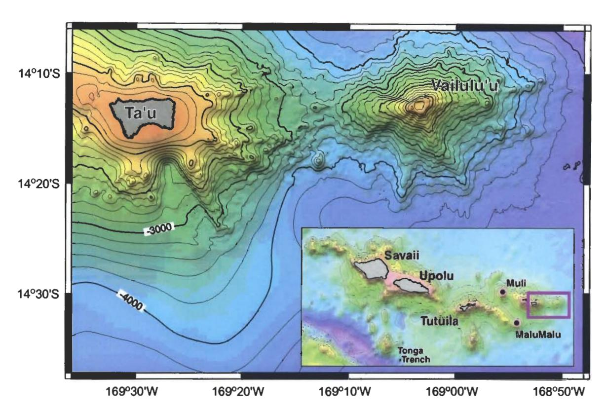

Figure 1. Bathymetry of Vailulu'u and nearby Ta'u Island, based on a SeaBeam bathymetric survey performed during R/V Melville's AVON 2 and 3 cruises, augmented with satellite-derived bathymetry from Smith and Sandwell [1996]. The inset shows the general location of Vailulu'u with respect to the Samoan Archipelago; two other newly mapped and dredged seamounts (Malumalu and Muli, AVON 3 cruise) are shown as well. Vailulu'u displays an overall asymmetric star-like pattern of rift zones and ridges, with a geometry that would closely resemble the shape of Ta'u Island in its more juvenile days.

particularly interesting active submarine volcano. We show that Vailulu'u is of Samoan lineage and represents the current location of the Samoan hotspot. Vailulu'u is an important example for study, both because it is an active and "typical" oceanic intraplate volcano and because it offers unique features that other submarine volcanoes do not. Its shallow depth provides easy access, its simple morphology and enclosed crater will allow estimation of hydrothermal fluxes, and its geochemical pedigree as a Samoan volcano gives it a highly characteristic mantle source signature. We present data here that document these aspects of Vailulu'u and its potential to substantially revise our views on ocean intraplate volcanism and to further our understanding of submarine hydrothermal systems in general. Vailulu'u offers a valuable counterpoint to Loihi and to the standard hotspot model commonly exemplified by Hawaii.

# 2. Structure and Morphology

[5] Vailulu'u Seamount1 was discovered on October 18, 1975, by Rockne Johnson [John-

&lt;sup>1 Vailulu'u Seamount was named in April 2000 by Samoan high school students; the name refers to the sacred sprinkling of rain that reportedly always fell as a blessing before a gathering of King Tuimanu'a, the last king of the Samoan Nation. Previous, informal names include Rockne Volcano [Johnson, 1984] and Fa'afafine seamount [Hart et al., 1999].

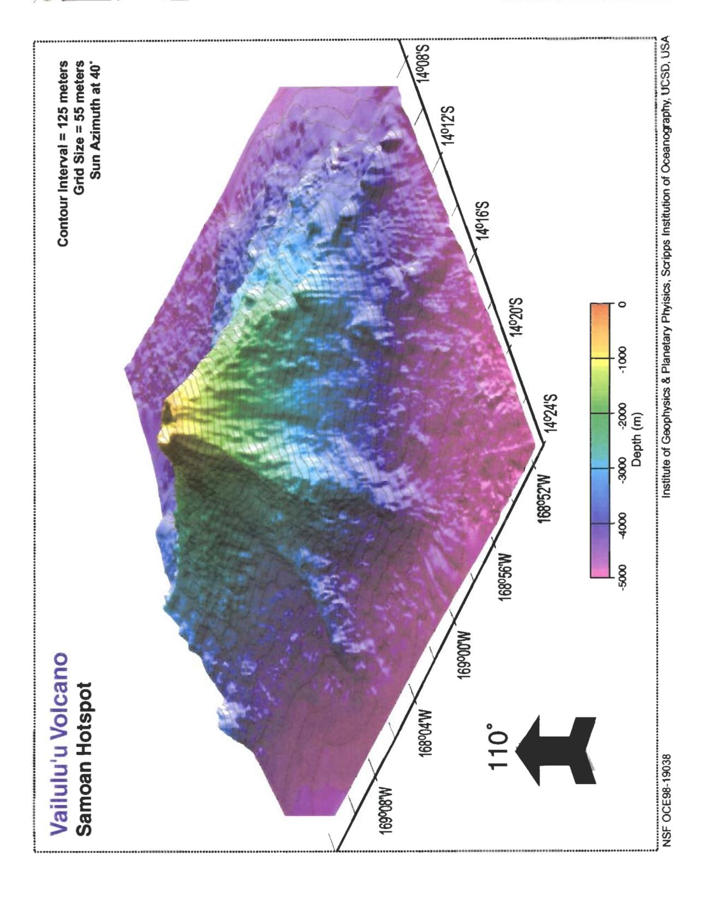

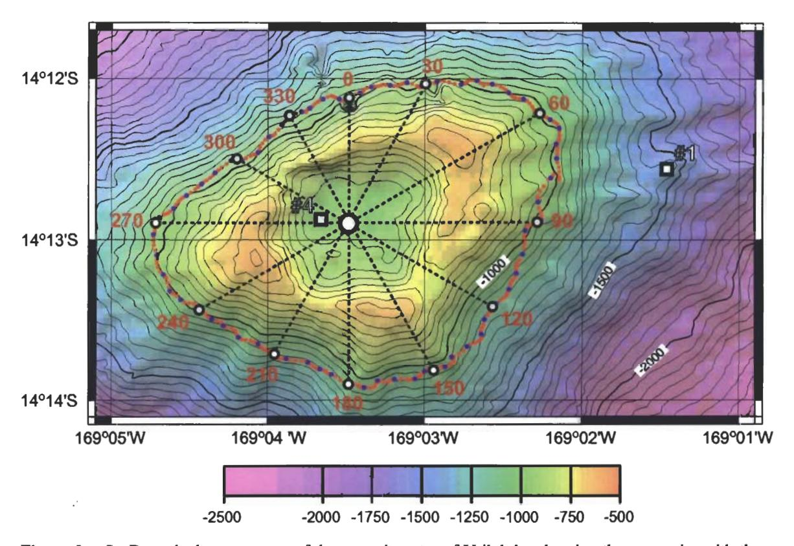

Figure 3. SeaBeam bathymetry map of the summit crater of Vailulu'u, showing the crater rim with three peaks and three breaches, the location of CTDO casts 1 and 4, and the tow-yo track circumnavigated around the summit. Dotted azimuth lines are given every 30° along the track, to correspond with the nephelometry contour section shown in Figure 6.

son, 1984] from the ketch Kawamee and mapped in March 1999 with SeaBeam aboard the R/V Melville during AVON cruises 2 and 3 (Figures 1 and 2). These cruises were motivated by seismic events in this region that occurred in 1973 and 1995, respectively. The AVON cruises were a direct attempt to find the current location of the Samoan hotspot. Johnson [1984] accurately defined Vailulu'u's location and summit height, but his discovery remained virtually unknown because he was unable to identify this feature as an active volcano.

161 Vailulu'u seamount is located at 169° 03.5'W, 14°12.9'S, 45 km east of Ta'u island, the easternmost island of the Samoan chain, and defines the leading edge of the Samoan swell at 5000-m water depth (Figure 1). Vailulu'u rises from an ocean depth of 4800 m to its crater-rim within 590 m of the sea surface, with a total volume of ~1050 km3. Vailulu'u's summit includes a 400-m-deep and 2-km-wide crater (Figure 3). The current dimensions of the volcano are consistent with Johnson's original 600-m summit depth [Johnson, 1984], indicat-

Figure 2. Perspective view of Vailulu'u seamount looking NW, displaying three major rifts toward the east, southeast, and west. The lower slopes of Vailulu'u and Ta'u merge along the west ridge, with a saddle at 3200 m. Vailulu'u is ~35 km in diameter at its base.

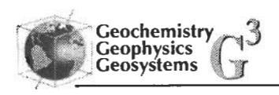

ing that no major net volcanic growth or collapse has occurred over the last 25 years.

[7] The overall shape of Vailulu'u is dominated by two rift zones extending east and west from the summit, defining a lineament that is parallel to the Samoan hotspot track. This is similar to the dominant trends defined by isolated (nonbuttressing) Hawaiian volcanoes that have been explained by crustal extension at the crest of the swell [Fiske and Jackson, 1972]. A third, slightly less well developed rift extends SE from the summit, and several minor ridges extend out from the lower slopes of Vailulu'u, giving it an overall asymmetric, star-like pattern. Rift zones and ridges in the southern sector are more strongly developed than those on the northern flank, giving Vailulu'u a stunning similarity to a "Young Ta'u" island (Figure 1). The three major rift zones define three high points of the crater rim and thus are likely to be part of the present-day plumbing system of the volcano. Ridges emerging from the lower flanks may be related to earlier constructive events in the history of the volcano or may be landslide deposits (Figures 1 and 2). In addition to the constructive nature of the major rifts, Vailulu'u shows clear signs of slope collapse and mass wasting. Such features are prominently displayed at the emergence point of the western rift, where it narrows owing to the amphitheater-shaped scars on both the north and south sides of its upper slopes. Steep, concave contours of the upper slopes merge into convex contours farther downslope, defining sedimentary aprons (Figures 1 and 2). Similar structures are common on other seamounts [Vogt and Smoot, 1984]; on Vlinder Seamount these have been related to intrusive oversteepening of the upper rift zone slopes [Koppers et al., 1998].

[8] The crater and rim of Vailulu'u are ovalshaped, with two well-developed pit craters defining the northern two thirds of the crater and two minor depressions present on a bench in the southern third of the crater (Figure 3). The crater wall has a "scalloped" appearance that suggests mass wasting during multiple crater-collapse events.

[9] A significant number of dredge samples have been characterized with respect to major and trace elements, radiogenic isotopes, and volatile abundances. Analyses of 41 glass samples from 7 dredges show that the summit and deeper east and SE rifts are relatively homogeneous alkali basalts ( $SiO_2 = 46-48\%$ ,  $Na_2O + K_2O = 3.5-4.9\%$ , MgO = 5-9%). Vailulu'u does not show the extreme compositional variability of its Hawaiian counterpart, Loihi Seamount, which ranges from tholeiite to basanite. The shield and posterosional stages of Samoan subaerial volcanism are also firmly alkalic, again unlike the Hawaiian case.

[10] The major element compositional homogeneity of Vailulu'u lavas contrasts with its variability in some radiogenic isotope ratios, in particular, 87Sr/86Sr that varies between 0.7052-0.7067 (Figure 4). In addition to these heterogeneitites in source region composition, Vailulu'u glasses display significant variation in volatile contents, largely indicating differences in outgassing behavior. Summit lavas tend to be more outgassed in H2O than lower rift zone lavas. Summit samples typically have H2O/K2O ratios less than 1, while the deep rift dredges (>3800 m) show ratios from 1 to 1.5. H2O/Cl ratios are also different between shallow and deep dredges (5-9 versus 7-20, respectively).There is no indication in the Cl data for involvement of seawater [Michael and Cornell, 1998] in the magmatic plumbing system.

# 3. Temporal Aspects of Vailulu'u Volcanism

[11] Several historical events suggest volcanic activity at Vailulu'u volcano. There was a series of sound fixing and ranging (SOFAR)-recorded

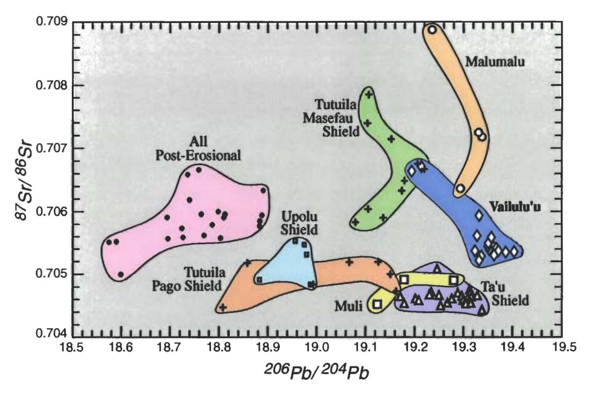

Figure 4. Sr-Pb isotope plot for basalts from Vailulu'u volcano, in comparison with data from Muli and Malumalu seamounts and the subaerial Samoan islands of Ta'u, Tutuila, Upolu, and Savai'i; see Figure 1 for locations. The posterosional field includes basalts from Savai'i, Upolu, and Tutuila (data are from Wright and White, 1987; Farley et al., 1992; Hauri and Hart, 1993; Hart et al., 1999; S. R. Hart et al., unpublished data, 2000).

explosions on July 10, 1973, and during the period January 9–29, 1995, the global seismic network recorded a strong (M4.2–4.9) earthquake swarm in the vicinity of Vailulu'u. While most of the 1995 earthquakes were formally located NW of the volcano, their uncertainty ellipses include Vailulu'u; a SeaBeam survey carried out within the earthquake area did not reveal any volcano tectonic features.

[12] Dredges, especially those from the summit area, are dominated by extremely fresh volcanic rock, with pristine volcanic glass, many original glassy surfaces, unaltered olivine phenocrysts, and a virtual lack of vesicle fillings. Furthermore, the intensities of SeaBeam sidescan returns are extremely "bright," suggesting

that fresh volcanic rocks occur ubiquitously throughout the slopes of Vailulu'u and that sediment cover is largely absent.

complete U-series nuclides, one from the floor of the crater and one from the outer NE slope of the summit cone (210Po and 210Pb by counting [Fleer and Bacon, 1984], 226Ra and 230Th by mass spectrometry [Sims et al., 1999]). The crater floor sample shows 210Po/210Pb equilibrium but 210Pb/226Ra disequilibria (activity ratio of 1.71). This suggests an eruption age of less than 30–50 years. The other sample shows both 210Po/210Pb and 210Pb/226Ra disequilibria (1.12 and 1.20, respectively), confirming an "age" of less than 5–10 years. Note

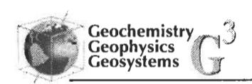

that the excess of 210Po found here is different from the normal situation, where 210Po is degassed during eruption [*Rubin et al.*, 1994].

# 4. Pedigree of Vailulu'u Volcano

[14] On the basis of its morphological connection to Ta'u Island via its west rift zone (Figure 1) and its expression as the easternmost volcanic construct along the Samoan chain, it is natural to view Vailulu'u as a young volcano of Samoan lineage. Proof of this comes from isotopic fingerprinting of 18 basalt samples from various locations on the volcano. The 87Sr/86Sr-206Pb/204Pb isotope data for these samples is shown in Figure 4, in comparison with data from other Samoan localities. Vailulu'u shows a strong enriched mantle 2 (EM2) mantle signature, which is the hallmark of Samoan volcanism. While Vailulu'u partly overlaps the existing Samoan field, it also extends to higher 206Pb/204Pb than other Samoan basalts, continuing a west-to-east trend of increasing 206Pb/204Pb in Samoan shield lavas. Helium isotope data on samples from five dredges range from 7.8 to 10.4 Ra and barely overlap the known range from subaerial Samoa (10–26 Ra [Farley and Neroda, 1998]). There is some indication that 3He/4He in the Samoan plume peaked at 26 Ra during passage under Tutuila and that it has been decreasing since (subaerial and dredge samples from Ta'u range in He from 13 to 19 Ra [Farley and Neroda, 1998; S. R. Hart et al., unpublished data, 2000]).

# 5. Water Column Characteristics Over Vailulu'u Volcano

[15] During the DeepFreeze 2000 cruise in March 2000, aboard the U.S. Coast Guard Icebreaker *Polar Star*, conductivity temperature depth optical (CTDO)/Niskin stations were occupied at three places within the summit crater and two outside the crater; in addition,

the summit area was circumnavigated in towyo mode [Baker and Massoth, 1987] along an  $\sim$ 1000-m contour (Figure 3). We studied particulate distribution in the water column using a light backscattering sensor (LBSS) attached to a CTD/Niskin water sampling rosette. The LBSS profile for station 4, inside the crater, is compared to data for station 1, outside the crater, in Figure 5. NTU values are essentially at background between 200 and 600 m at both stations. At 600-m depth in the crater profile the NTU values increase sharply and in a stepwise fashion, all the way to the bottom of the crater at 996 m. The NTU values near the bottom are very high, with values greater than 1.4; these are well above values associated with active venting and plume formation on ridge crests [Resing et al., 1999; Baker et al., 1995, 2000; Chin et al., 1998]. At station 1, outside the crater, the LBSS "smog" layer starts at about the same depth (610 m) but returns to background values at a depth of 850 m. This depth interval is comparable to the range of elevations shown by the rim of the summit crater, which has peaks at 590 m, and a deepest breach at  $\sim$ 780 m (Figure 3). At station 5, 7.5 km east of the crater rim, a small NTU anomaly is still observable, with a value of 0.08 at a depth of 600-720 m.

rial There are high Mn concentrations associated with these particulate anomalies, as shown in Figure 5. Background Mn in deep water outside the crater ranges from 0.002 to 0.003 ppb; inside the crater, in the deepest part of the NTU smog layer, the Mn ranges up to peak values of 0.4 ppb (7.3 nmol/kg). There is a good correlation between the NTU values and the Mn concentrations, with an overall ppb Mn/NTU ratio of ~0.5; this is significantly lower than that observed in plumes on most ridges (where ratios of 10–80 are reported [Mottl et al., 1995; Chin et al., 1998; Resing et al., 1999]). The low ratio at Vailulu'u is due both to the much higher NTU values, and the sig-

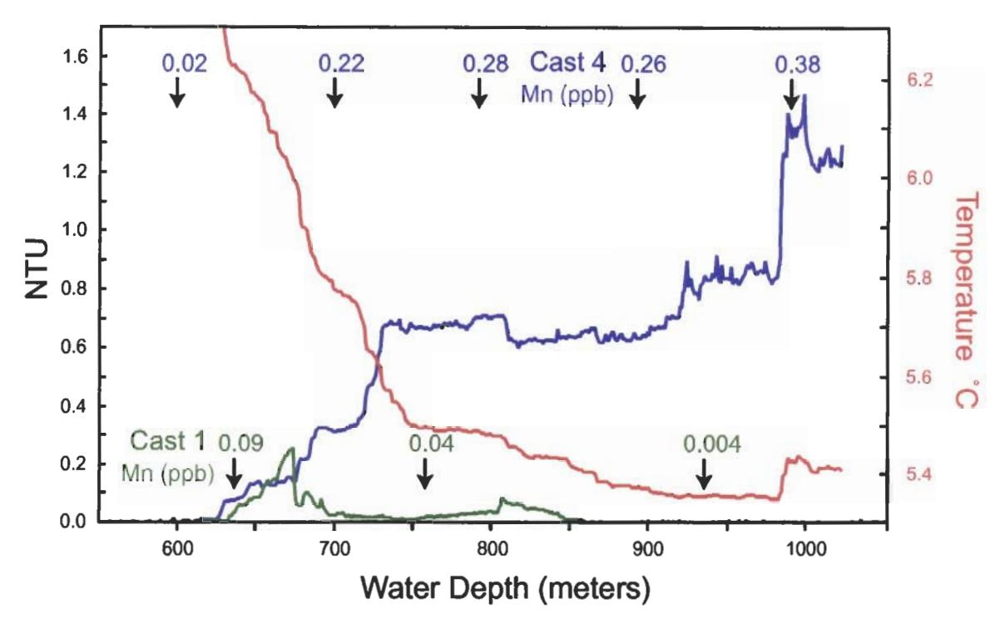

Figure 5. Temperature (red line) and light backscattering profiles for station 1 (green line), 1.2 km east of the crater rim, and station 4 (blue line), NW basin of the summit crater (see Figure 3 for locations). The nephelometry was done with a WET Labs light backscattering sensor (LBSS); data are calibrated using standard particulate suspensions [Baker et al., 2000] and is reported as nephelometric turbidity units (NTUs). The conductivity cell on the CTD worked only intermittently; thus no potential density data are available for these profiles. The Mn data (numbers with arrows) are reported in ppb at discrete depths, next to the LBSS profiles (note that 1 ppb Mn = 18.2 nmol/kg). Ambient Mn levels in the water column are in the range 0.002-0.004 ppb. Mn analyses were performed on-shore on acidified and 0.4-µm filtered water samples, using an inductively coupled plasma-mass spectrometer procedure modified from Field et al. [1999].

nificantly lower Mn values (maximum Mn concentrations in ridge crest plumes are commonly in the 2-15 ppb range [Field and Sherrell, 2000; James and Elderfield, 1996; Mottl et al., 1995; Resing et al., 1999; Baker et al., 1993, 1995].

[17] During a complete 360° circumnavigation of the summit crater, we mapped the plume between 500- and 900-m depth in tow-yo mode. The track of this survey is shown in map view in Figure 3; Figure 6 provides a 360° panoramic view of the plume "looking out" from a central location in the crater, contoured in NTU values. A projection of the elevation of

the crater rim is also shown in Figure 6, providing an azimuthal view of its three major peaks and breaches. Overall, the hydrothermal plume (as visualized by NTU values) is confined to a narrow depth interval bracketed between the breaches and summits of the crater wall (Figure 6). Its upper, neutral buoyancy, level corresponds closely with the heights of the peaks on the crater rim. Virtually no particulate matter appears to be ejected from the crater to heights above the peaks on the crater rim nor does any settle below the breach depth, during its dispersion laterally away from the summit. Particulates are being generated within the crater and are subsequently carried away

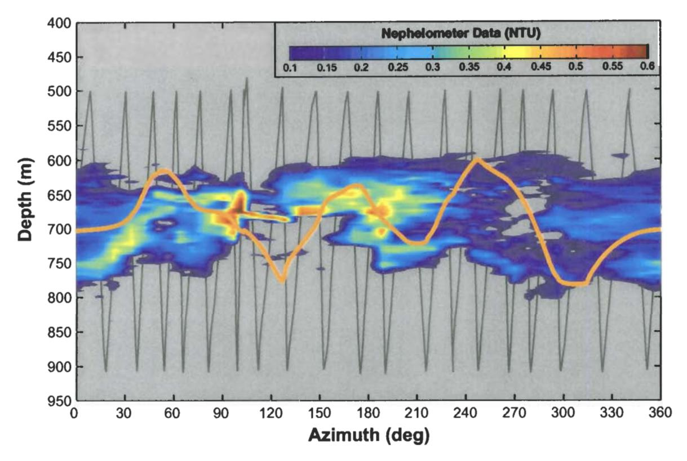

Figure 6. Nephelometry data for the CTDO tow-yo circumnavigation of the summit (track shown in Figure 3), contoured in NTU values and displayed as an "unwrapped" azimuth versus depth section, annotated in azimuth relative to the center of the volcano (north =  $0^{\circ}$ , east =  $90^{\circ}$ , etc.). The projection of the height of the rim of the summit crater is shown as a heavy orange line; the CTDO tow-yo track is shown in gray.

from the crater region by ocean currents. The presence of a plume in all directions around the crater suggests that these currents cannot be simple and unidirectional. However, a dominating current is indicated by the distribution of particulate intensities within the plume. The highest readings (NTU >0.5) are found in the angular segment between 90° and 200° and the lowest readings (NTU < 0.3) are found in the angular segment between 230° and 360°. These two segments are in opposite quadrants, suggesting a dominant current from ~280° (WNW). The  $90^{\circ}-200^{\circ}$  segment also displays the most extreme gradients in NTU values, indicating that this plume region is least homogenized and most directly derived from the source of the particulate matter.

[18] While the upper limit of the plume appears to be at a rather constant depth of  $\sim 600-630$ m, the lower limit shows very substantial azimuthal variability, ranging between 690 and 800 m. "Upwind" (NW), the plume fills the complete depth range, from highest summit elevation to deepest breach. "Downwind", however, the anomaly reaches only halfway down to the maximum depth of the breaches and displays relatively clear water in the lower half of the SE breach. This poses the problem that the lower half of the downwind breach appears to be venting clear water, despite the fact that no clear water was found in the crater and massive amounts of particulates are being vented to the SE. This situation may arise by upwelling of deep outside water in a downwind

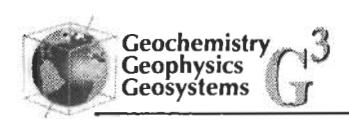

"eddy," possibly even spilling deep ambient water into the crater through the lower half of the 130° breach.

# 6. Illations and Implications

[19] Vailulu'u volcano is clearly a young and currently active submarine volcano. Its activity is reflected in seismic events in 1973 and 1995. the lack of any sediment cover on the seamount, fresh basalt and pristine glass in dredges from all levels of the volcano, and radiometric ages ranging from 5 to 50 years. The summit is marked by a sharply delineated crater over 400 m deep, filled with highly turbid water with Mn concentration anomalies that are several orders of magnitude above ambient levels. This smog layer extends out as a halo for many kilometers in all directions, in a narrow depth interval defined by the range in depths of the rim of the summit crater. Hydrothermal activity in such a well-defined venting geometry provides a natural laboratory for a variety of quantitative tracer studies aimed at delineating the circulation of seawater through the seamount hydrothermal system, in the water column near the seamount and in the surrounding ocean basins.

[20] The "standard" model for hotspot or plume volcanism posits the youngest volcanism at the east end of Pacific volcanic island chains. The Samoan chain, with Vailulu'u at the east end, meets this test. Furthermore, the erosional maturity of Samoan volcanoes increases to the west; Ta'u is in undissected shield-building stage, Tutuila and Upolu are dissected and partly covered with rejuvenated flows, and Savai'i has virtually no subaerially exposed shield-stage lavas. This progression is similar to Hawaii, where Loihi is the easternmost. volcano and where young rejuvenated lavas are present many hundreds of kilometers west of the current hotspot location (Oahu and Savai'i are 400 km from Loihi and Vailulu'u

respectively). Unlike the Hawaiian chain, however, which is the archetype for the standard hotspot model, Vailulu'u is composed solely of alkali basalt, displays limited petrological diversity, and no tholeiite is in evidence. Vailulu'u does not merely represent the earliest "Loihi" stage of alkalic volcanism either, since the Ta'u Island shield is also composed solely of alkali basalts; tholeiites do occur on Tutuila and Upolu but are not abundant. In fact, tholeiites are uncommon in the active submarine and shield volcanism of many intraplate hotspot chains (Macdonald-Austral chain; Teahitia-Society chain; Adams and Bounty-Pitcairn chain). Thus Vailulu'u-Samoa may be a more appropriate "standard model" for ocean island volcanism than Loihi-Hawaii. It is likely that the physical processes involved in melt generation and melt modification are related to the total plume fluxes or mantle heat available. In this respect, the Samoan chain is much closer to a typical hotspot than Hawaii.

# Acknowledgments

[21] This work would not have been possible without the help of many individuals at sea, including Kendra Arbesman, Ron Comer, Jennifer Dodds, Scott Herman, Jasper Konter, Theresa-Mae Lassak, Gene Pillard, Ryan Taylor, and the crew of the R/V *Melville* and the Coast Guard's *Polar Star*. Kristin M. Sanborn helped us unlock the SeaBird CTD software. Bob Engdahl kindly supplied the 1995 earthquake locations. We acknowledge funding from the NSF Ocean Science program, the VENTS program of NOAA (PMEL contribution 2243), and the U.S. Coast Guard for their generous support of our endeavors on Vailulu'u.

#### References

Baker, E. T., and G. J. Massoth, Characteristics of hydrothermal plumes from two vent fields on the Juan de Fuca Ridge, northeast Pacific Ocean, *Earth Planet. Sci. Lett.*, 85, 59–73, 1987.

Baker, E. T., G. J. Massoth, S. L. Walker, and R. W. Embley, A method for quantitatively estimating diffuse and discrete hydrothermal discharge, *Earth Planet. Sci. Lett.*, 118, 235–249, 1993.

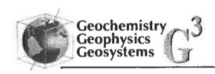

- Baker, E. T., C. R. German, and H. Elderfield, Hydrothermal plumes over spreading-center axes: Global distribution and geological inferences, in Seafloor Hydrothermal Systems: Physical, Chemical, and Geological Interactions, Geophys. Monogr. Ser., vol. 91, edited by S. Humphris, R. Zierenberg, L. S. Mullineaux, and R. Thomson, pp. 47-71,AGU, Washington, D. C., 1995.
- Baker, E., D. Tennant, R. Feely, G. Lebon, and S. L. Walker, Field and laboratory studies on the effect of particle size and composition on optical backscattering measurements in hydrothermal plumes, *Deep Sea Res.*, in press, 2000.
- Cheminée, J.-L., R. Hékinian, J. Talandier, C. W. Devey, F. Albaréde, J. Francheteau, and Y. Lancelot, Geology of an active hot spot: Teahitia-Mehetia Region in the south central Pacific, *Mar. Geophys. Res.*, 11, 27-50, 1989.
- Cheminée, J.-L., P. Stoffers, G. McMurtry, H. Richnow, D. Puteanus, and P. Sedwick, Gas-rich submarine exhalations during the 1989 eruption of Macdonald Seamount, *Earth Planet. Sci. Lett.*, 107, 318-327, 1991.
- Chin, C. S., G. P. Klinkhammer, and C. Wilson, Detection of hydrothermal plumes on the northern Mid-Atlantic Ridge: Results from optical measurements, *Earth Planet. Sci. Lett.*, *162*, 1–13, 1998.
- Clague, D. A., and G. B. Dalrymple, Tectonics, geochronology, and origin of the Hawaiian-Emperor chain, in *The Geology of North America: The Eastern Pacific Ocean and Hawaii*, edited by E. L. Winterer, D. M. Hussong, and R. W. Decker, pp. 188–217,Geol. Soc. of Am., Boulder, Colo., 1989.
- Davis, A. S., and D. A. Clague, Changes in the hydrothermal system at Loihi Seamount after the formation of Pele's pit in 1996, *Geology*, 26, 399–402, 1998.
- Duennebier, F. K., and the 1996 Loihi Science Team, Researchers rapidly respond to submarine activity at Loihi Volcano, Hawaii, *Eos Trans. AGU*, 78, 231–234, 1997.
- Farley, K. A., and E. Neroda, Noble gases in the Earth's mantle, *Annu. Rev. Earth Planet. Sci.*, 26, 189-218, 1998.
- Farley, K. A., J. H. Natland, and H. Craig, Binary mixing of enriched and undergassed (primitive?) mantle components (He, Sr, Nd, Pb) in Samoan lavas, *Earth Planet. Sci. Lett.*, 111, 183–199, 1992.
- Field, M., and R. Sherrell, Dissolved and particular Fe in a hydrothermal plume at 9°45′N, East Pacific Rise: Slow Fe (II) oxidation kinetics in Pacific plumes, *Geochim. Cosmochim. Acta*, 64, 619–628, 2000.
- Field, M. P., J. T. Cullen, and R. M. Sherrell, Direct determination of 10 trace metals in 50 µl samples of coastal seawater using desolvating micronebulization

- sector field ICP-MS, J. Anal. Atomic Spectrometry, 14, 1425-1431, 1999.
- Fiske, R. S., and E. D. Jackson, Orientation and growth of Hawaiian volcanic rifts: The effect of regional structure and gravitational stress, *Philos. Trans. R. Soc. London, Ser. A.*, 329, 299–326, 1972.
- Fleer, A. P., and M. P. Bacon, Determination of 210Pb and 210Po in seawater and particulate matter, *Nucl. Instrum. Meth. Phys. Res.*, 223, 243-249, 1984.
- Fornari, D. J., M. O. Garcia, R. C. Tyce, and D. G. Gallo, Morphology and structure of Loihi Seamount based on seabeam sonar mapping, *J. Geophys. Res.*, 93, 15,227–15,238, 1988.
- Hart, S. R., H. Staudigel, M. D. Kurz, J. Blusztajn, R.
  Workman, A. Saal, A. Koppers, E. H. Hauri, and S.
  Lyons, Fa'afafine Volcano: The active Samoan Hotspot,
  Eos Trans. AGU, 80, Fall Meet. Suppl., F1102, 1999.
- Hauri, E. H., and S. R. Hart, Re-Os isotope systematics of HIMU and EMII oceanic island basalts from the South Pacific ocean, *Earth Planet. Sci. Lett.*, 114, 353-371, 1993.
- James, R. H., and H. Elderfield, Dissolved and particulate trace metals in hydrothermal plumes at the Mid-Atlantic Ridge, *Geophys. Res. Lett.*, 23, 3499–3502, 1996.
- Johnson, K., D. Graham, K. Nicolaysen, D. S. Scheirer, D. W. Forsyth, L. M. Douglas-Priebe, E. T. Baker, and K. H. Rubin, Boomerang Seamount: Active expression of the Amsterdam-St Paul Hotspot, Southeast Indian Ridge, Earth Planet. Sci. Lett., in press, 2000.
- Johnson, R. H., Exploration of three submarine volcanos in the South Pacific, Natl. Geogr. Soc. Res. Rep., 16, 405-420, 1984.
- Koppers, A. A. P., H. Staudigel, J. R. Wijbrans, and M. S. Pringle, The Magellan seamount trail: Implications for Cretaceous hotspot volcanism and absolute Pacific plate motion, *Earth Planet. Sci. Lett.*, 163, 53-68, 1998.
- Michael, P. J., and W. C. Cornell, Influence of spreading rate and magma supply on crystallization and assimilation beneath mid-ocean ridges: Evidence from chlorine and major element chemistry of mid-ocean ridge basalts, *J. Geophys. Res.*, 103, 18,325–18,356, 1998.
- Michard, A., G. Michard, D. Stüben, P. Stoffers, J.-L. Cheminée, and N. Binard, Submarine thermal springs associated with young volcanoes: The Teahitia vents, Society Islands, Pacific Ocean, Geochim. Cosmochim. Acta, 57, 4977–4986, 1993.
- Mottl, M. J., F. T. Sansone, C. G. Wheat, J. A. Resing, E. T. Baker, and J. E. Lupton, Manganese and methane in 'hydrothermal plumes along the East Pacific Rise, 8°40' to 11°50'N, Geochim. Cosmochim. Acta, 59, 4147–4166, 1995.
- Resing, J., R. A. Feely, G. J. Massoth, and E. T. Baker, The water-column chemical signature after the 1998

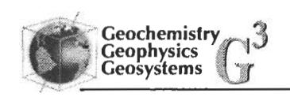

- eruption of Axial Volcano, Geophys. Res. Lett., 26, 3645-3648, 1999.
- Rubin, K. H., J. D. Macdougall, and M. R. Perfit, 210Po-210Pb dating of recent volcanic eruptions on the sea floor, *Nature*, 368, 841–844, 1994.
- Sims, K. W. W., D. J. DePaolo, M. T. Murrell, W. S. Baldridge, S. Goldstein, D. Clague, and M. Jull, Porosity of the melting zone and variations in the solid mantle upwelling rate beneath Hawaii: Inferences from 238U-230Th-226Ra and 235U-231Pa disequilibria, *Geochim. Cosmochim. Acta*, 63, 4119-4138, 1999.
- Smith, W. H. F., and D. Sandwell, Predicted bathymetry. New global seafloor topography from satellite altimetry, Eos Trans. AGU, 77(46), 315, 1996.
- Stoffers, P., R. Botz, J. L. Cheminee, C. W. Devey, V. Froger, G. P. Glasby, M. Hartmann, R. Hekinian, F.

- Kogler, D. Laschek, P. Larque, W. Michaelis, R. K. Muhe, D. Puteanus, and H. H. Richnow, Geology of Macdonald Seamount Region, Austral Islands: Recent hotspot volcanism in the South Pacific, *Mar. Geophys. Res.*, 11, 101–112, 1989.
- Vogt, P. R., and N. C. Smoot, The Geisha guyots: Multibeam bathymetry and morphometric interpretation, *J. Geophys. Res.*, 89, 11,085–11,107, 1984.
- Wolery, T. J., and N. H. Sleep, Hydrothermal circulation and geochemical flux at mid-ocean ridges, *J. Geol.*, 84, 249-275, 1976.
- Wright, E., and W. M. White, The origin of Samoa: New evidence from Sr, Nd and Pb isotopes, *Earth Planet. Sci. Lett.*, 81, 151–162, 1987.
- Zindler, A., and S. Hart, Chemical geodynamics, *Annu. Rev. Earth Planet. Sci.*, 14, 493-571, 1986.