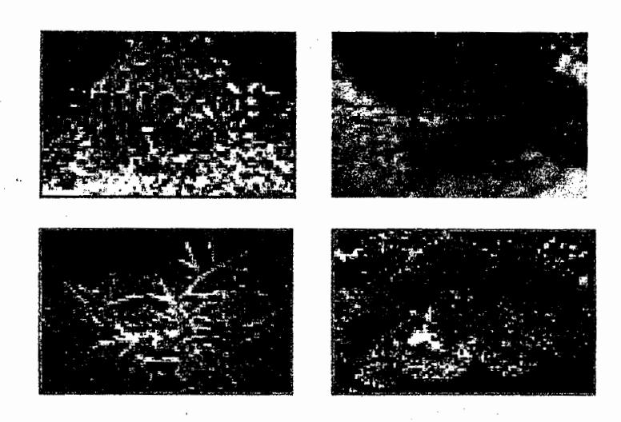
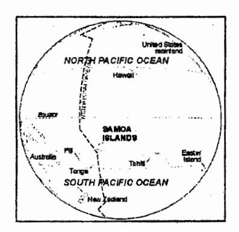
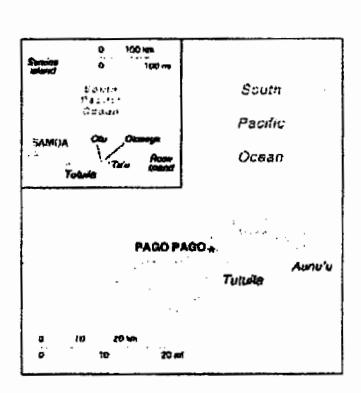

# Marine Protected Areas in American Samoa

Status of current efforts and analysis of needs

Christopher Hawkins
CRI Coordinator, American Samoa
11 JUNE 2003

#### 1. TERRITORIAL DESCRIPTION

American Samoa is a group of seven islands (five volcanic islands and two coral atolls), located in the South Pacific. The land area of the islands is approximately 76 square miles. The five volcanic islands, which are the major inhabited islands of American Samoa, are Tutuila, Aunu'u, Ofu, Olosega and Ta'u. Tutuila, the largest island, is also the center of government and business. Aunu'u, a small island, is situated one mile off the southeast coast of Tutuila. The three islands of Ofu, Olosega and Ta'u, collectively referred to as the Manu'a Islands, are 66 miles east of Tutuila.

Figure 1. Location of the Samoan Islands

Figure 2. American Samoa

# 2. COASTAL MANAGEMENT

American Samoa is fortunate to have a variety of means and methods of managing its coastal resources. The Territory does have a coastal management program (ASCMP), as in other U.S. coastal jurisdictions, and there are several agencies, both local and federal, that contribute to the success of management endeavors.

To this end, the Governor's Coral Reef Advisory Group (CRAG) was established to harmonize and coordinate the activities of five agencies in American Samoa; the American Samoa Department of Commerce (which houses ASCMP), the National Park of American Samoa, the American Samoa Environmental Protection Agency, the Community College of American Samoa, and the Department of Marine and Wildlife Resources. The purpose of this coordination is to protect and preserve coral reef ecosystems while attempting to balance and satisfy development needs of the people and the fa'asamoa (Samoan way of life). CRAG is a voluntary entity and its financial needs are federally funded. The collaboration that CRAG provides, as well as the need to work cooperatively with traditional resource users, makes American Samoa unique in the coastal management community.

Resource management of the Territory's fragile coastal and marine assets is an on-going challenge for CRAG agencies. The need to have innovative tools and creative negotiation mechanisms to inform landowners, fishermen, children, tourists and cultural leaders on the importance of resource preservation is highly required given the limited economy and landmass in American Samoa. Our limited natural resources are threatened by expanding population growth, wetland loss, overfishing, and coral reef habitat destruction. Coral ecosystem planning is concerned with population pressure, land use, overfishing, global climate change, and monitoring.

#### 3. CURRENT MPA EFFORTS

American Samoa has several MPAs in a three-tiered hierarchy. While the western definition that incorporates legislation as a key element cannot be applied to all, village protections, such as taboos, help fill this gap.

#### 3.1 Federal

There are three federal protected areas that meet the definition of an MPA.

# 3.1.1 Fagetele Bay National Marine Sanctuary

The National Marine Sanctuary Program (16 U.S.C 1431) was established by Congress in 1972 to protect nationally significant marine areas for their ecological and historical value. The Program is administered by the National Oceanic and Atmospheric Administration under the Department of Commerce, and utilizes comprehensive resource management strategies as well as education and awareness activities to increase public understanding and facilitate use of these marine areas.

Fagetele Bay National Marine Sanctuary was designated in 1986 in response to a proposal from the American Samoa Government to the National Marine Sanctuary Program. The Sanctuary comprises a fringing coral reef ecosystem nestled within an eroded volcanic crater on the island of Tutuila, American Samoa. This smallest and most remote of all the National Marine Sanctuaries is the only true tropical reef in the program. It provides a home to a wide variety of animals and plants, which thrive in the protected waters of the bay. The coral reef ecosystem found in the Sanctuary contains many of the species native to this part of the Indo-Pacific biogeographic region. Turtles, whales, sharks and the giant clam all find refuge in this protected area.

# 3.1.2 The National Park of American Samoa

The National Park System has its beginnings when Congress donated Yosemite Valley to California for preservation as a state park. Eight years later, in 1872, Congress reserved the spectacular Yellowstone country in the Wyoming and Montana territories "as a public park or pleasuring-ground for the benefit and enjoyment of the people."

The National Park of American Samoa is in the Federal National Park System, but is actually a cooperative program with the people and government of American Samoa. The park was authorized on October 31, 1988. Two rain forest preserves and a coral reef are home to unique tropical animals including the Flying Fox, Pacific Boa, sea turtles, and an array of birds and fish. The park contains paleotropical rain forests, pristine coral reefs, and magnificent white sand beaches. Park lands are on three separate islands; Tutuila, Ofu and Tau, and total 9,000 acres. All of the lands are leased from the respective villages.

Management of waters and submerged lands adjacent to park boundaries extend to ¼ mile offshore. Only subsistence fishing is permitted; beyond that, the Park currently utilizes territorial regulations.

# 3.1.3 Rose Atoll National Wildlife Refuge

Established by President Theodore Roosevelt in 1903, the National Wildlife Refuge System is comprised of nearly 540 units that protect endangered species and important habitats. Rose Atoll National Wildlife Refuge, 14 degrees south of the equator and about 2,500 miles south of Hawaii, is the smallest atoll in the world with about 20 acres of land and 1,600 acres of lagoon. The Refuge was established via a Cooperative Agreement with the government of American Samoa on July 5, 1973. The square reef protects two small, emergent islands. Rose Island, the larger of the two, is low, sandy, and thickly vegetated. It is an important nesting area for the threatened green sea turtle and endangered hawksbill turtle.

It provides nesting, roosting, and foraging for about 15 species of seabirds and three shorebirds. Buka trees provide crown nesting sites for red-footed boobies and great and lesser frigate birds. Black noddies and white terns use middle and lower branches. Reef herons and red-tailed tropicbirds nest in the root systems. Sooty terns and brown noddies nest in barren coral rubble and gray-back terns nest on unvegetated Sand Island.

Hundreds of fish, coral, and invertebrate species inhabit the shallow reefs. One of these, the giant clam, is highly prized as food by Pacific Islanders and is rare in unprotected areas.

#### 3.2 Territorial

# 3.2.1 Ofu Vaoto Marine Park

American Samoa currently has only one Territorial MPA, Ofu Vaoto Marine Park. Reserved by territorial legislation in 1994, the park encompasses a small area (less than one mile in width and seaward to the ten fathom depth). The park was established to protect unique coral habitats while allowing public access and enjoyment. Residents of Ofu Island may fish and harvest shellfish in the park, pursuant to territorial fishing regulations. All others are excluded from such activities.

#### 3.3 Local

The Department of Marine and Wildlife Resources' sponsored Community-based Fisheries Management Program (CBFMP) is currently installed in seven villages; Poloa, Alofau, Vatia, Aua, Masausi, Amaua and Auto. The basis of the program is a desire to foster a working relationship with village leaders that allows them to have a stake and say in the management of their resource. Of the several desirable outcomes of this method, not having to politick for support is key. Also, information, though only anecdotal to date, is spread from village to another via word of mouth, and is much more likely to be believed than government charts and radio advertisements.

Replenishment via no-take status is the main ingredient of the program, but these village MPAs (except Poloa, Amaua and Auto), have also been stocked with giant clams. Amaua and Auto are in the process of drafting their Fisheries Management Plan before giant clams are stocked in their MPAs at the end of this May.

Each village with a MPA and an effective fisheries management plan has a Monitoring and Enforcement Committee (MEC) to assist in enforcing and overseeing all actions written in the Village Fisheries Management Plan and report to DMWR any problems or concerns regarding their responsibilities. The village committees in the program have been very helpful and supportive in reporting illegal fishing and other destructive activities held in their reef area. Unfortunately, some of these problems still exist in village reef areas due to lack of ability to identify and advise the violators on the restrictions the villages has established on their reef areas under the Community-based Fisheries Management Program.

#### 4.0 NEEDS

Marine Protected area efforts in American Samoa suffer from several program deficiencies. Implementing some simple, but important, managements measures will increase the biological and social results of MPAs in the Territory, and will also showcase American Samoa's commitment to leadership in this field.

# 4.1 Capacity

American Samoa has historically suffered from a lack of qualified coastal managers and scientists. Though the personnel that the Territory has had and does have is superb, there simply is not enough local or off-island staff to accomplish all of the tasks identified by planners as needed to address our many coastal resource issues. With the advent of Coral Reef Initiative funding, via the U.S. Coral Reef Task Force, the Territory has made strides in recent years to close this gap. While turnover is still a problem, the addition of a Coral Reef Initiative Coordinator, monitoring staff, individual agency personnel, and a soon to be recruited MPA Coordinator, has put American Samoa in a much better position to accomplish its goals. The continuance of such funding to retain current staff, as well as additional monies for several more needed positions is of high priority to coastal managers. Additionally, monies for local training, four-year university scholarships in the marine sciences, and internship programs for local college students in the Marine Science degree track will reduce the Territory's reliance on off-island expertise, which is both expense and often transient.

# 4.2 Stakeholder Support

As in most jurisdictions, local support for endeavors (that may take several years to show any benefit) is lacking. Managers have also had a difficult time persuading villagers and politicians that such programs work, either from lack of background science or inadequate conveyance of case studies and associated information. Developing better education strategies and tools and employing them in an effective manner is a key goal in American Samoa.

### 4.3 Coordinated Response

Though the disjointed nature of coastal management has been alleviated in many instances by adopting the principles of integrated coastal management, and by the inception of the Coral Reef Advisory Group, managers still have work to do in harmonizing the approach to marine protected area designation and management, as well as approving definitions and boundaries, and creating an over-arching MPA Program for the Territory from the individual, on-going efforts.

#### 4.4 Enforcement

A 1995 count (REF) found over 1,300 MPAs world-wide. Many of these, having been established after, and due to, the 1992 United Nations Conference on Environment and Development in Rio de Janeiro, Brazil, are currently only 'paper parks'. They exist only on a chart, and have no legal provisions.

American Samoa is keen to avoid the mistake of designating MPAs while not being able to provide active enforcement. To do so endangers managers' standing in the eyes of the community, as management goals can rarely be achieved if there is no enforcement of management regulations.

While enforcement can fall under the category of Capability, it is a concern that deserves to be in its own category. It is a cross-cutting tool, such as education. The main impediments to better enforcement in the Territory are: funding to hire and equip (boat, vehicle, gas, safety gear) personnel and proper training programs to ensure their safety.

# 4.5 Monitoring and evaluation

Currently, there is no systematic monitoring program for any of the MPAs in American Samoa, save Fagetele Bay NMS, which has had ongoing monitoring activities for approximately 25 years. The National Park Service is in the process of designing a monitoring program to assess the status over time of certain parameters (coral health, water quality, etc.)

Rose Atoll National Wildlife Refuge does not have continuous monitoring, but refuge managers have been actively engaged in monitoring the effects of isolated incidents in the area, such as ship groundings.

The Community-based Fisheries Management Program village MPAs have no monitoring program established. Such a program is needed to determine the efficacy of management, both for the villagers themselves, and grantors that provide monies to establish and help maintain the MPAs. DMWR staff, in conjunction with the Coral Reef Initiative in American Samoa, and Dr. Mark Tupper of the University of Guam, are currently working to design and establish a simple survey to determine fish biomass in the seven MPAs.

All monitoring efforts should be reviewed to ensure that activities and resultant data relate back to the goals and objectives of management. For example, long-term efforts underway at the Sanctuary are primarily related to data collection to drive management activities, but not necessarily related to data collection with which to determine if written goal and objectives in the management plan are being met.

Also necessary to quality management are periodic, outside, evaluations of management capacity and ecological outcomes. Coral Reef Initiative staff in the Territory are beginning to develop proposals for outside researchers to perform site specific and program specific evaluations of MPA management.

# 4.6 Legal mandates and boundaries

CRI funding has been obtained to review existing CBFMP MPA management plans for incorporation into American Samoan law. This final step is important, as it gives more credibility to the protected areas and provides a legal mechanism for enforcement activities. Essential to this is the finalization of all existing CBFMP MPA boundaries. There are currently some discrepancies between many numerical boundaries and satellite imagery.

#### 5. Future

The future of American Samoa's Marine Protected Areas Program is bright. With the collation of information into a Territory-wide Marine Protected Areas Plan, the incoming Marine Protected Areas Coordinator, in cooperation with CRAG-member agencies' staff, can begin the task of addressing many of the needs mentioned above. The lessons learned from other jurisdictions have been quite helpful to Territorial planners and managers and have given current and planned efforts direction and focus. Recommendations for improving Territorial efforts can be distilled from the six areas of need above. Once American Samoa has a dedicated MPA Coordinator in place, these recommendations can be finalized as strategies and funding proposals.