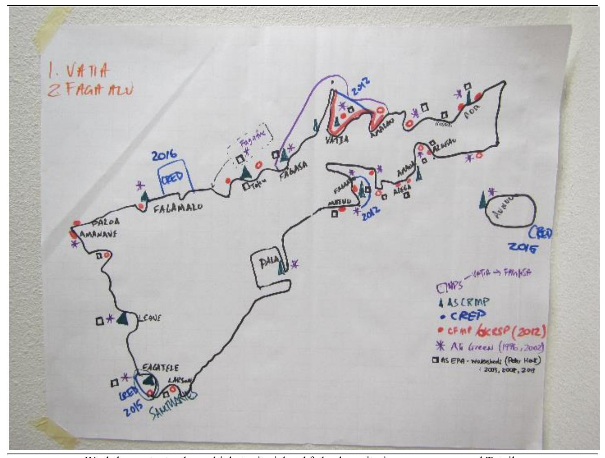
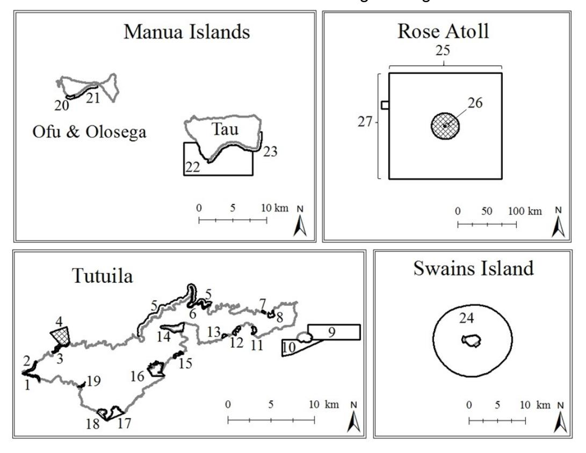
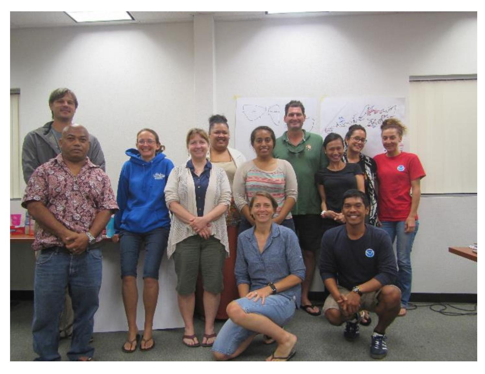

Linking local and national data to improve marine managed area monitoring and data quality in Tutuila, American Samoa: a feasibility report. [1](#page-0-0)

Adel Heenan, Kelvin Gorospe, Arielle Levine, Jeremy Raynal and Alice Lawrence

Workshop output – the multiple territorial and federal monitoring programs around Tutuila

1 PIFSC Working Paper WP-17-001 Issued 15 March 2017.

Linking local and national data to improve marine managed area monitoring and data quality in Tutuila, American Samoa: a feasibility report.

1,2Adel Heenan, 1,2Kelvin Gorospe, 3,4Arielle Levine, 5 Jeremy Raynal, and 5 Alice Lawrence

> 1 Joint Institute for Marine and Atmospheric Research University of Hawaii 1000 Pope Road, Honolulu, Hawaii 96822

> > 2 Pacific Islands Fisheries Science Center National Marine Fisheries Service 1845 Wasp Boulevard Honolulu, Hawaii 96818

> > > 3 Department of Geography, San Diego State University, San Diego, CA 92182

4 NOAA Coral Reef Conservation Program (The Baldwin Group Inc.), Silver Spring, MD 20910

> 5 Coral Reef Advisory Group, Department of Marine and Wildlife Resources P.O. Box 3730 Pago Pago, American Samoa, AS 96799

# **Contents**

- 1. [Introduction](#page-4-0)
- 2. [Marine managed areas in Tutuila](#page-9-0)
- 3. Data collection [efforts past and present in Tutuila, American Samoa](#page-12-0)
- 4. [Analysis of individual data sets](#page-23-0)
- 5. [Integration feasibility](#page-24-0)
- 6. [Integration brain-storm](#page-26-0)
- 7. [Recommendations and next steps](#page-27-0)
- 8. [Immediate next steps in context of this Coral Reef Ecosystem Program project](#page-31-0)
- 9. [References](#page-32-0)

# **Appendices**

[Workshop Attendees](#page-35-0) [Daily Narrative](#page-36-0) [Strength, Weaknesses, Opportunities and Threats Outputs](#page-40-0) [Brainstorm Activity](#page-50-0) [Ecosystem indicators](#page-51-0)

# **Acronyms**

ASCRMP American Samoa Coral Reef Monitoring Program CREP Coral Reef Ecosystem Program (part of PIFSC) CFMP Community-based Fisheries Management Program

COTS Crown of Thorns Starfish CRAG Coral Reef Advisory Group CRCP Coral Reef Conservation Program

DACOR Dominant Abundance Common Occasional Rare (scale)

DMWR Department of Marine and Wildlife Resources

DOC Department of Commerce

EPA Environmental Protection Agency (US and American Samoa, federal and state)

ESA Endangered Species Act FWS Fish and Wildlife Service GPS Global Positioning System

ICRMP Integrated Coral Reef Monitoring Program

KRSP Key Reef Species Program MPA Marine Protected Area MMA Marine Managed Area

NOAA National Oceanic and Atmospheric Administration

NCRMP National Coral Reef Monitoring Plan

NMS National Marine Sanctuary

NMFS National Marine Fisheries Service

NPS National Park Service PR Parks and Recreation

PIFSC Pacific Islands Fisheries Science Center

Pacific RAMP Pacific Reef Assessment and Monitoring Program

QA / QC Quality Assurance and Quality Checking

SPC Stationary Point Count

SWOT Strength, Weaknesses, Opportunities and Threats

USFWS United States Fish and Wildlife Service

# **1. Introduction**

Marine resource governance in the United States is geopolitically separated, with different authorities responsible for the management of Federal vs. State or Territorial waters. In 2000, the Coral Reef Conservation Act (CRCA) authorized the long-term monitoring of U.S. coral reef ecosystems, and several *ad hoc* monitoring efforts were established, including NOAA's Pacific Reef Assessment and Monitoring Program (RAMP). Pacific RAMP is a part of the National Coral Reef Monitoring Program (NCRMP), and executed by the Coral Reef Ecosystem Program (CREP). The CREP is federally funded to survey coral reefs in US-affiliated waters in the Pacific (0–200-nm offshore), but most of the authority to manage the near-shore (within 3 nm) lies with jurisdictional agencies. As such, federal and jurisdictional monitoring programs often are designed for different purposes, work at different spatial scales and operate independently from one another.

#### **Federal coral reef monitoring rationale**

In 2010, the NOAA's Coral Reef Conservation Program (CRCP) unified NOAA's monitoring efforts by establishing the National Coral Reef Monitoring Plan for US jurisdictional coral reef ecosystems in the Atlantic, Caribbean and Pacific, including American Samoa.

Since 2000, the NOAA Pacific Islands Fisheries Science Center (PIFSC) has implemented biological and climate monitoring across ~ 40 islands and atolls in the US-affiliated Pacific within American Samoa, Commonwealth of the Northern Mariana Islands, Southern Mariana Islands, Guam, Hawai'i, and the Pacific Remote Islands. In 2016, NOAA Headquarters completed the first round of socioeconomic monitoring of these same jurisdictions. Integration across these data streams has the potential to answer key questions about how societies interact with coral reef resources and respond to management actions in a changing climate.

The Pacific RAMP data and analyses have been used in a variety of opportunistic ways with national and jurisdictional policy repercussions, including the establishment of large-scale marine protected areas (MPAs), listing of coral species under the US Endangered Species Act and a prohibition on take of large fish in American Samoa. Over time, new policies arose that directly influenced both data collection and use of those data. For example, the 2006 reauthorized Magnuson-Stevens Fisheries Conservation and Management Reauthorization Act – the primary US fisheries legislation – requires the establishment of annual catch limits for all management unit species, including coral reef fishes. Consequently, the data have been used to support reef fish stock assessments (Nadon et al., 2015), directly tying the Pacific RAMP monitoring program to a regulatory management framework.

Additionally, the 2009 Federal Ocean Acidification Research and Monitoring Act requires monitoring of ocean acidification and associated ecological impacts. The Pacific RAMP adapted to collect data directly relevant to these new policies. For more information on how federal coral reef monitoring for Pacific RAMP has changed over time see (Heenan et al., 2016).

## **Jurisdictional coral reef monitoring rationale**

American Samoa boasts one of the world's first coral reef surveys, the Aua Transect, first surveyed in 1917 (Mayor, 1924, 1920). No other substantial survey work was recorded until 1973 with the first resurvey of the Aua transect by Dahl and Lamberts and the first quantitative fish survey data by Richard Wass in 1977 (Dahl and Lamberts, 1978). Wass established transects around Tutuila, and while only 3 of these sites were monitored regularly (Fagatele Bay, Sita Bay & Cape Larsen), they notably represented the only data collected prior to the initial crown-of-thorns starfish (COTS) *Acanthaster planci* outbreak in 1978 (Wass, 1982). The COTS outbreak and the resulting decline in coral cover in American Samoa prompted concern from the scientific community and propelled the decision for designation of Fagatele Bay National Marine Sanctuary in 1986. Between 1985 and 2007 surveys on fishes, coral, invertebrates and marine plants were conducted in Fagatele Bay on a multi-year cycle. These efforts provided a time series to monitor the recovery of a coral reef following acute disturbances including major hurricanes in the early 1990s and the 1994 coral-bleaching event.

The first comprehensive, jurisdiction-wide coral reef monitoring efforts were conducted between 1994 and 1996 (Birkeland et al., 1996), with follow up resurveys in 2002, thus providing an understanding of spatial patterns among and within islands as well as long-term trends and patterns of variability in the reefs of American Samoa (Birkeland et al., 2004; Green, 2002). Quantitative baseline surveys of the National Park of American Samoa were conducted in 1993 for the Ofu Unit, in 1998 for the Tutuila Unit, and in 1999 qualitative data was collected for the Ta'u Unit. Since those baseline assessments, the National Parks Service has conducted other monitoring studies in American Samoa including specific surveys on giant clams (Green and Craig, 1999) and coral spawning (Mundy and Green, 1999) and concentrated survey effort at Rose Atoll following the shipwreck of a Taiwanese longliner in 1994.

In 2005 the Department of Marine & Wildlife Resources initiated the first on-island monitoring team efforts through the NOAA-funded American Samoa Coral Reef Monitoring Program (ASCRMP) and the United States Fish and Wildlife Service (USFWS)-funded Key Reef Species Program (KRSP). Both programs aimed to build local capacity to monitor coral reef resources to provide timely information for the management of coral reefs in the US territory of American Samoa.

#### **Why integrate national and jurisdictional monitoring efforts?**

The National Ocean Policy (2010) calls for ecosystem-based management and for greater collaboration across scales to coordinate jurisdictional and national activities, including monitoring. Furthermore, the National Marine Fisheries Service issued a 2015 Policy Directive on 'Ecosystem-Based Fisheries Management', calling for more efficient monitoring systems, which will require integration across scientific and geopolitical or governance units. There are two main advantages of collaborating across federal and jurisdictional monitoring program. It can advance the understanding of cause-and-effect relationships within the bio-physical and social system, and if tied to an adaptive management framework, can improve the understanding of how management actions influence the ecosystem (Hedge et al., 2013).

The second benefit is that it can maximize use of the resources made available for monitoring. It enforces clarity over the priority monitoring objectives, and explicitly links monitoring to management information needs. So while overall, integration can increase the cost of monitoring, it can lead to greater cost-effectiveness in the long run (Hedge et al., 2013).

Clearly the monitoring objectives of the federal and jurisdictional efforts underway in American Samoa are tuned to work at disparate spatial scales. For instance, the information priorities for a small-scale assessment such as monitoring a watershed or bay is very different to a regional or national assessment, such as assessing a fish population stock status for the Magnusson-Stevens Act. Yet, monitoring efforts conducted at different scales have the potential to complement one another: data collected by CREP can provide broad-scale (e.g., jurisdiction-wide) information, which sets the context for smaller-scale patterns derived from local monitoring data on the resources, ecosystems, and impacts most relevant to their jurisdiction.

That said, integrating existing efforts does not come without cost. Some of the disadvantages of integrating monitoring efforts is that it might be more resource intensive, more expensive (if more and varied information types are required), more time consuming and might require that monitoring team staff learn multiple survey methods, assuming that each program sticks to it's own method. The obvious disadvantage to switching to one unified method being the loss of existing time series data.

The degree to which future monitoring efforts in American Samoa integrate is likely to fall somewhere along a spectrum, with completely independent data streams at one end and fully integrated ones at the other (Table 1).

Table 1. The spectrum of interaction during various monitoring processes and how integrated ecosystem monitoring teams can operate together.

|                       | Levels of Interaction |                    |                 |  |  |
|-----------------------|-----------------------|--------------------|-----------------|--|--|
| Elements of           | Low                   | Medium             | High            |  |  |
| monitoring system     | ISOLATIVE             | COLLABORATIVE      | INTEGRATIVE     |  |  |
| Monitoring objectives | Are addressed         | Are addressed via  | Are addressed   |  |  |
|                       | via data from         | data from multiple | via data from   |  |  |
|                       | singular              | disciples          | multiple        |  |  |
|                       | disciplines           |                    | disciplines and |  |  |
|                       |                       |                    | objectives are  |  |  |
|                       |                       |                    | linked across   |  |  |
|                       |                       |                    | disciplines     |  |  |
| Indicators            | Monitored             | Monitored          | Monitored       |  |  |
|                       | independently         | independently with | together, in a  |  |  |
|                       |                       | an intent to       | systematic and  |  |  |
|                       |                       | integrate but the  | linked manner   |  |  |
|                       |                       | degree to which is |                 |  |  |
|                       |                       | variable           |                 |  |  |

|                                | Levels of Interaction                                                                     |                                                                                                                                                         |                                                                                                                                                                                                                       |
|--------------------------------|-------------------------------------------------------------------------------------------|---------------------------------------------------------------------------------------------------------------------------------------------------------|-----------------------------------------------------------------------------------------------------------------------------------------------------------------------------------------------------------------------|
| Elements of                    | Low                                                                                       | Medium                                                                                                                                                  | High                                                                                                                                                                                                                  |
| monitoring system              | ISOLATIVE                                                                                 | COLLABORATIVE                                                                                                                                           | INTEGRATIVE                                                                                                                                                                                                           |
| Sampling design                | Design is optimized for each discipline independently                         | Design informed through consultation and potentially involves compromise across disciplines                                              | Design optimized to maximize multi disciplinary (whole system) understanding at the cost of higher resolution single discipline data                                                       |
| Data collection methods     | Mono-method and single disciplinary approach                                     | Mixed-method and interdisciplinary approaches                                                                                                     | Mixed-method and multi disciplinary approaches                                                                                                                                                               |
| Data analysis and reporting | Data analyzed and reported on separately                                            | Data analyzed separately (or together) but interpreted/analyzed together                                                                    | Data co analyzed and reported to examine linkages across ecosystem indicators                                                                                                                       |
| Team interaction               | Disciplinary experts work separately throughout entire monitoring cycle | Disciplinary experts work together under a shared monitoring goal, data sharing and interpretation can range from limited or frequent | Multi-disciplinary team members bring specific expertise, devise goals and objectives together, share leadership and decision-making authority and responsibility to report on data. |

In summary, the main benefit of integrating and co-reporting monitoring data collected at different scales is that the efficacy of management interventions, such as marine managed areas can be assessed in a manner that is most likely unachievable through one monitoring group alone. The purpose of this report is to provide information to objectively assess whether, to what degree and how monitoring data and efforts in American Samoa, in particular Tutuila, might be integrated.

#### **Report structure**

This report is an output from a CRCP funded project to assess the feasibility of integrating monitoring data sets collected around Tutuila to evaluate marine managed areas (MMAs) effectiveness. Over a 3-day workshop, different national and jurisdictional groups tasked with the long-term monitoring and collection of data relevant to coral reef ecosystems around the island gathered (Appendix 1 workshop attendees), and this report is a summary of the outputs from group discussions (Appendix 2 for a daily narrative).

In this report, we provide a brief overview of the MMAs in Tutuila (Section 2). Based on presentations by workshop participants, we provide an overview of the various monitoring data collection efforts that have occurred around the island since 1986 (Section 3). Based on self- and group evaluations, the strengths and weaknesses of each monitoring data stream are presented in Section 4. We use this information in Sections 5 and 6 to assess the feasibility of integrating these disparate data sets, and in Section 7, identify actions that could be taken in both the short and long term to work towards closer integration of our monitoring programs.

# **2. Marine managed areas in Tutuila**

American Samoan marine managed areas (MMAs) are spread widely across the territory (Figure 1). Each is managed by one or more of eight federal and territorial organizations (See Table 1). Twelve villages are also currently involved in co-management agreements with the territorial government's Community-based Fisheries Management Program, granting these villages legal authority to manage their local reefs. This system of multi-level MMA governance ensures that the territory's MMAs benefit from diverse influences and widespread participation, but they also may experience some lack of unity as a network of sites with a common resource management goal.

Figure 1. Maps of the American Samoan islands including all marine management areas. No-take zones are marked with cross hatching. Numbers can be referenced in Table 1 in order to identify characteristics of each MPA (Raynal et al., 2016).

While the territory made a commitment 16 years ago to increase no-take marine protected area (MPA) coverage to include 20% of territorial reefs for the conservation of habitat and fisheries (Sunia, 2000), few specific unified multiagency commitments to managed area effectiveness have been made. Each managing organization targets different spatial scales and uses different sampling designs and data collection strategies. As a result, MMA monitoring across sites has not been accomplished consistently. Data sets have never been combined across organizations to analyze MMA effectiveness in meeting territorial goals of improving the state of coral reef habitat and fish spawning stocks.

Previous work suggests that the majority of American Samoan MMA sites may not be designed or managed ideally to meet the territory's conservation goals (Edgar et al., 2014; Oram, 2008). Green et al. (2015) estimate that the shortest distance across a marine protected area needs to be a minimum of twice the home of focal species. Therefore, many of the sites may be too small (Table 2) to improve fisheries. Additionally, compliance with fishing regulations is unknown in remote areas where many of the MMA sites are located (Green et al., 2015). In some cases, fishing regulations are nonexistent and MMAs remain a designated managed area that is open to all fishing activities. The integration of interdisciplinary data including information on management effectiveness and governance, could improve the design and managements of these MMAs. Specifically, methods for assessing MMA performance could be enhanced, and specific under-performing sites for management/ design alterations could be identified and data gaps can be highlighted. The ability to perform such an analysis could be enhanced by a unified effort to collect and collate compatible data across managing organizations. A first step in this direction is assessing and recording which management and monitoring agencies are collecting coral reef data and to what end.

Table 2. American Samoa's (MMAs) including governance level, managing organization, frequency of management plan review, locations, site reference to Figure 1, regulation, total area, and reef area covered per site. Area is measured in km2 and reef area includes all hard bottom structure from shore to a depth of 150 m.

| Governance Level                                         | Organization | Management Review Frequency | Location | Village/Name                                                      | Figure 1 Reference | Regulations                                        | Area (km2)         | Reef Area (km2) |
|----------------------------------------------------------|--------------|--------------------------------|----------|-------------------------------------------------------------------|-----------------------|----------------------------------------------------|-----------------------|--------------------|
| Federal                                                  | NPS          | 10 years                       | Tutuila  | Fagasā , Pago Pago, Vatia                                         | 5                     | Subsistence Fishing Only                           | 4.86                  | 2.80               |
|                                                          |              |                                | Ofu      | Ofu National Park                                                 | 21                    | Subsistence Fishing Only                           | 1.42                  | 1.18               |
|                                                          |              |                                | Ta'ū     | Ta'ū National Park                                                | 23                    | Subsistence Fishing Only A: Subsistence Fishing | 4.05                  | 2.16               |
|                                                          | NMS          | 5 years                        | Tutuila  | Aunu'u Management Areas                                           | 10                    | Only                                               | 4.95                  | 2.90               |
|                                                          |              |                                |          |                                                                   | 9                     | B: No Bottom Fishing                               | 10.15                 | 4.79               |
|                                                          |              |                                |          | Fagalua/Fogāma'a Management Area                               | 17                    | Subsistence Fishing Only                           | 1.19                  | 0.98               |
|                                                          |              |                                |          | Fagatele Bay Management Area                                      | 18                    | No-Take MPA                                        | 0.7                   | 0.64               |
|                                                          |              |                                | Ta'ū     | Ta'ū Island Management Area                                       | 22                    | Open to Fishing                                    | 37.81                 | 0.85               |
|                                                          |              |                                | Swains   | Swains Island Management Area                                     | 24                    | Open to Fishing Multi-use Including No          | 135.35                | 1.54               |
|                                                          |              |                                | Rose     | Muliāva Management Area                                           | 27                    | Take                                               | *34985.04             | *1.2054            |
|                                                          | USFWS        | 15 Years                       | Rose     | Rose Atoll National Wildlife Refuge Rose Atoll Marine National | 26                    | No-Take MPA Multi-use Including No              | *6.74                 | *4.90105           |
| Total Area (Federal)                                     | NMFS/USFWS   | 5-15 Years                     | Rose     | Monument                                                          | 25                    | Take                                               | *34681.64 35192.26 | *6.10641 23.95  |
| Territorial                                              | DOC          | n/a                            | Tutuila  | Pago Pago                                                         | 14                    | SMA                                                | 1.62                  | 0.55               |
|                                                          |              |                                |          | Nu'uuli                                                           | 16                    | SMA                                                | 2.07                  | 0.10               |
|                                                          |              |                                |          | Leone                                                             | 19                    | SMA                                                | 0.09                  | 0.00               |
|                                                          | PR           |                                | Ofu      | Ofu Teritorial Marine Park                                        | 20                    | None                                               | 0.48                  | 0.41               |
| Total Area (Territorial)                              |              |                                |          |                                                                   |                       |                                                    | 4.26                  | 1.07               |
| Territorial / Village                                    | DMWR/CFMP    | 2 years                        | Tutuila  | Amanave                                                           | 1                     | Village MPA                                        | 0.34                  | 0.33               |
| (Co-managed)                                             |              |                                |          | Paloa                                                             | 2                     | Village MPA                                        | 0.36                  | 0.35               |
|                                                          |              |                                |          | Fagamalo                                                          | 3                     | No-Take MPA                                        | 2.89                  | 1.34               |
|                                                          |              |                                |          | "                                                                 | 4                     | Village No-Take                                    | 0.38                  | 0.32               |
|                                                          |              |                                |          | Vatia                                                             | 6                     | Village MPA                                        | 0.62                  | 0.60               |
|                                                          |              |                                |          | Sa'ilele                                                          | 7                     | Village No-Take                                    | 0.08                  | 0.08               |
|                                                          |              |                                |          | Aoa                                                               | 8                     | Village MPA                                        | 0.34                  | 0.27               |
|                                                          |              |                                |          | Alofau                                                            | 11                    | Village MPA                                        | 0.32                  | 0.30               |
|                                                          |              |                                |          | Auto/Amaua                                                        | 12                    | Joint Village MPA Village No-Take/Private       | 0.37                  | 0.35               |
|                                                          |              |                                |          | Alega                                                             | 13                    | MPA                                                | 0.15                  | 0.13               |
|                                                          |              |                                |          | Matu'u/Faganeanea                                                 | 15                    | Joint Village MPA                                  | 0.32                  | 0.29               |
| Total Area (Co-managed)                                  |              |                                |          |                                                                   |                       |                                                    | 6.17                  | 4.36               |
| Total Area (Overall) Total Reef Area in No-Take Zones |              |                                |          |                                                                   |                       |                                                    | 35202.69              | 29.38 8.62      |

# **3. Data collection efforts past and present in Tutuila, American Samoa**

Routine coral reef ecosystem monitoring has occurred around the island of Tutuila since 1985. During the workshop, participants presented details on the data they were familiar with. After the fact, we drew a distinction between data collected for research studies versus monitoring studies. Research studies being those focused on a specific question, potentially to inform an impending management decision or a short-term project.

We have further classified sampling designs of monitoring studies into statistical and non-statistical. Statistical sampling designs are based on randomly drawing sampling sites from a probability distribution, therefore allowing for objective extrapolation from individual sampling sites to the entire survey area (i.e., the reporting unit). Non-statistical sampling designs are those for which the inclusion probability of any given site is unknown, the implication of which is that statistical inference to a larger study area cannot be made. Often, sampling site selection under a non-statistical design is done based on judgment (i.e. samples are placed where an impact is anticipated), or haphazard selection (i.e. sample site locations are not planned out in advance). This makes them informative primarily on a site-level basis. Any inferences from non-scientific sampling design to the reporting unit will be based on assumption and speculation, making them more easily discredited.

#### **Summary overview of data classes**

#### **Research studies**

Statistical: CRCP socioeconomic village surveys

Non-statistical: no-take MPA reconnaissance surveys, NMS Birkeland

#### **Monitoring studies**

Statistical: NPS, EPA water quality, NCRMP Pacific RAMP, and NCRMP Socioeconomic

Monitoring Surveys

Non-statistical: ICRMP (key reef fish and CFMP), ASCRMP, EPA watershed surveys, coastal

use mapping

# **Individual data sets: research studies**

| Data set name:                     | No-take MPA reconnaissance surveys                                                                                                           |
|---------------------------------------|----------------------------------------------------------------------------------------------------------------------------------------------|
| Agency/group                          | DMWR (contact: CFMP Program Leader)                                                                                                          |
| Sampling design:                      | Non-statistical                                                                                                                              |
| Formalized quantitative objective: | n/a                                                                                                                                          |
| Target domain:                        | Hard-bottom habitat (10-26 m)                                                                                                                |
| Reporting unit:                       | Site-level                                                                                                                                   |
| Method:                               | Roving diver surveys (one benthic and one fish—non-overlapping). Timed swims of 5 min; each observation station had a 5-m radius |
| Sampling effort:                      | 27 sites (8 surveys/site) completed between 2006 and 2008                                                                           |
| Sampling frequency:                   | Non-repeated surveys                                                                                                                      |
| Analysis ready:                       | Yes                                                                                                                                          |
| Additional information:               | Conducted to determine potential MPA sites                                                                                                |

| Data set name:       | National Marine Sanctuary (Birkeland)                |
|-------------------------|---------------------------------------------------------|
| Agency/group            | NMS (contact: Charles Birkeland)                     |
| Sampling design:        | Non-statistical                                         |
| Formalized quantitative | n/a                                                     |
| objective:              |                                                         |
| Target domain:          | n/a                                                     |
| Reporting unit:         | Fagatele Bay                                            |
| Method:                 | Fixed belt transects; haphazardly placed             |
| Sampling effort:        | Single site (6 transects/site); surveyed in          |
|                         | 1985, 1988, 1998, 2001, 2004, 2007, planned for 2017 |
| Sampling frequency:     | Ad hoc                                                  |
| Analysis ready:         | Unknown (Melissa Snover, NMS research                |
|                         | coordinator can contact data collectors)             |
| Additional information: | Transects were haphazardly selected and                 |
|                         | originally not permanently marked, so                   |
|                         | relocated by eye until 2004.                            |

| Data set name:                     | Socioeconomic village surveys                                                                                            |
|---------------------------------------|-----------------------------------------------------------------------------------------------------------------------------|
| Agency/group                          | NOAA CRCP (contact: Arielle Levine)                                                                                      |
| Sampling design:                      | Near complete survey of all households                                                                                   |
| Formalized quantitative objective: | Yes 95% Confidence level that numbers represent ± 5% (CI = 2.9% in Vatia, 4.5% in Faga'alu, 5.7% in Aunu'u). |
| Target domain:                        | Households with at least one representative 18+ years old                                                                |
| Reporting unit:                       | Village                                                                                                                     |
| Method:                               | In-person surveys in English and Samoan                                                                                     |
| Sampling effort:                      | 2014 household surveys for Vatia, Faga'alu, and Aunu'u                                                                   |
| Sampling frequency:                   | Non-repeated                                                                                                                |
| Analysis ready:                       | Yes                                                                                                                         |
| Additional information:               | Future repeat surveys (ideally every 5 yrs for all CFMP) dependent on available funding                               |

# **Individual data sets: monitoring studies**

| Data set name:       | Integrated Coral Reef Monitoring                                                                                                       |
|-------------------------|----------------------------------------------------------------------------------------------------------------------------------------|
|                         | Program                                                                                                                                |
| Agency/group            | DWMR (contact: Sean Felise—Key Reef                                                                                                 |
|                         | Species Program Leader)                                                                                                                |
| Sampling design:        | Non-statistical                                                                                                                        |
| Formalized quantitative | No                                                                                                                                     |
| objective:              |                                                                                                                                        |
| Target domain:          | Reef slope at ~ 10 m and reef flat; all hard                                                                                     |
|                         | bottom                                                                                                                                 |
| Reporting unit:         | Sector—i.e., allocated effort across four                                                                                              |
|                         | sectors (cardinal quadrants) of Tutuila                                                                                                |
| Method:                 | Belt transect (30 x 5 m) for fish (binned                                                                                     |
|                         | size classes and counts, only key reef fish                                                                                            |
|                         | species, i.e., fisheries target species are                                                                                      |
|                         | counted, e.g. parrots, surgeons,                                                                                                    |
|                         | butterflyfishes, piscivores.                                                                                                           |
|                         | Photo-quadrats for benthic cover                                                                                                       |
| Sampling effort:        | 24 semi-fixed sites (i.e., not pinned sites, but based on GPS); set up for inside vs. outside CFMP comparisons 1996, 2002, |
|                         | 2005–2011 (3 replicates of 30-m belt (x 5- m wide)                                                                            |
|                         | 2012–2014 (4 replicates of 30-m belt (x 5-                                                                                          |
|                         | m wide) (best considered as training data),                                                                                            |
|                         | 2015–2016 program placed on hold due to                                                                                                |
|                         | ESA-related permitting issues with                                                                                                     |
|                         | USFWS—plans are now in place for the                                                                                                   |
|                         | program to begin working instead under                                                                                                 |
|                         | CFMP                                                                                                                                   |
| Sampling frequency:     | Intermittent coverage (between 2005 and                                                                                             |
|                         | 2011, only 9 out of the 24 sites have at                                                                                               |
|                         | least 4 data points)                                                                                                                   |
| Analysis ready:         | Yes for fish data between 2005 and 2012;                                                                                            |
|                         | No for benthic                                                                                                                         |
| Additional information: | ICRMP combines DMWR Key Reef                                                                                                           |
|                         | Species Program (KRSP) Surveys and                                                                                                     |
|                         | DMWR Community-based Fisheries                                                                                                      |
|                         | Management Program (CFMP)                                                                                                           |

| Data set name:       | American Samoa Coral Reef Monitoring Program (ASCRMP)                                                                                                                                                                                           |
|-------------------------|-------------------------------------------------------------------------------------------------------------------------------------------------------------------------------------------------------------------------------------------------------|
| Agency/group            | Coral Reef Advisory Group (NOAA-CRCP funded: Alice Lawrence)                                                                                                                                                                                    |
| Sampling design:        | Non-statistical                                                                                                                                                                                                                                       |
| Formalized quantitative | Yes                                                                                                                                                                                                                                                   |
| objective:              | Ability to detect 30–35% change in fish biomass                                                                                                                                                                                                       |
|                         | when sampling populations that are heterogeneous                                                                                                                                                                                                   |
| Target domain:          | Coral reef habitat 8–10-m depth and shallow reef                                                                                                                                                                                                |
|                         | flat habitat at 1–3-m depth                                                                                                                                                                                                                           |
| Reporting unit:         | Sector – i.e., allocated effort across four sectors                                                                                                                                                                                             |
| Method:                 | of Tutuila (12 sites + shallow reef snorkels) Variants* on belt transect and stationary point count for fish and line point intercept for benthic including a roving swim and DACOR for species richness.                              |
|                         | Method changes over time:                                                                                                                                                                                                                             |
|                         | Fish surveys 1996 and 2002: belt transect (50 x 3 m) 2005–SPC (15-m diameter) 2006–2012: belt transect (30 x 2 m) 2014–present: SPC (15-m diameter, 3 min species listing)                                                          |
|                         | Benthic surveys 2005–2012: line point intercept, with roving survey for diversity and DACOR richness done by Doug Fenner 2015–present: 25-m transect (with 6 photos), including size frequency distribution and large invertebrates |
| Sampling effort:        | 12 haphazardly located semi-fixed sites (based on GPS). 2016 onwards sites fixed with pins Fish: 2005–2012, 2014–present Benthic: 2005–2012; 2015–present                                                                                 |
| Sampling frequency:     | Yearly, ideally (noting significant logistic challenges to achieving this)                                                                                                                                                                         |
| Analysis ready:         | Yes, but not for benthic roving diversity surveys                                                                                                                                                                                                     |
| Additional information: | Fish and benthic surveys from 2015 onwards are co-located; 2005–2012 surveys were in the same general area                                                                                                                                      |

| Data set name:       | National Parks Service (NPS)                |
|-------------------------|---------------------------------------------|
| Agency/group            | NPS (Contact: Tim Clark)                 |
|                         |                                             |
| Sampling design:        | Statistical. 15 random and 15 fixed sites   |
| Formalized quantitative | Yes                                         |
| objective:              |                                             |
| Target domain:          | Hard-bottom reef habitat at 10–20 m depth   |
| Reporting unit:         | The National Park of American Samoa,        |
|                         | Tutuila                                     |
| Method:                 | Fish: belt transect with two passes; 4-m    |
|                         | belt for > 20-cm and 2-m belt < 20-cm       |
|                         | Benthic: photo quadrats for percent cover,  |
|                         | disease, bleaching, etc.                    |
|                         |                                             |
| Sampling effort:        | Fish 2009–2015, 2014 with reduced effort |
|                         | due to COTS outbreak                        |
|                         | Benthic 2007–2015                           |
| Sampling frequency:     | Yearly                                      |
| Analysis ready:         | Yes (data contact kelly.kozare@nps.gov)     |
| Additional information: |                                             |

| Data set name:       | NCRMP Pacific RAMP                                      |
|-------------------------|---------------------------------------------------------|
| Agency/group            | PIFSC CREP (Contact:                                 |
|                         | nmfs.pic.credinfo@noaa.gov)                             |
|                         |                                                         |
| Sampling design:        | Statistical. Stratified random (hard bottom             |
|                         | + 3 depth strata)                                       |
| Formalized quantitative | Yes, co-efficient of variation = 20%                 |
| objective:              |                                                         |
| Target domain:          | Hard-bottom reef habitat (0–30 m)                       |
| Reporting unit:         | Archipelago, island, and sector-scales                  |
| Method:                 | Fish: stationary point count (with 5-min                |
|                         | species listing period                                  |
|                         | Benthic: paired rapid visual assessment of              |
|                         | benthic cover and transect of photo                     |
|                         | quadrats                                                |
| Sampling effort:        | 466 sites for Tutuila using random depth          |
|                         | stratified design from 2010 to 2016               |
| Sampling frequency:     | 2010 (n = 127), 2012 (n = 85), 2015 (n = |
|                         | 106 + 54 for NMS), and 2016 (n = 94, with   |
|                         | increased sampling within the Fagamalo                  |
|                         | No-take MPA)                                            |
| Analysis ready:         | Yes for fish and rapid visual assessment of             |
|                         | benthic cover. No for benthic photo                     |
|                         | quadrats                                                |
| Additional information: | https://www.pifsc.noaa.gov/cred/fish.php                |
|                         |                                                         |

| Data set name:       | NCRMP Socioeconomic monitoring                  |
|-------------------------|-------------------------------------------------|
|                         | surveys                                         |
| Agency/group            | NOAA CRCP (Contact: Arielle Levine;          |
|                         | Peter Edwards)                                  |
|                         |                                                 |
| Sampling design:        | Stratified sample of representing urban,        |
|                         | semi-urban, and rural villages across east,     |
|                         | west, northeast, and northwest Tutuila.         |
| Formalized quantitative | Yes                                             |
| objective:              | 95% Confidence level that numbers               |
|                         | represent ± 5% of the island's population |
|                         | (sample obtained represents 4.6% CI).           |
| Target domain:          |                                                 |
|                         | Households with at least one                    |
|                         | representative 18+ years old                    |
| Reporting unit:         | Island                                          |
| Method:                 |                                                 |
|                         | In-person surveys in English and Samoan         |
| Sampling effort:        | 2014: 448 residents surveyed in Tutuila         |
| Sampling frequency:     | Expected to sample every 7 years                |
| Analysis ready:         | Yes                                             |
| Additional information: |                                                 |
|                         | Future sampling efforts expect to obtain        |
|                         | representative samples from the Manu'a          |
|                         | islands as well as Tutuila                      |

| Data set name:       | Environmental Protection Agency             |
|-------------------------|---------------------------------------------|
|                         | Water Quality Streams                       |
| Agency/group            | EPA (Contact: Mia Comeros)                  |
| Sampling design:        | Statistical Streams divided into three      |
|                         | sections (upper, middle, down-stream);      |
|                         | with 8 streams randomly selected each       |
|                         | year                                        |
| Formalized quantitative | Yes                                         |
| objective:              | To determine whether nearshore water        |
|                         | quality meets AS Water Quality Standards    |
|                         | for enterococci.                            |
| Target domain:          | Island-level water stream quality           |
| Reporting unit:         | Watershed level                          |
| Method:                 | Stream water samples for bacteria and       |
|                         | nutrient levels                             |
| Sampling effort:        | 2002–present with gap in 2011 (gap does     |
|                         | not apply to bacteria samples)              |
| Sampling frequency:     | Monthly                                     |
| Analysis ready:         | Yes                                         |
| Additional information: | Spatial comparisons can be made on the      |
|                         | watershed-scale; temporal comparisons       |
|                         | can be made on the island-scale             |
|                         | NPS also collects water quality information |
|                         | for streams within the Park.                |

| Data set name:       | EPA Watershed Monitoring                      |
|-------------------------|-----------------------------------------------|
| Agency/group            | EPA (Contact: Peter Houk)                     |
| Formalized quantitative |                                               |
| objective:              | Yes                                           |
|                         | Ability to detect 35% change in total fish |
|                         | biomass when sampling populations that        |
|                         | are naturally heterogeneous                   |
| Sampling design:        | Non-statistical. Judgment selected fixed      |
|                         | sample sites to assess pollution impacts      |
|                         | on watersheds                                 |
| Target domain:          | Hard-bottom reef slope and reef flat 10-m     |
|                         | depth, 300-m away from stream discharge.      |
| Reporting unit:         | Site-level and watershed-level                |
| Method:                 | Benthic: 6 replicates of 25-m transects    |
|                         | Fish: SPC of fish > 20 cm; 12 replicates for  |
|                         | 3 min (2013) but only 6 replicates            |
|                         | (maybe?) for other years                      |
| Sampling effort:        | 2003 (6 sites)                             |
|                         | 2005 (7 sites)                                |
|                         | 2007–2008 (16 sites)                          |
|                         | 2013 (15 sites)                               |
| Sampling frequency:     | Every 3–5 years                               |
| Analysis ready:         | Yes                                           |
| Additional information: | ~ Half of these fixed sites overlap with      |
|                         | ASCRMP sites. Reef flat surveys began in      |
|                         | 2010.                                         |

# **4. Analysis of individual data sets**

During the workshop, breakout groups evaluated their data sets using the SWOT (strengths, weaknesses, opportunities and threats) method. The purpose of this exercise was to develop a mutual understanding of our individual data-streams' strengths and weaknesses, and to identify areas of opportunity and threats to the potential for integration of our efforts.

In considering the SWOTs collectively, it is clear that each individual data-collection effort is optimized to achieve very different goals, as exemplified by the discrepancy in the geographic scale of the reporting units. Individual data collection efforts also represent very different stages of effectiveness. In the context of this analysis, before the SWOTs were conducted, we defined effective monitoring to include:

- 1) Being relevant and responsive to management and policy information needs
- 2) Having a robust statistical sampling design and a high data quality standard (including quality assurance and quality checking standards)
- 3) Having an effective team and organization structure (including data management and communication channels from the pre-field, field and post-field components, including the effective dissemination and reporting of data to operations and logistics)

With this idea in mind of what can make monitoring effective, different groups are at very different stages of monitoring efficacy. A significant obstacle to using these disparate data sources to assess MMA effectiveness is the complexity and discrepancy of data availability across data streams. For instance, the ICRMP surveys (i.e., semi-fixed sites located inside and outside of the CFMP areas) have been on hold since 2015 as a result of issues related to securing a permit to collect observational data from the US Department of Fish and Wildlife. Each data set SWOT is presented in Appendix 3. The main outcome of the exercise was a greater understanding of what is missing from each data set in terms of monitoring efficacy. This informed the next activity which was to discuss how some of these issues might be addressed for integrating data in the future.

# **5. Integration feasibility**

There are multiple approaches to integrating data sets to test for management effectiveness.

In terms of assessing the feasibility of data integration, we considered two characteristics: (1) what is the specific management question and (2) does integrating multiple data sets together help to answer the question.

Here, our research task is to test for signs of management effectiveness by looking for differences (e.g., total fish biomass indicators) across different management regulations. First, we need to determine which indicators to test. The following are three major classes of potential MMA indicators: bio/physical, socioeconomic, and governance.

Second, we must understand what defines management effectiveness. One piece of information that was gleaned from this workshop was the range of different regulations in place within the territory (e.g., restricted fishing gears, seasonal closures, fully open-take areas, etc.) and that perceived regulations may differ from actual regulations. For instance, many of the CFMP Village MMA are based on traditional Samoan systems of marine tenure, and functionally the village rules and regulations change with village leadership, and are often flexible based on local circumstances. For example, no-take areas can be opened for culturally important occasions (Raynal et al. 2016). Assessing management effectiveness is further complicated by the limited capacity to fully enforce these management regulations, which confounds our ability to identity whether the regulation or lack of compliance is driving ecosystem status.

Thus, to test for "management effectiveness" we needed qualitative data on the combined management, compliance and enforcement capacities of the different managed areas. Workshop participants were given a list of all the MPAs located around Tutuila and were then asked to split these into three groups (well-managed, poorly-managed or unknown). Of the ones that were wellmanaged, they were asked to rank these from best to worst in terms of management effectiveness. From this information, it may be possible to use the CREP data set to test for differences in fish biomass indicators between groups of management areas (e.g., well-managed vs. poorly-managed). Other data sets could be also be used to test for patterns.

While it is possible to combine data sets analytically (e.g., in hierarchical analyses), the multiple monitoring data sets found throughout Tutuila do not lend themselves easily to this as each of the data sets are collected using unique methods for surveying the biological populations. For example, some programs use belt transects while others use stationary point counts. In the long-term, it may be possible to consider devoting resources to a large field-intensive calibration study. Data sets can be calibrated (i.e., observations can be quantitatively converted between methods) by performing multiple methods at the same site and across multiple sites. Generalized linear models (GLMs) can then be used to estimate simple predictors (e.g., rarity, taxon-family, swimming speed) that can convert data taken between the different methods.

Short of a dedicated calibration effort, another option would be to blend the multiple data sets statistically (e.g., occupancy modeling of presence/absence data). This, however, is a quantitatively challenging endeavor and not viable for this project given that the major data providers for the MMAs are within DMWR and are not currently collecting data due to permitting issues. Furthermore, another characteristic to consider is: Does blending multiple data sets together help us to answer our specific research question? In our case, we want to test for patterns in "management effectiveness" for MMAs around Tutuila. In addition to there being a large range of management rules across the MMAs, there is also a large range of monitoring data sets optimized for largely different temporal and spatial scales. The data sets are either maximized to detect change at a single, site-specific location or maximized for reporting summaries over a large sub-island level scale. The existence of different sampling objectives and/or methods alone should not preclude data set integration – in fact, this has been done effectively for state and federal monitoring efforts in the main Hawaiian Islands – however there are additional considerations for the data streams available around Tutuila.

There are two routine data collection efforts underway that specifically survey MMAs: ICRMP and the NPS. Data collected specifically within the CFMP sites for ICRMP do not have a formal statistical sampling objective and data collection has been on pause for the last two years due to permitting issues. This precludes statistical blending of the Pacific RAMP and ICRMP data. Fish data collected by the National Park Service are generated using belt transects. Thus, integrating data sets will require either a dedicated calibration effort or statistical blending of the Pacific RAMP and NPS data sets. These possibilities warrant further investigation as this could allow the status of the park, as monitored by NPS to be considered relative to the status of rest of the island. It is questionable whether quantitatively combining these data sets would be a productive endeavor because the Park adopts the same territorial recreational fishing regulations as the rest of the island and subsistence fishing is allowed within the park boundaries.

An intermediate step before quantitatively integrating data sets (e.g., either through a field calibration study or statistically) is to simply co-report the data sets (i.e., summarize them separately). For the reasons outlined above, we conclude that the next step forward is to make an effort to co-report our data sets (see Section 8). Given that statistical blending of data sets might be a bit premature, we next discuss how best monitoring could be integrated in the future.

# **6. Integration brain-storm**

Both this and the next section on recommendations and gaps were informed by a group discussion. The group's discussion began with a brain-storming exercise where the group was tasked with imagining how coral reef monitoring might be integrated in an ideal world, with no funding, institutional or personnel obstacles to collaboration. The output of this visioning exercise is presented in Appendix 4.

# **Possible ways forward**

- 1. A centralized database and documentation of protocols and a repository for reports. Shortterm solution might be a google drive, but long term this would require a website with underlying data management infrastructure.
- 2. Establish clear questions and statistical sampling objectives relevant to each data set and co-analyze and report together the disparate data sets. Tie this to regular, routine reporting. One potential avenue for this is the Territorial coral reef ecosystem health index that is being developed by the Coral Reef Advisory Group.
- 3. Standardize training and monitoring procedures, to ensure continuity within data sets despite staff turnover.
- 4. Co-locate fixed sites. Potentially a subset of each data providers survey effort could be allocated to survey fixed sites in a question driven, locally relevant manner.
- 5. Communication and clarity on priority objectives of each monitoring actor.
- 6. Shared, funded purpose across monitoring agencies that resonates with upper management (i.e. will harness political will and support), with formal reporting deliverables with associated timelines.

# **Possible obstacles to integrating disparate monitoring efforts**

- 1. Maintaining capacity and enthusiasm to collaborate related to high staff turnover on island.
- 2. Historical institutional / inter-agency issues / obstacles that may impact collaboration.
- 3. Unwillingness to share data due to the perception of ownership.
- 4. Lack of calibrated methods.
- 5. Limited technical infrastructure / resources (i.e. where and how the data will be housed, maintained and archived, particularly given the limited technical expertise and resources available on island).

# **7. Recommendations and Actionable Gaps**

Based on a group discussion, we identified a series of recommendations for integrating the multiple monitoring efforts underway at the island of Tutuila. We grouped recommendations into four broad categories of need relevant to all monitoring efforts: (1) communication, (2) data integrity, (3) data relevance, and (4) non-data resources. Further details on each of the categories are presented below. We further classified recommendations into those that can be achieved immediately, in the short term (likely requires securing extra funding) and in the long term (requiring long-term planning and coordination). Because the original framing of this workshop was in terms of the MMA in Tutuila, a number of recommendations also relate to MMA effectiveness, not just monitoring.

# **Monitoring Need: 1. Communication**

- Within agency (training, capacity, knowledge sharing)
- Between agencies
- With public
- Platform to co-share information

## **Action: Tomorrow**

- 1. Report back to upper management on workshop 1 pager of key points from workshop
- 2. Report workshop on Facebook
- 3. Make organization map, identify key monitoring actors
- 4. Collate email list for inter-agency monitoring group
- 5. Re-instate the on island brownbag seminar series
- 6. Draft, pilot and test monitoring training (in methods) package
- 7. Write report on workshop
- 8. Discuss with superiors how pre-NOAA cruise planning could allocate ship time for local data needs

#### **Action: Short term (-2 years)**

- 1. Instigate a campaign that highlights need for greater MMA effectiveness "Fafa-fish" campaign
- 2. Create memo(s) of understanding (MoU) to foster collaboration across agencies for institutional efficacy
- 3. Release final training package with regular training schedule stipulated
- 4. Devise common MMA messages using monitoring data and disseminate across existing outreach mechanisms (school visits, outreach events (booths), science on the sphere – maps)

### **Action: Long term (2–10 years)**

- 1. Formulate integration into work plans as regular activity
- 2. Co-collect data tied to Pacific RAMP / or separate mission use NPS / NMS boat?
- 3. Encourage opportunities for a two-way exchange of data / info (e.g., interagency presentations of monitoring data)

**4.** Include local agencies as part of Pacific RAMP pre-cruise planning to see if additional sea days can be allocated for locally important projects

# **Monitoring Need: 2. Data Integrity**

- Training
- QC
- Collection
- Analysis
- Infrastructure
- Quality
- Dissemination
- Timely Reporting

### **Action: Tomorrow**

- Commit to reasonable timely reporting of data sets
- Report to Kevin Trick on workshop highlight importance of database and ask when he will come here – prioritize new data sets

### **Action: Short term (-2 years)**

- Implement routine quality control procedures across groups (species and sizes)
- Develop an interactive data viewing tool that co-reports interagency data for one location
- Write a calibration feasibility plan include source of funds for CREP, ASCRMP, NPS. NPS and ASCRMP pilot a couple of calibration dives as a proof of concept to strengthen funding application

## **Action: Long-term (2-10 years)**

- Implement routine reporting establish annual format? Standardized coral health index
- Schedule regular training for all field staff to ensure quality data
- Invest in long-term capacity building through education scholarships for American Samoan staff (and reduce the threat of high staff turnover)

# **Monitoring Need: 3. Data Relevance**

- Clear objectives and sampling designs
- Connects to complex system
- Interdisciplinary data

### **Action: Tomorrow**

- Locate and share monitoring objectives for each data stream
- Connect Domingo and everyone to OceanWatch contact

## **Action: Short term (-2 years)**

- Agree upon integrated monitoring objectives (fixed sites?) and have a cooperative agreement to implement them
- Deliver brochure for CFMP site (Faga'alu) at the MPA Enforcement and Monitoring Workshop 2017
- Insert yourselves into OIA (Office of Insular Affairs) grant and OPT (Ocean Planning Team) data sets

#### **Action: Long term (2-10 years)**

- Influence policy / education and outreach using monitoring data
- Integrate marine spatial planning and monitoring effort
- Consider rolling out brochures for other areas and secure funds to do so
- Connect to beyond Samoa reporting UNEP Pacific Status Report, 2020 CBD MPA targets

# **Monitoring Need: 4. Non-Data Resources**

- Improve access to, and use of other useful data sets (e.g., oceanographic)
- Improving enforcement for MMAs

## **Action: Tomorrow**

- Talk to Peter Eves (DMWR's Chief Enforcement Officer) for enforcement tickets data
- Look at community interviews for poaching complaints

#### **Action: Short-term (-2 years)**

- Identify opportunities for Training / Funding for improving effectiveness for using oceanographic data
- Include enforcement data in Faga'alu brochure
- Identify point of contact for technical advice on using oceanographic data

## **Action: Long-term (2-10 years)**

- Motivate more effective enforcement
- Fund full-time, inter-agency monitoring team

# **8. Immediate next steps for this current CRCP project**

This stated activities for this CRCP funded project are:

1. Conduct a feasibility study – it assesses monitoring data available from multiple sources in a workshop setting. Review the sampling designs of each monitoring program and assess whether data can be collated to assess the effectiveness of MMAs in Tutuila.

This report fulfills activity 1. Next step: submit to CRCP.

2. Prepare an analytical framework – using either R or excel to share with local partners. This framework will depend on the conclusions of 1 in terms of which data sets shall be included.

We have drafted a data-viewing tool for this activity. As a result of the issues with integrating the different data streams, presently this just includes data from Pacific RAMP. Were a calibration exercise conducted, we could update this tool to include different data sets.

[https://aheenan.shinyapps.io/Tutuila\\_Fagamalo\\_data\\_summary/](https://aheenan.shinyapps.io/Tutuila_Fagamalo_data_summary/)

3. Create a pilot template for a village MMA outreach brief that presents monitoring data as a communication tool.

We identified Faga'alu as the trial site for this community outreach brief. Faga'alu is an area where the majority of data providers have conducted work and there are a variety of different management and implementation plans for this watershed. We have drafted the outreach tool and it is being prepared to be ready to present at the CFMP annual meeting in August 2017. In discussing the outreach brief, as a group we discussed potential indicators. Only a shortlisted subset will actually be presented in the brochure, however the long list is presented in Appendix 5.

# **9. References**

- Birkeland, C., Green, A.L., Mundy, C., Miller, K., 2004. Long term monitoring of Fagatele Bay National Marine Sanctuary and Tutuila Island (American Samoa) 1985 to 2001: summary of surveys conducted in 1998 and 2001.
- Birkeland, C., Randall, R., Green, A.L., Smith, B., Wilkins, S., 1996. Changes in the coral reef communities of Fagatele Bay National Marine Sanctuary and Tutuila Island (American Samoa) over the last two decades.
- Dahl, A.L., Lamberts, A.E., 1978. Environmental Impact on a Samoan Coral Reef: A Resurvey of Mayor's 1917 Transect. Pacific Sci. 31, 309–319.
- Edgar, G.J., Stuart-Smith, R.D., Willis, T.J., Kininmonth, S., Baker, S.C., Banks, S., Barrett, N.S., Becerro, M. a, Bernard, A.T.F., Berkhout, J., Buxton, C.D., Campbell, S.J., Cooper, A.T., Davey, M., Edgar, S.C., Försterra, G., Galván, D.E., Irigoyen, A.J., Kushner, D.J., Moura, R., Parnell, P.E., Shears, N.T., Soler, G., Strain, E.M. a, Thomson, R.J., 2014. Global conservation outcomes depend on marine protected areas with five key features. Nature 506, 216–20. doi:10.1038/nature13022
- Green, A.L., 2002. Status of coral reefs on the main volcanic islands of American Samoa: a resurvey of long term monitoring sites (benthic communities, fish communities, and key macro invertebrates).
- Green, A.L., Craig, P., 1999. Population size and structure of giant clams at Rose Atoll, an important refuge in the Samoan Archipelago. Coral Reefs 18, 205–211. doi:10.1007/s003380050183
- Green, A.L., Maypa, A.P., Almany, G.R., Rhodes, K.L., Weeks, R., Abesamis, R.A., Gleason, M.G., Mumby, P.J., White, A.T., 2015. Larval dispersal and movement patterns of coral reef fishes, and implications for marine reserve network design. Biol. Rev. 90, 1215–1247. doi:10.1111/brv.12155
- Hedge, P., Molloy, F., Sweatman, H., Hayes, K., Dambacher, J.M., Chandler, J., Gooch, M., Chinn, A., Bax, N., Walshe, T., 2013. An integrated monitoring framework for the Great Barrier Reef World Heritage Area. Canberra, Australia.
- Heenan, A., Gorospe, K., Williams, I., Levine, A., Maurin, P., Nadon, M., Oliver, T., Rooney, J., Timmers, M., Wongbusarakum, S., Brainard, R., 2016. Ecosystem monitoring for ecosystembased management: Using a polycentric approach to balance information trade-offs. J. Appl. Ecol. doi:10.1111/1365-2664.12633
- Mayor, A.G., 1924. Structure and ecology of Samoan reefs. Carnegie Inst. Publ. Dep. Mar. Biol. 340, 1:25.
- Mayor, A.G., 1920. The reefs of Tutuila, Samoa, in their relation to coral reef theories. Proc. Am. Philos. Soc. 59, 224–236.
- Mundy, C., Green, A.L., 1999. Spawning observations of corals and other invertebrates in American Samoa.

- Nadon, M.O., Ault, J.S., Williams, I.D., Smith, S.G., DiNardo, G.T., 2015. Length-based assessment of coral reef fish populations in the main and northwestern Hawaiian Islands. PLoS One 10, e0133960. doi:10.1371/journal.pone.0133960
- Oram, R., 2008. Marine Protected Area Program Master Plan: a manual to guide the establishment and management of no-take marine protected areas. Pago Pago.
- Raynal, J.M., Levine, A.S., Comeros-Raynal, M.T., 2016. American Samoa's Marine Protected Area system: institutions, governance, and scale. J. Int. Wildl. Law Policy 19, 301–316. doi:10.1080/13880292.2016.1248679
- Sunia, T.P.F., 2000. Letter to Lelei Peau.
- Wass, R., 1982. Characterization of the inshore Samoan reef fish communities. Pago Pago.

# **Appendices**

# **Appendix 1**

# **Workshop attendees**

From left to right: Jeremy Raynal (CRAG), Domingo Ochavillo (DMWR), Alice Lawrence (DMWR), Melissa Snover (National Marine Sanctuary), Christina Mataafa (DMWR-CFMP), Motusaga Vaeoso (DMWR), Adel Heenan (CREP), Tim Clark (NPS), Mia Comeros (ASEPA), Kelvin Goropse (CREP), Kim McGuire (CRAG), Marieke Sudek (DMWR)

Also in attendance: Arielle Levine (NOAA – participated remotely), Sean Felise (DMWR), Afa Uikirifi (DMWR-CFMP), Fale Tuilagi (DMWR-CFMP)

# **Appendix 3**

# **Daily narrative**

Linking local and national data to improve MPA monitoring and data quality

10 May 2016: Day 1

Adel Heenan started off the workshop by presenting our overall objectives and outputs:

### Objectives:

- 1. Assess the feasibility of integrating community, territorial, and federal scale data to test for MPA effects in Tutuila.
- 2. Deliver two tools to improve routing reporting and data quality checking for planned future local ecological monitoring for MPA effects.
- 3. Identify actionable gaps that hinder integration of current data.

#### Outputs:

- 1. Feasibility report on how community, jurisdictional, and federal monitoring data could be integrated to assess MPA effects.
- 2. Community outreach brief that summarizes the ecological and social condition of at least one village CFMP.
- 3. R-scripts to routinely summarize and/or view ecological monitoring data in an interactive tool (e.g., Shiny)

For an icebreaker, Adel asked participants to order themselves in a single line according to the number of years of experience they have in ecosystem monitoring. Beginning with those with the fewest number of years of experience, all participants then introduced themselves, while summarizing their past experiences in ecosystem monitoring.

As an additional icebreaker, workshop participants were asked to create a diagram of their professional network using index cards with their name and organizational affiliation written on it and string to represent professional linkages and/or collaborations between the individuals. This created a network map of working relationships within the group.

The next two presentations provided participants with the necessary background information regarding the: (1) scale of the different organizations involved in monitoring marine managed areas around Tutuila and (2) the scope and purpose of data integration.

First, Jeremy Raynal gave an introductory presentation on the Tutuila MPA network – a collection of near-shore fishing management zones created and managed by a myriad of government agencies and political scales (See Table 1).

Table 1

| Name of MPA          | Organization      | Fishing restrictions               |
|----------------------|-------------------|------------------------------------|
| The National Park of | National Parks    | Subsistence fishing only (i.e., no |
| American Samoa       | Service           | commercial fishing)                |
| Community Fisheries  | American          | 12 village-level, community        |
| Management           | Samoa             | managed areas ranging from         |
| Program              | Department of     | completely open to fishing to only |
|                      | Marine and        | occasionally opened to fishing     |
|                      | Wildlife Services |                                    |
| National Marine      | National Marine   | Fagatele Bay National Marine       |
| Sanctuaries of       | Sanctuaries       | Sanctuary is a no-take zone while  |
| American Samoa       | Program           | Aunu'u B allows all fishing except |
|                      |                   | bottom fishing. Fishing is      |
|                      |                   | prohibited at Rose Atoll MNM.      |

After this, Kelvin Gorospe gave a presentation on how to monitor MPAs, reviewing a spectrum of biophysical, socioeconomic, and governance indicators, while providing examples from the literature of spatial and temporal MPA comparisons, as well as different strategies for combining data sets, ranging from qualitative to quantitative integration to simple co-reporting.

From here, the workshop transitioned quickly to understanding the specifics of each other's data sets. Each data set that could potentially be used to test for MPA effects with regards to biophysical (e.g., benthic habitat, fish communities, watershed quality) and/or human-dimension (e.g., socioeconomic) indicators was summarized by a representative. A list of the different monitoring programs that were scoped for this workshop and their abbreviations (as used throughout the rest of this report) can be found in Table 2.

Table 2

| Data set                                                   | Abbreviation  |
|------------------------------------------------------------|---------------|
| Coral Reef Ecosystem Program's reef fish monitoring        | CREP          |
| data (including the National Marine Sanctuaries baseline   |               |
| surveys data set)                                          |               |
| National Marine Sanctuaries Fagatele Bay Birkeland et      | NMS-Birkeland |
| al. monitoring data set                                    |               |
| National Parks Service                                     | NPS           |
| American Samoa Coral Reef Monitoring Program               | ASCRMP        |
| Department of Marine and Wildlife Resources' Integrated    | ICRMP         |
| Coral Reef Monitoring Program (n.b. Key Reef Species       |               |
| and Community-based Fisheries Management Program)          |               |
| American Samoa – Environmental Protection Agency     | EPA-Houk      |
| watershed monitoring project (i.e., Houk et al. monitoring |               |
| data set)                                                  |               |
| American Samoa – Environmental Protection Agency's      | EPA-stream    |
| stream water quality monitoring                            |               |

| Coral Reef Conservation Program's socioeconomic     | CRCP          |
|-----------------------------------------------------|---------------|
| monitoring project                                  | socioeconomic |
|                                                     |               |
| Department of Marine and Wildlife Resources No-Take | DMWR-NTMPA    |
| MPA recon MPA surveys                               | recon         |

11 May 2016: Day 2

The day began with a reminder of the overall workshop objectives and expected outputs, as well as a summary of a few of the remaining data sets that were left over from Day 1.

The remainder of the day was designed to encourage participants' creativity and understanding of how our disparate data sets could be integrated. This began with a thought experiment asking participants to imagine they had unlimited resources to create an interdisciplinary, ecosystem monitoring program for Tutuila's marine resources. This was followed by a more focused discussion, starting with Adel Heenan's presentation of the specific components of a monitoring program. Using the CREP fish team as an example, Adel discussed the importance of data-collection training, quality control measures, automated analyses and reporting, and a communication strategy for disseminating information. After this, each monitoring program was asked to take an introspective look at itself and conduct a SWOT evaluation for their respective data set, highlighting the strengths, weaknesses, opportunities, and threats of their monitoring program with regards to their ability to test for MPA effects and their ability to integrate with others. Here, strengths and weaknesses are defined as characteristics that are internal to an individual monitoring program, while threats and opportunities are defined as characteristics that are external to a monitoring program. Each SWOT was presented to the group for further discussion.

Lastly, participants were asked to think broadly and identify possible ways forward as well as potential barriers that would allow and inhibit, respectively, their ability to more closely integrate their data sets. This was mainly used as a quick synthesis of the day's thought experiments, to be later elaborated upon on day 3.

12 May 2016: Day 3

For the third and final day of the workshop, participants focused on the outputs of the workshop. First, we started by narrowing the scope of the community outreach brief that will aim to summarize the ecological and social condition of at least one village CFMP. For this, we created a list of potential biological indicators that could be used and co-reported across multiple data sets. This list included metrics for species-level (e.g., *Acanthurus lineatus, Ctenochaetus striatus, Chlorurus microrhinus,*  etc.) and group-level (e.g., herbivore) biomass and abundance, with the potential to display additional information based on size classes. Other indicators related to current management priorities included sea cucumber abundance as well as size at reproductive age for different species of parrotfishes. The final list of both biological and socioeconomic indicators will be confirmed based on further consultation with the group, including Arielle Levine, principal investigator of the CRCP-

socioeconomic data set. Participants also decided that we would prioritize Faga'alu as the pilot village, with the hopes of securing future funding to create similar briefings for additional villages. Faga'alu was selected as a pilot site because it is one of the villages with the highest number of overlapping monitoring data sets and because it is relevant to current management objectives. Lastly, participants were divided into two groups who each created their own design layout of the community outreach briefing. CREP's graphic designer will then use these draft layouts in creating the final product.

The group also focused their discussion with regards to: (1) the shiny tool, a user-friendly interface for non-computer programmers to explore and display complex data sets and (2) the potential for analyzing MPA effects around Tutuila using qualitative data on overall management effectiveness. The purpose of the demonstration of the shiny tool was to give participants a glimpse into what could be possible if all their data sets were analysis-ready (i.e., cleaned) and based on a centralized database.

The bulk of day 3 was focused around the main recommendations that will go into the feasibility report for integrating community, jurisdictional, and federal data sets. The discussion around these recommendations were structured around: (1) the thought experiment conducted on Day 2 in which participants imagined having unlimited resources to create an ecosystem monitoring program and (2) the final discussion on Day 2 regarding ways forward as well as potential barriers to integration. The notes from these discussions were displayed as reference points for the participants as we began a discussion on actionable gaps that hinder our ability to integrate these data sets. This final discussion formed the basis of the recommendations detailed in this report, which themselves were divided into four categories meant to encapsulate the major components of a monitoring program: (1) communication, (2) data integrity, (3) data relevance, and (4) non-data resources. For each of these categories, workshop participants imagined steps forward that could be prioritized based on their feasibility as actions that could be taken: (1) tomorrow, (2) in 2 to 10 years, and (3) in 10+ years.

# **Appendix 3**

# **Strength, weaknesses, opportunities and threats (SWOT) analysis**

#### **Data set: ASCRMP**

### **Strengths**

- Detect temporal changes at a specific site (optimized for site-level changes)
- Can connect directly with MPA village
- Resources (CFMP staff) available to understand community needs and what works well

## **Weaknesses**

- Can't extrapolate to the island level
- Not enough surveys within MPAs (not monitoring at all) and replicates
- Can't test effectiveness of MPAs due to lack of ability for statistical inference at CFMP level
- Gaps in data sets (missing years, replicates per year for various reasons lapses in benthic diver)

#### **Opportunities**

- Collaboration with other agencies e.g., NMS boat and driver
- Rich entrepreneurs / ability to tap into alternate external funds e.g., solar panel driven boats reference: Vaka Motu
- Regional collaboration e.g. connect to outside American Samoa efforts like SPREP
- Exchange program for monitoring data collectors and analysts
- New database offers chance for routine QC
- Training across agencies for sizes and species estimates
- Running a calibration exercise across survey methods used by different programs
- Developing the coral reef health card presents forum for routine (annual?) reporting of monitoring data to community members and management community

- Lack of political / social-culture support
- Lack of essential resources (boat, driver, gas, staff etc.)

## **Data set: CREP**

# **Strengths**

- We can report data at multiple scales from minimum sector, to island to region
- Solid data management infrastructure and processes including communication strategy, routine automated reporting
- Staff specialty logistics, field data collectors, analysists, data management, mappers
- Have a quantitative objective driven by NCMRP
- Can report on non-MPA sites at the island scale (e.g., Manu'a)

#### **Weaknesses**

- SPC method is relatively uncommon
- We aren't directly tied to local information needs as we operate to a national mandate
- Data requests are dealt with manually which while we have routine scripts is relatively time consuming (working with requester) as well as it being an unfunded activity
- Limited time for data exploration
- Our sampling design renders us vulnerable to field / seasonal anomalies (only ~3 days per island per 3 years)
- Outreach typically one way
- No sites specifically in MPAs

#### **Opportunities**

- Similar methods to ASCRMP variants of the SPC which, given a calibration exercise we could integrate with
- Ability to relatively readily access external data-sources, e.g., oceanographics
- This workshop providing information on what we can do to be more relevant to American Samoa information needs

- One-way speculation on what might be useful
- Lack of method compatibility
- Dependent on ad hoc personal relationships or will to collaborate it is not a formalized requirement
- There is no flexibility to respond to immediate local needs of requests say if they come in right at the time of a cruise – we can't deviate from the cruise instructions
- No formal way of securing ship time for monitoring efforts that are relevant to local needs

### **Data set: EPA water quality**

### **Strengths**

- Interoperability of indicators and expected outcomes
- Policy relevant, directly tied to water quality regulation and standards and reported regularly
- Management scale is relevant to American Samoa

### **Weaknesses**

- Personnel issues lacked a technician / researcher for a period of time
- Gaps in data
- Ability for meaningful scale assessments (i.e. identifying significant drivers within streams and watersheds)
- Lack of standardization in data collection methods (details insert)
- QA / QC is limited
- Data sharing is limited
- Data interpretation is limited

#### **Opportunities**

- Collaboration, integration and data standardization
- Data QA / QC training
- Interpretation

- Lack of capacity to analyze data
- Lack of focus / emphasis on data management (updating and QA / QC)
- Inability to share and collaborate

## **Data set: NMS Fagatele**

## **Strengths**

- Long-term data set (back to 1985)
- Pre and post-measures (COTS, storms, management changes)

#### **Weaknesses**

- Change in protocol ~ 2004
- Sites relocated by memory until 2000s
- Sporadic frequency (next one 2017)

## **Opportunities**

- Fresh assessment with eye towards statistical rigor
- Ability to work with original researchers in revisiting sites in 2017 planned surveys

#### **Threats**

• Lack of power for adequate statistical inference

## **Data set: NPS**

## **Strengths**

- Well-managed, centralized database
- Good quality control

#### **Weaknesses**

- Impact of staff turnover on data quality
- Only one single fish monitor (although this could be a strength)
- No checking of person's accuracy

## **Opportunities**

- Combine with other parks for regional overview
- Need better outreach / education
- Need more local staff
- Tremendous amounts of data to report out
- Increase local knowledge

- Project priorities can change in response to more immediate threats e.g. COTS and with limited staff need to prioritize detracts from monitoring focus – for instance, routine surveys stopped to respond to the COTS outbreak
- No ability to get project specific funds for out of park data collection

## **Data set: Key Reef Fish Species Program (KRSP)**

## **Strengths**

- Various data sets, biological, socioeconomic and fisheries dependent
- Education and outreach, including with the community
- Village level specific monitoring in relation to CFMPs which is relevant for the MPA program

## **Weaknesses**

- Need to revise the strengthen the CFMP sampling design
- Sampling design implementation issues (practically getting people trained to do it, logistics of sticking to regular / fixed schedule given challenges of getting in the field).
- No database
- Need regular staff training and development to maintain data quality standards

### **Opportunities**

- Technical assistance to improve sampling design across the different data sets (biological, socioeconomic and fisheries)
- Access to broader data sets (e.g., oceanographic ones)
- Getting more staff trained to drive boat via the MOCC DOI currently this is a bottleneck
- Upcoming CRAG-NOAA database project to assist with data entry and QC

- Permit issues currently halted any data collection (in relation to FWS Section 7 and NEPA permits to monitor under the ESA
- Logistic challenges of getting into the field during inclement weather, getting the boat running (purchasing fuel, fixing the boat – getting parts, paying for parts, few boat drivers)
- Lack of technical capacity of staff to conduct monitoring and work with data

# **Data set: No-Take MPA Recon Surveys (NTMPA) Strengths**

- High number of sites surveyed around Tutuila (27 over 2-year period)
- Surveys included deeper bank areas in addition to reef slope sites
- Surveys conducted at deeper sites than other territorial monitoring (10–26 m)

#### **Weakness**

- Rapid assessment method very different to other monitoring programs difficult to integrate the data
- Results are ranked values and not easily quantifiable / compared to other programs

## **Opportunity**

- This historic data could be useful to couple with other monitoring surveys at similar sites
- Data could be investigated to see if there have been any changes in general coral / fish health.

#### **Threats**

• No-take MPA Program has been integrated with the Community-based Fisheries Management Program (CFMP) and therefore less resources and personnel to focus on monitoring No-take MPA sites

# **Data set: AS-EPA Watershed Monitoring Strengths**

- Statistically robust data
- Designed to answer questions related to watershed impacts
- Data set has been analyzed to show effects of Water Quality and Herbivory on coral reef ecosystems
- Data set spans natural disturbance (cyclones) analysis on recovery following these disturbances

#### **Weakness**

• Change in fish survey method in 2013 – 5 SPC replicates conducted in 2003 and 2008, increased to 12 SPC replicates in 2013

## **Opportunity**

• Some sites overlap with ASCRMP and CFMP programs – US-EPA grant has funded integration of AS-EPA monitoring with ASCRMP monitoring to investigate watershed effects on coral reef health in Tutuila

#### **Threat**

• Long-term funding may possibly an issue

## **Data set: CRCP Funded Socioeconomic village Surveys**

#### **Strengths**

- Sample size allows for statistically representative inference at the village level
- Management relevance to territorial managers and village leaders
- Geared toward priority MPA sites
- Data can be tracked to assess time trends in indicators

## **Weaknesses**

- Can't extrapolate to the island level
- Only available in 3 villages
- Currently no agency/staff resources for ongoing monitoring funded by CRCP internal grant process (directly impacts strength for time trend detection)

## **Opportunities**

- Surveys could be replicated at other village sites
- Goal to replicate approximately every 5 years
- Survey design and analysis are straightforward and could be replicated with limited resources

- No resources currently committed to replication (reliant on grants)
- Limited training/expertise on island for socioeconomic monitoring
- Limited CRCP staff/support for socioeconomic monitoring

## **Data set: NCRMP Socioeconomic Surveys**

#### **Strengths**

- Sample size allows for statistically representative inference at the island level
- Management relevance to territorial managers, comparable to other U.S. coral reef jurisdictions
- Means to obtain jurisdictional perspective vs. village-specific perspective
- Data can be tracked (in future) to assess trends in indicators

#### **Weaknesses**

- Can't extrapolate to the village level
- Only available in Tutuila, not Manu'a
- 7-year expected time-frame may make it difficult to assess shorter term trends or obtain information for immediate data needs

#### **Opportunities**

• Survey design and analysis are straightforward and could be replicated on a smaller scale to compare village-level data to jurisdictional trends

#### **Threats**

• Long-term funding expected, but not guaranteed

# **Appendix 4**

# **Brainstorm activity – a thought experiment on integrated monitoring**

The purpose of this group exercise was to get participants to think about actions that could facilitate collaborative and integrative monitoring for coral reef management in Tutuila. We asked participants to brainstorm in an ideal scenario, in which the obstacles (funding, lack of capacity, resources, personnel etc.) that might prevent such collaboration did not exist. We did this to prompt creative thinking beyond the day-to-day obstacles that people might otherwise fix on.

- 1. Workshop to share knowledge on exiting efforts, historical data who works where and for what purpose
- 2. Fund a full time inter-agency monitoring team with regular training in standardized methods. Team would include members of key organizations as well as a third party to facilitate.
- 3. Purpose of monitoring inside outside MPAs sites selected based on similar habitat.
- 4. Team composed of fish (i.e., fishery-independent), benthic, fisheries (e.g., Landings,), socioeconomic, governance indicator experts – field as well as data management and infrastructure, physical oceanography, automated remote sensing technologies (e.g., PacIOOS buoy)
- 5. Site-level and sector-level, analysis ready, quality control measures, automated summary reports and graphics
- 6. Think beyond coral reefs, including watersheds, soft-bottom, mangroves, seagrasses, mesophotic zone (i.e., examine all the habitats fish utilize)
- 7. Data that is available on a website, for the public and other agencies: Integrated and able to scale up to regional-level to allow for collaborations (e.g., experts) outside of Tutuila
- 8. Repository of existing data; as well as streamlined data that can be reported across sectors
- 9. Purpose of monitoring is not just about MPA-effects: e.g., National Parks wants island-scale information and archipelago-scale information – nested-survey design
- 10.NOAA doing fixed sites with their method during their triennial visits, with local agencies revisiting those sites in the interim; Better ability to detect temporal changes
- 11.MPA/marine spatial design team
- 12.Mapping information
- 13.Understanding human-use patterns, with powerful enforcement capabilities to deter poaching e.g., boats, human resources
- 14.Lobby for political support
- 15.Real-time catch information from fishermen for scientists, as well as scientific information for resource-users and the general public; two-way exchange of information, enhanced transparency, credibility, of the data being collected
- 16.Education campaign for environmental awareness
- 17.Training program for the community to work with scientists and monitoring programs e.g., scholarships
- 18.A way to improve people's socioeconomic status/options alternative livelihood programs (e.g., aquaculture)

# **Appendix 5**

## **Ecosystem indicators**

The group identified a list of potential indicators that could be included in the community outreach brief. This list of indicators highlight the interests of the group at the time of the workshop and could be useful informing how future monitoring data is summarized to inform territorial coral reef management.

### **Ecological**

*Species specific*: Target fish species biomass (*Acanthurus lineatus, Ctenochaetus striatus, Naso unicornis, Naso lineatus, Caranx melampygus, Caranx ignoblis* [and all jacks], soldierfish [charcoal cooked!], any of the bigger species, especially parrots [for chiefs]) and average size, and/or size frequency distribution data.

#### *Groupings***:**

Trophic group biomass

Targeted group biomass (using bio-sampling data to inform which species are considered targets, but basically parrots\*\*, surgeons, unicorns\*\*, jacks, barracudas, groupers)

Targeted group average size, non-targeted average size

Large-bodied reef fish

Total fish biomass

Ratio of targeted to non-targeted species biomass

### *Groups that relate to current management interventions***:**

Humphead wrasse, sharks, groupers, bumphead parrots (large fish – based on big fish ban)

## *Groups that relate to potential management interventions***:**

Size frequencies (for size limits)

Functional groups (herbivore management areas)

## *Indicators relevant to MMA***:**

Spawning potential ratio

Site attached vs species with larger home ranges for MPA size appropriateness

#### *Habitat:*

Benthic cover data by functional group Structural complexity

#### *Social indicators*:

% population involved in fishing

Reliance on fishing for income vs. subsistence

Village support for MMAs and/or other management measures

Perception of marine resource condition

Awareness of threats to marine resources