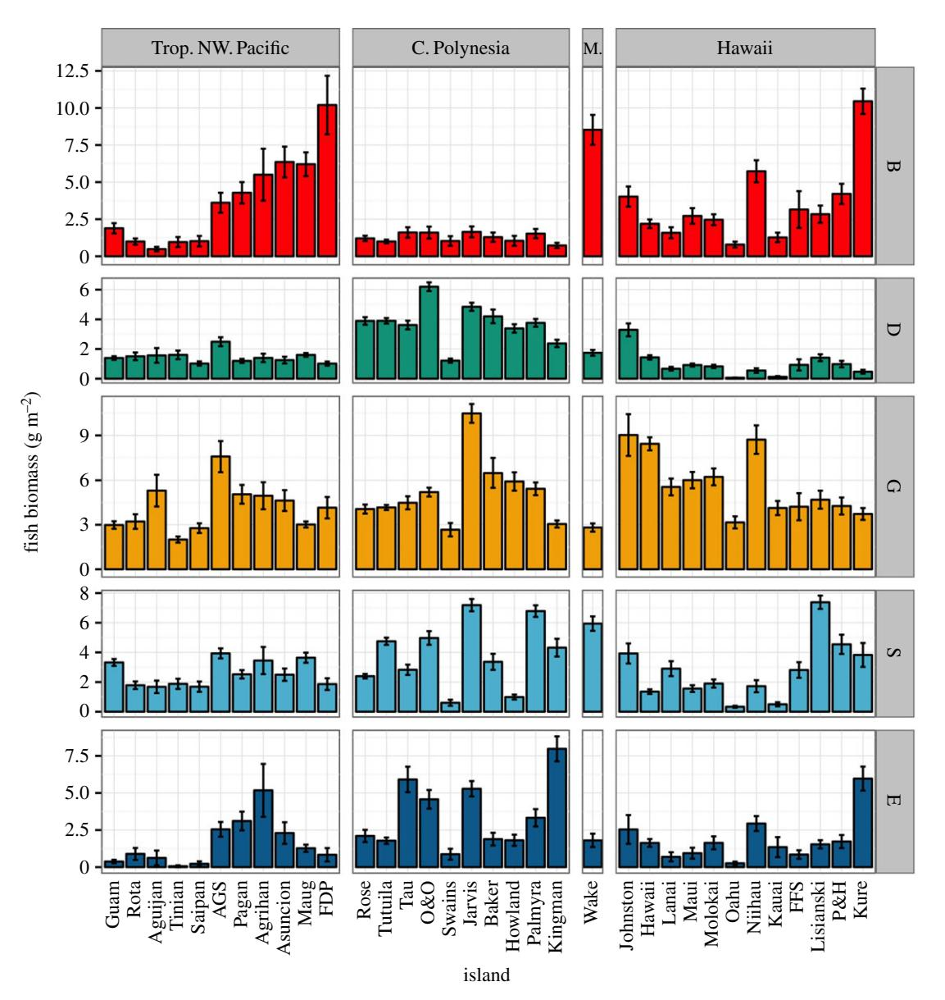
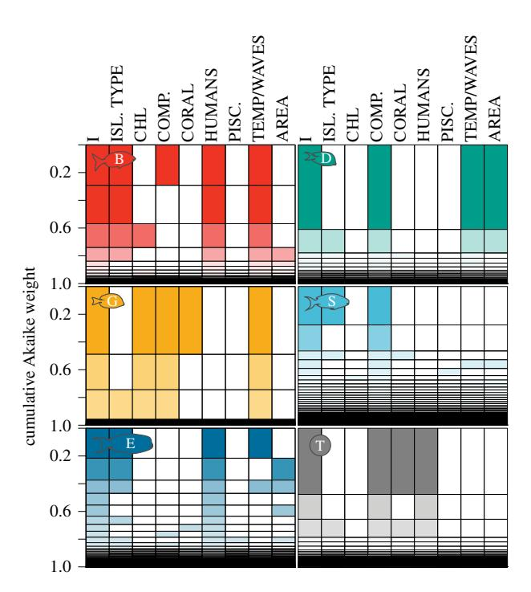
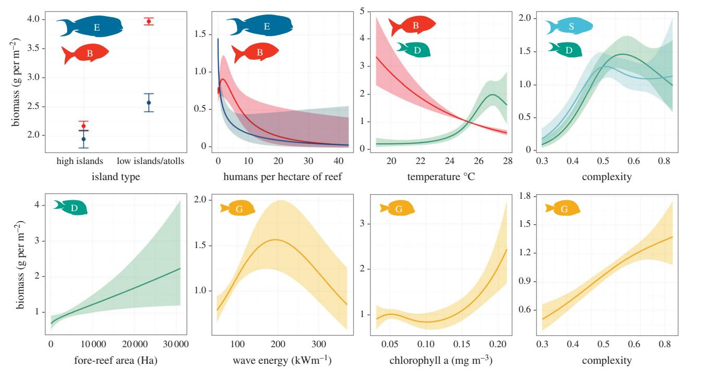

### rspb.royalsocietypublishing.org

# Research

Cite this article: Heenan A, Hoey AS, Williams GJ, Williams ID. 2016 Natural bounds on herbivorous coral reef fishes. Proc. R. Soc. B 283: 20161716.

http://dx.doi.org/10.1098/rspb.2016.1716

Received: 2 August 2016 Accepted: 28 October 2016

#### Subject Areas:

ecology

#### Keywords:

fish biomass, functional group, herbivore, human drivers, natural drivers, Pacific Ocean

#### Author for correspondence:

Adel Heenan

e-mail: [adel.heenan@gmail.com](mailto:adel.heenan@gmail.com)

Electronic supplementary material is available online at [https://dx.doi.org/10.6084/m9.fig](https://dx.doi.org/10.6084/m9.figshare.c.3573216)[share.c.3573216.](https://dx.doi.org/10.6084/m9.figshare.c.3573216)

# Natural bounds on herbivorous coral reef fishes

Adel Heenan1,4, Andrew S. Hoey2 , Gareth J. Williams3 and Ivor D. Williams4

1 Joint Institute for Marine and Atmospheric Research, University of Hawai'i, Manoa, Honolulu, HI 96822, USA 2 ARC Centre of Excellence for Coral Reef Studies, James Cook University, Townsville, Queensland 4811, Australia 3 School of Ocean Sciences, Bangor University, Anglesey LL59 5AB, UK

4 NOAA Pacific Islands Fisheries Science Center, Honolulu, HI 96818, USA

AH, [0000-0002-8307-5352](http://orcid.org/0000-0002-8307-5352)

Humans are an increasingly dominant driver of Earth's biological communities, but differentiating human impacts from natural drivers of ecosystem state is crucial. Herbivorous fish play a key role in maintaining coral dominance on coral reefs, and are widely affected by human activities, principally fishing. We assess the relative importance of human and biophysical (habitat and oceanographic) drivers on the biomass of five herbivorous functional groups among 33 islands in the central and western Pacific Ocean. Human impacts were clear for some, but not all, herbivore groups. Biomass of browsers, large excavators, and of all herbivores combined declined rapidly with increasing human population density, whereas grazers, scrapers, and detritivores displayed no relationship. Sea-surface temperature had significant but opposing effects on the biomass of detritivores (positive) and browsers (negative). Similarly, the biomass of scrapers, grazers, and detritivores correlated with habitat structural complexity; however, relationships were group specific. Finally, the biomass of browsers and large excavators was related to island geomorphology, both peaking on low-lying islands and atolls. The substantial variability in herbivore populations explained by natural biophysical drivers highlights the need for locally appropriate management targets on coral reefs.

# 1. Introduction

Humans are increasingly a dominant global force influencing the structure and function of ecosystems through the removal of key species and functional groups, habitat modification, and the effects of pollution and climate change [[1](#page-5-0)–[3\]](#page-5-0). Coral reef ecosystems are especially vulnerable to such human-forcing [\[4\]](#page-5-0), and whereas anthropogenic impacts are globally pervasive, they occur against a backdrop of high natural variability in reef systems caused by differences in the environment and biogeographic context. Oceanic productivity, water temperature, habitat area, reef geomorphology, and larval connectivity can have substantial impacts on coral reef fish assemblages [[5](#page-5-0)–[10](#page-6-0)]. For example, the natural fish carrying capacity of a coral reef has been shown to double along a gradient of increasing oceanic productivity [[11\]](#page-6-0). Understanding the relative influence of human versus natural drivers is key to assessing the current status of these ecosystems.

Here, we focus on one component of coral reef systems, namely herbivorous fishes in the Pacific Ocean. Despite some uncertainty, particularly in the Indo-Pacific, about the relative importance of herbivory in mediating coral–algal dynamics [\[12](#page-6-0)–[16\]](#page-6-0), herbivorous fishes are widely recognized to play an important role in maintaining the competitive dominance of reef calcifiers (e.g. hard corals and crustose coralline algae), over other benthic components (e.g. fleshy macroalgae) [\[17](#page-6-0)–[20](#page-6-0)]. For example, following climate-induced coral bleaching, fished reefs with reduced herbivore populations have a greater propensity to become dominated by macroalgae [[21\]](#page-6-0). For that reason, some coral reef management

& 2016 The Authors. Published by the Royal Society under the terms of the Creative Commons Attribution License [http://creativecommons.org/licenses/by/4.0/, which permits unrestricted use, provided the original](http://creativecommons.org/licenses/by/4.0/) [author and source are credited.](http://creativecommons.org/licenses/by/4.0/)

strategies now focus specifically on protecting or restoring herbivorous fish populations [22,23]. There is a need, therefore, to better understand the role of the natural environment in determining distribution patterns of herbivorous fishes [8,24–26] independent of local human impacts on coral reefs. Indeed, the upper bounds of herbivore biomass will be determined by a reef's local biophysical setting, and once identified, will allow for realistic fisheries management strategies to address the widespread effect of fishing on this trophic group [7,8,11,27–30].

Herbivorous reef fish assemblages vary with local environmental factors. For instance, parrotfish tend to be more abundant and species rich on barrier reefs compared with atoll, and fringing or low coral cover reefs [31]. Intra-island variation in herbivore species composition and behaviour is also evident among different reef habitats. Typically, the abundance and feeding activity of grazing surgeonfishes and large parrotfishes is lower on nearshore coastal reefs compared with wave-exposed offshore reefs [32,33]. Conversely, browsing herbivores are often more abundant on wave-protected back reef habitats, when compared with the exposed fore-reef areas [32,34,35]. Furthermore, herbivore biomass and rates of herbivory tend to be the greatest on the reef crest, and both decrease across the reef flat and down the reef slope [35-38]. These patterns in herbivorous fishes are variously attributed to the availability and quality of food and shelter, in addition to the wave energy and sedimentation regimes experienced [34,38-40]. The implication of this localized among- and within-habitat variation is that the need for, and potential effectiveness of, fishery management interventions are highly dependent on natural bounds set by the location's biophysical

Here, we make use of a consistent monitoring dataset from 33 islands and atolls across the central and western Pacific to better understand the relative role of anthropogenic impacts and biophysical drivers (habitat and physical environmental conditions) in structuring herbivore populations on coral reefs. These islands span large gradients of human population density (0–27 people per hectare of reef) [11,42] and biophysical condition [43], allowing us to separate the relative effect of those in driving variation in herbivore biomass.

### 2. Methods

#### (a) Fish assemblage and reef habitat surveys

We used coral reef monitoring data collected between 2010 and 2015 across 33 Pacific islands and atolls (electronic supplementary material, table S1). The surveys were performed for the National Oceanic and Atmospheric Administration (NOAA) Pacific Reef Assessment and Monitoring Programme (Pacific RAMP), a longterm ecosystem monitoring effort focused on United States and United States-affiliated coral reefs [44]. Data from two underwater visual census techniques were used, the stationary point count (SPC) and the towed-diver (tow) survey method (Coral Reef Ecosystem Program; Pacific Islands Fisheries Science Center (2016). National Coral Reef Monitoring Program: stratified random surveys (StRS) of reef fish, including benthic estimate data of the U.S. Pacific Reefs since 2007. NOAA National Centers for Environmental Information. Unpublished Dataset. [15 August 2016], https://inport.nmfs.noaa.gov/inport/item/24447. Coral Reef Ecosystem Program; Pacific Islands Fisheries Science Center (2016). Towed-diver surveys of large-bodied fishes of the U.S. Pacific Reefs since 2000. NOAA National Centers for

Environmental Information. Unpublished Dataset. [15 August 2016], https://inport.nmfs.noaa.gov/inport/item/5568). The SPC was used to estimate the biomass of herbivorous fishes, whereas the latter was used to estimate biomass of large (more than 50 cm in total length) piscivores. Piscivore biomass was used to investigate what effect, if any, piscivores may have in exerting top-down control on herbivore populations [45]. The tow estimates of piscivore biomass were used in preference to the SPC owing to the concern that small-scale surveys can overestimate the biomass of large roving predators, such as sharks and jacks [46].

A total of 3309 SPC surveys were conducted by experienced surveyors. Survey site locations were selected per sampling unit (typically an island/atoll, occasionally, a cluster of small islands or for large islands, island subsection) by means of a randomized stratified design [47]. The target sampling domain of Pacific RAMP is hard bottom habitat in depths less than 30 m, and site allocation is stratified by reef zone (fore reef; back reef; lagoon) and depth (0-6 m; 6-18 m; 18-30 m). Only data from the fore-reef habitat were used to remove any biases associated with interhabitat differences on herbivorous fish assemblages; the fore reef is the most comparable reef habitat present across all islands. At each survey site, a pair of divers conducted simultaneous adjacent counts in which they first compiled lists of all fish species present within their survey area (7.5 m radius cylinder) during a 5 min interval. After the timed interval, divers proceeded to count and size all fishes from the species list within their survey area. Divers then visually estimated benthic cover and reef complexity, the mean vertical substrate height from the reef plane in the survey cylinder.

A total of 861 tow surveys were analysed. Surveys were haphazardly located on reef areas at a depth of 10–20 m, with the broad goal of spreading sites as widely as possible around each island; circumnavigating the island where practical. A pair of divers (one fish, one benthic surveyor) were towed behind a small boat travelling approximately 2 km for each 50 min survey. During each tow, the fish diver recorded the number and size of all species more than 50 cm in total length within a belt-transect extending 5 m on either side and 10 m in front of the diver, from the seafloor to the surface. Full details on the tow survey method are available in [46].

#### (b) Data processing

The weight per individual fish was calculated using length-toweight relationships from FishBase and other sources [48,49]. To date, much of the evidence of human impacts on herbivore populations relative to regional biophysical variation considers these herbivorous fishes as a single trophic guild or broad taxonomic groups [8], although, see [24]. Collectively, these studies point to differences in the expected richness and biomass of herbivorous fishes, either in toto or of specific families, based on habitat, island type, and biogeographic region [7,8]. There is, however, increasing evidence that different herbivore functional groups perform complimentary roles in reef processes [50], have different dietary and habitat requirements [8,51,52], and are likely to respond differently to local biophysical settings. Therefore, we classified herbivorous fishes functionally (sensu [53]) and incorporated new dietary data specific to the study area. Five groups resulted: 'browsers', 'grazers', 'detritivores', 'large excavators/bioeroders', and 'scrapers/ small excavators' (electronic supplementary material, S2).

For the SPC surveys, site-level herbivorous fish biomass (g m $^{-2}$ ), hard coral cover, and reef complexity were calculated by averaging the two diver replicates conducted at each site location. Data were inspected for site-level outliers, site-level observations of any of the fish metrics that were more than 97.5% of the interquartile range, were capped at that 97.5% value (electronic supplementary material, S3.1). Island-scale averages of the

site-level metrics were calculated, first by averaging values within each depth stratum per island, and then weighting the mean estimates by the total area of each stratum per island [54,55]. Island-level tow estimates of piscivore biomass were calculated as equally weighted means of each tow per island across years. Species richness per functional group was estimated by generating species accumulation curves for each island, using the rarefaction method in the R package *vegan* [56].

#### (c) Quantifying human and biophysical predictors

We used the published estimates of the following human and biophysical covariates, derived at the island level: human population density, chlorophyll a (mg m $^{-3}$ ) as a proxy for phytoplankton biomass and oceanic productivity, total area of reef habitat, sea-surface temperature (SST  $^{\circ}$ C), wave energy (kW m $^{-1}$ ), and island type (electronic supplementary material, table S3.2). Island types were based on geomorphology, and classed as either high (e.g. basalt island) or low lying (e.g. carbonate island or atoll). Islands were also grouped by region (Hawaii, Central Polynesia, Gilbert, Ellis, and Marshall Islands, and Tropical Northwest Pacific [57]).

To determine anthropogenic impacts on herbivorous fishes, we used human population density (the number of people resident per island (from the 2010 US census) divided by the area of fore-reef habitat per island from Geographic Information System (GIS) habitat layers maintained by Pacific RAMP (electronic supplementary material, S.3.3). For the remote-sensing data, we used the lower climatological mean of SST from the PATHFINDER v.5.0 dataset, and the climatological mean of chlorophyll a derived from the moderate resolution imaging spectroradiometer. The wave energy metric used was the climatological mean from NOAA's Wave Watch III wave model. Details on the methods used to generate island-specific biophysical metrics are described in full in [43].

#### (d) Modelling

We fitted the generalized additive mixed-effects models (GAMMs) of island-level herbivore biomass (electronic supplementary material, S3.1) in R (www.r-project.org), using the *gamm4* package [58]. All models included region as a random effect to account for autocorrelation among islands within regions [59]. Wake is the only replicate in the Marshall, Gilbert, and Ellis Islands region, therefore, we report summary fish metrics for Wake (biomass and richness) but excluded it from the statistical modelling (total number of island replicates = 33). For total fish biomass and functional group biomass separately, we fitted GAMMs for all possible combinations of the predictor variables using the *UGamm* wrapper function, in combination with the *dredge* function in the *MuMIn* package [60].

We calculated Akaike's information criterion, corrected for small sample size (AICc) and the AICc-based relative importance weights  $(w_i)$  to assess the conditional probability of each model. We report the model-average estimates for each predictor term based on the top-ranked models for each fish metric, top-ranked models being those with more than 0.05 Akaike weight. To test for influential data points and to check for model stability, we performed a jack-knife sensitivity test, calculating the percentage of times sequentially deleting single response variable data points produced the same top-ranking model structure (sensu [61]).

Finally, to visualize the effect of predictor terms on the herbivorous fish responses, we used the coefficients from the top-ranked models for each response variable separately to generate a predicted dataset. We set all other predictor terms to their median value then generated smoother terms for the predictor of interest and plotted these against the untransformed, unscaled fish metrics [11].

#### 3. Results

Across the western central Pacific, a large degree of variability exists in the biomass and composition of herbivorous fish assemblages, including the species richness within functional groups. Generally, there is greater biomass and richness of detritivores in Central Polynesia, and a greater biomass of browsers in the unpopulated northerly latitudes (figure 1 and electronic supplementary material, S4.1). Functional group biomass and richness was positively related in large excavators/bioeroders, scrapers/small excavators, and detritivores (electronic supplementary material, figure S4.2 and table S4.2).

Major drivers of this spatial variation in total herbivorous fish biomass were identified as reef complexity, hard coral cover, and human population density (electronic supplementary material, table S5). The original smoothers fitted to the functional group and total herbivore biomass values are in the electronic supplementary material, figure S5. Total herbivore biomass plateaued at intermediate complexity, decreased at highest coral cover, and continually decreased with human population density (electronic supplementary material, figure S5). The best-fit model that contained these three biological variables had high explanatory power and stability (approx. 69% variability explained in total herbivore biomass, 94% jack-knife stability; electronic supplementary material, table S5). When functional groups were modelled individually, the top candidate models showed similar stability. Specifically, the dominant predictors identified from the variable importance (vi) estimates from the top candidate model of the entire dataset matched those identified from the jack-knifing method (electronic supplementary material, table S5). The amount of variance explained by the top-ranking models of herbivore biomass for each functional group (figure 2) was as follows: browsers (84%); detritivores (84%); grazers (73%); scrapers/small excavators (36%); and large excavators/bioeroders (59%; electronic supplementary material, figure S5).

The relationship between the top predictor terms and herbivore biomass was distinct for different functional groups. Biomass of large excavators/bioeroders (all parrotfishes more than 35 cm in total length) and browsers was significantly greater at low islands/atolls when compared with high islands (figure 3 and electronic supplementary material, table S5). These were also the only functional groups for which human population density was a strong predictor of biomass (figure 3 and electronic supplementary material, table S5), with both groups declining rapidly from low-to-mid human population density.

The dominant drivers of variability in browsers, detritivores, grazers, and scrapers/small excavators were biophysical. These data showed that reefs in warmer waters have lower browser biomass and greater detritivore biomass and species richness (figure 3 and electronic supplementary material, table S5). Increased detritivore, grazer and scraper/small excavator biomass was evident from low-to-mid habitat complexity. The biomass of grazers continued to increase at high complexity locations, whereas for detritivores and scrapers/small excavators the biomass either plateaued or was reduced at high complexity (figure 3). Locations with a larger amount of fore-reef habitat had greater biomass of detritivores, whereas areas with intermediate wave energy and high chlorophyll a had increased grazer biomass (figure 3 and electronic supplementary material, table S5).

Figure 1. Herbivorous fish biomass by functional group per region. B, browsers (red), D, detritivores (green), G, grazers (yellow), S, scrapers and small excavators (blue), E, large excavators and bioeroders (dark blue). Trop. NW. Pacific, Tropical Northwest Pacific; C. Polynesia, Central Polynesia; M., Marshall Islands. AGS, Alamagan, Guguan, and Sarigan; FDP, Farallon de Pajaros; O&O, Ofu and Olosega; FFS, French Frigate Shoals; P&H , Pearl and Hermes. Islands within region are ordered by latitude. (Online version in colour.)

# 4. Discussion

Our results are consistent with the growing understanding that regional variability in the biophysical attributes of coral reef ecosystems acts to determine ecological state independent of local human impacts [[11,](#page-6-0)[61,62\]](#page-7-0). Specifically, our findings confirm clear anthropogenic impacts to herbivorous fishes across the Pacific, but importantly also show that (i) effects are functional-group-specific, and (ii) the biophysical attributes of reefs, especially SST and large-scale geomorphological habitat complexity also drive herbivorous coral reef fish assemblage states. Prior to this study, quantitative evidence for anthropogenic impacts on herbivorous fishes, while simultaneously accounting for large-scale natural variability in fish assemblages, has been sparse [\[8](#page-5-0),[30,31\]](#page-6-0). To the best of our knowledge, this is the first ocean basin-scale study quantifying the relative effects of human versus natural biophysical drivers of herbivorous fish functional group biomass.

In the absence of fisheries-dependent data on subsistence, recreational and commercial take, human density, and distance to market have proven to be useful proxies for the influence of humans on coral reef fishes [[11,](#page-6-0)[63,64](#page-7-0)]. Our results show a steep and rapid decline in the biomass of large excavators and browsers with increasing human population density. This pattern is consistent with other global and regional assessments documenting the negative effect of fishing on herbivores [[27,28](#page-6-0)]. Herbivorous fishes, in particular large excavating parrotfishes, and browsing surgeonfishes, are highly desired fisheries targets in the Pacific [\[65](#page-7-0)–[68\]](#page-7-0). Our results demonstrate the sensitivity of populations of these large herbivores to fishing mortality, presumably owing to their large maximum body size and for some species, late age at maturity and the disproportionate contribution of large old females to population replenishment [[65,69](#page-7-0) –[72](#page-7-0)]. The vulnerability of these two functional groups to human impacts is particularly important as they contribute disproportionately to reef processes [\[50](#page-6-0),[73,74\]](#page-7-0).

Herbivores vary in richness, abundance, and biomass by island geomorphology [\[8](#page-5-0),[31\]](#page-6-0). Our results show approximately 24–45% greater biomass of large-excavating and browsing

20161716

Figure 2. Model performance of generalized additive mixed-effects models (GAMMs). T, total herbivores (grey), for remaining letter and colour codes, see [figure 1.](#page-3-0) Rows represent separate model fits, coloured bars indicate that the predictor was included in a particular model and the height of each row adjusted to the cumulative Akaike weight, expressed as a proportion of all fitted models. I, model intercept term; ISL. TYPE, island type; CHL, chlorophyll a; COMP, reef complexity; CORAL, hard coral cover; HUM, human population density; PISC., piscivore biomass; TEMP, sea-surface temperature; AREA, area of habitat; WAVES, wave energy. (Online version in colour.)

fishes at low-lying islands (carbonate) and atolls, compared with high islands (basalt). There was no evidence for an island-type effect for the remaining functional groups, although consistent with a previous study [\[8](#page-5-0)], we found that the biomass of detritivores (all acanthurids) was positively associated with reef area. It may be that this island-type difference in biomass is driven by differential species-specific habitat requirements. For example, lagoonal habitat for settlement or nursery areas [\[75\]](#page-7-0) is only present within atoll systems. The implications of our analyses are that large-scale habitat differences should be considered before comparing herbivorous fish assemblages across different island types.

Here, we found no consistent relationship between the biomass of different herbivore functional groups and the cover of hard corals, but still an overall relationship between coral cover and total herbivore biomass. Our results suggest that in areas of coral cover greater than 22–24% the total herbivore assemblage will tend to be reduced in biomass, whereas the biomass of grazers, detritivores, and scrapers/small excavators increases with habitat complexity, with peak biomass for scrapers and detritivores at intermediate complexity. Previously, a nonlinear association between coral species richness and fish community abundance has been shown [\[76](#page-7-0)], as has a reduction in abundances of small- and medium-sized herbivores at low habitat complexity [\[77](#page-7-0)]. Taking these effects of complexity and coral cover together, it seems plausible that this reflects the opposing changes in the availability of refugia and food with coral cover. In general, high coral cover, and associated structural complexity, reduces the foraging efficiency of predators [[77](#page-7-0)–[79\]](#page-7-0). Furthermore, the availability of shelter reduces the energy that fishes must allocate to swimming in high flow water environments [[34\]](#page-6-0), giving them an energetic advantage. As such, more complex environments support higher fish abundances [\[80](#page-7-0)]. However, increases in coral cover are accompanied by concomitant decreases in cover of other benthic organisms, such as turf, endolithic and macroalgae [[81\]](#page-7-0). These algal assemblages, and associated detritus, are the primary food sources for herbivores, and as such food availability may limit population size in areas of high coral cover. This notion is supported by several studies that have documented increases in the abundance and biomass of herbivorous fishes following extensive coral mortality and reduced structural complexity [\[82](#page-7-0)–[84](#page-7-0)].

The increased biomass of grazers in the areas of moderate wave exposure and increased oceanic productivity could also be related to food availability. Both algal and detrital mass tends to decrease with increasing wave energy and the highest edible algal mass occurs at moderately exposed reefs [[85\]](#page-7-0). The positive association between chlorophyll a and grazer biomass could be owing to greater food availability for grazing fishes, specifically nutrients and sinking detrital particles such as phytodetritus, faeces, or dead planktonic material [[77\]](#page-7-0). If this were the case, then one might expect to see a similar effect on detritivore biomass, however, we did not. Instead, the dominant biophysical driver of variability in detritivore biomass was SST.

Notably, detritivores and browsers showed opposing responses to SST, with browser biomass being negatively and detritivore biomass positively related to SST. Similar decreases in the biomass of browsing fishes with decreasing latitude, and hence SST, are evident in both the Atlantic [\[25](#page-6-0)] and southern Pacific Ocean [\[86\]](#page-7-0). Temperature fundamentally constrains the metabolic processes of ectotherms, and various hypotheses have been proposed to explain how temperature might impact the performance and fitness of individuals [\[87\]](#page-7-0). For instance, the temperature–size rule predicts ectotherms to be smaller in warmer waters, owing to reduced mean body size, earlier maturation, and increased initial growth rates [\[88](#page-7-0)–[90](#page-7-0)]. While the temperature-constraint hypothesis relates to the interacting effects of temperature and food quality on fish physiology [[25](#page-6-0),[91](#page-7-0)]. Here, we found increased browser biomass in cooler waters and increased detritivore biomass in warmer waters. Whether these trends in the standing stock of these functional groups relate to larger individuals and/or intraspecific variability in life-history characteristics across the temperature gradients surveyed would require location-specific, age-based studies on individual species.

The different effect of temperature on these functional groups could also be a response to the very different dietary strategies of these fishes. Browsing acanthurids, such as Naso unicornis and kyphosids, are the only functional group that hindgut ferment, which allows these fish to gain energy from refractory fleshy macroalgal carbohydrates, including mannitol [\[92](#page-8-0)–[95](#page-8-0)]. Macroalgae, the preferred food of browsers, is more abundant on reefs in cooler climes in the Pacific [[61\]](#page-7-0) and thus browser biomass may be tracking the availability of their target resource. It is difficult to ascertain the primary nutrient sources of detritivores that feed on the epilithic algal matrix (EAM) [\[96\]](#page-8-0). The EAM contains a mixture of filamentous algal turfs, cyanobacteria, macroalgal spores, microalgae (diatoms and dinoflagelletes), heterotrophic bacteria, sediment, and organic detritus [\[97](#page-8-0)]. Stomach content analyses of the detritivore Ctenochaetus striatusreveal large amounts of loose plant

Figure 3. Predicted biomass and 95% confidence limits of functional groups by island type and along human and biophysical gradients: human population density; sea-surface temperature, habitat complexity; wave energy, area of fore reef and chlorophyll a. Functional groups are indicated by colour code and letter ([figure 1](#page-3-0)).

cells, sediment, and algal filaments while the composition of short-chain fatty acids in Ctenochaetus striatus and Ctenochaetus strigosus guts are indicative of a diet of diatoms and bacteria [\[51](#page-7-0)[,98](#page-8-0)]. Whether detritivorous fish biomass tracks spatial variability in the abundance and production of their target resource remains to be established.

# 5. Conclusion

Our findings highlight that coral reefs' biophysical setting strongly determine their carrying capacity and community composition of herbivorous reef fishes. Human impacts are superimposed over the backdrop of these naturally occurring drivers. Herbivore-focused management interventions are likely to become more widely implemented owing to the perception that greater herbivore biomass promotes reef resilience. Our results show large natural differences in the capacity of individual reefs to support herbivore populations and therefore, it is unlikely that all reefs will respond similarly to particular interventions, such as prohibition of fishing. Moreover, our results show that herbivore functional groups respond in different ways along gradients of those natural biophysical drivers. Locally appropriate management targets for herbivore functional group biomass must therefore factor in the natural bounds set by the reef's biophysical setting.

Data accessibility. All raw data collected for the Pacific Reef Assessment and Monitoring Programme are available upon request (email: nmfs.pic.credinfo@noaa.gov). All data used within the paper are available at [https://github.com/adelheenan/ProcB\\_herbivores](https://github.com/adelheenan/ProcB_herbivores).

Authors' contributions. A.H., I.D.W., and A.S.H. conceived and designed the analysis; A.H. and G.J.W. performed the analysis; all authors wrote the paper.

Competing interests. We have no competing interests.

Funding. Data collection was supported by NOAA's Coral Reef Conservation Programme ([http://coralreef.noaa.gov\)](http://coralreef.noaa.gov). The research was supported by a CRCP grant no. (828) (A.H.).

Acknowledgements. We thank Rusty Brainard for leading the Coral Reef Ecosystem Programme and the extraordinary work of those involved in Pacific RAMP, Melanie Abecassis for statistical advice, Amanda Dillon for assistance with graphics, James Robinson for providing distance to provincial capital data, and Brett Taylor for helpful discussion and comments on an earlier version of this manuscript. We also thank the four anonymous reviewers, whose thoughtful critique greatly improved this paper.

# References

- 1. Haberl H, Erb KH, Krausmann F, Gaube V, Bondeau A, Plutzar C, Gingrich S, Lucht W, Fischer-Kowalski M. 2007 Quantifying and mapping the human appropriation of net primary production in earth's terrestrial ecosystems. Proc. Natl Acad. Sci. USA 104, 12 942– 12 947. ([doi:10.1073/pnas.0704243104](http://dx.doi.org/10.1073/pnas.0704243104))
- 2. Hooper DU et al. 2012 A global synthesis reveals biodiversity loss as a major driver of ecosystem change. Nature 486, 105–108. ([doi:10.1038/nature11118\)](http://dx.doi.org/10.1038/nature11118)
- 3. Hoegh-Guldberg O, Bruno JF. 2010 The impact of climate change on the world's marine ecosystems.

- Science 328, 1523 1528. [\(doi:10.1126/science.](http://dx.doi.org/10.1126/science.1189930) [1189930\)](http://dx.doi.org/10.1126/science.1189930)
- 4. Bellwood DR, Hughes TP, Folke C, Nystro¨m M. 2004 Confronting the coral reef crisis. Nature 429, 827 – 833. [\(doi:10.1038/nature02691](http://dx.doi.org/10.1038/nature02691))
- 5. Parravicini V et al. 2013 Global patterns and predictors of tropical reef fish species richness. Ecography 36, 1254– 1262. ([doi:10.1111/j.1600-](http://dx.doi.org/10.1111/j.1600-0587.2013.00291.x) [0587.2013.00291.x\)](http://dx.doi.org/10.1111/j.1600-0587.2013.00291.x)
- 6. Mora C et al. 2011 Global human footprint on the linkage between biodiversity and ecosystem

- functioning in reef fishes. PLoS Biol. 9, e1000606. ([doi:10.1371/journal.pbio.1000606\)](http://dx.doi.org/10.1371/journal.pbio.1000606)
- 7. D'Agata S et al. 2014 Human-mediated loss of phylogenetic and functional diversity in coral reef fishes. Curr. Biol. 24, 555 – 560. [\(doi:10.1016/j.cub.](http://dx.doi.org/10.1016/j.cub.2014.01.049) [2014.01.049](http://dx.doi.org/10.1016/j.cub.2014.01.049))
- 8. Pinca S, Kronen M, Magron F, McArdle B, Vigliola L, Kulbicki M, Andre´foue¨t S. 2012 Relative importance of habitat and fishing in influencing reef fish communities across seventeen Pacific Island Countries and Territories.

- Fish Fish. 13, 361– 379. ([doi:10.1111/j.1467-2979.](http://dx.doi.org/10.1111/j.1467-2979.2011.00425.x) [2011.00425.x\)](http://dx.doi.org/10.1111/j.1467-2979.2011.00425.x)
- 9. Kronen M, Vunisea A, Magron F, McArdle B. 2010 Socio-economic drivers and indicators for artisanal coastal fisheries in Pacific island countries and territories and their use for fisheries management strategies. Mar. Policy 34, 1135 – 1143. ([doi:10.](http://dx.doi.org/10.1016/j.marpol.2010.03.013) [1016/j.marpol.2010.03.013](http://dx.doi.org/10.1016/j.marpol.2010.03.013))
- 10. MacNeil MA, Graham NAJ, Polunin NVC, Kulbicki M, Galzin R, Harmelin-Vivien M, Rushton SP. 2009 Hierarchical drivers of reef-fish metacommunity structure. Ecology 90, 252– 264. [\(doi:10.1890/07-](http://dx.doi.org/10.1890/07-0487.1) [0487.1\)](http://dx.doi.org/10.1890/07-0487.1)
- 11. Williams ID, Baum JK, Heenan A, Hanson KM, Nadon MO, Brainard RE. 2015 Human, oceanographic and habitat drivers of central and western Pacific coral reef fish assemblages. PLoS ONE 10, e0120516. ([doi:10.1371/journal.](http://dx.doi.org/10.1371/journal.pone.0120516) [pone.0120516](http://dx.doi.org/10.1371/journal.pone.0120516))
- 12. Smith JE et al. 2016 Re-evaluating the health of coral reef communities: baselines and evidence for human impacts across the central Pacific. Proc. R. Soc. B 283, 20151985. [\(doi:10.1098/rspb.](http://dx.doi.org/10.1098/rspb.2015.1985) [2015.1985\)](http://dx.doi.org/10.1098/rspb.2015.1985)
- 13. Roff G, Mumby PJ. 2012 Global disparity in the resilience of coral reefs. Trends Ecol. Evol. 27, 404– 413. ([doi:10.1016/j.tree.2012.04.007\)](http://dx.doi.org/10.1016/j.tree.2012.04.007)
- 14. Carassou L, Le´opold M, Guillemot N, Wantiez L, Kulbicki M. 2013 Does herbivorous fish protection really improve coral reef resilience? A case study from New Caledonia (South Pacific). PLoS ONE 8, e0060564. ([doi:10.1371/journal.pone.0060564](http://dx.doi.org/10.1371/journal.pone.0060564))
- 15. Russ GR, Questel S-LA, Rizzari JR, Alcala AC. 2015 The parrotfish-coral relationship: refuting the ubiquity of a prevailing paradigm. Mar. Biol. 162, 2029 – 2045. [\(doi:10.1007/s00227-015-2728-3\)](http://dx.doi.org/10.1007/s00227-015-2728-3)
- 16. Heenan A, Williams ID. 2013 Monitoring herbivorous fishes as indicators of coral reef resilience in American Samoa. PLoS ONE 8, e79604. [\(doi:10.1371/journal.pone.0079604\)](http://dx.doi.org/10.1371/journal.pone.0079604)
- 17. Steneck RS. 1988 Herbivory on coral reefs: a synthesis. In Proc. the 6th Int. Coral Reef Symp., Townesville, Australia, 8 – 12 August. pp. 37 – 49.
- 18. Mumby PJ et al. 2006 Fishing, trophic cascades, and the process of grazing on coral reefs. Science 311, 98 – 101. [\(doi:10.1126/science.1121129](http://dx.doi.org/10.1126/science.1121129))
- 19. Hughes TP et al. 2007 Phase shifts, herbivory, and the resilience of coral reefs to climate change. Curr. Biol. 17, 360 – 365. ([doi:10.1016/j.cub.2006.12.049\)](http://dx.doi.org/10.1016/j.cub.2006.12.049)
- 20. Jouffray J-B, Nystro¨m M, Norstrom AV, Williams ID, Wedding LM, Kittinger JN, Williams GJ. 2014 Identifying multiple coral reef regimes and their drivers across the Hawaiian archipelago. Phil. Trans. R. Soc. B 370, 20130268. [\(doi:10.1098/rstb.](http://dx.doi.org/10.1098/rstb.2013.0268) [2013.0268\)](http://dx.doi.org/10.1098/rstb.2013.0268)
- 21. Graham NAJ, Jennings S, MacNeil MA, Mouillot D, Wilson SK. 2015 Predicting climate-driven regime shifts versus rebound potential in coral reefs. Nature 518, 1– 17. [\(doi:10.1038/nature14140](http://dx.doi.org/10.1038/nature14140))
- 22. Cox CE, Jones CD, Wares JP, Castillo KD, McField MD, Bruno JF. 2013 Genetic testing reveals some mislabeling but general compliance with a ban on herbivorous fish harvesting in Belize. Conserv.

- Lett. 6, 132–140. [\(doi:10.1111/j.1755-263X.2012.](http://dx.doi.org/10.1111/j.1755-263X.2012.00286.x) [00286.x](http://dx.doi.org/10.1111/j.1755-263X.2012.00286.x))
- 23. Williams ID, White D, Sparks RT, Lino KC, Zamzow JP, Kelly EL, Ramey H. 2016 Responses of herbivorous fishes and benthos to 6 years of protection at the Kahekili Herbivore Fisheries Management Area, Maui. PLoS ONE 11, e0159100. [\(doi:10.1371/journal.pone.0159100\)](http://dx.doi.org/10.1371/journal.pone.0159100)
- 24. Longo GO, Ferreira CEL, Floeter SR. 2014 Herbivory drives large-scale spatial variation in reef fish trophic interactions. Ecol. Evol. 4, 4553 – 4566. [\(doi:10.1002/ece3.1310](http://dx.doi.org/10.1002/ece3.1310))
- 25. Floeter SR, Behrens MD, Ferreira CEL, Paddack MJ, Horn MH. 2005 Geographical gradients of marine herbivorous fishes: patterns and processes. Mar. Biol. 147, 1435– 1447. ([doi:10.1007/s00227-005-](http://dx.doi.org/10.1007/s00227-005-0027-0) [0027-0](http://dx.doi.org/10.1007/s00227-005-0027-0))
- 26. Meekan MG, Choat JH. 1997 Latitudinal variation in abundance of herbivorous fishes: a comparison of temperate and tropical reefs. Mar. Biol. 128, 373 – 383. [\(doi:10.1007/s002270050103](http://dx.doi.org/10.1007/s002270050103))
- 27. Bellwood DR, Hoey AS, Hughes TP. 2012 Human activity selectively impacts the ecosystem roles of parrotfishes on coral reefs. Proc. R. Soc. B 279, 1621– 1629. [\(doi:10.1098/](http://dx.doi.org/10.1098/rspb.2011.1906) [rspb.2011.1906](http://dx.doi.org/10.1098/rspb.2011.1906))
- 28. Edwards CB et al. 2014 Global assessment of the status of coral reef herbivorous fishes: evidence for fishing effects. Proc. R. Soc. B 281, 20131835. [\(doi:10.1098/rspb.2013.1835\)](http://dx.doi.org/10.1098/rspb.2013.1835)
- 29. Floeter SR, Halpern BS, Ferreira CEL. 2006 Effects of fishing and protection on Brazilian reef fishes. Biol. Conserv. 128, 391 – 402. [\(doi:10.1016/j.biocon.2005.](http://dx.doi.org/10.1016/j.biocon.2005.10.005) [10.005](http://dx.doi.org/10.1016/j.biocon.2005.10.005))
- 30. Kronen M, Pinca S, Magron F, McArdle B, Vunisea A, Vigliola L, Kulbicki M, Andre´foue¨t S. 2012 Socio-economic and fishery indicators to identify and monitor artisanal finfishing pressure in Pacific Island countries and territories. Ocean Coast. Manag. 55, 63 – 73. [\(doi:10.1016/j.](http://dx.doi.org/10.1016/j.ocecoaman.2011.07.011) [ocecoaman.2011.07.011\)](http://dx.doi.org/10.1016/j.ocecoaman.2011.07.011)
- 31. Taylor BM, Lindfield SJ, Choat JH. 2015 Hierarchical and scale-dependent effects of fishing pressure and environment on the structure and size distribution of parrotfish communities. Ecography 38, 520– 530. [\(doi:10.1111/ecog.01093](http://dx.doi.org/10.1111/ecog.01093))
- 32. Hoey AS, Bellwood DR. 2008 Cross-shelf variation in the role of parrotfishes on the Great Barrier Reef. Coral Reefs 27, 37 – 47. ([doi:10.1007/s00338-007-](http://dx.doi.org/10.1007/s00338-007-0287-x) [0287-x\)](http://dx.doi.org/10.1007/s00338-007-0287-x)
- 33. Russ G. 1984 Distribution and abundance of herbivorous grazing fishes in the central Great Barrier Reef. I. Levels of variability across the entire continental shelf. Mar. Ecol. Prog. Ser. 20, 23 – 34. [\(doi:10.3354/meps020023\)](http://dx.doi.org/10.3354/meps020023)
- 34. Johansson CL, Bellwood DR, Depczynski M. 2012 The importance of live coral for small-sized herbivorous reef fishes in physically challenging environments. Mar. Freshw. Res. 63, 672– 679. [\(doi:10.1071/MF12011](http://dx.doi.org/10.1071/MF12011))
- 35. Richards BL, Williams ID, Vetter OJ, Williams GJ. 2012 Environmental factors affecting large-bodied coral reef fish assemblages in the Mariana

- archipelago. PLoS ONE 7, e0031374. ([doi:10.1371/](http://dx.doi.org/10.1371/journal.pone.0031374) [journal.pone.0031374\)](http://dx.doi.org/10.1371/journal.pone.0031374)
- 36. Hay ME, Colbum T, Downing D. 1983 Spatial and temporal patterns in herbivory on a Caribbean fringing reef: the effects on plant distribution. Oecologia 58, 299– 308. [\(doi:10.1007/BF00385227](http://dx.doi.org/10.1007/BF00385227))
- 37. Fox RJ, Bellwood DR. 2007 Quantifying herbivory across a coral reef depth gradient. Mar. Ecol. Prog. Ser. 339, 49– 59. [\(doi:10.3354/meps339049\)](http://dx.doi.org/10.3354/meps339049)
- 38. Goatley CHR, Bellwood DR. 2012 Sediment suppresses herbivory across a coral reef depth gradient. Biol. Lett. 838, 1016 – 1018. [\(doi:10.1098/](http://dx.doi.org/10.1098/rsbl.2012.0770) [rsbl.2012.0770](http://dx.doi.org/10.1098/rsbl.2012.0770))
- 39. Mumby PJ, Bejarano S, Golbuu Y, Steneck RS, Arnold SN, Woesik R, Friedlander AM. 2013 Empirical relationships among resilience indicators on Micronesian reefs. Coral Reefs 32, 213– 226. ([doi:10.1007/s00338-012-0966-0](http://dx.doi.org/10.1007/s00338-012-0966-0))
- 40. Gust N. 2002 Scarid biomass on the northern Great Barrier reef: the influence of exposure, depth and substrata. Environ. Biol. Fishes 64, 353 – 366. ([doi:10.1023/A:1016112312009\)](http://dx.doi.org/10.1023/A:1016112312009)
- 41. Mumby PJ. 2014 Stratifying herbivore fisheries by habitat to avoid ecosystem overfishing of coral reefs. Fish Fish. 17, 266 – 278. [\(doi:10.1111/faf.12078](http://dx.doi.org/10.1111/faf.12078))
- 42. Williams ID et al. 2011 Differences in reef fish assemblages between populated and remote reefs spanning multiple archipelagos across the central and western Pacific. J. Mar. Biol. 2011, 1 – 14. ([doi:10.1155/2011/826234\)](http://dx.doi.org/10.1155/2011/826234)
- 43. Gove JM, Williams GJ, McManus MA, Heron SF, Sandin SA, Vetter OJ, Foley DG. 2013 Quantifying climatological ranges and anomalies for Pacific coral reef ecosystems. PLoS ONE 8, e61974. [\(doi:10.1371/](http://dx.doi.org/10.1371/journal.pone.0061974) [journal.pone.0061974\)](http://dx.doi.org/10.1371/journal.pone.0061974)
- 44. Heenan A et al. 2016 Ecosystem monitoring for ecosystem-based management: using a polycentric approach to balance information trade-offs. J. Appl. Ecol. 53, 1365 – 2664. [\(doi:10.1111/1365-2664.](http://dx.doi.org/10.1111/1365-2664.12633) [12633\)](http://dx.doi.org/10.1111/1365-2664.12633)
- 45. Boaden AE, Kingsford MJ. 2015 Predators drive community structure in coral reef fish assemblages. Ecosphere 6, 1– 33. [\(doi:10.1890/](http://dx.doi.org/10.1890/ES14-00292.1) [ES14-00292.1](http://dx.doi.org/10.1890/ES14-00292.1))
- 46. Richards BL, Williams ID, Nadon MO, Zgliczynski BJ. 2011 A towed-diver survey method for mesoscale fishery-independent assessment of large-bodied reef fishes. Bull. Mar. Sci. 87, 55 – 74. [\(doi:10.5343/](http://dx.doi.org/10.5343/bms.2010.1019) [bms.2010.1019\)](http://dx.doi.org/10.5343/bms.2010.1019)
- 47. Ayotte PM, McCoy KS, Heenan A, Williams ID, Zamzow JP. 2015 Coral Reef Ecosystem Division standard operating procedures: data collection for rapid ecological assessment fish surveys. ([doi:10.](http://dx.doi.org/10.7289/V5SN06ZT) [7289/V5SN06ZT](http://dx.doi.org/10.7289/V5SN06ZT))
- 48. Froese R, Pauly D. 2016 FishBase. See [www.](http://www.fishbase.org) [fishbase.org](http://www.fishbase.org) (June 2016).
- 49. Kulbicki M, Guillemot N, Amand M. 2005 A general approach to length-weight relationships for New Caledonian lagoon fishes. Cybium 29, 235– 252.
- 50. Rasher DB, Hoey AS, Hay ME. 2013 Consumer diversity interacts with prey defenses to drive ecosystem function. Ecology 94, 1347 – 1358. ([doi:10.1890/12-0389.1](http://dx.doi.org/10.1890/12-0389.1))

- 51. Choat JH, Clements KD, Robbins WD. 2002 The trophic status of herbivorous fishes on coral reefs 1: dietary analyses. Mar. Biol. 140, 613– 623. ([doi:10.](http://dx.doi.org/10.1007/s00227-001-0715-3) [1007/s00227-001-0715-3\)](http://dx.doi.org/10.1007/s00227-001-0715-3)
- 52. Choat JH, Robbins WD, Clements KD. 2004 The trophic status of herbivorous fishes on coral reefs. II. Food processing modes and trophodynamics. Mar. Biol. 145, 445 – 454. ([doi:10.1007/s00227-](http://dx.doi.org/10.1007/s00227-004-1341-7) [004-1341-7\)](http://dx.doi.org/10.1007/s00227-004-1341-7)
- 53. Green AL, Bellwood DR. 2009 Monitoring functional groups of herbivorous reef fishes as indicators of coral reef resilience - a practical guide for coral reef managers in the Asia Pacific region, 70. Gland, Switzerland: IUCN.
- 54. Heenan A, Ayotte P, Gray A, Lino K, McCoy K, Zamzow J, Williams I. 2014 Pacific Reef Assessment and Monitoring Program - Data Report - Ecological Monitoring 2012 – 2013 - reef fishes and benthic habitats of the main Hawaiian Islands, American Samoa, and Pacific Remote Island Areas.
- 55. Smith SG, Ault JS, Bohnsack JA, Harper DE, Luo J, McClellan DB. 2011 Multispecies survey design for assessing reef-fish stocks, spatially explicit management performance, and ecosystem condition. Fish. Res. 109, 25 – 41. ([doi:10.1016/j.](http://dx.doi.org/10.1016/j.fishres.2011.01.012) [fishres.2011.01.012\)](http://dx.doi.org/10.1016/j.fishres.2011.01.012)
- 56. Oksanen J, Blanchet F, Kindt R, Legendre P, O'Hara R. 2016 Vegan: community ecology package. See [http://cran.r-project.org/package=vegan.](http://cran.r-project.org/package=vegan) R Packag. 2.3 – 3.
- 57. Spalding MD et al. 2007 Marine ecoregions of the world: a bioregionalization of coastal and shelf areas. Bioscience 57, 573. [\(doi:10.1641/B570707\)](http://dx.doi.org/10.1641/B570707)
- 58. Wood S, Scheipl F. 2014 gamm4: Generalized additive mixed models using mgcv and lme4. R package version 0.2– 3. See [https://CRAN.R-project.](https://CRAN.R-project.org/package=gamm4) [org/package=gamm4](https://CRAN.R-project.org/package=gamm4).
- 59. Bunnefeld N, Phillimore AB. 2012 Island, archipelago and taxon effects: mixed models as a means of dealing with the imperfect design of nature's experiments. Ecography 35, 15– 22. [\(doi:10.1111/j.1600-0587.2011.07078.x](http://dx.doi.org/10.1111/j.1600-0587.2011.07078.x))
- 60. Barton´ K. 2015 MuMIn: Multi-Model Inference. R package version 1.13.4. See [https://CRAN.R-project.](https://CRAN.R-project.org/package=MuMIn) [org/package=MuMIn.](https://CRAN.R-project.org/package=MuMIn)
- 61. Williams GJ, Gove JM, Eynaud Y, Zgliczynski BJ, Sandin SA. 2015 Local human impacts decouple natural biophysical relationships on Pacific coral reefs. Ecography 38, 751 – 761. ([doi:10.1111/](http://dx.doi.org/10.1111/ecog.01353) [ecog.01353](http://dx.doi.org/10.1111/ecog.01353))
- 62. Williams SM, Chollett I, Roff G, Corte´s J, Dryden CS, Mumby PJ. 2015 Hierarchical spatial patterns in Caribbean reef benthic assemblages. J. Biogeogr. 42, 1327– 1335. [\(doi:10.1111/jbi.12509](http://dx.doi.org/10.1111/jbi.12509))
- 63. Maire E et al. 2016 How accessible are coral reefs to people? A global assessment based on travel time. Ecol. Lett. 19, 351– 360. ([doi:10.1111/ele.](http://dx.doi.org/10.1111/ele.12577) [12577\)](http://dx.doi.org/10.1111/ele.12577)
- 64. Brewer TD, Cinner JE, Green A, Pressey RL. 2013 Effects of human population density and proximity to markets on coral reef fishes vulnerable to extinction by fishing. Conserv. Biol. 27, 443– 452. [\(doi:10.1111/j.1523-1739.2012.01963.x](http://dx.doi.org/10.1111/j.1523-1739.2012.01963.x))

- 65. Houk P, Rhodes K, Cuetos-Bueno J, Lindfield S, Fread V, McIlwain JL. 2012 Commercial coral-reef fisheries across Micronesia: a need for improving management. Coral Reefs 31, 13 – 26. [\(doi:10.1007/](http://dx.doi.org/10.1007/s00338-011-0826-3) [s00338-011-0826-3\)](http://dx.doi.org/10.1007/s00338-011-0826-3)
- 66. Sabater MG, Carroll BP. 2009 Trends in reef fish population and associated fishery after three millennia of resource utilization and a century of socio-economic changes in American Samoa. Rev. Fish. Sci. 17, 318– 335. ([doi:10.1080/](http://dx.doi.org/10.1080/10641260802702872) [10641260802702872](http://dx.doi.org/10.1080/10641260802702872))
- 67. Bejarano Chavarro S, Mumby PJ, Golbuu Y. 2014 Changes in the spear fishery of herbivores associated with closed grouper season in Palau, Micronesia. Anim. Conserv. 17, 133 – 143. [\(doi:10.](http://dx.doi.org/10.1111/acv.12066) [1111/acv.12066](http://dx.doi.org/10.1111/acv.12066))
- 68. McCauley DJ, Young HS, Guevara R, Williams GJ, Power EA, Dunbar RB, Bird DW, Durham WH, Micheli F. 2014 Positive and negative effects of a threatened parrotfish on reef ecosystems. Conserv. Biol. 28, 1312 – 1321. [\(doi:10.1111/cobi.12314](http://dx.doi.org/10.1111/cobi.12314))
- 69. Taylor BM, Choat JH. 2014 Comparative demography of commercially important parrotfish species from Micronesia. J. Fish Biol. 84, 383– 402. [\(doi:10.1111/](http://dx.doi.org/10.1111/jfb.12294) [jfb.12294\)](http://dx.doi.org/10.1111/jfb.12294)
- 70. Choat JH, Axe LM, Lou DC. 1996 Growth and longevity in fishes of the family Scaridae. Mar. Ecol. Prog. Ser. 145, 33 – 41. ([doi:10.3354/](http://dx.doi.org/10.3354/meps145033) [meps145033\)](http://dx.doi.org/10.3354/meps145033)
- 71. Andrews AH, DeMartini EE, Eble JA, Taylor BM, Lou DC, Humphreys RL. 2016 Age and growth of bluespine unicornfish (Naso unicornis): a halfcentury life-span for a keystone browser, with a novel approach to bomb radiocarbon dating in the Hawaiian Islands. Can. J. Fish. Aquat. Sci. 12, 1 – 12. [\(doi:10.1139/cjfas-2016-0019\)](http://dx.doi.org/10.1139/cjfas-2016-0019)
- 72. DeMartini EE, Langston RC, Eble JA. 2014 Spawning seasonality and body sizes at sexual maturity in the bluespine unicornfish, Naso unicornis (Acanthuridae). Ichthyol. Res. 61, 243 – 251. [\(doi:10.](http://dx.doi.org/10.1007/s10228-014-0393-z) [1007/s10228-014-0393-z\)](http://dx.doi.org/10.1007/s10228-014-0393-z)
- 73. Lokrantz J, Nystro¨m M, Thyresson M, Johansson C. 2008 The non-linear relationship between body size and function in parrotfishes. Coral Reefs 27, 967 – 974. [\(doi:10.1007/s00338-008-0394-3\)](http://dx.doi.org/10.1007/s00338-008-0394-3)
- 74. Bellwood DR, Hughes TP, Hoey AS. 2006 Sleeping functional group drives coral-reef recovery. Curr. Biol. 16, 2434 – 2439. [\(doi:10.1016/j.cub.2006.](http://dx.doi.org/10.1016/j.cub.2006.10.030) [10.030](http://dx.doi.org/10.1016/j.cub.2006.10.030))
- 75. Aswani S, Hamilton RJ. 2004 Integrating indigenous ecological knowledge and customary sea tenure with marine and social science for conservation of bumphead parrotfish (Bolbometopon muricatum) in the Roviana Lagoon, Solomon Islands. Environ. Conserv. 31, 69– 83. ([doi:10.1017/](http://dx.doi.org/10.1017/S037689290400116X) [S037689290400116X](http://dx.doi.org/10.1017/S037689290400116X))
- 76. Messmer V, Jones GP, Munday PL, Holbrook SJ, Schmitt RJ, Brooks AJ. 2011 Habitat biodiversity as a determinant of fish community structure on coral reefs. Ecology 92, 2285 – 2298. ([doi:10.1890/11-](http://dx.doi.org/10.1890/11-0037.1) [0037.1](http://dx.doi.org/10.1890/11-0037.1))
- 77. Rogers A, Blanchard JL, Mumby PJ. 2014 Vulnerability of coral reef fisheries to a loss of

- structural complexity. Curr. Biol. 24, 1000 1005. ([doi:10.1016/j.cub.2014.03.026](http://dx.doi.org/10.1016/j.cub.2014.03.026))
- 78. Werner EE, Gilliam JF, Hall DJ, Mittelbach GG. 1983 An experimental test of the effects of predation risk on habitat use in fish. Ecology. 64, 1540 – 1548. ([doi:10.2307/1937508](http://dx.doi.org/10.2307/1937508))
- 79. Almany GR. 2004 Differential effects of habitat complexity, predators and competitors on abundance of juvenile and adult coral reef fishes. Oecologia 141, 105– 113. ([doi:10.1007/s00442-004-](http://dx.doi.org/10.1007/s00442-004-1617-0) [1617-0](http://dx.doi.org/10.1007/s00442-004-1617-0))
- 80. Graham NAJ, Wilson SK, Jennings S, Polunin NVC, Bijoux JP, Robinson J. 2006 Dynamic fragility of oceanic coral reef ecosystems. Proc. Natl Acad. Sci. USA 103, 8425– 8429. ([doi:10.1073/pnas.](http://dx.doi.org/10.1073/pnas.0600693103) [0600693103](http://dx.doi.org/10.1073/pnas.0600693103))
- 81. Wismer S, Hoey AS, Bellwood DR. 2009 Cross-shelf benthic community structure on the Great Barrier Reef: relationships between macroalgal cover and herbivore biomass. Mar. Ecol. Prog. Ser. 376, 45– 54. [\(doi:10.3354/meps07790\)](http://dx.doi.org/10.3354/meps07790)
- 82. Adam TC, Schmitt RJ, Holbrook SJ, Brooks AJ, Edmunds PJ, Carpenter RC, Bernardi G. 2011 Herbivory, connectivity, and ecosystem resilience: response of a coral reef to a large-scale perturbation. PLoS ONE 6, e23717. ([doi:10.1371/](http://dx.doi.org/10.1371/journal.pone.0023717) [journal.pone.0023717\)](http://dx.doi.org/10.1371/journal.pone.0023717)
- 83. Gilmour JP, Smith LD, Heyward AJ, Baird AH, Pratchett MS. 2013 Recovery of an isolated coral reef system following severe disturbance. Science 340, 69– 71. [\(doi:10.1126/science.1232310\)](http://dx.doi.org/10.1126/science.1232310)
- 84. Pratchett MS, Hoey AS, Wilson SK. 2014 Reef degradation and the loss of critical ecosystem goods and services provided by coral reef fishes. Curr. Opin. Environ. Sustain. 7, 37 – 43. ([doi:10.1016/j.](http://dx.doi.org/10.1016/j.cosust.2013.11.022) [cosust.2013.11.022\)](http://dx.doi.org/10.1016/j.cosust.2013.11.022)
- 85. Crossman DJ, Choat JH, Clements KD, Hardy T, McConochie J. 2001 Detritus as food for grazing fishes on coral reefs. Limnol. Oceanogr. 46, 1596 – 1605. [\(doi:10.4319/lo.2001.46.7.1596\)](http://dx.doi.org/10.4319/lo.2001.46.7.1596)
- 86. Hoey AS, Pratchett MS, Cvitanovic C. 2011 High macroalgal cover and low coral recruitment undermines the potential resilience of the world's southernmost coral reef assemblages. PLoS ONE 6, e25824. ([doi:10.1371/journal.pone.0025824](http://dx.doi.org/10.1371/journal.pone.0025824))
- 87. Kingsolver JG, Huey RB. 2008 Size, temperature, and fitness: Three rules. Evol. Ecol. Res. 10, 251– 268.
- 88. Atkinson D. 1994 Temperature and organism size- a biological law for ectotherms? Adv. Ecol. Res. 25, 1– 58. [\(doi:10.1016/S0065-2504\(08\)60212-3](http://dx.doi.org/10.1016/S0065-2504(08)60212-3))
- 89. Trip EDL, Clements KD, Raubenheimer D, Choat JH. 2014 Temperature-related variation in growth rate, size, maturation and life span in a marine herbivorous fish over a latitudinal gradient. J. Anim. Ecol. 83, 866– 875. ([doi:10.1111/1365-2656.12183](http://dx.doi.org/10.1111/1365-2656.12183))
- 90. Goldstein ED, D'Alessandro EK, Sponaugle S. 2016 Demographic and reproductive plasticity across the depth distribution of a coral reef fish. Sci. Rep. 6, 34077. [\(doi:10.1038/srep34077](http://dx.doi.org/10.1038/srep34077))
- 91. Gaines SD, Lubchenco J. 1982 A unified approach to marine plant-herbivore interactions. II. Biogeography. Annu. Rev. Ecol. Syst. 13, 111 – 138. ([doi:10.1146/annurev.es.13.110182.000551](http://dx.doi.org/10.1146/annurev.es.13.110182.000551))

 B 283:

20161716

- 92. Clements KD, Choat JH. 1995 Fermentation in tropical marine herbivorous fishes. Physiol. Zool. 68, 355– 378.
- 93. Clements KD, Raubenheimer D, Choat JH. 2009 Nutritional ecology of marine herbivorous fishes: ten years on. Funct. Ecol. 23, 79– 92. ([doi:10.1111/j.](http://dx.doi.org/10.1111/j.1365-2435.2008.01524.x) [1365-2435.2008.01524.x\)](http://dx.doi.org/10.1111/j.1365-2435.2008.01524.x)
- 94. White WL, Coveny AH, Robertson J, Clements KD. 2010 Utilisation of mannitol by temperate marine herbivorous fishes. J. Exp. Mar. Bio. Ecol. 391, 50–56. [\(doi:10.1016/j.jembe.2010.06.007\)](http://dx.doi.org/10.1016/j.jembe.2010.06.007)
- 95. Zubia M, Payri C, Deslandes E. 2008 Alginate, mannitol, phenolic compounds and biological activities of two range-extending brown algae, Sargassum mangarevense and Turbinaria ornata (Phaeophyta: Fucales), from Tahiti (French Polynesia). J. Appl. Phycol. 20, 1033– 1043. [\(doi:10.](http://dx.doi.org/10.1007/s10811-007-9303-3) [1007/s10811-007-9303-3\)](http://dx.doi.org/10.1007/s10811-007-9303-3)
- 96. Marshell A, Mumby PJ. 2012 Revisiting the functional roles of the surgeonfish Acanthurus nigrofuscus and Ctenochaetus striatus. Coral Reefs 31, 1093 – 1101. [\(doi:10.1007/s00338-012-0931-y](http://dx.doi.org/10.1007/s00338-012-0931-y))
- 97. Wilson SK, Bellwood DR, Choat JH, Furnas MJ. 2003 Detritus in the epilithic algal matrix and its use by coral reef fishes. Oceanogr. Mar. Biol. 41, 279 – 309. ([doi:10.1201/](http://dx.doi.org/10.1201/9780203180570.ch6) [9780203180570.ch6\)](http://dx.doi.org/10.1201/9780203180570.ch6)
- 98. Clements KD, German DP, Piche´ J, Tribollet AD, Choat JH. 2016 Integrating ecological roles and trophic diversification on coral reefs: multiple lines of evidence identify parrotfishes as microphages. Biol. J. Linn. Soc. ([doi:10.1111/bij.](http://dx.doi.org/10.1111/bij.12914) [12914\)](http://dx.doi.org/10.1111/bij.12914)