PRICE: \$2.50

# AN ASSESSMENT OF THE EXPECTED IMPACT OF A DREDGING PROJECT PROPOSED FOR PALA LAGOON, AMERICAN SAMOA

by

Philip Helfrich Principal Investigator

in collaboration with

John L. Ball, Jr.
Paul Bienfang
Maridell Foster
Brent Gallagher
Eric Guinther
George Krasnick
John Maciolek
James Maragos

Sea Grant Technical Report UNIHI-SEAGRANT-TR-76-02 October 1975

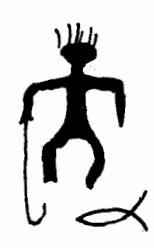

This work is a result of research sponsored by NOAA Office of Sea Grant, Department of Commerce, under Grant No. 2-35243, with additional funds from the Government of American Samoa and the Hawaii Institute of Marine Biology, University of Hawaii. The U.S. Government is authorized to produce and distribute reprints for governmental purposes notwithstanding any copyright notations that may appear hereon.

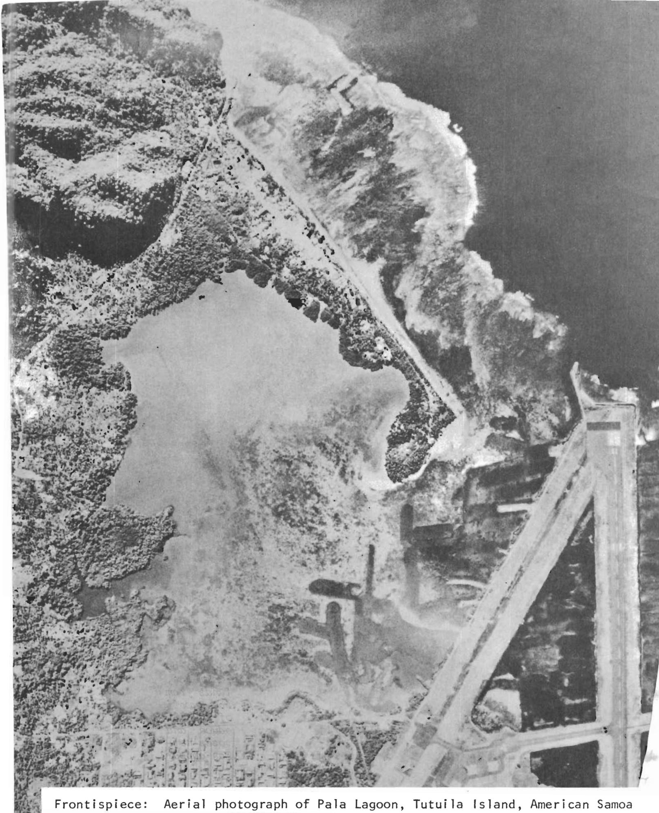

#### **PREFACE**

This study was undertaken at the request of the Governor of American Samoa, the Honorable John M. Haydon, with the cooperation of the National Marine Fisheries Service, the Bureau of Sport Fisheries and Wildlife, and the U.S. Army Corps of Engineers. It was conducted by an interdisciplinary team of biologists, oceanographers, and economists and supported by funds from the Government of American Samoa and the University of Hawaii's Sea Grant Program and the Hawaii Institute of Marine Biology.

An initial reconnaissance of Pala Lagoon was conducted on October 2, 4, and 13, 1971, by Dr. John Maciolek, unit leader of the Bureau of Sport Fisheries and Wildlife Cooperative Unit at the University of Hawaii. At that time preliminary observations were made and data collected upon which this survey is based. On February 26, 1972, a party of nine scientists, including a physical oceanographer and biologists with special competence in bacteriology, phytoplankton ecology, corals, benthic invertebrate communities, and fishes, went to American Samoa to collect data. An economist later joined the effort which continued until March 5, 1972. Supplemental information was supplied by Walter Matsumoto of the National Marine Fisheries Service, who studied zooplankton samples obtained from the Samoan Division of Natural Resources.

Frequent power failures were experienced during the week from February 26 through March 5, 1972, and, with inadequate emergency generators, the bacterial incubations were considered unreliable and the resultant data had to be rejected. Because of the important implications of the distribution and abundance of enteric bacteria in Pala Lagoon, this portion of the study was repeated. From December 5 through 10, 1972, two scientists from the original party, George Krasnick and Paul Bienfang, repeated the bacterial observations in Pala Lagoon. This second effort proved worthwhile and data obtained represent an important portion of this paper.

This study was conducted as a team effort with each participant aiding others as the need arose. The basis for many of the conclusions and recommendations in this study was the investigation of tides and circulation in Pala Lagoon, which was directed by Dr. Brent Gallagher, physical oceanographer, Department of Oceanography, University of Hawaii.

A survey of the distribution and abundance of coliform bacteria was conducted by Paul Bienfang and George Krasnick who also collected data on nutrients and phytoplankton productivity. The information in this latter effort was further developed and analyzed by Dr. John Caperon and the results were published in *Pacific Science* (Krasnick and Caperon, 1973).

The corals and echinoderms were surveyed by Dr. James Maragos of the Hawaii Institute of Marine Biology (HIMB) and additional information on other invertebrates and benthic algae was collected by Eric Guinther. A cursory survey of the fishes was made by Dr. Philip Helfrich and Dr. John E. Randall of the Bernice P. Bishop Museum in Honolulu aided in their

identification. John L. Ball, Jr. of the Sea Grant Program, University of Hawaii studied the socio-economic aspects of the proposed dredging.

Maridell Foster, Douglas Pendleton, and Franci Tryka were assistants who provided invaluable aid in all aspects of the work.

### TABLE OF CONTENTS

| INTRODUCTION                                                                      | 1           |
|-----------------------------------------------------------------------------------|-------------|
| Description of Pala Lagoon                                                        | 4           |
| TIDES AND CIRCULATION                                                             | 6           |
| Tides                                                                             | 6 1 5 |
| BACTERIAL CONTAMINATION                                                           | 6           |
| PHYTOPLANKTON PRODUCTIVITY                                                        | 2           |
| REEF CORALS AND ECHINODERMS                                                       | 1           |
| Reef Corals in Pala Lagoon                                                        | 2           |
| FISHES                                                                            | 4           |
| Eggs and Larvae                                                                   | 4           |
| OTHER BIOTIC ELEMENTS                                                             | 1           |
| SOCIO-ECONOMIC CONSIDERATIONS                                                     | 2           |
| DISCUSSION                                                                        | 3           |
| SUMMARY AND CONCLUSIONS                                                           |             |
| RECOMMENDATIONS                                                                   |             |
| ACKNOWLEDGMENTS                                                                   |             |
| LITERATURE CITED                                                                  |             |
|                                                                                   |             |
| APPENDICES                                                                        |             |
| Particular Water Types 6 Appendix B. Classification of Water Uses 6               |             |
| Appendix C. A Checklist of Reef Corals Noted during Recent Surveys in Pala Lagoon | 1           |
| Appendix D. A Checklist of Echinoderms Noted during Recent Surveys in Pala Lagoon | 2           |
| Appendix E. A List of Fish Species Taken at Six Stations in Pala Lagoon           | 3           |

### LIST OF FIGURES

| F | i | q | u | r | e |
|---|---|---|---|---|---|
| • | - |   | • | • | _ |

| 1  | The Pacific basin showing the location of Samoa in relation to the other major island groups                                                                                       |
|----|------------------------------------------------------------------------------------------------------------------------------------------------------------------------------------|
| 2  | Tutuila Island, American Samoa                                                                                                                                                     |
| 3  | Pala Lagoon, American Samoa 5                                                                                                                                                      |
| 4  | U.S. Army Corps of Engineers' map of proposed dredging of Pala Lagoon                                                                                                              |
| 5  | Location of tidal stations, drouge tracks, and sections for bottom topography                                                                                                      |
| 6  | Three tidal records from recording tidal gauges placed in Pala Lagoon                                                                                                              |
| 7  | The response of a mathematical model developed to predict tidal fluctuations in Pala Lagoon                                                                                        |
| 8  | Schematic sections across three transects in Pala Lagoon showing isotherm distribution                                                                                             |
| 9  | Salinities and temperatures taken at various stations in Pala Lagoon                                                                                                               |
| 10 | Microbial stations which were sampled during the survey in Pala Lagoon                                                                                                             |
| 11 | Chlorophyll $\underline{a}$ concentrations during survey and station locations                                                                                                     |
| 12 | Productivity Indices as a function of total fixed-nitrogen concentrations for the stations in sector 1                                                                             |
| 13 | Productivity Indices as a function of ammonia concentrations for the stations in sector 1                                                                                          |
| 14 | Faunal regions, quadrat sites, and transects for echinoderms and reef corals                                                                                                       |
| 15 | Zonation of (A) the most common reef corals and (B) the most common bottom types across the fringing reef in front of Pala Lagoon (Transect A)                                     |
| 16 | Stations occupied in fish eggs and larvae survey of Pala Lagoon. Tows were made in circular paths at the numbered stations during the day and at night on a monthly basis 45 |
| 17 | Fish collecting stations from which specimens were obtained by poisoning                                                                                                           |
| 18 | An alternate plan for a shallow-draft harbor in Pala Lagoon requiring a minimum of modification by utilizing existing dredged areas                                                |

### LIST OF TABLES

| Table      |                                                                                                                                                           |
|------------|-----------------------------------------------------------------------------------------------------------------------------------------------------------|
| 1          | Summary of total and fecal coliform data, Pala Lagoon 19                                                                                                  |
| 2          | Phytoplankton productivity, nutrients, and chlorophyll $\underline{a}$ at each station                                                                    |
| 3          | The substratum composition and abundance of various bottom types in three areas of Pala Lagoon                                                            |
| 4          | The density, variance, and index of dispersion of common echinoderms which were found on random quadrate at three reef flat sites in Pala Lagoon          |
| 5          | Summary of fish eggs and larvae from Pala Lagoon 47                                                                                                       |
| 6          | Preliminary identification and number of fish larvae by family from March 1971 samples                                                                    |
| 7          | Results of limited poisoning of fish to assess the diversity, abundance, and distribution of fishes in Pala Lagoon                                        |
|            |                                                                                                                                                           |
| Dlato      | LIST OF PLATES                                                                                                                                            |
| Plate      | LIST OF PLATES                                                                                                                                            |
| Plate 1 | LIST OF PLATES  The bottom of a deeper excavated area between Coconut Point and the airport runway; algal growth in upper left with sand and debris below |
|            | The bottom of a deeper excavated area between Coconut Point and the airport runway; algal growth in upper left with sand                                  |
| 1          | The bottom of a deeper excavated area between Coconut Point and the airport runway; algal growth in upper left with sand and debris below                 |
| 2          | The bottom of a deeper excavated area between Coconut Point and the airport runway; algal growth in upper left with sand and debris below                 |

## LIST OF PLATES (cont.)

| <b>P</b> | ate |
|----------|-----|
|          |     |

| 6  | Small colonies of <i>Psammocora contigua</i> , <i>Pavona decussata</i> , and <i>Porites lutea</i> near the location of transect B at the channel entrance                                 |
|----|-------------------------------------------------------------------------------------------------------------------------------------------------------------------------------------------|
| 7  | The broad fringing reef flat with a luxuriant growth of coral extending down the coast to the east from the entrance to Pala Lagoon                                                       |
| 8  | The corals <i>Acropora</i> and <i>Pocillopora</i> dominate the surf zone on the reef flat                                                                                                 |
| 9  | The reef flat closer to shore with two species of <i>Acropora</i> and one each of <i>Pocillopora</i> and <i>Porites</i>                                                                   |
| 10 | Two species of the leafy coral <i>Pavona</i> dominate the substrata on the middle reef flat. Two species of the coral <i>Porites</i> and some coral rubble are also found in this area 42 |

#### INTRODUCTION

American Samoa, located in the tropical South Pacific at about 170° west longitude and 14° south latitude, is a cluster of islands of volcanic origin. The islands all lie eastward of 171° west longitude. Geographically the islands are relatively isolated, lying about 2,300 miles southwest of Hawaii and 1,500 miles north of Auckland, New Zealand (Figure 1). The climate is tropical, with a yearly mean temperature of 70 to 90°F and the relative humidity is 80 to 85 percent. Southeast tradewinds averaging eight knots blow consistently from May through November, but are variable during the remaining months of the year. Rainfall is abundant, usually peaking in the months from December to March. The average annual rainfall in Pago Pago over the past 40 years has been about 508 cm (200 in).

The islands are officially classified as an unincorporated territory of the United States and, since 1951, when control was transferred from the Department of the Navy, have been under the administration of the Department of the Interior.

Tutuila, the largest and most heavily populated island, houses the Territorial Government of American Samoa. The rugged, mountainous island, about 32 km (20 mi) long and up to 9.6 km (6 mi) wide, is surrounded by lush tropical coral reefs (Figure 2).

Pago Pago Harbor nearly bisects the central mountain range and has been the center of most of the urban development in the territory. In 1970, the population of American Samoa was 27,769, of which 25,560 resided on the 135 km $^2$  (52 mi $^2$ ) of Tutuila. Samoa reports one of the fastest population growth rates in the world. This, coupled with the acute lack of economic opportunity, has precipitated a very high emigration rate to the United States. The present government is attempting to reverse this trend.

Sources of export revenue are few, consisting mostly of commercial fishing (two canneries), copra, and handicrafts. In 1967 commercial fishing accounted for 99.7 percent of the export revenue and in 1968 there were 160 fishing vessels based in American Samoa, most of which were Japanese, Korean, and Taiwanese. In 1971 it was estimated that only 12 independent Samoan commercial fishermen were active on Tutuila. Tourism is expected to be the major growth industry (Tudor, 1972).

Although Pago Pago Harbor is one of the best deep-draft harbors in the world, locally accessible light-draft harbors are lacking elsewhere in American Samoa. Three such harbors have been proposed for the southern coast of Tutuila: Fagaalu Bay, Pala Lagoon, and Leone Bay. All are accessible by paved road.

To improve the economic and recreational value of Pala Lagoon, the dredging of a channel across the reef into deep water and the dredging of a boat harbor are being proposed. It was concern over the environmental and socio-economic impact of this proposed project that initiated this study.

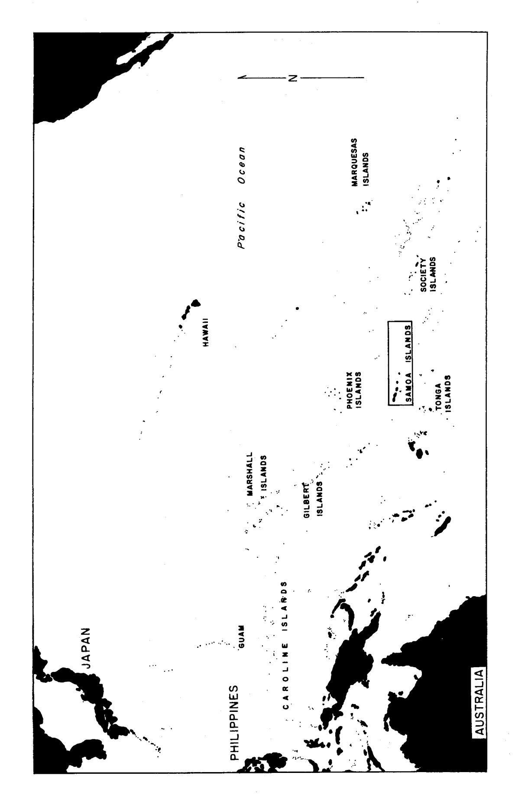

Figure 1. The Pacific basin showing the location of Samoa in relation to the other major island groups

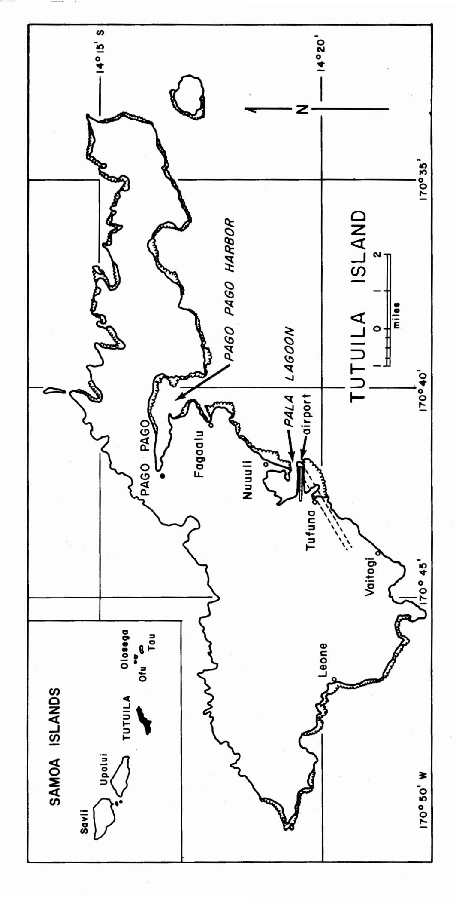

Figure 2. Tutuila Island, American Samoa

#### Description of Pala Lagoon

Pala Lagoon is a shallow estuarine body of water located adjacent to the airport at Tafuna--about nine miles from Pago Pago--and is the only large enclosed lagoon on Tutuila (Figure 2). Estuarine conditions are created by the influx of water from two principal streams and from numerous springs near the western and northern shores. The lagoon is roughly circular, approximately 1.6 km in diameter, and has a surface area of about 3 km² (300 hectares). Approximately two-thirds of the inner lagoon area is very flat and shallow, with a depth ranging from 0.3 to 1.5 m depending on the tidal state. The bottom in this area is a muddy, coral sand to silty mud and the overlying water is usually turbid.

Pala Lagoon is bordered by mangrove swamps and rocky wooded promontories on the northern side, a residential area and undeveloped wooded land to the west, the runway and taxi strips of the Pago Pago International Airport along the south, and a wooded peninsula (Coconut Point Peninsula) containing a village and private residence on the east. The opening to the sea is aligned to the eastward across a fringing coral reef in the southeast corner of the lagoon where a shallow, narrow pass exists (Figure 3).

Generally the biota of the inner lagoon lacks diversity, but it is thought to be an important nursery and spawning ground for fish and invertebrates. The lagoon is presently utilized by the Samoan people for subsistence-type fishing for mullet and carangids. Samoan or mangrove crabs (Scylla serrata) exist in the mangrove swamp along the northern shore and bivalve mollusks are abundant on the mud flats of the inner lagoon.

Presently, a rather extensive dredging program is being proposed for Pala Lagoon. Some dredging has already been done during the construction of the airport and will continue in order to supply fill material for public works projects. Further dredging awaits the results and recommendations of this assessment of the ecological implications of the proposed plan.

#### Proposed Plan for Pala Lagoon

The U.S. Army Corps of Engineers has conducted a preliminary study and has found that further study of the feasibility of constructing facilities for a small boat harbor in Pala Lagoon is warranted. Such a facility would require dredging of an entrance channel and harbor basin.

The proposed facilities in Pala Lagoon would be primarily for utilization by recreational crafts--small power boats and sailboats--although many of these boats would probably engage to some degree in subsistence fishing. The maximum-sized boat which could be accommodated by the proposed facilities would have a length of 50 ft, a beam of 15 ft, and a 6-ft draft. No commercial fishing vessels are expected to use these facilities. Based on standards applicable to Hawaii, the Army Corps of

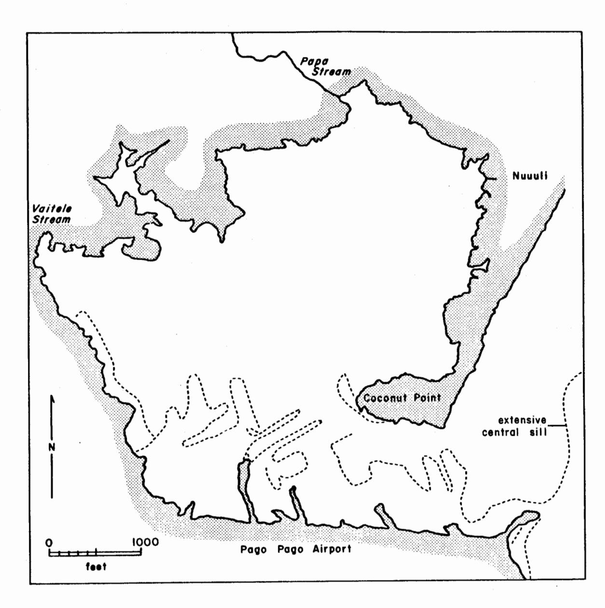

Figure 3. Pala Lagoon, American Samoa

Engineers projects the 50-year harbor to accommodate 350 trailer-type craft, 10 inboard-outboard craft, and 40 sailboats.

A preliminary plan developed by the Army Corps of Engineers (Figure 4) proposes that dredging be done in three sections: an entrance channel 12 ft deep x 100 ft wide x 2,600 ft long; an access channel 8 ft deep x 100 ft wide x 450 ft long; and a harbor basin 10 ft deep x 150 ft wide x 150 ft long. The dredged material would be used to construct the land backup area and a revetted islet to protect the harbor from waves. Additional construction would include a 200-ft long jetty at the promontory near the seaward end of the entrance channel. The preliminary estimate of first cost was \$1,490,000.

#### TIDES AND CIRCULATION

The physical portion of the Pala Lagoon study was undertaken to learn about its present tides and circulation and to predict how these water motions would be changed by dredging a proposed channel through the lagoon entrance. To try to meet these objectives with limited time and manpower, attention was restricted to gross, overall features of water structure and transport. The primary observations consisted of tidal records and some vertical temperature sections. From these it was concluded that the dredging project would have a moderate effect on the tidal rise and fall in the lagoon, but would make an appreciable change in the internal circulation.

Whether the dredging would increase the flushing rate of the lagoon is perhaps the most important question, especially since the uses of the lagoon anticipated after dredging will certainly increase the rate of addition of pollutants. Offhand, it might be expected that deepening the entrance channel would greatly increase the flushing rate, but this will not be the case here. The flushing rate might be slightly increased or possibly even slightly decreased by the proposed channel. Although the problem is too complex to allow an exact prediction of which small change would occur, the measurements and analyses do lead firmly to the important overall conclusion: the proposed dredging will not produce greatly increased flushing of the lagoon.

#### Tides

Recording tidal gauges were installed at the locations shown in Figure 5 and operated for about five days. The gauges were placed to give records of the ocean tide just outside the lagoon, the tide at the lagoonward end of the entrance channel, and the tide further inside the lagoon. The three records are reproduced in Figure 6.

The ocean tide during the measurement period was fairly representative of average conditions throughout the year. The predominantly semidiurnal record is typical for Samoa and examination of the tide tables shows that

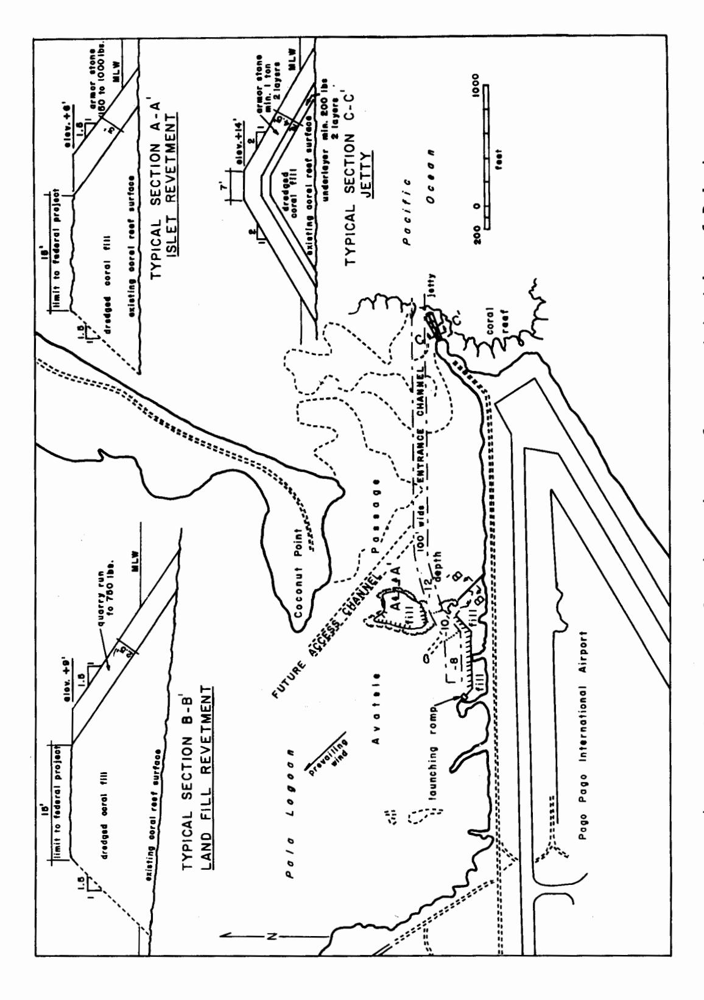

Figure 4. U.S. Army Corps of Engineers' map of proposed dredging of Pala Lagoon

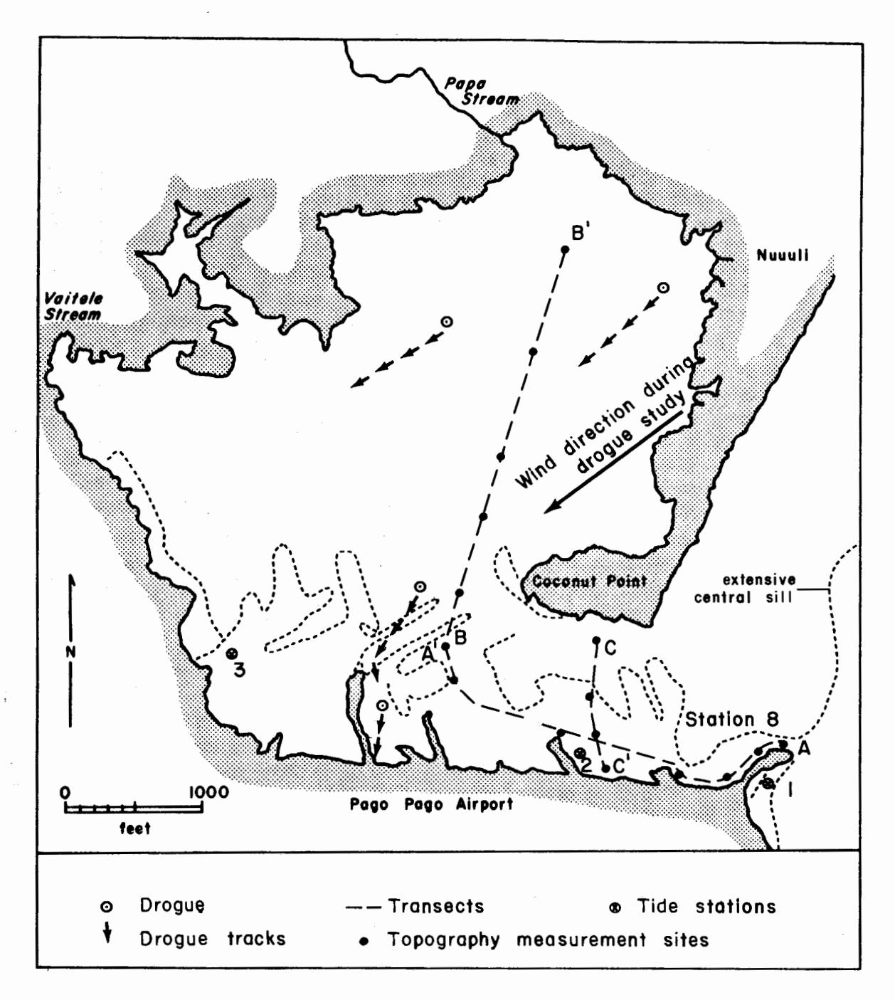

Figure 5. Location of tidal stations, drouge tracks, and sections for bottom topography

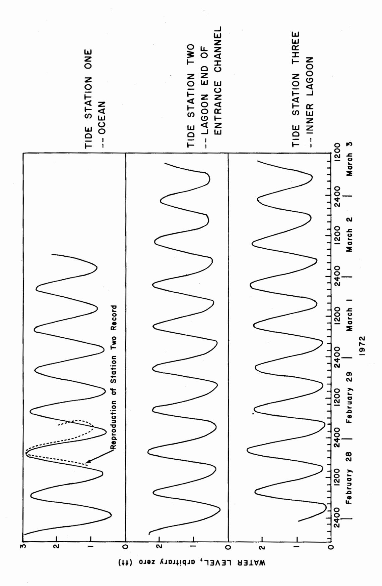

Figure 6. Three tidal records from recording tidal gauges placed in Pala Lagoon

the measured range (60 to 70 cm) is not extreme; the spring range would be about 85 cm and the neap range about 33 cm. It can be noted that the tidal range outside Pala Lagoon is about 75 percent as large as the predicted excursion in Apia, Western Samoa.

The tide in Pala Lagoon is about 85 percent as large as the ocean tide and, of course, follows it slightly in time. The high tide lag is about 30 minutes. However, as low tide is approached, the water level in the lagoon begins to fall more slowly than that in the ocean outside; low tide in the lagoon is somewhat attenuated and lags the ocean tide by about 1-1/2 hours. There is a slight amplification of the tide when proceeding inward from the entrance, which is to be expected since an antinode must exist at the innermost boundary.

A lagoon's response to the ocean tide is a function of the lagoon area, the character of the ocean tide itself, and the geometry of the communicating channel(s). Since the concern here is with what will happen if the channel geometry is changed, a mathematical model was developed which takes into account the above factors and describes the lagoon's tidal response under present and projected conditions.

This problem proved to be interesting from a theoretical standpoint, especially because of the low tide distortion. The development and behavior of the model have been discussed in a publication by Gallagher in 1973; only the pertinent results will be given here.

The existing entrance to Pala Lagoon is about 366 m wide and most of that width is covered by a reef flat which is quite shoal and partly uncovered at low tide. Along the western edge of the entrance there is a deeper channel. This channel has a shoal sill (station 8 in Figure 5) where the bottom is about .5 m below mean sea level. At this point the deeper channel is 37 m wide. Thus the most restricted, and therefore controlling, section of the Pala Lagoon entrance consists of a .5 m deep channel, 37 m wide, with an adjacent shoal reef flat 329 m wide. In the model, the deeper channel was represented by its actual dimensions, but dimensions for the shoal part of the model channel had to be selected to represent the effects of the wide, irregular reef. This was done by choosing values that resulted in a realistic performance of the model; the shoal section of the model channel was 183 m wide and 17 cm below mean sea level. The actual surface area of the lagoon  $(1.45 \times 10^6 \text{ m}^2)$ was employed in the model, and a 12-hour sine wave with an amplitude of 37 cm was used to simulate the ocean tide. The response of the model is shown in Figure 7. For an approximate comparison, an appropriate section of the observed record would be from 1600 hours on February 28 to 0500 hours on February 29; it is marked and labeled in Figure 6. The model reproduces the essential features of the present lagoon tide and its relation to the ocean tide.

The model can be used to study the effect of the proposed change in the lagoon entrance. If a new channel, 3.66 m deep and 30.5 m wide, were cut through the shoal part of the entrance, the predicted lagoon tide would appear as shown in Figure 7. After the dredging, the tide in the lagoon will be almost identical to the ocean tide. It will have about 99 percent of the ocean tidal range and lag by 15 minutes or less at all

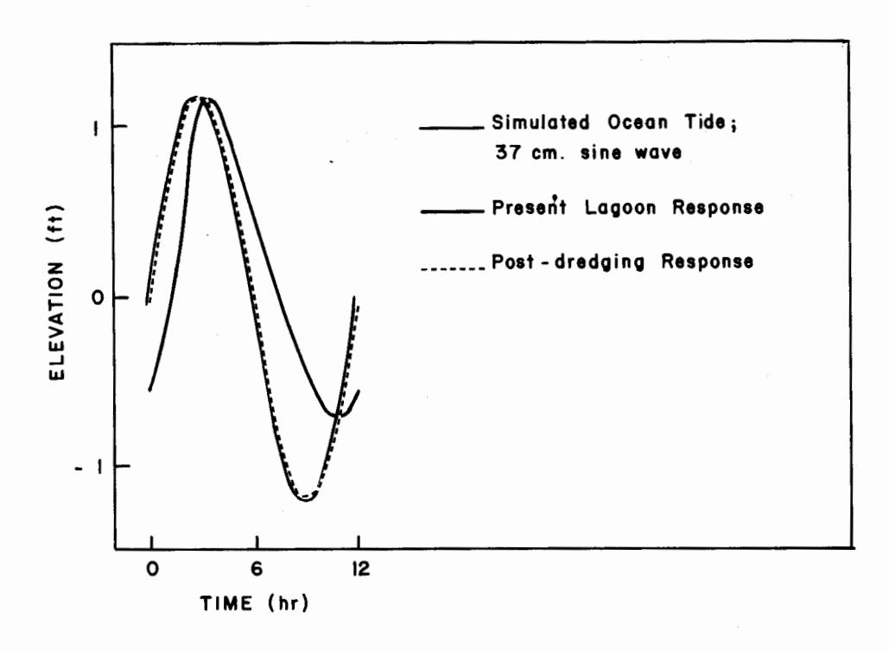

Figure 7. The response of a mathematical model developed to predict tidal fluctuations in Pala Lagoon

stages. These changes in the tide will have only a small influence on the flushing of the lagoon which will be discussed later. There would be some definite biological effects, because the lower intertidal zone would experience longer and more frequent exposures to the air. Typically, a low tide in the lagoon would be 10 cm lower than at present. The extensive low-tide flats in the inner lagoon and the organisms living there may be seriously affected.

#### Physical Structure and Circulation

Pala Lagoon may be classed as a stratified estuary, but one having unusual features that set it apart from typical continental estuaries. Fresh water enters from about six streams, draining relatively small watersheds that are subject to tropical rain conditions; large, rapid fluctuations in the freshwater input should be expected. Over half the lagoon is less than 1 m deep; solar heating effects are large; and the tidal inflow on each cycle is about 40 percent of the lagoon volume. All these factors tend to make the lagoon a highly variable environment. An additional feature makes it unusual as an estuary--its communication with the ocean is restricted by a very shoal (.5 m) sill. This, together with the bottom topography inside the sill, forces a significant vertical circulation to occur in the outer third of the lagoon during each tidal cycle.

In view of the highly variable character of the lagoon, the present survey is inadequate for drawing a comprehensive picture of its physical processes or structure. Instrumental failures cut short the observations which were already restricted in scope by time and manpower. Furthermore, the survey period did not include any time of significant rainfall. The measurements are limited to vertical temperature sections taken at low tide (Figure 8; see Figure 5 for section locations) and to surface temperatures and salinities gathered at somewhat scattered times (Figure 9). These observations will be discussed in relation to the implied gross features of the circulation.

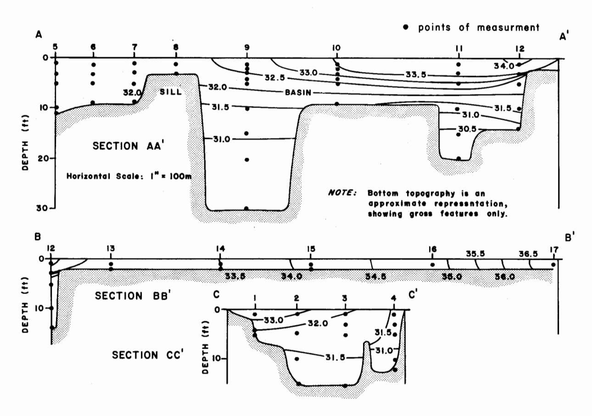

Figure 8. Schematic sections across three transects in Pala Lagoon showing isotherm distribution

Bottom topography is important in the circulation of Pala Lagoon. There are two distinct regions. A large area adjacent to the airport has already been dredged to obtain fill material. This dredged portion covers about .25 x  $10^6$  m2--about one-sixth of the lagoon--and forms a fairly extensive basin inside the sill which presently restricts the entrance channel. This basin has very irregular topography, but may be taken to have a mean depth of roughly 3 m. The remainder of the lagoon, although by no means flat, may be treated as a large shoal area with a mean depth of 1 m or less.

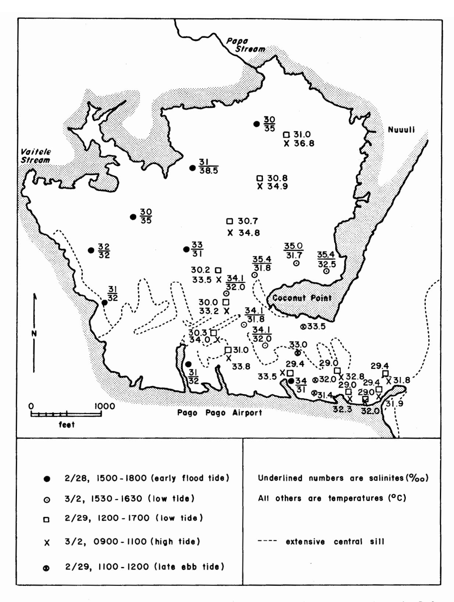

Figure 9. Salinities and temperatures taken at various stations in Pala Lagoon

It is convenient to crudely define three classes of water in the lagoon for purposes of discussion:

- 1. <u>Lagoon water</u> can be thought of as having temperature or salinity strongly affected by runoff or solar heating in the shallows. In Figure 8 it might be identified by temperatures exceeding 32.5°C.
- 2. Ocean water is water only slightly different from that in the ocean outside. In Figure 8 it might be identified as having temperatures less than 29.5°C.
- 3. Intermediate water may be thought of as resulting from a mixture of varying amounts of lagoon and ocean water. In the observations comprising Figure 8, it would appear that temperatures ranged between 29.5 and 32.5°C.

The tidal circulation can be described in a step-wise manner with the above definitions. Although this approach aids understanding, it should be remembered that the actual processes do not occur in steps and that the three classes of water blend and merge without distinct boundaries.

During a medium range, an incoming tide of about 0.8 x 106 m3 of water enters the lagoon. Although there may be some slight recycling, most of this inflow is pelagic water and it is denser than the water in the lagoon. (The observations show no reason to expect the formation of denser water by processes in the lagoon.) After crossing the sill, most of the ocean water sinks into the dredged basin and mixes with the warmer, fresher, intermediate water already there. This mixing produces a cooler, saltier, intermediate water which remains temporarily in the deeper parts of the basin. During flood tide, relatively undiluted ocean water penetrates somewhat beyond Coconut Point and part of it appears to flow around and into the lagoon on the north side of the point. As ocean water flows into the basin, about  $0.8 \times 10^6 \text{ m}^3$  of intermediate water previously there is displaced. It moves into the lagoon, spreading under and mixing with lagoon water. Since it flows away from the dredged basin and over the interior region where the mean depth is about 1 m, it covers about onethird of the lagoon's area at high tide.

During the ebb, the main outflow from the lagoon consists of intermediate water which lies above sill depth (.5 m). As the tide falls, lagoon water also flows outward in a thin surface layer which mixes with underlying intermediate water. The mixing appears to be quite vigorous; outflowing lagoon water loses its identifying characteristics before exiting, except along the shoal north edge of the channel where there is no underlying water with which to mix. This can be seen in sections AA' and CC' of Figure 8. Also during the ebb, the velocity shear which must develop over the basin will produce vertical mixing between outflowing water and the denser portions of the intermediate water in the basin, warming and decreasing the salinity of the latter.

The most important point about the tidal circulation is that pelagic water entering the lagoon on each cycle cannot leave again without mixing fairly extensively with lagoon water. This is a result of the existence of the shallow entrance sill and the basin inside, which is large enough to contain the volume

of tidal inflow. (In contrast, seawater in most estuaries flows freely in and out underneath the estuarine water and much of the seawater leaving during an ebb is merely the same water that entered during the flood.)

The prevailing easterly winds drive surface water toward the western side of the lagoon. Surface drogues, placed for two hours during a rising tide, traced the tracks shown in Figure 5. The importance of this movement is that surface water, normally containing whatever pollutants have been introduced by streams and outfalls, will collect in the northwest sector of the lagoon and its removal by tidal circulation will be slowed. The problem is compounded by the fact that this same sector of the lagoon is apparently already receiving pollutants from surface and underground streams.

Although no measurements were designed to detect them, there are undoubtedly many small-scale circulation patterns in the lagoon. However, it is felt that the dominant circulation is the tidal pulsation described above, with a superimposed wind-driven surface drift.

#### Flushing and Residence Times

The present mean residence time for water in Pala Laboon is about 30 hours. (The mean total lagoon volume is about  $2 \times 10^6 \text{ m}^3$ ; a volume equal to about 40 percent of this exchanged during a semidiurnal tidal cycle.) This establishes some overall figures for the rate of flushing and is of limited use for specific applications because the lagoon is not completely mixed. In reality, residence time will vary from about 12 hours for water near the entrance to a period perhaps on the order of two weeks for water in the western extremities of the lagoon. Furthermore, it must be recalled that these figures apply for a time of almost no runoff. During a rainy period, residence time, at least in the surface waters, would decline.

The above rather crude ideas about flushing rates can be somewhat refined. The new channel would increase the volume flow through the lagoon entrance, but would create a substantial change in another way. It would cut through the entrance sill to a depth about equal to the predominant depth of the existing basin inside; an appreciable fraction of the ocean water that enters the basin could leave through the channel without being forced to mix first with water inside the lagoon. Using figures from the numerically simulated case described previously, volume of water over a 12-hour period when ocean tide is 74 cm is as follows:

|                                                                                                      | Present                     | After Dredging                       |
|------------------------------------------------------------------------------------------------------|-----------------------------|--------------------------------------|
| Volume of ocean water inflow                                                                         | .85 x $10^6$ m 3 | $1.17 \times 10^6 \text{ m}^3$       |
| Volume of ocean water that could return to sea, without mixing, through the proposed dredged channel |                             | .97 x 10 6 m 3 |
| Volume of partially mixed water leaving                                                              | .85 x $10^6$ m 3 | .20 x $10^6$ m 3          |

There would be a decrease of about 75 percent in the volume of partially mixed water leaving the lagoon in a tidal cycle. This water would be a mixture of ocean water that has recently entered the basin and water from the interior of the lagoon. Whatever the fractional composition of this mixture, the interior lagoon water would have its average residence time increased by 75 percent.

The above estimates are based solely on tidal exchange volumes. Since these are major determinants of the flushing process, the estimates provide a good, first-order idea of the rates and of the effect of the proposed channel. However, they cannot be taken as exact numerical predictions because at least two things have been neglected. The proposed channel would slightly increase the flow of momentum into the lagoon and, by itself, this would tend to increase mixing and flushing of interior water relative to the estimated values. However, the new channel would also increase vertical stratification within the lagoon by creating a bottom topography that allows a salt wedge to flow in and out. By itself, this would tend to depress mixing within the lagoon and increase residence times. Thus the neglected processes would modify the predictions in opposite directions and it is not possible to say here whether the actual, overall mixing rates would be somewhat larger or smaller than those computed from the tidal exchange volumes alone.

Estimates of present residence time for the interior lagoon can be made. In the "before dredging" example used above, .85 x  $10^6$  m3 of water leaves the lagoon every 12 hours and water from the interior of the lagoon comprises a fraction of this. Probably the fraction is at least one-tenth and at most one-half. The volume of the inner lagoon (landward of the dredged basin) is about 1.18 x  $10^6$  m3, so the mean residence time of the water there is between 33 and 165 hours.

#### BACTERIAL CONTAMINATION

Pala Lagoon supports large populations of fish and invertebrates, some of which are harvested for food. At the time of this survey, sewage treatment in the surrounding watershed was nonexistent and raw sewage was presumably being transported directly into the lagoon. Although this sampling was conducted during an unusually dry period, Pala Lagoon is subject to large and rapid fluctuations in freshwater input. The major effluent, Papa Stream (Figure 10), drains approximately 2 km² and has an average volume transport of 111 liters/sec to the lagoon (U.S. Department of Interior, Geological Survey, 1971). The other notable input, Vaitele Stream, was dry at the time of this survey; normally it has a volume transport of 60 to 85 liters/sec.

A series of 20 stations were established (Figure 10) based upon information from an earlier reconnaissance. Sampling occurred, in all cases, between 0900 and 1000 hours while high tide conditions prevailed. The period of time between sample collection and analysis was minimized by sampling alternate halves of the lagoon on subsequent days. Samples were collected using sterile 500-ml prescription bottles and were kept in darkness prior to analysis.

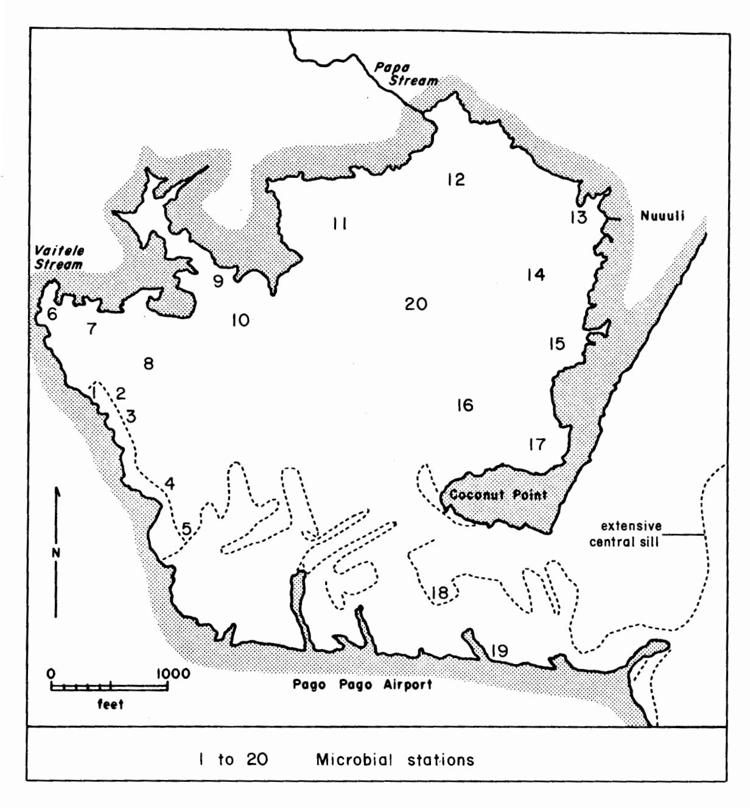

Figure 10. Microbial stations which were sampled during the survey in Pala Lagoon

Subsamples were taken from well-mixed samples and analyzed according to the standard membrane filtration and plating technique (American Public Health Association, 1970, Millipore Corporation, 1967). The volume of the subsamples varied inversely with the expected bacterial density and ranged from 100 to 150 ml for total coliform (TC) and from 150 to 200 ml for fecal coliform (FC). Filtration and plating operations were completed by 1130 hours, making the delay between sample collection and plating less than two hours. The analytical procedures were similar for both TC and FC, but differed in the type of media and incubation temperature. Known sample volumes were filtered through sterile 0.45  $\mu m$  Millipore HA filters and transferred aseptically to petri dishes containing either 10 ml of Bacto-M-Endo-Agar for TC or a pad saturated with 2 ml of Bacto-M M-FC Endo-Broth containing a rosolic acid indicator system for FC. Sample plates were then incubated at 35°C for TC or 44.5°C for FC for 22 hours, after which time the colonies were counted and the counts normalized to specify numbers per 100 ml.

A summary of the microbial data and accompanying temperature and salinity values is given in Table 1. Enteric bacterial densities were highest in the northern and western regions of the lagoon reflecting major source locations and circulatory patterns.

The area adjacent to the western side of the lagoon is residential and the land is drained primarily by Vaitele Stream. Although the stream was dry, salinity was very low and increased seaward along the windward side of the lagoon as total coliform and fecal coliform counts decreased. Mean total coliform densities were, in many cases, too numerous to count, while mean fecal coliform counts were as high as 120 per 100 ml. Total coliform densities at the westernmost station (6) were, in all cases, too numerous to count and associated fecal coliform densities were the highest recorded for any station. Bacterial numbers at stations 1 through 5 suggest a southerly penetration of the input located near station 6.

Because of the nature of the adjacent topography, the northern region of Pala Lagoon is the direct recipient of much local runoff. The predominant effluent, Papa Stream, was almost dry at the time of this investigation. However, analysis of the stream water showed that high total coliform (6,000 per 100 ml) and fecal coliform (57 per 100 ml) levels were present in this effluent.

With the possible exception of station 17, coliform densities in the eastern and southern areas were not exceedingly high and reflect adequate lagoon flushing.

Enteric bacteria are likely to gain entrance into the water sporadically but do not survive for long periods of time. Near an outfall or drainage site, the numbers of enteric bacteria may be very high depending on the nature and volume of the effluent. With increased distance from the source of contamination, however, numbers decline as a result of dilution and the bactericidal effects of seawater. The  $LT_{90}$  for coliforms in seawater is between 8 and 15 minutes (Iha, 1960). Both bacterial (Blackwood, 1972; Geldrich, 1966) and viral (Grabow, 1968; Metcalf and Stiles, 1968) pathogens can be transported by water. Such waterborne

TABLE 1. SUMMARY OF TOTAL AND FECAL COLIFORM DATA, PALA LAGOON

| Station         | Total Coliform (per 100 ml)* | Fecal Coliform (per 100 ml)* | Temperature (°C) | Salinity (°/) |
|-----------------|---------------------------------|---------------------------------|---------------------|------------------|
| ı               | +, 57, 1715                     | 15, 0, 15                       | 28.5                | 12               |
| 2               | 30, †, 1335                     | 0, 7, 25                        | 28                  | 13               |
| 3               | +, +, 305                       | 2, 24, 20                       | 29                  | 17               |
| 4               | †, †, 290                       | 1, 3                            | 29                  | 25               |
| 5               | 30, 74                          | 1, 0                            | 28.5                | 28               |
| 6               | +, +, +                         | 0, 36, 120                      | 29                  | 7                |
| 7               | 23, 88, 1155                    | 11, 5, 25                       | 29                  | 11               |
| 8               | 41, 91, 1410                    | 4, 2                            | 29                  | 13               |
| 9               | +, 192, 319                     | 2, 2                            | 29                  | 28               |
| 10              | +, 77, 146                      | 1, 7, 1                         | 29                  | 31               |
| 11              | +, 65, 525                      | 2, 2                            | 29.5                | 30               |
| 12              | 31, 18                          | 1, 1                            | 30                  | 32               |
| 13              | 15, 36                          | 2, 1                            | 30.5                | 32               |
| 14              | 36, 30                          | 1, 1                            | 30.5                | 32               |
| 15              | 29, 32                          | 1, 1                            | 31.5                | 32               |
| 16              | 26, 6                           | 0, 1                            | 31                  | 33               |
| 17              | †, 37                           | 9, 4                            | 31                  | 33               |
| 18              | 15, 11                          | 0, 0                            | 29                  | 34               |
| 19              | 6, 6                            | 0, 0                            | 29                  | 35               |
| 20              | +, 149, 95                      | 1, 1                            | 30                  | 30.5             |
| Papa§ Stream | 6000                            | 57                              | 32                  | 1                |

\* The first figures for each station represent the mean of triplicate analyses of 150-ml samples; all other values are the means of duplicate analyses of 100-ml (TC) or 200-ml (FC) samples.

† Too numerous to count (greater than 500).

§ The Papa Stream value is the mean of duplicate 10-ml and serial dilution (1:10 and 1:100) analysis.

pathogens include those causing typhoid fever, dysentery, cholera, and infectious hepatitis. The causative organisms of these diseases can be found in sewage containing human and/or animal excreta (Geldrich, 1966).

Since presently known methods for the isolation and enumeration of specific pathogenic organisms are complex and time consuming, microbial contamination is usually assessed indirectly by the enumeration of coliform bacteria. Their presence in a water body is indicative of a health hazard since both coliforms and waterborne pathogens exist under similar conditions (Yoshpe-Pures and Shuval, 1972; Metcalf et al., 1972). Basically, the coliform bacteria include all aerobic and facultatively anaerobic, gram-negative, nonsporulating bacilli that produce acid and gas from the fermentation of lactose. People deporting themselves in water of high coliform content take a definite risk of contracting a disease. This risk varies with the physiochemical and biological characteristics of the water (Carlucci and Pramer, 1959; Greenberg, 1956; Jones, 1967), the distance from the outfall, and the state of health of the population from which the sewage originated. There is a greater risk of contracting a disease by eating seafood from a contaminated water body (Idler, 1972; Hunt, 1972). This risk is amplified in the case of filterfeeding organisms such as clams and oysters (Metcalf et al., 1972; Mason and McLean, 1962) and particularly so when the food is consumed in a raw or semi-cooked state.

The present zones of primary concern are the western and northwestern areas of Pala Lagoon. Though not a strictly quantifiable measure of the health hazard, the coliform data suggest that these areas support high bacterial populations and the possible existence of pathogenic organisms is undeniable. Because the microbial quality of the inputs in question varies directly with the health of the population, the influence of the lagoon in possible epidemic situations is obvious but implications must be made with caution.

Arid conditions prior to this investigation enhance the predicative value of these data and suggest that subsurface inputs contaminated by fecal material from the adjacent population are an important source of microbial pollution.

Papa Stream appeared as a defined surface flow opposite the road to the north of the lagoon. Lagoonward, it degenerated into vadose water. Gravity seepage occurred until a minor surface flow reformed approximately 30 m from the shore. Rich in organic and inorganic nutrients derived from seepage through cesspools, etc., vadose water is capable of supporting very large bacterial populations. Such inputs explain the high nutrient (Krasnick and Caperon, 1973) and coliform concentrations in the northwestern area and their co-occurrence with low salinity values when the major stream, Vaitele, was dry.

The bacteriological character of the lagoon is greatly influenced by its physical dynamics. The restricted circulation inhibits intensive tidal exchange as reported earlier in this report and limits dilution of contaminants entering the northern and western regions. Prevailing easterly winds reinforce this distributional pattern by driving surface water and the

contained pollutants westward. This accounts for the limited influence of Papa Stream on station 12. Both wind-mixing (effective throughout the water column) and present dredging operations result in high turbidity, which enhance survival of bacteria through provision of substrate material and reduction of light penetration.

On the basis of microbial quality, the western and northwestern regions appear to be unacceptable areas for the propagation of shellfish and it appears that the utilization of marine foods from these areas is unwise. Mollusks are particularly vulnerable to bacterial pollution because of their sedentary character, limited avoidance capacity, and filter-feeding mode of nutrition (Idler, 1972). Because of absorption and sedimentation, bacterial densities in the sediments are much greater than those in the overlying waters (Carlucci and Pramer, 1959; Rubentschik et al., 1936; Presnell and Miescier, 1971). The proximity of mollusks to large bacterial populations results in high enteric bacterial levels in these organisms. Filter-feeding results in the concentration of pathogens from the environment. The transmission of bacterial, e.g., Salmonella, Shigella, Clostridia (Cann et al., 1965; Wood, 1972) and viral, e.g., hepatitis (Metcalf et al., 1972) pathogens via mollusks is thus a cause for concern. This is particularly important in the case of viri which may have higher survival rates in seawater than coliform bacteria (Shuval, 1970; Yoshpe-Pures and Shuval, 1972; Clarke et al., 1964). The danger of contracting disease from mollusks is amplified when they are consumed raw (Mason and McLean, 1962) or when stored under unsatisfactory conditions (Wood, 1972; Cann et al., 1965; Graikoski, 1969).

The National Shellfish Sanitation Program (U.S. Public Health Service-Houser [ed.], 1965) established criteria for the evaluation of shellfish cultivated areas. These are as follows:

1. Approved areas: median TC MPN  $\leq$  70/100 ml, and not more than 10 percent of the samples ordinarily

having coliforms MPN's  $\geq 230/100$  ml.

2. Restricted areas: median TC MPN < 700/100 m1, and not more

than 10 percent of the samples ordinarily

having TC MPN's  $\geq 2,300/100 \text{ ml}$ .

3. Prohibited areas: median TC MPN  $\geq 700/100$  ml or 10 percent of

samples having TC MPN  $\geq 2,300/100$  m1.

The limited amount of data available prohibits a precise characterization of areas within the lagoon. Certainly the extreme western portion of the lagoon is not suitable for shellfish cultivation. However, the area where most mollusks are intensively harvested is the mud flat bordering the northwestern shoreline. This area would appear to fall within the restricted classification on the basis of this survey, even though stream inputs which transport these bacteria to the lagoon were minimal.

Since it is unlikely that the proposed dredging will result in greatly increased flushing, improvements in the lagoon water quality are not expected and the associated increase in human activity can only amplify the imbalance between microbial inputs and bactericidal and dilutive effects of lagoon waters.

It is concluded from this study that, on the basis of enteric microbial density, the western and northwestern regions of Pala Lagoon show evidences of fecal contamination. Since prior rainfall was negligible and sampling was conducted at high tide, these data represent a best-case analysis when enteric bacterial levels were at a minimum. Substantial precipitation occurring after such dry conditions will cause bacterial densities to rise by orders of magnitude.

The high coliform levels appear to be maintained through subsurface inputs contaminated with excreta from the adjacent populations.

Data from the northwestern region, which is an area of extensive shellfishing, suggest that the consumption of foods from this area represents a potential health hazard over and above that resulting from physical contact with these waters.

Since the proposed dredging is unlikely to significantly improve lagoon flushing, it is unlikely to have a beneficial effect upon the microbial character of the lagoon waters.

#### PHYTOPLANKTON PRODUCTIVITY

This portion of the Pala Lagoon survey was designed to answer several fundamental questions about the dynamics of the planktonic algal (phytoplankton) community in the lagoon. Phytoplankton are an important food source for many herbivorous filter-feeders such as clams and oysters. Algal abundance and productivity are therefore intimately linked to faunal abundance. Furthermore, because of their position at the base of the food chain (utilizing inorganic nutrients) and their rapid reproductive rates, phytoplankton are more directly and immediately affected by environmental perturbations than are faunal components of the system.

The intent of this survey was to determine the present density and growth rate of phytoplankton in representative areas of the lagoon and to relate the observed variations to ambient concentrations of selected essential plant nutrients. To accomplish this, a model was employed to analytically relate the growth rate per unit of population to the concentration of the limiting nutrient. The model allows prediction of the characteristics of any subsequent steady-state situation resulting from a reasonably well-defined modification of the present environment with respect to the concentration of the limiting nutrient, found to be nitrogen, for a large portion of the lagoon. This portion of the report is somewhat more detailed and technical because, should the dredging take place, phytoplankton productivity will be used as a key indicator in the quantitative assessment of environmental impact.

To establish station locations for the detailed study of phytoplankton productivity, an initial reconnaissance of the plant pigment concentrations in Pala Lagoon was undertaken using *in vivo* fluorometry (Lorenzen, 1966). A shallow-draft outboard motor boat was outfitted with a portable generator, pump, and fluorometer (Turner Model III with continuous-flow door and

Rustrak recorder). The lagoon was circumnavigated while pumping water continuously from a depth of about 0.5 m through an opaque length of garden hose. Based on these results a series of stations were established within the lagoon (Figure 1.). On the following two days, working from a smaller rubber boat, discrete surface water samples from each of these stations were collected.

Productivity samples (two light, one dark) were taken in standard glass BOD bottles which were stored in the dark (not more than 45 minutes) until they could be inoculated. Samples for nutrient analyses were taken in polyethylene bottles and stored in an ice chest containing dry ice. Additional fluorometry samples were also collected at each station.

Complete stations were taken in two ponds within the airport boundaries to assess their potential for any aquacultural scheme and two additional stations were taken from shore. One of these shore locations, B, was located in a small stream which feeds into the northern end of the lagoon and the other, TC, was taken in a rather stagnant body of water near the entrance of alarger stream into the western portion of the lagoon. These two stations were analyzed for nutrient content and pigment concentration only.

Primary productivity was determined using the  $C^{14}$  method of Steeman-Nielsen (1952) as modified by Strickland and Parsons (1968). Upon returning to shore (near station 2), samples were inoculated with 1.0  $\mu$ Ci of NaH14CO3 in 1.0 ml of sterile water at pH 9.5 (New England Nuclear) and incubated in about 1 m of water for about four hours between the hours of 1100 and 1700. Samples were then filtered through 0.45 $\mu$  Millipore  $\Omega$  filters, rinsed, glued to copper planchettes, and stored in a desiccator. Upon returning to Hawaii the filters were counted in a gas-flow geiger counter (Nuclear Chicago Model 1042; Scaler Model 8703) which was calibrated by liquid scintillation (Wolfe and Schelske, 1967).

Nutrient samples were kept frozen until the return to Hawaii. Reactive nitrate- (plus nitrite) nitrogen and reactive phosphate-phosphorous determinations were made using the methods outlined in Strickland and Parsons (1968). Ammonia was determined by the method of Solorzano (1969).

Chlorophyll <u>a</u> was determined from total plant pigment concentration by using a conversion factor calculated for the fluorometer used (S.A. Cattell, 1972: personal communication).

The results obtained from this study are summarized in Table 2. Definite trends within the lagoon are evident.

Chlorophyll <u>a</u> increases continuously through the channel to the most distant north and west regions of the lagoon. Chlorophyll <u>a</u> values run from less than 1 mg/m3 outside the channel to almost 20 mg/ $\overline{m}$ 3 at the western tip of the lagoon.

Phytoplankton productivity showed a similar trend, ranging from 8.31~mg C fixed/m³/hr outside the channel to 145.17~mg C fixed/m³/hr at the western corner.

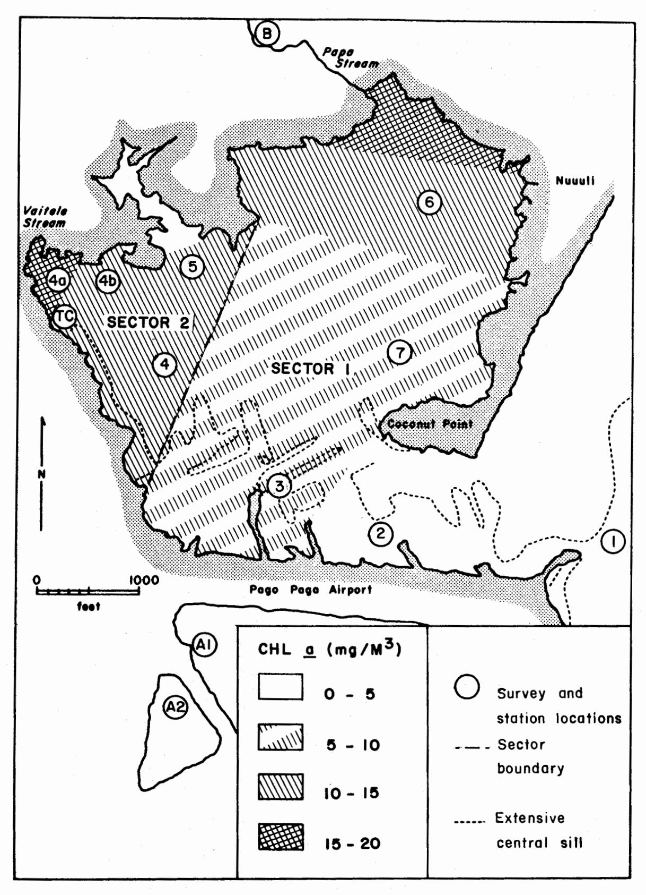

Figure 11. Chlorophyll <u>a</u> concentrations during survey and station locations

PHYTOPLANKTON PRODUCTIVITY, NUTRIENTS, AND CHLOROPHYLL  $\underline{A}$  AT EACH STATION TABLE 2.

| + 0            | 4    | Salinity | Te    | Nutrie               | Nutrient Concentrations (µg-atom/1) | trations 1) | Chlorophyll a | Productivity       | Productivity Index         |
|----------------|------|----------|-------|----------------------|-------------------------------------|----------------|---------------|--------------------|-------------------------------|
|                | t    |          | (a.c) | Nitrate & Nitrite | Ammonia                             | Phosphate      | (mg/m³)       | (mg C fixed/m³-hr) | (mg C fixed) (mg chl a-hr) |
| -              | 2/29 | 33.9     | 30    | 0.63                 | 0.93                                | 0.14           | 0.55          | 8.32               | 15.13                         |
| 2              | 2/29 | 33.0     | 30    | 0.19                 | 0.07                                | 0.13           | 4.18          | 38.17              | 9.13                          |
| m              | 2/29 | 32.0     | 32    | 00.00                | 0.03                                | 0.15           | 6.94          | 49.76              | 7.17                          |
| 4              | 2/29 | 32.0     | 33    | 0.53                 | 0.10                                | 0.13           | 11.01         | 65.80              | 5.98                          |
| ęħ             | 3/1  | 28.2     | 32.5  | 1.47                 | 0.12                                | 0.33           | 17.87         | 145.17             | 8.12                          |
| 4 P | 3/1  | 30.1     | 32    | 1                    |                                     |                | 11.36         | ı                  | ı                             |
| 55             | 3/1  | 31.0     | 32    | 0.75                 | 0                                   | 0.28           | 11.36         | 63.00              | 5.55                          |
| 9              | 3/1  | 32.0     | 32    | 0.05                 | 0.02                                | 0.14           | 12.79         | 45.96              | 3.59                          |
| 7              | 3/1  | 32.3     | 32    | 00.00                | 0*                                  | 0.09           | 5.97          | 38.60              | 6.47                          |
| 80             | 3/2  | 0.0      | ı     | 0.74                 | 0*                                  | 2.00           | 1.52          |                    | ı                             |
| 5              | 3/2  | 24.2     | 32    | 2.90                 | 0.34                                | 0.41           | 11.45         | •                  | :                             |
| A1             | 3/2  | 27.9     | 33    | 2.15                 | 0.98                                | 0.13           | 2.06          | 8.28               | 4.03                          |
| A2             | 3/2  | 31.5     | 35    | 00.00                | 0.03                                | 0.18           | 28.40         | 86.10              | 3.03                          |
|                |      |          |       |                      |                                     |                |               |                    |                               |

No analysis done

\* Reagent blank exceeded sample value

The Productivity Index (PI), productivity per unit of Chlorophyll  $\underline{a}$ , a measure of growth rate per unit population, showed a rather different trend. The highest PI was found outside the lagoon and values generally decreased to the north and west. An exception to this trend was the western corner where the PI reached a relative peak of 8.63 mg C fixed/hr/mg Chlorophyll  $\underline{a}$ , concomitant with the highest nutrient concentrations found in the lagoon.

Nutrient concentrations also showed rather clear-cut trends, generally being high outside the channel; decreasing through the channel and northward, but increasing in the western corner. The highest concentrations of both nitrate and phosphate were found in the western loch. Nitrate varied from 0.63 µg-atom/liter outside the lagoon to undetectable levels directly inside the channel and increased westward to a maximum concentration of 1.47 µgatom/liter. Phosphate was detectable and relatively abundant at all stations, similar concentrations (0.14  $\mu$ g-atom/liter) being found outside the lagoon, through the channel, and over the northern flats, while the western maximum reached 0.33 µg-atom/liter. Ammonia showed a somewhat different trend from either nitrate or phosphate, concentrations being highest (0.93 µg-atom/liter) outside the channel, barely detectable throughout most of the lagoon, and reaching a relative maximum of 0.12 µg-atom/liter in the western corner. Regrettably, the ammonia method is not as sensitive as those of nitrate and phosphate which limit the interpretation that can be made of these data. Additionally, the determinations were plagued by large reagent blanks which in three cases resulted in apparent negative concentrations.

Station B taken well inland of the lagoon in a stream running through relatively unpopulated areas had no detectable ammonia, but rather large amounts of nitrate and phosphate (0.74 and 2.00  $\mu g$ -atom/liter, respectively). Although recent rainfall had been negligible and many similar streams had completely dried up, this particular stream maintained a rather rapid flow rate and had a small amount of Chlorophyll a present.

Circulation in the "TC" area is apparently very restricted. There are extensive patches of algae floating on the surface and a marked thermocline is present in less than 1 m of water. Nutrient concentrations in this area were quite high and the standing crop of phytoplankton was comparable with that in the far western corner of the lagoon.

Dredging operations during construction of the airport formed two ponds which exhibit somewhat different conditions than in the lagoon itself. The ponds differ markedly from each other. The larger pond (Figure 11, A1), at least in the area sampled, had a rather flat sandy bottom with no noticeable growth of benthic algae. Ammonia and phosphate concentrations were similar to those at station 1, but the nitrate level was about three times higher. Despite this apparently large nutrient reservoir, the biomass and productivity were both very low when compared with the lagoon. The PI for Al was 4.03.

The smaller of the two ponds, A2, has a mud bottom with copious amounts of benthic algae present. The phosphate concentration was similar to that at the other stations, but nitrate was undetectable and ammonia, nearly so. The Chlorophyll a concentration was the highest measured in the entire survey, being  $28.40~\text{mg/m}^3$ . The productivity was high  $(86.10~\text{mg/m}^3/\text{hr})$ , but the PI of 3.03 was the lowest of any station measured.

In order to draw any conclusions from the limited amount of data available it must be assumed that the phytoplankton population in the lagoon is in steady state with respect to its supply of essential nutrients. The fact that the period immediately preceding the survey was one of low rainfall makes this a tenable assumption.

In a non-nutrient-limiting environment the growth rate of a population is maximal and limited only by its own intrinsic rate of increase under the prevailing conditions of temperature and light. Sub-maximal growth rates would then reflect nutritional deficiencies in the water mass.

Nutrient-limited growth of phytoplankton has been shown to require a two-step model: the first step utilizes a hyperbola to relate uptake rate to nutrient concentration in the medium; the second step, directly coupled to the first, utilizes a similar hyperbola to relate growth rate to the intracellular nutrient concentration (Droop, 1968; Caperon, 1968; Caperon and Meyer, 1972a). This work has shown that under steady-state conditions a similar hyperbola can be used for a good approximation to describe growth rate directly as a function of environmental nutrient concentration, but the half-saturation constant here is much less than the half-saturation constant for uptake rate. The work of MacIsaac and Dugdale (1969) and Caperon and Meyer (1972b) suggests that this kinetic description is applicable to mixed phytoplankton populations adapted to the same nutrient-limited regime. The hyperbola  $\mu = \mu_{\rm m} S/(K_{\rm s}+S)$ , where  $\mu$  is growth rate, S is substrate concentration and  $\mu$  and  $K_{\rm s}$  are constants, is used to investigate the hypothesis that the stations in sector 1 (Figure 11) represent a nutrient-limited regime.

In sector 1, fixed nitrogen is in the nutrient-limited range for phytoplankton adapted to oligotrophic environments (Eppley et al., 1969). Figure 12 is a plot of PI as a function of total fixed-nitrogen at these stations. The curve is a least squares fit of the data to this hyperbola, with a half saturation constant,  $K_{\text{S}}$ , of 0.13 µg-atom/liter and maximum PI,  $\mu_{\text{m}}$ , of 15.6 mg C/mg Chlorophyll a/hr. It is assumed that growth rate does not reach zero until the nutrient concentration falls to zero. It has been shown in laboratory experiments (Caperon and Meyer, 1972b) that this is not usually the case for nitrate-limited situations. Growth, or nutrient uptake, stops while there is still some small amount of limiting nutrient in the water. Determining this intercept requires extremely precise measurements and is best accomplished under controlled laboratory conditions. The assumption of a zero-zero intercept is adequate for the present purpose.

Since ammonium is preferred over nitrate it may be more appropriate to consider only this form of fixed-nitrogen. Figure 13 is a plot of PI as a function of ammonium concentration and the fitted hyperbola has a  $K_{S}$  of 0.049  $\mu g$ -atom/liter and a  $\mu_{m}$  of 15.9.

The half-saturation constants for these two curves compare with 0.13 µg-atom/liter for nitrate-limited laboratory populations and 0.02 µg-atom/liter for ammonium-limited laboratory populations (Caperon and Meyer, 1972b). Unfortunately, due to the limitations already mentioned regarding the method of ammonia determination, little emphasis should be placed on this excellent fit, since all but one of the values are below the lower limits of good reliability of the method.

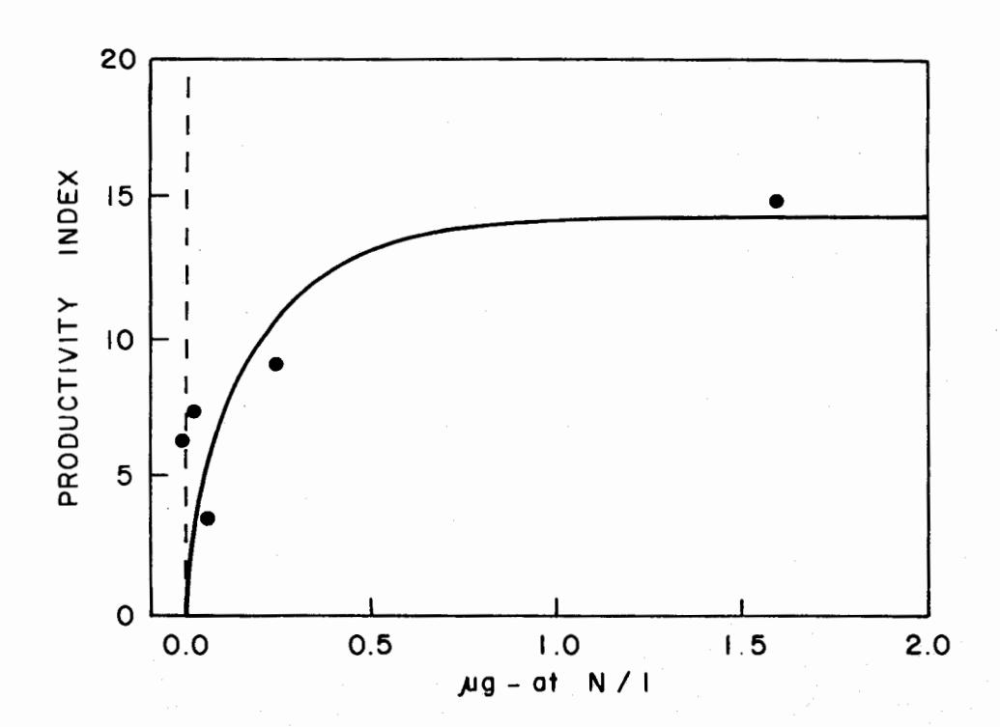

Figure 12. Productivity Indices as a function of total fixed-nitrogen concentrations for the stations in sector I

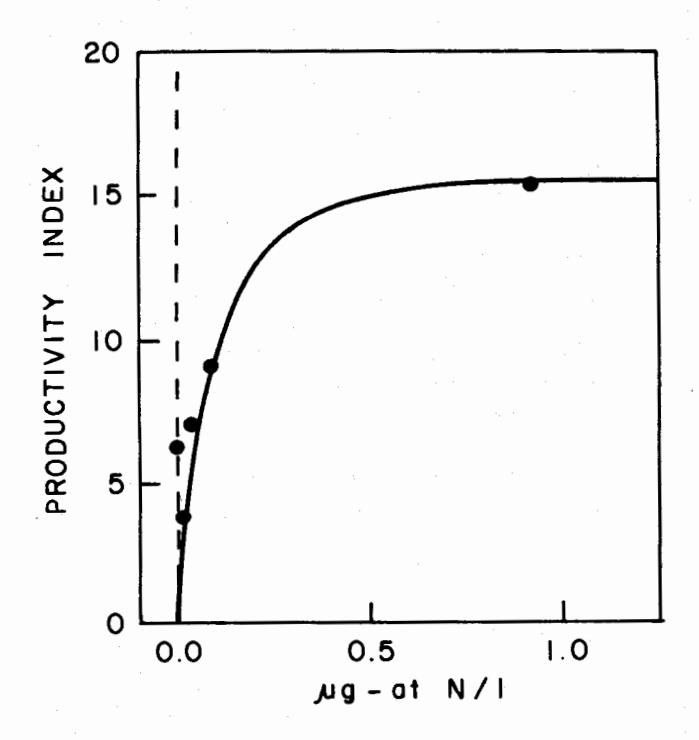

Figure 13. Productivity Indices as a function of ammonia concentrations for the stations in sector I

The source of fixed-nitrogen to sector 1 may either be open ocean water or a terrestrial input outside the lagoon. The surrounding tropical ocean water is part of the South Equatorial Current System and one of the most nutrient-poor areas of the Pacific, suggesting a more profitable examination of the second alternative. A nearby open ocean outfall site does in fact exist andthe sewer line runs across the bottom of pond A2. Tidal flux as well as the predominantly east-to-west currents and southeast tradewinds would all tend to direct wastes into the entrance channel area from this outfall.

At station 1, abundant quantities of fixed-nitrogen and near maximal growth rates were found. The Chlorophyll a concentration was  $0.55~\text{mg/m}^3$ , substantially lower than that at station 2 inside the reef. However, these stations were taken on a falling tide with a substantial current flowing out of the channel. During the preliminary fluorometric survey, the Chlorophyll a concentration at station 1 was measured on a rising tide and found to be  $0.04~\text{mg/m}^3$ , an order of magnitude less than on the falling tide. Obviously, the increased biomass generated in the lagoon was being diluted as it entered the ocean and the amount of chlorophyll present at station 1 on a falling tide did not represent the amount present in the surrounding open ocean waters. Since no productivity measurements were done on the first day, however, there is no comparative estimate of the open ocean PI.

The findings of the nutrient concentrations in pond A2 indicate that fixed-nitrogen is in the limiting range and, with a PI of 3.03, this station would fit nicely into the nitrogen-limited regime plotted in Figure 12. The small tidal flux which occurs may be the source of fixed-nitrogen from the outfall back into this pond after mixing with ocean water.

Pond Al appears to be a different situation. Fixed-nitrogen is abundant, yet productivity and biomass are very low. Tidal flux to this pond has been blocked or nearly blocked and a shift in the limiting nutrient due to depletion of some component being added to pond A2 in sufficient quantities by ocean water may be seen. If this analysis is correct, it would be relatively simple to increase productivity in both of these ponds. An increase in tidal flux to pond Al should increase production until fixed-nitrogen becomes limiting. The two ponds would then be similar. Production in both could then be increased by artificially adding fixed-nitrogen. Biomass could then be stabilized by the action of a suitable crop of grazers which could be economically harvested.

It is difficult to compare a  $PI_{max}$  with the  $\mu_m$  developed for laboratory cultures. This is due both to uncertainty in the interpretation of  $C^{14}$  measurements and the artificial environment in laboratory cultures. A PI is converted to a specific growth rate by multiplying by the chlorophyll to carbon ratio for the population. This ratio has been shown to vary with steady-state nutrient-limited growth rate (Caperon and Meyer, 1972a). Selecting a value of 0.18 mg Chlorophyll a/mg at carbon, which is appropriate for a population near maximum growth rates, converts 15.6 mg C/mg Chlorophyll a/hr to 0.234 hr-1. Assuming that a short-term measurement of carbon uptake near midday overestimates daily growth rate for the natural day-night cycle at this latitude and time of year by about a factor of two

gives a  $\mu_m$  for the C14 measurements of 0.117. Note that this value is somewhere between gross and net primary production. It compares with  $\mu_m$  values of 0.090, 0.087, 0.076, and 0.062 for *Coccochloris stagnina*, *Cyclotella nana*, *Dunaliella tertiolecta*, and *Monochrysis lutheri*, respectively, growing in continuous fluorescent light at 5.8 cm-cal cm-2hr-1. These are net growth rates.

In general, it would be difficult to hope for better comparison between field and laboratory results for both the  $\mu_m$  and  $K_S$  values. Thus it seems quite apparent that phytoplankton growth in sector 1 of Pala Lagoon was limited by some form of fixed-nitrogen. The population at station 1 outside the channel appeared to be approaching maximal attainable growth rates and was likely to be limited in size by grazing pressure and physical dilution. Since the water samples were taken on a falling tide, conclusions about growth at this station will not be representative of the surrounding ocean waters.

The growth rate in sector 2 was apparently being controlled by a different mechanism. The data indicated that the nutrient source for sector 1 was outside the lagoon. Fixed-nitrogen essentially disappeared in a wide north-to-south band across the lagoon. It may then be concluded that the very large concentrations observed in the western corner must represent enrichment from runoff and/or sewage waste being added to the lagoon. In light of the abundant fixed-nitrogen available in this sector, it seems not unlikely that the growth rate there was being controlled by some other nutrient species. Although there are no data to substantiate this, it is possible that, in such an area with high productivity, high biomass, and abundant micro-nutrients, it could very well be that a trace metal or other micro-nutrient was limiting population growth. Toxic inhibitation due to accumulated metabolites should not be ruled out in this rather stagnant area.

If the growth rates in sectors 1 and 2 are in fact being limited by two different nutrients, then the possibility exists that, in a mixture of these two water types, either of these two nutrients or yet a third could become limiting depending on the concentration of essential nutrients in each type and the proportions of each type in the mixture. This would create a third rather transient sector at or near the 1 to 2 interface which would shift position and size in response to the amount of stream runoff entering sector 2 and the extent of tidal penetration. This transition area was not detected in the present survey.

During the sampling period the major nutrient input to sector 2 was quite obviously the stream near station TC. Whether this is true in times of high rainfall is unknown. The situation may be quite different when all the streams are running, depending on whether the supply of limiting nutrient to sector 2 is in the runoff water itself or in the wastes discharged into the lagoon with it. The data from station B may clarify this somewhat. If the assumption is made that water from this station is representative of "unpolluted" stream runoff and remains in this state until it enters the lagoon then the growth response of the phytoplankton population in this area to this water would be an indication of its enrichment value.

The fluorometric survey detected an increase in pigment concentration in this area, but the most northern complete station (6) had the lowest PI in the lagoon and was clearly within the nitrogen-limited area. Possibly a productivity station at the extreme northern tip of the lagoon would have found a small area analagous to sector 2, but the very different nutrient characteristics of stations B and TC allow the conclusion that the stimulation observed in the western portion of the lagoon (sector 2) is due to the sewage effluents present in the stream runoff.

#### REEF CORALS AND ECHINODERMS

Surveys were carried out to determine the abundance and distribution of corals and echinoderms in Pala Lagoon and to assess the probable impact of the proposed dredging upon them. These organisms were investigated because of their importance to coral reef communities and because of their relative abundance. Most observations were carried out by swimming over the area with a face mask and recording information on an underwater slate. During the first series of dives the bay was surveyed qualitatively. This not only gave valuable information on the major abundances and assemblages of reef corals and other biota, but also helped determine the location of quantitative survey sites.

To estimate the relative cover of the various bottom types in certain locations, a line intercept method was utilized. Three transect lines were established and designated A, B, and C (Figure 14). Points were established 1m apart along a 400-m line on transect A and .25 m apart for two shorter transect lines (B and C). The bottom type (i.e., live coral, rubble, sand, algae.) under each point was noted on an underwater slate. The proportion of the total points for each bottom type was converted to estimates of percentage of cover (Table 3). Because transect A was very noticeably zoned from shoreline to surfline, the percentage of each of the bottom types was determined for 25-m intervals, giving a total number of 16 determinations (Figure 14).

Preliminary observations indicated that echinoderms, although common in some areas, did not constitute a major biomass component of bottom cover. Estimates of their peak densities were determined by an alternate method, random quadrats (Table 4). Three reef flat sites were selected for these surveys. The numbers and species of echinoderms lying within a 1-m square randomly tossed on the flat were counted. This procedure was repeated 24 times at each of three locations (D, E, F in Figure 1). Species lists and localities of corals and echinoderms are given in Appendices C and D.

Temperatures were measured in tidal pools with a mercury thermometer having an accuracy of  $\pm 1^{\circ}\text{C}$ .

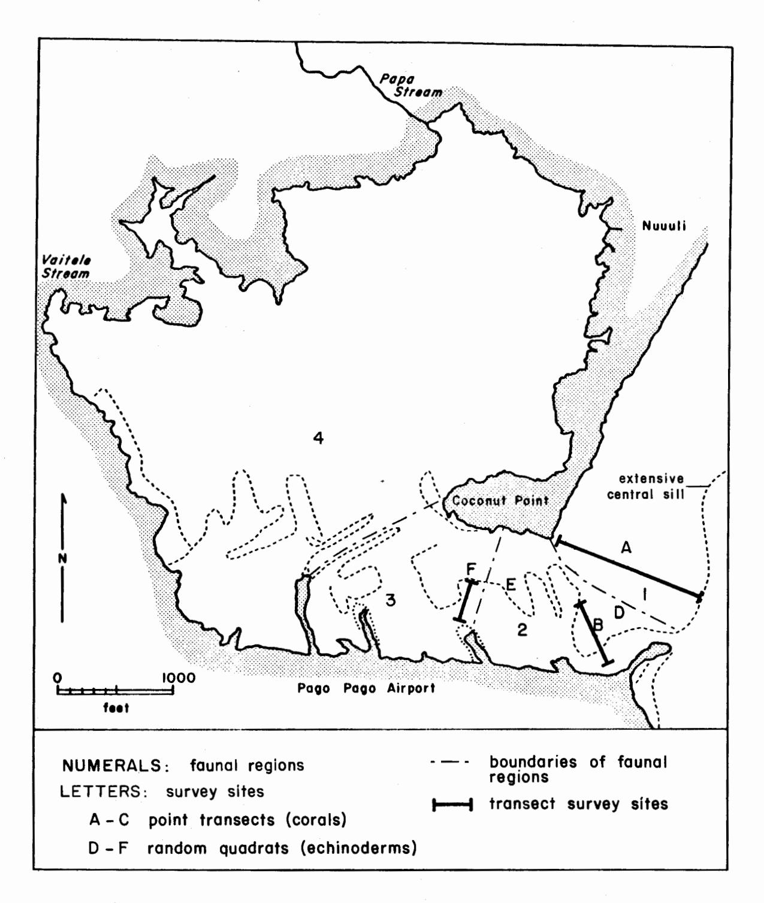

Figure 14. Faunal regions, quadrat sites, and transects for echinoderms and reef corals

TABLE 3. THE SUBSTRATUM COMPOSITION AND ABUNDANCE OF VARIOUS BOTTOM TYPES IN THREE AREAS OF PALA LAGOON

| Bottom Types                                                                                                                                           |                                                       | Percentage of Bottom Cover                           |
|--------------------------------------------------------------------------------------------------------------------------------------------------------|-------------------------------------------------------|---------------------------------------------------------|
| Transect A (400 m)                                                                                                                                     |                                                       |                                                         |
| Sponges Echinoderms Basalt rock Sediment Coralline algae Benthic algae Coral rubble Live corals                                                        |                                                       | 0.2 0.8 1.0 7.0 6.2 15.5 29.0 38.3 |
| Psammocora contigua Pavona decussata Massive Porites Porites (S.) convexa Montipora elschneri Pocillopora damicornis Porites andrewsi Acropora formosa | 11.0 7.8 4.8 3.8 3.5 3.2 2.2 2.0 |                                                         |
| Transect B (90 m)                                                                                                                                      |                                                       |                                                         |
| Echinoderms Coral rubble Sediment Benthic algae                                                                                               |                                                       | 0.3 18.7 40.7 15.9                             |
| Halimeda sp.                                                                                                                                           | 11.8                                                  |                                                         |
| Live corals                                                                                                                                            |                                                       | 24.5                                                    |
| Porites andrewsi Porites lutea Acropora formosa Psammocora contigua                                                                           | 11.3 6.9 6.0 0.3                             |                                                         |
|                                                                                                                                                        | 24.5                                                  |                                                         |
| Transect C (40 m)                                                                                                                                      |                                                       |                                                         |
| Live corals ( <i>P. lutea</i> ) Benthic algae                                                                                                       |                                                       | 0 28                                                 |
| Halimeda sp.                                                                                                                                           | 25                                                    |                                                         |
| Echinoderms ( <i>Stichopus</i> ) Sediment Coral rubble                                                                                           |                                                       | 2 60 10                                           |

TABLE 4. THE DENSITY, VARIANCE, AND INDEX OF DISPERSION OF COMMON ECHINO-DERMS WHICH WERE FOUND ON RANDOM QUADRATE AT THREE REEF FLAT SITES IN PALA LAGOON

| Species                                    | Location | No. of quadrats | density (m) | variance (v) | Index of dispersion * (V/m) |
|--------------------------------------------|----------|--------------------|----------------|-----------------|-----------------------------|
| Holothuria (Mertensio- thuria) pervicax | E        | 24                 | 0.92           | 0.95            | 1.03                        |
| Stichopus chloronotus                      | E        | 12                 | 0.75           | 0.39            | 0.52                        |
| Echinometra matthaei                       | D        | 24                 | 4.92           | 37.0            | 7.52                        |
| None were common                           | F        |                    |                |                 |                             |

\* Indices of dispersion less than one, near one, and greater than one indicate tendencies of uniform, random, or clumped distributions, respectively.

#### Reef Corals in Pala Lagoon

The bathymetric features of Pala Lagoon are largely responsible for the restrictive circulation patterns in the shallow basin; this is probably the main agent explaining the distribution and abundance of corals. Based upon the surveys made, the lagoon may be arbitrarily divided into four faunal zones with respect to the reef corals.

The inner basin (zone 4, Figure 14) is shallower, larger, and more isolated from ocean circulation than any of the other regions. The mean depth of this mostly sediment covered flat is less than 1 m and is dominated by benthic algae, mainly Acanthophora and Halimeda. No corals were seen in this region. Sewage is discharged into this region of the lagoon from villages adjacent to the shoreline. It may have some effect on limiting the diversity of the biota.

The inner Airport-Coconut Point region (zone 3, Figure 14) is an area in which some dredging has occurred and therefore has a greater average depth of water. In many respects it is a transition from the inner lagoon to the outer lagoon environments. Coconut Point, the airport runway embankment, and the jetties created from dredged material form the boundaries of this region. The half of the region adjacent Coconut Point is a large, shallow sand flat and the deeper areas near the airport facilities are the excavations from dredging activities carried out between 1959 and 1961 when the airport runway was enlarged. Depths in the region range from 1 to 7 m. Corals are nearly absent on the reef flat in this zone except for colonies of Porites lutea. In the deeper excavated areas, three other species, Pocillopora damicornis, Goniopora sp., and Leptastrea purpurea, were also recorded. Corals

were not common in this area and were mostly confined to walls or ledges where sediment was not accumulating. Algae and sand dominated the bottom as was clearly shown from data of transect C (Table 3 and Plate 2).

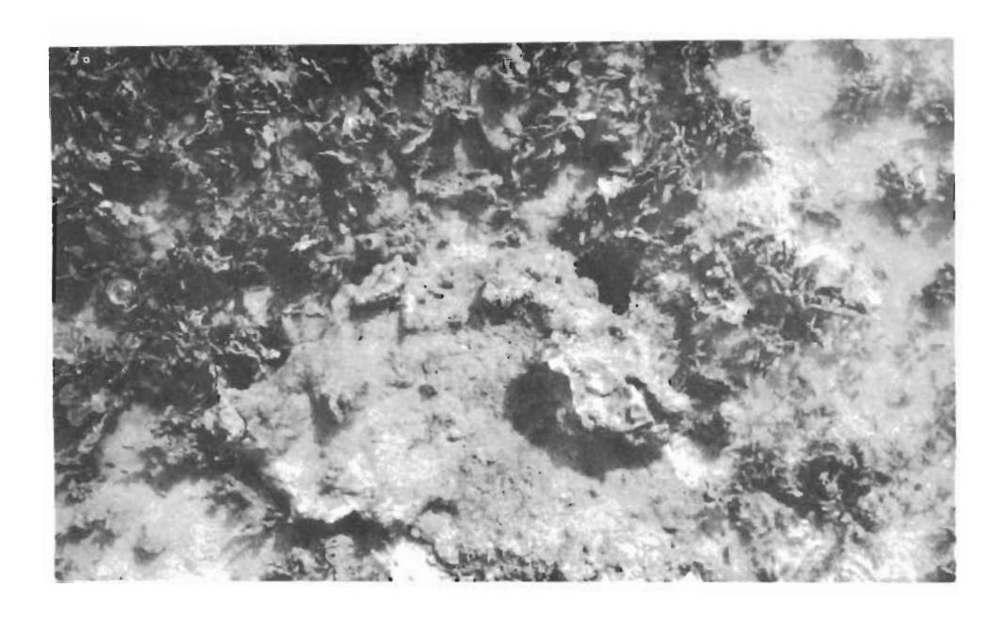

Plate 1. The bottom of a deeper excavated area between Coconut Point and the airport runway; algal growth in upper left with sand and debris below

The outer Airport-Coconut Point region (zone 2) includes both reef flats and deeper areas. A meandering and narrow channel follows the airport fill along the south side of this area. This channel extends into the lagoon for approximately 300 m from its mouth. During tidal exchanges currents are very strong within the channel. Depths range from 1 to 8 m and bathymetry is very irregular. The airport embankment, the open ocean, and the large fringing feef flat form the natural boundaries of the region. Reef corals flourish in most areas of zone 2 and at all depths, presumably due to the good circulation and exchange of water and the proximity to more favorable open ocean conditions (Plate 3). The notable exception is that corals are virtually absent within the dredged excavations, except for a few specimens of Leptastrea and Leptoria which lie adjacent to the embankment. Presumably no coral recolonization has taken place on these surfaces created during the 1959 to 1961 dredgings. Strong currents and sediments may result in a scouring of this area and inhibit coral larvae from settling.

Flourishing coral areas of zone 2, dominated by thickets of staghorn Acropora (Plate 4), cover large areas near the mouth of the lagoon. Some of these coral platforms extend 50 m in diameter and occur in depths of from 1 to 5 m. The Acropora thickets attenuate further from

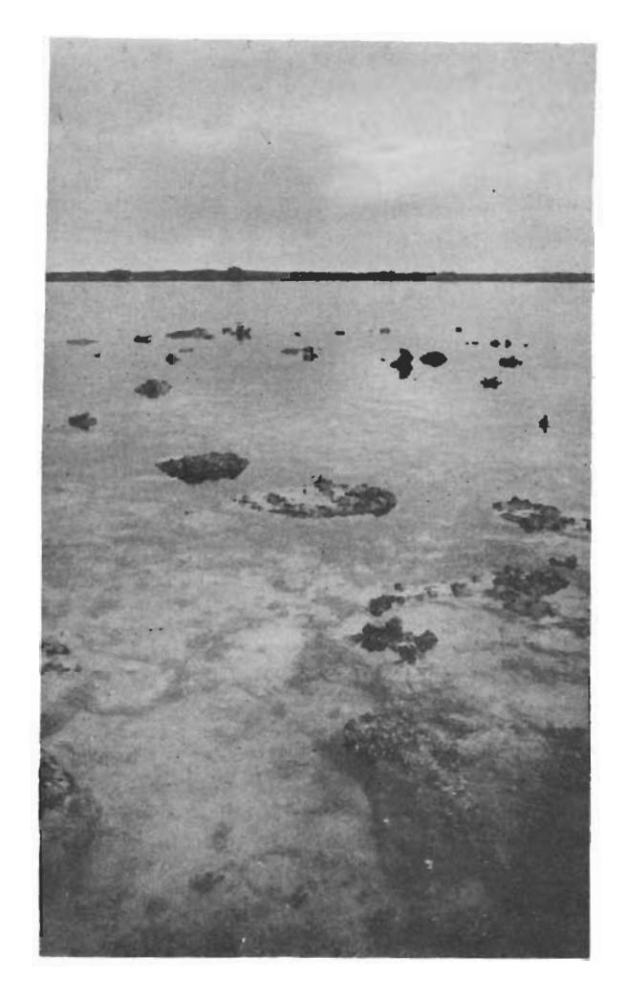

Plate 2. View of the outer reef between Coconut Point and the airport runway

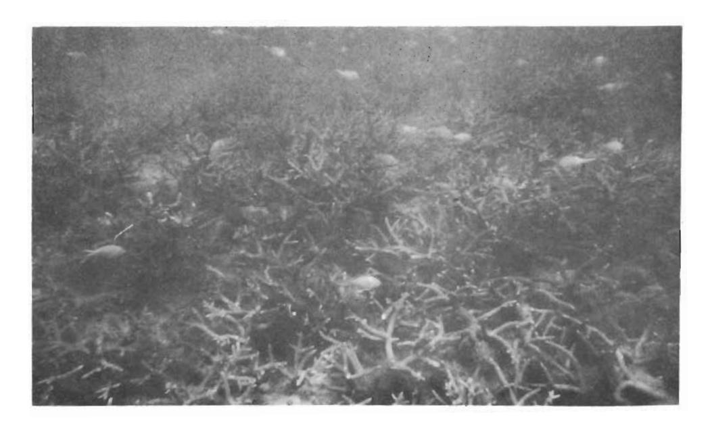

Plate 3. A thicket of Staghorn coral, Acropora, typical of those covering large areas near the mouth of Pala Lagoon

the open ocean entrance to the lagoon and are partially replaced by extensive platforms of the finger coral *Porites andrewsi* (Plate 5). It is observed that the latter coral appeared to be living in water warmer than body temperature. Zonation of corals in this region was not distinct.

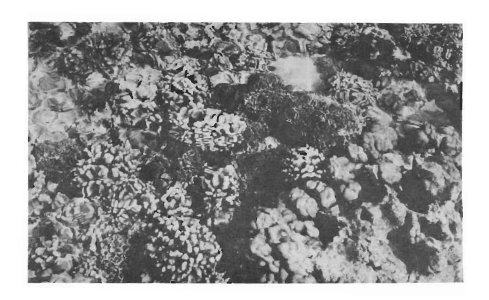

Plate 4. Platforms of the finger coral, *Porites andrewsi*, which replaced *Acropora* thickets toward the lagoon

Near the boundary between regions 2 and 3, the coral patches were all replaced by coral rubble and boulder fields. These seemed to be dead, massive skeletons of *Porites*, some of which formed huge blocks several meters across (Plate 6). The results of quantitative transect B carried out within zone 2 are presented in Table 3. The transect did not extend onto the shallow reef flat contiguous to the shoreline at Coconut Point. Corals were not as abundant on the flats but smaller colonies of *Psammocora contigua*, *Pavona decussata* (Plate 7), and *Porites lutea* were common.

The large fringing reef flat adjacent to zone 2 on the east was designated zone 1 (Plate 8). This fringing reef, perhaps the largest and widest reef in American Samoa, extends for some distance down the coast to the east from Pala Lagoon. This reef probably extended west from the present lagoon entrance prior to the construction of the airport.

At low tide this reef flat is exposed, restricting tidal flow between the ocean and the inner lagoon to only the narrow channel. The reef corals are distinctly zoned from the shoreline to the surfline. Figure 15a shows a plot of the distribution of the common reef corals across transect A while Figure 15b shows a plot of the common substrate types. Average abundances of the dominant bottom types and species are given in Table 3.

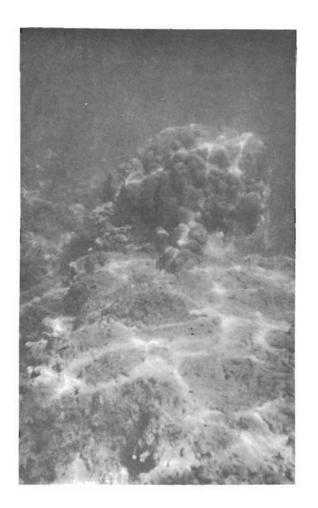

Plate 5. Massive heads of *Porites* which are near the boundary between regions 2 and 3

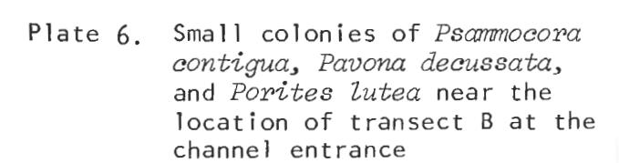

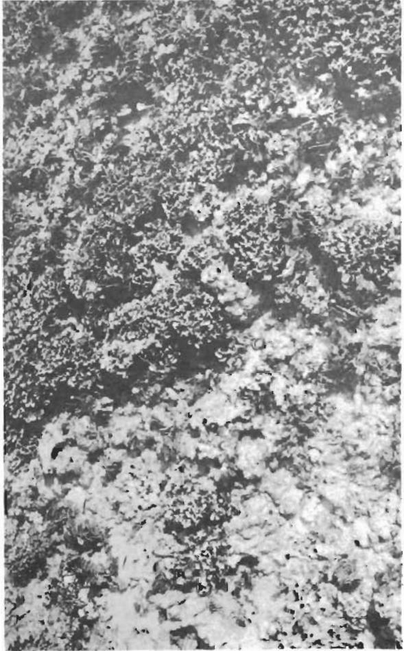

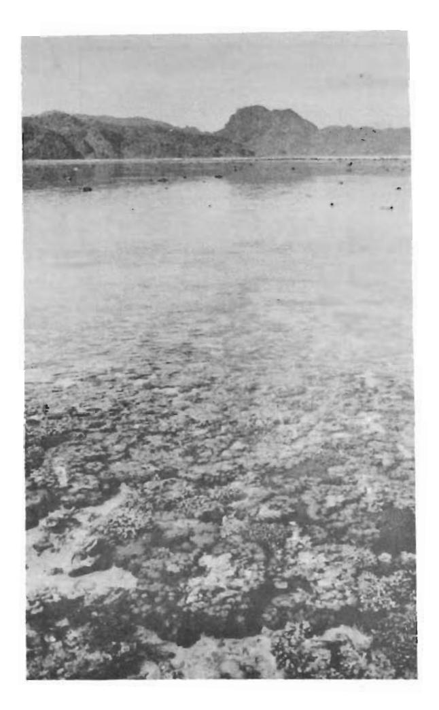

Plate 7. The broad fringing reef flat with a luxuriant growth of coral extending down the coast to the east from the entrance to Pala Lagoon

The seaward end of the transect reached the inner side of the coralline algal ridge, but due to wave action and lack of time, a more seaward extension of the survey could not be made.

The coralline alga, Porolithon sp., and the corals Acropora humilis and Pocillopora verrucosa were the dominant organisms in the surf zone. Less common was the coral Millepora platyphylla. Closer to shore the dominant corals were staghorn Acropora (A. formosa, A. samoensis), Pocillopora damicormis, and Porites (S) convexa (Plates 9 and 10). Coralline algae were replaced by fleshy benthic algae in the zone. Less common corals included Fungia sp., Favia speciosa, and Leptastrea purpurea. At the middle of the transect, leafy forms of Pavona (P. decussata and P. frondifera), massive Porites (P. lutea and P. australiensis), and dead coral rubble dominated the bottom cover (Plate 11). Closer to shore Pavona and Porites remained common while Psammacora contigua began to increase in abundance. Psammocora was the only coral on the reef flat found adjacent to shore. Benthic algae flourished there also. Reef corals were the most common

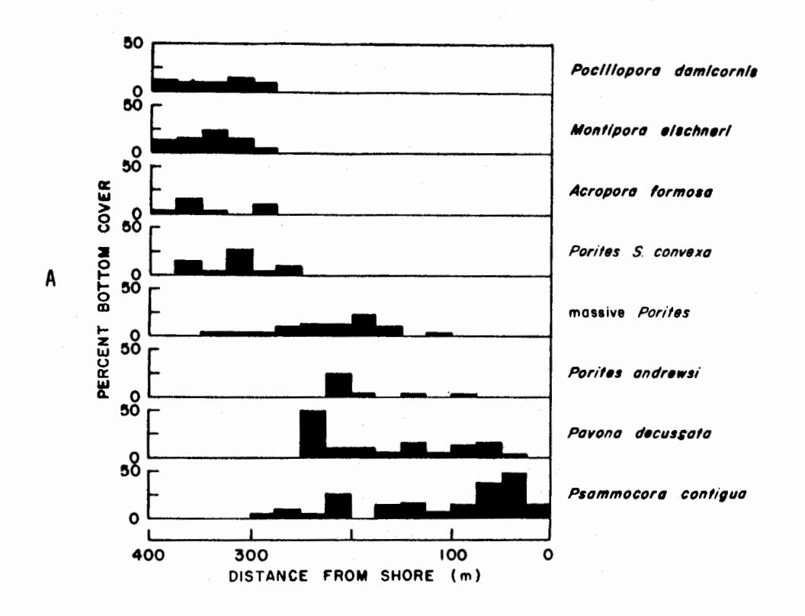

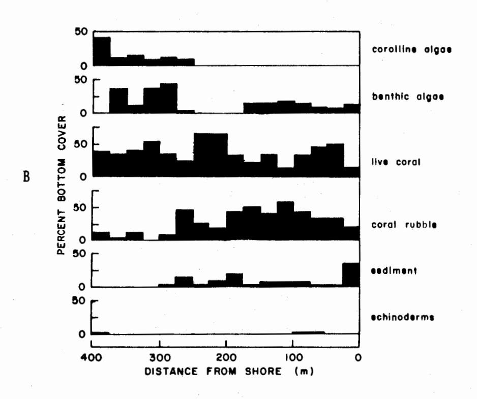

Figure 15. Zonation of (A) the most common reefs corals and (B) the most common bottom types across the fringing reef in front of Pala Lagoon (Transect A)

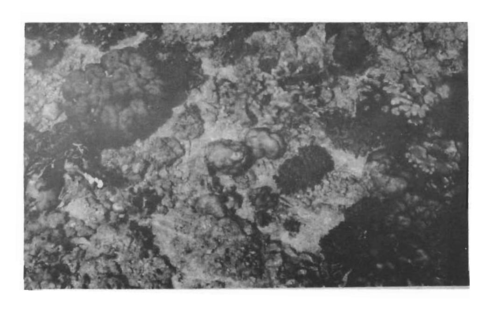

Plate 8. The corals *Acropora* and *Pocillopora* dominate the surf zone on the reef flat.

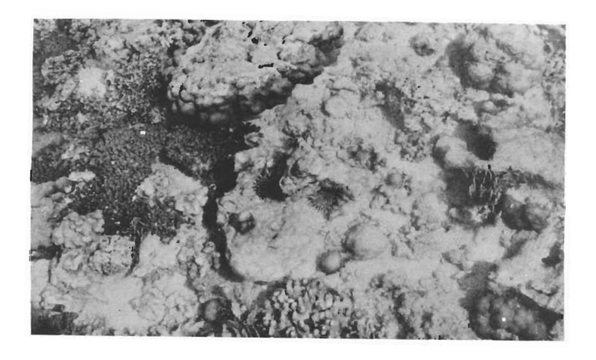

Plate 9. The reef flat closer to shore with two species of Acropora and one each of Pocillopora and Porites

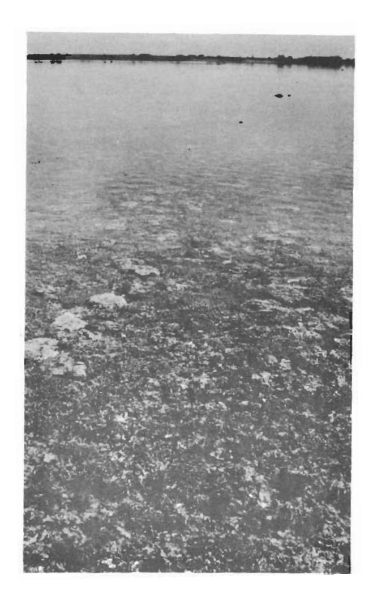

Plate 10. Two species of the leafy coral *Pavona* dominate the substrata on the middle reef flat. Two species of the coral *Porites* and some coral rubble are also found in this area.

bottom type for the transect as a whole. Sediment dominated the inshore regions of reef flat. According to a local resident of Coconut Point, the shoreline has receded about 40 feet since the airport was constructed. Evidence of this consists of a World War II concrete "pill box" which now is partly submerged on the reef flat close to shore at Coconut Point.

#### Reef Coral Tolerance to High Temperatures

Considering that the reef flat uncovers at nearly every low tide, it is surprising to find the abundance of living corals so high. During midday lows in late February (or late summer in the southern hemisphere), temperatures in isolated pools of water containing living reef corals approached 40°C. Air temperatures may also have been quite high during these periods. Repeated visits to these tracts during the study revealed that few of the colonies succumbed to the heat. A review of the literature indicated that reef coral tolerance of high temperatures in Pala Lagoon was among the

highest reported for any reef area. It is remarkable that the corals, especially *Porites*, *Psammocora*, and *Pavona*, survived and continued to grow during the temperature conditions observed.

There are marked local variations in the coral fauna in and outside of Pala Lagoon. Except for the few deeper areas of the lagoon, temperature levels and diurnal variations in temperature are very high. There is little doubt that temperature extremes affect the composition of the coral fauna of each region. The lack of corals in zone 4 further suggests an environmental stress most likely associated with poor circulation. The currents were stronger in the few local areas of zone 3 where corals were common. However, the lack of hard substrate in the inner areas of the lagoon tended to inhibit recruitment of corals since coral larvae do not settle on fine sediment.

#### Echinoderms of Pala Lagoon

From the surveys conducted in the lagoon, it became apparent that the echinoderms were distributed in a similar manner as the corals, hence the same regional classification used for the corals will be used for the echinoderms.

The inner lagoon zone 4 contains few echinoderms. *Polyplectana* sp. was noted on occasion and a few specimens of *Holothuria atra* were seen; both of these sea cucumbers were confined to shallow sandy flats near the lagoon entrance area.

In zone 3 the echinoderms were more common. On the shallow flats adjacent Coconut Point, the holothurians *Stichopus chloronotus*, *Polyplectana*, and *Actinopyga* sp. were common. The sea urchins *Echinothrix* sp. and *Echinometra mathaei* were rarely noted in the zone.

In some areas zone 2 contained the largest concentrations of echinoderms. On the reef flats adjacent to Coconut Point, the sea cucumber Stichopus occurred in dense concentrations. This is similar to what Mayor (1924) reported for inshore areas of Aua Reef. During midday hours, water temperatures over these shallow areas exceeded 40°C. Several specimens of Stichopus which had been unable to remain under water during the falling of the tide had succumbed to heat and desiccation. Pattern statistics (the index of dispersion) show a tendency for Stichopus (site E) to be evenly spaced, suggesting an active response against crowding. Under rocks at the same survey site, Holothuria (Mertensiothuria) pervicax also occurred at high densities but was more randomly distributed--probably because suitable rock cover was also randomly distributed. Stichopus are active during daytime hours while Holothuria are night feeders.

Echinoids (sea urchins) were also very common in zone 2 but this was apparent only after night diving. During daylight hours most sea urchins remained under rocks, burrows, and cracks. Because of the difficulty of adequately locating these animals during daylight hours when the surveys

were conducted, accurate estimates of their densities could not be obtained. This was especially true for sea urchins such as <code>Diadema</code>, <code>Echinothrix</code>, and <code>Echinometra</code>. Comparison of the surveys carried out at sides D and E showed that, in general, sea cucumbers were more common at inner areas of the region while sea urchins were more common in areas closer to open ocean circulation. There is probably little competition between these organisms since the holothurians are predominantly sediment feeders while sea urchins scrape algae off hard substrate surfaces. <code>Echinometra mathaei</code> was by far the most abundant of the sea urchins and approached densities of 5 per square meter or greater (Table 4).

There were many species of echinoderms in zone 1 although none seemed to be abundant. Several species were not found in the other regions. Results of bottom type surveys carried out at transect A (Figure 15) indicated that echinoderms make up only a minor fraction of bottom cover in the area. However, the reef flat was cavernous so that accurate estimates of density could not be made. The density of echinoderms may be much higher than is apparent.

The sea cucumbers *Stichopus* and *Polyplectana* were also common, especially near the shore. The sea urchin *Echinometra* was conspicuous in more offshore regions.

Circulation patterns within the lagoon probably strongly influence the distribution of the echinoderms. There is also some evidence of temperature extremes and substrate type controlling the distribution of some of the species. Sea urchins were most common on rubble and other hard substrate areas and holothurians on sandy shallow areas, while starfish were mostly confined to the outer fringing reef and flats.

#### FISHES

#### Eggs and Larvae

A program of sampling zooplankton in Pala Lagoon was initiated by the Honolulu Laboratory of the National Marine Fisheries Service (NMFS) under the auspices of Dr. Frank Hester, the director at the time of the study. The sampling was conducted with special attention directed to the distribution and abundance of fish eggs and larvae. Sampling was initiated in March 1971 and continued once each month through March 1972. Sampling was done with a 20-cm plankton net constructed of 0.253-mm mesh netting and towed from a small skiff. Tows were made in four locations (Figure 16) during two periods, one in daylight and the other in darkness. Because of the average depth of water (0.9 m) and the shoals and coral heads, the net was towed in circular paths and only during high tide. The analysis of data was conducted by Mr. Walter Matsumoto, fishery biologist at the Honolulu Laboratory, NMFS.

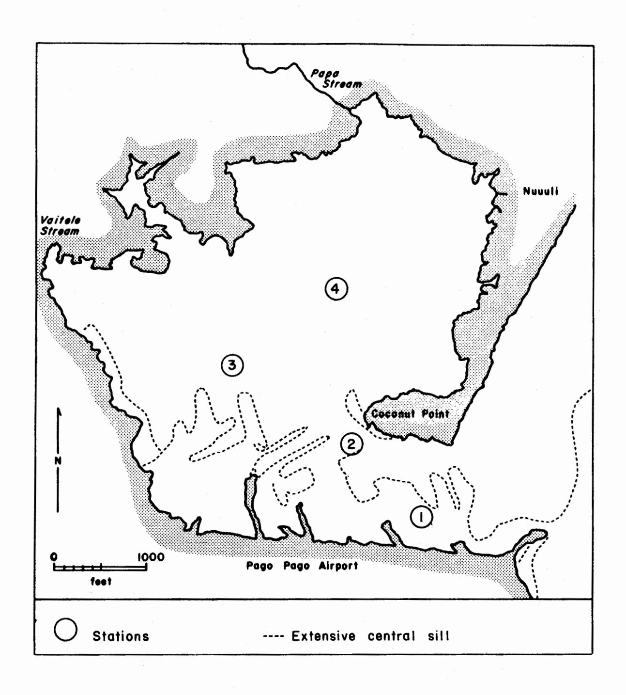

Figure 16. Stations occupied in fish eggs and larvae survey of Pala Lagoon. Tows were made in circular paths at the numbered stations during the day and at night on a monthly basis.

A total of 99 net samples was collected in 13 months of sampling. Three tows were missed in December 1971 and two in January 1972 due to outboard motor failure. All net samples were shipped to the NMFS, La Jolla Laboratory via the Honolulu Laboratory for initial sorting. Initial sorting of samples (i.e., separation of all fish eggs and larvae and identification of certain fish larvae) was completed only for samples obtained in March, April, and June 1971. A quarterly sorting priority was set up for a quick glance at the annual trends. (Only the March, April, and June 1971 samples were sorted due to technical difficulties and budget restrictions.)

A summary of the eggs and larvae taken in March and April is shown in Table 5. The data on June samples were incomplete but showed the same trends as the March and April data. In these months, day catches of larvae were extremely poor in comparison with night catches -- a difference of roughly two orders of magnitude. The catches of eggs also show day-night differences but the order of magnitude between these is one or less. A breakdown of the catch by families shows significant differences between day and night (Table 6). Day catches consisted entirely of goby and blenny-type larvae, whereas night catches included larvae of fish with pelagic eggs: engraulid, antennariid, atherinid, carangid, anchovy, and labrid. Also prominent in the family breakdown was the predominant number of goby-type larvae in night catches. The scarcity of larvae from pelagic eggs is puzzling, since significant numbers of such eggs were collected in the lagoon. This and the absence of non-goby-type larvae during the day hint at the possibility that the larvae are negatively phototrophic and hover close to the shallow bottom during the day, thus avoiding the plankton nets.

Other zooplankton organisms which are abundant in these collections include crustaceans and chaetognaths.

These data, although incomplete, indicate that Pala Lagoon serves as a nursery ground for some species of fish, both those resident in the inner lagoon such as the gobies and those which probably range in and out of the lagoon. An effort is being made to complete the analysis of these collections in order to substantiate trends suggested by the March and April data.

#### Juvenile and Adult Fishes

The distribution, diversity, and relative abundance of juvenile and adult fishes in various parts of Pala Lagoon were roughly assessed by means of limited poisoning of fishes at six stations that were considered representative of the biotopes found in Pala Lagoon. The location of these stations (Figure 17) was representative of an outer coral reef close to the open ocean (station 1), growing coral on an inner reef flat (station 2), a dredged area similar to those that might be expected in the proposed dredged boat harbor (stations 3 and 4), a mid-lagoon mud flat environment (station 5), and along the rocky shore with an adjacent shallow mud flat in the inner lagoon (station 6).

TABLE 5. SUMMARY OF FISH EGGS AND LARVAE FROM PALA LAGOON

| Station                                  | Date                                     | Time of Tow                                      | Volume Water (m 3 ) | Total No. Larvae (L) | Total No. Eggs (E) | L/m 3              | E/m 3              |
|------------------------------------------|------------------------------------------|--------------------------------------------------|--------------------------------------|----------------------------|--------------------------|-------------------------------|-------------------------------|
| Day 1 Day 2                           | 3/14/71 3/14/71                       | 1423-1438 1445-1500                           | 34.0 35.0                         | 4 5                        | 32 27                 | 0.12                          | 1.12                          |
| Day 3 Day 4                           | 3/14/71 3/14/71                       | 1507-1522 1530-1540                           | 37.0 27.0                         | 2                          | 24                       | 0.05                          | 0.64                          |
| рау ч                                    | J/ 1 <del>7</del> / / 1                  | 1750 1740                                        | 27.0                                 |                            | . •                      | × 0.08                        | 0.63                          |
| Night 1 Night 2 Night 3 Night 4 | 3/25/71 3/25/71 3/25/71 3/25/71 | 0333-0344 0350-0400 0416-0426 0433-0443 | 27.0 28.0 27.0 26.0         | 319 244 100 71    | 11 48 686 17    | 11.81 8.71 3.70 2.73 | 0.41 1.71 25.41 0.65 |
|                                          |                                          |                                                  |                                      |                            |                          | x 6.73                        | 7.04                          |
| Day 1 Day 2 Day 3 Day 4         | 4/21/71 4/21/71 4/21/71 4/21/71 | 1310-1322 1328-1340 1348-1400 1406-1418 | 42.8 49.5 44.2 50.6         | 1 2 1 0           | 18 56 13 4      | 0.02 0.04 0.02 0.00  | 0.42 1.13 0.29 0.08  |
|                                          |                                          |                                                  |                                      |                            |                          | x 0.02                        | 0.48                          |
| Night 1 Night 2 Night 3 Night 4 | 4/22/71 4/22/71 4/22/71 4/22/71 | 0124-0136 0142-0154 0209-0221 0226-0238 | 46.4 45.5 27.8 49.2         | 56 41 65 51       | 38 93 48 0 (?)  | 1.21 0.84 2.34 1.04  | 0.82 1.92 1.73 0.00  |
|                                          |                                          | •                                                |                                      |                            |                          | x 1.36                        | 1.12                          |
| Day 1 Day 2 Day 3 Day 4         | 6/23/71 6/23/71 6/23/71 6/23/71 | 1338- 1353- 1335- 1358-                 |                                      | 5 27 6 8          | 22 23              |                               |                               |
| Night 1 Night 2 Night 3 Night 4 | 6/24/71 6/24/71 6/24/71 6/24/71 | 0130- 0051- 0034-                          |                                      | 2257 40 43           | 9  4               |                               |                               |

PRELIMINARY IDENTIFICATION AND NUMBER OF FISH LARVAE BY FAMILY FROM MARCH 1971 SAMPLES TABLE 6.

| Station    |                                                          | _                                                                                                                         |                                | 2                                                                         |                         | 3                                                                     | 4                                                                                                                        |
|------------|----------------------------------------------------------|---------------------------------------------------------------------------------------------------------------------------|--------------------------------|---------------------------------------------------------------------------|-------------------------|-----------------------------------------------------------------------|--------------------------------------------------------------------------------------------------------------------------|
| Day Tows   | 2                                                        | 2 Gobiid 2 Blenniid                                                                                                    | 4-                             | 4 Gobiid 1 Blenniid                                                    |                         | Gobiid Blenniid                                                    | None                                                                                                                     |
| Total      | 4                                                        |                                                                                                                           | 5                              |                                                                           | 2                       |                                                                       | 0                                                                                                                        |
| Night Tows | 117 1 1 1 1 1 1 1 29 47 29 | 117 Gobiid 1 Blenniid 1 Antennariid 1 Engraulid 29 Others 94 Newly hatched 47 Damaged 29 Unaccounted | 45 2 3 6 175 13 | Gobiid Atherinid Labrid Carangid Newly hatched Unaccounted | 53 4 1 1 13 | Gobiid Labrid Carangid Other Newly hatched Unaccounted | 20 Gobiid   Engraulid   Antennariid   Juvenile   Unidentified   Other   Newly hatched   Unaccounted |
| Total      | 319                                                      |                                                                                                                           | 244                            |                                                                           | 100                     |                                                                       | 17                                                                                                                       |

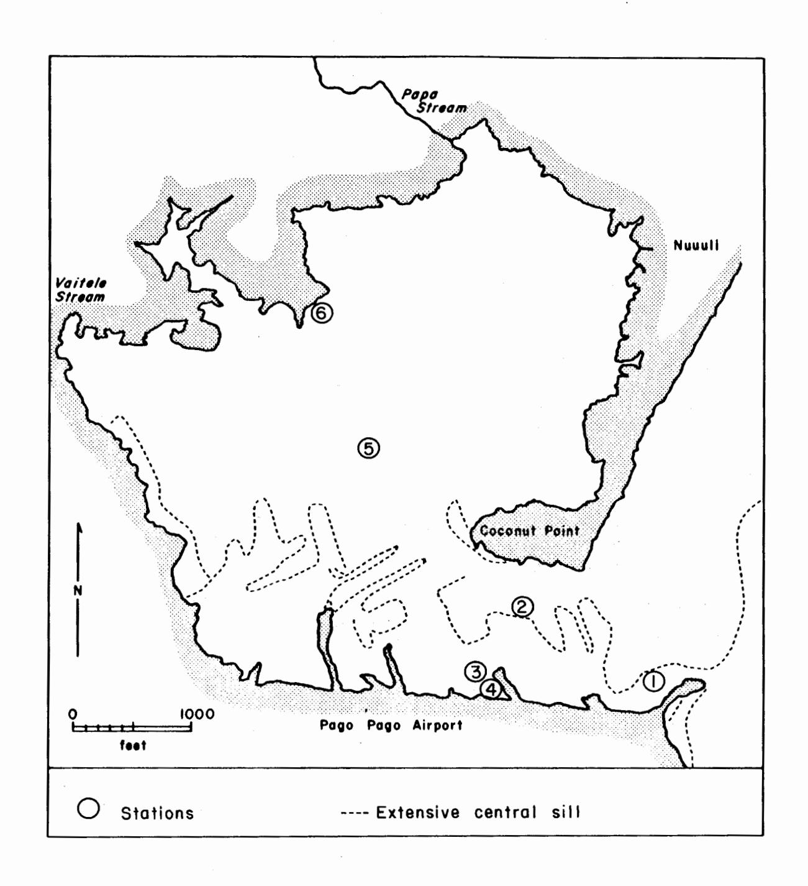

Figure 17. Fish collecting stations from which specimens were obtained by poisoning

Poisoning was accomplished by spreading a thick mixture of powdered rotenone (cube root) and seawater in the area. Poison was placed in the water at slack tide when possible to increase the exposure time of fish to the rotenone. An attempt was made to place quantities of the poison in crevices in the coral and rocky substrate in order to kill fish that normally seek cover in such refuges. It should be noted that this type of poison is harmless to humans and most invertebrates, such as shrimps, crabs, and corals, and it is toxic to fish only for a limited time.

The areas covered with a heavy concentration of poison varied from station to station, but in most cases all of the fish in an area of approximately 800 m were killed. The stunned fishes were collected with hand nets and placed in containers with a preservative. No effort was made to quantify biomass but rather it was hoped to obtain information on the diversity and distribution of species and a general indication of relative abundance.

The results of these collections are summarized in Table 7. A detailed list of species collected is presented in Appendix E. The preserved specimens will be deposited in the fish collection at the B.P. Bishop Museum in Honolulu where they will be available for further study.

TABLE 7. RESULTS OF LIMITED POISONING OF FISH TO ASSESS THE DIVERSITY, ABUNDANCE, AND DISTRIBUTION OF FISHES IN PALA LAGOON

| Station | No. of Species | No. of Genera | No. of Specimens | Substrate                          |
|---------|-------------------|------------------|---------------------|------------------------------------|
| 1       | 43                | 28               | 126                 | Edge coral reef                    |
| 2       | 30                | 25               | 143                 | Shallow coral reef flat            |
| 3       | 13                | 11               | 94                  | Previously dredged sand-mud bottom |
| 4       | 12                | 12               | 292                 | Previously dredged sand-mud bottom |
| 5       | 8                 | 7                | 28                  | Mud flat                           |
| 6       | 4                 | 3                | 15                  | Shallow muddy rocky shore       |

In addition to fishes collected by poison, schools of several species were observed in the shallows. These included mullet, jacks, and possibly bonefish. None of these fish exceeded a foot in length and only two to six-inch-sized mullet seemed to be abundant. The size and abundance of the species sighted are further evidence that Pala Lagoon probably serves as a nursery ground for some fish.

The results of the analysis of data from the poison stations indicate a general gradient of species and genera from the complex growing coral reef edge through the previously dredged area to the lagoon mud flat and inner lagoon shore (Table 7). The diversity of ecological niches and the accompanying large number of species of fish in tropical coral reefs is well known (Hiatt and Strasburg, 1960; Randall, 1955; inter alia). The role of coral in providing a protective habitat as well as the other components of a niche is also recognized. Station 1 contained greater depth along with growing coral and was adjacent to a rubble channel While station 2, although containing a good growth of coral, was shallower and further away from the open ocean. Stations 3 and 4, which were essentially replicates, had approximately half the number of species as a shallow undredged area while lying about the same distance from the open ocean. The number of species and individuals declined markedly over the inner mud flats of the lagoon where cover was limited and where greater environmental perturbations have reduced the number of species that have adapted to them.

There are indications that the dredging of a shallow coral reef may increase the carrying capacity of a habitat in the long-range sense by creating an ecotone or edge effect. Although not conclusive, preliminary data indicate that this may be the case in other dredged coral reefs (Kohn and Helfrich, 1957; Brock et al., 1966). It is of interest that station 2 had about twice the number of species as station 3 or 4 although being approximately the same distance from the open ocean. From these data one might predict that, if the proposed dredging took place, it would probably initially reduce the number of species in the dredged area, although not necessarily the biomass of fish. It is reasonable to predict, based on the work of Maragos (1973), that, if an appropriate substrate were to exist after dredging, corals would repopulate some of the dredged area and a greater diversity of fish species would reoccupy the area. Based upon data from Kaneohe Bay, Hawaii, a repopulation by corals of a dredged reef may take 20 to 30 years (Maragos, 1973).

#### OTHER BIOTIC ELEMENTS

A major part of the shallow inner lagoon consisted of sand and mud flats covered with a rich growth of the attached red algae, Acanthophora specifera. The percentage of the bottom covered with benthic algae was noted at three random locations in the western half of the inner lagoon. The average was 75 percent of Acanthophora spicifera and Halimeda discoidea; H. tuna was also found on one location near the center of

the inner lagoon. In addition, dense mats of green algae Enteromorpha sp. along with Acanthophora specifica appeared on the rocks along the western shore of the lagoon in the vicinity of a freshwater spring.

The other benthic organisms of consequence (not previously mentioned) in the inner lagoon are bivalve mollusks. One species of clam, Gafrarium tumidum, is abundant in the muddy bottom along the north shore where it is harvested by women and children (Glude, 1972). Colonies of small oysters are common on rocks along the western shore. Clam shells of several species are abundant among the littoral debris.

Samoan crabs (Scylla serrata) are said to occur at various places in the lagoon. Crab fishermen using small traps were observed in the northeast portion of the lagoon and along Coconut Point. Four circular crab nets baited with fresh fish were placed in the dredged area adjacent to the airport and checked at two-hour intervals throughout the night, but no crabs were taken.

A substantial colony of the large mantis shrimp Lysiosquilla has been reported in an area south of Coconut Point (J. Flanigan, 1972: personal communication), but was not observed during this survey.

#### SOCIO-ECONOMIC CONSIDERATIONS

Presently, Pala Lagoon supports some minor fisheries and serves as a source of dredged fill material. Perhaps the most important fishery is that for clams on the intertidal mud flats on the north end of the lagoon (Glude, 1972). A few Samoans, using gill nets, reportedly catch crabs in the deeper pockets along the western side of the lagoon. A fish weir is operated on the south side of Coconut Point and dredging activity (crane-drag line) continues periodically along the south shore as sediments are needed for earth fill by the Public Works Commission of the Government of American Samoa.

During the survey period, boats other than those supporting the survey were rarely observed operating in Pala Lagoon and several parties of picnic-kers were observed along the western shore. The entire southern shore is in the airport complex from which the public is excluded.

Because of time limitations and because of the lack of personnel who could make an effective assessment of the socio-economic impact of the proposed modification of Pala Lagoon, this aspect of the study is admittedly deficient. A series of discussions were conducted with personnel of the U.S. Army Corps of Engineers in Honolulu regarding the costs and benefits of the dredged harbor proposed for Pala Lagoon. The basis for these discussions was the U.S. Army Corps of Engineers' report, Fagaalu Bay, Pala Lagoon, and Leone Bay, American Samoa: Reconnaissance Report on Navigational Improvements, 14 May 1971, which proposes projects in response to the needs of the area. Whether the projection of

needs in this report, which are based upon standards of living in Hawaii, are realistic in the context of Samoan culture is questioned. The initial configuration of the Pala Lagoon small boat harbor proposed by the Army Corps of Engineers was based on the accommodation of 350 trailer-type craft, 10 pleasure boats of the inboard-outboard class, and 40 sailboats without auxiliary power. The estimated cost of construction of a harbor to accommodate these crafts is \$1,490,000.

Despite some discussions with Samoans in an attempt to gain insight into local attitudes and desires vis a vis a boat harbor in Pala Lagoon, language and cultural barriers did not permit an accurate prediction of the future needs for Pala Lagoon marine facilities or whether what was being proposed is realistic. Based upon the existing economy with an expected modest increase in tourism and light industrial development over the next ten years, it appears unlikely that the level of boat ownership in American Samoa will approach the level in Hawaii. (Boat ownership data from Hawaii served as the basis for the Army Corps of Engineers' figures.) Certainly this potential for boat ownership must be examined in more detail. In view of the uncertainties involved and in order to meet immediate needs, an alternate proposal for a somewhat flexible scheme follows.

#### DISCUSSION

Because the proposed channel dredging will have little positive effects and possibly a negative effect on the mixing and flushing in the lagoon and because it will probably be attended by increased pollution by petroleum, sewage, and trash, it is almost certain that the project would have the overall effect of further degrading Pala Lagoon.

It should also be pointed out in passing that the map of the proposed channel (Figure 4) could be misleading. The map gives the impression that the new channel would be quite long and perhaps because of this it might look as though it would bring ocean water much farther into the lagoon than it now penetrates. This is not so. Most of the area through which the proposed new "cut" passes is in fact the basin which is already dredged to an appropriate depth. What the "channel" would actually do would be to remove a few rather isolated shoals that remain in the basin and cut through the outer reef flat--destroying its sill effect.

The yield of seafood from Pala Lagoon (clams, crabs, and finfish) was not assessed except to note the occasional occurrence of a crab trap fisherman or a clam collector. Assessing the magnitude of this casual subsistence-type fishery would require more time and effort than the time allowed for this survey. The seafood is undoubtedly important to those who harvest it regularly. As previously noted, the proposed dredging would probably increase the tidal fluctuation, as well as to increase the residence time of water in the lagoon creating detrimental conditions relating to bacterial contamination, thermal and salinity stress, and

possible desiccation to organisms in the inner lagoon. Thus the proposed dredging would probably be detrimental to the limited subsistence fishery presently being pursued in Pala Lagoon,

The zones of primary concern relative to enteric bacterial concentrations are in the northern and western areas of the lagoon. Though not a strictly quantifiable measure of the health hazard, the coliform data suggest that these areas support high bacterial populations and possibly the existence of pathogenic organisms. Because the microbial quality of the inputs in question will vary directly with the health of the human population in the Pala Lagoon watershed, the implications of the lagoon influence in possible epidemic situations are obvious, but must be interpreted with caution.

Because of the geography and topography of its drainage basin, Pala Lagoon is subject to large and rapid fluctuations of freshwater input, resulting in similar fluctuations of bacterial contamination. The weeks immediately preceding this survey were unusually dry and coliform concentrations were substantial. This indicates that subsurface waters, which may receive bacteria from the many cesspools present on the western edge of the lagoon, are probably very important sources of microbial contamination.

The average surface and subsurface inputs to the lagoon, estimated at 20 to 25 ft3/sec (C. Bently, 1972: personal communication), drain almost exclusively into the northern lagoon area. During this analysis, Papa Stream appeared as a defined surface flow in the region of the paved road to the north of the lagoon. Lagoonward, it was reduced into vadose water and gravity seepage occurred toward the lagoon until a minor surface flow reformed approximately 100 ft from the lagoon, Vadose water, rich in nutrients probably derived from cesspool seepage, is capable of supporting very large bacterial population. Vadose inputs explain the high nutrient levels in the northwestern area (Krasnick and Caperon, 1973) and account for the maintenance of high coliforn concentrations under conditions of minimal surface input.

The combined occurrence of high coliform concentrations and low surface salinity values in the western region when the major stream, Vaitele, was dry strongly implies subsurface input. Data indicate a major input near station 6 and suggest numerous inputs in the area of stations 1 to 4. The absence of coliforms to the north of station 6 substantiates the description of circulation patterns in this area of the lagoon.

The bacteriological character of the lagoon is very dependent on its physical dynamics. Restricted circulation inhibits extensive tidal exchange and limits the dilution of contaminants entering into the northern and western regions. Prevailing easterly winds reinforce this distributional pattern by driving surface water and the contained pollutants westward and account for the limited influence of Papa Stream on the area of station 12.

Both wind mixing, effective throughout the shallow water column, and periodic dredging operations cause high turbidity and reduce

visibility to a few centimeters. The abundance of suspended material enhances the growth and survival of bacteria. Bacteria adsorbed to particles in suspension (Zobell, 1946) eventually settle to the lagoon floor where prolific growth may occur (Rubentschik et al., 1936; Weiss, 1951). Bacterial concentrations in sediments were not determined but those reported from the water column are probably a fraction of those occurring in the sediments.

On the basis of water quality standards for microbes (Appendices A and B), the northern and western regions of Pala Lagoon are unacceptable areas for the propagation of shellfish and marine life, and it appears that the utilization of marine foods from these areas is unwise. It is further apparent that substantial precipitation, occurring after dry conditions would cause bacterial concentrations to rise by orders of magnitude in such a way that the consumption of marine organisms from this area might be dangerous.

Alterations in the physical dynamics, resulting from the proposed dredging operation, will probably have a moderate effect on the tidal range and flushing characteristics of the lagoon. On one hand, periodic purging of prolific sediment bacteria may result as the intertidal zone experiences longer and more frequent exposure to direct radiation. However, the uncertain effects on the benthic biota and bacterial predators cause one to view this possible advantage with great caution. The major improvement of microbial quality would be derived from the proposed dredging only if it resulted in increased tidal mixing and concurrent flushing of the lagoon. However, as previously stated, large benefits in terms of increased flushing cannot be expected from the dredging being proposed for Pala Lagoon. Hence, improvements in the lagoon water quality, from a microbial aspect, are not expected to result from the proposed dredging and any increase in human activity in the lagoon or its watershed can only amplify the imbalance between microbial inputs and the bactericidal and dilutive effects of lagoon waters.

In view of the probable reduction of circulation in the main body of the lagoon, if the proposed boat harbor is actually dredged, it is suggested that alternatives utilizing much of the existing dredged area be considered. An alternative that would not require very extensive dredging and would maintain the present circulation and mixing pattern is therefore proposed. The main elements of this scheme, which largely utilizes existing dredged areas, are: (1) to widen and deepen the outer entrance where boats now encounter breaking waves during very rough weather; (2) to establish and mark a channel and turning basin; (3) to construct a dock or docks and a boat ramp; and (4) to construct a parking lot and ancillary shore facilities. Figure 18 shows the approximate location of these features and facilities and Plate 1 gives an indication of the gross topography of the area. Figure 8, section A-A1, station 8 shows the schematic position of the sill with the proposed turning basin.

This proposal requires that the existing sill be left intact and thus it precludes the utilization of the harbor by boats that draw

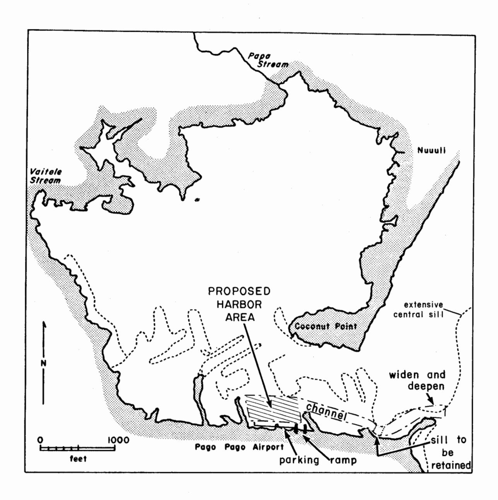

Figure 18. An alternate plan for a shallow-draft harbor in Pala Lagoon requiring a minimum of modification by utilizing existing dredged areas

more than 1 m of water. While the limit in the depth of the water constrains boating use to shallow-draft vessels (canoes and outboard motor boats), the permitted use should satisfy a considerable portion of the fishing and recreational demand that can be expected from the local people in the immediate neighborhood.

It is quite probable that the demand for trailer-type facilities will increase over time. At present these services are almost non-existent in the Pala Lagoon area. Considering the available land adjacent to the already dredged areas in Pala Lagoon, the southern portion of the lagoon is probably the most acceptable and inexpensive location for a small boat trailer-type development in all of Tutuila.

The minimum required improvements for such a trailer-type facility in Pala Lagoon include a dock (or docks) to accommodate vessels being launched or retrieved on trailers, one or more launching ramps, and an adequate area for vehicle operation and parking.

If this plan is adopted, the principal costs will be to develop the boat ramp system and a suitable dock area adjacent to the ramp. Since the recreational use of boat ramps is one in which peaks of activity can be expected, it would be worth building a wide ramp or double ramp capable of easily accommodating two to four trailers at once. The ramp should be located between modest docks of 100 to 150 feet along the shore.

It is not within the scope of this study to plan such a facility in detail. However, a survey of the expected use by boat type and the potential for trailer-borne shallow-draft boats should be studied before such an alternate plan is adopted.

This alternate plan has obvious cost advantages, but more important it will provide facilities for one class of boat operator while having a minimum impact on the water quality of Pala Lagoon. It probably should be considered in conjunction with expanded facilities for deeper draft vessels in Pago Pago Harbor.

#### SUMMARY AND CONCLUSIONS

At the request of the Governor of American Samoa, this study was conducted to assess the biological and socio-economic effects of a dredging project proposed for Pala Lagoon, American Samoa. The survey was conducted by a team of scientists from the Hawaii Institute of Marine Biology, the National Marine Fisheries Service, and the staff of the Office of Marine Resources of the Government of American Samoa. Emphasis was placed upon the expected impact the project would have upon the tides and circulation, bacterial contamination, phytoplankton productivity, coral and echinoderms, and fishes of Pala Lagoon.

The lagoon is roughly circular, approximately one mile in diameter, and has a surface area of about 300 hectares. The inner two-third has a flat mud bottom with a depth of from 0.3 to 1.5 m depending on the tidal state. The water is usually turbid in much of the lagoon. The tide is about 85 percent as large as the ocean tide and follows it slightly in time. A mathematical model was developed to predict the tides and currents under various conditions before and after the proposed dredging. The effect of dredging upon the tide would be to make low tide typically 10 cm lower than at present which could result in an adverse effect upon organisms in intertidal and shallow regions of the lagoon.

Because over half of Pala Lagoon is less than 1 m in depth and it is fed by six small streams subject to large fluctuations in flow, the lagoon is a highly variable environment. The interaction and movement of the lagoon and intermediate and ocean water masses during the tidal cycle were examined. The gross mean residence time of water is about 30 hours and about 40 percent of the estimated volume of 2 x  $10^2$  m³ is exchanged on each semidiurnal tidal cycle. The water residence time near the entrance to the lagoon is about 12 hours, while that in the western extremities is on the order of two weeks during periods of low rainfall.

The data indicate that proposed dredging would remove an existing sill and, although the volume flow through the entrance channel would be increased, the turbulent mixing process between ocean and lagoon water masses caused by water crossing the sill would be decreased and, as a result, the average residence time of water in the lagoon would be increased by 75 percent.

The northern and western regions of Pala Lagoon contain the highest concentrations of coliform bacteria and do not conform to limits applicable to waters appropriate for the propagation of seafood. Conditions of low rainfall prior to this investigation suggest that the bacterial levels are minimal. The character of these areas results from both surface and subsurface inputs and is maintained by nearly continuous easterly winds, limited tidal exchange, and restricted internal circulation.

The maintenance of high bacterial concentrations under low rainfall conditions apparently results from subsurface gravity seepage and subsequent leaching from cesspools proximate to the lagoon. As the residence time of water in this area is increased, the natural bactericidal effects of seawater is reduced accordingly. Additional quantities of silt in lagoon waters provide an increased amount of substrate matter for bacterial growth.

Since the dredging proposed for Pala Lagoon is not believed to enhance the effective tidal dilution, this project is not expected to improve the microbial quality of the lagoon.

The dynamics of the phytoplankton (planktonic algae) population in Pala Lagoon were studied because of their importance to the animal

communities and their immediate and direct responses to environmental perturbations. The density and growth rate of phytoplankton in various portions of the lagoon were related to plant nutrient concentrations and a model was analytically employed to relate growth rate per unit population to the concentration of the limiting nutrient.

Growth of planktonic algae is presently controlled by two regimes. Growth rates in that portion of the lagoon nearest the entrance channel are controlled by the supply of fixed-nitrogen present as waste effluents entering the lagoon with tidal incursions. The more isolated northern and western portions of the lagoon receive abundant nutrients from sewage wastes entering that portion of the lagoon directly. The effects of the anticipated circulatory changes would be to reduce the growth rate and productivity of the phytoplankton community in the pelagic half of the lagoon. Population size could be expected to increase due to suppressed dilution. Growth rates in the inner half of the lagoon would be relatively unaffected, although here again increasing algal concentrations would be expected as a result of decreased dilution. This rather eutrophic area would expand to include a larger portion of the lagoon area. Although the study was made during a period of low rainfall, stream and nearshore sampling indicated that phytoplankton productivity may respond in a positive manner to increase terrestrial runoff, specifically to nutrients in sewage carried by stream water.

The abundance and distribution of two of the major invertebrate faunal components of the Pala Lagoon benthic community--corals and echinoderms (sea urchins, sea cucumbers, etc.)--were assessed. Corals formed the physical base for the ecosystem in the outer portion of the lagoon and almost all of the biotic components of the systems were intimately associated with them. Therefore any perturbations affecting the coral (such as dredging) can be expected to have a profound effect on the rest of the community for an extended period.

Corals flourish in most of the areas where the dredging is proposed with the exception of those places dredged between 1959 and 1961 for airport construction. On the reef flat adjacent to Coconut Point, a distinct zonation of corals was noted reflecting adaptation to the environmental gradient found across the reef. Corals in portions of Pala Lagoon are exposed to extremely high temperatures and this parameter may be a factor limiting the present distribution of corals. Temperature is influenced by circulation and the magnitude of tidal changes in the lagoon and a decrease in circulation coupled with a drop in the low tide level would probably cause increased mortality to the corals followed by a decrease in the biomass of fish and other organisms associated with corals. The distribution of echinoderms related directly to the substrate type, with temperature and tidal extremes undoubtedly being influencing factors.

The collection of fish eggs and larvae in Pala Lagoon confirms its role as a nursery ground for both resident fishes and those outside the lagoon. The gobiid fish larvae were dominant among identifiable fish and the adults were among the conspicuous residents of all parts of

Pala Lagoon, particularly in the inner portions. Increased residence time of water in the lagoon would result in environmental stress that would probably be detrimental to delicate fish larvae.

The distribution, diversity, and relative abundance of fish were roughly assessed by sampling from six stations distributed from the northwestern shore of the inner lagoon to a point near the outer ocean reef front. A general gradient of species diversity, numbers, and probably total biomass of fish was observed between the two extreme stations. A dredged area approximately the same distance from the open ocean was compared with a non-dredged area and the latter had more than twice the number of species than the former. The planned dredging would probably initially reduce the number of species in the area, but the expected long-range effect would be one in which the coral repopulated-provided an adequate substrate was available--and the biomass and diversity of fish would be equal to or greater than the original populations, at least in the vicinity of the dredged area.

Pala Lagoon presently supports minor subsistence fishing and it is used as a source of dredged fill material.

The harbor proposed by the U.S. Army Corps of Engineers was reviewed from the standpoint of its effect upon the environment and its usefulness as a facility for people living on western Tutuila. The proposed harbor would accommodate 350 trailer-type craft, 10 inboard-outboard pleasure boats, and 40 sailboats and would cost an estimated \$1,490,000. The basis of the estimate for this number of boats is questioned.

In view of the predicted detrimental biotic affects and other uncertainties related to the proposed project, an alternate proposal for a more modest shallow-draft harbor is suggested. This alternate plan would require some deepening and widening of the channel entrance, retention of a sill in the channel, marking of the channel, and establishing a marked turning basin. In addition a boat ramp, loading docks, and vehicle parking facilities are recommended.

This alternate plan would minimize the expected environmental impact while providing a safe and conveninet facility for shallow-draft boat owners.

#### RECOMMENDATIONS

#### It is recommended:

- 1. that the harbor, proposed by the U.S. Army Corps of Engineers, not be dredged because of the probable overall detrimental effects it will have on the biota of Pala Lagoon.
- 2. that the present sill (described in this report) near the lagoon entrance not be altered as it would have a detrimental effect on the biota of Pala Lagoon.

- that an assessment be made of the present and future boat use pattern by the residents of the west end of Tutuila to determine if a significant number of shallow-draft vessels might benefit from a harbor designed specifically to serve them in Pala Lagoon. If this assessment indicates that such a shallow-draft facility is warranted, then the alternate proposal presented in this report should be considered.
- 4. that an attempt be made to restrict the flow of raw sewage into Pala Lagoon and/or full cognizance be taken of the dangers to the health of those persons swimming in and collecting seafood from the highly polluted portions of Pala Lagoon.

#### ACKNOWLEDGMENTS

We are very grateful for the excellent cooperation we received from the Government of American Samoa, particularly from Dr. Stanley Swerdloff, George Arakawa, Bill Coleman, and Peter Gebauer of the Division of Natural Resources. Dr. Frank Hester was instrumental in initiating the original proposal and his group collected and partially analyzed the zooplankton. John Flanigan, a resident of Coconut Point and a marine biology enthusiast, also assisted (some of the workers) during the study. Thanks is also due to Diane Henderson and Joyce Miller for their assistance in the preparation of the bacteriological portion of this report. The help of Helen A. Randall in preparing the final draft of the report is acknowledged.

#### REFERENCES CITED

- American Public Health Association. 1970. Standard methods for the examination of water and wastewater. American Public Health Association Publication Office, Washington, D.C. pp. 678-694.
- Blackwood, C.M. 1972. "Canadian experience on sewage pollution of coastal waters: effect on fish plant water supplies." In Marine Pollution and Sea Life, ed. M. Ruivo, pp. 542-46. Fishing News (Books) Ltd., London.
- Brock, V.E., W. Van Heukelem, and P. Helfrich. 1966. An ecological reconnaissance of Johnston Island and the effects of dredging. HIMB Tech. Rept. 11. University of Hawaii, Honolulu.
- Cann, D.C., W. Barber, G. Hobbs, and J.M. Shewan. 1965. "The growth and toxin production of Clostiidium botulinum, type E in certain vacuum packed fish." J. Appl. Bacteriol. 28:431-436.
- Caperon, J. 1968. "Population growth response of <u>Isochrysis galbana</u> to nitrate variation at limiting concentrations." *Ecology* 49:866-872.
- Caperon, J., and J. Meyer. 1972a. "Nitrogen-limited growth of marine phytoplankton. Part I: Changes in population characteristics with steady state growth rate." Deep-sea Res. Oceanogr. Abstr. 19:601-618.
- Caperon, J., and J. Meyer. 1972b. "Nitrogen-limited growth of marine phytoplankton, Part II: Uptake kinetics and their role in nutrient limited growth of phytoplankton." Deep-sea Res. Oceanogr. Abstr. 19:619-632.
- Carlucci, A.F., and D. Pramer. 1959. "Factors affecting the survival of bacteria in sea water." Appl. Microbiol. 7(6):388-392.
- Clarke, N.A., G. Berg, P.W. Kabler, and S.L. Chang. 1964. "Human enteric viruses in water: source, survial and removability." In Advances in Water Pollution Research, Vol. 2. Proc. of the First International Conf. Adv. Wat. Pollut. Res., London, September 1962, ed. W.W. Eckenfelder, pp. 523-36. Pergamon Press, London.
- Department of Health, State of Hawaii, "Chapter 37-A, Water Quality Standards." Public Health Regulations pp. 1-11.
- Droop, M.R. 1968. "Vitamin B and marine ecology." J. Mar. Biol. Assoc. U.K. 48:689-733.
- Eppley, R.W., J.N. Rogers, and J.J. McCarthy. 1969. "Half-saturation constants for uptake of nitrate and ammonium by marine phytoplankton." Limnol. Oceanogr. 14:912-920.
- Gallagher, B. 1973. "A model for routine tides in small basins with openings of restricted depth." J. Geophys. Res. 78(27):6395-6400.

- Geldrich, F.E. 1966. Sanitary significance of fecal coliforms in the environment. U.S. Dept. of the Interior, Fed. Water Pollut. Control Administration Publication WP-20-3.
- Glude, J.B. 1972. South Pacific Islands; report on the potential for shellfish aquaculture in Palau Islands, Yap Islands, Guam, Truk, Ponape, Ellice Islands, American Samoa, Cook Islands, Fiji Islands, New Caledonia and French Polynesia. FAO FI:SF/SOP REG 102/8:828-35. Provisional report.
- Grabow, W.O.K. 1968. "The virology of waste water treatment." Wat. Res. 2:675-701.
- Graikoski, J.T. 1969. "Seafoods and botulism." Paper presented to FAO Tech. Conf. on Fish Inspection and Quality Control, Halifax, Canada, July 1969. FE:FIC 69/0/61:15 pp.
- Greenberg, A.E. 1956. Survival of enteric organisms in sea water. Public Health Rept. 71. pp. 77-86.
- Hiatt, R.W., and D.W. Strasburg. 1960. "Ecological relationships of the fish fauna on coral reefs of the Marshall Islands." *Ecol. Monogr.* 30:65-127.
- Hunt, D.A. 1972. "Sanitary control of shellfish and marine pollution." In Marine Pollution and Sea Life, ed. M. Ruivo, pp. 565-68. Fishing News (Books) Ltd., London.
- Idler, D.R. 1972. "Effects of pollutants on the quality of marine products and effects on fishing." In Marine Pollution and Sea Life, ed. M. Ruivo, pp. 535-41. Fishing News (Books) Ltd., London.
- Iha, T.H. 1960. "Survival of sewage bacteria in the sea." Master's thesis, University of Hawaii, Honolulu.
- Jones, G.E. 1967. "Effect of chelating agents on the growth of Escherichia coli in seawater." J. Bacteriol. 87:483-499.
- Kohn, A.J., and P. Helfrich. 1957. "Primary organic productivity of a Hawaiian coral reef." Limnol. Oceanogr. 2(3):241-251.
- Krasnick, G., and J. Caperon. 1973. "Primary productivity in a nutrient-limited tropical estuary." Pac. Sci. 27(2):189-196.
- Lorenzen, C.J. 1966. "A method for the continuous measurement of in vivo chlorophyll concentration." Deep-sea Res. Oceanogr. Abstr. 13:223-227.
- MacIsaac, J.J., and R.C. Dugdale. 1969. "The kinetics of nitrate and ammonium uptake by natural populations of marine phytoplankton." Deep-sea Res. 16:45-57.

- Maragos, J.E. 1973. "A study of the ecology of Hawaiian reef corals." Ph.D. dissertation, University of Hawaii, Honolulu.
- Mason, J.O., and W.R. McLean. 1962. "Infectious hepatitis traced to the consumption of raw oysters." Amer. J. Hyg. 75:90-111.
- Mayor, A.G. 1924. The structure and ecology of Samoan reefs. Carnegie Inst. Washington, Publ. 340. pp. 1-25, 8 pls.
- Metcalf, J.C., and W.C. Stiles. 1968. "Survival of enteric viruses in estuary waters and shellfish." In Symposium of Transmission of Viruses by the Water Route, ed. G. Berg, pp. 439-47. John Wiley-Interscience, New York.
- Metcalf, J.G., J.M. Vaughn, and W.C. Stiles. 1972. "The occurrence of human viruses and coliphage in marine waters and shellfish." In *Marine Pollution and Sea Life*, ed. M. Ruivo, pp. 570-74. Fishing News (Books) Ltd., London.
- Millipore Corporation. 1967. Techniques for microbial analysis. Millipore Corp. Technical Pap. #ADM 40.
- Presnell, M.W., and J.J. Miescier. 1971. "Coliforms and fecal coliforms in an oyster-growing area." J. Water Pollut. Control Fed. 43:407-416.
- Randall, J.E. 1955. The fishes of the Gilbert Islands. Atoll. Res. Bull. 47.
- Rubentschik, L., M.B. Roisin, and F.M. Bieljansky. 1936. "Adsorption of bacteria in salt lakes." J. Bacteriol. 32:11-31.
- Shuval, H.I. 1970. "Virus inactivation in the marine environment." Paper presented to FAO Tech. Conf. on Marine Pollution and its Effects on Living Resources and Fishing, Rome, Italy, December 1970. FIR:MP/70/E-39:9 pp.
- Solorzano, L. 1969. "Determination of ammonia in natural waters by the phenolhypochlorite method." Limnol. Oceanogr. 14:799-801.
- Steeman-Nielsen, E. 1952. "The use of radioactive carbon ( $C^{14}$ ) for measuring organic production in the sea." J. Cons., Cons. Int. Explor. Mer. 18:117-140.
- Strickland, J.D.H., and T.R. Parsons. 1968. A practical handbook of seawater analysis. Fish. Res. Board Canada, Bull. 167.
- Tudor, J. 1972. Pacific Islands Yearbook. 11 ed. Pacific Publications. Sydney, Australia.
- U.S. Army Corps of Engineers. 1971. Fagaalu Bay, Pala Lagoon, and Leone Bay, American Samoa reconnaissance report on navigational improvements. Honolulu, Hawaii.

- U.S. Department of Interior Geological Survey. 1971. Water resources data for Hawaii and other Pacific area. Part I. Surface water records. Water Resources Division, Honolulu, Hawaii.
- U.S. Public Health Service Houser, L.S., editor. 1965. National shell-fish sanitation program manual of operations. Part I. Sanitation of shellfish growing areas. 1965 revision. Dept. Health, Educ., and Welfare, Publ. Health Serv., Div. Environ. Eng. and Food Protection, Shellfish Sanitation Branch, Washington, D.C. Public Health Service, Publ. 33.
- Weiss, C.M. 1951. "Adsorption of Escherichia coli on river and estuarine silts." Sewage and Ind. Wastes 23:227-237.
- Wolfe, D.A., and C.L. Schelske. 1967. "Liquid scintillation and Geiger counting efficiencies for C14 incorporated by marine phytoplankton in productivity measurements." *J. Cons.*, Cons. Int. Explor. Mer. 31:31-37.
- Wood, P.C. 1972. "The principles and methods for the sanitary control of molluscan shellfish." In *Marine Pollution and Sea Life*, ed. M. Ruivo, pp. 560-65. Fishing News (Books) Ltd., London.
- Yoshpe-Pures, Y., and H.L. Shuval. 1972. "Salmonellae and bacterial indicator organisms in polluted coastal water and their hygienic significance." In *Marine Pollution and Sea Life*, ed. M. Ruivo, pp. 574-80. Fishing News (Books) Ltd., London.
- Zobell, C.F. 1946. Marine Microbiology. Chronica Botanica Co., Waltham, Mass.

**APPENDICES** 

## Appendix A. Microbiological Requirements Applicable to Particular Water Types \*

#### Applicable to: Class AA waters

The median coliform bacteria shall not exceed 70 per 100 ml, nor shall samples exceed 230 per 100 ml at any time.

#### Applicable to: Classes A, 1 & 2 waters

The median coliform bacteria shall not exceed 1,000 per 100 ml, nor shall more than 10 percent of the samples exceed 2,400 per 100 ml. Fecal coliform content shall not exceed an arithmetic average of 200/100 ml during any 30-day period nor shall more than 10 percent of the samples exceed 400/100 ml in the same time period. For such portion of Class 1 waters from which water is withdrawn for distribution for drinking water supply or food processing following simple chlorination, the fecal coliform content shall not exceed an arithmetic average of 20/100 ml during any calendar month.

#### Applicable to: Class B waters

Fecal coliform content shall not exceed an arithmetic average of 400/100 ml during any 30-day period nor shall more than 10 percent of the samples exceed 1,000/100 ml in the same time period.

\* Department of Health, State of Hawaii, "Chapter 37-A, Water Quality Standards." Public Health Regulations

#### Appendix B. Classification of Water Uses

Public Health Regulations: Department of Health, State of Hawaii, Chapter 37-A. Water Quality Standards

#### A. Classification of Coastal Water Uses

Coastal waters are classified in accordance with the uses to be protected in each class as follows:

#### 1. Class AA waters

The uses to be protected in this class of waters are oceanographic research, propagation of shellfish and marine life, conservation of coral reefs, and wilderness areas and aesthetic enjoyment

It is the objective of this class of waters that they remain in as nearly their natural, pristine state as possible with an absolute minimum of pollution from any source. To the extent possible, the wilderness character of such areas shall be protected. No zones of mixing will be permitted in these waters.

The classification of any water area as Class AA shall not preclude other uses of such waters compatible with these objectives and in conformance with the standards applicable to them.

#### 2. Class A waters

The uses to be protected in this class of waters are recreational, including fishing, swimming, bathing and other water-contact sports and aesthetic enjoyment.

It is the objective for this class of waters that their use for recreational purposes and aesthetic enjoyment not be limited in any way. Such waters shall be kept clean of any trash, solid materials or oils and shall not act as receiving waters for any effluent which has not received the best practicable treatment or control compatible with the standards established for this class.

#### 3. Class B waters

The uses to be protected in this class of waters are small boat harbors, commercial, shipping and industrial, bait fishing and aesthetic enjoyment.

It is the objective for this class of waters that discharges of any pollutant be controlled to the maximum degree possible and that sewage and industrial effluents receive the best practicable treatment or control compatible for the standards established for this class.

The Class B designation shall apply only to a limited area next to boat docking facilities in bays and harbors. The rest of the water area in such bay or harbor shall be Class A unless given some other specific designation in Section 5.

#### B. Classification of Fresh Water Uses

Fresh waters are classified in accordance with the uses to be protected as follows:

#### 1. Class 1 waters

The uses to be protected in this class of waters are drinking water supply and food processing.

It is the objective of this class of waters that they remain as nearly the natural state as possible with an absolute minimum of pollution from any source.

#### 2. Class 2 waters

The uses to be protected in this class of waters are bathing, swimming, recreation, growth and propagation of fish and other aquatic life and agricultural and industrial water supply.

It is the objective of this class of waters that their use for recreational purposes, propagation of fish and other aquatic life and agricultural and industrial water supply not be limited in any way. Such waters shall be kept clean of trash, solid materials or oils and shall not act as receiving waters for any effluent which has not received the best practicable treatment compatible with the standards established for this class.

Appendix C. A Checklist of Reef Corals Noted during Recent Surveys in Pala Lagoon. The numbers refer to the zones (described in text and Figure 14) where the species were most typically reported.

| Location | Species                            |  |  |
|----------|------------------------------------|--|--|
|          | Anthozoa, Scleractinia             |  |  |
| 1        | Acropora sp. affinity A. corymbosa |  |  |
| 1, 2     | Acropora formosa                   |  |  |
| 1        | Acropora humilis                   |  |  |
| 1        | Acropora samoensis                 |  |  |
| 1        | Astreopora sp.                     |  |  |
| 2        | Favia speciosa                     |  |  |
| 1        | Fungia sp.                         |  |  |
| 1        | Galaxea fascicularis               |  |  |
| 3        | Goniopora sp.                      |  |  |
| 1 - 3    | Leptastrea purpurea                |  |  |
| 2        | Leptoria sp. c.f. L. phrygia       |  |  |
| 1        | Lobophyllia costata                |  |  |
| 1        | Montipora sp. c.f. M. elschneri    |  |  |
| 1, 2     | Pavona decussata                   |  |  |
| 1        | Pavona frondifera                  |  |  |
| 1        | Platygyra sp.                      |  |  |
| 1 - 3    | Pocillopora damicornis             |  |  |
| 1        | Pocillopora sp. c.f. P. verrucosa  |  |  |
| 1, 2     | Porites andrewsi                   |  |  |
| 1        | Porites australiensis              |  |  |
| 1        | Porites (Synaraea) convexa         |  |  |
| 1 - 3    | Porites lutea                      |  |  |
| 1, 2     | Psammocora contigua                |  |  |
|          | Hydrozoa, Milleporina              |  |  |
| 1        | Millepora sp. c.f. M. tortuosa     |  |  |
| 1        | Millepora platyphylla              |  |  |

Appendix D. A Checklist of Echinoderms Noted during Recent Surveys in Pala Lagoon. The numbers refer to the zones (described in text and Figure 14) where the species were most typically reported.

| Location | Species                                        |  |
|----------|------------------------------------------------|--|
|          | Echinoidea                                     |  |
| 1, 2     | Echinometra mathaei                            |  |
| 2        | Echinothrix sp. affinity E. calamaris          |  |
| 2        | Echinothrix sp.                                |  |
| 2        | Diadema sp.                                    |  |
| 2        | Diadema sp. affinity D. setosum or D. savignyi |  |
| 2        | Toxopneustes pileolus                          |  |
| 2        | Astropyga radiata                              |  |
|          | Holothuroidea                                  |  |
| 3, 4     | Holothuria atra                                |  |
| 2, 3     | Holothuria (Mertensiothuria) pervicax          |  |
| 3        | Actinopyga (?) sp. or Holothuria sp.           |  |
| 1        | Holothuria argus                               |  |
| 1 - 4    | Polyplectana sp.                               |  |
| 1 - 3    | Stichopus chloronotus                          |  |
|          | Asteroidea                                     |  |
| 2        | Linckia sp. affinity L. multifera              |  |
| 1, 2     | Linckia laevigata                              |  |
| 1        | Archaster typicus                              |  |
| 1        | Culcita novaeguineae                           |  |

Appendix E. A List of Fish Species Taken at Six Stations in Pala Lagoon, American Samoa Utilizing Powdered Rotenone as a Poison. Identifications were made by Dr. John E. Randall of the B.P. Bishop Museum in Honolulu. Range of lengths in millimeters, standard length. Location of stations in Figure 17.

### Species

## Range in lengths in millimeters

| Poison Station 1: | 2 March 1972, | 1420-1600 hours,  | Pala Lagoon reef |
|-------------------|---------------|-------------------|------------------|
|                   | at channel en | trance, depth 0-2 | 0 feet           |

| Adioryx diadema (squirrelfish)                          | 2:56, 58 mm SL   |
|---------------------------------------------------------|------------------|
| Adioryx microstomus (squirrelfish)                      | 6:77-111 mm SL   |
| Adioryx spinifer (squirrelfish)                         | 1:97 mm SL       |
| Apogon coccineus (cardinalfish)                         | 4:28-37 mm SL    |
| Apogon kallopterus (cardinalfish)                       | 4:74-85 mm SL    |
| Apogon savayensis (cardinalfish)                        | 6:62-75 mm SL    |
| Arothron nigropunctatus (puffer)                        | 1:78 mm SL       |
| Aulostomus chinensis (trumpetfish)                      | 1:165 mm SL      |
| Caranx melampygus (starry jack)                         | 2:79, 108 mm SL  |
| Chaetodon citrinellus (butterflyfish)                   | 1:60 mm SL       |
| Chaetodon reticulatus (butterflyfish)                   | 1:91 mm SL       |
| Cheilinus chlorurus (wrasse)                            | 1:135 mm SL      |
| Chromis caerulea (damselfish)                           | 7:44-52 mm SL    |
| Corythoichthys flavofasciatus conspicillatus (pipefish) | 1:91 mm SL       |
| Ctenochaetus striatus (surgeonfish)                     | 4:54-60 mm SL    |
| Ctenochaetus striatus (surgeonfish)                     | 4:6.7-7.0 mm SL  |
| Dascyllus aruanus (damselfish)                          | 1:27 mm SL       |
| Epibulus insidiator (wrasse)                            | 3:75-94 mm SL    |
| Epinephalus hexagonatus (grouper)                       |                  |
| Epinephalus melanostigma (grouper)                      |                  |
| Gymnothorax flavimarginatus (moray eel)                 |                  |
| Herklotsichthys sp. (herring)                           | 10:45-65 mm SL   |
| Muraenichthys schultzei (snake eel)                     | 1:134 mm SL      |
| Myripristis sp. (squirrelfish)                          | 1:45 mm SL       |
| Myripristis murdjan (squirrelfish)                      | 2:139, 168 mm SL |

| Species                                                                                                                | Range in lengths in millimeters |  |
|------------------------------------------------------------------------------------------------------------------------|---------------------------------|--|
| Paracirrhites forsteri (hawkfish)                                                                                      | 1:60 mm SL                      |  |
| Parupeneus porphyreus (goatfish)                                                                                       | 1:150 mm SL                     |  |
| Pervagor melanophalus (filefish)                                                                                       | 1:73 mm SL                      |  |
| Pomacentrus nigricans (damselfish)                                                                                     | 17:56-116 mm SL                 |  |
| Pomacentrus pavo (damselfish)                                                                                          | 2:37, 43 mm SL                  |  |
| Pomacentrus vaiuli (damselfish)                                                                                        | 2:45, 57 mm SL                  |  |
| Pranesus pinguis (silverside)                                                                                          | 3:53-56 mm SL                   |  |
| Pseudogramma polyacantha (reef basslet)                                                                                | 1:52 mm SL                      |  |
| Scarus scaber (parrotfish)                                                                                             | 1:97 mm SL                      |  |
| Scarus sordidus (parrotfish)                                                                                           | 5:34-72 mm SL                   |  |
| Scarus sp. (parrotfish)                                                                                                | 1                               |  |
| Scarus sp. (parrotfish)                                                                                                | 1                               |  |
| Scarus sp. (parrotfish)                                                                                                | 2:65, 95 mm SL                  |  |
| Scorpaenopsis diabolus (scorpionfish)                                                                                  | 1:60 mm SL                      |  |
| Scorpaenodus guamensis (scorpionfish)                                                                                  | 15:30-60 mm SL                  |  |
| Taenianotus triacanthus (scorpionfish)                                                                                 | 1:55 mm SL                      |  |
| Zebrasoma scopas (surgeonfish)                                                                                         | 4:10-11 mm SL                   |  |
| Poison Station 2: 1 March 1972, 1500 hours, Pala Lagoon, reef off Coconut Point, depth 1-2 feet, sand and coral bottom |                                 |  |
| Acentrogobius sp. (goby)                                                                                               | 1:17 mm SL                      |  |
| Acentrogobius sp. (goby)                                                                                               | 1:29 mm SL                      |  |
| Acentrogobius sp. (goby)                                                                                               | 2:26, 27 mm SL                  |  |
| Allanetta ovalaua (silverside)                                                                                         | 8:25-44 mm SL                   |  |
| Allanetta ovalaua (silverside)                                                                                         | 7:25-44 mm SL                   |  |
| Amblygobius phalaena (goby)                                                                                            | 17:13-53 mm SL                  |  |
| Apogon novemfasciatus (cardinalfish)                                                                                   | 6:28-93 mm SL                   |  |
| Apogon sp. (cardinalfish)                                                                                              | 1:14 mm SL                      |  |
| Aspidontus dussumieri (blenny)                                                                                         | 1:39 mm SL                      |  |
| Asterropterux semipunctatus (goby)                                                                                     | 15:13-29 mm SL                  |  |
| Chaetodon lunula (butterfly fish)                                                                                      | 1:67 mm SL                      |  |
| Dascyllus aruanus (damselfish)                                                                                         | 1:26 mm SL                      |  |
| Epinephelus merra (grouper)                                                                                            | 17:85-210 mm SL                 |  |
| Fowleria isostigma (cardinalfish)                                                                                      | 1:14.5 mm SL                    |  |

| Species                                                               | Range in lengths in millimeters            |
|-----------------------------------------------------------------------|--------------------------------------------|
| Gladiogobius sp. (goby)                                               | 1:16 mm SL                                 |
| Glyphidodontops biocellatus (damselfish)                              | 4:47-63 mm SL                              |
| Gnatholepis deltoides (goby)                                          | 15:28-39 mm SL                             |
| Gunnellichthys pleurotaenia (wormfish)                                | 1:60 mm SL                                 |
| Halichoeres trimaculatus (wrasse)                                     | 15:19-86 mm SL                             |
| Moringua sp. (worm eel)                                               | 3:123-177 mm SL                            |
| Mulloidichthys flavolineatus (goatfish)                               | 5:100-130 mm SL                            |
| Petroscirtes mitratus (blenny)                                        | 2:29, 45 mm SL                             |
| Pranesus pinguis (silverside)                                         | 8:15-57 mm SL                              |
| Salarias sp. (blenny)                                                 | 2:21, 29 mm SL                             |
| Scolopsis cancellatus (spinecheek)                                    | 1:26 mm SL                                 |
| Scorpaenodes sp. (scorpionfish)                                       | 1:15 mm SL                                 |
| Stethojulis strigiventer (wrasse)                                     | 6:37-56 mm SL                              |
| Valenciennea sexguttatus (goby)                                       | 2:32, 47 mm SL                             |
| Vanderhorstia ornatissima (goby)                                      | 1:28.5 mm SL                               |
| Zonogobius semidoliatus (goby)                                        | 4:20-22 mm SL                              |
| Poison Station 3: 2 March 1972, 1030 hours, low to incoming tide, dep | dredged side of long spit, th 0-25 feet |
| Apogon lateralis (cardinalfish)                                       | 1:33 mm SL                                 |
| Caranx melampygus (jack)                                              | 1:98 mm SL                                 |
| Chelon vaigiensis (mullet)                                            | 2:13, 27 mm SL                             |
| Conger cinereus (conger eel)                                          | 2                                          |
| Gymnothorax richardsoni (moray eel)                                   | 23                                         |
| Gymnothorax sp. (moray eel)                                           | 1                                          |
| Gymnothorax sp. (moray eel)                                           | 5                                          |
| Herklotsichthys sp. (herring)                                         | 20:36-66 mm SL                             |
| Hyporhamphus acutus (halfbeak)                                        | 1:82 mm SL                                 |
| Leiruanus semicinctus (snake eel)                                     | 24                                         |
| Moringua sp. (worm eel)                                               | 12                                         |
| Mulloidichthys flavolineatus (goatfish)                               | 1:82 mm SL                                 |

1:34 mm SL

Therapon jarbua (tigerfish)

## Range in lengths in millimeters

| Poison Station 4: 28 February 1972, 1500 ho side of long spit, low to                                     | ours, Pala Lagoon, dredged o incoming tide, depth 0-25 feet |
|-----------------------------------------------------------------------------------------------------------|----------------------------------------------------------------|
| Acanthurus triostegus (surgeonfish)                                                                       | 8:62-98 mm SL                                                  |
| Amblygobius phalaena (goby)                                                                               | 5:23-82 mm SL                                                  |
| Dascyllus aruanus (damselfish)                                                                            | 1:52 mm SL                                                     |
| Gnatholepis sp. (goby)                                                                                    | 6:33-47 mm SL                                                  |
| Hyporhamphus sp. (halfbeak)                                                                               | 1:111 mm SL                                                    |
| Lethrinus rhodopterus (emperor)                                                                           | 1:143 mm SL                                                    |
| Lutjanus fulvus (=vaigiensis)(snapper)                                                                    | 1:83 mm SL                                                     |
| Moringua sp. (worm eel)                                                                                   | 5                                                              |
| Mulloidichthys flavolineatus (goatfish)                                                                   | 153:85-135 mm SL                                               |
| Scorpaenopsis diabolus (scorpionfish)                                                                     | 6:84-163 mm SL                                                 |
| Therapon jarbua (tigerfish)                                                                               | 2:31, 64 mm SL                                                 |
| Upeneus vittatus (goatfish)                                                                               | 3:88-92 mm SL                                                  |
| Poison Station 5: 29 February 1972, 1320 ho of lagoon, depth 2-3 feet Bothus pantherinus (flatfish) |                                                                |
|                                                                                                           | _                                                              |
| Ctenogobius sp. (goby)                                                                                    | 1:23 mm SL                                                     |
| Foa fo (cardinalfish)                                                                                     | 17:13-40 mm SL                                                 |
| Gunnellichthys pleurotaenia (wormfish)                                                                    | 2:26, 27 mm SL                                                 |
| Lethrinus sp. (emperor)                                                                                   | 1                                                              |
| Muraenichthys cookei (snake eel)                                                                          | 3:80-94 mm SL                                                  |
| Muraenichthys macropterus (snake eel)                                                                     | 2:69, 172 mm SL                                                |
| Saurida gracilis (lizardfish)                                                                             | 1                                                              |
| Poison Station 6: 29 February 1972, 1700 ho rocky mangrove, deep mudd S = 3.4 B,T = 35°C                  | our, Pala Lagoon, off points, y bottom, depth 0-2 feet,     |
| Apogon lateralis (cardinalfish)                                                                           | 6:23-42 mm SL                                                  |
| Chelon engeli (mullet)                                                                                    | 3:34-67 mm SL                                                  |
| Ctenogobius sp. (goby)                                                                                    | 2:51, 55 mm SL                                                 |
|                                                                                                           |                                                                |
| Ctenogobius sp. (goby)                                                                                    | 4:15-28 mm SL                                                  |