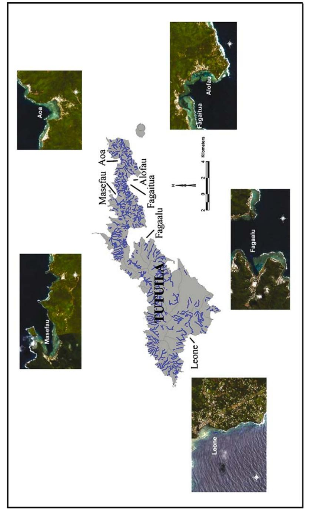
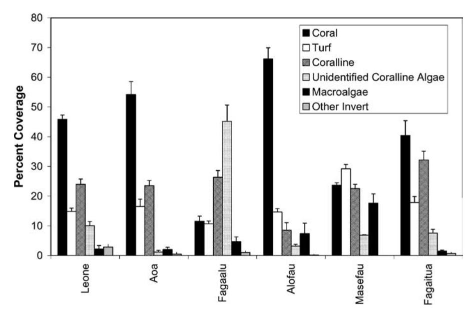
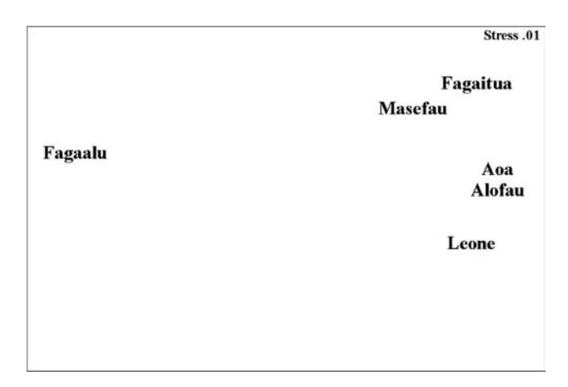
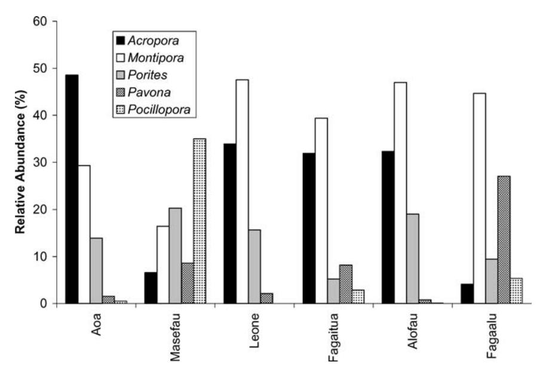
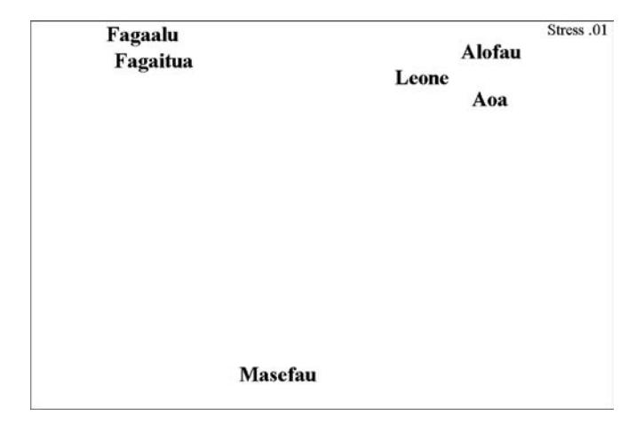
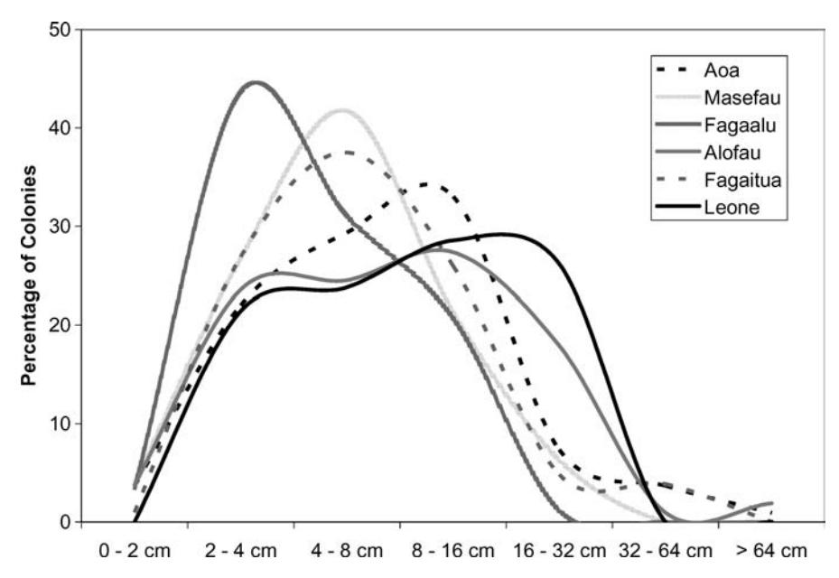

# **ASSESSING THE EFFECTS OF NON-POINT SOURCE POLLUTION ON AMERICAN SAMOA'S CORAL REEF COMMUNITIES**

PETER HOUK1,2,∗, GUY DIDONATO3, JOHN IGUEL1 and ROBERT VAN WOESIK2 1*Commonwealth of the Northern Mariana Islands Division of Environmental Quality, Saipan, MP;* 2*Florida Institute of Technology, Melbourne, Florida, U.S.A.;* 3*American Samoa Environmental Protection Agency, Pago Pago, American Samoa, U.S.A. (* ∗*author for correspondence, e-mail: deq.biologist@saipan.com)*

(Received 20 May 2004; accepted 2 August 2004)

**Abstract.** Surveys were completed on Tutuila Island, American Samoa, to characterize reef development and assess the impacts of non-point source pollution on adjacent coral reefs at six sites. Multivariate analyses of benthic and coral community data found similar modern reef development at three locations; Aoa, Alofau, and Leone. These sites are situated in isolated bays with gentle sloping foundations. Aoa reefs had the highest estimates of crustose coralline algae cover and coral species richness, while Leone and Alofau showed high abundances of macroalgae and *Porites* corals. Aoa has the largest reef flat between watershed discharge and the reef slope, and the lowest human population density. Masefau and Fagaalu have a different geomorphology consisting of cemented staghorn coral fragments and steep slopes, however, benthic and coral communities were not similar. Benthic data suggest Fagaalu is heavily impacted compared with all other sites. Reef communities were assessed as bio-criteria indicators for waterbody health, using the EPA aquatic life use support designations of (1) fully supportive, (2) partially supportive, and (3) non-supportive for aquatic life. All sites resulted in a partially supportive ranking except Fagaalu, which was non-supportive. The results of this rapid assessment based upon relative benthic community measures are less desirable than long-term dataset analyses from monitoring programs, however it fills an important role for regulatory agencies required to report annual waterbody assessments. Future monitoring sites should be established to increase the number of replicates within each geological and physical setting to allow for meaningful comparisons along a gradient of hypothesized pollution levels.

**Keywords:** assessment, coral communities, EPA aquatic life use criteria, monitoring, non-point source pollution

### **1. Introduction**

The goal of coral reef monitoring for the American Samoa Environmental Protection Agency is to detect change over time that may result from land-based anthropogenic disturbances. This initial assessment provides an environmental "snapshot" in time that can be used to understand and evaluate reef communities. Tutuila is the capital and largest island of American Samoa at 134.7 km2. The latest population census (2000) showed 55,876 individuals living on Tutuila, approximately 98% of the entire population. Many of the villages are situated at the bases of watersheds, and most development occurs along the drainage streams due to the preponderance of steep sloping lands. Many watersheds are associated with large bays that are protected from direct oceanic exposure. This protected nature allows for extensive modern coral community development. However, the proximity to watershed stream discharge makes these same communities susceptible to non-point source (NPS) pollution. The greatest contributors to NPS pollution are improper land clearing for development, untreated septic discharges, piggeries, and improper disposal of household refuse. Pollutants associated with these sources have the ability to negatively affect reef communities (Rogers, 1990, Richmond, 1993, Umezawa *et al*., 2002). Despite all of these anthropogenic sources of pollution, residents rely upon these reefs to supplement their diet with protein from the ocean. This paradox suggests that coral reef monitoring would greatly benefit these communities by demonstrating the relationship between NPS pollution and coral reef degradation.

Extensive work has been undertaken throughout American Samoa over the past 15–20 years. Fagatele Bay National Marine Sanctuary has been surveyed several times since 1985 and these data serve to understand coral community dynamics in a relatively natural setting, absent from land-based anthropogenic disturbance (Birkeland *et al.*, 2003; Green *et al.*, 1999). Surveys have also been completed at many locations around Tutuila, Ofu, and Ta'u Islands in 1995 and again in 2002 (Mundy, 1996; Fisk and Birkeland, 2002). These reports explain how coral communities have responded to and recovered from major cyclone disturbances in the early 1990s, climate induced coral bleaching events, and *Acanthaster planci* outbreaks. Many of the above noted studies also included reef-fish assessments and results can be used to determine trends in reef-fish populations over time.

This study differs from previous work because it was designed to assess the impacts of NPS pollution on reef communities around Tutuila Island. Consistent with this goal, sites were selected from six watersheds varying in size and human population density. Four sites had gently sloping reefs adjacent to the watershed, with well cemented reef foundations. Other sites consisted of partially cemented staghorn coral foundations and steep slopes. Besides differences in geomorphology, one site was partially exposed to prevailing ocean swells, while others were sheltered. The geological framework and exposure can influence reef community development (Goreau, 1959; Van Woesik and Done, 1997; Grigg, 1998; Pandolfi *et al*., 1999), and its relationship with NPS pollution.

Another major difference between this and previous work is the type of data collected. Previous work has posed questions regarding the effects of natural disturbances, such as bleaching events and hurricanes, and subsequent recovery. These studies focused on coral community population dynamics (Mundy, 1996; Fisk and Birkeland, 2002; Green *et al*., 1999). The present study collected similar data complemented with benthic community data, including algae abundances. A response component to examine NPS pollution on coral reefs includes the growth of invertebrates, turf, coralline, and macroalgae (Littler and Littler, 1985; Lapointe, 1997; Fabricius and De'ath, 2001). This study represents the start of a long-term effort to understand the links between land use within a watershed and coral reef health. This effort also serves as an assessment of the present conditions in six watersheds around Tutuila Island.

### **2. Methods**

## 2.1. STUDY LOCATION

Monitoring was completed as part of the American Samoa Environmental Protection Agency NPS pollution control program. Data were collected from six locations around Tutuila Island, American Samoa, located at approximately 14◦ S and 170◦ W (Figure 1). These sites were Aoa, Leone, Fagaalu, Fagaitua, Alofau, and Masefau. All locations are associated with watersheds of varying size and human population (Table I). At each site, surveys were completed at a uniform depth of 9–11 m. A hand held GPS unit was used to identify the location (to within 3–5 m) of transect placement, and stored in a GIS. Each monitoring location was chosen based upon availability of homogeneous reef slope habitat on reefs adjacent to selected watersheds.

### 2.2. BENTHIC DATA

Benthic cover was evaluated using a modified video belt transect method (Aronson *et al*., 1994). For each site, video data were collected for three 50 m transects using an underwater digital video camera to record 0.5 × 50 m belts. These videos were analyzed by extracting 60 individual frames per transect (one frame every 5 s). Each individual frame was analyzed by projecting five random dots on the screen and noting the life form under each of the dots. The benthic categories chosen for analysis were corals (to genus level), turf algae (less than 2 cm), macroalgae (greater than 2 cm, to genus level if abundant), coralline algae (genus level if abundant), other invertebrates (grouped together), and sand. Means, standard deviations, and standard errors were calculated based on the three 50 m replicates, with *n* = 300 individual points per transect, *n* = 900 data points per site.

# 2.3. CORAL COMMUNITIES

At each location coral community surveys were completed using the point quadrat technique (Randall *et al*., 1988). Three 50 m transects were placed at a consistent depth of 9 m–11 m. At haphazard intervals a 0.25 m × 0.25 m quadrat was haphazardly tossed to examine coral community composition (*n* = 16). Every coral whose center point lay inside the quadrat was recorded to species level and the maximum diameter and diameter perpendicular to the maximum were measured.

*Figure 1*. A map of Tutuila Island, American Samoa, and degraded satellite images of all reef locations surveyed. Blue lines represent stream discharge. (Includes material c Space Imaging LLC).

TABLE I

|                   |               | size, and number of species encountered |                     |                                          |                                                          | Some characteristics of watersheds associated with coral reef monitoring locations. Coral community measurements of evenness, population density, colony |                                         |                                       |                     |
|-------------------|---------------|-----------------------------------------|---------------------|------------------------------------------|----------------------------------------------------------|----------------------------------------------------------------------------------------------------------------------------------------------------------|-----------------------------------------|---------------------------------------|---------------------|
| Watershed name | (km2) Area | Number of perennial streams       | population Human | density (per km2) population Human | between discharge and channel (m) Reef flat length | evenness (Margalef's Coral community d-statistic)                                                                                                  | density (per m2) population Coral | diameter (cm) geometric Average | richness Species |
| Aoa               | 2.20          | 5                                       | 507                 | 230.5                                    | 404                                                      | 5.20                                                                                                                                                     | 27.3                                    | 11.1                                  | 74                  |
| Masefau           | 3.67          | 4                                       | 435                 | 118.5                                    | 139                                                      | 8.73                                                                                                                                                     | 31.8                                    | 6.8                                   | 68                  |
| Fagaalu           | 2.49          | 1                                       | 1006                | 404.0                                    | 22                                                       | 5.78                                                                                                                                                     | 21.8                                    | 5.7                                   | 50                  |
| Fagaitua          | 1.40          | 4                                       | 483                 | 345.0                                    | 102                                                      | 7.00                                                                                                                                                     | 26.0                                    | 8.4                                   | 64                  |
| Alofau            | 1.33          | 4                                       | 495                 | 372.2                                    | 175                                                      | 4.05                                                                                                                                                     | 26.5                                    | 11.3                                  | 51                  |
| Leone             | 14.69         | 3                                       | 6600                | 449.3                                    | 265                                                      | 6.80                                                                                                                                                     | 21.0                                    | 10.6                                  | 69                  |

These data yielded information regarding percent coverage, relative abundances, population densities, and geometric diameters.

Geometric diameters (*z*) were calculated based upon the geometric formula:

$$z\left(\mathrm{cm}\right) = (xy)^{1/2} \tag{1}$$

where (*x*) and (*y*) are the diameters of each coral colony. Percent coverage (*A*) for each individual species was calculated assuming that the coral colonies were circular using the formula:

$$A (cm^2) = \pi (z/2)^2$$
 (2)

where (*z*) is the geometric diameter from above. Total percent coverage was simply the sum for all species divided by 4.00 m2, the total area surveyed by 16 quadrat tosses. Population density (*D*) was calculated based upon;

$$D \left( \text{colonies/m}^2 \right) = n/4.00 \,\text{m}^2 \tag{3}$$

where *n* is the total number of colonies of any given species.

### 2.4. CORAL DIVERSITY

At each site all scleractinian corals observed were recorded. Coral nomenclature was based upon Veron (2000).

### 2.5. MACROINVERTEBRATES

Macroinvertebrates were counted along three 50 m transect lines at each site within 2 m of either side of the transect line. The macroinvertebrates were identified to genus level.

### 2.6. DATA ANALYSIS

Benthos estimates were calculated from video belt transects and graphed as histograms with standard error bars. The ratio of crustose coralline algae to all other turf and macroalgae were calculated from the benthos estimates. Abundances were used to create a similarity matrix using multivariate statistical software (PrimerR ). This matrix represents relative similarities among sites based upon abundances of all benthic organisms, which was graphically represented using multi-dimensional scaling (MDS) (Clarke and Warwick, 2001). Subsequent SIMPER analysis yielded the percentage contributions (weighting) of each benthic category in the similarity matrix.

Relative abundances of coral species were used to develop a similarity matrix and MDS plot, as described above. Geometric diameter measurements of corals were used to create size frequency distributions. Margalef's *d*-statistic was calculated as a measure of the number of coral species present, making some allowance for the abundance of individuals, or community evenness (Clarke and Warwick, 2001). A high *d*-statistic would suggest that a particular site is not dominated by one, or a few, species.

Correlation analysis was used to explore linear relationships between watershed and reef community characteristics. Correlations were considered significant for relationships at *p* < 0.05.

### **3. Results**

### 3.1. BENTHIC COMMUNITIES

The dominant benthic organisms were live coral, crustose coralline algae (CCA), an unidentified, encrusting coralline algae (not CCA, pending authoritative identification), turf algae, macroalgae, sand, and (other) invertebrates. Coral cover was highest at Leone, Aoa, and Alofau, where relatively large reef flats existed (Figure 2, Table I). Percentages of macroalgae, the unidentified coralline algae, and turf algae were highest at Fagaalu and Masefau (Figure 2).

*Figure 2*. Average percentages of dominant benthos found at survey sites. (bars represent standard errors, *n* = 900 data points per site).

*Figure 3*. Multi-Dimensional Scaling results for benthic data collected using video belt transects.

The MDS results show that Fagaalu is distinct from all other monitoring locations (Stress level = 0.01) (Figure 3). Simper analysis shows that 50% of the variance of these results can be explained by the differences in the abundances of the unidentified coralline algae (15.5%), *Porites* spp. (11.1%), *Acropora* spp. (8.8%), *Montipora* spp. (8.1%), and *Halimeda* spp. (6.4%). Of the remaining 5 sites only Masefau showed affinity with Fagaalu, however, at a much smaller scale (Figure 3).

### 3.2. CORAL COMMUNITIES

At all sites coral cover was dominated by *Montipora*, *Porites*, and *Acropora*, which accounted for greater than 50% of the total coral coverage (Figure 4). Two particularly abundant species were *Montipora grisea* and *Porites rus*, whose dominance resulted in relatively low coral community evenness measurements at Alofau and Aoa (Table I). The MDS results showed similarities between Alofau, Aoa, and Leone, between Fagaalu and Fagaitua, and showed Masefau was relatively unique (Stress level = 0.01) (Figure 5). There were more, large sized coral colonies at Aoa, Alofau, and Leone, distinguishing these sites from others (Table I, Figure 6).

Fagaitua and Fagaalu had similar relative abundances of corals, despite large differences in benthos estimates (Figure 4). Masefau had affinities with this group, but was distinct because of the high abundances of several *Pocillopora* species. Colony size frequency distributions were similar at Fagaalu, Fagaitua, and Masefau (Figure 6) compared with Aoa, Alofau, and Leone. The highest abundance of small sized corals was found at the Fagaalu site.

A total of 120 coral species were recorded from all six sites visited, which represents approximately 30%–40% of the total number found in American Samoa

*Figure 4*. Relative percent coverage of dominant coral genera based upon point quadrat surveys.

*Figure 5*. Multi-Dimensional Scaling results of coral abundance data collected using the point quadrat survey data.

by Green *et al*. (1999) (a species list is available from the corresponding author; only total numbers are presented (Table I)). This is probably due to the uniform 10 m depth used to assess the communities, the short survey period, and the few localities chosen in the present study. Two basic groups were evident, based upon diversity data. Fagaalu and Alofau had a relatively low diversity, approximately 50 species, while others had over 64 species documented.

*Figure 6*. Population frequencies calculated from the point quadrat surveys. Size classes are based upon coral diameters.

### 3.3. CORRELATION ANALYSIS

There was an overall lack of significant correlations between watershed size, human population, and various coral community measurements, suggesting that linear relationships do not describe biotic and abiotic associations, or that none exists. There were significant, negative correlations found between human and coral population density, between human population density and turf algae abundance, and a positive correlation between coral population density and turf algae abundance.

## 3.4. MACROINVERTEBRATES

There were extremely low (less than 1 per 100 m2) abundances of urchins, bivalves, starfish, sea cucumbers, and other macroinvertebrates at all sites examined.

## **4. Discussion**

Benthic data suggests that Fagaalu is heavily impacted by upland pollution when compared with other sites. This is consistent with observations during rainfall events that show sediment rich runoff in stream discharge, which creates a large plume extending over the coral reef. This site is useful because it represents one extreme on the MDS plot (Figure 3), which provides a relative reference for present and future analyses.

Benthic and coral communities were used as biocriteria to place an EPA aquatic life use designation on each waterbody (Appendix 1) (USEPA, 1997). The information provided by this type of rapid assessment is less desirable than data from long-term studies and monitoring programs, however it may fill an important role for regulatory agencies required to submit annual waterbody assessments.

A more thorough assessment of the effects of pollution comes from monitoring change over time at individual sites, or using reference sites in similar environmental settings (Fishelson, 1977; Hughes, 1996; Brown *et al*., 2002). All sites, except Fagaitua, were situated in large bays protected from predominant oceanic swells and winds. At Aoa, Alofau, and Leone, visual observations showed that relatively large reef flats were associated with gentle sloping reefs (approximately 30◦). This setting provides sufficient amounts of benthic substrate to support the growth of large *Acropora cytherea*, *Acropora hyacinthus*, and *Acropora* (*Isopora*) *crateriformis* colonies. Coral community measurements, such as relative abundances, colony sizes, population densities, and species composition, can be used to compare and contrast reef communities in similar settings (Meesters *et al*., 2001; McField *et al*., 2001; Benzoni *et al.*, 2003), and were useful here. Similar relative abundances and colony sizes at Aoa, Alofau, and Leone may be an artifact of their environmental settings. Differences within this group (i.e. to each other) provide insight on the status of present reef communities. Alofau had fewer species and a relatively high abundance of *Porites rus*, which was observed to thrive in leeward bays with close proximity to watershed discharge. Leone also had a high relative abundance and population density of *Porites rus*, as well as high turf and macroalgae abundances that can dominate space on reefs. In contrast, Aoa had the highest number of coral species recorded, a relatively high estimate of community evenness, and a high relative abundance of *Acropora* corals and coralline algae. This apparent "good health" may be a consequence of the large reef flat separating the stream from the reef slope, which may serve to dilute runoff, and the low coastal human population density. Long-term monitoring of these sites will help to elucidate trends and change over time. Previous studies have shown rapid recovery of American Samoa reef communities exposed to bleaching events and *A. planci* outbreaks at sites situated away from anthropogenic disturbance (Green *et al*., 1999). Recovery from natural disturbances, or a lack of, may be an important indication of NPS pollution.

Masefau and Fagaalu had different geomorphology than other sites. These reefs were situated in large channels and consisted of extensive beds of dead staghorn coral on steep slopes (greater than 30◦). These localities are protected from prevailing southwest oceanic swells by an adjacent land mass, Masefau, or a large finger-like reef, Fagaalu (Figure 1). Despite similar environmental settings, the reef communities were different most probably because of the frequent sediment laden run off at Fagaalu. The lack of relationship between overall coral community measures here is presumably due to the extreme situation that exists at Fagaalu.

A unique situation exists for Fagaitua because it is the only site partially exposed to prevailing trade winds and swells. Partial exposure to rough oceanic conditions may reduce the size of coral colonies despite the presence of underlying substrate availability.

Relationships between runoff volume and watershed size, dilution and nutrient uptake and the distance separating discharge and monitoring location, and human population and pollution levels may help to model the effects of NPS pollution. A previous model successfully incorporated runoff volume and human population to estimate the effects of river discharge on coral reefs (West and Van Woesik, 2001). An exponential decay function was used to fit the data, which may explain why simple correlations between watershed and reef characteristics were not significant in the present study.

The present results have implications for other coral reef monitoring programs within American Samoa and other island nations that are addressing issues other than NPS pollution. Comparing fish populations or coral community recovery from two sites differing in underlying reef structure and exposure may increase the chance of type I and type II errors (incorrect rejection and acceptance of the H0, respectively). This further stresses the need for various monitoring programs on island nations to coordinate efforts to understand the environmental characteristics of reefs, as well as modern development, to answer agency specific questions. Future monitoring sites should be established to increase the number of replicates within each set of oceanographic and geological settings to allow for meaningful comparisons along a gradient of hypothesized pollution levels. This will best evaluate the effects of NPS pollution and provide a baseline for long-term coral reef monitoring in American Samoa.

### **Acknowledgments**

Thanks to the American Samoa Environmental Protection Agency, Togipa Tausaga, Director, and the Commonwealth of the Northern Mariana Islands Division of Environmental Quality, John I. Castro, Jr., Director, for funding this project. Support was also provided by EPA Region IX, Carl Goldstein. Special thanks to Peter Peshut and Edna Buchan for their dedication to this project and assistance with field work. Finally, thanks to John Starmer and an anonymous reviewer for essential reviews of various drafts of this manuscript.

### **Appendix 1**

### A1. NUMERICAL ASSESSMENT OF CORAL REEF MONITORING LOCATIONS

# A1.1. *Introduction and Methods*

The following assessment is based on EPA guidance materials which describe acceptable techniques for determining the degree of aquatic life use support based upon bio-criteria assessments (USEPA, 1997, 2002). No EPA criteria exist for the evaluation of coral reefs, however, the existing data evaluation techniques can be logically manipulated to allow for numerical coral reef assessments as described below.

The data collected here represent the highest level of technical components based upon EPA guidance material. All data were collected and analyzed by a professional biologist for interpretation. Two indirect measures of the water quality, or biocriteria, were used to make these assessments: (1) the benthic community, and (2) the coral community (see methods section of report for details). All watersheds assessed in this study have associated villages, and to some degree, discharge anthropogenic pollutants. As a result, there is no true reference site established, if one exists at all. This study was designed to sample sites along a disturbance gradient. A degree of measure was established based upon relative site comparisons (mean and standard deviations) for each variable in question (Table A1).

In this assessment benthos abundance and coral community measures were used as biocritera to assign Aquatic Life Use Support designations to each waterbody. For benthic organisms a ratio of crustose coralline algae (CCA) to all other algae was calculated. Justification comes from studies which show CCA as the preferred substrate for coral settlement, and other turf and macroalgae to increase sediment trapping and inhibit coral survival (Rogers, 1990; Richmond, 1997; Fabricius and De'ath, 2001). Video transect data were used to calculate this ratio.

Coral community surveys were completed independent of benthic data collection. Coral community data were examined by point quadrat surveys and species checklists. Three measurements of the coral community were averaged to quantify the overall integrity of each reef; these were community evenness, species richness, and average colony diameter (Meesters *et al*., 2001; Clarke and Warwick, 2001).

TABLE A1 A description of how relative measures were used to assign appropriate aquatic life use support designations

| Biological community measure                       | Aquatic life use support designation |
|----------------------------------------------------|--------------------------------------|
| Less than one standard deviation below the mean    | 1: not supporting                    |
| Not different from mean                            | 2: partially supporting              |
| Greater than one standard deviation above the mean | 3: fully supporting                  |

TABLE A2 Results from the benthic and coral community data analysis and subsequent rankings based upon relative measures (Table A1). Rankings from

|                | Benthic assessment           |         |                       |         | Coral community assessment |         |                        |         | Coral community         |
|----------------|------------------------------|---------|-----------------------|---------|----------------------------|---------|------------------------|---------|-------------------------|
| Site name      | substrate health Ratio of | Ranking | Community evenness | Ranking | richness Species        | Ranking | colony size Average | Ranking | final rank (average) |
| Leone          | 0.89                         | 2       | 6.80                  | 2       | 69                         | 2       | 10.6                   | 2       | 2                       |
| Aoa            | 1.19                         | 3       | 5.20                  | 2       | 74                         | 3       | 11.1                   | 2       | 2                       |
| Fagaalu        | 0.44                         | 2       | 5.78                  | 2       | 50                         | 1       | 5.7                    | 1       | 1                       |
| Alofau         | 0.34                         | 2       | 4.05                  | 1       | 51                         | 1       | 11.3                   | 3       | 2                       |
| Masefau        | 0.42                         | 2       | 8.73                  | 3       | 68                         | 2       | 6.8                    | 2       | 2                       |
| Fagaitua       | 1.20                         | 3       | 7.00                  | 2       | 64                         | 2       | 8.4                    | 2       | 2                       |
| Average (S.D.) | 0.75 (0.39)                  |         | 6.26 (1.62)           |         | 62.7 (10.0)                |         | 8.9 (2.3)              |         |                         |

#### TABLE A3

Aquatic Life Use Support designations for all sites surveyed. The final rankings were established based upon the EPA (1997) guidance where if benthic or coral communities were nonsupportive the site is classified as 'non-supportive', and both must be fully supportive for classification as 'supportive'. Final coral community rankings were rounded to the nearest whole number, as no intermediate categories exist for ranking (EPA, 1997)

| Site name | Degree of aquatic life use support |
|-----------|------------------------------------|
| Leone     | Partially supporting               |
| Aoa       | Partially supporting               |
| Fagaalu   | Not supporting                     |
| Alofau    | Partially supporting               |
| Masefau   | Partially supporting               |
| Fagaitua  | Partially supporting               |
|           |                                    |

An average is suggested because these measures can be affected by the physical and geological setting of a site, and all three addressed simultaneously serve best to evaluate a reef regardless of its environmental setting.

### A1.2. *Results and Discussion*

The results suggest that only one site, Aoa, is close to being fully supportive (Tables A2 and A3). All sites are partially supportive except Fagaalu, which resulted in a non-supportive ranking. A more detailed discussion of each site is present in the main text. Future surveys should be carried out in other watersheds to increase the sample sizes of the variables measured, and would result in higher confidence placed on the calculated statistics. This would also increase the spatial distribution of water quality classification in American Samoa. In general, the results of this rapid assessment based upon relative measures are less desirable than data analysis from long-term studies and monitoring programs, however it may fill an important role for regulatory agencies required to report annual waterbody assessments.

### **References**

Aronson, R. B., Edmunds, P. J., Precht, W. F., Swanson, D. W. and Levitan, D. R.: 1994, 'Large scale, long-term monitoring of Caribbean coral reefs: Simple, quick, inexpensive techniques', *Atoll Res. Bull.* **42**, 1–19.

Benzoni, F., Bianchi, C. N. and Morri, C.: 2003, 'Coral communities of the northwestern Gulf of Aden (Yemen): Variation in framework building related to environmental factors and biotic conditions', *Coral Reefs* **22**, 475–484.

Birkeland, C. E., Randall, R. H., Green, A. L., Smith, B. and Wilkins, S.: 2003, 'Changes in the Coral Reef Communities of Fagatele Bay NMS and Tutuila Island (American Samoa),

- 1982–1995', *Technical Report*, Fagatele Bay National Marine Sanctuary Series, Pago Pago, American Samoa.
- Brown, B. E., Clarke, K. R. and Warwick, R. M.: 2002, 'Serial patterns of biodiversity change in corals across shallow reef flats in Ko Phuket, Thailand, due to the effects of local (sedimentation) and regional (climate) perturbations', *Mar. Bio.* **141**, 21–29.
- Clarke, K. R. and Warwick, R. M.: 2001, *Change in Marine Communities*: *An Approach to Statistical Analysis and Interpretation*, 2nd ed., PRIMER-E, Plymouth, UK.
- Fabricius, K. and De'ath, G.: 2001, 'Environmental factors associated with the spatial distribution of crustose coralline algae on the Great Barrier Reef', *Coral Reefs* **19**, 303–309.
- Fishelson, L.: 1977, 'Stability and instability of marine ecosystems illustrated by examples from the Red Sea', *Helg. Wiss. Meer.* **30**, 18–29.
- Fisk, D. and Birkeland, C. E.: 2002, 'Status of Coral Communities on the Volcanic Islands of American Samoa', *Technical Report*, Department of Marine and Wildlife Resources, Pago Pago, American Samoa.
- Goreau, T. F.: 1959, 'The ecology of Jamaican coral reefs. I. Species composition and zonation', *Ecology* **40**(1), 67–90.
- Grigg, R. W.: 1998, 'Holocene coral reef accretion in Hawaii: A function of wave exposure and sea level history', *Coral Reefs* **17**(3), 263–272.
- Green, A. L., Birkeland, C. E. and Randall, R. H.: 1999, 'Twenty years of disturbance and change in Fagatele Bay National Marine Sanctuary, American Samoa', *Pacific Sci.* **53**(4), 376–400.
- Hughes, T. P.: 1996, 'Demographic approaches to community dynamics: A coral reef example', *Ecology* **77**(7), 2256–2260.
- Lapointe, B. E.: 1997, 'Nutrient thresholds for bottom-up control of macroalgal blooms on coral reefs in Jamaica and Southeast Florida', *Limn. Ocean.* **42**(5), 1119–1131.
- Littler, M. M. and Littler, D. S.: 1985, 'Factors Controlling Relative Dominance of Primary Producers on Biotic Reefs', in: *Proceedings of the Fifth International Coral Reef Congress*, Tahiti, Vol. 4, pp. 35–40.
- McField, M. D., Hallock, P. and Jaap, W. C.: 2001, 'Multivariate analysis of reef community structure in the Belize Barrier Reef complex', *Bull. Mar. Sci.* **69**(2), 745–758.
- Meesters, E. H., Hilterman, M., Kardinaal, E., Keetman, M., De Vries, M. and Bak, R. P. M.: 2001, 'Colony size–frequency distributions of scleractinian coral populations: Spatial land interspecific variation', *Mar. Eco. Prog. Ser.* **209**, 43–54.
- Mundy, C. A.: 1996, 'Quantitative Survey of the Corals of American Samoa', *Technical Report*, Department of Marine and Wildlife Resources, Pago Pago, American Samoa.
- Pandolfi, J. M., Llewellyn, G. and Jackson, J. B. C.: 1999, 'Pleistocene reef environments, constituent grains, and coral community structure: Curacao, Netherlands Antilles', *Coral Reefs* **18**, 107–122.
- Randall, R. H., Rogers, S. D., Irish, E. E., Wilkins, S. C., Smith, B. D. and Amesbury, S. S.: 1988, 'A Marine Survey of the Obyan-Naftan Reef Area, Saipan, Mariana Islands', *Technical Report*, University of Guam Marine Laboratory, Technical Report 90, Mangilao, Guam.
- Richmond, R. H.: 1993, 'Coral reefs: Present problems and future concerns resulting from anthropogenic disturbance', *Am. Zool.* **33**(6), 524–536.
- Richmond, R. H.: 1997, 'Reproduction and Recruitment in Corals: Critical Links in the Persistence of Reefs', in: C.E. Birkeland (ed.), *Life and Death of Coral Reefs*, Chapman & Hall, New York, pp. 175–197.
- Rogers, C. S.: 1990, 'Responses of coral reefs and reef organisms to sedimentation', *Mar. Ecol. Prog. Ser.* **62**, 185–202.
- Umezawa, Y., Miyajima, T., Kayanne, H. and Koike, I.: 2002, 'Significance of groundwater nitrogen discharge into coral reefs at Ishigaki Island, southwest of Japan', *Coral Reefs* **21**, 346–356.
- U.S. Environmental Protection Agency: 1997, 'Guidelines for Preparation of the Comprehensive State Water Quality Assessments (305(b) Reports) and Electronic Updates', *Technical Report*,

- US Environmental Protection Agency Office of Wetlands, Oceans, and Watersheds, Washington, DC.
- U.S. Environmental Protection Agency: 2002, 'Consolidated Assessment and Listing Methodology, Toward a Compendium of Best Practices', *Technical Report*, 1st ed., US Environmental Protection Agency Office of Wetlands, Oceans, and Watersheds, Washington, DC.
- Van Woesik, R. and Done, T. J.: 1997, 'Coral communities and reef growth in the southern Great Barrier Reef', *Coral Reefs* **16**, 103–115.
- Veron, J. E. N.: 2000, *Corals of the World*, Stafford-Smith, Townsville, Australia.
- West, K. and Van Woesik, R.: 2001, 'Spatial and temporal variance of river discharge on Okinawa (Japan): Inferring the temporal impact on adjacent coral reefs', *Mar. Poll. Bull.* **42**(10), 864–872.