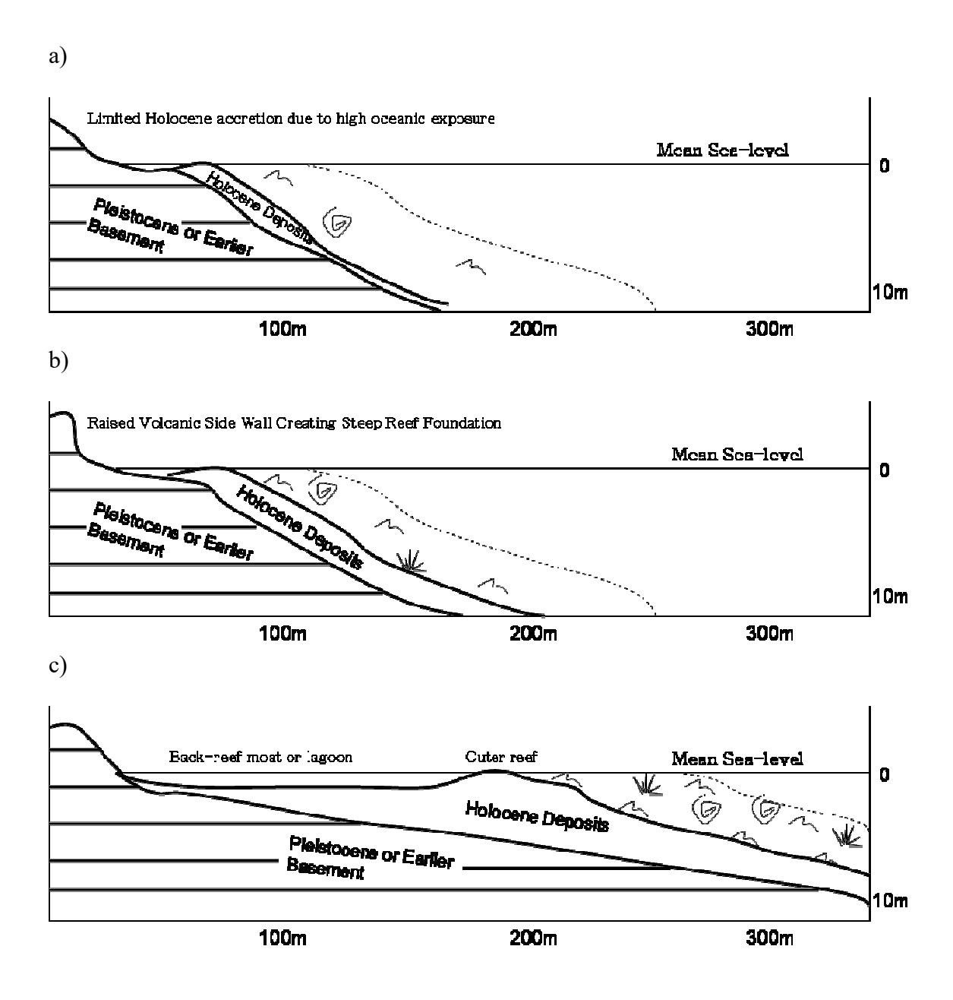
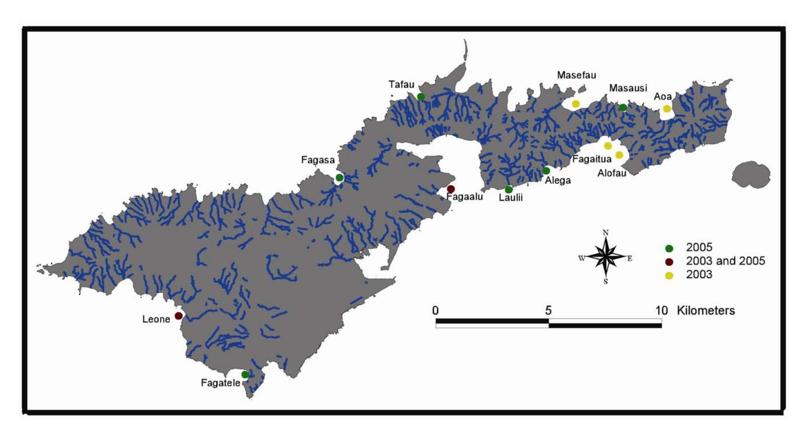
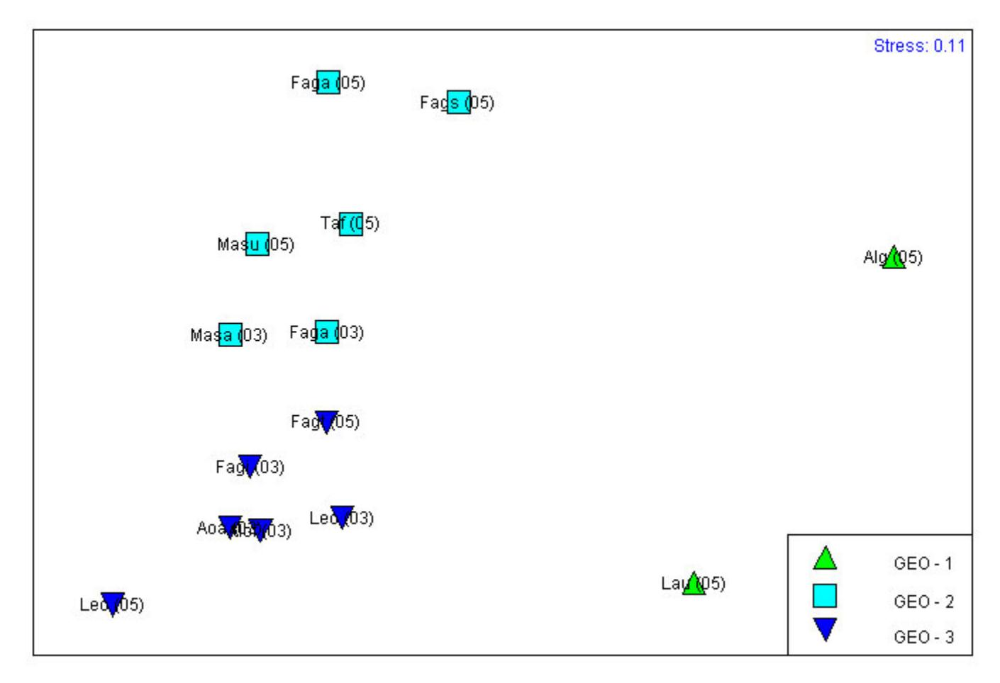
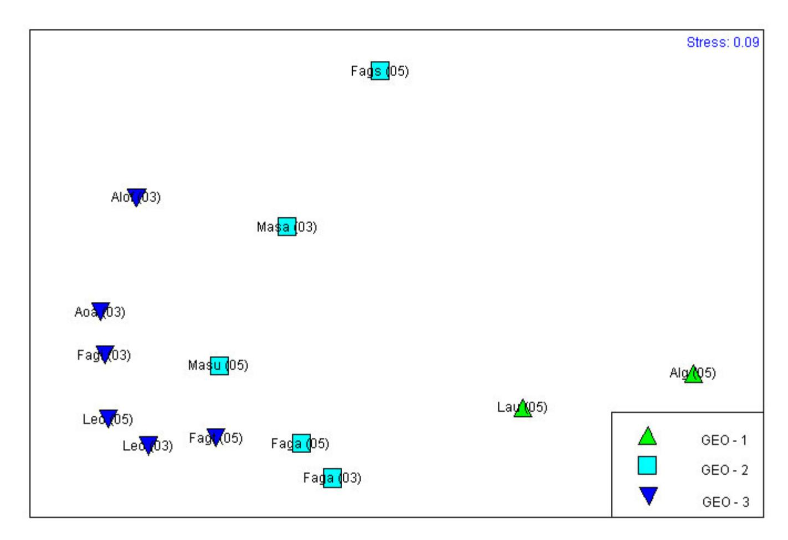
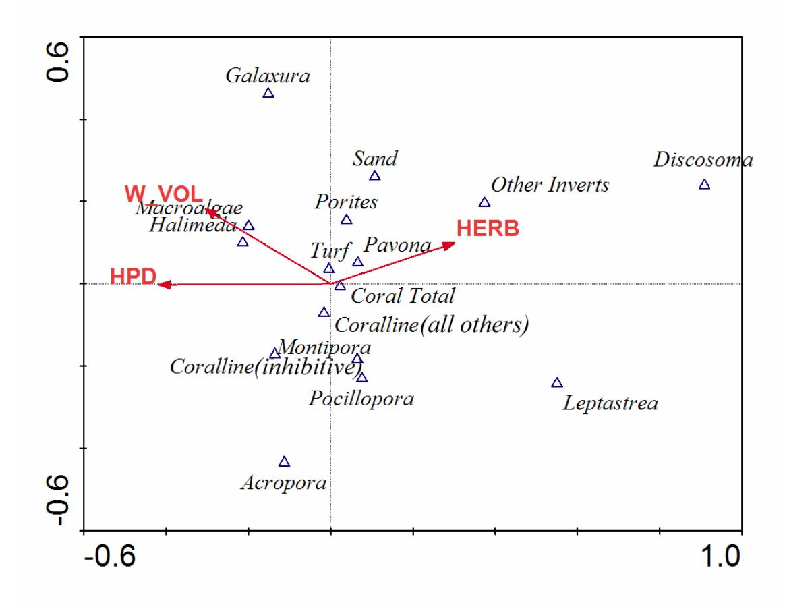
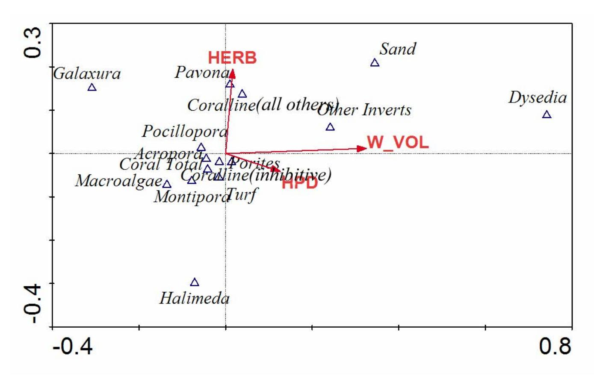

# Assessing the Effects of Non-Point Source Pollution on American Samoa's Coral Reef Communities II

## Peter Houk 1,2\*

1Commonwealth of the Northern Mariana Islands Division of Environmental Quality, Saipan, MP; 2 Florida Institute of Technology, Melbourne, FL

email: deq.biologist@saipan.com

phone: (670) 664-8500

fax: (670) 664-8540

February, 2006

Prepared For

American Samoa Environmental Protection Agency

American Samoa Government

## **Abstract**

Surveys were completed on Tutuila Island, American Samoa, to characterize reef development and assess the impacts of non-point source pollution on adjacent coral reefs at 12 sites. Multivariate analyses of benthic and coral community data found significant differences among sites from three distinct geomorphology classes, suggesting geomorphology is a good predictor of overall coral community structure. Subsequent canonical correspondence and linear correlation analyses within each geomorphology class found significant relationships between human population density, watershed volume, and several biological measures of the coral and benthic community. Four significant measures were selected for their use in reef 'health' assessments; 1) coral diversity per unit area, 2) total coral diversity, 3) coral community evenness, and 4) a benthic substrate ratio. Finally, reef communities were assessed as biocriteria indicators to waterbody health using the EPA Aquatic Life Use Support (ALUS) designations of 1) fully supportive, 2) partially supportive, and 3) non supportive for aquatic life persistence. Tafau and Fagatele had the lowest human population density and the highest biological integrity, representing fully supportive waterbodies for geomorphology class 2 and 3, respectively. Besides the uninhabited watersheds, Aoa, Masausi, and Masefau were also ranked as fully supportive based upon the four selected measures. Only two sites received non supportive rankings, Fagaalu and Fagasa, while all others were partially supportive. This study is the first to establish quantitative, measurable relationships between environmental variables and biological, coral reef measures for American Samoa. The evaluation of causative relationships empowers resource management agencies with the ability to predict future, biological change due to changing environmental variables. Future monitoring should continue to increase the number of replicates within each geomorphology class and also re-visit all existing sites on a regular basis. This will best evaluate the effects of NPS pollution on American Samoa's coral reefs.

*Keywords: assessment, coral communities, multivariate analyses, EPA Aquatic Life Use Criteria, non-point source pollution, monitoring*

## **1. Introduction**

The goal of the American Samoa Environmental Protection Agency (ASEPA) coral reef monitoring program is to carry out long term studies to detect change over time that has resulted from land-based, anthropogenic disturbance. This effort started in 2003 when six watershed-based survey sites were established around Tutuila Island (Houk *et al*., 2005). Here, data from six additional sites are incorporated with the 2003 data to advance our ability to evaluate and predict deleterious effects originating from watershed pollution.

Extensive work has been undertaken throughout American Samoa over the past 15 – 20 years (Birkeland *et al.*, 2003, Green *et al.*, 1999, Mundy, 1996, Fisk and Birkeland, 2002). Houk *et al*. (2005) compare and contrast the goals and survey techniques employed in previous studies compared with the present. In summary, this study differs from previous work because it was designed to assess the impacts of watershed pollution on reef communities around Tutuila island. Consistent with this goal, sites were selected at similar distances (~250 m) from drainage/river discharge. Comparisons with the majority of earlier studies are problematic due to the survey locations and the nature of the datasets collected. Relevant data from previous studies are best suited for the examination of site specific trends over time, a step which follows the present, initial reef characterizations and assessments.

Before attempting to draw relationships between anthropogenic disturbances and coral reef communities it is desirable to account for the inherent variation that results from a reefs geological and oceanographic setting (Houk *et al*., 2005, Goreau, 1959, Van Woesik and Done, 1997, Grigg, 1998, Pandolfi *et al.*, 1999). Three, visually distinct geomorphological 'settings' (referred to as classes herein) exist among the 12 survey locations included in this study (Figure 1a-c, Table 1). Class 1 consists of sites that are most exposed to prevailing oceanic swells and thus have had limited, lateral Holocene accretion (e.g. small reef flats) and formed extremely steep reef slopes with little living coral. Class 2 and 3 are similar in their low oceanic exposure and reef flat development but differ in their bathymetric slope, possibly a consequence of the underlying volcanic bedrock (Table 1). Class 2 consists of reefs that were formed upon the edges of volcanic valleys (relatively steep slopes), while class 3 consists of reefs adjacent to laterally accreting flats, with very gradual slopes. Here, we first investigate the implications that varying geomorphology places upon coral and benthic communities. We then examine relationships between watershed volume, human population density, and reef communities within each class to determine which environmental variables are most influential to modern assemblages.

Interactions between nutrients, coral productivity and growth, and herbivory are often misunderstood despite their significance in designing studies to assess the impacts of non-point source (NPS) pollution on coral reefs. Tomascik and Sander (1985) show that coral growth and productivity have a hump shaped relationship with nutrient input; coral productivity and growth increase with increasing nutrient levels until a maximum rate is

reached, at which time a negative, linear relationship was found with additional nutrient input. Further, the effects that differing herbivory and nutrient levels have upon benthic communities are not similar in nature, and do not offset each other (Smith *et al*., 2001, Lapointe *et al*., 2004). It is thus pertinent to predict that there may be individualistic and/or synergistic effects between biological measures of coral reefs and watershed volume, human population, and herbivory levels in the present study.

## **2. Methods**

### 2.1. Study Location

Monitoring was conducted as part of the American Samoa Environmental Protection Agency NPS pollution control program. Data were collected from 12 locations around Tutuila Island, American Samoa, located at approximately 14° S and 170° W (Figure 2). Sites surveyed in 2003 included Alofau, Aoa, Fagaalu, Fagaitua, Leone, and Masefau, while those surveyed in 2005 include Alega, Fagaalu, Fagasa, Fagatele, Laulii, Leone, Masausi, and Tafau (Figure 2). All survey locations are associated with watersheds of varying size and human population (Table 1). A degree of oceanic exposure was calculated for each site based on the angle of sites exposure relative to the open ocean, and an estimated, relative swell magnitude. Relative swell magnitudes were generated from reviewing NOAA national weather forecast data. The exposure factor is a relative measure defined by the angle of a sites exposure (°) multiplied by an estimated directional magnitude; (4x) for E – NE and E – SE exposure, (3x) for N – NE and S - SE, (2x) for NW – N and SW – S, and (1x) for W – NW and S – SW.

At each site surveys were completed at a uniform depth of 9 – 11 m. A hand held GPS unit was used to identify the location of transect placement and later downloaded into a GIS layer. Each monitoring location was chosen based upon availability of homogeneous reef slope habitat on reefs adjacent to stream discharge (~250 m away) from selected watersheds.

## 2.2. Benthic Data

Benthic cover was evaluated using a modified video belt transect method (Houk and Van Woesik, 2006). For each site, video data were collected for three 50 m transects using an underwater digital video camera to record .5 m x 50 m belts. These videos were analyzed by extracting 60 individual frames per transect (1 frame every 5 seconds). Each individual frame was analyzed by projecting five random dots on the screen and noting the life form under each of the dots. The benthic categories chosen for analysis were corals (to genus level), turf algae (less than 2 cm), macroalgae (greater than 2 cm, to genus level if abundant), coralline algae known to overgrow coral (*Peyssonnelia, Pneophyllum*) (Keats *et al*., 1997, Antonius, 1999, Antonius, 2001), other coralline algae, sand, and other invertebrates (genus level if abundant). Means, standard deviations, and standard errors were calculated based on the three 50 m replicates, with n = 300 individual points per transect, n = 900 data points per site.

## 2.3. Coral Communities

At each location coral communities were examined using the point quadrat technique (Randall *et al.*, 1988). Three 50 m transects were placed at a consistent depth of 10 m – 13 m. At each 15 m interval a 1 m x 1 m quadrat was haphazardly tossed for coral community analysis (n = 8). Surveys conducted in 2003 differed in their smaller quadrat size, .25 m x .25 m, and higher replication (n = 16). Every coral whose center point lay inside the quadrat was recorded to species level and the maximum diameter and diameter perpendicular to the maximum were measured. These data yielded information regarding percent coverage, relative abundances, population densities, and geometric diameters. Geometric diameters (z) were calculated based upon the geometric formula;

$$z (cm) = (xy)^{1/2}$$
 (1)

where (x) and (y) are the diameters of each coral colony. Percent coverage (A) for each individual species was calculated assuming that the coral colonies were circular using the formula;

$$A (cm^2) = \Pi (z/2)^2$$
 (2)

where (z) is the geometric diameter from above. Total percent coverage was simply the sum for all species. Population density (D) was calculated based upon;

 D (colonies/m2 ) = n / 8.00m2 (3)

where n is the total number of colonies of any given species and 8.00m2 represents the total area surveyed by 16 quadrat tosses.

#### 2.4. Coral Diversity

At each site all scleractinian corals observed in the vicinity of the transects were recorded, representing a sites overall diversity. Coral nomenclature was based upon Veron (2000). Coral diversity per unit area represents the number of coral species that were found in the quadrat surveys (8 m2 ). Margalef's d-statistic was calculated as a measure of the number of coral species present, making some allowance for the abundance of individuals, or community evenness (Clarke and Warwick, 2001). This describes how evenly a variable (in this case percent coverage) was distributed throughout the community at any particular site. A high d-statistic suggests that a particular site is not dominated by one, or a few, species.

#### 2.5. Macroinvertebrates

Macroinvertebrates were counted along three 50 m transect lines at each site within 2 m of either side of the transect line. The macroinvertebrates were identified to the genus level.

#### 2.6. Fish

Fish abundances were estimated using 5 replicates of a modified, Bohnsack stationary point count (SPC), with a radius of 7.5 m (Bohnsack and Bannerot, 1986). A pre-printed list served as a guide for these surveys that included key reef species, indicator species, and functional groups (Whaylen and Fenner, 2005). Key reef species are those species targeted and harvested by inshore fishermen in American Samoa and correspond to those in the Department of Marine and Wildlife Resources Creel and Market Survey Program.

Length assessments for selected key reef fish species were recorded and used to derive biomass. Fish biomass estimates were calculated using the length assessments recorded during the 5 SPCs. The biomass was calculated by using the formula W=A\*L^B where W=weight, L= length, and A&B= values generated from slopes of length and weight of each species. One group of fish were not recorded in biomass estimates, the smaller Acanthurids, as their abundances were too high to make individual length estimates.

#### 2.7. Data Analysis

Coral and benthos abundances were used to create a similarity matrix using multivariate statistical software (Primer®). This matrix quantifies the relative similarities among sites based upon coral or benthos abundances. Similarity matrices were graphically interpreted using non-metric, multi-dimensional scaling (MDS) (Clarke and Warwick, 2001). ANOSIM testing was employed to evaluate the relationship between geomorphology classes and coral and benthos community composition. These tests are based upon ranked, species similarity measures between sites belonging to varying geomorphology classes, and yield an R statistic which serves as a measure of class separation. R values can range between -1 and 1; R values near zero suggest that the null hypothesis is true (there is no difference among geomorphology classes), R values substantially higher than .5 suggest a false null hypothesis (e.g. geomorphology classes are different). P values are calculated for each R statistic using a permutated test of random rearrangement of sites in varying geomorphology classes, and comparing the true R value with the generated distribution.

Canonical correspondence analyses (CCA's) were used to test the relationships between environmental variables and the multivariate, coral and benthic community dataset for each geomorphology class (Ter Braak and Prentice, 1988). CCA is an ordination procedure that extracts maximal variance in the community composition data, and relates environmental data to each ordination axis. Eigenvalues for each axis can be viewed as the amount of variance in taxonomic composition that is account for (or extracted) by each. Canonical correlations between environmental variables and species axis can be viewed as regression coefficients, relating an environmental variable to an ordination axis.

Standard correlation analyses were used to explore linear relationships between several, site specific, biological statistics and influential environmental variables, as identified by the CCA's. Site specific, biological statistics included fish biodiversity, herbivore biomass, grazing urchin abundances, branching coral recruits, coral biodiversity, diversity per unit area, average geometric diameter, total population density, community evenness, and a benthic substrate ratio. The benthic substrate ratio was calculated as;

$$BEN_RAT = \frac{\% \text{ cover of (coral + soft coral + all other coralline algae)}}{\text{cover of (macroalgae + turf algae + inhibitive coralline algae)}}$$
(4)

United States Environmental Protection Agency (USEPA) aquatic life use support (ALUS) determinations were calculated using benthic and coral community data (EPA, 1997, 2002). Based upon CCA's and linear correlation results, four biological measures were selected for 'health' assessment and used as biocritera to evaluate water quality. These are coral diversity per unit area, total diversity, community evenness, and the benthic substrate ratio (4). Rankings for each site were made using the following equation;

The overall biocriteria, or reef 'health', score is the average of all biological measures which ranges between 0 (lowest) – 1 (pristine). Final ALUS rankings are based from this average as follows; 0.8 - 1.0 = "fully supportive", 0.6 - 0.8 = "partially supportive", and 0.0 - 0.6 = "not supportive" for aquatic life (EPA, 1997, 2002).

#### 3.0 Results

#### 3.1. Geomorphology

Site geomorphology was a good predictor of overall benthic and coral community composition (ANOSIM R-statistic = .68 and .77 respectively). Pairwise ANOSIM tests between each geomorphology class resulted in high R-statistics, suggesting significant differences in coral communities were a result of a sites geomorphology (Figure 3, Table 2). SIMPER analyses showed that higher abundances of *Lobophyllia* and lower abundances of *Pavona* corals accounted for most of the variance between geomorphology classes 1 and 2, respectively. Lower abundances of both *Montipora* and *Acropora* best distinguish between classes 1 and 3, and lower *Acropora* and higher *Pavona* abundances were best distinguished between classes 2 and 3 (Table 3). Benthic communities showed a similar trend, however, differences between geomorphology classes 2 and 3 were less apparent (Figure 4, Table 2). Higher abundances of soft corals and other invertebrates (grouped), and lower abundances of turf algae accounted for differences between classes 1 and 2, respectively. Lower abundances of *Montipora* corals and macroalgae, and higher amounts of soft corals and other inverts (grouped) distinguished between classes 1

and 3, respectively, while higher abundances of *Montipora* and *Acropora* corals, and lower abundances of inhibitive coralline algae and *Halimeda* best described differences between classes 2 and 3 (Table 3).

#### 3.2. Environmental Variables and Community Composition

A CCA using the three most influential environmental variables explained 38% of the variance in benthic community composition in geomorphology class 2 (Figure 5, p = .08). Only one environmental variable, human population density (HPD), was significantly correlated to the first species axis while no significant relationships were found with the second (Table 4). The CCA shows a significant, negative relationship between "HPD" and canonical axis 1. Further, positive correlations with macroalgae (grouped), *Halimeda*, and inhibitive coralline algae ("coralline (-)", Figure 5), as indicated by the direction of the "HPD" arrow and the position of the benthos groups. Watershed volume (W\_VOL) had a negative correlation with canonical axis 1 and a positive correlation with axis 2, although none were significant at p < .05. Herbivory had a non-significant, positive correlation with axis 2, but because data were only available for 2005 these results should be considered as exploratory.

A similar CCA explained 32% of the variance in benthic community composition in geomorphology class 3 (Figure 6, p = .11). Watershed volume was the only environmental variable that had a significant, positive relationship with canonical axis 1. The CCA suggests its positive relation to abundances of *Dysedia* and other invertebrates (grouped), and negatively relation to corals (total cover) and macroalgae (grouped). Human population density showed a non-significant, positive correlation with axis 1 and herbivory showed a similar trend with axis 2 (Table 4).

CCA's were not conducted for geomorphology class 1 as too few replicate sites exist (n=2). CCA's for coral communities in geomorphology classes 2 and 3 were not significant (p >> .10), suggesting that geomorphology (Figure 3) rather than environmental variables best explain the variance in coral community structure.

#### 3.3. Correlation Analysis

Negative correlations were found between human population density and several site specific, biological measures in geomorphology class 2 (Table 5, Figure 7). Notably, a perfect, negative relationship was found with coral diversity per unit area, while significant, negative relations were found with total coral diversity and community evenness (Figure 6). Watershed volume had strong, negative correlations with both diversity measures and coral community evenness. Both environmental variables showed a negative relationship with the benthic substrate ratio.

Similar trends were found in geomorphology class 3 between biological statistics and environmental variables (Figure 8). Common trends found between watershed volume, human population density, coral diversity per unit area, total diversity, coral community evenness, and the benthic substrate ratio, in both geomorphology classes suggest these

select biological statistics are best suited to evaluate reef 'health' in each geomorphology class, which were selected for use.

Because fish abundance and diversity, coral recruitment, and macroinvertebrate abundance data were only collected in 2005, correlations analyses had to be combined for all geomorphology classes to yield a large enough sample size to evaluate interrelationships among biological statistics (Figure 9). Notably, positive relationships were found between average herbivore abundance, fish diversity, and several coral and benthic community measures.

#### 3.4. ALUS Ranking

Two sites in geomorphology class 3 were classified as "fully supportive" for USEPA's aquatic life use criteria, while all others were "partially supportive" (Table 6). For geomorphology class 2 three sites were "fully" and two "non" supportive. Although rankings were made for Alega and Laulii, geomorphology class 1, the insufficient number of replicate sites resulted in inconclusive findings.

## **4. Discussion**

This study is the first to derive quantitative relationships between watershed volume, human population density, and several measures of the coral and benthic community in American Samoa. The greater success of this study as compared with Houk et al. (2003) is attributed to the increased number of replicate sites within each geomorphology class. The a priori grouping of sites based upon geomorphology reduced much of the inter-site variance in community structure that is a consequence of its geological setting. This allowed for enhanced isolation and testing of pertinent environmental variables. Here, we first discovered significant differences between community structure and geomorphology, providing relevance to the a priori site groupings. Subsequent CCA and linear correlation analyses investigated the amount of variance in biological variables that each environmental variable accounted for. Establishing causative relationships empowers resource management agencies with the ability to predict future, biological change due to a shifting environment. Globally, these results have implications for other coral monitoring programs with similar goals of establishing causative relationships between environmental variables and biological communities.

The abundances of inhibitive coralline algae were positively related to two watershed statistics, human population density and watershed volume. These findings are consistent with a controlled experiment on Hawaiian reefs that showed enhanced nutrient levels significantly increased the abundance of coralline algae (grouped) on experimental tiles, especially where sufficient grazing occurs (Smith et al., 2001). Antonius (1999) showed that *Metapeyssonnelia corallepida*, a Caribbean coralline algae, has the capability of quickly overgrowing live corals. Similar trends were found for *Pneophyllum conicum*, a coralline common to the Pacific Ocean (Antonius, 2001). The latter two studies did not attempt to draw relationships with nutrient levels, however, the present results suggest the dominance of inhibitive coralline algae on many of American Samoa's reefs may be related to elevated human population density (used here as a proxy for nutrient levels). In the present study, CCA's show that human population density had a positive relationship with inhibitive coralline algae in geomorphology class 2 and 3. These results warrant further investigation into nutrient levels, herbivory, coralline, turf, and macroalgae abundance, as traditional views relating enhanced nutrients to increases in macroalgae cover (Littler and Littler, 1985; Lapointe, 1999; Hughes et al., 1999; McCook, 1999; Schaffelke, 1999; Lapointe et al., 2004) may oversimplify a more complex relationship.

The non-significant, positive relationship between watershed volume and human population density suggests that trends between these environmental variables and several biological measures are not unique to either variable, rather they may be additive. Interestingly, all sites that had a non or partially supportive EPA ranking had the highest human population density values despite varying in watershed volume. Future work surveying additional sites that vary in watershed size but have no anthropogenic presence will best evaluate the predictive consequence of individual environmental variables.

In geomorphology class 3 Fagatele and Aoa ranked highest in the overall EPA reef health index, despite a varied ranking in individual measures (Table 6). Observations during the surveys suggested a recent disturbance (dynamite fishing) to the coral communities at Fagatele that resulted in the death, destabilization, and fragmentation of the coral framework. Despite the noted disturbance the overall integrity of Fagatele remains high in comparison to other sites with similar environmental settings (Leone, Alofau, and Fagaitua) due to high rankings in all other measures. This example attests to the benefit of using multiple indices of the coral and benthic community for reef 'health' evaluations. Conversely, Alofau has the greatest impacts from land-based pollution despite having a relatively high % cover of live coral. In contrast with Fagatele, the results suggest that Alofau may be less resilient to future natural disturbances, such as typhoons, that impact live coral cover.

In geomorphology class 2 Tafau received the highest 'health' ranking, consistently for all individual measures. These findings suggest its reference use for the present and future studies. Fagaalu and Fagasa were the only two sites ranked as 'non supportive' for EPA health measures. Both have high human population densities and large watersheds, variables that were negatively correlated with many biological reef statistics (Table 5). Despite Masefau having a very low benthic substrate ratio, a fully supportive ranking was noted. Masefau had high coral diversity and evenness, estimates that may be an artifact of the much larger bay and reef area (Figure 1). A positive relationship between diversity and area is known for coral reefs (Bellwood et al., 2005; Hughes et al., 2002), and diversity among sites in geomorphology class 2 may be limited by area as greater slopes equate to less reef area. Continuous monitoring will best evaluate trends in reef 'health' and provide useful insight to improve reef health measures (indices). The long-term goal for American Samoa Environmental Protection Agency (ASEPA) is to incorporate the most pertinent information while conducting annual waterbody assessments, in an adaptive manner.

While many studies have found relationships between anthropogenic disturbances, poor water quality, macroalgae abundances, and coral decline (Fishelson, 1977; Hughes, 1996; McCook, 1999), this study is novel because it represents a means to developing quantitative, measurable relationships. Managers need sound science to base land use, permitting, and watershed restoration decisions. Reef 'health' measures generated here can be used to establish a management priority list, beneficial for limitations in funding and personnel required to establish and maintain watershed management programs. Future monitoring should continue to increase the number of replicates within each geomorphology class and also re-visit all existing sites on a regular basis to maximize the beneficial use of collected data.

## **Acknowledgements**

Thanks goes to the American Samoa Environmental Protection Agency, Toafa Dr. F.T. Vaiagae, Director, and the CNMI Division of Environmental Quality for their funding and collaboration. Special thanks to all divers who supported data collection efforts including Peter Peshut, Leslie Whaylen, William Kiene, Peter Craig, Edna Buchan, Selaina Vaitautolu, and Pora Toliniu. Finally, thanks to John Starmer for essential reviews of this report.

## **References**

Antonius, A.: 1999, '*Metapeyssonnelia corallepida*, a new coral-killing red alga on Caribbean reefs', *Coral Reefs* 18, 301.

Antonius, A.: 2001, '*Pneophyllum conicum*, a coralline red alga causing coral reef-death in Mauritius', *Coral Reefs* 19, 418.

Bellwood, D.R., Hughes, T.P., Connolly S.R., and Tanner, J.: 2005, 'Environmental and geometric constraints on Indo-Pacific coral biodiversity', *Eco. Lett.* 8, 643-651.

Birkeland, C.E., Randall, R.H., Green, A.L., Smith, B. and Wilkins, S.: 2003, 'Changes in the coral reef communities of Fagatele Bay NMS and Tutuila Island (American Samoa), 1982-1995', *Technical Report*, Fagatele Bay National Marine Sanctuary Series, Pago Pago, American Samoa.

Bohnsack, J.A., and Bannerot, S.P.: 1986, 'A stationary visual census technique for quantatively assessing community structure of coral reef fishes' *NOAA Technical Report*, NMFS 41.

Clarke, K.R. and Warwick, R.M.: 2001, *Change in Marine Communities: An Approach to Statistical Analysis and Interpretation*. 2nd edition, PRIMER-E, Plymouth, UK.

Fishelson, L.: 1977, 'Stability and instability of marine ecosystems illustrated by examples from the Red Sea', *Helg. Wiss. Meer.* 30, 18-29.

Fisk, D. and Birkeland, C.E.: 2002, 'Status of coral communities on the volcanic islands of American Samoa', *Technical Report*, Department of Marine and Wildlife Resources, Pago Pago, American Samoa.

Goreau, T.F.: 1959, 'The ecology of Jamaican coral reefs I. species composition and zonation', *Ecology* 40(1), 67-90.

Grigg, R.W.: 1998, 'Holocene coral reef accretion in Hawaii: a function of wave exposure and sea level history', *Coral Reefs* 17(3), 263-272.

Green, A.L., Birkeland, C.E. and Randall, R.H.: 1999, 'Twenty years of disturbance and change in Fagatele Bay National Marine Sanctuary, American Samoa', *Pac. Sci.* 53(4), 376-400.

Green, A.L., Miller, K., and Mundy, C.: 2005, 'Long term monitoring of Fagatele Bay National Marine Sanctuary, Tutuila Island, American Samoa: results of surveys conducted in 2004, including a re-survey of the historic Aua Transect' *Technical Report*, Department of Commerce, Pago Pago, American Samoa.

- Houk, P., Didonato, G., Iguel, J., and Van Woesik, R.: 2005, 'Assessing the effects of non-point source pollution on American Samoa's coral reef communities', *Env. Mon. Ass.* 107, 11-27.
- Houk, P., and Van Woesik, R.: 2006, 'Coral reef benthic video surveys facilitate long term monitoring in the Commonwealth of the Northern Mariana Islands: toward an optimal sampling strategy', *Pac. Sci.* 60(2), 175-187.
- Hughes, T., Szmant, A.M., Steneck, R., Carpenter, R., and Miller, S.: 1999, 'Algal blooms on coral reefs: what are the causes?' *Limnol. Oceanogr.* 44(6), 1583-86.
- Hughes, T.P., Bellwood, D.R., and Connolly, S.R.: 2002, 'Biodiversity hotspots, centres of endemicity, and the conservation of coral reefs' *Ecol. Lett.* 5, 775-784.
- Keats, D.W., Chamberlain, Y.M., and Baba, B.: 1997, '*Pneophyllum conicum* (Dawson) comb. nov. (Rhodophyta, Corallinaceae), a widespread Indo-Pacific non-geniculate coralline alga that overgrows and kills live coral' *Bot. Mar.* 40, 263-279.
- Lapointe, B.E.: 1999, 'Simultaneous top-down and bottom-up forces control macroalgal blooms on coral reefs (reply to the comment by Hughes et al.)', *Limnol. Oceanogr.* 44(6), 1586-92.
- Lapointe, B.E., Barile, P.J., Yentsch, C.S., Littler, M.M., Littler, D.S., and Kakuk, B.: 2004, 'The relative importance of nutrient enrichment and herbivory on macroalgal communities near Norman's Pond Cay, Exumas Cays, Bahamas: a ''natural'' enrichment experiment', *J. Exp. Mar. Bio. Eco.* 298, 275-301.
- Littler, M.M. and Littler, D.S.: 1985, 'Factors controlling relative dominance of primary producers on biotic reefs', in: *Proceedings of the Fifth International Coral Reef Congress*, Tahiti 4, 35-40.
- McCook, L.J.: 1999, 'Macroalgae, nutrients, and phase-shifts on coral reefs: scientific issues and management consequences for the Great Barrier Reef', *Coral Reefs* 18, 357- 367.
- Mundy, C.A.: 1996, 'Quantitative survey of the corals of American Samoa', *Technical Report*, Department of Marine and Wildlife Resources, Pago Pago, American Samoa.
- Pandolfi, J.M., Llewellyn, G., and Jackson, J.B.C.: 1999, 'Pleistocene reef environments, constituent grains, and coral community structure: Curacao, Netherlands Antilles', *Coral Reefs* 18, 107-122.
- Randall, R.H., Rogers, S.D., Irish, E.E., Wilkins, S.C., Smith, B.D. and Amesbury, S.S.: 1988, 'A marine survey of the Obyan-Naftan reef area, Saipan, Mariana Islands', *Technical Report*, University of Guam Marine Laboratory, Technical Report 90, Mangilao, Guam.

Schaffelke, B.: 1999, 'Short-term nutrient pulses as tools to assess responses of coral reef macroalgae to enhanced nutrient availability', *Mar. Ecol. Prog. Ser.* 182, 305-310.

Smith, J.E., Smith, C.M., and Hunter, C.L.: 2001, 'An experimental analysis of the effects of herbivory and nutrient enrichment on benthic community dynamics on a Hawaiian reef', *Coral Reefs* 19, 332– 342.

Ter Braak, C.J.F., and Prentice, I.C.: 1988, 'A theory of gradient analysis', *Adv. Ecol. Res*. 18, 271-313.

Tomascik, T., and Sander, F.: 1985, 'Effects of eutrophication on reef-building corals. I. Growth rates of the reef-building coral *Montastrea annularis'*, *Mar. Bio.* 87, 143-155.

U.S. Environmental Protection Agency: 1997, 'Guidelines for preparation of the comprehensive state water quality assessments (305(b) Reports) and electronic updates', *Technical Report*, US Environmental Protection Agency Office of Wetlands, Oceans, and Watersheds, Washington, DC.

U.S. Environmental Protection Agency: 2002, 'Consolidated assessment and listing methodology, toward a compendium of best practices', *Technical Report*, 1st edition, US Environmental Protection Agency Office of Wetlands, Oceans, and Watersheds, Washington, DC.

Van Woesik, R., and Done, T.J.: 1997, 'Coral communities and reef growth in the southern Great Barrier Reef', *Coral Reefs* 16, 103-115.

Veron, J.E.N.: 2000, *Corals of the World*, Stafford-Smith, Townsville, Australia.

Whaylen, L., and Fenner, D.: 2005, 'American Samoa Coral Reef Monitoring Plan', *Technical Report*, Department of Marine and Wildlife Resources, Pago Pago, American Samoa.

Figure 1a-c. Profiles of the three geomorphology classes; a) class 1, b) class 2, c) class 3. See text for class descriptions and table 1 for a list of sites within each class. Distances are marked for relative comparisons and do not represent absolute measures. See text for further descriptions of each class.

Figure 2. A map of Tutuila Island with survey locations from 2003 and 2005.

Figure 3. Multi-dimensional scaling diagram showing significant differences in coral community structure based upon site geomorphology (Global R-statistic = .77, Table 2). Site names are as follows: *Faga – Fagaalu, Fags – Fagasa, Alg – Alega, Taf – Tafau, Masu – Masausi, Fagt – Fagatele, Fagi – Fagaitua, Leo – Leone, Lau – Laulii, Alof – Alofau.*

Figure 4. Multi-dimensional scaling diagram showing significant differences in benthic community structure based upon site geomorphology (Global R-statistic = .68, Table 4). One site, Tafau, was removed from this analysis as an outlier based upon a high abundance of *Discosoma* spp., not present at any other site. Site names follow the legend in Figure 3.

Figure 5. Ordination results from a canonical correspondence analysis of dominant benthos abundances in geomorphology class 2 and environmental variables. The analysis explained 38 % of the variance in benthos abundances, 18%, 8%, 3%, and 9% respectively for axis 1-4, with a p-value of .08. Only axis 1 (horizontal) and 2 (vertical) are shown. Human population density volume (HPD) was the only environmental variable that showed a significant relationship (Table 4) with benthos axis 1. Although no significant relationships were found, watershed volume (W\_VOL) and herbivore abundance (HERB) are shown on the graph for exploratory purposes.

Figure 6. Ordination results from a canonical correspondence analysis of dominant benthos abundances in geomorphology class 3 and environmental variables. The analysis explained 32 % of the variance in benthos abundances, 12%, 8%, 6%, and 6% respectively for axis 1-4, with a p-value of .11. Only axis 1 (horizontal) and 2 (vertical) are shown. Watershed volume (W\_Vol) was the only environmental variable that showed a significant relationship (Table 4) with benthos axis 1. Although no significant relationships were found, human population density (HPD) and herbivore abundance (HERB) are shown on the graph for exploratory purposes.

| Correlation Matrix | W_VOL | EXP   | HPD  | Q_DIV | T_DIV | GEO_D | POP_D | EVEN  | BEN_RAT |
|--------------------|-------|-------|------|-------|-------|-------|-------|-------|---------|
| W_VOL              | 1.00  | -0.38 | 0.59 | -0.61 | -0.59 | -0.60 | 0.09  | -0.57 | -0.93   |
| EXP                | -     | 1.00  | 0.41 | -0.38 | -0.07 | -0.34 | -0.08 | -0.30 | 0.02    |
| HPD                | -     | -     | 1.00 | -1.00 | -0.87 | -0.66 | -0.37 | -0.97 | -0.80   |
| Q_DIV              | -     | -     | -    | 1.00  | 0.88  | 0.68  | 0.35  | 0.97  | 0.81    |
| T_DIV              | -     | -     | -    | -     | 1.00  | 0.43  | 0.60  | 0.91  | 0.69    |
| GEO_D              | -     | -     | -    | -     | -     | 1.00  | -0.40 | 0.51  | 0.81    |
| POP_D              | -     | -     | -    | -     | -     | -     | 1.00  | 0.51  | -0.07   |
| EVEN               | -     | -     | -    | -     | -     | -     | -     | 1.00  | 0.73    |
| BEN_RAT            | -     | -     | -    | -     | -     | -     | -     | -     | 1.00    |

Figure 7. Correlation matrix quantifying relationships between environmental variables and biological statistics for sites in geomorphology class 2. Significant relationships (p<.05) are noted in bold, the grey box represents a remarkable, near perfect correlation between HPD and Q\_DIV.  $W_{-}VOL_{-}$  watershed volume,  $EXP_{-}$  oceanic exposure,  $HPD_{-}$  human population density,  $Q_{-}DIV_{-}$  coral diversity per unit area,  $T_{-}DIV_{-}$  total coral diversity,  $EVEN_{-}$  coral community evenness, and  $BEN_{-}RAT_{-}$  benthic substrate ratio.

| Correlation Matrix | W_VOL | EXP  | HPD  | Q_DIV | T_DIV | GEO_D | POP_D | EVEN  | BEN_RAT |
|--------------------|-------|------|------|-------|-------|-------|-------|-------|---------|
| W_VOL              | 1.00  | 0.80 | 0.70 | 0.01  | 0.05  | 0.66  | -0.89 | -0.16 | -0.55   |
| EXP                | -     | 1.00 | 0.96 | -0.24 | -0.42 | 0.64  | -0.69 | -0.41 | -0.31   |
| HPD                | -     | -    | 1.00 | -0.45 | -0.64 | 0.67  | -0.62 | -0.59 | -0.31   |
| Q_DIV              | -     | -    | -    | 1.00  | 0.72  | 0.09  | 0.05  | 0.54  | 0.41    |
| T_DIV              | -     | -    | -    | -     | 1.00  | -0.28 | -0.13 | 0.86  | -0.17   |
| GEO_D              | -     | -    | -    | -     | -     | 1.00  | -0.65 | -0.43 | -0.13   |
| POP_D              | -     | -    | -    | -     | -     | -     | 1.00  | -0.07 | 0.77    |
| EVEN               | -     | -    | -    | -     | -     | -     | -     | 1.00  | -0.22   |
| BEN_RAT            | -     | -    | -    | -     | -     | -     | -     | -     | 1.00    |

Figure 8. Correlation matrix quantifying relationships between environmental variables and biological statistics for sites in geomorphology class 3. Significant relationships (p<.05) are noted in bold. *Variable labels are defined in Figure 6*.

| C l t i M t i o r r e a o n a r x | H E R B | F I S H_ D I V | G_ U R C | 3- D R E C | Q_ D I V | T_ D I V | G E O_ D | P O P_ D | E V E N | B E N_ R A T |
|-----------------------------------------------------------------------------------|------------------|----------------------------------|-------------------|------------------------|-------------------|-------------------|-------------------|-------------------|------------------|-----------------------------|
| H E R B                                                                  | 1. 0 0     | 0. 6 4                     | 0. 0 2      | 0. 6 5           | 0. 6 8      | 0. 2 5      | 0. 2 3      | 0. 6 7      | 0. 6 9     | 0. 4 4                |
| F I S H D I V _                                              | -                | 1. 0 0                     | -0 0 1      | 0. 1 7           | 0. 5 5      | 0. 1 6      | 0. 0 4      | 0. 3 5      | 0. 6 2     | 0. 4 0                |
| G_ C U R                                                                 | -                | -                                | 1. 0 0      | -0 0 5           | -0 2 8      | -0 1 0      | -0 2 1      | 0. 0 2      | -0 2 6     | -0 3 1                |
| 3- D R E C                                                            | -                | -                                | -                 | 1. 0 0           | 0. 7 1      | 0. 3 2      | 0. 4 4      | 0. 4 1      | 0. 6 9     | 0. 6 9                |
| Q_ D I V                                                                 | -                | -                                | -                 | -                      | 1. 0 0      | 0. 6 9      | 0. 5 8      | 0. 7 0      | 0. 9 9     | 0. 8 7                |
| T_ D I V                                                                 | -                | -                                | -                 | -                      | -                 | 1. 0 0      | 0. 1 0      | 0. 8 3      | 0. 7 0     | 0. 7 5                |
| G E O_ D                                                                 | -                | -                                | -                 | -                      | -                 | -                 | 1. 0 0      | -0 0 4      | 0. 4 7     | 0. 4 0                |
| P O P_ D                                                                 | -                | -                                | -                 | -                      | -                 | -                 | -                 | 1. 0 0      | 0. 7 4     | 0. 6 7                |
| E V E N                                                                  | -                | -                                | -                 | -                      | -                 | -                 | -                 | -                 | 1. 0 0     | 0. 8 8                |
| B E N_ R A T                                                       | -                | -                                | -                 | -                      | -                 | -                 | -                 | -                 | -                | 1. 0 0                |

Figure 9. Correlation matrix quantifying relationships between environmental variables and biological statistics for all sites combined. Although undesirable, grouping of all sites was necessary because datasets for HERB, FISH\_DIV, and 3-D REC only exist for 2005 sites. *Variable labels are defined in Figure 6, additionally, HERB – herbivore abundance, FISH\_DIV – total fish diversity, G\_URC – grazing urchin abundance, and 3-D REC – three-dimensional coral recruitment.* 

| W h d t a e r s e N a m e | G l i l e o o g c a S t t i e n g | Y e a r S d r e e u v y | W t h d a e r s e V l o u m e 3 ) ( km | H u m a n P l i t o p u a o n D i t e n s y 2 ) ( km p er | O i c e a n c E p o s r e x u F t a c o r ( ) de g re es |
|---------------------------------------------------------------|-----------------------------------------------------------------------------------|----------------------------------------------------------|-------------------------------------------------------------------------------------------|-----------------------------------------------------------------------------------------------------------------------------------------|----------------------------------------------------------------------------------------------------------------------------------------|
| A l e g a                                         | 1                                                                                 | 2 0 0 5                                         | 0. 4 9                                                                              | 8 4. 2                                                                                                                            | 3 4 5                                                                                                                            |
| A l f o a u                                    | 3                                                                                 | 2 0 0 3                                         | 0. 4 0                                                                              | 3 7 2. 2                                                                                                                       | 1 0 5                                                                                                                            |
| A o a                                                   | 3                                                                                 | 2 0 0 3                                         | 0. 9 2                                                                              | 2 3 0. 5                                                                                                                       | 1 0 5                                                                                                                            |
| F l a g a a u                               | 2                                                                                 | 2 0 0 3 d 2 0 0 5 an          | 1. 4 7                                                                              | 4 0 4                                                                                                                             | 1 6 5                                                                                                                            |
| F i t a g a u a                          | 3                                                                                 | 2 0 0 3                                         | 0. 4 7                                                                              | 3 4 5                                                                                                                             | 1 2 0                                                                                                                            |
| F a g a s a                                    | 2                                                                                 | 2 0 0 5                                         | 2. 2 6                                                                              | 2 5 7. 5                                                                                                                       | 1 5                                                                                                                                 |
| F l t a g a e e                          | 3                                                                                 | 2 0 0 5                                         | 0. 0 5                                                                              | 1                                                                                                                                       | 6 7. 5                                                                                                                           |
| L l i i a u                                    | 1                                                                                 | 2 0 0 5                                         | 1. 2 4                                                                              | 6 5 4. 1                                                                                                                       | 4 0 5                                                                                                                            |
| L e o n e                                         | 3                                                                                 | 2 0 0 3 d 2 0 0 5 an          | 3. 1 7                                                                              | 4 4 9. 3                                                                                                                       | 1 4 5                                                                                                                            |
| M f a s e a u                               | 2                                                                                 | 2 0 0 3                                         | 1. 5 4                                                                              | 1 1 8. 5                                                                                                                       | 6 0                                                                                                                                 |
| M i a s a u s                               | 2                                                                                 | 2 0 0 5                                         | 0. 2 1                                                                              | 1 2 3. 6                                                                                                                       | 1 0 4                                                                                                                            |
| T f a a u                                         | 2                                                                                 | 2 0 0 5                                         | 0. 3 9                                                                              | 1                                                                                                                                       | 0 5                                                                                                                                 |

Table 1. Watershed and environmental statistics for each site.

|                                                               | C l C i t o r a o m m u n y ( G lo ba l R 7 7 ) = |              |              | B h i C i t t e n c o m m u n y ( G lo ba l R 6 8 ) = |              |              |  |
|---------------------------------------------------------------|------------------------------------------------------------------------------------------------------------------------|--------------|--------------|----------------------------------------------------------------------------------------------------------------------------------|--------------|--------------|--|
| G h l e o m o r p o o g y | 1                                                                                                                      | 2            | 3            | 1                                                                                                                                | 2            | 3            |  |
| 1                                                             |                                                                                                                        | 0. 9 4 | 0. 9 4 |                                                                                                                                  | 0. 9 9 | 0. 8      |  |
| 2                                                             |                                                                                                                        |              | 0. 6 9 |                                                                                                                                  |              | 0. 4 9 |  |
| 3                                                             |                                                                                                                        |              |              |                                                                                                                                  |              |              |  |

Table 2. ANOSIM results describing the differences between coral and benthic communities situated in various geomorphology classes.

| G h l e o m o r p o o g y C l a s s C i o m p a r s o n s | C l G B h G t o r a e n u s o r e n o s r o u p ( % f i l i d b S I M P E R l i ) o v a r a n c e e x p a n e y a n a y s s |  |  |  |  |  |  |
|-----------------------------------------------------------------------------------------------------------------------------------------------|--------------------------------------------------------------------------------------------------------------------------------------------------------------------------------------------------------------------------------------------------------------------------------------------------------------------|--|--|--|--|--|--|
| Co l Su ra rv ey s                                                                                                          |                                                                                                                                                                                                                                                                                                                    |  |  |  |  |  |  |
| 1 v 2 s                                                                                                                                 | Lo bo hy l l ia ( 3 3. 1 % ), Pa ( 2 8. 6 % ) p vo na                                                                                                                                                                                               |  |  |  |  |  |  |
| 1 v 3 s                                                                                                                                 | M ip ( 2 0. % ), Ac ( 1 9. 3 % ) t 5 on or a ro p or a                                                                                                                                                                                           |  |  |  |  |  |  |
| 2 3 vs                                                                                                                                  | Ac ( 3 4 % ), Pa ( 2 8 % ) ro p or a vo na                                                                                                                                                                                                                      |  |  |  |  |  |  |
| Be t h ic Su n rv ey s                                                                                                |                                                                                                                                                                                                                                                                                                                    |  |  |  |  |  |  |
| 1 v 2 s                                                                                                                                 | So f t Co ls d ( 1 1. 3 % ), O t he Inv ts to ta l ( 1 1. 2 % ), Tu f A lg ( 9. 8 % ) ra - g ro up e r er r ae -                                                               |  |  |  |  |  |  |
| 1 v 3 s                                                                                                                                 | M t ip ( 1 0. 3 % ), So f Co ls d ( 8. 5 % ), O he Inv l ( 7. 7 % ), Ma lg ( 6. 2 % ) t t ts to ta on or a ra - g ro up e r er cr oa ae -           |  |  |  |  |  |  |
| 2 3 vs                                                                                                                                  | ( % ), Cr Co ( % ), ( % ), ( % ) M t ip 8. 3 No to l l ine 7. 5 Ha l im da 7. 2 Ac 7. 1 on or a ro p or a n- us se ra s e                                             |  |  |  |  |  |  |

Table 3. SIMPER analysis results showing the amount of variance accounted for by each benthos in pairwise ANOSIM tests (Table 2). Only benthos that accounted for the top 30% of the variance are included.

|                           | Environ | Environmental Variables |      |  |  |  |  |  |
|---------------------------|---------|-------------------------|------|--|--|--|--|--|
|                           | W_VOL   | HPD                     | HERB |  |  |  |  |  |
| Geomorphology 'Setting 2' |         |                         |      |  |  |  |  |  |
| Axis 1                    | -0.71   | -0.96                   | 0.69 |  |  |  |  |  |
| Axis 2                    | 0.61    | -0.02                   | 0.33 |  |  |  |  |  |
| Geomorphology 'Setting 3' |         |                         |      |  |  |  |  |  |
| Axis 1                    | 0.93    | 0.36                    | 0.05 |  |  |  |  |  |
| Axis 2                    | -0.03   | -0.02                   | 0.62 |  |  |  |  |  |

Table 4. Canonical correlation coefficients ( $r^2$  values) quantifying the relationship between environmental variables and species axis 1 and 2 in Figure X and Y.  $W\_VOL$  – watershed volume, HPD – human population density, HERB – herbivore abundance

| W he d te a rs Na m e (ye ed) ar sur vey | F is h D ive i ty rs (c he ckl ist) | Av er ag e f B iom as s o He b ivo r ro us F is h 2 ) (g /m | # f Av er ag e o Gr ing Ur h ins az c 2 ) ( # p 100 er m | Br h ing an c Co l ra Re i ts cr u ( # 2 ) r 1 5 m pe | Co l ra D ive i ty rs (qu adr at s) sur vey | Co l ra D ive i ty rs (c he ckl ist) | Av er ag e Ge tr ic om e D iam te e r (cm ) | Co l ra Po la t ion p u De i ty ns 2 ) ( # p 8 m er | Co l ra Co i ty m m un Ev en ne ss ( Ma lef 's D rga  sta tist ic) | Be t h ic Ra t io n (se e te xt f or des crip tion ) |
|---------------------------------------------------------------------------------|----------------------------------------------------------------------|-------------------------------------------------------------------------------------------------------------------------|-------------------------------------------------------------------------------------------------------------------|-------------------------------------------------------------------------------------------------------------|------------------------------------------------------------------------------------|-----------------------------------------------------------------------|------------------------------------------------------------------------------------------|--------------------------------------------------------------------------------------------------------|-----------------------------------------------------------------------------------------------------------------------------------|---------------------------------------------------------------------------------------------------|
| ( ) Ale 05 g a                                                   | 96                                                                   | 10. 41                                                                                                               | 0.0 0                                                                                                          | 0.1 3                                                                                                    | 14                                                                                 | 50                                                                    | 6.7 5                                                                                 | 8.5 0                                                                                               | 1.4 9                                                                                                                          | 0.7 8                                                                                          |
| Alo fau ( 0 3 )                                                  | dat no a                                                       | dat no a                                                                                                          | 0.0 8                                                                                                          | dat no a                                                                                              | 18                                                                                 | 51                                                                    | 11. 25                                                                                | 26. 50                                                                                              | 1.6 7                                                                                                                          | 2.9 7                                                                                          |
| Ao ( 0 3 ) a                                                     | dat no a                                                       | dat no a                                                                                                          | 0.0 0                                                                                                          | dat no a                                                                                              | 37                                                                                 | 75                                                                    | 11. 07                                                                                | 27. 25                                                                                              | 2.3 0                                                                                                                          | 3.9 7                                                                                          |
| Fa lu ( 0 3 ) g aa                                         | dat no a                                                       | dat no a                                                                                                          | 9.6 7                                                                                                          | dat no a                                                                                              | 15                                                                                 | 50                                                                    | 5.6 8                                                                                 | 21. 75                                                                                              | 1.7 4                                                                                                                          | 0.6 2                                                                                          |
| Fa lu ( 05 ) g aa                                             | 86                                                                   | 17. 93                                                                                                               | 2.3 3                                                                                                          | 0.0 7                                                                                                    | 16                                                                                 | 53                                                                    | 8.0 3                                                                                 | 13. 75                                                                                              | 1.6 6                                                                                                                          | 0.7 2                                                                                          |
| ( 0 3 ) Fa itu g a a                                    | dat no a                                                       | dat no a                                                                                                          | 0.5 0                                                                                                          | dat no a                                                                                              | 22                                                                                 | 65                                                                    | 8.4 1                                                                                 | 26. 00                                                                                              | 2.4 8                                                                                                                          | 2.7 3                                                                                          |
| Fa ( 05 ) g as a                                              | 98                                                                   | 27. 16                                                                                                               | 0.0 0                                                                                                          | 0.0 0                                                                                                    | 21                                                                                 | 49                                                                    | 8.4 8                                                                                 | 15. 88                                                                                              | 2.0 6                                                                                                                          | 0.6 1                                                                                          |
| Fa ate le ( 05 ) g                                            | 99                                                                   | 26. 22                                                                                                               | 0.0 0                                                                                                          | 0.3 3                                                                                                    | 29                                                                                 | 88                                                                    | 7.9 1                                                                                 | 26. 75                                                                                              | 2.8 1                                                                                                                          | 2.4 9                                                                                          |
| ( ) La lii 05 u                                                  | 98                                                                   | 25. 01                                                                                                               | 0.0 0                                                                                                          | 0.4 7                                                                                                    | 24                                                                                 | 42                                                                    | 12. 10                                                                                | 10. 63                                                                                              | 2.2 2                                                                                                                          | 1.6 4                                                                                          |
| Le ( 0 3 ) on e                                               | dat no a                                                       | dat no a                                                                                                          | 0.0 0                                                                                                          | dat no a                                                                                              | 23                                                                                 | 68                                                                    | 10. 58                                                                                | 21. 00                                                                                              | 1.9 4                                                                                                                          | 2.3 4                                                                                          |
| Le ( 05 ) on e                                                   | 82                                                                   | 16. 26                                                                                                               | 0.0 0                                                                                                          | 0.2 0                                                                                                    | 28                                                                                 | 76                                                                    | 12. 93                                                                                | 15. 13                                                                                              | 2.5 2                                                                                                                          | 1.7 4                                                                                          |
| fau ( ) Ma 0 3 se                                             | dat no a                                                       | dat no a                                                                                                          | 0.3 3                                                                                                          | dat no a                                                                                              | 27                                                                                 | 69                                                                    | 6.7 5                                                                                 | 31. 75                                                                                              | 2.9 4                                                                                                                          | 0.8 6                                                                                          |
| Ma i ( 05 ) sa us                                             | 128                                                                  | 21. 40                                                                                                               | 0.1 7                                                                                                          | 0.2 7                                                                                                    | 27                                                                                 | 60                                                                    | 9.6 0                                                                                 | 14. 13                                                                                              | 2.7 2                                                                                                                          | 1.8 2                                                                                          |
| Ta fau ( 05 )                                                       | 145                                                                  | 34. 71                                                                                                               | 0.9 1                                                                                                          | 0.7 3                                                                                                    | 32                                                                                 | 72                                                                    | 10. 49                                                                                | 22. 25                                                                                              | 2.9 9                                                                                                                          | 1.9 7                                                                                          |

Table 5. Biological statistics for each site.

| Site     | Geomorphology | Diversity per Unit Area | Total Diversity | Evenness | Benthic Substrate Ratio | Overall Average | ALUS Ranking |
|----------|---------------|----------------------------|--------------------|----------|----------------------------|--------------------|-----------------|
| Alega    | 1             | 0.58                       | 1.00               | 0.67     | 0.47                       | 0.68               | Partially *     |
| Laulii   | 1             | 1.00                       | 0.84               | 1.00     | 1.00                       | 0.96               | Fully *         |
| Fagaalu  | 2             | 0.47                       | 0.69               | 0.58     | 0.32                       | 0.52               | Not             |
| Fagaalu  | 2             | 0.50                       | 0.74               | 0.56     | 0.37                       | 0.54               | Not             |
| Fagasa   | 2             | 0.66                       | 0.68               | 0.69     | 0.31                       | 0.58               | Not             |
| Masefau  | 2             | 0.84                       | 0.96               | 0.98     | 0.44                       | 0.81               | Fully           |
| Masausi  | 2             | 0.84                       | 0.83               | 0.91     | 0.92                       | 0.88               | Fully           |
| Tafau    | 2             | 1.00                       | 1.00               | 1.00     | 1.00                       | 1.00               | Fully           |
| Alofau   | 3             | 0.49                       | 0.58               | 0.59     | 0.75                       | 0.60               | Partially       |
| Aoa      | 3             | 1.00                       | 0.85               | 0.82     | 1.00                       | 0.92               | Fully           |
| Fagaitua | 3             | 0.59                       | 0.74               | 0.88     | 0.69                       | 0.73               | Partially       |
| Fagatele | 3             | 0.78                       | 1.00               | 1.00     | 0.63                       | 0.85               | Fully           |
| Leone    | 3             | 0.62                       | 0.77               | 0.69     | 0.59                       | 0.67               | Partially       |
| Leone    | 3             | 0.76                       | 0.86               | 0.90     | 0.44                       | 0.74               | Partially       |

Table 6. Individual and combined (**bold**) EPA aquatic life use support rankings. \*Rankings for sites within geomorphology class 1 should not be considered valid because there were too few replicate sites in class 1 to establish relative measures.