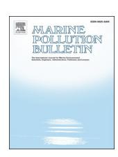
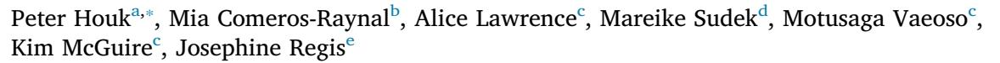
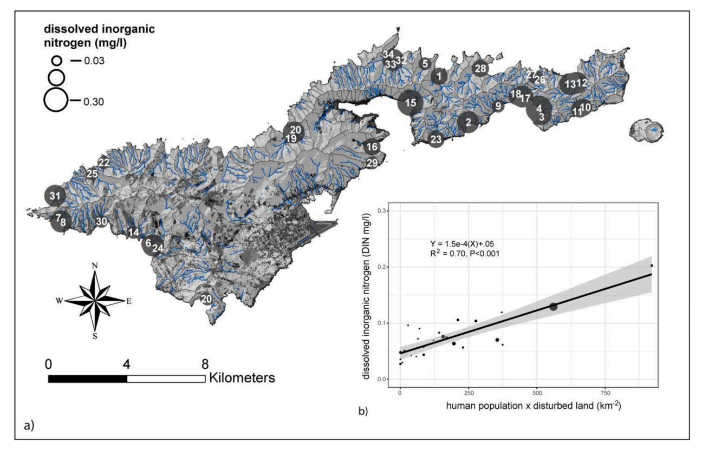
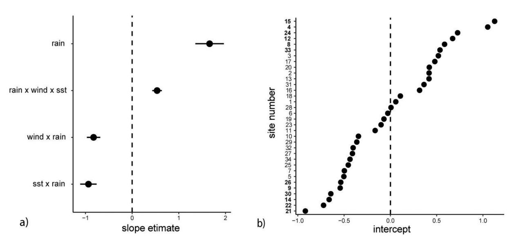
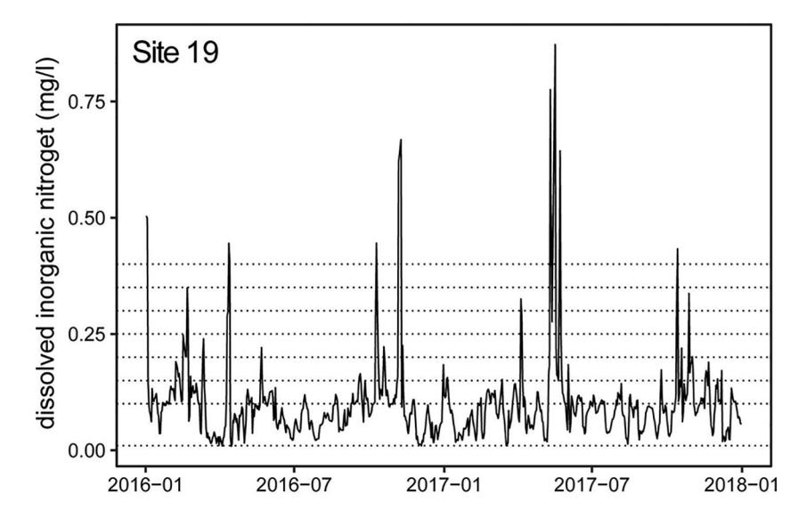
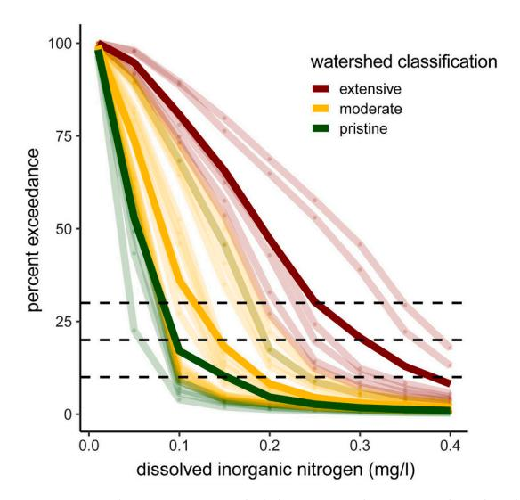
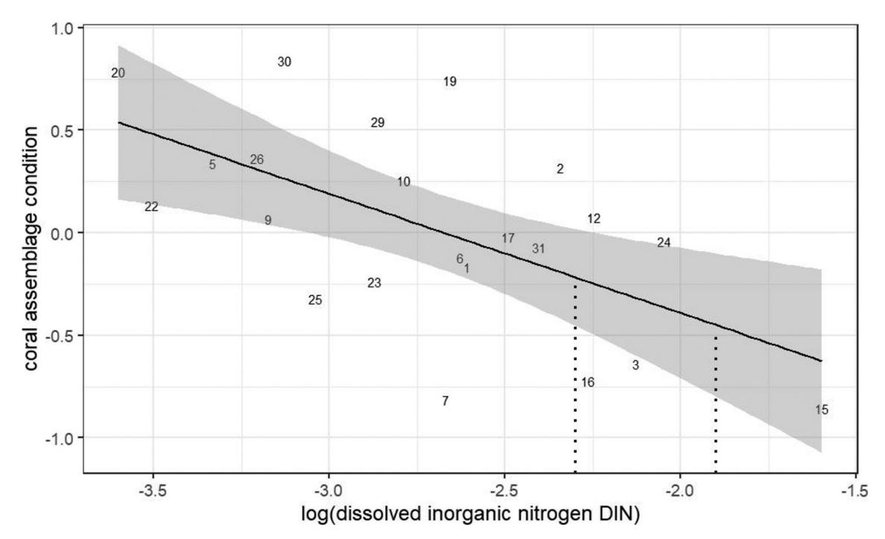

ELSEVIER

Contents lists available at ScienceDirect

## Marine Pollution Bulletin

journal homepage: www.elsevier.com/locate/marpolbul

# Nutrient thresholds to protect water quality and coral reefs

- a University of Guam Marine Laboratory, UOG Station, Mangilao, GU 96923, USA
- b Arc Centre of Excellence for Coral Reef Studies, James Cook University, Townsville, QLD 4811, Australia
- c Coral Reef Advisory Group, Department of Marine and Wildlife Resources, Pago Pago, AS 96799, American Samoa
- d National Marine Sanctuary of American Samoa, Pago Pago, AS 96799, American Samoa
- e American Samoa Environmental Protection Agency, Pago Pago, AS 96799, American Samoa

#### Keywords: Total maximum daily loads Water-quality standards Dissolved inorganic nitrogen Coral reefs Mixed-regression modeling

#### ABSTRACT

Establishing nutrient thresholds to protect coral reefs is difficult because water quality is dynamic and shifts with many environmental factors. We examined the contribution of natural and human factors in predicting water quality at the base of 34 streams on a high tropical Pacific island. Mixed regression models revealed that rainfall, sea-surface temperature, and windspeed were fixed factors predicting dissolved inorganic nitrogen (DIN) concentrations at the base of all watersheds. In contrast, human influences were captured as random components of variation associated with site-based differences. The novel modeling approach using temporal and spatial data provided daily-loading simulations that were used to evaluate exceedance criteria, defined as the percent of time each watershed exceeded a suite of DIN thresholds. Exceedance criteria were considered alongside biological data to recommend a  $0.1 \text{ to } 0.15 \text{ mg l}^{-1}$  benchmark to protect coastal water quality and coral reefs surrounding Tutuila, American Samoa.

## 1. Introduction

Poor water quality can impact coral reefs directly and indirectly through a variety of processes, ultimately diminishing their ability to withstand and recover from disturbance cycles (Houk et al., 2010; Lapointe, 1997; Maynard et al., 2015; Wiedenmann et al., 2013; Wooldridge and Done, 2009). Yet, developing nutrient thresholds to protect coral reefs is difficult because water quality is dynamic and shifts with many environmental factors such as temperature, tide, rainfall, light, and surface flow (Fabricius et al., 2012; Lapointe, 1997; Paytan et al., 2006). One ideal approach is to (i) collect timeseries data from each waterbody across all relevant seasonal cycles, (ii) derive a relationship between nutrient concentrations and their percentages of exceedance (i.e., what % of time did any particular waterbody exceed any particular concentration?), (iii) evaluate exceedance thresholds with respect to the integrity of biological assemblages, and (iv) consult with stakeholders to recommend regulations based upon mutual interpretations of available data (Moss et al., 2005). However, timeseries data for both water quality and biological assemblages are expensive to collect and there are many specific locations across many island nations that require data to develop appropriate thresholds. Given these limitations, many efforts have relied upon shorter-term and less-expensive studies that relate water-quality gradients across several waterbodies (or sites) to undesirable changes in reef assemblages or coral organisms in order to define thresholds (Cooper et al., 2009; Fabricius et al., 2012; Lapointe, 1997). This approach can link individual water-quality parameters to undesirable ecological change, and if calibrated with watershed data such as human population or land use that are usually accessible, can be extended to entire regions or islands (Comeros-Raynal et al., 2019; Houk et al., 2010; Oliver et al., 2011). However, this simplified approach assumes that natural factors driving water quality across differing waterbodies are similar, and that human influences are the drivers of any differences. This assumption has rarely been examined and represents one of the remaining challenges in establishing relevant water-quality criteria that we approach in the present study.

Another challenge in establishing water-quality criteria for coralreef protection is deciding what parameter(s) to use. Studies have focused on basic parameters that characterize stream discharge to the coasts (e.g., pH, dissolved oxygen, salinity, conductivity, temperature, turbidity, nitrogen in various forms, and phosphorous in various forms) (Comeros-Raynal et al., 2019; Lapointe, 1997; Moss et al., 2005). These parameters serve as useful regulatory guidelines because they are related with the condition of reef assemblages, and related with human

E-mail address: houkp@triton.uog.edu (P. Houk).

\* Corresponding author.

*P. Houk, et al. Marine Pollution Bulletin 159 (2020) 111451*

influences in watersheds such as septic systems and land alteration. Yet, gathering enough data to establish these linkages is costly for all parameters, and some form of triage is often used to select which parameters to examine. For instance, technical and logistical constraints required that the present study focus on nitrogen constituents that together contribute most to dissolved inorganic nitrogen being delivered from the watersheds to the reefs (e.g., nitrate, ammonia, and nitrite).

Dissolved inorganic nitrogen (DIN) has a long history of examination with respect to watershed characteristics and coral-reef assemblages ([Comeros-Raynal et al., 2019](#page-6-9); [Fabricius et al., 2005](#page-6-11); [Lapointe,](#page-6-1) [1997;](#page-6-1) [Paytan et al., 2006](#page-6-6)). DIN has been related to the occurrence of macroalgal blooms in Florida, coral biodiversity in Australia, and the abundance of favorable crustose corralling algal substrates for coral settlement in American Samoa [\(Comeros-Raynal et al., 2019;](#page-6-9) [De'ath](#page-6-12) [and Fabricius, 2010;](#page-6-12) [Houk et al., 2010](#page-6-0); [Lapointe, 1997\)](#page-6-1). While compelling relationships exist between DIN, watershed characteristics, and reef assemblages, studies have cautioned that establishing thresholds with only one constituent may be context dependent because nutrient stoichiometry may reveal changing thresholds depending upon the concentrations of other limiting nutrients (i.e., the combined importance of carbon, nitrogen, and phosphorous or C:N:P) [\(Lapointe](#page-6-13) [et al., 2005](#page-6-13)). Despite the potential for added complexities, the present study builds upon standard relationships between DIN, watershed characteristics, and reef assemblages to establish a transparent and repeatable process for defining thresholds to protect coral reefs.

Here, we first ask whether similar environmental factors predicted DIN loading to coastal streams associated with timeseries data from 34 watersheds in American Samoa. By employing a mixed-modeling approach, we separated the roles of natural environmental factors, such as rainfall and sea-surface temperature, versus human factors, such as development and population in the watersheds. The results allowed for customized simulations of daily DIN discharge for each study watershed over the past two years. These simulations were used to derive nutrient concentrations associated with commonly-used DIN exceedances (10%, 20%, and 30%) and associated with biological data summarizing the condition of coral assemblages. In sum, our study (i) offered a new and transparent process to separate the influences of natural and human factors in driving DIN concentrations, (ii) related DIN to reef assemblages, and (iii) provided guidance to improve the legislative framework for setting water quality standards on tropical islands.

## **2. Materials and methods**

The present study was conducted on Tutuila, American Samoa, the capital and main populated island of the United States territory. Tutuila is a high island dominated by secondary vegetation. However, growing human footprints continue to clear land for new housing and development. The American Samoa Environmental Protection Agency is responsible for protecting stream and coastal water quality and regularly revisits their permitting and discharge regulations to adapt and improve their regulatory oversight. We examined 34 watersheds that represented a gradient of pristine-to-high human influence around the island. These watersheds have previously been classified in accordance with their human population levels as pristine, moderate, or extensive ([DiDonato, 2004;](#page-6-14) [Tuitele et al., 2016\)](#page-6-15). Our goals were to revisit the watershed classification system given new datasets and analyses, and most importantly, examine both natural and human drivers of stream water quality to provide simple guidelines for establishing waterquality thresholds for dissolved inorganic nitrogen (DIN) to protect coral reefs [\(EPA, 2001\)](#page-6-16).

## *2.1. Water-quality data*

Water-quality data were collected from 34 streams on a monthly basis from September 2016 to September 2017. Sampling was conducted during the same 3-day timeframe each month. The 3-day sampling period coincided with the lowest tides during new moon phases. This sampling design aimed to control for extrinsic environmental variation due to shifting tides to the extent possible. Water samples were collected from the stream surface by filling 500 ml polyethylene bottles. Samples were placed on ice, filtered in the lab with 0.7 μm filters, and then frozen until analysis. Frozen samples were analyzed within three months of collection. DIN concentrations were analyzed using the SEAL Analytical AA3 HR Nutrient Analyzer. We used the methods and procedures outlined by SEAL Analytical for analysis of Nitrate, Nitrite, and Ammonium. DIN data analyzed in the present study were therefore defined by the sum of nitrate, nitrite, and ammonium.

Water-quality data were also collected from 34 reef flats adjacent to each stream to establish a correlation between stream water quality and adjacent marine water quality associated with coral reef assemblages. Samples were collected during the same dates noted above and used the same protocols for filtering, storage, and analyses. Stream samples were all under 5 ppt salinity, while reef flat samples 100–200 m were all above 25 ppt salinity. While this relationship was highlighted to appreciate linkages between stream DIN, reef flat DIN, and coral assemblages, our study derived DIN thresholds for stream water quality only for logical regulatory and enforcement purposes.

#### *2.2. Coral-assemblage data*

Coral assemblage data were derived from a previously published study examining linkages between proxies to human stressors, including stream DIN, and the condition of fish, benthic, and coral assemblages ([Comeros-Raynal et al., 2019\)](#page-6-9). Coral data were selected because they were found to be most sensitive to DIN based upon previous studies [\(Comeros-Raynal et al., 2019;](#page-6-9) [Cooper et al., 2009;](#page-6-8) [Houk](#page-6-17) [and Van Woesik, 2010](#page-6-17)). Each site was located approximately 250 m away from stream discharge. At each site, two 100-m transect tapes were laid along the 8–10 m reef slope contour. A 1 × 1 m quadrat was placed along the transect at every 20-m mark, representing a total of 10 per site. Every coral colony whose centerpoint fell within the quadrat was identified to lowest taxonomic level possible, and the length and width of the colony were measured. Area was calculated using the geometric diameter for each colony assuming corals were circular. Several metrics were derived from these data. The selected metrics represented non-redundant attributes that are often used to assess temporal trends in reefs. The combination of the metrics also aimed to reduce the potential bias associated with disturbance states, by combining metrics that would respond both positively and negatively to disturbances (i.e., the expected decrease in coral cover but subsequent increase in species richness with more available habitat). The metrics were: (1) assemblage heterogeneity (i.e., mean multivariate difference between replicate quadrates at a site, with larger values representing more functionally-diverse assemblages) ([Oksanen et al., 2010](#page-6-18)), (2) skewness of colony-size distributions with larger values indicating more compromised assemblages dominated by smaller individuals, and (3) Shannon–Weaver evenness with larger values indicating more species with more equal abundances. Metric 2 was rescaled inversely to match the low-to-high intuitive manner for defining condition. Metrics were then standardized, and the mean was taken to represent a latent variable describing the coral assemblage. This framework followed a process previously established by a working group across the Pacific ([Houk](#page-6-19) [et al., 2015\)](#page-6-19). Coral data were collected across the same study year as water quality data.

## *2.3. Environmental data*

A suite of site-based environmental data were collected from satellitederived sources and the airport weather station in American Samoa. Satellite-derived data were collected from the National Oceanic and *P. Houk, et al. Marine Pollution Bulletin 159 (2020) 111451*

Atmospheric Administration (NOAA) ERDDAP server [\(https://coastwatch.](https://coastwatch.pfeg.noaa.gov/erddap/index.html) [pfeg.noaa.gov/erddap/index.html](https://coastwatch.pfeg.noaa.gov/erddap/index.html)). Sea-surface temperature (SST) data were derived from the MODIS 0.025-degree dataset for the Pacific Ocean. Daily wind and rain data were derived from the Pago Pago airport station and serve online through the NOAA climate data center [\(https://www7.](https://www7.ncdc.noaa.gov/CDO/cdoselect.cmd?datasetabbv=GSOD) [ncdc.noaa.gov/CDO/cdoselect.cmd?datasetabbv=GSOD](https://www7.ncdc.noaa.gov/CDO/cdoselect.cmd?datasetabbv=GSOD)). Together, these three environmental factors were expected to be the most influential to the transport (i.e., rainfall), flushing (i.e., wind and wind associated waves), and background levels on any particular sampling date across the island (i.e., sea-surface temperature annual cycle). A previous study revealed that two human factors, watershed development and human population density, were the strongest and most consistent drivers of mean annual stream DIN across the gradient of study watersheds ([Comeros-Raynal et al.,](#page-6-9) [2019\)](#page-6-9). We first repeated this linear regression and the correlation analysis between stream and reef flat DIN to establish the foundation for the present, mixed-model analytical design. Described below, we hypothesized that a single, mixed-model could predict daily stream DIN concentrations if we allowed the y-intercepts to vary (i.e., allow for site-based variation that was known to be predictable and related to human factors). Thus, we focus on a suite of natural factors to predict daily stream DIN loading, while allowing for random variation caused by site-specific human influences.

### *2.4. Data analyses*

Generalized linear mixed models were used to predict daily DIN loadings for all sites based upon individual and synergistic contributions from rainfall, SST, and wind. Environmental predictors were aggregated at differing time intervals to search for best-fit models. Rainfall and wind data were examined (1) day, (2) days, and (1) week prior to sampling. In contrast, SST data were collected in (5) day bins because they were more representative of seasonal cycles that can predict background levels. Mixed models were examined to allow for random variation among both y-intercepts and slopes. Thus, human factors were accounted for within the random modeling term(s), allowing us to formally focus on natural factors transporting and retaining DIN similarly to all watersheds. Mixed modeling was performed using package *lmer* in the software platform R using the maximum likelihood approach ([Bates et al., 2015\)](#page-6-20). We first built a null model, and then compared subsequent models with additional fixed and random terms using analyses of variance (ANOVA) to test between the residual deviance estimates. The best-fit model was selected based upon a stepwise comparison of both residual deviance and AIC scores.

#### *2.5. DIN thresholds*

Prior to deriving DIN thresholds, we first used the modeling results to refine ASEPA watershed classifications to establish a gradient of 'healthy'-to-'polluted' waterbodies. This reclassification increased the spatial resolution of previous ASEPA watershed classifications from the village level, which lumped many sub-drainages into a single villagebased classification, to the sub-drainage level, which allowed for differing classifications for each village-stream. A previous study regressed human population density and land use against mean annual DIN for each village-stream to establish the link with human factors [\(Comeros-](#page-6-9)[Raynal et al., 2019](#page-6-9)) [\(Fig. 1\)](#page-3-0). Here, our results reported highly significant correlations between the y-intercept values of our best-fit mixed model (i.e., the site-based component of the model) and mean annual DIN from stream and reef flat samples. Thus, our y-intercept values were an ideal means to reclassifying waterbodies. We repeated a pre-defined classification process, noted above, to split the Box-Cox transformed, normally-distributed vector of y-intercepts into three classes that represented: (i) values below the mean minus one standard deviation as "pristine" with little human impact, (ii) values between the mean and upper and lower standard deviations as "moderate", and (iii) values above the mean plus one standard deviation as "extensive" with highest human impact ([DiDonato, 2004\)](#page-6-14).

We last used the mixed-modeling results to hindcast DIN at all individual sites between 2016 and 2018. Thresholds were derived by solving for the DIN concentrations associated with site-based exceedances of 10%, 20%, and 30%. This process was recommended by guidance documents from longstanding programs associated with the United States Environmental Protection Agency (USEPA) ([EPA, 2001](#page-6-16)). We overlaid our derived DIN thresholds upon a graph of a linear model defining how DIN predicted coral assemblage condition. Normally distributed residuals existed for this regression model.

#### **3. Results**

Mean annual stream DIN concentrations were significantly predicted by human presence and development in the adjacent watersheds (R2 = 0.70, *P* < 0.001, [Fig. 1](#page-3-0)). Stream DIN was also significantly correlated with reef flat DIN (*r* = 0.62, P < 0.001, Pearson's correlation, Fig. S1). These initial findings set the stage for the mixed-modeling investigations that aimed to partition human and natural factors driving daily stream DIN concentrations.

Daily stream DIN concentrations were positively related to rainfall (2-day lag time), negatively related to windspeed (1-week lag time), and negatively related to sea-surface temperature (SST, 5-day lag time) ([Fig. 2](#page-3-1)a; χ2 = 115.4, P < 0.001, ΔAIC = 144 comparing best-fit mixed model with the null mixed model). The latter two terms were interactive with rainfall, and a third interactive term including all variables modulated the response but had the weakest effect. The bestfit model required varying y-intercepts for each site that were indicative of mean annual stream DIN concentrations, or human factors (i.e., ΔAIC = 111 comparing models with and without random effects, [Fig. 2](#page-3-1)b), and log-transformation of daily stream DIN concentrations (Supplemental Fig. S2). In support, y-intercepts were tightly correlated to mean stream DIN concentrations across the study year (*r* = 0.89, Pearson's correlation). In summary, rainfall, windspeed, and sea-surface temperature interacted to influence daily stream DIN similarly. However, differing human presence and land use in each watershed led to different y-intercepts for each site.

Y-intercepts were used to reclassify watersheds along a human gradient. The pre-defined classification system suggested that 20% of the sites were considered pristine, 60% considered as moderate, and 20% considered as extensive in terms of human-related stream DIN concentrations. Watersheds from the south side of the island were better represented in the moderate and extensive categories, together accounting for 67% of the sites with y-intercept values above 0 ([Figs. 1](#page-3-0) and 2b). In contrast, watersheds from the north and furthest east where less humans live were better characterized as moderately low and pristine.

Site-based projections between 2016 and 2018 were considered as total-maximum-daily-loading simulations that summarized the percentage of time stream DIN concentrations were above a range of potential thresholds ([Fig. 3](#page-4-0), representative hindcast for site 19). Concentrations associated with 10%, 20%, and 30% exceedance times were derived for each site, and means were taken across sites within each watershed classification. The 30% daily exceedance level, considered as least stringent by allowing the greatest number of daily exceedances, was crossed when stream DIN concentrations were 0.09, 0.12, and 0.25 mg l−1 respectively for the means of pristine, moderate, and extensive watershed classes [\(Fig. 4,](#page-4-1) thick lines represent means). The 20% daily exceedance level was crossed when stream DIN concentrations were 0.10, 0.15, and 0.30 mg l−1 respectively [\(Fig. 4\)](#page-4-1). The 10% daily exceedance level, considered as most stringent, was crossed when stream DIN concentrations were 0.15, 0.20, and 0.39 mg l−1 respectively ([Fig. 4](#page-4-1)). In summary, potential stream DIN thresholds for waterquality regulations were represented by the 0.10 to 0.40 mg l−1 range given exceedance criteria ranging between 10% and 30%.

Mean stream DIN concentrations across the study year significantly

**Fig. 1.** Map of Tutuila, American Samoa, showing watershed boundaries (black thin lines), streamflow (blue thin lines), sampling sites with circles scales by mean annual stream DIN concentrations, and land use with all dark colors indicating land associated with varying human disturbances such as housing and farms (a). Inset figure shows the relationship between mean stream DIN concentrations and human presence/disturbance (b). Circle sizes in the inset regression figure were scaled with watershed size to highlight the poor relationship when not considering human factors.

predicted standardized coral assemblage condition values (R2 = 0.32, *P* = 0.003, [Fig. 5](#page-5-0)), establishing a link between gradients in stream DIN, reef flat DIN, and biological data. Stream DIN concentrations associated with the 10% and 20% exceedance concentrations for pristine and moderate watersheds overlapped with a positive-to-negative transition of standardized coral condition values, suggesting that 0.1 to 0.2 mg l−1 DIN represented a range for acceptable thresholds to protect both coral reefs and coastal water quality.

**Fig. 2.** a–b. Estimates and intercepts associated with the best-fit mixed regression model defining drivers of daily dissolved inorganic nitrogen (stream DIN) concentrations. Significant terms retained in the best-fit model included rainfall (2-day lag time), windspeed (1-week lag time), and sea-surface temperature (5-day lag time) that were individual and interactive (a). The model had a consistent slope but varying y-intercepts showing differing baselines existed in each watershed due to varying human population and development (b). Y-intercepts were used to re-classify watersheds with respect to human disturbances as (i) pristine—bottom six sites on y-intercept in bold, (ii) moderate—non-bold sites on y-intercept, or (iii) extensive—top six sites on y-intercept in bold.

**Fig. 3.** Hindcasted DIN simulating daily loadings given differing rainfall, windspeed, and sea surface temperature over the past two years in the study watersheds (site 19, [Fig. 1\)](#page-3-0). Similar simulations were conducted for all watersheds to predict the percent of time DIN was above a suite of potential thresholds (dotted lines). Percent of daily exceedances were calculated for a suite of DIN concentrations represented by the dotted lines ranging between 0.01 and 0.40, which were used to create the data points associate with [Fig. 4](#page-4-1).

**Fig. 4.** Percentage of time DIN exceeded the potential water-quality thresholds. Each faint line represents an individual watershed-stream, while the thick lines represent the means for each watershed class. Horizontal lines represent the 30%, 20%, and 10% general guidance criteria associated with USEPA guidance materials.

#### **4. Discussion**

Rainfall, windspeed, and sea-surface temperature (SST) were consistent predictors of DIN concentrations at the base of coastal streams across the high Pacific island of Tutuilia, American Samoa. Rainfall presumably displaced and transported sediment and associated nutrients from human sources in the watershed, thereby increasing DIN at the base of streams [\(Lapointe and Matzie, 1996](#page-6-21); [Wolanski et al., 2009](#page-6-22)). Wind-driven waves were observed to flush into watershed discharge areas and thus diluted DIN. Last, cooler SST are associated with higher dissolved nutrient concentrations and often drive seasonal nutrient cycles observed in many oceans ([Sharp, 1983](#page-6-23)). Together, these three natural factors modulated DIN in stream waters being discharged to coral reefs. Yet, each watershed had unique baseline levels of human population and development that resulted in varying y-intercepts, thus decoupling the natural and human components of modelled DIN (i.e., [Fig. 4](#page-4-1) had the same shape for all watersheds but differing y-intercepts). The mixed-effects model facilitated projections of daily DIN discharge for each watershed between 2016 and 2018, providing a means to examine the percentages of time nutrients exceeded threshold concentrations (i.e., exceedance criteria).

Previous studies evaluating exceedance criteria have often focused on one, or a few, major waterbodies and conducted daily sampling across all relevant seasons before considering thresholds ([Keller et al.,](#page-6-24) [2004;](#page-6-24) [Tango and Batiuk, 2013\)](#page-6-25). This foundational approach is not feasible for tropical islands that have many smaller watersheds and streams due to high costs and unrealistic logistics. Instead, a gradient approach is commonly applied whereby the condition of the sessile biological assemblages across a range of watersheds is evaluated with respect to water quality constituents, substituting space-for-time [\(Fisher](#page-6-26) [et al., 2008;](#page-6-26) [Houk et al., 2005](#page-6-27); [Karr and Yoder, 2004](#page-6-28); [Moss et al., 2005](#page-6-7)). Here, we provided a novel validation of the gradient approach for our study island as natural factors acted similarly on all watersheds, while human factors were the drivers of spatial differences in baseline DIN andcoral-assemblage condition.

We next considered the DIN thresholds derived from the dailyloading simulations with respect to coral assemblages. DIN concentrations between 0.1 and 0.15 mg l−1 were associated with the 20% exceedance threshold for watersheds classified as pristine and moderate, respectively, providing a recommended range of DIN for regulatory purposes. Standardized coral-assemblage condition scores across our watersheds switched from positive-to-negative at slightly lower stream DIN concentrations compared to this recommended range, suggesting our proposed DIN criteria were relevant but perhaps not stringent enough. Yet, modern coral assemblages were all influenced to some degree by high populations of Crown-of-Thorn starfish that predated on corals between 2013 and 2015, or approximately 1 to 2 years prior to the present ecological surveys ([Comeros-Raynal et al., 2019](#page-6-9)), potentially influencing our gradient. Thus, we also consider previously published, long-term ecological data collected at a subset of our study sites. Previous work revealed that reefs with lowest condition scores had declining trends in coral assemblage condition over the past decade, while sites with highest scores showed increasing trends ([Houk](#page-6-27) [et al., 2005, 2010, 2013](#page-6-27)). More interestingly, sites associated with the proposed stream DIN range had mixed responses of neutral, slightly increasing, or slightly decreasing trends in coral condition through time. We summarize that longer-term data best matched our proposed stream DIN threshold range between 0.1 and 0.15 mg l−1. More broadly, this proposed range for DIN regulations was a magnitude of order smaller than thresholds established for Puerto Rico estuaries (5 mg l−1), similar to Delaware estuaries (0.14 mg l−1), and higher then Hawaii estuaries (0.01 to 0.07 mg l−1, nitrate + nitrite) [\(https://](https://www.epa.gov/nutrient-policy-data/state-progress-toward-developing-numeric-nutrient-water-quality-criteria) [www.epa.gov/nutrient-policy-data/state-progress-toward-developing-](https://www.epa.gov/nutrient-policy-data/state-progress-toward-developing-numeric-nutrient-water-quality-criteria)

**Fig. 5.** Negative relationship between mean dissolved inorganic nitrogen (DIN) across the study year and coral assemblage condition defined by combining several metrics from reef coral surveys adjacent to each watershed/stream (methods). Numbers correspond with the study map [\(Fig. 1](#page-3-0)). Dotted x-intercept lines correspond with the 20% DIN exceedance concentrations associated with watersheds classified as pristine and moderate (dark green and yellow lines respectively, 0.1 and 0.15 mg l−1, [Fig. 4\)](#page-4-1). (For interpretation of the references to color in this figure legend, the reader is referred to the web version of this article.)

[numeric-nutrient-water-quality-criteria](https://www.epa.gov/nutrient-policy-data/state-progress-toward-developing-numeric-nutrient-water-quality-criteria)). Yet, established thresholds in state water-quality standards remain rare because of the cost and difficulty in their assessment.

One limitation of the present study is that known contributions of groundwater-derived DIN to coastal waters and coral reefs were not considered. Coastal springs from several watersheds in American Samoa were found to contain two to seven times higher DIN concentrations compared to streams, with a similar high-to-low gradient associated with a subset of watersheds ([Shuler and Comeros-Raynal, 2020\)](#page-6-29). To better estimate the contribution of groundwater-derived DIN to nearshore waters, sampling at both the stream mouth and higher reaches would be desirable but costly. However, despite the potential for significant DIN contributions from groundwater, we posit that the reported covariances between coral-reef assemblages, stream DIN, and reef flat DIN may: (i) be an artifact of the concentrated point discharges of streams compared to the continuous and diffuse discharges of SGD that often appear as small springs, (ii) better reflect stream DIN because freshwater discharge is not filtered through the island, or (iii) better reflect stream DIN because the discharge location and sediment particles associated with streams promotes greater retention. However, future efforts to combined DIN projections from both groundwater and streams with respect to the biological assemblages are desirable. Similarly, understanding whether sources of watershed pollution may be linked with groundwater versus stream discharge can help isolate upon pollution pathways and their management and monitoring. Common sources of watershed pollution assumed to be linked with stream discharge are cleared and agriculture land, piggeries, and urbanization. In contrast, septic systems may better be evaluated through groundwater discharge ([Shuler and Comeros-Raynal, 2020](#page-6-29)).

We last discuss potential artifacts of the relationships between stream water quality, human disturbances in the watersheds, and the coral assemblages. Here, we did not consider potential interactions between fish and coral assemblages that dictate modern reef growth and resilience [\(Bozec and Mumby, 2015;](#page-6-30) [McLean et al., 2016\)](#page-6-31). Clearly this ignores any indirect impacts to corals from fishing pressure, but there is some evidence the local stressors act in an individual or additive manner, and not necessarily synergistically ([Darling et al.,](#page-6-32) [2010;](#page-6-32) [Houk et al., 2014\)](#page-6-33). In support, the coral assemblage metrics have previously been used here and elsewhere to establish relationships with human presence and watershed development ([Houk et al., 2005;](#page-6-27) [Houk](#page-6-17) [and Van Woesik, 2010](#page-6-17)).

## **5. Conclusions**

Poor water quality associated with stream discharge is one of the primary local stressors impacting reefs globally [\(Darling et al., 2019](#page-6-34)). Stream discharge can increase nutrients, turbidity, and sedimentation and provide a competitive edge for macroalgae to overgrow corals, and reduce the resilience of coral reefs exposed to climate change [\(Hughes](#page-6-35) [et al., 2003\)](#page-6-35). In comparison to other local stressors like fishing pressure, improving water quality is often costly and requires major infrastructure improvements. While improving past development is very difficult to regulate and often relies upon government-funded projects, ensuring new development adheres to accurate and relevant nutrient criteria is highly desirable [\(Gannon et al., 1996;](#page-6-36) [Morgan and Owens,](#page-6-37) [2001\)](#page-6-37). The present study helped to fill this gap by modeling daily DIN loading across a tropical Pacific island and recommending a transparent process to develop legislative water-quality criteria to protect coastal waters and coral reefs.

## **CRediT authorship contribution statement**

**Peter Houk:**Conceptualization, Methodology, Investigation, Data curation, Software, Visualization, Formal analysis, Writing original draft, Writing - review & editing.**Mia Comeros-Raynal:**Conceptualization, Methodology, Investigation, Data curation, Software, Visualization, Writing - review & editing, Funding acquisition.**Alice Lawrence:**Conceptualization, Methodology, Investigation, Data curation, Software, Visualization, Writing - review & editing.**Mareike Sudek:**Conceptualization, Methodology, Investigation, Data curation, Software, Visualization, Writing - review & editing.**Motusaga Vaeoso:**Conceptualization, Methodology, Investigation, Data curation, Software, Visualization, Writing - review & editing.**Kim McGuire:**Conceptualization, Methodology, Investigation, Data curation, Software, Visualization, Writing - review & editing.**Josephine Regis:**Conceptualization, Methodology, Investigation, Data curation, Software, Visualization, Writing - review & editing.

#### **Declaration of competing interest**

The authors declare that they have no known competing financial interests or personal relationships that could have appeared to influence the work reported in this paper.

#### **Acknowledgements**

This work was funded by the US Environmental Protection Agency (EPA) Region 9 Wetland Program Development Grant. We thank American Samoa EPA Director, Fa'amao Asalele, Jr. and Deputy Director William Sili, for the support and guidance throughout this project. We are grateful for the assistance provided by the Technical Services Division and the Water Division of the American Samoa EPA Technical Programs, in particular Christianera Tuitele and Jewel Tuiasosopo. We are grateful for technical guidance from Chris Shuler and Nimbus Environmental Services.

### **Appendix A. Supplementary data**

Supplementary data to this article can be found online at [https://](https://doi.org/10.1016/j.marpolbul.2020.111451) [doi.org/10.1016/j.marpolbul.2020.111451.](https://doi.org/10.1016/j.marpolbul.2020.111451)

#### **References**

- Bates, D., Maechler, M., Bolker, B., Walker, S., 2015. Fitting linear mixed-effects models using lme4. J. Stat. Softw. 67 (1), 1–48. <https://doi.org/10.18637/jss.v067.i01>.
- [Bozec, Y.-M., Mumby, P.J., 2015. Synergistic impacts of global warming on the resilience](http://refhub.elsevier.com/S0025-326X(20)30569-5/rf0010) [of coral reefs. Philos. Trans. R. Soc. Lond. B Biol. Sci. 370, 20130267.](http://refhub.elsevier.com/S0025-326X(20)30569-5/rf0010)
- [Comeros-Raynal, M.T., Lawrence, A., Sudek, M., Vaeoso, M., McGuire, K., Regis, J., Houk,](http://refhub.elsevier.com/S0025-326X(20)30569-5/rf0015) [P., 2019. Applying a ridge-to-reef framework to support watershed, water quality,](http://refhub.elsevier.com/S0025-326X(20)30569-5/rf0015) [and community-based fisheries management in American Samoa. Coral Reefs 38,](http://refhub.elsevier.com/S0025-326X(20)30569-5/rf0015) [505–520](http://refhub.elsevier.com/S0025-326X(20)30569-5/rf0015).
- [Cooper, T., Gilmour, J., Fabricius, K., 2009. Bioindicators of changes in water quality on](http://refhub.elsevier.com/S0025-326X(20)30569-5/rf0020) [coral reefs: review and recommendations for monitoring programmes. Coral Reefs](http://refhub.elsevier.com/S0025-326X(20)30569-5/rf0020) [28, 589–606](http://refhub.elsevier.com/S0025-326X(20)30569-5/rf0020).
- [Darling, E.S., McClanahan, T.R., Côté, I.M., 2010. Combined effects of two stressors on](http://refhub.elsevier.com/S0025-326X(20)30569-5/rf0025) [Kenyan coral reefs are additive or antagonistic, not synergistic. Conserv. Lett. 3,](http://refhub.elsevier.com/S0025-326X(20)30569-5/rf0025) [122–130](http://refhub.elsevier.com/S0025-326X(20)30569-5/rf0025).
- [Darling, E.S., McClanahan, T.R., Maina, J., Gurney, G.G., Graham, N.A., Januchowski-](http://refhub.elsevier.com/S0025-326X(20)30569-5/rf0030)[Hartley, F., Cinner, J.E., Mora, C., Hicks, C.C., Maire, E., 2019. Social–environmental](http://refhub.elsevier.com/S0025-326X(20)30569-5/rf0030) [drivers inform strategic management of coral reefs in the Anthropocene. Nat. Ecol.](http://refhub.elsevier.com/S0025-326X(20)30569-5/rf0030) [Evol. 1–10.](http://refhub.elsevier.com/S0025-326X(20)30569-5/rf0030)
- [De'ath, G., Fabricius, K., 2010. Water quality as a regional driver of coral biodiversity and](http://refhub.elsevier.com/S0025-326X(20)30569-5/rf0035) [macroalgae on the Great Barrier Reef. Ecol. Appl. 20, 840–850](http://refhub.elsevier.com/S0025-326X(20)30569-5/rf0035).
- [DiDonato, G.T., 2004. Developing an Initial Watershed Classification for American](http://refhub.elsevier.com/S0025-326X(20)30569-5/rf0040) [Samoa, Report to the American Samoa Environmental Protection Agency, Pago Pago,](http://refhub.elsevier.com/S0025-326X(20)30569-5/rf0040) [American Samoa. American Samoa Environmental Protection Agency, pp. 14](http://refhub.elsevier.com/S0025-326X(20)30569-5/rf0040).
- [EPA, 2001. Nutrient Criteria Technical Guidance Manual: Estuarine and Coastal Marine](http://refhub.elsevier.com/S0025-326X(20)30569-5/rf0045) [Waters. Office of Water, United States Environmental Protection Agency,](http://refhub.elsevier.com/S0025-326X(20)30569-5/rf0045) [Washington, DC](http://refhub.elsevier.com/S0025-326X(20)30569-5/rf0045).
- [Fabricius, K., De'ath, G., McCook, L., Turak, E., Williams, D.M.J.M.p.b, 2005. Changes in](http://refhub.elsevier.com/S0025-326X(20)30569-5/rf0050) [Algal, Coral and Fish Assemblages Along Water Quality Gradients on the Inshore](http://refhub.elsevier.com/S0025-326X(20)30569-5/rf0050) [Great Barrier Reef. vol. 51. pp. 384–398.](http://refhub.elsevier.com/S0025-326X(20)30569-5/rf0050)
- [Fabricius, K.E., Cooper, T.F., Humphrey, C., Uthicke, S., De'ath, G., Davidson, J.,](http://refhub.elsevier.com/S0025-326X(20)30569-5/rf0055) [LeGrand, H., Thompson, A., Schaffelke, B., 2012. A bioindicator system for water](http://refhub.elsevier.com/S0025-326X(20)30569-5/rf0055) [quality on inshore coral reefs of the Great Barrier Reef. Mar. Pollut. Bull. 65,](http://refhub.elsevier.com/S0025-326X(20)30569-5/rf0055) [320–332](http://refhub.elsevier.com/S0025-326X(20)30569-5/rf0055).
- [Fisher, W.S., Fore, L.S., Hutchins, A., Quarles, R.L., Campbell, J.G., LoBue, C., Davis, W.,](http://refhub.elsevier.com/S0025-326X(20)30569-5/rf0060) [2008. Evaluation of stony coral indicators for coral reef management. Mar. Pollut.](http://refhub.elsevier.com/S0025-326X(20)30569-5/rf0060)

- [Bull. 56, 1737–1745.](http://refhub.elsevier.com/S0025-326X(20)30569-5/rf0060)
- [Gannon, R., Osmond, D., Humenik, F., Gale, J., Spooner, J., 1996. Goal-oriented agri](http://refhub.elsevier.com/S0025-326X(20)30569-5/rf0065)[cultural water quality legislation. J. Am. Water Resour. Assoc. 32, 437–450](http://refhub.elsevier.com/S0025-326X(20)30569-5/rf0065).
- [Houk, P., Van Woesik, R., 2010. Coral assemblages and reef growth in the Commonwealth](http://refhub.elsevier.com/S0025-326X(20)30569-5/rf0070) [of the Northern Mariana Islands \(Western Pacific Ocean\). Mar. Ecol. 31, 318–329.](http://refhub.elsevier.com/S0025-326X(20)30569-5/rf0070)
- [Houk, P., Didonato, G., Iguel, J., Van Woesik, R., Assessment, 2005. Assessing the effects](http://refhub.elsevier.com/S0025-326X(20)30569-5/rf0075) [of non-point source pollution on American Samoa's coral reef communities. Environ.](http://refhub.elsevier.com/S0025-326X(20)30569-5/rf0075) [Monit. Assess. 107, 11–27.](http://refhub.elsevier.com/S0025-326X(20)30569-5/rf0075)
- [Houk, P., Musburger, C., Wiles, P., 2010. Water quality and herbivory interactively drive](http://refhub.elsevier.com/S0025-326X(20)30569-5/rf0080) [coral-reef recovery patterns in American Samoa. PLoS One 5, e13913.](http://refhub.elsevier.com/S0025-326X(20)30569-5/rf0080)
- [Houk, P., Benavente, D., Johnson, S., 2013. Watershed-Based Coral Reef Monitoring](http://refhub.elsevier.com/S0025-326X(20)30569-5/rf0085) [Across Tutuila, American Samoa: Summary of Decadal Trends and 2013 Assessment.](http://refhub.elsevier.com/S0025-326X(20)30569-5/rf0085) [Technical Report Submitted to the American Samoa Environmental Protection](http://refhub.elsevier.com/S0025-326X(20)30569-5/rf0085) [Agency, Pago Pago, American Samoa. \(37 pp.\).](http://refhub.elsevier.com/S0025-326X(20)30569-5/rf0085)
- [Houk, P., Benavente, D., Iguel, J., Johnson, S., Okano, R., 2014. Coral reef disturbance](http://refhub.elsevier.com/S0025-326X(20)30569-5/rf0090) [and recovery dynamics differ across gradients of localized stressors in the Mariana](http://refhub.elsevier.com/S0025-326X(20)30569-5/rf0090) [Islands. PLoS One 9, e105731.](http://refhub.elsevier.com/S0025-326X(20)30569-5/rf0090)
- [Houk, P., Camacho, R., Johnson, S., McLean, M., Maxin, S., Anson, J., Joseph, E., Nedlic,](http://refhub.elsevier.com/S0025-326X(20)30569-5/rf0095) [O., Luckymis, M., Adams, K., 2015. The Micronesia Challenge: assessing the relative](http://refhub.elsevier.com/S0025-326X(20)30569-5/rf0095) [contribution of stressors on coral reefs to facilitate science-to-management feedback.](http://refhub.elsevier.com/S0025-326X(20)30569-5/rf0095) [PLoS One 10, e0130823](http://refhub.elsevier.com/S0025-326X(20)30569-5/rf0095).
- [Hughes, T.P., Baird, A.H., Bellwood, D.R., Card, M., Connolly, S.R., Folke, C., Grosberg,](http://refhub.elsevier.com/S0025-326X(20)30569-5/rf0100) [R., Hoegh-Guldberg, O., Jackson, J.B., Kleypas, J., 2003. Climate change, human](http://refhub.elsevier.com/S0025-326X(20)30569-5/rf0100) [impacts, and the resilience of coral reefs. Science 301, 929–933.](http://refhub.elsevier.com/S0025-326X(20)30569-5/rf0100)
- [Karr, J.R., Yoder, C.O., 2004. Biological assessment and criteria improve total maximum](http://refhub.elsevier.com/S0025-326X(20)30569-5/rf0105) [daily load decision making. J. Environ. Eng. 130, 594–604](http://refhub.elsevier.com/S0025-326X(20)30569-5/rf0105).
- [Keller, A.A., Zheng, Y., Robinson, T., 2004. Determining critical water quality conditions](http://refhub.elsevier.com/S0025-326X(20)30569-5/rf0110) [for inorganic nitrogen in dry, semi-urbanized watersheds. J. Am. Water Resour.](http://refhub.elsevier.com/S0025-326X(20)30569-5/rf0110) [Assoc. 40, 721–735](http://refhub.elsevier.com/S0025-326X(20)30569-5/rf0110).
- [Lapointe, B.E., 1997. Nutrient thresholds for bottom-up control of macroalgal blooms on](http://refhub.elsevier.com/S0025-326X(20)30569-5/rf0115) [coral reefs in Jamaica and southeast Florida. Limnol. Oceanogr. 42, 1119–1131.](http://refhub.elsevier.com/S0025-326X(20)30569-5/rf0115)
- [Lapointe, B.E., Matzie, W.R., 1996. Effects of stormwater nutrient discharges on eu](http://refhub.elsevier.com/S0025-326X(20)30569-5/rf0120)[trophication processes in nearshore waters of the Florida Keys. Estuaries 19,](http://refhub.elsevier.com/S0025-326X(20)30569-5/rf0120) [422–435](http://refhub.elsevier.com/S0025-326X(20)30569-5/rf0120).
- [Lapointe, B.E., Barile, P.J., Littler, M.M., Littler, D.S., Bedford, B.J., Gasque, C., 2005.](http://refhub.elsevier.com/S0025-326X(20)30569-5/rf0125) [Macroalgal blooms on southeast Florida coral reefs: I. Nutrient stoichiometry of the](http://refhub.elsevier.com/S0025-326X(20)30569-5/rf0125) [invasive green alga Codium isthmocladum in the wider Caribbean indicates nutrient](http://refhub.elsevier.com/S0025-326X(20)30569-5/rf0125) [enrichment. Harmful Algae 4, 1092–1105.](http://refhub.elsevier.com/S0025-326X(20)30569-5/rf0125)
- [Maynard, J.A., McKagan, S., Raymundo, L., Johnson, S., Ahmadia, G.N., Johnston, L.,](http://refhub.elsevier.com/S0025-326X(20)30569-5/rf0130) [Houk, P., Williams, G.J., Kendall, M., Heron, S.F., 2015. Assessing relative resilience](http://refhub.elsevier.com/S0025-326X(20)30569-5/rf0130) [potential of coral reefs to inform management. Biol. Conserv. 192, 109–119](http://refhub.elsevier.com/S0025-326X(20)30569-5/rf0130).
- [McLean, M., Cuetos-Bueno, J., Nedlic, O., Luckymiss, M., Houk, P., 2016. Local stressors,](http://refhub.elsevier.com/S0025-326X(20)30569-5/rf0135) [resilience, and shifting baselines on coral reefs. PLoS One 11, e0166319](http://refhub.elsevier.com/S0025-326X(20)30569-5/rf0135).
- [Morgan, C., Owens, N.J., 2001. Benefits of water quality policies: the Chesapeake Bay.](http://refhub.elsevier.com/S0025-326X(20)30569-5/rf0140) [Ecol. Econ. 39, 271–284](http://refhub.elsevier.com/S0025-326X(20)30569-5/rf0140).
- [Moss, A., Brodie, J., Furnas, M., 2005. Water quality guidelines for the Great Barrier Reef](http://refhub.elsevier.com/S0025-326X(20)30569-5/rf0145) [World Heritage Area: a basis for development and preliminary values. Mar. Pollut.](http://refhub.elsevier.com/S0025-326X(20)30569-5/rf0145) [Bull. 51, 76–88](http://refhub.elsevier.com/S0025-326X(20)30569-5/rf0145).
- Oksanen, J., Blanchet, F.G., Kindt, R., Legendre, P., O'hara, R., Simpson, G.L., Solymos, P., Stevens, M.H.H., Wagner, H., 2010. Vegan: community ecology package. R package version 1.17-4. <http://cran.r-project.org>.
- [Oliver, L., Lehrter, J., Fisher, W., 2011. Relating landscape development intensity to coral](http://refhub.elsevier.com/S0025-326X(20)30569-5/rf0155) [reef condition in the watersheds of St. Croix, US Virgin Islands. Mar. Ecol. Prog. Ser.](http://refhub.elsevier.com/S0025-326X(20)30569-5/rf0155) [427, 293–302.](http://refhub.elsevier.com/S0025-326X(20)30569-5/rf0155)
- [Paytan, A., Shellenbarger, G.G., Street, J.H., Gonneea, M.E., Davis, K., Young, M.B.,](http://refhub.elsevier.com/S0025-326X(20)30569-5/rf0160) [Moore, W.S., 2006. Submarine groundwater discharge: an important source of new](http://refhub.elsevier.com/S0025-326X(20)30569-5/rf0160) [inorganic nitrogen to coral reef ecosystems. Limnol. Oceanogr. 51, 343–348.](http://refhub.elsevier.com/S0025-326X(20)30569-5/rf0160)
- [Sharp, J.H., 1983. The distributions of inorganic nitrogen and dissolved and particulate](http://refhub.elsevier.com/S0025-326X(20)30569-5/rf0165) [organic nitrogen in the sea. In: Nitrogen in the Marine Environment, pp. 1–35.](http://refhub.elsevier.com/S0025-326X(20)30569-5/rf0165)
- Shuler, C.K., Comeros-Raynal, M., 2020. Ridge to reef management implications for the development of an open-source dissolved inorganic nitrogen-loading model in American Samoa. Environ. Manag. [https://doi.org/10.1007/s00267-020-01314-4.](https://doi.org/10.1007/s00267-020-01314-4) (In press).
- [Tango, P.J., Batiuk, R.A., 2013. Deriving Chesapeake Bay water quality standards. J. Am.](http://refhub.elsevier.com/S0025-326X(20)30569-5/rf0175) [Water Resour. Assoc. 49, 1007–1024.](http://refhub.elsevier.com/S0025-326X(20)30569-5/rf0175)
- [Tuitele, C., Tuiasosopo, J., Faaiuaso, S., 2016. Watershed Classification Update for](http://refhub.elsevier.com/S0025-326X(20)30569-5/rf0180) [American Samoa American Samoa Environmental Protection Agency, Pago Pago,](http://refhub.elsevier.com/S0025-326X(20)30569-5/rf0180) [American Samoa. pp. 12.](http://refhub.elsevier.com/S0025-326X(20)30569-5/rf0180)
- [Wiedenmann, J., D'Angelo, C., Smith, E.G., Hunt, A.N., Legiret, F.-E., Postle, A.D.,](http://refhub.elsevier.com/S0025-326X(20)30569-5/rf0185) [Achterberg, E.P., 2013. Nutrient enrichment can increase the susceptibility of reef](http://refhub.elsevier.com/S0025-326X(20)30569-5/rf0185) [corals to bleaching. Nat. Clim. Chang. 3, 160](http://refhub.elsevier.com/S0025-326X(20)30569-5/rf0185).
- [Wolanski, E., Martinez, J.A., Richmond, R.H., 2009. Quantifying the impact of watershed](http://refhub.elsevier.com/S0025-326X(20)30569-5/rf0190) [urbanization on a coral reef: Maunalua Bay, Hawaii. Estuar. Coast. Shelf Sci. 84,](http://refhub.elsevier.com/S0025-326X(20)30569-5/rf0190) [259–268](http://refhub.elsevier.com/S0025-326X(20)30569-5/rf0190).
- [Wooldridge, S.A., Done, T.J., 2009. Improved water quality can ameliorate effects of](http://refhub.elsevier.com/S0025-326X(20)30569-5/rf0195) [climate change on corals. Ecol. Appl. 19, 1492–1499](http://refhub.elsevier.com/S0025-326X(20)30569-5/rf0195).