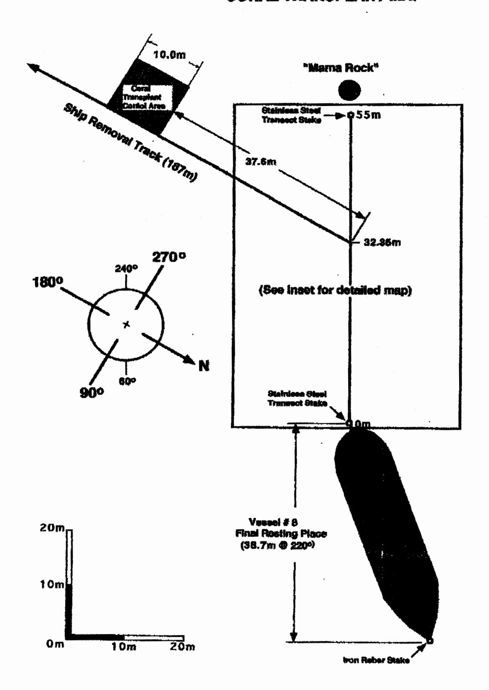
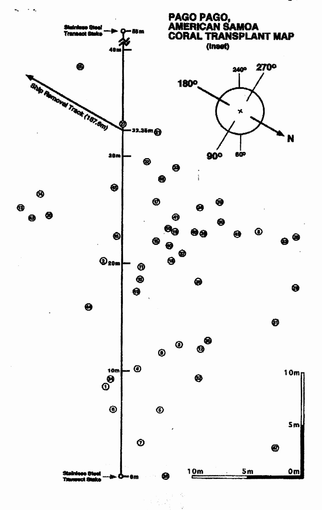

# FIELD TRIP REPORT: CORAL RESTORATION PROJECT, PAGO PAGO, AMERICAN SAMOA Harold Hudson, Fl Keys National Marine Sanctusry

2000

#### INTRODUCTION:

In November of 1999, undisturbed corals in the vicinity of Longline vessels #8 and #9 that were deemed in danger of injury or destruction by ongoing ship removal operations were relocated to nearby holding areas for future transplanting. A copy of the report describing coral removal operations is attached for reference.

## TRANSPLANTING OF RELOCATED CORALS:

From June 23, to July 3'rd, 2000, a team of NOAA divers and divers from Pago Pago reattached corals in the grounding site of Longline Vessel #8, Colonies that were transplanted had been stored in coral holding areas #1 and #2 since November of 1999. (See attached report for holding area locations) Corals placed in holding area #3 were apparently destroyed by a severe storm that struck Pago several weeks prior to our arrival with 15ft waves and massive ground swells. Reconnaissance of holding areas #1 and #2 revealed that these sizes had sustained substantial losses of corals as well. It was also found that many corals had been partially buried by storm driven sediments and coral rubble. Only their upper surface was alive and attempts to extract them caused extensive breakage of impacted branches. It was decided to leave these specimens in place and monitor their progress to see if they will survive in situ. Of the original 988 colonies set aside for reattachment, a total of approximately 350 corals (35%) were located that appeared to be viable candidates for transplanting. Of these, 132 were reattached along the "pull back" and pivot area of vessel #8. This segment of the ship removal scar was best suited for transplanting due to the large number of massive coral blocks and elevated reef flat pavement located there. A map entitled" Pago Pago American Samoa Transplant Map" shows precise location of all corals reattached in this area. A 10m X 10m section of undisturbed coralline algae payement alongside the removal track of Ship #8 was selected as a coral transplant control site. A total of 60 corals were reattached in the southern one third of the control plot. Control corals were grouped closely together to simulate natural coval cover and to provide refugia for fish and invertebrates. To insure relocation, iron rebar rods were comented into each corner of this 10 X 10 meter site. (See map for location of coral transplant control area). Corals at both sites were reattached with a mixture of 4 parts Portland Type II cement to 1 part Moulding Plaster. This formulation produces a quick-setting effect that in 4 to 6 minutes hardens the cement sufficiently to prevent "washout" by waves and bottom surge. For monitoring purposes, transplanted corals were recorded as vertical still images on digital video tape. A centimeter scale and ID number is included in each picture.

## RECOMMENDATIONS FOR ADDITIONAL RESTORATION:

Approximately 158 unattached corals remain in holding area #2. It is recommended that these colonies be transplanted into available space of the main transplant site, control plot and other elevated and stable substrate within the grounding site. Our experience thus far indicates that sea state conditions at Vessel #9 grounding site are generally too turbulent to allow reattachment of corals. If a period of unusually carn seas were to occur, it would be desirable to place some (or all) of the remaining corals there. Those on scene at the work site will be best able to decide a proper course of action if this phase of the restoration is undertaken. It would also be desirable to infill the final resting-place of Vessel #8 with grounding displaced coral rubble in order to eliminate the sand trap effect of the depression left by the ships footprint. (see site map for location) At present this depression is approximately 24 meters long X 4 meters wide and has an average depth of about 25 centimeters. A groove created by the ships keel runs down the center of the depression and cuts through the underlying reef pavement. Maximum width and depth of the groove is 1.4m X .8m. Both keel groove and depression are partially covered by shifting sand. If no action is taken, this depression will continue to trap fine sediments and remain unsuitable for future coral attachment.

#### REPAIR REQUIREMENTS:

It is expected that this repair would require minimal expense to complete, since only hand labor would be required. Coral rocks and small boulders displaced by the grounding and ship removal could be carried and dropped in place by snorkel divers wearing protective clothing, gloves and wading shoes. Based on my knowledge of this site, the work outlined and capability of local divers, I estimate that it would take 4 persons, five 8-hour workdays to complete this task. For site stability, diver efficiency and to most quickly rebuild substrate to grade, rocks no smaller than 20 to 30 cm in diameter should be selected by snorkel divers for fill material. Only one layer of rock in this size range would be required to return the depression to its original grade. Common-sense precautions should be exercised in setting an upper size level of rocks to consider moving. Rocks requiring 2 persons to move should left in place. Likewise, rock collecting should be done so that large depressions are not created by their removal. Avoid "mining" a number of rocks from a single spot, instead collect over a broad area and choose only those that appear to have been displaced by the vessel.

## DEBRIS REMOVAL:

In the immediate vicinity of Vessels #8 and #9 a considerable quantity of loose fishing line, cables, ships fittings, and other metallic debris lies strewn about on the reef. Not only is this material a permanent eyesore to persons snorkeling over the reef, it poses a

safety threat to unwary bathers and those wading who could cut or impale themselves on rusted jagged edges of eroding metal. While it is true that some coral has attached and begun growing on this material, it is also true that those corals will not survive on a substrate that is not stable. Removal of ship debris is also a straightforward, hands-on task that would require a shallow-draft debris collection vessel such as Boston Whaler or similar craft to hold and transport debris to shore for disposal. Personnel, equipment and time would be the same as that outlined above for rock infill with the addition of an extra day for land disposal of debris, a boat and 2 pair of cable-cutting shears for cutting out tangles of heavy-duty longline. Shears designed to cut up to 1/4inch steel cable are adequate but should be treated at the end of each day with a rust inhibitor. An attempt should be made to remove those corals growing on metal objects, line or other debris and return them to the reef whenever possible. This concludes my recommendations for site restoration of Vessels #8 and #9.

Harold Hudson

Coral Restoration Biologist.

Florida Keys National Marine Sanctuary

# PAGO PAGO, AMERICAN SAMOA CORAL TRANSPLANT MAP

Coral Transplant Map Key,
Pago Pago, American Sarrioa:
Field Measurements:
July 1, 2000

| 23.2R X 4.1 | 50 | 22.75R X 10.3 | 43 | ZeroR X 4.0  | 38 | 17.8R X 15.6 | 29 | 29.5FI X 2.15 | 22 | 22.1R X 3.0           | 16 | 22.5R X12.2 | 8  | 8.5L X 1.5  | -1 |
|-------------|----|---------------|----|--------------|----|--------------|----|---------------|----|-----------------------|----|-------------|----|-------------|----|
|             |    | 15.9L X 3.0   | 44 | 20.95R X 5.4 | 37 | 23.9R X 8.8  | 30 | 28.9R X 4.8   | 23 | 22.5L X 5.0           | 16 | 11.7R X 3.6 | 9  | 20.1L X 1.7 | 2  |
|             |    | 27.0L X .75   | 45 | 18.3R X 6.8  | 38 | 14.6R X 13.8 | 31 | 25.3R X 7.0   | 24 | 25.75R X 3.0 20.25R X | 17 | 18.5H X 1.6 | 10 | 12.5H X 5.1 | 3  |
|             |    | 22.9R X 6.5   | 46 | 25.75R X 8.7 | 39 | 9.4R X 6.8   | 82 | 38.4L X 3.9   | 25 | 4.4                   | 18 | 19.6R X 1.7 | 11 | 10.3R X 1.4 | 4  |
|             |    | 2.8R X 13.8   | 47 | 21.7R X 4.2  | 40 | 22.0R X 14.6 | 33 | 22.5R X 15.6  | 26 | 23.08 X 4.7           | 19 | 12.0R X 7.1 | 12 | 6.4R X 3.4  | 51 |
|             | ·  | 27.9R X 3.5   | 48 | 24.4R X 4.8  | 41 | 9.2L X 1.0   | 34 | 33.0 x Line   | 27 | 18.3L X 5.9           | 20 | 25.2L X 9.2 | 13 | 6.4L × .80  | G  |
|             |    | 17.3R X 1.3   | 49 | 24.2L X 8.2  | 42 | 12.8R X 7.7  | 35 | 22.8H x 7.3   | 28 | 32.3R X 3.1           | 21 | 26.4L X 7.4 | 14 | 3.2R X 1.7  | 7  |

Bold numerals = transplant monument number.

Number + letter = distance in meters along transect line.

Number following times (X) sign = distance in meters at 90" from transect line to coral monument.

Letter (R) following number = right side of transect line looking offshore.

Letter (L) = left side.

