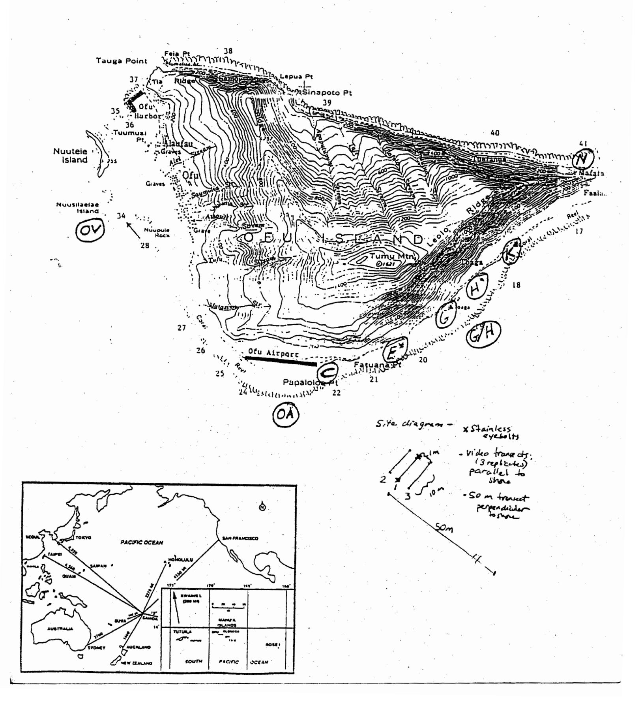
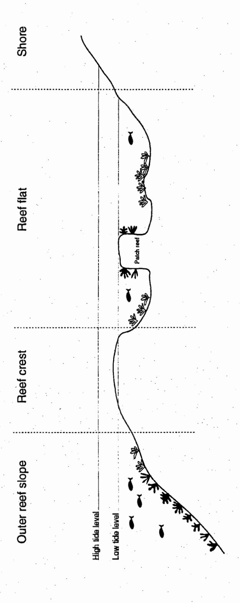
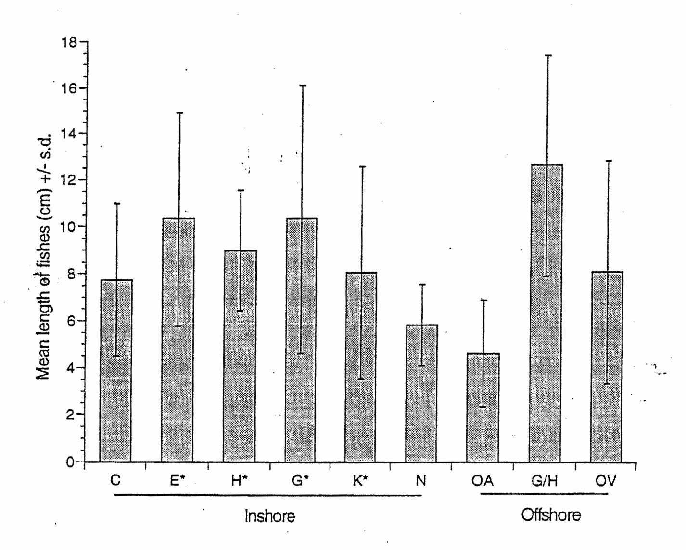
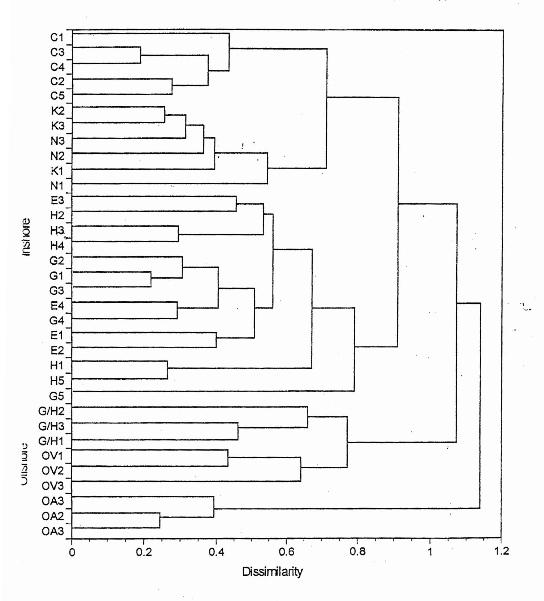

#### OFU REEF SURVEY

# BASELINE ASSESSMENT AND RECOMMENDATIONS FOR LONG-TERM MONITORING OF THE PROPOSED NATIONAL PARK, OFU, AMERICAN SAMOA

# UNIVERSITY OF HAWAII SEA GRANT EXTENSION SERVICE

#### **EXPEDITION TEAM MEMBERS:**

C. L. Hunter Department of Botany University of Hawaii Honolulu, HI 96822

W. H. Magruder Department of Botany Bishop Museum Honolulu, HI 86813 A. M. Friedlander
Department of Zoology
University of Hawaii
Honolulu, HI 96822

K. Z. Meier Corial, Inc. 2800 Woodlawn Dr., Suite 254 Honolulu, HI 96822

FINAL REPORT TO THE NATIONAL PARK SERVICE
PAGO PAGO, AMERICAN SAMOA
3 DECEMBER, 1993

| TABLE OF CONTENTS                                                                                                        | pag    |
|--------------------------------------------------------------------------------------------------------------------------|--------|
| Introduction and General Purpose                                                                                         | 1      |
| Site Selection and Basic Methologies Site Locations                                                                      | 2 3    |
| General Reef Characteristics, Corals, and Macro-invertebrates                                                            | 5      |
| Methods                                                                                                                  | 5      |
| General Area Description                                                                                                 | 5      |
| Coral Diversity and Abundance                                                                                            | 5      |
| Substratum Diversity and Abundance                                                                                       | 5      |
| Macro-Invertebrate Diversity and Abundance                                                                               | 6      |
| Video Records of Coral, Algal, and Substratum Abundance                                                                  | 6      |
| Video Record Analysis                                                                                                    | 7      |
| Results                                                                                                                  | 7 9 |
| Site Summaries                                                                                                           | 11     |
| Comparison of Data Collection Methods Discussion                                                                         | 12     |
| Tables and Figures                                                                                                       | 14     |
| Tables and Figures                                                                                                       | 17     |
| Seaweeds of the proposed National Park on Ofu, American Samoa                                                            | 17     |
| Reef Fish Populations at Ofu                                                                                             | 19     |
| Introduction                                                                                                             | 19     |
| Methods                                                                                                                  | 20     |
| Results                                                                                                                  | 22     |
| Discussion                                                                                                               | 23     |
| Tables and Figures                                                                                                       | 26     |
|                                                                                                                          |        |
| General Discussion, Recommendations, and Management Options                                                              | 35     |
| Literature Cited                                                                                                         | 44     |
| A                                                                                                                        | 40     |
| Appendices                                                                                                               | 49     |
| Appendix I. Location of census sites  Appendix II. Distribution and abundance of corals, algae, and                      |        |
|                                                                                                                          | OV     |
| invertebrates at Sites C, E, G, H, K, N, OA, G/H, and Appendix III. Benthic macro-invertebrate abundance as estimated by | UV     |
| point quadrats and belt transects at 6 sites                                                                             |        |
| Appendix IV. Checklist of Ofu corals and macroinvertebrates                                                              |        |
| Appendix V. Checklist of Ofu seaweeds                                                                                    |        |
| Appendix VI. Checklist of Ofu fish species                                                                               |        |
| PF                                                                                                                       |        |

#### INTRODUCTION AND GENERAL PURPOSE

The U.S. Congress has authorized the Department of the Interior to enter into a lease agreement with the Governor of American Samoa to establish the National Park of American Samoa (Congressional Record, 1988). This park would include a nearshore reef area along the southern coast of the island of Ofu. This fringing reef on Ofu provides a natural lagoon habitat which is uncommon in American Samoa. This area supports a local subsistence fishery and provides excellent opportunities for diving and snorkeling.

A survey of the nearshore reefs in the area of the proposed national park at Ofu was conducted between 7-12 September, 1992. The goals of this survey were to: 1) collect baseline data on the current status of reefs and reef resources in the area, 2) to establish long-term monitoring stations to enable documentation of the health of the reef communities through time, and 3) to contribute information to a comprehensive coastal resource survey of Tutuila and the Manua Islands. The overall purpose of the work was to design and implement the biotic components of a reef monitoring program for the areas within and adjacent to the proposed national park site.

History has shown that tropical coral reef ecosystems are vulnerable to the impacts of hurricanes, runoff, eutrophication, sedimentation, dredging, outbreaks of disease or predators, and overfishing. Many (or most) reef resources are resilient, and can often recover from physical damage (e.g. from storms, dredging) if other stresses are not present. Combinations of stresses, particularly high levels of nutrients and sediments, usually result in profound and long-term changes in reef habitats especially when coupled with storm damage and/or overfishing. Indicators of such impacts (or recovery from stresses) are those that can sensitively measure significant changes on reef systems over periods of time that are meaningful to resource managers. Since natural reef systems are usually spatially and temporally variable, indicators must be able to detect trends above the "noise" of this natural variability. In this study, we utilized a combination of tested methodologies that provide both

a "snapshot" of the status of Ofu reef resources at the time of the initial survey and, when applied in long-term monitoring, a sensitive measure of significant trends or changes within the proposed park boundaries.

#### SITE SELECTION AND BASIC METHODOLOGIES

Survey sites and long-term monitoring stations were selected after consultation with Park Superintendent, Doug Cuillard, and initial reconnaissance surveys of reefs along the entire southeast shore of Ofu, on the northeast shore, and near Ofu Village. Six permanent stations were identified by shoreside lineups (recorded by notes, photos, and video). Sites were also marked with stainless steel eyebolts labeled with plastic tags (Figure 1). Pilot holes (1/4") were drilled into dead coral heads at each end of a central 10 m long transect (parallel to the shoreline) at each site. Eyebolts were then screwed into the pilot holes, and underwater epoxy was applied around the openings to further secure the bolts. Similar labeled eyebolts have been shown to remain in place for at least three years on Hawaiian reefs (C. Hunter, pers. obs.).

Although each station was permanently marked to facilitate positioning of transect lines, it is important to note that comparability of future surveys is *not* dependent on *exact* relocation of transects. The six nearshore sites were chosen as being generally representative of the back reef lagoon areas. Due to the within-site replication and robustness of the methods used in this study, future surveys at approximately the same depths and distances from shore will provide comparable estimates of the status of reef resources.

Stations were located within the broad fringing reef zone along the southeast (Sites C, E, G, H, and K) and northeast (Site N) shores of Ofu; Sites C and E corresponded to sites identified by Itano and Buckley (1988) in a Department of Marine and Wildlife Resources (DMWR) survey of Manua reefs. Letter designations of sites were retained for consistency with the DMWR records. In addition, surveys were conducted on outer reef slopes near the airport (OA), offshore of sites G/H (GH), and near Ofu Village (OV). The latter site was

Figure 1. Locations of visual censuses conducted on Ofu Island, American Samoa. Asterisks denote location codes within proposed national park.

located near a rebar stake installed by Itano and Buckley (1988). All sites will be precisely marked on the USNPS maps of the park (USNPS/Towill/Corial, in preparation).

#### Site Locations

- Site C. This site is located approximately 40 m offshore, in line with the landing lights on the west end of the airstrip (Telephone Pole #32). The site is about 3/4 of the distance between the shoreline and the emergent reef crest pavement. Depth is 0.1-1.2 m. Site C was surveyed previously by Itano and Buckley (1988), but their survey stakes were not found in the 1992 survey.
- Site E. This site is 90 m from the shoreline at Telephone Pole #43, and 8-9 m ESE of the second of two (looking toward shore) large basalt boulders. Depth ranges from 0-2 m. It is in the approximate vicinity of Itano and Buckley (1988) Site E. Depth is 0.5-1.2 m. A sand groove (1-5 m wide) provides easy swimming access to the site from the beach, although there is a shallow bank (emergent at low tide) between the sand groove and the transect sites.
- Site G. This site is about 75 m west of the hurricane house, approximately half way between the beach and reef crest (~80 m from the shoreline). The transects are in a visual line with a cave on the mountainside and a large boulder on the beach. Depth varies from 0.2-1.5 m.
- Site H. This site is approximately 100 m east of the hurricane house (Telephone Pole #57), and aligned on shore with the end of the beachrock and a rock-faced escarpment on the cliffs above. It is approximately 75 m from shore, at 0.2-1.5 m in depth.
- Site K. Site K is located about 10 m offshore from Telephone Pole #76. Depth varies from 0.1-1 m.
- Site N. This site was located on the northeastern shoreline, approximately 100 m from the shore at Telephone Pole #100, and about 50 m shoreward of the reef pavement. Depth varies from 0.1-1 m.

Airport (OA). This site is aligned offshore of Site E, directly off the east end of the airstrip, at a depth of 9-17 m, and in the vicinity of Site 23, Itano and Buckley (1988).

Hurricane House (G/H). This site is offshore, mid-way between Sites G and H, in 5-17 m depth. The area is similar in location and description to Site 17 (Itano and Buckley, 1988).

Ofu Village (OV). The site is about 100 m west of the Ofu Village ava, at 9-17 m depth. The site is located at a large re-bar stake installed by DMWR biologists in October, 1986. The stake was still firmly in place near the base of a reef spur at 50' depth and in good condition.

Surveys were divided into five aspects addressing the major biotic features of Ofu reef sites: general reef structure and substratum characteristics, corals, macro-invertebrates, macro-algae, and reef fishes. Synoptic surveys were conducted by a research team consisting of specialists in corals/ invertebrates (C. L. Hunter, University of Hawaii), phycology (W. H. Magruder, Bishop Museum), fisheries (A. M. Friedlander, Hawaii Cooperative Fisheries Unit and University of Hawaii), and underwater videography (K.Z. Meier, Corial, Inc.). Video and still photographic records of all sites are included with this report.

#### General Reef Characteristics, Corals, and Macro-invertebrates

Corals and macro-invertebrates at each site were described and quantified using comparative and complementary methods:

#### General Area Description

An initial, rapid, qualitative description estimated the general structure of the area: reef depth and slope, and percentages of sand, rubble, and hard substratum (as live coral, dead standing coral, or reef pavement). Field notes were made of damage to living corals from bleaching, disease, and predation by crown-of-thorns starfish (*Acanthaster*) or corallivorous snails (*Drupella*).

#### Coral Diversity and Abundance

Living corals provide the structural framework, habitat, and food for near-shore biotic communities. At each site, all species of corals within a circular area of approximately 30 m in diameter (700 m2) were recorded and assigned a relative abundance value of 1-5, as follows: 5=>80%, 4=31-80%, 3=11-30%, 2=6-10%, 1=1-5% (Done and Navin, 1990). Photos and video records were taken of most coral species encountered; these records are useful for species validations and can be used for future training in field identification of Samoan corals.

#### Substratum Diversity and Abundance

A 50 m linear transect tape was stretched over the substratum in an orientation perpendicular to the shoreline. The number of centimeters occupied by substratum types under the tape was recorded for scleractinian (stony) corals, non-scleractinian corals, sponges, or algae (turf, macro, filamentous, or blue-green mat). At some sites, the seaward end of the transect tape extended over the exposed reef crest and these transects were shortened accordingly.

## Macro-invertebrate Diversity and Abundance

All macro-invertebrates greater than 1 cm in diameter within a 5 m wide belt transect (2.5 m on either side of 50 m transect tape) were enumerated, and the results extrapolated to numbers/m2 and percent cover/m2. Cryptic organisms or infauna necessitating destructive sampling techniques were not included in this survey.

## Video Records of Coral, Algal, and Substratum Abundance

Three 10 m transects were established at each site in an orientation parallel to the shoreline and footed on their west ends by the 50 m transect. These transects were permanently marked by tagged eyebolts set 10 m apart. The center transect (#1) ran between the two eyebolts, with the other two transects on each side at a distance of 1 m (#2=shoreward, #3=seaward). A multi-colored nylon transect line clearly marked at 10 cm intervals was stretched over the 10 m distance and anchored or tied securely at each end to the eyebolts or around small coral heads. Video records were then made from a vertical perspective at a distance of approximately 0.5 m above the transect line. The photographer attempted to move at a slow and steady pace from west to east along the transect, filming a continuous area of approximately 30x30 cm. Care was taken to check the camera housing front-port for bubbles periodically, particularly on the shallow reef flats where daytime photosynthesis causes evolution of oxygen from benthic plants.

General video records were made of each area, and of particularly unique or unusual colonies or reef formations. A measure of spatial heterogeneity within each area was also obtained by laying a chain (1 cm links) under the middle transect line, taking care that the chain conformed to the bottom topography (the transect tape was stretched at a distance of .05-.5 m above the bottom). The length of chain necessary to cover a horizontal distance of 10 m under the transect line was then recorded. The ratio of chain length to horizontal

distance along the bottom provided an index of spatial heterogeneity and estimated vertical relief for each area.

#### Video Record Analysis

Two commendable attributes of video analysis of coral reef habitats are: 1) the permanence and reproducibility of the data, and 2) ease and speed of analysis. Video records can also be used for training, review of local biota, and for non-destructive sampling of biota for later identification or confirmation by experts.

Original 8 mm videotape recordings were transferred to VHS format for data analysis (8 mm format is more fragile and can be damaged through repeated playback). An acetate sheet was marked with three sets of 10 randomly determined points (30 points total). Point locations were marked at grid intersections (e.g.  $100 \times 100 = 10,000$  possible points) defined by pairs of computer-generated random numbers. (Point locations can also be obtained from random number tables.) The marked acetate sheet was then affixed to a VHS monitor screen for analysis of areal coverage of each substratum or organism type. [Note for future analyses: this method is independent of the size of the acetate overlays or VHS monitor used.]

Video records of each 10 m transect were paused at each of 10 pre-determined, randomly-selected frames. Organisms or substratum types beneath each of the 30 points overlaying the stilled frame were then recorded on standardized data sheets (see appendix). These data (3 transects x10 frames/transect x30 points/frame=900 points within a total quantified area of 9 m2 (3 transects x10m length x 0.3 m width)) were summarized and averaged to provide estimates of organism and substratum abundance within each site. Data sheets and formats for analysis with Microsoft (Macintosh) Excel [also compatible with Microsoft (IBM) Excel] are provided on disk files with this report. The total time required for analysis of the 6 sites, with 3 transects/site, was approximately 29 h.

#### RESULTS

The fringing reefs on the southern shores of Ofu Island, Manua Group, American Samoa, harbor a diverse and beautiful coral community. A well-developed reef crest along much of the southeastern shore protects a shallow (to 2.5 m) lagoon characterized by large, isolated blocks of massive *Porites* (up to 7 m in diameter) and *Acropora* thickets separated by sand, rubble, and areas of semi-consolidated limestone. Exceptional snorkeling in calm, clear water, unique coral formations, and high fish abundance were found within the park boundaries, particularly near Sites E, G, and H (Telephone Poles 42-50).

Summaries for each site, comparisons among sites, and comparisons among data collection methods are presented in the attached tables. Raw data for video transects and censuses are included as an appendix to this report.

Percent cover of coral ranged from 6.7-30.4% among the six permanent monitoring sites established in September, 1992 (Table 1). Although Maragos, et al. (in prep.) reported a total of 93 coral species as common or abundant at one or more of the 11 sites surveyed on Ofu and Olosega in 1991, the number of species recorded per 700 m2 site in the present study ranged from 12-29. A combined total of 64 species of corals were recorded from all sites in this study (initial reconnaissance survey of the southeast reefs, permanent reef flat sites, and three offshore sites). The most dominant corals at most sites were the massive *Porites*; extensive thickets of *Acropora* were dominant at Site H. Branching, blade-like, or encrusting *Millepora* (fire coral) was also abundant at all sites.

Algal cover was relatively low at all sites surveyed, comprising 6.2-17.3% of the areal cover. Most of the algae encountered were fine turfs growing on dead coral skeletons and calcareous reef framework. Damselfish "farming" algal turf territories were common at most sites, particularly Sites G & H. Algal diversity is discussed in a separate section of the report.

The most common macro-invertebrates on the southeastern lagoon reef were sea cucumbers (up to 0.4 Stichopus/m2) and urchins (up to 0.04 Diadema/m2). Few edible mollusks (Tridacna or Trochus) were seen, and although the survey team observed that

numerous octopus (about10/day) were caught by local fishermen during the period of this study, none were encountered in the survey areas.

#### Site Summaries

Observations for each site are summarized in Appendix II (corals) and Appendix III (macroinvertebrates).

Site C. Large *Porites* heads and emergent micro-atolls surrounded by *Millepora* dichotoma and *Heliopora coerulea* ("blue coral") occurred about 10 m from the west end of the Site C transects. This was the area of highest *Heliopora* abundance of any site, and may represent the highest abundance in American Samoa (Itano and Buckley, 1988). Massive favids, encrusting *Montipora*, and *Pocillopora damicornis* were also common. Some recent *Acanthaster* predation (~0.3 m2) was noted on a *Montipora* of *informis* colony at the east end of Transect C-1 (see photo). *Stichopus chloronotus*, the green sea cucumber, was very abundant on sandy substratum (0.7/m2). The ratio of live vs. dead coral cover was 1:1 at this site, and the index of spatial heterogeneity was 1.3.

Site E. This area had the highest percentage of hard substratum of all reef flat sites (75%). Coral diversity was high (27 species recorded), with Millepora dichotoma, Leptoria phrygia, Pocillopora meandrina, and layered plates of bright yellow-green Turbinaria reniformis being among the most notable. Two Acanthaster (alamea, crown-of-thorns) were found at the site, near fresh feeding scars on massive Porites. One of the Acanthaster was found on the same colony four days later. The ratio of live vs. dead coral cover was 1:2.3 at this site, and the index of spatial heterogeneity was 1.5.

Site G. Massive and branching *Porites*, and *Millepora dichotoma* dominated this site. The ratio of live vs. dead coral cover was 1:1, and the index of spatial heterogeneity was 1.3.

Site H. This site exhibited the highest percent cover of live coral (30.4%) along the southeast fringing reef, with extensive thickets of branching *Acropora* (often inhabited by

territorial damselfish) dominating the area. One *Acanthaster* and several fresh feeding scars were observed near the transects. The ratio of live vs. dead coral cover was 1:1 at this site, and the index of spatial heterogeneity was 1.5.

Site K. Much of the area was rubble (30%) or sand (30%). Species diversity (12 species) was lowest among the six permanent sites, and was dominated by massive *Porites* and the favid, *Goniastrea retiformis*. Much of the *Porites* was covered by anomalous (tumorous?) growths that appeared to be preferentially grazed by fish as evidenced by numerous feeding scars. Diseased or tumorous tissue was rare or absent at other sites. *Diadema* and the sea cucumber, *Bohadschia argus* were common in the area, and five *Tridacna* were noted within the 250 m2 transect. One *Acanthaster* was observed near the transects. The ratio of live vs. dead coral cover was 1:4 at this site, and the index of spatial heterogeneity was 1.3.

Site N. A large (2 m diameter) patch of tumbled *Porites* heads and a bright purple-colored massive *Porites* were in the middle of Transect N-1. This site had the lowest percentage of hard substratum (20%) and coral abundance (6.7%). Massive *Porites*, encrusting *Montipora of informis*, and *Acropora humilis* were the most common coral species. Blue-green bacterial mats were common overlying sand in the area. The ratio of live vs. dead coral cover was 1:3 at this site, and the index of spatial heterogeneity was 1.3.

#### Offshore Sites:

Airport (OA). The topography of the site was very low-relief (index of spatial heterogeneity= 1.1), with the bottom consisting primarily of consolidated limestone mixed with pockets of sand. It is apparent that this area is subject to frequent scouring and wave action. Coral cover was low (5%) and was composed primarily of small colonies of encrusting Astreopora, Montipora, and Porites. Urchins (Echinothrix sp.) were abundant in bored holes in the limestone. A green sea turtle (Chelonia midas) swam through the area during the survey. The ratio of live:dead coral was 1:1.0.

Hurricane House (G/H). This site is mid-way between Sites G and H, offshore in 5-17 m depth. The moderate spur and groove topography was primarily hard substratum (95%), with a high coral cover of 40%. The dominant coral taxa were *Goniastrea retiformis* and *Acropora robusta*. Two *Tridacna* were noted within the 250 m2 belt transect. The ratio of live vs. dead coral cover was 1.1:1 at this site, and the index of spatial heterogeneity was 1.3.

Ofu Village (OV). There was evidence of extensive, but not recent, damage to corals (possibly crown-of-thorns) that were heavily painted with a covering of coralline algae (*Porolithon sp.*). Coral diversity and cover were high (29 species, 30% cover), as was the percentage of hard substratum (95%). No one species or group of corals dominated the area. One small *Tridacna* was found, as well as 8 juvenile *Trochus* within the 250 m2 belt transect. The ratio of live vs. dead coral cover was 1.5:1 at this site, and the index of spatial heterogeneity was 1.3.

## Comparison of Data Collection Methods

ò

Analysis of video surveys (3, 10 m transects-planar point intercepts), 50 m linear-intercept or belt transects, and visual field estimates provided different estimates of coral, invertebrate, and substratum abundance for the six permanent Ofu reef sites (Table 1). Video and visual surveys provided consistent estimates of coral abundance, while the 50 m perpendicular transects typically substantially underestimated coral abundance. However, video transects sampled too little total area to effectively quantify macro-invertebrate populations. Video transects also overestimated the percent cover of macro-invertebrates when extrapolated to larger areas. Experience obtained in the present study suggest that belt transects can rapidly cover more area, and thus provide the better estimates of abundance of organisms such as sea cucumbers, sea stars, and sea urchins.

Identification of coral species is often difficult, whether in the field or from photographic or video records. Consistent identifications of species of *Porites* and *Acropora* 

are especially problematic, even for experienced workers. Collection of samples for identification, especially from small areas such as Ofu, is destructive and should be avoided when possible. Video records allow evaluation (or re-evaluation) and quantification of surveys at various levels of resolution. For example, some workers may choose to work at the level of species while others may be interested in growth forms (e.g. massive, branching, encrusting, etc. for corals). Analysis of coral cover and substratum by major forms or types will probably provide sufficient information to detect most changes (degradation, recovery, or status quo) on reefs. Visual field estimates are also important for ground-truthing and broadscale surveying; video records provide the ability to "go back in time" to evaluate changes that may not have been apparent at the time of a survey.

A checklist of coral and macroinvertebrate species identified from this survey is presented in Appendix IV.

#### DISCUSSION

A coral/macroinvertebrate monitoring program was established at six permanently marked sites in the fringing lagoon reefs on the southeast and north shores of Ofu, American Samoa, within and adjacent to the boundaries of the proposed national park. The reef communities at each site appeared, with a few exceptions, to be exceptionally healthy. Coral cover and diversity were moderate to high, and the clear, calm conditions coupled with beautiful and unusual coral/limestone formations offered superb snorkeling opportunities. During this study, underwater visibility at the nearshore areas was generally 20+ meters. Coral communities such as these thrive in clear water, with low nutrients and low sedimentation necessary for their continued recruitment and survival. Proximity to shore makes these communities particularly vulnerable to land-use activities that may alter the natural conditions under which they have developed.

Ofu reef sites appeared to be similar in development compared to qualitative observations recorded in a Department of Marine and Wildlife Resources report prepared by

Itano and Buckley (1988). However, future surveys can use the quantitative data provided in the present report to improve the sensitivity in measurement of any changes in abundance and diversity in the reef community. Specifically, percent coral and algal cover should be monitored, with particular attention to changes in macro-algal abundance. Due to limitations of time, size-frequency measurements of coral colonies were not made. Such measurements provide an excellent basis for following reef disturbance/recovery processes, and should be included with high priority in all subsequent surveys.

The condition of the diseased massive *Porites* colonies at Site K should be followed closely for indications of recovery or spread of the disease. Of further interest is the apparent absence or substantial decrease in abundance of two important sea cucumber species:

Thelenota ananas and Actinopyga mauritiana. Both of these species were reported as common by Itano and Buckley (1988), but were not recorded at any of the sites surveyed in September, 1992.

Ofu reefs support a variety of important resources: fishing (reef fish, octopus, *Trochus*, and *Tridacna*), as well as having tourism potential for recreational snorkeling, diving, fishing, and underwater photography. In addition, they represent the eastern-most distributions in the Pacific for a number of coral genera (*Heliopora*, *Euphyllia*, *Diploastrea*, *Oulophyllia*, and possibly others). Within the boundaries of the proposed national park, the corals in the 1-2 m deep lagoonal areas of the fringing reef (unique in American Samoa) provide a diverse and visually impressive habitat within a protected environment.

Figure 2. Diagramatic cross section of the fringing reef at the proposed National Park on Ofu, American Samoa.

Table 1. Summary and comparison of results of Ofu surveys using different methods.

## **DATA SOURCE: VIDEO TRANSECTS**

3 parallel 10 m transects, 10 frames each, 30 points/frame

| -              |            |          | -         | • .      |          |          |              |          |                                       |               |       |
|----------------|------------|----------|-----------|----------|----------|----------|--------------|----------|---------------------------------------|---------------|-------|
|                |            |          |           |          |          |          |              |          | Offshore S                            | lites         |       |
| <u>SITES:</u>  | <u>C</u>   | <u>E</u> | <u>G</u>  | <u>H</u> | <u>K</u> | <u>N</u> | <u>MEANS</u> | Airport  | <u>G/H</u>                            | <u>OFU V.</u> |       |
| CORALS #SPP.   | 29         | 26       | . 23      | 25       | 12       | 21       | 22.67        |          | Analyses                              |               |       |
| % COVER        | 10.3       | 17.33    | 18.8      | 30.4     | 23.9     | 6.7      | 17.91        |          | not perform                           | ned           |       |
| SUBSTRATUM     | 80.56      | 67.3     | 72.9      | 52.3     | 65.6     | 78.7     | 69.56        |          |                                       |               |       |
| RUBBLE         | 4.4        | 1.3      | 10.4      | 23.7     | 14.9     | 33.9     | 14.77        |          |                                       |               |       |
| SAND           | 49.4       | 31.3     | 36.2      | 5.2      | 35.3     | 14.7     | 28.68        |          |                                       |               |       |
| ALGAE          | 6.2        | 13.78    | 10.3      | 17.3     | 10.3     | 14.7     | 12.10        |          |                                       |               |       |
| TURF           | 6.2        | 13.8     | 10.3      | 17.3     | 10.3     | 13.6     | 11.92        |          |                                       |               |       |
| INVERTS        | 2.8        | 1.6      | 0.1       | . 0      | . 0      | 0        | 0.75         |          |                                       |               |       |
|                |            |          |           |          | ٠.       |          |              |          |                                       |               |       |
| DATA SOURCE: V | TAITSTV    | ETELD I  | ESTIM A   | TE       |          |          |              |          |                                       |               |       |
| Dillii Source. | 100110     |          | EU I HILL |          |          |          |              |          | Offshore S                            | ites          |       |
| SITES:         | <u>C</u> . | <u>E</u> | <u>G</u>  | <u>H</u> | <u>K</u> | <u>N</u> | MEANS        | Airport  | G/H                                   |               | MEANS |
| <u> </u>       | <u>v</u>   | =        | <u>u</u>  |          | . **     |          | HISHIO       | 111 port | 0/11                                  | 01.07.        | MEANS |
| CORALS #SPP.   |            |          |           |          |          |          |              |          | · · · · · · · · · · · · · · · · · · · |               |       |
| % COVER        | 10         | 15       | - 25      | 30       | 10       | 5        | 15.83        | 5        | 40                                    | 30            | 25.00 |
| SUBSTRATUM     |            |          |           |          |          |          |              |          |                                       |               |       |
| RUBBLE         | 20         | 5        | 10        | 15       | 30       | 20       | 16.67        | 2        | 20                                    | 20            | 14.00 |
| SAND           | 50         | 20       | 40        | 20       | 30       | 60       | 36.67        | 18       | . 5                                   | 5             | 9.33  |
| ALGAE          | `          | -        |           | -        | ·        |          |              |          |                                       |               |       |
| TURF           |            |          |           | ·        | • .      |          |              |          | · _                                   |               |       |
| INVERTS        | ·          |          |           |          | _        |          |              |          |                                       |               |       |
| 100            |            |          | • • •     | ,        |          |          |              | ~        |                                       |               |       |
|                |            |          |           |          |          |          |              |          |                                       |               |       |
| DATA SOURCE: 5 | 0 M PEI    | RPENDI   | CULAR     | LINEA    | R/BEL    | T TRA    | NSECT        |          |                                       |               |       |
| armoa          | ~          |          | _         | · ·      |          |          |              |          | Offshore S                            |               |       |
| SITES:         | <u>C</u>   | <u>E</u> | <u>G</u>  | <u>H</u> | <u>K</u> | N        | <u>MEANS</u> | Airport  | <u>G/H</u>                            | OFU V.        | MEANS |
| CORALS #SPP.   | <u> </u>   |          |           |          |          | :        |              |          |                                       |               | _     |
| % COVER        | 5.98       | 18.33    | 11.08     | 4.96     | 0.36     | 0.76     | 6.91         | 2.04     | 14.34                                 | 9.20          | 8.53  |
| SUBSTRATUM     | 88.95      | 73.37    | 81.10     | 92.80    | 87.34    | 87.04    | 81.10        | 79.96    | 85.32                                 | 69.92         | 78.40 |
| RUBBLE         |            |          |           |          |          | _        |              |          |                                       | _             |       |
| SAND           |            |          |           |          |          |          |              |          |                                       |               |       |
| ALGAE          | 5.08       | 6.60     | 5.18      | 1.40     | 12.10    | 12.20    | 7.09         | 18.00    | 0.34                                  | 20.20         | 12.85 |
| TURF           | 3.75       | 6.00     | 5.14      | 0.50     | 12.00    | 0.80     | 4.70         | 16.00    | 0.20                                  | 20.20         | 12.13 |
| INVERTS        | 0.51       | 0.17     | 0.07      | 0.09     | 0.12     | 0.02     | 0.16         | 0.26     | 0.01                                  | 0.02          | 0.10  |
|                |            | -,-,     | 2.01      | 0.05     |          | 0.02     | 0.10         | 0.20     | 0.01                                  | 0.02          | 0.10  |

data not recorded

#### Seaweeds of the proposed National Park on Ofu, American Samoa

The seaweed flora at the proposed National Park site on Ofu is characteristic of most tropical Pacific islands and is indicative of a pristine, low nutrient reef environment. It is a healthy coral and coralline algae community with extensive grazing by fish and invertebrates. A list of the specimens collected and observed at Ofu is provided in Appendix V. All specimens with collection numbers were mounted on slides and will be deposited at the Bishop Museum in Honolulu. Due to the limited field time of this study and necessity of bringing the specimens back to Honolulu for mounting and identification, it is estimated that the species collected may represent only about 1/3 of the total seaweed species present at Ofu.

The seaweeds identified from Ofu reefs seem to be fairly common throughout the tropical Pacific Ocean, although one species of red seaweed (*Rhodolacne decussata*) has been previously found in only three other locations in the world. Several of the unidentified species may be new to science and/or not formally described, but are probably more widespread than just Ofu or American Samoa.

Most of the seaweeds in the park area are coralline red seaweeds and small turfforming red, brown, or green algal species. Red seaweeds are by far the most diverse division
present, followed by green seaweeds and then brown seaweeds. Larger seaweeds are
primarily limited to vertical and overhanging sides of the lagoon reef structure and to specific
areas of the reef crest, such as near deep channels. Although most of the seaweeds present
were inconspicuous and small, they have a very important part in reef community.

The basic structure of the reef (Figure 2) is very typical of tropical Pacific reefs, with the outer reef slope dominated by corals up to a depth of about 10-15 feet. Seaweeds growing on the outer reef slope area are mostly limited to small red species in holes or cracks or on the lower non-living portions of coral colonies. From 10-15 feet deep, up to and including the reef crest, the dominant benthic organisms are seaweeds, mostly crustose corallines and small turfs, although some of the larger fleshy seaweeds such as *Caulerpa* and *Chlorodesmis* are found near the avas or small channels in the reef crest. The reef crest is a

critical part of the reef structure and is built primarily by crustose coralline seaweeds such as *Porolithon*. The reef flat area is again dominated by corals, with larger fleshy seaweeds (primarily *Halimeda*) mostly confined to the lower vertical sides of reef structure (Figure 1) or small caves; small turf algae are confined to the lower non-living parts of erect corals and to rubble areas. The immediate shoreline is mostly sand although there are a few areas with basalt boulders or hard sandstone with small filamentous algae growing on them.

Healthy tropical reefs have high levels of algal grazing by both fish and invertebrates such as sea urchins, sea cucumbers and certain mollusks. The is widespread evidence of heavy grazing on seaweeds in the park area. Large schools of herbivorous fish and large invertebrates such as urchins and holothuroids were observed feeding from the reef surface in areas with seaweeds. The elimination of large numbers of grazing fish or invertebrates will result in a rapid increase in filamentous and fleshy algal growth and a reduction in the growth of reef building corals and coralline algae. Presently the fishing pressures on reef grazers appears to be sustainable, and it would be desirable not to exceed present levels.

An illustration of the effects of limiting grazing can be observed in the beds of Acropora coral. There are large populations of damselfish in many of these beds that control grazing by other organisms through their aggressive behavior. The lower non-living portions of these Acropora coral beds have dense turfs of small filamentous seaweeds. Seaweeds are very good "competitors" for space and a reduction in the normal levels of grazing pressure would result in a large increase in algal populations, to the detriment of the community as a whole.

## Reef Fish Populations at Ofu

#### INTRODUCTION

Subsistence shoreline fisheries produce the majority of the total catch and value of the domestic fishery resources in American Samoa (Ponwith, 1991). Principal fishing methods include rod/reel, handlining, free diving, gillnetting, reef gleaning, and throw netting (Craig et al., 1992). Jacks (Carangidae), surgeonfishes (Acanthuridae), mullet (Mugilidae), octopus (Octopus sp.), and groupers (Serranidae) account for the majority of the species catch by weight.

American Samoa has experienced substantial population growth and extensive coastal development in recent years (Wass, 1982). Increased fishing effort and improved gear efficiency as well as habitat loss have placed tremendous pressures on many coastal marine resources. Nearshore ecosystems, particularly on Tutuila, have deteriorated because of land clearing, coastal road development, increased cannery waste and expanded fishing effort. Per capita catch per unit effort for reef-resident species has declined by over 50% since 1979 (Ponwith, 1991). Reef fishes are vulnerable to overfishing due to their slow growth, long life spans, and small home ranges (Munro, 1983; Ralston, 1987). Additionally, reduction of live coral cover and reef structural heterogeneity by habitat alteration and destructive fishing techniques can reduce the amount of habitat available for reef fishes, particularly juveniles (Russ, 1991).

The Manua Islands have been much less impacted by human activities than Tutuila or many other Pacific Islands. Ofu and Olosega have excellent reef resources and present an invaluable opportunity for preservation in their near-pristine state. The purpose of this aspect of the present study was to identify fish species and estimate species abundance in select locations around Ofu Island as well as to develop recommendations for long-term monitoring of these resources within and surrounding the proposed park area.

#### METHODS

Visual censuses were determined to be the best non-destructive method to obtain information on the reef fish assemblages. All visual censuses were referenced to the permanent transect pins when possible to facilitate repeatability in the future. Precise locations of censuses appear in Appendix I.

Stationary point counts were conducted at all locations and consisted of counting all fishes within a defined area for a specified period of time (Bohnsack and Bannerot, 1986). The method is simple, fast, objective, repeatable, and easy to use. Stationary counts require less time than belt transects to set up and can be repeated easily with large sample sizes obtained with a minimum of effort (Thresher and Gunn, 1986). The stationary point count method was recently used to assess the shallow water reef fish stocks of Western Samoa (Samoilys and Carlos, 1991) as well as Fiji and Australia (Samoilys and Carlos, 1992). A fiberglass measuring tape was laid out and all species observed within a 10 m diameter cylinder (78.5 square meters) were counted during a 15 minute time period (Kimmel, 1992; Kimmel, 1993). Preprinted data sheets were developed from previous visual census data obtained by Wass (n.d.) and Itano and Buckley (1988). These consisted of two sheets of Nalgene polypaper containing 119 common species most likely to be encountered, along with a brief description of each species to aid in identification. A double-wide clip board was used to reduce handling time underwater. Lengths were estimated to the nearest cm for all species. A ruler attached to the clipboard aided in length estimations. The author has had extensive prior experience with this method and has previously verified length estimates. Some small wrasses (Labridae) were not easily identified to species and were pooled as juveniles. Several species of parrotfishes (Scaridae) form mixed schools when feeding and are extremely difficult to identify to species in the field (Randall et al., 1990; Myers, 1991). Therefore, these individuals were grouped into a single taxon (Scaridae).

Each census was analyzed to obtain community information on fish abundance, species richness, species diversity, evenness, and size class distributions. Species diversity (H') was calculated using the Shannon-Weiner diversity index (H'= -  $\Sigma$  pi ln pi) and evenness (J') was calculated using H'/H'max (Zar, 1984). Comparisons of community data among sites were performed using a Kruskal-Wallis single factor analysis of variance by rank (Zar, 1984). Dunn's multiple comparison procedure for unequal sample sizes (Hollander and Wolfe, 1973) was used to identify differences between sites. Mean length of fishes among sites were analyzed using a one way analysis of variance with data ln(X+1) transformed to conform to the assumptions of homogeneity of variances and normal distributions. Inshore and offshore censuses were pooled and community parameters compared using Mann-Whitney tests (Hollander and Wolfe, 1973).

Similarities of fish assemblages among sites were compared using the Bray-Curtis similarity coefficient:

$$D = \sum_{i=1}^{s} [x_{1j} - x_{2j} / x_{1j} + x_{2j}]$$

$$i=1$$

where  $x_{1j}$ ,  $x_{2j}$  are the abundances of species j in sites 1 and 2, and s is the number of species. A flexible clustering strategy of  $\beta = -0.1$  was used in the analysis (Ludwig and Reynolds, 1988; Gauch, 1991). The 25 most abundant species were used in these analyses as rare species provide little information on the basic patterns of community structure (Ludwig and Reynolds, 1988). An index of relative dominance (IRD) was calculated by multiplying the relative frequency of occurrence and the relative abundance of each species over all censuses pooled (Bohnsack *et al.*, 1992).

#### RESULTS

A total of 288 species of fishes from 47 families were observed during all stationary point counts and subsequent random searches (Appendix VI). Thirty-four censuses were conducted at the nine different sites during the study. The majority of the censuses (73.5%) were conducted in the shallow back reef/lagoon habitat where water depth averaged less than 2 m.

The total number of 173 species were observed during stationary point counts with a mean of 28.4 (S.D. = 6.1) per census (Table 2). The offshore airport site (Site OA) had the highest mean abundance of fishes per census (mean = 342.0, S.D. = 52.0) but the lowest mean diversity (mean = 1.713, S.D. = 0.340) and evenness (mean = 0.539, S.D. = 0.108) of any sites censused. The blackfin dartfish (*Ptereleotris evides*) was numerically dominant and extremely abundant at this site which yielded a high mean abundance of fish but low diversity and evenness.

The two other offshore locations, Site G/H and Ofu Village (Site OV), had the highest number of species per census (mean = 38.0, S.D. = 3.0; mean = 35.0, S.D. = 1.7; respectively) along with the inshore park site E (mean = 35.3, S.D. = 2.5). Comparisons of community statistics among sites appear in Table 3.

Mean lengths of fishes were significantly different among sites (ANOVA, F = 315.11 d.f. = 8, P < 0.001). The offshore site G/H had the largest mean fish lengths observed during visual censuses (Figure 2) while the offshore airport site (OA) had the smallest mean fish size (mean = 4.607, S.D. = 2.270) followed by the backreef site N on the northeast end of the island. Fish were most numerous in the 5-10 cm size class for all sites combined, followed by those in 10-15 cm size class and those less than 5 cm (Table 4).

Cluster analysis showed that most replicate censuses conducted at sites were more similar to one another than those from other locations (Figure 3). The inshore sites E, H, and G clustered together as one group. Another group was formed with censuses conducted at inshore sites K and N. The inshore site C in front of the airport appeared to be unique relative

to the other back reef areas. The three offshore forereef census locations had distinctive fish assemblages compared to the inshore back reef areas with censuses conducted at the offshore airport site (OA) having the greatest dissimilarity among sites.

Eleven of the 25 most abundant species observed during visual censuses were damselfishes (Pomacentridae) (Table 5). The wrasses (Labridae - 4 species), surgeonfishes (Acanthuridae - 4 species), and parrotfishes (Scaridae - 3 species) followed in abundances. The south seas demoiselle (Chrysiptera taupou) was the most abundant species observed when all censuses were combined, this was followed by the blackfin dartfish (P. evides), the dusky gregory (Stegastes nigricans), the lined bristletooth (Ctenochaetus striatus), and the bullethead parrotfish (Scarus sordidus), respectively.

Relative frequency of occurrence, relative abundance, and an index of relative dominance (IRD) were calculated for all species. The top 25 species as ordered by IRD appear in Table 6. These indices gave similar trends to those observed by ordering based on individual abundance by species.

Abundance of fishes and number of species were significantly higher on offshore than inshore sites (W= 362.5, P = 0.0036; W = 385.5, P = 0.0438, respectively) (Table 7). Species diversity and evenness were not significantly different between these habitats (W = 415.0, P = 0.3904; W = 456.5, P = 0.4701, respectively). The average size of fishes was significantly larger on the inshore sites (t = 15.01, P < 0.001).

## DISCUSSION

This initial survey has identified differences in diversity, abundance, and size of fishes among habitats within and adjacent to the boundaries of the proposed national park on Ofu, American Samoa. The sampling strategy employed recorded a large number of commercially and recreationally important species that can be used to evaluate changes in the reef fish community over time. Using only visual census techniques underestimates cryptic and

nocturnal species (Sale and Douglas, 1981). Despite these shortcomings, non-destructive visual assessment appears to be the best available method for repeated censusing of fishes.

Wass (1984) identified 991 species of fish from American Samoa. He collected in a wide variety of habitats and depths using ichthyocides and other destructive methods. In a two year study around the island of Tutuila, American Samoa, Wass (n.d.) observed 356 species of fishes in transects and subsequent 20 minute searches in surveys conducted at 57 sites around the island. The lower number of species observed during the present study on Ofu Island (288 species) resulted from sampling in a restricted number of habitats and primarily in shallow water (<5 m).

The majority of the Ofu back reef sites appeared similar to one another in fish assemblage structure based on cluster analysis. Several of the back reef sites had species richness and diversity comparable to the two rich offshore locations, Ofu Village (OV) and Site G/H. These inshore sites were dominated by small damselfishes (Pomacentridae) and wrasses (Labridae) while more commercially and recreationally important species such as groupers (Serranidae), snappers (Lutjanidae) and large parrotfishes (Scaridae) were present at the offshore sites.

The Offshore Airport (OA) and backreef site N were observed to have the smallest fish censused. The Offshore Airport site was composed mainly of small individuals (< 5 cm) and dominated by the blackfin dartfish (*P. evides*), the white-belly damselfish (*Amblyglyphidodon leucogaster*), and the south seas demoiselle (*C. taupou*). Site N was a shallow coral rubble habitat where small wrasses (Labridae) were abundant. Although the offshore Ofu Village site (OV) contained a number of large important fisheries species, the overall size of fishes was similar to the inshore locations due to the presence of large numbers of planktivorous damselfishes (primarily, the midget chromis, *Chromis acares* and the pale-tail chromis, *C. xanthura*). Overall mean fish length was greater on the inshore sites compared to the offshore locations due primarily to the high abundance and small size of fishes at the Offshore Airport site.

The abundance and size of large predatory species commonly targeted by fishers is a good indicator of fishing pressure (Bohnsack, 1982; Russ, 1985; Russ and Alcala, 1989). Fish such as groupers are extremely vulnerable to fishing due to their curious and sedentary behavior. Groupers, primarily the peacock grouper (*Cephalopholis argus*) and the dwarf spotted grouper (*Epinephelus merra*), were commonly observed in the back reef areas at Ofu. Although common, these individuals were typically small (<15 cm) and appeared extremely wary of divers, quickly taking refuge in the reef. This behavior is frequently associated with species subjected to heavy fishing pressure. Long-term monitoring will help to detect changes in fisheries species resulting from habitat degradation and/or fishing pressure.

Table 2. Reef fish community statistics for visual censuses conducted on Ofu Island, American Samoa. Numbers are mean values for censuses performed at each location. Standard deviations are in parentheses. Diversity is the Shannon-Weiner diversity index ( $H' = -\Sigma p_i \log p_i$ ). Evenness (J') =  $H'/H'_{max}$ . Asterisks denote location codes within proposed national park boundaries.

| Location Code | No. of Censuses | Total Number of Species | Abundance of Fishes | Species Richness | Diversity (H') | Evenness (J') |
|------------------|--------------------|-------------------------|---------------------|---------------------|-------------------|------------------|
|                  |                    |                         |                     |                     |                   |                  |
| С                | 5                  | 62                      | 111.8               | 25.8                | 2.535             | 0.783            |
|                  |                    |                         | (13.3)              | (4.6)               | (0.154)           | (0.045)          |
| E*               | 4                  | 71                      | 184.5               | 35.3                | 2.676             | 0.751            |
|                  |                    |                         | (13.8)              | (2.5)               | (0.145)           | (0.031)          |
| G*               | 5                  | 53                      | 162.0               | 24.4                | 2.323             | 0.731            |
| •                |                    |                         | (76.8)              | (4.2)               | (0.252)           | (0.086)          |
|                  |                    |                         | (70.0)              | (1.2)               | (0.232)           | (0.000)          |
| H*               | 5                  | 51                      | 166.0               | 23.2                | 2.114             | 0.672            |
|                  |                    |                         | (26.0)              | (2.7)               | (0.241)           | (0.063)          |
|                  |                    |                         |                     |                     |                   |                  |
| K*               | 3                  | 49                      | 161.7               | 30.3                | 2.470             | 0.725            |
|                  |                    |                         | (9.9)               | (3.8)               | (0.087            | (0.027)          |
| N                | 3                  | 37                      | 149.0               | 24.7                | 2.176             | 0.678            |
|                  |                    |                         | (19.5)              | (1.2)               | (0.287)           | (0.079)          |
| Offshore:        |                    |                         |                     |                     |                   |                  |
|                  | •                  |                         |                     |                     |                   |                  |
| AO               | 3                  | 43                      | 342.0               | 24.0                | 1.713             | 0.539            |
|                  |                    |                         | (52.0)              | (1.0)               | (0.340)           | (0.108)          |
| G/H              | 3                  | 64                      | 187.3               | 38.0                | 2.854             | 0.748            |
|                  |                    |                         | (78.1)              | (3.0)               | (0.234)           | (0.057)          |
| ov               | 3                  | 65                      | 34.7                | 35.0                | 2.596             | 0.730            |
|                  |                    |                         | (46.5)              | (1.7)               | (0.057)           | (0.024)          |
| Total            | 34                 | 173                     | 181.2               | 28.4                | 2.382             | 0.715            |
| _ 5 1444         | <b>J</b> .         |                         | (71.4)              | (6.1)               | (0.361)           | (0.087)          |
|                  |                    |                         | (/1.4)              | (0.1)               | (0.501)           | (0.067)          |

Table 3. Kruskal-Wallis Rank Sums statistics for reef fish community statistics. Dunn's multiple comparison procedure ( $\alpha = 0.1$ ). Underlined medians are not significantly different. Asterisks denote location codes within proposed national park.

## Number of fishes

| Location  | _ ' C | G*    | N.    | G/H   | K*    | H*    | E*    | ov    | OA    |
|-----------|-------|-------|-------|-------|-------|-------|-------|-------|-------|
| Avg. Rank | 4.8   | 13.8  | 12.5  | 17.7  | 16.0  | 18.1  | 23.4  | 26.8  | 33.0  |
| N         | 5     | 5     | 3     | 3     | - 3   | 5     | 4     | 3     | 3     |
| Median    | 108.0 | 140.0 | 156.0 | 157.0 | 157.0 | 164.0 | 186.0 | 261.0 | 314.0 |

H = 20.98 d.f. = 8 p = 0.008

## Number of species

| Location  | H*   | G*   | C    | N    | OA   | K*   | E*    | OV   | G/H  |
|-----------|------|------|------|------|------|------|-------|------|------|
| Avg. Rank | 8.8  | 12.1 | 13.5 | 12.0 | 10.0 | 21.5 | 28.2  | 28.5 | 31.3 |
| N         | 5 .  | 5    | - 5  | 3    | 3 ·  | . 3  | 4     | 3    | 3    |
| Median    | 22.0 | 24.0 | 26.0 | 24.0 | 24.0 | 32.0 | 35.5_ | 36.0 | 38.0 |
|           |      |      |      |      |      |      |       |      |      |

H = 23.44 d.f. = 8 p = 0.003

# Species diversity

| Location  | OA   | H*   | N    | G*   | K*   | OV   | С    | E*   | G/H  |
|-----------|------|------|------|------|------|------|------|------|------|
| Avg. Rank | 3.7  | 8.4  | 10.3 | 15.0 | 17.7 | 25.3 | 21.3 | 26.9 | 31.0 |
| N         | 3    | 5    | 3    | 5    | 3    | 3    | . 5  | 4    | . 3  |
| Median    | 1.60 | 2.16 | 2.08 | 2.33 | 2,44 | 2.61 | 2.52 | 2.67 | 2.87 |

H = 23.48 d.f. = 8 p = 0.003

## **Evenness**

| Location  | OA    | H*    | N     | K*    | OV    | G*    | E*    | G/H   | C     | _ |
|-----------|-------|-------|-------|-------|-------|-------|-------|-------|-------|---|
| Avg. Rank | 3.7   | 10.4  | 13.2  | 16.0  | 16.3  | 19.4  | 22.2  | 26.2  | 26.2  |   |
| N         | 3 .   | 5     | 3     | 3     | 3     | 5     | 4     | 3     | 5     |   |
| Median    | 0.512 | 0.671 | 0,656 | 0.735 | 0.729 | 0.750 | 0.757 | 0.772 | 0.761 |   |

H = 16.2 d.f. = 8 p = 0.041

Table 4. Mean abundance of fishes by size class from visual census data. Standard deviations are in parentheses. Asterisks denote location codes within proposed national park.

| Location   | <5 cm          | 5-10 cm         | 10-15 cm       | 15-20 cm      | 20-25 cm       | > 25 cm      |
|------------|----------------|-----------------|----------------|---------------|----------------|--------------|
| Inshore    |                |                 |                |               |                |              |
| С          | 10.4           | 69.2            | 28.6           | 2.8           | 0.8            | 0.0          |
|            | (10.9)         | (9.3)           | (14.3)         | (2.3)         | (0.8)          | (0.0         |
| E*         | 0.0 (0.0)      | 79.0 (36.4)  | 83.0 (36.0) | 10.8 (4.3) | 10.8 (20.2) | 1.0 (0.8) |
| H*         | 4.6            | 115.6           | 43.2           | 2.6           | 0.0            | 0.0          |
|            | (4.5)          | (32.0)          | (16.7)         | (1.5)         | (0.0)          | (0.0)        |
| G*         | 24.4           | 55.6            | 54.6           | 17.0          | 0.8            | 9.6          |
|            | (54.0)         | (16.8)          | (7.1)          | (18.4)        | (1.1)          | (19.8)       |
| K*         | 55.3           | 46.3            | 46.3           | 13.7          | 0.0            | 0.0          |
|            | (12.0)         | (23.9)          | (11.9)         | (15.9)        | (0.0)          | (0.0)        |
| N          | 31.7 (28.0) | 111.3 (20.2) | 5.7 (3.5)   | 0.3 (0.6)  | 0.0 (0.0)   | 0.0          |
| Offshore   |                |                 |                |               |                | · .          |
| OA         | 247.0          | 75.7            | 15.3           | 4.0           | 0.0            | 0.0          |
|            | (32.4)         | (41.2)          | (3.8)          | (1.7)         | (0.0)          | (0.0)        |
| G/H        | 7.7            | 52.7            | 48.7           | 73.0          | 5.3            | 0.0          |
|            | (11.6)         | (28.9)          | (9.9)          | (57.7)        | (4.9)          | (0.0)        |
| ov         | 74.7 (28.4) | 79.0 (25.2)  | 63.3 (11.0) | 13.7 (4.7) | 3.3 (1.2)   | 0.7 (0.6)    |
| Grand mean | 42.5           | 76.8            | 44.2           | 13.8          | 2.3            | 1.6          |
|            | (72.3)         | (33.6)          | (26.2)         | (25.4)        | (7.2)          | (7.7)        |

Table 5. Mean abundance of the 25 most common species based on total number of individuals by location. Species are listed in phylogenetic order. Common names from Randall et al. (1990). Asterisks denote location codes within propose national park.

| Location code                         | С     | E*  | H*   | G*             | K*                                  | N    | OA           | G/H   | ov     |
|---------------------------------------|-------|-----|------|----------------|-------------------------------------|------|--------------|-------|--------|
| Mulloides vanicolensis                | _     | 0.8 | -    | 9.0            | 10.0                                | -    | •            | _     | _      |
| Yellowfin goatfish                    |       |     |      |                |                                     |      |              |       |        |
| Amblyglyphidodon leucogaster          | -     | -,  | -    | -              | -                                   | -    | 41.7         |       | -      |
| White-belly damsel                    |       |     |      |                |                                     |      |              |       |        |
| Chromis acares                        | -     | -   | -    | -              | -                                   | -    | -            | 5.3   | 48.3   |
| Midget chromis                        |       |     |      |                |                                     |      |              |       |        |
| Chromis viridis                       | - '   | -   | 2.6  | 26.0           | -                                   | -    | -            | -     | · -    |
| Blue-green chromis                    |       |     | :    |                |                                     |      |              | :     |        |
| Chromis xanthura                      | • -   | -   | -    | -              | -                                   | -    | -            | -     | 20.3   |
| Pale-tail chromis                     |       |     |      |                |                                     |      |              |       |        |
| Chrysiptera glauca                    | 1.0   | · - | 3.4  | . •            | 10.0                                | 16.0 | <b>-</b>     | -     | -      |
| Grey damsel                           |       |     |      |                |                                     |      |              |       |        |
| Chrysiptera leucopoma                 | 3.6   | 0.5 | 2.8  | 0.4            | 8.3                                 | 4.7  | 6.0          | -     | 0.3    |
| Surge demoiselle                      |       |     |      |                |                                     |      |              |       |        |
| Chrysiptera taupou                    | 29.8  | 2.8 | 7.0  | 10.4           | 28.7                                | 31.3 | 35.7         | 17.0  | -      |
| South sea demoiselle                  |       |     |      |                |                                     |      |              | 4.5 = | = -    |
| Plectroglyphidodon dickii             | 0.4   | -   | •    | . <b>-</b>     | -                                   | -    |              | 10.7  | 7.7    |
| Dick's damsel                         |       | *   |      |                |                                     |      |              |       |        |
| Pomacentrus vaiuli                    | 1.2   | -   | 1.6  | 1.6            | 3.0                                 | 3.7  | 1.3          | 2.7   | 0.3    |
| Princess damsel                       |       |     |      |                |                                     |      |              |       |        |
| Stegastes albifasciatus               | 7.2   | 1.8 | 4.8  | 5.0            | 19.0                                | 24.3 | -            |       | -      |
| Whitebar gregory                      |       |     |      |                |                                     |      |              |       |        |
| Stegastes nigricans                   | 5.0   | 1.8 | 44.0 | 19.2           | 0.3                                 | 0.3  | -            | 0.3   | -      |
| Dusky gregory                         |       | 0.0 |      |                |                                     |      |              |       |        |
| Halichoeres trimaculatus              | 6.8   | 0.3 | 6.2  | 3.8            | 5.7                                 | 12.7 |              |       | -      |
| Threespot wrasse                      |       |     |      |                |                                     |      |              |       |        |
| Stethojulis bandanensis               | 2.0   | -   | 3.6  | 0.4            | 2.7                                 | 14.3 | -            | -     |        |
| Bluelined wrasse                      |       |     |      |                | 12.0                                | 0.2  | 21.7         |       | . 04.7 |
| Thalassoma amblycephalum              |       | -   | -    | -              | 12.0                                | 0.3  | 31.7         | -     | 24.7   |
| Blunthead wrasse Thalassoma hardwicke | 2.2   | 0.2 | 6.8  | 3.4            | 3.0                                 | 6.3  |              |       | ٠.     |
| Sixbar wrasse                         | 2.2   | 0.3 | 0.8  | 3.4            | 3.0                                 | 0.3  |              |       | -      |
|                                       |       | 0.3 | 2.0  | 2.4            |                                     |      | :            | 13.0  | 2.0    |
| Scarus oviceps Egghead parrotfish     | -     | 0.5 | 2.0  | 2.4            | • • • • • • • • • • • • • • • • • • | -    | <del>-</del> | 13.0  | 2.0    |
| Scarus sordidus                       | 4.6   | 1.8 | 15.0 | 23.0           |                                     |      | 0.3          | 26.0  |        |
| Bullethead parrotfish                 | . 4.0 | 1.0 | 15.0 | 20.0           | -                                   | -5   | 0.5          | 20.0  |        |
| Scarus species                        | 7.8   | 1.0 | 28.6 | 8.6            | 2.3                                 | 1.7  | 0.0          | 7.3   |        |
| Juvenile parrotfish                   | 7.0   | :   | 20.0 | 0.0            | 2.5                                 | 1.7  | 0.0          | 7.5   |        |
| Valenciennea strigata                 | 6.6   | ·   | · ·  | <del>-</del> . | -                                   | 1.0  | 5.0          | -     | •      |
| Blueband goby                         |       |     |      |                |                                     |      |              |       |        |
| Ptereleotris evides                   | -     | -   |      | · -            |                                     | -    | 166.7        | -     | •      |
| Twotone dartfish                      |       | ٠.  |      |                |                                     |      |              |       |        |
| Acanthurus nigricans                  | 0.2   | -   | -    | -              |                                     |      |              | 6.3   | 21.7   |
| Whitecheek surgeonfish                |       |     |      |                |                                     |      |              |       |        |
| Acanthurus nigrofuscus                | 0.4   | •   | 0.2  | 4.0            | 7.7                                 | 6.0  | 0.7          | 0.3   | 2.0    |
| Brown surgeonfish                     |       |     |      |                |                                     |      |              |       | b .    |
| Acanthurus triostegus                 | 1.2   | 0.3 | 9.8  | 1.0            | -                                   | 0.7  |              | • •   | · -    |
| Convict surgeonfish                   |       |     |      |                |                                     |      |              |       |        |
| Ctenochaetus striatus                 | 9.2   | 2.0 | 6.0  | 15.4           | 9.0                                 | 1.7  | 6.7          | 15.3  | 20.3   |
| Lined bristletooth                    |       |     |      |                |                                     |      |              |       |        |

Table 6. Index of relative dominance (IRD = relative frequency \* relative abundance), frequency of occurrence, and abundance for the top 25 species observed during visual censuses conducted at Ofu Island, American Samoa. Species are ordered by IRD. Common names from Randail et al. (1990). Relative frequency based on 34 visual point counts, relative abundance based on N = 6161.

| SPECIES                   | Frequency of occurrence | Relative frequency | Frequency rank | Abundance | Relative abundance | Abundance rank | IRD   | IRD rank |
|---------------------------|-------------------------|-----------------------|-------------------|-----------|-----------------------|-------------------|-------|-------------|
|                           | OI GOORIGIONG           | Hodgono               | 14104             |           |                       | . 410.            |       |             |
| Chrysiptera taupon        | 30                      | 88.24%                | 2                 | 686       | 11.13%                | .1                | 98.25 | 1           |
| South sea demoiselle      |                         |                       |                   |           |                       |                   |       |             |
| Ctenochaetus striatus     | 31                      | 91.18%                | 1                 | 395       | 6.41%                 | 4 .               | 58.46 | 2           |
| Lined bristletooth        |                         |                       |                   |           |                       |                   |       |             |
| Stegastes nigricans       | 20                      | 58.82%                | 11                | 421       | 6.83%                 | 3                 | 40.20 | 3           |
| Dusky gregory             |                         |                       |                   |           |                       |                   |       |             |
| Scarus sordidus           | 20                      | 58,82%                | 10                | 362       | 5.88%                 | 5                 | 34.56 | 4           |
| Bullethead parrotfish     |                         |                       |                   |           |                       |                   |       |             |
| Scarus species            | 22                      | 64.71%                | 8                 | 307       | 4.98%                 | 6                 | 32.24 | 5           |
| uvenile parrotfish        |                         |                       |                   |           |                       |                   |       |             |
| Stegastes albifasciatus   | 22                      | 64.71%                | 9                 | 286       | 4.64%                 | 7                 | 30.04 | 6           |
| Whitebar gregory          |                         |                       |                   |           |                       |                   |       |             |
| Halichoeres trimaculatus  | 22                      | 64.71%                | 6                 | 149       | 2.42%                 | 10                | 15.65 | 7           |
| Threespot wrasse          |                         |                       |                   |           |                       |                   |       |             |
| Chrysiptera leucopoma     | 23                      | 67.65%                | 4                 | 114       | 1.85%                 | 13                | 12.52 | 8           |
| Surge demoiselle          |                         |                       |                   |           |                       |                   |       |             |
| Thalassoma hardwicke      | 25                      | 73.53%                | 3                 | 100       | 1.62%                 | 16                | 11.93 | 9 .         |
| Sixbar wrasse             |                         |                       |                   |           |                       |                   |       |             |
| Thalassoma amblycephalum  | 8                       | 23.53%                | 41                | 206       | 3.34%                 | 8                 | 7.87  | 10          |
| Slunthead wrasse          |                         |                       |                   |           |                       |                   |       |             |
| Stethojulis bandanensis   | 18                      | 52.94%                | 13                | 84        | 1.36%                 | 18                | 7.22  | 11          |
| Sluclined wrasse          |                         |                       |                   |           |                       |                   |       |             |
| tereleotris evides        | 3                       | 8.82%                 | 102               | 500       | 8.12%                 | 2                 | 7.16  | 12          |
| Twotone dartfish          |                         |                       |                   |           |                       |                   |       |             |
| Acanthurus nigrofuscus    | 19                      | 55.88%                | 12                | 78        | 1.27%                 | 20                | 7.07  | 13          |
| Brown surgeonfish         |                         |                       |                   |           |                       | ٠.                |       |             |
| Scarus oviceps            | 17                      | 50.00%                | 15                | 80        | 1.30%                 | 19                | 6.49  | 14          |
| Egghead parrotfish        |                         |                       |                   |           |                       |                   |       |             |
| Pomacentrus vaiuli        | 22                      | 64.71%                | 7                 | 58        | 0.94%                 | 24                | 6.09  | 15          |
| Princess damsel           |                         |                       |                   |           |                       |                   |       |             |
| Chrysiptera glanca        | 11                      | 32.35%                | 23                | 101       | 1.64%                 | 15                | 5.30  | 16          |
| Grey damsel               |                         |                       |                   |           |                       |                   |       |             |
| Halichoeres hortulanus    | 23                      | 67.65%                | 5                 | 44        | 0.71%                 | . 28              | 4.83  | 17          |
| Checkerboard wrasse       |                         |                       |                   |           |                       |                   |       |             |
| A canthurus triostegus    | 12                      | 35.29%                | 18                | 78        | 1.27%                 | 21                | 4.47  | 18          |
| Convict surgeonfish       |                         |                       |                   |           |                       |                   |       |             |
| Acanthurus nigricans      | 10                      | 29.41%                | 28                | 88        | 1.43%                 | 17                | 4.20  | 19          |
| Whitecheek surgeonfish    |                         |                       |                   |           |                       |                   |       |             |
| Chromis acares            | 5                       | 14.71%                | 56                | 161       | 2.61%                 | . 9               | 3.84  | 20          |
| Midget chromis            | •                       |                       | 7                 | 1.11      |                       |                   |       |             |
| Chromis viridis           | . 5                     | 14.71%                | 58                | 143       | 2.32%                 | . 11              | 3.41  | 21          |
| Blue-green chromis        |                         |                       |                   |           |                       |                   |       |             |
| alenciennea strigata      | 12                      | 35.29%                | 21                | 58        | 0.94%                 | 25                | 3.32  | 22          |
| Blueband goby             |                         |                       |                   |           |                       |                   |       |             |
| Canthurus Lineatus        | 13                      | 38.24%                | 17                | 50        | 0.81%                 | 26                | 3.10  | 23          |
| triped surgeonfish        |                         |                       | -:                |           |                       |                   |       |             |
| Plectroglyphidodon dickii | 9                       | 26.47%                | 36                | 61        | 0.99%                 | 23                | 2.62  | 24          |
| ick's damsel              |                         |                       |                   |           |                       |                   |       |             |
| Chaetodon citrinellus     | 17                      | 50.00%                | 14                | 32        | 0.52%                 | 35                | 2.60  | 25          |
| peckled butterflyfish     | . •                     | 20.3074               |                   |           | 0.0276                | 33                | 2.00  |             |

Table 7. Comparison of reef fish community statistics for inshore and offshore sites. Results of Mann-Whitney tests except for t-test results for average length of fishes (Ln(X+1) transformation).

|                           | Inshore           | Offshore                              |
|---------------------------|-------------------|---------------------------------------|
| Number of censuses        | 25                | 9                                     |
| Number of fishes          |                   |                                       |
| median                    | 157               | 262                                   |
| W = 362.5 $P = 0.0036**$  |                   |                                       |
| Number of species         |                   |                                       |
| median                    | 26                | 35                                    |
| W = 385.5 $P = 0.0438*$   |                   |                                       |
| Species Diversity         |                   |                                       |
| median                    | 2.435             | 2.613                                 |
| W = 415.0 $P = 0.3904$ ns |                   |                                       |
| Evenness                  |                   | •                                     |
| median                    | 0.740             | 0.729                                 |
| W = 456.5 $P = 0.4701$ ns | 0.7.10            | · · · · · · · · · · · · · · · · · · · |
| A                         |                   |                                       |
| Average size              | N = 3864          | N = 2297                              |
| mann                      | 10 = 3604 $2.200$ | 10 - 2297 $2.001$                     |
| mean S.D.              | 0.489             | 0.541                                 |
|                           |                   |                                       |
| t = 15.01 $P < 0.001***$  |                   |                                       |

ns = not significant (P > 0.05)

\* = P < 0.05

\*\* = P < 0.01

\*\*\* = P < 0.001

Figure 2. Mean length of fishes (cm) from visual census data. Codes for locations are given in Table 1. Error bars are standard deviations for each site. Asterisks denote location codes within proposed national park.

Figure 3. Dendrogram for cluster analysis of 34 stationary point counts conducted on Ofu Island, American Samoa. Bray-Curtis similarity coefficients with a flexible clustering strategy of Beta = -0.1. Details of location codes and number of censuses are given in Appendix I

#### GENERAL DISCUSSION, RECOMMENDATIONS, AND MANAGEMENT OPTIONS

Marine parks, reserves and other protected areas have been established in a number of locations worldwide in an attempt to prevent habitat degradation, promote educational and recreational activities, and protect reef resources (Plan Development Team, 1990; Polunin, 1990; Roberts and Polunin, 1991). Approximately 200 coral reef habitats worldwide are now under some form of protective status (IUCN/WCMC, 1991). Monitoring programs have been developed throughout the tropics in order to develop research and management strategies for coral reef areas. The U.S. National Park Service has established long-term monitoring programs at the four National Park Service units which currently have coral reef ecosystems (Virgin Islands National Park, Buck Island Reef National Monument, Fort Jefferson National Monument, and Biscayne National Park) (Rogers, 1988). The objectives of these and similar programs are to develop standardized assessment methods, establish baseline information on coral and reef fish populations and determine natural rates of change (Rogers, 1991). The present report utilized methods similar to those developed at other national park locations, with modifications and improvements to specifically address features of the proposed park at Ofu, American Samoa.

Populations of corals, macroinvertebrates, algae, and reef fishes on Ofu's nearshore reefs appear to be in good to excellent condition in terms of health and diversity. Notable exceptions are the diseased corals at Site K, the absence or apparent decrease in number of edible sea cucumbers (*Actinopyga mauritiana* and *Thelanota ananas*), and the small size and wary behaviour of certain valuable reef fishes (peacock grouper and dwarf spotted grouper).

Long-term monitoring of the abundance of algae, coral, other invertebrates and fish within the park will be an important management tool. While there will probably always be disagreement among scientists as to why things change, it is very important to know accurately what changes are occurring and when. Tropical reefs in several areas in the world have been degraded due to the activities of man on land and in the ocean. The natural beauty

of Ofu has the potential to attract a large number of visitors in the future and it will be very important to know what changes occur in the marine community over time. Although the number of visitors to Ofu may not increase dramatically over the next few years, the necessary long-term approach should consider what will be happening 10, 25, or 100 years from now. It is doubtful that anyone in Hawaii 100 years ago foresaw how many people would be visiting such places as Hanauma Bay on Oahu, where daily visitors averaged around 10,000 in the early 1990's. With the goal of encouraging people to visit the park, while maintaining the pristine quality of the reef, it is useful to look at the basic conditions that maintain healthy reefs and some of the problems that have occurred in other areas of the world due to human activities.

Three critical conditions for maintaining a healthy reef at Ofu are: continued low nutrient levels, continued high fish and invertebrate grazing levels, and stable species composition. All of these are necessary for growth of the corals and coralline algae that build and maintain the reef structure.

When the growth of filamentous mat and turf forming algae is not controlled by nutrient limitation or grazing, they can rapidly increase in abundance. Algal overgrowth may severely limit the growth of reef building corals and coralline algae. Human activities that increase the amounts of nutrients entering the ocean can result in conditions that promote faster algal growth. An increase in nutrients entering the ocean could come from at least three sources:

- 1. An increase in nutrient concentration in groundwater moving into the ocean.
- 2. An increase in nutrient concentration of surface water runoff.
- 3. An increase in nutrients added directly to the ocean.

Of these, ground water would appear to be of the most concern. Any plans to develop visitor facilities in the park area should be done with the goal of adding *no* additional nutrients to the groundwater (e.g. from accommodations, restroom facilities). Also, any change in agricultural or horticultural practices that would involve the addition of large amounts of

fragments and new recruits) should be expected within the next 18 months. Lack of initial recovery within this time period should also signal investigation of additional stresses.

Incidence of disease or predation on corals (*Acanthaster*, *Drupella*) should be noted in all surveys.

Regular monitoring of the seaweed populations will provide early-warning of many potentially damaging impacts to the reefs at Ofu. The three areas where monitoring should be done are:

- 1. The immediate shoreline. This is where most of the freshwater (as groundwater) enters the ocean at Ofu. Increases in the nutrient content of the groundwater are likely to first affect the immediate shoreline in areas where there is hard rock for seaweed attachment. Currently there is evidence of small nutrient inputs at several areas along the shore. These areas are sandstone embedded in the beach sand in front of the east end of the runway, in front of the lava rock outcrop about 100 m east of the runway, and at several sandstone outcrops near the hurricane house. Freshwater input in these areas is evidenced from blurring caused by fresh and seawater mixing and the presence of small thalli of green seaweeds Enteromorpha and Cladophora which are frequently associated with freshwater input areas. Although these two green seaweeds are now present only as very small thalli, less than 1 cm long, an increase in the nutrients in the ground water would allow them to increase in size. Close-up still photographs and/or video transects at these three areas at low tide along with an examination of the relative size of the seaweeds would be a simple and effective way to monitor for biological changes. The immediate shoreline is the area where human activities are most likely to increase and where any detrimental affects would likely first be observed.
- 2. Reef flat area. An excellent method of monitoring the health of the reef flat area is to examine the growth of small filamentous and turf forming algae on corals. The ability of these small algae to overgrow living areas of corals is an easy and efficient way to monitor the "health" of the reef community. An increase in the amount of algae growing

over live coral and a resulting decrease in living coral would be a clear indication of environmental problems. An increase in seaweed populations, especially if they begin to grow over large areas of living coral, would be a clear indication that environmental conditions have changed from favoring corals to favoring seaweeds. It is probably not important to closely monitor the species of seaweeds involved, but rather their abundance as a group. These data can be extracted from the video tape and photographic records of coral and invertebrate monitoring and would require no additional field work.

3. The reef crest. Coralline red seaweeds are the dominant reef building organisms in this area. It is important that grazing and other factors keep the small fleshy seaweeds from overgrowing them, limiting their light supply, and therefore limiting their growth. A simple method of monitoring this areas would be at low tides when it is possible to walk safely on the exposed reef crest. Ten meter video and/or still photographic transects could be quickly and easily conducted at low tides. The areas with coralline algae alone could then be compared with the areas where fleshy or filamentous seaweeds have overgrown the coralline algae. Again, it is probably not necessary to closely monitor the species of seaweeds present, but rather the percentage of corallines alone and corallines covered by fleshy or filamentous seaweeds. A large decrease in the area with just coralline algae and a corresponding increase in the area overgrown would then suggest a reduced potential for upward reef growth.

Because of the logistical and methodological difficulties involved, and the level of resolution necessary for meaningful interpretation, water quality monitoring on Ofu is not recommended at the present time.

One of the goals of the National Park of American Samoa should be to effectively monitor and manage the shallow-water reef fishes within its jurisdiction (Clark, et al., 1989). Information on the status of the fish stock and the fishery is necessary in developing proper management strategies. The Great Barrier Reef Marine Park Authority (GBRMPA, 1978) considered commercial and recreational fishing to have the most important impact on the

Great Barrier Reef fish populations. Fish stocks are dependent on recruitment, growth rates, natural mortality, and fishing mortality. All these factors need to be considered when managing fish resources. The levels of harvest as well as the abundance of fishes need to be monitored in order to effectively manage these stocks. The questions to be addressed include the present condition of the stocks, trends and possible causes. Long-term monitoring should be formulated to best address these management objectives including biological as well as physical and chemical factors which may influence population abundance.

Fish censuses must be conducted with the financial resources available. Initial sampling should be as comprehensive as possible in order to detect seasonal changes, recruitment events, and other natural fluctuations. At a minimum, biannual sampling at permanent sites is recommended. Once these natural variations are identified, the sampling program can be scaled back as needed by personnel and financial constraints. A stratified random sampling design should be established based on mapping and identification of important and unique habitats. This should be expanded to other sites as necessary and stratified by microhabitat. Sample size should be determined statistically based on preliminary samples for which variances can be measured (Kimmel, 1992, Bohnsack *et al.*, 1992). Visual censuses should be conducted in habitats on a proportional basis to the overall microhabitat variation. Two or more observers should be used during visual censusing to increase sample size, reduce spatial variability, and improve statistical power (Beets and Friedlander, 1990). When possible, the same person/persons should conduct the monitoring to reduce observer bias over time. Censuses of offshore populations should be included to track changes in the larger fisheries-related species and to determine differences in assemblage structure among locations.

Sampling of fishing activity will provide information on relative abundance of the resources, species composition, and trends in the fishery. This data set should include information on catch and effort by species, area, and gear type. Additional information on individual species, such as length, weight, age and growth, and reproductive state will help to develop stock assessment models that are needed for effective management of the resources.

Due to the small area covered by the proposed park, comprehensive sampling of fishing effort, catch, and species composition could be performed under a modest sampling program. Interviews with fishers should be conducted on a regular basis to obtain catch and effort information. Monitoring of fishing effort could be accomplished in conjunction with other activities such as ranger patrols or during biological sampling trips through direct observations. Positive interaction with the local fishing community is essential in obtaining cooperation and accuracy in fisheries data collection.

The proposed park at Ofu has great potential to function as a protected area and provide a framework for demonstration of successful fisheries management strategies (Beets and Rogers, 1991). Management of the resources should include some types of restrictions on fishing effort within the park area. These restrictions, however, should not adversely affect the local community. Management options include gear restrictions (minimum mesh size, banning of destructive gears such as poisons, chemicals, and explosives), closed seasons once spawning periodicity of target species is known, restrictions to insure spawning success, and closed areas that can act as refuges and accumulate fish through high survival of recruits as well as immigration and retention (Parrish et al., 1990).

Limiting fishing within the park should be based on high quality data and should only be undertaken with the participation and cooperation of the local fishers (Beets and Rogers, 1991). Management strategies should attempt to respect local cultures and traditions while ensuring conservation of the natural resources. The most effective marine reserves have had local involvement, public input, and education programs (Craik, 1981; Alcala, 1988; Kenchington, 1988; Plan Development Team, 1990). Fisheries management was traditionally practiced throughout Oceania prior to the arrival of European culture (Johannes, 1978, 1981; Titcomb, 1972). Principles of conservation were very strong in these cultures. Traditional village fisheries management practices included closed fishing areas and seasons along with prohibition of wanton waste. Management strategies were patterned as much as possible after local customs and beliefs in order to elicit public support (Johannes, 1978). Westernization

and changes in traditional cultural norms will require public education at all levels to sustain the fisheries and the resources.

In the southeast U.S., The Plan Development Team (1990) recommended a mixed management strategy for reef fish where 20% of the habitat was in the form of fisheries reserves and the remaining 80% managed by traditional methods to optimize yield. Simulation models suggest that closures of 10% of the total available habitat may enhance the spawning stock biomass of moderately vagile species such as surgeonfishes but larger areas are needed for species such as jacks which possess high transfer rates (DeMartini, 1993). Information on movement and exchange rates of major fish taxon are needed to accurately evaluate the effects of proposed refuge areas (Polacheck, 1990). The relatively small size of the national park area at Ofu suggests that the entire area within park boundaries be set aside as a fisheries reserve.

The establishment of a National Marine Sanctuary at Fagatele Bay on Tutuila and the associated public education program has helped to identify the cultural, historical, and biological links between Samoans and their marine environment (Thomas, 1988). Traditional social structure and use patterns were incorporated into the sanctuary process by respecting lineage and hierarchical social structure (Friske, 1992). This has made the implementation of the sanctuary at Fagatele Bay more acceptable to all parties concerned, and a similar incorporation by the National Park Service in developing plans for the Ofu component of the park is strongly supported.

It is essential that local fishers be integrated into the management process (Rogers and Teytaud, 1988; Koester, 1986; Moore, 1992). Their incorporation into the research process, information exchange and management strategies will help to insure accuracy of information, sensitivity to cultural needs and cooperation with regulations for the National Park of American Samoa.

When possible, DMWR and/or USNPS personnel should be trained to conduct Ofu reef surveys. Until such personnel are available, monitoring services can be contracted

through universities or marine biological consultants with experience and expertise in the area. A log for anecdotal reports should be established for reports/ observations by visitors and local fisherman; this log could be maintained by (and with the permission of) the Vaoto Lodge. Entries might include such observations as *Acanthaster* or *Drupella* predation on coral, unusual weather events or storms, or unusual changes in seawater temperatures, all of which would be useful in monitoring the reef communities of Ofu.

Other recommendations center on public awareness and education. It would be useful to develop a pamphlet to inform park visitors about potential dangers (e.g. currents, sharp corals, sharks, eels), as well as about environmentally responsible behavior and appropriate "reef etiquette". Hundreds of visitors walking on or bumping into the corals will certainly cause considerable damage and it is important to educate the public about this risk. A small book on the natural history of the park would be helpful in providing a way to identify the most common or unusual species and to provide written information that visitors would find interesting. Interpretive snorkel tours would be an excellent method of exposing visitors to the wonders and complexities of coral reef ecosystems.

#### Literature Cited

- Alcala, A.C. 1988. Effects of marine reserves on coral reef fish abundance and yields of Philippine coral reefs. Ambio 17, 194-199.
- Allen, G.R. 1991. Damselfishes of the world. Mergus Publishers, Hans A. Baensch. Melle, Germany. 271 pp.
- Beets, J. and Friedlander, A. 1990. Long-term monitoring of fisheries in the Virgin Islands

  National Park: impact of Hurricane Hugo. Report to the National Park Service, 23 pp.
- Beets, J. and Rogers, C.S. 1991. Shallow-water fisheries in the Virgin Islands National Park: are they declining? FY 91 Proposal to the National Park Service. 7 pp.
- Bohnsack, J.A. 1982. Effects of piscivorous predator removal on coral reef fish community structure. *In* "Gutshop '81. Fish Food Habit Studies" (G.M. Caillet and C.A. Simenstad, eds.). pp 258-267. Washington Sea Grant Publication. University of Washington, Seattle.
- Bohnsack, J.A. and Bannerot, S.P. 1986. A stationary visual technique for quantitatively assessing community structure of coral reef fishes. NOAA Tech. Rep. NMFS 41, 1-15.
- Bohnsack, J.A., Harper, D.E., McClellan, D.B., Hulsbeck, M.W., Rutledge, T.N., Pickett, M.H. and Eklund, A. 1992. Quantitative visual assessment of fish community structure in Biscayne National Park. Draft Final Report. NOAA/NMFS-SEFS, 45 p.
- Clark, J.R., Causey, B. and Bohnsack, J.A. 1989. Benefits from coral reef protection: Looe Key Reef, Florida. *In* "Coastal Zone '89: Proceedings of the Sixth Symposium on Coastal and Ocean Management, Charleston 11-14 July 1989" (O.T. Magoon, H. Converse, D. Miner, L.T. Tobin and D. Clark, eds.), pp. 3076-86. American Society of Civil Engineers, New York.
- Craig, P., Ponwith, B., Aitaoto, F. and Hamm, D. 1992. The commercial, subsistence and recreational fisheries of American Samoa. Report to the Dept. Marine and Wildlife Resources, American Samoa. 26 p.

- Craik, G.J.S. 1981. Recreational fishing on the Great Barrier Reef. Proc. Int. Coral Reef Symp., 4th 1, 159-172.
- Congressional Record, 1988. An act to establish the national park of American Samoa.

  Public Law 100-571, October 31, 1988. H.R. 4818. 5 pp.
- DeMartini, E. E. 1993. Modeling the potential of fishery reserves for managing Pacific coral reef fishes. Fish. Bull. 91(3), 414-427.
- Done, T.J. and Navin, K.F. 1990. Vanuatu marine resources: report of a biological survey.

  Australian Institute of Marine Sciences. 272 pp.
- Fiske, S.J. 1992. Sociocultural aspects of establishing marine protected areas. Ocean and Coastal Manag. 18, 25-46.
- Gauch, H.G. Jr. 1991. Multivariate analysis in community ecology. Cambridge University Press, Cambridge, U.K. 298 pp.
- GBRMPA, 1978. Workshop on reef fish assessment and monitoring. Workshop Series No.2.

  Great Barrier Reef Marine Park Authority, Australia. 64 pp.
- Hollander, M. and Wolfe, D.A. 1973. Nonparametric statistical methods. John Wiley and Sons, New York. 503 pp.
- Itano, D. and Buckley, T. 1988. The coral reefs of the Manu'a Islands, American Samoa.

  Report to the Department of Marine and Wildlife Resources, American Samoa

  Government. 26 pp.
- IUCN/WCMC. 1990. Draft list of protected areas with coral habitats. Protected Areas Data
  Unit, World Conservation Monitoring Centre, Cambridge, U.K. and
  Commission on National Parks and Protected Areas, IUCN, Gland, Switzerland.
- Johannes, R.E. 1978. Traditional marine conservation methods in Oceania and their demise.

  Annu. Rev. Ecol. Syst. 9, 349-364.
- Johannes, R.E. 1981. Words of the lagoon: fishing and marine lore in the Palau District of Micronesia. University of California Press. Berkeley, California. 245 pp.

- Kenchington, R.A. 1988. Managing reefs, interreefal environments and resources for sustained exploitative, extractive and recreational uses. Proc. Int. Coral Reef Symp., 1, 81-87.
- Kimmel, J.J. 1992. NPS coral reef assessment Program: preliminary assessment of fishes in the Dry Tortugas, Florida. Report to the National Park Service, 4 pp.
- Kimmel, J.J. 1993. Suggested modifications to diver-oriented point counts for fishes. Amer. Soc. Ichth. Herpetol., 73rd Annual Meeting, Austin, Tx (abstract).
- Koester, S. 1986. Socioeconomic and cultural role of fishing and shellfishing in the Virgin

  Islands Biosphere Reserve. Biosphere Reserve Research Report no. 12, VIRMC/NPS,

  24 pp.
- Ludwig, J.A. and Reynolds, J.F. 1988. Statistical ecology: a primer on methods and computing. John Wiley and Sons, New York. 377 pp.
- Myers, R.F. 1991. Micronesian reef fishes: a practical guide to the identification of the coral reef fishes of the tropical central and western Pacific. Coral Graphics.

  Barrigada, Guam. 298 pp.
- Moore, D. R. 1992. Self-regulation by artisanal fishermen in the Caribbean. Proc. Gulf Caribb. Fish. Instit. 41:304-309.
- Munro, J.L (ed.). 1983. Caribbean Coral Reef Fishery Resources. ICLARM Stud. Rev. 7, 1-276.
- Parrish, J.D., Smith, G.C. and Norris, J.E. 1990. Resources of the marine waters of Kaloko-Honokohau National Historical Park. Technical Report no. 74. Cooperative National Park Resources Studies Unit, University of Hawaii at Manoa. 115 pp.
- Plan Development Team. 1990. The potential of marine fishery reserves for reef fish management in the U.S. southern Atlantic. NOAA Tech. Memo. NMFS-SEFC-261, 40 p.
- Polacheck, T. Year round closed areas as a management tool. Nat. Res. Model. 4(3), 327-354.

- Polunin, N.V.C. 1990. Marine regulated areas: an expanded approach for the tropics.

  Resource Manage. Optimiz. 7, 283-99.
- Ponwith, B. 1991. The shoreline fishery of American Samoa: a 12-year comparison. Dept.

  Marine and Wildlife Resources (American Samoa), Biol. Rept. Ser. No. 22. 51 pp.
- Ralston, S. 1987. Mortality rates of snappers and groupers. *In* "Tropical Snappers and Groupers: Biology and Fisheries Management" (J.J. Polovina and S. Ralston, eds.), pp. 375-404. Westview, Boulder, Colorado.
- Randall, J.E., Allen, G.R. and Steene, R.C. 1990. Fishes of the great barrier reef and coral sea. University of Hawaii Press, Honolulu. 507 pp.
- Roberts, C.M. and Polunin, N.V.C. 1991. Are marine reserves effective in management of reef fisheries? Reviews in Fish Biol. and Fisheries, 1, 65-91.
- Rogers, C.S. 1988. Recommendations for long-term assessment of coral reefs: U.S. National Park Service initiates regional program. Proc. Int. Coral Reef Symp., 6th 2, 399-403.
- Rogers, C.S. 1991. U.S. National Park Service coral reef assessment programme. Reef Encounters 10: 8-9.
- Rogers, C.S. and Teytaud, R. 1988. Marine and terrestrial ecosystems of the Virgins Islands
  National Park and Biosphere Reserve. Biosphere Reserve Report no. 29,
  VIRMC/NPS. 112 pp.
- Russ, G.R., 1985. Effects of protective management on coral reef fishes in the central Philippines. Proc. Int. Coral Reef Symp., 5th 4, 219-224.
- Russ, G.R. 1991. Coral reef fisheries: Effects and yield. *In* "The Ecology of Fishes on Coral Reefs" (P. Sale, ed.), pp. 601-635. Academic Press, San Diego.
- Russ, G.R. and Alcala, A.C. 1989. Effects of intense fishing pressure on an assemblage of coral reef fishes. Mar. Ecol. Prog. Ser. 56, 13-27.
- Sale, P.F. and Douglas, W.A. 1981. Precision and accuracy of visual census techniques for fish assemblages on coral patch reefs. Environ. Biol. Fishes 6, 333-339.

- Samoilys, M. and Carlos, G. 1991. A survey of reef fish stocks in Western Samoa:

  applications of underwater visual census methods for fisheries personnel. A report

  prepared for the Forum Fisheries Agency, Honaira, Solomon Islands and the Fisheries

  Division, Dept. of Agriculture, Apia, Western Samoa. 26 p.
- Samoilys, M. and Carlos, G. 1992. Development of an underwater visual census method for assessing shallow water reef fish stocks in the south west Pacific. Final Report,

  Australian Centre for International Agricultural Research Project PN 8545.

  100 p.
- Thomas, W.J. Fagatele Bay: a sanctuary in Samoa. Oceanus 31, 18-24.
- Thresher, R.E. and Gunn, J.S. 1986. Comparative analysis of visual census techniques for highly mobile, reef-associated piscivores (Carangidae). Envir. Biol. Fishes 17(2),93-116.
- Titcomb, M. 1972. Native use of fish in Hawaii. University of Hawaii Press, Honolulu. 175 pp.
- Wass, R.C. 1982. The shoreline fishery of American Samoa-Past and present. *In* "Ecological Aspects of Coastal Zone Management" (J.L. Munro, ed.), Proc. Semin. Mar. Coastal Processes Pac. pp. 51-83. UNESCO, Jakarta, Indonesia.
- Wass, R.C. n.d.. Characterization of inshore Samoan fish communities. Report to the Department of Marine and Wildlife Resources, American Samoa Government. 42 pp.
- Wass, R.C. 1984. An annotated checklist of the fishes of Samoa. NOAA Tech. Rep. NMFS SSRF-781, 1-43.
- Zar, J.H. 1984. Biostatistical analysis. Prentice-Hall, Inc. Englewood Cliffs, N.J. 718 pp.

Appendix I. Locations of individual censuses conducted on Ofu Island, American Samoa. Censuses are referenced into sites where permanent transect are present. The second letter of the transect code refers to the east (E) or west (W) end of the transect. Asterisks denote location codes within proposed national park.

| Location code         | Census Number | Location relative to transect |
|-----------------------|------------------|-------------------------------|
| Inshore               |                  |                               |
| C                     | 1                | At transect                   |
| C .                   | 2                | 10m 315° from CE              |
| C                     | 3                | 10m 210° from CE              |
| C                     | 4                | 10m 30° from CW               |
| C C C C      | 5                | 10m 90° from CW               |
| E* .                  | 6                | 15m 210° from EE              |
| E*                    | 7                | 10m 50° from EE               |
| E*                    | 8 .              | At transect                   |
| E*                    | 9                | 10m 40° from EW               |
| H*                    | 10               | 10m 270° from HW              |
| H*                    | 11               | 10m 180° from HW              |
| H*                    | 12               | 10m 150° from HE              |
| H*                    | 13               | 10m 130° from HW              |
| H*                    | 14               | At transect                   |
| G*                    | 15               | At transect                   |
| G*                    | 16               | 10m 150° from GE              |
| G*                    | 17               | 15m 230° from GW              |
| G*                    | 18               | 10m 120° from GE              |
| G*                    | 19               | 10m 10° from GE               |
| K*                    | 20               | 10m 150° from KE              |
| K*                    | 21               | 10m 180° from KE              |
| K*                    | 22               | 10m 260° from KW              |
| N                     | 23               | 10m 70° from NE               |
| N                     | 24               | 10m 100° from NE              |
| N                     | 25               | At transect                   |
| 0.00                  |                  |                               |
| Offshore              |                  | 27/4                          |
| Offshore airport (OA) | 26 27         | N/A                           |
| Offshore airport (OA) | 27               | N/A                           |
| Offshore airport (OA) | 28               | N/A                           |
| G/H G/H            | 29 20         | N/A                           |
| G/H G/H            | 30               | N/A                           |
|                       | 31               | N/A                           |
| Ofu Village (OV)      | 32               | N/A                           |
| Ofu Village (OV)      | 33               | N/A                           |
| Ofu Village (OV)      | 34               | N/A                           |

Appendix II. Abundance and distribution of corals and macroinvertebrates at nine reef sites on Ofu, American Samoa, September, 1992.

Site C

Site E

Site G

Site H

Site K

Site N

Site OA

Site GH

Site OV

| OFU DATA SUM  - data not reco |              | T                                                | T            | 1                                                | 7            | T            | T             |              | 1,12,111     |                                         | <del> </del> |
|-------------------------------|--------------|--------------------------------------------------|--------------|--------------------------------------------------|--------------|--------------|---------------|--------------|--------------|-----------------------------------------|--------------|
| - data not too                | 1            | <del>                                     </del> | <b> </b>     | <del>  -</del>                                   | <del> </del> | †            | -             | <del> </del> | <del> </del> | +                                       | <del> </del> |
| DATA SOURCE:                  | VIDEO        | TRANS                                            | ECTS         | <del>                                     </del> | 1            | <del> </del> | <del> </del>  |              | <del> </del> | <del> </del>                            | <del> </del> |
| 3 PARALLEL 1                  |              |                                                  |              | MES E                                            | ACH. 3       | 0 POIN       | TS/FRAM       | E            | <del> </del> | <del> </del>                            | ┼            |
|                               | 111111       | 1                                                | 1            | 1                                                | 1            | 1            | - DILL TO ALL | Ī            | -            |                                         | ┼            |
|                               | <del> </del> | <del> </del>                                     | <del> </del> | <del> </del>                                     | <del> </del> | -            | <u> </u>      | OFFSHO.      | PE SITE      | <u> </u>                                | <del> </del> |
| SITES:                        | <u>C</u>     | E                                                | G            | <u>H</u>                                         | K            | N            | MEANS         |              | G/H          | OFU V.                                  | <del> </del> |
| 211120.                       | — <u> </u>   |                                                  | <u> </u>     |                                                  |              | 1-2-         | MARIN         | Airpors      | <u> </u>     | Oro V.                                  | -            |
| CORALS #SPP.                  | 29           | 26                                               | 23           | 25                                               | 12           | 21           | 22.67         |              | Analyse      |                                         | <del> </del> |
| % COVER                       | 10.3         | +                                                |              |                                                  |              | +            |               |              | not perf     | *************************************** | <del> </del> |
| SUBSTRATUM                    | 80.56        | <del></del>                                      | 72.9         | 52.3                                             |              |              |               |              | not peri     | I                                       |              |
| RUBBLE                        | 4.4          |                                                  | 10.4         | 23.7                                             |              | -            | <del></del>   |              | <del> </del> | <del> </del>                            | <del> </del> |
| SAND                          | 49.4         |                                                  |              | 5.2                                              |              |              |               |              | <del> </del> | <del> </del>                            | <del> </del> |
| ALGAE                         |              | 31.3                                             | 36.2         |                                                  |              |              |               |              |              | ļ                                       | <del> </del> |
|                               | 6.2          | 13.78                                            | 10.3         | 17.3                                             |              |              |               |              |              | -                                       | -            |
| TURF                          | 6.2          | 13.8                                             | 10.3         | 17.3                                             |              |              | <del> </del>  |              | -            |                                         |              |
| INVERTS                       | 2.8          | 1.6                                              | 0.1          | 0                                                | 0            | 0            | 0.75          |              |              | -                                       |              |
|                               |              |                                                  |              | ļ <u>.</u>                                       |              | ļ            |               |              | <u> </u>     | ļ                                       |              |
|                               | <u> </u>     | L                                                |              | <u> </u>                                         |              | ļ            |               |              | ļ:           |                                         | ļ            |
| DATA SOURCE:                  | VISUAL       | FIELD                                            | ESTIM        | ATE                                              | ļ            |              | ļ             | ļ            | l            |                                         | <u> </u>     |
| 201                           |              |                                                  |              |                                                  |              | <u> </u>     |               | OFFSHO       | RE SITES     |                                         |              |
| SITES:                        | C            | <u>E</u>                                         | G            | <u>H</u>                                         | K            | <u>N</u>     | <u>MEANS</u>  | Airport      | G/H          | OFU V.                                  | MEAN         |
|                               |              |                                                  |              |                                                  |              |              |               |              |              |                                         |              |
| CORALS #SPP.                  | <u> </u>     |                                                  |              |                                                  |              |              |               | _            |              |                                         |              |
| % COVER                       | 10           | 15                                               | 25           | 30                                               | 10           | 5            | 15.83         | 5            | 40           | 30                                      | 25.0         |
| SUBSTRATUM                    |              |                                                  |              |                                                  |              |              |               |              |              |                                         |              |
| RUBBLE                        | 20           | 5                                                | 10           | 15                                               | 30           | 20           | 16.67         | 2            | - 20         | 20                                      | 14.0         |
| SAND                          | 50           | 20                                               | 40           | · 20                                             | 30           | 60           | 36,67         | 18           | 5            | 5                                       | 9.3          |
| ALGAE                         | -            |                                                  | -            | -                                                |              |              |               | _            | -            |                                         |              |
| TURF                          | T            |                                                  |              |                                                  |              |              |               |              |              |                                         |              |
| INVERTS                       |              |                                                  |              |                                                  | -            | -            |               |              |              |                                         |              |
|                               |              |                                                  |              |                                                  |              |              |               |              |              |                                         |              |
| *****                         | †            |                                                  |              |                                                  |              |              |               |              |              | · ·                                     |              |
| DATA SOURCE:                  | 50 M PF      | RPEND                                            | CILAR        | LINE                                             | AR/REI       | TTRA         | NSECT         |              |              |                                         |              |
|                               |              |                                                  | 1            |                                                  | MUDEL        | 7 1101       | NOBCI         | OFFSHOR      | E CITES      |                                         |              |
| SITES:                        | <u>C</u>     | E                                                | G            | $\underline{H}$                                  | K            | N            | MEANS         |              | G/H          | OFU V.                                  | BATT A ST    |
|                               | <u> </u>     |                                                  | <del></del>  |                                                  | <u>~</u>     | <u> </u>     | MEANS         | Airport      | <u>U/11</u>  | OFO V.                                  | WIEAIN,      |
| CORALS #SPP.                  |              |                                                  |              |                                                  |              |              |               |              |              |                                         |              |
| % COVER                       | 5.98         | 18.33                                            | 11.08        | 4.96                                             | 0.36         | 0.76         | - 601         | - 204        | 14 24        | - 0.00                                  | 0.66         |
| SUBSTRATUM                    | 88.95        | 73.37                                            |              |                                                  |              | 0.76         | 6.91          | 2.04         | 14.34        | 9,20                                    | 8.53         |
| RUBBLE                        | 1            |                                                  | 81.10        | 92.80                                            | 87.34        |              | 81.10         | 79.96        | 85.32        | 69.92                                   | 78.40        |
| SAND                          |              | -                                                |              | -                                                |              |              |               |              | -            |                                         |              |
|                               |              | - ( (0)                                          | -            |                                                  | -            | -            | -             | -            | ~            |                                         |              |
| ALGAE                         | 5.08         | 6.60                                             | 5.18         | 1.40                                             | 12.10        | 12.20        | 7.09          | 18.00        | 0.34         | 20.20                                   | 12.85        |
| TURF                          | 3.75         | 6.00                                             | 5.14         | 0.50                                             | 12.00        | 0.80         | 4.70          | 16.00        | 0.20         | 20.20                                   | 12.13        |
| NVERTS                        | 0.51         | 0.17                                             | 0.07         | 0.09                                             | 0.12         | 0.02         | 0.16          | 0.26         | 0.01         | 0.02                                    | 0.10         |

: :

. . .

---------------------------------------

# Ofu Reef Survey--1992

| Benthic Macro-  | inverteb      | rate Abu                                         | ndance   | 1                                                | T            |                                                  |                                                  | T            | T            |
|-----------------|---------------|--------------------------------------------------|----------|--------------------------------------------------|--------------|--------------------------------------------------|--------------------------------------------------|--------------|--------------|
|                 |               |                                                  |          |                                                  |              |                                                  |                                                  |              |              |
| DATA SOURCE:    | VIDEO TE      | RANSECT                                          | S        |                                                  | 1            |                                                  |                                                  |              | 1            |
|                 |               |                                                  |          |                                                  | 1            |                                                  |                                                  |              |              |
|                 |               |                                                  |          |                                                  |              |                                                  |                                                  |              |              |
| Offshore Sites  |               |                                                  |          |                                                  |              |                                                  |                                                  |              |              |
|                 |               |                                                  |          |                                                  | ļ — — —      | <del> </del>                                     |                                                  | <del> </del> | <del> </del> |
|                 |               | Airport                                          |          | <del>                                     </del> | G/H          |                                                  |                                                  | Ofu Vi       | llage        |
|                 | <u> </u>      |                                                  |          | <del>                                     </del> | 1            | <del>                                     </del> | <del>                                     </del> | 1            | T            |
|                 |               | (Offsho                                          | re Video | An                                               | alvses       | Not Pe                                           | rforr                                            | ned)         |              |
|                 | <del> </del>  | 1                                                | 1        | 1                                                | 1            | 1                                                | 1.0                                              | 1            | <del> </del> |
|                 | <del></del>   |                                                  |          |                                                  | <del> </del> | <del> </del>                                     |                                                  | <del> </del> | <del> </del> |
|                 | <del> </del>  | <del> </del>                                     |          | <del> </del>                                     | <b></b>      |                                                  |                                                  | <del> </del> | <del> </del> |
|                 |               | <del>                                     </del> | ļ        |                                                  | <del> </del> | -                                                |                                                  | <del> </del> | <del> </del> |
|                 |               |                                                  |          |                                                  |              | -                                                |                                                  | <del> </del> | -            |
|                 |               |                                                  |          |                                                  |              |                                                  |                                                  |              |              |
|                 |               |                                                  |          |                                                  |              |                                                  |                                                  |              |              |
|                 |               |                                                  |          |                                                  | ļ            |                                                  |                                                  | <u> </u>     |              |
|                 | <del> </del>  |                                                  |          |                                                  |              |                                                  |                                                  | <del> </del> | <u> </u>     |
|                 | <u> </u>      |                                                  |          |                                                  | <u> </u>     |                                                  |                                                  |              | <del> </del> |
| DATA SOURCE:5   | O M DEDI      | DENDICIII                                        | ADINEA   | D TD                                             | ANGEC        | r                                                |                                                  | <del> </del> | -            |
| DATA COCHOLIS   | O IVI I LITTE | LINDIOO                                          | AN LINEA | 111                                              | ANGLO        |                                                  |                                                  | <del> </del> |              |
|                 | Size          | Total                                            | % Cover  |                                                  | Total        | % Cover                                          |                                                  | Total        | % Cover      |
|                 | cm2           | #/m2                                             | m 2      |                                                  | #/m2         | m 2                                              |                                                  | #/m2         | m2           |
| Holo. atra      | 63.00         | .000                                             | .000     |                                                  | .000         | .000                                             |                                                  | .000         | .000         |
| Holo. nobilis   | 312.00        | .000                                             | .000     |                                                  | .000         | .000                                             |                                                  | .000         |              |
| Stichopus       | 63.00         | .000                                             | .000     |                                                  | .000         | .000                                             |                                                  | .000         |              |
| Bohadschia      | 123.75        | .000                                             | .000     |                                                  | .000         | .000                                             |                                                  | .000         | .000         |
| Acanthaster     | 706.00        | .000                                             | .000     |                                                  | .000         | .000                                             |                                                  | .000         | .000         |
| Tridacna        | 25.50         | .000                                             | .000     |                                                  | .008         | .002                                             |                                                  | .004         | .001         |
| Diadema         | 15.90         | .000                                             | .000     |                                                  | .000         | .000                                             |                                                  | .000         | .000         |
| Echinothrix     | 1.75          | 15.004                                           | .263     |                                                  | .000         | .000                                             |                                                  | .004         | .000         |
| Trochus         | 50.25         | .000                                             | .000     |                                                  | .008         | .004                                             |                                                  | .032         | .016         |
| Drupella        | 0.50          | .000                                             | .000     |                                                  | .004         | .000                                             |                                                  | .028         | .000         |
| Vermetid        | 1.75          |                                                  |          |                                                  | .000         |                                                  |                                                  | .000         |              |
| Turbo           | 3.00          |                                                  | .000     |                                                  | .000         |                                                  |                                                  | .004         | .000         |
| Conus           | 10.00         | .000                                             | .000     |                                                  | .000         | .000                                             |                                                  | .012         | .001         |
| Spider conch    | 352.80        | .000                                             | .000     |                                                  | .000         | .000                                             |                                                  | .000         | .000         |
| Spirobranchus   | 0.80          | .000                                             | .000     |                                                  | .000         | .000                                             |                                                  | .000         | .000         |
| - Piloui anondo | 3.00          | .000                                             | .000     |                                                  |              |                                                  |                                                  |              |              |
|                 |               |                                                  |          |                                                  |              |                                                  |                                                  |              |              |

# Ofu Reef Survey--1992

| Benthic Macro                                                                                                                                                                                                                                                                                                                                                                                                                                                                                                                                                                                                                                                                                                                                                                                                                                                                                                                                                                                                                                                                                                                                                                                                                                                                                                                                                                                                                                                                                                                                                                                                                                                                                                                                                                                                                                                                                                                                                                                                                                                                                                                  | -Invertebi   | ate A  | bund | lance        |          |              |       |          |         |   | <u> </u>       |       |   |             |
|--------------------------------------------------------------------------------------------------------------------------------------------------------------------------------------------------------------------------------------------------------------------------------------------------------------------------------------------------------------------------------------------------------------------------------------------------------------------------------------------------------------------------------------------------------------------------------------------------------------------------------------------------------------------------------------------------------------------------------------------------------------------------------------------------------------------------------------------------------------------------------------------------------------------------------------------------------------------------------------------------------------------------------------------------------------------------------------------------------------------------------------------------------------------------------------------------------------------------------------------------------------------------------------------------------------------------------------------------------------------------------------------------------------------------------------------------------------------------------------------------------------------------------------------------------------------------------------------------------------------------------------------------------------------------------------------------------------------------------------------------------------------------------------------------------------------------------------------------------------------------------------------------------------------------------------------------------------------------------------------------------------------------------------------------------------------------------------------------------------------------------|--------------|--------|------|--------------|----------|--------------|-------|----------|---------|---|----------------|-------|---|-------------|
| DATA SOURCE:                                                                                                                                                                                                                                                                                                                                                                                                                                                                                                                                                                                                                                                                                                                                                                                                                                                                                                                                                                                                                                                                                                                                                                                                                                                                                                                                                                                                                                                                                                                                                                                                                                                                                                                                                                                                                                                                                                                                                                                                                                                                                                                   | VIDEO TE     | ANSE   | CTS  |              | _        |              |       |          |         |   |                |       |   |             |
| DATA GOOTIOL.                                                                                                                                                                                                                                                                                                                                                                                                                                                                                                                                                                                                                                                                                                                                                                                                                                                                                                                                                                                                                                                                                                                                                                                                                                                                                                                                                                                                                                                                                                                                                                                                                                                                                                                                                                                                                                                                                                                                                                                                                                                                                                                  | VIDEO III    |        |      |              | _        | <del> </del> |       |          |         |   |                | -     |   | <del></del> |
|                                                                                                                                                                                                                                                                                                                                                                                                                                                                                                                                                                                                                                                                                                                                                                                                                                                                                                                                                                                                                                                                                                                                                                                                                                                                                                                                                                                                                                                                                                                                                                                                                                                                                                                                                                                                                                                                                                                                                                                                                                                                                                                                | <u> </u>     |        |      | <del> </del> | _        | $\vdash$     |       |          |         |   |                |       |   | l           |
|                                                                                                                                                                                                                                                                                                                                                                                                                                                                                                                                                                                                                                                                                                                                                                                                                                                                                                                                                                                                                                                                                                                                                                                                                                                                                                                                                                                                                                                                                                                                                                                                                                                                                                                                                                                                                                                                                                                                                                                                                                                                                                                                |              | SITE   | H    |              |          |              | SITE  | K        |         |   |                | SITE  | N |             |
|                                                                                                                                                                                                                                                                                                                                                                                                                                                                                                                                                                                                                                                                                                                                                                                                                                                                                                                                                                                                                                                                                                                                                                                                                                                                                                                                                                                                                                                                                                                                                                                                                                                                                                                                                                                                                                                                                                                                                                                                                                                                                                                                | <del> </del> |        |      | Average      | $\vdash$ |              |       | <u> </u> | Average | _ |                | -     |   | Average     |
| Transects:                                                                                                                                                                                                                                                                                                                                                                                                                                                                                                                                                                                                                                                                                                                                                                                                                                                                                                                                                                                                                                                                                                                                                                                                                                                                                                                                                                                                                                                                                                                                                                                                                                                                                                                                                                                                                                                                                                                                                                                                                                                                                                                     | 1            | 2      | 3    | Areal        |          | 1            | 2     | 3        | Areal   |   | 1              | 2     | 3 | Areal       |
| •                                                                                                                                                                                                                                                                                                                                                                                                                                                                                                                                                                                                                                                                                                                                                                                                                                                                                                                                                                                                                                                                                                                                                                                                                                                                                                                                                                                                                                                                                                                                                                                                                                                                                                                                                                                                                                                                                                                                                                                                                                                                                                                              |              |        |      | % Cover      |          |              |       |          | % Cover |   |                |       |   | % Cove      |
| Holo. atra                                                                                                                                                                                                                                                                                                                                                                                                                                                                                                                                                                                                                                                                                                                                                                                                                                                                                                                                                                                                                                                                                                                                                                                                                                                                                                                                                                                                                                                                                                                                                                                                                                                                                                                                                                                                                                                                                                                                                                                                                                                                                                                     | 0            | 0      | 0    | 0.00         |          | 2            | 0     | 0        | 0.22    |   | 0              | 0     | 0 | 0.00        |
| Holo. nobilis                                                                                                                                                                                                                                                                                                                                                                                                                                                                                                                                                                                                                                                                                                                                                                                                                                                                                                                                                                                                                                                                                                                                                                                                                                                                                                                                                                                                                                                                                                                                                                                                                                                                                                                                                                                                                                                                                                                                                                                                                                                                                                                  | 0            | 1      | 0    | 0.11         |          | 1            | . 0   | 0        | 0.11    |   | 0              | 1     | 0 | 0.11        |
| Stichopus                                                                                                                                                                                                                                                                                                                                                                                                                                                                                                                                                                                                                                                                                                                                                                                                                                                                                                                                                                                                                                                                                                                                                                                                                                                                                                                                                                                                                                                                                                                                                                                                                                                                                                                                                                                                                                                                                                                                                                                                                                                                                                                      | 0            | . 0    | 0    | 0.00         |          | 0            | 2     | 2        | 0.44    |   | 0              | 0     | 0 | 0.00        |
| Bohadschia                                                                                                                                                                                                                                                                                                                                                                                                                                                                                                                                                                                                                                                                                                                                                                                                                                                                                                                                                                                                                                                                                                                                                                                                                                                                                                                                                                                                                                                                                                                                                                                                                                                                                                                                                                                                                                                                                                                                                                                                                                                                                                                     | 1            | 0      | 1    | 0.22         |          | 0            | 3     | 2        | 0.56    |   | 1              | 0     | 1 | 0.22        |
| Acanthaster                                                                                                                                                                                                                                                                                                                                                                                                                                                                                                                                                                                                                                                                                                                                                                                                                                                                                                                                                                                                                                                                                                                                                                                                                                                                                                                                                                                                                                                                                                                                                                                                                                                                                                                                                                                                                                                                                                                                                                                                                                                                                                                    | 11           | 0      | 0    | 1.22         |          | 0            | 0     | 13       | 1.44    |   | 11             | .0    | 0 | 1.22        |
| Tridacna                                                                                                                                                                                                                                                                                                                                                                                                                                                                                                                                                                                                                                                                                                                                                                                                                                                                                                                                                                                                                                                                                                                                                                                                                                                                                                                                                                                                                                                                                                                                                                                                                                                                                                                                                                                                                                                                                                                                                                                                                                                                                                                       | 0            | . 0    | 0    | 0.00         |          | 0            | 0     | 0        | 0.00    |   | 0              | 0     | 0 | 0.00        |
| Urchin                                                                                                                                                                                                                                                                                                                                                                                                                                                                                                                                                                                                                                                                                                                                                                                                                                                                                                                                                                                                                                                                                                                                                                                                                                                                                                                                                                                                                                                                                                                                                                                                                                                                                                                                                                                                                                                                                                                                                                                                                                                                                                                         | 0            | 0      | 0    | 0.00         |          | 0            | 0     | 0        | 0.00    |   | 0              | 0     | 0 | 0.00        |
| Trochus                                                                                                                                                                                                                                                                                                                                                                                                                                                                                                                                                                                                                                                                                                                                                                                                                                                                                                                                                                                                                                                                                                                                                                                                                                                                                                                                                                                                                                                                                                                                                                                                                                                                                                                                                                                                                                                                                                                                                                                                                                                                                                                        | 0            | 0      | 0    | 0.00         |          | 0            | 0     | 0        | 0.00    |   | .0             | 0     | 0 | 0.00        |
|                                                                                                                                                                                                                                                                                                                                                                                                                                                                                                                                                                                                                                                                                                                                                                                                                                                                                                                                                                                                                                                                                                                                                                                                                                                                                                                                                                                                                                                                                                                                                                                                                                                                                                                                                                                                                                                                                                                                                                                                                                                                                                                                |              |        |      |              |          |              |       |          |         |   |                |       |   |             |
|                                                                                                                                                                                                                                                                                                                                                                                                                                                                                                                                                                                                                                                                                                                                                                                                                                                                                                                                                                                                                                                                                                                                                                                                                                                                                                                                                                                                                                                                                                                                                                                                                                                                                                                                                                                                                                                                                                                                                                                                                                                                                                                                |              |        |      | 1.56         |          |              |       |          | 2.78    |   | -              |       |   | 1.56        |
| and the same of the same of the same of the same of the same of the same of the same of the same of the same of the same of the same of the same of the same of the same of the same of the same of the same of the same of the same of the same of the same of the same of the same of the same of the same of the same of the same of the same of the same of the same of the same of the same of the same of the same of the same of the same of the same of the same of the same of the same of the same of the same of the same of the same of the same of the same of the same of the same of the same of the same of the same of the same of the same of the same of the same of the same of the same of the same of the same of the same of the same of the same of the same of the same of the same of the same of the same of the same of the same of the same of the same of the same of the same of the same of the same of the same of the same of the same of the same of the same of the same of the same of the same of the same of the same of the same of the same of the same of the same of the same of the same of the same of the same of the same of the same of the same of the same of the same of the same of the same of the same of the same of the same of the same of the same of the same of the same of the same of the same of the same of the same of the same of the same of the same of the same of the same of the same of the same of the same of the same of the same of the same of the same of the same of the same of the same of the same of the same of the same of the same of the same of the same of the same of the same of the same of the same of the same of the same of the same of the same of the same of the same of the same of the same of the same of the same of the same of the same of the same of the same of the same of the same of the same of the same of the same of the same of the same of the same of the same of the same of the same of the same of the same of the same of the same of the same of the same of the same of the same of the same of th |              |        |      |              |          |              |       |          |         |   |                |       |   |             |
| DATA SOURCE:                                                                                                                                                                                                                                                                                                                                                                                                                                                                                                                                                                                                                                                                                                                                                                                                                                                                                                                                                                                                                                                                                                                                                                                                                                                                                                                                                                                                                                                                                                                                                                                                                                                                                                                                                                                                                                                                                                                                                                                                                                                                                                                   | 50 M PERI    | PENDIC | ULA  | R LINEAF     | R TF     | RANS         | ECT   |          |         |   |                |       |   |             |
|                                                                                                                                                                                                                                                                                                                                                                                                                                                                                                                                                                                                                                                                                                                                                                                                                                                                                                                                                                                                                                                                                                                                                                                                                                                                                                                                                                                                                                                                                                                                                                                                                                                                                                                                                                                                                                                                                                                                                                                                                                                                                                                                |              |        |      |              |          |              |       |          |         |   |                |       |   |             |
|                                                                                                                                                                                                                                                                                                                                                                                                                                                                                                                                                                                                                                                                                                                                                                                                                                                                                                                                                                                                                                                                                                                                                                                                                                                                                                                                                                                                                                                                                                                                                                                                                                                                                                                                                                                                                                                                                                                                                                                                                                                                                                                                | Size         | Total  |      |              |          |              | Total |          |         |   |                | Total |   |             |
|                                                                                                                                                                                                                                                                                                                                                                                                                                                                                                                                                                                                                                                                                                                                                                                                                                                                                                                                                                                                                                                                                                                                                                                                                                                                                                                                                                                                                                                                                                                                                                                                                                                                                                                                                                                                                                                                                                                                                                                                                                                                                                                                | cm2          | #/m2   |      | % Cover      |          |              | #/m2  |          | % Cover |   |                | #/m2  |   | % Cove      |
| Holo, atra                                                                                                                                                                                                                                                                                                                                                                                                                                                                                                                                                                                                                                                                                                                                                                                                                                                                                                                                                                                                                                                                                                                                                                                                                                                                                                                                                                                                                                                                                                                                                                                                                                                                                                                                                                                                                                                                                                                                                                                                                                                                                                                     | 63.00        | .000   |      | .000         |          |              | .004  |          | .003    |   |                | .008  |   | .005        |
| Holo. nobilis                                                                                                                                                                                                                                                                                                                                                                                                                                                                                                                                                                                                                                                                                                                                                                                                                                                                                                                                                                                                                                                                                                                                                                                                                                                                                                                                                                                                                                                                                                                                                                                                                                                                                                                                                                                                                                                                                                                                                                                                                                                                                                                  | 312.00       | .008   |      | .025         |          |              | .000  |          | .000    |   |                | .004  |   | .012        |
| Stichopus                                                                                                                                                                                                                                                                                                                                                                                                                                                                                                                                                                                                                                                                                                                                                                                                                                                                                                                                                                                                                                                                                                                                                                                                                                                                                                                                                                                                                                                                                                                                                                                                                                                                                                                                                                                                                                                                                                                                                                                                                                                                                                                      | 63.00        | .000   |      | .000         |          |              | .000  |          | .000    |   |                | .000  |   | .000        |
| Bohadschia                                                                                                                                                                                                                                                                                                                                                                                                                                                                                                                                                                                                                                                                                                                                                                                                                                                                                                                                                                                                                                                                                                                                                                                                                                                                                                                                                                                                                                                                                                                                                                                                                                                                                                                                                                                                                                                                                                                                                                                                                                                                                                                     | 123.75       | .028   |      | .035         |          |              | .076  |          | ,094    |   |                | .000  |   | .000        |
| Acanthaster                                                                                                                                                                                                                                                                                                                                                                                                                                                                                                                                                                                                                                                                                                                                                                                                                                                                                                                                                                                                                                                                                                                                                                                                                                                                                                                                                                                                                                                                                                                                                                                                                                                                                                                                                                                                                                                                                                                                                                                                                                                                                                                    | 706.00       | .004   |      | .028         |          |              | .000  |          | .000    |   |                | .000  |   | .000        |
| Tridacna                                                                                                                                                                                                                                                                                                                                                                                                                                                                                                                                                                                                                                                                                                                                                                                                                                                                                                                                                                                                                                                                                                                                                                                                                                                                                                                                                                                                                                                                                                                                                                                                                                                                                                                                                                                                                                                                                                                                                                                                                                                                                                                       | 25.50        | .004   |      | .001         |          |              | .020  |          | .005    |   |                | .000  |   | .000        |
| Diadema                                                                                                                                                                                                                                                                                                                                                                                                                                                                                                                                                                                                                                                                                                                                                                                                                                                                                                                                                                                                                                                                                                                                                                                                                                                                                                                                                                                                                                                                                                                                                                                                                                                                                                                                                                                                                                                                                                                                                                                                                                                                                                                        | 15.90        | .036   | ,    | .006         |          |              | .000  |          | .000    |   |                | .000  |   | .000        |
| Echinothrix                                                                                                                                                                                                                                                                                                                                                                                                                                                                                                                                                                                                                                                                                                                                                                                                                                                                                                                                                                                                                                                                                                                                                                                                                                                                                                                                                                                                                                                                                                                                                                                                                                                                                                                                                                                                                                                                                                                                                                                                                                                                                                                    | 1.75         | .000   |      | .000         |          |              | .004  |          | .000    |   |                | .000  |   | .000        |
| Trochus                                                                                                                                                                                                                                                                                                                                                                                                                                                                                                                                                                                                                                                                                                                                                                                                                                                                                                                                                                                                                                                                                                                                                                                                                                                                                                                                                                                                                                                                                                                                                                                                                                                                                                                                                                                                                                                                                                                                                                                                                                                                                                                        | 50.25        | .000   |      | .000         |          |              | .004  |          | .002    |   |                | .000  |   | .000        |
| Drupella                                                                                                                                                                                                                                                                                                                                                                                                                                                                                                                                                                                                                                                                                                                                                                                                                                                                                                                                                                                                                                                                                                                                                                                                                                                                                                                                                                                                                                                                                                                                                                                                                                                                                                                                                                                                                                                                                                                                                                                                                                                                                                                       | 0.50         |        |      | .000         |          |              | .000  |          | .000    |   |                | .000  |   | .000        |
| Vermetid                                                                                                                                                                                                                                                                                                                                                                                                                                                                                                                                                                                                                                                                                                                                                                                                                                                                                                                                                                                                                                                                                                                                                                                                                                                                                                                                                                                                                                                                                                                                                                                                                                                                                                                                                                                                                                                                                                                                                                                                                                                                                                                       | 1.75         | .000   |      | .000         |          |              | .000  |          | .000    |   |                | .000  |   | .000        |
| Turbo                                                                                                                                                                                                                                                                                                                                                                                                                                                                                                                                                                                                                                                                                                                                                                                                                                                                                                                                                                                                                                                                                                                                                                                                                                                                                                                                                                                                                                                                                                                                                                                                                                                                                                                                                                                                                                                                                                                                                                                                                                                                                                                          | 3.00         |        |      | .000         |          |              | .000  |          | .000    |   |                | .000  |   | .000        |
| Conus                                                                                                                                                                                                                                                                                                                                                                                                                                                                                                                                                                                                                                                                                                                                                                                                                                                                                                                                                                                                                                                                                                                                                                                                                                                                                                                                                                                                                                                                                                                                                                                                                                                                                                                                                                                                                                                                                                                                                                                                                                                                                                                          | 10.00        | .000   |      | .000         |          |              | .004  |          | .000    |   |                | .000  |   | .000        |
| Spider conch                                                                                                                                                                                                                                                                                                                                                                                                                                                                                                                                                                                                                                                                                                                                                                                                                                                                                                                                                                                                                                                                                                                                                                                                                                                                                                                                                                                                                                                                                                                                                                                                                                                                                                                                                                                                                                                                                                                                                                                                                                                                                                                   | 352.80       | .000   |      | .000         |          |              | .004  |          | .014    |   |                | .000  |   | .000        |
| Spirobranchus                                                                                                                                                                                                                                                                                                                                                                                                                                                                                                                                                                                                                                                                                                                                                                                                                                                                                                                                                                                                                                                                                                                                                                                                                                                                                                                                                                                                                                                                                                                                                                                                                                                                                                                                                                                                                                                                                                                                                                                                                                                                                                                  | 0.80         | .000   |      | .000         |          |              | .000  |          | .000    |   |                | .004  |   | .000        |
| Total                                                                                                                                                                                                                                                                                                                                                                                                                                                                                                                                                                                                                                                                                                                                                                                                                                                                                                                                                                                                                                                                                                                                                                                                                                                                                                                                                                                                                                                                                                                                                                                                                                                                                                                                                                                                                                                                                                                                                                                                                                                                                                                          |              | 0.08   |      | 0.09         |          |              | 0.12  |          | 0.12    |   | <del>-</del> , | 0.02  |   | 0.02        |

# Ofu Reef Survey--1992

| Benthic Macr  | o-invert | ebrate | Abı  | indance  | ТТ          |      | T     | <u> </u> | I       |   |             | I           | Γ    | ·       |
|---------------|----------|--------|------|----------|-------------|------|-------|----------|---------|---|-------------|-------------|------|---------|
| 1             |          |        |      | I        |             |      |       |          |         |   | <del></del> |             |      |         |
| DATA SOURCE   | : VIDEO  | TRAN   | SECT | S        |             |      |       |          |         |   |             | · · · · · · |      |         |
|               |          | I      |      |          |             |      |       |          |         |   |             |             |      |         |
|               |          |        |      |          |             |      |       |          |         |   |             |             |      |         |
|               |          | SITE   | С    |          |             |      | SITE  | E        |         |   |             | SITE        | G    |         |
|               |          |        | Ī    | Average  |             |      |       |          | Average |   |             |             |      | Average |
| Transects:    | 1        | 2      | 3    | Areal    |             | 1    | 2     | 3        | Areal   |   | 1           | 2           | 3    | Areal   |
|               |          |        |      | % Cover  |             |      |       |          | % Cover |   |             |             |      | % Cover |
| Holo. atra    | 2        | 0      | 0    | 0.22     |             | 0    | 0     | 0        | 0.00    |   | 2           | 0           | 0    | 0.22    |
| Holo. nobilis | 1        | 0      | 0    | 0.11     |             | 0    | 1     | 0        | 0.11    |   | 1           | 0           | 0    | 0.11    |
| Stichopus     | 0        | 2      | 2    | 0.44     |             | 0    | 0     | 0        | 0.00    |   | 0           | 2           | 2    | 0.44    |
| Bohadschia    | 0        | 3      | 2    | 0.56     |             | 1    | 0     | 1        | 0.22    |   | 0           | 3           | 2    | 0.56    |
| Acanthaster   | 0        | 0      | 13   | 1.44     |             | 11   | 0     | 0        | 1.22    |   | 0           | 0           | 13   | 1.44    |
| Tridacna      | 0        | 0      | 0    | 0.00     |             | 0    | 0     | 0        | 0.00    |   | 0           | 0           | 0    | 0.00    |
| Urchin        | 0        | 0      | 0    | 0.00     |             | 0    | 0     | . 0      | 0.00    |   | 0           | 0           | 0    | 0.00    |
| Trochus       | 0        | 0      | 0    | 0.00     |             | 0    | 0     | 0        | 0.00    |   | 0           | 0           | . 0  | 0.00    |
|               |          |        |      |          |             |      |       |          |         |   |             |             |      |         |
| Total         |          |        |      | 2.78     |             |      |       |          | 1.56    |   |             |             |      | 2.78    |
|               |          |        |      |          |             |      |       |          |         |   |             |             |      |         |
| DATA SOURCE   | :50 M PE | RPEN   | DICU | LAR LINE | AR 1        | TRAN | SECT  |          |         | . |             |             |      |         |
|               |          |        |      |          |             |      |       |          |         |   |             |             |      |         |
|               | Size     | Total  |      |          |             |      | Total |          |         |   |             | Total       |      |         |
|               |          | #/m2   |      | % Cover  |             |      | #/m2  |          | % Cover |   |             | #/m2        |      | % Cover |
| Holo, atra    | 63.00    |        |      | .0126    |             |      | .020  |          | .0126   |   |             | .000        |      | .000    |
| Holo. nobilis | 312.00   |        |      | .0156    |             |      | .007  |          | .0218   |   |             | .012        |      | .037.   |
| Stichopus     | 63.00    |        |      | .4347    |             |      | .087  |          | .0548   |   |             | .000        |      | .000    |
| Bohadschia    | 123.75   | .035   |      | .0433    |             |      | .027  |          | .0334   | _ |             | .016        |      | .020    |
| Acanthaster   | 706.00   |        |      | .0000    | -           |      | .007  |          | .0494   | _ |             | .000        | ···· | .000    |
| Tridacna      | 25.50    | .000   |      | .0000    | <del></del> |      | .000  |          | .0000   |   |             | .036        |      | .009    |
| Diadema       | 15.90    | .005   |      | .0008    |             |      | .000  |          | .0000   |   |             | .000        |      | .000    |
| Echinothrix   | 1.75     | .000   |      | .0000    | <u> </u>    |      | .000  |          | .0000   |   |             | .000        |      | .000    |
| Trochus       | 50.25    | .000   |      | .0000    |             |      | .000  |          | .0000   |   |             | .000        |      | .000    |
| Orupella      | 0.50     |        |      | .0001    |             |      | .000  |          | .0000   |   |             | .000        |      | .000    |
| Vermetid      | 1.75     |        |      | .0000    |             |      | .007  |          | .0001   |   |             | .000        |      | .000    |
| Turbo         | 3.00     |        |      | .0000    |             |      | .000  |          | .0000   |   |             | .000        |      | .000    |
| Conus         | 10.00    |        |      | .0000    | -           |      | .000  |          | .0000   |   |             | .000        |      |         |
| Spider conch  | 352.80   | .000   | -    | .0000    |             |      | .000  |          | .0000   |   |             | .000        |      | .000    |
| Spirobranchus | 0.80     | .000   |      | .0000    |             |      | .020  |          | .0002   | - |             | .004        |      | .000    |
| Total         |          | 0.77   |      | 0.51     |             |      | 0.18  |          | 0.17    | - |             | 0.07        |      | 0.07    |

|               |                          |      |      |         |       |        |          |          | Visual Field     | Estimates of          |
|---------------|--------------------------|------|------|---------|-------|--------|----------|----------|------------------|-----------------------|
| Video Transe  |                          |      |      |         |       |        |          |          | Relative Coral A | bundance              |
| -point covera | age in 10 m video transe | cts  |      |         |       | :      |          | 1        | (multiple entri  | es for >1             |
| (10 frames    | transect, 30 points fram | ne = | =300 | points  | tran: | sect)  |          |          | species within   | family/type)          |
|               | •                        |      |      |         |       | Mean   | Mean     | Mean     | 5= >80%          | 4= 31-80%             |
| CORALS        | Transects:               |      | 1    | 2       | 3     | Point. | % Cover  | % Cover  | 3 = 11-30%       | 2 = 6-10%             |
| TYPES:        |                          |      | (# ( | of Poin | ts)   | Cover  | of Total | of Coral | 1 =              | 1-5%                  |
| Massive       | <u>Porites</u>           |      | 13   | 29      | 7     | 16.3   | 5.44     | 52.71    | 3                |                       |
|               | <u>Favidae</u>           |      | . 0  | 18      | 15    | 11.0   | 3.67     | 35.50    | 2+1+1            | +1+1                  |
|               | Other                    |      | 0    | 0       | 2     | 0.7    | 0.22     | 2.15     | 1+1              | + 1                   |
| Encrusting    | Pavona                   |      | 0    | 0       | 2     | 0.7    | 0.22     | 2.15     | 1                |                       |
|               | Other                    |      | 0    | 0       | 0     | 0.0    | 0.00     | 0.00     | 2+1+             | 1 + 1                 |
| Branching     | <u>Porites</u>           |      | , 1  | 0       | Ó     | 0.3    | 0.11     | 1.08     | · 1              |                       |
|               | Acropora                 |      | 0    | 0       | 1     | 0.3    | 0.11     | 1.08     | 1+1+1            | +1+1                  |
|               | Pocillopora              |      | 0    | 4       | 1     | 1.7    | 0.56     | 5.38     | 2 + 1            | +1                    |
|               | Other                    |      | 0    | 0       | 0     | 0.0    | 0.00     | 0.00     | . 0              |                       |
| Plates        |                          |      | 0    | 0       | 0     | 0.0    | 0.00     | 0.00     | ·                | •                     |
| Other         | Galaxea, Fungia          |      | 0    | . 0     | 0     | 0.0    | 0.00     | 0.00     | 1 +              | 1                     |
| Millepora     |                          |      | 0    | . 0     | 0     | 0.0    | 0.00     | 0.00     | 3+               | 1                     |
| Heliopora     |                          |      | 0    | . 0     | 0     | 0.0    | 0.00     | 0.00     | . 1              |                       |
| Soft Corals   |                          |      | 0    | 0       | 0     | 0.0    | 0.00     | 0.00     | O                |                       |
|               |                          |      |      | Points  |       | Types  | % Total  |          | Types:           | pecies                |
| C             | Coral sub-total:         |      | 14   | 51      | 28    | 7      | 10.33    | 100.03   | 11:              |                       |
|               | •                        |      | L    | 10.00   |       |        |          |          |                  |                       |
|               |                          |      |      | Points  |       | Mean   | % Total  | % Catego | ry               |                       |
| SUBSTRATU     | M Sand                   |      | 121  | 193     | 131   | 148.3  | 49.44    | 61.38    |                  |                       |
|               | Hard                     |      | 0    | 0       | 9     | 3.0    | 1.00     | . 1.24   |                  |                       |
|               | Fine Sand/Turf           |      | 116  | 37      | 78    | 77.0   | 25.67    | 31.86    |                  |                       |
|               | Rubble                   |      | 18   | 7       | 15    | 13.3   | 4.44     | 5.52     |                  |                       |
| . 8           | Substratum sub-total:    |      | 255  | 237     | 233   | 241.7  | 80.56    | 99.99    |                  |                       |
|               |                          |      |      |         |       |        |          |          |                  |                       |
| ALGAE         | Filamentous              |      | .0   | 0       | 0     | .0.0   | 0.00     | 0.00     |                  |                       |
|               | Macro                    |      | . 0  | 0       | 0     | 0.0    | 0.00     | 0.00     |                  |                       |
|               | Turf                     |      | 28   | 7       | 21    | 18.7   | 6.22     | 100.00   |                  |                       |
| •             | Halimeda                 |      | 0    | 0       | 0     | 0.0    | 0.00     | 0.00     | · · · · · ·      |                       |
|               | Blue-greens              |      | Ö    | Ö       | Ō     | 0.0    | 0.00     | 0.00     |                  |                       |
|               | Algae sub-total:         | .    | 28   | 7       | 21    | 18.7   | 6.22     | 100.00   |                  |                       |
|               |                          | 1    |      |         |       |        | 0.22     | 100.00   |                  |                       |
| INVERTS       | Holothuria atra          |      | 2    | 0       | 0     | 0.7    | 0.22     | 7.99     |                  |                       |
|               | Holothuria nobilis       |      | 1    | ŏ       | . 0   | 0.3    | 0.11     | 4.00     |                  | and the second second |
|               | Stichopus chlorono       | tus  | 0    | 2       | 2     | 1.3    | 0.44     | 15.99    |                  |                       |
|               | Bohadschia argus         |      | Ö    | 3       | 2     | 1.7    | 0.56     | 19.98    | • 1.             |                       |
|               | Acanthaster planci       |      | ő    | 0       | 13    | 4.3    | 1.44     | 51.96    |                  |                       |
|               | Tridacna sp.             |      | 0    | 0       | 0     | 0.0    | 0.00     | 0.00     |                  |                       |
|               | Urchins                  |      | . 0  | . 0     | 0     | 0.0    | 0.00     |          |                  |                       |
|               | Trochus                  |      | 0    | . 0     | 0     |        |          | 0.00     |                  |                       |
| · In          | ivert sub-total:         | · [  | 3    | 5       | 17    | 0.0    | 0.00     | 0.00     |                  |                       |
| "             | ivore sub-totali.        | Į    |      |         | 1/    | 8.3    | 2.78     | 99.92    |                  |                       |

| Site               | С                                                |                | Depth: 0.1-1.2 m                                 |                            |
|--------------------|--------------------------------------------------|----------------|--------------------------------------------------|----------------------------|
| Date               | 9/12/92                                          |                | Slope: 0 degrees                                 |                            |
| Time               | 9:00                                             |                | Stope, o degrees                                 | W                          |
|                    | 1                                                |                |                                                  |                            |
| Substratum Type:   | <del>                                     </del> |                |                                                  |                            |
|                    |                                                  |                |                                                  | ·                          |
| % hard substratum  |                                                  | 30%            | live coral                                       | 10%                        |
|                    |                                                  | 30,0           | reef pavement                                    | 20%                        |
| % rubble           | <del>                                     </del> | 20%            | - Partonioni                                     | 2070                       |
| % sand             |                                                  | 50%            |                                                  |                            |
|                    |                                                  |                |                                                  |                            |
| Relative Abundance | of Corals:                                       |                |                                                  | Abundance Key:             |
|                    |                                                  |                |                                                  | 5=>80% 4=31-80%            |
| Acropora           | cespitose                                        | fine branches  |                                                  | 3=11-30% 2=6-10% 1=1-5%    |
| Acropora           | cespitose                                        | stout branches |                                                  | 3-11-5076 2-0-1076 1-1-576 |
| Acropora           | corymbose                                        | fine branches  | 1                                                |                            |
| Acropora           | corymbose                                        | stout branches | 1                                                |                            |
| Acropora           | thicket                                          | Jour Oracionos | 1                                                |                            |
| Acropora (Isopora) | cuneata                                          |                | 1                                                |                            |
| Acropora (Isopora) | palifera                                         |                | 1                                                |                            |
| Astreopora         | myriopthalma                                     |                | 1                                                |                            |
| Coscinarea         | columna                                          |                | 1                                                |                            |
| Cyphastrea         | massive                                          |                | 1                                                |                            |
| Diploastrea        | heliopora                                        |                |                                                  |                            |
| Favia              | stelligera                                       |                | 1                                                |                            |
| Favia              | massive                                          |                | 1 2                                              |                            |
| Favites            | massive                                          |                |                                                  |                            |
| Fungia             |                                                  |                | <del> </del>                                     |                            |
|                    | fungites                                         |                | <del>                                     </del> |                            |
| Fungia             | scutaria                                         |                | 1                                                |                            |
| Galaxea            | fascicularis                                     |                | 1                                                |                            |
| Goniastrea         | pectinata                                        |                | <del> </del>                                     |                            |
| Goniastrea         | retiformis                                       |                | 1                                                |                            |
| Heliopora          | coerulea                                         |                | 1                                                |                            |
| Hydnophora         | exesa                                            |                |                                                  |                            |
| Hydnophora         | microconus                                       |                | i.                                               |                            |
| Leptastrea         | massive                                          |                | 1                                                |                            |
| Leptoria           | phyrgia                                          |                | 1                                                |                            |
| Lobophyllia        | hemprichi                                        |                |                                                  |                            |
| Millepora          | branching                                        | (dichotoma)    | 3                                                |                            |
| Millepora          | encrusting                                       |                | 1                                                |                            |
| Millepora          | plates                                           | (platyphylla)  |                                                  |                            |
| Montipora          | encrusting                                       |                | 2                                                | ·                          |
| Montipora          | cf informis                                      |                | 1                                                |                            |
| Montipora          | tuberculosa                                      |                | 1                                                |                            |
| Mycedium           | elephantotum                                     |                |                                                  |                            |
| Pavona             | divaricata                                       |                | 1                                                |                            |
| Pavona             | varians                                          |                | 1                                                |                            |
| Pavona             | venosa                                           |                |                                                  |                            |

| Platygyra                | daedalea      |                        |             | ·                    |
|--------------------------|---------------|------------------------|-------------|----------------------|
| Pocillopora              | damicornis    |                        | 2           |                      |
| Pocillopora              | eydouxi       |                        |             |                      |
| Pocillopora              | meandrina     |                        | 1           |                      |
| Pocillopora              | verrucosa     |                        | 1           |                      |
| Porites                  | branched      | (annae)                | 1           |                      |
| Porites                  | branched      | (cylindrica)           |             |                      |
| Porites                  | encrusting    | (lichen)               | 1           |                      |
| Porites                  | lobate        | (lobata/lutea)         | 3           |                      |
| Porites                  | rus           |                        |             |                      |
| Sarcophyton              | sp            |                        |             |                      |
| Sinularia                | sp            |                        |             |                      |
| Stylophora               | pistillata    |                        |             |                      |
| Turbinaria               | reniformis    |                        |             |                      |
|                          |               | No. Species            | 29          |                      |
|                          |               | Abundance Index        | 36          |                      |
|                          |               |                        |             |                      |
|                          | 1             |                        |             |                      |
| Benthic Organisms (      | cm per 40 m   | line intercept transec | et)         |                      |
|                          |               |                        |             |                      |
| Coral                    |               | 239                    |             |                      |
| Turf algae               | 1             | 150                    |             |                      |
| Macro algae              |               |                        |             | reen filamentous=10) |
| Bluegreen mat            |               | 20                     | (           |                      |
| Other (sand, rubble, cal | lcareous)     | 3558                   |             |                      |
| Total organisms/transec  |               | 442                    |             |                      |
| Total cm/transect        |               | 4000                   |             |                      |
| ·                        |               | 1000                   |             |                      |
|                          | <u> </u>      |                        |             |                      |
| Macro Invertebrates      | (ner 40 v 5 m | helt transect)         |             |                      |
| Ivacio invercentates     | Der to A 3 II | total number           | #/sq. meter |                      |
| Diadema                  | sp            | 1                      | 0.005       |                      |
| Holothuria               | atra          | 4                      | 0.003       |                      |
| Holothuria               | nobilis       | 1                      | 0.020       |                      |
| Stichopus                | chloronotus   | 138                    | 0.690       |                      |
| Bohadschia               |               |                        |             |                      |
|                          | argus         | 7                      | 0.035       |                      |
| Drupella                 | sp            | 3                      | 0.015       |                      |

| Video Transec | t Data                      |     |               |          |       |          |          | Visual Field   Relative Coral A |                  |
|---------------|-----------------------------|-----|---------------|----------|-------|----------|----------|------------------------------------|------------------|
|               | ge in 10 m video transects  |     |               |          |       | ٠.       |          | (multiple entri                    |                  |
|               | transect, 30 points frame = | 300 | nointa        | /+-a-    | 2004) |          |          | 1                                  |                  |
| (10 Hailles/  | transect, 30 points frame = | 300 | points        | LIAIIS   |       | Mana     | Mana     | species within                     |                  |
|               |                             |     |               | _        | Mean  | Mean.    | Mean     | 5= >80%                            | 4= 31-80%        |
| CORALS        | Transects:                  | 1   | 2             | <u>3</u> | Point | % Cover  | % Cover  | 3 = 11-30%                         | 2= 6-10%         |
| TYPES:        |                             |     | of poin       |          | Cover | of Total | of Coral | 1=                                 | 1-5%             |
| Massive       | <u>Porites</u>              | 35  | 4             | 10       | 16.3  | 5.44     | 31.42    | 1                                  |                  |
|               | <u>Favidae</u>              | 0   | 0             | 15       | 5.0   | 1.67     | 9.62     | 2+2+1+1                            | +1+1+1           |
|               | Other                       | 0   | . 0           | 2        | 0.7   | 0.22     | 1.28     | . 1                                |                  |
| Encrusting    | <u>Pavona</u>               | 5   | 0             | 0        | 1.7   | 0.56     | 3.21     | 1 +                                | · .              |
|               | Other                       | 0   | . 0           | 0        | 0.0   | 0.00     | 0.00     | 1+                                 | - 1 ·            |
| Branching     | <u>Porites</u>              | 11  | 4             | 8        | 7.7   | 2.56     | 14.75    |                                    |                  |
|               | Acropora                    | 14  | 0             | . 4      | 6.0   | 2.00     | 11.54    | 1+1+1                              |                  |
|               | <u>Pocillopora</u>          | 5   | 1             | 10       | 5.3   | 1.78     | 10.26    | 2 +                                | - 1              |
|               | Other                       | 0   | . 0           | 0        | 0.0   | 0.00     | 0.00     | (                                  | ) . . |
| Plates        |                             | 0   | 0             | 0        | 0.0   | 0.00     | 0.00     | 1                                  |                  |
| Other         | Galaxea, Fungia             | 0   | . 0           | 0        | 0.0   | 0.00     | 0.00     |                                    |                  |
| Millepora     |                             | 9   | 5             | 14       | 9.3   | 3.11     | 17.95    | 1 .                                | +1               |
| Heliopora -   |                             | 0   | 0             | 0        | 0.0   | 0.00     | 0.00     | 1                                  |                  |
| Soft Corais   |                             | 0   | 0             | 0        | 0.0   | 0.00     | 0.00     | (                                  | <u> </u>         |
|               | •                           |     | <b>Points</b> |          | Types | % Total  |          | Types:                             |                  |
| С             | oral sub-total:             | 79  | 14            | 63       | 8 ]   | 17.33    | 100.02   | 10:                                | 26               |
|               |                             |     |               |          |       |          |          |                                    |                  |
|               |                             |     | <b>Points</b> |          | Mean  |          | % Catego |                                    |                  |
| SUBSTRATU     | M Sand                      | 85  | 128           | 69       | 94.0  | 31.33    | 46.54    |                                    |                  |
|               | Hard                        | 2   | . 4           | 8        | 4.7   | 1.56     | 2.31     |                                    |                  |
|               | Fine Sand/Turf              | 73  | 118           | 107      | 99.3  | 33.11    | 49.18    |                                    |                  |
|               | Rubble                      | 4   | 0             | 8        | 4.0   | 1.33     | 1.98     | •                                  |                  |
| S             | ubstratum sub-total:        | 164 | 250           | 192      | 202.0 | 67.33    | 100.00   |                                    | •                |
| • .           |                             |     |               |          |       |          |          |                                    |                  |
| ALGAE         | Filamentous                 | 0   | 0             | 0        | 0.0   | 0.00     | 0.00     |                                    |                  |
|               | Macro                       | . 0 | 0             | 0        | 0.0   | 0.00     | 0.00     |                                    |                  |
|               | Turf                        | 42  | 38            | 44       | 41.3  | 13.78    | 100.00   |                                    |                  |
|               | Halimeda                    | 0   | . 0           | 0        | 0.0   | 0.00     | 0.00     |                                    |                  |
|               | Blue-greens                 | 0   | 0             | 0        | 0.0   | 0.00     | 0.00     | _                                  |                  |
| A             | lgae sub-total:             | 42  | 38            | 44       | 41.3  | 13.78    | 100.00   |                                    |                  |
|               |                             |     | 4 - 1         |          |       |          |          |                                    |                  |
| INVERTS       | Holothuria atra             | 0   | 0             | 0        | 0.0   | 0.00     | 0.00     |                                    |                  |
|               | Holothuria nobilis          | 0   | 1             | 0        | 0.3   | 0.11     | 7.12     |                                    |                  |
|               | Stichopus chloronotus       | 0   | 0             | 0        | 0.0   | 0.00     | 0.00     |                                    |                  |
|               | Bohadschia argus            | 1   | 0             | 1        | 0.7   | 0.22     | 14.25    |                                    |                  |
|               | Acanthaster planci          | 11  | 0             | 0        | 3.7   | 1.22     | 78.35    |                                    |                  |
|               | Tridacna sp.                | . 0 | 0             | 0        |       | 0.00     | 0.00     |                                    |                  |
|               | Urchins                     | 0   |               | ō        | 0.0   | 0.00     | 0.00     |                                    |                  |
|               | Trochus                     | Ö   |               | ō        | 0.0   | 0.00     |          |                                    |                  |
| . tr          | nvert sub-total:            | 12  |               | 1        | 4.7   |          |          | •                                  |                  |
|               |                             |     |               |          |       |          |          | -                                  |                  |

| Site                    | E              |                                       | Depth: 0.05-1.2 1 | m                       |
|-------------------------|----------------|---------------------------------------|-------------------|-------------------------|
| Date                    | 9/12/92        |                                       | Slope: 0 degrees  |                         |
| Time                    | 12:00          |                                       |                   |                         |
|                         |                |                                       |                   |                         |
| Substratum Type:        |                | ,                                     |                   |                         |
|                         | 1 .            |                                       |                   |                         |
| % hard substratum       |                | 75%                                   | live coral        | 15%                     |
|                         |                |                                       | reef pavement     | 60%                     |
| % rubble                |                | 5%                                    |                   |                         |
| % sand                  |                | 20%                                   |                   |                         |
|                         |                |                                       | ·                 |                         |
| Relative Abundance      | of Corals:     |                                       |                   | Abundance Key:          |
|                         |                |                                       |                   | 5=>80% 4=31-80%         |
| Acropora                | cespitose      | fine branches                         | 1                 | 3=11-30% 2=6-10% 1=1-5% |
| Acropora                | cespitose      | stout branches                        |                   |                         |
| Acropora                | corymbose      | fine branches                         |                   |                         |
| Acropora                | corymbose      | stout branches                        |                   |                         |
| Acropora                | thicket        |                                       | 1                 |                         |
| Асгорога                | spp            |                                       | 1                 | photos                  |
| Acropora                | spp            |                                       |                   | photos                  |
| Acropora                | spp            |                                       | . 1               |                         |
| Acropora (Isopora)      | cuneata        |                                       |                   |                         |
| Aeropora (Isopora)      | palifera       |                                       |                   |                         |
| Astreopora              | myriopthalma   |                                       | 1                 |                         |
| Coscinarea              | columna        |                                       | ·                 |                         |
| Cyphastrea              | cf micropthalr | na                                    | 1                 |                         |
| Cyphastrea              | cf serailia    |                                       | i                 |                         |
| Diploastrea             | heliopora      |                                       |                   |                         |
| Favia                   | stelligera     |                                       |                   |                         |
| Favia                   | massive        |                                       | : 1               |                         |
| Favites                 | massive        |                                       | 1                 | photo                   |
| Fungia                  | fungites       |                                       |                   |                         |
| Fungia                  | scutaria       |                                       |                   |                         |
| Galaxea                 | fascicularis   |                                       | 1                 |                         |
| Goniastrea              | pectinata      |                                       | 1                 |                         |
| Goniastrea              | retiformis     |                                       | 2                 |                         |
| Heliopora               | coerulea       |                                       | 1                 |                         |
| Hydnophora              | exesa          |                                       | 1                 |                         |
| Hydnophora              | microconus     | · · · · · · · · · · · · · · · · · · · |                   |                         |
| Leptastrea              | massive        |                                       |                   |                         |
| Leptoria                |                |                                       |                   | ahata                   |
| Leptoria Lobophyllia | phyrgia        |                                       | 2                 | photo                   |
|                         | hemprichi      | (1' )                                 |                   |                         |
| Millepora               | branching      | (dichotoma)                           |                   | photo                   |
| Millepora               | encrusting     |                                       | 1                 |                         |
| Millepora               | plates         | (platyphylla)                         | 1                 |                         |
| Montipora               | encrusting     |                                       |                   | photo                   |
| Montipora               | cf informis    |                                       | 1                 |                         |
| Montipora               | tuberculosa    |                                       |                   |                         |
| Mycedium                | elephantotum   |                                       |                   |                         |

| Pavona                   | divaricata    |                       | 1                   |          |
|--------------------------|---------------|-----------------------|---------------------|----------|
| Pavona                   | varians       |                       | 1                   |          |
| Pavona                   | venosa        |                       | 1                   |          |
| Platygyra                | daedalea      |                       |                     |          |
| Pocillopora              | damicornis    |                       | 1                   | photo    |
| Pocillopora              | eydouxi       |                       |                     |          |
| Pocillopora              | meandrina     | ٠                     | 2                   |          |
| Pocillopora              | verrucosa     |                       |                     |          |
| Porites                  | branched      | (cylindrica)          |                     |          |
| Porites                  | encrusting    | (lichen)              | -                   |          |
| Porites                  | lobate        | (lobata/lutea)        | 1                   |          |
| Porites                  | rus           |                       |                     | ·        |
| Sarcophyton              | sp            |                       |                     |          |
| Sinularia                | sp            |                       |                     |          |
| Stylophora               | pistillata    | ·                     |                     |          |
| Turbinaria               | reniformis    |                       |                     |          |
|                          |               | No. Species           | 26                  | ·        |
|                          |               | Abundance Index       | 31                  |          |
|                          | ٠.            | ·                     |                     |          |
|                          |               |                       |                     |          |
| Benthic Organisms (      | m per 30 m 1  | ine intercept transec | et)                 |          |
|                          | 1             |                       |                     |          |
| Coral                    |               | 550                   |                     |          |
| Non-scleractinian        |               | 51                    | (Millepora dichotor | ma)      |
| Turf algae               |               | 180                   |                     |          |
| Macro algae              |               | 18                    | (Dictyosphaeria)    |          |
| Bluegreen mat            | 1             | 0                     |                     |          |
| Other (sand, rubble, cal | careous)      | 2201                  |                     | · .      |
| Total organisms          | T             | 799                   |                     |          |
| Total cm/transect        |               | 3000                  |                     |          |
|                          |               |                       |                     |          |
|                          |               |                       |                     |          |
| Macro Invertebrates      | (ner 30 x 5 m | helt transect)        |                     |          |
| TAMOTO TATTOTAGO         |               | total number          | #/sq. meter         |          |
| Diadema                  | sp            | 0                     |                     |          |
| Holothuria               | atra          | 3                     |                     |          |
| Holothuria               | nobilis       | 1                     | 0.007               | <u> </u> |
| Stichopus                | chloronotus   | 13                    |                     |          |
| Bohadschia               |               | 4                     |                     |          |
| Acanthaster              | argus         | 1                     | 0.027               |          |
|                          | sp            | 0                     |                     |          |
| Drupella                 | sp            |                       |                     |          |
| Vermetid                 | sp            | 1                     | 0.007               |          |
| Spirobranchus            | sp            | 3                     | 0,020               |          |

Visual Field Estimates of

| Video Transect C |                         |      |          |          |          |          |             | Relative Coral  |                |
|------------------|-------------------------|------|----------|----------|----------|----------|-------------|-----------------|----------------|
| •                | in 10 m video transects |      |          |          | •        |          |             | (multiple entri | es for >1      |
| (10 frames/tra   | nsect, 30 points frame  | =300 | points   | trans/   | sect)    |          |             | species within  | n family/type) |
|                  |                         |      |          |          | Mean     | Mean     | Mean        | 5= >80%         | 4= 31-80%      |
| CORALS           | Transects:              | 1    | <u>2</u> | <u>3</u> | Point    | % Cover  | % Cover     | 3 = 11-30%      | 2 = 6-10%      |
| TYPES:           |                         | (#   | of poin  | ts)      | Cover    | of Total | of Coral    | 1 = 1           | 1-5%           |
| Massive          | <u>Porites</u>          | 43   | 42       | 18       | 34.3     | 11.44    | 68.20       | 4+              | -1 .           |
|                  | <u>Favidae</u>          | 0    | 0        | 0        | 0.0      | 0.00     | 0.00        | 1 (8            | 3×)            |
|                  | Other                   | 0    | . 0      | 0        | 0.0      | 0.00     | 0.00        | C               | )              |
| Encrusting       | <u>Pavona</u>           | 0    | 0        | 0        | 0.0      | 0.00     | 0.00        | 1+              | 1              |
|                  | Other                   | . 0  | 10       | 0        | 3.3      | 1.11     | 6.62        | 1+              | · <b>1</b> .   |
| Branching        | <u>Porites</u>          | 14   | 4        | 3        | 7.0      | 2.33     | 13.91       | . 1             |                |
|                  | Acropora                | 0    | 0        | 0        | 0.0      | 0.00     | 0.00        | 1+              | 1              |
|                  | Pocillopora             | 0    | . 0      | 0        | 0.0      | 0.00     | 0.00        | 1               |                |
|                  | Other                   | 0    | 5        | 0        | 1.7      | 0.56     | 3.31        | O               | ·              |
| Plates           |                         | 0    | . 0      | . 0      | 0.0      | 0.00     | 0.00        | 1               |                |
| Other            | Galaxea.Fungia          | .0   | 0        | . 0      | 0.0      | 0.00     | 0.00        | 1+1             | +1             |
| Millepora        |                         | . 2  | 3        | 7        | 4.0      | 1.33     | 7.95        | 3               |                |
| Heliopora        |                         | 0    | Ö        | 0        | 0.0      | 0.00     | 0.00        | 0               | )              |
| Soft Corals      |                         | 0    | 0        | 0        | 0.0      | 0.00     | 0.00        | 0               | 1              |
|                  |                         | 1    | Points   | •        | Types    | % Total  |             | Types:S         | Species        |
| Cora             | l sub-total:            | 59   | 64       | 28       | 5        | 16.78    | 99.9868     | 10:             |                |
| -                |                         |      |          |          |          |          | <del></del> |                 |                |
|                  |                         | 1    | Points   |          | Mean     | % Total  | % Categor   | rv              |                |
| SUBSTRATUM       | Sand                    | 90   | 80       |          | 108.7    | 36.22    | 49.69       |                 |                |
|                  | Hard                    | . 11 | 3        | 0        | 4.7      | 1.56     | 2.13        |                 | •              |
|                  | Fine Sand/Turf          | 93   | 75       | 54       | 74.0     | 24.67    | 33.84       |                 |                |
|                  | Rubble                  | 22   | 47       | 25       | 31.3     | 10.44    | 14.33       |                 |                |
| Subs             | stratum sub-total:      | 216  | 205      |          | 218.7    | 72.89    | 100.00      |                 |                |
| 10 m             |                         |      |          |          |          |          |             |                 |                |
| ALGAE            | Filamentous             | 0    | 0        | 0        | 0.0      | 0.00     | 0.00        |                 |                |
|                  | Macro                   | . 0  | . 0.     | 0        | 0.0      | 0.00     | 0.00        |                 |                |
|                  | Turf                    | 24   | 32       | 37       | 31.0     | 10.33    | 100.00      |                 |                |
|                  | Halimeda                | 0    | . 0      | 0        | 0.0      | 0.00     | 0.00        |                 |                |
|                  | Blue-greens             | 0    | Ö        | 0        | 0.0      | 0.00     | 0.00        |                 |                |
| Alga             | e sub-total:            | 24   | 32       | 37       | 31.0     | 10.33    | 100.00      | . •             |                |
| <b></b>          |                         |      |          |          | <u> </u> |          |             |                 |                |
| INVERTS          | Holothuria atra         | . 0  | 0        | . 0      | 0.0      | 0.00     | 0.00        |                 |                |
|                  | Holothuria nobilis      | Ö    | Ö        | . 0      | 0.0      | 0.00     | 0.00        |                 |                |
|                  | Stichopus chloronotus   | 0    | 0        | 0        | 0.0      | 0.00     | 0.00        |                 |                |
|                  | Bohadschia argus        |      | 0        | 0        | 0.0      | 0.00     |             |                 |                |
|                  |                         | 0    | 0        |          |          |          | 0.00        |                 |                |
|                  | Acanthaster planci      | 0    |          | 0        | 0.0      | 0.00     | 0.00        |                 |                |
|                  | Tridacna sp.            | 1    | 0        | 0        | 0.3      | 0.11     | 100.00      |                 |                |
|                  | Urchins                 | 0    | . 0      | 0        | 0.0      | 0.00     | 0.00        |                 |                |
|                  | Trochus                 | 0    | 0_       | 0        | 0.0      | 0.00     | 0.00        |                 |                |
| Inver            | t sub-total:            | 1_   | 0        | 0        | 0.3      | 0.11     | 100.00      |                 |                |

| Site                   | G            |                | Depth: 0.2-1.5 n | n e                                                                                                                                                                                                                                                                                                                                                                                                                                                                                                                                                                                                                                                                                                                                                                                                                                                                                                                                                                                                                                                                                                                                                                                                                                                                                                                                                                                                                                                                                                                                                                                                                                                                                                                                                                                                                                                                                                                                                                                                                                                                                                                            |
|------------------------|--------------|----------------|------------------|--------------------------------------------------------------------------------------------------------------------------------------------------------------------------------------------------------------------------------------------------------------------------------------------------------------------------------------------------------------------------------------------------------------------------------------------------------------------------------------------------------------------------------------------------------------------------------------------------------------------------------------------------------------------------------------------------------------------------------------------------------------------------------------------------------------------------------------------------------------------------------------------------------------------------------------------------------------------------------------------------------------------------------------------------------------------------------------------------------------------------------------------------------------------------------------------------------------------------------------------------------------------------------------------------------------------------------------------------------------------------------------------------------------------------------------------------------------------------------------------------------------------------------------------------------------------------------------------------------------------------------------------------------------------------------------------------------------------------------------------------------------------------------------------------------------------------------------------------------------------------------------------------------------------------------------------------------------------------------------------------------------------------------------------------------------------------------------------------------------------------------|
| Date                   | 9/9/92       |                | Slope: 0 degrees |                                                                                                                                                                                                                                                                                                                                                                                                                                                                                                                                                                                                                                                                                                                                                                                                                                                                                                                                                                                                                                                                                                                                                                                                                                                                                                                                                                                                                                                                                                                                                                                                                                                                                                                                                                                                                                                                                                                                                                                                                                                                                                                                |
| Time                   | 9:00         |                |                  |                                                                                                                                                                                                                                                                                                                                                                                                                                                                                                                                                                                                                                                                                                                                                                                                                                                                                                                                                                                                                                                                                                                                                                                                                                                                                                                                                                                                                                                                                                                                                                                                                                                                                                                                                                                                                                                                                                                                                                                                                                                                                                                                |
|                        |              |                |                  |                                                                                                                                                                                                                                                                                                                                                                                                                                                                                                                                                                                                                                                                                                                                                                                                                                                                                                                                                                                                                                                                                                                                                                                                                                                                                                                                                                                                                                                                                                                                                                                                                                                                                                                                                                                                                                                                                                                                                                                                                                                                                                                                |
| Substratum Type:       |              |                |                  |                                                                                                                                                                                                                                                                                                                                                                                                                                                                                                                                                                                                                                                                                                                                                                                                                                                                                                                                                                                                                                                                                                                                                                                                                                                                                                                                                                                                                                                                                                                                                                                                                                                                                                                                                                                                                                                                                                                                                                                                                                                                                                                                |
|                        |              |                |                  |                                                                                                                                                                                                                                                                                                                                                                                                                                                                                                                                                                                                                                                                                                                                                                                                                                                                                                                                                                                                                                                                                                                                                                                                                                                                                                                                                                                                                                                                                                                                                                                                                                                                                                                                                                                                                                                                                                                                                                                                                                                                                                                                |
| % hard substratum      |              | 50%            | live coral       | 25%                                                                                                                                                                                                                                                                                                                                                                                                                                                                                                                                                                                                                                                                                                                                                                                                                                                                                                                                                                                                                                                                                                                                                                                                                                                                                                                                                                                                                                                                                                                                                                                                                                                                                                                                                                                                                                                                                                                                                                                                                                                                                                                            |
|                        |              |                | reef pavement    | 25%                                                                                                                                                                                                                                                                                                                                                                                                                                                                                                                                                                                                                                                                                                                                                                                                                                                                                                                                                                                                                                                                                                                                                                                                                                                                                                                                                                                                                                                                                                                                                                                                                                                                                                                                                                                                                                                                                                                                                                                                                                                                                                                            |
| % rubble               |              | 10%            |                  |                                                                                                                                                                                                                                                                                                                                                                                                                                                                                                                                                                                                                                                                                                                                                                                                                                                                                                                                                                                                                                                                                                                                                                                                                                                                                                                                                                                                                                                                                                                                                                                                                                                                                                                                                                                                                                                                                                                                                                                                                                                                                                                                |
| % sand                 |              | 40%            |                  |                                                                                                                                                                                                                                                                                                                                                                                                                                                                                                                                                                                                                                                                                                                                                                                                                                                                                                                                                                                                                                                                                                                                                                                                                                                                                                                                                                                                                                                                                                                                                                                                                                                                                                                                                                                                                                                                                                                                                                                                                                                                                                                                |
|                        |              |                |                  |                                                                                                                                                                                                                                                                                                                                                                                                                                                                                                                                                                                                                                                                                                                                                                                                                                                                                                                                                                                                                                                                                                                                                                                                                                                                                                                                                                                                                                                                                                                                                                                                                                                                                                                                                                                                                                                                                                                                                                                                                                                                                                                                |
| Spatial heterogeneity: |              | 13.1 m/10 m    |                  |                                                                                                                                                                                                                                                                                                                                                                                                                                                                                                                                                                                                                                                                                                                                                                                                                                                                                                                                                                                                                                                                                                                                                                                                                                                                                                                                                                                                                                                                                                                                                                                                                                                                                                                                                                                                                                                                                                                                                                                                                                                                                                                                |
|                        |              |                |                  |                                                                                                                                                                                                                                                                                                                                                                                                                                                                                                                                                                                                                                                                                                                                                                                                                                                                                                                                                                                                                                                                                                                                                                                                                                                                                                                                                                                                                                                                                                                                                                                                                                                                                                                                                                                                                                                                                                                                                                                                                                                                                                                                |
| Relative Abundance of  | of Corals:   | ·              |                  | Abundance Key:                                                                                                                                                                                                                                                                                                                                                                                                                                                                                                                                                                                                                                                                                                                                                                                                                                                                                                                                                                                                                                                                                                                                                                                                                                                                                                                                                                                                                                                                                                                                                                                                                                                                                                                                                                                                                                                                                                                                                                                                                                                                                                                 |
|                        |              |                |                  | 5=>80% 4=31-80%                                                                                                                                                                                                                                                                                                                                                                                                                                                                                                                                                                                                                                                                                                                                                                                                                                                                                                                                                                                                                                                                                                                                                                                                                                                                                                                                                                                                                                                                                                                                                                                                                                                                                                                                                                                                                                                                                                                                                                                                                                                                                                                |
| Асторога               | cespitose    | fine branches  |                  | 3=11-30% 2=6-10% 1=1-5%                                                                                                                                                                                                                                                                                                                                                                                                                                                                                                                                                                                                                                                                                                                                                                                                                                                                                                                                                                                                                                                                                                                                                                                                                                                                                                                                                                                                                                                                                                                                                                                                                                                                                                                                                                                                                                                                                                                                                                                                                                                                                                        |
| Acropora               | cespitose    | stout branches |                  |                                                                                                                                                                                                                                                                                                                                                                                                                                                                                                                                                                                                                                                                                                                                                                                                                                                                                                                                                                                                                                                                                                                                                                                                                                                                                                                                                                                                                                                                                                                                                                                                                                                                                                                                                                                                                                                                                                                                                                                                                                                                                                                                |
| Acropora               | corymbose    | fine branches  |                  |                                                                                                                                                                                                                                                                                                                                                                                                                                                                                                                                                                                                                                                                                                                                                                                                                                                                                                                                                                                                                                                                                                                                                                                                                                                                                                                                                                                                                                                                                                                                                                                                                                                                                                                                                                                                                                                                                                                                                                                                                                                                                                                                |
| Acropora               | corymbose    | stout branches |                  |                                                                                                                                                                                                                                                                                                                                                                                                                                                                                                                                                                                                                                                                                                                                                                                                                                                                                                                                                                                                                                                                                                                                                                                                                                                                                                                                                                                                                                                                                                                                                                                                                                                                                                                                                                                                                                                                                                                                                                                                                                                                                                                                |
| Acropora               | thicket      | med branches   | 1                |                                                                                                                                                                                                                                                                                                                                                                                                                                                                                                                                                                                                                                                                                                                                                                                                                                                                                                                                                                                                                                                                                                                                                                                                                                                                                                                                                                                                                                                                                                                                                                                                                                                                                                                                                                                                                                                                                                                                                                                                                                                                                                                                |
| Асгорога               | thicket      | grandis        | 1                |                                                                                                                                                                                                                                                                                                                                                                                                                                                                                                                                                                                                                                                                                                                                                                                                                                                                                                                                                                                                                                                                                                                                                                                                                                                                                                                                                                                                                                                                                                                                                                                                                                                                                                                                                                                                                                                                                                                                                                                                                                                                                                                                |
| Acropora               | spp          |                |                  |                                                                                                                                                                                                                                                                                                                                                                                                                                                                                                                                                                                                                                                                                                                                                                                                                                                                                                                                                                                                                                                                                                                                                                                                                                                                                                                                                                                                                                                                                                                                                                                                                                                                                                                                                                                                                                                                                                                                                                                                                                                                                                                                |
| Acropora               | spp          | 1.             |                  |                                                                                                                                                                                                                                                                                                                                                                                                                                                                                                                                                                                                                                                                                                                                                                                                                                                                                                                                                                                                                                                                                                                                                                                                                                                                                                                                                                                                                                                                                                                                                                                                                                                                                                                                                                                                                                                                                                                                                                                                                                                                                                                                |
| Acropora               | spp          |                |                  |                                                                                                                                                                                                                                                                                                                                                                                                                                                                                                                                                                                                                                                                                                                                                                                                                                                                                                                                                                                                                                                                                                                                                                                                                                                                                                                                                                                                                                                                                                                                                                                                                                                                                                                                                                                                                                                                                                                                                                                                                                                                                                                                |
| Acropora (Isopora)     | cuneata      |                |                  |                                                                                                                                                                                                                                                                                                                                                                                                                                                                                                                                                                                                                                                                                                                                                                                                                                                                                                                                                                                                                                                                                                                                                                                                                                                                                                                                                                                                                                                                                                                                                                                                                                                                                                                                                                                                                                                                                                                                                                                                                                                                                                                                |
| Acropora (Isopora)     | palifera     |                |                  |                                                                                                                                                                                                                                                                                                                                                                                                                                                                                                                                                                                                                                                                                                                                                                                                                                                                                                                                                                                                                                                                                                                                                                                                                                                                                                                                                                                                                                                                                                                                                                                                                                                                                                                                                                                                                                                                                                                                                                                                                                                                                                                                |
| Astreopora             | myriopthal   | ma             |                  |                                                                                                                                                                                                                                                                                                                                                                                                                                                                                                                                                                                                                                                                                                                                                                                                                                                                                                                                                                                                                                                                                                                                                                                                                                                                                                                                                                                                                                                                                                                                                                                                                                                                                                                                                                                                                                                                                                                                                                                                                                                                                                                                |
| Coscinarea             | columna      |                |                  |                                                                                                                                                                                                                                                                                                                                                                                                                                                                                                                                                                                                                                                                                                                                                                                                                                                                                                                                                                                                                                                                                                                                                                                                                                                                                                                                                                                                                                                                                                                                                                                                                                                                                                                                                                                                                                                                                                                                                                                                                                                                                                                                |
| Cyphastrea             | cf micropth  | alma           | 1                |                                                                                                                                                                                                                                                                                                                                                                                                                                                                                                                                                                                                                                                                                                                                                                                                                                                                                                                                                                                                                                                                                                                                                                                                                                                                                                                                                                                                                                                                                                                                                                                                                                                                                                                                                                                                                                                                                                                                                                                                                                                                                                                                |
| Cyphastrea             | cf serailia  |                | 1                | ·                                                                                                                                                                                                                                                                                                                                                                                                                                                                                                                                                                                                                                                                                                                                                                                                                                                                                                                                                                                                                                                                                                                                                                                                                                                                                                                                                                                                                                                                                                                                                                                                                                                                                                                                                                                                                                                                                                                                                                                                                                                                                                                              |
| Diploastrea            | heliopora    |                |                  |                                                                                                                                                                                                                                                                                                                                                                                                                                                                                                                                                                                                                                                                                                                                                                                                                                                                                                                                                                                                                                                                                                                                                                                                                                                                                                                                                                                                                                                                                                                                                                                                                                                                                                                                                                                                                                                                                                                                                                                                                                                                                                                                |
| Favia                  | stelligera   |                |                  |                                                                                                                                                                                                                                                                                                                                                                                                                                                                                                                                                                                                                                                                                                                                                                                                                                                                                                                                                                                                                                                                                                                                                                                                                                                                                                                                                                                                                                                                                                                                                                                                                                                                                                                                                                                                                                                                                                                                                                                                                                                                                                                                |
| Favia                  | massive      |                | 1                | 1.                                                                                                                                                                                                                                                                                                                                                                                                                                                                                                                                                                                                                                                                                                                                                                                                                                                                                                                                                                                                                                                                                                                                                                                                                                                                                                                                                                                                                                                                                                                                                                                                                                                                                                                                                                                                                                                                                                                                                                                                                                                                                                                             |
| Favites                | massive      |                | 1                |                                                                                                                                                                                                                                                                                                                                                                                                                                                                                                                                                                                                                                                                                                                                                                                                                                                                                                                                                                                                                                                                                                                                                                                                                                                                                                                                                                                                                                                                                                                                                                                                                                                                                                                                                                                                                                                                                                                                                                                                                                                                                                                                |
| Fungia                 | fungites     |                |                  | . *                                                                                                                                                                                                                                                                                                                                                                                                                                                                                                                                                                                                                                                                                                                                                                                                                                                                                                                                                                                                                                                                                                                                                                                                                                                                                                                                                                                                                                                                                                                                                                                                                                                                                                                                                                                                                                                                                                                                                                                                                                                                                                                            |
| Fungia                 | scutaria     |                |                  |                                                                                                                                                                                                                                                                                                                                                                                                                                                                                                                                                                                                                                                                                                                                                                                                                                                                                                                                                                                                                                                                                                                                                                                                                                                                                                                                                                                                                                                                                                                                                                                                                                                                                                                                                                                                                                                                                                                                                                                                                                                                                                                                |
| Galaxea                | fascicularis |                | 1                |                                                                                                                                                                                                                                                                                                                                                                                                                                                                                                                                                                                                                                                                                                                                                                                                                                                                                                                                                                                                                                                                                                                                                                                                                                                                                                                                                                                                                                                                                                                                                                                                                                                                                                                                                                                                                                                                                                                                                                                                                                                                                                                                |
| Goniastrea             | pectinata    |                | 1                |                                                                                                                                                                                                                                                                                                                                                                                                                                                                                                                                                                                                                                                                                                                                                                                                                                                                                                                                                                                                                                                                                                                                                                                                                                                                                                                                                                                                                                                                                                                                                                                                                                                                                                                                                                                                                                                                                                                                                                                                                                                                                                                                |
| Goniastrea             | retiformis   |                | 1                |                                                                                                                                                                                                                                                                                                                                                                                                                                                                                                                                                                                                                                                                                                                                                                                                                                                                                                                                                                                                                                                                                                                                                                                                                                                                                                                                                                                                                                                                                                                                                                                                                                                                                                                                                                                                                                                                                                                                                                                                                                                                                                                                |
| Heliopora              | coerulea     |                |                  |                                                                                                                                                                                                                                                                                                                                                                                                                                                                                                                                                                                                                                                                                                                                                                                                                                                                                                                                                                                                                                                                                                                                                                                                                                                                                                                                                                                                                                                                                                                                                                                                                                                                                                                                                                                                                                                                                                                                                                                                                                                                                                                                |
| Hydnophora             | exesa        |                |                  |                                                                                                                                                                                                                                                                                                                                                                                                                                                                                                                                                                                                                                                                                                                                                                                                                                                                                                                                                                                                                                                                                                                                                                                                                                                                                                                                                                                                                                                                                                                                                                                                                                                                                                                                                                                                                                                                                                                                                                                                                                                                                                                                |
| Hydnophora             | microconus   |                | 1                |                                                                                                                                                                                                                                                                                                                                                                                                                                                                                                                                                                                                                                                                                                                                                                                                                                                                                                                                                                                                                                                                                                                                                                                                                                                                                                                                                                                                                                                                                                                                                                                                                                                                                                                                                                                                                                                                                                                                                                                                                                                                                                                                |
| Leptastrea             | massive      |                |                  |                                                                                                                                                                                                                                                                                                                                                                                                                                                                                                                                                                                                                                                                                                                                                                                                                                                                                                                                                                                                                                                                                                                                                                                                                                                                                                                                                                                                                                                                                                                                                                                                                                                                                                                                                                                                                                                                                                                                                                                                                                                                                                                                |
| Leptoria               | phyrgia      |                | 1                |                                                                                                                                                                                                                                                                                                                                                                                                                                                                                                                                                                                                                                                                                                                                                                                                                                                                                                                                                                                                                                                                                                                                                                                                                                                                                                                                                                                                                                                                                                                                                                                                                                                                                                                                                                                                                                                                                                                                                                                                                                                                                                                                |
| Lobophyllia            | hemprichi    |                | 1                | the same of the same of the same of the same of the same of the same of the same of the same of the same of the same of the same of the same of the same of the same of the same of the same of the same of the same of the same of the same of the same of the same of the same of the same of the same of the same of the same of the same of the same of the same of the same of the same of the same of the same of the same of the same of the same of the same of the same of the same of the same of the same of the same of the same of the same of the same of the same of the same of the same of the same of the same of the same of the same of the same of the same of the same of the same of the same of the same of the same of the same of the same of the same of the same of the same of the same of the same of the same of the same of the same of the same of the same of the same of the same of the same of the same of the same of the same of the same of the same of the same of the same of the same of the same of the same of the same of the same of the same of the same of the same of the same of the same of the same of the same of the same of the same of the same of the same of the same of the same of the same of the same of the same of the same of the same of the same of the same of the same of the same of the same of the same of the same of the same of the same of the same of the same of the same of the same of the same of the same of the same of the same of the same of the same of the same of the same of the same of the same of the same of the same of the same of the same of the same of the same of the same of the same of the same of the same of the same of the same of the same of the same of the same of the same of the same of the same of the same of the same of the same of the same of the same of the same of the same of the same of the same of the same of the same of the same of the same of the same of the same of the same of the same of the same of the same of the same of the same of the same of the same of the same of the sa |
| Millepora              | branching    | (dichotoma)    | 3                |                                                                                                                                                                                                                                                                                                                                                                                                                                                                                                                                                                                                                                                                                                                                                                                                                                                                                                                                                                                                                                                                                                                                                                                                                                                                                                                                                                                                                                                                                                                                                                                                                                                                                                                                                                                                                                                                                                                                                                                                                                                                                                                                |
| Millepora              | encrusting   |                |                  |                                                                                                                                                                                                                                                                                                                                                                                                                                                                                                                                                                                                                                                                                                                                                                                                                                                                                                                                                                                                                                                                                                                                                                                                                                                                                                                                                                                                                                                                                                                                                                                                                                                                                                                                                                                                                                                                                                                                                                                                                                                                                                                                |
| Millepora              | plates       | (platyphylla)  |                  | photo                                                                                                                                                                                                                                                                                                                                                                                                                                                                                                                                                                                                                                                                                                                                                                                                                                                                                                                                                                                                                                                                                                                                                                                                                                                                                                                                                                                                                                                                                                                                                                                                                                                                                                                                                                                                                                                                                                                                                                                                                                                                                                                          |
| Montipora              | encrusting   | ·              | 1                |                                                                                                                                                                                                                                                                                                                                                                                                                                                                                                                                                                                                                                                                                                                                                                                                                                                                                                                                                                                                                                                                                                                                                                                                                                                                                                                                                                                                                                                                                                                                                                                                                                                                                                                                                                                                                                                                                                                                                                                                                                                                                                                                |
| Montipora              | cf informis  |                | 1                |                                                                                                                                                                                                                                                                                                                                                                                                                                                                                                                                                                                                                                                                                                                                                                                                                                                                                                                                                                                                                                                                                                                                                                                                                                                                                                                                                                                                                                                                                                                                                                                                                                                                                                                                                                                                                                                                                                                                                                                                                                                                                                                                |

| 12.0                     | T            |                  | · · · · · · · · · · · · · · · · · · · |                                   |
|--------------------------|--------------|------------------|---------------------------------------|-----------------------------------|
| Montipora                | tuberculos   |                  |                                       |                                   |
| Mycedium                 | elephantot   | um .             |                                       |                                   |
| Pavona                   | divaricata   |                  |                                       |                                   |
| Pavona                   | varians      |                  | 1                                     |                                   |
| Pavona                   | venosa       |                  | 1                                     |                                   |
| Platygyra                | daedalea     |                  | 1                                     |                                   |
| Pocillopora              | damicornis   |                  | 1                                     |                                   |
| Pocillopora              | eydouxi      |                  |                                       |                                   |
| Pocillopora              | meandrina    |                  |                                       |                                   |
| Pocillopora              | verrucosa    |                  |                                       |                                   |
| Porites                  | branched     | (cylindrica)     |                                       |                                   |
| Porites                  | encrusting   |                  | . 1                                   |                                   |
| Porites                  | massive      | (lobata/lutea)   | . 4                                   | photos                            |
| Porites                  | massive      | (murrayensis)    | 1                                     |                                   |
| Porites                  | rus          |                  |                                       |                                   |
| Sarcophyton              | sp           |                  |                                       |                                   |
| Sinularia                | sp           |                  | ·                                     |                                   |
| Stylophora               | pistillata   |                  |                                       |                                   |
| Turbinaria               | reniformis   |                  |                                       |                                   |
|                          | -            | No. Species      | 23                                    |                                   |
|                          |              | Abundance Inde   | 28                                    |                                   |
| •                        |              |                  |                                       |                                   |
|                          | <del> </del> |                  |                                       |                                   |
| Benthic Organisms (c     | m per 50 r   | n line intercept | transect)                             |                                   |
|                          |              |                  | · · · · · · · · · · · · · · · · · · · |                                   |
| Coral                    |              | 554              |                                       |                                   |
| Non-scleractinian        |              |                  | (Millepora dichotor                   | ma=128, Sarcophyton=3, Anemone=1) |
| Turf algae               |              | 257              | ·                                     |                                   |
| Macro algae              |              |                  | (Halimeda)                            |                                   |
| Bluegreen mat            |              | 0                |                                       |                                   |
| Other (sand, rubble, cal | careous)     | 4055             |                                       |                                   |
| Total organisms          |              | 945              |                                       |                                   |
| Total cm/transect        |              | 5000             |                                       |                                   |
|                          |              |                  |                                       |                                   |
| Macro Invertebrates      | (ner 50 v 5  | m helt transect  | <u> </u>                              |                                   |
| - MOIO INTERCOLATES      |              |                  | #/sq. meter                           |                                   |
| Diadema                  | sp           | 11               | 0.044                                 |                                   |
| Holothuria               | atra         | 0                | 0.000                                 |                                   |
| Holothuria               | nobilis      | 3                |                                       |                                   |
| Stichopus                |              |                  | 0.012                                 |                                   |
|                          | chloronotu   | 0                | 0.000                                 | <u> </u>                          |
| Bohadschia               | argus        | 4                | 0.016                                 |                                   |
| Acanthaster              | sp           | 0                | 0.000                                 |                                   |
| Drupella                 | sp           | 0                | 0.000                                 |                                   |
| Vermetid                 | sp           | 0                | 0.000                                 |                                   |
| Spirobranchus            | sp           | 1                | 0.004                                 |                                   |
| Tridacna                 | sp           | 9                | 0.036                                 |                                   |
|                          |              |                  |                                       |                                   |
|                          |              |                  |                                       |                                   |
|                          |              |                  |                                       |                                   |
|                          |              |                  |                                       |                                   |

Visual Field Estimates of

| Video Transect           | Data                      |       |               |                 |              |          |          |                                    | About descri   |
|--------------------------|---------------------------|-------|---------------|-----------------|--------------|----------|----------|------------------------------------|----------------|
|                          | e in 10 m video transects |       |               |                 |              |          |          | Relative Coral (multiple entrie |                |
| -                        | ansect, 30 points frame = | 300   | nainta        | /+====          | coet\        |          |          |                                    |                |
| (10 frames/ti            | ansect, 50 points frame = | - 300 | points        | u an            | Mean         | Mean     | Mean     |                                    | n family/type) |
| CORALS                   | Transacta                 | 1     | 2             | •               |              |          |          | 5= >80%                            | 4 = 31-80%     |
|                          | Transects:                | 1     | <u>2</u>      | <u>3</u>        | Point        | % Cover  | % Cover  | 3 = 11-30%                         |                |
| Types: <i>Massive</i> | Positos                   | 3     | of poin 13 | <u>is)</u> 2 | Cover 6.0 | of Total | of Coral |                                    | 1-5%           |
| Wassive                  | <u>Porites</u>            | 0     | 0             | 1               | 0.3          | 2.00     | 6.57     |                                    | 1 . 4 . 4      |
| · .                      | <u>Favidae</u> Other   | _     | 0             |                 | 0.0          | 0.11     | 0.37     | 1+1+                               |                |
| Engueties                |                           | . 0   |               | 0               |              | 0.00     | 0.00     | 1-                                 |                |
| Encrusting               | <u>Pavona</u>             | 0     | 0             | 0               | 0.0          | 0.00     | 0.00     |                                    | )              |
| Describios               | Other                     | 0     | 0             | 0               | 0.0          | 0.00     | 0.00     | 1 -                                |                |
| Branching                | <u>Porites</u>            | 0     | 0             | 0               | 0.0          | 0.00     | 0.00     |                                    | )              |
|                          | Acropora                  | 49    | 111           | 21              | 60.3         | 20.11    | 66.07    |                                    | (5x)           |
|                          | <u>Pocillopora</u>        | 32    | , , 0 ,       | 38              | 23.3         | 7.78     | 25.55    |                                    | l + 1          |
|                          | Other                     | 0     | . 0           | 0               | 0.0          | 0.00     | 0.00     |                                    | •              |
| Plates                   |                           | 0     | 0             | 0               | 0.0          | 0.00     | 0.00     | (                                  | )              |
| Other                    | Galaxea, Fungia           | 0     | 0             | 0               | 0.0          | 0.00     | 0.00     |                                    | <b>+1</b>      |
| Millepora                |                           | 4     | . 0           | 0               | 1.3          | 0.44     | 1.46     | . 1+                               | I + 1          |
| <u>Heliopora</u>         |                           | 0     | . 0           | 0               | 0.0          | 0.00     | 0.00     | (                                  | )              |
| Soft Corals              |                           | . 0   | 0             | 0               | 0.0          | 0.00     | 0.00     | `                                  | ) ·            |
|                          |                           | •     | <u>Points</u> |                 | Types        | % Total  |          | Types:                             | <u>Species</u> |
| Cor                      | al sub-total:             | 88    | 124           | 62              | 5            | 30.44    | 100.01   | 9:                                 | 25             |
|                          |                           |       |               |                 |              |          |          |                                    |                |
|                          |                           |       | Points        |                 | Mean         |          | % Catego | ry                                 | **             |
| SUBSTRATUM               | Sand                      | . 8   | 18            | 21              | 15.7         | 5.22     | 9.98     |                                    |                |
|                          | Hard                      | 0     | 0.            | . 0             | 0.0          | 0.00     | 0.00     |                                    | ••             |
|                          | Fine Sand/Turf            | 73    | 96            | 42              | 70.3         | 23.44    | 44.80    |                                    | ,              |
| . *                      | Rubble                    | 60    | 18            |                 | 71.0         | 23.67    | 45.23    |                                    |                |
| Sut                      | stratum sub-total:        | 141   | 132           | 198             | 157.0        | 52.33    | 100.01   |                                    |                |
|                          |                           |       |               |                 |              |          |          |                                    |                |
| ALGAE                    | Filamentous               | 0     | . 0           | 0               | 0.0          | 0.00     | 0.00     |                                    |                |
|                          | Macro                     | 0     | 0             | 0               | 0.0          | 0.00     | 0.00     |                                    |                |
|                          | Turf                      | .72   | 44            | 40              | 52.0         | 17.33    | 100.00   |                                    |                |
|                          | Halimeda                  | 0     | 0             | Ö               | 0.0          | 0.00     | 0.00     |                                    |                |
|                          | Blue-greens               | 0     | 0             | 0               | 0.0          | 0.00     | 0.00     |                                    |                |
| Alg                      | ae sub-total:             | 72    | 44            | 40              | 52.0         | 17.33    | 100.00   |                                    |                |
| _                        |                           |       |               |                 |              |          |          | '                                  |                |
| INVERTS                  | Holothuria atra           | 0     | 0             | 0               | 0.0          | 0.00     | 0.00     |                                    |                |
|                          | Holothuria nobilis        | 0     | 0             | 0               | 0.0          | 0.00     | 0.00     |                                    |                |
|                          | Stichopus chloronotus     | 0     | 0             | 0               | 0.0          | 0.00     | 0.00     |                                    |                |
|                          | Bohadschia argus          | ō     | 0             | Ö               | 0.0          | 0.00     | 0.00     |                                    |                |
|                          | Acanthaster planci        | Ö     | 0             | 0               |              | 0.00     | 0.00     |                                    |                |
|                          | Tridacna sp.              | 0     | - 0           | 0               | 0.0          | 0.00     | 0.00     |                                    |                |
|                          | Urchins                   | Ö     | 0             | 0               | 0.0          | 0.00     | 0.00     |                                    |                |
|                          |                           | 0     | 0             | 0               | 0.0          | 0.00     | 0.00     |                                    |                |
|                          | Trochus                   |       | - 0           | <del>. 0</del>  |              |          |          |                                    |                |
| Inv                      | ert sub-total:            | 0     | U             | <u> </u>        | 0.0          | 0.00     | 0.00     |                                    |                |

| Site                   | Н                                                | T              | Donth: 0 2 1 5 m                      |                                                                                                                                                                                                                                                                                                                                                                                                                                                                                                                                                                                                                                                                                                                                                                                                                                                                                                                                                                                                                                                                                                                                                                                                                                                                                                                                                                                                                                                                                                                                                                                                                                                                                                                                                                                                                                                                                                                                                                                                                                                                                                                                |
|------------------------|--------------------------------------------------|----------------|---------------------------------------|--------------------------------------------------------------------------------------------------------------------------------------------------------------------------------------------------------------------------------------------------------------------------------------------------------------------------------------------------------------------------------------------------------------------------------------------------------------------------------------------------------------------------------------------------------------------------------------------------------------------------------------------------------------------------------------------------------------------------------------------------------------------------------------------------------------------------------------------------------------------------------------------------------------------------------------------------------------------------------------------------------------------------------------------------------------------------------------------------------------------------------------------------------------------------------------------------------------------------------------------------------------------------------------------------------------------------------------------------------------------------------------------------------------------------------------------------------------------------------------------------------------------------------------------------------------------------------------------------------------------------------------------------------------------------------------------------------------------------------------------------------------------------------------------------------------------------------------------------------------------------------------------------------------------------------------------------------------------------------------------------------------------------------------------------------------------------------------------------------------------------------|
|                        | 9/10/92                                          |                | Depth: 0.2-1.5 m                      |                                                                                                                                                                                                                                                                                                                                                                                                                                                                                                                                                                                                                                                                                                                                                                                                                                                                                                                                                                                                                                                                                                                                                                                                                                                                                                                                                                                                                                                                                                                                                                                                                                                                                                                                                                                                                                                                                                                                                                                                                                                                                                                                |
| Date                   |                                                  |                | Slope: 0 degrees                      |                                                                                                                                                                                                                                                                                                                                                                                                                                                                                                                                                                                                                                                                                                                                                                                                                                                                                                                                                                                                                                                                                                                                                                                                                                                                                                                                                                                                                                                                                                                                                                                                                                                                                                                                                                                                                                                                                                                                                                                                                                                                                                                                |
| Time                   | 15:00                                            |                |                                       |                                                                                                                                                                                                                                                                                                                                                                                                                                                                                                                                                                                                                                                                                                                                                                                                                                                                                                                                                                                                                                                                                                                                                                                                                                                                                                                                                                                                                                                                                                                                                                                                                                                                                                                                                                                                                                                                                                                                                                                                                                                                                                                                |
| Substratum Type:       | -                                                |                |                                       |                                                                                                                                                                                                                                                                                                                                                                                                                                                                                                                                                                                                                                                                                                                                                                                                                                                                                                                                                                                                                                                                                                                                                                                                                                                                                                                                                                                                                                                                                                                                                                                                                                                                                                                                                                                                                                                                                                                                                                                                                                                                                                                                |
| Substratum Type.       | <del> </del>                                     |                |                                       |                                                                                                                                                                                                                                                                                                                                                                                                                                                                                                                                                                                                                                                                                                                                                                                                                                                                                                                                                                                                                                                                                                                                                                                                                                                                                                                                                                                                                                                                                                                                                                                                                                                                                                                                                                                                                                                                                                                                                                                                                                                                                                                                |
| % hard substratum      |                                                  | 65%            | live coral                            | 30%                                                                                                                                                                                                                                                                                                                                                                                                                                                                                                                                                                                                                                                                                                                                                                                                                                                                                                                                                                                                                                                                                                                                                                                                                                                                                                                                                                                                                                                                                                                                                                                                                                                                                                                                                                                                                                                                                                                                                                                                                                                                                                                            |
| 70 hard substratum     | <del></del>                                      | 0370           | reef pavement                         | 35%                                                                                                                                                                                                                                                                                                                                                                                                                                                                                                                                                                                                                                                                                                                                                                                                                                                                                                                                                                                                                                                                                                                                                                                                                                                                                                                                                                                                                                                                                                                                                                                                                                                                                                                                                                                                                                                                                                                                                                                                                                                                                                                            |
| % rubble               |                                                  | 15%            | Pavement                              | 3370                                                                                                                                                                                                                                                                                                                                                                                                                                                                                                                                                                                                                                                                                                                                                                                                                                                                                                                                                                                                                                                                                                                                                                                                                                                                                                                                                                                                                                                                                                                                                                                                                                                                                                                                                                                                                                                                                                                                                                                                                                                                                                                           |
| % sand                 | <del>                                     </del> | 20%            | 1                                     |                                                                                                                                                                                                                                                                                                                                                                                                                                                                                                                                                                                                                                                                                                                                                                                                                                                                                                                                                                                                                                                                                                                                                                                                                                                                                                                                                                                                                                                                                                                                                                                                                                                                                                                                                                                                                                                                                                                                                                                                                                                                                                                                |
| 70 Saliu               |                                                  | 2076           | -                                     |                                                                                                                                                                                                                                                                                                                                                                                                                                                                                                                                                                                                                                                                                                                                                                                                                                                                                                                                                                                                                                                                                                                                                                                                                                                                                                                                                                                                                                                                                                                                                                                                                                                                                                                                                                                                                                                                                                                                                                                                                                                                                                                                |
| Spatial heterogeneity  | <u>.</u>                                         | 15 m/10 m      | -                                     |                                                                                                                                                                                                                                                                                                                                                                                                                                                                                                                                                                                                                                                                                                                                                                                                                                                                                                                                                                                                                                                                                                                                                                                                                                                                                                                                                                                                                                                                                                                                                                                                                                                                                                                                                                                                                                                                                                                                                                                                                                                                                                                                |
| Spatial neterogeneity  | <del>†</del>                                     | 13 113 10 111  |                                       |                                                                                                                                                                                                                                                                                                                                                                                                                                                                                                                                                                                                                                                                                                                                                                                                                                                                                                                                                                                                                                                                                                                                                                                                                                                                                                                                                                                                                                                                                                                                                                                                                                                                                                                                                                                                                                                                                                                                                                                                                                                                                                                                |
| Relative Abundance     | of Corals:                                       |                |                                       | Abundance Key:                                                                                                                                                                                                                                                                                                                                                                                                                                                                                                                                                                                                                                                                                                                                                                                                                                                                                                                                                                                                                                                                                                                                                                                                                                                                                                                                                                                                                                                                                                                                                                                                                                                                                                                                                                                                                                                                                                                                                                                                                                                                                                                 |
| Actuative a touridance | VI COIGIS.                                       |                |                                       | 5=>80% 4=31-80%                                                                                                                                                                                                                                                                                                                                                                                                                                                                                                                                                                                                                                                                                                                                                                                                                                                                                                                                                                                                                                                                                                                                                                                                                                                                                                                                                                                                                                                                                                                                                                                                                                                                                                                                                                                                                                                                                                                                                                                                                                                                                                                |
| Acropora               | cespitose                                        | fine branches  |                                       | 3=11-30% 2=6-10% 1=1-5%                                                                                                                                                                                                                                                                                                                                                                                                                                                                                                                                                                                                                                                                                                                                                                                                                                                                                                                                                                                                                                                                                                                                                                                                                                                                                                                                                                                                                                                                                                                                                                                                                                                                                                                                                                                                                                                                                                                                                                                                                                                                                                        |
| Acropora               | cespitose                                        | stout branches | 1                                     | 3 2 2 2 2 2 2 2 2 2 2 2 2 2 2 2 2 2 2 2                                                                                                                                                                                                                                                                                                                                                                                                                                                                                                                                                                                                                                                                                                                                                                                                                                                                                                                                                                                                                                                                                                                                                                                                                                                                                                                                                                                                                                                                                                                                                                                                                                                                                                                                                                                                                                                                                                                                                                                                                                                                                        |
| Acropora               | corymbose                                        | fine branches  | 1.                                    |                                                                                                                                                                                                                                                                                                                                                                                                                                                                                                                                                                                                                                                                                                                                                                                                                                                                                                                                                                                                                                                                                                                                                                                                                                                                                                                                                                                                                                                                                                                                                                                                                                                                                                                                                                                                                                                                                                                                                                                                                                                                                                                                |
|                        | corymbose                                        | stout branches | 1                                     | photo                                                                                                                                                                                                                                                                                                                                                                                                                                                                                                                                                                                                                                                                                                                                                                                                                                                                                                                                                                                                                                                                                                                                                                                                                                                                                                                                                                                                                                                                                                                                                                                                                                                                                                                                                                                                                                                                                                                                                                                                                                                                                                                          |
| Acropora               | thicket                                          | med branches   | 5                                     | photo                                                                                                                                                                                                                                                                                                                                                                                                                                                                                                                                                                                                                                                                                                                                                                                                                                                                                                                                                                                                                                                                                                                                                                                                                                                                                                                                                                                                                                                                                                                                                                                                                                                                                                                                                                                                                                                                                                                                                                                                                                                                                                                          |
| Acropora               | thicket                                          |                |                                       | photo                                                                                                                                                                                                                                                                                                                                                                                                                                                                                                                                                                                                                                                                                                                                                                                                                                                                                                                                                                                                                                                                                                                                                                                                                                                                                                                                                                                                                                                                                                                                                                                                                                                                                                                                                                                                                                                                                                                                                                                                                                                                                                                          |
| Acropora               | <del></del>                                      | grandis        |                                       | photo                                                                                                                                                                                                                                                                                                                                                                                                                                                                                                                                                                                                                                                                                                                                                                                                                                                                                                                                                                                                                                                                                                                                                                                                                                                                                                                                                                                                                                                                                                                                                                                                                                                                                                                                                                                                                                                                                                                                                                                                                                                                                                                          |
| Acropora               | spp                                              |                |                                       |                                                                                                                                                                                                                                                                                                                                                                                                                                                                                                                                                                                                                                                                                                                                                                                                                                                                                                                                                                                                                                                                                                                                                                                                                                                                                                                                                                                                                                                                                                                                                                                                                                                                                                                                                                                                                                                                                                                                                                                                                                                                                                                                |
| Acropora               | spp                                              |                |                                       |                                                                                                                                                                                                                                                                                                                                                                                                                                                                                                                                                                                                                                                                                                                                                                                                                                                                                                                                                                                                                                                                                                                                                                                                                                                                                                                                                                                                                                                                                                                                                                                                                                                                                                                                                                                                                                                                                                                                                                                                                                                                                                                                |
| Acropora               | spp                                              |                |                                       |                                                                                                                                                                                                                                                                                                                                                                                                                                                                                                                                                                                                                                                                                                                                                                                                                                                                                                                                                                                                                                                                                                                                                                                                                                                                                                                                                                                                                                                                                                                                                                                                                                                                                                                                                                                                                                                                                                                                                                                                                                                                                                                                |
| Acropora (Isopora)     | cuneata                                          |                | 1                                     |                                                                                                                                                                                                                                                                                                                                                                                                                                                                                                                                                                                                                                                                                                                                                                                                                                                                                                                                                                                                                                                                                                                                                                                                                                                                                                                                                                                                                                                                                                                                                                                                                                                                                                                                                                                                                                                                                                                                                                                                                                                                                                                                |
| Acropora (Isopora)     | palifera                                         |                | 1                                     |                                                                                                                                                                                                                                                                                                                                                                                                                                                                                                                                                                                                                                                                                                                                                                                                                                                                                                                                                                                                                                                                                                                                                                                                                                                                                                                                                                                                                                                                                                                                                                                                                                                                                                                                                                                                                                                                                                                                                                                                                                                                                                                                |
| Astreopora             | myriopthalma                                     |                | 1                                     |                                                                                                                                                                                                                                                                                                                                                                                                                                                                                                                                                                                                                                                                                                                                                                                                                                                                                                                                                                                                                                                                                                                                                                                                                                                                                                                                                                                                                                                                                                                                                                                                                                                                                                                                                                                                                                                                                                                                                                                                                                                                                                                                |
| Coscinarea             | columna                                          |                | · · · · · · · · · · · · · · · · · · · |                                                                                                                                                                                                                                                                                                                                                                                                                                                                                                                                                                                                                                                                                                                                                                                                                                                                                                                                                                                                                                                                                                                                                                                                                                                                                                                                                                                                                                                                                                                                                                                                                                                                                                                                                                                                                                                                                                                                                                                                                                                                                                                                |
| Cyphastrea             | cf micropthalr                                   | na .           |                                       |                                                                                                                                                                                                                                                                                                                                                                                                                                                                                                                                                                                                                                                                                                                                                                                                                                                                                                                                                                                                                                                                                                                                                                                                                                                                                                                                                                                                                                                                                                                                                                                                                                                                                                                                                                                                                                                                                                                                                                                                                                                                                                                                |
| Cyphastrea             | cf serailia                                      |                | 1                                     |                                                                                                                                                                                                                                                                                                                                                                                                                                                                                                                                                                                                                                                                                                                                                                                                                                                                                                                                                                                                                                                                                                                                                                                                                                                                                                                                                                                                                                                                                                                                                                                                                                                                                                                                                                                                                                                                                                                                                                                                                                                                                                                                |
| Diploastrea            | heliopora                                        | <u> </u>       |                                       |                                                                                                                                                                                                                                                                                                                                                                                                                                                                                                                                                                                                                                                                                                                                                                                                                                                                                                                                                                                                                                                                                                                                                                                                                                                                                                                                                                                                                                                                                                                                                                                                                                                                                                                                                                                                                                                                                                                                                                                                                                                                                                                                |
| Favia                  | stelligera                                       |                |                                       |                                                                                                                                                                                                                                                                                                                                                                                                                                                                                                                                                                                                                                                                                                                                                                                                                                                                                                                                                                                                                                                                                                                                                                                                                                                                                                                                                                                                                                                                                                                                                                                                                                                                                                                                                                                                                                                                                                                                                                                                                                                                                                                                |
| Favia                  | massive                                          |                | 1                                     |                                                                                                                                                                                                                                                                                                                                                                                                                                                                                                                                                                                                                                                                                                                                                                                                                                                                                                                                                                                                                                                                                                                                                                                                                                                                                                                                                                                                                                                                                                                                                                                                                                                                                                                                                                                                                                                                                                                                                                                                                                                                                                                                |
| Favites                | massive                                          |                | 1                                     |                                                                                                                                                                                                                                                                                                                                                                                                                                                                                                                                                                                                                                                                                                                                                                                                                                                                                                                                                                                                                                                                                                                                                                                                                                                                                                                                                                                                                                                                                                                                                                                                                                                                                                                                                                                                                                                                                                                                                                                                                                                                                                                                |
| Fungia                 | fungites                                         |                | 1                                     |                                                                                                                                                                                                                                                                                                                                                                                                                                                                                                                                                                                                                                                                                                                                                                                                                                                                                                                                                                                                                                                                                                                                                                                                                                                                                                                                                                                                                                                                                                                                                                                                                                                                                                                                                                                                                                                                                                                                                                                                                                                                                                                                |
| Fungia                 | scutaria                                         |                |                                       |                                                                                                                                                                                                                                                                                                                                                                                                                                                                                                                                                                                                                                                                                                                                                                                                                                                                                                                                                                                                                                                                                                                                                                                                                                                                                                                                                                                                                                                                                                                                                                                                                                                                                                                                                                                                                                                                                                                                                                                                                                                                                                                                |
| Galaxea                | fascicularis                                     |                | 1                                     |                                                                                                                                                                                                                                                                                                                                                                                                                                                                                                                                                                                                                                                                                                                                                                                                                                                                                                                                                                                                                                                                                                                                                                                                                                                                                                                                                                                                                                                                                                                                                                                                                                                                                                                                                                                                                                                                                                                                                                                                                                                                                                                                |
| Goniastrea             | pectinata                                        |                |                                       |                                                                                                                                                                                                                                                                                                                                                                                                                                                                                                                                                                                                                                                                                                                                                                                                                                                                                                                                                                                                                                                                                                                                                                                                                                                                                                                                                                                                                                                                                                                                                                                                                                                                                                                                                                                                                                                                                                                                                                                                                                                                                                                                |
| Goniastrea             | retiformis                                       |                | 1                                     |                                                                                                                                                                                                                                                                                                                                                                                                                                                                                                                                                                                                                                                                                                                                                                                                                                                                                                                                                                                                                                                                                                                                                                                                                                                                                                                                                                                                                                                                                                                                                                                                                                                                                                                                                                                                                                                                                                                                                                                                                                                                                                                                |
| Heliopora              | coerulea                                         |                |                                       |                                                                                                                                                                                                                                                                                                                                                                                                                                                                                                                                                                                                                                                                                                                                                                                                                                                                                                                                                                                                                                                                                                                                                                                                                                                                                                                                                                                                                                                                                                                                                                                                                                                                                                                                                                                                                                                                                                                                                                                                                                                                                                                                |
| Hydnophora             | exesa                                            |                | 1                                     |                                                                                                                                                                                                                                                                                                                                                                                                                                                                                                                                                                                                                                                                                                                                                                                                                                                                                                                                                                                                                                                                                                                                                                                                                                                                                                                                                                                                                                                                                                                                                                                                                                                                                                                                                                                                                                                                                                                                                                                                                                                                                                                                |
| Hydnophora             | microconus                                       |                |                                       |                                                                                                                                                                                                                                                                                                                                                                                                                                                                                                                                                                                                                                                                                                                                                                                                                                                                                                                                                                                                                                                                                                                                                                                                                                                                                                                                                                                                                                                                                                                                                                                                                                                                                                                                                                                                                                                                                                                                                                                                                                                                                                                                |
| Leptastrea             | massive                                          |                | ,                                     |                                                                                                                                                                                                                                                                                                                                                                                                                                                                                                                                                                                                                                                                                                                                                                                                                                                                                                                                                                                                                                                                                                                                                                                                                                                                                                                                                                                                                                                                                                                                                                                                                                                                                                                                                                                                                                                                                                                                                                                                                                                                                                                                |
| Leptoria               | phyrgia                                          |                | 1                                     | photo                                                                                                                                                                                                                                                                                                                                                                                                                                                                                                                                                                                                                                                                                                                                                                                                                                                                                                                                                                                                                                                                                                                                                                                                                                                                                                                                                                                                                                                                                                                                                                                                                                                                                                                                                                                                                                                                                                                                                                                                                                                                                                                          |
| Lobophyllia            | hemprichi                                        |                |                                       |                                                                                                                                                                                                                                                                                                                                                                                                                                                                                                                                                                                                                                                                                                                                                                                                                                                                                                                                                                                                                                                                                                                                                                                                                                                                                                                                                                                                                                                                                                                                                                                                                                                                                                                                                                                                                                                                                                                                                                                                                                                                                                                                |
| Millepora              | branching                                        | (dichotoma)    | 1                                     |                                                                                                                                                                                                                                                                                                                                                                                                                                                                                                                                                                                                                                                                                                                                                                                                                                                                                                                                                                                                                                                                                                                                                                                                                                                                                                                                                                                                                                                                                                                                                                                                                                                                                                                                                                                                                                                                                                                                                                                                                                                                                                                                |
| Millepora              | encrusting                                       |                | 1                                     |                                                                                                                                                                                                                                                                                                                                                                                                                                                                                                                                                                                                                                                                                                                                                                                                                                                                                                                                                                                                                                                                                                                                                                                                                                                                                                                                                                                                                                                                                                                                                                                                                                                                                                                                                                                                                                                                                                                                                                                                                                                                                                                                |
| Millepora              | plates                                           | (platyphylla)  | 1                                     | The state of the state of the state of the state of the state of the state of the state of the state of the state of the state of the state of the state of the state of the state of the state of the state of the state of the state of the state of the state of the state of the state of the state of the state of the state of the state of the state of the state of the state of the state of the state of the state of the state of the state of the state of the state of the state of the state of the state of the state of the state of the state of the state of the state of the state of the state of the state of the state of the state of the state of the state of the state of the state of the state of the state of the state of the state of the state of the state of the state of the state of the state of the state of the state of the state of the state of the state of the state of the state of the state of the state of the state of the state of the state of the state of the state of the state of the state of the state of the state of the state of the state of the state of the state of the state of the state of the state of the state of the state of the state of the state of the state of the state of the state of the state of the state of the state of the state of the state of the state of the state of the state of the state of the state of the state of the state of the state of the state of the state of the state of the state of the state of the state of the state of the state of the state of the state of the state of the state of the state of the state of the state of the state of the state of the state of the state of the state of the state of the state of the state of the state of the state of the state of the state of the state of the state of the state of the state of the state of the state of the state of the state of the state of the state of the state of the state of the state of the state of the state of the state of the state of the state of the state of the state of the state of the state of the state of the s |
| Montipora              | encrusting                                       |                | 1                                     |                                                                                                                                                                                                                                                                                                                                                                                                                                                                                                                                                                                                                                                                                                                                                                                                                                                                                                                                                                                                                                                                                                                                                                                                                                                                                                                                                                                                                                                                                                                                                                                                                                                                                                                                                                                                                                                                                                                                                                                                                                                                                                                                |

|                                                                                                                                                                                                                               | -C:-C                                                                      |                                                                          |                                                                                           |   |
|-------------------------------------------------------------------------------------------------------------------------------------------------------------------------------------------------------------------------------|----------------------------------------------------------------------------|--------------------------------------------------------------------------|-------------------------------------------------------------------------------------------|---|
| Montipora                                                                                                                                                                                                                     | cf informis                                                                |                                                                          |                                                                                           |   |
| Montipora                                                                                                                                                                                                                     | tuberculosa                                                                |                                                                          |                                                                                           |   |
| Mycedium                                                                                                                                                                                                                      | elephantotum                                                               |                                                                          |                                                                                           |   |
| Pavona                                                                                                                                                                                                                        | divaricata                                                                 |                                                                          |                                                                                           |   |
| Pavona                                                                                                                                                                                                                        | varians                                                                    |                                                                          |                                                                                           |   |
| Pavona                                                                                                                                                                                                                        | venosa                                                                     |                                                                          |                                                                                           |   |
| Platygyra                                                                                                                                                                                                                     | daedalea                                                                   |                                                                          | ·                                                                                         |   |
| Pocillopora                                                                                                                                                                                                                   | damicornis                                                                 |                                                                          | 1                                                                                         |   |
| Pocillopora                                                                                                                                                                                                                   | eydouxi                                                                    |                                                                          | 1                                                                                         |   |
| Pocillopora                                                                                                                                                                                                                   | meandrina                                                                  |                                                                          |                                                                                           |   |
| Pocillopora                                                                                                                                                                                                                   | verrucosa                                                                  |                                                                          | 1                                                                                         |   |
| Porites                                                                                                                                                                                                                       | branched                                                                   | (cylindrica)                                                             |                                                                                           |   |
| Porites                                                                                                                                                                                                                       | encrusting                                                                 | (lichen)                                                                 | 1                                                                                         |   |
| Porites                                                                                                                                                                                                                       | massive                                                                    | (lobata/lutea)                                                           | 1                                                                                         |   |
| Porites                                                                                                                                                                                                                       | massive                                                                    | (murrayensis)                                                            | '                                                                                         |   |
| Porites                                                                                                                                                                                                                       | rus                                                                        |                                                                          |                                                                                           |   |
| Sarcophyton                                                                                                                                                                                                                   | sp                                                                         |                                                                          |                                                                                           |   |
| Sinularia                                                                                                                                                                                                                     | sp                                                                         |                                                                          |                                                                                           |   |
| Stylophora                                                                                                                                                                                                                    | pistillata                                                                 |                                                                          | 1                                                                                         |   |
| Turbinaria                                                                                                                                                                                                                    | reniformis                                                                 |                                                                          | ·                                                                                         |   |
|                                                                                                                                                                                                                               |                                                                            | No. Species                                                              | 25                                                                                        | · |
|                                                                                                                                                                                                                               |                                                                            | Abundance Index                                                          | 29                                                                                        |   |
|                                                                                                                                                                                                                               |                                                                            |                                                                          |                                                                                           |   |
|                                                                                                                                                                                                                               |                                                                            |                                                                          |                                                                                           |   |
|                                                                                                                                                                                                                               |                                                                            |                                                                          |                                                                                           |   |
| Benthic Organisms (                                                                                                                                                                                                           | cm per 50 m l                                                              | ine intercept transec                                                    | <u>t)</u>                                                                                 |   |
| Benthic Organisms (                                                                                                                                                                                                           | cm per 50 m l                                                              | ine intercept transec                                                    | t)                                                                                        |   |
| Benthic Organisms (                                                                                                                                                                                                           | cm per 50 m l                                                              | ine intercept transec                                                    | :t)                                                                                       |   |
|                                                                                                                                                                                                                               | cm per 50 m l                                                              | 248                                                                      |                                                                                           |   |
| Coral Non-scleractinian                                                                                                                                                                                                    | cm per 50 m l                                                              | 248                                                                      | (Millepora)                                                                               |   |
| Coral Non-scleractinian Turf algae                                                                                                                                                                                      | cm per 50 m l                                                              | 248 42 5                                                           | (Millepora)                                                                               |   |
| Coral Non-scleractinian Turf algae Macro algae                                                                                                                                                                       |                                                                            | 248 42 5                                                           |                                                                                           |   |
| Coral Non-scleractinian Turf algae Macro algae Bluegreen mat                                                                                                                                                                  |                                                                            | 248 42 5 5 60                                                | (Millepora) (Dictyosphaeria)                                                              |   |
| Coral Non-scleractinian Turf algae Macro algae Bluegreen mat Other (sand, rubble, ca                                                                                                                                          |                                                                            | 248 42 5 5 60 4640                                        | (Millepora) (Dictyosphaeria)                                                              |   |
| Coral Non-scleractinian Turf algae Macro algae Bluegreen mat Other (sand, rubble, ca                                                                                                                                          |                                                                            | 248 42 5 5 60 4640 360                                 | (Millepora) (Dictyosphaeria)                                                              |   |
| Coral Non-scleractinian Turf algae Macro algae Bluegreen mat Other (sand, rubble, ca                                                                                                                                          |                                                                            | 248 42 5 5 60 4640                                        | (Millepora) (Dictyosphaeria)                                                              |   |
| Coral Non-scleractinian Turf algae Macro algae Bluegreen mat Other (sand, rubble, ca                                                                                                                                          |                                                                            | 248 42 5 5 60 4640 360                                 | (Millepora) (Dictyosphaeria)                                                              |   |
| Coral Non-scleractinian Turf algae Macro algae Bluegreen mat Other (sand, rubble, ca Total organisms Total cm/transect                                                                                                        | lcareous)                                                                  | 248 42 5 5 60 4640 360 5000                         | (Millepora) (Dictyosphaeria)                                                              |   |
| Coral Non-scleractinian Turf algae Macro algae Bluegreen mat Other (sand, rubble, ca                                                                                                                                          | lcareous)                                                                  | 248 42 5 5 60 4640 360 5000                                              | (Millepora) (Dictyosphaeria)                                                              |   |
| Coral Non-scleractinian Turf algae Macro algae Bluegreen mat Other (sand, rubble, ca Total organisms Total cm/transect  Macro Invertebrates                                                                                   | lcareous) (per 50 x 5 m                                                    | 248 42 5 5 60 4640 360 5000 belt transect) total number                  | (Millepora) (Dictyosphaeria)  #/sq. meter                                                 |   |
| Coral Non-scleractinian Turf algae Macro algae Bluegreen mat Other (sand, rubble, ca Total organisms Total cm/transect  Macro Invertebrates Diadema                                                                           | (per 50 x 5 m                                                              | 248 42 5 5 60 4640 360 5000  belt transect) total number                 | (Millepora) (Dictyosphaeria)  #/sq. meter 0.036                                           |   |
| Coral Non-scleractinian Turf algae Macro algae Bluegreen mat Other (sand, rubble, ca Total organisms Total cm/transect  Macro Invertebrates Diadema Holothuria                                                                | (per 50 x 5 m                                                              | 248 42 5 5 60 4640 360 5000  belt transect) total number 9 0             | (Millepora) (Dictyosphaeria)  #/sq. meter 0.036 0.000                                     |   |
| Coral Non-scleractinian Turf algae Macro algae Bluegreen mat Other (sand, rubble, ca Total organisms Total cm/transect  Macro Invertebrates Diadema Holothuria Holothuria                                                     | (per 50 x 5 m sp atra nobilis                                     | 248 42 5 5 60 4640 360 5000  belt transect) total number 9 0 2           | (Millepora) (Dictyosphaeria)  #/sq. meter 0.036 0.000 0.008                               |   |
| Coral Non-scleractinian Turf algae Macro algae Bluegreen mat Other (sand, rubble, ca Total organisms Total cm/transect  Macro Invertebrates Diadema Holothuria Holothuria Stichopus                                           | (per 50 x 5 m) sp atra nobilis chloronotus                                 | 248 42 5 5 60 4640 360 5000  belt transect) total number 9 0 2           | (Millepora) (Dictyosphaeria)  #/sq. meter 0.036 0.000 0.008 0.000                         |   |
| Coral Non-scleractinian Turf algae Macro algae Bluegreen mat Other (sand, rubble, ca Total organisms Total cm/transect  Macro Invertebrates Diadema Holothuria Holothuria Stichopus Bohadschia                                | (per 50 x 5 m) sp atra nobilis chloronotus argus                           | 248 42 5 5 60 4640 360 5000  belt transect) total number 9 0 2 0 7       | (Millepora) (Dictyosphaeria)  #/sq. meter 0.036 0.000 0.008 0.000 0.028                   |   |
| Coral Non-scleractinian Turf algae Macro algae Bluegreen mat Other (sand, rubble, ca Total organisms Total cm/transect  Macro Invertebrates Diadema Holothuria Holothuria Stichopus Bohadschia Acanthaster                    | lcareous)  (per 50 x 5 m  sp atra nobilis chloronotus argus sp             | 248 42 5 5 60 4640 360 5000  belt transect) total number 9 0 2 0 7       | (Millepora) (Dictyosphaeria)  #/sq. meter 0.036 0.000 0.008 0.000 0.028 0.004             |   |
| Coral Non-scleractinian Turf algae Macro algae Bluegreen mat Other (sand, rubble, ca Total organisms Total cm/transect  Macro Invertebrates Diadema Holothuria Holothuria Stichopus Bohadschia Acanthaster Drupella           | (per 50 x 5 m) sp atra nobilis chloronotus argus sp sp                     | 248 42 5 5 60 4640 360 5000  belt transect) total number  9 0 2 0 7 1 0  | (Millepora) (Dictyosphaeria)  #/sq. meter 0.036 0.000 0.008 0.000 0.028 0.004 0.000       |   |
| Coral Non-scleractinian Turf algae Macro algae Bluegreen mat Other (sand, rubble, ca Total organisms Total cm/transect  Macro Invertebrates  Diadema Holothuria Holothuria Stichopus Bohadschia Acanthaster Drupella Vermetid | (per 50 x 5 m sp atra nobilis chloronotus argus sp sp | 248 42 5 60 4640 360 5000  belt transect) total number 9 0 2 0 7 1 0 0 0 | (Millepora) (Dictyosphaeria)  #/sq. meter 0.036 0.000 0.008 0.000 0.028 0.004 0.000 0.000 |   |
| Coral Non-scleractinian Turf algae Macro algae Bluegreen mat Other (sand, rubble, ca Total organisms Total cm/transect  Macro Invertebrates Diadema Holothuria Holothuria Stichopus Bohadschia Acanthaster Drupella           | (per 50 x 5 m) sp atra nobilis chloronotus argus sp sp                     | 248 42 5 5 60 4640 360 5000  belt transect) total number  9 0 2 0 7 1 0  | (Millepora) (Dictyosphaeria)  #/sq. meter 0.036 0.000 0.008 0.000 0.028 0.004 0.000       |   |

| Video Trans | ect Data                               |        |          |        |       |          |           | <u>Visual Field</u> Relative Coral |                                       |
|-------------|----------------------------------------|--------|----------|--------|-------|----------|-----------|---------------------------------------|---------------------------------------|
|             | rage in 10 m video transects           | · • |          |        |       | ٠.       |           | (multiple entric                      | · · · · · · · · · · · · · · · · · · · |
|             | s/transect, 30 points frame            |        | noints   | /trans | sect) |          | . [       | species within                        |                                       |
| (10 1101110 | o, a anodot, oo pomito manio           | -000   | Politica | ,      | Mean  | Mean     | Mean      | 5= >80%                               | 4 = 31-80%                            |
| CORALS      | Transects:                             | 1      | <u>2</u> | 3      | Point | % Cover  | % Cover   | 3 = 11-30%                            | 2 = 6-10%                             |
| TYPES:      |                                        | (#     | of poir  | its)   | Cover | of Total | of Coral  | 1 =                                   | 1-5%                                  |
| Massive     | <u>Porites</u>                         | 88     | 47       | 39     | 58.0  | 19.33    | 80.93     | 4                                     |                                       |
|             | <u>Favidae</u>                         | 0      | . 0      | 0      | 0.0   | 0.00     | 0.00      | 2 + 1                                 | (5x)                                  |
|             | Other                                  | 4      | 13       | 0      | 5.7   | 1.89     | 7.91      | 1                                     |                                       |
| Encrusting  | <u>Pavona</u>                          | 0      | 0        | 0      | 0.0   | 0.00     | 0.00      |                                       |                                       |
| •           | Other                                  | 0      | 0        | 0      | 0.0   | 0.00     | 0.00      | 1                                     |                                       |
| Branching   | <u>Porites</u>                         | 0      | 0        | 0      | 0.0   | 0.00     | 0.00      | , (                                   | )                                     |
|             | <u>Acropora</u>                        | 0      | 0        | 0      | 0.0   | 0.00     | 0.00      | 1                                     |                                       |
|             | <u>Pocillopora</u>                     | . 0    | 0        | 20     | 6.7   | 2.22     | 9.30      |                                       |                                       |
|             | Other                                  | . 0    | 4        | 0      | 1.3   | 0.44     | 1.86      |                                       | )                                     |
| Plates      |                                        | . 0    | 0        | 0      | 0.0   | 0.00     | 0.00      |                                       |                                       |
| Other       | Galaxea, Fungia                        | 0      | 0        | . 0    | 0.0   | 0.00     | 0.00      |                                       | )                                     |
| Millepora   |                                        | 0      | 0        | .0     | 0.0   | 0.00     | 0.00      | 1                                     |                                       |
| Heliopora   |                                        | . 0    | . 0      | 0      | 0.0   | 0.00     | 0.00      | C                                     | ) .                                   |
| Soft Corals | •                                      | 0      | 0        | 0      | 0.0   | 0.00     | 0.00      |                                       | · 1                                |
|             |                                        |        | Points   |        | Types | % Total  |           | Types:                                | Species                               |
|             | Coral sub-total:                       | 92     | 64       | 59     | 4     | 23.89    | 100.00    | 7:                                    |                                       |
|             |                                        |        |          |        |       |          |           |                                       |                                       |
|             |                                        |        | Points   | ,      | Mean  | % Total  | % Categor | У                                     | . 3                                   |
| SUBSTRATU   | JM Sand                                | 108    | 107      | 103    | 106.0 | 35.33    | 53.89     |                                       | ***                                   |
|             | Hard                                   | 0      | . 2      | 0      | 0.7   | 0.22     | 0.34      |                                       | ·                                     |
|             | Fine Sand/Turf                         | - 37   | 61       | 38     | 45.3  | 15.11    | 23.05     |                                       |                                       |
|             | Rubble                                 | 18     | 40       | 76     | 44.7  | 14.89    | 22.71     |                                       |                                       |
|             | Substratum sub-total:                  | 163    |          | 217    | 196.7 | 65.56    | 99.99     |                                       | •                                     |
|             |                                        |        |          |        |       | 1        |           |                                       |                                       |
| ALGAE       | Filamentous                            | 0      | 0        | 0      | 0.0   | 0.00     | 0.00      |                                       |                                       |
|             | Macro                                  | 0      | . 0      | 0      | 0.0   | 0.00     | 0.00      |                                       |                                       |
|             | Turf                                   | 45     | 24       | 24     | 31.0  | 10.33    | 100.00    |                                       |                                       |
|             | Halimeda                               | 0      | 0        | 0      | 0.0   | 0.00     | 0.00      | . •                                   |                                       |
|             | Blue-greens                            | 0      | 0        | 0      | 0.0   | 0.00     | 0.00      |                                       |                                       |
|             | Algae sub-total:                       | 45     | 24       | 24     | 31.0  | 10.33    | 100.00    |                                       |                                       |
| •           | nigati sab-total.                      | _ 75   |          |        | 31.0  | 10.33    | 100.00    |                                       |                                       |
| INVERTS     | Holothuria atra                        | 0      | 0        | . 0    | 0.0   | 0.00     | 0.00      |                                       |                                       |
|             | Holothuria nobilis                     | 0      | 0        | 0      |       |          | 0.00      |                                       |                                       |
|             |                                        |        | _        |        |       | 0.00     | 0.00      |                                       |                                       |
|             | Stichopus chloronotus Bohadschia argus |        | 0        | 0      | 0.0   | 0.00     | 0.00      |                                       | •                                     |
|             |                                        | 0      | 0        | 0      | 0.0   | 0.00     | 0.00      |                                       |                                       |
|             | Acanthaster planci                     | 0      | 0        | 0      | 0.0   | 0.00     | 0.00      |                                       |                                       |
|             | Tridacna sp.                           | 0      | 0        | 0      | 0.0   | 0.00     | 0.00      |                                       | . :                                   |
|             | Urchins                                | 0      | 0        | 0      | 0.0   | 0.00     | 0.00      |                                       |                                       |
|             | <u>Trochus</u>                         | 0      | 0        | 0      | 0.0   | 0.00     | 0.00      |                                       |                                       |
|             | nvert sub-total:                       | 0      | 0        | 0      | 0.0   | 0.00     | 0.00      |                                       |                                       |
|             |                                        |        |          |        |       |          |           |                                       |                                       |

| Site                  | K                                            |                                         | Depth: 0.1-1.0 m |                                                                                                                                                                                                                                                                                                                                                                                                                                                                                                                                                                                                                                                                                                                                                                                                                                                                                                                                                                                                                                                                                                                                                                                                                                                                                                                                                                                                                                                                                                                                                                                                                                                                                                                                                                                                                                                                                                                                                                                                                                                                                                                                |
|-----------------------|----------------------------------------------|-----------------------------------------|------------------|--------------------------------------------------------------------------------------------------------------------------------------------------------------------------------------------------------------------------------------------------------------------------------------------------------------------------------------------------------------------------------------------------------------------------------------------------------------------------------------------------------------------------------------------------------------------------------------------------------------------------------------------------------------------------------------------------------------------------------------------------------------------------------------------------------------------------------------------------------------------------------------------------------------------------------------------------------------------------------------------------------------------------------------------------------------------------------------------------------------------------------------------------------------------------------------------------------------------------------------------------------------------------------------------------------------------------------------------------------------------------------------------------------------------------------------------------------------------------------------------------------------------------------------------------------------------------------------------------------------------------------------------------------------------------------------------------------------------------------------------------------------------------------------------------------------------------------------------------------------------------------------------------------------------------------------------------------------------------------------------------------------------------------------------------------------------------------------------------------------------------------|
| Date                  | 9/11/92                                      |                                         | Slope: 0 degrees |                                                                                                                                                                                                                                                                                                                                                                                                                                                                                                                                                                                                                                                                                                                                                                                                                                                                                                                                                                                                                                                                                                                                                                                                                                                                                                                                                                                                                                                                                                                                                                                                                                                                                                                                                                                                                                                                                                                                                                                                                                                                                                                                |
| Time                  | 10:30                                        |                                         |                  |                                                                                                                                                                                                                                                                                                                                                                                                                                                                                                                                                                                                                                                                                                                                                                                                                                                                                                                                                                                                                                                                                                                                                                                                                                                                                                                                                                                                                                                                                                                                                                                                                                                                                                                                                                                                                                                                                                                                                                                                                                                                                                                                |
|                       |                                              |                                         |                  |                                                                                                                                                                                                                                                                                                                                                                                                                                                                                                                                                                                                                                                                                                                                                                                                                                                                                                                                                                                                                                                                                                                                                                                                                                                                                                                                                                                                                                                                                                                                                                                                                                                                                                                                                                                                                                                                                                                                                                                                                                                                                                                                |
| Substratum Type:      |                                              |                                         |                  |                                                                                                                                                                                                                                                                                                                                                                                                                                                                                                                                                                                                                                                                                                                                                                                                                                                                                                                                                                                                                                                                                                                                                                                                                                                                                                                                                                                                                                                                                                                                                                                                                                                                                                                                                                                                                                                                                                                                                                                                                                                                                                                                |
| ,                     | ,                                            |                                         |                  |                                                                                                                                                                                                                                                                                                                                                                                                                                                                                                                                                                                                                                                                                                                                                                                                                                                                                                                                                                                                                                                                                                                                                                                                                                                                                                                                                                                                                                                                                                                                                                                                                                                                                                                                                                                                                                                                                                                                                                                                                                                                                                                                |
| % hard substratum     |                                              | 40%                                     | live coral       | 10%                                                                                                                                                                                                                                                                                                                                                                                                                                                                                                                                                                                                                                                                                                                                                                                                                                                                                                                                                                                                                                                                                                                                                                                                                                                                                                                                                                                                                                                                                                                                                                                                                                                                                                                                                                                                                                                                                                                                                                                                                                                                                                                            |
|                       |                                              |                                         | reef pavement    | 30%                                                                                                                                                                                                                                                                                                                                                                                                                                                                                                                                                                                                                                                                                                                                                                                                                                                                                                                                                                                                                                                                                                                                                                                                                                                                                                                                                                                                                                                                                                                                                                                                                                                                                                                                                                                                                                                                                                                                                                                                                                                                                                                            |
| % rubble              |                                              | 30%                                     |                  |                                                                                                                                                                                                                                                                                                                                                                                                                                                                                                                                                                                                                                                                                                                                                                                                                                                                                                                                                                                                                                                                                                                                                                                                                                                                                                                                                                                                                                                                                                                                                                                                                                                                                                                                                                                                                                                                                                                                                                                                                                                                                                                                |
| % sand                |                                              | 30%                                     | ·                |                                                                                                                                                                                                                                                                                                                                                                                                                                                                                                                                                                                                                                                                                                                                                                                                                                                                                                                                                                                                                                                                                                                                                                                                                                                                                                                                                                                                                                                                                                                                                                                                                                                                                                                                                                                                                                                                                                                                                                                                                                                                                                                                |
|                       |                                              |                                         |                  |                                                                                                                                                                                                                                                                                                                                                                                                                                                                                                                                                                                                                                                                                                                                                                                                                                                                                                                                                                                                                                                                                                                                                                                                                                                                                                                                                                                                                                                                                                                                                                                                                                                                                                                                                                                                                                                                                                                                                                                                                                                                                                                                |
| Spatial heterogeneity | <u>:                                    </u> | 13.2 m/10 m                             | ·                |                                                                                                                                                                                                                                                                                                                                                                                                                                                                                                                                                                                                                                                                                                                                                                                                                                                                                                                                                                                                                                                                                                                                                                                                                                                                                                                                                                                                                                                                                                                                                                                                                                                                                                                                                                                                                                                                                                                                                                                                                                                                                                                                |
|                       | <u> </u>                                     |                                         |                  |                                                                                                                                                                                                                                                                                                                                                                                                                                                                                                                                                                                                                                                                                                                                                                                                                                                                                                                                                                                                                                                                                                                                                                                                                                                                                                                                                                                                                                                                                                                                                                                                                                                                                                                                                                                                                                                                                                                                                                                                                                                                                                                                |
| Relative Abundance    | of Corals:                                   |                                         |                  | Abundance Key:                                                                                                                                                                                                                                                                                                                                                                                                                                                                                                                                                                                                                                                                                                                                                                                                                                                                                                                                                                                                                                                                                                                                                                                                                                                                                                                                                                                                                                                                                                                                                                                                                                                                                                                                                                                                                                                                                                                                                                                                                                                                                                                 |
|                       |                                              | ·                                       |                  | 5=>80% 4=31-80%                                                                                                                                                                                                                                                                                                                                                                                                                                                                                                                                                                                                                                                                                                                                                                                                                                                                                                                                                                                                                                                                                                                                                                                                                                                                                                                                                                                                                                                                                                                                                                                                                                                                                                                                                                                                                                                                                                                                                                                                                                                                                                                |
| Acropora              | cespitose                                    | fine branches                           |                  | 3=11-30% 2=6-10% 1=1-5%                                                                                                                                                                                                                                                                                                                                                                                                                                                                                                                                                                                                                                                                                                                                                                                                                                                                                                                                                                                                                                                                                                                                                                                                                                                                                                                                                                                                                                                                                                                                                                                                                                                                                                                                                                                                                                                                                                                                                                                                                                                                                                        |
| Acropora              | cespitose                                    | stout branches                          | 1                |                                                                                                                                                                                                                                                                                                                                                                                                                                                                                                                                                                                                                                                                                                                                                                                                                                                                                                                                                                                                                                                                                                                                                                                                                                                                                                                                                                                                                                                                                                                                                                                                                                                                                                                                                                                                                                                                                                                                                                                                                                                                                                                                |
| Acropora              | corymbose                                    | fine branches                           |                  |                                                                                                                                                                                                                                                                                                                                                                                                                                                                                                                                                                                                                                                                                                                                                                                                                                                                                                                                                                                                                                                                                                                                                                                                                                                                                                                                                                                                                                                                                                                                                                                                                                                                                                                                                                                                                                                                                                                                                                                                                                                                                                                                |
| Acropora              | corymbose                                    | stout branches                          |                  |                                                                                                                                                                                                                                                                                                                                                                                                                                                                                                                                                                                                                                                                                                                                                                                                                                                                                                                                                                                                                                                                                                                                                                                                                                                                                                                                                                                                                                                                                                                                                                                                                                                                                                                                                                                                                                                                                                                                                                                                                                                                                                                                |
| Acropora              | thicket                                      | med branches                            |                  |                                                                                                                                                                                                                                                                                                                                                                                                                                                                                                                                                                                                                                                                                                                                                                                                                                                                                                                                                                                                                                                                                                                                                                                                                                                                                                                                                                                                                                                                                                                                                                                                                                                                                                                                                                                                                                                                                                                                                                                                                                                                                                                                |
| Acropora              | thicket                                      | grandis                                 |                  |                                                                                                                                                                                                                                                                                                                                                                                                                                                                                                                                                                                                                                                                                                                                                                                                                                                                                                                                                                                                                                                                                                                                                                                                                                                                                                                                                                                                                                                                                                                                                                                                                                                                                                                                                                                                                                                                                                                                                                                                                                                                                                                                |
| Асторога              | spp                                          | (cf robusta)                            |                  |                                                                                                                                                                                                                                                                                                                                                                                                                                                                                                                                                                                                                                                                                                                                                                                                                                                                                                                                                                                                                                                                                                                                                                                                                                                                                                                                                                                                                                                                                                                                                                                                                                                                                                                                                                                                                                                                                                                                                                                                                                                                                                                                |
| Acropora              | spp                                          |                                         |                  |                                                                                                                                                                                                                                                                                                                                                                                                                                                                                                                                                                                                                                                                                                                                                                                                                                                                                                                                                                                                                                                                                                                                                                                                                                                                                                                                                                                                                                                                                                                                                                                                                                                                                                                                                                                                                                                                                                                                                                                                                                                                                                                                |
| Acropora              | spp.                                         |                                         |                  |                                                                                                                                                                                                                                                                                                                                                                                                                                                                                                                                                                                                                                                                                                                                                                                                                                                                                                                                                                                                                                                                                                                                                                                                                                                                                                                                                                                                                                                                                                                                                                                                                                                                                                                                                                                                                                                                                                                                                                                                                                                                                                                                |
| Acropora (Isopora)    | cuneata                                      |                                         |                  | 100000000000000000000000000000000000000                                                                                                                                                                                                                                                                                                                                                                                                                                                                                                                                                                                                                                                                                                                                                                                                                                                                                                                                                                                                                                                                                                                                                                                                                                                                                                                                                                                                                                                                                                                                                                                                                                                                                                                                                                                                                                                                                                                                                                                                                                                                                        |
| Acropora (Isopora)    | palifera                                     |                                         |                  |                                                                                                                                                                                                                                                                                                                                                                                                                                                                                                                                                                                                                                                                                                                                                                                                                                                                                                                                                                                                                                                                                                                                                                                                                                                                                                                                                                                                                                                                                                                                                                                                                                                                                                                                                                                                                                                                                                                                                                                                                                                                                                                                |
| Astreopora            | myriopthalma                                 | ٠.                                      |                  | part of the second of the second of the second of the second of the second of the second of the second of the second of the second of the second of the second of the second of the second of the second of the second of the second of the second of the second of the second of the second of the second of the second of the second of the second of the second of the second of the second of the second of the second of the second of the second of the second of the second of the second of the second of the second of the second of the second of the second of the second of the second of the second of the second of the second of the second of the second of the second of the second of the second of the second of the second of the second of the second of the second of the second of the second of the second of the second of the second of the second of the second of the second of the second of the second of the second of the second of the second of the second of the second of the second of the second of the second of the second of the second of the second of the second of the second of the second of the second of the second of the second of the second of the second of the second of the second of the second of the second of the second of the second of the second of the second of the second of the second of the second of the second of the second of the second of the second of the second of the second of the second of the second of the second of the second of the second of the second of the second of the second of the second of the second of the second of the second of the second of the second of the second of the second of the second of the second of the second of the second of the second of the second of the second of the second of the second of the second of the second of the second of the second of the second of the second of the second of the second of the second of the second of the second of the second of the second of the second of the second of the second of the second of the second of the second of the second of the seco |
| Coscinarea            | columna                                      |                                         | 1                |                                                                                                                                                                                                                                                                                                                                                                                                                                                                                                                                                                                                                                                                                                                                                                                                                                                                                                                                                                                                                                                                                                                                                                                                                                                                                                                                                                                                                                                                                                                                                                                                                                                                                                                                                                                                                                                                                                                                                                                                                                                                                                                                |
| Cyphastrea            | of micropthalr                               | na                                      |                  |                                                                                                                                                                                                                                                                                                                                                                                                                                                                                                                                                                                                                                                                                                                                                                                                                                                                                                                                                                                                                                                                                                                                                                                                                                                                                                                                                                                                                                                                                                                                                                                                                                                                                                                                                                                                                                                                                                                                                                                                                                                                                                                                |
| Cyphastrea            | cf serailia                                  |                                         | 1                |                                                                                                                                                                                                                                                                                                                                                                                                                                                                                                                                                                                                                                                                                                                                                                                                                                                                                                                                                                                                                                                                                                                                                                                                                                                                                                                                                                                                                                                                                                                                                                                                                                                                                                                                                                                                                                                                                                                                                                                                                                                                                                                                |
| Diploastrea           | heliopora                                    |                                         |                  |                                                                                                                                                                                                                                                                                                                                                                                                                                                                                                                                                                                                                                                                                                                                                                                                                                                                                                                                                                                                                                                                                                                                                                                                                                                                                                                                                                                                                                                                                                                                                                                                                                                                                                                                                                                                                                                                                                                                                                                                                                                                                                                                |
| Favia                 | stelligera                                   |                                         |                  |                                                                                                                                                                                                                                                                                                                                                                                                                                                                                                                                                                                                                                                                                                                                                                                                                                                                                                                                                                                                                                                                                                                                                                                                                                                                                                                                                                                                                                                                                                                                                                                                                                                                                                                                                                                                                                                                                                                                                                                                                                                                                                                                |
| Favia                 | massive                                      |                                         | 1                |                                                                                                                                                                                                                                                                                                                                                                                                                                                                                                                                                                                                                                                                                                                                                                                                                                                                                                                                                                                                                                                                                                                                                                                                                                                                                                                                                                                                                                                                                                                                                                                                                                                                                                                                                                                                                                                                                                                                                                                                                                                                                                                                |
| Favites               | massive                                      |                                         |                  |                                                                                                                                                                                                                                                                                                                                                                                                                                                                                                                                                                                                                                                                                                                                                                                                                                                                                                                                                                                                                                                                                                                                                                                                                                                                                                                                                                                                                                                                                                                                                                                                                                                                                                                                                                                                                                                                                                                                                                                                                                                                                                                                |
| Fungia                | fungites                                     |                                         |                  |                                                                                                                                                                                                                                                                                                                                                                                                                                                                                                                                                                                                                                                                                                                                                                                                                                                                                                                                                                                                                                                                                                                                                                                                                                                                                                                                                                                                                                                                                                                                                                                                                                                                                                                                                                                                                                                                                                                                                                                                                                                                                                                                |
| Fungia                | scutaria                                     | , , , , , , , , , , , , , , , , , , , , |                  | 4.00                                                                                                                                                                                                                                                                                                                                                                                                                                                                                                                                                                                                                                                                                                                                                                                                                                                                                                                                                                                                                                                                                                                                                                                                                                                                                                                                                                                                                                                                                                                                                                                                                                                                                                                                                                                                                                                                                                                                                                                                                                                                                                                           |
| Galaxea               | fascicularis                                 |                                         |                  |                                                                                                                                                                                                                                                                                                                                                                                                                                                                                                                                                                                                                                                                                                                                                                                                                                                                                                                                                                                                                                                                                                                                                                                                                                                                                                                                                                                                                                                                                                                                                                                                                                                                                                                                                                                                                                                                                                                                                                                                                                                                                                                                |
| Goniastrea            | pectinata                                    |                                         | 1                |                                                                                                                                                                                                                                                                                                                                                                                                                                                                                                                                                                                                                                                                                                                                                                                                                                                                                                                                                                                                                                                                                                                                                                                                                                                                                                                                                                                                                                                                                                                                                                                                                                                                                                                                                                                                                                                                                                                                                                                                                                                                                                                                |
| Goniastrea            | retiformis                                   |                                         | 2                | · · · · · · · · · · · · · · · · · · ·                                                                                                                                                                                                                                                                                                                                                                                                                                                                                                                                                                                                                                                                                                                                                                                                                                                                                                                                                                                                                                                                                                                                                                                                                                                                                                                                                                                                                                                                                                                                                                                                                                                                                                                                                                                                                                                                                                                                                                                                                                                                                          |
| Heliopora             | coerulea                                     |                                         |                  |                                                                                                                                                                                                                                                                                                                                                                                                                                                                                                                                                                                                                                                                                                                                                                                                                                                                                                                                                                                                                                                                                                                                                                                                                                                                                                                                                                                                                                                                                                                                                                                                                                                                                                                                                                                                                                                                                                                                                                                                                                                                                                                                |
| Hydnophora            | exesa                                        |                                         |                  | The state of the state of the state of the state of the state of the state of the state of the state of the state of the state of the state of the state of the state of the state of the state of the state of the state of the state of the state of the state of the state of the state of the state of the state of the state of the state of the state of the state of the state of the state of the state of the state of the state of the state of the state of the state of the state of the state of the state of the state of the state of the state of the state of the state of the state of the state of the state of the state of the state of the state of the state of the state of the state of the state of the state of the state of the state of the state of the state of the state of the state of the state of the state of the state of the state of the state of the state of the state of the state of the state of the state of the state of the state of the state of the state of the state of the state of the state of the state of the state of the state of the state of the state of the state of the state of the state of the state of the state of the state of the state of the state of the state of the state of the state of the state of the state of the state of the state of the state of the state of the state of the state of the state of the state of the state of the state of the state of the state of the state of the state of the state of the state of the state of the state of the state of the state of the state of the state of the state of the state of the state of the state of the state of the state of the state of the state of the state of the state of the state of the state of the state of the state of the state of the state of the state of the state of the state of the state of the state of the state of the state of the state of the state of the state of the state of the state of the state of the state of the state of the state of the state of the state of the state of the state of the state of the state of the state of the s |
| Hydnophora            | microconus                                   |                                         |                  | and the second second second second second second second second second second second second second second second second second second second second second second second second second second second second second second second second second second second second second second second second second second second second second second second second second second second second second second second second second second second second second second second second second second second second second second second second second second second second second second second second second second second second second second second second second second second second second second second second second second second second second second second second second second second second second second second second second second second second second second second second second second second second second second second second second second second second second second second second second second second second second second second second second second second second second second second second second second second second second second second second second second second second second second second second second second second second second second second second second second second second second second second second second second second second second second second second second second second second second second second second second second second second second second second second second second second second second second second second second second second second second second second second second second second second second second second second second second second second second second second second second second second second second second second second second second second second second second second second second second second second second second second second second second second second second second second second second second second second second second second second second second second second second second second second second second second s |
| Leptastrea            | massive                                      |                                         |                  |                                                                                                                                                                                                                                                                                                                                                                                                                                                                                                                                                                                                                                                                                                                                                                                                                                                                                                                                                                                                                                                                                                                                                                                                                                                                                                                                                                                                                                                                                                                                                                                                                                                                                                                                                                                                                                                                                                                                                                                                                                                                                                                                |
| Leptoria              | phyrgia                                      | · · · · · · · · · · · · · · · · · · ·   | 1                |                                                                                                                                                                                                                                                                                                                                                                                                                                                                                                                                                                                                                                                                                                                                                                                                                                                                                                                                                                                                                                                                                                                                                                                                                                                                                                                                                                                                                                                                                                                                                                                                                                                                                                                                                                                                                                                                                                                                                                                                                                                                                                                                |
| Lobophyllia           | hemprichi                                    |                                         |                  |                                                                                                                                                                                                                                                                                                                                                                                                                                                                                                                                                                                                                                                                                                                                                                                                                                                                                                                                                                                                                                                                                                                                                                                                                                                                                                                                                                                                                                                                                                                                                                                                                                                                                                                                                                                                                                                                                                                                                                                                                                                                                                                                |
| Millepora             | branching                                    | (dichotoma)                             | 1                |                                                                                                                                                                                                                                                                                                                                                                                                                                                                                                                                                                                                                                                                                                                                                                                                                                                                                                                                                                                                                                                                                                                                                                                                                                                                                                                                                                                                                                                                                                                                                                                                                                                                                                                                                                                                                                                                                                                                                                                                                                                                                                                                |
| Millepora             | encrusting                                   | (dictional)                             | 1                |                                                                                                                                                                                                                                                                                                                                                                                                                                                                                                                                                                                                                                                                                                                                                                                                                                                                                                                                                                                                                                                                                                                                                                                                                                                                                                                                                                                                                                                                                                                                                                                                                                                                                                                                                                                                                                                                                                                                                                                                                                                                                                                                |
|                       |                                              | (nlotumbulla)                           | 1                |                                                                                                                                                                                                                                                                                                                                                                                                                                                                                                                                                                                                                                                                                                                                                                                                                                                                                                                                                                                                                                                                                                                                                                                                                                                                                                                                                                                                                                                                                                                                                                                                                                                                                                                                                                                                                                                                                                                                                                                                                                                                                                                                |
| Millepora             | plates                                       | (platyphylla)                           | 1                |                                                                                                                                                                                                                                                                                                                                                                                                                                                                                                                                                                                                                                                                                                                                                                                                                                                                                                                                                                                                                                                                                                                                                                                                                                                                                                                                                                                                                                                                                                                                                                                                                                                                                                                                                                                                                                                                                                                                                                                                                                                                                                                                |

| f                                  | r             | r                     |             |                        |
|------------------------------------|---------------|-----------------------|-------------|------------------------|
| Montipora                          | encrusting    |                       | 1           |                        |
| Montipora                          | cf foveolata  |                       |             |                        |
| Montipora                          | cf informis   |                       |             |                        |
| Montipora                          | tuberculosa   |                       |             |                        |
| Mycedium                           | elephantotum  |                       |             |                        |
| Pavona                             | clavus        |                       |             |                        |
| Pavona                             | divaricata    |                       |             |                        |
| Pavona                             | varians       |                       |             | ·                      |
| Pavona                             | venosa        |                       |             |                        |
| Platygyra                          | daedalea      |                       | 1           |                        |
| Pocillopora                        | damicornis    |                       |             |                        |
| Pocillopora                        | eydouxi       |                       |             |                        |
| Pocillopora                        | meandrina     |                       |             |                        |
| Pocillopora                        | verrucosa     |                       |             |                        |
| Porites                            | branched      | (cylindrica)          |             |                        |
| Porites                            | encrusting    | (lichen)              |             |                        |
| Porites                            | massive       | (lobata/lutea)        |             | (some tumors, disease) |
| Porites                            | massive       | (murrayensis)         | - 4         | (some tumors, disease) |
| Porites                            | rus           |                       |             |                        |
| Sarcophyton                        | sp            |                       |             |                        |
| Sinularia                          | sp            |                       |             |                        |
| Stylophora                         | pistillata    |                       |             |                        |
| Turbinaria                         | reniformis    |                       |             |                        |
|                                    |               | No. Species           | 12          |                        |
|                                    |               | Abundance Index       | 16          |                        |
|                                    |               |                       |             |                        |
|                                    |               |                       |             |                        |
| Benthic Organisms (c               | m per 50 m l  | ine intercept transec | it)         |                        |
|                                    |               |                       | <u> </u>    |                        |
| Coral                              |               | 18                    |             |                        |
| Non-scleractinian                  |               | 0                     | <del></del> |                        |
| Turf algae                         |               | 600                   |             |                        |
| Macro algae                        | <del></del>   |                       | (Halimeda)  |                        |
| Filamentous algae                  |               | 0                     |             |                        |
| Bluegreen mat                      |               | 0                     | <del></del> |                        |
| Sponge                             |               | 10                    |             |                        |
| Other (sand, rubble, cal           | correcue)     | 4367                  |             |                        |
| Total organisms                    | ca cous)      | 633                   |             |                        |
| Total organisms  Total cm/transect |               | 5000                  |             |                        |
| Total Civitansect                  |               | 3000                  |             |                        |
|                                    |               |                       |             |                        |
| Mage Towards                       | (man 60 a 6 a | halt turners          |             |                        |
| Macro Invertebrates                | per ou x o m  |                       |             |                        |
| D: 1                               |               | total number          | #/sq. meter |                        |
| Diadema                            | sp            | 85                    |             |                        |
| Echinothrix                        | sp            | 0                     |             |                        |
| Unid. urchin                       |               | 1                     |             |                        |
| Holothuria                         | atra          | 1                     |             |                        |
| Holothuria                         | nobilis       | 0                     | 0.000       |                        |

| Stichopus     | chloronotus | 0  | 0.000 |   |
|---------------|-------------|----|-------|---|
| Bohadschia    | argus       | 19 | 0.076 |   |
| Acanthaster   | sp          | 0  | 0.000 |   |
| Drupella      | sp          | 0  | 0.000 |   |
| Vermetid      | sp          | 0  | 0,000 |   |
| Spirobranchus | sp          | 0  | 0,000 |   |
| Tridacna      | sp          | 5  | 0.020 |   |
| Trochus       | sp          | 1  | 0.004 |   |
| Turbo         | sp          | 0  | 0.000 |   |
| Conus         | sp          | 1  | 0.004 |   |
| Spider conch  |             | 1  | 0.004 | · |
|               |             |    |       |   |
|               |             |    |       |   |

Ofu 9/92

|                 |                           |          |          |                |         |             |          | Visual Field    | Estimates of   |
|-----------------|---------------------------|----------|----------|----------------|---------|-------------|----------|-----------------|----------------|
| Video Transect  |                           |          |          |                |         |             |          | Relative Cora   | Abundance      |
| -point coverage | e in 10 m video transects |          |          |                |         |             | Ī        | (multiple entri | s for >1       |
| (10 frames/tr   | ansect, 30 points frame = | = 300    | points   | /trans         | sect)   |             |          | species within  | n family/type) |
|                 | 9                         |          |          |                | Mean    | Mean        | Mean     | 5= >80%         | 4= 31-80%      |
| CORALS          | Transects:                | <u>1</u> | <u>2</u> | <u>3</u> ·     | Point   | % Cover     | % Cover  | 3 = 11-30%      | 2 = 6-10%      |
| TYPES:          |                           |          | of poin  |                | Cover   | of Total    | of Coral | 1 =             | 1-5%           |
| Massive         | <u>Porites</u>            | 12       | 15       | 14             | 13.7    | 4.56        | 68.30    | 4 +             | - 1            |
|                 | <u>Favidae</u>            | 2        | . 0      | 0              | 0.7     | 0.22        | 3.33     | 1 (6            | Sx)            |
|                 | Other                     | 0        | . 0      | 0              | 0.0     | 0.00        | 0.00     | 1               |                |
| Encrusting      | Pavona                    | 0        | 0        | 1              | 0.3     | 0.11        | 1.67     | C               | )              |
| -               | Other                     | . 0      | 0        | 0              | 0.0     | 0.00        | 0.00     | 2+1             | +1             |
| Branching       | Porites                   | 0        | 0        | 0              | 0.0     | 0.00        | 0.00     |                 | ) .            |
| •               | Acropora                  | 0        | . 0      | 0              | 0.0     | 0.00        | 0.00     | 2+1+            | - 1 + 1        |
| •               | Pocillopora               | 0        | Ö        | . 0            | 0.0     | 0.00        | 0.00     | . 1⊣            |                |
| •               | Other                     | 0        | 0        | 0              | 0.0     | 0.00        | 0.00     |                 |                |
| Plates          | Strick                    | 0        | 0        | 0              | 0.0     | 0.00        | 0.00     |                 |                |
| Other           | Galaxea,Fungia            | 0        | Ö        | 0              | 0.0     | 0.00        | 0.00     |                 |                |
|                 | Galaxean unula            | 0        | 0        | 0              | 0.0     | 0.00        | 0.00     |                 | <b>,</b>       |
| Millepora       |                           | 16       | 0        | 0              | 5.3     | 1.78        | 26.65    | (               | ,              |
| Heliopora       |                           | 0        | 0        | 0              | 0.0     | 0.00        | 0.00     | : '             | •              |
| Soft Corals     |                           | ,        |          | <u>_</u> _     |         | % Total     | 0.00     | Types:          | •              |
| 0-              | !                         | 1.       | Points   | -              | Types 4 | <del></del> | 00.05    |                 |                |
| Col             | ral sub-total:            | 30       | 15       | 15             | 4       | 6.67        | 99.95    | 8:2             | 20             |
|                 |                           |          | Points   |                | Mean    | % Total     | % Catego | rv              | 7)             |
| SUBSTRATUM      | Sand                      | 28       | 59       |                | 44.0    | 14.67       | 18.64    | 7               |                |
| 00001111110111  | Hard                      | 0        | 0        | . 0            | 0.0     | 0.00        | 0.00     |                 |                |
|                 | Fine Sand/Turf            | 74       |          | 129            | 90.3    | 30.11       | 38.28    |                 |                |
|                 | Rubble                    | 105      | 140      | 60             | 101.7   | 33.89       | 43.08    | *               |                |
| Sul.            | bstratum sub-total:       | 207      |          | 234            | 236.0   | 78.67       | 100.00   |                 |                |
| Sui             | ostratum sup-total.       | 207      | 207      | 254            | 230.01  | 70.07       | 100.00   |                 |                |
| ALGAE           | Filamentous               | 0        | 0        | . 0            | 0.0     | 0.00        | 0.00     |                 |                |
|                 | Macro                     | 0        | Ö        | Ö              | 0.0     | 0.00        | 0.00     |                 |                |
|                 | Turf                      | 60       | 18       | 44             | 40.7    | 13.56       | 92.40    |                 |                |
|                 | Halimeda                  | 0        | 0        | 0              | 0.0     | 0.00        | 0.00     |                 |                |
|                 | Blue-greens               | 3        | 0        |                | 3.3     | 1.11        | 7.57     |                 |                |
| Λiσ             | ae sub-total:             | 63       | 18       | <u>7</u> 51 | 44.0    |             |          | •               |                |
| Alg             | de Sub-total.             | 03       | . 10     | - 31           | 44.0]   | 14.67       | 99.98    |                 |                |
| INVERTS         | Holothuria atra           | 0        | 0        | . 0            | 0.0     | 0.00        | 0.00     | 1               |                |
|                 | Holothuria nobilis        | 0        | . 0      | 0              | 0.0     | 0.00        | 0.00     |                 |                |
|                 |                           |          |          |                |         |             |          |                 |                |
| •               | Stichopus chloronotus     |          | 0        | 0              | 0.0     | 0.00        | 0.00     |                 |                |
|                 | Bohadschia argus          | 0        | . 0      | 0              | 0.0     | 0.00        | 0.00     |                 |                |
|                 | Acanthaster planci        | 0        | 0        | - 0            | 0.0     | 0.00        |          |                 |                |
|                 | Tridacna sp.              | 0        | 0        | . 0            | 0.0     | 0.00        | 0.00     |                 |                |
| •               | Urchins                   | 0        | 0        | 0              | 0.0     | 0.00        | 0.00     |                 |                |
|                 | <u>Trochus</u>            | 0        | 0        | 0              | 0.0     | 0.00        | 0.00     |                 |                |
| Inv             | ert sub-total:            | 0        | 0        | 0              | 0.0     | 0.00        | 0.00     |                 |                |

| Site                  | N              | 1                                     | Depth: 0.1-1.0 m                                 |                                                                                                                                                                                                                                                                                                                                                                                                                                                                                                                                                                                                                                                                                                                                                                                                                                                                                                                                                                                                                                                                                                                                                                                                                                                                                                                                                                                                                                                                                                                                                                                                                                                                                                                                                                                                                                                                                                                                                                                                                                                                                                                                |
|-----------------------|----------------|---------------------------------------|--------------------------------------------------|--------------------------------------------------------------------------------------------------------------------------------------------------------------------------------------------------------------------------------------------------------------------------------------------------------------------------------------------------------------------------------------------------------------------------------------------------------------------------------------------------------------------------------------------------------------------------------------------------------------------------------------------------------------------------------------------------------------------------------------------------------------------------------------------------------------------------------------------------------------------------------------------------------------------------------------------------------------------------------------------------------------------------------------------------------------------------------------------------------------------------------------------------------------------------------------------------------------------------------------------------------------------------------------------------------------------------------------------------------------------------------------------------------------------------------------------------------------------------------------------------------------------------------------------------------------------------------------------------------------------------------------------------------------------------------------------------------------------------------------------------------------------------------------------------------------------------------------------------------------------------------------------------------------------------------------------------------------------------------------------------------------------------------------------------------------------------------------------------------------------------------|
| Date                  | 9/11/92        |                                       | Slope: 0 degrees                                 |                                                                                                                                                                                                                                                                                                                                                                                                                                                                                                                                                                                                                                                                                                                                                                                                                                                                                                                                                                                                                                                                                                                                                                                                                                                                                                                                                                                                                                                                                                                                                                                                                                                                                                                                                                                                                                                                                                                                                                                                                                                                                                                                |
| Time                  | 12:00          |                                       |                                                  |                                                                                                                                                                                                                                                                                                                                                                                                                                                                                                                                                                                                                                                                                                                                                                                                                                                                                                                                                                                                                                                                                                                                                                                                                                                                                                                                                                                                                                                                                                                                                                                                                                                                                                                                                                                                                                                                                                                                                                                                                                                                                                                                |
|                       |                |                                       |                                                  |                                                                                                                                                                                                                                                                                                                                                                                                                                                                                                                                                                                                                                                                                                                                                                                                                                                                                                                                                                                                                                                                                                                                                                                                                                                                                                                                                                                                                                                                                                                                                                                                                                                                                                                                                                                                                                                                                                                                                                                                                                                                                                                                |
| Substratum Type:      |                |                                       |                                                  |                                                                                                                                                                                                                                                                                                                                                                                                                                                                                                                                                                                                                                                                                                                                                                                                                                                                                                                                                                                                                                                                                                                                                                                                                                                                                                                                                                                                                                                                                                                                                                                                                                                                                                                                                                                                                                                                                                                                                                                                                                                                                                                                |
| ,                     |                |                                       |                                                  |                                                                                                                                                                                                                                                                                                                                                                                                                                                                                                                                                                                                                                                                                                                                                                                                                                                                                                                                                                                                                                                                                                                                                                                                                                                                                                                                                                                                                                                                                                                                                                                                                                                                                                                                                                                                                                                                                                                                                                                                                                                                                                                                |
| % hard substratum     | 1.             | 20%                                   | live coral                                       | 5%                                                                                                                                                                                                                                                                                                                                                                                                                                                                                                                                                                                                                                                                                                                                                                                                                                                                                                                                                                                                                                                                                                                                                                                                                                                                                                                                                                                                                                                                                                                                                                                                                                                                                                                                                                                                                                                                                                                                                                                                                                                                                                                             |
|                       |                |                                       | reef pavement                                    | 15%                                                                                                                                                                                                                                                                                                                                                                                                                                                                                                                                                                                                                                                                                                                                                                                                                                                                                                                                                                                                                                                                                                                                                                                                                                                                                                                                                                                                                                                                                                                                                                                                                                                                                                                                                                                                                                                                                                                                                                                                                                                                                                                            |
| % rubble              |                | 20%                                   |                                                  |                                                                                                                                                                                                                                                                                                                                                                                                                                                                                                                                                                                                                                                                                                                                                                                                                                                                                                                                                                                                                                                                                                                                                                                                                                                                                                                                                                                                                                                                                                                                                                                                                                                                                                                                                                                                                                                                                                                                                                                                                                                                                                                                |
| % sand                |                | 60%                                   | •                                                |                                                                                                                                                                                                                                                                                                                                                                                                                                                                                                                                                                                                                                                                                                                                                                                                                                                                                                                                                                                                                                                                                                                                                                                                                                                                                                                                                                                                                                                                                                                                                                                                                                                                                                                                                                                                                                                                                                                                                                                                                                                                                                                                |
|                       |                |                                       |                                                  |                                                                                                                                                                                                                                                                                                                                                                                                                                                                                                                                                                                                                                                                                                                                                                                                                                                                                                                                                                                                                                                                                                                                                                                                                                                                                                                                                                                                                                                                                                                                                                                                                                                                                                                                                                                                                                                                                                                                                                                                                                                                                                                                |
| Spatial heterogeneity | •              | 12.5 m/10 m                           |                                                  |                                                                                                                                                                                                                                                                                                                                                                                                                                                                                                                                                                                                                                                                                                                                                                                                                                                                                                                                                                                                                                                                                                                                                                                                                                                                                                                                                                                                                                                                                                                                                                                                                                                                                                                                                                                                                                                                                                                                                                                                                                                                                                                                |
|                       |                |                                       |                                                  |                                                                                                                                                                                                                                                                                                                                                                                                                                                                                                                                                                                                                                                                                                                                                                                                                                                                                                                                                                                                                                                                                                                                                                                                                                                                                                                                                                                                                                                                                                                                                                                                                                                                                                                                                                                                                                                                                                                                                                                                                                                                                                                                |
| Relative Abundance    | of Corals:     |                                       |                                                  | Abundance Key:                                                                                                                                                                                                                                                                                                                                                                                                                                                                                                                                                                                                                                                                                                                                                                                                                                                                                                                                                                                                                                                                                                                                                                                                                                                                                                                                                                                                                                                                                                                                                                                                                                                                                                                                                                                                                                                                                                                                                                                                                                                                                                                 |
|                       |                |                                       |                                                  | 5=>80% 4=31-80%                                                                                                                                                                                                                                                                                                                                                                                                                                                                                                                                                                                                                                                                                                                                                                                                                                                                                                                                                                                                                                                                                                                                                                                                                                                                                                                                                                                                                                                                                                                                                                                                                                                                                                                                                                                                                                                                                                                                                                                                                                                                                                                |
| Acropora              | cespitose      | fine branches                         | 1                                                | 3=11-30% 2=6-10% 1=1-5%                                                                                                                                                                                                                                                                                                                                                                                                                                                                                                                                                                                                                                                                                                                                                                                                                                                                                                                                                                                                                                                                                                                                                                                                                                                                                                                                                                                                                                                                                                                                                                                                                                                                                                                                                                                                                                                                                                                                                                                                                                                                                                        |
| Acropora              | cespitose      | stout branches                        | 2                                                |                                                                                                                                                                                                                                                                                                                                                                                                                                                                                                                                                                                                                                                                                                                                                                                                                                                                                                                                                                                                                                                                                                                                                                                                                                                                                                                                                                                                                                                                                                                                                                                                                                                                                                                                                                                                                                                                                                                                                                                                                                                                                                                                |
| Acropora              | corymbose      | fine branches                         |                                                  |                                                                                                                                                                                                                                                                                                                                                                                                                                                                                                                                                                                                                                                                                                                                                                                                                                                                                                                                                                                                                                                                                                                                                                                                                                                                                                                                                                                                                                                                                                                                                                                                                                                                                                                                                                                                                                                                                                                                                                                                                                                                                                                                |
| Acropora              | corymbose      | stout branches                        |                                                  |                                                                                                                                                                                                                                                                                                                                                                                                                                                                                                                                                                                                                                                                                                                                                                                                                                                                                                                                                                                                                                                                                                                                                                                                                                                                                                                                                                                                                                                                                                                                                                                                                                                                                                                                                                                                                                                                                                                                                                                                                                                                                                                                |
| Acropora              | thicket        | med branches                          |                                                  |                                                                                                                                                                                                                                                                                                                                                                                                                                                                                                                                                                                                                                                                                                                                                                                                                                                                                                                                                                                                                                                                                                                                                                                                                                                                                                                                                                                                                                                                                                                                                                                                                                                                                                                                                                                                                                                                                                                                                                                                                                                                                                                                |
| Acropora              | thicket        | grandis                               |                                                  |                                                                                                                                                                                                                                                                                                                                                                                                                                                                                                                                                                                                                                                                                                                                                                                                                                                                                                                                                                                                                                                                                                                                                                                                                                                                                                                                                                                                                                                                                                                                                                                                                                                                                                                                                                                                                                                                                                                                                                                                                                                                                                                                |
| Acropora              |                | (cf robusta)                          | 1                                                |                                                                                                                                                                                                                                                                                                                                                                                                                                                                                                                                                                                                                                                                                                                                                                                                                                                                                                                                                                                                                                                                                                                                                                                                                                                                                                                                                                                                                                                                                                                                                                                                                                                                                                                                                                                                                                                                                                                                                                                                                                                                                                                                |
|                       | spp            | (CI TOUUSIA)                          | <del>                                     </del> |                                                                                                                                                                                                                                                                                                                                                                                                                                                                                                                                                                                                                                                                                                                                                                                                                                                                                                                                                                                                                                                                                                                                                                                                                                                                                                                                                                                                                                                                                                                                                                                                                                                                                                                                                                                                                                                                                                                                                                                                                                                                                                                                |
| Acropora              | spp            |                                       |                                                  | and the second second second second second second second second second second second second second second second second second second second second second second second second second second second second second second second second second second second second second second second second second second second second second second second second second second second second second second second second second second second second second second second second second second second second second second second second second second second second second second second second second second second second second second second second second second second second second second second second second second second second second second second second second second second second second second second second second second second second second second second second second second second second second second second second second second second second second second second second second second second second second second second second second second second second second second second second second second second second second second second second second second second second second second second second second second second second second second second second second second second second second second second second second second second second second second second second second second second second second second second second second second second second second second second second second second second second second second second second second second second second second second second second second second second second second second second second second second second second second second second second second second second second second second second second second second second second second second second second second second second second second second second second second second second second second second second second second second second second second second second second second second second second second second second second second second second s |
| Acropora              | spp            |                                       |                                                  |                                                                                                                                                                                                                                                                                                                                                                                                                                                                                                                                                                                                                                                                                                                                                                                                                                                                                                                                                                                                                                                                                                                                                                                                                                                                                                                                                                                                                                                                                                                                                                                                                                                                                                                                                                                                                                                                                                                                                                                                                                                                                                                                |
| Acropora (Isopora)    | cuneata        | · · · ·                               | <del>                                     </del> |                                                                                                                                                                                                                                                                                                                                                                                                                                                                                                                                                                                                                                                                                                                                                                                                                                                                                                                                                                                                                                                                                                                                                                                                                                                                                                                                                                                                                                                                                                                                                                                                                                                                                                                                                                                                                                                                                                                                                                                                                                                                                                                                |
| Acropora (Isopora)    | palifera       | <u> </u>                              |                                                  |                                                                                                                                                                                                                                                                                                                                                                                                                                                                                                                                                                                                                                                                                                                                                                                                                                                                                                                                                                                                                                                                                                                                                                                                                                                                                                                                                                                                                                                                                                                                                                                                                                                                                                                                                                                                                                                                                                                                                                                                                                                                                                                                |
| Astreopora            | myriopthalma   |                                       |                                                  |                                                                                                                                                                                                                                                                                                                                                                                                                                                                                                                                                                                                                                                                                                                                                                                                                                                                                                                                                                                                                                                                                                                                                                                                                                                                                                                                                                                                                                                                                                                                                                                                                                                                                                                                                                                                                                                                                                                                                                                                                                                                                                                                |
| Coscinarea            | columna        | <u> </u>                              | 1                                                |                                                                                                                                                                                                                                                                                                                                                                                                                                                                                                                                                                                                                                                                                                                                                                                                                                                                                                                                                                                                                                                                                                                                                                                                                                                                                                                                                                                                                                                                                                                                                                                                                                                                                                                                                                                                                                                                                                                                                                                                                                                                                                                                |
| Cyphastrea            | cf micropthali | ma                                    | <del> </del>                                     |                                                                                                                                                                                                                                                                                                                                                                                                                                                                                                                                                                                                                                                                                                                                                                                                                                                                                                                                                                                                                                                                                                                                                                                                                                                                                                                                                                                                                                                                                                                                                                                                                                                                                                                                                                                                                                                                                                                                                                                                                                                                                                                                |
| Cyphastrea            | cf serailia    |                                       | -                                                |                                                                                                                                                                                                                                                                                                                                                                                                                                                                                                                                                                                                                                                                                                                                                                                                                                                                                                                                                                                                                                                                                                                                                                                                                                                                                                                                                                                                                                                                                                                                                                                                                                                                                                                                                                                                                                                                                                                                                                                                                                                                                                                                |
| Diploastrea           | heliopora      |                                       |                                                  |                                                                                                                                                                                                                                                                                                                                                                                                                                                                                                                                                                                                                                                                                                                                                                                                                                                                                                                                                                                                                                                                                                                                                                                                                                                                                                                                                                                                                                                                                                                                                                                                                                                                                                                                                                                                                                                                                                                                                                                                                                                                                                                                |
| Favia                 | stelligera     |                                       |                                                  |                                                                                                                                                                                                                                                                                                                                                                                                                                                                                                                                                                                                                                                                                                                                                                                                                                                                                                                                                                                                                                                                                                                                                                                                                                                                                                                                                                                                                                                                                                                                                                                                                                                                                                                                                                                                                                                                                                                                                                                                                                                                                                                                |
| Favia                 | massive        | · · · · · · · · · · · · · · · · · · · | 1                                                |                                                                                                                                                                                                                                                                                                                                                                                                                                                                                                                                                                                                                                                                                                                                                                                                                                                                                                                                                                                                                                                                                                                                                                                                                                                                                                                                                                                                                                                                                                                                                                                                                                                                                                                                                                                                                                                                                                                                                                                                                                                                                                                                |
| Favites               | massive        |                                       | 1                                                |                                                                                                                                                                                                                                                                                                                                                                                                                                                                                                                                                                                                                                                                                                                                                                                                                                                                                                                                                                                                                                                                                                                                                                                                                                                                                                                                                                                                                                                                                                                                                                                                                                                                                                                                                                                                                                                                                                                                                                                                                                                                                                                                |
| Fungia                | fungites       | <u> </u>                              |                                                  |                                                                                                                                                                                                                                                                                                                                                                                                                                                                                                                                                                                                                                                                                                                                                                                                                                                                                                                                                                                                                                                                                                                                                                                                                                                                                                                                                                                                                                                                                                                                                                                                                                                                                                                                                                                                                                                                                                                                                                                                                                                                                                                                |
| Fungia                | scutaria       |                                       | ļ                                                |                                                                                                                                                                                                                                                                                                                                                                                                                                                                                                                                                                                                                                                                                                                                                                                                                                                                                                                                                                                                                                                                                                                                                                                                                                                                                                                                                                                                                                                                                                                                                                                                                                                                                                                                                                                                                                                                                                                                                                                                                                                                                                                                |
| Galaxea               | fascicularis   |                                       | · · · · · · · · · · · · · · · · · · ·            |                                                                                                                                                                                                                                                                                                                                                                                                                                                                                                                                                                                                                                                                                                                                                                                                                                                                                                                                                                                                                                                                                                                                                                                                                                                                                                                                                                                                                                                                                                                                                                                                                                                                                                                                                                                                                                                                                                                                                                                                                                                                                                                                |
| Goniastrea            | pectinata      |                                       |                                                  |                                                                                                                                                                                                                                                                                                                                                                                                                                                                                                                                                                                                                                                                                                                                                                                                                                                                                                                                                                                                                                                                                                                                                                                                                                                                                                                                                                                                                                                                                                                                                                                                                                                                                                                                                                                                                                                                                                                                                                                                                                                                                                                                |
| Goniastrea            | retiformis     |                                       | 1                                                |                                                                                                                                                                                                                                                                                                                                                                                                                                                                                                                                                                                                                                                                                                                                                                                                                                                                                                                                                                                                                                                                                                                                                                                                                                                                                                                                                                                                                                                                                                                                                                                                                                                                                                                                                                                                                                                                                                                                                                                                                                                                                                                                |
| Heliopora             | coerulea       |                                       |                                                  | ·.                                                                                                                                                                                                                                                                                                                                                                                                                                                                                                                                                                                                                                                                                                                                                                                                                                                                                                                                                                                                                                                                                                                                                                                                                                                                                                                                                                                                                                                                                                                                                                                                                                                                                                                                                                                                                                                                                                                                                                                                                                                                                                                             |
| Hydnophora            | exesa          |                                       | 1                                                |                                                                                                                                                                                                                                                                                                                                                                                                                                                                                                                                                                                                                                                                                                                                                                                                                                                                                                                                                                                                                                                                                                                                                                                                                                                                                                                                                                                                                                                                                                                                                                                                                                                                                                                                                                                                                                                                                                                                                                                                                                                                                                                                |
| Hydnophora            | microconus     |                                       |                                                  |                                                                                                                                                                                                                                                                                                                                                                                                                                                                                                                                                                                                                                                                                                                                                                                                                                                                                                                                                                                                                                                                                                                                                                                                                                                                                                                                                                                                                                                                                                                                                                                                                                                                                                                                                                                                                                                                                                                                                                                                                                                                                                                                |
| Leptastrea            | massive        |                                       |                                                  |                                                                                                                                                                                                                                                                                                                                                                                                                                                                                                                                                                                                                                                                                                                                                                                                                                                                                                                                                                                                                                                                                                                                                                                                                                                                                                                                                                                                                                                                                                                                                                                                                                                                                                                                                                                                                                                                                                                                                                                                                                                                                                                                |
| Leptoria              | phyrgia        |                                       | 1                                                |                                                                                                                                                                                                                                                                                                                                                                                                                                                                                                                                                                                                                                                                                                                                                                                                                                                                                                                                                                                                                                                                                                                                                                                                                                                                                                                                                                                                                                                                                                                                                                                                                                                                                                                                                                                                                                                                                                                                                                                                                                                                                                                                |
| Lobophyllia           | hemprichi      |                                       | 1                                                |                                                                                                                                                                                                                                                                                                                                                                                                                                                                                                                                                                                                                                                                                                                                                                                                                                                                                                                                                                                                                                                                                                                                                                                                                                                                                                                                                                                                                                                                                                                                                                                                                                                                                                                                                                                                                                                                                                                                                                                                                                                                                                                                |
| Millepora             | branching      | (dichotoma)                           | ·                                                |                                                                                                                                                                                                                                                                                                                                                                                                                                                                                                                                                                                                                                                                                                                                                                                                                                                                                                                                                                                                                                                                                                                                                                                                                                                                                                                                                                                                                                                                                                                                                                                                                                                                                                                                                                                                                                                                                                                                                                                                                                                                                                                                |
| Millepora             | encrusting     |                                       | 1                                                |                                                                                                                                                                                                                                                                                                                                                                                                                                                                                                                                                                                                                                                                                                                                                                                                                                                                                                                                                                                                                                                                                                                                                                                                                                                                                                                                                                                                                                                                                                                                                                                                                                                                                                                                                                                                                                                                                                                                                                                                                                                                                                                                |
| Millepora             | plates         | (platyphylla)                         |                                                  |                                                                                                                                                                                                                                                                                                                                                                                                                                                                                                                                                                                                                                                                                                                                                                                                                                                                                                                                                                                                                                                                                                                                                                                                                                                                                                                                                                                                                                                                                                                                                                                                                                                                                                                                                                                                                                                                                                                                                                                                                                                                                                                                |

|                         | · · · · · · · · · · · · · · · · · · · |                       | · · · · · · · · · · · · · · · · · · · |                                                                                                                                                                                                                                                                                                                                                                                                                                                                                                                                                                                                                                                                                                                                                                                                                                                                                                                                                                                                                                                                                                                                                                                                                                                                                                                                                                                                                                                                                                                                                                                                                                                                                                                                                                                                                                                                                                                                                                                                                                                                                                                               |
|-------------------------|---------------------------------------|-----------------------|---------------------------------------|-------------------------------------------------------------------------------------------------------------------------------------------------------------------------------------------------------------------------------------------------------------------------------------------------------------------------------------------------------------------------------------------------------------------------------------------------------------------------------------------------------------------------------------------------------------------------------------------------------------------------------------------------------------------------------------------------------------------------------------------------------------------------------------------------------------------------------------------------------------------------------------------------------------------------------------------------------------------------------------------------------------------------------------------------------------------------------------------------------------------------------------------------------------------------------------------------------------------------------------------------------------------------------------------------------------------------------------------------------------------------------------------------------------------------------------------------------------------------------------------------------------------------------------------------------------------------------------------------------------------------------------------------------------------------------------------------------------------------------------------------------------------------------------------------------------------------------------------------------------------------------------------------------------------------------------------------------------------------------------------------------------------------------------------------------------------------------------------------------------------------------|
| Montipora               | encrusting                            |                       | 1                                     |                                                                                                                                                                                                                                                                                                                                                                                                                                                                                                                                                                                                                                                                                                                                                                                                                                                                                                                                                                                                                                                                                                                                                                                                                                                                                                                                                                                                                                                                                                                                                                                                                                                                                                                                                                                                                                                                                                                                                                                                                                                                                                                               |
| Montipora               | cf foveolata                          |                       |                                       |                                                                                                                                                                                                                                                                                                                                                                                                                                                                                                                                                                                                                                                                                                                                                                                                                                                                                                                                                                                                                                                                                                                                                                                                                                                                                                                                                                                                                                                                                                                                                                                                                                                                                                                                                                                                                                                                                                                                                                                                                                                                                                                               |
| Montipora               | cf informis                           |                       | 2                                     |                                                                                                                                                                                                                                                                                                                                                                                                                                                                                                                                                                                                                                                                                                                                                                                                                                                                                                                                                                                                                                                                                                                                                                                                                                                                                                                                                                                                                                                                                                                                                                                                                                                                                                                                                                                                                                                                                                                                                                                                                                                                                                                               |
| Montipora               | tuberculosa                           |                       |                                       |                                                                                                                                                                                                                                                                                                                                                                                                                                                                                                                                                                                                                                                                                                                                                                                                                                                                                                                                                                                                                                                                                                                                                                                                                                                                                                                                                                                                                                                                                                                                                                                                                                                                                                                                                                                                                                                                                                                                                                                                                                                                                                                               |
| Mycedium                | elephantotum                          |                       |                                       |                                                                                                                                                                                                                                                                                                                                                                                                                                                                                                                                                                                                                                                                                                                                                                                                                                                                                                                                                                                                                                                                                                                                                                                                                                                                                                                                                                                                                                                                                                                                                                                                                                                                                                                                                                                                                                                                                                                                                                                                                                                                                                                               |
| Pavona                  | clavus                                |                       |                                       |                                                                                                                                                                                                                                                                                                                                                                                                                                                                                                                                                                                                                                                                                                                                                                                                                                                                                                                                                                                                                                                                                                                                                                                                                                                                                                                                                                                                                                                                                                                                                                                                                                                                                                                                                                                                                                                                                                                                                                                                                                                                                                                               |
| Pavona                  | divaricata                            |                       |                                       |                                                                                                                                                                                                                                                                                                                                                                                                                                                                                                                                                                                                                                                                                                                                                                                                                                                                                                                                                                                                                                                                                                                                                                                                                                                                                                                                                                                                                                                                                                                                                                                                                                                                                                                                                                                                                                                                                                                                                                                                                                                                                                                               |
| Pavona                  | varians                               |                       |                                       |                                                                                                                                                                                                                                                                                                                                                                                                                                                                                                                                                                                                                                                                                                                                                                                                                                                                                                                                                                                                                                                                                                                                                                                                                                                                                                                                                                                                                                                                                                                                                                                                                                                                                                                                                                                                                                                                                                                                                                                                                                                                                                                               |
| Pavona                  | venosa                                |                       | 1                                     |                                                                                                                                                                                                                                                                                                                                                                                                                                                                                                                                                                                                                                                                                                                                                                                                                                                                                                                                                                                                                                                                                                                                                                                                                                                                                                                                                                                                                                                                                                                                                                                                                                                                                                                                                                                                                                                                                                                                                                                                                                                                                                                               |
| Platygyra               | daedalea                              |                       | 1                                     | photo                                                                                                                                                                                                                                                                                                                                                                                                                                                                                                                                                                                                                                                                                                                                                                                                                                                                                                                                                                                                                                                                                                                                                                                                                                                                                                                                                                                                                                                                                                                                                                                                                                                                                                                                                                                                                                                                                                                                                                                                                                                                                                                         |
| Pocillopora             | damicornis                            |                       |                                       |                                                                                                                                                                                                                                                                                                                                                                                                                                                                                                                                                                                                                                                                                                                                                                                                                                                                                                                                                                                                                                                                                                                                                                                                                                                                                                                                                                                                                                                                                                                                                                                                                                                                                                                                                                                                                                                                                                                                                                                                                                                                                                                               |
| Pocillopora             | eydouxi                               |                       | 1                                     |                                                                                                                                                                                                                                                                                                                                                                                                                                                                                                                                                                                                                                                                                                                                                                                                                                                                                                                                                                                                                                                                                                                                                                                                                                                                                                                                                                                                                                                                                                                                                                                                                                                                                                                                                                                                                                                                                                                                                                                                                                                                                                                               |
| Pocillopora             | meandrina                             |                       |                                       |                                                                                                                                                                                                                                                                                                                                                                                                                                                                                                                                                                                                                                                                                                                                                                                                                                                                                                                                                                                                                                                                                                                                                                                                                                                                                                                                                                                                                                                                                                                                                                                                                                                                                                                                                                                                                                                                                                                                                                                                                                                                                                                               |
| Pocillopora             | verrucosa                             |                       | 1                                     |                                                                                                                                                                                                                                                                                                                                                                                                                                                                                                                                                                                                                                                                                                                                                                                                                                                                                                                                                                                                                                                                                                                                                                                                                                                                                                                                                                                                                                                                                                                                                                                                                                                                                                                                                                                                                                                                                                                                                                                                                                                                                                                               |
| Porites                 | branched                              | (cylindrica)          |                                       |                                                                                                                                                                                                                                                                                                                                                                                                                                                                                                                                                                                                                                                                                                                                                                                                                                                                                                                                                                                                                                                                                                                                                                                                                                                                                                                                                                                                                                                                                                                                                                                                                                                                                                                                                                                                                                                                                                                                                                                                                                                                                                                               |
| Porites                 | encrusting                            | (lichen)              |                                       |                                                                                                                                                                                                                                                                                                                                                                                                                                                                                                                                                                                                                                                                                                                                                                                                                                                                                                                                                                                                                                                                                                                                                                                                                                                                                                                                                                                                                                                                                                                                                                                                                                                                                                                                                                                                                                                                                                                                                                                                                                                                                                                               |
| Porites                 | massive                               | (lobata/lutea)        | 4                                     |                                                                                                                                                                                                                                                                                                                                                                                                                                                                                                                                                                                                                                                                                                                                                                                                                                                                                                                                                                                                                                                                                                                                                                                                                                                                                                                                                                                                                                                                                                                                                                                                                                                                                                                                                                                                                                                                                                                                                                                                                                                                                                                               |
| Porites                 | massive                               | (murrayensis)         | 1                                     |                                                                                                                                                                                                                                                                                                                                                                                                                                                                                                                                                                                                                                                                                                                                                                                                                                                                                                                                                                                                                                                                                                                                                                                                                                                                                                                                                                                                                                                                                                                                                                                                                                                                                                                                                                                                                                                                                                                                                                                                                                                                                                                               |
| Porites                 | rus                                   |                       |                                       |                                                                                                                                                                                                                                                                                                                                                                                                                                                                                                                                                                                                                                                                                                                                                                                                                                                                                                                                                                                                                                                                                                                                                                                                                                                                                                                                                                                                                                                                                                                                                                                                                                                                                                                                                                                                                                                                                                                                                                                                                                                                                                                               |
| Sarcophyton             | sp                                    |                       |                                       |                                                                                                                                                                                                                                                                                                                                                                                                                                                                                                                                                                                                                                                                                                                                                                                                                                                                                                                                                                                                                                                                                                                                                                                                                                                                                                                                                                                                                                                                                                                                                                                                                                                                                                                                                                                                                                                                                                                                                                                                                                                                                                                               |
| Sinularia               | sp                                    |                       |                                       |                                                                                                                                                                                                                                                                                                                                                                                                                                                                                                                                                                                                                                                                                                                                                                                                                                                                                                                                                                                                                                                                                                                                                                                                                                                                                                                                                                                                                                                                                                                                                                                                                                                                                                                                                                                                                                                                                                                                                                                                                                                                                                                               |
| Stylophora              | pistillata                            |                       |                                       |                                                                                                                                                                                                                                                                                                                                                                                                                                                                                                                                                                                                                                                                                                                                                                                                                                                                                                                                                                                                                                                                                                                                                                                                                                                                                                                                                                                                                                                                                                                                                                                                                                                                                                                                                                                                                                                                                                                                                                                                                                                                                                                               |
| Turbinaria              | reniformis                            |                       | 1                                     |                                                                                                                                                                                                                                                                                                                                                                                                                                                                                                                                                                                                                                                                                                                                                                                                                                                                                                                                                                                                                                                                                                                                                                                                                                                                                                                                                                                                                                                                                                                                                                                                                                                                                                                                                                                                                                                                                                                                                                                                                                                                                                                               |
|                         |                                       | No. Species           | 21                                    |                                                                                                                                                                                                                                                                                                                                                                                                                                                                                                                                                                                                                                                                                                                                                                                                                                                                                                                                                                                                                                                                                                                                                                                                                                                                                                                                                                                                                                                                                                                                                                                                                                                                                                                                                                                                                                                                                                                                                                                                                                                                                                                               |
|                         |                                       | Abundance Index       | 26                                    |                                                                                                                                                                                                                                                                                                                                                                                                                                                                                                                                                                                                                                                                                                                                                                                                                                                                                                                                                                                                                                                                                                                                                                                                                                                                                                                                                                                                                                                                                                                                                                                                                                                                                                                                                                                                                                                                                                                                                                                                                                                                                                                               |
|                         |                                       |                       |                                       |                                                                                                                                                                                                                                                                                                                                                                                                                                                                                                                                                                                                                                                                                                                                                                                                                                                                                                                                                                                                                                                                                                                                                                                                                                                                                                                                                                                                                                                                                                                                                                                                                                                                                                                                                                                                                                                                                                                                                                                                                                                                                                                               |
|                         |                                       |                       |                                       |                                                                                                                                                                                                                                                                                                                                                                                                                                                                                                                                                                                                                                                                                                                                                                                                                                                                                                                                                                                                                                                                                                                                                                                                                                                                                                                                                                                                                                                                                                                                                                                                                                                                                                                                                                                                                                                                                                                                                                                                                                                                                                                               |
| Benthic Organisms       | (cm per 50 m l                        | ine intercept transec | <u>xt)</u>                            |                                                                                                                                                                                                                                                                                                                                                                                                                                                                                                                                                                                                                                                                                                                                                                                                                                                                                                                                                                                                                                                                                                                                                                                                                                                                                                                                                                                                                                                                                                                                                                                                                                                                                                                                                                                                                                                                                                                                                                                                                                                                                                                               |
|                         |                                       |                       |                                       |                                                                                                                                                                                                                                                                                                                                                                                                                                                                                                                                                                                                                                                                                                                                                                                                                                                                                                                                                                                                                                                                                                                                                                                                                                                                                                                                                                                                                                                                                                                                                                                                                                                                                                                                                                                                                                                                                                                                                                                                                                                                                                                               |
| Coral                   |                                       | 38                    |                                       |                                                                                                                                                                                                                                                                                                                                                                                                                                                                                                                                                                                                                                                                                                                                                                                                                                                                                                                                                                                                                                                                                                                                                                                                                                                                                                                                                                                                                                                                                                                                                                                                                                                                                                                                                                                                                                                                                                                                                                                                                                                                                                                               |
| Non-scleractinian       |                                       | 0                     |                                       |                                                                                                                                                                                                                                                                                                                                                                                                                                                                                                                                                                                                                                                                                                                                                                                                                                                                                                                                                                                                                                                                                                                                                                                                                                                                                                                                                                                                                                                                                                                                                                                                                                                                                                                                                                                                                                                                                                                                                                                                                                                                                                                               |
| Turf algae              |                                       | 40                    |                                       |                                                                                                                                                                                                                                                                                                                                                                                                                                                                                                                                                                                                                                                                                                                                                                                                                                                                                                                                                                                                                                                                                                                                                                                                                                                                                                                                                                                                                                                                                                                                                                                                                                                                                                                                                                                                                                                                                                                                                                                                                                                                                                                               |
| Macro algae             |                                       | 20                    | (Dictyosphaeria)                      | ·                                                                                                                                                                                                                                                                                                                                                                                                                                                                                                                                                                                                                                                                                                                                                                                                                                                                                                                                                                                                                                                                                                                                                                                                                                                                                                                                                                                                                                                                                                                                                                                                                                                                                                                                                                                                                                                                                                                                                                                                                                                                                                                             |
| Filamentous algae       |                                       | 0                     |                                       |                                                                                                                                                                                                                                                                                                                                                                                                                                                                                                                                                                                                                                                                                                                                                                                                                                                                                                                                                                                                                                                                                                                                                                                                                                                                                                                                                                                                                                                                                                                                                                                                                                                                                                                                                                                                                                                                                                                                                                                                                                                                                                                               |
| Bluegreen mat           | ·                                     | 550                   |                                       |                                                                                                                                                                                                                                                                                                                                                                                                                                                                                                                                                                                                                                                                                                                                                                                                                                                                                                                                                                                                                                                                                                                                                                                                                                                                                                                                                                                                                                                                                                                                                                                                                                                                                                                                                                                                                                                                                                                                                                                                                                                                                                                               |
| Sponge                  |                                       | 0                     |                                       |                                                                                                                                                                                                                                                                                                                                                                                                                                                                                                                                                                                                                                                                                                                                                                                                                                                                                                                                                                                                                                                                                                                                                                                                                                                                                                                                                                                                                                                                                                                                                                                                                                                                                                                                                                                                                                                                                                                                                                                                                                                                                                                               |
| Other (sand, rubble, ca | ilcareous)                            | 4352                  |                                       |                                                                                                                                                                                                                                                                                                                                                                                                                                                                                                                                                                                                                                                                                                                                                                                                                                                                                                                                                                                                                                                                                                                                                                                                                                                                                                                                                                                                                                                                                                                                                                                                                                                                                                                                                                                                                                                                                                                                                                                                                                                                                                                               |
| Total organisms         | T                                     | 648                   |                                       |                                                                                                                                                                                                                                                                                                                                                                                                                                                                                                                                                                                                                                                                                                                                                                                                                                                                                                                                                                                                                                                                                                                                                                                                                                                                                                                                                                                                                                                                                                                                                                                                                                                                                                                                                                                                                                                                                                                                                                                                                                                                                                                               |
| Total cm/transect       | · · · · · · · · · · · · · · · · · · · | 5000                  |                                       |                                                                                                                                                                                                                                                                                                                                                                                                                                                                                                                                                                                                                                                                                                                                                                                                                                                                                                                                                                                                                                                                                                                                                                                                                                                                                                                                                                                                                                                                                                                                                                                                                                                                                                                                                                                                                                                                                                                                                                                                                                                                                                                               |
|                         |                                       |                       |                                       |                                                                                                                                                                                                                                                                                                                                                                                                                                                                                                                                                                                                                                                                                                                                                                                                                                                                                                                                                                                                                                                                                                                                                                                                                                                                                                                                                                                                                                                                                                                                                                                                                                                                                                                                                                                                                                                                                                                                                                                                                                                                                                                               |
|                         |                                       |                       |                                       |                                                                                                                                                                                                                                                                                                                                                                                                                                                                                                                                                                                                                                                                                                                                                                                                                                                                                                                                                                                                                                                                                                                                                                                                                                                                                                                                                                                                                                                                                                                                                                                                                                                                                                                                                                                                                                                                                                                                                                                                                                                                                                                               |
| Macro Invertebrates     | (per 50 x 5 m                         | belt transect)        |                                       |                                                                                                                                                                                                                                                                                                                                                                                                                                                                                                                                                                                                                                                                                                                                                                                                                                                                                                                                                                                                                                                                                                                                                                                                                                                                                                                                                                                                                                                                                                                                                                                                                                                                                                                                                                                                                                                                                                                                                                                                                                                                                                                               |
|                         |                                       | total number          | #/sq. meter                           |                                                                                                                                                                                                                                                                                                                                                                                                                                                                                                                                                                                                                                                                                                                                                                                                                                                                                                                                                                                                                                                                                                                                                                                                                                                                                                                                                                                                                                                                                                                                                                                                                                                                                                                                                                                                                                                                                                                                                                                                                                                                                                                               |
| Diadema                 | sp                                    | 7                     | 0.028                                 |                                                                                                                                                                                                                                                                                                                                                                                                                                                                                                                                                                                                                                                                                                                                                                                                                                                                                                                                                                                                                                                                                                                                                                                                                                                                                                                                                                                                                                                                                                                                                                                                                                                                                                                                                                                                                                                                                                                                                                                                                                                                                                                               |
| Echinothrix             | sp                                    | 0                     | 0.000                                 |                                                                                                                                                                                                                                                                                                                                                                                                                                                                                                                                                                                                                                                                                                                                                                                                                                                                                                                                                                                                                                                                                                                                                                                                                                                                                                                                                                                                                                                                                                                                                                                                                                                                                                                                                                                                                                                                                                                                                                                                                                                                                                                               |
| Unid. urchin            |                                       | 0                     | 0.000                                 |                                                                                                                                                                                                                                                                                                                                                                                                                                                                                                                                                                                                                                                                                                                                                                                                                                                                                                                                                                                                                                                                                                                                                                                                                                                                                                                                                                                                                                                                                                                                                                                                                                                                                                                                                                                                                                                                                                                                                                                                                                                                                                                               |
| Holothuria              | atra                                  | 2                     | 0.008                                 |                                                                                                                                                                                                                                                                                                                                                                                                                                                                                                                                                                                                                                                                                                                                                                                                                                                                                                                                                                                                                                                                                                                                                                                                                                                                                                                                                                                                                                                                                                                                                                                                                                                                                                                                                                                                                                                                                                                                                                                                                                                                                                                               |
| Holothuria              | nobilis                               | 1                     | 0.008                                 | monitor and the second second second second second second second second second second second second second second second second second second second second second second second second second second second second second second second second second second second second second second second second second second second second second second second second second second second second second second second second second second second second second second second second second second second second second second second second second second second second second second second second second second second second second second second second second second second second second second second second second second second second second second second second second second second second second second second second second second second second second second second second second second second second second second second second second second second second second second second second second second second second second second second second second second second second second second second second second second second second second second second second second second second second second second second second second second second second second second second second second second second second second second second second second second second second second second second second second second second second second second second second second second second second second second second second second second second second second second second second second second second second second second second second second second second second second second second second second second second second second second second second second second second second second second second second second second second second second second second second second second second second second second second second second second second second second second second second second second second second second second second second second second second second second second second second second second |
|                         |                                       |                       | 1 (1()/1.                             |                                                                                                                                                                                                                                                                                                                                                                                                                                                                                                                                                                                                                                                                                                                                                                                                                                                                                                                                                                                                                                                                                                                                                                                                                                                                                                                                                                                                                                                                                                                                                                                                                                                                                                                                                                                                                                                                                                                                                                                                                                                                                                                               |

Site N

| Stichopus       | chloronotus | 0   | 0.000 |   |
|-----------------|-------------|-----|-------|---|
| Bohadschia      | argus       | 0   | 0.000 | · |
| Acanthaster     | sp          | 0   | 0.000 |   |
| Drupella        | sp          | 0   | 0.000 |   |
| Vermetid        | sp          | 0   | 0.000 |   |
| Spirobranchus   | sp          | 1   | 0.004 |   |
| Tridacna        | sp          | . 0 | 0.000 |   |
| Trochus         | sp          | 0   | 0.000 |   |
| Turbo           | sp          | 0   | 0.000 |   |
| Conus           | sp          | . 0 | 0.000 |   |
| Spider conch    |             | 0   | 0.000 |   |
| Unid. gastropod |             | 1   | 0.004 |   |
|                 |             |     |       |   |
|                 |             |     |       | ' |
|                 |             |     |       |   |
|                 |             |     |       | • |
|                 |             |     |       |   |

# Offshore-G/H

| Site                  | Offshore-G/I   | <del></del>    | Depth: 5-17 m    | 1               |                                       |
|-----------------------|----------------|----------------|------------------|-----------------|---------------------------------------|
| Date                  | 9/10/92        |                | Slope: 20 degree | s               |                                       |
| Time                  | 10:30          |                | Stope. 20 degree | <u>T</u>        |                                       |
| 1 11110               | 10,50          |                |                  |                 |                                       |
| Substratum Type:      |                |                |                  |                 | 1,11,11,11                            |
|                       |                |                |                  |                 |                                       |
| % hard substratum     | <del> </del>   | 75%            | live coral       | 40%             |                                       |
|                       | <del> </del>   |                | reef pavement    | 35%             |                                       |
| % rubble              | <u> </u>       | 20%            | 1                |                 |                                       |
| % sand                |                | 5%             |                  |                 |                                       |
| 7                     |                |                | 1                |                 |                                       |
| Spatial heterogeneity | :              | 13 m/10 m      |                  |                 |                                       |
|                       | T              |                |                  |                 |                                       |
| Relative Abundance    | of Corals:     |                |                  | Abundance Key:  |                                       |
|                       |                |                |                  | 5=>80% 4=31-80  | 1%                                    |
| Acropora              | cespitose      | fine branches  | 3= 1             | 1-30% 2=6-10% 1 |                                       |
| Acropora              | cespitose      | stout branches | i                | T               |                                       |
| Acropora              | corymbose      | fine branches  |                  |                 |                                       |
| Acropora              | corymbose      | stout branches |                  | <del> </del>    |                                       |
|                       | thicket        | med branches   | <del></del>      | 1               | · · · · · · · · · · · · · · · · · · · |
| Acropora              | thicket        | grandis        |                  | <u> </u>        |                                       |
| Acropora              | <del></del>    | gratidis       |                  |                 |                                       |
| Acropora              | spp            |                |                  |                 |                                       |
| Acropora              | spp            |                | 1                |                 |                                       |
| Acropora              | spp            |                |                  |                 |                                       |
| Acropora (Isopora)    | cuneata        |                |                  |                 |                                       |
| Acropora (Isopora)    | palifera       |                |                  | ļ               | ļ                                     |
| Astreopora            | myriopthalma   |                |                  |                 |                                       |
| Coscinarea            | columna        |                |                  |                 |                                       |
| Cyphastrea            | cf micropthalr | na             |                  |                 |                                       |
| Cyphastrea            | cf serailia    |                | 1                |                 |                                       |
| Diploastrea           | heliopora      |                | <u> </u>         |                 |                                       |
| Favia                 | stelligera     |                |                  |                 |                                       |
| Favia                 | massive        |                | 1                | :               | ·                                     |
| Favites               | massive        |                | 1                |                 |                                       |
| Fungia                | fungites       |                | 1                |                 |                                       |
| Fungia                | scutaria       |                |                  |                 |                                       |
| Galaxea               | fascicularis   |                | 1                |                 |                                       |
| Goniastrea            | pectinata      |                |                  |                 |                                       |
| Goniastrea            | retiformis     |                | 4                |                 |                                       |
| Heliopora             | coerulea       |                |                  |                 |                                       |
| Hydnophora            | exesa          |                | 1                |                 |                                       |
| Hydnophora            | microconus     |                | 1.               |                 |                                       |
| Leptastrea            | massive        |                |                  |                 |                                       |
| Leptoria              | phyrgia        |                | 1                |                 | <del> </del>                          |
| Lobophyllia           | hemprichi      |                | 1                |                 | <del> </del>                          |
| Millepora             | branching      | (dichotoma)    | 1                |                 |                                       |
| ivimepora             | oranching      | (dichotoma)    |                  |                 |                                       |

# Offshore-G/H

| Millepora                 | encrusting                                                                                                                                                                                                                                                                                                                                                                                                                                                                                                                                                                                                                                                                                                                                                                                                                                                                                                                                                                                                                                                                                                                                                                                                                                                                                                                                                                                                                                                                                                                                                                                                                                                                                                                                                                                                                                                                                                                                                                                                                                                                                                                     |                       | 1                |                                       |             |
|---------------------------|--------------------------------------------------------------------------------------------------------------------------------------------------------------------------------------------------------------------------------------------------------------------------------------------------------------------------------------------------------------------------------------------------------------------------------------------------------------------------------------------------------------------------------------------------------------------------------------------------------------------------------------------------------------------------------------------------------------------------------------------------------------------------------------------------------------------------------------------------------------------------------------------------------------------------------------------------------------------------------------------------------------------------------------------------------------------------------------------------------------------------------------------------------------------------------------------------------------------------------------------------------------------------------------------------------------------------------------------------------------------------------------------------------------------------------------------------------------------------------------------------------------------------------------------------------------------------------------------------------------------------------------------------------------------------------------------------------------------------------------------------------------------------------------------------------------------------------------------------------------------------------------------------------------------------------------------------------------------------------------------------------------------------------------------------------------------------------------------------------------------------------|-----------------------|------------------|---------------------------------------|-------------|
| Millepora                 | plates                                                                                                                                                                                                                                                                                                                                                                                                                                                                                                                                                                                                                                                                                                                                                                                                                                                                                                                                                                                                                                                                                                                                                                                                                                                                                                                                                                                                                                                                                                                                                                                                                                                                                                                                                                                                                                                                                                                                                                                                                                                                                                                         | (platyphylla)         | ·                |                                       |             |
| Montipora                 | encrusting                                                                                                                                                                                                                                                                                                                                                                                                                                                                                                                                                                                                                                                                                                                                                                                                                                                                                                                                                                                                                                                                                                                                                                                                                                                                                                                                                                                                                                                                                                                                                                                                                                                                                                                                                                                                                                                                                                                                                                                                                                                                                                                     |                       | 1                |                                       | ,           |
| Montipora                 | cf informis                                                                                                                                                                                                                                                                                                                                                                                                                                                                                                                                                                                                                                                                                                                                                                                                                                                                                                                                                                                                                                                                                                                                                                                                                                                                                                                                                                                                                                                                                                                                                                                                                                                                                                                                                                                                                                                                                                                                                                                                                                                                                                                    |                       |                  |                                       |             |
| Montipora                 | tuberculosa                                                                                                                                                                                                                                                                                                                                                                                                                                                                                                                                                                                                                                                                                                                                                                                                                                                                                                                                                                                                                                                                                                                                                                                                                                                                                                                                                                                                                                                                                                                                                                                                                                                                                                                                                                                                                                                                                                                                                                                                                                                                                                                    |                       |                  | ·                                     |             |
| Mycedium                  | elephantotum                                                                                                                                                                                                                                                                                                                                                                                                                                                                                                                                                                                                                                                                                                                                                                                                                                                                                                                                                                                                                                                                                                                                                                                                                                                                                                                                                                                                                                                                                                                                                                                                                                                                                                                                                                                                                                                                                                                                                                                                                                                                                                                   |                       |                  |                                       |             |
| Pavona                    | clavus                                                                                                                                                                                                                                                                                                                                                                                                                                                                                                                                                                                                                                                                                                                                                                                                                                                                                                                                                                                                                                                                                                                                                                                                                                                                                                                                                                                                                                                                                                                                                                                                                                                                                                                                                                                                                                                                                                                                                                                                                                                                                                                         |                       | 1                |                                       |             |
| Pavona                    | divaricata                                                                                                                                                                                                                                                                                                                                                                                                                                                                                                                                                                                                                                                                                                                                                                                                                                                                                                                                                                                                                                                                                                                                                                                                                                                                                                                                                                                                                                                                                                                                                                                                                                                                                                                                                                                                                                                                                                                                                                                                                                                                                                                     |                       |                  |                                       |             |
| Pavona                    | varians                                                                                                                                                                                                                                                                                                                                                                                                                                                                                                                                                                                                                                                                                                                                                                                                                                                                                                                                                                                                                                                                                                                                                                                                                                                                                                                                                                                                                                                                                                                                                                                                                                                                                                                                                                                                                                                                                                                                                                                                                                                                                                                        |                       |                  |                                       |             |
| Pavona                    | venosa                                                                                                                                                                                                                                                                                                                                                                                                                                                                                                                                                                                                                                                                                                                                                                                                                                                                                                                                                                                                                                                                                                                                                                                                                                                                                                                                                                                                                                                                                                                                                                                                                                                                                                                                                                                                                                                                                                                                                                                                                                                                                                                         |                       |                  |                                       |             |
| Platygyra                 | daedalea                                                                                                                                                                                                                                                                                                                                                                                                                                                                                                                                                                                                                                                                                                                                                                                                                                                                                                                                                                                                                                                                                                                                                                                                                                                                                                                                                                                                                                                                                                                                                                                                                                                                                                                                                                                                                                                                                                                                                                                                                                                                                                                       |                       |                  |                                       |             |
| Pocillopora               | damicornis                                                                                                                                                                                                                                                                                                                                                                                                                                                                                                                                                                                                                                                                                                                                                                                                                                                                                                                                                                                                                                                                                                                                                                                                                                                                                                                                                                                                                                                                                                                                                                                                                                                                                                                                                                                                                                                                                                                                                                                                                                                                                                                     | ·                     |                  |                                       |             |
| Pocillopora               | eydouxi                                                                                                                                                                                                                                                                                                                                                                                                                                                                                                                                                                                                                                                                                                                                                                                                                                                                                                                                                                                                                                                                                                                                                                                                                                                                                                                                                                                                                                                                                                                                                                                                                                                                                                                                                                                                                                                                                                                                                                                                                                                                                                                        |                       | 1                |                                       |             |
| Pocillopora               | meandrina                                                                                                                                                                                                                                                                                                                                                                                                                                                                                                                                                                                                                                                                                                                                                                                                                                                                                                                                                                                                                                                                                                                                                                                                                                                                                                                                                                                                                                                                                                                                                                                                                                                                                                                                                                                                                                                                                                                                                                                                                                                                                                                      |                       |                  |                                       |             |
| Pocillopora               | verrucosa                                                                                                                                                                                                                                                                                                                                                                                                                                                                                                                                                                                                                                                                                                                                                                                                                                                                                                                                                                                                                                                                                                                                                                                                                                                                                                                                                                                                                                                                                                                                                                                                                                                                                                                                                                                                                                                                                                                                                                                                                                                                                                                      |                       | 1                |                                       |             |
| Porites                   | branched                                                                                                                                                                                                                                                                                                                                                                                                                                                                                                                                                                                                                                                                                                                                                                                                                                                                                                                                                                                                                                                                                                                                                                                                                                                                                                                                                                                                                                                                                                                                                                                                                                                                                                                                                                                                                                                                                                                                                                                                                                                                                                                       | (cylindrica)          |                  |                                       |             |
| Porites                   | encrusting                                                                                                                                                                                                                                                                                                                                                                                                                                                                                                                                                                                                                                                                                                                                                                                                                                                                                                                                                                                                                                                                                                                                                                                                                                                                                                                                                                                                                                                                                                                                                                                                                                                                                                                                                                                                                                                                                                                                                                                                                                                                                                                     | (lichen)              |                  | ~                                     |             |
| Porites                   | massive                                                                                                                                                                                                                                                                                                                                                                                                                                                                                                                                                                                                                                                                                                                                                                                                                                                                                                                                                                                                                                                                                                                                                                                                                                                                                                                                                                                                                                                                                                                                                                                                                                                                                                                                                                                                                                                                                                                                                                                                                                                                                                                        | (lobata/lutea)        |                  |                                       |             |
| Porites                   | massive                                                                                                                                                                                                                                                                                                                                                                                                                                                                                                                                                                                                                                                                                                                                                                                                                                                                                                                                                                                                                                                                                                                                                                                                                                                                                                                                                                                                                                                                                                                                                                                                                                                                                                                                                                                                                                                                                                                                                                                                                                                                                                                        |                       | ·                |                                       | · · · · · · |
| Porites                   |                                                                                                                                                                                                                                                                                                                                                                                                                                                                                                                                                                                                                                                                                                                                                                                                                                                                                                                                                                                                                                                                                                                                                                                                                                                                                                                                                                                                                                                                                                                                                                                                                                                                                                                                                                                                                                                                                                                                                                                                                                                                                                                                | (murrayensis)         | <del></del>      |                                       |             |
|                           | rus                                                                                                                                                                                                                                                                                                                                                                                                                                                                                                                                                                                                                                                                                                                                                                                                                                                                                                                                                                                                                                                                                                                                                                                                                                                                                                                                                                                                                                                                                                                                                                                                                                                                                                                                                                                                                                                                                                                                                                                                                                                                                                                            |                       |                  |                                       |             |
| Sarcophyton               | sp                                                                                                                                                                                                                                                                                                                                                                                                                                                                                                                                                                                                                                                                                                                                                                                                                                                                                                                                                                                                                                                                                                                                                                                                                                                                                                                                                                                                                                                                                                                                                                                                                                                                                                                                                                                                                                                                                                                                                                                                                                                                                                                             |                       | 1                |                                       |             |
| Sinularia                 | sp                                                                                                                                                                                                                                                                                                                                                                                                                                                                                                                                                                                                                                                                                                                                                                                                                                                                                                                                                                                                                                                                                                                                                                                                                                                                                                                                                                                                                                                                                                                                                                                                                                                                                                                                                                                                                                                                                                                                                                                                                                                                                                                             |                       |                  |                                       |             |
| Stylophora                | pistillata                                                                                                                                                                                                                                                                                                                                                                                                                                                                                                                                                                                                                                                                                                                                                                                                                                                                                                                                                                                                                                                                                                                                                                                                                                                                                                                                                                                                                                                                                                                                                                                                                                                                                                                                                                                                                                                                                                                                                                                                                                                                                                                     |                       | 1                |                                       |             |
| Turbinaria                | reniformis                                                                                                                                                                                                                                                                                                                                                                                                                                                                                                                                                                                                                                                                                                                                                                                                                                                                                                                                                                                                                                                                                                                                                                                                                                                                                                                                                                                                                                                                                                                                                                                                                                                                                                                                                                                                                                                                                                                                                                                                                                                                                                                     |                       | 1                |                                       | <u>-</u>    |
|                           |                                                                                                                                                                                                                                                                                                                                                                                                                                                                                                                                                                                                                                                                                                                                                                                                                                                                                                                                                                                                                                                                                                                                                                                                                                                                                                                                                                                                                                                                                                                                                                                                                                                                                                                                                                                                                                                                                                                                                                                                                                                                                                                                | No. Species           | 20               |                                       |             |
|                           |                                                                                                                                                                                                                                                                                                                                                                                                                                                                                                                                                                                                                                                                                                                                                                                                                                                                                                                                                                                                                                                                                                                                                                                                                                                                                                                                                                                                                                                                                                                                                                                                                                                                                                                                                                                                                                                                                                                                                                                                                                                                                                                                | Abundance Index       | 24               |                                       |             |
|                           |                                                                                                                                                                                                                                                                                                                                                                                                                                                                                                                                                                                                                                                                                                                                                                                                                                                                                                                                                                                                                                                                                                                                                                                                                                                                                                                                                                                                                                                                                                                                                                                                                                                                                                                                                                                                                                                                                                                                                                                                                                                                                                                                |                       |                  | •                                     |             |
|                           |                                                                                                                                                                                                                                                                                                                                                                                                                                                                                                                                                                                                                                                                                                                                                                                                                                                                                                                                                                                                                                                                                                                                                                                                                                                                                                                                                                                                                                                                                                                                                                                                                                                                                                                                                                                                                                                                                                                                                                                                                                                                                                                                |                       |                  |                                       |             |
| Benthic Organisms (c      | m per 50 m li                                                                                                                                                                                                                                                                                                                                                                                                                                                                                                                                                                                                                                                                                                                                                                                                                                                                                                                                                                                                                                                                                                                                                                                                                                                                                                                                                                                                                                                                                                                                                                                                                                                                                                                                                                                                                                                                                                                                                                                                                                                                                                                  | ine intercept transec | <u>t)</u>        |                                       | :           |
| <u> </u>                  |                                                                                                                                                                                                                                                                                                                                                                                                                                                                                                                                                                                                                                                                                                                                                                                                                                                                                                                                                                                                                                                                                                                                                                                                                                                                                                                                                                                                                                                                                                                                                                                                                                                                                                                                                                                                                                                                                                                                                                                                                                                                                                                                |                       |                  |                                       |             |
| Coral                     |                                                                                                                                                                                                                                                                                                                                                                                                                                                                                                                                                                                                                                                                                                                                                                                                                                                                                                                                                                                                                                                                                                                                                                                                                                                                                                                                                                                                                                                                                                                                                                                                                                                                                                                                                                                                                                                                                                                                                                                                                                                                                                                                | 717                   |                  | · · · · · · · · · · · · · · · · · · · |             |
| Non-scleractinian         |                                                                                                                                                                                                                                                                                                                                                                                                                                                                                                                                                                                                                                                                                                                                                                                                                                                                                                                                                                                                                                                                                                                                                                                                                                                                                                                                                                                                                                                                                                                                                                                                                                                                                                                                                                                                                                                                                                                                                                                                                                                                                                                                |                       | (Millepora)      |                                       |             |
| Turf algae                |                                                                                                                                                                                                                                                                                                                                                                                                                                                                                                                                                                                                                                                                                                                                                                                                                                                                                                                                                                                                                                                                                                                                                                                                                                                                                                                                                                                                                                                                                                                                                                                                                                                                                                                                                                                                                                                                                                                                                                                                                                                                                                                                | 10                    |                  |                                       | ·           |
| Macro algae               |                                                                                                                                                                                                                                                                                                                                                                                                                                                                                                                                                                                                                                                                                                                                                                                                                                                                                                                                                                                                                                                                                                                                                                                                                                                                                                                                                                                                                                                                                                                                                                                                                                                                                                                                                                                                                                                                                                                                                                                                                                                                                                                                |                       | (Dictyosphaeria) |                                       |             |
| Bluegreen mat             |                                                                                                                                                                                                                                                                                                                                                                                                                                                                                                                                                                                                                                                                                                                                                                                                                                                                                                                                                                                                                                                                                                                                                                                                                                                                                                                                                                                                                                                                                                                                                                                                                                                                                                                                                                                                                                                                                                                                                                                                                                                                                                                                | 0                     |                  |                                       |             |
| Sponge                    |                                                                                                                                                                                                                                                                                                                                                                                                                                                                                                                                                                                                                                                                                                                                                                                                                                                                                                                                                                                                                                                                                                                                                                                                                                                                                                                                                                                                                                                                                                                                                                                                                                                                                                                                                                                                                                                                                                                                                                                                                                                                                                                                | 4                     |                  |                                       |             |
| Other (sand, rubble, cale | careous)                                                                                                                                                                                                                                                                                                                                                                                                                                                                                                                                                                                                                                                                                                                                                                                                                                                                                                                                                                                                                                                                                                                                                                                                                                                                                                                                                                                                                                                                                                                                                                                                                                                                                                                                                                                                                                                                                                                                                                                                                                                                                                                       | 4266                  |                  |                                       |             |
| Total organisms           |                                                                                                                                                                                                                                                                                                                                                                                                                                                                                                                                                                                                                                                                                                                                                                                                                                                                                                                                                                                                                                                                                                                                                                                                                                                                                                                                                                                                                                                                                                                                                                                                                                                                                                                                                                                                                                                                                                                                                                                                                                                                                                                                | 734                   |                  |                                       |             |
| Total cm/transect         |                                                                                                                                                                                                                                                                                                                                                                                                                                                                                                                                                                                                                                                                                                                                                                                                                                                                                                                                                                                                                                                                                                                                                                                                                                                                                                                                                                                                                                                                                                                                                                                                                                                                                                                                                                                                                                                                                                                                                                                                                                                                                                                                | 5000                  |                  | -                                     |             |
|                           |                                                                                                                                                                                                                                                                                                                                                                                                                                                                                                                                                                                                                                                                                                                                                                                                                                                                                                                                                                                                                                                                                                                                                                                                                                                                                                                                                                                                                                                                                                                                                                                                                                                                                                                                                                                                                                                                                                                                                                                                                                                                                                                                |                       |                  |                                       |             |
|                           |                                                                                                                                                                                                                                                                                                                                                                                                                                                                                                                                                                                                                                                                                                                                                                                                                                                                                                                                                                                                                                                                                                                                                                                                                                                                                                                                                                                                                                                                                                                                                                                                                                                                                                                                                                                                                                                                                                                                                                                                                                                                                                                                |                       |                  |                                       |             |
| Macro Invertebrates       | (per 50 x 5 m                                                                                                                                                                                                                                                                                                                                                                                                                                                                                                                                                                                                                                                                                                                                                                                                                                                                                                                                                                                                                                                                                                                                                                                                                                                                                                                                                                                                                                                                                                                                                                                                                                                                                                                                                                                                                                                                                                                                                                                                                                                                                                                  | belt transect)        |                  |                                       |             |
|                           | The second second second second second second second second second second second second second second second second second second second second second second second second second second second second second second second second second second second second second second second second second second second second second second second second second second second second second second second second second second second second second second second second second second second second second second second second second second second second second second second second second second second second second second second second second second second second second second second second second second second second second second second second second second second second second second second second second second second second second second second second second second second second second second second second second second second second second second second second second second second second second second second second second second second second second second second second second second second second second second second second second second second second second second second second second second second second second second second second second second second second second second second second second second second second second second second second second second second second second second second second second second second second second second second second second second second second second second second second second second second second second second second second second second second second second second second second second second second second second second second second second second second second second second second second second second second second second second second second second second second second second second second second second second second second second second second second second second second second second second second second second second second second second second second second second second second secon | total number          | #/sq. meter      |                                       |             |
| Diadema                   | sp                                                                                                                                                                                                                                                                                                                                                                                                                                                                                                                                                                                                                                                                                                                                                                                                                                                                                                                                                                                                                                                                                                                                                                                                                                                                                                                                                                                                                                                                                                                                                                                                                                                                                                                                                                                                                                                                                                                                                                                                                                                                                                                             | 0                     | 0.000            |                                       |             |
| Holothuria                | atra                                                                                                                                                                                                                                                                                                                                                                                                                                                                                                                                                                                                                                                                                                                                                                                                                                                                                                                                                                                                                                                                                                                                                                                                                                                                                                                                                                                                                                                                                                                                                                                                                                                                                                                                                                                                                                                                                                                                                                                                                                                                                                                           | 0                     | 0.000            |                                       |             |
| Holothuria                | nobilis                                                                                                                                                                                                                                                                                                                                                                                                                                                                                                                                                                                                                                                                                                                                                                                                                                                                                                                                                                                                                                                                                                                                                                                                                                                                                                                                                                                                                                                                                                                                                                                                                                                                                                                                                                                                                                                                                                                                                                                                                                                                                                                        | 0                     | 0.000            |                                       |             |
| LIDIOUIUIIA               | MOOIIIS                                                                                                                                                                                                                                                                                                                                                                                                                                                                                                                                                                                                                                                                                                                                                                                                                                                                                                                                                                                                                                                                                                                                                                                                                                                                                                                                                                                                                                                                                                                                                                                                                                                                                                                                                                                                                                                                                                                                                                                                                                                                                                                        | 0                     | 0,000            |                                       |             |

# Offshore-G/H

| Stichopus     | chloronotus | 0   | 0.000 |   |
|---------------|-------------|-----|-------|---|
| Bohadschia    | argus       | 0   | 0.000 |   |
| Acanthaster   | sp          | . 0 | 0.000 | · |
| Drupella      | sp          | 1   | 0.004 |   |
| Vermetid      | sp          | 0   | 0.000 |   |
| Spirobranchus | sp          | 0   | 0.000 |   |
| Tridacna      | sp          | 2   | 0.008 |   |
| Trochus       | sp          | 1   | 0.004 |   |

# Offshore-Airport

| Site                                    | Offshore-Ai                                      | rport                                 | Depth: 9-17 m                                    |                                    |
|-----------------------------------------|--------------------------------------------------|---------------------------------------|--------------------------------------------------|------------------------------------|
| Date                                    | 9/10/92                                          |                                       | Slope: 10 degrees                                |                                    |
| Time                                    | 12:15                                            |                                       |                                                  |                                    |
|                                         | 12.20                                            |                                       |                                                  |                                    |
| Substratum Type:                        |                                                  |                                       |                                                  |                                    |
|                                         | <del>                                     </del> |                                       |                                                  |                                    |
| % hard substratum                       |                                                  | 80%                                   | live coral                                       | 5%                                 |
| , , , , , , , , , , , , , , , , , , , , |                                                  |                                       | reef pavement                                    | 75%                                |
| % rubble                                |                                                  | 2%                                    | reer pavement                                    | 7376                               |
| % sand                                  |                                                  | 18%                                   |                                                  |                                    |
|                                         |                                                  | 10/0                                  |                                                  |                                    |
| Spatial heterogeneit                    | v:                                               | 10.5 m/10 m                           |                                                  |                                    |
| Space Motor Space                       | <del>'i</del>                                    | 10.5 110 110                          |                                                  |                                    |
| Relative Abundance                      | of Corals:                                       |                                       | <del></del>                                      | Abundana Van                       |
|                                         | <u> </u>                                         |                                       |                                                  | Abundance Key: 5=>80% 4= 31-80% |
| Acropora                                | cespitose                                        | fine branches                         | 1                                                |                                    |
| Acropora                                | cespitose                                        | stout branches                        | 1                                                | 3=11-30% 2=6-10% 1=1-5%            |
|                                         |                                                  | fine branches                         | 1                                                |                                    |
| Acropora                                | corymbose corymbose                              |                                       | <del>                                     </del> |                                    |
| Acropora                                | thicket                                          | stout branches med branches        |                                                  |                                    |
| Acropora                                | thicket                                          |                                       | <u> </u>                                         |                                    |
| Acropora                                |                                                  | grandis                               | <del> </del>                                     | -                                  |
| Acropora                                | spp                                              | · · · · · · · · · · · · · · · · · · · |                                                  |                                    |
| Acropora                                | spp                                              |                                       |                                                  |                                    |
| Acropora                                | spp                                              |                                       |                                                  |                                    |
| Acropora (Isopora)                      | cuneata                                          |                                       |                                                  |                                    |
| Acropora (Isopora)                      | palifera                                         |                                       |                                                  |                                    |
| Astreopora                              | myriopthalma                                     |                                       | 3                                                |                                    |
| Coscinarea                              | columna                                          |                                       |                                                  |                                    |
| Cyphastrea                              | cf micropthalr                                   | na                                    | 1                                                |                                    |
| Cyphastrea                              | cf serailia                                      |                                       |                                                  |                                    |
| Diploastrea                             | heliopora                                        |                                       |                                                  |                                    |
| Favia                                   | stelligera                                       |                                       |                                                  |                                    |
| Favia                                   | massive                                          |                                       |                                                  |                                    |
| Favites                                 | massive                                          |                                       | 1                                                |                                    |
| Fungia                                  | fungites                                         |                                       |                                                  |                                    |
| Fungia                                  | scutaria                                         |                                       |                                                  |                                    |
| Galaxea                                 | fascicularis                                     |                                       | 1                                                |                                    |
| Goniastrea                              | pectinata                                        |                                       |                                                  |                                    |
| Goniastrea                              | retiformis                                       |                                       |                                                  |                                    |
| Heliopora                               | coerulea                                         |                                       |                                                  |                                    |
| Hydnophora                              | exesa                                            |                                       | 1                                                |                                    |
| Hydnophora                              | microconus                                       |                                       |                                                  |                                    |
| Leptastrea                              | massive                                          | -                                     |                                                  |                                    |
| Leptoria                                | phyrgia                                          |                                       | 1                                                |                                    |
| Lobophyllia                             | hemprichi                                        |                                       |                                                  |                                    |
| Millepora                               | branching                                        | (dichotoma)                           |                                                  |                                    |
| Millepora                               | encrusting                                       |                                       |                                                  |                                    |
| Millepora                               |                                                  | (platyphylla)                         |                                                  |                                    |
|                                         | Panier                                           | (handhalan)                           | <u> </u>                                         |                                    |

# Offshore-Airport

|                                   |                                                  |                       |                  | ·                                     |
|-----------------------------------|--------------------------------------------------|-----------------------|------------------|---------------------------------------|
| Montipora                         | encrusting                                       |                       | 2                |                                       |
| Montipora                         | cf foveolata                                     |                       | 2                |                                       |
| Montipora                         | cf informis                                      |                       |                  |                                       |
| Montipora                         | tuberculosa                                      |                       | 1                |                                       |
| Mycedium                          | elephantotum                                     |                       |                  |                                       |
| Pavona                            | clavus                                           |                       |                  |                                       |
| Pavona                            | divaricata                                       |                       | 1                |                                       |
| Pavona                            | varians                                          |                       |                  |                                       |
| Pavona                            | venosa                                           |                       |                  |                                       |
| Platygyra                         | daedalea                                         |                       |                  |                                       |
| Pocillopora                       | damicornis                                       |                       |                  |                                       |
| Pocillopora                       | eydouxi                                          |                       |                  |                                       |
| Pocillopora                       | meandrina                                        |                       | 1                |                                       |
| Pocillopora                       | verrucosa                                        |                       |                  |                                       |
| Porites                           | branched                                         | (cylindrica)          |                  |                                       |
| Porites                           | encrusting                                       | (lichen)              |                  |                                       |
| Porites                           | massive                                          | (lobata/lutea)        |                  |                                       |
| Porites                           | massive                                          | (murrayensis)         | 2                |                                       |
| Porites                           | rus                                              |                       |                  |                                       |
| Sarcophyton                       | sp                                               |                       | 1                |                                       |
| Sinularia                         | sp                                               |                       |                  |                                       |
| Stylophora                        | pistillata                                       |                       | <u> </u>         |                                       |
| Turbinaria                        | reniformis                                       |                       |                  | V - 3 4 4 4 4 4 4 4.                  |
| 2                                 |                                                  | No. Species           | 13               |                                       |
|                                   |                                                  | Abundance Index       | 18               |                                       |
|                                   |                                                  |                       |                  |                                       |
|                                   |                                                  |                       |                  |                                       |
| Benthic Organisms                 | (cm per 50 m                                     | line intercept transe | ect)             |                                       |
| - John J. Jan.                    | 1                                                |                       | <u> </u>         |                                       |
| Coral                             |                                                  | 102                   |                  |                                       |
| Non-scleractinian                 | +                                                | 0                     | <del></del>      | :                                     |
| Turf algae                        |                                                  | 800                   | <del> </del>     |                                       |
| Macro algae                       | -                                                |                       | (Dictyosphaeria) |                                       |
| Filamentous algae                 | <del></del>                                      | 50                    |                  |                                       |
| Bluegreen mat                     | <del></del>                                      | 0                     |                  |                                       |
| Sponge Sponge                     | <del>                                     </del> | 0                     | <del></del>      |                                       |
|                                   | noloneanus)                                      | 3998                  |                  |                                       |
| Other (sand, rubble, o            | aicai cous)                                      |                       |                  |                                       |
| Total organisms Total cm/transect |                                                  | 1002                  |                  |                                       |
| i otai cm/transect                | -                                                | 5000                  |                  |                                       |
|                                   | <del></del>                                      |                       |                  |                                       |
| Macro Investable                  | n (ner 50 × 5 -                                  | n halt transact\      |                  |                                       |
| Macro Invertebrates               | Ver 30 X 3 I                                     |                       | 4/               |                                       |
| Diadema                           |                                                  | total number          | #/sq. meter      |                                       |
|                                   | sp                                               | 0                     |                  | ,                                     |
| Echinothrix                       | sp                                               | 1                     | 0.004            |                                       |
| Unid. urchin                      | <u> </u>                                         | 3750                  |                  | · · · · · · · · · · · · · · · · · · · |
| Holothuria                        | atra                                             | 0                     |                  |                                       |
| Holothuria                        | nobilis                                          | 0                     | 0.000            |                                       |

# Offshore-Airport

| Stichopus     | chloronotus | 0 | 0,000 |  |
|---------------|-------------|---|-------|--|
| Bohadschia    | argus       | 0 | 0.000 |  |
| Acanthaster   | sp          | 0 | 0.000 |  |
| Drupella      | sp          | 0 | 0.000 |  |
| Vermetid      | sp          | 0 | 0.000 |  |
| Spirobranchus | sp          | 0 | 0.000 |  |
| Tridacna      | sp          | 0 | 0.000 |  |
| Trochus       | sp          | 0 | 0.000 |  |
| Turbo         | sp          | 1 | 0.004 |  |

| Site                  | Offshore-Ofu Village |                | Depth: 9-17 m     |                                                                                                                                                                                                                                                                                                                                                                                                                                                                                                                                                                                                                                                                                                                                                                                                                                                                                                                                                                                                                                                                                                                                                                                                                                                                                                                                                                                                                                                                                                                                                                                                                                                                                                                                                                                                                                                                                                                                                                                                                                                                                                                                |
|-----------------------|----------------------|----------------|-------------------|--------------------------------------------------------------------------------------------------------------------------------------------------------------------------------------------------------------------------------------------------------------------------------------------------------------------------------------------------------------------------------------------------------------------------------------------------------------------------------------------------------------------------------------------------------------------------------------------------------------------------------------------------------------------------------------------------------------------------------------------------------------------------------------------------------------------------------------------------------------------------------------------------------------------------------------------------------------------------------------------------------------------------------------------------------------------------------------------------------------------------------------------------------------------------------------------------------------------------------------------------------------------------------------------------------------------------------------------------------------------------------------------------------------------------------------------------------------------------------------------------------------------------------------------------------------------------------------------------------------------------------------------------------------------------------------------------------------------------------------------------------------------------------------------------------------------------------------------------------------------------------------------------------------------------------------------------------------------------------------------------------------------------------------------------------------------------------------------------------------------------------|
| Date                  | 9/10/92              |                | Slope: 35 degrees |                                                                                                                                                                                                                                                                                                                                                                                                                                                                                                                                                                                                                                                                                                                                                                                                                                                                                                                                                                                                                                                                                                                                                                                                                                                                                                                                                                                                                                                                                                                                                                                                                                                                                                                                                                                                                                                                                                                                                                                                                                                                                                                                |
| Time                  | 15:00                |                |                   |                                                                                                                                                                                                                                                                                                                                                                                                                                                                                                                                                                                                                                                                                                                                                                                                                                                                                                                                                                                                                                                                                                                                                                                                                                                                                                                                                                                                                                                                                                                                                                                                                                                                                                                                                                                                                                                                                                                                                                                                                                                                                                                                |
|                       |                      |                |                   |                                                                                                                                                                                                                                                                                                                                                                                                                                                                                                                                                                                                                                                                                                                                                                                                                                                                                                                                                                                                                                                                                                                                                                                                                                                                                                                                                                                                                                                                                                                                                                                                                                                                                                                                                                                                                                                                                                                                                                                                                                                                                                                                |
| Substratum Type:      |                      |                |                   |                                                                                                                                                                                                                                                                                                                                                                                                                                                                                                                                                                                                                                                                                                                                                                                                                                                                                                                                                                                                                                                                                                                                                                                                                                                                                                                                                                                                                                                                                                                                                                                                                                                                                                                                                                                                                                                                                                                                                                                                                                                                                                                                |
|                       |                      |                |                   |                                                                                                                                                                                                                                                                                                                                                                                                                                                                                                                                                                                                                                                                                                                                                                                                                                                                                                                                                                                                                                                                                                                                                                                                                                                                                                                                                                                                                                                                                                                                                                                                                                                                                                                                                                                                                                                                                                                                                                                                                                                                                                                                |
| % hard substratum     |                      | 75%            | live coral        | 30%                                                                                                                                                                                                                                                                                                                                                                                                                                                                                                                                                                                                                                                                                                                                                                                                                                                                                                                                                                                                                                                                                                                                                                                                                                                                                                                                                                                                                                                                                                                                                                                                                                                                                                                                                                                                                                                                                                                                                                                                                                                                                                                            |
|                       |                      |                | reef pavement     | 45%                                                                                                                                                                                                                                                                                                                                                                                                                                                                                                                                                                                                                                                                                                                                                                                                                                                                                                                                                                                                                                                                                                                                                                                                                                                                                                                                                                                                                                                                                                                                                                                                                                                                                                                                                                                                                                                                                                                                                                                                                                                                                                                            |
| % rubble              |                      | 20%            |                   | · · · · · · · · · · · · · · · · · · ·                                                                                                                                                                                                                                                                                                                                                                                                                                                                                                                                                                                                                                                                                                                                                                                                                                                                                                                                                                                                                                                                                                                                                                                                                                                                                                                                                                                                                                                                                                                                                                                                                                                                                                                                                                                                                                                                                                                                                                                                                                                                                          |
| % sand                |                      | 5%             |                   |                                                                                                                                                                                                                                                                                                                                                                                                                                                                                                                                                                                                                                                                                                                                                                                                                                                                                                                                                                                                                                                                                                                                                                                                                                                                                                                                                                                                                                                                                                                                                                                                                                                                                                                                                                                                                                                                                                                                                                                                                                                                                                                                |
|                       |                      |                |                   |                                                                                                                                                                                                                                                                                                                                                                                                                                                                                                                                                                                                                                                                                                                                                                                                                                                                                                                                                                                                                                                                                                                                                                                                                                                                                                                                                                                                                                                                                                                                                                                                                                                                                                                                                                                                                                                                                                                                                                                                                                                                                                                                |
| Spatial heterogeneity | y:_                  | 13 m/10 m      |                   |                                                                                                                                                                                                                                                                                                                                                                                                                                                                                                                                                                                                                                                                                                                                                                                                                                                                                                                                                                                                                                                                                                                                                                                                                                                                                                                                                                                                                                                                                                                                                                                                                                                                                                                                                                                                                                                                                                                                                                                                                                                                                                                                |
|                       |                      |                |                   | Abundance Key:                                                                                                                                                                                                                                                                                                                                                                                                                                                                                                                                                                                                                                                                                                                                                                                                                                                                                                                                                                                                                                                                                                                                                                                                                                                                                                                                                                                                                                                                                                                                                                                                                                                                                                                                                                                                                                                                                                                                                                                                                                                                                                                 |
| Relative Abundance    | of Corals:           |                | ·                 | 5=>80% 4=31-80%                                                                                                                                                                                                                                                                                                                                                                                                                                                                                                                                                                                                                                                                                                                                                                                                                                                                                                                                                                                                                                                                                                                                                                                                                                                                                                                                                                                                                                                                                                                                                                                                                                                                                                                                                                                                                                                                                                                                                                                                                                                                                                                |
|                       |                      |                |                   | 3=11-30% 2=6-10% 1=1-5%                                                                                                                                                                                                                                                                                                                                                                                                                                                                                                                                                                                                                                                                                                                                                                                                                                                                                                                                                                                                                                                                                                                                                                                                                                                                                                                                                                                                                                                                                                                                                                                                                                                                                                                                                                                                                                                                                                                                                                                                                                                                                                        |
| Acropora              | cespitose            | fine branches  |                   |                                                                                                                                                                                                                                                                                                                                                                                                                                                                                                                                                                                                                                                                                                                                                                                                                                                                                                                                                                                                                                                                                                                                                                                                                                                                                                                                                                                                                                                                                                                                                                                                                                                                                                                                                                                                                                                                                                                                                                                                                                                                                                                                |
| Acropora              | cespitose            | stout branches | 2                 |                                                                                                                                                                                                                                                                                                                                                                                                                                                                                                                                                                                                                                                                                                                                                                                                                                                                                                                                                                                                                                                                                                                                                                                                                                                                                                                                                                                                                                                                                                                                                                                                                                                                                                                                                                                                                                                                                                                                                                                                                                                                                                                                |
| Acropora              | corymbose            | fine branches  |                   |                                                                                                                                                                                                                                                                                                                                                                                                                                                                                                                                                                                                                                                                                                                                                                                                                                                                                                                                                                                                                                                                                                                                                                                                                                                                                                                                                                                                                                                                                                                                                                                                                                                                                                                                                                                                                                                                                                                                                                                                                                                                                                                                |
| Acropora              | corymbose            | stout branches |                   |                                                                                                                                                                                                                                                                                                                                                                                                                                                                                                                                                                                                                                                                                                                                                                                                                                                                                                                                                                                                                                                                                                                                                                                                                                                                                                                                                                                                                                                                                                                                                                                                                                                                                                                                                                                                                                                                                                                                                                                                                                                                                                                                |
| Acropora              | thicket              | med branches   |                   |                                                                                                                                                                                                                                                                                                                                                                                                                                                                                                                                                                                                                                                                                                                                                                                                                                                                                                                                                                                                                                                                                                                                                                                                                                                                                                                                                                                                                                                                                                                                                                                                                                                                                                                                                                                                                                                                                                                                                                                                                                                                                                                                |
| Acropora              | thicket              | grandis        |                   |                                                                                                                                                                                                                                                                                                                                                                                                                                                                                                                                                                                                                                                                                                                                                                                                                                                                                                                                                                                                                                                                                                                                                                                                                                                                                                                                                                                                                                                                                                                                                                                                                                                                                                                                                                                                                                                                                                                                                                                                                                                                                                                                |
| Acropora              | spp                  | (cf robusta)   | 1                 |                                                                                                                                                                                                                                                                                                                                                                                                                                                                                                                                                                                                                                                                                                                                                                                                                                                                                                                                                                                                                                                                                                                                                                                                                                                                                                                                                                                                                                                                                                                                                                                                                                                                                                                                                                                                                                                                                                                                                                                                                                                                                                                                |
| Acropora              | spp                  |                |                   |                                                                                                                                                                                                                                                                                                                                                                                                                                                                                                                                                                                                                                                                                                                                                                                                                                                                                                                                                                                                                                                                                                                                                                                                                                                                                                                                                                                                                                                                                                                                                                                                                                                                                                                                                                                                                                                                                                                                                                                                                                                                                                                                |
| Acropora              | spp                  |                |                   |                                                                                                                                                                                                                                                                                                                                                                                                                                                                                                                                                                                                                                                                                                                                                                                                                                                                                                                                                                                                                                                                                                                                                                                                                                                                                                                                                                                                                                                                                                                                                                                                                                                                                                                                                                                                                                                                                                                                                                                                                                                                                                                                |
| Acropora (Isopora)    | cuneata              |                |                   |                                                                                                                                                                                                                                                                                                                                                                                                                                                                                                                                                                                                                                                                                                                                                                                                                                                                                                                                                                                                                                                                                                                                                                                                                                                                                                                                                                                                                                                                                                                                                                                                                                                                                                                                                                                                                                                                                                                                                                                                                                                                                                                                |
| Acropora (Isopora)    | palifera             |                | 2                 |                                                                                                                                                                                                                                                                                                                                                                                                                                                                                                                                                                                                                                                                                                                                                                                                                                                                                                                                                                                                                                                                                                                                                                                                                                                                                                                                                                                                                                                                                                                                                                                                                                                                                                                                                                                                                                                                                                                                                                                                                                                                                                                                |
| Astreopora            | myriopthalma         |                | 2                 |                                                                                                                                                                                                                                                                                                                                                                                                                                                                                                                                                                                                                                                                                                                                                                                                                                                                                                                                                                                                                                                                                                                                                                                                                                                                                                                                                                                                                                                                                                                                                                                                                                                                                                                                                                                                                                                                                                                                                                                                                                                                                                                                |
| Coscinarea            | columna              |                |                   |                                                                                                                                                                                                                                                                                                                                                                                                                                                                                                                                                                                                                                                                                                                                                                                                                                                                                                                                                                                                                                                                                                                                                                                                                                                                                                                                                                                                                                                                                                                                                                                                                                                                                                                                                                                                                                                                                                                                                                                                                                                                                                                                |
| Cyphastrea            | cf micropthalma      |                | 1                 |                                                                                                                                                                                                                                                                                                                                                                                                                                                                                                                                                                                                                                                                                                                                                                                                                                                                                                                                                                                                                                                                                                                                                                                                                                                                                                                                                                                                                                                                                                                                                                                                                                                                                                                                                                                                                                                                                                                                                                                                                                                                                                                                |
| Cyphastrea            | cf serailia          |                | 1                 |                                                                                                                                                                                                                                                                                                                                                                                                                                                                                                                                                                                                                                                                                                                                                                                                                                                                                                                                                                                                                                                                                                                                                                                                                                                                                                                                                                                                                                                                                                                                                                                                                                                                                                                                                                                                                                                                                                                                                                                                                                                                                                                                |
| Diploastrea           | heliopora            |                | 1                 |                                                                                                                                                                                                                                                                                                                                                                                                                                                                                                                                                                                                                                                                                                                                                                                                                                                                                                                                                                                                                                                                                                                                                                                                                                                                                                                                                                                                                                                                                                                                                                                                                                                                                                                                                                                                                                                                                                                                                                                                                                                                                                                                |
| Favia                 | stelligera           |                | 1                 |                                                                                                                                                                                                                                                                                                                                                                                                                                                                                                                                                                                                                                                                                                                                                                                                                                                                                                                                                                                                                                                                                                                                                                                                                                                                                                                                                                                                                                                                                                                                                                                                                                                                                                                                                                                                                                                                                                                                                                                                                                                                                                                                |
| Favia                 | massive              |                | 1                 |                                                                                                                                                                                                                                                                                                                                                                                                                                                                                                                                                                                                                                                                                                                                                                                                                                                                                                                                                                                                                                                                                                                                                                                                                                                                                                                                                                                                                                                                                                                                                                                                                                                                                                                                                                                                                                                                                                                                                                                                                                                                                                                                |
| Favites               | massive              |                |                   |                                                                                                                                                                                                                                                                                                                                                                                                                                                                                                                                                                                                                                                                                                                                                                                                                                                                                                                                                                                                                                                                                                                                                                                                                                                                                                                                                                                                                                                                                                                                                                                                                                                                                                                                                                                                                                                                                                                                                                                                                                                                                                                                |
| Fungia                | fungites             | 1              | 1                 |                                                                                                                                                                                                                                                                                                                                                                                                                                                                                                                                                                                                                                                                                                                                                                                                                                                                                                                                                                                                                                                                                                                                                                                                                                                                                                                                                                                                                                                                                                                                                                                                                                                                                                                                                                                                                                                                                                                                                                                                                                                                                                                                |
| Fungia                | scutaria             |                | 1                 |                                                                                                                                                                                                                                                                                                                                                                                                                                                                                                                                                                                                                                                                                                                                                                                                                                                                                                                                                                                                                                                                                                                                                                                                                                                                                                                                                                                                                                                                                                                                                                                                                                                                                                                                                                                                                                                                                                                                                                                                                                                                                                                                |
| Galaxea               | fascicularis         |                | 1                 |                                                                                                                                                                                                                                                                                                                                                                                                                                                                                                                                                                                                                                                                                                                                                                                                                                                                                                                                                                                                                                                                                                                                                                                                                                                                                                                                                                                                                                                                                                                                                                                                                                                                                                                                                                                                                                                                                                                                                                                                                                                                                                                                |
| Goniastrea            | pectinata            |                |                   |                                                                                                                                                                                                                                                                                                                                                                                                                                                                                                                                                                                                                                                                                                                                                                                                                                                                                                                                                                                                                                                                                                                                                                                                                                                                                                                                                                                                                                                                                                                                                                                                                                                                                                                                                                                                                                                                                                                                                                                                                                                                                                                                |
| Goniastrea            | retiformis           |                | 2                 |                                                                                                                                                                                                                                                                                                                                                                                                                                                                                                                                                                                                                                                                                                                                                                                                                                                                                                                                                                                                                                                                                                                                                                                                                                                                                                                                                                                                                                                                                                                                                                                                                                                                                                                                                                                                                                                                                                                                                                                                                                                                                                                                |
| Heliopora             | coerulea             |                |                   | The second second second second second second second second second second second second second second second second second second second second second second second second second second second second second second second second second second second second second second second second second second second second second second second second second second second second second second second second second second second second second second second second second second second second second second second second second second second second second second second second second second second second second second second second second second second second second second second second second second second second second second second second second second second second second second second second second second second second second second second second second second second second second second second second second second second second second second second second second second second second second second second second second second second second second second second second second second second second second second second second second second second second second second second second second second second second second second second second second second second second second second second second second second second second second second second second second second second second second second second second second second second second second second second second second second second second second second second second second second second second second second second second second second second second second second second second second second second second second second second second second second second second second second second second second second second second second second second second second second second second second second second second second second second second second second second second second second second second second second second second second second second second second second second second second second second secon |
| Hydnophora            | exesa                |                | 2                 |                                                                                                                                                                                                                                                                                                                                                                                                                                                                                                                                                                                                                                                                                                                                                                                                                                                                                                                                                                                                                                                                                                                                                                                                                                                                                                                                                                                                                                                                                                                                                                                                                                                                                                                                                                                                                                                                                                                                                                                                                                                                                                                                |
| Hydnophora            | microconus           |                |                   |                                                                                                                                                                                                                                                                                                                                                                                                                                                                                                                                                                                                                                                                                                                                                                                                                                                                                                                                                                                                                                                                                                                                                                                                                                                                                                                                                                                                                                                                                                                                                                                                                                                                                                                                                                                                                                                                                                                                                                                                                                                                                                                                |
| Leptastrea            | massive              |                |                   | tite til det til det state til det state til se state til se state til se state til se state til se state til s                                                                                                                                                                                                                                                                                                                                                                                                                                                                                                                                                                                                                                                                                                                                                                                                                                                                                                                                                                                                                                                                                                                                                                                                                                                                                                                                                                                                                                                                                                                                                                                                                                                                                                                                                                                                                                                                                                                                                                                                                |
| Leptoria              | phyrgia              |                | 2                 |                                                                                                                                                                                                                                                                                                                                                                                                                                                                                                                                                                                                                                                                                                                                                                                                                                                                                                                                                                                                                                                                                                                                                                                                                                                                                                                                                                                                                                                                                                                                                                                                                                                                                                                                                                                                                                                                                                                                                                                                                                                                                                                                |
| Lobophyllia           | hemprichi            |                | 1                 |                                                                                                                                                                                                                                                                                                                                                                                                                                                                                                                                                                                                                                                                                                                                                                                                                                                                                                                                                                                                                                                                                                                                                                                                                                                                                                                                                                                                                                                                                                                                                                                                                                                                                                                                                                                                                                                                                                                                                                                                                                                                                                                                |
| Millepora             | branching            | (dichotoma)    | 1 :               |                                                                                                                                                                                                                                                                                                                                                                                                                                                                                                                                                                                                                                                                                                                                                                                                                                                                                                                                                                                                                                                                                                                                                                                                                                                                                                                                                                                                                                                                                                                                                                                                                                                                                                                                                                                                                                                                                                                                                                                                                                                                                                                                |
| Millepora             | encrusting           |                |                   |                                                                                                                                                                                                                                                                                                                                                                                                                                                                                                                                                                                                                                                                                                                                                                                                                                                                                                                                                                                                                                                                                                                                                                                                                                                                                                                                                                                                                                                                                                                                                                                                                                                                                                                                                                                                                                                                                                                                                                                                                                                                                                                                |
| Millepora             | plates               | (platyphylla)  |                   |                                                                                                                                                                                                                                                                                                                                                                                                                                                                                                                                                                                                                                                                                                                                                                                                                                                                                                                                                                                                                                                                                                                                                                                                                                                                                                                                                                                                                                                                                                                                                                                                                                                                                                                                                                                                                                                                                                                                                                                                                                                                                                                                |
| Montipora             | encrusting           | 7              | 1                 |                                                                                                                                                                                                                                                                                                                                                                                                                                                                                                                                                                                                                                                                                                                                                                                                                                                                                                                                                                                                                                                                                                                                                                                                                                                                                                                                                                                                                                                                                                                                                                                                                                                                                                                                                                                                                                                                                                                                                                                                                                                                                                                                |

| 1. c . ·                 | 100 1.                                                                                                                                                                                                                                                                                                                                                                                                                                                                                                                                                                                                                                                                                                                                                                                                                                                                                                                                                                                                                                                                                                                                                                                                                                                                                                                                                                                                                                                                                                                                                                                                                                                                                                                                                                                                                                                                                                                                                                                                                                                                                                                         | ·                |                    |                                         |
|--------------------------|--------------------------------------------------------------------------------------------------------------------------------------------------------------------------------------------------------------------------------------------------------------------------------------------------------------------------------------------------------------------------------------------------------------------------------------------------------------------------------------------------------------------------------------------------------------------------------------------------------------------------------------------------------------------------------------------------------------------------------------------------------------------------------------------------------------------------------------------------------------------------------------------------------------------------------------------------------------------------------------------------------------------------------------------------------------------------------------------------------------------------------------------------------------------------------------------------------------------------------------------------------------------------------------------------------------------------------------------------------------------------------------------------------------------------------------------------------------------------------------------------------------------------------------------------------------------------------------------------------------------------------------------------------------------------------------------------------------------------------------------------------------------------------------------------------------------------------------------------------------------------------------------------------------------------------------------------------------------------------------------------------------------------------------------------------------------------------------------------------------------------------|------------------|--------------------|-----------------------------------------|
| Montipora                | cf foveolata                                                                                                                                                                                                                                                                                                                                                                                                                                                                                                                                                                                                                                                                                                                                                                                                                                                                                                                                                                                                                                                                                                                                                                                                                                                                                                                                                                                                                                                                                                                                                                                                                                                                                                                                                                                                                                                                                                                                                                                                                                                                                                                   |                  |                    |                                         |
| Montipora                | cf informis                                                                                                                                                                                                                                                                                                                                                                                                                                                                                                                                                                                                                                                                                                                                                                                                                                                                                                                                                                                                                                                                                                                                                                                                                                                                                                                                                                                                                                                                                                                                                                                                                                                                                                                                                                                                                                                                                                                                                                                                                                                                                                                    |                  |                    |                                         |
| Montipora                | tuberculosa                                                                                                                                                                                                                                                                                                                                                                                                                                                                                                                                                                                                                                                                                                                                                                                                                                                                                                                                                                                                                                                                                                                                                                                                                                                                                                                                                                                                                                                                                                                                                                                                                                                                                                                                                                                                                                                                                                                                                                                                                                                                                                                    |                  | 1                  |                                         |
| Mycedium                 | elephantotum                                                                                                                                                                                                                                                                                                                                                                                                                                                                                                                                                                                                                                                                                                                                                                                                                                                                                                                                                                                                                                                                                                                                                                                                                                                                                                                                                                                                                                                                                                                                                                                                                                                                                                                                                                                                                                                                                                                                                                                                                                                                                                                   |                  | 1                  |                                         |
| Pavona                   | clavus                                                                                                                                                                                                                                                                                                                                                                                                                                                                                                                                                                                                                                                                                                                                                                                                                                                                                                                                                                                                                                                                                                                                                                                                                                                                                                                                                                                                                                                                                                                                                                                                                                                                                                                                                                                                                                                                                                                                                                                                                                                                                                                         |                  | 1                  |                                         |
| Pavona                   | divaricata                                                                                                                                                                                                                                                                                                                                                                                                                                                                                                                                                                                                                                                                                                                                                                                                                                                                                                                                                                                                                                                                                                                                                                                                                                                                                                                                                                                                                                                                                                                                                                                                                                                                                                                                                                                                                                                                                                                                                                                                                                                                                                                     |                  |                    |                                         |
| Pavona                   | varians                                                                                                                                                                                                                                                                                                                                                                                                                                                                                                                                                                                                                                                                                                                                                                                                                                                                                                                                                                                                                                                                                                                                                                                                                                                                                                                                                                                                                                                                                                                                                                                                                                                                                                                                                                                                                                                                                                                                                                                                                                                                                                                        |                  | 1                  |                                         |
| Pavona                   | venosa                                                                                                                                                                                                                                                                                                                                                                                                                                                                                                                                                                                                                                                                                                                                                                                                                                                                                                                                                                                                                                                                                                                                                                                                                                                                                                                                                                                                                                                                                                                                                                                                                                                                                                                                                                                                                                                                                                                                                                                                                                                                                                                         |                  |                    |                                         |
| Platygyra                | daedalea                                                                                                                                                                                                                                                                                                                                                                                                                                                                                                                                                                                                                                                                                                                                                                                                                                                                                                                                                                                                                                                                                                                                                                                                                                                                                                                                                                                                                                                                                                                                                                                                                                                                                                                                                                                                                                                                                                                                                                                                                                                                                                                       |                  | 1                  |                                         |
| Pocillopora              | damicornis                                                                                                                                                                                                                                                                                                                                                                                                                                                                                                                                                                                                                                                                                                                                                                                                                                                                                                                                                                                                                                                                                                                                                                                                                                                                                                                                                                                                                                                                                                                                                                                                                                                                                                                                                                                                                                                                                                                                                                                                                                                                                                                     |                  |                    |                                         |
| Pocillopora              | eydouxi                                                                                                                                                                                                                                                                                                                                                                                                                                                                                                                                                                                                                                                                                                                                                                                                                                                                                                                                                                                                                                                                                                                                                                                                                                                                                                                                                                                                                                                                                                                                                                                                                                                                                                                                                                                                                                                                                                                                                                                                                                                                                                                        |                  |                    |                                         |
| Pocillopora              | meandrina                                                                                                                                                                                                                                                                                                                                                                                                                                                                                                                                                                                                                                                                                                                                                                                                                                                                                                                                                                                                                                                                                                                                                                                                                                                                                                                                                                                                                                                                                                                                                                                                                                                                                                                                                                                                                                                                                                                                                                                                                                                                                                                      |                  |                    |                                         |
| Pocillopora              | verrucosa                                                                                                                                                                                                                                                                                                                                                                                                                                                                                                                                                                                                                                                                                                                                                                                                                                                                                                                                                                                                                                                                                                                                                                                                                                                                                                                                                                                                                                                                                                                                                                                                                                                                                                                                                                                                                                                                                                                                                                                                                                                                                                                      |                  | 1                  |                                         |
| Porites                  | branched                                                                                                                                                                                                                                                                                                                                                                                                                                                                                                                                                                                                                                                                                                                                                                                                                                                                                                                                                                                                                                                                                                                                                                                                                                                                                                                                                                                                                                                                                                                                                                                                                                                                                                                                                                                                                                                                                                                                                                                                                                                                                                                       | (cylindrica)     |                    |                                         |
| Porites                  | encrusting                                                                                                                                                                                                                                                                                                                                                                                                                                                                                                                                                                                                                                                                                                                                                                                                                                                                                                                                                                                                                                                                                                                                                                                                                                                                                                                                                                                                                                                                                                                                                                                                                                                                                                                                                                                                                                                                                                                                                                                                                                                                                                                     | (lichen)         |                    |                                         |
| Porites                  | massive                                                                                                                                                                                                                                                                                                                                                                                                                                                                                                                                                                                                                                                                                                                                                                                                                                                                                                                                                                                                                                                                                                                                                                                                                                                                                                                                                                                                                                                                                                                                                                                                                                                                                                                                                                                                                                                                                                                                                                                                                                                                                                                        | (lobata/lutea)   | 1                  |                                         |
| Porites                  | massive                                                                                                                                                                                                                                                                                                                                                                                                                                                                                                                                                                                                                                                                                                                                                                                                                                                                                                                                                                                                                                                                                                                                                                                                                                                                                                                                                                                                                                                                                                                                                                                                                                                                                                                                                                                                                                                                                                                                                                                                                                                                                                                        | (murrayensis)    |                    |                                         |
| Porites                  | rus                                                                                                                                                                                                                                                                                                                                                                                                                                                                                                                                                                                                                                                                                                                                                                                                                                                                                                                                                                                                                                                                                                                                                                                                                                                                                                                                                                                                                                                                                                                                                                                                                                                                                                                                                                                                                                                                                                                                                                                                                                                                                                                            |                  | 1                  |                                         |
| Sarcophyton              | sp                                                                                                                                                                                                                                                                                                                                                                                                                                                                                                                                                                                                                                                                                                                                                                                                                                                                                                                                                                                                                                                                                                                                                                                                                                                                                                                                                                                                                                                                                                                                                                                                                                                                                                                                                                                                                                                                                                                                                                                                                                                                                                                             |                  | 1                  |                                         |
| Sinularia                | sp                                                                                                                                                                                                                                                                                                                                                                                                                                                                                                                                                                                                                                                                                                                                                                                                                                                                                                                                                                                                                                                                                                                                                                                                                                                                                                                                                                                                                                                                                                                                                                                                                                                                                                                                                                                                                                                                                                                                                                                                                                                                                                                             |                  | 1                  | , , , , , , , , , , , , , , , , , , , , |
| Stylophora               | pistillata                                                                                                                                                                                                                                                                                                                                                                                                                                                                                                                                                                                                                                                                                                                                                                                                                                                                                                                                                                                                                                                                                                                                                                                                                                                                                                                                                                                                                                                                                                                                                                                                                                                                                                                                                                                                                                                                                                                                                                                                                                                                                                                     |                  | 1                  |                                         |
| Turbinaria               | reniformis                                                                                                                                                                                                                                                                                                                                                                                                                                                                                                                                                                                                                                                                                                                                                                                                                                                                                                                                                                                                                                                                                                                                                                                                                                                                                                                                                                                                                                                                                                                                                                                                                                                                                                                                                                                                                                                                                                                                                                                                                                                                                                                     |                  | 1                  |                                         |
|                          | TO THE STATE OF THE STATE OF THE STATE OF THE STATE OF THE STATE OF THE STATE OF THE STATE OF THE STATE OF THE STATE OF THE STATE OF THE STATE OF THE STATE OF THE STATE OF THE STATE OF THE STATE OF THE STATE OF THE STATE OF THE STATE OF THE STATE OF THE STATE OF THE STATE OF THE STATE OF THE STATE OF THE STATE OF THE STATE OF THE STATE OF THE STATE OF THE STATE OF THE STATE OF THE STATE OF THE STATE OF THE STATE OF THE STATE OF THE STATE OF THE STATE OF THE STATE OF THE STATE OF THE STATE OF THE STATE OF THE STATE OF THE STATE OF THE STATE OF THE STATE OF THE STATE OF THE STATE OF THE STATE OF THE STATE OF THE STATE OF THE STATE OF THE STATE OF THE STATE OF THE STATE OF THE STATE OF THE STATE OF THE STATE OF THE STATE OF THE STATE OF THE STATE OF THE STATE OF THE STATE OF THE STATE OF THE STATE OF THE STATE OF THE STATE OF THE STATE OF THE STATE OF THE STATE OF THE STATE OF THE STATE OF THE STATE OF THE STATE OF THE STATE OF THE STATE OF THE STATE OF THE STATE OF THE STATE OF THE STATE OF THE STATE OF THE STATE OF THE STATE OF THE STATE OF THE STATE OF THE STATE OF THE STATE OF THE STATE OF THE STATE OF THE STATE OF THE STATE OF THE STATE OF THE STATE OF THE STATE OF THE STATE OF THE STATE OF THE STATE OF THE STATE OF THE STATE OF THE STATE OF THE STATE OF THE STATE OF THE STATE OF THE STATE OF THE STATE OF THE STATE OF THE STATE OF THE STATE OF THE STATE OF THE STATE OF THE STATE OF THE STATE OF THE STATE OF THE STATE OF THE STATE OF THE STATE OF THE STATE OF THE STATE OF THE STATE OF THE STATE OF THE STATE OF THE STATE OF THE STATE OF THE STATE OF THE STATE OF THE STATE OF THE STATE OF THE STATE OF THE STATE OF THE STATE OF THE STATE OF THE STATE OF THE STATE OF THE STATE OF THE STATE OF THE STATE OF THE STATE OF THE STATE OF THE STATE OF THE STATE OF THE STATE OF THE STATE OF THE STATE OF THE STATE OF THE STATE OF THE STATE OF THE STATE OF THE STATE OF THE STATE OF THE STATE OF THE STATE OF THE STATE OF THE STATE OF THE STATE OF THE STATE OF THE STATE OF THE STATE OF THE STATE OF THE STATE OF THE STATE OF TH | No. Species      | 29                 |                                         |
|                          |                                                                                                                                                                                                                                                                                                                                                                                                                                                                                                                                                                                                                                                                                                                                                                                                                                                                                                                                                                                                                                                                                                                                                                                                                                                                                                                                                                                                                                                                                                                                                                                                                                                                                                                                                                                                                                                                                                                                                                                                                                                                                                                                | Abundance Index  | 35                 |                                         |
|                          |                                                                                                                                                                                                                                                                                                                                                                                                                                                                                                                                                                                                                                                                                                                                                                                                                                                                                                                                                                                                                                                                                                                                                                                                                                                                                                                                                                                                                                                                                                                                                                                                                                                                                                                                                                                                                                                                                                                                                                                                                                                                                                                                | Abulicance midex | 33                 |                                         |
|                          | · · · · · · · · · · · · · · · · · · ·                                                                                                                                                                                                                                                                                                                                                                                                                                                                                                                                                                                                                                                                                                                                                                                                                                                                                                                                                                                                                                                                                                                                                                                                                                                                                                                                                                                                                                                                                                                                                                                                                                                                                                                                                                                                                                                                                                                                                                                                                                                                                          |                  |                    |                                         |
| Ponthio Organisma (      | cm per 50 m line intercep                                                                                                                                                                                                                                                                                                                                                                                                                                                                                                                                                                                                                                                                                                                                                                                                                                                                                                                                                                                                                                                                                                                                                                                                                                                                                                                                                                                                                                                                                                                                                                                                                                                                                                                                                                                                                                                                                                                                                                                                                                                                                                      | t transact\      | ,                  | ····                                    |
| Dentine Organisms (C     | In per 50 m me mercep                                                                                                                                                                                                                                                                                                                                                                                                                                                                                                                                                                                                                                                                                                                                                                                                                                                                                                                                                                                                                                                                                                                                                                                                                                                                                                                                                                                                                                                                                                                                                                                                                                                                                                                                                                                                                                                                                                                                                                                                                                                                                                          | ( transect)      |                    |                                         |
| 0 1                      |                                                                                                                                                                                                                                                                                                                                                                                                                                                                                                                                                                                                                                                                                                                                                                                                                                                                                                                                                                                                                                                                                                                                                                                                                                                                                                                                                                                                                                                                                                                                                                                                                                                                                                                                                                                                                                                                                                                                                                                                                                                                                                                                | 460              |                    |                                         |
| Coral                    |                                                                                                                                                                                                                                                                                                                                                                                                                                                                                                                                                                                                                                                                                                                                                                                                                                                                                                                                                                                                                                                                                                                                                                                                                                                                                                                                                                                                                                                                                                                                                                                                                                                                                                                                                                                                                                                                                                                                                                                                                                                                                                                                | 460              |                    | 1.00                                    |
| Non-scleractinian        |                                                                                                                                                                                                                                                                                                                                                                                                                                                                                                                                                                                                                                                                                                                                                                                                                                                                                                                                                                                                                                                                                                                                                                                                                                                                                                                                                                                                                                                                                                                                                                                                                                                                                                                                                                                                                                                                                                                                                                                                                                                                                                                                |                  | (Millepora=4, Soft | coral=30)                               |
| Turf algae               |                                                                                                                                                                                                                                                                                                                                                                                                                                                                                                                                                                                                                                                                                                                                                                                                                                                                                                                                                                                                                                                                                                                                                                                                                                                                                                                                                                                                                                                                                                                                                                                                                                                                                                                                                                                                                                                                                                                                                                                                                                                                                                                                | 1010             |                    |                                         |
| Macro algae              |                                                                                                                                                                                                                                                                                                                                                                                                                                                                                                                                                                                                                                                                                                                                                                                                                                                                                                                                                                                                                                                                                                                                                                                                                                                                                                                                                                                                                                                                                                                                                                                                                                                                                                                                                                                                                                                                                                                                                                                                                                                                                                                                | <u> </u>         |                    |                                         |
| Filamentous algae        | · · · · · · · · · · · · · · · · · · ·                                                                                                                                                                                                                                                                                                                                                                                                                                                                                                                                                                                                                                                                                                                                                                                                                                                                                                                                                                                                                                                                                                                                                                                                                                                                                                                                                                                                                                                                                                                                                                                                                                                                                                                                                                                                                                                                                                                                                                                                                                                                                          | 0                |                    |                                         |
| Bluegreen mat            |                                                                                                                                                                                                                                                                                                                                                                                                                                                                                                                                                                                                                                                                                                                                                                                                                                                                                                                                                                                                                                                                                                                                                                                                                                                                                                                                                                                                                                                                                                                                                                                                                                                                                                                                                                                                                                                                                                                                                                                                                                                                                                                                | 0                |                    |                                         |
| Sponge                   |                                                                                                                                                                                                                                                                                                                                                                                                                                                                                                                                                                                                                                                                                                                                                                                                                                                                                                                                                                                                                                                                                                                                                                                                                                                                                                                                                                                                                                                                                                                                                                                                                                                                                                                                                                                                                                                                                                                                                                                                                                                                                                                                | 0                |                    |                                         |
| Other (sand, rubble, cal | careous)                                                                                                                                                                                                                                                                                                                                                                                                                                                                                                                                                                                                                                                                                                                                                                                                                                                                                                                                                                                                                                                                                                                                                                                                                                                                                                                                                                                                                                                                                                                                                                                                                                                                                                                                                                                                                                                                                                                                                                                                                                                                                                                       | 3496             |                    |                                         |
| Total organisms          |                                                                                                                                                                                                                                                                                                                                                                                                                                                                                                                                                                                                                                                                                                                                                                                                                                                                                                                                                                                                                                                                                                                                                                                                                                                                                                                                                                                                                                                                                                                                                                                                                                                                                                                                                                                                                                                                                                                                                                                                                                                                                                                                | 1504             |                    |                                         |
| Total cm/transect        |                                                                                                                                                                                                                                                                                                                                                                                                                                                                                                                                                                                                                                                                                                                                                                                                                                                                                                                                                                                                                                                                                                                                                                                                                                                                                                                                                                                                                                                                                                                                                                                                                                                                                                                                                                                                                                                                                                                                                                                                                                                                                                                                | 5000             |                    |                                         |
|                          |                                                                                                                                                                                                                                                                                                                                                                                                                                                                                                                                                                                                                                                                                                                                                                                                                                                                                                                                                                                                                                                                                                                                                                                                                                                                                                                                                                                                                                                                                                                                                                                                                                                                                                                                                                                                                                                                                                                                                                                                                                                                                                                                |                  |                    |                                         |
|                          |                                                                                                                                                                                                                                                                                                                                                                                                                                                                                                                                                                                                                                                                                                                                                                                                                                                                                                                                                                                                                                                                                                                                                                                                                                                                                                                                                                                                                                                                                                                                                                                                                                                                                                                                                                                                                                                                                                                                                                                                                                                                                                                                |                  |                    |                                         |
| Macro Invertebrates      | (per 50 x 5 m belt transec                                                                                                                                                                                                                                                                                                                                                                                                                                                                                                                                                                                                                                                                                                                                                                                                                                                                                                                                                                                                                                                                                                                                                                                                                                                                                                                                                                                                                                                                                                                                                                                                                                                                                                                                                                                                                                                                                                                                                                                                                                                                                                     |                  |                    |                                         |
|                          |                                                                                                                                                                                                                                                                                                                                                                                                                                                                                                                                                                                                                                                                                                                                                                                                                                                                                                                                                                                                                                                                                                                                                                                                                                                                                                                                                                                                                                                                                                                                                                                                                                                                                                                                                                                                                                                                                                                                                                                                                                                                                                                                | total number     | #/sq. meter        |                                         |
| Diadema                  | sp                                                                                                                                                                                                                                                                                                                                                                                                                                                                                                                                                                                                                                                                                                                                                                                                                                                                                                                                                                                                                                                                                                                                                                                                                                                                                                                                                                                                                                                                                                                                                                                                                                                                                                                                                                                                                                                                                                                                                                                                                                                                                                                             | . 0              | 0.000              |                                         |
| Echinothrix              | sp                                                                                                                                                                                                                                                                                                                                                                                                                                                                                                                                                                                                                                                                                                                                                                                                                                                                                                                                                                                                                                                                                                                                                                                                                                                                                                                                                                                                                                                                                                                                                                                                                                                                                                                                                                                                                                                                                                                                                                                                                                                                                                                             | 0                | 0.000              |                                         |
| Unid. urchin             |                                                                                                                                                                                                                                                                                                                                                                                                                                                                                                                                                                                                                                                                                                                                                                                                                                                                                                                                                                                                                                                                                                                                                                                                                                                                                                                                                                                                                                                                                                                                                                                                                                                                                                                                                                                                                                                                                                                                                                                                                                                                                                                                | 1                |                    |                                         |
| Holothuria               | atra                                                                                                                                                                                                                                                                                                                                                                                                                                                                                                                                                                                                                                                                                                                                                                                                                                                                                                                                                                                                                                                                                                                                                                                                                                                                                                                                                                                                                                                                                                                                                                                                                                                                                                                                                                                                                                                                                                                                                                                                                                                                                                                           | 0                |                    |                                         |
| Holothuria               | nobilis                                                                                                                                                                                                                                                                                                                                                                                                                                                                                                                                                                                                                                                                                                                                                                                                                                                                                                                                                                                                                                                                                                                                                                                                                                                                                                                                                                                                                                                                                                                                                                                                                                                                                                                                                                                                                                                                                                                                                                                                                                                                                                                        | 0                |                    |                                         |
| Stichopus                | chloronotus                                                                                                                                                                                                                                                                                                                                                                                                                                                                                                                                                                                                                                                                                                                                                                                                                                                                                                                                                                                                                                                                                                                                                                                                                                                                                                                                                                                                                                                                                                                                                                                                                                                                                                                                                                                                                                                                                                                                                                                                                                                                                                                    | 0                |                    |                                         |
| Bohadschia               |                                                                                                                                                                                                                                                                                                                                                                                                                                                                                                                                                                                                                                                                                                                                                                                                                                                                                                                                                                                                                                                                                                                                                                                                                                                                                                                                                                                                                                                                                                                                                                                                                                                                                                                                                                                                                                                                                                                                                                                                                                                                                                                                | 0                |                    |                                         |
| Poliariscina             | argus                                                                                                                                                                                                                                                                                                                                                                                                                                                                                                                                                                                                                                                                                                                                                                                                                                                                                                                                                                                                                                                                                                                                                                                                                                                                                                                                                                                                                                                                                                                                                                                                                                                                                                                                                                                                                                                                                                                                                                                                                                                                                                                          | <u> </u>         | 0.000              |                                         |

| Site                   | Offshore-Ofu Village | 1.             | Depth: 9-17 m     |                                                  |
|------------------------|----------------------|----------------|-------------------|--------------------------------------------------|
| Date                   | 9/10/92              |                | Slope: 35 degrees |                                                  |
| Time                   | 15:00                |                |                   | <del>*************************************</del> |
|                        |                      |                |                   | 41 <del>1</del>                                  |
| Substratum Type:       |                      |                |                   |                                                  |
|                        |                      |                |                   |                                                  |
| % hard substratum      |                      | 75%            | live coral        | 30%                                              |
|                        |                      |                | reef pavement     | 45%                                              |
| % rubble               |                      | 20%            |                   |                                                  |
| % sand                 |                      | 5%             |                   |                                                  |
|                        |                      |                |                   |                                                  |
| Spatial heterogeneity: | <del>-</del>         | 13 m/10 m      |                   |                                                  |
|                        |                      |                |                   | Abundance Key:                                   |
| Relative Abundance o   | f Corals:            |                |                   | 5=>80% 4=31-80%                                  |
|                        |                      |                |                   | 3=11-30% 2=6-10% 1=1-5%                          |
| <del></del>            | cespitose            | fine branches  |                   |                                                  |
|                        | cespitose            | stout branches | 2                 |                                                  |
|                        | corymbose            | fine branches  |                   |                                                  |
| Acropora               | corymbose            | stout branches |                   |                                                  |
| Acropora               | thicket              | med branches   |                   | •                                                |
| Acropora               | thicket              | grandis        |                   |                                                  |
| Асторога               | spp                  | (cf robusta)   | 1                 |                                                  |
| Acropora               | spp                  |                |                   |                                                  |
| Acropora               | spp                  |                | · · ·             |                                                  |
| Acropora (Isopora)     | cuneata              | :              |                   |                                                  |
| Acropora (Isopora)     | palifera             |                | 2                 |                                                  |
| Astreopora             | myriopthalma         |                | 2                 |                                                  |
| Coscinarea             | columna              |                |                   |                                                  |
| Cyphastrea             | cf micropthalma      |                | 1                 |                                                  |
| Cyphastrea             | cf serailia          |                | 1                 |                                                  |
| Diploastrea            | heliopora            |                | 1                 |                                                  |
| Favia                  | stelligera           |                | 1                 |                                                  |
| Favia                  | massive              |                | 1                 |                                                  |
| Favites                | massive              |                |                   |                                                  |
| Fungia                 | fungites             |                | 1                 |                                                  |
|                        | scutaria             |                | 1                 |                                                  |
|                        | fascicularis         |                | 1                 |                                                  |
|                        | pectinata            |                |                   |                                                  |
|                        | retiformis           |                | 2                 |                                                  |
| <del></del>            | coerulea             |                |                   |                                                  |
|                        | exesa                |                | 2                 |                                                  |
|                        | microconus           |                |                   |                                                  |
|                        | massive              |                |                   |                                                  |
|                        | phyrgia              |                | 2                 |                                                  |
|                        | hemprichi            |                | 1                 |                                                  |
|                        | branching            | (dichotoma)    | 1                 |                                                  |
|                        | encrusting           |                |                   |                                                  |
|                        | plates               | (platyphylla)  |                   |                                                  |
| **                     | encrusting           | (Family 11m)   | 1                 |                                                  |

|                          | opening the same and the same in the same in the same in the same in the same in the same in the same in the same in the same in the same in the same in the same in the same in the same in the same in the same in the same in the same in the same in the same in the same in the same in the same in the same in the same in the same in the same in the same in the same in the same in the same in the same in the same in the same in the same in the same in the same in the same in the same in the same in the same in the same in the same in the same in the same in the same in the same in the same in the same in the same in the same in the same in the same in the same in the same in the same in the same in the same in the same in the same in the same in the same in the same in the same in the same in the same in the same in the same in the same in the same in the same in the same in the same in the same in the same in the same in the same in the same in the same in the same in the same in the same in the same in the same in the same in the same in the same in the same in the same in the same in the same in the same in the same in the same in the same in the same in the same in the same in the same in the same in the same in the same in the same in the same in the same in the same in the same in the same in the same in the same in the same in the same in the same in the same in the same in the same in the same in the same in the same in the same in the same in the same in the same in the same in the same in the same in the same in the same in the same in the same in the same in the same in the same in the same in the same in the same in the same in the same in the same in the same in the same in the same in the same in the same in the same in the same in the same in the same in the same in the same in the same in the same in the same in the same in the same in the same in the same in the same in the same in the same in the same in the same in the same in the same in the same in the same in the same in the same in the same |                   |                                       |                                                   |
|--------------------------|-------------------------------------------------------------------------------------------------------------------------------------------------------------------------------------------------------------------------------------------------------------------------------------------------------------------------------------------------------------------------------------------------------------------------------------------------------------------------------------------------------------------------------------------------------------------------------------------------------------------------------------------------------------------------------------------------------------------------------------------------------------------------------------------------------------------------------------------------------------------------------------------------------------------------------------------------------------------------------------------------------------------------------------------------------------------------------------------------------------------------------------------------------------------------------------------------------------------------------------------------------------------------------------------------------------------------------------------------------------------------------------------------------------------------------------------------------------------------------------------------------------------------------------------------------------------------------------------------------------------------------------------------------------------------------------------------------------------------------------------------------------------------------------------------------------------------------------------------------------------------------------------------------------------------------------------------------------------------------------------------------------------------------------------------------------------------------------------------------------------------------|-------------------|---------------------------------------|---------------------------------------------------|
| Montipora                | cf foveolata                                                                                                                                                                                                                                                                                                                                                                                                                                                                                                                                                                                                                                                                                                                                                                                                                                                                                                                                                                                                                                                                                                                                                                                                                                                                                                                                                                                                                                                                                                                                                                                                                                                                                                                                                                                                                                                                                                                                                                                                                                                                                                                  |                   |                                       |                                                   |
| Montipora                | cf informis                                                                                                                                                                                                                                                                                                                                                                                                                                                                                                                                                                                                                                                                                                                                                                                                                                                                                                                                                                                                                                                                                                                                                                                                                                                                                                                                                                                                                                                                                                                                                                                                                                                                                                                                                                                                                                                                                                                                                                                                                                                                                                                   |                   |                                       |                                                   |
| Montipora                | tuberculosa                                                                                                                                                                                                                                                                                                                                                                                                                                                                                                                                                                                                                                                                                                                                                                                                                                                                                                                                                                                                                                                                                                                                                                                                                                                                                                                                                                                                                                                                                                                                                                                                                                                                                                                                                                                                                                                                                                                                                                                                                                                                                                                   |                   | 1                                     |                                                   |
| Mycedium                 | elephantotum                                                                                                                                                                                                                                                                                                                                                                                                                                                                                                                                                                                                                                                                                                                                                                                                                                                                                                                                                                                                                                                                                                                                                                                                                                                                                                                                                                                                                                                                                                                                                                                                                                                                                                                                                                                                                                                                                                                                                                                                                                                                                                                  |                   | 1                                     |                                                   |
| Pavona                   | clavus                                                                                                                                                                                                                                                                                                                                                                                                                                                                                                                                                                                                                                                                                                                                                                                                                                                                                                                                                                                                                                                                                                                                                                                                                                                                                                                                                                                                                                                                                                                                                                                                                                                                                                                                                                                                                                                                                                                                                                                                                                                                                                                        | ·                 | 1                                     |                                                   |
| Pavona                   | divaricata                                                                                                                                                                                                                                                                                                                                                                                                                                                                                                                                                                                                                                                                                                                                                                                                                                                                                                                                                                                                                                                                                                                                                                                                                                                                                                                                                                                                                                                                                                                                                                                                                                                                                                                                                                                                                                                                                                                                                                                                                                                                                                                    |                   |                                       |                                                   |
| Pavona                   | varians                                                                                                                                                                                                                                                                                                                                                                                                                                                                                                                                                                                                                                                                                                                                                                                                                                                                                                                                                                                                                                                                                                                                                                                                                                                                                                                                                                                                                                                                                                                                                                                                                                                                                                                                                                                                                                                                                                                                                                                                                                                                                                                       |                   | 1                                     |                                                   |
| Pavona                   | venosa                                                                                                                                                                                                                                                                                                                                                                                                                                                                                                                                                                                                                                                                                                                                                                                                                                                                                                                                                                                                                                                                                                                                                                                                                                                                                                                                                                                                                                                                                                                                                                                                                                                                                                                                                                                                                                                                                                                                                                                                                                                                                                                        |                   |                                       |                                                   |
| Platygyra                | daedalea                                                                                                                                                                                                                                                                                                                                                                                                                                                                                                                                                                                                                                                                                                                                                                                                                                                                                                                                                                                                                                                                                                                                                                                                                                                                                                                                                                                                                                                                                                                                                                                                                                                                                                                                                                                                                                                                                                                                                                                                                                                                                                                      |                   | 1                                     |                                                   |
| Pocillopora              | damicornis                                                                                                                                                                                                                                                                                                                                                                                                                                                                                                                                                                                                                                                                                                                                                                                                                                                                                                                                                                                                                                                                                                                                                                                                                                                                                                                                                                                                                                                                                                                                                                                                                                                                                                                                                                                                                                                                                                                                                                                                                                                                                                                    |                   |                                       |                                                   |
| Pocillopora              | eydouxi                                                                                                                                                                                                                                                                                                                                                                                                                                                                                                                                                                                                                                                                                                                                                                                                                                                                                                                                                                                                                                                                                                                                                                                                                                                                                                                                                                                                                                                                                                                                                                                                                                                                                                                                                                                                                                                                                                                                                                                                                                                                                                                       |                   |                                       |                                                   |
| Pocillopora              | meandrina                                                                                                                                                                                                                                                                                                                                                                                                                                                                                                                                                                                                                                                                                                                                                                                                                                                                                                                                                                                                                                                                                                                                                                                                                                                                                                                                                                                                                                                                                                                                                                                                                                                                                                                                                                                                                                                                                                                                                                                                                                                                                                                     |                   |                                       |                                                   |
| Pocillopora              | verrucosa                                                                                                                                                                                                                                                                                                                                                                                                                                                                                                                                                                                                                                                                                                                                                                                                                                                                                                                                                                                                                                                                                                                                                                                                                                                                                                                                                                                                                                                                                                                                                                                                                                                                                                                                                                                                                                                                                                                                                                                                                                                                                                                     |                   | 1                                     |                                                   |
| Porites                  | branched                                                                                                                                                                                                                                                                                                                                                                                                                                                                                                                                                                                                                                                                                                                                                                                                                                                                                                                                                                                                                                                                                                                                                                                                                                                                                                                                                                                                                                                                                                                                                                                                                                                                                                                                                                                                                                                                                                                                                                                                                                                                                                                      | (cylindrica)      |                                       |                                                   |
| Porites                  | encrusting                                                                                                                                                                                                                                                                                                                                                                                                                                                                                                                                                                                                                                                                                                                                                                                                                                                                                                                                                                                                                                                                                                                                                                                                                                                                                                                                                                                                                                                                                                                                                                                                                                                                                                                                                                                                                                                                                                                                                                                                                                                                                                                    | (lichen)          |                                       |                                                   |
| Porites                  | massive                                                                                                                                                                                                                                                                                                                                                                                                                                                                                                                                                                                                                                                                                                                                                                                                                                                                                                                                                                                                                                                                                                                                                                                                                                                                                                                                                                                                                                                                                                                                                                                                                                                                                                                                                                                                                                                                                                                                                                                                                                                                                                                       | (lobata/lutea)    | 1                                     |                                                   |
| Porites                  | massive                                                                                                                                                                                                                                                                                                                                                                                                                                                                                                                                                                                                                                                                                                                                                                                                                                                                                                                                                                                                                                                                                                                                                                                                                                                                                                                                                                                                                                                                                                                                                                                                                                                                                                                                                                                                                                                                                                                                                                                                                                                                                                                       | (murrayensis)     |                                       |                                                   |
| Porites                  | rus                                                                                                                                                                                                                                                                                                                                                                                                                                                                                                                                                                                                                                                                                                                                                                                                                                                                                                                                                                                                                                                                                                                                                                                                                                                                                                                                                                                                                                                                                                                                                                                                                                                                                                                                                                                                                                                                                                                                                                                                                                                                                                                           |                   | 1                                     |                                                   |
| Sarcophyton              | sp                                                                                                                                                                                                                                                                                                                                                                                                                                                                                                                                                                                                                                                                                                                                                                                                                                                                                                                                                                                                                                                                                                                                                                                                                                                                                                                                                                                                                                                                                                                                                                                                                                                                                                                                                                                                                                                                                                                                                                                                                                                                                                                            |                   | 1                                     |                                                   |
| Sinularia                | sp                                                                                                                                                                                                                                                                                                                                                                                                                                                                                                                                                                                                                                                                                                                                                                                                                                                                                                                                                                                                                                                                                                                                                                                                                                                                                                                                                                                                                                                                                                                                                                                                                                                                                                                                                                                                                                                                                                                                                                                                                                                                                                                            |                   | 1                                     |                                                   |
| Stylophora               | pistillata                                                                                                                                                                                                                                                                                                                                                                                                                                                                                                                                                                                                                                                                                                                                                                                                                                                                                                                                                                                                                                                                                                                                                                                                                                                                                                                                                                                                                                                                                                                                                                                                                                                                                                                                                                                                                                                                                                                                                                                                                                                                                                                    |                   | 1                                     |                                                   |
| Turbinaria               | reniformis                                                                                                                                                                                                                                                                                                                                                                                                                                                                                                                                                                                                                                                                                                                                                                                                                                                                                                                                                                                                                                                                                                                                                                                                                                                                                                                                                                                                                                                                                                                                                                                                                                                                                                                                                                                                                                                                                                                                                                                                                                                                                                                    |                   | 1                                     |                                                   |
|                          |                                                                                                                                                                                                                                                                                                                                                                                                                                                                                                                                                                                                                                                                                                                                                                                                                                                                                                                                                                                                                                                                                                                                                                                                                                                                                                                                                                                                                                                                                                                                                                                                                                                                                                                                                                                                                                                                                                                                                                                                                                                                                                                               | No. Species       | 29                                    |                                                   |
|                          |                                                                                                                                                                                                                                                                                                                                                                                                                                                                                                                                                                                                                                                                                                                                                                                                                                                                                                                                                                                                                                                                                                                                                                                                                                                                                                                                                                                                                                                                                                                                                                                                                                                                                                                                                                                                                                                                                                                                                                                                                                                                                                                               | Abundance Index   | 35                                    |                                                   |
|                          |                                                                                                                                                                                                                                                                                                                                                                                                                                                                                                                                                                                                                                                                                                                                                                                                                                                                                                                                                                                                                                                                                                                                                                                                                                                                                                                                                                                                                                                                                                                                                                                                                                                                                                                                                                                                                                                                                                                                                                                                                                                                                                                               | Trouties Electric | 33                                    |                                                   |
|                          |                                                                                                                                                                                                                                                                                                                                                                                                                                                                                                                                                                                                                                                                                                                                                                                                                                                                                                                                                                                                                                                                                                                                                                                                                                                                                                                                                                                                                                                                                                                                                                                                                                                                                                                                                                                                                                                                                                                                                                                                                                                                                                                               |                   |                                       |                                                   |
| Benthic Organisms (      | cm per 50 m line intercep                                                                                                                                                                                                                                                                                                                                                                                                                                                                                                                                                                                                                                                                                                                                                                                                                                                                                                                                                                                                                                                                                                                                                                                                                                                                                                                                                                                                                                                                                                                                                                                                                                                                                                                                                                                                                                                                                                                                                                                                                                                                                                     | t transact)       |                                       |                                                   |
| Dentine Organisms (c     | In per 50 m mie miercep                                                                                                                                                                                                                                                                                                                                                                                                                                                                                                                                                                                                                                                                                                                                                                                                                                                                                                                                                                                                                                                                                                                                                                                                                                                                                                                                                                                                                                                                                                                                                                                                                                                                                                                                                                                                                                                                                                                                                                                                                                                                                                       | t transect)       |                                       | <del>· · · · · · · · · · · · · · · · · · · </del> |
| Coral                    |                                                                                                                                                                                                                                                                                                                                                                                                                                                                                                                                                                                                                                                                                                                                                                                                                                                                                                                                                                                                                                                                                                                                                                                                                                                                                                                                                                                                                                                                                                                                                                                                                                                                                                                                                                                                                                                                                                                                                                                                                                                                                                                               | 460               |                                       |                                                   |
| Non-scleractinian        |                                                                                                                                                                                                                                                                                                                                                                                                                                                                                                                                                                                                                                                                                                                                                                                                                                                                                                                                                                                                                                                                                                                                                                                                                                                                                                                                                                                                                                                                                                                                                                                                                                                                                                                                                                                                                                                                                                                                                                                                                                                                                                                               |                   |                                       | 1-20)                                             |
|                          |                                                                                                                                                                                                                                                                                                                                                                                                                                                                                                                                                                                                                                                                                                                                                                                                                                                                                                                                                                                                                                                                                                                                                                                                                                                                                                                                                                                                                                                                                                                                                                                                                                                                                                                                                                                                                                                                                                                                                                                                                                                                                                                               |                   | (Millepora=4, Soft                    | corat=30)                                         |
| Turf algae               |                                                                                                                                                                                                                                                                                                                                                                                                                                                                                                                                                                                                                                                                                                                                                                                                                                                                                                                                                                                                                                                                                                                                                                                                                                                                                                                                                                                                                                                                                                                                                                                                                                                                                                                                                                                                                                                                                                                                                                                                                                                                                                                               | 1010              |                                       |                                                   |
| Macro algae              |                                                                                                                                                                                                                                                                                                                                                                                                                                                                                                                                                                                                                                                                                                                                                                                                                                                                                                                                                                                                                                                                                                                                                                                                                                                                                                                                                                                                                                                                                                                                                                                                                                                                                                                                                                                                                                                                                                                                                                                                                                                                                                                               | 0                 | · · · · · · · · · · · · · · · · · · · |                                                   |
| Filamentous algae        |                                                                                                                                                                                                                                                                                                                                                                                                                                                                                                                                                                                                                                                                                                                                                                                                                                                                                                                                                                                                                                                                                                                                                                                                                                                                                                                                                                                                                                                                                                                                                                                                                                                                                                                                                                                                                                                                                                                                                                                                                                                                                                                               | 0                 |                                       |                                                   |
| Bluegreen mat            |                                                                                                                                                                                                                                                                                                                                                                                                                                                                                                                                                                                                                                                                                                                                                                                                                                                                                                                                                                                                                                                                                                                                                                                                                                                                                                                                                                                                                                                                                                                                                                                                                                                                                                                                                                                                                                                                                                                                                                                                                                                                                                                               | 0                 | <del></del>                           |                                                   |
| Sponge                   |                                                                                                                                                                                                                                                                                                                                                                                                                                                                                                                                                                                                                                                                                                                                                                                                                                                                                                                                                                                                                                                                                                                                                                                                                                                                                                                                                                                                                                                                                                                                                                                                                                                                                                                                                                                                                                                                                                                                                                                                                                                                                                                               | 0                 |                                       |                                                   |
| Other (sand, rubble, cal | careous)                                                                                                                                                                                                                                                                                                                                                                                                                                                                                                                                                                                                                                                                                                                                                                                                                                                                                                                                                                                                                                                                                                                                                                                                                                                                                                                                                                                                                                                                                                                                                                                                                                                                                                                                                                                                                                                                                                                                                                                                                                                                                                                      | 3496              |                                       |                                                   |
| Total organisms          |                                                                                                                                                                                                                                                                                                                                                                                                                                                                                                                                                                                                                                                                                                                                                                                                                                                                                                                                                                                                                                                                                                                                                                                                                                                                                                                                                                                                                                                                                                                                                                                                                                                                                                                                                                                                                                                                                                                                                                                                                                                                                                                               | 1504              |                                       |                                                   |
| Total cm/transect        |                                                                                                                                                                                                                                                                                                                                                                                                                                                                                                                                                                                                                                                                                                                                                                                                                                                                                                                                                                                                                                                                                                                                                                                                                                                                                                                                                                                                                                                                                                                                                                                                                                                                                                                                                                                                                                                                                                                                                                                                                                                                                                                               | 5000              |                                       |                                                   |
|                          |                                                                                                                                                                                                                                                                                                                                                                                                                                                                                                                                                                                                                                                                                                                                                                                                                                                                                                                                                                                                                                                                                                                                                                                                                                                                                                                                                                                                                                                                                                                                                                                                                                                                                                                                                                                                                                                                                                                                                                                                                                                                                                                               |                   |                                       |                                                   |
|                          |                                                                                                                                                                                                                                                                                                                                                                                                                                                                                                                                                                                                                                                                                                                                                                                                                                                                                                                                                                                                                                                                                                                                                                                                                                                                                                                                                                                                                                                                                                                                                                                                                                                                                                                                                                                                                                                                                                                                                                                                                                                                                                                               |                   |                                       |                                                   |
| Macro Invertebrates      | (per 50 x 5 m belt transec                                                                                                                                                                                                                                                                                                                                                                                                                                                                                                                                                                                                                                                                                                                                                                                                                                                                                                                                                                                                                                                                                                                                                                                                                                                                                                                                                                                                                                                                                                                                                                                                                                                                                                                                                                                                                                                                                                                                                                                                                                                                                                    |                   |                                       |                                                   |
|                          |                                                                                                                                                                                                                                                                                                                                                                                                                                                                                                                                                                                                                                                                                                                                                                                                                                                                                                                                                                                                                                                                                                                                                                                                                                                                                                                                                                                                                                                                                                                                                                                                                                                                                                                                                                                                                                                                                                                                                                                                                                                                                                                               | total number      | #/sq. meter                           |                                                   |
| Diadema                  | sp                                                                                                                                                                                                                                                                                                                                                                                                                                                                                                                                                                                                                                                                                                                                                                                                                                                                                                                                                                                                                                                                                                                                                                                                                                                                                                                                                                                                                                                                                                                                                                                                                                                                                                                                                                                                                                                                                                                                                                                                                                                                                                                            | 0                 |                                       |                                                   |
| Echinothrix              | sp                                                                                                                                                                                                                                                                                                                                                                                                                                                                                                                                                                                                                                                                                                                                                                                                                                                                                                                                                                                                                                                                                                                                                                                                                                                                                                                                                                                                                                                                                                                                                                                                                                                                                                                                                                                                                                                                                                                                                                                                                                                                                                                            | 0                 |                                       | - I                                               |
| Unid. urchin             |                                                                                                                                                                                                                                                                                                                                                                                                                                                                                                                                                                                                                                                                                                                                                                                                                                                                                                                                                                                                                                                                                                                                                                                                                                                                                                                                                                                                                                                                                                                                                                                                                                                                                                                                                                                                                                                                                                                                                                                                                                                                                                                               | 1                 |                                       |                                                   |
| Holothuria               | atra                                                                                                                                                                                                                                                                                                                                                                                                                                                                                                                                                                                                                                                                                                                                                                                                                                                                                                                                                                                                                                                                                                                                                                                                                                                                                                                                                                                                                                                                                                                                                                                                                                                                                                                                                                                                                                                                                                                                                                                                                                                                                                                          | 0                 | 0.000                                 |                                                   |
| Holothuria               | nobilis                                                                                                                                                                                                                                                                                                                                                                                                                                                                                                                                                                                                                                                                                                                                                                                                                                                                                                                                                                                                                                                                                                                                                                                                                                                                                                                                                                                                                                                                                                                                                                                                                                                                                                                                                                                                                                                                                                                                                                                                                                                                                                                       | 0                 | 0.000                                 |                                                   |
| Stichopus                | chloronotus                                                                                                                                                                                                                                                                                                                                                                                                                                                                                                                                                                                                                                                                                                                                                                                                                                                                                                                                                                                                                                                                                                                                                                                                                                                                                                                                                                                                                                                                                                                                                                                                                                                                                                                                                                                                                                                                                                                                                                                                                                                                                                                   | 0                 | 0.000                                 |                                                   |
| Bohadschia               | argus                                                                                                                                                                                                                                                                                                                                                                                                                                                                                                                                                                                                                                                                                                                                                                                                                                                                                                                                                                                                                                                                                                                                                                                                                                                                                                                                                                                                                                                                                                                                                                                                                                                                                                                                                                                                                                                                                                                                                                                                                                                                                                                         | 0                 | 0.000                                 |                                                   |
|                          | Aug. T                                                                                                                                                                                                                                                                                                                                                                                                                                                                                                                                                                                                                                                                                                                                                                                                                                                                                                                                                                                                                                                                                                                                                                                                                                                                                                                                                                                                                                                                                                                                                                                                                                                                                                                                                                                                                                                                                                                                                                                                                                                                                                                        | A                 |                                       |                                                   |

| Acanthaster   | sp | 0 | 0.000 |  |
|---------------|----|---|-------|--|
| Drupella      | sp | 7 | 0.028 |  |
| Vermetid      | sp | 0 | 0,000 |  |
| Spirobranchus | sp | 0 | 0.000 |  |
| Tridacna      | sp | 1 | 0.004 |  |
| Trochus       | sp | 8 | 0.032 |  |
| Turbo         | sp | 1 | 0,004 |  |
| Conus         | sp | 3 | 0.012 |  |
|               |    | · |       |  |
|               |    |   |       |  |

Appendix III. Benthic Macro-invertebrate Abundance at Ofu, September, 1992.

## DATA SOURCE: VIDEO TRANSECTS

|               | S | ITE | С        |         | S   | ITE E    | Ε        |         | S        | ITE      | G        |         |
|---------------|---|-----|----------|---------|-----|----------|----------|---------|----------|----------|----------|---------|
|               |   |     |          | Average |     |          |          | Average |          |          | •        | verage  |
| Transects:    | 1 | 2   | <u>3</u> | Areal   | 1   | <u>2</u> | <u>3</u> | Areal   | <u>1</u> | <u>2</u> | <u>3</u> | Areal   |
|               |   |     | _        | % Cover |     |          |          | % Cover |          |          | 9        | 6 Cover |
| Holo. atra    | 2 | 0   | 0        | 0.22    | Ο,  | 0        | 0        | 0.00    | 2        | 0        | 0        | 0.22    |
| Holo. nobilis | 1 | 0   | 0        | 0.11    | . 0 | 1        | 0        | 0.11    | 1        | 0        | 0        | 0.11    |
| Stichopus     | 0 | 2   | 2        | 0.44    | 0   | 0        | 0        | 0.00    | . 0      | 2        | 2        | 0.44    |
| Bohadschia    | 0 | 3   | 2        | 0.56    | 1   | 0 .      | 1        | 0.22    | 0        | 3        | . 2      | 0.56    |
| Acanthaster   | 0 | 0   | 13       | 1.44    | 11  | 0        | 0        | 1.22    | 0        | 0        | 13       | 1.44    |
| Tridacna      | 0 | 0   | 0        | 0.00    | 0   | Ó        | 0        | 0.00    | 0        | 0        | 0        | 0.00    |
| Urchin        | 0 | 0   | 0        | 0.00    | 0   | 0        | 0        | 0.00    | 0        | 0        | 0        | 0.00    |
| Trochus       | 0 | 0   | 0        | 0.00    | . 0 | 0        | 0        | 0.00    | 0        | 0        | 0        | 0.00    |
| Total         |   |     |          | 2.78    |     |          |          | 1.56    |          |          |          | 2.78    |

# DATA SOURCE:50 M PERPENDICULAR LINEAR TRANSECT

|                    |        | SITE  | 2       | SITE E | :       | SITE G |         |
|--------------------|--------|-------|---------|--------|---------|--------|---------|
|                    |        |       | Average |        | Average |        | Average |
|                    | Size   | Total | Areal   | Total  | Areal   | Total  | Areal   |
|                    | cm2    | #/m2  | % Cover | #/m2   | % Cover | #/m2   | % Cover |
| Holo. atra         | 63.00  | .020  | .0126   | .020   | .0126   | .000   | .000    |
| Holo. nobilis      | 312.00 | .005  | .0156   | .007   | .0218   | .012   | .037    |
| Stichopus          | 63.00  | .690  | .4347   | .087   | .0548   | .000   | .000    |
| Bohadschia         | 123.75 | .035  | .0433   | .027   | .0334   | .016   | .020    |
| Acanthaster        | 706.00 | .000  | .0000   | .007   | .0494   | .000   | .000    |
| Tridacna           | 25.50  | .000  | .0000   | .000   | .0000   | .036   | .009    |
| Diadema            | 15.90  | .005  | .0008   | .000   | .0000   | .000   | .000    |
| <b>Echinothrix</b> | 1.75   | .000  | .0000   | .000   | .0000   | .000   | .000    |
| Trochus            | 50.25  | .000  | .0000   | .000   | .0000   | .000   | .000    |
| Drupelia           | 0.50   | .015  | .0001   | .000   | .0000   | .000   | .000    |
| Vermetid           | 1.75   | .000  | .0000   | .007   | .0001   | .000   | .000    |
| Turbo              | 3.00   | .000  | .0000   | .000   | .0000   | .000   | .000    |
| Conus              | 10.00  | .000  | .0000   | .000   | .0000   | .000   | .000    |
| Spider conch       | 352.80 | .000  | .0000   | .000   | .0000   | .000   | .000    |
| Spirobranchus      | 0.80   | .000  | .0000   | .020   | .0002   | .004   | .000    |
| Total              |        | 0.77  | 0.51    | 0.18   | 0.17    | 0.07   | 0.07    |

# Appendix III (cont)

# **DATA SOURCE: VIDEO TRANSECTS**

|               | S        | ITE F    | 1        |         | S            | ITE      | K        |         | S          | ITE I    | V        |         |
|---------------|----------|----------|----------|---------|--------------|----------|----------|---------|------------|----------|----------|---------|
| •             |          |          |          | Average |              |          |          | Average |            |          | A        | verage  |
| Transects:    | <u>1</u> | <u>2</u> | <u>3</u> | Areal   | <u>1</u>     | <u>2</u> | <u>3</u> | Areal   | <u>1</u> . | <u>2</u> | <u>3</u> | Areal   |
|               |          |          | _        | % Cover |              |          |          | % Cover |            |          | 9        | 6 Cover |
| Holo. atra    | 0        | 0        | 0        | 0.00    | 2            | 0        | 0        | 0.22    | 0          | 0        | 0        | 0.00    |
| Holo. nobilis | . 0      | 1        | 0        | 0.11    | 1            | 0        | 0        | 0.11    | 0          | 1        | 0        | 0.11    |
| Stichopus     | 0        | 0        | 0        | 0.00    | 0            | 2        | 2        | 0.44    | 0          | 0        | 0        | 0.00    |
| Bohadschia    | 1        | 0        | 1        | 0.22    | 0.           | 3        | 2        | 0.56    | . 1        | 0        | 1        | 0.22    |
| Acanthaster   | 11       | 0        | 0        | 1.22    | 0            | . 0      | 13       | 1.44    | - 11       | 0        | 0        | 1.22    |
| Tridacna      | 0        | 0        | 0        | 0.00    | 0            | 0        | 0        | 0.00    | 0          | 0        | 0        | 0.00    |
| Urchin        | 0        | .0       | 0        | 0.00    | 0            | 0        | 0        | 0.00    | 0          | 0        | 0        | 0.00    |
| Trochus       | 0        | 0        | 0        | 0.00    | . , <b>O</b> | 0        | 0        | 0.00    | 0          | 0        | Ó        | 0.00    |
|               |          | ٠        |          | 1.56    |              |          |          | 2.78    |            |          |          | 1.56    |

# DATA SOURCE:50 M PERPENDICULAR LINEAR TRANSECT

|               |        | SITE H |         | SITE K  |         | SITE N |         |
|---------------|--------|--------|---------|---------|---------|--------|---------|
|               |        |        | Average |         | Average |        | Average |
|               | Size   | Total  | Areal   | . Total | Areal   | Total  | Areal   |
|               | cm2    | #/m2   | % Cover | #/m2    | % Cover | #/m2   | % Cover |
| Holo. atra    | 63.00  | .000   | .000    | .004    | .003    | .008   | .005    |
| Holo, nobilis | 312.00 | .008   | .025    | .000    | .000    | .004   | .012    |
| Stichopus     | 63.00  | .000   | .000    | .000    | .000    | .000   | .000    |
| Bohadschia    | 123.75 | .028   | .035    | .076    | .094    | .000   | .000    |
| Acanthaster   | 706.00 | .004   | .028    | .000    | .000    | .000   | .000    |
| Tridacna      | 25.50  | .004   | .001    | .020    | .005    | .000   | .000    |
| Diadema       | 15.90  | .036   | .006    | .000    | .000    | .000   | .000    |
| Echinothrix   | 1.75   | .000   | .000    | .004    | .000    | .000   | .000    |
| Trochus       | 50.25  | .000   | .000    | .004    | .002    | .000   | .000    |
| Drupella      | 0.50   | .000   | .000    | .000    | .000    | .000   | .000    |
| Vermetid      | 1.75   | .000   | .000    | .000    | .000    | .000   | .000    |
| Turbo         | 3.00   | .000   | .000    | .000    | .000    | .000   | .000    |
| Conus         | 10.00  | .000   | .000    | .004    | .000    | .000   | .000    |
| Spider conch  | 352.80 | .000   | .000    | .004    | .014    | .000   | .000    |
| Spirobranchus | 0.80   | .000   | .000    | .000    | .000    | .004   | .000    |
| Total         |        | 80.0   | 0.09    | 0.12    | 0.12    | 0.02   | 0.02    |

# Appendix III (cont)

DATA SOURCE: VIDEO TRANSECTS

## Offshore Sites

Airport

G/H

Ofu Village

(Offshore Video Analyses Not Performed)

## DATA SOURCE:50 M PERPENDICULAR LINEAR TRANSECT

## Offshore Sites

|               | Size       | Total  | % Cover |    | Total | % Cover | '  | Total | % Cover |
|---------------|------------|--------|---------|----|-------|---------|----|-------|---------|
|               | <u>cm2</u> | #/m2   | m2      |    | #/m2  | m2      | :  | #/m2  | m2      |
| Holo. atra    | 63.00      | .000   | .000    |    | .000  | .000    |    | .000  | .000    |
| Holo. nobilis | 312.00     | .000   | .000    |    | .000  | .000    |    | .000  | .000    |
| Stichopus     | 63.00      | .000   | .000    |    | .000  | .000    |    | .000  | .000    |
| Bohadschia    | 123.75     | .000   | .000    |    | .000  | .000    |    | .000  | .000    |
| Acanthaster   | 706.00     | .000   | .000    |    | .000  | .000    |    | .000  | .000    |
| Tridacna      | 25.50      | .000   | .000    |    | .008  | .002    | ٠. | .004  | .001    |
| Diadema       | 15.90      | .000   | .000    |    | .000  | .000    |    | .000  | .000    |
| Echinothrix   | 1.75       | 15.004 | .263    |    | .000  | .000    |    | .004  | .000    |
| Trochus       | 50.25      | .000   | .000    |    | .008  | .004    |    | .032  | .016    |
| Drupella      | 0.50       | .000   | .000    |    | .004  | .000    |    | .028  | .000    |
| Vermetid      | 1.75       | .000   | .000    |    | .000  | .000    |    | .000  | .000    |
| Turbo         | 3.00       | .004   | .000    |    | .000  | .000    |    | .004  | .000    |
| Conus         | 10.00      | .000   | .000    | •. | .000  | .000    |    | .012  | .001    |
| Spider conch  | 352.80     | .000   | .000    |    | .000  | .000    |    | .000  | .000    |
| Spirobranchus | 0.80       | .000   | .000    |    | .000  | .000    |    | .000  | .000    |
| Total         | :          | 15.01  | 0.26    |    | 0.02  | 0.01    |    | 0.08  | 0.02    |

Appendix IV. Checklist of corals and macroinvertebrates observed at Ofu in September, 1992.

Corals

| Genus              | species descriptor       |
|--------------------|--------------------------|
| Acropora           | cespitose fine branches  |
| Acropora           | cespitose stout branches |
| Acropora           | corymbose fine branches  |
| Acropora           | corymbose stout branches |
| Acropora           | thicket med branches     |
| Acropora           | thicket grandis          |
| Acropora           | spp (cf robusta)         |
| Acropora           | spp                      |
| Acropora           | spp                      |
| Acropora (Isopora) | cuneata                  |
| Acropora (Isopora) | palifera                 |
| Astreopora         | myriopthalma             |
| Coscinarea         | columna                  |
| Cyphastrea         | cf micropthalma          |
| Cyphastrea         | cf serailia              |
| Diploastrea        | heliopora                |
| Favia              | stelligera               |
| Favia              | sp. massive              |
| Favites            | sp. massive              |
| Fungia             | fungites                 |
| Fungia             | scutaria                 |
| Galaxea            | fascicularis             |
| Goniastrea         | pectinata                |
| Goniastrea         | retiformis               |
| Heliopora          | coerulea                 |
| Hydnophora         | exesa                    |
| Hydnophora         | microconus               |
| Leptastrea         | sp. massive              |
| Leptoria           | phyrgia                  |
| Lobophyllia        | hemprichi                |
| Millepora          | dichotoma branching      |
| Millepora          | encrusting               |
|                    |                          |

Millepora platyphylla plates Montipora encrusting sp. Montipora cf foveolata cf informis Montipora Montipora tuberculosa elephantotum Mycedium Pavona clavus Pavona divaricata Pavona varians Pavona venosa Platygyra daedalea Pocillopora damicornis Pocillopora eydouxi Pocillopora meandrina. Pocillopora verrucosa **Porites** cylindrica branched **Porites** lichen encrusting **Porites** lobata/lutea massive **Porites** murrayensis massive **Porites** rus Sarcophyton sp Sinularia sp Stylophora pistillata reniformis

## Macro Invertebrates

Turbinaria

Diadema sp Echinothrix sp Unid. urchins Holothuria atra Holothuria nobilis chloronotus Stichopus Bohadschia argus Acanthaster sp

alamea

Drupella sp Vermetid sp
Spirobranchus sp
Tridacna sp
Trochus sp
Turbo sp
Conus sp
Spider conch
Unid. gastropods

Appendix V. List of the species observed and collected at Ofu. Specimen numbers are the collection numbers of Dr. Karla McDermid at the University of Hawaii. Slide mounts of the specimens were prepared by student workers with her guidance. Identifications were made by Dr. William Magruder.

# CHLOROPHYTA (GREEN SEAWEEDS)

| GENUS & SPECIES           | COLL# | LOCATION                         | SITE | DATE      | DEPTH |
|---------------------------|-------|----------------------------------|------|-----------|-------|
| Bryopsis sp.              | 3590  | Reef flat off hurricane house    | G    | 11-Sep-93 | 0-3 m |
| Caulerpa racemosa         |       | Observed but not collected       |      |           |       |
| Caulerpa serrulata        |       | Observed but not collected       |      |           |       |
| Chaetomorpha antennina    |       | Observed but not collected       |      |           |       |
| Chlorodesmis sp.          | 3637  | Reef flat off hurricane house    | G    | 11-Sep-93 | 0-3 m |
| Chlorodesmis sp.          | 3643  | Reef flat off hurricane house    | G    | 11-Sep-93 | 0-3 m |
| Chlorodesmis sp.          | 3649  | Reef flat off hurricane house    | G    | 11-Sep-93 | 0-3 m |
| Chlorodesmis sp.          | 3663  | Reef flat off hurricane house    | G    | 11-Sep-93 | 0-3 m |
| Chlorodesmis sp.          | 3681  | Reef flat off hurricane house    | G    | 11-Sep-93 | 0-3 m |
| Chlorodesmis sp.          | 3775  | Reef flat off east end of runway | · C  | 12-Sep-93 | 0-3 m |
| Cladophora sp.            | 3572  | Off Village, Ofu                 | ov   | 10-Sep-93 | 15 m  |
| Cladophora sp.            | 3665  | Reef flat off hurricane house    | G    | 11-Sep-93 | 0-3 m |
| Cladophora sp.            | 3583  | Reef flat off hurricane house    | G    | 11-Sep-93 | 0-3 m |
| Codium                    |       | Observed but not collected       |      |           |       |
| Dictyosphaeria cavernosa  |       | Observed but not collected       |      |           |       |
| Dictyosphaeria versluysii |       | Observed but not collected       |      |           |       |
| Enteromorpha sp.          | 3604  | Reef flat off hurricane house    | G    | 11-Sep-93 | 0-3 m |
| Halimeda opuntia          | 3630  | Reef flat off hurricane house    | G    | 11-Sep-93 | 0-3 m |
| Udotea-like green         | 3699  | Reef flat off east end of runway | C    | 12-Sep-93 | 0-3 m |
| Ventricaria ventricosa    |       | Observed but not collected       |      |           |       |
| unidentified green        | 3549  | Off Village, Ofu                 | ov   | 10-Sep-93 | 15 m  |
| unidentified green        | 3555  | Off Village,Ofu                  | ov   | 10-Sep-93 | 15 m  |
| unidentified green        | 3556  | Off Village, Ofu                 | ov   | 10-Sep-93 | 15 m  |
| unidentified green        | 3559  | Off Village, Ofu                 | ov   | 10-Sep-93 | 15 m  |
| unidentified green        | 3584  | Reef flat off hurricane house    | G    | 11-Sep-93 | 0-3 m |
| unidentified green        | 3656  | Reef flat off hurricane house    | G    | 11-Sep-93 | 0-3 m |
| unidentified green        | 3671  | Reef flat off hurricane house    | G    | 11-Sep-93 | 0-3 m |
| unidentified green        | 3698  | Reef flat off east end of runway | С    | 12-Sep-93 | 0-3 m |

# PHAEOPHYTA (BROWN SEAWEEDS)

| GENUS & SPECIES          | COLL# | LOCATION                         | SITE     | DATE      | DEPTH          |
|--------------------------|-------|----------------------------------|----------|-----------|----------------|
| Dictyopteris repens      | 3462  | Off Village, Ofu                 | ov       | 10-Sep-93 | 10 m           |
| Dictyopteris repens      | 3465  | Off Village, Ofu                 | ov       | 10-Sep-93 | 10 m           |
| Dictyopteris repens      | 3524  | Off Village, Ofu                 | ov       | 10-Sep-93 | 15 m           |
| Dictyopteris repens      | 3542  | Off Village, Ofu                 | ov       | 10-Sep-93 | 15 m           |
| Dictyopteris repens      | 3591  | Reef flat off hurricane house    | G        | 11-Sep-93 | 0-3 m          |
| Dictyopteris repens      | 3736  | Reef flat off hurricane house    | G        | 11-Sep-93 | 0-3 m          |
| Dictyopteris repens      | 3767  | Reef flat off east end of runway | С        | 12-Sep-93 | 0-3 m          |
| Dictyota friabilis       | 3474  | Off Hurricane House              | OG/H     | 10-Sep-93 | 15 m           |
| Dictyota friabilis       | 3527  | Off Village, Ofu                 | ov       | 10-Sep-93 | 15 m           |
| Dictyota friabilis       | 3625  | Reef flat off hurricane house    | G        | 11-Sep-93 | 0-3 m          |
| Dictyota friabilis       | 3641  | Reef flat off hurricane house    | G        | 11-Sep-93 | 0 <b>-</b> 3 m |
| Dictyota friabilis       | 3692  | Reef flat off east end of runway | C        | 12-Sep-93 | 0-3 m          |
| Dictyota friabilis       | 3718  | Reef flat off hurricane house    | G        | 11-Sep-93 | 0-3 m          |
| Dictyota friabilis       | 3781  | Reef flat off east end of runway | С        | 12-Sep-93 | 0-3 m          |
| Dictyota friabilis       | 3791  | Reef flat off east end of runway | C        | 12-Sep-93 | 0-3 m          |
| Feldmania sp.            | 3647  | Reef flat off hurricane house    | G        | 11-Sep-93 | 0-3 m          |
| Hinksia breviarticularis | *     | Observed but not collected       |          | *         |                |
| Hydroclathrus            |       | Observed but not collected       |          |           |                |
| Lobophora variegata      | 3454  | Off Village, Ofu                 | ov       | 10-Sep-93 | 10 m           |
| Lobophora variegata      | 3466  | Off Village, Ofu                 | OV .     | 10-Sep-93 | 10 m           |
| Lobophora variegata      | 3513  | Off Village, Ofu                 | ov       | 10-Sep-93 | 15 m           |
| Lobophora variegata      | 3619  | Reef flat off hurricane house    | G        | 11-Sep-93 | 0-3 m          |
| Lobophora variegata      | 3780  | Reef flat off east end of runway | <b>C</b> | 12-Sep-93 | 0-3 m          |
| Padina                   | **    | Observed but not collected       |          |           | •              |
| Sphaecelaria tribuloides | 3514  | Off Village, Ofu                 | ov .     | 10-Sep-93 | 15 m           |
| Sphacelaria tribuloides  | 3744  | Reef flat off hurricane house    | G        | 11-Sep-93 | 0-3 m          |
| Sphacelaria tribuloides  | 3745  | Reef flat off hurricane house    | G        | 11-Sep-93 | 0-3 m          |
| Sphacelaria tribuloides  | 3746  | Reef flat off hurricane house    | G        | 11-Sep-93 | 0-3 m          |
| Sphacelaria tribuloides  | 3747  | Reef flat off hurricane house    | G        | 11-Sep-93 | 0-3 m          |
| Sphacelaria tribuloides  | 3762  | Reef flat off hurricane house    | G        | 11-Sep-93 | 0-3 m          |
| Turbinaria ornata        |       | Observed but not collected       |          |           |                |

# RHODOPHYTA (RED SEAWEEDS)

|                        |        |                                  | 1    |           |                |
|------------------------|--------|----------------------------------|------|-----------|----------------|
| GENUS & SPECIES        | COLL#  | LOCATION                         | SITE | DATE      | DEPTH          |
| Acrochaetium sp.       | 3756   | Reef flat off hurricane house    | G    | 11-Sep-93 | 0-3 m          |
| Amphiroa sp.           | 3701   | Reef flat off east end of runway | C    | 12-Sep-93 | 0-3 m          |
| Antithamnion percurans | 3458   | Off Village, Ofu                 | ov   | 10-Sep-93 | 10 m           |
| Antithamnion sp.       | 3595   | Reef flat off hurricane house    | G    | 11-Sep-93 | 0-3 m          |
| Antithamnion sp.       | 3605   | Reef flat off hurricane house    | G    | 11-Sep-93 | 0-3 m          |
| Antithmnion antillanum | 3545   | Off Village, Ofu                 | ov   | 10-Sep-93 | 15 m           |
| Apoglossum sp.?        | 3613   | Reef flat off hurricane house    | G    | 11-Sep-93 | 0-3 m          |
| Ceramium byssoides     | 3660   | Reef flat off hurricane house    | G    | 11-Sep-93 | 0-3 m          |
| Ceramium sp.           | 3486   | Off Hurricane House              | OG/H | 10-Sep-93 | 15 m           |
| Ceramium sp.           | 3499   | Off Hurricane House              | OG/H | 10-Sep-93 | 15 m           |
| Ceramium sp.           | 3578   | Off Village,Ofu                  | OV   | 10-Sep-93 | 15 m           |
| Ceramium sp.           | 3632   | Reef flat off hurricane house    | G    | 11-Sep-93 | 0-3 m          |
| Ceramium sp.           | 3635   | Reef flat off hurricane house    | G    | 11-Sep-93 | 0-3 m          |
| Ceramium sp.           | 3640   | Reef flat off hurricane house    | G    | 11-Sep-93 | 0-3 m          |
| Ceramium sp.           | 3727   | Reef flat off hurricane house    | G    | 11-Sep-93 | 0-3 m          |
| Champia sp.            | 3763   | Reef flat off hurricane house    | G    | 11-Sep-93 | 0-3 m          |
| Cheilosporum sp.       | 3456   | Off Village, Ofu                 | ov   | 10-Sep-93 | 10 m           |
| Chondria sp.           | 3566   | Off Village, Ofu                 | ov   | 10-Sep-93 | 15 m           |
| Coelothrix sp.         | 3544   | Off Village, Ofu                 | ov   | 10-Sep-93 | 15 m           |
| Cruania minutissima    | 3764   | Reef flat off east end of runway | С    | 12-Sep-93 | 0-3 m          |
| Cruania minutissima    | 3765   | Reef flat off east end of runway | С    | 12-Sep-93 | 0-3 m          |
| Cruania minutissima    | 3768   | Reef flat off east end of runway | С    | 12-Sep-93 | 0-3 m          |
| Cruania minutissima    | 3769   | Reef flat off east end of runway | С    | 12-Sep-93 | 0-3 m          |
| Cruania minutissima    | . 3771 | Reef flat off east end of runway | С    | 12-Sep-93 | 0-3 m          |
| Cruania minutissima    | 3776   | Reef flat off east end of runway | C    | 12-Sep-93 | 0-3 m          |
| Cruania minutissima    | 3784   | Reef flat off east end of runway | С    | 12-Sep-93 | 0-3 m          |
| Cruania minutissima    | 3787   | Reef flat off east end of runway | C    | 12-Sep-93 | 0-3 m          |
| Cruania minutissima    | 3790   | Reef flat off east end of runway | С    | 12-Sep-93 | 0-3 m          |
| Cruania minutissima    | 3792   | Reef flat off east end of runway | C    | 12-Sep-93 | 0-3 m          |
| Dasya sp               | 3485   | Off Hurricane House              | OG/H | 10-Sep-93 | 15 m           |
| Erythrotrichia sp.     | 3642   | Reef flat off hurricane house    | G    | 11-Sep-93 | 0-3 m          |
| Falkenbergia sp.       | 3458   | Off Village, Ofu                 | OV   | 10-Sep-93 | 10 m           |
| Galaxaura sp           | 3452   | Off Village, Ofu                 | ov   | 10-Sep-93 | 10 m           |
| Galaxaura sp.          | 3648   | Reef flat off hurricane house    | G    | 11-Sep-93 | 0-3 m          |
| Galaxaura sp.          | 3652   | Reef flat off hurricane house    | G    | 11-Sep-93 | 0-3 m          |
| Galaxaura sp.          | 3757   | Reef flat off hurricane house    | G    | 11-Sep-93 | 0 <b>-</b> 3 m |
| Galaxaura sp.          | 3758   | Reef flat off hurricane house    | G    | 11-Sep-93 | 0-3 m          |
| Gelidiella sp.         | 3476   | Off Hurricane House              | OG/H | 10-Sep-93 | 15 m           |
| Gelidiella sp.         | 3569   | Off Village, Ofu                 | ov   | 10-Sep-93 | 15 m           |
| Gelidiella sp.         | 3570   | Off Village, Ofu                 | · OV | 10-Sep-93 | 15 m           |
| Gelidiella sp.         | 3770   | Reef flat off east end of runway | С    | 12-Sep-93 | 0-3 m          |
| Gelidiopsis sp.        | 3498   | Off Hurricane House              | OG/H | 10-Sep-93 | 15 m           |
| Gelidiopsis sp.        | 3710   | Reef flat off east end of runway | C    | 12-Sep-93 | 0-3 m          |
| Gelidium sp.           | 3789   | Reef flat off east end of runway | C    | 12-Sep-93 | 0 <b>-</b> 3 m |
| Griffithsia sp.        | 3707   | Reef flat off east end of runway | C    | 12-Sep-93 | 0 <b>-</b> 3 m |
| Halymenia              | ٠      | Observed but not collected       |      |           |                |
| Herposiphonia sp.      | 3568   | Off Village,Ofu                  | OV   | 10-Sep-93 | 15 m           |
|                        |        |                                  |      |           |                |

|                         |              |                                                             | _            |             |                  |
|-------------------------|--------------|-------------------------------------------------------------|--------------|-------------|------------------|
| Herposiphonia sp.       | 3616         | Reef flat off hurricane house                               | G            | 11-Sep-93   | 0-3 m            |
| Herposiphonia sp.       | 3631         | Reef flat off hurricane house                               | G            | 11-Sep-93   | 0-3 m            |
| Herposiphonia sp.       | 3639         | Reef flat off hurricane house                               | G            | 11-Sep-93   | 0-3 m            |
| Herposiphonia sp.       | 3666         | Reef flat off hurricane house                               | G            | 11-Sep-93   | 0-3 m            |
| Herposiphonia sp.       | 3684         | Reef flat off hurricane house                               | G            | 11-Sep-93   | 0-3 m            |
| Herposiphonia sp.       | 3803         | Reef flat off east end of runway                            | C            | 12-Sep-93   | 0-3 m            |
| Heterosiphonia sp.      | 3614         | Recf flat off hurricane house                               | G            | 11-Sep-93   | 0-3 m            |
| Hydrolithon             | 3550         | Observed but not collected                                  | 017          | 10 C 02     | 15               |
| Hypnea pannosa          |              | Off Village, Ofu                                            | OV           | 10-Sep-93   | 15 m 15 m     |
| Hypnea pannosa          | 3552         | Off Village, Ofu                                            |              | 10-Sep-93   |                  |
| Hypnea pannosa          | 3655         | Reef flat off hurricane house Reef flat off hurricane house | G            | 11-Sep-93   | 0-3 m 0-3 m   |
| Hypnea pannosa          | 3664 3669 | Reef flat off hurricane house                               | G G       | 11-Sep-93   | 0-3 m            |
| Hypnea sp.              | 3716         | Reef flat off hurricane house                               | G            | 11-Sep-93   | 0-3 m            |
| Hypnea sp.              |              | Reef flat off hurricane house                               | G            | 11-Sep-93   | 0-3 m            |
| Hypoglossum sp.         | 3585         |                                                             | G            | 11-Sep-93   |                  |
| Hypoglossum sp.         | 3596         | Reef flat off hurricane house                               | _            | 11-Sep-93   | 0-3 m            |
| Jania sp.               | 3473         | Off Hurricane House                                         | OG/H         | 10-Sep-93   | 15 m             |
| Jania sp.               | 3484         | Off Hurricane House                                         | OG/H         | 10-Sep-93   | 15 m             |
| Jania sp.               | 3493         | Off Hurricane House                                         | OG/H         | 10-Sep-93   | 15 m             |
| Jania sp.               | 3496         | Off Hurricane House                                         | OG/H         | 10-Sep-93   | 15 m             |
| Jania sp.               | 3554         | Off Village, Ofu                                            | ov           | 10-Sep-93   | 15 m             |
| Jania sp.               | 3638         | Reef flat off hurricane house                               | G            | 11-Sep-93   | 0-3 m            |
| Jania sp.               | 3650         | Reef flat off hurricane house                               | . <b>G</b> . | 11-Sep-93   | 0-3 m            |
| Jania sp.               | 3658         | Reef flat off hurricane house                               | G            | 11-Sep-93   | 0-3 m            |
| Jania sp.               | 3691         | Reef flat off east end of runway                            | C            | 12-Sep-93   | 0-3 m            |
| Jania sp.               | 3700         | Reef flat off east end of runway                            | C .          | 12-Sep-93   | 0-3 m            |
| Jania sp.               | 3708         | Reef flat off east end of runway                            | <b>C</b>     | 12-Sep-93   | 0-3 m            |
| Jania sp.               | 3748         | Reef flat off hurricane house                               | G            | 11-Sep-93   | 0-3 n |
| Jania sp.               | 3749         | Reef flat off hurricane house                               | G            | 11-Sep-93   | 0-3 m            |
| Jania sp.               | 3753         | Reef flat off hurricane house                               | G            | 11-Sep-93   | 0-3 m            |
| Jania sp.               | 3755         | Reef flat off hurricane house                               | G            | 11-Sep-93   | 0-3 m            |
| Jania sp.               | 3759         | Reef flat off hurricane house                               | G            | 11-Sep-93   | 0 <b>-</b> 3 m   |
| Jania sp.               | 3786         | Reef flat off east end of runway                            | <b>C</b>     | 12-Sep-93   | 0-3 m            |
| Jania sp.               | 3801         | Reef flat off east end of runway                            | С            | 12-Sep-93   | 0 <b>-</b> 3 m   |
| Laurancia sp.           | 3709         | Reef flat off east end of runway                            | С            | 12-Sep-93   | 0-3 m            |
| Laurencia sp.           | 3644         | Reef flat off hurricane house                               | <b>G</b> .   | 11-Sep-93   | 0-3 m            |
| Laurencia sp.           | 3714         | Reef flat off hurricane house                               | G.           | 11-Sep-93   | 0-3 m            |
| Martensia sp.           | 3450         | Off Village, Ofu                                            | OV           | 10-Sep-93   | 10 m             |
| Mesophyllum mesomorphum |              | Observed but not collected                                  |              |             |                  |
| Polysiphonia sp.        | 3562         | Off Village,Ofu                                             | OV           | 10-Sep-93   | 15 m             |
| Polysiphonia sp.        | 3565         | Off Village, Ofu                                            | OV           | 10-Sep-93   | 15 m             |
| Polysiphonia sp.        | 3597         | Reef flat off hurricane house                               | G            | 1 I'-Sep-93 | 0-3 m            |
| Polysiphonia sp.        | 3598         | Reef flat off hurricane house                               | G            | 11-Sep-93   | 0-3 m            |
| Polysiphonia sp.        | 3609         | Reef flat off hurricane house                               | G            | 11-Sep-93   | 0-3 m            |
| Polysiphonia sp.        | 3620         | Reef flat off hurricane house                               | G            | 11-Sep-93   | 0-3 m            |
| Polysiphonia sp.        | 3685         | Reef flat off hurricane house                               | G            | 11-Sep-93   | 0-3 m            |
| Polysiphonia sp.        | 3731         | Reef flat off hurricane house                               | G            | 11-Sep-93   | 0-3 m            |
| Polysiphonia sparsa     | 3676         | Reef flat off hurricane house                               | G            | l'1-Sep-93  | 0-3 m            |
| Polysiphonia sparsa     | 3680         | Reef flat off hurricane house                               | Ğ            | 11-Sep-93   | 0-3 m            |
| Polysiphonia sparsa     | 3779         | Reef flat off east end of runway                            | č            | 12-Sep-93   | 0-3 m            |
| Porolithon gardineri    |              | Observed but not collected                                  | _            | -2 50p 75   | Juli             |
| Porolithon onkoides     |              | Observed but not collected                                  |              |             |                  |
|                         |              | vomoutou                                                    |              |             |                  |

| Rhodolacne decussata        | 3721 | Reef flat off hurricane house    | G    | 11-Sep-93 | 0-3 m |
|-----------------------------|------|----------------------------------|------|-----------|-------|
| Sporolithon                 |      | Observed but not collected       |      |           |       |
| Tolypiocladia sp.           | 3793 | Reef flat off east end of runway | С    | 12-Sep-93 | 0-3 m |
| unidentified Delessariaceae | 3469 | Off Hurricane House              | OG/H | 10-Sep-93 | 15 m  |
| unidentified Delessariaceae | 3500 | Off Hurricane House              | OG/H | 10-Sep-93 | 15 m  |
| unidentified Delessariaceae | 3505 | Off Hurricane House              | OG/H | 10-Sep-93 | 15 m  |
| unidentified Delessariaceae | 3561 | Off Village,Ofu                  | ov   | 10-Sep-93 | 15 m  |
| unidentified Delessariaceae | 3715 | Reef flat off hurricane house    | G    | 11-Sep-93 | 0-3 m |
| unidentified Delessariaceae | 3719 | Reef flat off hurricane house    | · G  | 11-Sep-93 | 0-3 m |
| unidentified Delessariaceae | 3728 | Reef flat off hurricane house    | G    | 11-Sep-93 | 0-3 m |
| unidentified red alga       | 3451 | Off Village,Ofu                  | OV   | 10-Sep-93 | 10 m  |
| unidentified red alga       | 3668 | Reef flat off hurricane house    | G    | 11-Sep-93 | 0-3 m |
| unidentified red alga       | 3690 | Reef flat off hurricane house    | G    | 11-Sep-93 | 0-3 m |
| unidentified red alga       | 3766 | Reef flat off east end of runway | С    | 12-Sep-93 | 0-3 m |
| unidentified red alga       | 3788 | Reef flat off east end of runway | C    | 12-Sep-93 | 0-3 m |
| unidentified red alga       | 3459 | Off Village,Ofu                  | ov   | 10-Sep-93 | 10 m  |
| unidentified red alga       | 3723 | Reef flat off hurricane house    | G    | 12-Sep-93 | 0-3 m |

Appendix VI. Fish species observed during underwater stationary point counts and subsequent searches at Ofu, American Samoa. Phylogenetic order based on Randall et al. (1990). Scientific and common names from Randall et al. (1990), Myers (1991), and Allen (1991). Samoan names from Wass (1984). Families are listed in capital letters with numbers of species in parentheses.

| FAMILY / Species                                      | Common name             | Samoan Name                           |
|-------------------------------------------------------|-------------------------|---------------------------------------|
| CARCHARCHINIDAE (N=2)                                 | REQUIEM SHARKS          | Malie                                 |
| Carcharhinus amblyrhynchos                            | Grey reef shark         | Malie-aloalo                          |
| Carcharhinus amosyrnynchos  Carcharhinus melanopterus | Blacktip reef shark     | Apeape, malie-alamata                 |
| Curcharninus metanopierus                             | Diabatip Foot Shark     | ripoupo, muno ummuu                   |
| MYLIOBATIDIDAE (N=1)                                  | EAGLE RAYS              |                                       |
| Aetobatus narinari                                    | Spotted eagle ray       | Fai-pe'a, fai-manu                    |
| Actorial flat flat                                    | Spotted degree to       | · · · · · · · · · · · · · · · · · · · |
| MURAENIDAE (N=4)                                      | MORAYS                  | Pusi                                  |
| Echidna nebulosa                                      | Starry moray            | Ai'aigua                              |
| Gymnothorax flavimarginatus                           | Yellowmargin moray      | Tafi-laotalo, pusi-gatala             |
| Gymnothorax meleagris                                 | Whitemouth moray        | Puali'i, 'ai'aiivi                    |
| Gymnothorax undulatus                                 | Undulated moray         | Pusi-pulepule                         |
|                                                       | •                       |                                       |
| CONGRIDAE (N=1)                                       | CONGER EELS             |                                       |
| Conger cinereus                                       | Black-edged conger      | Faui, pusi-solasulu                   |
|                                                       |                         |                                       |
| CLUPEIDAE (N = 1)                                     | HERRINGS                | Pelupelu                              |
| Spratelloides gracilis                                | Silver sprat            | Poi, nefu                             |
|                                                       |                         |                                       |
| SYNODONTIDAE (N=3)                                    | LIZARDFISHES            | Ta'oto                                |
| Saurida gracilis                                      | Slender lizardfish      | Ta'oto                                |
| Synodus binotatus                                     | Twospot lizardfish      | Ta'oto                                |
| Synodus variegatus                                    | Reef lizardfish         | Ta'oto                                |
|                                                       |                         |                                       |
| ANTENNARIIDAE (N=1)                                   | FROGFISHES              | La'otale, nofu                        |
| Antennarius coccineus                                 | Freckled anglerfish     | La'otale, nofu                        |
|                                                       |                         |                                       |
| HOLOCENTRIDAE (N=10)                                  | SQUIRRELFISHES          | Malau                                 |
| Myripristis adusta                                    | Shadowfin soldierfish   | Malau-tuavela, malau-'uo              |
| Myripristis berndti                                   | Bigscale soldierfish    | Malau-ugatele, malau-va'ava'a         |
| Myripristis hexagona                                  | Doubletooth soldierfish | •                                     |
| Myripristis kuntee                                    | Epaulette soldierfish   | Malau-pu'u                            |
| Myripristis murdjan                                   | Blotcheye soldierfish   |                                       |
| Neoniphon sammara                                     | Spotfin squirrelfish    | Malau-tui, malau-pe'ape'a             |
| Sargocentron diadema                                  | Crown squirrelfish      | Malau-tui, malau-talapu'u, malau-     |
| Sargocentron microstoma                               | Smallmouth squirrelfish | Malau-tianiu                          |
| Sargocentron spinifer                                 | Sabre squirrelfish      | Tamalau, mu-malau, malau-toa          |
| Sargocentron tiere                                    | Tahitian squirrelfish   |                                       |
|                                                       |                         |                                       |
| AULOSTOMIDAE (N=1)                                    | TRUMPETFISHES           |                                       |
| Aulostomus chinesis                                   | Trumpetfish             | Taoto-ena, taoto-sama, 'au'aulauti,   |
|                                                       |                         |                                       |
| FISTULARIIDAE (N=1)                                   | FLUTEMOUTHS             |                                       |
| Fistularia commersonii                                | Smooth flutemouth       | Taoto-ama, taotao                     |
|                                                       |                         |                                       |

SCORPAENIDAE (N=3)

Pterois volitans

Scorpaenopsis diabolus Scorpaenopsis macrochir

CARACANTHIDAE (N=1)

Caracanthus maculatus

SERRANIDAE (N=11)

Cephalopholis argus Cephalopholis leopardus Cephalopholis minitatus Cephalopholis urodeta Epinephelus fuscoguttatus Epinephelus hexagonatus Epinephelus maculatus Epinephelus merra Epinephelus tauvina

Variola louti

Grammistes sexlineatus

KUHLIIDAE (N=1)

Kuhlia mugil

PRIACANTHIDAE (N=1)

Heteropriacanthus cruentatus

APOGONIDAE (N=4)

Apogon kallopterus Apogon nigrofasciatus Apogon taeniophorus

Cheilodipterus quinquelineata

CARANGIDAE (N=4)

Caranx ignobilis Caranx melampygus Decapterus macarellus Scomberoides lysan

LUTJANIDAE (N=9)

Aphareus furca Aprion virescens

Lutjanus argentimaculatus

Lutjanus bohar Lutjanus fulvus Lutjanus gibbus Lutjanus kasmira Lutjanus monostigmus

Macolor niger

CAESIONIDAE (N=2)

Pterocaesio marri

SCORPIONFISHES

Red firefish False stonefish

Flasher scorpionfish

CROUCHERS

Spotted croucher

GROUPERS

Peacock rockcod Leopard rockcod -

Coral cod

Flagtail rockcod Flowery cod Hexagon rockcod

Trout cod

Dwarf spotted rockcod

Greasy rockcod

Coronation trout

Sixline soapfish

FLAGTAILS

Fiveband flagtail

**BIGEYES** 

Glasseye

CARDINALFISHES

Iridescent cardinalfish Blackstripe cardinalfish

Reef-flat cardinalfish

Five-lined cardinalfish

**JACKS** 

Giant trevally Bluefin trevally

Mackerel scad

Double-spotted queenfish

SNAPPERS

Small-toothed jobfish

Green jobfish

Mangrove jack Red bass

Yellow-margined seapearch

Paddletail

Bluestripe seapearch

Onespot seapearch.

Black and white seapearch

**FUSILIERS** 

Marr's fusilier

Laotale, nofu, i'atala

Sausau-lele

Tapua

Gatala, 'ata'ata, vaolo

Gatala-uli, loi

Mata'ele

Gatala-aloalo

Gatala-a'au

Gatala-puleuli

Gatala-aloalo, gatala-pulepule

Gatala-tane

Papa-tuauli, velo, papa

Taili, tusiloa

Safole

Matapula

Matapula

Fo Fo-aialo

Fo-tuauli

Fo-tusiloloa

Lupo, lupota, ma; lauli, ulua, sapo'anae

Sapo'anae

Malauli-apamoana, atugaloloa

Atuleau, namuauli

Lai

Mu, palu

Palu-aloalo

Mu-taiva

Mu-a'a, mu-mea

Tamala, taiva

Mala'i

Savane

Taiva, feloitega

Matala'oa

Atule-toto, ulisega

Pterocaesio tile

GERREIDAE (N=1)
Gerres species

\_

HAEMULIDAE (N=1)
Plectorhinchus orientalis

LETHRINIDAE (N=2)
Gnathodentex aurolineatus
Monotaxis grandoculus

HEMIPTERIDAE (N=1)
Scolopsis lineatus

MULLIDAE (N=7)
Mulloides flavolineatus
Mulloides vanicolensis
Parupeneus bifasciatus
Paraupeneus cyclostomus
Paraupeneus indicus
Parupeneus multifasciatus
Paraupeneus pleurostigma

PEMPHERIDAE (N=1)
Pempheris oualensis

KYPHOSIDAE (N=2)
Kyphosus cinerascens
Kyphosus vaigiensis

Chaetodon auriga

CHAETODONTIDAE (N=23)

Chaetodon citrinellus Chaetodon ephippium Chaetodon lineolatus Chaetodon lunula Chaetodon ornatissimus Chaetodon oxycephalus Chaetodon pelewensis Chaetodon quadrimaculatus Chaetodon rafflesi Chaetodon reticulatus Chaetodon trifascialis Chaetodon trifasciatus Chaetodon ulietensis Chaetodon unimaculatus Chaetodon vagabundus Forcipiger flavissimus Forcipiger longirostris Hemitaurichthys polylepis Heniochus acuminatus Heniochus chrysostomus

Neon fusilier

SILVER BIDDIES Silver biddy species

GRUNTS
Oriental sweetlip

EMPERORS
Gold-liner sea bream
Big-eye bream

CORAL BREAMS Lined monocle bream

GOATFISHES

Yellowstripe goatfish Yellowfin goatfish Doublebar goatfish Goldsaddle goatfish Indian goatfish

Manybar goatfish Sidespot goatfish

SWEEPERS Copper sweeper

SEA CHUBS Topsail drummer Long-finned drummer

BUTTERFLYFISHES
Threadfin butterflyfish
Speckled butterflyfish
Saddled butterflyfish
Lined butterflyfish
Racoon butterflyfish
Ornate butterflyfish
Spotnape butterflyfish
Dot-and-dash butterflyfish
Fourspot butterflyfish
Latticed butterflyfish
Reticulated butterflyfish

Chevroned butterflyfish
Redfin butterflyfish
Double-saddled butterflyfish
Teardrop butterflyfish
Vagabond butterflyfish
Forcepsfish
Longnose butterflyfish
Pyramid butterflyfish
Longfin bannerfish
Pennant bannerfish

Matu

Mutumutu, ava'ava-moana

Mata'ele'ele, ulamalosi, filoa Mumu, tolai

Mu-matavaivai, matamu, matamu,

I'asina

I'asina, vete, afulu, afolu Matulau-moana

Ta'uleia

Matulau-ilamutu

Manifi

Nanue, mata-mutu, mutumutu

Tifitifi Si'u, i'usamasama Tifitifi-moamanu Tifitifi-tuauli Tifitifi-laui'a Tifitifi-laumea

Tifitifi-'ava'ava
Tifitifi-tusiloloa
Tifitifi-segasega
Tifitifi-pule

Tifitifi-maona Tifitifi-sae'u Tifitifi-manifi

Tifitifi-matapua'a Gutumanu Gutumanu Alosina Laulaufau-laumea

Laulaufau-laumea

Heniochus monoceros Heniochus varius

POMACANTHIDAE (N=7)

Apolemichthys trimaculatus Centropyge bicolor Centropyge bispinosus Centropyge flavissimus Centropyge loriculus Pomacanthus imperator

POMACENTRIDAE (N=42)

Pygoplites diacanthus

Abudefduf septemfasciatus Abudefduf sexfasciatus Abudefduf sordidus Abudefduf vaigensis

Amblyglyphidodon leucogaster

Amphiprion chrysopterus Amphiprion clarkii Amphiprion melanopus

Chromis acares Chromis agilis Chromis amboinensis Chromis atripectoralis Chromis iomelas Chromis margaritifer Chromis ternatensis Chromis vanderbilti

Chromis viridis Chromis xanthura Chrysiptera biocellata Chrysiptera caeruleolineatus

Chrysiptera glauca Chrysiptera leucopoma Chrysiptera taupou Dascyllus aruanus Dascyllus reticulatus Dascyllus trimaculatus Neopomacentrus metallicus Plectroglyphidodon dickii

Plectroglyphidodon imparipennis Plectroglyphidodon johnstonianus Plectroglyphidodon lacrymatus

Plectroglyphidodon leucozonus Plectroglyphidodon phoenixensis

Pomacentrus brachialis Pomacentrus coelestis Pomacentrus pavo Pomacentrus vaiuli Pomachromis richardsoni Stegastes albifasciatus Stegastes fasciolatus

Masked bannerfish Humphead bannerfish

**ANGELFISHES** Three-spot angelfish Bicolor angelfish Two-spined angelfish Lemmonpeel angelfish

Flame angelfish Emperor angelfish Regal angelfish

DAMSELFISHES Banded sergeant Scissor-tail sergeant Blackspot sergeant Indo-pacific sergeant White-belly damsel Orange-fin anemonefish Clark's anemonefish

Red-and-black anemonefish

Midget chromis Agile chromis Ambon chromis Black-tail chromis Half-and-half chromis Bicolor chromis Ternate chromis Vanderbilt's chromis

Blue-green chromis Pale-tail chromis Twospot demoiselle Blueline demoiselle

Grey damsel Surge demoiselle South seas demoiselle

Humbug dascyllus Reticulated dascyllus Three-spot dascyllus Metallic demoiselle Dick's damsel

Brighteye damsel Johnston damsel Jewel damsel Whiteband damsel

Phoenix damsel Charcoal damsel Neon damsel Blue damsel Princess damsel

Richardson's reef-damsel Whitebar gregory

Pacific gregory

Laulaufau-laumea Laulaufau-laumea

Tu'u'u

Tu'u'u-matamalu Tu'u'u-alomu

Tu'u'u-sama, tu'u'u-lega

Tu'u'u-tusiuli

Tu'u'u-vaolo, tu'u'u-moana

Tu'u'u-moana

Tu'u'u Mutu Mamo Mutu Mamo Tu'u'u-mamo Tu'u'u-lumane

Tu'u'u-lumane Tu'u'u-fo

Tu'u'u-palevai Tu'u'u-segasega Tu'u'u-i'usina Tu'u'u-i'usina

Tu'u'u-fo

Tu'u'u-i'usina Tu'u'u-ulavapua

Tu'u'u-tulisegasega, tu'u'u-alamu Tu'u'u-mo'o, vaiuli-sama

Mamo Tu'u'u-koko Tu'u'u-pulelua Tu'u'u-segi, pipi Tu'u'u-i'usina

Tu'u'u-i'uuli

Tu'u'u-lau, i'usamasama Tu'u'u-si'ugutusina Tu'u'u-popouli Tu'u'u-faga Tu'u'u-segasega Tu'u'u-segasega, teatea

Tu'u'u-vaiuli

Tu'u'u-malaumataputa Tu'u'u-pa, ulavapuna

Tu'u'u-palea

Stegastes lividus Stegastes nigricans

CIRRHITIDAE (N=5) Amblycirrhitus bimacula Cirrhitus pinnulatus Paracirrhites arcatus Paracirrhites forsteri Paracirrhites hemistictus

MUGILIDAE (N=2) Crenimugil crenilabis Liza vaigiensis

SPHYRAENIDAE (N=1) Sphyraena barracuda

LABRIDAE (N=42)

Anampses caeruleopunctatus Anampses meleagrides Anampses twistii Bodianus loxozonus Chelinus digrammus Chelinus fasciatus Chelinus oxycephalus Chelinus trilobatus Chelinus undulatus Chelinus unifasciatus Cirrhilabrus species Coris aygula Coris gaimard Epibulus insidiator Gomphosus varius

Halichoeres biocellatus Halichoeres hortulanus Halichoeres margaritaceus Halichoeres marginatus Halichoeres melanurus Halichoeres miniatus Halichoeres nebulosus Halichoeres ornatissimus Halichoeres trimaculatus Hemigymnus fasciatus Hemigymnus melapterus Labrichthys unilineatus Labroides bicolor Labroides dimidiatus

Macropharyngodon meleagris. Novaculichthys taeniourus Pseudochelinus hexataenia Pseudochelinus octotaenia Stethojulis bandanensis Stethojulis strigiventer

Bluntsnout gregory Dusky gregory

**HAWKFISHES** Twinspot hawkfish Stocky hawkfish Arc-eye hawkfish Blackside hawkfish Halfspotted hawkfish

Warty-lipped mullet Diamond-scale mullet

BARRACUDAS Great barracuda

MULLETS

WRASSES Bluespotted wrasse Spotted wrasse Yellowbreasted wrasse Blackfin hogfish Cheeklined maori wrasse Redbreasted maori wrasse

Snooty maori wrasse Tripletail maori wrasse Humphead maori wrasse Ringtail maori wrasse Cirrhilabrus species

Clown coris Yellowtail coris Slingjaw wrasse Bird wrasse

Biocellate wrasse Checkerboard wrasse Pink-belly wrasse Dusky wrasse

Tailspot wrasse Circle-cheek wrasse Nebulous wrasse Ornate wrasse Threespot wrasse Barred thicklip

Blackeye thicklip Tubelip wrasse Bicolor cleaner wrasse Cleaner wrasse Blackspotted wrasse Rockmover wrasse Sixstripe wrasse Eightstripe wrasse

Bluelined wrasse Stripebelly wrasse Tu'u'u-moi Tu'u'u-moi

La'o Ulutu'i Lausiva Lausiva Lausiva, a'a

Fuitogo, 'afa, 'anaeafa

Sapatu Saosao

'anae

Sugale Sugale-mafalaugutu Sugale-tatanu Sugale-tatanu Sugale-a'a Lalafi-pulepule Lalafi-pulepule

Lalafi-matamumu Lalafi, tagafa, malakea Lalafi

Sugale-uluto'i Sugale-mumu, sugale-tala'ula Lapega, lalafi-tua'au Gutusi'o, gutu'umi, sugale-lupe

Sugalea'au, sugale-pagota, ifigi Sugale-uluvela Sugale-lalafi

Lape, sugale-pagota Sugale-gutumafia

Sugale-laugutu, sugale-uli, sugale-Sugale-tafuti, atamamala

Sugale-i'usina Sugale-mo'otai Sugale-puletasi

Sugale-la'o, sugale-taili, sugale-gasufi

Sugale-tusitusi Sugale-tusitusi Lape-a'au Lape-a'au

Stethojulis trilineata
Thalassoma amblycephalum
Thalassoma hardwicke
Thalassoma lutescens
Thalassoma purpureum
Thalassoma quinquevittatum
Thalassoma trilobatum

SCARIDAE (N=20) Calotomus carolinus Cetoscarus bicolor Hipposcarus longiceps Scarus altipinnis Scarus dimidiatus Scarus forsteni Scarus frenatus Scarus frontalis Scarus ghobban Scarus globiceps Scar microrhinos Scar niger Scarus oviceps Scarus psittacus Scarus pyrrhurus Scarus rivulatus Scarus rubroviolaceus Scarus schlegeli Scarus sordidus Scarus spinus

PINGUIPEDIDAE (N=2)
Parapercis clathrata
Parapercis millipunctata

BLENNIDAE (N=9)
Meiacanthus atrodorsalis
Meiacanthus ditrema
Plagiotremus rhinorhynchos
Plagiotremus tapeinosoma
Cirripectes polyzona
Cirripectes stigmaticus
Cirripectes variolosus
Exallias brevis
Istiblennius chrysospilos

GOBIIDAE (N=4)
Amblyeleotris fasciata
Gobiodon citrinus
Valenciennea sexguttata
Valenciennea strigata

MICHRODESMIDAE (N=2)
Nemateleotris magnifica

Three-ribbon wrasse Bluntheaded wrasse Sixbar wrasse Sunset wrasse Surge wrasse Fivestripe wrasse Ladder wrasse

PARROTFISHES Stareye parrotfish Bicolor parrotfish Longnose parrotfish Minifin parrotfish Yellowbarred parrotfish Whitespot parrotfish Bridled parrotfish Reefcrest parrotfish Bluebarred parrotfish Globehead parrotfish Steephead parrotfish Swarthy parrotfish Egghead parrotfish Palenose parrotfish Redtail parrotfish

Surf parrottish
Ember parrottish
Schlegel's parrottish
Bullethead parrottish
Greensnout parrottish

SANDPERCHES
Latticed sandperch
Redbarred sandperch
BLENNIES

Yellowtail fangblenny Doublepore fangblenny Bluestripe fangblenny Piano fangblenny Barred blenny Reticulated blenny Red-speckled blenny Shortbodied blenny Goldspotted rockskipper

GOBIES
Red-banded prawn goby
Fourbar goby
Sixspot goby
Blueband goby

DARTFISHES Fire dartfish Lape-a'au
Sugale-aloama
Sugale-a'au, lape-ele'ele
Sugale-samasama
Uloulo-gatala, patagaloa
Lape-moana
Uloulo-gatala, pata'ota'o

Fuga, laca, galo

Fuga-alova

Fuga-sina, mamanu, laea-mamanu, Ulapokea, laea-ulapokea

Fuga-alosama

Laca-mea, laca-si'imoana

Fuga-si'umu, laea-ulusama Fuga-alosina, laea-tuavela Fuga-matapua'a, fugausi-matapua'a,

Laea-mea, laea-mala Fuga-matapua'a, laea-tusi Fuga-gutumu, fugausi-tuavela, laea-Fuga-a'au

Ta'oto
Ta'oto
Mano'o
Mano'o-si'umaga

Mano'o-to'ito'i Mano'o-to'ito'i

Mano'o-la'o

Mano'o-lau, mano'o-gatala

Mano'o Mano'o-popo Mano'o-ulutu'i, moemimi Mano'o-sina Mano'o-sina

Mano'o-sugale

#### Ptereleotris evides

ACANTHURIDAE (N=25)

Acanthurus achilles Acanthurus blochii Acanthurus guttatus Acanthurus lineatus Acanthurus maculiceps Acanthurus mata Acanthurus nigricans Acanthurus nigricauda Acanthurus nigrofuscus Acanthurus nigroris Acanthurus olivaceus Acanthurus thompsoni Acanthurus triostegus Acanthurus xanthopterus Ctenochaetus binotatus Ctenochaetus hawaiiensis Ctenochaetus striatus Ctenochaetus strigosus Naso annulatus Naso brevirostris Naso lituratus Naso tuberosos Naso unicornis Zebrasoma scopas Zebrasoma veliferum

ZANCLIDAE (N=1)

Zanclus cornutus

SIGNIDAE (N=3)
Siganus argenteus
Siganus punctatus
Siganus spinus

BOTHIDAE (N=1)

Bothus mancus

BALISTIDAE (N=11)
Balistapus undulatus
Balistoides viridescens
Melichthys niger
Melichthys vidua
Odonus niger
Pseudobalistes fuscus
Rhinecanthus aculeatus
Rhinecanthus rectangulus
Sufflamen bursa
Sufflamen chrysopterus

Sufflamen fraenatus

Twotone dartfish

SURGEONFISHES
Achilles tang
Ringtail surgeonfish
Whitespotted surgeonfish

Striped surgeonfish White-freckled surgeonfish Elongate surgeonfish

Whitecheek surgeonfish Blackstreak surgeonfish Brown surgeonfish

Bluelined surgeonfish Orangeband surgeonfish Thompson's surgeonfish

Convict surgeonfish Yellowfin surgeonfish Twospot bristletooth Black bristletooth

Lined bristletooth
Goldring bristletooth
Whitemargin unicornfish

Spotted unicornfish
Orangespine unicornfish
Humpnose unicornfish
Bluespine unicornfish

Brushtail tang Sailfin tang

MORRISH IDOL Morrish idol

RABBITFISHES Forktail rabbitfish Goldspotted rabbitfish Spiny rabbitfish

LEFTE YED FLOUNDERS Flowery flounder

TRIGGERFISHES
Orange-lined triggerfish
Titan triggerfish
Black triggerfish
Pinktail triggerfish
Redtooth triggerfish
Yellow-spotted triggerfish
Whitebanded triggerfish

Wedge-tail triggerfish Scimtar triggerfish Flagtail triggerfish Bridled triggerfish Ma'ulu

Pone, palagi, ume

Maikolama, kolama, pone-i'umumu

Maogo Alogo

Ponepone Ponepone

Pone-apasama, afinamea

Pone-i'usina Manini

Pone, pala'ia, logoulia

Ume-ulutao Ili'ilia, umelei Ume-uluto'i Ume-isu Pitopito, pe'ape'a

Pe'ape'a, laulaufau

Lo

Loloa, 'ofe'ofe, malava Tito, loele'ele

Anefe, pa'ulu

Ali

Sumu

Sumu-aimaunu Sumu-laulau, umu

Sumu-uli

Sumu-'apa'apasina, sumu-si'umumu

Sumu-'apa'apasina, Sumu-pe'a Sumu-laulau, umu Sumu-uo'uo Sumu-aloalo Sumu-pa'epa'e Sumu-gasemoana Sumu-gase'ele'ele

#### MONACANTHIDAE (N=5)

Cantherhinus dumerilii
Cantherhinus pardalis
Oxymonacanthus longirostris
Pervagor janthinosoma
Pervagor melanocephalus
OSTRACIIDAE (N=1)
Ostracion meleagris

## TETRAODONTIDAE (N=5)

Arothron hispidus
Arothron meleagris
Arothron nigropunctatus
Canthigaster amboinensis
Cantigaster solandri

## DIODONTIDAE (N=1)

Diodon hystrix

#### LEATHERJACKETS

Yelloweye leatherjacket Honeycomb leatherjacket Beaked leatherjacket Gill-blotch leatherjacket Black-headed leatherjacket BOXFISHES Spotted boxfish

## **PUFFERS**

Stars and stripes puffer Guineafowl puffer Blackspotted puffer Ambon toby Solander's toby

#### PORCUPINEFISHES

Porcupinefish

Pa'umalo Pa'umalo

Pa'umalo, falala, aimeo Pa'umalo-gutuumi

#### Pa'umalo, falala

Moamoa

Moamoa-uli, moamoa-sama

#### Sue

Sue-vaolo

Sue-puleuli, sue-lega Sue-uli, sue-lega

Sue-lape Sue-mimi

#### Tauta, tautu

fertilizers, pesticides or herbicides on the land upslope of the proposed park should be discouraged. Even many of the most widely sold and commonly used biocides are very toxic to freshwater invertebrates and their effects on tropical marine invertebrates are almost completely unknown.

Surface runoff into the ocean appears to be minimal at present. There is very little soil on most of the land behind the proposed national park area and most rainfall quickly sinks into the porous lava rock and becomes groundwater. The small amount of soil present on most of the land will probably also limit major problems with siltation in this area. Direct input of nutrients into the ocean will probably not be a problem unless the number of visitors to the park reached the level of hundreds per day.

An increase in numbers of visitors to the proposed park area (and the support facilities to serve them) will lead to an increased risk of introducing new species of seaweeds to Ofu. Although not widely known, several species of seaweeds have been accidentally or purposely introduced to Hawaiian waters in the last 40 years and several of them have become widespread, completely replacing the species previously present in several habitats and in some cases becoming problems by washing up on resort beaches in large mats. Just as introduced plants have greatly changed the terrestrial communities of tropical Pacific islands, introduced marine plants have also changed marine communities. New marine species could be introduced by several methods: from the bottoms of boats visiting Ofu, importation of live seafood such as oysters, importation of marine aquaculture organisms.

It is recommended that future monitoring surveys at the six permanent sites be continued on a bi-annual basis. After the first two years, annual surveys should be sufficient to monitor reef health, barring any outbreaks of coral predators (e.g. Acanthaster, Drupella) or changes in land use patterns on Ofu. Declines in coral cover or increases of algal cover of  $\pm$  10% at any site over two consecutive surveys should be used as a minimal signal that possible causes of reef degradation should be investigated. If declines in coral abundance are the obvious result of hurricane damage, substantial indications of initial recovery (from