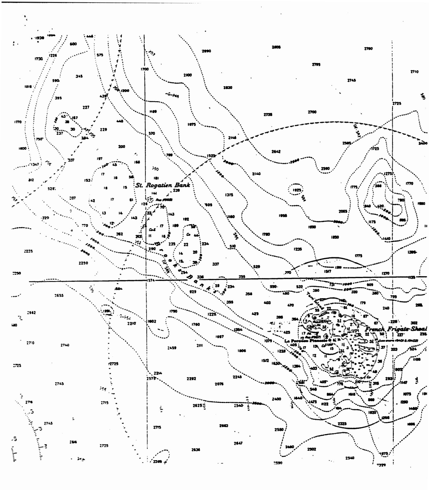

# Review of Status of Coral Reefs around American Flag Pacific Islands

and

# Assessment of Need, Value, and Feasibility of Establishing a Coral Reef Fishery Management Plan for the Western Pacific Region

# Final Report prepared for Western Pacific Regional Fishery Management Council

Cynthia L. Hunter 13 March 1995

#### **EXECUTIVE SUMMARY**

Recent concern has been raised over the potential need for a Coral Reef Fisheries Management Plan for the Western Pacific region. On a global basis, coral reefs are valuable economic resources, although many reefs ecosystems have been degraded because of human-caused damage or over-exploitation. The overall area of coral reef habitat in the Western Pacific Regional Fisheries Management Council (WPRFMC) region is estimated at 15,852 km² the majority of which (10,762 km²) is under WPRFMC fisheries management jurisdiction (generally 3-200 nm from shore). Major resource uses for most of the region are limited to areas close to shore (<3 nm) and population centers. The general condition of reefs in the region varies from poor to excellent, again related to proximity to population centers and regions of coastal development.

Precious coral, lobster, bottom fish and pelagic fisheries are currently managed within the WPRFMC region. Present and future potential uses of coral reef resources not currently managed within the region may include the collection of live corals and "live rock" for the aquarium trade. Live rock is an essentially non-renewable resource, although efforts are underway to investigate the potential for aquacultural production of live rock. Fisheries Management Councils in Florida and the Gulf of Mexico have recently passed management plans that will limit and eventually ban (in 1997) the collection of live rock in the EEZs of those waters. These actions may be expected to cause live rock collectors in that industry to look elsewhere for resources.

Reef resources in most areas of the WPRFMC have not been adequately mapped nor inventoried. There is a need for baseline information specific to these areas to provide information necessary for their conservation and management.

Introduction
Rationale for Report

In 1994, a U.S. Coral Reef Initiative was proposed and plans were put in action to develop a strategy of integrated programs with the overall intent of strengthening reef protection and improving monitoring and research on coral reef ecosystems. State, federal, regional, and international agencies and organizations are participating in various aspects of the proposed initiative. The first steps in the involvement of most agencies in the Coral Reef Initiative will involve an assessment of the adequacy of their current management regimes and a compilation or summary of data on reef resources for pertinent regions.

The Western Pacific Regional Fishery Management Council (WPRFMC) establishes policy for fisheries management in federal waters of the Exclusive Economic Zone (EEZ) around American Samoa, Guam, Hawaii, the Northern Marianas, and other American Flag Pacific Islands (AFPI). In response to the Coral Reef Initiative and growing concern about the health and sustainability of coral reef resources in the Pacific, WPRFMC has begun an assessment of the need, value, and feasibility of establishing a Coral Reef Fishery Management Plan for the Western Pacific Region. In order to provide a basis for decision-making on these issues, this report will review the current status of coral reefs and use of reef resources in the region.

Legal jurisdiction for fisheries management around many reefs in the WPRFMC region is complex, extending in some cases to multiple government entities or agencies. Passage of the federal Omnibus Act, currently before Congress, would transfer authority of a number of islands and their submerged lands within 0-3 nm of shore to the State of Hawaii or the Commonwealth of the Northern Mariana Islands. Jurisdiction according

to the opinion of legal counsel for WPRFMC (T.M. Beuttler, NOAA General Counsel, 17 February 1995), and islands potentially impacted by the Omnibus Act are presented in Table 1.

## **Objectives**

The objectives of this review were the following:

- Define locations and areas of reefs [total km² per island/atoll/ or shoal] within 0-3 nm and 3-200 nm from shore for Hawaii [Main Hawaiian Islands (MHI) and Northwest Hawaiian Islands (NWHI)], American Samoa, Guam, the Northern Marianas, Johnston, Howland, Baker, Jarvis, Palmyra, Kingman Reef and Wake;
- Qualify reef habitats and condition, predominant coral species, and related ecosystem components;
- Describe human use of each reef area, including exploitation methods, economic/subsistence value, tourism/recreational use, social/cultural significance (where available), sustainability, and development potential;
- 4. Describe resource use problems or conflicts; and
- List potential management or information needs by major area and address the feasibility of management options.

### Reef Areas in the WPRFMC Region

Coral reef ecosystems are the most biologically diverse of all marine ecosystems (Grassle, et. al., 1990). Reef habitat is primarily composed of living stony coral and coralline algae growing on hard substratum (usually older reef structure but often on basalt). In addition, reef habitat may be the structural remnants of coral that thrived in previous periods but that still have numerous associated reef organisms (i.e. "live rock"). The vertical relief and habitat complexity provided by either live coral, live rock, or a mixture of these, enhances the biodiversity and fisheries productivity of coastal marine areas in the tropical and sub-tropical Pacific (Grigg, 1994).

Although maximum reef growth and productivity occurs between 5-15 m (Hopley and Kinsey, 1988), maximum diversity occurs at 10-30 m (Huston, 1985), extensive coral growth may occur at depths to 100 m or more (Veron, 1986). Reef habitat for the present study was defined as the substratum adjacent to coastlines (or on shoals) from depths of 0-100 m that is primarily composed of hard-bottom. Because of physical constraints (e.g. sandy or muddy bottom, proximity to stream mouths, exposure at low tides, high wave energy) all of this area is not available to nor colonized by living coral. The effects of hurricanes, crown-of-thorns sea star predation, subsidence/ uplifting, or volcanism may dramatically alter the measurable amount of living coral in an area over historical or geological time periods.

Even within a thriving coral reef habitat, not all space is occupied by corals or coralline algae; reefs are typically patchworks of coral, algae, and sand. Brock, et al. (1965) estimated that the percent cover of coral at Johnston Atoll ranged from 60-100%. Grigg and Dollar (1980) estimated coral cover at sites within the Hawaiian archipelago ranging between 8-98%. Reef flats at French Frigate Shoals had 17% coral cover while lagoon

reefs averaged 6% (Atkinson and Grigg, 1984). DiMartini, et al. (1994) described the reefs of Midway Atoll as >90% dead coral rock on the outer barrier reef; microatolls of *Montipora* spp. were 30-70 % live coral inside the reef.

The importance of the above discussion is that coral reef ecosystems are extremely variable in their spatial features, coral cover, and physiography (and thus productivity). Most of the reef areas in the WPRFMC region have not been quantitatively assessed. Thus, the individual and combined estimates of reef area presented in this report must be cautiously interpreted as approximations.

Table 2 summarizes the areal coverage of coral reef habitat from 0-3 nm and from 3-200 nm from shore for each area within the WPRFMC region. A breakdown of island size and reef area statistics for each island, atoll, or shoal are presented in Table 3. Reef type and dominant coral species are provided in Table 4.

The WPRFMC region comprises a total of 106 recognized reef areas with a combined estimated area of 15,852 km². All known reef types [atoll, fringing, barrier/lagoon, submerged reefs or shoals, and non-structural reef communities (sensu Maragos and Holthus, in press)] are represented within the region.

Main Hawaiian Islands--Coral reefs around most of the Main Hawaiian Islands (Oahu, Molokai, Kauai, and Maui) were meticulously mapped in the late 1970's and early 1980's as part of a state-wide coastal inventory sponsored by the U.S. Army Corps of Engineers and Hawaii State Department of Transportation (AECOS, 1979; 1981a,b; 1984). However, no quantification of overall reef area was attempted as part of these studies.

Grigg and Dollar (1980) estimated percent coral cover, species diversity, coral growth rate, and the area of reef habitat between 0-20 m around Hawaii, Oahu, Kauai, and Maui. They found that the number of species was highest at French Frigate Shoals (23) and Maro Reef (21) and suggested that the factor most affecting coral species diversity and community structure in the Hawaiian archipelago was diversity of habitat type (rather than Jatitude or island size as had been a priori predictions). High islands with primarily only seaward reefs and reef flats had generally lower species diversity than areas (e.g. French Frigate Shoals and Maro Reef) with lagoons, patch reefs, etc., in addition to seaward reef and reef flats. Coral species diversity and community structure within an area appear to be controlled largely by successional age related to the frequency and intensity of (usually physical) disturbances (Grigg and Maragos, 1974; Grigg and Dollar, 1980; Grigg, 1983).

Reef habitat of the Main Hawaiian Islands within WPRFMC jurisdiction (3-200 nm) occurs only at Penguin Bank and a small area around Kaula. Navigational charts show numerous areas of coral or coralline algae on Penguin Bank at depths of approximately 50 m, although areas between 50-100 m depth have been described as having a low abundance of corals and are predominantly coralline algae, *Halimeda*, bryozoans, and pen shells (Agegian and Abbott, 1985).

Northwestern Hawaiian Islands--The majority of coral reef habitat within the WPRFMC region occurs in the northwest Hawaiian archipelago, with 48% of the reef area in the region between 0-3 nm and 85% of reef area at distances of 3-200 nm from shore. Numerous studies on corals, fish, and invertebrates have been conducted by University of Hawaii and other researchers at Midway and French Frigate Shoals. Species diversity,

percent coral cover and area of reef habitat between 0-20 m were estimated around nine islands or atolls (Grigg and Dollar, 1980; see above discussion).

American Samoa--Qualitative studies of reefs around Tutuila in 1980 and 1992 provide fairly thorough descriptions of species diversity and changes in nearshore reef habitat over that period (AECOS, 1980; Maragos et al., 1994). Baseline quantitative surveys have been conducted at Fagatele Bay (Birkeland, et al., 1987; 1991; in prep.), other sites around Tutuila (Birkeland and Randall, 1979) and at Ofu (Hunter, et al., 1993) and more areas have been recently established by the Department of Marine and Wildlife Resources (DMWR) for continued quantitative monitoring. DMWR recently completed quantitative surveys of the fish, sessile invertebrates, giant clams, and crown-of-thorns sea stars on five of the seven island in the Territory (pers. comm., A. Green & P. Craig, DMWR, March, 1995). DMWR also estimates annual harvests of reef fish and invertebrates. Craig, et al., (1993) reviewed the current status of the rapidly collapsing coral reef fisheries in American Samoa.

Only a small area of reef habitat (approximately 25 km²) located 3-5 nm off the west (Cape Taputapu) and east (Cape Matatula) shores of Tutuila is under WPRFMC jurisdiction. Navigational charts indicate coral on these shoals at depths of 60-120 m but no additional information is available on their abundance and diversity.

Guam--Nearshore coral reefs of Guam were extensively mapped (Randall, 1976) but overall reef areas have not yet been quantified.

Quantitative surveys are rare except for a few areas on Guam, although long-term monitoring sites have been established in recent years (Pacific Basin Development Council, 1995).

Four submerged banks are located within 3-200 nm of the island of Guam with a combined area of 110 km2: Galvez Banks, Rota Banks, Santa Rosa Banks, and unnamed shoals south of Guam. There is no available information on the type or extent of reef development in these areas.

Northern Marianas Islands--Jurisdiction of fisheries (and coral reefs) from 0-200 nm appears, at present, to be under WPRFMC authority. Although University of Guam researchers have surveyed reef areas in Såipan, Rota, and Tinian, there have been no systematic inventories of reefs surrounding the northern islands. However, a recent publication (Asakura and Furuki, 1994--not seen) describes specimens collected during a biological expedition to the northern islands in 1992 (pers. comm., J. Gourley, March, 1995).

Beyond 3 nm from shore, only the shoals surrounding Farallon de Medinilla and the shoals and lagoon system at 3-4 nm off the west coast of Saipan contain reef habitat. However, navigational charts indicate that at least 20 submerged shoals scattered among the northern islands and from 120-180 nm to the west of the island chain contain coral reef habitat. Again, there have been no systematic inventories of these reef areas.

Other American Flag Pacific Islands--WPRFMC jurisdiction extends 0-200 nm from shore for Howland, Baker, and Jarvis Islands and from 3-200 nm around Johnston, Palmyra, Kingman, Wake, and Midway. Coral reef habitat surveys have been conducted only at Johnston and Midway. No surveys have been made on reefs beyond 3 nm from shore, although substantial reef habitat occurs in these waters, particularly around Johnston and Palmyra.

#### Human Use of Reef Resources

Major uses of reef resources in the WPRFMC region are summarized in Table 5. Estimated values of resources in U.S. dollars per annum are also presented where available. Although dollar amounts are more often available for commercial fishing, the estimated values of artisanal/ recreational fishing, tourism, and research (where available) far surpass those of commercial fish, lobster, or precious coral landings combined. It is also noteworthy that these diverse resource uses may often result in user conflicts. Overfished or damaged reefs generally lose their attraction to tourists. The value of shoreline coastal protection from wave action and erosion provided by reefs has not been estimated in this report.

Coral reefs rank among the most highly production ecosystems in the world. In terms of productivity, gross primary production in an area of high (near 100%) coral cover may be 20 g C m²d¹ while adjacent areas of sand or coralline algae produce approximately 1-5 g C m²d¹ (Kinsey, 1991). Interestingly, because of low nutrient input and internal recycling of nutrients, *net* productivity of reefs is a relatively small proportion (about 2-3%) of this amount and only slightly higher than that of surrounding oceanic waters (Kinsey, 1991). Therefore, although standing crops on reefs may be high, sustainable fisheries yields may be much lower, on the order of 100 g C m²yr¹ Wilkinson and Buddemeier (1994).

Coral reef fisheries are nearly as diverse as the reef itself, with commercial, recreational, subsistence and ornamental fishermen targeting midwater and bottom-dwelling finfish, lobsters, crabs, shellfish, and plants. Potential yields from coral reef fisheries have been reported to reach 10-20 mt/km² annually (Munro and Williams, 1985), which represents a considerable food resource for small Pacific islands. Estimates from

American Samoa range from 8-20 mt/km² per year (Arias-Gonzales, et al., 1994). Experimental evidence also suggests that some reefs may be resilient to long-term fishing pressure (Schroeder, 1989). Fisheries productivity is also dependent on depth, coral cover, reef species composition, and spatial heterogeneity (Marten and Polovina, 1982). Arias-Gonzales, et al. (1994) found that the sizes of areas on which estimates of fisheries yields were based were inversely proportional to the size of observed catches of reef fishes for those areas; smaller study areas produced larger estimated yields by approximately an order of magnitude. Numbers of invertebrates (e.g. giant clams, *Trochus*, and sea cucumbers) are also dependent on reef depth and bottom types. Therefore, estimates of potential fisheries productivity are affected by intrinsic physical and biological features of reefs as well as by the size of the reef areas surveyed. Wide variation in estimates of potential yields is partially due to the different size classes and trophic levels being targeted. Highest sustainable yields of reef fishes can be derived by exploiting a wide size range of fishes.

Nonconsumptive uses such as reef-related tourism is a large and growing industry, particularly in the Main Hawaiian Islands, Guam, and Saipan. In these areas, scuba diving and snorkeling activities are dependent on the quality of coral reef habitat. Other areas in the WPRFMC region are not tourist destinations because of their remote location or protected status.

Extraction of coral for use as curio pieces or as live rock for the aquarium trade has been severely restricted or banned for most nearshore reef areas in the WPRFMC region. The State of Hawaii prohibits taking or damaging of any coral or live rock; selling of the eight most common local species is also prohibited. In American Samoa, collection of coral is banned at depths < 60' and only by permit at depths > 60'. No collection of corals is permitted in Guam except for scientific or educational purposes. In the

Northern Mariana Islands, live coral collection is banned and a permit is required for taking of dead coral (primarily used for manufacture of "afuk", or betel nut lime). Despite these restrictions, poaching abetted by lack of enforcement of regulations occurs in most, if not all, areas (Pacific Basin Development Council, 1995).

The U.S. imported 345,000 pieces of live coral in 1991. Although taking of live corals is prohibited in many areas, live corals are imported to the U.S. and European aquarium trade markets, largely from Indonesia, Haiti, the Philippines, southeast Asia, Fiji, Tonga, and Kiribati (Wells, et al., 1994). The Marshall Islands are also reported to have begun exporting coral and live rock within the past year (pers. comm., A. Orcutt, UH Sea Grant). Import of corals to the U.S. is addressed by the Lacey Act which prohibits import of illegally collected or exported species. Parties to the Convention on International Trade in Endangered Species of Wild Fauna and Flora (CITES) require a permit from the country of origin before allowing import of stony corals (Wells, et al., 1994).

Extraction of live rock is considered to be consumption of an essentially non-renewable resource (Florida Marine Fisheries Commission, 1992). The present demand for live rock in the U.S. and European aquarium trade is estimated to be 1000 tons/year (Delreek and Sprunge, 1994). Domestic harvest of live rock in the U.S. provides less than half of this amount. Reported landings of live rock in Florida totaled approximately 390 tons in 1992 (Wells, et al., 1994). The estimated ex-vessel value of live rock from the EEZ off Florida in FY1995 was predicted to be \$3.5 million (Florida Marine Fisheries Commission, 1992). However, the most recent amendment to the Fishery Management Plan for Coral and Coral Reefs of the Gulf of Mexico and South Atlantic (December, 1994) stipulated a quota of 485,000 lbs of live rock in 1995 and a step-down closure of the fishery in

1996 and 1997. This closure may be expected to encourage live rock collectors to search elsewhere for sources.

In addition to harvesting live coral and live rock from natural reef communities, recent efforts have been initiated to investigate the potential for producing these resources through aquaculture. Progress in spawning and culturing of corals has been made in public aquaria (Yates and Carlson, 1993) that could eventually lead to the replacement of wild-caught stocks in the aquarium trade. University of Guam researchers are also exploring the feasibility of using laboratory-reared coral larvae to reseed disturbed or damaged reef areas (Richmond, 1993). Sea Grant is supporting trials in Florida and Hawaii to produce commercially viable live rock using cement or other alternative substrates (Wells, et al., 1994).

## Condition and Quality of Coral Reefs in the WPRFMC Region

A qualitative evaluation of the general condition of each reef area (where available) is presented in Table 6. With noted exceptions, most reefs in the region are in excellent (pristine) condition because of their remoteness from land and/or their protected status. Reefs close to human population centers or areas of rapid development show characteristic deterioration from the single or combined impacts of runoff-siltation, eutrophication, industrial pollution, dredging-filling, destructive fishing methods and overfishing. Over-harvesting of reef fishes, particularly algal grazers, can lead to proliferation of macro-algae that eventually smother or otherwise outcompete slower-growing corals for space (Hughes, 1993). Over-use from reef-related tourism activities, including trampling, anchor damage, and ancillary pressures of increased coastal construction, sewage disposal, and seafood collecting, may also be damaging to reefs. Reports of damage from

anthropogenic stresses to reefs in the WPRFMC region are summarized in Table 6.

In addition to human-caused stresses, natural forces including typhoons, predation (e.g. corallivorous crown-of-thorns sea stars, *Drupella* snails), and disease have caused tremendous damage to reefs worldwide. In fact, such disturbances create new open space on reefs allowing recruitment of larvae; intermediate levels of disturbances have been shown to maximize coral species diversity (Grigg, 1983). However, most reef scientists are in agreement that, while reefs have survived and been resilient to natural stresses for millennia, the addition of chronic anthropogenic stress can have long-term negative impacts (Grigg and Dollar, 1990; Hughes, 1993; Wilkinson, 1993; Wilkinson and Buddemeier, 1994).

Of all reefs in the WPRFMC region, those in American Samoa have probably suffered the most damage and degradation. Living coral cover on reefs surrounding Tutuila is currently very low (3-13%, down from 60%) because of a series of typhoons and crown-of-thorns sea star infestations, coupled in some areas with siltation stress, pollution and over-fishing (American Samoa Department of Wildlife and Marine Resources Advisory, December, 1994). Giant clams have been harvested to very low levels on Tutuila; the collection of dead of coral rubble for traditional uses and cement has also resulted in reef degradation (pers. comm., A. Green & P. Craig, DMWR, March, 1995). For reef fishes, catch-per-unit-effort in American Samoa has declined 50% over the past 15 years (Craig, et al., 1993) and industrial pollution has created unsafe levels of heavy metals and hydrocarbons in fish caught in Pago Pago harbor (American Samoa Dept. of Health, 1991). Reefs in Guam, Saipan, and the Main Hawaiian Islands have also shown deterioration stemming mainly from coastal construction, siltation, and the effects of overfishing (Pacific Basin Devel. Council, 1995).

#### Management Needs for Corals and Reefs in the AFPI-EEZ

Reef resources around most inhabited Pacific islands presumably have been sustainably used for thousands of years. However, there is escalating concern that population increases and poor management practices have resulted in, and will continue to cause, deterioration of reef quality and productivity in many areas. Unfortunately, there are few long-term quantitative assessments of the abundance and health of coral reef communities. Such baseline information is crucial and primary to management needs of reef resources.

Increased public awareness of the value of coral reefs as well as an understanding of potential threats to their sustainable use is also of critical importance to the protection of these resources. In addition to extractive resource use of reef areas for food, construction material or the aquarium trade, a large part of the "value" often attributed to coral reefs is one of natural beauty and esthetics. However, tourism itself can be an ecologically benign "use" of coral reefs only if carefully managed so as to prevent overuse and damage.

Management options for a potential WPRFMC Coral Reef Fisheries

Management Plan may include elements similar to those of other fisheries:

limited entry, catch limits, protected areas or reserves, or seasonal

restrictions. Guidelines for evaluation and management of coral harvesting

have been thoroughly outlined by Wells, et al. (1994). These authors

emphasize the importance and need for information on the basic biology of

potential coral fishery species--reproductive season, recruitment and growth

rates, natural mortality--upon which to base strategies for sustainable yields.

Grigg (1984) applied the Beverton-Holt fisheries management model to

generate an estimate of maximum sustained yield (MSY) and minimum size for harvest for the rose coral, *P. meandrina*, based on age and growth rates of this species measured in the Philippines. He found that native fishermen were harvesting this species near the calculated MSY level of 18 cm colony diameter (6 year age class). Grigg (1976) estimated that size at sexual maturity for this coral was approximately 16 cm. Such information is presently available for a only a small percentage of coral species.

#### Literature Cited

- AECOS, 1979. Oahu Coral Reef Inventory. Prepared for U.S. Army Corps of Engineers, Pacific Ocean Division.
- AECOS, 1981. Maui Coastal Zone Atlas: representing the Hawaaii coral reef inventory, Island of Maui. Produced for Harbors Division, Department of Transportation, State of Hawaii.
- AECOS, 1981. American Samoa Coral Reef Inventory. Development Planning Office, American Samoa. 313 pp.
- AECOS, 1982. Kauai Island Coastal Resource Inventory. Prepared for U.S. Army Corps of Engineers, Pacific Ocean Division.
- Agegian, C.R. and Abbott, I.A. 1985. Deep water macroalgal communities: a comparison between Penguin Bank, Hawaii and Johnston Island. Proc. 5th Intl. Coral Reef Congr., Tahiti, 5:46-50.
- Asakura, A. and Furuki, T. 1994. Biological expedition to the Northern

  Mariana Islands, Micronesia. Natural History Research, Special Issue,

  Number 1. Natural History Museum and Institute, Chiba, Japan. 344 pp.
- American Samoa Department of Health. 1991. American Samoa Health Bulletin: Don't eat the fish in inner Pago Pago Harbor!

  American Samoa Department of Health Advisory, 6pp.
- Arias-Gonzales, J.E., Galzin, R., Nielson, J., Mahon, R. and Aiken, K. 1994.

  Reference area as a factor affecting potential yield estimates of coral reef

  fishes. Naga (ICLARM Quarterly). October, 1994, pp. 37-40.

- Atkinson, M.J. and Grigg, R.W. 1984. Model of a coral reef ecosystem. II.

  Gross and net benthic primary productivity at French Frigate Shoals,

  Hawaii. Coral Reefs 3:13-22.
- Birkeland, C., Amesbury, S. and Randall, R.H. 1991. Coral and reef-fish assessment of the Fagatele Bay National Marine Sanctuary. Report to NOAA, U.S. Dept. of Commerce. Univ. of Guam Marine Lab. NOAA Tech. Memorandum Series. Mangilao, Guam, 126 pp.
- Birkeland, C. and Randall, R.H. 1979. Report on the *Acanthaster planci*(Alamea) studies on Tutuila, American Samoa. Univ. of Guam Marine Lab for the Director, Office of Marine Resources, Govt. of American Samoa.

  53 pp + app.
- Birkeland, C. and Randall, R.H., Wass, R.C., Smith, B. and Wilkens, S.

  1987. Biological resource assessment of the Fagatele Bay National

  Marine Sanctuary. NOAA Technical Memorandum, NOS MEMD 3, U.S.

  Dept. of Commerce, Washington, D.C. 232 pp.
- Brock, V.E., Jones, R.S., and Helfrich, P. 1965. An ecological reconnaissance of Johnston Island and the effects of dredging. Ann. Rep. to USACE (AT (26-1)-90) Hawaii Marine Lab Tech. Report #5. 90 pp.
- Craig, P., Ponwith, B., and F. Aitaoto. 1993. The commercial, subsistance, and recreational fisheries of American Samoa. Mar. Fish. Rev. 55(2):109-116.
- Delreek, J.C. and Sprung, J. 1994. The reef aquarium. Recordia Publ., Coconut Grove, Florida. 544 pp.

- DiMartini, E.E., Parrish, F.A., and Parrish, J.D. 1994. Temporal comparisons of reef fish populations at Midway Atoll, NWHI. National Marine Fisheries Service, Southwest Fisheries Science Center Admin. Report H-94-05. 56 pp.
- Grassle, J.F., Laserre, P., McIntyre, A.D. and Ray, G.C. 1990. Marine biodiversity and ecosystem function. Biology International 23, 19 pp.
- Grigg, R.W. 1976. Fishery management of precious and stony corals in Hawaii. Univ. Hawaii Sea Grant Tech. Rep. 77-03.
- Grigg, R.W. 1983. Community structure, succession and development of coral reefs in Hawaii. Mar. Ecol. Prog. Ser. 11:1-14.
- Grigg, R.W. 1984. Resource management of precious corals: a review and application to shallow water reef building corals. Mar. Ecol. 5(1):57-74.
- Grigg, R.W. 1994. Effects of sewage discharge, fishing pressure and habitat complexity on coral ecosystems and reef fishes in Hawaii. Mar. Ecol. Prog. Ser. 103:25-34.
- Grigg, R.W. and Maragos, J.E. 1974. Recolonization of hermatypic corals on submerged lava flows in Hawaii. Cology 55:387-395.
- Grigg, R.W. and Dollar, S.J. 1980. The status of reef studies in the Hawaiian Archipelago. Proc. Sym. Status of Resource Investigations in the Northwestern Hawaiian Islands. Univ. Hawaii Sea Grant MR-80-04. pp. 100-119.

- Grigg, R.W. and Dollar, S.J. 1990. Natural and anthropogenic disturbances on coral reefs. In: Dubinsky, Z. (ed.) Coral Reefs: Ecosystems of the World, Elsevier, Amsterdam, 25:439-452.
- Hopley, D. and Kinsey, D.W. 1988. The effects of a rapid short-term sea level rise on the Great Barrier Reef. In: Pearman, G.I. (ed.) Greenhouse: planning for a climate change. E.J. Brill, New York. pp. 189-201.
- HORMP. 1991. Hawaii Ocean Resources Management Plan. Technical Supplement. Hawaii Ocean and Marine Resources Council. 159 pp.
- Hughes, T.P. 1993. Coral reef degradation: a long-term study of human and natural impacts. In: Ginsberg, R. (ed.) *Global Aspects of Coral Reefs:*Health, Hazards, and History, Univ. Miami. pp. C20-24.
- Hunter, C.L., Friedlander, A.M., Magruder, W.M., and Meier, K.Z. 1993. Ofu reef survey: baseline assessment and recommendations for long-term monitoring of the proposed National Park, Ofu, American Samoa. Final Report to the U.S. National Park Service, Pago Pago, American Samoa. 92 pp.
- Huston, M.A. 1985. Patterns of species diversity on coral reefs. Ann. Rev. Ecol. Syst. 6:149-177.
- Kinsey, D.W. 1991. The coral reef: an owner-built, high-density, fullyserviced, self-sufficient housing estate in the desert-or is it? Symbiosis 10:1-22.

- Maragos, J.E. and Holthus, P. in press. A preliminary status report on the coral reefs of the insular tropical Pacific. Pacific Science Assoc. and EastWest Center Workshop on Marine/Coastal Biodiversity in the Tropical Island Pacific Regions. 25 pp. + 20 tables.
- Maragos, J.E., Hunter, C.L., and K.Z. Meier. 1994. Reefs and corals observed during the 1991-1992 American Samoa Coastal Resources Inventory. Final Report to American Samoa Department of Marine and Wildlife Resources. 30 pp + 2 app.
- Marten, G.G. and Polovina, J.J. 1982. A comparative study of fish yields from various tropical ecosystems. In: Pauly, D. and Murphy, G.J. (eds.) Theory and Management of Tropical Fisheries. ICLARM Conf. Proc. 6:255-289.
- Munro, J.L. and D.M. Willams. 1985. Assessment and management of coral reef fisheries: biological, environmental and socio-economic aspects. Proc. Fifth Int. Coral Reef Congress 4:543-587.
- Pacific Basin Development Council. 1995. American Flag Pacific Islands

  Coral Reef Initiative: Management Program Planning Meeting Summary
  Report. 24 pp.
- Richmond, R.H. 1993. Coral reefs: present problems and future concerns resulting from anthropogenic disturbance. Amer. Zool. 33:524-536.
- Schroeder, R.E. 1989. The ecology of patch reef fishes in a subtropical Pacific atoll: recruitment variability, community structure and effects of fishing predators. Ph.D. Dissertation, Univ. Hawaii, Honolulu. 321 pp.

- Veron, J.E.N. 1986. Corals of Australia and the Inso-Pacific. Angus and Robertson, London. 644 pp.
- Wells, S., Holthus, P., and Maragos, J. 1994. Environmental guidelines for reef coral harvesting operations. Apia, Western Samoa:SPREP Reports and Studies No. 75, 50 pp.
- Wilkinson, C.R. 1993. Coral reefs of the world are facing widespread devastation: can we prevent this though sustainable management practices? Proc. 7th Int. Coral Reef Symp., Guam 1:11-21.
- Wilkinson, C.R. and Buddemeier, R.W. 1994. Global climate change and coral reefs: implications for people and reefs. Report of the UNEP-IOC-ASPEI-IUCN Global Task Team. IUCN, Gland, Switzerland. 124 pp.
- Yates, K.R. and Carlson, B.A. 1993. Corals in aquariums: how to use selective collecting and innovative husbandry to promote reef conservation. Proc. 7th Int. Coral Reef Symp., Guam. 2:1091-1095.

Figure 1. Excerpt from navigational chart (NOAA #19019) showing example of potential reef habitat (submerged banks marked "co") in Northwestern Hawaiian Islands.

Table 1. Jurisdictional authority of coral reef and fisheries management in WPRFMC region, as interpreted by T.M. Beuttler, NOAA Office of General Counsel (1995).

#### Protected Waters from:

|                                        |            | Ottober 0 |                      |          |
|----------------------------------------|------------|-----------|----------------------|----------|
| Location                               |            | Status ?  | 0-3 nm               | 3-200 nm |
| American Samoa                         |            |           | American Samoa       | WPRFMC   |
| Rose Atoli                             |            | NWR       | DOI                  | WPRFMC   |
| Guam                                   |            |           | Govt. of Guam        | WPRFMC   |
| Hawaii-Main Hawaiian Islands           |            |           | State of Hawaii      | WPRFMC   |
| Hawaii-Northwestern Hawaiian Islands   |            |           |                      |          |
| French Frigate Shoals                  |            | NWR       | DOI, State of Hawaii | WPRFMC   |
| Gardner Pinnacles                      |            | NWR       | DOI, State of Hawaii | WPRFMC   |
| Kure                                   |            | NARS      | State of Hawaii      | WPRFMC   |
| Laysan                                 |            | NWR       | DOI, State of Hawaii | WPRFMC   |
| Lisianski                              |            | NWR       | DOI, State of Hawaii | WPRFMC   |
| Maro Reef                              |            | NWR       | DOI, State of Hawaii | WPRFMC   |
| Midway                                 | *          | NWR       | DOI, US Navy         | WPRFMC   |
| Necker                                 |            | NWR       | DOI, State of Hawaii | WPRFMC   |
| Nihoa .                                |            | NWR       | DOI                  | WPRFMC   |
| Pearl and Hermes Atoll                 |            | NWR       | DOI                  | WPRFMC   |
| All other banks, shoals, and seamounts |            |           | WPRFMC               | WPRFMC   |
| Northern Mariana Islands               |            |           |                      |          |
| Rota                                   | **         |           | WPRFMC               | WPRFMC   |
| Saipan                                 | **         |           | WPRFMC               | WPRFMC   |
| Tinian                                 | **         |           | WPRFMC               | WPRFMC   |
| All other islands, banks, and shoals   | **         |           | WPRFMC               | WPRFMC   |
| Johnston                               | •          | NWR       | DOI, US Navy         | WPRFMC   |
| Howland                                | , <b>*</b> | NWR .     | DOI, WPRFMC          | WPRFMC   |
| Baker                                  | •          | NWR       | DOI, WPRFMC          | WPRFMC   |
| Jarvis                                 | *          | NWR       | DOI, WPRFMC          | WPRFMC   |
| Palmyra                                | •          |           | private/DOI          | WPRFMC   |
| Kingman Reef                           | •          |           | US Navy              | WPRFMC   |
| Wake                                   | •          |           | US Air Force         | WPRFMC   |

the Omnibus Act, currently under consideration by Congress, would transfer ownership and control to State of Hawaii

#### Acronyms:

DOI=U.S. Department of Interior, Fish and Wildlife Service
NARS=Natural Area Reserve System, Hawaii Department of Land and Natural Resources
NWR=U.S. National Wildlife Refuge
WPRFMC=Western Pacific Regional Fishery Management Council

the Omnibus Act would also amend the Territorial and Submerged Lands Act to include NMI and transfer ownership to the Commonwealth of the Northern Mariana Islands government

Table 2. Summary of overall reef areas (0-100 m) in the WPRFMC region.

| <del>-</del>                  | De     | ef Area (km2) | <del></del>            |
|-------------------------------|--------|---------------|------------------------|
|                               | 0-3 nm | 3-200 nm      | Area Total             |
| American Samoa                | 271    |               | (2 3 ,) 296 |
| Guam                          | 69     | 110           | 179                    |
| Main Hawaiian Islands         | 1,655  | 880           | 2,535                  |
| Northwestern Hawaiian Islands | 2,430  | 9,124         | 11,554                 |
| Northern Mariana Islands      | 45     | 534           | 579                    |
| Other                         | 620    | 89            | 709                    |
| Region Total                  | 5,090  | 10,762        | 15,852                 |

AS/2 = 1.71% 0.16%, 1.87%

Table 3. Island and reef size statistics for the WPRFMC region. Nearshore (0-3 nm) reef areas for the Main Hawalian Islands, American Samoa, Guam and NM were calculated by multiplying Island perimeter (km) x an "average" Island reef width x an estimated of the percent of each Island shoreline that is predominantly reef habitat. All other reef areas were estimated from NOAA navigational charts. Reef types are modified from Maragos and Holthus, in press and are abbreviated as the following: a-atol; [-fringing: b-barrier/ Ingoon, ns-non-structural reef community, sb-submerged bank or shoal.

ij

| na-inf   | na-information not available;information not applied | plied       |            |     |           |        |                                                           | †         |             |           |          |                                           |
|----------|------------------------------------------------------|-------------|------------|-----|-----------|--------|-----------------------------------------------------------|-----------|-------------|-----------|----------|-------------------------------------------|
|          |                                                      |             | bratel     |     | Reef Area | Est    | Reef Width                                                | Reef Area | Area (km2)4 | Reef Area | Ree      | 0                                         |
| Location |                                                      | Island Size | Perimeter  | 1 3 |           | -      |                                                           | 0-100 m   | +-          | km2       | Types    | Comments on Reef Area                     |
|          |                                                      |             | (km) 1[4]  |     | (km2) 3   | -      | km 4                                                      | 0-3 nm    | Ę           | 0-200 nm  |          | within 3-200 nm EEZ                       |
| *=no en  | **no emergent land mass                              |             |            |     |           |        |                                                           |           | -           |           |          |                                           |
|          |                                                      |             |            |     |           |        |                                                           |           |             |           |          |                                           |
| Hawaii   | Hawaii-Main Hawaiian Islands                         |             |            |     |           |        |                                                           |           |             |           |          |                                           |
|          | Hawaii                                               | 10433       | Š          | 2   | 224       | 20%    | 9                                                         | 252       | •           | 252       | f, 73    |                                           |
|          | Kahoolawe                                            | 116         | 58         | 2   | E         | 100%   | 1.0                                                       | 28        | 0           | 58        | 23       |                                           |
|          | Kauai                                                | 1431        | 177        | 2   | 218       | 75%    | 2.0                                                       | 566       | 0           | 266       | f,b, ns  |                                           |
|          | Ksub                                                 | -           | 3          | 2   | 2         | 100%   | 10.0                                                      | 18        | 10          | 28        | 33       | 3-6 nm at' 10-120 m                       |
|          | Lanai                                                | 364         | 84         | 2   | 2         | 75%    | 1.5                                                       | 95        | 0           | 95        | f,ns     |                                           |
|          | Lehua                                                | 1           | <u> </u>   | 2   | 2         | 100%   | 0.                                                        | 4         | 0           | 4         | 7        |                                           |
|          | Maui                                                 | 1884        | 240        | 2   | 506       | 75%    | 1.5                                                       | 270       | ٥           | 270       | f,ns     |                                           |
|          | Molokal                                              | 674         | 171        | 2   | 2         | 20%    | 1.5                                                       | 128       | 870         | 998       | f,ns     | Penguln Bank, 3-30 nm off southwest shore |
|          | Molokini                                             | 0           | [-]        | 2   | 2         | 100%   | 0.                                                        | -         | 0           | -         | 35       |                                           |
|          | Aithrau                                              | 180         | 80         | 2   | 2         | 75%    | 1.0                                                       | 9         | 0           | 60        | f,ns     |                                           |
|          | Cahu                                                 | 1547        | 336        | 2   | 289       | 75%    | 2.0                                                       | 204       | 0           | 504       | f,b,ns   |                                           |
|          | M-Area Totals                                        | 16629       | 1658       | 2   | 2         | 1      | 1                                                         | 1655      | 880         | 2535      |          |                                           |
|          |                                                      |             |            |     |           |        |                                                           |           |             |           |          |                                           |
| Haws.    | Hawaii-Northwestern Hawaiian Islands                 |             |            |     |           |        |                                                           |           |             |           |          |                                           |
|          | Brooks Banks                                         | •           | •          | 2   |           | 1      | •                                                         | 0         | 290         | 290       | 8        | 22-130 m                                  |
|          | French Frigate Shoals                                | 0.25        | 10         | 2   | 510       | 1      | 1                                                         | 456       | 222         | 733       | •        | 0-67 m                                    |
|          | Garmbia Shoal                                        | •           | •          | 2   | 쿹         | 1      | 1                                                         | 0         | 6           | 19        | 8        | 30 m                                      |
|          | Gardner Pinnacles                                    | 0.02        | 2          | 2   | 3         | 1      | 1                                                         | 98        | 1818        | 1904      | 2        | 25-140 m                                  |
|          | Kure                                                 | 0.86        | ∞          | 2   | 55        | 1      | 1                                                         | 147       | 2           | 167       | •        |                                           |
|          | Ladd Seamount                                        | •           | •          | 2   | 2         | 1      | 1                                                         | ٥         | 202         | 202       | 윺        | 6x13 mm area at 70-160 m                  |
|          | Laysan                                               | 4.11        | 2          | 2   | 27        | 1      | 1                                                         | 34        | 23          | 57        |          | 25-80 m                                   |
|          | Listanski                                            | 1.56        | S          | 2   | 325       | 1      | 1                                                         | 202       | 111         | 979       | _        | 0-160 m                                   |
|          | Maro Reef                                            | awash       | 2          | 2   | 431       | 1      | 1                                                         | 2         | 1490        | 1508      | •        |                                           |
|          | Midway                                               | 1.42        | S          | 2   | 101       | 1      | 1                                                         | 203       | 2           | 223       | -        | 3-6 nm off nw shore at 100-120 m          |
|          | Necker                                               | 0.18        |            | Z   | 2         | 1      | 1                                                         | 8         | 140         | 1538      | 2        | 15-100 m                                  |
|          | Nero Seamount                                        | •           | •          | 2   | 2         | 1      | 1                                                         | •         | 5           | 91        | 윭        | 70-150 m                                  |
|          | Whoe                                                 | 0.70        | S          | 臣   | 2         | 1      | 1                                                         | 2         | 922         | 246       | 2        | 10-70 m                                   |
|          | Northhempton Banks                                   | •           | •          | 2   | 쿋         | 1      | 1                                                         | ٥         | 399         | 399       | -28      | 30-140 m                                  |
|          | Pearl and Hermes Atoll                               | 0.36        | 2          | 2   | 359       | 1      | •                                                         | 1166      | ٥           | 1166      | •        |                                           |
|          | Ploneer Bank                                         | •           | •          | Z   | 2         | 7      | 1                                                         | 0         | 7           | 414       | 욻        | 25-50 m                                   |
|          | Raita Bank                                           | •           | *          | 2   | 2         | 1      | 1                                                         | 0         | 513         | 513       | 2        |                                           |
|          | Saint Rogatien Bank                                  | •           | •          | 2   | 2         | 1      | 1                                                         | 0         | 311         | 311       | £        |                                           |
|          | Salmon Banks                                         | •           | •          | 2   | 2         | 1      | 1                                                         | 0         | 142         | 142       | 유        | 5 x 11 nm area at 60-80 m                 |
|          | Unnamed Shoel                                        |             | •          | 2   | 2         | 1      | 1                                                         | ٥         | Ξ           | 114       | 4        | 7 x 8 nm area at 70-100 m                 |
|          | Unnamed Shoal                                        | •           | •          | 2   | 2         | 1      | 1                                                         | 0         | 2           | 2         | - FR     |                                           |
|          | Unnamed Shoel                                        | *           | •          | 2   | 2         | 1      | 1                                                         | 0         | 73          | 73        | å        |                                           |
|          | Unramed Shoal [between Nihoa and Necke               | •           | •          | 2   | 2         | 1      | •                                                         | 0         | 25          | 52        | 욻        |                                           |
|          | Unnamed Shoel [between Nihoe and Necke               | •           | •          | 2   | 2         | 1      | 1                                                         | ٥         | 280         | 280       | -2       | 30-130 m                                  |
|          | Unnamed Shoal [between Nhoa and Necke                | •           | •          | 臣   | 2         | 1      | 1                                                         | 0         | 92          | 85        | da da | 40-80 m                                   |
|          | Unnamed Shoel [north of St. Rogation]                | ٠           | •          |     | 2         | 1      |                                                           | ٥         | 43          | 47        | -        | 60-80 m                                   |
|          | NWHI-Area Totals                                     | ٥           | 94         |     |           |        |                                                           | 2430      | 9124        | 11554     |          |                                           |
| ·        |                                                      |             | Total Mart | •   | waten Arc | Pelago | ı area [Hawalan Archipelago] 0-200 nm = 2,147,985 sq. km] | 21478     | 15 sq. km   | _         |          |                                           |
|          |                                                      |             |            |     |           |        |                                                           |           |             |           |          |                                           |

| Table 3 (cont.) |                                                               |                               | Island    | Reef      | Reef Area | - | = | Reef Area (km2)4 | /km2)4 | Reef Area |       |                       |
|-----------------|---------------------------------------------------------------|-------------------------------|-----------|-----------|-----------|---|---|------------------|--------|-----------|-------|-----------------------|
| Location        | /Atol Name                                                    | Island Size                   | Perimeter | Perimeter | (0-50 m)  |   |   | 0-100 m          | EO     | km2       |       | Comments on Reef Area |
|                 |                                                               | (km2) 1 (km) 1 (km) 2 (km2) 3 | (km) 1    | (km) 2    | (km2) 3   | - |   | 0-3 nm           | > 3nm  | 0-200 nm  | Types | within 3-200 nm EEZ   |
|                 |                                                               |                               |           |           |           |   |   |                  |        |           |       |                       |
| Johnston        | F                                                             | 1.30                          | 2         | 2         | 2         | Ý | 1 | 130              | 75     | 202       | •     | 10-120 m              |
|                 |                                                               |                               |           |           |           |   |   |                  |        |           |       |                       |
| Howland         | 75                                                            | 1.46                          | 2         |           | 2         | 1 | 1 | 2                | ٥      | 2         | -     |                       |
|                 |                                                               |                               |           |           |           |   |   |                  |        |           |       |                       |
| Baker           |                                                               | 1.24                          | 2         | 2         | 2         | 1 | 1 | 2                | ٥      | 2         | -     |                       |
|                 |                                                               |                               |           |           |           |   |   |                  |        |           |       |                       |
| Servis.         |                                                               | 4.45                          | 2         | 2         | 2         | 1 | 1 | 8                | ٥      | 80        |       |                       |
|                 |                                                               |                               |           |           |           |   |   |                  |        |           |       |                       |
| Palmyra         |                                                               | 10.40                         | na        | 2         | 22        | 1 | 1 | 396              | 7      | 400       | -     | 15-300 m              |
|                 |                                                               |                               |           |           |           |   |   |                  |        |           |       |                       |
| Kingman Reel    | n Reef                                                        | 7.80                          | 2         | 2         | 2         | 1 | 1 | 39               | 10     | 49        |       | 0-200m                |
|                 |                                                               |                               |           |           |           |   |   |                  |        |           |       |                       |
| Wake            |                                                               | 7.40                          | 2         | 2         | 578       | 1 | ì | 32               | 0      | 32        |       |                       |
|                 | Other Island-Area Totals                                      | 34                            | 20        | 2         | 2         | - | 1 | 620              | 69     | 709       |       |                       |
|                 |                                                               |                               |           |           |           |   |   |                  |        |           |       |                       |
|                 |                                                               |                               |           |           |           |   |   |                  |        |           |       |                       |
| 1 Stat          | State of Hawaii Data Book, 1994                               |                               |           |           |           |   |   |                  |        |           |       |                       |
| 2 Mars          | Maragos and Holthus, in press.                                |                               |           |           |           |   |   |                  |        |           |       |                       |
| 3 Gripo         | Grigg and Dollar, 1980                                        |                               |           |           |           |   |   |                  |        |           |       |                       |
| 4 pres          | present study, reef area [0-100 m] estimated from NOAA charts | om MOAA c                     | harts     |           |           |   |   |                  |        |           |       |                       |
|                 |                                                               |                               |           |           |           |   |   |                  |        |           |       |                       |
|                 |                                                               |                               |           |           |           |   |   |                  |        |           |       |                       |
|                 |                                                               |                               |           |           |           |   |   |                  |        |           |       |                       |
|                 |                                                               |                               |           |           |           |   |   |                  |        |           |       |                       |

| Action Name                                                                                                                                                                                                                                                                                                                                                                                                                                                                                                                                                                                                                                                                                                                                                                                                                                                                                                                                                                                                                                                                                                                                                                                                                                                                                                                                                                                                                                                                                                                                                                                                                                                                                                                                                                                                                                                                                                                                                                                                                                                                                                                    | Table 3 (cont.) | (cont.)                                |             | Island    | Reef      | eef Area |      | Reef Width | Reef Area (km2)4 | (km2)4 | Reef Area | Reef  |                                               |
|--------------------------------------------------------------------------------------------------------------------------------------------------------------------------------------------------------------------------------------------------------------------------------------------------------------------------------------------------------------------------------------------------------------------------------------------------------------------------------------------------------------------------------------------------------------------------------------------------------------------------------------------------------------------------------------------------------------------------------------------------------------------------------------------------------------------------------------------------------------------------------------------------------------------------------------------------------------------------------------------------------------------------------------------------------------------------------------------------------------------------------------------------------------------------------------------------------------------------------------------------------------------------------------------------------------------------------------------------------------------------------------------------------------------------------------------------------------------------------------------------------------------------------------------------------------------------------------------------------------------------------------------------------------------------------------------------------------------------------------------------------------------------------------------------------------------------------------------------------------------------------------------------------------------------------------------------------------------------------------------------------------------------------------------------------------------------------------------------------------------------------|-----------------|----------------------------------------|-------------|-----------|-----------|----------|------|------------|------------------|--------|-----------|-------|-----------------------------------------------|
| Control   Control   Control   Control   Control   Control   Control   Control   Control   Control   Control   Control   Control   Control   Control   Control   Control   Control   Control   Control   Control   Control   Control   Control   Control   Control   Control   Control   Control   Control   Control   Control   Control   Control   Control   Control   Control   Control   Control   Control   Control   Control   Control   Control   Control   Control   Control   Control   Control   Control   Control   Control   Control   Control   Control   Control   Control   Control   Control   Control   Control   Control   Control   Control   Control   Control   Control   Control   Control   Control   Control   Control   Control   Control   Control   Control   Control   Control   Control   Control   Control   Control   Control   Control   Control   Control   Control   Control   Control   Control   Control   Control   Control   Control   Control   Control   Control   Control   Control   Control   Control   Control   Control   Control   Control   Control   Control   Control   Control   Control   Control   Control   Control   Control   Control   Control   Control   Control   Control   Control   Control   Control   Control   Control   Control   Control   Control   Control   Control   Control   Control   Control   Control   Control   Control   Control   Control   Control   Control   Control   Control   Control   Control   Control   Control   Control   Control   Control   Control   Control   Control   Control   Control   Control   Control   Control   Control   Control   Control   Control   Control   Control   Control   Control   Control   Control   Control   Control   Control   Control   Control   Control   Control   Control   Control   Control   Control   Control   Control   Control   Control   Control   Control   Control   Control   Control   Control   Control   Control   Control   Control   Control   Control   Control   Control   Control   Control   Control   Control   Control   Control   Control   Control   Control   Cont   | ocation         | Island/Atoll Name                      | Island Size | Perimeter | Perimeter | 0-20 m)  | -    | 0-100 m    |                  | J0 m   | km2       | Types | Comments on Reef Area                         |
| Marina Briston   1, 100   101   101   101   101   101   101   101   101   101   101   101   101   101   101   101   101   101   101   101   101   101   101   101   101   101   101   101   101   101   101   101   101   101   101   101   101   101   101   101   101   101   101   101   101   101   101   101   101   101   101   101   101   101   101   101   101   101   101   101   101   101   101   101   101   101   101   101   101   101   101   101   101   101   101   101   101   101   101   101   101   101   101   101   101   101   101   101   101   101   101   101   101   101   101   101   101   101   101   101   101   101   101   101   101   101   101   101   101   101   101   101   101   101   101   101   101   101   101   101   101   101   101   101   101   101   101   101   101   101   101   101   101   101   101   101   101   101   101   101   101   101   101   101   101   101   101   101   101   101   101   101   101   101   101   101   101   101   101   101   101   101   101   101   101   101   101   101   101   101   101   101   101   101   101   101   101   101   101   101   101   101   101   101   101   101   101   101   101   101   101   101   101   101   101   101   101   101   101   101   101   101   101   101   101   101   101   101   101   101   101   101   101   101   101   101   101   101   101   101   101   101   101   101   101   101   101   101   101   101   101   101   101   101   101   101   101   101   101   101   101   101   101   101   101   101   101   101   101   101   101   101   101   101   101   101   101   101   101   101   101   101   101   101   101   101   101   101   101   101   101   101   101   101   101   101   101   101   101   101   101   101   101   101   101   101   101   101   101   101   101   101   101   101   101   101   101   101   101   101   101   101   101   101   101   101   101   101   101   101   101   101   101   101   101   101   101   101   101   101   101   101   101   101   101   101   101   101   101   101   101   101   101   101   101   101   101   10   | •               |                                        | (km2) 1     | (km) 1    | (km) 2    | km2) 3   | 4    | km 4       | 0-3 nm           |        | 0-200 nn  |       | within 3-200 nm EEZ                           |
| Nationale Britis                                                                                                                                                                                                                                                                                                                                                                                                                                                                                                                                                                                                                                                                                                                                                                                                                                                                                                                                                                                                                                                                                                                                                                                                                                                                                                                                                                                                                                                                                                                                                                                                                                                                                                                                                                                                                                                                                                                                                                                                                                                                                                               | meric           | in Samoa                               |             |           |           |          |      |            |                  |        |           |       |                                               |
| Notices Back                                                                                                                                                                                                                                                                                                                                                                                                                                                                                                                                                                                                                                                                                                                                                                                                                                                                                                                                                                                                                                                                                                                                                                                                                                                                                                                                                                                                                                                                                                                                                                                                                                                                                                                                                                                                                                                                                                                                                                                                                                                                                                                   |                 | Aunuu                                  | 1.60        |           | 5.1       | 22       | 20%  | 0.5        | 0.5              | 0      |           | 1     | 0                                             |
| Checker   Checker   Checker   Checker   Checker   Checker   Checker   Checker   Checker   Checker   Checker   Checker   Checker   Checker   Checker   Checker   Checker   Checker   Checker   Checker   Checker   Checker   Checker   Checker   Checker   Checker   Checker   Checker   Checker   Checker   Checker   Checker   Checker   Checker   Checker   Checker   Checker   Checker   Checker   Checker   Checker   Checker   Checker   Checker   Checker   Checker   Checker   Checker   Checker   Checker   Checker   Checker   Checker   Checker   Checker   Checker   Checker   Checker   Checker   Checker   Checker   Checker   Checker   Checker   Checker   Checker   Checker   Checker   Checker   Checker   Checker   Checker   Checker   Checker   Checker   Checker   Checker   Checker   Checker   Checker   Checker   Checker   Checker   Checker   Checker   Checker   Checker   Checker   Checker   Checker   Checker   Checker   Checker   Checker   Checker   Checker   Checker   Checker   Checker   Checker   Checker   Checker   Checker   Checker   Checker   Checker   Checker   Checker   Checker   Checker   Checker   Checker   Checker   Checker   Checker   Checker   Checker   Checker   Checker   Checker   Checker   Checker   Checker   Checker   Checker   Checker   Checker   Checker   Checker   Checker   Checker   Checker   Checker   Checker   Checker   Checker   Checker   Checker   Checker   Checker   Checker   Checker   Checker   Checker   Checker   Checker   Checker   Checker   Checker   Checker   Checker   Checker   Checker   Checker   Checker   Checker   Checker   Checker   Checker   Checker   Checker   Checker   Checker   Checker   Checker   Checker   Checker   Checker   Checker   Checker   Checker   Checker   Checker   Checker   Checker   Checker   Checker   Checker   Checker   Checker   Checker   Checker   Checker   Checker   Checker   Checker   Checker   Checker   Checker   Checker   Checker   Checker   Checker   Checker   Checker   Checker   Checker   Checker   Checker   Checker   Checker   Checker   Checker   Checker   Chec   |                 | Nafanua Bank                           | •           |           | 2         |          | ī    | 1          | 0.9              | 0      |           |       |                                               |
| Change   Change   Change   Change   Change   Change   Change   Change   Change   Change   Change   Change   Change   Change   Change   Change   Change   Change   Change   Change   Change   Change   Change   Change   Change   Change   Change   Change   Change   Change   Change   Change   Change   Change   Change   Change   Change   Change   Change   Change   Change   Change   Change   Change   Change   Change   Change   Change   Change   Change   Change   Change   Change   Change   Change   Change   Change   Change   Change   Change   Change   Change   Change   Change   Change   Change   Change   Change   Change   Change   Change   Change   Change   Change   Change   Change   Change   Change   Change   Change   Change   Change   Change   Change   Change   Change   Change   Change   Change   Change   Change   Change   Change   Change   Change   Change   Change   Change   Change   Change   Change   Change   Change   Change   Change   Change   Change   Change   Change   Change   Change   Change   Change   Change   Change   Change   Change   Change   Change   Change   Change   Change   Change   Change   Change   Change   Change   Change   Change   Change   Change   Change   Change   Change   Change   Change   Change   Change   Change   Change   Change   Change   Change   Change   Change   Change   Change   Change   Change   Change   Change   Change   Change   Change   Change   Change   Change   Change   Change   Change   Change   Change   Change   Change   Change   Change   Change   Change   Change   Change   Change   Change   Change   Change   Change   Change   Change   Change   Change   Change   Change   Change   Change   Change   Change   Change   Change   Change   Change   Change   Change   Change   Change   Change   Change   Change   Change   Change   Change   Change   Change   Change   Change   Change   Change   Change   Change   Change   Change   Change   Change   Change   Change   Change   Change   Change   Change   Change   Change   Change   Change   Change   Change   Change   Change   Change   Change   C   |                 | Ofu                                    | 7.50        |           | 14.1      |          | 75%  | 0.3        | 3.2              | 0      |           | 3     |                                               |
| Secondary   Secondary   Secondary   Secondary   Secondary   Secondary   Secondary   Secondary   Secondary   Secondary   Secondary   Secondary   Secondary   Secondary   Secondary   Secondary   Secondary   Secondary   Secondary   Secondary   Secondary   Secondary   Secondary   Secondary   Secondary   Secondary   Secondary   Secondary   Secondary   Secondary   Secondary   Secondary   Secondary   Secondary   Secondary   Secondary   Secondary   Secondary   Secondary   Secondary   Secondary   Secondary   Secondary   Secondary   Secondary   Secondary   Secondary   Secondary   Secondary   Secondary   Secondary   Secondary   Secondary   Secondary   Secondary   Secondary   Secondary   Secondary   Secondary   Secondary   Secondary   Secondary   Secondary   Secondary   Secondary   Secondary   Secondary   Secondary   Secondary   Secondary   Secondary   Secondary   Secondary   Secondary   Secondary   Secondary   Secondary   Secondary   Secondary   Secondary   Secondary   Secondary   Secondary   Secondary   Secondary   Secondary   Secondary   Secondary   Secondary   Secondary   Secondary   Secondary   Secondary   Secondary   Secondary   Secondary   Secondary   Secondary   Secondary   Secondary   Secondary   Secondary   Secondary   Secondary   Secondary   Secondary   Secondary   Secondary   Secondary   Secondary   Secondary   Secondary   Secondary   Secondary   Secondary   Secondary   Secondary   Secondary   Secondary   Secondary   Secondary   Secondary   Secondary   Secondary   Secondary   Secondary   Secondary   Secondary   Secondary   Secondary   Secondary   Secondary   Secondary   Secondary   Secondary   Secondary   Secondary   Secondary   Secondary   Secondary   Secondary   Secondary   Secondary   Secondary   Secondary   Secondary   Secondary   Secondary   Secondary   Secondary   Secondary   Secondary   Secondary   Secondary   Secondary   Secondary   Secondary   Secondary   Secondary   Secondary   Secondary   Secondary   Secondary   Secondary   Secondary   Secondary   Secondary   Secondary   Secondary   Secondary   Seco   |                 | Olosega                                | 5.40        |           | 11.0      |          | 9609 | 0.3        | 2.0              | 0      |           | 2 1   |                                               |
| Seattle   Seattle   Seattle   Seattle   Seattle   Seattle   Seattle   Seattle   Seattle   Seattle   Seattle   Seattle   Seattle   Seattle   Seattle   Seattle   Seattle   Seattle   Seattle   Seattle   Seattle   Seattle   Seattle   Seattle   Seattle   Seattle   Seattle   Seattle   Seattle   Seattle   Seattle   Seattle   Seattle   Seattle   Seattle   Seattle   Seattle   Seattle   Seattle   Seattle   Seattle   Seattle   Seattle   Seattle   Seattle   Seattle   Seattle   Seattle   Seattle   Seattle   Seattle   Seattle   Seattle   Seattle   Seattle   Seattle   Seattle   Seattle   Seattle   Seattle   Seattle   Seattle   Seattle   Seattle   Seattle   Seattle   Seattle   Seattle   Seattle   Seattle   Seattle   Seattle   Seattle   Seattle   Seattle   Seattle   Seattle   Seattle   Seattle   Seattle   Seattle   Seattle   Seattle   Seattle   Seattle   Seattle   Seattle   Seattle   Seattle   Seattle   Seattle   Seattle   Seattle   Seattle   Seattle   Seattle   Seattle   Seattle   Seattle   Seattle   Seattle   Seattle   Seattle   Seattle   Seattle   Seattle   Seattle   Seattle   Seattle   Seattle   Seattle   Seattle   Seattle   Seattle   Seattle   Seattle   Seattle   Seattle   Seattle   Seattle   Seattle   Seattle   Seattle   Seattle   Seattle   Seattle   Seattle   Seattle   Seattle   Seattle   Seattle   Seattle   Seattle   Seattle   Seattle   Seattle   Seattle   Seattle   Seattle   Seattle   Seattle   Seattle   Seattle   Seattle   Seattle   Seattle   Seattle   Seattle   Seattle   Seattle   Seattle   Seattle   Seattle   Seattle   Seattle   Seattle   Seattle   Seattle   Seattle   Seattle   Seattle   Seattle   Seattle   Seattle   Seattle   Seattle   Seattle   Seattle   Seattle   Seattle   Seattle   Seattle   Seattle   Seattle   Seattle   Seattle   Seattle   Seattle   Seattle   Seattle   Seattle   Seattle   Seattle   Seattle   Seattle   Seattle   Seattle   Seattle   Seattle   Seattle   Seattle   Seattle   Seattle   Seattle   Seattle   Seattle   Seattle   Seattle   Seattle   Seattle   Seattle   Seattle   Seattle   Seattle   Seat   |                 | Rose                                   | 0.10        |           | 9.0       |          | 100% | 0.1        | 0.7              | 0      |           |       | fringing=1 km2; lagoon=6 km2                  |
| The same back that the same that the same that the same that the same that the same that the same that the same that the same that the same that the same that the same that the same that the same that the same that the same that the same that the same that the same that the same that the same that the same that the same that the same that the same that the same that the same that the same that the same that the same that the same that the same that the same that the same that the same that the same that the same that the same that the same that the same that the same that the same that the same that the same that the same that the same that the same that the same that the same that the same that the same that the same that the same that the same that the same that the same that the same that the same that the same that the same that the same that the same that the same that the same that the same that the same that the same that the same that the same that the same that the same that the same that the same that the same that the same that the same that the same that the same that the same that the same that the same that the same that the same that the same that the same that the same that the same that the same that the same that the same that the same that the same that the same that the same that the same that the same that the same that the same that the same that the same that the same that the same that the same that the same that the same that the same that the same that the same that the same that the same that the same that the same that the same that the same that the same that the same that the same that the same that the same that the same that the same that the same that the same that the same that the same that the same that the same that the same that the same that the same that the same that the same that the same that the same that the same that the same that the same that the same that the same that the same that the same that the same that the same that the same that the same that the same th |                 | Swains                                 | 3.60        |           | 7.4       |          | 100% | 0.2        | 3.3              | 0      |           |       | fringing=1.5 km2; lagoon=1.8 km2              |
| 15th   15th   15th   15th   15th   15th   15th   15th   15th   15th   15th   15th   15th   15th   15th   15th   15th   15th   15th   15th   15th   15th   15th   15th   15th   15th   15th   15th   15th   15th   15th   15th   15th   15th   15th   15th   15th   15th   15th   15th   15th   15th   15th   15th   15th   15th   15th   15th   15th   15th   15th   15th   15th   15th   15th   15th   15th   15th   15th   15th   15th   15th   15th   15th   15th   15th   15th   15th   15th   15th   15th   15th   15th   15th   15th   15th   15th   15th   15th   15th   15th   15th   15th   15th   15th   15th   15th   15th   15th   15th   15th   15th   15th   15th   15th   15th   15th   15th   15th   15th   15th   15th   15th   15th   15th   15th   15th   15th   15th   15th   15th   15th   15th   15th   15th   15th   15th   15th   15th   15th   15th   15th   15th   15th   15th   15th   15th   15th   15th   15th   15th   15th   15th   15th   15th   15th   15th   15th   15th   15th   15th   15th   15th   15th   15th   15th   15th   15th   15th   15th   15th   15th   15th   15th   15th   15th   15th   15th   15th   15th   15th   15th   15th   15th   15th   15th   15th   15th   15th   15th   15th   15th   15th   15th   15th   15th   15th   15th   15th   15th   15th   15th   15th   15th   15th   15th   15th   15th   15th   15th   15th   15th   15th   15th   15th   15th   15th   15th   15th   15th   15th   15th   15th   15th   15th   15th   15th   15th   15th   15th   15th   15th   15th   15th   15th   15th   15th   15th   15th   15th   15th   15th   15th   15th   15th   15th   15th   15th   15th   15th   15th   15th   15th   15th   15th   15th   15th   15th   15th   15th   15th   15th   15th   15th   15th   15th   15th   15th   15th   15th   15th   15th   15th   15th   15th   15th   15th   15th   15th   15th   15th   15th   15th   15th   15th   15th   15th   15th   15th   15th   15th   15th   15th   15th   15th   15th   15th   15th   15th   15th   15th   15th   15th   15th   15th   15th   15th   15th   15th   15th   15th   15th      |                 | Taema Bank                             | •           |           | 7.2       |          | 1    | 1          | 4.0              | 0      |           |       |                                               |
| Manicha Bander de Cammer de Cammer de Cammer de Cammer de Cammer de Cammer de Cammer de Cammer de Cammer de Cammer de Cammer de Cammer de Cammer de Cammer de Cammer de Cammer de Cammer de Cammer de Cammer de Cammer de Cammer de Cammer de Cammer de Cammer de Cammer de Cammer de Cammer de Cammer de Cammer de Cammer de Cammer de Cammer de Cammer de Cammer de Cammer de Cammer de Cammer de Cammer de Cammer de Cammer de Cammer de Cammer de Cammer de Cammer de Cammer de Cammer de Cammer de Cammer de Cammer de Cammer de Cammer de Cammer de Cammer de Cammer de Cammer de Cammer de Cammer de Cammer de Cammer de Cammer de Cammer de Cammer de Cammer de Cammer de Cammer de Cammer de Cammer de Cammer de Cammer de Cammer de Cammer de Cammer de Cammer de Cammer de Cammer de Cammer de Cammer de Cammer de Cammer de Cammer de Cammer de Cammer de Cammer de Cammer de Cammer de Cammer de Cammer de Cammer de Cammer de Cammer de Cammer de Cammer de Cammer de Cammer de Cammer de Cammer de Cammer de Cammer de Cammer de Cammer de Cammer de Cammer de Cammer de Cammer de Cammer de Cammer de Cammer de Cammer de Cammer de Cammer de Cammer de Cammer de Cammer de Cammer de Cammer de Cammer de Cammer de Cammer de Cammer de Cammer de Cammer de Cammer de Cammer de Cammer de Cammer de Cammer de Cammer de Cammer de Cammer de Cammer de Cammer de Cammer de Cammer de Cammer de Cammer de Cammer de Cammer de Cammer de Cammer de Cammer de Cammer de Cammer de Cammer de Cammer de Cammer de Cammer de Cammer de Cammer de Cammer de Cammer de Cammer de Cammer de Cammer de Cammer de Cammer de Cammer de Cammer de Cammer de Cammer de Cammer de Cammer de Cammer de Cammer de Cammer de Cammer de Cammer de Cammer de Cammer de Cammer de Cammer de Cammer de Cammer de Cammer de Cammer de Cammer de Cammer de Cammer de Cammer de Cammer de Cammer de Cammer de Cammer de Cammer de Cammer de Cammer de Cammer de Cammer de Cammer de Cammer de Cammer de Cammer de Cammer de Cammer de Cammer de Cammer de Cammer de Cammer de Cammer de Cammer de Cammer de Camme                        |                 | Tau                                    | 45.70       |           | 34.0      |          | 20%  | 1.0        | 1.7              | ٥      |           |       |                                               |
| Interface   Second-Area   Second-Area   Second-Area   Second-Area   Second-Area   Second-Area   Second-Area   Second-Area   Second-Area   Second-Area   Second-Area   Second-Area   Second-Area   Second-Area   Second-Area   Second-Area   Second-Area   Second-Area   Second-Area   Second-Area   Second-Area   Second-Area   Second-Area   Second-Area   Second-Area   Second-Area   Second-Area   Second-Area   Second-Area   Second-Area   Second-Area   Second-Area   Second-Area   Second-Area   Second-Area   Second-Area   Second-Area   Second-Area   Second-Area   Second-Area   Second-Area   Second-Area   Second-Area   Second-Area   Second-Area   Second-Area   Second-Area   Second-Area   Second-Area   Second-Area   Second-Area   Second-Area   Second-Area   Second-Area   Second-Area   Second-Area   Second-Area   Second-Area   Second-Area   Second-Area   Second-Area   Second-Area   Second-Area   Second-Area   Second-Area   Second-Area   Second-Area   Second-Area   Second-Area   Second-Area   Second-Area   Second-Area   Second-Area   Second-Area   Second-Area   Second-Area   Second-Area   Second-Area   Second-Area   Second-Area   Second-Area   Second-Area   Second-Area   Second-Area   Second-Area   Second-Area   Second-Area   Second-Area   Second-Area   Second-Area   Second-Area   Second-Area   Second-Area   Second-Area   Second-Area   Second-Area   Second-Area   Second-Area   Second-Area   Second-Area   Second-Area   Second-Area   Second-Area   Second-Area   Second-Area   Second-Area   Second-Area   Second-Area   Second-Area   Second-Area   Second-Area   Second-Area   Second-Area   Second-Area   Second-Area   Second-Area   Second-Area   Second-Area   Second-Area   Second-Area   Second-Area   Second-Area   Second-Area   Second-Area   Second-Area   Second-Area   Second-Area   Second-Area   Second-Area   Second-Area   Second-Area   Second-Area   Second-Area   Second-Area   Second-Area   Second-Area   Second-Area   Second-Area   Second-Area   Second-Area   Second-Area   Second-Area   Second-Area   Second-Area   Second-Area   Se   |                 | Tutula                                 | 142.30      |           | 101.3     |          | 20%  | 0.2        | 243.0            | 25     |           |       | 0-5 nm off E and W shores at 0-120 m          |
| Market Same Aces of the No.   18.2   20   18.2   20   18.2   20   18.2   20   18.2   20   18.2   20   18.2   20   18.2   20   18.2   20   18.2   20   18.2   20   18.2   20   18.2   20   18.2   20   20   20   20   20   20   20                                                                                                                                                                                                                                                                                                                                                                                                                                                                                                                                                                                                                                                                                                                                                                                                                                                                                                                                                                                                                                                                                                                                                                                                                                                                                                                                                                                                                                                                                                                                                                                                                                                                                                                                                                                                                                                                                              |                 |                                        |             |           |           |          |      |            | 1                |        |           |       | ITEMORIA - 10 KMZ, 1961 CONTIN-C33 KMZ        |
| State of Column   State of Column   State of Column   State of Column   State of Column   State of Column   State of Column   State of Column   State of Column   State of Column   State of Column   State of Column   State of Column   State of Column   State of Column   State of Column   State of Column   State of Column   State of Column   State of Column   State of Column   State of Column   State of Column   State of Column   State of Column   State of Column   State of Column   State of Column   State of Column   State of Column   State of Column   State of Column   State of Column   State of Column   State of Column   State of Column   State of Column   State of Column   State of Column   State of Column   State of Column   State of Column   State of Column   State of Column   State of Column   State of Column   State of Column   State of Column   State of Column   State of Column   State of Column   State of Column   State of Column   State of Column   State of Column   State of Column   State of Column   State of Column   State of Column   State of Column   State of Column   State of Column   State of Column   State of Column   State of Column   State of Column   State of Column   State of Column   State of Column   State of Column   State of Column   State of Column   State of Column   State of Column   State of Column   State of Column   State of Column   State of Column   State of Column   State of Column   State of Column   State of Column   State of Column   State of Column   State of Column   State of Column   State of Column   State of Column   State of Column   State of Column   State of Column   State of Column   State of Column   State of Column   State of Column   State of Column   State of Column   State of Column   State of Column   State of Column   State of Column   State of Column   State of Column   State of Column   State of Column   State of Column   State of Column   State of Column   State of Column   State of Column   State of State of Column   State of Column   State of Column   S   |                 | American Samoa-Area Totals             | 902         | 2         | 182       | 2        | 1    | 1          | 1/3              | 52     |           | 9     |                                               |
| Colored Bank   Colored Bank   Colored Bank   Colored Bank   Colored Bank   Colored Bank   Colored Bank   Colored Bank   Colored Bank   Colored Bank   Colored Bank   Colored Bank   Colored Bank   Colored Bank   Colored Bank   Colored Bank   Colored Bank   Colored Bank   Colored Bank   Colored Bank   Colored Bank   Colored Bank   Colored Bank   Colored Bank   Colored Bank   Colored Bank   Colored Bank   Colored Bank   Colored Bank   Colored Bank   Colored Bank   Colored Bank   Colored Bank   Colored Bank   Colored Bank   Colored Bank   Colored Bank   Colored Bank   Colored Bank   Colored Bank   Colored Bank   Colored Bank   Colored Bank   Colored Bank   Colored Bank   Colored Bank   Colored Bank   Colored Bank   Colored Bank   Colored Bank   Colored Bank   Colored Bank   Colored Bank   Colored Bank   Colored Bank   Colored Bank   Colored Bank   Colored Bank   Colored Bank   Colored Bank   Colored Bank   Colored Bank   Colored Bank   Colored Bank   Colored Bank   Colored Bank   Colored Bank   Colored Bank   Colored Bank   Colored Bank   Colored Bank   Colored Bank   Colored Bank   Colored Bank   Colored Bank   Colored Bank   Colored Bank   Colored Bank   Colored Bank   Colored Bank   Colored Bank   Colored Bank   Colored Bank   Colored Bank   Colored Bank   Colored Bank   Colored Bank   Colored Bank   Colored Bank   Colored Bank   Colored Bank   Colored Bank   Colored Bank   Colored Bank   Colored Bank   Colored Bank   Colored Bank   Colored Bank   Colored Bank   Colored Bank   Colored Bank   Colored Bank   Colored Bank   Colored Bank   Colored Bank   Colored Bank   Colored Bank   Colored Bank   Colored Bank   Colored Bank   Colored Bank   Colored Bank   Colored Bank   Colored Bank   Colored Bank   Colored Bank   Colored Bank   Colored Bank   Colored Bank   Colored Bank   Colored Bank   Colored Bank   Colored Bank   Colored Bank   Colored Bank   Colored Bank   Colored Bank   Colored Bank   Colored Bank   Colored Bank   Colored Bank   Colored Bank   Colored Bank   Colored Bank   Colored Bank   Colored Bank   Colo   | En              | stand of Guam                          | 541.00      | EI.       | 152.5     |          | 906  | 0.5        |                  | 0      |           | L     |                                               |
| with of Guam                                                                                                                                                                                                                                                                                                                                                                                                                                                                                                                                                                                                                                                                                                                                                                                                                                                                                                                                                                                                                                                                                                                                                                                                                                                                                                                                                                                                                                                                                                                                                                                                                                                                                                                                                                                                                                                                                                                                                                                                                                                                                                                   |                 | Galvez Bank                            | •           | 13        | 0.0       |          | 1    | 1          |                  | . 33   |           |       | 2040                                          |
| 1                                                                                                                                                                                                                                                                                                                                                                                                                                                                                                                                                                                                                                                                                                                                                                                                                                                                                                                                                                                                                                                                                                                                                                                                                                                                                                                                                                                                                                                                                                                                                                                                                                                                                                                                                                                                                                                                                                                                                                                                                                                                                                                              |                 | Rota Banks                             | •           | •         | 2         | 2        | 1    | 1          | 0                | S      |           |       | E 09                                          |
| 1   1   1   1   1   1   1   1   1   1                                                                                                                                                                                                                                                                                                                                                                                                                                                                                                                                                                                                                                                                                                                                                                                                                                                                                                                                                                                                                                                                                                                                                                                                                                                                                                                                                                                                                                                                                                                                                                                                                                                                                                                                                                                                                                                                                                                                                                                                                                                                                          |                 | Santa Rosa Bank                        | •           | •         | 0.0       |          | 1    | 1          | 0                | 65     |           |       |                                               |
| 1                                                                                                                                                                                                                                                                                                                                                                                                                                                                                                                                                                                                                                                                                                                                                                                                                                                                                                                                                                                                                                                                                                                                                                                                                                                                                                                                                                                                                                                                                                                                                                                                                                                                                                                                                                                                                                                                                                                                                                                                                                                                                                                              |                 | Unnamed shoal south of Guam            | •           | •         | 0.0       |          | ī    | 1          | 0                | •      |           |       |                                               |
| 4000 ns 246 ns 100% 0.1 1.4 ns 100% 1.1 ns 11.0 1.1 ns 11.0 1.1 ns 11.0 1.1 ns 11.0 1.1 ns 11.0 1.1 ns 11.0 1.1 ns 11.0 1.1 ns 11.0 1.1 ns 11.0 1.1 ns 11.0 1.1 ns 11.0 1.1 ns 11.0 1.1 ns 11.0 1.1 ns 11.0 1.1 ns 11.0 1.1 ns 11.0 1.1 ns 11.0 1.1 ns 11.0 1.1 ns 11.0 1.1 ns 11.0 1.1 ns 11.0 1.1 ns 11.0 1.1 ns 11.0 1.1 ns 11.0 1.1 ns 11.0 1.1 ns 11.0 1.1 ns 11.0 1.1 ns 11.0 1.1 ns 11.0 1.1 ns 11.0 1.1 ns 11.0 1.1 ns 11.0 1.1 ns 11.0 1.1 ns 11.0 1.1 ns 11.0 1.1 ns 11.0 1.1 ns 11.0 1.1 ns 11.0 1.1 ns 11.0 1.1 ns 11.0 1.1 ns 11.0 1.1 ns 11.0 1.1 ns 11.0 1.1 ns 11.0 1.1 ns 11.0 1.1 ns 11.0 1.1 ns 11.0 1.1 ns 11.0 1.1 ns 11.0 1.1 ns 11.0 1.1 ns 11.0 1.1 ns 11.0 1.1 ns 11.0 1.1 ns 11.0 1.1 ns 11.0 1.1 ns 11.0 1.1 ns 11.0 1.1 ns 11.0 1.1 ns 11.0 1.1 ns 11.0 1.1 ns 11.0 1.1 ns 11.0 1.1 ns 11.0 1.1 ns 11.0 1.1 ns 11.0 1.1 ns 11.0 1.1 ns 11.0 1.1 ns 11.0 1.1 ns 11.0 1.1 ns 11.0 1.1 ns 11.0 1.1 ns 11.0 1.1 ns 11.0 1.1 ns 11.0 1.1 ns 11.0 1.1 ns 11.0 1.1 ns 11.0 1.1 ns 11.0 1.1 ns 11.0 1.1 ns 11.0 1.1 ns 11.0 1.1 ns 11.0 1.1 ns 11.0 1.1 ns 11.0 1.1 ns 11.0 1.1 ns 11.0 1.1 ns 11.0 1.1 ns 11.0 1.1 ns 11.0 1.1 ns 11.0 1.1 ns 11.0 1.1 ns 11.0 1.1 ns 11.0 1.1 ns 11.0 1.1 ns 11.0 1.1 ns 11.0 1.1 ns 11.0 1.1 ns 11.0 1.1 ns 11.0 1.1 ns 11.0 1.1 ns 11.0 1.1 ns 11.0 1.1 ns 11.0 1.1 ns 11.0 1.1 ns 11.0 1.1 ns 11.0 1.1 ns 11.0 1.1 ns 11.0 1.1 ns 11.0 ns 11.0 ns 11.0 ns 11.0 ns 11.0 ns 11.0 ns 11.0 ns 11.0 ns 11.0 ns 11.0 ns 11.0 ns 11.0 ns 11.0 ns 11.0 ns 11.0 ns 11.0 ns 11.0 ns 11.0 ns 11.0 ns 11.0 ns 11.0 ns 11.0 ns 11.0 ns 11.0 ns 11.0 ns 11.0 ns 11.0 ns 11.0 ns 11.0 ns 11.0 ns 11.0 ns 11.0 ns 11.0 ns 11.0 ns 11.0 ns 11.0 ns 11.0 ns 11.0 ns 11.0 ns 11.0 ns 11.0 ns 11.0 ns 11.0 ns 11.0 ns 11.0 ns 11.0 ns 11.0 ns 11.0 ns 11.0 ns 11.0 ns 11.0 ns 11.0 ns 11.0 ns 11.0 ns 11.0 ns 11.0 ns 11.0 ns 11.0 ns 11.0 ns 11.0 ns 11.0 ns 11.0 ns 11.0 ns 11.0 ns 11.0 ns 11.0 ns 11.0 ns 11.0 ns 11.0 ns 11.0 ns 11.0 ns 11.0 ns 11.0 ns 11.0 ns 11.0 ns 11.0 ns 11.0 ns 11.0 ns 11.0 ns 11.0 ns 11.0 ns 11.0 ns 11.0 ns 11.0 ns 11.0 ns 11.0 ns 11.0 ns 11.0 ns 11. |                 | Guam-Area Totals                       | 541         | 25        | 153       |          | 1    | 1          | 69               | 110    |           |       |                                               |
| 4000 ns 246 ns 100% 0.1 2.5 ns 11 ns 100% 0.1 1.1 ns 100% 0.1 1.1 ns 100% 0.1 1.1 ns 100% 0.1 1.1 ns 100% 0.1 1.1 ns 100% 0.1 1.1 ns 100% 0.1 1.2 ns 100% 0.1 1.1 ns 100% 0.1 1.1 ns 100% 0.1 1.1 ns 100% 0.1 1.1 ns 100% 0.1 1.1 ns 100% 0.1 1.1 ns 100% 0.1 1.1 ns 100% 0.1 1.1 ns 100% 0.1 1.1 ns 100% 0.1 1.1 ns 100% 0.1 1.1 ns 100% 0.1 1.1 ns 100% 0.1 1.1 ns 100% 0.1 1.1 ns 100% 0.1 1.1 ns 100% 0.1 1.1 ns 100% 0.1 1.1 ns 100% 0.1 1.1 ns 100% 0.1 1.1 ns 100% 0.1 1.1 ns 100% 0.1 1.1 ns 100% 0.1 1.1 ns 100% 0.1 1.1 ns 100% 0.1 1.1 ns 100% 0.1 1.1 ns 100% 0.1 1.1 ns 100% 0.1 1.1 ns 100% 0.1 1.1 ns 100% 0.1 1.1 ns 100% 0.1 1.1 ns 100% 0.1 1.1 ns 100% 0.1 1.1 ns 100% 0.1 1.1 ns 100% 0.1 1.1 ns 100% 0.1 1.1 ns 100% 0.1 1.1 ns 100% 0.1 1.1 ns 100% 0.1 1.1 ns 100% 0.1 1.1 ns 100% 0.1 1.1 ns 100% 0.1 1.1 ns 100% 0.1 1.1 ns 100% 0.1 1.1 ns 100% 0.1 1.1 ns 100% 0.1 1.1 ns 100% 0.1 1.1 ns 100% 0.1 1.1 ns 100% 0.1 1.1 ns 100% 0.1 1.1 ns 100% 0.1 1.1 ns 100% 0.1 1.1 ns 100% 0.1 1.1 ns 100% 0.1 1.1 ns 100% 0.1 1.1 ns 100% 0.1 1.1 ns 100% 0.1 1.1 ns 100% 0.1 1.1 ns 100% 0.1 1.1 ns 100% 0.1 1.1 ns 100% 0.1 1.1 ns 100% 0.1 1.1 ns 100% 0.1 1.1 ns 100% 0.1 1.1 ns 100% 0.1 1.1 ns 100% 0.1 1.1 ns 100% 0.1 1.1 ns 100% 0.1 1.1 ns 100% 0.1 1.1 ns 100% 0.1 ns 1 ns 100% 0.1 1.1 ns 100% 0.1 ns 1 ns 100% 0.1 ns 1 ns 100% 0.1 ns 1 ns 100% 0.1 ns 1 ns 100% 0.1 ns 1 ns 100% 0.1 ns 1 ns 100% 0.1 ns 1 ns 100% 0.1 ns 1 ns 100% 0.1 ns 1 ns 100% 0.1 ns 1 ns 100% 0.1 ns 1 ns 100% 0.1 ns 1 ns 100% 0.1 ns 1 ns 100% 0.1 ns 1 ns 100% 0.1 ns 1 ns 100% 0.1 ns 1 ns 100% 0.1 ns 1 ns 100% 0.1 ns 1 ns 100% 0.1 ns 1 ns 100% 0.1 ns 1 ns 100% 0.1 ns 1 ns 100% 0.1 ns 1 ns 100% 0.1 ns 1 ns 100% 0.1 ns 1 ns 100% 0.1 ns 1 ns 100% 0.1 ns 1 ns 100% 0.1 ns 1 ns 100% 0.1 ns 1 ns 100% 0.1 ns 1 ns 100% 0.1 ns 1 ns 100% 0.1 ns 1 ns 100% 0.1 ns 1 ns 100% 0.1 ns 1 ns 100% 0.1 ns 1 ns 100% 0.1 ns 1 ns 100% 0.1 ns 1 ns 100% 0.1 ns 1 ns 100% 0.1 ns 1 ns 100% 0.1 ns 1 ns 100% 0.1 ns 1 ns 100% 0.1 ns 1 ns 100% 0.1 ns 1 ns 100% 0.1 ns 1 ns 100% 0.1 ns 1 ns 100% 0.1 ns 1 ns 100% 0.1 ns |                 |                                        |             |           |           |          |      |            |                  |        |           |       |                                               |
| 1100   11   11   110   11   110   11   110   11   110   11   110   11   110   110   110   110   110   110   110   110   110   110   110   110   110   110   110   110   110   110   110   110   110   110   110   110   110   110   110   110   110   110   110   110   110   110   110   110   110   110   110   110   110   110   110   110   110   110   110   110   110   110   110   110   110   110   110   110   110   110   110   110   110   110   110   110   110   110   110   110   110   110   110   110   110   110   110   110   110   110   110   110   110   110   110   110   110   110   110   110   110   110   110   110   110   110   110   110   110   110   110   110   110   110   110   110   110   110   110   110   110   110   110   110   110   110   110   110   110   110   110   110   110   110   110   110   110   110   110   110   110   110   110   110   110   110   110   110   110   110   110   110   110   110   110   110   110   110   110   110   110   110   110   110   110   110   110   110   110   110   110   110   110   110   110   110   110   110   110   110   110   110   110   110   110   110   110   110   110   110   110   110   110   110   110   110   110   110   110   110   110   110   110   110   110   110   110   110   110   110   110   110   110   110   110   110   110   110   110   110   110   110   110   110   110   110   110   110   110   110   110   110   110   110   110   110   110   110   110   110   110   110   110   110   110   110   110   110   110   110   110   110   110   110   110   110   110   110   110   110   110   110   110   110   110   110   110   110   110   110   110   110   110   110   110   110   110   110   110   110   110   110   110   110   110   110   110   110   110   110   110   110   110   110   110   110   110   110   110   110   110   110   110   110   110   110   110   110   110   110   110   110   110   110   110   110   110   110   110   110   110   110   110   110   110   110   110   110   110   110   110   110   110   110   110   110   110   110   110   110   110    | orthe           | n Mariana Islands                      |             |           |           |          |      |            | -                |        |           |       |                                               |
| 11.00   na   13.7   na   100%   0.1   1.1   na   1.1   na   1.1   na   1.1   na   1.1   na   1.1   na   1.1   na   1.1   na   1.1   na   1.1   na   1.1   na   1.1   na   1.1   na   1.1   na   1.1   na   1.1   na   1.1   na   1.1   na   1.1   na   1.1   na   1.1   na   1.1   na   1.1   na   1.1   na   1.1   na   1.1   na   1.1   na   1.1   na   1.1   na   1.1   na   1.1   na   1.1   na   1.1   na   1.1   na   1.1   na   1.1   na   1.1   na   1.1   na   1.1   na   1.1   na   1.1   na   1.1   na   1.1   na   1.1   na   1.1   na   1.1   na   1.1   na   1.1   na   1.1   na   1.1   na   1.1   na   1.1   na   1.1   na   1.1   na   1.1   na   1.1   na   1.1   na   1.1   na   1.1   na   1.1   na   1.1   na   1.1   na   1.1   na   1.1   na   1.1   na   1.1   na   1.1   na   1.1   na   1.1   na   1.1   na   1.1   na   1.1   na   1.1   na   1.1   na   1.1   na   1.1   na   1.1   na   1.1   na   1.1   na   1.1   na   1.1   na   1.1   na   1.1   na   1.1   na   1.1   na   1.1   na   1.1   na   1.1   na   1.1   na   1.1   na   1.1   na   1.1   na   1.1   na   1.1   na   1.1   na   1.1   na   1.1   na   1.1   na   1.1   na   1.1   na   1.1   na   1.1   na   1.1   na   1.1   na   1.1   na   1.1   na   1.1   na   1.1   na   1.1   na   1.1   na   1.1   na   1.1   na   1.1   na   1.1   na   1.1   na   1.1   na   1.1   na   1.1   na   1.1   na   1.1   na   1.1   na   1.1   na   1.1   na   1.1   na   1.1   na   1.1   na   1.1   na   1.1   na   1.1   na   1.1   na   1.1   na   1.1   na   1.1   na   1.1   na   1.1   na   1.1   na   1.1   na   1.1   na   1.1   na   1.1   na   1.1   na   1.1   na   1.1   na   1.1   na   1.1   na   1.1   na   1.1   na   1.1   na   1.1   na   1.1   na   1.1   na   1.1   na   1.1   na   1.1   na   1.1   na   1.1   na   1.1   na   1.1   na   1.1   na   1.1   na   1.1   na   1.1   na   1.1   na   1.1   na   1.1   na   1.1   na   1.1   na   1.1   na   1.1   na   1.1   na   1.1   na   1.1   na   1.1   na   1.1   na   1.1   na   1.1   na   1.1   na   1.1   na   1.1   na   1.1   na   1.1   na   1.1   na   1.1    |                 | Agriban                                | 40.00       |           |           |          | 8    | 0.7        | 5.5              | 0      |           |       |                                               |
| 1.00   11   1.00   12   1.00   12   1.00   1.00   1.00   1.00   1.00   1.00   1.00   1.00   1.00   1.00   1.00   1.00   1.00   1.00   1.00   1.00   1.00   1.00   1.00   1.00   1.00   1.00   1.00   1.00   1.00   1.00   1.00   1.00   1.00   1.00   1.00   1.00   1.00   1.00   1.00   1.00   1.00   1.00   1.00   1.00   1.00   1.00   1.00   1.00   1.00   1.00   1.00   1.00   1.00   1.00   1.00   1.00   1.00   1.00   1.00   1.00   1.00   1.00   1.00   1.00   1.00   1.00   1.00   1.00   1.00   1.00   1.00   1.00   1.00   1.00   1.00   1.00   1.00   1.00   1.00   1.00   1.00   1.00   1.00   1.00   1.00   1.00   1.00   1.00   1.00   1.00   1.00   1.00   1.00   1.00   1.00   1.00   1.00   1.00   1.00   1.00   1.00   1.00   1.00   1.00   1.00   1.00   1.00   1.00   1.00   1.00   1.00   1.00   1.00   1.00   1.00   1.00   1.00   1.00   1.00   1.00   1.00   1.00   1.00   1.00   1.00   1.00   1.00   1.00   1.00   1.00   1.00   1.00   1.00   1.00   1.00   1.00   1.00   1.00   1.00   1.00   1.00   1.00   1.00   1.00   1.00   1.00   1.00   1.00   1.00   1.00   1.00   1.00   1.00   1.00   1.00   1.00   1.00   1.00   1.00   1.00   1.00   1.00   1.00   1.00   1.00   1.00   1.00   1.00   1.00   1.00   1.00   1.00   1.00   1.00   1.00   1.00   1.00   1.00   1.00   1.00   1.00   1.00   1.00   1.00   1.00   1.00   1.00   1.00   1.00   1.00   1.00   1.00   1.00   1.00   1.00   1.00   1.00   1.00   1.00   1.00   1.00   1.00   1.00   1.00   1.00   1.00   1.00   1.00   1.00   1.00   1.00   1.00   1.00   1.00   1.00   1.00   1.00   1.00   1.00   1.00   1.00   1.00   1.00   1.00   1.00   1.00   1.00   1.00   1.00   1.00   1.00   1.00   1.00   1.00   1.00   1.00   1.00   1.00   1.00   1.00   1.00   1.00   1.00   1.00   1.00   1.00   1.00   1.00   1.00   1.00   1.00   1.00   1.00   1.00   1.00   1.00   1.00   1.00   1.00   1.00   1.00   1.00   1.00   1.00   1.00   1.00   1.00   1.00   1.00   1.00   1.00   1.00   1.00   1.00   1.00   1.00   1.00   1.00   1.00   1.00   1.00   1.00   1.00   1.00   1.00   1.00   1.00   1.00   1.00   1.00   1.00     |                 | Agujan                                 | 7.80        |           |           |          | 800  |            | -                | 0      |           |       |                                               |
| Section   Section   Section   Section   Section   Section   Section   Section   Section   Section   Section   Section   Section   Section   Section   Section   Section   Section   Section   Section   Section   Section   Section   Section   Section   Section   Section   Section   Section   Section   Section   Section   Section   Section   Section   Section   Section   Section   Section   Section   Section   Section   Section   Section   Section   Section   Section   Section   Section   Section   Section   Section   Section   Section   Section   Section   Section   Section   Section   Section   Section   Section   Section   Section   Section   Section   Section   Section   Section   Section   Section   Section   Section   Section   Section   Section   Section   Section   Section   Section   Section   Section   Section   Section   Section   Section   Section   Section   Section   Section   Section   Section   Section   Section   Section   Section   Section   Section   Section   Section   Section   Section   Section   Section   Section   Section   Section   Section   Section   Section   Section   Section   Section   Section   Section   Section   Section   Section   Section   Section   Section   Section   Section   Section   Section   Section   Section   Section   Section   Section   Section   Section   Section   Section   Section   Section   Section   Section   Section   Section   Section   Section   Section   Section   Section   Section   Section   Section   Section   Section   Section   Section   Section   Section   Section   Section   Section   Section   Section   Section   Section   Section   Section   Section   Section   Section   Section   Section   Section   Section   Section   Section   Section   Section   Section   Section   Section   Section   Section   Section   Section   Section   Section   Section   Section   Section   Section   Section   Section   Section   Section   Section   Section   Section   Section   Section   Section   Section   Section   Section   Section   Section   Section   Section   Sect   |                 | Attractan                              | 8.5         |           |           |          | 5    |            | *:               |        |           |       |                                               |
| 10   10   10   10   10   10   10   10                                                                                                                                                                                                                                                                                                                                                                                                                                                                                                                                                                                                                                                                                                                                                                                                                                                                                                                                                                                                                                                                                                                                                                                                                                                                                                                                                                                                                                                                                                                                                                                                                                                                                                                                                                                                                                                                                                                                                                                                                                                                                          |                 | Assurction                             | 30.00       |           |           |          | 3    |            |                  |        |           |       |                                               |
| 100   10   10   10   10   10   10   1                                                                                                                                                                                                                                                                                                                                                                                                                                                                                                                                                                                                                                                                                                                                                                                                                                                                                                                                                                                                                                                                                                                                                                                                                                                                                                                                                                                                                                                                                                                                                                                                                                                                                                                                                                                                                                                                                                                                                                                                                                                                                          |                 | Faralton de Medinilla                  | 060         |           |           |          | 100% |            |                  | 311    | L         |       | 20-100                                        |
| 4 00   na   na   1094   0.1     0   0.0   na   1.4   1.4   1.4   1.4   1.4   1.4   1.4   1.4   1.4   1.4   1.4   1.4   1.4   1.4   1.4   1.4   1.4   1.4   1.4   1.4   1.4   1.4   1.4   1.4   1.4   1.4   1.4   1.4   1.4   1.4   1.4   1.4   1.4   1.4   1.4   1.4   1.4   1.4   1.4   1.4   1.4   1.4   1.4   1.4   1.4   1.4   1.4   1.4   1.4   1.4   1.4   1.4   1.4   1.4   1.4   1.4   1.4   1.4   1.4   1.4   1.4   1.4   1.4   1.4   1.4   1.4   1.4   1.4   1.4   1.4   1.4   1.4   1.4   1.4   1.4   1.4   1.4   1.4   1.4   1.4   1.4   1.4   1.4   1.4   1.4   1.4   1.4   1.4   1.4   1.4   1.4   1.4   1.4   1.4   1.4   1.4   1.4   1.4   1.4   1.4   1.4   1.4   1.4   1.4   1.4   1.4   1.4   1.4   1.4   1.4   1.4   1.4   1.4   1.4   1.4   1.4   1.4   1.4   1.4   1.4   1.4   1.4   1.4   1.4   1.4   1.4   1.4   1.4   1.4   1.4   1.4   1.4   1.4   1.4   1.4   1.4   1.4   1.4   1.4   1.4   1.4   1.4   1.4   1.4   1.4   1.4   1.4   1.4   1.4   1.4   1.4   1.4   1.4   1.4   1.4   1.4   1.4   1.4   1.4   1.4   1.4   1.4   1.4   1.4   1.4   1.4   1.4   1.4   1.4   1.4   1.4   1.4   1.4   1.4   1.4   1.4   1.4   1.4   1.4   1.4   1.4   1.4   1.4   1.4   1.4   1.4   1.4   1.4   1.4   1.4   1.4   1.4   1.4   1.4   1.4   1.4   1.4   1.4   1.4   1.4   1.4   1.4   1.4   1.4   1.4   1.4   1.4   1.4   1.4   1.4   1.4   1.4   1.4   1.4   1.4   1.4   1.4   1.4   1.4   1.4   1.4   1.4   1.4   1.4   1.4   1.4   1.4   1.4   1.4   1.4   1.4   1.4   1.4   1.4   1.4   1.4   1.4   1.4   1.4   1.4   1.4   1.4   1.4   1.4   1.4   1.4   1.4   1.4   1.4   1.4   1.4   1.4   1.4   1.4   1.4   1.4   1.4   1.4   1.4   1.4   1.4   1.4   1.4   1.4   1.4   1.4   1.4   1.4   1.4   1.4   1.4   1.4   1.4   1.4   1.4   1.4   1.4   1.4   1.4   1.4   1.4   1.4   1.4   1.4   1.4   1.4   1.4   1.4   1.4   1.4   1.4   1.4   1.4   1.4   1.4   1.4   1.4   1.4   1.4   1.4   1.4   1.4   1.4   1.4   1.4   1.4   1.4   1.4   1.4   1.4   1.4   1.4   1.4   1.4   1.4   1.4   1.4   1.4   1.4   1.4   1.4   1.4   1.4   1.4   1.4   1.4   1.4   1.4   1.4   1.4   1.4   1.4   1       |                 | Farallon de Pajaros                    | 2.00        |           | L         |          |      |            | L                |        | L         |       |                                               |
| 4 6 6 0 13 8 13 10 100 10 11 4 1 0 11 4 1 0 11 4 1 1 1 1                                                                                                                                                                                                                                                                                                                                                                                                                                                                                                                                                                                                                                                                                                                                                                                                                                                                                                                                                                                                                                                                                                                                                                                                                                                                                                                                                                                                                                                                                                                                                                                                                                                                                                                                                                                                                                                                                                                                                                                                                                                                       |                 | Guguan                                 | 4.00        |           |           |          |      | 0.1        |                  |        |           |       |                                               |
| 95.70 na 5.21 na 100% 0.1 5.2 o 5.2 f.8 increased with the control of the control of the control of the control of the control of the control of the control of the control of the control of the control of the control of the control of the control of the control of the control of the control of the control of the control of the control of the control of the control of the control of the control of the control of the control of the control of the control of the control of the control of the control of the control of the control of the control of the control of the control of the control of the control of the control of the control of the control of the control of the control of the control of the control of the control of the control of the control of the control of the control of the control of the control of the control of the control of the control of the control of the control of the control of the control of the control of the control of the control of the control of the control of the control of the control of the control of the control of the control of the control of the control of the control of the control of the control of the control of the control of the control of the control of the control of the control of the control of the control of the control of the control of the control of the control of the control of the control of the control of the control of the control of the control of the control of the control of the control of the control of the control of the control of the control of the control of the control of the control of the control of the control of the control of the control of the control of the control of the control of the control of the control of the control of the control of the control of the control of the control of the control of the control of the control of the control of the control of the control of the control of the control of the control of the control of the control of the control of the control of the control of the control of the control of the control of the control |                 | Meug                                   | 2.00        |           |           |          |      | 0.1        |                  |        |           |       |                                               |
| 12.29   12.29   13   12.29   14   14   15   15   15   15   15   15                                                                                                                                                                                                                                                                                                                                                                                                                                                                                                                                                                                                                                                                                                                                                                                                                                                                                                                                                                                                                                                                                                                                                                                                                                                                                                                                                                                                                                                                                                                                                                                                                                                                                                                                                                                                                                                                                                                                                                                                                                                             |                 | Pagen                                  | 46.60       |           | $\perp$   |          |      | 0.1        |                  |        |           |       |                                               |
| 102.00                                                                                                                                                                                                                                                                                                                                                                                                                                                                                                                                                                                                                                                                                                                                                                                                                                                                                                                                                                                                                                                                                                                                                                                                                                                                                                                                                                                                                                                                                                                                                                                                                                                                                                                                                                                                                                                                                                                                                                                                                                                                                                                         |                 | KOTS                                   | 95.70       |           |           |          |      |            |                  |        |           |       | 1 m - 1 m - 1 m m m m m m m m m m m m m       |
| vest of Pagen         102.00         na         51.2         na         100%         0.3         15.4         0         15.4         0         15.4         0         15.4         0         15.4         0         15.4         15.4         0         15.4         15.4         0         15.4         15.4         0         15.4         15.4         15.4         15.4         15.4         15.4         15.4         15.4         15.4         15.4         15.4         15.4         15.4         15.4         15.4         15.4         15.4         15.4         15.4         15.4         15.4         15.4         15.4         15.4         15.4         15.4         15.4         15.4         15.4         15.4         15.4         15.4         15.4         15.4         15.4         15.4         15.4         15.4         15.4         15.4         15.4         15.4         15.4         15.4         15.4         15.4         15.4         15.4         15.4         15.4         15.4         15.4         15.4         15.4         15.4         15.4         15.4         15.4         15.4         15.4         15.4         15.4         15.4         15.4         15.4         15.4         15.4                                                                                                                                                                                                                                                                                                                                                                                                                                                                                                                                                                                                                                                                                                                                                                                                                                                                                                 |                 | Safeso                                 | 06.771      |           |           |          |      |            |                  |        |           |       | Whose or w stores / wilk, stores 2-4 lift was |
| vest of Pagan         *         *         *         *         *         *         *         *         *         *         *         *         *         *         *         *         *         *         *         *         *         *         *         *         *         *         *         *         *         *         *         *         *         *         *         *         *         *         *         *         *         *         *         *         *         *         *         *         *         *         *         *         *         *         *         *         *         *         *         *         *         *         *         *         *         *         *         *         *         *         *         *         *         *         *         *         *         *         *         *         *         *         *         *         *         *         *         *         *         *         *         *         *         *         *         *         *         *         *         *         *         *         *         *         *         <                                                                                                                                                                                                                                                                                                                                                                                                                                                                                                                                                                                                                                                                                                                                                                                                                                                                                                                                                                                                              |                 | Tinkn                                  | 102.00      |           |           |          |      |            |                  |        |           | 1     |                                               |
| vest of Pagen         *         0.0         na         -         0         6         7.6         sb           vest of Pagen         *         *         0.0         na         -         0         6         7.6         sb           vest of Alamagan         *         *         0.0         na         -         0         8         7.8         sb           vest of Alamagan         *         *         0.0         na         -         0         8         7.8         sb           vest of Alamagan         *         *         0.0         na         -         0         8         7.8         sb           vest of Alamagan         *         *         0.0         na         -         0         8         7.8         sb           vest of Alamagan         *         *         0.0         na         -         0         8         7.8         sb           vest of Alamagan         *         *         0.0         na         -         0         8         7.8         sb           vest of Alamagan         *         *         0.0         na         -         0         8         7.8         sb                                                                                                                                                                                                                                                                                                                                                                                                                                                                                                                                                                                                                                                                                                                                                                                                                                                                                                                                                                                                       |                 | Stingray Shoat                         | •           |           |           |          | _    | 1          | L                |        |           |       |                                               |
| ank  ank  ank  ank  ank  ank  ank  ank                                                                                                                                                                                                                                                                                                                                                                                                                                                                                                                                                                                                                                                                                                                                                                                                                                                                                                                                                                                                                                                                                                                                                                                                                                                                                                                                                                                                                                                                                                                                                                                                                                                                                                                                                                                                                                                                                                                                                                                                                                                                                         |                 | Pathfinder Reef                        | •           | •         |           |          |      | •          |                  |        |           |       | 15m                                           |
| and west of Pagen         *         *         *         *         *         *         *         *         *         *         *         *         *         *         *         *         *         *         *         *         *         *         *         *         *         *         *         *         *         *         *         *         *         *         *         *         *         *         *         *         *         *         *         *         *         *         *         *         *         *         *         *         *         *         *         *         *         *         *         *         *         *         *         *         *         *         *         *         *         *         *         *         *         *         *         *         *         *         *         *         *         *         *         *         *         *         *         *         *         *         *         *         *         *         *         *         *         *         *         *         *         *         *         *         *                                                                                                                                                                                                                                                                                                                                                                                                                                                                                                                                                                                                                                                                                                                                                                                                                                                                                                                                                                                                                    |                 | Arakane Reef                           | •           | •         | 00        |          |      | 1          |                  |        |           |       |                                               |
| 1                                                                                                                                                                                                                                                                                                                                                                                                                                                                                                                                                                                                                                                                                                                                                                                                                                                                                                                                                                                                                                                                                                                                                                                                                                                                                                                                                                                                                                                                                                                                                                                                                                                                                                                                                                                                                                                                                                                                                                                                                                                                                                                              |                 | Supply Reef                            | •           | •         |           |          |      | 1          |                  |        |           |       |                                               |
| 1                                                                                                                                                                                                                                                                                                                                                                                                                                                                                                                                                                                                                                                                                                                                                                                                                                                                                                                                                                                                                                                                                                                                                                                                                                                                                                                                                                                                                                                                                                                                                                                                                                                                                                                                                                                                                                                                                                                                                                                                                                                                                                                              |                 | Esmeralda Bank                         | •           |           |           |          |      | •          |                  |        |           |       |                                               |
| 1                                                                                                                                                                                                                                                                                                                                                                                                                                                                                                                                                                                                                                                                                                                                                                                                                                                                                                                                                                                                                                                                                                                                                                                                                                                                                                                                                                                                                                                                                                                                                                                                                                                                                                                                                                                                                                                                                                                                                                                                                                                                                                                              |                 | Unnamed shoel west of Pagen            | •           |           | 00        |          |      | 1          | 0                |        |           |       |                                               |
|                                                                                                                                                                                                                                                                                                                                                                                                                                                                                                                                                                                                                                                                                                                                                                                                                                                                                                                                                                                                                                                                                                                                                                                                                                                                                                                                                                                                                                                                                                                                                                                                                                                                                                                                                                                                                                                                                                                                                                                                                                                                                                                                |                 | Unramed shoel west of Alamagan         | •           | •         | 00        |          |      | 1          |                  |        |           |       |                                               |
|                                                                                                                                                                                                                                                                                                                                                                                                                                                                                                                                                                                                                                                                                                                                                                                                                                                                                                                                                                                                                                                                                                                                                                                                                                                                                                                                                                                                                                                                                                                                                                                                                                                                                                                                                                                                                                                                                                                                                                                                                                                                                                                                |                 | Unramed shoal west of Alamagan         | <u>'</u>    | <u>'</u>  |           |          |      | 1          |                  |        |           | ·     | 70 m                                          |
| ** O O O N N N N N N N N N N N N N N N N                                                                                                                                                                                                                                                                                                                                                                                                                                                                                                                                                                                                                                                                                                                                                                                                                                                                                                                                                                                                                                                                                                                                                                                                                                                                                                                                                                                                                                                                                                                                                                                                                                                                                                                                                                                                                                                                                                                                                                                                                                                                                       |                 | Uniterined should wear of Alamagan     |             |           |           |          |      |            |                  |        |           |       | EO                                            |
| ** * * * * * * * * * * * * * * * * * *                                                                                                                                                                                                                                                                                                                                                                                                                                                                                                                                                                                                                                                                                                                                                                                                                                                                                                                                                                                                                                                                                                                                                                                                                                                                                                                                                                                                                                                                                                                                                                                                                                                                                                                                                                                                                                                                                                                                                                                                                                                                                         |                 | Unramed shoal west of Saban            |             |           | 00        |          |      | 1          |                  |        |           |       |                                               |
| ** * * * * * * * * * * * * * * * * * *                                                                                                                                                                                                                                                                                                                                                                                                                                                                                                                                                                                                                                                                                                                                                                                                                                                                                                                                                                                                                                                                                                                                                                                                                                                                                                                                                                                                                                                                                                                                                                                                                                                                                                                                                                                                                                                                                                                                                                                                                                                                                         |                 | Unnamed shoel west of Thilan           | •           |           | 00        |          |      |            |                  |        |           |       |                                               |
| 45         9         00         12          0         0         33         32.5         80           40         10         10         10         10         10         10         10         10         10         10         10         10         10         10         10         10         10         10         10         10         10         10         10         10         10         10         10         10         10         10         10         10         10         10         10         10         10         10         10         10         10         10         10         10         10         10         10         10         10         10         10         10         10         10         10         10         10         10         10         10         10         10         10         10         10         10         10         10         10         10         10         10         10         10         10         10         10         10         10         10         10         10         10         10         10         10         10         10         10         10 <th></th> <td>Unnemed shoal west of Thisn</td> <td>•</td> <td>•</td> <td>0.0</td> <td></td> <td></td> <td>•</td> <td>0</td> <td></td> <td></td> <td></td> <td>150 m</td>                                                                                                                                                                                                                                                                                                                                                                                                                                                                                                                                                                                                                                                                                                                                                                                                                 |                 | Unnemed shoal west of Thisn            | •           | •         | 0.0       |          |      | •          | 0                |        |           |       | 150 m                                         |
| * 0.0 na 0 33 32.5 sb                                                                                                                                                                                                                                                                                                                                                                                                                                                                                                                                                                                                                                                                                                                                                                                                                                                                                                                                                                                                                                                                                                                                                                                                                                                                                                                                                                                                                                                                                                                                                                                                                                                                                                                                                                                                                                                                                                                                                                                                                                                                                                          |                 | Unnamed shoel west of Rots             | •           |           |           |          |      | 1          |                  |        |           |       | 40 m                                          |
| 9 00 Na - 0 0 51 50.8 sb                                                                                                                                                                                                                                                                                                                                                                                                                                                                                                                                                                                                                                                                                                                                                                                                                                                                                                                                                                                                                                                                                                                                                                                                                                                                                                                                                                                                                                                                                                                                                                                                                                                                                                                                                                                                                                                                                                                                                                                                                                                                                                       |                 | Unnamed shoet north of F. de Medinilla | •           |           | 00        |          |      | •          |                  |        |           |       |                                               |
| OF 0.0                                                                                                                                                                                                                                                                                                                                                                                                                                                                                                                                                                                                                                                                                                                                                                                                                                                                                                                                                                                                                                                                                                                                                                                                                                                                                                                                                                                                                                                                                                                                                                                                                                                                                                                                                                                                                                                                                                                                                                                                                                                                                                                         |                 | Unramed shoal north of F. de Medinille | -           |           | 000       |          |      |            |                  |        |           |       |                                               |
|                                                                                                                                                                                                                                                                                                                                                                                                                                                                                                                                                                                                                                                                                                                                                                                                                                                                                                                                                                                                                                                                                                                                                                                                                                                                                                                                                                                                                                                                                                                                                                                                                                                                                                                                                                                                                                                                                                                                                                                                                                                                                                                                |                 | Unnamed shoel north of F. de Medinille |             |           | 1         |          |      |            |                  |        |           |       |                                               |
|                                                                                                                                                                                                                                                                                                                                                                                                                                                                                                                                                                                                                                                                                                                                                                                                                                                                                                                                                                                                                                                                                                                                                                                                                                                                                                                                                                                                                                                                                                                                                                                                                                                                                                                                                                                                                                                                                                                                                                                                                                                                                                                                |                 |                                        |             |           |           |          |      |            |                  |        |           |       |                                               |

Table 4. Numbers of recognizable reef systems and dominant coral genera occurring in WPRFMC region. Modified from Maragos and Holthus, in press.

| Reef Systems:                 | Atoll | Fringing | Barrier/ Lagoon | Non-structural reefs | Banks/ Shoals | Total # Reef Systems | Dominant Coral Genera     |
|-------------------------------|-------|----------|--------------------|-------------------------|------------------|-------------------------|------------------------------|
| American Samoa                | 2     | ĸ        | 0                  | 8                       | 2                | =                       | Pocillopora, Pavona, Porites |
| Guam                          | 0     | -        | 2                  |                         | 4                | 80                      | mixed                        |
| Main Hawaiian Islands         | 0     | _        | 2                  | 10                      | -                | 20                      | Porites                      |
| Northwestern Hawaiian Islands | ß     | 2        | 0                  | က                       | 16               | 56                      | Porites, Pocillopora         |
| Northern Mariana Islands      | 0     | v        | 2                  | =                       | 16               | 34                      | mixed                        |
| Other U.S. Islands            | 4     | m        | 0                  | 0                       | 0                | 7                       | mixed                        |
| Region Totals                 | 11    | 23       | 9                  | 27                      | 39               | 106                     |                              |

Table 6. Qualitative evaluation of general reef condition and cited problems or anthropogenic disturbances to reef areas in WPRFMC region. From various sources including Maragos and Holthus, in press; Pacific Basin Development Council (1995). Bold xx's are most commonly reported as damaging to reef health.

|                                                        | General                 | Cited Problem           | Cited Problems/Disturbances to Coral Reefs:                                        | to Coral              | Reefs:           |                                                                                               |                         | Non-Point           |        |            | ٠                           |
|--------------------------------------------------------|-------------------------|-------------------------|------------------------------------------------------------------------------------|-----------------------|------------------|-----------------------------------------------------------------------------------------------|-------------------------|---------------------|--------|------------|-----------------------------|
| Location                                               | Reef Condition       | Coastal Construction | Coastal Sewage/ Siltation/ Over- De Construction Eutrophication Erosion fishing | Siltation/ Erosion | Over- fishing | Siltation/ Over- Destructive Industrial Source Erosion fishing fishing Pollution Pollution | Industrial Pollution | Source Pollution | Spills | Overuse    | Oil Overuse Poaching Spills |
| American Samoa                                         |                         |                         |                                                                                    |                       |                  |                                                                                               | ·.                      |                     |        |            |                             |
| Tutuila Rose, Ofu, Olosega, Tau                     | Fair-Poor [1] Excellent | <b>x</b>                | ×                                                                                  | ×                     | ×                | ×                                                                                             | ×                       | ×                   | × [2]  |            | ×                           |
| Guam                                                   | Fair                    | ×                       | ×                                                                                  | ×                     | ×                | ×                                                                                             | ×                       | ×                   |        | *          |                             |
| Hawail–Maln Hawailan Islands                           | poog                    | ×                       | ×                                                                                  | ×                     | ×                | : ×                                                                                           | : ×                     | · \$                | · ×    | <b>;</b> > |                             |
| In conservation areas                                  | Very Good               |                         |                                                                                    |                       |                  | :                                                                                             | :                       | į                   | :      | :          |                             |
| Hawall-Northwestern Hawaiian Islands                   | Excellent               | ×                       |                                                                                    |                       | ×                |                                                                                               |                         |                     |        |            | ×                           |
| Northern Mariana Islands Salpan Northern Islands | Good Excellent       | ž                       | ×                                                                                  | ×                     | ×                | ×                                                                                             | <b>×</b>                | ×                   |        |            | <b>x</b> .                  |
| Other Islands                                          | Excellent               | ×                       |                                                                                    |                       |                  |                                                                                               |                         |                     |        |            |                             |

[1] Infestations of crown-of thoms sea stars in the late 1970's and a series of typhoons, coupled with anthropogenic stress, have devastated most reefs on Tutuila [2] ship grounding and oil spill at Rose Atoll, October, 1993

Table 5. Reef resource use and value in WestPac Region. Estimated dollar amounts of intrinsic value of resource from HORMP (1991) and WPRFMC Potential sustainable reef fish harvest based on an estimate of 10 tons km2/year (Wilkinson and Buddemeier, 1994) and an ex-vessel average annual summary sheets (1993). Artisinal/recreational and commercial bottom fishing are-for all categories reported, including reef fish. value of \$1/lb for reef fish. X's indicate known resource use but dollar value not available.

| Area                          | Artisinal/ Recreational Fishing | Commercial Bottom Fishing | Potential Reef Fish Harvest | Commercial LobsterFishing          | Precious Coral  | Aquarium Trade | Protected/ Refuge Areas | Reef Related- Tourism [5] | Ocean Research[6]   |
|-------------------------------|---------------------------------------|------------------------------|-----------------------------------|---------------------------------------|--------------------|-------------------|----------------------------|---------------------------------|------------------------|
| American Samoa                | ×                                     | \$29,000 (1993)           | \$2,960                           | ×                                     | none [4] (1993) | ~                 | က                          | <b>×</b>                        | ×                      |
| Guam                          | ×                                     | \$29,000 (1993)           | \$1,790                           | ×                                     | none [4] (1993) | ×                 | <b>c</b> o                 | ×                               | ×                      |
| Main Hawaiian Islands         | \$200 million (1991)               | \$3.9 million [1] (1991)  | \$25,350                          | ×                                     | none [4] (1993) | ×                 | 20                         | \$50 million (1990)          | \$62 million (1991) |
| Northwestern Hawaiian Islands | 2                                     | \$756,000 [2] (1991)      | \$115,540                         | \$115,540 \$6.3 million [3] (1989) | none [4] (1993) | 2                 | -                          | 2                               | ×                      |
| Northern Mariana Islands      | ×                                     | \$37,000 (1993)           | \$5,790                           | ×                                     | none [4] (1993) | ٢                 | 0                          | ×                               | ×                      |
| Other AFPI                    | ×                                     | 2                            | \$7,090                           | ٢                                     | none [4] (1993) | OL C              | 4                          | 2                               | ×                      |

Source: WPRFMC Amual Summary Sheets

[1] 348,000 lbs. x \$3.29/lb. = \$1,144,920 in 1993 (81% decline between 1989-93)

[2] 385,000 lbs. x \$3.02/lb. = \$1,162,700 ln 1993 (54% increase between 1989-93)

[3] 466,000 lbs. worth \$2.1 million ex vessel in 1992 (67% decline between 1989-92); dosed in 1993

[4] no legal harvesting in any U.S.-Pacific area in 1993

[5] estimated 10% of all ocean-related tourism; total revenues for scuba industry alone (tours and sales)=\$26.9 million in 1990 (pers. comm., A. Clark, DBEDT)

[6] no statistics available for reef-specific research