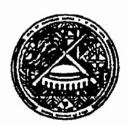

## AMERICAN SAMOA GOVERNMENT PAGO PAGO, AMERICAN SAMOA 96799 OFFICE OF MARINE AND WILDLIFE RESOURCES

In reply refer to:

May 20, 1987

ORIGINAL

TO:

Ray Tulafono, Director

Office of Marine & Wildlife Resources

FROM:

David Itano, Fishery Biologist ()

SUBJECT:

Ta'u Island Coral Reef Assessment

(May 15, 16, 1987)

DEPARTMENT OF MARINE & WILDLIFE RESOURCES
PAGO PAGO, AMERICAN SAMOA 96799

#### PERSONNEL:

ITANO, David - Office of Marine & Wildlife Resources

TYLER, William - Hawaii Institute of Marine Biology

## INTRODUCTION:

Ta'u Island was surveyed on May 15-16 by a visiting biologist from the Hawaii Institute of Marine Biology, University of Hawaii and myself serving as field biologist for the Office of Marine and Wildlife Resources, American Samoa Government. The purpose of this visit was to assess any damage Hurricane Tusi may have inflicted on the nearshore environments and coral communities of Ta'u.

A similar survey was conducted on Ofu and Olosega Islands in February and found no significant damage to coral communities at previously established transect locations. It was suggested that Ta'u should be surveyed in a similar manner but this trip was postponed until coordinating efforts from the University of Hawaii were arranged. The duration of this survey was extremely short due to funding constraints and schedule conflicts. The limited time on Ta'u required the survey to concentrate on certain areas which were prioritized by the following considerations:

- Areas directly offshore from village sites due to their importance in the subsistance fishery and potential tourism industry.
- Areas that received the most intense storm damage from TUSI (North and West Shores).
- Areas where large water sheds could contribute significant siltation to the nearshore environment.
- 4. Areas important to the nearshore subsistance fishery.

OPICINAL

Trip Report:
Ta'u Island Coral Reef Assessment,
(May 15-16, 1987)

.ż.

### TRIP ITINERARY:

## May 15, 1987

1130: Depart Pago via Manu'a Air.

1200: Received on Ta'u by Talking Chief Niumata. Planned field work and arranged rental of boat for work on Saturday.

1400 - 1630: Surveyed reef area from Fitiuta Village to Faga by skin diving. Fishes were listed and coral damage noted.

2000 - 2200: Surveyed reef area directly offshore from Ta'u Village.

## May 16, 1987

0800 - 0900: Conducted informal fishing survey on pelagic fishery resources in the area of the submarine volcano approx 2 miles North West of Ta'u.

0900 - 1130: Conducted reef survey with snorkel gear while being towed behind an alia power catamaran. Covered area from Utumanua Point east to Avatele Cove including Faleasao Village.

1200 - 1400: Conducted towing reef survey from Maafee Rock South to an area one mile South of the boat harbor including Ta'u Village.

1800: Return to Pago via Manu'a Air.

## SURVEY OBSERVATIONS:

Survey #1. Fitiuta Area:

Divers entered water near Lepula on the Northwest corner Ta'u Island and exited at Faga approximately 1.5 miles to the west. This area is characterized by spur and groove formation extending gradually offshore for one hundred meters from the outer reef flat margin before sloping to meet basalt pavement areas at approximately 20 meters in depth. The channels are lined with boulders and sand pockets and generally have no coral cover. Coral growth is generally sparse on the sides and top of the basalt spurs but increases to about 30% below 10 meters. Most of the coral in this area consisted of robust, low growing or encrusting forms that are capable of withstanding high wave energies.

The coral community was sominated by Acropora humilis, Porites lutea, encrusting Millepora and small colonies of massive Faviids. Acropora humilis

encrusting Millepora and small colonies of massive Faviids. Acropora humilis, A. crateriformis, Millepora, Porites lutea, Leptoria phrygia, Galaxea fasicularis, Lobophyllia, Montipora, Favia, Favites, Goniastrea and Leptastrea were all noted as being undamaged in 10 feet of water. There was damage noted to colonies of branching Acropora irregularis, Pocillopora and corymbose

Acroporids down to 25 feet.

15/3/50/50/95

Trip Report:
Ta'u Island Coral Reef Assessment,
(May 15-16, 1987)

.3.

A five minute timed search identified 17 species of reef fish representing seven families. List 1.

## Survey #2. Utumanua Pt. to Avatele Cove:

The coral communities observed during this towing survey were very similar to those described above. Coral cover increased off Faleasao Village with flat plates of <u>Acropora humilis</u> and branching <u>Acropora - irregularis</u> being dominant. Colonies of <u>A. irregularis</u> and <u>Pocillopora</u> were noted with broken branches in 8 meters of water.

One area midway between Siulagi Pt. and Loto Pt. had relatively high coral cover on basalt ridges (50%). A five minute count identified 26 species of reef fishes.

List 2. No broken corals were observed.

Considerable siltation offshore from Auauli Cove and Avatele Cove made surface observations of corals impossible.

## Survey #3. Maafee Rock to Ta'u Harbor and South:

A broad, shallow shelf extends out from the fringing reef at Luma to encompass Maafee Rock. This shelf has a relatively high live coral cover dominated by <a href="Acropora humilis">Acropora humilis</a> and other sturdy coral species. The spur and groove formations off Ta'u Village are similar to the area described in Survey #1. A few broken <a href="Pocillopora">Pocillopora</a> heads were noted off Ta'u Village. This survey was ended at a point approximately one mile south of Ta'u Boat Harbor. The live coral here consisted mostly of <a href="Acropora humilis">Acropora</a> and some branching and corymbose Acroporids. Several large Acropora plates had been recently overturned presumably by high waves.

A complete species list of fishes observed during the entire survey is included in List 3 with indications to their relative abundance.

## DISCUSSION:

Catastrophic storm damage to a coral reef will vary according to several factors including depth, degree of reef slope and the type and species of coral that are present. The shallow reef top corals that are well adapted to high wave energies often sustains less damage compared to more delicate forms found in deeper waters, Investigator from French Polynesia reported moderate storm damage fo shallow fore-reef areas; 50% to 80% destruction down to 20 meters and 100% destruction at deeper areas due to destruction by coral rubble tumbling down the steep outer reef slopes (Harmelin-Vivien-and Laboute 1986). Coral destruction was fostered by a narrow fore-reef area and very steep outer reef slopes and a flourishing coral community between 15 and 25 meters.

Trip Report:
Ta'u Island Coral Reef Assessment,
(May 15-16, 1987)

None of these conditions exist on the north or west coasts of Ta'u Island. Our surveys revealed most (all) areas to have relatively broad fore reef areas with gradual slopes and sparse coral communities well adapted to high energy environments. The delicately branching or plate like Acroporids, plate-like Montipora and Agariciiids and columnar Porites corals were noticably absent from Ta'u although they are very common around Ofu, Olosega and Tutuila Islands. Some broken colonies of Pocillopora and Acropora were noted but most of these were not seriously damaged and should regenerate.

A more serious long term threat to the coral reef ecosystem of Ta'u may be the effects of erosion induced sediment on the reef. Large landslides have gutted the Auauli and Avatele drainages of northern Ta'u and are continuing to contribute a great deal of silt to the nearby reefs. These areas were extremely turbid and underwater visibility was affected for at least two miles east and west of these coves.

Ray Buckley reported thickets of live staghorm Acropora on the Faleasao reef flat in his memo dated November 3, 1986 (see attachment). It is very possible that these corals were damaged by the hurricane but we were not able to visit this area during this survey.

The observations of reef fish revealed a relatively low diversity and abundance of reef fishes as compared to Ofu and Olosega. However, comparisons of these lists to observations made in similar environments around Tutuila show stronger correlations. Areas with low coral cover and smooth bottom are generally low in productivity which probably explains the situation in Ta'u.

#### SUMMARY:

. 7

The results of our survey indicate very little damage to the reefs of Manu'a by the immediate effects of Hurricane Tusi. Indeed, several residents of Ta'u characterized Tusi as having strong winds and not large waves although the hurricane of '66 was said to have less wind but very large, destructive waves. Nevertheless, the reefs did sustain some damage and they may be seriously damaged by the continuing erosion from landslides and ravines. Any &id for fisheries in Manu'a should concentrate on controlling erosion (joint benefit to agriculture and wildlife), developing the FAD's, developing support facilities for the alias and reef enhancement projects (ie. faisua or Trochus).

Trip Report:
Ta'u Island Coral Reef Assessment,
(May 15-16, 1987)

.5.

LIST 1. Fishes observed in one to 10 meters near Fitiuta Village, Ta'u Manu'a Islands. May 15, 1987. (1440 to 1445 hrs).

Five Minute Count:

Acanthurus glaucopareius
A. lineatus
Ctenochaetus striatus
Chaetodon auriga
C. reticulatus
Thalassoma quinguevettata
T. fuscum

Cephelopholis urodelus
Labroides bicolor
Gomphosus varius
Dalistapu undulatus
Flectroglyphidodon dickii
Parupeneus bifasciatus
Stegastes sp.
Acanthurus nigrofuscus

Melichthys vidua Epinephelus merra

LIST 2. Fishes observed in three to seven meters near Loto Point, Ta'u, Manu'a Islands. May 16, 1987. (1130 to 1135 hrs).

Five Minute Count:

Pygoplites diacanthus
Scarus japanensis
Ostracion meleagris
Ctenochaetus striatus
Acanthusrus glaucopareius
Halechoeres hortulanus
Chaetodon ornatissimus
C. ephippium
Acanthurus lineatus
Melichthys vidua
M. niger
Chaetodon reticulatus
C. auriga
Abudefduf septemfasciatus
Paracirrhites hemistictus

Pempheris oualensis Chaetodon melannotus

Parupeneus bifasciatus Plectroglyphidodon dickii

Cephalopholis argus Naso lituratus Arothron meleagris Thalassoma quinquvettata Scarus rubroviolaceous .6.

- LIST 3. All fishes sighted during snorkeling dives on north and west shores of Ta'u Island. May 15-16, 1987.
  - \* indicates relatively common.

Saurida gracilis
Myripristis berndti
Adioryx spinifer
A. tiere
Cephelopholis argus
C. urodelus
Epinephelus merra
Gracila albomarginata
Variola louti
Caranx melampygus
Aphareus furca
Lutjanus bohar
L. monostigma
Macolor niger

- \* Parupeneus bifasciatus P. trifasciatus Pempheris oualensis Kyphosus cinerascens
- \* Chaetodon auriga
  - C. bennetti
  - C. lunula
- \* C. ephippium
  - C. melannotus
- \* C. ornatissimus
  - C. quadrimaculatus
- \* C. reticulatus
  - C. trifasciatus
  - C. unimaculatus
  - Centropyge flavissimus Pygoplite: diacanthus
- \* Abudefduf septemfasciatus
- \* Chrysiptera cyanea Neopomacentrus metallicus Plectroglyphidodon dickii
  - P. johnstonianus
- \* Stegastes sp.

# DEPARTMENT OF MARINE & WILDLIFE RESOURCES P. O. BOX 3730

PAGO PAGO, AMERICAN SAMOA 96799

Paracirrhites arcatus

P. forsteil

T. hemistictus
Cheilinus undulatus
C. unifasciatus
Gomphosus varius
Halechoeres hortulanus
Hemigymnus fasciatus
Labroides bicolor

- L. dimidiatus
- L. rubrolabiatus Thalassoma fuscum
- \* T. quinquevettatum Scarus frenatus
  - S. gibbus
  - S. japanensis
  - S. rubroviolaceous
- S. schlegeli
- S. sordidus
- S. tricolor
- \* Istiblennius sp. Zanclus cornutus
- \* Acanthurus glaucopareius
  - A. achilles
  - A. guttatus
- \* A. lineatus
- A. mata
- \* A. nigrofuscus
- A. olivaceous
- \* A. triostegus
- \* Ctenochaetus striatus Naso brevirostris
- \* N. lituratus
  - N. tuberosus
  - N. unicornis
  - Balistapus undulatus
- \* Melichthys niger
  M. vidua
  Rhinecanthus aculeatus
  Amanses scopas
  - Ostracion meleagris Arothron meleagris
  - A. nigropunctatus