## Potential Evapotranspiration on Tutuila, American Samoa

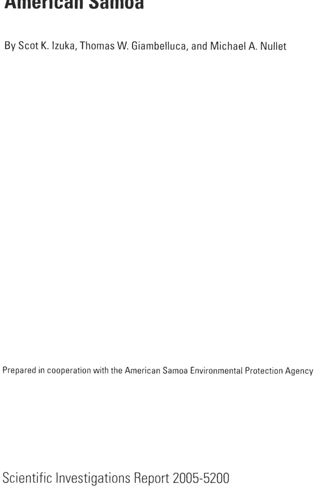

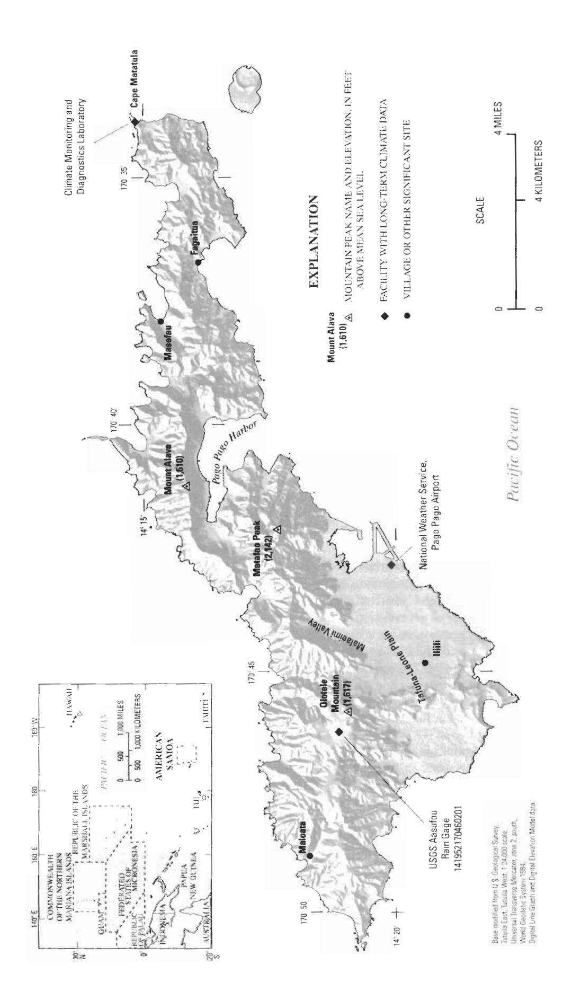

Figure 1. Location and physical features of Tutuila, American Samoa.

Potential evapotranspiration (PE) is the evapotranspiration rate that would exist, under given atmospheric conditions and vegetation, if the availability of water is not a limiting factor.

#### **Purpose and Scope**

This report describes the methods and results of the study of PE distribution on Tutuila. This report includes summaries of climate data collected between 1999 and 2004 from nine sites (stations) on Tutuila, as well as computed values of PE for each station, and maps showing the distribution of mean monthly and annual PE. To facilitate discussions in this report, stations will be referred to by an abbreviated name consisting of the station number and a single word describing its location (for example, station 331, which was at the summit of Mount Alava, will be referred to as "331 Alava").

#### **Acknowledgments**

The authors are grateful to Peter Peshut, Director of the ASEPA, and Togipa Tausaga, former Director of the ASEPA, for their cooperation and assistance. The authors are also grateful to Fa'amao Asalele of the ASEPA, who assumed the primary responsibility for maintaining the stations and retrieving and transmitting data to the USGS. Additional assistance was provided by Sheila Wiegman and Francis Huber of the ASEPA. Land-owner permission for the deployment of the climate-monitoring stations was granted by Maatifa Eleasario, Peter Gurr, the American Samoa Power Authority (ASPA), the National Oceanic and Atmospheric Administration (NOAA) Climate Monitoring and Diagnostics Laboratory (CMDL) and National Weather Service (NWS), and the National Park Service. These individuals and agencies also provided field assistance to the authors during the setup and removal of the stations.

## **Physiographic Setting of Tutuila**

The island of Tutuila was built by several mid-oceanic, hot-spot shield volcanoes during the Pliocene to Holocene (Stearns, 1944). Erosion has transformed most of the island into a ridge of steep mountains trending generally in the east-northeast direction (fig. 1). The mountains rise abruptly from sea level to elevations as high as 2,142 ft. Juxtaposition of the deeply eroded mountains with the sea creates a sinuous coast-line, much of which has little or no coastal plain. The Tafuna-Leone Plain on the southwest of Tutuila is an area of gentler topography, but has many hills and more than 600 ft of relief. The plain was formed by Holocene-age volcanic eruptions that covered a preexisting barrier reef (Stearns, 1944). Most of the island's industry and much of the population is located on the relatively extensive flat areas of the Tafuna-Leone Plain; maritime industries and a large tuna-packing complex are located

in the Pago Pago Harbor area. Elsewhere, rugged topography limits most of the population to narrow coastal areas, the floors of small valleys, or the narrow plateau at Aasufou.

The Samoa Islands lie in the warm humid tropics of the South Pacific, within an area influenced by the South Pacific Convergence Zone (SPCZ) (Wright, 1963; Giambelluca and others, 1988). Because of the seasonal movement of the SPCZ and its associated storms, rainfall is relatively high and seasonally variable. In most places on Tutuila, rainfall exceeds 100 in/yr. On average, rainfall is higher from about October through May and lower from about June through September (fig. 2). Rainfall on Tutuila also varies substantially with location and topography relative to the prevailing winds as a result of the orographic effect. As winds blowing onshore from the ocean encounter the steep mountains of Tutuila, the moisture-laden air is forced upward and cools, causing precipitation in the high-elevation interior of the island to be greater than at the coast. At the NWS office at the Pago Pago Airport, which is near sea level in the southeastern lowlands of the Tafuna-Leone Plain (fig. 1), rainfall averages 118 in. per year (National Climatic Data Center, 2002). At Cape Matatula, on the eastern tip of Tutuila, rainfall averages 71 in. per year (Mefford, 2004). In contrast, rainfall at the former USGS rain gage in Aasufou Village, at an elevation of 1,340 ft above sea level, averaged about 200 in. per year (Izuka, 1999). Longterm data indicate that rainfall on Tutuila also varies interannually (fig. 2). During the period from 1970 through 2004, annual rainfall at the Pago Pago Airport ranged from a high of 46 in. above average in 1981 to a low of 61 in. below average during the El Niño event of 1998.

Most of the island, particularly the mountainous interior, is covered with dense tropical forest. Sites for homes, livestock enclosures, community areas, and small farms have been cleared in the villages, most of which lie along the coastal plain, valley floors, or on the flat areas of the Tafuna-Leone Plain. Urbanized areas consisting of scattered low buildings and paved roads exist primarily in the eastern part of the Tafuna-Leone Plain near the airport, and along the shoreline of Pago Pago Harbor. The total area of cleared and urbanized land on Tutuila is small, however, relative to the large area covered by tropical forest.

Normal daily low and high temperatures at the NWS office at the Airport (based on the period 1971–2000) are 24 and 30°C (76 and 86°F), respectively, and each varied seasonally by a few degrees (fig. 3). Relative humidity averages 86 percent in the morning and 75 percent in the afternoon, with a seasonal variation of a few percent (National Climatic Data Center, 2004). Prevailing winds are southeasterly for most of the year, but winds are generally more variable and weaker from about late December to early April (Mefford, 2002, 2004; Climate Monitoring and Diagnostics Laboratory, 2004; National Climatic Data Center, 2004). Wind speed averages 11 mi/hr at both the NWS office at the Pago Pago Airport (National Climatic Data Center, 2004) and the CMDL facility at Cape Matatula on the eastern tip of the island (Mefford,

#### 4 Potential Evapotranspiration on Tutuila, American Samoa

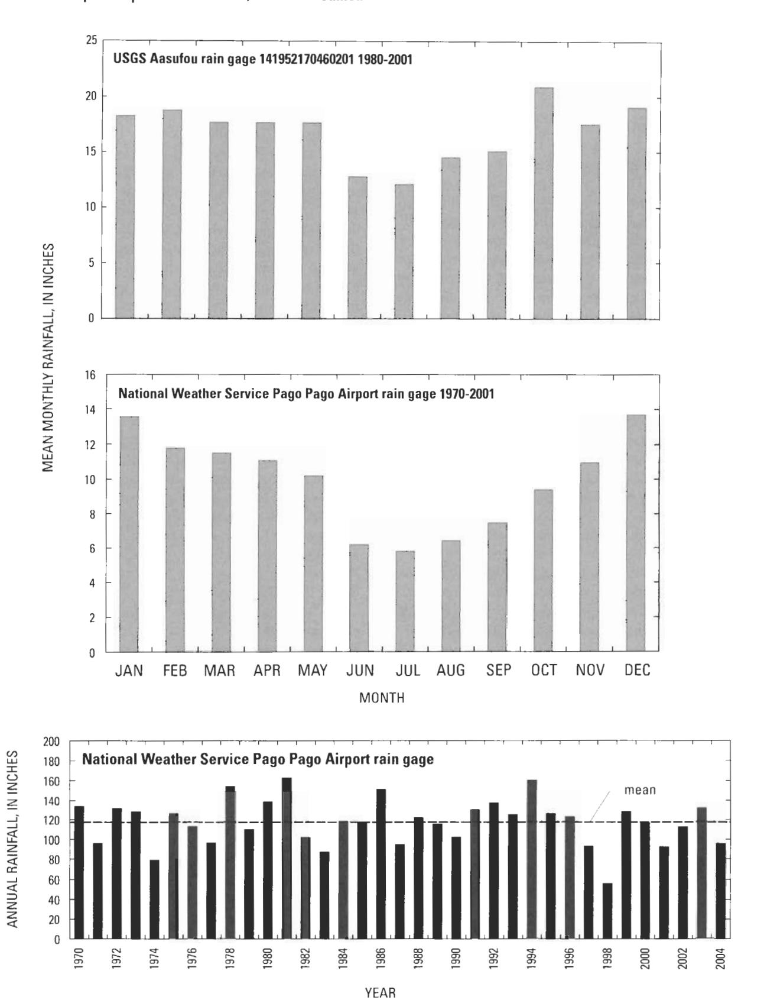

**Figure 2.** Rainfall at the National Weather Service (NWS) office at the Pago Pago Airport and the U.S. Geological Survey Aasufou rain gage, Tutuila, American Samoa (Data for NWS facility from National Climatic Data Center, 2002, 2001-05).

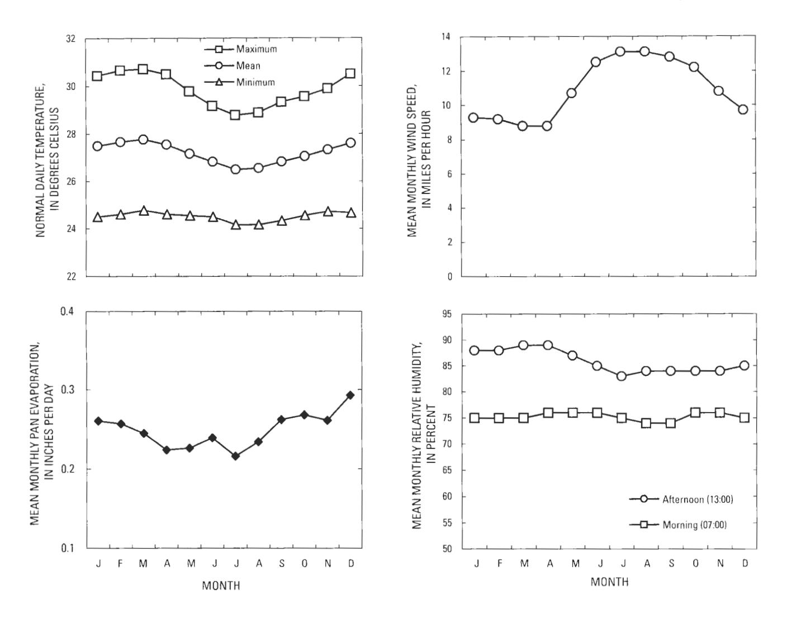

Figure 3. Temperature, pan evaporation, wind speed, and relative humidity at the National Weather Service (NWS) office at the Pago Pago Airport, Tutuila, American Samoa. Normal daily temperature is a 30-year average based on the period 1971-2000. Mean monthly pan evaporation is based on the period 1978-2001 (data from National Climatic Data Center, 2002). Mean monthly wind speed is based on 36-year period of record ending in 2003, and mean monthly relative humidity is based on a 35-year period of record ending 2003 (data from National Climatic Data Center, 2004).

2004). Both locations are exposed to the prevailing southeasterly winds.

Prior to this study, the only existing measurements of evapotranspiration on Tutuila were from an evaporation pan monitored daily by the NWS at the Pago Pago Airport. Mean monthly pan-evaporation rate (for the period 1978 to 2001) at this site is lowest in July and highest in December (fig. 3); the long-term average evaporation rate for the period was 91 in/yr. This single monitoring location is not sufficient, however, to assess the island-wide distribution of evapotranspiration on Tutuila, where climate varies substantially from one location to another as a result of the orographic effect. Quantification of island-wide evapotranspiration requires monitoring many sites spatially distributed over the island.

## **Study Methods**

A variety of methods have been used to estimate evapotranspiration. The Penman (1948) method is best suited for the purposes of this study because of limitations imposed by the steep topography, dense and variable vegetation, and high rainfall on Tutuila. In moist, heavily vegetated areas such as Tutuila, PE can closely approximate actual evapotranspiration (Bidlake and others 1996); in other areas, PE can be used in a soil water-balance model to estimate actual evapotranspiration provided adequate data on precipitation, runoff, vegetation, and soil characteristics are available or can be estimated (Thornthwaite and Mather, 1955). Soil water-budget models can also be used to estimate ground-water recharge.

Energy-balance approaches that measure actual evapotranspiration directly, such as the Bowen-ratio and the eddycovariance methods, have been used with success by many researchers, but these methods are unsuitable for Tutuila because they require sites surrounded by large areas of homogeneous land cover and low relief. Methods using atmometers (such as evaporation pans) to measure PE also were considered unsuitable for this study because the devices are difficult to operate in high-rainfall climates (Ekern, 1983).

#### **Estimating Potential Evapotranspiration from Climate Data**

Penman's (1948) equation for estimating PE from climate data may be written:

$$PE = \frac{\Delta H + \gamma E_a}{\Delta + \gamma} \tag{1}$$

where

PEis potential evapotranspiration [L/T],

H is the energy term, expressed in terms of evaporation equivalent units [L/T],

is the aerodynamic term [L/T],

 $E_a$ 

is the slope of the saturation vapor pressure versus temperature curve

 $[F/L^2/K]$ ,

and

is the psychrometric constant  $[F/L^2/K]$ .

Penman's original formulation was calibrated with respect to an evaporation pan and hence did not have a soil heat conduction term. In applications to land-surface evaporation, the Penman energy term (H) is a function of net radiation, soil heat flux, soil temperature, and soil moisture. The aerodynamic term  $(E_{\cdot})$  is a function of wind speed and vapor-pressure deficit (a function of air temperature and relative humidity). In this study, sets of microclimate-monitoring instruments were deployed at various locations (stations) on Tutuila to collect the data required by the Penman method. The procedure used to compute PE from the measured climate data is described in detail in the appendix.

#### **Data Collection**

The instruments deployed at each station included above-ground and subsurface sensors to measure net radiation, relative humidity, air and soil temperature, soil heat flux, soil moisture, wind speed, and rainfall (fig. 4). All sensors were placed within 7.5 ft (2.3 m) of the ground surface. An automatic data logger controlled the sensors, made simple computations, and stored data. For most sensors, the logger took measurements every 10 seconds. Every hour on the hour, the logger computed and stored the average of the 10-second measurements made over the preceding hour. Exceptions to

this procedure were the measurements for soil moisture and rainfall. The logger took measurements from the soil-moisture probe once every hour. To measure rainfall, a tipping-bucket rain gage was used; each tip represented 0.01 in. of rain. The data logger converted the tip counts to rainfall, and summed the total rainfall for each minute as well as for each hour. The net radiation and soil heat-flux sensors were oriented such that downward conduction of energy (daytime) is positive and upward conduction (nighttime) is negative. A 12-volt battery and a 10-watt solar panel provided power. Where possible, visits for inspection, maintenance, and data retrieval were made twice each month. Data retrieved during field visits were subject to quality-control analysis as described in Giambelluca and Nullet (2000). All data were plotted as time series and visually examined to identify periods of sensor or data-logger malfunction or calibration drift. All data suspected of being inaccurate were flagged and excluded from analysis.

Practical factors limited the number of instrument sets used in this study to four, but over the 5-year monitoring period of this study, instruments were deployed at nine different locations representing the range of climate conditions on Tutuila (fig. 5, table 1). To increase the number of locations that could be monitored with the limited number of instrument sets, three of the four sets were mobile, that is, each of the three instrument sets was deployed at a site for a year, and then was moved to another location. The single non-mobile instrument set remained at the Pago Pago Airport (station 111 Airport) for the entire period of this study to monitor year-to-year climate variations. The proximity of the site to the NWS Pago Pago Airport office allowed comparison of climate data from this project with data (including panevaporation data) from the NWS. Two other stations were established near existing climate-monitoring facilities: station 442 Matatula on the grounds of the CMDL facility, and station 221 Aasufou near the USGS Aasufou rain gage (USGS number 141952170460201). In some cases, it was possible to use climate data from the CMDL and NWS when instruments installed as part of this study failed to collect data due to malfunction or calibration drift.

Vegetation at the climate stations differed from that of the dense tropical forest that covers most of Tutuila. For practical purposes, the climate stations were installed in areas that were cleared of trees and other tall vegetation, and ground surfaces were covered with grass that was kept at a height of a few inches either by the landowner or by personnel servicing the climate station. In general, albedo is lower and roughness is higher over forest than over grass, therefore PE over the forest is probably slightly higher than over grass. For the purpose of broadly describing PE on Tutuila, it was not necessary to adjust the PE estimates to account for differences between grass and forest. For applications requiring more precise PE measurements, the PE estimates in this study may require adjustment to account for the differences between albedo and roughness for various types of land cover present on Tutuila. Additional information, including descriptions of the land cover at each station, is provided in the Appendix.

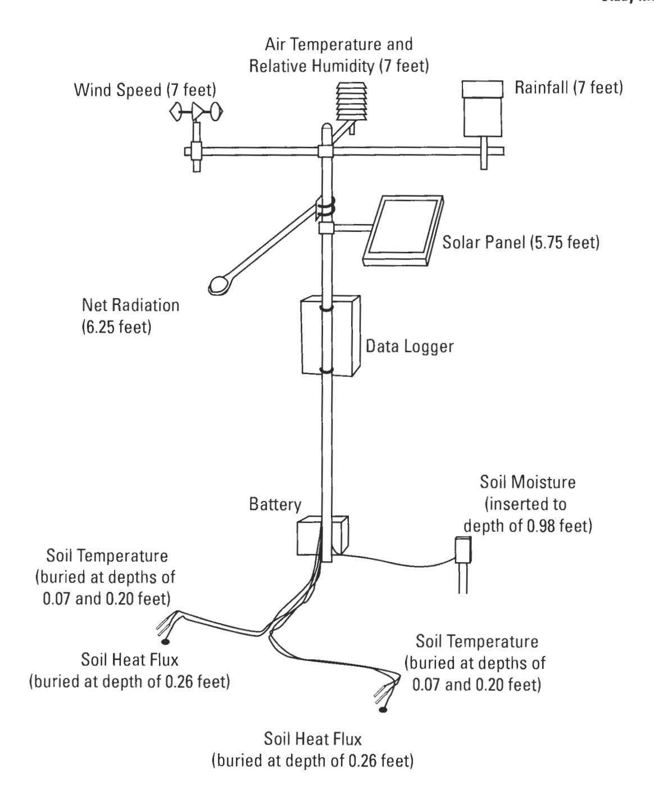

Not to scale

**Figure 4.** Generalized diagram of instrument setup at climate stations on Tutuila, American Samoa. Approximate heights and depths of instruments, relative to ground surface, are given in parentheses.

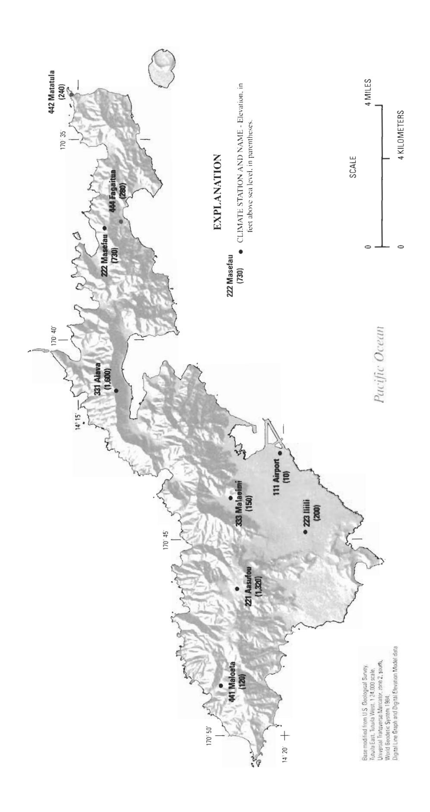

Figure 5. Climate stations on Tutuila, American Samoa.

**Table 1.** Locations and monitoring periods of climate stations used in the study of potential evapotranspiration on Tutuila, American Samoa.

[Coordinates: World Geodetic System 1984 (WGS 84), determined by hand-held global positioning system (GPS). Elevation: determined by barometric altimeter.]

| Station name | U.S. Geological | Coord       | linates       | Elevation                 | Monitoring period                   |  |
|--------------|-----------------|-------------|---------------|---------------------------|-------------------------------------|--|
|              | Survey number   | Latitude    | Longitude     | (feet above sea level) |                                     |  |
| 111 Airport  | 141954170425101 | 14° 19' 54" | 170° 42' 51"  | 10                        | July 1, 1999 to April 29, 2004      |  |
| 221 Aasufou  | 141909170461201 | 14° 18′ 51" | 170° 46′ 16"  | 1,320                     | July 1, 1999 to June 7, 2000        |  |
| 222 Masefau  | 141538170371201 | 14° 15′ 38" | 170° 37' 12"  | 590                       | December 12, 2001 to April 27, 2004 |  |
| 223 Iliili   | 142030170444901 | 14° 20′ 31″ | 170° 44′ 49′′ | 200                       | August 2, 2000 to December 11, 2001 |  |
| 331 Alava    | 141614170411601 | 14° 15' 55" | 170° 41' 16'' | 1,600                     | March 2, 2000 to June 5, 2002       |  |
| 333 Malaeimi | 141842170435801 | 14° 18' 42" | 170° 43' 58"  | 150                       | February 26, 2003 to April 28, 2004 |  |
| 441 Maloata  | 141844170484101 | 14° 18' 27" | 170° 48' 44"  | 120                       | March 3, 2000 to May 1, 2001        |  |
| 442 Matatula | 141507170334701 | 14° 14' 50" | 170° 33' 52'' | 240                       | May 3, 2001 to June 4, 2002         |  |
| 444 Fagaitua | 141602170370201 | 14° 16′ 02″ | 170° 37' 02"  | 280                       | June 5, 2002 to April 28, 2004      |  |

#### **Climate Data**

Mean hourly statistics were computed for each climate parameter. Daily mean values were computed from the hourly values and used as a basis for computing mean monthly and mean annual statistics. Because many climate parameters have a regular pattern of diurnal variation, daily mean values based on incomplete days of data may result in significant bias. For this reason, only the daily means from complete days of data were used in the computation of mean monthly and mean annual statistics.

Available long-term climate data such as rainfall indicate that climate on Tutuila can vary from year to year (fig. 2). The period of climate monitoring for this study (1999-2004) followed a period of relatively dry weather concurrent with the El-Niño event of 1997-98. Rainfall during the period of monitoring for this study was closer to normal, with some years that had above-average rainfall and some years that had below-average rainfall. The overall annual average rainfall during the monitoring period of this study was 113 in., which agrees within a few percent with the long-term annual average of 118 in. (National Climatic Data Center, 2002). This close agreement indicates that the climate during the monitoring period of this study was not substantially different from long-term average conditions. For the purposes of this study, climate conditions during the monitoring period for this study are considered representative of normal conditions.

The climate during a given 12-month period can, howcver, be substantially different from other 12-month periods or the average for the entire monitoring period. Because stations in this study were operated for different periods and some stations have periods of missing data due to instrument malfunction or calibration drift, the data from one station may not be directly comparable to the data from other stations. Some general characteristics in the climate data are common to all or most stations, however, and some broad comparisons between stations can be made.

Plots of mean hourly rainfall indicate that rainfall at most stations occurs with nearly equal frequency at any hour of the day, although some stations (333 Malaeimi and 441 Maloata, for example) show slightly lower rainfall in the late afternoon and early evening, and slightly higher rainfall in the morning (fig. 6). The pattern in mean monthly rainfall varies substantially from station to station, which may be a reflection of the short periods over which most stations operated. Stations 111 Airport, 221 Aasufou, 223 Iliili, 331 Alava, 441 Maloata, and 442 Matatula show lower rainfall in July and August than for the rest of the year, which is consistent with the seasonal patterns apparent in the long-term data from the NWS office at the Pago Pago Airport and CMDL facility at Cape Matatula. Not all of these stations, however, show a distinct high-rainfall season in October to May, as seen in the long-term data. The average rainfall for the period of record of 442 Matatula (96 in/yr) is higher than the long-term average rainfall (71 in/yr [Mefford, 2004]) reported from the nearby CMDL facility, whereas the average rainfall recorded at 221 Aasufou (178 in/yr) is lower than the long-term average (more than 200 in/yr [Izuka, 1999]) for the USGS Assufou rain gage. Average rainfall for the period of record of 111 Airport was 125 in/yr, which is slightly higher than the long-term average rainfall (118 in/yr [National Climatic Data Center, 2002]) reported from the NWS office at the Pago Pago Airport.

Mean hourly net radiation, soil heat flux, and air and soil temperatures are generally consistent with the diurnal cycle of daylight and darkness (figs. 7-10). Most of the differences between these parameters can be attributed to the contrast in heat capacity of soil (and the water it contains) relative to air. The peak in mean hourly air temperature is only slightly later than the peak in mean hourly net radiation, whereas the peak in mean hourly soil temperature lags the peak in mean hourly net radiation by 2 to 4 hours because soil and the water within

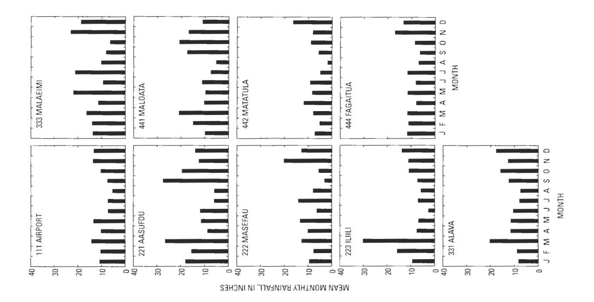

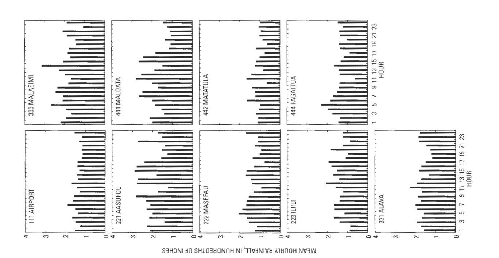

Figure 6. Mean hourly and mean monthly rainfall at the climate stations on Tutuila, American Samoa (periods of record given in table 1).

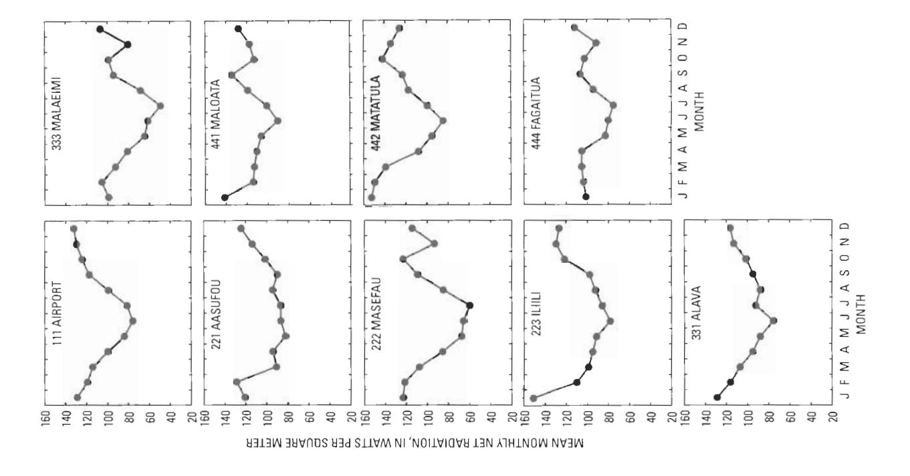

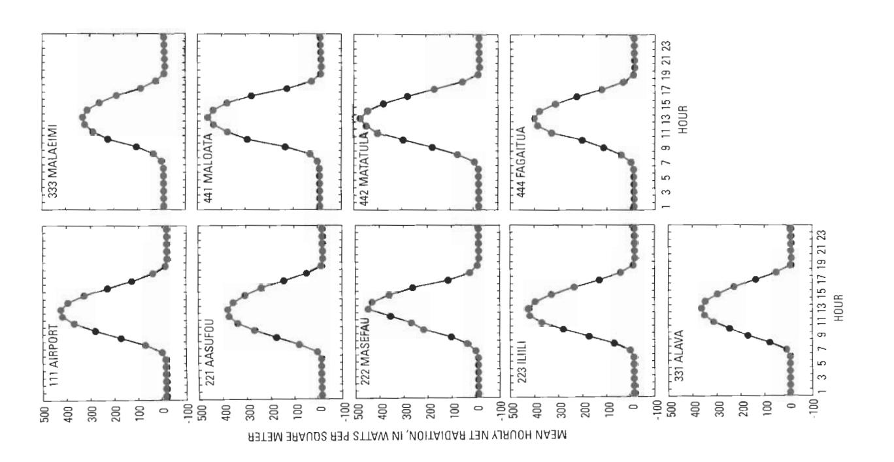

Figure 7. Mean hourly and mean monthly net radiation at the climate stations on Tutuila, American Samoa (periods of record given in table 1).

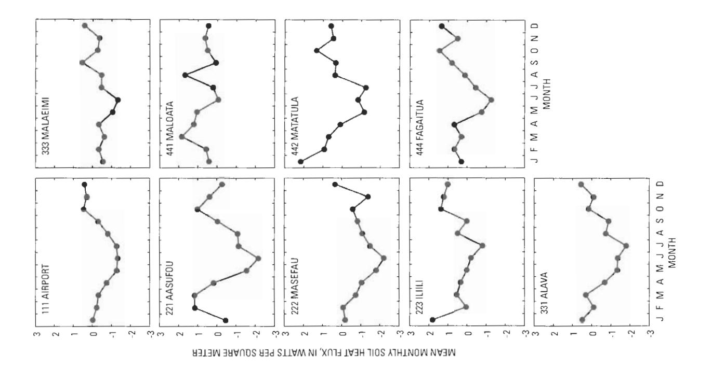

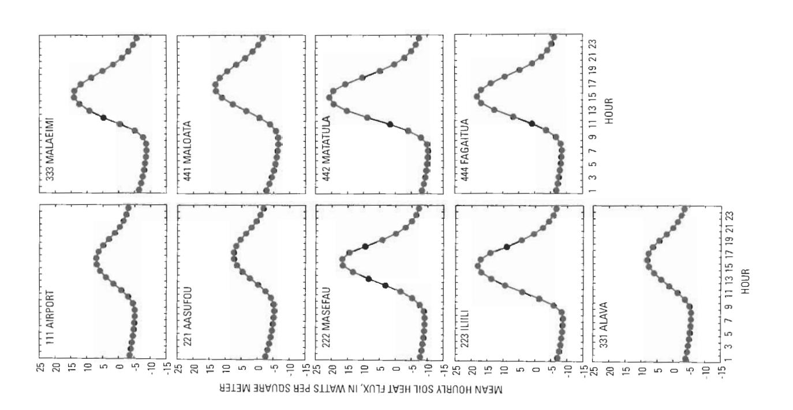

**Figure 8.** Mean hourly and mean monthly soil heat flux at the climate stations on Tutuila, American Samoa (periods of record given in table 1).

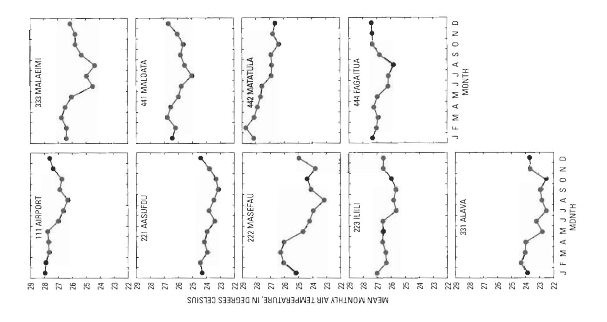

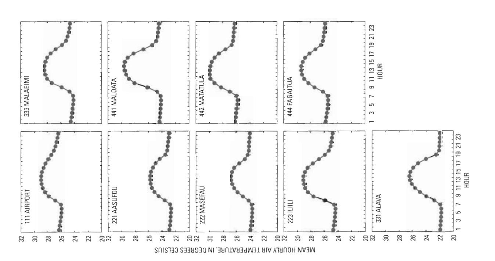

Figure 9. Mean hourly and mean monthly air temperature at the climate stations on Tutuila, American Samoa (periods of record given in table 1).

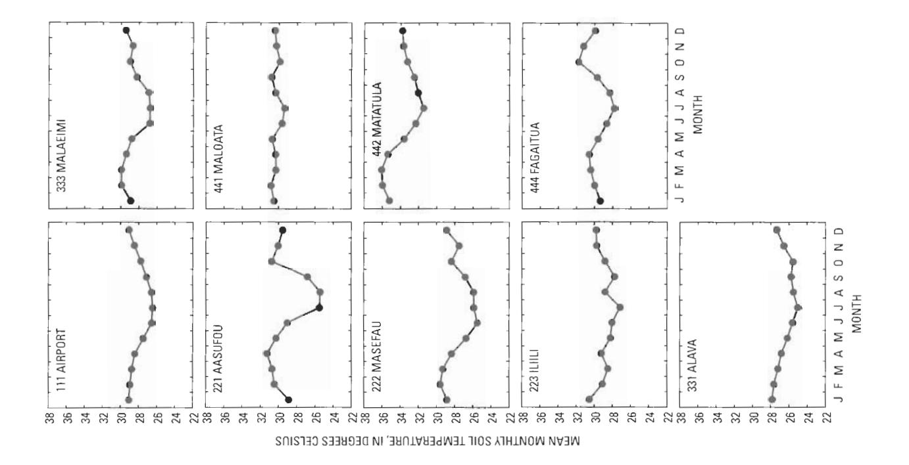

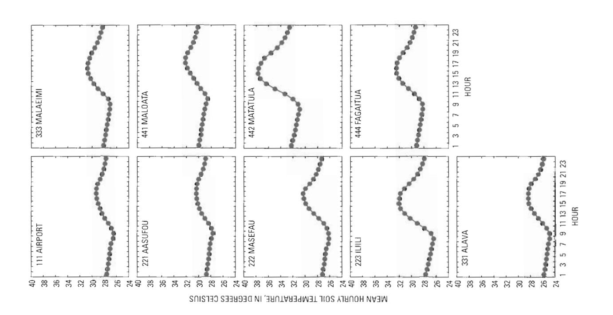

Figure 10. Mean hourly and mean monthly soil temperature at the climate stations on Tutuila, American Samoa (periods of record given in table 1).

it has a higher heat capacity than air. At station 222 Masefau, a lack of symmetry in the mean hourly net-radiation curve (fig. 7) indicates that the net radiation at this site was consistently depressed in the late morning of every day, possibly by the shadow of nearby trees. Variations in mean monthly values of net radiation, soil heat flux, and air and soil temperature are consistent with seasonal changes in daylight duration, with higher values in the summer (December to February) and lower values in the winter (May to July).

Mean hourly relative humidity at all stations was higher at night than during the day (fig. 11). The mean-hourly relative humidity curves decline steeply beginning about 07:00 to 08:00, are lowest at about 14:00 to 15:00, rise steeply in the late afternoon until about 19:00 to 20:00, then rise gradually overnight. The range of the mean hourly relative humidity values at each station was about 10 to 20 percent, depending on location. Plots of mean monthly relative humidity indicate that this parameter varies only by a few percent throughout the year.

Wind speed at most stations shows an increase during daylight hours (fig. 12). The higher daytime winds are probably generated by more rapid daytime heating of air over the island relative to the air over the ocean (Wright, 1963). The diurnal pattern is not apparent, however, in the data from 222 Masefau, 331 Alava, and 442 Matatula. Plots of mean monthly wind speed at 111 Airport and 221 Aasufou show a pattern of lower wind speeds from December to April and higher wind speeds the rest of the year, which is consistent with seasonal wind patterns reported from the CMDL facility at Cape Matatula and the NWS office at the Pago Pago Airport (Mefford, 2002, 2004; Climate Monitoring and Diagnostics Laboratory, 2004; National Climatic Data Center, 2004). The seasonal pattern is not as readily apparent in the wind speed data from other stations in this study.

## **Potential Evapotranspiration**

The Penman (1948) equation was used to compute hourly PE from the hourly climate data. Mean hourly PE values for each station were computed from the hourly PE values (table 2). Despite representing non-concurrent monitoring periods, the plots of mean hourly potential evapotranspiration show some characteristics common to all stations (fig. 13). Mean hourly PE at all stations closely parallels mean hourly net radiation, the primary source of energy for evaporation (Allen and others 1998). For both net radiation and PE, the mean hourly curves rise steeply in the morning, peak at 13:00, and decline steeply in the afternoon. Higher temperatures and wind speeds and lower relative humidity during the day also correspond approximately with the higher daytime PE. At night, the PE curves depart from the net radiation curves. Following the steep decline in PE in the afternoon, PE curves for stations 111 Airport, 222 Masefau, and 223 Iliili show a gradual decline, whereas the PE curves at the other stations show a

small secondary rise peaking between 20:00 and 22:00, and a gradual decline in PE through the remainder of the night. Thus, net radiation is the dominant factor controlling PE in the daytime, whereas other factors control PE at night. Even so, PE between 07:00 and 19:00 on average constitutes 90 percent or more of the daily PE at each station (table 2).

It is possible that heat is transported to the stations by advection from surrounding land or, especially in the case of islands, the ocean (Ekern and Chang, 1985; Nullet, 1987; Nullet and Giambelluca 1990; Ekern, 1993). The Penman (1948) equation is not generally sensitive to advection, except that advection can affect the aerodynamic term in the equation through the vapor-pressure deficit. Thus, where wind speeds are high, advection can affect computed PE. A cursory evaluation of the effect of heat advection can be made by comparing the mean daily PE values computed using the Penman equation to the mean daily net radiation values converted to equivalent PE using the latent heat of vaporization for water at 20°C (table 2). At station 111 Airport, mean daily PE exceeded net radiation, which indicates positive heat advection at this site. The excess heat may be coming from the surrounding land, or more likely, the ocean, which is upwind (relative to the prevailing wind) from this site and has the potential to store and release large amounts of heat. The relatively high average wind speed at station 111 Airport probably accounts for the fact that advection is apparent in the Penman calculation for this station. In contrast, average PE at all other stations was less than net radiation, thus advection is not conclusively indicated. It is still possible that positive advection from the ocean occurs at these sites, but because wind speed at these sites is significantly lower than at station 111 Airport, the effect of advection is not apparent in PE computed by the Penman equation. In any case, the data indicate that advection patterns on a small island such as Tutuila, where the ocean and its effects are not far from any location, differ somewhat from those observed on larger and taller islands in the trade-wind belt such as Hawaii (Ekern, 1983, 1993; Nullet, 1987).

**Spatial distribution of PE. –** Assessing the spatial distribution of PE on Tutuila is a key step in quantifying water losses in the water budget of Tutuila. Each location has a unique climate, and hence PE, related to such geographic variables as elevation, exposure to sunlight and prevailing winds, proximity to the ocean, or topographic relief of the surrounding area. In the foregoing discussion, the differences in PE from one station to the next are due not only to differences in location, but also to each station having a different period of record. To facilitate assessment of the spatial distribution of PE, the effects related to non-concurrent monitoring periods must be minimized. For the following discussion, daily mean PE was computed from the hourly PE values and used to compute mean monthly and mean annual PE. Days having fewer than a complete set of 24 hourly values were excluded from computations of mean monthly and mean annual PE. To allow comparisons between stations having different periods of record, the daily PE values were adjusted to a common (base) period represented by the 4.5-year record of station 111 Air-

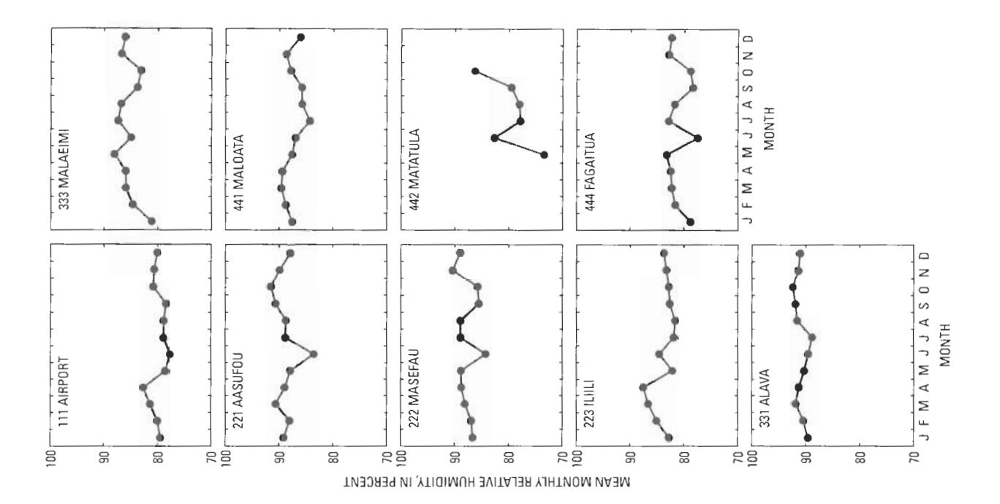

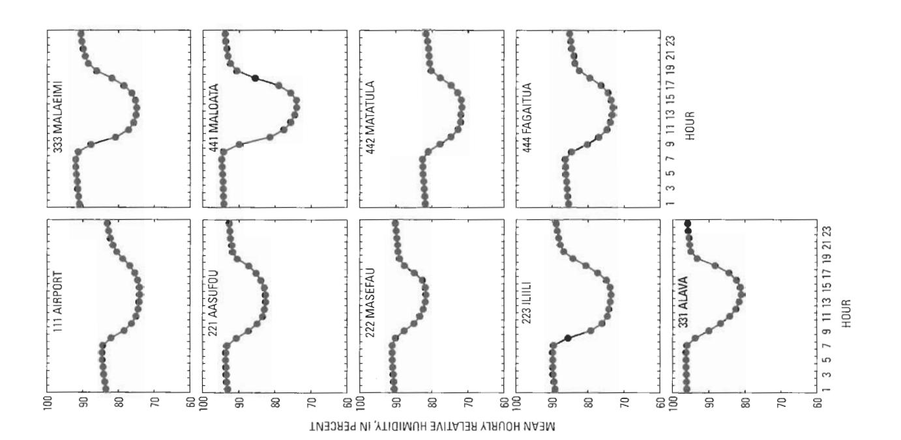

Figure 11. Mean hourly and mean monthly relative humidity at the climate stations on Tutuila, American Samoa (periods of record given in table 1).

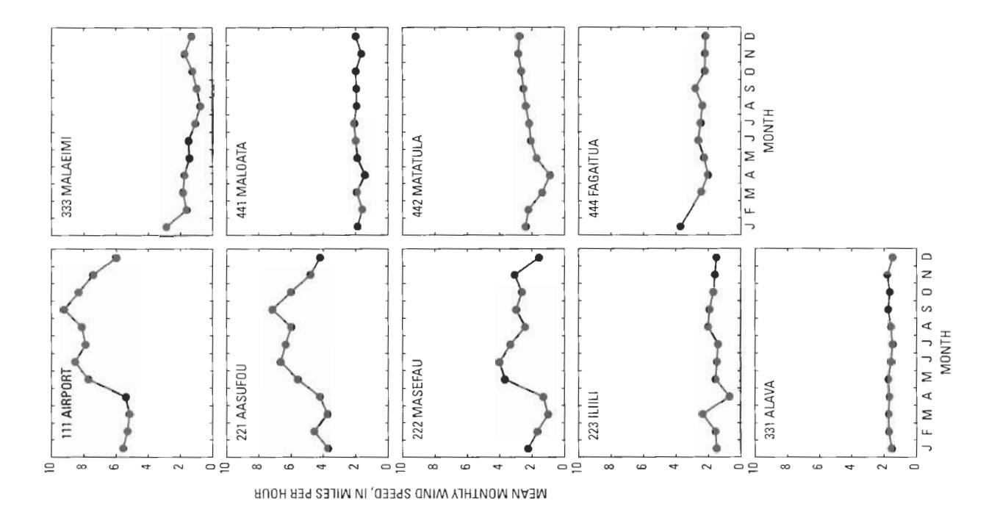

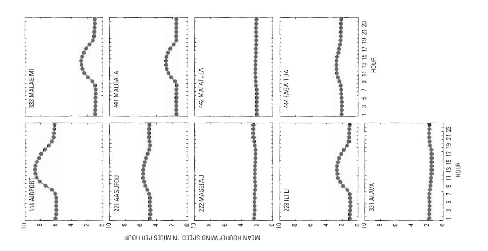

Figure 12. Mean hourly and mean monthly wind speed at the climate stations on Tutuila, American Samoa (periods of record given in table 1).

Table 2. Mean hourly potential evapotranspiration for stations on Tutuila, American Samoa.

[Data have not been adjusted to a common base period. PE, potential evapotranspiration]

| Hour                                                                         | Mean hourly PE, in inches per day |                |                |              |              |                 |                |                 |                 |  |  |
|------------------------------------------------------------------------------|-----------------------------------|----------------|----------------|--------------|--------------|-----------------|----------------|-----------------|-----------------|--|--|
| (local standard time)                                                     | 111 Airport                    | 221 Aasufou | 222 Masefau | 223 Hiili | 331 Alava | 333 Malaeimi | 441 Maloata | 442 Matatula | 444 Fagaitua |  |  |
| 01:00                                                                        | 0.0312                            | 0.0080         | 0.0210         | 0.0152       | 0.0069       | 0.0222          | 0.0146         | 0.0203          | 0.0223          |  |  |
| 02:00                                                                        | 0.0301                            | 0.0071         | 0.0197         | 0.0145       | 0.0068       | 0.0208          | 0.0142         | 0.0190          | 0.021           |  |  |
| 03:00                                                                        | 0.0299                            | 0.0070         | 0.0185         | 0.0142       | 0.0062       | 0.0199          | 0.0133         | 0.0182          | 0.020.          |  |  |
| ()4:0()                                                                      | 0.0299                            | 0.0074         | 0.0180         | 0.0139       | 0.0063       | 0.0191          | 0.0132         | 0.0179          | 0.020           |  |  |
| 05:00                                                                        | 0.0297                            | 0.0069         | 0.0171         | ().()[4()    | 0.0059       | 0.0184          | 0.0129         | 0.0173          | 0.019           |  |  |
| 06:00                                                                        | 0.0306                            | 0.0073         | 0.0166         | 0.0148       | 0.0058       | 0.0187          | 0.0135         | 0.0181          | 0.019           |  |  |
| 07:00                                                                        | 0.0509                            | 0.0281         | 0.0285         | 0.0345       | 0.0203       | 0.0287          | 0.0244         | 0.0363          | 0.030           |  |  |
| 08:00                                                                        | 0.1302                            | 0.1135         | (),()649       | 0.1138       | 0.0880       | 0.0609          | 0.0587         | 0.1018          | 0.074           |  |  |
| 09:00                                                                        | 0.2449                            | 0.2111         | 0.1356         | 0.2197       | 0.1748       | 0.1303          | 0.1798         | 0.2030          | 0.158           |  |  |
| 10:00                                                                        | 0.3524                            | 0.2943         | 0.2416         | 0.3138       | 0.2434       | 0.2377          | 0.3476         | 0.3088          | 0.242           |  |  |
| 11:00                                                                        | 0.4382                            | 0.3477         | 0.2805         | 0.3838       | 0.2985       | 0.2804          | 0.4137         | 0.3972          | 0.340           |  |  |
| 12:00                                                                        | 0.4915                            | 0.3777         | 0.3477         | 0.4224       | 0.3361       | 0.3029          | 0.4503         | 0.4307          | 0.388           |  |  |
| 13:00                                                                        | 0.5019                            | 0.3850         | 0.4127         | 0.4291       | 0.3520       | 0.3203          | 0.4727         | 0.4564          | 0.404           |  |  |
| 14:00                                                                        | 0.4726                            | 0.3669         | 0.3974         | 0.4099       | 0.3408       | 0.3118          | 0.4510         | 0.4376          | 0.386           |  |  |
| 15:00                                                                        | 0.4010                            | 0.3210         | 0.3341         | 0.3485       | 0.2966       | 0.2704          | 0.3873         | 0.3930          | 0.333           |  |  |
| 16:00                                                                        | 0.2991                            | 0.2523         | 0.2519         | 0.2712       | 0.2343       | 0.2082          | 0.2779         | 0.3048          | 0.254           |  |  |
| 17:00                                                                        | 0.1914                            | 0.1611         | 0.1201         | 0.1408       | 0.1483       | 0.1144          | 0.1250         | 0.1977          | 0.154           |  |  |
| 18:00                                                                        | 0.0964                            | 0.0656         | 0.0542         | 0.0621       | 0.0587       | 0.0583          | 0.0331         | 0.0880          | 0.066           |  |  |
| 19:00                                                                        | 0.0441                            | 0.0041         | 0.0475         | 0.0323       | 0.0112       | 0.0303          | 0.0140         | ().()4()4       | 0.035           |  |  |
| 20:00                                                                        | 0.0384                            | 0.0067         | 0.0453         | 0.0264       | 0.0167       | 0.0320          | 0.0241         | 0.0417          | 0.038           |  |  |
| 21:00                                                                        | (),0394                           | 0.0152         | 0.0389         | 0.0253       | 0.0201       | 0.0350          | 0.0262         | 0.0375          | 0.036           |  |  |
| 22:00                                                                        | 0.0371                            | 0.0182         | 0.0317         | 0.0218       | 0.0136       | 0.0310          | 0.0218         | 0.0301          | 0.030           |  |  |
| 23:00                                                                        | 0.0344                            | 0.0137         | 0.0262         | 0.0191       | 0.0094       | 0.0266          | 0.0178         | 0.0255          | 0.026           |  |  |
| 24:00                                                                        | 0.0329                            | 0.0100         | 0.0231         | 0.0167       | 0.0078       | 0.0244          | 0.0157         | 0.0224          | 0.024           |  |  |
| lean daily PE nches per day)                                              | 0.1699                            | 0.1265         | 0.1247         | 0.1407       | 0.1129       | 0.1093          | 0.1426         | 0.1527          | 0.131           |  |  |
| Mean daily net adiation converted bequivalent PE 1 nches per day) | 0.1510                            | 0.1413         | 0.1399         | 0.1535       | 0.1392       | 0.1163          | 0.1602         | 0.1664          | 0.134           |  |  |

&lt;sup>1 At 20°C, 720.344 watts of net radiation equals 1.0000 inch per day of evaporation.

port. The adjustment was based on linear regressions between daily mean PE at each of the stations versus PE at station 111 Airport. The correlation coefficients in all cases were higher than 0.70 except for the correlation coefficient between 111 Airport and 221 Aasufou, which was 0.56.

The unadjusted mean monthly PE rates range from 0.066 in/d (in July at 333 Malaeimi) to 0.212 in/d (in February at 442 Matatula) (table 3). Unadjusted mean annual PE ranged from 40 in, at 333 Malaeimi to 62 in, at 111 Airport. A plot of unadjusted mean monthly PE shows that despite having non-concurrent monitoring periods, PE at all stations shows a similar seasonal pattern in which PE is lower from April to August and higher from September to March (fig. 14). This pattern

corresponds with the pattern of lower net radiation during the winter and higher net radiation in the summer (fig. 7).

The mean monthly pan evaporation computed from the NWS data (fig. 3) is higher than the PE values computed for any stations in this study, including station 111 Airport which was within a few feet of the NWS pan. The difference is large enough that it cannot be wholly attributed to the non-concurrent periods of record between the NWS pan and 111 Airport data. The difference in PE probably results from the difference in the physical process of evaporation from an open metal pan versus evaporation from a vegetated soil surface. Because pans can absorb heat through the bottom and the sides, they

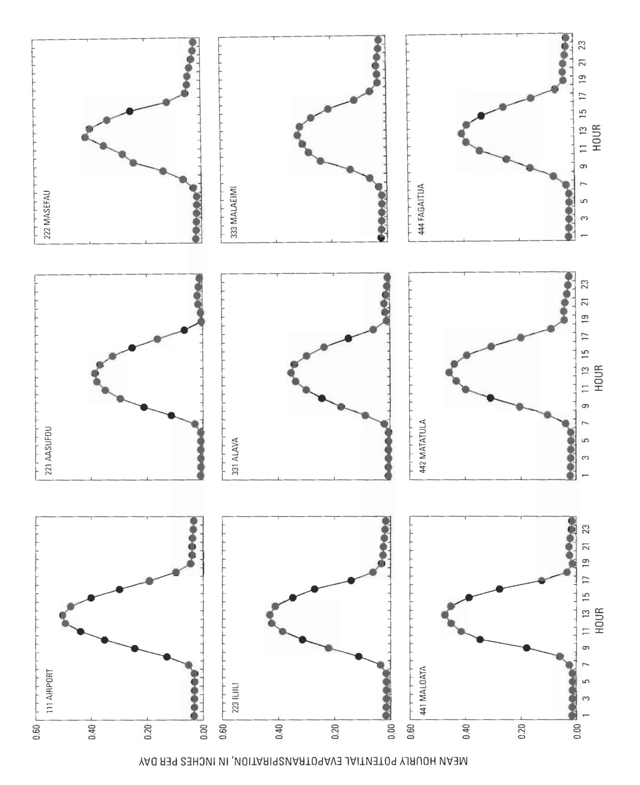

Figure 13. Mean hourly potential evapotranspiration at the climate stations on Tutuila, American Samoa (periods of record given in table 1).

Table 3. Unadjusted mean monthly and mean annual potential evapotranspiration for stations on Tutuila, American Samoa.

[Mean annual rainfall measured at each station is provided for comparison. Values are computed on the basis of daily potential evapotranspiration and rainfall values that have not been adjusted to a common base period. —, no data; PE, potential evapotranspiration]

|                                                   | Mean monthly PE, in inches per day |                |                |              |              |                 |                |                 |                 |  |  |
|---------------------------------------------------|------------------------------------|----------------|----------------|--------------|--------------|-----------------|----------------|-----------------|-----------------|--|--|
| Month                                             | 111 Airport                     | 221 Aasufou | 222 Masefau | 223 Hiili | 331 Alava | 333 Malaeimi | 441 Maloata | 442 Matatula | 444 Fagaitua |  |  |
| January                                           | 0.187                              | 0.144          | 0.147          | 0.186        | 0.156        | 0.138           | 0.171          | 0.201           | 0.122           |  |  |
| February                                          | 0.177                              | 0.155          | 0.147          | 0.139        | 0.135        | 0.135           | 0.137          | 0.212           | -               |  |  |
| March                                             | 0.165                              | 0.108          | 0.151          | 0.127        | 0.114        | 0.121           | 0.136          | 0.172           | 0.143           |  |  |
| April                                             | 0.148                              | 0.117          | 0.117          | 0.117        | 0.112        | 0.107           | 0.148          | 0.135           | 0.137           |  |  |
| May                                               | 0.151                              | 0.111          | 0.090          | 0.121        | 0.109        | 0.085           | 0.132          | 0.132           | 0.113           |  |  |
| June                                              | 0.145                              | 0.127          | 0.095          | 0.103        | 0.089        | 0.084           | 0.116          | 0.116           | 0.123           |  |  |
| July                                              | 0.146                              | 0.116          | 0.080          | 0.116        | 0.111        | 0.066           | 0.131          | 0.139           | 0.105           |  |  |
| August                                            | 0.166                              | 0.121          | 0.102          | 0.122        | 0.099        | 0.086           | 0.146          | 0.157           | 0.125           |  |  |
| September                                         | 0.191                              | 0.113          | 0.134          | 0.126        | 0.125        | 0.118           | 0.165          | 0.161           | 0.153           |  |  |
| October                                           | 0.186                              | 0.120          | 0.148          | 0.150        | 0.104        | 0.127           | 0.137          | 0.172           | 0.151           |  |  |
| November                                          | 0.194                              | 0.137          | 0.112          | 0.160        | 0.126        | 0.103           | 0.141          | 0.167           | 0.118           |  |  |
| December                                          | 0.194                              | 0.152          | 0.132          | 0.157        | 0.145        | 0.131           | 0.158          | 0.169           | 0.145           |  |  |
| Mean annual PE (inches per day)                   | 0.171                              | 0.127          | 0.121          | 0.135        | 0.119        | 0,108           | 0.143          | 0.161           | 0.130           |  |  |
| Mean annual PE (inches)                           | 62.4                               | 46.3           | 44.3           | 49.5         | 43.4         | 39.6            | 52.2           | 58.8            | 47.6            |  |  |
| Mean annual rainfall (inches)                     | 125                                | 178            | 124            | 129          | 145          | 175             | 156            | 96              | 127             |  |  |
| Mean annual PE as percent of mean annual rainfall | 50                                 | 26             | 36             | 38           | 30           | 23              | 33             | 61              | 38              |  |  |

are susceptible to heat advection (Ficke, 1972; Ekern and Chang, 1985; Allen and others, 1998).

The adjusted mean monthly and mean annual PE values are given in table 4. These adjusted values were used to construct maps showing the monthly and annual distribution of PE on Tutuila. The distribution of mean annual PE, like the distribution of rainfall, is affected by topography and exposure to the southeasterly prevailing winds (fig. 15). Mean annual PE on Tutuila is highest along the southern and eastern coasts of the island, and decreases toward the higher-elevation interior of the island. This pattern indicates an inverse relation between the orographic rainfall distribution and PE. In the interior of the island, where rainfall is higher and cloud cover is more frequent, PE is lower because net radiation is lower. At the coast, where rainfall is lower and cloud cover less frequent, PE and net radiation are higher. A similar pattern has been described in Hawaii (Ekern and Chang, 1985).

The distributions of mean PE for individual months (figs. 16-26) also show patterns consistent with the orographic distribution of climate on Tutuila. In all months, PE is lowest in the mountains and highest at the coast. The PE distribution pattern for November and December, when mean monthly PE is the highest, are virtually identical, with a steep gradient from PE at the coast to PE in the mountains (fig. 26). The PE distribution pattern for June and July (figs. 21, 22), when mean monthly PE is lowest, are also nearly identical, but the gradi-

ent from the coast to the mountains is less steep than in the November-December distribution. The distribution patterns for the other months are transitional between these high- and low-PE end-member months.

Whereas the spatial variation of annual and mean monthly PE is linked to orographic cloud cover, the seasonal variation of mean monthly PE more closely parallels the seasonal variation in daylight duration (figs. 7, 14). Even though the seasonal rainfall pattern (fig. 2) on Tutuila would indicate greater cloud cover during the wet summer and less cloud cover during the dry winter, PE is highest in the summer because days are longer and total net radiation is higher than in the winter.

In high-rainfall areas such as Tutuila, where actual evapotranspiration may be close to PE, comparing PE to the rainfall recorded at each station can be instructive in illustrating what percentage of water brought to the site by rainfall can be potentially lost back to the atmosphere by evapotranspiration. Comparison of PE to rainfall indicates that evapotranspiration processes on Tutuila have the potential to remove 23 to 61 percent of the water brought by rainfall (table 3). This percentage depends on location. In coastal locations where rainfall is low, such as stations 111 Airport and 442 Matatula, PE can be 50 percent or more of rainfall. In wetter interior locations, such as stations 221 Aasufou and 333 Malaeimi, PE is less than 30 percent of rainfall.

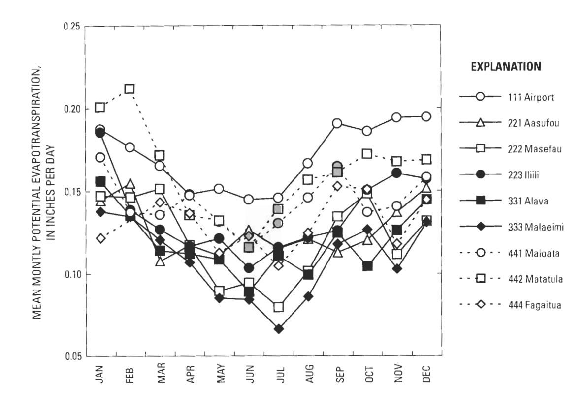

**Figure 14.** Unadjusted mean monthly potential evapotranspiration at the climate stations on Tutuila, American Samoa (periods of record given in table 1).

**Table 4.** Adjusted mean monthly and mean annual potential evapotranspiration for stations on Tutuila, American Samoa.

[Values are computed on the basis of daily potential evapotranspiration values that have been adjusted to a common base period; in/d, inches per day; in/yr, inches per year]

|                     | Mean monthly potential evapotranspiration, in inches per day |                |                |              |              |                 |                |                 |                 |  |  |
|---------------------|--------------------------------------------------------------|----------------|----------------|--------------|--------------|-----------------|----------------|-----------------|-----------------|--|--|
| Month               | 111 Airport                                               | 221 Aasufou | 222 Masefau | 223 Hiili | 331 Alava | 333 Malaeimi | 441 Maloata | 442 Matatula | 444 Fagaitua |  |  |
| January             | 0.187                                                        | 0.131          | 0.132          | 0.146        | 0.125        | 0.117           | 0.150          | 0.168           | 0.139           |  |  |
| February            | 0.177                                                        | 0.126          | 0.125          | 0.137        | 0.118        | 0.111           | 0.143          | 0.160           | 0.134           |  |  |
| March               | 0.165                                                        | 0.121          | 0.118          | 0.127        | 0.112        | 0.105           | 0.137          | 0.151           | 0.128           |  |  |
| April               | 0.148                                                        | 0.113          | 0.108          | 0.112        | 0.102        | 0.096           | 0.127          | 0.138           | 0.119           |  |  |
| May                 | 0.151                                                        | 0.115          | 0.109          | 0.115        | 0.103        | 0.097           | 0.129          | 0.140           | 0.120           |  |  |
| June                | 0.145                                                        | 0.112          | 0.105          | 0.110        | 0.100        | 0.094           | 0.125          | 0.136           | 0.117           |  |  |
| July                | 0.146                                                        | 0.112          | 0.106          | 0.110        | 0.100        | 0.094           | 0.125          | 0.136           | 0.118           |  |  |
| August              | 0.166                                                        | 0.121          | 0.119          | 0.128        | 0.112        | 0.106           | 0.137          | 0.152           | 0.128           |  |  |
| September           | 0.191                                                        | 0.132          | 0.134          | 0.149        | 0.127        | 0.119           | 0.152          | 0.170           | 0.141           |  |  |
| October             | 0.186                                                        | 0.130          | 0.131          | 0.145        | 0.124        | 0.116           | 0.149          | 0.167           | 0.138           |  |  |
| November            | 0.194                                                        | 0.134          | 0.136          | 0.152        | 0.129        | 0.121           | 0.154          | 0.173           | 0.143           |  |  |
| December            | 0.194                                                        | 0.134          | 0.136          | 0.152        | 0.129        | 0.121           | 0.154          | 0.173           | 0.143           |  |  |
| Mean annual (in/d)  | 0.171                                                        | 0.123          | 0.122          | 0.132        | 0.115        | 0.108           | 0.140          | 0.155           | 0.131           |  |  |
| Mean annual (in/yr) | 62.44                                                        | 45.09          | 44.42          | 48.19        | 42.04        | 39.49           | 51.15          | 56.71           | 47.70           |  |  |

Figure 15. Distribution of mean annual potential evapotranspiration on Tutuila, American Samoa.

Figure 16. Distribution of mean January potential evapotranspiration on Tutuila, American Samoa.

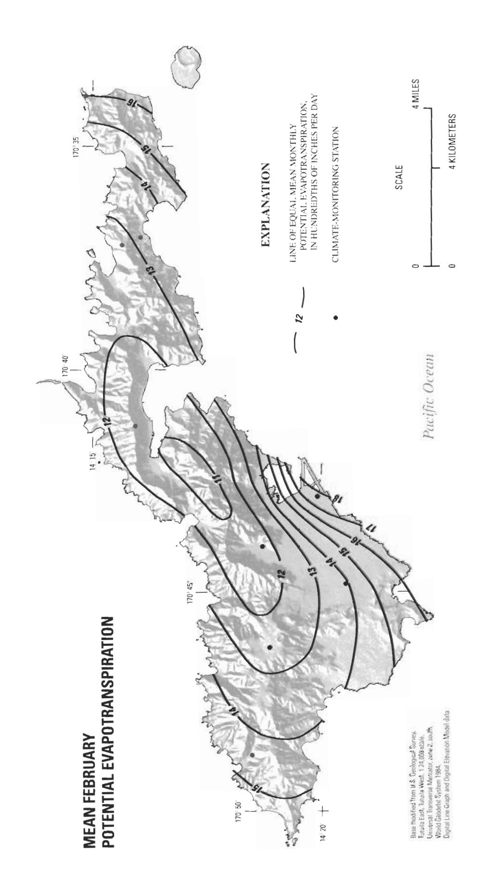

Figure 17. Distribution of mean February potential evapotranspiration on Tutuila, American Samoa.

Figure 18. Distribution of mean March potential evapotranspiration on Tutuila, American Samoa.

Figure 19. Distribution of mean April potential evapotranspiration on Tutuila, American Samoa.

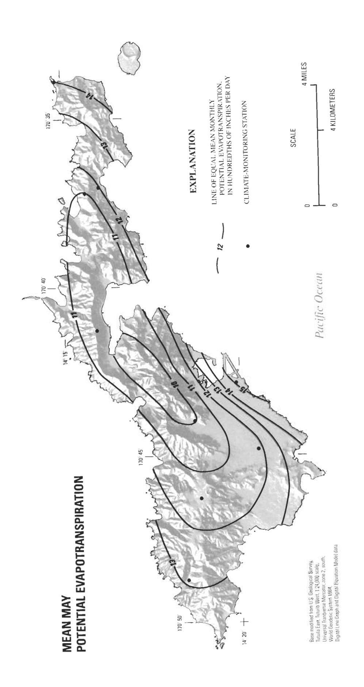

Figure 20. Distribution of mean May potential evapotranspiration on Tutuila, American Samoa.

Figure 21. Distribution of mean June potential evapotranspiration on Tutuila, American Samoa.

Figure 22. Distribution of mean July potential evapotranspiration on Tutuila, American Samoa.

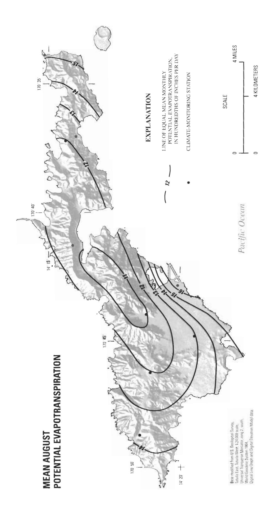

Figure 23. Distribution of mean August potential evapotranspiration on Tutuila, American Samoa.

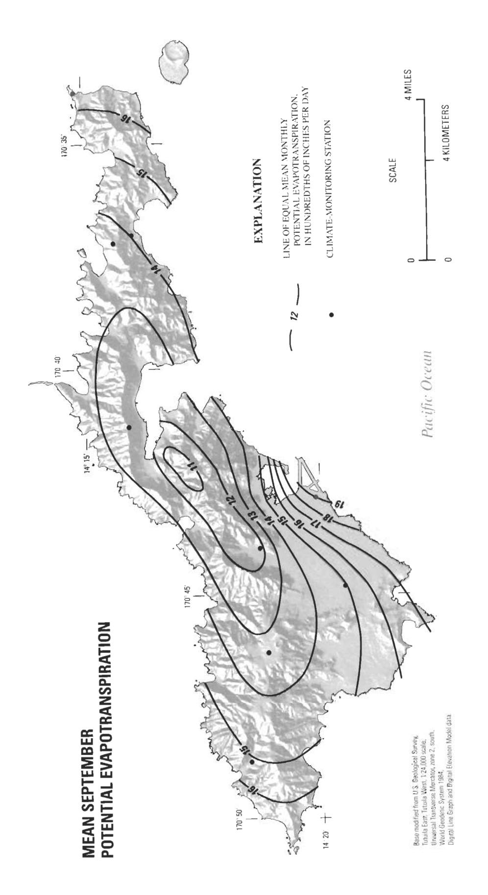

Figure 24. Distribution of mean September potential evapotranspiration on Tutuila, American Samoa.

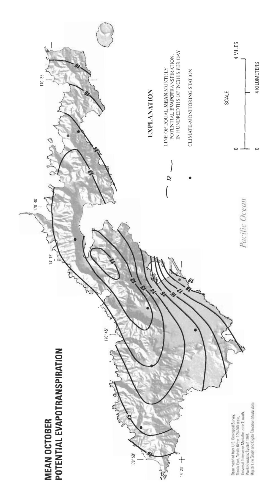

Figure 25. Distribution of mean October potential evapotranspiration on Tutuila, American Samoa.

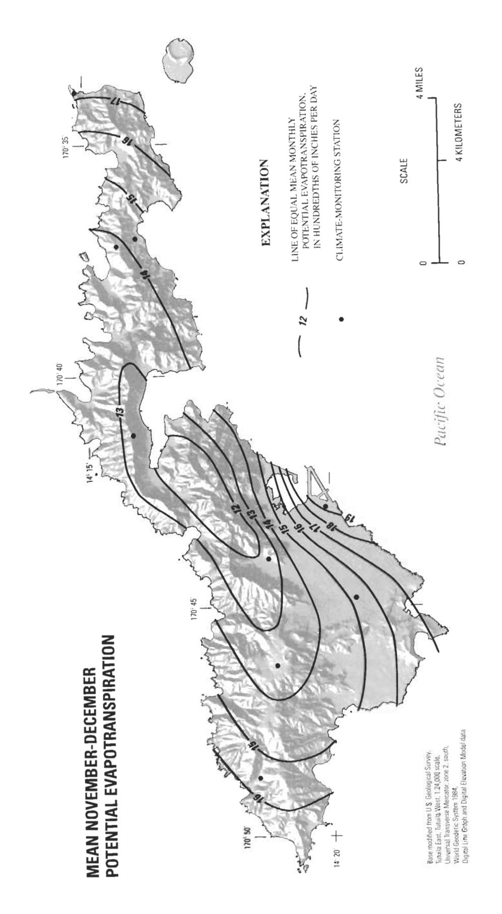

Distribution of mean November and mean December potential evapotranspiration on Tutuila, American Samoa. Figure 26.

## **Summary and Conclusions**

Analysis of climate data collected at nine stations on Tutuila, American Samoa between 1999 and 2004 indicate that rainfall at most stations occurs with nearly equal frequency at any hour of the day, although some stations show slightly lower rainfall in the afternoon and early evening, and slightly higher rainfall in the morning. Rainfall at most stations was lower in July and August than for the rest of the year, which is consistent with the seasonal patterns apparent in available long-term climate data, but most stations did not show the distinct October-May wet season apparent in the long-term data. These differences may be attributed to the relatively short monitoring periods of stations in this study.

Net radiation, soil heat flux, and air and soil temperatures show diurnal variations that are consistent with the cycle of daylight and darkness. These parameters also show month-to-month variations that are consistent with seasonal changes in daylight duration. Relative humidity was about 10 to 20 percent higher at night than during the day, and varied by only a few percent from month to month throughout the year. Wind speed at most stations was higher during the day, probably as a result of differential rates of warming of air over the island relative to the air over the ocean. Some stations show a pattern of lower wind speeds from December to April and higher wind speeds the rest of the year, which is consistent with seasonal wind patterns indicated from long-term data collected by the National Weather Service and Climate Monitoring and Diagnostics Laboratory.

Potential evapotranspiration shows a diurnal pattern that closely parallels net radiation, the primary source of energy for evaporation on islands. Higher temperatures and wind speeds and lower relative humidity during the day also correspond approximately with the higher daytime potential evapotranspiration, but net radiation is the dominant factor controlling potential evapotranspiration in the daytime, whereas other factors control potential evapotranspiration at night. On average, potential evapotranspiration in the daytime constitutes 90 percent or more of the total daily potential evapotranspiration at each station. Potential evapotranspiration at all stations is lower from April to August and higher from September to March. This pattern corresponds with the pattern of lower net radiation during the winter and higher net radiation in the summer.

Whereas seasonal variation of mean monthly potential evapotranspiration is linked to the seasonal variation in daylight duration, spatial variation of potential evapotranspiration is linked to orographic cloud cover. The distribution of potential evapotranspiration reflects topography and exposure to the southeasterly prevailing winds. Potential evapotranspiration on Tutuila is highest along the southern and eastern coasts, and decreases toward the higher elevation interior. This pattern indicates an inverse relation between the orographic rainfall distribution and potential evapotranspiration. In the interior of the island, where rainfall is higher and cloud cover is more frequent, potential evapotranspiration is lower because

net radiation is lower. At the coast, where rainfall is lower and cloud cover less frequent, potential evapotranspiration and net radiation are higher. The gradient from high potential evapotranspiration at the coast to low potential evapotranspiration in the interior of the island is steepest in November and December, when island-wide potential evapotranspiration is highest, and less steep in June and July, when island-wide potential evapotranspiration is lowest

Positive heat advection contributes to potential evapotranspiration at at least one station in this study—111 Airport. The excess heat is probably coming from the ocean, which lies only a few hundred feet upwind from this station. Potential evapotranspiration at other stations also may be enhanced by advection, but the Penman method used in this study does not yield strong evidence of this possibility. On a small island such as Tutuila, the ocean and its effects are not far from any location.

Pan evaporation monitored by the NWS was much higher than the Penman potential evapotranspiration values computed in this study for station 111 Airport. The disparity probably reflects the difference in the physical process of evaporation from an open metal pan versus evaporation from a vegetated soil surface.

Comparison of potential evapotranspiration to rainfall indicates that evapotranspiration processes on Tutuila have the potential to remove 23 to 61 percent of the water brought by rainfall. In lower-rainfall coastal locations, potential evapotranspiration can be 50 percent or more of rainfall, whereas in higher-rainfall interior locations potential evapotranspiration is less than 30 percent of rainfall.

Comparison of annual rainfall for the period of this study (1999-2004) against the long-term average indicates that climate during the monitoring period of this study was not substantially different from long-term average climate conditions. Climate conditions during the monitoring period for this study are therefore considered representative of normal conditions.

The potential-evapotranspiration estimates in this study can be used in water-budget methods to estimate actual evapotranspiration and ground-water recharge, provided adequate data on precipitation, runoff, vegetation, and soil characteristics also exist or can be estimated.

## **References Cited**

Allen, R.G., Pereira, L.S., Raes, Dirk, and Smith, Martin, 1998, Crop evapotranspiration: guidelines for computing crop water requirements: Food and Agriculture Organization of the United Nations, FAO Irrigation and Drainage Paper 56, 300 p.

Bentley, C.B., 1975, Ground-water resources of American Samoa with emphasis on the Tafuna-Leone Plain, Tutuila Island: U.S. Geological Survey Water-Resources Investigations Report 29-75, 32 p.

- Bidlake, W.R., Woodham, W.M., and Lopez, M.A., 1996, Evapotranspiration from areas of native vegetation in westcentral Florida: U.S. Geological Survey Water-Supply Paper 2430, 35 p.
- Climate Monitoring and Diagnostics Laboratory, 2004, Station meteorology for Samoa Observatory: world-wide website at http://www.cmdl.noaa.gov/obop/met/smo/, accessed November, 18, 2004.
- Davis, D.A., 1963, Ground-water reconnaissance of American Samoa: U.S. Geological Survey Water-Supply Paper 1608-C, 21 p.
- Ekern, P., 1983, Measured evaporation in high rainfall areas, leeward Koolau Range, Oahu, Hawaii: University of Hawaii Water Resources Research Center, Technical Report 156, 60 p.
- Ekern, P.,1993, Evaporation along a transect across southern O'ahu, Hawai'i: University of Hawaii Water Resources Research Center, Project Report PR-94-01, 23 p.
- Ekern, P., and Chang, J.H., 1985, Pan evaporation: State of Hawaii, 1894-1983: State of Hawaii Department of Land and Natural Resources, Division of Water and Land Development, Report R74, 172 p.
- Ficke, J.F., 1972, Comparison of evaporation computation methods, Petty Lake, Lagrange County, Northeastern Indiana: U.S. Geological Survey Professional Paper 686-A, 49 p.
- Giambelluca, T.W., Nullet, D., and Nullet, M.A, 1988, Agricultural drought on south-central Pacific Islands: Professional Geographer, v. 40, no. 4, p. 404-415.
- Giambelluca, T.W., and Nullet, M.A., 2000, HaleNet Hale-akala Climate Network: Data-analysis procedures: world-wide website at http://webdata.soc.hawaii.edu/climate/HaleNet/Index.htm accessed August 21, 2003.
- Izuka, S. K., 1999, Hydrogeologic interpretations from available ground-water data, Tutuila, American Samoa: U.S.Geological Survey Water-Resources Investigations Report 99-4064 (atlas format), 2 sheets.
- Matsuoka, Iwao, 1978, Flow characteristics of streams in Tutuila, American Samoa: U.S. Geological Survey Water-Resources Investigations Report 78-103, 34 p.
- Mcfford, Thomas, 2002, Meteorological measurements, *in* King, D.B., Schnell, R.C., Rosson, R.M., and Sweet, C. (eds.): Climate Monitoring and Diagnostics Laboratory Summary report No. 26, 2000-2001, p. 20-31.

- Mefford, Thomas, 2004, Meteorological measurements, in Schnell, R.C., Buggle, A., and Rosson, R.M. (eds.): Climate Monitoring and Diagnostics Laboratory Summary report No. 27, 2002-2003, p. 20-31.
- National Climatic Data Center, 2002, Cooperative summary of the day, TD3200, period of record through 2001, Western United States and Pacific Islands: CD-ROM.
- National Climatic Data Center, 2004, Comparative climate data: world-wide website at http://www1.ncdc.noaa.gov/pub/data/ccd-data/ accessed December 15, 2004.
- National Climatic Data Center, 2001-05, Locate weather observation station record: world-wide website at http://www.nedc.noaa.gov/oa/climate/stationlocator.html/accessed February 1, 2001, April 11, 2001, August 7, 2001, October 19, 2001, November 19, 2001, January 29, 2002, April 26, 2002, June 25, 2002, October 18, 2003, September 15, 2004, and June 20, 2005.
- Nullet, D., 1987, Energy sources for evaporation on tropical islands: Physical Geography, v. 8, p. 36-45.
- Nullet, D., and Giambelluca T.W., 1990, Winter evaporation on a mountain slope, Hawaii: Journal of Hydrology, v. 112, p. 257-265.
- Penman, H.L., 1948, Natural evaporation from open water, bare soil, and grass: Proceedings of the Royal Society of London, A193, p. 120-146.
- Stearns, H.T., 1944, Geology of the Samoan Islands: Geological Society of America Bulletin, v. 55, p. 1279-1332.
- Thornthwaite, C.W., and Mather, J.R. 1955, The water balance: Publications in Climatology v. 8, p. 1-104.
- U.S. Census Bureau, 2004, Population and housing profile: 2000, American Samoa, 2000 Census of population and housing (revised): Document obtained from http://www. census.gov/prod/cen2000/island/ASprofile.pdf, November 18, 2004.
- Wong, M.F., 1996, Analysis of streamflow characteristics for streams on the island of Tutuila, American Samoa: U.S. Geological Survey Water-Resources Investigations Report 95-4185, 168 p.
- Wright, W.C.S., 1963, Soils and land use of Western Samoa: New Zealand Department of Scientific and Industrial Research, Soil Bureau Bulletin 22.

# Appendix 1 – Description of Climate Stations and Methods for Computation of Potential Evapotranspiration

#### **Station Descriptions**

III Airport. - Station 111 Airport (U.S. Geological Survey [USGS] number 141954170425101) was on the grounds of the National Weather Service (NWS) office at the Pago Pago Airport at the eastern end of the Tafuna-Leone Plain. The site was about 10 ft above sea level on a relatively flat, open area covered with short grass. This station was operated from July 1, 1999, to April 29, 2004. Except for occasional power-related problems, particularly in the first 5 months of operation, the station operated continuously during most of this period. The station sustained minor damage from Tropical Cyclone Heta, which passed over the Samoa Islands on January 5, 2004, resulting in the collection of no rainfall data between January 5 and February 20, 2004. Instrument calibration drift resulted in the collection of no air-temperature data from July 14 to December 12, 2001; from November 11 to December 19, 2002; and from January 5, 2004 through the end of the monitoring period. Instrument calibration drift also resulted in the collection of no relative-humidity data from January 5 through February 20, 2004.

221 Aasufou. – Station 221 Aasufou (USGS number 141909170461201) was in Aasufou Village on a grassy lawn fronting a private residence about 1,320 ft above sea level, near the crest of the mountains that form western Tutuila. The station was a few feet north of a USGS rain gage that had been in operation since January 1980. The climate station at Aasufou was operated from July 1, 1999, to June 7, 2000, with only minor logistical problems that resulted in an abbreviated monitoring period (0.94 yr) and the collection of no soil-moisture data from May 19, 2000 through the end of the monitoring period.

222 Masefau. – Station 222 Masefau (USGS number 141538170371201) was in Masefau Village, on the northern slope of Tutuila. The site was about 590 ft above sea level on a grassy clearing on the northeast side of a water tank. The tank clearing was covered with short grass, but surrounded by trees as much as 20-ft tall, some of which were within ten feet of the station. The station was operated from December 12, 2001 to April 27, 2004. Between May 2002 and February 2003, instruments frequently malfunctioned as a result of power-related problems. To make up for the resulting data gaps, the monitoring period was extended beyond I year. Because of persistent problems with the soil-moisture probe, this parameter was not monitored at this site for most of the period. Instrument calibration drift resulted in the collection of no air-temperature data from February 9, 2004 to the end of the monitoring period.

223 Iliili. – Station 223 Iliili (USGS number 142030170444901) was in Iliili Village at about 200 ft above sea level, on the Tafuna-Leone Plain. The station was enclosed within the fenced compound of a water tank and was operated from August 2, 2000, to December 11, 2001. The ground at the site was covered by short grass. The monitoring period was extended beyond 1 year to make up for gaps in data resulting from data-logger malfunction between August 10 and November 7, 2000, March 15 and April 26, 2001, and June 6 and June 21, 2001.

331 Alava. - Station 331 Alva (USGS number 141614170411601) was located at about 1,600 ft above sea level, on the crest of Mount Alava in the American Samoa National Park. South of the monitoring site, the land surface drops precipitously to Pago Pago Harbor, forming a cliff that faces the prevailing southeasterly winds. The station was operated from March 2, 2000 to June 5, 2002. Before the climate station was installed, the area was covered with grass about 4 ft high, but the grass was cut down to a few inches to accommodate the climate station. During monitoring, the grass was kept short. The monitoring period was extended beyond I year to make up for a gap in the rainfall data from January 5 to April 12, 2001. Problems with the soil-moisture probe, possibly due to the highly weathered and fractured rock into which it was inserted, resulted in collection of no soil-moisture data for this station for most of the monitoring period.

333 Malaeimi. – Station 333 Malaeimi (USGS number 141842170435801) was on the floor of Malaeimi Valley. Although it is one of the largest on Tutuila, the valley is only about 1 mi wide from ridge crest to ridge crest, about 1.5 mi long, and is tucked among the tallest and most massive mountains on the island. Station 333 Malaeimi was located about 150 ft above sea level on a lawn fronting a private residence. The ground surface was covered with short grass. The station operated from February 26, 2003 to April 28, 2004, with no technical difficulties or loss of data.

441 Maloata. – Station 441 Maloata (USGS number 141844170484101) was in Maloata, a small valley on the northern side and near the western end of Tutuila. The station was about 120 ft above sea level in a clearing on the heavily vegetated slope that forms the southwest side of the valley. The ground was covered with short grass, but vegetation in the surrounding areas within a few tens of feet of the climate station included tall grass (about 4 ft high) and one tall tree (about 20 ft high). The station operated from March 3, 2000 to May 1, 2001 and successfully gathered data for most of the 13 months it was deployed. The temperature/relative-humidity sensor drifted in the last few weeks of monitoring, but a full year of continuous data was obtained before the problem arose.

442 Matatula. – Station 442 Matatula (USGS number 141507170334701) was on Cape Matatula on the eastern tip of Tutuila. The site was about 240 ft above sea level on a well-maintained lawn of short grass on the grounds of the Climate Monitoring and Diagnostics Laboratory (CMDL) observatory. Station 442 Matatula was operated from May 3, 2001 to

June 4, 2002 and all instruments except the relative-humidity sensor operated successfully during this period. The relative-humidity sensor showed signs of drift from about October 2, 2001, but the problem was not discovered until after the monitoring period was complete and the station was dismantled; therefore, about 7 months of relative-humidity data were not collected. In the potential-evapotranspiration (PE) computations for this station, missing relative-humidity data was replaced by estimated relative-humidity values computed on the basis of dew-point temperatures reported by the CMDL.

444 Fagaitua. - Station 444 Fagaitua (USGS number 141602170370201) was in Fagaitua Village on the south side of Tutuila. The site for the station was on a hill about 280 ft above sea level within the fenced compound of a water tank. The station was located to the west of the tank, on ground covered with short grass. The station operated from June 5, 2002 to April 28, 2004. The monitoring period was extended beyond I year to make up for numerous incidences of instrument malfunction and calibration drift between June 7 and September 25, 2002, and between November 16, 2002 and March 28, 2003. Wind-speed data were not collected during the period from January 10 and March 7, 2004 because of apparent instrument malfunction. The wind-speed sensor was also vandalized sometime between September 9 and October 3, 2003 and repairs were made on October 24, 2003, but the vandalism had little apparent effect on the data collected.

#### **Computation of Potential Evapotranspiration**

The following section details the computation of PE from the measured climate data collected at each station. In the main text of the report, some parameters were converted to English-system units for the convenience of the reader. The data collection and computation of potential evapotranspiration in this study, however, were done using metric-system units. The following formulations, therefore, use constants that are specific to the metric system, and dimensions for each term specify which metric units are involved.

The Penman (1948) equation can be expressed as:

$$PE = \frac{\Delta H + \gamma E_a}{\Delta + \gamma},\tag{1}$$

where

*PE* is potential evapotranspiration [mm/d],

 Δ is the slope of saturation vapor pressure versus temperature curve [mb/K],

H is net radiation minus soil heat conduction, expressed in evaporation equivalent units [mm/d],

y is the psychrometric constant [mb/K], and

 $E_a$  is the aerodynamic term of the Penman equation [mm/d].

The energy term (H) is a function of net radiation, soil heat flux, soil temperature, and soil moisture:

$$H = 0.0353 (R_{net} - G)$$
 (2)

where

 $R_{max}$  is net radiation [W/m2]

G is soil heat conduction [W/m2], and

0.0353 is the factor to convert energy flux in watts per square meter to evaporation equivalent units in millimeters per day [(mm/day)/(W/m²)].

The term G is based on measurements from soil heat flux plates (*SHF*, in W/m2) positioned at a depth of 8 cm, plus flux into and out of the upper 8-cm layer (S, in W/m2), computed from changes in soil temperature in the layer with time:

$$G = SHF + S, (3)$$

where

$$S = \frac{Tsoil_i - Tsoil_{i-1}}{t_i - t_{i-1}} D[(\rho_b C_x) + (\theta \rho_w C_w)],$$

where

S is the change in sensible energy stored in the upper 8-cm soil layer during one time step [W/m2],

 $T_{soil}$  is the mean temperature in upper 8-cm soil layer [K] (subscript indicates time step),

t is time [s]

D is the depth of soil layer [m] (0.08),

 $\rho_b$  is dry soil bulk density [assumed  $\rho_b = 1.052$  kg/m3],

 $C_y$  is the mass specific heat of dry soil [assumed  $C_y = 840 \text{ J/kg/K}$ ],

 $\theta$  is the volumetric soil-moisture content  $[m^3/m^3]$ ,

 $\rho_w$  is the density of water  $[\rho_w = 1,000 \text{ kg/m}^3]$ , and

 $C_{iv}$  is the mass specific heat of water  $[C_{iv} = 4,190 \text{ J/kg/K}].$ 

The volumetric soil-moisture content was monitored with a soil-moisture probe, the results from which were checked against laboratory analysis of soil samples from each station.

The aerodynamic term  $(E_a)$  is a function of wind speed and vapor-pressure deficit:

$$E_a = 0.263 + 0.138U(e_1 - e),$$
 (4)

where

38

U is wind speed [m/s], and

 $e_x - e$  is vapor pressure deficit, the difference between saturation vapor pressure  $(e_x)$  and ambient vapor pressure (e) [mb].

The saturation vapor pressure  $(e_s)$  is estimated as a function of air temperature (T[K]) using the relationship of Goff and Gratch (1946):

$$e_{x} = 10^{x}, \tag{5}$$

where

$$x = -7.90298 \left( \frac{373.16}{T} - 1 \right)$$

$$+ 5.02808 \cdot \log \frac{373.16}{T}$$

$$- 1.3816 \cdot 10^{-7} \left( 10^{-11.344 \left[ 1 - \frac{T}{373.16} \right]} - 1 \right)$$

$$+ 8.1328 \cdot 10^{-3} \left( 10^{-3.49149 \left[ \frac{373.16}{T} - 1 \right]} - 1 \right)$$

$$+ \log 1,013.246.$$

The ambient air vapor pressure (e) is a function of  $e_x$  and relative humidity (RH):

$$e = e_s \frac{RH}{100} {.} {(6)}$$

The slope of the saturation vapor-pressure versus temperature curve ( $\Delta$ ) is a function of air temperature and e:

$$\Delta = 373.15 \frac{e_s}{T^2} 13.3185 - (3.952 t_R) - (1.9335 t_R^2) - (0.5196 t_R^3), \tag{7}$$

where

$$t_R = 1 - \frac{373.15}{T}$$
, and

T is air temperature  $\{K\}$ .

The psychrometric constant ( $\gamma$ ) is not actually constant, but varies with temperature and atmospheric pressure. This parameter was calculated using the formula of Storr and Den Hartog (1975) as:

$$\gamma = 0.3863 \frac{P_{atm}}{\lambda} + 0.02694 RH \frac{10^{\frac{7.5T}{237.3+T}}}{\lambda}$$
(8)

where

 $P_{atm}$  is atmospheric pressure [mb],

 $\lambda$  is the latent heat of vaporization [cal/g] ( $\lambda$ =597.3 – 0.5653T).

RH is relative humidity [percent], and

T is air temperature [°C].

For all stations except station 442 Matatula, atmospheric pressure used in the PE computation was estimated using the following equation:

$$P_{aim} = P_{mvs} \times (1.0 - (A_s - A_{mvs}) / 44,307.69)^{-5.25},$$
 (9)

where

 $P_{atm}$  is the atmospheric pressure at the PE station, [mb],

Pmass is the atmospheric pressure reported at the NWS office at Pago Pago Airport (National Climatic Data Center, 2001-05), [mb],

As is the elevation at the PE station [meters above mean sea level], and

Amax is the elevation at the NWS office at Pago Pago Airport [given as 3 m above sea level (National Climatic Data Center, 2001-05)].

Where  $P_{\text{mex}}$  was not available, a standard atmosphere of 1.013.246 mb was used:

$$P_{\text{max}} = 1,013.25 \times (1.0 - A_{\text{max}} / 44307.69)^{5.25}.$$
 (10)

For the PE computation at station 442 Matatula, the atmospheric pressure reported by the CMDL facility (Climate Monitoring and Diagnostics Laboratory, 2003) was used.

Estimates substituted for missing data in the PE computation. – At some stations, periods of missing data resulted from instrument malfunction and calibration drift. For the purposes of computing PE, some of the missing data were substituted by estimates. These substitutions were used only for the purposes of computing PE, not in the summary of climate statistics.

Missing air-temperature data from station 111 Airport were replaced by estimates using a regression relation between hourly air temperature reported by the NWS office (National Climatic Data Center 2001-05) and air temperature recorded at station 111 Airport:

$$T_{111} = 0.87 \times T_{max} + 2.69,$$
 (11)

where

 $T_{111}$  is the air temperature at station 111 Airport [°Cl, and

 $T_{mes}$  is the air temperature at the NWS office at Pago Pago Airport [°C].

Missing relative-humidity data resulting from calibration drift at station 441 Matatula were replaced by estimates derived from air temperature and dew-point data recorded at the nearby CMDL facility (Climate Monitoring and Diagnostics Laboratory, 2003) using the following equation from Rosenberg and others (1983):

$$RH = 100 \left( \frac{e_{dp}}{e_{s}} \right), \tag{12}$$

where

RH is relative humidity [percent],

 $e_{dp}$  is the saturation vapor pressure [mb] at the dew point temperature, and

es is the saturation vapor pressure [mb] at the ambient temperature.

The saturation vapor pressures at the dew-point temperature  $(e_{,h})$  and ambient temperature (e) are given by:

$$e_{dp} = 0.61078 \times \exp\left(\frac{17.269T_{dp}}{T_{dp} + 273.30}\right)$$
 and 
$$e_{x} = 0.61078 \times \exp\left(\frac{17.269T_{a}}{T_{a} + 273.30}\right),$$
 (13)

where

 $T_{dp}$  is dew-point temperature in Celsius, and T is air temperature in Celsius.

Malfunction of the soil-moisture probe resulted in occasional missing hourly soil-moisture data. In these cases, default soil-moisture values were used in place of missing data for the purposes of computing PE. For all stations except 222 Masefau, the default soil-moisture value was equal to the average of the existing soil-moisture readings. At 222 Masefau, the soil-moisture probe failed to give any accurate soil-moisture values. For this station, a default soil-moisture value of 65 percent (by volume) was used, which is close to the average (57 percent by volume) of soil-moisture values determined from laboratory analysis of soil samples collected at the station. Use of this single default value of soil moisture was considered reasonable because tests using other default soil-moisture values on the data from 222 Masefau indicate that the resulting

PE is affected little by variations in soil moisture between 50 and 80 percent.

#### **References Cited**

Climate Monitoring and Diagnostics Laboratory, 2003, file transfer protocol site at ftp://140.172.192.211/mct/hour-lymet/smo/, accessed through Climate Monitoring and Diagnostics Laboratory data archive: world-wide website at http://www.cmdl.noaa.gov/infodata/ftpdata.html, August 14, 2003.

Goff, J.A., and Gratch, S., 1946, Low-pressure properties of water from -160° to 212°F, *in* Transactions of the American Society of Heating and Ventilating Engineers, p. 95-122, presented at the 52nd annual meeting of the American society of heating and ventilating engineers, New York.

National Climatic Data Center, 2001-05, Locate weather observation station record: world-wide website at http://www.ncdc.noaa.gov/oa/climate/stationlocator.html/accessed February 1, 2001, April 11, 2001, August 7, 2001, October 19, 2001, November 19, 2001, January 29, 2002, April 26, 2002, June 25, 2002, October 18, 2003, September 15, 2004, and June 20, 2005.

Penman, H.L., 1948, Natural evaporation from open water, bare soil, and grass: Proceedings of the Royal Society of London, A193, p. 120-146.

Rosenberg, N.J., Blad, B.L., and Verma, S.B., 1983, Microclimate, the biological environment: 2nd ed., John Wiley & Sons, Inc., New York, p. 170-171.

Storr, D., and Den Hartog, G., 1975, Gamma—The psychrometer non-constant: Journal of Applied Meteorology v. 14, p. 1397–1398.

| 40 | <b>Potential</b> | <b>Evapotranspiration</b> | on Tutuila   | <b>American</b> | Samo |
|----|------------------|---------------------------|--------------|-----------------|------|
| 4U | rulellillai      | Evapou anspiration        | vii iutuiia, | Amentan         | Samo |

This page is intentionally blank.