## World's longest coral survey: a century of change at Aua reef

Oct 19, 2021 [Research](https://www.kaust.edu.sa/en/News?categoryId=8)

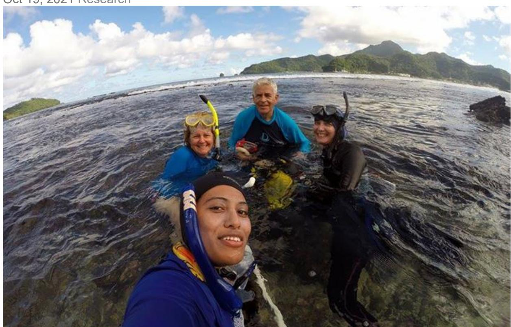

(From left to right) A celebratory portrait of marine scientists Chuck Birkeland, Alison Green, Alice Lawrence and Motusaga Vaeoso at Aua reef on the 100-year anniversary of the Aua transect survey. Photo courtesy Motusaga Vaeoso

Historical photographs are increasingly used by conservation scientists to assess how places have changed over time, and the degree of human and environmental impact. Such is the case with black and white photographs taken in 1917 of the lush reefs, shore and villages surrounding Pago Pago Harbor in American Samoa. Remarkably, a robust quantitative survey came with them, for they were taken by pioneering marine biologist and zoologist [Alfred Mayor](http://www.nasonline.org/publications/biographical-memoirs/memoir-pdfs/mayor-a-g.pdf) (1868 – 1922).

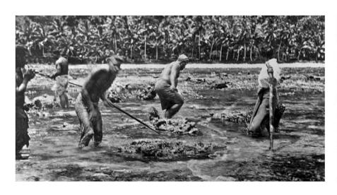

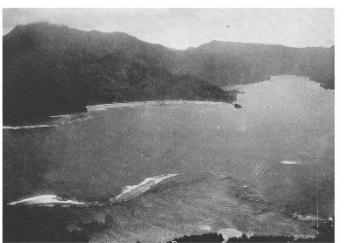

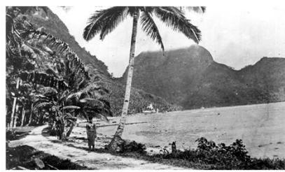

Marine biologist Alfred Mayor's 1917 photos document scenes from Pago Pago Harbor, American Samoa; (left to right), the subsistence livelihood of villagers, view from above of the surrounding landscape looking down at the Aua coral reef transect, and view from shore. Photos courtesy of Alfred Mayor and the Carnegie Institution of Washington

The early photographs and transect survey of the coral communities at Aua reef inspired KAUST marine scientist [Dr. Alison Green](https://reefecology.kaust.edu.sa/people/details/alison-green) and colleagues to repeat the survey on the same reef over decades. The resulting paper by Green, lead author [Dr. Charles Birkeland](https://manoa.hawaii.edu/biology/people/charles-birkeland) and contributing scientists, *[Different](https://repository.kaust.edu.sa/handle/10754/670971)  [resiliencies in coral communities over ecological and geological time scales in](https://repository.kaust.edu.sa/handle/10754/670971)  [American Samoa,](https://repository.kaust.edu.sa/handle/10754/670971)* encompasses more than a century of coral reef surveys, from 1917 to 2019, with 11 surveys conducted overall, making it the longest active quantitative coral reef survey in the world.

The paper documents the scope of their findings, with a focus on areas of lowest and highest resilience across Aua and the neighboring coral reefs of the American Samoan islands amidst high stress conditions through time. With coral reefs worldwide declining due to warming sea temperatures and related climate change stressors, long-term monitoring of reef ecosystems reveals patterns and dynamics that are useful, not only for research, but for reef management and protection.

Pioneering science into the 21st century

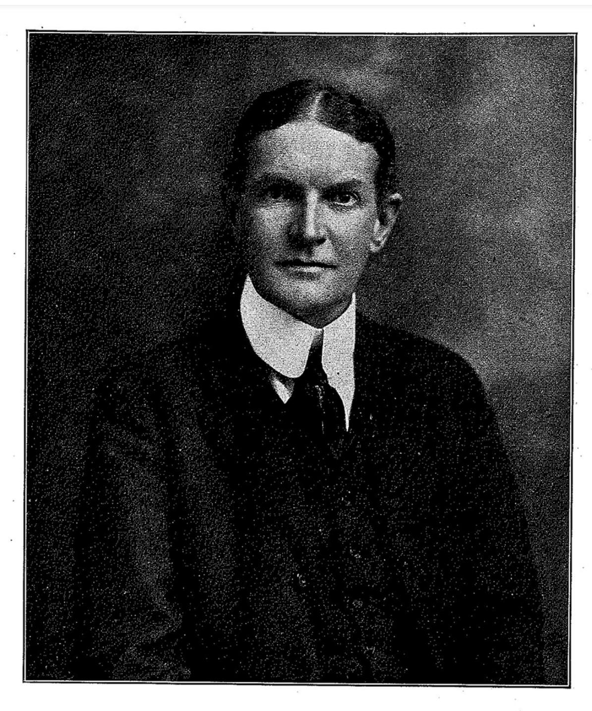

Portrait of marine biologist and zoologist Alfred G. Mayor (1868 – 1922) as a young man. Photo from Memoirs of the National Academy of Sciences, Volume 21, 1927

Sponsored by the Carnegie Institution of Washington (as of 2007 known as the [Carnegie Institution for Science\)](https://carnegiescience.edu/), Mayor's research into the growth rates and distribution of coral species across the Aua reef flat produced one of the first quantitative transect surveys of a coral reef ecosystem ever to be undertaken. A prior survey that he conducted in the Dry Tortugas in the Caribbean was lost, and the site cannot be resurveyed.

"Mayor was ahead of his time. Most quantitative monitoring of coral reefs worldwide didn't start until the 1980s," Green said. "His research at Aua was a significant achievement for the science of his era, and still serves as an inspiration for future generations of scientists. Our survey was made possible by his work there."

Green got the idea to resurvey the Aua transect in 1995 when she was working for the American Samoa Department of Marine and Wildlife Resources (DMWR) surveying reefs throughout the Samoan Archipelago. She asked coral biologist Charles Birkeland (then at the University of Guam) to help. The scientists were conducting a survey together in Fagatele Bay National Marine Sanctuary at the time. Green studies the fish communities of coral reefs. Her research at KAUST focuses on assessing patterns in biodiversity of coral fishes throughout the Red Sea, and how to use this knowledge to design marine protected areas.

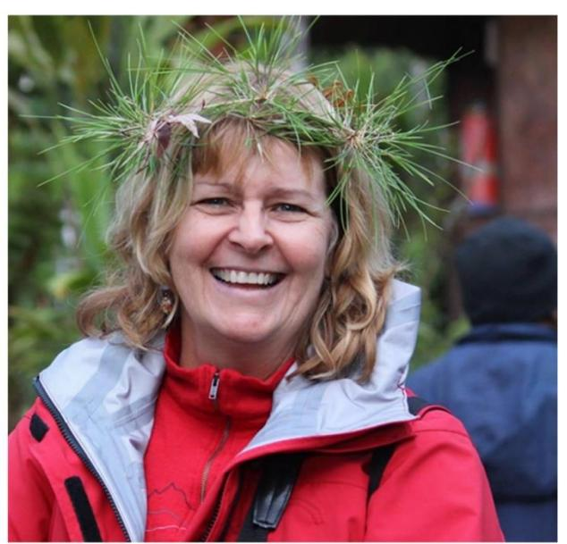

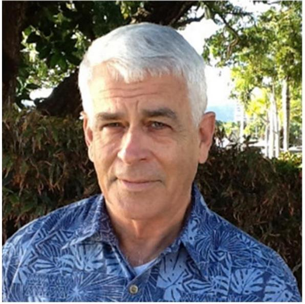

(Left to right) Portraits of marine scientists Alison Green and Charles Birkeland, whose paper Different resiliencies in coral communities over ecological and geological time scales

in American Samoa, encompasses more than a century of coral reef surveys. Photos courtesy of Alison Green and Charles Birkeland

Now a retired professor from the University of Hawaii at Manoa, Birkeland is a coral biologist with extensive expertise in coral reef ecosystems. He studies the dynamics of reef systems through time. Their areas of expertise are complementary, and, combined, convey comprehensive information about coral habitats and the species that live there.

Long-term monitoring brings challenges of time, people, resources and funding, as these ingredients are not always consistent or available. Green and Birkeland persevered. With support from DMWR and the National Marine Sanctuary Program, Green and Birkeland first resurveyed Aua in 1995. Thus began a long-term collaboration, with subsequent surveys supported by the American Samoa [Coral Reef Advisory Group](https://www.crag.as/) (CRAG), and culminating in the current paper and related projects. From the start, the Aua community supported the scientific work on the reef in front of their village, beginning with Mayor in the early 1900s and continuing with Green, Birkeland and colleagues into the 21st century.

Whereas the Pago Pago Harbor reef surveyed by Mayor in 1917 was nearpristine, by the time Green and Birkeland surveyed the transect in the 1990s, the change to the area was astonishing. In the ensuing decades, American Samoa had steadily transformed from a subsistence economy, where the local villagers relied on the reef for their food and livelihoods, to a market economy boasting a major port, fishing industry and extensive development.

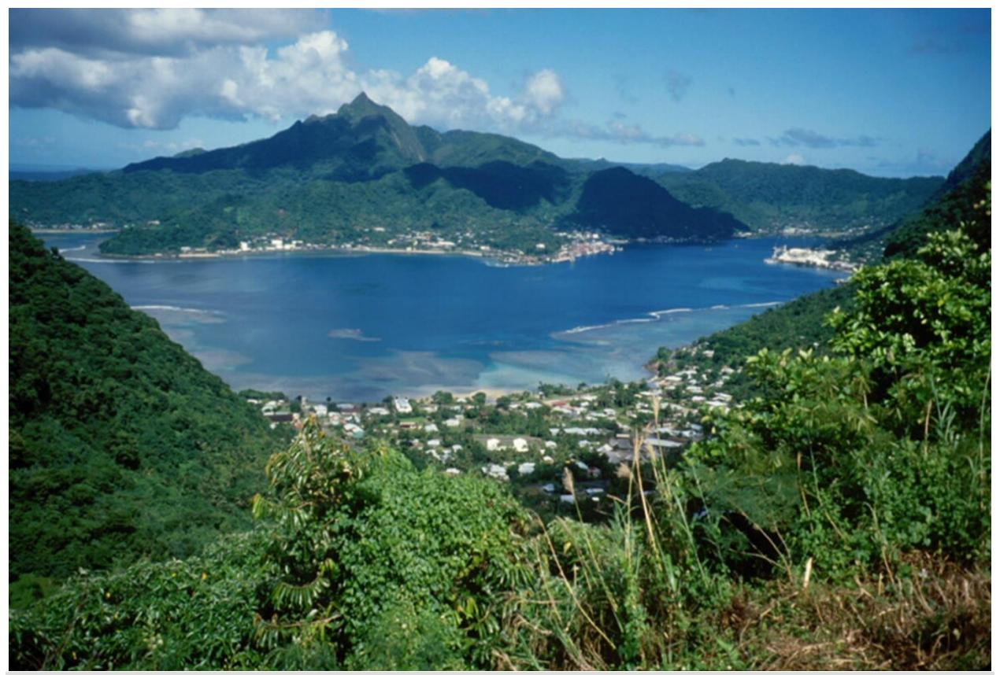

Contemporary, hillside view of Pago Pago Harbor, the city and surrounding terrain. Photo courtesy Alison Green.

The 1995 survey found that approximately 95% of the reefs in the inner Pago Pago Harbor, including Aua, had been severely degraded, primarily from dredging and filling operations, and wastewater pollution from two tuna canneries. Other natural and anthropogenic disturbances contributed, including cyclones, bleaching events, extreme low tides and a tsunami. Two prior surveys done in the 1970's disclosed the extent of damage in Pago Pago Harbor on the reef at Aua, and served as a comparative framework for Green and Birkeland's subsequent surveys.

Yet despite these harsh conditions, the scientists observed that at least one section of corals at Aua reef was thriving and resilient.

## **Degrees of resiliency**

Mayor recorded an abundance of coral species on the Aua reef from shore to crest in 1917. For this he counted and photographed corals in shallow water (less than 1 meter deep) across the reef at an overall width of 270 meters.

Thanks to his photos and descriptions, Green and Birkeland could find and repeat his quantitative coral survey of the Aua transect. Mayor included landmarks for perspective, such as a large tree on the shore and a block of coral jutting above the reef crest, that Green and Birkeland relied on to locate the transect for their surveys. His thoroughness helped to lay a smooth path for the researchers, but the gap in the number of years between their respective surveys brought challenges.

"One challenge was reconciling the species names of corals, which had changed over the 78 years between our first survey and Mayor's" said Birkeland. "Fortunately, there was a coral identification guide for American Samoa, complete with photographs, published by Mayor's colleague (Hoffmeister 1925), so we were able to reconcile the names used then and now."

Using Mayor's transect parameters, the scientists examined coral resiliency across three sections of reef: the inner reef flat, middle reef flat, and outer crest. Coral recruitment is one defining contributor to reef resiliency — the ability of coral communities to withstand or recover from disturbances. Resilient reefs attract new corals, which settle, grow, and build the reef, providing habitat for fishes and invertebrates. A combination of stressors affected this outcome at the Aua reef, including wastewater from the canneries and other pollutants, which caused serious reef degradation from the 1950s to early 1990s.

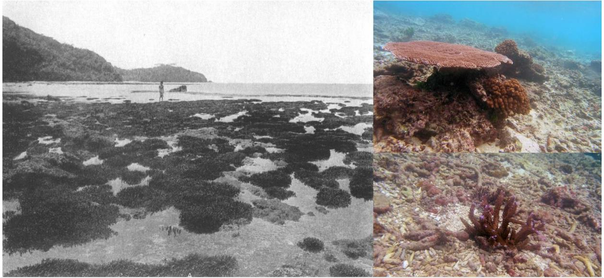

Aua reef flat comparisons from 1917 to 2007. The flat today consists primarily of coral rubble, or small coral fragments. The coral rock jutting above the surface in the black and

white photograph is one of many landmarks recorded by marine biologist Alfred Mayor that helped scientists Alison Green and Charles Birkeland find the transect and repeat the survey. 1917 photo courtesy of Alfred Mayor and the Carnegie Institution of Washington; corals by Charles Birkeland

The inner reef closest to the shore (within 90 meters) underwent the greatest change since Mayor's time. In the early to mid-20th century, it consisted of a low abundance and diversity of corals, mostly *Porites* colonies. A borrow pit dug here in the 1930s and 1940s for sand used for roads and other building projects dramatically altered the reef and shoreline forever. Very few corals grow here now.

The middle reef forms an extensive flat, which in 1917 was abundant with *Porite*s and *Psammocora* corals, and likely provided important habitat for reef fishes and invertebrates. Although it was never excavated like the inner reef, it was still exposed to pollution in the middle of the 20th century. The reef deteriorated further, likely from stressors such as hurricanes, an outbreak of crown-of-thorns starfish*,* and historic low tides. Corals need time to recover and rebuild between disturbances, and if they reach a critical point, it is difficult for them to recover. Between being scraped and buried on the middle reef, the corals never got the leg up needed to reestablish and grow and, in turn, provide habitat for fish communities. Few corals are found in the middle reef today. The flat consists primarily of coral rubble, or small coral fragments.

In contrast to the inner and middle reef flat, the latest survey (2019) observes the outer crest to be remarkably healthy and resilient. Despite its location in the middle harbor, it hosts an even greater abundance of corals (*Acropora nana) than* the "pristine" community of primarily *Acropora* corals observed by Mayor in 1917. Like the other reef sections, the outer crest has been exposed to similar disturbances through the decades, yet here, coral recruitment and growth was robust.

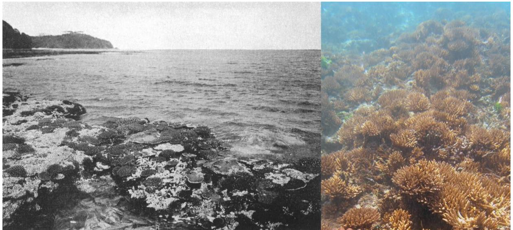

Aua reef flat comparisons from 1917 to 2007. The reef crest today is still robust as in 1917, although it is not exposed as it was then due to rising sea levels. 1917 photo courtesy of Alfred Mayor and the Carnegie Institution of Washington; corals by Charles Birkeland

The scientists relate this success to the presence of an array of binding crustose coralline algae (CCA) (*Porolithon onkodes* species complex) — red algae that produce and shed carbonate skeletons of high-magnesium calcite that rapidly cover and bind to the loose rubble, creating a solid foundation for coral larvae to settle and grow the reef. This, in turn, attracts reef fishes and invertebrates to the habitat. The surveys determined that 94% of successful recruits to the reef crest and reefs in American Samoa, in general, were found on CCA, and that these algae are acknowledged as being one of the main constructors of reefs, contributing to both recovery and recruitment.

In summarizing their findings, Birkeland said that how coral reefs recover from disturbances depends on many "reef resilience" factors. He related the presence of CCA to the wave action on the reef crest, which helps them thrive.

"Resilience of corals in areas of strong wave action on the reef crest at Aua is associated with CCA species that bind to the substrata of reefs. The CCA may be most effective in areas with strong waves such as the reef crests and forereef because CCA can deposit dolomite in such areas of water motion," he said. "This was not the case on the middle reef flat, which is protected from this wave action. As a result, other non-binding crustose coralline algae dominate, and the rubble has not stabilized. Our assessments surmise that corals have not been able to settle and grow successfully on the reef flat over the past 75 to 85 years."

The paper also provides an interesting comparison between human activities and natural influences on the reef over ecological and geologic timescales. A core that Mayor had drilled on the Aua transect revealed that scleractinian (hard coral) had dominated and built the reef since the beginning of the Holocene (more than 10,000 years ago). Another core drilled at Utulei reef across Pago Pago Harbor showed that alcyonaceans (soft corals) had also been building the reef during the Holocene. Whereas the corals on the Aua crest have been mostly resilient to human impacts, the paper finds that reef building at Utulei stopped due to coastal construction, thus ending thousands of years of reef building.

## **A community of change**

When the 100th year anniversary of the reef survey was reached in 2017, the Aua community enthusiastically celebrated alongside Green, Birkeland and contributing scientists from the American Samoa Coral Reef Advisory Group (CRAG). The village council welcomed the scientists to the community by holding a traditional kava ceremony. Together with CRAG, they hosted a function in Aua Village to share information about the Aua transect and raise awareness about threats to coral reefs in American Samoa and ways to improve management.

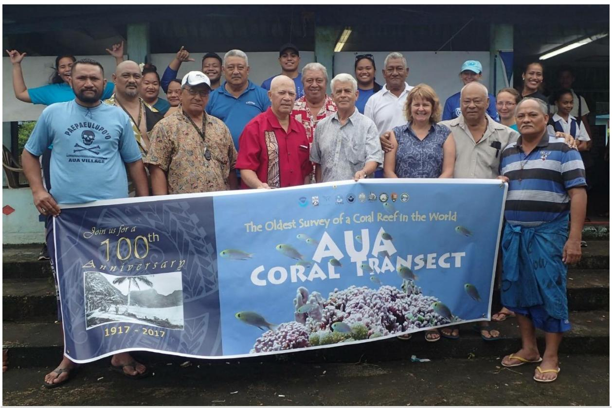

Marine scientists Charles Birkeland and Alison Green proudly hold a banner with Aua village community members at a science fair in celebration of the 100-year anniversary of the Aua transect survey. Photo courtesy the Aua Village Council

"When Charles and I first surveyed the Aua transect in 1995, we joked that it would be great if we could return in 2017 and resurvey the transect on its 100th birthday, although we recognized that, by then, Charles and I would be in our late 70s and 50s, respectively. We never imagined that we would actually survey the reef every few years (eight times from 1995 to 2017), including on the 100thanniversary."

All told, Green and Birkeland spent 25 and 40 years, respectively, surveying the reefs of American Samoa. Through these decades, the scientists witnessed a slow embrace of environmental protection, including regulations targeted at reducing watershed and wastewater pollutants in the harbor. Thanks to the efforts of the American Samoa Government, which had the foresight to form CRAG, water quality has improved and the corals on the reef crest of the outer transect are thriving. Green said it is also encouraging to see an increase in the number of young professional scientists in American Samoa.

"After 100 years of scientific monitoring on the Aua transect, we were very pleased that, for the first time, one of the scientists on our survey team in 2017 was Motusaga Vaeoso, a young scientist from American Samoa. We are confident that the Aua transect is in good hands for the long-term monitoring to continue."

She added that, although global threats cannot always be addressed, local conditions can be improved to help the reefs recover: "Pago Pago Harbor is a good example. If you remove the threats, the coral reef can recover, provided that key factors that support reef resiliency are still present."

Green and Birkeland continue to collaborate with CRAG on related multidecadal monitoring projects throughout the territory, and Green continues to apply her expertise in coral reef assessment to projects involving coral reef ecology in the Red Sea.

"Alison and Charles' work in American Samoa demonstrates the value of quantitative long-term monitoring for understanding patterns and drivers of reef resilience worldwide," said [Dr. Michael Berumen,](https://www.kaust.edu.sa/en/study/faculty/michael-berumen) director of the KAUST [Red Sea Research Center.](https://rsrc.kaust.edu.sa/) "At the Red Sea Research Center, we have been conducting extensive surveys of reefs in the Kingdom of Saudi Arabia (KSA) for more than a decade. If systematically expanded to all Saudi waters and repeated regularly, such an approach could provide valuable longterm data for understanding the dynamics of coral reef resilience in the Red Sea. Given the importance of marine habitats for KSA's Vision 2030, longterm monitoring will be critical for conservation and management of these resources."