14

Barbara H. Keating Barrie R. Bolton Editors

# Geology and Offshore Mineral Resources of the Central Pacific Basin

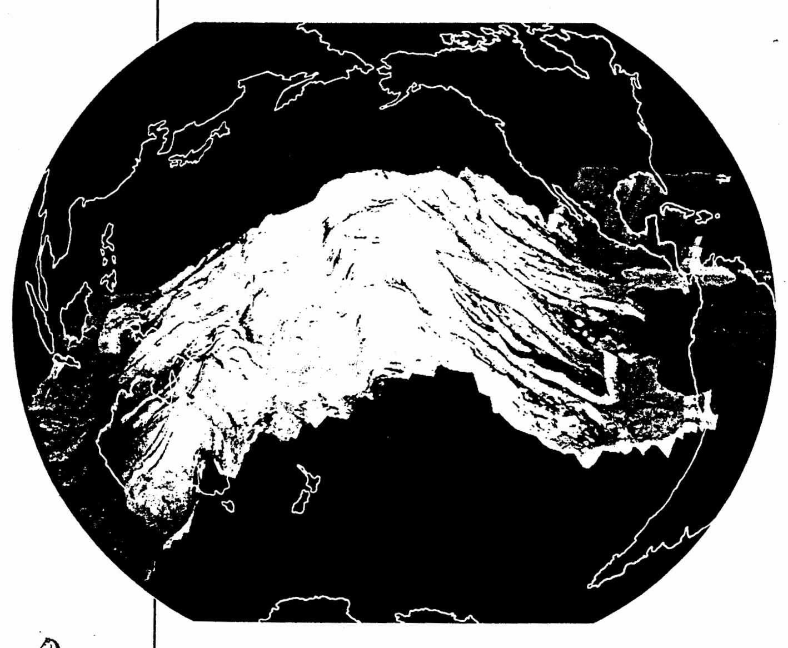

Springer-Verlag

## Contents

| Contributions of the 1838-1842 U.S. Exploring Expedition                                                                                                               | 1   |
|------------------------------------------------------------------------------------------------------------------------------------------------------------------------|-----|
| The Foundations of Atolls: First Explorations                                                                                                                          | 11  |
| Seamount Age Estimates from Paleomagnetism and their Implications for the History of Volcanism on the Pacific Plate  William W. Sager                                  | 21  |
| Isotasy and Tectonic Origins of Pacific Seamounts  Jeffrey T. Freymueller and James N. Kellogg                                                                         | 39  |
| Morphology and Geology of the Magellan Trough Area in the Central Pacific                                                                                              | 55  |
| Southwest Pacific Seamounts Revealed by Satellite Altimetry                                                                                                            | 69  |
| Insular Geology of the Line Islands                                                                                                                                    | 77  |
| Coastal Geology of Upolu, Western Samoa                                                                                                                                | 101 |
| Geology of the Samoan Islands  Barbara H. Keating                                                                                                                      | 127 |
| Sedimentation and Hiatuses in the Central Pacific Basin: Their Relationship to Manganese Nodule Formation                                                              | 179 |
| Managanese Nodule Deposits in the Central Pacific Basin:  Distribution, Geochemistry, Mineralogy, and Forming Process  Akira Usui and Tomoyuki Moritani                | 205 |
| Chemistry and Mineralogy of Ferromanganese Deposits from the Equatorial Pacific Ocean  Eric H. DeCarlo and Charles M. Fraley                                           | 225 |
| Geochemistry and Mineralogy of Ferromanganese Nodules from the Kiribati Region of the Eastern Central Pacific Basin  Barrie R. Bolton, Jules Bogi, and David S. Cronan | 247 |
| Central Pacific Basin Cobalt-Rich Ferromanganese Crusts:  Historical Perspective and Regional Variability                                                              | 261 |
| Phosphatic Rocks and Manganese Crusts from Seamounts in the EEZ of Kiribati and Tuvalu, Central Pacific Ocean                                                          | 285 |

Reatings B.H., and Bolton, B.R., editors, 1992, Geology and official mineral resources of the central fracific basin, Circum-Pacific Council for Energy and Mineral Resources Earth Science Series, V. 14. New York, Springer-Verlag.

## THE GEOLOGY OF THE SAMOAN ISLANDS

Barbara H. Keating Hawaii Institute of Geophysics, University of Hawaii, Honolulu, HI 96822

## **ABSTRACT**

The Samoan chain consists of high volcanic islands, atolls, and submerged reef banks near the southwest margin of the Pacific plate. The chain is unusual, particularly when compared with the Hawaiian chain, because the islands are volcanically active on both the eastern and western ends of the chain, the islands are larger westward, the easternmost edifice is an atoll not an active seamount, and the chain consists dominantly of alkali rather than tholeiitic lavas. While geological studies of the Samoan group are limited, the existing results are consistent with a hot spot origin similar to Hawaii, complicated by continued reactivation of volcanism on Savaii. The continuing volcanism on Savaii is believed to be the result of deformation of the margin due to lithospheric dilation, as the plate bends where it approaches the Tonga Trench subduction zone. The dominance of alkalic volcanism in this island chain has recently been associated with a geochemical heterogeneity in the underlying mantle.

## INTRODUCTION

The Samoan islands are a chain of high volcanic islands in the southwest Pacific Ocean. The chain consists of three high volcanic islands (Tutuila, American Samoa; Upolu and Savaii, Western Samoa) and numerous islets (Fig. 1). Reef banks and seamounts continue westward from the chain. constituting the Northern Melanesian Borderland (Brocher, 1985). The first geologic studies of the islands were conducted from sailing vessels exploring the south Pacific. Several early geologic studies reported volcanic eruptions (1902-1911). Early geologic mapping took place in the 1940's and 1950's but little more was done until the 1980's. The islands of the chain, other than Rose Atoll, are young (less than a few million years in age). Previous workers have compared these islands with the Hawaiian islands because the geologic relations, ages, and orientation of the islands and submerged seamounts are similar (Fig. 2). The purpose of this chapter is to summarize the current state of our understanding of the origin and evolution of the Samoan island chain, and bring together the geologic information from diverse publications into a single summary.

#### Political Division of Samoa

The Samoan Islands have been divided politically since the mid-1800's. The islands of the Manua Group and the island of Tutuila are territories of the United States of America. Scenic Pago Pago harbor in Tutuila was used by

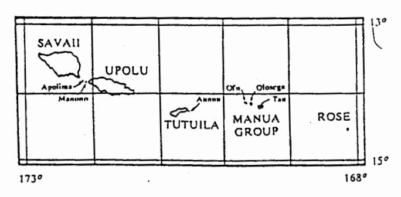

Figure 1. Map of the main islands in the Samoan island chain. Rose Atoll is a low coral atoll with two islets. The rest of the island chain consists of high volcanic islands. The islands of Samoa are larger to the west in the chain. The trend is the opposite of that observed in the Hawaiian chain.

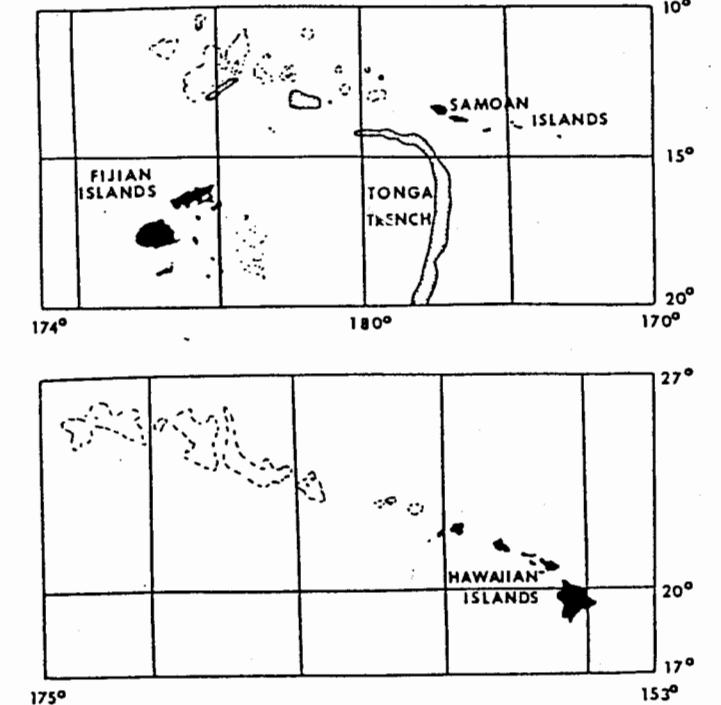

Figure 2. A comparison of the trend of islands and seamounts of the Samoan group (top) with the Hawaiian group (bottom). The seamount chains are parallel on the Pacific plate.

American ships as a coal fueling station; the harbor is now the home of the Pacific tuna fleet. In the 1800's, Western Samoa was held under a tripartite protectorate comprised of Germany, England, and the U.S. In 1900, England withdrew from the agreement and the American and German interests divided the islands into American Samoa and Western Samoa. The League of Nations granted New Zealand a mandate for Western Samoa in 1914 and German holdings were expropriated. Western Samoa is now an independent nation but still maintains strong political and economic ties with New Zealand. American Samoa has remained politically linked to the U.S.

The Samoan island group has been politically divided for many years, and as a result the early geological studies and mapping of the islands were carried out by two groups with different approaches to defining geologic units. The geologic studies in Western Samoa were done by hydrologists and the basic mapping units were based upon geomorphologic relationships observed from aerial photographs with limited field mapping. In American Samoa, the early geologic studies were carried out by a volcanologist and the mapping units were based upon field relationships of volcanic units. Because the definitions and mapping techniques used are so different, the descriptions

of the geologic units of these islands cannot readily be combined. Therefore, the geology of the islands of Western Samoa are described, followed by the description of the geology of American Samoa. Because the political division of the island group directly affects the geologic studies of the group, a brief summary of the historical background of the islands has been included in this text. If the reader is not interested in this background, the reader should proceed directly to the section entitled Geologic Exploration.

## **BACKGROUND**

## Volcanic Heritage

The word Samoa comes from the words sa ia moa in the native Samoan language. The legendary name is derived from the volcanic origin of the land itself. According to Samoan legend, "the rocks cried to the earth, and the earth became pregnant. Salevao, the god of rocks, observed motion in the moa, or center of the earth. The child was born and named sa ia Moa, from the place where it was seen moving. Salevao said he would become loose stones, and that everything which grew would be sa ia Moa or sacred to Moa. Hence the rocks and earth were called sa ia Moa or as it is abbreviated, SAMOA," according to Turner (1979).

#### Discovery and Early Exploration

Jacob Roggeveen is considered to be the modern discoverer of the Samoa islands in 1722. The islands were inhabited by natives at the time of the first encounter with Europeans. Roggeveen called them the "Baumann Islands" after a captain in his squadron of ships. In 1768, L. Bougainville visited the islands, naming them the "Isles des Navigateurs" after observing the frequent use of canoes by the natives.

Captain James Cook heard of these islands while in Tonga in 1773 and recorded their names but did not visit. In 1789, a visit by La Perouse to Tutuila proved eventful. His second-in-command, Captain de Langle, died along with many crew members in a scene very similar to that in which Captain James Cook lost his life in the Hawaiian Islands. After the death of his crew members, La Perouse gave the island the name "Massacre Island"—now Tutuila. The bay on the north shore of Tutuila is still known as Massacre Bay (near Aasu). The historic event is of interest since the geologic features there played an important part in the events which transpired at the bay.

On December 12, Captain de Langle and 61 men in two longboats and two pinnaces went to a village in a cove near their anchorage to collect water. Instead of a spacious and convenient cove, the men found a coral-filled cove with a

twisting, narrow entry channel. The captain had observed the bay at high tide and was not aware of the tidal range within these islands. The water collecting went well, but within an hour almost fifteen hundred natives had assembled, leading to great confusion. The confusion was compounded when de Langle began giving gifts to natives he thought were chiefs. Conflict resulted and de Langle ordered his men back to the boats. The men were stoned, de Langle responded by firing his musket in the air, and this provoked the natives to a general attack. The captain was knocked down, fell overboard, and was clubbed to death. Many sailors abandoned some of the longboats and scrambled to the pinnaces. Others steered the boats through the narrow passage for open water.

Unfortunately, the boats ran aground at the narrowest part of the channel. The reef terrace formed by a higher sea level stand allowed their pursuers to close in again. The volleys from the muskets scared the attackers away. The boats cleared the reef and returned to the frigates. La Perouse considered returning, but decided against it when he saw the coral reef platform which contributed to the loss of lives.

The Samoan islands were visited by Edwards in 1791, as part of the search by H.M.S. *Pandora* for participants in the mutiny on H.M.S. *Bounty*. A book by the captain and physician on this voyage (Edwards and Hamilton, 1915) describes many visits to South Pacific islands. Von Kotzebue visited the islands in 1824.

## REGIONAL SETTING

The Samoan islands consist of a series of high volcanic islands, atolls and submerged reef banks, and seamounts which form a linear chain in the southwest Pacific Ocean. The chain trends in a southeast-northwest direction (Fig. 2) beginning near the international date line and extending westward, roughly 100 km north of the termination of the Tonga Trench, into a region known as the Northern Melanesian Borderland (Fig. 3, from Brocher, 1985). The Northern Melanesian Borderland is a complex region within the southwest Pacific where island arcs like the Tongan and Lau Islands, mid-plate features like Peggy Ridge, and seamounts of hot spot origin like the Samoan group, occur near the convergent margin of the Pacific plate and the Fiji Plateau.

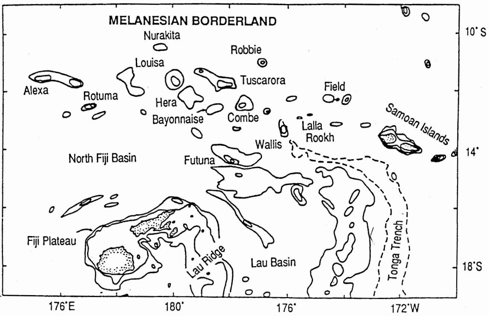

Figure 3. Map of the Northern Melanesian Borderland (from Brocher, 1985) illustrating the major bathymetric features in the region. The Samoan and Fiji Islands are shown with a stippled pattern. The island contours and 1,000 and 2,000-m contours are shown.

The easternmost member of the island chain is Rose Atoll. Rose Atoll is a low carbonate bank. Other than the alignment of Rose with the remainder of the chain, no evidence exists to directly link the atoll to the Samoan group. Thus, previous workers have suggested it may be an old seamount of unrelated origin. West of Rose Atoll are the high volcanic islands that form an island chain similar in nature to the Hawaiian or Society island groups, with the exception of the island of Savaii. Savaii, on the western end of the chain, is still volcanically active. Farther to the west are the submerged seamounts and reef banks described by Brocher (1985). Age dating of rocks dredged from these banks suggests these banks are a continuation of the Samoan seamount group.

## **GEOLOGIC EXPLORATION**

#### **Previous Studies**

The first geological explorations of Samoa were reported by Dana (1849) as part of the U.S. Exploring Expedition under Lt. Charles Wilkes. Dana spent a very limited time on Samoa; his visit to the islands was restricted to the time required by the expedition to generate a hydrographic map of the island. Despite his short visit, the observations of Dana show an obvious insight into the geology of these islands. As a result of Dana's visit to these islands and others, he published numerous manuscripts, including "Geology of the Pacific Area" (1846) in the Wilkes expedition volumes, "Corals and Coral Islands" (1872) and "Characteristics of Volcanoes" (1890).

Dana noted the youthful appearance of the western district of Samoa (Savaii), which contrasts with the greater age of the central portion of the chain (Tutuila). He felt that these islands formed from two volcanic fissures, one of age equivalent to Tahiti (in the Society Islands) and Kauai (in the Hawaiian islands), and a second contemporaneous with the present reefs. Chemical and petrographic studies of the

lava flows have been reported by Mohle (1902), Kaiser (1904), Klautsch (1907), Jensen (1908), Daly (1924), Bartrum (1927), Macdonald (1944, 1968), Stice (1968), Hubbard (1971), Hedge et al. (1972), Hawkins and Natland (1975), and Natland (1975, 1980).

Descriptions of volcanic eruptions include those of Angenheister (1909), Anderson (1910), Freidlander (1910). Grevel (1911), von Bulow (1906), Friederici (1910). Reinecke (1905, 1906), Sapper (1906, 1909, 1911a, b, 1912 1915), Schmittman (1911), Wegener (1902, 1903a, b), and Bryan (1941). Geologic studies of the islands include those by Friedlander (1910), Park (1914), Thomson (1921). Stearns (1944), Kear and Wood (1959), Stice and McCoy (1968), Hawkins and Natland (1975) and Natland (1975. 1980). Isotopic and geochemical studies have been conducted by White and Hoffman(1982), Newman et al. (1984), Rison and Craig, 1982, Matsuda et al. (1984), Wright and White (1987) and Wright (1987). Dating studies include those of Richard (1962), Matsuda and others (1984), Natland and Turner (1985), Duncan (1985), and McDougall (1985). Geophysical studies include a paleomagnetic study by Tarling (1962; 1965) and Keating (1985a), gravity studied by Machesky (1965) and Robertson (1987) and an earthquake report by Needham et al. (1982). A sedimentological and bathymetric survey of the Samoan archipelagic apron, discussing deformation of the apron in the Tonga Trench, was published by Lonsdale (1975). Nearshore sedimentologic studies were reported by Daly (1924) and Dingleret al. (1986). Offshore pelagic sediment distribution is summarized in the geologic map of the Circum-Pacific Region, Southwest Quadrant (Palfreyman, et al., 1988).

Many of the early geological reports of Samoa are written in German and are not readily available. Fortunately, Thomson (1921) published a thorough review in English of most of these texts. Thomson summarized the petrology as known in 1921 (Table 1).

Table 1. Volcanic Rock Types on Samoa (From Thomson, 1921)

| Savaii:  | Olivine basalt, olivine-enstatite basalt, olivine tachylite, nepheline basanite, phonolite.                                                                    |
|----------|----------------------------------------------------------------------------------------------------------------------------------------------------------------|
| Apolima: | Nepheline basalt.                                                                                                                                              |
| Upolu:   | Limburgite, olivine basalt, olivine basalt- porphyrite, trachydolerite, nepheline basanite.                                                                    |
| Tutuila: | Limburgite, olivine basalt, andesitic basalt, spilite, nepheline basanite, trachydolerite, nepheline basanite, trachyte, alkali trachyte, phonolitic trachyte. |
| Aunuu:   | Trachydolerite.                                                                                                                                                |
| Ofu:     | Olivine basalt.                                                                                                                                                |
| Olosega: | Olivine basalt.                                                                                                                                                |
| Tau:     | Olivine basalt.                                                                                                                                                |

## GENERAL DESCRIPTION OF THE ISLANDS

Western Samoa

Kear and Wood (1959) reported on the geology and hydrology of Western Samoa. They recognize a general structure on Upolu of deeply eroded and dissected volcanic terrains (assigned a Pliocene or early Pleistocene age), largely buried by late Pleistocene and Recent lavas. They assign the name Fagaloa volcanics to the oldest of these rocks, largely on the basis of their weathered appearance, consisting of a'a and pahoehoe flows along with associated dykes, tuffs and cone deposits. They point out that these rocks characteristically form steep-sided high mountains with erosional slopes of 25–50°. Of considerable interest is their observation that the original dips on the exposed surfaces suggest that these volcanics were extruded from vents that are oriented approximately parallel to those of the younger lavas.

Rocks from each of the younger mapped units uncomformably overlie and fill valleys eroded into Fagaloa volcanics. Most of these units are olivine-rich basalts which strongly resemble one another petrologically. The features used to differentiate between the rock units include (Kear and Wood, 1959):

- Salani Volcanics deep soil and weathering; evidence of pre-Mulifanua canyon cutting.
- Mulifanua Volcanics the existence of wide barrier reefs existing offshore of these outcrops; only shallow stream channels.
- Lefaga Volcanics lack of dissection; only narrow fringing reefs present offshore of these outcrops.
- PuaPua Volcanics thin soils; lavas flow offshore and form rocky (or "ironbound") coasts; ubiquitous aa and pahoehoe structures form broad domes.
- Aopo Volcanics cones erupted in last 200 years, fresh porphyritic pahoehoe flows and a'a flows common only around cones which fill older valleys and spill out over coasts to fill lagoons and cover the barrier reef.

Kear and Wood (1959) note that the volcanic cones are plentiful on Upolu and Savaii and that the degree of weathering, dissection, and decay of the cones varies, reflecting their Salani to Aopo ages. The largest cones occur between 600 and 900 m above sea level on Upolu, and up to 1800 m on Savaii. The cones vary widely in form, some having minor amounts of ejecta and giving rise to major lava floods, while others form simple single cones of cinders and

scoria. The younger cones are generally black with veneers of glassy cinder. As the rocks weather, they tend to turn reddish in color, and the finer-grained materials are altered to clays, forming a reddish clay soil littered with blocks of scoria.

Savaii

The island of Savaii is by far the largest island in the Samoan chain. Using the definitions and mapping unit of Kear and Wood (1959), the oldest rocks observed on the island are situated on either side of the Vaipouli River on the north shore of Savaii (Fig. 4). This unit displays considerable relief and deep weathering. Paleomagnetic studies of Savaii (Keating, 1985a) indicate that these rocks are characterized by normal polarity magnetization. Based upon the magnetic reversal time scale, we believe these rocks are likely to correspond to the Gauss Normal Chron and therefore are 2.5 million years old or older. Radiometric dating of these rocks has been undertaken by Ian McDougall. The results of these studies when published will much more accurately define the ages of these rocks.

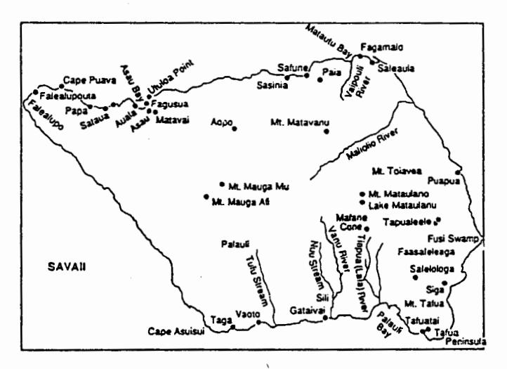

Figure 4. Site map for the island of Savaii showing the location of sites referred to in the text. Several site names have changed since their publication in geological texts early in the century. The new names are used in this map and where possible both the older and newer names have been included in text.

An erosional unconformity separates this old unit from overlying rocks; however, all of the overlying rocks sampled on Savaii are also normally magnetized. The younger rocks (Salani, Mulifanua, PuaPua, and Aopo formations) are believed to correspond to the Brunhes Normal Chron and be less than 700,000 years old (Keating, 1985a). No rocks of reversed polarity were found on this island in Keating's study. Tarling (1966) published a map of sampling sites,

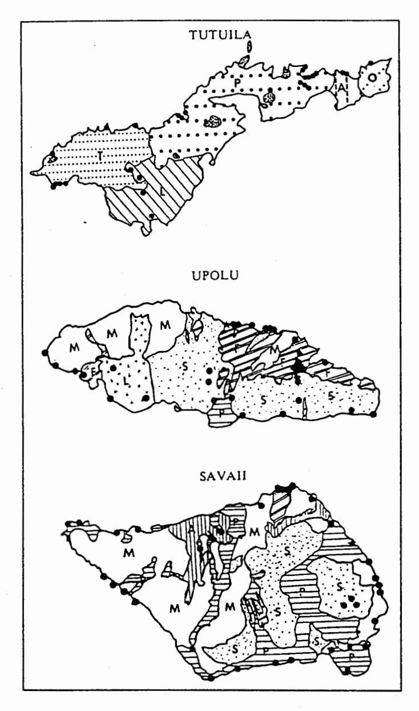

Figure 5. Geologic maps of the islands of Upolu and Savaii based upon the mapping of Kear and Wood (1959). The formation names are abbreviated in the figure (F = Fagaloa, S = Salani, M = Mulifanua, L=Lefaga, P = PuaPua, A = Aopo). Also shown is the geologic map of Tutuila based upn mapping by Stearns (1944). The formation names are abbreviated in the figure (T = Taputapu, L = Leone, P = Pago, A = Alofau, and O = Olomoana).

where oriented hand samples were collected. Reversed polarity was found on the western coast within a unit mapped as Mulifanua. His summary table however indicates that all of the igneous formations on Savaii are normally magnetized. Tarling (1966) suggested all the rocks on Savaii are less than 1 m.y.

The Salani volcanics are exposed in a wide swath extending north-south in central Savaii. These volcanics are moderately weathered, and a thick soil cover is present. Much of the Salani volcanic unit is drained by the Maliolio River, Lata River, Tiapua or Lafa River, and Faleata River. The large area in eastern Savaii centered around Tapueleele is mapped as Salani volcanics (Fig. 5). However, no large drainage systems like those elsewhere in Salani volcanics are present, which is suggestive that these volcanics are not the same age. Evidence from paleomagnetic studies of outcrops in this area confirm this observation (Keating, 1985a), and indicate that this may be a new (presently unnamed) volcanic unit.

Outcrops of the Mulifanua formation are extensive on Savaii. Most of the western half of Savaii is characterized by this rock unit, as well as large coastal areas on the north shore near Fagamalo and on the east coast from PuaPua to Saleleoga. According to Kear and Wood (1959), "the Mulifanua may be distinguished from the Salani volcanics largely on their lesser erosion and weathering. The lack of deep water courses and the angularity of surface boulders are the most important criteria." In western Savaii, the Mulifanua volcanics "rest on a weathered basalt that is considered to be Salani."

The outcrops of Mulifanua and Salani units appear concentrated on the axis of a spoke-like rift system developed on the eastern end of the island (Fig. 6). The PuaPua and Aopo volcanics, however, appear to originate from a later rift that is longitudinal to the island.

The PuaPua volcanics are distributed almost radially around the island of Savaii (Figs. 5 and 7). The PuaPua flows are extensive. The evidence from the historic erup-

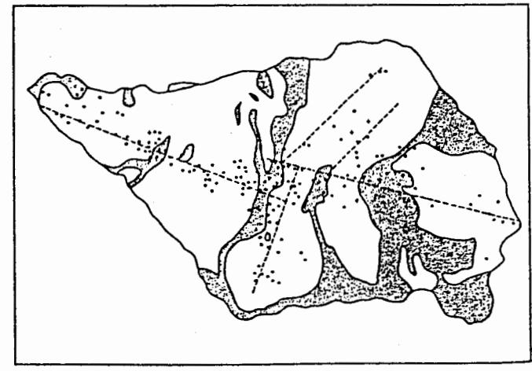

Figure 6. Map of Savaii showing the location of historic lava flows, cones, and the inferred rift zones. Based upon geologic map of Kear and Wood (1959). The dots represent cones and the dashed lines are inferred rift zones.

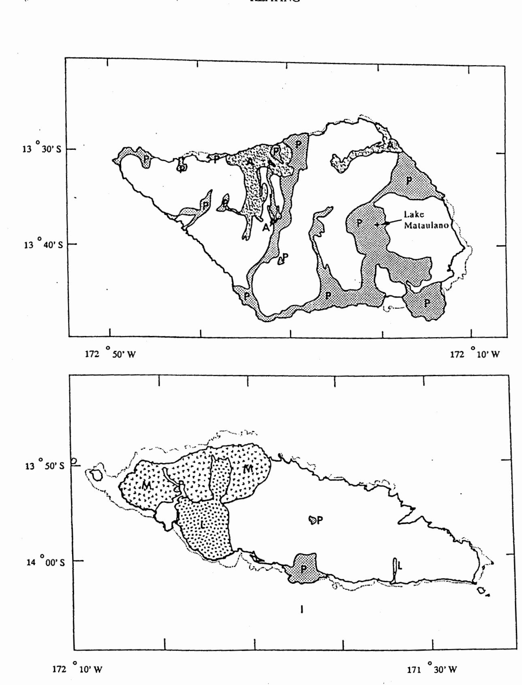

Figure 7. Maps of Savaii and Upolu showing the location of the young lava flows. The dotted lines indicate the location of coral reefs off shore, based upon mapping by Kear and Woods (1959) using aerial photographs. The formation names are abbreviated in the figure (F = Fagaloa, S = Salani, M = Mulifanua, L = Lefaga, P = PuaPua, A = Aopo).

tions indicates that these extensive lava fields can be generated in a matter of only a few years. The paleomagnetic evidence suggests that the PuaPua volcanic unit could be divided into two chronostratigraphic units. Flows from the Siga (Figs. 4 and 5), the Sili area (south coast), the Sasinia area (north coast), and Falealupo area (western tip of the island) are likely to be grouped into a new mapping unit (Keating, 1985a).

The Aopo volcanics (Fig. 7) are historic lava flows. The paleomagnetic studies of Keating (1985a) show one flow near Aopo, mapped as Aopo volcanics, giving directions similar to the PuaPua volcanic unit (senso stricto). Since the area, however, had been bulldozed and the flow material removed and used for road mantle, it seems likely the overlying Aopo flow material was removed and the PuaPua unit sampled rather than Aopo unit.

Asau Bay

Asau Bay is located on the northwestern coast of Savaii. The eastern margin of the bay (Utuloa Point) is bounded by PuaPua volcanics that are flat-lying pahoehoe lavas which filled the pre-existing lagoon and buried the reef. The remainder of the bay is formed by Mulifanua lavas. These lavas are highly vesicular nearly flat-lying basaltic lava flows. Near the water the lava flows are very fresh in appearance, lacking substantial weathering.

A well-developed coral reef exists offshore from Matavai (or Utuloa Point, depending on the map used) to Fagasua. There another PuaPua flow buries much of the lagoon (Fig. 8), while much of the area from Fagasa to Sataua is mapped as Mulifanua volcanics. The lack of a barrier reef westward suggests it is a younger unit, perhaps PuaPua. A barrier reef is reestablished near Papa.

Figure 9 illustrates a typical cross section of the reef structure buried by lava flows in the Asau Bay area. Figure 10 illustrates the structure likely at Matavai or Utuloa Point, where the most recent flows now bury the reef. If this area of Savaii has subsided substantially due to crustal loading, a complex structure similar to that in Figure 10 would develop. Menard (1986) reported similar areas of the island of Hawaii have subsided at a rate of 2 to 5 mm/yr. Local water well drillers have reported multiple repetitions of the basic reef and lava sequence occurring at Asau Bay. The multiple repetitions of reef material and lava flows have been observed in Hawaii in core samples from geothermal holes at depths 1615-1767 m on the southeast rift zone of Kilauea volcano.

Thomson (1921) pointed out that the geomorphology of Savaii is similar to that of Mauna Loa. The original observations by Thomson, however, result from arduous field work by Friedlander and R. Williams. Williams made a crossing of the island in 1907 from Matautu (north coast) to Turu (south coast) (assumed to be Tufu stream on modern maps) crossing the ridge which forms the "backbone" of Savaii east of its highest point. Friedlander traversed the ridge from west to east. Both Williams and Thomson used the altitude they gained along this ridge in order to view the cones and craters which mark the ridge. In the western part of the ridge (tuasivi, in Samoa) where the vegetation is poor, well-preserved volcanic cones can be observed. The central part of the ridge is covered by dense forest and contains cinder cones separated by old lava

fields. To the east, numerous cones are present which can hardly be seen in the bush until reaching their base.

In one of these eastern cones, a small lake, Mataulano, is found. The crater rises 40 m above lake level. The altered ash of the cone makes the lake bottom impermeable. This cone would make an excellent site for paleomagnetic secular variation studies (using pol-

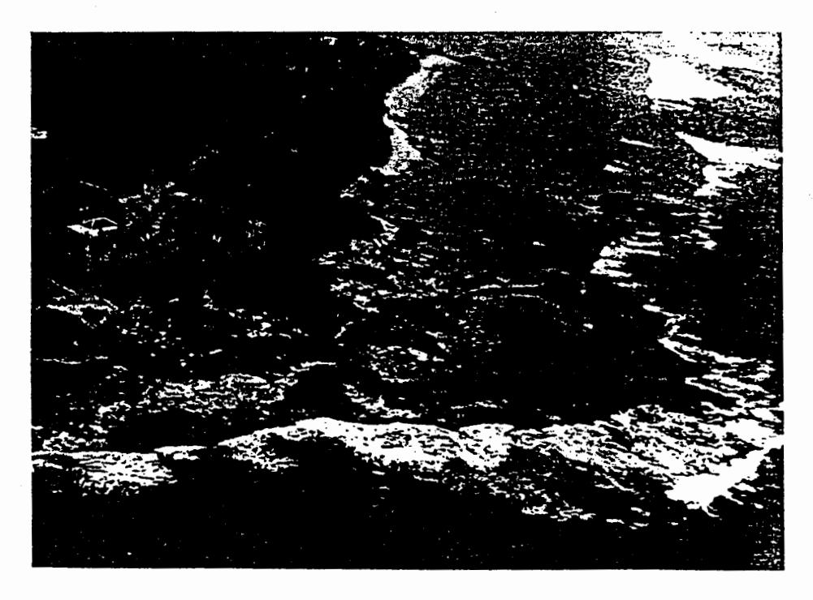

Figure 8. Aerial photograph of the southern coast of Savaii. In this photograph the lava flows cover the reef. Subsidence is occurring and new reef is growing on top of the lava flow. The cross section of the geologic structure woud be similar to that shown in Figure 10.

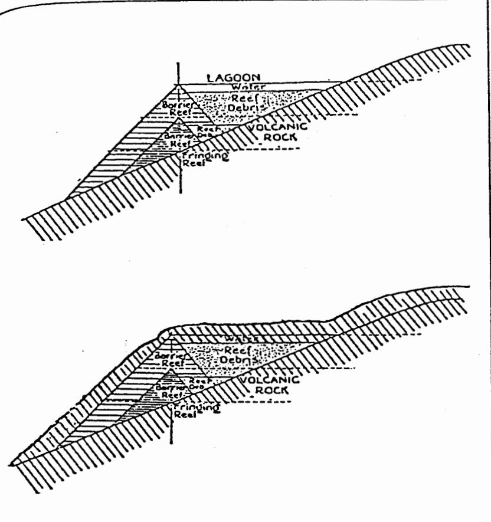

Figure 9. Cross section of a coral reef (top) showing the structure of a typical barrier reef on the margin of a Pacific Island, after that of Holmes (1945). An idealized cross section of a coral reef off Savaii or Upolu is shown in the bottom figure, where the lagoon has been filled by lava flows.

len for dating purposes). Mafane Cone south of Toiavea also contains a swampy flat bottom (shown as a lake in road maps) which would be suitable for similar work. The cone is densely forested.

On the south coast near Taga, between Nu'u and Tufu Stream are fresh-looking lava fields which appear to come from a neighboring small cone. These flows are likely to be-slightly older than the written record, since some old Samoan songs are said to refer to these eruptions (Thomson, 1921).

On the peninsula of Tafua, there are small well-preserved cones. The outer slopes consist of well-stratified tuff. Thomson (1921) reports that at the bottom of these cones, a meter above sea level, is the entrance of a lava tunnel. These cones which dot the tuasivi, (prominent axial ridge) mark the fissure zone which is the area of concentrated

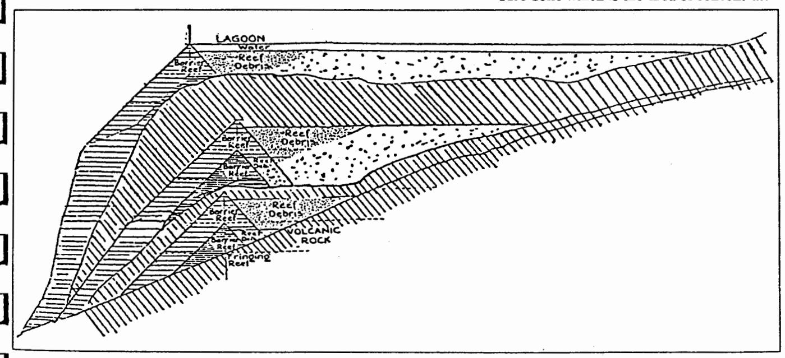

Figure 10. Cross section of the structure off Asau Bay, in northwest Savaii. There, several episodes of reef growth and subsequent burial by lava flows have occurred, making the geologic structures very complex. The sequence includes alternating layers of lava, coral, beach sands, and aquagene tuffs. This cross section was drawn on the basis of conversations with water well drillers who have drilled numerous wells on Savaii (personal communications, 1985).

volcanic intrusion and extrusion (Fig. 6). Dana, during the Wilkes Exploring Expedition in 1907, hiked to the top of Tafua Cone near Tafuatai and found a dry interior.

Apolima

Apolima is a small islet about halfway between Savaii and Upolu. An excellent view of the islet is gained by taking the ocean ferry from Upolu to Savaii. A single crater wall opens to the north. The bottom of the crater is only a few meters above sea level. The inner slopes of the crater wall slope at 30-40° while those of the outer wall are about 60°. The tuff is a compact brown palagonite tuff containing boulders of massive and porous lavas, fragments of coral, and marine mollusks (Thomson, 1921, derived from an account by Friedlander, 1910).

Thomson (1921, p. 58) notes that "owing to the impervious nature of the tuff, the island has continuously running springs and a small stream draining to the north across the bottom of the crater. It is this fact which renders the island habitable. Weber describes the tuff as palagonite, the glass lapilli being penetrated by pores filled with zeolites, calcite, and some sideromelane. There are inclusions of large olivines and microlites of augite, but no iron-ores, and lapilli of basaltic nature. A dense brownish stone, evidently one of the massive boulders mentioned by Friedlander, is described as a nepheline basalt, with large phenocrysts of rounded and somewhat serpentinized olivine in a groundmass consisting of brown titaniferous augite, some biotite and iron ores, a few needles of apatite, and much nepheline."

#### Manono

Manono lies between Apolima and Upolu (Fig. 11), within the barrier reef which lies off the west end of Upolu. Nulopa, to the west, contains a lava tunnel opening at sea level, but no crater. The slopes to the southwest are dominantly coral sands with occasional outcrops of vesicular basalt. The rocks at the summit are more massive but highly weathered. The springs on this islet are brackish.

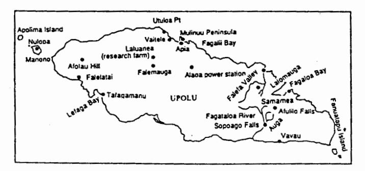

Figure 11. Site location map for localities in Upolu referenced in the text.

Upolu

Like Savaii, the island of Upolu has a prominent tuasivi or axial ridge, which appears to be the major axis of fissure eruptions. Cones are distributed abundantly along this central axis of the island. In the northwestern part of the island are a series of well-formed eruption cones, and neighboring lava flows that appear fresh. Afolau Hill, however, is composed of a finer-grained, light colored, less vesicular rock.

The south shore has numerous steep promontories of volcanic rock. Along the eastern shore similar outcrops exist. On the southeast coast there are several bays with steep-walled valleys and beautiful high waterfalls coming from high valleys. Thomson reports that a dense basaltic dyke cuts through a coarser, lighter rock of andesitic appearance (trachyte?) at Samamea.

Thomson (1921) also provides an excellent description of lava tubes on Savaii. He states that "the formation of lava-tunnels in the Matavanu eruption has already been mentioned. Such tunnels are a characteristic of basaltic eruptions of the Kilauea type, and have an almost circular cross-section while the flow is active, but when the supply of lava ceases that in the tunnel drains out, leaving only a little in the bottom, so that a cooled tunnel has an almost circular section except for a flat bottom. In any tunnel, the height and breadth are remarkably constant, except when branching takes place. Stalactites (composed of fused lava formed by the burning of the inflammable gases discharged from the lava flowing below) may often be observed hanging from the roof, and young tunnels also have stalactites on the walls, and coatings of soluble salts, chiefly sulphates."

Thomson (1921) suggested that the hollow spaces of lava tubes, "would lend themselves admirably to ore-deposition if the rocks enclosing them either contained the more valuable metals in sufficient quantity, or the area later came under the influence of metallogenic gases or solutions. In discussing this subject with Dr. Jaggar of Kilauea, he surmised that the lava tunnels were not very permanent structures and were probably filled with lavas from later eruptions, giving rise to intrusive bodies of pipe-like form. In Samoa, however, this does not seem to have been the case, and in the extinct lava flows, both of Savaii and Upolu, lava-tunnels are of fairly frequent occurrence. They have, however, been considerably modified by the falling in of rock from the roof and sides, and have lost their original nearly circular and very regular cross-section."

Two large caves in Samoa are known to have been used for refuge, one at Falemauga on Upolu and one near Paia on Savaii. The one on Upolu has not been inhabited in recorded history; however, the floors of the cave are stacked with rocks that create sloping terraces similar to the terraces of contemporary typical Samoan homes, called *fales*. In addition, charcoal, marine shells and adzes have been found

in this cave. Thomson suggests that up to 100 individuals could have slept there.

Von Bulow (1906) describes the Savaii cave as "the cave of the non-fighting tribe." At the time of warring between the people of Safune and the rest of the island, about the end of the eighteenth century, the tunnel was supposed to have been used as a refuge with food stored there.

At Safune, Thomson described a pool formed by the downbreak of a blow-hole a short distance from the sea. There he describes a pool of water which is affected by the tides. The tunnel lies roughly a meter below the surface and opens at the seaward side, giving rise to a bathing pool. At low tide, the pool has fresh water. Similar pools are seen around Savaii and Upolu. It is interesting to note that similar pools are present on the Puna and Kona coasts of the island of Hawaii.

Another interesting cave is reported in old lava at Tapualeele on the east side of Savaii. Here, in a tunnel which has fallen in over some distance, a stream bed has formed that, when followed, ends abruptly in the tunnel. The mouth of the stream is occupied by a deep pool. Evidently you must swim the deep pool to proceed further in the tunnel, and therefore Thomson did not explore it further. He noted, however, in another tunnel nearby, that the floor of the tunnel was covered with a combination of guano (from local birds) and the chitinous remains of insects. Elsewhere, Kear and Wood (1959) reported other tunnels free of guano and containing only insect remains. The bird population in Savaii is still quite a varied one, which stands in marked contrast to most Pacific islands. This may well reflect a much less dense population of animals and humans on Savaii.

### Lava Slopes

The lava surface slopes on Upolu are generally moderate, between 1° and 15°, and slope seaward. These slopes flatten as they reach sea level, where the lava flows have spread out onto the lagoon and reefs. Daly (1924) observed that the lava slopes on Tutuila ranged from 0° to 20°, with an average of about 10°. He suggests that the lava flows were extruded from fissures nearly parallel to the axes of the island. Most flows dip away from these central fissures and sea cliffs cut their down-dip edges. Isolated central vents can be associated with two tuff cones at Steps Point, Aunuu Island, the eastern offshore vent, offshore vents near Coconut Point, and off Taputapu islet on the western coast of Tutuila.

### Streams and Erosional Features

Kear and Wood (1959) used stream erosion to measure the age of rocks in Western Samoa. They summarize with the following observations:

- Fagaloa Volcanics youthful graded valleys
- Salani amphitheater-headed canyons; deep, poorly-graded valleys
- Mulifanua and Lefaga dry water courses
- PuaPua few, short, weakly eroded gulleys, which give rise to small springs where the lava thinly covers older rocks (e.g., Siga Springs in southeast Savaii)
- The streams on Fagaloa rocks appear perennial.
   The stream patterns are dendritic. The initial radial drainage patterns appear to continue in younger rocks since the older volcanics and younger units seem to have similar drainage divides.
- Many valleys appear to be drowned, e.g., Fagaloa Bay, Falefa Valley and several valleys on the north coast of Upolu.
- The perennial streams on Salani rocks produce three landforms: widely spaced, deeply entrenched gulches with several falls (e.g., Fagaloa or Salani river); complex multiple gully systems; deep amphitheater-headed canyons.

#### Corals Reefs in Western Samoa

Stearns (1944) reported that living reefs around Upolu form fringing and barrier reefs. The fringing reefs range from narrow shelves to shelf flats 2 km wide. The fringing reefs consist of coral sands, shells, and detritus that in large part are bound together by algae growing on the surface. The fringing reefs tend to be exposed at low tide.

The barrier reefs are intermittent along stretches of the coast (Figure 7). In some places, they have been buried by lava, in other places rivers discharge into the sea and the turbidity is too high for corals to survive. In other locations, the flanks of the volcano have probably subsided as a result of fault slumps which drown the reef. A lagoon separates the barrier reef from the fringing reef. Stearns (1944) argues that "living barrier reef is not found along coasts composed of Pliocene rocks. Scarcely any fringing reef exists either... Barrier reefs are absent from the latest lavas also." Stearns suggests that Upolu was submerged so rapidly that reefs only grew to the surface where the Pleistocene lavas were gently sloping. The rapid submergence was probably the combined result of a rapid sea level rise and island subsidence.

Stearns reports remnants of emerged reef at 1.5 m above the sea on the reef flat at Fagalii Bay. Wave-cut flats at 1.8-2.4 m above sea level are also reported. Matsushima and others (1984) collected sediments from shallow cores in Lefaga Bay in an attempt to date the sediments. The

samples analyzed were not autochthonous coral. The age determinations suggest they were Holocene deposits. Sugimura and others (1988) reported on additional studies of sea level change based on outcrops and drilling in Western Samoa. Several wave cut notches in lava flows and occurrences of emerged beach rock were documented.

Kear and Wood (1959) have suggested that a correlation may exist between the age of the volcanic rocks and the distance offshore to the barrier reef. They suggest the following relationships:

- 1. Fagaloa- no living barrier reef or scarce fringing reef,
- 2. Salani and Mulifanua- wide reef.
- 3. Lefago and younger-little or no reef.

Off the coasts of Salani and Mulifanua outcrops, the reefs tend to be barrier types where the lava slopes are gentle and fringing reefs form on steeper slopes. The extensive reefs around Savaii are in the process of being buried. In the area betweeen Palauli and Faasaleleaga, the lava flows have now built out beyond the old barrier reef.

Thomson (1921) concluded that many areas of the Upolu coast lines had been depressed or downfaulted below the levels of coral growth causing the steep coasts and absence of bordering reefs. Thompson suggested downfaulting was the best explanation of the steep-walled harbors like Fagaloa Bay, particularly since valleys are absent around the bay, and no crater-like features are observed.

#### Sediments

The oldest sedimentary rocks in Western Samoa are the alluvium at Lalomauga on Upolu. Kear and Wood (1959) report that a tributary of the Falefa Stream was blocked by Mulifanua lavas, and was subsequently filled with alluvium. The alluvium is preserved as terraces up to 9 m above stream level. Kear and Wood infer the alluvium is in part contemporaneous with the Pua Pua volcanics.

#### Sand Beaches

Few beaches in the Western Samoa islands have abundant sand. Thomson (1921) suggested that tsunamis (tidal waves) may remove the sand. (This suggestion is not consistent with observations of tsunamis which struck Hawaii in 1946 or 1960). Two factors obviously affect the formation of dunes: supply, and wind to transport the sands. On most islands there are sufficient breezes to move sand. Thus it is more likely a problem of there being too little sand. Sand off the coasts of most islands is a product of erosion of reef material. In Samoa, the barrier reefs may provide a sufficient barrier to the sea that little wave energy reaches shoreward of the reef; thus little mechanical erosion of reef material occurs inshore and little sand is produced. Alternately, sand may be produced continually and lost down the reef slope at the breaks in the reef. Beach sands are also

limited within the Hawaiian Islands, where these processes are well documented.

Coral sands, soil and boulders form low cliffs, commonly in bays, about 1.5 m above sea level. Kear and Wood report a radiometric date of 2,300 years from a sample of this sand. Present day beaches of coral sand are locally cemented with calcite. The cemented beds, referred to as beach rock, dip seaward at about the same angle as the beaches.

Stearns (1944) reported that soundings off Upolu indicate a submarine shelf exists 46-55 m along the shore and 73-91 m, at a distance of 1.5-5 km offshore, which is similar in size and width to the drowned barrier reef on Tutuila. Stearns also correlates the submarine slope break to the shore line at the time of the "great erosional period" at least 182 m below the present shore line. Stearns concludes the drowned barrier reef rests on a thick section of marine and land deposits on an older platform.

## **Emerged Shorelines**

Traces of a Recent + 1.5 m stand of sea level are present in various places in the Western Samoan islands. These emerged shorelines form a strip of coral sand upon which most coastal villages occur and form spits (e.g., Mulinuu peninsula). In fact, the contact between these Tafagamanu Sands and the PuaPua volcanics is well exposed at the north end of the beach near PuaPua village (see Kear and Wood, Fig. 20). This +1.5 m stand of sea level is commonly observed in the Pacific and is the result of a postglacial sea level rise accompanied by a warmer climate.

Traces of a +4.5 m stand of sea level are also found in Samoa. The associated deposits of Nuutele Sand occur at Gataivai in southeast Savaii. At this site, the PuaPua volcanics have a prominent bench cut into them at 4.5 m above sea level (Kear and Wood, Fig. 21). An overhanging cliff is found at the bench. At the foot of the low, irregular cliff is a small berm of fine, lightly cemented gravel, containing worn coral. Also exposed at the site is an ash bed within the basalt at about 4 m above sea level containing fragments of coral. This +4.5 m sea level is believed to be post-glacial because of its occurrence on reef covered PuaPua volcanics; also, because of the correlation with similar benches around the Pacific.

Kear and Wood (1959) stated that there is possible evidence of a +10 m sea level in the Vini Tuff which could have corresponded with the last interglacial. They also report benches near Fagaloa Bay southeast of Falelatai between 39 m and 60 m, which could be traces of a Tyrrhenian (last interglacial) or Milazzian level (penultimate interglacial).

On the east coast of Savaii a wide barrier reef 22 km long, as well as a fringing reef, is found. On the north shore, off Safune, a narrower reef occurs. Also, a narrow barrier

reef occurs off Auala in northwest Savaii. The ends of these reefs are buried by younger volcanics. Thus, the remainder of the coasts are rock-bound. The extensive reefs around Savaii are in the process of being buried. In the area between Palauli and Faasaleleaga, the lava flows have now built out beyond the old barrier reef.

Soils

Hamilton and Grange (1938) conducted the studies of the soils of Western Samoa. The studies along with those of Seelye and others. (1938) show that the soils are relatively shallow, heterogeneous with frequent stones and boulders, and are rich from iron oxides derived from the basaltic lavas.

During the 1950's, a soil survey was conducted on both Upolu and Savaii (Wright, 1963). A local classification system was subsequently devised based on the soil survey of Hawaii by Cline (1955); the system has been developed and reported by Morrison and others (1986). Schroth (1970) reports a number of soil analyses. A study of soils on the Laluanea research farm of the University of the South Pacific has been reported by Morrison and others (1986). Kear and Wood (1959) suggest that a good correlation exists between the depth of soil and the age of pahoehoe flows. On Savaii most of the historic flows have scarcely formed soil. The deepest soils occur on the Fagaloa volcanics in Western Samoa.

#### Alluvium

Alluvium from the mouths of streams was analyzed by Bramlette (1926). Most of the material is rock fragments, fine basalt, trachyte, volcanic glass, and grains of magnetite, olivine, and feldspar. Bramlette reports that all of these are remarkably fresh and "show no evidence of weathering." A small percentage of calcareous or siliceous organisms is also included; the material is poorly sorted.

#### Offshore Manganese Deposits

The land area of the Samoan islands is roughly 3,000 square kilometers while the offshore area within the Exclusive Economic Zone or EEZ (the area within 200 nautical miles of the islands) is about 150,000 square kilometers (Exon, 1982). In order to evaluate potential manganese (Mn) nodule deposits, sampling programs have been conducted in the basins surrounding the Samoan islands. Manganese nodules were found to be rare, and to be of low ecomonic grades. Exon (1982) ascribes the rarity to the high sedimentation rates caused by volcanic input of debris, which is detrimental to Mn nodule formation. Exon also concludes that the low grades of nickel and copper observed reflect the low production of plankton generally associated with deposits. Because the seafloor is well above the calcite compensation depth, calcareous plankton are not dissolved

and do not release metals to the seafloor where Mn concentration takes place. Manheim and Lane-Bostwick (1989) point out the importance of the chemical character of the water mass. They have found that cobalt distribution within Mn crusts reflect regional highs and lows in the distribution of hydrothermal fluid discharge in the ocean. Commonly, at moderate depths (1-2 km) Mn crusts form on the upper slopes of sea mountains. In general, on relatively young seamounts (a few m. y.) these crust formations are very thin and do not constitute economic resources. Studies in the Hawaiian chain (McMurtry et al., 1986) show thin Mn crusts of little economic value compared to the thick Mn crusts present on Mesozoic seamounts within the Central Pacific.

Two seamounts of possible Mesozoic age are present within the EEZ of Samoa, Machias Seamount and Rose Atoll. Machias Seamount is situated southwest of the Samoa Islands on the flexure arch of the Pacific plate near the Tonga trench. Early work on the seamount included dredges of the shallow summit (Hawkins and Natland, 1975). Cobbles, gravel, pahoehoe fragments, and coral were found in the dredges, indicating the crest of the seamount was formerly at sea level. A K/Ar age on a phonolite yielded an age of 940,000± 20,000.

Machias Seamount was surveyed using side-scan sonar as part of a Mn crust resource assessment. The images produced by the sonar shows that the seamount has been dissected by faults (Coulbourn and others, 1989). The faults (Fig. 12) are parallel to the Tonga Trench and the flank of the seamount has dropped downward into the trench. The abundant faults yield a very complex bathymetry that would make mining on this seamount extremely difficult if a resource were present. Combining the evidence for a young age for the seamount (Hawkins and Natland, 1975) with the complexity of the bathymetry, the prospects for economic deposits of Mn crusts on Machias Seamount do not appear large at the present time. The age of Rose Atoll is uncertain. Without additional information, a resource assessment of the Mn crust is not possible.

#### Historic Volcanism in Western Samoa

The island of Savaii has experienced wide-spread volcanism within historic time. The flows associated with historic and geologically recent volcanism are shown in Figure 7. Thomson (1921) reviewed the volcanism and much of his description of the activity is included here.

Mauga Afi (about 1760)

Thomson (1921) writes,

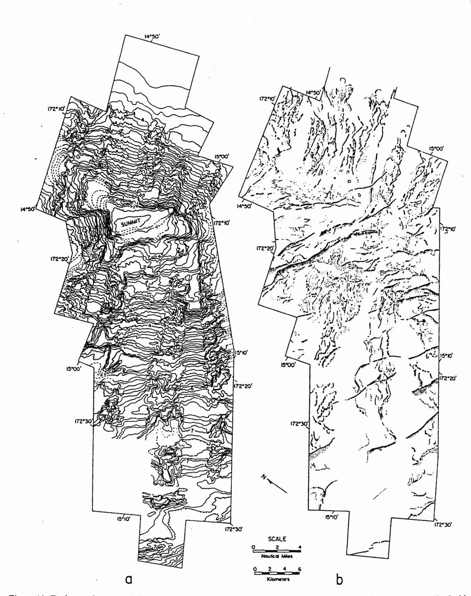

Figure 12. Bathymetric map and sketch map of Machias Seamount showing faulted structure of the seamount. The faulting is believed to be a consequence of deformation of the Pacific plate at the lip of the Tonga Trench subduction zone. (Figure from Coulbourn et al., 1989).

"According to von Bulow and Tempest Anderson, the Samoans preserve a tradition of eruptions "about one hundred and fifty years ago" (A.D. 1760) that gave rise to a rugged and very extensive lava field, called O le Mu, between the villages of Asau and Aopo, on the north side of Savaii. This field is said to be more extensive than that recently created by the Matavanu eruptions, but is shown on the German Admiralty Chart with a length of eight miles and a half, and a breadth of only one mile and a half. It is still comparatively unaltered, preserving the "wrinkled, knobbed, ropy, and tapestry-like folds, and the general characteristics of the 'pahoehoe' type of lava flow" (Jensen), and is free of bush, which is rather surprising in view of the growth that has taken place already on the Matavanu lavas. Jensen believes the flows came from Mauga Afi, a crater 5,249 ft (1,600 m) high, on the western slopes of the main ridge of the island, and ascribes to the same source as a flow on the southern side of the ridge.

"Aopo was surrounded and partially destroyed by these eruptions, and other villages were totally destroyed. The present village of Aopa occupies what is known in Hawaii as a kipuka, an area which a lava stream has flowed around and left as an island.

"Friedlander describes the cone of Mauga Afi as a fairly steep slag cone, 100 m high, with an elliptical crater, elongated east and west, 70 m deep. The western margin of the crater is broken, and here the lava flowed out in a westerly direction, turning to the north after a short distance."

Mauga Mu of Aopo (1902)

Thomson (1921) states,

"On October 30, 1902, eruptions commenced at a spot about three km northeast of Mauga Afi and some six and a half km southwest of the village of Aopo. They were preceded and accompanied by violent earthquake shocks, and for three weeks great detonations took place and flames were reported by Pere Mennel. The volcanic activity ceased after a few months. No previous crater was known at this spot, but according to Friedlander (1910) two hills were formed with an east-west extension, the larger with three well-formed oblong craters, and the smaller in the shape of a horse-shoe. From both cones, lava streams issued and flowed 1 to 2 km in the direction of Aopo. Lava also welled out from a fissure on the side of an old crater to the south, and partially filled it. Wegener (1903) states that a first crater, formed on October 30, furnished only lavas, but a second, about one km to the west, was formed on November 1 and was explosive for a short time.

Jensen describes the material of the 1902 eruption as a'a, consisting of fragments of all sizes, from cinders the size of peas to blocks many meters in diameter piled in wild confusion, and states that the lava is vesicular and scoriaceous. Friedlander (1910) describes the latter as black and metallic in lustre, and very light and porous. Weber, who studied Friedlander's material, describes the lavas as a light porous slaggy form, referred to as feldspar basalt consisting of phenocrysts of olivine, augite, and plagioclase in a brown glass matrix with magnetite. Mauga Mu is shown on the German Admiralty Chart as "Parasit 1902 referring to its position as parasitic on Mauga Afi."

Matavanu (1905-1911)

Thomson (1921) states that,

"Just as Mauga Mu is parasitic on Mauga Afi, so Matavanu may be described as parasitic on Pule, an old crater occupied by a lake and lying a few km to the north of the main mountain tops of Savaii and a little over 2,000 ft [600 m] high. Before the eruption, the place which is now the crater of Matavanu was a sort of elevated plain surrounded by mountains, about 11 km south of Matautu. The eruptions began on August 4 1905, and at first were of an explosive nature, but no severe earthquakes were experienced. From September 2 to 4, molten lava poured out and the flow advanced 3 km. The lava flowed at first to the northwest, filling up the upper ends of some valleys draining to Matautu Harbor. Later it flowed both to the west and the northeast, in the latter direction following a tortuous valley draining to the sea several kms east of Matautu; and the lava itself reached the sea in December, 1905, at Foapaipai, filling up the lagoon between the coral reef and the coast and turning westward along the reef. Early in 1906 there was a great increase of activity; the lava destroyed the villages of Salago and Saleaula to the west, and it also flowed east and overwhelmed the villages of Taputapu and Maleola. The distance from the crater, following the winding and turnings, was about 13 miles [21 km], and the seafront covered was nearly 9 miles [15 km]."

The villages destroyed by volcanism were not rebuilt; their names do not occur on modern maps of Savaii and they are not shown on the locality map (Fig. 4).

According to Anderson (cited by Thomson, 1921),

"the large, fresh lava streams soon got crusted over on the surface with solidified lava, and the liquid

lava continued to flow underneath. Even at the crater it seldom flowed over the lip, but generally entered holes and tunnels in the sides and flowed underground. The lava field thus became honeycombed with channels of liquid or pasty lava, which occasionally came to the surface and flooded it with fresh sheets of lava; at other times the surface frequently floated up and was raised by the intrusion of fresh lava underneath, so that what had previously been the course of the valley now became the highest part of the field. Mr. Williams thinks that the lava must be in places 400 ft (120 m) thick."

Thomson (1921) states,

"where the coast was bordered by a coral reef, the lava quickly filled in the lagoon and thus extended the coast line. For a stretch where it was previously "ironbound" i.e., formed of old lava not protected by a coral reef, as at Asuisui, the lava flowed directly into deep water, and did not materially alter the outline of the coast. The flow into the sea continued, with only a day's intermission, from 1905 until 1910 or 1911. An immense amount of lava disappeared in this manner, estimated by Friedlander as many cubic kilometers, and four times the volume of that forming the visible lava fields (Sapper, 1911)."

"When the discharges into the sea were most active, Anderson related to Thomson (1921) that explosions were almost continuous, and the whole was obscured by clouds of steam from which fragments of red-hot lava and showers of black sand were seen to fall. This black sand formed beds capping the lava. Angenheister, in 1909, remarks that the explosions took pace every five to ten minutes. When the lava was flowing in lesser quantity, Anderson notes that explosions were much less noticeable, and the lava extended itself into buds and lobes, and cooled in the form of a 'pillow lava'."

"The crater of Matavanu has been described in various stages by Jensen (1907), Angenheister (1909), Anderson (1910, 1911, 1912), Friedlander (1910), and Grevel (1911). The crater is a "broad slag-covered cone, with a steep-walled crater about 250 ft (75 m) deep, narrowly elliptical in form, and elongated about a quarter of a mile (0.4 km) from south southeast to north northwest. The northern end of the crater is partially fallen in, and the depression is extended in this direction by two fallen-in tunnels for another 100 yards (90 m) or so. Farther to the northeast, there is another disconnected downbreak, with a tunnel showing at the bottom in the northern end," according to Thomson (1921). Angenheister, noted in 1909, that

the lava passed out through two tunnels to the north and one to the south, though there was no flow to the surface in the latter direction. 100 A 100 A 100 A 100 A 100 A 100 A 100 A 100 A 100 A 100 A 100 A 100 A 100 A 100 A 100 A 100 A 100 A 100 A 100 A 100 A 100 A 100 A 100 A 100 A 100 A 100 A 100 A 100 A 100 A 100 A 100 A 100 A 100 A 100 A 100 A 100 A 100 A 100 A 100 A 100 A 100 A 100 A 100 A 100 A 100 A 100 A 100 A 100 A 100 A 100 A 100 A 100 A 100 A 100 A 100 A 100 A 100 A 100 A 100 A 100 A 100 A 100 A 100 A 100 A 100 A 100 A 100 A 100 A 100 A 100 A 100 A 100 A 100 A 100 A 100 A 100 A 100 A 100 A 100 A 100 A 100 A 100 A 100 A 100 A 100 A 100 A 100 A 100 A 100 A 100 A 100 A 100 A 100 A 100 A 100 A 100 A 100 A 100 A 100 A 100 A 100 A 100 A 100 A 100 A 100 A 100 A 100 A 100 A 100 A 100 A 100 A 100 A 100 A 100 A 100 A 100 A 100 A 100 A 100 A 100 A 100 A 100 A 100 A 100 A 100 A 100 A 100 A 100 A 100 A 100 A 100 A 100 A 100 A 100 A 100 A 100 A 100 A 100 A 100 A 100 A 100 A 100 A 100 A 100 A 100 A 100 A 100 A 100 A 100 A 100 A 100 A 100 A 100 A 100 A 100 A 100 A 100 A 100 A 100 A 100 A 100 A 100 A 100 A 100 A 100 A 100 A 100 A 100 A 100 A 100 A 100 A 100 A 100 A 100 A 100 A 100 A 100 A 100 A 100 A 100 A 100 A 100 A 100 A 100 A 100 A 100 A 100 A 100 A 100 A 100 A 100 A 100 A 100 A 100 A 100 A 100 A 100 A 100 A 100 A 100 A 100 A 100 A 100 A 100 A 100 A 100 A 100 A 100 A 100 A 100 A 100 A 100 A 100 A 100 A 100 A 100 A 100 A 100 A 100 A 100 A 100 A 100 A 100 A 100 A 100 A 100 A 100 A 100 A 100 A 100 A 100 A 100 A 100 A 100 A 100 A 100 A 100 A 100 A 100 A 100 A 100 A 100 A 100 A 100 A 100 A 100 A 100 A 100 A 100 A 100 A 100 A 100 A 100 A 100 A 100 A 100 A 100 A 100 A 100 A 100 A 100 A 100 A 100 A 100 A 100 A 100 A 100 A 100 A 100 A 100 A 100 A 100 A 100 A 100 A 100 A 100 A 100 A 100 A 100 A 100 A 100 A 100 A 100 A 100 A 100 A 100 A 100 A 100 A 100 A 100 A 100 A 100 A 100 A 100 A 100 A 100 A 100 A 100 A 100 A 100 A 100 A 100 A 100 A 100 A 100 A 100 A 100 A 100 A 100 A 100 A 100 A 100 A 100 A 100 A 100 A 100 A 100 A 100 A 100 A 100 A 100 A 100 A 100 A 100 A 100 A 100 A 100 A 100 A 100 A 100 A 100 A 100 A 100 A 100 A 100 A 100 A 100 A 100 A 100 A 100 A 100 A

.......................................

"The eastern side of the crater is composed of red ash below, grey ash above, capped by a 5 ft (1.5 m) layer of lava, which is covered on the outer surface by spatter slag. The western side shows lava flows with red ash between and above them, and the same 5 ft (1.5 m) layer of lava on the top. At the northern end, lavas come in wedge-shaped fashion, lying unconformably on the ash beds. Sulphur fumaroles are still active, both near the bottom at the north end and round the top of the talus slopes at the south end."

The sulphur crystals are of the unstable monoclinic variety. In the 1980's, sulfur from the cone was being gathered by natives for medical purposes.

"The lava field from the base of the crater to the sea has an average slope estimated by Anderson at about 6°. The lava is mostly of the typical pahoehoe type, smooth over a wide area, though very irregular in detail, with typical small cracked domes with corrugated and ropy surfaces. Near the crater, areas of rough, broken lava simulating a'a are not uncommon, but they are made of broken pahoehoe, and I saw no typical a'a. Anderson's explanations of the origin of the a'a type of lava are diametrically opposed to those of Jaggar, and the reason lies probably in the fact that he mistook areas of broken pahoehoe for a'a. For a more detailed description of the lava surface, the descriptions of Jensen (1907) and Anderson (1910, 1911, 1912) should be consulted". Furthermore, Thomson (1921) reports, "it is worthy of note that the growth of vegetation on the lavas of 1905 and 1906 greatly exceeds that on the 1894 or even the 1860 flows of Kilauea than on the Matavanu flow presumably because of the moister climate."

"The lavas of Matavanu have been examined microscopically by Jensen (1908) and Weber (1909), but no analyses have been made. They are olivine-rich feldspar basalts with titaniferous augite, and generally with a considerable proportion of glass. The chilled surfaces of the pahoehoe flows are typical tachylites. Jensen states that the Matavanu lavas are richer in iron ores than any of the earlier flows," according to Thomson (1921).

## GEOLOGIC MAPPING UNITS OF WESTERN SAMOA

Kear and Wood (1959) produced the original geologic maps of Western Samoa. Their division of geologic mapping units was based upon geomorphology. They identified six geologic units and assigned them ages based upon relative weathering of Holocene to Pliocene.

## Fagaloa Volcanics

The stratigraphically lowest, thus oldest, unit mapped is the Fagaloa volcanics. This unit is deeply weathered. The mapped units include "two somewhat different landforms." Kear and Wood (1959; p. 36) report that, "one landform, possibly the older, has no part of the original cone form remaining and forms steep high mountains with slopes up to 50°, rising as inliers above the gentle slopes of the later lavas. It includes dykes, which form bold vertical cliffs and steep narrow ridges, often several hundred feet high. The other landform, though steep locally, includes ridges that descend steeply seawards and could be the surviving parts of the original cone surfaces. Some of the gently sloping ridges have narrow flat tops on which the soil is strongly leached, acidic, and now supports little more than wiry grass. The steep offshore slope has prevented the formation of coral reefs over much of the Fagaloa coastline, and where a reef is present, it is fringing."

#### Salani Volcanics

The Fagaloa volcanics are overlain by Salani volcanics. Valleys and gorges cut deeply into this volcanic unit. This morphological characteristic was used to map the unit aerially. Often the Salani valleys are filled by younger lava flows.

Salani volcanics consist of low angle lava flows that most frequently can be traced to the cone or crater from which they originated. The cones themselves are usually weathered to the point that they are breached or contain sufficient decomposed material to seal the bottom of the crater and form crater lakes or swamps. The surfaces of flows are often deeply weathered, and soil is often more than 10 cm thick. On the distal flows, over 30 cm of soil has formed. Relict boulders are often observed to show onion skin weathering. The gorges formed by the rivers on Savaii and Upolu cut deeply into Salani rocks. Often these gorges are filled by younger lava flows. Valleys are common in rocks of the Salani formation and are a distinctive mapping feature. In many places, these valleys contain permanent rivers. Elsewhere, the valleys can be dry much of the year.

Typically, a barrier reef exists offshore of Salani outcrops. However, along the eastern part of the south coast of Upolu, cliffs are found at the coast and the reef is close to shore. Near Vavau on Upolu, blowholes and sinkholes are present, probably resulting from the collapse of blowholes.

The Salani rocks are fine grained gray to black porphyritic basalt which grade upward to vesicular basalt with a rubbly a'a surface. The thickness of flows generally average 1-2 m. The more weathered outcrops and presence of large green olivine phenocrysts were used in the field mapping to distinguish these rocks from the lithologically similar but younger Mulifanua rocks (Kear and Wood, 1959).

Rocks of the Salani volcanics include picrite basalts, olivine dolerite, and basalts showing late-stage deuteric alteration and zeolitization. Olivine basalts constitute more than 50% of the Salani volcanics sampled (Brothers, in Kear and Wood, 1959).

The Salani volcanics are differentiated from the Fagaloa volcanics by their less-weathered appearance, less mature landform (partial cones and craters), the absence of dykes, less common occurrence of large olivine nodules and phenocrysts, absence of andesites and trachytes, and the presence of a well developed reef offshore. These lavas fill valleys formed in Fagaloa rocks, and top Fagaloa ridges and terrain. A well-developed soil horizon separates the Fagaloa and Salani volcanics at the Alaoa power station on Upolu. This deep soil horizon and the deep gorges cut within the Fagaloa are thought to reflect a substantial erosional interval. Barrier reefs are generally present offshore of Salani volcanics.

#### Mulifanua Volcanics

Areas mapped as the Mulifanua unit are characterized by dry shallow valleys and gullies, where flowing water is rare. The weathering in this unit is "moderate." The flows descend from "well-formed" cones, and are "almost uneroded." Boulders on the surface of the flows are angular and onion-skin weathering has not developed. In distal portions of the flows, weathering can reach 30 cm. These flows sometimes occur in valleys cut into pre-existing rocks.

#### Lefaga Volcanics

The Lefaga volcanics are the next stratigraphically higher unit. According to Kear and Wood (1959), "The surface expression is similar to that of Mulifanua rocks, except that a'a at the ground surface is more common, the lavas appear to have flowed out into the lagoonal area, and the reef is relatively close inshore. Onion-skin weathering occurs locally, due possibly to the high feldspar content."

#### PuaPua Volcanics

The PuaPua volcanics consist of young basalt flows and perfectly preserved cinder cones. The rocks have very little weathering and the soil is thin. The ropy pahoehoe flows cover pre-existing flows, fill gorges, and flow over pre-existing erosion scarps. The flows have low dips and form relatively even surfaces. Extensive swamps have developed

in low depressions. Locally, where slopes are steep, the flows consist of a'a flows. Reefs are not developed off shore of PuaPua basalts. Instead, the basalts fill lagoonal areas and cover pre-existing reef.

## Aopu Volcanics

The final unit defined and mapped by Kear and Woods is the Aopo volcanics. These are "ropy, vesicular, porphyritic (feldspar and olivine) basalts, with but little a'a. Where the a'a flows occur, it is blocky, loose and appears to have been transported on the surface of the flows and to have accumulated along the margins." These are the historical lavas.

### Hydrology-Western Samoa

Kear and Wood (1959) attempted to establish a framework for understanding the ground-water gradients in Western Samoa. They attempted to map similar volcanic units, on the basis of the degree of erosion, in order to use the known depth of the water table (established by drilling) in a limited number of sites, and extrapolate away to areas where the water table was unknown. They suggested very low ground water gradients "should be suspected in the younger volcanics that cover the majority of the Territory." They suggested that wells be drilled to sea level to obtain water, because "apart from areas of the oldest rocks (Fagaloa or older Salani), where the streams are virtually permanent, the water table will be close to the surface only near the coast, or close to "buried hills" of older rocks".

The Fagaloa volcanics are the oldest rocks exposed in Western Samoa and are severely weathered. Kear and Wood (1959) state that the ground water "would generally be shallower, and available in smaller quantities than from younger less weathered formations..." Where Fagaloa volcanics have been buried by younger lava flows, the water trapped above these older volcanics would provide a shallow water source.

The Salani volcanics are typified by large rivers which carry water to the sea. Significant losses of water occur along stream courses due to seepage. Inland springs occur where these rocks are covered by thin lavas of younger rocks.

The Mulifanua rocks absorb water readily and rarely is surface water present. Kear and Wood (1959) note that the scoriaceous nature of parts of the flows provides abundant water. Wells however must be drilled to sea level to obtain water.

Water obtained from the Lefaga, PuaPua and Aopu volcanics is characterized by high iron content. In general, the areas covered by these rocks have the poorest water supplies in Samoa except where the units are only a thin

cover which overlies older rocks. On the island of Apolima, a surface stream emits water from the Vini Tuffs. The stream never dries. On other islands, where the Vini Tuff is present, a non-brackish water supply is uncertain (Kear and Wood, 1959).

## Geological History of Western Samoa

Kear and Wood (1959) outlined a possible geologic history for the islands of Western Samoa. They postulate two massive volcanoes built on a fissure or fissures trending 11°. The two volcanic piles merged undersea, but emerged above sea level as two islands, Savaii and Upolu. The volcanoes would have first appeared as broad shield volcanoes, similar to Mauna Loa, Hawaii. The shoreline at that time has now subsided to 450 fathoms (823 m). Kear and Wood (1959) referred to the early volcanoes as Fagola volcanics. When volcanism ceased the volcanoes may have reached 1.8 km above sea level, during the late Pliocene or early to middle Pleistocene.

During the early to middle Pleistocene these volcanoes were heavily eroded (Fig. 13), taking on an appearance similar to Oahu in the Hawaiian Islands, with steep rugged terrain and sharp peaks. Debris from the islands and reef growth produced offshore platforms, which have subsided and are 182 m below present sea level.

Kear and Wood suggests that renewed volcanism coincided with the penultimate glaciation (Fig. 14). The Vini Tuff is believed to coincide with the last interglacial period. Littoral cones and tuff cones were built along the coasts and Salani lavas flowed down valley walls, across reefs, and out onto the submarine slopes. Kear and Wood (1959) suggest the Salani volcanics reached 1 km above sea level in Upolu and over 1.2 km in Savaii. The Salani lavas covered most of the pre-existing landscape with the exception of eastern Upolu. Kear and Wood suggest the Salani volcanism in-

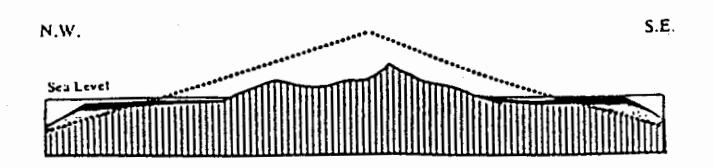

Figure 13. Profile of the island of Tutuila (American Samoa) illustrating the mature erosional surface, fringing reef, drowned reef platform and barrier reef, as shown in illustration by Mayor (1920). Using the submarine profile of the islands of Western Samoa, Kear and Wood (1959) estimate the volcanoes reached 1.8 km above sea level in the late Pliocene to middle Pleistocene.

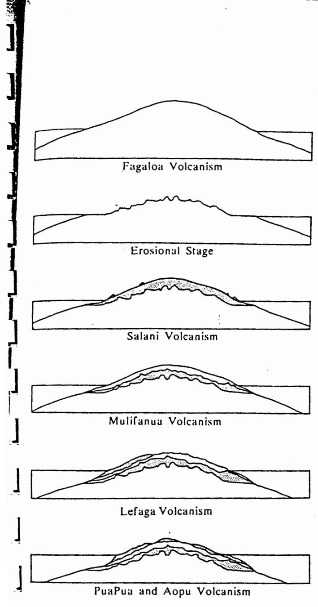

Figure 14. Profile of the development of Upolu and Savaii. Kear and Wood (1959) propose that the two volcanoes merge below sea level, but form two separate islands. During the shield building stage the volcanoes formed broad shields similar to the Hawaiian Mauna Loa volcano, during the late Pliocene or early to middle Pleistocene. During the middle Pleistocene the volcanoes were heavily eroded. Volcanism was renewed, with valley filling lavas reaching 1-1.2 km above sea level. Erosion again took place and amphitheaters developed on Savaii and Upolu. Extensive volcanism occurred during the last glaciation, particularly on western Upolu. During post-glacial times, baririer reefs grew, and volcanism covered some of these reefs. Historic volcanism continues to present.

creased the width of the islands to roughly the present outline. New coral reefs grew along the coastlines, and have since subsided 16 m.

Erosion of Salani volcanics left gullies in the landscape. Where concentration of ground waters in Fagaloa volcanics reached the ground surface and were perched, streams eroded more rapidly into the Salani volcanics. Warm climate and increased rainfall in the last interglacial allowed amphitheatre development in canyons of south Upolu and Savaii.

During the last glaciation, extensive Mulifanua lavas were erupted. The Mulifanua lavas covered much of western Upolu. On the Savaii uplands, nearly 150 m of lavas accumulated. They also built a submarine fan on the southwest slope of Savaii. Littoral and submarine cones in Apolima Strait occurred where lava entered the sea. Kear and Wood suggest a large part of the northern part of Savaii collapsed, as well as parts of the southeast and southwest flanks.

During the post glacial rise in sea level, barrier reefs grew (Fig. 15). Limited volcanism occurred, referred to as Lefaga volcanics. When sea level reached the present level, volcanism again occurred in southeast Savaii and buried parts of the wide barrier reef. A few small flows also filled valleys in Upolu.

In historic time, volcanic activity occurred in Savaii, which constitute some of the largest historic lava flows in the world. These lavas buried older cones and cascaded into the sea.

## GEOLOGIC EXPLORATION OF AMERICAN SAMOA

## General description of American Samoan islands

Tutuila

Tutuila is a long, narrow island with narrow irregular ridges forming the backbone of the island. Along its southwestern shore, a low unweathered volcanic peninsula has been added by relatively recent volcanic activity. The volcanic peaks of the older portion of the island are deeply eroded. In many parts of the islands, closely spaced streams erode the volcanic slopes, creating steep slopes with thick accumulations of laterized soils, separated by inter-valley ridges. Near the coast, the valleys widen and small coastal flats are developed. Drowned valleys form several embayments such as Pago Pago, Fagaituo, Afono, Vatia, Fagasa, and Nua Seetaga Bays (Fig. 16).

Volcanic craters are absent over much of the island, since substantial weathering of the main island has left the island in a very "mature" geomorphologic stage. Volcanic intrusions such as Mt. Pioa, however, are clearly exposed by

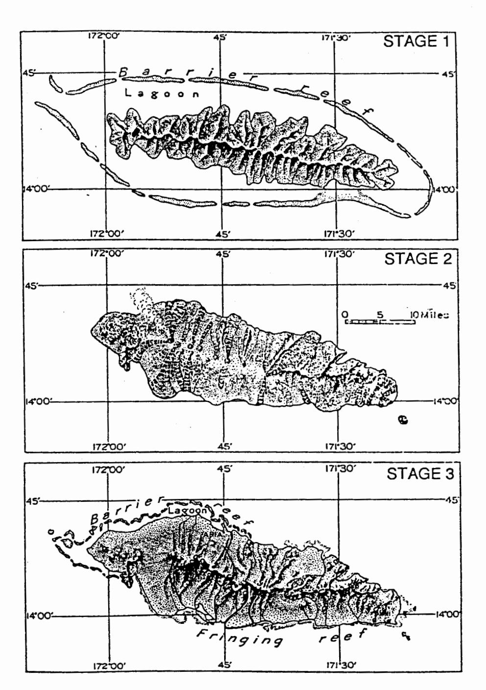

Figure 15. Outline of the island of Upolu, through time, as proposed by Stearns (1944). careous sand and gravel (Davis, Stage 1 illustrates the proposed outlines of the island after extensive erosion of the 1963). shield building lavas. Stage 2 illustrates the outline of the island after the barrier reefs were drowned and volcanism was renewed. Stage 3 illustrates the present configura- Ofu and Olosega tion of the island and the partial development of fringing and barrier reefs around the margin of the island.

the weathering, and thus form dominant landforms. The Leone Peninsula is a relatively low plain on the southwest margin of Tutuila that is generally undissected by streams. There are prominent craters, Oloava Crater. Fogamaa Crater, and Fagatele Crater. Oloava Crater near the summit of Aoloaufou is slightly eroded. Nearly 200 streams are present on Tutuila (Davis, 1963) Many of the smaller streams are "ephemeral," i.e., they carry water only after precipitation and are dry during most of the year. The flow in perennial streams comes from springs and seeps which discharge ground water. Many only supply a trickle of water during dry seasons. The largest streams have average flows of a few million gallons (tens of thousands of cubic meters) of water per day in wet weather, which is decreased to a few hundred thousand gallons (a few hundred cubic meters) per day in dry weather. Annual rainfall is approximated at 61 m/yr (Davis, 1963).

#### Aunuu

Aunuu is a small island situated off the southeastern coast of Tutuila. The island was formed by submarine volcanic activity. A tuff cone forms the eastern half of the islet. It is breached on the eastern margin, forming Maamaa Cove. The weathering of Aunuu tuffs has produced an impermeable layer in the bottom of Aunuu Cone where a lake and marsh have formed. The Taufusitele marsh occupies a portion of the coastal flat west of the cone. Seaward and west of this marsh, the coastal flat is covered by an appreciable volume of cal-

Ofu and Olosega islands (Fig. 17) are remnants of a large volcano eroded to such a state that only two small steep islands remain,

separated by a 200-m wide sea channel (Stearns, 1944: Stice and McCoy, 1968). Stearns (1944) suggests a double

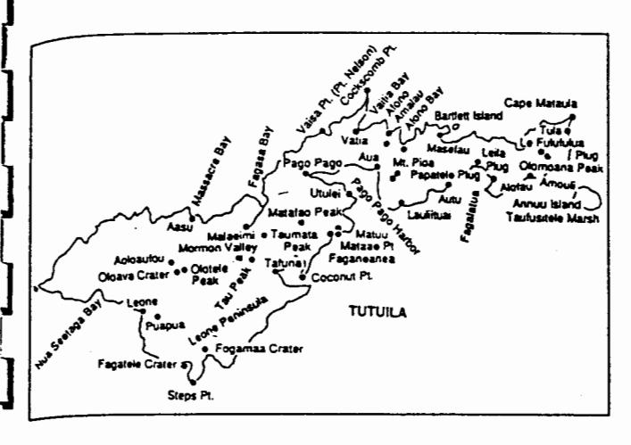

Figure 16. Location map for sites on the island of Tutuila discussed in the text.

caldera was formed; lava flows and dikes are exposed. Pyroclastic beds are thick and numerous and deeply weathered to laterized fragmental volcanics. Seeps and a small spring discharge water along the dikes on the western end of Olosega. Seeps and small springs flow from lavas into beach deposits locally along the shores. Coastal flats are generally covered by sands and gravel. The east side of Olosega and the west side of Ofu are cut by cliffs 100-200 m high. A cliff 300 m high also forms the north coast of Ofu.

Nuutele Islet, which is situated off the western shore of Ofu, is the remnant of a Recent tuff cone formed by a shallow submarine eruption. Three tunnels 70-100 meters in length have been cut through the islet by the tidal surge (Daly, 1924). Stearns (1944) and Stice and McCoy (1968) state that pre-caldera volcanics, a dike complex, and post-caldera volcanics are all present and of probable Pliocene to early Pleistocene age.

Tau Island is a remnant of a volcanic shield (Stearns, 1944; Stice and McCoy, 1968). It is very young in appearance and numerous volcanic cones are observed. The island consists mainly of thin lava flows and, on the northwest corner, tuff deposits form several small tuff cones. Seeps and springs occur in cliffs on the top of dense lava flows or from lava lying on tuff beds. Seeps also discharge fresh water at the shore line.

## Rose Atoll

Rose Atoll is geographically part of the Samoan island chain. Mayor (1924) describes the atoll as a narrow ring of limestone which is nearly awash at low tide. The central lagoon is about 3 km wide and has a maximum depth of 15 m. The floor of the lagoon is sandy and generally free of living corals (Couthouy, 1842). A channel through the atoll rim is present on the northeast side. West of this main

entrance to the lagoon, the live reef grows in "long nearly parallel flat-topped, overarching ridges all parallel with the line of the wave fronts of the breakers as they surge over the reef..." Lithothamnium is the dominant coral. Porolithon is the dominant algae.

Mayor (1924) reports two small islets on the atoll rim. Sand Islet and Rose Islet. A map made in 1839 shows Rose Islet the width of the atoll rim and forested. At the time of Mayor's visit in 1920 the islet covered only the inner half of the reef rim and only the southern half of the islet was covered by trees. In 1839 the island was described as rising 10 m above sea level. In 1920, the islet stood only 3 m above high tide with the tallest trees (Pisonia grandis) 24 m high. The ground under the trees was covered by chocolatecolored humus which permeated the underlying lime coquina 2-3 m. Limited sand beaches were present around the atoll, 0.3-1.5 m in width at low tide. Cliffs of coquina 1-2 m high front the sea. Inland of these low cliffs was a rocky ledge 3-4 m above sea level. The grove of trees was confined to the region of coquina rock and did not extend over areas of loose calcareous breccia.

Sand Island is an accumulation of fragments of lithothamnium, shells and coral, which reach a height of 1.5 m above sea level in 1920. Mayor suggests the islet is submerged at times of storm induced high seas.

The upper surface of the atoll rim is a hard flat surface with little sand. Mayor (1924) states, "... in most places it is awash at low tide, although in others it projects as a hard, smooth ledge about a foot [0.3 m] above low tide of the neap tides."

The atoll rim is cluttered with hundreds of large limestone blocks, generally 2 m high. Most of these blocks are probably storm-driven fragments of the reef, ripped off the outer rim of the barrier reef at times of severe storms or hurricanes. Mushroom-shaped pedestals "still remain attached to the floor of the atoll rim..." Mayor argues, "the appearance of these boulders supports the view that the atoll-rim was once about 2-2.5 m higher, in respect to sea level, than at present, and has been cut down to present sea-level in recent times."

Mayor (1924) reports that after a diligent search he was unable to find any volcanic rocks on the atoll. Balazs (personal communications, 1984) also reports that the only volcanic rocks he has observed on the island were cooking stones, brought to the atoll by Samoans when fishing and hunting turtles on the atoll. Couthouy (1842) however reported a number of volcanic boulders scattered on the sandy bottom of the lagoon. One weighing about 20 lbs was found in about 1 m of water, and appeared similar to those of the Samoan and Fijian islands. Wilkes (1852) reported boulders of vesicular lava were seen on the coral reef and were 20 to 200 pounds in weight, found among blocks c' coral conglomerate. Mayor (1924) suggests Couthouy

## MANUA GROUP

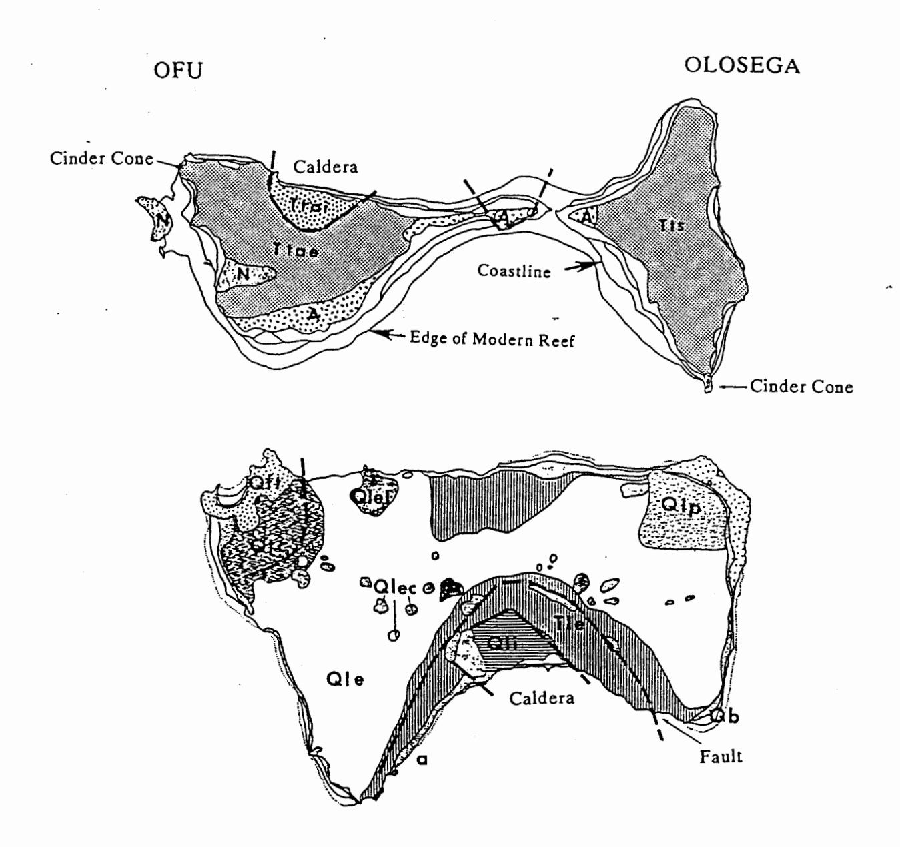

Figure 17. Geologic maps of the Manua Group, based upon maps by Stice and McCoy (1968) and later republished by Wingert (1981). The islands of Ofu and Olosega are shown at top. The island of Tau is shown at the bottom of the figure. In the upper figure the map symbols (in ascending stratigraphic order) are: A = Asaga Formation (the oldest mapping unit of Pliocene age), Ttai = ponded flows of the Tuafanua Formation, Tts = Tuafanua Formation flows, Ttae = flows of the Tuafanua Formation, N = tuffs of the Nuu Formation. The remaining units, which are not separately designated are Quaternary sediments. The geologic map of Tau is shown in the lower figure. The map symbols used represent the following map units (in ascending order): Tle = lava flows of the Lata Formation, Qli = intra-caldera member of Lata Formation, Qle = post-caldera volcanics of the Lata Formation, Qtc = ash, tuff, and olivine basalt of the Tunoa Formation, Qlc = ponded lavas of Luatele Formation, Qlp = flows of Luatele Formation, Qft = Faleasao Tuff Formation, Qa = alluvium, Qb = modern beach sediments. The remaining units which are not separately designated are Quarternary sediments.

Wilkes "mistook some dark-colored scoriaceous-looking, weather-worn limestone boulders for lava."

In 1939, Schultz collected samples of lava from Rose Atoll (Schultz, 1940) and sent them to the U. S. National Museum for analysis by Gilbert Corwin. Schultz related to Sachet (1954) that a dozen or more volcanic blocks the size of a man's head were observed scattered on the reef. The rocks collected by Schultz are described as "compact olivine basalt." Schultz concluded they had been thrown up on the atoll surface from the shoulders of the atoll much like the other reef blocks.

Pickering (1876) also reported several blocks of vesicular lava and stated that "in all instances [they were] resting on the coral-shelf, not imbedded."

The reports of basaltic boulders are very important. It is assumed that Rose Atoll is an isolated old seamount, unrelated to Samoan volcanism. If it is an old seamount, a very thick carbonate cap would be expected. Johnston Atoll for comparison, appears to be capped by 1600 m of sediments (Keating, 1985b). No basaltic fragments would be expected on the shallow slopes of an ancient atoll, and the observed basalts are likely to be transported lava rock fragments from the high Samoan islands by fishermen as suggested by Balazs (personal communications, 1984). By contrast, the numerous reports of blocks of lava on the atoll are suggestive that lava outcrops are present on the upper slopes of Rose Atoll, which would be consistent with a young age for the seamount that could be linked to volcanism of the Samoan chain.

Lipman and Taylor (1924) analyzed the soil within the Pisonia grove on Rose Atoll. From the descriptions of Mayor (1924) and Lipman and Taylor (1924), it appears that an upper layer of humus is present. Underlying this is an intermediate layer of loose, very porous material that is dark brown in color, which extends to a couple meters depth. This is underlaid by a unit referred to as bedrock that is "a compact, fine-textured, almost pure calcium carbonate, which shows virtually no vital structure. It is pure white, fairly soft," according to Lipman and Taylor (1924). Mayor describes the same material as coquina. According to Sachet (1954), Lipman and Shelley regard the intermediate layer as being an intermediate product in the decomposition of the bedrock, to form, with the addition of much humus, the surface layer of "fine textured, mellow, organic soil." The analyses of soil by Lipman and Taylor (1924) indicate that there are increasingly high percentages (from bedrock to soil) of Al, P, S, Na and K, compared to decreasing percentages of Ca and Mg, and little change in Si. They explain that aluminum silicate in the original rock undergoes decomposition through reaction with ammonia, formed from the decomposition of organic material or bird excreta, followed by removal of the ammonium silicate by leaching, while accumulating alumina in the soil. This

would prevent silica accumulation. The authors explain the increased sodium, potassium and sulfur as resulting from the great absorptive capacity of the soil, differential leaching, and contribution from spray. Sachet suggests a 36-fold reduction in the weight of soil decomposed is required to yield the observed amount of alumina. Stone (1951) rejected this idea, since basalt fragments are reported to be present on the reef. Sachet (1954) states that analyses may reflect contamination by decomposed pumice or basalt.

Studies of soils from Pisonia forests in the Marshall Islands led Stone to suggest that the bird excreta was acidified by humus as it washed down through the soil, dissolving calcium phosphate. As the residual reaches the sands and rock below, the aqueous solution becomes alkaline and insoluble, precipitating out and cementing the loose material together. The acid solution dissolves calcium carbonate and replaces it with calcium phosphates, producing a hardpan, immediately below the humus layer. Hutchinson (1950) describes similar hardpan development on the atolls within the Line Island chain. These hardpans, however, do not have high aluminum contents.

The high aluminum content and lack of hardpan is interpreted by Hutchinson (1950) as being significant. Hutchinson says, "It is plausible to suppose that the profile on Rose Atoll represents phosphatization due to concentration of phosphate in the parent rock, presumably with enrichment from boobies nesting in the trees, while the Palmyra profile represents a Pisonia stand growing on the site of a pre-existing guano deposit." Hutchinson points out that, in general, phosphates are better developed on dry equatorial islands than on wet ones. It is difficult to estimate the rainfall on Rose, since it is an uninhabited island. Records are available for Puka-Puka and Aitutaki, which probably reflect the conditions on Rose. Sachet reports 2 m of rain on Aitutaki as the yearly average (Seelye, 1943). On Puka-Puka the yearly totals for 1930-1942 range from 2.2 to 3.9 m. Sachet (1954) suggests, "Rose Atoll probably has a similar rainfall, although the number of rainy days may be great." These rainfall levels are significantly higher than those for the dry equatorial Line Islands (Keating, this volume). The substantial rainfall could wash guano into the lagoon, in the manner suggested for Christmas Island by P. Helfrich (personal communications, 1988) removing the surface phosphatic accumulations.

Hutchinson suggests, "the fertility of many wet atolls doubtless depends on such phosphatization, followed by bacterial nitrogen-fixation, as seems to be the case on Rose Islet (Lipman and Taylor, 1924). Nitrite and nitrate producing bacteria are present in the soils. Their nitrifying activity is more or less proportional to the amount of organic matter in the soil, according to Lipman and Taylor (1924).

#### Volcanic Cones

Volcanic cones are relatively rare in American Samoa as opposed to Western Samoa. On Tutuila they are concentrated on the Leone Peninsula and the flank of the Taputapu volcano (Fig. 18) adjacent to the peninsula. Older cones on Tutuila have been removed by long-term erosion. No crater lakes are present on Tutuila. One crater lake, Red Lake, is found on Aunuu Island. Nuutele and Nuusilaelae Islands west of Ofu are tuff cones. Cinder cones are present at Tauga Point on northwest tip of Ofu, and Lemaga Point on the southeast tip of Olosega. Pliocene breccia cone material makes up much of the Asaga Formation (Fig. 17). In addition, several large and small craters are present on the island of Tau (Stice and McCoy, 1968).

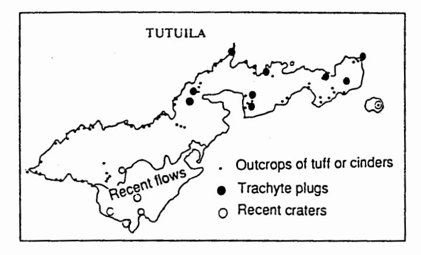

Figure 18. Map of the Recent craters and flows, outcrops of tuff and cinders and locations of trachyte plug on Tutuila, American Samoa. The map is based upon the geologic map of Tutuila by Stearns (1944) republished by Wingert (1981).

#### Coral Reefs in American Samoa

The coral reefs around Tutuila show considerable variation in the distance to the shoreline and degree of development (Fig. 19). Mayor (1924) studied the structure and ecology of reefs around Tutuila. He suggested a drowned barrier reef at 58 to 72 m exists around Tutuila, forming a shelf.

Daly (1924) suggests that the western part of the Tutuila shelf sank 9-18 m less than the eastern part, and that the northern part is perhaps 9 m less than the southern part, with the old shelf being tilted toward the southeast.

## Sand Beaches of American Samoa

Sandy beaches are present in limited areas along the coastline of Tutuila. The abundance of sand seems to be directly related to the smaller number of concrete buildings present on that island. The sands occur as loose sand and lithified beach rock. The sands vary from fine to medium

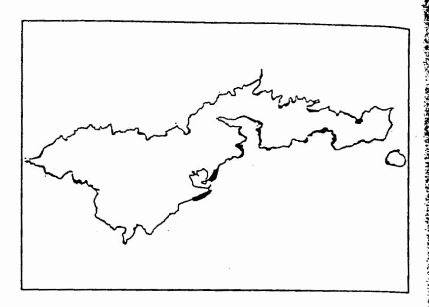

Figure 19. Map of the island of Tutuila, showing the locations of the modern reef edge as mapped by Stearns (1944) and Wingert (1981).

and coarse grain. The sand commonly consists of fragments of coral, shells, and calcareous algae without siliceous material. A few chitinous grains are commonly found. The sand generally has approximately equal amounts of high-and low-Mg calcite. The lithified sands commonly occur as lens-shaped bodies (now referred to as beach rock) which terminate in loose sands along the strike of the beach (Daly, 1924). The lithification is believed to result from cementation by calcite-rich fresh water percolating through the beach deposits which dip gently seaward (Daly, 1924).

#### Streams and Erosional Features of American Samoa

If we examine the topographic features on Tutuila in the same manner as Kear and Wood (1959) did for Western Samoa, the volcanic cores exposed in American Samoa display several levels of erosional degradation. The relationships can be characterized with the following observations:

- Pago volcanics, caldera unit amphitheater-headed canyons, deep, poor graded valleys.
- Pago volcanics, extra-caldera units deeply incised canyons with highly laterized canyon fill, entrenched gulleys.
- Taputapu volcanics moderately incised canyons, isolated canyon ridges, deep laterization.
- Alofau volcanics limited canyon development.
- Olomoana volcanics few, short, shallowly eroded gulleys.

- Aunuu volcanics little sign of erosion other than alteration of tuffs to clay in the base of the volcanic cone.
- Leone volcanics only weakly developed drainage patterns present, few signs of erosion and soil development.

## Sea Cliffs and Caves .

In American Samoa, sea cliffs are very common. Where the protective coral reefs are absent, the sea cuts against the rocks and erodes the headlands. Continuous sea cliffs ring the Leone Peninsula. The islands of Ofu and Olosega are strongly cliffed on all sides. The sea cliffs reach heights of 100 m or more (Daly, 1924; Stearns, 1944; Stice and McCoy, 1968). Many corrections were made to the topographic maps by Stice and McCoy (personal communications, 1990).

In American Samoa, sea-cut caves and benches are present on Tutuila at 6 m and 3 m above present high tide level. The 6 m stand of sea level produced notable erosion of lavas on all sides of Tutuila, producing cliffs of 10 to 100 m in height. Caves at Mataae Point, near Faganeanea, and Fagaitua have floor heights 5 m above high tide level.

Emerged rock benches are currently being cut on the eastern shore of Aunuu Island, Ofu, Tau, and Tutuila. These are 1-2 m below high tide level and correspond to similar height benches on Rose Atoll, 140 km east (Daly, 1924; Stearns, 1944).

Off Tutuila in American Samoa, the fringing reef and barrier reef merge to form a very narrow reef structure only 10 1/2 m across. The reef occurs intermittently along the southern coast of Tutuila, and is very narrow and in some places absent, around Ofu, Olosega, and Tau.

## Economic Deposits

## Construction Material

Stearns (1941) reported on potential sources of construction material on Tutuila (American Samoa). Stearns suggested suitable material for crushed rock is exposed in road cuts of the Pago caldera complex along the coast where the ridges plunge into the sea. The rock is dense and suitable after crushing for concrete aggregate and road metal.

Cinder for road surfacing is available at Futiga cone. Cinders for light-weight concrete are available at Mapusaga cone. Stearns suggested trachyte on the island had enough silica content to be of use in making cement, when crushed, provided additional iron was used and fused with coral sand. He stated that similar rock had been used for cement on Maui, Hawaii, during World War I. He stated, "it is economically feasible on Tutuila only if shipping space becomes scarce and fuel is obtainable at a reasonable price.

## HISTORIC VOLCANISM IN AMERICAN SAMOA

#### Manua

Thomson (1921) reports about Manua in 1866,

"a submarine eruption took place between the islands of Olosega and Tau, but few details have been recorded. Coleman Phillips states that on September 12, 1866, dense masses of smoke arose from the sea and continued until the middle of November. The outbreak was preceded by repeated shocks of earthquake. Friedlander ascertained from an old inhabitant of the group that dense clouds of steam and water with slag and pumice were ejected, and at night flames were plainly visible. Stewart's Handbook of the Pacific Islands gives the date as 1867, obviously in error, and mentions that the submarine volcano vomited forth rocks and mud to the height of 2,000 ft (610 m), killing the fish and discoloring the sea for miles (kms) around. The German Admiralty Chart, according to Friedlander [1910], mentions a submarine volcano some 46 m below the water surface."

## GEOLOGIC MAPPING OF AMERICAN SAMOA

In Western Samoa hydrologists used physiographic features to map the geology. The strategy used was to map units using physiographic development in order to establish units of roughly equal age. In American Samoa Tutuila was mapped by a volcanologist, Harold Stearns, who coincidentally was a specialist in groundwater resources. Stearns carefully observed the geology of the American Samoan islands, identified the intrusive centers, calderas, and extracaldera lava flows. The relationships he observed allowed him to map volcanic centers. Often onlapping relationships allowed Stearns to establish relative ages for volcanism on an island. It was only after radiometric dating was attempted decades later that some absolute age relationships have been established.

Stearns (1944) concluded that Tutuila is built from five volcanic centers (Fig. 20). The volcanic centers are aligned on two or possibly three rifts, trending northeast-southwest. The majority of the lavas are basic lavas, capped by limited trachyte, alluvium, coral reefs, and beach sands. Stearns suggests that the bulk of the volcanoes appear to be Pliocene, based on the weathered and eroded conditions. Fresh tuff cones and lava flows on the southwest side of the island, and on Aunuu Island are assigned Recent ages.

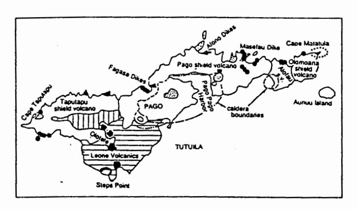

Figure 20. Geologic map of the volcanoes forming the island of Tutuila, based upon the field mapping by Stearns (1944). (Figure from proposal by Natland et al., 1984)

## GEOLOGIC MAPPING UNITS

## Masefau Dike Complex

On the north coast of Tutuila near Masefau village is a complex of hundreds of basaltic dikes ranging from a few centimeters to 2 meters in width. The dike rocks are vesicular and platy; some are amygdaloidal. The dike complex strikes N 70° E and dips slightly southward. These rocks are interpreted to be the oldest rocks exposed on the surface and were part of the deep structure of a volcanic rift zone.

The north side of the dike complex is exposed at Afono Bay, in a cliff on the north side of a promontory opposite Bartlett Island (now called Nuusetoga Island). Stearns (1944) suggests that the cliff may be an eroded fault scarp or a sea cliff. Resting against the face of the cliff is talus breccia overlain by 3-23 m of vitric basaltic pumice and cinders on which as basalt cascaded over the cliff.

Stearns suggests the north side of the dike complex may be the eroded caldera wall of a volcano older than the Pago volcano, whose vent lies north along the present coast; alternately, it may be an eroded early rift zone horst block of the Pago volcano, later buried by flows. Based upon analogies with dike complexes elsewhere, Stearns suggests that the complex was apparently formed not more than 610 m nor less than 92 m below the surface of a rift zone and that 300 m or more of lavas which formerly overlaid the dike complex have been removed by erosion.

The Masefau dike complex cuts thin basaltic flows dipping at moderate angles (from 10 to 20° NW). These lavas are in large part shattered and brecciated by faults. Stearns suggests that much of the rock in the rift zone shatters slowly, during repeated intrusion of the dikes, and that the shattered brecciated material settled downward into the underlying magma chamber as breccia.

#### Olomoana Volcano

The Olomoana volcanic rocks are areally restricted olivine basalts. Stearns interpreted the outcrops as volcanism on the northeast rift of the Alofau Volcano during the closing phase of Pliocene activity on the island. The Alofau volcanic flows overlap the west slope of the Olomoana volcanic cone. Thus it is suggested that volcanoes may have been essentially contemporaneous.

The lavas of the Olomoana volcanics center cover 2.4 square kilometers on the east end of Tutuila, surrounding Olomoana peak. Several intrusive volcanic plugs, crater fills, and cinder cones are exposed along the eastern coast. Cape Matatula is the largest intrusive plug. Flows are interbedded with palagonitized vitric tuffs interbedded. The Lefulufulua trachyte plug cuts these rocks. A large cinder cone can be seen partly exhumed in the stream bed draining to Tula.

#### Alofau Volcano

The Alofau volcanics center consist of thin bedded aa and pahoehoe flows, dikes, breccias, and tuffs exposed in a shield-shaped dome. The dome covers about 2.4 square kilometers on the east side of Fagaitua Bay. The volcano is built over a rift zone trending northeast-southwest. The lava flows are thinly bedded primitive olivine basalts, dipping 10 to 20° away from Alofau village. A dike complex is exposed on the road southeast of Fagaitua village. Another 130 individual dikes are exposed in a promontory on the north side of Alofau. Large numbers of dikes are also seen exposed south of Alofau village. The rim of the caldera decreases in height rapidly to the southwest away from Alofau and extends partially submerged offshore.

#### Pago Pago Volcanic Series

The Pago volcanic series includes extra-caldera lavas, dikes, plugs, cinder cones, vitric and lithic tuffs, and breccias as well as intra-caldera lavas, dikes, plugs, cones, tuffs and breccias. The Pago volcano caldera was situated at the center of Tutuila Island. Stearns (1944) estimates that the caldera extended 9.6 km in length and 4.8 km in width.

## Intra-Caldera Volcanic Units

Within the Pago caldera, lava flows formed thick ponded lava sequences to the north, east, and west. Pahoehoe flows are scarce. The lavas are generally aphanitic and olivine poor. Dikes are observed, ranging from 1 to 15 m wide.

The tuff and breccia member is the explosive debris that accumulated during the excavation of the inter-caldera

The deposits contain lithic, crystal lithic, and lithicric debris. The beds range in texture from fine-grained, minated, silty tuffs through lapilli tuffs to coarse blocky eds of breccia 6 m thick with blocks of ejecta 1.5 m wide. Thick deposits of fire-fountain debris are interbedded with thic beds of cataclysmic explosions. Pisolitic beds are present. A few beds of carbonaceous plant remains are occasionally found, which could be used to determine radiocarbon ages, the ages are less than roughly 40,000 years. Beds containing pumice fragments are also preserved. Other beds contain both basaltic pumice and dense fragments of trachyte, indicating that the trachyte eruptions were followed by basaltic eruptions.

The beds are nearly horizontal near the source. Where they have steep dips (reaching 32°) they interfinger and merge with talus breccia, suggesting they accumulated concurrently with the talus at the foot of the caldera wall.

An unconformity exists between the Pago tuffs and the pre-caldera lavas. The unconformity is well exposed in a small stream channel at the head of Pago Pago valley, where the caldera rim is seen. Thin bedded olivine basalts are uncomformably overlain by beds of talus breccia and tuffs. Two dikes cut the lavas but do not cut the tuffs. Faulting is present but the lack of deformation of the tuffs suggests that the faulting motion pre-dates the accumulation of tuffs. The stream's channel, which is a series of cascades, cuts down through the exhumed caldera wall.

Another unconformity can be seen on the north side of Taumata Peak. There, the massive columnar jointed ponded lava forms a peak resting on talus breccias, thin bedded lithic tuffs, and basaltic pumice and cinder beds of the Pago Tuff Member. The intra-caldera lavas on the northeast side of the peak rest on red baked vitric tuff. The tuffs of the Pago volcanic series east of Taumata Peak are underlain and overlain by massive ponded lavas.

A dike complex crops out in a valley on the northeast side of Tau Peak. The dikes are terminated by massive lavas, suggesting an unconformity or caldera wall between the caldera-filling lavas and the dike complex. A small spur of dense rock is present on the road just west of Aua. Stearns suggests it is a remnant of caldera lavas.

### The Pago Caldera

Stearns suggests the Pago caldera was 4.8 km wide and 9.6 km long. The geological evidence indicates the caldera formed by collapse following the building of a cone. A water development tunnel near Pago Pago Bay cuts a major fault. Along the fault a "gouge and splinter" zone is observed 30 cm wide. There, 6.3 m of friction breccia is seen which contain faceted blocks up to 60 cm across and smaller fragments which have been ground to balls by friction.

The lavas inside and out of the caldera differ. Stearns suggests at least 480 m of collapse took place. Projections of the original height of the mountain, using the dip of extra-caldera lavas, indicate the mountain would rise 1200 m above present sea level, if the cone had the same slope at the summit. The southern rim of the volcano was much lower than the northern rim. Stearns suggests the caldera may have been horse-shoe shaped with no rim on the south.

Stearns suggests, "by analogy with other similar basaltic volcanoes the collapse probably proceeded with the growth of the upper part of the cone, the caldera widening and deepening progressively even though lavas were erupted simultaneously on the floor. Subsidence finally stopped as the volcano approached old age and the lavas began to differentiate. Filling gained on subsidence, and at the cessation of activity the caldera was filled to the brim in the northwestern sector, overtopped and buried by perhaps as much as 150 m of lava in the southern and southeastern sectors, but lacked about 180 m of being filled in the northeastern sector ...."

#### Trachyte Plugs

Several trachyte plugs and domes can be seen associated with the Pago volcano. The plugs fed bulbous domes, like Pioa which looms over Pago Pago Harbor. Some volcanic plugs, like Vatia and Pioa, are so little eroded that the upper bulbous parts of the domes remain. In other places, so much structure has been eroded that the remnants have a transitional appearance between domes and plugs.

The magnificent harbor of Pago Pago is dominanted by the trachyte dome, called Pioa, or more commonly the Rainmaker. The Rainmaker is a quartz trachyte dome 300 m wide, 720 m long and 515 m high. The landmark was described by Daly (1924) as reported by Stearns (1944), p. 1300-1301,

"a monolithic rhyolite with quartz-poor and quartz-free phases in contact with basaltic flows on the north corner, but elsewhere with tuffs and breccias composed almost entirely of basaltic fragments but containing a few blocks of trachyte or rhyolite. He regarded the Pioa plug as an endogenous dome pushed through a funnel 1.25 mile (2 km) in diameter filled with explosion breccia. This is an excellent description of the mass except that the diameter of the funnel is less than half a mile (0.8 km) across and the breccia is almost entirely pre-funnel in age."

### Stearns suggests,

"The trachyte evidently rose to a point nearly 900 ft (270 m) above sea level where it frothed violently producing red, white and black biotite rich pumice and cinders about the vent, at the same time blasting out a few blocks of older basaltic tuff, breccia and lava. After a pumice cone indented with a crater had been

made, the pasty lava squeezed up and partly filled it . . . Columnar jointing developed at right angles to the base of the cooling lava."

A pumice cone was built on slightly weathered tuff covering the floor of the Pago caldera, near the foot of the eastern wall. Thus, the Pioa eruption was a late event in the development of the Pago volcano. Stearns suggests the other trachyte plugs associated with the Pago caldera were formed in a similar way.

#### Extra-Caldera Volcanics

The extra-caldera volcanics include two units, the pre-caldera basalts and the post-caldera basalts. The precaldera lavas include flows, dikes and pyroclastics. The post-caldera lavas unconformably overlie the pre-caldera lavas, with only limited associated gravels and hillwash deposits observed. The best exposures of the extra-caldera rocks are seen along the nearly continuous sea cliffs of the north shore. Stearns mapped them from a boat. Many dikes and faults are exposed in the long bays that cut the volcano transversely. The widest dike is 18 m wide. At Point Nelson (now called Vaisa Point) a dike 9 m wide is seen not far below the level at which its lava erupted (Stearns, 1944). These wide dikes are rare.

Pre-caldera olivine basalts, tuffs, and a dike complex and associated faults can be seen at Fagasa Bay. Thirty dikes cutting thin aa flows are exposed on the coast at the head of the bay. Sixty-eight dikes and several faults are exposed in the shore on the west side of the bay. The dikes are more numerous in the southeastern part of the bay. The number of dikes decrease however toward the promontory at the entrance to the bay. Stearns believes this is due to its location stratigraphically close to the original surface of the volcano.

Numerous faults are seen around the bay. Many are associated with breccias. Stearns reports many faults are

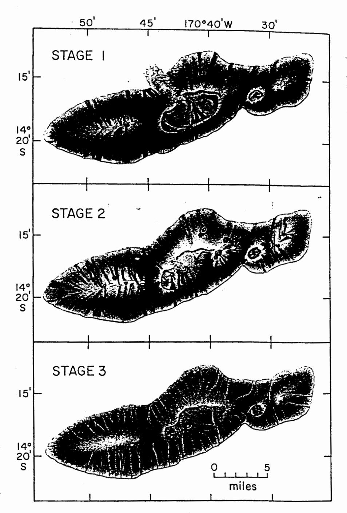

Figure 21. Illustration of the stages of geologic development of the island of Tutuila proposed by Stearns (1944). Stage 1 (top) illustrates the general configuration of the island at the close of the shield-building volcanism. Stage 2 illustrates the configuration of the island at the end of alkalic volcanism. Stage 3 illustrates the configuration of Tutuila at the cessation of volcanism and beginning of stream erosion. Notice the absence of the Leone Peninsula in these figures by Stearns (1944).

bound by cracks which are filled with blocks of basalt up to 1 m across, vitric ash and tuff. Stearns suggests a correlative relation with those on the southwest rift zone of Hawaii, where the cracks fill with blocks falling from the wall as well as hillwash and ash which infiltrate the cracks.

Vitric tuff beds a few centimeters to a few meters thick are intercalcalated with lava flows. At the tip of the Fagasa Valley promontory, a lava tube can be found with a core of horizontally bedded vitric ash. Likewise, within a platy basalt dike a half m wide, cracked by cooling, vitric-lithic tuff has infiltrated and filled the void. Stearns suggests fire fountains were repeatedly active in this area.

Thirty dikes (mostly less than 1 m wide) are exposed on the northern coast of Fagasa Bay. Some of these appear to be continuations of those exposed on the south side of the bay. An olivine dike just beyond the village contains dunite xenoliths oriented with their vertical axes parallel to the side of the dike and their heavier, larger ends down. The core on the dike appears to have remained liquid longer allowing the heavy xenoliths to sink in the liquid at the close of the eruption. Stearns suggests the concentration occurred 150 m or less below the surface. Paleomagnetic studies have been completed on these dikes. Dikes with xenoliths are common in Tutuila.

Many dikes are observed at Afono Bay. Stearns suggests the series of lava, tuff, and breccia beds exposed there plunge over the buried escarpment of the northern side of the Masefau dike complex. The dike complex associated with the west rift of the Pago volcano is exposed on a road on the west wall of Mormon Valley (Malaeimi Valley), and in a gorge northeast of Tau Peak.

#### Taputapu Volcano

The Taputapu volcanics form the western end of Tutuila Island. The volcano is roughly 10 km long and 5 km wide, and 450 m above sea level. The flows are dominantly olivine basalts from 2–15 m thick. Locally, they are capped by thicker flows of porphyritic and nonporphyritic olivine poor basalts. The flows dip at angles of 5 to 10 degrees. The lavas where extruded from a rift zone extending N 75° E. Beds of red vitric tuff and cinder are common between flows a few centimeters to a couple meters thick, indicating cinder cones were very common along the rift zone.

Exposures of the dipping beds of the Taputapu volcanics in the streams flowing into Massacre Bay led Stearns to separate the Taputapu volcanics from the Pago volcanics. An unconformity was not found between the two volcanoes. Based upon the relatively small erosion and dissection of the Taputapu lavas compared to the Pago volcanics, Stearns concluded the Taputapu volcanics overlap the Pago lavas, and are younger. Mantling by Recent pyroclastics may

explain this apparently youthful appearence according to P. Eyre (personal communications, 1990).

#### Leone Volcano

The Leone volcanics are the least weathered volcanics on the island and appear very young. They form a large peninsula on the south side of the island (referred to in some publications as the Tafuna-Leone plain) and are associated with several cinder and ash cones. The top of the pahoehoe lavas on the Leone peninsula at Steps Point are only about 2 m above sea level. Two thick tuff units were identified by Stearns but could not be mapped due to the thick vegetation.

Stearns (1944) suggests a crack, 6.4 km long, opened from Olotele Peak across the present fringing reef and the submerged 72 m shelf in Recent times. Eruptions began at the upper end of the crack with fire fountains. Where the crack reached the sea, gas-charged lava rose through the water and produced violent explosions. The ocean water repeatedly entered the vent producing many explosions, with sufficient intensity to hurl material 1.5 km in the air, according to Stearns. The strong trade winds blew much of this material northwestward across the island and partly filled the bay and valley at Leone (P. Eyre, personal communications, 1990). Fragments of drowned coral reef were involved in the eruptions (Daly, 1924).

#### Relative Ages

The Samoan Islands are much like the Hawaiian islands. Thomson (1921) remarked on similarities and differences between the Samoan and Hawaiian islands which are worth reiterating. First, like Hawaii, with the exception of coral reefs along the coast, the rocks of the Samoan island chain are volcanic. Second, there does seem to be a progressive shifting of volcanic centers in Samoa. In Hawaii, the shifting of volcanic activity is from northwest to southeast. Thomson (1921) points out that Savaii has experienced three eruptions in historic times and is comparable in form and state of erosion to the island of Hawaii. Upolu appears more dissected and is comparable to Maui. Tutuila, he points out, is still more dissected and is comparable to Oahu. Recent radiometric dating by Natland and Turner (1985) has yielded a date near the base of the volcanic pile on Tutuila island of 1.5 Ma. Thus, recent results confirm Thomson's geologic interpretation.

Dana (1849) pointed out that the character of the rocks and general topography of the central district of Upolu were similar to that of Tahiti and Kauai and thus suggest a similar age. The ages inferred by these early investigators are compared to the recent radiometric dates for these islands in Table 3.

## GEOLOGY OF SAMOA

Table 2. Rock Units of American Samoa (from Stearns, 1944, Table 1).

| Geologic age                   | Formation                        | Thickness | General description                                                                                                                                                                                                                                                                                                                                                                                                                                                                                                                                                                                                                                                                                                       |
|--------------------------------|----------------------------------|-----------|---------------------------------------------------------------------------------------------------------------------------------------------------------------------------------------------------------------------------------------------------------------------------------------------------------------------------------------------------------------------------------------------------------------------------------------------------------------------------------------------------------------------------------------------------------------------------------------------------------------------------------------------------------------------------------------------------------------------------|
| Recent                         | Sediments                        | 60 m      | Brown, silty, poorly unconsolidated alluvium in the valley floors; coarse talus debris at the foot of cliffs; and loose calcareous sand and coral gravel with small amounts of cemented beach rock along the coast.                                                                                                                                                                                                                                                                                                                                                                                                                                                                                                       |
| Recent                         | Leone volcanics                  | 60 m      | Olivine (picritic) pahoehoe basalt spread from a fissure reaching Olotele Peak to Fagamaa Crater which is marked by a cone chain. The lava is veneered with tuff over a large area. Cinder member forms cones about 75 m high at the source of the Tafuna flow. Stony ash member forms a cone about 60 m high composed chiefly of nodular stony ejecta and a small amount of accessary basaltic ejecta in a matrix of black volcanic sand and lapilli. The ash is overlain by the tuff member ejected from three craters near Steps Point. The tuff from Fagatele Crater is separated by an erosional unconformity from the overlying Fagamaa tuff, but the tuffs can only be separated along the coast near Steps Point. |
| Recent                         | Aunuu tuff                       | 200+      | Lithic-vitric tuff forming Aunuu Island.                                                                                                                                                                                                                                                                                                                                                                                                                                                                                                                                                                                                                                                                                  |
| Great erosional un             | conformity                       |           |                                                                                                                                                                                                                                                                                                                                                                                                                                                                                                                                                                                                                                                                                                                           |
| Pliocene and early Pleistocene | trachytes                        | 642 m     | Dense, jointed, cream colored, trachyte dikes, plugs, and crater fills later than most of the Pliocene volcanics.                                                                                                                                                                                                                                                                                                                                                                                                                                                                                                                                                                                                         |
|                                | Taputapu volcanics               | 492 m     | Thin bedded olivine basalts capped in places with a few somewhat thicker andesitic basalts forming a shield-shaped dome over a N 75° E rift. Vitric tuff beds and cinder cones are interbedded with the lavas. The lavas appear to overlap the Pago Volcano.                                                                                                                                                                                                                                                                                                                                                                                                                                                              |
|                                | Pago extra- caldera volcanics | 321 m     | The lower member is composed of thin-bedded primitive olivine basalts, associated with thin dikes, extra-caldera volcanics and thin beds of vitric and lithic-vitric tuff having an aggregate thickness of more than 300 m, all dipping (to 25°) away from the caldera. The upper member is composed of basaltic andesites, and andesites, associated with trachyte plugs (Tau, Matafao, Pioa, Vatia, and Afono plugs.) The flows are massive and contain much interbedded vitric tuff and local thick cinder deposits. They have a maximut thickness of 150 m and form a conformable cap on the lower member. In places erosion exposes the lower member.                                                                |
|                                | Pago intra -caldera volcanics |           | Massive aphanitic porphyritic basaltic and andesitic lava flows, and cinder cones, associate with three trachyte plugs (Matafao, Papatele, and Pioa Plugs) partly fill a broad caldera. A few thin lenses of gravel are included. The rocks are similar in character and age to the upper member of the extra-caldera volcanics. The interbedded lithic-vitric tuff members 15-150 m thick and is composed chiefly of thin-and thick-bedded, fine-and coarse-grained tuffs and breccias.                                                                                                                                                                                                                                  |
|                                | Alofau volcanics                 | 962+ m    | A shield-shaped dome built over a N 70° E trending rift zone and composed almost entirely of thin-bedded primitive olivine basalts associated with one plug of trachyte (Leila plug). The summit was indented by a caldera 1.5 km across in the walls of which are now exposed several hundred basaltic dikes, a few of which are porphyritic. The late extra-caldera lavas of the Pago Volcano apparently overlap the Alofau dome on the northwest side.                                                                                                                                                                                                                                                                 |
|                                | Olomoana volcanics               | 322 m     | Composed largely of olivine basalts but capped with andesitic basalts and perforated by one plug of trachyte (Lefulufulua plug). Several large cinder cones and numerous beds of vitric tuff are exposed in the volcano. The latest lavas from Alofau Volcano apparently overlap the Olomoana cone.                                                                                                                                                                                                                                                                                                                                                                                                                       |
| Erosional (?) Unce             | onformity                        |           |                                                                                                                                                                                                                                                                                                                                                                                                                                                                                                                                                                                                                                                                                                                           |
|                                | Masefau dike complex          | 60 m      | Thin basaltic flows dipping 10 to 20° NW cut by hundreds of basaltic dikes a few cm to 2 m wide striking N 70° E and dipping slightly southward. Much of the lava rock between the dike is shattered by faulting. The complex is truncated on the top apparently by an erosional unconformity and on the northern side by a fault (?) scarp. Above the fault (?) plane lies 6-30 m of talus and firefountain debris and 15 m of lavas of the Pago volcanic series.                                                                                                                                                                                                                                                        |

## Paleomagnetism

Paleomagnetic studies of lavas from Samoa were first carried out by Tarling (1962, 1965). These early studies showed that normal polarity is present on Savaii. On the islands of Tutuila and Upolu, the stratigraphically higher units are normal polarity and the stratigraphically lower units are reversed polarity. Tarling compared the results directly with the Hawaiian Islands and concluded the rocks sampled did not exceed 2.6 million years in age. Furthermore, he suggests the overall migration of volcanic activity from East to West "is at an average rate not less than 7.7 cm/year and probably similar to the migration rate of 10 cm/yr observed in Hawaii (McDougall, 1964)."

More recent paleomagnetic studies have been conducted by Keating and Tarling. Care was taken to collect the freshest outcrops, often along the shoreline, in order to avoid the problems of secondary overprints experienced by Tarling (1965). In general, the sampling was very successful and well-defined paleomagnetic directions resulted from the work. The poles from the island of Savaii fall into seven groups (Keating, 1985a). With few exceptions, each of the volcanic units of Savaii yields a tight cluster of paleomagnetic directions; the sites do not appear to display substantial rotation and all appear to be normally magnetized. The mean site directions are plotted in Figure 22 using the geologic names for volcanic units mapped by Kear and Wood (1959). While a few sites appear to be incorrectly assigned to younger mapping units (Keating, 1985a) most

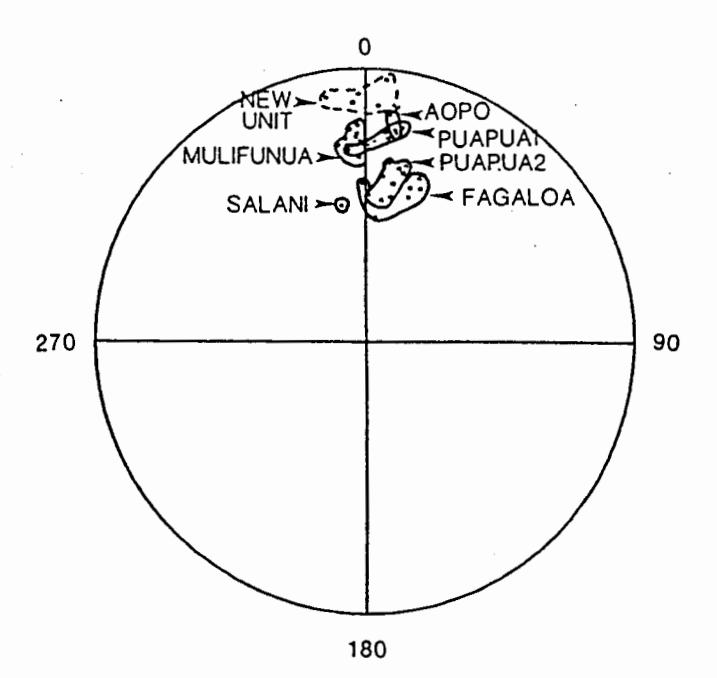

Figure 22. Mean site directions for paleomagnetic sites from the island of Savaii. The site directions from individual volcanic "formations" appear to occur in three clusters. The ovals of confidence have been omitted for clarity. The  $\alpha^{95}$  is less than  $2^{\circ}$  for most mean site determinations.

form tight clusters of direction which can be isolated from the rock units.

Table 3. Age comparison between Samoan and Hawaiian islands.

| Island  | Observer  | Comparable to: | Inferred Age: | Observed age: (Ma) |  |
|---------|-----------|----------------|---------------|--------------------|--|
| Savaii  | Thomson   | Hawaii         | 0.1           | 0-0.45             |  |
| Savaii  | Dana      | Mauna Kea      |               | 0.4-0.6            |  |
| Upolu   | Thomson   | Maui           | 0.4           | 1.63               |  |
| Upolu   | Dana      | Kauai          | 1.4           | 5.72               |  |
| Upolu   | Dana      | Tahiti         | 0.3           | 1.2-2.5            |  |
| Tutuila | Thomson   | Oahu           | 1.3           | 3.8-15             |  |
| Manua   | McDougall | Hawaii         | 0             | 0.1                |  |
|         |           |                |               |                    |  |

On Savaii, the rock units are all normally magnetized (Fig. 23) and display a systematic change in inclination. The oldest (stratigraphically lowest) units have the highest inclinations, intermediate units have moderate inclinations. youngest the (stratigraphically highest) units have the shallowest inclinations. Because the paleoinclinations from these various rock units fall into these groupings, it would appear that at least three major volcanic episodes are present on Savaii.

A comparison of the paleomagnetic results from rock units mapped using the same geologic names proposed by Kear and Wood (1959) indicates that the use of the same names on both islands is incorrect (Keating, 1985a). Units sampled on Savaii have normal polarity (Fig. 24) whereas on Upolu these units have reverse polarity (Tarling, 1965). The paleomagnetic results show that volcanism is not wholly contemporaneous on these islands. A revision of the geologic mapping on these islands would be very useful.

Mixed polarity was found on the island of Upolu (Fig. 23). It appears that the rock units of western Upolu are characterized by normal polarity while the stratigraphically lower units on eastern Upolu are reversely magnetized.

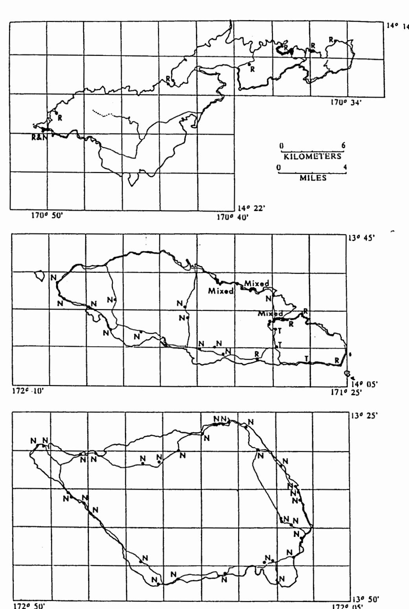

terized by normal polarity Figure 23. Maps of the main islands of the Samoan chain illustrating the magnetic polarity of while the stratigraphically sites studied by Keating and Tarling and summarized in Keating (1985a). (N = Normal lower units on eastern polarity, R = reversed polarity; T = transitional directions of undetermined polarity, M = both normal and reversed polarity magnetization is present in the lavas and dikes at these sites). The kilometer scale refers only to the island of Tutuila.

On Tutuila, all but two of the sites sampled are reversely signetized (Fig. 23). This observation is consistent with signetization of much of the Pago volcano (the oldest solcano) during the Matuyama (Reversed) Polarity Epoch, and ages of 1–1.5 Ma (determined by I. Mcdougall, personal communication, 1984). Rocks of the Taputapu volcano are characterized by mixed polarity with normally signetized dikes intruding reversely magnetized basalts. If the reversely magnetized pillows are associated with the Matuyama Epoch, which is indeed consistent with the radiometric ages of Taputapu volcano (I. Mcdougall, personal communication, 1984), then the intruding younger dykes are of Brunhes Normal age (0.7 Ma).

## petrography and Isotope Geochemistry

## Western Samoa

Petrographic studies of rocks from Samoa are numerous. The descriptions of volcanic units from Western Samoa used in Kear and Wood (1959) were made by a petrologist, R.N. Brothers. Similarly, petrographic descriptions for volcanic units in American Samoa made by G. Macdonald were included with the geologic descriptions of H. Stearns (1944) and a later publication by Macdonald (1968). Many of the early detailed descriptions of the rocks from Samoa were made at the time of the volcanic eruptions early in the century. Mohle (1902) also described rocks collected from Upolu, Savaii, Apolima and Fanuatapu Islands. Kaiser (1904) as well as Wegener (1902, 1903a,b) described rock from the 1902 lavas of Mauga Afi, Savaii. Rocks from the 1905 Matavanu lava flow were analyzed by Heuseler and described by Klautsch (1907). The 1905 flow was also described by Jensen (1907). Analysis of Matavanu lavas (Jensen, 1908) differ somewhat from those of Heuseler, reported by Kear and Wood (1959). Other descriptions of the Matavanu eruption and its lavas, are reported by Angenheister (1909), Grevel (1911), von Bulow (1906), Friederici (1910), Reinecke (1905, 1906), Sapper (1906, 1909, 1911a, 1911b, 1912, 1915), and Schmittmann (1911).

Friedlander (1910) examined the rift zones of Savaii and his collection of rocks was subsequently examined by Weber (1909) and reviewed by Macdonald (1944). Thomson (1921) summarized previous rock descriptions. Bartrum (1927) described the petrology of rocks collected by members of the New Zealand Geological Survey and included a few analyses by F. T. Seelye.

Hedge and others (1972) analyzed the major element chemistry and the minor elements Rb, Sr and Ni. The basalts yielded the highest initial 87Sr/86Sr ratios found from ocean basins. They concluded the high potash content and high Sr ratios suggest that these rocks from Upolu and Savaii were derived from a mantle source which was less

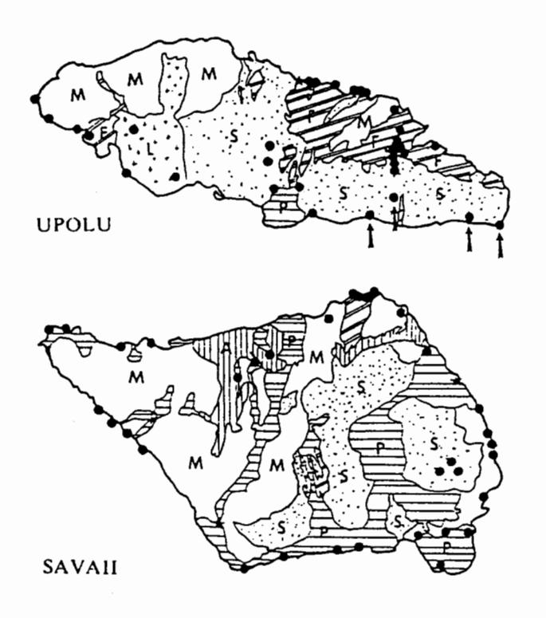

Figure 24. Geologic map of the islands of Western Samoa showing the paleomagnetic sites reported by Keating (1985a). The arrows mark sites on Upolu having reversed polarity or transitional direction within the Salani volcanic unit. On the island of Savaii all of the Salani volcanics are normally magnetized.

depleted by previous magmatism than much of the suboceanic mantle.

### American Samoa

Friedlander (1907) produced an early account of the geology of Samoa, which included petrographic descriptions by Weber. Comparisons are made with rocks collected from American Samoa by Daly (1924). Stearns (1944) describes the geology of American Samoa, including petrographic descriptions by Macdonald (1944) of Tutuila (American Samoa), Upolu, and Savaii (Western Samoa). Macdonald (1968) describes petrographic analyses of rocks from Tutuila and the Manua group. Macdonald concluded that the "differentiation trend of Samoan rocks" for the most part closely parallels that of the Hawaiian alkali suite.

Where the silica ratios lie very close to the boundary between the tholeiitic and alkalic fields (Upton and Wadsworth, 1965) with some rocks on each side of it.

Stice and McCoy (1968) discuss the geology of the Manua islands, with Stice (1968) reporting the major element petrology. Hubbard (1971) utilizes rocks from Stice (1968) and reports that lavas from the Manua islands are typical oceanic island alkali lavas; and also reports the rare earth abundances. He suggests the lavas were segregated from a normal oceanic upper mantle at greater than 40 km depth.

## Dredged Rocks

Hawkins and Natland (1975) examined the major element chemistry and trace element geochemistry of rocks dredged from the flanks of Savaii, Upolu, and Tutuila as well as nearby seamounts (including Machias) within the Samoan seamount chain. The post-erosional lavas sampled are strongly undersaturated with silica. In order to explain the Si and Al-poor, and Ca, Ti, Mg, Fe-rich basanites and olivine nephelinites, the authors suggest that magma generation took place close to the probable base of the lithosphere. Magma generation was due to moderately extensive melting (10-15%) of an essentially anhydrous and alkali-poor mantle at depths of about 85 km. Hawkins and Natland suggest a hot spot mechanism is uncertain and a more likely explanation is a combination of viscous shear melting and lithosphere dilation due to the deformation of the Pacific plate at the nearby Tonga Trench subduction

Natland (1980) suggests that at a magmatic lineage can be identified on Machias Seamount producing trachytes and phonolites. Natland suggests the compositional differences observed result from differences in the extent and depth of melting of the lavas. All Samoan lavas were found to have an undepleted radiogenic mantle source. The posterosional lavas have higher 87Sr/86Sr and Rb/Sr ratios and a lower K/Rb ratio than shield basalts. Natland suggests the chemistry is indicative of thermal-convective disturbances in the mantle, caused by deformation of the Pacific plate where the Tonga Trench intercepts the plate in the vicinity of the Samoan chain.

#### Source Material

Natland and Turner (1985) reported on the petrology of lavas from American Samoa and Western Samoa. They suggest the shield volcanoes evolved from a dominantly tholeiitic stage to a transitional stage with tholeiitic and alkalic basalts interbedded, to a dominantly alkalic stage. The Samoan lava, including the tholeiites, are enriched in alkalis and TiO2. Trace element geochemistry indicates that mantle sources are less depleted than those in Hawaiian volcanoes. The mantle sources of Samoan basalts on each

island are less depleted sources, tapped through time. This pattern of depletion is the opposite sequence from that observed on any Hawaiian volcanoes. Natland and Turner suggest a pronounced lateral isotopic heterogeneity beneath the island chain gives rise to the trace-element compositions of the post-erosional lavas.

White and Hofmann (1982) examined the Sr and Nd isotope geochemistry of lavas from Samoa. They concluded that the ratios from Tutuila and Upolu diverge significantly from the mantle array (Davies, 1981). (The results from the Manua islands, at the eastern end of the chain plot within the mantle array). The results cannot be explained by binary mixing of depleted and undepleted mantle reservoirs or by variable magmatic depletion of a planetary reservoir. White and Hofmann (1982) suggest a reinjection of crustal material into the mantle. Newman and others (1984), however, point out that this recycling model is difficult to reconcile with values of 3He/4He which are 18 times atmospheric (Rison and Craig, 1982). Newman and others suggests that deviations in (230Th/232Th) - 87Sr/86Sr correlations exist in Samoa. These could be due to modification of the mantle source or by a significant residence time at depth prior to eruption.

Matsuda and others (1984) examined Sr isotopes from Samoan rocks, and concluded that the correlation in (87Sr/86Sr) and Rb/Sr ratios reflect multi-component mixing. They concluded mantle heterogeneity exists over a large scale within the south Pacific.

Wright and White (1987) examined Sr, Nd, and Pb isotope ratios and daughter element concentrations from highly undersaturated post-erosional volcanics erupted in Recent to Historic time. They suggest the post-erosional lavas are derived from mixtures of the shield-building volcano source and a post erosional volcanic source which is characterized by high - 207Pb/204Pb, 87Sr/86Sr and low 206Pb/204Pb and 143Nd/144Nd ratios. They conclude the source of the post-erosional volcanics contains recycled ancient sediment.

Studies of two types of xenoliths from Samoan posterosional lavas are reported by Wright (1987). Wright concludes the xenoliths were probably formed during diapirism associated with the melting which produced the Samoan shield volcanoes (1-3 Ma) before their eruption as part of the post-erosional lava flows.

The studies of the isotopic composition of rocks from Samoa has contributed to a better understanding of the nature of the earth's mantle. Strontium, Nd and Pb isotopic abundance data shows that important isotopic mantle anomalies exist (Hart, 1984, Dupre and Allegre, 1983). The isotopic anomalies require a mantle source which may contain recycled ancient sediments (Wright and White, 1986/87). Arguments have been made for a compositionally layered mantle or a heterogeneous mantle mixed by large

scale mantle convection (Davies, 1981; Zindler and Hart, 1986). Discussions of mantle mixing are numerous, e.g., Anderson (1982 a and b, 1984, 1985), Davies (1981, 1983, 1984).

Zindler and Hart (1986) conclude "the evidence for a chemically heterogeneous mantle is, today, unequivocal." Arguments continue however about the nature, development, and scale of the heterogeneity. Most authors agree that the heterogeneities are long-lived, being preserved in the mantle for times of approximately 1-4 AE (DePaolo and Wasserburg, 1976). Seismic tomography studies (Dziewonski and Anderson, 1981 and 1983; Dziewonski, 1984; Morelli and Dziewonski, 1987; Doornobs and Hilton, 1989) indicate the heterogeneity is large scale. The isotopic studies of rocks from Samoa summarized here have played an important part in developing new models of the earth's mantle.

## Radiometric Age Dating

Radiometric age dates for the Samoan Islands were summarized by Keating (1987). By combining the radiometric results from the Samoan Islands with those from the seamounts and banks of the Melanesian Borderland (Duncan, 1985), a progression in volcanism is observed. A comparison of ages for the Samoan chain and the Hawaiian chain (Fig. 25), shows a progression in ages along the chain.

A comprehensive summary of the radiometric ages for Tutuila, American Samoa has been made by McDougall (1985). McDougall reports that the subaerial portion of the Pago shield volcano was constructed between 1.54 and 1.28 Ma. The Pago caldera was formed at roughly 1.27± 0.02 Ma. The emplacement of trachyte bodies occurred at 1.3± 0.01 Ma. The Olomoana and Taputapu volcanoes formed over the same interval as the Pago volcanism. McDougall (1985) suggests that the rate of migration within the island chain is about 9 cm/yr. Modern post-erosional volcanism is present on the main Samoan Islands and yields ages less than 1 Ma.

Natland and Turner (1985) published radiometric dates for the subaerial portion of the Fagaloa shield volcano in Western Samoa, and suggests it was active between 2.7 and 1.5 Ma as well as several dates from Tutuila.

## Hydrology

Water stored within rocks is a valuable resource. The water is derived from precipitation. Some of the rainwater evaporates from the land surface and returns to the atmosphere; some is utilized in transpiration by plants and also returns to the atmosphere; most of the rain water either runs off the land in streams and eventually is discharged to the

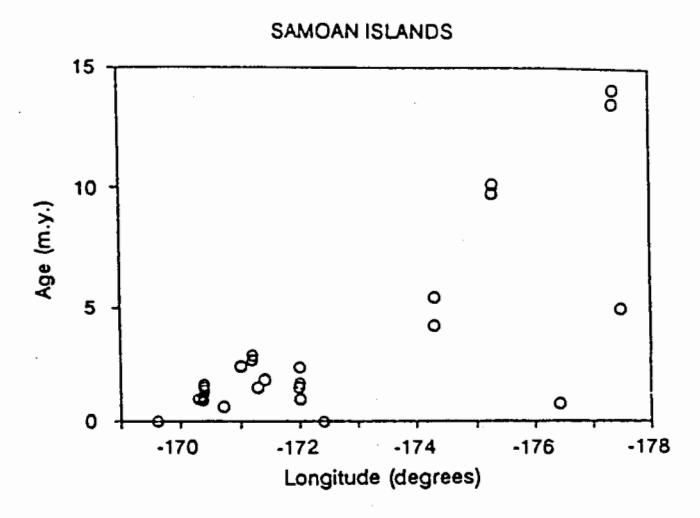

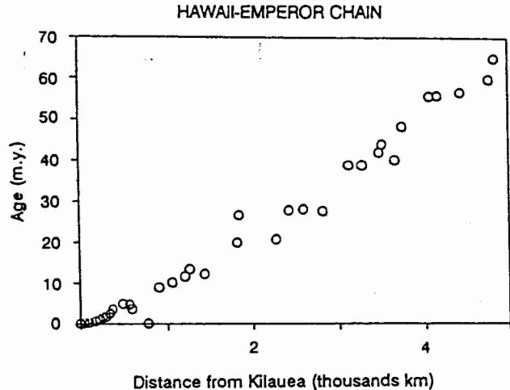

Figure 25. Comparison of the radiometric ages from the Samoan chain and Melanesian Borderland with those of the Hawaiian Islands from Keating (1985a). Both island chains appear to display a linear progression of the oldest ages of volcanism westward, consistent with a tectonic origin as hot spot traces.

sea or is absorbed into the soil or rocks and becomes ground water recharge. Water that percolates past the root zones of plants descends to a level where the voids in the rocks are filled with water; this is referred to as ground water. The upper surface of the water is referred to as the main "water table." The water table slopes gradually from the interior of the island to near sea level at the coast (Fig. 26). Where sufficient fractures or cavities exist near the coast line, springs and fresh water ponds exist. The ground water escapes to the sea at a relatively constant rate. At times of drought, the water table may drop below the base of a stream or pond. As a result, surface waters may dry up. The

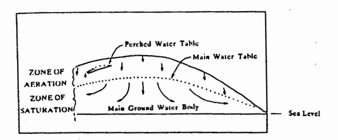

Figure 26. Illustration of the main water table and perched water table. (Figure modified from Macdonald and Abbott, 1970).

slope of the water table is referred to as the ground water gradient. In highly permeable rocks, e.g., fractured and loose basalts, the gradients are low (Stearns, 1941). Clays and unjointed lava flows and dikes are relatively impermeable and have very steep gradients. In dike zones in Hawaii, the gradients are nearly vertical indicating that these dikes act as a barrier to water movement (Fig. 27). In this case, high water tables can be found on the landward side of the dike units (Stearns, 1941).

Rain water is slightly lighter than salt water. This property allows the fresh water to float on the salt water, forming a lens-shaped body of fresh water referred to as the Ghyben-Herzberg lens. The theory developed by Ghyben and Herzberg (Ghyben, 1888 and Herzberg, 1901) and elaborated upon by Hubbert (1940), estimates that for every foot of fresh water above sea level, there will be 40 feet (12 m) of fresh water below it before the salt water is encountered. The division between the fresh and salt water.

however, is not sharp; a zone of mixing is present in which the water is not desirable for human consumption. Tidal flushing at the coast line, particularly where permeable rocks are present, influences the size of the zone of mixing.

## Discussion of the Hydrology of American Samoa

Eyre (1990) like Stearns (1941) and Bentley (1975) separates rock units into older volcanics (equivalent to shield-building lavas described by other authors), younger volcanics of the Leone plain (which are equivalent to posterosional lavas as observed in Hawaii) and alluvium. The young, post-erosional lavas are the most permeable, sustaining yields of up to 300 gallons per minute to many wells with little drawdown of the water table. By contrast, the permeability of the alluvium and older volcanics is highly variable. Much of the intracaldera volcanics are not productive aquifers while any particular flow unit can have high permeability, it is generally of limited areal extent thus the unit overall has generally low permeability (Fig. 28). Locally productive aquifers have been discovered in the intercaldera volcanics. These aquifers are associated with fractures, faults, occurrences of volcanic ejecta, and permeable contacts between separate flow units. These zones may sustain yields to a well of 200 gallons per minute or more. However, if such a yield is in excess of surrounding ground water recharge rates, water levels will steadily decline and salt water intrusion will eventually ensue (P. Eyre, personal communication, 1990).

Eyre (personal communications, 1990) states that "even the flank flows of the older volcanoes may provide aquifers of only limited productivity, relative to the post-erosional lavas of the Leone plain, because they are frequently dense

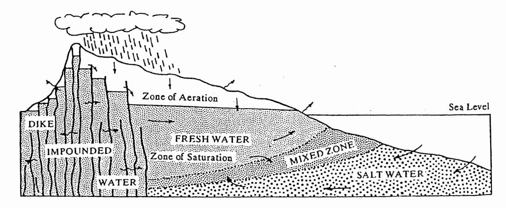

Figure 27. Illustration of the relationship between the fresh water aquifer and the underlying salt water observed in volcanic islands. Areas of dike-impounded waters are also illustrated. (Figure modified from Macdonald and Abbott, 1970).

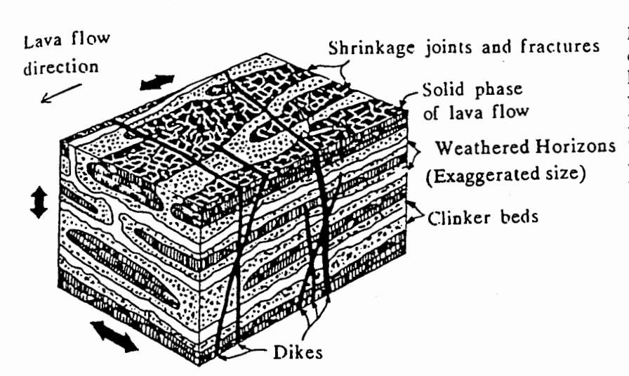

Figure 28. Block diagram illustrating the complex geologic relationships in volcanic landscapes. A complex interfingering of flow units and volcaniclastic units can be present. Dikes, intruding the edifice, can complicate the hydrology by acting as vertical barriers to water movement. (Figure modified from Hunt and others, 1988).

and thick bedded and of limited areal extent. This may be explained by the predominance of viscous alkalic basalt and andesite in Samoa, as well as by the compactness and intensity of eruptive activity on this small island." Eyre also states that "the poor performance of many wells drilled in the older volcanics attests to the difficulty of finding good aquifers." The older volcanics do become an important water supply at high elevations where gravity flow is stopped by dikes, or near-sea level where tuffs and alluvium can be a cap rock which prevents discharge to the sea (Stearns, 1941).

Unweathered tuffs are characterized by moderate permeability. Weathered tuffs are often impermeable. Breccias tend to be dense and have low permeability, when weathered. Fresh cinders have high permeability. Weathered cinders have low permeability. Dikes, interbedded tuffs, and breccias reduce the effective areal extent of lava flows, having a profound effect on ground water movement.

#### Post-Erosion Volcanics - Leone Peninsula

The eruption of post-erosional volcanics in American Samoa was voluminous and intense. Major centers include the craters of Fagatele, Fogamaa, Olovalu, and the craters near Olotele Peak (P. Eyre, personal communications, 1990). These eruptions produced several areally extensive flows; most are permeable. A large part of the flows covered existing coasts and reefs. The Leone peninsula is a major geographic feature (Fig. 16) formed as the flows built out 3.2 km from the former coastline. Ground water recharge to the lavas of the Leone plain is derived from mountain stream flow as well as direct infiltration of rainfall. Thus, the Leone peninsula is the major aquifer supplying dependable water for Tutuila. Because saltwater underlies the freshwater at a relatively shallow depth, excessive pumping can cause saltwater intrusion when wells reach more than 6 to 9 m below sea level (Stearns, 1941; Davis, 1963, Bentley, 1975; P. Eyre, Personal Communication, 1990).

Wells drilled deeper than 18 m below seawater should yield salty water (Bentley, 1975). Saltwater intrusion has caused wells to be shut off during drought years, resulting in water shortages and rationing. Salt water intrusion is exacerbated by the close spacing of wells.

Eyre (personal communication, 1990) estimates that 25 million gallons per day (Mgal/d or 1 m3/s) of ground water recharges Leone peninsula. Most of the runoff from the mountains adjacent to the plain appears to infiltrate the aquifer, and very little appears to reach the ocean as surface runoff.

Bentley (1975) reviews drillers' logs for wells in the Leone peninsula. The logs indicate that the dense interior portions of lava flows forming the volcanic peninsula are up to 9-15 m thick. The well logs show little uniformity from one well to another, other than the presence of alternating layers of hard basalt and softer units of ash, rubble, and fractured rock. One well at PuaPua drilled through two hard basalt units (29 m and 10 m thick) which were separated by soft material (7 m thick), interpreted as tuff.

Eyre (personal communication, 1990) reports that springs issue at high elevations from the Pago Pago volcano into Taumata Stream in Mormon Valley. The mapping of dikes in the area by Stearns (1941) suggests that high level dike water may occur here. Logs from wells drilled on the floor of Mormon Valley indicate the original valley was filled by Leone volcanics overlying the weathered surface of the older volcanics. The older volcanics have an "impermeable weathered surface," which perches the water to several tens of feet above sea level. As the weathered slope dips seaward beneath the Leone plain, saltwater supports the bottom of the freshwater lens in accordance to the Ghyben-Herzberg principle. Bentley (1975) mentions that reports by consultants (Austin, Smith, and associates, 1963 and 1972) suggest drilling near the boundary of the Leone plain and the Mormoan Valley basalts, to determine if trapped waters are present.

Stearns (1941) reports that the Naval Station in Pago Pago had for years used water from the Pago reservoir near the head of Fagaalu Valley. Stearns found that the reservoir was fed by a spring, 4 m below the top of the dam in the head of the reservoir (234 m above sea level). The reservoir is situated in intra-caldera volcanics according to Stearn's 1944 geologic map, below the steep sides of the Matafao trachyte plug. The spring that feeds the Pago reservoir issues from the fault associated with the Matafao plug.

The region from Vaitele to Fagaalu has no developed ground-water resources (P. Eyre, personal communication, 1990). Outcrops of a'a flows with "alternating layers of high and low permeability" are exposed in the walls of several valleys. Exploration for ground water may prove fruitful in such areas. Several wells have been drilled into the alluvium in the Pago Pago harbor area. These shallow wells yielded fresh water at modest rates, but the wells are susceptible to pollution, and have not been put into production. A private well drilled at the south end of the head of Pago Pago Harbor tapped a thick zone of fresh water under artesian pressure deep in the intra-caldera volcanics (P. Eyre, personal communication, 1990). This successful well shows the benefits possible from artesian aquifers which exist deep in the older volcanics.

At Utulei, a productive well was dug into coastal sediments, 4 m deep (Bentley, 1974) and only 35 m from the shore. The well is in-filled marshland, and appears to tap an artesian discharge from underlying intra-caldera volcanics. There is insufficient surface runoff or rainfall in this area to supply the flow from the well and chloride concentrations increase only slightly during drought (P. Eyre personal communication, 1990).

A well in Aua also tapped an artesian aquifer deep in the intra-caldera volcanics. However, the well was overpumped and its water became salty. Sparse data from a shallow well on the valley floor indicates that, similar to Utulei, water discharges from the older volcanics into the valley floor sediments.

The lower ends of most stream valleys in Samoa contain thick deposits of alluvium. Often the alluvium contains clays which are impermeable and trap water behind coastal alluvium. Shallow wells dug into these deposits are common and produce brackish water suitable for bathing and laundry. Wells in the alluvium are present in Fagaalu, Pago Pago, Aua, Autu, Alofau, Amouli, and Tula (Bentley, 1975).

In eastern Tutuila, from Lauliituai to Tula the "drainage basins are small and rugged, most wells have low capacity and deliver brackish water," (P. Eyre, personal communications, 1990).

In west and north Tutuila, no wells have been drilled because the stream flow is adequate for the population. The geology is favorable for ground water. As flows are common as flank flows on the Olomoana, Alofau and Pago Pago volcanoes. These flows form sequences of dense lavas alternating with permeable, interflow layers. The catchment area is also large, therefore, important aquifers are likely (P. Eyre, personal communications, 1990).

Analyses of water samples reported by Bentley (1975) indicate that the waters from volcanic rocks and alluvium show low concentrations of dissolved solids, except those samples from deep wells and wells near the ocean which show effects of salt water intrusion. Chloride concentrations ranging from 7 to 1,200 mg/L during 1975 to 1983 have been reported by the U. S. Geological Survey (Yee, 1987; Yee, 1988). A level of less than 250 mg/L is the recommended limit for drinking water by the U. S. Environmental Protection Agency (1982).

In modern times, American Samoa has experienced droughts, which have greatly reduced the surface water supplies. In the 1970's, water rationing programs were necessary, and the operations of two tuna canneries were interrupted (Matsuoka, 1978). During the 1980's, powerful hurricanes have hit both American Samoa and Western Samoa, contaminating surface water sources. In addition, frequent landslides occur in these islands (Buchanan-Banks, 1981) which fill and destroy surface water supplies and reservoirs (Stearns, 1941). Further development of ground water supplies are needed to meet the needs of the populations of American Samoa and Western Samoa.

#### Soils in American Samoa

Wingert (1981) illustrates the soil formations designated in American Samoa. The basic igneous rocks weather to form clayey soils which are nearly impermeable. The volcanic ash and cinders weather to loamy soils. Colluvium forms at the base of the steeper slopes, consisting of silt, clay loam, and silty clay, it is poorly sorted, containing large boulders, and gravels, which constitute up to 35% of the material. Alluvium is deposited by water and ranges from silty clay to fine sand. Thirty soils have been mapped in American Samoa.

## GEOLOGIC DEVELOPMENT OF THE SAMOAN ISLAND CHAIN

In discussing the stages of Hawaiian volcanism, Macdonald and Abbott (1970) state that, "volcanoes, like people, pass through a succession of stages in their development." Stearns (1946) outlined eight stages of volcanism (Fig. 29). Macdonald and Abbott (1970) outline nine stages (Fig. 30). The models are similar and outline a history in which the volcanoes build from the sea floor in a phase referred to as the youthful stage (Macdonald and Abbott, 1970) or the shield-building phase (Stages 1-3, Fig. 30). Most of the volcano is formed during this shield-building phase. The next phase of development is referred to as

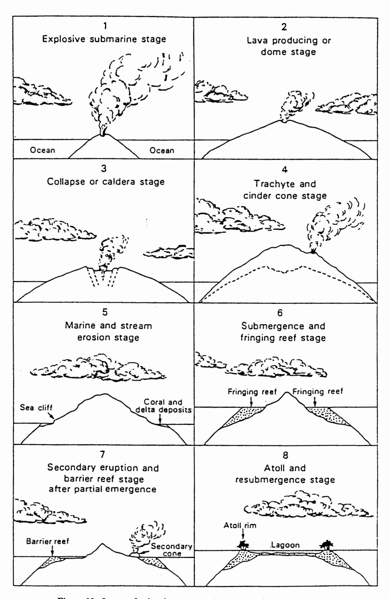

Figure 29. Stages of volcanism proposed by Stearns (1946).

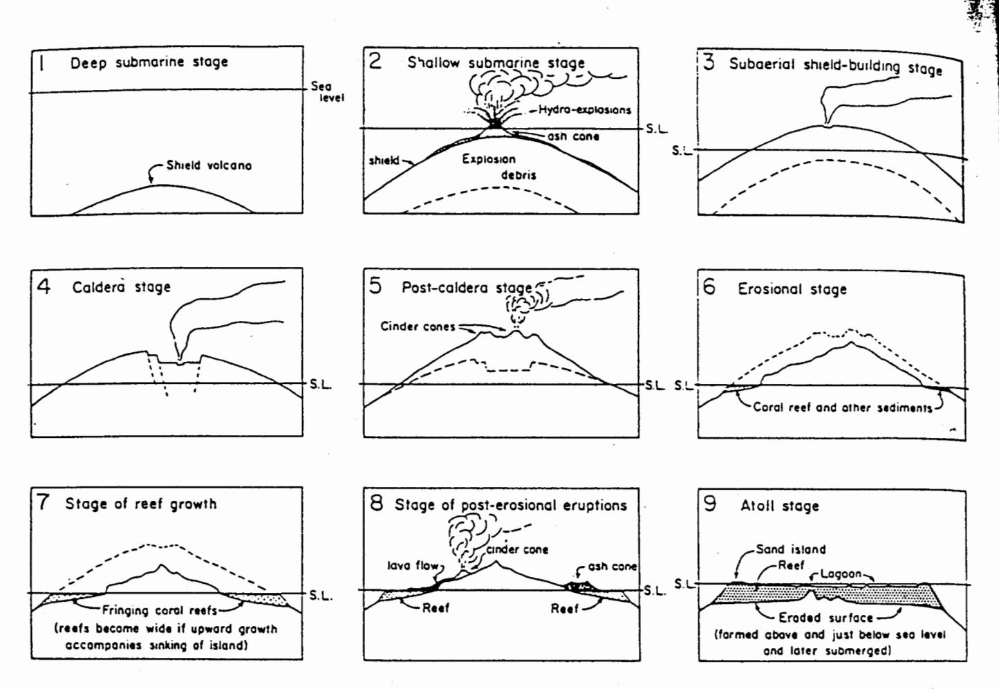

Figure 30. Stages of volcanism observed from the Hawaiian chain (from Macdonald and Abbott, 1970).

the mature stage (Macdonald and Abbott, 1970). Stearns (1946) suggests the formation and collapse of the caldera characterizes the end of this major episode in the development (Stages 4-5), followed by trachytic intrusions and formation of abundant cinder cones (Stage 5). An extensive period of erosion follows (Stage 6). Coral reefs form on the slopes of the volcanoes during the erosional phase (Stages 7 and 8). Late in the history of the volcano, post-erosional volcanism occurs, often concentrated on the slopes of the volcanoes rather than concentrating in the caldera area (Stage 8). This is referred to as the old age phase by Macdonald and Abbott (1970). The volcano continues to subside throughout its history, eventually sinking below sea level until coral reefs grow to form an atoll.

## Samoan volcanic development

Shield-Building Phase and Caldera Collapse

The shield building phase of volcanism on Upolu is represented by the Fagaloa volcanics. Kear and Wood

(1959) and Kear (1967) suggest the Fagaloa volcanics include two somewhat differently weathered landforms. Tarling (1966) found that the Fagaloa volcanics in western Upolu were normally magnetized while those in eastern Upolu were dominantly reversely magnetized. The paleomagnetic data verifies the Kear and Wood (1959) and Kear (1967) notion that the Fagaloa Volcanics could be divided into an upper and lower series.

Natland and Turner (1985) argue that Fagaloa Bay on Upolu represents the collapsed caldera of the Fagaloa Volcano. They argue that the more alkalic basalts and all of the silica differentiates are centered on Fagaloa Bay. Natland and Turner (1980) however point out that the difference between tholeiites and alkalic basalts in Samoa is arguable. In the case of Samoa, the influence of mantle sources is important, "since they very probably have enhanced the alkalicity of all Samoan basaltic lavas compared with those of Hawaii." As one reviewer pointed out, "alkalicity and silica saturation are not completely interchangeable concepts," according to Natland and Turner (1985).

Regardless of the petrologic arguments, Natland and Turner make a strong case for the existence of a caldera at Fagaloa Bay but acknowledge the lack of "the critical evidence of a ring fault." More mapping is needed in order to verify the geologic relationships and verify the existence of the proposed caldera on Upolu.

On Tutuila, the dikes of Masefau Bay, and the Pago, Alofau, Olomoana, and Taputapu volcanic series represent the shield-building lavas. These four volcanoes formed nearly contemporaneously at about 1.4 Ma. Pago Pago Harbor marks the center of the collapsed Pago caldera.

On Savaii, the oldest exposed volcanics are the Salani volcanics. The island of Savaii is thickly mantled by posterosional rocks, leading most geologists to believe the shield-building stage of volcanism is buried by later volcanic units on this island. Recently a SeaMARC II side-scan sonar survey was made on the southern flank of Savaii (Figs. 31-34). Despite surveying areas of the flank down slope from extensive cinder cones, little indication of young volcanism is present. The talus-covered slopes appear consistent with the view that the base of Savaii is indeed old and that the younger volcanics have buried the older shield building volcanics. Stice and McCoy (personal communications, 1990) point out that this appears to be the case on Ofu, Olosega and Tau based upon their work in the islands (Stice and McCoy, 1968).

## Post-caldera Stage Volcanism

Post-caldera stage volcanism is clearly present on Upolu and Tutuila. Trachytic plugs and numerous cinder cones are evident, along the axis of both islands.

## First Erosional Stage

Upolu and Tutuila have experienced considerable erosion. Both islands display extensive dissection by streams.

## Post-erosional Volcanism

On Upolu, the Salani volcanics represent posterosional volcanism. The lavas fill pre-existing valleys. On Tutuila, post-erosional volcanism built the Leone peninsula. The Aunuu tuff covered parts of Tutuila, Ofu and Tau Islands.

## Second Erosional Phase

A second erosional phase is evident in Western Samoa. On Upolu, the surface of the Salani volcanics are deeply weathered and deep soils have formed. Deep canyons cut the post-erosional Salani volcanics indicating a long period of erosion took place. On Savaii, the Salani volcanics are moderately weathered and a thick soil cover is present. Numerous deeply incised rivers drain these volcanics.

On Tutuila, the youngest of the high volcanic islands in the chain, the post-erosional volcanics which form the Leone peninsula show little evidence of erosion.

### Reef Growth Stage

Reefs are present around Upolu, Savaii, Upolu, Tutuila, Ofu, Olosega and Tau to varying extents. Many reefs have been buried by lava flows. The coral reefs in the Samoan chain have probably not fully recovered from the oscillations of sea level associated with the ice ages. The planation of the flanks of the volcanoes by wave action has provided a stable base for the reefs to grow. Barrier reefs are present where stable platforms remain on the slopes of the islands. Mass wasting of the flanks of the islands, particularly on Savaii, however, has contributed to the loss of coral reefs on the flanks of the volcanoes as portions of the volcanoes slump toward the sea floor.

## Continued Volcanic Rejuvenation

On the islands of Savaii and Upolu, volcanic activity has continued until Recent times. On both islands, the relatively unweathered lavas (from the Aopa, PuaPua and Lefaga volcanics) are widely distributed (Fig. 7). Historic volcanism has covered much of Savaii. The volcanic activity on these islands has been repeatedly rejuvenated, producing the Lefaga volcanics, then the PuaPua volcanics, and finally the Aopa volcanics, as well as submarine volcanism near Manua.

Western Samoa lies just north of the Tonga Trench (Fig. 35). Hawkins and Natland (1975) and Natland (1980) suggest that plate bending associated with subduction of the Pacific Plate in the Tonga Trench is responsible for the rejuvenated (post-erosional) volcanism so common in Western Samoa. Natland (1980) suggests shear-melting beneath a zone of lithospheric dilation is responsible for the continued volcanism found in Western Samoa.

#### Petrogenesis of the Samoan Lavas

Three manuscripts (Hawkins and Natland, 1975; Natland, 1980; and Natland and Turner, 1985) compare the petrologic development of the Samoan volcanic chain to that of the Hawaiian chain. The recent studies of the isotope geochemistry indicate that the mantle geochemistry under the Samoan chain is anomalous. The mantle geochemistry complicates the general interpretation of tholeitic, transitional, and alkalic volcanism. Samoan lavas have probably all been enhanced in alkalicity compared with Hawaiian lavas. As stated previously, "the alkalicity and degree of silica saturation are not completely interchangeable concepts." Despite the problems produced by enhanced alkalicity, Natland and Turner (1985) believe that "ranges in basalt composition exist encompassing at least the Samoan equivalent of the tholeite-alkalic basalt transi-

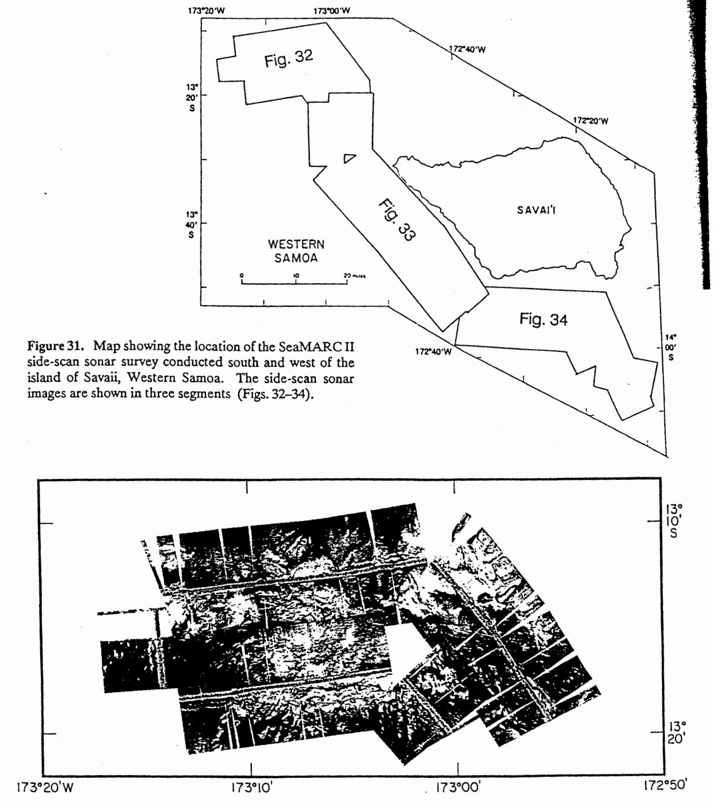

Figure 32. SeaMARC II side-scan sonar image of a seamount immediately west of Savaii. The seamount is capped by low reflectivity material, probably sediments, which appears white in the image. Several faults that parallel the trend of the island chain can be seen on the sea floor east of the seamount. Four small cones can be identified in the image.

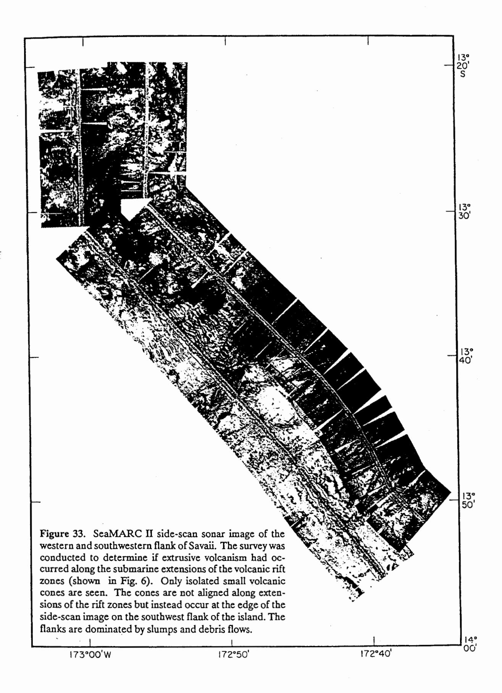

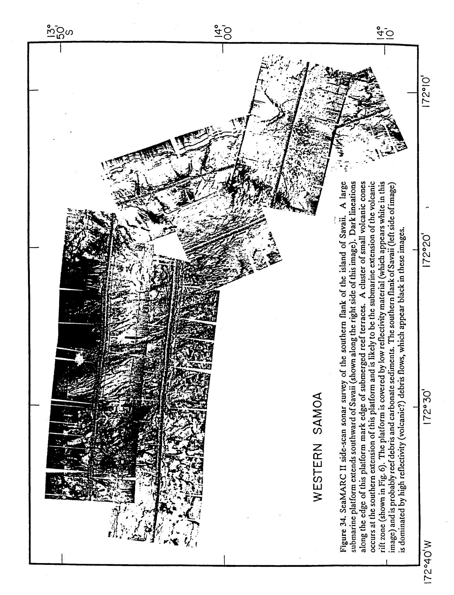

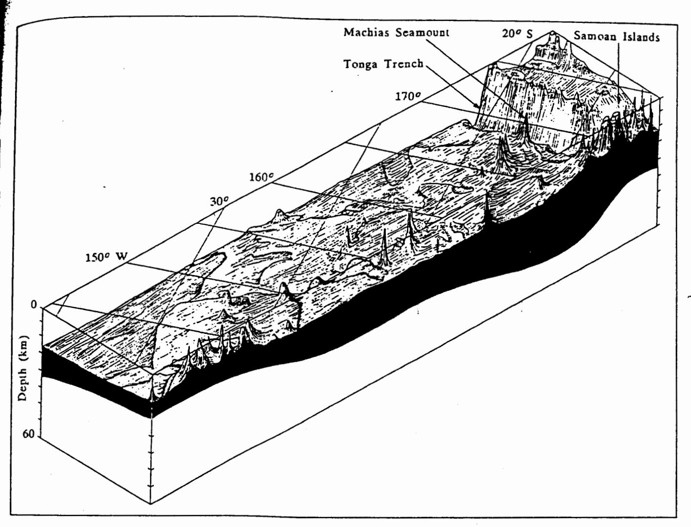

Figure 35. Cross-sectional view of the Samoan and Austral-Cook seamount and island chains, showing their proximity to the Tongan Trench. The view point is near the equator looking south toward the Tongan Trench. The black shading was added by the artist and does not reflect crustal structure. Drawing by Dick Rhodes.

tion. As in the Hawaiian case, this represents a temporal succession, but unlike Hawaii, the transition is from more to less depleted compositions through time." Readers desiring more information of these petrologic arguments are referred to the references previously cited.

## THE CORAL REEF PROBLEM

In the early 1800's the descriptions of atolls as great rings of coral around calm lagoons, within the deep Pacific captured the interest of many. Charles Lyell (who was mentor to Charles Darwin) suggested the atolls were the crests of submarine volcanoes overgrown by coral (Darwin, 1842). Darwin conceived the idea that volcanoes grow from the sea floor, form high volcanic islands, then die, subsiding

into the sea. Corals grow on the shorelines rimming the volcanic islands; as the volcanoes subside, the corals grow upward, leaving a gap between the barrier reef and the central volcanic island. As subsidence continues and the volcano subsides below sea level, the coral atoll remains. Darwin used direct observations from the fouling of ship bottoms to estimate coral growth rates, concluding corals would have no difficulty in growing fast enough to keep up with subsidence. Darwin's observations were followed by those of James Dana (1875), whose book "Corals and Coral Islands," increased the acceptance of Darwin's ideas on island subsidence.

As a consequence of the Challenger Expedition, John Murray rejected the subsidence hypothesis (Menard, 1986). As a result of the Challenger Expedition, Murray

was aware of the deep sea sedimentation of skeletons of microorganisms in the sea. He concluded atolls formed because sediments accumulated on the summit of seamounts, eventually producing shallow banks from which corals could grow. The Murray hypothesis gained considerable support in the late 1880's. Public interest in the Challenger Expedition contributed to the favorable reception of Murray's hypothesis. Darwin's reaction to the hypothesis was that he would like to see some "doubly rich millionaire" pay for borings of atolls to test the hypotheses. The text by Stoddart (this volume) outlines the results of the scientific drilling of atolls, including the early drilling by the Royal Society of London on Funafuti Atoll. Because the early drilling did not reach volcanic rock, arguments regarding the origin of atolls continued. The ideas of Murray and Daly have been referred to as the "antecedent platform theory"; simply stated, reefs grew on pre-existing platforms. Daly (1910) analyzed atolls and concluded that the larger atolls had lagoons of uniform depth (70-90 m). He concluded that during the ice ages the cold waters killed reef building organisms, exposing coastlines to erosion. The oceanic platforms were planed off by waves during periods of low sea level (when water was locked in ice caps). After the ice ages, the seas warmed, coral thrived again, and corals grew to the sea surface, forming barrier reefs on the outer edges of the islands which had been partially truncated. This theory is referred to as the glacial-control hypothesis. Many important observations were made in Samoa early in the 1900's in order to evaluate these hypotheses explaining the nature and occurrence of Pacific coral reefs.

In 1918, Mayor observed wave cut benches around Tutuila at an elevation of 2-3 m above high tide. Daly (1924) observed similar wave cut benches and suggested that sea level was 2-4 m higher than present sea level. Observations were also recorded on the emergent wave-cut benches exposed on the eastern shore of Aunuu Island, Rose Atoll, Ofu and Tau

Daly (1924) states, "the prolonged denudation of Tutuila was naturally accompanied by the offshore deposition of much sediment." The sediment built broad shelves on the flanks of the seamount. Daly estimated that the total area of shelf surrounding Tutuila is 330 square kilometers, within the 100-fathom (183 m) line. The shelf area is twice that of the island. These observations lend credence to the antecedent platform theory. Davis (1921) examined U. S. Hydrographic maps of Tutuila, and stated, "the shallower parts of the bank are interpreted as submerged fringing and barrier reefs, which are supposed to rest on a wave-cut platform now lying between 60 and 70 fathoms (109–128 m) below sea level by reason of island subsidence."

Chamberlin (1924) attempted to examine the coral reefs of Tutuila in terms of Daly's (1910, 1915) glacial con-

trol theory. Chamberlin states, "as far back as 1868, Alfred Tylor suggested that the upper 600 feet (183 m) of coral deposits in the Pacific Ocean might be explained as well by oscillation of sea-level due to the ice-caps of the glacial period as by the accepted hypothesis of sea-bottom subsidence" (Alfred Tylor, 1868).

Penck (1894), von Drygalski (1887), and Daly (1915) estimated the lowering of sea level by withdrawal of water into Pleistocene ice-caps, between 150 and 55 m below present sea level.

Chamberlin (1924) examined the maps constructed by Mayor (1920). These maps indicate that submerged barrier and fringing reefs are present and are well highlighted by the 32-fathom (58 m) or 40-fathom (73 m) contours. Chamberlin also provided additional evidence of planation of Tutuila by pointing out the presence of eroded extrusive and intrusive bodies (e.g., cockscomb trachýte body) situated offshore Tutuila. He concludes the slopes of Tutuila extended at least halfway and likely much further, toward the margin of the existing platform. Chamberlin concluded the broad shelf was partly the result of erosion of the land surface and the buildup of detritus offshore and "partly from the work of the sea." He indicated that the extent of reef growth on the platform was uncertain. During the formation of the reefs, "the sea must have been creeping higher and higher upon Tutuila, as indicated by the vertical thickness of coral. Further subsidence followed the building of the reefs, for they are now deeply submerged." Chamberlin believed that the reef growth on a wave-cut platform rather than on the slopes of a sinking island represented a significant departure from the Darwin-Daly coral reef hypotheses. Davies (1921) however argues very convincingly that this idea did not represent a significant departure from Darwin's writings.

Daly (1924) raised a question about the absence of protecting reefs around Tutuila. Daly stated, "that the island was long devoid of protecting reefs, in spite of the existence of a shelf, is shown by the great height of the sea cliffs, cut before the 6 m shift of ocean level. . . . This reefless condition of the island may thus conceivably have been continued from the last glacial stage. But, the factor leading to the special prolongation of the reefless condition is not easy to discover." Daly (1924) concludes that "subsidence, probably differential, [is required] in order to explain the drowned barrier reef around Tutuila."

Mayor (1924) reported on studies of the coral reefs of Samoa. His in situ investigations of sediment accumulation, dissolution, and so forth, are very insightful. He placed 5 lb (2.2 kg) fragments of tagged reef coral in the lagoon landward of the barrier reef. He returned nine months later and retrieved the stones. He found an average of 115 g weight had been lost. He estimated it would require only 14.5 years to "wholly disintegrate" rocks of this size. Mayor

concluded that organic as well as physical abrasion of corals, concluded that organic as well as physical abrasion of corals, cot dissolution, accounts for lagoon formation around the summary (1929) organic that the state of the state of the state of the state of the state of the state of the state of the state of the state of the state of the state of the state of the state of the state of the state of the state of the state of the state of the state of the state of the state of the state of the state of the state of the state of the state of the state of the state of the state of the state of the state of the state of the state of the state of the state of the state of the state of the state of the state of the state of the state of the state of the state of the state of the state of the state of the state of the state of the state of the state of the state of the state of the state of the state of the state of the state of the state of the state of the state of the state of the state of the state of the state of the state of the state of the state of the state of the state of the state of the state of the state of the state of the state of the state of the state of the state of the state of the state of the state of the state of the state of the state of the state of the state of the state of the state of the state of the state of the state of the state of the state of the state of the state of the state of the state of the state of the state of the state of the state of the state of the state of the state of the state of the state of the state of the state of the state of the state of the state of the state of the state of the state of the state of the state of the state of the state of the state of the state of the state of the state of the state of the state of the state of the state of the state of the state of the state of the state of the state of the state of the state of the state of the state of the state of the state of the state of the state of the state of the state of the state of the state of t

Davies (1928) argues that the glacial-control theory is brigely invalidated by abundant evidence of island introducing ability. Davies views Darwin's theory "modified to adrantage," as preferable. He states, "subsidence, therefore, appears to be essential not alone in disposing of outwashed detritus, but also in introducing the special conditions which permit the first successful establishment of young reefs and their further growth."

Stearns (1941) states that both Tutuila and Upolu are characterized by drowned barrier reefs. Stearns (1944) reports that soundings off Upolu indicate a submarine shelf exists 46-55 m along the shore and 73-91 m at a distance of 15-5 km offshore, which is similar in size and width to the drowned barrier reef on Tutuila. Stearns also correlates the submarine slope break to the shore line at the time of the 'great erosional period" at least 182 m below the present shore line. Stearns concludes the drowned barrier reef rests on a thick section of marine and land deposits on an older platform. The studies of the past century indicate that large submarine platforms are present off the coastlines of the Samoan Islands. Modern studies of reef platforms in the Hawaiian chain indicate that similar platforms and wave-cut benches are extremely common on the slopes of the islands and seamounts down to 3 km. These observations by Moore and Fornari (1984) and Keating (1989) indicate that subsidence is the most important factor in the formation and drowning of reefs on seamounts.

## Modifications to the Barrier Reefs

Maps showing the extent of reefs off the Samoan Islands indicate that they are very discontinuous. The discontinuity is caused by mass wasting of the flanks of the volcanoes and modern volcanism which buries the reefs. Thomson (1921) noted that barrier reefs are well-developed in Samoa but "by no means form continuous girdles to the islands." He pointed out that locally it is assumed that the absence of the offshore reef and presence of an "ironbound" (rocky) coast, is a reflection of recent volcanism. He observed that while this is true in Savaii, it "is by no means always the case in Upolu." He proposed that the drowning of the coasts by depression and down-faulting of parts of the coast was an important factor in removing the barrier reef. Thomson suggests that the mass wasting of the flanks of the volcano produced Fagaloa Bay, precluding a simple history of a drowned valley resulting from a change in sea level.

## Modern Sea Level

The presence of drowned reefs, truncated ridges, cliffed coastlines, and wave-cut benches in Samoa, document the power of the sea to modify the coastline. Modern

studies of climate predict a rise of sea level. The nature and magnitude of such a rise is hotly debated. Global change and its effect on the Pacific islands has also been a topic of wide attention. Islands throughout the Pacific will be affected by even a small rise in sea level. Nunn (1988) has examined the possible areas of inundation for selected parts of the Cook Islands, Fiji, Kiribati, Tonga, and Western Samoa. For Western Samoa, only the area around the capital city of Apia was examined. Nunn reports that most of the coastal mangrove coastal plain would be inundated by a slight rise. If the rise reached 1.5 m, most of the commercial center of Apia, the government building on the Mulinuu Point, and many of the hotels would not be exposed to the sea. A rise to 3.5 m would double the land area impacted and would affect most of the commercial and residential area of Apia.

## General Unresolved Questions About the Geology of Savaii

Most geological studies of Pacific islands have been concentrated on the islands of Hawaii. Thus the geological observations on Hawaii are generally used as examples of island volcanism to which all other island groups are compared. Relative to the Hawaiian group, the Samoan group appears anomalous. First, the islands grow larger from east to west, rather than west to east as in Hawaii. Secondly, active volcanism is recorded on both the eastern and western ends of the chain. In Hawaii, the active volcanism is found only on the eastern end. Thirdly, the southeasternmost island in the Samoan chain is an atoll rather than an active volcano. And finally, the tholeiitic rocks so abundant in Hawaii are nearly absent in Samoa. Alkalic rocks and transitional rocks are dominant in Samoa. These rocks constitute a veneer in the Hawaiian Islands, but in Samoa appear to form nearly the entire mass of the

If Hawaii is the proper corollary, then we should be able to use the age relations observed on Tutuila and Upolu to estimate the age of Savaii, providing the volcanic propagation rates are similar to those in Hawaii. Figure 33 illustrates the available radiometric dates for the Samoan chain. The extrapolation of age from the illustration suggests that the age for Savaii should be approximately 4 Ma. The paleomagnetic data suggest ages from 1 to 3 Ma.

The absence of older rocks on Savaii is a major concern of scientists working on the Samoan islands. The majority of the landforms on Savaii are very young. Most geologists have assumed that the younger volcanics bury the much older shield-building volcanics. Thus, a deeper tholeiitic core should be present and be simply capped by a thick sequence of eroded and weathered debris which is, in turn, covered by the Recent post-erosional basalts. If this is the case, this structure has important implications relative to

ground water supplies. In order to examine the possibility, dredging is needed on the lower submarine slopes of Savaii in order to obtain samples of the deeper shield-building lavas forming the lower slopes of the seamount. Recently, a side-scan sonar survey was conducted on the southern flank of Savaii. The side-scan image shows the slopes are relatively free of volcanic cones. This lack of obvious volcanism, is suggestive that Savaii is indeed an old volcano with a thick cap of Recent volcanism.

### Tectonic setting

Studies of the bathymetric trends of the linear seamount and island chains in the Pacific (e.g., Clague and Jarrard, 1973; Jarrard and Clague, 1977; Epp, 1978) have yielded a great deal of information regarding the tectonic history of the Pacific plate. Linear seamount chains in the Pacific are numerous and varied. The Hawaiian, Emperor, and Line Islands seamount chains are the best studied. West of these three seamount and island chains, however, the bathymetry becomes extremely complex, and the trends are so numerous that even the linear bathymetric trends become less apparent. Analyses of the bathymetric trends show that most of the Pacific seamount and island chains lie on parallel small circles about Pacific plate hot spot poles. The Hawaiian Islands and Emperor Seamounts have been associated with a melting anomaly (e.g., Morgan, 1972; Shaw and Jackson, 1973) referred to as a hot spot. Very limited radiometric, petrographic or paleomagnetic results are available from the western and southern Pacific seamount chains, particularly those that are old and submerged. Due to the lack of dating of the western Pacific seamount chains it is difficult to determine if these chains display simple age progression patterns like the Hawaiian-Emperor chain, or if they were necessarily produced by passage of the Pacific plate over relatively fixed melting anomalies, or hotspots, in the mantle.

The Line Islands chain, for example, has proven to be a composite of two or more major volcanic episodes (Jarrard and Clague, 1977; Jackson, 1976; Saito and Ozima, 1977; Jackson and Schlanger, 1976; Schlanger et al., 1984; Keating, this volume). Clague and Jarrard (1973) and subsequent workers have proposed that the Samoan Islands are a hot spot trace. Hawkins and Natland (1975) and Natland (1980) suggest that plate deformation associated with subduction in the nearby Tonga Trench has influenced, perhaps even caused, Samoan volcanism. It has been suggested that the deformation has determined the location and orientation of Samoan shield volcanoes, and contributes to the unusual volume of post-erosional volcanism at the western end of the chain. This subduction-related deformation has determined the orientation of the posterosional volcanic rift zone, and has deformed the sea floor around the Samoan islands.

The results of new studies provide basic observations that constrain the origin, age, and evolution of the Samoan Islands and Melanesian borderland seamounts (Brocher, 1985; Duncan, 1985; Natland and Turner, 1985; Sinton et al., 1985; Keating, 1985). These authors suggest that the results of the individual studies are consistent with a hot spot origin for the Samoan islands. In examining the data collectively, sparsity of data becomes an important concern. At the present time, the paleomagnetic, radiometric, and geochemical data remain very limited. The paleomagnetic data, for example, can be correlated with a hot spot model for the origin of the Samoan islands. But at the same time, the available data can also be used to support a model for progressive volcanism toward Savaii, which is quite inconsistent with a hot spot model. Likewise, the existing radiometric dates on the islands are limited; they allow a positive correlation with a hot spot model in only two islands and two seamounts west of the Samoan chain. Thus, although the data are "broadly consistent with a hot spot mode of origin for the volcanoes," as stated by McDougall (personal communications, 1984), it is important that variations of the hot spot mode of origin be examined in order to explain the anomalous patterns of volcanism observed in the Samoan Islands.

Duncan (1985) shows that recent (0.8 Ma) volcanic activity has occurred on Wallis Island (roughly 180 nm west of Savaii; Fig. 36). On the basis of the present geological knowledge of the Samoan islands, it is likely that the latest volcanism is contemporaneous on Wallis, Savaii, and the Manua islands. Could these three islands be related? The three form a linear trend that cuts across the main trend of the Samoan group. Assigning a deformational history to this recent activity, as suggested by Natland, resolves many of the anomalous features of the volcanic propagation in the Samoan chain. Continued studies of the age, geochemistry, and magnetic history associated with mapping of these islands and seamounts are the key to our knowledge of the evolution of this unusual chain of islands and seamounts.

## **ACKNOWLEDGMENTS**

This review has been many years in the making. Without the encouragement of Harold Stearns, it would never have been completed. The opportunities to visit Harold and his wife, stimulated this work. I also was encouraged by Paul Eyre, whose conversations regarding the hydrology aided me in completing this manuscript. I thank Gary Stice, Floyd McCoy, and Paul Eyre for their excellent reviews of the paper. I also thank Don Tarling and Jim Natland for their encouragement during the final stages of manuscript production. The figures were drafted by Dick Rhodes and Kenneth Helsley. I thank the Agency for International Development for support of this undertaking and

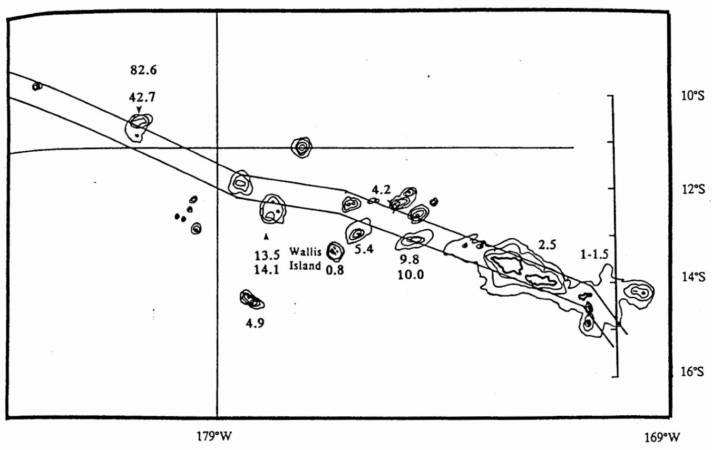

Figure 36. Map of the Samoan island chain and the seamounts and banks of the Melanesian Borderland. Radiometric dates from McDougall (1985) and Duncan (1985) are shown along the projection of the hot spot trace constructed parallel to that of the Hawaiian chain by Epp (1978). Wallis Island is dated as 0.8 Ma.

the National Science Foundation for funding the paleomagnetic studies cited here. Hawaii Institute of Geophysics contribution no. 2317.

#### REFERENCES

Anderson, T., 1910, The volcano of Matavanu in Savaii: Q. Jour. Geol. Soc. Lond., v. 66, p. 621-639.

Anderson, T., 1911, Matavanu, a new Volcano in Savaii (German Samoa), Rep. Brit. Assoc., v. 80, p. 654.

Anderson, T., 1912, Matavanu: A New Volcano in Savaii (German Samoa), Proc. Roy. Inst. Great Brit., v. 19, p. 856.

Anderson, D.L., 1982(a), Hotspots, polar wander, Mesozoic convection and the geoid: Nature, v. 297, p. 391-393.

Anderson, D.L., 1982(b), Isotopic evolution of the mantle, the role of magma mixing: Earth and Planetary Science Letters, v. 57, p. 1-12.

Anderson, D.L., 1984, The Earth as a planet: paradigms and paradoxes,

Anderson, D.L., 1984, The Earth as a planet: paradigms and paradoxes, Science, v. 223, p. 347-355.

Anderson, D.L., 1985, Hotspot magmas can form by fractionation and

contamination of mid-ocean ridge basalts: Nature, v. 318, p. 145-149. Angenheister, G., 1909, Beobachtungen am Vulkan der Insel Savaii'i (Samoa): Globus. II., March 1909, p. 138-42.

Army Corps of Engineers, 1980, American Samoa coral reef inventory: Honolulu, Pacific Ocean Division, 314 pp.

Austin, Smith and Associates, 1963, Report covering a master planned water supply and distribution system for the Pago Pago and Tafuna areas: A report to the government of American Samoa, 48 pp.

Austin, Smith and Associates, 1972, Report updating the 1963 master planned water supply and distribution system for the Pago Pago and Tafuna areas: Honolulu, Hawaii, 48 pp.

Bartrum, J.A., 1927, Igneous Rocks from Western Samoa: N.Z. Inst., Trans, v. 57, p. 253-264.

Bentley, C.B., 1975, Ground water resources of American Samoa with emphasis on the Tafuna - Leone plain, Tutuila Island: U.S. Geological Survey Water Resources Investigation, 29-75, 32 pp.

Bramlette, M.N., 1926, Some marine bottom samples from Pago Pago Harbor, Samoa: Washington, Carnegie Institution Publication, 35 pp.

 Brocher, T.M., 1985, Geological Investigations of the Northern Melanesian Borderland, Earth Science Series, v. 3: Houston, TX, Circum-Pacific Council for Energy and Mineral Resources, 199 pp.
 Bryan, E.H., Jr., 1939, Rose Atoll, U.S.A., Paradise of the Pacific, v. 51, p. 9, 25-26.

Bryan, E.H., 1941, American Polynesia, Coral Islands of the Central Pacific: Tongg Printing, Honolulu.

Buchanan-Banks, J.M., 1981, The Oct 28, 1979, Landsliding on Tutuila, American Samoa: U.S. Geological Survey Open File Report No. 81-0081, 21 pp.

Chamberlin, R.T., 1924, The geologic interpretation of the coral reefs of Tutuila, American Samoa: Washington, Carnegie Institution Publication 340, p. 147–172.

Clague, D.A., and Jarrard, R.D., 1973, Tertiary Pacific plate motion deduced from the Hawaiian-Emperor Chain: Geological Society of America Bulletin, v. 84, p. 1135-1154.

- Cline, M.G., 1955, Soil Survey: Territory of Hawaii, USDA Series 1939, No. 25.
- Couthouy, J.P., 1842, Remarks upon coral formations in the Pacific: Boston Journal of Natural History, v. 4, p. 67-105; 137-162.
- Coulbourn W., Hill, P.J. and Bergersen, D.D., 1989, Machias Seamount, Western Samoa: sediment remobilization, tectonic dismemberment and subduction of a guyot: Geo-Marine Letters v. 9, p.119-125.
- Daly, R.A., 1924, The geology of American Samoa, Carnegie Institution Publication 340, p. 95-145.
- Dana, J.D., 1849, U.S. Exploring expedition during the years 1838-1842 under command of Charles Wilkes, U.S.N., 10, Geology; New York.
- Dana, J.D., 1875, Corals and Coral Islands: London, Sampson Low, Marston, Low and Searle, 348 pp.
- Dana, E.S., 1880, Characteristics of Volcanoes: London, Low.
- Darwin, C., 1842, The structure and distribution of coral reefs, reprinted by the University of Arizona Press in 1984, Tucson, 205 pp.
- Davies, G.F., 1983, Geophysical and isotopic constraints on mantle convection (abs.): Eos, Transactions of the American Geophysical Union, v. 63, p. 612.
- Davies, G.F., 1984, Lagging mantle convection, the geoid and mantle structure: Earth and Planetary Science Letters, v. 69, p. 187-194.
- Davies, G.F., 1981, Regional compensation of subducted sphere: effects on geoid, gravity and topography from a preliminary model: Earth and Planetary Science Letters, v. 54, p. 431-441.
- Davis, W.M., 1921, The coral reefs of Tutuila, Samoa: Science, v. 53, p. 559-565.
- Davis, D.A., 1963, Ground-water reconnaissance of American Samoa: U.S. Geological Survey Water-Supply Paper 1608-C, 21 pp.
- DePaolo, D.J. and Wasserberg, G.J., 1976, Nd isotopic variations and petrogenetic models: Geophysical Research Letters, v. 3, p. 249-252.
- Dingier, J., R., Wolf, S. C, and Carlson, D., 1986, Offshore sand resources along the south shore of Tutuila Island, American Samoa (1978) U.S. Geological Survey Open-File Report No. OF 86-0112, 43 pp.
- Dingler, J. R., Carlson, D.V.; and Sallenger, A.H., Jr., 1987, Map showing locations and statistical parameters of beach and offshore sand samples, Tutuila Island, American Samoa: U.S. Geological Survey Miscellaneous Field Studies Map. No. MF-1875, 1 sheet.
- Doornobs, D.J. and T. Hilton, 1989, Models of the core-mantle boundary and the travel times of internally reflected core phases: Journal of Geophysical Research, v. 94, p. 15, 741-15, 751.
- Duncan, R.A., 1985, Radiometric ages from volcanic rocks along the New Hebrides-Samoa Lineament, in T. Brocher, ed., Geological Investigations of the Melanesian Borderland, Earth Science Series, v. 3: Houston, TX, Circum Pacific Council for Energy and Mineral Resources, p. 67-76.
- Dupre, B. and Allegre, C.J., 1983, Pb-Sr isotope variation in Indian Ocean basalts and mixing phenomena: Nature, v. 303, p. 142-146.
- Dziewonski, A., 1984, Mapping the lower mantle: determinations of lateral heterogeneity in P velocity up to degree and order 6: Journal of Geophysical Research, v., 89, p. 5929-5952.
- Dziewonski, A.M. and D.L. Anderson, 1981, Preliminary reference earth model (PREM): Physics of the Earth and Planetary Interiors, v. 25, p. 297-356.
- Dziewonski, A.M and D.L. Anderson, 1983, Travel times and station corrections for P waves at teleseismic distances: Journal of Geophysical Research, v. 88, p. 3295-3314.
- Dziewonski, A.M. and Gilbert, F., 1976, The effect of small, aspherical perturbations on travel times and a re-examination of the corrections for ellipticity: Geophysical Journal of the Royal Astronomical Society, v. 44, p. 7-17.
- Edwards, E., and Hamilton, G., 1915, Voyage of H.M.S. Pandora dispatched to arrest the mutineers of the Bounty in the South Seas, 1790-91: London, Edwards, 117 pp.
- Epp, D., 1978, Age and tectonic significance among volcanic chains on the Pacific Plate, Ph.D. Dissertation, University of Hawaii, Honolulu, HI.

- Exon, N.F., 1982, Offshore sediments, phosphorite and manganese nodules in the Samoan region, southwest Pacific: South Pacific Marine Geological Notes, v. 2, p. 103-120.
- Eyre, Paul, R., 1990, Ground water resources of Tutuila, American Samoa:
  U.S. Geological Survey Water Resources Investigation Report, 55 pp.
- Friederici, G., 1910, Ein besuch des vulkans von Savai' i (Samoa): Globus, v. 97, p. 14.

-

- Friedlander, I., 1910, Beitrage zur geologie der Samoa Inseln: Abh. Bayer Akad d. Wissensch II kl. Bd. 24, pp 507-541.
- Gyyben, W.B., 1888, Nota in verband net de voorgenoman putboring nabi, Amsterdam. Tidschrift van Let Koninklijk Inst. van Ing.
- Grevel, W., 1911, Der Matavanu auf Savai'i am 9 April 1, 1911, Z. Ges. Erdk. Berl., p. 485 - 491.
- Hamilton, W.M. and Grange, L.I., 1938, The soils and agriculture of Western Samoa: New Zealand DSIR Bulletin 61, Wellington.
- Hart, S.R., 1984, A large scale isotope anomaly in the Southern Hemisphere mantle: Nature, v. 309, p. 753-757.
- Hawkins, J.W. and Natland, J.H., 1975, Nephelinites and basanites of the Samoa linear volcanic chain: the possible tectonic significance: Earth and Planetary Science Letters, v. 24, p. 427-439.
- Hedge, G.E., 1966, Variations in radiogenic strontium found in volcanic rocks: Journal of Geophysical Research, v. 71, p. 6119-6120.
- Hedge, C.E., Peterson, Z.E. and Dickinson, W.R., 1972, Petrogenesis of Lavas from Western Samoa: Geological Society of America Bulletin, v. 83, p. 2709-2714.
- Herzberg, A., 1901. Wasserversorgung einger Nordseebader. J. Gasbeleucht. Wassenversorg., v. 44, p. 815-819.
- Holmes, A., 1945, Principles of Physical Geology, 2nd Ed.: New York, Ronald, 532 pp.
- Hubbard, N.J., 1971, Some chemical features of lavas from the Manua Islands Samoa: Pacific Science, v. 25, p. 178-187.
- Hubbert, M. K., 1940, The theory of ground-water motion: Journal of Geology, v. 45, p. 785-944.
- Hunt, C.D., Jr., Ewart, C.J., and Voss, C.I., 1988, Region 27, Hawaiian Islands, in Back, W., Rosenshin, J.S., and Seaber, P.R., eds., Hydrogeology, Geology of North America, v. O-2: Boulder, CO, Geological Society of America.
- Hutchinson, G.E., 1950, The Biochemistry of Vertebrate Excretion: Bulletin American. Museum Natural History, v. 96, 554 pp.
- Jackson, E.D. and Schlanger, S.O., 1976, Regional synthesis, Line Islands, Tuamotu chain and Manihiki Plateau, Central Pacific Basin:Initial Reports of the Deep Sea Drilling Project, v. 33, p. 915-1027.
- Jarrard, R.D. and Clague, D.A., 1977, Implications of Pacific island and seamount ages for the origin of volcanic chains: Reviews of Geophysics and Space Physics, v. 15, p. 57-76.
- Jensen, H.I., 1907, The geology of Samoa and the eruption in Savaii: Proceedings of the Linnean Society of New South Wales, v. 31, p. 641-672.
- Jensen, H.P., 1908, Chemical note on a recent lava from Savaii: Proceedings of the Linnean Society of New South Wales, v. 32, p. 706-707.
- Kaiser, E., 1904, Beitrage zur petrographic und geologie der Deutschen Sudsee-Inseln. Jb. Preuss. Geol. Landesanst. v. 24, p. 91-121.
- Klautsch, 1907, Der jungste vulkanausbruch auf Savaii, Samoa Jahrb. K. Preuss. Geol. Landesanst., v. 28, p. 169-182.
- Kear, D. and Wood, B.L., 1959, The geology and hydrology of Western Samoa: New Zealand Geological Survey Bulletin, v. 63, p. 1-90.
- Kear, D., 1967, Geological notes on Western Samoa: New Zealand Journal of Geology and Geophysics, v. 10, p. 1446-1551.
- Keating, B., 1985a, Paleomagnetic studies of the Samoa Islands: results from the islands of Tutuila and Savaii, in T. Brocher, ed., Geological Investigations of the Melanesian Borderland, Earth Science Series, v. 3: Houston, TX, Circum-Pacific Council for Energy and Mineral Resources, p. 187-199.
- Keating, B.H., 1985b, Structural failure and drowning of Johnston Atoll, Central Pacific Basin, in Keating, B.H. Fryer, P., Batiza, R., and Boehlert, G.W., (eds) Seamounts, Islands, and Atolls: Washington, DC, American Geophysical Union, Geophysical Monograph 43, p. 49-60.

Keating, B.H., 1987, Summary of the radiometric ages from the Pacific, Intergovernmental Oceanographic Commission, Technical Series, 32, 67 pp.

Keating, B.H., 1989, Subsidence records from Pacific atolls and islands (abst.): Eos, Transactions of the American Geophysical Union, p.

Keating, B.H., Insular geology of the Line Islands, this volume.

Lipman, C.B. and Taylor, J.K., 1924, Bacteriological studies on Rose Islet soils: Carnegie Institution Publication 340, p. 209-217.

Lonsdale, P., 1975, Sedimentation and tectonic modification of the Samoa archipelagic apron: Bulletin, American Association of Petroleum Geologists, v. 59, p. 1333-1362.

Machesky, L.F., 1965, Gravity relations in American Samoa and the Society Islands: Pacific Science, v. 19, p. 367-373.

Macdonald, G.A., 1944, Petrography of the Samoan Islands: Bulletin of the Geological Society of America, v. 55, p. 1333-1362.

Macdonald, G.A., 1968, A contribution to the petrology of Tutuila, American Samoa: Sonoerdruck Aus der Geologischen Rundscha Band, v. 57, p. 821-837.

Macdonald, G.A. and Abbott, A.T., 1970, Volcanoes in the Sea, the Geology of Hawaii: Honolulu, The University Press of Hawaii, 282,

398 (reprinted 1974).

- Manheim, F.T. and Lane-Bostwick, C.M., 1989, Chemical composition of ferromanganese crusts in the world ocean: a review and comprehensive database, U.S. Geological Survey Open-File Report 89-020, 201
- Matsuda, J., Notsu, K., OKano, J., Yaskawa, K and Chungue, L., 1984, Geochemical implications from Sr isotopes and K-ar age determinations for the Cook-Austral Islands Chain: Tectonophysics, v. 104, p. 145-154.

Matsuoka, I., 1978, Flow characteristics of streams in Tutuila, American Samoa, U.S. Geological Survey Water Resources Investigations,

78-103, 34 pp.

Matsushima, Y., Sugimura, A., Berryman, K., Ishii, T., Maeda, Y., Matsumoto, E. and Yonekura, N., 1984, B. Research report of B-party: Holocene sea-level changes in Fiji and Western Samoa: sea-level changes and tectonics in the Middle Pacific: Report of the HIPAC project in 1981, 1982, 1983, Kobe University, Japan.

Major, A.G., 1920, The reefs of Tutuila, Samoa, in relation to coral-reef theories, Proceedings of the American Philosophical Society, v. 19,

p. 3-4.

Mayor, A.G., 1924, Rose Atoll, American Samoa, Carnegie Institution Publication 340, Washington, D.C., p. 73-79.

Mayor, A.G., 1924, Structure and ecology of Samoan reefs, Carnegie Institution Publication 340, Washington, D.C., p. 1-25.

McDougall, I., 1964, Potassium-argon ages from lavas of the Hawaiian Islands: Bulletin of the Geological Society of America, v. 75, p. 107-128.

McDougall, I., 1985, Age and evolution of volcanoes of Tutuila, American Samoa: Pacific Science, v. 39, p. 311-320.

McMurtry, G.M., De Carlo, E.H., Kim, K.H. and Vondehaar, D., 1986, Geochemical investigations of Co-rich ferromanganese crusts in the Hawaiian Exclusive Economic Zone: Addendum to the Final Report - Resource Assessment of Cobalt-Rich Ferromanganese Crusts within the Hawaiian Exclusive Economic Zone, U.S. Department of the Interior, Mineral Management Service, Cooperative Agreement 14-12-001-30177, 92 pp.

Menard, H.W., 1986, Islands: New York, Scientific American Books, 230

Mohle, F., 1902, Beitrag zur petrographic der Sandwich - und Samoa -Insein: N. Jahrb. f. Min. u. Petr., Suppl., 15, p. 66-104.

Moore, J.G. and Fornari, D.J., 1984, Drowned reefs as indicators of the rate of subsidence of the Island of Hawaii: Journal of Geology, v. 92, p. 752-759.

Morgan, W.J., 1972, Deep mantle convection plumes and plate motion, Bulletin, American Association of Petroleum Geologists, v. 56, p. Morelli, A., and Dziewonski, A.M., 1987, Topography of the core-mantle boundary and lateral homogeneity of the liquid core: Nature, v. 325, p. 678-683.

Morrison, R.J., Regina, A., Prasad, R.A., and Asghan, A., 1986, Taxonomy of some Western Samoa benchmark soils: University of the South

Pacific, Environmental Studies Report 28, 65 pp.

Natland, J.H., 1975, Geology and tectonics of the Fagaloa shield volcano, island of Upolu, Western Samoa: plate bending, faulting and possible shear melting north of the Tonga Trench: Geological Society-America, Abstracts, Program, v. 6, p. 226.

Natland, J.H., 1980, The progression of volcanism in the Samoan Island volcanic chain: American Journal of Science, v. 280-A, p. 709-735.

Natland, J.H. and Turner, D.L., 1985, Age progression and petrological development of Samoan shield volcanoes: evidence from K-Ar Ages, lava compositions, and mineral studies, in T.M. Brocher, ed., 1985, Geological Investigations of the Northern Melanesia Borderland, Earth Science Series, v. 3: Houston, TX, Circum - Pacific Council for Energy and Mineral Resources, p. 139-172.

Nakamura, S., 1984, Soil survey of American Samoa, 1984: Washington, Department of Agriculture, Soil Conservation Service, 95 pp

Needham, R.E. Buland, R.P., Choy, G.L, Dewey, J.W., Engdahl, E.R., Sipkin, S.A., Spence, W., and Zirbes, M.D., 1982, Special earthquake report for the Sept. 1, 1981, Samoa Islands region earthquake: U.S. Geological Survey Open-File Report, 74 pp.

Newman, S., Finkel, R.C., and Macdougall, J.D., 1984, Comparison of Th-U disequilibrium systematics in lavas from three hot spot regions; Hawaii, Prince Edward and Samoa: Geochimica et Cos-

mochimica Acta, v. 48, p. 315-324.

Nunn, P. D., 1988, Recent environmental changes along southwest Pacific coasts and the prehistory of Oceania: developments of the work of the late John Gibbons: Journal of Pacific Studies, v. 14, p. 42-58.

Ollier, C.D. and Zarriello, P., 1979, Peapea lava cave, Western Samoa: British Cave Research Association, Transactions, v. 16, p. 133-142.

Palfreyman, W.D, et al., 1988, Geologic Map of the Circum-Pacific Region, Southwest Quadrant: Circum-Pacific Council for Energy and Mineral Resources, Tulsa, OK.

Powers, S., 1917: Tectonic lines in the Hawaiian Islands, Bulletin of the Geological Society of America, v. 28, p. 501-514

Penck, A, 1894, Morphologie der Erdoberflache, Vol. 2.

Pickering, C., 1876, Geographical distribution of animals and plants, [Part II]. U.S. Exploring Expedition 19, 2, 524 pp., Philadelphia.

Reinecke, F., 1905, Der neue vulkanische Ausbruch auf Savaii, Petermanns Mitt., v. 51, p. 255.

Reinecke, F., 1906, Der neue vulkenische ausbruch auf Savai' i, Petermanns Mitt., v. 52, p. 86-88.

Richard, J.J., 1962, Catalogue of the active volcanoes of the world including Solfatara fields; 13, Kermadel, Tonga and Samoa, 38, Inter. Volcano. Assoc. Napies.

Rison, W. and Craig, H., 1982, Helium 3; coming of age in Samoa. [abstr.]: Eos, Transactions, American Geophysical Union, v. 63, p. 1144.

Robertson, E.I., 1987, Gravity surveys of the Samoan Islands, Southwest Pacific Ocean: New Zealand Journal of Geology and Geophysics, v. 30, p. 233-240.

Sachet, M.H., 1954, A summary of information on Rose Atoll: Atoll

Research Bulletin, v. 5, p. 1-56. Saito, K.M., and Ozima, M., 1977, 40Ar/39Ar geochronological studies of submarine rocks from the western Pacific area, Earth and Planetary Science Letters, v. 33, p. 353-369.

Sapper, K., 1906, Der Matavanu-Ausbruch auf Savaii 1905-6. Nach Aufzeichnungen von Peter Mennel, Mitteilungen von Dr. B. Funk and gedruckten Berichten dargestellt Z. Ges. Erdk. Berl., p. 686-709.

Sapper, K., 1909, Neuere Mitteitungen über den Matavanu - Ausbruch auf Savai'i, Nach Aufzeichnungen von Pater Mennel and Dr. W. Grevel un nach gedruckten Berichten zusammengestellt, Z. Ges. Drdk. Berl, p. 172-180.

Sapper, K., 1911a, Nachrichten über den ausbruch des mata auf Savai'i vanu aus dem jahren 1909 and 1910, Z. Ges. Erdk. Berl., p. 702 - 786.

- Sapper, K., 1911b, Das ende des matavanu ausbruchs auf Savai'i, nach mitteilungen von Dr. W. Grevel und Pater Mennel, Z. Ges. Erdk. Berl., p. 701-704.
- Sapper, 1912, Nachklange zum Matavanu Ausbruch (Savai'i) Aus Breifen Von Pater Mennel und Dr. W. Grevel zusammenges - tellt, Z. Ges. Erdk. Berl., p. 445-451.
- Sapper, K., 1915, Bericht über die vulkanischen Ereignisse der Jahre 1895-1913, Beitr. Geophys, 14, Heft I, p. 35-97; Heft II, p. 99-100.
- Schlanger, S.O., Garcia, M.O., Haggerty, J.A., Keating, B.H., Naughton, J.J., Philpotts, J.A., Sager, W.W. and Duncan, R.A., 1984, Geologic evolution of the Line Islands, Journal of Geophysical Research, v. 89, p. 11261-11272.
- Schmittmann, J., 1911, Der feuersee auf Savai'i (Deutsch Samoa), Petermann's Mitt., 57, (1), 77-78, pl. 15 and 16.
- Schroth, C.L., 1970, Analysis and prediction of the properties of Western Samoa soils. Ph.D. thesis, Department of Agronomy and Soil Science, University of Hawaii, 259 pp.
- Schultz, L.P., 1940, The Navy surveying expedition to the Phoenix and Samoa Islands, 1939. Smiths. Explor. 1939, p. 45-50.
- Seelye, C.J., 1943, The climate of Pukapuka, Danger Islands, and, The climate of Aitutaki. N.Z. Meteor. Off. Series C. nos. 3: 1-8, 4: 1-8.
- Seelye, F.T., and Grange, L.I., Davies, L.H., 1938, The laterites of Western Samoa: Soil Science, v. 46, p. 23-31.
- Setchell, W.A., 1924, Vegetation of Rose Atoll: Carnegie Institution Publication 341, p. 255-261.
- Shaw, H.P and Jackson, E.D., 1973, Linear island chains in the Pacific: results of thermal plumes or graviational anchors?: Journal of Geophysical Research, v. 78, p. 8634-8652.
- Sinton, J.M., Johnson, K.T., and Price, R.C., 1985, Petrology and geochemistry of volcanic rocks from the Northern Melanesian Borderland, in T.M. Brocher, ed., 1985, Geological Investigations of the Northern Melanesian Borderland, Earth Science Series, v. 3: Houston, TX, Circum-Pacific Council for Energy and Mineral Resources, p. 35-65.
- Stearns, H.T., 1941, Ground water supplies and construction rock for United States Naval projects, Tutuila, Samoa. Unpublished Navy report, 1-24.
- Stearns, H.T., 1944, Geology of the Samoan Islands: Geological Society of America Bulletin, v. 55, p. 1279-1332.
- Stearns, H.T., 1946, Geology of the Hawaiian Islands, Hawaii Division of Hydrography, Bulletin. 8, 105 pp.
- Stice, G.D., 1968, Petrology of the Manua Islands, Samoa: Contributions to. Mineral Petrology, v. 19, p. 343-357.
- Stice, G.D. and McCoy, F.W. Jr., 1968, The geology of the Manua Islands, Samoa: Pacific Science, v. 22, p. 426-457.
- Stone, E.L., Jr., 1951, The soils of Arno Atoll, Marshall Islands: Atoll Research. Bulletin, v. 5, p. 1-56.
- Sugimura, A., Maeda, Y., Matsushima, Y. and Rodda, P., 1988, 8 Further report on sea-level investigation in Western Samoa: sea-level changes and tectonics in the middle Pacific, Report of the HIPAC Project in 1986 and 1987, Kobe University, Japan, p. 77-90.
- Tarling, D.H., 1962, Tentative correlation of Samoan and Hawaiian Islands using "reversals" of magnetization: Nature, v. 196, p. 882-883.
- Tarling, D.H., 1965, The paleomagnetism of the Samoan and Tongan Islands:: Geophysical Journal of the Roy Astronomical Society, v. 10, p. 497-513.
- Thomson, J.A., 1921, The geology of Western Samoa: New Zealand Journal of Science and Technology, v. 4, p. 49-66.
- Turner, G., 1979, Samoa, a hundred years ago and long before: together with notes on the islands of the Pacific: AMS Press (New York) 395 pp. (Reprint of 1884 ed. pub. by Macmillan, London).
- U.S. Environmental Protection, Agency, 1982, Secondary maximum contaminant levels (section 143.3 of part 143, National secondary drinking water regulations): U.S. Code of Federal regulations, Title 40, Parts 100 to 149, revised as of July 1, 1982, 374.

- U.S. Geological Survey, Water resources data for Hawaii and other Pacific areas, water year 1979; volume 2, Trust Territory of the Pacific Islands, Guam, American Samoa, and northern Mariana Islands, U.S. Geological Survey.
- U.S. Geological Survey, 1981, Water resources data for Hawaii and other Pacific areas, water year 1980; Volume 2, Trust Territory of the Pacific islands, Guam, American Samoa, and Northern Mariana Islands, 171 pp.
- U.S. Geological Survey, 1979, Water resources data for Hawaii and other Pacific areas, water year 1978; Vol.2, Trust Territory of the Pacific Islands, Guam, American Samoa and northern Mariana Islands: 121 pp.
- Upton, B.G.J. and Wadsworth, W.J., 1965, Geology of Reunion Islands, Indian Ocean: Nature, v. 207, p. 151-154.
- Valenciano, Santos, 1985, Trust Territory of the Pacific Islands, Saipan, Guam, and American Samoa, ground water resources: in National water summary 1984; hydrologic events, selected water- quality trends, and ground-water resources, Geological Survey Water-Supply Paper (Washington), 2275, 403-407.
- Upton, B.G.J. and Wadsworth, W.J., 1965, Geology of Reunion Islands, Indian Ocean: Nature, v. 207, p. 151-154.
- Von Bulow, W., 1906, De volkanische Tatigkeit auf Savaii und deren, Einwirkung auf die Wirstchaftlichen Verhattnisse der eigneboremen, Globus, p. 21-24.
- Weber, M., 1909, Eur petrogrpahic der Samoa-Inseln. Abh. K. Buyer. Akad. A. Wiss, II Kl., Bd. 24. Abh. 2, p. 290-310.
- Wegener, G., 1902, Vulklanausbruch in Savai'i, Dtsch. Kolon. Ztg., 19, p. 491-492.
- Wegener, G., 1903a, Die vulkanischen Ausbruche auf Savai'i, Z. Ges. Erdk. Berl., p. 208-219.
- Wegener, G., 1903b, Der vulkanausbruche in Samoa, Weltall., 3, p. 106-111.
- White, W.M. and Hoffman, A.W., 1982, Sr and Nd isotope geochemistry of oceanic basalts and mantle evolution. Nature, v. 299,p. 821-825.
- Wilkes, H.C., 1852, Narrative of the U.S. Exploring Expedition, Vol. 1, 1557 pp.
- Wingert, E.A., 1981, A coastal zone management atlas of American Samoa, University of Hawaii Cartographic Laboratory, Department of Geography, Honolulu.
- Wright, A.C.S., 1963, Soils and land use of Western Samoa: New Zealand Soil Bureau Bulletin, Wellington, 191 pp.
- Wright, Elizabeth, 1986, Petrology and geochemistry of shield-building and post-erosional lava series of Samoa; implications for mantle heterogeneity and magma genesis, Doctoral Dissertation, Univ. of California, San Diego, CA, 305 pp.
- Wright, Elizabeth, 1987, Mineralogical studies of Samoan ultramafic xenoliths; implications for upper mantle processes:, in Keating, B.H. Fryer, P., Batiga, R., and Boehlert, G.W., (eds) Seamounts, Islands, and Atolls: Washington, DC, American Geophysical Union, Geophysical Monograph 43, p. 221-234.
- Wright, Elizabeth, and White, William M., 1987, The origin of Samoa; new evidence from Sr. Nd, and PB isotopes: Earth and Planetary Science Letters, v. 81, p. 151-162.
- Yee, Johnson J., 1988, Trust Territory of the Pacific Islands, Saipan, Guam, and American Samoa, ground water quality: in National water summary 1986: hydrologic events and ground water quality (Moody, David W., compiler, et al.), U.S. Geological Survey Water supply paper, Rep No. W2325, p. 483-488.
- Yee, Johnson J., 1987, Trust Territory of the Pacific Islands, Saipan, Guam, and American Samoa ground water quality: U.S. Geological Survey Open-File Report No. OF 87-0755, p. 1-7.
- Zindler, A. and Hart, S.R., 1986, Chemical geodynamics, Annual Review of Earth and Planetary Sciences. p. 493-571.