# **A Biogeographic Assessment of the Samoan Archipelago**

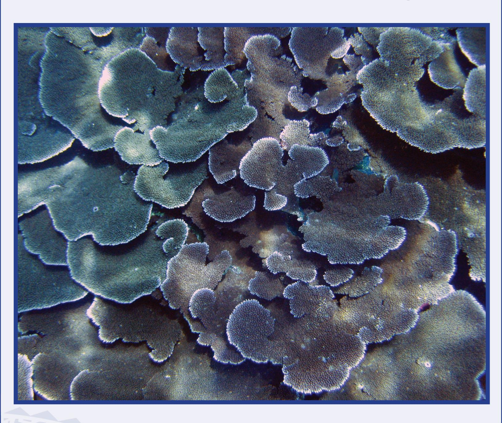

Matthew Kendall and Matthew Poti (Editors)

Prepared by NOAA/NOS/NCCOS/CCMA Biogeography Branch with Support from NOAA's Office of National Marine Sanctuaries and Coral Reef Conservation Program

NOAA Technical Memorandum NOS NCCOS 132

Citation for the entire Document:

Kendall, M.S. and M. Poti (eds.), 2011. A Biogeographic Assessment of the Samoan Archipelago. NOAA Technical Memorandum NOS NCCOS 132. Silver Spring, MD. 229 pp.

Example citation for an individual chapter (example of Chapter 3: Currents and Larval Connectivity):

Kendall, M.S., M. Poti, T. Wynne, B. Kinlan, L. Bauer. 2011. Ocean Currents and Larval Transport Among Islands and Shallow Seamounts of the Samoan Archipelago and Adjacent Island Nations. In: Kendall, M.S. and M. Poti (eds.), 2011. A Biogeographic Assessment of the Samoan Archipelago. NOAA Technical Memorandum NOS NCCOS 132. Silver Spring, MD. 229 pp.

The graphic wrapped on the cover was created by Kang Sevao of American Samoa and used with permission here. This tapa design symbolizes the creation of land and sea. The processes of island formation and reef growth are central to understanding biogeography of the Samoan Archipelago.

Mention of trade names or commercial products does not constitute endorsement or recommendation for their use by the United States Government.

# **A Biogeographic Assessment of the Samoan Archipelago**

Prepared by:

NOAA National Centers for Coastal Ocean Science (NCCOS) Center for Coastal Monitoring and Assessment (CCMA) Biogeography Branch 1305 East West Highway (SSMC-IV, N/SCI-1) Silver Spring, MD 20910 USA

July 2011

### Editors

Matthew S. Kendall CCMA Biogeography Branch

Matthew Poti CCMA Biogeography Branch and Consolidated Safety Services, Inc.

NOAA Technical Memorandum NOS NCCOS 132

United States Department National Oceanic and National Ocean Service

of Commerce Atmospheric Administration

Gary Locke Jane Lubchenco David Kennedy

Secretary Administrator Assistant Administrator

### **ABOUT THIS DOCUMENT**

This assessment represents the continuation of ongoing partnerships between NOAA's National Centers for Coastal Ocean Science (NCCOS), Center for Coastal Monitoring and Assessment (CCMA), Biogeography Branch and the Office of National Marine Sanctuaries (ONMS) and Coral Reef Conservation Program (CRCP). The Biogeography Branch has applied a biogeographical approach to inform the management of marine resources within both coral reefs and National Marine Sanctuaries since 1998. To date, nine ONMS sites and most of the coral reef ecosystems in US states and territories have had some level of biogeographic characterization or mapping completed through these partnerships.

The results of this ecological characterization are available via website. For more information on this project and those in other ONMS and reef ecosystem locations please visit the Biogeography Branch webpage at http://ccma.nos.noaa.gov/about/biogeography/ or direct questions and comments to:

Chris Caldow, Biogeography Branch Chief National Oceanic and Atmospheric Administration 1305 East West Highway SSMC 4, N/SCI-1 Silver Spring, MD 20910

Phone: (301) 713-3028

Email: Chris.Caldow@noaa.gov

### **ACKNOWLEDGEMENTS**

This particular work was jointly funded by ONMS, CRCP, and CCMA and was conducted in consultation with local scientists and managers. The assessment would not have been possible were it not for the joint funding commitment and generous in-kind contributions from regional partners including suggestions during project inception, sharing of key datasets, contributions of co-authors, and review of draft analyses and documents. Mark Monaco led initial development of the project. Jamie Higgins formatted and organized the figures, tables, images, and text into this document.

### **EXECUTIVE SUMMARY**

This report examines the marine biogeography of the Samoan Archipelago (~14º S latitude along the international date-line) with a focus on regional ocean climate, connectivity among islands due to larval transport, distributions of reef fish and coral communities, and the extent of existing marine protected areas. Management decisions and prior assessments in the archipelago have typically been split along the international political boundary between the islands of Samoa and those of American Samoa despite their close proximity and shared resources. A key goal in this assessment was to compile data from both jurisdictions and to conduct the characterization across the entire archipelago. The report builds upon earlier assessments by re-analyzing and interpreting many pre-existing datasets, adding more recent biogeographic data sources, and by combining earlier findings into a multidisciplinary summary of marine biogeography.

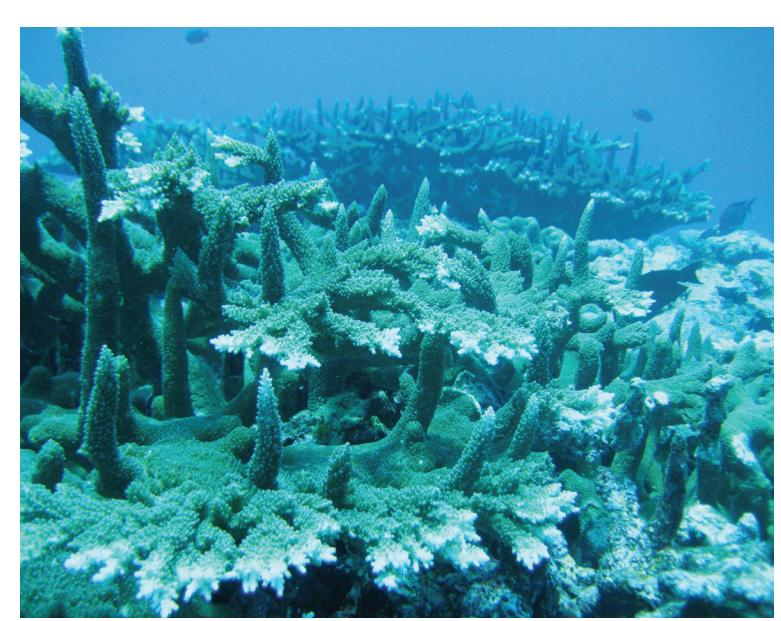

**Image 1.** A coral reef in the National Park of American Samoa near Vatia. Photo credit: Matt Kendall, NOAA Biogeography.

The assessment is divided into 5 chapters and supporting appendices. Each chapter was written and reviewed in collaboration with subject matter specialists and local experts. In Chapter 1, a short introduction to the overall scope and approach of the report is provided. In Chapter 2, regional ocean climate is characterized using remote sensing datasets and discussed in the context of local observations. In Chapter 3, regional ocean currents and transport of coral and fish larvae are investigated among the islands of the archipelago and surrounding island nations. In Chapter 4, distinct reef fish and coral communities across the archipelago are quantified on the basis of overall biodiversity, abundance, and community structure. In Chapter 5, the existing network of MPAs in American Samoa is evaluated based on the habitats, reef fish, and coral communities that are encompassed. Appendices provide analytical details omitted from some chapters for brevity as well as supplemental datasets needed as inputs for the main chapters in the assessment. Appendices include an inventory of regional seamounts, a description of shore to shelf edge benthic maps produced for Tutuila, analytical details of reef fish and coral datasets, and supplemental information on the many marine protected areas in American Samoa.

The main objectives and some key findings of each chapter are as follows:

### Chapter 1: Introduction

• Objectives were to introduce the physical setting of the archipelago and describe the scope and main components of the biogeographic assessment.

### Chapter 2: Oceanography of the Samoan Archipelago

- Objectives were to summarize regional atmospheric and oceanographic conditions as well as trends in winds, waves, currents, sea surface temperature, chlorophyll, and sea surface height anomalies, and discuss potential influences they may have on biogeography of Samoan reef ecosystems.
- Ocean conditions in the region are characterized by small seasonal fluctuations and often much larger multiyear fluctuations in response to broad climatic cycles such as the Southern Oscillation/El Niño. The major source of variability is seasonal for winds, waves, and sea surface temperature whereas chlorophyll and sea surface height are affected more by interannual processes.

- Nearly all aspects of ocean climate for the archipelago vary more significantly by latitude than by longitude such that all islands except Swains, ~400 km to the north of the archipelago, experience very similar conditions.
- The archipelago has relatively more stable oceanic conditions compared to latitudes to the north and south.
- Key climate related changes include gradual sea level rise as well as periodic low sea level events corresponding to El Niño and also rising surface water temperatures and the threat of coral bleaching.

Chapter 3: Ocean currents and larval transport among islands and shallow seamounts of the Samoan Archipelago and adjacent island nations.

- Objectives were to describe regional ocean currents, identify key sources and destinations of coral and fish larvae for each island, and understand the influence of various combinations of larval life history characteristics on larval connections.
- Major surface currents identified around the archipelago were the meandering westward flow of the South Equatorial Current (SEC) directly across the archipelago (13-19º S), the eastward flowing South Equatorial Counter Current (SECC) (8-12º S) that seasonally (October – April) bifurcates the surface flow of the SEC, and a regularly occurring eddy south of the archipelago centered at ~16º S and 172º W.
- A wide range of larval longevities (10 to 100 days), mortality rates (3-46 % daily mortality), and settlement zones (9 to 36 km from islands) were investigated.
- Major sources of larvae in the region are likely to be the large islands of Samoa, which contribute over twice as many larvae as the smaller islands of American Samoa.
- Current transport is primarily westward along the archipelago such that each island tends to seed its natal reefs (especially with short-lived larvae) and island neighbors to the west (especially with long-lived larvae). In addition, the north coasts of Samoa may seed the islands of American Samoa via the feedback loops connecting the SECC with the SEC for organisms with long larval durations.
- Current orientations and the long distance from upstream islands suggest the archipelago is heavily dependent on internal sources of larvae to sustain reef populations. Predicted connections among islands suggest potential benefits to coordinated management of marine resources and conservation planning between Samoa and American Samoa.

Chapter 4: Biogeographic assessment of fish and coral communities of the Samoan Archipelago.

- Objectives were to identify geographic patterns of hotspots, breakpoints, and spatial trends in reef fish and coral communities among and within islands of the archipelago.
- Analysis focused on six variables: coral cover, coral diversity, coral community structure, fish biomass, fish diversity, and fish community structure.
- Results from 8 studies were combined to determine regions with high, medium, and low values for each variable.
- 30 distinct biogeographic regions with distinct patterns in one or more variables were identified across the archipelago.
- 51 regional hotspots with relatively high values for particular fish or coral variables were identified.
- Regions that were hotspots for several variables were northern, northeastern, and southern Savai'i, Swains Island, Ofu and Olosega Islands, Aunu'u and the eastern tip of Tutuila, southwestern Tutuila, and the Fagamalo area of northwestern Tutuila.
- Regions that were not hotspots for any variables investigated included the Apolima Strait between Upolu and Savai'i, the north coast of Upolu, and parts of the northwest coast of Tutuila.
- Regions that were identified as having unique reef fish and/or coral communities included southern Savai'i, Pago Pago Harbor, Aunu'u, Rose Atoll, and Swains Island.

Chapter 5: The existing network of marine protected areas in American Samoa.

• Objectives were to characterize the reef fishes, corals, habitats, and other key features of each existing MPA, evaluate the distribution of MPA sites in the context of the biogeographic regions and ecological hotspots defined in Chapter 4, summarize the area of reef ecosystem that is currently protected, by bottom type and reef type, and identify potentially important areas not currently in the network. Unlike the other chapters, analysis was restricted to American Samoa due to the lack of needed input datasets for Samoa. Creation of benthic maps and GIS datasets of MPA boundaries and regulations should be a priority for conservation planning and resource management in Samoa.

- There are 23 MPAs in American Samoa managed by Territorial, Federal, or combined authorities.
- Only 8% of the potential coral reef ecosystem (defined as bottom regions less than 150 m deep) in American Samoa is within existing MPAs. Only 3% has complete no-take restrictions.
- Fourteen of the twenty ecologically distinct biogeographic regions identified around American Samoa include at least one MPA, leaving only six with no representation in the present MPA network.
- High-value regions (those that were hotspots for 3 reef fish/coral variables) represented in the existing MPA network include southwestern Tutuila, the Fagamalo area, and Ofu and Olosega Islands. High-value regions lacking an MPA in the network include Aunu'u, the eastern tip of Tutuila, and Swains Island.
- Regions not currently represented in the existing MPA network that have been identified as having unique reef fish and/or coral communities include only Swains Island and Aunu'u.
- A comprehensive and coordinated MPA network strategy based on the findings of this study and other information is needed to define and accomplish conservation and resource management goals across the entire archipelago.

### **EXECUTIVE SUMMARY TRANSLATED IN SAMOAN**

### **TALA 'OTO'OTO**

Translation provided by Veronika Mata'utia Mortenson. O lenei ripoti ua saunia faapitoa e su'esu'e ai le atoatoa o le olaga faa-natura o meaola o le sami i totonu o le atu-Samoa (~14º S o le ekueta, latalata i le laina o loo sui ai aso o le lalolagi) ma e patino lenei lomiga i tulaga o le tau, fesoota'iga ma isi atu-motu ona o feoa'iga o fua o i'a, faasoasoaina o nofoaga o i'a, ā'au ma 'amu, faapea ma le tulaga o loo iai nei nofoaga faasao o le sami. O Amerika Samoa ma Samoa Tuto'atasi o ni motu e tu lalata ma e masani i le fefa'asoa'i o le tamaoaiga faa-natura, peita'i, o faai'uga ma ni isi o su'esu'ega na faatino i totonu o le atu-Samoa ua le maua iai se maliega ona o le ese'esega o faiga-nuu ma faiga-mālo. O le faamoemoe maualuga o lenei ripoti o le tuufaatasia lea o ni faamaumauga ma faaiuga e uiga i le ola faa-natura i Amerika Samoa ma Samoa. O le oto'otoina o lenei lomiga na tuufaatasia mai i le anoano o su'esu'ega ua mae'a ona fa'asalalau, faapea le taumafaiga e tuu atu iai ma ni isi o faamatalaga lata mai e uiga i nofoaga o meaola o le sami..

O su'esu'ega o loo i totonu o lenei Ripoti ua mafai ona vaevaeina i ni mataupu se 5, faapea ma ni isi o faamatalaga e sapasapai ai mataupu ta'itasi. O mataupu uma ua faamauina, na tusia ma iloiloina e ni isi ua atamai ma iai agavaa faapitoa i le aotelega o lenei tusiga. I le Mataupu 1, o le upu tomua e faailoa ai galuega ma tulaga i loo i totonu o le ripoti. O le Mataupu 2 o loo faamatala ai fesuisuiaiga o le tau, mai molimau a tagata lautele faapea ai ma ni isi o su'esu'ega faa-saienisi. I le Mataupu 3, o le gasologa o le āu ma le femālagaa'i o fua o 'amu ma i'a i le va o Samoa ma isi atu-motu. I le Mataupu 4, o le aofa'iga o i'a-ā'au ua lauiloa ma ituaiga 'amu ese'ese ua mafai ona faavasega i le anoanoa'i ma le felanulanua'i o ituaiga ese'ese. I le Mataupu 5, o le iloiloina o le fesootaiga o gataifale faasao i Amerika Samoa e afua mai lea i le mata'ituina o ituaiga i'a ese'ese ma ituaiga 'amu o loo maua ai. O isi Faamatalaga i le pito i tua o le Ripoti o loo auili'ili atu ai ni isi o mataupu taua. O loo aofia ai foi ma le faitau aofa'i o tama'i mauga o loo i le alititai, faapea faamatalaga o le faafanuaina o le talafatai e oo atu i le alititai, ma ni isi o faamatalaga e uiga i gataifale faasao i totonu o Amerika Samoa.

O le taula'iga ma vaega faapitoa o mataupu ta'itasi:

### Mataupu 1: Upu Tomua

• O ta'iala, na faaogaina e faalauiloa ai tulaga o atu-motu ma sa faapea ona faaoga fo'i e faamatala ai le faasoasoaina o meaola i lea motu.

Mataupu 2: Su'esu'ega o le Sami i le atu-Samoa.

- Na faaogaina ta'iala e 'oto'oto ai tulaga o le 'ea ma le sami, faapea ma le tulaga o matagi, o galu, o le tafe o le āu, vevela ma le loloto o le sami – e tau sa'ili ai fesoota'iga o nei mea uma i ā'au ma 'amu o le atu-Samoa.
- O le tulaga ole aga'i i luga ma lalo o le suasami ua mafai nei ona maitauina ona o le vevela o le kelope i le El Niño. O le mafua'aga 'autu o lenei lugā lalō e oso masina pe faa-vāimasina mo matagi, galu ma le vevela o le suasami, a o le a'afia o le maualuga masani o le suasami e oso faa-vāitausaga.
- Se'i vaganā ai le motu o Swains, ~400 km i mātu o le atu-Samoa, e toeitiiti lava tutusa tulaga o le tau i le sami o atu-motu uma e tu lalata i le ekueta.
- O le atu-Samoa e tutusa lelei tulaga o le sami i le itu i matū ma saute o le ekueta.
- O suiga ua tula'i mai i fesuiaiga o le tau e aofia ai le si'isi'i malie i luga o le maualuga masani o le suasami faapea ai ma le maualalo tele ona o le El Niño.

Mataupu 3: O āu o le sami ma le femalagaa'i o fua-o-i'a ma figota i le va o motu faapea tama'i mauga ua ola i le alititai.

- O le 'autū o lenei mataupu o le faamatalaina lea o le ala o āu o le sami, faailo mafua'aga taua o taunu'uga o le femalagaā'i o 'amu ma fua-o-i'a i le va o motu ta'itasi, ma le malamalama'aga i le feso'otaiga o meaola uma o le sami.
- O āu o le sami i totonu o atu-motu ua mafai ona faamau i tusitusiga e aofia ai le South Equatorial Current (SEC) ma e tafe aga'i i sisifo, o le South Equatorial Counter Current (SECC) (8-12º S) e tafe aga'i i sasa'e mai le masina o Oketopa – Aperila ma e vaelua e lenei āu le tafe a le SEC, ma ei totonu o le ~16º i Saute ma 172º i Sisifo.
- O le tele ma le umi o le olaga o fua o i'a (10 i le 100 aso), o le saoasaoa o le faatama'ia o fua-o-i'a (3-46 % i le aso), ma mea o loo ofaga ai (9 i le 36 km mai motu ta'itasi) sa mafai ona su'esu'eina.
- O le anoanoa'i o fua-o-i'a o loo masalomia e tele i motu tetele o Samoa Tuto'atasi, ma fa'aluaina i lo motu laiti o Amerika Samoa.
- O le malaga a fua-o-i'a e tele na aga'i atu i le itu i sisifo ma e 'umi lo latou ola i lo fua-o-i'a e aga'i atu i sasa'e. Ma o le isi, o le tafā-tai i matū o Samoa Tuto'atasi ua mafai ona faafailele ai fua-o-i'a ona toe taamilo mai lea ma aga'i mai i Amerika Samoa.
- Talu ai le mamao o motu, e iai le talitonuga e ao ona faamoemoe le atu-Samoa i fua-o-i'a nei aua le faatupula'ia ma le faaleleia o ā'au. O lenei fesootaiga i le atu-Samoa e aoga tele i le galulue fa'atasi o Samoa-na-lua i le faia lea o faaiuga ma ni maliega 'autasi – aua le puipuia atili o le tamaoaiga a Samoa Tuto'atasi ma Amerika Samoa.

Mataupu 4: Su'esu'ega o ituaiga i'a ma 'amu ese'ese i le atu-Samoa.

- O sini o nei su'esu'ega o le faailo lea o le anoanoa'i o 'auala ese'ese o loo lamatia ai le olaga o i'a ma 'amu i tafātai ma totonu o le atu-Samoa.
- O nei su'esu'ega na faapito i ni vaega se ono: aofa'iga o 'amu, ituaiga 'amu ese'ese, anoano o 'amu ese'ese i se nofoaga e tasi, o le aofa'iga o le mamafa o i'a i se nofoaga e tasi, ituaiga i'a ese'ese, ma le ituaiga nofoaga e ofaga ai i'a.
- O taunuuga o su'esu'ega e 8 na tuufaatasi e tau sa'ili ai poo fea vaega e maualuga, feololo ma maualalo.
- I totonu o le atu-Samoa, e 30 ni nofoaga na mafai ona faailoa ona o le ma'oti o le itua'iga e tasi pe sili atu fo'i.
- E 51 ni vaega vevela o le sami mai maugamu o loo mauluga ai le faitau aofa'i ma le aoga o i'a ma 'amu.
- O vaega vevela o le sami sa tele ai meaola ese'ese o matū, matū-i-sasa'e, ma sauté o Savai'i, Motu o Swains, Ofu ma Olosega, Aunu'u ma itu i sasa'e o Tutuila, faapea le itu i sauté-sisifo, ma Fagamalo.
- O isi nofoaga e le'i agava'a i vaega vevela o le sami e aofia ai le āva i Apolima i le va o Upolu ma Savai'i, le talafātai i matū o le motu o Upolu, ma ni vaega o le gataifale i matū-i-sasa'e o Tutuila.
- O ni isi nofoaga sa mafai ona iloa ai le tutasi o i'a-a'au ma 'amu ese'ese o Savai'i, Pago Pago, Aunu'u ma le Motu o Swains.

Mataupu 5: O le feso'ota'iga o nofoaga faasao o le gataifale i Amerika Samoa.

• O le manulauti, o le faavasegaina lea o ituaiga i'a, 'amu, le mea o loo ofaga ai, ma isi faailo ua tāua mo Gataifale Faasao - i le faatusatusaina lea i eria o loo 'oā i le tamaoaiga e pei ona faailoa atu i le Mataupu 4. E le pei o isi Mataupu, sa tapula'a su'esu'ega i Amerika Samoa ona e le'i iai ni faamaumauga mai Samoa. O le fausiaina o ni ata ma faafanua o le alititai e tatau ona tapena iai Samoa, faapea ma ni faamaumauga (GIS) e iloa ai tonu tuā'oi ma tulafono i le puipuiina o le tamaoaiga.

- E 23 ni gataifale faasao o loo iai nei i Amerika Samoa, ma o loo pulea e le Teritori, Malo Feterale, ma isi pulega.
- Na o le 8% o ā'au (e faauiga o nofoaga o loo i le loloto e 150 m) i Amerika Samoa ei totonu o gataifale faasao. E na o le 3% e le mafai ona fagotaina.
- Mai i le sefulufa o nofoaga faapitoa ua mafai ona tāmau i faamaumauga i Amerika Samoa, o loo iai lava se Gataifale Faasao se tasi i totonu o lenei sefulufa, ma e ono e le o maua iai ni faamaumauga i le fesootaiga o gataifale faasao o loo iai nei.
- O nofoaga o loo maualuga le oā o puna'oa (le vaega sa 'avea ma tulaga vevela o le sami mo i'a ma 'amu ese'ese) i totonu o Gataifale Faasao e aofia ai le itu i saute-sisifo o Tutuila, Fagamalo, ma Ofu & Olosega. O nofoaga o loo maualuga ai puna'oa e le o mafai ona tuu i totonu o le fesootaiga o gataifale faasao a Amerika Samoa e aofia ai Aunu'u, le itu i sasa'e o Tutuila faapea ai ma le Motu o Swains.
- O nofoaga o loo tutasi ma tele ai le tamaoaiga, ma e le o iai i totonu o le li'o o Gataifale Faasao e aofia ai na'o le Motu o Swains ma Aunu'u.
- O loo mana'omia ni faamaumauga maumaututū e uiga i le fesootaiga o Gataifale Faasao, ina ia mafai ona aoga i le uiga ma ni taunuuga lelei o le faasao ma puipui atili o le tamaoaiga faa-natura i le atu-Samoa.

### **TABLE OF CONTENTS**

| CHAPTER 1 INTRODUCTION TO THE BIOGEOGRAPHIC ASSESSMENT                       | 1   |
|------------------------------------------------------------------------------|-----|
| CHAPTER 2 OCEANOGRAPHY OF THE SAMOAN ARCHIPELAGO                             | 3   |
| INTRODUCTION                                                                 | 3   |
| DATA AND METHODS                                                             |     |
| RESULTS                                                                      |     |
| CONCLUSIONS                                                                  |     |
| ACKNOWLEDGEMENTS                                                             |     |
| REFERENCES                                                                   |     |
|                                                                              | 20  |
| CHAPTER 3: OCEAN CURRENTS AND LARVAL TRANSPORT AMONG ISLANDS AND SHALLOW     |     |
| SEAMOUNTS OF THE SAMOAN ARCHIPELAGO AND ADJACENT ISLAND NATIONS              | 27  |
| INTRODUCTION                                                                 | 27  |
| METHODS                                                                      | 28  |
| RESULTS AND DISCUSSION                                                       | 35  |
| CONCLUSIONS                                                                  | 90  |
| ACKNOWLEDGEMENTS                                                             | 92  |
| REFERENCES                                                                   | 93  |
|                                                                              |     |
| CHAPTER 4: BIOGEOGRAPHIC ASSESSMENT OF FISH AND CORAL COMMUNITIES            |     |
| OF THE SAMOAN ARCHIPELAGO                                                    |     |
| INTRODUCTION                                                                 |     |
| METHODS                                                                      |     |
| RESULTS                                                                      | 104 |
| CONCLUSIONS                                                                  | 114 |
| ACKNOWLEDGEMENTS                                                             | 118 |
| REFERENCES                                                                   | 119 |
|                                                                              |     |
| CHAPTER 5: THE EXISTING NETWORK OF MARINE PROTECTED AREAS IN AMERICAN SAMOA  | _   |
| INTRODUCTION                                                                 |     |
| METHODS                                                                      |     |
| RESULTS: BENTHIC HABITATS OF AMERICAN SAMOA                                  |     |
| RESULTS: SITE CHARACTERIZATIONS                                              |     |
| RESULTS: MPA NETWORK ANALYSES                                                |     |
| CONCLUSIONS                                                                  |     |
| ACKNOWLEDGEMENTS                                                             |     |
| REFERENCES                                                                   | 183 |
|                                                                              |     |
| APPENDIX A: SEAMOUNTS WITHIN THE EXCLUSIVE ECONOMIC ZONES OF SAMOA AND       |     |
| AMERICAN SAMOA                                                               |     |
| APPENDIX B: SHORELINE TO SHELF EDGE BENTHIC MAPS OF TUTUILA, AMERICAN SAMOA  |     |
| APPENDIX C: FISH AND CORAL DATA PLOTS                                        | 205 |
| APPENDIX D: KEY ATTRIBUTES AND ACTIVITIES OF MPAS IN THE EXISTING NETWORK OF |     |
| MPAS IN AMERICAN SAMOA AS OF JANUARY 2011.                                   | 225 |

| List of Tables |                                                                                                          |  |
|----------------|----------------------------------------------------------------------------------------------------------|--|
| Table 2.1.     | Original data sources 4                                                                                  |  |
| Table 3.1.     | Full factorial ANOVA on the effects of region, season, and ENSO status on median drifter heading 36      |  |
| Table 3.2.     | Full factorial ANOVA on the effects of region, season, and ENSO status on mean drifter speed 36          |  |
| Table 3.3.     | Islands, seamounts, or island groups used as source locations in simulations of regional larval          |  |
|                | connectivity, their corresponding potential reef area (0-150 m shelf), number of virtual larvae          |  |
|                | used in modeling, and the percentage of the simulated larval pool contributed by each source 42          |  |
| Table 4.1.     | List of datasets and variables used in the analysis 100                                                  |  |
| Table 4.2.     | Assigned breakpoints between low and medium (L → M) and medium and high (M → H) values for               |  |
|                | each of the fish and coral variables by dataset 102                                                      |  |
| Table 4.3.     | Hotspot analysis summary table113                                                                        |  |
| Table 5.1.     | Existing MPAs in American Samoa as of January 2011 126                                                   |  |
| Table 5.2.     | Biogeographic regions, ecological hotspots, and overlap with existing MPAs 176                           |  |
| Table 5.3.     | Potential reef ecosystem area (km2 ) by benthic structure type for existing MPAs 179                  |  |
|                | Table A.1. Locations and morphological characteristics of seamounts within the EEZ of American Samoa and |  |
|                | Samoa 193                                                                                                |  |
| Table D.1.     | General description of MPA implementation and management 225                                             |  |
| Table D.2.     | Conservation focus and management practices 226                                                          |  |
| Table D.3.     | Biological and socio-economic monitoring/assessment and community involvement 227                        |  |
| Table D.4.     | Current and future projects 228                                                                          |  |

| List of Figures              |                                                                                                                                                                                                                            |  |
|------------------------------|----------------------------------------------------------------------------------------------------------------------------------------------------------------------------------------------------------------------------|--|
| Figure 1.1.                  | Samoan Archipelago study region 1                                                                                                                                                                                          |  |
| Figure 2.1.                  | Wind direction measured by the QuikSCAT satellite 5                                                                                                                                                                        |  |
| Figure 2.2.                  | Path and intensity of cyclones passing through the EEZs of Samoa or American Samoa from 2000-2007 6                                                                                                                     |  |
| Figure 2.3.                  | Major surface currents of the Southern Pacific Ocean adapted from Tomczak and Godfrey (2003) 7                                                                                                                             |  |
| Figure 2.4.                  | Sea surface temperature data from CoRTAD presented as an average annual cycle 8                                                                                                                                            |  |
| Figure 2.5.                  | Sea surface temperatures from CoRTAD 9                                                                                                                                                                                     |  |
| Figure 2.6.                  | Sea surface temperature and anomaly values from CoRTAD for the years 1985 to 2006 10                                                                                                                                       |  |
| Figure 2.7.                  | Sea surface temperature anomalies from CoRTAD during the month of July for the years 1997 to 200511                                                                                                                        |  |
| Figure 2.8.                  | Sea surface temperature anomaly plots for warmest water month 12                                                                                                                                                           |  |
| Figure 2.9.                  | Bleaching alert time-series from NOAA Coral Reef Watch 13                                                                                                                                                                  |  |
| Figure 2.10.                 | Chlorophyll concentration estimated from SeaWiFS and presented as an average annual cycle 14                                                                                                                               |  |
| Figure 2.11.                 | Chlorophyll concentration estimated from the SeaWiFS satellite 15                                                                                                                                                          |  |
| Figure 2.12.                 | Chlorophyll concentrations estimated from SeaWiFS for the years 1997 to 2005 16                                                                                                                                            |  |
| Figure 2.13.                 | Chlorophyll anomalies estimated from SeaWiFS for June 2002 and April 2005 17                                                                                                                                               |  |
| Figure 2.14.                 | Sea level values for Pago Pago, American Samoa from 1948 to 2008 17                                                                                                                                                        |  |
| Figure 2.15.                 | Sea surface height anomalies from AVISO are presented as an average annual cycle 18                                                                                                                                        |  |
| Figure 2.16.                 | Sea surface height anomalies from AVISO 19                                                                                                                                                                                 |  |
| Figure 2.17.                 | Sea surface height anomalies from AVISO for the years 1993 to 2006 20                                                                                                                                                      |  |
| Figure 2.18. Figure 2.19. | Sea surface height anomalies from AVISO during the month of March for the years 1993 to 2006 21 Linear regression of maximum monthly sea level deviation versus SOI during El Niño events since 1954 22              |  |
| Figure 2.20.                 | Sea Surface Temperature from CoRTAD at the intersection of 170° W longitude (the approximate boundary between Samoa and American Samoa) and 0°, 5° S, 10° S, 15° S, 20° S, 25° S, and 30° S latitude respectively 23 |  |
| Figure 3.1.                  | Samoan Archipelago and surrounding islands depicted by the 9 km grid cells of the HYCOM hydrodynamic model 28                                                                                                           |  |
| Figure 3.2.                  | Example of regional current vectors 30                                                                                                                                                                                     |  |
| Figure 3.3.                  | Tonga Trench Eddy 30                                                                                                                                                                                                       |  |
| Figure 3.4.                  | Example of typical drifter paths. January 2007 drifters shown 31                                                                                                                                                           |  |
| Figure 3.5.                  | Box plots of median current headings by region, season, and ENSO conditions based on drifter data 35                                                                                                                       |  |
| Figure 3.6.                  | Median current headings by season and region based on drifter data 36                                                                                                                                                      |  |
| Figure 3.7.                  | Box plots of median current speeds by region, season, and ENSO conditions based on drifter data 37                                                                                                                         |  |
| Figure 3.8.                  | Mean gross and net displacement of drifters after 10, 20, 30, 50, and 100 days 37                                                                                                                                          |  |
| Figure 3.9a.                 | Gross displacement of individual drifters as a frequency histogram after 10, 20 ,30, 50 and 100 days at large 38                                                                                                        |  |
| Figure 3.9b.                 | Net displacement of individual drifters as a frequency histogram after 10, 20 ,30, 50 and 100 days at large 39                                                                                                          |  |
| Figure 3.10a.                | Surface current patterns of the Samoan EEZs and surrounding region for October through April 40                                                                                                                            |  |
| Figure 3.10b.                | Surface current patterns of the Samoan EEZs and surrounding region for May through September 40                                                                                                                            |  |
| Figure 3.11.                 | Proportion of virtual larvae in the study area that were started from each island, seamount, or island group 41                                                                                                         |  |
| Figure 3.12.                 | Cumulative connectivity, 2004-2008 43                                                                                                                                                                                      |  |
| Figure 3.13.                 | Transport of virtual larvae from Swains Island by model year 45                                                                                                                                                            |  |
| Figure 3.14.                 | Position of virtual larvae from southern Savai'i for all model years by PLD 46                                                                                                                                             |  |
| Figure 3.15.                 | External larval supply and local larval retention at Savai'i-South as a function of PLD and mortality rate 47                                                                                                           |  |
| Figure 3.16.                 | Destinations (and sources) of simulated larvae originating from (arriving at) Savai'i-South for low, medium, and high larval mortality rates 48                                                                         |  |
| Figure 3.17.                 | Position of virtual larvae from northern Savai'i for all model years by PLD 50                                                                                                                                             |  |
| Figure 3.18.                 | External larval supply and local larval retention at Savai'i-North as a function of PLD and mortality rate 51                                                                                                              |  |
| Figure 3.19.                 | Destinations (and sources) of simulated larvae originating from (arriving at) Savai'i-North for low, medium, and high larval mortality rates 52                                                                         |  |
| Figure 3.20.                 | Position of virtual larvae from southern Upolu for all model years by PLD 54                                                                                                                                               |  |
| Figure 3.21.                 | External larval supply and local larval retention at Upolu-South as a function of PLD and mortality rate 55                                                                                                                |  |
| Figure 3.22.                 | Destinations (and sources) of simulated larvae originating from (arriving at) Upolu-South for low, medium, and high larval mortality rates 56                                                                           |  |
| Figure 3.23.                 | Position of virtual larvae from northern Upolu for all model years by PLD 58                                                                                                                                               |  |
|                              |                                                                                                                                                                                                                            |  |

| List of Figures (cont.)      |                                                                                                                                                                                |  |
|------------------------------|--------------------------------------------------------------------------------------------------------------------------------------------------------------------------------|--|
| Figure 3.24.                 | External larval supply and local larval retention at Upolu-North as a function of PLD and mortality rate 59                                                                    |  |
| Figure 3.25.                 | Destinations (and sources) of simulated larvae originating from (arriving at) Upolu-North for low,                                                                             |  |
|                              | medium, and high larval mortality rates 60                                                                                                                                     |  |
| Figure 3.26.                 | Position of virtual larvae from Tutuila for all model years by PLD 62                                                                                                          |  |
| Figure 3.27.                 | External larval supply and local larval retention at Tutuila as a function of PLD and mortality rate 63                                                                        |  |
| Figure 3.28.                 | Destinations (and sources) of simulated larvae originating from (arriving at) Tutuila for low,                                                                                 |  |
|                              | medium, and high larval mortality rates 64                                                                                                                                     |  |
| Figure 3.29.                 | Position of virtual larvae from South Bank for all model years by PLD 66                                                                                                       |  |
| Figure 3.30.                 | External larval supply and local larval retention at South Bank as a function of PLD and mortality rate 67                                                                     |  |
| Figure 3.31.                 | Destinations (and sources) of simulated larvae originating from (arriving at) South Bank for low,                                                                              |  |
|                              | medium, and high larval mortality rates 68                                                                                                                                     |  |
| Figure 3.32.                 | Position of virtual larvae from East Bank for all model years by PLD 70                                                                                                        |  |
| Figure 3.33.                 | External larval supply and local larval retention at East Bank as a function of PLD and mortality rate 71                                                                      |  |
| Figure 3.34.                 | Destinations (and sources) of simulated larvae originating from (arriving at) East Bank for low,                                                                               |  |
|                              | medium, and high larval mortality rates 72                                                                                                                                     |  |
| Figure 3.35.                 | Position of virtual larvae from Northeast Bank for all model years by PLD 74                                                                                                   |  |
| Figure 3.36.                 | External larval supply and local larval retention at Northeast Bank as a function of PLD and                                                                                   |  |
|                              | mortality rate 75                                                                                                                                                              |  |
| Figure 3.37.                 | Destinations (and sources) of simulated larvae originating from (arriving at) Northeast Bank                                                                                   |  |
|                              | for low, medium, and high larval mortality rates 76                                                                                                                            |  |
| Figure 3.38.                 | Position of virtual larvae from Manu'a for all model years by PLD 78 External larval supply and local larval retention at Manu'a as a function of PLD and mortality rate 79 |  |
| Figure 3.39. Figure 3.40. | Destinations (and sources) of simulated larvae originating from (arriving at) Manu'a for low,                                                                                  |  |
|                              | medium, and high larval mortality rates 80                                                                                                                                     |  |
| Figure 3.41.                 | Position of virtual larvae from Rose Atoll for all model years by PLD 82                                                                                                       |  |
| Figure 3.42.                 | External larval supply and local larval retention at Rose Atoll as a function of PLD and mortality rate 83                                                                     |  |
| Figure 3.43.                 | Destinations (and sources) of simulated larvae originating from (arriving at) Rose Atoll for low,                                                                              |  |
|                              | medium, and high larval mortality rates 84                                                                                                                                     |  |
| Figure 3.44.                 | Position of virtual larvae from Swains Island for all model years by PLD 86                                                                                                    |  |
| Figure 3.45.                 | External larval supply and local larval retention at Swains Island as a function of PLD and                                                                                    |  |
|                              | mortality rate 87                                                                                                                                                              |  |
| Figure 3.46.                 | Destinations (and sources) of simulated larvae originating from (arriving at) Swains Island for low,                                                                           |  |
|                              | medium, and high larval mortality rates 88                                                                                                                                     |  |
| Figure 4.1.                  | Datasets and corresponding survey sites included in the analyses 99                                                                                                            |  |
| Figure 4.2.                  | Biogeographic regions (Bioregions) assigned based on analyses of fish and coral data 105                                                                                       |  |
| Figure 4.3.                  | Coral cover at survey sites across Samoa and American Samoa 106                                                                                                                |  |
| Figure 4.4.                  | Coral richness at survey sites across Samoa and American Samoa 107                                                                                                             |  |
| Figure 4.5.                  | Summary of Bioregions sharing similar coral communities and those with unique coral                                                                                            |  |
|                              | communities as identified from the MDS analyses 108                                                                                                                            |  |
| Figure 4.6.                  | Fish biomass at survey sites across Samoa and American Samoa 109                                                                                                               |  |
| Figure 4.7.                  | Fish richness at survey sites across Samoa and American Samoa111                                                                                                               |  |
| Figure 4.8.                  | Summary of Bioregions sharing similar fish communities and those with unique fish communities                                                                                  |  |
|                              | as identified from the MDS analyses112                                                                                                                                         |  |
| Figure 4.9.                  | Fish and coral hotspots by Bioregion114                                                                                                                                        |  |
| Figure 5.1.                  | Existing MPAs in American Samoa as of January 2011 127                                                                                                                         |  |
| Figure 5.2.                  | Density of pigs (pigs/km2 ) in piggeries by watershed for Tutuila and Manu'a watersheds 127                                                                                 |  |
| Figure 5.3.                  | (a) Proportion of mapped benthic structure types in American Samoa overall. (b) Proportion of                                                                                  |  |
|                              | coral reef and hardbottom in each reef zone 129                                                                                                                                |  |
| Figure 5.4.                  | Benthic habitat (by structure type) and fish and coral survey data within Alega Private                                                                                        |  |
|                              | Marine Reserve 130                                                                                                                                                             |  |
| Figure 5.5.                  | (a) Proportion of benthic structure types in Alega Private Marine Reserve. (b) Proportion of coral                                                                             |  |
|                              | reef and hardbottom in each reef zone 131                                                                                                                                      |  |
| Figure 5.6.                  | Fish and coral data collected in Alega Private Marine Reserve 131                                                                                                              |  |
| Figure 5.7.                  | Benthic habitat (by structure type) and fish and coral survey data within the Alofau CFMP reserve 132                                                                          |  |
| Figure 5.8.                  | (a) Proportion of benthic structure types in the Alofau CFMP reserve. (b) Proportion of coral reef                                                                             |  |
|                              | and hardbottom in each reef zone 133                                                                                                                                           |  |
| Figure 5.9.                  | Fish and coral data collected in the Alofau CFMP reserve 133                                                                                                                   |  |
| Figure 5.10.                 | Benthic habitat (by structure type) and fish and coral survey data within the Amanave CFMP reserve 134                                                                         |  |

|                              | List of Figures (cont.)                                                                                                                     |  |
|------------------------------|---------------------------------------------------------------------------------------------------------------------------------------------|--|
| Figure 5.11.                 | (a) Proportion of benthic structure types in the Amanave CFMP reserve. (b) Proportion of coral                                              |  |
|                              | reef and hardbottom in each reef zone 135                                                                                                   |  |
| Figure 5.12.                 | Fish and coral data collected in the Amanave CFMP reserve 135                                                                               |  |
| Figure 5.13.                 | Benthic habitat (by structure type) and fish and coral survey data within the Amaua and Auto CFMP reserve 136                            |  |
| Figure 5.14.                 | (a) Proportion of benthic structure types in the Amaua and Auto CFMP reserve. (b) Proportion                                                |  |
|                              | of coral reef and hardbottom in each reef zone 137                                                                                          |  |
| Figure 5.15.                 | Fish and coral data collected in the Amaua and Auto CFMP reserve 137                                                                        |  |
| Figure 5.16.                 | Benthic habitat (by structure type) within the Aoa CFMP reserve 138                                                                         |  |
| Figure 5.17.                 | (a) Proportion of benthic structure types in the Aoa CFMP reserve. (b) Proportion of coral reef and hardbottom in each reef zone 139     |  |
| Figure 5.18.                 | Benthic habitat (by structure type) within the Aua CFMP reserve 140                                                                         |  |
| Figure 5.19.                 | (a) Proportion of benthic structure types in the Aua CFMP reserve. (b) Proportion of coral reef and hardbottom in each reef zone 141     |  |
| Figure 5.20.                 | Benthic habitat (by structure type) and fish and coral survey data within the Fagamalo CFMP                                                 |  |
|                              | reserve 142                                                                                                                                 |  |
| Figure 5.21.                 | (a) Proportion of benthic structure types in the Fagamalo CFMP reserve. (b) Proportion of coral                                             |  |
|                              | reef and hardbottom in each reef zone 143                                                                                                   |  |
| Figure 5.22.                 | Fish and coral data collected in the Fagamalo CFMP reserve 143                                                                              |  |
| Figure 5.23.                 | Benthic habitat (by structure type) and fish and coral survey data within the Fagamalo No-Take MPA 144                                      |  |
| Figure 5.24.                 | (a) Proportion of benthic structure types in the Fagamalo No-Take MPA. (b) Proportion of coral reef and hardbottom in each reef zone 145 |  |
| Figure 5.25.                 | Comparison of fish and coral data collected in the Fagamalo No-Take MPA to data from all                                                    |  |
|                              | of American Samoa 145                                                                                                                       |  |
| Figure 5.26.                 | Benthic habitat (by structure type) within the Leone Pala SMA 146                                                                           |  |
| Figure 5.27.                 | Proportion of benthic structure types in the Leone Pala SMA 147                                                                             |  |
| Figure 5.28.                 | Benthic habitat (by structure type) and fish and coral survey data within the Masausi CFMP reserve 148                                      |  |
| Figure 5.29.                 | (a) Proportion of benthic structure types in the Masausi CFMP reserve. (b) Proportion of                                                    |  |
|                              | coral reef and hardbottom in each reef zone 149 Fish and coral data collected in the Masausi CFMP reserve 149                            |  |
| Figure 5.30. Figure 5.31. | Benthic habitat (by structure type) and fish and coral survey data within the Matu'u and                                                    |  |
|                              | Faganeanea CFMP reserve 150                                                                                                                 |  |
| Figure 5.32.                 | (a) Proportion of benthic structure types in the Matu'u and Faganeanea CFMP reserve.                                                        |  |
|                              | (b) Proportion of coral reef and hardbottom in each reef zone 151                                                                           |  |
| Figure 5.33.                 | Fish and coral data collected in the Matu'u and Faganeanea CFMP reserve 151                                                                 |  |
| Figure 5.34.                 | Benthic habitat (by structure type) and fish and coral survey data within the Nu'uuli Pala SMA 152                                          |  |
| Figure 5.35.                 | (a) Proportion of benthic structure types in the Nu'uuli Pala SMA. (b) Proportion of coral reef and                                         |  |
|                              | hardbottom in each reef zone 153                                                                                                            |  |
| Figure 5.36.                 | Benthic habitat (by structure type) and fish and coral survey data within the Ofu Vaoto Marine Park 154                                     |  |
| Figure 5.37.                 | (a) Proportion of benthic structure types in the Ofu Vaoto Marine Park. (b) Proportion of coral reef                                        |  |
| Figure 5.38.                 | and hardbottom in each reef zone 155 Fish and coral data collected in the Ofu Vaoto Marine Park 155                                      |  |
| Figure 5.39.                 | Benthic habitat (by structure type) within the Pago Pago Harbor SMA 156                                                                     |  |
| Figure 5.40.                 | (a) Proportion of benthic structure types in the Pago Pago Harbor SMA. (b) Proportion of coral                                              |  |
|                              | reef and hardbottom in each reef zone 157                                                                                                   |  |
| Figure 5.41.                 | Benthic habitat (by structure type) and fish and coral survey data within the Poloa CFMP reserve 158                                        |  |
| Figure 5.42.                 | (a) Proportion of benthic structure types in the Poloa CFMP reserve. (b) Proportion of coral reef                                           |  |
|                              | and hardbottom in each reef zone 159                                                                                                        |  |
| Figure 5.43.                 | Fish and coral data collected in the Poloa CFMP reserve 159                                                                                 |  |
| Figure 5.44.                 | Benthic habitat (by structure type) within the Sailele CFMP reserve 160                                                                     |  |
| Figure 5.45.                 | (a) Proportion of benthic structure types in the Sailele CFMP reserve. (b) Proportion of coral reef                                         |  |
|                              | and hardbottom in each reef zone 161                                                                                                        |  |
| Figure 5.46.                 | Benthic habitat (by structure type) and fish and coral survey data within the Vatia CFMP reserve 162                                        |  |
| Figure 5.47.                 | (a) Proportion of benthic structure types in the Vatia CFMP reserve. (b) Proportion of coral reef                                           |  |
|                              | and hardbottom in each reef zone 163                                                                                                        |  |
| Figure 5.48.                 | Fish and coral data collected in the Vatia CFMP reserve 163                                                                                 |  |
| Figure 5.49.                 | Benthic habitat (by structure type) and fish and coral survey data within Fagatele Bay NMS 164                                              |  |
| Figure 5.50.                 | (a) Proportion of benthic structure types in Fagatele Bay NMS. (b) Proportion of coral reef and                                             |  |
|                              | hardbottom in each reef zone 165                                                                                                            |  |

|                              | List of Figures (cont.) |                                                                                                                                                                                                                                                                                                                  |  |
|------------------------------|-------------------------|------------------------------------------------------------------------------------------------------------------------------------------------------------------------------------------------------------------------------------------------------------------------------------------------------------------|--|
| Figure 5.51.                 |                         | Comparison of fish and coral data collected in Fagatele Bay NMS to data from all of American Samoa 165                                                                                                                                                                                                           |  |
| Figure 5.52.                 |                         | Benthic habitat (by structure type) and fish and coral survey data within the Ofu Unit of the National Park 166                                                                                                                                                                                               |  |
| Figure 5.53.                 |                         | (a) Proportion of benthic structure types in the Ofu Unit of the National Park. (b) Proportion of coral reef and hardbottom in each reef zone 167                                                                                                                                                             |  |
| Figure 5.54.                 |                         | Comparison of fish and coral data collected in the Ofu Unit of the National Park to data from all of American Samoa 167                                                                                                                                                                                       |  |
| Figure 5.55. Figure 5.56. |                         | Benthic habitat (by structure type) and fish and coral survey data within the Ta'u Unit of the National Park 168 (a) Proportion of benthic structure types in the Ta'u Unit of the National Park. (b) Proportion of coral reef and hardbottom in each reef zone 169                                        |  |
| Figure 5.57.                 |                         | Comparison of fish and coral data collected in the Ta'u Unit of the National Park to data from all of American Samoa 169                                                                                                                                                                                      |  |
| Figure 5.58.                 |                         | Benthic habitat (by structure type) and fish and coral survey data within the Tutuila Unit of the National Park 170                                                                                                                                                                                           |  |
| Figure 5.59.                 |                         | (a) Proportion of benthic structure types in the Tutuila Unit of the National Park. (b) Proportion of coral reef and hardbottom in each reef zone 171                                                                                                                                                         |  |
| Figure 5.60.                 |                         | Comparison of fish and coral data collected in the Tutuila Unit of the National Park to data from all of American Samoa 171                                                                                                                                                                                   |  |
| Figure 5.61. Figure 5.62. |                         | Mapped benthic habitat (by structure type) and fish and coral survey data within Rose Atoll MNM 172 (a) Proportion of mapped benthic structure types in Rose Atoll MNM. (b) Proportion of coral reef and hardbottom in each reef zone 173                                                                  |  |
| Figure 5.63.                 |                         | Comparison of fish and coral data collected in the Rose Atoll MNM to data from all of American Samoa 173                                                                                                                                                                                                      |  |
| Figure 5.64.                 |                         | (a) Proportion of the total potential reef ecosystem area around American Samoa by benthic structure type for the entire suite of existing MPAs and for the rest of American Samoa. (b) Proportion of the total potential reef ecosystem with no-take restrictions and with other fishing restrictions 174 |  |
| Figure 5.65.                 |                         | (a) Proportion of coral reef habitat by benthic structure type for the entire suite of existing MPAs and for the rest of American Samoa. (b) Proportion of coral reef habitat with no-take restrictions and with other fishing restrictions 175                                                            |  |
| Figure 5.66.                 |                         | Distribution of existing MPAs relative to the locations of significant ecological features, including Bioregions that are hotspots for three fish/coral variables (Chapter 4) and the mesophotic coral banks surrounding Tutuila (Appendix B) 177                                                          |  |
| Figure 5.67.                 |                         | Proportion of potential reef ecosystem area by benthic structure type for each existing MPA 178                                                                                                                                                                                                                  |  |
| Figure A.1.                  |                         | Seamounts of the Samoan Exclusive Economic Zones 189                                                                                                                                                                                                                                                             |  |
| Figure A.2.                  |                         | Frequency distribution of seamounts within the Samoan and American Samoan EEZ based on                                                                                                                                                                                                                           |  |
|                              |                         | a) depth of seamount top and b) height 190                                                                                                                                                                                                                                                                       |  |
| Figure A.3. Figure A.4.   |                         | Vailulu'u Seamount, the active hotspot for the Samoan Island Chain 191 Papatua Guyot (South Bank) 191                                                                                                                                                                                                         |  |
| Figure A.5.                  |                         | Tulaga (East Bank) 192                                                                                                                                                                                                                                                                                           |  |
| Figure A.6.                  |                         | Muli Guyot (NE Bank) 192                                                                                                                                                                                                                                                                                         |  |
| Figure A.7.                  |                         | Pasco Seamount 192                                                                                                                                                                                                                                                                                               |  |
| Figure A.8.                  |                         | Toafilemu Seamount 192                                                                                                                                                                                                                                                                                           |  |
| Figure B.1.                  |                         | Cross section of Zones 198                                                                                                                                                                                                                                                                                       |  |
|                              |                         | Figures C.1-31. Bar graphs depicting the distribution of percent coral cover (C.1-8), coral richness (C.9-15),                                                                                                                                                                                                   |  |
|                              |                         | fish biomass (C.16-23), and fish richness (C.24-31) for each of the studies 205                                                                                                                                                                                                                                  |  |
| Figure C.32.                 |                         | MDS plots based on coral community data for sites in each of the American Samoa studies 221                                                                                                                                                                                                                      |  |
| Figure C.33.                 |                         | MDS plots based on fish community data for sites in each of the American Samoa studies 222                                                                                                                                                                                                                       |  |
| Figure C.34.                 |                         | MDS plots based on coral and fish community data for sites in each of the Samoa studies223                                                                                                                                                                                                                       |  |

# **Introduction to the Biogeographic Assessment**

Matthew S. Kendall1

This report provides an assessment of the marine biogeography of the Samoan Archipelago with a focus on oceanography, reef fish, and coral communities. Biogeography examines the distribution of biota and their habitats as well as the environmental factors that have shaped them. Biogeographic characterizations are among the basic information inputs required not only for making informed management decisions but also building public support for them.

The Samoan Archipelago lies in the South Pacific Ocean along ~14º S latitude at the international date-line (Figure 1). The archipelago is comprised of a chain of volcanic islands, seamounts, and coral atolls and is divided into two countries: Samoa and American Samoa. The much larger islands of Savai'i and Upolu comprise

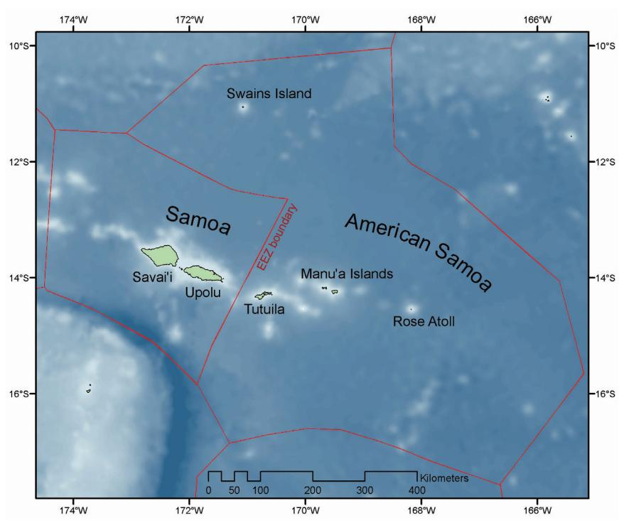

**Figure 1.1.** Samoan Archipelago study region.

most of the independent nation of Samoa, formerly called Western Samoa. American Samoa (a Territory of the United States) is made up of the comparatively medium sized island of Tutuila, the smaller islands of the Manu'a group, and the two small, remote coral atolls of Swains Island and Rose Atoll that are not derived from the same volcanic hotspot as the rest of the island chain.

Many prior assessments have touched on the biogeography of either Samoa or American Samoa and are cited throughout this document. The present report builds upon these earlier assessments by combining and re-analyzing their original datasets, adding more recent biogeographic data sources, and by combining and re-interpreting their individual findings into a multidisciplinary summary of marine biogeography.

Despite their close proximity and shared resources, management decisions and prior assessments in the region have typically been split along the international political boundary between Samoa and American Samoa. In contrast, a key goal in this assessment was to compile data from both areas and to conduct the characterization across the entire archipelago. Results of the assessment are intended partly to support the "2 Samoa's Initiative", a recent cooperative agreement between the two jurisdictions that seeks to foster improved collaboration, coordination, and information exchange on natural resource management and other topics. The Governments of Samoa and American Samoa should be contacted directly for more information on the current status of this unfolding initiative.

Of note, much of the data used in this assessment was collected prior to the September 2009 tsunami that devastated some shallow water and low lying segments of the archipelago. Most parts of this assessment however, were conducted at a broad analysis scale and the types of data used were not highly sensitive to this significant and anomalous natural disturbance. For more information on tsunami impacts, interested readers are directed to specific studies that were conducted to evaluate the extent and severity of damage due to that event.

1NOAA/NOS/NCCOS/CCMA Biogeography Branch

A key application intended for the report is to provide guidance in the ongoing development of a network of Marine Protected Areas (MPA) in the Samoan Archipelago. The region is already home to a diversity of MPAs implemented at various levels of government from individual villages and communities to federally protected areas of international significance. Many of the different MPAs in the network were created through independent processes for different objectives but each contributes to the mosaic of marine resource management in the region. Understanding what fish, coral, and habitat resources this diverse network of MPAs collectively encompasses is a key objective of this work and is critical for understanding the scope of current protection and thoughtfully designing additional network elements.

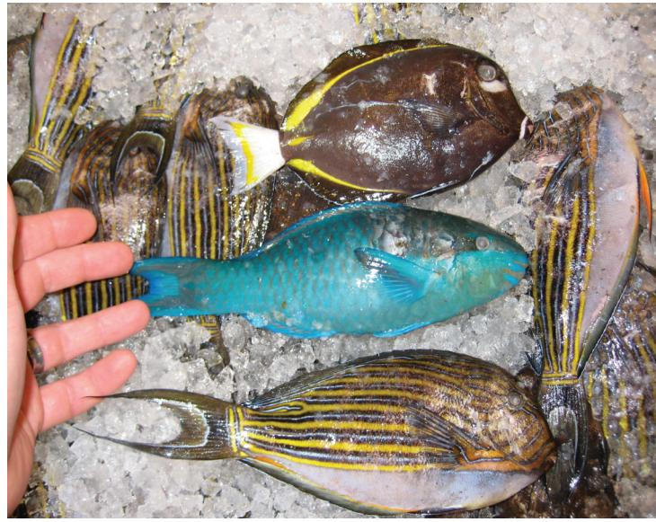

**Image 2.** Reef fish sold in a local grocery. Photo: Matt Kendall, NOAA Biogeography.

As a result of discussions with project partners in the design phase of the assessment, this report

focuses on corals and reef fish, transport of their larvae, and the reef habitats where they live. Additional aspects of biogeography that are not included in this assessment but are important to the region and Samoan culture include sea birds, cetaceans, deep coral habitats, and pelagic fish communities to name but a few. Including these resources was beyond the scope of our assessment although they have been investigated in several individual studies that should be consulted for more information.

The assessment is divided into 5 chapters with supporting appendices. Each chapter was based on compilation of multiple pre-existing datasets, original analysis, and discussion that has not been previously published. Each chapter was written or reviewed in collaboration with subject matter specialists and local experts. Here in Chapter 1, the overall scope and approach of the report is introduced. In Chapter 2, regional ocean climate is characterized including wind and wave climate, sea surface temperature, primary productivity, and sea level fluctuations. The focus is on the spatial and temporal patterns and trends in ocean climate that may affect marine biogeography. In Chapter 3, regional ocean currents and transport of coral and fish larvae are investigated among the islands of the archipelago as well as the surrounding island nations. The degree of self seeding versus dependency on outside sources of fish and coral larvae for maintaining each islands reef ecosystem is quantified. Major and secondary sources of larvae for each island are discussed in terms of resilience of reefs to disturbance. In Chapter 4, the reef fish and coral communities of the archipelago are quantified on the basis of overall biodiversity, abundance, and community structure. Biogeographic trends, breakpoints, and hotspots are identified among and within each of the islands in the archipelago. In Chapter 5, we summarize the existing network of MPAs in American Samoa based on their habitats, reef fish, and coral communities. Presently protected features are compared to regional resources, and remaining gaps in resource protection are highlighted. Appendices include analytical details omitted from some chapters for brevity as well as important secondary analytical products needed as inputs for the main chapters in the assessment. This includes an inventory and summary of regional seamounts needed for the larval connectivity chapter (Chapter 3), analytical details of the reef fish and coral datasets (Chapter 4), a description of the shore to shelf edge benthic maps created and used for the MPA network analysis (Chapter 5), and supplemental information on the many marine protected areas in American Samoa (Chapter 5).

### **Oceanography of the Samoan Archipelago**

Doug Pirhalla1 , Varis Ransi1 , Matthew S. Kendall2 and Doug Fenner3

### **IntrOductIOn**

The biogeography and health of coral reef ecosystems in the Samoan Archipelago are shaped in part by the oceanographic conditions and processes of the equatorial South Pacific. Larvae that reach the archipelago are carried to the region on ocean currents and those organisms that arrive and thrive must be adapted to the climatic conditions that characterize the region including temperature, winds, waves, nutrients, tides, sea level, and other factors. Once established, reef ecosystems can be stressed and modified by a wide range of climate-related phenomena such as elevated ocean temperatures, sea level fluctuations, and ocean acidification. Many oceanographic and atmospheric processes affecting Samoan reefs are presently in flux due to global climate change (Chase and Veitayaki 1992, Timmerman et al. 1999, US EPA 2007, Young 2007, Barshis et al. 2010). This chapter provides a

**Image 3.** A close-up look at a diverse benthic community. Photo credit: Matt Kendall, NOAA, Biogeography Branch.

summary of regional atmospheric and oceanographic conditions and trends including winds, waves, currents, sea surface temperature, chlorophyll, and sea surface height anomalies, and discusses potential influences they may have on Samoan reef ecosystems.

### **climate Background**

The climate of the Samoan Archipelago is characterized by year-round mild air temperatures, high humidity, persistent easterly or northeasterly trade winds, and infrequent but severe cyclonic storms. Mean daily air temperature varies between 22°C and 30°C (SPSLCMP 2007). The islands are noted for high annual rainfall that averages >3,000 mm (120 inches) per year but varies locally depending on topography (http://www7. ncdc.noaa.gov/CDO/cdo). Maximum rainfall occurs in the austral summer (December-February) where it can exceed 300 mm/month. In winter (June-August), rainfall is 30% lower at approximately 200 mm/month.

### **dAtA And MethOdS**

A diversity of satellite sensors has provided estimates of oceanic and atmospheric variables at global scales for the last few decades. These satellite-based datasets and other supporting information were used to describe the typical seasonal fluctuations, inter-annual variability, long-term trends, and anomalous events of importance to coral reef ecosystems in the Samoan Archipelago. Oceanographic variables in this assessment include winds, waves, ocean circulation, sea surface temperature, chlorophyll, and sea surface height anomalies. For each variable, the assessment provides: 1) a brief description of the remote sensing and other data that were analyzed, 2) a broad-scale overview of the major ocean features and processes at work while highlighting the position of the Samoa and American Samoa Exclusive Economic Zones (EEZs), 3) a finer-scale description of the seasonal patterns for each variable comparing ocean measurements close to the islands of Savai'i (172.66 W, 14.26 S) and Tutuila (170.2 W, 14.26 S) respectively (for these analyses, ocean characteristics were extracted for an area of 80 km2at the same latitude excluding land and shallow water areas) and throughout the American Samoa EEZ (only the American Samoa EEZ is included for simplicity since it encompasses the conditions experienced in the Samoan EEZ), 4) a time series of available

NOAA/NOS/NCCOS/CCMA Coastal Oceanographic Assessment Status and Trends Branch

2 NOAA/NOS/NCCOS/CCMA Biogeography Branch

3American Samoa/Department of Marine and Wildlife Resources

data showing multi-year trends in climate patterns, and 5) a description of the frequency and intensity of anomalous conditions that are of particular relevance to coral reef ecosystems. Ocean pixels in the satellite data that were contaminated with land or shallow water signatures were excluded in analyses. Preliminary analysis revealed that for most variables, monthly averages or plots for every other month were suitable to convey seasonal patterns. Where annual cycles are plotted, monthly means are averaged across all years of data. For example, there were 21 years of sea surface temperature (SST) data. Average SST for January in all 21 years was averaged to create a composite seasonal cycle. This enables identification of typical seasonal patterns but can obscure important short-term phenomena. Such extreme values that have occurred in specific years or months are highlighted in separate plots. Original remote sensing data used in this study are freely available and should be downloaded from original sources (Table 2.1).

Table 2.1. Original data sources.

| PRODUCT TYPE                                                               | PRODUCT TYPE DATA SOURCE      |           | SPATIAL RESOLUTION | TEMPORAL SUMMARY | UNITS                   |
|----------------------------------------------------------------------------|-------------------------------|-----------|--------------------|---------------------|-------------------------|
| QuikSCAT Sea Surface Winds                                                 | Remote Sensing Systems        | 1999-2007 | 25 km              | Weekly/Monthly      | m/s, degrees from north |
| Jason-1, Topex/Poseidon, ERS-1/2ENVISAT Geostrophic Surface Currents | AVISO, SSALTO/DUACS & CNES | 1992-2006 | 1/3° grids         | Weekly/Monthly      | cm/s degrees from north |
| Pathfinder SST and SST Anomaly (CoRTAD))  NOAA/NESDIS/NODC                 |                               | 1985-2006 | 4 km               | Weekly/Monthly      | °C                      |
| GOES-10/11SST and SST fronts                                            | NESDIS/NODC/STAR              |           | 4 km               | Daily/Monthly       | °C                      |
| SeaWiFS Ocean Color Chlorophyll and Anomalies                           | NASA                          | 1997-2007 | 1 km               | Daily/Monthly       | μg L-1, Steradian -1 |
| Jason-1, Topex/Poseidon, ERS-1/2ENVISAT Sea Surface Height Anomolies | AVISO, SSALTO/DUACS & CNES | 1992-2006 | 1/4° grids         | Weekly/Monthly      | cm                      |

### **RESULTS**

### Wind

Magnitude and direction of winds near the ocean surface are measured by the QuikSCAT satellite's microwave scatterometer (http://www.remss.com/qscat/qscat\_description.html). Weekly and monthly averaged data are available at a 25 km spatial resolution for a 7-year period (July 1999 to September 2007). Data were used to discern the broad-scale atmospheric circulation features in the South Pacific, place the Samoan EEZs into regional context, and to depict prevailing wind patterns within the archipelago over a typical annual cycle.

The region is dominated by the Trade Winds, a persistent atmospheric system where surface winds blow from the northeast to the southwest (yellow-green colors; Figure 2.1). Trade Winds are typically stronger in winter (July) than in summer (Merrill 1989). A major atmospheric feature affecting the Samoan climate is the South Pacific Convergence Zone (SPCZ) where Trade Winds converge at the surface (Figure 2.1). To the north of the convergence zone winds are generally southwestward. To the south of the convergence zone winds are generally westward/northwestward. This area of convergence results in heightened rainfall, especially during summer months (December-February). The SPCZ undergoes shifts in position and intensity on both a seasonal and interannual basis. The SPCZ crosses over the Samoan Archipelago twice a year (Alory and Delcroix 1999). It is most clearly established over the Samoan Archipelago during the summer months (December – February) whereas in winter (June – August) the zone shifts slightly northward resulting in stronger winds and lower rainfall (Alory and Delcroix 1999).

Interannual and decadal-scale variability of winds and many other aspects of climate within the Samoan Archipelago are associated with the El Niño and Southern Oscillation (ENSO) phenomenon (Alory and Delcroix 1999, Halpin et al. 2004) (see CPC website: http://www.cpc.noaa.gov). The Southern Oscillation is the change in atmospheric pressure between the eastern and the western regions of the South Pacific (Chowdhury et al. 2007). The Southern Oscillation Index (SOI) measures the strength of the oscillation and is com-

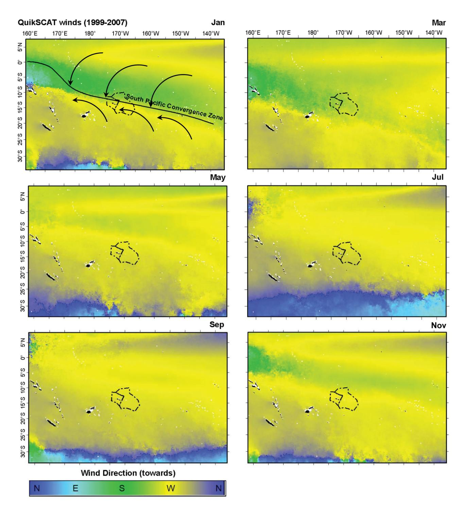

**Figure 2.1.** Wind direction measured by the QuikSCAT satellite. Monthly averages are based on the years from 1999 to 2007. Key atmospheric features and wind vectors (black arrows) are labeled in the plot for January at upper left. Odd numbered months are displayed. EEZs of Samoa and American Samoa are outlined in the center of each map.

puted from the difference in atmospheric pressure at Tahiti and Darwin, Australia. Sustained negative values of the SOI often indicate El Niño episodes which are characterized by a decrease in strength of the Trade Winds (Luick 2000) and warmer surface waters in the equatorial Pacific (Vecchi and Wittenberg 2010). This shifts the SPCZ to the north and coincides with higher winds in the Samoan region (Alory and Delcroix 1999). Positive SOI values indicate La Niña episodes where equatorial Trade Winds are strengthened. A time series of SOI values is provided for reference alongside plots of several variables in the assessment including SST, sea surface height anomaly (SSHA), and chlorophyll to demonstrate its relationship with ocean climate in the Samoan Archipelago.

Cyclonic storms (also called tropical storms, hurricanes or typhoons elsewhere) are infrequent but severe departures from the typical wind climate described above. The Samoan EEZs lie along the eastern edge of a region conducive to development of cyclonic storms in the South Pacific (Craig 2009). Six cyclones have struck or passed near the Samoan Archipelago in the past 30 years including 2 recent and very powerful Category 5 storms with sustained winds over 155 mph (Figure 2.2). In 2004, the eye of Heta passed south of the archipelago coming within 150 km of Savai'i (Fenner et al. 2008) creating a 0.3 m storm surge (SPSL-CMP 2007) and variable damage to Samoan reefs (Tausa and Samuelu 2004). In 2005, Olaf passed through the middle of the Samoan EEZs from northwest to southeast going almost directly over the Manu'a Islands where it caused substantial damage to both terrestrial and marine resources.

### **Waves**

The wave climate of the Samoan Archipelago has been characterized extensively through Waverider buoys (Barstow and Haug 1994), wave and tide recorders (Brainard and others 2008), models such as NOAA Wavewatch III (Tolman 2010), and satellite altimetry (Barstow and Haug 1994). Wave power exposures are

**Figure 2.2.** Path and intensity of cyclones passing through the EEZs of Samoa or American Samoa from 2000-2007.

typically highest on the eastern and southern facing coasts of Samoan islands but can vary seasonally and among years (Barstow and Haug 1994).The wave climate can be split into two main components, short period (~2-10 seconds) "wind seas" that result from local forces such as the easterly Trade Winds versus long period (~10-20 seconds) "ocean swells" that originate from storms many of which are far south of the archipelago (Barstow and Haug 1994). Ocean swell from the south and wave power in general are highest during May-September (2-3 m wave height is common) with the increased intensity of the Trade Winds and frequency of swell producing storms at higher latitudes (Barstow and Haug 1994, Brainard et al. 2008). November through March is a period often characterized by shorter period waves, lower wave heights (~2 m), and more variable directionality (Brainard et al. 2008). Although correlations with the SOI are somewhat irregular as with other variables, there is some evidence that El Niño conditions increase wave height (Barstow and Haug 1994). In contrast to the typical seasonal and interannual patterns, anomalous wave events occur due to tsunamis (Roeber et al 2010), the passage of cyclones (Militello et al 2003) (e.g. >8 m wave heights were recorded during Cyclone Ofa in 1990 and Heta in 2004) and even storms in the North Pacific which can cause unusually large swells on the relatively more calm northern coasts of the islands (Barstow and Haug 1994, Brainard and others 2008).

### **Ocean circulation**

At the broadest scale, the Samoan Archipelago lies along the northern edge of the South Pacific Gyre, a series of connected ocean currents with a counter-clockwise flow (Alory and Delcroix 1999, Tomczak and Godfrey 2003, McClain et al. 2004, Craig 2009) (Figure 2.3). At a regional scale, there are 2 major surface currents affecting the archipelago (Qiu and Chen 2004): (1) the westward flowing South Equatorial Current (SEC), and (2) the eastward flowing South Equatorial Counter Current (SECC) (Figure 2.3). The intensity of these currents in Samoan waters is variable among seasons and years.

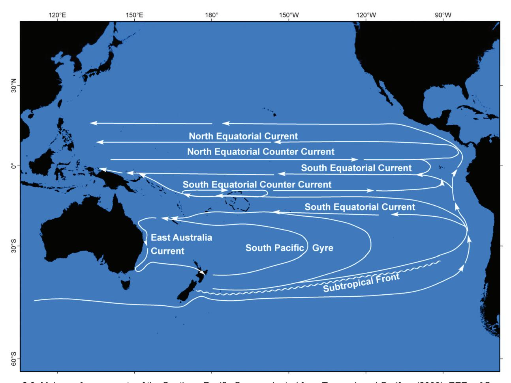

**Figure 2.3.** Major surface currents of the Southern Pacific Ocean adapted from Tomczak and Godfrey (2003). EEZs of Samoa and American Samoa are outlined in the center of the map.

Current patterns are major influences on larval transport and connectivity among islands in the Samoan Archipelago and adjacent island nations (Treml et al. 2008). Finer-scale patterns in currents and implications for larval transport will be discussed in greater detail in Chapter 3.

### **Ocean temperature**

Sea surface temperature (SST) data are collected globally by the NOAA/NASA Advanced Very High Resolution Radiometer (AVHRR) Oceans Pathfinder Program, which measures and reprocesses sea surface temperature, global cloud cover, vegetation cover and other variables. These data are the basis for the Coral Reef Temperature Anomaly Database, which has produced weekly average SST estimates for a 20 year period (January 1985 to December 2005) at a resolution of 4 km (Selig 2008). Monthly averaged data for the entire time period were used to discern the broad SST patterns in the South Pacific, place the SST of the Samoan Archipelago into context, depict changes in SST within the Samoan EEZs over an average annual cycle, and identify anomalous or unusually

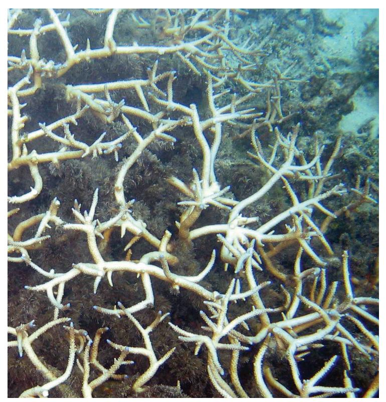

**Image 4.** Bleached acropora. Photo: D. Fenner, ASDMWR.

high or low SST events in the waters of the archipelago. Continuous water temperature data have recently been recorded by data loggers deployed at several near shore locations around American Samoa by NOAA's Coral Reef Ecosystem Division. These data are discussed in detail by Brainard and others (2008) and provide an important record of localized temperature variability.

At the edge of the equatorial Pacific warm water pool, the entire Samoan Archipelago experiences relatively high and stable ocean temperatures throughout a typical annual cycle (Figure 2.4). Average SST ranges approximately 2° C from a low of 27.2° C in August to a high of 29.5° C in March. Maximum SST occurs three months behind the maximum sunlight intensity, which indicates that SST increases as long as the intensity of sunlight is higher than its mean annual value (Alory and Delcroix 1999). Regional maps of monthly mean

**Figure 2.4.** Sea surface temperature data from CoRTAD presented as an average annual cycle. Monthly averages are based on data from 1985 to 2006. Colors denote average values for the EEZ of American Samoa (red), waters adjacent to Tutuila (blue), and Savai'i (green).

SST reveal gradual seasonal patterns (Figure 2.5). On average there is a ~1° C SST range latitudinally in the American Samoa EEZ in any given season such that waters around Swains Island are 0.5 – 1° C warmer than those around the rest of the Samoan Islands. There is minimal longitudinal variation in SST. Sea surface temperature fronts that frequently occur at higher latitudes and are associated with enhanced biological productivity (Polovina et al. 2001) are essentially absent from the Samoan EEZs (Figure 2.5).

The 21 year time series of available SST and temperature anomaly data revealed both seasonal and more irregular patterns (Figure 2.6). Overall trends in SST within the American Samoa EEZ exhibit an increase of ~1° C from 1985 through 2006 (p < 0.0003, R2= 0.05, SST = 28.1 + 0.0023\*month). All years since the major El Niño of 1997-1998 showed generally positive SST anomalies in the Samoan Archipelago, indicating warmer than average conditions.

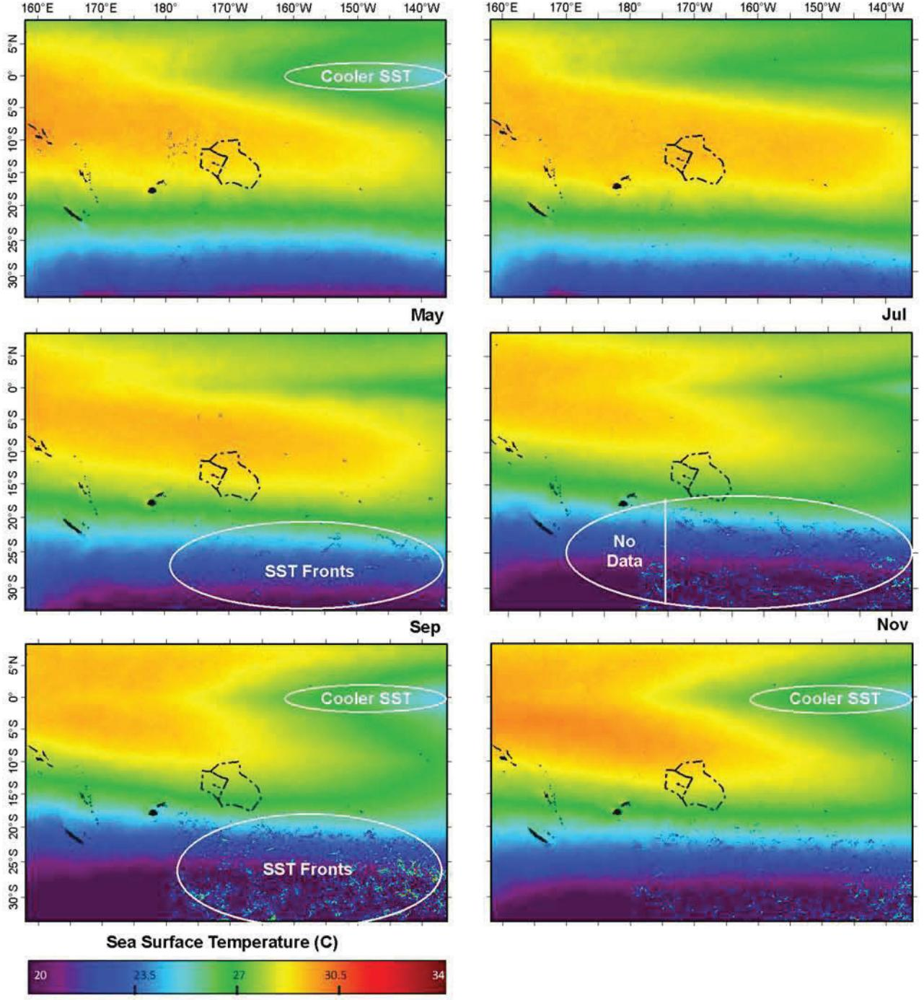

**Figure 2.5.** Sea surface temperatures from CoRTAD. Monthly averages are based on the years 1985 to 2006. EEZs of Samoa and American Samoa are outlined in the center of each map.

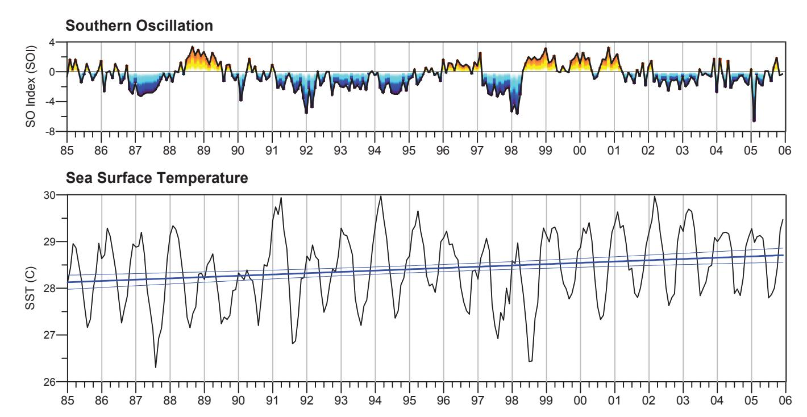

**Figure 2.6.** Sea surface temperature and anomaly values from CoRTAD for the years 1985 to 2006. Values are monthly averages for the EEZ of American Samoa. Southern Oscillation Index (SOI) values for the same time period are from NOAA/NWS. El Niño conditions are represented in dark blue with strong negative SOI values. La Niña conditions are represented by orange with strong positive values.

The seasonal SST range of 1-3° C is evident in all years. The specific range and temperature extremes in any given year are affected in part by the Southern Oscillation (Alory and Delcroix 1999). This is shown by focusing on winter (July) temperature anomalies, when the effects of El Niño are most pronounced in the region. During strong El Niño years significant warming of ocean temperatures occurs in the equatorial central/eastern Pacific (Chowdhury et al. 2007) and generally cooler SST conditions occur in the Samoan Archipelago (Alory and Delcroix 1999, Fenner et al. 2008). Temperature minima generally occur during peak negative SOI values but begin several months prior (Alory and Delcroix 1999)(Figure 2.6). For example, July 1987 and 1997 featured persistent SOI values of less than -2, indicative of strong El Niño conditions. SST within the Samoan EEZs during this time was 26.5°C, approximately 1°C cooler than average during both years (Figure 2.7). With one notable exception (1998), during La Niña conditions (e.g. 1989, 1999, 2000, 2001) the July anomalies show cooler SST along the equator but little change from expected values in the Samoan EEZs. Inspection of other SOI patterns reveals that the SST/atmospheric interactions are complex and do not yield perfect correlations. Of note is the strong negative SST anomaly in the equatorial region in July 1998 that is coupled with strong negative values in the Samoan Archipelago (Figure 2.7), a pattern not seen in the other 19 years of available data. This strong negative Samoan SST is a potential lag effect from the 1997 El Niño, may be related to the rapid shift from El Niño to La Niña conditions during 1998, and highlights the complexity and uncertainty of the effects of climate oscillations (SPSLCMP 2007).

Water temperatures can also become too high for the corals on reefs in the Samoan Archipelago. Hermatypic, or reef building corals, require warm tropical water, however when ocean temperatures are higher than 1° C above the highest temperature expected in the summer, corals can become stressed (Glynn and D'Croz 1990). This temperature is called the "bleaching threshold" and if this elevated temperature persists for long enough or temperatures are especially high for even a short period of time, corals will expel their symbiotic algae (zooxanthellae) and appear white. Three recent major coral bleaching events have been documented in American Samoa (Craig 2009) with a severe event in 1994 (Goreau and Hayes 1994) and additional widespread events documented in the summers of 2002 (Fisk and Birkeland 2002) and 2003 (Fenner et al. 2008).

Because the length of time the water temperatures are elevated plays a role in coral stress and bleaching, a metric called Degree Heating Weeks (DHW) is often used to highlight peak periods. It is a weekly metric

**Figure 2.7.** Sea surface temperature anomalies from CoRTAD during the month of July for the years 1997 to 2005. EEZs of Samoa and American Samoa are outlined in the center of each map.

calculated based on the number of the previous 12 weeks when the temperature exceeded the bleaching threshold as well as the number of degrees the temperature is above the bleaching threshold. Based on research conducted at NOAA's Coral Reef Watch (http://coralreefwatch.noaa.gov/), when the thermal stress reaches a value of 4 DHW, significant coral bleaching is likely. When thermal stress is 8 DHW or higher, widespread bleaching and mortality from the thermal stress is likely.

Using the Coral Reef Temperature Anomaly Database (CoRTAD), DHW was calculated for 1985-2006 for waters near Savai'i and Tutuila (Figure 2.8). Elevated DHW (>4 degree C) occurred at irregular intervals with

**Figure 2.8.** Sea surface temperature anomaly plots for warmest water month.

stronger peaks observed since 1990. Elevated DHW values generally occurred in Fall (April-May). Thermal stress exceeded 4 DHW in Savai'i and/or Tutuila in 1991, 1994, 2001, 2002, and 2003 with 3 of these years corresponding to documented coral bleaching events (Goreau and Hayes 1994, Fisk and Birkeland 2002, Craig 2009, Fenner et al. 2008). Unlike the SST anomaly time series, there appears to be minimal relationship between SOI and DHW in this region. Regional snapshots during peak DHW events in the time series reveal considerable variability in their spatial extent. A latitudinal but patchy band of increased DHW is evident in the region at these times.

NOAA Coral Reef Watch monitors bleaching conditions at a different site than those considered here and is based on waters off Ofu in the Manu'a Islands of American Samoa (Ofu virtual monitoring station- based on SST measured in a 50 km pixel centered at 14° S, 170° W). From 2000 to 2009 bleaching watches were issued by NOAA in all months between November and June with the core Summer/Fall months of January through May experiencing a watch at some time during nearly all nine years of data. Only in 2008 were SSTs consistently low and no bleaching watches were issued. Only one year during the nine years of data did SST at the Ofu site rise above the bleaching threshold. This occurred at times during three consecutive months from January to March of 2003. During this period, NOAA Coral Reef Watch issued 3 bleaching warnings and tracked a period of several weeks from late March through mid April where temperatures at Ofu surpassed the 4 DHW threshold for which significant coral bleaching is likely. Differences in DHW between the Ofu virtual monitoring site and the Savai'i and Tutuila sites examined here are likely due to the localized variability in water temperature that can occur in the regions (e.g. Figure 2.9).

Overall, these data suggest that the coral reefs of the Samoan Archipelago have been subjected to thermal stress conditions in ~1/3 of the last 15 years. An important caveat to interpretation however, is that localized water temperatures and other factors, primarily including shallow depths, wind conditions, incident light, and low circulation, may produce bleaching conditions in particular lagoons and reef flats that is not predicted by the satellite based approach used here. In fact, most of the in situ temperature loggers deployed on reefs around Tutuila and Swains Island recorded sustained temperatures 0.5 to 1° C higher than those based on satellites (Brainard and others 2008). In an extreme example, on one day in 2005 satellite measurements by NOAA Coral Reef Watch indicated an average SST of 30° C for an area that included an in situ temperature

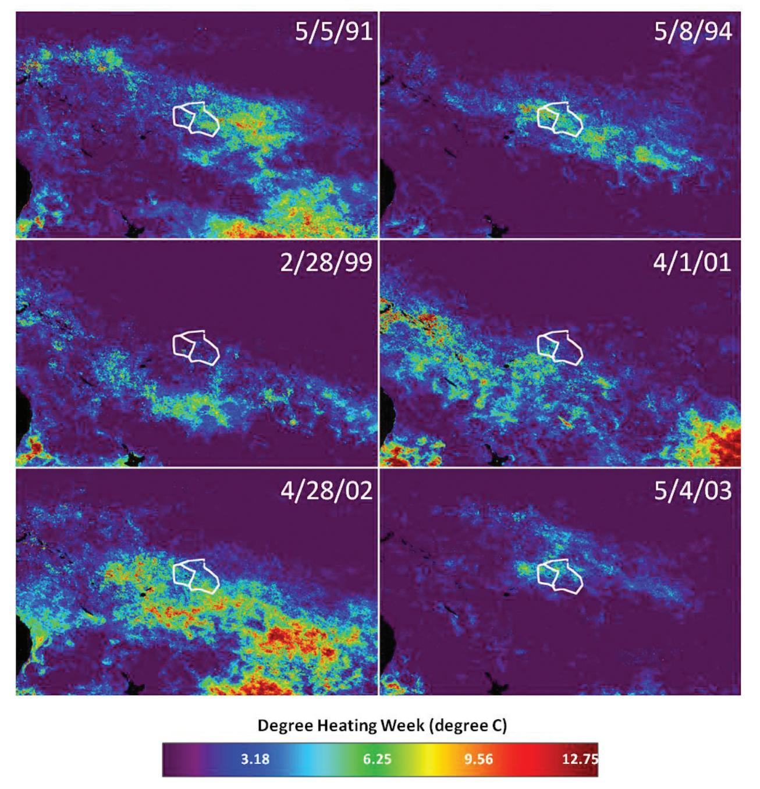

**Figure 2.9.** Bleaching alert time-series from NOAA Coral Reef Watch.

logger which recorded a value of 34.9° C (Fagaitua, American Samoa) (Fenner et al. 2008). In contrast, in situ temperature loggers around Ta'u recorded values typically 1° C lower than those based on satellitederived surface estimates (Brainard and others 2008). This indicates that localized bleaching events are not always well predicted or detected by satellite based monitoring. Annual coral bleaching from 2004-2008 has been documented in two lagoon pools near the airport on Tutuila (Fenner et al. 2008). Even for widespread bleaching events, the severity can vary widely across islands in the Samoan Archipelago (Fisk and Birkeland 2002) with some corals and localities able to withstand thermal conditions typically associated with bleaching (Craig et al. 2001).

### **chlorophyll**

The ocean color dataset from the Sea-viewing Wide Field-of-View Sensor (SeaWiFS) satellite provided a ten-year (September 1997 to October 2007) dataset of estimated chlorophyll concentration, at 9-km spatial resolution. Chlorophyll a is the dominant pigment in marine photosynthetic organisms and measuring its con-

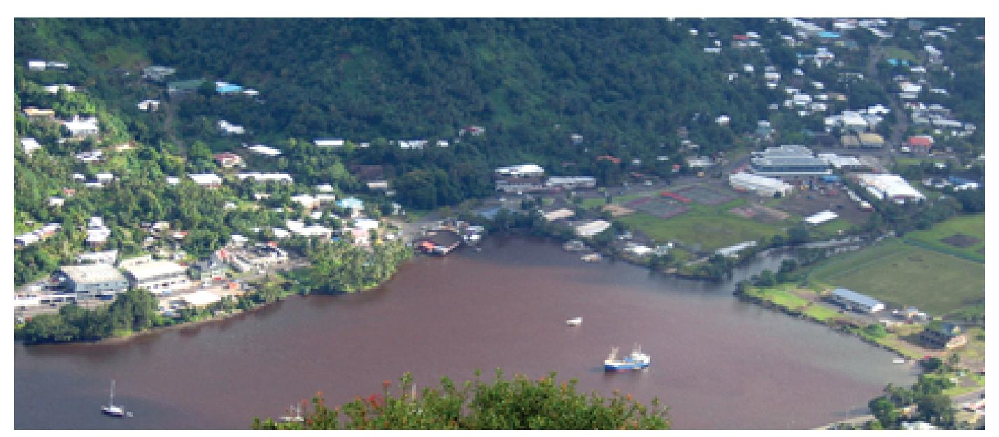

**Image 5.** Red algal bloom in Pago Pago Harbor. Photo: D. Fenner , ASDMWR.

centration in ocean waters provides one measure of nutrient input to surface waters and subsequent biological productivity. Chlorophyll a concentration, referred to simply as chlorophyll in this report, can be estimated using SeaWiFS color sensors. Monthly averaged data for this period were used to discern broad chlorophyll patterns in the South Pacific, place the Samoan Archipelago into context, depict changes in chlorophyll within the Samoan EEZs over an average annual cycle, and identify unusually high or low chlorophyll events in the waters of the archipelago.

The entire archipelago shows low chlorophyll levels all year with very limited but discernable seasonal variability (Figure 2.10) (Dandonneau et al. 2004, McClain et al. 2004). Chlorophyll averages range 0.02 to 0.03  $\mu$ g/L from a low of 0.05  $\mu$ g/L in January to a high near 0.08  $\mu$ g/L in July. The archipelago lies at the northwestern edge of a distinct region of minimal oceanic productivity associated with the South Pacific Gyre (Figure 2.11) (Dandonneau et al. 2004, McClain et al. 2004), a region recently shown to be expanding at a rate of 1.4% per year (Polovina et al. 2008). Slight chlorophyll increases are evident just north of the EEZ at approximately 8° S and to the southwest near the Islands of Fiji.

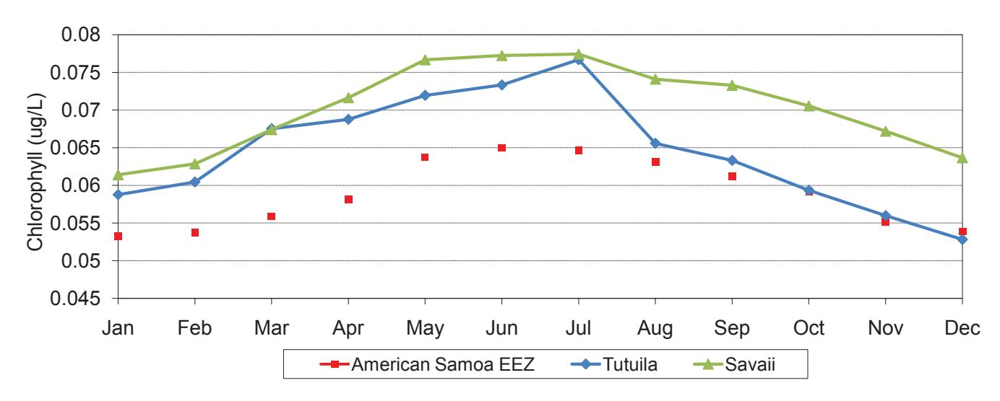

**Figure 2.10.** Chlorophyll concentration estimated from SeaWiFS and presented as an average annual cycle. Monthly averages are based on the years 1998 to 2007. Colors denote average values for the EEZ of American Samoa (red), waters adjacent to Tutuila (blue), and Savai'i (green).

The 10-year time series shows two short-lived episodic increases in chlorophyll (Figure 2.12). During fallwinter (April-June) of 2002 and 2005, subtle chlorophyll increases of 0.12 µg/L to 0.2 µg/L were evident in ocean waters near Savai'i and Tutuila, respectively but not in the ocean around the other smaller islands of the archipelago (Figure 2.13). Minimal change was evident when chlorophyll concentration was averaged for the entire EEZ of American Samoa during the same months. The limited spatial extent of these events is

**Figure 2.11.** Chlorophyll concentration estimated from the SeaWiFS satellite. Monthly averages are based on the years 1998 to 2007. Odd numbered months are displayed. EEZs of Samoa and American Samoa are outlined in the center of each map.

**Figure 2.12.** Chlorophyll concentrations estimated from SeaWiFS for the years 1997 to 2005. Values are monthly averages for the EEZ of American Samoa (black), waters adjacent to Tutuila (blue), and Savai'i (red). Southern Oscillation Index (SOI) values for the same time period are from NOAA/NWS. El Niño conditions are represented in dark blue with strong negative SOI values. La Niña conditions are represented by orange with strong positive values.

highlighted in regional plots for June 2002 and April 2005 (Figure 2.13). These episodic events are generally not associated with large-scale climatic phenomenon. It is speculated that these chlorophyll anomalies are the result of increased eddy activity inside the EEZ (Barber et al. 1996, Foley et al. 1997, Strutton et al. 2001). Enhanced westward circulation of the SEC on the north side of the EEZ and eastward circulation of the SECC during the fall-winter (March-June) time frame could promote eddies and meanders (see Chapter 3). The resulting mixing could result in areas of localized nutrient enrichment and heightened chlorophyll (Domokos et al. 2007). It is also possible that topographically induced upwelling around the larger islands of the archipelago could cause the elevated chlorophyll signature (Brainard and others 2008). April is a time of high flow for the SECC, which flows directly across the Samoan Archipelago during some years and can be deflected by the larger islands. Another possibility is that rainfall runoff and associated terrestrial and human nutrient inputs at these times elevated the chlorophyll levels around the larger islands in the archipelago that have greater land area and higher human populations (Brainard and others 2008).

Water samples collected within 1-2 km around the islands and atolls of American Samoa during February/ March 2006 were analyzed for chlorophyll and nutrient concentrations by NOAA CRED (Brainard and others 2008). These nearshore samples typically showed an order of magnitude higher concentration of chlorophyll than those measured by satellite farther offshore reported here. Nearshore water samples for the largest and most populated island Tutuila, showed the highest and most variable concentrations of chlorophyll (average of 0.7 µg/L) with lower values for Ofu, Olosega, and Ta'u (averages of 0.3-0.4 µg/L) and lower still values for Rose and Swains atolls (0.2-0.25 µg/L).

Despite some measureable seasonality and episodic, but very small, spikes in chlorophyll concentration, the oceanic waters of Samoan EEZs are nutrient poor and have low biological productivity year round. This results in clear water, deep light penetration, and conditions suitable for growth of the coral reef ecosystems that characterize the region.

### **Sea surface height anomalies**

Anomalies in sea surface height are best understood in the context of tides and sea level trends. A positive trend in mean sea level of 2.07 mm/ year ± 0.90 (95% CI) is evident at Pago Pago from 1948 to the present (http://tidesandcurrents. noaa.gov/sltrends) (Figure 2.14). Sea level is also monitored in the region by the South Pacific Sea Level and Climate Monitoring Project (SPSL-CMP), which operates a SEAFRAME (Sea Level Fine Resolution Acoustic Measuring Equipment) gauge which measures sea level in Apia, Samoa. Data from this gauge shows a similar if not higher rate of sea level rise (4.9 mm/year) for the period 1993-2007 although a longer time series of data is needed to establish a more reliable estimate at this site (SPSLCMP 2007). Tides in the archipelago consist of two highs and lows daily with a mean range of 2.51 ft as measured at Pago Pago (http:// tidesandcurrents.noaa.gov/). Seismic events and the associated tsunami signals are also recorded on these instruments.

The Archiving, Validation and Interpretation of Satellite Data in Oceanography (AVISO) Program merges sea surface height data from the Topex/ Poseidon (T/P), Jason-1/2, ERS-1/2 and ENVISAT satellites. Sea Surface Height Anomaly (SSHA) refers to vertical deviations from expected mean sea level. To calculate SSHAs, a map of estimated mean sea level is created from T/P data for the

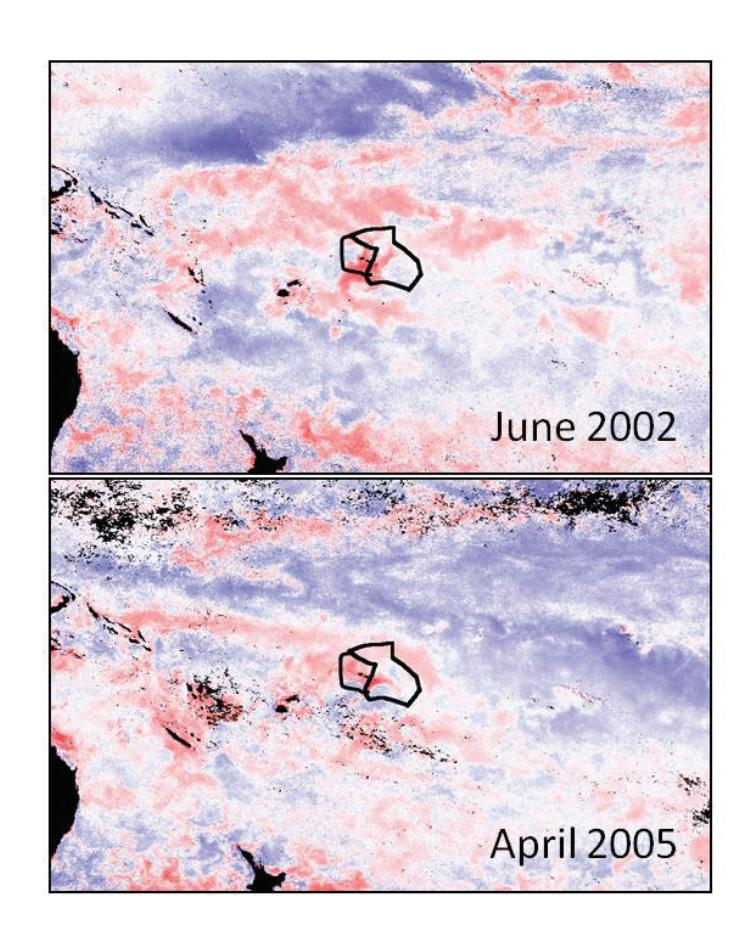

**Figure 2.13.** Chlorophyll anomalies estimated from SeaWiFS for June 2002 and April 2005. EEZs of Samoa and American Samoa are outlined in the center of each map.

**Figure 2.14.** Sea level values for Pago Pago, American Samoa from 1948 to 2008. Values are monthly averages. Data are from U. Hawaii Sea Level Center/National Oceanographic Data Center Joint Archive for Sea Level. Southern Oscillation Index (SOI) values for the same time period are from NOAA/NWS. El Niño conditions are represented in dark blue with strong negative SOI values. La Niña conditions are represented by orange with strong positive values.

**Image 6.** Exposed corals on a reef flat, southern Tutuila. Photo: D. Fenner, ASDMWR.

period January 1993 to December 1999 at a global scale. All deviations in sea surface height are presented in reference to mean sea level during this period (http://www.aviso.oceanobs.com/fileadmin/documents/data/ tools/hdbk\_duacs.pdf). Observed deviations from this mean sea level were plotted and evaluated in several ways for the study region. A 15 year dataset (1992-2006) of monthly mean SSHAs was obtained from AVISO and used to discern broad patterns of sea level fluctuation in the South Pacific, place SSHAs of the Samoan EEZs into context, depict seasonal and inter-annual patterns of SSHAs in the Samoan EEZs, and identify unusual or extreme observations of SSHAs and discuss their relevance to coral reef ecosystems.

The entire Samoan Archipelago experiences similar changes in SSHA during a typical annual cycle. Anomalies are highest in winter (May-August) and lowest in summer (December-January) and have a range of only ~4 cm (Figure 2.15). Note that all SSHAs in Figure 2.16 are positive and expressed relative to the global mean sea level calculated for 1993-1999. Maps of SSHA averaged by month reveal somewhat predictable spatial variations in sea level in the region. Elevated sea surface height anomalies on the northern side of the EEZ around Swains Islands (~ 5°S) are noted in March (circled red; Figure 2.16). A general southward shift of this anomaly across the archipelago in the band of elevated heights can be seen from March to May.

**Figure 2.15.** Sea surface height anomalies from AVISO are presented as an average annual cycle. Monthly averages are based on the years 1993 to 2006. Colors denote average values for the EEZ of American Samoa (red), waters adjacent to Tutuila (blue), and Savai'i (green). Note that the scale is relative to the global mean sea level for the period 1993 to 1999.

**Figure 2.16.** Sea surface height anomalies from AVISO. Monthly averages are based on the years 1993 to 2006. Odd numbered months are displayed. EEZs of Samoa and American Samoa are outlined in the center of each map.

These elevated heights represent the signature of the SEC and SECC and their corresponding seasonal shifts (Domokos et al. 2007). These SSHAs and currents dissipate and become less intense and defined from winter through spring (also see Currents Section).

When monthly values are not averaged across years and instead are shown as a 15 year time series, several key patterns emerge. SSHAs in the Samoan Archipelago have a significant response to the Southern Oscillation (Alory and Delcroix 1999). A major negative height anomaly occurred in the Samoan EEZs during the strong El Niño of 1998 (SPSLCMP 2007). Sea surface heights in the EEZ averaged 25 cm below normal

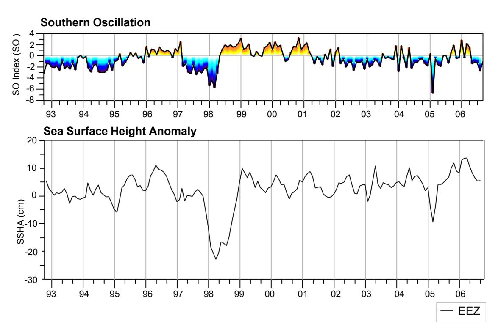

**Figure 2.17.** Sea surface height anomalies from AVISO for the years 1993 to 2006. Values are monthly averages for the EEZ of American Samoa. Southern Oscillation Index (SOI) values for the same time period are from NOAA/NWS. El Niño conditions are represented in dark blue with strong negative SOI values. La Niña conditions are represented by orange with strong positive values.

during March-April, 1998 (Figure 2.17). This event was recorded by sea level gauges widely in the South Pacific (SPSLCMP 2007). Another noteworthy event correlated with an El Niño occurred during March of 2005, where vertical sea surface heights dropped 10 cm below mean sea level in the Samoan Archipelago. The very broad spatial extent of these negative height anomalies, well beyond the Samoan EEZs, is evident in SSHA plots for March 1998 (and see SPSLCMP 2007) and 2005 in comparison to the same month in other years (circled blue; Figure 2.18). An east-west band of lower SSHA, at its largest extent in March, affected the South Pacific from the central Cook Islands to the Solomon Islands, a distance of ~3,000km. The area where sea level is most affected by El Niño corresponds closely with the SPCZ (Figure 2.1), because of changes in the strength and position of the Trade Winds and the SEC (Figure 2.3) (SPSLCMP 2007). Longterm sea level data for Pago Pago, American Samoa confirmed the SSHA events depicted in satellite altimetry in 1998 and 2005 but also revealed sea level drops in 1954, 1958, 1966, 1973, 1978, 1983, 1987, and 1992 (Figure 2.14). All of these low sea level anomalies correspond to documented El Niño events (Chowdhury et al. 2007). Based on this time series, low water conditions can be expected in the Samoan EEZs every 4-8 years with the frequency of the anomalies being directly related to the timing of negative SOI values with greatest height anomaly values occurring roughly eight months behind the SOI (Alory and Delcroix 1999). To determine if the magnitude of sea level drop was correlated with the strength of the El Niño (SOI) a linear regression of SSHA versus SOI was conducted. For every documented El Niño event since 1954, the lowest SOI (standardized) value observed was obtained from the NOAA's Climate Prediction Center (http://www. cpc.noaa.gov/). For each El Niño event, the corresponding maximum deviation from monthly mean sea level observed at Pago Pago (station 1770000) was obtained from NOAA's Center for Operational Oceanographic Products and Services (http://tidesandcurrents.noaa.gov). The results of the regression indicate a significant positive relationship between magnitude of negative sea level anomalies and El Niño strength (p < 0.001, R2 =0.63, |sea level deviation|=0.034 + 0.081\*SOI) (Figure 2.19), emphasizing the strong ocean- atmospheric interconnections for the region. This corroborates a lag correlation analysis that found a value of 0.58 between SOI and height anomalies at eight months following SOI minima (Alory and Delcroix 1999). Figure 18. Sea surface height anomalies from AVISO for the years 1993 to 2006. Values are monthly averages for the EEZ of American Samoa American Samoa. Southern Oscillation Index (SOI) Oscillation Index values for the same time period are from NOAA/NWS. El Niño conditions are represented in dark blue with strong negative SOI values. La Niña conditions are represented by orange with strong positive values.

The deviations from mean sea level reported here may at first seem to be of such low magnitude that they have little significance to coral reef ecosystems. The maximum deviation observed was for sea level to be ~30 cm lower than the expected monthly average. In fact however, when coupled with the right environmen-

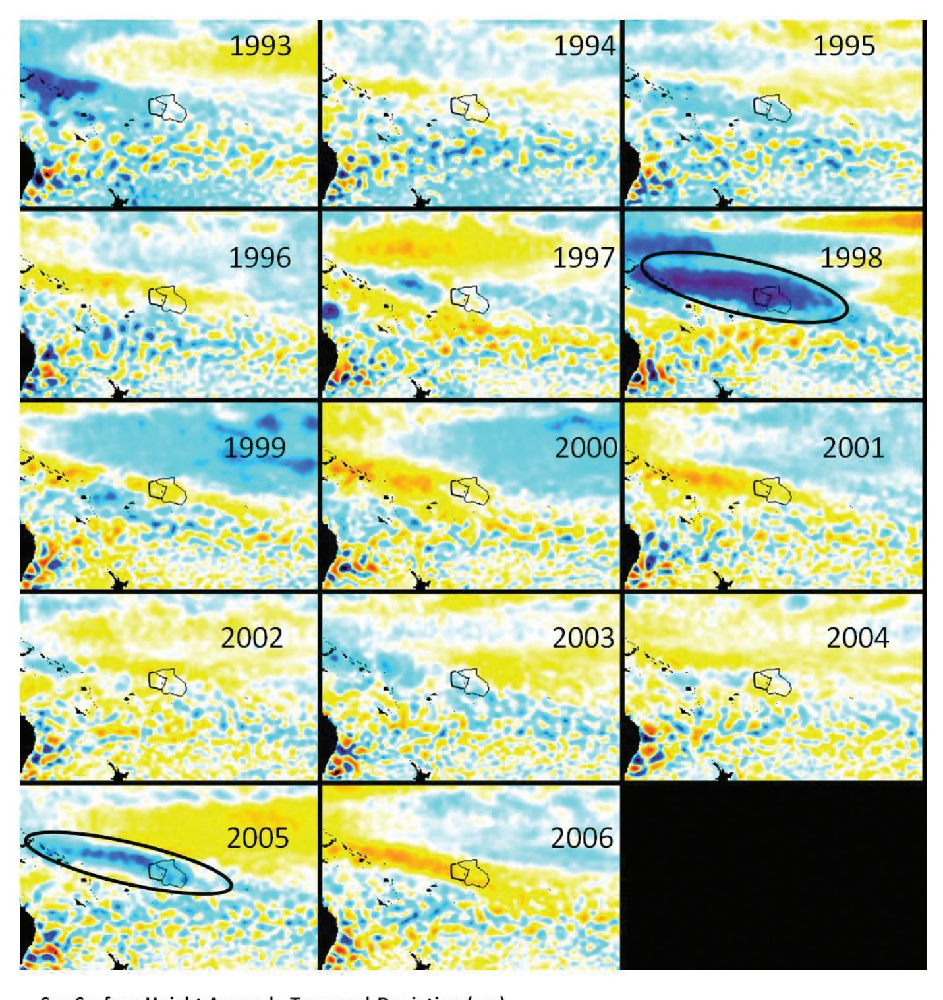

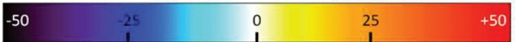

**Figure 2.18.** Sea surface height anomalies from AVISO during the month of March for the years 1993 to 2006. EEZs of Samoa and American Samoa are outlined in the center of each map.

tal conditions, these low sea level events can have a major impact on coral communities of reef flats. Reef flats make up an extensive component of the coral ecosystems around most of the islands in the Samoan Archipelago. The vertical growth limit of corals on reef flats is closely tied to the height of low tides. Coral colonies in the reef flat zone have flattened tops that clearly demarcate water depths suitable for growth and survival during average SSH conditions. Coral colonies and branches within the same colony are observed to achieve a remarkably uniform vertical growth of within 1-2 cm. An anomalous drop in sea level 30 cm below the lowest tide that the reef flat corals have established as their growth limit has indeed resulted in exposure of corals and fatal conditions for large areas of the reef flat.

A massive reef flat mortality event during which up to 84% of corals died due to sea surface height anomalies and the corresponding "extreme low tides" was documented by researchers in American Samoa in 1998 (Alison Green, unpublished data). Locally, Samoans refer to such events as "kaimasa", a term related to the odor from decaying coral. For an exposure event to occur, a low tide must be present at the same time as a low sea surface height anomaly. Factors reducing sea surface height documented by this report include inter-annual events associated with documented El Niño cases (~-30 cm magnitude) and seasonal patterns (~-4 cm magnitude). Severity and extent of the event next depends on additional factors most

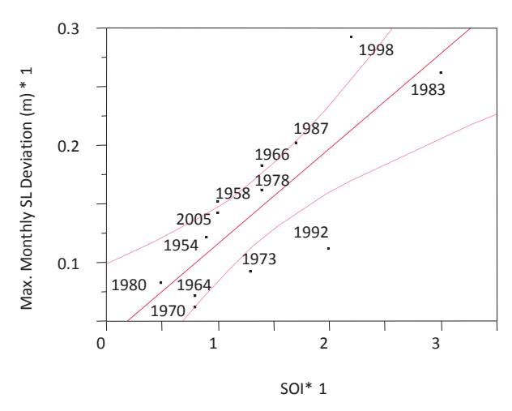

**Figure 2.19.** Linear regression of maximum monthly sea level deviation versus SOI during El Niño events since 1954. p < 0.001, R²=0.63, |sea level deviation|=0.034 + 0.081\*|SOI|

likely related to incident light, winds, and waves. High solar radiation as measured by low cloud cover and high sun angle heats and desiccates corals exposed during periods of low sea surface height. Calm seas prevent wave swash from regularly covering, moistening, and cooling exposed reef flats. When all, or some critical number and intensity of these conditions are in phase, reef flat exposure and coral mortality could result. Satellite images presented here indicate that low sea surface height events can affect vast areas of the Pacific (Figure 2.18). Understanding and predicting the periodicity, extent, and severity of such events should be a focus of future research to inform coastal planning for reef flat habitats.

### CONCLUSIONS

The islands and atolls of Samoa and American Samoa are characterized by small seasonal fluctuations in ocean conditions and often much larger multiyear fluctuations in response to larger climatic cycles such as ENSO. The major source of variability is seasonal for winds, waves, and SST whereas chlorophyll and sea surface height are affected more by interannual processes (Alory and Delcroix 1999). Nearly all aspects of ocean climate for the Samoan Archipelago vary much more significantly by latitude than by longitude. As expected, most variables examined here demonstrate that Samoa and American Samoa lie in essentially identical ocean climates. Swains Island, located in the northern extremity of the American Samoa EEZ and not derived from the same volcanic hot spot as the Samoan island chain, is affected by slightly different oceanic or atmospheric features than the rest of the archipelago depending on the year. This is influenced primarily by the latitudinal shifts in features such as the South Pacific Convergence Zone, South Equatorial Current, and the South Equatorial Counter Current.

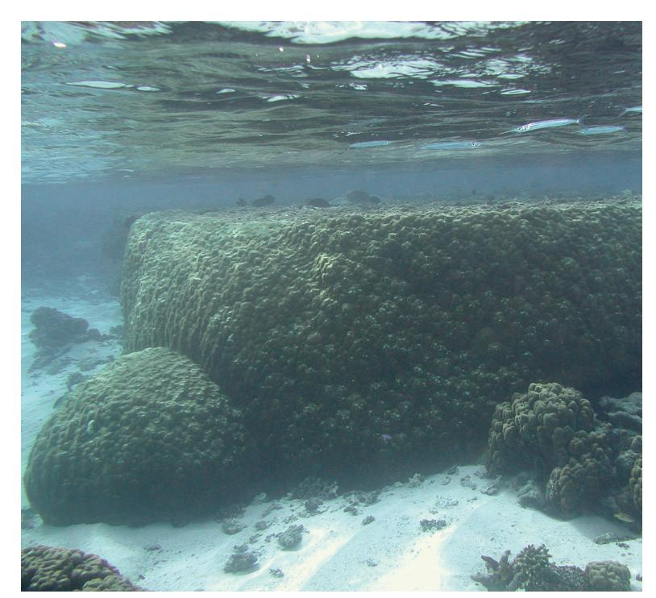

**Image 7.** Flat topped coral head. Photo credit: M. Anderson.

Overall, the Samoan Archipelago lies in a region with relatively stable oceanic conditions compared to areas to the north and south. The Archipelago is generally unaffected by the more dynamic ocean fluctuations such as subtropical sea surface temperature fronts that occur farther south and equatorial upwelling to the north. This is demonstrated through time series plots of SST at the intersection of 170° W longitude (the approximate boundary between Samoa and American Samoa) and 0°, 5° S, 10° S, 15° S, 20° S, 25° S, and 30° S latitude (Figure 2.20). The Samoan EEZs lie roughly between 10 and 17° S latitude. The SST in this region has a much smaller range of values, fewer extreme fluctuations, and less interannual variability than SST observed at higher or lower latitudes. This relative stability of the Samoan coral reef environment is worth considering in the context of reef resiliency. The relative constancy of conditions may be among the factors that have allowed the very long-term survival and growth of some of the largest individual hermatypic coral colonies in the world such as those located off the island of Ta'u at the eastern extremity of the archipelago. Some Porites colonies are up to 41 m in circumference and 500-1,000 years old (Brainard and others 2008, Brown et al. 2009). It is important to continue monitoring the oceanic characteristics of the region in response to global climate change (Chase and Veitayaki 1992, US EPA 2007, Vecchi and Soden 2007, Young 2007, Barshis et al. 2010). The low chlorophyll and biological productivity values associated with the South Pacific Gyre have recently been shown to be expanding at a rate of 1.4% per year (Polovina et al. 2008). ENSO activity and characteristics will continue to affect Samoan sea levels, the eastward expansion of the warm water pool, and long-term precipitation patterns in the region (Vecchi and Wittenberg 2010). Sea level rise has obvious implications to a human population already crowded into a narrow and often low lying coastal zone (Chase and Veitayaki 1992, Coral Reef Advisory Group 2007). Increasing water temperatures pose a serious threat to corals already living near their thermal tolerance (Craig et al. 2001, Barshis et al. 2010). Given that the reefs of the archipelago have developed in a region with relatively stable conditions, oceanic anomalies or trends exacerbated by climate change may have greater affects on Samoan reefs than in regions adapted to such perturbations (US EPA 2007, Barshis et al. 2010).

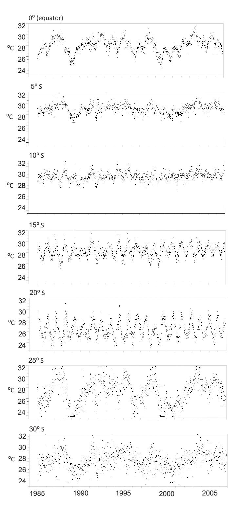

**Figure 2.20.** Sea Surface Temperature from CoRTAD at the intersection of 170° W longitude (the approximate boundary between Samoa and American Samoa) and 0°, 5° S, 10° S, 15° S, 20° S, 25° S, and 30° S latitude respectively.

### **AcKnOWledGeMentS**

The authors wish to thank the following individuals for contributing valuable discussions, data, general information and review comments to drafts of this material: Kelley Anderson (The Climate Foundation), Russell Brainard (NOAA/NMFS/PIFSC/CRED), Jamison Gove (NOAA/NMFS/PIFSC/CRED), Alison Green (The Nature Conservancy), Clare Shelton (Coral Fellow, Coral Reef Advisory Group, American Samoa Department of Commerce), Oliver Vetter (NOAA/NMFS/PIFSC/CRED), and Phil Wiles (Oceanographer, American Samoa EPA).

### **reFerenceS**

Alory, G. and T. Delcroix. 1999. Climatic variability in the vicinity of Wallis, Futuna, and Samoa islands (13°-15° S, 180°- 170° W). Oceanologica Acta 22: 249-263.

Barber, R.T., M.P. Sanderson, S.T. Lindley, F. Chai, J. Newton, C.C. Trees, D.G. Foley, and F.P. Chavez. 1996. Primary productivity and its regulation in the equatorial Pacific during and following the 1991-92 El Nino. Deep-Sea Research II 43: 933-970.

Barshis, D.J., J.H. Stillman, R.D. Gates, R.J. Toonen, L.W. Smith, and C. Birkeland. 2010. Protein expression and genetic structure of the coral *Porites lobata* in an environmentally extreme Samoan back reef: does host genotype limit phenotypic plasticity? Molecular Ecology 19: 1705-1720.

Barstow, S.F. and O. Haug. 1994. The wave climate of Western Samoa. SOPAC Technical Report 204. 34 pp.

Brainard R., and 25 others. 2008. Coral reef ecosystem monitoring report for American Samoa: 2002-2006. NOAA Special Report NMFS PIFSC. 472 pp.

Brown, D.P., L. Basch, D. Barshis, Z. Forsman, D. Fenner, and J. Goldberg. 2009. American Samoa's island of giants: massive *Porites* colonies at Ta'u island. Coral Reefs 28: 735.

Chase, R. and J. Veitayaki. 1992. Implications of Climate Change and Sea Level Rise for Western Samoa. United Nations Environmental Project. Apia, Western Samoa. 43 pp.

Chowdhury, M.R., P.S. Chu, and T.A. Schroeder. 2007. ENSO and seasonal sea-level variability: A diagnostic discussion for the U.S. affiliated Pacific islands. Theoretical and Applied Climatology. 88: 213-224.

Coral Reef Advisory Group. 2007. Potential Climate Change Impacts to American Samoa. February 12, 2007. American Samoa Governors Coral Reef Advisory Group. 8 pp.

Craig, P., C. Birkland, and S. Belliveau. 2001. High temperatures tolerated by a diverse assemblage of shallow-water corals in American Samoa. Coral Reefs 20: 185-189.

Craig, P. (editor). 2009. Natural history guide to American Samoa. 3rd Edition. National Park of American Samoa, Department of Marine and Wildlife Resources, and American Samoa Community College. Pago Pago, American Samoa. 131 pp.

Domokos, R., M.P. Seki, J.J. Polovina, and D.R. Hawn. 2007. Oceanographic investigation of the American Samoa albacore (Thunnus alalunga) habitat and longline fishing grounds. Fisheries Oceanography 16: 555-572.

Dandonneau, Y., P.Y. Deschamps, J.M. Nicolas, H. Loisel, J. Blanchot, Y. Montel, F. Thieuleux, and G. Becu. 2004. Seasonal and interannual variability of ocean color and composition of phytoplankton communities in the North Atlantic, equatorial Pacific and South Pacific. Deep-Sea Research II 51: 303-318.

Fenner, D., M. Speicher, S. Gulick, and 35 others. 2008. The State of Coral Reef Ecosystems of American Samoa. Pp. 307-351. In: The State of Coral Reef Ecosystems of the United States and Pacific Freely Associated States: 2008. Waddell, J.E. and A.M. Clarke (eds.). NOAA Technical Memorandum NOS NCCOS 73. NOAA/NCCOS Center for Coastal Monitoring and Assessment. Biogeography Team. Silver Spring, MD. 569 pp.

Fisk, D. and C. Birkeland. 2002. Status of coral communities on the volcanic islands of American Samoa. Department of Marine and Wildlife Resources, Government of American Samoa. Pago Pago, American Samoa. 135 pp.

Foley, D.G., T.D. Dickey, M.J. McPhaden, R.R. Bidigare, M.R. Lewis, R.T. Barber, S.T. Lindley, C. Garside, D.V. Manov, and J.D. McNeil. 1997. Longwaves and primary productivity variations in the equatorial Pacific at 0, 140 W. Deep Sea Research II 44: 1801-1826.

Glynn, P.W. and L. D'Croz. 1990. Experimental evidence for high temperature stress as the cause of El Niño coincident coral mortality. Coral Reefs 8: 181-191.

Goreau, T.J. and R. Hayes. 1994. Survey of coral reef bleaching in the South Central Pacific during 1994: Report to the International Coral Reef Initiative. Global Coral Reef Alliance. Chappaqua, New York. 201 pp.

Halpin, P.M., P.T. Strub, W.T. Peterson, and T.M. Baumgartner. 2004. An overview of interactions among oceanography, marine ecosystems, climatic and human disruptions along the eastern margins of the Pacific Ocean. Revista Chilena de Historia Natural 77: 371-409.

Luick, J. 2000. Seasonal and interannual sea levels in the western Equatorial Pacific from Topex/Poseidon. Journal of Climate 13: 672-676.

McClain, C.R., S.R. Signorini, and J.R. Christian. 2004. Subtropical gyre variability observed by ocean-color satellites. Deep-Sea Research Part II 51: 281–301.

Merrill, J.T. 1989. Atmospheric long range transport to the Pacific Ocean. Chemical Oceanography 10: 15-50.

Militello, A., N.W. Scheffner, and E.F. Thompson. 2003. Hurricane - induced stage-frequency relationships for the Territory of American Samoa. Coastal and Hydraulics Laboratory. Technical Report CHL-98-33 Revised, 226 pp.

Polovina, J.J., E. Howell, D.R. Kobayashi, and M.P. Seki. 2001. The transition zone chlorophyll front, a dynamic global feature defining migration and forage habitat for marine resources. Progress in Oceanography 29:1670-1685.

Polovina, J.J., E. Howell, and M. Abecassis. 2008. Ocean's least productive waters are expanding. Geophysical Research Letters. 35:L03618, doi:10.1029/2007GL031745, 2008.

Qiu, B. and S. Chen. 2004. Seasonal modulations in the eddy field of the South Pacific Ocean. Journal of Physical Oceanography 34: 1515-1527.

Roeber, V., Y. Yamazaki, and K.F. Cheung. 2010. Resonance and impact of the 2009 Samoa tsunami around Tutuila, American Samoa. Geophysical Research Letters 37:L21604 doi: 10.1029/2010GL044419.

Selig, E.R. 2008. The Coral Reef Temperature Anomaly Database (CoRTAD) - Global, 4 km, Sea Surface Temperature and Related Thermal Stress Metrics for 1985-2005 (NODC Accession 0044419): University of North Carolina (UNC) – Chapel Hill. NOAA National Oceanographic Data Center, Silver Spring, Maryland.

SPSLCMP (South Pacific Sea Level and Climate Monitoring Project). 2007. Pacific Country Report on Sea Level and Climate: Their Present State, Samoa. South Pacific Sea Level and Climate Monitoring Project. http://www.bom.gov.au/ pacificsealevel/ 36 pp.

Strutton, P.G., J.P. Ryan, and F.P. Chaves. 2001. Enhanced chlorophyll associated with tropical instability waves in the equatorial Pacific. Geophysical Research Letters 28: 2005-2008.

Tausa, N. and J. Samuelu. 2004. Summary report on current status of coral reefs in Samoa after Cyclone Heta. Fisheries Division, Ministry of Agriculture and Fisheries. Apia, Samoa 5 pp.

Timmermann, A., J. Oberhuber, A. Bacher, M. Esch, M. Latif, and E. Roeckner. 1999. Increased El Niño frequency in a climate model forced by future greenhouse warming. Nature 398: 694-697.

Tolman, H.L. 2010. WAVEWATCH III (R) development best practices Ver. 0.1. NOAA / NWS / NCEP / MMAB Technical Note 286, 19 pp.

Tomczak, M. and J.S. Godfrey. 2003. Regional Oceanography: an Introduction. 2nd improved edition. Daya Publishing House, Delhi. 390 pp.

Treml, E.A., P.A. Halpin, D.L. Urban, and L.F. Pratson. 2008. Modeling population connectivity by ocean currents, a graph theoretic approach for marine conservation. Landscape Ecology 23: 19-36.

US EPA (United States Environmental Protection Agency). 2007. Climate change and interacting stressors: Implications for coral reef management in American Samoa. Global Change Research Program, National Center for Environmental Assessment, Washington DC; EPA/600/R-07/069 http://www.epa.gov/ncea 61 pp.

Vecchi, G.A. and B.J. Soden. 2007. Global Warming and the Weakening of the Tropical Circulation. Journal of Climate 20: 4316-4340.

Vecchi, G.A. and A.T. Wittenberg. 2010. El Niño and our future climate: where do we stand? Wiley Interdisciplinary Reviews: Climate Change. DOI 10.1002/wcc.33.

Young, W.J. 2007. Climate risk profile for Samoa. Samoa Meteorology Division. 26 pp.

# **Ocean Currents and Larval Transport Among Islands and Shallow Seamounts of the Samoan Archipelago and Adjacent Island Nations**

Matthew S. Kendall1 , Matthew Poti2 , Timothy Wynne3 , Brian P. Kinlan2 and Laurie B. Bauer2

### **INTRODUCTION**

The biogeography of coral reef ecosystems in the Samoan Archipelago is shaped in part by the ocean currents which carry the eggs and larvae of marine biota to and from the islands and seamounts in the region (Craig and Brainard 2008). Many of the marine organisms that inhabit the coral reef ecosystems of the region posses a pelagic larval phase. This includes bony fish, broadcast spawning corals, giant clams, palolo worms, crown-of-thorns starfish and a diversity of other fauna that are subject to transport by ocean currents for at least some portion of their larval life. The connectivity among island populations that results from larval transport is important because it means that the ecology, conservation, and management of each place in the Samoan Archipelago is intricately linked to and dependent on decisions made at other locations (Gaines et al. 2007, Christie et al. 2010). Even when man-

**Image 8.** Mass recruitment event of *Ctenochaetus striatus*. Photo credit: Peter Craig, NPS.

agement efforts are focused on particular sites within the archipelago, information on connectivity patterns via larval exchange is necessary to achieve management and conservation planning goals (Gaines et al. 2007, Cowen and Sponaugle 2009, Costello et al. 2010). This chapter provides a detailed characterization of ocean currents in and around the archipelago and discusses their potential influence on important sources of larvae for maintaining Samoan reef ecosystems, and the contribution of Samoan reefs to population replenishment throughout the regional ecosystem.

There has been a recent proliferation of studies on reef connectivity and MPA resilience (Almany et al. 2009, Jones et al. 2009, McCook et al. 2009, Steneck et al. 2009, Sale et al. 2010). It has become clear that planning a regional network of MPAs that are resilient to disturbance, whether natural or anthropogenic, is dependent upon an understanding of larval transport (Gaines et al. 2003, Shanks et al. 2003, Botsford et al. 2009, Planes et al. 2009). Sufficient larval sources must be protected and spaced appropriately such that network sites can successfully repopulate between disturbance events. In addition, the fates of larvae produced at network sites should be considered to understand the role of protected areas in maintaining the broader ecosystem (Botsford et al. 2009, Christie et al. 2010, Costello et al. 2010).

A variety of factors can affect the transport of larvae among islands. Most obviously it is necessary to understand the speed, direction, and seasonality of the ocean currents by which larvae are transported. It is also necessary to understand how aspects of the larvae themselves can affect their transport. Size of source populations, timing of spawning, duration of the larval period, daily mortality rates, sensory and swimming capabilities, and even random chance arising from the turbulent nature of ocean flows can all affect the probability that larvae will be transported from a source island to a particular destination (Siegel et al. 2008, Cowen and Sponaugle 2009).

1 NOAA/NOS/NCCOS/CCMA Biogeography Branch

2 NOAA/NOS/NCCOS/CCMA/Biogeography Branch and Consolidated Safety Services, Inc., Fairfax, VA, under NOAA Contract No. DG133C07NC0616

3 NOAA/NOS/NCCOS/CCMA Coastal Oceanographic Assessment Status and Trends Branch

The goals of this chapter were to:

- 1. Quantify and describe regional ocean currents in the Samoan Archipelago,
- 2. Model the potential transport pathways of virtual larvae among island sources throughout the region,
- 3. Identify key sources and destinations of larvae for each island, and,
- 4. Quantify the influence of various combinations of larval life history characteristics (e.g. larval longevity, daily mortality rate) on those connections.

To achieve these goals, we have combined observational data on ocean currents with simulations of larval dispersal in a three-dimensional regional ocean model.

### **METHODS**

The study region was centered on the islands and seamounts of the Samoan Archipelago but also included surrounding island nations of Tokelau, western Cook Islands, Niue, Tonga, and Wallis Island to understand regional connectivity (Figure 3.1). Two primary techniques were used to quantify currents and larval connections among islands and shallow seamounts: observational ocean current data from passive drifters and transport simulations of virtual larvae from a three-dimensional hydrodynamic model.

**Figure 3.1.** Samoan Archipelago and surrounding islands depicted by the 9 km grid cells of the HYCOM hydrodynamic model. Dotted lines denote separate islands, seamounts, or island groups clustered for analysis. Red lines denote larval sources from American Samoa. Green lines denote sources from Samoa. Black lines denote all other sources.

The NOAA Global Drifter Program uses satellites to track an extensive array of passively drifting drogues deployed at 15 m depth (NOAA Coral Reef Ecosystem Division [CRED], NOAA Global Drifter Program [GDP]- Surface Drifter Program 2010). Drifter position, speed, and heading are recorded every six hours and provide a detailed record of actual surface currents. These data were used to describe patterns of surface currents, ground truth the current vectors of the hydrodynamic model, and select realistic parameters for modeling larval transport.

The Hybrid Coordinate Oceanographic Model (HYCOM) is a three dimensional hydrodynamic model (Bleck and Boudra 1981, Bleck and Benjamin 1993, Halliwell et al. 1998, Christie et al. 2010) with a horizontal resolution of 1/12 degree (approximately 9 by 9 km grid cell size), a 1 day time step, and is available for the period 2004-2009 in the study area. The surface/mixed layer of HYCOM (surface to ~10 m depth) was used to map the currents in the study area and to model the movement of passive particles or "virtual larvae" of corals, invertebrates and reef fish. Current vector data were downloaded from the HYCOM consortium (http://opendap.org/download). The 9 km model resolution is not sufficient to capture localized eddy and convection currents very close to shore (Swearer et al. 1999, Harlan et al. 2002) and we therefore used it only to evaluate broader scales of larval transport among islands. Islands are represented in HYCOM as grid cells with null current vectors (black cells in Figure 3.1). These null cells were used as a land mask and blocked larval movement.

The drifter data and hydrodynamic model were first used to describe the currents in and around the study area and then to model interisland connectivity of virtual coral and fish larvae with realistic parameters. Our general approach was to evaluate a range of model parameters that have the potential to affect dispersal (Leis 2007) rather than specifying model parameters for the life history and behaviors of a particular species. We instead examined how a wide range of combinations of larval durations, precompetency periods, swimming capabilities, and mortality rates reported in the scientific literature may impact the connectivity of Samoan reef ecosystems.

### **HYCOM Validation**

Modeled currents from HYCOM were validated by comparing them with drifter data on daily and monthly timescales. To evaluate daily current vectors, latitudinal and longitudinal drifter velocities were compared to the corresponding model velocities using linear regression at 100 randomly chosen drifter dates/positions during a randomly chosen model year (2004) (e.g. Rudorff et al. 2009). To evaluate the modeled current vectors on longer timescales, average monthly current vectors for every model year were plotted and visually compared to the tracks of drifters present in the study area (216 total) during the corresponding month/year.

### **General Current Patterns**

To describe seasonal and interannual patterns in ocean currents in the region, average HYCOM monthly current vectors for 2004 to 2009 were plotted at ~36 km resolution. Monthly vector plots at this spatial resolution were suitable for this purpose and showed gradual transitions in the major current patterns. Modeled current vectors (e.g. Figures 3.2-3.3) were visually compared to drifter paths (e.g. Figure 3.4) during the same month/year to qualitatively check model accuracy. In addition, drifter data were analyzed separately to determine the influence of season, El Niño/Southern Oscillation (ENSO), and region within the study area on current heading, speed and potential transport distance. For this analysis, drifter data were categorized into several groupings, 1) winter (June-August) or summer (December-March) seasons with transition months excluded for simplicity, 2) El Niño (2005), La Niña (2008), or neutral years (2004, 2006, and 2007) based on the Southern Oscillation Index, and 3) by position in the study area relative to the typical position of the major currents described for the region. The South Equatorial Current occurs all year throughout the region but is interrupted in the latitudes between 9º S and 12º S by the South Equatorial Counter Current during the summer. The influence of these variables on drifter heading, speed, and transport distance were evaluated using ANOVA, multiple means comparisons, and histograms to understand the significant differences and sources of variability in currents among seasons, years, and positions in the study area. Median bearing and mean speed were calculated for each drifter by season, ENSO status, and region (South Equatorial Current or South Equatorial Counter Current) and used as response variables in the ANOVAs. The low number of drifters observations that fell completely within a given season, region, and ENSO year prevented use of the

**Figure 3.2.** Example of regional current vectors. Average surface current vectors from HYCOM for February 2004. The South Equatorial Counter Current is evident as eastward vectors between 10 and 12 S.

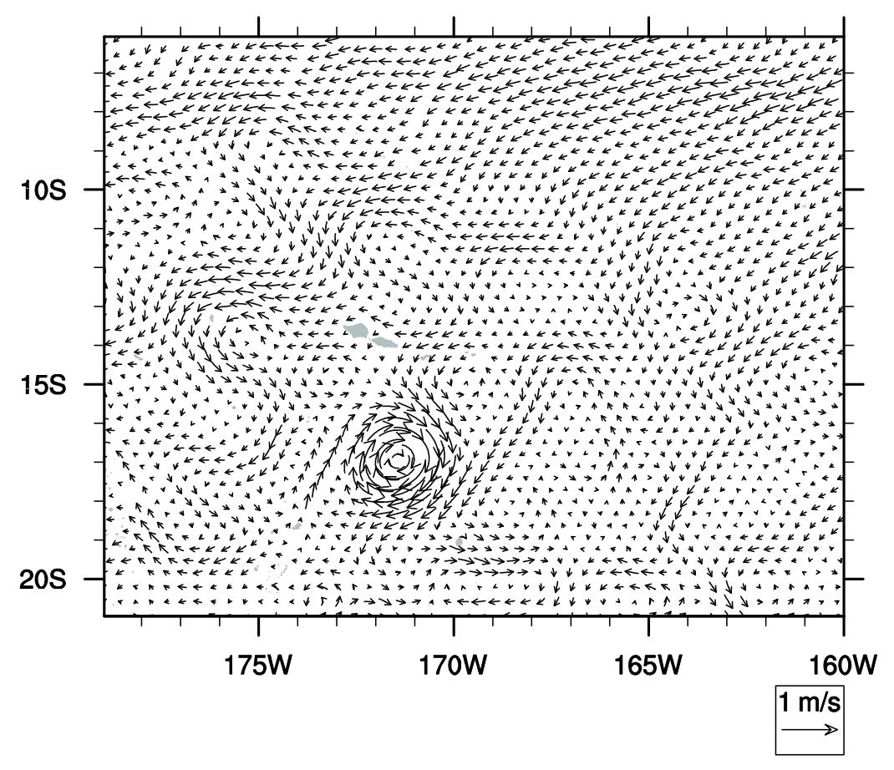

**Figure 3.3.** Tonga Trench Eddy. This clockwise eddy formed in September through December of 2006, 2008, and 2009. Average current vectors for April 2009.

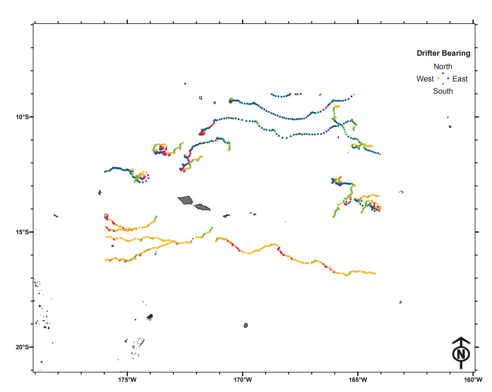

Figure 3.4. Example of typical drifter paths. January 2007 drifters shown (NOAA Global Drifter Program).

multi-way ANOVA analysis for transport distance. Instead, gross and net transport distances were calculated for all drifters in the study area that were at large for 10, 20, 30, 50, and 100 days respectively, and plotted as means and histograms. Net displacement is simply the straight-line distance between the start and end points of a drifter after a specific number of days whereas gross displacement is the total length of the drifters path (sums of all path segments recorded every six hours).

### **Larval Sources**

Virtual larvae were started at each of 20 island groups and shallow seamounts in the study area (Figure 3.1; Appendix A). Islands and seamounts very close together were aggregated into larger groups especially at the edges of the study region to simplify and focus presentation of the results on the Samoan Archipelago. Only islands in the northern extent of the Tonga chain and eastern portion of the Wallis chain were included as larval sources since preliminary analysis indicated that most larvae from farther out would quickly leave the study area westward toward Fiji.

Larval production was scaled to the area of the insular shelf (or seamount) with potential coral reef habitat. This was defined as the area from shore to the 150 m isobath and was based on the approximate depth limits of both photic and meso-photic reef communities in the area (Mesophotic Coral Ecosystems 2010, Bare et al. 2010). Initially, a set of 10,000 larvae were placed randomly within each coastal grid cell in HYCOM. This number of larvae was then adjusted based on the proportion of the cell with bottom depths between 0 and 150 m. For example, a cell comprised of 50% land, 20% water deeper than 150 m, and 30% water with depth between 0 and 150 m, was assigned a total of 3000 larvae (30% of 10,000) (Figure 3.1). This provided a very large but computationally reasonable number of virtual larvae scaled to potential area of reef habitat that could be "spawned" or started moving in simulations by HYCOM currents on any date specified.

Fish and corals do not spawn at random positions on the reef as modeled here and, in the case of some fish species, move to areas where currents sweep eggs and larvae rapidly away from coasts to avoid reef based predators. For example, many fish species exhibit a vertical "spawning rush" away from reefs toward the surface and position themselves in habitats conducive to broadcast spawning. Mature surgeon fish in American Samoa are most abundant on points and headlands where strong currents are found (Ochavillo et al. 2011) and spawning can often be observed in reef channels where water flows in a seaward direction as it drains the reef flat (Craig 1998). Such localized currents are not included at the scale of HYCOM and should be studied using models with greater spatial resolution.

### **Mass spawning events and start dates of larval transport**

Many coral species and other organisms in Independent and American Samoa and nearby Fiji have been observed to spawn 5-7 nights after the full moons in either late October or early November (Mildner 1987, Itano and Buckley 1988, Mildner 1991, Mundy and Green 1996). The presence of coral spawning slicks is used as a cue for harvest of the edible Palolo worm, *Eunice viridis*, (Craig 2009) which is also known to engage in a synchronous spawning event and has a well documented lunar timing in the Samoan Archipelago (Mundy and Green 1996). This annual mass spawning event for coral was the focus of our simulations. Starting dates for each model year were identified as six days after the first full moon to occur after October 12. These dates were 3 November 2004, 23 October 2005, 11 November 2006, 1 November 2007, and 20 October 2008. It is recognized that some spawning can occur across several days or even following successive full moons in October and November. However, preliminary evaluations of the model indicated that transport patterns did not differ substantially when start dates were on successive days or even separated by as much as a month among various phases of the moon, a finding similar to other studies (James et al. 2002) and consistent with time-scales of variation in ocean current patterns within the region.

In addition to the October-November mass spawning event, year round spawning has been observed for several fish species in American Samoa (Craig 1998). A locally important fisheries species, the surgeonfish *Acanthurus lineatus*, has peak spawning in November-January (Craig et al. 1997) which would result in similar transport patterns to those reported here. However, to evaluate the inter-island connectivity associated with year-round spawning, additional start dates and modeling would be required, especially for islands in the region of the strongly seasonal South Equatorial Counter Current described below.

### **Larval Transport and Model Uncertainty**

Virtual larvae began at random locations within each coastal grid cell and were moved in the direction and distance specified by the corresponding current vectors from HYCOM for that date and grid cell. The General NOAA Operational Modeling Environment (GNOME v 1.3.0) was used to track larvae for all simulations. Diffusion or random variability in larval paths originating from the same location is an important aspect of connectivity studies (Polovina et al. 1999, Cowen et al. 2000, Siegel et al. 2003, Kobayashi 2006, Chiswell and Booth 2008, Treml et al. 2008, Rudorff et al. 2009). GNOME provides both a deterministic "best guess" calculation of larval path that assumes no error in current vectors and also enables a controlled amount of random variability to be applied to vectors at each time step for a more stochastic path. Adding random variability or uncertainty to larval transport results in a cloud of potential pathways even when larvae all start at the same date and grid cell. The cloud has variable density with more larvae occurring along paths with higher probability of occurrence but also regions with fewer larvae that indicate less probable larval paths.

To identify an appropriate level of diffusion/uncertainty, actual drifter paths tracked by satellite were compared to the paths predicted by HYCOM for virtual larvae originating at the same date and location as the drifters. Only drifter segments that began near islands (within ~30 km) were used for this analysis because the goal was to evaluate variability of transport paths originating from these features. A total of 58 drifters (n = 13 NOAA CRED, n = 45 NOAA GDP) met this criterion. The start date and position of drifters from a subset of model years were loaded into HYCOM as starting points for particle drift. To identify an appropriate level of variability in particle drift, separate model runs using 1000 larvae were performed using a range of random error values (10-50%) in current vectors. Model paths were compared to each drifter path for general agreement while recognizing that a given drifter represents only one possible track out of a wide potential distribution that reflects variation in drift. Using only 10% uncertainty rarely produced a probability cloud of the 1000 larvae that included the drifter paths. Using 50% uncertainty nearly always encompassed drifter tracks and provided reasonable clouds of larval pathways which highlighted more likely tracks (those occurring more frequently had greater density) while also depicting less likely, but still possible, pathways. All subsequent model runs were conducted using 50% random error in current vectors at each time step to reflect this realistic level of randomness in larval transport.

### **Precompetency**

Spawned gametes, fertilized eggs and young larvae cannot immediately settle even if they encounter suitable habitat and instead must spend some time developing as plankton. Precompetency is the term used to describe the planktonic phase prior to achieving a body form capable of settlement. For many reef fish species, settlement is documented over a range of

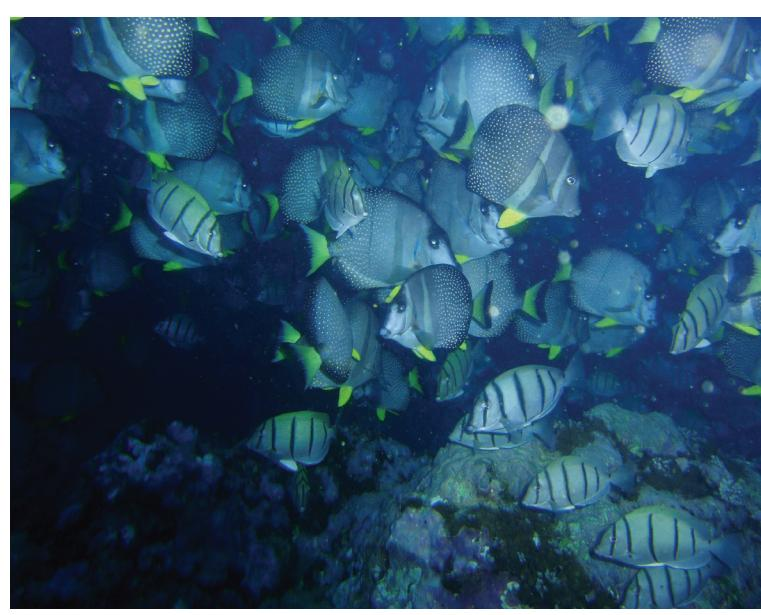

**Image 9.** *A. guttatus* spawning aggregations at dusk. Photo credit: Peter Craig, NPS.

larval ages (e.g. settlement marks recorded on otoliths at 14 to 21 days old). For a wide variety of reef fish species for which reasonable sample sizes are available it is evident that individuals begin to settle once 60-90% of their maximum larval lifespan (see next section: Pelagic Larval Duration) has elapsed (calculated from values in Victor 1986, Thresher et al. 1989, Wellington and Victor 1989, and Junker et al. 2006). Precompetency periods for coral larvae are less known and appear somewhat more variable (Harrison et al. 1984, Wilson and Harrison 1998, Miller and Mundy 2003, Graham et al. 2008, Jones et al. 2009). To simulate this developmental period, virtual larvae in the present study were prevented from settlement until a minimum of 60% of their Pelagic Larval Duration (see next section) was completed.

### **Pelagic Larval Duration**

Pelagic larval duration (PLD) is defined as the period of development spent in the water column during which larvae are susceptible to transport by ocean currents. For many species, larvae simply die in the plankton at the end of their PLD if they lack a suitable settlement habitat or energy source. PLD is quite varied among coral reef organisms even within the same genus and can be hours, days, weeks, or months (e.g. Bonhomme and Planes 2000, Blanco-Martin 2006, Junker et al. 2006, Graham et al. 2008). Within species there can be considerable variability in PLD as well (Wilson and Harrison 1998, McCormick 1999, Junker et al. 2006) with influences such as water temperature and availability of suitable settlement habitat (McCormick and Molony 1995, Munday et al. 2009). In addition, larvae can shorten or lengthen their competent time in the plankton through various mechanisms such as delaying or partly reversing metamorphosis until a suitable habitat is encountered (McCormick 1999, Richmond 1985), directed swimming faster than ambient currents for some portion of their larval phase (Leis and Carson-Ewart 2003), and entrainment into coastal eddies to avoid extensive offshore transport (Swearer et al. 1999, Harlan et al. 2002, Paris et al. 2007).

Also of note, climate change and the associated rise in sea surface temperatures may accelerate larval development of many species, cause earlier reef seeking behaviors, and even increase larval swimming efficiency (Wilson and Harrison 1998, Munday et al. 2009). All of these factors may serve to shorten PLDs overall, making it important to simulate connectivity over a range of PLD values and shift predictions toward potentially shorter dispersal distances.

Rather than modeling particular species with specific life history parameters, we used a wide range of PLDs. This enables a variety of species and their corresponding PLDs (and changes to PLD due to factors such as climate change) to be considered. We evaluated PLDs of 10, 20, 30, 50, and 100 days which encompasses the range of PLDs expected for a wide variety of the fish and coral species of the Samoan Archipelago and adjacent island nations (e.g. summary tables in Bonhomme and Planes 2000, Blanco-Martin 2006, Graham et al. 2008, Jones et al. 2009). Longer planktonic longevity is possible (e.g. >200 days for some coral species, Graham et al. 2008); however, preliminary analyses revealed that many tracked particles had left the study area after 100 days, and modeled trajectories probably have reduced accuracy for such long periods. Also of note, some species have very short larval period (minutes or hours) and are never subjected to the interisland currents studied here.

### **Buffer for 'Settlement Zones**'

Fish larvae can sense the reef from some distance away and perform behaviors that can help them reach desirable settlement habitats including vertical migrations into current fields moving toward reefs or simply out-swimming

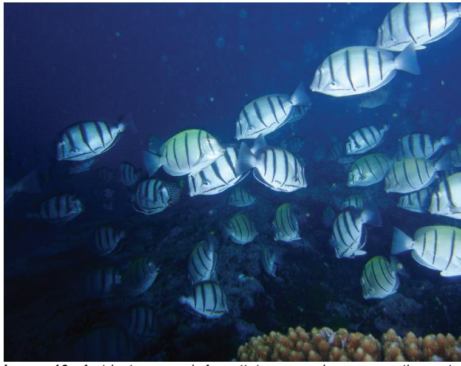

**Image 10.** *A. triostegus* and *A. guttatus* spawning aggregations at dusk. Photo credit: Peter Craig, NPS.

the ambient currents they are embedded in (Leis 2002, 2006, Gerlach et al. 2007, Leis 2007,). For as much as 50% of their larval phase, some fish larvae may be capable of sustained directional swimming that is sufficient to overcome their treatment as merely passive particles in ocean currents (Leis and Carson-Ewart 2003, Fisher 2005, Leis 2006). Larval fish can probably sense odor plumes from appropriate settlement habitat at distances of several kilometers (Atema et al. 2002, Leis 2006) and orient their movements horizontally or vertically in the water column to increase their chances of reaching settlement habitat. Recent studies show that some reef fish larvae can swim impressive distances on the range of 10-50 km (Atema et al. 2002, Leis 2002), although this swimming could not be intentionally directed toward a reef beyond the sensory zone in which the larvae could detect the reef. Although the precise distance at which fish larvae can begin to orient towards reefs and the effectiveness of this orientation against ambient currents are topics of active debate, it is clear that larvae need not rely exclusively on passive transport in currents to arrive precisely at a distant island and instead need simply to come within a "settlement zone" sufficiently close such that they can sense and swim to the settlement habitat. Consequently, recent researchers have used buffers around islands to represent this "settlement zone" ranging from 1 to >100 km depending on the species under investigation (Lugo-Fernández et al. 2001, James et al. 2002, Cowen et al. 2006, Chiswell and Booth 2008).

In this study, we investigated a range of potential settlement zone distances including 9 km (the resolution of the coastal grid cells in HYCOM), 18 km, and 36 km to accommodate a wide spectrum of organisms and potential sensory and swimming capabilities. A buffer of each distance was calculated using the maximum depth contour for mesophotic reefs around all islands and shallow seamounts and was designated as a settlement zone. If a larvae passed into an island's settlement zone after its precompetency period it was considered to have successfully settled at that island. Preliminary analysis revealed that, while settlement rates were somewhat affected by buffer distance, the spatial patterns of connectivity were relatively unaffected. We therefore display results for only the 18 km settlement zone in this report.

### **Mortality**

Larval mortality has a significant effect on successful transport especially over long distances and lengthy time periods. Daily mortality rates are affected by environmental conditions and can vary significantly. Cowen et al. (2000) reported a wide range of mortality estimates for fish larvae of 42 species ranging from 3 to 46% per day with a mode of 18%. At these rates it is clear that most larvae will die prior to reaching settlement habitat, especially for small islands or seamounts that don't produce many larvae to begin with. For example, for every 1000 larvae produced at a source, after 20 days in the plankton, approximately 544 would remain if daily mortality were 3%, 19 would remain if mortality were 18%, and less than 1 would remain if mortality were 46%.

In the present study, we investigated the influence of a range of daily mortality rates including 3%, 18%, and 46% to reflect the spectrum of known values (Cowen et al. 2000). For each daily mortality rate, these percentages of the larval population were randomly selected and removed from the larvae remaining at each daily time step.

### **Calculating Connectivity**

Results are first summarized for the entire study area as connectivity matrices that display the island/seamount sources and destinations of all the virtual larvae tracked in the study. Islands in the southern part of the Tonga and western Wallis Island chains were not modeled as larval sources but were still shown in the connectivity matrices as destinations. For each PLD and mortality rate, we counted the number of simulated larvae released at each source location that travelled to each of the possible destination locations, cumulated over all 5 model years. Matrix cells denote the proportion of larvae from each source (rows) that arrived at a given destination (columns). Rows thus sum to a number <= 100%. The fraction of larvae that are lost (that do not successfully settle at any one of the destinations in our study) is equal to 100% minus the sum of each row. Columns can sum to >100%, because it is possible for a high proportion of the larvae produced at several sources to travel to the same destination. Separate matrices are provided for each combination of PLD and daily mortality rate. Note that connectivity calculated in this way depicts the pattern of larval transport pathways, without considering the variation in number of larvae produced at each source that could occur as a result of large differences in the size of reef populations.

Each of the islands and shallow seamounts within the Samoan Archipelago was examined in detail as a larval source and destination. Each island/seamount was characterized individually using a combination of plots of larval distribution by PLD, three dimensional graphs that display larval retention and how reliant each location is on outside larval sources for each PLD and daily mortality rate, and bar graphs showing larval sources and destinations by location.

### **RESULTS AND DISCUSSION**

### **HYCOM Validation**

Current vectors from HYCOM showed good correspondence to actual drifter paths on both short (daily) and long (monthly) timescales. Drifter and model velocities at 100 randomly chosen dates/positions were positively correlated in both the longitudinal (p < 0.0001) and latitudinal (p < 0.0001) directions based on linear regression. Monthly current vectors from HYCOM showed good general correspondence to drifter paths in visual comparisons. These findings indicate that the modeled current vectors from HYCOM are a reasonable representation of actual transport processes in the study area.

### *Drifter heading, speed and transport distance*

The multiway ANOVAs and histogram analyses of drifter data indicated that current headings are significantly affected by season and region within the study area (Figures 3.5-3.6, Table 3.1). Overall transport throughout the

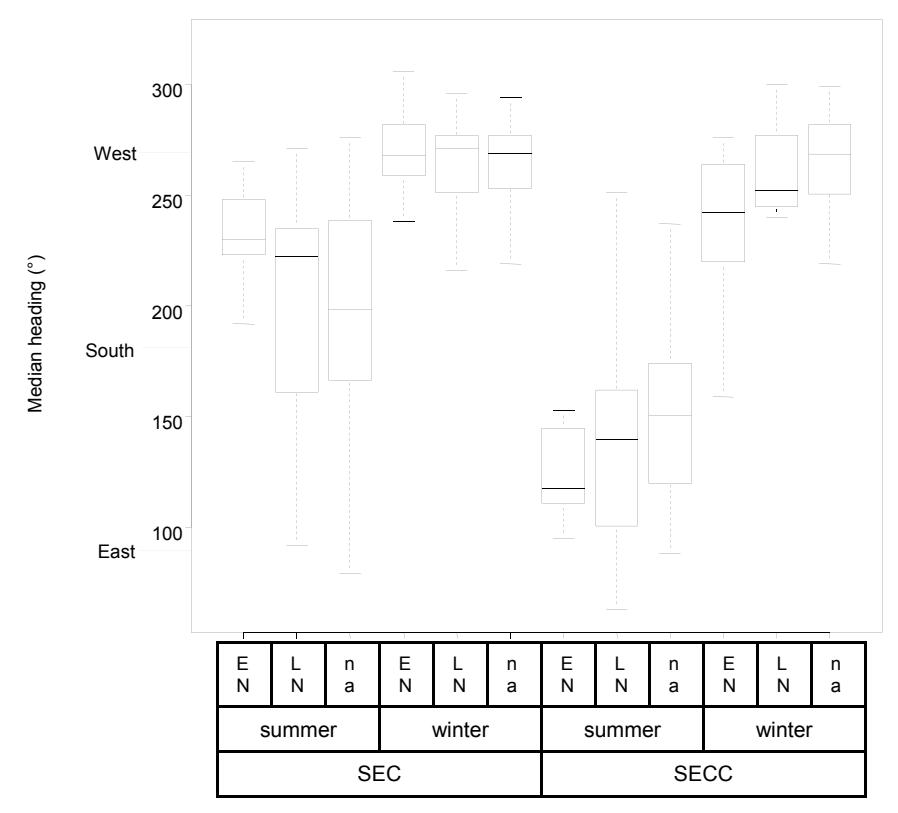

**Figure 3.5.** Box plots of median current headings by region, season, and ENSO conditions based on drifter data. EN = El Niño, LN = La Niña, na = neutral ENSO, SEC = South Equatorial Current, SECC = South Equatorial Counter Current.

region was westward except in the region between ~8º S and 12º S during summer, wherein drifter motion was nearly opposite with most heading ESE. This marks the region of the South Equatorial Counter Current. ENSO was not a significant influence on drifter headings and contributed only a minor and indirect effect in that headings were more variable in La Niña and neutral ENSO years relative to the El Niño year. Current speeds were largely uniform throughout the study region at 20 to 30 cm/s with drifter speed not influenced significantly by season, region, or ENSO alone (Table 3.2, Figure 3.7).

ENSO did not have a major effect on drifters, however it should be noted that only one El Niño year occurred in the analysis period. Ideally, many El Niño years could be included in the analysis and drifters among years would have greater independence. Unfortunately, the analysis was limited to the Southern Oscillation conditions that oc-

curred during the time drifters have been deployed. Additional years of drifter data and model runs with varying ENSO conditions would be necessary to more fully understand the effects of ENSO on current patterns.

Gross transport distance (path length of drifters) was positively and linearly related to time at large whereas net displacement distances were 40-70% shorter and leveled off between 50 and 100 days as currents looped many drifters back closer to their starting points at longer time scales (Figure 3.8). These results are consistent with the diffusive nature of dispersal by turbulent ocean currents (Okubo 1980). As a reference for dimensions in considering the scale of larval connectivity in this region, it is useful to note that 400 km is the approximate length of the sides of a triangle with vertices at Rose Atoll, the western tip of Savai'i, and Swains Island and includes all islands of the Samoan Archipelago. After ~30 days, mean net transport of drifters was over

**Figure 3.6.** Median current headings by season and region based on drifter data.

**Table 3.1.** Full factorial ANOVA on the effects of region, season, and ENSO status on median drifter heading. Significant effects are labeled according to the level of significance.

| Figure Variables | 6: Df | Median Sum Sq.           | current headings Mean Sq. | by season F value | and region p value |
|---------------------|----------|-----------------------------|---------------------------------|-------------------------|--------------------------|
| based region     | on 1  | drifter data. 134,317 | 134,317                         | 92.4                    | < 2.2e-16 ***            |
| season              | 1        | 421,055                     | 421,055                         | 289.7                   | < 2.2e-16 ***            |
| ENSO                | 2        | 2,182                       | 1,091                           | 0.8                     | 0.473                    |
| region:season       | 1        | 41,411                      | 41,411                          | 28.5                    | 2.0e-07 ***              |
| region:ENSO         | 2        | 13,818                      | 6,909                           | 4.8                     | 0.009**                  |
| season:ENSO         | 2        | 5,274                       | 2,637                           | 1.8                     | 0.165                    |
| region:season:ENSO  | 2        | 612                         | 306                             | 0.2                     | 0.810                    |
| Residuals           | 266      | 386,599                     | 1,453                           |                         |                          |

Signif. codes: p < 0.001 (\*\*\*); p < 0.01 (\*\*); and p < 0.05 (\*) Residual standard error: 38.12 on 266 degrees of freedom Multiple R-squared: 0.62, Adjusted R-squared: 0.6 F-statistic: 38.7 on 11 and 266 DF, p-value: < 2.2e-16

**Table 3.2.** Full factorial ANOVA on the effects of region, season, and ENSO status on mean drifter speed. Significant effects are labeled according to the level of significance.

| Variables          | Df  | Sum Sq.  | Mean Sq. | F value | p value    |
|--------------------|-----|----------|----------|---------|------------|
| region             | 1   | 0.5      | 0.51     | 0.01    | 0.914      |
| season             | 1   | 36.1     | 36.13    | 0.8     | 0.366      |
| ENSO               | 2   | 160.0    | 80.02    | 1.8     | 0.164      |
| region:season      | 1   | 6.3      | 6.29     | 0.1     | 0.705      |
| region:ENSO        | 2   | 35.0     | 17.48    | 0.4     | 0.672      |
| season:ENSO        | 2   | 857.7    | 428.83   | 9.7     | 8.3e-05*** |
| region:season:ENSO | 2   | 459.7    | 229.84   | 5.2     | 0.006**    |
| Residuals          | 267 | 11,765.2 | 44.06    |         |            |

Signif. codes: p < 0.001 (\*\*\*); p < 0.01 (\*\*); and p < 0.05 (\*) Residual standard error: 6.64 on 267 degrees of freedom Multiple R-squared: 0.11, Adjusted R-squared: 0.08 F-statistic: 3.209 on 11 and 267 DF, p-value: 0.0004

400 km and gross transport of some individual drifters was over 1000 km indicating ample opportunity for connections among islands for larvae with a PLD ≥ 30 days. In addition, histograms were used to characterize the spread of transport distances associated with each duration of drift. As expected, the longer drifters were at large, the greater the range and more extreme the tails in distribution of gross distance traveled (Figure 3.9a). For net distance however, there was little difference in distance traveled between 50 and 100 days because many drifters actually looped back on currents or eddies and ended up not far from their starting points despite being at large for twice as long (Figure 3.9b). The difference in net and gross transport must be interpreted with care because the maximum net transport distance possible was limited by the size of the study area (~ 1300 km wide) whereas gross distances essentially could be infinite.

# **Quantitative Description of Regional Ocean Currents**

At the broadest scale, the Samoan Archipelago lies along the northern edge of the South

Pacific Gyre, a series of connected ocean currents with a counter-clockwise flow that spans the Pacific basin (Alory and Delcroix 1999, Tomczak and Godfrey 2003, Craig 2009) (Chapter 2 Figure 2.3). Based on analysis of the modeled current vectors and drifter tracks, 4 major surface currents or eddies were identified that affect the archipelago (Figure 3.10a-b). From north to south these are: 1) the westward flowing South Equatorial Current at the northern edge of the study area, 2) the eastward flowing South Equatorial Counter Current that seasonally bifurcates the surface flow of the South Equatorial Current, 3) a westward but meandering flow of

the South Equatorial Current directly across the archipelago, and 4) a regularly occurring eddy south of the archipelago, hereafter referred to as the Tonga Trench Eddy due to its consistent position over this geologic feature. The heading, position, and strength, as well as yearly and seasonal variability for each of these four major current features in the study area are described below.

### South Equatorial Current

(north of the South Equatorial Counter Current)

The northern edge of the South Pacific Gyre is the westward flowing South Equatorial Current (SEC). The SEC is visible as westward or south-southwestward vectors along the northern edge of the study area during most seasons and years (Figures 3.3 and 3.10). Typical velocity based on drifter data is ~25 cm/s. Although its latitude is variable among seasons and years, this component of the SEC seldom extends far below ~9° S

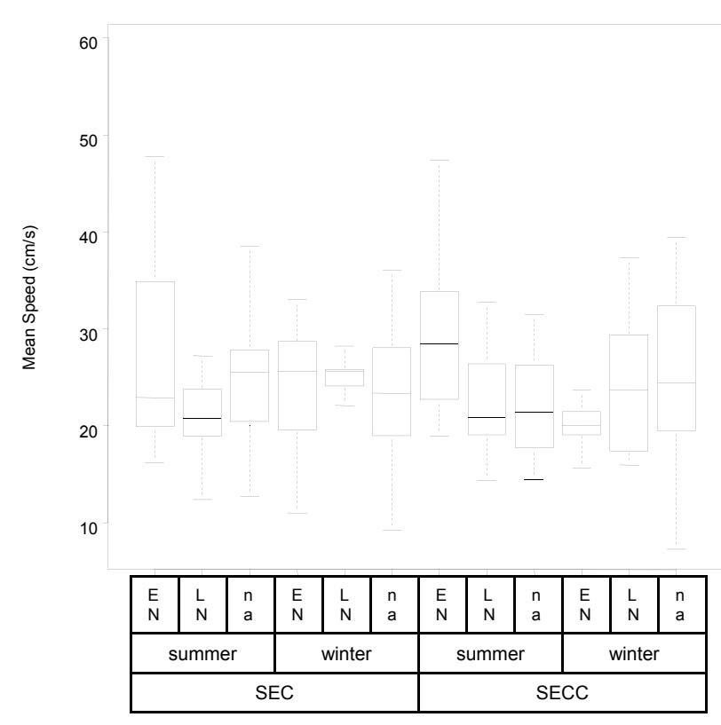

**Figure 3.7.** Box plots of median current speeds by region, season, and ENSO conditions based on drifter data. EN = El Niño, LN = La Niña, na = neutral ENSO, SEC = South Equatorial Current, SECC = South Equatorial Counter Current.

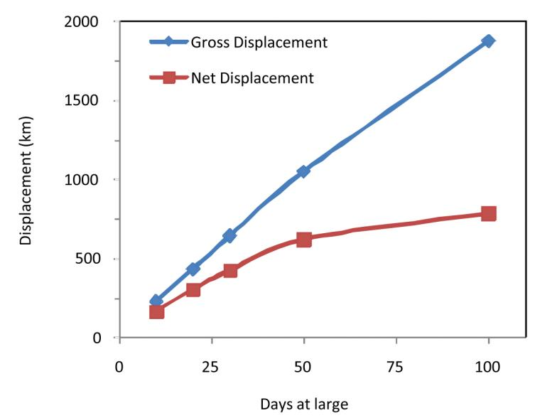

**Figure 3.8.** Mean gross and net displacement of drifters after 10, 20, 30, 50, and 100 days.

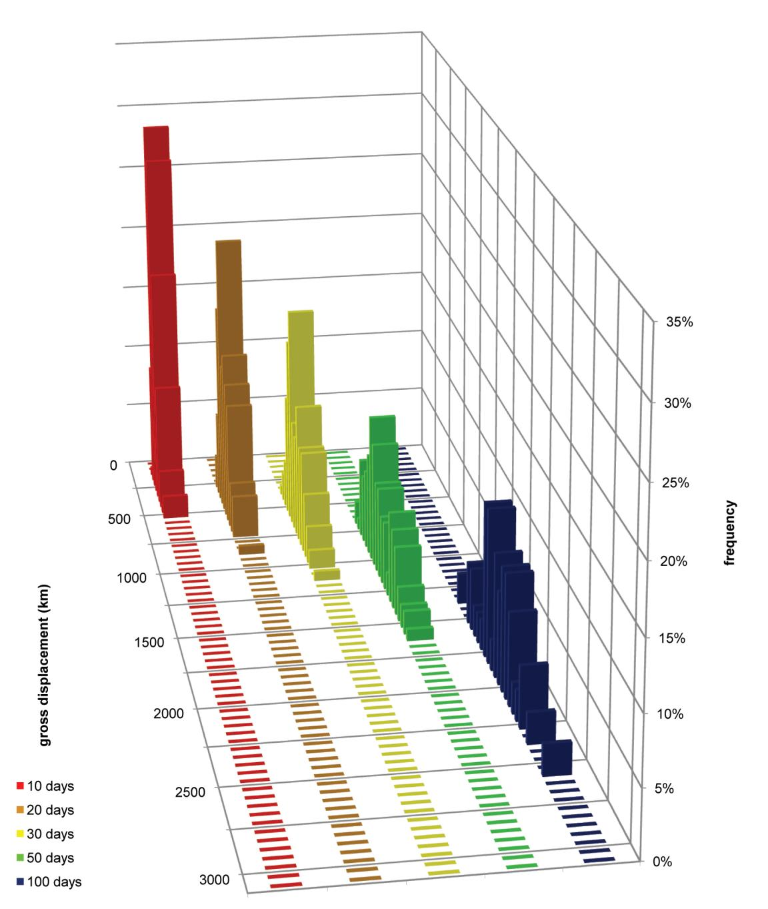

**Figure 3.9a.** Gross displacement of individual drifters as a frequency histogram after 10, 20 ,30, 50 and 100 days at large.

or into the EEZ of American Samoa or Samoa (Kessler and Taft 1987). Flow has been characterized as strongest from March to July and weakest from October to February (Kessler and Taft 1987), although this was not necessarily evident in the study region in recent years. A narrow region between ~6º S and 9º S of mild eddy formation (relative to the southern half of the study area)(Qui and Chen 2004, Domokos et al. 2007) is apparent between the SEC and the opposite flowing South Equatorial Counter Current described next.

### *South Equatorial Counter Current*

Embedded on the SEC at latitudes between ~8º S and 12º S lies the eastward flowing South Equatorial Counter Current (SECC) (Kessler and Taft 1987, Chen and Qiu, 2004, Domokos et al. 2007), the most clearly visualized current feature in the region (Figures 3.2, 3.4, and 3.10). The SECC is a shallow current that exists above the main thermocline at ~200 m depth (Kessler and Taft 1987, Chen and Qui 2004). Below the thermocline the SEC continues a weak westward flow (Kessler and Taft 1987). Swains Island in the northern EEZ of American Samoa often lies in the middle of the SECC current field. The eastern end of this current generally

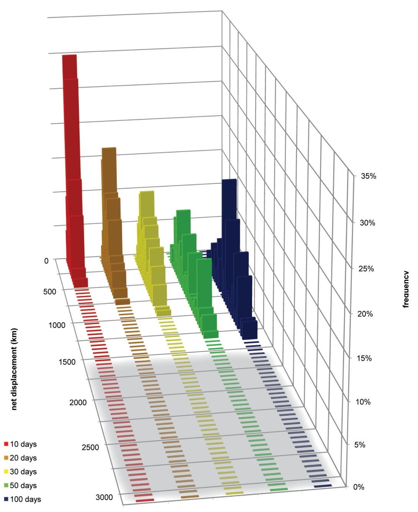

**Figure 3.9b.** Net displacement of individual drifters as a frequency histogram after 10, 20 ,30, 50 and 100 days at large. Grey shading depicts net transport distances greater than the maximum possibility as determined by the size of the study area (~1,300 km wide).

curls south between ~160º and 170º W and ultimately joins the southern component of the SEC headed west across the Samoan Archipelago (Chen and Qui 2004). The SECC is well developed in most years between October and April with peak speed and width observed during January and February in this region. Typical summer velocities based on drifters range from 22 to 30 cm/s and current heading is east-southeast (Figures 3.5-3.7). The current is often dissipated or absent in May through September (Chen and Qui 2004, Qui and Chen 2004), as confirmed by meandering or even westward drifter tracks and lower drifter speeds of 19 to 25 cm/s during these winter months (Figures 3.6 and 3.7). The signature of this current can however, be present yearlong as was observed in 2005, an El Niño year. Interestingly, the SECC was absent throughout 1982 and 1984, neutral ENSO years that bounded the strong El Niño conditions of 1983 (Kessler and Taft 1987). Also of note, the SECC was also virtually absent throughout 2009, a period of La Niña conditions. These observations highlight the irregular correlations between ENSO and SECC and the need for additional study during various ENSO conditions.

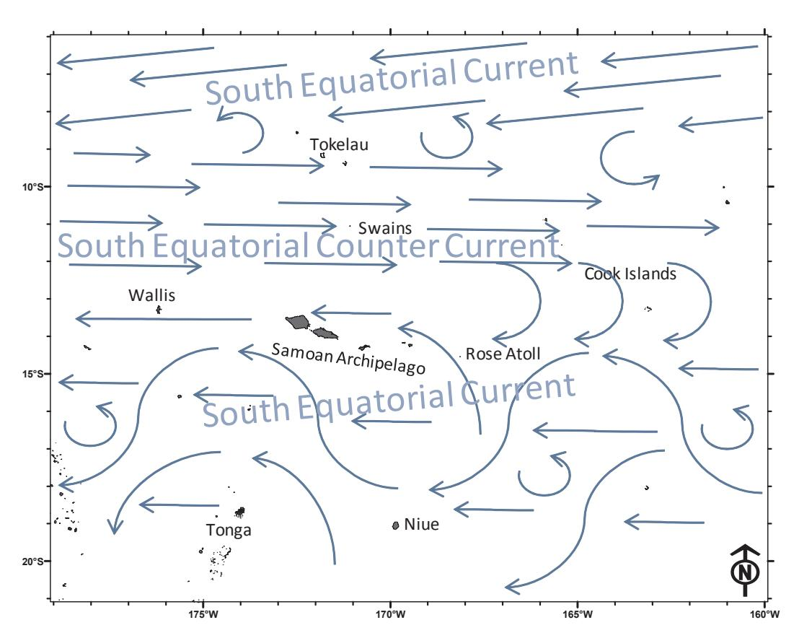

**Figure 3.10a.** Surface current patterns of the Samoan EEZs and surrounding region for October through April. The position of curled current vectors and meanders are highly variable and denote general patterns only. Patterns are based on data from HYCOM (2004- 2009) and NOAA's Global Drifter Program (n=216).

**Figure 3.10b.** Surface current patterns of the Samoan EEZs and surrounding region for May through September. The position of curled current vectors and meanders are highly variable and denote general patterns only. Patterns are based on data from HYCOM (2004-2009) and NOAA's Global Drifter Program (n=216).

### *South Equatorial Current (south of the South Equatorial Counter Current)*

The SEC continues its westward flow south of the SECC between ~13º S and 19º S, including all the islands of the Samoan Archipelago and the southern half of the study region. In contrast to the northern component of the SEC described above, the SEC in this region is characterized by many irregular meanders and eddies (Domokos et al. 2007). This overall westward but meandering flow pattern is apparent in current vectors for all years and seasons (Figures 3.2 and 3.10) and is confirmed by the overall westward tracks of drifters (mean heading of 225º in summer to 269º in winter) (Figures 3.4 - 3.6). Typical velocities are ~25 cm/s. Much irregular eddy activity is apparent between the opposite flowing SECC and this component of the SEC (Domokos et al. 2007).

### *Tonga Trench Eddy*

The last regularly occurring feature of note is a clockwise eddy (negative vorticity) centered at 16º S and 172º W, a location south of the Samoan Islands and positioned approximately over the Tonga Trench (Figure 3.3). The eddy was most common in September through December in 2006, 2008, and 2009, all of which correspond to mild or moderate La Niña conditions. Beginning in September 2008, the eddy was present throughout 2009. This feature is persistent and not to be confused with the relatively short-lived (~weekly) eddies and dynamics recently investigated by Domokos et al. (2007).

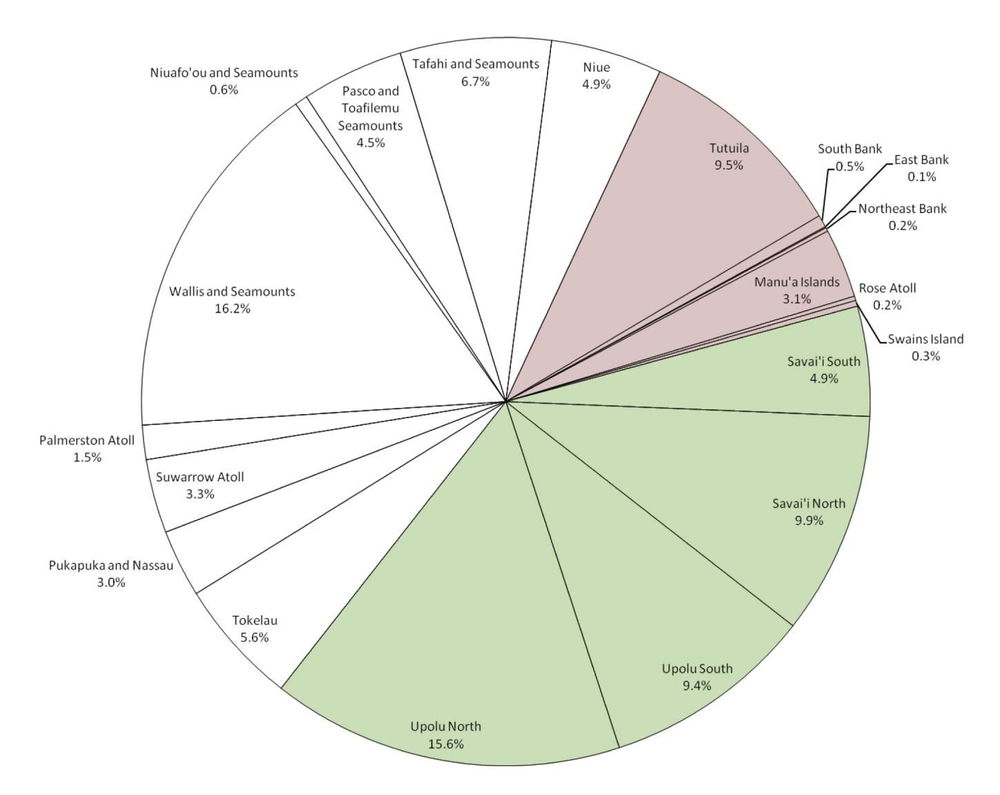

**Figure 3.11.** Proportion of virtual larvae in the study area that were started from each island, seamount, or island group. Red shading denotes larval sources from American Samoa. Green shading denotes sources from Samoa.

### **Larval Sources**

Based on potential reef area, the major sources of larvae in the study region are likely to be Upolu (~25% of the total larvae), Savai'i (~15%), and the Wallis Island group (~15%), although many of the larvae originating from this more diffuse group are quickly transported westward out of the study area (Figure 3.11, Table 3.3). Altogether the islands of Samoa and American Samoa were the source of over half the virtual larvae tracked in the study.

### **Larval Connectivity: Overall Patterns**

The connectivity matrices reveal broad patterns of overall larval transport and several island groups with strong internal connectivity (Figure 3.12). Beginning at the origin of the connectivity matrices it is clear that Wallis, Tonga, and the many small islands and seamounts associated with them are strongly interconnected but contribute few larvae to the Samoan Archipelago or elsewhere in the study region. Their position in the western or southwestern region of the study area results in most of the larvae from them being gradually transported westward out of the

**Table 3.3.** Islands, seamounts, or island groups used as source locations in simulations of regional larval connectivity, their corresponding potential reef area (0-150 m shelf), number of virtual larvae used in modeling, and the percentage of the simulated larval pool contributed by each source. Green shading denotes islands of Samoa. Red denotes islands and seamounts of American Samoa.

| Site                          | Potential Reef Area (km2 ) | No. Larvae Spawned | Percent Larvae Spawned |  |
|-------------------------------|-------------------------------------|-----------------------|------------------------------|--|
| Wallis and Seamounts          | 993                                 | 132,722               | 16.2                         |  |
| Niuafo'ou and Seamounts       | 34                                  | 4,606                 | 0.6                          |  |
| Pasco and Toafilemu Seamounts | 279                                 | 37,067                | 4.5                          |  |
| Tafahi and Seamounts          | 400                                 | 54,704                | 6.7                          |  |
| Niue                          | 285                                 | 40,304                | 4.9                          |  |
| Savai'i South                 | 300                                 | 39,793                | 4.9                          |  |
| Savai'i North                 | 600                                 | 80,919                | 9.9                          |  |
| Upolu South                   | 571                                 | 76,831                | 9.4                          |  |
| Upolu North                   | 949                                 | 127,661               | 15.6                         |  |
| Tutuila                       | 576                                 | 77,873                | 9.5                          |  |
| South Bank (Papatua Guyot)    | 33                                  | 4,481                 | 0.6                          |  |
| East Bank (Tulaga Seamount)   | 3                                   | 448                   | 0.1                          |  |
| Northeast Bank (Muli Guyot)   | 10                                  | 1,335                 | 0.2                          |  |
| Manu'a Islands                | 186                                 | 25,182                | 3.1                          |  |
| Rose Atoll                    | 12                                  | 1,564                 | 0.2                          |  |
| Swains Island                 | 16                                  | 2,133                 | 0.3                          |  |
| Tokelau                       | 350                                 | 45,644                | 5.6                          |  |
| Pukapuka and Nassau           | 187                                 | 24,507                | 3.0                          |  |
| Suwarrow Atoll                | 203                                 | 26,796                | 3.3                          |  |
| Palmerston Atoll              | 90                                  | 12,440                | 1.5                          |  |
| Total                         | 6,077                               | 817,010               | 100.00                       |  |

study region in the direction of Fiji. In fact, this is the reason that some of the islands in these groups were not included as sources in the analysis. The island nation south of American Samoa, Niue and its associated seamounts, is largely isolated from the other islands in the study region. This is due to Niue's long distance from both upstream and downstream islands. Connections with its nearest downstream neighbor, Tonga may have been stronger were it not for the frequent development of the Tonga Trench Eddy between these two island groups which entrained many larvae until their PLD elapsed. Upolu and Savai'i in Samoa are highly interconnected and also have a large export of larvae to the islands and seamounts to the west such as Wallis, Niuafo'ou (Tonga), and Tafahi (Tonga). Samoa exports a smaller proportion of its larvae eastward against the SEC toward American Samoa. The islands and seamounts of American Samoa are also internally connected. The pattern of transport is such that most of the larvae either settle at the source or are transported to destinations downstream to the west, including the islands of Samoa, but often not as far as Wallis Island and its associated seamounts and not in very high proportions. Swains Island and Tokelau are relatively isolated from the other islands in the study area and are the sources of only relatively minor larval contributions to the Samoan Archipelago via the return loop of the SECC. Islands and seamounts in the Cook Islands group (Suwarrow Atoll, Palmerston Atoll, and Pukapuka Atoll and Nassau) are largely isolated, even from each other, and show few larval connections with other sites considered here despite their generally upstream position in the SEC. These islands were simply too far away and produced too few larvae to be a significant larval source for even the Samoan Archipeago, the next islands downstream.

Overall, the spatial pattern of connectivity was controlled by the SEC with islands to the east providing larvae to both themselves and islands to the west. Despite expectations that the eastward flowing SECC and its feedback loop to the SEC would carry larvae from sites such as Swains Island back along the Samoan

**Figure 3.12.** Cumulative connectivity, 2004-2008. Color scale indicates fraction of simulated larvae released at source settling at destination. Shading of labels indicates core island groups: red, American Samoa; green, Samoa.

Archipelago, such connectivity patterns were not seen in the simulations. Swains is simply too far north in the SECC current field and there are simply too few larvae that can survive the long transport time necessary for current loops to carry them back to settlement sites.

An important caveat to interpretation of matrix elements for islands close to the edges of the study area is that virtual larvae that hit the edge of the hydrodynamic model were lost to further transport. In the real world, eddies or current reversals may have eventually looped larvae back into the study area for possible settlement for larvae with longer PLDs. The importance of these lost trajectories is probably minor due to the compounding of daily larval mortality. Islands at the edge of our study extent may also play important larval source or destination roles with adjacent islands just outside of our study region that were not characterized here (e.g. Fiji). For these reasons matrix elements for islands near the edge of the study area must be interpreted only in the context of the study extent. Findings for islands in the core of the study area, American Samoa and Samoa are the most robust.

Also important is that, whereas we tracked >800,000 virtual larvae, the real larval output of these marine systems is orders of magnitude higher. Blank cells in our matrices denote cases in which zero virtual larvae connected a source and destination, but had we used more virtual larvae in the simulation or in a real world spawning event involving many more larvae, some may have actually made the connection. For this reason, blank cells in our simulations should not be viewed as impossible connections but instead thought of as relatively less probable.

The proportion of larvae traveling to a destination will be a function not only of source population locations, size, and ocean current patterns, but also of the size of the destination (specifically, the size of the destination island and its surrounding settlement zone). Since this is an inherent feature of the geography of the region, we do not standardize the connectivity values for size of the destination area, although this may be desirable for some population modeling purposes.

### **Influence of PLD and Daily Mortality Rate**

Longer PLDs had three main effects on inter-island connectivity (Figure 3.12). First, the proportion of self seeding (fraction of larvae produced at a source location that settled at the same location) was reduced overall since larvae were not competent to settle until they had been transported farther from sources. Second, connectivity with islands farther downstream increased noticeably after PLDs of 10 days. This was especially noticeable in seeding of Wallis, Niuafo'ou (Tonga), Tafahi (Tonga), and the nearby seamounts with larvae from American Samoa. Third, larvae with PLDs of 50 or 100 days could be transported nearly any place in the study area although in very low abundance provided that the mortality rate was low enough. This widespread potential for transport at long PLDs suggests that the low amount of connectivity needed to prevent species divergence by genetic drift is easily possible throughout the study area. This is especially true considering that our study reflects cumulative connectivity over only a five year period, which is short relative to the generation time of many species in Samoan reef ecosystems. This widespread transport could also promote rapid (re-) colonization of unoccupied reefs, although the likelihood of colonization actually occurring when larvae arrive in low density is influenced by a variety of life history features (Kinlan et al. 2005). Widespread transport of organisms with longer PLDs could be important in understanding and predicting resilience to disturbance and responses to climate change of this regional ecosystem.

The fate of long-lived larvae is highly dependent on mortality rates. For low to moderate daily mortality rates at PLDs up to 30 days, the islands involved in predicted larval exchange changed little, but mortality and PLD did affect the strength of the connection (cell color changed but pattern of empty cells in the matrix did not) (Figure 3.12). In contrast, higher mortality rates affected both the strength of the connections (cell color) as well as the spatial pattern of island connections (many more blank cells), especially at longer PLDs. At high levels of mortality only those islands that were large larval sources (e.g. Savai'i, Upolu, Wallis) or that were close together had any measureable connectivity. For the very longest PLDs and medium to high mortality rates considered, no larvae settled successfully at any islands (Figure 3.12; three matrices in lower right corner). They all simply died before the end of these very long PLDs. This highlights the importance of better information on larval mortality, particularly for species with long PLDs.

### **Influence of Interannual Variability**

There was little difference in the drifter or current data among years, a pattern that was borne out in the simulations of larval transport. The one exception was in 2008, a year in which the SECC failed to develop. This had only a small effect on transport of larvae for most islands in the study region except for Swains, which lies in the middle of this current field. In most model years, larvae from Swains were quickly carried eastward in the SECC (Figure 3.13). In contrast, in 2008 the SEC persisted in its westward transport throughout the region and entrained Swains larvae in the opposite direction.

### **Larval Connectivity: Islands/Seamounts within the Samoan Archipelago**

Each of the islands and shallow seamounts in the Samoan Archipelago are characterized separately in the following sections. Moving from west to east along the archipelago and ending with Swains Island, each site is the focus of a detailed set of analyses to characterize its role as a larval source and destination in the region. The north and south shores of Savai'i and Upolu are each

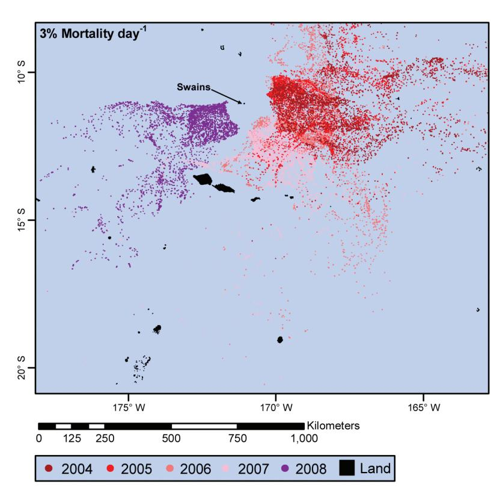

**Figure 3.13.** Transport of virtual larvae from Swains Island by model year. All PLDs shown as same color for each year.

characterized separately due to their large size and slightly different patterns of larval connectivity. The Manu'a Islands (Ofu, Olosega, and Ta'u) are combined due to their small size and close proximity relative to the scale of the hydrodynamic model.

### **SAVAI'I (SOUTH COAST)**

**Figure 3.14.** Position of virtual larvae from southern Savai'i for all model years by PLD. Upper and lower plots denote 3% and 18% daily mortality respectively.

### Destinations

Southern Savai'i has a moderate area of potential reef compared to other islands and was the source of 5% of the larvae for the region (Figure 3.11, Table 3.3). Most larvae from Savai'i's south coast are transported to the southwest via the SEC and have reached Wallis and the northern islands and seamounts of the Tonga group (Niuafo'ou, Tafahi, etc.) after only 10 days (Figure 3.14). A smaller number of larvae are passed northward and then entrained into the eastward flowing SECC which carries them between Swains Island and the rest of the Samoan Archipelago after 30 to 50 days.

**Figure 3.15.** External larval supply and local larval retention at Savai'i-South as a function of PLD and mortality rate. Top panel: Percent of simulated larvae settling at this site that were produced at other sites. Bottom panel: Percent of simulated larvae produced at this site that return here.

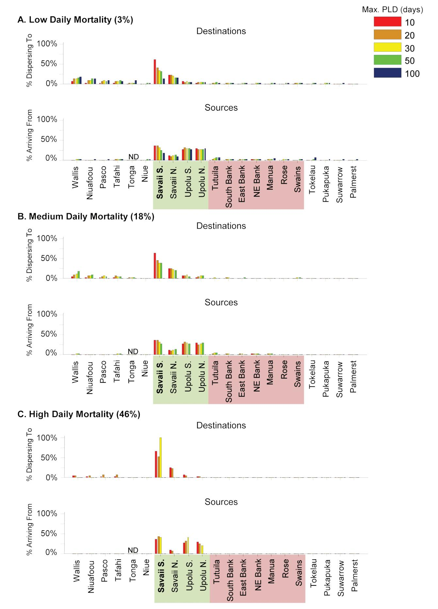

**Figure 3.16.** Destinations (and sources) of simulated larvae originating from (arriving at) Savai'i-South for low, medium, and high larval mortality rates. Shading of labels indicates core island groups: red, American Samoa; green, Samoa. ND= no data.

Nearly 25% of the larvae spawned from southern Savai'i are retained there for the low mortality scenario and 10 day PLD (Figure 3.15). Much smaller fractions of local production are retained for longer PLDs and higher mortality. As PLD is lengthened, an increasingly large fraction of the settling larvae end up at destinations to the west such as Wallis and the islands and seamounts of northern Tonga (Figure 3.16). Higher mortality rates result in only a small proportion of the larvae produced at southern Savai'i successfully returning there (Figure 3.15), but very small proportions successfully settle anyplace else either (Figure 3.16). This highlights the point that most larvae produced at Savai'i die without reaching suitable settlement habitat.

### Sources

Southern Savai'i is reliant on outside larval sources for a relatively consistent ~60-80% of its arriving larvae depending on PLD and daily mortality rate (Figure 3.15). Although many larvae that reach southern Savai'i come from southern Savai'i, large fractions also arrive from the northern and southern coasts of Upolu (Figure 3.16). Notably, southern Savai'i receives over half of its larval supply from Upolu regardless of mortality rate and PLD. Were these major larval sources to be disturbed, recovery at Southern Savai'i could be relatively slow and reliant on the much smaller larval sources from Tutuila and the other islands of American Samoa.

### **SAVAI'I (NORTH COAST)**

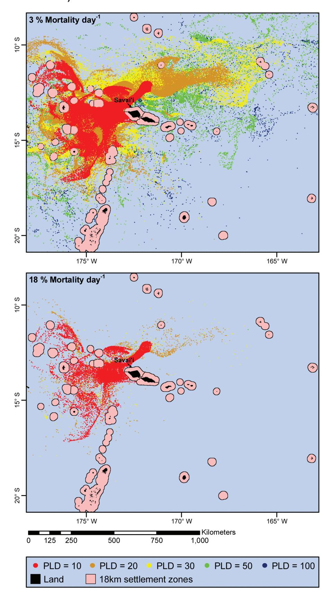

**Figure 3.17.** Position of virtual larvae from northern Savai'i for all model years by PLD. Upper and lower plots denote 3% and 18% daily mortality respectively.

### Destinations

Northern Savai'i has a large potential reef area and was among the larger larval sources in the study (Figure 3.11, Table 3.3). Transport of larvae from Savai'i's north coast is similar to the south shore described previously except the distribution is shifted northward (Figure 3.17). More larvae are transported westward toward Wallis and fewer are carried toward the southern part of the Tonga Chain compared to the larvae originating from the south shore. Also, many more larvae are entrained into the SECC and reach Swains after PLDs of 20 to 50 days depending on the year.

**Figure 3.18.** External larval supply and local larval retention at Savai'i-North as a function of PLD and mortality rate. Top panel: Percent of simulated larvae settling at this site that were produced at other sites. Bottom panel: Percent of simulated larvae produced at this site that return here.

**Figure 3.19.** Destinations (and sources) of simulated larvae originating from (arriving at) Savai'i-North for low, medium, and high larval mortality rates. Shading of labels indicates core island groups: red, American Samoa; green, Samoa. ND= no data.

Over 40% of the larvae spawned off northern Savai'i end up settling there for the low mortality and 10 day PLD scenarios (Figure 3.18). Progressively smaller fractions of local production are returned there for longer PLDs and higher mortality rates. Much smaller fractions of larvae settle elsewhere in Samoa and at sites to the west as compared to Southern Savai'i (Figure 3.19).

### Sources

Northern Savai'i is reliant on outside larval sources for 40-70% of its arriving larvae depending on PLD and daily mortality rate (Figure 3.18). An increasing fraction of larvae come from elsewhere at longer PLDs. Larvae that reach northern Savai'i come primarily from the north sides of Savai'i and Upolu and to a lesser degree the south sides of these islands for all PLDs (Figure 3.19). Were the major larval sources disturbed, recovery of northern Savai'i would be reliant on the much smaller larval sources from Tutuila and the other islands of American Samoa.

### **UPOLU (SOUTH COAST)**

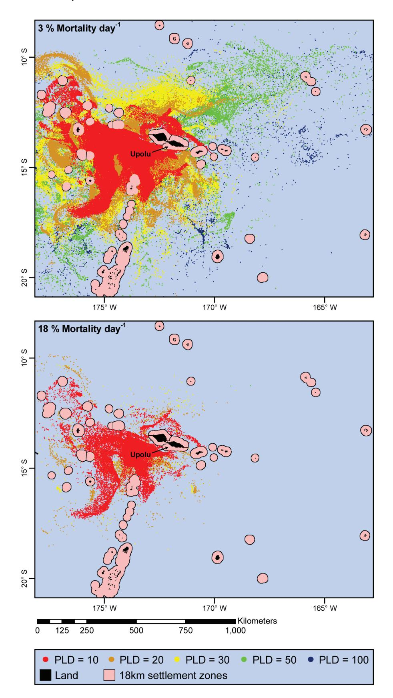

daily mortality respectively. **Figure 3.20.** Position of virtual larvae from southern Upolu for all model years by PLD. Upper and lower plots denote 3% and 18%

### Destinations

Upolu's south coast is a large source of larvae for the region (Figure 3.11, Table 3.3). Most larvae are transported westward or southwestward in the SEC (Figure 3.20). Some larvae slip northward between Upolu and Savai'i or around Savai'i and are entrained in the SECC which can ultimately send them eastward between Swains Island to the north and the rest of the Samoan Archipelago to the south after 20-50 days.

Over 20% of larvae spawned at southern Upolu are retained there for the low mortality and 10 day PLD scenario (Figure 3.21). Much smaller fractions of local production are returned there for longer PLDs and higher

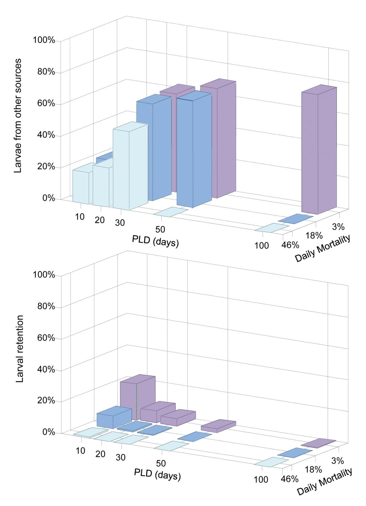

**Figure 3.21.** External larval supply and local larval retention at Upolu-South as a function of PLD and mortality rate. Top panel: Percent of simulated larvae settling at this site that were produced at other sites. Bottom panel: Percent of simulated larvae produced at this site that return here.

**Figure 3.22.** Destinations (and sources) of simulated larvae originating from (arriving at) Upolu-South for low, medium, and high larval mortality rates. Shading of labels indicates core island groups: red, American Samoa; green, Samoa. ND= no data.

mortality. A large proportion of the larvae from Upolu's south coast settle back on the Islands of Samoa especially for short PLDs (Figure 3.22). Wallis and its neighboring seamounts as well as Niuafo'ou are significant destinations for PLDs of 20-50 days even under scenarios with moderate mortality.

### Sources

Southern Upolu is reliant on outside larval sources for 15-70% of its arriving larvae depending on PLD and daily mortality rate (Figure 3.21). At short PLDs the area is seeded primarily from local production whereas larvae with longer PLDs arrive from outside sources. The fraction of larvae arriving from northern Upolu and Tutuila increases with PLD for scenarios with low or moderate mortality and demonstrates the importance of these larval sources for southern Upolu (Figure 3.22).

### **UPOLU (NORTH COAST)**

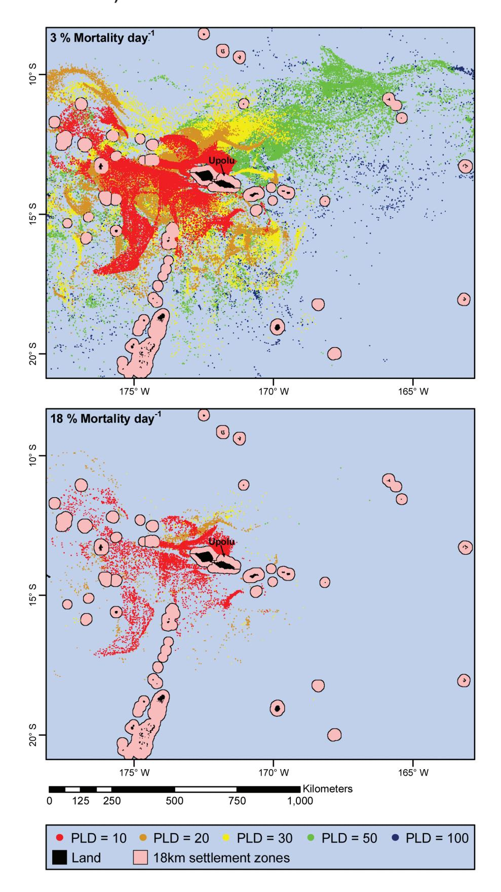

**Figure 3.23.** Position of virtual larvae from northern Upolu for all model years by PLD. Upper and lower plots denote 3% and 18% daily mortality respectively.

### Destinations

The northern coast of Upolu is the largest source of larvae in the Samoan Archipelago with more potential reef area than all the islands and seamounts of American Samoa combined (Figure 3.11, Table 3.3). The pattern of dispersal is similar to the southern coast described previously but the distribution is shifted northward with more larvae entrained into the SECC (Figure 3.23). Most larvae are trajected westward or southwestward in the SEC and have reached Wallis and northern Tonga after only 10 days. Larvae entrained in the SECC are ultimately sent eastward between Swains Island to the north and the rest of the Samoan Archipelago to the south after 20-50 days. Some in the 50 day range have reached as far as Pukapuka and Nassau in the Cook Islands.

**Figure 3.24.** External larval supply and local larval retention at Upolu-North as a function of PLD and mortality rate. Top panel: Percent of simulated larvae settling at this site that were produced at other sites. Bottom panel: Percent of simulated larvae produced at this site that return here.

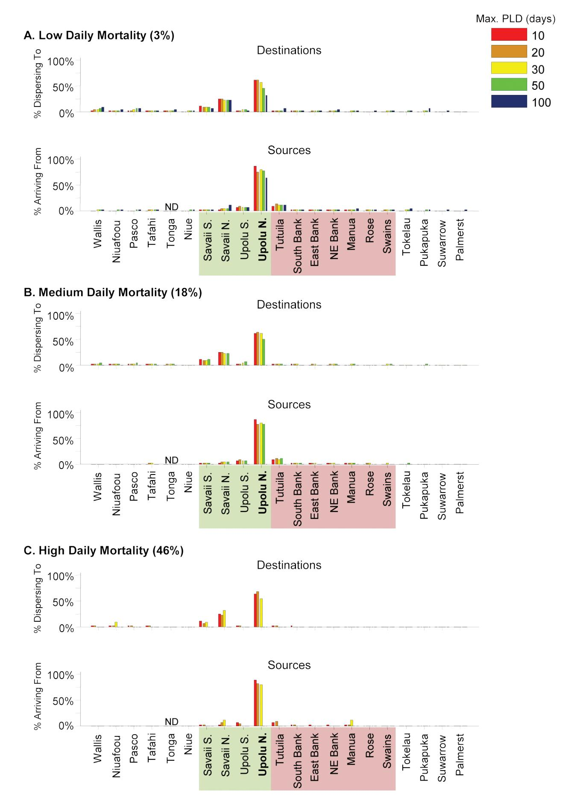

**Figure 3.25.** Destinations (and sources) of simulated larvae originating from (arriving at) Upolu-North for low, medium, and high larval mortality rates. Shading of labels indicates core island groups: red, American Samoa; green, Samoa. ND= no data.

Over 40% of the larvae from Upolu's north coast return there for the short PLD and low mortality scenarios (Figure 3.24). Smaller fractions of local production are returned to northern Upolu for longer PLDs and higher mortality scenarios. A large proportion of larvae from northern Upolu settle at Savai'i for all mortality scenarios (Figure 3.25).

### Sources

Northern Upolu is reliant on outside larval sources for only 10-35% of its arriving larvae depending on PLD and daily mortality rate (Figure 3.24). The site is among the least reliant on outside larval sources since most of the successfully settling larvae here are produced locally for PLDs up to 50 days and scenarios with low or moderate mortality. The next highest source of larvae for northern Upolu is Tutuila although the proportion of larval supply is relatively minor compared to self-seeding (Figure 3.25). Were northern Upolu's larval production to be disturbed, it would be reliant on the smaller sources of Tutuila and the other islands of American Samoa for recovery.

### **TUTUILA**

**Figure 3.26.** Position of virtual larvae from Tutuila for all model years by PLD. Upper and lower plots denote 3% and 18% daily mortality respectively.

### Destinations

Tutuila has a large potential reef area relative to the other islands and seamounts in American Samoa but is comparatively small relative to Savai'i and Upolu as a source of larvae to the region (Figure 3.11, Table 3.3). Transport of larvae from Tutuila is westward in the SEC and splits into two groups along the north and south shores of Samoa (Figure 3.26). At PLDs of 10 days, larvae have just passed western Savai'i and begun to reach Tafahi in the northern end of the Tonga chain. By PLDs of 20-50 days larvae are well into Wallis and its neighboring seamounts farther west. Many larvae trajected south of Tutuila are entrained in the Tonga Trench Eddy. Larvae trajected north of Tutuila that are entrained into the SECC are quickly swept to the east and pass south of Swains Island with little settlement occurring there.

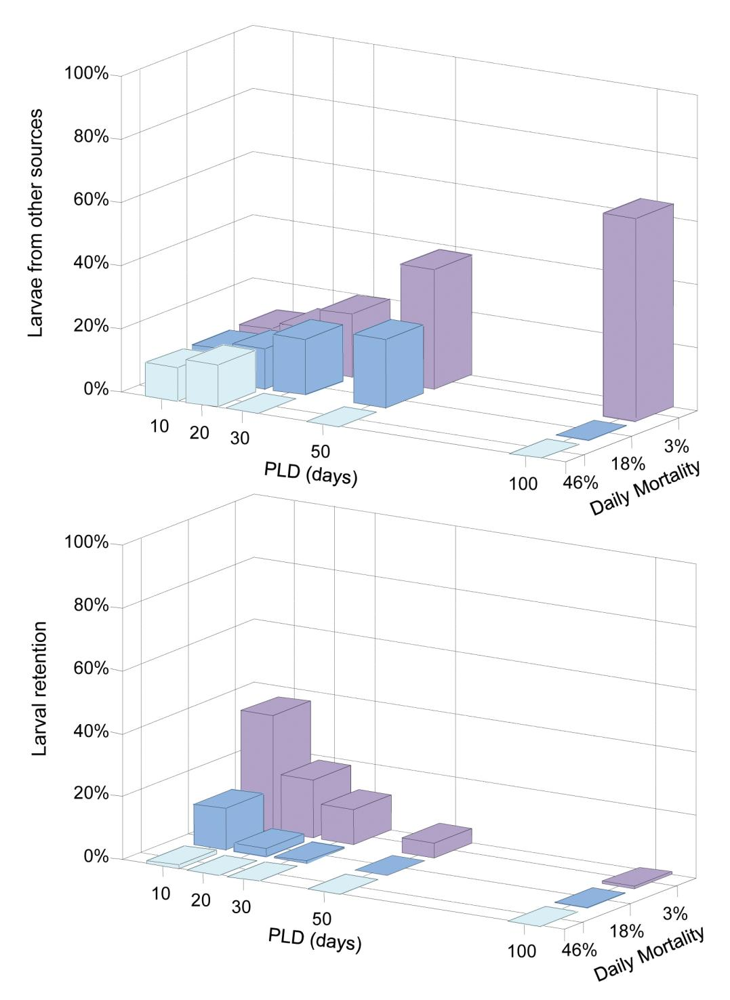

**Figure 3.27.** External larval supply and local larval retention at Tutuila as a function of PLD and mortality rate. Top panel: Percent of simulated larvae settling at this site that were produced at other sites. Bottom panel: Percent of simulated larvae produced at this site that return here.

**Figure 3.28.** Destinations (and sources) of simulated larvae originating from (arriving at) Tutuila for low, medium, and high larval mortality rates. Shading of labels indicates core island groups: red, American Samoa; green, Samoa. ND= no data.

Nearly 40% of the larvae spawned at Tutuila settle back there for the 10 day PLD and low mortality scenario. Much smaller fractions of local production are returned there for longer PLDs and higher mortality scenarios (Figure 3.27). Larvae that are exported settle primarily at northern Upolu, and to a lesser extent southern Upolu, northern Savai'i, and Wallis and the northern Tongan Islands for longer PLDs (Figure 3.28).

### Sources

Tutuila is reliant on outside larval sources for 10-65% of its arriving larvae depending on PLD and daily mortality rate (Figure 3.27). Outside sources become proportionally more important at longer PLDs, especially when mortality is low. Larvae that reach Tutuila come primarily from Tutuila especially at short PLDs (Figure 3.28). The Manu'a Islands, Upolu, and even Savai'i are the most notable sources of outside larvae and would be important to Tutuila's recovery if local larval production were disrupted.

### **SOUTH BANK**

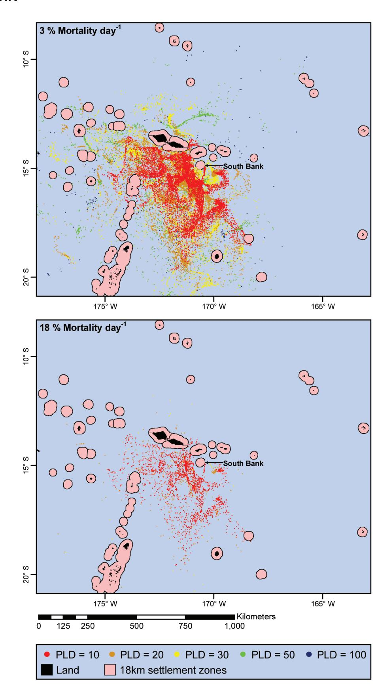

**Figure 3.29.** Position of virtual larvae from South Bank for all model years by PLD. Upper and lower plots denote 3% and 18% daily mortality respectively.

### Destinations

South Bank (Papatua Guyot in Seamount Catalog, Koppers et al. 2010) is a relatively small guyot south of Tutuila and provides a very small contribution to the total larval pool of the region (Figure 3.11, Table 3.3). Most larvae are transported south and west from this site with very few slipping north between islands of the Samoan Archipelago (Figure 3.29). Transport is either westward in the SEC between Savai'i and Tafahi (Tonga), or southward into the Tonga Trench Eddy.

**Figure 3.30.** External larval supply and local larval retention at South Bank as a function of PLD and mortality rate. Top panel: Percent of simulated larvae settling at this site that were produced at other sites. Bottom panel: Percent of simulated larvae produced at this site that return here.

**Figure 3.31.** Destinations (and sources) of simulated larvae originating from (arriving at) South Bank for low, medium, and high larval mortality rates. Shading of labels indicates core island groups: red, American Samoa; green, Samoa. ND= no data.

In contrast to the other sites discussed so far, a very low proportion of larvae from South Bank are retained locally for any PLD or mortality scenario (Figure 3.30). Tutuila and Upolu receive a significant proportion of larvae in the 10-50 PLD ranges (Figure 3.31). Tafahi (Tonga), Wallis, and other sites near them receive a noticeable proportion of the larvae originating from South Bank at longer PLDs. Of note, recent field surveys of South Bank indicate that the seamount is relatively uncolonized by corals and reef fish (R. Brainard, NOAA CRED and D. Fenner, American Samoa DMWR pers. comm.), which could indicate recruitment limitation and is consistent with the chronically low larval supply predicted by our model runs. It also suggests that South Bank is even less of a larval source than estimated here based purely on the potential reef area inferred from bathymetry.

### Sources

Unlike most other sites discussed thus far, South Bank is reliant on outside larval sources for a very large proportion, 80-95%, of its arriving larvae regardless of PLD or daily mortality rate (Figure 3.30). The major sources of larvae for South Bank are Tutuila and Manu'a (Figure 3.31). Were these primary sources disturbed, South Bank would rely primarily on Upolu as a larval source.

### **EAST BANK**

**Figure 3.32.** Position of virtual larvae from East Bank for all model years by PLD. Upper and lower plots denote 3% and 18% daily mortality respectively.

### Destinations

East Bank (Tulaga seamount in Seamount Catalog, Koppers et al. 2010) is the shallow crest of a submerged ridge extending east from Tutuila. Due to its small reef area it is a very small contributor to the regional larval pool in this study (Figure 3.11, Table 3.3). Many larvae from East Bank are trajected westward in the SEC along the north and south shores of the Samoan Archipelago (Figure 3.32). Others are transported southward toward Niue but few arrive due to the long transport distance, larval mortality, and the low number of starting larvae spawned in the simulation.

**Figure 3.33.** External larval supply and local larval retention at East Bank as a function of PLD and mortality rate. Top panel: Percent of simulated larvae settling at this site that were produced at other sites. Bottom panel: Percent of simulated larvae produced at this site that return here.

**Figure 3.34.** Destinations (and sources) of simulated larvae originating from (arriving at) East Bank for low, medium, and high larval mortality rates. Shading of labels indicates core island groups: red, American Samoa; green, Samoa. ND= no data.

East Bank has virtually no retention of locally produced larvae (Figure 3.33). A high proportion of larvae settle at South Bank at the 10 day PLD, Tutuila and Upolu at 20 to 30 day PLDs and islands farther west for longer PLDs (Figure 3.34). Note that longer PLDs, high mortality, and few larvae to begin with result in few strong connections west of Savai'i despite prevailing currents.

### Sources

Similar to South Bank, East Bank is reliant on outside larval sources for a very large proportion, 95-100%, of its arriving larvae regardless of PLD or daily mortality rate (Figure 3.33). The majority of larvae settling at East Bank are from Manu'a for PLDs of 10-30 days (Figure 3.34). A large fraction of successful settlers come from Tutuila at 20 to 30 day PLDs especially at higher mortality rates given the relatively low number of larvae starting from Manu'a. Were these larval sources to be disturbed, East Bank would rely primarily on Upolu as a (much smaller) larval source. A small but measureable proportion of larvae are from Tokelau, well to the north, for the 100 day PLD with low mortality rate.

### **NORTHEAST BANK**

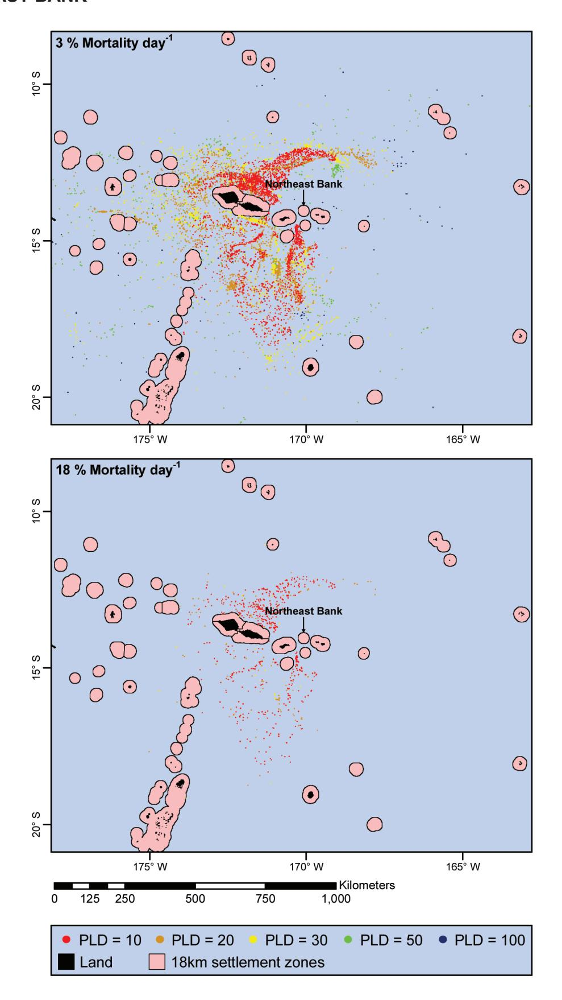

**Figure 3.35.** Position of virtual larvae from Northeast Bank for all model years by PLD. Upper and lower plots denote 3% and 18% daily mortality respectively.

### Destinations

Northeast Bank (Muli Guyot in Seamount Catalog, Koppers et al. 2010) is a small seamount between Tutuila and Manu'a. Due to its small size Northeast Bank is a very minor contributor to the total larval pool of the region (Figure 3.11, Table 3.3). Most larvae from Northeast Bank are trajected westward along the north side of the Samoan Archipelago (Figure 3.35). Many are quickly entrained in the eastward flowing SECC well south of Swains Island where they are largely dispersed and die in the open ocean between American Samoa and the Cook Islands. Many are also trajected south and expire in the region of the Tonga Trench Eddy prior to reaching Niue.

**Figure 3.36.** External larval supply and local larval retention at Northeast Bank as a function of PLD and mortality rate. Top panel: Percent of simulated larvae settling at this site that were produced at other sites. Bottom panel: Percent of simulated larvae produced at this site that return here.

**Figure 3.37.** Destinations (and sources) of simulated larvae originating from (arriving at) Northeast Bank for low, medium, and high larval mortality rates. Shading of labels indicates core island groups: red, American Samoa; green, Samoa. ND= no data.

Northeast Bank has virtually no retention of locally produced larvae (Figure 3.36). For short PLDs of 10-30 days, most larvae from Northeast Bank end up at South Bank, Tutuila, and the north coasts of Upolu and Savai'i (Figure 3.37). Longer PLDs of 30-50 days result in a more even dispersal of larvae spread along the islands farther west all the way to Wallis and its associated seamounts. At high mortality rates, the few larvae starting from Northeast Bank are largely dead after the 10 day PLD and no connections among islands were detected.

### Sources

Like the other seamounts of American Samoa, Northeast Bank is reliant on outside larval sources for 90- 100% of its arriving larvae regardless of PLD or daily mortality rate (Figure 3.36). The majority of larvae with a 10 day PLD arrive at Northeast Bank from the Manu'a Islands (Figure 3.37). Interestingly, a significant source of larvae in the 30-50 day PLD range is northern Upolu. A large group of larvae from 2006 were quickly entrained in the SECC and arrived at Northeast Bank after 18-30 days. A small but measureable proportion of larvae are from Tokelau in the 100 day PLD with low mortality rate.

### **MANU'A ISLANDS**

**Figure 3.38.** Position of virtual larvae from Manu'a for all model years by PLD. Upper and lower plots denote 3% and 18% daily mortality respectively.

### Destinations

The Manu'a Islands of Ta'u, Ofu, and Olosega represent the last moderately sized source of larvae in the Samoan Archipelago (Figure 3.11, Table 3.3). Larvae from Manu'a split into two groups, one along the northern side of the Samoan Archipelago and another that is cast southwestward into the region of the Tonga Trench Eddy (Figure 3.38). Many in the northern trajectory are entrained in the SEC and transported well south of Swains where they mostly expire in the open ocean between the Samoan Archipelago and the Cook Islands. Over 20% of the larvae spawned at Manu'a are retained there for the 10 day PLD and low mortality scenario (Figure 3.39). Much smaller fractions of local production are retained locally for longer PLDs and higher mor-

**Figure 3.39.** External larval supply and local larval retention at Manu'a as a function of PLD and mortality rate. Top panel: Percent of simulated larvae settling at this site that were produced at other sites. Bottom panel: Percent of simulated larvae produced at this site that return here.

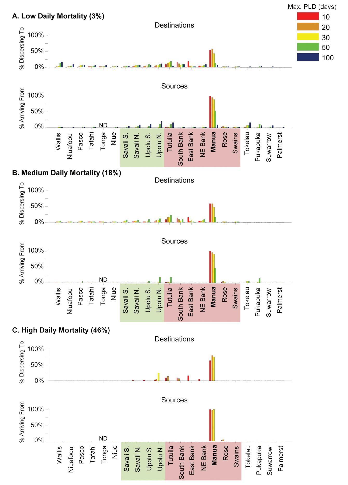

**Figure 3.40.** Destinations (and sources) of simulated larvae originating from (arriving at) Manu'a for low, medium, and high larval mortality rates. Shading of labels indicates core island groups: red, American Samoa; green, Samoa. ND= no data.

tality scenarios. Larvae settle along the archipelago on the seamounts, Tutuila, and the islands of Samoa in similar proportions (Figure 3.40). Larvae are then spread farther westward reaching Wallis and nearby islands and seamounts in the 50-100 day range in the low to moderate mortality scenarios.

### Sources

The Manu'a Islands are reliant on outside larval sources for a wide range, 0-90%, of their arriving larvae depending on PLD and daily mortality rate (Figure 3.39). Nearly all larvae with a 100 day PLD are from outside sources whereas a high proportion of self seeding occurs for larvae in the 10-30 day PLD range. For longer PLDs, sources include Tutuila and Samoa with larvae entrained in the eastward flowing SECC and then fed back south along the Samoan Archipelago including Manu'a in the 50-100 day range (Figure 3.40). Small but measureable contributions to the larvae arriving at Manu'a in the low to moderate mortality rate scenarios are from Tokelau to the north and Pukapuka and Nassau, and Suwarrow to the east.

### **ROSE ATOLL**

**Figure 3.41.** Position of virtual larvae from Rose Atoll for all model years by PLD. Upper and lower plots denote 3% and 18% daily mortality respectively.

### Destinations

Rose Atoll (Motu O Manu or Muliāva by many locally) is a small island at the eastern tip of the Samoan Archipelago. Due to its small size Rose is a very minor contributor to the total larval pool of the region (Figure 3.11, Table 3.3). Larvae from Rose split into two groups depending on the year, one is transported north for partial entrainment into the SECC and the other group is moved southwestward in the SEC and Tonga Trench Eddy (Figure 3.41). For such a small, isolated source, there is a moderate amount of retention of locally produced larvae for the short PLD, low mortality scenario (Figure 3.42). For the short PLDs of 10-20 days, larvae from Rose Atoll settle primarily locally or at the nearby Manu'a Islands (Figure 3.43). Longer PLDs of 30-100 days

**Figure 3.42.** External larval supply and local larval retention at Rose Atoll as a function of PLD and mortality rate. Top panel: Percent of simulated larvae settling at this site that were produced at other sites. Bottom panel: Percent of simulated larvae produced at this site that return here.

**Figure 3.43.** Destinations (and sources) of simulated larvae originating from (arriving at) Rose Atoll for low, medium, and high larval mortality rates. Shading of labels indicates core island groups: red, American Samoa; green, Samoa. ND= no data.

cast small proportions of larvae to all the seamounts and islands to the west via the SEC and can even reach Wallis in the scenario with low mortality.

### Sources

Similar to Manu'a, Rose Atoll is reliant on outside larval sources for a very wide range of larvae recruits, with 0-100% of its larvae arriving from elsewhere depending on PLD and daily mortality rate (Figure 3.42). Nearly all larvae with 50-100 day PLDs are from outside sources, whereas Rose Atoll is heavily reliant on local larval production for PLDs of 10-20 days. For these short PLDs, Rose receives few larvae from elsewhere and then only in scenarios with low mortality. Pukapuka to the east and Tokelau to the north contribute measureable proportions of larvae to Rose but only in low to moderate mortality scenarios and for PLDs of 30-50 days (Figure 3.43). This highlights the isolation of Rose from the rest of the islands in the region since it is so far downstream in the SEC from the small larval sources provided by the Cook Islands and so far upstream relative to the large sources of larvae produced elsewhere in the Samoan Chain.

Of note, the locally used name "Muliāva" can be translated from Samoan to English as "end of the current". This could refer to its position at one end of the Samoan Archipelago at the upstream end of the SEC.

### **SWAINS ISLAND**

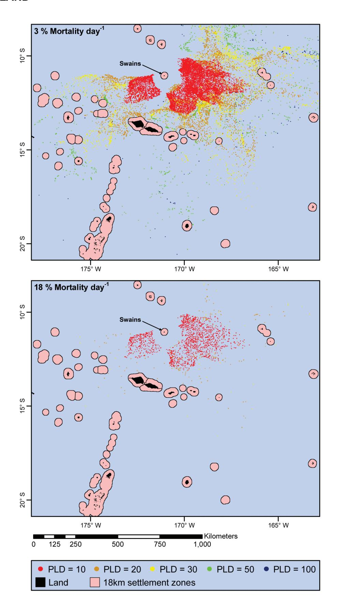

**Figure 3.44.** Position of virtual larvae from Swains Island for all model years by PLD. Upper and lower plots denote 3% and 18% daily mortality respectively.

### Destinations

Swains Island is an isolated atoll in the northern part of the American Samoa EEZ and lies in a region of very different ocean currents relative to the Samoan Archipelago. The position of these currents isolates Swains even more as a larval source or destination than suggested by distance alone. Due to its small size, it is not a major larval source to the region (Figure 3.11, Table 3.3). Swains lies in the center of the SECC in most years (2004-2007) and consequently most of the larvae spawned there are entrained in currents flowing eastward toward Pukapuka and Nassau in the Cook Islands (Figure 3.44).

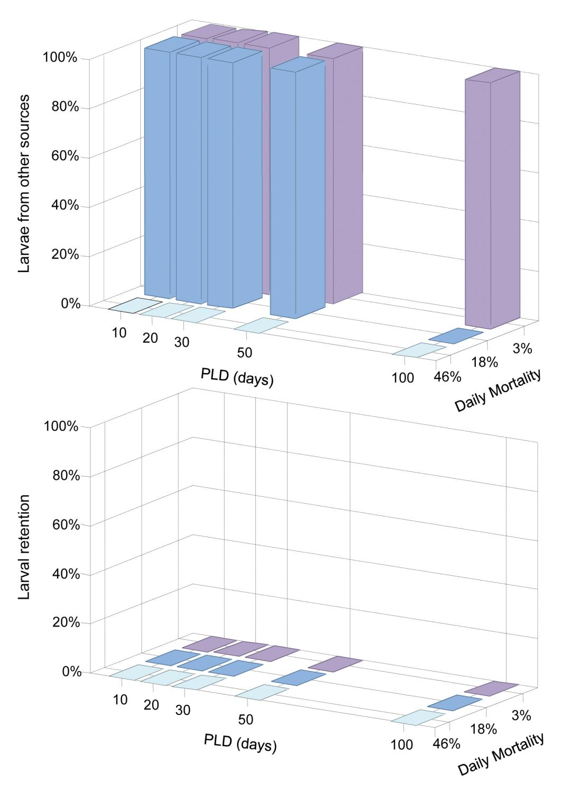

**Figure 3.45.** External larval supply and local larval retention at Swains Island as a function of PLD and mortality rate.Top panel: Percent of simulated larvae settling at this site that were produced at other sites. Bottom panel: Percent of simulated larvae produced at this site that return here.

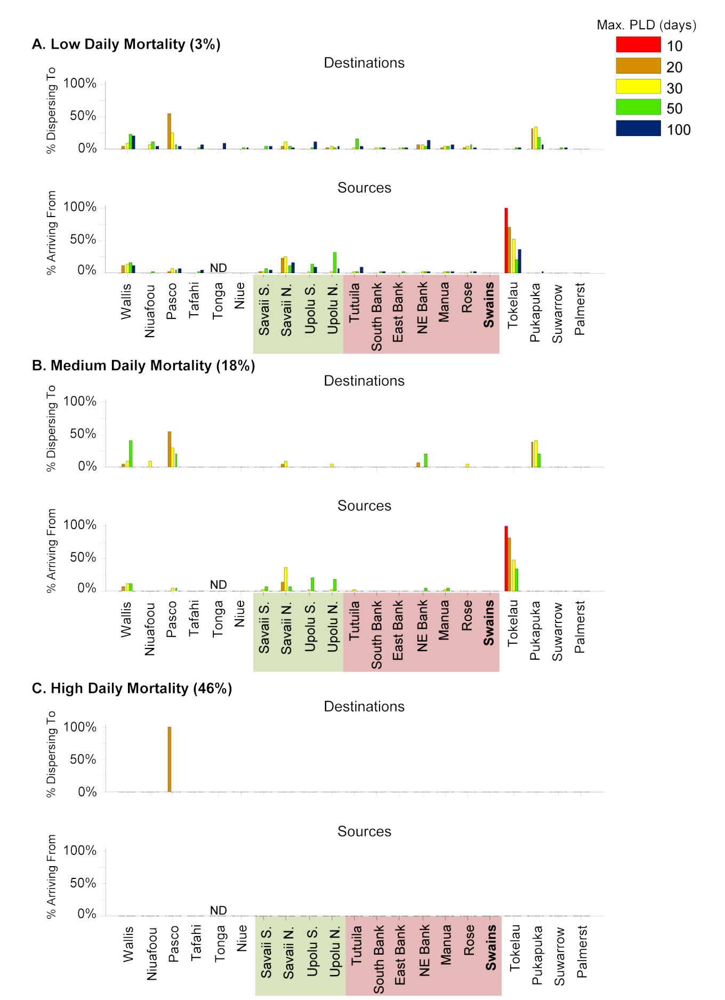

**Figure 3.46.** Destinations (and sources) of simulated larvae originating from (arriving at) Swains Island for low, medium, and high larval mortality rates. Shading of labels indicates core island groups: red, American Samoa; green, Samoa. ND= no data.

Virtually no larvae are retained locally at Swains for any PLD or mortality scenario (Figure 3.45). Due to the long distances that must be traveled and the low number of larvae starting from a small site like Swains, only larvae in the 20-50 day PLD can range make it to Pukapuka and Nassau successfully and only in the low to moderate mortality scenarios (Figure 3.46). In 2008 however, a dramatically different pattern emerged with the eastward flowing SECC not forming at all, a condition that affected Swains more than any other island considered. In 2008, all the larvae from Swains can be observed moving westward in the SEC with many reaching Pasco and Taufilemu seamounts after 20 days, and Wallis and nearby seamounts by 50-100 days (Figures 3.13, 3.44, 3.46).

### Sources

Swains Island is reliant on outside larval sources for virtually 100% of its arriving larvae regardless of PLD or daily mortality rate (Figure 3.45). Tokelau is the main source of larvae for Swains Island and practically the only source for larvae with a 10 day PLD (Figure 3.46). Swains receives many of its larvae in the 20-100 day PLD range from the major larvae producers of Samoa and even Wallis and its seamounts. A significant proportion of the larvae from these sources are entrained in the eastward flowing SECC and due to the large numbers of larvae involved and position farther north and west relative to American Samoa, some larvae can arrive at far off Swains even before the moderate mortality rate eliminates them all. In contrast, none of the islands of American Samoa are a significant source of recruits for Swains. Most of the larvae entrained in the SECC from these islands are swept eastward towards the Cook Islands prior to reaching Swains.

### **CONCLUSIONS**

Our results indicate a high but variable degree of inter-island connectivity in the Samoan Archipelago and surrounding region, with substantial larval retention at most locations, but also substantial larval export and some degree of dependency of any individual reef on outside sources even at the shortest PLDs considered. The overall picture is of an inter-connected system in which no single location operates in isolation. Although some locations are isolated in the sense that they are not important sources for other reefs, these same locations are in general dependent on larval arrival from external sources (e.g. Swains). Conversely, some sites that are not particularly common destinations can be significant sources to other reefs (e.g. Rose). These findings have important implications for the conservation and management of Samoan reef ecosystems (Craig and Brainard 2008).

Most sites in the central portion of the study region are broadly connected to a wide variety of other sites as both sources and destinations, indicating that turbulent diffusion plays a significant role in spreading larvae widely despite the strong mean flow patterns in this region. In fact, for longer PLDs and, when mortality is sufficiently low, virtually all sites in the region are interconnected by at least some small rate of larval exchange (Figure 3.12). However, the predominant patterns of current flow are clearly evident in patterns of connectivity, particularly at shorter PLDs and high mortality rates.

Current flow, and consequently larval transport, is primarily westward along the Samoan Archipelago via the SEC. In general, larvae produced at any given location in the Samoan Archipelago tend to seed their natal reefs and island neighbors to the west. An overall effect of this directional tendency is that the islands of American Samoa export much larval production to Samoa especially for organisms with shorter PLDs of 10- 30 days. That would be the extent of the connectivity pattern, and probably is for much of the year, were it not for the seasonally strong SECC. The north coasts of Samoa are far enough west and north that many larvae produced there are entrained in the east flowing SECC and can ultimately settle along the islands of American Samoa via the feedback loops connecting the SECC with the SEC at ~165-170º W longitude. These currents are often well developed throughout the PLDs of organisms spawned in late October or November as simulated here. These feedback currents make Samoa an important source of larvae for American Samoa especially for organisms with PLDs of 30-100 days. The connections established by this larval conveyor belt, while based on organisms with different PLDs, demonstrate the potential benefits of coordinated management of marine resources and conservation planning between Samoa and American Samoa. The orientation of the dominant currents and the long distances downstream from any other large source of larvae suggest that much of the Samoan Archipelago is largely dependent on internal sources of larvae transported among islands and should be managed accordingly. This is reflected in the interconnected "core" of the connectivity matrices, especially evident at short PLDs and high mortality rates (Figure 3.12).

The islands of Samoa are probably the major source of larvae for the region overall given their very large potential reef area. Moving east along the Samoan Archipelago the islands are smaller, have less potential reef area, and therefore smaller potential spawning populations. Tutuila and the Manu'a Islands of American Samoa have moderate levels of larval production relative to Upolu and Savai'i. Swains Island and the seamounts of American Samoa are almost entirely dependent on larvae from elsewhere and, due to their very small size, contribute relatively little to the larval pool of the Archipelago.

Despite the potential for circular transport in the current loops connecting the SEC and SECC as noted above, the simulations demonstrate that Swains Island is too far north in the SECC current field to function in this way and is thus largely disconnected from the rest of the Samoan Archipelago. Most larvae from Archipelago sources entrained in the SEC-SECC current system are quickly swept south of Swains and either loop back into American Samoa or expire in the open ocean between Rose Atoll and the Cook Islands at the end of their PLD. Only the large larval sources on the northern sides of Upolu and Savai'i reach Swains in the SECC under the right conditions. Larvae from Swains are largely lost to the open ocean and are not entrained quickly enough into the feedback loops connecting the SECC to the SEC for highly successful settlement in the Samoan Archipelago. It is important to note that the SECC is a strong, but highly seasonal current. Were spawning dates to occur at a different time of year, connectivity patterns in the region of the SECC would be quite different. Additional simulation start dates are needed to evaluate larval transport during the rest of the year.

The larval sources upstream in the SEC from the Samoan Archipelago are in the Cook Islands group. These sites are quite far upstream and not well connected to islands in the Samoan chain. Organisms with short PLDs fail to reach Samoa from Cook Islands sources due to the long distance that must be travelled. Even organisms with long PLDs from the Cook Islands are probably not very likely to reach Samoa due to larval mortality, the length of time it takes to get to the Samoan Archipelago, the turbulent diffusion that spreads larvae widely in the ocean, and because the Cook Islands are small larval sources to begin with.

It is important to remember that larval dispersal is an inherently stochastic process because it is driven by current fields of a turbulent ocean (Siegel et al. 2008). We have focused on cumulative patterns

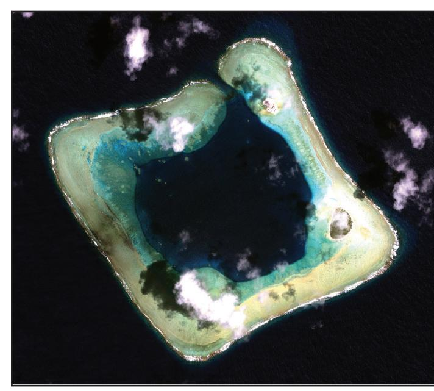

**Image 11.** Satellite imagery of tiny Rose Atoll, approximately 3.6 kilometers across, an isolated end-point along the SEC. Image Provided By: NCCOS.

of connectivity over a recent and representative 5 year period, but individual dispersal events are impossible to predict, and the patterns we have described here represent an accumulation of connectivity over a particular time period. There is always the possibility that a single, rare, anomalous current pattern will result in unusual patterns of larval dispersal that deviate from those predicted here. Such events could transport large numbers of larvae even from small sources, if they are timed just right, and could connect cells that are blank in our simulated connectivity matrices under the right circumstances. Robustness to the inherent stochasticity and variability in connectivity is another attractive feature of well-designed MPA networks.

The patterns of connectivity documented here have important implications for the resilience of reef ecosystems to disturbance events, whether anthropogenic or natural. Resilience refers to the rate of recovery of a population, community, or ecosystem following disturbances that could include storms, fishing, pollution, bleaching, predator outbreaks (e.g. crown-of-thorns starfish) or disease. Sites such as Rose Atoll and Swains Island are far upstream from any large larval sources and thus may be among the slowest to recover following a disturbance due to a lack of recruits. One reason these two locations have a biogeographically distinct community structure relative to the rest of the archipelago (Tribollet et al. 2010, Williams et al. 2010, Chapter 4) may be a preponderance of either species with no pelagic dispersal, or species with very long PLDs that are capable of making the trip from distant sources. For these two reasons (probable slower recovery potential following disturbance and biogeographic uniqueness/isolation) these sites are worthy of consideration for special protection status. In contrast to the isolation of Rose and Swains, Samoa is an important source of larvae for itself and the entire region. Recovery from localized disturbance elsewhere in the archipelago may depend on larvae from Upolu and Savai'i which make them important to consider when devising a resilient regional MPA network. Were these two sites disturbed, recovery would probably be slow due to their high self seeding and would depend primarily on the relatively more modest larval sources from Tutuila and Manu'a in American Samoa. The highly inter-connected pattern of larval connectivity in the Samoan Archipelago suggests that a regional planning effort, aimed at the design of an integrated network of marine conservation and management areas, would be more likely to achieve management and conservation goals than any effort undertaken at a single location without considering linkages with other sites. When connectivity is high, variable, and asymmetric among locations, as is the case in this region, integrated spatial planning can improve realization of conservation, fisheries, and economic goals and can help to identify "win-win" strategies that reduce multiple use conflicts and provide benefits to multiple stakeholder groups (Gaines et al. 2007, Cowen and Sponaugle 2009, Costello et al. 2010).

### **ACKNOWLEDGEMENTS**

Peter Craig (National Park Service) led the charge on understanding interisland connectivity in the Samoan Archipelago for many years and inspired much of the present study. Doug Fenner (American Samoa DMWR) provided insightful comments during development of the approach and review of drafts of the report. Don Kobayashi (NOAA/NMFS/PIFSC) has provided models for the study of connectivity in the Pacific and provided helpful comments on this work. Phil Wiles (AS EPA) reviewed a draft of this work. Many thanks to the NCCOS IT staff and our office neighbors for facilitating the use of the dozen computers needed to run the hydrodynamic model simulations.

### **REFERENCES**

Alory, G. and T. Delcroix. 1999. Climatic variability in the vicinity of Wallis, Futuna, and Samoa islands (13º-15º S, 180º-170º W). Oceanologica Acta 22: 249-263.

Almany, G.R., S.R. Connolly, D.D. Heath, J.D. Hogan, G.P. Jones, L.J. McCook, M. Mills, R.L. Pressey, and D.H. Williamson. 2009. Connectivity, biodiversity conservation and the design of marine reserve networks for coral reefs. Coral Reefs 28: 339-351.

Atema, J., M.J. Kingsford, and G. Gerlach. 2002. Larval fish could use odour for detection, retention and orientation to reefs. Marine Ecology Progress Series 241: 151-160.

Bare, A.Y., K.L. Grimshaw, J.J. Rooney, M.G. Sabater, D. Fenner, and B. Carrol. 2010. Mesophotic communities of the insular shelf at Tutuila, American Samoa. Coral Reefs 29: 369-377.

Blanco-Martin, B. 2006. Dispersal of coral larvae: a modeling perspective on its determinants and implications. Doctoral Dissertation. School of Marine Biology and Aquaculture, James Cook University. 281 pp.

Bleck, R. and D. Boudra. 1981. Initial testing of a numerical ocean circulation model using a hybrid (quasi-isopycnic) vertical coordinate. Journal of Physical Oceanography 11: 755-770.

Bleck, R. and S. Benjamin. 1993. Regional weather prediction with a model combining terrain-following and isentropic coordinates. Part I: Model description. Monthly Weather Review 121: 1770-1785.

Bonhomme, F. and S. Planes. 2000. Some evolutionary arguments about what maintains the pelagic interval in reef fishes. Environmental Biology of Fishes 59: 365-383.

Botsford, L.W., J.W. White, M.A. Coffroth, C.B. Paris, S. Planes, T.L. Shearer, S.R. Thorrold, and G.P. Jones. 2009. Connectivity and resilience of coral reef metapopulations in marine protected areas: matching empirical efforts to predictive needs. Coral Reefs 28: 327-337.

Chen, S. and B. Qiu. 2004. Seasonal variability of the South Equatorial Countercurrent, Journal of Geophysical Research 109, C08003, doi:10.1029/2003JC002243.

Chiswell, S.M. and J.D. Booth. 2008. Sources and sinks of larval settlement in *Jasus edwardsii* around New Zealand: Where do larvae come from and where do they go? Marine Ecology Progress Series 354: 201-217.

Christie, M.R., B.N. Tissot, M.A. Albins, J.P. Beets, Y. Jia, D.M. Ortiz, S.E. Thompson, and M.A. Hixon. 2010. Larval Connectivity in an Effective Network of Marine Protected Areas, PLos ONE 5(12),:e15715, doi:10.1371/journal. pone.0015715.

Costello, C., A. Rassweiler, D.A. Siegel, G. De Leo, F. Micheli, and A. Rosenberg. 2010. The value of spatial information in MPA network design. Proceedings of the National Academy of Sciences of the United States of America. In press.

Cowen, R.K., K.M.M. Lwiza, S. Sponaugle, C.B. Paris, and D.B. Olson. 2000. Connectivity of marine populations: Open or closed? Science 287: 857-859.

Cowen, R.K., C.B. Paris, and A. Srinivasan. 2006. Scaling of connectivity in marine populations. Science 311: 522-527.

Cowen, R.K. and S. Sponaugle. 2009. Larval Dispersal and Marine Population Connectivity. Annual Review of Marine Science 1: 443-466.

Craig, P.C. 1998. Temporal spawning patterns of several surgeonfishes and wrasses in American Samoa. Pacific Science 1: 35-39.

Craig, P.C., J.H. Choat, L.M. Axe, and S. Saucerman. 1997. Population biology and harvest of the coral reef surgeonfish *Acanthurus lineatus* in American Samoa. Fishery Bulletin 95: 680-693.

Craig, P. and R. Brainard. 2008. Connectivity among coral reef fish populations in the remote Samoan Archipelago: metapopulation concept and implications. Pp 120-130. In: Kilarski S and A Everson (Eds.). Proceedings of the American Samoa Coral Reef Fishery Workshop (Oct. 2008). U.S. Dept. of Commerce. NOAA Tech. Memo. NMFS - F/SPO 114, 143 pp.

Craig, P.C. (editor). 2009. Natural history guide to American Samoa. 3rd Edition. National Park of American Samoa, Department of Marine and Wildlife Resources, and American Samoa Community College. Pago Pago, American Samoa. 131 pp.

Domokos, R., M.P. Seki, J.J .Polovina, and D.R. Hawn. 2007. Oceanographic investigation of the American Samoa albacore (*Thunnus alalunga*) habitat and longline fishing grounds. Fisheries Oceanography 16: 555-572.

Fisher, R. 2005. Swimming speeds of larval coral reef fishes: impacts on self-recruitment and dispersal. Marine Ecology Progress Series 285: 223-232.

Gaines, S.D., B. Gaylord, and J.L. Largier. 2003. Avoiding current oversights in marine reserve design. Ecological Applications 13 Supplement:S32-S46.

Gaines, S.D., B. Gaylord, L.R. Gerber, A. Hastings, and B.P. Kinlan. 2007. Connecting places: The ecological consequences of dispersal in the sea. Oceanography 20: 90-99.

Gerlach, G., J. Atema, M.J. Kingsford, K.P. Black, and V. Miller-Sims. 2007. Smelling home can prevent dispersal of reef fish larvae. Proceedings of the National Academy of Sciences 104:.858-863.

Graham, E.M., A.H. Baird, and S.R. Connolly. 2008. Survival dynamics of scleractinian coral larvae and implications for dispersal. Coral Reefs 27: 529-539.

Halliwell, G., R. Bleck, and E. Chassignet. 1998. Atlantic Ocean simulations performed using a new hybrid-coordinate ocean model. EOS, Trans. AGU, Fall 1998 AGU meeting.

Harlan, J.A., S.E. Swearer, R.R. Leben, and C.A. Fox. 2002. Surface circulation in a Caribbean island wake. Continental Shelf Research 22: 417-434.

Harrison, P.L., R.C. Babcock, G.D. Bull, J.K. Oliver, C.C. Wallace, and B.L. Willis. 1984. Mass spawning in tropical reef corals. Science 223: 1186-1189.

Itano, D. and T. Buckley. 1988. Observations of the mass spawning of corals and Palolo (*Eunice viridis*) in American Samoa. American Samoa Government, Department of Marine and Wildlife Resources. Report 11. 13 pp.

James, M.K., P.R. Armsworth, L.B. Mason, and L. Bode. 2002. The structure of reef fish metapopulations: modeling larval dispersal and retention patterns. Proceedings of the Royal Society of London B 269: 2079-2086.

Jones, G.P., G.R. Almany, G.R. Russ, P.F. Sale, R.S. Steneck, M.J.H. van Oppen, and B.L. Willis. 2009. Larval retention and connectivity among populations of corals and reef fishes: history, advances and challenges. Coral Reefs 28: 307-325.

Junker, M., L. Wantiez, and D. Ponton. 2006. Flexibility in size and age at settlement of coral reef fish: spatial and temporal variations in Wallis Islands (South Central Pacific). Aquatic Living Resources 19: 339-348.

Kessler, W.S. and B.A. Taft. 1987. Dynamic heights and zonal geostrophic transports in the Central Tropical Pacific during 1979-84. Journal of Physical Oceanography 17: 97-122.

Kinlan, B.P., S.D. Gaines, and S.E. Lester. 2005. Propagule dispersal and the scales of marine community process. Diversity and Distributions 11: 139-148.

Kobayashi, D.R. 2006. Colonization of the Hawaiian Archipelago via Johnston Atoll: a characterization of oceanographic transport corridors for pelagic larvae using computer simulation. Coral Reefs 25: 407-417.

Koppers, A.A.P., H. Staudigel, and R. Minnett. 2010. Seamount catalog: Seamount morphology, maps, and data files. Oceanography 12: 37.

Leis, J.M. 2002. Pacific coral-reef fishes: the implications of behavior and ecology of larvae for biodiversity and conservation, and a reassessment of the open population paradigm. Environmental Biology of Fishes 65: 199-208.

Leis, J.M. 2006. Are larvae of demersal fishes plankton or nekton? Advances in Marine Biology 51: 59-141.

Leis, J.M. 2007. Behavior as input for modeling dispersal of fish larvae: behavior, biogeography, hydrodynamics, ontogeny, physiology and phylogeny meet hydrography. Marine Ecology Progress Series 347: 185-193.

Leis, J.M. and B. Carson-Ewart. 2003. Orientation of pelagic larvae of coral-reef fishes in the ocean. Marine Ecology Progress Series 252: 239-253.

Lugo-Fernández, A., K.J.P. Deslarzes, J.M. Price, G.S. Boland, and M.V. Morin. 2001. Inferring probably dispersal of Flower Garden Banks coral larvae (Gulf of Mexico) using observed and simulated drifter trajectories. Continental Shelf Research 21: 47-67.

McCook, L.J., G.R. Almany, M.L. Berumen, J.C. Day, A.L. Green, G.P. Jones, L.M. Leis, S. Planes, G.R. Russ, P.F. Sale, and S.R. Thorrold. 2009. Management under uncertainty: guide-lines for incorporating connectivity into the protection of coral reefs. Coral Reefs 28: 353-366.

McCormick, M.I. 1999. Delayed metamorphosis of a tropical reef fish (*Acanthurus triostegus*): a field experiment. Marine Ecology Progress Series 176: 25-38.

McCormick, M.I. and B.W. Molony. 1995. Influence of water temperature during the larval stage on size, age, and body condition of a tropical reef fish at settlement. Marine Ecology Progress Series 118: 59-68.

Mesophotic Coral Ecosystems. 2010. A research cooperative between the NOAA Center for Sponsored Coastal Ocean Research, Perry Institute of Marine Science, and the Centre for Marine Studies at the University of Queensland. Website accessed March 2010, http://www.mesophotic.org.

Mildner, S. 1987. Investigation into coral reproduction on the fringing reefs of Western Samoa. Research Report No. 2. December 1987. Samoa, Fisheries Division, Ministry of Agriculture, Forests, Fisheries, and Meteorology. 7 pp.

Mildner, S. 1991. Aspects of the reproductive biology of selected scleractinian corals on Western Samoa and Fijian reefs. Thesis, James Cook University of North Queensland. 118 pp.

Miller, K. and C. Mundy. 2003. Rapid settlement in broadcast spawning corals: implications for larval dispersal. Coral Reefs 22: 99-106.

Munday, P.L., J.M. Leis, L.M. Lough, C.B. Paris, M.J. Kinsford, M.L. Berumen, and J. Lambrechts. 2009. Climate change and coral reef connectivity. Coral Reefs 28: 379-395.

Mundy, C. and A. Green. 1996. Spawning observations of corals and other invertebrates in American Samoa. American Samoa Government, Department of Marine and Wildlife Resources Report. 12 pp.

NOAA Global Drifter Program. 2010. http://www.aoml.noaa.gov/phod/dac/gdp.html.

Ochavillo, D., S. Tofaeono, M. Sabater, and E.L. Trip. 2011. Population structure of *Ctenochaetus striatus* (Acanthuridae) in Tutuila, American Samoa: The use of size-at-age data in multi-scale population size surveys. Fisheries Research 107: 14-21.

Okubo, A. 1980. Diffusion and ecological problems: mathematical models. Springer-Verlag, Berlin.

Paris, C.B., L.M. Cherubin, and R.K. Cowen. 2007. Surfing, spinning, or diving from reef to reef: effects on population connectivity. Marine Ecology Progress Series 347: 285-300.

Planes, S., G.P. Jones, and S.R. Thorrold. 2009. Larval dispersal connects fish populations in a network of marine protected areas. Proceedings of the National Academy of Sciences 106: 5693-5697.

Polovina, J.L., P. Kleiber, and D.R. Kobayashi. 1999. Application of TOPEX-POSEIDON satellite altimetry to simulate transport dynamics of larvae of spiny lobster, *Panulirus marginatus*, in the Northwestern Hawaiian Islands, 1993-1996. Fisheries Bulletin 97: 132-143.

Qiu, B. and S. Chen. 2004. Seasonal modulations in the eddy field of the South Pacific Ocean. Journal of Physical Oceanography 34: 1515-1527.

Richmond, R.H. 1985. Reversible metamorphosis in coral planula larvae. Marine Ecology Progress Series 22: 181-185.

Rudorff, C.A., J.A. Lorenzzetti, D.F.M. Gherardi, and J.E. Lins-Oliveira. 2009. Modeling spiny lobster larval dispersion in the Tropical Atlantic. Fisheries Research 96: 206-215.

Sale, P.F., H. Van Lavienren, M.C. Ablan Lagman, J. Atema, M. Butler, C. Fauvelot, J.D. Hogan, G.P. Jones, K.C. Lindeman, C.B. Paris, R. Steneck, and H.L. Stewart. 2010. Preserving Reef connectivity: A handbook for marine protected area managers. Connectivity Working Group, Coral Reef Targeted Research & Capacity Building for Management Program, UNU-INWEH. 79 pp.

Shanks, A.L., B.A. Grantham, and M.H. Carr. 2003. Propagule dispersal distance and the size and spacing of marine reserves. Ecological Applications 13 Supplement: S159-S169.

Siegel, D.A., B.P. Kinlan, B. Gaylord, and S.D. Gaines. 2003. Lagrangian descriptions of marine larval dispersion. Marine Ecology Progress Series 260: 83-96.

Siegel, D.A., S. Mitarai, C.J. Costello, S.D. Gaines, B.E. Kendall, R.R. Warner, and K.B. Winters. 2008. The stochastic nature of larval connectivity among nearshore marine populations. Proceedings of the National Academy of Sciences of the United States of America 105: 8974-8979.

Steneck, R.S., C.B. Paris, S.N. Arnold, M.C. Ablan-Lagman, A.C. Alcala, M.J. Butler, L.J. McCook, G.R. Russ, and P.F. Sale. 2009. Thinking and managing outside the box: coalescing connectivity networks to build region-wide resilience in coral reef ecosystems. Coral Reefs 28: 367-378.

Swearer, S.E., J.E. Caselle, D.W. Lea, and R.R. Warner. 1999. Larval retention and recruitment in an island population of a coral-reef fish. Nature 402: 799-802.

Thresher, R.E., P.L. Colin, and L.J. Bell. 1989. Planktonic duration, distribution and population structure of Western and Central Pacific Damselfishes (Pomacentridae). Copeia 1989(2): 420-434.

Tomczak, M. and J.S. Godfrey. 2003. Regional Oceanography: an Introduction. 2nd improved edition. Daya Publishing House, Delhi. 390 pp.

Treml. E.A., P.A. Halpin, D.L. Urban, and L.F. Pratson. 2008. Modeling population connectivity by ocean currents, a graph theoretic approach for marine conservation. Landscape Ecology 23: 19-36.

Tribollet, A.D., T. Schils, and P.S. Vroom. 2010. Spatio-temporal variability in macroalgal assemblages of American Samoa. Phycologia 49(6): 574-591.

Victor, B.C. 1986. Duration of the planktonic larval stage for one hundred species of Pacific and Atlantic wrasses (family Labridae). Marine Biology 90: 317-326.

Wellington, G.M. and B.C. Victor. 1989. Planktonic larval duration of one hundred species of Pacific and Atlantic damselfishes (Pomacentridae). Marine Biology 101: 557-567.

Williams, I.D., B.L. Richards, S.A. Sandin, J.K. Baum, R.E. Schroeder, M.O. Nadon, B. Zgliczynski, P. Craig, J.L. McIlwain, and R.E. Brainard. 2010. Differences in Reef Fish Assemblages between Populated and Remote Reefs Spanning Multiple Archipelagos Across the Central and Western Pacific. Journal of Marine Biology 2011: 14pp. Article ID 826234, doi:10.1155/2011/826234.

Wilson, J.R. and P.L. Harrison. 1998. Settlement-competancy periods of larvae of three species of scleractinian corals. Marine Biology 131: 339-345.

## **Biogeographic Assessment of Fish and Coral Communities of the Samoan Archipelago**

Matthew S. Kendall1 , Matthew Poti2 , Ben Carroll3 , Doug Fenner3 , Alison Green4 , Lucy Jacob3 , Joyce Samuelu Ah Leong5 , Brian P. Kinlan2 , Ivor D. Williams6 , Jill Zamzow6

### **INTRODUCTION**

Reef fish and corals are two of the most iconic and locally important components of the marine ecosystem in the Samoan Archipelago. These organisms provide a wealth of aesthetic, cultural, and economic opportunities to island residents and visitors (Craig 2009, Sabater 2010). Coral reefs of the archipelago fringe the steep sided islands and atolls forming a diversity of structures including lagoons, reef flats, slopes, pinnacles, and banks (NOAA NCCOS 2005, Brainard and others 2008, Bare et al. 2010). The rich biodiversity of corals comprising these structures with their various encrusting, massive, and branching morphologies form the physical foundation of the reef and thereby provide a home for most other organisms in the reef ecosystem. Reef fish in turn have evolved sizes, colors, and shapes to fill every habitat and occupation on the reef.

**Image 12.** Pair of long nosed filefish in American Samoa. Photo credit: Kevin Leno. NOAA/CRED.

There are multiple scales at which the marine biogeography of the Samoan Archipelago may be described. At the broadest scale, the entire archipelago has been placed into a global context as a unit in the "central Polynesia" ecoregional province within the "eastern Indo-Pacific" realm as defined by Spalding et al. (2007) and has a biodiversity determined by its location on the diversity gradient between the high at the "Coral Triangle" in the Philippines, Indonesia, northern New Guinea and the Solomon Islands, and the low at the Pacific Americas (Veron 2000, Veron et al. 2009). The present study focuses at finer scales on biogeographic patterns of fish and coral among and within the islands of American Samoa and Samoa.

Coral and fish communities are not evenly distributed throughout the Samoan Archipelago. Island age (e.g. distance from volcanic hotspot), size, geomorphology, reef structure, oceanographic climate (Chapter 2), position in ocean currents (Chapter 3), habitats, wave exposure, human impacts, and other factors have shaped the distribution of reef fish and coral among and within the islands (e.g. Green 1996, 2002, Craig et al. 2005, Whaylen and Fenner 2005, Sabater and Tofaeono 2006, 2007, Birkeland et al. 2008, Brainard and others 2008, Fenner 2008, Fenner et al. 2008, Samuelu and Sapatu 2008, Craig 2009, Fenner 2009 a b, Houk et al. 2010, Carroll 2010, Williams et al. 2011, Ochavillo et al. 2011). Basic physiography alone can be used to broadly divide the archipelago from west to east into relatively larger high islands with several broad reef flats and shallow lagoon areas (Savai'i and Upolu), a moderately sized high island with relatively narrow fringing reefs as well as submerged bank reef formations (Tutuila), smaller high islands with fringing reefs and steep shelf slopes (Manu'a Islands of Ofu, Olosega, and Ta'u), and the small, low-lying and geologically separate atolls of Rose (Muliāva) which lies to the east of the Samoan volcanic hotspot, and Swains Island, which lies ~400 km to the north and may share geologic origins with the Tokelau Island group. The purpose of this chapter of the characterization was to identify geographic patterns, spatial trends, and relatively high values or "hotspots" of coral and fish distribution among and around these islands. Documenting biogeographic patterns of these foundational resources is a first step in devising informed monitoring, management, conservation, and sustainable use strategies (Oram 2008, Conservation International et al. 2010).

1 NOAA/NOS/NCCOS/CCMA/Biogeography Branch

2 NOAA/NOS/NCCOS/CCMA/Biogeography Branch and Consolidated Safety Services, Inc., Fairfax, VA, under NOAA Contract No. DG133C07NC0616

3 American Samoa/Department of Marine and Wildlife Resources

4 The Nature Conservancy, Asia Pacific Resource Center

5 Samoa/Ministry of Agriculture and Fisheries/Fisheries Division

6 NOAA/NMFS/PIFSC/Coral Reef Ecosystem Division

This assessment combines data from many pre-existing studies into a more robust characterization of the reef communities of Samoa and American Samoa that none of the studies could have achieved alone. Although there are challenges inherent in normalizing and combining results from many studies, this approach maximizes use of available information, provides the broadest possible geographic scope, and reduces sensitivity of the findings to the biases associated with any one dataset. We took the approach of using more datasets for greater geographic coverage and information density at the expense of taxonomic resolution. The assessment focused on six general groups of variables: percent cover of live coral, morphological variety of corals, community structure or relative abundance of corals, biomass of reef fish, variety of reef fish, and community structure or relative abundance of reef fish. A wide diversity of additional measures of reef ecosystem conditions are possible, however these six variable groups are collected by most researchers, are simple to calculate and interpret, can offer relatively comparable data even when moderately different survey methods are used, and characterize some of the most important aspects of reef ecosystems for scientists and managers.

Specifically, our objectives were to:

- 1) Combine multiple studies of coral and reef fish using normalized data into an analysis of the recent status of the six key variable groups.
- 2) Assign relatively high, medium, or low values to study sites within the archipelago for each of the coral and fish variables and plot their positions around each island.
- 3) Identify geographic patterns of hotspots, breakpoints, and spatial trends in the coral and fish variables among and within islands of the archipelago.

### **METHODS**

The analysis was restricted to data sets that, 1) included a broad component of the coral or fish communities (i.e. were not restricted to a single taxon or trophic group), 2) had sites spread widely among islands or extensively around one of the larger islands, 3) were recent (less than ~10 years old), and 4) utilized a relatively un-biased approach to site selection that enabled broad geographic inference (e.g. random stratified design). Many studies were not included in this assessment primarily because they lacked a broad distribution of sites and therefore lacked the widespread geographic scope of inference sought in the characterization. Eight studies met the criteria above and are included in the analysis (Figure 4.1, Table 4.1).

Typical reef morphology differs significantly between Samoa and American Samoa. Zonation of Samoan reefs generally consists of a much wider reef flat and shallow lagoon area relative to the narrower fringing reef flats that predominate around American Samoa (Green 1996) such that reef flats and shallow lagoons comprise a much greater percentage of the total reef area in Samoa. The sampling designs of many reef studies in these two jurisdictions reflect this difference in dominant structure in that a majority of studies around American Samoa focus on reef slopes (fore reef) whereas most around Samoa focus on shallow lagoons. Consequently, the scope of inference for our assessment differs between these jurisdictions and reflects the reef zones where most monitoring stud-

ies have taken place.

The three coral variables and three fish variables for our analysis were selected primarily on the basis of their widespread use, ease of comparison across studies, and effectiveness in quantifying the status of coral and reef fish around the Samoan Archipelago (see "Included Datasets" side bar). Percent cover of live coral is among the simplest measures recorded in coral reef science and provides an estimate of the areal extent of live coral habitat at a given site. Impacts often reduce coral cover, so sites having high values are often considered higher quality or less impacted reefs (e.g. Nyström et al. 2008, Cheal et al. 2010, but see Vroom 2011). Percent cover of live coral was available from all 8 of the studies in our analysis (Table 4.1). Coral diversity, or the variety

Image 13. Diver collecting fish and coral data in American Samoa. Photo credit: NOAA/CRED.

**Figure 4.1.** Datasets and corresponding survey sites included in the analyses.

of corals on a reef, is another measurement commonly used to describe reef communities. High values are often considered to indicate higher quality reefs that may be more resilient to some stressors (Nyström et al. 2008), and there are reports that human impacts reduce coral diversity (Edinger et al. 1998, Houk and Musberger 2008). As a measure of coral diversity, we calculated the number of coral genera or morphologies (depending on data recorded by each particular study) observed at each site. This metric will hereafter be referred to as coral richness and was available from 7 of the 8 studies used in our analysis. Next, reefs may have similar values of coral cover and richness but actually be comprised of completely different species or species groups. The relative abundances of coral genera or morphologies at each site were therefore used to distinguish similarities and differences among sites in community composition and to identify those sites with unique communities. Community structure data was available from 7 of the studies used in our analysis.

A similar suite of 3 variables was used to evaluate reef fish communities. A common measure of the quality of reef fish assemblages is fish abundance or biomass per unit of area. Higher values, meaning more or larger fish in an area, are often considered to indicate higher quality or less impacted reefs (e.g. Friedlander et al. 2002, Cheal et al. 2010). All 8 of the studies in our analysis provided either fish abundance, fish biomass, or both. We used biomass per unit area surveyed when available (7 of the 8 studies), and hereafter refer to this metric as fish biomass. As a measure of reef fish diversity, we calculated the number of species or species groups of reef fish observed at each site. This metric will be referred to as fish richness and was available from all 8 of the studies used in our analysis. The relative abundances (biomass measures when available) of reef fish species or species groups were used to identify sites with unique or similar reef fish community structures. Reef fish community structure was available from 7 of the 8 studies used in our analysis.

**Table 4.1.** List of datasets and variables used in the analysis. Y denotes that the variable was included in the analyses whereas NA indicates the variable was either not recorded or was unavailable for analysis.

|                                                   |                | Coral Variables   |                    | Fish Variables  |                  |                   |  |
|---------------------------------------------------|----------------|-------------------|--------------------|-----------------|------------------|-------------------|--|
| Study                                             | Coral Cover | Coral Richness | Coral Community | Fish Biomass | Fish Richness | Fish Community |  |
| American Samoa Enviromental Protection Agencya | Y              | Y                 | Y                  | Y               | Y                | Y                 |  |
| Coral Reef Status Reportb,c                       | Y              | Y                 | Y                  | Y               | Y                | Y                 |  |
| Global Coral Reef Monitoring Networkd             | Y              | Y                 | Y                  | Y               | Y                | Y                 |  |
| Key Reef Speciese                                 | Y              | NA                | NA                 | Y               | Y                | Y                 |  |
| Marine Protected Area Bioreconaissancef           | Y              | Y                 | Y                  | Y               | Y                | NA                |  |
| Rapid Ecological Assessmentg,h                    | Y              | Y                 | Y                  | Y               | Y                | Y                 |  |
| Samoan Fish Reservesi                             | Y              | Y                 | Y                  | Y               | Y                | Y                 |  |
| Territorial Coral Reef Monitoring Programj        | Y              | Y                 | Y                  | Y               | Y                | Y                 |  |

a from Houk and Musberger 2008; b from Green 1996; coral cover, fish biomass, and fish richness data were from 1994-5 surveys of American Samoa; c from Green 2002; coral richness, coral community, and fish community data were from 2002 surveys of Tutuila and Manu'a; d from Samoan Ministry of Agriculture and Fisheries, Fisheries Division and Wilkinson 2008; e from Sabater and Tofaeono 2006; f from Oram 2008; g from Brainard and others 2008 and Williams et al. 2011; h coral cover, fish biomass, fish richness, and fish community data were available from 2010 surveys; coral richness and coral community data were available from 2006 surveys; i from Samoan Ministry of Agriculture and Fisheries, Fisheries Division; j from American Samoa Department of Marine and Wildlife Resources and Whaylen and Fenner 2005.

### **Included Datasets: American Samoa**

American Samoa Environmental Protection Agency

*Seventeen sites around Tutuila have been monitored approximately every two years since 2003 by the American Samoa Environmental Protection Agency (hereafter ASEPA) (Houk and Musburger 2008). Sites were selected to assess pollution impacts associated with watersheds of varying size and human population. Surveys were conducted at ~10 m depth on homogenous habitat of the reef slope near stream discharges. Three replicate transects of bottom cover were conducted at each site using a 50 m tape and video. Percent coral cover was quantified using randomly selected points and the video data. Fish communities were quantified at each site using 5 replicate stationary point counts (Bohnsack and Bannerot 1986). Only those fish >20 cm long and those exploited in fisheries were surveyed. Data for 16 sites (Figure 4.1) from 2007 and 2008, the most recent years available, were used for this analysis (Houk and Musburger 2008). From these surveys, all six key variables were calculated (Table 4.1).* 

### Coral Reef Status Report

*A resurvey of sites in Samoa and American Samoa was recently evaluated for a Coral Reef Status Report (hereafter CRSR) (Green 1996, 2002). In this study, 28 sites around Tutuila and the Manu'a Islands, 6 sites around Rose Atoll, and 2 sites at Swains Island were surveyed in 1994-95 using visual census techniques (Figure 4.1). Sites at Tutuila and Manu'a were resurveyed in 2002. Seven sites around Upolu in Samoa were surveyed in 1994-95 however these data were not used in this study due to incomplete spatial coverage around only one island and a focus on a different reef zone relative to the more spatially comprehensive Samoan studies. Sites were selected to have broad distribution around the islands of American Samoa in a range of physical settings. At each site, 3-5 replicate 50 m transects were surveyed at ~10 m depth on the reef slope. Percent coral cover and colony morphology was quantified at three positions every 2 m along the transects. Fish communities were quantified along a 50 by 3 m belt (Green 2002). All diurnally active, non-cryptic reef fish were recorded to the species level. Each individual fish was counted and a length estimate made. Data from 1994-95, the oldest in the study, were used in the analysis of coral cover, fish biomass, and fish richness since it encompassed the broadest spatial coverage including Swains and Rose Atolls. Coral community data from 1994-95 categorized corals into only 4 morphological groups, which limited the ability to resolve differences among sites based on coral richness and community structure. Also, fish abundance by species or species group at each site was not available in the report based on the 1994-95 data (Green 1996). Therefore, 2002 data for American Samoa was used for coral richness and coral and fish community based analyses (Table 4.1).*

### Key Reef Species Program

*The Key Reef Species Program (hereafter KRS) is conducted by the American Samoa Department of Marine and Wildlife Resources (DMWR). Twenty four sites have been monitored annually around Tutuila using transects conducted at ~10 m depth on the reef slope. Sites were selected based on wave exposure and coastal region and were well distributed around Tutuila. Four replicate video transects of bottom cover were conducted at each site using a 30 m tape and used to calculate percent coral cover. Fish communities were quantified using 3-4 replicate 30 by 5 m transects at each site (Sabater and Tofaeono 2006). This program only monitors fish that are targeted locally as a food source. Data from 2006, the most recent year made available for this analysis included 19 sites (Figure 4.1). From these surveys, 4 of the 6 key variables could be calculated (Table 4.1).*

### MPA Biological Reconnaissance Assessment

*To support the development of a network of "no-take" MPAs, fish and coral surveys were conducted around Tutuila by the MPA Program of the American Samoa DMWR (hereafter MPABR) (Oram 2008). A total of 26 survey sites were spread within 14 regions selected based on literature review and scientific opinion of the best potential locations for no-take MPAs (Figure 4.1). Surveys used a semi-quantitative scoring system for a number of coral and fish variables conducted during roving dives up the reef slope (Oram 2008). Each survey site was divided into eight five-minute observation stations beginning at the deeper part of the reef slope and progressing shallower (Oram 2008, Lucy Jacob DMWR pers. comm.). Data were collected in 2006-2008. From these surveys 5 of the 6 key variables could be calculated (Table 4.1).*

### Rapid Ecological Assessment

*The Rapid Ecological Assessment (hereafter REA) is one component of the monitoring conducted by NOAA's Coral Reef Ecosystem Division (CRED). Sites have been monitored every two years around all islands of American Samoa since 2002. Prior to 2008, sites were selected at 10-15 m depth on the reef slope primarily to be representative of reef conditions and management settings around the islands. Two replicate surveys of bottom cover were conducted at each site using a 25 m tape and recording the cover type at 0.5 m intervals (Brainard and others 2008). Beginning in 2008, but more comprehensively in 2010, sampling effort was distributed based on the areas of three depth strata (0-6, 6-18 and 18-30 m). Sites were randomly selected a minimum of 100 m apart and fish communities were quantified using a stationary point count (Bohnsack and Bannerot 1986) with ~ two to four replicates at each site. Data from 2010 surveys at 241 sites were available for coral cover, fish biomass, fish richness, and fish community structure. Coral richness and community structure data were not available from the 2010 survey at the time of this analysis and so data from the most recent year available (2006 at 56 sites) were used for those two variables (Figure 4.1, Table 4.1).* 

### Territorial Coral Reef Monitoring Program

*The Territorial Coral Reef Monitoring Program (hereafter TCRMP) is conducted by the American Samoa DMWR (Whaylen and Fenner 2005, Fenner 2008, 2009a, b, Carroll 2010). Twelve sites (Figure 4.1) have been monitored annually around Tutuila using transects conducted at ~10 m depth on the reef slope. Sites were selected to achieve an equitable distribution around Tutuila and to represent various wave exposure and human impact levels. Benthic surveys were conducted using four replicate transects at each site using a 50 m tape. Coral cover by species was recorded to the lowest taxonomic group possible at 0.5 m intervals. All diurnally active, non-cryptic reef fish were recorded to species level using belt transects. At each site, 6 replicate 30 m long transects were conducted with several passes and widths being used to sample different groups. The first pass (15 m wide) sampled larger, more mobile species (e.g. sharks, snapper, jacks, large grouper), the second pass sampled parrotfish (10 m wide), the third pass surgeonfish(5 m wide), and remaining species are sampled on the fourth pass (5 m wide). Each individual fish was counted and a length estimate made. Data from 2006-2008 (fish) and 2008 (coral), the most recent years available, were used for this analysis. From these surveys, all six key variables were calculated (Table 4.1).* 

### **Included Datasets: Samoa**

### Global Coral Reef Monitoring Network

*Eight permanent sites have been monitored around Samoa since 2002 as part of the Global Coral Reef Monitoring Network (hereafter GCRMN) (Samuelu and Sapatu 2008, Wilkinson 2008). The sites were selected to have a broad distribution around the islands and to be representative of Samoa following GCRMN protocols. Sites were located in the shallow lagoon and reef flat habitats around Upolu and Savai'i in 2-5 m depth. At each site, divers survey fish and corals using repeated passes along a 50 by 2 m transect. First, a set of indicator fish species selected by GCRMN are tallied followed by invertebrates. Next substrate type is recorded every two meters along the 50 m transect by 3 divers, one directly above the transect tape and also at 1 m on both sides of the transect tape. Data were collected around Savai'i and Upolu from 2002-2010 (Figure 4.1). We used the most recent data available for each of the 8 sites in our analysis. From the available data, all 6 key variables could be calculated (Table 4.1).*

### Fish Reserves Monitoring

*Fish reserves are monitored by Samoa's Ministry of Agriculture and Fisheries, Fisheries Division as part of the technical assistance provided to the Community Based Fisheries Management Program (hereafter referred to as Samoan, Fisheries, Reserves or SFR) (King and Faasili 1998). Currently there are 54 fish reserves of variable size (average of ~75,000 m2 ). These comprise <1% of the total reef area of Samoa and are typically located in the broad reef flat or shallow lagoon areas at depths ranging from 2-10 m. The exact location and size for the fish reserves are proprietary for each village and regulations range widely including potential rules such as no-take zones, seasonal closures, methods restrictions, or size limits (Johannes 2002). Preliminary analyses indicated that reserves are providing a random effect and are unlikely to introduce any consistent bias in the results. This is possibly due to the high variability in size and regulations among the reserves (Samuelu 2003, J Samuelu Ah Leong pers. comm.). Fish and coral data are recorded at 5 replicate 50 m transects that are randomly placed within each reserve. Methods are similar to those used by GCRMN described previously and require multiple passes over the transect. Food fish are recorded to species level and all others are tallied at the family level. Data were collected around Savai'i and Upolu from 2003-2010. We used the most recent data available for each of the sites in our analysis (Figure 4.1). From the available data, all 6 key variables could be calculated (Table 4.1).*

**Image 14.** Snorkler collecting fish and coral data in Samoa. Photo credit: Joyce Samuelu Ah Leong, MAF/FD.

### **Analysis of Coral Cover, Coral Richness, Fish Biomass, and Fish Richness**

It was not possible to simply pool site values for each variable from all the datasets into a single analysis due to three main issues. First, studies in American Samoa were on reef slopes whereas those in Samoa were on reef flats and shallow lagoons making direct quantitative comparisons inappropriate. Second, even within a jurisdiction, data collection methods differed among studies resulting in incompatible values even when the underlying variable being measured was the same (e.g. stationary point counts vs. transects of multiple dimensions for reef fish). Last, studies also quantified different aspects of the coral and fish community that were not directly comparable (e.g. coral richness measured at the genus level vs. by morphologic group, assessment

**Image 15.** A high coral cover, low diversity reef in American Samoa. Photo credit: Matt Kendall, NOAA Biogeography.

of only food fish vs. day active fish vs. all fish seen). Therefore, a wide range of standardization, scoring, and scaling approaches were explored to transform the raw data among the diverse studies into comparable values. Results are reported separately by jurisdiction.

We devised a standardized approach to classify values of each variable at each site as high, medium, or low relative to other sites surveyed in the archipelago with the same study methods. Sites were only scored relative to each other within the same study to avoid incompatibility issues among datasets. For each individual study and variable, site values were calculated from raw data (averaging over replicates where necessary) and ordered from highest to lowest. We then used the Natural Breaks function in ArcMap version 9.3 to identify two class breaks in the distribution of each variable for every study separately. The Natural Breaks algorithm chooses class breaks to maximize similarity of values within classes and maximize differences among classes, effectively setting boundaries where there are relatively big jumps in data values. The very general summary variables and analytical approach that we used were generally insensitive to highly skewed data for individual species. However, class breaks were reviewed individually to ensure that anomalous or extreme observations for a particular species did not bias the results (e.g. mass recruitment events in March/ April [Craig et al. 1997, Green 2002]). The two class breaks were used to assign site values of each variable as high, medium, or low relative to all the sites surveyed within a given study (Table 4.2, Appendix C; Figures C.1-C.31). This summarized site values in a consistent but qualitative scale for the variables percent coral cover, coral richness, fish biomass, and fish richness respectively. It is important to note that cut off values for

**Table 4.2.** Assigned breakpoints between low and medium (L → M) and medium and high (M → H) values for each of the fish and coral variables by dataset. Breakpoints were assigned based on natural breaks in the data (see Appendix A).

|       | Coral Cover |       | Coral Richness |       | Fish Biomass                 |              | Fish Richness |       |
|-------|-------------|-------|----------------|-------|------------------------------|--------------|---------------|-------|
| Study | L → M       | M → H | L → M          | M → H | L → M                        | M → H        | L → M         | M → H |
| ASEPA | 18 %        | 33 %  | 8a             | 11a   | 5034 g                       | 14008 g      | 6b            | 13b   |
| CRSR  | 16 %        | 31 %  | 4c             | 5c    | 375 kg/ha 682 kg/ha       |              | 102d          | 148d  |
| GCRMN | 7 %         | 44 %  | 4c             | 7c    | 12 kg/trans. 29 kg/trans. |              | 4b            | 6b    |
| KRS   | 26 %        | 40 %  | NAe            | NAe   | 84 kg/km2                    | 184 kg/km2   | 25b           | 34b   |
| MPABR | NAf         | 41 %  | 26g            | 42g   | 25g                          | 33g          | 52g           | 67g   |
| REA   | 15 %        | 35 %  | 11a            | 18a   | 24 g/m2                      | 60 g/m2      |               | 31b   |
| SFR   | 11 %        | 38 %  | 3c             | 6c    | 5 kg/trans.                  | 18 kg/trans. | 4b            | 7b    |
| TCRMP | 23 %        | 42 %  | 7b             | 12b   | 55 g/m2                      | 72 g/m2      | 15b           | 19b   |

a number of genera per transect; b number of species per transect; c number of morphologies per transect; d number of species per 750 m2 (area surveyed at each site); e no coral richness data for KRS; f no MPABR coral cover data values classified as low; g custom scoring scale (see Oram 2008)

the high, medium, and low categories varied widely among studies due primarily to differences in methodology and units of the data recorded. It is suggested that readers examine Table 4.2 and the Figures C.1-C.31 in Appendix C where quantitative cutoffs are shown and then refer to the corresponding description of each study to understand the expected range of high, medium, and low values that can result given each particular methodology.

### **Analysis of Coral and Fish Community Structure**

To identify sites with similar coral and fish assemblages we performed a series of non-metric multi-dimensional scaling (MDS) analyses for each study using PRIMER version 6 (Clarke and Gorley 2006). MDS provided a plot of survey sites for each dataset based on their relative similarity to each other. Sites closer together in chart space have more similar communities to each other than sites plotted farther apart (Clarke 1993, Legendre and Legendre 1998). Separate MDS plots were created for each dataset for coral community structure and fish community structure. The raw data for coral community analysis was percent coral cover by genus or morphological group depending on the study. The raw data for analyses of fish communities consisted of fish biomass by species or species groups. From these values, the Bray-Curtis coefficient was calculated among all pairs of sites to measure community similarity. The Bray-Curtis similarity is commonly used in studies of ecological communities and emphasizes shared patterns in species abundances rather than simply the presence/absence of species (Clarke 1993, McCune and Grace 2002). Sites were then plotted in two-dimensional chart space (MDS plots) based on these similarity values such that dissimilar sites are far apart and similar sites are grouped close together.

To support the qualitative interpretation of the MDS plots, we also explored potential groupings of sites in each dataset according to their fish and coral assemblages using hierarchical clustering (Clarke 1993, Legendre and Legendre 1998). Differences among clusters and among biogeographic regions (see below) were explored using an analysis of similarities (ANOSIM) test (Clarke 1993, Legendre and Legendre 1998, Clarke and Gorley 2006). ANOSIM produces a statistic (R), analogous to a correlation coefficient, that measures the association between pre-defined groups (e.g. biogeographic regions) and MDS patterns. A p-value indicating the statistical significance of the R statistic is also provided. Once MDS and cluster analysis were completed for all datasets (Appendix C; Figures C.32-C.34), the results and plots were visually compared among the datasets for consistent patterns in site groupings. Results are highlighted where two or more datasets showed consistent patterns, groups of sites exhibited similar fish or coral communities, or sites had unique community composition.

### **Identification of Biogeographic Patterns**

All sites were mapped according to their corresponding high, medium, or low classification for each variable. Site classifications were summarized at multiple spatial scales to facilitate comparisons among islands and to place sites into their regional context. For coral cover, coral richness, fish biomass, and fish richness respectively, the proportion of sites categorized as high, medium, and low were summarized in pie charts hierarchically for 1) Samoa and American Samoa, 2) for each island or island group (Savai'i, Upolu, Tutuila, Manu'a, Swains, and Rose Atoll, and 3) at the finest scale, along biogeographically distinct segments of coast. Due to the variable density of survey sites among regions, summary charts were scaled by approximate reef length, using shoreline length as a proxy, to account for unequal sample sizes. For this reason, results within biogeographic regions are presented as the proportion of survey sites within each category (high, medium, or low) whereas results summarized across multiple biogeographic regions are weighted averages of the proportions for each region, with weights given by the length of shoreline. Regions with no surveys were excluded from summaries. For every analysis scale, the number of studies and number of sites comprising a given pie chart is provided. These values provide a measure of the relative confidence of the results with higher values representing more studies/sites and therefore a more robust analysis.

Biogeographically distinct regions were identified through simultaneous consideration of two factors. First, each island was visually examined for spatial patterns in the high, medium, and low values of the survey sites with the goal of identifying clusters of similar values. Second, prominent features of coastal geomorphology (e.g. points, banks, bays, exposure, and even specific villages) were identified on either side of the clusters with the goal of defining the physical boundaries of each distinct region. This process was conducted for all six variables such that adjacent regions differ in their relative proportions of high, medium, and low values or coral and fish communities for at least one variable. The end result was that biogeographic regions, hereafter called "Bioregions", with distinct reef fish and coral communities were identified as defined above.

### **Identification of Biogeographic Hotspots**

Bioregions with an especially large proportion of high site values compared to the study area as a whole can be considered ecologically important areas worthy of special monitoring or management considerations. For this study, such ecological "hotspots" were first identified for each variable individually (coral cover, coral richness, fish abundance, and fish richness) and then across multiple variables since monitoring and management importance is often heightened for an area when hotspots co-occur for multiple variables.

The term "hotspot" has been used widely to describe concentrations of high value sites using a diversity of approaches, scales, and variables (e.g. total number of species, threatened species, and/or endemics) and must be clearly defined. To identify hotspots for this study, we calculated the proportion of sites classified as high for each variable within each Bioregion. Any Bioregion with a proportion of high values greater than the proportion of high values in the entire jurisdiction (Samoa or American Samoa respectively) was considered to be a hotspot for the indicated variable. This was done for each variable individually and then hotspot results were tallied across the four variables to determine the number of variables contributing to each Bioregion's hotspot status.

In addition, to aid in interpretation of hotspot values for each jurisdiction, the probability that the proportion of high value sites from any particular hotspot could have arisen by random chance was estimated using the statistical method of resampling. In this analysis, for each Bioregion identified as a hotspot we took 1\*106 random samples of n sites from the entire pool of survey sites within a given jurisdiction, where n is the number of sites in the Bioregion, and calculated the proportion of sites classified as high in each random sample. The number of times the proportion of high value sites was greater than or equal to the actual observed proportion for the Bioregion was divided by 1\*106 to provide a p-value that expressed the probability that the observed proportion (or greater) of high sites could have arisen by random chance. Lower p-values denote observations considered less likely to have occurred through random chance. For example, if the observed proportion of high sites was met or exceeded in 100,000 of the 1,000,000 random draws it could be assumed that the observed pattern could occur merely by chance only 10% of the time (p = 0.1). This analysis was not used to assign a formal significance level but rather as an aid to interpreting the observed proportions. Hotspots with high p-values should be interpreted more cautiously than those with lower values.

### **RESULTS**

### **Distribution Of Survey Effort**

The number of studies and individual survey sites are summarized by variable for each jurisdiction, among islands, and according to biogeographic breakpoints. We identified 30 biogeographic regions (Bioregions) based on the six variables considered (Figure 4.2). Because results for Bioregions with more studies and higher numbers of survey sites are more robust than those with fewer, those Bioregions with few studies or sites will be presented in mapped results but discussed only sparingly due to the comparatively reduced confidence in the results.

Of the eight datasets suitable for the study, six took place around American Samoa compared to only two around Samoa despite its much larger potential reef area (Figure 4.1). By far the greatest number of studies and survey sites occurred around Tutuila for all variables making results for that island the most robust in the assessment. For example, an average of 14 survey sites from 4 studies included coral cover data within Bioregions around Tutuila whereas much larger Bioregions around Samoa were represented by an average of only 6 sites from 2 studies. The high density of points around Tutuila facilitated a much more detailed breakout of biogeographically distinct regions (n = 15) compared to the other islands. The Manu'a group was split into three regions, Ofu/Olosega, eastern Ta'u, and western Ta'u. Many more biogeographically distinct regions probably exist around Upolu and Savai'i than were identified here (n = 6 and 5 respectively) but could not be detected due to the limited number of surveys around those islands. The distribution of values at sites around Swains and Rose Atolls were spatially uniform for most variables on the reef slopes (exception was

**Figure 4.2.** Biogeographic regions (Bioregions) assigned based on analyses of fish and coral data. Islands and key geographic features such as villages, bays, or points that are referred to in the text are labeled.

for sites inside versus outside the lagoon at Rose) and these islands were generally too small to warrant further biogeographic breakdown of fish and coral patterns based on the variables we considered.

Despite the relatively intense sampling around Tutuila, it should be emphasized that the scope of inference for Tutuila from this analysis is largely limited to the reef slope where the vast majority of survey effort took place. Only ~5% of survey effort was spent on bank reefs around the island, and those surveys were almost exclusively on Taema and Nafanua Banks. There is a very large shelf area around Tutuila with many bank and pinnacle reef formations (Bare et al. 2010, Appendix B) that are poorly known relative to the reef slopes and are beyond the scope of this analysis. Most of the area of these banks lies much deeper than 10 m, the depth at which many studies used here were focused, and is below the depths of safe diving for extended survey work. Some surveys have been conducted on reef flats; however, those data were spatially limited and therefore not used in this assessment. Similarly, since survey effort around Samoa is focused landward of the reef crest, the scope of inference for that region is largely limited to the reef flat and lagoon reef zones and results are discussed separately for the two jurisdictions.

### **Percent Coral Cover: Samoa**

Percent coral cover for Samoa overall was rated as high for over 40% of the coast (Figure 4.3a). Results summarized by island revealed that a much larger proportion of Savai'i (~60% of coastline) was rated as having high coral cover compared to Upolu (~30%). Biogeographic patterns of coral cover revealed north/ south patterns of coral cover that differed by island. The north and northeast facing coasts of Savai'i possess a large proportion of sites with high coral cover (Figure 4.3b). In contrast, Upolu has more moderate and vari-

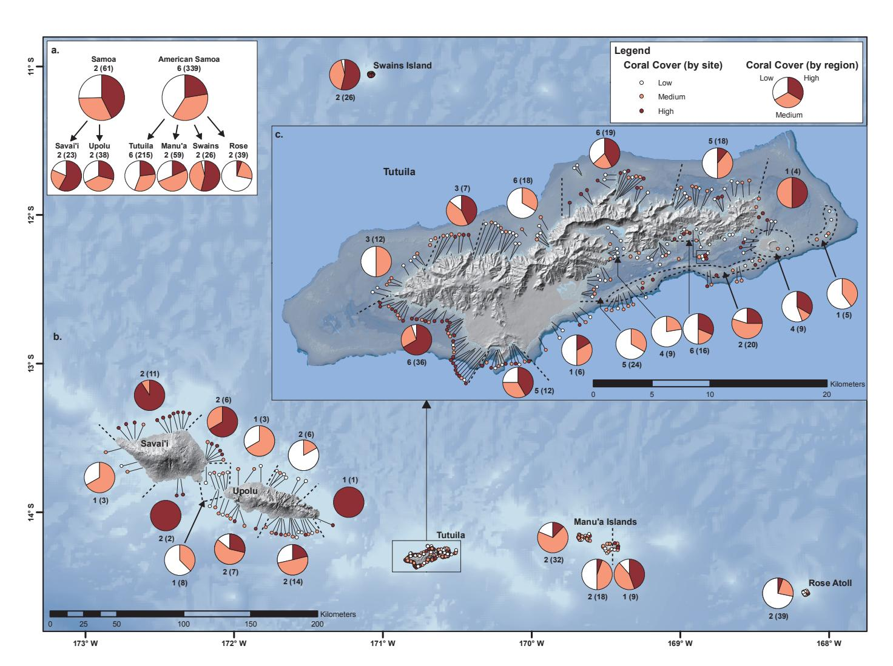

**Figure 4.3.** Coral cover at survey sites across Samoa and American Samoa. Sites and pie charts are coded as high, medium, or low coral cover values. (a) Proportions of high, medium, and low values by jurisdiction and by island. (b,c) Proportions of high, medium, and low values for individual Bioregions. Number labels represent the number of studies and sites (in parentheses) comprising each pie chart.

able values with areas of low coral cover along the north and west coasts, especially in the Manono Island/ Apolima Strait area and between Apia and Fagaloa Bay (Bioregions 25 and 29).

### **Percent Coral Cover: American Samoa**

American Samoa overall had only 22% of the coast rated as having high coral cover and the rest split approximately evenly between the medium and low categories (Figure 4.3a). Results summarized by island revealed that Swains Island had high coral cover (~55% of sites) whereas a relatively large proportion of some islands such as Tutuila (~50% of coastline) and Rose Atoll (~75% of sites) had low coral cover. Spatial patterns of coral cover within islands or island groups revealed highly variable values even among adjacent segments of coast. Tutuila has some areas with a very large proportion of high coral cover sites (e.g. SW coast from Cape Taputapu to Sail Rock Point [Bioregions 1 and 2], coast east of Fagamalo Village [Bioregion 14], northern coast including Matalia/Cockscomb Point [Bioregion 12], and southeastern regions including Aunu'u and the eastern tip of the island and Fagaitua Bay [Bioregions 8, 10, and 6]) separated by distinct areas with relatively low values (i.e. NW coast offshore from Fagali'i and Fagasa villages [Bioregions 13 and 15], coastlines including and extending away from Pago Pago Harbor and the airport [Bioregions 3 and 4]) (Figure 4.3c). The Manu'a Islands showed perceptible biogeographic differences as well. The east side of Ta'u (Bioregion 20) possessed a large proportion of sites with high coral cover whereas western Ta'u (Bioregion 19) and Ofu/Olosega (Bioregion 18) possessed relatively lower values (Figure 4.3b). Swains Island (Bioregion 16) had generally high values of coral cover whereas Rose Atoll (Bioregion 17) possessed generally low values.

**Figure 4.4.** Coral richness at survey sites across Samoa and American Samoa. Sites and pie charts are coded as high, medium, or low coral richness values. (a) Proportions of high, medium, and low values by jurisdiction and by island. (b,c) Proportions of high, medium, and low values for individual Bioregions. Number labels represent the number of studies and sites (in parentheses) comprising each pie chart.

### **Coral Richness: Samoa**

Coral richness for Samoa overall was rated as high for ~35% of the coastline (Figure 4.4a). Results summarized by island revealed that a very large proportion of Savai'i (50% of the coastline) was rated as having high coral richness compared to Upolu (<25%). Biogeographic patterns of coral richness within islands or island groups revealed a few notable spatial trends. Savai'i possesses a small proportion of sites with low coral richness relative to Upolu (Figures 4.4a-b). The proportion of sites with high coral richness generally declines eastward in Samoa. Compared to Savai'i, Upolu has somewhat more moderate and variable values with concentrated areas of low coral richness in the Manono Island/Apolima Strait area and between Apia and Fagaloa Bay (Bioregions 25 and 29).

### **Coral Richness: American Samoa**

American Samoa overall had 23% of the coast rated as having high coral richness and the rest split approximately evenly between the medium and low categories (Figure 4.4a). Results summarized by island revealed that the Manu'a group had high coral richness (~60% of coastline) whereas a relatively large proportion of sites at other islands, especially Swains (100% of sites), had lower values. Spatial patterns within islands or island groups revealed a north/south pattern for Tutuila but also some highly variable patterns even among adjacent segments of coast. Areas around Tutuila with relatively high coral richness (~25% of sites) include the SW coast from Cape Taputapu to Sail Rock Point (Bioregions 1 and 2), the northeastern coast from Masefao Bay to Matatula Point (Bioregion 11), southeastern regions including around Aunu'u Island and Fagaitua Bay (Bioregions 8 and 6 respectively), and even Pago Pago Harbor (Bioregion 5) which had mostly sites with low coral richness (>75%) but a few in the high richness category (Figure 4.4c). The rest of the regions around Tutuila were characterized by low or moderate values. The Manu'a group showed perceptible biogeographic differences as well. The east side of Ta'u (Bioregion 20) had only sites with moderate or high coral richness whereas western Ta'u (Bioregion 19) and Ofu/Olosega (Bioregion 18) were more variable and possessed relatively more high richness sites but also some with low values (Figure 4.4b). All of the coral richness values around Swains Island were low (Bioregion 16). Rose Atoll possessed only moderate and low values (Bioregion 17).

### **Coral Community Structure: Samoa**

Sparse data and extensive overlap of sites in MDS plots limited the interpretation of results for coral community structure in Bioregions around Samoa. However, both datasets (GCRMN, SFR) revealed consistent patterns of overlap among sites around southern Upolu (Bioregions 26 and 27) and northern Savai'i (21 and 24) as well as a separate and unique coral community in sites on southern Savai'i (Bioregion 23).

### **Coral Community Structure: American Samoa**

The MDS analyses for each study in American Samoa revealed extensive overlap in coral communities among sites and otherwise biogeographically distinct regions (Appendix C; Figures C.32 and C.34). Only two studies showed significant differences among Bioregions in the global ANOSIM (MPABR, R = 0.327 and p = 0.002; REA, R = 0.566 and p = 0.001), and only 2-4 statistically different groups could be identified for some datasets through cluster analysis. Despite the overall finding of high overlap, coral communities of a few Bioregions showed consistent patterns of similarity or uniqueness among datasets (Figure 4.5). Sites in Pago Pago Harbor (Bioregion 5) consistently showed a unique coral assemblage among datasets (ASEPA, REA,

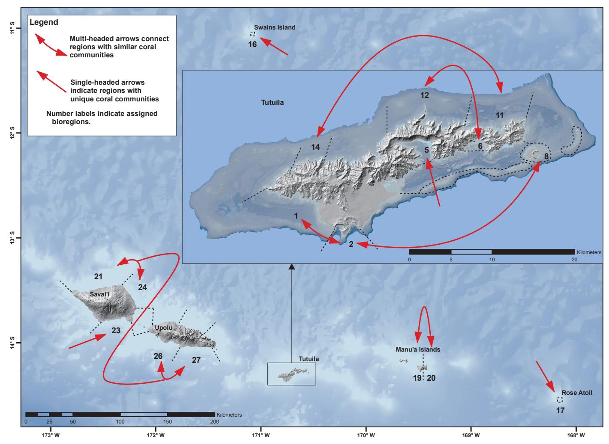

**Figure 4.5.** Summary of Bioregions sharing similar coral communities and those with unique coral communities as identified from the MDS analyses.

TCRMP). Note that unique sites are typically thought of in a positive sense, but in this case may indicate a uniquely unhealthy coral community because this Bioregion is heavily impacted by human activities (Pedersen Planning Consultants 2000). Sites between Cape Taputapu and Sail Rock Point (Bioregions 1 and 2) and also those around Aunu'u often plotted with the same group among datasets (ASEPA, CRSR, MPABR, REA, and TCRMP). Parts of NE (Bioregion 11) and NW Tutuila (Bioregion 14) showed similarities in coral community structure in two datasets (CRSR, TCRMP) as did the north/central coast including Matalia/Cockscomb Point (Bioregion 12) and Fagaitua Bay (Bioregion 6) (CRSR, MPABR) although these areas were represented by few sites. Most sites in east and west Ta'u (Bioregions 20 and 19) and to a lesser degree Ofu/Olosega (Bioregion 18) were similar to each other (CRSR, REA). Rose Atoll (Bioregion 17) and Swains Island (Bioregion 16) sites plotted separately in relatively compact groups at the periphery of the MDS plot (surveyed in REA data only). This indicates a somewhat unique and homogeneous coral community as would be expected for each of these two small and isolated island Bioregions, a pattern also found in analysis of their algal communities (Tribollet et al. 2010).

### Fish Biomass: Samoa

Fish biomass in surveys around Samoa overall showed that only ~10% of coastlines were classified as having high biomass with the remainder divided approximately evenly between the low and medium categories (Figure 4.6a). A relatively large proportion of Savai'i, ~22% of coastline, had high fish biomass whereas none of Upolu's coast was classified as high. Biogeographic patterns of fish biomass within islands revealed that the northern coasts of Savai'i between Falealupo Village and Apolima Strait possess a large propor-

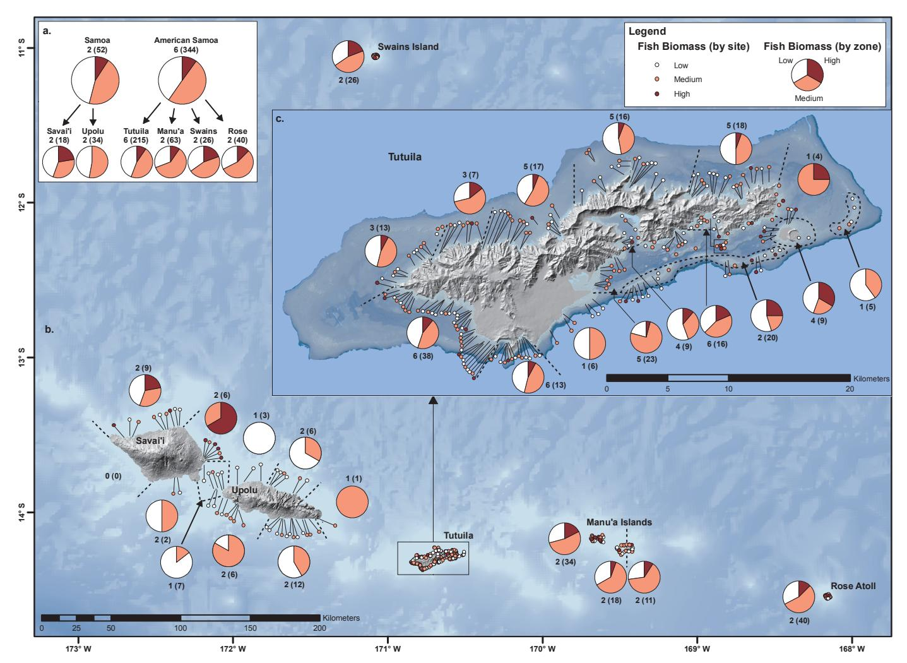

**Figure 4.6.** Fish biomass at survey sites across Samoa and American Samoa. Sites and pie charts are coded as high, medium, or low biomass values. (a) Proportions of high, medium, and low values by jurisdiction and by island. (b,c) Proportions of high, medium, and low values for individual Bioregions. Number labels represent the number of studies and sites (in parentheses) comprising each pie chart.

tion of sites with high fish biomass whereas Upolu has large regions of low biomass in the Manono Island/Apolima Strait area (Bioregion 25), between Apia and Fagaloa Bay (Bioregion 29), and on the southeastern coast between Falealili and Aleipata Islands (Bioregion 27) (Figure 4.6b).

### **Fish Biomass: American Samoa**

Fish biomass in surveys around American Samoa overall showed that ~10% of coastlines were classified as having high biomass with the remainder divided approximately evenly between the low and medium categories (Figure 4.6a). Patterns among islands in American Samoa were relatively uniform although Swains and Rose Atolls had a relatively greater proportion of sites with high biomass as would be expected for these two remote islands (Williams et al. 2011). Tutuila had a greater pro-

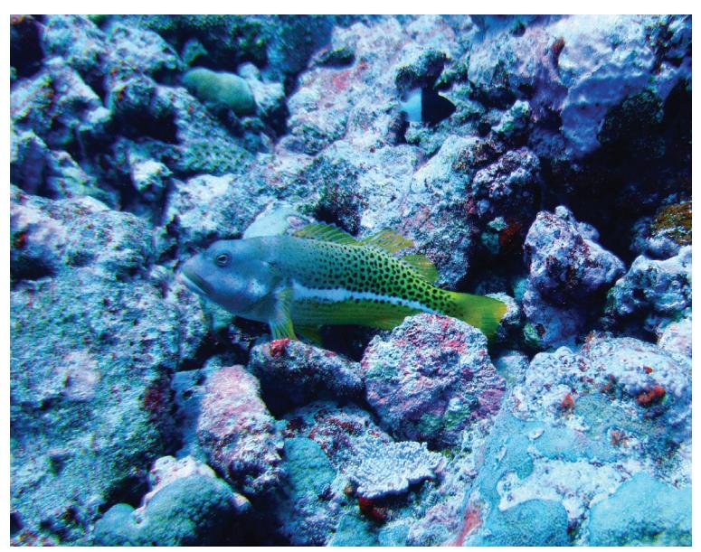

**Image 16.** Halfspotted hawkfish on a reef with low coral cover in American Samoa. Photo credit: Kevin Lino, NOAA/CRED.

portion of low rated coastline compared to other islands. Biogeographic patterns within islands or island groups revealed that Tutuila has a more uniform distribution of biomass values relative to other variables. Areas around Tutuila with relatively high fish biomass (>20% of sites) include the eastern tip (Bioregion 10), Aunu'u (Bioregion 8), Fagaitua Bay (Bioregion 6), and Taema and Nafanua Banks (Bioregion 7; Figure 4.6c). The rest of Tutuila was dominated by low or moderate values which comprised >90% of the sites in those regions. The Manu'a group showed less pronounced biogeographic differences with Ofu/Olosega (Bioregion 18) possessing a relatively large proportion of high biomass sites relative to Ta'u (Bioregions 19-20; Figure 4.6b). Swains (Bioregion 16, ~15% of values in the high biomass category) and Rose (Bioregion 17, ~10% of values in the high category) possessed generally similar proportions in fish biomass categories.

### **Fish Richness: Samoa**

Coastlines for Samoa overall were approximately evenly divided among high, medium, and low fish richness values (Figure 4.7a). In contrast to other variables, Upolu had a greater proportion of sites classified as high richness and fewer classified as low richness relative to Savai'i. Biogeographic patterns within islands revealed that Savai'i possessed fewer high values and a large proportion of low value sites for fish richness on its northern coasts than were seen for other variables (Figure 4.7b). Upolu had greater proportions of high site values on the southern coasts than were seen in other variables. Areas of low richness were however, again found in the Manono Island/Apolima Strait area and eastward past Apia to Fagaloa Bay (Bioregions 25, 29, and 30).

### **Fish Richness: American Samoa**

American Samoa overall had 22% of the coast rated as having high fish richness and nearly 50% classified as moderate. Patterns among islands in American Samoa were more uniform with typically ~25% of sites classified as high and ~50% classified as medium fish richness. The exception was Rose Atoll which had very few sites classified as high and nearly half the remaining sites classified as having low richness. Biogeographic patterns of fish richness within islands or island groups revealed highly variable patterns even among adjacent segments of coast. Tutuila especially had a more variable distribution of richness values around the island relative to some other variables. Notable locations around Tutuila with ~40-50% of sites having high fish richness were around Aunu'u and the bank to the east (Bioregions 8 and 9), Fagatele and Larsen Bays (Bioregion 2), and along the NW coast east of Fagamalo village (Bioregion 14) (Figure 4.7c). The Manu'a group showed less pronounced biogeographic differences with the west half of Ta'u (Bioregion 19) possessing a greater proportion of sites with high fish richness (~40%) than Ofu/Olosega (Bioregion 18) and the east half of Ta'u (~20% of sites) (Bioregion 20). Swains (Bioregion 16) had ~25% of richness values

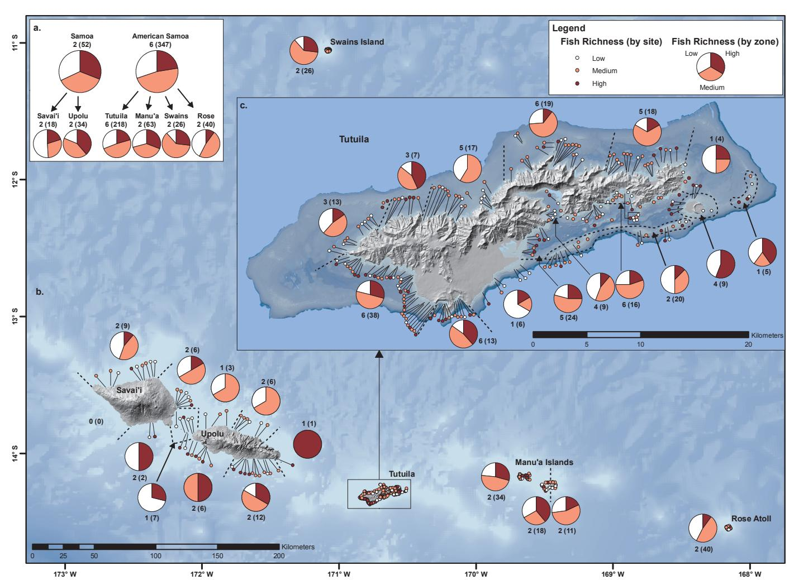

**Figure 4.7.** Fish richness at survey sites across Samoa and American Samoa. Sites and pie charts are coded as high, medium, or low fish richness values. (a) Proportions of high, medium, and low values by jurisdiction and by island. (b,c) Proportions of high, medium, and low values for individual Bioregions. Number labels represent the number of studies and sites (in parentheses) comprising each pie chart.

in the high category and only a small proportion in the low category whereas Rose (Bioregion 17) had only ~5% of values in the high category and nearly 50% in the low category.

### **Fish Community Structure: Samoa**

For Samoa, the MDS analysis of fish community structure was limited by only 2 datasets and extensive overlap among sites. Despite this, both datasets (GCRMN, SFR) again revealed consistent patterns of overlap among sites around southern Upolu (Bioregions 26 and 27) and northern Savai'i (21 and 24), a finding similar to the coral community analysis.

### **Fish Community Structure: American Samoa**

Even more so than was observed with the coral community analysis, there was a great deal of overlap and similarity in fish communities among sites and Bioregions within each study in MDS plots for American Samoa (Appendix C; Figures C.33-C.34). Only three studies showed significant differences among Bioregions in the global ANOSIM (KRS, R = 0.375 and p = 0.003; REA, R = 0.372 and p = 0.001; SFR, R = 0.197 and p = 0.003), and only 2-3 statistically different groups could be identified for some datasets through cluster analysis. Despite the overall finding of high overlap among sites, fish communities of a few Bioregions showed consistent patterns of similarity or uniqueness among datasets (Figure 4.8). Sites around Aunu'u (Bioregion 8) showed a unique fish assemblage in three datasets (KRS, REA, TCRMP). Sites between Cape Taputapu and Sail Rock Point (Bioregions 1 and 2) generally plotted in the same group among three datasets as well (ASEPA, REA, TCRMP). Sites along the north/central coast including Matalia/Cockscomb Point (Bioregion

**Figure 4.8.** Summary of Bioregions sharing similar fish communities and those with unique fish communities as identified from the MDS analyses.

12) and Fagaitua Bay (Bioregion 6) also showed some regularly occurring similarities among sites (ASEPA, TCRMP), a finding similar to the analysis of coral communities although based on two different datasets. There were other notable results within particular studies (ASEPA showed Pago Pago Harbor as unique, REA showed a distinct fish community at Swains, KRS showed separation of northern versus southern sites around Tutuila, CRSR showed separation of fish communities at eastern and western Ta'u), but these patterns were not confirmed across multiple datasets.

### **Biogeographic Hotspots**

Biogeographic patterns in coral and fish variables were evident at several spatial scales. Comparing among Samoan islands, Savai'i had consistently high values for multiple fish and coral variables. The exception was for fish richness, for which Savai'i possessed a large proportion of low scoring coastline. There were notable locations in American Samoa at the island or island group level for single variables. Manu'a had many high values for coral richness and Swains had many high values for coral cover. Notable locations with a marked proportion of low values at the island or island group scale included Swains for coral richness, Upolu for fish biomass, and Rose Atoll for coral cover. Note that in some cases, such low values may be "normal" for these locations and are not to be considered as a derogatory finding. Rose Atoll, for example, has a high cover of crustose coralline algae, a variable not presented here, and represents a unique area that contributes to the overall diversity and health of the archipelago (Vroom 2011).

In the hotspot analysis at the scale of Bioregions, 51 hotspots were identified among the four variables and 12 of those had a very low (<10%) probability of occurring by random chance (Table 4.3, Figure 4.9). Of the

**Table 4.3.** Hotspot analysis summary table. The proportion of sites categorized as 'high' is given for each variable and Bioregion. Bioregions with a greater proportion of high sites than calculated for the jurisdiction overall (in italics) are defined as hotspots and highlighted in green. Adjacent p-values indicate the probability of each hotspot occurring merely by chance (\* denotes values <10%).

| Coral Cover |           | Coral Richness                      |         | Fish Biomass                        |         | Fish Richness                       |         |                                     |         |                      |
|-------------|-----------|-------------------------------------|---------|-------------------------------------|---------|-------------------------------------|---------|-------------------------------------|---------|----------------------|
|             |           | Proportion High Overall = 0.22   |         | Proportion High Overall = 0.23   |         | Proportion High Overall = 0.10   |         | Proportion High Overall = 0.22   |         |                      |
|             | Bioregion | Proportion High for Bioregion | p-value | Proportion High for Bioregion | p-value | Proportion High for Bioregion | p-value | Proportion High for Bioregion | p-value | Hotspot variables |
|             | 1         | 0.67*                               | 0.000   | 0.22                                |         | 0.11                                | 0.679   | 0.29                                | 0.219   | 3                    |
|             | 2         | 0.42                                | 0.147   | 0.40                                | 0.203   | 0.08                                |         | 0.38                                | 0.147   | 3                    |
|             | 3         | 0.17                                |         | 0.50                                | 0.423   | 0.00                                |         | 0.17                                |         | 1                    |
|             | 4         | 0.00                                |         | 0.00                                |         | 0.04                                |         | 0.25                                | 0.462   | 1                    |
|             | 5         | 0.00                                |         | 0.22                                |         | 0.11                                | 0.680   | 0.11                                |         | 1                    |
|             | 6         | 0.31                                | 0.351   | 0.20                                |         | 0.19                                | 0.296   | 0.13                                |         | 2                    |
|             | 7         | 0.25                                | 0.564   | 0.00                                |         | 0.25*                               | 0.081   | 0.20                                |         | 2                    |
| moa         | 8         | 0.33                                | 0.385   | 0.20                                |         | 0.33*                               | 0.082   | 0.56*                               | 0.032   | 3                    |
|             | 9         | 0.00                                |         | n/a                                 |         | 0.00                                |         | 0.40                                | 0.314   | 1                    |
|             | 10        | 0.50                                | 0.252   | n/a                                 |         | 0.25                                | 0.398   | 0.25                                | 0.639   | 3                    |
| merican Sa  | 11        | 0.11                                |         | 0.25                                | 0.610   | 0.06                                |         | 0.17                                |         | 1                    |
|             | 12        | 0.42*                               | 0.070   | 0.09                                |         | 0.00                                |         | 0.11                                |         | 1                    |
| A           | 13        | 0.00                                |         | 0.00                                |         | 0.06                                |         | 0.00                                |         | 0                    |
|             | 14        | 0.43                                | 0.232   | 0.00                                |         | 0.14                                | 0.589   | 0.43                                | 0.193   | 3                    |
|             | 15        | 0.00                                |         | 0.00                                |         | 0.08                                |         | 0.15                                |         | 0                    |
|             | 16        | 0.54*                               | 0.001   | 0.00                                |         | 0.19                                | 0.190   | 0.27                                | 0.365   | 3                    |
|             | 17        | 0.05                                |         | 0.00                                |         | 0.13                                | 0.528   | 0.10                                |         | 1                    |
|             | 18        | 0.13                                |         | 0.59*                               | 0.002   | 0.18                                | 0.213   | 0.29                                | 0.218   | 3                    |
|             | 19        | 0.06                                |         | 0.75*                               | 0.003   | 0.06                                |         | 0.39*                               | 0.088   | 2                    |
|             | 20        | 0.44                                | 0.156   | 0.40                                | 0.348   | 0.09                                |         | 0.18                                |         | 2                    |
|             |           | Proportion High Overall = 0.43   |         | Proportion High Overall = 0.35   |         | Proportion High Overall = 0.09   |         | Proportion High Overall = 0.31   |         |                      |
|             | Bioregion | Proportion High for Bioregion | p-value | Proportion High for Bioregion | p-value | Proportion High for Bioregion | p-value | Proportion High for Bioregion | p-value | Hotspot variables |
|             | 21        | 0.91*                               | 0.003   | 0.55*                               | 0.092   | 0.22                                | 0.279   | 0.11                                |         | 3                    |
|             | 22        | 0.00                                |         | 0.67                                | 0.231   | n/a                                 |         | n/a                                 |         | 1                    |
|             | 23        | 1.00                                | 0.130   | 0.50                                | 0.526   | 0.00                                |         | 0.50                                | 0.437   | 3                    |
| moa         | 24        | 0.67                                | 0.129   | 0.50                                | 0.277   | 0.67*                               | 0.002   | 0.17                                |         | 3                    |
| Sa          | 25        | 0.00                                |         | 0.00                                |         | 0.00                                |         | 0.29                                |         | 0                    |
|             | 26        | 0.29                                |         | 0.43                                | 0.379   | 0.00                                |         | 0.50                                | 0.169   | 2                    |
|             | 27        | 0.21                                |         | 0.14                                |         | 0.00                                |         | 0.33                                | 0.352   | 1                    |
|             | 28        | 1.00                                | 0.360   | 0.00                                |         | 0.00                                |         | 1.00                                | 0.249   | 2                    |
|             | 29        | 0.00                                |         | 0.17                                |         | 0.00                                |         | 0.00                                |         | 0                    |
|             | 30        | 0.00                                |         | 0.33                                |         | 0.00                                |         | 0.00                                |         | 0                    |

30 Bioregions, none were identified as a hotspot for all four variables considered in the analysis. Ten of the Bioregions were hotspots for three variables. This included the SW coast of Tutuila from Cape Taputapu to Larsen Bay (Bioregions 1 and 2), the eastern tip of Tutuila (Bioregion 10), the northwestern coast of Tutuila east of Fagamalo (Bioregion 14), Swains Island (Bioregion 16), Ofu/Olosega Islands (Bioregion 18), and the north, northeast, and south facing coasts of Savai'i (Bioregions 23, 21, and 24). It should be noted however, that none of these three-variable hotspots had a high degree of certainty (p<0.10 in the re-sampling analysis)

**Figure 4.9.** Fish and coral hotspots by Bioregion.

for all three variables. Considering only hotspots that were highly robust to chance observations (p<0.10), three Bioregions stood out as hotspots for multiple variables: Aunu'u (Bioregion 8, for fish biomass and richness), western Ta'u (Bioregion 19, for coral and fish richness), and the northern coast of Savai'i (Bioregion 21 for coral cover and richness).

Also of note, of the 30 Bioregions, only 5 were not considered a hotspot for any variable. These "coolspots" included 3 regions along the north and western coast of Upolu from Manono Island/Apolima Strait eastward past Apia to Fagaloa Bay (Bioregions 25, 29, and 30), and two regions on the north coast of Tutuila including the NW coast between Cape Taputapu and Fagamalo Village (Bioregion 15) and the north central coast of Tutuila around Fagasa Village (Bioregion 13). Note that, except for the small watershed directly around Fagasa Bay, these last two coolspots straddle a hotspot for 3 variables (Bioregion 14) and occur along relatively less densely populated coast compared to the rest of Tutuila. Additional coolspots probably exist around Samoa but could not be identified due to the low density of surveys. All the other Bioregions were considered hotspots for at least one or two variables.

### CONCLUSIONS

Reef fish and corals are distributed unevenly around the islands of the Samoan Archipelago. Among the most notable hotspots for fish and corals using the variables considered here were northern Savai'i, parts of northwestern and southwestern Tutuila, the eastern tip of Tutuila, the Manu'a Island group, and Swains Island, although many other regions were identified as important for particular variables. Smaller hotspots at the scale of individual sites were evident as well (e.g. a site with high coral cover surrounded by many low cover sites) but were not the focus of this study and should be the subject of separate, finer-scale analyses. The

biogeographic hotspots and breakpoints identified here may be useful for several purposes including: placing the existing network of marine protected areas (MPA) and marine managed areas (MMA) into regional context for the variables included here, prioritizing Bioregions requiring more detailed study, and supporting review of overall natural resources monitoring practices throughout the region.

It is important to note that this is not a study of reef resiliency and these results alone should not be used as the basis for MPA network design. Nor should these results be interpreted to suggest that only places identified as hotspots in this analysis are biologically significant and worthy of conservation (e.g. Rose Atoll). The relative importance of each variable studied here and targeted in future assessments will vary based on the objectives of a particular management or conservation application (Roberts et al. 2003, Wilson et al. 2009) and should be specified in a process beyond the scope of this document. An effort focused on protecting biodiversity might focus on coral and fish richness hotspots, collecting more datasets that identify fish and coral to the species level, and using tools such as rarefaction curves to identify combinations of sites that efficiently represent the widest variety of species and communities (Beger et al. 2003). Alternatively, if the goal was to protect large larval sources for seeding of unprotected areas (e.g. to enhance sustainability or yield of fisheries), one might focus on hotspots of coral cover or fish biomass (Murray et al. 1999, Ochavillo et al. 2011) that overlap with source origins (Chapter 3). Once MPA/MMA network objectives are clearly identified, the general ecological variables presented throughout this report (Chapters 2-4) could be appropriately weighted and combined, more focused analyses conducted, additional key datasets collected, and a variety of MPA/ MMA design scenarios applied to identify combinations of management strategies and areas to achieve those objectives (e.g. Kendall et al. 2008, Watts et al. 2009).

The objective of this assessment was principally to identify biogeographic patterns of a few variables rather than to determine explanatory processes behind them. Reef type, larval supply, wave exposure, ocean climate, water quality, herbivore abundance, community processes, and various human pressures such as fishing, development, pollution and other factors no doubt interact at each site to produce the bioregional patterns identified here. The sparsely populated islands of Manu'a and Savai'i had generally higher values for most variables than the more densely populated Islands of Tutuila and Upolu. Within Tutuila and Upolu, highest population density areas such as around Pago Pago Harbor and Apia had many of the lowest values. These patterns are consistent with anthropogenic effects on fish communities correlated with human population density as noted for other Pacific Islands (Williams et al. 2011).

Some prior researchers have broken the coast of Tutuila into four sectors (NE, NW, SE, and SW) based primarily on seasonal patterns of wave exposure (e.g. Mundy 1996, Green 1996, 2002, Sabater and Tofaeono

2006). The edges of these sectors correspond well to the boundaries of some Bioregions identified here (1 and 15, 12 and 13, 3 and 4, and 4 and 10) although the combined use of many datasets enabled the discrimination of many additional distinct regions of the coast for Tutuila based on the variables that were considered. In fact, it is apparent from our study using the combined results of many datasets that even adjacent Bioregions with apparently similar environmental conditions can have very different coral and fish assemblages. Along the north shores of Tutuila and Upolu, for example, lie regions with outwardly similar environmental characteristics but very different values for the coral and fish variables considered here. Disentangling the many influences shaping regional biogeographic patterns will be an important next step for research. This could be undertaken with the datasets gathered in this study through further stratification of sites

**Image 17.** Reef with high coral cover in Samoa. Photo credit: Joyce Samuelu Ah Leong, MAF/FD.

by such factors as reef type, watershed influences, and exposure regime and the use of correlation or MDS based analysis (e.g. Houk et al. 2010, Ochavillo et al. 2011). This is a key step for identifying those factors that can be managed through agency, village, or MPA/MMA actions, identifying resilient reefs, and predicting how areas may respond over time to management (Nyström et al. 2008).

In general, the fish variables showed a more equitable distribution of values at all scales of analysis relative to the coral variables. There were less extreme changes in the spatial distribution of fish abundance and richness values and fewer differences in fish communities between adjacent Bioregions. Even the SFR dataset, based in village fish reserves around Samoa, did not

**Image 18.** Reticulated Dascyllus sheltering on a branching coral. Photo credit: Matt Kendall, Biogeography Branch.

appear to have consistently biased the results of fish biomass toward higher values. This could be due to the mobility of adult fish and their potential for relatively rapid redistribution in response to fishing pressure, natural disturbance events, or other density dependent factors. Corals in contrast, may only become redistributed during the larval phase. At least for harvested species, targeted fishing pressure alone may act to smooth out the hotspots for fish density or biomass (Williams et al. 2011).

The processes of larval transport documented in Chapter 3 are probably at least partly responsible for some of the observed biogeographic patterns among islands in the fish and coral variables documented here. The analysis of larval connectivity used shelf-area within ~9 km grid cells to set the number of potential larvae around each source island as a simplifying assumption. However, the results here demonstrate that there can actually be considerable variability in reef condition and therefore presumably spawning potential at finer scales. Although the coarse spatial scale of the hydrodynamic model limits its application to interpretation of the interisland-scale data presented in this chapter, some consistent patterns are evident.

Swains Island, an atoll that did not originate at the Samoan volcanic hotspot and may be geologically part of the Tokelau island group, lies in a somewhat different ocean climate (Chapter 2). Swains Island was also clearly the most physically isolated Bioregion based on currents and larval connectivity (Chapter 3) and, as would be expected, also had a very unique and isolated fish and coral community based on MDS analysis (and see Tribollet et al. 2010 for algal analysis). Rose Atoll, also a small island isolated from large upstream sources of fish and coral larvae, had relatively low values for coral and fish richness. This low biodiversity is consistent with predictions from Island Biogeography Theory (MacArthur and Wilson 1967) for small target islands a great distance from larval sources. In addition, east to west trends along the archipelago of increasing values for coral cover, richness, and even fish biomass are aligned with the prevailing current in the region (South Equatorial Current, Chapter 3). Within Samoa, Upolu generally has lower values than the downstream island of Savai'i. Within American Samoa, Rose has lower fish and coral richness than the downstream islands of Manu'a and Tutuila. These patterns are also consistent with Island Biogeography Theory in that larger downstream islands provide big settlement targets for fish and coral larvae spawned to the east and then carried to destinations westward along the archipelago in the South Equatorial Current. As noted above, however, there is much more at work shaping the reef communities than currents. For example, studies at finer scales around Tutuila have measured effects from more localized processes such as fishing, coastal development and poor water quality (e.g. Houk et al. 2010, Williams et al. 2011). Reef zonation and the much larger reef flat and lagoon area of potential juvenile habitat around Samoa as well as the greater diversity of habitat types there may also play a role in enhancing some fish populations (Green 1996, Adams et al. 2006). Archipelago-wide benthic maps produced using a consistent scale and classification scheme are a critical information need to support an analysis of habitat differences.

There are several key caveats to interpretation of these findings. First, based on the high, medium, and low scoring system, all analyses and results are inherently expressed only relative to the suite of available data in the archipelago. This scale is not defined relative to reef conditions globally or even more widely in the south Pacific region. Were additional data collected at much higher or lower quality sites for any of the individual studies, or if very different islands outside the study region were to be included, the classification of "high," "medium" and "low" categories would have been redistributed. For example, if an island group with many severely impacted sites of lower reef quality had been included, the values of all Samoan reefs would have been scored "relatively" higher. Also, because data from American Samoa is from reef slopes and data for Samoa is from lagoons, the scope of inference differs between these jurisdictions and comparison of "high" values between them is not possible. Also, although results are based heavily on recent data to reflect current status, catastrophic events and major environmental shifts may alter the distributions of even these very general variables. Of note however, is the observation that datasets used here show very consistent and robust patterns despite occurring over a decade marked by several hurricanes and bleaching events (Chapter 2) and even older data show patterns consistent with those described here (e.g. Mundy 1996). Next, although the variables included in the analysis were among those considered to be important in describing reef conditions, only six variables were analyzed and they are based on very general aspects of the marine community. Distribution and abundance of particular species or groups of concern should be addressed in separate studies (e.g. parrotfish as in Page 1998, algae as in Tribollet et al. 2010, or surgeonfish as in Ochavillo et al. 2011) and may result in the perception of different Bioregions (smaller, larger, or with different breakpoints). Last, the great disparity in the concentration of survey effort among islands and the comparatively low numbers of surveys around Upolu and Savai'i resulted in Bioregions of variable size. Archipelago-wide sampling using a randomized design, consistent methodology, more detailed taxonomic information, and more equitable distribution of survey effort stratified based on reef area and zonation (e.g. lagoon, reef slope) is a critical information need. Such a monitoring design and coordinated effort is necessary to understand the shared marine resources across the archipelago and to make informed management decisions cooperatively among regional management entities. The ongoing lack of archipelago-wide monitoring data collected with a consistent methodology and sampling design will hinder attempts at coordinated management between Samoa and American Samoa.

### **ACKNOWLEDGEMENTS**

All "meta analysis" investigations rely on information from many studies. The acknowledgements section of each individual study used here should be consulted for a complete list of the contributions to each investigation. Several people made specific contributions to this chapter. Peter Houk provided original data from AS EPA monitoring as well as helpful suggestions on an early draft of the chapter. Marlowe Sabater, former Chief of Fisheries with AS DMWR, generously provided original datasets and suggestions during the inception and design phases of the study. Risa Oram designed the survey method and collected much of the raw data for the Bioreconnaissance Assessments for the no-take MPA Program at DMWR. Paul Anderson facilitated data acquisition in Samoa with local contacts. Larry Claflin of the NOAA's Biogeography Branch provided a helpful review of draft material.

### **REFERENCES**

Adams, A.J., C.P. Dahlgren, G.T. Kellison, M.S. Kendall, C.A. Layman, J.A. Ley, I. Nagelkerken, and J.E. Serafy. 2006. Nursery function of tropical back-reef systems. Marine Ecology Progress Series 318: 287–301.

Bare, A.Y., A.L. Grimshaw, J.R. Rooney, M.G. Sabater, D. Fenner, and B. Carroll. 2010. Mesophotic communities of the insular shelf at Tutuila, American Samoa. Coral Reefs 29: 369-377.

Beger, M., G.P. Jones, and P.L. Munday. 2003. Conservation of coral reef biodiversity: a comparison of reserve selection procedures for corals and fishes. Biological Conservation 111: 53-62.

Birkeland, C., P. Craig, D. Fenner, L.W. Smith, W.E. Kiene, and B. Riegl. 2008. Chapter 20: Geologic setting and ecological functioning of coral reefs in American Samoa. Pages 741-765 in B. Riegl and R. Dodge, Coral Reefs of the USA, Springer.

Bohnsack, J.A. and S.P. Bannerot. 1986. A stationary visual census technique for quantitatively assessing community structure of coral reef fishes. NOAA Technical Report NMFS 41. 15 pp.

Brainard, R., and 25 others. 2008. Coral reef ecosystem monitoring report for American Samoa: 2002-2006. NOAA Special Report NMFS PIFSC. 472 pp.

Carroll, B.P. 2010. Coral Reef Fish Monitoring Report: 2006 - 2008. American Samoa Coral Reef Monitoring Program. Dept. of Marine and Wildlife Resources, Biological Report Series, No: 1002.

Cheal, A.J., M. Aaron MacNeil, E. Cripps, M.J. Emslie, M. Jonker, B. Schaffelke, and H. Sweatman. 2010. Coral-macroalgal phase shifts or reef resilience: links with diversity and functional roles of herbivorous fishes on the Great Barrier Reef. Coral Reefs 29: 1005-1015.

Clarke, K.R. 1993. Non-parametric multivariate analyses of changes in community structure. Australian Journal of Ecology 18: 117-143.

Clarke, K.R. and R.N. Gorley. 2006. PRIMER v6: User Manual/Tutorial. PRIMER-E, Plymouth.

Conservation International- Pacific Islands Programme, Ministry of Natural Resources and Environment, Secretariat of the Pacific Regional Environmental Programme. 2010. Priority sties of conservation in Samoa: Key biodiversity areas. Apia, Samoa. 32 pp.

Craig, P.C., J.H. Choat, L.M. Axe, and S. Saucerman. 1997. Population biology and harvest of the coral reef surgeonfish *Acanthurus lineatus* in American Samoa. Fishery Bulletin 95: 680-693.

Craig, P.C., G. DiDonato, D. Fenner, and C. Hawkins. 2005. The state of coral reef ecosystems of American Samoa. pp. 312-337. In Waddell, J. (ed.), 2005. The status of coral reef ecosystems of the US and Pacific freely associated states. NOAA Tech Report NOS NCCOS 11. 522 pp.

Craig, P. (editor). 2009. Natural history guide to American Samoa. 3rd Edition. National Park of American Samoa, Department of Marine and Wildlife Resources, and American Samoa Community College. Pago Pago, American Samoa. 131 pp.

Edinger, E.N., J. Jompa, G.V. Limmon, W. Widjatmoko, and M.J. Risk. 1998. Reef degradation and coral biodiversity in Indonesia: effects of land-based pollution, destructive fishing practices, and changes over time. Marine Pollution Bulletin 36: 617-630.

Fenner, D. 2008. Annual Report for 2006 of the Territorial Coral Reef Monitoring Program for American Samoa, Benthic Section. Dept. of Marine & Wildlife Resources, American Samoa.

Fenner, D., et al. 2008. The state of coral reef ecosystems of American Samoa. P. 307-351 in J.E. Waddell and A.M. Clarke (eds.), The State of Coral Reef Ecosystems of the United States and Pacific Freely Associated States: 2008. NOAA Technical Memorandum NOS NCCOS 73. NOAA/NCCOS Center for Coastal Monitoring and Assessment's Biogeography Team. Silver Spring, MD. 569 pp.

Fenner, D. 2009a. Annual Report for 2008 of the Territorial Coral Reef Monitoring Program for American Samoa, Benthic Section. Dept. of Marine & Wildlife Resources, American Samoa.

Fenner D. 2009b. Annual Report for 2007 of the Territorial Coral Reef Monitoring Program for American Samoa, Benthic Section. Dept. of Marine & Wildlife Resources, American Samoa.

Friedlander, A.F. and E.E. DeMartini. 2002. Contrasts in density, size, and biomass of reef fishes between the northwestern and the main Hawaiian Islands: the effects of fishing down apex predators. Marine Ecology Progress Series 230: 253-264.

Green, A. 1996. Status of the coral reefs of the Samoan Archipelago. American Samoa Department of Marine and Wildlife Resources. Pago Pago, American Samoa. 126 pp.

Green, A. 2002. Status of coral reefs on the main volcanic islands of American Samoa: A resurvey of long term monitoring sites. Report Prepared for the American Samoa Government, Department of Marine and Wildlife Resources. Pago Pago, American Samoa. 86 pp.

Houk, P. and C. Musberger. 2008. Assessing the effects of non-point source pollution on American Samoa's coral reef communities. Report to American Samoa Environmental Protection Agency, 38 pp.

Houk, P., C. Musberger, and P. Wiles. 2010. Water quality and herbivory interactively drive coral reef recovery patterns in American Samoa. Plos One 5:1-9 e13913.

Johannes, R.E. 2002. The renaissance of community-based marine resource management in Oceania. Annual Review of Ecology and Systematics 33: 317-340.

Kendall, M.S., K.A. Eschelbach, G. McFall, J. Sullivan, and L. Bauer. 2008. MPA design using sliding windows: Case study designating a research area. Ocean & Coastal Management 51: 815-825.

King, M. and U. Faasili. 1998. A network of small, community-owned village fish reserves in Samoa. Parks 8: 11-16.

Legendre, P. and L. Legendre. 1998. Numerical Ecology. Second English Edition. Elsevier, Amsterdam.

MacArthur, R.H. and E.O. Wilson. 1967. The Theory of Island Biogeography. Princeton, N.J.: Princeton University Press.

McCune, B. and J.B. Grace. 2002. Analysis of ecological communities. MjM Software Design, Gleneden Beach, OR.

Mundy, C. 1996. A quantitative survey of the corals of American Samoa. University of Queensland, Australia. Report Prepared for the American Samoa Government, Department of Marine and Wildlife Resources. Pago Pago, American Samoa. 25 pp.

Murray, S.N., R.F. Ambrose, J.A. Bohnsack, L.W. Botsford, M.H. Carr, G.E. Davis, P.K. Dayton, D. Gotshall, D.R. Gunderson, M.A. Hixon, J. Lubchenco, M. Mangel, A. MacCall, D.A. McArdle, J.C. Ogden, J. Roughgarden, R.M. Starr, M.J. Tegner, and M.M. Yoklavich. 1999. No-take reserve networks: sustaining fishery populations and marine ecosystems. Fisheries 24: 11-25.

NOAA, NCCOS (National Centers for Coastal Ocean Science). 2005. Shallow-water benthic habitats of American Samoa, Guam, and the Commonwealth of the Northern Mariana Islands (CD ROM). NOAA Technical Memorandum NOS NCCOS 8, Biogeography Team, Silver Spring, Maryland.

Nyström, M., N.A.J. Graham, J. Lokrantz, and A.V. Norström. 2008. Capturing the cornerstones of coral reef resilience: linking theory to practice. Coral Reefs 27:795-809.

Ochavillo, D., S. Tafaeono, M. Sabater, and E.L. Trip. 2011. Population structure of *Ctenochaetus striatus* (Acanthuridae) in Tutuila, American Samoa: The use of size-at-age data in multi-scale population size surveys. Fisheries Research 107: 14-21.

Oram, R.G. 2008. Marine protected area master plan: A manual to guide the establishment and management of notake marine protected areas. American Samoa Government, Department of Marine and Wildlife Resources. Biological Report Series 2008-01. January 2008. Pago Pago, American Samoa. 64 pp.

Page, M. 1998. The biology, community structure, growth and artisanal catch of parrotfishes of American Samoa. American Samoa Government, Department of Marine and Wildlife Resources. Pago Pago, American Samoa. 52 pp.

Pedersen Planning Consultants. 2000. American Samoa Watershed Protection Plan. Prepared for American Samoa Environmental Protection Agency and Coastal Zone Management Program. Pago Pago, American Samoa. Volumes 1-4.

Roberts, C., S. Andelman, G. Branch, R. Bustamante, J.C. Castilla, J. Dugan, B. Halpern, H. Leslie, K. Lafferty, J. Lubchenco, D. McArdle, H. Possingham, M. Ruckelshaus, and R.R. Warner. 2003. Ecological criteria for evaluating candidate sites for marine reserves. Ecological Applications 13: S199-214.

Sabater, M. 2010. American Samoa Archipelagic Fishery Ecosystem Report. American Samoa Government, Department of Marine and Wildlife Resources. Biological Report Series No: 1001. Pago Pago, American Samoa. 48 pp.

Sabater, M. and S. Tofaeono. 2006. Spatial variation in biomass, abundance and species composition of "key reef species" in American Samoa. American Samoa Government, Department of Marine and Wildlife Resources. Pago Pago, American Samoa. 54 pp.

Sabater, M.G. and S. Tofaeono. 2007. Effects of scale and benthic composition on biomass and trophic group distribution of reef fishes in American Samoa. Pacific Science 61: 503-520.

Samuelu, J. 2003. Village fish reserve report for Vaisala (re-survey). August 2003. Assessment, Research and Management Section Fisheries Division. Ministry of Agriculture, Forestry, Fisheries, and Meteorology. 6 pp.

Samuelu, J. and M Sapatu. 2008. Status of coral reefs in Samoa 2008. Global Coral Reef Monitoring Network 2008 Report. Fisheries Division, Ministry of Agriculture and Fisheries. Apia, Samoa. 33 pp.

Spalding, M.D., H.E. Fox, G.R. Allen, N. Davidson, Z.A. Feraña, M. Finlayson, B.S. Halpern, M.A. Jorge, A. Lombana, S.A. Lourie, K.D. Martin, E. McManus, J. Molnar, C.A. Recchia, and J. Robertson. 2007. Marine ecoregions of the world: A bioregionalization of coastal and shelf areas. Bioscience 57: 573-583.

Tribollet, A.D., T. Schils, and P.S. Vroom. 2010. Spatio-temporal variability in macroalgal assemblages of American Samoa. Phycologia 49: 574-591.

Veron, J.E.N. 2000. Corals of the World, Vol. 1-3. Australian Institute of Marine Science and CRR Ltd.

Veron, J.E.N., L.M. DeVantier, E. Turak, A.L. Green, S. Kininmonth, M. Stafford-Smith, and N. Peterson. 2009. Delineating the coral triangle. Galaxea, Journal of Coral Reef Studies 11: 91-100.

Vroom, P.S. 2011. "Coral Dominance": A dangerous ecosystem misnomer? Journal of Marine Biology 2011: Article ID 164127, 8 pp.

Watts, M.E., I.R. Ball, R.R. Stewart, C.J. Klein, K.A. Wilson, C. Steinback, R. Lourival, L. Kircher, and H.P. Possingham. 2009. Marxan with Zones: Software for optimal conservation based land- and sea-use zoning. Environmental Modeling & Assessment 24: 1513-1521.

Whaylen, L. and D. Fenner. 2005. The American Samoa Coral Reef Monitoring Program. Report Prepared for the Department of Marine and Wildlife Resources and Coral Reef Advisory Group, American Samoa. March 2005. Pago Pago, American Samoa. 34 pp. + appendices.

Wilkinson, C. 2008. Status of coral reefs of the world: 2008. Global Coral Reef Monitoring Network and Reef and Rainforest Research Centre, Townsville, Australia, 296 p.

Williams, I.D., B.L. Richards, S.A. Sandin, J.K. Baum, R.E. Schroeder, M.O. Nadom, B. Zgliczynski, P. Craig, J.L. Mc-Ilwain, and R.E. Brainard. 2011. Differences in reef fish assemblages between populated and remote reefs spanning multiple archipelagos across the Central and Western Pacific. Journal of Marine Biology 2011: Article ID 826234, 14 pages. Doi:10.1155/2011/826234.

Wilson, K.A., J. Carwardine, and H.P. Possingham. 2009. Setting Conservation Priorities. Annals of the New York Academy of Sciences. 1162: 237-364.

# The Existing Network of Marine Protected Areas in American Samoa

Matthew Poti1, Matthew S. Kendall2, Gene Brighouse3, Tim Clark4, Kevin Grant3, Lucy Jacob5, Alice Lawrence5, Mike Reynolds4 and Selaina Vaitautolu5

### INTRODUCTION

Marine Protected Areas and Marine Managed Areas (hereafter referred to collectively as MPAs) are considered key tools for maintaining sustainable reef ecosystems. By limiting or promoting particular resource uses and activities in different areas and raising awareness issues on reef sustainability within MPAs, managers can promote long term resiliency. Multiple local and federal agencies have eagerly embraced MPA concepts in Samoa and American Samoa with a diversity of MPAs now in place across the archipelago from the village and local community level to national protected areas and those with international significance. Many of the different MPAs in the network were created through independent processes and therefore have different objectives, have been in existence for different lengths of time, have a wide range of sizes and protection regulations, and have different management authorities. Each contributes to the di-

**Image 19.** Fagatele Bay National Marine Sanctuary sign. Photo credit: Matt Kendall, NOAA Biogeography.

verse mosaic of marine resource management in the region (See Text Box: Summary of MPA Programs).

Understanding the variety of fish, coral, and habitat resources that this multifaceted network of MPAs encompasses is critical for assessing the scope of current protection and thoughtfully designing additional network elements. Here we seek to summarize what aspects of the coral reef ecosystem are protected by MPAs individually, through brief summaries of each MPA, and then collectively, through analysis of the combined area encompassed by all MPAs. Based on the available datasets used to broadly characterize the biogeography of the region in the previous chapters and appendices of this assessment, key concepts of MPA network design including biogeographic representation and replication will be addressed. Representation is the idea that at least part of each distinct biogeographic region should be included in a 'complete' network of MPAs. Replication is the idea that there should be more than one MPA in each distinct biogeographic region. Replication spreads protection within each region thereby reducing the risk to the network that is associated with localized degradation at any one site.

In this chapter of the assessment we focus our analysis only on the MPAs of American Samoa. While Samoa is a key part of the MPA landscape in the archipelago as demonstrated in Chapters 3 and 4, two key datasets are in need of further development. First, benthic maps similar in spatial scope and categorical detail to those available in American Samoa are needed to inventory the protected habitats of Samoa. Second, MPA boundaries in Samoa must be made available for analysis, but at present many are proprietary at the village level as part of the Community Based Fisheries Management Program (King and Faasili 1998, Samuelu 2003).

The objectives of this chapter were to:

- 1) Characterize the reef fishes, corals, habitats, and other key features of each existing MPA relative to all of American Samoa.
- 2) Evaluate the distribution of MPA sites in the context of the biogeographic regions and ecological hotspots defined in Chapter 4 and identify key areas not currently in the network.
- 3) Summarize the area of reef ecosystem, by bottom type and reef type, that is currently protected relative to American Samoa overall.

NOAA/NOS/NCCOS/CCMA/Biogeography Branch and Consolidated Safety Services, Inc., Fairfax, VA, under NOAA Contract No. DG133C07NC0616

&lt;sup>2 NOAA/NOS/NCCOS/CCMA Biogeography Branch

&lt;sup>3 Fagatele Bay National Marine Sanctuary

&lt;sup>4 National Park of American Samoa

&lt;sup>5 American Samoa/Department of Marine and Wildlife Resources

### **SUMMARY OF MPA PROGRAMS**

*There are several agencies involved in MPA management and planning in American Samoa. Here we provide a brief summary of these programs and their objectives in American Samoa. They are separated into those that are exclusively Territorial in manage ment authority and those that are co-managed by Territorial and Federal agencies.*

### **Territorial MPAs**

Department of Commerce Special Management Areas (SMAs)

*The American Samoa Government authorized the American Samoa Coastal Management Program through the American Samoa Coastal Management Act of 1990 (ASCA § 24.0503) to designate, as Special Management Areas (SMAs), places that "possess unique and irreplaceable habitat, products or materials, offer beneficial functions or affect the cultural values or quality of life significant to the general population of the Territory and fa'a Samoa" (ASAC § 26.0221). Three such places – Leone Pala, Nu'uuli Pala, and Pago Pago Harbor – have been designated as SMAs as of January 2011. Although no formal management plans exist for these SMAs, projects within these areas must comply with standards described in ASAC § 26.0221.*

Department of Marine and Wildlife Resources Community-Based Fisheries Management Program (CFMP)

*The American Samoa Government created the Community-Based Fisheries Management Program within the Department of Marine and Wildlife Resources (DMWR) in 2001 so that the "historical, cultural, and natural resources" of American Samoa and its marine environment would be "protected, managed, controlled, and preserved for the benefit of all people of the Territory and future generations" (ASAC § 24.10). The CFMP promotes sustainable management of marine resources and enhances fisheries stocks through mechanisms such as seasonal closures and fishing restrictions within designated reserves, as agreed upon by village leaders and DMWR (ASAC § 24.10). As of January 2011, eleven CFMP reserves were in existence around Tutuila. These reserves are sometimes referred to as village marine protected areas (VMPAs). Fishing restrictions within reserves may include prohibiting destructive fishing methods (e.g. use of bleach, poison, or dynamite), use of scuba gear and nets, the breaking up of corals, and fishing by outsiders. The number of CFMP reserves, their boundaries, and regulations are as of January 2011 but are regularly modified to meet local needs.*

Department of Marine and Wildlife Resources No-Take Marine Protected Area Program

*The American Samoa Government established the No-Take MPA Program within DMWR in 2006 in response to Governor Tauese Sunia's recommendation to protect 20% of American Samoa's coral reefs as no-take MPAs (Sunia 2000). The goal of the No-Take MPA Program is to "ensure protection of unique, various, and diverse coral reef habitat and spawning stocks" through the creation of a network of no-take areas (Sunia 2000, Oram 2008). The No-Take MPA Program is currently using the authority under the Community-Based Fisheries Management Program (under ASAC § 24.1001) to enforce no-take regulations.* 

### Other Territorial MPAs

*Two additional MPAs are present in American Samoa but are not part of the formal programs listed above. One is a private reserve established in 1985 at Alega Bay by a local restaurant owner, Tisa Fa'amuli. This reserve is hereafter referred to as Alega Private Marine Reserve. The other is a small marine park adjacent to the Ofu unit of the National Park that was established by territorial legislation in 1994 to protect the "unique coral reef wildlife habitat while enabling the public to enjoy the natural beauty of the site" (ASCA § 18.0214). At present time the Ofu Vaoto Territorial Marine Park has no enforcement, monitoring, or management plan.* 

### **Federal or Federal/Territorial Co-Managed MPAs**

National Marine Sanctuaries

*The Office of National Marine Sanctuaries (ONMS) is authorized by the National Marine Sanctuaries Act (NMSA, 1972 with sub sequent amendments) to designate and protect areas of the marine environment with "special national significance" due to their "conservation, recreational, ecological, historical, scientific, cultural, archeological, educational, or aesthetic qualities" as national marine sanctuaries (16 U.S.C. 1431 et seq.). The Sanctuaries Program is intended to "improve the conservation, understanding, management, and wise and sustainable use of marine resources", to "enhance public awareness, understanding, and apprecia tion of the marine environment", and to "maintain for future generations the habitat, and ecological services, of the natural as semblage of living resources that inhabit these areas" (16 U.S.C. 1431 et seq.). In American Samoa, the Fagatele Bay National Marine Sanctuary (FBNMS) was designated in 1986 and is co-managed with the Territorial Government through the American Samoa Department of Commerce (15 C.F.R. 922.100-104). Additional potential areas were brought to the attention of ONMS via public meetings in 2009. A Site Selection Working Group of the Sanctuary Advisory Council evaluated each of the suggested areas using NMSA criteria to determine if they possess qualities of national significance worthy of sanctuary designation. Also, per Presidential Proclamation 8337, the marine areas of the Rose Atoll Marine National Monument shall be added to FBNMS in accordance with the NMSA (16 U.S.C. 1431 et seq., Proclamation No. 8337).*

### National Parks

*The National Park Service (NPS) was created in 1916 to "conserve the scenery and the natural and historic objects and the wild life therein and to provide for the enjoyment of the same in such manner and by such means as will leave them unimpaired for the enjoyment of future generations" (16 U.S.C. 1). Under the direction of Congress, the NPS conducted a feasibility study in 1986-87 to identify areas of significant natural and cultural resources in American Samoa and to assess the suitability of these areas for inclusion in a national park (NPS 1988). Through this process and consultation with village leaders and the Govern ment of American Samoa, the NPS identified two areas (north-central Tutuila from Vatia Bay to Fagasa Bay and the south-central portion of Ta'u) that best met the criteria for inclusion in a national park. Additional areas, including the south coast of Ofu, were suggested as possible future additions (NPS 1988). Under recommendation of the NPS, the National Park of American Samoa (NPSA) was designated by Congress in 1988 to "preserve and protect the tropical forest and archaeological and cultural re sources of American Samoa, and of associated reefs, to maintain the habitat of flying foxes, preserve the ecological balance of the Samoan tropical forest, and, consistent with the preservation of these resources, to provide for the enjoyment of the unique resources of the Samoan tropical forest by visitors from around the world" (16 U.S.C. 410qq). The NPSA currently consists of 3 separate units – the areas on Tutuila and Ta'u identified by the feasibility study and the south coast of Ofu (NPS 1997). In 2002 Congress authorized the addition of portions of the islands of Ofu and Olosega to the NPSA (16 U.S.C. 410qq-1). Formal estab lishment of these additions awaits approval of a lease with the local villages. The NPSA is managed by the NPS in consultation with the territorial DMWR and the individual villages. Management of the NPSA maintains traditional Samoan customs and allows subsistence fishing by native American Samoans using traditional tools and methods in accordance with rules established by the NPS and village leaders.*

National Wildlife Refuges and Marine National Monuments

*The United States Fish and Wildlife Service (USFWS) mission is, working with others, to conserve, protect and enhance fish, wildlife, and plants and their habitats for the continuing benefit of the American people. In 1966 Congress authorized the USFWS through the National Wildlife Refuge System Administration Act (1966, with subsequent amendments) to "administer a national network of lands and waters for the conservation, management, and where appropriate, restoration of the fish, wildlife, and plant resources and their habitats within the United States for the benefit of present and future generations of Americans" (16 U.S.C. 668dd-668ee). In American Samoa, Rose Atoll National Wildlife Refuge (NWR) was established in 1973 through a cooperative agreement between the American Samoa Government and the USFWS (RANWR 1974). Rose Atoll NWR has been closed to the public since its establishment to protect the fish and wildlife in the refuge.*

*In 2009 Rose Atoll Marine National Monument (MNM), which includes the Rose Atoll NWR was established by Presidential Proclamation 8337 to protect objects of historic and scientific interest under the authority of the Antiquities Act of 1906 (16 U.S.C. 431). The NWR is managed exclusively by USFWS, but management of the MNM is more complex. The Proclamation gave the Department of Interior (USFWS) management responsibility for the MNM in consultation with the Department of Commerce (NOAA). However, NOAA was given management responsibility for fisheries outside of the NWR, and the Secretary of Commerce was tasked with initiating the process of adding the marine areas of the MNM to Fagatele Bay National Marine Sanctuary.*

### **METHODS**

### **Inventory of existing MPAs**

Working with local MPA practitioners, the American Samoa Coastal Zone Management Program, and Island GIS User Group, we obtained boundary maps (GIS shapefiles) and implementation documents for the 23 MPAs existing in American Samoa as of January 2011. This included eleven Community-Based Fisheries Management Program (CFMP) Reserves, one No-Take MPA, one Marine National Monument (MNM), one National Wildlife Refuge (NWR), one National Marine Sanctuary (NMS), three National Park units, one pri vate marine reserve, three Special Management Areas (SMAs), and one Territorial Marine Park (Figure 5.1, Table 5.1, Appendix D).

**Figure 5.1.** Existing MPAs in American Samoa as of January 2011.

**Table 5.1.** Existing MPAs in American Samoa as of January 2011.

| MPA Program/Type                                | Level of Government            | Management Authority | Sites (No., Locations)                                                                                                 |
|-------------------------------------------------|-----------------------------------|-------------------------|------------------------------------------------------------------------------------------------------------------------|
| Community-Based Fisheries Management Program | Territorial                       | DMWR, villages          | 11: Alofau, Amanave, Amaua & Auto, Aoa, Aua, Fagamalo, Masausi, Matu'u & Faganeanea, Po - loa, Sailele, Vatia |
| Marine National Monuments                       | Federal                           | NOAA, USFWS             | 1: Rose Atoll                                                                                                          |
| National Marine Sanctuaries                     | Federal/Territorial Co-Managed | NOAA, ASDOC             | 1: Fagatele Bay                                                                                                        |
| National Park of American Samoa              | Federal                           | AS NPS                  | 3: Ofu, Ta'u, Tutuila                                                                                                  |
| National Wildlife Refuge System              | Federal                           | USFWS                   | 1: Rose Atoll                                                                                                          |
| No-Take MPA Program                             | Territorial                       | DMWR                    | 1: Fagamalo                                                                                                            |
| Private Marine Reserves                         | Private                           | Alega village           | 1: Alega Bay                                                                                                           |
| Special Management Areas                        | Territorial                       | ASCMP, villages         | 3: Leone Pala, Nu'uuli Pala, Pago Pago Harbor                                                                          |
| Territorial Marine Parks                        | Territorial                       | DPR, DMWR               | 1: Ofu                                                                                                                 |

These boundaries were then reviewed, modified as necessary in the GIS, and confirmed for accuracy by their corresponding management authorities.

For each MPA, we created a site profile that summarizes key information focused on the MPA's biogeograph ic setting. For each 2-page profile, we first provide an overview that includes a site map and short description of MPA size, location, implementation date, and rationale. We also identify general characteristics of adjacent lands that may impact the marine environment including size and condition of watersheds, population density, erosion and runoff potential, and notable human use impacts (e.g. major sources of pollution). This informa tion was obtained from the American Samoa Watershed Protection Plan prepared for the American Samoa Environmental Protection Agency in 2000 (Pedersen Planning Consultants 2000a-c). In addition, because pigs are a major source of nearshore pollution affecting coral reef ecosystems, the density of domestic pigs in watersheds adjacent to each MPA is noted. Pig density is described using four categories (high = >50 pigs/ km 2 , medium = 12-50 pigs/km 2 , low = <12 pigs/km 2 , and zero) assigned to watershed data from the ASEPA Piggery Compliance Program (ASEPA Piggery Compliance Program 2011) using the natural breaks function in ArcGIS (Figure 5.2). In addition, key natural resource regulations for each MPA are listed, specifically those that pertain to fishing or the ecological reasons for establishing the site. Original designation documents for each site should be consulted for a complete list of regulations. A more comprehensive description of each individual MPA including implementation, purpose, management practices, fishing regulations, biological and socio-economic monitoring, community involvement, and current and future projects, is provided in Appendix D.

The main focus of each site profile is on the reef ecosystem habitats, reef fish, and coral communities pro tected within each MPA. Boundary maps of each MPA were overlaid upon recently completed benthic maps of American Samoa (Appendix B, NOAA NCCOS 2005). Boundaries were used to clip portions of habitat polygons inside each MPA. Benthic maps for American Samoa categorize bottom features on the basis of 2 attributes: 1) "structure" which refers to predominant physical composition of the feature and includes 15 mutually exclusive bottom types such as patch reef, pavement, and sand, and 2) "zone" which refers to each feature's position on the insular shelf and includes 13 mutually exclusive categories such as lagoon, reef crest, fore reef (locally referred to as reef slope), and bank/shelf (Appendix B, NOAA NCCOS 2005). We summarized the areas within each MPA by structure type using pie charts and compared the proportions of benthic habitats within each MPA to those of American Samoa overall. A hierarchical approach was taken wherein the relative proportions of all coral reef and hardbottom structures are discussed, followed by those structure types representative of only the highest quality reef habitats. These include aggregate reef, patch reef, aggregated patch reefs, and spur and groove which all typically have high structural rugosity and often possess high coral cover and relatively more abundant and diverse fish communities compared to other hardbottom types. These four bottom types are hereafter referred to collectively as "coral reef habitats".


**Figure 5.2.** Density of pigs (pigs/km²) in piggeries by watershed for Tutuila and Manu'a watersheds. Watersheds were classified as having high, medium, or low pig density using the natural breaks function in ArcGIS.

Similarly, we summarized the zonation of the coral reef and hardbottom structures within each MPA in pie charts and compared the proportions of these reef zones to American Samoa overall. All zones are provided but description focused on reef flats, due to the importance of this habitat for village use by gleaners, and the fore reef, a high-value reef zone which has the greatest diversity of reef fish and is the focus of most reef monitoring around American Samoa.

We also evaluated general reef fish and coral variables at each MPA compared to American Samoa overall. These variables were the same as those considered in Chapter 4: coral cover, coral richness, fish biomass, and fish richness classified into high, medium, and low categories (see Chapter 4 for a description of survey data and classification methods). Our goal was only to describe each MPA relative to the rest of American Samoa; therefore, only datasets with many, widely spread sites around Tutuila or the other islands of American Samoa were used. Many MPAs are also characterized more individually with customized studies and methodology, but those studies did not enable island-wide comparison due to differences in site selection, methodology, or timing of surveys. Consequently, such studies are not included in the analysis but are noted in each profile for those interested in more detailed site characterization.

Survey sites within each MPA were categorized as high, medium, or low for fish and coral variables, plotted on maps with the MPA boundaries, and summarized in pie charts. For MPAs with four or more survey sites, the proportions of high, medium, and low values within each MPA were compared to the proportions for American Samoa overall (see Chapter 4) using pie charts. Survey results for MPAs with too few sites to make sound comparisons are provided but are not compared to American Samoa overall. In addition, the spatial

distribution of survey sites within MPAs was evaluated and key locations where greater effort is required are noted.

While it would be useful to compile species lists and cumulative numbers of species observed for each MPA, our profiles did not include this information for two main reasons. First, because of the very different survey methods used among studies and lack of consistent species level information, creating rarefaction curves was not possible. Second, the very different levels of survey effort among the MPAs have resulted in severe inconsistency in total area surveyed (e.g. an MPA with 30 surveys inside it will have a much larger species list than one with only a few surveys). As a result of these limitations, our analysis was focused on more general summary variables described above for evaluating sites.

Last, for each MPA we identified the biogeographic region (hereafter "Bioregion") in which it lies based on the archipelago-wide analysis of fish and coral data in Chapter 4. Also noted is the "hotspot" status for the reef fish and coral variables analyzed in Chapter 4 and any similarities between the fish and coral communities in the Bioregion of the MPA and those in other Bioregions. Key results from Chapter 3 on potential sources and destinations for coral and fish larvae are also noted.

### **How much of American Samoa is protected in the MPA Network?**

To evaluate the proportion of the total area of potential reef ecosystem in American Samoa protected by MPAs, we used a pie chart to summarize the total area within MPAs versus the area outside. Potential reef ecosystem was defined as areas shallower than 150 m, which approximates the depth limit for photic and mesophotic reef communities in the region (Bare et al. 2010, Mesophotic Coral Ecosystems 2010, Appendix B). For most MPAs this is the same value as the total area since they only encompass regions shallower than 150 m deep. Areas were categorized by structure type. For simplicity, some map categories were aggregated into major groups. These were coral reef habitats (aggregate reef, patch reef, aggregated patch reefs, spur and groove), other hardbottom types (pavement, pavement with patch reefs, pavement with sand channels, reef rubble, rock/boulder), and unconsolidated substrates (mud, sand with scattered coral/rock, sand). We repeated this comparison using only the coral reef category to examine how much coral reef habitat is pro tected relative to the total area of coral reef habitat around American Samoa. Along with these comparisons we also provided charts showing the proportions of potential reef ecosystem and coral reef habitat with notake restrictions and with other fishing restrictions.

### **Which biogeographic regions and ecological hotspots are represented in the MPA network?**

The coastline of American Samoa can be divided into 20 ecologically distinct biogeographic regions (termed "Bioregions") based on the distribution of reef fish and corals (Chapter 4). Thirty-six ecological hotspots among these 20 Bioregions have been defined relative to American Samoa overall for each of four variables: coral cover (hotspot in n = 10 Bioregions), coral richness (n = 6), fish biomass (n = 10), and fish richness (n =10). Boundaries of the existing MPAs were overlaid onto the Bioregions and ecological hotspots to deter mine which were already represented in the MPA network and which lacked an MPA and may be considered as gaps in coverage.

### **Size and regulatory comparisons among MPAs**

MPAs in American Samoa have a wide range of sizes. We compared the sizes among MPAs by scaling the size of the habitat pie chart for each MPA relative to the total area of potential reef ecosystem within it. Scal ing the size of pie charts in this manner allowed us to evaluate the relative contributions of each MPA to the overall network and also to compare the proportions of benthic habitats among the MPAs while taking into consideration the total area protected. This is significant because an MPA that has a high proportion of reef habitats but that is very small may actually protect a smaller reef area than an MPA that has a lower propor tion of reef habitats but a much larger overall area. In addition, we identified which MPAs or parts of MPAs provide the strongest level of protection, complete no-take.

### **RESULTS: BENTHIC HABITATS OF AMERICAN SAMOA**

Coral reef and hardbottom structures together comprise ~30% of the almost 400 km2 of mapped benthic habitat around American Samoa (Figure 5.3a). Coral reef structures cover almost twice as much area as hardbottom structures. with aggregated patch reefs, spur and groove, and aggregate reef covering  $\sim 7\%$ ,  $\sim 6\%$ , and  $\sim 5\%$ of the area, respectively. However, the majority (~60%) of the mapped benthic habitat around American Samoa is algal plain in the bank/shelf zone. Nearly half of the coral reef and hardbottom around American Samoa is found in the bank/shelf zone, ~20% is in the fore reef, and ~10% is in each of the reef flat and bank/ shelf escarpment zones (Figure 5.3b, see Appendix B Figure B.1 for cross section of zones).

**Figure 5.3.** (a) Proportion of mapped benthic structure types in American Samoa overall. (b) Proportion of coral reef and hardbottom in each reef zone. Structure types or zones representing <1% of the total mapped area are not shown.

The zonation of coral reef and hardbottom structures varies with shelf geomorphology among the islands of American Samoa. The progression of reef zones from shoreline to reef slope is similar for Tutuila and the Manu'a Islands. However, the bank/shelf around Tutuila extends much farther from the shoreline than it does around the Manu'a Islands and includes pinnacle and bank/shelf basin zones not found on the other islands. As a result of the narrower shelf, a greater percentage of coral reef and hardbottom is in the reef flat zone around the Manu'a Islands compared to Tutuila. The two steep-sided atolls in American Samoa, Swains Island and Rose Atoll, are also fundamentally different features. At Rose Atoll, almost two-thirds of the coral reef and hardbottom is in the back reef, whereas ~10% is in each of the reef crest, fore reef, and bank/shelf zones. The coral reef and hardbottom at Swains Island in contrast is mostly in the reef flat, with lesser amounts in the reef crest and fore reef and none in the completely enclosed lagoon area.

### **RESULTS: SITE CHARACTERIZATIONS**

### **Territorial MPAs**

### Alega Private Marine Reserve

### Overview

Alega Private Marine Reserve is located in the southeast of Tutuila in Alega Bay and extends from Vaiola Point to Tifa Point (Figure 5.4). It was initiated by Tisa Fa'amuli in 1985 to protect the coral reef ecosystem in Alega Bay from overfishing and other destructive practices. By maintaining a low level of subsistence fishing,


**Figure 5.4.** Benthic habitat (by structure type) and fish and coral survey data within Alega Private Marine Reserve. Coral cover, coral richness, fish biomass, and fish richness values at each survey site are classified as high (red shading), medium (pink shading), or low (white shading). Grey shading indicates variables with no data at a given site. Fish and coral survey data are from ASEPA, KRS, and REA.

the reserve allows for sustainable use of the marine resources in the reserve by the village community now and in future generations. The reserve fronts a ~1.3 km² watershed in minimally impacted condition with low human population density. There are no domestic pigs reported in the watershed. In addition to natural sedimentation caused by highly erosive soils on the steep slopes of the watershed, nearshore waters may also have been slightly impacted by urban runoffs and insufficiently treated wastewater. Only subsistence fishing with traditional methods by village members is allowed within the reserve. Commercial fishing and fishing by outsiders are prohibited within Alega Private Marine Reserve.

# Habitat Composition, Reef Fish, and Coral Communities

This small MPA is dominated by coral reef and hardbottom structures which together comprise ~88% of the area within the reserve (Figure 5.5a). Coral reef structures comprise ~41% of the area and include aggregate reef  $(\sim 37\%)$  and patch reef  $(\sim 4\%)$ . In addition, pavement covers ~44% of the area. In comparison, these three structure types comprise less than 15% of American Samoa overall. About 50% and ~42% of the coral reef and hardbottom in the reserve are in the reef flat and fore reef zones, respectively, compared to only ~9% and ~22% around American Samoa (Figure 5.5b).

Only 3 surveys were located within Alega Private Marine Reserve. Coral data at these sites includes one medium and two low values for cover and one medium value for richness. Fish data includes one low and two medium values for both biomass and richness (Figure 5.6). The small sample size greatly limits the scope of these findings and does not allow comparisons with American Samoa overall. Additional, more widely spread surveys are needed to more fully characterize the reef fish and coral communities within this MPA.

# (a) Total Area by Benthic Structure Type (b) Zonation of Coral Reef and Hardbottom Reef Flat (50%) Fore Reef (42%) ~88% of total area is coral reef and hardbottom

**Figure 5.5.** (a) Proportion of benthic structure types in Alega Private Marine Reserve. (b) Proportion of coral reef and hardbottom in each reef zone. Structure types or zones representing <1% of the total area are not shown.

~0.13 km2

**Figure 5.6.** Fish and coral data collected in Alega Private Marine Reserve. Pie charts depict the proportions of high (red), medium (pink), and low (white) values for coral cover, coral richness, fish biomass, and fish richness. Number labels represent the number of studies and sites (in parentheses) comprising each pie chart.

### Biogeographic Characteristics

Alega Private Marine Reserve is a small part of a biogeographic region that is a hotspot for fish richness (Bioregion 4, Chapter 4).

~0.15 km2

### **Alofau CFMP Reserve**

### Overview

The village of Alofau is located in SE Tutuila on the eastern side of Fagaitua Bay. The Alofau CFMP reserve (Figure 5.7) was established in 2001 to "conserve the marine resources in the ocean and on the village reef" (ASDMWR 2002a). The ~0.3 km² reserve extends north to south from Asasama Point at the boundary with Pagai village to Uea Point on Cape Fogausa with a seaward boundary that includes the entire reef area (ASDMWR 2002a). It fronts the eastern end of a ~4.9 km² watershed in intermediately impacted condition with moderate human population density and a medium density of pigs. In addition to natural sedimentation caused by highly erosive soils on the steep slopes of the watershed, nearshore waters have also been impacted by urban runoffs and insufficiently treated wastewater. Fishing is prohibited within the reserve with the excep-

**Figure 5.7.** Benthic habitat (by structure type) and fish and coral survey data within the Alofau CFMP reserve. Coral cover, coral richness, fish biomass, and fish richness values at each survey site are classified as high (red shading), medium (pink shading), or low (white shading). Grey shading indicates variables with no data at a given site. Fish and coral survey data are from ASEPA and REA.

tion of occasional Saturday openings for subsistence fishing. Destructive fishing methods, including the use of bleach, poisons, and dynamite, are banned and fishing by outsiders is also prohibited (ASDMWR 2002a).

# Habitat Composition, Reef Fish, and Coral Communities

The benthic habitat within the Alofau CFMP reserve is dominated by coral reef and hardbottom structures, which together comprise ~95% of the area within the reserve (Figure 5.8a). Coral reef structures comprise ~37% of the area and include aggregate reef (~19%), aggregated patch reefs  $(\sim 16\%)$ , and spur and groove  $(\sim 3\%)$ . In comparison, these three structure types comprise only ~18% of the mapped benthic habitat around American Samoa. About 52% and ~17% of the coral reef and hardbottom in the reserve are in the reef flat and fore reef zones, respectively, compared to ~9% and ~22% around American Samoa (Figure 5.8b). Also of note, another ~20% of the coral reef and hardbottom structures are in the lagoon.

Only two fish and coral surveys were located within the Alofau CFMP reserve. Coral data at these sites includes two low values for cover and one medium value for richness. Fish data includes one low and one high value for both biomass and richness (Figure 5.9). The small sample size greatly limits the scope of these findings and does not allow comparisons with American Samoa overall. Additional, more widely spread surveys are needed to more fully characterize the reef fish and coral communities within this MPA.

**Figure 5.8.** (a) Proportion of benthic structure types in the Alofau CFMP reserve. (b) Proportion of coral reef and hardbottom in each reef zone. Structure types or zones representing <1% of the total area are not shown.

~94% of total area is coral reef and hardbottom

~0.30 km2


**Figure 5.9.** Fish and coral data collected in the Alofau CFMP reserve. Pie charts depict the proportions of high (red), medium (pink), and low (white) values for coral cover, coral richness, fish biomass, and fish richness. Number labels represent the number of studies and sites (in parentheses) comprising each pie chart.

### Biogeographic Characteristics

The Alofau CFMP reserve lies in a biogeographic region (Bioregion 6, Chapter 4) that is a hotspot for coral cover and fish biomass. The region's fish and coral communities are similar to those around north-central Tutuila, where the Tutuila unit of the National Park and the Vatia CFMP reserve are located.

### Additional References

Orcutt 1993, Andrews 2004, Musburger 2004, Houk 2010

### **Amanave CFMP Reserve**

### Overview

The village of Amanave is found on the western tip of Tutuila. The Amanave CFMP reserve (Figure 5.10) was established in 2009 to ensure the availability of the resources in the reserve for the villagers today and in the future. The ~0.3 km² reserve extends offshore approximately 50 yards between the boundary with Poloa village and the boundary with Fa'ilolo village. It fronts a ~1.0 km² watershed in intermediately impacted condition with moderate human population density and medium density of pigs. In addition to natural sedimentation caused by highly erosive soils on the steep slopes of the watershed, nearshore waters have also been impacted by urban runoffs and insufficiently treated wastewater. The reserve is closed to all commercial and recreational fishing apart from when it is opened for subsistence fishing one month every year.

**Figure 5.10.** Benthic habitat (by structure type) and fish and coral survey data within the Amanave CFMP reserve. Coral cover, coral richness, fish biomass, and fish richness values at each survey site are classified as high (red shading), medium (pink shading), or low (white shading). Grey shading indicates variables with no data at a given site. Fish and coral survey data are from KRS and REA.

(44%)

### Habitat Composition, Reef Fish, and Coral Communities

Coral reef and hardbottom structures together comprise ~97% of the area within the Amanave CFMP reserve (Figure 5.11a). Coral reef structures, primarily spur and groove, comprise ~22% of the area. Also of note. almost half of the benthic habitat within the reserve is covered by reef rubble. In comparison, spur and groove and reef rubble cover ~6% and ~2%, respectively, of American Samoa overall. About 44% and ~20% of the coral reef and hardbottom in the reserve are in the reef flat and fore reef zones, respectively, compared to ~9% and ~22% around American Samoa (Figure 5.11b).

Only two fish and coral surveys were located within or just outside the Amanave CFMP reserve and these were both located near the eastern end of the reserve. Coral data at these sites includes one medium and one high value for cover and one high value for richness. Fish data includes one low and one medium value for biomass and two medium values for richness (Figure 5.12). The small sample size greatly limits the scope of these findings and does not allow comparisons with American Samoa overall, Additional, more widely spread surveys are needed to more fully characterize the reef fish and coral communities within this MPA.

### (a) Total Area by (b) Zonation of Benthic Structure Type Coral Reef and Hardbottom


Figure 5.11. (a) Proportion of benthic structure types in the Amanave CFMP reserve. (b) Proportion of coral reef and hardbottom in each reef zone. Structure types or zones representing <1% of the total area are not shown.


Figure 5.12. Fish and coral data collected in the Amanave CFMP reserve. Pie charts depict the proportions of high (red), medium (pink), and low (white) values for coral cover, coral richness, fish biomass, and fish richness. Number labels represent the number of studies and sites (in parentheses) comprising each pie chart.

### Biogeographic Characteristics

The Amanave CFMP reserve lies in a distinct biogeographic region (Bioregion 1, Chapter 4) that is a regional hotspot for coral cover as well as fish biomass and richness. The region's fish and coral communities are representative of southwestern Tutuila.

### Additional References

Randall and Devaney 1974, Orcutt 1993

### **Amaua and Auto CFMP Reserve**

### Overview

The villages of Amaua and Auto are located in SE Tutuila on the western side of Fagaitua Bay. In response to concerns over declines in fish and shellfish populations from overfishing, the Amaua and Auto CFMP reserve (Figure 5.13) was established in 2003 to "manage, protect, and preserve the fish, shellfish, and the coastal area of the village of Amaua and Auto" (ASDMWR 2003a). The ~0.4 km² reserve extends from the western boundary of Auto to the eastern boundary of Amaua with a seaward boundary ranging from 250 yards to the edge of the reef area (ASDMWR 2003a). It fronts the western end of a ~4.9 km² watershed in intermediately impacted condition with a moderate human population density and medium density of pigs. In the part of the watershed fronted by the reserve there is moderate to high potential for runoff and erosion because of

**Figure 5.13.** Benthic habitat (by structure type) and fish and coral survey data within the Amaua and Auto CFMP reserve. Coral cover, coral richness, fish biomass, and fish richness values at each survey site are classified as high (red shading), medium (pink shading), or low (white shading). Grey shading indicates variables with no data at a given site. Fish and coral survey data are from MPABR and TCRMP.

the highly erosive soils and steep slopes. Nearshore waters are also impacted to a lesser extent by urban runoffs and insufficiently treated wastewater. The reserve is closed to all commercial and recreational fishing apart from when it is opened for subsistence fishing at certain times of the year. Destructive fishing methods, including the use of bleach and poisons, are banned (ASDMWR 2003a).

# Habitat Composition, Reef Fish, and Coral Communities

The Amaua and Auto CFMP reserve is dominated by coral reef and hardbottom structures. which together comprise ~95% of the area within the reserve (Figure 5.14a). Coral reef structures, primarily aggregate reef, comprise ~22% of the area. Also, pavement covers ~50% of the area. In comparison, aggregate reef and pavement comprise ~5% and ~7%, respectively, of American Samoa overall, About 63% and ~24% of the coral reef and hardbottom in the reserve are in the reef flat and fore reef zones, respectively, compared to ~9% and ~22% around American Samoa (Figure 5.14b).

Only two surveys were located within the Amaua and Auto CFMP reserve, and these were in the aggregate reef close to the seaward boundary of the reserve. Coral data at these sites includes one low and one high value for cover and two low values for richness. Fish data includes one low and one medium value for biomass and two low values for richness (Figure 5.15). The small sample size greatly limits the scope of these findings and does not allow comparisons with American Samoa overall. Additional, more widely spread surveys are needed to more fully characterize the reef fish and coral communities within this MPA.

**Figure 5.14.** (a) Proportion of benthic structure types in the Amaua and Auto CFMP reserve. (b) Proportion of coral reef and hardbottom in each reef zone. Structure types or zones representing <1% of the total area are not shown.


**Figure 5.15.** Fish and coral data collected in the Amaua and Auto CFMP reserve. Pie charts depict the proportions of high (red), medium (pink), and low (white) values for coral cover, coral richness, fish biomass, and fish richness. Number labels represent the number of studies and sites (in parentheses) comprising each pie chart.

### Biogeographic Characteristics

The Amaua and Auto CFMP reserve lies in a biogeographic region (Bioregion 6, Chapter 4) that is a hotspot for coral cover and fish biomass. The region's fish and coral communities are similar to those around north-central Tutuila, where the Tutuila unit of the National Park and the Vatia CFMP reserve are located.

Additional References
Andrews 2004, Musburger 2004, Houk 2010

### **Aoa CFMP Reserve**

### Overview

The village of Aoa is in NE Tutuila. The Aoa CFMP reserve (Figure 5.16) was established in 2005 to improve the coral reef habitat and restore fish and invertebrate stocks within the reserve. The ~0.3 km² reserve includes the entire Aoa Bay between Motusaga Point and Palau Point and extends offshore approximately 50 yards from the reef edge. The reserve fronts a ~2.2 km² watershed in intermediately impacted condition with moderate human population density and a medium density of pigs. In some areas of the watershed there is moderate to high potential for periodic natural erosion due to the soil type and steep slopes, but sedimentation is moderated by the Aoa wetland. Nearshore waters are also impacted to a lesser extent by urban runoffs and insufficiently treated wastewater. The reserve is closed to all commercial and recreational fishing apart from when it is opened for subsistence fishing at certain times of the year.

Figure 5.16. Benthic habitat (by structure type) within the Aoa CFMP reserve. No reef fish or coral surveys from the island-wide comparison were located within the Aoa CFMP reserve.

# Habitat Composition, Reef Fish, and Coral Communities

The Aoa CFMP reserve is dominated by coral reef and hardbottom structures, which together comprise ~80% of the area within the reserve (Figure 5.17a). Coral reef structures in the form of aggregate reef cover ~8% of the area, while pavement and reef rubble together comprise ~70% of the area. In comparison, aggregate reef covers ~5% of American Samoa overall. About 73% and ~10% of the coral reef and hardbottom in the reserve are in the reef flat and fore reef zones, respectively, compared to ~9% and ~22% around American Samoa (Figure 5.17b).

### (a) Total Area by Benthic Structure Type

### (b) Zonation of Coral Reef and Hardbottom

**Figure 5.17.** (a) Proportion of benthic structure types in the Aoa CFMP reserve. (b) Proportion of coral reef and hardbottom in each reef zone. Structure types or zones representing <1% of the total area are not shown.

There were no fish and coral surveys from the island-wide comparison located within the Aoa CFMP reserve.

### Biogeographic Characteristics

The Aoa CFMP reserve is located in a distinct biogeographic region that was a hotspot for coral richness (Bioregion 11, Chapter 4). The region's coral communities are similar to those in NW Tutuila, where the Fagamalo CFMP reserve and No-Take MPA are located.

### Additional References

Randall and Devaney 1974, Birkeland et al. 1987, Orcutt 1993, Birkeland et al. 1994, Birkeland et al. 2003, Houk 2010

### **Aua CFMP Reserve**

### Overview

The village of Aua is located on the eastern side of Pago Pago Harbor. The Aua CFMP reserve (Figure 5.18) was established in 2002 to "manage, protect, and preserve the fish, shellfish, and the coastal area of the village of Aua" (ASDMWR 2003b). The ~0.2 km² reserve extends from Ava Point to Muliti Point with a seaward boundary ranging from 200 yards to the edge of the reef area (ASDMWR 2003b). It fronts the northeast portion of a ~10.4 km² watershed in extensively impacted condition. In addition to natural sedimentation caused by highly erosive soils on the steep slopes of the watershed and increased surface runoffs due to extensive urbanization, nearshore water quality has also been severely degraded by nutrient and chemical discharges by the tuna canneries and other historical industrial, commercial, and military activities adjacent to Pago Pago Harbor. There is a medium density of pigs in the watershed compared to all of American Samoa. The

Figure 5.18. Benthic habitat (by structure type) within the Aua CFMP reserve. No reef fish or coral surveys from the island-wide comparison were located within the Aua CFMP reserve.

reserve is closed to all commercial and recreational fishing apart from when it is opened for subsistence fishing at certain times of the year. Destructive fishing methods, including the use of bleach, poisons, and explosives are banned. The use of scuba gear and nets for fishing and the breaking up of corals for fishing are also banned, as is fishing by outsiders (ASDMWR 2003b).

# Habitat Composition, Reef Fish, and Coral Communities

Coral reef and hardbottom structures together comprise ~82% of the area within the Aua CFMP reserve (Figure 5.19a). Coral reef structures in the form of patch reefs comprise ~7% of the area, while reef rubble is predominant and covers ~60% of the area. In comparison, individual patch reef and reef rubble cover less than 1% and ~2%, respectively, of American Samoa overall. About 75% and ~16% of the coral reef and hardbottom in the reserve are in the reef flat and fore reef zones, respectively, compared to ~9% and ~22% around American Samoa (Figure 5.19b). Also of note. an additional ~8% of the coral reef and hardbottom is in the lagoon.

# (a) Total Area by Benthic Structure Type


(b) Zonation of

Coral Reef and Hardbottom

**Figure 5.19.** (a) Proportion of benthic structure types in the Aua CFMP reserve. (b) Proportion of coral reef and hardbottom in each reef zone. Structure types or zones representing <1% of the total area are not shown.

There were no fish and coral surveys from the island-wide comparison located within the Aua CFMP reserve.

### Biogeographic Characteristics

The Aua CFMP reserve is in a biogeographic region that includes Pago Pago Harbor and is a hotspot for fish biomass and has a unique coral community (Bioregion 5, Chapter 4). Note that high fish biomass may be due to the ban on sale of fish from the harbor and while the coral community is "unique" relative to elsewhere in American Samoa it is not necessarily "healthy".

### Additional References

Mayor 1924, Dahl and Lamberts 1977, Mc-Connaughey 1993, Orcutt 1993, Green et al. 1997a, Fisk and Birkeland 2002, Coles et al. 2003, Andrews 2004, Birkeland et al. 2004, Cornish and DiDonato 2004, Green et al. 2005

**Image 20.** Pago Pago Harbor and Rainmaker Mountain near Aua. Photo credit: Matt Kendall, NOAA Biogeography.

### **Fagamalo CFMP Reserve**

### Overview

The village of Fagamalo is located in NW Tutuila. The Fagamalo CFMP reserve (Figure 5.20) was established in 2003 to "preserve the coral reef area of the village of Fagamalo" and amended in 2010 (ASDMWR 2003c). The ~0.4 km² reserve extends from Niutulua Point in the west to Tafaga Point in the east and offshore approximately 200 yards. It abuts the Fagamalo No-Take MPA and fronts a ~2.1 km² watershed in pristine condition with very low human population density and a low density of pigs. While human impacts are minimal in the watershed, there is moderate to high potential for runoff and erosion because of the soil types and steep slopes with sediment transport into Fagamalo Bay primarily via Matavai Stream. The reserve is closed to all commercial and recreational fishing apart from when it is opened for subsistence fishing at certain


**Figure 5.20.** Benthic habitat (by structure type) and fish and coral survey data within the Fagamalo CFMP reserve. Coral cover, coral richness, fish biomass, and fish richness values at each survey site are classified as high (red shading), medium (pink shading), or low (white shading). Grey shading indicates variables with no data at a given site. Fish and coral survey data are from CRSR, REA, and TCRMP.

times of the year. Destructive fishing methods, including the use of bleach, electrical shocking devices, and explosives, are banned. In addition, fishing within Fagamalo streams is also prohibited (ASDMWR 2003c).

Habitat Composition, Reef Fish, and Coral Communities The Fagamalo CFMP reserve is dominated by coral reef and hardbottom structures, which together comprise ~85% of the area within the reserve (Figure 5.21a). Coral reef structures, primarily aggregate reef, cover just over half of the area. In comparison, aggregate reef covers only ~5% of the mapped benthic habitat around American Samoa. About 4% and ~59% of the coral reef and hardbottom in the reserve are in the reef flat and fore reef zones. compared to ~9% and ~22% around American (Figure 5.21b). Also of note, ~14% of the coral reef and hardbottom is in the shoreline intertidal zone


**Figure 5.21.** (a) Proportion of benthic structure types in the Fagamalo CFMP reserve. (b) Proportion of coral reef and hardbottom in each reef zone. Structure types or zones representing <1% of the total area are not shown.

Only 3 surveys were located within the Fagamalo CFMP reserve. Coral data at these sites includes one low and two medium values for cover and two medium values for richness. Fish data includes one high and two low values for biomass and one low and two high values for richness (Figure 5.22). The small sample size greatly limits the scope of these findings and does not allow comparisons with American Samoa overall. Additional, more widely spread surveys are needed to more fully characterize the reef fish and coral communities within this MPA.

**Figure 5.22.** Fish and coral data collected in the Fagamalo CFMP reserve. Pie charts depict the proportions of high (red), medium (pink), and low (white) values for coral cover, coral richness, fish biomass, and fish richness. Number labels represent the number of studies and sites (in parentheses) comprising each pie chart.

### Biogeographic Characteristics

The Fagamalo CFMP reserve lies in a distinct biogeographic region (Bioregion 14, Chapter 4) that is a hotspot for coral cover and fish biomass and richness. The region's coral communities are similar to those in NE Tutuila, where the Masausi, Sailele, and Aoa CFMP reserves are located.

### Additional References

Orcutt 1993, Fisk and Birkeland 2002, Musburger 2004

### Fagamalo No-Take MPA

### Overview

The village of Fagamalo is located in NW Tutuila. The village signed a cooperative agreement with DMWR in May 2010 to join the No-Take MPA Program. The boundaries were finalized in December 2010 and the agreement was made to activate the no-take regulations (ASAC § 24.1008 (c)(i)) for an initial period of 10 years. The completion of the revised management plan is still underway and expected completion is May 2011. The ~2.9 km² no-take boundary extends from Tafaga Point (in the west) to Oali'i (in the east) and ~2 km offshore (Figure 5.23). It fronts a ~2.1 km² watershed in pristine condition with very low human population density and a low density of pigs. While human impacts are minimal in the watershed, there is moderate to high potential for runoff and erosion because of the soil types and steep slopes. All types of fishing and extractive use are prohibited within the no-take MPA.


**Figure 5.23.** Benthic habitat (by structure type) and fish and coral survey data within the Fagamalo No-Take MPA. Coral cover, coral richness, fish biomass, and fish richness values at each survey site are classified as high (red shading), medium (pink shading), or low (white shading). Grey shading indicates variables with no data at a given site. Fish and coral survey data are from REA.

Composition, Habitat Reef Fish. and Coral Communities Coral reef and hardbottom structures together comprise ~46% of the area within the Fagamalo No-Take MPA (Figure 5.24a). Coral reef structures comprise ~44% of the area and include aggregated patch reefs (~39%) and aggregate reef (~5%). However, over half of the mapped benthic habitat within the MPA is covered by algal plain. In comparison, aggregate reef and aggregated patch reefs cover less than 15% of American Samoa overall. Only ~1% and ~11% of the coral reef and hardbottom in the MPA are in the reef flat and fore reef zones, respectively. Almost 90% of the coral reef

**Figure 5.24.** (a) Proportion of benthic structure types in the Fagamalo No-Take MPA. (b) Proportion of coral reef and hardbottom in each reef zone. Structure types or zones representing <1% of the total area are not shown.

and hardbottom is in the bank/shelf (Figure 5.24b). In comparison, only ~50% of the coral reef and hardbottom around American Samoa is in the bank/shelf, ~9% is in the reef flat and ~22% is in the fore reef.

Only 4 surveys were located within or just outside the Fagamalo No-Take MPA and, of these, one was in the reef and hardbottom formations nearest to the shoreline and three were carried out on the offshore bank made up of reef and hardbottom formations. Coral cover and fish richness are relatively higher at these sites compared to all of American Samoa, whereas fish biomass values are relatively lower (Figure 5.25). No coral richness data was collected with these surveys. Additional, more widely spread surveys are needed to adequately characterize the reef fish and coral communities within this MPA.


**Figure 5.25.** Comparison of fish and coral data collected in the Fagamalo No-Take MPA to data from all of American Samoa. Pie charts depict the proportions of high (red), medium (pink), and low (white) values for coral cover, coral richness, fish biomass, and fish richness. Number labels represent the number of studies and sites (in parentheses) comprising each pie chart.

### Biogeographic Characteristics

The Fagamalo No-Take MPA lies in a distinct biogeographic region that is a hotspot for coral cover as well as fish biomass and richness (Bioregion 14, Chapter 4). The region's coral communities are similar to those in NE Tutuila, where the Masausi, Sailele, and Aoa CFMP reserves are located. Also of note, this is the only MPA that encompasses bank reef formations, making it a valuable and unique component of the MPA network.

Additional References
Orcutt 1993, Musburger 2004, Oram 2008

### **Leone Pala Special Management Area**

### Overview

The Leone Pala Special Management Area (SMA) (Figure 5.26) is located in SW Tutuila and was designated a special management area by the American Samoa Coastal Management Act of 1990 because of its "unique and valuable characteristics" and the "imminent threat from development pressures" (ASCA § 24.0503). It includes both a ~0.02 km² marine component, delineated by a straight line from the mouth of Leafu stream, and the adjacent wetland areas (ASAC § 26.0221). The primary reason for this and other designated SMAs is to regulate on-shore activities that could be harmful to unique marine ecosystems (Gombos et al. 2007). The Leone Pala SMA fronts a ~14.7 km² watershed in extensively impacted condition with high human population density as well as a high density of pigs. Encroachment into the wetland area and nutrient, sediment, and silt discharges into the streams that flow into the lagoon have significantly impacted the ability of the wetland to


**Figure 5.26.** Benthic habitat (by structure type) within the Leone Pala SMA. No reef fish or coral surveys from the island-wide comparison were located within the Leone Pala SMA.

filter sediment and nutrients. Management of Leone Pala SMA is primarily by the American Samoa Coastal Management Program (ASCMP) of the Department of Commerce, but no fishing regulations exist beyond territorial regulations and there is not a written management plan (Gombos et al. 2007).

### *Habitat Composition, Reef Fish, and Coral Communities*

Coral reef and hardbottom structures together comprise ~0.25% of the very small Leone lagoon that is the marine component of Leone Pala SMA. Instead, its benthic environment consists mainly of mud (Figure 5.27) with a mangrove shoreline that was too small to be included in island-scale mapping (NOAA NCCOS 2005). Because coral reef and hardbottom struc tures comprise only ~0.25% of the lagoon, we do not include the zonation of coral reef and hardbottom in Figure 5.27.

There were no fish and coral surveys from the island-wide comparison located within the Leone Pala SMA.

### *Biogeographic Characteristics*

Leone Pala SMA lies adjacent to a biogeographic region that is a hotspot for coral cover, fish biomass, and fish richness (Bioregion 1, Chapter 4). However, this MPA lacks well developed reefs and is intended for protec tion of wetland and nearshore habitats.

*Additional References*

### Total Area by Benthic Structure Type


~0.02 km

2

**Figure 5.27.** Proportion of benthic structure types in the Leone Pala SMA. Structure types or zones repre senting <1% of the total area are not

Gilman et al. 2007 shown.

**Image 21.** Mangroves at Leone Pala SMA. Photo credit: Matt Kendall, NOAA Biogeography.

### Masausi CFMP Reserve

### Overview

The village of Masausi lies in NE Tutuila. The Masausi CFMP reserve (Figure 5.28) was established in 2002 to "conserve the marine resources in the ocean or in the village reef" (ASDMWR 2003d). The ~0.2 km² reserve extends from Puputagi Point in the west to Folau Point in the east and offshore approximately 200 yards. It fronts a ~1.6 km² watershed in minimally impacted condition with low population density concentrated in Masausi Village and a medium density of pigs. Because of the erosive soil types and steep slopes, there is moderate to high potential for periodic natural erosion with sediments carried into the nearshore waters fronting the watershed. Nearshore waters are also impacted to a lesser extent by urban runoffs. The reserve is closed to all commercial and recreational fishing apart from when it is opened for subsistence fishing at certain times of the year. Destructive fishing methods, including the use of bleach, poisons, and explosives,

**Figure 5.28.** Benthic habitat (by structure type) and fish and coral survey data within the Masausi CFMP reserve. Coral cover, coral richness, fish biomass, and fish richness values at each survey site are classified as high (red shading), medium (pink shading), or low (white shading). Grey shading indicates variables with no data at a given site. Fish and coral survey data are from REA.

are banned. The use of scuba gear for fishing, flashlights for night fishing, and the breaking up of corals for fishing are also banned, as is fishing by outsiders (ASDMWR 2003d).

~0.20 km2

# Habitat Composition, Reef Fish, and Coral Communities

The Masausi CFMP reserve is dominated by coral reef and hardbottom structures, which together comprise ~59% of its area (Figure 5.29a). Coral reef structures, mostly aggregate reef, comprise ~18% of the area, while ~40% of the area is covered by algal plain. In comparison, aggregate reef covers ~5% of American Samoa overall. About 23% and ~54% of the coral reef and hardbottom in the reserve are in the reef flat and fore reef zones, respectively, compared to ~9% and ~22% around American Samoa (Figure 5.29b). Also of note, ~10% of the coral reef and hardbottom is in the shoreline intertidal zone.

### (a) Total Area by (b) Zonation of Benthic Structure Type Coral Reef and Hardbottom Shoreline Intertidal 1% (10%)Reef Flat (23%)Reef Crest 40% (11%)Fore Reef Bank/Shel (54%)(3%)~59% of total area is coral reef and hardbottom

**Figure 5.29.** (a) Proportion of benthic structure types in the Masausi CFMP reserve. (b) Proportion of coral reef and hardbottom in each reef zone. Structure types or zones representing <1% of the total area are not shown.

Only two surveys were located within the Masausi CFMP reserve, and these were located in the area covered by algal plain rather than the reef and pavement areas. Coral data at these sites includes one medium value for cover and one high value for richness. Fish data includes one low value each for biomass and richness (Figure 5.30). The small sample size greatly limits the scope of these findings and does not allow comparisons with American Samoa overall. Additional, more widely spread surveys are needed to more fully characterize the reef fish and coral communities within this MPA.

~0.12 km2

**Figure 5.30.** Fish and coral data collected in the Masausi CFMP reserve. Pie charts depict the proportions of high (red), medium (pink), and low (white) values for coral cover, coral richness, fish biomass, and fish richness. Number labels represent the number of studies and sites (in parentheses) comprising each pie chart.

### Biogeographic Characteristics

The Masausi CFMP reserve is located in a biogeographic region that is a hotspot for coral richness (Bioregion 11, Chapter 4). The region's coral communities are similar to those in NW Tutuila, where the Fagamalo CFMP reserve and No-Take MPA are located.

Additional References
Orcutt 1993, Musburger 2004

### Matu'u and Faganeanea CFMP Reserve

### Overview

The villages of Matu'u and Faganeanea are found on the south central coast of Tutuila. The Matu'u and Faganeanea CFMP reserve (Figure 5.31) was established in 2005 with the primary goal of "protecting the coral reefs of Matu'u and Faganeanea to provide more fish for the future generation" (ASDMWR 2005). The ~0.3 km² reserve extends from the western tip of Utulaina Point to Matautuloa Point and offshore approximately 100 yards (ASDMWR 2005). It fronts a ~2.6 km² watershed in intermediately impacted condition, has moderate human population density and a low density of pigs. Because of the erosive soil types and steep slopes, there is moderate to high potential for periodic natural erosion with sediments carried into the nearshore waters fronting the watershed. Nearshore waters are also impacted to a lesser extent by insufficiently treated


**Figure 5.31.** Benthic habitat (by structure type) and fish and coral survey data within the Matu'u and Faganeanea CFMP reserve. Coral cover, coral richness, fish biomass, and fish richness values at each survey site are classified as high (red shading), medium (pink shading), or low (white shading). Grey shading indicates variables with no data at a given site. Fish and coral survey data are from ASEPA and REA.

wastewater. The reserve is closed to all commercial and recreational fishing apart from when it is opened for subsistence fishing at certain times of the year. Loitering in the reserve and in village streams is also prohibited (ASDMWR 2005).

# Habitat Composition, Reef Fish, and Coral Communities

The Matu'u and Faganeanea CFMP reserve is dominated by coral reef and hardbottom structures, which together comprise ~94% of the area within the reserve (Figure 5.32a). Coral reef structures in the form of aggregate reef comprise ~29% of the area, while reef rubble covers more than 50% of the area. In comparison, aggregate reef and reef rubble cover ~5% and ~2%, respectively, of the mapped benthic habitat around American Samoa. About 2% and ~70% of the coral reef and hardbottom in the reserve are in the reef flat and fore reef zones, respectively, compared to ~9% and ~22% around American Samoa (Figure 5.32b). Also of note, ~16% of the coral reef and hardbottom is in the reef crest zone

### Only two surveys were located within the Matu'u and Faganeanea CFMP reserve. and these were both on the eastern end of the reserve. Coral data at these sites includes one low and one medium value for cover and one medium value for richness. Fish data includes two medium values for biomass and one low and one high value for richness (Figure 5.33). The small sample size greatly limits the scope of these findings and does not allow comparisons with American Samoa overall. Additional, more widely spread surveys are needed to more fully characterize the reef fish and coral communities within this MPA

# (a) Total Area by (b) Zonation of Benthic Structure Type Coral Reef and Hardbottom

**Figure 5.32.** (a) Proportion of benthic structure types in the Matu'u and Faganeanea CFMP reserve. (b) Proportion of coral reef and hardbottom in each reef zone. Structure types or zones representing <1% of the total area are not shown.

**Figure 5.33.** Fish and coral data collected in the Matu'u and Faganeanea CFMP reserve. Pie charts depict the proportions of high (red), medium (pink), and low (white) values for coral cover, coral richness, fish biomass, and fish richness. Number labels represent the number of studies and sites (in parentheses) comprising each pie chart.

### Biogeographic Characteristics

The Matu'u and Faganeanea CFMP reserve lies in a biogeographic region that is a hotspot for fish richness (Bioregion 4, Chapter 4).

### Additional References

Randall and Devaney 1974, McConnaughey 1993, Orcutt 1993, Peshut et al. 2007

### Nu'uuli Pala Special Management Area

### Overview

The Nu'uuli Pala SMA (Figure 5.34) is located in south-central Tutuila near the airport and, similar to Leone Pala SMA, was designated a special management area by the American Samoa Coastal Management Act of 1990 because of its "unique and valuable characteristics" and the "imminent threat from development pressures" (ASCA § 24.0503). It includes both a ~2.0 km² marine component, delineated by a straight line from Avatele Point to Mulinu'u Point, and the adjacent wetland areas (ASAC § 26.0221). The primary reason for this and other designated SMAs is to regulate on-shore activities in the wetland areas that could be harmful to unique marine ecosystems (Gombos et al. 2007). The Nu'uuli Pala SMA fronts a ~17.6 km² watershed in extensively impacted condition with high population density and continued pressure from residential expansion. Increased turbidity and sedimentation within the lagoon result from the steep slopes and highly erosive

**Figure 5.34.** Benthic habitat (by structure type) and fish and coral survey data within the Nu'uuli Pala SMA. No reef fish or coral surveys from the island-wide comparison were located within the Nu'uuli Pala SMA.

soils in adjacent watersheds as well as from impervious surface runoffs in the urbanized areas. In addition, nutrient loading from insufficiently treated wastewater may impact nearshore waters. There is a medium density of pigs in the watershed. Management of Nu'uuli Pala SMA is primarily by the American Samoa Coastal Management Program (ASCMP) of the Department of Commerce, but no fishing regulations exist beyond territorial regulations and there is no written management plan (Gombos et al. 2007).

Habitat Composition, Reef Fish, and Coral Communities Coral reef and hardbottom structures together comprise only ~5% of the marine component of the Nu'uuli Pala SMA. In fact, no coral reef structures are found within this MPA. It is instead dominated by mud and mangrove habitats, which cover ~73% and ~13%, respectively, of its area (Figure 5.35a). In contrast, these structure types together comprise only ~1% of American Samoa overall. About 78% and ~8% of the coral reef and hardbottom in the SMA are in the reef flat and fore reef zones, respectively, compared to ~9% and ~22% around American Samoa (Figure 5.35b). Also of note, ~15% of the coral reef and hardbottom is in dredged areas.

**Figure 5.35.** (a) Proportion of benthic structure types in the Nu'uuli Pala SMA. (b) Proportion of coral reef and hardbottom in each reef zone. Structure types or zones representing <1% of the total area are not shown.

There were no fish and coral surveys from the island-wide comparison located within the Nu'uuli Pala SMA.

### Biogeographic Characteristics

This SMA lies adjacent to a biogeographic region that is a hotspot for fish richness (Bioregion 4, Chapter 4). While Nu'uuli Pala is clearly a different and separate subregion, it has by far the largest area of mangrove habitat in American Samoa and may contribute to the adjacent region's fish richness by providing habitat for juvenile fish.

### Additional References

Helfrich 1975, Yamasaki et al. 1985, Kluge 1992, Ponwith 1992, Iose and McConnaughey 1993, Orcutt 1993, Peshut et al. 2007

### Ofu Vaoto Territorial Marine Park (also known as Ofu Vaoto Marine Reserve)

### Overview

The Ofu Vaoto Territorial Marine Park was established in 1994 "to protect its unique coral reef wildlife habitat while enabling the public to enjoy the natural beauty of the site" (ASCA §18.0214). It lies at the southwest tip of Ofu Island (Figure 5.36) and extends from the mean high water line seaward to approximately the ten fathom depth contour from the western end of the Ofu Airport runway to Fatauana Point, where it abuts the Ofu unit of the National Park (ASCA §18.0214). It fronts the southern tip of a ~4.4 km² watershed but is minimally impacted by land-based human activity. The nearshore waters may be impacted by natural sediment runoffs because of the steep slopes and highly erosive soils. There is a medium density of pigs in the watershed compared to all of American Samoa, but waste discharge from piggeries is less likely to impact the nearshore waters of the Park since the portion of the watershed fronting the Park is largely uninhabited. While the De-


**Figure 5.36.** Benthic habitat (by structure type) and fish and coral survey data within the Ofu Vaoto Marine Park. Coral cover, coral richness, fish biomass, and fish richness values at each survey site are classified as high (red shading), medium (pink shading), or low (white shading). Grey shading indicates variables with no data at a given site. Fish and coral survey data are from REA.

partment of Parks and Recreation (DPR) has management authority for the Park, the Department of Marine and Wildlife Resources (DMWR) exercises primary authority over fishing regulations (Gombos et al. 2007). Fishing and shellfish harvesting are prohibited, with the exception of subsistence fishing and harvesting by Ofu Island residents according to territorial regulations (ASCA §18.0214).

# Habitat Composition, Reef Fish, and Coral Communities

The benthic habitat in the Ofu Vaoto Marine Park is dominated by coral reef and hardbottom structures, which together comprise ~85% of its area (Figure 5.37a). Coral reef structures comprise ~34% of the area and include spur and groove (~24%) and aggregate reef (~10%). In addition, pavement covers ~45% of the area. In comparison, these three structure types comprise only ~15% of the mapped benthic habitat around American Samoa. Of note, ~11% of the mapped benthic habitat is of unknown structure type due to wave swash. About 42% and ~46% of the coral reef and hardbottom are in the reef flat and fore reef zones, respectively, compared to only ~9% and ~22% around American Samoa (Figure 5.37b).


**Figure 5.37.** (a) Proportion of benthic structure types in the Ofu Vaoto Marine Park. (b) Proportion of coral reef and hardbottom in each reef zone. Structure types or zones representing <1% of the total area are not shown.

Only two surveys were located within the Ofu Vaoto Marine Park, and neither of these surveys was in the reef and hard-bottom formations nearest to the shore-line. Coral data includes one low and one medium value for cover. No coral richness data was collected with these surveys. Fish data includes one low and one medium value for biomass and one low and one high value for richness (Figure 5.38). The small sample size greatly limits the scope of these findings and does


**Figure 5.38.** Fish and coral data collected in the Ofu Vaoto Marine Park. Pie charts depict the proportions of high (red), medium (pink), and low (white) values for coral cover, coral richness, fish biomass, and fish richness. Number labels represent the number of studies and sites (in parentheses) comprising each pie chart.

not allow comparisons with American Samoa overall. Additional, more widely spread surveys are needed to adequately characterize the reef fish and coral communities within the Park.

### Biogeographic Characteristics

The Ofu Vaoto Marine Park lies in a biogeographic region that includes all of Ofu and Olosega islands (Bioregion 18, Chapter 4). This area is a regional hotspot for coral richness, fish biomass, and fish richness.

Additional References Maragos et al. 1995

### Pago Pago Harbor Special Management Area

### Overview

The Pago Pago Harbor SMA (Figure 5.39) is located in central Tutuila and was designated a special management area by the American Samoa Coastal Management Act of 1990 because of its "unique and valuable characteristics" and the "imminent threat from development pressures" (ASCA § 24.0503). Its marine boundaries are defined by a straight line from Goat Island Point to the jetty at Leloaloa (ASCA § 26.0221) and include ~1.2 km² of marine habitat. The primary reason for this and other designated SMAs is to regulate on-shore activities in the wetland areas that could be harmful to unique marine ecosystems (Gombos et al. 2007). The Pago Pago Harbor SMA includes the inner harbor area and fronts the western portion of a ~10.4 km² watershed in extensively impacted condition. In addition to natural sedimentation caused by highly erosive soils on steep slopes and increased surface runoffs due to extensive urbanization, nearshore


**Figure 5.39.** Benthic habitat (by structure type) within the Pago Pago Harbor SMA. No reef fish or coral surveys from the island-wide comparison were located within the Pago Pago Harbor SMA.

water quality has also been severely degraded by nutrient and chemical discharges by the tuna canneries and other historical industrial, commercial, and military activities adjacent to the harbor. There is a medium density of pigs in the watershed. Management of the SMA is primarily by the American Samoa Coastal Management Program (ASCMP) of the Department of Commerce, but no fishing regulations exist beyond territorial regulations. There is no written management plan (Gombos et al. 2007). Sale of fish or shellfish from the inner Harbor is prohibited due to contamination by heavy metals and other pollutants (ASEPA 1991).

# Habitat Composition, Reef Fish, and Coral Communities

Coral reef and hardbottom structures together comprise ~44% of the area within the Pago Pago Harbor SMA (Figure 5.40a). Coral reef structures comprise ~33% of the area and include aggregate reef (~18%) and aggregated patch reefs (~15%). In comparison, these two structure types comprise only ~12% of the mapped benthic habitat around American Samoa. In addition, a large portion (~37%) of the benthic habitat in this SMA is covered by mud. Also of note, ~15% of the mapped benthic habitat in Pago Pago Harbor SMA is of unknown structure type due to high turbidity. About 23% and ~40% of the coral reef and hardbottom in the SMA are in the reef flat and fore reef zones, respectively, compared to only ~9% and ~22% around American Samoa (Figure 5.40b).


**Figure 5.40.** (a) Proportion of benthic structure types in the Pago Pago Harbor SMA. (b) Proportion of coral reef and hardbottom in each reef zone. Structure types or zones representing <1% of the total area are not shown.

There were no fish and coral surveys from the island-wide comparison located within the Pago Pago Harbor SMA.

### Biogeographic Characteristics

Pago Pago Harbor SMA lies at the margin of a biogeographic region that is a hotspot for fish biomass and has a unique coral community (Bioregion 5, Chapter 4). However, note that high fish biomass may be due to the ban on sale of fish from the harbor due to contaminant concerns and while the coral community may be "unique" relative to elsewhere in American Samoa it is not necessarily "healthy".

### Additional References

McConnaughey 1993, Orcutt 1993, Green et al. 1997a, Fisk and Birkeland 2002, Coles et al. 2003, Craig et al. 2005, Green et al. 2005, Peshut et al. 2007

### **Poloa CFMP Reserve**

### Overview

The village of Poloa is located on the NW tip of Tutuila. The Poloa CFMP reserve (Figure 5.41) was established in 2001 to "conserve, protect, and manage the resources in the village reef" (ASDMWR 2001). The ~0.4 km² reserve extends from Legaotaema Point in the west to the boundary of Poloa with Fagali'i village and offshore to 100 yards beyond the seaward edge of the reef flat (ASDMWR 2001). It fronts a ~1.1 km² watershed in minimally impacted condition with low population density, while the northeastern tip of the reserve fronts a ~2.1 km² watershed of similar condition. While human impacts are minimal in the watershed, there is high potential for runoff and erosion because of the erosive soil types and steep slopes. There is a low density of pigs in the adjacent watersheds. The reserve is closed to all commercial and recreational fishing apart from when it is opened for subsistence fishing at certain times of the year. Destructive fishing

**Figure 5.41.** Benthic habitat (by structure type) and fish and coral survey data within the Poloa CFMP reserve. Coral cover, coral richness, fish biomass, and fish richness values at each survey site are classified as high (red shading), medium (pink shading), or low (white shading). Grey shading indicates variables with no data at a given site. Fish and coral survey data are from KRS.

methods including the use of bleach, poisons, and explosives are banned. The use of scuba gear for fishing, flashlights or lanterns for night fishing, and the breaking up of corals for fishing are also banned, as is fishing by outsiders (ASDMWR 2001).

# Habitat Composition, Reef Fish, and Coral Communities

The Poloa CFMP reserve is dominated by coral reef and hardbottom structures, which together comprise ~98% of the area within the reserve (Figure 5.42a). Coral reef structures comprise ~25% of the area and include spur and groove (~18%) and aggregate reef (~7%). In addition, pavement covers ~38% of the area. In comparison, these three structure types comprise only ~15% of American Samoa overall. About 33% and ~21% of the coral reef and hardbottom in the reserve are in the reef flat and fore reef zones, respectively, compared to ~9% and ~22% around American Samoa (Figure 5.42b). Also of note, over 30% of the coral reef and hardbottom is in the bank/ shelf, compared to ~50% around American Samoa.

### (a) Total Area by (b) Zonation of Coral Reef and Hardbottom Benthic Structure Type Channel Shoreline Intertidal (2%) (3%) Reef Flat Bank/Shelf (33%) (34%)Reef Crest (7%)Fore Reef (21%)~98% of total area is coral reef and hardbottom ~0.36 km2 ~0.35 km²

**Figure 5.42.** (a) Proportion of benthic structure types in the Poloa CFMP reserve. (b) Proportion of coral reef and hardbottom in each reef zone. Structure types or zones representing <1% of the total area are not shown.

Only one survey was located within the Poloa CFMP reserve. Coral data at this includes one medium value for cover. No coral richness data was collected within the reserve. Fish data at the site includes one low value for each of biomass and richness (Figure 5.43). The small sample size greatly limits the scope of these findings and does not allow comparisons with American Samoa overall. Additional, more widely spread surveys are needed to characterize the reef fish and coral communities within this MPA.

**Figure 5.43.** Fish and coral data collected in the Poloa CFMP reserve. Pie charts depict the proportions of high (red), medium (pink), and low (white) values for coral cover, coral richness, fish biomass, and fish richness. Number labels represent the number of studies and sites (in parentheses) comprising each pie chart.

### Biogeographic Characteristics

The Poloa CFMP reserve is located in a biogeographic region that is not a hotspot for any of the coral and reef fish variables analyzed (Bioregion 15, Chapter 4).

### Additional References

Orcutt 1993, Musburger 2004, Peshut et al. 2007

### Sailele CFMP Reserve

### Overview

The village of Sailele is located in NE Tutuila. The Sailele CFMP reserve (Figure 5.44) was established in 2005 to protect the reef area so it can allow sustainable use of the marine resources in the reserve. The ~0.1 km² reserve extends from Malo Point to Leanmanu Point and offshore to approximately 75 yards from the reef crest. It fronts a ~0.7 km² watershed in minimally impacted condition, with low human population density concentrated in Sailele Village. There are no pigs reported in the watershed, so any impacts by waste discharge from piggeries most likely come from elsewhere. Because of the erosive soil types and steep slopes there is moderate to high potential for periodic natural erosion with sediments carried into the nearshore waters fronting the watershed. Nearshore waters are also impacted to a lesser extent by urban runoffs. The reserve is closed to all commercial and recreational fishing apart from when it is opened for subsistence fishing at certain times of the year.


**Figure 5.44.** Benthic habitat (by structure type) within the Sailele CFMP reserve. No reef fish or coral surveys from the island-wide comparison were located within the Sailele CFMP reserve.

# Habitat Composition, Reef Fish, and Coral Communities

The Sailele CFMP reserve is dominated by coral reef and hardbottom structures, which together comprise the entire area within the reserve (Figure 5.45a). Coral reef structures in the form of aggregate reef comprise ~24% of the area, while pavement covers ~45% of the area. In comparison, these two structure types cover less than 15% of American Samoa overall. About 48% and ~35% of the coral reef and hardbottom in the reserve are in the reef flat and fore reef zones, respectively, compared to only ~9% and ~22% around American Samoa (Figure 5.45b). Also of note, ~15% of the coral reef and hardbottom is in the reef crest.

### (a) Total Area by Benthic Structure Type


**Figure 5.45.** (a) Proportion of benthic structure types in the Sailele CFMP reserve. (b) Proportion of coral reef and hardbottom in each reef zone. Structure types or zones representing <1% of the total area are not shown.

There were no fish and coral surveys from the island-wide comparison located within the Sailele CFMP reserve.

### Biogeographic Characteristics

The Sailele CFMP reserve is located in a biogeographic region that is a hotspot for coral richness (Bioregion 11, Chapter 4). The region's coral communities are similar to those in NW Tutuila, where the Fagamalo CFMP reserve and No-Take MPA are located.

### Vatia CFMP Reserve

### Overview

The village of Vatia is located on the north-central coast of Tutuila and partially overlaps the Tutuila unit of the National Park. The Vatia CFMP reserve (Figure 5.46) was established in 2001 to "manage, protect, and preserve the fish, shellfish, and the coastal area of the village of Vatia" (ASDMWR 2002b). The ~0.6 km² reserve extends from Falelofia Point at the northern end of Polatai Islet to Craggy Point at the boundary with Afono village and offshore approximately 100 yards (ASDMWR 2002b). It primarily fronts a ~4.9 km² watershed in minimally impacted condition with the population concentrated around Vatia Bay. Because of the soil types and steep slopes, there is moderate to high potential for periodic natural erosion and nearshore sediment impacts. Nearshore waters are also somewhat impacted by wastewater discharge concentrated near the vil-


**Figure 5.46.** Benthic habitat (by structure type) and fish and coral survey data within the Vatia CFMP reserve. Coral cover, coral richness, fish biomass, and fish richness values at each survey site are classified as high (red shading), medium (pink shading), or low (white shading). Grey shading indicates variables with no data at a given site. Fish and coral survey data are from KRS, MPABR, and REA.

lage. There is a low density of pigs in adjacent watersheds compared to all of American Samoa. The reserve is closed to all commercial and recreational fishing apart from when it is opened for subsistence fishing at certain times of the year. Destructive fishing methods, including the use of bleach, poisons, and explosives, are banned. The use of scuba gear for fishing, flashlights for night fishing, and the breaking up of corals for fishing are also banned, as is fishing by outsiders (ASDMWR 2002b).

# Habitat Composition, Reef Fish, and Coral Communities

The Vatia CFMP reserve is dominated by coral reef and hardbottom structures which together comprise ~96% of the area within the reserve (Figure 5.47a). Coral reef structures in the form of aggregate reef comprise ~30% of the area. In addition, pavement covers ~37% of the area. In comparison, these two structure types cover ~12% of American Samoa overall. About 22% and ~30% of the coral reef and hardbottom in the reserve are in the reef flat and fore reef zones, respectively, compared to only ~9% and ~22% around American Samoa (Figure 5.47b). Also of note, almost 40% of the coral reef and hardbottom is in the bank/shelf, compared to ~50% around American Samoa.


**Figure 5.47.** (a) Proportion of benthic structure types in the Vatia CFMP reserve. (b) Proportion of coral reef and hardbottom in each reef zone. Structure types or zones representing <1% of the total area are not shown.

Only three surveys were located within the Vatia CFMP reserve, and these were at the extreme western and eastern ends of the reserve. Coral data at these sites includes one low, one medium, and one high value for cover and one low value for richness. Fish data includes one low and one medium value for biomass and one low and two medium values for richness (Figure 5.48). The small sample size greatly limits the scope of these findings and does not allow comparisons with

**Figure 5.48.** Fish and coral data collected in the Vatia CFMP reserve. Pie charts depict the proportions of high (red), medium (pink), and low (white) values for coral cover, coral richness, fish biomass, and fish richness. Number labels represent the number of studies and sites (in parentheses) comprising each pie chart.

American Samoa overall Additional, more widely spread surveys are needed to more fully characterize the reef fish and coral communities within this MPA.

### Biogeographic Characteristics

The Vatia CFMP reserve lies in a biogeographic region that is a hotspot for coral cover and also includes the Tutuila unit of the National Park (Bioregion 12, Chapter 4). The region's fish and coral communities are similar to those around Fagaitua Bay on the SE side of Tutuila.

### Additional References

Randall and Devaney 1974, Orcutt 1993, Coles et al. 2003, Andrews 2004, Musburger 2004, Houk 2010

### Federal or Federal/Territorial Co-Managed MPAs

### **Fagatele Bay National Marine Sanctuary**

### Overview

Located on the SW side of Tutuila, Fagatele Bay National Marine Sanctuary (FBNMS) (Figure 5.49) encompasses ~0.7 km² of fringing coral reef ecosystem within a collapsed volcanic crater and extends from the southern tip of Fagatele Point to the southern tip of Step's Point. The Sanctuary was designated in 1986 to "protect and preserve an example of a pristine tropical marine habitat and coral reef terrace ecosystem" (15 C.F.R. 922.100-104, FBNMS Regulations 1986). FBNMS fronts a ~3.2 km² watershed in pristine condition. Human impacts within the watershed are minimal and although nearshore waters may be affected by runoff of highly erosive soils on the steep slopes of the watershed, these runoffs are not associated with significant nutrient loads. There is a low density of pigs in the


**Figure 5.49.** Benthic habitat (by structure type) and fish and coral survey data within Fagatele Bay NMS. Coral cover, coral richness, fish biomass, and fish richness values at each survey site are classified as high (red shading), medium (pink shading), or low (white shading). Grey shading indicates variables with no data at a given site. Fish and coral survey data are from ASEPA, CRSR, MPABR, REA, and TCRMP.

watershed compared to all of American Samoa, and no humans (or pigs) inhabit the portion of the watershed adjacent to Fagatele Bay. However, the only landfill on Tutuila is located north of the ridge above FBNMS, and research is recommended to assess the potential for groundwater seepage into the Bay. Fishing is presently regulated differently within two zones in FBNMS but may soon be modified to complete no-take with a management plan revision that is currently underway. Presently, fishing with designated gear types is allowed in the outer bay (seaward of a line between Matautuloa Benchmark and Fagatele Point) whereas hook and line and commercial fishing in the inner bay are prohibited.

# Habitat Composition, Reef Fish, and Coral Communities

FBNMS is dominated by coral reef and hardbottom structures. which together comprise ~91% of its area (Figure 5.50a). Coral reef structures comprise ~64% of the area and include aggregate reef (~36%) and spur and groove (~28%). In comparison, these two structure types comprise only ~11% of the mapped benthic habitat around American Samoa. About 7% and ~36% of the coral reef and hardbottom in FBNMS are in the reef flat and fore reef zones, respectively, compared to ~9% and ~22% around American Samoa (Figure 5.50b). In addition,

# (a) Total Area by Benthic Structure Type (b) Zonation of Coral Reef and Hardbottom Reef Flat (7%) Reef Crest (4%)


**Figure 5.50.** (a) Proportion of benthic structure types in Fagatele Bay NMS. (b) Proportion of coral reef and hardbottom in each reef zone. Structure types or zones representing <1% of the total area are not shown.

~22% and ~31% of the coral reef and hardbottom are in the bank/shelf and bank/shelf escarpment, respectively. In comparison, ~50% of the coral reef and hardbottom around American Samoa is in the bank shelf, whereas only ~10% is in the bank/shelf escarpment. Of note, the relative proportions and inshore/offshore zonation of these reef and hardbottom features are replicated by those found in adjacent Larsen Bay.

Eight surveys were located within Fagatele Bay and those were concentrated in the northeast aggregate reef and pavement areas. Coral data at those sites suggests relatively higher cover and richness values compared to all of American Samoa. Fish richness values are much higher than those elsewhere in American Samoa whereas biomass was comparable (Figure 5.51). Additional, more widely spread surveys are needed to more fully characterize the outer portions of the Bay.

### Biogeographic Characteristics

FBNMS lies in a biogeographic region that

**Figure 5.51.** Comparison of fish and coral data collected in Fagatele Bay NMS to data from all of American Samoa. Pie charts depict the proportions of high (red), medium (pink), and low (white) values for coral cover, coral richness, fish biomass, and fish richness. Number labels represent the number of studies and sites (in parentheses) comprising each pie chart.

includes Larsen Bay and is a hotspot for coral cover as well as coral and fish richness (Bioregion 2, Chapter 4). The region's fish and coral communities are representative of southwestern Tutuila and have some similarities to coral communities around Aunu'u.

### Additional References

Birkeland et al. 1987, Orcutt 1993, Birkeland et al. 1994, Green et al. 1999, Fisk and Birkeland 2002, Birkeland et al. 2003, Coles et al. 2003, Andrews 2004, Birkeland et al. 2004, Green et al. 2005

### National Park of American Samoa - Ofu Unit

### Overview

The Ofu unit of the National Park (Figure 5.52) was authorized by Public Law 100-571 in 1988 and formally established in 1993 following a lease agreement with the villages (16 U.S.C. 410qq-410qq-1, NPS 1997). Its boundary follows the southeast shoreline road of Ofu Island from Fatauana Point to Asega Strait and extends 0.25 miles offshore. It also extends inland to include the southern slopes of Sunu'itao Peak (16 U.S.C. 410qq-410qq-1, NPS 1997). The 1986-7 NPS feasibility study noted the "exceptionally diverse reef fish and coral communities" in this area as well as the lack of reef damage from crown-of-thorns starfish outbreaks (NPS 1988). The ~1.5 km² marine portion of the Ofu park unit fronts the largely uninhabited southeast side of a ~4.4 km² watershed. The nearshore waters are not significantly impacted by human activity but may be impacted by natural sediment runoffs because of the steep slopes and highly erosive soils. There is a


**Figure 5.52.** Benthic habitat (by structure type) and fish and coral survey data within the Ofu Unit of the National Park. Coral cover, coral richness, fish biomass, and fish richness values at each survey site are classified as high (red shading), medium (pink shading), or low (white shading). Grey shading indicates variables with no data at a given site. Fish and coral survey data are from REA.

medium density of pigs in the watershed overall, however the portion of the watershed actually fronting the Park is largely uninhabited. Fishing or gathering is prohibited in the park, except subsistence fishing by native American Samoans using traditional tools and methods in accordance with rules established by the National Park Service and village leaders (16 U.S.C. 410qq-410qq-1, NPS 1997).

# Habitat Composition, Reef Fish, and Coral Communities

The benthic habitat in this park unit is dominated by coral reef and hardbottom structures, which together comprise ~71% of the area (Figure 5.53a). Coral reef structures comprise ~32% of the area and include mostly spur and groove (~24%) and aggregated patch reefs (~6%). In comparison, these two structure types comprise only ~13% of the mapped benthic habitat around American Samoa. Of note, ~ 8% of the offshore area in the Ofu park unit was too deep for satellite based mapping. Also of note. ~9% of the benthic habitat within the park unit is of unknown bottom type due to wave swash. About 48% and ~33% of the coral reef and hardbottom in this park unit are in the reef flat and fore


**Figure 5.53.** (a) Proportion of benthic structure types in the Ofu Unit of the National Park. (b) Proportion of coral reef and hardbottom in each reef zone. Structure types or zones representing <1% of the total area are not shown.

reef zones, respectively, compared to only ~9% and ~22% around American Samoa (Figure 5.53b). Also of note, almost 20% of the coral reef and hardbottom is in the bank/shelf, compared to ~50% around American Samoa.

Only 5 surveys were located within this park unit and none included each of the key variables. Coral richness values at these sites are relatively higher compared to all of American Samoa, while coral cover and fish biomass and richness are relatively lower (Figure 5.54) although the small sample size greatly limits the scope of these findings.

### Biogeographic Characteristics

The Ofu unit of the National Park is located in a biogeographic region that includes all of Ofu and Olosega and is a hotspot for coral richness, fish biomass, and fish richness (Bioregion 18, Chapter 4).


**Figure 5.54.** Comparison of fish and coral data collected in the Ofu Unit of the National Park to data from all of American Samoa. Pie charts depict the proportions of high (red), medium (pink), and low (white) values for coral cover, coral richness, fish biomass, and fish richness. Number labels represent the number of studies and sites (in parentheses) comprising each pie chart.

### Additional References

Itano and Buckley 1988, Friedlander 1993, Hunter et al. 1993, Maragos et al. 1995, Craig and Basch 2001, Craig et al. 2001, Smith and Birkeland 2003, Andrews 2004, Pendleton et al. 2005, Garrison et al. 2007

### National Park of American Samoa - Ta'u Unit

### Overview

The Ta'u unit of the National Park (Figure 5.55) was authorized by Public Law 100-571 in 1988 and formally established in 1993 following a lease agreement with the villages (16 U.S.C. 410qq-410qq-1, NPS 1997). It occupies ~20 km² of land and ~ 4.7 km² of marine habitats in the south and southeast of Ta'u Island. The 1986-7 NPS feasibility study noted that this area includes "the largest extent of both undisturbed lowland and montane rainforest and cloud forest left in American Samoa" and would "provide important habitat for seabirds, shorebirds, flying foxes, and forest birds" (NPS 1988). Also noted is the presence of the prehistoric village of Saua, along the east coast, and Taisamasama, or the Yellow Waters of Tui Manu'a cultural site, located centrally on the south shore. The marine component of the park has a seaward boundary that extends 0.25 miles offshore from Si'ufa'alele Point eastward to the Saua site (16 U.S.C. 410qq-410qq-1, NPS 1997). Most of the marine component of the park fronts an uninhabited ~8.5

**Figure 5.55.** Benthic habitat (by structure type) and fish and coral survey data within the Ta'u Unit of the National Park. Coral cover, coral richness, fish biomass, and fish richness values at each survey site are classified as high (red shading), medium (pink shading), or low (white shading). Grey shading indicates variables with no data at a given site. Fish and coral survey data are from REA.

km² watershed in pristine condition that covers the southern portion of the island. The eastern marine component fronts an uninhabited portion of a ~37 km² watershed that occupies most of the island. Although there are no real human impacts to the nearshore waters, there is a moderate to severe potential for sediment runoffs because of the steep slopes and highly erosive soils. There is a low density of pigs in the watershed and the portion actually fronting the park unit is uninhabited, so waste discharge from piggeries is less likely to impact nearshore waters. Fishing or gathering is prohibited in the park, except subsistence fishing by native American Samoans using traditional tools and methods in accordance with rules established by NPS and village leaders (16 U.S.C. 410qq-410qq-1, NPS 1997).

# Habitat Composition, Reef Fish, and Coral Communities

The nearshore areas of the Ta'u unit of the National Park are dominated by coral reef and hardbottom structures, which together comprise ~43% of the area within the park unit (Figure 5.56a). Coral reef structures in the form of spur and groove comprise ~17% of the area. In comparison, spur and groove covers only ~6% of the mapped benthic habitat around American Samoa. Because of the steep drop off at the shelf edge, about half of the offshore area in the Ta'u unit of the National Park was too deep for satellite based mapping. In addition, ~7% of the area is of unknown bottom type due to wave swash. About 12% and ~34% of the coral reef and hardbottom in


**Figure 5.56.** (a) Proportion of benthic structure types in the Ta'u Unit of the National Park. (b) Proportion of coral reef and hardbottom in each reef zone. Structure types or zones representing <1% of the total area are not shown.

this park unit are in the reef flat and fore reef zones, respectively, while over half of the coral reef and hardbottom is in the bank/shelf (Figure 5.56b). This is similar to the proportions of reef zones around American Samoa overall.

Twelve surveys were located within the park unit. Coral data suggests comparable cover and relatively higher richness values compared to all of American Samoa, although only two surveys included coral richness data. Fish biomass and richness values are comparable or slightly lower relative to all of American Samoa (Figure 5.57).

### Biogeographic Characteristics

The Ta'u unit of the National Park straddles two biogeographic regions that are hotspots for coral cover and coral and fish richness, and that share a unique coral community representative of Ta'u Island (Bioregions 19-20, Chapter 4).

**Figure 5.57.** Comparison of fish and coral data collected in the Ta'u Unit of the National Park to data from all of American Samoa. Pie charts depict the proportions of high (red), medium (pink), and low (white) values for coral cover, coral richness, fish biomass, and fish richness. Number labels represent the number of studies and sites (in parentheses) comprising each pie chart.

### Additional References

Green and Hughes 1999, Craig and Basch 2001, Pendleton et al. 2005

### National Park of American Samoa – Tutuila unit

### Overview

The Tutuila unit of the National Park (Figure 5.58) was authorized by Public Law 100-571 in 1988 and formally established in 1993 following a lease agreement with the villages (16 U.S.C. 410qq-410qq-1, NPS 1997). It lies between the villages of Fagasa and Afono on the north-central coast of Tutuila with a seaward boundary that extends 0.25 miles offshore (16 U.S.C. 410qq-410qq-1, NPS 1997). The park partially overlaps the Vatia CFMP reserve. The 1986-7 NPS feasibility study noted that this area includes "the longest stretch of undeveloped coastline and undisturbed forest on Tutuila" (NPS 1988). The ~6.5 km² marine portion of the Tutuila park unit primarily fronts two watersheds. The western of these is a ~5.1 km² watershed that is uninhabited and in relatively pristine condition. Nearshore waters may however, be impacted by sediment runoff resulting

**Figure 5.58.** Benthic habitat (by structure type) and fish and coral survey data within the Tutuila Unit of the National Park. Coral cover, coral richness, fish biomass, and fish richness values at each survey site are classified as high (red shading), medium (pink shading), or low (white shading). Grey shading indicates variables with no data at a given site. Fish and coral survey data are from ASEPA, KRS, MPABR, and REA.

from the erosive soil types on steep inland slopes. To the east is a 4.9 km² watershed in minimally impacted condition with the population concentrated around Vatia Bay. In this area there is moderate to high erosion and runoff potential and slight impacts from groundwater and surface water contamination. The southwest and eastern boundaries of the park extend slightly into adjacent watersheds, with the watershed to the southwest being in intermediately impacted condition. There is a low density of pigs in these adjacent watersheds and most of the area is uninhabited. Fishing or gathering is prohibited in the park, except subsistence fishing by native American Samoans using traditional methods in accordance with rules established by NPS and village leaders (16 U.S.C. 410qq-410qq-1, NPS 1997).

# Habitat Composition, Reef Fish, and Coral Communities

Coral reef and hardbottom structures together comprise ~43% of the offshore areas of the Tutuila unit of the National Park (Figure 5.59a). Coral reef structures comprise ~28% of the area and are dominated by aggregate reefs, a structure type often with a high percentage of reef building corals. Also, algal plain covers ~43% of the area within this park unit. The relative proportions of benthic structure types within the park unit are representative of American Samoa in general. About 4% and ~59% of the coral reef and hardbottom in this park unit are in the reef flat and fore reef zones, respectively, compared to ~9% and ~22% around American Samoa (Figure 5.59b). Also of note, 36% of the


**Figure 5.59.** (a) Proportion of benthic structure types in the Tutuila Unit of the National Park. (b) Proportion of coral reef and hardbottom in each reef zone. Structure types or zones representing <1% of the total area are not shown.

coral reef and hardbottom is in the bank/shelf compared to ~50% around American Samoa.

Fifteen surveys were located within the park. Coral data suggests relatively higher cover and similar richness values compared to all of American Samoa. Fish biomass and richness values were relatively lower compared to all of American Samoa (Figure 5.60).

### Biogeographic Characteristics

Most of the Tutuila unit of the National Park overlaps with a biogeographic region along the north shore of Tutuila that is a hotspot for coral cover (Bioregion 12, Chapter 4). The region's fish and coral communities are similar to those around Fagaitua Bay on the SE coast of Tutuila.


**Figure 5.60.** Comparison of fish and coral data collected in the Tutuila Unit of the National Park to data from all of American Samoa. Pie charts depict the proportions of high (red), medium (pink), and low (white) values for coral cover, coral richness, fish biomass, and fish richness. Number labels represent the number of studies and sites (in parentheses) comprising each pie chart.

### Additional References

Green and Hunter 1998, Craig and Basch 2001, Coles et al. 2003, Pendleton et al. 2005

### Rose Atoll Marine National Monument and National Wildlife Refuge

### Overview

Rose Atoll Marine National Monument (MNM) lies at the eastern end of the Samoan archipelago and was established in 2009 by Presidential Proclamation 8337 to protect the "lands, submerged lands, waters, and marine environment around Rose Atoll" and its "dynamic reef ecosystem that is home to a very diverse assemblage of terrestrial and marine species, many of which are threatened or endangered" (Proclamation No. 8337). The Monument has a rectangular seaward boundary approximately 50 nautical miles from the mean low water line of Rose Atoll (Figure 5.61). The volcanic hotspot responsible for the Samoan Island chain, the Vailulu'u seamount, lies just west of the monument (Appendix A). The Monument encompasses almost 35,000 km², including Rose Atoll National Wildlife Refuge (NWR), which was established by cooperative agreement between the Government of American Samoa and the USFWS in 1973 and includes the ~6.8 km²


**Figure 5.61.** Mapped benthic habitat (by structure type) and fish and coral survey data within Rose Atoll MNM. Coral cover, coral richness, fish biomass, and fish richness values at each survey site are classified as high (red shading), medium (pink shading), or low (white shading). Grey shading indicates variables with no data at a given site. Fish and coral survey data are from CRSR and REA.

of land, submerged land, and waters within the mean low water line of Rose Atoll (RANWR 1974). Rose is one of the smallest atolls in the world and is uninhabited by humans. It provides important nesting grounds for the threatened green sea turtle and habitat for 17 species of federally protected migratory seabirds and shorebirds. It also supports the largest population of giant clams in American Samoa as well as many rare species of reef fish (Gombos et al. 2007). Because Rose Atoll is uninhabited, nearshore waters are not impacted by human use such as from urban runoffs and waste discharge from piggeries. Rose Atoll NWR has been closed to the public since its establishment to protect the fish and wildlife in the refuge and is managed exclusively by USFWS. Proclamation 8337 prohibits commercial fishing within the Monument and gives the Secretary of Commerce (through NOAA) primary management authority over fishery-related activities in the marine areas outside of the NWR (16 U.S.C. 1801 et seq., Proclamation No. 8337). The Secretary of Commerce has initiated the process to add the marine areas of the Monument to Fagatele Bay NMS in accordance with the National Marine Sanctuaries Act (16 U.S.C. 1431 et seq.).

# Habitat Composition, Reef Fish, and Coral Communities

Most of the ~35000 km2 within Rose Atoll MNM is open ocean and too deep to map with satellite imagery. The ~7.9 km2 of mapped benthic habitat within the Monument is dominated by coral reef and hardbottom structures. which together comprise ~63% of the area within the Monument (Figure 5.62a). Coral reef structures comprise only ~10% of the mapped benthic habitat and include aggregate reef (~2%), aggregated patch reefs (~3%), and spur and groove (~5%). In comparison, these three structure types cover ~18% of the mapped benthic habitat around

# (a) Total Mapped Area by Benthic Structure Type (b) Zonation of Coral Reef and Hardbottom


**Figure 5.62.** (a) Proportion of mapped benthic structure types in Rose Atoll MNM. (b) Proportion of coral reef and hardbottom in each reef zone. Structure types or zones representing <1% of the total mapped area are not shown.

American Samoa. Almost all of the spur and groove lies in the ~1.2 km² of benthic habitat outside the mean low water line, whereas the lagoon area contains all of the aggregate reef and aggregated patch reefs. In addition, pavement covers ~40% of the mapped area and ~25% of the mapped area within the lagoon is classified as unknown because of cloud cover or because it is part of the deeper interior of the lagoon. None of the coral reef and hardbottom in the Monument is in the reef flat, while ~8% is in the fore reef compared to ~22% around American Samoa (Figure 5.62b). Almost two-thirds of the coral reef and hardbottom in the Monument is in the back reef zone, compared to only

~3% around American Samoa.

There are 51 surveys distributed in the spur and groove and pavement areas surrounding Rose Atoll and in the inner lagoon. Coral data at these sites suggests relatively lower cover and richness values compared to all of American Samoa. Fish biomass is slightly higher relative to all of American Samoa, whereas fish richness is slightly lower (Figure 5.63). Of note, the fish and coral values within the lagoon are comprised of different fish and coral communities (unpublished MDS analyses and

**Figure 5.63.** Comparison of fish and coral data collected in the Rose Atoll MNM to data from all of American Samoa. Pie charts depict the proportions of high (red), medium (pink), and low (white) values for coral cover, coral richness, fish biomass, and fish richness. Number labels represent the number of studies and sites (in parentheses) comprising each pie chart.

in Kenyon et al. 2010) and are considerably lower relative to the values located just outside the mean low water line in the fore reef and bank/shelf (Figure 5.61).

### *Biogeographic Characteristics*

Rose Atoll MNM comprises a distinct biogeographic region (Bioregion 17, Chapter 4) that is a hotspot for fish biomass and has a unique coral community. Rose lies upstream in the South Equatorial Current relative to the rest of the Samoan Archipelago. Analysis of larval connectivity in the region suggests that Rose Atoll may be isolated from larval sources and less resilient to disturbance (Chapter 3). Also of note, Rose Atoll is dominated by crustose coralline algae and possesses a unique algal community (Tribollet et al. 2010).

### *Additional References*

Wass 1981, Wass 1982, Green et al. 1997a, Wegmann and Holzwarth 2006, Schroeder et al. 2008, Tribollet et al. 2010, Vroom 2011

### **RESULTS: MPA NETWORK ANALYSES**

### **How much of American Samoa is protected in the MPA network?**

Approximately 427 km 2 of the nearshore area around American Samoa is shallower than 150 m and can be considered potential reef ecosystem as defined previously. As of January 2011, only ~8% (~32 km 2 ) of the potential reef ecosystem area around American Samoa is currently protected by the existing MPA network (Figure 5.64a). Considering the type of protection, only ~3% of the total potential reef ecosystem (~12 km 2 ) has complete no-take restrictions whereas ~5% (~20 km 2 ) has other regulations such as gear limits, devel opment restrictions, and bans on commercial fishing (Figure 5.64b). Considering only the ~69 km 2 of coral

**Figure 5.64.** (a) Proportion of the total potential reef ecosystem area around American Samoa by benthic structure type for the entire suite of existing MPAs and for the rest of American Samoa. For simplicity, some structure types were aggregated into larger catego ries. Aggregate reef, patch reef, aggregated patch reefs, and spur and groove were aggregated into coral reef. Pavement, pavement with patch reefs, pavement with sand channels, reef rubble, and rock/boulder were aggregated into other hardbottom. Mud, sand with scattered coral/rock, and sand were aggregated into unconsolidated sediments. Structure types or categories representing <1% of the total area are not shown. (b) Proportion of the total potential reef ecosystem with no-take restrictions (dark pink shading) and with other fishing restrictions (light pink).

reef habitats around American Samoa, the existing MPA network protects ~10% of the area of those features (Figure 5.65a) with only ~3% (~2 km²) having complete no-take restrictions and ~7% (~5 km²) having other regulations (Figure 5.65b).


**Figure 5.65.** (a) Proportion of coral reef habitat by benthic structure type for the entire suite of existing MPAs and for the rest of American Samoa. Structure types representing <1% of the total area are not shown. (b) Proportion of coral reef habitat with no-take restrictions (dark pink shading) and with other fishing restrictions (light pink).

### Which biogeographic regions and ecological hotspots are represented in the MPA network?

Fourteen of the twenty ecologically distinct Bioregions identified in Chapter 4 include at least one MPA, leaving

only six with no representation in the present MPA network (Table 5.2). Bioregions not currently represented in the existing MPA network that have been identified as having unique reef fish and/or coral communities in Chapter 4 include only Swains Island (Bioregion 16) and Aunu'u (Bioregion 8). Overlaying the 36 ecological hotspots defined among the Bioregions with MPA boundaries revealed which hotspots are at least partly protected by the existing network. This simple accounting indicated that 25 out of 36 hotspots are at least partly protected by existing MPAs. Results were broadly consistent among all four variables (Table 5.2).

Bioregions defined as hotspots for multiple variables may have greater ecological and conservation importance relative to regions that are hotspots for fewer variables. Seven of the Bioregions were defined as hotspots for 3 out of the 4 variables (none were hotspots for

**Image 22.** Shoreline of Bioregion 2 inside Larsen Bay. Photo credit: Matt Kendall, NOAA Biogeography.

**Table 5.2.** Biogeographic regions, ecological hotspots, and overlap with existing MPAs. Biogeographic regions and hotspots are defined in Chapter 4 of this assessment. The number of existing MPAs within each Bioregion is summarized in the last column. The bottom two rows summarize the number of hotspots for each variable with at least one MPA and the proportion of hotspots for each variable rep resented by the existing MPA network.

| Bioregion                                | Coral Cover | Coral Richness | Fish Biomass | Fish Richness | Total Hotspots | Existing MPAs within Bioregion |
|------------------------------------------|----------------|-------------------|-----------------|------------------|-------------------|--------------------------------------|
| 1                                        | X              |                   | X               | X                | 3                 | 2                                    |
| 2                                        | X              | X                 |                 | X                | 3                 | 1                                    |
| 3                                        |                | X                 |                 |                  | 1                 | 0                                    |
| 4                                        |                |                   |                 | X                | 1                 | 3                                    |
| 5                                        |                |                   | X               |                  | 1                 | 2                                    |
| 6                                        | X              |                   | X               |                  | 2                 | 2                                    |
| 7                                        | X              |                   | X               |                  | 2                 | 0                                    |
| 8                                        | X              |                   | X               | X                | 3                 | 0                                    |
| 9                                        |                |                   |                 | X                | 1                 | 0                                    |
| 10                                       | X              |                   | X               | X                | 3                 | 0                                    |
| 11                                       |                | X                 |                 |                  | 1                 | 3                                    |
| 12                                       | X              |                   |                 |                  | 1                 | 2                                    |
| 13                                       |                |                   |                 |                  | 0                 | 1                                    |
| 14                                       | X              |                   | X               | X                | 3                 | 2                                    |
| 15                                       |                |                   |                 |                  | 0                 | 1                                    |
| 16                                       | X              |                   | X               | X                | 3                 | 0                                    |
| 17                                       |                |                   | X               |                  | 1                 | 2                                    |
| 18                                       |                | X                 | X               | X                | 3                 | 2                                    |
| 19                                       |                | X                 |                 | X                | 2                 | 1                                    |
| 20                                       | X              | X                 |                 |                  | 2                 | 1                                    |
| Total Hotspots                           | 10             | 6                 | 10              | 10               | 36                | 25                                   |
| Hotspots w/ an MPA Present            | 6              | 5                 | 6               | 6                |                   |                                      |
| Proportion of Hotspots Represented | 6/10           | 5/6               | 6/10            | 6/10             |                   |                                      |

all 4 variables) and can be considered relatively high-value sites. These include the SW coast of Tutuila between Cape Taputapu and Sail Rock Point (Bioregions 1 and 2), Aunu'u (Bioregion 8), the eastern tip of Tutuila (Bioregion 10), Fagamalo area (Bioregion 14), Swains Island (Bioregion 16), and Ofu/Olosega (Bio region 18). Existing MPAs protect portions of four of these high-value Bioregions (1, 2, 14, and 18). The highvalue Bioregions not currently protected by the existing MPA network are Aunu'u (Bioregion 8), the eastern tip of Tutuila (Bioregion 10), and Swains Island (Bioregion 16) (Figure 5.66).

The simple hotspot and bioregional summaries presented above do not take into consideration two key fac tors that vary considerably among MPAs: size of the protected area and type of protection. The mere pres ence of an MPA within a Bioregion does not guarantee sufficient protection. For example, the SW coast of Tutuila (Bioregion 1, a hotspot for 3 of the 4 fish and coral variables) contains two of the existing MPAs and therefore it may appear that this Bioregion is being adequately protected with replication. However, the two MPAs in Bioregion 1 together comprise less than 0.4 km 2 of potential reef ecosystem, leaving the vast major ity of the Bioregion unprotected.


**Figure 5.66.** Distribution of existing MPAs relative to the locations of significant ecological features, including Bioregions that are hotspots for three fish/coral variables (Chapter 4) and the mesophotic coral banks surrounding Tutuila (Appendix B).

### Size and regulatory comparisons among MPAs

MPAs around American Samoa have a very wide range of sizes and protect very different amounts of potential reef ecosystem, from <0.02 km2 to ~9.1 km2 (Figure 5.67, Table 5.3). It is important to consider both the proportions of habitats as well as their size when evaluating relative protection of coral reef and hardbottom features. For instance, many of the smallest MPAs possess a high proportion of coral reef and hardbottom structures, often greater than 80% of their area, and so encompass some key habitats very efficiently. However, they may not be large enough to encompass the home range of the fish species they are intended to protect. The largest MPAs generally encompass a wider variety of bottom types and therefore have lower proportions of coral reef and hardbottom, often less than 50% of their area. These low proportions of coral reef and hardbottom can be misleading in judging the relative contributions of an MPA and must be considered in the context of MPA size. For example, fifteen of the twenty-two MPAs were smaller than 1 km2 individually. Collectively these fifteen MPAs encompass only ~25% of the protected coral reef and hardbottom (~4.4 km² of 16.9 km²) around American Samoa. In contrast, at Rose Atoll MNM, the largest MPA, only ~50% of the potential reef ecosystem is coral reef or hardbottom, but this encompasses 30% of the total protected coral reef and hardbottom around all of American Samoa (~5 km² out of 16.9 km²). This single MPA protects more coral reef and hardbottom than all 15 of the smallest MPAs combined. Larger MPAs are also more likely to be effective in protecting fish species with large home ranges.

**Figure 5.67.** Proportion of potential reef ecosystem area by benthic structure type for each existing MPA. Pie sizes are scaled relative to potential reef ecosystem area.

In addition to size differences, the MPAs around American Samoa vary in the type of protection they provide. Only two existing MPAs have at least some zone designated with the strongest level of protection, complete no-take. These include the entire Fagamalo No-Take MPA and the portion of the Rose Atoll MNM landward of the 50 fathom curve (including the NWR). These no-take areas comprise only ~3% of the area identified as coral reef habitat around American Samoa. In 2000, Governor Tauese Sunia set a goal to protect 20% of American Samoa's coral reefs in no-take areas by 2010 (Sunia 2000). Existing regulations can be modified or zones created within present MPAs in consultation with DMWR's No-Take MPA Program to partly meet this

**Table 5.3.** Potential reef ecosystem area (km²) by benthic structure type for existing MPAs. Areas are given for each individual MPA program, for the entire suite of existing MPAs, and for all of American Samoa.

| Benth                    | ic Classifications              |                  |     | E   | Existing | MPAs by T      | уре                |      |                               |       |                   |
|--------------------------|---------------------------------|------------------|-----|-----|----------|----------------|--------------------|------|-------------------------------|-------|-------------------|
| Habitat types         | Detailed structure types        | CFMP Reserves | MNM | NMS | NPSA     | No-Take MPA | Private Reserve | SMAs | Territorial Marine Park | Total | American Samoa |
|                          | Aggregate reef                  | 0.7              | 0.1 | 0.3 | 1.7      | 0.1            | 0.1                | 0.2  | 0.0                           | 3.1   | 19.6              |
| eel                      | Aggregated patch reefs          | 0.1              | 0.2 | 0.0 | 0.2      | 1.1            | 0.0                | 0.2  | 0.0                           | 1.8   | 28.3              |
| Coral reef               | Individual patch reef           | 0.0              | 0.0 | 0.0 | 0.0      | 0.0            | 0.0                | 0.0  | 0.0                           | 0.0   | 1.6               |
| 0                        | Spur and groove                 | 0.2              | 0.4 | 0.2 | 1.2      | 0.0            | 0.0                | 0.0  | 0.1                           | 2.0   | 19.1              |
|                          | Total coral reef                | 0.9              | 0.8 | 0.4 | 3.1      | 1.3            | 0.1                | 0.4  | 0.2                           | 7.0   | 68.6              |
|                          | Pavement                        | 1.1              | 3.1 | 0.2 | 1.9      | 0.0            | 0.1                | 0.2  | 0.2                           | 6.6   | 28.8              |
| _                        | Pavement with patch reefs       | 0.0              | 0.0 | 0.0 | 0.0      | 0.0            | 0.0                | 0.0  | 0.0                           | 0.0   | 2.2               |
| Hardbottom               | Pavement with sand channels     | 0.0              | 0.0 | 0.0 | 0.0      | 0.0            | 0.0                | 0.0  | 0.0                           | 0.0   | 0.8               |
| lard                     | Reef rubble                     | 1.0              | 1.1 | 0.0 | 0.5      | 0.0            | 0.0                | 0.0  | 0.0                           | 2.6   | 8.8               |
|                          | Rock/Boulder                    | 0.2              | 0.0 | 0.0 | 0.5      | 0.0            | 0.0                | 0.1  | 0.0                           | 0.8   | 2.7               |
|                          | Total hardbottom                | 2.3              | 4.2 | 0.2 | 2.9      | 0.1            | 0.1                | 0.2  | 0.2                           | 9.9   | 43.4              |
| lated                    | Mud                             | 0.0              | 0.0 | 0.0 | 0.0      | 0.0            | 0.0                | 1.9  | 0.0                           | 1.9   | 4.1               |
| Unconsolidated sediments | Sand with scattered coral/ rock | 0.0              | 1.1 | 0.1 | 0.1      | 0.0            | 0.0                | 0.0  | 0.0                           | 1.3   | 1.7               |
| Ō                        | Sand                            | 0.2              | 0.1 | 0.0 | 0.9      | 0.1            | 0.0                | 0.1  | 0.0                           | 1.3   | 36.5              |
|                          | Emergent vegetation             | 0.0              | 0.0 | 0.0 | 0.0      | 0.0            | 0.0                | 0.3  | 0.0                           | 0.3   | 0.3               |
| er                       | Algal plain                     | 0.2              | 0.0 | 0.0 | 2.8      | 1.5            | 0.0                | 0.0  | 0.0                           | 4.5   | 231.2             |
| Other                    | Artificial                      | 0.0              | 0.0 | 0.0 | 0.0      | 0.0            | 0.0                | 0.0  | 0.0                           | 0.0   | 0.1               |
|                          | Unknown                         | 0.0              | 1.7 | 0.0 | 0.6      | 0.0            | 0.0                | 0.2  | 0.1                           | 2.5   | 4.3               |
|                          | Deep Water                      | 0.0              | 1.2 | 0.0 | 2.0      | 0.0            | 0.0                | 0.0  | 0.0                           | 3.3   | 36.6              |
|                          | Total Area                      | 3.6              | 9.1 | 0.7 | 12.3     | 2.9            | 0.1                | 3.2  | 0.5                           | 32.4  | 426.7             |

goal. However, it should be noted that because only 10% of the total coral reef habitat in American Samoa is within existing MPAs, even if all were hypothetically re-zoned as no-take, the 20% goal would only be halfway achieved. New MPAs encompassing the same total area as all existing MPAs combined would need to be implemented. This hypothetical re-zoning example demonstrates that additional large, cross sectional MPAs with no-take restrictions such as recently implemented at Fagamalo by DMWR are necessary to accomplish this goal. In addition to establishing the no-take site at Fagamalo, DMWR's No-Take Program has identified additional priority sites (e.g. Aunu'u, Chapter 4), has conducted standardized biological surveys at those sites (Oram 2008), and plans continued engagement with other MPA programs and local communities to build strong commitments to achieving the 20% goal. As the MPA network expands under various authorities to meet this goal, MPA practitioners in American Samoa can use information in this assessment on larval connectivity (Chapter 3), fish and coral communities (Chapter 4), benthic features (Appendix B), and additional information to identify areas of high ecological value that could be added to the no-take components of the MPA network.

### **CONCLUSIONS**

Our goal in summarizing the biogeographic features within existing MPAs was to provide an accounting of the MPA landscape using a consistent set of broadly important ecosystem variables. However, it should be noted that spreading protection among Bioregions or in cluding representation of the particular ecologi cal hotspots defined in Chapter 4 is not an ex plicitly stated goal of the local MPA community in American Samoa. It is up to this community to identify the specific goals to be achieved by the network and a process to achieve them. These goals may include biogeographic repre sentation, replication, quantitative targets (e.g. 20% no-take), ensuring connectivity among sites, and protection of specific ecological or cultural sites.

**Image 23.** Original CFMP sign posted at Fagamalo. New signage was under development in 2011.

Photo credit: Matt Kendall, NOAA Biogeography.

While our analysis has focused on broad reef fish and coral variables, some existing MPAs

have little to do with these general ecological variables since they may be designed to protect cultural re sources or specific biota (e.g. Saua and Taisamasama cultural sites on Ta'u). There is a diversity of additional features of special importance that are worthy of protection that were not addressed using the general vari ables focused on in this study. For example, the mesophotic banks around Tutuila have some vibrant coral reef communities that may be less vulnerable to climate change and nearshore stressors than shallower reefs (Riegl and Piller 2003, Bare et al. 2010) but are poorly represented in the existing MPA network. Only the Fagamalo No-Take MPA encompasses such features around Tutuila presently. Another feature, Vailulu'u, the only volcanically active seamount of the 65 in the EEZs of American Samoa and Samoa and the origin of the Samoan archipelago, lies between Rose Atoll and the Manu'a Islands (Appendix A). Vailulu'u lies just outside the Rose Atoll MNM and a small boundary modification would encompass its unique hydrothermal vent communities and likely eventual emergence as a new island (Staudigel et al. 2006). Another example of a special and unique area is off the southwest coast of Ta'u and includes several coral heads of the spe cies *Porites lutea* (Fisk and Birkeland 2002, Brown et al. 2009) that are remarkable for their enormous size. These features presently lie outside the National Park boundary on Ta'u and are not currently protected by the existing MPA network.

In addition to protecting such special or unique features at single sites, replication of non-unique regions or habitats at multiple sites that are similar is an important principle of MPA network design. This spreads the risk of degradation or loss of a particular ecosystem or resource over multiple MPAs and enhances the resiliency of the protected ecosystem or resource. Given the susceptibility of reef ecosystems to anthropo genic and natural disturbance (e.g. crown-of-thorns starfish, tsunamis, pollution), this should be an important consideration for MPA authorities in American Samoa. For example, protecting Larsen Bay would almost perfectly replicate the very similar reef ecosystem in the adjacent and already protected Fagatele Bay NMS. Also, the discontinuous coral banks around Tutuila (e.g. Taema, Nafanua, and many others) offer abundant choices to replicate protection of bank features such as those in the Fagamalo No-Take MPA. Additional re gions lacking representation or replication in the existing network are identified in Table 5.2 and Figure 5.66. The connections among MPAs due to factors such as swimming within a home range for adult fish, onto genic habitat shifts, and dispersal of fish and coral larvae are also important to consider in network design. Telemetry or tagging studies are needed to quantify the scales and frequencies of fish movements among and across MPA boundaries. Hydrodynamic models are needed to quantify connections among MPAs due to larval dispersal. Chapter 3 of this assessment used a broad-scale hydrodynamic model to evaluate connec tions among islands of the entire archipelago. It was found that Samoa's much larger islands and coral reef area are the largest source of larvae in the archipelago, some of which are circulated to American Samoa via the South Equatorial Counter Current (Chapter 3). Most of American Samoa (except Swains Island) in turn, lies upstream of Samoa in the South Equatorial Current and many larvae spawned in MPAs there may seed the reefs of Samoa. Distances between islands and MPAs and their positions in these currents partly dictate which species of larvae may be spawned in one MPA but then be transported to sustain the resident population in another. For example, the MPA at Rose Atoll MNM not only encompasses a large proportion of the protected reef habitats in American Samoa, but connectivity models indicate that some of its larval production gets exported downstream to the other islands in the archipelago. All existing and proposed MPAs should be evaluated in a similar context. For maximum benefit, the broad scale hydrodynamic models in this assessment must be coupled with finer-scale models to understand smaller current patterns and eddies around particular islands. DMWR and ASEPA are presently developing such a model around Tutuila to better understand localized larval transport and identify potential MPA sites that may provide resilient sources of larvae to the broader ecosystem and MPA network.

A comprehensive and cooperative MPA strategy with protection goals that involves the many MPA manage ment programs in American Samoa has been developed over the past 5 years (Oram 2006, 2008, Damitz 2007). The strategy consists of 5 action plans covering governance and administration, MPA designation, education and outreach, research and monitoring, and enforcement, with each containing time-bound goals and objectives. One of the key overarching goals is the need for effective dialogue and collaboration among MPA programs to most effectively align resource protection needs with appropriate management authorities. Effective communication and collaboration among MPA programs is vital to not only minimize stakeholder confusion at the village level but also to prevent competitive obstruction among many well intending agencies working in a relatively small region. To date, the MPA network strategy has facilitated the establishment of an MPA Coordinator within the Territorial government's Coral Reef Advisory Group and the formation of an MPA Network Working Group. Key next steps in the evolution of the MPA network strategy are to, 1) define over all quantitative resource protection goals, some of which have been stated by individual programs already such as establishment of 20% of coral reefs as no-take refugia (Oram 2008), 2) quantify what resources are protected within the existing MPA network (i.e. this analysis and others like it, e.g. Fisk and Birkeland 2002, NOAA NOS 2009), 3) identify ways to accomplish resource protection goals through additional MPAs or mod ification of the size, regulations, or spatial arrangement of existing MPAs, and 4) identify which management authorities, or more likely which mix of programs, can contribute the appropriate combination of financial, material, and stakeholder support roles necessary to successfully manage each site and the overall network.

The MPA network in American Samoa is an ever-changing landscape. As of January 2011, a number of po tential MPAs were at various stages in the "proposal" process. These MPAs would add potential reef ecosys tem and additional coral reef and hardbottom areas to the MPA network and may protect Bioregions, ecologi cal hotspots, or special features noted in this report that are not currently protected by the existing network. It is also important to note that MPAs in American Samoa vary considerably in terms of their permanence. Some provide fixed protection in perpetuity barring new legislation and others provide more changeable protection for shorter durations at which point they must be renewed. Many CFMP reserves, for instance, are established for an initial period of 2-3 years, after which modifications to protection level, boundaries and regulations can be made by village leaders in response to changing needs and resource conditions. As the MPA landscape around American Samoa evolves, the components of this Biogeographic Assessment can be used to evaluate the ecological contributions of additions to the network on the basis of protected habitats (Appendix B), reef fish and coral communities (Chapter 4 and Appendix C), and larval connectivity (Chapter 3).

Once comprehensive benthic maps and MPA boundary files become available for the Samoan Islands of Upolu and Savai'i, a full accounting of the MPA Network for both American Samoa and Samoa will be pos sible. This is a critical next step in regional MPA planning given the close proximity and high potential for interdependency of MPAs across both these jurisdictions. A comprehensive, archipelago-wide MPA strategy is recommended that maximizes the benefits of this potential connectivity and promotes resiliency of not only the wider MPA network, but also coral reef ecosystems more generally throughout the archipelago.

### **ACKNOWLEDGEMENTS**

We gratefully acknowledge the assistance of several people who made very helpful contributions to this chapter. Phil Wiles at American Samoa EPA contributed valuable information from the ASEPA Piggery Com pliance Program. Christin Reynolds at American Samoa DOC provided GIS boundaries for the Alega Private Marine Reserve, Ofu Vaoto Territorial Marine Park, and the Special Management Areas plus contextual data used to characterize the watersheds adjacent to each MPA. Frank Pendleton of USFWS provided a simple and understandable description of the complicated management regime at Rose Atoll Marine National Monu ment. Sarah Bone of NPS helped us draft corrected GIS shapefiles of the NPSA boundaries. Ken Buja of the NOAA Biogeography Branch worked with Selaina Vaitautolu, the CFMP program manager, to produce GIS shapefiles of the CFMP reserve boundaries. Tisa Fa'amuli provided a description of the rationale and implementation for the Alega Private Marine Reserve.

### **REFERENCES**

15 C.F.R. 922.100-104. Title 15: Commerce and Foreign Trade, Part 922: National Marine Sanctuary Program Regula tions, Subpart J: Fagatele Bay National Marine Sanctuary.

16 U.S.C. 1. Title 16: Conservation. Chapter 1: National Parks, Military Parks, Monuments, and Seashores, Subchapter I: National Park Service, Section 1: Service created; director; other employees.

16 U.S.C. 410qq-410qq-1. Title 16: Conservation, Chapter 1: National Parks, Military Parks, Monuments, and Sea shores, Subchapter LIX-O: National Park of American Samoa, Section 410qq: Findings and purpose, Section 410qq-1: Establishment.

16 U.S.C. 431-433. Title 16: Conservation, Chapter 1: National Parks, Military Parks, Monuments, and Seashores, Subchapter LXI: National and International Monuments and Memorials, Section 431: National Monuments; reservation of lands; relinquishment of private claims.

16 U.S.C. 668dd-668ee. Title 16: Conservation, Chapter 5A: Protection and conservation of wildlife, Subchapter III: Endangered species of fish and wildlife, Section 668dd: National Wildlife Refuge System, Section 668ee: Definitions.

16 U.S.C. 1431. Title 16: Conservation, Chapter 32: Marine Sanctuaries, Section 1431: Findings, purposes, and poli cies; establishment of system.

16 U.S.C. 1801. Title 16: Conservation, Chapter 38: Fishery conservation and management.

American Samoa Administrative Code (ASAC) § 24.10. Title 24: Ecosystem Protection and Development, Chapter 10: Community-Based Fisheries Management Program.

American Samoa Administrative Code (ASAC) § 24.1001. Title 24: Ecosystem Protection and Development, Chapter 10: Community-Based Fisheries Management Program, Section 1: Authority.

American Samoa Administrative Code (ASAC) § 24.1008 (c)(i). Title 24: Ecosystem Protection and Development, Chapter 10: Community-Based Fisheries Management Program, Section 8: Fishing or taking fish in a village marine protected area.

American Samoa Administrative Code (ASAC) § 26.0221. Title 26: Environmental Safety and Land Management, Chap ter 2: Coastal Management, Section 21: Special Management Areas.

American Samoa Code Annotated (ASCA) § 18.0214. Title 18: Parks and Recreation, Chapter 2: Department of Parks and Recreation, Section 14: Establishment of Ofu-Vaoto Marine Park.

American Samoa Code Annotated (ASCA) § 24.0503. Title 24: Natural Resources & Environmental Ecosystem Protec tion & Development, Chapter 5: Coastal Management Program; Section 3: Designation of coastal zone and special management areas.

American Samoa Department of Marine and Wildlife Resources (ASDMWR). 2001. Fisheries Management Plan for Poloa. 7 pp. + Appendices.

American Samoa Department of Marine and Wildlife Resources (ASDMWR). 2002a. Fisheries Management Plan for Alofau. 9 pp. + Appendices.

American Samoa Department of Marine and Wildlife Resources (ASDMWR). 2002b. Fisheries Management Plan for Vatia. 11 pp. + Appendices.

American Samoa Department of Marine and Wildlife Resources (ASDMWR). 2003a. Fisheries Management Plan for Amaua and Auto. 9 pp. + Appendices.

American Samoa Department of Marine and Wildlife Resources (ASDMWR). 2003b. Fisheries Management Plan for Aua. 11 pp. + Appendices.

American Samoa Department of Marine and Wildlife Resources (ASDMWR). 2003c. Fisheries Management Plan for Fagamalo. 10 pp. + Appendices.

American Samoa Department of Marine and Wildlife Resources (ASDMWR). 2003d. Fisheries Management Plan for Masausi. 8 pp. + Appendices.

American Samoa Department of Marine and Wildlife Resources (ASDMWR). 2005. Fisheries Management Plan for Matu'u and Faganeanea. 6 pp.

American Samoa Environmental Protection Agency (ASEPA). December 6, 1991. Public Health Directive: Contami nated Fish in Harbor.

American Samoa Environmental Protection Agency (ASEPA) Piggery Compliance Program. February 2011.

Andrews, Z. 2004. Effects of the Community-Based Fishery Management Programme on the coral reef communities in American Samoa. MSc Thesis, University of Wales Bangor. 128 pp. + Appendices.

Bare, A.Y., K.L. Grimshaw, J.J. Rooney, M.G. Sabater, D. Fenner, and B. Carrol. 2010. Mesophotic communities of the insular shelf at Tutuila, American Samoa. Coral Reefs 29: 369-377.

Birkeland, C.E., R.H. Randall, R.C. Wass, B. Smith, and S. Wilkins. 1987. Biological resource assessment of the Fa gatele Bay National Marine Sanctuary. NOAA Technical Memorandum NOS MEMD 3. Marine and Estuarine Manage ment Division. Washington, DC. 232 pp.

Birkeland, C.E., R.H. Randall, and S.S. Amesbury. 1994. Coral and reef-fish assessment of the Fagatele Bay National Marine Sanctuary. Report to the National Oceanic and Atmospheric Administration, U.S. Department of Commerce. 126 pp.

Birkeland, C.E., R.H. Randall, A.L. Green, B.D. Smith, and S. Wilkins. 2003. Changes in the coral reef communities of Fagatele Bay NMS and Tutuila Island (American Samoa), 1982-1995. Fagatele Bay National Marine Sanctuary Science Series. Pago Pago, AS. 226 pp.

Birkeland, C., A. Green, C. Mundy, and K. Miller. 2004. Long term monitoring of Fagatele Bay National Marine Sanctuary and Tutuila Island (American Samoa) 1985 to 2001: summary of surveys conducted in 1998 and 2001. Report to the National Oceanic and Atmospheric Administration, U.S. Department of Commerce. 158 pp.

Brown, D.P., L. Basch, D. Barshis, Z. Forsman, D. Fenner, and J. Goldberg. 2009. American Samoa's island of giants: massive Porites colonies at Ta'u island. Coral Reefs 28: 735.

Coles, S.L., P.R. Reath, P.A. Skelton, V. Bonito, R.C. DeFelice, and L. Basch. 2003. Introduced marine species in Pago Pago Harbor, Fagatele Bay, and the national park coast, American Samoa. Final report to the U.S. Fish and Wildlife Service, Fagatele Bay National Marine Sanctuary, National Park of American Samoa, and American Samoa Department of Marine and Natural Resources. Bishop Museum Technical Report No. 26. Honolulu, HI. 182 pp.

Cornish, A.S. and E.M. DiDonato. 2004. Resurvey of a reef flat in American Samoa after 85 years reveals devastation to a soft coral (Alcyonacea) community. Marine Pollution Bulletin 48: 768-777.

Craig, P. and L. Basch. 2001. Developing a coral reef monitoring program for the National Park of American Samoa. National Park Service. 17 pp.

Craig, P., C. Birkeland, and S. Belliveau. 2001. High temperatures tolerated by a diverse assemblage of shallow-water corals in American Samoa. Coral Reefs 20: 185-189.

Craig, P., G. DiDonato, D. Fenner, and C. Hawkins. 2005. The state of coral reef ecosystems of American Samoa. pp. 312-337. In Waddell J. (ed.), 2005. The status of coral reef ecosystems of the US and Pacific freely associated states. NOAA Tech Report NOS NCCOS 11. 522 pp.

Dahl, A.L. and A.E. Lamberts. 1977. Environment impact on a Samoan coral reef: a resurvey of Mayor's 1917 transect. Pacific Science 31: 309-319.

Damitz, B. 2007. American Samoa marine protected area network strategy. Technical report prepared for the American Samoa Coral Reef Advisory Group by Chromis LLC. August 2007. 53 pp.

Fagatele Bay National Marine Sanctuary (FBNMS) Regulations. 51 Fed. Reg. 15878-15883 (29 April 1986).

Fisk, D. and C. Birkeland. 2002. Status of coral communities on the volcanic islands of American Samoa. A re-survey of long-term monitoring sites. Report to the Department of Marine and Wildlife Resources. Pago Pago, AS. 134 pp.

Friedlander, A. 1993. Preliminary assessment and recommendations for long-term monitoring of reef fish populations in the proposed National Park on Ofu Island, American Samoa. Draft report to the National Park Service. 39 pp.

Garrison, V.H., K. Kroeger, D. Fenner, and P. Craig. 2007. Eutrophication comparison of coral reefs in Ofu and Olosega. Report to the American Samoa Department of Commerce. 19 pp.

Gilman, E., J. Ellison, and R. Coleman. 2007. Assessment of mangrove response to projected relative sea-level rise and recent historical reconstruction of shoreline position. Environmental Monitoring and Assessment 124: 105-130.

Gombos, M.J., R. Oram, and S. Vaitautolu. 2007. American Samoa Coral Reef MPA Summary. pp. 11-25. In Wusinich-Mendez, D. and C. Trappe (ed.), 2007. Report on the Status of Marine Protected Areas in Coral Reef Ecosystems of the United States Volume 1: Marine Protected Areas Managed by U.S. States, Territories, and Commonwealths: 2007. NOAA Technical Memorandum CRCP 2. NOAA Coral Reef Conservation Program. Silver Spring, MD. 129 pp. + Ap pendices.

Green, A.L., C.E. Birkeland, R.H. Randall, B.D. Smith, and S. Wilkins. 1997a. 78 years of coral reef degradation in Pago Pago Harbor: a quantitative record. Proceedings of the 8th International Coral Reef Symposium 2: 1883-1888.

Green, A., J. Burgett, M. Molina, D. Palawski, and P. Gabrielson. 1997b. The impact of a ship grounding and associ ated fuel spill at Rose Atoll National Wildlife Refuge, American Samoa. Report to U.S. Fish and Wildlife Service, Pacific Islands Ecoregion. Honolulu, HI. 65 pp.

Green, A. and C. Hunter. 1998. A preliminary survey of the coral reef resources in the Tutuila unit of the National Park of American Samoa. Report to the National Park of American Samoa. 42 pp.

Green, A.L., C.E. Birkeland, and R.H. Randall. 1999. Twenty years of disturbance and change in Fagatele Bay National Marine Sanctuary, American Samoa. Pacific Science 53: 376-400.

Green, A. and T. Hughes. 1999. Rapid ecological assessment of the coral reef resources in the Ta'u unit of the National Park of American Samoa. Draft report to the National Park of American Samoa. 14 pp.

Green, A., K. Miller, and C. Mundy. 2005. Long term monitoring of Fagatele Bay National Marine Sanctuary, Tutuila Is land, American Samoa: results of surveys conducted in 2004, including a re-survey of the historic Aua Transect. Report to the National Oceanic and Atmospheric Administration. U.S. Department of Commerce. 93 pp.

Helfrich, P. 1975. An assessment of the expected impact of a dredging project proposed for Pala Lagoon, American Samoa. Sea Grant Technical Report UNIHI-SEAGRANT-TR-76-02. 84 pp.

Houk, P. 2010. American Samoa Community Based Monitoring Program Data Assessment and Program Development Workshop Summary and Recommendations. 16 pp.

Hunter, C.L., W.H. Magruder, A.M. Friedlander, and K.Z. Meier. 1993. Ofu reef survey baseline assessment and recom mendations for long-term monitoring of the proposed National Park, Ofu, American Samoa. Final report to the National Park Service. 90 pp.

Iose, P.K. and J. McConnaughey. 1993. Fishery resources in Pala Lagoon. American Samoa Government, Department of Marine and Water Resources Biological Report Series, No. 37. Pago Pago, AS. 42 pp.

Itano, D. and T. Buckley. 1988. The coral reefs of the Manu'a Islands, American Samoa. American Samoa Government, Department of Marine and Water Resources Biological Report Series, No. 12. Pago Pago, AS. 26 pp.

Kenyon, J.C., J.E. Maragos, and S. Cooper. 2010. Characterization of coral communities at Rose Atoll, American Sa moa. Atoll Research Bulletin No. 586. National Museum of Natural History, Washington, DC. 30 pp.

King, M. and U. Faasili. 1998. A network of small, community-owned village fish reserves in Samoa. Parks 8:11-16.

Kluge, K. 1992. Seasonal abundances of zooplankton in Pala Lagoon. American Samoa Government, Department of Marine and Water Resources Biological Report Series, No. 36. Pago Pago, AS. 33 pp.

Maragos, J.E., K.Z. Meier, and C.L. Hunter. 1995. Reef mapping and beach monitoring project at the Ofu unit of the National Park of American Samoa and adjacent territorial reef park at Ofu Island. Report for the National Park Service prepared by Corial. Honolulu, HI. 61 pp.

Mayor, A.G. 1924. Structure and ecology of Samoan reefs. Carnegie Institute of Washington Publications 340: 1-25.

McConnaughey, J. 1993. The shoreline fishery of American Samoa in FY92. American Samoa Government, Depart ment of Marine and Water Resources Biological Report Series, No. 41. Pago Pago, AS. 68 pp.

Mesophotic Coral Ecosystems. 2010. A research cooperative between the NOAA Center for Sponsored Coastal Ocean Research, Perry Institute of Marine Science, and the Centre for Marine Studies at the University of Queensland. Web site accessed March 2010, http://www.mesophotic.org.

Musburger, C. 2004. Monitoring recommendations for the Community-Based Fisheries Management Program of Tu tuila, American Samoa. Report prepared for the Department of Marine and Wildlife Resources, Pago Pago, AS. 48 pp.

National Park Service (NPS). 1988. National Park Feasibility Study, American Samoa. Pacific Area Office, Honolulu, HI. 138 pp.

National Park Service (NPS). 1997. General management plan/environmental impact statement, National Park of Amer ican Samoa. Pacific Area Office, Honolulu, HI. 81 pp.

NOAA NCCOS (National Centers for Coastal Ocean Sciences). 2005. Shallow water benthic habitats of American Samoa, Guam, and the Commonwealth of the Northern Marianas (CD-ROM). NOAA Technical Memorandum NOS NCCOS 8, Biogeography Team. Silver Spring, MD.

NOAA National Ocean Service (NOS). 2009. Coral Reef Habitat Assessment for U.S. Marine Protected Areas: U.S. Territory of American Samoa. NOAA Coral Reef Conservation Program and NOS Special Projects Office. Silver Spring, MD. 26 pp.

Oram, R.G. 2006. American Samoa coral reef marine protected area strategy. American Samoa Government, Depart ment of Marine and Wildlife Resources. January 2007. Pago Pago, AS. 25 pp.

Oram, R.G. 2008. Marine protected area master plan: A manual to guide the establishment and management of no-take marine protected areas. American Samoa Government, Department of Marine and Wildlife Resources Biological Report Series 2008-01. Pago Pago, AS. 64 pp.

Orcutt, A.M. 1993. Fishes observed during the Tutuila coastal resources inventory. Report prepared for American Sa moa Department of Marine and Wildlife Resources, Pago Pago, AS. 67 pp.

Pedersen Planning Consultants. 2000a. American Samoa Watershed Protection Plan, Volume 1: Watersheds 1-23. Prepared for American Samoa Environmental Protection Agency and American Samoa Coastal Management Program. 390 pp.

Pedersen Planning Consultants. 2000b. American Samoa Watershed Protection Plan, Volume 2: Watersheds 24-35. Prepared for American Samoa Environmental Protection Agency and American Samoa Coastal Management Program. 313 pp.

Pedersen Planning Consultants. 2000c. American Samoa Watershed Protection Plan, Volume 3: Watersheds 36-41. Prepared for American Samoa Environmental Protection Agency and American Samoa Coastal Management Program. 124 pp.

Pendleton, E.A., E.R. Thieler, and S.J. Williams. 2005. Coastal vulnerability assessment of National Park of American Samoa (NPSA) to sea-level rise. U.S. Geological Survey Open-File Report 2005-1055.

Peshut, P.J., R.J. Morrison, and B.A. Brooks. 2007. Arsenic speciation in marine fish and shellfish from American Sa moa. Chemosphere 71: 484-492.

Ponwith, B.J. 1992. The Pala Lagoon subsistence fishery. American Samoa Government, Department of Marine and Wildlife Resources Biological Report Series, No. 27. 28 pp.

Proclamation No. 8337, 74 Fed. Reg. 1577 (January 12, 2009).

Randall, J.E. and D.M. Devaney. 1974. Marine biological surveys and resource inventory of selected coastal sites at American Samoa. U.S. Army Corps of Engineers. Pacific Ocean Division. 108 pp.

Riegl, B. and W.E. Piller. 2003. Possible refugia for reefs in times of environmental stress. International Journal of Earth Science 92: 520–531.

Rose Atoll National Wildlife Refuge (RANWR), American Samoa. 39 Fed. Reg. 71-76 (January 2, 1974).

Samuelu, J. 2003. Village fish reserve report for Vaisala (re-survey). August 2003. Assessment, Research and Manage ment Section Fisheries Division. Ministry of Agriculture, Forestry, Fisheries, and Meteorology. 6 pp.

Schroeder, R.E., A.L. Green, E.E. DeMartini, and J.C. Kenyon. 2008. Long term effects of a ship-grounding on coral reef fish assemblages at Rose Atoll, American Samoa. Bulletin of Marine Science 82: 345-364.

Smith, L. and C. Birkeland. 2003. Managing NPSA's coral reefs in the face of global warming: research project report for year 1. University of Hawaii at Manoa 10-03 Technical Report. Honolulu, HI. 32 pp.

Staudigel, H., S.R. Hart, A. Pile, B.E. Bailey, E.T. Baker, S. Brooke, D.P. Connelly, L. Haucke, C.R. German, I. Hudson, and others. 2006. Vailulu'u seamount, Samoa: Life and death on an active submarine volcano. Proceedings of the Na tional Academy of Sciences of the United States of America 103: 6448–6453.

Sunia, T. 2000. Letter from Governor Tauese Sunia to Lelei Peau (Chairperson of the American Samoa Governor's Coral Reef Advisory Group) regarding coral reef protection. August 2, 2000. American Samoa Government.

Tribollet, A.D., T. Schils, and P.S. Vroom. 2010. Spatio-temporal variability in macroalgal assemblages of American Samoa. Phycologia 49: 574-591.

Yamasaki, G., D. Itano, and R. Davis. 1985. A study and recommendations for the management of the mangrove and lagoon areas of Nu'uuli and Tafuna, American Samoa. Economic Development Planning Office. Pago Pago, AS. 99 pp.

Vroom, P.S. 2011. "Coral dominance": A dangerous ecosystem misnomer? Journal of Marine Biology. 2011 Article ID 164127, 8 pp. doi:10.1155/2011/164127.

Wass, R.C. 1981. The fishes of Rose Atoll. Unpublished Report, Office of Marine and Wildlife Resources, Government of American Samoa, Pago Pago, AS. 10 pp.

Wass, R.C. 1982. The fishes of Rose Atoll – Supplement I. Unpublished Report, Office of Marine and Wildlife Resourc es, Government of American Samoa, Pago Pago, AS. 11 pp.

Wegmann, A. and S. Holzwarth. 2006. Rose Atoll National Wildlife Refuge research compendium. Report prepared for U.S. Fish and Wildlife Service by Sula Restoration Ecology. Honolulu, HI. 93 pp.

# **Appendix A: Seamounts within the exclusive economic zones of Samoa and American Samoa**

Laurie B. Bauer1 and Matthew S. Kendall2

### **IntroduCtIon**

Seamounts are underwater mountains of volcanic origin. They are often formed near mid-ocean ridges or subduction zones at the edges of tectonic plates but also occur over upwelling plumes ("hotspots") within plate boundaries (Wessel 2001). Like all geologic formations, seamounts change in shape and height over millions of years as a result of the gradual processes of volcanic growth upward out of the seafloor, growth of coral reefs if emergent or shallow enough, and eventually the processes of erosion and subsidence or sinking of the reshaped structure back into the seafloor. The Samoan Archipelago is part of a hotspot chain


**Figure A.1.** Seamounts of the Samoan Exclusive Economic Zones.

1NOAA/NOS/NCCOS/CCMA/Biogeography Branch and Consolidated Safety Services, Inc., Fairfax, VA, under NOAA Contract No. DG133C07NC0616

2 NOAA/NOS/NCCOS/CCMA Biogeography Branch

that extends from the volcanically active Vailulu'u seamount in the east to west of the island of Savai'i (Hart et al. 2006) and includes examples of many stages in the seamount life cycle. The region also includes many seamounts not associated with the Samoan hotspot (Figure A.1).

Seamounts are not only interesting features geologically as described above, but also biologically in that they represent oases of biodiversity relative to the comparatively barren ocean and seafloor surrounding them. Seamounts offer an array of habitat opportunities, current fields, and depth zones for plankton, fish and corals to occupy, they play a role as "stepping stone" features connecting populations of reef fish and corals between islands, are known gathering sites for many pelagic fish species, and consequently are popular destinations for fishing and scientific study (Rogers 1994).

The scientific definition of a seamount has evolved over time (Staudigel et al. 2010) and has variously been based on some minimum height above the seafloor, gravity anomalies of even fully subsided or buried seamounts, and has included emergent islands by some definitions. In this assessment seamounts are defined as totally submerged but extending a minimum of 150 m above the seafloor. The objective of this appendix is to provide a characterization of seamounts within the Exclusive Economic Zones (EEZs) of Samoa and American Samoa. Of particular importance are those shallow enough to be colonized by reef fish and corals.

### **MethodS**

Seamounts are typically mapped using sonar and satellite altimetry. While sonar based mapping is the most direct method and provides detailed resolution, it is expensive and generally limited in spatial coverage. Satellite altimetry in contrast, which can be used to detect seamounts indirectly due to variations in the Earth's gravity field (Wessel 2001, Wessel et al. 2010), is available at a global scale but is comparatively coarse resolution.

Two datasets were used to characterize seamounts in the Samoan Archipelago. The Global Seamount Census (Wessel 2001, Wessel et al. 2010) is a global database of ~12,000 seamount features from satellite-derived bathymetry (Smith and Sandwell 1997). The Seamount Biogeosciences Network provides a characterization for ~1,800 seamounts worldwide, including available multibeam data, relevant literature, and morphological characteristics (Koppers et al. 2010a). Seamounts from both sources were plotted and examined in concert with available bathymetry datasets. Three bathymetry data sources were used


**Figure A.2.** Frequency distribution of seamounts within the Samoan and American Samoan EEZ based on a) depth of seamount top and b) height.

to obtain complete coverage of the study region. High resolution (5-40 m) bathymetry based on multibeam sonar was obtained from the Pacific Islands Benthic Habitat Mapping Center (http://www.soest.hawaii.edu/pibhmc.htm) for three seamounts: Vailulu'u, Muli (locally known as Northeast Bank) and Tulaga (Two-Percent Bank). Moderate resolution (180 m) bathymetry from merged multibeam and satellite data were downloaded from Koppers et al. (2010a). Last, one-minute bathymetry estimated from satellite altimetry, ship depth soundings, and other sources (http://topex.ucsd.edu, Smith and Sandwell 1997), was used where the two finer resolution datasets lacked coverage.

In many cases, seamount locations disagreed slightly between the two data sources and were therefore moved slightly in this characterization to more precisely identify the approximate peak of each seamount based on bathymetry. A few features from the satellite derived dataset (Wessel et al. 2010) lacked significant bathymetric relief and were removed. These features may have been gravity anomalies representing "buried" seamounts (Wessel 2001, Wessel et al. 2010). Additional features not included in either seamount dataset were identified within the EEZs of Samoa and American Samoa based on the bathymetry. Summary information for each seamount feature was compiled including peak coordinates, depth of peak, and total height above the seafloor. The depth of the peak and base of the seamount was estimated in ArcGIS and the height was calculated as the difference between these estimates. Seamounts are summarized in tabular form, as histograms based on peak height and depth, and in map format for both the region and as individual maps for features with potential reef communities.

### **reSultS And dISCuSSIon**

A total of 65 seamount features were identified; 48 within the EEZ of American Samoa, 16 within the EEZ of Samoa, and one, Tisa Seamount situated on the EEZ boundary (Figure A.1; Table A.1). Approximately 20 of the seamounts in the study area are derived from the Samoan hotspot and lie along the axis of the archipelago. This group includes many of the largest and shallowest seamounts in the region. In addition, there are two groups of smaller seamounts in the southeastern and northern regions of the American Samoa EEZ.


**Figure A.3.** Vailulu'u Seamount, the active hotspot for the Samoan Island Chain.


**Figure A.4.** Papatua Guyot (South Bank).


**Figure A.5.** Tulaga (East Bank).

**Figure A.6.** Muli Guyot (NE Bank).


**Figure A.7.** Pasco Seamount.


**Figure A.8.** Toafilemu Seamount.

**table A.1.** Locations and morphological characteristics of seamounts within the EEZ of American Samoa and Samoa. 1= Koppers et al. 2010a; 2= Wessel et al. 2010; 3= estimates based on bathymetry from Koppers et al. (2010a); 4= estimates based on bathymetry from Smith and Sandwell (1997), 5=estimates based on bathymetry from NOAA PIBMC, 6= seamounts identified from visual inspection of the bathymetry. Names are based on seamount databases with local names provided in parenthesis where known.

| bathymetry. Names are based on seamount databases with local names provided in parenthesis where known. |                |        |           |          |                       |                 |  |  |
|---------------------------------------------------------------------------------------------------------|----------------|--------|-----------|----------|-----------------------|-----------------|--|--|
| Name                                                                                                    | eez            | Source | longitude | latitude | depth of top (m)1,3,4 | height (m)1,3,4 |  |  |
| Malu Malu Seamount                                                                                      | American Samoa | 1,2    | -169.7856 | -14.6006 | 286 (3)               | 1,884 (3)       |  |  |
| Malulu Seamount                                                                                         | American Samoa | 1,2    | -168.6422 | -14.4728 | 2380 (3)              | 1,396 (3)       |  |  |
| Muli Guyot (NE Bank)                                                                                    | American Samoa | 1,2    | -170.0822 | -14.0479 | 49 (5)                | 2,926 (3)       |  |  |
| Papatua Guyot (South Bank)                                                                              | American Samoa | 1,2    | -170.6433 | -14.8880 | 23 (3)                | 3,629 (3)       |  |  |
| Soso Seamount                                                                                           | American Samoa | 1,2    | -170.2254 | -13.7608 | 1,820 (3)             | 1,714 (3)       |  |  |
| Tama'I Seamount                                                                                         | American Samoa | 1      | -170.5393 | -13.7544 | 2,666 (3)             | 1,146 (3)       |  |  |
| Tulaga Seamount (East Bank)                                                                             | American Samoa | 1,2    | -170.0267 | -14.5125 | 78 (5)                | 1,313 (3)       |  |  |
| Vailulu'u Seamount                                                                                      | American Samoa | 1,2    | -169.0577 | -14.2160 | 583 (5)               | 2,700 (3)       |  |  |
| Unnamed Seamount 1                                                                                      | American Samoa | 1      | -167.5555 | -14.7115 | 3,722 (3)             | 1,304 (3)       |  |  |
| Unnamed Seamount 2                                                                                      | American Samoa | 2      | -171.8754 | -10.6409 | 3,342 (3)             | 566 (3)         |  |  |
| Unnamed Seamount 3                                                                                      | American Samoa | 2      | -171.5049 | -10.5500 | 4,028 (3)             | 749 (3)         |  |  |
| Unnamed Seamount 4                                                                                      | American Samoa | 2      | -171.2254 | -10.4921 | 3,861 (3)             | 798 (3)         |  |  |
| Unnamed Seamount 5                                                                                      | American Samoa | 2      | -170.4845 | -11.1755 | 3,674 (3)             | 1,180 (3)       |  |  |
| Unnamed Seamount 6                                                                                      | American Samoa | 2      | -170.3508 | -11.9043 | 2,957 (3)             | 2,012 (3)       |  |  |
| Unnamed Seamount 7                                                                                      | American Samoa | 2      | -170.3072 | -11.5180 | 4,068 (3)             | 940 (3)         |  |  |
| Unnamed Seamount 8                                                                                      | American Samoa | 2      | -169.8827 | -11.1421 | 3,037 (3)             | 1,990 (3)       |  |  |
| Unnamed Seamount 9                                                                                      | American Samoa | 2      | -169.8170 | -11.5138 | 3,552 (3)             | 1,384 (3)       |  |  |
| Unnamed Seamount 10                                                                                     | American Samoa | 2      | -169.5490 | -10.3254 | 3,237 (3)             | 1,679 (3)       |  |  |
| Unnamed Seamount 11                                                                                     | American Samoa | 2      | -168.8920 | -11.2256 | 3,968 (3)             | 943 (3)         |  |  |
| Unnamed Seamount 12                                                                                     | American Samoa | 2      | -168.4578 | -16.6080 | 2,985 (4)             | 2,086 (4)       |  |  |
| Unnamed Seamount 13                                                                                     | American Samoa | 2      | -168.4156 | -16.3762 | 4,420 (4)             | 582 (4)         |  |  |
| Unnamed Seamount 14                                                                                     | American Samoa | 2      | -168.3594 | -11.9369 | 4,997 (3)             | 238 (3)         |  |  |
| Unnamed Seamount 15                                                                                     | American Samoa | 2      | -168.3415 | -12.2581 | 5,091 (3)             | 167 (3)         |  |  |
| Unnamed Seamount 16                                                                                     | American Samoa | 2      | -168.3411 | -16.9409 | 2,690 (4)             | 2,192 (4)       |  |  |
| Unnamed Seamount 17                                                                                     | American Samoa | 2      | -168.1575 | -16.8079 | 3,146 (4)             | 1,523 (4)       |  |  |
| Unnamed Seamount 18                                                                                     | American Samoa | 2      | -168.1088 | -14.1747 | 4,494 (3)             | 499 (3)         |  |  |
| Unnamed Seamount 19                                                                                     | American Samoa | 2      | -168.0070 | -16.2408 | 2,438 (4)             | 2,125 (4)       |  |  |
| Unnamed Seamount 20                                                                                     | American Samoa | 2      | -167.8859 | -15.9792 | 3,480 (3)             | 1,254 (3)       |  |  |
| Unnamed Seamount 21                                                                                     | American Samoa | 2      | -167.2823 | -12.6179 | 3,162 (3)             | 1,756 (3)       |  |  |
| Unnamed Seamount 23                                                                                     | American Samoa | 2      | -167.2741 | -15.7566 | 3,916 (3)             | 1,587 (3)       |  |  |
| Unnamed Seamount 24                                                                                     | American Samoa | 2      | -166.8266 | -15.6801 | 4,444 (4)             | 768 (4)         |  |  |
| Unnamed Seamount 25                                                                                     | American Samoa | 2      | -166.1574 | -16.2741 | 2,064 (4)             | 3,025 (4)       |  |  |
| Unnamed Seamount 26                                                                                     | American Samoa | 2      | -165.4911 | -15.1572 | 4,666 (4)             | 705 (4)         |  |  |
| Unnamed Seamount 29                                                                                     | American Samoa | 6      | -167.7583 | -15.8242 | 4,243 (3)             | 758 (3)         |  |  |
| Unnamed Seamount 33                                                                                     | American Samoa | 6      | -172.2244 | -11.8078 | 4,092 (3)             | 619 (3)         |  |  |
| Unnamed Seamount 34                                                                                     | American Samoa | 6      | -169.7597 | -10.3760 | 3,572 (3)             | 1,308 (3)       |  |  |
| Unnamed Seamount 35                                                                                     | American Samoa | 6      | -167.2844 | -13.0375 | 4,198 (3)             | 647 (3)         |  |  |
| Unnamed Seamount 36                                                                                     | American Samoa | 6      | -167.2790 | -13.3913 | 4,363 (3)             | 660 (3)         |  |  |
| Unnamed Seamount 37                                                                                     | American Samoa | 6      | -170.1634 | -14.3718 | 353 (3)               | 1,206 (3)       |  |  |
| Unnamed Seamount 44                                                                                     | American Samoa | 6      | -170.0859 | -11.7090 | 4,250 (3)             | 650 (3)         |  |  |
| Unnamed Seamount 45                                                                                     | American Samoa | 6      | -166.9862 | -14.9812 | 3,711 (3)             | 1,223 (3)       |  |  |
| Unnamed Seamount 46                                                                                     | American Samoa | 6      | -167.0048 | -14.8347 | 4,704 (3)             | 282 (3)         |  |  |
| Unnamed Seamount 47                                                                                     | American Samoa | 6      | -167.3141 | -15.1643 | 4,799 (3)             | 234 (3)         |  |  |
| Unnamed Seamount 48                                                                                     | American Samoa | 6      | -167.7249 | -15.1334 | 4,858 (3)             | 290 (3)         |  |  |
| Unnamed Seamount 49                                                                                     | American Samoa | 6      | -167.8125 | -15.4669 | 4,915 (3)             | 353 (3)         |  |  |

**Table A.1 cont.** Locations and morphological characteristics of seamounts within the EEZ of American Samoa and Samoa. 1= Koppers et al. 2010a; 2= Wessel et al. 2010; 3= estimates based on bathymetry from Koppers et al. (2010a); 4= estimates based on bathymetry from Smith and Sandwell (1997); 5=estimates based on bathymetry from NOAA PIBMC; 6= seamounts identified from visual inspection of the bathymetry. Names are based on seamount databases with local names provided in parenthesis where known.

| Name                | EEZ                      | Source | Longitude | Latitude | Depth of top (m)1,3,4 | Height (m)1,3,4 |
|---------------------|--------------------------|--------|-----------|----------|-----------------------|-----------------|
| Unnamed Seamount 50 | American Samoa           | 6      | -168.1543 | -15.6757 | 4,887 (3)             | 269 (3)         |
| Unnamed Seamount 51 | American Samoa           | 6      | -168.4162 | -14.5275 | 4,104 (3)             | 730 (3)         |
| Unnamed Seamount 53 | American Samoa           | 6      | -168.9760 | -11.1330 | 4,608 (3)             | 378 (3)         |
| Tisa Seamount       | American Samoa /Samoa | 1,2    | -171.2235 | -14.4073 | 861 (3)               | 2,140 (3)       |
| Agavale Seamount    | Samoa                    | 1,2    | -172.4833 | -13.2333 | 995 (3)               | 1,986 (3)       |
| Pasco Seamount      | Samoa                    | 1,2    | -174.4157 | -13.0865 | 94 (4)                | 3,051 (3)       |
| Si'usi'u Seamount   | Samoa                    | 1,2    | -173.6039 | -13.2414 | 1,269 (3)             | 2,359 (3)       |
| Taumatau Seamount   | Samoa                    | 1,2    | -172.2503 | -13.2894 | 842 (3)               | 1,890 (3)       |
| Toafe'ai Seamount   | Samoa                    | 1,2    | -173.9573 | -12.2925 | 488 (3)               | 2,976 (3)       |
| Toafilemu Seamount  | Samoa                    | 1,2    | -174.3238 | -12.5384 | 30 (4)                | 2,737 (3)       |
| Tuapi'o Seamount    | Samoa                    | 1,2    | -173.1259 | -13.2477 | 425 (3)               | 2,966 (3)       |
| Uo Mamae Seamount   | Samoa                    | 1      | -172.2427 | -14.9441 | 645 (3)               | 3,169 (3)       |
| Unnamed Seamount 27 | Samoa                    | 1      | -170.7861 | -13.0671 | 3,796 (3)             | 1,004 (3)       |
| Unnamed Seamount 30 | Samoa                    | 6      | -173.7718 | -12.8724 | 3,032 (3)             | 601 (3)         |
| Unnamed Seamount 38 | Samoa                    | 6      | -173.8263 | -12.9707 | 2,349 (3)             | 1,379 (3)       |
| Unnamed Seamount 39 | Samoa                    | 6      | -174.2913 | -12.2940 | 1,711 (3)             | 1,250 (3)       |
| Unnamed Seamount 40 | Samoa                    | 6      | -172.4459 | -13.0042 | 3,098 (3)             | 698 (3)         |
| Unnamed Seamount 41 | Samoa                    | 6      | -171.4520 | -13.2108 | 3,451 (3)             | 1,326 (3)       |
| Unnamed Seamount 42 | Samoa                    | 6      | -170.8492 | -13.4912 | 3,711 (3)             | 941 (3)         |
| Unnamed Seamount 43 | Samoa                    | 6      | -171.1356 | -13.9646 | 2,430 (3)             | 1,297 (3)       |

Peak depth ranged from 23 m to deeper than 5,000 m. The frequency of peak height by depth exhibited a bi-modal pattern, with the majority of seamount peaks located in water over >2000 m in depth (Figure A.2a). The majority of seamounts (60%) were less than 1,500 m in height (Figure A.2b).

Only Vailulu'u seamount (Figure A.3) is characterized as hydrothermally active, whereas the remaining seamounts are extinct volcanoes (Koppers et al. 2010b). The biological community varies among different locations on Vailulu'u and includes polychaetes, crinoids, octocorals, sponges, and a population of cutthroat eels (Staudigel et al. 2006).

In general, there is a lack of information on biological communities for other seamounts within the EEZ of Samoa and American Samoa. Seamounts Online (Stocks 2009) is a global database of user-contributed data on species distributions on seamounts. However, there was no data available for seamounts on the Samoan Archipelago at this time. The estimated depths of the top of the seamount features were used to determine whether shallow or mesophotic reefs were potentially present. Generally, mesophotic reefs range from ~30 to 150 m depth, although deeper records of zoxanthellate corals and coralline algae have been documented (Hinderstein et al. 2010). The estimated peaks of the seamount features were only shallower than 150 m depth for 5 out of 65 features, suggesting that mesophotic reefs are potentially present. Three of these seamounts are located within the American Samoa EEZ (Figures A.4-A.6) while the latter two features are located on the western edge of the Samoa EEZ (Figures A.7-A.8). Paputua Guyot, locally known as South Bank, has been identified as a drowned atoll in recent bathymetric surveys although development of mesophotic reef communities is lacking (R. Brainard, personal communication, NOAA Coral Reef Ecosystem Division, Honolulu, HI). All the remaining seamount features are estimated to be greater than 300 m deep, although actual depths should be interpreted with caution due to the scale and estimation methods of the bathymetry data. For example, there was a large difference in the depth of Tulaga Seamount, locally known as East Bank, when measured by multibeam sonar (78 m, PIBHMC) versus satellite altimetry (> 700 m).

### **ConCluSIonS**

A wide range of seamount morphologies exist within the Samoan EEZs. Approximately one third of the seamounts in the study area are derived from the Samoan hotspot which is presently located at Vailulu'u with the rest scattered in two main groups in the American Samoa EEZ. The five seamount features with potential mesophotic reef communities were evaluated further and used as inputs for understanding reef connectivity in Chapter 3 of this assessment.

### **ACknowledgeMentS**

The seamount databases available online and cited in this document are an excellent resource. We gratefully acknowledge Dr. Anthony Koppers for allowing us permission to use the original seamount maps available at EarthRef.org in our report.

### **reFerenCeS**

Hart, S.R., M. Coetzee, R.K. Workman, J. Blusztajn, K.T.M. Johnson, J.M. Sinton, B. Steinberger, and J.W. Hawkins. 2004. Genesis of the Western Samoa seamount province: age, geochemical fingerprint and tectonics. Earth and Planetary Science Letters 227: 37-56.

Hinderstein, L.M., J.C.A. Marr, F.A. Martinez, M.J. Dowgiallo, K.A. Puglise, R.L. Pyle, D.G. Zawada, and R. Appeldoorn. 2010. Theme section on "Mesophotic Coral Systems: Characterization, Ecology, and Management." Coral Reefs 29:247-251.

Koppers, A.A.P., H. Staudigel and R. Minnett. 2010a. Seamount catalog: Seamount morphology, maps, and data files. Oceanography 23(1): 37.

Koppers, A.A.P., H. Staudigel, S.R. Hart, C. Young, and J.G. Konter. 2010b. Vailulu'u seamount. Oceanography 23(1): 164-165.

Rogers, AD. 1994. The Biology of Seamounts. Advances in Marine Biology 30:305-350.

Smith, W.H.F. and D.T. Sandwell, 1997. Global seafloor topography from satellite altimetry and ship depth soundings, Science 277: 1957-1962. Online: http://topex.ucsd.edu/index.html.

Staudigel, H., S.R. Hart, A. Pile, E.T. Baker, S. Brooke, D.P. Connelly, L. Haucke, C.R. German, I. Hudson, D. Jones, A.A.P. Koppers, J. Konter, R.Lee, T.W. Pietche, B.M. Tebo, A.S. Templeton, R. Zierenberg and C.M. Young. 2006. Vailulu'u Seamount, Samoa: Life and death of an active submarine volcano. Proceedings of the National Academy of Sciences 103(17): 6448-6453.

Staudigel, H., A.A.P. Koppers, J.W. Lavelle, T.P. Pitcher, and T.M. Shank. 2010. Defining the word "seamount." Oceanography 12(1): 20-21.

Stocks, K. 2009. SeamountsOnline: an online information system for seamount biology. Version 2009-1. World Wide Web electronic publication. http://seamounts.sdsc.edu.

Wessel, P. 2001. Global distribution of seamounts inferred from gridded Geosat/ERS-1 altimetry. Journal of geophysical research 106(B9): 19431-19441.

Wessel, P., D.T. Sandwell and S. Kim. 2010. The global seamount census. Oceanography 23(1): 24-33.

# **Appendix B: Shoreline to Shelf edge Benthic Maps of tutuila, American Samoa**

Matthew S. Kendall1

### **IntroduCtIon**

Accurate maps of coral reef ecosystems are a critical component of reef science and management. Me sophotic reefs around Tutuila, American Samoa makeup the majority of the area of coral reef ecosystems around the island but have not been comprehensively mapped and classified like their shallow water coun terparts (see NOAA NCCOS 2005). To meet this need we created benthic maps of the mesophotic reef eco systems and edge matched them to the existing shallow water maps to produce a comprehensive shoreline to shelf edge map of benthic features. 

### **MethodS**

Benthic features were visually interpreted from sonar imagery collected by the Pacific Islands Benthic Habi tat Mapping Center (PIBHMC) (downloaded from http://www.soest.hawaii.edu/pibhmc/). Primary datasets used during map production were bathymetry and backscatter. Additional image datasets derived from these primary sources were also used during interpretation and included slope, rugosity, contours, and hillshade. 

Areas of consistent tone and texture in the sonar imagery were identified visually by toggling among the vari ous sonar datalayers. Boundaries were drawn around these contiguous sonar signatures using the Habitat Digitizer Extension to ArcGIS 9.0 (http://ccma.nos.noaa.gov/products/biogeography/digitizer/welcome.html). All features were delineated at a scale of 1:10,000. The minimum mapping unit (MMU- size of the smallest feature to be delineated) was restricted to 4,000 m2 to be consistent with benthic maps recently produced for shallow water areas (NOAA NCCOS 2005). 

Benthic features with consistent sonar signatures were attributed based on a classification scheme modi fied from the recently completed "Benthic Habitats of American Samoa, Guam, and CNMI" (NOAA NCCOS 2005). The scheme was originally designed for use with color satellite imagery. The spatial properties of the satellite and sonar imagery (i.e. 5 m bathymetry and 1 m back scatter grid resolution for sonar imagery versus 4 m color and 1 m black and white grid resolution for IKONOS satellite imagery) and scales of map ping were similar (i.e. on-screen digitizing scale was 1:10K for sonar imagery and 1:6K for satellite imagery, MMU was 4,000 m2 for both data sources). Sonar signatures were primarily ground truthed using video transect data from a towed camera system which was supplemented with drop camera video on specific features. Video transect data was collected between 2002 and 2006 and obtained from PIBHMC (Bare et al. 2010). Supplemental drop camera data was collected in May 2010 and consisted of 119 sites on features in between the video transects. Each site was characterized by ~2 minutes of video for a total of ~4 hours of seafloor imagery. 

A key goal was to create comprehensive maps of the coral reef ecosystem of Tutuila from the shoreline to the shelf edge. The extent of the sonar data was approximately from the insular shelf edge to the base of the fringing reefs around Tutuila, however, in places it did not cover all the way to the shelf edge, include the base of fringing reefs (lower fore reef), or necessarily include 100% coverage throughout the shelf. Gaps between sonar swaths on the shelf were simply ignored during digitizing since they were typically narrow and occurred in regions of relatively homogenous seafloor. To fill in gaps in coverage at the shelf edge, the 100 fathom isobath from NOAA Navigational Chart #83484 was overlayed in the GIS and used to assist in digi tizing placement of the shelf edge polygon. The gap in coverage between the sonar data and the shoreline was filled using maps from the 2005 Benthic Habitats of American Samoa, Guam and CNMI data CD (NOAA NCCOS 2005). The satellite base maps (NOAA NCCOS 2005) were edge matched to sonar based maps principally along the seaward edge of the fore reef, a feature often visible in both sonar and satellite imagery. The shallow water map was generally clipped out in regions of overlap due to the higher interpretability of the sonar imagery of this zone relative to the satellite imagery. 

1 NOAA/NOS/NCCOS/CCMA Biogeography Branch

### **Classification Scheme**

The classification scheme defined benthic habitats based on four attributes: 1) shelf zone, 2) general geomorphological structure, 3) detailed structure, and 4) percent hardbottom. Every feature in the benthic habitat map was assigned a designation from each level of the scheme. We customized the classification scheme to be compatible with, 1) the available sonar data for American Samoa, and 2) the existing benthic maps of shallow reefs for American Samoa (NOAA NCCOS 2005). The primary differences between this scheme and the one used to map shallow reefs of Tutuila were that biological cover was not mapped whereas percent hardbottom was. These changes were necessary to the scheme due to the differences in sonar and satellite imagery.

### Zones

Thirteen mutually exclusive zones were identified from land to deep ocean corresponding to typical insular shelf and coral reef geomorphology. These zones included: Land, Shoreline Intertidal, Reef Flat, Lagoon, Back Reef, Reef Crest, Fore Reef, Bank/Shelf, Bank/Shelf Basin, Bank/Shelf Escarpment, Channel, Dredged, and Unknown. Figure B.1 illustrates zone types across a typical cross-section of the island shelf. Zone refers only to each benthic community's location and does not address substrate or structure types that are found within. For example, the Lagoon zone may include patch reefs, sand, and reef rubble; however, these are considered structural elements that may or may not occur within the lagoon zone and therefore, are not used to define it. Note that some zone categories exist only in the nearshore map (NOAA NCCOS 2005; e.g. shoreline/intertidal and reef crest) and others only exist in the sonar based portion of the map (e.g. bank/shelf escarpment and bank/shelf basin). See NOAA NCCOS (2005) and Bare et al. (2010) for additional cross sectional figures and example photographs of each zone type.


**Figure B.1.** Cross section of Zones.

### *Land*

Terrestrial features at or near the spring high tide line. The shoreline is based on the official digital shoreline available at the time nearshore mapping was conducted (NOAA NCCOS 2005). As a result many of the land polygons may be smaller than the MMU used to delineate marine features.

### *Shoreline Intertidal*

Area between the spring high tide line (or landward edge of emergent vegetation when present) and lowest spring tide level. Emergent segments of reefs are excluded from this zone and instead are defined below as Reef Crest. Typically, this zone is narrow due to the small tidal range in Tutuila. While present island-wide, the feature is often too narrow to be mapped on steep shorelines due to the scale of the imagery and the MMU.

### *Lagoon*

Shallow area (relative to the deeper water of the bank/shelf) between the Shoreline Intertidal zone and the Back Reef of a reef. This zone is typically protected from the high-energy waves commonly experienced on the Bank/Shelf and Reef Crest zones.

### *Reef Flat*

Shallow, semi-exposed area of little relief between the Shoreline Intertidal zone and the Reef Crest of a fring ing reef. This broad, flat area often exists just landward of a Reef Crest and may extend to the shoreline or drop into a Lagoon. This zone is often somewhat protected from the high-energy waves commonly experi enced on the Bank/Shelf and Reef Crest zones. 

### *Back Reef*

Area just landward of a Reef Crest that slopes downward towards the seaward edge of a Lagoon floor or Bank/Shelf. This zone is present only when a Reef Crest exists.

### *Reef Crest*

The uppermost, and often flattened, emergent (especially during low tides) or nearly emergent segment of a reef. This high wave energy zone lies between the Fore Reef and Back Reef or Reef Flat zones. Breaking waves are often visible in aerial or satellite imagery at the seaward edge of this zone.

### *Fore Reef*

Area along the seaward edge of the Reef Crest that slopes into deeper water to the landward edge of the Bank/Shelf platform. This feature is often referred to locally as the reef slope. Features not associated with an emergent Reef Crest but still having a seaward-facing slope that is significantly greater than the slope of the Bank/Shelf are also designated as Fore Reef.

### *Bank/Shelf*

Deeper water area (relative to the shallow water in a lagoon or reef flat) extending offshore from the seaward edge of the Fore Reef or shoreline to the beginning of the escarpment where the insular shelf drops off into deep, oceanic water. If no Reef Crest is present, the Bank/Shelf is the flattened platform between the Fore Reef and deep open ocean waters or between the Shoreline Intertidal zone and open ocean.

### *Bank/Shelf Basin*

Broad depressions of deeper water occurring in the Bank/Shelf. These features are surrounded by well de fined inflections in bathymetry up to the relatively less deep waters of the Bank/Shelf. 

### *Bank/Shelf Escarpment*

This zone begins on the oceanic edge of the Bank/Shelf, where depth increases rapidly into deep, oceanic water and exceeds the depth limit of sonar imagery around Tutuila. This zone is intended to capture the in flection point of the shelf to deep waters of the open ocean. 

### *Channel*

Naturally occurring channels that often cut across several other zones.

### *Dredged*

Area in which natural geomorphology is disrupted or altered by excavation or dredging.

### *Pinnacle*

High relief features occurring in or adjacent to Bank/Shelf Basin that are capped by coral reef or hard bottom.

### *Unknown*

Zone indistinguishable due to gaps between swaths in sonar imagery or due to turbidity, cloud cover, water depth, or other interference in satellite imagery.

### Geomorphological Structures

Fifteen distinct and non-overlapping geomorphologic structure could be mapped by visual interpretation of sonar imagery. Structure refers only to predominate physical composition of the feature and does not address location (see Zone for shore to shelf edge location). The structure types are defined in a collapsible hierarchy ranging from four major classes (Coral Reef and Hardbottom, Unconsolidated Substrate, Other Delineations, and Unknown), to fifteen detailed classes listed and defined below. See NOAA NCCOS (2005) for example photographs and satellite images of each classification.

### *Coral Reef and Hardbottom*

Solid substrates including bedrock, boulders, and reef building organisms. A thin veneer of sediment may be present. Detailed classes within this category include Aggregate Reef, Individual Patch Reef, Aggregated Patch Reefs, Spur and Groove, Pavement, Pavement with Sand Channels, Pavement with Patch Reefs, Reef Rubble, and Rock/Boulder.

### Aggregate Reef

Continuous, high-relief coral formation of variable shapes lacking sand channels of Spur and Groove. Includes linear coral formations that are oriented parallel to shore or the shelf edge. This class is used for such commonly referred to terms as linear reef, fore reef or fringing reef.

### Individual Patch Reef

Patch reefs are coral formations that are isolated from other coral reef formations by bare sand, seagrass, or other habitats and that have no organized structural axis relative to the contours of the shore or shelf edge. They are characterized by an often circular or oblong shape with a vertical relief of one meter or more in relation to the surrounding seafloor. Individual Patch Reefs are larger than or equal to the MMU.

### Aggregated Patch Reefs

These features have the same defining characteristics as an Individual Patch Reef. However, this class refers to clustered patch reefs that individually are too small (less than the MMU) or are too close together to map separately. Where aggregated patch reefs share sand halos, the halo is included in the polygon.

### Spur and Groove

This structure has alternating sand and coral formations that are oriented perpendicular to the shore or reef crest. The coral formations (spurs) of this feature typically have a high vertical relief relative to pavement with sand channels and are separated from each other by 1-5 meters of sand or hardbottom (grooves), although the height and width of these elements may vary considerably. This habitat type typically occurs in the Fore Reef or Bank/Shelf Escarpment zone.

### Pavement

Flat, low-relief, solid rock in broad areas often with partial coverage of sand, algae, hard coral, gorgonians, zooanthids or other sessile invertebrates.

### Pavement with Sand Channels

Areas of pavement with alternating sand/surge channel formations that are oriented perpendicular to the shore or Bank/Shelf Escarpment. The sand/surge channels of this feature have low vertical relief relative to Spur and Groove formations. This habitat type occurs in areas exposed to moderate wave surge such as the Bank/Shelf zone.

### Pavement with Patch Reefs

Habitats of pavement with occasional patch reef formations that make up less than 10% of the area of the polygon. This habitat type occurs nested in pavement areas on the Bank/Shelf zone.

### Reef Rubble

Dead, unstable coral rubble often colonized with turf, filamentous, calcareous, or encrusting macroalgae. This habitat often occurs landward of well developed reef formations in the Reef Crest, Back Reef or Reef Flat zones due to storm waves piling up dead coral. Reef Rubble can also occur in offshore areas due to diseased or physically impacted reef communities.

### Rock/Boulder

Large, irregularly shaped carbonate blocks or volcanic rock often extending offshore from the island bedrock or headlands. Can also occur as aggregations of loose rock fragments that have been detached and transported from their native beds. Individual boulders often range in diameter from 0.25 – 3 m.

### *Unconsolidated Substrate*

Areas of the seafloor consisting of small, unattached or uncemented particles with less than 10% cover of large stable substrate. Detailed structure classes of softbottom include Sand, Mud, Sand with Scattered Coral and Rock, and Algal Plain.

### Sand

Coarse sediment typically found in areas exposed to currents or wave energy.

### Mud

Fine sediment often associated with stream discharge and build-up of organic material in areas sheltered from high-energy waves and currents.

### Sand with Scattered Coral and Rock

Primarily sand bottom with scattered rocks or small, isolated coral heads that are too small to be delineated individually (i.e. smaller than individual patch reefs). If the density of small coral heads is greater than 10% of the entire polygon, this structure type is described as Aggregated Patch Reefs.

### Algal Pain

Low relief (<~0.25 m) substrate composed of a mixture of sand, live halimeda, halimeda sand, fleshy macroalgae, and rhodoliths. Relative abundance of these compositional elements is highly variable over scales of a few meters.

### *Other Delineations*

Any other type of structure not classified as Coral Reef and Hardbottom or Unconsolidated Sediment. Usually related to the terrestrial environment and/or anthropogenic activity. Detailed structure classes include Land, Artificial, and Emergent Vegetation.

### Land

Terrestrial features at or near the spring high tide line.

### Artificial

Man-made habitats such as submerged wrecks, large piers, submerged portions of rip-rap jetties, and the shoreline of islands created from dredge spoil.

### Emergent Vegetation

This category includes all species of mangroves regardless of canopy density. This class was not used the sonar derived map for obvious reasons but was retained in the classification scheme due to its occurrence in nearshore maps.

### *Unknown*

Major structure indistinguishable due to data gaps from turbidity, cloud cover, water depth, ship orientation, line spacing, or other interference with an interpretable signature of the seafloor.

Unknown

Detailed structure indistinguishable as above.

### *Percent Hardbottom*

Seven classes were used to denote the approximate proportion of each polygon occupied by hard bottom substrate. A polygon encompassing several patch reefs that were too small to be delineated individually is actually comprised of some area of patch reefs and some background structure such as sand. This category includes both "living" hard bottom such as patch reefs as well as "abiotic" features such as pavement and rock/boulder. This attribute can be used to estimate the combined amount of coral reef and hard bottom around the island based on the area of each polygon.

<10%

Used for all sand, mud, and sand with scattered coral and rock polygons.

10-30%

Used for some aggregated patch reef polygons and other discontinuous features.

30-50%

Used for some aggregated patch reef polygons and other discontinuous features.

50-70%

Used for some aggregated patch reef polygons and other discontinuous features.

70-90%

Used for some aggregated patch reef polygons, pavement, and other discontinuous features.

90-100%

Used for most individual patch reef, pavement, aggregate reef polygons, and other continuous features.

10-90%

This broad category was used for algal plain polygons due to the high variability in Rhodolith coverage of this bottom type which was not interpretable in the sonar imagery. Rhodoliths are hard algal nodules with ~5-10 cm diameter that are not cemented to the seafloor. They can form highly variable coverage from sparse (a few per square meter) to a nearly continuous cover over sand substrates.

### **reSultS**

The map product from this work is available for download from the NOAA/NOS/NCCOS/CCMA/ Biogeography Branch website at http://ccma.nos.noaa.gov/about/biogeography/.

### **ACknowledgeMentS**

Sonar data and towed camera imagery are essential tools for mapping coral reef ecosystems at this depth and are the basis of this mapping project in deeper waters. These data were collected and made available for this project by staff at the Pacific Islands Benthic Habitat Mapping Center and NOAA's NMFS/PIFSC/Coral Reef Ecosystem Division. We are particularly grateful to John Rooney, Alica Bare, and Kerry Grimshaw for obtaining and navigating those datasets. Laurie Bauer, Kim Roberson, Kevin Grant, Chris Caldow, and Ken Buja were intrumental in collecting additional ground validation data. Ken Buja provided help with the habitat digitizer and with sewing the shallow and deep water maps together.

### **reFerenCeS**

Bare AY, Grimshaw KL, Rooney J, Sabater MG, Fenner D, Carroll B. 2010. Mesophotic communities of the insular shelf at Tutuila, American Samoa. Coral Reefs 29:369-377.

NOAA NCCOS (National Centers for Coastal Ocean Science). 2005. Shallow-water benthic habitats of American Samoa, Guam, and the Commonwealth of the Northern Mariana Islands (CD-ROM). NOAA Technical Memorandum NOS-NCCOS 8, Biogeography Team. Silver Spring, MD.

### **Appendix C: Fish and Coral Data Plots**

**Figures C.1-31.** Bar graphs depicting the distribution of percent coral cover (C.1-8), coral richness (C.9-15), fish biomass (C.16-23), and fish richness (C.24-31) for each of the studies. Dashed red lines indicate the identified natural breaks in the data that were used to classify survey site values as high, medium, and low for each variable.


Figure C.2 - CRSR


Appendix C.3 – GCRMN Figure C.3 - GCRMN


Figure C.5 - MPABR


Figure C.6 - REA


\* due to the large number of sites, not all site labels are visible on this axis

Figure C.7 - SFR


Figure C.8 - TCRMP


Figure C.9 - ASEPA


Figure C.10 - CRSR


Figure C.11 - GCRMN


Figure C.12 - MPABR


Figure C.13 - REA


Figure C.14 - SFR


Figure C.15 - TCRMP


Figure C.16 - ASEPA


Figure C.17 - CRSR


Figure C.19 - KRS


Figure C.20 - MPABR


App Figure C.21 - REA


Figure C.22 - SFR


Figure C.23 - TCRMP Appendix C.23 – TCRMP


Figure C.24 - ASEPA


Figure C.25 - CRSR


Figure C.26 - GCRMN


Figure C.27 - KRS


Figure C.28 - MPABR


Figure C.29 - REA


Figure C.31 - TCRMP


**Figure C.32.** MDS plots based on coral community data for sites in each of the American Samoa studies. Sites are coded by Bioregion. The R value of the Global ANOSIM test among all Bioregions is provided where results were significant. For the MPABR data, the Nafanua Central site was excluded as an extreme outlier.


**Figure C.33.** MDS plots based on fish community data for sites in each of the American Samoa studies. Sites are coded by Bioregion. The R value of the Global ANOSIM test among all Bioregions is provided where results were significant.


**Figure C.34.** MDS plots based on coral and fish community data for sites in each of the Samoa studies. Sites are coded by Bioregion. The R value of the Global ANOSIM test among all Bioregions is provided where results were significant. For the SFR fish community data, the Fagali'i site was excluded as an extreme outlier.


### Appendix D: Key attributes and activities of MPAs in the existing network of MPAs in **American Samoa as of January 2011**

Data provided by Alice Lawrence

**Table D.1.** General description of MPA implementation and management.

| MPA                                 | Level of Government                   | Management Authority     | Designation                          | Management Plan or Informal Rules                                               | Laws & Regulations                                                    |
|-------------------------------------|---------------------------------------|-----------------------------|--------------------------------------|---------------------------------------------------------------------------------|-----------------------------------------------------------------------|
| Alofau CFMP Reserve                 | Territorial                           | DMWR a , village | 2001                                 | Cooperative Agreement                                                        | ASAC § 24.10                                                          |
| Amanave CFMP Reserve             | Territorial                           | DMWR a , village | 2009                                 | Cooperative Agreement                                                        | ASAC § 24.10                                                          |
| Amaua & Auto CFMP Reserve        | Territorial                           | DMWR a , village | 2003                                 | Cooperative Agreement                                                        | ASAC § 24.10                                                          |
| Aoa CFMP Reserve                 | Territorial                           | DMWR a , village | 2005                                 | Cooperative Agreement                                                        | ASAC § 24.10                                                          |
| Aua CFMP Reserve                 | Territorial                           | DMWR a , village | 2002                                 | Cooperative Agreement                                                        | ASAC § 24.10                                                          |
| Fagamalo CFMP Reserve            | Territorial                           | DMWR a , village | 2003                                 | Cooperative Agreement                                                        | ASAC § 24.10                                                          |
| Fagamalo No-Take MPA                | Territorial                           | DMWR b , village | 2010                                 | Cooperative Agree- ment; Management Plan being Finalized                  | ASAC § 24.1001, ASAC § 24.1008 (c)(1)                              |
| Leone Pala SMA                      | Territorial                           | ASCMP°, village             | 1994                                 | None                                                                            | ASCA § 24.0503, ASAC § 26.0221                                     |
| Masausi CFMP Reserve                | Territorial                           | DMWR a , village | 2002                                 | Cooperative Agreement                                                        | ASAC § 24.10                                                          |
| Matu'u & Faganeanea CFMP Reserve | Territorial                           | DMWR a , village | 2005                                 | Cooperative Agreement                                                        | ASAC § 24.10                                                          |
| Nu'uuli Pala SMA                    | Territorial                           | ASCMPc, village             | 1995                                 | None                                                                            | ASCA § 24.0503, ASAC § 26.0221                                     |
| Ofu Vaoto Marine Park               | Territorial                           | DPR, DMWR                   | 1994                                 | None                                                                            | ASCA § 18.0214                                                        |
| Pago Pago Harbor SMA                | Territorial                           | ASCMPc, village             | 1997                                 | None                                                                            | ASCA § 24.0503, ASAC § 26.0221                                     |
| Poloa CFMP Reserve                  | Territorial                           | DMWR a , village | 2001                                 | Cooperative Agreement                                                        | ASAC § 24.10                                                          |
| Sailele CFMP Reserve                | Territorial                           | DMWR a , village | 2005                                 | Cooperative Agreement                                                        | ASAC § 24.10                                                          |
| Alega Private Marine Reserve     | Private                               | Alega villaged              | 1985                                 | Unwritten Agreement                                                          | Unwritten Rules                                                       |
| Vatia CFMP Reserve                  | Territorial                           | DMWR a , village | 2001                                 | Cooperative Agreement                                                        | ASAC § 24.10                                                          |
| Fagatele Bay NMS                    | Federal/ Territorial Co-Managed | NOAA°, AS DOC               | 1986                                 | Management Plan (1986), Management Plan Review Process underway (2009) | 16 USC 1431 et seq., Public Law 106-513, 15 CFR 922.100-104     |
| NPSA - Ofu unit                     | Federal                               | NPSf                        | 1988 (lease finalized in 1993)       | Management Plan (1997)                                                       | 16 USC 410qq- 410qq-1                                              |
| NPSA - Ta'u unit                    | Federal                               | NPSf                        | 1988 (lease finalized in 1993) | Management Plan (1997)                                                       | 16 USC 410qq- 410qq-1                                              |
| NPSA - Tutuila unit                 | Federal                               | NPSf                        | 1988 (lease finalized in 1993) | Management Plan (1997)                                                       | 16 USC 410qq- 410qq-1                                              |
| Rose Atoll MNM/NWR               | Federal                               | USFWS 9 , NOAA   | 2009 (MNM), 1973 (NWR)            | Management Plan Development Process underway                              | Presidential Proclamation 8337, 16 U.S.C. 668dd-ee, Public Law 105-57 |

a – Selaina Vaitautolu (Community-Based Fisheries Management Program Manager), Taahinemanua@yahoo.com
b – Lucy Jacob (No-Take MPA Program Manager), americansamoa.mpa@gmail.com
c – Nathan Ilaoa (American Samoa Coastal Management Program Manager), nate@doc.as
d – Tisa Fa'amuli, tisa@tisbarefootbar.com
e – Gene Brighouse (Superintendent), Gene Brighouse@noaa.gov; Kevin Grant (Deputy Superintendent), Kevin.Grant@noaa.gov
f – Mike Reynolds (Superintendent), Mike\_Reynolds@nps.gov; Tim Clark (Marine Ecologist), Tim\_Clark@nps.gov
g – Frank Pendleton (Rose Atoll Marine National Monument and National Wildlife Refuge Manager), Frank\_Pendleton@fws.gov

 Table D.2. Conservation focus and management practices.

| MPA                                    | Primary Conservation Focus | Protection Focus | Level of Protection    | Permanence  | Constancy  | Fishing Restriction                                 | Vessel Restrictions | Anchoring Restrictions |
|----------------------------------------|----------------------------------|---------------------|---------------------------|-------------|------------|--------------------------------------------------------|------------------------|---------------------------|
| Alofau CFMP Reserve                 | Cultural Heritage                | Ecosystem           | Uniform Multi-Use      | Conditional | Year Round | Commercial, Recreational Prohibited a | Unrestricted           | Unrestricted              |
| Amanave CFMP Reserve                | Cultural Heritage                | Ecosystem           | Uniform Multi-Use      | Conditional | Year Round | Commercial, Recreational Prohibited a | Unrestricted           | Unrestricted              |
| Amaua & Auto CFMP Reserve           | Cultural Heritage                | Ecosystem           | Uniform Multi-Use      | Conditional | Year Round | Commercial, Recreational Prohibited a | Unrestricted           | Unrestricted              |
| Aoa CFMP Reserve                       | Cultural Heritage                | Ecosystem           | Uniform Multi-Use      | Conditional | Year Round | Commercial, Recreational Prohibited a | Unrestricted           | Unrestricted              |
| Aua CFMP Reserve                       | Cultural Heritage                | Ecosystem           | Uniform Multi-Use      | Conditional | Year Round | Commercial, Recreational Prohibited a | Unrestricted           | Unrestricted              |
| Fagamalo CFMP Reserve               | Cultural Heritage                | Ecosystem           | Uniform Multi-Use      | Conditional | Year Round | Commercial, Recreational Prohibited a | Unrestricted           | Unrestricted              |
| Fagamalo No-Take MPA                | Natural Heritage                 | Ecosystem           | No Take                   | Conditional | Year Round | All Fishing Prohibited                              | Unrestricted           | TBD                       |
| Leone Pala SMA                         | Natural Heritage                 | Ecosystem           | Uniform Multi-Use      | Permanent   | Year Round | Commercial, Recreational Restricted              | Unrestricted           | Unrestricted              |
| Masausi CFMP Reserve                | Cultural Heritage                | Ecosystem           | Uniform Multi-Use      | Conditional | Year Round | Commercial, Recreational Prohibited a | Unrestricted           | Unrestricted              |
| Matu'u & Faganeanea CFMP Reserve | Cultural Heritage                | Ecosystem           | Uniform Multi-Use      | Conditional | Year Round | Commercial, Recreational Prohibited a | Unrestricted           | Unrestricted              |
| Nu'uuli Pala SMA                       | Natural Heritage                 | Ecosystem           | Uniform Multi-Use      | Permanent   | Year Round | Commercial, Recreational Restricted              | Unrestricted           | Unrestricted              |
| Ofu Vaoto Marine Park               | Natural Heritage                 | Ecosystem           | Uniform Multi-Use      | Permanent   | Year Round | Commercial, Recreational Restricted              | Presently Unknown   | Presently Unknown      |
| Pago Pago Harbor SMA                | Natural Heritage                 | Ecosystem           | Uniform Multi-Use      | Permanent   | Year Round | Commercial, Recreational Restricted              | Unrestricted           | Unrestricted              |
| Poloa CFMP Reserve                     | Cultural Heritage                | Ecosystem           | Uniform Multi-Use      | Conditional | Year Round | Commercial, Recreational Prohibited a | Unrestricted           | Unrestricted              |
| Sailele CFMP Reserve                | Cultural Heritage                | Ecosystem           | Uniform Multi-Use      | Conditional | Year Round | Commercial, Recreational Prohibited a | Unrestricted           | Unrestricted              |
| Alega Private Marine Reserve        | Sustainable Production        | Ecosystem           | Uniform Multi-Use      | Permanent   | Year Round | All Fishing Restricted b                 | Restricted             | Restricted                |
| Vatia CFMP Reserve                     | Cultural Heritage                | Ecosystem           | Uniform Multi-Use      | Conditional | Year Round | Commercial, Recreational Prohibited a | Unrestricted           | Unrestricted              |
| Fagatele Bay NMS                       | Natural, Cultural Heritage    | Ecosystem           | Zoned Multi-Use        | Permanent   | Year Round | Commercial, Recreational Restricted              | Unrestricted           | Restricted                |
| NPSA - Ofu unit                        | Natural, Cultural Heritage    | Ecosystem           | Uniform Multi-Use      | Permanent*  | Year Round | Commercial, Recreational Restricted c | Unrestricted           | Unrestricted              |
| NPSA - Ta'u unit                       | Natural, Cultural Heritage    | Ecosystem           | Uniform Multi-Use      | Permanent*  | Year Round | Commercial, Recreational Restricted c | Unrestricted           | Unrestricted              |
| NPSA - Tutuila unit                    | Natural, Cultural Heritage    | Ecosystem           | Uniform Multi-Use      | Permanent*  | Year Round | Commercial, Recreational Restricted c | Unrestricted           | Unrestricted              |
| Rose Atoll MNM/NWR                     | Natural Heritage                 | Ecosystem           | Zoned w/ No Take Areas | Permanent   | Year Round | Commercial, Recreational Restricted              | Restricted             | Restricted                |

a – The reserve is closed to all fishing apart from when it is opened for subsistence fishing at certain times of the year.
b – Only subsistence fishing with traditional methods by villagers/relatives is allowed.
c – Only subsistence fishing with traditional methods is allowed.
\* 50 year renewable lease and permanent federal funding.

**table d.3.** Biological and socio-economic monitoring/assessment and community involvement.

| MPA                                     | table d.3. Biological and socio-economic monitoring/assessment and community involvement. Biophysical Assessments/ Monitoring | Socio-economic Assessments/ Monitoring                         | Community/Stakeholder engagement                                                                                      | Community Power to take/enforce Man - agement Decisions? |
|-----------------------------------------|-------------------------------------------------------------------------------------------------------------------------------------|----------------------------------------------------------------------|-----------------------------------------------------------------------------------------------------------------------|-------------------------------------------------------------------|
| Alofau CFMP Reserve                  | Baseline Assessment; Biannual Monitoring Program                                                                                 | Future Plans to Design and Implement Socio economic Monitoring | Involved in Management Planning, Involved in Site Management, Existence of Collab orative Management Mechanisms | Yes                                                               |
| Amanave CFMP Reserve                 | Baseline Assessment; Biannual Monitoring Program                                                                                 | Future Plans to Design and Implement Socio economic Monitoring | Involved in Management Planning, Involved in Site Management, Existence of Collab orative Management Mechanisms | Yes                                                               |
| Amaua & Auto CFMP Reserve            | Baseline Assessment; Biannual Monitoring Program                                                                                 | Future Plans to Design and Implement Socio economic Monitoring | Involved in Management Planning, Involved in Site Management, Existence of Collab orative Management Mechanisms | Yes                                                               |
| Aoa CFMP Reserve                     | Baseline Assessment; Biannual Monitoring Program                                                                                 | Future Plans to Design and Implement Socio economic Monitoring | Involved in Management Planning, Involved in Site Management, Existence of Collab orative Management Mechanisms | Yes                                                               |
| Aua CFMP Reserve                     | Baseline Assessment; Biannual Monitoring Program                                                                                 | Future Plans to Design and Implement Socio economic Monitoring | Involved in Management Planning, Involved in Site Management, Existence of Collab orative Management Mechanisms | Yes                                                               |
| Fagamalo CFMP Reserve                | Baseline Assessment; Biannual Monitoring Program                                                                                 | Future Plans to Design and Implement Socio economic Monitoring | Involved in Management Planning, Involved in Site Management, Existence of Collab orative Management Mechanisms | Yes                                                               |
| Fagamalo No-Take MPA                 | Baseline Assessment                                                                                                                 | Baseline Assessment; Monitoring Program in Development         | Involved in Management Planning, Involved in Site Management                                                       | Yes                                                               |
| Leone Pala SMA                          | Presently Unknown                                                                                                                   | Presently Unknown                                                    | Involved in Management Planning                                                                                       | No                                                                |
| Masausi CFMP Reserve                 | Baseline Assessment; Biannual Monitoring Program                                                                                 | Future Plans to Design and Implement Socio economic Monitoring | Involved in Management Planning, Involved in Site Management, Existence of Collab orative Management Mechanisms | Yes                                                               |
| Matu'u & Faga neanea CFMP Reserve | Baseline Assessment; Biannual Monitoring Program                                                                                 | Future Plans to Design and Implement Socio economic Monitoring | Involved in Management Planning, Involved in Site Management, Existence of Collab orative Management Mechanisms | Yes                                                               |
| Nu'uuli Pala SMA                        | Presently Unknown                                                                                                                   | Presently Unknown                                                    | Involved in Management Planning                                                                                       | No                                                                |
| Ofu Vaoto Marine Park                | Presently Unknown                                                                                                                   | Presently Unknown                                                    | Presently Unknown                                                                                                     | Presently Unknown                                                 |
| Pago Pago Harbor SMA                 | Presently Unknown                                                                                                                   | Presently Unknown                                                    | Involved in Management Planning                                                                                       | No                                                                |
| Poloa CFMP Reserve                   | Baseline Assessment; Biannual Monitoring Program                                                                                 | Future Plans to Design and Implement Socio economic Monitoring | Involved in Management Planning, Involved in Site Management, Existence of Collab orative Management Mechanisms | Yes                                                               |
| Sailele CFMP Reserve                 | Baseline Assessment; Biannual Monitoring Program                                                                                 | Future Plans to Design and Implement Socio economic Monitoring | Involved in Management Planning, Involved in Site Management, Existence of Collab orative Management Mechanisms | Yes                                                               |
| Alega Private Marine Reserve         | Fish Catch Monitoring by Tisa; DMWR Key Reef Spe cies Program Monitoring Site                                                 | None                                                                 | Village Community Designated and Manages the Reserve                                                               | Yes                                                               |
| Vatia CFMP Reserve                   | Baseline Assessment; Biannual Monitoring Program                                                                                 | Future Plans to Design and Implement Socio economic Monitoring | Involved in Management Planning, Involved in Site Management, Existence of Collab orative Management Mechanisms | Yes                                                               |
| Fagatele Bay NMS                     | NOAA Biogeographic Assess ment in 2008, 2010; Long-term Monitoring Program in Place                                           | Baseline Assessment; Monitoring Program in Development         | Involved in Management Planning, Existence of Collaborative Management Mechanisms                               | Some                                                              |
| NPSA - Ofu unit                         | Baseline Assessment; Annual Monitoring Program                                                                                   | Occasional Assessments                                            | Involved in Management Planning, Existence of Collaborative Management Mechanisms                               | Some                                                              |
| NPSA - Ta'u unit                        | Baseline Assessment; Annual Monitoring Program                                                                                   | Occasional Assessments                                            | Involved in Management Planning, Existence of Collaborative Management Mechanisms                               | Some                                                              |
| NPSA - Tutuila unit                  | Baseline Assessment; Annual Monitoring Program                                                                                   | Occasional Assessments                                            | Involved in Management Planning, Existence of Collaborative Management Mechanisms                               | Some                                                              |
| Rose Atoll MNM/ NWR                  | Baseline Assessment; Regular Monitoring Program                                                                                  | Occasional Assessments                                            | Some - Involved in Management Planning Process; Meetings held in Manu'a and Tutuila, November 2009              | No                                                                |

**table d.4.** Current and future projects.

| MPA                                     | Existing Projects/Activities                                                                                                             | Collaborative work                                                                                                                                                                  | future Projects/Activities                                                                                                                                                                      |
|-----------------------------------------|------------------------------------------------------------------------------------------------------------------------------------------|-------------------------------------------------------------------------------------------------------------------------------------------------------------------------------------|-------------------------------------------------------------------------------------------------------------------------------------------------------------------------------------------------|
| Alofau CFMP Reserve                  | Education & Outreach; Monitoring; Village Beach & Underwater Clean Ups; Community Reef Monitoring                                  | w/ No-Take MPA Program on Education & Out reach Programs, Socio-economic Assessments, MPA Designation Work, VMPA Awareness, and Enforcement Partnerships                   | Regular Biological Monitoring; Socio-economic Surveys; Edu cation & Outreach; Training and Capacity Building; Enforcement Activities (e.g. Boat Patrols)                            |
| Amanave CFMP Reserve                 | Education & Outreach; Monitoring; Village Beach & Underwater Clean Ups; Community Reef Monitoring                                  | w/ No-Take MPA Program on Education & Out reach Programs, Socio-economic Assessments, MPA Designation Work, VMPA Awareness, and Enforcement Partnerships                   | Regular Biological Monitoring; Socio-economic Surveys; Edu cation & Outreach; Training and Capacity Building; Enforcement Activities (e.g. Boat Patrols)                            |
| Amaua & Auto CFMP Reserve            | Education & Outreach; Monitoring; Village Beach & Underwater Clean Ups; Community Reef Monitoring                                  | w/ No-Take MPA Program on Education & Out reach Programs, Socio-economic Assessments, MPA Designation Work, VMPA Awareness, and Enforcement Partnerships                   | Regular Biological Monitoring; Socio-economic Surveys; Edu cation & Outreach; Training and Capacity Building; Enforcement Activities (e.g. Boat Patrols)                            |
| Aoa CFMP Reserve                     | Education & Outreach; Monitoring; Village Beach & Underwater Clean Ups; Community Reef Monitoring                                  | w/ No-Take MPA Program on Education & Out reach Programs, Socio-economic Assessments, MPA Designation Work, VMPA Awareness, and Enforcement Partnerships                   | Regular Biological Monitoring; Socio-economic Surveys; Edu cation & Outreach; Training and Capacity Building; Enforcement Activities (e.g. Boat Patrols)                            |
| Aua CFMP Reserve                     | Education & Outreach; Monitoring; Village Beach & Underwater Clean Ups; Community Reef Monitoring                                  | w/ No-Take MPA Program on Education & Out reach Programs, Socio-economic Assessments, MPA Designation Work, VMPA Awareness, and Enforcement Partnerships                   | Regular Biological Monitoring; Socio-economic Surveys; Edu cation & Outreach; Training and Capacity Building; Enforcement Activities (e.g. Boat Patrols)                            |
| Fagamalo CFMP Reserve                | Education & Outreach; Monitoring; Village Beach & Underwater Clean Ups; Community Reef Monitoring                                  | w/ No-Take MPA Program on Education & Out reach Programs, Socio-economic Assessments, MPA Designation Work, VMPA Awareness, and Enforcement Partnerships                   | Regular Biological Monitoring; Socio-economic Surveys; Edu cation & Outreach; Training and Capacity Building; Enforcement Activities (e.g. Boat Patrols)                            |
| Fagamalo No Take MPA                 | Education & Outreach; Biological As sessments; Learning Exchange; Cur rent Surveys; Drop Cam Surveys; Larval Dispersal Modeling | w/ CFMP on Education & Outreach Programs, Socio-economic Assessments and MPA Designa tion Work; w/ Fishery Staff for Drop Cam Work; w/ EPA on Current Surveys and Modeling | MPA Designation Process; Edu cation & Outreach; Engagement Workshops; Monitoring Training; Socio-economic Surveys; Model ing; Mapping; Network Develop ment; Improve Enforcement |
| Leone Pala SMA                       | Presently Unknown                                                                                                                        | Presently Unknown                                                                                                                                                                   | Presently Unknown                                                                                                                                                                               |
| Masausi CFMP Reserve                 | Education & Outreach; Monitoring; Village Beach & Underwater Clean Ups; Community Reef Monitoring                                  | w/ No-Take MPA Program on Education & Out reach Programs, Socio-economic Assessments, MPA Designation Work, VMPA Awareness, and Enforcement Partnerships                   | Regular Biological Monitoring; Socio-economic Surveys; Edu cation & Outreach; Training and Capacity Building; Enforcement Activities (e.g. Boat Patrols)                            |
| Matu'u & Faga neanea CFMP Reserve | Education & Outreach; Monitoring; Village Beach & Underwater Clean Ups; Community Reef Monitoring                                  | w/ No-Take MPA Program on Education & Out reach Programs, Socio-economic Assessments, MPA Designation Work, VMPA Awareness, and Enforcement Partnerships                   | Regular Biological Monitoring; Socio-economic Surveys; Edu cation & Outreach; Training and Capacity Building; Enforcement Activities (e.g. Boat Patrols)                            |
| Nu'uuli Pala SMA                     | Presently Unknown                                                                                                                        | Presently Unknown                                                                                                                                                                   | Presently Unknown                                                                                                                                                                               |
| Ofu Vaoto Ma rine Park               | Presently Unknown                                                                                                                        | Presently Unknown                                                                                                                                                                   | Presently Unknown                                                                                                                                                                               |
| Pago Pago Harbor SMA                 | Presently Unknown                                                                                                                        | Presently Unknown                                                                                                                                                                   | Presently Unknown                                                                                                                                                                               |
| Poloa CFMP Reserve                   | Education & Outreach; Monitoring; Village Beach & Underwater Clean Ups; Community Reef Monitoring                                  | w/ No-Take MPA Program on Education & Out reach Programs, Socio-economic Assessments, MPA Designation Work, VMPA Awareness, and Enforcement Partnerships                   | Regular Biological Monitoring; Socio-economic Surveys; Edu cation & Outreach; Training and Capacity Building; Enforcement Activities (e.g. Boat Patrols)                            |

**table d.4. cont.** Current and future projects.

| MPA                             | Existing Projects/Activities                                                                                                                                                                    | Collaborative work                                                                                                                                                                                                                                                                                                                                                                                                                                                                                               | future Projects/Activities                                                                                                                                                                                                                                                                |
|---------------------------------|-------------------------------------------------------------------------------------------------------------------------------------------------------------------------------------------------|------------------------------------------------------------------------------------------------------------------------------------------------------------------------------------------------------------------------------------------------------------------------------------------------------------------------------------------------------------------------------------------------------------------------------------------------------------------------------------------------------------------|-------------------------------------------------------------------------------------------------------------------------------------------------------------------------------------------------------------------------------------------------------------------------------------------|
| Sailele CFMP Reserve         | Education & Outreach; Monitoring; Village Beach & Underwater Clean Ups; Community Reef Monitoring                                                                                         | w/ No-Take MPA Program on Education & Out- reach Programs, Socio-economic Assessments, MPA Designation Work, VMPA Awareness, and Enforcement Partnerships                                                                                                                                                                                                                                                                                                                                               | Regular Biological Monitoring; Socio-economic Surveys; Edu cation & Outreach; Training and Capacity Building; Enforcement Activities (e.g. Boat Patrols)                                                                                                                      |
| Alega Private Marine Reserve | Education & Outreach; Fish Catch Monitoring; Turtle Nest Monitoring; Annual Palolo Worm Festival & Fish ing Events; Practicing of Traditional Fishing Methods                       | w/ DMWR's Marine Monitoring Program, Marine Mammal Monitoring Program                                                                                                                                                                                                                                                                                                                                                                                                                                         | REEF Fish ID program to be Implemented using Observations by Visitors to the Reserve; Tradi tional Knowledge Documentation Project                                                                                                                                            |
| Vatia CFMP Reserve           | Education & Outreach; Monitoring; Village Beach & Underwater Clean Ups; Community Reef Monitoring                                                                                         | w/ No-Take MPA Program on Education & Out- reach Programs, Socio-economic Assessments, MPA Designation Work, VMPA Awareness, and Enforcement Partnerships                                                                                                                                                                                                                                                                                                                                               | Regular Biological Monitoring; Socio-economic Surveys; Edu cation & Outreach; Training and Capacity Building; Enforcement Activities (e.g. Boat Patrols)                                                                                                                      |
| Fagatele Bay NMS             | Management Plan Review and Possible Additional Sanctuary Unit Designation Process; Biogeographic Assessment; Community Engage ment; Scientific Research; Maritime Heritage Study | w/ ASCC Internship Program; w/ LBJ Hospital to open a Hyperbaric Chamber on Island; w/ Sea Education Association (S.E.A.) on Oceanographic Research, Education, and Cultural Exchange; w/ Hawaiian Islands Humpback Whale NMS and DMWR on Humpback Whale and Cetacean Re search; w/ NCCOS on Biogeographic Assessment of the Samoan Archipelago; w/ Le Tausagi: Enviro Discoveries Camps; w/ ASG - Preserve America Initiatives; w/ University of Hawaii - Research and Monitoring | Renovate Sanctuary Offices and Visitor's Center; Proposed Plans to Expand to Include Additional Units at Tutuila: Larsen Bay and Aunu'u, Manu'a: Ta'u, Rose Atoll, and Swains island; International Exchange Program; Education Workshop; Climate Change Strategy |
| NPSA - Ofu unit                 | Siapo Educational DVD; Natural History of AS Publication; Research Papers; New NP Ranger on Ofu                                                                                           | w/ DMWR, NOAA, FWS, DOI-insular office, Office of Samoan Affairs, PICED, Coast Guard, Territorial EMS/LBJ Hospital, Territorial Historic Preservation Office, ASCC, Land Grant, Sea Grant, and the Villages of Vatia, Fagasa, Pago Pago, Sili, Ofu, Olosega, Ta'u, Fiti'uta, and Faleasou on Various Projects                                                                                                                                                                                  | Research; Annual Monitoring; Education & Outreach; Encour age Climate Change Research on Impacts to Coral Reefs at Ofu Field Station                                                                                                                                          |
| NPSA - Ta'u unit                | Siapo Educational DVD; Natural History of AS Publication; Research Papers                                                                                                                 | w/ DMWR, NOAA, FWS, DOI-insular office, Office of Samoan Affairs, PICED, Coast Guard, Territorial EMS/LBJ Hospital, Territorial Historic Preservation Office, ASCC, Land Grant, Sea Grant, and the Villages of Vatia, Fagasa, Pago Pago, Sili, Ofu, Olosega, Ta'u, Fiti'uta, and Faleasou on Various Projects                                                                                                                                                                                  | Research; Annual Monitoring; Education & Outreach                                                                                                                                                                                                                                      |
| NPSA - Tutuila unit          | Siapo Educational DVD; Natural History of AS Publication; Research Papers                                                                                                                 | w/ DMWR, NOAA, FWS, DOI-insular office, Office of Samoan Affairs, PICED, Coast Guard, Territorial EMS/LBJ Hospital, Territorial Historic Preservation Office, ASCC, Land Grant, Sea Grant, and the Villages of Vatia, Fagasa, Pago Pago, Sili, Ofu, Olosega, Ta'u, Fiti'uta, and Faleasou on Various Projects                                                                                                                                                                                  | Research; Annual Monitoring; Education & Outreach                                                                                                                                                                                                                                      |
| Rose Atoll MNM/NWR           | Planning Review Updates; Public Consultations                                                                                                                                                | w/ DMWR on Research and Monitoring Work; Cur rently w/ FBNMS and NMFS to Develop Manage ment Plans for the MNM                                                                                                                                                                                                                                                                                                                                                                                             | Collaborate w/ NMFS and DMWR on Monitoring Efforts                                                                                                                                                                                                                                     |

**United states Department of commerce** 

**gary locke secretary** 

**national oceanic and Atmospheric Administration** 

**Jane lubchenco Administrator** 

**national ocean service** 

**David Kennedy Assistant Administrator** 

# A BIOGEOGRAPHIC ASSESSMENT OF THE SAMOAN ARCHIPELAGO **NOAA Technical Memorandum NOS NCCOS 132**