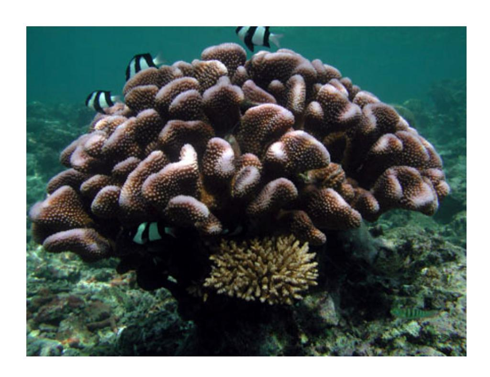
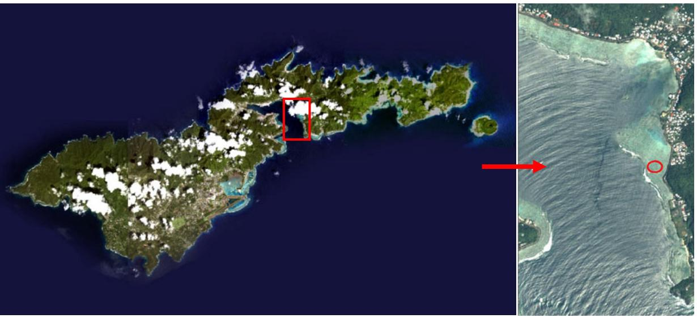

# [An assessment of corals five years following transplantation at Aua, Tutuila,](https://www.researchgate.net/publication/228404167_An_assessment_of_corals_five_years_following_transplantation_at_Aua_Tutuila_American_Samoa?enrichId=rgreq-e8414c9cd993a2066ffa0e5c9dc373a9-XXX&enrichSource=Y292ZXJQYWdlOzIyODQwNDE2NztBUzo5NzQwOTE0NTI0NTcxMUAxNDAwMjM1NTU4ODU2&el=1_x_3&_esc=publicationCoverPdf) American Samoa

|          | Article · October 2006                                                                             |       |  |
|----------|----------------------------------------------------------------------------------------------------|-------|--|
| CITATION |                                                                                                    | READS |  |
| 1        |                                                                                                    | 178   |  |
|          | 3 authors, including:                                                                              |       |  |
|          | Steve Kolinski National Oceanic and Atmospheric Administration 3 PUBLICATIONS   12 CITATIONS |       |  |
|          | SEE PROFILE                                                                                        |       |  |

## **An Assessment of Corals Five Years Following Transplantation at Aua, Tutuila, American Samoa**

By:

Steven P. Kolinski

21 September 2006

National Marine Fisheries Service Pacific Islands Regional Office 1601 Kapiolani Blvd., Suite 1110 Honolulu, HI 96814-0047 Steve.Kolinski@noaa.gov

#### **Abstract**

The survival, growth and live tissue status of 354 transplanted scleractinian corals were monitored over a five year period at Aua, Tutuila, American Samoa. These corals had been removed to avoid burial by temporary causeway construction, and were returned back and reattached in their general area of origin. Transplant survival approximately one year following reattachment was high (91 to 92%) in 2001; however, by 2005 survival (60 to 78%) had declined significantly. Lobate *Porites* species and *Pocillopora eydouxi* had significantly higher survival rates than small and mid-sized *Pocillopora* species. Transplant colonies did not fare worse than controls in terms of survival, growth and change in live tissue cover. Coral transplantation has the potential to preserve individual colonies from impending impacts. However, a broader perspective on how and whether transplants contribute to enhanced system recovery needs to be investigated.

#### **Introduction**

Planned impacts to coral reefs in the U.S. Affiliated Pacific Islands have often been partially mitigated through the transplantation of corals (Jokiel et al. 2006). Frequently, determination of transplant success has been time-limited, allowing evaluation of colony responses to transplant methods, but providing little information on long-term survival and benefits to coral reef communities. In 1999, reef flat coral colonies and fragments were detached and briefly transferred to nearby back-reef habitats in Aua, Tutuila, American Samoa (Figure 1) to protect them from burial by planned construction of temporary causeways. The causeways were being built to facilitate the removal of derelict long line vessels that had grounded in a 1991 hurricane (Government of American Samoa et al. 1999). Over 300 corals were transferred back and recemented in the footprint of one of the grounded vessels (Hudson 2000, Jeansonne 2000). The initial status of these corals was assessed in 2001 (Jeansonne 2002). This report provides information on transplant survival and growth for 2005.

Figure 1. Location of coral transplants, Aua, Tutuila, American Samoa.

### **Methods**

#### **Transplantation, Mapping and Initial Measurements**

Corals were detached from substrate using a hammer and chisel, tagged with tie wrap, and transported aboard a plywood deck on an inflatable boat to three nearby holding areas of the Aua reef flat in November 1999 (Hudson n.d.). Approximately 65% (638 of 988 colonies) of tagged corals were severely impacted by storm surge prior to reattachment activities in 2000 and were not considered viable for transplantation (Hudson 2000). In late June/early July 2000, 169 viable colonies (≥ 50 % live tissue cover with no evidence of disease; see Jeansonne 2000) were cemented to natural coral blocks on the reef flat and to a region of coralline algae pavement nearer the reef crest within one of the vessel removal areas (vessel # 8). Quick setting cement (four parts Portland Type II cement to one part Molding Plaster) was used for reattachment. Each coral was photographed using a Sony DV-900 digital camera (vertical still image) and mapped in relation to a 55 m transect bounded by stainless steel stakes on the reef flat or, on the coralline

algae pavement, to rebar posts cornering a 10 × 10 m transplant area (Hudson 2000). Clusters of corals were marked for identification with numbered 40 cm diameter stainless steel washers impressed in 10 cm high cup-shaped cement monuments. In September 2000, an additional 185 colonies were transplanted, imaged and mapped using the same methods and areas. In addition, 62 naturally attached corals near the two transplant areas were marked with cement monuments for later monitoring (Jeansonne 2000).

 Initial measurements and monitoring of transplantation success occurred in July 2001 (Jeansonne 2002). Longest length and perpendicular width of corals were measured using straight-line calipers. Visual estimates of percent live tissue per colony were recorded in the field.

#### **2005 Measurements**

Corals were identified for re-measurement and monitoring in April 2005 using colony distribution maps, measured distances from transects between permanent markers, and numbered cement monuments. Each colony was identified to species when possible. Longest length and perpendicular width were measured using straight-line calipers, and percent live tissue cover was visually estimated in the field and recorded. A digital image was taken of each coral for comparison with previous (2000) images. General areas were searched for missing corals which, if found were righted, measured and recorded as detached or, if not found, were recorded as missing. In some cases large blocks of reef had to be overturned to find and identify transplanted corals.

Corals were not identified to species when transplanted in 2000 or when initially monitored in 2001, although most were grouped by genera and digitally imaged. In 2005, live corals that remained were identified, and previous images of corals were examined to determine the identity of dead and missing colonies. In many cases, limited tissue survival or image quality prohibited identification beyond genus level. Corals were thus consolidated into species groups based on their genus, functional form and growth rate. Three groups (small and mid-sized *Pocillopora* species, *Pocillopora eydouxi*, and lobate *Porites* species) accounted for 96% of the colonies and formed the basis for comparative analyses.

#### **Analyses**

Comparative analyses were limited to those species groupings which had adequate colony numbers. Replicates for repeated measures ANOVAs of proportional survival (arcsine squareroot transformed) were based on location (near reef crest, back reef area) and transplantation date (June/July, September 2000). Location was used to determine replicates for transplant and control group survival comparisons. Knowledge concerning the fate of missing corals was incomplete. The ranges of proportional survival, considering all missing corals either alive or dead, were thus analyzed to examine potential differences between species groups and controls. Growth (change in projected area of 2005 survivors from 2001 to 2005) of transplant and control colonies was compared using Two-sample T-tests for each species group. Estimates of percent live tissue in 2005 were compared among transplants using a Kruskal-Wallace One-Way ANOVA. Transplant and control comparisons were made using Two-sample T-tests. Test assumptions of independence, residual normality and variance homogeneity were adequately met for each analysis. SAS® 9.1.3 and Statistix® 8.1 were used to analyze data.

#### **Results**

#### **General**

Species groupings, survival and growth characteristics are shown in Table 1. A total 354 transplant and 62 control colonies were monitored in 2001 and 2005. Between 91 and 92% of colonies survived the transplantation process as measured in 2001. Overall survival declined to not less than 60% in 2005. Declines were also noted in the control population, with percent survival ranging between 73 and 77% in 2001 and 23 to 73% in 2005. By 2005, 81 (23%) of the transplanted colonies had detached from their foundations, including 28% of small to mid-sized *Pocillopora* species, 27% of *Pocillopora eydouxi*, 16% of lobate *Porites* species, and 15% of other transplanted species. Sixty-two (77%) of the detached colonies were categorized as missing. Eleven had been associated with large reef foundations that were dislodged and in many cases overturned. Thirty-two (52%) control colonies were detached in 2005, including 50% of small to mid-sized *Pocillopora* species, 75% of *Pocillopora eydouxi*, 29% of lobate *Porites* species, and 37% of other monitored corals. Thirty (94%) of the detached control corals were categorized as missing in 2005. Growth was measured in 214 (60%) transplant and 11 (18%) control colonies.

#### **Transplant Species Group Survival**

Significant differences in proportional survival existed between the three major species groups (small and mid-sized *Pocillopora* species, *Pocillopora eydouxi* and lobate *Porites* species) and two assessment dates (2001, 2005) in scenarios that considered all missing corals either dead or alive (Table 2). Lobate *Porites* and *Pocillopora eydouxi* displayed significantly higher average proportional survival than small and mid-sized *Pocillopora* species but did not differ significantly from each other. Proportional survival in 2001 was significantly higher than in 2005, which was consistent across species groups. Survival did not differ by general location (near reef crest, back reef area). Analyses examining transplantation date found no significant effect of this variable (P > 0.05).

#### **Comparison to Controls**

Proportional survival of small and mid-sized *Pocillopora* species, *Pocillopora eydouxi* and lobate *Porites* species transplants was significantly higher than that of controls when missing corals were considered dead, but did not differ when missing corals were considered alive (Table 3). No significant interactions between experimental type (transplant or control), species group and/or assessment date were found in either scenario.

#### **Growth and Tissue Survival**

Average change in projected area and estimates of percent live tissue in 2005 for survivors in transplanted and control species groups are shown in Table 1. Variation in these parameters was high. No significant difference in average growth as measured by projected area was detected between control and transplant colonies for *Pocillopora eydouxi* (Two-sample T-test, df = 81, T = 0.553, P = 0.582) or lobate *Porites* species (Two-sample T-test, df = 117, T = 0.91, P = 0.364). However, control sample numbers were limited (*Pocillopora eydouxi*, n = 4; lobate *Porites*,

**Table 1.** Summary survival and growth data for coral transplants and controls, Aua reef flat, Amercian Samoa. Ranges encompass potential survival of detached corals which were not observed in 2005.

|                                                                   |     | Transplants |          |                     |                        |    | Controls |           |                     |                        |
|-------------------------------------------------------------------|-----|-------------|----------|---------------------|------------------------|----|----------|-----------|---------------------|------------------------|
|                                                                   |     |             |          | Projected ∆ Avg. | Tissue, 2005 % Live |    |          |           | Projected ∆ Avg. | Tissue, 2005 % Live |
|                                                                   |     | %           | %        | Area                | Survivors              |    | %        | %         | Area                | Survivors              |
|                                                                   |     | Survival    | Survival | m2/yr ± (c       | (Avg. ± S.D.           |    | Survival | Survival  | m2/yr ± (c       | (Avg. ± S.D.           |
| Species Groups                                                    | n   | 2001        | 2005     | S.D. (n))           | (n))                   | n  | 2001     | 2005      | S.D. (n))           | (n))                   |
| Mid-Sized Pocillopora & mall S                           | 67  | 70 to 76    | 16 to 43 | -17 ± 72 (9)        | 14 ± 11 (11)           | 16 | 44 to 50 | 0 to 50   |                     |                        |
| mall: Pocillopora damicornis, Species S                     | 8   | 75          | 13 to 38 | 9                   | 10                     | 0  |          |           |                     |                        |
| P. danae                                                          |     |             |          |                     |                        |    |          |           |                     |                        |
| Mid: Pocillopora meandrina, P. verrucosa, P. sp.               | 59  | 70 to 76    | 17 to 44 | -20 ± 76 (8)        | 15 ± 12 (10)           | 16 | 44 to 50 | 0 to 50   |                     |                        |
| Pocillopora eydouxi                                               | 140 | 96          | 58 to 81 | 206 ± 222 (79)   | 40 ± 26 (84)           | 20 | 90       | 20 to 90  | 144 ± 115 (4)       | 49 ± 39 (4)         |
| Lobate Porites Species (Porites lobata, P. lutea, Porites sp.) | 134 | 99          | 86 to 95 | 67 ± 42 (114)    | 56 ± 34 (116)          | 7  | 86       | 71 to 86  | 84 ± 47 (5)         | 68 ± 24 (5)            |
| Other                                                             | 13  | 62          | 46 to 54 |                     | 49 ± 41 (5)            | 19 | 74       | 26 to 68  |                     | 67 ± 32 (5)            |
| Acropora cf. nana                                                 | 0   |             |          |                     |                        | 9  | 100      | 33 to 100 |                     | 47 ± 23 (3)            |
| Acropora sp.                                                      | 0   |             |          |                     |                        | 2  | 50       | 0         |                     |                        |
| Favites cf pentagona                                              | 1   | 100         | 100      |                     | 5                      | 0  |          |           |                     |                        |
| Hydrophora microconis                                             | 1   | 100         | 100      | 196                 | 85                     | 0  |          |           |                     |                        |
| Millepora sp.                                                     | 1   | 100         | 100      | 436                 | 80                     | 0  |          |           |                     |                        |
| Montipora sp. (encrusting)                                        | 1   | 0           | 0        |                     |                        | 1  | 0        | 0         |                     |                        |
| Porites rus                                                       | 1   | 100         | 100      |                     | 45                     | 2  | 100      | 100       | 141 ± 103 (2)       | 97 ± 2 (2)             |
| Psammocora sp. (branching)                                        | 3   | 66          | 66       | 8 ± 45 (2)          | 38 ± 46 (2)            | 0  |          |           |                     |                        |
| Unknown                                                           | 5   | 40          | 0 to 20  |                     |                        | 5  | 40       | 0 to 40   |                     |                        |
| Total                                                             | 354 | 91 to 92    | 60 to 78 |                     | 48 ± 32 (217)          | 62 | 73 to 77 | 23 to 73  |                     | 62 ± 30 (14)           |
|                                                                   |     |             |          |                     |                        |    |          |           |                     |                        |

**Table 2**. Repeated measures ANOVA of species group proportional survival (arcsine square-root transformed) by location and assessment date (Type III tests of fixed effects, covariance unstructured). Psm = small and mid-sized *Pocillopora* species; Peyd = *Pocillopora eydouxi*; Por = lobate *Porites* species.

a. All missing corals are considered dead.

| Effect              | Num df | Den df | F     | P     |                |
|---------------------|--------|--------|-------|-------|----------------|
| Species Group (A)   | 2      | 6      | 28.45 | 0.006 | Por Peyd > Psm |
| Location (B)        | 1      | 6      | 0.79  | 0.409 |                |
| Assessment Date (C) | 1      | 6      | 13.95 | 0.002 | 2001 > 2005    |
| A × B               | 2      | 6      | 0.34  | 0.722 |                |
| A × C               | 2      | 6      | 1.11  | 0.389 |                |
| B × C               | 1      | 6      | 3.10  | 0.129 |                |
| A × B × C           | 2      | 6      | 1.05  | 0.408 |                |

b. All missing corals are considered alive.

| Effect              | Num df | Den df | F     | P     |                |
|---------------------|--------|--------|-------|-------|----------------|
| Species Group (A)   | 2      | 6      | 8.81  | 0.016 | Por Peyd > Psm |
| Location (B)        | 1      | 6      | 0.47  | 0.519 |                |
| Assessment Date (C) | 1      | 6      | 14.75 | 0.009 | 2001 > 2005    |
| A × B               | 2      | 6      | 1.27  | 0.346 |                |
| A × C               | 2      | 6      | 0.55  | 0.602 |                |
| B × C               | 1      | 6      | 4.21  | 0.086 |                |
| A × B × C           | 2      | 6      | 1.11  | 0.388 |                |

**Table 3**. Repeated measures ANOVA comparing proportional survival (arcsine square-root transformed) of transplanted and control species groups (Exp. Type) over time (Type III test of fixed effects, covariance = compound symmetry). Psm = small and mid-sized *Pocillopora* species; Peyd = *Pocillopora eydouxi*; Por = lobate *Porites* species.

a. All missing corals are considered dead.

| Effect              | Num df | Den df | F     | P     |                      |
|---------------------|--------|--------|-------|-------|----------------------|
| Exp. Type (A)       | 1      | 5.75   | 9.22  | 0.024 | Transplant > Control |
| Species Group (B)   | 2      | 8.52   | 27.36 | 0.000 | Por > Peyd > Psm     |
| Assessment Date (C) | 1      | 8.59   | 61.05 | 0.000 | 2001 > 2005          |
| A × B               | 2      | 8.52   | 0.50  | 0.624 |                      |
| A × C               | 1      | 8.59   | 1.07  | 0.330 |                      |
| B × C               | 2      | 8.59   | 3.27  | 0.088 |                      |
| A × B × C           | 2      | 8.59   | 0.70  | 0.523 |                      |

b. All missing corals are considered alive.

| Effect              | Num df | Den df | F    | P     |
|---------------------|--------|--------|------|-------|
| Exp. Type (A)       | 1      | 5.11   | 0.20 | 0.670 |
| Species Group (B)   | 2      | 6.10   | 1.94 | 0.222 |
| Assessment Date (C) | 1      | 7.36   | 5.38 | 0.052 |
| A × B               | 2      | 6.10   | 0.32 | 0.737 |
| A × C               | 1      | 7.36   | 5.38 | 0.052 |
| B × C               | 2      | 7.36   | 0.27 | 0.769 |
| A × B × C           | 2      | 7.36   | 0.27 | 0.769 |

n = 5) and variability was high, increasing the potential for type II error. Comparisons could not be made for small and mid-sized *Pocillopora* species. Geometric radius expansion rates for colonies with  $\geq 50\%$  live tissue cover averaged 2.5 cm yr-1  $\pm$  1.3 S.D. (n = 28) for *Pocillopora* eydouxi and 0.8 cm yr-1  $\pm$  0.3 S.D. (n = 68) for *Porites lobata*.

Significant differences in mean percent live tissue existed amongst the three main transplanted species groups in 2005, with lobate *Porites* > *Pocillopora eydouxi* > small and mid-sized *Pocillopora* species (2005; Kruskal-Wallace One-Way AOV, n = 211, K = 24.595, P = 0.000). However, significant differences were not detected between control and transplant colonies (*Pocillopora eydouxi*, Two-sample T-test, df = 86, df = 0.85, df = 0.396; *Porites lobata*, Two-sample T-test, df = 119, df = 0.81, df = 0.417). A comparison of percent live tissue between years was not made as different observers conducted visual estimates.

#### **Discussion**

Reaction to transplantation and contributions to community recovery are attributes that need to be documented and understood to determine applicability of methods, appropriate environments for transplantation and expectations for considering coral transplantation as a reef recovery enhancement technique. On the shallow reef flats of Aua, Tutuila, transplantation involved two phases: (1) approximately 1000 coral colonies were detached, tagged and placed in temporary storage areas while derelict vessel removal proceeded; (2) 354 corals were recovered, transported back to their general area of origin and reattached using quick setting cement. Unfortunately, initial plans to reattach nearly 600 of the 1000 tagged corals (Hudson n.d.) were compromised by storm surge related impacts to stockpiled colonies (Hudson 2000). Storm impacts to temporarily placed corals intended for permanent transplantation have occurred elsewhere in the Pacific (Jokiel et al. 1999). Storm events can be frequent and difficult to predict. The events at Aua suggest that greater depths should be considered for coral storage beyond a few days, or in the event of specific threats from an oncoming storm, to hold and protect transplants in future projects.

Reattached corals appeared to respond well to the transplant and cementing techniques used in this project as measured by survival in 2001. There was no indication that transplant survival was lower than that of controls in 2001 for comparable species groups. Size and tissue cover were not measured for corals when initially transplanted, so sub-lethal effects of the transplant methods could not be determined. Anecdotal observations in 2003 found recognized transplants to be in an apparent healthy state (Kolinski, pers. obs.). However, a significant decline in transplant survival was noted in 2005 for all species groups. This decline may have been associated with a hurricane in 2004 that appeared to have toppled and overturned large pieces of reef platform at Aua. There was nothing to indicate that transplants fared any worse than other corals in adjacent reef flat areas. A majority of cemented corals remained in place and their growth, tissue cover and survival did not differ significantly from that of similar control colonies where comparisons could be made (note, control numbers were very low and may have affected the power of statistical procedures for detecting difference).

Small and mid-sized *Pocillopora* species did not fare as well as *Pocillopora eydouxi* and lobate *Porites* species in 2001 or 2005. Species such as *Pocillopora damicornis* and *P. meandrina* may be less tolerant to long-term relocation or cementing methods, and may also be naturally ephemeral relative to the other species (Kolinski 2002). A number of Pacific development projects have transplanted small *Pocillopora* species with varying levels of success;

however, monitoring in these projects tended to be short-term and did not include comparative controls (Jokiel et al. 2006). Large lobate *Porites* and *Pocillopora eydouxi* displayed adequate tolerance for transplantation at Aua. These species groups provide high functional value as habitat for other reef organisms and should be considered for transplanting when threatened by impending development or planned temporary impacts.

 Coral transplantation has the potential to preserve individual colonies from impending impacts. However, a broader perspective on how and whether transplants contribute to enhanced system recovery needs to be investigated. Community comparisons of reference and transplant areas within regions designated for recovery should be undertaken at Aua and include evaluation of habitat utilization by fish and macro-invertebrates (particularly herbivores), algae presence and cover, natural coral recruitment to surrounding substrate, coral abundance, size and diversity, and coral reproductive potential. Assuming source impacts have been eliminated, coral transplants should serve as structures for aggregation and recruitment of reef community members that have potential to accelerate recovery of degraded reef systems. Relevant history and comparison to similar habitat types in multiple nearby regions should serve as a guide for development of realistic recovery expectations.

#### **Acknowledgements**

The 2005 monitoring efforts were organized and overseen by Jim Hoff (NOAA DAC). Coral measurements, identifications and analyses were made by Steve Kolinski (NOAA PIRO). Doug Helton and Ian Zelo (NOAA DAC) located, visually marked and recorded geographic coordinates of transplant markers in the field. Evelyn Cox (NOAA PIRO) provided assistance with data processing and analysis. This report is based on transplant and initial monitoring efforts of Jim Hoff (NOAA DAC), Harold Hudson, Bill Goodwin (NOAA FKNMS), Jim Jeansonne (NOAA DAC) and a number of local participants from American Samoa.

#### **References**

- Hudson, H. n.d. Removal and restoration of Pago Pago corals. Memorandum, Florida Keys National Marine Sanctuary, 6 pp.
- Hudson, H. 2000. Field trip report: coral restoration project, Pago Pago, American Samoa. Trip Report, Florida Keys National Marine Sanctuary, 3 pp.
- Jokiel, P. L, E. F. Cox, F. T. Te and D. Irons. 1999. Mitigation of reef damage at Kawaihae Harbor through transplantation of reef corals. Final Report of Cooperative Agreement 14-48-0001-95801, U.S. Fish and Wildlife Service, Pacific Islands Ecoregion, Honolulu, 21 pp.
- Jokiel, P. L., S. P. Kolinski, J. Naughton and J. E. Maragos. 2006. Review of coral reef restoration and mitigation in Hawaii and the U.S.-Affiliated Pacific Islands. Pages 271- 290. *In:* W. F. Precht (ed.), Coral reef restoration handbook, CRC Taylor & Francis, New York.

- Jeansonne, J. 2002. Year one monitoring trip report: July 2001, coral restoration project, Pago Pago, American Samoa. Draft Trip Report, NOAA Damage Assessment Center, 6 pp.
- Jeansonne, J. 2000. September 2000 field trip report: coral restoration project, Pago Pago, American Samoa. Trip Report , NOAA Damage Assessment Center, 5 pp.
- Kolinski, S. P. 2002. Analysis of year long success of the transplantation of corals in mitigation of a cable landing at Tepungan, Piti, Guam: 2001 – 2002. NOAA Fisheries Service Pacific Islands Regional Office Report, 18 pp.
- The Government of American Samoa, U.S. Department of the Interior and the National Oceanic and Atmospheric Administration. 1999. Emergency restoration plan and environmental assessment, Pago Pago Harbor, American Samoa, 95 pp.