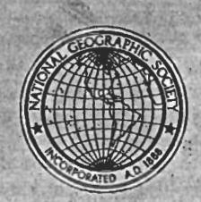
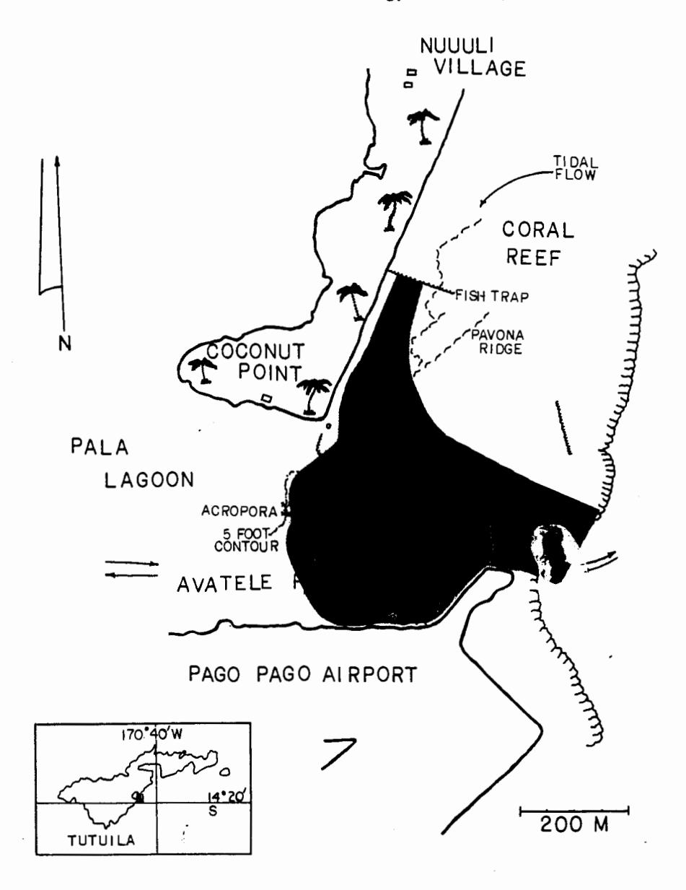
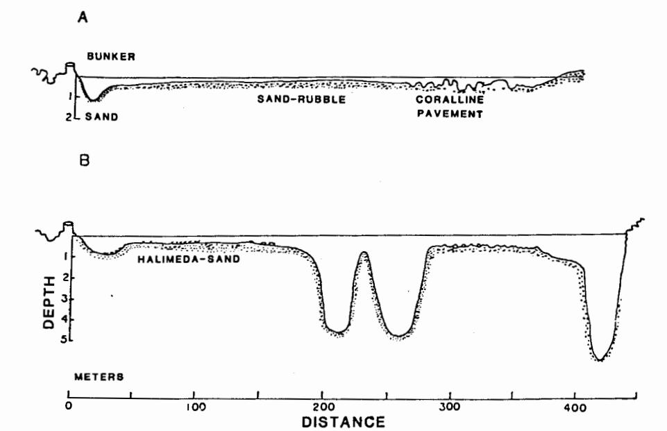
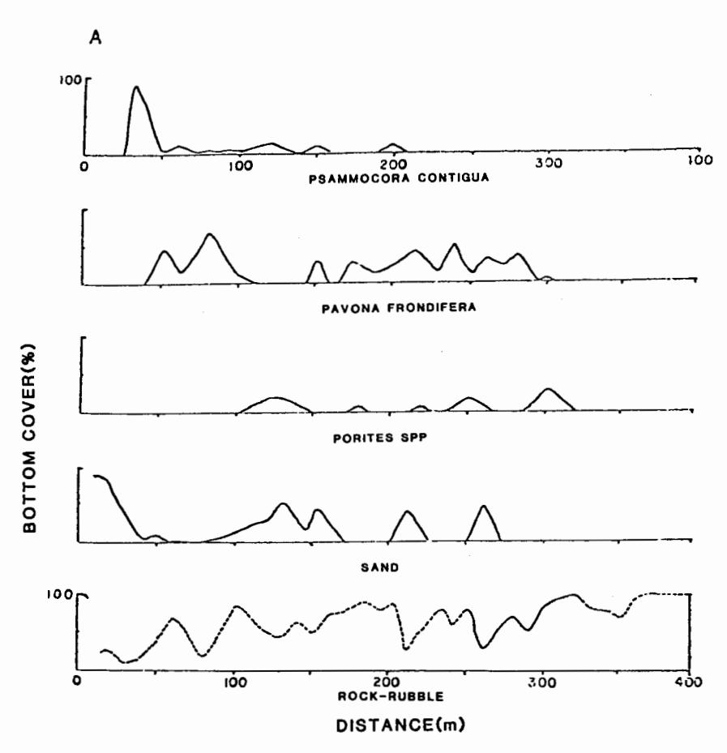

# Coral Kill and Recolonization in American Samoa

By Austin E. Lamberts

Reprinted from: National Geographic Society Research Reports, volume 15, pages 359-377

### Coral Kill and Recolonization in American Samoa

Principal Investigator: Austin E. Lamberts, Grand Rapids, Michigan.

Grant Nos. 1372 and For a study of coral reefs and coral-reef destruction in Ameri-1945.

can Samoa, and of the recolonization of a selectively denuded

coral reef.

### I. CORAL REEF DESTRUCTION

During July 1973, John Flanigan, a high-school teacher with the Department of Education of American Samoa, discovered that most of his spectacular demonstration coral reef had inexplicably died. Both he and, independently, James Betcher had last visited this area in late November 1972 and had noted luxuriant coral growth. During July and August 1973 we reconnoitered the area and found extensive coral death of recent occurrence in the reefs bounded by Coconut Point, the Pago Pago Airport, and out to beyond the reef edge. Mr. Betcher had noticed the change about 2 months earlier.

Tutuila, American Samoa, located at lat. 14°20'S., long. 170° 40'W., is a small volcanic island surrounded by fringing reefs, the broadest extending about 1,000 meters from the shore in the south midportion of the island. Protected by this reef lies a shallow estuarian lagoon separated from it in part by a narrow sandy peninsula referred to as Coconut Point. In recent years the building of a modern airport across the lagoon to the reef edge was accompanied by much dredging of the lagoon, which now opens to the sea through Avatele Passage, a narrow gap between the runway embankment and the reef flats adjoining Coconut Point. The distance between these two landmarks is about 400 meters and encompasses partially dredged sand flats and coral reefs. Before 1973 great thickets of staghorn acroporid corals occupied the deeper areas. Some of these stands were over 30 meters across and 2 meters high.

Our survey showed that all the corals of the dominant suborder. Astrocoeniina, had died within an area of at least 8 hectares (20 acres). This included all the Acropora, Montipora, and Pocillopora corals, while members of two other suborders, Fungiina and Faviina, appeared healthy. It looked to us as if all the coral had succumbed at the same time, perhaps 3 or 4 months before, as all the skeletons were covered with the same-length strands of brown algae. Where this occurred in shallow water the demarcation point between living and dead coral was sharply delimited, and even over the reef edge scuba divers reported that most of the corals to a depth of 6 meters were dead. There was no

evidence of siltation, and a review of dredging records indicated almost no activity within a mile during the months when this happened. We found that mollusks, calcifying algae, and echinoderms were present in expected numbers. A rare angelfish, *Pomacanthus imperator* (Bloch), occupied the same niche under a rock that it had for two years with no apparent distress. There was no evidence of infestation by crown-of-thorns starfish (*Acanthaster*) on this or any reef on Tutuila.

Pala Lagoon has over 0.5 meter of tidal flow, the water all rushing in and out the narrow Avatele passage. During high tides water passes also over the reef crests and reef flats paralleling the Coconut Point peninsula to create an inshore stream running next to the beach. This is about 40 meters wide, and at high tide its greatest depth was about 1 meter. This streams toward the tip of the peninsula where it joins the outflow from Pala Lagoon to form a fanshaped discharge sweep. Figure 1 indicates how all the dead coral lay within this precise area. On the west edge of the coral kill some banks of Acropora were only partially dead, with a western rim of living coral. The same was noted over the reef flat, so that coral death could be marked out almost to the meter. Finally, it was noted that in the stream channel the precise dividing line between normal coral growth and dead coral seemed to lie at a fish trap erected across the stream.

For many years Tongan fishermen have erected fish traps on various areas of this reef. These are weirs made of commercial chicken wire strung on sticks across the current so that fish are directed into a cul-de-sac where they are speared. It was noted that healthy Pocillopora grew within 30 meters upstream of this net, but all the dominant corals below the trap were dead. Circumstantial evidence suggested that something had occurred here to kill certain corals that had come in contact with water passing this point. It was as if some noxious agent, that had a selective action on the Astrocoeniina corals and nothing else, had been added to the water. We postulated that something may have been added to the water to aid in catching fish. Fish poisons have been used in the tropical Pacific for generations for this purpose, and pesticides would have been available for such a stunt, but nobody in the vicinity seemed to know anything about the dead coral, and certainly nobody volunteered information suggesting that an attempt had been made to poison fish since that was punishable by a \$600 fine. The present study was then drawn up to investigate the effects of manufactured biocidal agents on living corals. A literature search uncovered no references on the effects of pesticides on reef corals.

Fig. 1. Coconut Point coral kill of 1973, Tutuila, American Samoa (A and B are transect lines).

### Laboratory Studies

All laboratory studies were performed during September and October 1974 at the Hawaii Institute of Marine Biology at Kaneohe, Oahu, Hawaiian

Islands. The purpose was to assess the effects of certain toxic agents on living corals. Following are the methods and the results:

Coral heads of Pocillopora damicornis (Linnaeus), the same species involved in the Samoan kill, were broken up and 10 similar growing tips were suspended in identical glass jars each containing 2 liters of freshly filtered sea water. To each of eight jars a measured amount of a toxic agent was added to give a decremental series ranging from 2 parts per million (ppm) concentration in the first jar to 10 parts per billion (ppb) in the eighth. The agents tested are listed in Table 1. Until recently they have all been available commercially. They were added directly to the sea water, or alcohol in small quantity was used as a vehicle. To nine of the jars I added the dye sodium alizarinate (Alizarin Red S) to give an ambient concentration of 10 ppm. This hydroquinone dve is an indicator of biological calcification, and when present in sea water during growth of corals it is incorporated into the skeleton in proportion to the amount of calcium carbonate deposited (Lamberts, 1973, 1975). The depth and distribution of the magenta color that remains after the living tissue has been removed can then be observed directly and can be compared with other specimens in the same or similar series to assess the ability of the organism to form skeletal tissues. In these experiments, the ninth bottle with alizarin and the tenth with clear sea water served as controls. Laboratory lighting, water temperature, and aeration were standardized and controlled.

TABLE 1. Chemical Agents Tested to Assess Their Toxicity to Reef Corals

| No. | Name              | Туре                    |  |  |
|-----|-------------------|-------------------------|--|--|
| 1   | DDT               | Chlorinated hydrocarbon |  |  |
| 2   | Dieldrin          | do.                     |  |  |
| 3   | Endrin            | do.                     |  |  |
| 4   | Lindane           | do.                     |  |  |
| 5   | Malathion         | Organo-phosphate        |  |  |
| 6   | Parathion         | do.                     |  |  |
| 7   | 2-4-D             | Herbicide               |  |  |
| 8   | Atrazine          | do.                     |  |  |
| 9   | Carbanyl (Sevin)  | Carbamate pesticide     |  |  |
| 10  | Clorox            | Bleach                  |  |  |
| 11  | Mercuric chloride | Heavy metal             |  |  |
| 12  | Copper sulphate   | do.                     |  |  |

After each series was allowed to run for 24 hours the coral specimens were examined with magnification to check the vitality and reaction of the polyps against the controls. The specimens were then transferred to fresh sea water for 24 hours, then again examined, and then cleaned. I had shown in similar ex-

periments with alizarin that there exists a considerable difference among coral heads of the same species in respect to growth during any given period. Quantitative comparisons are not feasible. In these studies all living corals exposed to alizarin dye showed some uptake, and no specimen died except some exposed to either mercury or bleach. When clean specimens in each series were ranked as to the amount and intensity of magenta color in the otherwise white skeletons an estimate was gained of the short-term biological effect of the additive on skeletal production in these corals. These could then be compared and are listed for that purpose in Table 2.

TABLE 2. Numerical Ranking of All Specimens of the Coral Pocillopora damicornis

Ranked according to the amounts of Alizarin dye deposited during a 24-hour period when they were exposed to a toxic agent. The rank numbers compare ten specimens in each series as to the amount of color observed from most (#1) to least against the amount of toxic material in the sea water.

|             | Amount of toxic agent added in ppm |     |     |      |     |      |       | Controls |             |           |
|-------------|------------------------------------|-----|-----|------|-----|------|-------|----------|-------------|-----------|
| Toxic agent | 2.0                                | 1.0 | 0.5 | 0.25 | 0.1 | 0.05 | 0.025 | 0.01     | With dye | No dye |
| DDT         | 9                                  | 8   | 5   | 6    | 7   | 1    | 4     | 3        | 2           | 10        |
| Dieldrin    | 4                                  | 1   | 2   | 3    | 7   | 9    | 6     | 5        | 8           | 10        |
| Endrin      | 8                                  | 3   | 2   | 5    | 4   | 6    | 1     | 7        | 9           | 10        |
| Lindane     | 3                                  | 9   | 8   | 5    | 6   | 2    | 1     | 4        | 7           | 10        |
| Malathion   | 4                                  | 9   | 6   | 3    | 8   | 5    | 7     | 1        | 2           | 10        |
| Parathion   | 2                                  | 4   | 3   | 8    | 9   | 7    | 1     | 6        | 5           | 10        |
| 2-4-D       | 3                                  | 5   | 1   | 2    | 9   | 7    | 6     | 8        | 4           | 10        |
| Atrazine    | 8                                  | 1   | 2   | 5    | 6   | 9    | 7     | 3        | 4           | 10        |
| Carbanyl    | 4                                  | 6   | 2   | 9    | 7   | 3    | 5     | 8        | 1           | 10        |
| Average     | 5                                  | 5   | 3   | 5    | 7   | 5    | 4     | 5        | 5           | 10        |
| Mercury     | 9                                  | 7   | 8   | 6    | 5   | 4    | 3     | 2        | 1           | 10        |
| Copper      | 7                                  | 4   | 5   | 6    | 3   | 8    | 9     | 2        | 1           | 10        |

Also, we made other in vitro studies using a precision Cole-Parmer pump, which delivered a known constant flow of sea water and additives to test tanks. Three 10-liter glass aquaria were set up so that a constant flow of water would cascade from one to another. Corals of the genera Pocillopora, Fungia, and Cyphastrea, representing the three suborders involved, were placed in each tank. When possible, a single coral head was divided and part placed in each tank. The first and highest aquarium was supplied with filtered sea water and

served to hold the controls. The second received the overflow from the first plus sufficient Alizarin Red S to give a constant concentration of 10 ppm. The third tank received the overflow from the second plus a solution of the biocide to be tested. DDT was added to give an ambient concentration of 0.5 ppm, and in the second series endrin was added to give a constant 1.0 ppm concentration. Each of these substances was added for 48 hours, after which the sea water was allowed to run clear for a day before coral tissue was removed with a jet of water so that alizarin deposition could be compared.

My observations on living corals subjected to pesticide and herbicides showed that with the greatest concentrations used in my laboratory, some of the terminal polyps died when exposed to DDT or endrin. With some others there was evidence of stress effect manifested by decreased tissue irritability and lack of vigor during the exposure to these chemical agents.

Mercury is a protoplasmic poison and is notoriously toxic to animal life, including corals. Stress reactions were noted in coral polyps exposed to a concentration of 10 ppb, and 0.5 ppm or greater was lethal. Copper, as CuSO4, often used as an algicide, did not kill coral in these experiments at a concentration of 2 ppm. Commerical bleach (Clorox) killed coral tissue when the concentration was 2 parts per thousand if there was prolonged contact. Practically speaking, bleach in order to kill coral must be in a concentration of about 2 liters per cubic meter of sea water (1 gallon per 2 cubic yards).

Similar results were found using my tank studies. Corals were not killed and did not appear damaged by either DDT or endrin in these 48-hour trials. The presence of abundant alizarin in the cleaned corals indicated that skeletal calcium carbonate had been deposited in the amount and manner expected in normal growth. When all specimens from each series were compared, it appeared that high concentrations of pesticides might depress the formation of skeletal calcium slightly but did not eliminate it. Deposition of skeletal calcium, however, as deduced from observing the alizarin deposition, seemed enhanced over the normal controls when the chemicals were in the sea water in the 0.5 ppm range. This suggests that small amounts of such agents, toxic in large quantities, might stimulate the metabolism of the coral polyp during the time it is present. At this point nothing is known about long-term effects, if any.

Coral polyps are apparently very hardy animals. A level of certain pesticides such as endrin or parathion that would have been lethal to much of the marine life on the reef had little or no demonstrable effect on the living coral, which continued to deposit skeletal material in abundance. Each coral species and each individual colony of coral polyps has its own growth pattern and pace of growth; so there is always a variation in the amount and pattern of skeletali-

zation and hence of the pattern of the alizarin dye visible. It was only after the above experiments had been concluded that I abandoned plans for in situ studies using the same pesticides and herbicides on living coral on the Samoan reefs themselves.

#### Observations in American Samoa

Tutuila, American Samoa, was revisited between October 15 and November 12, 1974, to resurvey the area of the coral kill. Climatic conditions allowed satisfactory observations of the reef but never optimum ones. The fish trap that had separated the living from the dead *Pocillopora* had been destroyed, but pieces of it remained submerged at the site and were found to consist of medium-mesh galvanized chicken wire. Samoans living in the vicinity claimed to have torn down the net. Hardly surprising! Samoans have been at enmity with the Tongans for centuries. Still, two new fish traps of similar design had been erected, one near the edge of the reef at the northern limit of the coral kill and the other within the western limits. The Tongan fishermen who managed them denied ever using any poisoning agents to catch fish.

The entire area was rechecked repeatedly by wading or swimming with face mask and recording data on an underwater slate. Healthy heads of *Pocillopora* were found in profusion 40 meters upstream from the fish-trap wreckage, some being over 15 centimeters in diameter, indicating an age of several years. Here was found also some *Montipora* of the suborder Astrocoeniina and moderate amounts of *Porites* and *Pavona*. Extensive banks of the latter continued on and served as a marker of the inner margin of the reef flat proper. Downstream below the trap, both in the inshore lagoon stream and in the deeper areas that had contained the extensive coral banks, most of the coral skeletons had now been broken up and washed away or reduced to rubble. In this entire area of destruction only one sparse 2-by-2-square meter patch of *Acropora formosa* (Dana) was found. It was this species that made up most of the big banks previously seen. There were a few small heads of *Pocillopora damicornis* usually growing on dead *Acropora* branches. It is probable that these early colonizers had become established after the massive destruction had occurred.

The boundaries of the coral kill were again verified and measured. Total area involved was about 8 hectares (20 acres); however, some of this was sandbar and the area of actual coral death was about 6 hectares (15 acres). Coral of the suborder Fungiina was alive and consisted of *Pavona* and *Porites*, both of finger and solid species. Suborder Faviina was represented by numerous healthy colonies of *Lepastrea purpurea* (Dana) and *Galaxea fascicularis* (Linnaeus). One of the chief contributors to the inshore reef edge was *Psammocora con-*

tigua (Esper), which was growing vigorously. Based on skeletal morphology *Psammocora* has been classified by various taxonomists as either in the suborder Astrocoeniina or in Fungiina. In this instance its response was like that of the members of the latter suborder.

During the latter visit to Samoa I had access to a study of the corals in this area done by Dr. James Maragos in 1972 (Helfrich, 1975). At that time a group of University of Hawaii scientists made an environmental impact study of the Pala Lagoon during which transects were laid out, two of them (labeled A and B) being in the area I was studying. He made coral counts and estimates of coral cover, and I repeated the same observations so that our results could be compared.

Water currents were also observed. At high tide an object floating with the surface currents along the inshore stream toward the tip of Coconut Point traveled at the rate of 10 meters per minute. The water depth was measured along the contour of the sandy bottom at the site of the wrecked fish trap. It was estimated that at high tide about 250 cubic meters of sea water passed this site per minute. It was obvious that if a toxic agent alone was responsible for the destruction noted, huge amounts must have been used or else it must have been far more toxic to live corals and more specific for certain kinds than anything I tested.

Living coral on the reef flat is usually interspersed with sand or rubble areas and patches of rock often overgrown with calcifying algae so that many species may be present and still the total area covered by live coral is usually less than 50 percent. In observations along transects A and B both in 1972 and in 1974 the diversity and amount of coral cover were virtually the same with the exception that all the Astrocoeniina corals reported as abundant in some points during the first study were entirely absent in the second. These transect lines missed all the large thickets of Acropora in the areas dredged for airport fill; still, Acropora corals alone constituted a fourth of all corals reported on these two transects. My survey showed that large areas previously covered with these corals now showed only rock or rubble and, in the deeper areas, sand. Voucher specimens of living and dead corals were taken for possible analysis as well as many photographs for future reference.

Two other areas of similar coral kill were observed on Tutuila reefs during the later visit. One, far out in the north shore bay of Masefau where it was not readily accessible to humans, covered about 2/3 hectare and had consisted mostly of Acropora formosa and Pocillopora danicornis. It was surrounded on all sides by living corals of the same genera. The dead branches were covered by strands of brown algae and showed no gross disintegration. The second, half the size but otherwise similar, was at the edge of moderately deep water in

Faga'itua Bay. These were observed with Dr. Ronald Needham, a resident marine zoologist who asserted that these areas had appeared healthy 4 months previously.

#### Conclusions

My studies indicate that reef corals are surprisingly tolerant to the pesticides and herbicides that I tested but will succumb to general protoplasmic poisons. There are thousands of such compounds known and many combinations were used in the Samoan agriculture industry. Only a preliminary survey using a few of the better-known and representative agents could be made and of these DDT and endrin have already been banned for commercial use in the United States. In many instances these substances are lethal to fish and marine invertebrates in much smaller concentration than that which caused only a mild decrease in the activity of the coral polyps (Portmann, 1970). Undoubtedly, higher concentrations of this select group of biocidal agents would have shown greater toxicity; however, I surmised that if reef corals continued to function well after continuous exposure to these agents for 24 hours there was little likelihood that there would be a deleterious effect from such agents if added to the sea water that swept over a coral reef to be immediately diluted in the open ocean. It appeared as if all the corals had been exposed to some noxious agent at the same time as it was being carried along by natural water currents. The contours of the area of dead coral suggested that this may have happened near high tide or as the waters were being swept out of Pala Lagoon on a falling tide.

The sea water passing over the reef and then across the fish trap in question was copious in any tidal cycle but far less than the volume exchange in Pala Lagoon. The University of Hawaii survey estimated that this could approach a million cubic meters per tidal cycle, or 10 times the amount that I estimated to be passing by the fish trap. It would have required that 500 grams of any biocidal agent be added to the inshore stream per minute to maintain a concentration of 2 ppm in the flowing water. Larger applications would certainly give heavy concentrations locally but the swift water overturn would make any effect transitory.

These reef corals must have been extremely sensitive to some toxic agent that was not a general protoplasmic poison but specific for only a select suborder of otherwise hardy animals. No biocidal agent that I encountered gave any effects like this. I could conclude only that the pesticides and herbicides I evaluated could not under ordinary circumstances have caused this kind of havoc.

Various studies of coral-reef destruction implicate the consequences of industrialization such as sedimentation, oil spills, blasting, and eutrophication. There are also many natural phenomena causing reef damage such as storms and earthquakes, thermal extremes, sea-water dilution, or reef drying, as well as predation by natural enemies that live on the reefs. Undoubtedly there are many other causes that singly or in combination serve to destroy coral reefs and reef corals.

Massive, unexplained coral die-offs may not be uncommon on Samoan reefs and probably happen elsewhere, but they have received little attention. It is probable that coral polyps like other living organisms are subject to diseases either intrinsic or caused by bacterial or viral invaders. It is possible that an epizootic malady could affect only one suborder among corals as it does in other zoological orders. Attributing this particular coral kill to an extraneous pollutant is entirely on circumstantial evidence which initially to me was convincing. If no toxic agent in itself would cause such a curious pattern of coral death, we can speculate that the suborder Astrocoeniina may have been weakened by some epizootic disease which may also have been present in other areas of Samoa as noted. The unusual configuration that began at a fish trap may have been coincidental; however, it is not beyond reason to believe that actual death may have resulted from a noxious agent acting on weakened corals. It is doubtful if a single process could have produced such an unusual result.

As with other natural disasters to coral reefs, the corals of Coconut Point will probably reestablish themselves if allowed to do so. It is hoped that the present survey may serve as a base line to chronicle the regrowth of another coral garden.

# Summary

The dominant suborder of reef corals died suddenly in an 8-hectare area on an American Samoan reef while two nondominant suborders of coral and other life were spared. Circumstantial evidence linked this to a fish trap. Pesticides were suspected, but laboratory studies of representative biocides indicate that short-term exposure of reef corals to some commonly used pesticides caused no discernible harm.

### II. RECOLONIZATION OF A DENUDED CORAL REEF

The coral reefs of Tutuila, American Samoa, were well known to John Flanigan, a teacher in Samoa. As an avid naturalist he was dismayed when in July 1973 he found one of his favorite reef areas denuded of most of the previ-

ously living coral. At that time we mapped the area of Coconut Point, Figure 1, and found that scleractinian corals of the dominant suborder Astrocoeniina had recently died leaving their algae-covered unbroken skeletons in place. Two nondominant suborders of reef coral seemed unharmed. An 8-hectare area was involved, mostly reef flat swept by sea water which had passed through a fish-trap weir. We concluded that it was not coincidental that only certain corals, in the lee of this net made of chicken wire, were dead.

A year later I again surveyed the area, made coral counts, procured voucher specimens, and took photographs. I concluded then that this phenomenon was probably due to an epizootic infection of unknown type affecting only the astrocoeniinid corals, but that sudden death had been triggered by a chemical substance entering into the water, presumably to kill fish.

Coral reefs are complex structures of living animals and plants. Although to the casual observer they may appear immutable, they are a balanced ecosystem in which every element is subject to change; a constant reshaping takes place with a reciprocity between build-up and destruction—first one component being in ascendancy and then the other. Every organism is involved in both actions, including the hard corals which together with certain calcareous algae are the foundation builders of all coral reefs. Corals reproduce sexually, disseminating minute larvae which settle on some stable surface and increase by asexual division as they form a reef mass with their calcium carbonate skeletons. In time these die and others take their place. This study concerns such a succession and coral recolonization.

Studies of the recolonization of destroyed coral reefs have for the most part been directed toward the damage inflicted by the spiny starfish Acanthaster plancii. When such a massive infestation has passed over a reef there remain remnants of viable coral tissue, and remarkable recovery can occur in as little as five years (Randall, 1973; Pearson, 1977); however, the coral species profile may then be altered. Shinn (1976) noted that reef recovery following a hurricane is often rapid and is accomplished mostly by asexual regeneration of scattered coral debris. Recovery of a reef destroyed by cold is much slower and is accomplished by settling of viable planula larvae. This is similar to the phenomenon which follows the destruction of a coral reef by a lava flow. Grigg and Maragos (1974) estimate that it may take 50 years for complete recovery of a sheltered reef, while in exposed areas with rapid seawater turnover, complete recolonization and substantial recovery may occur in 20 years. I have uncovered no reports on the recolonization of a reef which was selectively denuded of its dominant corals while leaving substantial numbers of nondominant species, as well as the algae, echinoderms, mollusks and fish, relatively undisturbed except through loss of habitat. The following is an assessment of the recolonization of such a reef suddenly bereft of the coral genera Acropora, Montipora, and Pocillopora five years before.

### Methods

During an environmental impact assessment for a Pala Lagoon dredging project, Maragos (Helfrich, 1975) recorded the bottom cover and coral counts of two transects that lay within my study area. The exact location of these transects could only be estimated from the published maps, so specific transects were established during my 1974 study (see Part 1, fig. 1). Transect A extends 400 meters at a compass heading of 95° mag. from a concrete bunker erected in 1942 on the southeast tip of Coconut Point almost to the reef edge. Transect B runs from the same bunker at 135° mag. across Avatele Passage 400 meters to where Avatele Point meets the Pago Pago International Airport runway embankment. Where practical, iron stakes were driven every 50 meters to mark transects. Following previous methods, bottom cover estimates were made at 10-meter intervals along these transects. The percentage of bottom coral species was determined along transect A at 25-meter intervals to give 16 determinations. Live corals were identified, voucher specimens procured, and at a favorable low tide selected photographs of the area were taken.

The entire 8-hectare area was again examined as well as the surrounding reef areas during November 1978 to estimate coral growth and recolonization. Work was done on foot at low tide in the shallows or with mask and snorkel in Avatele Passage and in the deep borrow pits excavated when the airport runways were constructed. I was assisted by Mr. Flanigan on three of these excursions.

# Findings and Discussion

Erosional changes have occurred along the Coconut Point shoreline (Catell, 1977). The bunker from which transect A begins, although constructed on land, was on the beach in 1969 and by 1978 was separated from land by 35 meters, with much water from the inshore lagoon flowing west of it except at low low tides. The sand which has been eroded has been deposited on an extensive sand flat immediately south of Coconut Point and also in the borrow pits. Huge thickets of *Acropora formosa* occupied these same deeper areas prior to 1973 at which time they all died.

Water levels have changed over portions of the reef flat so the water depth along transect A is now considerably less than when I first waded in it in 1969. This is very noticeable in the midsection and terminus of the transect

FIG. 2. Reef contour and substrate composition of Coconut Point transects A and B, 1978 (20 times vertical exaggeration).

which is now a continuation of the long Nu'uuli reef crest and is fully exposed at low tide (fig. 2). This change in contour of the reef is reflected in the coral counts taken in different years. Table 3 lists both the bottom cover and the coral counts by species. There are significant differences between the counts and estimates of Maragos in 1972 and my figures of 1974. Some of these result from variations in interpretation, such as what was counted as benthic algae and what was sediment; however, I believe the coral estimates are reasonably accurate. Coral counts recorded by transect quarters are given in Table 4. While there are no appreciable differences in the numbers of corals recorded in the first three quarters of transect A in 1972 and 1974, it is noteworthy that they were made by different examiners. There is a marked disparity in the terminal quarter. The lower coral count in 1974 is largely due to the absence of Astrocoeniinae corals and two species of Porites. The changing contours of the reef are thought to have resulted in further decrease in Transect A coral counts, despite some recolonization by species absent in 1974. Bottom cover distribution for 1978 is given in Figure 3. This shows a general pattern similar to that found in 1974 but not identical to it.

In 1978 further reconnaissance on both sides of transect A revealed no vestiges of Astrocoeniina corals within 200 meters north of the transect, whereas

TABLE 3. Transect A: Bottom Cover and Coral Growth in 400 meters

|                        | . Percent of cover |      |       |  |
|------------------------|--------------------|------|-------|--|
|                        | 1972               | 1974 | 1978  |  |
| Bottom cover           |                    |      |       |  |
| Living coral           | 38.3               | 26.6 | 21.8  |  |
| Rubble                 | 29.0               | 24.4 | 40.6  |  |
| Benthic algae          | 15.5               | 3.7  | 13.0  |  |
| Consolidated           |                    |      |       |  |
| coral rock             | 6.2                | 28.7 | 14.1  |  |
| Sediment               | 7.0                | 16.6 | 10.5  |  |
| Sponges, basalt,       |                    |      |       |  |
| echinoderms, etc.      | 4.0                | _    | -     |  |
| •                      |                    |      |       |  |
|                        | 100                | 100  | 100.0 |  |
| Coral growth           | •                  |      |       |  |
| Psammocora contigua    | 11.0               | 8.0  | 4.7   |  |
| Pavona frondifera      | 7.8                | 12.9 | 14.5  |  |
| Porites of lutea       | 4.8                | 4.9  | 1.6   |  |
| Synarea convexa        | 3.8                | _    | .77   |  |
| Pocillopora damicornis | 3.2                | -    | .23   |  |
| Porites andrewsi       | 2.2                | 8    | trace |  |
| Acropora formosa       | 2.0                | _    | trace |  |
| Montipora foveolata    | 3.5                | -    | -     |  |
|                        | 38.3               | 26.6 | 21.8  |  |

TABLE 4. Coral Counts for Transect A, in Percent of Cover, by Quarters

| Quarter     | Coral count—Percent of Cover |       |       |  |
|-------------|------------------------------|-------|-------|--|
|             | 1972                         | 1974  | 1978  |  |
| 0 - 100 m   | 8.75                         | 7.36  | 9.81  |  |
| 101 - 200 m | 12.94                        | 11.54 | 3.48  |  |
| 201 - 300 m | 7.05                         | 7.05  | 6.61  |  |
| 301 - 400 m | 9.54                         | .64   | 1.87  |  |
|             | 38.38                        | 26.59 | 21.77 |  |

Fig. 3. Bottom cover profile for transect A, 1978.

in 1974 there were substantial numbers of these species over the reef flat. At that time *Pocillopora damicornis* was very abundant near the *Pavona* ridge about 50 meters north of the fish trap remnants. These had all disappeared and had been replaced by *Pavona* sp.; however, 150 meters further north the species distribution and abundance were much like that found near the fish trap in 1974.

These changes in coral distribution suggest that the epizootic disease process hypothecated as one factor in the coral death of 1973 (see Part I, p. 359) actually extended far beyond the limits of denudation outlined at that time. Eventually this had resulted in a coral death over a much wider area than first reported. The establishment of *Pavona* sp. in certain areas is better understood

| TABLE 5. | Transect B: Bottom Cover and Coral Growth in Distal 40 Meters. (Data |
|----------|----------------------------------------------------------------------|
|          | for first 200 meters given as 1978 (2).)                             |

|                     | Percent of Cover |       |         |         |  |
|---------------------|------------------|-------|---------|---------|--|
|                     | 1972             | 1974  | 1978(1) | 1978(2) |  |
| Bottom Cover        |                  |       |         |         |  |
| Living coral        | 24.5             | 24.0  | 21.2    | 7.5     |  |
| Rubble              | 18.7             | 32.2  | 39.25   | 20.5    |  |
| Benthic algae       | 15.9             | _     | 8.0     | 22.8    |  |
| Sediment            | 40.7             | 32.5  | 31.3    | 44.7    |  |
| Rock, etc.          | -                | 11.2  | -       | 4.5     |  |
|                     | 99.8             | 100.0 | 99.7    | 100.0   |  |
| Coral Growth        |                  |       |         |         |  |
| Porites andrewsi    | 11.5             | 4.0   | 4.0     | _       |  |
| Porites lutea       | 6.9              | 20.0  | 20.0    | 2.0     |  |
| Acropora formosa    | 6.0              | dead  | -       | _       |  |
| Psammocora contigua | .3               | _     | _       | 4.2     |  |
| Pavona spp.         | _                | _     | _       | 1.3     |  |
| Alveopora sp.       | -                | -     | -       | Occ.    |  |
| Leptastrea purpurea | -                | -     | -       | Occ.    |  |
|                     | 24.5             | 24.0  | 24.0    | 7.5     |  |

when it is realized that the leaves of this species are easily broken off and washed downstream and continue to grow wherever they lodge on the reef flat. Thus many of the heads of *Pavona frondifera* recorded in Table 3 were embedded in rubble and not attached to any firm substrate. This also happens to a lesser degree with *Psammocora* but not with the other species recorded here to any great extent.

Between 1973 and 1978 in the area south and within 30 meters of the terminus of transect A many colonies of Acropora formosa and Pocillopora damicornis had established themselves in water that was 40-120 centimeters deep at low tide. Had the reef profile not changed during these years, it is conjectured that the coral profiles on the 1978 study would have resembled that recorded in 1972 with the exception of the genus Montipora, which did not reestablish itself in this area. Montipora, although not ordinarily regarded as a colonizing genus, is common on most Samoan reefs. Its total absence anywhere near the transects remains unexplained.

Transect B data is recorded in Table 5. Bottom cover for only the distal 90 meters was available for 1972 and 1974. These data together with recent data

are given under 1978(1). In addition, the bottom cover of the proximal half of the transect is recorded under 1978(2). Those areas not included encompass the deeper borrow pit areas that formerly were filled with thickets of Acropora formosa. These thickets were dead but standing in 1973, but by 1974 they had crumbled to rubble, resulting in a bottom of mostly sand and silt. By 1978 there were some new banks of A. formosa in these areas, some of which were 6 by 10 meters in size with individual stalks to 50 centimeters tall. Also in the deeper areas are patches of the calcareous branching algae, Halameda sp. as extensive as the coral and not previously recorded. In the intermediate depths are large areas which have been continuously covered with Porites andrewsi but for the most part, the silt appears too soft at present to afford a settling site for any coral larvae.

Avatele Channel was at one time lined on the reef flat side by extensive banks of Acropora formosa which had disappeared by 1974. The survey of 1978 showed occasional heads of A. humilis and A. nana toward the seaward end while heads of A. hyacinthus up to 30 centimeters in diameter were common throughout. Large patches of A. aspera, A. exigua, and A. formosa were noted in the Pala Lagoon end of the channel. Also, Pocillopora damicornis and P. verrucosa had been established. Montipora sp. was present but in small colonies and scarce.

Besides the reestablished astrocoeniinid corals and the species found on the reef flat, others were encountered including Fungia fungites, F. scutaria, Favia cf. rotumana, Platygyra rustica, Galaxia fascicularis, Lobophyllia cf. costata and Euphyllia glabrescens. Fish were numerous, as were echinoderms and other invertebrates. While many Samoan reefs are heavily infested with the starfish Acanthaster planci at this time (Birkeland and Randall, 1979), only two small ones have been encountered in the entire study area, both in deeper water at the seaward end of Avatele Channel.

#### Conclusions

A portion of Coconut Point reef was denuded of many of its scleractinian corals 5 years before the present study. Recolonization by natural processes has occurred since then and is proceeding rapidly. Most of the species that had died out have reestablished themselves and do not appear abnormal. Although reef contours have been changing since they were formed and will continue to do so, these natural processes have been modified by human interference, in this instance by the dredging of landfill borrow pits. This may in part account for increased beach erosion along Coconut Point. Many of the huge coral thickets had occupied these transient deep areas which are gradually being

filled in by sediment. Initially these corals were established on a firm substrate immediately following the initial dredging. It has yet to be shown what growth patterns will follow a destruction as recorded on this reef.

The Acropora thickets previously found in these particular areas will probably never be reestablished as they were in 1969 because of changes in substrate; however, it is reasonable to predict that an extensive well-developed reef can be established in as little as ten years provided the physical conditions remain adequate and there are nearby reefs to furnish viable larva for settlement. Only five years have passed since an extensive coral kill was documented and the Nu'uuli reef is well on its way to renewing itself, although it will take many more years before this reef can be considered to be mature.

#### REFERENCES

- BIRKELAND, C., and RANDALL, R. H.
  - 1979. Acanthaster plancii (Alamea) studies in American Samoa, 53 pp. Amer. Samoa, Dep. Mar. Resources.
- CATELL, S. A. (for Environmental Consultants, Inc.)
  - 1977. Marine reconnaissance survey for Coconut Point shoreline erosion control project. Nu'uuli American Samoa study, 119 pp. U. S. Army Eng., Pac. Div., Rep. ECI-139.
- FLANIGAN, J. M., and LAMBERTS, A. E.
  - 1981. Acanthaster as a recurring phenomenon in Samoan history. Atoll Res. Bull., no. 255, pp. 59-62.
- GRIGG, R. W., and MARAGOS, J. E.
  - 1974. Recolonization of hermatypic corals on submerged lava flows in Hawaii. Ecology, vol. 55, pp. 387-395.
- HELFRICH, P.; MARAGOS, JAMES E.; et al.
  - 1975. An assessment of the expected impact of a dredging project for Pala Lagoon, American Samoa, 76 pp. Honolulu, University of Hawaii Sea Grant Program.
- LAMBERTS, AUSTIN E.
  - 1973. Alizarin deposition by corals, 163 pp. Ph.D. dissertation, University of Hawaii.
  - 1975. Measurement of alizarin deposited by coral. Proc. 2d Int. Coral Reef Symposium 2, pp. 241-244. Great Barrier Reef Committee, Brisbane.
- LAMBERTS, AUSTIN E., and GARTH, JOHN S.
  - 1978. Coral-crab commensalism in xanthids. Pacific Science, vol. 31, no. 3, pp. 245-247.
- PEARSON, R. G.
  - 1977. Coral reef recovery following Acanthaster infestations. Mar. Res. in Indonesia, vol. 17, p. 119.
- PORTMANN, J. E.
  - 1970. The toxicity of 110 substances to marine organisms. Shellfish information leaflet. Min. Agr. Fish and Food, vol. 19, pp. 1-10.

RANDALL, R. H.

1973. Coral reef recovery following extensive damage by "Crown of thorns" starfish Acanthaster plancii (L.). Proc. Second Int. Symp. on Cnidaria. Publ. Seta Mar. Biol. Lab., vol. 20, pp. 469-489.

SHINN, E. A.

1976. Coral reef recovery in Florida and the Persian Gulf. Environmental Geol., vol. 1, pp. 241-254.

AUSTIN E. LAMBERTS