# **American Samoa Territorial Monitoring Program Manu'a Reef Flat Baseline Surveys, February 2015.**

Report prepared by Alice Lawrence and Mareike Sudek, May 2016

As part of the CRAG-DMWR American Samoa Territorial Monitoring Program, baseline coral reef monitoring surveys of reef flat sites in Ofu and Olosega were conducted between 14th – 18th February 2015 by Dr. Mareike Sudek (benthic ecologist) and Alice Lawrence (reef fish ecologist).

Surveys were conducted at 12 sites around the islands of Ofu and Olosega as shown by the red lines in figures 1 and 2 (GPS coordinates for each of the sites are listed in Appendix 1). The aim of these surveys was to conduct baseline surveys from which to detect temporal change if it should occur. Benthic surveys were conducted using line-point intercept survey methods to document benthic cover and coral growth forms (results shown in Figure 5, Figure 6, Figure 7, and Table 2 and Table 3). Line-point intercept was conducted on four 25 meter transects at a 50 centimeter interval (50 data points per transect). Opportunistic swims were carried out at the end of each survey (about 15 mins) to photograph bleaching and diseases. At each site fish surveys were conducted using the underwater visual census (UVC) method along four 20 metertransects. All non-cryptic fish species observed within a 5 meter wide belt along the transect were recorded to species level and fish sizes (Total Length) were estimated to the nearest cm. Fish survey results are shown in Figure 3 and Figure 4 and data results are listed in Table 1.

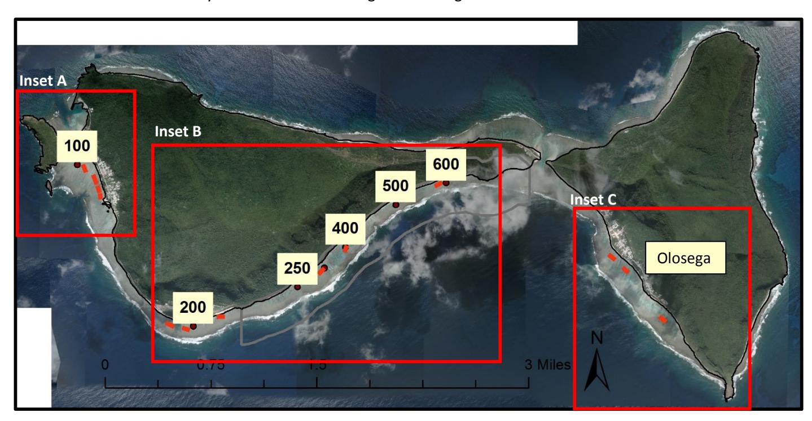

**Figure 1**: Map of survey sites around the islands of Ofu and Olosega, with Pool Numbers inside the yellow boxes.

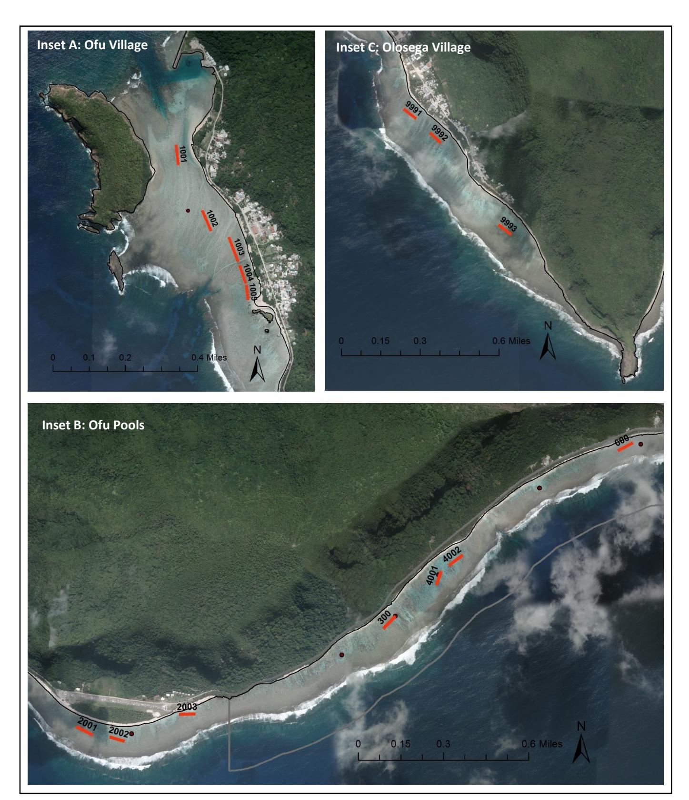

**Figure 2**: Inset maps from Figure 1 showing survey transect locations. Each transect is represented by a red line. The first three digits of the transect label represents the Pool number, and the last digit represents the transect number. Pool number 999 represents the Olosega Village site.

#### **Reef Fish Survey Results**

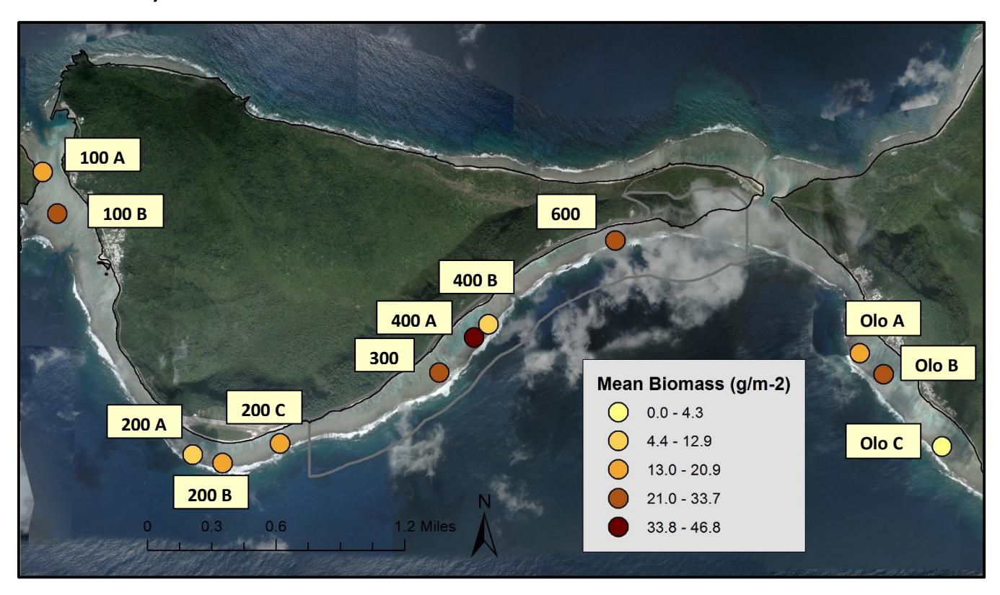

**Figure 3**: Mean fish biomass (g/m2 ) recorded along each transect in Ofu and Olosega Islands.

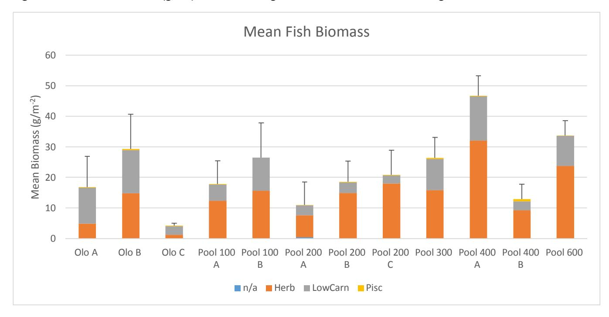

**Figure 4**: Mean fish biomass (g/m-2 ) at the 12 survey sites by fish functional group (Herbivores, Lower Carnivores, and Piscivores).

**Table 1**: Mean fish biomass (g/m-2 ) and SE at the 12 survey sites by fish functional group (Herbivores, Lower Carnivores, and Piscivores).

|            | Herbivores Lower |               | Piscivores | TOTAL Mean     |  |
|------------|---------------------|---------------|------------|----------------|--|
|            |                     | Carnivores    |            | Biomass        |  |
| Olo A      | 4.9                 | 11.8          | 0.2        | 16.9           |  |
|            | ± 2.2               | ± 8.5         | ± 0.1      | ± 10           |  |
| Olo B      | 14.9                | 14.2          | 0.3        | 29.3           |  |
|            | ± 4.4               | ± 8.2         | ± 0.3      | ± 11.4         |  |
| Olo C      | 1.3                 | 2.8           | 0.2        | 4.3            |  |
|            | ± 0.3               | ± 0.5         | ± 0.1      | ± 0.7          |  |
| Pool 100 A | 12.4                | 5.3           | 0.1        | 17.8           |  |
|            | ± 5.7               | ± 1.8         | ± <0.1     | ± 7.6          |  |
| Pool 100 B | 15.7 ± 6.7       | 10.9 ± 8.2 | 0          | 26.5 ± 11.2 |  |
| Pool 200 A | 7.2                 | 3.3           | 0.1        | 11.0           |  |
|            | ± 6.3               | ± 1.4         | ± 0.1      | ± 7.5          |  |
| Pool 200 B | 14.9                | 3.4           | 0.2        | 18.6           |  |
|            | ± 6.3               | ± 1.2         | ± 0.2      | ± 6.8          |  |
| Pool 200 C | 18.1                | 2.6           | 0.2        | 20.9           |  |
|            | ± 8.6               | ± 1.1         | ± 0.2      | ± 8            |  |
| Pool 300   | 15.8                | 10.2          | 0.4        | 26.5           |  |
|            | ± 5.2               | ± 3.4         | ± 0.2      | ± 6.7          |  |
| Pool 400 A | 32.1                | 14.5          | 0.2        | 46.8           |  |
|            | ± 6.7               | ± 10          | ± 0.2      | ± 6.4          |  |
| Pool 400 B | 9.3                 | 2.9           | 0.7        | 12.9           |  |
|            | ± 4.5               | ± 0.4         | ± 0.7      | ± 4.9          |  |
| Pool 600   | 23.8                | 9.8           | 0.1        | 33.7           |  |
|            | ± 6.5               | ± 6.6         | ± 0.1      | ± 4.9          |  |

### **Benthic Survey Results**

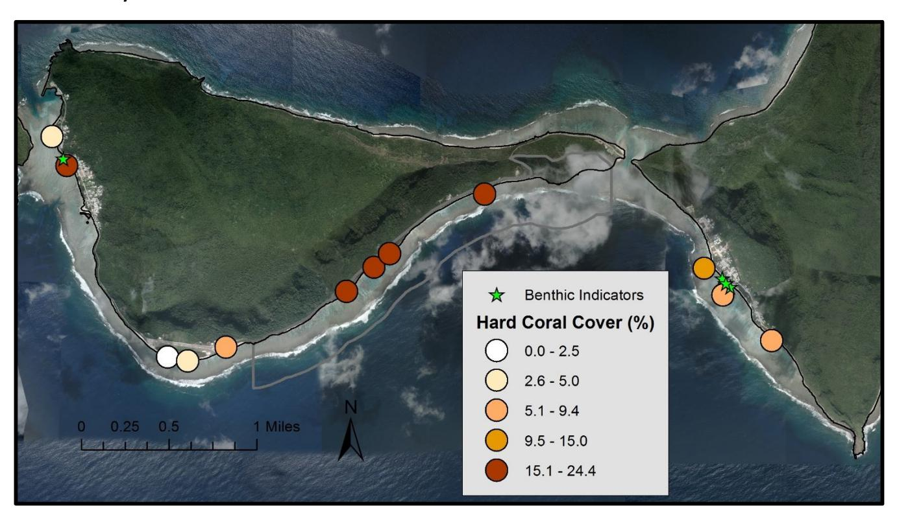

**Figure 5**: Coral cover (%) recorded along each transect in Ofu and Olosega Islands. Benthic indicators such as encrusting grey sponge and cyanobacteria algae are indicated by green stars.

**Table 2**: Benthic cover (%) and SE at the 12 survey sites by functional group. CCA = crustose coralline algae, CYA = cyano bacteria, DC = dead coral, HC = hard coral, MA + macro algae, RU = rubble, RO = rock with turf, SA = sand, SC = soft coral, TA = turf algae.

|            | CCA       | CYA      | DC         | HC         | MA         | RU         | RO        | SA        | SC        | TA       |
|------------|-----------|----------|------------|------------|------------|------------|-----------|-----------|-----------|----------|
| Olo A      | 6.3 ±  | 0        | 0          | 6.9 ±   | 1.3 ±   | 38.1 ±  | 30.6 ± | 16.9 ± | 0         | 0        |
|            | 2.6       |          |            | 1.6        | 1.3        | 19         | 10.7      | 5.4       |           |          |
| Olo B      | 6.9 ±  | 1.3 ± | 0.6 ±   | 9.4 ±   | 2.5 ± 1 | 39.4 ±  | 31.9 ± | 8.1 ±  | 0         | 0        |
|            | 3.4       | 0.7      | 0.6        | 2.8        |            | 8.1        | 8.3       | 2.8       |           |          |
| Olo C      | 3.1 ±  | 0.6 ± | 1.3 ±   | 2.5 ± 1 | 5.6 ±   | 37.5 ±  | 35.6 ± | 11.9 ± | 0         | 1.9 ± |
|            | 2.4       | 0.6      | 0.7        |            | 2.4        | 5.3        | 6.6       | 1.9       |           | 1.2      |
| Pool 100 A | 0         | 0        | 0          | 4.4 ±   | 1.3 ±   | 10.6 ±  | 20 ±   | 40.6 ± | 23.1 ± | 0        |
|            |           |          |            | 2.1        | 0.7        | 3.7        | 2.7       | 7         | 7.3       |          |
| Pool 100 B | 0         | 0.6 ± | 0          | 21. ±   | 1.3 ±   | 2.5 ±   | 45 ±   | 28.8 ± | 0         | 0        |
|            |           | 0.6      |            | 3.3        | 0.7        | 1.8        | 2.7       | 1.6       |           |          |
| Pool 200 A | 6.9 ±  | 0        | 0          | 5 ± 2.7 | 10.6 ±  | 34.4 ±  | 30 ±   | 11.9 ± | 0         | 1.3 ± |
|            | 2.8       |          |            |            | 3.6        | 9.3        | 3.7       | 2.1       |           | 1.3      |
| Pool 200 B | 4.4 ±  | 0        | 0          | 6.9 ±   | 5 ± 2.7 | 43.8 ±  | 28.8 ± | 11.3 ± | 0         | 0        |
|            | 1.6       |          |            | 2.1        |            | 10.1       | 6         | 3.3       |           |          |
| Pool 200 C | 13.8 ± | 0        | 0          | 19. ±   | 8.1 ±   | 2.5 ± 1 | 33.1 ± | 23.1 ± | 0         | 0        |
|            | 1.6       |          |            | 5.5        | 3.6        |            | 2.8       | 5.8       |           |          |
| Pool 300   | 12.5 ± | 0        | 1.3 ±   | 24. ±   | 3.8 ± 3 | 7.5 ±   | 18.8 ± | 31.9 ± | 0         | 0        |
|            | 5.3       |          | 0.7        | 1.9        |            | 1.4        | 3.8       | 5.2       |           |          |
| Pool 400 A | 3.8 ±  | 0        | 0.6 ±   | 21. ±   | 3.8 ±   | 5.6 ±   | 23.8 ± | 40.6 ± | 0         | 0        |
|            | 0.7       |          | 0.6        | 3.3        | 0.7        | 2.6        | 3.8       | 2.4       |           |          |
| Pool 400 B | 3.1 ±  | 0        | 5.6 ± 4 | 15 ±    | 6.3 ±   | 16.3 ±  | 13.1 ± | 40.6 ± | 0         | 0        |
|            | 2.4       |          |            | 2.3        | 1.6        | 7.3        | 5.8       | 10.4      |           |          |
| Pool 600   | 25 ±      | 0        | 1.3 ±   | 20 ±    | 2.5 ±   | 0.6 ±   | 11.3 ± | 38.8 ± | 0         | 0        |
|            | 8.4       |          | 0.7        | 7.2        | 1.8        | 0.6        | 3.3       | 5.3       |           |          |

**Table 3**: Coral growth form (percent of coral cover) and SE at the 12 survey sites by functional group.

|            | bifocal plates | branching      | encrusting     | knobby         | mounding       | plating      |
|------------|----------------|----------------|----------------|----------------|----------------|--------------|
| Olo A      | 0              | 0              | 8.3 ± 4.2   | 0              | 91.7 ± 45.8 | 0            |
| Olo B      | 8.3 ± 4.2   | 0              | 32.7 ± 16.4 | 0              | 58.9 ± 29.5 | 0            |
| Olo C      | 0              | 16.7 ± 9.6  | 33.3 ± 19.2 | 0              | 50 ± 28.9   | 0            |
| Pool 100 A | 41.7 ± 24.1 | 0              | 16.7 ± 9.6  | 41.7 ± 24.1 | 0              | 0            |
| Pool 100 B | 74.2 ± 37.1 | 2.5 ± 1.3   | 0              | 10.6 ± 5.3  | 12.8 ± 6.4  | 0            |
| Pool 200 A | 0              | 33.3 ± 19.2 | 46.7 ± 26.9 | 0              | 20 ± 11.5   | 0            |
| Pool 200 B | 0              | 42.5 ± 21.3 | 30.8 ± 15.4 | 0              | 26.7 ± 13.3 | 0            |
| Pool 200 C | 9.4 ± 4.7   | 36.8 ± 18.4 | 33.4 ± 16.7 | 7.1 ± 3.5   | 13.3 ± 6.7  | 0            |
| Pool 300   | 2.3 ± 1.1   | 2.3 ± 1.1   | 15 ± 7.5    | 20.4 ± 10.2 | 54.7 ± 27.3 | 5.4 ± 2.7 |
| Pool 400 A | 0              | 5 ± 2.5     | 14.6 ± 7.3  | 13.3 ± 6.7  | 67.1 ± 33.5 | 0            |
| Pool 400 B | 6.3 ± 3.1   | 21.1 ± 10.5 | 32 ± 16     | 0              | 34 ± 17     | 6.7 ± 3.3 |
| Pool 600   | 0              | 3.9 ± 2     | 25.5 ± 12.8 | 0              | 70.5 ± 35.3 | 0            |

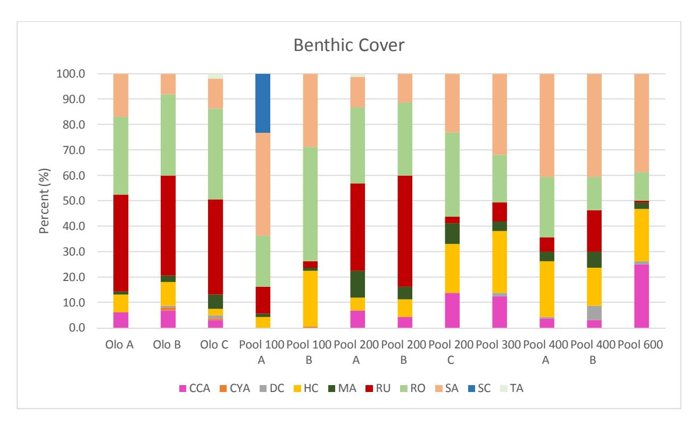

**Figure 6**: Benthic cover (%) and SE at the 12 survey sites by functional group. CCA = crustose coralline algae, CYA = cyano bacteria, DC = dead coral, HC = hard coral, MA + macro algae, RU = rubble, RO = rock with turf, SA = sand, SC = soft coral, TA = turf algae.

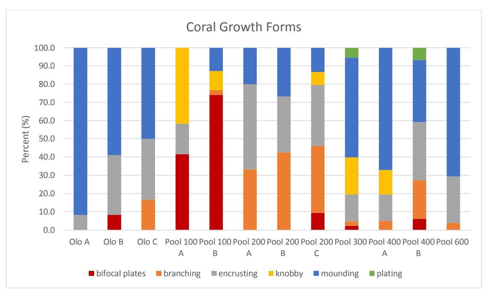

**Figure 7**: Coral growth form (% of coral cover) and SE at the 12 survey sites by functional group.

#### **Fish Survey Data Summary**

Overall, the highest mean fish biomass were recorded within the National Park boundary between Pool 300 and Pool 600. The highest mean fish biomass was recorded at Pool 400A with a mean biomass of 46.8 g/m-2 , of which 69% of the total biomass along this transect was attributed to herbivorous fish. Noticeably, a much lower mean biomass of 12.9 g/m-2 was observed at the nearby transect Pool 400B, suggesting a high variability of mean fish biomass within the same pool.

The lowest mean fish biomass of 4.3 g/m-2 was recorded at Olosega C, which was a site adjacent to the Olosega landfill site. The relatively moderate mean fish biomass observed along the three transects at Pool 200, adjacent to the Ofu airport, suggests that this area has overall lower biomass than the areas inside the National Park. Mean fish biomass at Pool 200 ranged from 11.0 g/m-2 at Pool 200A to 20.9 g/m-2 at Pool 200C. The highest proportion of the biomass along these transects was attributed to herbivorous fish, ranging from 65% at Pool 200A to 86% at Pool 200C.

The three transects surveyed along the reef flat in front of Olosega village showed high variability in fish biomass, ranging from 4.3 g/m-2 at Olosega C to 29.3 g/m-2 at Olosega B. The trophic composition of the fish observed along these transects was noticeably different than at all the other survey sites, with an equal or higher proportion of the total mean biomass being attributed to lower carnivorous fish compared to herbivorous fish. A similar fish population composition was observed at Pool 100B, in front of Ofu village, where 59% of the total mean biomass was attributed to herbivorous fish and 41% attributed to lower carnivorous fish.

#### **Benthic Survey Data Summary**

Overall, Pool 100B, 200C, 300, 400A and 600 had the highest coral cover (19-24%). Highest coral cover was found in Pool 300 (24%) (Table 2 and Figure 6). Out of the coral cover documented for the specific sites, mounding, encrusting and branching coral was most often encountered (Table 3 and Figure 7).

All sites also showed high percentages of sand cover (8-40%) and hard bottom covered in turf (11-45%) which is characteristic for these pool environments (hard substrate bommies with sand channels). Highest macroalgae cover was found in pool 200A (10%) which was mostly Halimeda spp. Crustose-coralline algae (CCA cover) cover was low in most pools (majority 0-13%) with high CCA cover found at one site (Pool 600 with 25%). Soft coral was only found in Pool 100A (23%) which had very high flushing rates. High amounts of coral rubble were found at Olo A, Olo B, Olo C, Pool 200A and Pool 200B (34-43%) indicating disturbance (see Table 2 and Figure 6).

Observations of benthic indicators suggesting nutrient input were recorded on the nearshore reef flat areas in front of both villages as indicated by the green stars in Figure 5. On the reef flat in Ofu Village a grey encrusting sponge was observed covering the benthic substrate and on the reef flat in Olosega village mats of cyanobacteria were observed. Photographs from these areas are shown in Appendix 2.

Additionally, low to intermediate levels of bleaching were seen (genera mostly affected were Millepora and Acropora, some massive Porites) and low levels of disease observed.

# **List of appendices**

**Appendix 1:** Survey Site GPS coordinates

**Appendix 2:** Benthic indicator photographs

# **Appendix 1:** Survey Site GPS coordinates

**Table 4**: List of survey site GPS coordinates and benthic indicators observed

| Pool Name     | Site        | Start / End | Latitude     | Longitude    |
|---------------|-------------|-------------|--------------|--------------|
| Olosega A     | Olosega     | Start       | -14.17892371 | -169.6246156 |
| Olosega A     | Olosega     | End         | -14.17838006 | -169.625339  |
| Olosega B     | Olosega     | Start       | -14.17968035 | -169.6238366 |
| Olosega B     | Olosega     | End         | -14.18025141 | -169.6232116 |
| Olosega C     | Olosega     | Start       | -14.18528633 | -169.6191932 |
| Olosega C     | Olosega     | End         | -14.18473229 | -169.6199205 |
| 100 A         | Ofu Village | Start       | -14.16674607 | -169.6820101 |
| 100 A         | Ofu Village | End         | -14.16755676 | -169.6819197 |
| 100 B         | Ofu Village | Start       | -14.16936969 | -169.6809167 |
| 100 B         | Ofu Village | End         | -14.17019748 | -169.6805454 |
| 200 A         | Airport     | Start       | -14.1856481  | -169.6720762 |
| 200 A         | Airport     | End         | -14.18608077 | -169.6711851 |
| 200 B         | Airport     | Start       | -14.18638989 | -169.6695161 |
| 200 B         | Airport     | End         | -14.1861702  | -169.6703172 |
| 200 C         | Vaoto       | Start       | -14.18497469 | -169.6658096 |
| 200 C         | Vaoto       | End         | -14.18500009 | -169.6666678 |
| 300           | Toaga       | Start       | -14.17993189 | -169.6553384 |
| 300           | Toaga       | End         | -14.18056439 | -169.6559694 |
| 400 A         | Toaga       | Start       | -14.17830949 | -169.653213  |
| 400 A         | Toaga       | End         | -14.17759567 | -169.6529511 |
| 400 B         | Toaga       | Start       | -14.17676797 | -169.6518202 |
| 400 B         | Toaga       | End         | -14.17731011 | -169.652553  |
| 600           | Toaga       | Start       | -14.1709936  | -169.6429225 |
| 600           | Toaga       | End         | -14.17140506 | -169.6437222 |
| Grey sponge   | Ofu Village | Point       | -14.16889435 | -169.6802848 |
| Cyanobacteria | Olosega 1   | Point       | -169.6241816 | -14.17853362 |
| Cyanobacteria | Olosega 2   | Point       | -169.6238692 | -14.1789238  |
| Cyanobacteria | Olosega 3   | Point       | -169.6235206 | -14.17923167 |

**Appendix 2:** Benthic indicator photographs

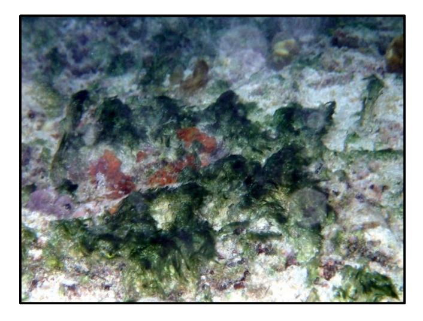

**Figure 8:** Cyanobacteria algae at Olosega village **Figure 9**: Cyanobacteria algae at Olosega village

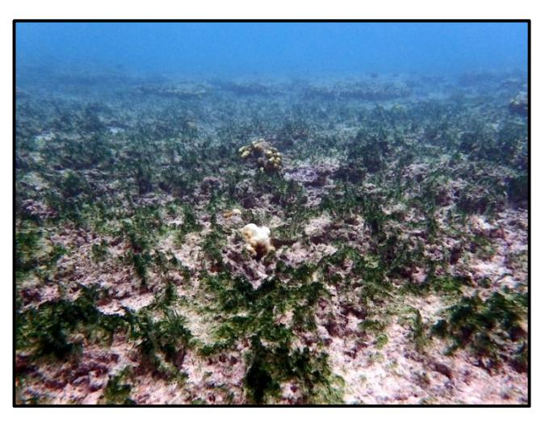

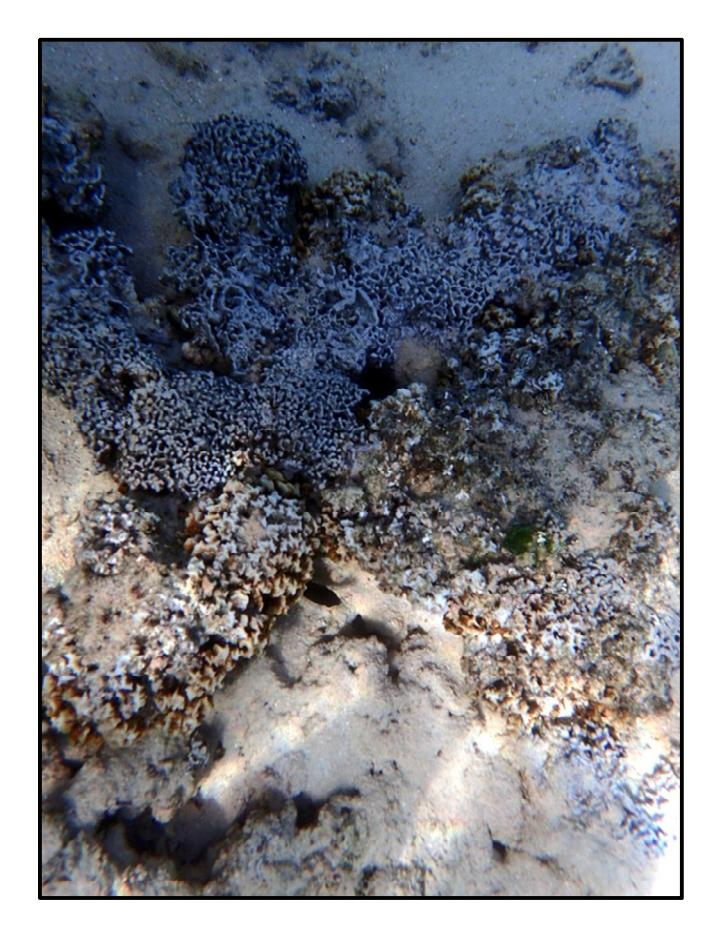

**Figure 10:** Encrusting grey sponge at Ofu village **Figure 11**: Encrusting grey sponge at Ofu village

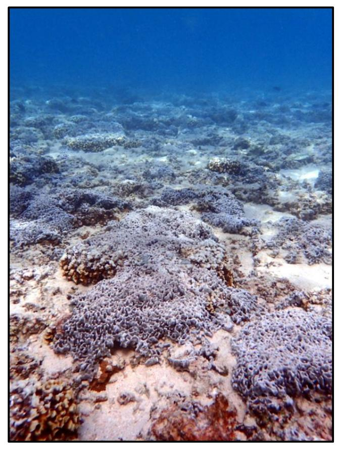

This study was funded by the National Oceanic and Atmospheric Administration Coral Reef Conservation Program through an award to the Department of Commerce of American Samoa. This study was funded by the Na1onal Oceanic and Atmospheric Administra1on Coral Reef Conserva1on Program through an award to the Department of Marine and Wildlife Resources of American Samoa