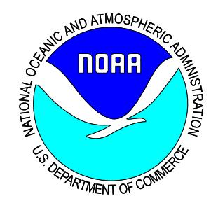

# NOAA Technical Memorandum NMFS-PIFSC-19

July 2009

# American Samoa as a Fishing Community

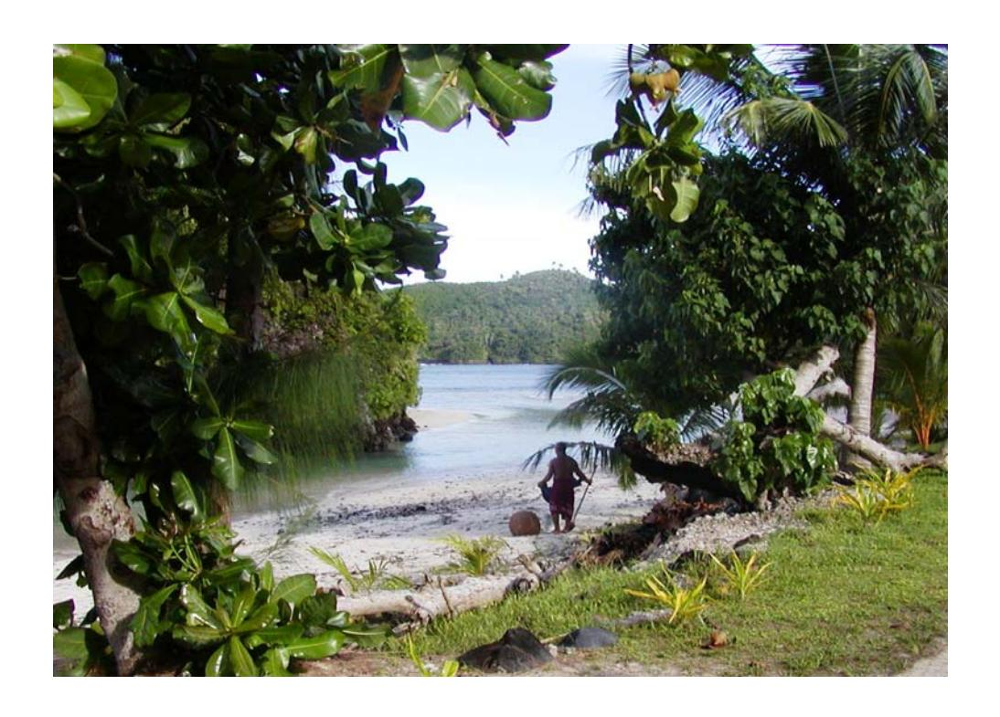

Arielle Levine Stewart Allen

Pacific Islands Fisheries Science Center National Marine Fisheries Service National Oceanic and Atmospheric Administration U.S. Department of Commerce

#### **About this document**

The mission of the National Oceanic and Atmospheric Administration (NOAA) is to understand and predict changes in the Earth=s environment and to conserve and manage coastal and oceanic marine resources and habitats to help meet our Nation=s economic, social, and environmental needs. As a branch of NOAA, the National Marine Fisheries Service (NMFS) conducts or sponsors research and monitoring programs to improve the scientific basis for conservation and management decisions. NMFS strives to make information about the purpose, methods, and results of its scientific studies widely available.

NMFS= Pacific Islands Fisheries Science Center (PIFSC) uses the **NOAA Technical Memorandum NMFS** series to achieve timely dissemination of scientific and technical information that is of high quality but inappropriate for publication in the formal peerreviewed literature. The contents are of broad scope, including technical workshop proceedings, large data compilations, status reports and reviews, lengthy scientific or statistical monographs, and more. NOAA Technical Memoranda published by the PIFSC, although informal, are subjected to extensive review and editing and reflect sound professional work. Accordingly, they may be referenced in the formal scientific and technical literature.

A **NOAA Technical Memorandum NMFS** issued by the PIFSC may be cited using the following format:

Levine, A., and S. Allen. 2009. American Samoa as a fishing community. U.S. Dep. Commer., NOAA Tech. Memo., NOAA-TM-NMFS-PIFSC-19, 74 p.

## **For further information direct inquiries to**

Chief, Scientific Information Services Pacific Islands Fisheries Science Center National Marine Fisheries Service National Oceanic and Atmospheric Administration U.S. Department of Commerce 2570 Dole Street Honolulu, Hawaii 96822-2396

Phone: 808-983-5386 Fax: 808-983-2902

Cover photo: Arielle Levine, Pacific Islands Fisheries Science Center, 2007.

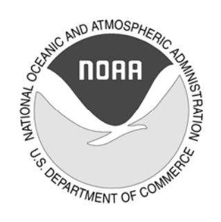

# Pacific Islands Fisheries Science Center

National Marine Fisheries Service National Oceanic and Atmospheric Administration U.S. Department of Commerce

# American Samoa as a Fishing Community

Arielle Levine1 Stewart Allen2

1 Joint Institute for Marine and Atmospheric Research 1000 Pope Road Honolulu, Hawaii 96822

> 2 Pacific Islands Fisheries Science Center National Marine Fisheries Service 2570 Dole Street Honolulu, Hawaii 96822-2396

> > NOAA Technical Memorandum NMFS-PIFSC-19

July 2009

### **ABSTRACT**

The role of fishing as a central and organizing force for communities in American Samoa has undergone dramatic changes over the past 50 years or more. The islands' population has more than tripled over that time period, with a steady shift from a largely subsistence-oriented economy to a cash-based economy. Fishing events such as the annual *atule* and *palolo* harvests continue to organize and mobilize many villages, but a smaller percent of American Samoans are taking part in these activities today, and the role of fishing as a central aspect of community within American Samoan life and culture has become less prominent over time. Fishing and marine resources are universally considered to be important aspects of *fa'a Samoa,* the Samoan way of life, but access to cash income and ready availability of food imports have made American Samoans less inclined to engage in fishing.

While change in nearshore fishing effort for subsistence purposes has not been consistently measured, a significant downward trend is evident since the 1980s. The catch rate for the outer islands, which have not experienced the same increase in population as the main island of Tutuila, is not decreasing in the same way that it is on Tutuila.

Traditionally, all village work, including fishing, was organized at the village and family level. The village *fono* decided, according to season, what sort of community fishing should take place. The *tautai*, or master fisherman, of the village was a key decision maker who was awarded higher status than other *matai* (who might otherwise outrank him) when it came to matters of fishing. Fishing and canoe building were important skills that could improve village status and prestige. Customarily, and still today, the village controls rights of access to nearshore marine resources. A non-village member must gain permission from the mayor or village council to fish in an area adjacent to a village. Each village is also able to establish its own restrictions on fishing and access for the entire community. Community-specific restrictions on use of marine resources have been formalized in some cases through the government's Community-based Fisheries Management Program.

Commercial fishing activity has undergone several cycles over time. The Dory Project in the early 1970's initiated an era of modern fishing technology in American Samoa by providing easy credit and loans to fishermen to develop offshore fisheries. The project developed a boatbuilding facility that produced 23 vessels over a 3-year period. In the 1980s, dories were replaced by larger, more powerful vessels that could stay several days at sea. These *alia* catamarans, usually 28 to 32 ft long and powered by an outboard-engine, used primarily trolling and bottomfishing gear. In 1995, some *alia* captains began using horizontal longline gear, which quickly became the largest fishery in American Samoa based on total landed weight of the catch. In the early 2000s, bigger, monohulled longline vessels entered the fishery, resulting in greatly increased landings—over 15 million pounds in 2002, compared to under 2 million pounds in 2000.

The tuna canneries based in American Samoa are another critical aspect of American Samoa as a fishing community. Canneries first began operating in American Samoa in 1954 and today, the canneries are the largest private-sector source of employment in the region. As the principal industry in the territory, the tuna canneries also shape other aspects of the American Samoan economy. For example, many private-sector jobs in the territory involve delivery of goods or services to tuna processors, and economic growth in the consumer retail and service sectors is tied to tuna industry expenditures and the buying patterns of cannery workers. StarKist Samoa, the largest tuna cannery in the world, produces more than 60% of American Samoa's canned tuna, while Chicken of the Sea produces the remaining 40%.

Current issues facing American Samoa as a fishing community include: the status of the canneries in the face of increasing labor costs; the status of the government's no-take Marine Protected Area (MPA) program and other management regimes including Fagatele Bay National Marine Sanctuary (and the planned Sanctuary expansion program) and the recently designated Rose Atoll Marine National Monument; the status of the Community-based Fisheries Management Program; trends in nearshore fishing activity and fish consumption; habitat protection and management; and population trends in the Manu'a islands.

Monitoring the institutional, socioeconomic, and cultural aspects of fishing is just as important as monitoring fish populations and habitat in ensuring American Samoa's ability to sustain itself as a fishing community.

# **CONTENTS**

| I. Introduction and Purpose                                       | 1  |
|-------------------------------------------------------------------|----|
| II. Overview of American Samoa's Culture, Population, and Economy | 4  |
| Culture                                                           |    |
| Population                                                        |    |
| Health Issues                                                     |    |
| Economic and Employment Overview                                  |    |
| Role of the Canneries                                             |    |
| Future Prospects                                                  |    |
| III. The Fisheries of American Samoa                              | 21 |
| Historic Fishing Practices                                        | 21 |
| Nearshore Fishing                                                 |    |
| Offshore Fishing                                                  |    |
| Bottomfishing                                                     |    |
| Trolling                                                          |    |
| Longline Fisheries                                                |    |
| IV. Territorial Management of Fisheries                           | 49 |
| Department of Marine and Wildlife Resources                       | 49 |
| Coral Reef Advisory Group                                         |    |
| Community-based Fisheries Management Program                      |    |
| Territorial No-take MPA Program                                   |    |
| V. Conclusions                                                    | 57 |
| References                                                        | 65 |

#### **I. INTRODUCTION AND PURPOSE**

This report describes the fishing community of American Samoa. The need for the report came from a requirement that federal fishery management measures take into account the needs and characteristics of fishing communities. The new requirement is part of the Magnuson Fishery Conservation and Management Act, as reauthorized and amended in 1996 by enactment of the Sustainable Fisheries Act, which also renamed it the Magnuson-Stevens Fishery Conservation and Management Act (MSA). New requirements of the MSA required Fishery Management Councils to amend existing fishery management plans and, among other things, pay more attention to human fishing communities. National Standard 8 (NS8) specified that:

Conservation and management measures shall, consistent with the conservation requirements of this Act (including the prevention of overfishing and the rebuilding of overfished stocks), take into account the importance of fishery resources to fishing communities in order to (A) provide for the sustained participation of such communities, and (B) to the extent practicable, minimize adverse economic impacts on such communities (301(a)(8)).

The amendments also defined fishing community:

The term "fishing community" means a community which is substantially dependent on or substantially engaged in the harvest or processing of fishery resources to meet social and economic needs, and includes fishing vessel owners, operators, and crew and United States fish processors that are based in such community. (MSA Section 3(16))

The National Standard Guidelines (50 *CFR* 600.345(b)(3)) provided additional definition of fishing communities:

A fishing community is a social or economic group whose members reside in a specific location and share a common dependency on commercial, recreational, or subsistence fishing or on directly related fisheries-dependent services and industries (for example, boatyards, ice suppliers, tackle shops).

In response to the mandate of MSA to identify and describe fishing communities, the Western Pacific Regional Fishery Management Council (Council) proposed that each of the major island areas (American Samoa, Guam, Hawaii, and the Northern Mariana Islands) be identified as a fishing community

In contrast to most U.S. mainland residents, who have little contact with the marine environment, a large proportion of the people living in the western pacific region observe and interact daily with the ocean for food, income and recreation…fishing also continues to contribute to the cultural integrity and social cohesion of island communities…In each island area within the region the residential distribution of individuals who are substantially dependent on or substantially engaged in the harvest or processing of fishery resources approximates the total population distribution. These individuals are not set apart…from island populations as a whole (September 1998, pp. 52–53).

On April 19, 1999, the National Marine Fisheries Service (NMFS) approved identification of American Samoa, the Northern Mariana Islands, and Guam as fishing communities (64 *FR* 19067). NMFS decided against characterizing the State of Hawaii as a fishing community, saying that would be interpreting the mandate too broadly, and encouraged the Council to identify fishing communities in Hawaii at smaller scales.1

Describing American Samoa as a fishing community is especially relevant because NMFS and the Western Pacific Regional Fishery Management Council (WPRFMC) are shifting to an ecosystem-based approach to fisheries management, of which one aspect is facilitating community-based management approaches (WPRFMC, 2005). Management of natural resources is often discussed primarily in terms of scientific research and government regulation with less consideration given to the level of public confidence and cooperation in the management process. However, an ecosystem-based approach recognizes that responsible actions by citizens and communities are necessary for long-term wise use of marine resources. In some cases, local involvement in natural resource management can help to rebuild the connections to the natural world lost in today's globalized and transient society. In American Samoa, where village-level systems still maintain a strong level of influence over fishing and marine resource use, the involvement of local communities in natural resource management is critical.

In August 2004, President Bush issued Executive Order 13352 to promote partnerships between federal agencies and states, local governments, tribes, and individuals that will facilitate cooperative conservation and appropriate inclusion of local participation in federal decision making regarding the nation's natural resources. Similarly, the U.S. Ocean Action Plan (2004) found that "local involvement by those closest to the resource and their communities is critical to ensuring successful, effective, and long-lasting conservation results." Early evidence indicates that community-based approaches in U.S. land-management are

2

1 In 2004, NMFS approved a WPRFMC recommendation, supported by the Pacific Islands Regional Office (PIRO) and the Pacific Islands Fisheries Science Center to identify each of the inhabited, main islands of the State of Hawaii as a fishing community (Kauai, Niihau, Oahu, Maui, Molokai, Lanai, and Hawaii Island).

achieving success (Yaffee, 1999), and there has been increasing emphasis on community-based approaches to natural resource management worldwide (Murphree, 1993; Birkes et al., 2000). Ecosystem-based management is the sum of many interrelated components and integrated activities. Species management cannot be conducted effectively without consideration of other components of the marine ecosystem, upstream watershed, and political, cultural, and economic influences. Just as biodiversity can strengthen the resilience of natural systems, diversity in management approach, such as connecting community-based initiatives with governmental programs, can provide a valuable contribution which allows for locally relevant management strategies. The Western Pacific Regional Fishery Management Council's (WPRFMC) fishery ecosystem plans (FEPs) are focused on community collaboration, participation, and partnership (WPRFMC, 2005).

The rest of this report is organized into four chapters. Chapter II provides an overview of the people and landscape of American Samoa, including demographics, culture, and economy. It also discusses the economic role of fisheries with a focus on the sizeable contributions of the canneries. Chapter III summarizes trends in the nearshore and offshore fisheries and associated fleets. Chapter IV describes how fisheries activities are managed by the government of American Samoa. Chapter V identifies key factors that can be monitored to assess the ways in which American Samoa is changing as a fishing community.

In preparing the report, we have tried to strike a balance between keeping it short enough to be useful while covering the full range of topics and issues necessary to describe American Samoa as a fishing community. Readers are encouraged to let us know if we have missed an event, activity, or research report that is part of the story of the social, cultural, and economic importance of fishing in American Samoa and how it came to be that way.

### **II. OVERVIEW OF AMERICAN SAMOA'S CULTURE, POPULATION, AND ECONOMY2**

American Samoa, an unincorporated territory of the United States, is the country's southernmost jurisdiction. The territory is located 14 degrees south of the equator in the Pacific Ocean, about 2300 miles south-southwest of Hawaii (Fig. 1). American Samoa lies just east of the international date line and is part of the Samoa Archipelago. It is made up of seven islands: *Tutuila*, *Aunu'u*, the Manu'a group (about 100 km east of Tutuila) consisting of *Ta'u*, *Olosega*, and *Ofu*; *Rose Island*; and *Swains Island* (Figs. 2 and 3). The largest island of Tutuila covers an area of 143 km2 , accounting for 72% of the total land area (CIA *World Factbook*, 2008), and approximately 97% of the territory's population (2000 Census).

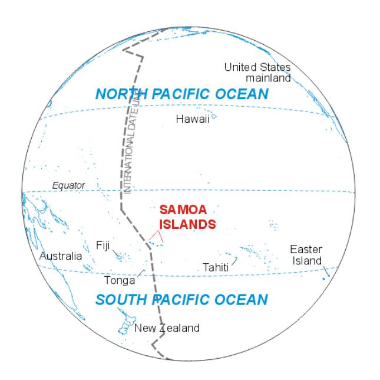

Figure 1.—Location of the Samoa Archipelago. (National Park Service, 2002).

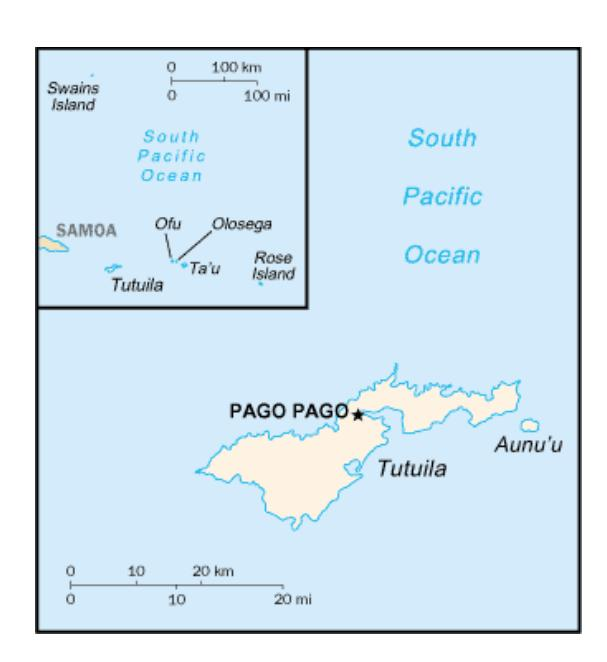

 Figure 2.—The islands of American Samoa (CIA *World Factbook*, 2007).

Some of the information in this section is derived from a report prepared for the WPRFMC (Pan and Li, 2006).

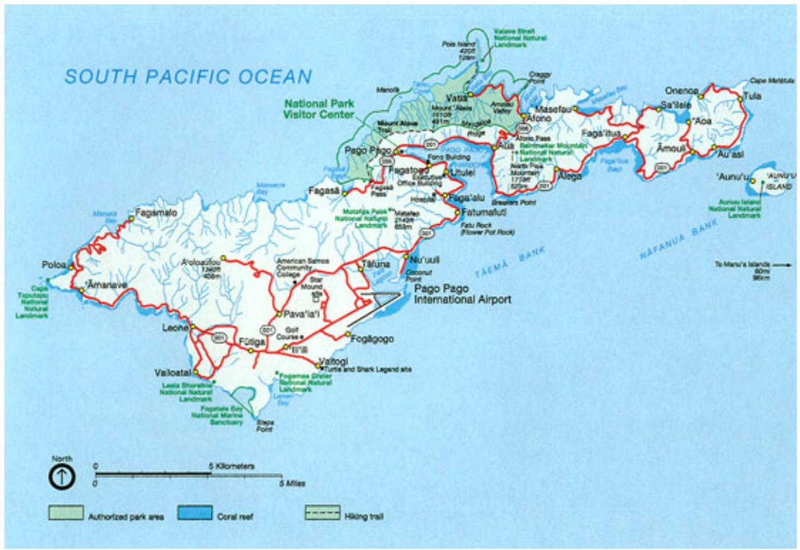

#### TUTUILA

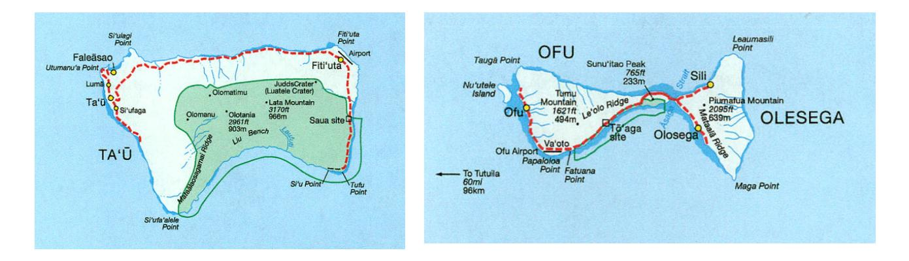

Figure 3.—Main islands and villages (National Park areas shown in green).

It is generally believed that the Samoa Islands were settled by Polynesian explorers as early as 1000 B.C. The early Polynesians were skilled navigators who settled vast areas of the Pacific, an area known as the Polynesian triangle, with its northern corner at Hawai'i, eastern corner at Rapa Nui (Easter Island), and southern corner in New Zealand. While Polynesian languages maintain strong similarities, the various islands have developed unique and distinct cultures.

The Samoa Islands were first encountered by European explorers in the 18th century. American Samoa was defined by the Treaty of Berlin in 1899 between the United States, Great Britain, and Germany, which gave the United States control of all Samoan islands east of 171°W. This treaty went into effect on February 16, 1900. On April 17, 1900, the *matai* (chiefs) of Tutuila formally ceded the islands of Tutuila and Aunu'u to the United States. On July 16, 1904, the king and *matai* of Manu'a ceded the islands of Ta'u, Ofu, Olosega, and Rose Atoll to the United States. Congress formally ratified the 1900 and 1904 deeds of cession retroactively in 1929. Swains Island became part of American Samoa by joint resolution of Congress in 1925 (DOI Office of Insular Affairs, 2007). American Samoa was under the jurisdiction of the U.S. Navy Department until 1951, when administration was transferred to the Department of the Interior (*The Columbia Electronic Encyclopedia*, 2005).

Unlike Hawaii and Alaska during their years as U.S. territories, American Samoa is "unincorporated" because not all provisions of the U.S. Constitution apply to the territory. Instead, Congress gave plenary authority over the territory to the President of the United States who then delegated this authority to the Department of the Interior (DOI). The Secretary of the Interior, in turn, allowed American Samoans to draft their own constitution by which the government now functions (U.S. Department of Labor, 2007a). The structure of the American Samoan government was designed to mirror that of the United States while also incorporating elements of traditional Samoan social structure.

American Samoans are classified as U.S. nationals rather than as full citizens. Although U.S. nationals cannot vote in national elections, they do have freedom of entry into the continental United States. American Samoa has had an elected, nonvoting Member of Congress representing the territory in the U.S. House of Representatives since 1981 (U.S. Department of Labor, 2007a).

#### **Culture**

Polynesians account for the vast majority (93%) of American Samoa's people. The population speaks Samoan (91%), English (3%), Tongan (2%), and other languages of the Pacific Islands (2%). Samoan is the official language; however, most American Samoans are bilingual to some degree, speaking English along with their native Polynesian tongue (U.S. Census, 2004).

Contemporary American Samoan culture is characterized by a combination of traditional Samoan values and systems of social organization, as well as the strong influence of Christianity. Prior to the arrival of Christian missionaries in 1830, *Tagaloa* was the deity recognized as the creator of the islands, and *matai* served as family religious leaders under the traditional religion. The first missionaries to come to American Samoa were from the London Missionary Society (called LMS by Samoans), known today as the Congregational Christian Church of American Samoa. Various forms of Christianity now dominate religious practices in American Samoa, extending to nearly the entire population. About 35% of the population is affiliated with the Congregational Christian Church, 20% are Catholics, 15% Methodists, and 13% Mormons; most of the remainder are associated with the Assemblies of God and Seventh Day Adventist churches (Bureau of Democracy, Human Rights, and Labor, 2006).

Samoans are faithful churchgoers and generous supporters of village churches and pastors. Within the church, the *faifeau* (minister) is regarded as highly as the village *matai* (Kilarski et al., 2006). Many villages observe an evening curfew, or enforced prayer time, when *amuaga* (young, untitled men who serve as enforcers for the village) do not allow cars to pass through the village. Most Samoan families observe Sunday as a day of rest and for going to church. On this day, villagers must refrain from most recreational and commercial activities, including fishing (fishing and harvesting in preparation for Sunday meals often takes place on Saturdays).

Despite increasing influences of Western and other cultures, American Samoans hold tenaciously to their own traditions, seemingly more than other Pacific Islanders (U.S. Department of Labor, 2007a). Maintaining *fa'a samoa* or "the Samoan way" is considered a fundamental value within the culture and is recognized by the territorial constitution as a priority. However, *fa'a Samoa* has inherent flexibility which has allowed its people to both withstand and incorporate the ways of foreign traders, missionaries, and military forces among other agents and forces of change.

Villages and families, rather than individuals, are the primary organizing unit in Samoan Society. The basic structure of social organization in American Samoa is the *aiga*, which consists of immediate and extended family members including grandparents, uncles, aunts, and cousins (Fitzgerald and Howard, 1990). To maintain the function of *aiga*, every extended family member contributes to the welfare of the group. Each individual has duties to perform, from the trustee functions of the *matai* down to the most elementary tasks carried out by the children.

Under the *aiga* social system, each family is headed by a *matai*, and the *matai* has control over the land and assigns holdings to family members on a lifetime basis. It has historically been considered an honor to receive a *matai* title, and the *matai* are highly regarded and respected throughout the territory (McDade and Worthman, 2004). The *matai* is responsible for the well-being of the family, as well as for its representation in the village and district councils (DOI Office of Insular Affairs, 2007).

The *matai* of the village make up the decision-making and administrative group, called the village *fono*. *Matai* are also ranked according to local hierarchies, including levels such as chief, high chief, or talking chief, and the *fono* structure is reproduced again by village representatives (from *matai* ranks) at both a district and an island-wide scale. In addition, a person must have *matai* status to serve as a representative in the American Samoan Senate (Revised Constitution of American Samoa, 1967).

American Samoa's land tenure system has significant implications for cultural preservation and shaping the face of economic development on the islands. Land is considered one of the most important tangible assets of the American Samoan people and has traditionally been an important aspect of family organization and identity. Land and natural resources are shared communally within each village, and it is estimated that 90% of all land in the territory is owned by *aiga* and passed on through generations (Osman, 1997). The existing laws regarding land tenure prohibit the transfer of land ownership, except freehold land, to any person who is

less than one-half Samoan. Unless the Governor approves the transfer in writing, it is unlawful for any *matai* of a Samoan family to transfer any family lands to any person or to lease it for any term more than 55 years. The American Samoan government estimates that only about 2% of American Samoa's total area of 76.1 mi2 is freehold land (DOI Office of Insular Affairs, 2007).

With families and villages recognized as an organizing unit (rather than individuals), emphasis in Samoan society was traditionally placed on reciprocity rather than individual accumulation. Prestige was earned through generous distribution, not accumulation, of wealth. Any major occasion was marked by generous distribution of food, including fish and other marine resources. Traditionally, all village work, including fishing, was organized at the village and family level. The village *fono* decided, according to season, what sort of community fishing should take place. The *tautai*, or master fisherman, of the village was a key decision maker who was awarded higher status than other *matai* (who might otherwise outrank him) when it came to matters of fishing. Fishing and canoe building were important skills that could improve village status and prestige.

At the end of the 19th century, Kramer stated, "The sea is just as inexhaustible as the land," and accounted that either individual or family fishing efforts took place almost daily in village lagoons (Kramer, 1994–1995). Organized trips for specialized fishing were sometimes conducted outside the lagoon. For example, shark and bonito (skipjack tuna) fishing involved groups of specially trained men in specially made boats, and these trips were marked by much ceremony and tradition (Herdrich et al., 2008). Fish drives also were organized village efforts, timed with the tides and the spawning of certain species, such as *atule* (big-eye scad). When the catch was large, it was given as gifts to family and friends in other villages. Such gifts of food were an important part of reciprocal relations and the constant circulation of food and gifts that maintains Samoan social structure to this day.

Organized fishing efforts continue to take place in a few villages in American Samoa. For instance, the *tautai* of Fagasa and Ofu continue to organize village fishing efforts for *atule*, and fishing activities remain under the control of the village *fono*. After these efforts, the fish are traditionally distributed to all village families who participated in the fishing.

Customarily, and still today, the village controls usage rights of nearshore marine resources, which has implications for rights of access. A non-village member must still gain permission from the mayor or village council to fish in an area adjacent to a village. Each village is also able to establish its own restrictions on fishing and access for the entire community. Community-specific restrictions on use of marine resources have been formalized in some cases through the government's Community-based Fisheries Management Program which is discussed in more detail later in this report. An informal restriction, enforced in all areas adjacent to villages, is the aforementioned prohibition of fishing on Sundays for religious reasons.

American Samoa retains strong ties to Samoa (the independent nation formerly known as Western Samoa). Cultural and commercial exchange continues with families commuting regularly between the two island groups. According to the 2000 census, more than 30% of people living in American Samoa were born in Samoa. Marriages between residents of the two Samoas are very common, and a large number of American Samoans have relatives living in Samoa. American Samoa serves as the largest market for Samoa's fish. Samoan waters supply fish to the canneries as well as independent stores on the islands (Pacific Magazine, 2001). The value of Samoan bottomfish supplied to American Samoan markets, primarily for cultural functions (*fa'alavelave*), totaled more than \$40,000 in 2002 (Samoa Ministry of Foreign Affairs and Trade, 2006). As will be explained in greater detail, many of the workers in American Samoa's canneries are from Samoa.

#### **Population**

The population of American Samoa has grown rapidly, doubling in just more than 25 years from 32,297 in 1980 to an estimated 66,900 in 2006 (Table 1; Fig. 4). The 2000 census, however, reflects a much lower annual growth rate of 2.0% between 1990 and 2000, compared to the 3.7% between 1980 and 1990 (Statistical Yearbook, American Samoa, 2006. While the birthrate in American Samoa is relatively high (an average of 3.6 children per woman in 2000), much of this population increase is a result of in-migration, largely from neighboring Samoa.

Table 1.— Population census statistics and midyear population estimates.

| Year | Midyear Population Estimate | Population Census |
|------|-----------------------------|-------------------|
| 2007 | 68,200                      |                   |
| 2006 | 66,900                      |                   |
| 2005 | 65,500                      |                   |
| 2004 | 64,100                      |                   |
| 2003 | 62,600                      |                   |
| 2002 | 60,800                      |                   |
| 2001 | 59,400                      |                   |
| 2000 |                             | 57,291            |
| 1990 |                             | 46,773            |
| 1980 |                             | 32,297            |
| 1970 |                             | 27,159            |
| 1960 |                             | 20,051            |
| 1950 |                             | 18,937            |
| 1940 |                             | 12,908            |
| 1920 |                             | 8,058             |
| 1900 |                             | 5,679             |

Note: 2001–2006 mid-year population estimates were calculated using the Balancing Equation Method. Source: U.S. Bureau of the Census of Population; ASG Department of Commerce.

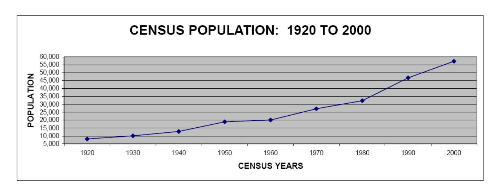

Figure 4.—American Samoa's total population from 1920–2000 (Statistical Yearbook, American Samoa, 2006).

The population of American Samoa is unevenly spread throughout three subdivisions: Eastern District, Western District, and Manu'a/Swains District. In the last two decades the population has shifted from the Eastern District to the Western District. The 2000 census data showed 32,435 people in the Western district (*Tafuna* to *Fagamalo*) and 23,441 people in the Eastern district (*Nu'uuli* to *Onenoa*). Manu'a District and Swains Island combined showed only 1415 people. The estimated population density for the entire territory is approximately 1191/mi2 (Woods and Poole Economics, Inc., 2007). Given the islands' steep terrain, only 30 percent of the islands' land is habitable, making actual population density closer to 2800 persons/mi2 , with most people living along the coast. (Coral Reef Advisory Group, 2007)

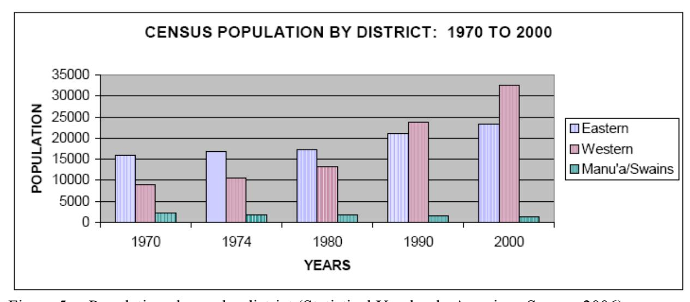

Figure 5.—Population change by district (Statistical Yearbook, American Samoa, 2006).

The Manu'a and Swains Islands are an exception to the overall population trends exhibited in Tutuila (Fig. 5). Population density in the Manu'a islands during the 2000 census was only 20 persons/km2 compared to 411 in Eastern District and 444 in the Western District (Statistical Yearbook, American Samoa, 2006). In fact, the population in Manu'a and Swains has been

decreasing steadily since 1950, when it reached a high of 2983. The 2000 census estimated the population of these islands as 1415 (only about 40 of whom live on Swains), a level lower than the 1900 population estimate of 1756 people (Statistical Yearbook, American Samoa 2006). In terms of the proportion of the total population of American Samoa, the role played by Manu'a and Swains Islands has decreased steadily over the past century. Manu'a and Swains were home to approximately 30% of the total population of all islands in 1900, but contained only 2.5% of the population in 2000.

American Samoa's population is young. According to census data, the median age is approximately 21 years, compared to about 33 years for the United States. The average household size is approximately 6 persons, and 81% of households have at least one child below the age of 18. This young population creates needs for many public services for early childhood education, health and medical care, family advocacy and employment opportunities. The 2000 census reports that, unlike most large developed countries where females outnumber males, American Samoa has a gender ratio of about 104 males for every 100 females, a likely result of the large number of male immigrants working in the tuna canneries.

According to the U.S. Department of Commerce, the American Samoa labor force participation rate in 2000 was 52%. By comparison, the overall U.S. rate was approximately 67% in 2000 (U.S. Department of Commerce, 2000). Subsistence activities provide a significant contribution to households; 16% of the population over 16 years of age is engaged in some form of subsistence activity, and 44% of those engaged in subsistence activity have no other source of employment (Table 2).

Table 2.—Labor force and employment structure.

|                                 | 1990   |         | 2000   |         |
|---------------------------------|--------|---------|--------|---------|
| Subject                         | Number | Percent | Number | Percent |
| Persons 16 yrs. and over        | 27,991 | 100     | 33,945 | 100     |
| In labor force                  | 14,198 | 51      | 17,664 | 52      |
| Civilian labor force            | 14,187 | 51      | 17,627 | 52      |
| Employed                        | 13,461 | 48      | 16,718 | 49      |
| Also did subsistence activity   | 1,608  | 6       | 2,904  | 9       |
| Unemployed                      | 726    | 3       | 909    | 3       |
| Percent of civilian labor force |        | 5.1     |        | 5.2     |
| Armed forces                    | 11     | 0       | 37     | 0       |
| Not in labor force              | 13,793 | 49      | 16,281 | 48      |
| Subsistence only activity       | 543    | 2       | 2,276  | 7       |

(Source: U.S. Census, 1990 and 2000: U.S. Census of Population, 1990 and 2000)

The Manu'a Islands (and Swains Island) are characterized by very different demographic and employment trends than the main island of Tutuila. While the combined population of these islands totals less than 3% of American Samoa's total population, the islands still hold a unique status from the point of view of a "fishing community." On the Manu'a Islands, more than 40%

of the population (over 16 years of age) engages in subsistence activities for a living. On Swains Island, this number reaches 55% (US Census, 2004). Kilarski et. al. (2006) found the level of subsistence fishing on Olosega (one of the Manu'a Islands) to be the highest of all villages surveyed in their study.

Unlike the youthful structure of the population on Tutuila, the population of the Manu'a Islands is characterized by a high proportion of older persons. Twenty-four percent of the Manu'a population is 45 years old and above, compared to only 16 percent of Tutuila's population. Although the percent of the population under 15 years of age is fairly similar throughout American Samoa, only 34% of the population of Manu'a represent ages 15–44, compared to 44% of Tutuila's population. This is largely caused by out-migration from the smaller islands to Tutuila or other locations for secondary schooling and employment opportunities.

#### **Health Issues**

Risk factors for noncommunicable diseases are very high for the majority of the population in American Samoa, a trend found in many Pacific Island countries (WHO, 2007a). Diabetes, in particular, has become one of the most daunting public health challenges in the Western Pacific region (WHO, 2008a). Diabetes is positively correlated with a number of risk factors including abdominal obesity, unhealthy blood lipid levels, and hypertension. These risk factors are associated with unhealthy lifestyles and behaviors such as smoking, diets high in saturated fat and salt, and lack of physical activity. Pre-diabetes, or impaired glucose intolerance, in Pacific Island populations is particularly high with American Samoa (47.3%), Cook Islands (23.7%), Marshall Islands (27.3%), Nauru (20.4%), Samoa (21.5%), and Tokelau (33.4%) facing a diabetes pandemic (WHO, 2008b).

While there appears to be a genetic predisposition towards obesity among Pacific Islanders that may subsequently predispose them to Type 2 diabetes (Bindon and Baker, 1996), American Samoa has a disproportionate number of people with Type 2 diabetes mellitus compared with neighboring Samoa or the U.S. mainland (Elstad et al., 2007). A 2004 World Health Organization survey (WHO, 2007b) concluded that 52% of men and 42% of women aged 25 to 64 years in American Samoa had Type 2 diabetes. The survey included individuals who either (1) reported that they had received a diagnosis of diabetes from a health care provider and currently took diabetes medications, or (2) had a fasting glucose level of ≥ 110 mg/dL as measured by survey technicians.3 The latter group was referred to as Newly Diagnosed Diabetics.

The higher rates of Type 2 diabetes in American Samoa—compared to neighboring independent Samoa—indicate lifestyle is likely a highly significant contributing factor. According to one explanation cited in the WHO study, lifestyles in Samoa are more physically demanding, with fewer people employed in sedentary jobs, and there is lower reliance on imported, energy-dense processed foods compared to American Samoa. The authors cited other

3 WHO (2007b) noted that prior to 1999, a blood glucose level of 120 mg/dL was the accepted cutoff value used to diagnose diabetes. Using this higher standard, the prevalence of diabetes in the study population would be 30%, overall, with 31% for men and 28% for women.

research on contemporary diets in American Samoa, which are characterized by traditional foods high in fat and starch such as coconut cream and taro. These are consumed along with modern processed foods high in starch and fat such as rice, mutton flaps, corned beef, snack foods, and canned soda, and with meals from fast food restaurants that are now prevalent on Tutuila.

Obesity is an associated issue. For males living in American Samoa the prevalence of obesity was estimated to have risen from 32% in 1976 to 63% in 2002, and for females to have risen from 58% to 75% (Keighley et al., 2007). More recent data (WHO, 2007b) suggest that the prevalence of obesity continues to rise, with 69% of males and 80% of females in the study population having a body mass index ≥ 30 kg/m. WHO (2007b) concluded that, "Diabetes is a serious condition that is a risk factor for renal failure, blindness, stroke and ischemic heart disease… Together with the high prevalence of risk factors for diabetes, such as obesity and physical inactivity, in American Samoa, this data suggests that a large proportion of the population is at risk for serious diabetes-related illnesses."

#### **Economic and Employment Overview**

American Samoa's economy is dependent on two, primary externally funded income sources: the American Samoan government (ASG), which receives significant operational and capital grants from the Federal Government (\$117 million of \$182 million total government revenue in FY 2005) (Statistical Yearbook, 2006), and the two tuna canneries on the main island of Tutuila. Tuna exports in 2006 totaled 20.7 million cases (about 147 thousand tons) valued at \$431.5 million (Department of Labor, 2008). The canneries and grants from the U.S. Federal Government account for more than 90% of American Samoa's economic base (Malcolm D. McPhee and Associates, 2008). Taxes and fees paid by the tuna canneries are another significant source of revenue for the government. These two primary income sources, in turn, support a services sector that derives from and complements the first two (Department of Labor, 2008).

American Samoa's total exports in 2006 were valued at \$438.5 million (U.S. Department of Labor, 2008). Canned tuna comprises the bulk of exports, which also include a limited quantity of grass mats and other handicrafts. Agricultural production in American Samoa includes taro, coconuts, bananas, oranges, pineapples, papayas, breadfruit, and yams; additional food must be imported. Shipping and transferring services connect American Samoa with the mainland United States, Samoa, Fiji, Hawaii, Australia, New Zealand, and Japan (U.S. Department of Labor, 2007a).

An estimated 17,395 people were employed in American Samoa in 2004. The ASG, which includes all general government departments, American Samoa Telecommunication Authority, LBJ Tropical Medical Center Authority, American Samoa Power Authority, and American Samoa Community College, is the territory's single largest employer. The world's two largest tuna processing plants are located in Pago Pago Harbor, serving as the backbone of the private sector (see following section for more detail). In 2004, 34% of the territory's population was

employed by the ASG, 27% by the canneries, and 39% by private industry or other sectors (Statistical Yearbook, American Samoa, 2006).

Based on 2000 census data, American Samoa's median household income was reported as \$18,219 in 2000, with 58% of families living below the national poverty level. The percentage having higher household incomes (> \$50,000) declined from 20% in 1990 to 12% in 2000, while those with lower household incomes (< \$10,000) increased from 22% to 25% during the same period (Table 3). While median income is much lower than the United States average (U.S. Census, 2000), it is still almost twice the average of other Pacific Island economies (DOI Office of Insular Affairs, 1999). The cost of living in American Samoa is generally lower than in the United States, with the majority of household income spent on store-bought food and very little spent on housing because of the islands' land tenure structure4 (DOI Office of Insular Affairs, 2007). Based on American Samoa's strong cultural traditions, church and family ceremonies comprise a significant portion of regular household expenditures. In 1995, 41% of regular household expenditures went towards important sociocultural events such as weddings, funerals, bestowment of *matai* titles, and additional church-related expenses (Statistical Yearbook, American Samoa, 2006).

Table 3.—American Samoa household income.

|                        |            | 1990       | 2000       |            |  |
|------------------------|------------|------------|------------|------------|--|
|                        | Number of  | Percent of | Number of  | Percent of |  |
| Annual Income Category | households | households | households | households |  |
| All income levels      | 6,607      | 100        | 9,349      | 100        |  |
| < \$2,500              | 377        | 5.7        | 509        | 5.4        |  |
| \$2,500 – \$4,999      | 370        | 5.6        | 250        | 2.7        |  |
| \$5,000 – \$9,999      | 707        | 10.7       | 1,585      | 17         |  |
| \$10,000 – \$14,999    | 548        | 8.3        | 1,535      | 16.4       |  |
| \$15,000 – \$24,999    | 1,103      | 16.7       | 2,079      | 22.2       |  |
| \$25,000 – \$34,999    | 872        | 13.2       | 1,226      | 13.1       |  |
| \$35,000 – \$49,999    | 667        | 10.1       | 1,029      | 11         |  |
| \$50,000 – \$74,999    | 852        | 12.9       | 739        | 7.9        |  |
| > \$75,000             | 476        | 7.2        | 397        | 4.3        |  |

Sources: 1990 and 2000 American Samoa Census, U.S. Bureau of the Census.

The minimum wage for various industries in American Samoa remained stagnant from 2002 until 24 July 2007, with fish canning and processing workers earning a minimum \$3.26 per hour. The Fair Minimum Wage Act of 2007 increased the minimum wage to \$3.76 (Department of Labor, 2007b). In spite of resistance from the islands' government (Honolulu Advertiser, 2007), which feared that higher wages are unsustainable in the islands' current economy, American Samoa was not granted exemption from the new wage law. All industries

4 For the majority of households, housing costs amount to less than 10% of monthly income (U.S. Census, 2000). Comment: Not in Reference; 2004 in Reference.

in American Samoa are subject to an increase in minimum wage standards; the minimum wage in the territory will increase \$ 0.50 cents each year until the standard U.S. minimum wage of \$7.25 is reached. As will be explained, these and other changes are causing the canneries (the second largest employer in American Samoa) to review the future of their operations on the islands (Sagapolutele, 2007).

Guest workers for both skilled and unskilled labor make up an important component of American Samoa's economy; 43% of the American Samoan population in 2000 was born outside of American Samoa (U.S. Census Bureau, 2004). The demand for foreign skilled labor is based in part to the unavailability of cost-efficient, skilled local workers (many of whom emigrate for higher paid employment opportunities) but is also said to be the result of a perception by some employers that American Samoans are less productive, unwilling to undertake employment in certain areas, and unwilling to work for minimum wages (Doane and Gray, 2006).

Because employment opportunities are somewhat limited in American Samoa, many residents seek work in Hawaii, on the U.S. mainland, and elsewhere. An estimated 70,000 Samoans5 live in the United States, including about 20,000 in Hawaii. Military service is a common employment option for American Samoans; American Samoa has one of the highest military recruitment rates in the United States, as well as the highest per capita rate for Iraq casualties (Statemaster, 2009). Some employment opportunities are limited as a result of low education levels; in 2000, only 66% of American Samoans age 25 and older had a high school diploma, and only 7.4% had a Bachelor's degree.

Unlike its neighbor to the west, tourism does not play a large role in American Samoa's economy. American Samoa did not share in the tourism boom experienced in Western Samoa in the 1980s; in fact, a significant drop in tourist arrivals occurred in the territory during the 1990s. Much of the tourist visitation to the islands is periodic day visits by cruise ships, which provide only a small input to the economy. Tourist arrivals declined from more than 10,000 in 1991 to 5800 in 1995. By the year 2000, tourist visitation had increased slightly to 6333, and was at 7762 in the year 2006 (ASG Department of Commerce, 2006). Tourism to American Samoa originates predominantly from the United States (52%), followed by New Zealand (30%), and Australia (9%). The composition of business travel resembles the tourism pattern with the addition of Samoa: the United States contributing 62%, New Zealand 19%, Australia 6%, and Samoa 5% (ASG Department of Commerce, 2006).

Establishment of the National Park of American Samoa in 1993 was a step towards developing ecotourism attractions. This is the only national park in which the Federal Government does not own the land. Instead, it leases the land for 50 years from the American Samoa Government on behalf of the 8 villages in the park. The 8000-acre park spreads across three islands and includes 1000 acres of coral reef habitat. Village-based tourism, particularly on Ta'u, is also encouraged to allow visitors to experience Samoan culture. Economic incentives are provided to neighbor villages to maintain and protect park resources.

5 This number includes individuals from both America Samoa and independent Samoa.

American Samoa's narrow economic base does not generate a level of local revenues adequate to provide essential public services to its citizens. To meet these needs, the Office of Insular Affairs (OIA) annually provides direct grant support for American Samoa general government operations. In 2007, OAI allocated approximately \$23 million for operations, plus substantial additional funding for infrastructure and other types of support activities, including marine management (DOI Office of Insular Affairs, 2007a).

# **Role of the Canneries6**

Tuna canneries first began operating in American Samoa in 1954. Today, the canneries comprise the largest private-sector source of employment in the region. As the principle industry in the territory, the tuna canneries also shape other aspects of the American Samoan economy. For example, many private-sector jobs in the territory involve delivery of goods or services to tuna processors, and economic growth in the consumer retail and service sectors is tied to tuna industry expenditures and the buying patterns of cannery workers.

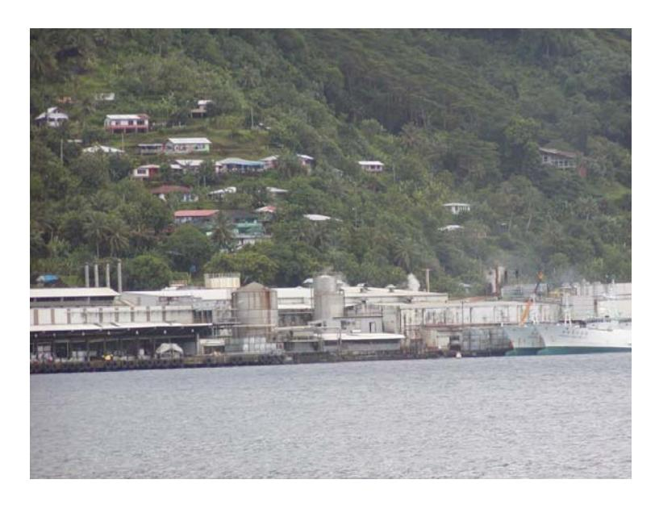

Figure 6.—Tuna canneries in Pago Pago (A. Levine, 2007).

The deepwater harbor at Pago Pago has given American Samoa a natural advantage with respect to landing fish for processing (Bank of Hawaii, 1997). This harbor, combined with four special provisions of U.S. law, has formed the basis for the success of American Samoa's canneries. The territory is exempt from the Nicholson Act, which prohibits foreign ships from landing their catches in U.S. ports. American Samoan products can enter the United States duty-free if less than 50% of their market value is derived from foreign sources.7 The parent

 6 Much of the information in this section was derived from the U.S. Department of Labor website, accessed at: http://www.dol.gov/esa/whd/AS/sec3.htm, as well as WPacFIN, accessed at: http://www.pifsc.noaa.gov/wpacfin/. 7 Headnote 3(a) of the US Tariff Schedule.

companies of American Samoa's fish processing plants also enjoy special tax benefits.8 Additionally, until the new minimum wage act went into effect in July 2007, employers in American Samoa were exempt from Federal Minimum Wage standards, allowing the territory to compete with cheap labor available in other Pacific Islands.

American Samoa is homeport to a distant-water fleet of large commercial vessels that delivers tuna to the canneries in Pago Pago. The captains of the distant-water vessels fish beyond American Samoa's Exclusive Economic Zone (EEZ) in the central and western Pacific Ocean. Annual tuna landings processed by the canneries in American Samoa have run about 160,000 to 220,000 tons in recent years. Skipjack tuna accounted for most of the deliveries, followed by yellowfin and albacore tuna. The current fleet consists primarily of U.S. purse seiners that fish for skipjack and yellowfin tuna, U.S. trollers that fish for albacore tuna, and foreign longliners that fish for albacore, yellowfin, and bigeye tuna. In 1995, small local longliners began selling part of their catch to the canneries. By the year 2000, the fleet of large local longliners had begun selling most of their catch of primarily albacore to the canneries. In addition, transshipments of tuna caught by purse seine are delivered to American Samoa by freezer vessels, and foreign sashimi tuna longliners occasionally deliver part of their catch to the canneries.

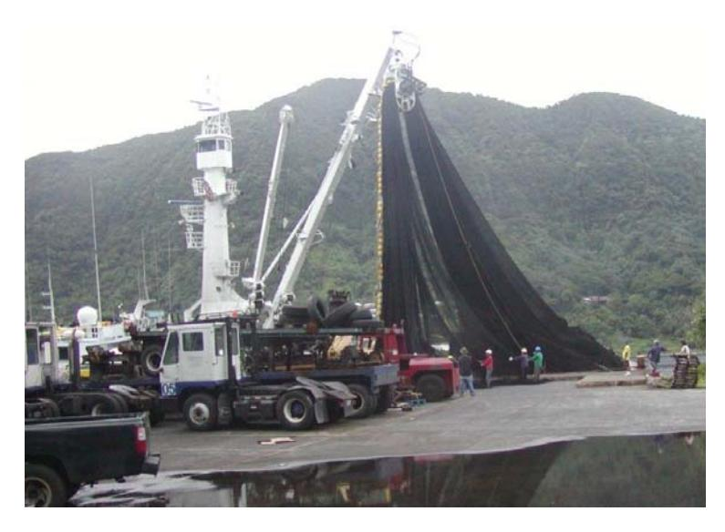

Figure 7.—Purse seine boat and net in Pago Pago Harbor (A. Levine, 2007).

Of the three major companies that dominate the U.S. tuna market, two are engaged in the processing of canned tuna in American Samoa. These are StarKist Samoa (a subsidiary of StarKist Seafood, recently purchased from Del Monte by Korean fishing company Dongwon Enterprise) and Chicken of the Sea (owned by Thai Union Frozen Products of Bangkok). The StarKist Samoa cannery is the largest tuna cannery in the world, producing more than 60% of American Samoa's canned tuna; the rest is produced by Chicken of the Sea. StarKist is the leading brand of canned tuna sold in the United States, followed by Bumble Bee and Chicken

8 Both canneries in American Samoa will be beneficiaries of the corporate financial bailout announced by the U.S. Federal Government in 2008, and will have their tax breaks, which expired at the end of 2007, reinstated and backdated (Radio Australia, 2008).

of the Sea. Chicken of the Sea is the largest tuna canner and exporter in Thailand and the second largest in the world.

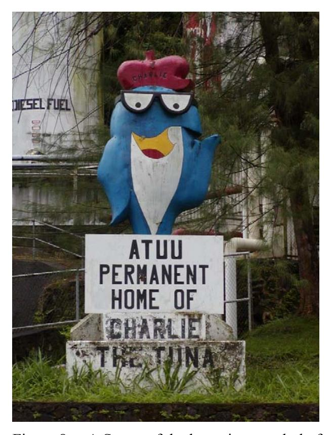

Figure 8.—A Statue of the long-time symbol of Startkist, Charlie the Tuna, reflects the dominant economic and social role of the StarKist Cannery in the village of Atuu, in the Pago Pago Harbor area (A. Levine, 2007).

American Samoa's two canneries employed approximately 4700 workers during 1991–1993. By 2002, the number of employees had increased to 5016. In fall 2004, the average hourly wage for the 4738 employees in this industry was \$3.60 (Department of Labor, 2007b). To meet the growing demand for cannery labor (as well as the possible need for additional labor forces with the potential opening of a telephone call center in the territory), American Samoa instituted a guest worker program in 2007 to allow citizens from neighboring Samoa to work for limited periods in American Samoa (Star Bulletin, 2007). The majority of cannery workers (as many as 90% according to a 1997 Bank of Hawaii report) are not American Samoa citizens but come mostly from neighboring independent Samoa and Tonga, and a significant portion of their income is spent off-island or sent home as remittances. Sponsors of foreign workers are responsible for medical bills, taxes, and other public debts of the guest worker (Doane and Gray, 2006).

The increased canning capacity in the U.S. offshore territories occurred at a time when tuna market-share was increasingly shifting towards low-wage countries in Southeast Asia. This was a result of federal restrictions to minimize incidental mortality of dolphins in tuna purse seine operations. Public concern and legislative activity over the killing of dolphins that swim over schools of yellowfin tuna caused fishermen to move from the eastern to the western Pacific, where dolphin generally do not swim with tuna schools. This caused shrinkage in the tuna industry in the continental United States, Hawaii, and Puerto Rico, which received much of their fish from the eastern tropical Pacific, putting them at a disadvantage in access to dolphin-safe inputs for production.

American Samoa and southeast Asian countries held an additional advantage for tuna processing in their lower wage costs. On April 1, 1991, the Federal minimum wage increased from \$3.80 to \$4.25 an hour. While some lower-wage industries in Puerto Rico were granted a gradual phase-in to this higher minimum, the tuna canning industry was not. Meanwhile, Thailand and other countries with low-wage labor were exporting lower-priced canned tuna to the United States. American Samoa, while it still had higher minimum wage standards than most of Southeast Asia, held a competitive advantage of being exempt from the Federal minimum wage until recent legislation in 2007, although current wages remain temporarily well below the federal minimum.

In April 2008, StarKist announced cost-cutting measures in response to the minimum wage increases. The measures included calculating vacation and holiday pay at 2006 wage rates, revising overtime policies, and eliminating some transportation subsidies for workers. StarKist also said that because of current conditions it would agree only to a required tonnage of 238 tons per day and 1485 employees, compared to the 450 tons and 2520 employees provided for in the company's expiring agreement with the American Samoan Government (Donato, 2008). In November of the same year, the company announced plans to lay off 20 workers and reduce some worker benefits, provoking outrage among territorial leaders who had worked hard to ensure the continuation of the company's tax-exempt status to ensure jobs would continue in the territory (Samoa News, 2008).

#### **Future Prospects**

The viability of the tuna industry in American Samoa depends on its continued duty-free status, tax exemption, competitive wage scale, and continued use of the harbor by fishing vessels whose catch comes from outside of American Samoa's EEZ. Without tax exemptions, and with the growth of foreign competitors with lower payroll costs, the future of the canneries could be in jeopardy (Pacific Business Center Program, 2009). A change in regulations restricting the landing of catch by other Pacific-island states could mean fewer fish for the American Samoan canneries, which are highly reliant on fish caught in other regions of the Pacific. Despite ongoing concern about the potential closure of the canneries, cannery operations are currently expanding, even with the gradual phase-in of increased minimum wage standards. StarKist Samoa is scheduled to shift production of pouched tuna products from Ecuador to American Samoa and recruited additional workers to meet increased production demands (Pacific Magazine, 2007).

The American Samoan Government has sought to diversify its economy, particularly in light of the threat of potential cannery closure. The Department of the Interior recently signed a grant to establish a workforce study designed to help the territory attract private sector investment. An island-based telephone call center is planned, and the DOI committed an initial \$3 million in 2008 to connect American Samoa to a fiber optic cable needed for this type of project. Two call center companies, InfoTech and Mindpearl, have stated that each could employ up to 2000 workers in the future (Tapuitea, 2008; Radio New Zealand International, 2008). A recent University of Hawaii study found that there are likely 1500–2000 people in American Samoa qualified for this type of work, with potential additional labor sources from independent Samoa and Samoans living in other parts of the United States. (Sagapolutele, 2008).

Cultural and ecological tourism has also been considered as a priority industry for development. However, growth of the tourist industry to date has been limited by the islands' lack of infrastructure, as well as the limited regular transportation to and between the islands.

Territorial efforts continue in an attempt to develop American Samoa's private sector and promote economic development. The islands have many attractive qualities, including access to a U.S. market with English-speaking residents, reliable power and telecommunications, improving roads, a deep harbor in a strategic location, and a functioning legal structure (Doane and Gray, 2006). Yet the islands' remote location, limited infrastructure, and relative lack of specialized labor skills have hindered economic development in the territory (Osman, 1997). The lack of educational attainment and/or experience of many American Samoans may contribute to the low availability of skilled local labor. Vocational training opportunities are limited on the islands, and many who obtain a higher education go off island to seek higherpaying employment opportunities (Doane and Gray, 2006).

As part of an island economy, American Samoa's businesses also face transportation challenges, and the possibility of unpredictable external events such as hurricanes and rising fuel prices. Given these limitations, participation in fisheries activities will continue to be an important resource for American Samoan livelihoods.

#### **III. THE FISHERIES OF AMERICAN SAMOA**

#### **Historic Fishing Practices**

Only limited information exists regarding fishing practices and fish catch in American Samoa before the second half of the 20th century. Some anecdotal references to the size and productivity of inshore resources exist but are lacking in specificity. Missionary accounts state that "the coast abounds with fish and turtle, and the Samoans are exceedingly expert in catching them" (Williams, 1840: 130). The high value of metal fishhooks was documented as early as the 18th century by members of the Wilkes Expedition. Upon landing in American Samoa, the expedition members were immediately surrounded by Samoans wishing to trade for fishhooks (Dye and Graham, 2004). Archaeological evidence and interviews in the Manu'a islands indicate that historic and prehistoric nearshore fish catches were similar in composition to present-day catches, indicating some consistency in (and sustainability of) this small-scale, largely subsistence fishery over the past 1000 to 3000 years (Craig et al., 2008).

Herdrich and Armstrong (2008) describe fishing practices in American Samoa prior to 1950, with a focus on the 1900–1950 period. Common fishing techniques such as intertidal gleaning, diving, rod and reel, netting and trapping (including communal fish drives), and boat-based fishing were practiced throughout the Samoan Islands, although there were slight variations in practices across villages and associated marine resources. The authors note that the family, rather than the individual, was the central unit of society, and unlike the typical situation in capitalist societies, emphasis was given to reciprocity rather than individual accumulation. The generous distribution of food characterized social events, and fish and marine products comprised a significant component of these events. Herdrich and Armstrong also document a gradual shift from a heavy reliance on fishing to an increasing reliance on canned fish and other foods, even as early as the late 1930s (Coulter, 1941; Holmes, 1974).

The village customarily controlled usage rights to a lagoon and its resources. Individual and family fishing occurred on an almost daily basis, and villages sometimes organized group fishing for certain species. On some occasions, men fished outside the lagoons under leadership of a fishing expert, a *tautai.* Certain fish were reserved for the chiefs, and restrictions were occasionally made regarding the lagoon and pursuit and use of its resources. All of these practices were under the control of the village and its decision-making body, the village *fono*.

*Tautai* were the primary individuals in charge of village fishing in the past, a practice which continues in some villages today. This was particularly the case for fishing from bonito boats9 or for species that required group fishing efforts. Large catches were not kept for personal consumption, but distributed by the village chiefs or village council among village members, with prized portions generally going to those with highest status (Severance and Franco, 1989). How a fish was distributed varied by species. For example, the head of a bonito was reserved for the high chief and the sides for the talking chiefs (Hiroa, 1930), while the head of the shark was reserved for village *aumaga*, or young men (Mead, 1930). Certain size classes or species

9 These boats were designed for pelagic fishing in the Samoa Islands and were considered a specialized craft whose construction involved great skill and ritual. The last bonito boat was constructed in Ta'u in the 1970s, and today none of these boats are active in American Samoa.

of fish, such as skipjack tuna, had to be given to the high chief from the territory from which they were caught; failure to do so could result in severe punishment. For instance, Gray (1960) provides an account from the early part of the 20th century of a fisherman who cooked his skipjack catch for his family rather than offering it first to the high chief for consumption and distribution:

A man named Fagiema… who was either unititled10 or a *matai* of small consequence, went fishing and caught a skipjack. There were a number of fish which were *sa*, that is forbidden to all except the high chief of the vicinity in which they were taken, and among them was the skipjack… It was Fagiama's duty to take his catch to High Chief Letuli of his county and leave it to him to have what he wanted for himself and give the rest to his talking chiefs to distribute as they saw fit, including a portion for the fisherman. Fagiema, however, took his fish home, and his family were in the act of cooking it for dinner when Letuli passed by. When he saw what was going on… [the chief] directed his young men to burn Fagiema's house to the ground, to uproot all of his taro and banana patches, to evict the culprit and his family from the community, and to see to it that they should not raise crops or fish again at any future time. In short, he condemned Fagiema and his family to either exile or starvation. (Gray, 1960, p. 132)

The U.S. Naval administration intervened on Fagiema's behalf, however, requiring the High Chief compensate him for his loss. This is cited as one of the earliest examples of erosion of Samoan customary law through direct American intervention. While Chief Letui's actions were entirely within his rights under Samoan culture, they conflicted with American law, thus his authority was undermined. While many vestiges of traditional Samoan custom remain in American Samoa today, some now formalized in the territory's constitution, a number of the islands' traditional systems have eroded over time.

Fishing has been an important part of Samoan culture since before Western contact, but was generally not conducted as a commercial activity until the introduction of modern technology in the 1950s and 1960s. During and shortly after World War II, a ban on offshore fishing activities in American Samoa was put into place for security purposes. Fishing practices then changed in the 1950s and 1960s when outboard engines were introduced, allowing American Samoan boats to go farther and faster. However, this also made it necessary for boat owners and operators to sell a portion of their catch to pay for fuel and engine maintenance. To a certain extent, these changes disrupted traditional systems of fishing and fish distribution within villages, in some cases shifting fishing activities from a subsistence, cultural, and recreational activity to a more commercial venture.

Up to this time, there were no local commercial fishing vessels or sport-fishing craft in American Samoa, and the concept of fishing to produce a marketable product for monetary gain was seen as incompatible with traditional Samoan cultural values (Itano, 1996), in which sharing of fish catch was extremely important. However, the loss of other traditional values over time, as well as the introduction of a cash economy based primarily on government jobs

10 Lacking a *matai* title, and with it the higher social standing and influence in his village.

and cannery employment contributed to a decreased reliance on traditional, subsistence fishing and allowed commercial fishing to develop on the islands.

#### **Nearshore Fishing**

Nearshore fisheries, particularly coral reef-related fisheries, are of fundamental sociocultural and dietary importance for many Pacific Islanders, including American Samoans. At the same time, there is concern about the risk of overexploiting nearshore marine resources in the narrow coastal zones of many Pacific island countries as human populations increase and technology increases the fishing capacity of artisanal fishers (Dalzell et al., 1996). While not as commercially significant as pelagic fisheries are in most of the tropical Pacific, nearshore fisheries have a far greater social and economic impact on the lives of local communities (Dalzell et al., 1996).

Traditionally, Samoans spent much of their time fishing on reef flats or near the reef edge. This practice provided food for the family and a source of recreation. Customarily, only men fished, and women and children waded on the reef at low tide with sharp sticks and knives to gather small fish and invertebrates. Women were not permitted, by Samoan custom, to fish outside the reef.

Today, American Samoa's nearshore fishing is focused on the narrow fringing coral reef that partially surrounds the islands, the top of which is exposed in many areas at low tide throughout the year. A diverse array of fish and shellfish is harvested by local residents on an almost daily basis from the reeftop and adjacent shallow waters (Craig et al., 1993). Most fishing is accomplished by individuals on foot in areas adjacent to their village. While the gender division in fishing is not as strict as it was in the past, women still predominantly engage in gathering shellfish and small fish in the intertidal zone, while men fish farther off shore.

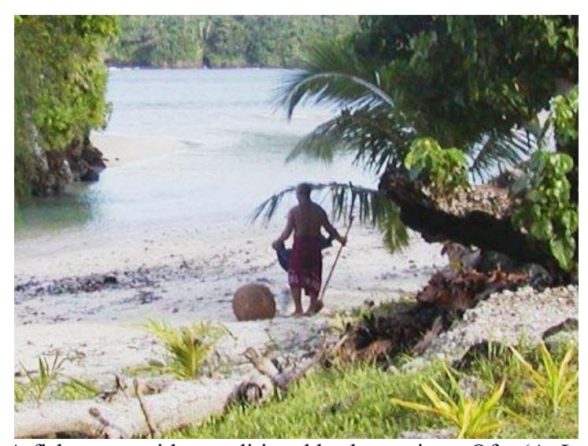

Figure 9.—A fisherman with a traditional basket weir on Ofu. (A. Levine, 2007)

Nearshore fishing in American Samoa is largely for subsistence. In 2005, a survey of 425 people from 34 villages in American Samoa found that most respondents felt that subsistence fishing was an important use of coral reef resources (Kilarski et al., 2006). Fifty-five percent of respondents fished for subsistence to some degree, although most people fished only infrequently. Of those who did fish, 72% fished once a week or less (44% of these fished only 1–2 times per month), while 16% reported fishing ten or more times per month. This means that approximately 9% of the population surveyed could be considered "frequent subsistence fishermen." Approximately half of the respondents stated that they fished for recreation, although this was also fairly infrequent, with 71% of these individuals fishing once a week or less. Fishermen also fished infrequently for cultural purposes, although cultural, subsistence, and recreational fishing categories are difficult to distinguish as one fishing outing could be motivated by all three reasons.

Kilarski et al. (2006) also found that American Samoans valued fish apart from their use as food; the majority of survey respondents indicated that fish were important not just for food and cultural use, but for maintenance of a healthy ecosystem (Table 4)11.

Table 4.— Survey responses (percent) on the degree of importance of fish for various uses. (Kilarski et al., 2006)

|                         | Uses of Fish |        |         |            |                 |                 |                           |
|-------------------------|--------------|--------|---------|------------|-----------------|-----------------|---------------------------|
| Degree of               | For          |        |         | For        | For Cultural | For Aquarium | To Maintain Healthy |
| Importance              | Food         | To Buy | To Sell | Recreation | Use             | Trade           | Ecosystem                 |
| Important               | 90           | 32     | 46      | 45         | 73              | 25              | 91                        |
| Somewhat Important   | 5            | 36     | 19      | 16         | 13              | 20              | 4                         |
| Neutral                 | 2            | 2      | 5       | 4          | 3               | 6               | 1                         |
| Somewhat Unimportant | 1            | 5      | 3       | 3          | 1               | 4               | 1                         |
| Unimportant             | 2            | 24     | 26      | 32         | 8               | 44              | 3                         |
| No Response          | 0            | 0      | 1       | 1          | 1               | 1               | 0                         |

11 Although a small number of residents also cited the importance of fishing for the aquarium trade, there is no real commercial aquarium trade in American Samoa, so the response is likely based on a misperception, or refers to collection of fish for personal aquariums.

In a previous socioeconomic survey of 121 residents in 10 Tutuila villages, Turner (2005) studied how residents valued coral reef resources. She found that most people perceived coral reefs as an important source of food (fish), while few mentioned ecosystem or recreational benefits. In an economic valuation of American Samoa's coral reefs, Jacobs (2004) found that the coral reefs and mangroves of American Samoa provided only limited direct use benefits from subsistence fisheries and indirect shoreline protection. However, they provided considerable nonuse benefits related to social, cultural, and biodiversity aspects of coral reefs and mangroves to residents, visitors, and the U.S. public.

#### **Nearshore Fish Catch and Abundance**

While commercial catches of large pelagic and bottomfish fisheries are reasonably well documented in the Pacific Islands for recent periods, catches of small-scale, artisanal and subsistence fisheries are often not monitored by local fisheries agencies (Zeller et al., 2006). The American Samoa Department of Marine and Wildlife Sources (DMWR) began monitoring the shoreline fishery fronting 22 villages along the southern shore of Tutuila Island in 1990, but the inshore creel survey was discontinued temporarily in 1996. The primary fishing methods documented in nearshore creel surveys in 1991 included rod and reel (accounting for 37% of the annual catch), handline (25%), free diving (14%), gill netting (9%), collecting at low tide (8%), and throw netting (5%). (Craig et al., 1993). A later study conducted by Sauafea et al. (2000) in 11 American Samoan coastal villages found that 29% of village respondents generally fished with spears, 25% used fishing poles or rod and reel, 19% engaged in collecting activities, 7% used nets, and 20% used traditional or other methods.

According to DMWR official statistics, the estimated annual harvest of shoreline resources in 1991 was approximately one-fifth as much as the landings of the offshore fishery. An evaluation of Inshore Creel Survey data collected from July 1990 to December 1993 found that fishing activity rates were higher during the day than at night. This could be due, in part, to the closure of some night fishing spots, such as the harbor area, as well as the difficulty of documenting nighttime activities. Night fishing was limited to the outer harbor and exposed reef areas. Like rod-and-reel fishing, handline fishing was not observed in the inner harbor area. Fishing with bamboo poles typically occurred on the exposed reef and outer harbor areas during the day, but occurred only on the outer harbor areas at night. Collecting was not observed in any of the inner harbor areas due to the lack of productive reefs there. Spearfishing was observed in all three habitats within the survey area.

The WPacFIN web site (http://www.pifsc.noaa.gov/wpacfin/as/Pages/as\_coll\_4.php) describes improvements made to the shore-based creel survey since 1996. In 2002, the survey resumed and expanded coverage of the Nu'uuli to Lauli'i route to include the eastern and western ends of Tutuila's South Shore. A systematic, random sampling program was adopted which stratified fishing activity by type of day (weekday or weekend/holidays, excluding Sundays), time of day (day or night), and fishing method. In August 2004, the 2002–2003 sampling protocol was further improved by having three nonoverlapping routes along Tutuila's South Shore. In 2006, a new route was created to include fishing activity at Sliding Rock in the village of Vailoa. All fishing activity seen during these survey runs was entered on a Shore Based Creel Survey

Participation Form including route, date, shift time, interviewers names, time and village of the observation, number of people in the party, number of people actually fishing, gear type, weather conditions and additional comments.

Interviews of fishers are collected between participation survey runs during a shift, or sometimes opportunistically, and detailed catch information is entered on a Shore Based Creel Survey Interview Form, which includes types of information from the other form as well as number of hours fished until the interview, species caught, whether the fish caught are kept or released, the number of fish caught, and length and weight of retained catch.

Sabater and Carroll (2008) noted that the inshore creel surveys have been effective at estimating levels of effort and changes over time because it was easy to detect fishermen from shore and determine the gear they used. They documented a significant decrease in the level of shoreline fishing effort over the past three decades. However, they did not report trends in catch for the shoreline fishery because of insufficient sample size due to the decreasing levels of fishing effort; it is difficult to interview fishermen about their catch because they are frequently either absent when interviewers are making their return runs or are still out fishing.

Long-term data on fish catch rates in American Samoa are extremely limited. Reconstructed catch rates by Zeller et. al (2006) estimated a very large decrease of 79% in annual nearshore catches (Fig. 6), from an estimated 752 tons in 1950 to 155 tons in 2002. Assuming this estimate is accurate, and taking into account growth of the human population on Tutuila, the per capita catch rate (not catch-per-unit-effort) would have declined from 36.3 kg/person/year in 1950 to 1.3 kg/person/year in 2002. However, this reconstruction is based on a number of unconfirmed critical assumptions and may not accurately reflect changes in fish catch over time.

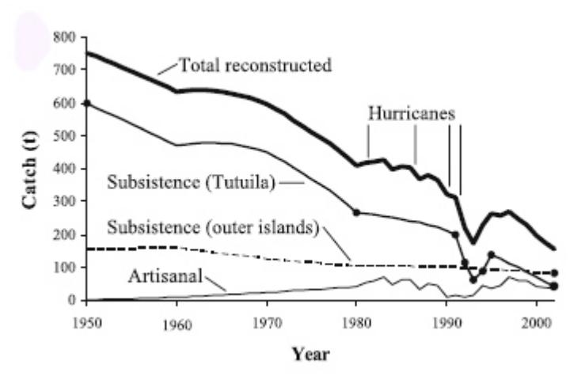

Figure 10.—A reconstruction of nearshore fish catch in American Samoa unrepresented in the official statistics from WPacFIN (Zeller et al., 2006).

While change in fishing effort over this entire time period has not been consistently measured, a significant downward trend in fishing effort has been recorded since the 1980s (Sabater, 2007), and a general trend of decreased fishing effort for food (Herdrich and Armstrong, 2008) has been documented. A decrease in fishing effort is particularly striking in light of the nearly

tenfold increase in the human population that has occurred on the islands over the same time period.

A trend of decreasing reliance on local fish as a food source is one that might be expected from a society that has been undergoing a shift from a subsistence-oriented economy to a cash economy. Changes such as a decrease in leisure time, a shift in dietary preferences towards store-bought foods, or a preference to buy fish at the market rather than expend effort in fishing (Levine and Saueafea-Leau, in prep.), may contribute to decreasing rates of fishing effort. Imports of reef fish from Western Samoa and Tonga also increase the supply of inexpensive fish available in local stores on Tutuila (Craig et al., 1993). The catch rate for the outer islands, which have not experienced the same increase in population, is not decreasing in the same way that it is on Tutuila, and has been independently reported as 58.6 kg/person/year, based on unpublished data collected locally (Zeller et al., 2006). Also, certain highly prized species, such as *palolo* (a polychaete worm) and *atule* (big-eye scad), continue to be harvested at high rates during their spawning periods (Craig et al., 2008).

Decreasing annual catches in American Samoa have led to differing assessments of the state of nearshore coral reef associated fisheries. A number of publications, including NOAA's 2005 State of Coral Reefs Ecosystem report, conclude that American Samoa's coral reefs are overfished (Craig et al., 2005), citing decreasing fish catches, lower fish biomass when compared with unpopulated islands (such as Swains and Rose Atoll), and a lack of certain large fish species as evidence. Sabater (2007), in a review of multiple studies, argued that this may not be the case for the past few decades. Based on fishery-independent data, he found that fishing effort in American Samoa has decreased steadily over the past 20 to 30 years, with reef fish populations remaining stable or increasing over this time period, and that larger species were found offshore and outside of normal study transects. The recent Coral Reef Ecosystem Monitoring Report for American Samoa (PIFSC-CRED, 2008) states that total reef fish and large fish biomass are lowest around the most populated islands in American Samoa (Tutuila, Ofu, Olosega, and Ta'u) and highest around the least populated (Swains and Rose). The authors state that this suggests a combination of anthropogenic stressors are likely impacting reef fish populations, including but not limited to fishing, coastal development, sedimentation, and pollution.

A study of the Ofu-Olosega fishery by Craig et. al. (2008) indicates that the Manu'a Islands continue to have a small-scale subsistence fishery12. It is predominantly a shoreline fishery, with occasional use of boats, and contributes an important component to village diets. Of the 71 kg/person annual per capita catch, 63 kg/person was consumed locally, and the remainder was shipped to family members on the main island of Tutuila. Fishing occurred steadily and at a low level throughout the year, with additional effort for seasonally available species such as *atule*, *i'asina* (juvenile goatfish), and *palolo*. Current harvest rates and yield were compared with archeological records showing consistency in long-term fish catch and pointing towards catch sustainability in the Manu'a fishery over time. This situation is facilitated by a declining human population on these outer islands and increased non-fishing employment opportunities. There were no full-time fishers on the island, and the authors state that this fishery appeared to

12 Store-bought food, though available on the Manu'a Islands, is more expensive and harder to come by than in neighboring Tutuila, which has more regular access to imported goods.

be shifting from a subsistence-oriented towards a recreational activity. In spite of the apparent sustainability of catch, however, the study authors state that the biomass of fish extracted from these small reefs (1400 kg/km of shoreline) and the scarcity of large fish and sharks indicate that this continuous, low-scale exploitation has had impacts on the coral reef ecosystem.

Given the limitations of available data, it is difficult to determine the precise long-term effects of fishing on American Samoa's nearshore fish populations. Interviewing island residents has enabled assessment of changes in the fishery over time. A 1994–1995 study of 100 residents in 50 villages on Tutuila focused on perceptions of change in three components of the fishery: reef fish, giant clams, and *palolo* worms (Tuilagi and Green, 1995). All respondents reported declines in the giant clam fishery, while nearly three-quarters reported a decline in reef fish and nearly half a decline in *palolo*. Greater declines were perceived on the north versus the south side of the island, likely due to recent hurricanes that had a greater effect on the north side.

Levine (2008) conducted interviews with 78 elder fishermen throughout Tutuila and the Manu'a Islands in 2007–2008. Sixty percent of the fishermen interviewed perceived reef fishing to have gotten worse (fewer fish and more effort to catch them) since they were young. This trend was more marked in Tutuila, which has a greater population and is much more developed than the outer Manu'a Islands. In Manu'a, 50% of the fishermen interviewed stated that the status of reef fishing has not changed since they were young, while 50% stated that reef fishing had become worse.

Trends in perception of the changes in fishing varied with different species. Fishermen perceived *atule* fishing to have declined over time (particularly in Manu'a), while *palolo* and giant clam were perceived as declining over time in Tutuila, but not in the Manu'a Islands. Populations of octopus and reef sharks, on the other hand, were largely perceived to be in stable or good condition on both islands.

Only six percent of elders interviewed in Levine's (2008) study cited overfishing as the reason for the decline in the quality of reef fishing. However, American Samoa's nearshore habitat has been affected by other human activities, past and present. The problem most commonly cited by elders was habitat deterioration (41 %). It was stated that in some cases deterioration was caused by past use of illegal fishing methods such as poisons or dynamite (21 %). Habitat destruction associated with development (waste, runoff, and pollution from construction and other human activities) was mentioned by 19% of respondents.13 In more developed Tutuila, it was seen as a significant problem, and in Manu'a construction of the wharf in Ta'u was cited as a specific issue. Hurricanes and natural disasters were cited as factors in all islands in the elder study, and an overall decline in marine biodiversity was noted. Because the decline in reef fish is considered worse in Tutuila than in Manu'a, respondents from Tutuila cited more reasons for the decline than did elders in Manu'a.

Legislation is currently being developed in American Samoa to ban all fishing of certain species of large fish based on their perceived rarity (Carroll, 2008). Fishing for bumphead parrotfish (*Bolbometopon muricatum)*, humphead wrasse (*Cheilinus undulatus)*, and giant

13 Turner's (2005) study of 121 local residents in 10 villages paralleled these results, finding that illegal/destructive fishing methods and local pollution were perceived as the two biggest threats to coral reefs.

grouper (*Epinephelus lanceolatu)* are all included in the ban14*.* Given the lack of historic biological data on these species, Levine (2008) asked elder fishermen about the status of these fish in American Samoa. Fifty-one of the 78 fishermen interviewed generalized about all three species as a group, most commonly stating that adult sizes of these species were found only in deep water, with no clear consensus as to whether their numbers are declining. Only some fishermen mentioned trends for individual species. Those who specifically mentioned bumphead parrotfish (18 respondents) and humphead wrasse (19 respondents) largely perceived these species as uncommon or in decline, and several were unfamiliar with these species. Fishermen who mentioned giant grouper (25 respondents), on the other hand, generally did not perceive this species to be declining but stated that it is found predominantly in deeper water.

Some destructive fishing activities have had a documented impact on American Samoan fisheries. Use of traditional plant-derived poisons (such as *ava niukini*) is illegal in the territory. While this type of fishing was common in the past, and continues to occur in Western Samoa, it is rare in American Samoa today. Dynamite fishing is another highly destructive form of fishing which is banned in the territory, although its use has been reported on rare occasions in certain isolated areas. Scuba spear fishing was also banned by executive order in 2001, following evidence of sudden dramatic declines in reef fish catch (Fig. 11).

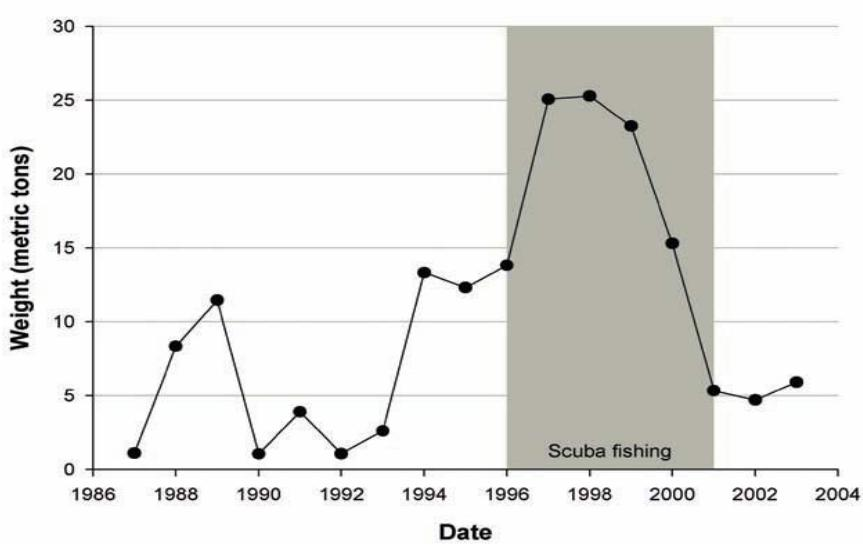

Figure 11.—Change in reef fish catch associated with initiation of scuba spear fishing and the following scuba fishing ban in 2001 (DMWR, unpublished data).

14 Fishing for giant trevally (*Caranx ignobilis*) and all species of sharks are also being banned. The perceived rarity of all shark species contrasts with accounts of elder fishermen regarding reef sharks. Of the 56 fishermen who commented on fishing for reef sharks, 42 stated that the condition was about the same as the past, with 5

stating that it had gotten better and 9 stating that it was worse.

#### **Species Harvesting Preferences**

Sixty-nine different fish and invertebrate species or species groups are consumed or sold in American Samoa. Of these, fish accounted for 86% of the total catch by weight in studies on Ofu (Craig et al., 1993). Jacks, surgeonfish, mullet, and octopus make up the majority of the reef-resident species taken, with average size and weight being relatively small. In the fishermen interviews conducted on Tutuila by Sauafea et al. (2000), sea urchins were the most popular species collected in the inner reef (22%), followed by turbo snails (18%) and octopus (18%), lobsters (14%), and snappers (4%), groupers (4%), and surgeonfish (4%). Those who generally fished the outer reef fished for sea cucumber (33%) and clams (22%), but also caught crabs (13%), bluefin trevally (13%) and other species of jacks (9%), as well as sea urchins (9%).

Kilarski et al. (2006) found that fish from the family *Acanthuridae* (surgeonfish) were considered, by far, to be the most important species for subsistence fishing. This appears to be related to abundance of these fish rather than a preference for them, as fish from the *Acanthuridae* family were also found to be the most prevalent during reef surveys (Whaylen and Fenner, 2005), and 56% of all respondents indicated that they had no preference for fish or invertebrate type. Crustaceans were considered to be the next most important type of marine resource, followed by bivalves, fish from the families *Serranidae* (groupers and seabass), *Holocentridae* (soldier and squirrelfish), and *Scaridae* (parrotfish). Other important families were *Scombridae* (markerels, tuna, bonita), *Mugilidae* (mullets), *Carangidae* (jacks), and echinoids (urchins) (Kilarski et al., 2006).

*Atule*, or bigeye scad, is a coastal migratory species that spawns in mass near shore and dominates the nearshore fish harvest in certain areas during some years (Craig et al., 1993). Although the presence of this species is sporadic, the *atule* catch in 2002 was a major event on Ofu, exceeding 65,000 fish and contributing almost one third of the harvest on the island; however, this species was not present in large congregations for several years prior to the 2002 event (Craig et al., 2008). *Atule* are caught through a village-wide effort in some areas where they spawn, with villagers driving the fish to a central location to be harvested en masse. On Ofu, the *atule* harvest is facilitated through the construction of a stone weir, and in Fagasa, the entire village participates in a fish drive to corral the fish when they enter the bay (Fig. 12). *Atule* are also known to spawn in a variety of other bays around the islands, where they are gathered with nets and handlines.

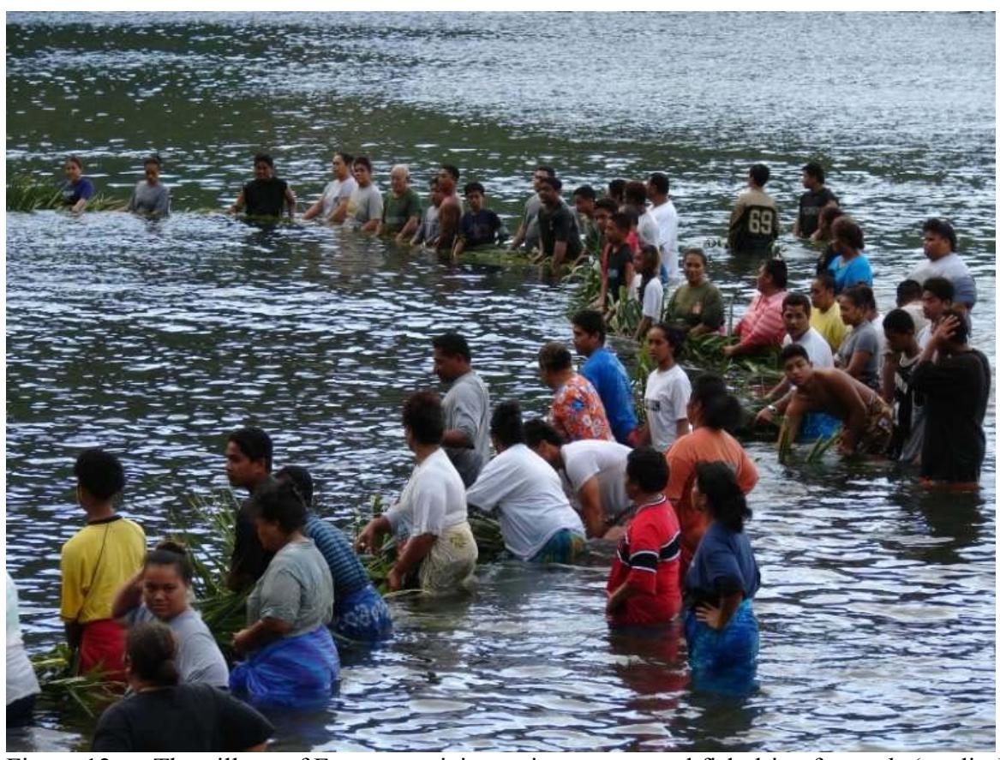

Figure 12.— The village of Fagasa participates in a communal fish drive for *atule* (credit: E. Lilio)

Another traditional fishing method still practiced in the Manu'a Islands is catching *i'asina* (juvenile goatfish) in a hand-woven funnel trap called *enu*. Thousands of *i'asina* may appear along sandy shorelines during the months of October–April. These fish appear in such massive numbers that there is little concern about their overharvest (Craig, 2008). The *enu* basket is made of vines that are first buried in a beach pit to soak in seawater, then cleaned and hung to dry. Coconut sennit is used to tie the vines together. To catch the *i'asina*, bait composed of hermit crabs that have been pounded and mixed with sand is placed inside each trap to attract the fish (Fig. 13). The *enu* basket is buried half way in shallow water along a sandy shoreline (Fig. 14) *I'asina* are eaten fresh or deep fried, or they are frozen (Craig, 2008).

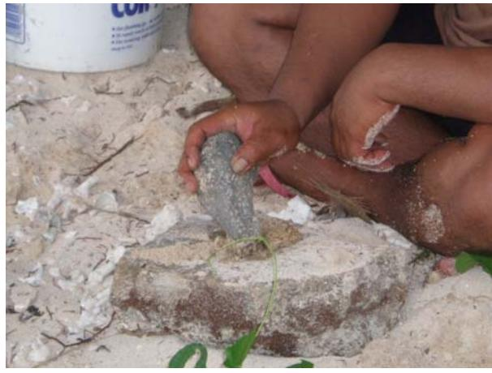

Figure 13.—Hermit crabs are ground with sand to create bait for the *enu* basket (DMWR, 2008).

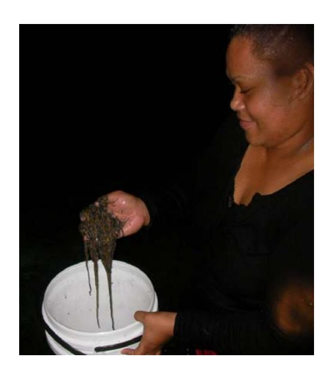

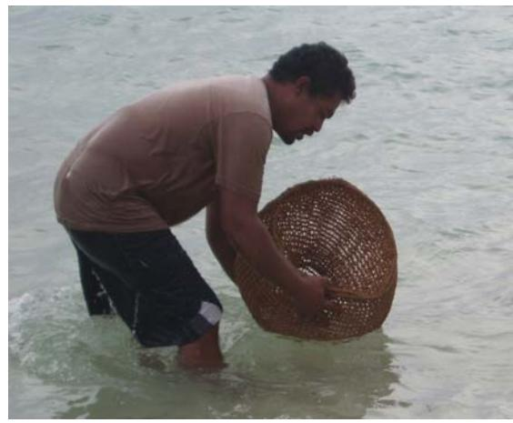

 Figure 14.— A fisherman on Ofu places his *enu* basket in the water to catch *i'asina* (DMWR, 2008).

Figure 15.—An American Samoan woman displays a night's catch of palolo (A. Levine, 2007). The *palolo*, a coral-dwelling polychaete worm, is another unique species that is caught in large numbers in the Samoa Islands during spawning events. *Palolo* generally emerge once a year15, one week after the full moon in October or November, to release their reproductive segments (epitokes) into nearshore waters. Samoans consider these epitokes to be a delicacy and will gather in the thousands at midnight16 on the predicted spawning event to collect them in nets

15 *Palolo* might also spawn again in a subsequent month, depending on the timing of the event. In this case, one of the spawning events is generally weaker than the other.

16 The timing of the *palolo* harvest varies on the different islands. In the Manu'a Islands, *palolo* generally begin spawning at midnight. The harvest occurs on Tutuila around 1 a.m. or 2 a.m. and in Western Samoa just before dawn.

and screens (Craig et al., 1993). Ponwith (1992) reported that *palolo* catches were highly variable due to the strength of the swarming event and the presence or absence of offshore winds to concentrate epitokes near the shoreline. In 1990, the estimated catch was 3400 pounds, but the catch estimate in 1991 fell dramatically to only 600 pounds.

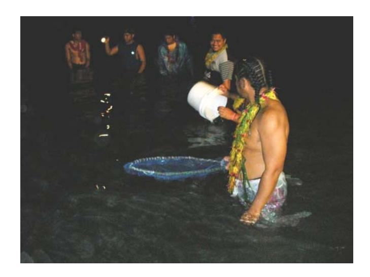

Figure 16.—A Samoan family fishes for *palolo* wearing traditional *moso'oi* leis (A. Levine, 2007).

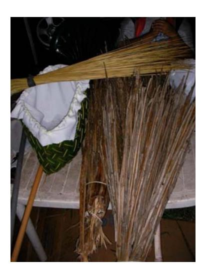

Figure 17.—Traditional Samoan *palolo* fishing gear (A. Levine, 2007).

Traditionally, fish in American Samoa were not sold, but were shared with others or distributed amongst the community. Many American Samoans still believe that some species such as *palolo* should not be sold as this will ruin catches in future years. Sharing of fish amongst the wider village community was, and is still, an important cultural practice; *atule* are divided equally amongst village members after a group harvesting event, and *palolo* is still distributed to family members and a portion reserved and given to village pastors.

However, since the advent of refrigeration, people are more likely to catch more fish during mass spawning events and share them less, as the fish can be stored for longer periods. Bulk catches of *atule* around Ofu in 2002 were timed to be ready for the weekly supply boat to ship fish to Tutuila (Craig et al., 2008). Also, in recent years *palolo* has become commercialized and is sold at steep prices after the yearly harvest. Roadside sellers line the streets the morning after the harvest night, and frozen imports of *palolo* from Western Samoa can be found in island stores. In November 2007, a fist-sized portion of frozen *palolo* sold in local supermarkets for 20 dollars (Fig. 18).

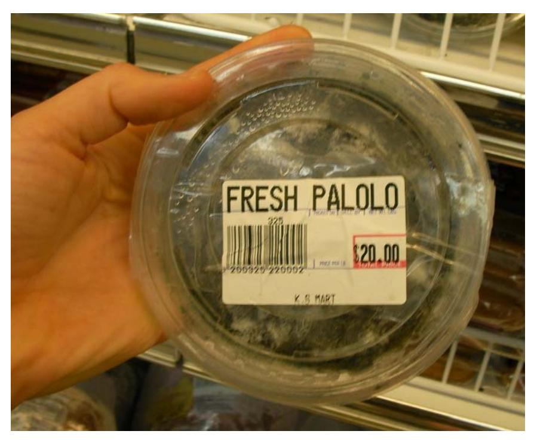

Figure 18.— Traditionally not sold for profit, *palolo* is now an expensive local commercial delicacy in American Samoa (A. Levine, 2007).

Despite increasing levels of participation in the commercial fishing industry in American Samoa, most nearshore fishermen do not sell their catch. According to Kilarski et al. (2006), only 12% of interviewees sold fish and over half of those sold only once or twice a month. Only 10% of commercial sellers reported selling fish more than 10 times per month, suggestive of a relatively low overall level of economic reliance on nearshore commercial fishing in American Samoa. However, most respondents (64%) reported that they buy fish, indicating that localized fishing activities supply only a portion of locally consumed seafood and that the supply of commercially sold fish is largely from people from outside the territory.

### **Offshore Fishing**

Pago Pago is home to a natural protected deepwater harbor providing one of the best natural shelters anywhere in the Pacific, and has excellent maritime facilities and other infrastructure needed to support offshore fishing. American Samoa has relatively reliable power, water and waste treatment systems, and telecommunications infrastructure for a remote Pacific island. While American Samoa does have a U.S. Coast Guard presence, the Coast Guard station does not possess the capabilities for water-based rescue or assistance, and there is no dedicated radio system in place in the territory to support patrol activities.

There are two berthing locations available to commercial vessels at port: the main dock and the container dock each accommodate freighters, fishing fleets and cruise vessels. The shipyard

includes a 3000-ton capacity marine railway that is capable of dry docking some of the largest purse seine vessels in the American fleet. The harbor provides full service port facilities, containerized cargo holding, warehousing, transshipment operations and tugboat services. Southwest Marine of Samoa is the only full-service shipyard in the region. Vessels looking for comparable facilities must go as far as New Zealand (Burk, 2005).

The other (smaller) port facilities include Aunu'u (new construction), Auasi (Tutuila), Faleasao, Ofu, and Ta'u. In 1975, the American Samoa Government completed a civil works project to improve the interisland transportation system, starting with Ofu Harbor. The port at Ofu Harbor now includes a 993 ft long revetment with a 220 ft long entrance channel that is 18 ft deep and 130 ft wide. It offers a 16 ft deep, 2.54 acre turning basin and aids to navigation, and is in the process of being upgraded again.

As described earlier in this chapter, the bonita boat, *va'aalo*, was a canoe used in offshore fishing for species such as bonita and shark; canoes also were used for bottomfishing. In the 1950s, introduction of outboard motors allowed fishermen to venture farther offshore, but fishing was still a subsistence activity. Commercial fishing did not begin until the early 1970s, when the Dory Project signaled the introduction of modern fishing technology in American Samoa. Funded by the American Samoa Office of Economic Opportunity (OEO), the Dory Project was initiated in 1972, providing easy credit and loans to fishermen to develop offshore fisheries. The project developed a boat-building facility that produced 23 vessels over a 3-year period. These dories were made available to local residents interested in commercial fishing on the understanding that the cost of materials and construction costs would be paid back to the government at a low rate of interest generated by fish sales. Records indicate that 70% of these dories were engaged in bottomfishing activities, conducted primarily at night on the shallow reef area around Tutuila.

In the 1980s, dories were replaced by *alia* catamarans, larger, more powerful boats that could stay multiple days at sea. The *alias* were usually 28 to 32 ft long and powered by an outboardengine. Trolling and bottomfishing were the major methods of fishing by *alias*, and spearfishing, netting, and vertical longlining were undertaken on occasion. Between 1982 and 1988, the bottomfish landings comprised as much as half of the total catch of the commercial fishery in American Samoa.

However, after 1988 the nature of American Samoa's fisheries changed dramatically, with a shift in importance from bottomfish to trolling and longlining for pelagic species. Beginning in 1995, some *alia* captains began using horizontal longline gear. In 1996, horizontal longlining for tuna became the largest fishery in American Samoa based on total landed weight of the catch, even though only about one-third of the fleet had converted to this method. Over the next few years the fleet grew rapidly with the addition of new *alias* up to about 38 ft in length and, more significantly, with the addition of other larger monohull vessels that fished much longer trips.

The primary target species for longline vessels is albacore tuna for delivery to the canneries, but the fishery has also produced significant increases in landings of yellowfin tuna, bigeye tuna, wahoo, blue marlin, mahimahi, and some other incidentally caught species. Incidentally caught species from boats supplying the cannery occasionally sell wahoo and other incidentally caught species at little to no profit, which many believe keeps local market prices for fish low (Fini Aitaoto, personal communication). The availability of cheap incidental catch, fish imports from Western Samoa, and an increased reliance on imported store-bought food has discouraged development of locally based offshore fishing for the local market. Most local fishing and seafood gathering activities for local consumption in American Samoa take place largely in the shallow reef-flat areas between the outer fringing reef and the shoreline.

During 2005, the various fishery monitoring programs in American Samoa identified 54 active fishing vessels, 51 home ported on Tutuila and 3 in the Manu'a Islands. Many of these vessels participated in more than one fishery, and 41 of the Tutuila boats (including 27 vessels which were over 50 feet in length) did at least some longlining. Of the 54 total boats, 13 participated in the troll and bottomfish fisheries and 4 were used in other types of fishing. On average, the *alia* fleet on Tutuila consisted of 3-man crews, fished 11 hours per fishing trip, and caught about 173 pounds of fish per trip; the Manu'a-based fleet typically had 2-man crews, fished about 5 hours and landed 81 pounds of fish. Essentially all of the longlining was based out of Tutuila, where the majority of the catch was off-loaded to the canneries.

Commercial fish landings data for American Samoa demonstrate the increases in both landings and revenue associated initially with the use of *alias* for longlining beginning in 1995, and then with the arrival of the first, much larger monohull longline vessel in 1997. By 2002, many more of these larger longline vessels began fishing in American Samoa, as reflected by the huge increase in landings (Fig. 19). The 14,366,471 pounds landed in 2007 was the second highest on record and the dollar value of the landings was the highest on record.

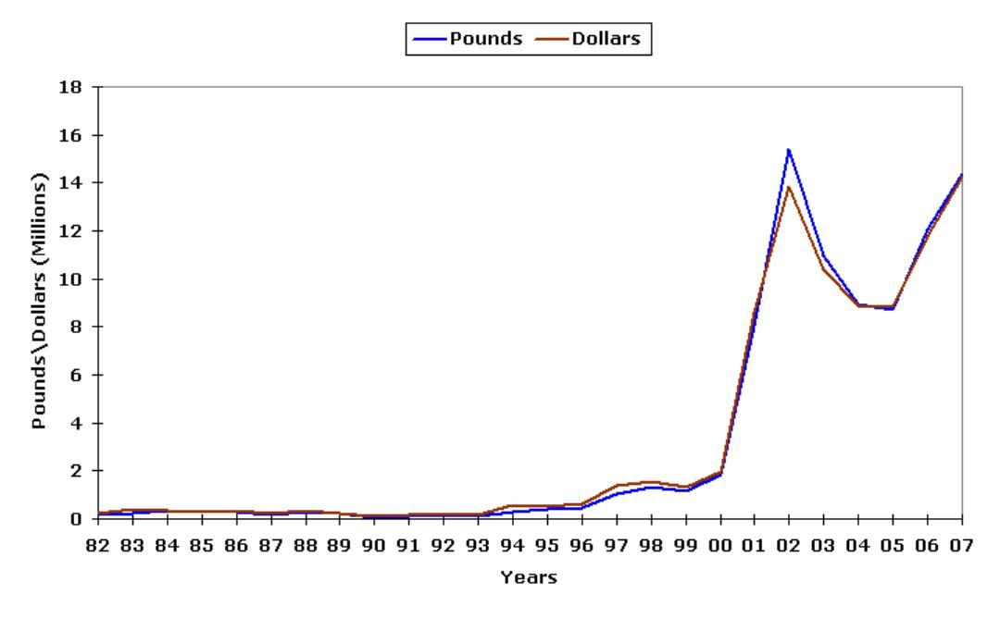

Figure 19.—Total Commercial Landings in American Samoa 1982–2006 (Source: WPacFIN, 2009).

American Samoa has a 50 nm exclusion zone for large vessels greater than 50 ft, designed to protect the islands' local, small-scale fishery. In 2008, the Western Pacific Regional Fishery Management Council voted to ban use of purse seine vessels within 75 nm of American Samoa. While purse seiners did not fish frequently in American Samoa's waters, the Council determined that the recent increase in the number of these vessels had the potential to disproportionately impact the local fishery. Purse seine vessels continue to be a major supplier of fish to the islands' cannery, but virtually all of their catch comes from waters outside American Samoa's 200-mile EEZ.

#### **Bottomfishing**

Prior to the arrival of Europeans in Samoa, the indigenous people had developed specialized techniques for catching bottomfish from outrigger canoes (*paopao*). Some of the bottomfish, such as trevally (*malauli*), held a particular social significance and were reserved for the *matai* chiefs (Severance and Franco, 1989). By the 1950s, many of the small boats in American Samoa were equipped with outboard engines, modern steel hooks were used rather than pearl shell, and monofilament fishing lines had replaced hand woven sennit lines. By 1961, there were estimated to be approximately 10 traditional style canoes regularly fishing around the main island of Tutuila, and bottomfish fishing remained largely a subsistence practice (Itano, 1996).

Not until the early 1970s, with the introduction of the Dory Project, did the bottomfish fishery develop into a commercial venture using motorized boats. This resulted in an abrupt increase in the fishing fleet and total landings, but the limited nearshore bottomfish habitat meant that catch rates there declined rapidly and fishermen were obliged to venture farther offshore to previously unexploited seamounts and banks to maintain profitable catch rates (Itano, 1996).

Dories were the dominant bottomfishing vessel in American Samoa for a very brief time. The most popular fishing vessel used in Samoan fisheries during the 1980s was the FAO-designed *alia* catamaran. These vessels were constructed in Apia and made available to Pago Pagobased fishermen at government-subsidized rates. The American Samoa fleet also expanded with a few locally built boats and boats from the United States and New Zealand.

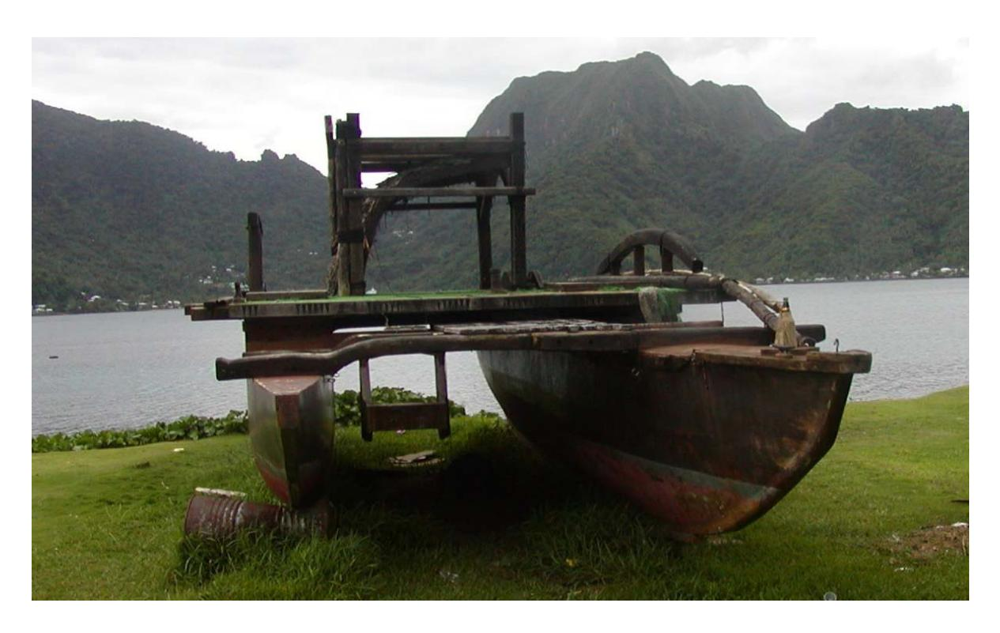

Figure 20.—Replica of a traditional-style *alia*, Pago Pago Yacht Club, American Samoa (A. Levine, 2007).

In December 1980, a fish market opened in Fagatogo, allowing fishermen to market their catch at a centralized, relatively sanitary location. Although the price for bottomfish rose between the 1970s and 1980s, it was still difficult for fishermen to market their fresh fish locally at a profit due to competition with sales of inexpensive incidental catch from longline and purse seine vessels landing at the canneries (Itano, 1996).

In 1982, a fisheries development project was initiated to train fishermen in fish handling and packaging techniques enabling them to export high-priced deepwater snappers and other fish to the Hawaii fish auction (Itano, 1996). This eventually caused another notable increase in both bottomfish landings and revenue. Fish were shipped to markets in Hawaii via the regular air service between Honolulu and Pago Pago. However, delays in payments to fishermen in American Samoa acted as a disincentive to fishermen who were already operating on a narrow profit margin. Other challenges included lower than expected prices for imported American Samoan bottomfish in Hawaiian markets and occasional refusals of shipments of low quality fish.

The subsidization of this program resulted in the bottomfish fisheries becoming overcapitalized, with multiple vessels competing for a finite resource. Eventually a number of fishermen were forced to default on loan payments, and many vessels turned to other activities or simply ceased operations (Dalzell et al., 1996). Bottomfishing effort for deepwater snappers dropped sharply after 1985, and in 1986 and 1987 only three fishermen exported fish to Honolulu (Itano, 1996). Although not a contributing factor to bottomfish exports, fishing effort for bottomfish decreased further after Hurricane Tusi demolished the floating docks and *alia* fleet in the Manu'a Islands in 1987.

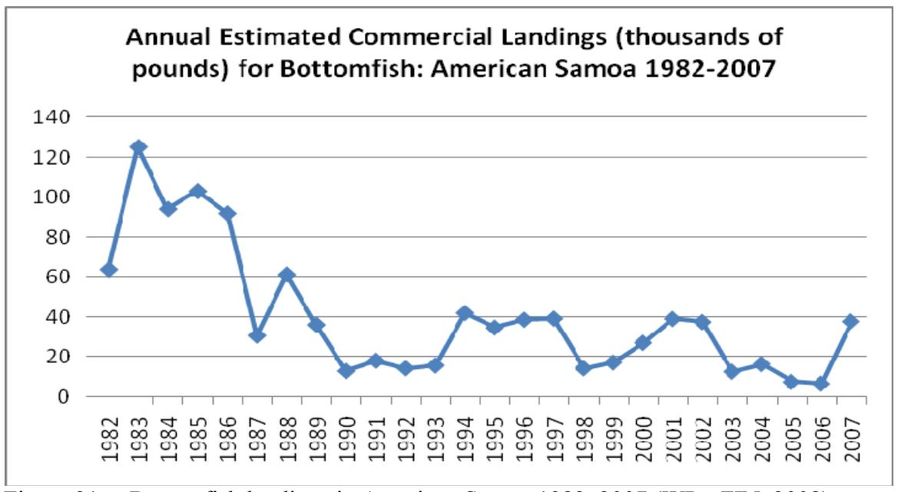

Figure 21.—Bottomfish landings in American Samoa 1982–2007 (WPacFIN, 2008).

Bottomfishing in American Samoa peaked between 1982 and 1988 (see Fig. 21), comprising as much as 50% of the total commercial catch. Since 1988, the nature of American Samoa's fisheries has changed dramatically, with a steady decrease in the importance of bottomfish fishing. The bottomfish fishery was larger between 1982 and 1986 than in more recent years, reflecting the shift from bottomfishing to trolling and longlining, the loss of skilled and fulltime commercial fishermen, and the substitution of imported fish from Western Samoa and Tonga. In 1991, bottomfish imports exceeded local landings of bottomfish. The adverse effects of three hurricanes that struck American Samoa in 1987, 1990, and 1991 are also responsible for a decrease in landings following these events. The 1987 hurricane, in particular, damaged or destroyed a large segment of American Samoa's small-boat fishing fleet (WPRFMC, 2005).

While generally decreasing since its peak in the mid-late 1980s, bottomfishing in American Samoa underwent brief surges from 1994 to 1997 and again from 2000 to 2002. The significantly greater total landings recorded in 1994 when compared to 1990–1993 occurred primarily because of improved catch reporting, an increase in effort by highline vessels, and extensive demand for bottomfish species for use in government and cultural events. Fishing effort, measured by the number of fishing trips, then declined 26% in 1995 (Fig. 22). Rather than indicating a problem with the resource, the decline in trips, landings, effort, and subsequent revenues was mainly caused by highliners diverting their interest and efforts towards longlining and continued improvements in the Offshore Creel System sampling.

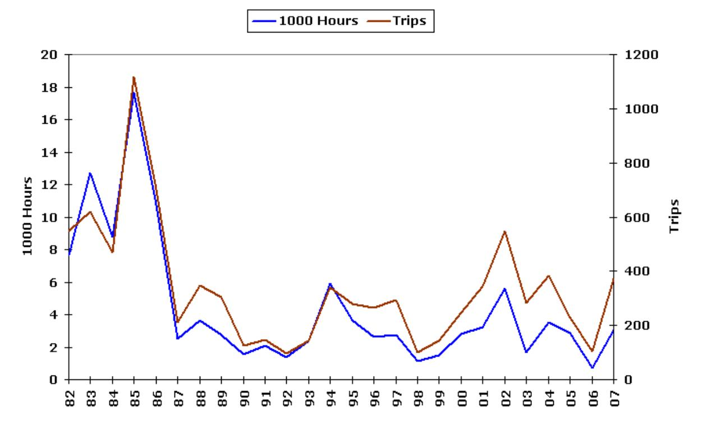

 Figure 22.—Bottomfish fishing effort in terms of hours fished and number of fishing trips in American Samoa 1982–2006 (WPacFIN).

Bottomfish imported mainly from the neighboring independent state of Samoa helped in satisfying the demand for fresh fish. A decline in tuna prices at the cannery also caused some longlining *alias* to revert back to bottomfishing.

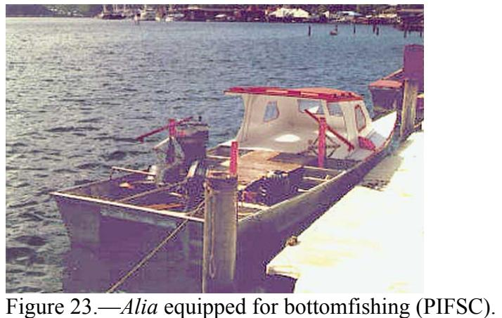

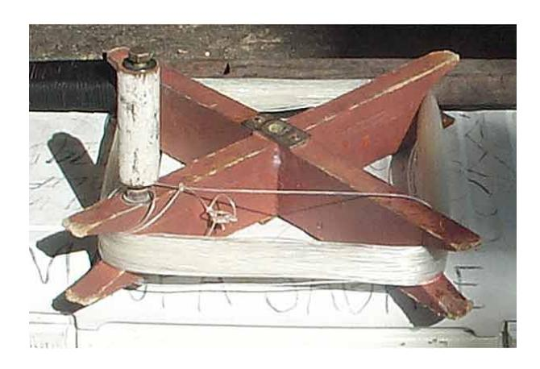

Figure 24.—Bottomfishing reel and mainline (PIFSC).

In 2006, the bottomfish fleet of American Samoa brought in only \$15,426 in revenue and consisted of approximately 22 part-time vessels that typically jig overnight using skipjack tuna as bait (WPacFIN, 2006 data). Landings increased in 2007, as did prices; currently, eight vessels are active in the fishery (Tomanogi, 2008). The fishing technology employed by the fleet continues to be relatively unsophisticated. In 1999, less than 10% of the boats carried a depth recorder, electronic fish finder, or global positioning system, typically fishing within 20 miles of shore. However, in recent years, a growing number of fishermen have acquired larger vessels with the capacity for chilling or freezing fish and a much greater fishing range.

#### **Trolling**

Until 1995, boat-based fishing in Tutuila and Manu'a was primarily trolling and bottomfish handlining, with the pelagic fishery in American Samoa being largely troll-based. In 1996, the majority of trolling fishermen converted their *alias* to longlining, although some of them continued to troll occasionally. Consequently, the fishery has experienced a decline in its catch and effort, especially since larger commercial trollers were most often the ones that converted to longlining. In 1996, 7 of the 35 trolling vessels were 25–40 ft long pleasure boats whose captains fished for recreation on weekends, holidays, or competed in fishing tournaments; the catch was rarely sold.

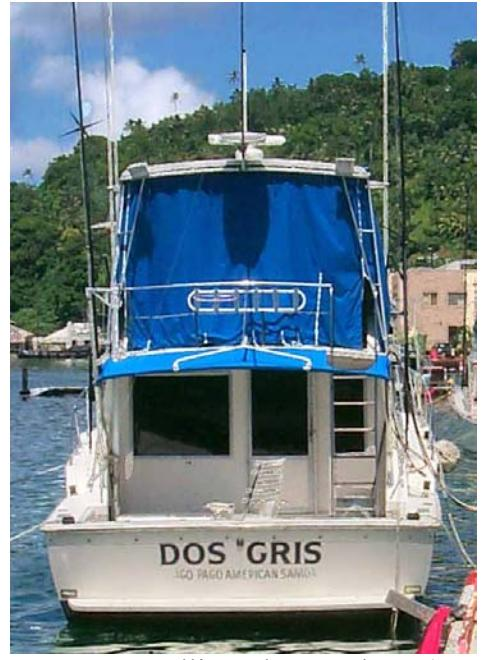

Figure 25.—A trolling pleasure boat (PIFSC).

Yellowfin and skipjack tuna have always made up most of the trolling landings. In 1986, when trolling was the only pelagic fishing method, 53 trolling boats landed 137,100 pounds of skipjack tuna and 54,622 pounds of yellowfin tuna. In 1996 when longlining was just getting started, these two species comprised 75% of the trolling landings with 35 boats landing 56,562 pounds of skipjack and 36,551 pounds of yellowfin tuna. Mahimahi, blue marlin and wahoo made up a significant proportion of the other 25% of the catch. By 2001, when longlining became the dominant fishing method in American Samoa, the number of trolling boats and their total catch dropped dramatically. Only 18 boats were engaging in trolling, landing 15,126 pounds of skipjack and 5513 pounds of yellowfin tuna.

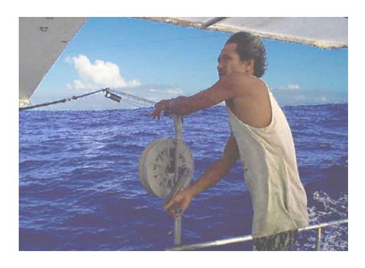

Figure 26.—Handline trolling from an *alia* (PIFSC).

#### **Longline Fisheries**

Longlining was introduced to American Samoa in 1995 by fishermen from Western Samoa. Local fishers have found longlining to be a worthwhile venture because they catch more fish with less effort and gas consumption. Longlining now accounts for the majority of the catch in American Samoa. Initially, *alia* catamarans were the vessels most frequently used for longline fishing. *Alias*, which are Samoan-built, twin aluminum-hulled boats with fiberglass or wood superstructures, generally are 24 to 38 ft in length and powered by small (40 hp) gasoline outboard engines (Kaneko and Bartram, 2004). *Alias* were the dominant fishing vessels of the 1980s and 1990s in American Samoa. Navigation on these vessels was visual, using landmarks. The gear was stored on deck on a hand-crank reel which held as much as 10 miles or as little as 2–3 miles of monofilament mainline.

Gear for longlining on *alias* was set by spooling the mainline off the reel and retrieved by hand-pulling the line back to the boat. The reel was used to take up and store the mainline as it was pulled. Trips were 1 day long (about 8 hours). Setting the equipment generally began in the early morning and hauling was generally in the midday to mid-afternoon. The catch was stored in boxes built into the hull of the boat or in portable coolers or freezer chests.

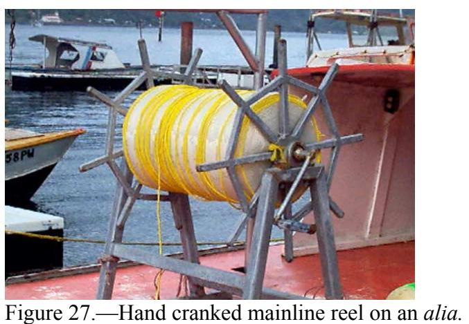

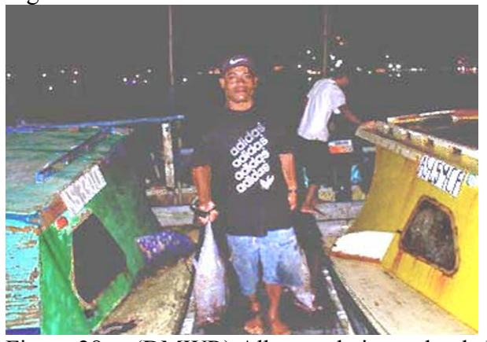

Figure 28.—(DMWR) Albacore being unloaded from an *alia* (DMWR).

Albacore comprised the majority of the longline catch, with yellowfin tuna and blue marlin as the second and third most prevalent species. The vast majority of albacore were sold to the

canneries located in Pago Pago Harbor and generally stored in personal freezers until a sufficient amount was accumulated to sell. Most of the remaining catch was sold to stores and restaurants and some donated for consumption at family functions.

Late 1997 marked the arrival of the first large-scale longline vessel. At 89 ft long, it could hold a crew of 7 and a full complement of electronic navigation and communications equipment. Its mechanically powered reel could hold 20–30 miles of monofilament mainline and 1600–2000 hooks suspended from 60 floats. This boat's crew would set and haul the gear each day the vessel was actively fishing. It made 3–4 week trips, some as far way as Tonga, and could hold up to 44 tons of frozen albacore that were then brought back and sold to the canneries after each trip.

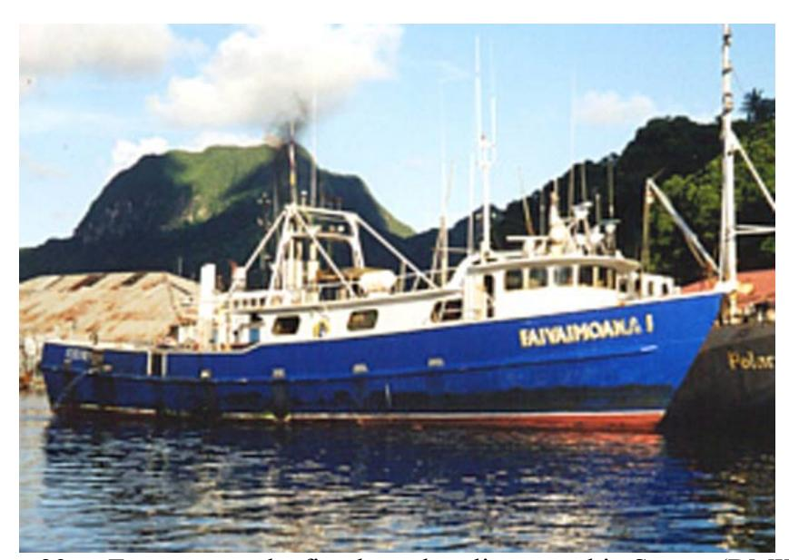

Figure 29.—*Faivaimona*, the first large longline vessel in Samoa (DMWR).

In 1999, two other large monohulled longline vessels, similar to the first, arrived in Samoa and began longline fishing. Then in 2000 and 2001, large monohulled longline boats began arriving from places such as San Diego, Korea, Taiwan, Hawaii, New Zealand, and Australia. In 2002, about 36 large vessels were operating from Pago Pago. The rapid fleet expansion caused the fishing effort to increase from about 1 million hooks per year at the end of 2000 to 5.6 million hooks by the end of 2001 (*Pacific Magazine*, 2002). Large-scale longline vessels now dominate the American Samoa fishery.

To effectively manage local fishing activities, the American Samoa Longline Limited Access Program was established under Amendment 11 to the Fishery Management Plan for Pelagic Fisheries of the Western Pacific Region. Since December 1, 2005, fishermen using longline gear to catch pelagic fish in the EEZ around American Samoa are required to have an American Samoa longline permit (American Samoa longline limited entry permit) on board their vessel. The permit is also required to land pelagic fish in American Samoa that were caught with longline gear in the EEZ around American Samoa or to transship pelagic fish caught by longline gear in the EEZ around American Samoa or on the high seas.

Through an amendment to the pelagic fishery management plan established under the Magnuson-Stevens Fishery Conservation and Management Act (PL 94-265, as amended through October 11, 1996), Hawaii- and American Samoa-based deep-set longline vessels targeting tuna are required to carry a scientific observer on designated fishing trips when requested to do so by NMFS. The federal observer program is responsible for fielding longline observers to obtain data on the incidental take of sea turtles and other protected species and collect data on fishing effort and catch. The observers document interactions of all protected species, tally the numbers of fish that are kept and discarded, and collect biological measurements and samples from selected fish to improve stock assessment. Protected species that interact with the fishery include sea turtles and seabirds, and to a lesser extent, whale and dolphin species.

In April 2006, the NMFS Pacific Islands Region Observer Program deployed the first two observers on American Samoa in Pago Pago. Observers are available as needed to provide coverage for 33 federally permitted longline fishing vessels that fish out of American Samoa for albacore tuna. The program has focused its efforts on evaluating the level of interaction between protected species and longline fishing gear, fleet safety, and number of animals caught as bycatch . Observer-collected data have demonstrated that the American Samoa fleet catches mostly the same species seen in the Hawaii longline observer program, plus a number of species not seen in the Hawaii catch. The data also show the need for more information on protected species to help develop a biological opinion on incidental catch specific to the resources of this region.

The observer program has provided American Samoa with several benefits, the most significant being an increase in fleet safety. The United States Coast Guard Marine Safety Detachment office in Pago Pago is working very closely with the program, and this combined effort has increased the number of fishing vessels with safety examination stickers in this fishery by 66%. Observer coverage levels in American Samoa were approximately 8% in 2007, but a 20% level of coverage is mandated and expected once the program receives full funding.

#### **Longline Catch**

The first 5 longline vessels that began fishing in American Samoa in 1995 landed an estimated 58,000 pounds of albacore, 5000 pounds of blue marlin, and 4000 pounds of yellowfin tuna. By 1997, 33 vessels held permits for longline fishing and 21 of those were actively fishing in the American Samoa fishery, deploying an average of 274 hooks per set on *alias*. The primary catch in 1997 was 681,000 pounds of albacore tuna with a catch rate of 31.2 fish per 1000 hooks. Yellowfin tuna was the second most prevalent species in the catch at 48,000 pounds, with a catch rate of 2.25 per 1000 hooks. The catch of mahimahi was 33,000 pounds, and for blue marlin it was 32,000 pounds.

The year 2001 was marked by a peak in the number of longline vessels fishing in American Samoa (Fig. 31), and an abrupt shift towards tuna as the dominant species caught. The number of larger boats had swelled to 32 and the number of *alias* grew to 35, and the average number of hooks per set climbed to 1200 (for *alias* and large boats combined). The large monohulls now accounted for 88% of the catch of 7,125,000 pounds of albacore, 417,000 pounds of

yellowfin tuna and 165,000 pounds of bigeye tuna, which became the new number three species. In 2001, annual net revenue averaged about \$177,000 per vessel (O'Malley and Pooley, 2002). An issue for many fishermen at that time was the lack of support services in American Samoa, making it difficult to find parts and mechanics to work on the vessels (O'Malley and Pooley, 2002).

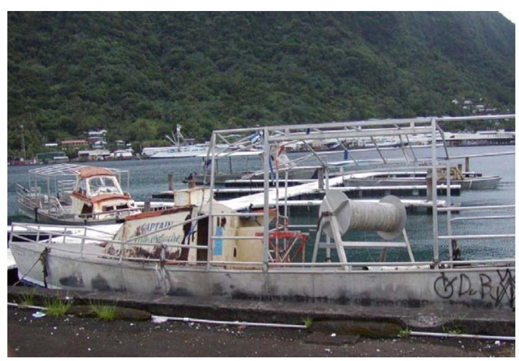

Figure 30.—Vessels remaining from Pago Pago's former *alia* fleet (A. Levine).

By 2005, total fishing effort was decreasing, and the era of the *alias* was ending. There were 30 monohulled vessels and only 6 *alias*. The average number of hooks per set jumped to 2553, due largely to the increase in average vessel size. Monohulls now accounted for 99% of total catch, the majority of which was albacore (6,435,000 pounds), followed by yellowfin tuna (1,123,000 pounds), wahoo (459,000 pounds), and skipjack tuna (317,000 pounds). Monohulls and *alias* differed somewhat in their catch composition. For monohulled vessels, the albacore catch was 65%, yellowfin and skipjack tuna each comprised 10%, and wahoo amounted to only 5% of the catch per set. Species composition per set for the few remaining *alias* was also dominated by albacore (42%), but was followed by 29% yellowfin, 10% wahoo, and 8% mahimahi.

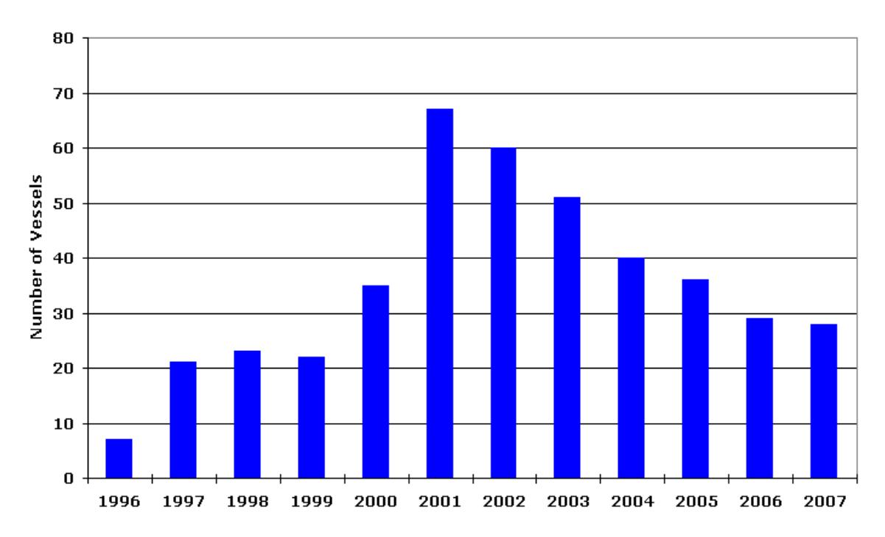

Figure 31.—Total number of longline vessels (Source: WPacFIN, 2008).

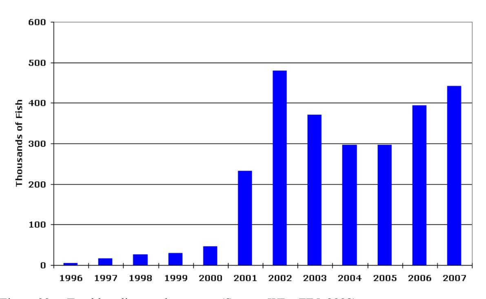

Figure 32.—Total longline catch per year (Source: WPacFIN, 2008).

The end of the *alia* age illustrates the declining nature of American Samoa-based commercial fisheries. During the first two quarters of 2007, only 2 boats under 50 ft were active in the longline fishery. Given that fishing activity in the 50 nm surrounding American Samoa is restricted to boats under 50 ft in length, this indicates very little boat-based commercial longline fishing effort is now occurring in the waters immediately surrounding the territory's islands.

American Samoa's local *alia* fleet collapsed for a number of compounding reasons. Obtaining crew members to outfit *alias* was a significant challenge; the majority of fishing crew for the few operating *alias* are now from Western Samoa, as American Samoans prefer government jobs or military employment to working as a boat crew member or cannery employee (Fini Aitaoto, personal communication, 2008). However, recent enforcement of immigration laws has made it more difficult to obtain foreign crew. In addition, cannery "leakage" of incidental catch from longliners is sold locally, providing large quantities of inexpensive fish to the local market in competition with fish caught and marketed by *alias*. Fish have also been imported from Western Samoa for the past 20 years, and now daily imports of fish from Western Samoa serve to drive down the price of fish in American Samoa (Fini Aitaoto, personal communication). These factors, as well as an increase in fuel prices and vessel and engine breakdown and repair problems, combined to make small scale *alia* operations challenging and largely unprofitable in American Samoa.

Pago Pago Commercial Fishing, Inc. was chartered in 2004 as a nonprofit cooperative of approximately 120 members to create value-added products from the miscellaneous catch of the large longline vessels delivering albacore to the canneries (TEC, Inc., 2007). Anticipated activities included training and employing Samoans in fishing and support businesses, engaging in cooperative research with fisheries scientists, supplying fish for community, cultural and senior citizen needs, and providing services and assistance in selling catches, including nontarget fish species (TEC, Inc., 2007). In 2005, American Samoa's Comprehensive Economic Development Strategy included rehabilitation of the Farmer's Market in Pago Pago, including redesign of access and grounds, construction of a new two-story building, and addition of a fish market and seafood section for local fishermen's catches. Although the old market was torn down, construction of the new market was still underway in mid-2009.

In the early part of this decade, there was effort to introduce legislation that would reduce fish imports from Western Samoa. This bill failed, however, because local demand for fish could not be met with the limited *alia* fleet still operating in American Samoa. There is little local pressure to change the current state of the fishery, as inexpensive fish are readily available from alternative sources, and most *alia* owners ceased operations long ago, meaning no one is currently suffering for the lack of a local small-scale fishing fleet (Fini Aitaoto, personal communication, 2008).

#### **IV. TERRITORIAL MANAGEMENT OF FISHERIES**

Traditionally, village leaders in American Samoa had a significant degree of control over their nearshore waters, enforcing their own village rules and regulations (Sauafea-Lea'u, 2008), a system which continues today. Village councils establish regulations for fishing in their areas. In organized villages, outsiders must first obtain village permission to fish in village areas, and in many villages outsiders are prohibited from engaging in fishing activities. Local restrictions are strictly adhered to by village residents, and violators of local rules are subject to punishment or fines determined by the village council. Fishing on Sundays is prohibited in all American Samoa's villages, a restriction that stems from the islands' strongly Christian religious base.

Evidence indicates that the presence of a strong, traditional social structure in American Samoan villages could lend itself to increased use of village-based practices to improve marine management. For example, Kilarski et al. (2006) studied the importance of traditional social structure in fishing practices and perceptions. They used the presence of a village curfew (an enforced prayer time during which travel through the village is prohibited) as a proxy for strength of traditional social structure. They found that respondents from villages with an enforced curfew were more likely to agree with each type of fishing regulation than those from villages with an unenforced curfew or no curfew. The authors suggested that residents of a village with a strong traditional social structure were more accustomed to a formally regulated lifestyle, and therefore more likely to accept regulations. However, a confounding variable is that study villages with enforced curfews also had the lowest levels of fishing effort. Villages with higher fishing effort demonstrated lower agreement with fishing regulations, so it is difficult to differentiate these variables.

#### **Department of Marine and Wildlife Resources**

The American Samoa Department of Marine and Wildlife Resources (DMWR), formerly the Office of Marine Resources, is the primary agency for fisheries management in American Samoa.17 Located in Fagatogo, in Pago Pago Harbor, Tutuila, DMWR has been collecting commercial fisheries data from the local fleet on Tutuila since the early 1970s and from the Manu'a Islands since 1983. Most data collected have been from the commercial fleet, but beginning in October 1985, DMWR's data collection programs were modified to include data on recreational and subsistence fisheries as well. DMWR coordinates with the Western Pacific Fisheries Information Network (WPacFIN) managed by the Pacific Islands Fisheries Science Center (PIFSC) to assemble and analyze fisheries information. Fisheries data are collected through longline logbooks, boat-based creel surveys, commercial purchase systems, and the shore-based creel survey. WPacFIN, in turn, works closely with the Western Pacific Regional Fishery Management Council and NMFS Pacific Islands Regional Office (PIRO) to provide the information needed by these authorities for fisheries management.

17 As described earlier, NMFS manages fisheries from 3 miles to 200 miles offshore and participates in management of fisheries on the high seas through international treaties and agreements.

DMWR also monitors the status of nearshore fish and marine habitats through the collection of fishery independent data. These data collection efforts are supplemented by surveys conducted every other year by PIFSC's Coral Reef Ecosystem Division, which recently published a monitoring report for American Samoa covering coral reef habitat and coral reef fish density data from 2002 to 2006 (PIFSC-CRED, 2008). In addition, DMWR is in charge of regulating marine resource use, and enforcing these regulations.

#### **Coral Reef Advisory Group**

The Coral Reef Advisory Group (CRAG) also provides input to plan and implement actions related to management of the estimated 296 km2 of coral reefs in American Samoa. CRAG is comprised of territorial and federal agencies involved in coral reef management, including the American Samoa Government Department of Commerce (which houses American Samoa's Coastal Management Program and Fagatele Bay National Marine Sanctuary), DMWR, American Samoa Environmental Protection Agency, the American Samoa Community College, and the National Park of American Samoa. While not a management agency itself, CRAG coordinates grants and activities and sponsors a number of education and outreach programs for the local population, including the former "Reefwatcher" youth volunteer program and the painting of marine-themed murals throughout Tutuila (Figs. 33 and 34).

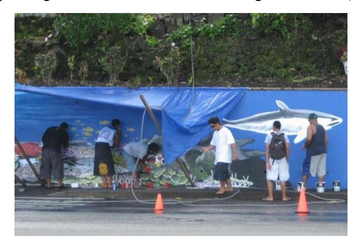

Figure 33.—Local schools and art teachers paint a marine-themed mural in Nuuuli, Tutuila.

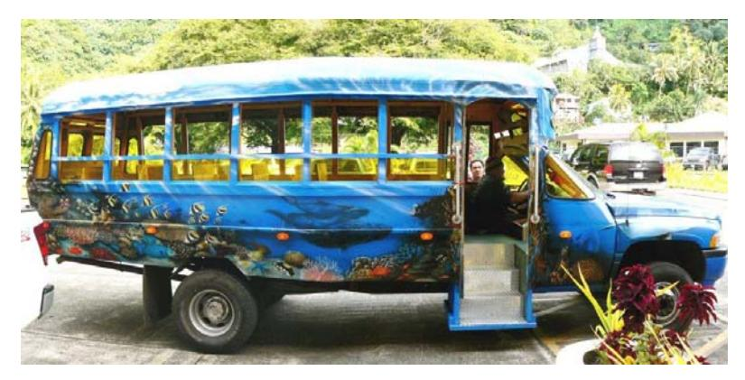

Figure 34.—A coral reef themed aiga bus, sponsored by American Samoa's Coral Reef Advisory Group.

CRAG is also responsible for coordinating the territory's coral reef Local Action Strategies (LAS). In 2002, the U.S. Coral Reef Task Force identified the need for action at the local level to reduce key threats to coral reefs, calling for the development of the LAS approach in each of the seven states and territories which possess significant coral reef resources. American Samoa determined four priority issues of significance to coral reef resource management and developed an action strategy for each of the following: Fisheries Management, Land-based Sources of Pollution, Local Response to Climate Change, and Population Pressures. Each LAS involves the formulation of goals and objectives, projects and timelines, and indicators of success (U.S. Coral Reef Task Force, 2008). The strategies are still in development and will continue to evolve as new resources are gained and projects are completed. Land use planning in American Samoa involves a number of challenges to effective resource management, with the potential to affect not just land-based resources, but marine resources as well (Tuiolosega, 2005).

#### **Community-based Fisheries Management Program**

While village-based management systems are still practiced in American Samoa, the strength of many of these systems has weakened, and management and enforcement vary between the islands' different villages. With limited patrolling and enforcement capacity, the DMWR initiated the Community-based Fisheries Management Program (CFMP) in 2000 to assist villages in managing and conserving their inshore fishery resources by a voluntary scheme of comanagement with the government. The program's goal is to improve inshore fishery resources and enhance stewardship of marine resources by the village community (Amituana'i and Sauafea, 2005). In addition, it strengthens enforcement capabilities of the village community with the assistance of the government.

The American Samoa CFMP, based largely on a similar Fisheries Extension Programme established in independent Samoa in 1995 (King and Fa'asili, 1999; Fa'asili and Sauafea, 2001), was established with technical assistance from the Secretariat of the Pacific Community (SPC, 2005). While the scale of the program in Samoa is larger, and villages in the Samoa program are generally more reliant on fishing for subsistence, the cultural similarities between the two sets of islands made the program's structure and lessons learned highly applicable in American Samoa. Staff from American Samoa's DMWR participated in an exchange visit to learn about the Samoa program, and then adapted its methods and structure for implantation in American Samoa, beginning with outreach and publicity activities on Tutuila.

There are at least three steps for selecting villages involved in the CFMP project (Sauafea-Lea'u, 2008). First is to examine the degree of organization of the village's various social groups, including the council of chiefs (*fono a matai*), women's groups, and the young men's group (*aumaga*). This indicates whether or not the village has the local capacity and social systems of organization necessary for village-based management. Second, a DMWR representative informally meets with the village mayor and leaders to explain the CFMP. If the mayor and other village leaders express interest in the program, the program organizers meet with the village's various social groups to assess the potential for village participation in the program by determining the significance of the marine environment to the village, the extent of problems in the local fishery, and the level of concern and willingness of village leadership to

take action about existing problems. Third, DMWR's extension staff and director review the assessment and decide on the village's potential for inclusion in the program.

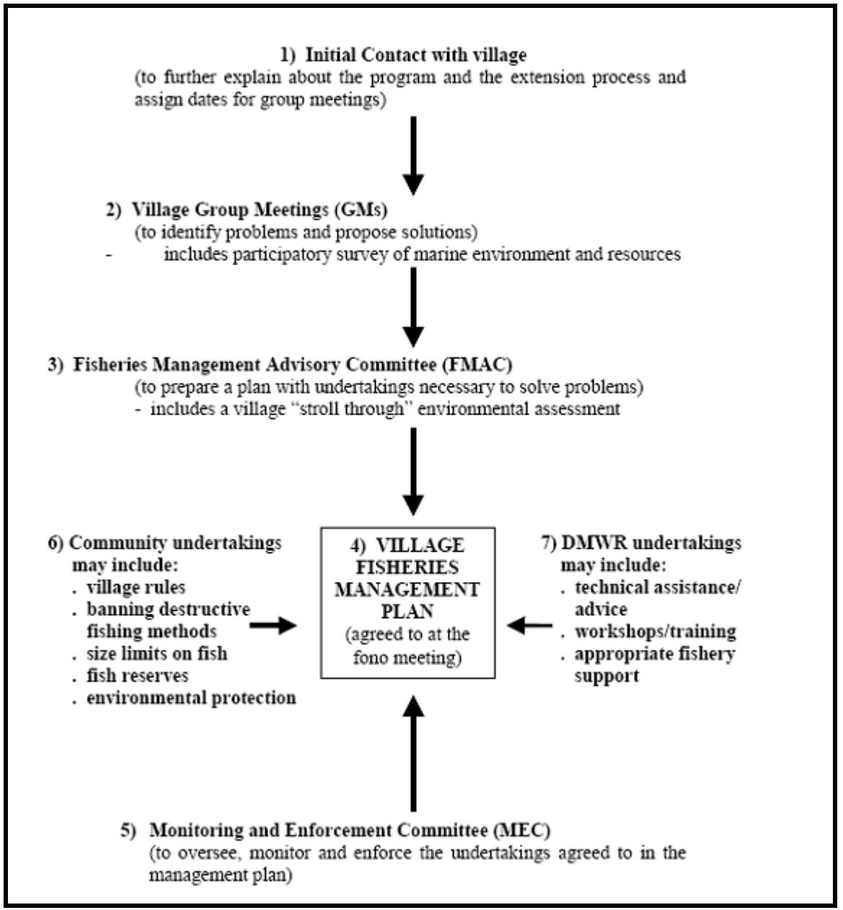

Figure 35.—Summary of the Extension Process for the Community-based Fisheries Management Program in American Samoa (SPC, 2001).

DMWR's extension process for the CFMP is laid out in Figure 35. DMWR undertakes this process after an initial contact with a village representative to determine the suitability of the village for the program, followed by a meeting to introduce and explain the CFMP program. The CFMP has a cooperative agreement prepared by DMWR to set forth a clear understanding and agreement of undertakings by both the government and village. The village is obliged to protect and manage its marine area, overseeing all actions agreed in its Fisheries Management

Plan. The village provides parallel support, voluntary participation in meetings, and voluntary commitment of labor for enforcement, monitoring, and review of activities (Sauafea-Lea'u, personal communication, 2008). DMWR in turn provides technical assistance and advice, workshops and trainings to enhance community understanding of how to manage and protect the marine environment, assistance with development of the village Fisheries Management Plan and other forms of support to assist with proper implementation of the program. The agreement is signed by leaders of the village and the DMWR director once the village officially accepts the program.

In general, villages manage their marine areas through establishment of village marine protected areas (MPAs) sometimes called VMPAs (to distinguish this program from federal or territorial MPAs). VMPAs have been established to close all or a portion of the reef area near the village, but may allow villagers to use other parts of the reef. DMWR assists villages in assessing the designated protected area, providing recommendations on the size of the VMPA and the time-frame for closure. Most village councils involved in the program have formally closed their reef areas to outsiders, and some have agreed to close their VMPAs to fishing activities for up to five years, with exceptions for fishing conducted by elders or to provide fish for important village events. These exceptions must be obtained through permission of the village council, under consideration of recommendations by the village monitoring and enforcement committee.

Because VMPAs are managed by local communities that have a direct interest in their success, compliance with bans on fishing is high within the village (Sauafea-Lea'u, 2008). Most villages with MPAs have actively enforced their own rules. Village social pressures are generally adequate to assure local compliance, and villages apply strong penalties for violations within their VMPAs, including traditional fines of pigs or canned goods for infringements. However, village regulations were not formally recognized under American Samoan government law, so communities had little authority to enforce local rules if broken by outsiders, in some cases resulting in intervillage conflicts. To address this issue, DMWR worked with a legal advisor to develop legislation in 2008 that incorporates village rules and regulations under the department statute, allowing penalties to be applied to outsiders. Table 5 details the types of village regulations that can be put into place under the jurisdictional legislation. This effort resulted in a 2008 law which allows DMWR's director to deputize the village *Pulenu'u* (mayor) and one village policeman to issue citations under the CFMP program. This is expected to strengthen the program considerably.

Table 5.—Marine Resource Use Restrictions Allowed Under CFMP Legislation.

*Any Village may further restrict Fishing or the Taking of Fish or Shellfish on or in its designated Village Marine Protected Area by:* 

- (i.) Restricting all Approved Fishing Methods for a certain period of time;
- (ii.) Limiting the type of Approved Fishing Methods allowed to be used in a Village Marine Protected Area;
- (iii.) Banning all forms of Fishing in the Village Marine Protected Area;
- (iv.) Restricting the area or areas within a Village Marine Protected Area where Fishing is allowed;
- (v.) Restricting Fishing by declaring Open Seasons when Fishing is allowed;
- (vi.) Restricting the total number of all Fish and/or Shellfish that a Person is allowed to Take during one (1) Day or other specified Time Period(s);
- (vii.) Restricting the total number of a species of Fish and/or Shellfish that a Person is allowed to Take during one (1) Day or other specified Time Period(s);
- (viii.) Restricting a Time Period during a Day when Fishing is allowed;
- (ix.) Restricting the type or species of Fish that may be Taken;
- (x.) Restricting the size of Fish that may be Taken by instituting size limitations requiring Taken Fish to exceed an overall Length of Fish;
- (xi.) Banning all Night Fishing;
- (xii.) Allowing only Subsistence Fishing or the Taking of Fish or Shellfish for Subsistence Uses or Cultural Uses;
- (xiii.) Instituting harvest limits that limit the total amount of Fish or Shellfish or a type of Fish or Shellfish that can be Taken from the Village Marine Protected Area;
- (xiv.) Banning all Commercial Fishing;
- (xv.) Banning the Taking of Fish or Shellfish with the aid or use of lights; and/or,
- (xvi.) Restricting or banning other activities in a Village Marine Protected Area including, but not limited to, swimming, wading, and surfing.

The CFMP currently works with 11 communities on the island of Tutuila. DMWR staff members assist with outreach and education in the participating villages. They also do biological monitoring of key fish species, and have begun to incorporate socioeconomic monitoring in certain villages. Each village has varying degrees of participation, and fisheries regulations also vary between villages. Table 6 lists the villages currently involved in American Samoa's CFMP, the date when their involvement began, and the status of VMPAs in their waters. 18

The CFMP strengthens both local and governmental capacity for fisheries management through a community-based comanagement regime, using both local participation and government support (Sauafea-Lea'u, 2008). The village fisheries management plans also assist with some of the federal laws of the Essential Fish Habitat identified pursuant to the Magnuson-Stevens Fishery Conservation and Management Act. These management plans identify local threats to coastal fisheries, including the use of destructive fishing methods, land erosion, pollution, overexploitation, and poor management of fishing practices. The CFMP works to couple enforcement of fishing regulations and land management practices by government and village members to ensure healthy coastal habitat. In some villages with turtle nesting sites, the program also assists with the protection of turtle species recognized as threatened and endangered under the Endangered Species Act.

Table 6.—Villages involved in American Samoa's CFMP program (Selaina Vaitautolu, personal communication, July 2008).

| Village      | <b>CFMP started</b> | Management status                                                                                       |  |  |
|--------------|---------------------|---------------------------------------------------------------------------------------------------------|--|--|
| Alofau       | 2001                | Open for fishing 1 day/week (Saturday) by villagers only.                                               |  |  |
| Alega        | 2002                | No fishing, recreational use only (not CFMP – monitored by local resident bar owner)                    |  |  |
| Amaua & Auto | 2003                | No-take for 3 years, open again for 1 month, closed again. Currently open to villagers only to fish. |  |  |
| Aoa          | 2005                | No-take as of early 2008. Previously only open 1 day/week (Saturday).                                   |  |  |
| Aua          | 2002                | Undergoing EPA discussion for proper sewage management                                                  |  |  |
| Fagamalo     | 2003                | No-take                                                                                                 |  |  |
| Masausi      | 2002                | No-take until early 2008, now open to villagers only.                                                   |  |  |
| Matu'u &     | 2005                | Closed for 3 years, now open periodically (at chief's                                                   |  |  |
| Faganeanea   | 2003                | discretion) to villagers only                                                                           |  |  |
| Onenoa       | 2003                | Only villagers allowed to fish                                                                          |  |  |
| Poloa        | 2001                | Only villagers allowed to fish                                                                          |  |  |
| Sa'ilele     | 2005                | No-take                                                                                                 |  |  |
| Vatia        | 2001                | No-take. Reserve was opened 1.5 years ago for 3 months, then closed again.                              |  |  |

&lt;sup>18 The village of Alega also has a protected area that is monitored and enforced by a local bar owner, but the village is not formally part of the CFMP program.

#### **Territorial No-take MPA Program**

In 2000, former American Samoa governor Tauese P. F. Sunia declared that the territory would protect 20% of its coral reefs as no-take MPAs by 2010. No-take MPAs would permanently forbid fishing and marine resource harvest activities inside their boundaries. These would differ from current VMPAs, under which some villages have established no-take areas but can still choose to open the area for a period of time or allow certain use exceptions.

DMWR began implementing a No-take MPA program in 2000, with additional support in 2005 (Marine-Life Reserves News, 2006). Although the program has not formally designated any areas as no-take MPAs to date, it has conducted biological reconnaissance surveys to determine priority coral reef habitat. Under the program, village meetings have been held to inform people about the program and gauge their level of acceptance for establishing potential no-take MPAs in their village area. The next step of the program is to conduct socioeconomic assessments to identify villages that would be receptive to having no-take MPAs in their reef areas and the potential social implications of the no-take MPAs. The intent is for the no-take MPA program to coordinate with the CFMP program, American Samoa National Park, and Fagatele Bay National Marine Sanctuary to establish a network of different types of MPAs in the territory.

A very recent development related to MPAs was President Bush's January 6, 2009 designation of 13,451 square miles of emergent and submerged lands and surrounding waters of Rose Atoll as the Rose Atoll Marine National Monument. Rose Atoll is the easternmost Samoan island and also the southernmost point of the United States. The atoll includes the Rose Atoll National Wildlife Refuge with about 20 acres of land and 1600 acres of lagoon. Bush's proclamation assigns management authority for the new monument to the Secretary of the Interior, with the Secretary of Commerce (through NOAA) responsible for the marine areas of the monument seaward of the mean low water mark, including fishery-related activities pursuant to the Magnuson-Stevens Fishery Conservation and Management Act. The American Samoan government will also be a cooperating agency in management of the area. The Secretary of Commerce is initiating the process of incorporating the marine areas of the monument into Fagatele Bay National Marine Sanctuary and consulting with an advisory council and other relevant agencies in establishing management plans, rules, and regulations. The Presidential Executive Order prohibited commercial fishing within the monument, consistent with existing regulations of the National Wildlife Refuge. However, the executive order provides for the possibility of noncommercial, recreational, subsistence, or traditional indigenous fishing effort:

Subject to such terms and conditions as the Secretaries deem necessary for the care and management of the objects of this monument, the Secretaries may permit noncommercial and sustenance fishing or, after consultation with the Government of American Samoa, traditional indigenous fishing within the monument. The Secretaries of the Interior and Commerce, respectively, in consultation with the Government of American Samoa, shall provide for a process to ensure that recreational fishing shall be managed as a sustainable activity consistent with Executive Order 12962 of June 7, 1995, as amended, and other applicable law.

Governor Togiola Tulafono supported the designation of Rose Atoll Marine National Monument, and the monument's designation did not generate the same local controversy as the designation of the Marianas Trench Marine National Monument in the Commonwealth of the Northern Mariana Islands. Determination of management regulations is still underway. The monument may, or may not, be incorporated as part of American Samoa's system of no-take MPAs.

#### **V. CONCLUSIONS**

The role of fishing as a central and organizing force for communities in American Samoa has undergone dramatic changes over the past 50 years or more. The islands' population has more than tripled over that period, with a steady shift from a largely subsistence-oriented economy to a cash-based economy. Fishing events such as the annual *atule* and *palolo* harvests continue to organize and mobilize many villages, but a smaller percent of American Samoans are taking part in these activities today, and the role of fishing as a central aspect of community within American Samoan life and culture has become less prominent over time. While fish and fishing continue to be important for food and cultural purposes on the islands, American Samoans now largely rely on, and in many cases prefer, store-bought food to locally caught fish. Fishing and marine resources are universally considered to be important aspects of *fa'a Samoa* (Levine and Sauafea-Leau, in prep.), or "the Samoan way of life," but access to cash income has made American Samoans less inclined to engage in strenuous fishing activities when food imports are so readily available. Only a small number of American Samoans, engage in boat-based or commercial fishing. However, a large number of island residents are employed by the canneries in Pago Pago, which facilitate the ready availability of low-cost fish for many islanders, meaning the livelihood and economy of American Samoans are still tightly tied to fishing activities.

We have identified several key factors that can be monitored to assess how American Samoa is changing as a fishing community.

#### **The Status of Cannery Operations**

The islands of American Samoa qualify for designation as a fishing community under the MSA in part because of the prominent economic role of the canneries, which indicate a high level of engagement in fisheries activity. However, cannery operators have been threatening closure for approximately two decades, and recently mandated increases in the minimum wage19 make cannery closure more likely in the future. In fact, in May 2009, Chicken of the Sea announced that it planned to close its COS Samoa Packing Plant at the end of September 2009, citing high labor costs. As American Samoan wages continue to rise towards the United States minimum wage, continuing operations in American Samoa may become cost ineffective. The departure of the canneries would have significant, but not entirely predictable, effects on American Samoa's economy, society, and environment. For instance, if the sizeable number of Samoan

19 A federal policy which the territorial government continues to fight.

and other Pacific Islander immigrants working in the canneries emigrate with their families, this would result in a significant drop in the islands' population and decreased pressure on local resources. If these immigrants remain, however, and are unemployed, there would be an increase in demand for social services, federal assistance programs, and natural resources.

The closure of the canneries could have significant impacts on fishing in American Samoa. Because a portion of the islands' locally consumed fish come from the incidental catch landed at the canneries, the elimination of this source might result in a shortage of fish to meet demand, and a rise in the price of locally caught fish. This could potentially make commercial fishing a more profitable activity for local fishermen and spur a rise in the domestic fishing industry, particularly if imports from neighboring Samoa are not adequate to meet an increase in demand.

Because a number of businesses in American Samoa rely on the canneries for their economic viability, closure of the canneries could cause a shortage of cash for many American Samoans who might increase subsistence fishing efforts to supplement their food supplies. While cannery closures could be favorable for the local economic viability of the islands' domestic commercial fisheries, the ecological effects of such an event are unknown. A large increase in demand for local fish could increase pressure on nearshore marine resources, potentially pushing extraction above sustainable levels.

#### **Economic Conditions**

The canneries are not the only source of employment in American Samoa nor are they the only factor that could affect the islands' fishing community. Approximately one-third of the territory's residents are employed by the territorial government, and funding for these positions is heavily reliant on financing from the U.S. federal government. As long as such support continues, this source of employment will be steady. But financial constraints in the U.S. economy could spill down to the territory, restricting the availability of funding and thus a number of jobs that are critical to the islands' economy.

A decrease in available federal funds would have a less direct effect on fisheries resources than closure of the canneries. However, the reduction in cash availability due to loss of government employment opportunities might also cause an increase in fishing as a livelihood and source of income or a means of subsistence. Alternatively, a lack of government employment options might cause American Samoans to become more willing to engage in physically demanding, lower-wage labor, such as work at the canneries (assuming they persist). This would likely result in a decreased demand for immigrant labor, potentially lowering the islands' total population. This scenario would have unpredictable effects on the extent of fishing activities in the territory; fewer people would be on the islands to consume fish, but fishing might become more attractive as a means of obtaining food because of decreased cash available to purchase food in stores. However, if the canneries remained open, cheap incidental catch could still undercut local markets for fish, keeping local fishing activity at a relatively low level.

#### **Trends in Nearshore Fishing and Fish Consumption**

Societal changes including a shift away from a subsistence economy, along with a shift of dietary preferences to canned and frozen fish, poultry and meat, have resulted in a significant reduction in subsistence fishing effort on American Samoa's reefs (Craig et al., 1993; Sabater, 2007). Brookins and Sabater (2007) reported that fishing related trends in American Samoa show many characteristics of sustainability including low effort, stable CPUE, low catch, and expanding fish populations. While this can be viewed as a positive trend for maintaining fish populations and habitat, it also signals a shift away from the cultural significance and practices surrounding harvest of marine resources. Recent interviews with elder fishermen in American Samoa provided many examples of how traditional methods and customs around fishing are no longer being practiced by today's generation.

In their manual on community management of subsistence fisheries in the Pacific, King and Lambeth (2000) emphasized the critical role fishing has played in Pacific Island communities for cultural, nutritional, and economic reasons. One of their central concerns was diet:

In the past a traditional Pacific meal included a variety of starchy root and tree staples (taro, tapioca, breadfruit) along with a side dish of green leaves and seafood either boiled or cooked in coconut cream. Wild fruits and bush nuts provided snacks between meals. This diet was not only nutritious but the physical work involved in obtaining the food (hunting, fishing, gardening and collecting bush foods) kept people active and fit. Today people have changed their food habits and their lifestyles. They rely more on imported foods and do less physical work. Since the 1970s there has been increasing concern at the appearance of noncommunicable diseases such as diabetes, hypertension, stroke and heart disease in many countries in the Pacific … Dietary deficiencies, particularly of vitamin A and iron, are affecting mothers and infants. These diseases and conditions often result from the increased consumption of refined and processed foods as well as cheaper meat cuts. Many of these foods are imported into Pacific countries, and are high in energy levels but low in essential nutrients. Imported meats [and canned meat products]… contain very high quantities of fat. The consumption of fat is directly related to the incidence of heart disease.

Thus the decline in fishing and local resource harvesting, accompanied by increased consumption of processed food and a decrease in exercise, has contributed to a decline in the health of the American Samoan population. American Samoan diabetes rates are some of the highest in the world (as detailed earlier in this profile), and the situation seems unlikely to improve with the recent construction of additional fast food restaurants on Tutuila. The association between fishing activities and health in American Samoa is an important area for future research and monitoring. Such research would involve documenting fishing activity and fish consumption, in association with health, lifestyle, and epidemiological variables.

#### **Evolution of the Community-based Fisheries Management Program**

American Samoa retains a highly traditional social structure characterized by a tenure system in which villages have a great deal of control over use of land and marine resources in their village area. Thus, village cooperation and involvement is critical to any successful management program. Levine (2008) asked elder fishermen in American Samoa about marine management techniques used in the past and their recommendations for the future. The most commonly mentioned strategies used in the past included village-based regulation, banning of illegal fishing, banning outsiders from fishing in village areas, and prohibiting fishing on Sundays. The most frequently cited recommendation for future marine management was establishing some form of village marine protected area (31%). Increased enforcement against illegal fishing was frequently recommended, as was banning pollution and littering (particularly in Tutuila). Fishermen also mentioned the need to increase village collaboration and comanagement with the government, develop size limits on fish caught, and promote greater community awareness. On Tutuila, the perceived need for management actions was greater than in the Manu'a islands, where many fishermen stated that they had managed their resources well in the past and could continue to do so in the future.

The DMWR Community-Based Fisheries Management Program is designed to assist villages in managing and conserving their inshore fishery resources through voluntary comanagement with the government. The program's goal is to enhance stewardship of marine resources by the village community through technical assistance, such as helping to develop a written management plan, and by strengthening enforcement capabilities. Currently, 11 villages participate in the program. However, the level of involvement varies from village to village, with participation in some villages being largely a "paper" exercise that is not later incorporated as a strong, integral component of village management of fisheries. In some villages, residents may be unaware of their participation in the program; even some village leaders have not been fully aware of their village's involvement. Villages also vary significantly in their methods of management and their commitment to VMPAs; village regulations can range from simple exclusion of outsiders to a 5-year no-take program. The degree to which new villages choose to participate, the duration of village commitment to the program, and the style and strength of participation and enforcement all should be monitored to assess the effectiveness of the program.

One issue with community-based management has been a village's ability to develop and enforce regulations regarding use of their resources by non-villagers. The 2008 legislation allowing village mayors and policemen to be deputized to enforce community regulations for non-villagers as well as residents was designed to address this problem and is another important area for monitoring. Monitoring the program's effectiveness not only requires consideration of improvements in fish and habitat abundance and diversity, but of socioeconomic conditions related to fisheries management. Recent training programs conducted by NOAA Fisheries and several partners should help to increase the capacity for such monitoring.

#### **Status of the Territorial No-take MPA Program**

The former governor of American Samoa established a territorial goal of 20% of the territory's coral reef areas to be set aside as no-take MPAs by the year 2010. Although it is unlikely that the 2010 deadline will be met, the goal of 20% no-take MPAs continues under the current territorial leadership. Permanent, no-take MPAs do not easily fit into the islands' traditional, village-based marine resource management history, and the program may be supported by some villages and rejected by others. To date, the program's philosophy has been to proceed gradually and in cooperation with village leadership. The social literature on MPAs suggests that this kind of careful community engagement is one of the critical factors necessary for eventual success of MPA programs (Christie, 2004; Pomeroy et al., 2004; Levine, 2007).

The success and appropriateness of no-take MPAs depend on three assumptions. The first assumption is that overfishing or resource extraction is viewed as a significant problem threatening local marine resources. The second is that rules will be followed and that there is a means to enforce MPA boundaries. The third assumption is that the effectiveness of a no-take MPA depends on its social viability:that the local population will accept the MPA and has access to sources of livelihood other than marine resource extraction.

In American Samoa, these assumptions do not necessarily apply in most locations. First, as described in this profile, nearshore fishing activity in the territory has declined in the recent past and appears to be at low levels today. This situation could easily change with economic shifts in the territory, but interviews with local fishermen indicated that habitat deterioration, pollution, waste, runoff, and hurricanes were perceived as significant threats than overfishing (Levine and Saufea-Leau, in prep). Current fishing pressure could be inhibiting full recovery of certain reef fish populations, but land-based pollution and other issues are also concerns that are not addressed through the establishment of MPAs.20

Second, whether or not overfishing is a problem (today or in the future), the territory lacks the capacity to enforce no-take MPA boundaries in remote areas. DMWR law-enforcement officers are in charge of enforcing against illegal fishing activities in the territory. However, the agency's enforcement staff has only one patrol boat, limited funds for patrolling in Tutuila, and no means to patrol the more remote Manu'a Islands, or Rose or Swains Islands. No-take MPAs could be designated territory-wide as "paper parks" that have little to no enforcement, but there is not sufficient on-island infrastructure or capacity for local agencies to guarantee compliance with designated MPAs.

The recent deputization of village mayors and policemen through the CFMP program may provide an effective means for local enforcement in village areas, but this would depend on whether or not the third assumption applies in American Samoa: that no-take MPAs are socially viable. If village leaders agree to establishing a no-take MPA in their adjacent waters and draft by-laws for management, this would provide the only way that effective enforcement could take place, at least for MPAs located adjacent to villages. Effective no-take MPAs would also require the widespread support of village residents to guarantee that village leaders were willing to maintain the MPA's "no-take" status in the long term; local resistance could

20 Findings from a 2008 Fisheries Workshop held in American Samoa, report in process.

undermine a village leader's willingness to support regulations. Alternatives to marine resource extraction would also need to be in place to provide food for local consumption and cultural functions, so that villagers' livelihoods are not negatively impacted by the establishment of an MPA.

To gauge the effectiveness of the no-take MPA program, the three factors described above would need to be monitored before and after the program's implementation. Monitoring of both social and biological variables is required in order to better understand the program's outcomes and viability, in both the near and long-term. Both biological and more recently socioeconomic monitoring activities are underway in American Samoa, and the no-take program has begun coordinating with the CFMP program (to encourage local acceptance and effective enforcement), which may assist in fostering program success. Another characteristic to monitor is whether the no-take program is flexible enough in its target areas and timeline to ensure its goals do not impede the potential for long-term program success, local support, and compliance. Monitoring the coordination between the no-take program and Fagatele Bay National Marine Sanctuary (and the planned Sanctuary expansion program), Rose Atoll National Marine Monument, and American Samoa National Park will also provide useful information regarding the outcomes and impacts, if any, on American Samoa as a fishing community.

#### **Coral Reef Local Action Strategies**

Responding to a 2002 mandate by the U.S. Coral Reef Task Force, American Samoa's Coral Reef Advisory Group (CRAG) determined four priority topics to address threats to coral reef health. The group is responsible for developing a Local Action Strategy (LAS) for each of these topics: Fisheries Management, Land-based Sources of Pollution, Local Response to Climate Change, and Population Pressures. Each LAS lays out clear goals and objectives, and the success of meeting these goals and objectives can be monitored over time. Each of the LASs is continually evolving as new issues, priorities, and funding opportunities arise. The first three LAS topics were recently put forth as NOAA Coral Program's top three priorities in their new Roadmap for the Future (NOAA CRCP, 2008), which may increase resources to support these LASs, but may reduce available support to address population pressures.

The Fisheries LAS was revised in 2008 and is still being updated. The stated vision of the American Samoa Fisheries LAS is: "Healthy marine ecosystems with sustainable fisheries to support the people and future generations of the Samoa archipelago." Goals of the LAS include:

- 1. Biological To promote healthy marine ecosystems through restoration, protection and sustainable harvest.
- 2. Social To promote the development of social, cultural and "economic" initiatives that enhance opportunities for American Samoa's communities to participate in fishery management and conservation.
- 3. Management To ensure effective, collaborative and efficient management of marine resources.

4. Fishing – To improve status of the fish stocks through protection for sustainable harvests.

It will be important to continue to monitor the progress and success of American Samoa's LASs in the future, particularly in relation to how they affect local fishing communities.

#### **Trends in Samoa and Connections to American Samoa**

The role of fish and fishing in American Samoa as a fishing community is defined in many ways by its ties to neighboring Samoa. The majority of fish consumed in American Samoa is imported from Samoa. The American Samoa community-based fisheries management program is also based on the Samoan program, which involves more villages and has a longer history of implementation. The many social and cultural ties between the two island areas are, and will continue to be, strong. Management practices and ecosystem changes on one set of islands could affect the other.

Because of these and many other interrelationships, it is necessary to monitor key trends not just in American Samoa, but in Samoa as well, to help define and interpret how American Samoa is changing as a fishing community. In December 2007, the islands' two governments commenced meetings to share information and resources through the "Two Samoas" initiative. Community and government exchanges are planned regarding the CFMP and MPA programs in the two territories, and it is planned that MPAs, data collection, and other fisheries programs will be coordinated through shared efforts. Although the specific details of how information and resources will be shared between governments, as well as methods for integrating resource monitoring and management, have yet to be fleshed out, it will be important to follow the progress and effectiveness of this initiative into the future.

#### **Population and Associated Trends in the Manu'a Islands**

Fish and fishing play a stronger and more central role in the Manu'a Islands when compared with the main island of Tutuila. For some purposes, it would make sense to distinguish these as separate fishing communities. While local fish may not contribute much to the diet of most islanders on the island of Tutuila, they remain a significant source of food to Manu'a islanders. Manu'a residents continue to rely on nearshore fish as a substantial portion of their diet, as transportation limitations make store bought food harder to come by and more expensive than on Tutuila. Demographic trends also differ dramatically in the Manu'a Islands, where the population has aged (and decreased) significantly over recent years. These factors allow the lifestyle of Manu'a Islanders to more closely resemble the islands' traditional past, with local residents more reliant on nearshore marine resources for subsistence, while still minimizing the population's environmental footprint. Manu'a islanders continue to use some traditional fishing gear and techniques that are now rare or lost in Tutuila. Per capita fishing effort in Manu'a is also higher, but due to its remote location there is less detailed information about fish populations and fishing effort in Manu'a than on neighboring Tutuila. Because of the

islands' strong reliance on fishing and ties to the traditional past, it is important to assess and monitor the Manu'a Islands' social and biological character and track changes over time.

#### **REFERENCES**

#### Amituana'i, A., and F. Sauafea.

2005. Improving community skills and knowledge to build, enhance and promote environmental stewardship. *Proceedings of the 2004 National Environment Forum*. Samoa Ministry of Natural Resources and Environment, No. 4.

#### ASG Department of Commerce.

2006. American Samoa Statistical Yearbook, 2006.

#### Bank of Hawaii.

1997. American Samoa Economic Report. http://166.122.164.43/jcc/reports/amsamoa\_97.pdf

#### Bindon, J.R., and P.T. Baker.

1996. Bergmann's rule and the thrifty genotype. Journal of Physical Anthropology. Volume 104, No. 2

#### Birkes, F., C. Folke, and J. Colding.

2000. Linking Social and Ecological Systems: Management Practices and Social Mechanisms for Building Resilience**.** Cambridge University Press.

#### Brookins, K., and M. Sabater.

2007. Coral reef fishery analysis for Tutuila. DMWR, ASG. Presentation to Western Pacific Regional Fisheries Management Council 95th SSC meeting (Item 8.b.2), June 12-14, 2005. Honolulu.

#### Bureau of Democracy, Human Rights, and Labor.

2006. International Religious Freedom Report. United States Department of State. *http://www.state.gov/g/drl/rls/irf/2006/71356.htm.* (accessed 4/18/08)

#### Burk, R.

2005. Guide for the cruise line industry in American Samoa. 2005 Pacific Islands Fellows Program. U.S. Department of the Interior, Office of Insular Affairs.

#### Carroll, B.

2008. American Samoa: Setting An Example. Managing Reef Fish Populations Through Protection. Poster Presentation at the *International Coral Reef Symposium*, July 7-11, 2008.

#### Christie, P.

2004. Marine Protected Areas as Biological Successes and Social Failures in Southeast Asia. American Fisheries Society Symposium, 42: 155-16.

#### CIA. *The World Factbook*.

2008 https://www.cia.gov/library/publications/the-world-factbook/geos/aq.html

#### *The Columbia Electronic Encyclopedia.*

2005. Sixth edition. Columbia University Press.

#### The Coral Reef Advisory Group.

2007. Land-Based Sources of Pollution. 2006. Available from: http://doc.asg.as/CRAG/Land-based.htm (accessed on March 10, 2008).

#### Coulter, J. W.

1941. Land Utilization in American Samoa. Bishop Museum Bulletin 170.

#### Craig, P.

2008. Traditional fishing methods and the *enu* basket. Updated section of Natural History Guide to American Samoa National Park (2005), 2nd edition. Peter Craig, editor. National Park Service. Updated 3/14/08.

#### Craig, P., A. Green, and F. Tuilagi.

2008. Subsistence Harvest of Coral Reef Resources in the Outer Islands of American Samoa: Modern, Historic and Prehistoric Catches. Fisheries Research 89(2008):230- 240.

#### Craig, P., G. DiDonato, D. Fenner, and C. Hawkins.

2005. The State of Coral Reef Ecosystems of American Samoa. *In:* J. Waddell (ed.), The State of Coral Reef Ecosystems of the United States and Pacific Freely Associated States: 2005. NOAA Technical Memorandum NOS NCCOS 11. NOAA/NCCOS Center for Coastal Monitoring and Assessment's Biogeography Team. Silver Spring, MD. 522 pp.

#### Craig, P., B. Ponwith, F. Aitaoto, and D. Hamm.

1993. The commercial, subsistence, and recreational fisheries of American Samoa – Fisheries of Hawaii and U.S. – associated pacific Islands. Marine Fisheries Review, Spring.

#### Dalzell P., T. J. H. Adams, and N. V. C. Polunin.

1996. Coastal fisheries in the Pacific islands. Oceanogr. Mar. Biol. 34:395–531.

#### DOI Office of Insular Affairs.

2007a. FY 2008 Budget Justification.

*http://www.doi.gov/oia/budget/FY2008\_Budget\_Justifications.pdf.* 

### DOI Office of Insular Affairs.

2007. American Samoa. http://www.doi.gov/oia/Islandpages/asgpage.htm.

#### DOI Office of Insular Affairs.

1999. A Report on the State of the Islands. http://www.doi.gov/oia/pdf/islands.pdf.

#### Department of Labor.

2007a. "Information on American Samoa Geography, History, Culture, Government, and Economics," http://www.dol.gov/esa/whd/AS/sec2.htm

#### Department of Labor.

2007b. Wage Rates in American Samoa.

http://www.dol.gov/esa/minwage/americanSamoa/fishCanning.htm.

#### Department of Labor.

2008. Impact of Increased Minimum Wages on the Economies of American Samoa and the Commonwealth of the Northern Mariana Islands. Prepared by the Office of the Assistant Secretary for Policy U.S. Department of Labor. January.

#### Doane, J., and S. Gray.

2006. A Private Sector Assessment for American Samoa. 2006 Island Fellows. U.S. Department of the Interior: Office of Insular Affairs.

#### Donato, A. E.

2008. StarKist cuts tuna production, employment at American Samoa cannery as it lobbies against minimum wage. Saipan Times, April 30, 2008.

#### Dye, T. S., and T. R. Graham.

2004. Review of Archaeological and Historical Data Concerning Reef Fishing in Hawaii and American Samoa.

#### Elstad, E., C. Tusiofo, R. K. Rosen, S. T. McGarvey.

2007. Living with *ma'i suka*: individual, familial, cultural, and environmental stress among patients with type 2 diabetes mellitus and their caregivers in American Samoa. Prev Chronic Dis 2008;5(3).

http://www.cdc.gov/pcd/issues/2008/jul/07\_0101.htm.

#### Fa'asili, U., and F. Sauafea.

2001. Technical input into the community fisheries management program of American Samoa. Secretariat of the Pacific Community. Field Report No. 5.

#### Fitzgerald, M. H., and A. Howard.

1990. "Aspects of Social Organization in Three Samoan Communities." Pacific Studies 14(1): 31-54.

#### Gray, J. A. C.

1960. *Amerika Samoa: A History of American Samoa and Its United States Naval Administration*. Annapolis, Maryland: U.S. Naval Institute.

Herdrich, D., and K. Armstrong.

2008. Historic Fishing Methods in American Samoa. Final Report delivered to NOAA Fisheries, Pacific Islands Fisheries Science Center, Fishery Monitoring and Socioeconomics Division, Requisition No. NFFR7400-7-18694, June 2, 2008.

Hiroa, T. R.

1930. *Samoan Material Culture*, Bernice P. Bishop Museum Bulletin 75. Honolulu: Bishop Museum Press.

Holmes, L.

1974. *Samoan village*. Case Studies in Cultural Anthropology, Stanford University, 108 pages.

Honolulu Advertiser.

2007. American Samoa Wants Out of Wage Bill. May 15, 2007. Associated Press.

Itano, D.

1996. The development of small-scale fisheries for bottomfish in American Samoa (1961-1987). SPC Fisheries Newsletters #76-77.

Jacobs.

2004. Economic Valuation of Coral Reefs and Adjacent Habitats in American Samoa: Final Report. JacobsGIBB Ltd.

Kaneko, J., and P. Bartram.

2004. Operational profile of a highliner in the American Samoa small-scale (alia) albacore fishery. http://www.soest.hawaii.edu/PFRP/soest\_jimar\_rpts/kaneko\_bartram\_alia\_fishery.p df

Keighley E. D., S. T. McGarvey, C. Quested, C. McCuddin, S. Viali, and U. Maga. 2007. Nutrition and health in modernizing Samoans: temporal trends and adaptive perspectives. In Ohtsuka R, Ulijaszek SJ (editors). Health change in the Asia-Pacific region. New York (NY): Cambridge University Press. p. 147-91.

Kilarski, S., D. Klaus, J. Lipscomb, K. Matsoukas, R. Newton, and A. Nugent. 2006. *Decision Support for Coral Reef Fisheries Management: Community Input as a Means of Informing Policy in American Samoa*. A Group Project submitted in partial satisfaction of the requirements of the degree of Master's in Environmental Science and Management for the Donald Bren School of Environmental Management. University of California, Santa Barbara.

King, M., and U. Fa'asili.

1999. A new network of small, community-owned village fish reserves in Samoa. SPC Traditional marine resource management and knowledge information bulletin No. 11, September 1999. 2-6.

#### King, and Lambeth.

2000. Fisheries Management by Communities: A Manual on Promoting the Management of Subsistence Fisheries by Pacific Island Communities. Secretariat of the Pacific Community, Noumea, New Caledonia.

#### Krämer, A.

1994-1995. *The Samoa Islands: An Outline of a Monograph with Particular Consideration of German Samoa*, Vol. I (1994; orig. 1901) and Vol. II (1995; orig. 1903). Honolulu: University of Hawai'i Press.

#### Levine, A.

2008. Documenting Traditional Knowledge of Marine Use and Management in American Samoa. Project report to Preserve America Initiative Grant Program, from Human Dimensions Research Program, Fisheries Monitoring and Socioeconomics Division, NOAA Fisheries Pacific Islands Fisheries Science Center. July 30, 2008.

#### Levine, A.

2007. Staying Afloat: State Agencies, Local Communities, and International Involvement in Marine Protected Area Management in Zanzibar, Tanzania. *Conservation and Society*. V5, N4: 562-585.

#### Levine, A., and F. Sauafea-Lea'u.

In prep. Documenting Traditional Knowledge of Marine Resource Use and Management in American Samoa: Final Report.

#### Malcolm D. McPhee and Associates with Dick Conway and Lewis Wolman.

2008. American Samoa's Economic Future and the Cannery Industry. Report prepared for the American Samoa Department of Commerce, under a grant from the US Department of Interior, Office of Insular Affairs. February 2008.

#### Marine-Life Reserves News.

2006. Marine-Life Resources are in Danger, How Can We Overcome this Problem? MPA project newsletter: Vol. 1, No. 1. Department of Marine and Wildlife Resources, American Samoa.

#### McDade, T. W., and C. M. Worthman.

2004. "Socialization Ambiguity in Samoan Adolescents: A Model for Human Development and Stress in the Context of Culture Change." Journal of Research on Adolescence 14(1): 49-72.

#### Mead, M.

1930. *Social Organization of Manu'a*. Bishop Museum Bulletin 76, Honolulu, Hawaii.

#### Murphree, M.

1993. Communities as Natural Resource Management Institutions.

#### NOAA CRCP.

2008. NOAA Coral Reef Conservation Program Roadmap for the Future. A plan for developing CRCP direction through 2015. July, 2008.

#### O'Malley, J. M., and S. G. Pooley.

2002. A Description and Economic Analysis of Lrge American Samoa Longline Vessels. SOEST 02-02, JIMAR Contribution 02-345. Honolulu, HI.

#### Office of Insular Affiars.

2007. FY 2008 Budget Justification.

http://www.doi.gov/oia/budget/FY2008\_Budget\_Justifications.pdf

#### Osman, W. M.

1997. American Samoa Economic Report, Bank of Hawaii. Pacific Business Center Program. 2008. American Samoa: Economic Environment. http://www.hawaii.edu/pbcp/services/servicearea/asamoa.htm. Accessed 4/25/08.

#### Pacific Business CenterProgram.

2009. American Samoa: Economic Environment. http://pbcphawaii.com/americansamoa.asp

#### Pacific Magazine.

2007. American Samoa Government Will Help Encourage Canneries Workers Monday: March 26..

#### Pacific Magazine.

2002. Longline Fishing Off American Samoa: Finding the Balance. June 1. *http://www.pacificmagazine.net/issue/2002/06/01/longline-fishing-off-americansamoa-finding-the-balance*.

#### Pacific Magazine.

2001. SAMOAS: American Samoa Buys Up Samoa's Fish.Sunday: April 8.

#### Pan, M., and S. Li.

2006. Economic report prepared for the Western Pacific Regional Fisheries Management Council.

#### PIFSC-CRED.

2008. Coral Reef Ecosystem Monitoring Report for American Samoa 2002-2006. PIFSC Special Report SR-08-002, NOAA Pacific Islands Fisheries Science Center, *http://www.pifsc.noaa.gov/cred/hmapping/amsareport.php*

#### Pomeroy, R., J. Parks, and L. Watson.

2004. How's Your MPA Doing? A Guidebook of Natural and Social Indicators for Evaluating Marine Protected Area Management Effectiveness. IUCN, Gland Swizerland and Cambridge, UK.

#### Ponwith, B.

1992. The shoreline fishery of American Samoa: a 12 year comparison. Department of Marine and Wildlife Resources, American Samoa. Biological Report Series 22, 51p.

#### Radio Australia.

2008. US financial bailout includes tax breaks for American Samoan canneries. Oct. 7.

#### Radio New Zealand International.

2008. Call centre company eyes American Samoa. April 10.

#### Revised Constitution of American Samoa.

1967. Posted on the American Samoa Bar Association website. http://www.asbar.org/asconst.htm.

#### Sabater, M..

2007. Prehistoric, historic, and current reef fish utilization and the consequence of human population grown on fish density, biomass, and community composition in American Samoa. Biological Report Series No: 2007-01. Department of Marine and Wildlife Resources, American Samoa.

#### Sabater, M. G., and B. P. Carroll.

2008. Trends in reef fish population and associated fishery after three millennia of resource utilization and a century of socio-economic changes in American Samoa. Draft manuscript submitted to Reviews in Fisheries Science. Available from Department of Marine and Wildlife Resources, American Samoa Government, PO Box 3730, Pago-Pago, American Samoa, 96799

#### Sagapolutele, F.

2008. Study Says American Samoa Has Qualified Workforce For Knowledge Industry Ventures. Pacific Magazine. March 10.

#### Sagapolutele, F.

2007. Minimum Wage Bill Slammed in American Samoa. Pacific Magazine. June 4, 2007.

#### Samoa Ministry of Foreign Affairs and Trade.

2006. American Samoa Market Study.

http://www.mfat.gov.ws/Publications/AmericanSamoaMarket2006/tabid/564/Defaul t.aspx

#### Samoa News.

2009. New fish exporting company set to open in territory. http://www.samoanewsonline.com/viewstory.php?storyid=3595&edition=12332232 0 (accessed 2/2/09).

#### Samoa News.

2008. American Samoa Congressman Blasts Cannery Layoffs. November 26. http://pidp.eastwestcenter.org/pireport/2008/November/11-27-06.htm

Sauafea, F., F. Curren, W. Salavea, S. Samuelu, L. Yandall, and P. Tofaeono.

2000. Survey on Village Reef Fishing Problems in American Samoa. Department of Marine and Wildlife Resources, American Samoa.

#### Sauafea-Lea'u, F.

2008. Village Communities in American Samoa. Unpublished summary report of the CFMP program.

Secretariat of the Pacific Community (SPC).

2001. Community-based Fisheries Management in American Samoa. 2nd SPC Heads of Fisheries Meeting. Working Paper No. 9. Noumea, New Caledonia, 23–27 July.

Severance, C., and R. Franco.

1989. Justification and Design of Limited Entry Alternatives for the Off-shore Fisheries of American Samoa, an examination of preferential fishing rights for native people of American Samoa within a limited entry context. Final report submitted to Western Pacific Regional Fishery Management Council.

#### Star Bulletin.

2007. American Samoa Tuna Canneries Spur Guest Worker Law. May 12, 2007.

#### Statemaster.

2009. http://www.statemaster.com/graph/mil\_ira\_war\_cas\_percap-iraqi-war-casualtiesper-capita. Accessed 2/5/09.

Statistical Yearbook, American Samoa.

2006. http://www.asdoc.info/fnl06yrbkhome.pdf.

#### Tapuitea.

2008. Governor Togiola signs MOU with InfoTech to open local call center.

#### TEC, Inc.

2007. Review of the Fishery and Seafood Marketing Development Potentials for American Samoa. Report prepared for Western Pacific Regional Fishery Management Council by TEC, Inc., Honolulu, HI, December, 2007.

#### Tomanogi, I.

2008. Report given to American Samoa Archipelago Fishery Ecosystem Plan Team, July23-24, Pago Pago, American Samoa.

#### Tuilagi, F., and A. Green.

1995. Community Perception of Changes in Coral Reef Fisheries in American Samoa. Report prepared for FFA SPC Workshop on the Management of South pacific Inshore Fisheries, June 26 – July 7, New Caledonia.

#### Tuiolosega, H.

2005. A Review of the Land Use planning process and Proposals to Assist Environmental and Developmental Planning in American Samoa. Report submitted to the Department of Urban and Regional Planning University of Hawaii at Manoa, July 2005.

#### Turner, R.

2005. Public knowledge and perceptions of coral reefs: A study of Tutuila, American Samoa. Report produced for Coral Reef Action Group, September 2005.

#### U.S. Census Bureau.

2004. Population and Housing Profile: 2000. Profile of Population and Housing: American Samoa.

#### U.S. Coral Reef Task Force.

2008. American Samoa Local Action Strategy. http://www.coralreef.gov/las/pdf/AS\_LAS\_factsheet.pdf. (accessed 8/15/08)

#### U.S. Department of Commerce.

2000. Census of Population and Housing, American Samoa.

#### Western Pacific Regional Fisheries Management Council (WPRFMC).

2005. Fisheries Ecosystem Plan for the American Samoa Archipelago. Honolulu, HI.

#### Whaylen, L., and D. Fenner.

2005. Report of 2005 American Samoa Coral Reef Monitoring Program (ASCRMP). Report to the Department of Marine and Wildlife Resources, American Samoa.

#### Williams, J.

1840. A Narrative of Missionary Enterprises in the South Sea Islands: With Remarks on the Natural History of the Islands, origin, Languages, Traditions, and Usages of the Inhabitants. John Snow, London.

#### Woods and Poole Economics, Inc.

2007. Complete Economic and Demographic Data Source (CEDDS). Washington, DC.

#### World Health Organization.

2008a. Noncommunicable diseases and mental health. Available at : http://www.wpro.who.int/sites/ncd/overview.htm

#### World Health Organization.

2008b. Basic health information on Type 2 Diabetes Mellitus. Available at http://www.wpro.who.int/information\_sources/databases/regional\_statistics/rstat\_di abetes.htm

#### World Health Organization.

2007a. Prevention and Control of Noncommuicable diseases. Report to the Meeting of Ministers of health for the Pacific Island Countries, Port Vila, Vanuatu 12–15 March 2007. Provisional agenda item 5.2

#### World Health Organization.

2007b. American Samoa NCD risk factors STEPS report. Report developed with American Samoa Department of Health, and Monash University. Suva (FJ): World Health Organization.

#### WPacFIN.

2009. Western Pacific Fisheries Information Network web site, http://www.pifsc.noaa.gov/wpacfin/as/Data/ECL\_Charts/ae3bmain.htm (Accessed 1/6/09)

#### Yaffee, S.L.

1999. Three faces of ecosystem management. Conserv. Biol., August 1999, 13(4): 713- 725.

#### Zeller, D., S. Booth, P. Craig, and D. Pauly.

2006. Reconstruction of coral reef fisheries catches in American Samoa: 1950-2002. Coral Reefs. 25:144-152.

### **Availability of NOAA Technical Memorandum NMFS**

Copies of this and other documents in the NOAA Technical Memorandum NMFS series issued by the Pacific Islands Fisheries Science Center are available online at the PIFSC Web site http://www.pifsc.noaa.gov in PDF format. In addition, this series and a wide range of other NOAA documents are available in various formats from the National Technical Information Service, 5285 Port Royal Road, Springfield, VA 22161, U.S.A. [Tel: (703)-605-6000]; URL: http://www.ntis.gov. A fee may be charged.

Recent issues of NOAA Technical Memorandum NMFS–PIFSC are listed below:

- NOAA-TM-NMFS-PIFSC-13 Corrected catch histories and logbook accuracy for billfishes (Istiophoridae) in the Hawaii-based longline fishery. W. WALSH, K. BIGELOW, and R. ITO (December 2007)
  - 14 Hawaiian Archipelago Marine Ecosystem Research (HAMER). HAWAII DIVISION OF AQUATIC RESOURCES, PAPAHĀNAUMOKUĀKEA MARINE NATIONAL MONUMENT, NOAA PACIFIC ISLANDS FISHERIES SCIENCE CENTER, UNIVERSITY OF HAWAII, U.S. FISH AND WILDLIFE SERVICE, and WESTERN PACIFIC REGIONAL FISHERY MANAGEMENT COUNCIL (compilers) (February 2008)
  - 15 Rationalizing the formula for minimum stock size threshold (*B*MSST) in management control rules. P. KLEIBER (April 2008)
  - 16 Shark deterrent and incidental capture workshop, April 10-11, 2008. Y. SWIMMER, J. H. WANG, and L. McNAUGHTON (comps. and eds.) (November 2008)
  - 17 North Pacific blue shark stock assessment. P. KLEIBER, S. CLARKE, K. BIGELOW, H. NAKANO, M. MCALLISTER, and Y. TAKEUCHI (February 2009)
  - 18 Clinical observations of ocular disease in Hawaiian monk seals.
    - M. T. HANSON, A. A. AGUIRRE, and R. C. BRAUN (March 2009)