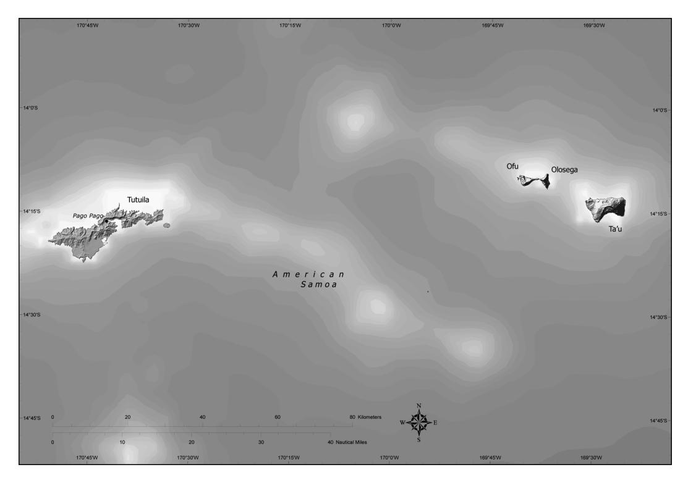
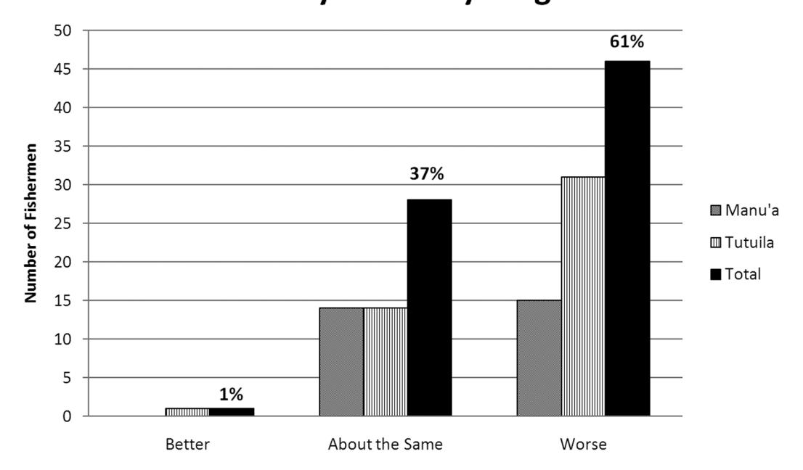
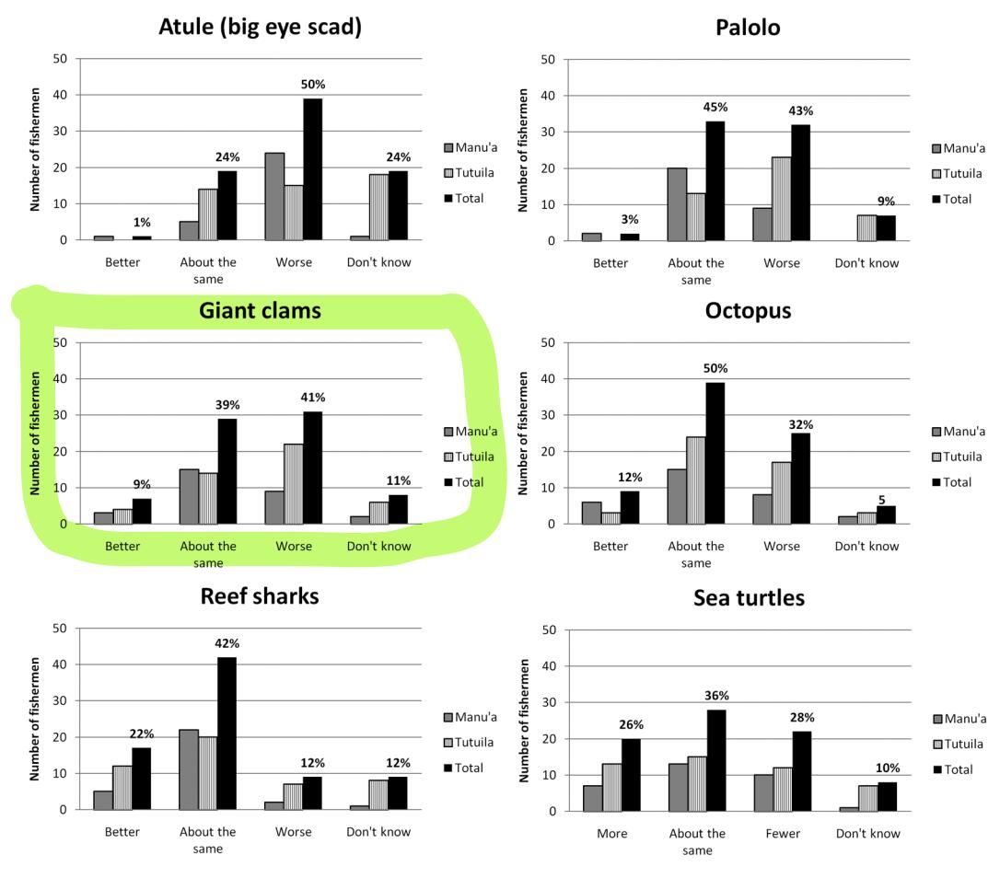
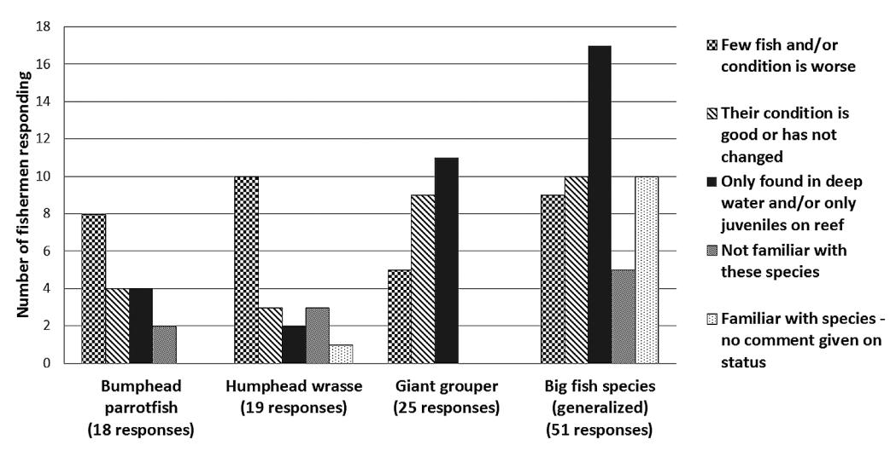
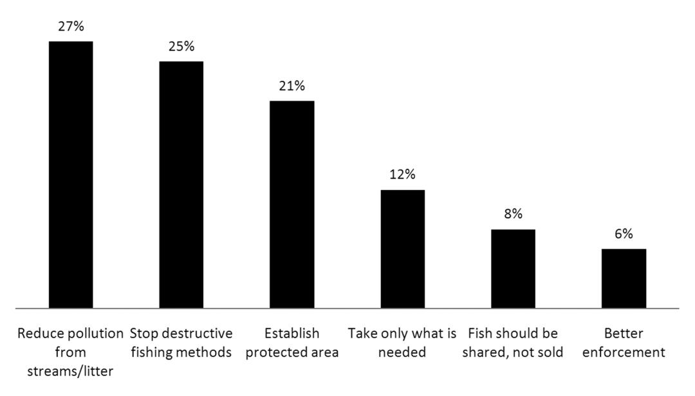

# **Traditional Knowledge, Use, and Management of Living Marine Resources in American Samoa: Documenting Changes over Time through Interviews with Elder Fishers**1

*Arielle Levine*2,4 *and Fatima Sauafea-Le'au*3

**Abstract:** We interviewed elder fishermen in American Samoa to better understand their perspectives on traditional use and management of marine resources and changes in the status of certain species over the course of time. Elder fishermen provide an important source of information in a context of limited catch data, declining fishing effort, and evolving local fishing traditions. Most fishermen interviewed during the study described a decline in the quality of various nearshore habitats, a general decrease in abundance of edible reef fish, and diminished abundance of locally valued *palolo*, *atule*, giant clams, and octopus. Populations of reef sharks and turtles are typically seen as stable or increasing. Fishermen from the relatively densely populated island of Tutuila tended to report a greater decrease in abundance of marine resources in general than did fishermen from the more remote Manu'a Islands. Elder fishermen commonly reported deterioration of nearshore and shoreline habitats as an issue of concern. Many interviewees also asserted that past use of destructive fishing methods has led to a decline in marine resources in the region. The fishermen generated various recommendations for improving local fisheries, including: reducing runoff-related pollution and sediment, preventing destructive fishing methods, and establishing marine protected areas. Although traditional marine tenure systems are no longer as influential in American Samoa as they were in the past, various rules regarding appropriate use of local marine ecosystems and associated resources continue to be implemented across the islands.

Pacific Science (2013), vol. 67, no. 3:395–407 doi:10.2984/67.3.7 © 2013 by University of Hawai'i Press All rights reserved

American Samoa and independent Samoa compose the Samoa archipelago, which is located immediately east of the international dateline between about 11° and 14° South latitude (see Figure 1 and Figure 1, of the Pacific basin, in Kittinger 2013 [this issue]). American Samoa is an unincorporated U.S. territory, with a total land area of just over 76 square miles (197 km2 ), with a population estimated at 55,519 (according to the 2010 US Census). The main inhabited islands of American Samoa include Tutuila, the largest and most populous island in the territory, as well as Aunu'u and the Manu'a group of Ta'u, Olosega, and Ofu Islands. Remote Swains Island is sparsely inhabited, with a population estimated at only 17 persons in 2010.

As in many Pacific island settings, use of marine resources for dietary and sociocultural

1 This article is part of a special issue of *Pacific Science* (vol. 67, no. 3) on the Human Dimensions of Small-Scale and Traditional Fisheries in the Asia-Pacific Region, guest editors John N. (Jack) Kittinger and Edward W. Glazier. This research was supported by a grant from the NOAA Preserve America Initiative, with in-kind assistance from the American Samoa Department of Marine and Wildlife Resources, and American Samoa National Park. Manuscript accepted 9 October 2012.

San Diego State University, Department of Geography, 5500 Campanile Drive, San Diego, California 92182-4493.

NOAA Pacific Islands Regional Office, Habitat Conservation Division, American Samoa Field Office, P.O. Box 388, Pago Pago, American Samoa 96799 (e-mail: Fatima.Sauafea-Leau@noaa.gov).

Corresponding author (e-mail: alevine@mail.sdsu .edu).

Figure 1. Map of American Samoa.

purposes is common among residents of coastal villages throughout American Samoa (Levine and Allen 2009). Historically, villagers throughout Samoa held tenure and enacted rights to use marine resources available in the adjacent coral reef ecosystems. Fishing activities were managed in accordance with local rules and regulations (Armstrong et al. 2010). Samoans continue to practice a number of traditional fishing methods, and village councils still exert influence over the management of local marine resources. However, local economies, resource use patterns, and the Samoan way of life have evolved over the past century.

Local control over marine resources or customary marine tenure is a traditional aspect of life in island regions throughout the Pacific (Johannes 1978), including Samoa (Johannes 1982*a*). But descriptive accounts of marine tenure, resource use rights, and resource management strategies as these were developed and implemented in the Samoa Islands in years past are limited in number. W. von Bulow briefly described Samoan fishing rights in a German-language periodical published in 1902, wherein he stated that "fishing rights are a peculiarity of Samoan customary rights . . . the regulations relating to fishing are as many and various as regulations relating to customary rights concerning the possession, acquisition, and disposal of land" (von Bulow 1902:40–41).

Perhaps the most thorough descriptions of historical fishing practices in Samoa come from Kra¨mer (1994, 1995), who described fishing methods as they were practiced during the late 1890s, and from Te Rangi Hïroa (1930), also known as Peter Buck, who described fishing practices observed during his visit to the islands in 1927. Holmes (1974) described fishing methods, taboos, and restrictions used in Samoa in the 1950s, and he documented diminishing fishing effort and increasing reliance on canned fish then taking place on the islands. Armstrong et al. (2010) provided a comprehensive review of archival sources documenting the pursuit and use of marine resources in the Samoa Islands, including descriptions provided by missionaries, anthropologists, and colonial administrators before 1950. Dye and Graham (2004) reviewed archaeological data and ethnohistoric accounts to describe patterns of use of reef-associated fish in the region. Finally, Auapa'au (1956) described traditional pursuit, use, and management of marine resources from the perspective of a native Samoan.

Although certain historical sources address fishing activities and resource management strategies as these were undertaken generally or in specific areas across the archipelago, no readily available sources focus specifically on islands in what is now known as American Samoa. Moreover, recent trends in the region's nearshore fisheries are not abundantly documented for any part of the Samoa Islands. To fill these gaps in the literature and to provide information of potential utility for local fishery management programs, we conducted a series of in-depth interviews with elder fishermen living in coastal villages throughout American Samoa. The goal of the interview process was to improve understanding of the past and current status of select marine resources to American Samoans and to document local perspectives on changes in the use and management of such resources over time.

As noted by Johannes (1982*a*), it is difficult to obtain reliable catch statistics for many Pacific island nearshore fisheries because these typically involve multiple species, numerous fishing methods, and undocumented distribution of the catch. American Samoa is no exception, and baseline data regarding catch and effort in the nearshore zone are largely absent for the region. But because elderly Samoan fishermen typically have had regular contact with the marine environment and its resources over the course of many years, they are capable of providing information regarding long-term changes in the status of such resources. Such information can be particularly valuable to fishery managers when other pertinent data sources are lacking (cf. Johannes 2003). Elder fishermen are also well suited to provide information about past and current resource management strategies, and they can provide informed suggestions for effectively managing local resources in the future.

### materials and methods

Between November 2007 and March 2008, our interview team conducted in-depth semistructured interviews with 78 elder fishermen residing in 28 villages across American Samoa. Although roughly 20% of the research participants were female, the term "fishermen" is used for sake of simplicity throughout this article. Given our interest in local perspectives regarding long-term changes in local resources and fisheries, criteria for inclusion in the sample required that participants be long-term fishermen and at least 40 yr old. The age of participants ultimately ranged between 40 and 86 yr; 90% were over the age of 50, and the average age was 62. Some 60% of respondents were from the island of Tutuila, and 40% were residents of Ofu, Olosega, or Ta'u in the Manu'a group.

Public officials working in regional marine resource management agencies assisted in the identification of pertinent resource management issues to be addressed during the interview process. Such persons and two interviewers (who were also experienced local fishermen) helped to develop valid and culturally meaningful questions regarding the nature and status of the marine environment, fishing practices, and resource management strategies. Perspectives on changes occurring in local fisheries and marine ecosystems relate to a time frame of the past 25 to 50 yr, depending on the age of the discussant. The interviews ultimately focused on the following topics:

- Changes in the general nature and frequency of fishing activities over time and space;
- Changes in levels of abundance and catch rates for reef fish in general, and for locally important species such as

*atule, palolo*, giant clams, sea turtles, octopus, and reef sharks.

• Changes among species of concern to local resource managers, including bumphead parrotfish, humphead wrasse, and giant grouper;

• The nature and location of "special" fishing areas and changes in the condi-

tion of such areas over time;

• Local restrictions on whether or how marine resources can be harvested;

• Traditional or historic methods of managing local marine resources;

- The importance of marine resources to Samoans and to *Fa'a Samoa* (the Samoan way of life);
- Other elements of traditional knowledge, such as fishing techniques and attributes of local and regional marine ecosystems.

Interviews were conducted primarily in the Samoan language by two-person teams of trained local interviewers. One interviewer asked questions while the second documented the discussions. Information provided during the interviews was translated, reviewed, coded, and subjected to qualitative and quantitative analysis.

### results

*Perceived Trends in Nearshore Reef Species*

Just over 60% of fishermen interviewed during the project reported that populations of reef fish have declined in abundance since they began fishing or observing such species earlier in their careers. This was most notable among fishermen residing on Tutuila, where nearshore ecosystems have been subject to pressures typically associated with extensive population growth and development (Figure 2).

Perspectives regarding changes in abundance tended to vary based on the species be-

Figure 2. Elder fishermen's perceptions of changes in the condition of reef fishing over time in American Samoa.

Figure 3. Fishermen's perceptions of changes in overall status of reef species over time: charts show results for the Manu'a Islands, Tutuila, and all interviews combined (total).

ing considered (Figure 3). For instance, many fishermen, particularly those residing in the Manu'a Islands, asserted that *atule* (bigeye scad [*Selar crumenophthalmus*]) fishing has declined over time and that people in a number of villages have not harvested the species in many years. This is unlike years past when persons in many villages around American Samoa regularly cooperated to catch *atule* using braided *lau* (fronds) to force the fish into weirs for harvest. Although this type of coordinated effort continues to occur in villages such as Fagasa and Ofu, many fishermen interviewed during the project stated that *atule* fishing is increasingly conducted with gill and throw nets. Some fishermen stated that use of nets and other modern methods of harvesting have led to diminished abundance of *atule,* but others believe that changes in coral reef ecosystems have caused an apparent state of decline. For instance, one fisherman stated that *atule* are no longer seen on the reef flats because the predatory species that would otherwise chase them there are declining in number.

*Palolo,* a polychaete worm, *Palola* (*Eunice*) *viridis,* is harvested during the creature's annual spawning period. In the Samoa Islands, this takes place 1 week after the October or November full moon, at the start of the rainy season (*vaipalolo*). *Palolo* begin to swarm to the ocean surface just after midnight, and in contemporary American Samoa, the creatures are harvested by villagers using lights and scoop nets in the nearshore zone and along the shoreline. Interviewees living in villages on Tutuila typically asserted that *palolo* have been declining in abundance over time, and some stated that the situation is largely associated with a decline in the condition of important coral reef habitat. Fishermen living in villages in the Manu'a group generally did not report that *palolo* populations have declined in abundance during recent decades.

From a cultural perspective, certain fishermen involved in the current study lamented the erosion of traditions associated with the *palolo* harvest. Interviewees stated that, in the past, villagers prepared for the harvest by bathing, dressing in good clothing, and wearing flower leis made of *moso*'*oi* (ylang-ylang) and other fragrant blossoms. One elder spoke of *palolo*-related traditions of the past: "To catch *palolo* you needed to 'style up' and be clean; you couldn't just walk in the ocean and catch *palolo* with a dirty shirt; you need to look as if you are going to dance! The *palolo* was abundant back in the days. Sometimes people couldn't harvest all of it . . . but nowadays, once the *palolo* comes, wherever you are, you just go out and catch it without following the traditional ways."

Erosion of certain traditions notwithstanding, the *palolo* harvest continues to be a festive time in many villages around American Samoa. Notably, it was traditionally forbidden to sell *palolo* because the harvest was meant to be shared with family members, neighbors, and village clergy. Although many residents of Tutuila and the Manu'a group continue to share *palolo,* a market has developed, and some harvesters freeze the worms and sell them in local markets at a high price.

Research participants were also asked about the status of giant clams (*Tridacna gigas*), *faisua* in Samoan. Responses varied extensively between interviewees residing on Tutuila and those residing in the Manu'a Islands. Forty-one percent of Tutuila fishermen reported that the population status of *faisua* is worse than in the past, but only 7% of fishermen residing in the Manu'a group believed this to be the case. Fishermen in both areas commonly stated that giant clams are now smaller than they were in decades past, and that the creatures are now being found and harvested on the reef slope at increasingly greater distances from the shoreline.

Most fishermen interviewed during this study did not perceive octopus ( *fe*'*e*) to be declining in abundance on either Tutuila or in the Manu'a Islands, although fishermen based in the Manu'a group typically asserted that local populations of *fe*'*e* are healthier than those around Tutuila. Moreover, regardless of place of residence, fishermen aged 70 and above were more likely than younger fishermen to assert that octopus populations are currently declining in size.

Elderly fishermen frequently described traditional methods for harvesting *fe*'*e*. These included use of cowrie shell lures (*mataife*'*e*), which were lowered by line and shaken in front of holes and crevices in the reef to lure the creatures from their lairs. Another method involved placement of containers on the reef; these were designed to mimic the sheltering holes in which *fe*'*e* usually reside. Once in the container, the octopus was easily harvested. Although such methods continue to be employed in certain areas, spears are now commonly used to glean *fe*'*e* from the reef. This activity, called *ta*'*igafe*'*e* in Samoan, is culturally appropriate for both men and women. Much of the octopus harvest takes place in March or April; *taife*'*e* is the term for the octopus season.

Reef shark populations were commonly reported to be in good condition in both island areas. Forty-two percent of all fishermen interviewed during the study said the status of reef sharks was about the same as earlier in their lives, and 22% stated that the populations had increased in size over time. These observations run counter to apparent trends in shark and other apex predator populations around the world, which are believed to be in a state of decline (cf. Robbins et al. 2006).

Shark fishing is called *lepaga* in Samoan. A traditional method of harvest called *"sele"* involved the use of bonita chum, pig innards, or other odorous bait, and a long noose, which was used to snare the shark once it surfaced alongside a fishing vessel. Although they continue to be caught on an incidental basis by fishermen in American Samoa, sharks reportedly are not frequently targeted.

Sea turtles are commonly referred to as *laumei* in Samoan. However, in certain proverbs and in relation to ceremonies, they are referred to as *"i*'*asa,"* which translates to "sacred fish." None of the interviewees indicated that turtles were considered a sacred species, but many mentioned a Samoan myth that holds that sea turtles have the power to guide lost fishermen back to land and safety. Four species of sea turtles are found in waters around American Samoa: green (*Chelonia mydas*), hawksbill (*Eretmochelys imbricata*), leatherback (*Dermochelys coriacea*), and olive ridley (*Lepidochelys olivacea* [rare]).

Elder fishermen living in American Samoa have observed turtle populations throughout their lives. But there was little overall consensus among interviewees regarding perceived changes in abundance over time: 36% of fishermen interviewed during the study asserted that the number of sea turtles observed in the region was about the same as earlier in their lives; 26% stated that turtles were more abundant than in the past; and 28% stated that fewer turtles were now present in the waters surrounding American Samoa. Perceptions were similar between fishermen living on Tutuila and in the Manu'a Islands. However, although the majority of fishermen under the age of 60 believed that sea turtle populations are currently stable or increasing in size, interviewees over the age of 70 were more likely to report that turtles are now less abundant than in years past. This suggests a possible change in the size of sea turtle populations over time (Figure 3).

An executive order was recently passed to ban shark fishing and harvest of large herbivorous species such as bumphead parrotfish (*Bolbometopon muricatum*), humphead wrasse (*Cheilinus undulatus*), and giant grouper (*Epinephelus lanceolatus*) in the study region. Recent biological surveys indicate that large herbivores are rare in American Samoa, possibly due to local fishing pressure and possibly due to natural constraints. Archaeological data from sites in American Samoa suggest that prehistoric and contemporary harvest patterns are similar in terms of targeted species (cf. Morrison and Addison 2008, Nagaoka 1993), but the data do not clearly indicate the nature or extent of early harvest of large herbivores.

Given a paucity of prehistoric and historic data regarding the status of large herbivores, we asked elder fishermen if they were familiar with the species and, if so, what they knew about them and whether they had observed changes in their abundance over time. Most respondents grouped the three species when they responded to the question and provided little consensus regarding the status of the overall population (Figure 4). Nearly 20 interviewees did discuss the individual status of bumphead parrotfish and humphead wrasse populations, with roughly half asserting that these species are uncommon or in a state of decline in areas with which they are familiar. Of the 25 fishermen who specifically discussed the status of giant grouper, 20% stated that the fish are uncommon or declining in number across the region, and 36% stated that the populations had not changed in size in recent years. Most stated that juvenile giant grouper were found on the reef flat, but adults were found only in deep water.

### *Fishermen's Explanations for Changes in Abundance*

Overfishing is cited as a key contributor to the decline of numerous marine species around the world, particularly those associated with nearshore coral reef ecosystems (see Jackson et al. 2001, Pauly et al. 2002, Bellwood et al. 2004). With regard to the current study, however, only 6% of interviewees stated that they perceived overfishing to be a problem for reef fish populations in American Samoa (Figure 5). Rather, it was commonly reported that certain *types* of fishing have diminished reef fish populations in the region. For instance, 48% of respondents living on Tutuila asserted that past use of fishing methods involving use of poisons and dynamite negatively affected reef fish populations around the island. This

Figure 4. Perceived changes in status of large herbivorous species in American Samoa.

problem was not mentioned by fishermen residing in the Manu'a Islands nor was it thought to be a pervasive problem in any part of American Samoa today.

Notably, many elders interviewed during the course of this project offered the perspective that the quality of local coral reef ecosystems had declined substantially during their careers as fishermen. One fisherman described a dramatic decrease in live coral cover since he was young: "You could hardly walk on the reefs in the past because of sharp corals. Nowadays, there are no more [sharp] corals . . . In the past, if you stood ashore with your fishing pole at any time you'd surely catch fish; today, it's a waste of time . . . ." Many fishermen discussed the apparent deterioration of coral reef habitat. Just over 40% of all interviewees discussed this issue, with 19% specifically mentioning the deleterious effects of sediment and pollution runoff resulting from land-based development. Numerous fishermen residing on Ta'u discussed concerns with construction of a new wharf on the island. The destructive impact of hurricanes and tsunamis on coral reef ecosystems was mentioned as a problem by respondents on all islands.

### *Fishery Management Issues*

Fishermen were asked about traditional means for managing local marine resources. The most commonly mentioned strategies included various village-based strictures, such as the banning of destructive fishing practices, preventing outsiders from fishing in nearshore waters adjacent to their village, prohibiting fishing on Sundays, and seasonal limitations on the harvest of certain species. Regarding the latter, harvest of species such as *atule* and *i*'*asina* (juvenile goatfish [*Mulloidichthys vanicolensis*]) was seasonally prohibited in certain areas to allow for spawning. An elder from the Manu'a Islands described this process in terms of a localized curfew: "When the *i'asina* are sighted near our shore, our village has a traditional curfew. This curfew will prevent people from using the *i'asina* as bait for fishing. The curfew forbids this until

Figure 5. Fishermen's perceptions of causes for perceived declines in the quality of reef fishing over time in American Samoa.

the catch is sufficient and equally distributed amongst the villagers . . . then the chiefs will advise the mayor to let everyone use the catch however they desire: they can use it for bait and also package some up to send to our families on Tutuila. This is still practiced up to the present."

Fishermen were also asked about practical means for improving management of local marine resources (Figure 6). Of the 52 fishermen who provided suggestions, 28% stated that land-based sources of pollution and sediment needed to be controlled, and another 21% recommended establishing some form of marine protected area. Other recommendations included a return to the generalized traditional approach of taking only what is needed from the ocean, harvesting fish for consumption or sharing rather than commercial sale, and better enforcement of existing regulations. Fishermen residing on Tutuila generally asserted the need for new and/or more stringent regulations, and Manu'abased fishermen often stated that they had been successful in managing local resources in the past and should be allowed to do so in the future.

### discussion

Traditional ecological knowledge and local perspectives regarding the status of marine resources constitute critically important sources of information for persons involved in the management of small-scale and traditional fisheries around the Pacific (cf. Johannes et al. 2000). Moreover, traditional marine tenure arrangements and restrictions on

Figure 6. Fishermen's suggestions for improving the status of marine resources in American Samoa.

certain kinds of fishing activities have been used by many Pacific island societies to enable sustainable harvest of local nearshore fish and other species. According to Johannes (1982*b*:259): "Throughout most of Oceania, the right to fish in a particular area was controlled by a clan, chief or family. Generally this control extended from mangrove swamps and shorelines across reef flats and lagoons to the outer reef slope. It would be difficult to overemphasize the importance of some form of limited entry such as this to sound fisheries management. Without some control over fishing rights, fishermen have little incentive not to overfish since they cannot prevent others from catching what they leave behind. This is a central tenet of modern fisheries management."

In the early 1980s, Johannes (1982*b*) stated that traditional fishing rights had largely disappeared from island areas such as Hawai'i, the Marianas, and American Samoa. But there has since been some resurgence and/or rediscovery of localized fisheries management strategies in such areas. Our interviews indicate that certain traditional fishing rights and resource management strategies survive in American Samoa in the twenty-first century. In some cases, traditional means of managing marine resources have become integrated in community-based fisheries management programs. These have been established in 12 villages across the study region and function to revive traditional village authority in a way that complements authority provided through the territorial fisheries management agency (Amituana'i and Sauafea 2005, Richmond and Levine 2012). Moreover, customary authority continues to be implemented on an informal basis in many American Samoa villages, and outsiders are typically expected to ask permission from the village council and/or local leaders before undertaking fishing activities next to the village in question. In some communities, local fishing restrictions primarily address schooling fish such as *atule* and *i*'*asina*. Of note, fishing activities continue to be forbidden in all villages on Sundays, and fishing is often forbidden when important village events such as funerals are taking place.

Local fishermen provide an important source of information regarding long-term environmental changes in a context of otherwise limited ecological and harvest data. Berkes et al. (2000:1252) argued that the extent to which such information can be considered "traditional" is not important; rather, the question is whether local knowledge can help resource managers to "monitor, interpret, and respond to dynamic changes in ecosystems and the resources and services that they generate."

Many fishermen involved in the current study asserted that the health of coral reef ecosystems and the abundance of associated reef fish species have diminished over their lifetimes, with the exception of sharks and sea turtles. Regarding sentinel species such as humphead wrasse, bumphead parrotfish, and giant grouper, elder fishermen generally did not express extensive concern about the relative lack of abundance of such fishes. This suggests that the species may not have been historically important food sources or commonly observed species in the region.

Although fishing methods have been modernized (Wass 1980), certain traditional fishing-related practices continue to be undertaken around American Samoa. For instance, residents of Ofu and Fagasa continue to harvest *atule* in the traditional way, involving the entire village in a mass fishing event. In Fagasa, special rocks continued to be ceremonially bathed in connection with the local *atule* harvest. Harvest of *palolo* also continues in village settings around American Samoa, although elders state that some of the traditions surrounding the harvest are eroding and that traditional gear, such as woven baskets and torches, have been replaced by modern materials such as scoop nets, buckets, and flashlights.

Analysis of interview data suggests that fishing is undertaken less frequently in contemporary American Samoa than it was in the past. Indeed, creel surveys and other sources of information indicate a decline in shoreline fishing effort in the region over the past 30 years (Craig et al. 1993, Kilarski and Everson 2008). Many factors were discussed in relation to this trend, including greater local involvement in paid employment opportunities, increasing availability of seafood for purchase, and greater difficulty catching fish. This apparent trend is unusual among contemporary Pacific island societies and is likely due to American Samoa's unique territorial economy, which involves numerous employment opportunities in the public sector and in the tuna-canning industry (Levine and Allen 2009).

Local knowledge of marine resources and traditional means for ensuring the sustained use of such resources have the potential to inform and thereby improve contemporary resource management decisions. It is therefore essential that the knowledge held by elder Samoan fishermen continue to be documented before it is lost in the course of time. It is also important to understand how local fishermen perceive the historic and contemporary status of coral reef ecosystems and associated species. This information can assist scientists and resource managers to better understand changes in species abundance and provide insight needed to develop and/or perpetuate resource management approaches that are culturally appropriate and therefore more likely to be supported by local residents. Community-based management approaches, such as the territory's Community-Based Fisheries Management Program discussed by many fishermen during this study, hold promise in this regard. This type of approach combines the cultural acceptability of customary marine tenure with the support of modern territorial legislation and enforcement. To be effective, such approaches must incorporate thorough understanding of historical and contemporary fishing and resource management practices and other forms of local and traditional knowledge about the marine environment.

### acknowledgments

We extend our appreciation to those in the local agencies in American Samoa who helped to plan and implement this project. The Department of Marine and Wildlife Resources generously provided staff time for interviews, transport to villages, and accommodations in the Manu'a Islands. American Samoa National Park also provided staff assistance and vehicle access. Fagatele Bay Sanctuary and Americorps provided interns, who also assisted with interviews. NOAA's Preserve American Initiative grant provided the bulk of the funding to initiate this project through a grant to NOAA's Pacific Island Fisheries Science Center. The Mia Tegner Memorial Research Grant provided funding to support translation of interview recordings. Risa Oram, Meredith Speicher, and Bill Kiene provided input and support during the initial grant proposal phase of the project. Marlowe Sabater, Stewart Allen, Doug Fenner, Fale Tuilagi, and Peter Craig assisted in formulating interview topics that would be relevant to current issues in American Samoa. NOAA's Pacific Islands Fisheries Science Center and Pacific Islands Regional Office supported our work during the interview and analytical phases of the work. This research could not have been completed without the help of our interview team: Fale Tuilagi, Burt Fuiava, Fialoa Maiava, Eddie Tarrant, and Fa'anape Fialua, who conducted interviews throughout Tutuila and Manu'a. Thanks also to Joe Iosefa (American Samoa Community College Samoan Studies Institute), who assisted in translating and transcribing interviews. The work is dedicated to the memory of Fale Tuilagi, whose experience helped to guide the project. A tremendous thanks goes out to all of the fishermen who so graciously shared their knowledge. *Fa*'*afetai tele lava*.

## **Literature Cited**

Amituana'i, A., and F. Sauafea. 2005. Improving community skills and knowledge to build, enhance and promote environmental stewardship. Proceedings of the 2004 National Environment Forum. Samoa Ministry of Natural Resources and Environment, No. 4. Apia, Samoa.

Armstrong, K., D. Herdrich, and A. Levine. 2010. Historic fishing methods in American Samoa. NOAA Tech. Memo. NMFS-

PIFSC.

Auapa'au, S. 1956. Fishing methods used by Samoans. Laufasi Ola 1 (3): 1–6.

Bellwood, D. R., T. P. Hughes, C. Folke, and M. Nystrom. 2004. Confronting the coral reef crisis. Nature (Lond.) 429:827.

Berkes, F., J. Colding, and C. Folke. 2000. Rediscovery of traditional ecological knowledge as adaptive management. Ecol. Appl. 10 (5): 1251–1262.

Craig, P., B. Ponwith, F. Aitaoto, and D. Hamm. 1993. The commercial, subsistence, and recreational fisheries of American Samoa. Mar. Fish Rev. 55 (2): 109–116.

Dye, T. S., and T. R. Graham. 2004. Review of archaeological and historical data concerning reef fishing in Hawaii and American Samoa. T. S. Dye and Colleagues, Archaeologists, Inc. Honolulu.

Hïroa, T. R. (a.k.a. Peter Buck). 1930. Samoan material culture. Bernice P. Bishop Mus. Bull. 75.

Holmes, L. 1974. Samoan village. Case Studies in Cultural Anthropology. Stanford University, Stanford, California.

Jackson, J., M. Kirby, W. Berger, K. Bjorndal, L. Botsford, B. Bourque, R. Bradbury, R. Cooke, J. Erlandson, J. Ester, T. Hughes, S. Kidwell, C. Lange, H. Lenihan, J. Pandolfi, C. Peterson, R. Steneck, M. Tegner, and R. Warner. 2001. Historical overfishing and the recent collapse of coastal ecosystems. Science (Washington, D.C.) 27:629–637.

Johannes, R. E. 1978. Traditional marine conservation methods in Oceania and their demise. Annu. Rev. Ecol. Syst. 9:349– 364.

———. 1982*a*. Reef and lagoon resource management in Western Samoa. South Pacific Regional Environmental Program, Apia. http://www.spc.int /DigitalLibrary/ Doc / FAME/ Reports/Johannes\_82 \_ReefLagoon\_ResourceManagement \_WesternSamoa.pdf.

———. 1982*b*. Traditional conservation methods and protected marine areas in Oceania. Ambio 11 (5): 258–261.

———. 2003. Use and misuse of traditional ecological knowledge and management practices: Pacific island examples. Pages 111–126 *in* D. Dallmeyer, ed. Values at

- sea: Ethics for the marine environment. University of Georgia Press, Athens.
- Johannes, R. E., M. M. R. Freeman, and R. J. Hamilton. 2000. Ignore fishers' knowledge and miss the boat. Fish Fish. 1:257–271.
- Kilarski, S., and A. Everson. 2008. Proceedings of the American Samoa Coral Reef Fishery Workshop (October 2008). NOAA Tech. Memo. NMFSF-SPO-114.
- Kittinger, J. N. 2013. Human dimensions of small-scale and traditional fisheries in the Asia-Pacific region. Pac. Sci. 67:315–325 (this issue).
- Kra¨mer, A. 1994, 1995. The Samoa Islands: An outline of a monograph with particular consideration of German Samoa. Vol. I (1994; orig. 1901) and Vol. II (1995; orig. 1903). University of Hawai'i Press, Honolulu.
- Levine, A., and S. Allen. 2009. American Samoa as a fishing community. NOAA Tech. Memo. NMFS-PIFSC-19.
- Morrison, A. E., and D. J. Addison. 2008. Assessing the role of climate change and human predation on marine resources at the Fatu-ma-Futi site, Tutuila Island, American Samoa: An agent based model. Archaeol. Oceania 43:22–34.
- Nagaoka, L. 1993. Faunal assemblages from the To'aga site. Pages 189–214 *in* P. V. Kirch and T. L. Hunt, eds. The To'aga site: Three millennia of Polynesian occupation in the Manu'a Islands, American

- Samoa. Contrib. Univ. Calif. Archaeol. Res. Facil. No. 51. Berkeley.
- Pauly, D., V. Christensen, S. Guénette, T. J. Pitcher, U. R. Sumaila, C. J. Walters, R. Watson, and D. Zeller. 2002. Towards sustainability in world fisheries. Nature (Lond.) 418:689.
- Richmond, L., and A. Levine. 2012. Institutional analysis of community-based marine resource management initiatives in Hawaii and American Samoa. NOAA Tech. Memo. NOAA-TM-NMFS-PIFSC-35.
- Robbins, W. D., M. Hisano, S. R. Connolly, and J. H. Choat. 2006. Ongoing collapse of coral-reef shark populations. Curr. Biol. 16:2314–2319.
- von Bulow, W. 1902. Fishing rights of the natives of German Samoa. Globus LXX:40– 41. (Transl. Christa Johannes). Appendix C *in* R. E. Johannes, 1982, Reef and lagoon resource management in Western Samoa. South Pacific Regional Environmental Program, Apia. [Unpublished Report]
- Wass, R. C. 1980. The shoreline fishery of American Samoa: Past and present. Pages 51–83 *in* Marine and coastal processes in the Pacific: Ecological aspects of coastal zone management. Paper presented at a UNESCO Seminar held at Motupore Island Research Centre, University of Papua New Guinea, Port Moresby, 14–17 July. Available from UNESCO.

Copyright of Pacific Science is the property of University of Hawaii Press and its content may not be copied or emailed to multiple sites or posted to a listserv without the copyright holder's express written permission. However, users may print, download, or email articles for individual use.