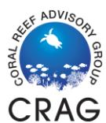
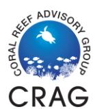

## Liability Release and Assumption of Risk for Visiting Divers

Please read each statement listed below and write your initials on the line at the beginning of each sentence to indicate your understanding of the statement, and your agreement to adhere to these terms and conditions while diving with the American Samoa Governor's Coral Reef Advisory Group. \_\_\_\_\_ I hereby declare that I have read, accepted, and agreed to abide by the terms and conditions of the CRAG Dive Safety Manual. \_\_\_\_\_ I hereby declare that I am a certified scuba diver, trained in safe diving practices, and I am aware that scuba diving has inherent risks that may result in serious injury or death. \_\_\_\_\_ I understand that diving with compressed air (including nitrox) involves certain inherent risks; decompression sickness, embolism, or other hyperbaric injuries can occur that require treatment in a recompression chamber. I further understand that the dives will be conducted at a site that is remote, either by time or distance or both, from such a recompression chamber. I choose to proceed with this dive or dives in spite of the absence of a recompression chamber in proximity to the dive site. \_\_\_\_\_ I understand that the hazards of scuba diving may include those hazards occurring during boat travel to and from the dive site. I understand that these hazards include, but are not limited to slipping or falling while on board, being cut or struck by a boat while in the water, injuries occurring while getting on or off a boat, and other perils of the sea. By signing this release, I certify that I am fully aware of and expressly assume these and all other risks involved in making the dives. \_\_\_\_\_ I understand and agree that neither CRAG, nor any of their respective officers, employees, or contractors (hereinafter referred to as "Released Parties") may be held liable or responsible in any way for any injury, death or other damages to me, my family, estate, heirs, or assigns that may occur as a result of my diving, or use of equipment, boat travel, or as a result of the negligence of any party, including the Released Parties, whether passive or active. \_\_\_\_\_ In consideration of being allowed to participate in the dives, I hereby personally assume all risks of the dive or dives, whether foreseen or unforeseen, that may befall me during the dives and boat travel. \_\_\_\_\_ I also understand that scuba diving is physically strenuous activities and that I will be exerting myself during the dives and that if I am injured as a result of heart attack, panic, hyperventilation, drowning or any other cause, that I assume the risk of said injuries and that I will not hold the Released Parties responsible for the same.

| Signature of Visiting Diver                                                               | Date                                                                                                                                                                                                        |
|-------------------------------------------------------------------------------------------|-------------------------------------------------------------------------------------------------------------------------------------------------------------------------------------------------------------|
|                                                                                           |                                                                                                                                                                                                             |
| of risk by reading it before I signed it on behalf of my heirs and myself.                |                                                                                                                                                                                                             |
|                                                                                           | I have fully informed myself of the contents of this agreement, liability release, and assumption                                                                                                           |
| and assumption of risk by reading it before I signed it on behalf of my heirs and myself. | I have fully informed myself of the contents of this equipment use agreement, liability release,                                                                                                            |
| whether passive or active.                                                                | wrongful death, however caused, including but not limited to the negligence of the released parties,                                                                                                        |
|                                                                                           | By this instrument, it is my intention to exempt and release CRAG and all related entities as defined above, from all liability or responsibility whatsoever for personal injury, property damage, or    |
| construed as though the unenforceable provision had never been contained herein.          |                                                                                                                                                                                                             |
|                                                                                           | that provision shall be severed from the Agreement. The remainder of the Agreement will then be                                                                                                             |
|                                                                                           | signed this document of my own free act and with the knowledge that I hereby agree to waive my legal rights. I further agree if any provision of this Agreement is found to be unenforceable or invalid, |
|                                                                                           | I understand that the terms herein are contractual and not a mere recital, and that I have                                                                                                                  |
|                                                                                           | I further declare that I am of lawful age and legally competent to sign this liability release.                                                                                                             |
| equipment.                                                                                |                                                                                                                                                                                                             |
|                                                                                           | I hereby enter into an agreement between myself and CRAG for the use of CRAG equipment. This agreement is a release of my rights to sue for injuries or death resulting from the use of this             |
| arising during the dives or after the dives.                                              |                                                                                                                                                                                                             |
|                                                                                           | I further release, exempt, and hold harmless the dives and Released Parties from any claim or lawsuit by me, my family, estate, heirs, or assigns, arising from my dives, including both claims          |
| to inspect my equipment prior to diving.                                                  |                                                                                                                                                                                                             |
|                                                                                           | my equipment is not working properly. I will not hold the Released Parties responsible for my failure                                                                                                       |
|                                                                                           | I will inspect all of my equipment prior to diving and will notify the Released Parties if any of                                                                                                           |
| under the influence of the medication/drugs.                                              |                                                                                                                                                                                                             |
|                                                                                           | diving. If I am taking medication, I declare that I have seen a physician and have approval to dive                                                                                                         |
| the influence of alcohol, nor am I under the influence of any drugs that are contra       | -indicatory to                                                                                                                                                                                              |
|                                                                                           | I declare that I am in good mental health and physically fit for diving, and that I am not under                                                                                                            |

2