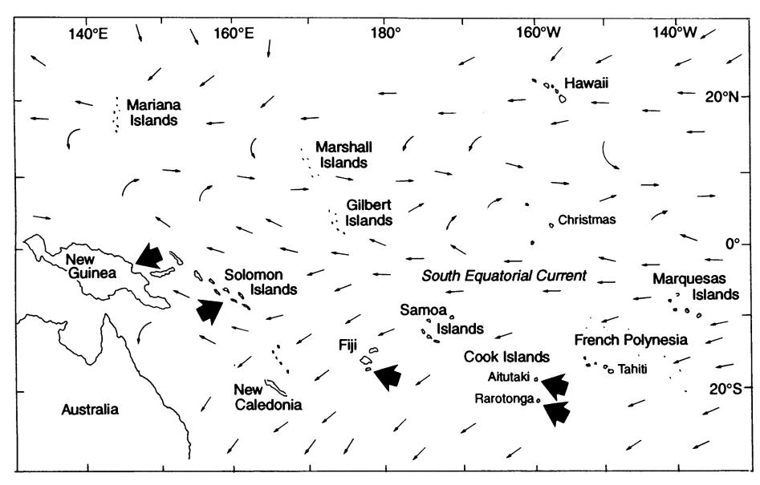
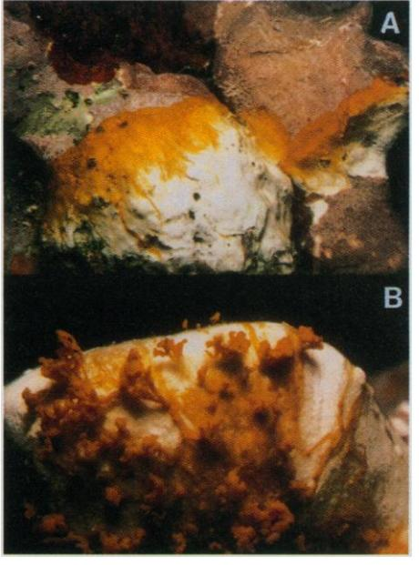
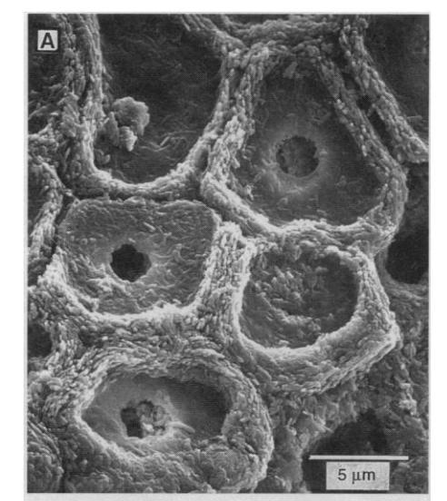
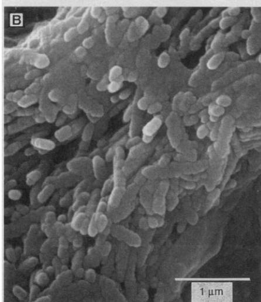
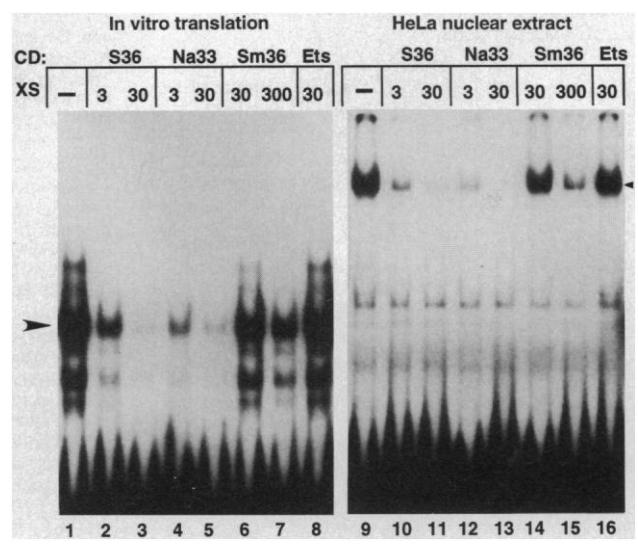

Impact of CLOD Pathogen on Pacific Coral Reefs Author(s): Mark M. Littler and Diane S. Littler

Source: Science, New Series, Vol. 267, No. 5202 (Mar. 3, 1995), pp. 1356-1360

Published by: American Association for the Advancement of Science

Stable URL: https://www.jstor.org/stable/2886005

Accessed: 15-11-2024 01:58 UTC

JSTOR is a not-for-profit service that helps scholars, researchers, and students discover, use, and build upon a wide range of content in a trusted digital archive. We use information technology and tools to increase productivity and facilitate new forms of scholarship. For more information about JSTOR, please contact support@jstor.org.

Your use of the JSTOR archive indicates your acceptance of the Terms & Conditions of Use, available at https://about.jstor.org/terms

American Association for the Advancement of Science is collaborating with JSTOR to digitize, preserve and extend access to Science

 tetraploid and then multiple aneuploid cell populations (8, 20). We have shown previ ously that formation of tetraploid pancreat ic cells in these mice coincides with the appearance of cells displaying multiple cen trioles and undergoing multipolar mitoses (9). These results suggest a mechanism for the development of a genetically unstable tetraploid cell population during neoplastic progression. Mouse cells devoid of the p53 dependent spindle checkpoint are capable of completing events of the subsequent cell cycle, including DNA synthesis, without completing chromosome segregation. Rep lication of DNA and reduplication of cen trosomes and centrioles without completion of chromosome segregation in mitosis could lead to the formation of a tetraploid cell that has an abnormal number of mitotic poles, predisposing the organism to multi polar mitoses, chromosome segregation ab normalities, aneuploidy, and cancer.

## REFERENCES AND NOTES

- 1. L. H. Hartwell and D. Smith, Genetics 110, 381 (1985).
- 2. M. Brown et al., Cold Spring Harbor Symp. Quant. Biol. 56, 359 (1991); A. W. Murray, ibid., p. 399; T. A. Weinert and L. H. Hartwell, Science 241, 317 (1988); M. Dasso and J. W. Newport, Cell 61, 811 (1990); T. Enoch and P. Nurse, ibid. 60, 665 (1990); L. H. Hartwell and T. A. Weinert, Science 246, 629 (1989); L. H. Hartwell, J. Culotti, J. R. Pringle, B. J. Reid, ibid. 183, 46 (1974); D. Broek, R. Bartlett, K. Crawford, P. Nurse, Nature 349, 388 (1991).
- 3. R. Li and A. Murray, Cell 66, 519 (1991); M. A. Hoyt, L. Totis, B. T. Roberts, ibid., p. 507.
- 4. S. J. Baker et al., Science 244, 217 (1989); M. Holl stein, D. Sidransky, B. Vogelstein, C. C. Harris, ibid. 253, 49 (1991).
- 5. D. P. Lane and L. V. Crawford, Nature 278, 261 (1979); D. I. H. Linzer and A. J. Levine, Cell 17, 43 (1979); A. J. Levine, J. Momand, C. A. Finlay, Nature 351, 453 (1991).
- 6. M. B. Kastan, 0. Onyekwere, D. Sidransky, B. Vo gelstein, R. W. Craig, Cancer Res. 51, 6304 (1991); S. J. Kuerbitz, B. S. Plunkett, W. V. Walsh, M. B. Kastan, Proc. Natl. Acad. Sci. U.S.A. 89, 7491 (1992); M. B. Kastan et al., Cell 71, 587 (1992); Y. Yin, M. A. Tainsky, F. Z. Bischoff, L. C. Strong, G. M. Wahl, ibid. 70, 937 (1992); X. Lu and D. P. Lane, ibid. 75, 765 (1993).
- 7. L. R. Livingstone et al., Cell 70, 923 (1992).
- 8. D. M. Ornitz, R. E. Hammer, A. Messing, R. D. Palmiter, R. L. Brinster, Science 238, 188 (1987).
- 9. D. S. Levine, C. A. Sanchez, P. S. Rabinovitch, B. J. Reid, Proc. Natl. Acad. Sci. U.S.A. 88, 6427 (1991).
- 10. G. J. A. Offerhaus et al., Gastroenterology 102,1612 (1992); P. L. Blount et al., Cancer Res. 54, 2292 (1994); K. Neshat et al., Gastroenterology 106, 1589 (1994).
- 11. P. Carder et al., Oncogene 8, 1397 (1993).
- 12. M. Harvey et al., ibid., p. 2457.
- 13. R. E. Zirkle, Radiat. Res. 41, 516 (1970); C. L. Reider and S. P. Alexander, in Mechanisms of Chromo some Distribution and Aneuploidy, M. Resnick and B. Vig, Eds. (Liss, New York, 1989), pp. 185-194.
- 14. H. N. Barber and H. G. Callan, Proc. R. Soc. London Ser. B. 131, 258 (1942); R. J. Wang and L. Yin, Exp. Cell Res. 101, 331 (1976).
- 15. A. L. Kung, S. W. Sherwood, R. T. Schimke, Proc. Natl. Acad. Sci. U.S.A. 87, 9553 (1990).
- 16. R. T. Schimke, A. L. Kung, D. F. Rush, S. W. Sher wood, Cold Spring Harbor Symp. Quant. Biol. 56, 417 (1991).
- 17. N. M. Lopes, E. G. Adams, T. W. Pitts, B. K. Bhuyan, Cancer Chemother. Pharmacol. 32, 235 (1993); J. Liebmann et al., ibid. 33, 331 (1994); J.

- R. Roberts, D. C. Allison, R. C. Donehower, E. K. Rowinsky, Cancer Res. 50, 710 (1990); J. Laffin, D. Fogleman, J. M. Lehman, Cytometry 10, 205 (1989); S. G. Kuhar and J. M. Lehman, Oncogene 6, 1499 (1991).
- 18. A. Levan, Ann. N. Y Acad. Sci. 63, 774 (1956); J. A. Kirkland, M. A. Stanley, K. M. Cellier, Cancer 20, 1934 (1967); P. A. Bunn, S. Kransnow, R. W. Makuch, M. L. Schlam, G. P. Schlechter, Blood 59, 528 (1982); A. Jakobsen, S. Mommsen, S. Olsen, Cytometry4, 170 (1983); H. Wijkstrom, I. Granberg- Ohman, B. Tribukait, Cancer 53,1718 (1984); J. R. Shapiro and W. R. Shapiro, Cancer Metastasis Rev. 4,107 (1985); W. T. Knoefel, U. Otto, H. Baisch, G. Kloppel, CancerRes. 47,221 (1987); D. R. Burholt et al., ibid. 49, 3355 (1989).
- 19. S. E. Shackney et al., Cancer Res. 49, 3344 (1989).
- 20. S. Ramel et al., Pancreas, in press.

- 21. D. J. Arndt-Jovin and T. M. Jovin, J. Histochem. Cytochem. 25, 585 (1977); J. Gong, B. Ardelt, F. Traganos, Z. Darzynkiewicz, Cancer Res. 54, 4285 (1994).
- 22. W. H. Raskind et al., Cancer Res. 52, 2946 (1992).
- 23. T. Jacks et al., Curr. Biol. 4, 1 (1994).
- 24. We thank L. Hartwell and T. Jacks for thoughtful discussions and critical review of this manuscript; D. Cowan, R. Sudore, P. Galipeau, and the University of Washington flow cytometry core facility for technical assistance; R. Brinster and E. Sandgren for the Tg264-4 transgenic mice; and T. Jacks for p53-de ficient mice. Supported by NIH grant R01 CA55814, American Cancer Society grant EDT-21 E, the Ryan Hill Research Foundation, and the Ersta Hospital Re search Fund.

30 August 1994; accepted 9 January 1995

## Impact of CLOD Pathogen on Pacific Coral Reefs

Mark M. Littler and Diane S. Littler

 A bacterial pathogen of coralline algae was initially observed during June 1993 and now occurs in South Pacific reefs that span a geographic range of at least 6000 kilometers. The occurrence of the coralline algal pathogen at Great Astrolabe Reef sites (Fiji) increased from zero percent in 1992 to 100 percent in 1993, which indicates that the pathogen may be in an early stage of virulence and dispersal. Because of the important role played by coralline algae in reef building, this pathogen, designated coralline lethal orange disease (CLOD), has the potential to greatly influence coral reef ecology and reef-building processes.

 Barrier, fringing, and atoll reefs are com plex ecosystems that depend on calcareous coralline algae for the maintenance of wave-resistant fronts. Crustose coralline al gae (an order of the Rhodophyta or red algal phylum) are plants that deposit a par ticularly hard and geologically resistant form of calcium carbonate (calcite). These algae cement together much of the sand, dead coral, and debris to create a stable substrate. Many have a prostrate-type growth form and look like red, pink, or purple cement covering large areas of the reef, whereas others form upright branched heads much like the corals. Crustose coral line algae, particularly Porolithon onkodes in the Pacific and Porolithon pachydermum in the Atlantic, are the principal cementing agents that produce the structural integrity and resilience of the outer reef rim. Coral line algae are important for the absorption of wave energy that would otherwise erode shoreward land masses and for the facilita tion of the development of most other shal low reef communities (1, 2).

 No previously characterized diseases cause significant mortality of coralline al gae. However, diseases resulting in bandlike tissue necrosis and colony death are known for western Atlantic (3) and Great Barrier Reef (4) reef-building corals. The variety of

 Department of Botany, National Museum of Natural His tory, Smithsonian Institution, Washington, DC 20560, USA.

 microorganisms reported in association with necrotic bands on corals include the cyanobacterium Phormidium corallyticum [shown to cause black band disease (5)] and the bacteria Beggiatoa and Desulfovibrio [present secondarily (6)]. Most ecological studies of algal pathogens have concentrat ed on freshwater phytoplankton or benthic diatoms; few data exist on the importance of pathogens in marine macroalgae and no pathogens are known for coralline algae.

 Here we describe the growth habit of a bright orange bacterial pathogen that is le thal to coralline algae (termed coralline lethal orange disease, CLOD). CLOD is similar to the coral banding diseases in that the pathogen occurs as a line or front that moves across the host and leaves complete ly dead skeletal carbonate behind. Because of the critical role played by coralline algae in forming reef rims throughout the Indo- Pacific (2) and because reef-building coral line algae extend to much greater latitudes and depths than hermatypic corals (7), CLOD may influence reef ecology and reef building processes.

 Coralline lethal orange disease was ini tially recorded on southwest Aitutaki Is land, Cook Islands (Fig. 1), from the back reef through the barrier reef algal ridge and throughout the fore-reef spur and groove to a depth of 30 m (8). The pathogen appeared as conspicuous bright orange dots that spread to become thin circular rings (up to

1356 SCIENCE \* VOL. 267 \* 3 MARCH 1995

30 cm in diameter), but it also developed unidirectionally in fan shapes (Fig. 2A), or as ever-broadening dichotomies. The skeletal carbonate remains of the dead host corallines were bleached white (Fig. 2A) from the epithallus to the hypothallus, and the upper surfaces began to flake by sloughing after death. When the alga was totally consumed (confirmed microscopically), the advancing band of CLOD formed upright filaments and globules (Fig. 2B), similar to those of terrestrial slime molds.

The disease occurred at all study sites (100% frequency, Table 1) on Aitutaki Island and Rarotonga Island of the Cook Islands (9) and the Great Astrolabe Reef of Fiji (10) in 1993, with mean coverages that were visually estimated of 0.5, 0.2, and <0.1%, respectively. CLOD was not noted in Fiji by our group of four divers throughout July 1992, although coralline algal popula-

tions were intensively and extensively investigated at 25 of the identical sites and depth ranges surveyed during July 1993 and June 1994. During 1994, CLOD was present at all 50 sites in Fiji with about double the amount of cover observed during 1993. CLOD occurred during 1994 at 31% of the 13 Solomon Islands study sites in trace amounts and at 83% of 19 Papua New Guinea sites with 1.5% mean cover (Table 1). Peak abundances determined from 1993 photoquadrats (Table 2) averaged 0.8 ± 0.1% (mean ± SE) cover between 6 to 18 m at three study sites on Aitutaki Island, and abundances were higher on Nacalevu Reef, Dravuni Island, Fiji ( $2.5 \pm 0.3\%$  mean cover at a depth of 1.5 m). CLOD infections had declined to  $1.0 \pm 0.8\%$  cover 1 year later on Nacalevu Reef (Table 2) in conjunction with a phase shift from coralline and corals to fleshy algal domination (Table 3).

Fig. 1. Study areas (large arrows) and predominant South Equatorial Current system (small arrows). Drawing modified from (23).

**Table 1.** Visual transect estimates of CLOD-infected coralline algal cover for barrier and fringing reef sites on the Great Astrolabe Reef, Rarotonga and Aitutaki Islands, Solomon Islands, and Papua New Guinea. During 1992, CLOD was not abundant enough to be encountered at either Nacalevu Reef or any of the barrier sites in Fiji. The sites examined were located at depths ranging from 0 to 40 m.

|                   |                  | 0 1                    | Visual transect estimates of CLOD |                                          |  |
|-------------------|------------------|------------------------|-----------------------------------|------------------------------------------|--|
| Sites             | n (transects) | Sample area (m²) | Cover (%)                         | Frequency of occurrence (% of transects) |  |
| Great Astrolabe   |                  |                        |                                   |                                          |  |
| 1993 barrier reef | 40               | 4000                   | < 0.1                             | 100                                      |  |
| 1994 barrier reef | 50               | 5000                   | 0.2                               | 100                                      |  |
| Rarotonga         |                  |                        |                                   |                                          |  |
| Outer reef        | 8                | 800                    | 0.2                               | 100                                      |  |
| Aitutaki Island   |                  |                        |                                   |                                          |  |
| Barrier reef      | 7                | 700                    | 0.5                               | 100                                      |  |
| Solomon Islands   | 13               | 1300                   | < 0.1                             | 31                                       |  |
| Papua New Guinea  | 19               | 1900                   | 1.5                               | 83                                       |  |

SCIENCE • VOL. 267 • 3 MARCH 1995

Examination of both isolated CLOD propagules and fragments of artificially and naturally infected P. onkodes under scanning electron microscopy (SEM) (Fig. 3) revealed the presence of a colonial bacterium within a mucilaginous matrix (11). The front of the invasive CLOD band (Fig. 3A) was a highly motile conglomeration of mostly parallel gliding rods (1 to 13 cells long; mean  $\pm$  SE of 4.5  $\pm$  0.4, n = 50) that inundated the surface of the host cells. The cells composing the rods were constricted at the walls, quite small, and twice as long as wide (measuring  $0.1 \pm 0.01 \mu m$  mean width,  $0.2 \pm 0.04 \mu m$  mean length, n = 50) with the end cells tapering. Host algal cells, including all subsurface cells, behind the bands of CLOD exhibited the aftermath of tissue necrosis (Fig. 3A), with only starkwhite skeletal material remaining.

Twenty-four experimental fragments of CLOD-infected *P. onkodes* showed 100% transfer to uninfected (that is, having no visible sign of CLOD) individuals of *P. onkodes* within 24 hours (Table 4), whereas 24 control fragments resulted in no infections (12). Isolated globules (Fig. 2B) placed on surfaces of healthy coralline thalli were also 100% infective (Table 4) and began to cause bleaching of the host within about 12 to 24 hours, confirming their role as propagules. Isolates of the CLOD bacterium from artificially infected material under SEM showed that it had retained its original monospecific aspect (Fig. 3B).

**Fig. 2.** (**A**) Growth habit of active CLOD showing two contiguous patches of living *P. onkodes* at the top of the band and dead skeletal material below (70% of actual size). (**B**) Formation of CLOD propagules (used in pathology and growth experiments, Table 4) after total consumption of living host material (magnification ×1.4).

All 36 CLOD infections initiated from isolated propagules demonstrated rapid linear growth rates (Table 4), whereas none of the control patches became infected. The maximum linear increase was 2.9 mm/day, with a mean  $\pm$  SE of 1.5  $\pm$  0.1 mm/day (n = 36). The living CLOD bands reached widths of 1.8 cm and averaged 0.6  $\pm$  0.03 cm (n = 180) in width on the infected coralline algae.

Trace levels (that is, a single propagule per quadrat) of CLOD-infected coralline cover increased to 27.4% cover (significant at P < 0.05, Bonferroni test) during the first 16 days (Table 3) (13). One year later, bleached coralline cover plus CLOD-infected area averaged only 0.7% cover in these same quadrats (significantly less, P < 0.05). Concomitantly, there was a threefold decline in living coralline cover, a 10-fold increase in filamentous microalgae, and a doubling in frondose macroalgae (all three changes significant at P < 0.05, Table 3).

A 9-day longevity study on material from Fiji indicated little decline in viability of CLOD, with infection rate decreasing (to 62% infective propagules) only at the ninth day (14). Similarly, a 16-day study on propagules from Papua New Guinea revealed a sharp drop in viability after about 8 days (to

25% at 12 days), but viable propagules persisted for 14 days (12%). Field populations monitored as controls showed zero mortality and continued to spread throughout both the 9- and 16-day studies.

The sinking rate of large propagules ( $\sim$ 3 mm in diameter) was relatively rapid at 1.6  $\pm$  0.05 cm/s (mean  $\pm$  SE) compared with the smaller propagules ( $\sim$ 0.5 mm in diameter) which sank at 0.8  $\pm$  0.02 cm/s.

All species of Corallinaceae tested became infected within 2 days after experimental contact with CLOD propagules (15). Genera that were infected included the jointed forms Amphiroa spp. (six species), Jania spp. (two species), and Corallina sp. and the crustose forms Porolithon sp., Hydrolithon sp., Neogoniolithon sp., Lithophyllum sp., Mesophyllum sp., Sporolithon sp., and Lithothamnion sp. No members of the two genera of Squamariacea tested (Peyssonnelia spp. and Hildenbrandia sp.) were infected by continual contact with CLOD propagules for 10 days. The same taxa (but uninoculated) monitored in both the laboratory and field as controls showed no CLOD infections during the study.

The CLOD bacterium affects a broad spectrum of reef-building coralline algae, particularly the dominant builder of algal

ridges P. onkodes, over distances that span at least 6000 km in the South Pacific (Fig. 1). Low cover values do not necessarily reflect the importance or long-term impact of a mobile pathogen. Although CLOD was less abundant in June 1994 (<1% cover) than it was in July 1993 (27% cover) in successional plots at Nacalevu Reef (Table 3), the local community composition had been greatly altered from a preponderance of crustose corallines and corals to domination by overgrowths of fleshy algae. The initial effect of CLOD is a loss of productivity and carbonate accretion at the organismic and population scales, because P. onkodes produces 3.2 mg of organic carbon per square meter of projected thallus area per hour and 1.9 mg of carbonate Ca per square meter per hour over a 12-hour day,

**Fig. 3.** (**A**) SEM of crustose coralline algal surface under attack by forward cells of the coralline lethal orange band. The raised polygonal ridges are *P. onkodes* cell walls, and the holes are thin areas that have broken through during preparation for SEM. (**B**) SEM of the CLOD bacterium from an artificially inoculated *P. onkodes* host.

**Table 2.** Percent cover (±SE) in quadrats of corals, frondose algae, and healthy and infected (dead and dying due to CLOD) crustose coralline algae (predominantly *P. onkodes*) on Nacalevu Reef (Dravuni Island, Great Astrolabe Reef, Fiji) and southwest Aitutaki Island (Cook Islands). Sites on the Great Astrolabe Reef were located at depths ranging from 0 to 1.5 m, and those of Aitutaki Island from 6 to 18 m.

| Sites                   | n (quad- rats) | Sample area (m²) | Photogrammetric transect percent coverages |                        |                 |               |
|-------------------------|----------------------|------------------------|--------------------------------------------|------------------------|-----------------|---------------|
|                         |                      |                        | Corolo                                     | Frondose algae Healthy | Coralline algae |               |
|                         | rais)                | (111-)                 | Corals                                     |                        | Healthy         | CLOD-infected |
| Great Astrolabe         |                      |                        |                                            |                        |                 |               |
| 1993 Nacalevu Reef      | 28                   | 14                     | $13.6 \pm 3.1$                             | $8.1 \pm 1.3$          | $75.8 \pm 3.1$  | $2.5 \pm 0.3$ |
| 1994 Nacalevu Reef      | 26                   | 13                     | $2.0 \pm 1.0$                              | $73.3 \pm 4.1$         | $24.7 \pm 4.3$  | $1.0 \pm 0.8$ |
| Aitutaki Island         |                      |                        |                                            |                        |                 |               |
| Southernmost            | 26                   | 70                     | $31.5 \pm 3.3$                             | $0.3 \pm 0.1$          | $67.2 \pm 3.3$  | $1.0 \pm 0.2$ |
| Central                 | 27                   | 75                     | $27.3 \pm 2.5$                             | $0.2 \pm 0.1$          | $71.7 \pm 2.4$  | $0.8 \pm 0.1$ |
| Northernmost            | 30                   | 90                     | 9.1 ± 1.1                                  | $0.3 \pm 0.1$          | $90.1 \pm 1.1$  | $0.5 \pm 0.1$ |
| Mean Aitutaki coverages | 83                   | 160                    | $22.0 \pm 1.7$                             | $0.2 \pm 0.0$          | $77.0 \pm 1.7$  | $0.8 \pm 0.1$ |

**Table 3.** Successional changes in abundance of dominant cover organisms in permanent photoquadrats after introduction of CLOD on Nacalevu Reef, Dravuni Island, Fiji. Values are mean ± SE.

| Organism group                                                                         | A              | B            | C            | Significant |
|----------------------------------------------------------------------------------------|----------------|--------------|--------------|-------------|
|                                                                                        | 13 July 1993   | 29 July 1993 | 20 June 1994 | difference  |
|                                                                                        | (n = 17)       | (n = 17)     | (n = 14)     | (P < 0.05)  |
| CLOD-infected corallines Uninfected corallines (P. onkodes and Hydrolithon reinboldii) | <0.1           | 27.4 ± 4.6   | 0.7 ± 0.5    | B > A and C |
|                                                                                        | 76.3 ± 3.2     | 52.1 ± 4.9   | 17.8 ± 3.0   | A > B > C   |
| Filamentous microalgae                                                                 | $4.1 \pm 0.6$  | 17.8 ± 3.6   | 43.4 ± 6.1   | A < B < C   |
| Frondose macroalgae                                                                    | $7.6 \pm 2.5$  | 10.1 ± 2.6   | 14.1 ± 2.9   | A < C       |
| Corals                                                                                 | $11.2 \pm 3.5$ | 19.7 ± 6.6   | 1.5 ± 0.8    | A and B > C |

1358

SCIENCE • VOL. 267 • 3 MARCH 1995

on average (16). Limited thin regrowths of *P. onkodes* from small refuge holes in host thalli were observed in numerous cases after attacks of CLOD. Only one other coralline algal escape mechanism with respect to the CLOD pathogen was apparent: very high wave energy habitats that may inhibit attachment of CLOD propagules.

The CLOD pathogen has not been previously reported, although it is neither easy to overlook nor rare. This leads to the most likely hypotheses that (i) the disease has been around for decades or centuries but its virulence has recently evolved, (ii) it has been introduced into Pacific reef systems from some restricted, obscure location quite recently, (iii) it was formerly so rare or short-lived that no one noticed it, or (iv) it was always widespread but has gone unnoticed.

Given the extensive research on Pacific reefs and the fact that coralline hosts are so abundant and widespread, the fourth hypothesis is unlikely. The first and second hypotheses combined warrant consideration in light of contemporary theory (17) and evidence (18), which states that natural selection acts on an infectious organism to maximize its fitness, as measured by the number of hosts infected. Virulence, that is, the harming of a host, is of little consequence to the disease if the disease (for example, CLOD) can infect increased numbers of hosts (for example, corallines) in the process. High virulence is therefore very likely to evolve (18) whenever a disease gains access to an abundance of new hosts. Crustose coralline algae are among the most abundant and widespread space occupiers of photic zone marine hard substrata worldwide (19), and this pattern has persisted for millions of years (20). Diseases transmitted by such vectors as water (CLOD) are predicted (17) to become highly virulent and destructive, whereas those transmitted only

**Table 4.** Pathology and growth rate results of CLOD. ND, not done.

| Inoculated material | Trans- mittal (%) | lateral increase rate (mm/day) | lateral increase rates (mm/day) |
|------------------------|----------------------|-----------------------------------------|------------------------------------------|
| Inoculated             | d by corallin        | e-to-coralline                          | contact*                                 |
| Uninfected             | 0                    | 0                                       | 0                                        |
| controls               |                      |                                         |                                          |
| Infected material   | 100                  | ND                                      | ND                                       |
| Inoculated             | by propagu           | ule-to-coralline                        | contact†                                 |
| Pipette-               | 0                    | 0                                       | 0                                        |
| contact controls    |                      |                                         |                                          |
| Isolated               | 100                  | 1.5 ± 0.1‡                              | 0.9-2.9                                  |
| propagule              | S                    |                                         |                                          |
| *n = 24. †             | n = 36.              | ‡The value is ±S                        | SE.                                      |

by individual-to-individual contact, in the case of mobile hosts, are predicted to be of lower virulence. On the Great Astrolabe Reef, CLOD has gone from 0% in 1992 to 100% frequency at the same 25 sites in 1993 and 1994, where it also doubled in percent cover (Table 1). However, at Nacalevu reef, CLOD declined during 1993 to 1994 (Table 3) because the study site no longer supported an abundance of reefbuilding coralline hosts. Pathogen-induced alterations of population and community structure (Table 3) may be more common on reefs than suspected, but overlooked or attributed to other causes if the growth rate and successional events are extremely rapid or restricted to small dense patches of host taxa (third hypothesis).

Although the overall abundance of CLOD is low, its infective properties, growth rate, and dispersal potential are substantial. CLOD may still be in an early state of increasing dispersal and virulence. The lateral spreading rate of the infection within a continuous patch of coralline crusts (Table 4) is rapid compared with the growth rates of other sessile occupiers of space on reefs (for example, coralline algae, corals, sponges, and fleshy algae which have spreading rates on the order of several millimeters per year). Its maximum spreading rate of 2.9 mm/day is about the same as that for black band disease of corals (3.1 mm/ day) (5). Biogeographic, seasonal, and abundance data presented here, in conjunction with predominant current patterns (Fig. 1), lead us to postulate an eastern South Pacific source of the pathogen with dispersal having occurred westward.

## **REFERENCES AND NOTES**

- M. M. Littler and M. S. Doty, *J. Ecol.* **63**, 117 (1975).
   P. D. Nunn, *Earth Surf. Processes Landforms* **18**, 427 (1993).
- 3. A. Antonius, Proc. 4th Int. Coral Reef Symp. 2, 7 (1982).
- E. A. Dinsdale, paper presented at the Joint Scientific Conference on Science, Management and Sustainability of Marine Habitats in the 21st Century, Townsville, Queensland, 9–11 July 1994.
- K. Rützler, D. L. Santavy, A. Antonius, *Pubbl. Stn. Zool. Napoli: 1 Mar. Ecol.* 4, 329 (1983).
- P. Garrett and H. Ducklow, *Nature* **253**, 349 (1975);
   R. Mitchell and I. Chet, *Microb. Ecol.* **2**, 227 (1975).
- M. M. Littler, D. S. Littler, S. M. Blair, J. N. Norris, Science 227, 57 (1985).
- 8. A series of 1.0-m-wide visual and photogrammetric transects were initiated during June 1993 with the methods of (21). Seven random sites along the leeward southwest coast of Aitutaki Island (18°54'S, 159°50'W) were sampled by a series of 100-m-long visual transects (that is, estimates by eye with a 1.0-m length measure) run at right angles to the intertidal algal ridge (at 30° magnetic) extending to a depth of ~60 m. In the zone of peak CLOD abundance at three of the seven sites (depth of 6 to 18 m), 30 quantitative 1.0-m² quadrats were censused photogrammetrically at fixed intervals along four transect lines (origins selected haphazardly). The dominant biotas in the photographs, as well as dead and infected areas of coralline algae, were traced and digitized.
- For eight random fringing reef sites on Rarotonga (21°14′S, 159°46′W, Fig. 1), visual estimates were

- made in June 1993 along single 1.0-m-wide transects to a depth of 60 m.
- 10. On Nacalevu Reef (18°46'S, 178°31'E), a fringing reef at the southeast end of Dravuni Island, Great Astrolabe Reef, 28 quantitative 0.15-m² photogrammetric samples were taken during 1993 and 26 during 1994 at 1.0-m intervals along a transect at right angles to the shoreline (90° magnetic, origin selected haphazardly). On the Great Astrolabe Reef and North Astrolabe Reef (18°40'S, 178°30'E, Fig. 1), 1.0-mwide visual transects were selected randomly at 40 sites during July 1993 and 50 sites during June 1994 to a depth of 60 m. In 1994, visual transects similarly were assessed at 13 sites in the Florida Group, Solomon Islands (9°02'S, 160°06'E), and at 19 sites within Astrolabe Bay, Papua New Guinea (5°07'S, 145°49'E), to a depth of 60 m. During 1992, we qualitatively studied coralline algal diversity at 25 of the same barrier reef sites (Fiji) that were analyzed quantitatively in 1993 and 1994.
- 11. Samples of naturally infected and artificially inoculated crustose coralline algae were examined under light and SEM. Ten of the propagules used to inoculate healthy coralline algae in the pathology and growth rate studies (Table 4) were also examined for purity under transmitted light microscopy and SEM to document CLOD as the infective agent. Thus far, all attempts to characterize CLOD on the basis of the complete range of standard bacteriological culture media have been unsuccessful.
- 12. We collected 48 independent fragments of P. onkodes on Nacalevu Reef at a depth of 1.5 m, 24 of which had been infected naturally with CLOD, whereas the other 24 served as uninfected controls. These were maintained separately and attached with electrical tape to populations of healthy P. onkodes growing on projections at a depth of 1.5 m. The experimental pairs (that is, infected fragments and new host crusts) then were photographed with the natural orientation of all crusts retained. Two days later, the 48 experimental pairs were rephotographed, collected, and examined microscopically for the presence of infection. Also, ~60 of the globule-like upright structures (reproductive propagules, see Fig. 2B) of CLOD were collected by swirling water over infections to dislodge them. Growth rate and further pathological studies were then initiated by carefully pipetting and sticking single propagules onto the surfaces of large healthy patches of P. onkodes. The first 36 P. onkodes patches of greater than 5 cm in diameter encountered on Nacalevu Reef were inoculated and marked. Another group of 36 control patches were touched with a sterile pipette containing ambient seawater. All colonies were photographed initially and again on 19 and 25 July 1993 when fragments were collected for SEM confirmation of pathology. Changes in lateral growth of the CLOD infections were quantified by digitizing.
- 13. During June 1993, 17 plots (108 cm² each) containing newly infected coralline crusts (about 50% P. onkodes and 50% Hydrolithon reinboldii) were established haphazardly so we could follow successional events. The 17 plots were rephotographed 16 days later and changes quantified by digitizing. One year later, 14 of these plots were relocated (markers on three of them had been lost) and again scored. Changes in percent cover were arcsine transformed and analyzed with analysis of variance followed by the Bonferroni, a posteriori multiple classification test (22), for significance at P<0.05.

- 14. Several hundred CLOD propagules were collected by suction flask, and the subsamples were deposited into 18 polycarbonate vials (25 ml capacity, eight propagules/vial) containing ambient seawater. The vials were placed in an aquarium under afternoon direct sunlight in which longevity of the propagules was monitored in conjunction with the source colonies (controls) on Nacalevu Reef. At daily intervals, P. onkodes crusts were introduced into two different vials and the virulence of the propagules in each vial was carefully monitored twice daily over a 9-day period. We repeated the same experiment in a flowing-seawater aquarium in Papua New Guinea using 28 vials containing 10 propagules each, with crusts of P. onkodes added to four different vials at 2-day

SCIENCE • VOL. 267 • 3 MARCH 1995

- intervals over a 16-day period. In the laboratory, 25 large (~3 mm in diameter) and 25 small (~0.5 mm in diameter) propagules were each gently released into a cylinder of ambient seawater (27°C) and the sinking rate clocked over the lowermost vertical depth interval of 28 cm.
- 15. Duplicate samples of all species of Corallinaceae encountered were collected along with three species (two genera) of the closely related family Squamariaceae, whereas representatives of each species were left in situ as field controls. The taxa collected included 12 genera (16 species) with paired thalli (experimental + control) of each species placed in a flowing-seawater system exposed to indirect sunlight. After several days of acclimation, during which no signs of mortality were observed, four CLOD propagules were dropped on the upper surface of one of each experimental pair of the 16 species, the remaining replicate pair controls had ambient seawater pipetted onto their upper surfaces. The experiment was monitored twice daily for 10 days, during which time signs of infection (bleaching behind band migration) were recorded.
- M. M. Littler, Limnol. Oceanogr. 18, 946 (1973).
- 17. Reviewed in P. W. Ewald, Evolution of Infectious

- Diseases (Oxford University Press, New York, 1994).
- 18. E. A. Herre, Science 259, 1442 (1993).
- 19. M. M. Littler, Oceanogr. Mar. Biol. Annu. Rev. 10, 311 (1972); R. S. Steneck, Paleobiology 9, 44 (1983).
- R. S. Steneck, Annu. Rev. Ecol. Syst. 17, 273 (1986).
- M. M. Littler and D. S. Littler, Eds., Handbook of Phycological Methods. Ecological Field Methods: Macroalgae (Cambridge University Press, Cambridge, 1985).
- 22. SAS, SAS User's Guide: Basics (Statistical Analysis Systems Institute, Cary, NC, 1985).
- 23. M. M. Payne et al., National Geographic Atlas of the World (National Geographic Society, Washington, DC, 1975).
- We thank B. L. Brooks for important laboratory and field support, J. F. Koven for help in the field, and M. S Tartt for laboratory assistance. Funding for the field work was provided by MARPAT Foundation and the Christensen Research Institute (contribution no. 137). Madang, Papua New Guinea. Contribution no. 371 of the Smithsonian Marine Station at Link Port, FL
  - 23 September 1994; accepted 9 January 1995

## The Neuron-Restrictive Silencer Factor (NRSF): A Coordinate Repressor of Multiple **Neuron-Specific Genes**

Christopher J. Schoenherr and David J. Anderson\*

The neuron-restrictive silencer factor (NRSF) binds a DNA sequence element, called the neuron-restrictive silencer element (NRSE), that represses neuronal gene transcription in nonneuronal cells. Consensus NRSEs have been identified in 18 neuron-specific genes. Complementary DNA clones encoding a functional fragment of NRSF were isolated and found to encode a novel protein containing eight noncanonical zinc fingers. Expression of NRSF mRNA was detected in most nonneuronal tissues at several developmental stages. In the nervous system, NRSF mRNA was detected in undifferentiated neuronal progenitors, but not in differentiated neurons. NRSF represents the first example of a vertebrate silencer protein that potentially regulates a large battery of cell type-specific genes, and therefore may function as a master negative regulator of neurogenesis.

The molecular basis of vertebrate neurogenesis is not well understood. To identify transcriptional regulators of neurogenesis we previously analyzed the transcriptional regulation of a neuron-specific gene, SCG10 (1). The SCG10 5' regulatory region can be dissected into two functional domains: a proximal region that is active in many cell lines and tissues, and a distal region that represses this transcription in nonneuronal cells (2, 3). This distal region satisfies the criteria for a silencer: a sequence analogous to an enhancer but with an opposite effect on transcription (4).

A 24-bp (approximately) element is necessary and sufficient for silencing of SCG10 (5). Similar sequence elements with functional silencing activity have been

C. J. Schoenherr, Division of Biology 216-76, California Institute of Technology, Pasadena, CA 91125, USA. D. J. Anderson, Howard Hughes Medical Institute, Division of Biology 216-76, California Institute of Technology, Pasadena, CA 91125, USA.

identified in other neuron-specific genes: man synapsin I (5-8), and neuronal Na,K-

the rat type II sodium (NaII) channel, hu-

Fig. 1. λH1 encoded protein has the same DNA-binding specificity as native NRSF. EMSAs were performed using a HeLa cell nuclear extract or in vitro translated NRSF (13). The probe was a restriction fragment containing two copies of S36. Competitors used were the S36, Na33, and Sm36 oligonucleotides (12) and an Ets binding site oligonucleotide (Ets) (30). XS indicates molar excess of competitor DNA (CD). The large arrowhead marks the λH1-encoded protein-DNA complex (lane 1), the small arrowhead marks the NRSF-DNA complex (lane 16). The λH1 cDNA does not encode the fulllength protein.

ATPase subunit (9) genes. These data sug-

gest that a common cis-acting silencer ele-

ment may mediate the transcriptional re-

pression of multiple neuron-specific genes.

We have therefore named this element the

neuron-restrictive silencer element (NRSE)

(5); in the context of the NaII channel

gene, it has been called repressor element 1

(RE1) (7). The NRSEs in the SCG10, NaII

channel, and synapsin I genes all form com-

plexes with a protein, the neuron-restrictive

silencer factor (NRSF), present in nonneu-

ronal cell extracts, but absent in neuronal

(cDNA) clone encoding NRSF, we

screened a HeLa cell \( \lambda gt11 \) cDNA expres-

sion library (10, 11) with a probe contain-

ing three copies of the NaII NRSE (12). One phage was identified,  $\lambda H1$ , that like native NRSF bound both the S36 and the

Na33 probes but not the control Sm36 probe (5, 12). Competition experiments

with unlabeled probes in an electrophoretic mobility shift assay (EMSA) confirmed that

the sequence specificity of the  $\lambda$ H1-encoded protein (13) was similar to that of native

NRSF in HeLa cell nuclear extracts (Fig. 1. compare lanes 2 through 7 and 10 through

15). Further evidence for a relationship be-

tween native and recombinant NRSF was

obtained with a mouse polyclonal antibody to recombinant NRSF (anti-NRSF) (14).

This antibody specifically supershifted a

portion of the λH1-encoded protein-DNA

complex (Fig. 2B, lanes 1 to 4), as well as a

portion of the native NRSF complex (Fig.

2A, lanes 1 to 4). No supershifts were seen

with a control ascites (Fig. 2, A and B, lanes 6 to 8). The antigenic similarity of the recombinant and native NRSF proteins provides independent evidence that the

cDNA clone encodes a portion of NRSF.

probes containing potential NRSEs from

We performed parallel EMSAs with

To isolate a complementary DNA

cell extracts (5, 7, 8).

SCIENCE • VOL. 267 • 3 MARCH 1995

1360

\*To whom correspondence should be addressed.