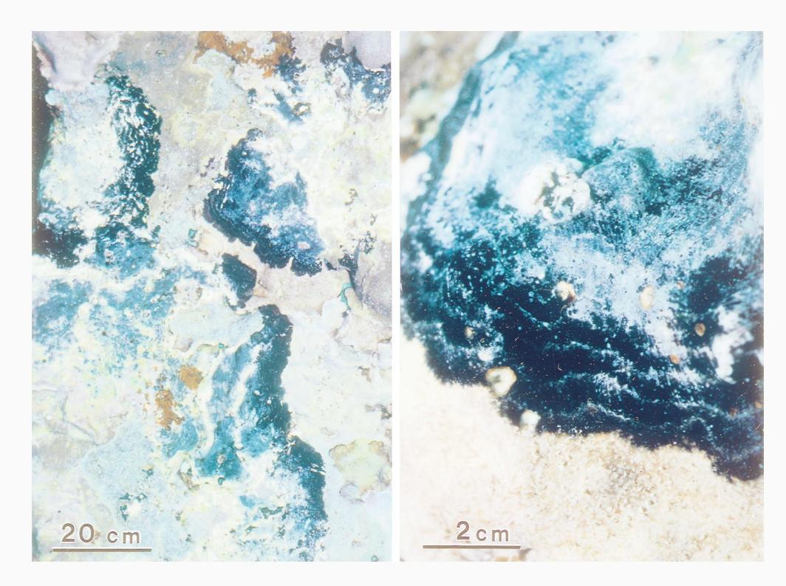

## *An undescribed fungal pathogen of reef-forming crustose coralline algae discovered in American Samoa*

During February 1997, our research team photographed, collected and examined abundant populations of an undescribed black fungal disease of crustose coralline algae in American Samoa. The left overview photograph shows several coalescing patches of black fungal disease; the right photograph is enlarged to show the striated pattern of incremental growth bands. This fungus does not resemble other marine fungal pathogens or black-band disease (cyanophyte) of corals (Ruetzler and Santavy 1983). Instead, it has a unique non-glossy blue-black color, matte texture and striated growth bands, giving it an appearance similar to some terrestrial crustose lichens. The pathogen was found throughout all shallow (< 20 m) reef habitats of Tutuila Island, from calm sites to those experiencing the greatest wave energies. It co-occurred with the only other known pathogen of coralline algae, CLOD (Littler and Littler 1995) and also primarily attacked the Pacific algal-ridge former, *Porolithon onkodes* (Foslie) Foslie. However, unlike the bacterium CLOD, the black fungal disease occurred much more abundantly, mainly above 12 m in depth, and was not restricted to calm waters.

The fungus spreads outward, radiating from centrally infected areas by surface hyphal elongation, with the host crustose corallines dying once they were overgrown by the dense black fungal bands. No globule-like propagules (cf. CLOD) were observed and dissemination appeared to be restricted to lateral vegetative spreading or, hypothetically, by specialized reproductive spores.

Thus far, no reports exist of this pathogen occurring beyond American Samoa; our group has recently spent more than 1,500 person-hours diving on coral reefs in Tahiti, Cook Islands, Fiji, Solomon Islands and Papua New Guinea without encountering it.

*Acknowledgments* We thank Dr. Peter Craig for calling this pathogen to our attention. Funding for fieldwork was provided by MARPAT Foundation, the National Museum of Natural History Research Opportunities Fund and the Department of Botany, Smithsonian Institution. Smithsonian Marine Station Contr. No. 431 and Harbor Branch Oceanographic Institution Contr. No. 1201.

## *References*

Littler MM, Littler DS (1995) Impact of CLOD pathogen on Pacific coral reefs. Science 267: 1356–1360

Ruetzler K, Santavy DL (1983) The black band disease of Atlantic reef corals. I. Description of the cyanophyte pathogen. PSZNI: Mar Ecol 4: 301–319

## M.M. Littler1 , D.S. Littler1,2

- 1 Department of Botany, National Museum of Natural History, Smithsonian Institution, Washington, DC 20560, USA
- 2 Division of Marine Science, Harbor Branch Oceanographic Institution, 5600 U.S. 1 North, Fort Pierce, Florida 34946, USA

