This article was downloaded by: [New York University]

On: 01 May 2015, At: 02:06 Publisher: Taylor & Francis

Informa Ltd Registered in England and Wales Registered Number: 1072954 Registered office: Mortimer House, 37-41 Mortimer Street, London W1T 3JH, UK

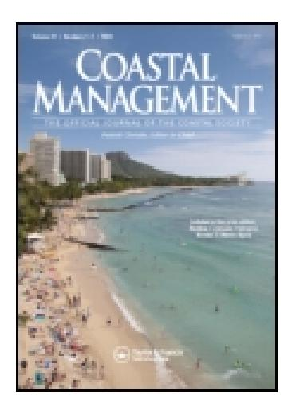

# **Coastal Management**

Publication details, including instructions for authors and subscription information:

<http://www.tandfonline.com/loi/ucmg20>

# **Impact of coastal construction on coral reefs in the U.S.**‐**affiliated pacific Islands**

James Evans Maragos a

a Program on Environment , East‐West Center , 1777 East‐West Road, Honolulu, HI, 96848 Published online: 30 Sep 2008.

**To cite this article:** James Evans Maragos (1993) Impact of coastal construction on coral reefs in the U.S.‐affiliated pacific Islands, Coastal Management, 21:4, 235-269, DOI: [10.1080/08920759309362207](http://www.tandfonline.com/action/showCitFormats?doi=10.1080/08920759309362207)

**To link to this article:** <http://dx.doi.org/10.1080/08920759309362207>

# PLEASE SCROLL DOWN FOR ARTICLE

Taylor & Francis makes every effort to ensure the accuracy of all the information (the "Content") contained in the publications on our platform. However, Taylor & Francis, our agents, and our licensors make no representations or warranties whatsoever as to the accuracy, completeness, or suitability for any purpose of the Content. Any opinions and views expressed in this publication are the opinions and views of the authors, and are not the views of or endorsed by Taylor & Francis. The accuracy of the Content should not be relied upon and should be independently verified with primary sources of information. Taylor and Francis shall not be liable for any losses, actions, claims, proceedings, demands, costs, expenses, damages, and other liabilities whatsoever or howsoever caused arising directly or indirectly in connection with, in relation to or arising out of the use of the Content.

This article may be used for research, teaching, and private study purposes. Any substantial or systematic reproduction, redistribution, reselling, loan, sublicensing, systematic supply, or distribution in any form to anyone is expressly forbidden. Terms & Conditions of access and use can be found at [http://](http://www.tandfonline.com/page/terms-and-conditions) [www.tandfonline.com/page/terms-and-conditions](http://www.tandfonline.com/page/terms-and-conditions)

# **Impact of Coastal Construction on Coral Reefs in the U.S.-Affiliated Pacific Islands**

## JAMES EVANS MARAGOS

Program on Environment East-West Center 1777 East-West Road Honolulu, HI 96848

> **Abstract** *During the past century, traditional ownership, control, and use of coral reef habitats in the U.S.-affiliated islands in the Pacific have declined, exposing them to increased construction for plantation, transportation, military, urban, aquaculture, fisheries, mineral, and resort development. Dredging, filling, and other construction in coral reef and related ecosystems are expected to continue at high levels. Collectively, these activities have resulted in major adverse ecological impacts, many of which can be avoided or reduced to minor levels. Improvements in the design, siting, and construction of coastal projects can be accomplished by early integration of environmental objectives. Ecological baseline surveys; environmental impact assessments; regulatory conditions; guidelines and standards during construction; monitoring of construction; post-construction evaluation; and long-range research, planning, and management are among the most useful of the environmental tools to describe reefs and to identify measures to reduce or avoid adverse impacts on coral reefs.*

**Keywords** coastal construction, environmental impacts, pacific coral reefs

## Introduction

The past century has witnessed major construction activity on coral reefs for economic and military development in Oceania, the broad tropical Pacific region encompassing Melanesia, Polynesia, and Micronesia (see Saenger et al. 1983; SPREP 1981; UNEP/ IUCN 1988; Wood and Johannes 1975). This report is a review of the historical and contemporary causes of coastal construction, the major types of construction projects and activities, and the physical and ecological consequences of these activities on coral reefs in the United States-affiliated Pacific islands (islands presently or previously under American, Japanese, German, and Spanish control). Land sources of nonpoint pollution, soil erosion from upland construction activity, and wastewater discharges can result in major impacts to coral reefs, comparable to those of coastal construction. However, it is beyond the scope of this article to address the impacts of upland activities and sources of pollution.

The review is largely drawn from two decades of observations and studies of the author, who has conducted marine environmental research and served as a environmental official for a U.S. agency responsible for considerable construction in the tropical Pacific. Hence, many of the examples and case studies are drawn from regions presently or previously under U.S. jurisdiction. Much of the unpublished literature consists of field notes, ecological baseline surveys, environmental impact assessments and statements, and monitoring reports during and after construction activity. Since 1970 many of these have become requirements as part of the planning and approval for coastal construction projects due to the passage of a number of important U.S. environmental protection laws. There is relatively very little formal information on the effects of coastal development in the broad region of Oceania (see Bak 1978; Carpenter and Maragos 1989; Dahl 1980; Fosberg 1965; Grigg and Dollar 1990; Helfrich 1979; Kaly and Jones 1988, 1989, 1990; Kinsey 1988; Levin 1970; Salvat 1987; South Pacific Commission 1973; SPREP 1981; UNEP 1983; UNEP/IUCN 1988; UNESCO 1980; Valencia 1981).

For the purposes of this article, coral reef ecosystems include coral reefs proper, lagoons, passes, channels, and adjacent seagrass beds, mangrove swamps, and beaches where present.

## **Historical Perspective**

Prior to Western contact, the Pacific islanders accomplished coastal construction using manual labor, sometimes with spectacular results, such as the large prehistoric complexes at Lelu Island in Kosrae and Nan Madol island in Pohnpei. However, most significant coastal development and associated impacts to coastal ecosystems in Oceania (see Figure 1) have occurred during the past century with the advent of steam- and diesel-powered equipment and advances in the use of explosives for construction. The Spanish developed settlements, ports, roadways, and landfills during their nearly four centuries of domination in the Mariana, Philippine, and Caroline Islands (see Carano and Sanchez 1974; Oliver 1989). The rise of the German empire in the 1870s fueled copra plantation expansion, trading companies, and port development in the Marshall Islands (see Bryan 1972). After defeat in the Spanish-American War of 1898, Spain lost or sold its Pacific possessions to the United States (Philippines and Guam) and Germany (Carolines and rest of Marianas) (see Hezel and Berg 1979). At the same time, the U.S. consolidated territorial control in eastern Samoa, Hawaii, and a number of isolated atolls in the central Pacific. Ports, coaling stations, and cable stations were established on some atolls. Shortly after the outbreak of World War I in 1914, Japan dispatched naval squadrons and seized the German territories in the Marshalls, Carolines, and Marianas (Purcell 1967). Later, the League of Nations mandated these areas to Japan, and during the next two decades, Japan intensively developed plantation agriculture, mineral development, and aquaculture, and colonized the islands (Oliver 1989). After 1935, Japan began to fortify its possessions in Oceania, and during the same time frame, the United States accomplished comparable military construction on many of its possessions (U.S. Department of the Navy, Bureau of Yards and Docks 1947; Woodbury 1946).

World War II and the post-war reconstruction period fueled substantial coastal construction throughout Oceania. In the decade following the war, government and urban centers were reconstructed throughout Micronesia. In addition, the nuclear weapons testing in the Marshall Islands (Bikini and Enewetak Atolls), Johnston Atoll, and later nuclear tests at Christmas Atoll required considerable coastal construction for support facilities (Maragos 1986).

During the past twenty-five years, modern transportation facilities have been constructed throughout the Hawaiian, Mariana, Caroline, Marshall, and American Samoan islands. Similar transportation development has occurred in other Micronesian and Polynesian islands. In the past decade, resort development has become an important economic force, especially in Hawaii, the southern Ryukyus, and the Marianas, and it is growing on many other islands throughout Oceania. Most resorts are situated in the coastal zones of

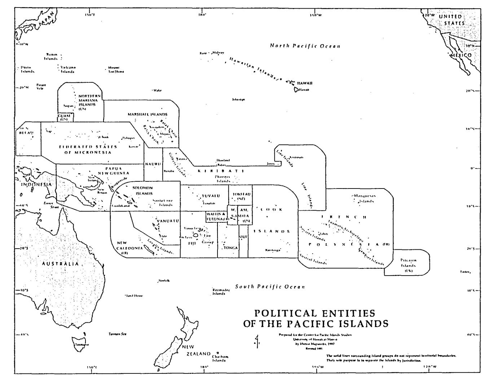

**Figure 1.** Map showing the political entities of the tropical Pacific region. (Courtesy of Center for Pacific Island Studies and Manoa Mapworks.)

the islands. Substantial military development in Hawaii and Guam, and some fishery, cannery, and mineral development elsewhere has involved additional coastal construction (Dahl 1980; SPREP 1981, 1982).

## **Types of Coastal Projects and Construction Activity in Oceania**

Transportation projects have generated the most coastal construction in Oceania. By necessity, navigation projects (docks and ports) must be located at the shoreline. Many road, bridge, and airfield projects are also on the coast where most of the people live and desirable construction materials are found. Roads in Oceania are mostly unpaved and capped with coral aggregate. Due to ready access, most material for road construction and maintenance is obtained from shallow coral reef and seagrass mangrove flats overlying carbonate substrates.

Traditionally, many nearshore water areas were owned or policed through native customs and tenure. Where those controls still apply, such as in the Marshall Islands and Chuuk Atoll, the reef owners often charge fees for the removal of sand or coral rock. However, in other areas, centuries of colonial dominance by foreign powers and decimation of islander populations from warfare and diseases have undermined, weakened, or all but destroyed these controls. Consequently, more and more reef, seagrass, and mangrove flats are being exploited for construction materials for roads and other projects. In the absence of land use and other environmental controls, the governmental official faced with the choice of buying aggregate from upland private landowners or dredging it "free" from accessible reef flats will most often opt for the latter.

Many airfields and roadways in Oceania are located in what was previously coral reef habitat; they cover many hectares and disturb adjacent marine habitats. Harbors and the side slopes of coastal fill land require structural reinforcement to protect the land and facilities from the destructive effects of large waves and strong currents. A common practice is to quarry large rocks (armor stone) from offshore reef flats and use them in shore protection structures. Inadequately designed or protected projects will be subject to erosion and require more fill from coastal borrow sites for frequent maintenance and repair. Larger and more substantial rocky protective structures (termed *nibblemound breakwaters and revetments)* are needed for harbors and fill lands vulnerable to heavy wave action (U.S. Army Corps of Engineers, Coastal Engineering Research Center 1984). Dredged coral aggregate is also used extensively in concrete for construction projects (see Schlapak and Herbich 1978).

Many other government, community, and private facilities (especially resorts, schools, churches, and meeting halls) in Oceania are situated on fill land. This is particularly evident in crowded urban centers with access to heavy equipment (e.g., Pago Pago, American Samoa; Colonia, Yap; Kolonia, Pohnpei; Moen, Chuuk [Truk]; Honolulu, Hawaii; Kwajalein and Majuro, Marshall Islands; and Tarawa, Kiribati). Much of Oceania is experiencing heavy population growth, urban drift, and in-migration from outer islands to urban centers. Many piecemeal landfills are being constructed in coastal waters to accommodate this growth (Maragos 1986).

Forced to live in crowded, unsanitary conditions on coastal fill lands, many immigrants lack sufficient capital or access to private land. Many landfills encroach into valuable estuaries and mangroves, leading to polluted waters, contaminated shellfish, and overharvesting of mangrove resources.

Military construction, particularly by Japan and the United States before and after

World War II, generated an unprecedented magnitude of dredging, filling, and other construction for airfields, harbors, docks, roads, buildings, bunkers, and storage facilities for fuel and munitions (Maragos 1986). In the present and former U.S.-affiliated Pacific Islands, major coastal construction took place at Pearl Harbor, Hickam, Honolulu Harbor, and Kaneohe Bay on Oahu and Midway Atoll (Hawaii); Palmyra, Johnson, Howland, Jarvis, and Baker Islands (Line Islands); Canton Atoll (Kiribati): Wake, Kwajalein, and Enewetak Atolls (Marshalls); Truk, Yap, Ulithi, Koror, and Peliliu Islands (Carolines); and Guam and Saipan Islands (Marianas) (Oliver 1989).

## **Types of Coastal Construction Techniques**

The most common coastal construction practices that are potentially damaging to marine ecosystems include excavation and landfilling. Other common activities include construction of ocean outfalls, placement of mooring buoys, and clearing of lands. *Excavation* is a general term encompassing activities that include the use of explosives and mechanical dredging, quarrying, and mining equipment. *Dredging* is usually associated with the removal of loosened submerged deposits of sediments or rocky materials for the purpose of deepening a channel (or basin) or obtaining fill or aggregate. *Mining* is usually associated with the removal of minerals for their chemical and industrial properties. *Quarrying* refers to the fracturing and removal of medium to large pieces of hard consolidated rock for masonry and armor stone placement. These terms are often used interchangeably (see Schlapak and Herbich 1978; U.S. Army Corps of Engineers, Coastal Engineering Research Center 1984; U.S. Army Corps of Engineers, Waterways Experiment Station 1989). The types of coastal construction activity, equipment, and purposes are summarized in Table 1.

#### *Excavation and Dredging Techniques*

Dragline or bucket dredging is most often accomplished from the shore or from fill causeways or dikes built out on shallow flats from the shoreline. The bucket is attached by a cable to a crane that swings the bucket into the water so that it can sink to the bottom. The bucket is dragged up the reef slope as it is winched in, causing loose materials to fill the bucket. Then the crane swings the bucket over to a stockpile area where its contents are released.

Clamshell dredging can also be accomplished from the shoreline but more often is accomplished from a floating barge. A hinged clamshell or jaw-like device is opened and then dropped by the crane vertically into the water. The momentum of the fall pushes the clamshell into the bottom sediments; the jaws are closed and the clamshell full of fill material is hoisted.

Pipeline dredging involves use of a pipe and pumps to provide suction; bottom material is sucked in with seawater to create a slurry mixture that is transported through the pipe to a disposal site; the slurry is either discharged back into the water at some distance away from the dredging site or is discharged on shore in a basin where the material can be drained of water, dried, and used for fill or other construction purposes. In the case of a hopper dredge, the material is discharged into hopper bins aboard a ship. A cutterhead dredge consists of a suction dredge to which a rotating cutterhead, equipped with sharp "teeth" is attached to the suction end of the pipe. The rotating cutterhead is able to cut through hard rock, removing both soft and hard materials.

Auguring involves the drilling of a series of large, deep holes into hard bottom

Table 1 Classification of Coastal Construction Activities and Techniques Commonly Used in the Tropics

| Category   | Activity                        | Equipment                                                                                                                                      | Purpose                                                                                                                                                |
|------------|---------------------------------|------------------------------------------------------------------------------------------------------------------------------------------------|--------------------------------------------------------------------------------------------------------------------------------------------------------|
| Excavation | Quarrying                       | Explosives Drill rigs Rippers and back hoes Bull dozers                                                                               | Obtain design stone aggregate and armor rock for coastal fortifications                                                                       |
|            | Sand mining                     | Crane operated dragline or bucket dredge Floating crane operated clamshell dredge Cutterhead dredge                                | Remove accumulating sediments from harbor basins and channels Obtain sand for construction or beach placement                        |
|            | Dredging                        | All of the above, plus Hopper dredge Auger platforms Explosives                                                                       | Same as the above, plus Fill land expansion causeways Construction rock and aggregate fill                                                 |
| Filling    | Temporary causeways dikes | Dump trucks Front end loaders Cranes Bulldozers Manual placement                                                                   | Provide access for construction personnel and equipment Confine sediments generated by construction Lay outfalls Shore protection |
|            | Fill land creation           | All of the above, plus Crane operated dragline or bucket dredge Suction dredge Cutterhead dredge Grades, rollers, compacters | Expand land areas for navigation, roads, airfields, urban development, resorts and other uses                                              |
|            | Coastal structures           | Crane operated clamshells Wire cages (gabions) Manual placement Front end loaders                                                  | Shore protection and beach restoration Flood control Navigation Wave energy dissipation                                                    |

material with a drill-like apparatus mounted on a frame. After the holes are drilled, the bottom material can then be broken apart by clamshells and removed.

Explosives are commonly used in conjunction with other dredging and excavation to shatter, loosen, or fracture hard consolidated rock and facilitate its mechanical removal, especially for navigation channels (Kaly and Jones 1988, 1989, 1990). Explosives are either laid on the bottom, placed in holes or crevices, or are loaded and tamped into predrilled holes (drilling and shooting).

In one experimental test at Kawaihae, Hawaii (Day et al. 1975), a series of explosive charges were detonated to completely excavate a shallow draft harbor basin and channel without the need for follow-up mechanical dredging. However, the explosions were very large, required sophisticated preparation and timing, and caused massive fish kills and damage to coral reefs. The use of this technique on coral reefs would be environmentally unacceptable except in an emergency situation.

#### *Landfilling and Shore Protection Techniques*

Landfilling is the placement of fill to convert aquatic habitat to fast or dry land. Often dredging and filling sites are located next to each other (such as for harbor projects) so that dredging operations can conveniently generate material required for landfilling (see U.S. Army Corps of Engineers, Coastal Engineering Research Center 1984; U.S. Army Corps of Engineers, Waterways Experiment Station 1989). For projects requiring both dredging and filling, engineers attempt to design projects to balance the quantities of dredging and filling.

Sides of landfills exposed to the ocean or to other elements require structural protection to minimize slumping and erosion of fill from currents and wave action (U.S. Army Corps of Engineers, Coastal Engineering Research Center 1984). Revetments are shoreline protective structures usually consisting of sloping rock walls. Progressively larger sized (armor) stones are placed atop smaller stones. Gabions are shore protection structures consisting of smaller rocks and rubble placed in baskets or cages. These can be constructed manually and serve as a temporary alternative for shore protection at sites where heavy equipment and explosives are unavailable to generate and move larger rock.

Seawalls, bulkheads, and sheet piling are functionally all the same and consist of solid vertical walls at the shoreline (either metal, concrete, or masonry) to protect from erosion or to facilitate boat access. A new shore protection technique termed *dynamic revetments,* (Ahrens and Camfield 1989) involves placement of a berm of smaller sized stone in front of eroding shorelines. Wave action moves these smaller stones about, modifying the shape of the berm. If properly designed, the movement of the stones is not sufficient to cause erosion of the lands behind the berm.

Groins and moles are rocky protective structures that project seaward and perpendicular to the shoreline. Prevailing currents and wave action normally move bottom and suspended sand and other sediment along the shore in a predominant direction (longshore transport). Groins function by trapping sand on the updrift side, causing the shoreline to aggrade and sand to accumulate on inner coral reef flats. However, the downdrift sides of groins can cause shoreline erosion because longshore transport is interrupted. Unless groins and similar structures are properly designed and located, they can cause as many shoreline erosion problems as they solve (see Clark 1985) and can also degrade adjacent coral reef or seagrass areas. It is well known that other structures such as harbors or landfills projecting offshore can inadvertently act as groins, causing shoreline accretion

and erosion on updrift and downdrift sides of the structure, respectively (Figures 2 and 3).

Offshore breakwaters are aligned parallel from the shoreline. They allow longshore transport to occur, thus reducing the likelihood of erosion along adjacent shorelines to either side of the breakwaters. Commonly, they are constructed in a rubblemound design. Moles, groins, and breakwaters are often incorporated into harbor designs (Figure 4) to minimize surge, wave action, and sediment accumulation within harbor basins where ships are berthed (U.S. Army Corps of Engineers, Coastal Engineering Research Center 1984; U.S. Army Corps of Engineers, Waterways Experiment Station 1989).

## *Other Common Coastal Construction Activities*

Clearing involves the removal of groundcover and vegetation, landward of the shoreline usually at the start of construction, to facilitate compaction or other preparation of ground surface for erecting buildings and foundations and to facilitate excavation and filling. Coastal clearing activities during periods of rainfall can result in soil erosion and discharges into coastal waters. Other coastal activities include disposal of mine tailings, metallic waste, and other construction debris into estuaries, rivers, and on shorelines (see Dahl 1980; SPREP 1981). Mooring buoys and ocean outfalls for sewage and thermal effluents are also constructed off the ocean or lagoon slopes of many coral reefs in the Pacific. Construction often involves the use of explosives; placement of pipes, anchors, and loose concrete blocks; excavation of trenches; or the pouring or placement of concrete underwater.

## **Environmental Consequences of Coastal Construction**

#### *Physical Short-Term Effects of Excavation and Dredging*

Mechanical excavation and dredging during construction physically disturbs or removes the bottom substrate, deposits sediment on the substrate, suspends sediment in the water column, reduces light penetration, increases turbidity, changes circulation, reduces dissolved oxygen, and increases nutrient levels in the water column (Bak 1978; Brock et al. 1965, 1966; Johannes 1972; Kaly and Jones 1988; Maragos 1972; Salvat 1987; Wood and Johannes 1975). The most widespread and visible consequence of dredging and excavation, however, is the generation of suspended sediments and turbidity. Dredged or excavated materials high in organics can theoretically generate biochemical oxygen demand and depress oxygen levels (Johannes 1972; Maragos 1972). In general, the dredging of fine sediments generates greater levels of turbidity and suspended sediments compared to the dredging of coarser sediments and rock. The magnitude of the physical effects varies considerably depending on the type of dredging and excavation method (see Maragos 1979a; Penn 1979; U.S. Army Corps of Engineers, Waterways Experiment Station 1989).

For clamshell and dragline dredging, turbidity and sedimentation impacts are more localized and are generated as individual impulses when the bucket or clamshell is dropped and hoisted. In contrast, pipeline dredging can generate turbidity and sedimentation continuously at both the suction and discharge ends of the pipe if the latter involves disposal or spillage back into the water. These impacts are usually localized at the suction end and can be reduced further if a jet probe is attached to the head, allowing it to be buried beneath the sediment surface before suction is applied (Casciano 1974; Maragos et al. 1977). The action of a rotating cutterhead generates additional turbidity and sedimentation during the grinding and loosening of hard rock.

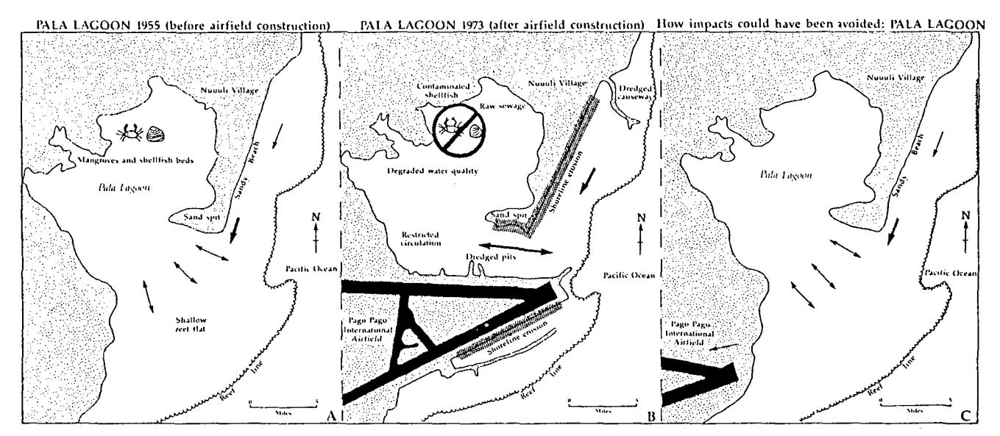

**Figure 2.** Adverse effects of coastal airfield construction, dredging, and filling at Pala Lagoon, American Samoa. Before airfield construction (about 1960), Pala Lagoon was home to American Samoa's most important shellfish grounds. Tidally driven currents helped to flush the inner shallow area of Pala Lagoon. At times, heavy wave action also promoted the flushing. Later, dredging and filling along the coast disrupted longshore drift, prevented sand and replenishment along the coast, and probably caused shoreline erosion at Coconut Point because the dredged holes were situated too close to the shoreline. The heavy arrow shows the southern direction of the prevailing longshore current. The airfield partially blocked the entrance to the lagoon, restricting tidal exchange (1 m range) between the ocean and lagoon, degrading shellfish and water quality in the lagoon. To avoid the impacts the air field should have been located inland from the coast and the dredged sites moved further offshore away from beaches and fortified shorelines.

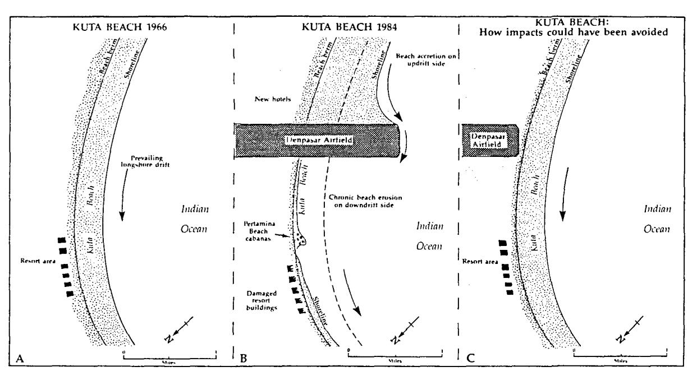

**Figure 3.** Adverse effects of coastal airfield construction near Kuta Beach, Bali Island, Indonesia. Before 1967, Kuta was Bali's largest resort and beach area. In 1967, the new Denpasar airfield was constructed, projecting 1 km offshore beyond the beach. Since that time the beach has eroded more than 300 m on the downstreamside of the airfield. Uniformed officials blamed the erosion on traditional coral mining activities, but in fact, the airfield acted as a huge groin blocking beach replenishment and causing erosion. While restaurants and hotels fall into the water on the eroding side of the airfield, entrepreneurs construct new resorts on the accreting side. The airfield could have been moved landward of the beach dunes and berm to avoid beach erosion caused by the airfield projecting offshore (after Burbridge and Maragos 1985).

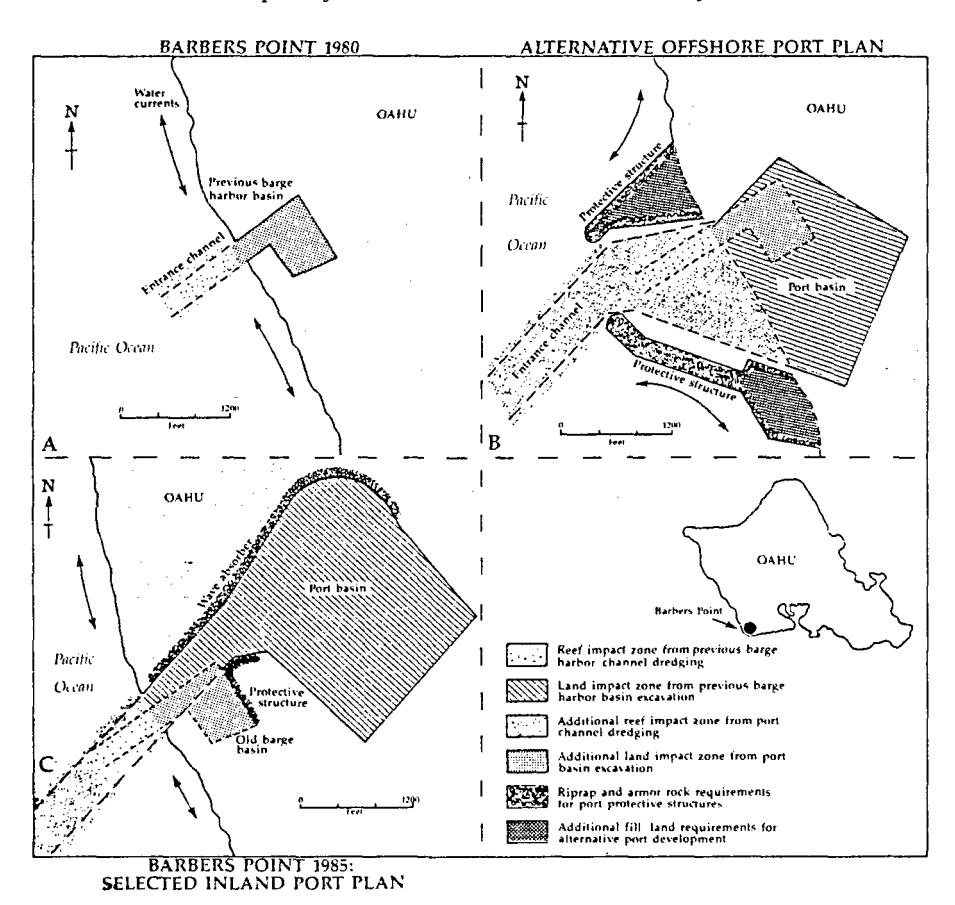

**Figure 4.** Port development off Barbers Point, Oahu, Hawaii. Deep draft port development invariably results in significant environmental and economic impacts. An existing medium draft barge harbor off the southwest corner of the island of Oahu (A) was too shallow and small for commercial ships. A conventional offshore port plan (B) would have caused greater marine impacts from dredging and filling and moderate loss of land to port basin excavation. An inland port concept (C) was selected for development. This port design resulted in substantially less marine impacts but greater loss of land to basin development. No permanent loss of marine habitat to fill land resulted. Material dredged from the basin was stockpiled on adjacent land and is being sold for construction purposes to offset the cost of the harbor. Excavation of the inland basin was isolated from the sea by an earthen barrier, further limiting adverse environmental effects to coastal reefs from turbidity and sedimentation during construction. Overall development of the inland port plan resulted in less economic cost and environmental impacts.

The size, depth, and design of retention or sediment basins to collect and dewater slurry from pipeline dredging operations is also important. Inadequate sized basins will require reduction of slurry discharge rates to prevent overflow of slurry waters over the top of the basin walls.

#### *Direct Ecological Effects of Excavation and Dredging on Reefs*

An unavoidable impact of any dredging operation is the direct elimination of benthic habitat in the dredged area and reduction of associated demersal species (see Bak 1978; al. 1965,1966). Many coral reef communities are thought to be sensitive to both suspended and accumulating sediments and to require long time periods for recolonization (Maragos 1972; Rogers 1990; U.S. Army Corps of Engineers, Honolulu District 1983). However, an increasing body of evidence suggest that accumulating sediments pose more severe and longer lasting impacts (see Losey 1973; Maragos 1982-1983,1984a; Rogers 1990). Although many corals live elevated above the bottom and are adapted to withstand episodal deposit of sediments (particularly if sediments are later removed by wave action or currents), other associated epibiota and infaunal on the bottom or in depressions can be buried or smothered. Monitoring of a dredging operation at Barbers Point (Figure 4), Oahu (Hawaii), indicated that small encrusting species or those living in crevices or in shaded areas are more likely to succumb to accumulating sediment (Aecos, Inc. 1985, 1986; Maragos 1983a).

#### *Coral Reef Recolonization after Dredging*

Although coral recolonization is possible on dredged surfaces, harbor bottom environments tend to accumulate fine sediments and are most often colonized by soft bottom or sand dwelling communities. This is particularly true for harbors where basins and channels are situated in calmer waters such as in lagoons on atolls (Marshall Islands) or on protected coasts and embayments (American Samoa, Hawaii). Dredged surfaces in shallow areas (less than 10 m) and those surfaces that are located where there is greater exposure to waves and currents (such as quarry holes, on outer reef flats) can be recolonized extensively by reef life within a decade or more following dredging (Maragos 1983 a; Schumacher 1988; Sunn, Low, Tom, and Hara 1975). Also, hard, elevated dredged surfaces can attract greater numbers and types of recolonizers, especially fish and corals, based on evidence collected in Hawaii, Kosrae, and American Samoa. Dredged surfaces located where sediments are constantly in suspension or shifting along the bottom tend to inhibit recolonization by reef life. Dredged surfaces directly adjacent to undamaged reef areas can experienced accelerated recolonization due to encroachment of corals and other reef life from undisturbed areas (Figures 2 and 5), based on observations in Pala Lagoon and Kaneohe Bay (Helfrich 1973; Maragos 1972, 1974b; Maragos et al. 1985).

#### *Sedimentation Effects on Coral Reefs*

Suspended sediments generated during construction can have negligible to major impact on coral reefs, depending on species, dredging or filling techniques, and degree of sedimentation. My unpublished observations suggest that some Pacific reef corals (some species of *Acropora, Porites, Psammocora, Montipora, Astreporard),* including large-polyped forms *{Favia, Favites, Leptastrea, Lobophyllia, Fungia, Turbinaria, Plerogyra,* and *Physogyrd)* are more adapted to withstand suspended and accumulating sediments, compared to other corals (other species of *Acropora, Pocillopora, Heliopora,* and *Pavond).* Recent studies by Stafford-Smith and Ormond (1992), Stafford-Smith (1993), and Hodgson (1989) also document interspecific differences in coral tolerance to sediments. Species common in sandy environments, including back reefs and lagoon floors, are naturally resistant to sediments compared to species adapted to wave exposure on ocean reef slopes where sediments tend to be less prevalent).

Sediments generated by pipeline dredging can completely smother coral reefs unless controlled. Some of the most significant impacts of sedimentation associated with dredging have occurred during open water disposal of slurry from pipeline dredging. Slurry from cutterhead dredging at Kwajalein spilled out over a large reef tract, burying coral

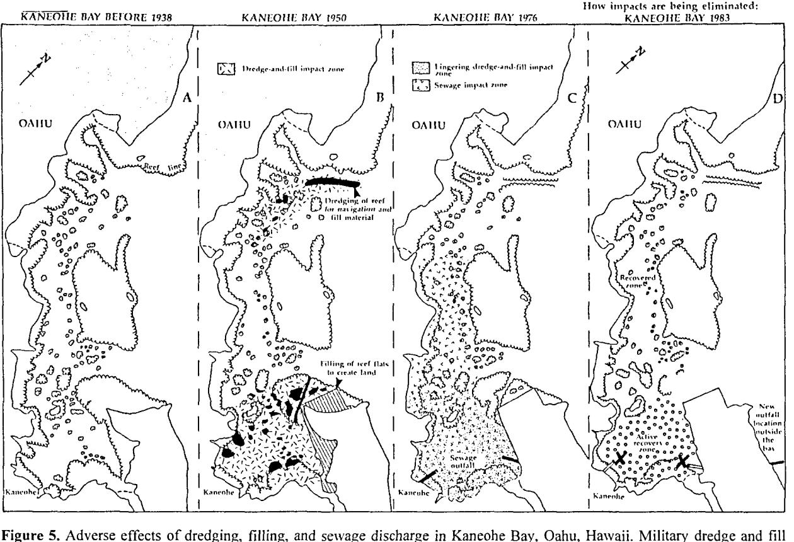

Figure 5. Adverse effects of dredging, filling, and sewage discharge in Kaneohe Bay, Oahu, Hawaii. Military dredge and fill between 1938 and 1950 probably increased circulation in the north bay but reduced circulation in the south bay. By 1970, only northern bay reefs were recovering while central and south bay reefs declined further because of sewage pollution introduced into the south bay from 1950 to 1977 and the heavy growths of bottom algae in the central bay possibly stimulated by nutrients from the sewage discharges. The sewer outfalls were removed from the bay in 1977-1978, allowing near-complete coral recovery in the central bay and the beginning of active, long-term coral recovery in the south bay, as measured in 1983. The ocean outfall at the new site has not resulted in adverse effects to reefs because of its large (35 m) depth and the excellent mixing and flushing at the site. Since 1983, coral populations appear to be stable but benthic algae populations are again on the rise. South bay coral populations are continuing to increase (after Evans and Hunter 1992; Evans et al. 1986; Hunter and Evans, 1993; Maragos 1972; Maragos et al. 1985).

communities and inhibiting recovery (Losey 1973). At Okat reef at Kosrae (Figure 6), the rate of slurry discharged into a retention basin exceeded the basin's capacity, causing slurry to overflow the walls, spill out over 10 hectares of seagrass and coral habitat, and completely bury it under 0.25 to 0.5 m of fine slurry muds (Maragos 1984a). In this last case the impact could have been prevented or mitigated by reducing the rate of slurry discharges, but the construction contractor had a schedule to meet and was unwilling to slow down operations. Prior to World War II, open-water slurry discharges from massive cutterhead dredging operations in Kaneohe Bay (Figure 5), buried many reefs and caused the lagoon to shoal significantly, burying reef habitat in deep water (Devaney et al. 1976; Evans et al. 1986; Hollett 1977; Maragos 1972; Maragos et al. 1985; Roy 1970).

Sedimentation at the dredging end of operations can also cause some impacts to marine communities. At Kosrae, sand suspended by cutterhead dredging was transported by strong currents and buried adjacent seagrass beds (Figure 6). Substrate levels on the

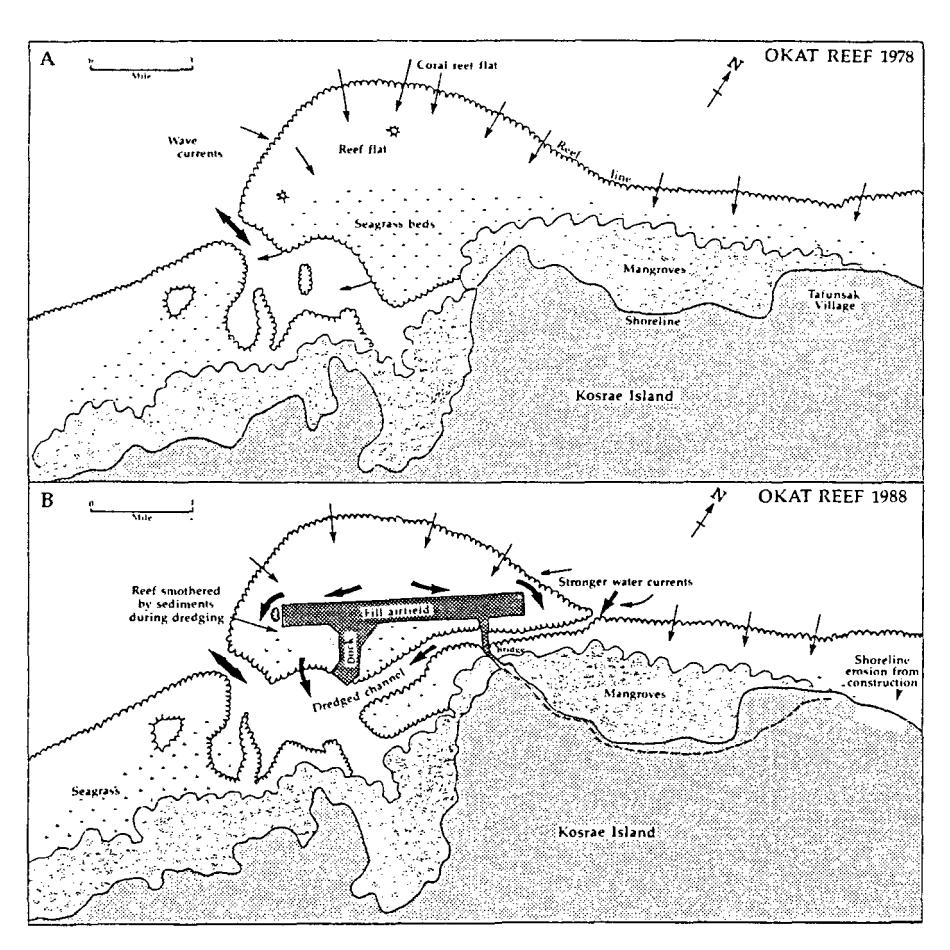

Figure 6. Adverse effects of dredge and fill for reef flat runway and dock construction at Okat Harbor, Kosrae Island, Federated States of Micronesia. Construction buried most of the offshore seagrass beds and much of the reef flat under the fill land. Dredging further destroyed nearshore reef and seagrass beds and greatly altered circulation in the harbor. The stronger water currents have been implicated as causing shoreline erosion near the airfield and Tafunsak Village. Once Kosrae's most important fishing ground, Okat reef's fish yield have declined to half of preconstruction levels (adapted from Manoa Mapworks 1987, and U.S. Army Corps of Engineers 1989).

seagrass beds were also raised sufficiently above mean low water to prevent seagrasses from recolonizing the elevated habitat (Maragos 1983b). Sand mining in lagoon environments in Fiji involved clamshell dredging of holes which caused slumping of adjacent seagrasses into the depressions, increasing the impact zone (Penn 1979). Suction head dredging at Keauhou (Hawaii) involved use of a jet probe to minimize sedimentation (Casciano 1974); however, the readjustment of the excavation craters eventually led to the undermining and collapse of fragile finger coral communities living on the sand within 100 m of the craters (Maragos et al. 1977; Maragos 1979a). In contrast, auguring and clamshell operations at Barbers Point (Figure 4) killed only a few adjacent corals, and the remaining halves of corals cut by the auger survived (Maragos 1983b).

#### *Indirect Effects of Dredging and Quarrying on Coral Reefs*

Indirect impacts of dredging include anchoring operations for barges, ships, and pipelines. Placement and dragging of anchors over sensitive ecosystems damaged fingercoral communities at Keauhou, Hawaii (Maragos 1979a; Maragos et al. 1977). Conversely, careful anchoring at sand mining sites in Pohnpei lagoon avoided damage to reef corals (U.S. Army Corps of Engineers, Pacific Ocean Division 1986).

The potential synergistic effects of water pollution such as sewage discharges can also inhibit coral recolonization on dredged surfaces based on studies in Pala Lagoon (Figure 2) (Helfrich 1975) and Kaneohe Bay (Evans and Hunter 1992; Evans et al. 1986; Hunter and Evans 1993; Maragos 1972; Maragos et al. 1985). Recolonization of corals on reefs exposed to oil spills in the Red Sea was similarly inhibited where sewage pollution was prevalent compared to other sites where sewage pollution was absent (Loya 1975, 1976). In the case of the Kaneohe Bay example, recolonization of corals on dredged surfaces was accelerated after removal of sewage outfalls from nearby lagoon environments (Figure 5). In Kolonia Harbor, Pohnpei, a combination of sewage and sedimentation stresses have been suspected of reducing light penetration in the water to the point of inhibiting reef coral growth below a depth of 5-10 m, although shallower dwelling colonies seemed to be surviving well (U.S. Army Corps of Engineers, Pacific Ocean Division 1986). Dredged surfaces in deep and murky waters at Pou Bay, Truk (Figure 7) (Devaney et al. 1975) and Kaneohe Bay, Hawaii (Figure 5) (Maragos 1972, 1974b) also seemed to have inhibited coral recovery, possibly due to light limitation.

#### *Positive Impacts from Excavation Activities*

Quarrying operations on outer shallow reef flats for shore protection, harbor, and airfield projects in the Marshalls and Carolines have improved the value of habitat for reef fishes and reef corals (see Helfrich 1979; Losey 1973; Titgen et al. 1988). Quarry holes located too close to sandy beaches or sandy environments or with depths exceeding 4 m tend to get filled in with sediments and are less favorable for coral recovery (Helfrich 1975; Lamberts and Maragos 1989; Maragos 1984b, 1988; Titgen et al. 1988). Excessive scouring of shallow (less than 2 m depth) quarry holes by heavy wave action and sediments in suspension also inhibits recolonization. Nevertheless, corals, fish, and associated reef invertebrates are capable of dramatic rapid recovery in holes created from dredging and quarrying, particularly in clear waters subject to flushing from wave action or currents such as Pala Lagoon (Helfrich 1975), Johnston Atoll (Maragos 1983d), Kwajalein Atoll (Titgen et al. 1988), Majuro Atoll (Lamberts and Maragos 1989; Maragos 1989), and Honokohau Harbor in Hawaii (Maragos 1983a).

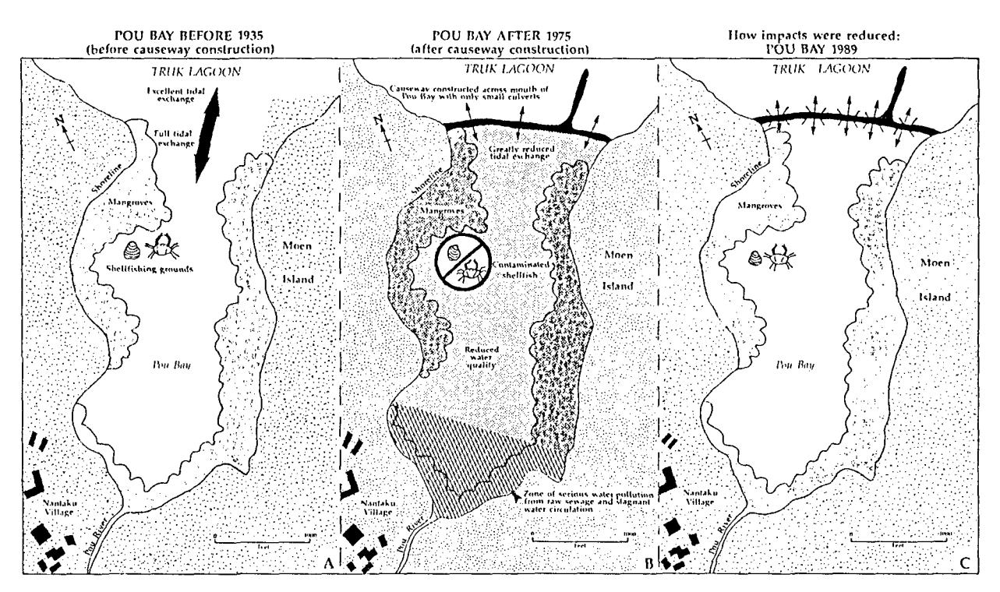

**Figure 7.** Adverse effects of road causeway construction across Pou Bay, Moen Island (Truk Lagoon, Federated States of Micronesia). Original causeway construction blocked circulation into Pou Bay, degrading water quality and contaminating Moen Island's most important shellfish resources. Additional culverts would result in greater improvement and water quality (adapted from Cheney et al. 1982; Environmental Consultants 1979).

#### *Mitigating the Impacts of Dredging and Excavation Activities*

Physical barriers such as silt screens and earthen berms can be effective in reducing areas affected by dredging and filling operations (see U.S. Army Corps of Engineers, Pacific Ocean Division 1986; U.S. Army Corps of Engineers, Waterways Experiment Station 1989). Silt screens are curtains of plastic, fiberglass, or other fabric vertically suspended from the surface using a system of floats and anchors; normally silt screens are effective where wave action is low and water currents are 50 cm/sec or less. Silt screens have been successfully used at many project sites, especially those with shallow reef flats, as demonstrated at Kaneohe, Hawaii; Pohnpei, Caroline Islands; and Asan, Agat, and Apra Harbors, Guam. The screens were less effective in deeper water at an airport project in Truk Lagoon (Amesbury et al. 1978, 1981; Clayshulte and Zolan 1982). Earthen or rock barriers are also very effective in certain circumstances even though some turbidity is generated during placement and removal of the berms. Coral, mangrove, and seagrass communities in Pohnpei lagoon were reported to be alive directly adjacent to earthen berms established during dragline dredging operations (U.S. Army Corps of Engineers, Pacific Ocean Division 1986). Placement of armor rock, revetments, rubblemound structures, and sheetpiling prior to filling operations can also confine sedimentation. The airfield project at Kosrae (Figure 6) involved prior placement of armor rock and filter cloth before filling operations, and adjacent corals, fish, and seagrasses were not affected, including those along the toe of the revetments (Maragos 1983b; U.S. Army Corps of Engineers, Pacific Ocean Division 1989).

#### *Effects of Explosives*

Underwater explosions can cause considerable physical disturbance to both water column and benthic habitats. Impacts are proportionately greater the closer to the detonation sites, particulary for open water explosions (see Kaly and Jones 1989; 1990). Within the immediate vicinity of explosions resulting from charges placed on the bottom surface, substratum material is pulverized and a crater is formed. At intermediate distances the substratum can be shattered or dislodged. At greater distances substrate or corals projecting above the bottom are fractured or broken, and at the greatest distances (up to 100 m away from large explosions involving 200 kg of explosives or more) coral heads and rocks may be sheared or dislodged from the substrate. The more explosives, the greater the potential is for impacts. Also, explosives with higher detonation speeds are more damaging. Explosions in very shallow water are less effective as an excavation method and can generate large quantities of flyrock.

Although information is limited in Oceania on the impacts of explosives used directly for construction projects (Kaly and Jones 1990), considerable information documents the destructive effects of explosives used as a fishing technique, especially from Western Samoa, Truk (Cheney et al. 1982; Devaney et al. 1975) and Sulawesi, Indonesia (see Burbridge and Maragos 1985; Polunin 1983). The use of explosives for a dredging project at Barbers Point (Figure 4) documented that fish populations can suffer massive mortality or injury. Observations indicated most fish killed or stunned by explosives were not preferred edible species and most did not float to the surface (Maragos and Moncrief 1982). Thus, aside from the devastating effect on coral habitat, the use of explosives for fishing is extremely wasteful. Also, many corals dislodged, sheared, or otherwise resting on the bottom undamaged were later carried away by waves and surge from a typhoon, thereby amplifying the impacts of the explosives. Organisms above or

to the side of explosions are more likely to be injured or killed compared to organisms at greater depths than the explosions; hence, deeper water explosions tend to generate higher mortality and casualties (Yelverton et al. 1973, 1975; Young 1977).

## *Mitigating the Impacts of Explosives*

Explosives packed into holes or crevices or covered with sandbags and so forth will cause less damage from shock and concussion. Some habitats with a predominance of brittle organisms (corals and coralline algae) are more sensitive to explosions (Maragos and Moncrief 1982). Fish and small marine reptiles or mammals with air cavities (bladders, lungs) may also be more prone to injury (Young 1977; Yelverton et al. 1973, 1975). Open water blasting or the placement of explosives on the bottom surface causes the most damage to coral reefs. In many cases, surface blasting is not needed but is used because drill rigs and experienced drillers may not be available on some islands.

On the other hand, drilling and shooting operations have caused little noticeable or documented impacts on reef environments, due to the smaller charges and the buffering from shock and concussion afforded by their loading and tamping in predrilled holes. Also, some believe that .operations involving staggered detonation times or explosives with slower detonation speeds cause less impact. Chemicals and turbidity generated during explosions appears to cause negligible ecological consequences. As such, drilling and shooting serves as a technique to mitigate the impacts of blasting and is especially feasible for blasting or quarring activities on shallow reef flats.

## *Landfilling and Shore Protection Effects*

Landfills permanently convert marine habitat to fast land and can destroy many hectares of valuable coral reef habitat. Large fill projects such as airfields can also block circulation and longshore transport. For example, reef runways at Keehi (Hawaii), Moen (Chuuk), and Okat (Kosrae) covered hundreds of hectares of reef and seagrass habitat (Amesbury et al. 1978; Chapman 1979; Maragos 1983c). In the case of Okat (Figure 6), fish catches in the region dropped to one half of their previous level, according to village fishermen (U.S. Army Engineer Division, Pacific Ocean, 1989). Unlike the situation for dredged areas (which still consist of marine habitat, although in a disturbed state), there is no chance for recovery of marine communities under fill land.

The shape and composition at the shoreline of new fill land can also affect coral reefs. Fill materials placed in the water without any shoreline protection may erode and suspend sediments harmful to corals and other reef life. Solid vertical shoreline walls (seawalls and bulkheads) reflect rather than dissipate wave energy. Consequently, sand may be moved offshore by the reflected waves and currents into coral areas. Sloping rock revetments can be a suitable alternative to a vertical wall because they are more efficient at dissipating wave energy and curtailing beach erosion.

#### *Recolonization on the Surfaces of Fill Lands*

Colonization of the surfaces of fill lands by vegetation and wildlife is an example of a positive terrestrial impact than can partially offset the permanent loss of marine habitat under the fill land. Many forests were established within 30 years on dredged material stockpiles at Palmyra (Figure 8), a wet atoll in the Line Islands (Maragos 1979b). Colonization by vegetation is less dramatic on more arid islands. Fill land can be valuable to many

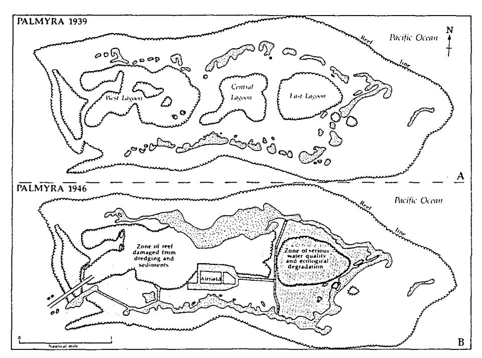

**Figure 8.** Adverse effects of dredge-and-fill operations at Palmyra Atoll, U.S. Line Islands. Pre-World War II construction of road causeways around East Lagoon by the U.S. Navy completely blocked circulation, causing collapse of coral reef communities. Dredging of a channel through the western and between the central and east lagoons destroyed reefs and altered water circulation. Sediments drifting west from the dredge-and-fill areas probably damaged reef communities off the western end of the atoll. By 1979, some of the northern causeways had breached, restoring some exchange between the East Lagoon and the ocean. Observations in 1987 revealed only partial recovery of the reefs from the military construction (after Dawson 1959; Maragos 1979b, 1987).

migratory and nesting seabirds, such as the case at Johnston Atoll (Amerson and Shelton 1976). The edges of fill land are often the sites of colonization by mangroves and seagrasses in soft sediments and by corals on elevated or rocky surfaces (see U.S. Army Corps of Engineers, Honolulu District 1983; U.S. Army Corps of Engineers, Pacific Ocean Division 1986) such as the revetments for airfields and harbors and the temporary dikes or causeways for dragline dredging in Pohnpei.

Patterns of colonization by reef organisms on the submerged sides of fill structures are similar to those observed on dredged surfaces. Reef fishes are often attracted to the interstitial crevices and holes between the armor stone and riprap for the shelter they provide. Consequently, revetments are popular recreational fishing sites. Generally, less colonization by corals, algae, and fish occurs on vertical hard surfaces (quarry walls, sheetpiling, bulkheads, seawalls), but community development can still be substantial, based on examples at Waianae, Nawiliwili, and Honokohau Harbors in Hawaii and Auasi, Aunu'u, Ta'u, and Ofu Harbors in American Samoa (Maragos 1983a). Ecological recovery and succession appears more diverse and rapid where colonizing surfaces are located near clear and turbulent waters, such as on outer breakwaters and wave absorbers. Also, recolonization at the toes of revetments or other hard surfaces, which are subject to considerable scour or abrasion from the combined effects of wave action and sediments in motion, tends to be inhibited (Helfrich 1975; Maragos 1974a).

#### *Effects of Roadway or Causeway Construction*

The construction causeways or roads over marine habitat is a form of filling. Road causeways can have substantial effects if they block water circulation to valuable aquatic habitats or degrade water quality. At Palmyra Atoll (Figure 8), road causeways completely blocked exchange of lagoon waters to the open ocean causing the catastrophic collapse of lagoon ecosystems (Dawson 1959); 20 and 30 years later some recovery was reported in the lagoon after waves and currents breached several sections of the causeways (Maragos 1979b, 1988).

Similar causeways have been constructed to connect small coral islands by road on the windward sides of atolls, including Canton in Kiribati (Smith and Henderson 1978), Tarawa in Kiribati (Johannes et al. 1979), and Majuro in the Marshalls. In these examples, ecological impacts included reduction of water exchange, aggravated water pollution from sewage discharges, and blockage of migratory pathways used by reef fishes. Additional causeways are now being constructed on Kwajalein Atoll (U.S. Army Corps of Engineers, Honolulu District 1986) to facilitate human and population redistribution, but measures such as adequate sideslope protection, bridge openings, and culverts may not be included to reduce water quality and ecological impacts (Figure 9). Causeway construction at Majuro Atoll (see Rosti 1989) to connect islands may cause water levels to rise on ocean reefs due to wave set up and may cause shoreline erosion.

Conversely, dredging large channels through closed atolls may lower lagoon water levels, exposing shallow reef flats and killing associated reef organisms (Maragos 1989; Figure 10). This may help explain the reduced lagoon coral development observed at Canton by Henderson et al. (1978).

Road projects around the high islands of the Carolines and Samoa have also caused considerable damage. A large roadway constructed across a reef flat at Weno (Moen) Island, Chuuk (Figure 6) blocked off circulation to Pou Bay, the most important estuary and subsistence fishery habitat on the island. Raw sewage discharges from villages at the shoreline of the bay aggravated water pollution, potentially contaminating shellfish and generating public health hazards. Treatment of the sewage and improvements to the causeway included enlarging the culverts and significantly improving water exchange and bay water quality, but it took considerable effort to convince reluctant engineers and government officials of the value of installing the culverts at the extra expense.

Coastal road construction around the islands of Pohnpei and Kosrae required a number of "borrow" sites on nearby reef flats to obtain fill and aggregate, and mangroves, seagrasses, and coral reefs were diked and dredged. In an effort to reduce the length of roadways and their costs, "shortcuts" were constructed across the mouths of small embayments, blocking circulation on the landward side within mangroves and estuaries. Also, road alignments were often located on the shoreline to avoid costly construction and roadcuts into steep erodible volcanic rock and soils. The large causeway to connect the port and airfield to the town of Kolonia, Pohnpei has blocked circulation to much of Kolonia Bay, has decreased water quality, has increased sedimentation, and has also chocked off one mangrove area. A similar causeway at Kosrae (Figure 11) to connect the main island to Lelu, a populated offshore island, reduced circulation and water quality in Lelu Harbor, substantially reducing fish and shellfish catches in what used to be Kosrae's most productive estuarine and reef habitat, based on interviews with village fishermen (U.S. Army Corps of Engineers, Pacific Ocean Division 1989).

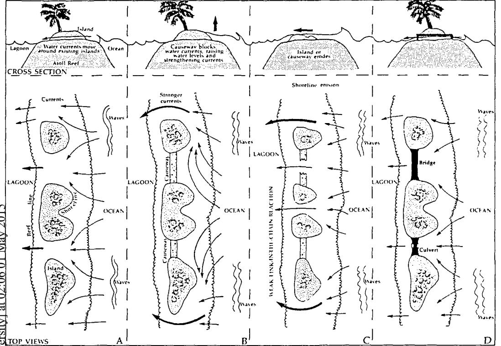

Figure 9. Possible response of water current and island configurations to causeway road fills to connect islands along a windward atoll reef: A. Natural configuration before causeway construction. Waves push water currents over the reef into the lagoon; B. After construction causeways cause current to deflect and strengthen. Water levels are pushed higher against islands and causeways by waves; C. Eventually currents and waves break through lowest lying portions of causeways or islands, causing erosion; D. Impacts can be eliminated by placing culverts or bridges continuously through the causeway sections to maintain diffuse current flow between islands and to reduce sea level rise from wave setup.

#### *Effects of Airfield and Urban Landfills*

Proliferation of fills for houselots, pig pens, and outhouses (termed *benjos)* in several urban centers in the Carolines have encroached on valuable mangroves, reducing water quality and subsistence catches and increasing the risk of sanitation and public health problems. Eventually, the degraded mangrove habitat is often considered less valuable and becomes vulnerable to additional landfill expansion. In the case of Pohnpei Island, much of the landfilling was prompted by increased immigration from outer islands and facilitated by the availability of heavy equipment left on the islands from previous governmentsponsored construction projects. So far, there is little long-range planning to ensure proper sanitation, waste disposal, shore protection, and water supply for these new coastal settlements.

Fill lands that extend offshore and lie on or adjacent to sandy beaches often function as large groins that cause beach and shoreline erosion on the downdrift sides of the fill structures. At Kualoa (Hawaii), groins constructed to protect waterfront houses disrupted longshore transport of sand and caused many hectares of public beach park erosion 1-2 km down the coast (Devaney et al. 1976).

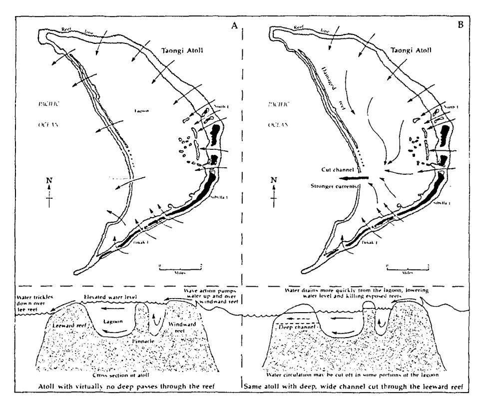

**Figure 10.** Possible adverse effects of cutting channels through semi-enclosed atoll lagoons. Many atolls (such as Taongi, which is pictured) have elevated lagoon water level because of wave action pumping water over windward reefs and the lack of large, deep channels to drain the excess water. The reefs grow above normal ocean sea level because of constant water flow and in response to higher lagoon water level. Cutting a deep channel through such an atoll reef would cause waters to drain more quickly, lowering lagoon water level and killing emergent reefs (after Maragos 1989).

Waikiki Beach has now been reduced to a series of seawalls and groin fields to protect what is Hawaii's most important tourist attraction. In addition to the obvious aesthetic impacts of the structures, beach sand must now be periodically trucked in to replace sand lost to erosion. Placement of hotels and a natatorium too close to the shoreline caused and compounded the problem by requiring more groins to be built at adjacent stretches to the beach to protect other property. The sand placed along Waikiki Beach continually works its way into deeper offshore waters, smothering corals.

A more dramatic example outside the Pacific but in nearby Indonesia occurs at Kuta beach (Figure 3) on Bali, where the construction of a large airfield at right angles to the beach and projecting *V\** km offshore created a giant groin and has caused over 300 m of beach erosions up to 2 km downdrift from the airfield. Much of the airfield was constructed offshore to reduce the amount of existing land needed for the airfield. However, millions of dollars of damage and destruction to restaurants, hotels, and residences has occurred. Erosion continues to this day and has prompted considerable investment in shore protection structures, further degrading what beach habitat remains. Setting back the runway and damageable properties away from the shoreline (Figure 3) could have avoided these economic and environmental impacts (Burbridge and Maragos 1985).

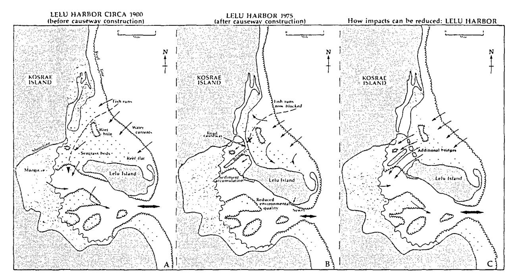

**Figure 11.** Adverse effects of causeway construction between Lelu and Kosrae Islands, Federated States of Micronesia. Original causeway blocked circulation and fish runs into inner Lelu Harbor, leading to a decline in seagrasses and fish catches. The main culvert in the causeway was later blocked for runway fill expansion, further reducing circulation, fish yields, water quality, and seagrasses and coral reefs in Lelu Harbor, once Kosrae's most valuable fishery. Impacts could have been reduced or avoided by adding a continuous line of culverts through the causeway, replacing a section of the causeway with a bridge, and unblocking the main culvert (adapted from Manoa Mapworks 1987; U.S. Army Corps of Engineers 1989).

Offshore runway construction next to Pala Lagoon, American Samoa (Figure 2) was also pursed due to the difficulty of securing sufficient land to place the airport on land. As with the Bali airfield, the offshore airfield at Pala Lagoon resulted in shoreline erosion adjacent beach areas and also modified water circulation and reduced water quality in the lagoon (Figure 2). Harbors, even small ones, can cause similar groin effects on beaches, such as occurred next to Aunu'u and Auasi Harbors in American Samoa and at Eneu Island at Bikini Atoll. In the last case, dock construction for the nuclear testing program in the 1940s has exposed an ancient 3,000-year-old shoreline village site on the eroding downdrift side of the beach (Streck 1986, 1987; Bikini Atoll Rehabilitation Committee 1986).

## *Ciguatera Fish Poisoning*

Dredging, filling, and other physical changes to habitats in the tropics have been implicated as causes for the increased incidence and outbreaks of ciguatera fish poisoning (Randall 1958; Withers 1982). The poisoning is caused by a toxic dinoflagellate, *Gambierdiscus toxicus,* which grows on macroscopic algae that are eventually consumed by fish. The herbivores are eaten by carnivorous fish with the toxin passed up the food chain. Although mildly toxic to fish, ciguatera is much more toxic to mammals, including man (see Withers 1982; Yasumoto et al. 1977). Considerable research has been accomplished by the Japanese and French on the causes, symptoms, and distribution of ciguatera, especially in French Polynesia where it is especially prevalent. There is considerable circumstantial evidence for a relationship between ciguatera and construction at Palmyra (Figure 8), Johnston, and Bikini atolls: Fish poisoning was not a problem prior to construction, but heavy outbreaks occurred during and after construction (Bikini Atoll Rehabilitation Committee 1987; Halstead and Schall 1958; Helfrich et al. 1968; Randall 1980). However, in many other situations, reef disturbance was not associated with ciguatera (Anderson and Lobel 1978; Lobel et al. 1988).

## *Timing of Construction Projects*

Although no specific construction projects can be cited, construction impacts can be more severe during certain seasons when the life stages of some organisms are more sensitive. For example, construction activity during seasons at sites used by nesting sea turtles and sea birds can cause greater disturbance and mortality to offspring and adults. The larval stages of some coral species may be more sensitive to sedimentation than adult stages of the same species during certain months of the year (Robert Richmond, personal communication). Construction activity can be sited and scheduled to reduce or avoid these types of impacts.

## **Recommendations for Further Environmental Research for Coastal Construction in Oceania**

#### *Evaluation of Completed Projects on Coral Reefs*

A systematic evaluation of completed coastal construction projects in Oceania of different age, size, design, and location would be very helpful in identifying the successes and failures of project influences on important coral reefs. Since 1970, many of these projects involved collection of preconstruction environmental baseline data as part of the environmental impact assessment or planning process. Water quality, current studies, and biological and aerial photographic analysis might be incorporated into some studies to broaden the evaluation of impacts and their duration. This research could lead to improvements in the siting and design of future structures to minimize adverse impacts and maximize enhancement or positive impacts through preparation of a design manual for engineers and construction contractors. Project categories would include docks, harbors, quarry and dredge sites, airfield landfills, roadways and causeways, shore protection structures of various designs, culverts, and bridges.

#### *Monitoring of Coastal Construction*

Scientists independent of the construction contractor, such as those affiliated with environmental consultants, universities, or a regulatory agency, should monitor water quality and ecological effects during construction to ensure the environment is being adequately protected. The monitoring team should accomplish monitoring quickly to ensure immediate feedback to the construction contractor and regulatory authority in order that corrective action, if any, can be taken. Monitoring the ecological health and water quality conditions near project sites immediately before, during, and after their construction will provide the feedback to construction contractors and supervisors necessary for the modification of construction procedures to reduce adverse impacts. Experience with monitoring will also enhance the design and quality of future monitoring and construction projects. Identifying the threshold values of turbidity and suspended sediment concentrations in seawater that cause ecological damage (to corals, fish, seagrasses, etc.) could assist in the establishing of water quality criteria and standards for use in controlling the impacts of dredging and filling on nearby coral reefs (e.g., Aecos 1985; Sullivan and Gerritsen 1972). Ecological monitoring techniques before, during, and after construction should include transect or quadrat surveys of corals, fish, benthic plants, and other important marine invertebrates. The same sites should be resurveyed and facilitated by establishing permanent markers at each survey site. Data collected by divers on site should be supplemented with photographic and video survey data.

#### *Use of Explosives in Construction*

A systematic evaluation of techniques used for explosive excavation and quarrying may help to identify and establish standard operating procedures to limit ecological impacts from the use of explosives for coastal construction projects in the tropics. Variables to be studied could include explosives of different types, quantities, configurations (open water, loaded in drill holes, covered with sandbags, etc.), and depths; their impact on corals, fish, invertebrates, marine mammals, marine reptiles, and other organisms; and the efficacy of various precautions to reduce concussion and shock effects. Test sites could consist of a few proposed construction projects where explosives are needed for different types of excavation and where damage to coral reefs may be unavoidable. Refer to Kaly and Jones (1988, 1989, 1990) for current information on blasting impacts on coral reefs.

## **Recommendations for Planning and Management of Coastal Construction Projects to Minimize Ecological Impacts**

#### *Planning Team Membership and Participation*

An ecologist or other environmental scientist should be a member of the team of engineers, planners, and other decisionmakers involved in the scoping of problems, planning objectives, and design of proposed coastal construction projects. The team should evaluate a full range of alternative sites and designs. This practice is now widely used in the United States for major coastal construction projects but needs to be more frequently used in the developing Pacific Island nations.

#### *Environmental Surveys*

Ecological baseline surveys, including as a minimum, qualitative reconnaissance surveys possibly followed by more detailed quantitative biological, water quality, and current studies, should be required for all alternative sites potentially feasible for a proposed project. A major goal of such studies would be to site projects away from valuable ecosystems. Once a site is selected, additional surveys may be needed if significant impacts may still occur. See the following ecological and management manuals for more details: Carpenter and Maragos 1989; Conant et al. 1983; Dahl 1981; Gilbert ed. 1983; Hamilton and Snedaker 1984; Kenchington and Hudson 1988; Maragos et al. 1983a,b; Odum 1976; Stoddart and Johannes 1978.

# *Environmental Impact Assessment*

An environmental impact assessment (EIA) process should be initiated after project feasibility is established but long before decisions are made on the siting, magnitude, and design of a project. The EIA analysis and documentation should include the following:

- (a) a description of the purpose and need for a project;
- (b) an evaluation of the different options (including sites and designs) that can achieve the goal or solve the planning problems and objectives;
- (c) a description of the environment to be affected, with and without the project;
- (d) an analysis of the environmental consequences of each alternative, including a comparison among alternatives; and
- (e) a listing of measures or precautions that can be incorporated into the project to reduce or avoid impacts including environmental monitoring.

A scoping meeting at the earliest (feasibility) stage of the project would help to determine the extent of the analysis, studies, alternatives, mitigation, monitoring, and public involvement needed for the EIA process and documentation. The EIA documentation should also be circulated in draft form among the public and other organizations for comment prior to being revised. The completely coordinated EIA with review comments should be submitted to the decisionmaker for review prior to the decision on the construction project. Refer to Ahmad and Sammy (1985) and Carpenter and Maragos (1989) for recent reviews of EIA techniques applicable to developing countries.

## *Regulatory Permits*

Many territories and countries in Oceania have established permit procedures designed to control the effects of construction projects on the environment. If not established, a simple but effective permitting authority should be established independent of the authority proposing or sponsoring the construction project. The regulatory process should include evaluating the need for an EIA, public involvement (including a public meeting if requested), special conditions to protect the environment as a part of the permit, monitoring the

construction to ensure permit compliance, and enforcement actions against those responsible for projects not permitted or not conforming to permit conditions. The regulatory process should include access to a small group of qualified professionals trained in appropriate fields (marine biology, oceanography, public health, environmental engineering, archaeology, vegetation, ornithology, etc.).

## *Environmental Protection Plan*

The construction contractor should be required to prepare and conform to an environmental protection plan (EPP), which identifies procedures to minimize ecological, water quality, and other environmental impacts resulting from dredging, filling, blasting, and other construction procedures. Valuable sites to be protected should also be mapped and identified in the plan. If a regulatory authority is involved, the EPP should be submitted to it for review and approval to ensure compliance with permit requirements. The completed EPP then needs to be incorporated into the construction plans and specifications to be used by the construction contractor.

## *Postconstruction Environmental Audit*

Scientists should assess the completed project to determine the accuracy and effectiveness of the environmental assessment (which by necessity must be prepared before the project is built), monitoring programs, environmental precautions, and so forth and to determine whether remedial action and construction is needed to eliminate unforeseen environmental problems. The results of the audits can also measurably improve the accuracy and effectiveness of environmental assessments and other related activities for future similar construction projects.

#### *Policies on Siting Projects in the Coastal Zone*

As a general policy, decisionmakers should allow only the siting of projects in the coastal zone that require or depend on water or coastal access (for example, ports). If nonwater-dependent projects must be sited along the coast, they should be designed in a manner to avoid direct and indirect effects on valuable ecosystems and major modification of coastal currents, sediment transport, and other nearshore processes.

## **Long-Range Planning and Management for Coastal Resources**

Coastal area management has also been referred to as *coastal zone management* when it is important to differentiate the coastal and inland areas of large islands or continents and *coastal resource management,* which focuses on selected marine habitats, terrestrial habitats, and species or coastal functions warranting preferential attention, particularly on smaller islands. It is beyond the scope of this review to assess the status and value of coastal area management initiatives in the islands of Oceania. However, they should be mentioned because of enhanced opportunities for research and environmental protection associated with long-range coastal development within broader regions. Often the impact of an individual project such as a single small house fill, is inconsequential. However, if a number of similar independent actions are occurring within a larger area, their cumulative impacts could be substantial. Furthermore, future development opportunities may be known or identified sufficiently in advance to get a head start on long-range land use and associated

coastal planning to accommodate future economic growth efficiently while also accommodating the conservation and protection of valuable coastal ecosystems that could be affected by such development. Thus, coastal area management can provide the framework where future coastal development can be planned and executed in a manner compatible with ecological, social, and cultural values.

Activities often associated with coastal area management include the inventorying of coastal resources (see Maragos and Elliott 1985), identification of future development potential, a public involvement program, establishment of policies and guidelines, acquiring legislative judicial and administrative authorities to manage the coast, developing coastal management plans, and implementing them either by a single agency or a group of agencies and organizations working as a team.

In the U.S.-affiliated Pacific islands, coastal area management programs have been established in Hawaii, Guam, American Samoa, and Northern Mariana Islands and are being developed in Kosrae and the Marshall Islands. Fiji, New Zealand, and Australia also have well-established programs. The reader is referred to the following additional sources of information for details (Board on Science and Technology for International Development 1981; Clark 1985, 1988; Maragos et al. 1983b). Coastal area management seems particularly relevant to Oceania since most of the region is dominated by waters and small islands where the coastline is no more than a few kilometers from the most interior island locations (Maragos 1986). Islands and coastal ecosystems are particularly vulnerable to changes because they are small and isolated compared to continental counterparts and because the consequences of poor development are more severe. For these reasons, coastal area management provides additional assurances and dimensions for protecting coastal ecosystems and their economic, subsistence, recreational, and cultural value. Such programs could be established at the country level and implemented at the atoll or island level and need only be as complex as required to address significant issues, for example, future development and coastal construction.

Systematic ecological and water quality monitoring, as a part of a coastal area management program, could focus on long-term regional trends and patterns rather than on short-term project specific impacts. On high islands, for example, streams and nearshore monitoring regimes could be established to supplement offshore regimes and the temporary regimes in support of construction projects. Such monitoring programs could help to differentiate the impacts of coastal activities from those of upland development. Coastal area management can have the regional perspective and long-term funding sources to best support comprehensive regional monitoring programs (e.g., Craik and Dutton 1987).

## **Acknowledgements**

I want to thank Sandie Dela Cruz, Eiko Cusick, Laurel Lynn Indalecio, Chris Cabacungan, and Margo Stahl for assistance during preparation of the report, and Chuck Birkeland, Peter Rappa, Caroline Rogers, E. Alison Kay, and several anonymous reviewers for their review comments and encouragement. The U.S. Army Corps of Engineers, Pacific Ocean Division, and the University of Hawaii Environmental Center provided word processing, and the East-West Center, Program on Environment, provided financial support for the graphics and word-processing support. This review was partially supported by a grant to Lawrence Hamilton from the John D. and Catherine T. MacArthur Foundation.

# **References**

- Aecos, Inc. 1985. Biological reconnaissance of marine benthic communities in the vicinity of the Barbers Point Deep Draft Harbor construction project. U.S. Army Engineer Division, Pacific Ocean, Ft. Shafter, Honolulu.
- Aecos, Inc. 1986. Final report, water quality monitoring study, Barbers Point Deep-Draft Harbor, Oahu, Hawaii. U.S. Army Engineer Division, Pacific Ocean, Ft. Shafter, Honolulu.
- Ahmad, Y. J., and G. K. Sammy. 1985. *Guidelines to environmental impact assessment in developing countries: United Nations Environment Program.* Hodder and Stoughton: London.
- Ahrens, J. P., and F. Camfield, 1989. Dynamic revetments. Coastal Engineering Research Center, Information Exchange Bulletin, VOL CERC-89-2, U.S. Army Corps of Engineers, Waterways Experiment Station, Vicksburg, MI: September.
- Amerson, A. B., and P. C. Shelton, 1976. Natural history of Johnston Atoll, Central Pacific Ocean. *Atoll Research Bulletin* 192:1-479.
- Amesbury, S. S., M. W. Colgan, R. F. Myers, R. K. Kropp, and F. A. Cushing. 1981. Biological monitoring study of airport runway expansion site, Moen, Truk, Eastern Caroline Islands, Part B: Construction phase. University of Guam Marine Laboratory Technical Report, no. 74, Mangilao, Guam.
- Amesbury, S. S., R. N. Clayshulte, T. A. Determan, S. E. Hedlund, and J. R. Eads. 1978. Environmental monitoring study of airport runway expansion site Moen, Truk, Eastern Caroline Islands, Part A: Baseline study. University of Guam Marine Laboratory Technical Report, no. 51, Mangilao, Guam.
- Anderson, D. M., and P. S. Lobel. 1987. The continuing enigma of ciguatera. *Biological Bulletin* 172:89-107.
- Bak, R. P. M. 1978. Lethal and sublethal effects of dredging on coral reefs. *Marine Pollution Bulletin* 2:14-16.
- Bikini Atoll Rehabilitation Committee. 1986. Report 5: Environmental assessment for the initial resettlement at Eneu Island, Bikini Atoll. Prepared for U.S. Congress in accordance with Public Law 97-257, Berkeley, CA.
- Bikini Atoll Rehabilitation Committee. 1987. Report 6: Preliminary environmental impact statement for the rehabilitation of soil at Bikini Atoll. Prepared for the U.S. Congress in accordance with Public Law 97-257, Berkeley, CA.
- Board on Science and Technology for International Development, Office of International Affairs and Ocean Policy Committee of National Research Council. 1981. *Coastal resources development and management needs of developing countries.* Washington, DC: National Academy Press.
- Brock, V. E., E. W. Van Heuklem, and P. Helfrich. 1966. An ecological reconnaissance of Johnston Island and the effects of dredging. Second Annual Report to the U.S. Atomic Energy Commission, Hawaii Inst. Mar. Lab. Tech. Rep., no. 11, Kaneohe, Hawaii.
- Brock, V. E., R. S. Jones, and P. Helfrich. 1965. An ecological reconnaissance of Johnson Island and the effects of dredging. Annual report to the U.S. Atomic Energy Commission, Hawaii Inst. Mar. Lab. Tech. Rep., no. 5, Kaneohe, Hawaii.
- Bryan, E. H. 1972. Life in the Marshall Islands. Pacific Science Information Center, B. P. Bishop Museum: Honolulu, HI.
- Burbridge, P. R., and J. E. Maragos. 1985. *Coastal resources management and environmental assessment needs for aquatic resources development in Indonesia.* Washington, DC: International Institute for Environment and Development.
- Carano, P., and P. C. Sanchez. 1974. *A complete history of Guam.* Rutland, VT: Charles E. Tuttle Co.
- Carpenter, R. A., and J. E. Maragos, eds. 1989. *How to assess environmental impacts on tropical islands and coastal areas.* University of Hawaii, Honolulu: Environment and Policy Institute, East-West Center.
- Casciano, F. M. 1974. Development of a submarine sand recovery system for Hawaii. University of Hawaii Sea Grant College Program Advisory Report, Honolulu.

- Chapman, G. A. 1979. Honolulu International Airport reef runway post-construction environmental impact report. Parsons, Honolulu, Hawaii:
- Cheney, D. P., J. H. Ives, and R. Rocheleau. 1982. Inventory of coastal resources and reefs of Moen Island, Truk Atoll. Prepared for U.S. Army Corps of Engineers, Pacific Ocean Division, Ft. Shafter, Hawaii.
- Clark, J. R. ed. 1985. Coastal resources management: Development case studies—Renewable resources information series coastal management publication no. 3. Prepared by Research Planning Institute, Inc., for U.S. National Park Service and U.S. Agency for International Development. Columbia, SC.
- Clark, J. R. 1988. Program development for management of coastal resources (draft). Coastal Management Publication No. 4. Prepared for the National Park Service and U.S. Agency for International Development by the Rosenstiel School of Marine and Atmospheric Sciences, University of Miami, Miami, Florida.
- Clayshulte, R. N., and W. J. Zolan. 1982. Water quality monitoring program, airport construction site, Moen Island, Truk, Trust Territory of the Pacific Islands, Part B: Construction. University of Guam Water and Energy Research Institute of the Western Pacific Technical Report No. 35, Mangilao, Guam.
- Conant, R., P. Rogers, M. Baumgardner, C. McKell, R. Dasmann, and P. Reining, eds. 1983. *Resource inventory and baseline study methods for developing countries.* Washington, DC: American Association for the Advancement of Science.
- Craik, W., and I. Dutton. 1987. Assessing the effects of sediment discharge on the Cape Tribulation fringing coral reefs. *Coastal Management* 15:213-228.
- Dahl, A. L. 1980. Regional ecosystems survey of the South Pacific area. Tech Paper 179, South Pacific Commission, Noumea, New Caledonia.
- Dahl, A. L. 1981. Coral reef monitoring handbook. South Pacific Commission, Noumea, New Caledonia.
- Dawson, E. Y. 1959. Changes in Palmyra Atoll and its vegetation through the activities of man 1913-1958. *Pacif. Naturalist* 1(2):1-51.
- Day, W. C, W. G. Wnuk, C. C. McAneny, K. Sakai, and D. C. Harris. 1975. Project Tugboat: Explosive excavation of a harbor in coral. Rep No. EERL-TR-E-72-23, U.S. Army Engineer Waterways Experiment Station, Explosive Excavation Research Lab, Livermore, CA. CO365J1.
- Devaney, D., G. S. Losey, and J. E. Maragos. 1975. A marine biological survey of proposed construction sites for the Truk runway. Prepared for Ralph M. Parsons Co., Honolulu, HI.
- Devaney, D. M., M. Kelly, P. J. Lee, and L. S. Motteler. 1976. *Kaneohe: A history of change (1788-1950).* Honolulu, HI: Bernice P. Bishop Museum.
- Environmental Consultants, Inc. 1979. Water circulation study: Pou Bay, Moen Island, Truk, trust territory of the Pacific Islands. Prep. for U.S. Army Engineer Division Pacific Ocean, Honolulu.
- Evans, C. W., and C. L. Hunter. 1992. Kaneohe Bay, an update on recovery and trends to the contrary. 7th International Coral Reef Symposium, Agana, Guam.
- Evans, C. W., J. E. Maragos, and P. F. Holthus. 1986. Reef corals in Kaneohe Bay six years before and after termination of sewage discharges. *Coral Reef Population Biology, Hawaii Institute of Marine Biology Tech. Rep.* 37:76-90.
- Fosberg, R. F., ed. 1965. Man's place in the island ecosystem: A symposium. Tenth Pacific Science Congress, Honolulu, Hawaii, 21 August-6 September 1961. Honolulu, HI: Bishop Museum Press, Honolulu.
- Gilbert, J. T. E., ed. 1983. Technical environmental guidelines for offshore oil and gas development. East-West Environment and Policy Institute. Tulsa, OK: Penn Well Books.
- Grigg, R. W., and S. J. Dollar. 1990. Natural and anthropogenic disturbance on coral reefs. In *Coral Reefs,* ed. Z. Dubinsky, 439-452. B. V. Amsterdam: Elsevier Science Publishers, B. V.
- Halstead, B. W., and D. W. Schall. 1958. A report on the poisonous fishes of the Line Islands. *Acta Tropica* 15(3): 193-223.

- Hamilton, L. D., and S. C. Snedaker. 1984. Handbook for Mangrove Area Management. Environment and Policy Institute, East-West Center, Honolulu, Hawaii; International Union for the Conservation of Nature and Natural Resources, Gland, Switzerland; and United Nations Educational, Scientific and Cultural Organization, Paris, France.
- Helfrich, P. 1973. An assessment of the expected impact of a dredging project proposed for Pala Lagoon, American Samoa. University of Hawaii Sea Grant Technical Report UNIHI-SEAGRANT-TR-76-02, Honolulu.
- Helfrich, P. 1975. An assessment of the expected impact of a dredging project for Pala Lagoon, American Samoa. University of Hawaii Sea Grant College Program Technical Report UNIHI-SEAGRANT-TR-76-02.
- Helfrich, P., ed. 1979. Proceedings of the seminar/workshop on utilization and management of inshore marine ecosystems of the tropical Pacific Islands, 24-30 November 1979. University of the South Pacific, Suva, Fiji and University of Hawaii Sea Grant Cooperative Report UNIHI-SEAGRANT-CR-82-01.
- Helfrich, P., Piyakarchana, and P. Miles 1968. Ciguatera fish poisoning: Part I. The ecology of ciguatera reef fish in the Line Islands. B. P. Bishop Museum, Occasional Papers, Honolulu 23(14):305-369.
- Henderson, R. S., P. L. Jokiel, S. V. Smith, and J. G. Grovhoug. 1978. Canton Atoll Lagoon Physiography and General Oceanographic Observations. In *An Environmental Survey of Canton Atoll Lagoon,* 1973 (Smith and Henderson, eds). Naval Undersea Center Technical Center Technical Publication NUC TP 395, 1976) and Atoll Res. Bull 221 (1978).
- Hezel, F. S., and M. L. Berg. 1979. Winds of change: A book of readings on Micronesian history. Trust Territory of the Pacific Islands EAA Title IV-C.
- Hodgson, G. 1989. *The effects of sedimentation on Indo-Pacific reef corals.* Ph.D. dissertation, Dept. of Zoology, University of Hawaii, Honolulu, unpubl.
- Hollett, K. J. 1977. *Shoaling of Kaneohe Bay, Oahu, Hawaii in the period 1927 to 1976 based upon bathymetric, sedimentological, and geographical studies.* M.S. thesis, University of Hawaii, Honolulu.
- Hunter, C. L. and C. W. Evans, 1993. *Reefs in Kaneohe Bay Hawaii: Two centuries of western influence and two decades of data.* Submitted manuscript.
- Johannes, R. E. 1972. Coral reef pollution. In M. Riuvo, ed. *Marine Pollution and Sea Life,* FAO, Rome, pp 364-375.
- Johannes, R., W. Kimmerer, R. Kinzie, E. Shiroma, and T. Walsh. 1979. The impacts of human activities on Tarawa lagoon. Prepared for South Pacific Commission, New Caledonia.
- Kaly, U. L., and G. P. Jones. 1988. The construction of boat channels across coral reefs: A preliminary assessment of biological impact and review of related literature. Report Number 1, An Environmental Assessment of the Impact of Reef Channels in the South Pacific. Prep for New Zealand Ministry of External Relations and Trade Zoology Department, University of Auckland, New Zealand.
- Kaly, U. L., and G. P. Jones. 1989. The construction of boat channels across coral reefs: Results of an initial survey of reef-associated communities at Niutao (Tuvalu) Dec 1988-Jan 1989. Report Number 2, An Environmental Assessment of the Impact of Reef channels in the South Pacific. Prep for New Zealand Ministry of External Relations and Trade. Zoology Dept. University of Auckland, New Zealand.
- Kaly, U. L., and G. P. Jones. 1990. The construction of boat channels by blasting on coral reefs: Immediate effects of blasting and broad scale survey of channels on three islands in Tuvalu. Report Number 3, An Environmental Assessment of the Impact of Reef channels in the South Pacific. Prep for New Zealand Ministry of External Relations and Trade. Zoology Dept, University of Auckland, New Zealand.
- Kenchington, R. A., and B. E. T. Hudson. 1988. Coral Reef Management handbook. UNESCO, Jakarta, sec. ed.
- Kinsey, D. W. 1988. Coral reef system response to some natural and anthropogenic stresses. *Galaxea* 7:113-128.

- Lamberts, A. E., and J. E. Maragos. 1989. Observations on the reef geomorphology and corals of Majuro Atoll, Republic of the Marshall Islands. In Majuro Atoll coastal resource inventory, in preparation by the University of Hawaii Sea Grant Program for the U.S. Army Engineer Division, Pacific Ocean, Honolulu, Hawaii.
- Levin, J. 1970. A literature review of the effects of sand removal on a coral reef community. University of Hawaii Sea Grant College Program, Honolulu Technical Report UNIHI-SEAGRANT-TR-71-01:78 pp.
- Lobel, P. S., D. M. Anderson, and M. Durant-Clement. 1988. An assessment of ciguatera dinoflagellate populations: sample variability and algal substrate selection. *Biol. Bull.* 175:94-101.
- Losey, G. S. 1973. Study of environmental Impact for Kwajalein Missile Range. Prepared for U.S. Army Engineer Division, Pacific Ocean, Honolulu, Hawaii, Contract DACA84-73-C-0008 to the University of Hawaii.
- Loya, Y. 1975. Possible effects of water pollution on the community structure of Red Sea corals. *Marine Biology* 29:177-185.
- Loya, Y., 1976. Recolonization of Red Sea corals affected by natural catastrophes and man-made perturbations. *Ecology* 57:278-289.
- Maragos, J. E. 1972. A study of the ecology of Hawaiian reef corals. Ph.D. dissertation, University of Hawaii, Honolulu.
- Maragos, J. E. 1974a. Surveys of benthic reef communities off the Waianae coast near Pokai Bay (Oahu). Prepared for Oceanic Foundation, Makapuu, Hawaii.
- Maragos, J. E. 1974b. Coral transplantation: A method to create, preserve, and manage coral reefs. University of Hawaii Sea Grant College Program Advisory Report No. UNIHI-SEAGRANT-AR-74-03.
- Maragos, J. E. 1979a. Environmental surveys five years after offshore marine sand mining operations at Keauhou Bay, Hawaii. Prep. for University of Hawaii Sea Grant College Program, Honolulu.
- Maragos, J. E. 1979b. Palmyra Atoll: Preliminary environmental survey and assessment. Prep for U.S Departments of State and Energy. U.S. Army Corps of Engineers, Pacific Ocean Division, Honolulu.
- Maragos, J. E. 1982-1983. Field notes, Johnston Atoll. U.S. Army Corps of Engineers, Pacific Ocean Division, Honolulu.
- Maragos, J. E. 1983a. The Status of Reef Coral Populations in Honokohau Small Boat Harbor 1971-1982. In *A Decade of Ecological Studies Following Construction of Honokohau Small Boat Harbor,* U.S. Army Corps of Engineers, Honolulu District.
- Maragos, J. E. 1983b. Field survey of offshore clamshell operations, auger holes, and spoil disposal slip operations, Barbers Point Deep Draft Harbor. U.S. Army Engineer Division, Pacific Ocean, (PODED-PV), Ft. Shafter, Honolulu.
- Maragos, J. E. 1983c. Trip Report—Field inspection of Okat airfield and dock project site, 1-2 March 1983, Kosrae State, Trust Territory of the Pacific Islands (TTPI). U.S. Army Engineer Division, Pacific Ocean, Honolulu (PODED-PV).
- Maragos, J. E. 1983d. Trip Report—Johnston Atoll, July 1982 and October 1983. U.S. Army Engineer Division, Pacific Ocean, Honolulu (PODED-PV).
- Maragos, J. E. 1984a. Observations of stony corals and reefs at Bikini Atoll, Republic of the Marshall Islands. Unpubl. ms.
- Maragos, J. E. 1984b. Trip-Report—Kosrae airfield and dock project at Okat (TTPI) and followup meeting with Navy OICC, Guam. U.S. Army Engineer Division, Pacific Ocean, Honolulu (PODED-PV).
- Maragos, J. E. 1986. Coastal resource development and management in the U.S. Pacific Islands I. Island-by-island Analysis, and II Legislative and Administrative Remedies. Prep. for Office of Technology Assessment, U.S. Congress, Wash D.C.
- Maragos, J. E. 1987. Observations of corals and reefs at Palmyra Atoll, Line Islands, Unpubl. ms. U.S. Army Corps of Engineers, Pacific Ocean Division, Honolulu.
- Maragos, J. E. 1988. Corals and reef formations at Majuro Atoll, Republic of the Marshall Is-

- lands. In Majuro Atoll coastal resource inventory. J. E. Maragos, K. Des Rochers, and P. J. Rappa (eds). University of Hawaii Sea Grant Extension Service, Honolulu, in press.
- Maragos, J. E. 1989. Description of reefs and corals for the 1988 protected area survey of the Northern Marshall Islands. Accepted, Atoll Res. Bull.
- Maragos, J. E., M. Bender, K. M. Santerre, and R. Baker. 1983a. Ecological aspects of offshore oil and gas development. In Technical Environmental Guidelines for Offshore Oil and Gas Development. J. T. E. Gilbert, ed. Penn Well Books, Tulsa, U.S.A. 105-169.
- Maragos, J. E., A. Soegiarto, E. D. Gomez, and M. A. Dow. 1983b. Development planning for tropical coastal ecosystems. In: Natural Systems For Development: What Planners Need to Know. R. A. Carpenter (ed)., MacMillan Publishing Co., New York and London, pp. 229- 298.
- Maragos, J. E., C. Evans, and P. Holthus. 1985. Reef corals in Kaneohe Bay six years before and after termination of sewage discharges. Proc. Fifth International Coral Reef Congress, Tahiti, (4): 189-194.
- Maragos, J. E., J. Roach, L. Bowers, D. E. Hemmes, R. F. L. Self, J. D. MacNeil, I. Ells, P. Omeara, J. Vansant, A. Sato, J. P. Jones, and D. T. O. Kam. 1977. Environmental surveys before, during, and after offshore marine sand mining operations at Keauhou Bay, Hawaii. University of Hawaii Sea Grant College Program Working Paper No. 28.
- Maragos, J. E., and M. E. Elliott. 1985. Coastal resource inventories in Hawaii, Samoa, and Micronesia. Proc. Fifth Internat. Coral Reef Congress, Tahiti, (5):577-582.
- Maragos, J. E., and R. M. Moncrief. 1982. Pre-blasting marine environmental survey (15-16 Nov 1982), Post blasting marine environmental survey (18-19 November 1982), post blasting and post Hurricane Iwa marine environmental observations (30 November 1982), and environ-mental observations before and after offshore channel blasting (21 Dec 1982) at Barbers Point, Oahu, Hawaii. U.S. Army Engineer Division, Pacific Ocean (PODED-PV) Ft Shafter, Honolulu.
- Odum, W. E. 1976. Ecological guidelines for tropical coastal development. IUCN Publication New Series No. 42. International Union for Conservation of Nature and Natural Resources, Morges, Switzerland.
- Oliver, D. L. 1989. The Pacific Islands, 3rd edition. University of Hawaii Press, Honolulu.
- Penn, N. 1979. Personal communication to J. E. Maragos in Fiji, January 1979.
- Polunin, N. V. C. 1983. The marine resources of Indonesia. *Oceanogr. Mar. Biol. Ann. Rev.* 21:455-531.
- Purcell, D. C., Jr. 1967. Japanese Expansion in the South Pacific, 1890-1935. Ph.D. dissertation, University of Pennsylvania.
- Randall, J. E. 1958. A review of ciguatera tropical fish poisoning with a tentative explanation of its cause. *Bull. Mar. Sci. Gulf Caribb.* 8:236-267.
- Randall, J. E. 1980. A study of ciguatera at Enewetak and Bikini, Marshall Islands, with notes on the systematics and food habits of ciguatoxic fishes. *Fish Bull.* 78(2):201-249.
- Rogers, C. S. 1990. Responses of coral reefs and reef organisms to sedimentation. *Marine Ecology Progress Series* 62:185-202.
- Rosti, P. 1989. In: Majuro Atoll coastal resource inventory, University of Hawaii Sea Grant Program for the U.S. Army Engineer Division, Pacific Ocean, Honolulu, Hawaii.
- Roy, K. J. 1970. Change in bathymetric configuration, Kaneohe Bay, Oahu, 1882-1969. University of Hawaii Institute of Geophysics Report 70-15.
- Saenger, R. P., E. J. Hegerl, and J. D. S. Davie, eds. 1983. Global status of mangrove ecosystems. Commission on Ecology Papers No. 3. Gland, Switzerland. International Union for Conserva-tion of Nature and Natural Resources (IUCN). The Environmentalist 3 (1983). Supplement No. 3.
- Salvat, B., ed. 1987. Human impacts on coral reefs: facts and recommendations. Antenne de Tahiti Museum E.P.H.E. Papetoai, Moorea, French Polynesia.
- Schlapak, B. T., and J. B. Herbich. 1978. Characteristics of coral and coral dredging. Texas A and M University Sea Grant College Program, TAMU-SG-78-207.

- Schumacher, H. 1988. Development of coral communities on artificial reef types over 20 years (Eilat, Red Sea). Proc. 6th Internat. Coral Reef Symp., Townsville 3:379-384.
- Smith, S. V., and R. S. Henderson, eds. 1978. An environmental Survey of Canton Atoll lagoon 1973. *Atoll Research Bulletin* 221.
- South Pacific Commission. 1973. Regional Symposium on Conservation of Nature—Reefs and Lagoons, Proceedings and Papers, Noumea, New Caledonia, 5-14 August 1971.
- South Pacific Regional Environmental Programme (SPREP). 1981. Country Reports 1980-1981 South Pacific Commission, Noumea, New Caledonia.
- South Pacific Regional Environment Programme (SPREP). 1982. Report of the Conference on the Human Environment in the South Pacific, Rarotonga, Cook Islands, 8-11 March, 1982.
- Stafford-Smith, M. G., and R. F. G. Ormond. 1992. Sediment-Rejection Mechanisms of 42 Species of Australian Scleractinian Corals. *Australian Journal of Marine and Freshwater Research* 43:683-705.
- Stafford-Smith, M. G. 1993. Efficiency of 22 Species of Australian Scleractinian Corals. *Marine Biology* 115:229-243.
- Stoddart, D. R., and R. E. Johannes, (eds.) 1978. Coral reefs: research methods. United Nations Educational, Scientific and Cultural Organization, Paris. Printed by Page Brothers (Norwich) Ltd., UK.
- Streck, C. F., Jr. 1986. Interim report: Archaeological Investigations on Eneu Island, Bikini Atoll, Republic of the Marshall Islands. Appendix D of Bikini Atoll Rehabilitation Committee Supplementary Document No. 1, Berkeley, California.
- Streck, C. F., Jr. 1987. Archaeological Reconnaissance of Bikini Atoll. Appendix B. Bikini Atoll Rehabilitation Committee Supplementary Document No. 2, Berkeley California.
- Sullivan, S. P., and F. Gerristsen. 1972. Dredging operations monitoring and environmental study, Kawaihae harbor, Hawaii. University of Hawaii James K. K. Look Laboratory of Oceanographic Engineering Technical Report No. 25.
- Sunn, Low, Tom, and Hara. (1975) Nawiliwili Small Boat harbor post-construction survey. Prepared for U.S. Army Corps of Engineers, Pacific Ocean Division, Honolulu.
- Titgen, R. H., A. M. Orcutt, and P. J. Rappa. 1988. Marine Environment Assessment Report on United States Army leased lands at Kwajalein Atoll. Prepared for the U.S. Army Corps of Engineers, Pacific Ocean Division by the University of Hawaii Sea Grant Extension Service, Honolulu.
- U.S. Army Corps of Engineers, Coastal Engineering Research Center. 1984. Shore Protection Manual. Stock No. 0822-00077, US Government Printing Office, Washington D.C., 2 vols.
- U.S. Army Corps of Engineers, Honolulu District. 1983. A decade of ecological studies following construction of Honokohau Small Boat Harbor, Kona, Hawaii.
- U.S. Army Corps of Engineers, Honolulu District. 1986. Environmental Statement for the Kwajalein Causeway project, Republic of the Marshall Islands. Operations Br., Honolulu.
- U.S. Army Corps of Engineers, Pacific Ocean Division. 1979. Help Yourself: A Shore Protection Guide for Hawaii. Ft Shafter, Honolulu, Hawaii.
- U.S. Army Corps of Engineers, Pacific Ocean Division. 1986. Environmental evaluation of coral dredging and sand mining near Kolonia, Pohnpei Island, State of Ponape, Federated States of Micronesia. Prepared for Governor of Pohnpei and the Pohnpei Dredging Task Force. Environmental Resources Section, Honolulu.
- U.S. Army Corps of Engineers, Pacific Ocean Division. 1989. Kosrae coastal resources inventory: narrative report. Environmental Resources Section (PODED-PV) Ft. Shafter, Hawaii.
- U.S. Army Corps of Engineers, Waterways Experiment Station. 1989. Engineering Manuals: deep draft navigation; flood control channels; and shallow draft navigation. Vicksburg, Mississippi.
- U.S. Army Corps of Engineers, Waterways Experiment Station, Environmental Laboratory. 1985- 1989. Environmental Effects of Dredging Technical Notes (EEDTN) Vicksburg, Mississippi.
- U.S. Army Engineer Division, Pacific Ocean, 1989. Kosrae Coastal Resource Inventory. Environmental Resources Section, Honolulu.

- U.S. Department of the Navy, Bureau of Yards and Docks. 1947. Building the Navy's Bases in World War II. Washington D.C., U.S. Govt. Printing Office, 2 vols.
- United Nations Educational, Scientific and Cultural Organization (UNESCO). 1980. Marine and coastal processes in the Pacific: ecological aspects of coastal zone management. Papers presented at UNESCO Seminar, Univ. Papua New Guinea, 14-17 July 1980.
- UNEP/IUCN. 1988. Coral reefs of the World. Volume 3: Central and Western Pacific Bibliographies. United Nations Environment Program, Regional Seas Directories and Bibliographies. IUCN Gland, Switzerland and Cambridge U.K./UNEP Nairobi, Kenya.
- United Nations Environment Program (UNEP). 1983. Action Plan for monitoring the natural resources and environment of the South Pacific Region. UNEP Regional Seas Reports and Studies No. 29, Geneva, Switzerland.
- Valencia, M. J. ed. 1981. Proceedings of the workshop on coastal area development and management in Asia and the Pacific. Manila, Philippines, 3-12 December, 1979. East-West Center Book, University Press of Hawaii, Honolulu.
- Withers, N. W. 1982. "Ciguatera fish poisoning." *Ann Rev. Med.* 33:97-111.
- Wood, J. F., and R. E. Johannes, eds. 1975. Tropical Marine Pollution. Elsevier, Scientific Publishing Co., Amsterdam, Oxford, and New York; pp 13-51; 68-74.
- Woodbury, D. O. 1946. Builders for battle—How the Pacific Naval Air Bases were constructed. E. P. Dutton and Co., Ltd., New York.
- Yasumoto, T., I. Nakajima, R. Bagnis, and R. Adachi. 1977. Finding of a dinoflagellate as a likely culprit of ciguatera. *Bull. Japan Soc. Sci. Fish* 43:1021-1026.
- Yelverton, J. T., D. R. Richmond, E. R. Fletcher, and R. K. Jones. 1973. Safe distances from underwater explosions for mammals and birds. Prepared for the U.S. Defense Nuclear Agency. Report No. DNA3114T.
- Yelverton, J. T., D. R. Richmond, W. Hicks, K. Saunders, and E. R. Fletcher. 1975. Relationship between fish size and their response to underwater blasts. Prepared for the U.S. Defense Nuclear Agency. Report No. DNA3677T.
- Young, G. A., ed. 1977. Proceedings of the second conference on the environmental effects of explosives and explosions (13-14 October 1976). U.S. Naval Surface Weapons Center, Report NSWC-WOL, Silver Springs, MD.