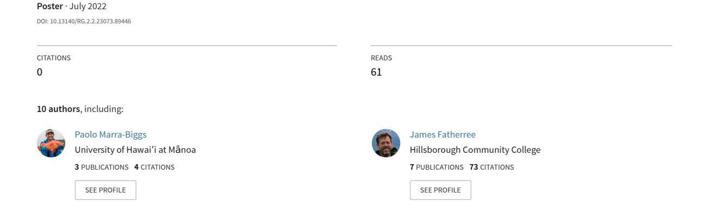
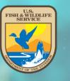
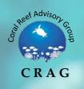
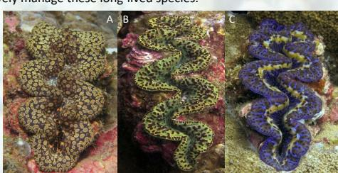
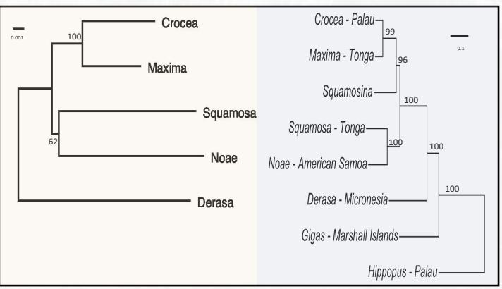
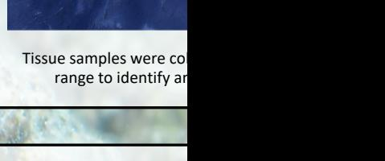
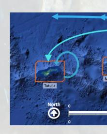
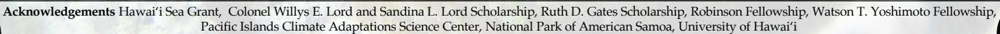

## [A Comparative Phylogenetic Investigation of Tridacninae: a](https://www.researchgate.net/publication/366840417_A_Comparative_Phylogenetic_Investigation_of_Tridacninae_a_Mitochondrial_vs_Nuclear_Analysis?enrichId=rgreq-1a82bcdb35988f6d09de3bc71f538a3d-XXX&enrichSource=Y292ZXJQYWdlOzM2Njg0MDQxNztBUzoxMTQzMTI4MTExMDg4MzEwNEAxNjcyNzc2MzI5MzM0&el=1_x_3&_esc=publicationCoverPdf) Mitochondrial vs Nuclear Analysis

# **A Comparative Phylogenetic Investigation of Tridacninae: a Mitochondrial vs Nuclear Analysis**

P. Marra-Biggs1, X. Velkeneers2, M. Kochzius3, J. Fatherree4, C. Riginos5, A. Green6, G. Coward7, A. Lawrence8, Emily Conklin1, R. Toonen1

- 1 Hawai'i Institute of Marine Biology, Marine Biology, Kāne'ohe, United States
- 3 Vrije Universiteit Brussel, Marine Biology, Brussels, Belgium
- 5 The University of Queensland, Marine Biology, St. Lucia, Queensland, Australia 7 Department of Marine and Wildlife Resources, Coral Reef Advisory Group, Pago Pago, American Samoa
- 2 Reneco International Wildlife Consultants LLC, Abu Dhabi, United Arab Emirates
- 4 Hillsborough Community College, Tampa, Florida, United States
- 6 Marine Conservation and Management Consultant, Brisbane, Australia 8 Bangor University, Bangor, Wales, United Kingdom

**Overview**: Here we apply a a restriction-associated DNA sequencing approach (RAD-seq) to investigate the taxonomic classification of Tridacninae giant clams (genera: *Hippopus and Tridacna*) and address the phylogenetic discordance within the current literature, particularly in the subgenus *Chametrachea*. We compared mitochondrial and nuclear genomes to assess the accuracy of the preexisting phylogenies. Our study's resulting mitochondrial phylogeny is congruent with the tree constructed in Fauvelot et al 2020 and Tan et al 2021. Using the program 'Seanome', we built preliminary nuclear phylogenies which are incongruent with existing mitochondrial trees*.* 

## **First Record of Tridacna Noae in American Sāmoa**

P. Marra-Biggs, J. Fatherree, A. Green,, R. Toonen, 2022 (*In review*)

The most recent study of the status of giant clams in the Samoan Archipelago [was published ov](https://www.researchgate.net/publication/366840417)er 20 years ago, without molecular corroboration of visual identifications. Using morphologic characteristics and ez-RAD genetic techniques, we identified the existence of *Tridacna noae* in the Samoan archipelago, presenting the first observation and a resulting range expansion. Accurately identifying the extant species in the archipelago is the first step towards a much-needed population status assessment to effectively manage these long-lived species.

*Tridacna noae* (A) from Tutuila, American Sāmoa, showing the teardropshaped spots on the edge of the mantle with the typical golden ring, and the lack of a distinct row of eyes. *Tridacna maxima* (B and C) shows considerable variation in the color on the mantle, but a row of eyes along the periphery of the mantle is a distinctive character. (B) *T. maxima* and (C) a blue variant of *T. maxima* from Tutuila, American Sāmoa for comparison highlighting the row of eyes at the upper mantle's margin and lacking the ringed spots.

# *Mitochondrial Phylogeny Nuclear Phylogeny*

## *Simplified Phylogenies*

Simplified species trees were constructed with reduced representation to visualize taxonomic relationships across taxa. Phylogenetic trees were constructed using RAxML using the GTR GAMMAI model with rapid bootstrap and best-scoring Maximum likelihood tree, over 1000 iterations.

## **Proposal: Investigating Population Connectivity in American Sāmoa**

We aim to conduct a systematic population assessment of the giant clam species that includes current stock estimates, genetic validation of extant species, symbiont-species-depth association study and archipelago-wide connectivity assessment. Collectively, these data will establish a scaffold of information to be used in a systematic evaluation to support evaluation of the ESA listing petition.

View publication stats

